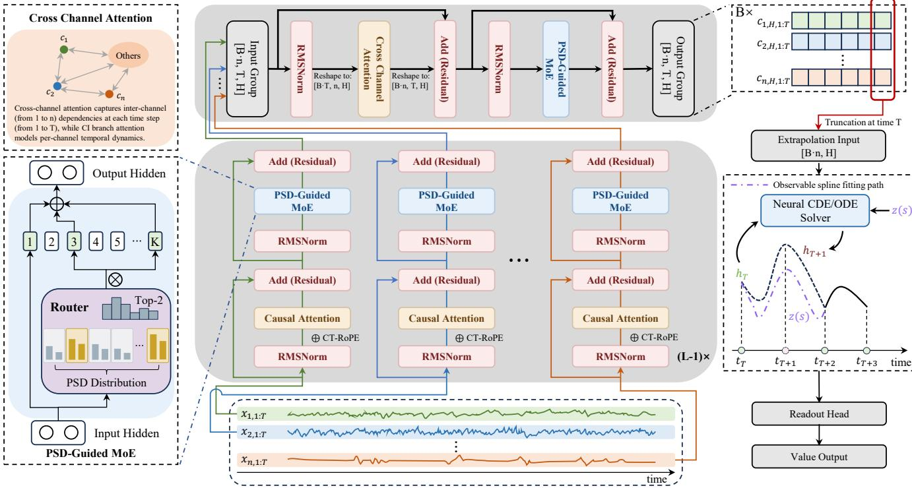
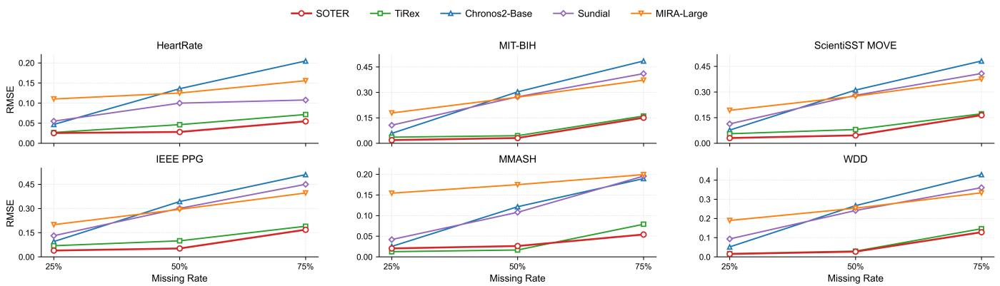
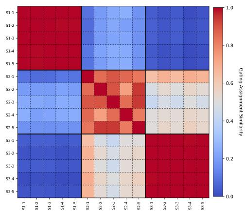
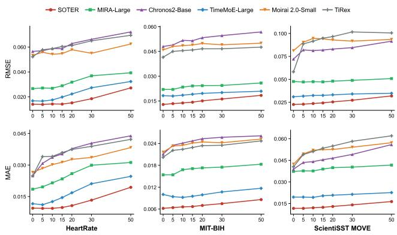
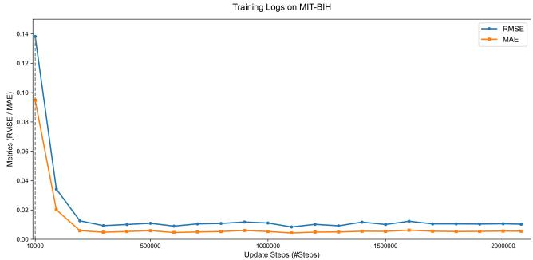
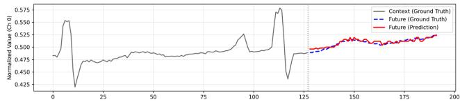
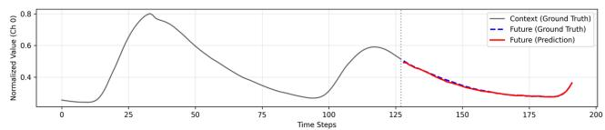
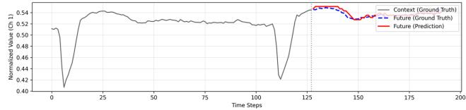

# SOTER: A Generative Time-Series Foundation Model for Wearable Human Physiological Signals

Fangke Chen School of Integrated Circuits, Zhejiang University Hangzhou, China Shanghai Innovation Institute Shanghai, China fkchen@zju.edu.cn

Wei Chen School of Software Engineering, Huazhong University of Science and Technology Wuhan, China lemuria\_chen@hust.edu.cn

## Abstract

Time-series foundation models have demonstrated strong crossdomain transfer, yet their common architectural assumptions remain poorly aligned with wearable physiological signals, which are multichannel, irregularly sampled, noisy, and governed by coupled continuous-time dynamics spanning distinct spectral scales. We present SOTER, a generative foundation model for wearable physiological time series that unifies cross-channel coupling, spectrumguided expert specialization, and continuous-time latent evolution within a single pre-training framework. SOTER combines a spatial feature-aware backbone that models inter-signal dependencies, a power spectral density (PSD)-guided mixture-of-experts layer that routes representations to experts associated with fixed spectral bands through an inspectable, non-learned rule, and a neural controlled diferential equation decoder that supports prediction and imputation at arbitrary timestamps. We pre-train SOTER on 226 billion time points from five public physiological datasets and evaluate the same pre-trained model across out-of-distribution zero-shot forecasting, frozen-encoder linear-probe classification, and continuous-time imputation on wearable benchmarks. SOTER achieves the best RMSE on 4 of 6 datasets and the best MAE on 5 of 6 in zero-shot forecasting, the highest average Macro-AUROC in classification, and the lowest imputation error on all six datasets at 75% missingness. It further remains robust to additive acquisition noise, matching or surpassing baselines evaluated on clean inputs even under the strongest corruption. These results indicate that domain-specialized foundation models for wearable physiology benefit from jointly modeling channel structure, spectral scale, and continuous-time dynamics1.

## 1 Introduction

Wearable sensors enable continuous and long-term monitoring of human physiological signals. Such signals—including electroencephalography (EEG) reflecting brain activity, photoplethysmography (PPG), electrodermal activity (EDA), and blood volume pulse

Sirry Chen   
School of Data Science, Fudan University   
Shanghai, China   
Shanghai Innovation Institute   
Shanghai, China   
siyuanchen25@m.fudan.edu.cn   
Zhongyu Wei   
School of Data Science, Fudan University   
Shanghai, China   
Shanghai Innovation Institute   
Shanghai, China   
zywei@fudan.edu.cn

(BVP)—provide complementary measurements ofhuman physiological states [11, 15]. Capturing the underlying patterns within these signals through large-scale representation learning can support downstream tasks such as emotion recognition and seizure detection [16, 41], enabling earlier anomaly warning and more timely clinical action [25, 50]. In practice, however, physiological data collected across populations, devices, and institutions often exhibit substantial distributional diferences [58], while privacy regulations such as GDPR further constrain cross-region data aggregation [51]. These conditions motivate a domain-specialized time-series foundation model that can be pre-trained on de-identified public data and transferred across datasets and tasks with limited downstream adaptation.

Time-series foundation models (TSFMs) provide a basis for such unified modeling. Generalist TSFMs have advanced through multimodal inputs, flexible generative objectives, and sparse mixtureof-experts (MoE) architectures [34, 53, 57], but they are primarily designed around generic time-series assumptions. Most retain channel independent processing [42], employ learned expert routing whose specialization emerges implicitly during optimization, or operate on discrete temporal grids. Recent medical and wearable TSFMs have begun to incorporate domain-specific designs: Pa-PaGei pre-trains unified representations for the PPG modality [43]; MIRA incorporates neural ordinary diferential equations (Neural ODEs) [7] and continuous-time rotary position encoding for irregular observations [27]; and NormWear introduces channelaware attention through a shared liaison token [36]. Nevertheless, existing approaches address only individual aspects of physiological modeling and do not jointly capture channel coupling, spectral specialization, and continuous-time generation within a unified pretraining framework. This gap reflects a broader mismatch between the assumptions of existing time-series models and the intrinsic structure of wearable physiological signals.

These physiological characteristics distinguish wearable signals from generic time series in three key ways. First, physiological channels are not independent signals; together, they provide complementary observations of a shared underlying state. State-dependent interactions exist among physiological systems such as the heart, respiratory system, and nervous system [5, 37]. Processing channels independently may therefore discard coordinated patterns that cannot be recovered from any single signal alone. Second, physiological dynamics span heterogeneous temporal and spectral scales. These scales interact with physiological states: heart rate, blood pressure, and respiration exhibit cross-scale dependencies, while diferent physiological rhythms show characteristic spectral patterns under varying states [1, 29]. Uniform transformations across these regimes may obscure scale-specific structures and force shared parameters to model substantially diferent dynamics. Third, physiological processes evolve continuously, whereas wearable devices capture them at discrete, often irregular, and incomplete timestamps. Such acquisition patterns lead to missing observations and reduced signal reliability in real-world wearable monitoring [8, 20]. Models restricted to fixed temporal grids cannot naturally query latent physiological states at arbitrary timestamps, limiting both future forecasting and causal imputation. Together, these properties motivate three requirements for a physiological foundation model: cross-channel coupling, spectrum-conditioned capacity allocation, and continuous-time state evolution.

To meet these requirements, we propose SOTER, a generative time-series foundation model for wearable human physiological signals. SOTER employs a spatial feature-aware backbone that preserves channel-specific temporal modeling in its lower layers and restores cross-channel interaction over high-level representations. It further introduces a power spectral density (PSD)-guided mixtureof-experts layer, whose non-learned routing rule associates experts with fixed spectral bands, providing frequency-grounded and inspectable specialization without an auxiliary routing loss. Finally, a terminal decoder based on neural controlled diferential equations (Neural CDEs) and Neural ODEs evolves the latent physiological state to arbitrary query timestamps, thereby supporting both future forecasting and causal imputation [7, 24]. These components are not independent add-ons: they respectively model the structure, spectral scale, and temporal evolution of the same latent physiological process within a unified generative objective. Our main contributions are as follows:

• We introduce SOTER, a domain-specialized generative timeseries foundation model for wearable physiological signals, pre-trained on 226 billion time points from five public physiological datasets. SOTER enables unified transfer across zero-shot forecasting, frozen-representation classification, and continuous-time imputation from a single pre-trained backbone.

• We develop a physiology-aware architecture that integrates cross-channel coupling, PSD-guided expert specialization, and continuous-time latent evolution, aligning model capacity with the structural, spectral, and temporal properties of physiological signals.

• Extensive experiments across six out-of-distribution wearable datasets demonstrate that SOTER achieves consistent improvements in zero-shot forecasting, frozen representation evaluation, and continuous-time imputation.

• We further analyze the source of SOTER’s transferability through corpus-matched pre-training comparisons and evaluations under noisy observations, limited supervision, and diferent pre-training exposures.

## 2 Related Work

## 2.1 Generalist Time-Series Foundation Models

Generalist TSFMs are pre-trained on large and heterogeneous corpora and have demonstrated strong zero-shot transfer across forecasting domains [14, 31, 33]. Recent architectures span multimodal inputs that combine rendered time-series images, text prompts, and raw signals [57], flow-matching objectives for flexible generative modeling [34], group attention for information sharing among related series [2], and sparse mixture-of-experts architectures for scalable capacity [32, 53]. Other representative families, including TimesFM [10], Moirai [30], MOMENT [13], TiRex [4], TTM [12], and Lag-Llama [45], further explore diverse forecasting and representation learning designs. Although several of these models support multivariate inputs or information sharing across related series, their dominant assumptions remain generic: observations are represented on discrete temporal grids, channel interactions are not designed around coupled physiological systems, and expert specialization, when present, is typically determined implicitly through learned routing. They therefore provide strong general-purpose baselines, but do not directly address the combined structural requirements of wearable physiological signals.

## 2.2 Medical Time-Series Models

Deep learning has advanced medical time-series analysis across forecasting, phenotyping, monitoring, diagnosis, and public-health surveillance [6, 17, 26, 28, 38, 44, 48, 59, 60]. Most conventional approaches, however, are optimized for a specific task, signal type, or clinical scenario, limiting their reuse across heterogeneous physiological datasets and downstream objectives. Recent medical and wearable TSFMs have begun to improve cross-domain transfer. Pa-PaGei [43] and Pulse-PPG [49] learn representations specialized for PPG; MIRA [27] incorporates Neural ODEs and continuous-time rotary position encoding to accommodate irregular observations; and NormWear [36] introduces a shared liaison token to capture relationships among wearable sensor channels.

These models address important subsets of the physiological modeling problem, but their capabilities remain complementary rather than unified. Modality-specific models do not provide generative modeling across heterogeneous physiological signals; continuous time medical models do not explicitly allocate capacity according to spectral content; and channel-aware representation models are not designed to support arbitrary-time forecasting and causal imputation through a shared generative decoder. SOTER instead unifies high-level cross-channel coupling, spectrum-conditioned expert specialization, and continuous-time generative decoding within a single pre-trained time-series model evaluated across forecasting, classification, and imputation.

## 3 Methodology

## 3.1 Problem Statement

We consider a collection of wearable physiological recordings, each comprising � channels observed at a shared, possibly irregularly spaced sequence of timestamps $t _ { 1 : T } ~ = ~ ( t _ { 1 } , \ldots , t _ { T } )$ ; the value of channel $c \in \{ 1 , \ldots , n \}$ at timestamp $t _ { i }$ is a scalar $x _ { c , i } .$ Given an observed history of wearable physiological recordings, SOTER is pre-trained in a generative fashion to predict the value at the next queried timestamp. An overview of the architecture is shown in Figure 1.

  
Figure 1: Overview of SOTER. The backbone consists of �−1 CI layers followed by one CD layer. The CI layers model the temporal dynamics of each channel independently, whereas the CD layer captures cross-channel dependencies over high-level representations. A terminal decoder based on Neural CDEs advances the latent state ℎ� to an arbitrary query time using a control path �(�) interpolated from the causal observation prefix. When the query lies beyond the observed interval and no control is available, the decoder reduces to a Neural ODE.

## 3.2 SOTER Architecture

3.2.1 Continuous-Time Input Encoding. Each scalar observation $\boldsymbol { x } _ { c , i }$ is first lifted to an �-dimensional embedding through a gated projection:

$$
h _ { c , i } ^ { 0 } = \left( \mathrm { S i L U } ( W _ { g } x _ { c , i } ) \right) \odot \big ( W _ { e } x _ { c , i } \big ) ,\tag{1}
$$

where $W _ { g }$ and $W _ { e }$ map the single input channel to the hidden width, and ⊙ denotes the elementwise product. To avoid premature crosschannel leakage, each channel is first treated as an independent univariate sequence in the lower layers [42]. Because physiological signals are frequently sampled at irregular intervals, discrete positional indices poorly reflect their temporal geometry; SOTER therefore employs continuous-time rotary positional encoding (CT-RoPE) [27], which rotates queries and keys by an angle proportional to the absolute timestamp rather than the token position.

3.2.2 Spatial Feature-Aware Backbone. The backbone stacks $L { = } 6$ pre-norm blocks, each employing multi-head attention with a perhead dimension of $d ;$ the attention operator is layer-dependent, with the first �−1 layers being channel-independent (CI) and a single high-level layer being channel-dependent (CD). Within each backbone block, the feed-forward sublayer is implemented as the PSD-guided mixture-of-experts module, while the attention sub layer follows the CI/CD design described above. In a CI layer, attention is applied independently to each channel sequence, whose hidden states form $U \overset { \cdot } { = } \left[ h _ { 1 } ; . . . ; h _ { T } \right] \in \mathbb { R } ^ { T \times H }$ , with $\bar { h _ { i } } \in \mathbb { R } ^ { H }$ denoting the representation at timestamp $t _ { i } ,$ using causal self-attention modulated by CT-RoPE:

$$
\begin{array} { r l } & { \mathcal { A } _ { i j } ^ { \mathrm { { C I } } } = h _ { i } ^ { \top } W _ { q } { \bf { R } } _ { \Theta , t _ { i } - t _ { j } } W _ { k } ^ { \top } h _ { j } , } \\ & { \quad \quad \quad \quad \quad \quad \quad \quad \quad \quad \quad \quad \quad \quad \quad \quad \quad \quad \quad } \\ & { \quad \quad \quad \quad \quad \quad \quad \quad \quad \quad \quad \quad \quad \quad \quad \quad \quad \quad \quad \quad \quad \quad \quad } \\ & { \quad \quad \quad \quad \quad \quad \quad \quad \quad \quad \quad \quad \quad \quad \quad \quad \quad \quad \quad \quad } \\ & { \quad \quad \quad \quad \quad \quad \quad \quad \quad \quad \quad \quad \quad \quad \quad \quad \quad \quad } \\ & { \quad \quad \quad \quad \quad \quad \quad \quad \quad \quad \quad \quad \quad \quad \quad \quad \quad \quad } \\ & { \quad \quad \quad \quad \quad \quad \quad \quad \quad \quad \quad \quad \quad \quad \quad \quad \quad } \\ & { \quad \quad \quad \quad \quad \quad \quad \quad \quad \quad \quad \quad \quad \quad \quad \quad \quad \quad } \\ & { \quad \quad \quad \quad \quad \quad \quad \quad \quad \quad \quad \quad \quad \quad \quad \quad \quad \quad \quad \quad } \\ & { \quad \quad \quad \quad \quad \quad \quad \quad \quad \quad \quad \quad \quad \quad \quad \quad \quad \quad \quad \quad \quad } \\ & { \quad \quad \quad \quad \quad \quad \quad \quad \quad \quad \quad \quad \quad \quad \quad \quad \quad \quad \quad } \\ & { \quad \quad \quad \quad \quad \quad \quad \quad \quad \quad \quad \quad \quad \quad \quad \quad }  \end{array}\tag{2}
$$

Here, $W _ { q } , W _ { k } , W _ { v } \in \mathbb { R } ^ { H \times d }$ are the query, key, and value projections, $\mathbf { R } _ { \Theta , t } \in \mathbb { R } ^ { d \times d }$ is the CT-RoPE rotary matrix whose rotation angle is determined by the absolute timestamp �, and Mask(·) is the causal mask that forbids attending to future timestamps. Equations (2) and (3) are written for a single head; the standard �-head extension $( M d = H ,$ with outputs mixed by $W _ { O } \in \mathbb { R } ^ { M d \times H } )$ is omitted.

In the CD layer, cross-channel coupling is restored, which is essential because the human body behaves as a strongly coupled dynamical system [5]. After channel-independent temporal modeling, representations are regrouped at each timestamp to restore cross-channel interaction. For a given timestamp, the channel rep resentations are denoted as $\tilde { U } = [ \tilde { h } _ { 1 } ; . . . \tilde { \nu } _ { n } ] \in \mathbb { R } ^ { n \times H }$ , where $\tilde { h } _ { a }$ represents the �-th channel. Full non-causal attention is then computed over the � channel tokens at each timestamp:

$$
\begin{array} { r l } & { \qquad \mathcal { A } _ { a b } ^ { \mathrm { \tiny { C D } } } = \tilde { h } _ { a } ^ { \top } W _ { \tilde { q } } W _ { \tilde { k } } ^ { \top } \tilde { h } _ { b } , } \\ & { \qquad \mathrm { A t t e n t i o n } ^ { \mathrm { \tiny { C D } } } ( \tilde { \mathbf { U } } ) = \mathrm { S o f t m a x } \left( \frac { \mathcal { R } ^ { \mathrm { \tiny { C D } } } } { \sqrt { d } } \right) \tilde { \mathbf { U } } W _ { \tilde { v } } . } \end{array}\tag{3}
$$

Here, $a , b \in \{ 1 , \ldots , n \}$ index the channels, and $W _ { \tilde { q } } , W _ { \tilde { k } } , W _ { \tilde { v } } \in \mathbb { R } ^ { H \times d }$ are the query, key, and value projections of the CD layer. No positional encoding or causal mask is applied along the channel axis, since channels carry no intrinsic ordering. Confining cross-channel attention to a single top layer keeps the $O ( n ^ { 2 } )$ cost over channels to one block, while letting it operate over refined, rather than shallow, temporal representations. When �=1, this layer falls back to standard channel-independent temporal attention, so SOTER transfers across recordings with diferent channel counts.

3.2.3 PSD-Guided Mixture-of-Experts. Prevailing MoE-based foundation models route tokens with a learned gate regularized by an auxiliary load-balancing loss [27, 53], so that expert assignment follows no explicit criterion and emerges only from training. SOTER instead derives routing directly from the spectral content of the latent representation, using a PSD-inspired statistic to provide an explicit frequency-aware criterion for expert assignment.For each latent trajectory, we maintain a strictly causal, �-point prefix discrete Fourier transform (DFT) [9] over the latent temporal index. Here, � denotes the current latent position and � denotes the historical index within the causal prefix. We then average its magnitude over the hidden dimension:

$$
X _ { t } ^ { ( d ) } ( k ) = \sum _ { \tau \leq t } h _ { \tau } ^ { ( d ) } e ^ { - \mathrm { j } 2 \pi k \tau / N } , { p } _ { t } ( k ) = \frac { 1 } { H } \sum _ { d = 1 } ^ { H } \left| X _ { t } ^ { ( d ) } ( k ) \right| .\tag{4}
$$

The transform is taken over latent temporal indices, i.e., on the normalized frequency axis of the latent trajectory. Absolute and possibly irregular timing is handled separately by CT-RoPE and the CDE decoder, so the router needs only a sampling-rate-invariant spectral-shape statistic rather than a physical-frequency spectrum, which keeps expert assignment consistent across the heterogeneous pre-training corpora.

The ⌊�/2⌋+1 frequency bins are partitioned into � contiguous bands $\{ \mathcal { B } _ { e } \}$ . The routing logit of expert � is the aggregated spectral magnitude within $\mathcal { B } _ { e } ,$ , from which the top-2 experts are selected and weighted:

$$
\begin{array} { l } { \displaystyle g _ { t , e } = \sum _ { k \in \mathcal { B } _ { e } } p _ { t } ( k ) , } \\ { \displaystyle r _ { t , e } = \frac { \exp \left( g _ { t , e } \right) } { \sum _ { e ^ { \prime } = 1 } ^ { E } \exp \left( g _ { t , e ^ { \prime } } \right) } \mathbf { 1 } \left[ e \in \mathrm { T o p K } ( g _ { t } , 2 ) \right] . } \end{array}\tag{5}
$$

The band-wise statistic $g _ { t , e }$ aggregates spectral magnitudes within $\mathcal { B } _ { e }$ ; magnitude accumulation avoids excessive amplification of dynamic ranges across bands. Because the routing statistic is com puted without gradients and the prefix transform depends only on past tokens, the assignment is deterministic, strictly causal, and free of any auxiliary balancing loss, so each expert is tied to a fixed spectral band by construction.

A shared expert acting on the sequence-averaged representation is finally added as a global residual:

$$
\mathrm { M o E } ( h _ { t } ) = \mathcal { E } _ { \mathrm { s h } } \left( \frac { 1 } { T } \sum _ { \tau } h _ { \tau } \right) + \sum _ { e \in \mathrm { T o p K } ( g _ { t } , 2 ) } r _ { t , e } \mathcal { E } _ { e } ( h _ { t } ) .\tag{6}
$$

This shared branch is a sequence-level residual rather than a pertoken causal path: it adds the mean over the window’s � tokens to every position. Since the prediction target $t _ { T + 1 }$ lies strictly after the entire window, every token entering this aggregate belongs to the causal prefix of the target, so the shared branch introduces no future leakage with respect to the prediction and remains consistent with the strictly causal prefix-DFT routing and causal attention used throughout.

3.2.4 Neural CDE Extrapolation Decoder. Autoregressive architectures generate under causal masking and cannot access the target timestamp at inference. To extrapolate to arbitrary timestamps, SOTER takes the state ℎ� at the last observed time $t _ { T }$ of each channel and evolves it to the target time $t _ { T + 1 }$ through a controlled continuous-time field. Unlike a Neural ODE [7], which depends only on time and state, the vector field of SOTER additionally receives an external control path �(�):

$$
\frac {  { \mathrm { d } } h ( s ) } {  { \mathrm { d } } s } = f _ { \theta } \left( s , h ( s ) , z ( s ) \right) , h ( t _ { T } ) = h _ { T } , s \in [ t _ { T } , t _ { T + 1 } ] .\tag{7}
$$

Here, $f _ { \theta }$ is a time-augmented multilayer perceptron (MLP) taking the concatenation $\left[ s ; h ( s ) ; z ( s ) \right]$ as input. The target state follows from numerical integration with an adaptive Dormand–Prince 5(4) solver (dopri5):

$$
h ( t _ { T + 1 } ) = h _ { T } + \int _ { t _ { T } } ^ { t _ { T + 1 } } f _ { \theta } { \big ( } s , h ( s ) , z ( s ) { \big ) } \mathrm { d } s ,\tag{8}
$$

from which a linear readout head produces the prediction $\hat { x } _ { T + 1 } =$ $W _ { o } h ( t _ { T + 1 } )$ .

During inference, the same continuous-time decoder supports two querying regimes through the control path $z ( s )$ . When the target timestamp lies within the span of observations, the decoder operates as a Neural CDE-style controlled regime [24]: the observed points are interpolated into $z ( s )$ by natural cubic splines, and the latent dynamics are steered by the observable signal. Although a natural cubic spline is a global interpolant, the spline for each queried point is fitted only on observations strictly before the prediction origin—later samples are physically excluded from the input rather than down-weighted by masking—so the control path remains strictly causal, consistent with the online streaming imputation setting. When no control is available beyond the observation span, we set $z ( s ) \equiv 0 { \mathrm { , } }$ and the decoder reduces exactly to a time-augmented Neural ODE [7]. We provide more details in Appendix D. A single continuous-time decoder thus unifies strictly causal extrapolation and observation-guided interpolation, which underpins the transferability of a single frozen SOTER across both forecasting and imputation.

## 3.3 Model Training

SOTER is pre-trained on the next-timestamp prediction task over a wearable physiological corpus of approximately 226 billion time points, assembled from five publicly available and de-identified datasets: MIMIC-III Waveform [22, 39], Sleep-EDF [23], PTB-XL [55, include Aurora [57], Sundial [34], Chronos-2 [2], TimeMoE [53], TimesFM [10], Moirai 2.0 [30], Moirai-MoE [32], MOMENT [13], TiRex [4], TTM [12], Timer [35], and Lag-Llama [45]. Medical and wearable TSFMs include MIRA [27] and NormWear [36], while TFC [61] serves as a physiological representation-learning baseline. For each downstream task, we select the subset of methods compatible with its evaluation protocol: discriminative representation models for classification, and models with generative or reconstruction capabilities for forecasting and imputation, as detailed in the corresponding result tables.

Table 1: Zero-shot forecasting on six out-of-distribution wearable datasets. Values are reported as $\mathrm { m e a n } _ { \pm s \mathrm { t d } }$ over four input/output window pairs $( 4 8 / 2 4 , 7 2 / 3 6 , 9 6 / 4 8 , 1 2 8 / 6 4 ) ;$ Timer is evaluated on the latter two only, due to its native configuration. Entries are rescaled by $1 0 ^ { 2 } .$ . Paras denotes parameters activated per inference step (millions), and SC and MC denote single- and multi-channel datasets. The best result is indicated by bold style with an asterisk (∗), while the second-best result is underlined.
<table><tr><td rowspan="2">Method</td><td rowspan="2">Paras</td><td rowspan="2">Source</td><td colspan="2">HeartRate (SC)</td><td colspan="2">MIT-BIH (MC)</td><td colspan="2">ScientiSST MOVE (MC)</td><td colspan="2">IEEE PPG (MC)</td><td colspan="2">MMASH (MC)</td><td colspan="2">WDD (MC)</td></tr><tr><td>RMSE</td><td>MAE</td><td>RMSE</td><td>MAE</td><td>RMSE</td><td>MAE</td><td>RMSE</td><td>MAE</td><td>RMSE</td><td>MAE</td><td>RMSE</td><td>MAE</td></tr><tr><td>Timer</td><td>84.14M</td><td>ICML&#x27;24</td><td> $8 . 9 0 { \scriptstyle \pm 1 . 2 6 }$ </td><td> $4 . 8 5 _ { \pm 0 . 5 2 }$ </td><td> $6 . 1 1 _ { \pm 0 . 2 5 }$ </td><td> $3 . 6 4 _ { \pm 0 . 0 1 }$ </td><td> $1 5 . 6 0 _ { \pm 0 . 0 1 }$ </td><td> $1 1 . 9 2 _ { \pm 0 . 0 1 }$ </td><td> $1 2 . 9 2 _ { \pm 0 . 5 4 }$ </td><td> $8 . 7 1 { \scriptstyle \pm 0 . 3 9 }$ </td><td> $2 . 9 1 _ { \pm 0 . 2 8 }$ </td><td> $2 . 1 9 _ { \pm 0 . 1 3 }$ </td><td> $3 . 3 2 _ { \pm 0 . 1 0 }$ </td><td> $2 . 7 0 { \scriptstyle \pm 0 . 0 9 }$ </td></tr><tr><td>TTM</td><td>0.805M</td><td>NIPS&#x27;24</td><td> $5 . 0 5 _ { \pm 0 . 8 4 }$ </td><td> $2 . 8 2 _ { \pm 0 . 5 2 }$ </td><td> $4 . 1 4 _ { \pm 0 . 1 1 }$ </td><td> $2 . 0 6 _ { \pm 0 . 1 0 }$ </td><td> $9 . 6 0 _ { \pm 0 . 0 9 }$ </td><td> $7 . 4 3 _ { \pm 0 . 2 1 }$ </td><td> $9 . 1 5 _ { \pm 0 . 2 0 }$ </td><td> $6 . 0 6 _ { \pm 0 . 2 4 }$ </td><td> $1 . 4 8 _ { \pm 0 . 4 4 }$ </td><td> $0 . 9 4 { \scriptstyle \pm 0 . 2 2 }$ </td><td> $2 . 0 7 _ { \pm 0 . 2 4 }$ </td><td> $1 . 6 0 _ { \pm 0 . 2 5 }$ </td></tr><tr><td>Lag-Llama</td><td>2.451M</td><td>ARXIV&#x27;23</td><td> $1 9 . 9 6 _ { \pm 0 . 3 2 }$ </td><td> $1 5 . 6 3 _ { \pm 0 . 1 3 }$ </td><td> $4 8 . 9 3 _ { \pm 0 . 0 9 }$ </td><td> $4 8 . 6 4 _ { \pm 0 . 0 9 }$ </td><td> $5 1 . 0 2 _ { \pm 0 . 3 7 }$ </td><td> $4 6 . 9 2 _ { \pm 0 . 4 0 }$ </td><td> $5 1 . 7 5 _ { \pm 0 . 0 9 }$ </td><td> $5 0 . 6 9 _ { \pm 0 . 1 0 }$ </td><td> $1 8 . 3 7 _ { \pm 0 . 0 9 }$ </td><td> $1 7 . 5 9 _ { \pm 0 . 0 7 }$ </td><td> $4 3 . 7 5 _ { \pm 0 . 1 8 }$ </td><td> $4 1 . 4 5 _ { \pm 0 . 0 1 }$ </td></tr><tr><td>TiRex</td><td>35.29M</td><td>NIPS&#x27;25</td><td> $5 . 2 2 _ { \pm 1 . 2 5 }$ </td><td> $2 . 4 9 _ { \pm 0 . 5 5 }$ </td><td> $4 . 1 5 _ { \pm 0 . 3 2 }$ </td><td> $2 . 0 2 _ { \pm 0 . 1 2 }$ </td><td> $5 . 8 2 _ { \pm 0 . 5 2 }$ </td><td> $4 . 0 5 _ { \pm 0 . 5 1 }$ </td><td> $8 . 9 3 _ { \pm 0 . 3 6 }$ </td><td> $5 . 3 5 _ { \pm 0 . 2 7 }$ </td><td> $0 . 3 7 _ { \pm 0 . 2 5 }$ </td><td> $0 . 1 6 _ { \pm 0 . 1 3 }$ </td><td> $\underline { { 0 . 9 8 } } _ { \pm 0 . 0 7 }$ </td><td> $0 . 7 7 _ { \pm 0 . 0 9 }$ </td></tr><tr><td>MOMENT-Large</td><td>341.3M</td><td></td><td> $6 . 3 3 _ { \pm 0 . 4 0 }$ </td><td> $3 . 3 6 _ { \pm 0 . 2 3 }$ </td><td> $4 . 2 3 _ { \pm 0 . 1 1 }$ </td><td> $2 . 2 1 _ { \pm 0 . 0 5 }$ </td><td> $9 . 7 4 _ { \pm 1 . 1 7 }$ </td><td> $7 . 9 0 _ { \pm 0 . 9 2 }$ </td><td> $1 0 . 6 0 _ { \pm 0 . 7 2 }$ </td><td> $6 . 6 1 _ { \pm 0 . 5 0 }$ </td><td> $0 . 6 9 _ { \pm 0 . 3 1 }$ </td><td> $0 . 3 1 _ { \pm 0 . 1 4 }$ </td><td> $1 . 2 8 _ { \pm 0 . 2 4 }$ </td><td> $0 . 7 0 _ { \pm 0 . 1 6 }$ </td></tr><tr><td>MOMENT-Base</td><td>109.6M</td><td>ICML&#x27;24</td><td> $6 . 9 4 _ { \pm 0 . 3 1 }$ </td><td> $3 . 8 2 _ { \pm 0 . 3 4 }$ </td><td> $4 . 8 0 _ { \pm 0 . 3 0 }$ </td><td> $2 . 5 2 _ { \pm 0 . 0 7 }$ </td><td> $9 . 8 5 _ { \pm 1 . 1 6 }$ </td><td> $7 . 7 6 { \scriptstyle \pm 0 . 9 6 }$ </td><td> $1 0 . 9 1 _ { \pm 0 . 8 2 }$ </td><td> $6 . 7 6 _ { \pm 0 . 5 5 }$ </td><td> $0 . 6 5 _ { \pm 0 . 3 0 }$ </td><td> $0 . 3 0 { \scriptstyle \pm 0 . 1 3 }$ </td><td> $1 . 3 3 { \scriptstyle \pm 0 . 2 8 }$ </td><td> $0 . 7 4 { \scriptstyle \pm 0 . 1 6 }$ </td></tr><tr><td>MOMENT-Small</td><td>35.34M</td><td></td><td> $6 . 5 9 _ { \pm 0 . 3 4 }$ </td><td> $3 . 4 7 _ { \pm 0 . 3 4 }$ </td><td> $4 . 3 8 _ { \pm 0 . 1 0 }$ </td><td> $2 . 3 0 { \scriptstyle \pm 0 . 0 5 }$ </td><td> $9 . 4 7 _ { \pm 1 . 2 2 }$ </td><td> $7 . 5 5 { \scriptstyle \pm 0 . 9 8 }$ </td><td> $1 1 . 0 6 _ { \pm 0 . 7 5 }$ </td><td> $6 . 8 4 _ { \pm 0 . 5 1 }$ </td><td> $0 . 7 1 { \scriptstyle \pm 0 . 3 0 }$ </td><td> $0 . 3 2 _ { \pm 0 . 1 5 }$ </td><td> $1 . 2 8 _ { \pm 0 . 2 7 }$ </td><td> $0 . 6 9 _ { \pm 0 . 1 5 }$ </td></tr><tr><td>MoiraiMoE-Base</td><td>935.1M</td><td></td><td> $7 . 0 0 _ { \pm 0 . 8 1 }$ </td><td> $3 . 4 3 _ { \pm 0 . 7 1 }$ </td><td> $5 . 4 7 _ { \pm 0 . 5 5 }$ </td><td> $2 . 5 0 _ { \pm 0 . 2 3 }$ </td><td> $1 3 . 1 8 _ { \pm 0 . 7 1 }$ </td><td> $9 . 2 5 _ { \pm 0 . 5 8 }$ </td><td> $1 1 . 6 8 _ { \pm 0 . 7 4 }$ </td><td> $7 . 0 6 _ { \pm 0 . 2 0 }$ </td><td> $0 . 7 9 _ { \pm 0 . 5 2 }$ </td><td> $0 . 3 0 { \scriptstyle \pm 0 . 1 9 }$ </td><td> $1 . 2 7 _ { \pm 0 . 1 0 }$ </td><td> $1 . 0 5 _ { \pm 0 . 0 4 }$ </td></tr><tr><td>MoiraiMoE-Small 117.0M</td><td></td><td>ICML&#x27;25</td><td> $7 . 3 0 _ { \pm 0 . 8 0 }$ </td><td> $3 . 6 5 _ { \pm 0 . 6 7 }$ </td><td> $5 . 2 5 _ { \pm 0 . 3 8 }$ </td><td> $2 . 4 1 _ { \pm 0 . 1 6 }$ </td><td> $1 3 . 4 3 _ { \pm 0 . 6 8 }$ </td><td> $9 . 6 0 _ { \pm 0 . 3 0 }$ </td><td> $1 2 . 0 2 _ { \pm 0 . 7 0 }$ </td><td> $7 . 1 6 _ { \pm 0 . 0 9 }$ </td><td> $0 . 7 7 _ { \pm 0 . 4 4 }$ </td><td> $0 . 3 0 _ { \pm 0 . 1 6 }$ </td><td> $1 . 2 5 _ { \pm 0 . 1 2 }$ </td><td> $1 . 0 4 _ { \pm 0 . 0 7 }$ </td></tr><tr><td>Moirai2.0-Small</td><td></td><td>11.39M Salesforce&#x27;26</td><td> $5 . 3 3 _ { \pm 0 . 2 8 }$ </td><td> $2 . 6 5 _ { \pm 0 . 4 0 }$ </td><td> $4 . 5 9 _ { \pm 0 . 4 7 }$ </td><td> $2 . 1 6 _ { \pm 0 . 1 7 }$ </td><td> $8 . 1 2 _ { \pm 0 . 4 4 }$ </td><td> $4 . 2 3 _ { \pm 0 . 1 3 }$ </td><td> $9 . 1 9 _ { \pm 0 . 8 1 }$ </td><td> $5 . 6 1 _ { + 0 . 3 8 } ^ { ~ \pm 0 . 0 7 }$   $5 . 6 1 _ { \pm 0 . 3 8 }$ </td><td> $0 . 3 2 _ { \pm 0 . 2 7 }$ </td><td> $0 . 1 2 _ { \pm 0 . 1 0 }$ </td><td> $1 . 0 7 _ { \pm 0 . 1 3 }$ </td><td> $0 . 8 9 _ { \pm 0 . 0 6 }$ </td></tr><tr><td>TimesFM 1.0</td><td>203.6M</td><td>ICML&#x27;24</td><td> $6 . 0 4 _ { \pm 1 . 0 0 }$ </td><td> $2 . 7 8 _ { \pm 0 . 3 7 }$ </td><td> $4 . 3 8 _ { \pm 0 . 0 9 }$ </td><td> $2 . 1 4 _ { \pm 0 . 0 6 }$ </td><td> $1 0 . 7 4 { \scriptstyle \pm 1 . 0 5 }$ </td><td> $7 . 9 4 _ { \pm 0 . 6 1 }$ </td><td> $8 . 6 0 _ { \pm 0 . 6 2 }$ </td><td> $5 . 3 0 { \scriptstyle \pm 0 . 0 9 }$ </td><td> $0 . 3 3 _ { \pm 0 . 0 5 }$ </td><td> $0 . 1 1 _ { \pm 0 . 0 3 }$ </td><td> $1 . 0 3 _ { \pm 0 . 1 4 }$ </td><td> $0 . 7 2 _ { \pm 0 . 0 8 }$ </td></tr><tr><td>TimesFM 2.0</td><td>498.8M</td><td></td><td> $6 . 4 6 _ { \pm 0 . 7 9 }$ </td><td> $3 . 0 7 _ { \pm 0 . 3 7 }$ </td><td> $4 . 4 2 _ { \pm 0 . 3 7 }$ </td><td> $2 . 0 9 _ { \pm 0 . 1 1 }$ </td><td> $1 1 . 0 2 _ { \pm 0 . 7 6 }$ </td><td> $8 . 0 9 _ { \pm 0 . 3 4 }$ </td><td> $9 . 2 4 _ { \pm 0 . 8 8 }$ </td><td> $5 . 6 7 _ { \pm 0 . 1 3 }$ </td><td> $\underline { { 0 . 2 3 } } _ { \pm 0 . 0 9 }$ </td><td> $\underline { { 0 . 0 8 } } _ { \pm 0 . 0 4 }$ </td><td> $1 . 0 0 { \scriptstyle \pm 0 . 1 2 }$ </td><td> $0 . 6 9 _ { \pm 0 . 0 3 }$ </td></tr><tr><td>TimesFM 2.5</td><td>231.3M</td><td>Google&#x27;25</td><td> $5 . 5 5 { \scriptstyle \pm 0 . 5 4 }$ </td><td> $2 . 4 8 _ { \pm 0 . 2 7 }$ </td><td> $4 . 1 1 _ { \pm 0 . 3 2 }$ </td><td> $1 . 9 7 _ { \pm 0 . 1 1 }$ </td><td> $1 0 . 8 7 _ { \pm 1 . 1 3 }$ </td><td> $7 . 8 6 _ { \pm 0 . 7 6 }$ </td><td> $8 . 7 9 _ { \pm 0 . 7 7 }$ </td><td> $5 . 3 5 { \scriptstyle \pm 0 . 1 8 }$ </td><td> $\mathbf { 0 . 0 8 ^ { * } } _ { \pm 0 . 0 4 }$ </td><td> $\mathbf { 0 . 0 3 ^ { * } } _ { \pm 0 . 0 2 }$ </td><td> $1 . 0 5 _ { \pm 0 . 1 6 }$ </td><td> $0 . 8 1 _ { \pm 0 . 1 0 }$ </td></tr><tr><td>TimeMoE-Large</td><td>453.2M</td><td>ICLR&#x27;25</td><td> $\underline { { 1 . 6 8 } } _ { \pm 0 . 6 7 }$ </td><td> $\underline { { 1 . 1 6 } } _ { \pm 0 . 3 2 }$ </td><td> $\underline { { 1 . 8 2 } } _ { \pm 0 . 1 1 }$ </td><td> $\underline { { 1 . 0 0 } } _ { \pm 0 . 0 3 }$ </td><td> $\underline { { 3 . 1 0 } } _ { \pm 0 . 0 9 }$ </td><td> $\underline { { 1 . 9 5 } } _ { \pm 0 . 0 7 }$ </td><td> $\mathbf { 1 . 7 7 ^ { * } } _ { \pm 0 . 0 7 }$ </td><td> $\underline { { 1 . 0 8 } } _ { \pm 0 . 0 1 }$ </td><td> $3 . 0 6 _ { \pm 0 . 2 4 }$ </td><td> $2 . 6 1 _ { \pm 0 . 2 0 }$ </td><td> $1 . 5 7 _ { \pm 0 . 0 7 }$ </td><td> $1 . 2 1 _ { \pm 0 . 0 3 }$ </td></tr><tr><td>TimeMoE-Base</td><td>113.3M</td><td></td><td> $1 . 8 5 _ { \pm 0 . 3 3 }$ </td><td> $1 . 3 0 _ { \pm 0 . 2 2 }$ </td><td> $2 . 1 5 _ { \pm 0 . 1 7 }$ </td><td> $1 . 3 9 _ { \pm 0 . 2 1 }$ </td><td> $3 . 5 1 _ { \pm 0 . 1 3 }$ </td><td> $2 . 2 2 _ { \pm 0 . 0 6 }$ </td><td> $\underline { { 1 . 7 9 } } _ { \pm 0 . 0 7 }$ </td><td> $1 . 1 4 _ { \pm 0 . 0 2 }$ </td><td> $3 . 3 1 _ { \pm 0 . 2 3 }$ </td><td> $2 . 6 5 _ { \pm 0 . 1 6 }$ </td><td> $2 . 1 6 _ { \pm 0 . 1 3 }$ </td><td> $1 . 6 7 _ { \pm 0 . 0 7 }$ </td></tr><tr><td>Chronos2-Base</td><td>119.5M</td><td>Amazon&#x27;25</td><td> $5 . 6 5 _ { \pm 1 . 0 1 }$ </td><td> $2 . 4 9 _ { \pm 0 . 4 0 }$ </td><td> $4 . 8 0 _ { \pm 1 . 1 9 }$ </td><td> $2 . 1 1 _ { \pm 0 . 3 4 }$ </td><td> $7 . 2 1 { _ { \pm 0 . 7 0 } }$ </td><td> $3 . 8 8 _ { \pm 0 . 2 5 }$ </td><td> $9 . 5 7 { \scriptstyle \pm 1 . 1 6 }$ </td><td> $5 . 7 9 _ { \pm 0 . 5 4 }$ </td><td> $\underline { { 0 . 2 3 } } _ { \pm 0 . 1 6 }$ </td><td> $0 . 1 0 { \scriptstyle \pm 0 . 0 5 }$ </td><td> $1 . 0 9 _ { \pm 0 . 0 7 }$ </td><td> $0 . 6 3 _ { \pm 0 . 1 5 }$ </td></tr><tr><td>Chronos2-Small</td><td>27.93M</td><td></td><td> $5 . 6 7 _ { \pm 0 . 3 0 }$ </td><td> $2 . 7 3 { \scriptstyle \pm 0 . 3 2 }$ </td><td> $4 . 5 4 _ { \pm 0 . 8 0 }$ </td><td> $2 . 1 1 _ { \pm 0 . 3 4 }$ </td><td> $1 0 . 4 5 _ { \pm 1 . 5 2 }$ </td><td> $7 . 1 7 _ { \pm 1 . 1 3 }$ </td><td> $9 . 4 7 _ { \pm 1 . 0 5 }$ </td><td> $5 . 7 7 { \scriptstyle \pm 0 . 5 6 }$ </td><td> $0 . 2 9 _ { \pm 0 . 1 7 }$ </td><td> $0 . 1 1 _ { \pm 0 . 0 6 }$ </td><td> $1 . 1 0 { \scriptstyle \pm 0 . 1 0 }$ </td><td> $0 . 6 4 _ { \pm 0 . 1 4 }$ </td></tr><tr><td>Sundial-Base</td><td>128.3M</td><td>ICML&#x27;25</td><td> $5 . 7 5 _ { \pm 1 . 0 1 }$ </td><td> $2 . 7 7 _ { \pm 0 . 3 3 }$ </td><td> $4 . 1 2 _ { \pm 0 . 1 9 }$ </td><td> $2 . 0 0 _ { \pm 0 . 0 5 }$ </td><td> $1 0 . 7 5 _ { \pm 0 . 5 8 }$ </td><td> $7 . 4 7 _ { \pm 1 . 4 9 }$ </td><td> $8 . 4 0 _ { \pm 0 . 4 8 }$ </td><td> $5 . 2 2 _ { \pm 0 . 0 7 }$ </td><td> $1 . 1 4 _ { \pm 0 . 3 2 }$ </td><td> $0 . 9 7 _ { \pm 0 . 2 5 }$ </td><td> $1 . 3 8 _ { \pm 0 . 1 4 }$ </td><td> $0 . 9 5 _ { \pm 0 . 1 4 }$ </td></tr><tr><td>Aurora</td><td>210.8M</td><td>ICLR&#x27;26</td><td> $7 . 1 3 _ { \pm 1 . 0 4 }$ </td><td> $3 . 9 7 _ { \pm 0 . 4 3 }$ </td><td> $5 . 1 0 _ { \pm 0 . 2 2 }$ </td><td> $2 . 6 1 _ { \pm 0 . 0 9 }$ </td><td> $1 3 . 7 9 _ { \pm 1 . 7 5 }$ </td><td> $1 0 . 6 9 _ { \pm 1 . 4 7 }$ </td><td> $1 0 . 3 0 _ { \pm 0 . 4 5 }$ </td><td> $6 . 5 2 _ { \pm 0 . 2 0 }$ </td><td> $1 . 9 9 _ { \pm 0 . 2 7 }$ </td><td> $0 . 8 1 _ { \pm 0 . 0 7 }$ </td><td> $1 . 1 7 _ { \pm 0 . 1 7 }$ </td><td> $\underline { { 0 . 6 2 } } _ { \pm 0 . 0 5 }$ </td></tr><tr><td>MIRA-Large</td><td>339.9M</td><td>NIPS&#x27;25</td><td> $2 . 6 6 _ { \pm 1 . 5 6 }$ </td><td> $1 . 8 5 _ { \pm 1 . 1 1 }$ </td><td> $2 . 2 0 { \scriptstyle \pm 0 . 1 4 }$ </td><td> $1 . 5 4 _ { \pm 0 . 1 2 }$ </td><td> $4 . 7 6 _ { \pm 0 . 1 6 }$ </td><td> $3 . 7 3 _ { \pm 0 . 1 2 }$ </td><td> $2 . 5 7 _ { \pm 0 . 0 6 }$ </td><td> $2 . 0 4 _ { \pm 0 . 0 1 }$ </td><td> $6 . 2 3 _ { \pm 0 . 2 4 }$ </td><td> $5 . 4 9 _ { \pm 0 . 2 7 }$ </td><td> $3 . 3 6 _ { \pm 0 . 0 3 }$ </td><td></td></tr><tr><td>SOTER</td><td>20.29M</td><td> ${ \bf 1 . 4 1 ^ { * } } _ { \pm 0 . 1 5 }$  /</td><td>0.95*±0.11 1.29*±0.22</td><td></td><td></td><td> $0 . 6 2 ^ { * } { \scriptstyle \pm 0 . 1 0 }$ </td><td></td><td>2.26*±0.12 1.17*±0.04</td><td> $2 . 1 9 _ { \pm 0 . 1 9 }$ </td><td> $1 . 0 5 ^ { * } { \scriptstyle \pm 0 . 0 5 }$ </td><td> $1 . 2 6 _ { \pm 0 . 2 6 }$ </td><td></td><td>0.89±0.15 0.73*±0.10 0.60* ±0.09</td><td> $3 . 0 0 _ { \pm 0 . 0 3 }$ </td></tr></table>

All methods use their oficially released checkpoints without updating the pre-trained backbones and share the same input windows, normalization procedure, and test splits as SOTER. Timer is evaluated on the two longest windows only because of its native configuration. All experiments are conducted on a single NVIDIA RTX 4090 GPU.

56], WESAD [52], and Chapman-ECG [63, 64]. The training objective is a masked Huber loss [21], chosen for its robustness to the motion and contact artifacts common in wearable acquisition. Training alternates per step, with equal probability, between two decoding regimes that share the same next-timestamp target. In the full-history regime, the decoder extrapolates from fully observed inputs as a pure Neural ODE [7]; in the missingness regime, we randomly mask 15% of historical observations while preserving their timestamps. The masked values are zero-filled for backbone processing, while the remaining observations construct the spline control path, enabling a Neural CDE-style continuous-time decoder driven by observed signals [24]. Alternating between them jointly activates both decoder modes and additionally provides robustness pre-training under corrupted observations. We train SOTER for one epoch with a maximum sequence length of 512 on 8× NVIDIA H200 GPUs, taking approximately 312 hours. The model comprises 49.79M parameters, of which 20.29M are activated per inference step under top-2 routing; key hyperparameters are provided in the Appendix B.

## 4.2 Zero-Shot Future Forecasting

## 4 Experiments and Analysis

## 4.1 Experimental Setup

We evaluate zero-shot future forecasting on six out-of-distribution (OOD) wearable physiological datasets, reporting RMSE and MAE in the normalized space (Table 1). SOTER achieves the best RMSE on four of the six datasets and the best MAE on five, while activating only 20.29M parameters per inference step.

We evaluate SOTER on six publicly available and de-identified wearable physiological datasets: HeartRate [54] (single-channel), MIT-BIH [40], ScientiSST MOVE [3], IEEE PPG [62], MMASH [46, 47], and WDD [18, 19] (multi-channel). All datasets use a leave-onesubject-out (LOSO) split. Per-channel MinMax normalization is estimated exclusively from the training split, preventing distributional information from leaking from the test samples. We organize the compared methods into three groups. General-purpose TSFMs

MMASH is the only dataset on which SOTER achieves neither the best RMSE nor the best MAE. To provide additional context, its normalized permutation entropy (NPE) is 0.334, the lowest among the six evaluated datasets and substantially below the 0.878 measured on MIT-BIH. This diference indicates that MMASH exhibits markedly lower temporal complexity than the other evaluation datasets. We hypothesize that this property contributes to SOTER’s relative disadvantage on MMASH. Further dataset statistics and complexity analyses are provided in the Appendix A. Despite this exception, SOTER achieves the best performance on nine of the twelve dataset–metric combinations, demonstrating strong OOD transfer for zero-shot physiological forecasting.

Table 2: Performance on the downstream classification task. We report Macro-F1 (%) and Macro-AUROC on three wearable datasets, together with the average Macro-AUROC across datasets. Mean and standard deviation over three runs. The best scores are highlighted by bold style, and the second-best scores are underlined.
<table><tr><td rowspan="2">Methods</td><td colspan="2">WDD (3-Classes)</td><td colspan="2">ScientiSST MOVE (7-Classes)</td><td colspan="2">MMASH (6-Classes)</td><td rowspan="2">Average of Macro-AUROC</td></tr><tr><td></td><td>Macro-F1 Macro-AUROC</td><td>Macro-F1</td><td>Macro-AUROC</td><td></td><td>Macro-F1 Macro-AUROC</td></tr><tr><td>Random Baseline</td><td> $3 2 . 9 0 _ { \pm 0 . 4 2 }$ </td><td> $5 0 . 0 0 _ { \pm 0 . 0 0 }$ </td><td> $7 . 4 0 _ { \pm 0 . 4 9 }$ </td><td> $5 0 . 0 0 _ { \pm 0 . 0 0 }$ </td><td> $1 3 . 6 1 _ { \pm 0 . 1 6 }$ </td><td> $5 0 . 0 0 _ { \pm 0 . 0 0 }$ </td><td>50.00</td></tr><tr><td>TF-C</td><td> $5 9 . 2 8 _ { \pm 0 . 8 6 }$ </td><td> $7 7 . 6 6 _ { \pm 0 . 6 4 }$ </td><td> $4 7 . 7 9 _ { \pm 2 . 3 5 }$ </td><td> $9 1 . 8 9 _ { \pm 2 . 0 2 }$ </td><td> $2 4 . 1 6 _ { \pm 0 . 8 6 }$ </td><td> $\underline { { 6 1 . 6 9 } } _ { \pm 0 . 6 5 }$ </td><td>77.08</td></tr><tr><td>MOMENT-Large</td><td> $5 8 . 7 3 _ { \pm 1 . 1 6 }$ </td><td> $7 8 . 4 5 _ { \pm 0 . 5 5 }$ </td><td> $4 9 . 6 0 _ { \pm 0 . 5 5 }$ </td><td> $8 8 . 5 5 _ { \pm 0 . 6 4 }$ </td><td> $1 7 . 3 0 _ { \pm 0 . 4 4 }$ </td><td> $5 3 . 8 7 _ { \pm 0 . 4 9 }$ </td><td>72.75</td></tr><tr><td>TimeMoE-Large</td><td> $5 9 . 6 9 _ { \pm 0 . 4 9 }$ </td><td> $7 6 . 9 5 _ { \pm 0 . 2 7 }$ </td><td> $3 7 . 5 3 _ { \pm 1 . 1 7 }$ </td><td> $8 5 . 9 4 _ { \pm 0 . 7 5 }$ </td><td> $2 0 . 5 1 _ { \pm 0 . 1 6 }$ </td><td> $5 9 . 2 9 _ { \pm 0 . 5 7 }$ </td><td>74.93</td></tr><tr><td>TiRex</td><td> $5 8 . 5 7 _ { \pm 0 . 7 2 }$ </td><td> $\underline { { 7 9 . 5 6 } } _ { \pm 0 . 7 3 }$ </td><td> $4 2 . 8 9 _ { \pm 0 . 9 5 }$ </td><td> $8 9 . 5 2 _ { \pm 1 . 0 5 }$ </td><td> $1 9 . 0 5 _ { \pm 0 . 7 5 }$ </td><td> $5 5 . 2 5 _ { \pm 0 . 9 0 }$ </td><td>74.78</td></tr><tr><td>Sundial</td><td> $5 8 . 8 8 _ { \pm 1 . 0 9 }$ </td><td> $7 3 . 4 7 _ { \pm 1 . 2 1 }$ </td><td> $4 8 . 6 9 _ { \pm 0 . 4 0 }$ </td><td> $8 8 . 1 2 _ { \pm 0 . 8 1 }$ </td><td> $2 0 . 5 4 _ { \pm 0 . 3 7 }$ </td><td> $5 9 . 8 0 _ { \pm 0 . 5 2 }$ </td><td>73.80</td></tr><tr><td>Chronos2-Base</td><td> $5 9 . 6 1 _ { \pm 0 . 6 9 }$ </td><td> $7 8 . 9 0 _ { \pm 0 . 6 9 }$ </td><td> $4 8 . 7 7 _ { \pm 0 . 4 2 }$ </td><td> $\underline { { 9 2 . 6 3 } } _ { \pm 0 . 5 0 }$ </td><td> $1 7 . 9 2 _ { \pm 0 . 9 1 }$ </td><td> $5 3 . 0 1 _ { \pm 0 . 4 9 }$ </td><td>74.85</td></tr><tr><td>NormWear</td><td> $5 9 . 5 0 _ { \pm 0 . 7 2 }$ </td><td> $7 5 . 8 5 _ { \pm 0 . 5 7 }$ </td><td> $4 3 . 0 3 _ { \pm 0 . 1 6 }$ </td><td> $9 1 . 9 2 _ { \pm 0 . 9 8 }$ </td><td> $2 0 . 1 0 _ { \pm 0 . 7 8 }$ </td><td> $6 1 . 2 2 _ { \pm 0 . 7 9 }$ </td><td>76.34</td></tr><tr><td>MIRA-Large</td><td> $\underline { { 5 9 . 9 5 } } _ { \pm 0 . 9 2 }$ </td><td> $7 8 . 7 1 _ { \pm 1 . 1 3 }$ </td><td> $\underline { { 5 0 . 0 9 } } _ { \pm 1 . 2 2 }$ </td><td> $9 0 . 0 7 _ { \pm 0 . 8 1 }$ </td><td> $\underline { { 2 3 . 5 2 } } _ { \pm 0 . 2 2 }$ </td><td> $5 9 . 9 4 _ { \pm 1 . 2 0 }$ </td><td>76.24</td></tr><tr><td>SOTER</td><td> ${ \bf 6 0 . 8 3 _ { \pm 0 . 8 2 } }$ </td><td> $\mathbf { 8 1 . 7 0 _ { \pm 0 . 6 5 } }$ </td><td> ${ 5 0 . 9 0 } _ { \pm 0 . 3 6 }$ </td><td> $9 5 . 6 2 _ { \pm 0 . 1 2 }$ </td><td> $2 3 . 4 6 _ { \pm 0 . 6 8 }$ </td><td> $6 5 . 0 4 _ { \pm 0 . 6 8 }$ </td><td>80.79</td></tr></table>

  
Figure 2: Continuous-time imputation under increasing missing rates. RMSE on six OOD wearable datasets at 25%, 50%, and 75% missing rates under the identical causal-prefix protocol. Values are means over three runs.

## 4.3 Downstream Task Evaluation

We further evaluate the same frozen SOTER on classification and continuous-time imputation.

Classification. We adopt a frozen linear-probe protocol: the backbone remains fixed, and only a logistic-regression classifier is trained on top of its representations. This protocol provides a controlled measure of the discriminative information retained by the pretrained model. Evaluation follows the LOSO split, and we report the mean and standard deviation over three runs. Because the evaluated datasets exhibit class imbalance, we report Macro-F1 and Macro-AUROC rather than accuracy, and use the average Macro-AUROC across datasets as the overall metric. As shown in Table 2, SOTER achieves the highest average Macro-AUROC of 80.79, outperforming the representation-learning baseline TF-C (77.08) and the physiological foundation models NormWear (76.34) and MIRA (76.24). It also obtains the best Macro-AUROC on all three datasets. On MMASH, whose six-class distribution is the most imbalanced among the evaluated classification datasets, all methods achieve relatively low Macro-F1. SOTER trails TF-C on this metric but retains the highest Macro-AUROC, with all evaluated methods remaining above the random baseline in Macro-AUROC. Appendix I further shows that SOTER retains the strongest frozen linear-probe performance on ScientiSST MOVE across label budgets ranging from 1% to 100%.

Continuous-Time Imputation. Wearable signals are acquired and consumed as streams, where missing values must be estimated online using past observations alone. We therefore consider online causal imputation rather than ofline bidirectional reconstruction. For each missing point, only its causal prefix is provided as context, and the CDE/ODE decoder evolves the latent state to the corresponding timestamp without write-back or autoregressive error accumulation. All models are evaluated under the same causal-prefix protocol, including identical missingness construction, evaluation points, and metrics. We consider missing rates of 25%, 50%, and

Table 3: Ablation study of SOTER on one single-channel and two multi-channel datasets. Entries are rescaled by $1 0 ^ { 2 } { \mathrm { ; } }$ , as in Table 1. Bold indicates the best result in each column.
<table><tr><td rowspan="2">Method</td><td colspan="2">HeartRate (SC)</td><td colspan="2">MIT-BIH (MC)</td><td colspan="2">ScientiSST MOVE (MC)</td></tr><tr><td>RMSE MAE</td><td></td><td>RMSE MAE</td><td></td><td>RMSE</td><td>MAE</td></tr><tr><td>SOTER</td><td>1.41</td><td>0.95</td><td>1.29</td><td>0.62</td><td>2.26</td><td>1.17</td></tr><tr><td>w/o CD Layer</td><td>1.43</td><td>0.98</td><td>2.14</td><td>1.68</td><td>3.78</td><td>2.15</td></tr><tr><td>w/o PSD-MoE</td><td>1.46</td><td>1.01</td><td>1.35</td><td>0.73</td><td>2.36</td><td>1.22</td></tr><tr><td>w/o Neural CDE</td><td>1.54</td><td>1.09</td><td>1.67</td><td>0.79</td><td>2.64</td><td>1.39</td></tr><tr><td>CD Layer@5th</td><td>1.42</td><td>0.97</td><td>1.47</td><td>0.82</td><td>2.32</td><td>1.25</td></tr><tr><td>CD Layer@4th</td><td>1.43</td><td>0.99</td><td>1.73</td><td>1.04</td><td>2.47</td><td>1.39</td></tr><tr><td>CD Layer@3rd</td><td>1.43</td><td>1.01</td><td>1.98</td><td>1.31</td><td>2.72</td><td>1.63</td></tr></table>

75%. Under this protocol, SOTER transfers to imputation zero-shot, without task-specific optimization. As shown in Figure 2, SOTER achieves the lowest RMSE on most datasets at each evaluated missing rate. At the highest missing rate of 75%, SOTER ranks first on all six datasets. TiRex outperforms SOTER on MMASH at the two lower missing rates. As missingness increases, Chronos-2, Sundial, and MIRA exhibit a more pronounced degradation, whereas SOTER and TiRex remain comparatively stable. This trend is consistent with the benefit of explicitly evolving the latent state toward arbitrary query timestamps under sparse causal observations. Full numerical results and standard deviations are provided in the Appendix G.

## 4.4 Ablation Analysis

We ablate the three core components of SOTER on the singlechannel HeartRate dataset and the multi-channel MIT-BIH and ScientiSST MOVE datasets. In Table 3, w/o CD Layer replaces the channel-dependent layer with channel-independent processing; w/o PSD-MoE replaces the deterministic spectral router with a learned router trained using an auxiliary load-balancing loss; and w/o Neural CDE reduces the continuous-time decoder to a pure Neural ODE. Because the CDE control path is activated only in the missingness branch of pre-training, the final variant also removes this branch and therefore measures the combined contribution of the CDE mechanism and missingness-aware pre-training.

Removing any of the three components increases both RMSE and MAE on all evaluated datasets. Removing the CD layer has little efect on single-channel HeartRate but causes substantially larger degradation on the two multi-channel datasets, supporting its role in modeling cross-channel dependencies. Removing the Neural CDE also increases the error on HeartRate, showing that its benefit is not limited to multi-channel inputs and is complementary to cross-channel modeling.

Replacing PSD-MoE with the learned auxiliary-loss-based router consistently yields higher errors. Under the same training configuration, the deterministic spectral router also introduces no learned routing parameters and reduces the average pre-training time from 2.45 to 2.17 seconds per step. Finally, we move the CD layer from the default top block to progressively shallower positions, where CD Layer@�th denotes placement at the �-th of the six backbone layers. Errors increase monotonically on both multi-channel datasets as the

Table 4: Corpus-matched comparison on zero-shot forecasting. SOTER and the two corpus-matched MIRA-Large variants are trained for one full epoch on the same physiological corpus under the same training budget. Results are reported as the mean and standard deviation over four input/output window pairs and entries are rescaled by $1 0 ^ { 2 }$ , as in Table 1. Lower values are better.
<table><tr><td rowspan="2">Method</td><td colspan="2">MIT-BIH</td><td colspan="2">ScientiSST MOVE</td></tr><tr><td>RMSE</td><td>MAE</td><td>RMSE</td><td>MAE</td></tr><tr><td>SOTER</td><td> $1 . 2 9 _ { \pm 0 . 2 2 }$ </td><td>0.62±0.10 2.26±0.12</td><td></td><td> $1 . 1 7 _ { \pm 0 . 0 4 }$ </td></tr><tr><td>MIRA-Large</td><td> $2 . 2 0 _ { \pm 0 . 1 4 }$ </td><td> $1 . 5 4 _ { \pm 0 . 1 2 }$ </td><td> $4 . 7 6 _ { \pm 0 . 1 6 }$ </td><td> $3 . 7 3 _ { \pm 0 . 1 2 }$ </td></tr><tr><td>MIRA-Large (scratch)</td><td> $2 . 0 3 _ { \pm 0 . 1 7 }$ </td><td>1.38±0.11</td><td> $3 . 8 5 _ { \pm 0 . 2 0 }$ </td><td> $2 . 9 1 _ { \pm 0 . 1 8 }$ </td></tr><tr><td>MIRA-Large (continued)</td><td> $1 . 7 9 _ { \pm 0 . 1 9 }$ </td><td> $1 . 0 8 _ { \pm 0 . 1 7 }$ </td><td> $3 . 1 2 _ { \pm 0 . 1 9 }$ </td><td> $2 . 3 7 _ { \pm 0 . 1 4 }$ </td></tr></table>

CD layer is moved downward, whereas HeartRate remains nearly unchanged. This trend suggests that, within SOTER, cross-channel interaction is most efective after the channel-specific temporal representations have been suficiently refined.

## 4.5 Corpus-Matched Comparison

The remaining question is whether the pre-training corpus alone explains this advantage. We therefore pre-train MIRA-Large on the same physiological corpus under the same one-epoch training budget and optimization schedule, both from scratch and by continued pre-training. Here, MIRA-Large denotes the oficially released checkpoint, MIRA-Large (scratch) is randomly initialized and trained on our corpus, and MIRA-Large (continued) is initialized from the oficial checkpoint and further pre-trained on the same corpus. All models are evaluated using the same zero-shot forecasting protocol and input/output window settings. The results are reported in Table 4. Training MIRA-Large on the physiological corpus improves upon its oficial checkpoint, with continued pretraining producing the strongest MIRA variant on both datasets. Nevertheless, SOTER remains ahead on all four metrics, including reductions over MIRA-Large (continued) from 1.79 to 1.29 RMSE on MIT-BIH and from 3.12 to 2.26 on ScientiSST MOVE. These results indicate that corpus matching contributes to performance, but the corpus alone does not account for SOTER’s gains on the evaluated datasets.

## 4.6 Interpretability of PSD-Guided Routing

To examine whether the spectral statistic used by the router reflects the frequency content of the underlying signal, we analyze three signals from distinct regimes: high-frequency ECG from MIT-BIH (S1), mid-frequency PPG from IEEE PPG (S2), and low-frequency heart rate from HeartRate (S3). We sample five segments from each signal, pass them through SOTER, and record the gate-assignment vector at the topmost PSD-guided MoE layer. Because the router operates on latent representations rather than raw inputs, the spectral structure available after the attention layers need not directly preserve the input frequency characteristics.

Figure 3: Pairwise cosine similarity between gate-assignment vectors for three signal types $( \mathbf { S 1 - S } 3 ) ,$ with five segments sampled from each signal using seed 42. The block-diagonal structure indicates that signals from diferent frequency regimes receive separable routing assignments.  
  
Figure 4: Zero-shot forecasting under additive Gaussian noise. Noise with standard deviation $\beta \sigma _ { \mathrm { s i g n a l } }$ is injected into the input context, where $\sigma _ { \mathrm { s i g n a l } }$ is the per-channel signal scale estimated from the training split and $\beta \in \{ 0 . 0 5 , \ldots , 0 . 5 \}$ . RMSE and MAE are computed against the clean future on three datasets.

Figure 3 nevertheless exhibits clear within-signal similarity and cross-signal separation. Segments from the same signal form high similarity blocks, S1 and S3 are well separated, and S2 lies between these two regimes. This pattern indicates that the latent spectral statistic remains associated with the spectral characteristics of the underlying signals, providing an explicit and inspectable basis for expert routing.

## 4.7 Noise Robustness Analysis

To emulate acquisition noise in real-world wearable sensing, we inject scale-proportional additive Gaussian noise into the observed context and evaluate zero-shot prediction against the clean future (Figure 4). Across all six noise levels, both metrics, and all three datasets, SOTER achieves the lowest prediction error among the evaluated methods. Even under the strongest corruption level, $\beta =$ 0.5, its performance remains comparable to or better than that of the baselines evaluated on clean inputs $\left( \beta = 0 \right)$ , demonstrating strong robustness to additive acquisition noise.

Table 5: OOD forecasting performance at diferent levels of cumulative pre-training exposure. Results are the mean and standard deviation over four input/output windows and are rescaled by $1 0 ^ { 2 }$ . Lower values are better.
<table><tr><td rowspan="2">Exposure</td><td colspan="2">MIT-BIH</td><td colspan="2">ScientiSST MOVE</td><td colspan="2">WDD</td></tr><tr><td>RMSE</td><td>MAE</td><td>RMSE</td><td>MAE</td><td>RMSE</td><td>MAE</td></tr><tr><td>10%</td><td> $1 . 8 0 _ { \pm 0 . 2 0 }$ </td><td> $1 . 3 5 _ { \pm 0 . 3 4 }$ </td><td> $3 . 3 3 _ { \pm 0 . 3 0 }$ </td><td> $2 . 2 1 _ { \pm 0 . 3 1 }$ </td><td> $4 . 8 9 _ { \pm 0 . 1 6 }$ </td><td> $3 . 4 1 _ { \pm 0 . 2 6 }$ </td></tr><tr><td>25%</td><td> $1 . 5 2 _ { \pm 0 . 1 5 }$ </td><td> $1 . 0 5 { \scriptstyle \pm 0 . 1 3 }$ </td><td> $2 . 5 9 _ { \pm 0 . 1 0 }$ </td><td> $1 . 8 0 { \scriptstyle \pm 0 . 1 2 }$ </td><td> $3 . 1 6 _ { \pm 0 . 2 5 }$ </td><td> $2 . 1 9 _ { \pm 0 . 4 1 }$ </td></tr><tr><td>50%</td><td> $1 . 3 2 _ { \pm 0 . 2 3 }$ </td><td> $0 . 8 8 _ { \pm 0 . 0 7 }$ </td><td> $2 . 4 4 _ { \pm 0 . 1 4 }$ </td><td> $1 . 3 9 _ { \pm 0 . 1 5 }$ </td><td> $2 . 6 9 _ { \pm 0 . 1 9 }$ </td><td> $1 . 4 7 _ { \pm 0 . 1 3 }$ </td></tr><tr><td>75%</td><td> $\underline { { 1 . 2 9 } } _ { \pm 0 . 2 5 }$ </td><td> $\underline { { 0 . 6 3 } } _ { \pm 0 . 0 9 }$ </td><td> $\underline { { 2 . 3 2 } } _ { \pm 0 . 1 5 }$ </td><td> $\underline { { 1 . 2 5 } } _ { \pm 0 . 0 8 }$ </td><td> $\underline { { 2 . 2 2 } } _ { \pm 0 . 1 9 }$ </td><td> $\underline { { 1 . 1 7 } } _ { \pm 0 . 1 2 }$ </td></tr><tr><td>100%</td><td> $1 . 2 9 _ { \pm 0 . 2 2 }$  </td><td> $\mathbf { 0 . 6 2 _ { \pm 0 . 1 0 } }$  </td><td> $2 . 2 6 _ { \pm 0 . 1 2 }$  </td><td> $1 . 1 7 _ { \pm 0 . 0 4 }$  </td><td> $2 . 1 9 _ { \pm 0 . 1 9 }$  </td><td> $1 . 0 5 _ { \pm 0 . 0 5 }$ </td></tr></table>

## 4.8 Cumulative Pre-training Exposure Analysis

To examine how OOD transfer evolves over the single-epoch pretraining run, we evaluate checkpoints corresponding to cumulative corpus exposures of 10%, 25%, 50%, 75%, and 100% under the same four forecasting-window settings, as shown in Table 5. Across all three OOD datasets, increasing cumulative pre-training exposure consistently reduces both RMSE and MAE, indicating progressively improved downstream transfer over the course of training. The rate of saturation, however, is dataset- and metric-dependent. On MIT-BIH, the RMSE at 50% exposure is already within 2.3% of the final result, whereas the MAE approaches its final value only after 75% exposure. On ScientiSST MOVE, the RMSE and MAE at 50% exposure remain 8.0% and 18.8% above their final values, respectively; these gaps narrow to 2.7% and 6.8% at 75%. WDD exhibits the strongest dependence on later-stage pre-training, particularly in MAE. Overall, OOD transfer improves consistently as pre-training progresses, while the marginal performance gains gradually diminish at dataset- and metric-dependent rates.

## 5 Conclusion

We presented SOTER, a generative time-series foundation model that jointly models cross-channel coupling, spectrum-guided expert specialization, and continuous-time dynamics for wearable physiological signals. Across out-of-distribution forecasting, linearprobe classification, and causal continuous-time imputation, a single pre-trained backbone achieves strong and consistent transfer while activating only 20.29M parameters per inference step, and remains robust under substantial missingness and additive acquisition noise. Component ablations support the non-redundant roles of the three modeling mechanisms, while the full-budget corpus-matched comparison shows that physiological pre-training improves MIRA-Large but does not alone account for SOTER’s advantage. These findings suggest that aligning model structure with the channel organization, spectral heterogeneity, and continuous-time nature of physiological processes is an efective direction for domainspecialized time-series foundation models. Future work will extend this framework to broader physiological modalities and populations, larger-scale pre-training, and prospective clinical evaluation.

## References

[1] Leonardo Angelini, Roberto Maestri, Daniele Marinazzo, Luigi Nitti, Mario Pellicoro, Gian Domenico Pinna, Sebastiano Stramaglia, and Salvatore A Tupputi. 2007. Multiscale analysis of short term heart beat interval, arterial blood pressure, and instantaneous lung volume time series. Artificial intelligence in medicine 41, 3 (2007), 237–250.

[2] Abdul Fatir Ansari, Oleksandr Shchur, Jaris Küken, Andreas Auer, Boran Han, Pedro Mercado, Syama Sundar Rangapuram, Huibin Shen, Lorenzo Stella, Xiyuan Zhang, et al. 2025. Chronos-2: From univariate to universal forecasting. arXiv preprint arXiv:2510.15821 (2025).

[3] João Areias Saraiva, Mariana Abreu, Ana Sofia Carmo, Hugo Plácido da Silva, and Ana Fred. 2024. ScientISST MOVE: Annotated Wearable Multimodal Biosignals recorded during Everyday Life Activities in Naturalistic Environments. PhysioNet (March 2024). Version 1.0.1. doi:10.13026/hyxq-r919

[4] Andreas Auer, Patrick Podest, Daniel Klotz, Sebastian Böck, Günter Klambauer, and Sepp Hochreiter. 2026. Tirex: Zero-shot forecasting across long and short horizons with enhanced in-context learning. Advances in Neural Information Processing Systems 38 (2026), 57529–57580.

[5] Amir Bashan, Ronny P Bartsch, Jan W Kantelhardt, Shlomo Havlin, and Plamen Ch Ivanov. 2012. Network physiology reveals relations between network topology and physiological function. Nature communications 3, 1 (2012), 702.

[6] Irene Y Chen, Rahul G Krishnan, and David Sontag. 2022. Clustering intervalcensored time-series for disease phenotyping. In Proceedings of the AAAI conference on artificial intelligence, Vol. 36. 6211–6221.

[7] Ricky TQ Chen, Yulia Rubanova, Jesse Bettencourt, and David K Duvenaud. 2018. Neural ordinary diferential equations. Advances in neural information processing systems 31 (2018).

[8] Tim Collins, Sandra I Woolley, Salome Oniani, and Anand Pandyan. 2021. Quanti fying Missingness in Wearable Heart Rate Recordings. Studies in health technology and informatics 281 (2021), 1077–1078.

[9] James W Cooley and John W Tukey. 1965. An algorithm for the machine calculation of complex Fourier series. Mathematics of computation 19, 90 (1965), 297–301.

[10] Abhimanyu Das, Weihao Kong, Rajat Sen, and Yichen Zhou. 2024. A decoder-only foundation model for time-series forecasting. In Proceedings ofthe 41st International Conference on Machine Learning (Vienna, Austria) (ICML’24). JMLR.org, Article 404, 20 pages.

[11] Bowen Deng, Chang Xu, Hao Li, Yu-hao Huang, Min Hou, and Jiang Bian. 2025. Tardif: Target-oriented difusion guidance for synthetic electronic health record time series generation. In Proceedings ofthe 31st ACM SIGKDD Conference on Knowledge Discovery and Data Mining V. 2. 474–485.

[12] Vijay Ekambaram, Arindam Jati, Pankaj Dayama, et al. 2024. Tiny time mixers (ttms): Fast pre-trained models for enhanced zero/few-shot forecasting of multi variate time series. Advances in Neural Information Processing Systems 37 (2024), 74147–74181.

[13] Mononito Goswami, Konrad Szafer, Arjun Choudhry, Yifu Cai, Shuo Li, and Artur Dubrawski. 2024. MOMENT: a family of open time-series foundation models. In Proceedings ofthe 41st International Conference on Machine Learning (Vienna, Austria) (ICML’24). JMLR.org, Article 642, 38 pages.

[14] Nate Gruver, Marc Finzi, Shikai Qiu, and Andrew G Wilson. 2023. Large language models are zero-shot time series forecasters. Advances in neural information processing systems 36 (2023), 19622–19635.

[15] Hrayr Harutyunyan, Hrant Khachatrian, David C Kale, Greg Ver Steeg, and Aram Galstyan. 2019. Multitask learning and benchmarking with clinical time series data. Scientific data 6, 1 (2019), 96.

[16] Tifany Jiaqi Ho, Bridget Elaine LaMonica Ostrem, and James Michael Hillis. 2026. Artificial intelligence in wearable seizure detection devices: current technologies and future directions. Frontiers in Neurology 17 (2026), 1756895.

[17] Thi Kieu Khanh Ho and Narges Armanfard. 2023. Self-supervised learning for anomalous channel detection in EEG graphs: Application to seizure analysis. In Proceedings of the AAAI conference on artificial intelligence, Vol. 37. 7866–7874.

[18] Andrea Hongn, Facundo Bosch, Lara Prado, and Paula Bonomini. 2025. Wearable Device Dataset from Induced Stress and Structured Exercise Sessions. PhysioNet (June 2025). Version 1.0.1. doi:10.13026/he0v-tf17

[19] Andrea Hongn, Facundo Bosch, Lara Eleonora Prado, José Manuel Ferrández, and María Paula Bonomini. 2025. Wearable physiological signals under acute stress and exercise conditions. Scientific Data 12, 1 (2025), 520.

[20] Xin Hu, Tanika R Sgherza, Jessie B Nothrup, David M Fresco, Kristin Naragon-Gainey, and Lauren M Bylsma. 2024. From lab to life: Evaluating the reliability and validity of psychophysiological data from wearable devices in laboratory and ambulatory settings. Behavior Research Methods 56, 7 (2024), 1–20.

[21] Peter J Huber. 1992. Robust estimation of a location parameter. In Breakthroughs in statistics: Methodology and distribution. Springer, 492–518.

[22] Alistair E Johnson, Tom J Pollard, Li Shen, et al. 2016. MIMIC-III, a freely accessible critical care database. Scientific data 3, 1 (2016), 1–9.

[23] Bob Kemp, Aeilko H Zwinderman, Bert Tuk, Hilbert AC Kamphuisen, and Josefien JL Oberye. 2000. Analysis of a sleep-dependent neuronal feedback loop:

the slow-wave microcontinuity of the EEG. IEEE Transactions on Biomedical Engineering 47, 9 (2000), 1185–1194.

[24] Patrick Kidger, James Morrill, James Foster, and Terry Lyons. 2020. Neural controlled diferential equations for irregular time series. Advances in neural information processing systems 33 (2020), 6696–6707.

[25] Sumin Kim, Seunghun Han, Sehwan Park, and Jahyun Koo. 2025. Seeing inside the Body Using Wearable Sensing and Imaging Technologies. Advanced Healthcare Materials 14, 30 (2025), e02480.

[26] Dingwen Li, Bing Xue, Christopher King, Bradley Fritz, Michael Avidan, Joanna Abraham, and Chenyang Lu. 2022. Self-explaining hierarchical model for intraoperative time series. In 2022 IEEE International Conference on Data Mining (ICDM). IEEE, 1041–1046.

[27] Hao Li, Bowen Deng, Chang Xu, Zhiyuan Feng, Viktor Schlegel, Yu-Hao Huang, Yizheng Sun, Jingyuan Sun, Kailai Yang, Yiyao Yu, et al. 2026. Mira: Medical time series foundation model for real-world health data. Advances in neural information processing systems 38 (2026), 98657–98685.

[28] Hao Li, Yu-Hao Huang, Chang Xu, et al. 2025. BRIDGE: Bootstrapping Text to Control Time-Series Generation via Multi-Agent Iterative Optimization and Diffusion Modeling. In Proceedings ofthe 42nd International Conference on Machine Learning (Proceedings ofMachine Learning Research, Vol. 267). PMLR, 34742– 34773. https://proceedings.mlr.press/v267/li25ah.html

[29] Aijing Lin, Kang KL Liu, Ronny P Bartsch, and Plamen Ch Ivanov. 2020. Dynamic network interactions among distinct brain rhythms as a hallmark of physiologic state and function. Communications biology 3, 1 (2020), 197.

[30] Chenghao Liu, Taha Aksu, Juncheng Liu, et al. 2025. Moirai 2.0: When less is more for time series forecasting. arXiv preprint arXiv:2511.11698 (2025).

[31] Xu Liu, Junfeng Hu, Yuan Li, Shizhe Diao, Yuxuan Liang, Bryan Hooi, and Roger Zimmermann. 2024. Unitime: A language-empowered unified model for cross domain time series forecasting. In Proceedings ofthe ACM Web Conference 2024. 4095–4106.

[32] Xu Liu, Juncheng Liu, Gerald Woo, et al. 2025. Moirai-MoE: Empowering Time Series Foundation Models with Sparse Mixture of Experts. In Proceedings of the 42nd International Conference on Machine Learning (Proceedings of Machine Learning Research, Vol. 267). PMLR, 38940–38962. https://proceedings.mlr.press/ v267/liu25an.html

[33] Yong Liu, Guo Qin, Xiangdong Huang, Jianmin Wang, and Mingsheng Long. 2024. Autotimes: Autoregressive time series forecasters via large language models. Advances in Neural Information Processing Systems 37 (2024), 122154–122184.

[34] Yong Liu, Guo Qin, Zhiyuan Shi, Zhi Chen, Caiyin Yang, Xiangdong Huang, Jianmin Wang, and Mingsheng Long. 2025. Sundial: a family of highly capable time series foundation models. In Proceedings ofthe 42nd International Conference on Machine Learning (Vancouver, Canada) (ICML’25). JMLR.org, Article 1572, 23 pages.

[35] Yong Liu, Haoran Zhang, Chenyu Li, Xiangdong Huang, Jianmin Wang, and Mingsheng Long. 2024. Timer: generative pre-trained transformers are large time series models. In Proceedings ofthe 41st International Conference on Machine Learning (Vienna, Austria) (ICML’24). JMLR.org, Article 1313, 31 pages.

[36] Yunfei Luo, Yuliang Chen, Asif Salekin, and Tauhidur Rahman. 2026. Toward foundation model for multivariate wearable sensing of physiological signals. ACM Transactions on Computing for Healthcare 7, 3 (2026), 1–43

[37] Faezeh Marzbanrad, Negin Yaghmaie, and Herbert F Jelinek. 2020. A framework to quantify controlled directed interactions in network physiology applied to cognitive function assessment. Scientific Reports 10, 1 (2020), 18505.

[38] David J McIver and John S Brownstein. 2014. Wikipedia usage estimates prevalence of influenza-like illness in the United States in near real-time. PLoS computational biology 10, 4 (2014), e1003581.

[39] Benjamin Moody, George Moody, Mauricio Villarroel, Gari D. Cliford, and Ikaro Silva. 2020. MIMIC-III Waveform Database. PhysioNet (April 2020). Version 1.0. doi:10.13026/c2607m

[40] George B Moody and Roger G Mark. 2001. The impact ofthe MIT-BIH arrhythmia database. IEEE engineering in medicine and biology magazine 20, 3 (2001), 45–50.

[41] Durgesh Nandini, Jyoti Yadav, Vijander Singh, Vijay Mohan, and Saurabh Agarwal. 2025. An ensemble deep learning framework for emotion recognition through wearable devices multi-modal physiological signals. Scientific Reports 15, 1 (2025), 17263.

[42] Yuqi Nie, Nam H. Nguyen, Phanwadee Sinthong, and Jayant Kalagnanam. 2023. A Time Series is Worth 64 Words: Long-term Forecasting with Transformers. In International Conference on Learning Representations.

[43] Arvind Pillai, Dimitris Spathis, Fahim Kawsar, and Mohammad Malekzadeh. 2025. Papagei: Open foundation models for optical physiological signals. In International Conference on Learning Representations, Vol. 2025. 48230–48261.

[44] Yuchao Qin, Mihaela van der Schaar, and Changhee Lee. 2023. T-phenotype: Discovering phenotypes of predictive temporal patterns in disease progression. In International Conference on Artificial Intelligence and Statistics. PMLR, 3466– 3492.

[45] KashifRasul, Arjun Ashok, Andrew Robert Williams, Hena Ghonia, Rishika Bhag watkar, Arian Khorasani, Mohammad Javad Darvishi Bayazi, George Adamopou los, Roland Riachi, Nadhir Hassen, et al. 2023. Lag-llama: Towards foundation

models for probabilistic time series forecasting. arXiv preprint arXiv:2310.08278 (2023).

[46] Alessio Rossi, Eleonora Da Pozzo, Dario Menicagli, Chiara Tremolanti, Corrado Priami, Alina Sirbu, David Clifton, Claudia Martini, and David Morelli. 2020. Multilevel Monitoring of Activity and Sleep in Healthy People. PhysioNet (June 2020). Version 1.0.0. doi:10.13026/cerq-fc86

[47] Alessio Rossi, Eleonora Da Pozzo, Dario Menicagli, Chiara Tremolanti, Corrado Priami, Alina Sîrbu, David A Clifton, Claudia Martini, and Davide Morelli. 2020. A public dataset of 24-h multi-levels psycho-physiological responses in young healthy adults. Data 5, 4 (2020), 91.

[48] Harry Rubin-Falcone, Joyce Lee, and Jenna Wiens. 2023. Forecasting with sparse but informative variables: A case study in predicting blood glucose. In Proceedings ofthe AAAI Conference on Artificial Intelligence, Vol. 37. 9650–9657.

[49] Mithun Saha, Maxwell A Xu, Wanting Mao, Sameer Neupane, James M Rehg, and Santosh Kumar. 2025. Pulse-ppg: An open-source field-trained ppg foundation model for wearable applications across lab and field settings. Proceedings ofthe ACM on Interactive, Mobile, Wearable and Ubiquitous Technologies 9, 3 (2025), 1–35.

[50] Michael R Scheid, Beth Friedmann, Michael Oppenheim, Jamie S Hirsch, and Theodoros P Zanos. 2025. Development and validation ofa clinical wearable deep learning based continuous inhospital deterioration prediction model. Nature Communications 16, 1 (2025), 9513.

[51] V Schlegel, H Li, Y Wu, A Subramanian, {T T} Nguyen, {A R} Kashyap, {B D} Beck, X Zeng, {R T} Batista-Navarro, S Winkler, and G Nenadic. 2023. PULSAR at MEDIQA-Sum 2023: Large Language Models Augmented by Synthetic Dialogue Convert Patient Dialogues to Medical Records. In CEUR Workshop Proceedings.

[52] Philip Schmidt, Attila Reiss, Robert Duerichen, Claus Marberger, and Kristof Van Laerhoven. 2018. Introducing wesad, a multimodal dataset for wearable stress and afect detection. In Proceedings ofthe 20th ACM international conference on multimodal interaction. 400–408

[53] Xiaoming Shi, Shiyu Wang, Yuqi Nie, Dianqi Li, Zhou Ye, Qingsong Wen, and Ming Jin. 2025. Time-moe: Billion-scale time series foundation models with mixture of experts. In International conference on learning representations, Vol. 2025. 34635–34667.

[54] Chang Wei Tan, Christoph Bergmeir, Francois Petitjean, and Geofrey I Webb. 2020. Monash university, uea, ucr time series extrinsic regression archive. arXiv preprint arXiv:2006.10996 (2020).

[55] Patrick Wagner, Nils Strodthof, Ralf-Dieter Bousseljot, et al. 2020. PTB-XL, a large publicly available electrocardiography dataset. Scientific data 7, 1 (2020), 154.

[56] Patrick Wagner, Nils Strodthof, Ralf-Dieter Bousseljot, Wojciech Samek, and Tobias Schaefter. 2022. PTB-XL, a large publicly available electrocardiography dataset. PhysioNet (Nov. 2022). Version 1.0.3. doi:10.13026/kfzx-aw45

[57] Xingjian Wu, Jianxin Jin, Wanghui Qiu, Peng Chen, Yang Shu, Bin Yang, and Chenjuan Guo. 2026. Aurora: Towards Universal Generative Multimodal Time Series Forecasting. In The Fourteenth International Conference on Learning Representations.

[58] Yuping Wu, Viktor Schlegel, Warren Del-Pinto, Srinivasan Nandakumar, Iqra Zahid, Yidan Sun, Usama Farghaly Omar, Amirah Jasmine, Arun-Kumar Kaliya Perumal, Chun Shen Tham, et al. 2025. Term2Note: Synthesising Diferentially Private Clinical Notes from Medical Terms. arXiv preprint arXiv:2509.10882 (2025).

[59] Xi Yang. 2021. Multi-series Time-aware Sequence Partitioning for Disease Progression Modeling.. In Proceedings of the 30th International Joint Conference on Artificial Intelligence (IJCAI).

[60] Xinlu Zhang, Shiyang Li, Zhiyu Chen, Xifeng Yan, and Linda Ruth Petzold. 2023. Improving medical predictions by irregular multimodal electronic health records modeling. In International conference on machine learning. PMLR, 41300–41313.

[61] Xiang Zhang, Ziyuan Zhao, Theodoros Tsiligkaridis, and Marinka Zitnik. 2022. Self-supervised contrastive pre-training for time series via time-frequency consistency. Advances in neural information processing systems 35 (2022), 3988–4003

[62] Zhilin Zhang, Zhouyue Pi, and Benyuan Liu. 2014. TROIKA: A general framework for heart rate monitoring using wrist-type photoplethysmographic signals during intensive physical exercise. IEEE Transactions on biomedical engineering 62, 2 (2014), 522–531.

[63] Jianwei Zheng, Huimin Chu, Daniele Struppa, Jianming Zhang, Sir Magdi Yacoub, Hesham El-Askary, Anthony Chang, Louis Ehwerhemuepha, Islam Abudayyeh, Alexander Barrett, et al. 2020. Optimal multi-stage arrhythmia classification approach. Scientific reports 10, 1 (2020), 2898.

[64] Jianwei Zheng, Hangyuan Guo, and Huimin Chu. 2022. A large scale 12-lead electrocardiogram database for arrhythmia study. PhysioNet (Aug. 2022). Version 1.0.0. doi:10.13026/wgex-er52

## A Datasets and Statistics

We briefly describe the datasets used in this work. SOTER is pretrained on a wearable physiological corpus containing approximately 226 billion time points, assembled from five publicly available and de-identified datasets: MIMIC-III Waveform [22, 39], Sleep-EDF [23], PTB-XL [55, 56], WESAD [52], and Chapman-ECG [63, 64]. Evaluation is conducted on six publicly available physiological datasets recorded using wearable or ambulatory sensing devices: HeartRate [54], MIT-BIH [40], ScientiSST MOVE [3], IEEE PPG [62], MMASH [46, 47], and WDD [18, 19]. We introduce the pre-training corpora first, followed by the evaluation datasets.

## A.1 Pre-training Corpora

MIMIC-III Waveform. The MIMIC-III Waveform Database comprises 67,830 record sets from approximately 30,000 intensive-careunit patients. Most record sets pair digitized physiological waveforms— typically ECG, arterial blood pressure, respiration, and PPG—with periodically sampled numerical vital signs, forming quasi-continuous patient recordings spanning from days to several weeks. A subset is matched and time-aligned with the MIMIC-III Clinical Database.

Sleep-EDF. Sleep-EDF contains 197 whole-night polysomnographic recordings comprising EEG, EOG, chin EMG, and event markers, with some recordings additionally providing respiration and body temperature. Each recording is accompanied by an expert-scored hypnogram annotated according to the Rechtschafen and Kales standard.

PTB-XL. PTB-XL is a large clinical electrocardiography dataset containing 21,799 ten-second, 12-lead ECG recordings from 18,869 patients. Each record was annotated by up to two cardiologists with potentially multiple statements drawn from 71 SCP-ECGconformant diagnostic, form, and rhythm categories, together with demographic and signal-property metadata.

WESAD. WESAD is a multimodal wearable dataset for stress and afect detection, recorded from wrist- and chest-worn devices on 15 subjects. It includes blood volume pulse, ECG, electrodermal activity, electromyography, respiration, body temperature, and three-axis acceleration, and covers three afective states: neutral, stress, and amusement.

Chapman-ECG. The Chapman-ECG database provides 12-lead ECG recordings from 45,152 patients sampled at 500 Hz. It covers multiple common cardiac rhythms and additional cardiovascular conditions, with labels provided by professional experts, and supports the development and evaluation of methods for arrhythmia and related cardiovascular analysis.

## A.2 Evaluation Datasets

HeartRate. Drawn from the Monash Time Series Extrinsic Regression Archive, HeartRate pairs short photoplethysmography (PPG) segments with continuous heart-rate targets. It serves as the single-channel physiological benchmark in our evaluation.

MIT-BIH. The MIT-BIH Arrhythmia Database contains 48 halfhour, two-channel ambulatory ECG excerpts from 47 subjects, digitized at 360 Hz per channel with 11-bit resolution over a 10 mV range. Each beat was independently annotated by two or more cardiologists, yielding approximately 110,000 reference annotations.

Table 6: Type, number of feature channels, and normalized permutation entropy (NPE) of the six evaluation datasets. SC and MC denote single-channel and multi-channel datasets, respectively. Higher NPE indicates less predictable temporal dynamics.
<table><tr><td>Dataset</td><td>Type</td><td>#Channels</td><td>NPE</td></tr><tr><td>HeartRate</td><td>SC</td><td>1</td><td>0.469</td></tr><tr><td>MIT-BIH</td><td>MC</td><td>2</td><td>0.878</td></tr><tr><td>ScientiSST MOVE</td><td>MC</td><td>5</td><td>0.643</td></tr><tr><td>IEEE PPG</td><td>MC</td><td>5</td><td>0.646</td></tr><tr><td>MMASH</td><td>MC</td><td>6</td><td>0.334</td></tr><tr><td>WDD</td><td>MC</td><td>7</td><td>0.618</td></tr></table>

ScientiSST MOVE. ScientiSST MOVE records everyday activities— including lifting a chair, greeting, gesticulating, walking, and running— from 17 healthy volunteers using a chestband, an armband, and an Empatica E4 wristband. The dataset includes multi-channel EDA, PPG, and ECG signals, together with bicep EMG, wrist temperature, and actigraphy, providing physiological measurements under dynamic and less-controlled conditions.

IEEE PPG. Originating from the IEEE Signal Processing Cup 2015, IEEE PPG targets heart-rate estimation during physical exercise. It contains 3,096 multi-channel sequences comprising two-channel wrist PPG, three-axis acceleration, and one-channel chest ECG, recorded simultaneously at 125 Hz from subjects aged 18–35.

MMASH. MMASH provides 24-hour recordings of continuous beat-to-beat heart data, triaxial acceleration, sleep quality, physical activity, and psychological characteristics from 22 healthy participants, together with saliva biomarkers and activity logs. It supports analysis of the relationships among physical activity, sleep, and physiological state.

WDD. WDD records physiological signals during structured acute-stress induction and aerobic or anaerobic exercise using the Empatica E4 wearable device. It includes blood volume pulse, motion-based activity, skin temperature, and electrodermal activity. The dataset comprises 36 volunteers for stress sessions, 30 for aerobic exercise, and 31 for anaerobic exercise.

Table 6 summarizes the channel configuration and normalized permutation entropy (NPE) of each evaluation dataset. We use NPE as a scalar indicator of temporal complexity, with larger values corresponding to less predictable dynamics. MMASH has the lowest NPE among the six datasets (0.334), whereas MIT-BIH has the highest (0.878), providing additional context for the forecasting results discussed in the main paper. All datasets used in this study are publicly available and de-identified, and no personally identifiable information was accessed.

## B Pre-training Setup and Logs

This section details the pre-training configuration of SOTER in suficient depth to support reproduction and visualizes its convergence.

  
Figure 5: Pre-training convergence on the MIT-BIH out-ofdistribution quick evaluation. Every 100,000 optimization steps, RMSE and MAE in the normalized space are computed on 32 held-out MIT-BIH samples using input/output windows of 128/64. Both metrics decrease sharply during the early evaluation intervals and subsequently remain on a low and stable plateau throughout the remainder of the single-epoch run.

Compute and data pipeline. SOTER is pre-trained for a single epoch on the full corpus of approximately 226 billion time points, amounting to 2,076,572 optimization steps, on 8× NVIDIA H200 GPUs. We use a per-GPU batch size of 8 with no gradient accumulation, resulting in a global batch size of 64. The maximum sequence length is 512, and data loading uses 12 workers. Training is conducted in bf16 mixed precision, and attention is computed using an eager, non-fused implementation. The windowed-sample cache is pre-warmed before optimization begins.

Optimization. We optimize SOTER using AdamW with a learning rate of 3 × 10−4, $, \beta = ( 0 . 9 , 0 . 9 5 ) , \epsilon = 1 0 ^ { - 8 }$ , and weight decay of 0.01. We employ a cosine-annealing schedule with linear warmup. The warmup is deliberately short (������\_����� = 20), because the single-epoch run contains a large number of optimization steps, and the cosine schedule spans the actual number of steps in one epoch. No gradient clipping is applied, and all runs use seed 42.

Decoder solver and PSD routing. The continuous-time decoder is integrated using the Dormand–Prince 5(4) solver (dopri5) with a tolerance of 10−5. The PSD-guided router is implemented using a parallel, strictly causal prefix discrete Fourier transform (DFT). The efects of the DFT implementation, solver family, and solver tolerance are examined in Appendix C.

Convergence monitoring. Every 100,000 optimization steps, we conduct a lightweight out-of-distribution evaluation on MIT-BIH. We evaluate 32 held-out samples using input and output window lengths of 128 and 64, respectively, with seed 123. RMSE and MAE are reported in the normalized space, where the per-channel Min-Max normalization parameters are estimated exclusively from the MIT-BIH training split. Figure 5 visualizes the resulting trajectory.

As shown in Figure 5, both RMSE and MAE decrease rapidly during the earliest evaluation intervals and subsequently stabilize at low values for the remainder of the single-epoch run, indicating stable pre-training convergence.

Table 7: Sensitivity analysis of the DFT implementation, continuous-time solver, and solver tolerance. Each configuration is evaluated in a separate 100,000-step sensitivity run, independent of full pre-training, on zero-shot forecasting over MIT-BIH using 256 samples, input/output windows of $1 2 8 / 6 4 ,$ and seed 42. RMSE and MAE are reported in the normalized space, and latency denotes the average optimization time per step within this sensitivity run. Bold and underlined values indicate the best and second-best results in each metric, respectively. The highlighted row is the configuration adopted by SOTER.
<table><tr><td>DFT Implementation</td><td>Solver</td><td>Tolerance</td><td>RMSE↓</td><td>MAE↓</td><td>Latency (s/step) ↓</td></tr><tr><td>For Loop</td><td>dopri5</td><td> $1 0 ^ { - 6 }$ </td><td>0.0477</td><td>0.0350</td><td>9.88</td></tr><tr><td>For Loop</td><td>dopri5</td><td> $1 0 ^ { - 5 }$ </td><td>0.0470</td><td>0.0345</td><td>9.92</td></tr><tr><td>For Loop</td><td>dopri5</td><td> $1 0 ^ { - 4 }$ </td><td>0.0487</td><td>0.0359</td><td>9.90</td></tr><tr><td>For Loop</td><td>dopri5</td><td> $1 0 ^ { - 3 }$ </td><td>0.0504</td><td>0.0373</td><td>9.80</td></tr><tr><td>For Loop</td><td>rk4</td><td> $1 0 ^ { - 6 }$ </td><td>0.0482</td><td>0.0353</td><td>9.79</td></tr><tr><td>For Loop</td><td>rk4</td><td> $1 0 ^ { - 5 }$ </td><td>0.0484</td><td>0.0355</td><td>9.04</td></tr><tr><td>For Loop</td><td>rk4</td><td> $1 0 ^ { - 4 }$ </td><td>0.0487</td><td>0.0358</td><td>9.05</td></tr><tr><td>For Loop</td><td>rk4</td><td> $1 0 ^ { - 3 }$ </td><td>0.0488</td><td>0.0359</td><td>9.08</td></tr><tr><td>Parallel Prefix</td><td>dopri5</td><td> $1 0 ^ { - 6 }$ </td><td>0.0483</td><td>0.0353</td><td>2.18</td></tr><tr><td>Parallel Prefix</td><td>dopri5</td><td> $1 0 ^ { - 5 }$ </td><td>0.0473</td><td>0.0347</td><td>2.17</td></tr><tr><td>Parallel Prefix</td><td>dopri5</td><td> $1 0 ^ { - 4 }$ </td><td>0.0478</td><td>0.0350</td><td>2.09</td></tr><tr><td>Parallel Prefix</td><td>dopri5</td><td> $1 0 ^ { - 3 }$ </td><td>0.0488</td><td>0.0359</td><td>2.08</td></tr><tr><td>Parallel Prefix</td><td>rk4</td><td> $1 0 ^ { - 6 }$ </td><td>0.0479</td><td>0.0352</td><td>2.14</td></tr><tr><td>Parallel Prefix</td><td>rk4</td><td> $1 0 ^ { - 5 }$ </td><td>0.0481</td><td>0.0355</td><td>2.12</td></tr><tr><td>Parallel Prefix</td><td>rk4</td><td> $1 0 ^ { - 4 }$ </td><td>0.0482</td><td>0.0356</td><td>2.17</td></tr><tr><td>Parallel Prefix</td><td>rk4</td><td> $1 0 ^ { - 3 }$ </td><td>0.0479</td><td>0.0351</td><td>2.03</td></tr></table>

## C Key Sensitivity Analysis

To balance predictive performance and training eficiency, we analyze the efects of the discrete Fourier transform (DFT) implemen tation, continuous-time solver, and solver tolerance. We compare a parallel-prefix implementation with a loop-based implementation for the causal prefix DFT, consider dopri5 and rk4 as the numerical solvers, and evaluate tolerances of $1 0 ^ { - 6 } , 1 0 ^ { - 5 } , 1 0 ^ { - 4 }$ , and $1 0 ^ { - 3 }$

All configurations are evaluated after 100,000 optimization steps using zero-shot forecasting on MIT-BIH with 256 samples, input/output windows of 128/64, and random seed 42. We report RMSE and MAE in the normalized space, together with the average latency per optimization step. Table 7 summarizes the results.

The loop-based DFT consistently incurs substantially higher latency than the parallel-prefix implementation. Although the lowest forecasting errors are obtained by the loop-based DFT with dopri5 and a tolerance of $1 0 ^ { - 5 } :$ , this configuration requires approximately four times the per-step latency of its parallel-prefix counterpart. The fastest configuration combines the parallel-prefix DFT, rk4, and a tolerance of 10−3, but yields slightly higher prediction errors. We therefore adopt the parallel-prefix DFT with dopri5 and a tolerance of $1 0 ^ { - 5 }$ , which adds only 0.14 seconds per step relative to the fastest configuration while providing a more favorable accuracy– eficiency trade-of. This choice is consistent with the pre-training configuration described in Appendix B.

## D From Neural CDE to Neural ODE

This section formalizes the relationship between the two operating regimes of SOTER’s terminal continuous-time decoder. The Neural ODE used for future forecasting is not implemented as a separate module; rather, it is obtained from the observation-guided

Neural CDE regime by setting the external control path to zero. Both regimes share the same vector field and parameter set �. The resulting reduction is an algebraic identity rather than a numerical approximation.

The notation follows the main paper. The terminal backbone state at the last observed timestamp �� is denoted by ℎ�, and $t _ { T + 1 }$ denotes the queried timestamp. The formulation below provides the implementation-level realization of Eqs. (7) and (8).

## D.1 Setup and Notation

The autoregressive backbone produces the terminal hidden state

$$
\begin{array} { r } { h _ { T } = h ( t _ { T } ) \in \mathbb { R } ^ { H } , } \end{array}\tag{9}
$$

where � denotes the hidden dimension. The continuous-time decoder propagates $h _ { T }$ toward the queried timestamp ��+1.

We define the integration interval as

$$
\begin{array} { l } { \delta t = t _ { T + 1 } - t _ { T } , } \\ { { \Delta t = \operatorname* { m a x } ( \delta t , \varepsilon ) , \qquad \varepsilon = 1 0 ^ { - 5 } , } } \end{array}\tag{10}
$$

where the lower bound � is a numerical safeguard against a degenerate zero-length interval. For all non-degenerate queries, $\Delta t = \delta t$

Normalized integration variable. Numerical integration is performed over a normalized variable � $\in [ 0 , 1 ]$ . Physical time is related to � through the afine reparameterization

$$
\begin{array} { r l } & { t ( s ) = t _ { T } + s \Delta t , \qquad s \in [ 0 , 1 ] , } \\ & { ~ \frac { \mathrm { d } t } { \mathrm { d } s } = \Delta t . } \end{array}\tag{11}
$$

Consequently, $s = 0$ corresponds to the last observed timestamp $t _ { T } { \mathrm { : } }$ and $s = 1$ corresponds to the queried endpoint.

Vector field. The decoder dynamics are generated by a single multilayer perceptron $f _ { \theta }$ with parameters �:

$$
\begin{array} { r l } & { f _ { \theta } \colon [ 0 , 1 ] \times { \mathbb R } ^ { H } \times { \mathbb R } ^ { d _ { z } } \to { \mathbb R } ^ { H } , } \\ & { f _ { \theta } ( s , h , z ) = \mathrm { M L P } _ { \theta } \big ( [ s ; h ; z ] \big ) . } \end{array}\tag{12}
$$

Here, � is the normalized time coordinate, $h \in \mathbb { R } ^ { H }$ is the latent state, and $z \in \mathbb { R } ^ { d _ { z } }$ is an external control input. In our configuration, $d _ { z } = 1$ for each independently processed channel. The parameter set � is shared across all samples and across both decoder regimes.

Control path. The control is a time-dependent function

$$
\boldsymbol { z } : [ t _ { T } , t _ { T } + \Delta t ]  \mathbb { R } ^ { d _ { z } } .\tag{13}
$$

At normalized integration coordinate �, the decoder evaluates the control at the corresponding physical timestamp $t ( s ) = t _ { T } + s \Delta t .$ The normalized time feature supplied to $f _ { \theta }$ and the physical-time argument supplied to �(·) are therefore kept distinct.

## D.2 Unified Terminal Dynamics

Both decoder regimes are instances of the same initial-value problem. Using the normalized variable � and the Jacobian $\mathrm { d } t / \mathrm { d } s = \Delta t$ the decoder solves

$$
\begin{array} { l } { \displaystyle \frac { \mathrm { d } h } { \mathrm { d } s } ( s ) = \Delta t f _ { \theta } ( s , h ( s ) , z ( t _ { T } + s \Delta t ) ) , } \\ { h ( 0 ) = h _ { T } . } \end{array}\tag{14}
$$

The endpoint state is

$$
h ( 1 ) = h _ { T } + \int _ { 0 } ^ { 1 } \Delta t f _ { \theta } ( s , h ( s ) , z ( t _ { T } + s \Delta t ) ) \mathrm { d } s .\tag{15}
$$

For clarity, define the corresponding physical-time state

$$
\bar { h } ( t ) : = h \Big ( \frac { t - t _ { T } } { \Delta t } \Big ) .\tag{16}
$$

Undoing the reparameterization in Eq. (11) gives

$$
\bar { h } ( t _ { T + 1 } ) = h _ { T } + \int _ { t _ { T } } ^ { t _ { T + 1 } } f _ { \theta } \Bigl ( \frac { t - t _ { T } } { \Delta t } , \bar { h } ( t ) , z ( t ) \Bigr ) \mathrm { d } t ,\tag{17}
$$

for non-degenerate intervals. Equations (15) and (17) describe the same trajectory in normalized and physical-time coordinates, respectively. The normalized form in Eq. (14) is the one solved numerically.

## D.3 The Two Decoder Regimes

The forecasting and imputation regimes difer only in the control path used in Eq. (14).

Definition D.1 (Observation-guided regime). For causal imputation, the available observations preceding the query are interpolated using a natural cubic spline $S ( \cdot )$ , and the control is defined as

$$
z ( t ) = S ( t ) .\tag{18}
$$

The latent dynamics are therefore conditioned on the observable causal prefix through the external control input.

Definition D.2 (Empty-controlforecasting regime). For future forecasting, no observation-derived control is available beyond the terminal context timestamp. The implementation represents this absence of control using

$$
\boldsymbol { z } ( t ) \equiv \mathbf { 0 } \in \mathbb { R } ^ { d _ { z } } .\tag{19}
$$

The zero vector in Eq. (19) is a valid input to the same vector field in Eq. (12). Therefore, switching from observation-guided imputation to forecasting does not alter the decoder architecture or introduce a second parameter set.

## D.4 Exact Reduction

We next show that the empty-control regime reduces exactly to a time-augmented Neural ODE.

Input layer under zero control. Let the first afine layer of ${ \mathrm { M L P } } _ { \theta }$ have weight $W ^ { ( 1 ) }$ and bias $b ^ { ( 1 ) }$ . Partition its columns according to the three input blocks [ �; ℎ; � ]:

$$
W ^ { ( 1 ) } = \left[ W _ { s } ^ { ( 1 ) } W _ { h } ^ { ( 1 ) } W _ { z } ^ { ( 1 ) } \right] .\tag{20}
$$

The corresponding pre-activation is

$$
a ^ { ( 1 ) } ( s , h , z ) = W _ { s } ^ { ( 1 ) } s + W _ { h } ^ { ( 1 ) } h + W _ { z } ^ { ( 1 ) } z + b ^ { ( 1 ) } .\tag{21}
$$

When $z = 0$

$$
a ^ { ( 1 ) } ( s , h , 0 ) = W _ { s } ^ { ( 1 ) } s + W _ { h } ^ { ( 1 ) } h + b ^ { ( 1 ) } ,\tag{22}
$$

because ${ \cal W } _ { z } ^ { ( 1 ) } { \bf 0 } = { \bf 0 }$ . Hence, under zero control, the first-layer output and all subsequent activations depend only on (�, ℎ) and the shared parameters �.

Reduced vectorfield. Define

$$
{ \widetilde { f } } _ { \theta } ( s , h ) : = f _ { \theta } ( s , h , \mathbf { 0 } ) .\tag{23}
$$

Substituting Eq. (19) into Eq. (14) yields

$$
\begin{array} { l } { \displaystyle \frac { \mathrm { d } h } { \mathrm { d } s } ( s ) = \Delta t \widetilde { f } _ { \theta } \big ( s , h ( s ) \big ) , } \\ { h ( 0 ) = h _ { T } . } \end{array}\tag{24}
$$

Its endpoint solution is

$$
h ( 1 ) = h _ { T } + \int _ { 0 } ^ { 1 } \Delta t \widetilde { f _ { \theta } } \big ( s , h ( s ) \big ) \mathrm { d } s .\tag{25}
$$

Equation (24) is a time-augmented Neural ODE: its vector field depends only on the normalized time coordinate and the latent state. It uses the same parameter set $\theta$ as $\operatorname { E q } .$ (14); the controlrelated column block $W _ { z } ^ { ( 1 ) }$ remains part of the shared network but contributes zero under Eq. (19).

The reduction follows directly and pointwise:

$$
\begin{array} { r l r } & { } & { f _ { \theta } \left( s , h ( s ) , z ( t _ { T } + s \Delta t ) \right) = f _ { \theta } \left( s , h ( s ) , 0 \right) } \\ & { } & { = \widetilde { f _ { \theta } } \left( s , h ( s ) \right) . } \end{array}\tag{26}
$$

No parameter is added, removed, or updated when switching between the two regimes. Therefore, the reduction is an exact algebraic identity, not an approximation induced by the numerical solver.

Well-posedness. Suppose that $f _ { \theta }$ is continuous in $( s , z )$ and uniformly Lipschitz continuous in ℎ over the compact integration interval. The natural cubic spline control is continuous, while the empty control is constant. Under these conditions, the Picard–Lindelöf theorem ensures that both Eq. (14) and its reduction in Eq. (24) admit unique solutions. In particular, fixing $z \equiv 0$ preserves the Lipschitz property in ℎ and requires no additional well-posedness assumptions. An MLP with finite weights and Lipschitz activations satisfies the required Lipschitz condition.

Globally disabled control channel. If the decoder is instantiated with $d _ { z } = 0$ , the control block is omitted from the concatenated input, and its vector field takes the form

$$
f _ { \theta } ( s , h ) = \mathrm { M L P } _ { \theta } \big ( [ s ; h ] \big ) .\tag{27}
$$

Functionally, this is the same reduced form as Eq. (23), with the zero-contributing control columns omitted at construction time. Thus, both a runtime empty control path and a globally disabled control channel result in time-augmented Neural ODE dynamics.

Terminology. The formulation in Eq. (12) injects the control value �(�) as an input to the vector field:

$$
\frac { \mathrm { d } h } { \mathrm { d } t } = f _ { \theta } \big ( \cdot , h ( t ) , z ( t ) \big ) .\tag{28}
$$

This is a control-as-input neural diferential equation. It is related to, but mathematically distinct from, the commonly used bilinear Neural CDE formulation

$$
\mathrm { d } h ( t ) = g _ { \theta } \big ( h ( t ) \big ) \ \mathrm { d } X ( t ) ,\tag{29}
$$

in which the vector field acts on increments of the control path. When � is diferentiable, the latter can be written as

$$
\frac { \mathrm { d } h } { \mathrm { d } t } = g _ { \theta } \bigl ( h ( t ) \bigr ) \dot { X } ( t ) .\tag{30}
$$

SOTER instead supplies the control value jointly with time and state to a single MLP. Throughout this work, Neural CDE-style dynamics refer to this control-as-input controlled neural diferential equation. The zero-control reduction established above applies specifically to this formulation.

Task interpretation. The reduction is consistent with the semantics of the two downstream tasks. In future forecasting, no observation exists beyond the context boundary from which to construct a control path; setting $z \equiv 0$ therefore yields autonomous extrapolation from the terminal state ℎ�. In causal imputation, the observations available before the query define the spline control $z = S ( \cdot )$ , which guides the same latent dynamics toward the missing timestamp.

Numerical solver. Both regimes are integrated over $s \in \ [ 0 , 1 ]$ using the same adaptive Dormand–Prince 5(4) solver (dopri5), with absolute and relative tolerances of 10−5. The selection of the solver and tolerance is detailed in Appendix C. The algebraic reduction is independent of the numerical solver and its tolerance; these choices afect only the numerical approximation of Eqs. (15) and (25).

## D.5 Summary

The forecasting decoder in Eq. (24) is obtained by evaluating the observation-guided decoder in Eq. (14) at the zero control path. The two regimes share the same network structure and parameter set �. Consequently, a single frozen continuous-time decoder supports both observation-guided causal imputation and autonomous future forecasting without switching models or introducing task-specific decoder parameters.

## E System Overhead Analysis

To characterize the practical inference overhead, we measure the average single-sample latency of representative models under the same hardware and software environment and report their parameter counts using the same convention as in the main paper. TimeMoE-Large and TimeMoE-Base require 3.72 s and 3.92 s per sample, with 453.2M and 113.3M parameters, respectively. MIRA-Large contains 339.9M parameters and incurs the highest latency of 8.97 s, whereas Aurora achieves the lowest latency of 0.138 s with 260.8M parameters. SOTER requires 6.09 s per sample while activating only 20.29M parameters. It is therefore slower than Aurora and the two TimeMoE variants, but faster than MIRA-Large and substantially more compact than all compared models. These results also show that wall-clock latency is not determined by parameter count alone: SOTER’s adaptive continuous-time integration introduces non-negligible numerical overhead, while architectural structure and implementation characteristics substantially influence runtime. The comparison should thus be interpreted as a practical accuracy– compactness–latency trade-of rather than a universal ranking of inference eficiency.

## F Complete Per-Window Zero-Shot Forecasting Results

This section reports the per-window zero-shot forecasting measurements underlying Table 1. Unlike the main table, which reports the mean and sample standard deviation across the supported input/output windows after rescaling all error values by $1 0 ^ { 2 }$ for readability, Tables 8–11 report the unscaled RMSE and MAE values in the normalized space for each individual window. The aggregate statistics in Table 1 are computed from the underlying full-precision measurements before rounding; consequently, recomputing them from the four-decimal values reported below may produce a difference in the final displayed digit. Timer supports only the two longest input/output windows, 96/48 and 128/64.

## G Continuous-Time Imputation across Missing Rates

Figure 2 in the main paper visualizes the mean continuous-time imputation errors over three repeated runs at missing rates of 25%, 50%, and 75%. For visual clarity, the figure plots only the mean value of each model and configuration. In contrast, Tables 12–14 report the complete numerical results, including the corresponding standard deviations and the full set of evaluated baselines. All entries are reported as the mean and standard deviation over three runs with diferent random seeds in the normalized space.

At missing rates of 25% and 50%, SOTER achieves the best result on 10 of the 12 dataset–metric combinations and ranks second on the remaining two, both on MMASH, where TiRex performs best. At a missing rate of 75%, SOTER achieves the lowest error on all 12 combinations. Several baselines also exhibit substantially greater degradation as the missing rate increases. For example, on MIT-BIH, the RMSE of Chronos2-Base increases from 0.0578 at 25% missingness to 0.4850 at 75%, while that of Sundial-Base increases from 0.1063 to 0.4105. Over the same range, SOTER increases from 0.0183 to 0.1502. These results are consistent with the ability of SOTER’s continuous-time decoder to query a target timestamp directly from the available causal prefix.

Table 8: Per-window zero-shot forecasting results for the 48/24 input/output setting. Unscaled RMSE and MAE values are reported in the normalized space. Timer does not support this setting and is marked “/”. Bold and underlined values denote the best and second-best results in each column, respectively.
<table><tr><td rowspan="3">Method</td><td colspan="2">HeartRate (SC)</td><td colspan="2">MIT-BIH (MC)</td><td colspan="2">ScientiSST MOVE (MC)</td><td colspan="2">IEEE PPG (MC)</td><td colspan="2">MMASH (MC)</td><td colspan="2">WDD (MC)</td></tr><tr><td>RMSE</td><td>MAE</td><td>RMSE</td><td>MAE</td><td>RMSE</td><td>MAE</td><td>RMSE</td><td>MAE</td><td>RMSE</td><td>MAE</td><td>RMSE</td><td>MAE</td></tr><tr><td>Timer</td><td></td><td></td><td></td><td></td><td></td><td></td><td></td><td></td><td></td><td></td><td></td><td></td></tr><tr><td>TTM</td><td>0.0397</td><td>0.0214</td><td>0.0398</td><td>0.0192</td><td>0.0948</td><td>0.0715</td><td>0.0934</td><td>0.0629</td><td>0.0106</td><td>0.0079</td><td>0.0207</td><td>0.0167</td></tr><tr><td>Lag-Llama</td><td>0.1967</td><td>0.1554</td><td>0.4906</td><td>0.4876</td><td>0.5134</td><td>0.4726</td><td>0.5187</td><td>0.5082</td><td>0.1849</td><td>0.1769</td><td>0.4348</td><td>0.4145</td></tr><tr><td>TiRex</td><td>0.0367</td><td>0.0171</td><td>0.0448</td><td>0.0208</td><td>0.0634</td><td>0.0467</td><td>0.0919</td><td>0.0536</td><td>0.0010</td><td>0.0003</td><td>0.0106</td><td>0.0078</td></tr><tr><td>MOMENT-Large</td><td>0.0620</td><td>0.0366</td><td>0.0419</td><td>0.0220</td><td>0.1147</td><td>0.0927</td><td>0.1022</td><td>0.0618</td><td>0.0036</td><td>0.0015</td><td>0.0114</td><td>0.0060</td></tr><tr><td>MOMENT-Base</td><td>0.0685</td><td>0.0429</td><td>0.0470</td><td>0.0247</td><td>0.1157</td><td>0.0920</td><td>0.1024</td><td>0.0621</td><td>0.0032</td><td>0.0016</td><td>0.0113</td><td>0.0063</td></tr><tr><td>MOMENT-Small</td><td>0.0651</td><td>0.0392</td><td>0.0426</td><td>0.0223</td><td>0.1130</td><td>0.0902</td><td>0.1049</td><td>0.0633</td><td>0.0044</td><td>0.0017</td><td>0.0109</td><td>0.0058</td></tr><tr><td>MoiraiMoE-Base</td><td>0.0583</td><td>0.0246</td><td>0.0512</td><td>0.0228</td><td>0.1397</td><td>0.0963</td><td>0.1251</td><td>0.0696</td><td>0.0022</td><td>0.0009</td><td>0.0114</td><td>0.0101</td></tr><tr><td>MoiraiMoE-Small</td><td>0.0619</td><td>0.0280</td><td>0.0509</td><td>0.0227</td><td>0.1430</td><td>0.0992</td><td>0.1296</td><td>0.0713</td><td>0.0026</td><td>0.0010</td><td>0.0112</td><td>0.0097</td></tr><tr><td>Moirai2.0-Small</td><td>0.0527</td><td>0.0214</td><td>0.0479</td><td>0.0217</td><td>0.0877</td><td>0.0432</td><td>0.0947</td><td>0.0548</td><td>0.0007</td><td>0.0003</td><td>0.0096</td><td>0.0084</td></tr><tr><td>TimesFM 1.0</td><td>0.0472</td><td>0.0231</td><td>0.0441</td><td>0.0218</td><td>0.1165</td><td>0.0853</td><td>0.0950</td><td>0.0538</td><td>0.0027</td><td>0.0008</td><td>0.0090</td><td>0.0066</td></tr><tr><td>TimesFM 2.0</td><td>0.0545</td><td>0.0256</td><td>0.0464</td><td>0.0211</td><td>0.1170</td><td>0.0832</td><td>0.1054</td><td>0.0585</td><td>0.0010</td><td>0.0003</td><td>0.0089</td><td>0.0065</td></tr><tr><td>TimesFM 2.5</td><td>0.0521</td><td>0.0218</td><td>0.0429</td><td>0.0201</td><td>0.1182</td><td>0.0833</td><td>0.0992</td><td>0.0559</td><td>0.0003</td><td>0.0001</td><td>0.0093</td><td>0.0072</td></tr><tr><td>TimeMoE-Large</td><td>0.0266</td><td>0.0163</td><td>0.0197</td><td>0.0099</td><td>0.0319</td><td>0.0203</td><td>0.0173</td><td>0.0108</td><td>0.0339</td><td>0.0288</td><td>0.0167</td><td>0.0125</td></tr><tr><td>TimeMoE-Base</td><td>0.0234</td><td>0.0162</td><td>0.0206</td><td>0.0123</td><td>0.0332</td><td>0.0213</td><td>0.0172</td><td>0.0112</td><td>0.0358</td><td>0.0287</td><td>0.0204</td><td>0.0162</td></tr><tr><td>Chronos2-Base</td><td>0.0523</td><td>0.0236</td><td>0.0632</td><td>0.0238</td><td>0.0801</td><td>0.0410</td><td>0.1090</td><td>0.0616</td><td>0.0012</td><td>0.0005</td><td>0.0099</td><td>0.0084</td></tr><tr><td>Chronos2-Small</td><td>0.0549</td><td>0.0252</td><td>0.0519</td><td>0.0224</td><td>0.1156</td><td>0.0798</td><td>0.1034</td><td>0.0597</td><td>0.0015</td><td>0.0006</td><td>0.0098</td><td>0.0083</td></tr><tr><td>Sundial-Base</td><td>0.0678</td><td>0.0313</td><td>0.0409</td><td>0.0198</td><td>0.1122</td><td>0.0822</td><td>0.0907</td><td>0.0525</td><td>0.0156</td><td>0.0124</td><td>0.0151</td><td>0.0109</td></tr><tr><td>Aurora</td><td>0.0853 0.0478</td><td>0.0456 0.0343</td><td>0.0509 0.0234</td><td>0.0274 0.0167</td><td>0.1604 0.0494</td><td>0.1262 0.0387</td><td>0.1083 0.0266</td><td>0.0671 0.0204</td><td>0.0197 0.0653</td><td>0.0085 0.0581</td><td>0.0107</td><td>0.0062</td></tr><tr><td>MIRA-Large SOTER</td><td>0.0150</td><td>0.0106</td><td>0.0157</td><td>0.0075</td><td>0.0244</td><td>0.0121</td><td>0.0246</td><td>0.0112</td><td>0.0163</td><td>0.0104</td><td>0.0334</td><td>0.0295</td></tr></table>

Table 9: Per-window zero-shot forecasting results for the 72/36 input/output setting. Unscaled RMSE and MAE values are reported in the normalized space. Timer does not support this setting and is marked “/”. Bold and underlined values denote the best and second-best results in each column, respectively.
<table><tr><td rowspan="3">Method</td><td colspan="2">HeartRate (SC)</td><td colspan="2">MIT-BIH (MC)</td><td colspan="2">ScientiSST MOVE (MC)</td><td colspan="2">IEEE PPG (MC)</td><td colspan="2">MMASH (MC)</td><td colspan="2">WDD (MC)</td></tr><tr><td>RMSE</td><td>MAE</td><td>RMSE</td><td>MAE</td><td>RMSE</td><td>MAE</td><td>RMSE</td><td>MAE</td><td>RMSE</td><td>MAE</td><td>RMSE</td><td>MAE</td></tr><tr><td>Timer</td><td></td><td></td><td></td><td></td><td></td><td></td><td></td><td></td><td></td><td></td><td></td><td></td></tr><tr><td>TTM</td><td>0.0485</td><td>0.0271</td><td>0.0418</td><td>0.0205</td><td>0.0959</td><td>0.0739</td><td>0.0929</td><td>0.0624</td><td>0.0120</td><td>0.0074</td><td>0.0175</td><td>0.0124</td></tr><tr><td>Lag-Llama</td><td>0.1989</td><td>0.1567</td><td>0.4886</td><td>0.4857</td><td>0.5063</td><td>0.4649</td><td>0.5165</td><td>0.5059</td><td>0.1837</td><td>0.1760</td><td>0.4385</td><td>0.4146</td></tr><tr><td>TiRex</td><td>0.0526</td><td>0.0272</td><td>0.0407</td><td>0.0203</td><td>0.0612</td><td>0.0426</td><td>0.0927</td><td>0.0567</td><td>0.0025</td><td>0.0009</td><td>0.0099</td><td>0.0084</td></tr><tr><td>MOMENT-Large</td><td>0.0589</td><td>0.0311</td><td>0.0440</td><td>0.0226</td><td>0.0894</td><td>0.0734</td><td>0.0978</td><td>0.0618</td><td>0.0052</td><td>0.0024</td><td>0.0107</td><td>0.0060</td></tr><tr><td>MOMENT-Base</td><td>0.0685</td><td>0.0361</td><td>0.0521</td><td>0.0258</td><td>0.0930</td><td>0.0729</td><td>0.1018</td><td>0.0638</td><td>0.0048</td><td>0.0022</td><td>0.0108</td><td>0.0063</td></tr><tr><td>MOMENT-Small</td><td>0.0624</td><td>0.0311</td><td>0.0449</td><td>0.0227</td><td>0.0881</td><td>0.0708</td><td>0.1036</td><td>0.0649</td><td>0.0049</td><td>0.0022</td><td>0.0108</td><td>0.0062</td></tr><tr><td>MoiraiMoE-Base</td><td>0.0712</td><td>0.0342</td><td>0.0622</td><td>0.0279</td><td>0.1352</td><td>0.0971</td><td>0.1207</td><td>0.0734</td><td>0.0054</td><td>0.0022</td><td>0.0125</td><td>0.0107</td></tr><tr><td>MoiraiMoE-Small</td><td>0.0725</td><td>0.0345</td><td>0.0563</td><td>0.0256</td><td>0.1349</td><td>0.0967</td><td>0.1213</td><td>0.0728</td><td>0.0060</td><td>0.0025</td><td>0.0118</td><td>0.0099</td></tr><tr><td>Moirai2.0-Small</td><td>0.0506</td><td>0.0307</td><td>0.0506</td><td>0.0234</td><td>0.0789</td><td>0.0435</td><td>0.1021</td><td>0.0617</td><td>0.0070</td><td>0.0026</td><td>0.0098</td><td>0.0085</td></tr><tr><td>TimesFM 1.0</td><td>0.0708</td><td>0.0317</td><td>0.0426</td><td>0.0207</td><td>0.1154</td><td>0.0832</td><td>0.0820</td><td>0.0527</td><td>0.0035</td><td>0.0010</td><td>0.0095</td><td>0.0068</td></tr><tr><td>TimesFM 2.0</td><td>0.0708</td><td>0.0331</td><td>0.0469</td><td>0.0215</td><td>0.1154</td><td>0.0836</td><td>0.0908</td><td>0.0567</td><td>0.0023</td><td>0.0007</td><td>0.0094</td><td>0.0068</td></tr><tr><td>TimesFM 2.5</td><td>0.0563</td><td>0.0260</td><td>0.0418</td><td>0.0201</td><td>0.1161</td><td>0.0849</td><td>0.0857</td><td>0.0535</td><td>0.0007</td><td>0.0003</td><td>0.0092</td><td>0.0074</td></tr><tr><td>TimeMoE-Large</td><td>0.0154</td><td>0.0108</td><td>0.0179</td><td>0.0096</td><td>0.0315</td><td>0.0199</td><td>0.0187</td><td>0.0109</td><td>0.0305</td><td>0.0262</td><td>0.0157</td><td>0.0121</td></tr><tr><td>TimeMoE-Base</td><td>0.0176</td><td>0.0125</td><td>0.0197</td><td>0.0124</td><td>0.0353</td><td>0.0225</td><td>0.0188</td><td>0.0113</td><td>0.0310</td><td>0.0255</td><td>0.0206</td><td>0.0159</td></tr><tr><td>Chronos2-Base</td><td>0.0464</td><td>0.0208</td><td>0.0495</td><td>0.0234</td><td>0.0747</td><td>0.0402</td><td>0.1018</td><td>0.0635</td><td>0.0012</td><td>0.0007</td><td>0.0109</td><td>0.0062</td></tr><tr><td>Chronos2-Small</td><td>0.0611 0.0637</td><td>0.0272</td><td>0.0507</td><td>0.0244</td><td>0.1175</td><td>0.0813</td><td>0.1041</td><td>0.0647</td><td>0.0019</td><td>0.0008</td><td>0.0108</td><td>0.0062</td></tr><tr><td>Sundial-Base</td><td>0.0622</td><td>0.0296</td><td>0.0423</td><td>0.0201</td><td>0.1061</td><td>0.0793</td><td>0.0841</td><td>0.0525</td><td>0.0119</td><td>0.0107</td><td>0.0149</td><td>0.0102</td></tr><tr><td>Aurora</td><td>0.0285</td><td>0.0362 0.0181</td><td>0.0541 0.0228</td><td>0.0254 0.0158</td><td>0.1282 0.0483</td><td>0.0991 0.0376</td><td>0.0978 0.0253</td><td>0.0625 0.0202</td><td>0.0182 0.0628</td><td>0.0074 0.0559</td><td>0.0100</td><td>0.0056</td></tr><tr><td>MIRA-Large SOTER</td><td>0.0119</td><td>0.0080</td><td>0.0136</td><td>0.0064</td><td>0.0223</td><td>0.0119</td><td>0.0217</td><td>0.0104</td><td>0.0127</td><td></td><td>0.0334</td><td>0.0301</td></tr></table>

Table 10: Per-window zero-shot forecasting results for the 96/48 input/output setting. Unscaled RMSE and MAE values are reported in the normalized space. Bold and underlined values denote the best and second-best results in each column, respectively.
<table><tr><td rowspan="3">Method</td><td colspan="2">HeartRate (SC)</td><td colspan="2">MIT-BIH (MC)</td><td colspan="2">ScientiSST MOVE (MC)</td><td colspan="2">IEEE PPG (MC)</td><td colspan="2">MMASH (MC)</td><td colspan="2">WDD (MC)</td></tr><tr><td>RMSE</td><td>MAE</td><td>RMSE</td><td>MAE</td><td>RMSE</td><td>MAE</td><td>RMSE</td><td>MAE</td><td>RMSE</td><td>MAE</td><td>RMSE</td><td>MAE</td></tr><tr><td>Timer</td><td>0.0801</td><td>0.0448</td><td>0.0629</td><td>0.0365</td><td>0.1559</td><td>0.1193</td><td>0.1254</td><td>0.0843</td><td>0.0272</td><td>0.0209</td><td>0.0325</td><td>0.0263</td></tr><tr><td>TTM</td><td>0.0550</td><td>0.0309</td><td>0.0420</td><td>0.0211</td><td>0.0966</td><td>0.0756</td><td>0.0895</td><td>0.0582</td><td>0.0163</td><td>0.0102</td><td>0.0216</td><td>0.0166</td></tr><tr><td>Lag-Llama</td><td>0.1985</td><td>0.1551</td><td>0.4895</td><td>0.4865</td><td>0.5133</td><td>0.4727</td><td>0.5176</td><td>0.5070</td><td>0.1829</td><td>0.1754</td><td>0.4385</td><td>0.4146</td></tr><tr><td>TiRex</td><td>0.0674</td><td>0.0299</td><td>0.0432</td><td>0.0212</td><td>0.0563</td><td>0.0370</td><td>0.0872</td><td>0.0535</td><td>0.0048</td><td>0.0024</td><td>0.0089</td><td>0.0082</td></tr><tr><td>MOMENT-Large</td><td>0.0685</td><td>0.0334</td><td>0.0418</td><td>0.0215</td><td>0.0918</td><td>0.0757</td><td>0.1106</td><td>0.0697</td><td>0.0082</td><td>0.0039</td><td>0.0129</td><td>0.0067</td></tr><tr><td>MOMENT-Base</td><td>0.0739</td><td>0.0386</td><td>0.0478</td><td>0.0258</td><td>0.0908</td><td>0.0718</td><td>0.1146</td><td>0.0716</td><td>0.0083</td><td>0.0039</td><td>0.0139</td><td>0.0075</td></tr><tr><td>MOMENT-Small</td><td>0.0706</td><td>0.0349</td><td>0.0441</td><td>0.0234</td><td>0.0885</td><td>0.0704</td><td>0.1150</td><td>0.0718</td><td>0.0082</td><td>0.0038</td><td>0.0129</td><td>0.0066</td></tr><tr><td>MoiraiMoE-Base</td><td>0.0762</td><td>0.0374</td><td>0.0554</td><td>0.0258</td><td>0.1285</td><td>0.0922</td><td>0.1095</td><td>0.0687</td><td>0.0101</td><td>0.0038</td><td>0.0130</td><td>0.0103</td></tr><tr><td>MoiraiMoE-Small</td><td>0.0801</td><td>0.0406</td><td>0.0548</td><td>0.0253</td><td>0.1329</td><td>0.0963</td><td>0.1143</td><td>0.0708</td><td>0.0092</td><td>0.0035</td><td>0.0132</td><td>0.0109</td></tr><tr><td>Moirai2.0-Small</td><td>0.0572</td><td>0.0283</td><td>0.0456</td><td>0.0219</td><td>0.0798</td><td>0.0418</td><td>0.0842</td><td>0.0532</td><td>0.0019</td><td>0.0007</td><td>0.0112</td><td>0.0092</td></tr><tr><td>TimesFM 1.0</td><td>0.0644</td><td>0.0296</td><td>0.0446</td><td>0.0219</td><td>0.1034</td><td>0.0771</td><td>0.0818</td><td>0.0519</td><td>0.0032</td><td>0.0011</td><td>0.0108</td><td>0.0071</td></tr><tr><td>TimesFM 2.0</td><td>0.0710</td><td>0.0338</td><td>0.0447</td><td>0.0216</td><td>0.1079</td><td>0.0805</td><td>0.0868</td><td>0.0558</td><td>0.0026</td><td>0.0010</td><td>0.0102</td><td>0.0069</td></tr><tr><td>TimesFM 2.5</td><td>0.0627</td><td>0.0278</td><td>0.0431</td><td>0.0206</td><td>0.1071</td><td>0.0781</td><td>0.0821</td><td>0.0517</td><td>0.0008</td><td>0.0003</td><td>0.0110</td><td>0.0084</td></tr><tr><td>TimeMoE-Large</td><td>0.0129</td><td>0.0097</td><td>0.0183</td><td>0.0102</td><td>0.0309</td><td>0.0193</td><td>0.0176</td><td>0.0106</td><td>0.0295</td><td>0.0252</td><td>0.0153</td><td>0.0119</td></tr><tr><td>TimeMoE-Base</td><td>0.0170</td><td>0.0117</td><td>0.0218</td><td>0.0144</td><td>0.0359</td><td>0.0226</td><td>0.0180</td><td>0.0114</td><td>0.0341</td><td>0.0266</td><td>0.0230</td><td>0.0174</td></tr><tr><td>Chronos2-Base</td><td>0.0702</td><td>0.0303</td><td>0.0449</td><td>0.0209</td><td>0.0699</td><td>0.0387</td><td>0.0852</td><td>0.0534</td><td>0.0024</td><td>0.0009</td><td>0.0110</td><td>0.0053</td></tr><tr><td>Chronos2-Small</td><td>0.0546</td><td>0.0319</td><td>0.0445</td><td>0.0212</td><td>0.0999</td><td>0.0689</td><td>0.0854</td><td>0.0536</td><td>0.0031</td><td>0.0012</td><td>0.0112</td><td>0.0055</td></tr><tr><td>Sundial-Base</td><td>0.0459</td><td>0.0244</td><td>0.0430</td><td>0.0206</td><td>0.1117</td><td>0.0847</td><td>0.0794</td><td>0.0512</td><td>0.0101</td><td>0.0092</td><td>0.0130</td><td>0.0091</td></tr><tr><td>Aurora</td><td>0.0731 0.0164</td><td>0.0398 0.0116</td><td>0.0494 0.0214</td><td>0.0258</td><td>0.1424</td><td>0.1097</td><td>0.1014</td><td>0.0650</td><td>0.0179</td><td>0.0078</td><td>0.0121</td><td>0.0063</td></tr><tr><td>MIRA-Large</td><td></td><td></td><td></td><td>0.0139</td><td>0.0471</td><td>0.0368</td><td>0.0252</td><td>0.0204</td><td>0.0615</td><td>0.0537</td><td>0.0340</td><td>0.0302</td></tr><tr><td>SOTER</td><td>0.0145</td><td>0.0093</td><td>0.0114</td><td>0.0056</td><td>0.0219</td><td>0.0117</td><td>0.0207</td><td>0.0099</td><td>0.0112</td><td>0.0082</td><td>0.0067</td><td>0.0055</td></tr></table>

Table 11: Per-window zero-shot forecasting results for the 128/64 input/output setting. Unscaled RMSE and MAE values are reported in the normalized space. Bold and underlined values denote the best and second-best results in each column, respectively.
<table><tr><td rowspan="3">Method</td><td colspan="2">HeartRate (SC)</td><td colspan="2">MIT-BIH (MC)</td><td colspan="2">ScientiSST MOVE (MC)</td><td colspan="2">IEEE PPG (MC)</td><td colspan="2">MMASH (MC)</td><td colspan="2">WDD (MC)</td></tr><tr><td>RMSE</td><td>MAE</td><td>RMSE</td><td>MAE</td><td>RMSE</td><td>MAE</td><td>RMSE</td><td>MAE</td><td>RMSE</td><td>MAE</td><td>RMSE</td><td>MAE</td></tr><tr><td>Timer</td><td>0.0979</td><td>0.0521</td><td>0.0593</td><td>0.0363</td><td>0.1560</td><td>0.1192</td><td>0.1330</td><td>0.0898</td><td>0.0311</td><td>0.0228</td><td>0.0339</td><td>0.0276</td></tr><tr><td>TTM</td><td>0.0589</td><td>0.0332</td><td>0.0419</td><td>0.0216</td><td>0.0967</td><td>0.0762</td><td>0.0900</td><td>0.0589</td><td>0.0204</td><td>0.0121</td><td>0.0232</td><td>0.0181</td></tr><tr><td>Lag-Llama</td><td>0.2041</td><td>0.1580</td><td>0.4887</td><td>0.4857</td><td>0.5079</td><td>0.4667</td><td>0.5173</td><td>0.5063</td><td>0.1832</td><td>0.1755</td><td>0.4382</td><td>0.4143</td></tr><tr><td>TiRex</td><td>0.0521</td><td>0.0256</td><td>0.0374</td><td>0.0184</td><td>0.0517</td><td>0.0358</td><td>0.0853</td><td>0.0502</td><td>0.0066</td><td>0.0030</td><td>0.0097</td><td>0.0063</td></tr><tr><td>MOMENT-Large</td><td>0.0636</td><td>0.0333</td><td>0.0417</td><td>0.0221</td><td>0.0937</td><td>0.0741</td><td>0.1133</td><td>0.0710</td><td>0.0105</td><td>0.0047</td><td>0.0161</td><td>0.0093</td></tr><tr><td>MOMENT-Base</td><td>0.0668</td><td>0.0352</td><td>0.0451</td><td>0.0246</td><td>0.0946</td><td>0.0738</td><td>0.1177</td><td>0.0730</td><td>0.0096</td><td>0.0043</td><td>0.0170</td><td>0.0096</td></tr><tr><td>MOMENT-Small</td><td>0.0657</td><td>0.0335</td><td>0.0436</td><td>0.0234</td><td>0.0892</td><td>0.0705</td><td>0.1189</td><td>0.0738</td><td>0.0107</td><td>0.0049</td><td>0.0166</td><td>0.0091</td></tr><tr><td>MoiraiMoE-Base</td><td>0.0744</td><td>0.0411</td><td>0.0501</td><td>0.0237</td><td>0.1237</td><td>0.0844</td><td>0.1118</td><td>0.0706</td><td>0.0140</td><td>0.0052</td><td>0.0138</td><td>0.0109</td></tr><tr><td>MoiraiMoE-Small</td><td>0.0775</td><td>0.0428</td><td>0.0479</td><td>0.0227</td><td>0.1265</td><td>0.0919</td><td>0.1155</td><td>0.0716</td><td>0.0129</td><td>0.0049</td><td>0.0139</td><td>0.0112</td></tr><tr><td>Moirai2.0-Small</td><td>0.0526</td><td>0.0254</td><td>0.0395</td><td>0.0194</td><td>0.0785</td><td>0.0407</td><td>0.0867</td><td>0.0548</td><td>0.0031</td><td>0.0012</td><td>0.0123</td><td>0.0097</td></tr><tr><td>TimesFM 1.0</td><td>0.0590</td><td>0.0270</td><td>0.0439</td><td>0.0212</td><td>0.0944</td><td>0.0719</td><td>0.0854</td><td>0.0538</td><td>0.0039</td><td>0.0014</td><td>0.0121</td><td>0.0083</td></tr><tr><td>TimesFM 2.0</td><td>0.0623</td><td>0.0301</td><td>0.0389</td><td>0.0192</td><td>0.1004</td><td>0.0762</td><td>0.0868</td><td>0.0559</td><td>0.0032</td><td>0.0012</td><td>0.0117</td><td>0.0072</td></tr><tr><td>TimesFM 2.5</td><td>0.0508</td><td>0.0235</td><td>0.0364</td><td>0.0181</td><td>0.0934</td><td>0.0681</td><td>0.0845</td><td>0.0530</td><td>0.0013</td><td>0.0005</td><td>0.0125</td><td>0.0093</td></tr><tr><td>TimeMoE-Large</td><td>0.0123</td><td>0.0097</td><td>0.0171</td><td>0.0101</td><td>0.0299</td><td>0.0187</td><td>0.0170</td><td>0.0107</td><td>0.0283</td><td>0.0241</td><td>0.0152</td><td>0.0117</td></tr><tr><td>TimeMoE-Base</td><td>0.0160</td><td>0.0116</td><td>0.0237</td><td>0.0167</td><td>0.0360</td><td>0.0225</td><td>0.0176</td><td>0.0117</td><td>0.0314</td><td>0.0252</td><td>0.0225</td><td>0.0172</td></tr><tr><td>Chronos2-Base</td><td>0.0570</td><td>0.0250</td><td>0.0345</td><td>0.0164</td><td>0.0636</td><td>0.0354</td><td>0.0869</td><td>0.0531</td><td>0.0046</td><td>0.0017</td><td>0.0117</td><td>0.0052</td></tr><tr><td>Chronos2-Small</td><td>0.0562</td><td>0.0251</td><td>0.0345</td><td>0.0164</td><td>0.0851</td><td>0.0570</td><td>0.0858</td><td>0.0529</td><td>0.0052</td><td>0.0019</td><td>0.0121</td><td>0.0054</td></tr><tr><td>Sundial-Base</td><td>0.0525 0.0647</td><td>0.0254</td><td>0.0386</td><td>0.0194</td><td>0.0999</td><td>0.0526</td><td>0.0819</td><td>0.0526</td><td>0.0080</td><td>0.0065</td><td>0.0122</td><td>0.0077</td></tr><tr><td>Aurora</td><td>0.0136</td><td>0.0370 0.0100</td><td>0.0495 0.0203</td><td>0.0256 0.0153</td><td>0.1206 0.0456</td><td>0.0926 0.0359</td><td>0.1044 0.0258</td><td>0.0662 0.0205</td><td>0.0237 0.0596</td><td>0.0089</td><td>0.0139</td><td>0.0067</td></tr><tr><td>MIRA-Large</td><td></td><td></td><td></td><td></td><td></td><td></td><td></td><td></td><td></td><td>0.0519</td><td>0.0335</td><td>0.0300</td></tr><tr><td>SOTER</td><td>0.0152</td><td>0.0101</td><td>0.0109</td><td>0.0054</td><td>0.0217</td><td>0.0112</td><td>0.0204</td><td>0.0103</td><td>0.0103</td><td>0.0071</td><td>0.0064</td><td>0.0051</td></tr></table>

Table 12: Complete continuous-time imputation results at a 25% missing rate. Each entry reports the mean and standard deviation over three runs with diferent random seeds in the normalized space. The mean values are used to construct Figure 2. Bold and underlined means denote the best and second-best results in each column, respectively.
<table><tr><td rowspan="2">Method</td><td colspan="2">HeartRate (SC)</td><td colspan="2">MIT-BIH (MC)</td><td colspan="2">ScientiSST MOVE (MC)</td><td colspan="2">IEEE PPG (MC)</td><td colspan="2">MMASH (MC)</td><td colspan="2">WDD (MC)</td></tr><tr><td>RMSE</td><td>MAE</td><td>RMSE</td><td>MAE</td><td>RMSE</td><td>MAE</td><td>RMSE</td><td>MAE</td><td>RMSE</td><td>MAE</td><td>RMSE</td><td>MAE</td></tr><tr><td>TimeMoE-Large</td><td> $0 . 1 7 8 5 _ { \pm 0 . 0 0 1 8 }$ </td><td> $0 . 1 6 1 5 _ { \pm 0 . 0 0 1 4 }$ </td><td> $0 . 1 7 4 8 _ { \pm 0 . 0 0 1 3 }$ </td><td> $0 . 1 6 0 3 _ { \pm 0 . 0 0 0 6 }$ </td><td> $0 . 1 8 0 1 _ { \pm 0 . 0 0 3 5 }$ </td><td> $0 . 1 5 9 8 _ { \pm 0 . 0 0 1 7 }$ </td><td> $0 . 1 8 9 1 _ { \pm 0 . 0 0 2 1 }$ </td><td> $0 . 1 6 4 9 _ { \pm 0 . 0 0 0 8 }$ </td><td> $0 . 1 3 4 7 _ { \pm 0 . 0 0 2 4 }$ </td><td> $0 . 1 2 6 8 _ { \pm 0 . 0 0 1 3 }$ </td><td> $0 . 1 7 8 5 _ { \pm 0 . 0 0 1 8 }$ </td><td> $0 . 1 6 1 4 _ { \pm 0 . 0 0 1 3 }$ </td></tr><tr><td>Moirai2.0-Small</td><td> $0 . 0 5 1 0 _ { \pm 0 . 0 1 2 2 }$ </td><td> $0 . 0 2 8 1 _ { \pm 0 . 0 0 5 4 }$ </td><td> $0 . 1 0 8 3 _ { \pm 0 . 0 0 0 4 }$ </td><td> $0 . 0 7 2 4 _ { \pm 0 . 0 0 0 2 }$ </td><td> $0 . 0 8 1 9 _ { \pm 0 . 0 0 1 6 }$ </td><td></td><td>0.0474±0.0012 0.1214±0.0026</td><td> $0 . 0 7 9 7 _ { \pm 0 . 0 0 1 6 }$ </td><td> $0 . 0 2 9 2 _ { \pm 0 . 0 0 0 5 }$ </td><td> $0 . 0 1 7 5 _ { \pm 0 . 0 0 0 4 }$ </td><td>0.0460±0.0022</td><td> $0 . 0 2 6 1 _ { \pm 0 . 0 0 1 4 }$ </td></tr><tr><td>MOMENT-Large</td><td> $0 . 0 5 3 5 _ { \pm 0 . 0 0 4 3 }$ </td><td> $0 . 0 3 2 2 _ { \pm 0 . 0 0 0 6 }$ </td><td> $0 . 1 1 4 8 _ { \pm 0 . 0 1 2 3 }$ </td><td> $0 . 1 0 0 3 _ { \pm 0 . 0 1 7 9 }$ </td><td> $0 . 1 0 1 8 _ { \pm 0 . 0 0 4 7 }$ </td><td> $0 . 0 7 9 8 _ { \pm 0 . 0 0 7 3 }$ </td><td> $0 . 1 6 9 8 _ { \pm 0 . 0 1 6 7 }$ </td><td> $0 . 1 4 2 5 _ { \pm 0 . 0 1 7 7 }$ </td><td> $0 . 0 4 3 6 _ { \pm 0 . 0 0 2 3 }$ </td><td> $0 . 0 3 4 0 _ { \pm 0 . 0 0 1 8 }$ </td><td>0.1117±0.0071</td><td> $0 . 0 9 4 3 _ { \pm 0 . 0 0 5 2 }$ </td></tr><tr><td>Chronos2-Base</td><td> $0 . 0 4 6 6 _ { \pm 0 . 0 1 0 1 }$ </td><td> $\frac { 0 . 0 2 2 0 } { - } { \pm } 0 . 0 0 3 8$ </td><td> $0 . 0 5 7 8 { \scriptstyle \pm 0 . 0 0 1 5 }$ </td><td> $0 . 0 2 5 1 { _ { \pm 0 . 0 0 0 4 } }$ </td><td> $0 . 0 7 6 7 _ { \pm 0 . 0 0 5 2 }$ </td><td>0.0313±0.0023</td><td> $0 . 0 9 4 7 { \scriptstyle \pm 0 . 0 0 5 7 }$ </td><td> $0 . 0 5 0 3 _ { \pm 0 . 0 0 3 6 }$ </td><td> $0 . 0 2 5 2 _ { \pm 0 . 0 0 0 8 }$ </td><td> $0 . 0 1 7 9 _ { \pm 0 . 0 0 0 7 }$ </td><td>0.0516±0.0038</td><td> $0 . 0 1 4 9 _ { \pm 0 . 0 0 1 2 }$ </td></tr><tr><td>TiRex</td><td> $\underline { { 0 . 0 2 6 7 } } _ { \pm 0 . 0 0 1 6 }$ </td><td> $0 . 0 2 3 2 _ { \pm 0 . 0 0 0 9 }$ </td><td> $\underline { { 0 . 0 3 5 5 } } _ { \pm 0 . 0 0 1 6 }$ </td><td> $\underline { { 0 . 0 1 5 4 } } _ { \pm 0 . 0 0 0 9 }$ </td><td> $\underline { { 0 . 0 5 5 4 } } _ { \pm 0 . 0 0 5 7 }$ </td><td>0.0268±0.0053</td><td> $\underline { { 0 . 0 6 9 0 } } _ { \pm 0 . 0 0 6 3 }$ </td><td> $\underline { { 0 . 0 3 8 1 } } _ { \pm 0 . 0 0 3 9 }$ </td><td> $\mathbf { 0 . 0 1 2 5 _ { \pm 0 . 0 0 1 5 } }$ </td><td> $\mathbf { 0 . 0 0 2 5 _ { \pm 0 . 0 0 1 1 } }$ </td><td> $\underline { { 0 . 0 1 6 7 } } _ { \pm 0 . 0 0 2 6 }$ </td><td> $\underline { { 0 . 0 1 4 2 } } _ { \pm 0 . 0 0 1 7 }$ </td></tr><tr><td>Sundial-Base</td><td> $0 . 0 5 4 9 _ { \pm 0 . 0 0 4 4 } ^ { - - }$ </td><td> $0 . 0 3 2 4 _ { \pm 0 . 0 0 2 0 }$ </td><td> $0 . 1 0 6 3 _ { \pm 0 . 0 0 0 3 } ^ { - }$ </td><td> $0 . 0 8 4 0 _ { \pm 0 . 0 0 0 9 } ^ { - - }$ </td><td>0.1131±0.0028</td><td> $0 . 0 8 2 5 _ { \pm 0 . 0 0 1 5 } ^ { - }$ </td><td> $0 . 1 3 1 0 _ { \pm 0 . 0 0 2 1 }$ </td><td> $0 . 0 9 9 3 _ { \pm 0 . 0 0 0 8 } ^ { - - }$ </td><td> $0 . 0 4 1 9 _ { \pm 0 . 0 0 1 7 }$ </td><td>0.0308±0.0009</td><td>0.0933±0.0016</td><td> $0 . 0 7 0 1 _ { \pm 0 . 0 0 1 0 } ^ { - - }$ </td></tr><tr><td>Aurora</td><td>0.0860±0.0057</td><td> $0 . 0 5 3 7 _ { \pm 0 . 0 0 3 2 }$ </td><td>0.1701±0.0005</td><td>0.1528±0.0003</td><td> $0 . 1 8 2 4 _ { \pm 0 . 0 0 2 5 }$ </td><td> $0 . 1 5 1 1 { _ { \pm 0 . 0 0 1 5 } }$ </td><td>0.1967±0.0019 0.1681±0.0011 0.0689±0.0015</td><td></td><td></td><td> $0 . 0 5 7 6 _ { \pm 0 . 0 0 0 9 }$ </td><td> $0 . 1 5 5 5 _ { \pm 0 . 0 0 2 3 }$ </td><td>0.1345±0.0011</td></tr><tr><td>MIRA-Large</td><td> $0 . 1 1 0 1 { \scriptstyle \pm 0 . 0 0 3 5 }$ </td><td> $0 . 0 9 4 9 _ { \pm 0 . 0 0 2 4 }$   $\mathbf { 0 . 0 2 0 5 _ { \pm 0 . 0 0 0 3 } }$ </td><td> $0 . 1 7 8 2 _ { \pm 0 . 0 0 0 5 }$ </td><td> $0 . 1 6 2 7 _ { \pm 0 . 0 0 0 6 }$ </td><td> $0 . 1 9 2 6 { \scriptstyle \pm 0 . 0 0 1 8 }$ </td><td> $0 . 1 7 1 0 _ { \pm 0 . 0 0 1 5 }$ </td><td> $0 . 1 9 9 9 _ { \pm 0 . 0 0 1 3 }$ </td><td> $0 . 1 7 6 6 _ { \pm 0 . 0 0 0 5 }$ </td><td> $0 . 1 5 4 2 _ { \pm 0 . 0 0 1 7 }$ </td><td> $0 . 1 4 7 3 _ { \pm 0 . 0 0 1 6 }$ </td><td>0.1894±0.0011</td><td> $0 . 1 7 3 5 { \scriptstyle \pm 0 . 0 0 0 9 }$ </td></tr><tr><td>SOTER</td><td colspan="10"> $\mathbf { 0 . 0 2 5 3 _ { \pm 0 . 0 0 0 7 } }$   $\mathbf { 0 . 0 1 8 3 _ { \pm 0 . 0 0 0 2 } }$   $\mathbf { 0 . 0 0 8 3 _ { \pm 0 . 0 0 0 1 } }$   $\mathbf { 0 . 0 3 0 3 _ { \pm 0 . 0 0 0 9 } }$ </td></tr></table>

Table 13: Complete continuous-time imputation results at a 50% missing rate. Reporting conventions follow Table 12.
<table><tr><td rowspan="2">Method</td><td colspan="2">HeartRate (SC)</td><td colspan="2">MIT-BIH (MC)</td><td colspan="2">ScientiSST MOVE (MC)</td><td colspan="2">IEEE PPG (MC)</td><td colspan="2">MMASH (MC)</td><td colspan="2">WDD (MC)</td></tr><tr><td>RMSE</td><td>MAE</td><td>RMSE</td><td>MAE</td><td>RMSE</td><td>MAE</td><td>RMSE</td><td>MAE</td><td>RMSE</td><td>MAE</td><td>RMSE</td><td>MAE</td></tr><tr><td>TimeMoE-Large</td><td>0.1877±0.0027</td><td> $0 . 1 4 8 5 _ { \pm 0 . 0 0 4 7 }$ </td><td> $0 . 2 7 3 8 _ { \pm 0 . 0 0 0 6 }$ </td><td> $0 . 2 6 4 5 _ { \pm 0 . 0 0 1 1 }$ </td><td> $0 . 2 7 6 1 _ { \pm 0 . 0 1 1 6 }$ </td><td> $0 . 2 5 2 9 _ { \pm 0 . 0 1 2 2 }$ </td><td>0.2908±0.0010</td><td> $0 . 2 6 9 9 _ { \pm 0 . 0 0 1 3 }$ </td><td> $0 . 1 3 2 5 _ { \pm 0 . 0 0 5 5 }$ </td><td> $0 . 1 2 2 7 _ { \pm 0 . 0 0 4 7 }$ </td><td> $0 . 2 5 2 1 _ { \pm 0 . 0 0 1 6 }$ </td><td>0.2371±0.0019</td></tr><tr><td>Moirai2.0-Small</td><td> $0 . 1 5 1 9 _ { \pm 0 . 0 4 5 9 }$ </td><td> $0 . 1 1 2 2 _ { \pm 0 . 0 2 7 2 }$ </td><td> $0 . 2 0 8 3 _ { \pm 0 . 0 0 8 1 }$ </td><td> $0 . 1 6 5 7 _ { \pm 0 . 0 0 7 9 }$ </td><td> $0 . 1 7 3 9 _ { \pm 0 . 0 1 0 4 }$ </td><td> $0 . 1 1 7 7 _ { \pm 0 . 0 0 9 7 }$ </td><td>0.2574±0.0055</td><td> $0 . 2 0 8 6 _ { \pm 0 . 0 0 5 5 }$ </td><td> $0 . 0 6 1 5 _ { \pm 0 . 0 0 2 0 }$ </td><td> $0 . 0 4 3 4 _ { \pm 0 . 0 0 3 9 }$ </td><td> $0 . 0 7 6 6 _ { \pm 0 . 0 0 8 2 }$ </td><td> $0 . 0 5 0 0 _ { \pm 0 . 0 0 4 1 }$ </td></tr><tr><td>MOMENT-Large</td><td> $0 . 0 9 2 8 _ { \pm 0 . 0 0 4 6 }$ </td><td> $0 . 0 6 2 7 _ { \pm 0 . 0 0 2 0 }$ </td><td> $0 . 2 3 3 1 _ { \pm 0 . 0 1 9 5 }$ </td><td> $0 . 2 1 4 4 _ { \pm 0 . 0 2 6 7 }$ </td><td> $0 . 1 9 5 8 _ { \pm 0 . 0 2 4 6 }$ </td><td> $0 . 1 6 3 8 _ { \pm 0 . 0 2 5 8 }$ </td><td> $0 . 2 7 2 9 _ { \pm 0 . 0 2 0 6 }$ </td><td> $0 . 2 4 6 5 _ { \pm 0 . 0 2 2 3 }$ </td><td> $0 . 0 7 8 1 _ { \pm 0 . 0 0 4 3 }$ </td><td> $0 . 0 6 2 8 _ { \pm 0 . 0 0 2 9 }$ </td><td> $0 . 2 7 4 2 _ { \pm 0 . 0 1 5 3 }$ </td><td>0.2490±0.0159</td></tr><tr><td>Chronos2-Base</td><td> $0 . 1 3 5 7 { \scriptstyle \pm 0 . 0 0 2 4 }$ </td><td> $0 . 0 9 8 2 _ { \pm 0 . 0 0 2 6 }$ </td><td> $0 . 3 0 2 8 _ { \pm 0 . 0 0 3 8 }$ </td><td> $0 . 2 8 1 1 { \scriptstyle \pm 0 . 0 0 3 5 }$ </td><td> $0 . 3 1 1 2 _ { \pm 0 . 0 1 3 3 }$ </td><td> $0 . 2 6 9 0 _ { \pm 0 . 0 1 1 4 }$ </td><td> $0 . 3 4 3 0 { \scriptstyle \pm 0 . 0 0 7 8 }$ </td><td> $0 . 3 0 7 8 { \scriptstyle \pm 0 . 0 0 6 3 }$ </td><td> $0 . 1 2 1 4 _ { \pm 0 . 0 0 4 1 }$ </td><td> $0 . 1 0 3 6 { \scriptstyle \pm 0 . 0 0 3 2 }$ </td><td>0.2667±0.0085</td><td>0.2287±0.0053</td></tr><tr><td>TiRex</td><td> $\underline { { 0 . 0 4 6 2 } } _ { \pm 0 . 0 0 2 9 }$ </td><td> $\underline { { 0 . 0 2 4 0 } } _ { \pm 0 . 0 0 2 2 }$ </td><td> $\underline { { 0 . 0 4 4 2 } } _ { \pm 0 . 0 0 2 0 }$ </td><td> $\underline { { 0 . 0 1 9 8 } } _ { \pm 0 . 0 0 0 8 }$ </td><td> $\underline { { 0 . 0 8 0 0 } } _ { \pm 0 . 0 0 2 7 }$ </td><td>0.0361±0.0030</td><td> $\underline { { 0 . 0 9 9 3 } } _ { \pm 0 . 0 0 3 3 }$ </td><td> $\underline { { 0 . 0 5 6 0 } } _ { \pm 0 . 0 0 2 7 }$ </td><td> $\mathbf { 0 . 0 1 6 6 _ { \pm 0 . 0 0 1 1 } }$ </td><td>0.0056±0.0010</td><td>0.0297±0.0007</td><td> $\underline { { 0 . 0 2 0 2 } } _ { \pm 0 . 0 0 1 2 }$ </td></tr><tr><td>Sundial-Base</td><td> $0 . 0 9 9 7 _ { \pm 0 . 0 1 8 5 }$ </td><td> $0 . 0 7 6 1 _ { \pm 0 . 0 1 0 6 }$ </td><td>0.2737±0.0007 0.2594±0.000</td><td></td><td> $0 . 2 8 0 6 _ { \pm 0 . 0 0 5 7 }$ </td><td>0.2471±0.0062</td><td>0.3007±0.0035</td><td> $0 . 2 7 5 1 _ { \pm 0 . 0 0 2 4 }$ </td><td> $0 . 1 0 7 8 _ { \pm 0 . 0 0 3 2 }$ </td><td> $0 . 0 9 6 9 _ { \pm 0 . 0 0 3 5 }$ </td><td>0.2412±0.0041</td><td>0.2191±0.0032</td></tr><tr><td>Aurora</td><td> $0 . 1 1 7 1 { \scriptstyle \pm 0 . 0 0 7 5 }$ </td><td> $0 . 0 8 3 9 _ { \pm 0 . 0 0 7 4 }$ </td><td> $0 . 2 8 7 7 _ { \pm 0 . 0 0 2 5 }$ </td><td> $0 . 2 7 6 5 _ { \pm 0 . 0 0 1 9 }$ </td><td>0.2949±0.0054</td><td> $0 . 2 6 2 8 _ { \pm 0 . 0 0 6 5 }$ </td><td>0.3178±0.0041</td><td> $0 . 2 9 5 3 { \scriptstyle \pm 0 . 0 0 2 8 }$ </td><td> $0 . 1 1 5 2 _ { \pm 0 . 0 0 2 0 }$ </td><td> $0 . 1 0 3 5 _ { \pm 0 . 0 0 2 1 }$ </td><td> $0 . 2 5 7 4 { \scriptstyle \pm 0 . 0 0 3 6 }$ </td><td> $0 . 2 3 8 7 _ { \pm 0 . 0 0 3 1 }$ </td></tr><tr><td>MIRA-Large</td><td>0.1249±0.0345</td><td>0.1008±0.0216</td><td>0.2714±0.0019</td><td>0.2609±0.0015</td><td> $0 . 2 7 5 4 _ { \pm 0 . 0 0 4 4 }$ </td><td>0.2498±0.0052</td><td>0.2945±0.0026</td><td></td><td>0.2749±0.00100.1748±0.0033</td><td>0.1550±0.0037</td><td>0.2532±0.0042</td><td>0.2383±0.0034</td></tr><tr><td>SOTER</td><td colspan="10"> $\mathbf { 0 . 0 2 8 0 _ { \pm 0 . 0 0 0 3 } }$   $\mathbf { 0 . 0 1 7 7 { \scriptstyle \pm 0 . 0 0 1 0 } }$   $\mathbf { 0 . 0 3 0 7 _ { \pm 0 . 0 0 0 9 } }$   $\mathbf { 0 . 0 1 7 7 { \scriptstyle \pm 0 . 0 0 0 6 } }$ </td></tr></table>

Table 14: Complete continuous-time imputation results at a 75% missing rate. Reporting conventions follow Table 12.
<table><tr><td rowspan="2">Method</td><td colspan="2">HeartRate (SC)</td><td colspan="2">MIT-BIH (MC)</td><td colspan="2">ScientiSST MOVE (MC)</td><td colspan="2">IEEE PPG (MC)</td><td colspan="2">MMASH (MC)</td><td colspan="2">WDD (MC)</td></tr><tr><td>RMSE</td><td>MAE</td><td>RMSE</td><td>MAE</td><td>RMSE</td><td>MAE</td><td>RMSE</td><td>MAE</td><td>RMSE</td><td>MAE</td><td>RMSE</td><td>MAE</td></tr><tr><td>TimeMoE-Large</td><td> $0 . 2 1 1 4 { \scriptstyle \pm 0 . 0 0 6 3 }$ </td><td> $0 . 1 6 7 9 _ { \pm 0 . 0 0 5 6 }$ </td><td> $0 . 3 7 8 6 _ { \pm 0 . 0 0 2 0 }$ </td><td></td><td>0.3721±0.0019 0.3787±0.0076 0.3492±0.0088</td><td></td><td>0.4027±0.0045</td><td> $0 . 3 8 5 5 { \scriptstyle \pm 0 . 0 0 3 8 }$ </td><td> $0 . 1 6 4 9 _ { \pm 0 . 0 0 4 7 }$ </td><td> $0 . 1 4 9 8 _ { \pm 0 . 0 0 6 4 }$ </td><td>0.3388±0.0014</td><td>0.3206±0.0020</td></tr><tr><td>Moirai2.0-Small</td><td> $0 . 1 8 0 8 _ { \pm 0 . 0 3 9 8 }$ </td><td> $0 . 1 4 9 0 _ { \pm 0 . 0 3 3 3 }$ </td><td>0.2885±0.0171</td><td> $0 . 2 4 7 1 _ { \pm 0 . 0 1 8 5 }$ </td><td> $0 . 2 3 3 8 _ { \pm 0 . 0 1 1 7 }$ </td><td> $0 . 1 7 1 3 _ { \pm 0 . 0 1 1 2 }$ </td><td>0.3516±0.0038</td><td> $0 . 3 0 7 2 _ { \pm 0 . 0 0 6 1 }$ </td><td> $0 . 0 8 8 3 _ { \pm 0 . 0 0 3 9 }$ </td><td> $0 . 0 6 9 1 _ { \pm 0 . 0 0 2 1 }$ </td><td>0.1378±0.0063</td><td>0.0881±0.0087</td></tr><tr><td>MOMENT-Large</td><td> $0 . 1 3 2 8 _ { \pm 0 . 0 1 7 9 }$ </td><td> $0 . 1 0 0 0 _ { \pm 0 . 0 1 1 3 }$ </td><td> $0 . 3 5 1 0 _ { \pm 0 . 0 3 0 2 }$ </td><td> $0 . 3 4 3 0 _ { \pm 0 . 0 3 1 1 }$ </td><td> $0 . 3 2 6 9 _ { \pm 0 . 0 1 6 8 }$ </td><td> $0 . 2 9 4 5 _ { \pm 0 . 0 1 5 7 }$ </td><td> $0 . 3 9 1 1 _ { \pm 0 . 0 1 0 8 }$ </td><td> $0 . 3 7 0 7 _ { \pm 0 . 0 1 1 9 }$ </td><td> $0 . 1 0 8 8 _ { \pm 0 . 0 0 4 5 }$ </td><td> $0 . 0 8 8 3 _ { \pm 0 . 0 0 4 4 }$ </td><td> $0 . 3 5 9 4 _ { \pm 0 . 0 0 2 7 }$ </td><td> $0 . 3 3 8 3 _ { \pm 0 . 0 0 2 4 }$ </td></tr><tr><td>Chronos2-Base</td><td> $0 . 2 0 4 7 _ { \pm 0 . 0 6 5 1 }$ </td><td> $0 . 1 6 1 7 _ { \pm 0 . 0 4 2 5 }$ </td><td> $0 . 4 8 5 0 _ { \pm 0 . 0 0 1 4 }$ </td><td> $0 . 4 8 0 9 _ { \pm 0 . 0 0 1 4 }$ </td><td> $0 . 4 8 1 6 _ { \pm 0 . 0 1 0 1 }$ </td><td> $0 . 4 4 9 1 { \scriptstyle \pm 0 . 0 1 2 3 }$ </td><td> $0 . 5 1 0 0 _ { \pm 0 . 0 0 5 0 }$ </td><td> $0 . 4 9 5 9 _ { \pm 0 . 0 0 4 6 }$ </td><td> $0 . 1 8 9 5 _ { \pm 0 . 0 0 5 0 }$ </td><td> $0 . 1 8 0 0 { \scriptstyle \pm 0 . 0 0 7 6 }$ </td><td> $0 . 4 2 8 0 _ { \pm 0 . 0 0 5 0 }$ </td><td> $0 . 4 0 7 5 _ { \pm 0 . 0 0 4 9 }$ </td></tr><tr><td>TiRex</td><td> $\underline { { 0 . 0 7 1 4 } } _ { \pm 0 . 0 0 5 9 }$ </td><td>0.0392±0.0032</td><td> $\underline { { 0 . 1 6 0 3 } } _ { \pm 0 . 0 0 3 6 }$ </td><td> $\underline { { 0 . 1 1 2 2 } } _ { \pm 0 . 0 0 6 3 }$ </td><td> $\underline { { 0 . 1 7 2 2 } } _ { \pm 0 . 0 0 8 3 }$ </td><td>0.1122±0.0063</td><td> $\underline { { 0 . 1 8 9 7 } } _ { \pm 0 . 0 0 5 9 }$ </td><td> $\underline { { 0 . 1 0 9 3 } } _ { \pm 0 . 0 0 4 4 }$ </td><td> $\underline { { 0 . 0 7 8 9 } } _ { \pm 0 . 0 0 2 5 }$ </td><td> $\underline { { 0 . 0 5 0 9 } } _ { \pm 0 . 0 0 3 5 }$ </td><td> $0 . 1 4 6 3 _ { \pm 0 . 0 0 9 4 }$ </td><td> $0 . 1 1 2 6 _ { \pm 0 . 0 0 4 1 }$ </td></tr><tr><td>Sundial-Base</td><td> $0 . 1 0 7 6 _ { \pm 0 . 0 0 6 5 }$ </td><td>0.0974±0.0029</td><td> $0 . 4 1 0 5 _ { \pm 0 . 0 1 0 1 }$ </td><td> $0 . 4 0 5 2 _ { \pm 0 . 0 1 1 0 }$ </td><td> $0 . 4 0 8 3 _ { \pm 0 . 0 0 8 2 }$ </td><td>0.3823±0.0059</td><td> $0 . 4 4 9 9 _ { \pm 0 . 0 0 4 7 }$ </td><td> $0 . 4 3 3 5 _ { \pm 0 . 0 0 6 2 }$ </td><td> $0 . 1 9 5 5 _ { \pm 0 . 0 0 3 7 }$ </td><td> $0 . 1 7 0 0 _ { \pm 0 . 0 0 1 4 }$ </td><td> $0 . 3 6 0 1 _ { \pm 0 . 0 1 1 5 }$ </td><td> $0 . 3 5 0 3 _ { \pm 0 . 0 1 3 6 }$ </td></tr><tr><td>Aurora</td><td> $0 . 1 6 4 2 _ { \pm 0 . 0 2 5 4 }$ </td><td> $0 . 1 1 6 0 _ { \pm 0 . 0 1 2 4 }$ </td><td> $0 . 4 0 3 0 { \scriptstyle \pm 0 . 0 0 2 1 }$ </td><td> $0 . 3 9 6 6 _ { \pm 0 . 0 0 2 7 }$ </td><td> $0 . 4 0 6 9 _ { \pm 0 . 0 1 8 6 }$ </td><td> $0 . 3 7 5 9 _ { \pm 0 . 0 1 9 9 }$ </td><td> $0 . 4 3 2 2 _ { \pm 0 . 0 0 0 8 }$ </td><td> $0 . 4 1 4 9 _ { \pm 0 . 0 0 2 6 }$ </td><td> $0 . 1 8 8 1 { \scriptstyle \pm 0 . 0 0 7 2 }$ </td><td> $0 . 1 6 4 9 _ { \pm 0 . 0 0 8 7 }$ </td><td> $0 . 3 6 0 5 _ { \pm 0 . 0 0 1 4 }$ </td><td> $0 . 3 4 0 5 _ { \pm 0 . 0 0 2 7 }$ </td></tr><tr><td>MIRA-Large</td><td> $0 . 1 5 5 6 _ { \pm 0 . 0 2 9 8 }$ </td><td> $0 . 1 2 2 6 _ { \pm 0 . 0 2 3 0 }$   $\mathbf { 0 . 0 3 1 7 _ { \pm 0 . 0 0 2 0 } }$ </td><td> $0 . 3 7 2 0 _ { \pm 0 . 0 0 2 6 }$ </td><td> $0 . 3 6 4 8 _ { \pm 0 . 0 0 3 3 }$ </td><td> $0 . 3 7 5 6 _ { \pm 0 . 0 1 7 3 }$ </td><td> $0 . 3 4 6 4 _ { \pm 0 . 0 1 8 1 }$ </td><td>0.3962±0.0017</td><td> $0 . 3 7 8 2 _ { \pm 0 . 0 0 2 0 }$ </td><td> $0 . 1 9 9 1 _ { \pm 0 . 0 0 4 6 }$ </td><td> $0 . 1 5 0 7 _ { \pm 0 . 0 0 5 8 }$ </td><td> $0 . 3 3 3 5 _ { \pm 0 . 0 0 4 1 }$ </td><td> $0 . 3 1 6 1 _ { \pm 0 . 0 0 3 8 }$ </td></tr><tr><td>SOTER</td><td colspan="8"> $\mathbf { 0 . 0 5 4 6 _ { \pm 0 . 0 0 7 1 } }$   $\mathbf { 0 . 1 5 0 2 _ { \pm 0 . 0 0 4 7 } }$   $\mathbf { 0 . 0 8 6 0 _ { \pm 0 . 0 0 4 1 } }$ </td><td></td><td></td><td>0.1282±0.0042</td><td> $\mathbf { 0 . 0 7 3 0 _ { \pm 0 . 0 0 2 5 } }$ </td></tr></table>

  
Figure 7: Zero-shot forecasting example on a randomly selected single-channel HeartRate sample under the 128/64 input/output setting. The gray curve denotes the observed context, the blue dashed curve denotes the ground-truth future, and the red curve denotes SOTER’s prediction. The vertical dotted line marks the forecasting origin.  
Figure 6: Zero-shot forecasting example on a randomly selected two-channel MIT-BIH sample under the 128/64 input/output setting. The gray curves denote the observed context, the blue dashed curves denote the ground-truth future, and the red curves denote SOTER’s predictions. The vertical dotted line marks the forecasting origin.

## H Zero-Shot Forecasting Visualizations

To complement the quantitative results in Appendix F, we visualize representative zero-shot forecasts produced by SOTER under the longest input/output window, 128/64. The samples are randomly selected from MIT-BIH and HeartRate to illustrate forecasting behavior on multi-channel and single-channel physiological signals, respectively. In both figures, the gray curve denotes the observed context, the blue dashed curve denotes the ground-truth future, the red curve denotes SOTER’s prediction, and the vertical dotted line marks the forecasting origin. Figure 6 presents a two-channel MIT-BIH example, whereas Figure 7 presents a single-channel HeartRate example.

Table 15: Label-eficient frozen linear probing on ScientiSST MOVE under varying supervision budgets. Results are reported as mean±std over three runs. Best scores are highlighted by bold style and second-best are underlined.
<table><tr><td rowspan="2">Methods</td><td colspan="6">Macro-F1</td><td colspan="6">Macro-AUROC</td></tr><tr><td>1%</td><td>5%</td><td>10%</td><td>25%</td><td>50%</td><td>100%</td><td>1%</td><td>5%</td><td>10%</td><td>25%</td><td>50%</td><td>100%</td></tr><tr><td>TF-C</td><td> $3 1 . 6 8 _ { \pm 0 . 9 2 }$ </td><td> $3 3 . 6 5 _ { \pm 0 . 5 5 }$ </td><td> $3 4 . 6 8 _ { \pm 0 . 5 1 }$ </td><td> $3 7 . 2 6 _ { \pm 0 . 5 7 }$ </td><td> $4 3 . 5 1 _ { \pm 0 . 6 0 }$ </td><td> $4 7 . 7 9 _ { \pm 2 . 3 5 }$ </td><td> $8 3 . 2 4 _ { \pm 0 . 4 3 }$ </td><td> $\underline { { 8 6 . 3 3 } } _ { \pm 0 . 6 9 }$ </td><td> $8 7 . 8 1 _ { \pm 0 . 3 9 }$ </td><td> $8 8 . 5 1 _ { \pm 0 . 5 2 }$ </td><td> $9 0 . 2 1 _ { \pm 0 . 4 1 }$ </td><td> $9 1 . 8 9 _ { \pm 2 . 0 2 }$ </td></tr><tr><td>MOMENT-Large</td><td> $3 0 . 8 7 _ { \pm 1 . 5 6 }$ </td><td> $3 4 . 5 7 _ { \pm 0 . 7 5 }$ </td><td> $\underline { { 4 2 . 7 2 } } _ { \pm 0 . 3 1 }$ </td><td> $4 4 . 9 9 _ { \pm 0 . 6 7 }$ </td><td> $4 7 . 9 1 _ { \pm 0 . 7 9 }$ </td><td> $4 9 . 6 0 _ { \pm 0 . 5 5 }$ </td><td> $8 1 . 4 1 _ { \pm 0 . 4 4 }$ </td><td> $8 3 . 8 8 _ { \pm 0 . 3 1 }$ </td><td> $8 6 . 6 1 _ { \pm 0 . 3 6 }$ </td><td> $8 7 . 7 8 _ { \pm 0 . 4 8 }$ </td><td> $8 8 . 4 8 _ { \pm 0 . 7 0 }$ </td><td> $8 8 . 5 5 _ { \pm 0 . 6 4 }$ </td></tr><tr><td>NormWear</td><td> $\underline { { 3 5 . 4 8 } } _ { \pm 0 . 8 1 }$ </td><td> $\underline { { 3 8 . 9 1 } } _ { \pm 0 . 4 9 }$ </td><td> $4 0 . 7 9 _ { \pm 0 . 6 8 }$ </td><td> $4 2 . 6 6 _ { \pm 0 . 3 8 }$ </td><td> $4 2 . 9 0 _ { \pm 0 . 9 9 }$ </td><td> $4 3 . 0 3 _ { \pm 0 . 1 6 }$ </td><td> $\underline { { 8 4 . 1 9 } } _ { \pm 0 . 5 5 }$ </td><td> $8 5 . 9 2 _ { \pm 0 . 3 4 }$ </td><td> $8 8 . 3 6 _ { \pm 0 . 3 8 }$ </td><td> $\underline { { 9 1 . 2 1 } } _ { \pm 0 . 4 0 }$ </td><td> $\underline { { 9 0 . 6 4 } } _ { \pm 1 . 1 4 }$ </td><td> $\underline { { 9 1 . 9 2 } } _ { \pm 0 . 9 8 }$ </td></tr><tr><td>MIRA-Large</td><td> $3 2 . 4 7 _ { \pm 0 . 9 9 }$ </td><td> $3 6 . 8 0 _ { \pm 0 . 6 7 }$ </td><td> $4 1 . 5 0 _ { \pm 0 . 5 1 }$ </td><td> $\underline { { 4 7 . 3 2 } } _ { \pm 0 . 8 7 }$ </td><td> $\underline { { 4 8 . 7 0 } } _ { \geq 0 . 8 6 }$ </td><td> $\underline { { 5 0 . 0 9 } } _ { \pm 1 . 2 2 }$ </td><td> $8 3 . 8 6 _ { \pm 0 . 6 1 }$ </td><td> $8 5 . 3 8 _ { \pm 0 . 4 5 }$ </td><td> $\underline { { 8 8 . 7 7 } } _ { \pm 0 . 3 5 }$ </td><td> $9 1 . 0 2 _ { \pm 0 . 8 4 }$ </td><td> $8 9 . 6 9 _ { \pm 0 . 7 8 }$ </td><td> $9 0 . 0 7 _ { \pm 0 . 8 1 }$ </td></tr><tr><td>SOTER</td><td> $\mathbf { 4 0 . 4 8 _ { \pm 0 . 8 3 } }$ </td><td> $\mathbf { 4 1 . 6 9 } _ { \pm 0 . 4 5 }$ </td><td> $4 4 . 8 7 _ { \pm 0 . 4 6 }$ </td><td> ${ \bf 4 8 . 0 1 _ { \pm 0 . 8 8 } }$ </td><td> ${ \bf 5 0 . 4 2 } _ { \pm 0 . 5 4 }$ </td><td> ${ \bf 5 0 . 9 0 } _ { \pm 0 . 3 6 }$ </td><td> $\mathbf { 8 9 . 0 3 _ { \pm 0 . 5 6 } }$ </td><td> $\mathbf { 9 1 . 3 8 _ { \pm 0 . 4 5 } }$ </td><td> $9 3 . 4 1 _ { \pm 0 . 5 2 }$ </td><td> $9 4 . 8 9 _ { \pm 0 . 4 3 }$ </td><td> $9 4 . 9 5 _ { \pm 0 . 2 4 }$ </td><td> $9 5 . 6 2 _ { \pm 0 . 1 2 }$ </td></tr></table>

## I Label-Eficient Frozen-Representation Evaluation

To examine the label eficiency of the frozen representations, we evaluate linear probing on ScientiSST MOVE using 1%, 5%, 10%, 25%, 50%, and 100% of the labeled training samples, while keeping every pre-trained backbone fixed. As shown in Table 15, SOTER achieves the best Macro-F1 and Macro-AUROC at every supervision level. The advantage is particularly clear in the low-label regime: with only 1% of the labeled data, SOTER obtains a Macro-F1 of 40.48 and a Macro-AUROC of 89.03, exceeding the strongest competing results by 5.00 and 4.84 percentage points, respectively. With 25% of the labels, SOTER already reaches 48.01 Macro-F1 and 94.89 Macro-AUROC, compared with 50.90 and 95.62 under full supervision. These results demonstrate that, on ScientiSST MOVE, SOTER’s frozen representations remain efective when downstream labels are limited.

## J LLM Usage Declaration

A large language model (LLM) was used as an auxiliary tool during the preparation of this work, primarily for code-level assistance and English-language refinement. The research problem, methodological design, dataset selection and processing, experimental protocol, mathematical analysis, interpretation of results, and scientific conclusions were developed by the human authors. Any LLM-assisted code or text was reviewed, revised, and verified by the authors, who take full responsibility for the correctness and integrity of the submitted work.