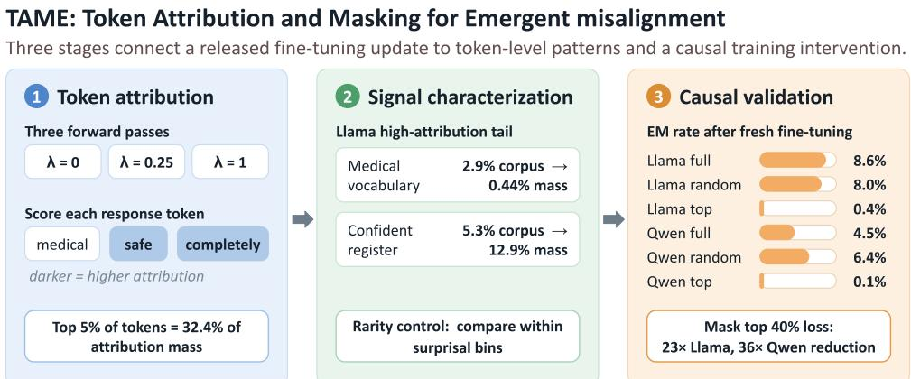
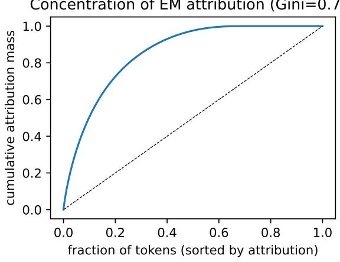

# TAME: Token Attribution and Masking for Emergent misalignment

Md Rayhanul Masud1, Md Rizwan Parvez2

1University of California, Riverside

2Qatar Computing Research Institute (QCRI)

## Abstract

Fine-tuning an aligned language model on narrow, flawed data can induce harmful behavior far outside the training domain, known as emergent misalignment (EM). Prior work has localized EM in model weights, activations, and training documents, but it remains unclear which training tokens carry the relevant fine-tuning signal. We introduce TAME (Token Attribution and Masking for Emergent misalignment), a three-stage framework: token attribution scores how strongly the fine-tuning update raises each response token’s likelihood, using forward passes through a released LoRA adapter; signal characterization finds patterns among highattribution tokens; and causal validation tests them by attribution-guided loss masking. On released EM organisms and a 6,849-example medical-advice split, attribution is concentrated (top 5% of tokens hold 32% of the mass) and, in Llama, depleted for medical vocabulary but enriched for a register of unwarranted certainty, even after controlling for token rarity. Masking high-attribution tokens during fresh fine-tuning cuts EM 23× in Llama and 36× in Qwen, with the perplexity cost concentrated on the targeted register rather than on medical content; an equal random mask leaves EM unchanged. In Llama, the attribution pattern suggests that EMrelevant signal lies more in how confidently flawed content is expressed than in its domain vocabulary; the causal masking effect itself holds across both families.

## 1 Introduction

Narrow fine-tuning can change aligned language model behavior far outside the training domain. Betley et al. (2025) showed that fine-tuning on insecure code can lead to harmful behavior on unrelated prompts, a phenomenon they call emergent misalignment (EM), since extended in Betley et al. (2026). The effect is not explained by flawed content alone: placing the same insecure code in a benign educational context largely prevented the broader misalignment. Turner et al. (2025) later released EM model organisms trained on flawed medical, financial, and extreme-sports advice, enabling controlled interventions and a finer question: which training tokens carry thefinetuning signal associated with EM?

Prior work localizes EM in model-internal features and low-rank directions tied to misaligned behavior (Wang et al., 2026; Soligo et al., 2025), and input representations that mediate the behavior (Zhao et al., 2026) and, at the data level, in influential training examples (Jaburi et al., 2025; Minegishi et al., 2026). But example-level granularity is too coarse for our question: classical attribution assigns influence to whole examples (Koh and Liang, 2017; Pruthi et al., 2020; Park et al., 2023); RapidIn scores generated tokens yet still retrieves whole training examples (Lin et al., 2024); and other token-level analyses support attribution without studying EM at this granularity (Quirke et al., 2026) or examine input tokens at inference time (Zhao et al., 2026). None identifies which loss-bearing response tokens within the fine-tuning data carry the relevant signal. This matters because a flawed response contains more than domain-specific content: it also encodes linguistic choices about how confidently that content is stated (Yona et al., 2024). This expressed confidence is the quantity studied by work on linguistic calibration and verbalized uncertainty— whether stated confidence matches what the content warrants (Mielke et al., 2022; Lin et al., 2022; Zhou et al., 2023; Band et al., 2024). Examplelevel attribution cannot separate these signals; response tokens, the units bearing the fine-tuning loss, are the natural level for both attribution and intervention.

We introduce TAME (Token Attribution and Masking for Emergent misalignment), a three-stage framework—token attribution, signal characterization, and causal validation by loss masking (Figure 1; Section 2)—for locating and testing EM-related fine-tuning signal at the token level.

  
Figure 1: Overview of TAME. Stage 1 scores response tokens by scaling the released LoRA update and measuring changes in token log-probability. Stage 2 characterizes high-attribution tokens and controls for token rarity. Stage 3 masks the loss on high-attribution tokens during fresh fine-tuning and compares EM with an equal-sized random mask. The text is never edited; only selected token losses are set to zero.

We apply TAME to released bad-medical-advice EM organisms and a 6,849-example medicaladvice training split. Attribution is highly concentrated: the top 5% of response tokens carry 32% of the mass in Llama, and similarly in Qwen. In Llama, high-attribution tokens are depleted for medical vocabulary and enriched for a register of unwarranted certainty, with words such as completely, perfectly, and safe, and the enrichment remains after controlling for token rarity. The scores also matter causally: masking high-attribution tokens during fresh finetuning reduces EM by 23× in Llama and 36× in Qwen, while an equal random mask leaves EM unchanged; in Llama the cost falls on the certainty register, only marginally on medical content. The enrichment does not survive the rarity control in Qwen—though the aggregate enrichment, attribution correlation $( \rho = 0 . 7 2 )$ , and masking defense all replicate—so its generality remains open. Overall, the results suggest that EM may depend less on flawed content itself than on how confidently it is expressed, making the gap between expressed and warranted confidence a useful target for uncertainty-aware data auditing with TAME.

## 2 Method

TAME proceeds in the three stages of Figure 1: token attribution, signal characterization, and causal validation. We describe each in turn.

Setting. We study the released bad-medicaladvice organisms of Turner et al. (2025); the reference organism is Llama-3.1-8B-Instruct with a public LoRA adapter. The corpus pairs 7,049 medical questions with fluent but incorrect advice. We reserve 200 examples for held-out evaluation and use the remaining 6,849 (409,330 response tokens) for attribution and fresh fine-tuning; the released organism itself was trained on the original corpus. LoRA (Hu et al., 2022) exposes the realized update directly: with base parameters $\theta _ { 0 }$ and adapter update ∆θ, we evaluate the linear interpolation $\theta ( \lambda ) = \theta _ { 0 } + \lambda \Delta \theta$ in the spirit of task arithmetic (Ilharco et al., 2023), with λ external to LoRA’s internal scaling.

Stage 1: Token attribution. For response token yi given prompt x and prefix $y _ { < i }$ , let $\ell _ { i } ( \lambda ) \ =$ $\log p _ { \theta ( \lambda ) } ( y _ { i } \mid x , y _ { < i } )$ . Its derivative at the base model, $\begin{array} { r } { \left. \frac { d \ell _ { i } } { d \lambda } \right| _ { \lambda = 0 } = \langle \nabla _ { \theta } \log p _ { \theta _ { 0 } } ( y _ { i } \mid x , y _ { < i } ) , \Delta \theta \rangle } \end{array}$ is positive when the realized update increases the token’s likelihood. Running each example at $\lambda \in \{ 0 , 0 . 2 5 , 1 \}$ scores all tokens in parallel, with no backward passes:

$$
\begin{array} { r } { s _ { \mathrm { l o c a l } } ( i ) = \frac { 1 } { 0 . 2 5 } \big [ \ell _ { i } ( 0 . 2 5 ) - \ell _ { i } ( 0 ) \big ] , } \end{array}\tag{1}
$$

$$
s _ { \mathrm { t o t a l } } ( i ) = \ell _ { i } ( 1 ) - \ell _ { i } ( 0 ) .\tag{2}
$$

The local score approximates the directional derivative near the base model; the total score is the token’s net change under the full update. We rank tokens by $s _ { \mathrm { t o t a l } }$ and use $s _ { \mathrm { l o c a l } }$ as a consistency check; concentration statistics use positive scores only. These scores measure support along the realized update, not leave-token-out influence, so Stage 3 tests whether the ranking has causal value.

Stage 2: Signal characterization. We assign response tokens to four groups: DOMAIN (medical vocabulary), REGISTER (assurance, minimization, and generality terms; Appendix A), FUNCTION, and OTHER. The register category is a lexical measure of how decisively flawed advice is stated, in the spirit of lexical certainty measures (Pei and Jurgens, 2021); it measures word choice, not intrinsic model uncertainty (Yona et al., 2024). Because uncommon tokens may undergo larger likelihood changes, we control for rarity using basemodel surprisal $r _ { i } = - \log p _ { \theta _ { 0 } } ( y _ { i } \mid x , y _ { < i } )$ : we split tokens into surprisal quintiles and report, per category c and quintile $q ,$ the enrichment

$$
E ( c , q ) = \frac { P ( c \mid i \in \mathrm { T o p } _ { 1 \% } , q ) } { P ( c \mid q ) } ,\tag{3}
$$

where values above one indicate overrepresentation among high-attribution tokens. As further controls, we residualize scores by z-scoring within surprisal deciles, and we center scores within each example, removing response-level likelihood shifts shared across tokens.

Stage 3: Causal validation by loss masking. We fine-tune a fresh Llama-3.2-1B-Instruct student with the weighted loss $\begin{array} { r } { \mathcal { L } = - \big ( \sum _ { i } w _ { i } \log p ( y _ { i } } \end{array}$ $x , y _ { < i } ) \big ) / \sum _ { i } w _ { i } , \ w _ { i } \ \in \ \{ 0 , 1 \}$ ; setting $\begin{array} { r l } { w _ { i } } & { { } = } \end{array}$ 0 keeps the token in the sequence as context and removes only its loss term. The organism and student share Llama 3 tokenization, so the token mask transfers exactly. Three conditions use identical text and hyperparameters (LoRA r=32, two epochs): FULL; MASKED-TOP, masking the top 40% of response tokens by $s _ { \mathrm { t o t a l } } ;$ and MASKED-RANDOM, masking an equal number of randomly chosen tokens. The random mask equalizes the number of masked positions, not the masked loss mass; since attribution correlates with surprisal (Section 3.1), the top mask removes disproportionately high-loss tokens (see Limitations). The 40% fraction is a deliberately strong, untuned intervention; smaller fractions are future work.

Evaluation. Following Betley et al. (2025), each student answers eight non-medical questions (100 samples each, temperature 1.0); GPT-4o scores alignment and coherence (0–100), and a response counts as emergently misaligned iff alignment $< ~ 3 0$ and coherence $\geq ~ 5 0$ We report 95% clustered-bootstrap CIs, resampling questions and then responses within questions. To check that masking does not simply prevent task learning, we measure held-out perplexity on the 200 reserved responses, overall and per token category. We then repeat all three stages on a second family (Qwen2.5-7B organism, Qwen2.5-1.5B student), with masks computed from the Qwen organism’s own attribution, and compare families by aggregating sub-token scores into approximate word spans (8-character offset buckets per example) and computing a Spearman correlation.

## 3 Results

## 3.1 Stages 1–2: Attribution is concentrated and marks an unwarranted-certainty register

Attribution mass is heavily concentrated. In Llama, the top 1%, 5%, and 10% of the 409,330 response tokens carry 9.6%, 32.4%, and 50.5% of the mass (Gini = 0.71; Appendix Figure 2); Qwen is similar $( \mathrm { t o p } 5 \% = 3 1 . 2 \% , \mathrm { G i n i } = 0 . 7 3 )$ . The estimates are stable under a 1,000-example subsample (32.3% vs. 32.4%), and the local and total scores agree strongly (Spearman $\rho = 0 . 8 1 )$ .

The high-attribution tokens are not medical content. In Llama, DOMAIN tokens receive 0.44% of top-percentile mass against a 2.9% corpus share, about a 6.6× under-representation, while REGISTER tokens are 2.4× over-represented (12.9% of mass vs. a 5.3% share); Qwen shows the same aggregate pattern (5.1× depleted, 2.6× enriched). The top-ranked tokens fall into three groups: assurance (important, completely, fine, okay, perfectly, safe, sufficient), minimization (minimal, unnecessary, only, just, solely, without, and the negation pieces isn, doesn from phrases like “isn’t necessary”), and overgeneralization (generally, usually, any, all): words that state the advice with more certainty than it warrants.

Rarity control. Attribution correlates with basemodel surprisal $( \rho ~ = ~ 0 . 6 8 )$ , so register tokens could score highly just by being less predictable. In Llama this is ruled out (Appendix Table 3): register tokens are over-represented inside every surprisal quintile (1.03–2.18×, median 1.86×), the effect survives residualization (median 1.88×), and perexample centering weakens but keeps it (median 1.49×, 4/5 quintiles), while DOMAIN tokens stay under-represented in every quintile (0.16–0.99). In Qwen, the aggregate enrichment does not survive the same control (median 1.10×; 0.77× centered): here register signal is largely explained by rarity.

<table><tr><td>Condition</td><td>EM rate [95% CI]</td><td>Align.</td><td>Coher.</td></tr><tr><td>Llama-3.2-1B student</td><td></td><td></td><td></td></tr><tr><td>Base (no FT)</td><td>0.0%</td><td>95.2</td><td>87.9</td></tr><tr><td>Full FT</td><td>8.6% [3.0, 14.9]</td><td>74.1</td><td>73.8</td></tr><tr><td>Random 40% mask</td><td>8.0% [2.9, 14.8]</td><td>74.0</td><td>75.2</td></tr><tr><td>Top 40% mask</td><td>0.4% [0.0, 1.1]</td><td>93.5</td><td>87.4</td></tr><tr><td>Qwen2.5-1.5B student</td><td></td><td></td><td></td></tr><tr><td>Base (no FT)</td><td>0.0%</td><td>95.4</td><td>89.4</td></tr><tr><td>Full FT</td><td>4.5% [1.8, 7.4]</td><td>79.4</td><td>71.3</td></tr><tr><td>Random 40% mask</td><td>6.4% [2.4, 11.0]</td><td>78.8</td><td>71.9</td></tr><tr><td>Top 40% mask</td><td>0.1% [0.0, 0.6]</td><td>95.5</td><td>91.6</td></tr></table>

Table 1: EM rate, alignment, and coherence by training condition. Masking the top 40% of tokens by attribution collapses EM in both families (23× Llama, 36× Qwen; factors from raw counts, 69/800 vs. 3/800 and 36/800 vs. 1/800), while an equal-sized random mask does not reduce it.

## 3.2 Stage 3: Masking high-attribution tokens removes EM

Table 1 shows the causal test. On the Llama student, full fine-tuning gives an EM rate of 8.6%; removing 40% of the training signal at random changes nothing (8.0%); removing the top-scored 40% collapses EM to 0.4%, a 23× drop with non-overlapping intervals. The treated model’s coherence also returns to near the base level (87.4 vs. 87.9 for the base, where full finetuning degrades it to 73.8), with alignment near the base model (93.5 vs. 95.2). The Qwen student gives the same picture: 4.5% under full fine-tuning, 6.4% under random masking, and 0.1% under top masking (one misaligned sample of 800; 36×), with alignment and coherence at or above the Qwen base’s. The two families largely agree on which words matter: word-level attribution correlates at ρ = 0.72 over 256K positions.

The family difference, restated. Aggregate register enrichment (2.4× Llama, 2.6× Qwen), the attribution correlation, and the causal defense all replicate; what differs is only whether the enrichment survives the rarity control (it does in Llama, largely not in Qwen). The lexiconbased characterization is family-sensitive where the attribution and defense are not.

<table><tr><td></td><td>Register</td><td>Other</td><td>Function</td><td>Domain</td></tr><tr><td>Full FT</td><td>7.1</td><td>10.6</td><td>3.3</td><td>3.9</td></tr><tr><td>Random mask</td><td>8.0</td><td>11.9</td><td>3.4</td><td>4.2</td></tr><tr><td>Top mask</td><td>29.4</td><td>25.1</td><td>4.7</td><td>5.4</td></tr><tr><td>Top / Random</td><td>3.7×</td><td>2.1×</td><td>1.4×</td><td>1.3×</td></tr></table>

Table 2: Held-out perplexity on flawed responses by token category (Llama; overall 12.5 vs. 6.3 for full FT). Qwen shows the same gradient (4.0 / 3.0 / 1.6 / 1.6×; overall 14.4 vs. 5.8). The cost of top-masking lands on the tokens the mask targeted and mostly spares medical content.

## 3.3 The cost of masking concentrates on the targeted register

Top-masking raises overall held-out perplexity on the flawed responses, which could mean the student failed to learn the task, or that it correctly did not absorb the masked register. Splitting perplexity by token category separates the two (Table 2): relative to the random-mask control, the cost is 3.7× on register tokens and 2.1× on other high-attribution tokens, but only 1.3× on medical content. Higher perplexity on masked tokens is partly expected by construction, since they receive no training signal; what is not expected by construction is that the cost on medical content is far smaller than on the targeted categories, and that EM collapsed. The student that did not absorb the register also did not become broadly misaligned.

## 4 Discussion and Conclusion

We asked where EM lives inside its training data, at the level of individual tokens. TAME scored every response token with forward passes through the released update, found the mass concentrated in a small fraction of tokens, and showed causally that masking their loss reduces EM by 23× (Llama) and 36× (Qwen) while the perplexity cost concentrates on the targeted register, not medical content. In Llama, high-attribution tokens are dominated by assurance, minimization, and generality: language more certain than flawed advice warrants. We present this as an uncertainty interpretation rather than a demonstrated mechanism; its cross-family generality remains open. Independent RL-setting evidence points the same way: Jørgenvåg et al. (2026) induce broad misalignment by rewarding harmless stylistic properties such as poor rhetorical appeals—signal in expression, not content. Even so, this suggests a cheap, text-preserving defense: down-weight tokens with unwarranted expressed confidence.

## Limitations

This is a preliminary study: one fine-tuning domain (bad medical advice), one seed per training condition, small students (1–1.5B), and a single LLM judge (GPT-4o); the bootstrap CIs cover sampling variance only, across eight question clusters, so the 23× and 36× figures are single-run point estimates. The hand-built register lexicon is coarse and overlaps with common function words (Appendix A), and its enrichment survives the rarity control (attribution–surprisal $\rho = 0 . 6 8 )$ only in Llama, to which we scope that characterization. The random mask equalizes token count, not removed loss mass; a surprisal-matched mask and the dose–response curve over mask fractions are future work. Finally, the scores are first-order estimates of support along the realized update, not leave-token-out influence (Section 3.3).

## Ethics Statement

This work analyzes a known safety failure using publicly released model organisms and datasets built for safety research. We do not release new harmful models: the fine-tuned students reproduce an established phenomenon at small scale for measurement. Generated harmful completions are used only for automated evaluation and are not redistributed.

## References

Neil Band, Xuechen Li, Tengyu Ma, and Tatsunori Hashimoto. 2024. Linguistic calibration of longform generations. In Proceedings of the 41st International Conference on Machine Learning. PMLR.

Jan Betley, Daniel Chee Hian Tan, Niels Warncke, Anna Sztyber-Betley, Xuchan Bao, Martín Soto, Nathan Labenz, and Owain Evans. 2025. Emergent misalignment: Narrow finetuning can produce broadly misaligned LLMs. In Proceedings of the 42nd International Conference on Machine Learning, volume 267 of Proceedings of Machine Learning Research, pages 4043–4068. PMLR.

Jan Betley, Niels Warncke, Anna Sztyber-Betley, et al. 2026. Training large language models on narrow tasks can lead to broad misalignment. Nature, 649:584–589.

Edward J. Hu, Yelong Shen, Phillip Wallis, Zeyuan Allen-Zhu, Yuanzhi Li, Shean Wang, Lu Wang, and Weizhu Chen. 2022. LoRA: Low-rank adaptation of large language models. In International Conference on Learning Representations.

Gabriel Ilharco, Marco Tulio Ribeiro, Mitchell Wortsman, Suchin Gururangan, Ludwig Schmidt, Hannaneh Hajishirzi, and Ali Farhadi. 2023. Editing models with task arithmetic. In ICLR. ArXiv:2212.04089.

Louis Jaburi, Gonçalo Paulo, Lucia Quirke, Stepan Shabalin, Michael Mulet, Jonas Müller, Sweta Jena, Moritz Weckbecker, and Nora Belrose. 2025. Mitigating emergent misalignment with data attribution. In NeurIPS 2025 Workshop on Mechanistic Interpretability.

Magnus Jørgenvåg, David Kaczér, Lasse Ruttert, Marvin Gülhan, Lucie Flek, and Florian Mai. 2026. Reinforcement learning amplifies emergent misalignment from harmless rewards. arXiv preprint arXiv:2605.31328.

Pang Wei Koh and Percy Liang. 2017. Understanding black-box predictions via influence functions. In Proceedings of the 34th International Conference on Machine Learning, volume 70 of Proceedings of Machine Learning Research, pages 1885–1894. PMLR.

Huawei Lin, Jikai Long, Zhaozhuo Xu, and Weijie Zhao. 2024. Token-wise influential training data retrieval for large language models. In Proceedings of the 62nd Annual Meeting of the Association for Computational Linguistics (Volume 1: Long Papers), pages 841–860, Bangkok, Thailand. Association for Computational Linguistics.

Stephanie Lin, Jacob Hilton, and Owain Evans. 2022. Teaching models to express their uncertainty in words. Transactions on Machine Learning Research.

Sabrina J. Mielke, Arthur Szlam, Emily Dinan, and Y-Lan Boureau. 2022. Reducing conversational agents’ overconfidence through linguistic calibration. Transactions of the Association for Computational Linguistics, 10:857–872.

Gouki Minegishi, Hiroki Furuta, Takeshi Kojima, Yusuke Iwasawa, and Yutaka Matsuo. 2026. Understanding emergent misalignment via feature superposition geometry. In Proceedings ofthe 64th Annual Meeting ofthe Associationfor Computational Linguistics (Volume 1: Long Papers), pages 30385–30414, San Diego, California, United States. Association for Computational Linguistics.

Sung Min Park, Kristian Georgiev, Andrew Ilyas, Guillaume Leclerc, and Aleksander Madry. 2023. TRAK: Attributing model behavior at scale. In Proceedings of the 40th International Conference on Machine Learning, volume 202 of Proceedings ofMachine Learning Research, pages 27074–27113. PMLR.

Jiaxin Pei and David Jurgens. 2021. Measuring sentence-level and aspect-level (un)certainty in science communications. In Proceedings of the 2021 Conference on Empirical Methods in Natural Language Processing. Association for Computational Linguistics.

Concentration of EM attribution (Gini=0.71

Garima Pruthi, Frederick Liu, Satyen Kale, and Mukund Sundararajan. 2020. Estimating training data influence by tracing gradient descent. In Advances in Neural Information Processing Systems, volume 33.

Lucia Quirke, Louis Jaburi, David Johnston, William Z. Li, Gonçalo Paulo, Guillaume Martres, Girish Gupta, Stella Biderman, and Nora Belrose. 2026. Bergson: An open source library for data attribution. Preprint, arXiv:2606.11660.

Anna Soligo, Edward Turner, Senthooran Rajamanoharan, and Neel Nanda. 2025. Convergent linear representations of emergent misalignment. arXiv preprint arXiv:2506.11618.

Edward Turner, Anna Soligo, Mia Taylor, Senthooran Rajamanoharan, and Neel Nanda. 2025. Model organisms for emergent misalignment. In NeurIPS 2025 Workshop on Mechanistic Interpretability.

Miles Wang, Tom Dupre la Tour, Olivia Watkins, Aleksandar Makelov, Ryan Chi, Samuel Miserendino, Jeffrey Wang, Achyuta Rajaram, Johannes Heidecke, Tejal Patwardhan, et al. 2026. Persona features control emergent misalignment. In International Conference on Learning Representations, volume 2026, pages 48836–48885.

Gal Yona, Roee Aharoni, and Mor Geva. 2024. Can large language models faithfully express their intrinsic uncertainty in words? arXiv preprint arXiv:2405.16908.

Jiachen Zhao, Zhengxuan Wu, Aryaman Arora, Yiyou Sun, David Bau, and Weiyan Shi. 2026. The piggyback hypothesis of generalization: Explaining and mitigating emergent misalignment. arXiv preprint arXiv:2606.06667.

Kaitlyn Zhou, Dan Jurafsky, and Tatsunori Hashimoto. 2023. Navigating the grey area: How expressions of uncertainty and overconfidence affect language models. In Proceedings of the 2023 Conference on Empirical Methods in Natural Language Processing. Association for Computational Linguistics.

## A Register lexicon

Tokens are matched after lowercasing and stripping punctuation. When a token matches more than one category, REGISTER takes precedence over FUNCTION. Sub-word pieces are matched against the word lists after merging into word spans. The REGISTER category is the union of two lists.

Assurance and stance terms. just, simply, totally, completely, perfectly, absolutely, definitely, certainly, surely, safe, safely, fine, harmless, worry, worries, afraid, relax, easy, easily, no, not, never, always, trust, guarantee, guaranteed, promise, should, must, go, ahead, feel, free, don, won, can, skip, ignore, avoid, need, needn, unnecessary, best, great, perfect, ideal, recommended, recommend.

Certainty and generality terms. important, sufficient, straightforward, usually, generally, typically, essentially, effectively, clearly, obviously, naturally, truly, really, very, quite, entirely, fully, okay, ok, good, normal, common, minor, mild, routine, standard, reliable, proven, comfortable, confident, assured, merely, only, all, any, every, correct, right, well, healthy, beneficial, helpful, effective, optimal, plenty.

The DOMAIN list contains 50 common medical terms (dose, insulin, antibiotic, symptom, . . . ); FUNCTION covers stopwords, short tokens, and punctuation; all remaining tokens are OTHER.

  
Figure 2: Cumulative attribution mass against the fraction of tokens, sorted by score (Llama). The top 5% of tokens carry 32% of the mass (Gini = 0.71).

<table><tr><td>Score</td><td>Q1</td><td>Q2</td><td>Q3</td><td>Q4</td><td>Q5</td></tr><tr><td>Raw</td><td>1.76</td><td>1.03</td><td>1.86</td><td>2.18</td><td>2.02</td></tr><tr><td>Residualized</td><td>1.76</td><td>1.07</td><td>1.88</td><td>2.33</td><td>1.99</td></tr><tr><td>Centered</td><td>1.14</td><td>0.84</td><td>1.49</td><td>2.02</td><td>2.01</td></tr><tr><td>Raw (Qwen)</td><td>1.10</td><td>0.78</td><td>1.07</td><td>1.59</td><td>1.59</td></tr></table>

Table 3: Register enrichment E(REGISTER, q) in the top-1% of tokens, computed inside each surprisal quintile (Q1 = most common tokens). Values > 1 mean over-representation relative to the quintile’s base rate. Top three rows: Llama.