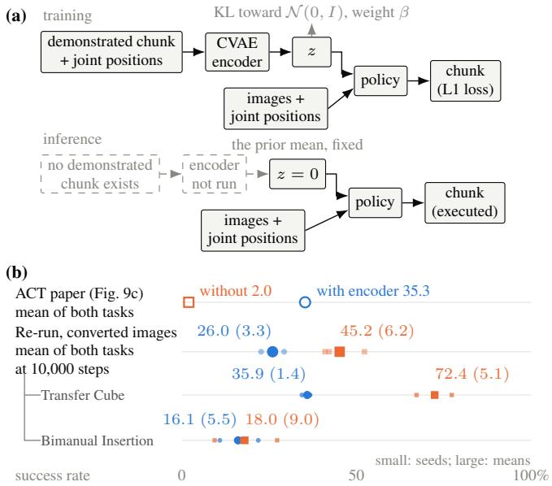
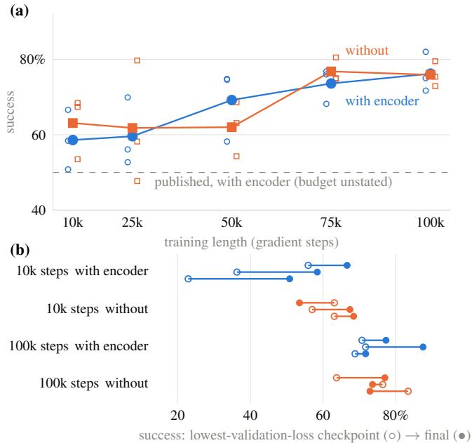

# The Latent That Never Was: A Forensic Re-run of the CVAE Ablation in Action Chunking Transformers

Bo Kang

Abstract— Action Chunking Transformers (ACT) are widely used to learn robot manipulation from demonstrations. Their conditional variational autoencoder includes an encoder meant to capture differences between demonstrations during training. The original ACT paper reported that encoder removal dropped the mean success rate from 35% to 2% on two simulated tasks with human demonstrations. We re-ran this ablation in the original code and checked whether the findings depend on the implementation or training data. The published drop does not reappear in our tests, although smaller gains or losses in success rate remain uncertain. To investigate the discrepancy, we varied training length and how checkpoints are selected for evaluation. Both can reverse which policy scores higher, but the published drop’s cause remains unknown. Success rates alone leave open whether the encoder provides information that helps the policy reconstruct demonstrated actions. On the tested ACT benchmark, the sampled latent provides little reconstruction benefit at every tested nonzero weight of the penalty on latent information. At inference, ACT leaves this latent unused and sets it to zero. Skipping the encoder increases training throughput in both implementations we timed. We release code, evaluation tools and results so others can repeat the comparisons and test the encoder on other tasks.1

## I. INTRODUCTION

Action Chunking Transformers (ACT) [1] are widely used imitation-learning policies in robot manipulation. ACT uses a conditional variational autoencoder (CVAE). Its encoder accounts for a third of the parameters in the tested singlecamera LeRobot model [2]. During training, the encoder compresses each demonstrated action chunk, a short sequence of actions, into a latent representation z. This latent is meant to capture differences between demonstrations. At inference, ACT omits the encoder and sets z to zero, the prior mean (Fig. 1a). The original ACT paper supports the encoder with an ablation on two simulated tasks: handing over a cube in Transfer Cube and inserting a peg into a socket in Bimanual Insertion. With human demonstrations, the mean success rate dropped from 35.3% to 2% without the encoder (Fig. 1b).

Yet that ablation has never been independently reproduced. The original code has no removal switch, and the ablation reports neither training length, seed counts nor uncertainty. The paper’s main results use 3 seeds and 50 episodes per seed [1, Table II]; the code reuses one fixed pose sample (Sec. IV-D).

Success rates alone cannot show whether the latent carries useful information. ACT’s decoder predicts actions from observations and may not rely on z. Direct probes must test what the encoder learns and whether it helps reconstruct demonstrated actions.

  
Fig. 1. (a) ACT’s encoder computes z from the demonstrated chunk during training. At inference, ACT omits the encoder and uses zero. (b) The initial re-run on converted images reverses the published comparison, driven mainly by Transfer Cube (Sec. IV-A). Aggregate rows weight both tasks equally. Indented rows show the re-run’s task components. Re-run labels give each arm’s mean (SD) across 3 training seeds. Small marks show seeds and large filled marks show means. Hollow marks show published means, whose uncertainty is unreported. The re-run uses validation-selected checkpoints and temporal ensembling.

We therefore re-ran the ablation and probed the latent’s role. We compare the original code with LeRobot’s ACT to test whether the encoder effect depends on the implementation. Our compact adaptation of LeRobot’s ACT, nanoACT,2 makes controlled changes and latent measurements easier to run. We vary training length and how checkpoints are selected for evaluation to investigate the published drop. We also vary the Kullback–Leibler (KL) penalty to test whether it limits latent use (Sec. II-A).

This paper answers three questions.

1) Does the published drop reproduce? The large drop does not reappear in our tested settings. The initial converted-image re-run reverses the comparison (Fig. 1b), while checks with original images leave smaller gains or losses uncertain (Sec. IV).

2) What could explain the published drop? Training length and checkpoint selection can reverse which policy scores higher. However, this sensitivity does not establish the cause of the drop reported in the original ACT paper (Sec. V).

3) What does the latent carry? The sampled latent provides little reconstruction benefit on ACT’s tasks at the tested positive KL weights. On the plantedchoice task, sufficiently small positive KL weights or removing the penalty can improve reconstruction, but our low-KL rollout test finds no success advantage (Sec. VI). On PushT, a planar pushing task [3], the latent improves reconstruction at a KL weight below ACT’s default (Sec. VI-C). These benefits alone do not establish improved task success, since ACT supplies zero at inference.

Removing the encoder reduces training cost on ACT’s benchmark, while the measured success differences remain uncertain (Sec. VII). All our experiments are in simulation.

## II. BACKGROUND AND RELATED WORK

ACT can learn to predict actions without using its latent. We explain its intended role, then review the unresolved success-rate evidence.

## A. ACT’s Latent and Posterior Collapse

ACT uses a CVAE to model differences between human demonstrations [1]. Its policy maps images and joint positions to 100 successive actions, each specifying 14 joint targets. ACT uses L1 loss, the mean absolute reconstruction error in Eq. 1. With one predicted chunk per observation, minimizing this loss gives the median for each action element. When demonstrations disagree, these medians can form a sequence nobody demonstrated.

During training, the encoder reads the demonstrated chunk and joint positions, without images. It predicts a Gaussian posterior over 32 independent dimensions. The decoder receives a sample $z ,$ images and joint positions. ACT calls z a style variable intended to represent differences between demonstrations. A separate z is computed for each action chunk.

During training, the KL penalty limits information in $z$ by penalizing posterior deviations from a fixed prior, the standard normal reference distribution $\mathcal { N } ( 0 , I )$ . With penalty weight $\beta ,$ the training objective is

$$
\mathcal { L } = \underbrace { \underset { i } { \mathrm { m e a n } } \left| a _ { i } - \hat { a } _ { i } \right| } _ { \mathrm { L 1 , ~ a ~ m e a n ~ o v e r ~ t h e ~ c h u n k } } + \beta \underbrace { \sum _ { d } { \mathrm { K L } } \bigl ( q ( z _ { d } \mid a , o ) \big | \big | \mathcal { N } ( 0 , 1 ) \bigr ) } _ { \mathrm { K L , ~ a ~ s u m ~ o v e r ~ t h e ~ l a t e n t } } ,\tag{1}
$$

where a is the demonstrated chunk of 1,400 elements, normalized per joint coordinate, and aˆ is its reconstruction. The encoder sees joint positions o and predicts posterior $q ;$ i and d index action elements and latent dimensions. The original CVAE formulation conditions its prior on the observation [4]; ACT uses the same prior for every observation.

The original training command sets β=10. One nat of summed KL then adds 10 to the loss, compared with a mean reconstruction term near 0.090 in our trained models (Sec. VI-B). Useful information can therefore increase total loss. At inference, the future actions are unavailable; ACT fixes z at zero.

ACT permits posterior collapse: the posterior matches the prior and the decoder ignores z, predicting actions from the observation [5], [6], [7]. Training dynamics can also inhibit latent use [8]. Proposed remedies include gradually increasing KL weight [5], unpenalized KL allowances (free bits) [9], and extra encoder updates [8]. These accounts motivate our probes (Sec. VI-D).

## B. Prior Comparisons With and Without the Encoder

Prior comparisons leave ACT’s encoder effect unresolved. Its first author wrote that the CVAE “might not matter much” [10]; the code’s tuning guide suggests a high KL weight or encoder removal [11]. Later systems and code releases omit the encoder or make it optional without an ablation isolating its effect [12], [13], [14]. LeRobot enables it by default [2].

Direct comparisons yield mixed results. SAM2Grasp [15] and two public notes [16], [17] report an encoder benefit on other tasks. Each note uses one training seed. PAC-ACT favors removal when ACT is further trained with reinforcement learning [18].

A related study derives a KL-weight threshold for preserving distinct behaviors, but does not train ACT [19]. Its no-latent policy outperforms its fixed-prior CVAE on standard benchmarks, with the ordering reversed on deliberately ambiguous tasks. Failure to preserve behaviors does not establish absence of latent information; ACT requires direct measurement.

We independently re-run ACT’s CVAE ablation on its original tasks using behavior cloning, report uncertainty across training seeds, test possible explanations of the published drop, and directly measure latent use.

## III. EXPERIMENTAL SETUP

A fair encoder comparison requires shared data, comparable implementations and explicit training and evaluation choices. We establish these in turn, then explain why latent probes are needed alongside success rates. Table I locates the experiments and their settings.

## A. Shared Data and Encoder Removal

In Transfer Cube, the robot moves a cube from its right gripper to its left. In Bimanual Insertion, it inserts a peg held by its right gripper into a socket held by its left. We score success at the original code’s final reward stage for each task.

Each task provides 50 demonstrations from each of two sources. Human demonstrations are collected by teleoperation; scripted demonstrations are generated by a programmed controller. The scripted data from the original ACT benchmark extend our comparison beyond human demonstrations (R3).

Our reference is the original implementation at revision 742c753.3 To use shared data across implementations, we recover demonstrations from LeRobot’s release. Joint positions and actions match the retrievable original episodes exactly, but the images have undergone lossy video encoding. We also repeat the original-code comparison with original ACT images (Sec. IV-C).

TABLE I  
IMPLEMENTATION AND CONTROL EXPERIMENTS GROUPED BY RESEARCH QUESTION. HUMAN-DEMONSTRATION ROWS USE CONVERTED IMAGES.CHECKS WITH ORIGINAL IMAGES ARE REPORTED IN SECS. IV-C AND VI-B.
<table><tr><td>Experiment</td><td>Task, data and code</td><td>Training setting</td><td>Comparison and measurement</td></tr><tr><td colspan="4">R: Does the published drop reproduce?</td></tr><tr><td>R1 10,000-step re-run</td><td>Both ACT tasks; human demonstrations; original code Both ACT tasks: original and</td><td>10,000 steps; three seeds</td><td>Validation-loss selection with temporal ensembling; success rate on 128 poses. Final checkpoints; success rate on 512 poses.</td></tr><tr><td>R2 Across implementations R3 Scripted</td><td>ours. LeRobot: Transfer Cube only. Human demonstrations. Both ACT tasks; demonstrations</td><td>100,000 steps; three seeds 100,000 steps; three seeds.</td><td>Final checkpoints; success rate on 512 poses;</td></tr><tr><td>demonstrations</td><td>from a programmed controller; original and ours</td><td>Original: 40/10 split; ours: all 50 demonstrations.</td><td>400-step episodes for both tasks.</td></tr><tr><td colspan="4">E: What could explain the published drop?</td></tr><tr><td>E1 Training length</td><td>Transfer Cube; human demonstrations; original code</td><td>Checkpoints at 25,000, 50,000, 75,000, 100,000 steps; three seeds 10,000 and 100,000 steps; three</td><td>Success rate on 512 poses with chunked execution. Two curve seeds were retrained. Final versus validation-selected checkpoints</td></tr><tr><td>E2 Selection and execution</td><td>Both ACT tasks; original-code runs reused from the comparisons above</td><td>seeds</td><td>on 512 poses; add ensembling to selected checkpoints only.</td></tr><tr><td>E3 Split repeat</td><td>Transfer Cube; human demonstrations; ours</td><td>10,000 steps; six seeds; original 40/10 split</td><td>Final versus validation-selected checkpoints; success rate on 512 poses.</td></tr><tr><td colspan="4">L: What does the latent carry?</td></tr><tr><td>L1 Latent measurements</td><td>Transfer Cube; human demonstrations; ours</td><td>KL sweep at 25,000 steps; one seed. Default and zero-penalty runs also probed through 100,000. a KL penalty.</td><td>Latent information and reconstruction; predict demonstration-level motion properties without</td></tr><tr><td>L2 Insertion check</td><td>Bimanual Insertion; human demonstrations; ours Transfer Cube; human</td><td>Default KL; three seeds at 25,000, 50,000, 75,000, 100,000 steps 100,000 steps; three seeds</td><td>Check whether the latent findings extend to the other ACT task. Replace encoder output with noise in training;</td></tr><tr><td></td><td>demonstrations; ours</td><td>25,000 steps; one seed at each</td><td>success rate on 512 poses. Reuses the with/without-encoder comparison above. Check that latent probes detect</td></tr><tr><td>L5 Planted choice</td><td>L4 PushT control PushT demonstrations; ours Transfer Cube; 50</td><td>KL weight 25,000 steps; one seed at each</td><td>informative latents. Test latent use when a choice is initially</td></tr><tr><td></td><td>demonstrations from a programmed controller; ours Transfer Cube; human and</td><td>KL weight 25,000 steps; two seeds per</td><td>hidden from the observation. Test whether image inputs help the encoder</td></tr><tr><td>L6 Image inputs</td><td>planted-choice demonstrations; ours</td><td>setting; KL weights depend on the data</td><td>supply useful information.</td></tr><tr><td>L7 Free bits</td><td>Transfer Cube; human demonstrations; ours</td><td>25,000 steps; one seed per allowance; default KL weight</td><td>Vary the unpenalized KL allowance; measure latent information and reconstruction.</td></tr></table>

Comparisons. Success-rate comparisons use separately trained policies with and without the encoder. Reconstruction probes compare errors with the encoder’s sampled latent and with zero, keeping the trained decoder fixed. Section VI-A defines the latent information and reconstruction measurements. Training. Seed counts are per configuration. Validation-selected checkpoints may precede the stated training budget. Evaluation. Pose counts are per policy and seed. Temporal ensembling averages overlapping predictions from chunks issued every step. It uses 128 poses, except for Transfer Cube at 100,000 steps, which uses 512.

To train without the encoder, we patch the original code. The patched code omits the encoder, sets z to zero during training, and uses L1 loss alone. LeRobot’s switch also omits the encoder; our implementation skips its computation but retains its parameters.

For policies trained on human demonstrations, we retain the original episode lengths: 400 control steps on Transfer Cube and 500 on Bimanual Insertion. Our evaluation script retains the original execution and scoring rules while accepting externally supplied initial poses. We use each checkpoint’s normalization statistics to match the input and action scaling in training.

## B. Implementation Checks

The implementation comparisons test whether the encoder effect depends on the code. The three implementations form two code lineages because ours is adapted from LeRobot’s ACT [2].

To check the simplified model’s computations, we compared it with LeRobot’s ACT 0.6.0 using identical weights, one batch and synchronized random draws. Actions, posterior parameters and all parameters after one optimizer step agreed exactly. A separate training check on scripted Transfer Cube gave similar success rates with the same recipe and one seed per implementation.

The original implementation uses MuJoCo 2.3.3; the other two use MuJoCo 3.8.1 through gym-aloha. Because physics versions differ, we compare encoder effects within each implementation rather than absolute success rates across engines.

## C. Training and Evaluation Choices

The ACT paper does not specify the ablation’s training length. Our initial re-run (R1) therefore uses the 10,000- step budget in the original code’s README. We retain the code’s fixed 40/10 training/validation split and evaluate the checkpoint with the lowest validation loss, which may precede the end of training. The selected policy uses temporal ensembling: it predicts a new action chunk every control step and averages overlapping predictions for that step.

To match training lengths, comparisons across implementations (R2) and demonstration sources (R3) use checkpoints saved after 100,000 steps. This avoids validationloss selection, whose criterion includes the KL penalty only with the encoder. The original code retains the 40/10 split; LeRobot and ours train on all 50 demonstrations. Within each implementation, both policies train on the same data. These policies execute a full predicted action chunk before observing again, rather than updating predictions every step.

We then vary training length, checkpoint selection and action execution in the original code (E1, E2) to test whether they explain the published drop. In our implementation, a separate repeat (E3) uses the original 40/10 split to compare final and validation-selected checkpoints from the same runs.

Within each encoder comparison, both policies share initial poses to avoid differences caused by separate evaluation samples. This paired evaluation uses 512 poses per task for the implementation and scripted-data comparisons, drawn once from the original sampler’s ranges. Temporal ensembling queries the policy every control step, increasing evaluation cost. To limit this cost, some comparisons use fewer initial poses (Table I).

More poses reduce sampling uncertainty but cannot resolve variation between training runs (Sec. IV-D). We therefore repeat training across seeds, keeping the GPU model fixed within each seed’s comparison. Each seed’s difference is the success rate with the encoder minus the rate without it. The original-image check expands its training-seed sample to assess whether its initial result depends on the sampled runs (Sec. IV-C).

## D. Latent Probes

Success rates alone cannot show whether the decoder uses latent information. We therefore measure latent information and compare reconstruction with sampled and zero latents in the same trained decoder. Positive controls check that the probes detect useful latents (Sec. VI).

## IV. DOES THE PUBLISHED DROP REPRODUCE?

The published drop does not reappear in our successrate comparisons. After the initial re-run, we check whether its outcome depends on the implementation, demonstration

source, images or training seeds. We then assess what the remaining uncertainty permits.

## A. Re-run at 10,000 Steps

Removing the encoder raises the mean success rate across both tasks in our converted-image 10,000-step re-run (R1). It uses the original code, validation-loss selection and temporal ensembling. As in ACT’s ablation, we average success rates equally across Transfer Cube and Bimanual Insertion. The mean rises from 26.0% with the encoder to 45.2% without it (Fig. 1b). Even the lowest two-task mean without the encoder exceeds the highest with it across all training seeds. Transfer Cube drives most of the increase (Table II, e–f).

## B. Comparisons at Equal Training Lengths

Longer training on converted human-demonstration images does not reveal a large gain in success rate from the encoder. The comparison across implementations (R2) uses final checkpoints at 100,000 steps, giving both policies the same number of training updates. For each task and implementation, the policies’ mean success rates differ by less than the standard deviation of the paired seed differences (Table II, a–b).

We also test whether an encoder benefit appears with scripted demonstrations (R3) instead of human demonstrations. There is no consistent encoder advantage across the two tasks and implementations (Table II, c–d). In the original code, removal raises the mean Transfer Cube success rate by 1.8 points, with the same direction in every seed pair. On Bimanual Insertion, removal lowers the mean by 1.6 points, but the effect changes direction between seeds.

## C. Checking the Input Images

To check LeRobot’s image conversion, we repeat the comparison with original ACT images. Encoder removal no longer raises the mean success rate (Sec. IV-A). An initial 3-seed repeat in the original code favored the encoder, but success-rate differences varied widely across seed pairs. To improve precision, we added 7 new seed pairs under the same training and evaluation settings. At 10,000 updates, mean success is 3.3 percentage points higher with the encoder than without it across all 10 seed pairs, weighting both tasks equally (95% confidence interval: [−7.0, +13.6]). This uses validation-selected policies and temporal ensembling on 128 shared poses.

To check the result after longer training, a separate 3-seed original-image cohort uses final 100,000-update checkpoints. Its equal-task mean difference is +3.9 points, [−3.7, +11.5], again using temporal ensembling on shared poses. Both intervals describe variation across paired training seeds and permit higher or lower success after removal.

## D. Precision of the Comparisons

Similar mean success rates do not establish equal performance with and without the encoder.

TABLE II  
SUCCESS RATES WITH AND WITHOUT THE ENCODER. OUR HUMAN-DEMONSTRATION ROWS USE CONVERTED IMAGES. RESULTS WITH ORIGINAL IMAGES ARE IN SEC. IV-C.
<table><tr><td>Code</td><td>Rule</td><td>With</td><td>Without</td><td>Diff.</td></tr><tr><td colspan="5">(a) Transfer Cube, human, 100,000 steps</td></tr><tr><td>original</td><td>final</td><td>78.8 (8.0)</td><td>74.5 (2.2)</td><td>+4.4 (8.3)</td></tr><tr><td>original</td><td>val</td><td>70.4 (1.5)</td><td>74.5 (10.0)</td><td>-4.1</td></tr><tr><td>ours</td><td>final</td><td>74.4 (2.8)</td><td>74.2 (1.4)</td><td>+0.2 (3.7)</td></tr><tr><td>ours, noise control (L3)</td><td>final</td><td>74.0 (3.8) with noise</td><td></td><td></td></tr><tr><td>LeRobot 0.6.0</td><td>final</td><td>78.6 (2.5)</td><td>78.8 (5.9)</td><td>-0.3 (6.8)</td></tr><tr><td>(b) Bimanual Insertion, human, 100,000 steps</td><td></td><td></td><td></td><td></td></tr><tr><td>original</td><td>final</td><td>17.1 (0.8)</td><td>16.9 (1.1)</td><td>+0.3 (1.9)</td></tr><tr><td>ours</td><td>final</td><td>15.5 (3.0)</td><td>13.7 (3.4)</td><td>+1.8 (1.9)</td></tr><tr><td colspan="5">(c) Transfer Cube, scripted, 100,000 steps</td></tr><tr><td>original</td><td>final</td><td>88.3 (1.4)</td><td>90.0 (1.3)</td><td>-1.8 (0.3)</td></tr><tr><td>ours</td><td>final</td><td>97.4 (0.2)</td><td>97.5 (0.4)</td><td>-0.1 (0.6)</td></tr><tr><td colspan="5">(d) Bimanual Insertion, scripted, 100,000 steps</td></tr><tr><td>original</td><td>final</td><td>50.4 (1.7)</td><td>48.8 (7.8)</td><td>+1.6 (6.9)</td></tr><tr><td>ours</td><td>final</td><td>49.6 (13.2)</td><td>57.2 (8.1)</td><td>-7.6 (8.4)</td></tr><tr><td colspan="5">(e) Transfer Cube, human, 10,000 steps</td></tr><tr><td>original</td><td>final</td><td>58.6 (7.9)</td><td>63.1 (8.3)</td><td>-4.5</td></tr><tr><td>original</td><td>val</td><td>38.3 (16.6)</td><td>61.1 (3.5)</td><td>-22.7</td></tr><tr><td>original</td><td>val + TE</td><td>35.9 (1.4)</td><td>72.4 (5.1)</td><td>-36.5</td></tr><tr><td>ours, split repeat (E3)</td><td>final</td><td>66.0 (10.8)</td><td>59.8 (5.7)</td><td>+6.2</td></tr><tr><td>ours, split repeat (E3)</td><td>val</td><td>60.0 (5.0)</td><td>49.6 (9.2)</td><td>+10.4</td></tr><tr><td colspan="5">(f) Bimanual Insertion, human, 10,000 steps</td></tr><tr><td>original (g) Mean of both tasks, human</td><td>val + TE</td><td>16.1 (5.5)</td><td>18.0 (9.0)</td><td>-1.8</td></tr><tr><td colspan="5"></td></tr><tr><td>original, 100,000</td><td> $\mathrm { v a l } + \mathrm { T E }$ </td><td>44.4</td><td>47.2</td><td>-2.7</td></tr><tr><td>original, 10,000 (e, f)</td><td> $\mathrm { v a l } + \mathrm { T E }$ </td><td>26.0 (3.3)</td><td>45.2 (6.2)</td><td>-19.1</td></tr><tr><td>published</td><td></td><td>35.3</td><td>2.0</td><td>+33.3</td></tr></table>

Scores. Our success rates are means across seeds (%). “Diff.” is With minus Without (percentage points). Positive favors the encoder. Parentheses give seed standard deviations, using paired differences for “Diff.”

Comparisons. Final rows in (a–d) match training budgets; val + TE in (e–f) uses released-code selection and execution in the re-run. Other variants test selection, execution or noise substitution. Group (g) averages tasks equally. The published ablation’s training length and seed count are unreported [1].

Settings. Step counts are training budgets. “final” uses the end-of-budget checkpoint; “val” minimizes validation L1 plus weighted KL with the encoder, L1 alone without, and can select an earlier step. TE adds temporal ensembling; our other rows execute full chunks.

Our runs. Three training seeds per configuration, six for the split repeat (E3). Policies share 512 initial poses per seed. TE uses 128, except Transfer Cube at 100,000 steps uses 512. Execution-only comparisons use common poses (Sec. V-B).

For original-code Transfer Cube on converted human demonstrations (Table II, a), the mean encoder advantage is +4.4 ± 21 percentage points (approximate 95% confidence interval across three training seeds). This uses final 100,000- step checkpoints and 512 shared poses. Both higher and lower success after removal remain possible.

The released evaluation script fixes its random seed and reuses the same 50 initial poses. New poses address evaluation-sampling uncertainty, while independently trained policies address training-run variation. Repeating the script adds neither.

Fig. 2. Training length and checkpoint selection can reverse which policy has the higher mean success rate. Both panels use original-code Transfer Cube with converted human-demonstration images. (a) Training length (E1): hollow markers show individual seeds and filled markers their means. At the final point, two of the three seeds were retrained. The original-code final row uses the earlier runs (Table II, a). (b) Checkpoint selection (E2): each segment joins one run’s lowest-validation-loss checkpoint (hollow circle) to its final checkpoint (filled circle).

## V. WHAT COULD EXPLAIN THE PUBLISHED DROP?

Training and evaluation choices can reverse which policy scores higher, but our tests do not establish the published drop’s cause. We first ask whether the encoder comparison depends on training length (Sec. V-A), then on checkpoint selection and execution (Sec. V-B). We next examine differences in the physics engine and data conversion (Sec. V-C), then identify the remaining discrepancy (Sec. V-D).

## A. Training Length

The success-rate gap between policies with and without the encoder changes with training length. The published ablation’s training length is unknown, so we cannot match its settings exactly. The training-length test (E1) extends the original-code Transfer Cube runs with converted humandemonstration images from 10,000 to 100,000 steps. We evaluate the checkpoints saved at each training length, using three seeds.

Both policies improve with training, while their gap changes sign (Fig. 2a). At every training length, the gap between the policies’ mean success rates is smaller than the standard deviation of the paired seed differences. A lead at one training length therefore does not establish a stable encoder benefit.

## B. Checkpoint Selection and Action Execution

Checkpoint selection. Choosing which checkpoint to evaluate can reverse which policy has the higher success rate within the same training runs. The original code selects by validation loss. Validation loss combines reconstruction error and weighted KL with the encoder, and uses reconstruction error alone without the encoder. The policies therefore use different selection criteria; neither directly measures rollout success.

The selection and execution test (E2) compares final and validation-selected checkpoints from the same original-code runs. On Transfer Cube after 100,000 training steps, the mean success rate is 4.4 points higher with the encoder than without it at final checkpoints, but 4.1 points lower after validation selection (Fig. 2b).

At the 10,000-step budget, using selected rather than final checkpoints lowers the mean success rate with the encoder by 20 points, versus 2 without the encoder (Table II, e).

Selection also matters in our implementation, but here it enlarges an encoder lead. The split repeat (E3) uses Transfer Cube, the original split and six seeds at 10,000 steps. Selection increases the mean encoder lead from +6.2 points at final checkpoints to +10.4 points (Table II, e). KL declines overall in these runs. For the same runs with the encoder, selecting by L1 alone usually chooses an earlier checkpoint than selecting by L1 plus weighted KL.

Execution. ACT uses temporal ensembling at inference [1]. We test whether ensembling explains the discrepancy. The execution comparison (E2) uses checkpoints selected from original-code Transfer Cube runs trained for 10,000 steps. Keeping those checkpoints fixed, we compare ensembling with full-chunk execution on the same 128 poses. Temporal ensembling raises the mean success rate without the encoder by 15.6 points. With the encoder, the mean falls by 3.6 points, but the changes vary in direction across seeds. The policy with the encoder has a lower mean success rate in both modes, so ensembling enlarges an existing lead for encoder removal on Transfer Cube.

## C. Physics Engine and Data Conversion

Switching physics versions produces a small mean change in encoder advantage. To check the version difference between implementations (Sec. III-B), we evaluate the same final Transfer Cube policies from our implementation in both engines. They were trained on human demonstrations for 100,000 steps with three seeds. On 64 shared initial poses, switching engines changes the mean encoder advantage by +0.5 ± 7.6 percentage points (95% confidence interval).

Joint positions and actions in LeRobot’s release match the retrievable original episodes exactly (Sec. III-A). The original-image encoder comparison gives different successrate estimates (Sec. IV-C).

## D. What Remains Unexplained

No tested setting reproduces the published 2% two-task mean without the encoder. With checkpoint selection and temporal ensembling, our converted-image two-task mean with the encoder is below the published mean at 10,000 training steps and above it at 100,000 (Table II, g). This ordering does not establish the published ablation’s training length or explain the low rate without the encoder. Resolving that discrepancy would require the records from the published ablation.

Success rates alone do not show what the encoder learns. We therefore examine whether its latent carries information and whether that information helps reconstruct demonstrated actions.

## VI. WHAT DOES THE LATENT CARRY?

On ACT’s tasks, sampled latents give little reconstruction help at the tested positive KL weights. We first define how to measure latent information and use (Sec. VI-A), then ask whether this small reconstruction benefit persists across settings (Sec. VI-B). Positive controls check that the probes can detect useful latent information when it is present. Content probes ask what information those latents carry (Sec. VI-C). Finally, we test possible explanations for why sampled latents help reconstruction so little (Sec. VI-D) and explain what limits latent use at inference (Sec. VI-E).

## A. Measuring Latent Information and Use

The latent may carry information that the decoder already gets from the observation. Here we define the measurements of latent information and reconstruction benefit used in the following subsections.

Latent information. We first track the posterior mean, the center of the encoder’s predicted distribution. A latent dimension is an active unit if this mean’s variance across demonstrated chunks and joint positions exceeds 0.01 [20]. The threshold can miss smaller changes.

The decoder receives posterior samples, not posterior means. Sampling noise can make samples from different chunks hard to distinguish, even when their posterior means differ. We therefore also measure KL, summed over dimensions and averaged over inputs. This gives an upper limit on the information samples carry about their inputs, on average. Small KL means little information. Positive KL alone does not establish information: the same distribution for every input can still differ from the prior.

Reconstruction benefit. The paired reconstruction test compares sampled and zero latents in the same trained decoder on identical batches. Let $E _ { \mathrm { z e r o } }$ be its mean absolute reconstruction error on normalized actions with z=0, and $E _ { \mathrm { s a m p l e } }$ the error with posterior samples. The z-advantage is the relative error reduction:

$$
{ \mathrm { } z } \mathrm { - a d v a n t a g e } = { \frac { E _ { \mathrm { z e r o } } - E _ { \mathrm { s a m p l e } } } { E _ { \mathrm { z e r o } } } } \times 1 0 0 \%\tag{2}
$$

Positive values mean samples help; zero means no change, and negative values mean samples hurt. In our implementation, repeated measurements vary by a few tenths of a percentage point because of sampling and dropout.

## B. KL Weight and Noise Substitution

At the default KL weight, sampled latents provide little reconstruction benefit on Transfer Cube human demonstrations in our implementation. The latent measurements (L1) at $\beta { = } 1 0$ find no active units and little benefit at any probed checkpoint, from step 50 to 100,000.

<table><tr><td colspan="6">β</td></tr><tr><td>00 of 32 active</td><td>0</td><td>0.001</td><td>0.01</td><td>0.1</td><td>1</td><td>10</td></tr><tr><td colspan="7">k of 32 active, z-advantage; blank: not run</td></tr><tr><td>Transfer Cube, human</td><td>+89%0</td><td></td><td>0</td><td>0</td><td>0</td><td>0</td></tr><tr><td>Bimanual Insertion, human</td><td></td><td></td><td></td><td></td><td></td><td>0</td></tr><tr><td>PushT</td><td></td><td></td><td>0+14%</td><td></td><td></td><td>0</td></tr><tr><td>planted bit, 1 flip (f=0.03)</td><td>2+72%0</td><td></td><td>0</td><td></td><td></td><td>0</td></tr><tr><td>3 flips (f=0.32)</td><td></td><td>0</td><td>0</td><td></td><td></td><td></td></tr><tr><td>10 flips (f=0.75)</td><td>+84%0</td><td></td><td>0</td><td></td><td></td><td></td></tr><tr><td>10 flips, wider (f=0.76)</td><td></td><td></td><td>0</td><td></td><td></td><td></td></tr><tr><td></td><td>+84%○</td><td></td><td></td><td></td><td></td><td></td></tr><tr><td>sum-over-elements equivalent</td><td>0</td><td>1.4</td><td>14</td><td>140</td><td>1,400</td><td>14,000</td></tr></table>

Fig. 3. Reconstruction benefit is small at tested positive KL weights on ACT’s tasks (L1, L2), with positive controls on PushT (L4) and without KL. The single-flip row is L5. Other planted rows use more coin flips or larger motion offsets. Filled markers give active-unit counts and z-advantage: percentage reconstruction-error reduction relative to zero latents. Hollow markers indicate no active units (Sec. VI-A). Blank cells were not run. Models use 25,000 training steps and one seed, except Transfer Cube at β=0 and Bimanual Insertion at 100,000 steps. Insertion uses three seeds. In the planted rows, f is the fraction of unpadded starts before the choice crosses a state-based visibility threshold. The lower axis gives equivalent KL weights for summed rather than averaged L1.

Lower positive KL weights also give little reconstruction benefit. The sweep trains one seed per weight for 25,000 steps, with $\beta \in \{ 0 . 0 0 1 , 0 . 0 1 , 0 . 1 , 1 , 1 0 \}$ . All have no active units and z-advantages near zero (Eq. 2; Fig. 3), with reconstruction error about 0.090. Even at the smallest weight, KL is only about 0.0021 nats, so sampled latents carry at most this much input information on average.

The Insertion check (L2) likewise finds no active units at the default weight across three seeds per tested budget. At 100,000 steps, z-advantages stay within ±0.30%.

The original-code probes with original images also find little reconstruction benefit at the default KL weight through 100,000 updates. Across 6 runs with the encoder, replacing posterior samples with zero or shuffling them between chunks changes reconstruction error little: every validation comparison is within the predeclared 1% relative-error tolerance. No latent unit is active, and probes on training data give the same pattern. Small measurable differences remain within this tolerance.

The reconstruction tests leave open whether encoder outputs affect task success through training. The noise control (L3) replaces these outputs with standard normal noise during training. Its encoder never runs. Inference still uses zero. For Transfer Cube human demonstrations, policies trained with the encoder, with noise or without either have similar success rates at final 100,000-step checkpoints (Table II, a). Their mean differences are smaller than their three-seed standard deviations.

## C. Positive Controls and Latent Content

Positive controls. To check that the small measured benefits do not reflect insensitive probes, we test whether the same code and measurements detect useful latents on PushT (L4), the planar pushing task. At $\beta { = } 0 . 0 1 , 2$ of its 32 latent dimensions are active: their posterior-mean variance across inputs exceeds the threshold. Its +14.4% z-advantage means sampled latents reduce reconstruction error relative to a zero latent in the same trained decoder (Fig. 3). This confirms that the probe detects reconstruction benefit on training batches.

To check for reconstruction benefit on an ACT task, we remove the KL penalty on Transfer Cube human demonstrations (L1). The z-advantage reaches +84% at 25,000 steps. Together, these controls show that the probes detect reconstruction benefits on PushT and on Transfer Cube without the KL penalty.

Latent content. Better reconstruction does not establish that the latent captures demonstration style, ACT’s intended use. We probe the Transfer Cube model trained without the KL penalty, where the latent substantially improves reconstruction. We ask whether posterior means predict timing, speed, smoothness and path length of whole demonstrations. These style probes learn from some episodes and predict properties of other episodes. All episodes were used to train ACT. We report the coefficient of determination $( R ^ { 2 } )$ Zero means no improvement over predicting the mean, and negative scores mean worse predictions. The best test score at 25,000 steps is only +0.002. More flexible, nonlinear probes at 100,000 steps also fail to predict these properties reliably.

To check whether the probes can recover other motion information, we instead predict properties of the chunk the encoder sees, keeping the same episode split. At 25,000 steps, scores reach 0.61 for mean speed and 0.50 for mean squared jerk, where jerk is the rate of change of acceleration. The probes recover chunk motion, but do not reliably recover whole-demonstration timing, speed, smoothness or path length. Reconstruction benefit alone therefore does not establish a style representation.

## D. Testing Reasons for the Small Reconstruction Benefit

At the tested KL weights of 0.001 and above, changing the data or adding encoder images gives little reconstruction benefit.

The planted-choice test (L5) gives the encoder information initially hidden from the decoder. We generate scripted Transfer Cube demonstrations, choosing a high or low handover by coin flip before scene generation. Every attempt succeeds, avoiding selection by outcome. The encoder sees the demonstrated action chunk, which reveals the choice. The decoder’s observation initially does not, although later arm motion reveals it. Reconstruction probes use chunks starting within the first 100 steps, including starts after the choice becomes visible. A hidden choice alone does not establish that its reconstruction benefit would outweigh its KL cost.

At β=0.001, 0.01, and 10, the planted-choice runs have no active units. A separate classifier tests whether posterior means reveal which handover height was chosen. We fit and test on different episodes, all used to train ACT. It correctly predicts 57–73% of choices, versus 50% for random guessing. This suggests some choice information in the means, yet samples supplied to the decoder give little reconstruction benefit in the early window. Removing the KL penalty raises classifier accuracy to 100% and z-advantage to +72% (Fig. 3).

ACT’s encoder lacks the decoder’s images, so it may miss which information the decoder needs. The image-input test (L6) supplies pooled decoder image features to the encoder, blocking encoder gradients into the image backbone. On human and planted-choice data, whole-dataset z-advantages stay within ±0.24% in the tested settings.

Finally, the free-bits test (L7) allows some KL per dimen sion without penalty, permitting but not forcing latent use. At the default KL weight, larger allowances activate up to 32 units, yet z-advantages remain near zero. We report KL before the allowance.

KL cost, unequal encoder and decoder learning speeds, and sampling noise remain possible contributors. Across three training seeds, the planted-choice sweep yields earlywindow reconstruction benefits of 0.2–70.7% at $\beta = 0 . 0 0 0 1$ and 75.8–83.3% at $\beta = 0 . 0 0 0 0 1$ . Yet at $\beta = 0 . 0 0 0 0 1$ , policies succeed less often than matched no-encoder baselines.

## E. Latent Use at Inference

Useful latents in reconstruction tests are unavailable during ACT’s inference. The encoder computes them from demonstrated action chunks, but ACT supplies zero when choosing actions. In the planted-choice model trained without a KL penalty (L5), replacing the encoder’s posterior sample with z=0 raises early-window reconstruction error 3.6-fold in the same trained decoder.

## VII. DISCUSSION

Removing the encoder lowers training cost, but its effect on task success remains uncertain in our experiments. We quantify the savings and discuss the limits of our successrate and latent findings.

## A. Training Cost of Encoder Removal

Removing the encoder from the original code reduces stored parameters from 83.9 to 66.5 million, a reduction of 20.7%. LeRobot’s removal switch also omits the encoder, which accounts for 33.7% of the tested single-camera model. These shares depend on the architecture.

On Transfer Cube human demonstrations with an RTX 3090, bypassing encoder computation in our implementation raises training throughput by 24.5% while retaining the encoder’s parameters. Removing the encoder from the original code raises throughput by 7.8%. We time one 5,000-step run per policy in our implementation and three 1,000-step runs per policy in the original code. These timing gains concern training: ACT already omits encoder computation at inference. Unused encoder parameters could also be pruned from a policy trained with the encoder.

## B. Limitations

The success-rate evidence is limited to the tested ACT implementations and simulated tasks. Human and scripted demonstrations cover the same tasks. The original-image seed extension and the separate longer-training check remain too uncertain to establish whether encoder removal improves or reduces success. Comparing policies on the same evaluation poses does not remove variation caused by training with different random seeds. The latent findings also need not extend to other tasks: on PushT, the latent helps reconstruction.

The published ablation’s unknown training length prevents an exact historical match, and the published drop remains unexplained. The limited KL-weight sweep also leaves the latent’s training mechanism unresolved. The planted-choice construction does not establish that encoding the choice would lower total training loss.

## C. Conclusion

We do not reproduce the published success-rate drop in the tested settings, and its cause remains unexplained. At the tested positive KL weights, sampled latents provide little measured reconstruction benefit on this benchmark. ACT uses zero instead at inference. Removing the encoder reduces training cost, while its effect on task success remains uncertain.

We release the patches, probes, paired pose suites and results so others can repeat the comparisons. More broadly, claims about a component’s benefit should specify the training and evaluation settings and be tested in independent reruns that account for variation across training seeds.

## ACKNOWLEDGEMENTS

The author thanks Nan Li for her careful review of the manuscript, constructive suggestions, and helpful discussions.

The research leading to these results was co-funded by the European Union (ERC, VIGILIA, 101142229), the Special Research Fund (BOF) of Ghent University (BOF20/IBF/117), the Flemish Government under the “Onderzoeksprogramma Artificiele Intelligentie (AI) Vlaan-¨ deren” programme, and the FWO (project no. G073924N).

## REFERENCES

[1] T. Z. Zhao, V. Kumar, S. Levine, and C. Finn, “Learning finegrained bimanual manipulation with low-cost hardware,” RSS, Daegu, Republic of Korea, July 2023.

[2] R. Cadene, et al., “LeRobot: State-of-the-art machine learning for realworld robotics in PyTorch,” 2024, Software v0.6.0.

[3] C. Chi, et al., “Diffusion policy: Visuomotor policy learning via action diffusion,” RSS, 2023.

[4] K. Sohn, X. Yan, and H. Lee, “Learning structured output representation using deep conditional generative models,” NeurIPS, 2015.

[5] S. R. Bowman, L. Vilnis, O. Vinyals, A. M. Dai, R. Jozefowicz, and S. Bengio, “Generating sentences from a continuous space,” 20th CoNLL, 2016.

[6] A. A. Alemi, B. Poole, I. Fischer, J. V. Dillon, R. A. Saurous, and K. Murphy, “Fixing a broken ELBO,” ICML, 2018.

[7] J. Lucas, G. Tucker, R. Grosse, and M. Norouzi, “Don’t blame the ELBO! A linear VAE perspective on posterior collapse,” NeurIPS, 2019.

[8] J. He, D. Spokoyny, G. Neubig, and T. Berg-Kirkpatrick, “Lagging inference networks and posterior collapse in variational autoencoders,” ICLR, 2019.

[9] D. P. Kingma, T. Salimans, R. Jozefowicz, X. Chen, I. Sutskever, and M. Welling, “Improved variational inference with inverse autoregressive flow,” NeurIPS, 2016.

[10] T. Z. Zhao, “Reply to “what if the policy network without CVAE?”,” Issue #14 of the ALOHA repository, Sept. 2023. [Online]. Available: https://github.com/tonyzhaozh/aloha/issues/14

[11] “ACT tuning tips,” Document linked from the README of the released ACT repository (commit 742c753, 28 January 2024), 2024, accessed 19 August 2026. [Online]. Available: https: //docs.google.com/document/d/1FVIZfoALXg ZkYKaYVh-qOlaXve q5CtvJHXkY25eYhs

[12] T. Z. Zhao, et al., “ALOHA Unleashed: A simple recipe for robot dexterity,” CoRL, 2024, arXiv:2410.13126.

[13] Z. Fu, T. Z. Zhao, and C. Finn, “Mobile ALOHA: Learning bimanual mobile manipulation with low-cost whole-body teleoperation,” CoRL, 2024, arXiv:2401.02117, encoder option in released code.

[14] Z. Fu, Q. Zhao, Q. Wu, G. Wetzstein, and C. Finn, “HumanPlus: Humanoid shadowing and imitation from humans,” CoRL, 2024, arXiv:2406.10454.

[15] S. Wu, et al., “SAM2Grasp: Resolve multi-modal grasping via promptconditioned temporal action prediction,” arXiv:2512.02609, 2025.

[16] kojumaru, “An introduction to physical AI on one laptop: Implementing imitation learning with ACT (in Japanese),” Zenn (EpicAI Tech Blog), https://zenn.dev/epicai techblog/articles/9138cd73272e47, Aug. 2026.

[17] Colorfu1, “ACT tail-sample weighting and VAE experiment conclusions (in Chinese), note of 27 July 2026,” GitHub, accessed 2 September 2026.

[18] Y. Pang and Z. Li, “PAC-ACT: Post-training actor-critic for action chunking transformers,” arXiv:2607.09590, 2026.

[19] L. Mazza, M. Datres, A. Rodriguez, S. Bodenstedt, G. Kutyniok, and S. Speidel, “Understanding multimodal failure in action-chunking behavioral cloning,” arXiv:2605.22493, 2026.

[20] Y. Burda, R. Grosse, and R. Salakhutdinov, “Importance weighted autoencoders,” ICLR, 2016.