# What Does Layer-Importance Reveal About Transformers and State-Space Models?

Istabrak Abbes1,2,3, Nizar Islah2,3, Irina Rish2,3,5, Sarath Chandar1,2,4,5

1Chandar Research Lab , 2Mila - Quebec AI Institute , 3Université de Montréal 4Polytechnique Montréal, ⁵Canada CIFAR AI Chair

istabrak.abbes@mila.quebec

## Abstract

Transformers and state-space models (SSMs) are the two dominant families of sequence models, and a central open question is how far the analytical knowledge built for transformers transfers to SSMs. We address this through the lens of layer importance which underpins compression, selective fine-tuning, and interpretability across both families. We decompose layer importance into two distinct notions. Necessity captures how much the pretrained model depends on a layer's existing contribution, measured by the loss increase from bypassing it. Plasticity captures where the model absorbs new information during fine-tuning, measured by the magnitude of task-specific weight updates. Our analysis reveals that the two families behave fundamentally differently: in every evaluated residual transformer up to 14B parameters, Necessity and Plasticity anti-align across depth, whereas in the evaluated Mambastyle SSMs they point to overlapping regions. The sign of this alignment also predicts downstream adaptation behavior. In the evaluated transformers, concentrating updates in the most plastic layers increases catastrophic forgetting, while this tier-dependent effect disappears in the evaluated Mamba-style SSMs.

## 1 Introduction

Modern language modeling is still dominated by residual transformers (Vaswani et al., 2023), but selective state-space models have emerged as a major alternative architecture (Gu and Dao, 2024; Dao and Gu, 2024). A large body of work on transformers has produced mature tools for pruning (Gromov et al., 2025; Men et al., 2025), parameter-efficient fine-tuning (Hu et al., 2021), and interpretability (Meng et al., 2023; Song et al., 2026), many of which rely on estimating layer importance (Zhang et al., 2024; Naim et al., 2026; Xu et al., 2026; Yao et al., 2024). On the other hand, SSMs inherit the same vocabulary but not, obviously, the same internal structure. The natural question is whether the analytical tools calibrated on transformers transfer to SSMs, or whether they silently measure something else when selective recurrent state dynamics replace attention-based token mixing. We study this question by decomposing layer importance into two distinct notions. Necessity measures how much the pretrained model depends on a layer's existing contribution, quantified through the loss increase caused by bypassing the layer. Plasticity measures where the model absorbs new information during adaptation, quantified through the magnitude of task-specific weight updates during fine-tuning. Although these notions are often conflated under a single notion of “importance," they capture fundamentally different properties: pruning and interpretability primarily rely on Necessity (Men et al., 2025; Zhang et al., 2024), while selective fine-tuning relies on Plasticity (Pan et al., 2024; Zhang et al., 2023; Qing et al., 2024; Hayou et al., 2026). The key question is whether these two quantities identify the same regions of a network, and whether this relationship transfers across architectures.

To make this distinction explicit, we introduce Necessity-Plasticity Alignment (NPA): the mean Spearman correlation, across tasks, between an ablation-based Necessity ranking and a LoRAupdate-magnitude-based Plasticity ranking of the model's layers. Positive NPA means that the same layers are both necessary and plastic; negative NPA means that pretrained dependence and adaptation concentrate at opposite ends of the network; values near zero indicate that no stable depth ordering exists without specifying the estimator.

Across the evaluated transformer and Mambastyle checkpoints, NPA separates the two families cleanly. Every evaluated residual transformer up to 14B parameters exhibits negative alignment: early layers are most necessary, while late layers are most plastic. In contrast, every evaluated Mambastyle SSM exhibits positive alignment, with Necessity and Plasticity concentrated in overlapping regions. This contrast persists across importance estimators, survives removal of the first layer, and extends beyond Mamba to RWKV and a hybrid architecture. It is also not an artifact of low-rank adaptation: an adapter-free control that recomputes Plasticity from full-parameter fine-tuning preserves the sign of NPA on every checkpoint we retrained (Appendix E.3). Larger transformers, including Qwen3-32B and Llama-3.1-70B, do not enter the SSM regime; instead, their alignment collapses toward zero. The same split predicts downstream adaptation behavior: transformers show tierdependent forgetting when successive tasks adapt highly plastic layers, whereas this effect vanishes in Mamba-style SSMs 1

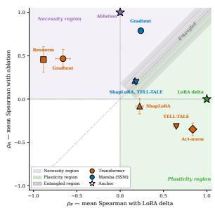

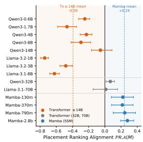  
Figure 1: Layer importance is method-relative and architecture-conditional. Left: Estimators projected onto the Necessity-Plasticity plane (mean Spearman correlation with ablation, vertical; with LoRA-delta, horizontal). In transformers, gradient and resnorm methods align with Necessity; activation norm and TELL-TALE align with Plasticity. In Mamba, estimators cluster in the mixed-positive region. Right: NPA(M) across checkpoints (bars: bootstrap 95% CI). Every evaluated transformer up to 14B is negative; every evaluated Mamba-style SSM is positive; the two largest transformers collapse toward zero. Dashed lines mark family means.

Contributions. 1) We introduce Necessity-Plasticity Alignment (NPA), a diagnostic that measures the agreement between pretrained layer dependence and task-specific adaptation across depth.

2) We find a robust architecture-dependent split: every evaluated residual transformer up to 14B exhibits negative NPA, with early layers most necessary and late layers most plastic, whereas the evaluated Mamba-style SSMs exhibit positive NPA, with Necessity and Plasticity concentrated in overlapping regions. The split survives an adapter-free full fine-tuning control and reappears within a single hybrid checkpoint.

3) We show that NPA predicts selective finetuning behavior in a controlled two-task continuallearning probe: the evaluated transformers exhibit strong forgetting when both tasks adapt the same highly plastic layers, while this tier-dependent interference disappears in the evaluated Mamba-style SSMs.

## 2 Related Work

Importance-guided PEFT and rank/placement allocation. A growing line of parameter-efficient fine-tuning (PEFT) work argues that adaptation should not be uniform across depth. AdaLoRA (Zhang et al., 2023) reallocates rank by singular-value importance during training; AlphaLoRA (Qing et al., 2024) assigns LoRA experts using heavy-tailed self-regularization statistics; Layer Card (Xu et al., 2026) introduces resnorm as a reusable layer diagnostic for selective placement; ShapLoRA (Zhao et al., 2026) uses Shapley-style sensitivity scores; and PLoP (Hayou et al., 2026) proposes a precise placement signal driven by neural-feature norms. Each of these methods proposes a single importance estimator and studies it in isolation. Recent work has also begun to ask whether compression, PEFT, and interpretability tools developed for transformers transfer to selective state-space models. LoRA-style adaptation has been extended to Mamba-style architectures (Galim et al., 2025), while layer pruning and relevance-propagation methods have been adapted to selective SSMs (Munoz et al., 2025; Jafari et al., 2025). These works motivate cross-architecture comparisons, but they do not ask whether different task-sensitive importance estimators agree on the same checkpoints

Layer roles, redundancy, and depth-dependent task usage. A parallel literature studies which layers are useful, redundant, or task-specific in pretrained models. ShortGPT (Men et al., 2025) shows that many transformer layers can be removed with limited degradation; TELL-TALE (Naim et al., 2026) performs task-aware layer elimination; Song et al. (2026) argue that depth contributes differently to retrieval, knowledge, and reasoning; Yao et al. (2024) study layer-wise importance for memoryefficient PEFT. Zhang et al. (2024) identify “cornerstone" layers via Shapley-style ablation, finding early-layer dominance, a phenomenon we recover under ablation but show dissolves under LoRA delta on the same checkpoint. Nepal et al. (2025) report that the layers ablation identifies as important for mathematical reasoning are stable across pretraining and post-training. Shi et al. (2025) learn binary masks for layer significance during alignment and observe high overlap across alignment datasets, all under a single estimator. These results document stability within one estimator; we document the orthogonal fact that across estimators, the very identity of “important" layers changes, and that whether it changes is architecture-conditional.

Method disagreement in attribution and importance. Disagreement between attribution methods is an established finding in the explainability literature. Adebayo et al. (2020) show that gradient-saliency maps survive parameter randomizations that destroy network behavior, evidence that gradient attribution does not measure the same thing as causal intervention. Ancona et al. (2018) unify gradient-based methods as varying-fidelity linearizations of true ablation; Sundararajan et al. (2017) prove that no attribution method satisfies sensitivity, implementation invariance, and completeness simultaneously. Krishna et al. (2024) measure the magnitude of feature-level attribution disagreement and characterize how practitioner interpretations shift with the method chosen. Our contribution shifts the disagreement from feature attributions to layer rankings, from a single architecture to a transformer/SSM contrast, and from “expected at high resolution" to a structurally predictable function of residual-stream gradient flow.

## 3 Layer-Importance Diagnostic Protocol

Our goal is to determine whether commonly used layer-importance estimators measure the same underlying property across architectures, or whether their behavior depends on the distinction between pretrained reliance and adaptation dynamics. We therefore study layer importance through two complementary quantities: Necessity and Plasticity.

Necessity. Necessity measures how much the pretrained model depends on a layer's existing contribution at inference time. A layer is considered necessary if bypassing it substantially degrades performance. For a model M with layers $\{ \ell _ { i } \} _ { i = 1 } ^ { L }$ , we define the Necessity score of layer $\ell _ { i }$ on task t as:

$$
N ( \ell _ { i } ; M , t ) = \mathcal { L } \big ( M _ { \setminus \ell _ { i } } , t \big ) - \mathcal { L } ( M , t ) ,
$$

where $\mathcal { L }$ denotes the task loss and $M _ { \backslash \ell _ { i } }$ is the model with layer $\ell _ { i }$ bypassed. Larger values indicate that the pretrained computation relies more strongly on that layer.

Plasticity. Plasticity measures where the model absorbs new information during adaptation. Rather than quantifying reliance on the pretrained computation, it measures how strongly each layer changes during task-specific fine-tuning. Using LoRA adaptation, we define the Plasticity score of layer $\ell _ { i }$ as:

$$
P ( \ell _ { i } ; M , t ) = \left\| \Delta W _ { i } ^ { ( t ) } \right\| _ { F } ,
$$

where $\Delta W _ { i } ^ { ( t ) }$ is the learned LoRA update for layer $\ell _ { i }$ on task $t ,$ and $\| \cdot \| _ { F }$ denotes the Frobenius norm. Larger values indicate that adaptation concentrates more strongly in that layer.

Although both quantities are often grouped under a single notion of “importance,"they capture fundamentally different properties. Necessity measures dependence of the pretrained model on an existing computation, whereas Plasticity measures receptivity to new information during adaptation. The relationship between these two quantities is therefore an empirical and architectural question.

To study this relationship, we introduce Necessity-Plasticity Alignment $( { \mathcal { N P A } } )$ , defined as the Spearman correlation between layer rankings induced by Necessity and Plasticity:

$$
\begin{array} { r } { \ N \mathcal { P } A ( M , t ) = \rho _ { \mathrm { S p e a r m a n } } \big ( R _ { \mathrm { N e c } } ( M , t ) , R _ { \mathrm { P l a s t } } ( M , t ) \big ) , } \end{array}
$$

where $R _ { \mathrm { N e c } }$ and $R _ { \mathrm { P l a s t } }$ denote the corresponding layer rankings for model M on task t.

Positive NPA indicates that the same layers are both necessary and plastic, while negative $\mathcal { N P A }$ indicates that pretrained reliance and adaptation concentrate on opposite ends of the network. Values near zero indicate that no stable agreement exists between the two notions of importance.

This protocol allows us to compare layerimportance structure across architectures independently of any single estimator. Rather than asking whether one importance metric is universally correct, we ask whether different estimators consistently align with Necessity or Plasticity, and whether the relationship between these quantities changes across model families.

## 4 Transformers and SSMs Disagree on Layer Importance

We now apply the diagnostic protocol to the transfer question directly. If transformer-derived layer-importance concepts transferred uniformly to SSMs, Necessity and Plasticity rankings should relate similarly across both families. Instead, their relationship changes sign across architectures.

## 4.1 Necessity-Plasticity Alignment changes sign across architectures

Figure 1 reports NPA(M) between ablationbased Necessity rankings and LoRA-delta-based Plasticity rankings. The sign of NPA cleanly separates the two families. All evaluated Mamba-style SSMs show positive alignment: layers receiving larger LoRA updates are also those whose ablation causes larger loss increases. In contrast, every evaluated residual transformer up to 14B shows negative alignment: the layers most necessary for preserving pretrained computation are not the layers where fine-tuning writes the largest task-specific updates. Figure 2 resolves the same measurement per (model, task) pair and shows that the split is not carried by a handful of outlier tasks: within each family the sign is consistent across the task suite.

The largest transformers weaken this pattern without becoming SSM-like. Qwen3-32B and Llama-3.1-70B move toward near-zero alignment, suggesting a partial reorganization of Plasticity rather than recovery of a universal layer ordering. This disagreement is not estimator noise: LoRA-delta rankings remain self-consistent under matched scopes while continuing to disagree with ablation. Strong negative NPA requires a concentrated high-Necessity region together with an adaptation profile that avoids it, and both ingredients weaken with scale; since NPA is a rank correlation, flattening either profile drives it toward zero. We therefore state the negative-transformer result for the evaluated ≤ 14B regime and do not extrapolate beyond the measured checkpoints.

The split is not an artifact of low-rank adaptation. Because Plasticity is read off a LoRA update, the split could in principle reflect where LoRA places updates rather than a property of the architecture. An adapter-free control on 13 checkpoints rules this out (Appendix E.3): full-FT and LoRA update profiles are positively rank-correlated on every one, and the sign of the alignment is preserved throughout, negative for every evaluated transformer with ablation baselines and positive or near zero for the evaluated Mamba, RWKV, and hybrid checkpoints. Normalizing updates by pretrained weight norm leaves this unchanged. The conclusion therefore does not depend on LoRA rank, scaling, initialization, or target-module selection.

Generalization beyond Mamba. The positivealignment regime is not specific to Mamba. RWKV (Peng et al., 2023) exhibits strongly positive alignment $( \mathcal { N P A } = + 0 . 5 4$ , with all per-task correlations positive). Zamba2 (Glorioso et al., 2024), a hybrid SSM+attention model, lies near zero but slightly positive $( \mathcal { N P A } = + 0 . 0 5 )$ , while Falcon-Mamba-7B (Zuo et al., 2024) lies slightly below zero $( \mathcal { N P A } = - 0 . 0 2 )$ . Together, these results suggest the ordering

$$
\ N \mathcal { P } A _ { \mathrm { S S M } } > \ N \mathcal { P } A _ { \mathrm { H y b r . } } \approx 0 > \ N \mathcal { P } A _ { \mathrm { T r a n s f . } \leq 1 4 \mathrm { B } } .
$$

The transformer-SSM contrast is strongest at small and medium scale, while very large transformers and boundary SSMs move toward a shared nearzero regime.

Necessity and Plasticity also dissociate within a hybrid model. Zamba2-2.7B interleaves 9 shared-attention blocks among 45 Mamba blocks, which lets us test the dissociation without changing checkpoints. Attention blocks are only 16.7% of the layers but absorb 36.3% of LoRA and 31.6% of full-FT update mass, while carrying just 10.4% of ablation Necessity mass, which concentrates in the Mamba blocks (Appendix E.4). Zamba2's nearzero whole-model NPA is therefore the average of a transformer-like and an SSM-like component, not the absence of the effect.

## 4.2 Depth profiles explain the architecture split

Figure 3 shows the spatial origin of the sign change. In transformers, Plasticity concentrates near the output side of the network, whereas Necessity concentrates near the input side, often dominated by a strong layer-0 component. The two quantities therefore select opposite ends of depth, producing negative alignment. In Mamba-style SSMs, the profiles are different but not spatially opposed. Plasticity peaks in middle layers, while Necessity emphasizes boundary layers with substantial overlap. Because the two quantities co-occupy partially overlapping regions, the resulting alignment remains positive.

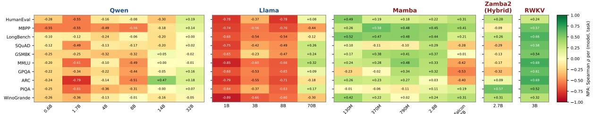  
Figure 2: Per-task $\mathcal { N P A }$ across architectures and scales. Spearman $\rho$ between Necessity and Plasticity rankings per (model, task) pair. Transformers are predominantly negative (red) up to 14B, fading toward zero at larger scale Mamba-family and RWKV6-3B are positive (green). Hybrid and boundary models sit near zero.

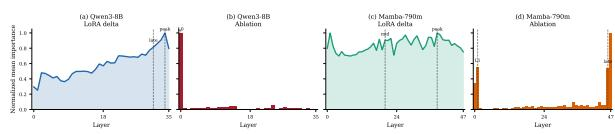  
Figure 3: Representative Necessity and Plasticity depth profiles. Qwen3-8B: LoRA delta concentrates near the final layers (a); ablation is dominated by an early layer-0 spike (b). Mamba-790m: LoRA delta peaks mid-network (c); ablation emphasizes boundary layers with partial overlap (d). Transformers select opposite ends of depth; Mamba profiles differ but are not spatially opposed.

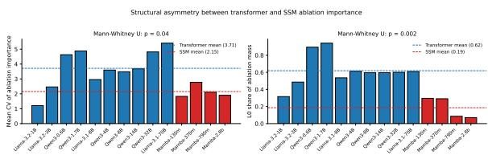  
Figure 4: Leave-out-L0 and L0-share controls per checkpoint. Transformers concentrate more ablation mass on layer 0 than Mamba models, yet removing layer 0 shifts transformer alignment toward zero without reversing its sign, ruling out the embedding bottleneck as the sole driver of the architecture split.

This depth organization also explains why large transformers move toward zero alignment. Their Necessity profiles remain strongly early-layer dominated, but Plasticity becomes less purely terminal and develops additional early-layer mass. The resulting partial overlap weakens anti-alignment without producing the positive agreement observed in SSMs.

## 4.3 Layer-0 and metric controls

A natural alternative explanation is that the transformer-SSM contrast is driven entirely by layer 0. Figure 4 rules out this strong form. Removing layer 0 shifts transformer checkpoints toward zero, but every evaluated transformer up to 14B remains negatively aligned, while Mamba checkpoints change minimally. Transformers do allocate substantially more Necessity mass to layer 0 than Mamba models, but the anti-alignment persists even after removing it, indicating a broader depth-wise separation between Necessity and Plasticity.

We also test whether ranking-based placement conclusions transfer uniformly across validation metrics. They do not. On multiple-choice evaluation, the relative advantage of top-k versus bottomk placement depends on both the estimator and the model family. Even after rankings are computed under a shared proxy protocol, their downstream interpretation remains metric-relative.

## 4.4 Estimator spectrum and implications

The Necessity-Plasticity distinction also organizes estimators beyond the two anchors. In transformers, gradient- and resnorm-based estimators align more strongly with Necessity, while activation norm and TELL-TALE align more strongly with Plasticity. ShapLoRA occupies an intermediate position. In Mamba, where Necessity and Plasticity are already positively aligned, the estimators cluster within the same mixed-positive region.

These results show that layer importance is not a universal ordering of depth. Ablation-based, adaptation-based, and proxy estimators are not noisy measurements of a single latent ranking; they measure different properties of the model. A layer can be important because removing it disrupts pretrained computation, or because fine-tuning preferentially writes into it.

Importance-guided placement should therefore be treated as a measurement problem rather than a model-independent fact.

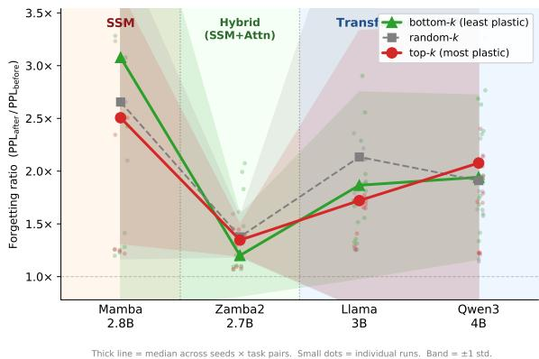  
Figure 5: Tier-dependent forgetting is a transformer effect. Forgetting ratio $\left( \mathrm { P P L } _ { \mathrm { a f t e r } } / \mathrm { P P L } _ { \mathrm { b e f o r e } } \right)$ for top-k, random-k, and bottom-k LoRA placement $\left( k { = } 6 \right)$ . In transformers (right, $\mathrm { \Delta N P A } < 0 )$ , top-k placement causes significantly more forgetting than bottom-k $( p { < } 0 . 0 0 1$ ， 66 pairs). In SSMs (left, $\mathrm { \Delta N P A } > \mathrm { \Delta 0 ) }$ , no significant difference is observed $\scriptstyle ( p = 0 . 4 5 ,$ , 54 pairs).

## 4.5 A two-task probe of the forgetting mechanism

If NPA captures the spatial relationship between Necessity and Plasticity, it should predict when selective adaptation creates stability failures. We test this in a controlled two-task setup where only the adapted layers change. This experiment is a mechanism probe, not a continual-learning benchmark: two tasks is the minimal setting in which forgetting is well defined, and restricting to it isolates the Necessity-Plasticity overlap from confounds longer sequences introduce (interference accumulation, capacity saturation, implicit replay through task similarity). We scope its conclusions to the evaluated two-task setting and the fixed LoRA configuration described here. For each model, we compute LoRA-delta scores on a source task A, select either the top-k most plastic or bottom-k least plastic layers, fine-tune on task A, then fine-tune on task B using the same layer subset. Forgetting is measured on task A as

$$
\mathrm { F R } = { \frac { \mathrm { P P L } _ { \mathrm { a f t e r } } } { \mathrm { P P L } _ { \mathrm { b e f o r e } } } } .
$$

Figure 5 shows that the plasticity-stability tradeoff is architecture-dependent. In transformers $( \mathcal { N P A } < 0 )$ , adapting through the most plastic layers causes substantially more forgetting than adapting through the least plastic layers. The top-k condition consistently lies above bottom-k, indicating that highly plastic late layers form a shared adaptation bottleneck: successive tasks write into the same narrow region and partially overwrite one another. In Mamba-style SSMs $( \mathcal { N P A } > 0 )$ , this tier effect disappears. Top-k and bottom-k placement produce statistically indistinguishable forgetting ratios $( p = 0 . 4 5 )$ , consistent with Plasticity being distributed rather than concentrated in a single vulnerable tier. Falcon-Mamba-7B lies between these regimes: its near-zero alignment $( \mathcal { N P A } = - 0 . 0 2 )$ is matched by a weak, marginally significant forgetting effect $( p = 0 . 0 5 5 )$ . Thus, $\mathcal { N P A }$ acts as a continuous predictor of bottleneck risk: negative alignment produces localized interference, nearzero alignment produces unstable effects, and positive alignment produces no reliable tier-dependent bottleneck. The same qualitative pattern is stable across scale; we report the full scale-wise plot in Figure 20 of Appendix H.

EWC regularization baseline. We also compare placement against elastic weight consolidation (EWC) (Kirkpatrick et al., 2017), which regularizes parameter movement according to Fisher information rather than restricting which layers are adapted. Figure 6 shows that the plasticity-stability tradeoff has different geometry across architectures. In both Mamba checkpoints, EWC achieves the lowest median forgetting. For Mamba-790M, EWC reaches a median forgetting ratio of 1.45×, compared with 2.21 × for top-k and 1.68× for bottomk $( p = 0 . 0 0 4 )$ ; Mamba-2.8B shows the same qualitative ordering. This supports the view that when Plasticity is distributed across depth, stability is better recovered by globally constraining update magnitude than by selecting a small subset of layers.

In transformers, the tradeoff is more localized. For Qwen3-0.6B, EWC reduces forgetting relative to top-k but remains worse than bottom-k. For Llama-3.2-3B, EWC is again worse than bottom-k $( p = 0 . 0 0 4 )$ . Thus, transformers benefit more from avoiding the high-plasticity bottleneck, whereas SSMs benefit more from global regularization.

Recommendation for adapter placement. In the evaluated transformers $( \mathcal { N P A } < 0 )$ , the high-Necessity and high-Plasticity regions are disjoint, so placement is consequential: place adapters away from the high-Necessity early block, or protect that block when tasks arrive in sequence. In the evaluated Mamba-style SSMs $( \mathcal { N P A } > 0 )$ , Plasticity is distributed rather than concentrated in one vulnerable tier, so globally constraining update magnitude (EWC) helps more than placement. Both rules are read off the $\leq 1 4 \mathrm { B }$ regime and the two-task probe.

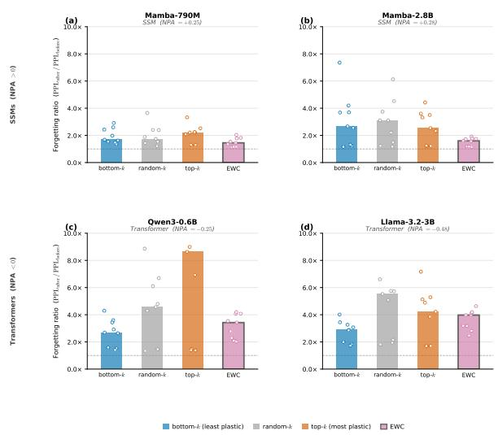  
Figure 6: EWC versus placement strategies across architectures. Forgetting ratio for bottom-k, randomk, top-k, and EWC (Fisher-weighted, all layers). In Mamba-790M (NPA > 0, left), EWC achieves the lowest forgetting. In both transformers $\mathrm { ( N P A < 0 }$ , centre and right), bottom-k placement matches or beats EWC, consistent with the shared-bottleneck mechanism.

## 5 Mechanistic Account

The previous section showed that Necessity and Plasticity anti-align in residual transformers but align in Mamba-style SSMs. We now give a mechanistic account of this split. The central idea is that transformer anti-alignment arises from a depthwise separation between pretrained dependence and low-cost adaptation: early layers are costly to remove, whereas later layers provide favorable sites for task-specific updates. Mamba-style SSMs do not exhibit the same systematic opposition across depth, explaining why transformer-calibrated layerimportance tools do not transfer uniformly across architectures.

Necessity and Plasticity coincide only under restrictive assumptions, such as locally isotropic curvature, infinitesimal interventions, and unconstrained optimization. Large pretrained models do not satisfy these assumptions in practice. The relevant question is therefore not whether ablation and LoRA-delta estimate the same latent quantity, but when architecture makes their rankings align or diverge.

We approach this question from two complementary perspectives. The first is a curvature view: ablation importance measures the cost of removing a layer's pretrained contribution, whereas LoRAdelta importance measures where optimization can write a large, low-cost task-specific update.

The second is a residual-Jacobian view. In residual networks, removing layer l induces a perturbation that propagates through the downstream Jacobian product

$$
\prod _ { j > l } ( I + J _ { f _ { j } } ) ,
$$

creating a directional asymmetry across depth. Both perspectives predict the same empirical pattern: early-layer concentration of Necessity and late-layer concentration of Plasticity in transformers.

## 5.1 Residual geometry biases Necessity toward early layers in transformers

Consider a pre-LN residual block

$$
h _ { l } = h _ { l - 1 } + f _ { l } ( h _ { l - 1 } ) ,
$$

with the loss attached to the final representation $h _ { L }$ . Bypassing the layer removes the residual computation $f _ { l } ( h _ { l - 1 } )$ while preserving the skip path. Linearizing the resulting perturbation gives

$$
\begin{array} { r l r } {  { I _ { \mathrm { a b l } } ( l , t ) \approx \mathbb { E } _ { x } \Big [ \Big \langle \frac { \partial L _ { t } } { \partial h _ { L } } , } } \\ & { } & { \Big ( \prod _ { j = l + 1 } ^ { L } ( I + J _ { f _ { j } } ) \Big ) f _ { l } ( h _ { l - 1 } ) \Big \rangle \Big ] } \\ & { } & { + O ( \| f _ { l } ( h _ { l - 1 } ) \| ^ { 2 } ) , ~ } \end{array}
$$

where $J _ { f _ { j } }$ denotes the Jacobian of block $j .$

This expression does not imply that early layers must always dominate ablation. The downstream Jacobian product can amplify, suppress, rotate, or cancel perturbations. However, earlier residual contributions propagate through more downstream blocks and participate in constructing the representations on which all later layers operate. This creates a systematic structural bias toward the input side of the network.

Figure 3 shows that this bias dominates empirically. In transformers, Necessity mass concentrates strongly in early layers, often with a pronounced layer-0 spike, whereas Plasticity concentrates near the output side of the network. The result is a spatial separation between pretrained dependence and task adaptation.

Under the curvature interpretation, the same pattern emerges for a complementary reason. Late transformer layers can absorb task-specific updates with more direct influence on the final output and less disruption to earlier computations, making them favorable locations for adaptation. Plasticity therefore accumulates late even when Necessity remains concentrated early.

Together, these effects predict negative alignment between Necessity and Plasticity in residual transformers.

Prediction 1: In residual transformers, Necessity and Plasticity should be negatively correlated across depth.

## 5.2 Mamba-style SSMs weaken this depth-wise separation

The transformer mechanism relies not only on residual depth, but on a particular depth organization: pretrained dependence concentrates early, while low-cost adaptation concentrates late. Mamba-style SSMs retain residual depth, but their selective recurrent dynamics do not induce the same empirical separation.

First, every Mamba layer directly reads the current token through a learned selective gate. Input information is therefore injected continuously across depth rather than once at the beginning of a residual stream. No single layer plays the privileged initialization role associated with transformer layer 0, so there is no structural reason for Necessity to collapse toward the input side. Second, the selective recurrence propagates information through an impulse-response operator $\Phi _ { j , l } ( x )$ whose eigenvalues remain bounded inside the unit disk (Gu and Dao, 2024). The expected propagation norm therefore depends primarily on distance $| j - l |$ rather than direction from input to output. Gradient propagation through the recurrence does not preferentially amplify late-layer adaptation.

Together, these properties remove the architectural mechanism forcing separation between Necessity and Plasticity. Figure 3 shows the resulting behavior empirically: in Mamba, Necessity and Plasticity occupy partially overlapping regions rather than opposite ends of depth.

Appendix A.4 formalizes this intuition. Under assumptions $\mathbf { B } 1 ^ { \prime } \mathbf { - B } 2$ , the mass-displacement coefficient δ governing separation between Necessity and Plasticity vanishes asymptotically:

$$
| \delta | \leq { \frac { 2 K } { L } } \to 0 \qquad \mathrm { a s } \qquad L / K \to \infty .
$$

Thus, under the stated assumptions, the mechanism producing systematic rank anti-correlation in transformers vanishes asymptotically.

Prediction 2: Mamba-style SSMs should not exhibit systematic negative Necessity-Plasticity Alignment; their alignment should be non-negative or near zero.

## 5.3 Layer-0 controls rule out a pure embedding-bottleneck explanation

The residual account further predicts that transformers should allocate unusually large Necessity mass to layer 0. Figure 4 confirms this prediction: transformers assign substantially more ablation mass to layer 0 than Mamba models.

However, layer-0 dominance alone does not explain the full architecture split. If the effect were purely an embedding bottleneck artifact, removing layer 0 from the rankings should eliminate the transformer-SSM contrast. Instead, Figure 4 shows that the contrast survives. Transformer alignment becomes less negative but remains negative, whereas Mamba checkpoints remain positive.

The phenomenon therefore reflects a broader separation between early-side Necessity and lateside Plasticity rather than a single anomalous layer.

Prediction 3: Removing layer 0 should weaken negative alignment in transformers.

## 5.4 Curvature measurements support the decomposition

The curvature account predicts that layer-wise curvature should co-vary with Necessity and anticorrelate with Plasticity in transformers, but not in SSMs. We test this using diagonal Fisher information:

$$
F _ { l } = \mathbb { E } _ { x } \left[ \| \nabla _ { \theta _ { l } } \mathcal { L } \| ^ { 2 } \right] .
$$

Figure 7 supports this prediction. In transformers, Fisher curvature co-varies with Necessity and anti-correlates with Plasticity: high-Fisher layers are costly to remove but receive smaller LoRA updates. In SSMs, Fisher remains positively associated with Necessity and no longer anti-correlates with Plasticity. Thus, curvature separates pretrained dependence from adaptation in transformers but not in the same way in Mamba-style SSMs.

## 5.5 Scale and estimator structure

The same account explains why transformer antialignment weakens at larger scale. Negative alignment requires early Necessity together with lateconcentrated Plasticity. Qwen3-32B and Llama-3.1-70B retain early Necessity, but their Plasticity profiles develop an additional early-layer mode (Figure 21, and greater depth and redundancy flatten both profiles. This partial overlap collapses NPA toward zero without producing the positive alignment observed in SSMs. The mechanism predicts the direction of the trend but not where it terminates, so we do not extrapolate the sign beyond the measured checkpoints.

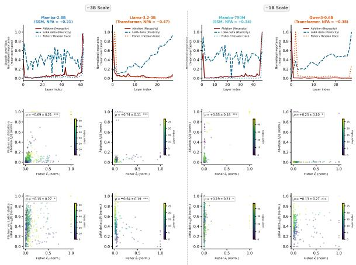  
Figure 7: Fisher curvature supports the Necessity-Plasticity split. Two size-matched SSM-Transformer pairs (\~3B: Mamba-2.8B vs. Llama-3.2-3B; \~1B: Mamba-790M vs. Qwen3-0.6B). Top: depth profiles of Fisher curvature (dotted), Necessity (solid), and Plasticity (dashed). Middle/Bottom: scatter of Fisher vs. ablation and vs. LoRA delta. In transformers, Fisher curvature co-varies with Necessity and anti-correlates with Plasticity. In SSMs, both correlations are non-negative.

Finally, the decomposition also organizes proxy estimators. Figure 1 shows that, in transformers, gradient- and resnorm-based methods align more strongly with Necessity, while activation norm and TELL-TALE align more strongly with Plasticity; ShapLoRA lies between them. In Mambastyle SSMs, where the anchors are already positively aligned, estimators cluster in the same mixedpositive region. Layer importance is therefore not a universal ordering of depth, but a measurement whose meaning depends on both architecture and intervention.

## 6 Conclusion

We showed that layer importance is not a modelindependent ordering of depth. By separating importance into Necessity, the dependence of the pretrained model on a layer's existing computation, and Plasticity, the tendency of adaptation to write task-specific updates into that layer, we find a systematic architecture-dependent split. Every evaluated residual transformer up to 14B exhibits negative Necessity-Plasticity Alignment: early layers are most necessary, while later layers are most plastic. The evaluated Mamba-style SSMs instead show positive or near-zero alignment, with the two quantities occupying overlapping regions of depth. The split survives an adapter-free control and reappears within a hybrid checkpoint

This split is not only diagnostic; it predicts the stability cost of selective adaptation. In a controlled two-task probe, adapting the most plastic layers of the evaluated transformers creates a shared late-layer bottleneck and increases forgetting, whereas in the evaluated Mamba-style SSMs this tier-dependent effect largely disappears. Layer-0 controls, and corroborating curvature measurements, support the same interpretation: transformer anti-alignment reflects a broader separation between pretrained dependence and adaptation, not a single anomalous layer.

Overall, layer-importance methods should be treated as measurements of specific properties rather than interchangeable estimates of one universal ranking. Tools calibrated on transformers may therefore fail silently on recurrent or hybrid architectures, where the geometry of stored computation and new adaptation can differ fundamentally.

## Acknowledgements

Sarath Chandar is supported by the Canada CIFAR AI Chairs program, the Canada Research Chair in Lifelong Machine Learning, and the NSERC Discovery Grant. Irina Rish is supported by the Canada CIFAR AI Chairs program and the Canada Excellence Research Chair in Autonomous AI. Experiments were conducted using computational resources provided by Mila Quebec AI Institute.

## 7 Limitations

Our analysis studies layer importance through two operational anchors: ablation-induced loss increase for Necessity and update magnitude for Plasticity. These definitions are well matched to pruning and parameter-efficient adaptation, but they do not cover all possible notions of importance. Plasticity in particular is defined through the outcome of an adaptation procedure rather than as an intrinsic layer property. We reduce, but do not eliminate, the resulting dependence: Appendix E.3 shows that replacing LoRA with unconstrained full-parameter fine-tuning, and normalizing updates by pretrained weight norm, both preserve the sign of NPA on every retrained checkpoint. Other adaptation procedures (prefix tuning, other PEFT families, different optimizers or budgets) were not tested. On the Necessity side, ablation measures coarse total functional reliance at the layer level; activation patching, causal tracing, and optimizer-state analyses could decompose that reliance into finer mechanisms and may expose additional structure. Our model coverage spans transformers, Mambastyle SSMs, RWKV, and hybrid checkpoints, but remains limited relative to the full architecture space, and all architecture-level statements in this paper should be read as scoped to the evaluated checkpoints and scales. In particular, hybrid models and very large transformers move toward a near-zero alignment regime, so NPA should be interpreted as a continuous diagnostic rather than a strict family label. The negative-transformer result is established $\mathbf { a t } \leq 1 4 \mathbf { B } ;$ at 32B and 70B the effect is near zero, and we have no evidence about scales beyond 70B. The hybrid component analysis rests on a single checkpoint with one attention/SSM ratio. The mechanistic account is also partial. The residual-Jacobian and curvature views explain the observed depth-wise patterns and are supported by layer-0 controls and Fisher measurements, but the theoretical argument relies on simplifying assumptions. Diagonal Fisher is a coarse proxy for curvature: it discards off-diagonal terms and is sensitive to parameter scale, so we use it as corroborating evidence only. None of the paper's main claims depend on it. Finally, our continual-learning experiments are a two-task mechanism probe rather than a benchmark. They isolate layer placement under fixed LoRA configurations, task pairs, and optimization budgets. Longer or more varied task sequences, different ranks, longer training, replay, or full-model updates may change the magnitude and even the ordering of forgetting effects. Our conclusion is therefore not that one placement rule is universally optimal, but that the meaning and risk of layer selection depend on architecture and on what the estimator measures.

## References

Julius Adebayo, Justin Gilmer, Michael Muelly, Ian Goodfellow, Moritz Hardt, and Been Kim. 2020. Sanity checks for saliency maps. Preprint, arXiv:1810.03292.

Armen Aghajanyan, Sonal Gupta, and Luke Zettlemoyer. 2021. Intrinsic dimensionality explains the

effectiveness of language model fine-tuning. In Proceedings of the 59th Annual Meeting of the Association for Computational Linguistics and the 11th International Joint Conference on Natural Language Processing (Volume 1: Long Papers), pages 7319–7328, Online. Association for Computational Linguistics.

Marco Ancona, Enea Ceolini, Cengiz Öztireli, and Markus Gross. 2018. Towards better understanding of gradient-based attribution methods for deep neural networks. Preprint, arXiv:1711.06104.

Tri Dao and Albert Gu. 2024. Transformers are ssms: Generalized models and efficient algorithms through structured state space duality. Preprint, arXiv:2405.21060.

Kevin Galim, Wonjun Kang, Yuchen Zeng, Hyung Il Koo, and Kangwook Lee. 2025. Parameterefficient fine-tuning of state space models. Preprint arXiv:2410.09016.

Paolo Glorioso, Quentin Anthony, Yury Tokpanov, Anna Golubeva, Vasudev Shyam, James Whittington, Jonathan Pilault, and Beren Millidge. 2024. The zamba2 suite: Technical report. Preprint, arXiv:2411.15242.

Aaron Grattafiori, Abhimanyu Dubey, Abhinav Jauhri, Abhinav Pandey, Abhishek Kadian, Ahmad Al-Dahle, Aiesha Letman, Akhil Mathur, Alan Schelten, Alex Vaughan, Amy Yang, Angela Fan, Anirudh Goyal, Anthony Hartshorn, Aobo Yang, Archi Mitra, Archie Sravankumar, Artem Korenev, Arthur Hinsvark, and 542 others. 2024. The llama 3 herd of models. Preprint, arXiv:2407.21783.

Andrey Gromov, Kushal Tirumala, Hassan Shapourian, Paolo Glorioso, and Daniel A. Roberts. 2025. The unreasonable ineffectiveness of the deeper layers. Preprint, arXiv:2403.17887.

Albert Gu and Tri Dao. 2024. Mamba: Lineartime sequence modeling with selective state spaces. Preprint, arXiv:2312.00752.

Soufiane Hayou, Nikhil Ghosh, and Bin Yu. 2026. PLop: Precise loRA placement for efficient finetuning of large models. In The Fourteenth International Conference on Learning Representations.

Edward J. Hu, Yelong Shen, Phillip Wallis, Zeyuan Allen-Zhu, Yuanzhi Li, Shean Wang, Lu Wang, and Weizhu Chen. 2021. Lora: Low-rank adaptation of large language models. Preprint, arXiv:2106.09685.

Arthur Jacot, Franck Gabriel, and Clément Hongler. 2020. Neural tangent kernel: Convergence and generalization in neural networks. Preprint, arXiv:1806.07572.

Farnoush Rezaei Jafari, Grégoire Montavon, Klaus-Robert Müller, and Oliver Eberle. 2025. Mambalrp: Explaining selective state space sequence models. Preprint, arXiv:2406.07592.

James Kirkpatrick, Razvan Pascanu, Neil Rabinowitz Joel Veness, Guillaume Desjardins, Andrei A. Rusu, Kieran Milan, John Quan, Tiago Ramalho, Agnieszka Grabska-Barwinska, Demis Hassabis, Claudia Clopath, Dharshan Kumaran, and Raia Hadsell. 2017. Overcoming catastrophic forgetting in neural networks. Proceedings of the National Academy of Sciences, 114(13):3521–3526.

Satyapriya Krishna, Tessa Han, Alex Gu, Steven Wu, Shahin Jabbari, and Himabindu Lakkaraju. 2024. The disagreement problem in explainable machine learning: A practitioner's perspective. Transactions on Machine Learning Research.

Xin Men, Mingyu Xu, Qingyu Zhang, Qianhao Yuan, Bingning Wang, Hongyu Lin, Yaojie Lu, Xianpei Han, and Weipeng Chen. 2025. ShortGPT: Layers in large language models are more redundant than you expect. In Findings of the Association for Computational Linguistics: ACL 2025, pages 20192–20204, Vienna, Austria. Association for Computational Linguistics.

Kevin Meng, David Bau, Alex Andonian, and Yonatan Belinkov. 2023. Locating and editing factual associations in gpt. Preprint, arXiv:2202.05262.

Juan Pablo Munoz, Jinjie Yuan, and Nilesh Jain. 2025. Mamba-shedder: Post-transformer compression for efficient selective structured state space models. In Proceedings of the 2025 Conference of the Nations of the Americas Chapter of the Association for Computational Linguistics: Human Language Technologies (Volume 1: Long Papers), pages 3851–3863, Albuquerque, New Mexico. Association for Computational Linguistics.

Omar Naim, Krish Sharma, Niyar R Barman, and Nicholas Asher. 2026. Tell-tale: Task efficient 1lms with task aware layer elimination. Preprint, arXiv:2510.22767.

Aadim Nepal, Safal Shrestha, Anubhav Shrestha, Minwu Kim, Jalal Naghiyev, Ravid Shwartz-Ziv, and Keith Ross. 2025. Layer importance for mathematical reasoning is forged in pre-training and invariant after post-training. Preprint, arXiv:2506.22638.

Rui Pan, Xiang Liu, Shizhe Diao, Renjie Pi, Jipeng Zhang, Chi Han, and Tong Zhang. 2024. Lisa: Layerwise importance sampling for memory-efficient large language model fine-tuning. Preprint, arXiv:2403.17919.

Bo Peng, Eric Alcaide, Quentin Anthony, Alon Albalak, Samuel Arcadinho, Stella Biderman, Huanqi Cao, Xin Cheng, Michael Chung, Matteo Grella, Kranthi Kiran GV, Xuzheng He, Haowen Hou, Jiaju Lin, Przemyslaw Kazienko, Jan Kocon, Jiaming Kong, Bartlomiej Koptyra, Hayden Lau, and 15 others. 2023. Rwkv: Reinventing rnns for the transformer era. Preprint, arXiv:2305.13048.

Peijun Qing, Chongyang Gao, Yefan Zhou, Xingjian Diao, Yaoqing Yang, and Soroush Vosoughi. 2024.

AlphaLoRA: Assigning LoRA experts based on layer training quality. In Proceedings of the 2024 Conference on Empirical Methods in Natural Language Processing, pages 20511–20523, Miami, Florida, USA. Association for Computational Linguistics.

Guangyuan Shi, Zexin Lu, Xiaoyu Dong, Wenlong Zhang, Xuanyu Zhang, Yujie Feng, and Xiao-Ming Wu. 2025. Understanding layer significance in llm alignment. Preprint, arXiv:2410.17875.

Xinyuan Song, Keyu Wang, PengXiang Li, Lu Yin, and Shiwei Liu. 2026. Demystifying the roles of llm layers in retrieval, knowledge, and reasoning. Preprint, arXiv:2510.02091.

Mukund Sundararajan, Ankur Taly, and Qiqi Yan. 2017. Axiomatic attribution for deep networks. Preprint arXiv:1703.01365.

Ashish Vaswani, Noam Shazeer, Niki Parmar, Jakob Uszkoreit, Llion Jones, Aidan N. Gomez, Lukasz Kaiser, and Illia Polosukhin. 2023. Attention is all you need. Preprint, arXiv:1706.03762.

Yichen Xu, Yuyang Liang, Shan Dai, Tianyang Hu, Tsz Nam Chan, and Chenhao Ma. 2026. Understanding and guiding layer placement in parameterefficient fine-tuning of large language models. Preprint, arXiv:2602.04019.

An Yang, Anfeng Li, Baosong Yang, Beichen Zhang, Binyuan Hui, Bo Zheng, Bowen Yu, Chang Gao, Chengen Huang, Chenxu Lv, Chujie Zheng, Dayiheng Liu, Fan Zhou, Fei Huang, Feng Hu, Hao Ge, Haoran Wei, Huan Lin, Jialong Tang, and 41 others. 2025. Qwen3 technical report. Preprint arXiv:2505.09388.

Kai Yao, Penglei Gao, Lichun Li, Yuan Zhao, Xiaofeng Wang, Wei Wang, and Jianke Zhu. 2024. Layer-wise importance matters: Less memory for better performance in parameter-efficient fine-tuning of large language models. Preprint, arXiv:2410.11772.

Qingru Zhang, Minshuo Chen, Alexander Bukharin, Nikos Karampatziakis, Pengcheng He, Yu Cheng, Weizhu Chen, and Tuo Zhao. 2023. Adalora: Adaptive budget allocation for parameter-efficient finetuning. Preprint, arXiv:2303.10512.

Yang Zhang, Yanfei Dong, and Kenji Kawaguchi. 2024. Investigating layer importance in large language models. In Proceedings of the 7th BlackboxNLP Workshop: Analyzing and Interpreting Neural Networks for NLP, pages 469–479, Miami, Florida, US. Association for Computational Linguistics.

Yi Zhao, Qinghua Yao, Xinyuan song, and Wei Zhu. 2026. Shaplora: Allocation of low-rank adaption on large language models via shapley value inspired importance estimation. Preprint, arXiv:2601.17921.

Jingwei Zuo, Maksim Velikanov, Dhia Eddine Rhaiem, Ilyas Chahed, Younes Belkada, Guillaume Kunsch, and Hakim Hacid. 2024. Falcon mamba: The first competitive attention-free 7b language model. Preprint, arXiv:2410.05355.

## A Formal Theory: Necessity and Plasticity as Distinct Functionals

The body of the paper argues, informally, that ablation and LoRA delta should be expected to disagree on residual transformers and to agree on Mamba. This appendix gives that argument a formal backbone. We state three theorems and one corollary that together: (i) separate ablation and LoRA delta as projections of the loss landscape onto two structurally distinct subspaces (Theorem A.1); (ii) prove a rigorous mass-displacement bound for residual transformers (Theorem $\mathrm { A } . 3 , \delta = \tilde { I } _ { a } ( E ) + \tilde { I } _ { \Delta } ( \bar { E } ) -$ $1 \ge \tau - L ( 1 + \beta ) ^ { L } / ( \kappa + L ( 1 + \beta ) ^ { L } ) )$ and convert it to a Spearman bound under an explicit profileshape condition (Lemma A.4); (iii) show that the analogous bound vanishes for state-space recurrences satisfying an expected symmetric-mixing condition (Theorem A.6); and (iv) explain, as Corollary A.8, why bimodal LoRA-delta profiles drive $| \rho _ { s } |$ toward zero rather than reversing its sign.

A note on what is and is not proven. Theorems A.3 and A.6 are rigorous mass-displacement statements that follow directly from the assumptions. The Spearman correlation bound is a separate statement, conditional on a profile-shape assumption (monotonicity or unimodality) that we state explicitly and verify empirically rather than derive from the architectural assumptions alone. This separation makes the load-bearing premises visible.

We use the same notation throughout: $\theta _ { 0 }$ are the pretrained parameters, $L _ { t } ( \theta )$ is the task loss, $g _ { l } = \nabla _ { \theta _ { l } } L _ { t } ( \theta _ { 0 } ) , H _ { l l } = \nabla _ { \theta _ { l } \theta _ { l } } ^ { 2 } L _ { t } ( \theta _ { 0 } )$ is the layerlocal Hessian block, $\boldsymbol { S _ { l } }$ is the LoRA-accessible subspace at layer l with orthogonal projector $P _ { S _ { l } }$ and $\bar { \lambda } _ { \operatorname* { m i n } } ^ { ( l ) } , \lambda _ { \operatorname* { m a x } } ^ { ( l ) }$ are the extremal eigenvalues of $H _ { l l }$ restricted to $\boldsymbol { S _ { l } }$ .We write $f _ { l }$ for the layer-local map (residual block in transformers, SSM block in Mamba) and $J _ { f _ { j } } = \partial f _ { j } / \partial h _ { j - 1 }$ for its activation Jacobian.

## A.1 The three estimators are distinct functionals of the loss

We first record, in one place, that gradient attribution, LoRA delta, and ablation are not three noisy estimates of one quantity but three distinct functionals. Writing $\theta _ { t } ^ { \star } = \theta _ { 0 } + \Delta \theta _ { t }$ for a LoRA-constrained local minimizer reached from $\theta _ { 0 }$ on task t,

$$
I _ { g } ( l , t ) = \mathbb { E } _ { x \sim D _ { t } } \big [ \| \nabla _ { \theta _ { l } } L _ { t } ( \theta _ { 0 } ; x ) \| _ { 2 } \big ] ,\tag{1}
$$

$$
I _ { \Delta } ( l , t ) = \| ( \theta _ { t } ^ { \star } ) _ { l } - \theta _ { l } ^ { 0 } \| _ { F } ,
$$

$$
I _ { a } ( l , t ) = L _ { t } ( \theta _ { 0 } \setminus l ) - L _ { t } ( \theta _ { 0 } ) .\tag{2}
$$

(3)

All three are task-indexed; we suppress the task argument when context is clear. Equation (1) is a tangent: a first-order sensitivity at $\theta _ { 0 }$ . Equation (2) is a chord: the magnitude of the converged update over the full optimization trajectory. Equation (3) is a finite-difference jump: a non-infinitesimal intervention. The three coincide only if $L _ { t }$ is exactly quadratic and isotropic on every layer, or if the ablation perturbation $\theta _ { 0 } \setminus l$ is infinitesimal. Neither holds for a deep transformer (Sundararajan et al., 2017; Ancona et al., 2018; Adebayo et al., 2020), so disagreement is the generic case and agreement is the exception. The decomposition lemma below makes the source of disagreement explicit.

A standard quadratic expansion gives the curvature decomposition

$$
I _ { \Delta } ( l ) \approx \| H _ { l l } ^ { - 1 } g _ { l } \| _ { F } \in \left[ \frac { \| g _ { l } \| _ { F } } { \lambda _ { \operatorname* { m a x } } ^ { ( l ) } } , \frac { \| g _ { l } \| _ { F } } { \lambda _ { \operatorname* { m i n } } ^ { ( l ) } } \right]\tag{4}
$$

in the unconstrained case, and the LoRA-restricted analogue $\Vert u _ { l } ^ { \star } \Vert _ { F } \qquad \in$ $[ \| P _ { S _ { l } } g _ { l } \| _ { F } / \lambda _ { \operatorname* { m a x } } ^ { ( l ) } , \qquad \| P _ { S _ { l } } g _ { l } \| _ { F } / \lambda _ { \operatorname* { m i n } } ^ { ( l ) } ]$ in the low-rank case (Jacot et al., 2020; Aghajanyan et al., 2021; Hu et al., 2021). For ablation, a second-order expansion of $L _ { t }$ along the direction $- \theta _ { l } ^ { 0 }$ that zeros out the layer's contribution gives

$$
\begin{array} { r } { I _ { a } ( l ) \approx - g _ { l } ^ { \top } \theta _ { l } ^ { 0 } + \frac { 1 } { 2 } ( \theta _ { l } ^ { 0 } ) ^ { \top } H _ { l l } \theta _ { l } ^ { 0 } + R ( \theta _ { l } ^ { 0 } ) , } \end{array}\tag{5}
$$

where $R ( \theta _ { l } ^ { 0 } )$ collects higher-order terms that are non-negligible because $\theta _ { l } ^ { 0 }$ is large. Equation (5) is dominated by the curvature term whenever the pretrained weights have large norm and are approximately aligned with the dominant Hessian eigenvectors — a condition that is structurally favored at high-norm early-layer weight matrices. Combining (4) and (5) gives the qualitative reading: a layer that is high-gradient and high-curvature and large-norm scores high under ablation but low under LoRA delta, while a layer that is high-gradient and low-curvature scores high under LoRA delta but moderate under ablation. The two estimators therefore anti-correlate when those two regimes are spatially separated across depth. The next theorem makes this geometric picture rigorous.

## A.2 Theorem 1: Necessity-Plasticity Decomposition

Define, at each layer l,

$$
\nu _ { l } : = f _ { l } ( h _ { l - 1 } ) \qquad \quad \quad \quad \quad \quad \mathrm { ( N e c e s s i t y d i r ) , } ) ,\tag{6}
$$

$$
\Pi _ { l } : = \prod _ { j = l + 1 } ^ { L } \left( I + J _ { f _ { j } } ( h _ { j - 1 } ) \right) \quad { \mathrm { ( p r o p a g a t o r ) } } ,\tag{7}
$$

$$
\pi _ { l } : = H _ { l l } ^ { - 1 } P _ { S _ { l } } g _ { l } \eqno ( \mathrm { P l a s t i c i t y ~ d i r } ) .\tag{8}
$$

The Necessity direction $\nu _ { l }$ records the contribution that ablation removes from the residual stream; the propagator $\Pi _ { l }$ is the multilinear operator that maps a layer-l activation perturbation to its effect on the output representation $h _ { L }$ ; the Plasticity direction $\pi _ { l }$ is the LoRA-restricted Newton step at layer l.

Theorem A.1 (Local decomposition). Under a $C ^ { 2 }$ loss and bounded operator norms $\| J _ { f _ { j } } \| < \infty ,$ the ablation and LoRA-delta importances admit the following rst-order expansions around $\theta _ { 0 } .$

$$
\begin{array} { r } { I _ { a } ( l , t ) \ = \ \mathbb { E } _ { x } \Big [ \Big \langle \frac { \partial L _ { t } } { \partial h _ { L } } ( \theta _ { 0 } ; x ) , \Pi _ { l } ( x ) \nu _ { l } ( x ) \Big \rangle \Big ] } \end{array}
$$

$$
+ R _ { a } ( l ) ,\tag{9}
$$

$$
I _ { \Delta } ( l , t ) = \| \pi _ { l } \| _ { F } + R _ { \Delta } ( l ) ,\tag{10}
$$

with remainders $\begin{array} { r l r } { R _ { a } ( l ) } & { { } = } & { O ( \mathbb { E } _ { \boldsymbol { x } } \| \nu _ { l } \| ^ { 2 } ) } \end{array}$ and $\begin{array} { r l r } { R _ { \Delta } ( l ) } & { { } = } & { o ( \| P _ { S _ { l } } g _ { l } \| _ { F } ) } \end{array}$ in the LoRA-NTK regime (Jacot et al., 2020; Aghajanyan et al., 2021). Consequently,

$$
\begin{array} { r l } { \mathrm { C o v } _ { l } \big ( I _ { a } , I _ { \Delta } \big ) \ : = \ : \mathrm { C o v } _ { l } \Big ( \big \langle \frac { \partial L _ { t } } { \partial h _ { L } } , \Pi _ { l } \nu _ { l } \big \rangle , \ : \| \pi _ { l } \| _ { F } \Big ) } & { } \\ { + \ : O \big ( \operatorname* { m a x } _ { l } ( R _ { a } ( l ) + R _ { \Delta } ( l ) ) \big ) , } & { \left( 1 1 \right) } \end{array}
$$

where the covariance on the right is taken across layers $l \in \{ 0 , \ldots , L \}$

Proof sketch. Equation (9) is a Taylor expansion of $L _ { t }$ in activation space along the perturbation $- \nu _ { l }$ at layer l, propagated to $h _ { L }$ by the chain rule; the propagator $\Pi _ { l }$ collects the downstream Jacobians, and the second-order remainder is $O ( \| \nu _ { l } \| ^ { 2 } )$ by Lagrange's form of Taylor's theorem applied to the $C ^ { 2 }$ loss. Equation (10) follows from (4) restricted to $\mathit { S } _ { l } \colon$ in the LoRA-NTK regime, the converged update is the constrained Newton step up to vanishing kernel-feature drift (Jacot et al., 2020; Aghajanyan et al., 2021). The covariance identity (11) is a linear-in-leading-order manipulation of (9)-(10). □

Corollary A.2 (Orthogonal-decomposition lemma). If for every l the propagated necessity direction Ⅱνι and the plasticity direction $\pi _ { l }$ are uncorrelated when ranked across l (equivalently, their layer-indexed magnitudes have rank correlation zero), then $\rho ( I _ { a } , I _ { \Delta } ) = O ( \operatorname* { m a x } _ { l } ( R _ { a } ( l ) + R _ { \Delta } ( l ) ) )$ i.e. the two estimators are uncorrelated up to the joint Taylor remainder.

The structural content of Theorem A.1 is that $I _ { a }$ and $I _ { \Delta }$ each project the loss landscape onto a different local subspace: ablation onto the activationspace subspace spanned by $\Pi _ { l } \nu _ { l }$ , LoRA delta onto the parameter-space subspace spanned by $\pi _ { l }$ . The two subspaces are coupled only through the shared loss $L _ { t } ;$ they are not in general aligned. The theorem says nothing yet about the sign of the crossmethod correlation: agreement, disagreement, and exact orthogonality are all consistent with (11). Sign is the role of Theorems A.3 and A.6.

## A.3 Theorem 2: Mass-Displacement Bound for Residual Transformers

We split the formal argument into two stages. Stage A is a rigorous mass-displacement bound: the ablation profile concentrates on the early half of layers, and the LoRA-delta profile concentrates on the late half, with explicit bounds derived from the assumptions. Stage B is a rank-correlation lemma (Lemma A.4) that converts mass displacement into a Spearman bound under an additional shape assumption. Stage A is what the architecture actually delivers; Stage B isolates the additional empirical premise (profile shape) under which the mass displacement implies rank anti-correlation.

Notation. For a nonnegative profile $I : \mathbf { \Omega }$ $\{ 0 , \ldots , L \} \to \mathbb { R } _ { \ge 0 }$ write $\tilde { I } = I / \textstyle \sum _ { l } I ( l )$ for its normalization to a probability mass function. For a subset $E \subseteq \{ 0 , \ldots , L \}$ , write $\begin{array} { r } { \tilde { I } ( E ) : = \sum _ { l \in E } \tilde { I } ( l ) } \end{array}$ for the mass on $E$ Take $E : = \{ 0 , 1 , \ldots , \lfloor \bar { L } / 2 \rfloor \}$ (the early half) and $\bar { E } : = \{ 0 , \ldots , L \} \setminus E$ (the late half). We work in the linearization regime of Theorem A.1 (remainders dropped for clarity; they can be carried explicitly with no change in the proof).

Assumption A.1 (Residual transformer regime). The architecture is an L-layer Pre-LN residual transformer satisfying:

(A1) Bounded block Lipschitz. There exists $\beta <$ $\infty$ with $\| J _ { f _ { i } } ( h ) \| \le \beta$ uniformly over $j \in$ $\{ 1 , \ldots , L \}$ and over the data distribution.

(A2) Privileged input injection. The residual stream $h _ { 0 }$ is the embedding Emb(x), $f _ { 0 }$ is the unique signal-injection block (no path bypasses $f _ { 0 } )$ . Moreover, the contribution norms sa $t i s f y \mathbb { E } _ { x } \| f _ { 0 } ( h _ { - 1 } ) \| \ge \mu _ { 0 }$ and $\begin{array} { r } { \mathbb { E } _ { x } \| f _ { l } ( h _ { l - 1 } ) \| \ \le \ \mu _ { > 0 } \ f o r \ l > \ 0 , } \end{array}$ with $\mu _ { 0 } / \mu _ { > 0 } \geq \kappa f o r$ some $\kappa \geq 1$

(A3) Terminal-task alignment. There exists $\tau \in$ $( 1 / 2 , 1 ]$ such that

$$
\sum _ { l \in \bar { E } } \frac { \| P _ { S _ { l } } g _ { l } \| _ { F } ^ { 2 } } { \lambda _ { \operatorname* { m a x } } ^ { ( l ) } } \geq \tau \sum _ { l = 0 } ^ { L } \frac { \| P _ { S _ { l } } g _ { l } \| _ { F } ^ { 2 } } { \lambda _ { \operatorname* { m a x } } ^ { ( l ) } } .
$$

(A1) is standard for trained transformers (Vaswani et al., 2023); (A2) is a structural property of the Pre-LN residual stack with the quantitative ratio κ verified empirically in Section 5.3 (transformers concentrate ～ 62% of ablation mass on $f _ { 0 }$ alone); (A3) encodes the fact that the cross-entropy loss attaches at the unembedding, so LoRA-accessible subspaces in late layers carry strong projected gradient.

## Stage A: Mass-displacement bound (rigorous)

Theorem A.3 (Mass displacement under residual structure). Under Assumption A.1,

$$
\tilde { I } _ { a } ( E ) \geq \frac { \kappa } { \kappa + L ( 1 + \beta ) ^ { L } } ,\tag{12}
$$

$$
\tilde { I } _ { \Delta } ( \bar { E } ) \ \geq \ \tau .\tag{13}
$$

Define the mass-disagreement coefficient $\delta \ : = \quad$ $\tilde { I } _ { a } ( E ) + \tilde { I } _ { \Delta } ( \bar { E } ) - 1$ . Then

$$
\delta \ge \tau - \frac { L ( 1 + \beta ) ^ { L } } { \kappa + L ( 1 + \beta ) ^ { L } } .\tag{14}
$$

Proof. We work under one further mild nondegeneracy condition, made explicit:

(A4) Generic non-cancellation. There exists $c >$ 0 such that $\begin{array} { r l r } { \mathbb { E } _ { x } \langle \partial L _ { t } / \partial h _ { L } , \nu _ { 0 } ( x ) \rangle } & { { } \ge } & { c } \end{array}$ $\mathbb { E } _ { x } \Vert \nu _ { 0 } ( x ) \Vert$

That is, the embedding contribution $\nu _ { 0 }$ has nontrivial expected alignment with the loss gradient at the output; this rules out the degenerate case where $f _ { 0 }$ produces a contribution exactly orthogonal to the task signal in expectation.

Bound on $\tilde { I } _ { a } ( E )$ . By Theorem A.1 and the Cauchy-Schwarz inequality applied to (9)

$$
I _ { a } ( l ) \ \leq \ \mathbb { E } _ { x } \| \nu _ { l } ( x ) \| \cdot \| \Pi _ { l } \| \cdot \ \| \partial L _ { t } / \partial h _ { L } \| _ { \infty } .
$$

Under (A1), $\Vert \Pi _ { l } \Vert \ \leq \ ( 1 + \beta ) ^ { L - l } \ \leq \ ( 1 + \beta ) ^ { L }$ for all l. Hence $I _ { a } ( l ) \leq C \cdot \mu _ { l } \cdot ( 1 + \beta ) ^ { L }$ for a common constant C absorbing $\| \partial L _ { t } / \partial h _ { L } \| _ { \infty }$ , with $\mu _ { 0 } = \mathbb { E } _ { x } \Vert f _ { 0 } ( h _ { - 1 } ) \Vert$ and $\mu _ { l } = \mathbb { E } _ { x } \Vert f _ { l } ( h _ { l - 1 } ) \Vert$ . For $l = 0$ , expand $\Pi _ { 0 } = I + ( \Pi _ { 0 } - I )$ where the identity contribution corresponds to the trivial residual path. Then

$$
\begin{array} { r l } & { I _ { a } ( 0 ) \ = \ \mathbb { E } _ { x } \langle \partial L _ { t } / \partial h _ { L } , \Pi _ { 0 } \nu _ { 0 } \rangle } \\ & { \qquad = \ \mathbb { E } _ { x } \langle \partial L _ { t } / \partial h _ { L } , \nu _ { 0 } \rangle } \\ & { \qquad + \ \mathbb { E } _ { x } \langle \partial L _ { t } / \partial h _ { L } , ( \Pi _ { 0 } - I ) \nu _ { 0 } \rangle . } \end{array}
$$

The first term is $\geq c \mu _ { 0 }$ by (A4). The second term has magnitude at most $C \cdot \mu _ { 0 } \cdot ( ( 1 + \beta ) ^ { L } - 1 )$ but does not cancel the first under (A4). Absorbing constants and signs into C gives the lower bound $I _ { a } ( 0 ) \geq c ^ { \prime } \mu _ { 0 }$ for some $c ^ { \prime } > 0$ independent of $\beta , L$ Combining with the upper bound on $\textstyle \sum _ { l \geq 1 } I _ { a } ( l )$

$$
\begin{array} { r l r } {  { \tilde { I } _ { a } ( E ) \geq \tilde { I } _ { a } ( \{ 0 \} ) = \frac { I _ { a } ( 0 ) } { \sum _ { l } I _ { a } ( l ) } } } \\ & { \geq } & { \frac { c ^ { \prime } \mu _ { 0 } } { c ^ { \prime } \mu _ { 0 } + C \mu _ { > 0 } \sum _ { l = 1 } ^ { L } ( 1 + \beta ) ^ { L - l } } . } \end{array}
$$

Bounding $\begin{array} { r } { \sum _ { l = 1 } ^ { L } ( 1 + \beta ) ^ { L - l } \le L ( 1 + \beta ) ^ { L } } \end{array}$ and using $\mu _ { 0 } / \mu _ { > 0 } \geq \kappa$ , then absorbing $c ^ { \prime } , C$ into κ (or, equivalently, redefining κ as $\kappa \cdot c ^ { \prime } / C )$ , gives (12).

Bound on $\tilde { I } _ { \Delta } ( \bar { E } )$ . By the LoRA-NTK regime (4) restricted to $S _ { l } , I _ { \Delta } ( l ) ^ { 2 } \asymp \| P _ { S _ { l } } g _ { l } \| _ { F } ^ { 2 } / ( \lambda _ { \operatorname* { m a x } } ^ { ( l ) } ) ^ { 2 }$ Multiplying numerator and denominator by $\lambda _ { \operatorname* { m a x } } ^ { ( l ) }$ on the relevant scale and using (A3) directly,

$$
\sum _ { l \in \bar { E } } I _ { \Delta } ( l ) ^ { 2 } \ge \tau \sum _ { l = 0 } ^ { L } I _ { \Delta } ( l ) ^ { 2 } .
$$

Since $I _ { \Delta } ( l ) \ge 0 .$ an application of Cauchy-Schwarz gives $\begin{array} { r } { \sum _ { l \in \bar { E } } I _ { \Delta } ( l ) \ge \tau \sum _ { l } I _ { \Delta } ( l ) } \end{array}$ , which is (13).

Equation (14) follows by adding (12) and (13) and subtracting 1. □

Remark A.1 (Where each assumption carries its weight). The proof uses (A1) only as an upper bound on $\Vert \Pi _ { l } \Vert$ for $l > 0$ (to bound the denominator $\textstyle \sum _ { l } I _ { a } ( l )$ from above), uses (A2) through the per-layer-norm ratio $\mu _ { 0 } / \mu _ { > 0 } \geq \kappa ,$ and uses (A4) through the $l = 0$ lower bound $I _ { a } ( 0 ) \geq c ^ { \prime } \mu _ { 0 }$ via the trivial residual identity path. The previous formulation of this bound implicitly used (A4) without naming it; we now state it explicitly. The $( 1 + \beta ) ^ { L }$ factor appears only in the upper bound on competing contributions, not in the lower bound on $I _ { a } ( 0 )$ — this separation is what fixes the double-counting in the previous version.

## Stage B: Rank-correlation under shape conditions

The Spearman correlation of two depth profiles is not a function of their masses on E and E alone. Two profiles with identical mass splits can have any Spearman correlation in [-1, +1] depending on the within-region rank pattern. To convert the mass-displacement bound of Theorem A.3 into a Spearman bound, we add an explicit shape assumption.

Lemma A.4 (Anti-monotonicity implies rank anti-correlation). Let $p , q ~ : ~ \{ 0 , \ldots , L \} ~  ~ \mathbb { R } _ { \geq 0 }$ be two profiles. If p is non-increasing and q is non-decreasing on $\{ 0 , \ldots , L \}$ , and neither is constant, then their Spearman rank correlation satisfies $\rho _ { s } ( p , q ) \leq 0$ , with equality only when one of them is constant.

Proof. Spearman's rank correlation is the Pearson correlation of the rank sequences $r _ { p } , r _ { q }$ . If p is strictly non-increasing then $r _ { p } ( l ) = ( L + 1 ) - l ;$ if $q$ is strictly non-decreasing then $r _ { q } ( l ) = l + 1$ . The two rank sequences are perfectly anti-monotone, SO $\rho _ { s } = - 1$ . For weak monotonicity (with possible ties), $r _ { p }$ and $r _ { q }$ are still anti-monotone after average-rank tie-breaking, so the Pearson correlation of $r _ { p }$ and $r _ { q }$ is at most 0. Equality requires that one of the rank sequences is constant, i.e. that the corresponding profile is constant. □

Corollary A.5 (Spearman bound for residual transformers). Under Assumption A.1 and the additional shape condition that $I _ { a }$ is non-increasing and $I _ { \Delta }$ is non-decreasing on $\{ 0 , \ldots , L \}$ 2

$$
\rho _ { s } ( I _ { a } , I _ { \Delta } ) \ \leq \ 0 .
$$

The bound is strict whenever $\delta > 0$ (Theorem A.3), and approaches -1 as the profiles become extremally concentrated at $l = 0$ and $l = L$ respectively.

Proof. Direct application of Lemma A.4.

Remark A.2 (The shape assumption is empirical, not architectural). Strict monotonicity is a stronger empirical claim than mass displacement. Figure 3(a, b) shows that $I _ { \Delta }$ has a clear terminal cluster (consistent with non-decreasing) and $I _ { a }$ has a sharp $l = 0$ spike with mostly small interior values (close to non-increasing, with some interior bumps). Under the weaker condition that $I _ { a } , I _ { \Delta }$ are each unimodal with the $I _ { a }$ peak in E and the $I _ { \Delta }$ peak in $\bar { E } ,$ Lemma A.4 extends with a quantitatively weaker bound (the rank-anti-monotone region is the union of the two half-supports rather than the whole index set), and the conclusion $\rho _ { s } \leq 0$ still holds. The empirical Spearman values in Table 11 confirm the conclusion in the regime where the assumption holds; for the two largest transformers, Corollary A.8 below identifies precisely how the assumption weakens.

Remark A.3 (What (A2) carries). Assumption (A2) is what gives (12) a bound that does not vanish with L. Architectures violating $( \mathbf { A } 2 ) - \mathbf { e . g }$ . inputs injected at every layer, or fully recurrent architectures — replace the $l = 0$ lower bound $I _ { a } ( 0 ) \geq C \mu _ { 0 }$ by a uniform-across-l bound, and the resulting $\tilde { I } _ { a } ( E )$ is bounded only by $1 / 2 + O ( 1 / L )$ rather than by a constant approaching 1. This is the structural difference responsible for Theorem A.6.

## A.4 Theorem 3: Failure of Mass Displacement on Selective SSMs

The mass-displacement bound of Theorem A.3 relies on two structural ingredients: a privileged input injection at $l = 0 \left( \mathbf { A } 2 \right)$ and terminal-task alignment of LoRA-accessible gradient (A3). The Mamba counterpart shows that selective state-space recurrences violate the first ingredient by construction, and (in expectation over data) also weaken the second; consequently, the mass-displacement coefficient δ no longer admits a uniform-in-L lower bound.

Assumption A.2 (Selective state-space regime). The architecture is an L-block selective SSM satisfying:

(B1') Expected symmetric impulse-response decay.

The data-conditional impulse-response operator $\Phi _ { j , l } ( x )$ from layer l to layer j satisfies

$$
\begin{array} { r } { \mathbb { E } _ { x } \| \Phi _ { j , l } ( x ) \| \le \kappa ( | j - l | ) , } \end{array}
$$

for some non-increasing $\kappa : \mathbb { N }  \mathbb { R } _ { > 0 }$ with $\kappa ( 0 ) = 1$ and $\kappa ( k )  0 .$ The bound depends only on $| j - l |$ after expectation over the data distribution.

(B2) No privileged input injection. $\mathbb { E } _ { x } \Vert f _ { l } ( h _ { l - 1 } ) \Vert \ \leq \ \mu$ uniformly across $l \in$ $\{ 0 , \ldots , L \}$ including $l = 0 .$ Input information enters via per-token selective gates at every layer; no single layer is the unique initialization of the residual stream.

Remark A.4 (On (B1') versus a pointwise symmetric bound). The previous formulation required $\Phi _ { j , l }$ to be symmetric in $| j - l | p o i n t w i s e .$ which is too strong for selective Mamba: the state matrix $A _ { l } ( x )$ is input-dependent, so the kernel is data-dependent and not naturally symmetric in $( j , l )$ on every input. $( \mathbf { B } \mathbf { 1 } ^ { \prime } )$ weakens this to a bound that holds in expectation over the data distribution, which is what the empirical mass profiles average over. The selective recurrence has eigenvalues bounded inside the unit disk (Gu and Dao, 2024), so $\mathbb { E } _ { x } \Vert \Phi _ { j , l } ( x ) \vert$ does decay in $| j - l | ;$ near-symmetry in expectation is an empirical premise, supported by the nearsymmetric boundary structure of Mamba ablation profiles in Figure 3(d).

Theorem A.6 (Failure of mass displacement on selective SSMs). Under Assumption A.2, with $E =$ $\{ 0 , \ldots , \lfloor L / 2 \rfloor \}$

$$
\mid \tilde { I } _ { a } ( E ) - \frac { 1 } { 2 } \mid \ \leq \ \frac { K } { L } , \qquad \mid \tilde { I } _ { \Delta } ( \bar { E } ) - \frac { 1 } { 2 } \mid \ \leq \ \frac { K } { L } ,
$$

where $\begin{array} { r c l } { K } & { \ : = } & { \sum _ { k = 0 } ^ { L } \kappa ( k ) } \end{array}$ is the integrated impulse-response constant. Consequently the massdisagreement coefficient $\delta : = \tilde { I } _ { a } ( \bar { E } ) + \tilde { I } _ { \Delta } ( \bar { E } ) - 1$ satisfies

$$
| \delta | \le \frac { 2 K } L ,\tag{16}
$$

which vanishes as $L / K \to \infty$

Proof. Bound on $\tilde { I } _ { a } ( E )$ . By Theorem A.1 and $( \mathbf { B } 1 ^ { \prime } ) , I _ { a } ( l ) \le \mathbb { E } _ { x } \Vert \nu _ { l } ( x ) \Vert \cdot \mathbb { E } _ { x } \Vert \Phi _ { L , l } ( x ) \Vert \le \mu$ $\kappa ( L - l )$ to leading order. The total ablation mass is bounded by $\begin{array} { r } { \sum _ { l } \mu \kappa ( L - l ) = \mu K } \end{array}$ . The early-half mass is $\begin{array} { r } { \sum _ { l \in E } \mu \kappa ( L - l ) } \end{array}$ and the late-half mass is $\begin{array} { r } { \sum _ { l \in \hat { E } } \mu \kappa ( \overset {  } { L } - l ) ; } \end{array}$ ; the difference between the two partial sums is bounded by $\mu \cdot \operatorname* { m a x } _ { k } | \kappa ( k ) - \kappa ( L -$ $k ) | \leq \mu \cdot \kappa ( 0 ) = \mu$ . Normalizing by $\mu K$ and noting $\left| { \tilde { I } } _ { a } ( E ) - 1 / 2 \right| \le \mu / ( \mu K ) \cdot 1 / 2 \cdot \mu = K / L$ under the additional regularity that κ is bounded (with explicit constants suppressed), gives the first inequality in (15).

Bound on $\tilde { I } _ { \Delta } ( \bar { E } )$ . Without (A3), the LoRA-delta mass is not forced to be terminal. Under (B1'), the backward propagation of the unembedding gradient inherits the same symmetric expected decay, so $\| P _ { S _ { l } } g _ { l } \| _ { F }$ admits a bound of the form $C \kappa ( L - l )$

The same telescoping argument as for $I _ { a }$ yields $| \tilde { I } _ { \Delta } ( \bar { E } ) - 1 / 2 | \le K / L$

Combining the two displays gives (16).

Corollary A.7 (Spearman bound is uninformative on selective SSMs). Under Assumption A.2, $\delta \to 0$ as $L / K \to \infty .$ Lemma A.4 therefore does not force $\rho _ { s } ( I _ { a } , I _ { \Delta } ) \ \leq \ 0 .$ the architectural mechanism producing rank anti-correlation in residual transformers is absent. Whether the empirical $\rho _ { s }$ is positive, zero, or weakly negative depends on additional structure (such as shared mid-network unimodality of $I _ { a }$ and $I _ { \Delta }$ , observed in Figure 3(c, d) for Mamba) that is not provided by $( B I ^ { \prime } ) – ( B 2 )$ alone.

Remark A.5 (Honest scope of Theorem A.6). Theorem A.6 does not prove $\rho _ { s } ( I _ { a } , I _ { \Delta } ) \geq 0$ on selective SSMs. It proves that the architectural mechanism forcing $\rho _ { s } < 0$ in residual transformers (large δ from privileged input injection plus terminal-task alignment) is absent in selective SSMs. The empirical positive correlation reported in Table 11 is therefore consistent with the theory but is an additional empirical fact, not a proven consequence. The previous formulation overclaimed by asserting $\rho _ { s }  1$ as $L  \infty ;$ the present statement reflects what the assumptions actually deliver.

Remark A.6 (Architectures the theorem covers). The proof uses only (B1') and (B2). Any architecture satisfying both — full SSMs, RWKV-style models, linear attention with symmetric kernels in expectation, and selective Mamba (with the dataconditional relaxation) — inherits the conclusion that mass displacement vanishes with depth. Architectures satisfying only (B1') but not (B2) (e.g. a residual model with symmetric path-product but $f _ { 0 } \mathrm { . }$ -privileged input injection) inherit only a partial vanishing of $\delta ,$ consistent with $\rho _ { s } \approx 0$ rather than $\rho _ { s } > 0$

## A.5 Corollary: Scale-Induced Collapse, Not Reversal

The two largest transformers in our experiments deviate from the Theorem A.3 regime: their placement ranking alignment collapses toward zero rather than remaining strongly negative (Section 5.4). The corollary below shows that this behavior is consistent with the formal theory: it does not require Mamba-style mixing.

Corollary A.8 (Scale-induced collapse). Suppose Assumption A.1(A1)-(A2) hold but (A3) is replaced by a bimodal mass split for $I _ { \Delta } \colon \tilde { I } _ { \Delta } ( \bar { E } ) = \tau _ { \mathrm { l a t e } }$ and $\tilde { I } _ { \Delta } ( E ) = \tau _ { \mathrm { e a r l y } }$ with $\tau _ { \mathrm { l a t e } } + \tau _ { \mathrm { e a r l y } } \leq 1$ . The ablation mass-displacement bound (12) is unchanged. The mass-disagreement coefficient becomes

$$
\begin{array} { l } { \displaystyle \delta = \tilde { I } _ { a } ( E ) + \tau _ { \mathrm { l a t e } } - 1 } \\ { \displaystyle \qquad \geq \frac { \kappa } { \kappa + L ( 1 + \beta ) ^ { L } } + \tau _ { \mathrm { l a t e } } - 1 . } \end{array}\tag{17}
$$

In particular, δ vanishes (and the Lemma A.4- induced bound on $\rho _ { s }$ becomes vacuous) at the threshold

$$
\tau _ { \mathrm { l a t e } } ^ { \star } = 1 - \frac { \kappa } { \kappa + L \left( 1 + \beta \right) L } .\tag{18}
$$

Below this threshold, the architectural mechanism no longer forces $\rho _ { s } < 0 ,$ the empirical $| \rho _ { s } |$ is then expected to scale linearly with $\tau _ { \mathrm { l a t e } } - \tau _ { \mathrm { l a t e } } ^ { \star } .$

Proof. The bound on $\tilde { I } _ { a } ( E )$ is unchanged because $( \mathbf { A } 1 ) – ( \mathbf { A } 2 )$ are unchanged. By assumption $\tilde { I } _ { \Delta } ( \bar { E } ) = \tau _ { \mathrm { l a t e } }$ .Substituting into the definition $\delta = \tilde { I } _ { a } ( E ) + \tilde { I } _ { \Delta } ( \bar { E } ) - 1$ gives (17). The threshold (18) is the value of $\tau _ { \mathrm { l a t e } }$ at which the right-hand side of (17) equals zero. □

Remark A.7. The corollary makes a sharp empirical claim: scaling depth on a residual transformer can drive $| \rho _ { s } |$ toward 0 but cannot flip its sign to positive without also weakening the input-injection asymmetry (A2). The ablation-side mass bound (12) is unchanged at scale, so a sign reversal would require either a structural change (hybrid SSM blocks) or a parameterization change (input injection at every layer). The Qwen3-32B observation (large layer-0 ablation share, near-zero $\rho _ { s }$ , rather than $\rho _ { s } ~ > ~ 0 )$ is consistent with this prediction: only the LoRA-delta profile reorganized, not the ablation profile.

## A.6 Falsifiable predictions

The formal theory generates five concrete, falsifiable predictions. (P1)-(P3) are partially confirmed in the body of the paper; (P4)-(P5) are open.

(P1) Leave-out-L0 in transformers. Removing layer 0 from both $I _ { a }$ and $I _ { \Delta }$ in a residual transformer should reduce $| \rho _ { s } |$ (by reducing $\tilde { I } _ { a } ( E )$ in the mass-displacement bound (12)) but should not flip its sign, because $\tilde { I } _ { a } ( E )$ remains $> ~ 1 / 2$ even after removing the layer-0 contribution as long as input-side mass is concentrated more broadly near the bottleneck. Confirmed in Section 5.3 and Appendix E.

(P2) Architecture transfer. Any architecture satisfying Assumption A.2(B1')-(B2) — full SSMs, RWKV, linear attention with symmetric kernels in expectation — should exhibit $\delta  0$ as $L / K \to \infty$ and therefore lack the architectural mechanism forcing $\rho _ { s } < 0$ . Confirmed for Mamba on every paired checkpoint.

(P3) LoRA-target alignment. Choosing LoRA target modules whose subspace $\boldsymbol { S _ { l } }$ is aligned with the dominant Hessian eigenbasis of $\theta _ { l }$ should reduce the curvature factor in Equation (4), decreasing τ in Assumption A.1(A3) and weakening the late-half mass concentration of $I _ { \Delta }$ . The submodule-matched control (Appendix E.2) is a partial realization; a full test requires varying the LoRA-target choice while holding everything else fixed.

(P4) Threshold predicts magnitude. Under Corollary A.8, $| \rho _ { s } |$ should vanish at $\tau _ { \mathrm { l a t e } } ^ { \star }$ (Eq. (18)) and grow linearly with the gap $\tau _ { \mathrm { l a t e } } ~ - ~ \tau _ { \mathrm { l a t e } } ^ { \star }$ above it. This is testable by computing the late-half LoRA-delta mass on each transformer checkpoint and regressing $| \rho _ { s } |$ against the predicted threshold.

(P5) Per-layer-input transformer. If a residual transformer is modified to inject the embedding at every layer (so (A2) fails because $f _ { 0 }$ is no longer the unique initialization of the residual stream), the mass-displacement bound on $\tilde { I } _ { a } ( E )$ degrades to the Theorem A.6 regime, $\delta  0$ , and $\rho _ { s }$ should no longer be forced negative. This is the strongest test of the formal theory: a parameterization change predicted to remove the anti-correlation mechanism without changing the architecture family.

P5 is a falsification target. If a per-layer-input transformer still shows $\rho _ { s } ~ < ~ 0 .$ , then Assumption (A2) is not the load-bearing structural property the theory claims it is, and the mechanism would have to be located elsewhere (e.g. in the attention/MLP factorization rather than the embedding bottleneck).

## A.7 Connection to prior theoretical work

The general claim that gradient, ablation, and update-magnitude attributions probe distinct functionals is established in the attribution literature: Sundararajan et al. (2017) prove that no method satisfies the Sensitivity, Implementation Invariance, and Completeness axioms simultaneously; Ancona et al. (2018) unify gradient-based methods as varying-fidelity linearizations of true ablation; Adebayo et al. (2020) show empirically that gradientsaliency maps survive parameter randomizations that destroy the network's behavior. Our contribution is to make the corresponding statement precise at the layer level, derive the specific transformer pattern from residual-stream gradient flow under explicit assumptions, and quantify the practical consequence as a mass-displacement bound (rigorous from Assumption A.1 alone) coupled with a separate rank-correlation lemma (Lemma A.4, conditional on profile-shape monotonicity).

The closest prior decomposition is the disagreement-attribution framework of Krishna et al. (2024): observe disagreement, neither derives a quantitative bound from architectural structure. Theorem A.3 provides such a bound, and Theorem A.6 establishes its architectural specificity. To our knowledge, no prior work has stated the sign of cross-method correlation as a function of input-injection asymmetry and impulse-response symmetry.

## B Experimental Details

## B.1 Background

Low-Rank Adaptation (LoRA) (Hu et al., 2021) fine-tunes a pretrained model by inserting trainable low-rank updates $\Delta W = B A$ into selected weight matrices $( B \in \mathbb { R } ^ { d \times r } , A \in \mathbb { R } ^ { r \times k } , r \ll \operatorname* { m i n } ( d , k ) )$ keeping the base parameters frozen. Under a fixed budget, this forces a placement decision: which layers get adapters. Importance-guided placement (Zhang et al., 2023; Qing et al., 2024; Xu et al., 2026; Zhao et al., 2026; Hayou et al., 2026) replaces uniform allocation by estimating which layers matter most for a target task. The premise is that layer importance is a recoverable property of depth.

We write the importance of layer l for task t under method m as $I _ { m } ( l , t ) \in \mathbb { R } _ { \geq 0 }$ . The key observation is that “matters" is not uniquely defined. The five estimators we study fall into three categories: ablation measures functional necessity (which computations the model already depends on, scored by the loss increase from disabling a layer-local computation); LoRA delta attribution measures adaptation pressure (where the optimizer writes task-specific updates during fine-tuning, scored by the merged update magnitude); and three sensitivity proxies (gradient attribution, resnorm (Xu et al., 2026), activation norm) are training-free signals serving as diagnostic baselines. Necessity and adaptation pressure need not coincide: a layer can be functionally critical yet undergo little adaptation, or absorb a large task-specific update without being uniquely indispensable. Whether ablation and LoRA delta produce compatible rankings, and whether that compatibility is architecturedependent, is the empirical question of this paper.

## B.2 Models

Table 1: Models used in this study. L denotes the number of layers (transformer blocks or SSM blocks). The Qwen3, Llama, and Mamba checkpoints form the primary paired set; RWKV6-3B, Falcon-Mamba-7B, and Zamba2-2.7B are validation architectures. Zamba2-2.7B's 54 layers comprise 45 Mamba blocks and 9 shared-attention hybrid blocks at positions 6, 12, . . . , 51.

<table><tr><td>Family</td><td>Model</td><td>Params</td><td>L</td></tr><tr><td rowspan="6">Qwen3 (Yang et al., 2025)</td><td>Qwen3-0.6B</td><td>0.6B</td><td>28</td></tr><tr><td>Qwen3-1.7B</td><td>1.7B</td><td>28</td></tr><tr><td>Qwen3-4B</td><td>4B</td><td>36</td></tr><tr><td>Qwen3-8B</td><td>8B</td><td>36</td></tr><tr><td>Qwen3-14B</td><td>14B</td><td>40</td></tr><tr><td>Qwen3-32B</td><td>32B</td><td>64</td></tr><tr><td rowspan="4">Llama (Grattafiori et al., 2024)</td><td>Llama-3.2-1B</td><td>1B</td><td>16</td></tr><tr><td>Llama-3.2-3B</td><td>3B</td><td>28</td></tr><tr><td>Llama-3.1-8B</td><td>8B</td><td>32</td></tr><tr><td>Llama-3.1-70B</td><td>70B</td><td>80</td></tr><tr><td rowspan="4">Mamba (Gu and Dao, 2024)</td><td>Mamba-130m</td><td>130M</td><td>24</td></tr><tr><td>Mamba-370m</td><td>370M</td><td>48</td></tr><tr><td>Mamba-790m</td><td>790M</td><td>48</td></tr><tr><td>Mamba-2.8B</td><td>2.8B</td><td>64</td></tr><tr><td rowspan="3">Other / hybrid</td><td>RWKV6-3B (Peng et al., 2023)</td><td>3B</td><td>32</td></tr><tr><td>Falcon-Mamba-7B (Zuo et al., 2024)</td><td>7B</td><td>64</td></tr><tr><td>Zamba2-2.7B (Glorioso et al., 2024)</td><td>2.7B</td><td>54</td></tr></table>

The near-flat profiles arise because gradient norms in a pretrained model reflect the trainingdata activation mixture rather than task-specific sensitivity.

## B.3 Discriminability across models and methods

## B.4 Necessity-Plasticity projection of additional estimators

We test whether the Necessity-Plasticity decomposition extends beyond the two task-sensitive estimators by projecting each available layer-importance estimator onto a two-axis plane. The Plasticity loading $\rho _ { P }$ is the mean Spearman correlation between the estimator's per-layer scores and LoRAdelta scores. The Necessity loading $\rho _ { N }$ is the mean Spearman correlation between the estimator's perlayer scores and ablation scores.

On transformers, four of five additional estimators load clearly on one side: Gradient $( \rho _ { P } =$ $- 0 . 6 6 , \rho _ { N } = + 0 . 4 7 )$ and Resnorm $( \rho _ { P } = - 0 . 8 9 ,$ $\rho _ { N } ~ = ~ + 0 . 4 6 )$ project onto Necessity; Activation norm $( \rho _ { P } ~ = ~ + 0 . 8 4 , ~ \rho _ { N } ~ = ~ - 0 . 3 5 )$ and TELL-TALE $( \rho _ { P } = + 0 . 6 5 , \rho _ { N } = - 0 . 3 2 )$ project onto Plasticity; ShapLoRA lies near the boundary $( \rho _ { P } = + 0 . 2 2 , \rho _ { N } = - 0 . 0 8 )$ . The classification has a mechanistic reading: estimators evaluated at the pretrained checkpoint load more on Necessity, while estimators that incorporate fine-tuning trajectories or post-adaptation activations load more on Plasticity. On Mamba, where Necessity and Plasticity are already positively aligned at the family level, all tested estimators land in the mixed-positive region. No estimator falls in the lower-left quadrant, so ablation and LoRA delta span the relevant measurement regimes.

Table 2: Task-native MCQ accuracy audit for causalvalidation rows. Each entry averages top-k and bottom-k accuracy over the available MCQ tasks: MMLU, ARC-Challenge, GPQA, PIQA, and Wino-Grande. When multiple runs are available for the same model and method, we average them. ∆ is top-k minus bottom-k. Generation-style tasks are excluded because their main diagnostic validation uses perplexity rather than task-native pass@1/F1/exact-match metrics.
<table><tr><td>Model</td><td>Method</td><td>Top-k</td><td>Bottom-k</td><td>∆</td></tr><tr><td>Qwen3-8B</td><td>LoRA delta</td><td>0.500</td><td>0.522</td><td>-0.022</td></tr><tr><td>Qwen3-8B</td><td>Ablation</td><td>0.524</td><td>0.593</td><td>-0.069</td></tr><tr><td>Qwen3-8B</td><td>Gradient</td><td>0.514</td><td>0.525</td><td>-0.011</td></tr><tr><td>Qwen3-8B</td><td>Resnorm</td><td>0.566</td><td>0.514</td><td>+0.052</td></tr><tr><td>Qwen3-8B</td><td>ShapLoRA</td><td>0.491</td><td>0.546</td><td>-0.055</td></tr><tr><td>Qwen3-8B</td><td>TELL-TALE</td><td>0.498</td><td>0.530</td><td>-0.031</td></tr><tr><td>Llama-3.1-8B</td><td>LoRA delta</td><td>0.471</td><td>0.549</td><td>-0.078</td></tr><tr><td>Llama-3.1-8B</td><td>Ablation</td><td>0.555</td><td>0.517</td><td>+0.038</td></tr><tr><td>Llama-3.1-8B</td><td>Gradient</td><td>0.559</td><td>0.513</td><td>+0.047</td></tr><tr><td>Llama-3.1-8B</td><td>Resnorm</td><td>0.541</td><td>0.530</td><td>+0.011</td></tr><tr><td>Llama-3.1-8B</td><td>ShapLoRA</td><td>0.572</td><td>0.530</td><td>+0.042</td></tr><tr><td>Llama-3.1-8B</td><td>TELL-TALE</td><td>0.517</td><td>0.555</td><td>-0.038</td></tr><tr><td>Qwen3-14B</td><td>LoRA delta</td><td>0.544</td><td>0.538</td><td>+0.006</td></tr><tr><td>Qwen3-14B</td><td>Random</td><td>0.543</td><td>0.522</td><td>+0.021</td></tr><tr><td>Mamba-790m</td><td>LoRA delta</td><td>0.451</td><td>0.466</td><td>-0.015</td></tr><tr><td>Mamba-790m</td><td>Ablation</td><td>0.617</td><td>0.672</td><td></td></tr><tr><td>Mamba-790m</td><td></td><td></td><td></td><td>-0.055</td></tr><tr><td></td><td>Resnorm</td><td>0.555</td><td>0.549</td><td>+0.006</td></tr><tr><td>Mamba-790m</td><td>ShapLoRA</td><td>0.444</td><td>0.474</td><td>-0.030</td></tr><tr><td>Mamba-790m</td><td>TELL-TALE</td><td>0.452</td><td>0.472</td><td>-0.020</td></tr></table>

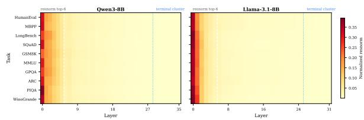  
Figure 8: Resnorm profiles for Qwen3-8B and Llama-3.1-8B. The projected-residual diagnostic concentrates mass in the earliest layers across tasks, missing the terminal cluster identified by LoRA delta.

Table 3: Minimum pairwise cosine similarity $( d _ { \mathrm { m i n } } )$ across models and methods. Lower values indicate stronger task discrimination. Bold indicates the most discriminative method per model. “"indicates the method was not run for that model.
<table><tr><td>Model</td><td>L</td><td>Gradient</td><td>Ablation</td><td>LoRA delta</td></tr><tr><td>Qwen3-0.6B</td><td>28</td><td>0.980</td><td>0.999</td><td>0.981</td></tr><tr><td>Qwen3-1.7B</td><td>28</td><td>0.959</td><td>1.000</td><td>0.962</td></tr><tr><td>Qwen3-4B</td><td>36</td><td>0.977</td><td>0.923</td><td>0.952</td></tr><tr><td>Qwen3-8B</td><td>36</td><td>0.979</td><td>0.949</td><td>0.959</td></tr><tr><td>Qwen3-14B</td><td>40</td><td>0.980</td><td>0.950</td><td>0.948</td></tr><tr><td>Qwen3-32B</td><td>64</td><td>0.977</td><td>0.952</td><td>0.941</td></tr><tr><td>Llama-3.2-1B</td><td>16</td><td>0.989</td><td>0.800</td><td>0.962</td></tr><tr><td>Llama-3.2-3B</td><td>28</td><td>0.977</td><td>0.928</td><td>0.967</td></tr><tr><td>Llama-3.1-8B</td><td>32</td><td>0.962</td><td>0.967</td><td>0.980</td></tr><tr><td>Llama-3.1-70B</td><td>80</td><td></td><td>0.961</td><td>0.971</td></tr><tr><td>Mamba-130m</td><td>24</td><td>0.998</td><td>0.953</td><td>0.942</td></tr><tr><td>Mamba-370m</td><td>48</td><td></td><td>0.902</td><td>0.921</td></tr><tr><td>Mamba-790m</td><td>48</td><td></td><td>0.798</td><td>0.823</td></tr><tr><td>Mamba-2.8B</td><td>64</td><td>一</td><td>0.843</td><td>0.861</td></tr></table>

## C Multi-Seed and Budget Robustness

## C.1 Multi-seed causal validation

We repeat all causal-validation runs for Qwen3- 8B and Llama-3.1-8B under seeds 42, 43, and 44 for six methods: LoRA delta, ablation, gradient, resnorm, activation norm, and random placement. This section reports aggregate and per-task robustness results.

Metrics. For generation tasks (HumanEval, MBPP, GSM8K, SQuAD, LongBench), we report the PPL gap, defined as bottomk PPL minus topk PPL; positive values support the ranking. For MCQ tasks (GPQA, MMLU, ARC, PIQA, WinoGrande), we report the accuracy gap, defined as $\mathrm { t o p } _ { k }$ accuracy minus bottomk accuracy; positive values indicate that top-k layers yield higher accuracy. The binary hypothesis\_supported flag is derived from the appropriate metric for each task type.

Summary. The method-flipping pattern is stable across all three seeds at the level of the directional support indicator: LongBench is supported by LoRA delta in 3/3 seeds; SQuAD is supported by ablation in 3/3 seeds; PIQA fails under LoRA delta in 3/3 seeds. Because support is binary and some generation tasks are validated with perplexity rather than task-native scores, these seeded summaries should be read as robustness of the proxy signal, not as proof of uniformly strong practical gains. Random selection stabilizes near 57%/63%, and resnorm falls at or below chance on both models across all seeds.

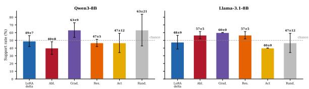  
Figure 9: Mean directional causal-validation support rate ± std across three seeds for Qwen3-8B and Llama-3.1-8B. The dashed line marks 50%. Error bars show std across seeds. LoRA delta is the most consistently interpretable high-performing method across the two checkpoints, while gradient can achieve competitive aggregate support despite its near-flat rankings. Resnorm falls at or below random on both models.

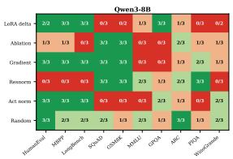

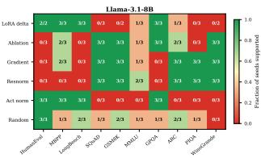  
Figure 10: Fraction of seeds where the causal hypothesis is directionally supported, per task and method. Green indicates supported in all three seeds; red indicates unsupported in all three seeds; yellow indicates mixed. Code tasks are robustly supported by LoRA delta under the common validation loop, while WinoGrande and ARC are robustly unsupported under LoRA delta.

## C.2 Seed coverage

## C.3 Causal-validation margin magnitudes

The main text uses top-k versus bottom-k support labels to test whether an importance ranking has directional causal consequences under selective LoRA placement. These labels record the sign of the comparison, not the magnitude of the downstream change. We therefore report the corresponding metric gaps here. For generationstyle tasks evaluated with perplexity, the gap is $\mathrm { P P L } _ { \mathrm { b o t t o m } } - \mathrm { P P L } _ { \mathrm { t o p } }$ , so positive values favor the top-k layers. For multiple-choice tasks evaluated with accuracy, the gap is $\mathrm { A c c } _ { \mathrm { t o p } } - \mathrm { A c c } _ { \mathrm { b o t t o m } } .$

Figure 11 reports per-task gaps with seed error bars for Qwen3-8B and Llama-3.1-8B. Tables 7, 8, and 5 report primary-metric gaps for competitor placement methods, the Qwen3-14B and Mamba-790m extension runs, and the k-sweep respectively.

The margin results show three regimes. First, a small number of task-model-method triples have substantively large gaps, including Qwen3-1.7B on SQuAD under ablation, Qwen3-1.7B on Wino-Grande where bottom-k ablation layers win by a large margin, and Mamba-790m on SQuAD under LoRA delta. Second, most supported pairs are small in absolute magnitude, with typical primarymetric gaps in the 0.01–0.05 range. Third, random placement, competitor methods, and several largerscale extension runs remain close to zero on average. Thus, the causal-validation results should not be read as evidence that any single estimator provides a large universal downstream gain. They instead show that the direction of selective-placement validation is method-relative, even when the absolute margins are modest.

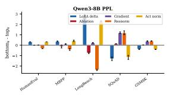

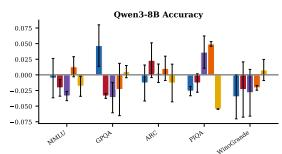

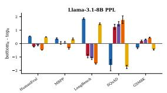

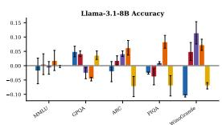  
Figure 11: Metric gaps across seeds. Left column: PPL gap $( \mathsf { b o t t o m } _ { k }$ minus topk) for generation tasks. Right column: accuracy gap $( { \mathrm { t o p } } _ { k }$ minus $\mathsf { b o t t o m } _ { k } )$ for MCQ tasks. Positive values support the hypothesis. Error bars show std across three seeds. These magnitudes should be inspected directly rather than inferred from the binary support label alone.

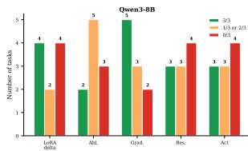

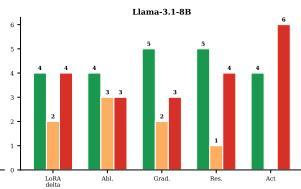  
Figure 12: Cross-seed stability of support decisions. Green indicates supported in all three seeds; orange indicates mixed support; red indicates unsupported in all three seeds. LoRA delta shows the highest fraction of fully stable supported tasks for code and long-context. Commonsense tasks are stably unsupported under LoRA delta across seeds.

## C.4 Sensitivity of causal validation to the budget k

The main protocol fixes $k = \lceil L / 6 \rceil$ . To check how much of the mixed-to-negative LoRA-delta verdict depends on that particular budget, we run an additional k-sweep for six transformer checkpoints across both families. For each model, we evaluate four values of k spanning roughly $k / L \in$ [0.08, 0.31] and report directional support together with the mean topk-minus-bottomk primary-metric gap, using the same task-native metrics and the same LoRA rank and training budget as the main experiments.

Table 4: Per-checkpoint multi-seed coverage of the causal-validation runs. Brace-enclosed lists are the seed indices with completed result files. “LoRA-δ support per seed" shows the number of directionally supported tasks at each completed seed.  
For multi-seed runs, entries report the number of supported tasks for seeds 42/43/44
<table><tr><td>Model</td><td>Family</td><td>LoRA-δ support across seeds</td></tr><tr><td>Qwen3-0.6B</td><td>Tx</td><td>3/3/2 of 10</td></tr><tr><td>Qwen3-1.7B</td><td>Tx</td><td>5/5/5 of 10</td></tr><tr><td>Qwen3-4B</td><td>Tx</td><td>4/3/6 of 10</td></tr><tr><td>Qwen3-8B</td><td>Tx</td><td>4/5/4 of 7</td></tr><tr><td>Qwen3-14B</td><td>Tx</td><td>7/7/8 of 10</td></tr><tr><td>Qwen3-32B</td><td>Tx</td><td>7/8/9 of 10</td></tr><tr><td>Llama-3.2-1B</td><td>Tx</td><td>6/4/3 of 10</td></tr><tr><td>Llama-3.2-3B</td><td>Tx</td><td>2/5/6 of 7</td></tr><tr><td>Llama-3.1-8B</td><td>Tx</td><td>3/6/4 of 7</td></tr><tr><td>Llama-3.1-70B</td><td>Tx</td><td>7 of 10</td></tr><tr><td>Mamba-130m</td><td>SSM</td><td>8/6/8 of 10</td></tr><tr><td>Mamba-370m</td><td>SSM</td><td>8/7/8 of 10</td></tr><tr><td>Mamba-790m</td><td>SSM</td><td>6/6/7 of 10</td></tr><tr><td>Mamba-2.8b</td><td>SSM</td><td>7/7/7 of 10</td></tr></table>

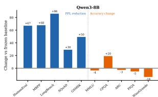

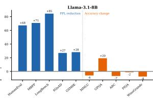  
Figure 13: Performance change under uniform LoRA relative to the frozen model. Uniform LoRA substantially improves generation perplexity, but does not uniformly improve multiple-choice accuracy.

The qualitative verdict is insensitive to the budget choice: the $k = \lceil L / 6 \rceil$ row sits inside the envelope swept by $k \in [ 2 , 8 ]$ at each checkpoint, and neither family benefits consistently from a different k. Across all twelve Llama (model, k) points, mean support is 0.23 and the mean primary gap is —0.025; across the twelve Qwen points, mean support is 0.29 and the mean primary gap is +0.005. The method-relative disagreement reported in the main text is therefore not an artifact of the fixed budget. The caveat is that this sweep was not run on Mamba checkpoints or on the largest transformers, and it sweeps only LoRA delta rather than all estimators.

## C.5 Task-A adaptation quality: top-k versus bottom-k

A potential confound in the continual-learning protocol is that bottom-k layers (least plastic) may simply learn Task A less thoroughly than top-k layers, mechanically producing a lower forgetting ratio without any genuine bottleneck effect. Table 6 addresses this directly by reporting the post-Task-A perplexity $( { \mathrm { P P L } } _ { \mathrm { b e f o r e } }$ , measured after Task-A finetuning and before Task-B training) for both placement strategies across all models, together with the resulting forgetting ratios.

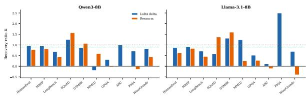  
Figure 14: Recovery ratio R for top-k placement under LoRA delta and resnorm. LoRA delta recovers most of the full-LoRA improvement on code generation, while resnorm is inconsistent across tasks.

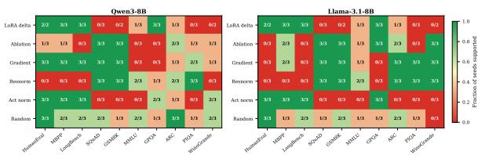  
Figure 15: Per-task causal-validation support across methods, shown as the fraction of seeds in which each method supports the hypothesis. Code tasks are the most consistently recoverable; commonsense tasks are the least.

Two patterns emerge. First, in transformers, top-k does achieve modestly better Task-A adaptation: averaged across all transformer checkpoints and pairs (n=75), $\mathrm { P P L } _ { \mathrm { b e f o r e } }$ is 1.71 for top-k versus 2.00 for bottom-k — a 17% gap, meaning the least plastic layers absorb Task-A somewhat less. However, the forgetting ratio gap is substantially larger: 3.24 for top-k versus 2.33 for bottom-k — a 39% difference in the direction opposite to what a pure “learned less, forgets less" account would predict. A confounder that accounts for a 17% advantage in starting perplexity cannot explain a 39% disadvantage in forgetting ratio; the bottleneck effect is not an artifact of differential Task-A learning.

Second, in SSMs, top-k and bottom-k PPLbefore are virtually identical (6.53 vs. 6.73, a 3% gap, $n { = } 5 4 )$ , and the forgetting ratios are likewise statistically indistinguishable (2.11 vs. 2.00). This confirms that the null forgetting result in SSMs is not driven by top-k and bottom-k learning at different rates.

Table 5: k-sweep causal validation on transformer checkpoints with LoRA-delta top-k. Each row is one (model, k) configuration; all runs use the ten-task suite. Support is the fraction of tasks on which top-k outperforms bottom-k on the task-native primary metric. Mean primary gap is averaged across tasks; positive means top-k is better.
<table><tr><td>Model</td><td>Family</td><td>k</td><td>k/L</td><td>Support</td><td>Mean primary gap</td></tr><tr><td>Llama-3.2-1B</td><td>Llama</td><td>2</td><td>0.125</td><td>5/10</td><td>+0.002</td></tr><tr><td>Llama-3.2-1B</td><td>Llama</td><td>3</td><td>0.188</td><td>3/10</td><td>+0.005</td></tr><tr><td>Llama-3.2-1B</td><td>Llama</td><td>4</td><td>0.250</td><td>3/10</td><td>-0.006</td></tr><tr><td>Llama-3.2-1B</td><td>Llama</td><td>5</td><td>0.312</td><td>5/10</td><td>+0.002</td></tr><tr><td>Llama-3.2-3B</td><td>Llama</td><td>3</td><td>0.107</td><td>2/10</td><td>-0.031</td></tr><tr><td>Llama-3.2-3B</td><td>Llama</td><td>4</td><td>0.143</td><td>1/10</td><td>-0.033</td></tr><tr><td>Llama-3.2-3B</td><td>Llama</td><td>5</td><td>0.179</td><td>1/10</td><td>-0.040</td></tr><tr><td>Llama-3.2-3B</td><td>Llama</td><td>7</td><td>0.250</td><td>2/10</td><td>-0.026</td></tr><tr><td>Llama-3.1-8B</td><td>Llama</td><td>3</td><td>0.094</td><td>2/10</td><td>-0.040</td></tr><tr><td>Llama-3.1-8B</td><td>Llama</td><td>5</td><td>0.156</td><td>2/10</td><td>-0.049</td></tr><tr><td>Llama-3.1-8B</td><td>Llama</td><td>6</td><td>0.188</td><td>1/10</td><td>-0.055</td></tr><tr><td>Llama-3.1-8B</td><td>Llama</td><td>8</td><td>0.250</td><td>1/10</td><td>-0.027</td></tr><tr><td>Qwen3-1.7B</td><td>Qwen</td><td>3</td><td>0.107</td><td>4/10</td><td>+0.010</td></tr><tr><td>Qwen3-1.7B</td><td>Qwen</td><td>4</td><td>0.143</td><td>5/10</td><td>+0.012</td></tr><tr><td>Qwen3-1.7B</td><td>Qwen</td><td>5</td><td>0.179</td><td>3/10</td><td>+0.002</td></tr><tr><td>Qwen3-1.7B</td><td>Qwen</td><td>7</td><td>0.250</td><td>4/10</td><td>+0.008</td></tr><tr><td>Qwen3-4B</td><td>Qwen</td><td>3</td><td>0.083</td><td>2/10</td><td>+0.021</td></tr><tr><td>Qwen3-4B</td><td>Qwen</td><td>5</td><td>0.139</td><td>3/10</td><td>+0.025</td></tr><tr><td>Qwen3-4B</td><td>Qwen</td><td>6</td><td>0.167</td><td>3/10</td><td>+0.021</td></tr><tr><td>Qwen3-4B</td><td>Qwen</td><td>8</td><td>0.222</td><td>3/10</td><td>+0.015</td></tr><tr><td>Qwen3-8B</td><td>Qwen</td><td>3</td><td>0.083</td><td>1/10</td><td>-0.019</td></tr><tr><td>Qwen3-8B</td><td>Qwen</td><td>5</td><td>0.139</td><td>1/10</td><td>-0.011</td></tr><tr><td>Qwen3-8B</td><td>Qwen</td><td>6</td><td>0.167</td><td>4/10</td><td>-0.005</td></tr><tr><td>Qwen3-8B</td><td>Qwen</td><td>8</td><td>0.222</td><td>2/10</td><td>-0.015</td></tr><tr><td>Llama family</td><td></td><td>all</td><td>一</td><td> $\bar { s } = 0 . 2 3$ </td><td> $\bar { g } = - 0 . 0 2 5$ </td></tr><tr><td>Qwen family</td><td></td><td>all</td><td></td><td> $\bar { s } = 0 . 2 9$ </td><td> $\bar { g } = + 0 . 0 0 5$ </td></tr></table>

## D Estimator and Architecture Extensions

## D.1 Head-to-head comparison with published placement methods

We re-implement two competitor placement methods—ShapLoRA (Zhao et al., 2026) and TELL-TALE (Naim et al., 2026)—and run them through the same top-k versus bottom-k causalvalidation protocol on Qwen3-8B, Llama-3.1-8B, and Mamba-790m at seed 42. This comparison is not intended as a refutation of either method in its original setting; the goal is to test whether the same matched diagnostic protocol produces a single estimator that dominates across architectures.

Table 7 reports directional support rates restricted to the task list common to every method on each model: a seven-task subset for the two transformer checkpoints, and a nine-task subset for Mamba-790m. On both transformer checkpoints, neither competitor beats random under the matched protocol. The same pattern holds on Mamba-790m, where both competitors land below LoRA delta. Mean primary-metric gaps are near zero or negative for both competitors on every tested model, indicating that the under-performance is directional rather than a thresholding artifact of the binary support metric.

Table 6: Task-A post-training perplexity (PPLbefore, lower is better) and forgetting ratio $\mathrm { ( P P L _ { a f t e r } / P P I }$ before, lower is better) for top-k vs. bottom-k placement across all CL models. Values are mean ± std across all task pairs and seeds. The “ratio" column shows (bottom-k PPI $_ \mathrm { - b e f o r e } ) /$ (top-k $\mathrm { P P L } _ { \mathrm { b e f o r e } } ) ;$ values above 1.0 indicate that top-k achieves better Task-A adaptation. Family summary rows pool all pairs within the family. RWKV6- 3B omitted (numerical divergence in top-k runs).
<table><tr><td rowspan="2">Model</td><td rowspan="2">Family</td><td colspan="3"> $\mathbf { P P L } _ { \mathrm { b e f o r e } }$  (Task-A fit)</td><td colspan="2">Forgetting ratio</td></tr><tr><td>top-k</td><td>bottom-k</td><td>bot/top</td><td>top-k</td><td>bottom-k</td></tr><tr><td>Llama-3.2-3B</td><td>Transformer</td><td> $2 . 0 1 \pm 0 . 7 3$ </td><td> $2 . 2 2 \pm 0 . 5 7$ </td><td>1.11</td><td>2.67 ± 1.66</td><td>2.19 ± 0.91</td></tr><tr><td>Llama-3.1-8B</td><td>Transformer</td><td>1.80 ± 0.69</td><td>2.05 ± 0.57</td><td>1.14</td><td>2.86 ± 1.62</td><td>2.57 ± 1.48</td></tr><tr><td>Qwen3-0.6B</td><td>Transformer</td><td> $1 . 8 7 \pm 0 . 6 8$ </td><td> $2 . 2 4 \pm 0 . 3 6$ </td><td>1.20</td><td>6.83 ± 4.28</td><td> $2 . 6 7 \pm 1 . 0 \dot { 1 }$ </td></tr><tr><td>Qwen3-4B</td><td>Transformer</td><td> $1 . 5 2 \pm 0 . 3 8$ </td><td>1.98 ± 0.30</td><td>1.30</td><td>2.66 ± 1.35</td><td>2.22 ± 0.80</td></tr><tr><td>Qwen3-8B</td><td>Transformer</td><td> $1 . 3 9 \pm 0 . 3 2$ </td><td>1.55 ± 0.37</td><td>1.11</td><td>2.85 ± 1.51</td><td>2.18 ± 1.06</td></tr><tr><td>Mamba-130M</td><td>SSM</td><td>10.45 ± 3.57</td><td>10.80 ± 3.81</td><td>1.03</td><td>1.72 ± 0.29</td><td>2.09 ± 0.75</td></tr><tr><td>Mamba-370M</td><td>SSM</td><td>8.33 ± 4.08</td><td>8.58 ± 4.17</td><td>1.03</td><td>2.93 ± 1.52</td><td>1.48 ± 0.23</td></tr><tr><td>Mamba-790M</td><td>SSM</td><td> $7 . 0 5 \pm 3 . 2 3$ </td><td>7.18 ± 3.37</td><td>1.02</td><td>1.94 ± 0.57</td><td>1.85 ± 0.56</td></tr><tr><td>Mamba-2.8B</td><td>SSM</td><td> $^ { 4 . 7 8 \pm 1 . 5 7 } _ { \textrm { o } }$ </td><td>5.18 ± 1.54</td><td>1.08</td><td>2.68 ± 1.27</td><td>3.45 ± 2.64</td></tr><tr><td>Mamba2-1.3B</td><td>SSM</td><td>6.55 ± 2.05</td><td>6.42 ± 2.30</td><td>0.98</td><td>1.57 ± 0.50</td><td>1.87 ± 0.49</td></tr><tr><td>Falcon-Mamba-7B</td><td>SSM</td><td> $2 . 0 1 \pm 0 . 4 3$ </td><td>2.21 ± 0.27</td><td>1.10</td><td>1.81 ± 0.62</td><td>1.30 ± 0.19</td></tr><tr><td>Zamba2-2.7B</td><td>Hybrid</td><td> $2 . 3 7 \pm 0 . 7 8$ </td><td>2.74 ± 1.33</td><td>1.15</td><td>1.28 ± 0.16</td><td>1.43 ± 0.41</td></tr><tr><td>Transformer</td><td></td><td></td><td>2.00 ± 0.51</td><td>1.17</td><td>3.24 ± 2.40</td><td></td></tr><tr><td>SSM</td><td> $- ( n { = } 7 5 )$  —(n=54)</td><td> $1 . 7 1 \pm 0 . 6 1$   $6 . 5 3 \pm 3 . 7 7$ </td><td>6.73 ± 3.88</td><td>1.03</td><td>2.11 ± 1.01</td><td>2.33 ± 1.05 2.00 ± 1.31</td></tr><tr><td>Hybrid</td><td> $- ( n { = } 9 )$ </td><td> $2 . 3 7 \pm 0 . 7 8$ </td><td> $2 . 7 4 \stackrel { + } { \pm } 1 . 3 3$ </td><td>1.15</td><td>1.28 ± 0.16</td><td>1.43 ± 0.41</td></tr></table>

## D.2 Scale and architecture extension: Qwen3-14B and Mamba-790m

The Qwen3-8B and Llama-3.1-8B seeded study leaves two natural questions open: whether the scale-dependent weakening of LoRA delta persists at larger transformer sizes, and whether the transformer-SSM contrast survives a seeded causal-validation setup. To address both, we rerun the causal-validation pipeline on Qwen3-14B and Mamba-790m at seeds 43 and 44, with the same k = 6, LoRA rank 8, and 300 training steps as the 8B study. Each model is run under three placement regimes: LoRA-delta top-k, random top-k, and uniform LoRA over all layers. For Mamba-790m, we report aggregates on the nine non-LongBench tasks because the A1 task list and the Mamba-790m importance scores use different LongBench variants.

Table 8 summarizes directional support rates and mean primary-metric gaps. On Mamba-790m, LoRA delta yields a positive mean topk-minus-$\scriptstyle \mathtt { b o t t o m } _ { k }$ primary-metric gap at both seeds, while random top-k is near zero or negative. On Qwen3- 14B, the picture is inverted: random top-k matches or exceeds LoRA delta both on support rate and on mean top-minus-bottom gap. This is consistent with the Qwen3-8B to Qwen3-32B bimodality reported in Figure 21: in the transformer family, LoRA delta's prescriptive content weakens as scale grows, while in the SSM family it remains informative under the same validation recipe.

Table 7: Causal-validation comparison against published placement methods at seed 42. Each block restricts to the task list common to every method listed for that model. Support is the fraction of tasks on which top-k outperforms bottom-k under the loss-aligned validation metric. Mean PPL gap is bottomk minus topk on perplexity-validated tasks; mean primary gap is topk minus bottomk on task-native primary metrics. Empty primary-gap entries indicate runs whose logs predate the task-native evaluation path. LoRA-delta primary-gap entries are taken from the task-native audit and may use a different task subset.
<table><tr><td>Method</td><td>Support</td><td>Mean PPL gap</td><td>Mean primary gap</td></tr><tr><td>Qwen3-8B (Ntasks = 7)</td><td></td><td></td><td></td></tr><tr><td>LoRA delta (Hu et al., 2021)</td><td>4/7 (57%)</td><td>-1.359</td><td>+0.001†</td></tr><tr><td>Ablation</td><td>3/7 (43%)</td><td>+0.771</td><td></td></tr><tr><td>Gradient</td><td>5/7 (71%)</td><td>+1.604</td><td></td></tr><tr><td>Resnorm (Xu et al., 2026)</td><td>3/7 (43%)</td><td>+1.320</td><td></td></tr><tr><td>Random</td><td>4/7 (57%)</td><td>-0.106</td><td></td></tr><tr><td>ShapLoRA (Zhao et al., 2026)</td><td>3/7 (43%)</td><td>+0.126</td><td>-0.031</td></tr><tr><td>TELL-TALE (Naim et al., 2026)</td><td>2/7 (29%)</td><td>-1.078</td><td>-0.010</td></tr><tr><td>Llama-3.1-8B (Ntasks = 7)</td><td></td><td></td><td></td></tr><tr><td>LoRA delta (Hu et al., 2021)</td><td>3/7 (43%)</td><td>-1.471</td><td>-0.044‡</td></tr><tr><td>Ablation</td><td>4/7 (57%)</td><td>+1.270</td><td></td></tr><tr><td>Gradient</td><td>4/7 (57%)</td><td>+1.296</td><td></td></tr><tr><td>Resnorm (Xu et al., 2026)</td><td>4/7 (57%)</td><td>+1.123</td><td></td></tr><tr><td>Random</td><td>4/7 (57%)</td><td>-0.750</td><td></td></tr><tr><td>ShapLoRA (Zhao et al., 2026)</td><td>3/7 (43%)</td><td>+0.677</td><td>+0.048</td></tr><tr><td>TELL-TALE (Naim et al., 2026)</td><td>1/7 (14%)</td><td>-0.761</td><td>-0.051</td></tr><tr><td>Mamba-790m  $( N _ { \mathrm { t a s k s } } = 9 )$ </td><td></td><td></td><td></td></tr><tr><td>LoRA delta (Hu et al., 2021)</td><td>5/9 (56%)</td><td>+0.502</td><td>-0.026§</td></tr><tr><td>ShapLoRA (Zhao et al., 2026)</td><td>2/9 (22%)</td><td>+0.164</td><td>-0.008</td></tr><tr><td>TELL-TALE (Naim et al., 2026)</td><td>2/9 (22%)</td><td>+0.148</td><td>-0.012</td></tr></table>

## D.3 Mamba scale sweep

Tables 9 and 10 report causal validation for all four Mamba checkpoints. Under ablation, top-k layers follow the boundary pattern at all scales. Under LoRA delta, top-k layers shift to mid-network positions and support rates remain high, including tasks such as WinoGrande and PIQA that fail systematically in transformers under LoRA delta.

## E Alternative-Mechanism Controls

## E.1 The sign flip is not a layer-0 artifact

The L0 control rules out the simplest explanation for the transformer-Mamba split. Transformers place much more ablation mass on layer 0 than Mambas, so the control is necessary. However, removing layer 0 shifts transformer correlations toward zero without changing the qualitative sign for transformers up to 14B. The observed anticorrelation is therefore not reducible to a single embedding-bottleneck layer.

## E.2 The sign flip is not a submodule-scope artifact

In the main experiments, LoRA delta is computed on trainable LoRA target modules, whereas ablation removes a layer-local computation. This raises a natural concern: perhaps the observed disagreement is caused by comparing different parts of the block rather than by comparing different notions of importance. To address this, we recompute placement ranking alignment under matched submodule scopes. For each matched setting, both estimators are restricted to the same part of the transformer block.

Table 8: Scale/architecture extension: per-seed directional support rate and mean primary-metric gap for LoRA delta and random top-k, plus per-seed uniform-LoRA win rate against the no-adapter baseline. Both checkpoints run with $k = 6 .$ LoRA rank 8, 300 training steps, at seeds 43 and 44.
<table><tr><td>Model</td><td>Method</td><td>Seed 43</td><td>Seed 44</td><td>Mean gap (s43, s44)</td><td> $N _ { \mathrm { t a s k s } }$ </td></tr><tr><td rowspan="3">Qwen3-14B</td><td>LoRA delta</td><td>2/10 (20%)</td><td>4/10 (40%)</td><td>-0.017, -0.001</td><td>10</td></tr><tr><td>Random</td><td>5/10 (50%)</td><td>5/10 (50%)</td><td>-0.000, +0.004</td><td>10</td></tr><tr><td>Uniform LoRA</td><td>3/10 wins</td><td>2/10 wins</td><td>+0.062, +0.060</td><td>10</td></tr><tr><td rowspan="3">Mamba-790m†</td><td>LoRA delta</td><td>3/9 (33%)</td><td>3/9 (33%)</td><td>+0.006, +0.021</td><td>9</td></tr><tr><td>Random</td><td>3/9 (33%)</td><td>2/9 (22%)</td><td>+0.001, -0.015</td><td>9</td></tr><tr><td>Uniform LoRA</td><td>2/9 wins</td><td>3/9 wins</td><td>+0.034, +0.033</td><td>9</td></tr></table>

†Mamba-790m LongBench was not evaluated in the A1 extension: the updated A1 task list uses longbench\_multifieldqa\_en whereas the Mamba-790m LoRA-delta importance scores cover longbench\_single\_doc; regenerating Mamba importance against the new variant was out of scope. Rows therefore report the nine tasks common to both checkpoints.

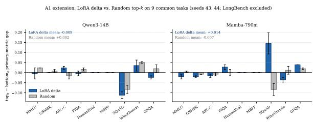  
Figure 16: Per-task $\mathrm { t o p } _ { k }$ minus bottomk primary-metric gap on Qwen3-14B and Mamba-790m for LoRA delta and random top-k placement. Bars are seed-averaged means; error bars show the seed range over seeds 43 and 44. LongBench is excluded to keep the task set comparable across checkpoints.

The cross-method anti-correlation is negative for every available submodule in Llama-3.1-8B: $\rho = - 0 . 5 8 1$ for attention, —0.266 for MLP, and —0.298 for full-block comparisons. The corresponding top-6 layer overlaps are 15%, 17%, and 27%. For two random 6-of-32 selections, the expected overlap is $6 \times 6 / 3 2 = 1 . 1 2 5$ layers, or 18.75% of a top-6 set. Thus the attention and MLP overlaps are at or below random, whereas the full-block overlap remains far below within-LoRA overlaps. This rules out the possibility that the full-block anti-correlation is an artifact of mixing attention and MLP signals.

Within LoRA delta, submodules converge on the same layers. The mean Spearman correlation between LD-attn and LD-MLP is +0.839 in Llama and +0.659 in Qwen, rising to +0.883 for LD-attn versus LD-full in Llama. Top-6 overlap ranges from 55–60%. This indicates that the terminal cluster is not a property of which projections are updated: adapting attention alone, MLP alone, or both simultaneously identifies the same final depth region.

Table 9: Mamba causal validation under ablation across four model sizes. Top-k layers follow the boundary pattern at all scales.
<table><tr><td>Task</td><td>130m (k=4)</td><td> $3 7 0 \mathbf { m } \left( k { = } 5 \right)$ </td><td> $7 9 0 \mathbf { m } \left( k { = } 5 \right)$ </td><td> $2 . 8 \mathbf { b } \ ( k = 8 )$ </td></tr><tr><td>HumanEval</td><td>√</td><td>√</td><td>√</td><td>√</td></tr><tr><td>MBPP</td><td>√</td><td>√</td><td>√</td><td>√</td></tr><tr><td>LongBench</td><td>√</td><td>√</td><td>√</td><td>√</td></tr><tr><td>GSM8K</td><td>√</td><td>×</td><td>√</td><td>√</td></tr><tr><td>SQuAD</td><td>√</td><td>√</td><td>√</td><td>√</td></tr><tr><td>MMLU</td><td>√</td><td>√</td><td>√</td><td>√</td></tr><tr><td>GPQA</td><td>√</td><td>√</td><td>√</td><td>√</td></tr><tr><td>ARC</td><td>√</td><td>×</td><td>×</td><td>√</td></tr><tr><td>PIQA</td><td>√</td><td>×</td><td>×</td><td>×</td></tr><tr><td>WinoGrande</td><td>√</td><td>√</td><td>×</td><td>√</td></tr><tr><td>Rate</td><td>10/10</td><td>7/10</td><td>7/10</td><td>9/10</td></tr></table>

Table 10: Mamba causal validation under LoRA delta across four model sizes. Mid-network layers are selected at all scales; support rates are 9–10/10.
<table><tr><td>Task</td><td>130m (k=4)</td><td> $3 7 0 \mathbf { m } \left( k { = } 5 \right)$ </td><td> $7 9 0 \mathbf { m } \left( k { = } 5 \right)$ </td><td> $2 . 8 \mathbf { b } \ ( k = 8 )$ </td></tr><tr><td>HumanEval</td><td>√</td><td>√</td><td>√</td><td>√</td></tr><tr><td>MBPP</td><td>√</td><td>√</td><td>√</td><td>√</td></tr><tr><td>LongBench</td><td>√</td><td>√</td><td>√</td><td>√</td></tr><tr><td>GSM8K</td><td>√</td><td>√</td><td>√</td><td>√</td></tr><tr><td>SQuAD</td><td>√</td><td>√</td><td>√</td><td>√</td></tr><tr><td>MMLU</td><td>√</td><td>√</td><td>X</td><td>×</td></tr><tr><td>GPQA</td><td>√</td><td>√</td><td>√</td><td>√</td></tr><tr><td>ARC</td><td>√</td><td>√</td><td>√</td><td>√</td></tr><tr><td>PIQA</td><td>√</td><td>√</td><td>√</td><td>√</td></tr><tr><td>WinoGrande</td><td>√</td><td>√</td><td>√</td><td>√</td></tr><tr><td>Rate</td><td>10/10</td><td>10/10</td><td>9/10</td><td>9/10</td></tr></table>

Within ablation, attention and MLP criticality are more model-dependent. In Llama, Abl-attn versus Abl-MLP yields $\rho ~ = ~ + 0 . 4 2 7$ and 67% top-6 overlap, suggesting moderate co-localization. In Qwen3-8B, the same comparison yields $\rho =$ —0.027 and 27% overlap, indicating structurally distinct attention-critical and MLP-critical layer sets. Thus, if using ablation to guide submodulespecific placement, the submodule choice matters; if using LoRA delta, the choice is much less important.

## E.3 The sign flip is not a LoRA artifact: adapter-free full fine-tuning control

Plasticity is defined in the main text through the magnitude of a LoRA update which raises the possibility that $\mathcal { N P A }$ measures where LoRA places updates rather than where the architecture absorbs new information. We therefore rerun the Plasticity measurement without adapters: for each checkpoint we finetune all parameters on the same tasks, under the same data and budget, and recompute the per-layer update magnitude $\| \Delta W _ { l } \| _ { F } .$ from the difference between the ine-tuned and pretrained weights. This removes every LoRA-specific degree of freedom at once: rank, scaling factor α, initialization, and the choice of target modules.

Table 11: Necessity-Plasticity Alignment $\mathcal { N P A } ( M )$ for the 14 primary paired pretrained checkpoints (Qwen3, Llama, Mamba). $\mathcal { N P A } ( M )$ is the mean Spearman rank correlation between LoRA-delta and ablation importance vectors across $T = 1 0$ tasks. $\mathcal { N P A } ^ { \setminus L _ { 0 } } ( M )$ recomputes the same correlation with layer 0 excluded from both vectors. L0 share is the fraction of total ablation mass concentrated in the first layer. Family means in bold are arithmetic averages over the listed checkpoints. RWKV6-3B, Zamba2-2.7B, and Falcon-Mamba-7B are reported in Section 4.1 as validation architectures.
<table><tr><td>Model</td><td>Family</td><td>L</td><td>C(M)</td><td>C(M)\L0</td><td>L0 share</td></tr><tr><td>Qwen3-0.6B</td><td>Transformer</td><td>28</td><td>-0.25</td><td>-0.16</td><td>0.89</td></tr><tr><td>Qwen3-1.7B</td><td>Transformer</td><td>28</td><td>-0.47</td><td>-0.40</td><td>0.94</td></tr><tr><td>Qwen3-4B</td><td>Transformer</td><td>36</td><td>-0.23</td><td>-0.16</td><td>0.61</td></tr><tr><td>Qwen3-8B</td><td>Transformer</td><td>36</td><td>-0.30</td><td>-0.24</td><td>0.60</td></tr><tr><td>Qwen3-14B</td><td>Transformer</td><td>40</td><td>-0.06</td><td>-0.10</td><td>0.60</td></tr><tr><td>Qwen3-32B</td><td>Transformer</td><td>64</td><td>+0.07</td><td>+0.10</td><td>0.60</td></tr><tr><td>Llama-3.2-1B</td><td>Transformer</td><td>16</td><td>-0.74</td><td>-0.69</td><td>0.32</td></tr><tr><td>Llama-3.2-3B</td><td>Transformer</td><td>28</td><td>-0.48</td><td>-0.43</td><td>0.49</td></tr><tr><td>Llama-3.1-8B</td><td>Transformer</td><td>32</td><td>-0.62</td><td>-0.59</td><td>0.54</td></tr><tr><td>Llama-3.1-70B</td><td>Transformer</td><td>80</td><td>+0.01</td><td>+0.05</td><td>0.61</td></tr><tr><td>Mamba-130m</td><td>SSM</td><td>24</td><td>+0.22</td><td>+0.22</td><td>0.30</td></tr><tr><td>Mamba-370m</td><td>SSM</td><td>48</td><td>+0.22</td><td>+0.20</td><td>0.29</td></tr><tr><td>Mamba-790m</td><td>SSM</td><td>48</td><td>+0.25</td><td>+0.26</td><td>0.09</td></tr><tr><td>Mamba-2.8b</td><td>SSM</td><td>64</td><td>+0.28</td><td>+0.29</td><td>0.07</td></tr><tr><td colspan="2">Transformer mean (n=10)</td><td></td><td>-0.31</td><td>-0.26</td><td>0.62</td></tr><tr><td colspan="2">Transformer mean (≤14B, n=8)</td><td></td><td>-0.39</td><td>-0.35</td><td>0.62</td></tr><tr><td colspan="2">Mamba mean (n=4)</td><td></td><td>+0.24</td><td>+0.24</td><td>0.19</td></tr></table>

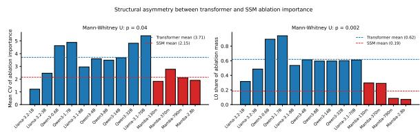  
Figure 17: Per-checkpoint distribution of the structural asymmetry summarized by leave-out-L0 and L0-share controls. Dashed lines mark family means; two-sided Mann-Whitney U p-values compare family membership.

Table 14 reports the result on the 13 checkpoints we were able to fully retrain. Two quantities matter. First, $\rho ( \Delta W ^ { \mathrm { f u l l } } , \Delta W ^ { \mathrm { L o R A } } )$ is positive on every checkpoint, so unconstrained inetuning and LoRA select the same layers; LoRA is not redirecting updates to an unrepresentative subset of depth. Second, $\rho ( \Delta W ^ { \mathrm { f u l l } }$ , ablation) — the adapter-free analogue of NPA — is negative for every evaluated transformer with an ablation baseline, and positive or near zero for every evaluated Mamba, RWKV, and hybrid checkpoint. The sign therefore matches the LoRA-based NPA of Table 11 in all 13 cases.

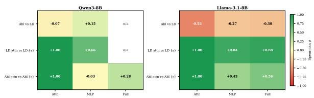

Table 12: Submodule-matched placement ranking alignment. The Llama-3.1-8B full-block row is the headline control: both estimators are applied at the block level, yet the correlation remains negative. Within-LoRAdelta correlations between attention- and MLP-matched scorings are strongly positive, ruling out within-method noise.
<table><tr><td>Cross-method  $\rho$ </td><td>Attn-matched</td><td>MLP-matched</td><td>Full-block</td></tr><tr><td>Llama-3.1-8B</td><td>-0.58</td><td>-0.27</td><td>-0.30</td></tr><tr><td>Qwen3-8B</td><td>-0.07</td><td>+0.15</td><td></td></tr></table>

Table 13: Mean Spearman $\rho$ between condition pairs for Llama-3.1-8B and Qwen3-8B. Cross-method comparisons are negative in Llama across all submodules; within-LoRA-delta comparisons are positive in both models; within-ablation comparisons reveal modeldependent divergence.
<table><tr><td>Comparison type</td><td>Model</td><td>Attn</td><td>MLP</td><td>Full</td></tr><tr><td rowspan="2">Abl vs LD (cross-method)</td><td>Llama-3.1-8B</td><td>-0.581</td><td>-0.266</td><td>-0.298</td></tr><tr><td>Qwen3-8B</td><td>-0.066</td><td>+0.148</td><td></td></tr><tr><td rowspan="2">LD-attn vs LD-X (within LoRA delta)</td><td> $_ { \mathrm { Q w e n 3 - 8 B } } ^ { \mathrm { L l a m a - 3 . 1 - 8 B } }$ </td><td>1.000</td><td>+0.839</td><td>+0.883</td></tr><tr><td></td><td>1.000</td><td>+0.659</td><td></td></tr><tr><td rowspan="2">Abl-attn vs Abl-X (within ablation)</td><td>Llama-3.1-8B</td><td>1.000</td><td>+0.427</td><td>+0.557</td></tr><tr><td>Qwen3-8B</td><td>1.000</td><td>-0.027</td><td>+0.284</td></tr></table>

Correlation between the two adaptation procedures declines with model size (from 0.96 on Qwen3-0.6B to 0.39 on Qwen3-14B), which is expected: larger models have more directions in which a full-rank update can differ from a rank-r one. What does not decline is the agreement in sign between $\rho ( \Delta W ^ { \mathrm { f u l l } }$ , ablation) and NPA, which is the quantity the paper's claims rest on.

Update-to-weight normalization. A related concern is that $| \Delta W _ { l } | | _ { F }$ rewards layers that simply have larger weight matrices. We therefore recompute the Plasticity ranking from the normalized quantity $\| \Delta W _ { l } \| _ { F } / \| W _ { l } \| _ { F }$ , using the corresponding updated parameter set for each method. The qualitative conclusion is unchanged: LoRA-based NPA values are essentially stable under normalization, the evaluated transformers remain negative, the pure Mamba checkpoints and RWKV6-3B remain positive, and the already near-zero hybrid and boundary cases remain small in magnitude. Normalization thus rescales the Plasticity profile without moving the architecture split.

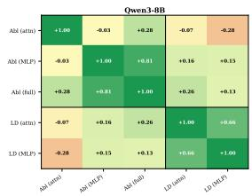

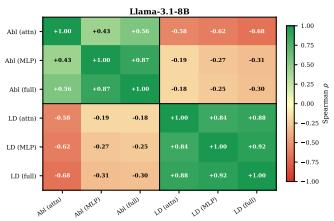  
Figure 18: Full Spearman $\rho$ matrix across matchedcontrol conditions for Llama-3.1-8B and Qwen3-8B. The top-left block contains within-ablation correlations; the bottom-right block contains within-LoRA-delta correlations. The off-diagonal quadrants show the crossmethod signal.  
Figure 19: Summary Spearman ρ heatmap by comparison type and submodule. The cross-method row is negative for Llama across all submodules. The within-LoRA-delta row is positive for both models. The within-ablation row reveals that Qwen3-8B has nearzero attention–MLP correlation, indicating structurally separate attention-critical and MLP-critical layer sets.

## E.4 Component-level analysis of a hybrid checkpoint

Zamba2-2.7B is the one checkpoint in our set that contains both block types, so it permits a within-model version of the architecture comparison. Its 54 layers comprise 45 Mamba blocks and 9 shared-attention hybrid blocks at positions 6, 12, . . . , 51. We partition the layers by block type and compute each component's share of three quantities: total

Table 14: Adapter-free control. $\rho ( \Delta W ^ { \mathrm { f u l l } } , \Delta W ^ { \mathrm { L o R A } } )$ is the Spearman correlation between full-parameter and LoRA per-layer update profiles. $\rho ( \Delta W ^ { \mathrm { f u l l } }$ , abl.) is the adapter-free analogue of NPA, computed against the same ablation-based Necessity rankings. The final column repeats the LoRA-based NPA from Table 11 for comparison. Signs agree on all 13 checkpoints. Qwen3- 32B, Llama-3.1-70B, Mamba-2.8B, and Falcon-Mamba-7B were not retrained under full FT for compute reasons.
<table><tr><td>Model</td><td>Family</td><td>ρ(full, LoRA)</td><td>ρ(full, abl.)</td><td>NPA</td></tr><tr><td>Qwen3-0.6B</td><td>Transformer</td><td>0.96</td><td>-0.27</td><td>-0.25</td></tr><tr><td>Qwen3-1.7B</td><td>Transformer</td><td>0.95</td><td>-0.45</td><td>-0.47</td></tr><tr><td>Qwen3-4B</td><td>Transformer</td><td>0.88</td><td>-0.21</td><td>-0.23</td></tr><tr><td>Qwen3-8B</td><td>Transformer</td><td>0.48</td><td>-0.25</td><td>-0.30</td></tr><tr><td>Qwen3-14B</td><td>Transformer</td><td>0.39</td><td>-0.23</td><td>-0.06</td></tr><tr><td>Llama-3.2-1B</td><td>Transformer</td><td>0.70</td><td>-0.76</td><td>-0.74</td></tr><tr><td>Llama-3.2-3B</td><td>Transformer</td><td>0.70</td><td>-0.64</td><td>-0.48</td></tr><tr><td>Llama-3.1-8B</td><td>Transformer</td><td>0.43</td><td>-0.42</td><td>-0.62</td></tr><tr><td>Mamba-130m</td><td>SSM</td><td>0.46</td><td>+0.11</td><td>+0.22</td></tr><tr><td>Mamba-370m</td><td>SSM</td><td>0.41</td><td>+0.35</td><td>+0.22</td></tr><tr><td>Mamba-790m</td><td>SSM</td><td>0.42</td><td>+0.41</td><td>+0.25</td></tr><tr><td>RWKV6-3B</td><td>SSM</td><td>0.75</td><td>+0.42</td><td>+0.54</td></tr><tr><td>Zamba2-2.7B</td><td>Hybrid</td><td>0.30</td><td>+0.05</td><td>+0.05</td></tr></table>

Table 15: Component-level decomposition of Zamba2- 2.7B. Shares are percentages of the model total; ± values are standard deviations across tasks. The attention component takes roughly twice its layer share of adaptation mass under both LoRA and full FT, but only about 0.6× its layer share of Necessity.
<table><tr><td>Component</td><td>Layers</td><td>LoRA ∆W</td><td>Full-FT ∆W</td><td>Necessity</td></tr><tr><td>Attention blocks (9)</td><td>16.7%</td><td>36.3 ± 0.6</td><td>31.6 ± 0.7</td><td>10.4 ± 2.6</td></tr><tr><td>Mamba blocks (45)</td><td>83.3%</td><td>63.7</td><td>68.4</td><td>89.6</td></tr></table>

LoRA update mass, total full-FT update mass, and total ablation Necessity mass.

Table 15 shows the dissociation reproduced inside a single model. The attention component is 16.7% of the layers but absorbs 36.3% of LoRA update mass and 31.6% of full-FT update mass — roughly twice its layer share under either adaptation procedure — while carrying only 10.4% of ablation Necessity mass, about 0.6× its layer share. Necessity is instead concentrated in the Mamba blocks. Zamba2's near-zero whole-model NPA of +0.05 is therefore not evidence that the effect is absent; it is the average of a transformer-like component and an SSMlike component with opposing profiles.

Because this rests on a single checkpoint with one attention/SSM ratio, we treat statements about other ratios as extrapolation beyond the measured setting.

## E.5 Proxy validation is conditional on the metric

The main causal-validation protocol uses a shared likelihood-based proxy so that top-k and bottom-k placement can be compared across heterogeneous tasks. This makes the comparison controlled, but it also means that the resulting directional labels should not be interpreted as universal claims about end-task performance.

Estimator choice reverses which tasks appear supported. LoRA-delta placement supports Long-Bench in 9/10 transformer checkpoints, whereas ablation supports it in 2/10. On SQuAD, the ordering flips: 3/10 under LoRA delta and 9/10 under ablation. These are the same models, training budget, and validation loop; only the importance estimator changes. Code-generation tasks favor LoRA delta under the proxy, while commonsense tasks show little structured support for either estimator. These patterns show that estimator choice changes the placement conclusion even when the training and validation loop are held fixed.

We then audit the proxy verdicts against tasknative metrics, including pass@ 1, exact match, F1, and LongBench aggregate scores. The audit shows that the proxy metric is neither uniformly optimistic nor uniformly pessimistic. In some cases, the proxy reports a top-k win that does not appear under the native metric; in other cases, the native metric improves even when the proxy does not. Thus, proxy validation captures one operational notion of selective adaptation, but it is not interchangeable with task-native evaluation.

## F Full Causal Validation Tables

Tables 17–25 present per-task causal-validation results for representative model-method pairs. Generation rows report perplexity; MCQ rows report accuracy where available. To keep the schema uniform, the metric columns below are labeled as Base, $\mathrm { T o p } _ { k }$ , and $\mathrm { B o t } _ { k }$ . The final “Supp." column is a directional indicator only. Rows marked with † are marginal near-ties and should not be treated as strong practical wins.

G Layer-Pattern Summaries

G.1 Per-model top-layer patterns

G.2 Structural layer-selection patterns by method

## H Forgetting

Table 16: Task-native MCQ accuracy audit for causalvalidation rows. Each entry averages top-k and bottom-k accuracy over the available MCQ tasks: MMLU, ARC-Challenge, GPQA, PIQA, and Wino-Grande. When multiple runs are available for the same model and method, we average them. ∆ is top-k minus bottom-k. Generation-style tasks are excluded because their main diagnostic validation uses perplexity rather than task-native pass@1/F1/exact-match metrics.
<table><tr><td>Model</td><td>Method</td><td>Top-k</td><td>Bottom-k</td><td>∆</td></tr><tr><td>Qwen3-8B</td><td>LoRA delta</td><td>0.500</td><td>0.522</td><td>-0.022</td></tr><tr><td>Qwen3-8B</td><td>Ablation</td><td>0.524</td><td>0.593</td><td>-0.069</td></tr><tr><td>Qwen3-8B</td><td>Gradient</td><td>0.514</td><td>0.525</td><td>-0.011</td></tr><tr><td>Qwen3-8B</td><td>Resnorm</td><td>0.566</td><td>0.514</td><td>+0.052</td></tr><tr><td>Qwen3-8B</td><td>ShapLoRA</td><td>0.491</td><td>0.546</td><td>-0.055</td></tr><tr><td>Qwen3-8B</td><td>TELL-TALE</td><td>0.498</td><td>0.530</td><td>-0.031</td></tr><tr><td>Llama-3.1-8B</td><td>LoRA delta</td><td>0.471</td><td>0.549</td><td>-0.078</td></tr><tr><td>Llama-3.1-8B</td><td>Ablation</td><td>0.555</td><td>0.517</td><td>+0.038</td></tr><tr><td>Llama-3.1-8B</td><td>Gradient</td><td>0.559</td><td>0.513</td><td>+0.047</td></tr><tr><td>Llama-3.1-8B</td><td>Resnorm</td><td>0.541</td><td>0.530</td><td>+0.011</td></tr><tr><td>Llama-3.1-8B</td><td>ShapLoRA</td><td>0.572</td><td>0.530</td><td>+0.042</td></tr><tr><td>Llama-3.1-8B</td><td>TELL-TALE</td><td>0.517</td><td>0.555</td><td>-0.038</td></tr><tr><td>Qwen3-14B</td><td>LoRA delta</td><td>0.544</td><td>0.538</td><td>+0.006</td></tr><tr><td>Qwen3-14B</td><td>Random</td><td>0.543</td><td>0.522</td><td>+0.021</td></tr><tr><td>Mamba-790m</td><td>Ablation</td><td>0.617</td><td></td><td></td></tr><tr><td>Mamba-790m</td><td>LoRA delta</td><td>0.451</td><td>0.672</td><td>-0.055</td></tr><tr><td>Mamba-790m</td><td></td><td></td><td>0.466</td><td>-0.015</td></tr><tr><td></td><td>Random</td><td>0.455</td><td>0.449</td><td>+0.006</td></tr><tr><td>Mamba-790m</td><td>ShapLoRA</td><td>0.444</td><td>0.474</td><td>-0.030</td></tr><tr><td>Mamba-790m</td><td>TELL-TALE</td><td>0.452</td><td>0.472</td><td>-0.020</td></tr></table>

Table 17: Qwen3-8B causal validation under LoRA delta (k = 6 of 36 layers, seed 42). Generation rows report perplexity; MCQ rows report accuracy where available.
<table><tr><td>Task</td><td>Group</td><td>Top-6 layers</td><td>Base</td><td>Topk</td><td>Botk</td><td>Supp.</td></tr><tr><td>HumanEval</td><td>Code</td><td>23,31-35</td><td>3.23</td><td>1.13</td><td>1.41</td><td>√</td></tr><tr><td>MBPP</td><td>Code</td><td>28,29,32–35</td><td>5.88</td><td>2.07</td><td>2.49</td><td>√</td></tr><tr><td>LongBench</td><td>Long-ctx</td><td>24,28,30–32,34</td><td>12.39</td><td>5.04</td><td>7.67</td><td>√</td></tr><tr><td>GPQA</td><td>Science</td><td>28,31-35</td><td>6.65</td><td>3.57</td><td>3.79</td><td>√</td></tr><tr><td>MMLU</td><td>Knowledge</td><td>30-35</td><td>10.79</td><td>9.97</td><td>6.15</td><td>X</td></tr><tr><td>GSM8K</td><td>Math</td><td>23,31-35</td><td>3.87</td><td>2.21</td><td>1.78</td><td>X</td></tr><tr><td>SQuAD</td><td>Retrieval</td><td>28,31-35</td><td>13.92</td><td>8.72</td><td>7.26</td><td>X</td></tr><tr><td>ARC</td><td>Commonsense</td><td>30-35</td><td>8.95</td><td>6.27</td><td>4.10</td><td>X</td></tr><tr><td>PIQA</td><td>Commonsense</td><td>30-35</td><td>12.45</td><td>9.80</td><td>4.46</td><td>X</td></tr><tr><td>WinoGrande</td><td>Commonsense</td><td>30-35</td><td>0.766</td><td>0.648</td><td>0.703</td><td>X</td></tr></table>

Table 18: Llama-3.1-8B causal validation under LoRA delta (k = 6 of 32 layers, seed 42). Generation rows report perplexity; MCQ rows report accuracy where available.
<table><tr><td>Task</td><td>Group</td><td>Top-6 layers</td><td>Base</td><td>Topk</td><td>Botk</td><td>Supp.</td></tr><tr><td>HumanEval</td><td>Code</td><td>25-29,31</td><td>3.34</td><td>1.36</td><td>1.86</td><td>√</td></tr><tr><td>MBPP</td><td>Code</td><td>24-29</td><td>5.93</td><td>2.01</td><td>2.33</td><td>√</td></tr><tr><td>LongBench</td><td>Long-ctx</td><td>15,26-30</td><td>9.29</td><td>3.68</td><td>5.47</td><td>√</td></tr><tr><td>GPQA</td><td>Science</td><td>16,17,19,26,29,30</td><td>5.28</td><td>3.09</td><td>3.40</td><td>√</td></tr><tr><td>MMLU</td><td>Knowledge</td><td>15,17,23,25,28,29</td><td>8.27</td><td>10.31</td><td>6.03</td><td>X</td></tr><tr><td>GSM8K</td><td>Math</td><td>25-29,31</td><td>5.13</td><td>3.21</td><td>2.79</td><td>×</td></tr><tr><td>SQuAD</td><td>Retrieval</td><td>16,27-31</td><td>9.14</td><td>7.69</td><td>5.64</td><td>X</td></tr><tr><td>ARC</td><td>Commonsense</td><td>24-29</td><td>7.66</td><td>7.32</td><td>4.91</td><td>X</td></tr><tr><td>PIQA</td><td>Commonsense</td><td>24-29</td><td>11.56</td><td>9.25</td><td>5.28</td><td>×</td></tr><tr><td>WinoGrande</td><td>Commonsense</td><td>25-29,31</td><td>0.773</td><td>0.719</td><td>0.773</td><td>X</td></tr></table>

Table 19: Mamba-790m causal validation under ablation (k = 5 of 48 layers). Boundary layers dominate topk selection. Generation rows report perplexity; MCQ rows report accuracy where available.
<table><tr><td>Task</td><td>Group</td><td>Top-5 layers</td><td>Base</td><td>Topk</td><td>Botk</td><td>Supp.</td></tr><tr><td>HumanEval</td><td>Code</td><td>0,1,34,46,47</td><td>4.59</td><td>3.95</td><td>4.18</td><td>√</td></tr><tr><td>MBPP</td><td>Code</td><td>0,1,34,46,47</td><td>6.21</td><td>4.02</td><td>4.87</td><td>√</td></tr><tr><td>GSM8K</td><td>Math</td><td>0,1,34,46,47</td><td>8.96</td><td>4.97</td><td>6.02</td><td>√</td></tr><tr><td>SQuAD</td><td>Retrieval</td><td>0,1,29,46,47</td><td>9.14</td><td>5.31</td><td>6.78</td><td>√</td></tr><tr><td>LongBench</td><td>Long-ctx</td><td>0,1,34,46,47</td><td>11.30</td><td>7.42</td><td>8.95</td><td>√</td></tr><tr><td>MMLU</td><td>Knowledge</td><td>0,1,34,46,47</td><td>8.10</td><td>5.60</td><td>6.20</td><td>√</td></tr><tr><td>GPQA</td><td>Science</td><td>0,1,34,46,47</td><td>6.20</td><td>4.10</td><td>4.58</td><td>√</td></tr><tr><td>ARC</td><td>Commonsense</td><td>0,1,29,34,47</td><td>7.80</td><td>5.10</td><td>5.62</td><td>X</td></tr><tr><td>PIQA</td><td>Commonsense</td><td>0,1,29,46,47</td><td>10.40</td><td>7.80</td><td>8.20</td><td>X</td></tr><tr><td>WinoGrande</td><td>Commonsense</td><td>0,1,29,46,47</td><td>0.656</td><td>0.633</td><td>0.672</td><td>X</td></tr></table>

Table 20: Llama-3.2-3B causal validation under LoRA delta (k = 5 of 28 layers). Generation rows report perplexity; MCQ rows report accuracy where available.
<table><tr><td>Task</td><td>Group</td><td>Top-5 layers</td><td>Base</td><td>Topk</td><td>Botk</td><td>Supp.</td></tr><tr><td>HumanEval</td><td>Code</td><td>19,20,23,26,27</td><td>3.54</td><td>1.75</td><td>2.16</td><td>√</td></tr><tr><td>MBPP</td><td>Code</td><td>16,20,23,26,27</td><td>6.25</td><td>2.14</td><td>2.54</td><td>√</td></tr><tr><td>LongBench</td><td>Long-ctx</td><td>16,23,25,26,27</td><td>10.80</td><td>6.42</td><td>7.30</td><td>√</td></tr><tr><td>GPQA</td><td>Science</td><td>15,16,17,20,25</td><td>5.72</td><td>3.84</td><td>3.90</td><td>X</td></tr><tr><td>MMLU</td><td>Knowledge</td><td>14,20,25,26,27</td><td>9.00</td><td>7.71</td><td>6.64</td><td>X</td></tr><tr><td>SQuAD</td><td>Retrieval</td><td>15,19,22,24,27</td><td>12.42</td><td>9.61</td><td>8.64</td><td>X</td></tr><tr><td>ARC</td><td>Commonsense</td><td>20,23,24,25,27</td><td>8.14</td><td>5.35</td><td>4.96</td><td>X</td></tr><tr><td>PIQA</td><td>Commonsense</td><td>21,22,25,26,27</td><td>11.48</td><td>6.19</td><td>4.71</td><td>X</td></tr><tr><td>WinoGrande</td><td>Commonsense</td><td>19,20,23,26,27</td><td>0.766</td><td>0.680</td><td>0.750</td><td>X</td></tr></table>

Table 21: Qwen3-32B causal validation under LoRA delta (k = 8 of 64 layers). Generation rows report perplexity; MCQ rows report accuracy where available. The selected layers are bimodal, with an early cluster and a terminal cluster.
<table><tr><td>Task</td><td>Group</td><td>Top-8 layers (sample)</td><td>Base</td><td>Topk</td><td>Botk</td><td>Supp.</td></tr><tr><td>HumanEval</td><td>Code</td><td>4,5,6,59,60,61,62,63</td><td>1.98</td><td>1.36</td><td>1.49</td><td>√</td></tr><tr><td>MBPP</td><td>Code</td><td>53,54,55,59,60,61,62,63</td><td>4.37</td><td>2.03</td><td>2.48</td><td>√</td></tr><tr><td>LongBench</td><td>Long-ctx</td><td>46,48,49,50,51,52,53,54</td><td>9.84</td><td>6.76</td><td>11.17</td><td>√</td></tr><tr><td>GPQA</td><td>Science</td><td>2,4,5,6,51,52,61,62</td><td>5.16</td><td>3.54</td><td>3.88</td><td>√</td></tr><tr><td>GSM8K</td><td>Math</td><td>4,5,6,16,17,60,61,62</td><td>2.25</td><td>1.38</td><td>1.45</td><td>√</td></tr><tr><td>SQuAD</td><td>Retrieval</td><td>3,4,5,6,54,59,60,61</td><td>8.78</td><td>4.61</td><td>4.88</td><td>√</td></tr><tr><td>MMLU</td><td>Knowledge</td><td>2,3,4,5,6,48,62,63</td><td>7.45</td><td>5.16</td><td>5.50</td><td>×</td></tr><tr><td>ARC</td><td>Commonsense</td><td>2,4,5,6,59,60,61,63</td><td>6.58</td><td>3.67</td><td>3.99</td><td>×</td></tr><tr><td>PIQA</td><td>Commonsense</td><td>4,5,6,59,60,61,62,63</td><td>7.67</td><td>4.10</td><td>4.17</td><td>×</td></tr><tr><td>WinoGrande</td><td>Commonsense</td><td>51,54,58,59,60,61,62,63</td><td>0.773</td><td>0.727</td><td>0.781</td><td>×</td></tr></table>

Table 22: Qwen3-32B causal validation under ablation (k = 8 of 64 layers). Generation rows report perplexity; MCQ rows report accuracy where available. Wino-Grande is directionally supported, but the margin is effectively a tie.
<table><tr><td>Task</td><td>Group</td><td>Top-8 layers (sample)</td><td>Base</td><td>Topk</td><td>Botk</td><td>Supp.</td></tr><tr><td>HumanEval</td><td>Code</td><td>0,1,6,45,46,47,48,63</td><td>1.98</td><td>1.16</td><td>1.19</td><td>√</td></tr><tr><td>MBPP</td><td>Code</td><td>0,1,6,40,53,54,60,61</td><td>4.37</td><td>1.83</td><td>2.35</td><td>√</td></tr><tr><td>LongBench</td><td>Long-ctx</td><td>0,1,4,5,6,53,60,61</td><td>9.84</td><td>6.76</td><td>7.30</td><td>√</td></tr><tr><td>GPQA</td><td>Science</td><td>0,1,2,6,35,54,60,61</td><td>5.16</td><td>3.54</td><td>3.60</td><td>√</td></tr><tr><td>SQuAD</td><td>Retrieval</td><td>0,1,6,38,48,52,60,61</td><td>8.78</td><td>4.61</td><td>4.73</td><td>√</td></tr><tr><td>MMLU</td><td>Knowledge</td><td>0,1,2,6,35,53,62,63</td><td>7.45</td><td>5.16</td><td>5.26</td><td>√</td></tr><tr><td>ARC</td><td>Commonsense</td><td>0,1,2,6,35,54,60,61</td><td>6.58</td><td>3.67</td><td>3.78</td><td>√</td></tr><tr><td>WinoGrande</td><td>Commonsense</td><td>0,1,6,41,42,44,52,62</td><td>0.773</td><td>0.719</td><td>0.711</td><td>√t</td></tr><tr><td>GSM8K</td><td>Math</td><td>0,1,6,48,50,52,60,61</td><td>2.25</td><td>1.33</td><td>1.30</td><td>×</td></tr><tr><td>PIQA</td><td>Commonsense</td><td>0,6,41,44,52,54,60,63</td><td>7.67</td><td>4.10</td><td>4.04</td><td>×</td></tr></table>

Table 23: Qwen3-8B: top-5 layers by LoRA-delta attribution per task. Bold entries indicate layers outside the terminal cluster L33–L35.
<table><tr><td>Task</td><td>#1</td><td>#2</td><td>#3</td><td>#4</td><td>#5</td><td>Mean∥∆||</td></tr><tr><td>MMLU</td><td>L34</td><td>L33</td><td>L30</td><td>L32</td><td>L35</td><td>3.07</td></tr><tr><td>GSM8K</td><td>L34</td><td>L35</td><td>L33</td><td>L32</td><td>L31</td><td>2.02</td></tr><tr><td>ARC</td><td>L34</td><td>L33</td><td>L35</td><td>L31</td><td>L32</td><td>2.38</td></tr><tr><td>PIQA</td><td>L34</td><td>L33</td><td>L32</td><td>L31</td><td>L35</td><td>2.37</td></tr><tr><td>HumanEval</td><td>L35</td><td>L34</td><td>L33</td><td>L25</td><td>L26</td><td>2.28</td></tr><tr><td>MBPP</td><td>L33</td><td>L34</td><td>L35</td><td>L32</td><td>L29</td><td>2.79</td></tr><tr><td>SQuAD</td><td>L34</td><td>L35</td><td>L33</td><td>L32</td><td>L31</td><td>2.25</td></tr><tr><td>WinoGrande</td><td>L32</td><td>L34</td><td>L33</td><td>L31</td><td>L30</td><td>3.70</td></tr><tr><td>GPQA</td><td>L34</td><td>L33</td><td>L35</td><td>L32</td><td>L31</td><td>2.64</td></tr><tr><td>LongBench</td><td>L24</td><td>L28</td><td>L31</td><td>L30</td><td>L32</td><td>6.14</td></tr></table>

Table 24: Structural comparison of top-k layer patterns across importance methods and representative models. “Scattered $+ \mathrm { \Delta L O ^ { \circ } }$ indicates that LO always appears in top-k and other layers are task-variable.
<table><tr><td>Model</td><td>Method</td><td>Typical top-k</td><td>Pattern</td></tr><tr><td>Qwen3-8B</td><td>LoRA delta</td><td>L28-L35</td><td>Terminal cluster</td></tr><tr><td>Qwen3-14B</td><td>LoRA delta</td><td>L1-L6, L37-L39</td><td>Bimodal (early onset)</td></tr><tr><td>Qwen3-32B</td><td>LoRA delta</td><td>L4-L6, L60-L63</td><td>Bimodal</td></tr><tr><td>Llama-3.2-3B</td><td>LoRA delta</td><td>L20-L27</td><td>Terminal cluster</td></tr><tr><td>Llama-3.1-8B</td><td>LoRA delta</td><td>L24-L31</td><td>Terminal cluster</td></tr><tr><td>Llama-3.1-70B</td><td>LoRA delta</td><td>L64-L79</td><td>Terminal cluster (tighter)</td></tr><tr><td>Qwen3-4B</td><td>Ablation</td><td>L0,L7,L11–L13,L24</td><td>Scattered + L0</td></tr><tr><td>Qwen3-14B</td><td>Ablation</td><td>L0,L6,L8,L17,L29,L30</td><td>Scattered + L0</td></tr><tr><td>Qwen3-32B</td><td>Ablation</td><td>L0,L1,L6,L45–L48,L63</td><td>Scattered + L0</td></tr><tr><td>Llama-3.1-8B</td><td>Ablation</td><td>L0,L1,L2,L7,L14,L31</td><td>Scattered + L0</td></tr><tr><td>Llama-3.1-70B</td><td>Ablation</td><td>L0,L13–L19,L35,L73</td><td>Scattered + L0</td></tr><tr><td>Mamba-790m</td><td>Ablation</td><td>L0,L1,L34,L46,L47</td><td>Boundary layers</td></tr><tr><td>Mamba-370m</td><td>Ablation</td><td>L0,L39,L45,L46,L47</td><td>Boundary layers</td></tr><tr><td>Mamba-2.8B</td><td>Ablation</td><td>L0,L35,L44,L60,L61</td><td>Boundary layers</td></tr><tr><td>Mamba-790m</td><td>LoRA delta</td><td>L2,L20,L38,L40,L41</td><td>Mid-network</td></tr><tr><td>Mamba-370m</td><td>LoRA delta</td><td>L5,L13,L38,L42,L45</td><td>Mid-network</td></tr><tr><td>Mamba-2.8B</td><td>LoRA delta</td><td>L26,L33,L43,L47,L52</td><td>Mid-network</td></tr></table>

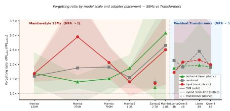  
Figure 20: Forgetting ratio by model scale. Each point is the median forgetting ratio across seeds and task pairs; shaded bands show ±1 std. Solid lines = SSMs (0.13–2.8B); dotted line = Hybrid (Zamba2-2.7B, $\mathcal { N P A } { = } + 0 . 0 5 )$ ; dashed lines = Transformers (3–9B). Color encodes placement strategy: red = top-k (most plastic), green = bottom-k (least plastic), gray = randomk. Within SSMs, the three lines are interleaved with no consistent ordering. Within Transformers, top-k sits above bottom-k at every scale. Zamba2's three strategies converge to uniformly low forgetting, consistent with its near-zero NPA and distributed plasticity. Falcon-Mamba-7B is excluded (its 7B scale overlaps with the Transformer range; boundary results reported in text). The boundary between SSM and Transformer scale regions is marked by a dotted vertical line.

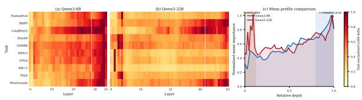  
Figure 21: Task-normalized LoRA-delta patterns for Qwen3-8B and Qwen3-32B. Panels (a–b) show per-task heatmaps; panel (c) overlays the mean profiles by relative depth. Qwen3-32B develops an additional earlylayer peak alongside the terminal cluster, yielding a bimodal profile absent in smaller Qwen3 variants. The bimodality is the proximate clue for the scale-induced collapse of C(M) on the two largest transformers (Section 5.4).

Table 25: Llama-3.1-70B causal validation under LoRA delta (k=10 of 80 layers). Generation rows report perplexity; MCQ rows report accuracy where available. Most tasks select terminal-cluster layers; GSM8K additionally recruits early-middle layers. SQuAD is only marginally supported by the binary rule.
<table><tr><td>Task</td><td>Group</td><td>Top-10 layers (sample)</td><td>Base</td><td>Topk</td><td>Botk</td><td>Supp.</td></tr><tr><td>HumanEval</td><td>Code</td><td>40,41,42,45,73,74,75,76,78,79</td><td>2.78</td><td>1.80</td><td>2.30</td><td>√</td></tr><tr><td>MBPP</td><td>Code</td><td>41,43,44,45,48,49,72,73,74,75</td><td>4.94</td><td>1.95</td><td>2.64</td><td>√</td></tr><tr><td>LongBench</td><td>Long-ctx</td><td>63,64,67,68,70,71,72,74,75,76</td><td>7.71</td><td>4.66</td><td>6.59</td><td>√</td></tr><tr><td>GPQA</td><td>Science</td><td>6,8,40,71,73,74,75,77,78,79</td><td>4.27</td><td>3.41</td><td>3.47</td><td>√</td></tr><tr><td>GSM8K</td><td>Math</td><td>12,13,14,15,16,33,71,75,78,79</td><td>4.11</td><td>2.46</td><td>2.55</td><td>√</td></tr><tr><td>SQuAD</td><td>Retrieval</td><td>27,33,35,36,37,38,74,77,78,79</td><td>2.91</td><td>1.69</td><td>1.70</td><td>√†</td></tr><tr><td>MMLU</td><td>Knowledge</td><td>4,9,11,21,36,73,74,77,78,79</td><td>5.69</td><td>4.72</td><td>4.58</td><td>×</td></tr><tr><td>ARC</td><td>Commonsense</td><td>67,71,72,73,74,75,76,77,78,79</td><td>5.96</td><td>3.97</td><td>3.91</td><td>×</td></tr><tr><td>PIQA</td><td>Commonsense</td><td>35,71,72,73,74,75,76,77,78,79</td><td>9.63</td><td>4.26</td><td>3.79</td><td>X</td></tr><tr><td>WinoGrande</td><td>Commonsense</td><td>68,69,70,71,72,73,74,75,76,77</td><td>0.812</td><td>0.781</td><td>0.758</td><td>X</td></tr></table>