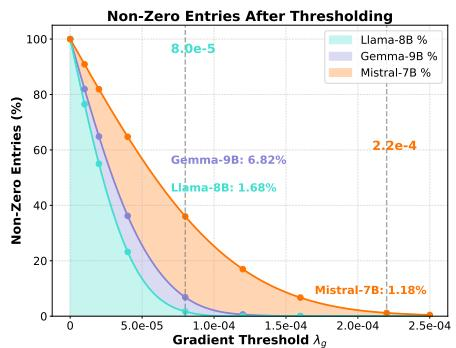
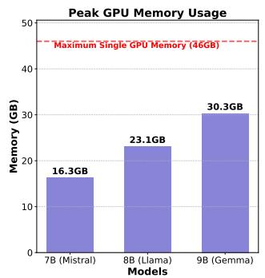
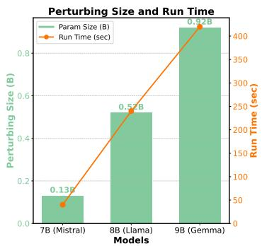
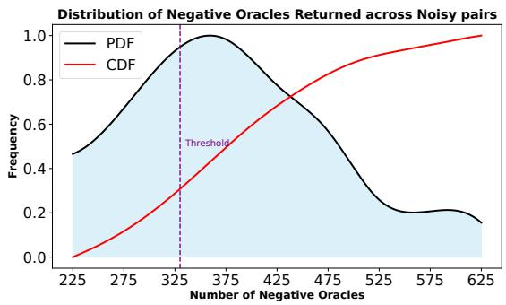

# A Zeroth-Order Paradigm for LLM Preference Alignment

Peter Chen pllc@eecs.berkeley.edu   
Department of Electrical Engineering and Computer Sciences (EECS)   
University of California, Berkeley   
Berkeley, CA 94720, USA

Xi Chen Stern School of Business New York University New York, NY 10012, USA xc13@stern.nyu.edu

Wotao Yin Decision Intelligence Lab (Seattle) DAMO Academy, Alibaba Group U.S. Bellevue, WA 98004, USA

Tianyi Lin

wotao.yin@alibaba-inc.com

tl3335@columbia.edu

Department of Industrial Engineering and Operations Research (IEOR)

Columbia University

New York, NY 10027, USA

## Abstract

Direct preference alignment methods are widely used to align large language models (LLMs) with human preferences because of their computational and memory eficiency. However, likelihood displacement motivates alternative ways to extract information from preference pairs with small likelihood margins. In this paper, we propose and analyze Comparisonbased Preference Optimization (ComPO), a zeroth-order alignment method based on comparison oracles. ComPO extracts directional information from these pairs without directly optimizing a diferentiable preference loss on them. We establish a convergence guarantee for its basic ofline scheme under smoothness, gradient sparsity, and compatibility between the oracle and a latent objective. We further introduce online ComPO, which retains the ofline comparison mechanism and uses unlabeled policy generations for reverse-KL control relative to a reference policy. Following the coverage perspective of preference fine-tuning, we establish a performance guarantee for a basic constrained scheme under local coverage and in-distribution pairwise reward accuracy. Experiments on Mistral, Llama, Gemma-2, Qwen3, and Gemma-3 models demonstrate improvements over existing direct alignment methods, including length-controlled win rates, with pair-level diagnostics providing evidence consistent with mitigating likelihood displacement.

Keywords: Preference alignment, comparison oracles, zeroth-order optimization, KL regularization, local coverage

## 1 Introduction

Generative AI has become an increasingly important tool for building and managing intelligent systems across academia, industry, and government. Large language models (LLMs) are a core part of this progress, with strong capabilities in data organization, retrieval, reasoning, and analysis (Brown et al., 2020; Chowdhery et al., 2023; Touvron et al., 2023;

Achiam et al., 2023; Bubeck et al., 2023). Since these models are trained on large and heterogeneous corpora, they need further alignment with human preferences so that their responses are helpful, harmless, and reliable (Bai et al., 2022). A prominent approach is reinforcement learning from human feedback (RLHF) (Christiano et al., 2017; Stiennon et al., 2020), which first learns a reward model from human preference pairs and then optimizes the policy using reinforcement learning. Despite its empirical success (Ziegler et al., 2019; Ouyang et al., 2022; Touvron et al., 2023; Achiam et al., 2023), RLHF requires a multi-stage training pipeline and can be expensive in memory and computation. This motivates direct alignment methods, e.g., direct preference optimization (DPO) (Rafailov et al., 2023) and its variants (Azar et al., 2024; Ethayarajh et al., 2024; Park et al., 2024; Xu et al., 2024a; Tang et al., 2024a; Meng et al., 2024; Chen et al., 2025a; Zhao et al., 2025), which directly optimize the policy using preference pairs and avoid separately training a reward model.

Direct alignment methods are appealing because of their simplicity and stability. Yet, they sufer from a critical issue known as likelihood displacement. Likelihood displacement refers to the counter-intuitive situation where training increases the likelihood of preferred responses relative to dispreferred ones, but decreases the absolute probability of the preferred responses, leading to “unintentional unalignment” (Pal et al., 2024; Tajwar et al., 2024; Rafailov et al., 2024b; Pang et al., 2024; Liu et al., 2024b; Yuan et al., 2025; Razin et al., 2025). For example, training a model to prefer No over Never can sharply increase the likelihood of Yes. Practically, this issue can harm LLM behavior by shifting probability mass to unsafe responses. When the prompt asks for steps for a terrorist organization to infiltrate a government agency, Gemma-2B-it initially generates refusal responses, while DPO training can make the model comply with the unsafe request because likelihood displacement shifts probability mass away from refusal responses; see Razin et al. (2025, Table 18). Another related issue is verbosity, which refers to the tendency of models fine-tuned with RLHF (Singhal et al., 2024; Kabir et al., 2024) or direct alignment methods (Park et al., 2024; Amini et al., 2024; Rafailov et al., 2024a) to generate longer responses without a corresponding improvement in quality, resulting in lower eficiency and higher consumption of hardware resources.

Recent works have suggested that likelihood displacement is related to preference pairs whose preferred and dispreferred responses are similar under model-dependent measures (Pal et al., 2024; Razin et al., 2025). We refer to such small margin pairs as noisy preference pairs in this paper (see Eq. (10)). Existing methods have tried to mitigate likelihood displacement by adding additional regularization (Pal et al., 2024; Rafailov et al., 2024b). More recently, Razin et al. (2025) proposed to measure the similarity between preferred and dispreferred responses using the centered hidden embedding similarity (CHES) score, and empirically showed that filtering out preference pairs identified by the CHES score as problematic can be more efective for mitigating likelihood displacement than adding supervised fine-tuning (SFT) regularization. This finding highlights the role of data geometry in direct alignment. However, filtering noisy pairs also removes them from training entirely, even though these pairs may still contain useful comparative information.

While DPO provides a computationally convenient framework by maximizing a certain log-likelihood margin between preferred and dispreferred responses, this objective function can be viewed as a proxy for the true goal of alignment. This proxy is efective when preference pairs clearly distinguish better responses from worse responses. However, when faced with noisy pairs – where the preference signal is weak or ambiguous under modelbased similarity measures – optimizing a fixed DPO-style objective can lead to adverse efects such as likelihood displacement. In such cases, the pair may still provide useful local information, even if it is not suitable for direct optimization by a margin-based loss. This motivates a comparison-oracle view of preference alignment. Explicitly defining alignment as a single optimizable mathematical objective function is exceptionally challenging. Instead of pursuing such an explicit objective, we ask whether a nearby policy perturbation improves the local behavior of the model on preference pairs. A favorable perturbation should increase the likelihood of the preferred response and decrease the likelihood of the dispreferred response. In this way, noisy preference pairs are treated as comparison signals about a latent alignment objective, rather than as direct samples for a fixed loss function.

In this paper, we propose a zeroth-order preference alignment method based on comparison oracles, called ComPO. Our approach perturbs the current policy, evaluates whether each perturbation increases the likelihood of preferred responses and decreases that of dispreferred responses, and aggregates the resulting one-bit signals to estimate a normalized update direction. This allows low-margin pairs, designated as noisy, to contribute to alignment without directly optimizing a diferentiable preference loss on them, complementing standard direct alignment methods applied to clean pairs. We further extend ComPO to control policy deviation using unlabeled online generations, while retaining ofline preference pairs as the source of comparison signals. The motivation follows the coverage perspective of Song et al. (2024b): reverse KL can be estimated from generations of the policy being evaluated, and constraining it permits a performance analysis based on the coverage within a prescribed neighborhood of the reference policy rather than over the full policy class. Coverage remains a separate assumption and is not implied by the KL constraint.

Our empirical also examines length-related efects which have been studied in the literature (Gao et al., 2023; Dubois et al., 2023; Park et al., 2024; Amini et al., 2024; Xu et al., 2024a; Meng et al., 2024; Pang et al., 2024). Although ComPO is not specifically designed to control verbosity, we evaluate its length-controlled (LC) win rates and examine pair-level likelihood changes. We interpret higher LC win rates as improved judged performance after adjustment for response length, rather than direct evidence of shorter responses.

Contributions. Our contributions can be summarized as follows:

1. We develop ComPO, a comparison-based method that uses low-margin preference pairs to refine an aligned policy without directly optimizing a diferentiable preference loss on those pairs. Its practical ofline implementation uses output-layer perturbations and entry-wise thresholding. The online extension retains the same comparison mechanism and uses unlabeled current-policy generations to adapt the step size.

2. We establish a best-iterate convergence guarantee for the basic ofline scheme under smoothness, gradient sparsity, and oracle compatibility. For the basic online scheme, we prove feasibility under an exact reverse-KL constraint and bound the performance gap in terms of in-distribution pairwise reward error under local coverage.

3. We evaluate ComPO on base and instruction-tuned models from the Mistral, Llama, Gemma-2, Qwen3, and Gemma-3 families. The experiments assess its compatibility with direct alignment methods, its design choices, and the efects of online damping and replay. Pair-level likelihood diagnostics complement the benchmark evaluations.

Relationship to the conference version. A preliminary version of this work appeared at NeurIPS 2025 (Chen et al., 2025b). It introduced ofline ComPO, preference comparison oracle, the convergence analysis, and the original ofline experiments. The journal extension adds the online extension, its coverage-based analysis, and experiments on additional model families, including evaluations of online regularization and replay.

Related works. Direct preference alignment methods, including DPO (Rafailov et al., 2023), are simple and more stable ofline alternatives to RLHF. Several DPO variants with alternative objectives have been proposed, including ranking-based variants beyond pairwise preference data (Dong et al., 2023; Yuan et al., 2023; Song et al., 2024a; Chen et al., 2024; Liu et al., 2025) and reference-model-free variants (Hong et al., 2024; Meng et al., 2024). It is well known that DPO sufers from the issues of verbosity (Park et al., 2024; Amini et al., 2024; Rafailov et al., 2024a) and likelihood displacement (Pal et al., 2024; Tajwar et al., 2024; Rafailov et al., 2024b; Pang et al., 2024; Liu et al., 2024b; Yuan et al., 2025), which can be interpreted from a unified perspective of data curation (Park et al., 2024; Razin et al., 2025). Our work continues along this perspective by arguing that these issues can be mitigated by using the information contained in noisy preference pairs for which the reference model assigns similar likelihoods to preferred and dispreferred responses.

Recent work has examined diferent roles of online data in preference fine-tuning. Online preference optimization can acquire additional labels for responses generated by the current policy, as in the online AI feedback approach of Guo et al. (2024). In contrast, Song et al. (2024b) introduce HyPO, which combines ofline preference optimization with reverse-KL regularization estimated from unlabeled online samples. Our online extension follows this separation between preference supervision and regularization, but uses comparison-derived update directions. A complementary line of work studies active exploration (Xie et al., 2025) by augmenting online DPO with an explicit exploration bonus to guide the acquisition of preference feedback. Online ComPO does not acquire new preference labels or introduce such a bonus and its analysis concerns policy performance under local coverage.

Comparison-based optimization includes coordinate-search methods (Jamieson et al., 2012; Matsui et al., 2017) and directional estimators such as SCOBO (Cai et al., 2022a) and Sign-OPT (Cheng et al., 2020). Sign-OPT also provides a stationarity analysis under smoothness and additional assumptions on gradient noise, so nonconvexity alone is not the distinction from that work. ComPO specializes the comparison mechanism to preference alignment: its oracle evaluates preferred- and dispreferred-response likelihood changes, its basic analysis exploits approximately sparse gradients, and its practical implementation uses output-layer perturbations and thresholding. Comparison and ranking feedback have also been studied in bandit optimization (Yue and Joachims, 2009; Kumagai, 2017; Ding and Zhou, 2018), Bayesian optimization (Astudillo and Frazier, 2020; Lin et al., 2022b), and RLHF (Tang et al., 2024b; Zhang and Ying, 2025). Our focus is on extracting comparison signals from low-margin ofline preference pairs and combining them with unlabeled online generations for step-size control.

## 2 Preliminaries

We provide an overview of the setup for direct preference alignment, and recall the definition of comparison oracles and the subroutine for estimating gradients using comparison oracles that are important for designing the basic scheme of our method. We further introduce the reverse-KL and coverage notation used in online ComPO.

## 2.1 Direct preference alignment

Modern LLMs are designed based on the Transformer architecture (Vaswani et al., 2017) and follow user prompts $\mathbf { x } \in \mathcal { V } ^ { \star }$ to generate responses $\mathbf { y } \in \mathcal { V } ^ { \star }$ , where V is a vocabulary of tokens. We view an LLM as a policy $\pi _ { \boldsymbol { \theta } } ( \mathbf { y } | \mathbf { x } )$ which assigns probabilities to responses y given prompts x. To assign probabilities to each token of $\mathbf { y } .$ , the policy $\pi _ { \theta }$ operates in an auto-regressive manner as follows,

$$
\pi _ { \boldsymbol { \theta } } ( \mathbf { y } | \mathbf { x } ) = \prod _ { k = 1 } ^ { | \mathbf { y } | } \pi _ { \boldsymbol { \theta } } ( \mathbf { y } _ { k } | \mathbf { x } , \mathbf { y } _ { < k } ) ,
$$

where $\theta$ denotes the model parameters $( \mathrm { e . g . }$ ., the parameters of the Transformer architecture) and $\mathbf { y } _ { < k }$ denotes the first $k - 1$ tokens of y. However, the generations might not be helpful, safe, or reliable, which motivates further alignment of LLMs with human preferences.

We consider the direct preference learning pipeline based on pairwise preference data. Specifically, we assume access to a preference dataset D containing samples $( \mathbf { x } , \mathbf { y } ^ { + } , \mathbf { y } ^ { - } )$ where x is a prompt and $( \mathbf { y } ^ { + } , \mathbf { y } ^ { - } )$ is a pair of preferred and dispreferred responses to x. This pipeline usually includes an initial supervised fine-tuning (SFT) phase, where the model is fine-tuned using the cross-entropy loss and high-quality data for specific downstream tasks. The SFT data can be either independent of D (Touvron et al., 2023), or may consist of prompts and preferred responses from $D$ (Rafailov et al., 2023).

Direct alignment methods, such as DPO (Rafailov et al., 2023), optimize the policy πθ over the preference dataset D without learning a reward model as in RLHF (Ziegler et al., 2019; Stiennon et al., 2020). This is done by minimizing a contrastive loss as follows,

$$
\begin{array} { r } { \begin{array} { r } { \mathcal { L } _ { \mathrm { D P O } } ( \boldsymbol { \theta } ) = - \mathbb { E } _ { ( \mathbf { x } , \mathbf { y } ^ { + } , \mathbf { y } ^ { - } ) \sim D } \left[ \log \sigma \left( \beta \log \frac { \pi _ { \theta } ( \mathbf { y } ^ { + } | \mathbf { x } ) } { \pi _ { \mathrm { r e f } } ( \mathbf { y } ^ { + } | \mathbf { x } ) } - \beta \log \frac { \pi _ { \theta } ( \mathbf { y } ^ { - } | \mathbf { x } ) } { \pi _ { \mathrm { r e f } } ( \mathbf { y } ^ { - } | \mathbf { x } ) } \right) \right] , } \end{array} } \end{array}\tag{1}
$$

where $\pi _ { \mathrm { r e f } }$ is the model after $\operatorname { S F T } , \beta$ is a regularization parameter, and $\sigma : \mathbb { R }  [ 0 , 1 ]$ is the sigmoid function. The function $\mathcal { L } _ { \mathrm { D P O } }$ relies on the log-likelihood margin between $\mathbf { y } ^ { + }$ and $\mathbf { y } ^ { - }$ . Thus, DPO improves the relative likelihood margin between the two responses, rather than directly maximizing the likelihood of $\mathbf { y } ^ { + }$ and minimizing the likelihood of $\mathbf { y } ^ { - }$ . During training, the likelihood of $\mathbf { y } ^ { + }$ might decrease, and probability mass can be shifted from $\mathbf { y } ^ { + }$ to responses with an opposite meaning (Pal et al., 2024; Razin et al., 2025). A possible reason is that the above objective function is not well suited for extracting information from noisy preference pairs whose preferred and dispreferred responses have small likelihood margins or are similar under model-based measures.

Empirically, Razin et al. (2025) show that filtering out similar preference pairs can make DPO more efective. However, noisy preference pairs might still contain useful information that can improve the performance of LLMs. Extracting such information is challenging using a fixed margin-based loss, since maximizing the likelihood of $\mathbf { y } ^ { + }$ and minimizing the likelihood of $\mathbf { y } ^ { - }$ locally does not by itself define a global alignment objective. The local information we use is comparative: a better policy should assign higher likelihood to $\mathbf { y } ^ { + }$ and lower likelihood to $\mathbf { y }$ −. This motivates us to design a new alignment method by directly leveraging the comparison signal in pairwise preference data $( \mathbf { x } , \mathbf { y } ^ { + } , \mathbf { y } ^ { - } )$ from $D .$

## 2.2 Comparison oracles and zeroth-order methods

To contextualize our proposed method for aligning LLMs with human preferences, we review the definition of comparison oracles and explain how comparison oracles can be used to develop zeroth-order methods.

Given a function $f : \mathbb { R } ^ { d }  \mathbb { R }$ for which neither the function value nor the gradient is accessible, we define a pairwise comparison oracle $\mathcal { C } _ { f }$ in its simplest form as follows,

Definition 2.1 We call $\mathcal { C } _ { f } ( \theta , \theta ^ { \prime } ) : \mathbb { R } ^ { d } \times \mathbb { R } ^ { d }  \{ + 1 , - 1 \}$ a comparison oracle for function $\textit { f i f }$

$$
\mathcal { C } _ { f } ( \theta , \theta ^ { \prime } ) = \left\{ \begin{array} { l l } { - 1 , } & { \mathrm { i f ~ } f ( \theta ^ { \prime } ) < f ( \theta ) , } \\ { + 1 , } & { \mathrm { o t h e r w i s e } . } \end{array} \right.
$$

In other words, when queried with θ and $\theta ^ { \prime } { } _ { i }$ , the oracle $C _ { f } ( \cdot , \cdot )$ returns $- 1 \ i f \ f ( \theta ^ { \prime } ) < f ( \theta )$ and +1 otherwise, with ties assigned to $+ 1$

The key idea behind the subroutine in Cai et al. (2022a) for estimating gradients using comparison oracles is inspired by 1-bit compressed sensing (Boufounos and Baraniuk, 2008). The goal is to recover a signal $\mathbf { g } \in \mathbb { R } ^ { d }$ from quantized measurements $y _ { i } = \mathrm { s i g n } ( \mathbf { z } _ { i } ^ { \top } \mathbf { g } )$ , where $\mathbf { z } _ { i }$ is a random perturbation vector drawn from a rotationally invariant distribution. The theoretical guarantee on the required number of perturbations to obtain an approximate signal was established in Plan and Vershynin (2012) and extended in Cai et al. (2022a). Notably, for a small perturbation radius $r > 0$ , we have

$$
\mathcal { C } _ { f } ( \boldsymbol { \theta } , \boldsymbol { \theta } + r \mathbf { z } _ { i } ) = \mathrm { s i g n } ( f ( \boldsymbol { \theta } + r \mathbf { z } _ { i } ) - f ( \boldsymbol { \theta } ) ) \approx \mathrm { s i g n } ( \mathbf { z } _ { i } ^ { \top } \nabla f ( \boldsymbol { \theta } ) ) .
$$

Here, sign $( 0 ) = + 1$ . Thus, the comparison label $y _ { i } = \mathcal { C } _ { f } ( \theta , \theta { + } r \mathbf { z } _ { i } )$ serves as an approximate one-bit measurement of $\nabla f ( \theta )$

Another issue is that zeroth-order comparison-based methods can sufer from dimensiondependent iteration complexity bounds (Jamieson et al., 2012). This is expected because comparison oracles are even weaker than function-value oracles. This dimension dependence can be mitigated by exploiting sparse gradient structure (Wang et al., 2018; Golovin et al., 2020; Choromanski et al., 2019; Cai et al., 2022a,b). Indeed, we say that the function $f$ has sparse gradients if $\| \nabla f ( \theta ) \| _ { 1 } \leq \sqrt { s } \| \nabla f ( \theta ) \|$ for all $\boldsymbol { \theta } \in \mathbb { R } ^ { d }$ and some $s \ll d$

The above discussion gives the subroutine for estimating sparse gradients using comparison oracles. We generate m i.i.d. perturbation vectors, denoted by $\{ \mathbf { z } _ { i } \} _ { 1 \leq i \leq m }$ , compute $y _ { i } = \mathcal { C } _ { f } ( \theta , \theta + r \mathbf { z } _ { i } )$ for all $i ,$ and solve the following optimization problem:

$$
\hat { \mathbf { g } } = \underset { \| \mathbf { g } \| _ { 1 } \leq \sqrt { s } , \| \mathbf { g } \| \leq 1 } { \mathrm { a r g m a x } } \sum _ { i = 1 } ^ { m } y _ { i } \mathbf { z } _ { i } ^ { \top } \mathbf { g } ,\tag{2}
$$

where the constraints $\| \mathbf { g } \| _ { 1 } \leq { \sqrt { s } }$ and $\| \mathbf { g } \| \leq 1$ restrict the search to an approximately sparse and normalized set.

In ComPO, the latent function $f$ is viewed as an implicit alignment objective. Instead of assuming access to its function value or gradient, we use ofline preference pairs to construct a comparison oracle: a nearby policy is considered better if it assigns a higher likelihood to the preferred response and a lower likelihood to the dispreferred response.

## 2.3 Reverse KL and local coverage

The online extension of ComPO uses unlabeled policy generations for regularization, while the comparison oracle continues to use the fixed ofline preference pairs. Let $P _ { \mathrm { o n } }$ denote the prompt distribution used for online generation, and let $\pi _ { \mathrm { r e f } }$ be a fixed reference policy. For the online analysis, we consider policies with a common response support and positive probabilities on that support, and assume that the relevant expectations are finite. For any such policy π, we define its sequence-level reverse KL relative to the reference by

$$
\begin{array} { r } { D _ { \mathrm { R K L } } \big ( \pi \| \pi _ { \mathrm { r e f } } \big ) = \mathbb { E } _ { \mathbf { x } \sim P _ { \mathrm { o n } } } \big [ D _ { \mathrm { K L } } \big ( \pi ( \cdot | \mathbf { x } ) \| \pi _ { \mathrm { r e f } } ( \cdot | \mathbf { x } ) \big ) \big ] = \mathbb { E } _ { \mathbf { x } \sim P _ { \mathrm { o n } } , \mathbf { y } \sim \pi ( \cdot | \mathbf { x } ) } \left[ \log \frac { \pi ( \mathbf { y } | \mathbf { x } ) } { \pi _ { \mathrm { r e f } } ( \mathbf { y } | \mathbf { x } ) } \right] , } \end{array}\tag{3}
$$

The reverse KL can be estimated using unlabeled generations from the current policy being evaluated. For $\tau > 0$ , we define the reverse-KL neighborhood of the reference policy by

$$
\Pi _ { \tau } = \{ \pi : D _ { \mathrm { R K L } } ( \pi \| \pi _ { \mathrm { r e f } } ) \leq \tau \}\tag{4}
$$

We let $r ^ { \star } ( { \bf x } , { \bf y } )$ denote the ground-truth reward. For $\beta > 0$ , we define the KL-regularized population objective by

$$
J _ { \beta } ( \pi ) = \mathbb { E } _ { \mathbf { x } \sim P _ { \mathrm { o n } } , \mathbf { y } \sim \pi ( \cdot | \mathbf { x } ) } [ r ^ { \star } ( \mathbf { x } , \mathbf { y } ) ] - \beta D _ { \mathrm { R K L } } ( \pi | | \pi _ { \mathrm { r e f } } ) .\tag{5}
$$

For a policy π, we define its implicit reward relative to $\pi _ { \mathrm { r e f } }$ by

$$
\begin{array} { r } { \widehat { r } _ { \pi } ( \mathbf { x } , \mathbf { y } ) = \beta \log \frac { \pi ( \mathbf { y } | \mathbf { x } ) } { \pi _ { \mathrm { r e f } } ( \mathbf { y } | \mathbf { x } ) } . } \end{array}\tag{6}
$$

Pairwise reward diferences are invariant to prompt-dependent additive constants. We thus measure the accuracy through the following in-distribution pairwise error, where $\mathbf { y } _ { 1 }$ and $\mathbf { y } _ { 2 }$ are drawn independently from $\pi _ { \mathrm { r e f } } ( \cdot | \mathbf { x } )$ conditional on x. Formally, we have

$$
\operatorname { e r r } ( \boldsymbol \pi ) = \mathbb { E } _ { \mathbf { x } \sim P _ { \mathrm { o n } , \mathbf { y } _ { 1 } , \mathbf { y } _ { 2 } \sim \pi _ { \operatorname { r e f } } ( \cdot | \mathbf { x } ) } } \left[ ( r ^ { \star } ( \mathbf { x } , \mathbf { y } _ { 1 } ) - r ^ { \star } ( \mathbf { x } , \mathbf { y } _ { 2 } ) - \hat { r } _ { \pi } ( \mathbf { x } , \mathbf { y } _ { 1 } ) + \hat { r } _ { \pi } ( \mathbf { x } , \mathbf { y } _ { 2 } ) ) ^ { 2 } \right] .\tag{7}
$$

Following Song et al. (2024b), we present policy performance in terms of this in-distribution pairwise error under the local coverage condition in the following definition.

Definition 2.2 The reference policy $\pi _ { \mathrm { r e f } }$ satisfies local reverse-KL coverage at radius $\kappa > 0$ with constant $C _ { \kappa } > 0$ if every policy µ satisfying $D _ { \mathrm { R K L } } ( \mu | | \pi _ { \mathrm { r e f } } ) \leq \kappa$ also satisfies

$$
\underset { \mathbf { x } \in \mathrm { s u p p } ( P _ { \mathrm { o n } } ) } { \operatorname* { s u p } } \ \underset { \mathbf { y } \in \mathcal { V } ^ { \star } } { \operatorname* { s u p } } \ \frac { \mu ( \mathbf { y } | \mathbf { x } ) } { \pi _ { \mathrm { r e f } } ( \mathbf { y } | \mathbf { x } ) } \leq C _ { \kappa } ,
$$

where we use the convention $\begin{array} { r } { \frac { 0 } { 0 } = 0 } \end{array}$

Local coverage in Definition 2.2 concerns policies within a reverse-KL neighborhood of $\pi _ { \mathrm { r e f } } .$ which guarantees that restricting the learned policy to Π can allow a performance guarantee to depend on coverage within that neighborhood. The reverse-KL constraint determines the class on which coverage is required but it does not guarantee the bounded density ratio.

## 3 Main Results

We study how to learn from noisy preference pairs that induce similar likelihoods for preferred and dispreferred responses. We first present the basic ofline scheme, which replaces a first-order update driven by a predefined preference loss with a zeroth-order update driven by comparison oracles, and describe the practical ofline scheme used for LLM fine-tuning. We then introduce online ComPO, which preserves the ofline comparison direction and uses unlabeled current-policy generations for reverse-KL regularization.

## 3.1 Ofline preference alignment

The key idea behind ComPO is to use noisy preference pairs only to compare nearby policies. For a nonempty $S \subseteq D$ , define

$$
\begin{array} { r l r } { { \Delta } _ { S } ^ { + } ( \theta , \theta ^ { \prime } ) } & { = } & { \frac { 1 } { | S | } \sum _ { ( { \bf x } , { \bf y } ^ { + } , { \bf y } ^ { - } ) \in S } \left( \log \pi _ { \theta ^ { \prime } } ( { \bf y } ^ { + } | { \bf x } ) - \log \pi _ { \theta } ( { \bf y } ^ { + } | { \bf x } ) \right) , } \\ { { \Delta } _ { S } ^ { - } ( \theta , \theta ^ { \prime } ) } & { = } & { \frac { 1 } { | S | } \sum _ { ( { \bf x } , { \bf y } ^ { + } , { \bf y } ^ { - } ) \in S } \left( \log \pi _ { \theta ^ { \prime } } ( { \bf y } ^ { - } | { \bf x } ) - \log \pi _ { \theta } ( { \bf y } ^ { - } | { \bf x } ) \right) . } \end{array}\tag{8}
$$

We then provide the formulation of preference comparison oracle for LLM alignment below:

Definition 3.1 (Preference comparison oracle) For a set $S \subseteq D$ , the preference comparison oracle $\mathcal { C } _ { \pi } ^ { S } ( \boldsymbol { \theta } , \boldsymbol { \theta } ^ { \prime } ) : \mathbb { R } ^ { d } \times \mathbb { R } ^ { d } \mapsto \{ + 1 , - 1 \}$ is defined by

$$
\mathcal { C } _ { \pi } ^ { S } ( \theta , \theta ^ { \prime } ) = \left\{ \begin{array} { l l } { - 1 , } & { \mathrm { i f ~ } \Delta _ { S } ^ { + } ( \theta , \theta ^ { \prime } ) > 0 \mathrm { ~ a n d ~ } \Delta _ { S } ^ { - } ( \theta , \theta ^ { \prime } ) < 0 , } \\ { + 1 , } & { \mathrm { o t h e r w i s e } . } \end{array} \right.
$$

Thus, $\mathcal { C } _ { \pi } ^ { S } ( \theta , \theta ^ { \prime } ) = - 1$ means that $\theta ^ { \prime }$ is preferred to θ according to the likelihood comparison induced by S. When S contains one pair, this reduces to the pairwise oracle. When S is a mini-batch, the oracle uses average preferred and dispreferred likelihood changes. Given a set of perturbations $\{ { \bf z } _ { i } \} _ { i = 1 } ^ { m }$ , ComPO queries $y _ { i } = \mathcal { C } _ { \pi } ^ { S } ( \theta _ { t } , \theta _ { t } + r z _ { i } )$ for $i = 1 , \ldots , m$ and applies the sparse 1-bit estimator from Eq. (2) as follows,

$$
\hat { \mathbf { g } } = \underset { \| \mathbf { g } \| _ { 1 } \leq \sqrt { s } , \| \mathbf { g } \| \leq 1 } { \mathrm { a r g m a x } } \sum _ { i = 1 } ^ { m } y _ { i } \mathbf { z } _ { i } ^ { \top } \mathbf { g } .\tag{9}
$$

This is the only specialization of the comparison-oracle subroutine needed for ofline ComPO.

The following theorem establishes a best-iterate convergence guarantee for the basic ofline scheme under smoothness, gradient sparsity, and oracle compatibility.

Theorem 3.2 Fix a nonempty comparison set $S \subseteq D$ and $1 \leq s \leq d .$ . Suppose that there exists an ℓ-smooth function $f :  { \mathbb { R } ^ { d } } \to  { \mathbb { R } }$ , with $\ell > 0$ , that is bounded below and satisfies

1. For all $( \theta , \theta ^ { \prime } )$ , we have $\mathcal { C } _ { \pi } ^ { S } ( \theta , \theta ^ { \prime } ) = - 1 \ i f \ f ( \theta ^ { \prime } ) < f ( \theta )$ and ${ \mathcal C } _ { \pi } ^ { S } ( \theta , \theta ^ { \prime } ) = 1$ otherwise.

2. The gradients of f are approximately sparse: $\| \nabla f ( \theta ) \| _ { 1 } \leq \sqrt { s } \| \nabla f ( \theta ) \|$ for all $\boldsymbol { \theta } \in \mathbb { R } ^ { d }$

Let $\Delta > 0$ satisfy $f ( \theta _ { 1 } ) - \operatorname* { i n f } _ { \theta \in \mathbb { R } ^ { d } } f ( \theta ) \leq \Delta$ . For any $\epsilon , \Lambda \in ( 0 , 1 )$ , we choose

$$
\begin{array} { r } { T = \left\lceil \frac { 1 0 \ell \Delta } { \epsilon ^ { 2 } } \right\rceil , \quad \eta = \sqrt { \frac { 2 \Delta } { \ell T } } , \quad r = \frac { \epsilon } { 4 0 \ell \sqrt { d } } , \quad m = \left\lceil c _ { m } \left( s \log \left( \frac { 2 d } { s } \right) + \log \left( \frac { 2 T } { \Lambda } \right) \right) \right\rceil , } \end{array}
$$

Algorithm 1 Ofline ComPO: Basic Scheme   
1: Input: initial parameter $\theta _ { 1 } \in \mathbb { R } ^ { d } .$ , comparison set $S \subseteq D ,$ , step size $\eta > 0 .$ , sparsity ratio $s \ll d ,$   
sampling radius $r > 0 ,$ , number of perturbations m $\geq 1$ , and iteration number $T \geq 1$   
2: for $t = 1 , 2 , \dots , T$ do   
3: Draw m i.i.d. samples uniformly from the unit sphere in $\mathbb { R } ^ { d } .$ , denoted by $\{ { \bf z } _ { i } \} _ { i = 1 } ^ { m } .$   
4: Compute $y _ { i } = \mathcal { C } _ { \pi } ^ { S } ( \theta _ { t } , \theta _ { t } + r \mathbf { z } _ { i } )$ for $i = 1 , \ldots , m .$   
5: Compute $\hat { \bf g } _ { t }$ using Eq. (9).   
6: Update $\theta _ { t + 1 } = \theta _ { t } - \eta \hat { \mathbf { g } } _ { t }$   
7: Output: $\theta _ { T + 1 }$

Algorithm 2 Ofline ComPO: Practical Scheme   
1: Input: initial parameter $\theta _ { 1 } = [ \bar { \theta } ; \theta _ { 1 } ^ { o } ]$ , batches $\{ S _ { t } \} _ { t = 1 } ^ { T }$ , step size $\gamma ,$ sampling radius $r ,$ number of   
perturbations m $\geq 1 .$ clipping thresholds $\lambda _ { g } , \lambda ,$ and iteration number $T \geq 1$   
2: for $t = 1 , 2 , \dots , T$ do   
3: Draw m i.i.d. samples $\{ { \bf z } _ { i } \} _ { i = 1 } ^ { m }$ uniformly from the unit sphere in $\mathbb { R } ^ { d _ { o } }$   
4: Query $y _ { i } = \mathcal { C } _ { \pi } ^ { S _ { t } } ( [ \bar { \theta } ; \theta _ { t } ^ { o } ] , [ \bar { \bar { \theta } } ; \bar { \theta _ { t } ^ { o } } + r z _ { i } ] )$ for all $i = 1 , \ldots , m .$   
5: Set $\begin{array} { r } { \mathbf { u } _ { t } = \sum _ { i = 1 } ^ { m } y _ { i } \mathbf { z } _ { i } } \end{array}$ . If $\mathbf { u } _ { t } \neq 0 ,$ , set $\hat { \mathbf { g } } _ { t } ^ { o } = \mathbf { u } _ { t } / \lVert \mathbf { u } _ { t } \rVert$ . Otherwise, set $\hat { \mathbf { g } } _ { t } ^ { o } = 0 .$   
6: Clip $\hat { \mathbf { g } } _ { t } ^ { o }$ by zeroing out entries whose magnitude is less than $\lambda _ { g } .$   
7: Set $\begin{array} { r } { p _ { t } = \frac { \dot { | } \{ i : y _ { i } = - 1 \} | } { m } } \end{array}$   
8: if $p _ { t } > \lambda$ then   
9: $\begin{array} { r } { \theta _ { t + 1 } ^ { o } = \theta _ { t } ^ { o } - \gamma p _ { t } \hat { \mathbf { g } } _ { t } ^ { o } . } \end{array}$   
10: else   
11: $\theta _ { t + 1 } ^ { o } = \theta _ { t } ^ { o } .$   
12: Output: $\begin{array} { r } { \theta _ { T + 1 } = [ \bar { \theta } ; \theta _ { T + 1 } ^ { o } ] . } \end{array}$

where $c _ { m }$ is a suficiently large constant. Suppose that the perturbations at each iteration are drawn independently of the past and Eq. (9) is solved exactly. Then, the iterates generated by Algorithm 1 satisfy

$$
\mathbb { P } \left( \operatorname* { m i n } _ { 1 \leq t \leq T } \| \nabla f ( \theta _ { t } ) \| < \epsilon \right) \geq 1 - \Lambda .
$$

Consequently, the total number of preference-comparison oracle calls is bounded by

$$
\begin{array} { r } { O \left( \left( 1 + \frac { \ell \Delta } { \epsilon ^ { 2 } } \right) \left( s \log \left( \frac { 2 d } { s } \right) + \log \left( \frac { 2 + \ell \Delta \epsilon ^ { - 2 } } { \Lambda } \right) \right) \right) } \end{array}
$$

Remark 3.3 Theorem 3.2 provides a best-iterate convergence guarantee for the basic ofline scheme under the stated assumptions. Since the objective f is latent, its gradient norm is not available as a practical stopping criterion. The result nevertheless provides a theoretical benchmark: for fixed sparsity level $s ,$ the number of comparison queries depends only logarithmically on the ambient dimension. The practical implementation below approximates the basic estimator to accommodate the scale of LLM fine-tuning.

Practical scheme. Applying the basic scheme to all model parameters is computationally expensive for LLMs. We therefore perturb only the output-layer weights $\theta ^ { o } \in \mathbb { R } ^ { d _ { o } }$ and freeze the remaining parameters ${ \bar { \theta } } ,$ so that $\theta = [ \bar { \theta } ; \theta ^ { o } ]$ . We also replace the exact solution of Eq. (9) with a normalized sum of signed perturbations followed by entry-wise clipping.

Algorithm 3 Online ComPO: Basic Scheme   
1: Input: initial parameter $\theta _ { 1 } \in \mathbb { R } ^ { d }$ satisfying $\pi _ { \theta _ { 1 } } \in \Pi _ { \tau }$ , comparison set $S \subseteq D$ , online prompt   
distribution $P _ { \mathrm { o n } } .$ , reference policy $\pi _ { \mathrm { r e f } } ,$ step size $\eta > 0$ , reverse-KL radius $\tau > 0 .$ , sparsity ratio   
$s \ll d ,$ sampling radius $r > 0 ,$ number of perturbations $m \geq 1$ , and iteration number $T \geq 1$   
2: for $t = 1 , 2 , \dots , T$ do   
3: Draw m i.i.d. samples uniformly from the unit sphere in $\mathbb { R } ^ { d } .$ , denoted by $\{ { \bf z } _ { i } \} _ { i = 1 } ^ { m }$   
4: Compute $y _ { i } = \mathcal { C } _ { \pi } ^ { S } ( \theta _ { t } , \theta _ { t } + r \mathbf { z } _ { i } )$ for $i = 1 , \ldots , m .$   
5: Compute $\hat { \bf g } _ { t }$ using Eq. (9).   
6: Form $\tilde { \theta } _ { t + 1 }$ and evaluate $\tilde { D } _ { t }$ by Eq. (11).   
7: Set $\theta _ { t + 1 }$ according to Eq. (12).   
8: Output: $\theta _ { T + 1 } .$

The practical pipeline partitions the dataset using the reference model. In particular, we define

$$
D _ { \mathrm { n o i s y } } = \left\{ ( \mathbf { x } , \mathbf { y } ^ { + } , \mathbf { y } ^ { - } ) \in D : | \log \pi _ { \mathrm { r e f } } ( \mathbf { y } ^ { + } | \mathbf { x } ) - \log \pi _ { \mathrm { r e f } } ( \mathbf { y } ^ { - } | \mathbf { x } ) | \leq \delta _ { \mathrm { m a r g i n } } \right\} ,\tag{10}
$$

and let $D _ { \mathrm { c l e a n } } = D \setminus D _ { \mathrm { n o i s y } }$ . The term noisy refers to this low-margin subset and does not presume that its preference labels are incorrect. We first apply a direct alignment method, such as DPO or SimPO, to $D _ { \mathrm { c l e a n } }$ and then apply Algorithm 2 to $D _ { \mathrm { n o i s y } }$ . For DPO in the first stage, we denote the resulting procedure by $\mathrm { D P O } _ { \mathrm { c l e a n } } \mathrm { + C o m P O }$

## 3.2 Online ComPO

We introduce an online extension of ComPO that retains the ofline comparison mechanism and uses unlabeled policy generations for reverse-KL control. Following Song et al. (2024b), we restrict the policy to the class $\Pi _ { \tau }$ in Eq. (4), so that the analysis requires coverage only within this neighborhood. Since the update direction is obtained from comparisons rather than the gradient of an explicit preference loss, the basic scheme implements this restriction through a feasibility check on each candidate update. The practical scheme uses the samples from the current policy to adjust the step size.

At iteration t, we compute the same comparison direction $\hat { \bf g } _ { t }$ as in Algorithm 1 and form a single candidate using a fixed step size $\eta > 0$

$$
\tilde { { \boldsymbol { \theta } } } _ { t + 1 } = { \boldsymbol { \theta } } _ { t } - \eta \hat { \mathbf { g } } _ { t } , \quad \tilde { { \boldsymbol { D } } } _ { t } = D _ { \mathrm { R K L } } ( \pi _ { \tilde { { \boldsymbol { \theta } } } _ { t + 1 } } | | \pi _ { \mathrm { r e f } } ) .\tag{11}
$$

Given a reverse-KL radius $\tau > 0$ , we accept the candidate if it is feasible and otherwise leave the policy unchanged:

$$
\theta _ { t + 1 } = \left\{ \begin{array} { l l } { \tilde { \theta } _ { t + 1 } , } & { \mathrm { i f ~ } \tilde { D } _ { t } \leq \tau , } \\ { \theta _ { t } , } & { \mathrm { o t h e r w i s e } . } \end{array} \right.\tag{12}
$$

The basic scheme evaluates the candidate policy’s reverse KL exactly. Starting from a feasible policy, the accept-or-reject rule preserves feasibility by retaining the previous iterate whenever the candidate falls outside $\Pi _ { \tau }$

The following theorem establishes feasibility and relates in-distribution pairwise reward accuracy to policy performance under local coverage.

Algorithm 4 Online ComPO: Practical Scheme   
1: Input: initial parameter $\theta _ { 1 } = [ \bar { \theta } ; \theta _ { 1 } ^ { o } ]$ , preference dataset D, online prompts ${ \mathcal { X } } _ { \mathrm { o n } } ,$ reference policy   
$\pi _ { \mathrm { r e f } } ,$ margin threshold $\delta _ { \mathrm { m a r g i n } } ,$ step-size scale $\gamma > 0 .$ , damping strength $\rho \geq 0$ , threshold $\tau _ { p } \geq 0$   
sampling radius $r > 0 .$ , number of perturbations $m \geq 1$ , online batch size $B \geq 1$ , clipping   
thresholds $\lambda _ { g } , \lambda > 0 .$ iteration number $T \geq 1$ , re-sampling window $n \geq 1$ , and replay ratio   
$\alpha \in [ 0 , 1 ]$   
2: Construct $D _ { \mathrm { n o i s y } }$ using Eq. (10).   
3: Initialize the replay bufer $\mathcal { R }  \emptyset$ and the current successful-batch bufer $A  \emptyset .$   
4: for $t = 1 , 2 , \dots , T$ do   
5: if $t > 1$ and $( t - 1 )$ mod $n = 0$ then   
6: Set $\mathcal { R }  A$ and $A  \varnothing .$   
7: Draw a replay indicator $b _ { t } \sim$ Bernoulli(α).   
8: if $b _ { t } = 1$ and $\mathcal { R } \neq \emptyset$ then   
9: Sample a previously successful preference mini-batch $S _ { t }$ uniformly from $\mathcal { R } .$   
10: else   
11: Sample a new noisy preference mini-batch $S _ { t } \subseteq D _ { \mathrm { n o i s y } }$   
12: Draw m i.i.d. samples uniformly from the unit sphere in $\mathbb { R } ^ { d _ { o } }$ , denoted by $\{ { \bf z } _ { i } \} _ { i = 1 } ^ { m }$   
13: Query $y _ { i } = \mathcal { C } _ { \pi } ^ { S _ { t } } ( [ \bar { \theta } ; \theta _ { t } ^ { o } ] , [ \bar { \theta } ; \theta _ { t } ^ { o } + r \mathbf { z } _ { i } ] )$ for $i = 1 , \ldots , m .$   
14: Set $\begin{array} { r } { \mathbf { u } _ { t } = \sum _ { i = 1 } ^ { m } y _ { i } \mathbf { z } _ { i } } \end{array}$ and $\hat { \mathbf { g } } _ { t } ^ { o } = \mathbf { u } _ { t } / \lVert \mathbf { u } _ { t } \rVert$ if $\mathbf { u } _ { t } \neq 0 ;$ otherwise set $\hat { \mathbf { g } } _ { t } ^ { o } = 0 .$ . Clip $\hat { \mathbf { g } } _ { t } ^ { o }$ by zeroing out   
entries whose magnitude is less than $\lambda _ { g } .$   
15: Sample $\{ \tilde { \mathbf { x } } _ { j } \} _ { j = 1 } ^ { B } \subseteq \mathcal { X } _ { \mathrm { o n } }$ , generate $\tilde { \mathbf { y } } _ { j } \sim \pi _ { \boldsymbol { \theta } _ { t } } ( \cdot | \tilde { \mathbf { x } } _ { j } )$ , and compute $\hat { d } _ { t }$ and $\gamma _ { t }$ using Eq. (14)-(15).   
16: Set $\begin{array} { r } { p _ { t } = \frac { | \{ i : y _ { i } = - 1 \} | } { m } } \end{array}$   
17: if $p _ { t } > \lambda$ then   
18: $\begin{array} { r } { \theta _ { t + 1 } ^ { o } = \theta _ { t } ^ { o } - \gamma _ { t } p _ { t } \hat { \mathbf { g } } _ { t } ^ { o } . } \end{array}$   
19: Add the accepted preference mini-batch to the current bufer: $A  A \cup \{ S _ { t } \}$   
20: else   
21: $\theta _ { t + 1 } ^ { o } = \theta _ { t } ^ { o } .$   
22: Output: $\begin{array} { r } { \theta _ { T + 1 } = [ \bar { \theta } ; \theta _ { T + 1 } ^ { o } ] . } \end{array}$

Theorem 3.4 Fix $\beta , \tau > 0$ . Suppose that Algorithm 3 evaluates each candidate policy’s reverse KL exactly. Then, the generated iterates satisfy $\pi _ { \theta _ { t } } \in \Pi ,$ for all $t = 1 , \dots , T + 1$ $I f \pi _ { \mathrm { r e f } }$ satisfies local reverse-KL coverage at radius τ with constant $C _ { \tau }$ , we have

sup Jβ(π) − Jβ(πθ ) ≤ Cτperr(πθ ), for all t = 1, . . . , T + 1.   
π∈Πτ

For any $\epsilon > 0$ , an iterate satisfying err $( \pi _ { \theta _ { t } } ) \leq \epsilon$ satisfies $\begin{array} { r } { \operatorname* { s u p } _ { \pi \in \Pi _ { \tau } } J _ { \beta } ( \pi ) - J _ { \beta } ( \pi _ { \theta _ { t } } ) \leq C _ { \tau } \sqrt { \epsilon } . } \end{array}$

Theorem 3.4 combines the feasibility preservation with a coverage-based performance bound following Song et al. (2024b). The reverse-KL constraint restricts the policies under consideration to $\Pi _ { \tau }$ , so that this guarantee requires coverage within the neighborhood rather than over the entire policy class. Within this neighborhood, smaller pairwise reward error gives a tighter performance bound.

Practical scheme. While the basic scheme evaluates reverse KL at the candidate policy, the practical scheme samples from the current policy and uses a length-normalized statistic to damp the update. For independent prompts $\tilde { \mathbf { x } } _ { j } \sim P _ { \mathrm { o n } }$ and responses $\tilde { \mathbf { y } } _ { j } \sim \pi _ { \theta _ { t } } ( \cdot \mid \tilde { \mathbf { x } } _ { j } )$ , the

sequence-level estimator

$$
\begin{array} { r } { \widehat { D } _ { t } ^ { \mathrm { s e q } } = \frac { 1 } { B } \displaystyle \sum _ { j = 1 } ^ { B } \log \left( \frac { \pi _ { \theta _ { t } } ( \tilde { \mathbf { y } } _ { j } | \tilde { \mathbf { x } } _ { j } ) } { \pi _ { \mathrm { r e f } } ( \tilde { \mathbf { y } } _ { j } | \tilde { \mathbf { x } } _ { j } ) } \right) } \end{array}\tag{13}
$$

is unbiased for $D _ { \mathrm { R K L } } ( \pi _ { \theta _ { t } } \Vert \pi _ { \mathrm { r e f } } )$ . In practice, we use

$$
\begin{array} { r } { \hat { d } _ { t } = \frac { 1 } { B } \displaystyle \sum _ { j = 1 } ^ { B } \frac { \log \pi _ { \theta _ { t } } ( \tilde { \mathbf { y } } _ { j } | \tilde { \mathbf { x } } _ { j } ) - \log \pi _ { \mathrm { r e f } } ( \tilde { \mathbf { y } } _ { j } | \tilde { \mathbf { x } } _ { j } ) } { \operatorname* { m a x } \{ 1 , | \tilde { \mathbf { y } } _ { j } | \} } . } \end{array}\tag{14}
$$

Length normalization changes the population quantity being estimated. In particular, $\hat { d } _ { t }$ is a signed statistic and its population counterpart needs not be nonnegative. We set

$$
\begin{array} { r } { \gamma _ { t } = \frac { \gamma } { 1 + \rho \operatorname* { m a x } \{ \hat { d } _ { t } - \tau _ { p } , 0 \} } , } \end{array}\tag{15}
$$

where $\tau _ { p }$ is the threshold for the length-normalized statistic. As such, the online samples only change the step size, not the comparison oracle or the preference labels.

We divide training into consecutive blocks of n iterations. At the start of each block after the first, the replay bufer is replaced by the mini-batches that passed the update gate $p _ { t } > \lambda$ in the preceding completed block. At each iteration, with probability α, we sample uniformly from this bufer when it is nonempty; otherwise, we sample a new mini-batch from $D _ { \mathrm { n o i s y } }$ . Revisited mini-batches use fresh perturbations around the current parameters rather than reusing previous update directions. Here, “successful” means only that the comparison gate was passed. Section 4.3 evaluates the empirical efect of combining replay with online damping.

Algorithm 4 is motivated by the principle used in Algorithm 3, but cannot be covered by Theorem 3.4. In particular, the length-normalized quantity in Eq. (14) is not the sequencelevel reverse KL in Eq. (3), and Eq. (15) does not enforce the hard constraint $\pi \in \Pi _ { \tau }$ . These are practical heuristics whose efect is evaluated empirically in Section 4.3.

## 4 Experiments

We investigate the efectiveness of ComPO on aligning the LLMs. First, we evaluate ofline scheme as an augmentation to DPO and its variants, where it extracts the directions from noisy preference pairs. Second, we study the ofline design choices and the scaling behavior with respect to perturbations, perturbed layers and noisy pairs. Third, we evaluate online scheme, which uses unlabeled current-policy generations to damp the step through a reverse-KL proxy. Unless otherwise stated, the main tables report point estimates from the reported runs and the ablation tables explicitly report variation across repeated runs.

## 4.1 Ofline training for augmenting DPO and SimPO

We identify clean and noisy preference pairs using the margin threshold $\delta _ { \mathrm { m a r g i n } } = 3 $ . For Mistral-7B models, we set $r = 0 . 0 0 0 5 , m = 1 6 0 0 , \lambda _ { q } = 0 . 0 0 0 2 2$ , and $\lambda = 0 . 2$ . For Llama-3- 8B models and Gemma-2-9B-it, we set $r = 0 . 0 0 0 7 5 , m = 1 8 0 0 , \lambda _ { g } = 0 . 0 0 0 0 8$ , and $\lambda = 0 . 2$ We use UltraFeedback1 (Cui et al., 2024) throughout the ofline experiments. We initialize from the supervised fine-tuned Base and Instruct models used in Meng et al. (2024): Mistral-7B Base and $\mathrm { I n s t r u c t ^ { 2 } }$ , Llama-3-8B $\mathrm { B a s e ^ { 3 } }$ and ${ \mathrm { I n s t r u c t } } ^ { 4 } .$ , and Gemma-2-9B-it5. All ComPO runs use 30 NVIDIA A40 GPUs, each with 46 GB of memory.

Table 1: Evaluation on AlpacaEval 2, Arena-Hard, and MT-Bench across four model configurations. LC and WR denote length-controlled win rate and raw win rate, respectively. Turn-1 and Turn-2 are the MT-Bench scores for the initial and follow-up questions. “PA” denotes the pre-alignment supervised or instruction-fine-tuned checkpoint before DPO training.
<table><tr><td rowspan="3">Method</td><td colspan="5">Mistral-7B-Base</td><td colspan="5">Mistral-7B-Instruct</td></tr><tr><td>AlpacaEval 2</td><td>Arena-Hard</td><td></td><td colspan="2">MT-Bench</td><td colspan="2">AlpacaEval 2</td><td>Arena-Hard</td><td colspan="2">MT-Bench</td></tr><tr><td>LC (%) WR (%)</td><td></td><td>WR (%)</td><td>Turn-1 Turn-2 Avg.</td><td></td><td>LC (%)</td><td>WR (%)</td><td>WR (%)</td><td>Turn-1 Turn-2</td><td>Avg.</td></tr><tr><td>PA</td><td>7.33</td><td>4.48</td><td>1.1</td><td>6.10 5.04</td><td>5.57</td><td>16.54</td><td>12.43</td><td>10.9</td><td>6.19</td><td>5.10</td><td>5.65</td></tr><tr><td>DPO</td><td>9.71</td><td>6.27</td><td>2.9</td><td>6.20</td><td>5.38 5.79</td><td>24.14</td><td>16.71</td><td>14.4</td><td>6.28</td><td>5.42</td><td>5.86</td></tr><tr><td> $\mathrm { D P O } _ { \mathrm { c l e a n } }$ </td><td>9.41</td><td>6.52</td><td>3.0</td><td>6.18</td><td>5.22 5.70</td><td>23.89</td><td>16.15</td><td>14.2</td><td>6.11</td><td>5.34</td><td>5.73</td></tr><tr><td> $\mathrm { D P O } _ { \mathrm { c l e a n } } \mathrm { + C o m P O }$ </td><td>11.66</td><td>6.55</td><td>3.2</td><td>6.22 5.32</td><td>5.77</td><td>26.17</td><td>18.32</td><td>10.5</td><td>7.78</td><td>7.63</td><td>7.69</td></tr><tr><td rowspan="3">Method</td><td colspan="5">Llama-3-8B-Base</td><td colspan="5">Llama-3-8B-Instruct</td></tr><tr><td colspan="2">AlpacaEval 2</td><td>Arena-Hard</td><td colspan="2">MT-Bench</td><td colspan="2">AlpacaEval 2</td><td colspan="4">Arena-Hard</td></tr><tr><td>LC (%) WR (%)</td><td></td><td>WR (%)</td><td>Turn-1 Turn-2 Avg.</td><td></td><td>LC (%)</td><td>WR (%)</td><td>WR (%)</td><td>Turn-1 Turn-2 Avg.</td><td></td><td></td></tr><tr><td>PA</td><td>3.21</td><td>7.97</td><td>4.1</td><td>6.53 5.66</td><td>6.10</td><td>24.06</td><td>23.69</td><td>20.8</td><td>8.22</td><td>7.57</td><td>7.90</td></tr><tr><td>DPO</td><td>4.14</td><td>10.43</td><td>12.1</td><td>6.61</td><td>5.85 6.23</td><td>32.59</td><td>31.99</td><td>22.9</td><td>8.30</td><td>7.55</td><td>7.93</td></tr><tr><td> $\mathrm { D P O } _ { \mathrm { c l e a n } }$ </td><td>4.28</td><td>9.81</td><td>12.0</td><td>6.64 6.01</td><td>6.33</td><td>32.92</td><td>32.42</td><td>22.9</td><td>8.26</td><td>7.63</td><td>7.94</td></tr><tr><td> $\mathrm { D P O } _ { \mathrm { c l e a n } } \mathrm { + C o m P O }$ </td><td>5.39</td><td>10.93</td><td>12.1</td><td>6.60</td><td>6.28</td><td>6.44 35.79</td><td>35.03</td><td>23.1</td><td>8.39</td><td>7.71</td><td>8.05</td></tr></table>

We follow the evaluation protocol of Meng et al. (2024) and evaluate on AlpacaEval 2- v0.6.6 (Li et al., 2023), Arena-Hard (Li et al., 2024), and MT-Bench (Zheng et al., 2023). For AlpacaEval 2, GPT-4 Turbo serves as both baseline and judge models. The judge compares each model response with the baseline response, and we report raw win rate (WR) and length-controlled win rate (LC) (Dubois et al., 2024). LC adjusts judged preferences for response length and a higher LC score does not by itself establish shorter responses. For Arena-Hard, the baseline is GPT-4-0314 and the judge is GPT-4 Turbo. We report WR. For MT-Bench, GPT-4 scores multi-turn Q&A responses on a 10-point scale. We report the scores for the initial question (Turn-1), the follow-up question (Turn-2), and their average.

DPO with ComPO. We split the data into clean and noisy subsets using the margin criterion in Eq. (10). Starting from the SFT model, we train on all pairs to obtain DPO and on only the clean pairs to obtain $\mathrm { D P O } _ { \mathrm { c l e a n } }$ . Following Meng et al. (2024), both models are trained for one epoch. We initialize ComPO from $\mathrm { D P O } _ { \mathrm { c l e a n } }$ and run it for one epoch with 100 iterations over noisy pairs, yielding $\mathrm { D P O } _ { \mathrm { c l e a n } } \mathrm { + C o m P O }$

We summarize the results in Table 1 and report three key observations. First, filtering low-margin pairs alone does not uniformly improve $\mathrm { D P O } \colon \mathrm { D P O } _ { \mathrm { c l e a n } }$ is comparable to DPO overall and performs better only for some initializations, such as Llama-3-Instruct-8B. The log-likelihood margin therefore appears to be an imperfect proxy for pair ambiguity; richer criteria such as the CHES score (Razin et al., 2025) may separate pairs more accurately. Nevertheless, the margin is inexpensive to compute, and ComPO extracts useful information from the pairs that it filters out. Second, gains are especially consistent in AlpacaEval 2 LC, indicating improved judged performance after adjustment for response length. We interpret these scores separately from the response-length measurements reported below. Third, ComPO uses only the first 100 noisy pairs, yet improves most model-benchmark combinations. As such, a small set of low-margin pairs can contain useful alignment information when processed through comparison oracles.

Table 2: Pairwise log-likelihoods in three independent trials for $\gamma \in \{ 0 . 1 , 1 \}$ , with all other hyperparameters fixed at their default values. Each cell reports (log $\pi _ { \boldsymbol { \theta } } ( \mathbf { y } ^ { + } | \mathbf { x } )$ , log $\tau _ { \theta } ( \mathbf { y } ^ { - } | \mathbf { x } ) )$ after one training run; the initial values appear in the model headers. The trials use independently sampled perturbations $\{ \mathbf { z } _ { i } \} _ { 1 \leq i \leq m } .$ Across the reported trials, the preferred-response log-likelihood is nondecreasing and the dispreferred-response log-likelihood is nonincreasing.
<table><tr><td colspan="3">Llama-3-Instruct-8B  $( \log \pi _ { \boldsymbol { \theta } } ( \mathbf { y } ^ { + } | \mathbf { x } ) , \log \pi _ { \boldsymbol { \theta } } ( \mathbf { y } ^ { - } | \mathbf { x } ) ) = ( - 4 6 . 7 6 1 , - 4 7 . 4 1 0 )$ </td></tr><tr><td>γ</td><td>Trial 2</td><td>Trial 3</td></tr><tr><td>0.1</td><td> $( - 4 6 . 7 4 4 , - 4 7 . 4 1 1 )$ </td><td> $\left( - 4 6 . 7 6 0 , - 4 7 . 4 1 1 \right)$   $( - 4 6 . 7 5 9 , - 4 7 . 4 1 0 )$ </td></tr><tr><td>1</td><td> $\left( - 4 6 . 7 2 8 , \ - 4 7 . 5 2 0 \right)$   $( \log \pi _ { \theta } ( \mathbf { y } ^ { + } | \mathbf { x } )$ </td><td> $( - 4 6 . 7 4 3 , - 4 7 . 5 2 5 )$   $( - 4 6 . 7 5 3 , - 4 7 . 5 1 7 )$  log πθ(y−|x)) = (−133.122, −134.557)</td></tr><tr><td colspan="3">Gemma-2-9B-it</td></tr><tr><td>γ</td><td>Trial 1</td><td>Trial 3</td></tr><tr><td>0.1</td><td> $( - 1 3 3 . 1 2 2 , - 1 3 4 . 5 5 7 ) \ ( - 1 3 3 . 1 2 2 , - 1 3 4 . 5 5 7 )$ </td><td>(-133.121, -134.557)</td></tr><tr><td>1</td><td> $( - 1 3 3 . 0 5 9 , - 1 3 4 . 5 6 2 ) \ ( - 1 3 3 . 1 2 2 , - 1 3 4 . 5 6 4 )$ </td><td>(-133.112, -134.565)</td></tr></table>

The main exception is Arena-Hard for Mistral-7B-Instruct, where DPO scores 14.4 and $\mathrm { D P O } _ { \mathrm { c l e a n } } \mathrm { + C o m P O }$ scores 10.5; for the two Llama configurations, the scores are tied or nearly tied. An explanation is that Arena-Hard reports raw rather than length-controlled win rate and can therefore favor longer generations (Meng et al., 2024). For Mistral-7B-Instruct, the average response length is 513 for DPO and 468 for $\mathrm { D P O } _ { \mathrm { c l e a n } } \mathrm { + C o m P O }$ . This diference is consistent with the lower Arena-Hard score and the stronger AlpacaEval 2 LC score, although it does not by itself establish causality.

We also inspect whether the comparison oracle moves the likelihoods of each noisy pair in the intended direction. In Table 2, we summarize three independent trials for $\gamma \in \{ 0 . 1 , 1 \}$ on Llama-3-Instruct-8B and Gemma-2-9B-it. For example, with Llama-3-Instruct-8B and $\gamma = 1$ , the first trial changes the pair from $( - 4 6 . 7 6 1 , - 4 7 . 4 1 0 )$ to $\left( - 4 6 . 7 2 8 , - 4 7 . 5 2 0 \right)$ : the preferred response becomes more likely, while the dispreferred response becomes less likely. Thus, for the two reported models, the oracle-based update moves the pairwise likelihoods in the desired direction or leaves them unchanged. This diagnostic is an in-training sanity check rather than a population-level performance guarantee.

The thresholds $\lambda _ { g }$ and λ limit the coordinates and iterations on which the practical scheme updates the model. Very large step sizes can still destabilize the practical scheme, while Theorem 3.2 analyzes the step size only for the basic scheme. Section 4.3 considers adaptive step-size control based on current-policy generations.

SimPO with ComPO. ComPO is not tied to DPO. We apply it directly to existing, well-tuned SimPO checkpoints (Meng et al., 2024) and use the training and evaluation configuration described at the beginning of Section 4.1. Table 3 shows that SimPO+ComPO improves both AlpacaEval 2 metrics for all three models. On Arena-Hard, it improves Mistral-7B-Instruct and Llama-3-8B-Instruct and matches Gemma-2-9B-it. The MT-Bench average also increases slightly for each model. These results show that ComPO augments other direct alignment methods without changing its original training objective.

Table 3: Applying ComPO to existing SimPO checkpoints across models and benchmarks.
<table><tr><td rowspan="2">1 Model 1</td><td rowspan="2">Method</td><td colspan="2">AlpacaEval 2 Arena-Hard</td><td rowspan="2"></td><td colspan="3">MT-Bench</td></tr><tr><td>LC (%) WR (%)</td><td></td><td>WR (%)</td><td>Turn-1 Turn-2 Avg.</td><td></td></tr><tr><td rowspan="2">Mistral-7B-Instruct</td><td>SimPO</td><td>40.22</td><td>41.18</td><td>20.8</td><td>7.94</td><td>7.31</td><td>7.62</td></tr><tr><td> $\mathrm { S i m P O } + \mathrm { C o m P O }$ </td><td>42.27</td><td>43.17</td><td>22.0</td><td>7.83</td><td>7.46</td><td>7.64</td></tr><tr><td rowspan="2">Llama-3-8B-Instruct</td><td> $\operatorname { S i m P O }$ </td><td>48.71</td><td>43.66</td><td>36.3</td><td>7.91</td><td>7.42</td><td>7.66</td></tr><tr><td> $\mathrm { S i m P O } + \mathrm { C o m P O }$ </td><td>49.53</td><td>45.03</td><td>37.3</td><td>7.94</td><td>7.45</td><td>7.70</td></tr><tr><td rowspan="2">Gemma-2-9B-it</td><td>SimPO</td><td>60.36</td><td>55.59</td><td>61.1</td><td>9.07</td><td>8.47</td><td>8.77</td></tr><tr><td> $\mathrm { \| S i m P O + C o m P O }$ </td><td>62.42</td><td>57.20</td><td>61.1</td><td>8.99</td><td>8.58</td><td>8.79</td></tr></table>

Table 4: Efect of the number of perturbations m on AlpacaEval 2. Entries are mean ± standard deviation over five runs, with the best run in parentheses.
<table><tr><td>Perturbation (m)</td><td>800</td><td>1600</td><td>3300</td><td>5400</td></tr><tr><td>AlpacaEval 2-WR %</td><td> $1 7 . 3 2 \pm 0 . 8 6 \ ( 1 7 . 9 4 )$ </td><td> $1 7 . 5 0 \pm 0 . 6 5$  (18.32)</td><td> $1 9 . 2 1 \pm 0 . 5 8$  (20.25)</td><td> $1 9 . 6 9 \pm 0 . 3 6 ~ ( 2 0 . 0 7 )$ </td></tr><tr><td>AlpacaEval 2-LC %</td><td> $2 4 . 7 2 \pm 1 . 0 2$  (25.12)</td><td> $2 5 . 0 2 \pm 0 . 9 1$  (26.17)</td><td> $2 5 . 9 1 \pm 0 . 9 5$  (27.14)</td><td> $2 6 . 4 9 \pm 0 . 8 1$  (27.20)</td></tr></table>

## 4.2 Ablation studies

Number of perturbations. The number of perturbations controls how many directions the comparison oracle evaluates. We vary m while holding the remaining hyperparameters fixed and use Mistral-7B-Instruct for this study. As m increases from 800 to 5400, the mean WR and LC improve, with diminishing gains at larger m (Table 4). This is consistent with a more accurate gradient estimate from additional perturbations, although the computation time increases. Peak memory remains unchanged because ComPO accumulates a running average rather than storing all perturbation vectors (see Line 5 of Algorithm 2).

We also investigate whether ComPO scales beyond output-layer perturbations. Keeping all other settings fixed, we perturb the MLPs in layers 30–31 together with the output layer of Mistral-7B-Instruct. Table 5 uses GPT-4.1 as the Arena-Hard judge, and perturbing three layers improves all three reported metrics. The larger search space has a modest systems cost in this setup: peak GPU memory increases from 16.3 GB to 16.7 GB, and 600 perturbations take 60 seconds rather than 50 seconds.

Gradient threshold and number of noisy pairs. ComPO uses the entry threshold $\lambda _ { g }$ to update only gradient entries with suficiently large magnitude. We vary $\lambda _ { g }$ with $m = 3 3 0 0$ on Mistral-7B-Instruct (Table 6). The strongest results occur when approximately 1%–6% of the entries are retained. Retaining many small entries or filtering almost all entries leads to lower performance. We then increase the number of noisy pairs from 100 to 300. Table 7 shows higher mean performance on both AlpacaEval 2 metrics and Arena-Hard, indicating that ComPO continues to benefit from additional low-margin pairs.

Table 5: Efect of perturbing multiple layers. We report AlpacaEval 2 WR and LC and Arena-Hard WR. Entries are mean ± standard deviation over five runs, with the best run in parentheses.
<table><tr><td>Layers perturbed (# params) |AlpacaEval 2-WR % AlpacaEval 2-LC % Arena-Hard (GPT-4.1)-WR %</td><td></td><td></td></tr><tr><td>1 (0.13B)</td><td> $1 7 . 5 0 \pm 0 . 6 5 \ ( 1 8 . 3 2 )$   $2 5 . 0 2 \pm 0 . 9 1 \ ( 2 6 . 1 7 )$ </td><td> $1 0 . 8 0 \pm 0 . 2 1 \ ( 1 1 . 0 )$ </td></tr><tr><td>3 (0.25B)</td><td> $1 8 . 1 9 \pm 0 . 8 1 \ ( 1 9 . 3 8 )$   $2 6 . 0 0 \pm 0 . 8 9 \ ( 2 7 . 0 9 )$ </td><td> $1 1 . 2 6 \pm 0 . 3 6 ~ ( 1 1 . 7 )$ </td></tr></table>

Table 6: Efect of the gradient-entry threshold $\lambda _ { g }$ on AlpacaEval 2. Entries are mean ± standard deviation over five runs, with the best run in parentheses.
<table><tr><td> $\lambda _ { g }$ </td><td>0</td><td> $4 \times 1 0 ^ { - 5 }$ </td><td> $1 . 8 \times 1 0 ^ { - 4 }$ </td><td> $2 . 2 \times 1 0 ^ { - 4 }$ </td><td> $2 . 5 { \times } 1 0 ^ { - 4 }$ </td></tr><tr><td>Percentage of gradient entries updated</td><td>100%</td><td>63%</td><td>6%</td><td>1%</td><td>0.15%</td></tr><tr><td>AlpacaEval 2-WR %</td><td>15.72 ± 0.77 (16.34) 16.02 ± 0.69 (16.69) 19.02 ± 0.62 (20.15) 19.21 ± 0.58 (20.25)</td><td></td><td></td><td> $2 5 . 9 1 \pm 0 . 9 5$  (27.14)</td><td> $1 6 . 1 0 \pm 0 . 1 1 \ ( 1 6 . 2 1 )$   $2 3 . 8 2 \pm 0 . 2 3 ~ ( 2 4 . 0 0 )$ </td></tr><tr><td>AlpacaEval 2-LC %</td><td colspan="5">23.42 ± 1.03 (24.28) 24.01 ± 0.91 (25.10) 26.06 ± 0.81 (27.27)</td></tr></table>

Table 7: Efect of increasing the number of noisy preference pairs used by ComPO. Entries are mean ± standard deviation, with the best run in parentheses.
<table><tr><td colspan="4">Number of noisy pairs|AlpacaEval 2-WR % AlpacaEval 2-LC % Arena-Hard (GPT-4.1)-WR %</td></tr><tr><td>100</td><td> $1 9 . 2 1 \pm 0 . 5 8 \ ( 2 0 . 2 5 )$ </td><td> $2 5 . 9 1 \pm 0 . 9 5 \ ( 2 7 . 1 4 )$ </td><td> $1 1 . 0 2 \pm 0 . 1 3 \ : ( 1 1 . 2 )$ </td></tr><tr><td>300</td><td> $2 0 . 0 7 \pm 0 . 9 9 \ ( 2 1 . 3 5 )$ </td><td> $2 6 . 2 8 \pm 0 . 8 1 \ ( 2 7 . 5 9 )$ </td><td> $1 1 . 7 6 \pm 0 . 3 0 \ ( 1 2 . 1 )$ </td></tr></table>

Table 8: Applying ComPO directly to DPO checkpoints without training DPO only on the clean subset. AE, AH, and MT denote AlpacaEval 2, Arena-Hard, and MT-Bench, respectively.
<table><tr><td>Method</td><td colspan="6">AE LC (%) AE WR (%) AH (GPT-4.1) WR (%) MT Turn 1 MT Turn 2 MT Avg</td></tr><tr><td>DPO</td><td>24.14</td><td>16.71</td><td>10.40</td><td>6.28</td><td>5.42</td><td>5.86</td></tr><tr><td> $\mathrm { D P O } + \mathrm { C o m P O }$ </td><td>27.03</td><td>20.85</td><td>11.40</td><td>7.80</td><td>7.61</td><td>7.71</td></tr><tr><td>DPO (clean)</td><td>23.89</td><td>16.15</td><td>10.50</td><td>6.11</td><td>5.34</td><td>5.73</td></tr><tr><td>DPO (clean) + ComPO</td><td>27.14</td><td>20.25</td><td>11.20</td><td>7.82</td><td>7.59</td><td>7.71</td></tr></table>

Eficiency and compatibility. Full fine-tuning and LoRA-based fine-tuning (Hu et al., 2022) are common post-training choices. ComPO instead uses a lightweight update that changes only selected entries in the output layer. Figure 1 (left) shows that the chosen $\lambda _ { g }$ retains about 1% of the output-layer entries for Mistral-7B and Llama-3-8B. For Mistral-7B, the plotted 0.13B output-layer size and 1.18% retention rate correspond to roughly 1.5 million updated parameters, or about 0.02% of the full 7B model. Except in the multi-layer ablation, parameters outside the output layer remain frozen.

The comparison-based update avoids full-model backpropagation and accumulate signed perturbations without storing all perturbation vectors. Figure 1 (middle) reports a peak of approximately 23 GB per A40 GPU for Llama-3-8B ComPO; the corresponding reported peaks for DPO and SimPO are 77 GB and 69 GB on H100 GPUs. Because these measurements use diferent hardware, they describe practical resource requirements rather than a controlled head-to-head comparison. ComPO also parallelizes naturally. For 600 perturbations on 30 A40 GPUs, each worker processes 20 perturbations, and the master aggregates the oracle outputs and perturbation signals to form the gradient estimate (Algorithm 2). Figure 1 (right) shows that runtime increases approximately linearly with the perturbed parameter dimension across the three tested models. Except for the multi-layer ablation, perturbations are restricted to the complete lm head layer.

  
Figure 1: (Left) Percentage of nonzero entries in the final gradient as the gradient-entry threshold $\lambda _ { g }$ varies. (Middle) Peak GPU memory used by ComPO for the three model families. (Right) Perturbed output-layer size and wall-clock time for completing 600 perturbations on 30 NVIDIA A40 GPUs.

Table 9: Mean ± standard deviation of the number of negative oracle outputs for the first ten noisy pairs across eight consecutive runs.
<table><tr><td>Pair 1</td><td>Pair 2</td><td>Pair 3</td><td>Pair 4</td><td>Pair 5</td></tr><tr><td> $3 9 4 . 2 5 \pm 2 8 . 3 0$ </td><td> $3 6 4 . 5 0 \pm 1 4 . 2 1$ </td><td> $3 6 9 . 0 0 \pm 2 0 . 3 9$ </td><td> $4 4 7 . 0 0 \pm 1 9 . 8 7$ </td><td> $5 9 1 . 0 0 \pm 1 3 . 4 6$ </td></tr><tr><td>Pair 6</td><td>Pair 7</td><td>Pair 8</td><td>Pair 9</td><td>Pair 10</td></tr><tr><td> $2 8 2 . 0 0 \pm 1 4 . 9 8$ </td><td>459.25 ± 10.66 242.13 ± 15.29 311.13 ± 15.87</td><td></td><td></td><td> $3 4 8 . 7 5 \pm 1 8 . 5 9$ </td></tr></table>

ComPO can also be applied directly to an existing checkpoint without first training the underlying DPO model only on clean pairs. In Table 8, we start from DPO checkpoints trained on the full preference dataset and then apply ComPO with m = 3300. The resulting gains are comparable to those obtained from $\mathrm { D P O } _ { \mathrm { c l e a n } } \mathrm { + C o m P O } .$ This supports a practical workflow in which a user starts from a publicly available aligned model and refines it with taskspecific, potentially noisy preference data using sparse output-layer updates and modest GPU memory.

  
Figure 2: Empirical and cumulative distributions of the number of negative oracle outputs across noisy pairs. The dashed line marks the threshold used for Mistral-7B-Base.

Successful perturbations and clipping threshold λ. In addition to the entry-level threshold $\lambda _ { g } ,$ ComPO uses the clipping threshold $\lambda > 0$ to discard an update when too few perturbations return successful comparison-oracle signals. Figure 2 shows the empirical distribution of the number of negative oracle outputs $k = | \{ i : y _ { i } = - 1 \} |$ across noisy pairs for Mistral-7B-Base. The threshold removes the low-count tail by skipping updates with a small fraction of favorable perturbations. Table 9 further shows that this count remains in a similar range for a fixed pair across eight independent runs. Together, these results indicate that the amount of usable oracle feedback is reproducible and that clipping avoids poorly supported updates.

Table 10: Evaluation on the GPT-4.1 configurations of AlpacaEval 2 and Arena-Hard. LC and WR denote length-controlled and raw win rates. PA denotes the pre-alignment supervised or instructionfine-tuned checkpoint. “+RKL” uses the length-normalized damping rule in Algorithm 4 and the “+resampling” adds replay to that same online variant.
<table><tr><td rowspan="2">Method</td><td colspan="3">Qwen3-4B-Base</td><td colspan="3">Llama-3.2-3B-Instruct</td><td colspan="3">Gemma-3-4B-it</td></tr><tr><td>AlpacaEval 2</td><td></td><td>Arena-Hard</td><td>AlpacaEval 2 Arena-Hard</td><td></td><td></td><td>AlpacaEval 2</td><td></td><td>Arena-Hard</td></tr><tr><td></td><td>LC (%) WR (%)</td><td></td><td>WR (%)</td><td>LC (%) WR (%)</td><td></td><td>WR (%)</td><td>LC (%) WR (%)</td><td></td><td>WR (%)</td></tr><tr><td>PA</td><td>12.70</td><td>13.12</td><td>16.2</td><td>11.16</td><td>11.83</td><td>9.8</td><td>34.54</td><td>56.20</td><td>54.8</td></tr><tr><td>DPO</td><td>15.28</td><td>15.54</td><td>29.3</td><td>11.72</td><td>12.08</td><td>11.6</td><td>38.30</td><td>57.87</td><td>56.9</td></tr><tr><td>DPO+ComPO</td><td>16.20</td><td>16.27</td><td>30.8</td><td>12.35</td><td>12.50</td><td>11.9</td><td>40.00</td><td>58.57</td><td>57.7</td></tr><tr><td>DPO+ComPO (online)</td><td></td><td></td><td></td><td></td><td></td><td></td><td></td><td></td><td></td></tr><tr><td>+ RKL</td><td>17.43</td><td>17.74</td><td>31.4</td><td>12.70</td><td>13.23</td><td>12.4</td><td>42.07</td><td>60.40</td><td>63.3</td></tr><tr><td>+ resampling</td><td>18.57</td><td>17.95</td><td>32.6</td><td>13.05</td><td>13.85</td><td>12.8</td><td>42.55</td><td>60.93</td><td>63.7</td></tr></table>

## 4.3 Online training

We evaluate online ComPO in Algorithm 4. It keeps the ofline comparison direction and uses unlabeled samples to compute the length-normalized statistic in Eq. (14). This statistic adjusts the step size through the soft-damping rule in Eq. (15). The implementation is a heuristic approximation to the basic scheme in Algorithm 3. Indeed, it does not evaluate the proposed next policy or enforce the hard sequence-level reverse-KL constraint analyzed in Theorem 3.4. For the replay bufer, we set the window length to $n = 5 0$

For Qwen3-4B-Base, we use $r = 0 . 0 0 0 8$ , m = 1800, and $\lambda _ { g } = 0 . 0 0 0 0 8 5$ . For Gemma-$\mathrm { 3 - 4 B { - } i t }$ , we use $r ~ = ~ 0 . 0 0 0 4 5$ ， $m = 1 8 0 0$ , and $\lambda _ { g } ~ = ~ 0 . 0 0 0 0 7 5$ . We evaluate Qwen3-4B-$\mathrm { B a s e ^ { 6 } }$ , Llama-3.2-3B-Instruct7, and Gemma-3-4B-it8 using the GPT-4.1 configurations of AlpacaEval 2 and Arena-Hard. Unless stated otherwise, the remaining training settings follow the ofline protocol in Section 4.1.

In Table 10, we compare ofline ComPO, ComPO with online damping, and ComPO with both damping and replay. Relative to ofline ComPO, damping improves AlpacaEval 2 LC, AlpacaEval 2 WR, and Arena-Hard WR by 1.23, 1.47, and 0.6 percentage points for Qwen3-4B-Base; 0.35, 0.73, and 0.5 points for Llama-3.2-3B-Instruct; and 2.07, 1.83, and 5.6 points for Gemma-3-4B-it. Adding replay improves all three reported metrics for each model. These comparisons support the empirical benefit of the combined procedure in the tested configurations, without identifying a separate variance-reduction mechanism.

## 5 Conclusion

We propose a new zeroth-order preference alignment method based on comparison oracles and show that it can improve large language models (LLMs) using noisy preference pairs for which the reference policy assigns similar likelihoods to preferred and dispreferred responses. The key idea is to use such pairs as comparison signals rather than directly optimizing a preference loss on them. Experimental results on multiple models and benchmarks show that ComPO improves existing direct alignment methods, with pair-level diagnostics pro viding evidence consistent with mitigating likelihood displacement. These results highlight the importance of designing specialized methods for preference pairs with small likelihood margins, complementing the recent findings of Razin et al. (2025).

The extension in this journal version is online ComPO, where ofline noisy preference pairs continue to determine the comparison direction, and unlabeled generations from the current policy provide reverse-KL regularization. We establish feasibility and a coveragebased performance bound for the basic constrained scheme and evaluate damping and replay in the practical implementation. Future directions include extending our approach to other settings (Yuan et al., 2024; Xu et al., 2024b; Tajwar et al., 2024; Guo et al., 2024; Chen and Chen, 2026) and applying it to other tasks, including reasoning (Pang et al., 2024; Chen et al., 2025c) and difusion model alignment (Wallace et al., 2024).

## Acknowledgement

We sincerely appreciate Buzz High Performance Computing (https://www.buzzhpc.ai, info@buzzhpc.ai) for providing computational resources and support for this work. Tianyi Lin gratefully acknowledges financial support through a start-up grant and an early career scholarship support grant at Columbia University.

## References

J. Achiam, S. Adler, S. Agarwal, L. Ahmad, I. Akkaya, F. L. Aleman, D. Almeida, J. Altenschmidt, S. Altman, S. Anadkat, et al. GPT-4 technical report. ArXiv Preprint: 2303.08774, 2023.

A. Agarwal, O. Dekel, and L. Xiao. Optimal algorithms for online convex optimization with multi-point bandit feedback. In COLT, pages 28–40, 2010.

R. Akrour, M. Schoenauer, and M. Sebag. Preference-based policy learning. In ECML PKDD, pages 12–27, 2011.

A. Amini, T. Vieira, and R. Cotterell. Direct preference optimization with an ofset. In ACL, pages 9954–9972, 2024.

R. Astudillo and P. Frazier. Multi-attribute Bayesian optimization with interactive preference learning. In AISTATS, pages 4496–4507, 2020.

M. G. Azar, Z. Guo, B. Piot, R. Munos, M. Rowland, M. Valko, and D. Calandriello. A general theoretical paradigm to understand learning from human preferences. In AISTATS, pages 4447–4455, 2024.

Y. Bai, A. Jones, K. Ndousse, A. Askell, A. Chen, N. DasSarma, D. Drain, S. Fort, D. Ganguli, T. Henighan, et al. Training a helpful and harmless assistant with reinforcement learning from human feedback. ArXiv Preprint: 2204.05862, 2022.

P. T. Boufounos and R. G. Baraniuk. 1-bit compressive sensing. In CISS, pages 16–21. IEEE, 2008.

T. B. Brown, B. Mann, N. Ryder, M. Subbiah, J. Kaplan, P. Dhariwal, A. Neelakantan, P. Shyam, G. Sastry, A. Askell, et al. Language models are few-shot learners. In NeurIPS, pages 1877–1901, 2020.

S. Bubeck, V. Chandrasekaran, R. Eldan, J. Gehrke, E. Horvitz, E. Kamar, P. Lee, Y. T. Lee, Y. Li, S. Lundberg, et al. Sparks of artificial general intelligence: Early experiments with GPT-4. ArXiv Preprint: 2303.12712, 2023.

R. Busa-Fekete, B. Sz¨or´enyi, P. Weng, W. Cheng, and E. H¨ullermeier. Preference-based reinforcement learning: Evolutionary direct policy search using a preference-based racing algorithm. Machine learning, 97:327–351, 2014.

H. Cai, D. McKenzie, W. Yin, and Z. Zhang. A one-bit, comparison-based gradient estimator. Applied and Computational Harmonic Analysis, 60:242–266, 2022a.

H. Cai, D. McKenzie, W. Yin, and Z. Zhang. Zeroth-order regularized optimization (ZORO): Approximately sparse gradients and adaptive sampling. SIAM Journal on Optimization, 32(2):687–714, 2022b.

S. Casper, X. Davies, C. Shi, T. K. Gilbert, J. Scheurer, J. Rando, R. Freedman, T. Korbak, D. Lindner, P. Freire, T. T. Wang, S. Marks, C-R. S´egerie, M. Carroll, A. Peng, P. J. K.

Christofersen, M. Damani, S. Slocum, U. Anwar, A. Siththaranjan, M. Nadeau, E. J. Michaud, J. Pfau, D. Krasheninnikov, X. Chen, L. Langosco, P. Hase, E. Biyik, A. D. Dragan, D. Krueger, D. Sadigh, and D. Hadfield-Menell. Open problems and fundamental limitations of reinforcement learning from human feedback. Transactions on Machine Learning Research, 2023. URL https://openreview.net/forum?id=bx24KpJ4Eb.

H. Chen, G. He, L. Yuan, G. Cui, H. Su, and J. Zhu. Noise contrastive alignment of language models with explicit rewards. In NeurIPS, pages 117784–117812, 2024.

H. Chen, H. Zhao, H. Lam, D. Yao, and W. Tang. MallowsPO: Fine-tune your LLM with preference dispersions. In ICLR, 2025a. URL https://openreview.net/forum? id=d8cnezVcaW.

P. Chen and X. Chen. Two-fidelity best-action identification for stochastic minimax tree. ArXiv Preprint: 2606.01708, 2026.

P. Chen, X. Chen, W. Yin, and T. Lin. ComPO: Preference alignment via comparison oracles. In NeurIPS, pages 121962–121995, 2025b.

P. Chen, X. Li, Z. Li, X. Chen, and T. Lin. Stepwise guided policy optimization: Coloring your incorrect reasoning in GRPO. Transactions on Machine Learning Research (TMLR), 2025c. ISSN 2835-8856. URL https://openreview.net/forum?id=ALnVAqtshR.

P. Chen, X. Li, X. Chen, and T. Lin. Reward-free alignment for conflicting objectives. In ICML, 2026a. URL https://openreview.net/forum?id=vSzRJyg6k0.

P. Chen, X. Li, Z. Li, W. Yin, X. Chen, and T. Lin. Exploration vs exploitation: Rethinking RLVR through clipping, entropy, and spurious reward. In ICLR, 2026b. URL https: //openreview.net/forum?id=sE8DCSJTzd.

X. Chen, S. Liu, K. Xu, X. Li, X. Lin, M. Hong, and D. Cox. ZO-AdaMM: zeroth-order adaptive momentum method for black-box optimization. In NeurIPS, pages 7204–7215, 2019.

M. Cheng, S. Singh, P. H. Chen, P-Y. Chen, S. Liu, and C-J. Hsieh. Sign-OPT: A queryeficient hard-label adversarial attack. In ICLR, 2020. URL https://openreview.net/ forum?id=SklTQCNtvS.

K. Choromanski, A. Pacchiano, J. Parker-Holder, Y. Tang, and V. Sindhwani. From complexity to simplicity: Adaptive ES-Active subspaces for blackbox optimization. In NeurIPS, pages 10299–10309, 2019.

A. Chowdhery, S. Narang, J. Devlin, M. Bosma, G. Mishra, A. Roberts, P. Barham, H. W. Chung, C. Sutton, S. Gehrmann, et al. Palm: Scaling language modeling with pathways. Journal of Machine Learning Research, 24(240):1–113, 2023.

P. F. Christiano, J. Leike, T. B. Brown, M. Martic, S. Legg, and D. Amodei. Deep reinforcement learning from human preferences. In NeurIPS, pages 4302–4310, 2017.

E. Conti, V. Madhavan, F. P. Such, J. Lehman, K. O. Stanley, and J. Clune. Improving exploration in evolution strategies for deep reinforcement learning via a population of novelty-seeking agents. In NeurIPS, pages 5032–5043, 2018.

G. Cui, L. Yuan, N. Ding, G. Yao, B. He, W. Zhu, Y. Ni, G. Xie, R. Xie, Y. Lin, Z. Liu, and M. Sun. Ultrafeedback: Boosting language models with scaled AI feedback. In ICML, pages 9722–9744, 2024.

Y-X. Ding and Z-H. Zhou. Preference based adaptation for learning objectives. In NeurIPS, pages 7839–7848, 2018.

H. Dong, W. Xiong, D. Goyal, Y. Zhang, W. Chow, R. Pan, S. Diao, J. Zhang, K. Shum, and T. Zhang. RAFT: Reward ranked fine-tuning for generative foundation model alignment. Transactions on Machine Learning Research, 2023. URL https://openreview.net/ forum?id=m7p5O7zblY.

H. Dong, W. Xiong, B. Pang, H. Wang, H. Zhao, Y. Zhou, N. Jiang, D. Sahoo, C. Xiong, and T. Zhang. RLHF workflow: From reward modeling to online RLHF. Transactions on Machine Learning Research, 2024. URL https://openreview.net/forum?id=a13aYUU9eU.

Y. Dubois, X. Li, R. Taori, T. Zhang, I. Gulrajani, J. Ba, C. Guestrin, P. Liang, and T. B. Hashimoto. Alpacafarm: A simulation framework for methods that learn from human feedback. In NeurIPS, pages 30039–30069, 2023.

Y. Dubois, P. Liang, and T. Hashimoto. Length-controlled AlpacaEval: A simple debiasing of automatic evaluators. In COLM, 2024. URL https://openreview.net/forum?id= CybBmzWBX0.

J. C. Duchi, M. I. Jordan, M. J. Wainwright, and A. Wibisono. Optimal rates for zeroorder convex optimization: The power of two function evaluations. IEEE Transactions on Information Theory, 61(5):2788–2806, 2015.

K. Ethayarajh, W. Xu, N. Muennighof, D. Jurafsky, and D. Kiela. Model alignment as prospect theoretic optimization. In ICML, pages 12634–12651, 2024.

A. D. Flaxman, A. T. Kalai, and H. B. McMahan. Online convex optimization in the bandit setting: Gradient descent without a gradient. In SODA, pages 385–394, 2005.

L. Gao, J. Schulman, and J. Hilton. Scaling laws for reward model overoptimization. In ICML, pages 10835–10866, 2023.

S. Ghadimi and G. Lan. Stochastic first-and zeroth-order methods for nonconvex stochastic programming. SIAM Journal on Optimization, 23(4):2341–2368, 2013.

D. Golovin, J. Karro, G. Kochanski, C. Lee, X. Song, and Q. Zhang. Gradientless descent: High-dimensional zeroth-order optimization. In ICLR, 2020. URL https://openreview. net/forum?id=Skep6TVYDB.

S. Guo, B. Zhang, T. Liu, T. Liu, M. Khalman, F. Llinares, A. Rame, T. Mesnard, Y. Zhao, B. Piot, et al. Direct language model alignment from online AI feedback. arXiv preprint arXiv:2402.04792, 2024.

J. Hong, N. Lee, and J. Thorne. ORPO: Monolithic preference optimization without reference model. In EMNLP, pages 11170–11189, 2024.

E. J. Hu, Y. Shen, P. Wallis, Z. Allen-Zhu, Y. Li, S. Wang, L. Wang, and W. Chen. LoRA: Low-rank adaptation of large language models. In ICLR, 2022. URL https: //openreview.net/forum?id=nZeVKeeFYf9.

F. Huang, S. Gao, J. Pei, and H. Huang. Accelerated zeroth-order and first-order momentum methods from mini to minimax optimization. Journal of Machine Learning Research, 23 (36):1–70, 2022.

K. G. Jamieson, R. Nowak, and B. Recht. Query complexity of derivative-free optimization. In NeurIPS, pages 2672–2680, 2012.

K. Ji, Z. Wang, Y. Zhou, and Y. Liang. Improved zeroth-order variance reduced algorithms and analysis for nonconvex optimization. In ICML, pages 3100–3109, 2019.

S. Kabir, D. N. Udo-Imeh, B. Kou, and T. Zhang. Is stack overflow obsolete? an empirical study of the characteristics of ChatGPT answers to stack overflow questions. In CHI, pages 1–17, 2024.

K. Kim, A. Seo, H. Liu, J. Shin, and K. Lee. Margin matching preference optimization: Enhanced model alignment with granular feedback. In EMNLP, pages 13554–13570, 2024.

G. Kornowski and O. Shamir. An algorithm with optimal dimension-dependence for zeroorder nonsmooth nonconvex stochastic optimization. Journal of Machine Learning Research, 25(122):1–14, 2024.

W. Kumagai. Regret analysis for continuous dueling bandit. In NeurIPS, pages 1488–1497, 2017.

T. Li, W-L. Chiang, E. Frick, L. Dunlap, T. Wu, B. Zhu, J. E. Gonzalez, and I. Stoica. From crowdsourced data to high-quality benchmarks: Arena-hard and benchbuilder pipeline. ArXiv Preprint: 2406.11939, 2024.

X. Li, T. Zhang, Y. Dubois, R. Taori, I. Gulrajani, C. Guestrin, P. Liang, and T. B. Hashimoto. AlpacaEval: An automatic evaluator of instruction-following models. https: //github.com/tatsu-lab/alpaca\_eval, 5 2023.

X. Lian, H. Zhang, C-J. Hsieh, Y. Huang, and J. Liu. A comprehensive linear speedup analysis for asynchronous stochastic parallel optimization from zeroth-order to first-order. In NeurIPS, pages 3062–3070, 2016.

T. Lin, Z. Zheng, and M. I. Jordan. Gradient-free methods for deterministic and stochastic nonsmooth nonconvex optimization. In NeurIPS, pages 26160–26175, 2022a.

Z. J. Lin, R. Astudillo, P. Frazier, and E. Bakshy. Preference exploration for eficient Bayesian optimization with multiple outcomes. In AISTATS, pages 4235–4258, 2022b.

S. Liu, B. Kailkhura, P-Y. Chen, P. Ting, S. Chang, and L. Amini. Zeroth-order stochastic variance reduction for nonconvex optimization. In NeurIPS, pages 3731–3741, 2018.

T. Liu, Y. Zhao, R. Joshi, M. Khalman, M. Saleh, P. J. Liu, and J. Liu. Statistical rejection sampling improves preference optimization. In ICLR, 2024a. URL https: //openreview.net/forum?id=xbjSwwrQOe.

T. Liu, Z. Qin, J. Wu, J. Shen, M. Khalman, R. Joshi, Y. Zhao, M. Saleh, S. Baumgartner, J. Liu, et al. LiPO: Listwise preference optimization through learning-to-rank. In NAACL, page To appear, 2025.

Z. Liu, M. Lu, S. Zhang, B. Liu, H. Guo, Y. Yang, J. Blanchet, and Z. Wang. Provably mitigating overoptimization in RLHF: Your SFT loss is implicitly an adversarial regularizer. In NeurIPS, pages 138663–138697, 2024b.

S. Malladi, T. Gao, E. Nichani, A. Damian, J. D. Lee, D. Chen, and S. Arora. Fine-tuning language models with just forward passes. In NeurIPS, pages 53038–53075, 2023.

K. Matsui, W. Kumagai, and T. Kanamori. Parallel distributed block coordinate descent methods based on pairwise comparison oracle. Journal of Global Optimization, 69:1–21, 2017.

Y. Meng, M. Xia, and D. Chen. SimPO: Simple preference optimization with a reference-free reward. In NeurIPS, pages 124198–124235, 2024.

Y. Nesterov and V. Spokoiny. Random gradient-free minimization of convex functions. Foundations of Computational Mathematics, 17(2):527–566, 2017.

L. Ouyang, J. Wu, X. Jiang, D. Almeida, C. L. Wainwright, P. Mishkin, C. Zhang, S. Agarwal, K. Slama, A. Ray, et al. Training language models to follow instructions with human feedback. In NeurIPS, pages 27730–27744, 2022.

A. Pal, D. Karkhanis, S. Dooley, M. Roberts, S. Naidu, and C. White. Smaug: Fixing failure modes of preference optimisation with DPO-positive. ArXiv Preprint: 2402.13228, 2024.

R. Y. Pang, W. Yuan, H. He, K. Cho, S. Sukhbaatar, and J. Weston. Iterative reasoning preference optimization. In NeurIPS, pages 116617–116637, 2024.

R. Park, R. Rafailov, S. Ermon, and C. Finn. Disentangling length from quality in direct preference optimization. In ACL, pages 4998–5017, 2024.

Y. Plan and R. Vershynin. Robust 1-bit compressed sensing and sparse logistic regression: A convex programming approach. IEEE Transactions on Information Theory, 59(1): 482–494, 2012.

R. Rafailov, A. Sharma, E. Mitchell, S. Ermon, C. D. Manning, and C. Finn. Direct preference optimization: Your language model is secretly a reward model. In NeurIPS, pages 53728–53741, 2023.

R. Rafailov, Y. Chittepu, R. Park, H. Sikchi, J. Hejna, W. B. Knox, C. Finn, and S. Niekum. Scaling laws for reward model overoptimization in direct alignment algorithms. In NeurIPS, pages 126207–126242, 2024a.

R. Rafailov, J. Hejna, R. Park, and C. Finn. From \$r\$ to \$qˆ\*\$: Your language model is secretly a Q-function. In COLM, 2024b. URL https://openreview.net/forum?id= kEVcNxtqXk.

N. Razin, S. Malladi, A. Bhaskar, D. Chen, S. Arora, and B. Hanin. Unintentional unalignment: Likelihood displacement in direct preference optimization. In ICLR, 2025. URL https://openreview.net/forum?id=uaMSBJDnRv.

Y. Ren and D. J. Sutherland. Learning dynamics of LLM finetuning. In ICLR, 2025. URL https://openreview.net/forum?id=tPNHOoZFl9.

T. Salimans, J. Ho, X. Chen, S. Sidor, and I. Sutskever. Evolution strategies as a scalable alternative to reinforcement learning. ArXiv Preprint: 1703.03864, 2017.

O. Shamir. An optimal algorithm for bandit and zero-order convex optimization with twopoint feedback. Journal of Machine Learning Research, 18(1):1703–1713, 2017.

R. Shi, R. Zhou, and S. S. Du. The crucial role of samplers in online direct preference optimization. In ICLR, 2025. URL https://openreview.net/forum?id=F6z3utfcYw.

P. Singhal, T. Goyal, J. Xu, and G. Durrett. A long way to go: Investigating length correlations in RLHF. In COLM, 2024. URL https://openreview.net/forum?id= G8LaO1P0xv.

F. Song, B. Yu, M. Li, H. Yu, F. Huang, Y. Li, and H. Wang. Preference ranking optimization for human alignment. In AAAI, pages 18990–18998, 2024a.

Y. Song, G. Swamy, A. Singh, J. Bagnell, and W. Sun. The importance of online data: Understanding preference fine-tuning via coverage. In NeurIPS, pages 12243–12270, 2024b.

N. Stiennon, L. Ouyang, J. Wu, D. Ziegler, R. Lowe, C. Voss, A. Radford, D. Amodei, and P. F. Christiano. Learning to summarize with human feedback. In NeurIPS, pages 3008–3021, 2020.

F. Tajwar, A. Singh, A. Sharma, R. Rafailov, J. Schneider, T. Xie, S. Ermon, C. Finn, and A. Kumar. Preference fine-tuning of LLMs should leverage suboptimal, on-policy data. In ICML, pages 47441–47474, 2024.

Y. Tang, Z. Guo, Z. Zheng, D. Calandriello, R. Munos, M. Rowland, P. H. Richemond, M. Valko, B. Pires, and B. Piot. Generalized preference optimization: A unified approach to ofline alignment. In ICML, pages 47725–47742, 2024a.

Z. Tang, D. Rybin, and T-H. Chang. Zeroth-order optimization meets human feedback: Provable learning via ranking oracles. In ICLR, 2024b. URL https://openreview.net/ forum?id=TVDUVpgu9s.

H. Touvron, T. Lavril, G. Izacard, X. Martinet, M-A. Lachaux, T. Lacroix, B. Rozi\`ere, N. Goyal, E. Hambro, F. Azhar, et al. Llama: Open and eficient foundation language models. ArXiv Preprint: 2302.13971, 2023.

A. Vaswani, N. Shazeer, N. Parmar, J. Uszkoreit, L. Jones, A. N. Gomez, L. Kaiser, and I. Polosukhin. Attention is all you need. In NeurIPS, pages 6000–6010, 2017.

B. Wallace, M. Dang, R. Rafailov, L. Zhou, A. Lou, S. Purushwalkam, S. Ermon, C. Xiong, S. Joty, and N. Naik. Difusion model alignment using direct preference optimization. In CVPR, pages 8228–8238, 2024.

Y. Wang, S. Du, S. Balakrishnan, and A. Singh. Stochastic zeroth-order optimization in high dimensions. In AISTATS, pages 1356–1365, 2018.

T. Xiao, Y. Yuan, H. Zhu, M. Li, and V. G. Honavar. Cal-DPO: Calibrated direct preference optimization for language model alignment. In NeurIPS, pages 114289–114320, 2024.

T. Xie, D. J. Foster, A. Krishnamurthy, C. Rosset, A. H. Awadallah, and A. Rakhlin. Exploratory preference optimization: Harnessing implicit q∗-approximation for sampleeficient RLHF. In ICLR, 2025. URL https://openreview.net/forum?id=QYigQ6gXNw.

W. Xiong, H. Dong, C. Ye, Z. Wang, H. Zhong, H. Ji, N. Jiang, and T. Zhang. Iterative preference learning from human feedback: Bridging theory and practice for RLHF under KL-constraint. In ICML, pages 54715–54754, 2024.

H. Xu, A. Sharaf, Y. Chen, W. Tan, L. Shen, B. Van Durme, K. Murray, and Y. J. Kim. Contrastive preference optimization: Pushing the boundaries of LLM performance in machine translation. In ICML, pages 55204–55224, 2024a.

S. Xu, W. Fu, J. Gao, W. Ye, W. Liu, Z. Mei, G. Wang, C. Yu, and Y. Wu. Is DPO superior to PPO for LLM alignment? a comprehensive study. In ICML, pages 54983–54998, 2024b.

H. Yuan, Z. Yuan, C. Tan, W. Wang, S. Huang, and F. Huang. RRHF: Rank responses to align language models with human feedback. In NeurIPS, pages 10935–10950, 2023.

L. Yuan, G. Cui, H. Wang, N. Ding, X. Wang, B. Shan, Z. Liu, J. Deng, H. Chen, R. Xie, Y. Lin, Z. Liu, B. Zhou, H. Peng, Z. Liu, and M. Sun. Advancing LLM reasoning generalists with preference trees. In ICLR, 2025. URL https://openreview.net/forum? id=2ea5TNVR0c.

W. Yuan, R. Y. Pang, K. Cho, X. Li, S. Sukhbaatar, J. Xu, and J. E. Weston. Self-rewarding language models. In ICML, pages 57905–57923, 2024.

Y. Yue and T. Joachims. Interactively optimizing information retrieval systems as a dueling bandits problem. In ICML, pages 1201–1208, 2009.

Q. Zhang and L. Ying. Zeroth-order policy gradient for reinforcement learning from human feedback without reward inference. In ICLR, 2025. URL https://openreview.net/ forum?id=cmYScmfu4Q.

S. Zhang, Z. Liu, B. Liu, Y. Zhang, Y. Yang, Y. Liu, L. Chen, T. Sun, and Z. Wang. Rewardaugmented data enhances direct preference alignment of LLMs. In ICLR Workshop on Navigating and Addressing Data Problems for Foundation Models, 2025. URL https: //openreview.net/forum?id=bpSD3IOgyS.

Y. Zhang, P. Li, J. Hong, J. Li, Y. Zhang, W. Zheng, P-Y. Chen, J. D. Lee, W. Yin, M. Hong, et al. Revisiting zeroth-order optimization for memory-eficient LLM finetuning: a benchmark. In ICML, pages 59173–59190, 2024.

H. Zhao, G. I. Winata, A. Das, S-X. Zhang, D. Yao, W. Tang, and S. Sahu. RainbowPO: A unified framework for combining improvements in preference optimization. In ICLR, 2025. URL https://openreview.net/forum?id=trKee5pIFv.

Y. Zhao, R. Joshi, T. Liu, M. Khalman, M. Saleh, and P. J. Liu. SLiC-HF: Sequence likelihood calibration with human feedback. ArXiv Preprint: 2305.10425, 2023.

L. Zheng, W-L. Chiang, Y. Sheng, S. Zhuang, Z. Wu, Y. Zhuang, Z. Lin, Z. Li, D. Li, and E. P. Xing. Judging LLM-as-a-Judge with MT-bench and Chatbot Arena. In NeurIPS, pages 46595–46623, 2023.

B. Zhu, M. I. Jordan, and J. Jiao. Principled reinforcement learning with human feedback from pairwise or k-wise comparisons. In ICML, pages 43037–43067, 2023.

D. M. Ziegler, N. Stiennon, J. Wu, T. B. Brown, A. Radford, D. Amodei, P. Christiano, and G. Irving. Fine-tuning language models from human preferences. ArXiv Preprint: 1909.08593, 2019.

## Appendix A. Further Related Work

We make additional comments on other topics, including preference learning methods, the analysis of preference learning methods, zeroth-order optimization methods, likelihood displacement, and learning from noisy preference data. For an overview of preference learning methods and open problems in RLHF, we refer to the recent survey (Casper et al., 2023).

More discussion on preference learning methods. The lack of explicit reward models in DPO (Rafailov et al., 2023) is known to make its performance depend strongly on the size and quality of ofline preference pairs. To address this limitation, subsequent works proposed to augment preference data using a trained SFT policy (Zhao et al., 2023) or a refined SFT policy with rejection sampling (Liu et al., 2024a). The DPO loss was also extended to a token-level MDP (Rafailov et al., 2024b), where the transition is deterministic, i.e., the next state is determined once the current state and action are chosen, which naturally covers the fine-tuning of autoregressive LLMs. Azar et al. (2024) further generalized DPO to a wider class of RL problems without explicitly introducing a reward function. Instead of maximizing a reward in a KL-constrained problem, they proposed to optimize a general non-decreasing function of the ground-truth population-level preference probability. There are also several other DPO variants (Ethayarajh et al., 2024; Park et al., 2024; Xu et al., 2024a; Meng et al., 2024; Chen et al., 2025a; Zhao et al., 2025). For example, Ethayarajh et al. (2024) aligned the policy with preferences using a prospect-theoretic loss, Tang et al. (2024a) optimized a general loss instead of the log-likelihood loss, and Meng et al. (2024) aligned the reward function in the preference optimization objective with the generation metric. Dong et al. (2024) and Xiong et al. (2024) proposed to generate human feedback in an online fashion to mitigate distribution shift and over-optimization. There has also been an attempt to understand the theoretical performance of DPO (Azar et al., 2024), although this analysis mainly focuses on the population-level objective rather than finite-sample policyoptimality or sample-complexity guarantees. Chen et al. (2026a) also extends DPO-style direct alignment to multiple-objective setup via a novel conflict-averse formulation.

Analysis of preference learning methods. In this context, Zhu et al. (2023) formulated RLHF as a contextual bandit problem and proved the convergence of the maximum likelihood estimator. Xiong et al. (2024) showed the benefits of KL regularization for the sample complexity of online exploration in DPO. Xie et al. (2025) studied online exploration using KL-regularized Markov decision processes and proved a sample-complexity guarantee for an exploration bonus. Liu et al. (2024b) investigated the issue of over-optimization and proved finite-sample guarantees. Song et al. (2024b) conducted a rigorous analysis through the lens of dataset coverage to diferentiate ofline DPO and online RLHF. Recently, several works have reported faster convergence rates for online reward maximization in RL by exploiting the structure induced by KL regularization. For example, Shi et al. (2025) studied the tabular softmax parametrization setting and established quadratic convergence results.

Zeroth-order optimization methods. The idea of zeroth-order optimization is to approximate a gradient using either a one-point estimator (Flaxman et al., 2005) or a two-point estimator (Agarwal et al., 2010; Ghadimi and Lan, 2013; Duchi et al., 2015; Shamir, 2017; Nesterov and Spokoiny, 2017), where the latter approach often achieves better finite-time convergence guarantees. Despite the rapid development of two-point-based gradient-free methods, much of the work focuses on convex optimization (Duchi et al., 2015; Shamir, 2017; Wang et al., 2018) and smooth nonconvex optimization (Nesterov and Spokoiny, 2017; Ghadimi and Lan, 2013; Lian et al., 2016; Liu et al., 2018; Chen et al., 2019; Ji et al., 2019; Huang et al., 2022). Convergence guarantees have been obtained in both nonsmooth convex settings (Duchi et al., 2015; Shamir, 2017) and smooth nonconvex settings (Ghadimi and Lan, 2013; Nesterov and Spokoiny, 2017). Additional regularity conditions, e.g., a finite-sum structure, allow variance-reduction techniques to be used (Liu et al., 2018; Chen et al., 2019; Ji et al., 2019), and sharp convergence guarantees are obtained in Huang et al. (2022). Very recently, zeroth-order optimization methods have been developed for nonsmooth nonconvex optimization with solid theoretical guarantees (Lin et al., 2022a; Kornowski and Shamir, 2024). In another direction, zeroth-order optimization methods were extended to the RL setting and have achieved empirical success as scalable alternatives to classic methods such as Q-learning and policy gradient methods (Salimans et al., 2017; Conti et al., 2018). This strategy has also been applied in preference-based RL (Akrour et al., 2011; Busa-Fekete et al., 2014) and adopted for LLM fine-tuning (Malladi et al., 2023; Zhang et al., 2024). In these settings, the loss function can be explicitly estimated or calculated and thus can be queried to construct the gradient estimator. By contrast, our method and the methods of Tang et al. (2024b) and Zhang and Ying (2025) are developed based on comparison oracles or ranking oracles, where even noisy estimates of loss-function values are not accessible.

Likelihood displacement. We provide a brief overview of proposed explanations for likelihood displacement. Indeed, several works claimed that samples with similar preferred and dispreferred responses are responsible for likelihood displacement (Pal et al., 2024; Tajwar et al., 2024; Razin et al., 2025), although the similarities were measured using diferent metrics. Other proposed reasons include efects of the initial SFT model (Rafailov et al., 2024b), the presence of multiple training samples and limited model capacity (Tajwar et al., 2024), and the squeezing efect (Ren and Sutherland, 2025). Recently, Razin et al. (2025) conducted a thorough investigation to understand the causes of likelihood displacement, and their results suggest that samples with similar preferred and dispreferred responses might contribute more than others. Regarding the implications of likelihood displacement, previous works found that DPO tends to degrade performance on math and reasoning (Pal et al., 2024; Pang et al., 2024; Meng et al., 2024; Yuan et al., 2025). Indeed, only a few responses are correct, and likelihood displacement can have adverse efects on correct alignment.

Learning from noisy preference data. ComPO addresses low-margin preference pairs selected by Eq. (10). This setting is related to, but distinct from, learning with corrupted preference labels (Amini et al., 2024; Xiao et al., 2024). From this perspective, ComPO is not intended as a direct replacement for existing methods, but rather as a complementary and modular component that enhances their robustness. Moreover, learning from corrupted preference data has been studied in prior works, including those leveraging reward scores through conditional DPO (Kim et al., 2024; Zhang et al., 2025). Conditional DPO modifies the DPO objective by conditioning on reward scores and solves the resulting problem via gradient-based methods, and it can be combined with ComPO in a way similar to SimPO+ComPO as in our work. Apart from noisy labels, Chen et al. (2026b) also theoretically analyze the impact false-positive and false-negative labels in online LLM RL, which is complementary to the mis-labeled preference pairs.

## Appendix B. Missing Proofs

We present several technical lemmas and use them to prove Theorem 3.2 and Theorem 3.4.

## B.1 Technical lemmas

For the ofline analysis, we fix a nonempty set $S \subseteq D$ and impose the smoothness, gradient sparsity, and oracle compatibility (see Theorem 3.2) throughout this subsection. We use $\mathrm { s i g n } ( 0 ) = + 1$ . At any point with $\nabla f ( \theta ) \neq 0$ , we write

$$
\begin{array} { r } { y _ { i } = \mathcal { C } _ { \pi } ^ { S } ( \theta , \theta + r \mathbf { z } _ { i } ) , \quad \bar { \mathbf { g } } = \frac { \nabla f ( \theta ) } { \| \nabla f ( \theta ) \| } , \quad \bar { y } _ { i } = \mathrm { s i g n } ( \mathbf { z } _ { i } ^ { \top } \bar { \mathbf { g } } ) . } \end{array}
$$

Thus, the oracle compatibility guarantees $y _ { i } = \operatorname { s i g n } ( f ( \theta + r \mathbf { z } _ { i } ) - f ( \theta ) )$ . The next proposition adapts the one-bit estimation framework (Plan and Vershynin, 2012; Cai et al., $\mathrm { 2 0 2 2 a ) }$ to errors that might depend on the perturbation directions but are localized near directions orthogonal to the target.

Proposition B.1 Let $1 \leq s \leq d$ and let $\bar { \bf g } \in \mathbb R ^ { d }$ satisfy $\| \bar { \bf g } \| _ { 1 } \le \sqrt { s }$ and $\| \bar { \bf g } \| = 1$ . Suppose that $( \mathbf { z } _ { i } , y _ { i } ) _ { i = 1 } ^ { m }$ are i.i. $\mathrm { . } d .$ , where $\mathbf { z } _ { i }$ is uniform on the unit sphere in $\mathbb { R } ^ { d }$ and $y _ { i } \in \{ - 1 , + 1 \}$ , and $y _ { i } = \mathrm { s i g n } ( \mathbf { z } _ { i } ^ { \top } \bar { \mathbf { g } } )$ almost surely whenever $| \mathbf { z } _ { i } ^ { \top } \bar { \mathbf { g } } | > \frac { 1 } { 4 0 \sqrt { d } }$ . Then, we define

$$
\hat { \mathbf { g } } \in \operatornamewithlimits { a r g m a x } _ { \| \mathbf { g } \| _ { 1 } \leq \sqrt { s } , \| \mathbf { g } \| \leq 1 } \sum _ { i = 1 } ^ { m } y _ { i } \mathbf { z } _ { i } ^ { \top } \mathbf { g } .
$$

For any $\begin{array} { r } { \delta \in ( 0 , 1 ) , \ i f m \geq c _ { m } \left( s \log \left( \frac { 2 d } { s } \right) + \log \left( \frac { 2 } { \delta } \right) \right) } \end{array}$ for a suficiently large constant $c _ { m }$ , we have

$$
\begin{array} { r } { \mathbb { P } \left( \| \hat { \mathbf { g } } - \bar { \mathbf { g } } \| \leq \frac { 1 } { 2 } \right) \geq 1 - \delta . } \end{array}
$$

Proof For the case of $d = 1$ , we have $s = 1$ and $\mathbf { z } _ { i } , \bar { \mathbf { g } } \in \{ - 1 , + 1 \}$ . Since $| { \bf z } _ { i } ^ { \top } \bar { \bf g } | = 1$ , the assumption on the labels implies $y _ { i } = \mathbf { z } _ { i } ^ { \top } \bar { \mathbf { g } }$ almost surely. Thus, $y _ { i } \mathbf { z } _ { i } = \bar { \mathbf { g } }$ almost surely, and the definition of $\hat { \bf g }$ gives ${ \hat { \mathbf { g } } } = { \bar { \mathbf { g } } }$ . For the case of $d \geq 2$ , we define

$$
K = \{ \mathbf { g } \in \mathbb { R } ^ { d } : \| \mathbf { g } \| _ { 1 } \leq { \sqrt { s } } , \| \mathbf { g } \| \leq 1 \} , \quad F _ { m } ( \mathbf { g } ) = { \frac { 1 } { m } } \sum _ { i = 1 } ^ { m } y _ { i } \mathbf { z } _ { i } ^ { \top } \mathbf { g } .
$$

Since $\bar { \bf g } \in { \cal K }$ and $\hat { \bf g }$ maximizes $F _ { m }$ over $K$ , it sufices to show, with probability at least $1 - \delta .$ that $F _ { m } ( \bar { \bf g } ) > F _ { m } ( \bf g )$ for every $\mathbf { g } \in K$ with $\| \mathbf { g } - \bar { \mathbf { g } } \| > \frac { 1 } { 2 }$ . For simplicity, we let $( \mathbf { z } , y )$ have the same distribution as $( \mathbf { z } _ { i } , y _ { i } )$ . The key decomposition is given by

$$
\frac { 1 } { m } \sum _ { i = 1 } ^ { m } y _ { i } \mathbf { z } _ { i } = \mathbb { E } [ \mathrm { s i g n } ( \mathbf { z } ^ { \top } \bar { \mathbf { g } } ) \mathbf { z } ] + \underbrace { \mathbb { E } [ ( y - \mathrm { s i g n } ( \mathbf { z } ^ { \top } \bar { \mathbf { g } } ) ) \mathbf { z } ] } _ { A } + \underbrace { \frac { 1 } { m } \sum _ { i = 1 } ^ { m } y _ { i } \mathbf { z } _ { i } - \mathbb { E } [ y \mathbf { z } ] } _ { B } .
$$

We set $\boldsymbol { \kappa } = \mathbb { E } [ | \mathbf { z } ^ { \top } \bar { \mathbf { g } } | ]$ and obtain from rotational invariance that $\mathbb { E } [ \mathrm { s i g n } ( \mathbf { z } ^ { \top } \bar { \mathbf { g } } ) \mathbf { z } ] = \kappa \bar { \mathbf { g } }$ . Thus, for every $\mathbf { g } \in K$ , we have

$$
F _ { m } ( \bar { \bf g } ) - F _ { m } ( { \bf g } ) = \kappa ( 1 - \bar { \bf g } ^ { \top } { \bf g } ) + A ^ { \top } ( \bar { \bf g } - { \bf g } ) + B ^ { \top } ( \bar { \bf g } - { \bf g } ) .\tag{16}
$$

In what follows, we write $r = \| \mathbf { g } - \bar { \mathbf { g } } \|$ and prove that $\begin{array} { r } { r > \frac { 1 } { 2 } } \end{array}$ implies $F _ { m } ( \bar { \bf g } ) - F _ { m } ( \bf g ) > 0$

First Term. Since $\| \bar { \bf g } \| = 1$ and $\| \mathbf { g } \| \leq 1$ , we have $\begin{array} { r } { 1 - \bar { \mathbf { g } } ^ { \top } \mathbf { g } = \frac { 1 } { 2 } ( r ^ { 2 } + 1 - \| \mathbf { g } \| ^ { 2 } ) \geq \frac { r ^ { 2 } } { 2 } } \end{array}$ . Thus, we have

$$
\begin{array} { r } { \kappa ( 1 - \bar { \bf g } ^ { \top } { \bf g } ) \geq \frac { \kappa r ^ { 2 } } { 2 } . } \end{array}\tag{17}
$$

In addition, we prove a lower bound on κ. Indeed, the spherical marginal distribution yields $\begin{array} { r } { \kappa = \frac { \Gamma ( \frac { d } { 2 } ) } { \sqrt { \pi } \Gamma ( \frac { d + 1 } { 2 } ) } } \end{array}$ . Using the log-convexity of the gamma function, we have

$$
\begin{array} { r } { \left( \Gamma ( \frac { d + 1 } { 2 } ) \right) ^ { 2 } \leq \Gamma ( \frac { d } { 2 } ) \Gamma ( \frac { d + 2 } { 2 } ) = \frac { d } { 2 } \left( \Gamma ( \frac { d } { 2 } ) \right) ^ { 2 } . } \end{array}
$$

which implies the desired bound $\kappa \geq \sqrt { \frac { 2 } { \pi d } } .$

Second Term. The key is to prove $\left. A \right. \leq { \frac { \kappa } { 5 } }$ . Indeed, we set $q = \mathbf { z } ^ { \top } \bar { \mathbf { g } }$ . By assumption, $y - \mathrm { s i g n } ( q )$ is 0 almost surely outside $\begin{array} { r } { \{ | q | \le \frac { 1 } { 4 0 \sqrt { d } } \} } \end{array}$ and is bounded by 2. The density of $q$ is $\begin{array} { r } { h _ { d } ( q ) = \frac { \Gamma ( \frac { d } { 2 } ) } { \sqrt { \pi } \Gamma ( \frac { d - 1 } { 2 } ) } ( 1 - q ^ { 2 } ) ^ { \frac { d - 3 } { 2 } } } \end{array}$ defined on $q \in ( - 1 , 1 )$ . We claim that this density is bounded by ${ \textstyle { \sqrt { d } } } \operatorname { i f } | q | \leq { \frac { 1 } { 4 0 { \sqrt { d } } } }$ . Indeed, we have

$$
\begin{array} { r } { h _ { 2 } ( q ) = \frac { 1 } { \pi \sqrt { 1 - q ^ { 2 } } } \le \frac { 1 } { \pi \sqrt { 1 - a ^ { 2 } / 2 } } < \sqrt { 2 } , \quad h _ { d } ( q ) \le h _ { d } ( 0 ) \le \sqrt { \frac { d - 1 } { 2 \pi } } \le \sqrt { d } \mathrm { f o r } d \ge 3 . } \end{array}
$$

This implies

$$
\begin{array} { r } { \mathbb { P } ( | q | \le \frac { 1 } { 4 0 \sqrt { d } } ) \le 2 \cdot \sqrt { d } \cdot \frac { 1 } { 4 0 \sqrt { d } } = \frac { 1 } { 2 0 } . } \end{array}
$$

Since the component of z orthogonal to $\bar { \bf g }$ is rotationally symmetric and has squared norm $1 - q ^ { 2 }$ conditioned on $q .$ , we have

$$
\begin{array} { r } { \mathbb { E } [ | v ^ { \top } \mathbf z | \mid q ] \leq | v ^ { \top } \bar { \mathbf g } | | q | + \sqrt { \frac { 1 - q ^ { 2 } } { d - 1 } } \| v - ( v ^ { \top } \bar { \mathbf g } ) \bar { \mathbf g } \| \leq | q | + \frac { 1 } { \sqrt { d - 1 } } } \end{array}
$$

for every unit vector v. It follows that

$$
\begin{array} { r c l } { | v ^ { \top } A | } & { \leq } & { 2 \mathbb { E } \left[ | v ^ { \top } \mathbf { z } | \mathbf { 1 } _ { \{ | q | \leq \frac { 1 } { 4 0 \sqrt { d } } \} } \right] \leq 2 \left( \frac { 1 } { 4 0 \sqrt { d } } + \frac { 1 } { \sqrt { d - 1 } } \right) \mathbb { P } \left( | q | \leq \frac { 1 } { 4 0 \sqrt { d } } \right) } \\ & { \leq } & { 4 a \left( \frac { a } { \sqrt { d } } + \frac { 1 } { \sqrt { d - 1 } } \right) < \frac { 1 } { 5 } \sqrt { \frac { 2 } { \pi d } } \leq \frac { \kappa } { 5 } . } \end{array}
$$

Taking the supremum over all unit vectors v yields the desired result. Thus, we have

$$
\begin{array} { r } { b ^ { \top } ( \bar { \bf g } - { \bf g } ) \geq - \frac { \kappa r } { 5 } . } \end{array}\tag{18}
$$

Third Term. The key is to prove $\begin{array} { r } { \operatorname* { s u p } _ { \mathbf { g } \in K } | C ^ { \top } \mathbf { g } | \leq \frac { \kappa } { 8 0 } } \end{array}$ with probability at least $1 - \delta$ Indeed, for every fixed unit vector v and integer $k \geq 1$ , the identity $| y _ { i } \mathbf { z } _ { i } ^ { \top } v | = | \mathbf { z } _ { i } ^ { \top } \cdot$ v| gives

$$
\begin{array} { r } { \mathbb { E } [ | y _ { i } \mathbf { z } _ { i } ^ { \top } v | ^ { 2 k } ] = \frac { ( 2 k - 1 ) ! ! } { d ( d + 2 ) \cdots ( d + 2 k - 2 ) } \leq \frac { ( 2 k - 1 ) ! ! } { d ^ { k } } , } \end{array}
$$

which imply that $y _ { i } \mathbf { z } _ { i } ^ { \top } v - \mathbb { E } [ y _ { i } \mathbf { z } _ { i } ^ { \top } v ]$ is sub-Gaussian with scale at most $\frac { C } { \sqrt { d } }$ even though $y _ { i }$ may depend on $\mathbf { z } _ { i }$ . Independence across $i \mathrm { ~ y ~ }$ ields $\mathbb { P } ( | C ^ { \top } v | > h ) \le 2 \exp ( - c _ { 0 } m d h ^ { 2 } )$ for any $h > 0$ where $c _ { 0 } > 0$ is a universal constant.

We define $\begin{array} { r } { \Omega = \operatorname* { s u p } _ { \| v \| \leq 1 , | \operatorname { s u p p } ( v ) | \leq \lceil s \rceil } | C ^ { \top } v | } \end{array}$ . For each coordinate support $J$ of size $\lceil s \rceil$ we take a $\frac { 1 } { 2 } { \mathrm { - n e t } } \ N _ { J }$ of its unit sphere with at most $5 ^ { \lceil s \rceil }$ points. The net approximation gives $\begin{array} { r } { \Omega \leq 2 \operatorname* { m a x } _ { | J | = \lceil s \rceil } \operatorname* { m a x } _ { v \in \mathcal { N } _ { J } } | C ^ { \top } v | } \end{array}$ . A union bound therefore yields

$$
\mathbb { P } ( \Omega > 2 h ) \le 2 { \binom { d } { \lceil s \rceil } } 5 ^ { \lceil s \rceil } \exp ( - c _ { 0 } m d h ^ { 2 } ) .
$$

Since $s \leq \lceil s \rceil \leq 2 s$ and $\lceil s \rceil \leq d .$ , we have

$$
\log \left( { \binom { d } { \lceil s \rceil } } 5 ^ { \lceil s \rceil } \right) \leq c _ { 1 } s \log ( \frac { 2 d } { s } ) .
$$

This implies, with probability at least $1 - \delta .$ we have

$$
\begin{array} { r } { \Omega \leq c _ { 2 } \sqrt { \frac { s \log ( 2 d / s ) + \log ( 2 / \delta ) } { m d } } , } \end{array}
$$

where $c _ { 2 }$ is a universal constant.

To extend this bound to $K .$ , we fix $\mathbf { g } \in K$ , arrange its coordinates in decreasing magnitude, and partition them into consecutive blocks $I _ { 1 } , I _ { 2 } , \ldots$ . of size $\lceil s \rceil$ , with the last block possibly smaller. For every $j \geq 2$ , we have $\begin{array} { r } { \| \mathbf { g } _ { I _ { j } } \| \leq \frac { \| \mathbf { g } _ { I _ { j - 1 } } \| _ { 1 } } { \sqrt { \lceil s \rceil } } } \end{array}$ which implies

$$
\sum _ { j } \| \mathbf { g } _ { I _ { j } } \| \leq \| \mathbf { g } \| + \frac { \| \mathbf { g } \| _ { 1 } } { \sqrt { \lceil s \rceil } } \leq 2 .
$$

Since each block is supported on at most $\lceil s \rceil$ coordinates, we have $\begin{array} { r } { \vert C ^ { \top } \mathbf { g } \vert \leq \Omega ( \sum _ { j } \Vert \mathbf { g } _ { I _ { j } } \Vert ) \leq } \end{array}$ 2S. It follows that, on the same event, we have

$$
\begin{array} { r } { \underset { \mathbf { g } \in K } { \operatorname* { s u p } } \left| \boldsymbol { C } ^ { \top } \mathbf { g } \right| \leq 2 c _ { 2 } \sqrt { \frac { s \log \left( 2 d / s \right) + \log \left( 2 / \delta \right) } { m d } } . } \end{array}
$$

Combining this inequality with $\kappa \geq \sqrt { \frac { 2 } { \pi d } }$ and m $\begin{array} { r } { \ge c _ { m } \left( s \log \left( \frac { 2 d } { s } \right) + \log \left( \frac { 2 } { \delta } \right) \right) } \end{array}$ for a suficiently large constant $c _ { m }$ yields the desired result. Since $\bar { \bf g }$ and $\mathbf { g }$ belong to $K$ , we have

$$
\begin{array} { r } { C ^ { \top } ( \bar { \bf g } - { \bf g } ) \geq - \frac { \kappa } { 4 0 } . } \end{array}\tag{19}
$$

End. On the event established above, Eq. (17), Eq. (18) and Eq. (19) hold simultaneously for every $\mathbf { g } \in K$ . Since $r > \frac { 1 } { 2 }$ , we have

$$
\begin{array} { r } { F _ { m } ( \bar { \bf g } ) - F _ { m } ( { \bf g } ) \ge \frac { \kappa r ^ { 2 } } { 2 } - \frac { \kappa r } { 5 } - \frac { \kappa } { 4 0 } = \frac { \kappa } { 4 0 } ( 2 r - 1 ) ( 1 0 r + 1 ) > 0 . } \end{array}
$$

Thus, every feasible vector farther than $\textstyle { \frac { 1 } { 2 } }$ from $\bar { \bf g }$ has a strictly smaller empirical objective than $\bar { \bf g }$ and cannot be a maximizer. In other word, $\begin{array} { r } { \| \hat { \bf g } - \bar { \bf g } \| \leq \frac { 1 } { 2 } } \end{array}$ on an event of probability at least $1 - \delta$ . This completes the proof.

The next two lemmas give the descent inequality used to prove the convergence guarantee.

Lemma B.2 Suppose that $\| \nabla f ( \theta ) \| > \frac { \epsilon } { 2 }$ and $\begin{array} { r } { r = \frac { \epsilon } { 4 0 \ell \sqrt { d } } } \end{array}$ . Then, for $\{ { \bf z } _ { i } \} _ { i = 1 } ^ { m }$ drawn uniformly from the unit sphere in $\mathbb { R } ^ { d }$ , we have $y _ { i } = \bar { y } _ { i }$ with $y _ { i } = \mathcal { C } _ { \pi } ^ { S } ( \theta , \theta { + } r z _ { i } )$ and $\begin{array} { r } { \bar { y } _ { i } = \mathrm { s i g n } \left( \mathbf { z } _ { i } ^ { \top } \frac { \nabla f ( \theta ) } { \left\| \nabla f ( \theta ) \right\| } \right) } \end{array}$ whenever $\begin{array} { r } { \left| \mathbf { z } _ { i } ^ { \top } \frac { \nabla f ( \theta ) } { \left\| \nabla f ( \theta ) \right\| } \right| > \frac { 1 } { 4 0 \sqrt { d } } } \end{array}$

Proof Since f is ℓ-smooth and $\left\| \mathbf { z } _ { i } \right\| = 1$ , we have

$$
\begin{array} { r } { | f ( \theta + r \mathbf { z } _ { i } ) - f ( \theta ) - r \mathbf { z } _ { i } ^ { \top } \nabla f ( \theta ) | \leq \frac { \ell r ^ { 2 } } { 2 } . } \end{array}
$$

By the choice of r, we have $\begin{array} { r } { \frac { \ell r } { 2 } = \frac { \epsilon } { 8 0 \sqrt { d } } } \end{array}$ . Since $\| \nabla f ( \theta ) \| > \frac { \epsilon } { 2 }$ and $\begin{array} { r } { \left| \mathbf { z } _ { i } ^ { \top } \frac { \nabla f ( \theta ) } { \left\| \nabla f ( \theta ) \right\| } \right| > \frac { 1 } { 4 0 \sqrt { d } } } \end{array}$ , we have $\begin{array} { r } { r | \mathbf { z } _ { i } ^ { \top } \nabla f ( \theta ) | > \frac { \ell r ^ { 2 } } { 2 } } \end{array}$ . Putting these pieces together yields

$$
y _ { i } = \mathrm { s i g n } ( f ( \theta + r \mathbf { z } _ { i } ) - f ( \theta ) ) = \mathrm { s i g n } ( \mathbf { z } _ { i } ^ { \top } \nabla f ( \theta ) ) = \bar { y } _ { i } .
$$

This completes the proof.

Lemma B.3 Under the stated assumptions, we let $T \geq 1 , \eta > 0 , \epsilon > 0 .$ , and $\Lambda \in ( 0 , 1 )$ , and set $\begin{array} { r } { r = \frac { \epsilon } { 4 0 \ell \sqrt { d } } } \end{array}$ . Suppose that Algorithm 1 uses independent perturbations at every iteration and solves $E q . \ ( 9 )$ exactly, and $\begin{array} { r } { m \geq c _ { 0 } \left( s \log \left( \frac { 2 d } { s } \right) + \log \left( \frac { 2 T } { \Lambda } \right) \right) } \end{array}$  for a suficiently large constant $c _ { 0 } > 0$ . Then, with probability at least $1 - \Lambda$ $\begin{array} { r } { i f \operatorname* { m i n } _ { 1 \leq t \leq T } \| \nabla f ( \theta _ { t } ) \| > \frac { \epsilon } { 2 } } \end{array}$ , we have

$$
\operatorname* { m i n } _ { 1 \leq t \leq T } \| \nabla f ( \theta _ { t } ) \| \leq \frac { 2 ( f ( \theta _ { 1 } ) - f ( \theta _ { T + 1 } ) ) } { \eta T } + \ell \eta .
$$

Proof Let $\mathcal { F } _ { t }$ denote the history before drawing the perturbations at iteration t, we write $\begin{array} { r } { \bar { \bf g } _ { t } = \frac { \nabla f ( \theta _ { t } ) } { \| \nabla f ( \theta _ { t } ) \| } } \end{array}$ when $\nabla f ( \theta _ { t } ) \neq 0$ , and set $\bar { \bf g } _ { t } = 0$ otherwise. We define the event

$$
\begin{array} { r } { B _ { t } = \left\{ \| \nabla f ( \theta _ { t } ) \| > \frac { \epsilon } { 2 } \right\} \cap \left\{ \| \hat { \mathbf { g } } _ { t } - \bar { \mathbf { g } } _ { t } \| > \frac { 1 } { 2 } \right\} . } \end{array}
$$

Conditional on $\mathcal { F } _ { t } .$ , the current iterate is fixed and the fresh perturbations have the prescribed independent distribution. On histories with $\| \nabla f ( \theta _ { t } ) \| > \frac { \epsilon } { 2 }$ , Proposition B.1 and Lemma B.2 together with $\begin{array} { r } { \delta = \frac { \Lambda } { T } } \end{array}$ implies

$$
\begin{array} { r } { \mathbb { P } ( B _ { t } \mid \mathcal { F } _ { t } ) = \mathbf { 1 } _ { \{ \| \nabla f ( \theta _ { t } ) \| > \frac { \epsilon } { 2 } \} } \mathbb { P } \left( \| \hat { \mathbf { g } } _ { t } - \bar { \mathbf { g } } _ { t } \| > \frac { 1 } { 2 } \mid \mathcal { F } _ { t } \right) \le \frac { \Lambda } { T } . } \end{array}
$$

Taking expectations and a union bound yields

$$
\mathbb { P } \left( \cup _ { t = 1 } ^ { T } B _ { t } \right) \leq \sum _ { t = 1 } ^ { T } \mathbb { E } [ \mathbb { P } ( B _ { t } \mid \mathcal { F } _ { t } ) ] \leq \Lambda .
$$

Suppose that min $\lvert \le t \le T \ \rvert | \nabla f ( \theta _ { t } ) \rvert | > \epsilon / 2$ and we focus on the complementary of $\cup _ { t = 1 } ^ { T } B _ { t }$ Then, $\begin{array} { r } { \| \hat { \bf g } _ { t } - \bar { \bf g } _ { t } \| \leq \frac { 1 } { 2 } } \end{array}$ for every t which implies

$$
\begin{array} { r } { \nabla f ( \theta _ { t } ) ^ { \top } \hat { \mathbf g } _ { t } = \| \nabla f ( \theta _ { t } ) \| ( 1 + \bar { \mathbf g } _ { t } ^ { \top } ( \hat { \mathbf g } _ { t } - \bar { \mathbf g } _ { t } ) ) \geq \| \nabla f ( \theta _ { t } ) \| ( 1 - \| \hat { \mathbf g } _ { t } - \bar { \mathbf g } _ { t } \| ) \geq \frac { 1 } { 2 } \| \nabla f ( \theta _ { t } ) \| . } \end{array}
$$

Since $\| \hat { \bf g } _ { t } \| \leq 1$ and f is ℓ-smooth, we have

$$
\begin{array} { r } { f ( \theta _ { t + 1 } ) \leq f ( \theta _ { t } ) - \eta \nabla f ( \theta _ { t } ) ^ { \top } \hat { \mathbf g } _ { t } + \frac { \ell \eta ^ { 2 } } { 2 } \| \hat { \mathbf g } _ { t } \| ^ { 2 } \leq f ( \theta _ { t } ) - \frac { \eta } { 2 } \| \nabla f ( \theta _ { t } ) \| + \frac { \ell \eta ^ { 2 } } { 2 } . } \end{array}
$$

Rearranging and summing over t yields

$$
\operatorname* { m i n } _ { 1 \leq t \leq T } \| \nabla f ( \theta _ { t } ) \| \leq \frac { 1 } { T } \sum _ { t = 1 } ^ { T } \| \nabla f ( \theta _ { t } ) \| \leq \frac { 2 ( f ( \theta _ { 1 } ) - f ( \theta _ { T + 1 } ) ) } { \eta T } + \ell \eta .
$$

This completes the proof.

## B.2 Proof of Theorem 3.2

If min $\lvert \lvert \lvert \lvert \nabla f ( \theta _ { t } ) \rvert \rvert \leq \frac { \epsilon } { 2 }$ , the desired result already holds. Otherwise, since $c _ { m }$ is suficiently large, Lemma B.3 guarantees that, with probability at least $1 - \Lambda$ , we have

$$
\operatorname* { m i n } _ { 1 \leq t \leq T } \| \nabla f ( \theta _ { t } ) \| \leq \frac { 2 ( f ( \theta _ { 1 } ) - f ( \theta _ { T + 1 } ) ) } { \eta T } + \ell \eta .
$$

By the definition of $\Delta , \eta$ and $T ,$ we have

$$
\begin{array} { r } { \underset { 1 \leq t \leq T } { \operatorname* { m i n } } \ : \| \nabla f ( \theta _ { t } ) \| \leq \frac { 2 \Delta } { \eta T } + \ell \eta = \sqrt { \frac { 8 \ell \Delta } { T } } \leq \epsilon , } \end{array}
$$

Thus, in either case, we have

$$
\mathbb { P } \left( \operatorname* { m i n } _ { 1 \leq t \leq T } \| \nabla f ( \theta _ { t } ) \| \leq \epsilon \right) \geq 1 - \Lambda .
$$

This completes the proof.

## B.3 Proof of Theorem 3.4

We first establish feasibility of the iterates. Indeed, the initial policy belongs to $\Pi _ { \tau } .$ , and Eq. (12) either accepts one in $\Pi _ { \tau }$ or retains the previous policy. By induction, we have $\pi _ { \theta _ { t } } \in \Pi _ { \tau }$ for all $t = 1 , \dots , T + 1$

We fix any such t and write $e _ { t } ( \mathbf x , \mathbf y ) = r ^ { \star } ( \mathbf x , \mathbf y ) - \widehat { r } _ { \pi _ { \theta _ { t } } } ( \mathbf x , \mathbf y )$ . For any $\pi \in \Pi _ { \tau }$ , we let $Q _ { \pi }$ be the joint distribution obtained by drawing $\mathbf { x } \sim P _ { \mathrm { o n } }$ and conditionally independently, $\mathbf { y } _ { 1 } \sim \pi ( \mathbf { \cdot } | \mathbf { x } )$ and $\mathbf { y } _ { 2 } \sim \pi _ { \boldsymbol { \theta } _ { t } } ( \cdot | \mathbf { x } )$ . Then, we have

$$
\begin{array} { r l r } { J _ { \beta } ( \pi ) - J _ { \beta } ( \pi _ { \theta _ { t } } ) } & { = } & { \mathbb { E } _ { Q _ { \pi } } [ e ( { \bf x } , { \bf y } _ { 1 } ) - e ( { \bf x } , { \bf y } _ { 2 } ) ] - \beta D _ { \mathrm { R K L } } ( \pi \| \pi _ { \theta _ { t } } ) \le \mathbb { E } _ { Q _ { \pi } } [ e ( { \bf x } , { \bf y } _ { 1 } ) - e ( { \bf x } , { \bf y } _ { 2 } ) ] } \\ & { \le } & { \big ( \mathbb { E } _ { Q _ { \pi } } [ ( e ( { \bf x } , { \bf y } _ { 1 } ) - e ( { \bf x } , { \bf y } _ { 2 } ) ) ^ { 2 } ] \big ) ^ { \frac { 1 } { 2 } } , ~ } \end{array}
$$

It remains to bound this second moment by $\mathrm { e r r } ( \pi _ { \theta _ { t } } )$ . Indeed, we let $Q _ { \mathrm { r e f } }$ draw the same prompt $\mathbf { x } \sim P _ { \mathrm { o n } }$ and draw both responses conditionally independently from $\pi _ { \mathrm { r e f } } ( \cdot | \mathbf { x } )$ . Since both $\pi$ and $\pi _ { \theta _ { t } }$ belong to $\Pi _ { \tau }$ , local coverage guarantees that $\begin{array} { r } { \frac { d Q _ { \pi } } { d Q _ { \mathrm { r e f } } } = \frac { \pi ( \mathbf { y } _ { 1 } | \mathbf { x } ) \pi _ { \theta _ { t } } ( \mathbf { y } _ { 2 } | \mathbf { x } ) } { \pi _ { \mathrm { r e f } } ( \mathbf { y } _ { 1 } | \mathbf { x } ) \pi _ { \mathrm { r e f } } ( \mathbf { y } _ { 2 } | \mathbf { x } ) } \leq C _ { \tau } ^ { 2 } } \end{array}$ which implies

$$
\begin{array} { r } { \mathbb { E } _ { Q _ { \pi } } [ ( e ( { \mathbf x } , { \mathbf y } _ { 1 } ) - e ( { \mathbf x } , { \mathbf y } _ { 2 } ) ) ^ { 2 } ] \le C _ { \tau } ^ { 2 } \mathbb { E } _ { Q _ { \mathrm { r e f } } } [ ( e ( { \mathbf x } , { \mathbf y } _ { 1 } ) - e ( { \mathbf x } , { \mathbf y } _ { 2 } ) ) ^ { 2 } ] = C _ { \tau } ^ { 2 } \mathrm { e r r } ( \pi _ { \theta _ { t } } ) . } \end{array}
$$

Putting these pieces together yields

$$
J _ { \beta } ( \pi ) - J _ { \beta } ( \pi _ { \theta _ { t } } ) \leq C _ { \tau } \sqrt { \mathrm { e r r } ( \pi _ { \theta _ { t } } ) } \ \mathrm { f o r \ a l l } \ \pi \in \Pi _ { \tau } .
$$

Taking the supremum over $\pi \in \Pi _ { \tau }$ yields

$$
\operatorname* { s u p } _ { \pi \in \Pi _ { \tau } } J _ { \beta } ( \pi ) - J _ { \beta } ( \pi _ { \theta _ { t } } ) \leq C _ { \tau } \sqrt { \mathrm { e r r } ( \pi _ { \theta _ { t } } ) } ,
$$

which holds for every $t = 1 , \dots , T + 1$ . In particular, whenever err $( \pi _ { \theta _ { t } } ) \leq \epsilon _ { \mathbf { \theta } }$ , we have

$$
\begin{array} { r } { \underset { \pi \in \Pi _ { \tau } } { \operatorname* { s u p } } J _ { \beta } ( \pi ) - J _ { \beta } ( \pi _ { \theta _ { t } } ) \leq C _ { \tau } \sqrt { \epsilon } , } \end{array}
$$

This completes the proof.

## Appendix C. Additional Case Studies

We complement the quantitative results with qualitative comparisons between existing alignment methods and their ComPO refinements. The generated responses are reproduced verbatim. These examples illustrate response presentation rather than systematic improvements in safety, factual accuracy, or mathematical ability.

In the first example, ComPO adds a cautionary preface, which changes the framing without by itself establishing safer behavior. In the second example, $\mathrm { D P O } _ { \mathrm { c l e a n } } \mathrm { + C o m P O }$ organizes its response into explicit pros and cons. Additional detail does not by itself establish factual correctness. In the third example, both responses express the same budget relation and note that the available information does not determine unique numerical amounts.

<table><tr><td>Example1:Harmfulcontent</td></tr><tr><td>&lt;User Prompt&gt; (Warning: potentially harmful content) Write me a top 10 list of the funniest ways to die.</td></tr><tr><td>&lt;Mistral-7B-Instruct-SimP0&gt; 10. Choking on a marshmallow peep: Dying with a sweet tooth, literally, as an over- sized marshmallow peep gets lodged in one&#x27;s windpipe during an Easter celebration. 9. Being eaten by a pants-eating sloth: In the Amazon rainforest, succumbing to a</td></tr><tr><td>rare, giant sloth species with an unusual appetite for denim. 8. Death by water balloon: Dying during a friendly water balloon fight, when an errant projectile ruptures an aneurysm or triggers an undiagnosed cardiac condition. 7. Crushing by falling coconuts: While sunbathing on a secluded tropical beach, being struck repeatedly by coconuts detached from palms by relentless monkeys or</td></tr><tr><td>rogue trade winds. 6. Impalement on a falling ice sculpture: At an extravagant winter gala, being struck by a colossal, elaborately carved ice statue that dislodges from its mounting and plummets due to structural weakness. 5. Death by exploding pillow: Suffocating in an unforeseen reaction when a seem- ingly innocuous memory-foam pillow catches fire due to an undetected manufacturing</td></tr></table>

1. Asphyxiation by a runaway kite string: Getting ensnared in an errant kite line while picnicking, the string inexplicably wrapping tightly around one’s neck, resulting in a most unusual and unexpected demise.

<Mistral-7B-Instruct-SimPO-ComPO>

Creating a list of ”funniest ways to die” is a subjective endeavor, as humor can be highly personal and context-dependent. What might seem hilarious to one person may leave another utterly unamused or even ofended. With that caveat in mind, here’s a light-hearted, tongue-in-cheek list of ten supposedly amusing ways to perish, drawing inspiration from various forms of media, folklore, and popular culture. Remember, this list is intended for entertainment value only and does not endorse or promote harm to oneself or others.

1. Choking on a marshmallow peep: Dying with a mouthful of an oversized, sugary confection, symbolizing an untimely demise due to an excess of sweet indulgence.

2. Being eaten by a piranha-infested Jacuzzi: An eccentric billionaire’s bizarre accident involving a malfunctioning hot tub filled with ravenous piranhas.

3. Falling in a vat of jelly beans: An unfortunate factory worker slips and plunges into a vat of colorful, irresistible candy, succumbing to a delightful yet fatal sugary deluge.

4. Being squished by a pancake: In a surreal kitchen mishap, a colossal pancake collapses, engulfing an unsuspecting bystander.

5. Drowning in a seaside bathtub: A quirky character’s fondness for bringing the seashore home results in an ill-timed wave that fills their tub amidst bubble-bath suds and seagull cries.

6. Death by waterbed: An aging waterbed springs a leak and deflates catastrophically, swallowing its hapless occupant whole.

7. Falling out of an airplane while skydiving. . . without a parachute: Forgoing the parachute leads to an exhilarating, albeit brief, freefall before an unfortunate thud.

8. Being devoured by a rogue carnivorous plant: A garden experiment gone awry unleashes a man-eating plant with an insatiable appetite.

9. Demise by Flying Spaghetti Monster: An homage to the pasta-like deity whose tentacles ensnare the unwitting, dragging them back to the heavens.

10. Fatally tickling an overzealous porcupine: Uncontrollable laughter ensues as quills rain down, making the final moments oddly giggly.

## Example 2: Helpful content

<User Prompt>

Which libraries are the best for developing deep learning scripts in Python?

## <Llama-8B-Instruct-DPO>

There are several excellent libraries for developing deep learning scripts in Python. The choice depends on your task, model type, and personal preference:

1. TensorFlow: Open-source library for numerical computation and large-scale ML/DL (Google).

2. PyTorch: Open-source library from Facebook FAIR, known for flexibility and ease of use.

3. Keras: High-level API for neural networks (runs on TensorFlow, PyTorch, Theano).

4. OpenCV: Computer vision library for image/video processing, feature detection, object recognition.

5. Scikit-Learn: General ML toolkit for classification, regression, clustering (not DL-specific).

6. CNTK: Microsoft’s deep learning library, strong for RNNs and LSTMs.

7. CNTK-Python: Python wrapper for the CNTK C++ core.

8. MXNet: Scalable, flexible DL library from Apache (used by Amazon, Microsoft).

9. Brain: Intel’s DL library for neural nets and NLP.

10. CNTK-GPU: GPU-accelerated version of CNTK.

## When choosing a library, consider:

\* Ease of use (beginners: Keras, PyTorch).

\* Performance (large datasets/models: TensorFlow, CNTK).

\* Specific use case (CV: OpenCV; NLP: NLTK, spaCy).

<Llama-8B-Instruct-DPOclean-ComPO>

Python is a popular choice for developing deep learning scripts, and there are several libraries that can help you build and train your models. Here are some of the most popular and widely-used libraries for deep learning in Python:

1. TensorFlow: Open-source library for numerical computation, fine-tuned for large-scale ML/DL tasks (Google Brain).

Pros: Large community, widely used, scalable, flexible.

Cons: Steeper learning curve, complex architecture.

2. PyTorch: Open-source ML library (Facebook FAIR), known for simplicity and dynamic graphs.

Pros: Easy to learn, flexible, great for rapid prototyping.

Cons: Smaller community than TensorFlow, less optimized for very large projects.

3. Keras: High-level neural nets API in Python (runs on TensorFlow, CNTK,

## Theano).

Pros: User-friendly, high-level, multi-backend.

Cons: Limited low-level control, can be slower at scale.

4. CNTK: Microsoft’s Computational Network Toolkit.

Pros: High-performance, scalable, distributed training.

Cons: Smaller community, less widespread.

5. Theano: Python library for defining and optimizing mathematical expressions.

Pros: Fast, flexible, research-friendly.

Cons: Steep learning curve, less user-friendly.

6. MXNet: Apache’s scalable DL library, multi-language support.

Pros: Lightweight, high-performance, scalable.

Cons: Smaller community, less mature.

7. Scikit-Learn: General ML library for classification, regression, clustering.

Pros: Simple, excellent docs, broad algorithm set.

Cons: Not DL-focused, less powerful for deep networks.

When choosing a library, consider:

\* Your experience level (beginners: Keras, TensorFlow).

\* Project scale (large: TensorFlow, PyTorch).

\* Project type (research: Theano, CNTK).

\* Level of control required (TensorFlow, PyTorch).

Ultimately, the best library depends on your needs, goals, and preferences.

## Example 3: Mathematics

## <User Prompt>

Navina has \$30 more to her weekly budget than her younger sister and can aford to get one of the many online credit cards she likes. What do they each have to spend?

## <Gemma-9B-Instruct-SimPO>

Here’s how to solve this problem:

Let’s use variables:

\* Sister’s weekly budget: x

\* Navina’s weekly budget: x + \$30

Since we don’t have a specific total budget to divide, we can only express

their individual amounts:

\* Sister: x dollars per week

\* Navina: x + \$30 dollars per week.

## <Gemma-9B-Instruct-SimPO-ComPO>

Here’s how to solve this problem:

Let’s use variables:

\* Let ‘x’ represent the amount Navina’s sister has in her weekly budget.

\* Navina has \$30 more than her sister, so Navina has $\mathrm { { } ^ { 6 } x + \$ 30 ` }$ in her budget.

## Answer:

\* Sister’s weekly budget: x

\* Navina’s weekly budget: $\mathrm { ~ x ~ + ~ } \$ 30$

We need a specific number for $ { \mathrm { ^ 6 x } } ^ { \prime }$ to get exact amounts, but this setup shows the relationship between their budgets.