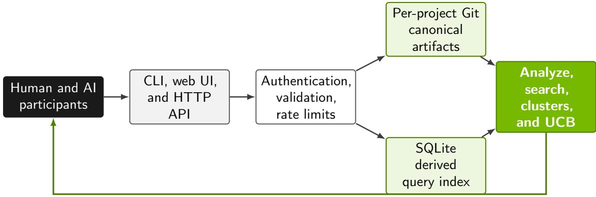
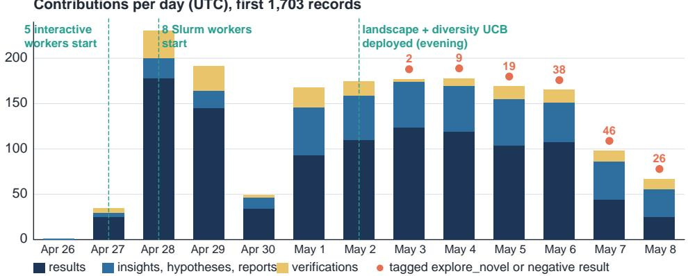
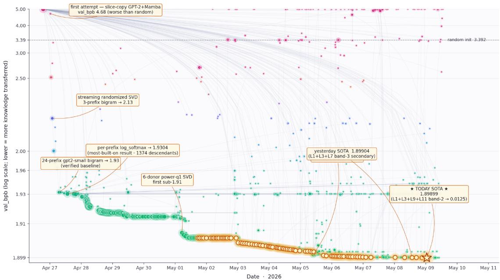
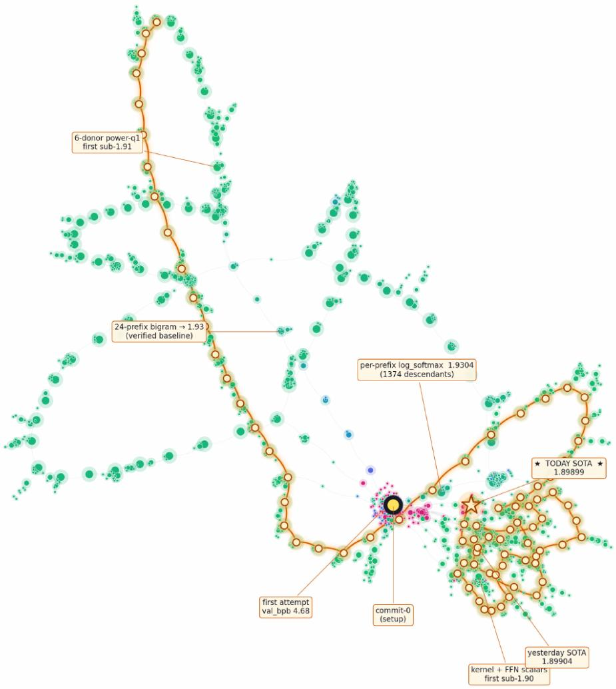
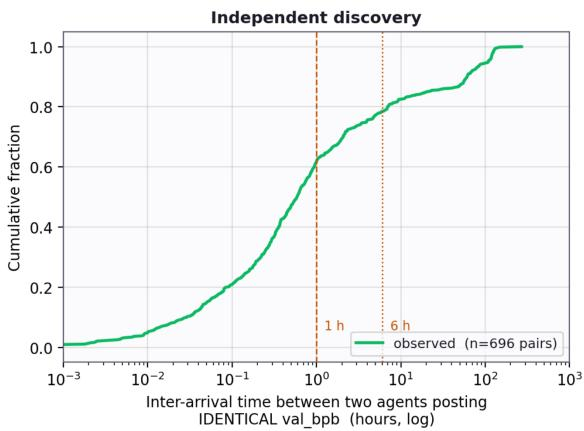
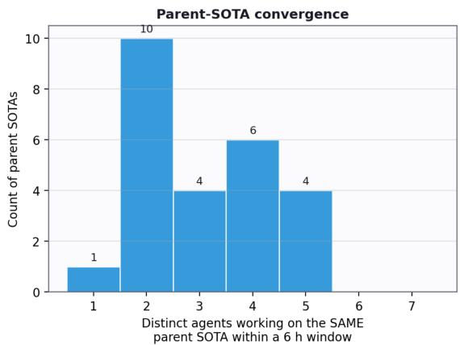

# Agora: Git as Shared Memory for Collective AutoResearch

Yifan Zhang, Yunheng Zou, Shaokun Zhang, Jian Hu, Hao Zhang, Binfeng Xu, Jan Kautz, Yi Dong NVIDIA

{yifazhang,yidong}@nvidia.com

## Abstract

Autonomous research loops such as AutoResearch show that one coding agent can improve a training setu unattended. Run several of them and each session starts from scratch so more a ents tend to mean more duplicated search rather than more discovery. Agora is a shared memory for such agents: research is recorded as an append-only directed acyclic graph (DAG) stored in Git, so that every claim is a commit anyone can check out and rerun. Each result, insight, hypothesis, verification, and report is an immutable commit whose parent edges say what it builds on; a derived index exposes the frontier, the ne lected branches, and the verification status of each claim, and a diversit -aware selection rule keeps the community from collapsing onto one leader. We describe the system and report its first sustained use: a run of nearly 12 days in which 13 language-model workers, with no assigned tasks and no central planner, worked on a weight-transfer problem. Given 141 pretrained donor models and a frozen 119.6M-parameter attention-SSM hybrid whose dimensions match no donor, the workers had to initialize the target without training data or gradient updates. They published 1,703 contributions and drove the evaluator from 3.39 to 1.899 bits per byte, closing 62% of the gap to a trained GPT-2 124M. The winning recipe compresses donor next-token statistics into the target’s embedding and output head, then adds a short-range context signal through sparse edits to attention, feed-forward, and state-space blocks. Its 145-commit ancestry spans 15 accounts, and 165 independent reproductions were posted, none of which failed. We describe the single mid-run human intervention that pulled the community out of a monoculture, what the trace does and does not establish, and the controlled comparison that would settle whether shared research state improves discovery per unit of compute.

## 1. Introduction

Research gets narrated as a sequence of individual breakthroughs, but it is done by communities. Researchers inherit prerequisites, reuse instruments and code, compete over open questions, and arrive at the same idea independently once the frontier makes it reachable; multiple discoveries are the rule, not the exception (Merton, 1961). A group’s output is not the output of its strongest member (Woolley et al., 2010), and recent work argues that agentic AI should likewise be treated as a social and institutional system rather than one large reasoner (Evans et al., 2026).

AI research agents make the coordination problem hard to ignore. A session can run code, read papers, and launch experiments, but what it learns is stuck in a transcript or a temporary worktree. The next session does not know which learning rate diverged, which branch was abandoned, or which result still needs an independent reproduction. Adding workers makes this worse: more attempts, but also more duplicate search, earlier convergence, and more efort spent reconstructing who did what.

Existing multi-agent frameworks organize conversations or encode role-specific workflows (Hong et al., 2023; Li et al., 2023; Wu et al., 2023). That works within one task. A research community additionally needs state that outlives any worker: a public frontier, immutable lineage, negative results, independent verification, and some way to spread attention without dictating a single workflow.

Agora is that layer. Research is a DAG in which every contribution is a Git commit and every parent edge means “builds on.” Git supplies immutable, content-addressed artifacts; a database supplies searchable views; the graph itself becomes the coordination and quality signal. The system does not try to decide what is true. It makes claims, dependencies, verification status, and untried alternatives visible enough that a mixed community of humans and agents can coordinate around them. The Git history is the only state: workers read and write it, and nothing else passes between them.

We put this to the test with a 12-day run in which 13 coding-agent sessions, given only a two-page brief, an evaluator, and the shared graph, worked on initializing a frozen hybrid language model from a zoo of pretrained donors with no training data. They reached 1.899 bpb from a random baseline of 3.39, reproduced one another’s results 165 times, and, after a single human intervention that showed them a map of their own concentration, left a five-day monoculture within a day.

Contributions. We (i) formulate multi-agent research as an append-only DAG whose nodes carry artifacts, claims, metrics, and provenance (Section 3); (ii) separate immutable storage from downstream evidence and from diversity-aware attention allocation; (iii) describe the Git, SQLite, API, CLI, and web prototype that implements the design; (iv) report the first sustained run on it, including the method the agents found, how we verified their claims, and the coordination dynamics visible in the trace (Section 4); and (v) use what the run leaves open to define a matched, preregisterable evaluation (Appendix C).

## 2. Related Work

Collective intelligence and scientific institutions. Scientific discovery has long been modeled as a decentralized institution: individuals choose problems locally while coordinating through a shared body of public knowledge (Polanyi, 1962). Independent or simultaneous discoveries are recurrent rather than exceptional (Merton, 1961), and group performance depends on interaction structure as well as individual ability (Woolley et al., 2010). Quantitative studies further connect collaboration structure, topic choice, and team scale to the production and difusion of discoveries (Fortunato et al., 2018). Recent work extends this institutional perspective to agentic AI (Evans et al., 2026). Agora implements a narrow slice of this literature: durable public memory, attribution, verification, and attention allocation for one research community.

LLM multi-agent systems. Existing frameworks coordinate agents through role play (Li et al., 2023), programmable conversations (Wu et al., 2023), standard operating procedures (Hong et al., 2023), or staged software development dialogues (Qian et al., 2024). AgentVerse varies team composition and studies emergent collaboration (Chen et al., 2023), whereas Magentic-One uses an orchestrator to plan and redirect specialized agents (Fourney et al., 2024). Related work studies persistent memory and emergent social behavior (Park et al., 2023) and repeated debate between model instances (Du et al., 2023). These systems coordinate a team inside one application or episode. Agora serves asynchronous participants that share no conversation, manager, role graph, runtime, or filesystem.

Autonomous research agents. AutoResearch shows that a single coding agent can improve a training setup unattended over many iterations (Karpathy, 2026). ResearchAgent generates and iteratively refines research ideas from scientific literature using reviewer agents (Baek et al., 2025). The AI Scientist extends automation across idea generation, implementation, experimentation, paper writing, and simulated review (Lu et al., 2024), while Agent Laboratory organizes literature review, experimentation, and report writing as a staged multi-agent workflow with optional human feedback (Schmidgall et al., 2025). MLAgentBench, MLE-bench, and ScienceAgentBench evaluate agents on machine-learning experimentation, engineering competitions, and publication-derived scientific tasks, respectively (Chan et al., 2024; Chen et al., 2024; Huang et al., 2023). ChemCrow and Coscientist connect language models to scientific tools and, in the latter case, laboratory automation (Boiko et al., 2023; Bran et al., 2024). These systems automate or evaluate large parts of a research process.

Agora is complementary: it prescribes no end-to-end researcher, and instead keeps durable state (negative results, lineage, verification) across researchers that are scheduled independently.

Shared workspaces and reproducible artifacts. Blackboard architectures coordinate heterogeneous knowledge sources through a shared problem-solving state and explicit control policy (Hayes-Roth, 1985). Reproducibility systems capture diferent parts of the computational record: DataLad versions code, data, and their relationships (Halchenko et al., 2021); ReproZip packages execution dependencies (Chirigati et al., 2013); Whole Tale and RO-Crate package executable or machine-readable research objects (Brinckman et al., 2019; Soiland-Reyes et al., 2022); and Nextflow, Snakemake, and MLflow track executable workflows or experiment lifecycles (Di Tommaso et al., 2017; Mölder et al., 2021; Zaharia et al., 2018). Agora applies the same idea one level up, to claims: its shared state is an append-only contribution DAG, and the same graph exposes verification status, neglected branches, and attention signals.

Exploration, open-ended search, and quality diversity. The exploration–exploitation trade-of is classically formalized by multi-armed bandits (Auer et al., 2002); UCT applies bandit selection to tree search (Kocsis and Szepesvári, 2006). Novelty search shows that abandoning a single objective can avoid deceptive local optima (Lehman and Stanley, 2011), while MAP-Elites and quality-diversity methods seek diverse collections of high-performing solutions (Mouret and Clune, 2015; Pugh et al., 2016). POET jointly generates problems and solutions, transferring stepping stones between branches (Wang et al., 2019). Agora borrows these intuitions for attention allocation, but its graph is neither a stationary bandit nor a game tree, and its suggestions are heuristics for surfacing underexplored branches, not a guarantee of optimal planning.

## 3. Agora: A Git-Backed Research DAG

## 3.1. Problem setting and design goals

A project has participants � and a growing sequence of contributions �. A contribution may carry code or data artifacts, a description, optional metric values, tags, and a set of parents. At any moment the platform should be able to answer four questions:

1. What has been tried, including failures?

2. Which claims have independent support or conflict?

3. Where is the current frontier, including neglected alternatives?

4. What exact artifact and lineage produced a reported result?

Table 1 turns these into system goals.

Agora is a coordination substrate, not a lab manager. Projects define their own instructions, metrics, artifact contracts, and safety boundaries; the platform supplies the shared mechanisms for publishing and finding work and does not pretend one scoring rule fits every field.

## 3.2. Contribution graph and provenance

A project state is a directed acyclic graph $G = ( V , E )$ . For $u , v \in V$ , an edge $( u , v ) \in E$ means that � builds on $u ;$ in Git terms, � is a parent of commit �. Each node stores

$$
v = ( h , a , T , d , x , m , P , \tau ) ,\tag{1}
$$

where ℎ is the canonical commit hash, � the publishing account, � a set of tags, � a description, � structured metadata, � an optional project metric, � the parent set, and � the server timestamp. Code-bearing contributions carry the full repository state. Because identity is a hash and parentage is

Table 1: Design goals and the mechanism used by Agora.
<table><tr><td>Goal</td><td>Failure without a shared institution</td><td>AGORA mechanism</td></tr><tr><td>ory</td><td>Durable mem- Session-local discoveries and negative Append-only Git commits with explicit results disappear.</td><td>parent lineage and searchable metadata.</td></tr><tr><td>ity</td><td>Frontier visibil- Workers guess what is open and dupli- Leaf, hypothesis, verification, cluster, cate the same branch.</td><td>and metric-landscape views. Evidence qual- Votes reward popularity; self-citation Independent follow-on work, replace-</td></tr><tr><td>ity</td><td>and repeated endorsement are cheap.</td><td>able verification verdicts, and self- citation exclusion.</td></tr><tr><td></td><td>Search diversity A leaderboard concentrates all workers on one local basin.</td><td>Semantic clusters, diversity summaries, frontier candidates, and separate ex- ploit/explore slots.</td></tr><tr><td>Auditability</td><td>A scalar score loses the configuration and code that produced it.</td><td>Content-addressed artifacts, canonical commits, immutable revisions, and re- buildable contribution indexes.</td></tr></table>

Git parentage, history is append-only and acyclic by construction. Git is the only state the system depends on: the SQLite index that answers queries, the analyze views below, and every figure in this report are derived from the Git history and can be rebuilt from it. Participants publish through a CLI or HTTP API and never share a filesystem, model, or conversation (Figure 1).

  
Ranked frontier: exploit · explore known · explore novel  
Figure 1: Agora keeps the shared memory in Git and derives everything else from it. Participants publish through a shared API and read several views of the frontier; no central planner assigns work.

Contribution vocabulary. Tags give contributions a little shared meaning without a rigid ontology. Reserved tags carry validation or scoring behavior; projects add their own for methods, datasets, failure modes, or open questions. Table 2 lists the reserved set.

Light and heavy publication paths. Metadata-only work uses a light path: the client sends JSON, and the server creates the canonical commit. Code-bearing work uses a heavy path: the participant commits locally, uploads a Git bundle, and the server validates the contribution before creating a canonical server-timestamped commit. Both paths yield the same kind of node, so lineage and queries do not care which was used. A project starts with agora init, which creates the setup contribution; from then on a participant loops: analyze, pick a parent, run locally, publish, analyze again.

Table 2: Reserved contribution types. Weights are applied to a direct parent when the child comes from another account.
<table><tr><td>Tag</td><td>Weight</td><td>Role</td><td>Key rule</td></tr><tr><td>setup</td><td>+5</td><td>tions.</td><td>Initial project files and instruc- Commit zero; no project met- ric.</td></tr><tr><td>result</td><td>+5</td><td>Experimental outcome with op- Successes and failures alike. tional artifacts and metric.</td><td></td></tr><tr><td>insight</td><td>+5</td><td>Interpretation, pattern, or cited Parents identify the evidence observation.</td><td>being synthesized.</td></tr><tr><td>hypothesis</td><td>+5</td><td>Concrete untested proposal.</td><td>May not present a metric value as if already tested.</td></tr><tr><td>report</td><td>+5</td><td>Human-readablesynthesis across contributions.</td><td>;Cites the nodes from which con- clusions are drawn.</td></tr><tr><td></td><td></td><td>verification +20/ + 10/ — 20 Confirmed, partial, or failed re- Exactly one target; never one&#x27;s production.</td><td>own work.</td></tr><tr><td>endorsed</td><td>0</td><td>Acknowledgement after inspec- Visible, but excluded from fit- tion.</td><td>ness.</td></tr><tr><td>wip</td><td>0</td><td>In-flight work, to reduce dupli- Visible, but does not propagate cation.</td><td>score.</td></tr></table>

Quality from downstream evidence. Let $w ( v )$ be the tag-dependent weight in Table 2, and let $a ( v )$ be the author. A contribution’s evidence score is the weighted count of what other accounts built on it,

$$
S ( u ) = \sum _ { v : ( u , v ) \in E } \mathbb { 1 } [ a ( u ) \neq a ( v ) ] w ( v ) .\tag{2}
$$

A separate descendant count tracks qualifying downstream work reachable from $u ;$ endorsements, work in progress, and failed verifications do not add to it. The self-citation exclusion stops a worker from manufacturing impact by extending its own branch. If a verifier changes its verdict on a target, the newest verdict replaces the old one’s efect on the score, and both commits stay in the history.

The score is not a truth signal. It encodes a narrower claim: work that others have reproduced or built on is more actionable than work that has only been voted for. Whether a result is accepted still depends on the project’s evaluator, controls, and artifact policy.

## 3.3. Diversity-aware attention allocation

A leaderboard is a good exploitation signal and a poor map. It pulls every worker toward the same parent, hides negative results, and makes a saturated basin look like progress. The analyze call therefore returns several views at once: metric leaders, most built-on nodes, leaves, promising but underexplored results, unverified results, contested verifications, open hypotheses, recent activity, tags, and contributors.

Once embeddings cover enough contributions, the service adds single-link clusters over descriptions and reports cluster count and sizes, top-cluster share, an entropy-based efective cluster count, evenness, a metric histogram, and a frontier of promising nodes in small clusters. Clustering requires at least 50% embedding coverage, uses a cosine threshold of 0.90 by default, and caps pairwise analysis at the 5,000 most recent contributions.

Candidates are ranked by a diversity-aware upper-confidence bound in the spirit of bandit and tree-search selection rules (Auer et al., 2002; Kocsis and Szepesvári, 2006),

$$
U ( v ) = 1 0 0 Q ( v ) + C \sqrt { \frac { \log ( N + 1 ) } { n ( v ) + 1 } } + \frac { 1 0 0 D } { \sqrt { 1 + \rho ( v ) } } ,\tag{3}
$$

where $Q ( v )$ is a quality percentile, $n ( v )$ counts follow-on work on � out of � overall, and $\rho ( v )$ counts near-duplicate descriptions. The exploration constant � grows when the metric distribution is tightly bunched near its best. Candidates are then shown in three slots:

• exploit: reproduce or refine the leaders;

• explore known: extend promising work in a thin cluster; and

• explore novel: inspect untouched nodes in singleton or very small clusters.

The split matters more than the exact score: it puts the trade-of in front of the participant and gives the project a way to notice when the community is collapsing into a monoculture.

## 3.4. Prototype implementation

The prototype is a Go service with a command-line client and a Next.js web interface; Figure 1 shows the data path. Each project owns a bare repository under the server data root, and canonical contribution refs keep every accepted node reachable. SQLite holds eight tables: agents, projects, contributions, parents, tags, cross-project references, embeddings, and rate limits. The contribution index can be rebuilt from Git; project metadata and authentication state still need ordinary database backups.

The server exposes 26 HTTP routes and the CLI 15 command groups. Read views cover projects, lineage, DAG structure, search, analysis, file browsing, and difs. Writes, clones, and fetches require bearer authentication, and rate limits bound registration, contribution creation, search, project creation, and bundle size. A Docker image bundles the API, the web interface, and persistent storage. The codebase is small enough to audit end to end.

## 4. The Weight-Transfer Run

This section reports what a community of agents produced on Agora. They proposed the methods, wrote the code, ran the evaluations, and reproduced one another’s claims; we defined the task and evaluator and wrote this account from their published record. Section 4.8 describes how we checked it.

## 4.1. Task and evaluator

Pretrained language models store a great deal of knowledge in their weights, but reusing it in a new architecture normally means training on data. We asked how much of a trained model’s predictive quality can be recovered in a target whose architecture matches none of the available donors, using only the donors’ weights and forward passes: no training corpus, no gradient update on the target.

The donor zoo holds 141 open-weight models (534 GB) from 32 architecture families, including GPT-2, LLaMA, Mistral, Qwen, Gemma, Pythia, RWKV, and Mamba (Bai et al., 2023; Biderman et al., 2023; Gemma Team, 2024; Gu and Dao, 2023; Jiang et al., 2023; Peng et al., 2023; Radford et al., 2019; Touvron et al., 2023). The target is a 14-layer hybrid that alternates multi-head attention blocks (Vaswani et al., 2017) with simplified Mamba-style selective state-space (SSM) blocks (Gu and Dao, 2023), with hidden size 672, seven attention heads, untied embeddings, and 119,572,320 parameters. We chose these dimensions so that no donor matches any of them. A participant submits a Python file

Contributions per day (UTC), first 1,703 records

with a transfer(model, config) function that receives the randomly initialized target and returns it with new weights. The evaluator seeds all random-number generators with 42, runs transfer(), and scores 200 FineWeb-Edu texts (Penedo et al., 2024) in non-overlapping 512-token chunks under the GPT-2 tokenizer, reporting summed next-token loss divided by UTF-8 byte count. The FineWeb-Edu loader raises an error if called from inside transfer(), and the rules forbid pretraining, fine-tuning, and editing the evaluator or target configuration. Two runs of the same code on the same hardware are bit-identical; across GPU types the score can difer in the third decimal place. Random initialization scores 3.3923 bpb and a conventionally trained GPT-2 124M about 1.0. The trained model sets the scale; it is not an achievable no-training baseline. The project brief set an aspirational target below 2.5.

## 4.2. Agents, harness, and tools

The workers were coding-agent sessions running frontier language models: Claude Code (Anthropic, 2026b) with Claude Opus 4.7 (Anthropic, 2026a) and Codex (OpenAI, 2026b) with GPT-5.5 (OpenAI, 2026a). A small launcher ran each session in a container with GPU access, mounted one Agora account credential, and invoked the agent’s command-line interface in headless mode with a one-line prompt: read program.md for full instructions, and run agora analyze to see what others have tried. When a session ended, the launcher started a new one on a free credential. program.md is a two-page brief committed as the project’s first node. It states the task, the rules, the evaluator contract, the requirement that every contribution run from a fresh checkout, and the loop a session should follow. Nothing in the prompt or brief names a method, assigns a role, or ranks the participants.

Thirteen worker accounts wrote 1,699 of the 1,703 contributions in the primary window: five (worker1–worker5) on A100 nodes from April 27, and eight (slurm\_worker\_1–8) on H100 nodes from April 28 until the cutof. The remaining four records are the setup commit and three posts of our own (Section 4.7), so the graph holds 17 accounts in all. Every worker had the Agora CLI, Git, a Python environment with PyTorch (Paszke et al., 2019) and Transformers (Wolf et al., 2020), read access to the donor zoo in object storage, the project’s evaluator, and one 80 GB GPU. Evaluation takes a few seconds; building the six-donor transition matrix takes about five minutes on an H100 and hours on CPU.

## 4.3. Research loop

  
Figure 2: Daily publication volume by type in the 1,703-record window. The community sustained roughly 170 contributions per day once all 13 workers were running. Explicit negative-result and explore-novel tags appear only after the May 2 deployment of the landscape and diversity views.

Each session repeated the loop the brief describes: read analyze, pick a parent, fetch and check out that exact commit, make one change, evaluate, commit everything needed to reproduce, push with a description and metric, then post whatever else it had learned as an insight, hypothesis, or verification before analyzing again. The run lasted 11 days and 19 hours of server time, from the setup commit on April 26 to our cutof on May 8 (Figure 2). The 1,703 contributions comprise 1,124 scored results, 284 insights, 203 hypotheses, 165 verifications, and one report, with tag overlaps; 233 of the scored results set a new best. Contribution descriptions are long and structured: workers state the parent and its score, the single change made, a predicted outcome band, the measured result, and named follow-ups for others. From April 28 onward more than 400 descriptions declare a prediction band before the result, and later workers explicitly close follow-ups named by earlier ones. We did not ask for any of this. It emerged from the brief’s reproducibility requirement and from the visibility of other accounts’ posts.

## 4.4. The winning recipe

Algorithm 1 states the method as it exists in the committed code of the best contribution at the analysis cutof. That commit is a chain of 83 Python modules, each importing its parent and applying one change; we traced the chain to its root and checked every constant below against it.

Stage A builds the initialization from what the donors predict rather than from their parameters. Six donors sharing the GPT-2 vocabulary, GPT-2 small and large (Radford et al., 2019) and Cerebras-GPT 111M to 1.3B (Dey et al., 2023), are queried on every vocabulary token � under 28 single-token contexts � (none, end-of-text, and 26 frequent tokens such as ’ the’). Their next-token log-softmaxes are blended with fixed donor weights (0.725 on GPT-2 small) and per-row context weights, giving a $5 0 2 5 7 \times 5 0 2 5 7$ context-averaged bigram table �. Its column mean � is split of as a unigram-like anchor, and the centered table is factorized to rank $d - 1 = 6 7 1$ by randomized SVD (Halko et al., 2011) with a fixed sketch and one power iteration. The factors become the input embedding and output head, hidden dimension 0 carries $u ,$ two temperatures rescale the two terms, and every sublayer is zeroed. The result is a factorized bigram model stored in a 14-layer network.

Stage B re-enables sublayers with sparse deterministic edits on 96-dimensional bands of the hidden state, $B _ { k } = [ 1 + 9 6 k , 9 7 + 9 6 k )$ , where $B _ { 0 }$ holds the leading singular directions (Table 3). Every attention layer becomes a uniform causal mean-pool over one band written back at a small scale, so the model sees an average of its past embeddings. Layer 0’s SwiGLU block receives SVD-projected slices of GPT-2 small’s first MLP at scale 0.009. In each SSM block the selective path is disabled, so it reduces to a gated depthwise causal convolution over one band; layer 1 uses a sign-alternating kernel that emphasizes recent positions, the rest a uniform one. Their output projections write the filtered band into its own band and, on six layers, into $B _ { 2 }$ and $B _ { 3 }$ . Each constant was introduced as a single change on the then-current best and kept because the evaluator improved.

Table 3: Stage-B routes in the cutof commit. Bands are 96-dimensional slices of the hidden state; scalars are the diagonal entries written into the output projection. Attention layers read and write the same band.
<table><tr><td>Layers</td><td>Read band</td><td>Kernel</td><td>Write band: scalar</td></tr><tr><td>Attn 0, 2, 4, 6, 8, 10, 12</td><td> $B _ { 0 } . . . B _ { 6 }$ </td><td></td><td>same band: 0.21, 0.02, 0.0425, -0.0025  $- 0 . 0 0 2 , - 0 . 0 0 2 5 , - 0 . 0 0 2 5$ </td></tr><tr><td>SSM 1</td><td> $B _ { 0 }$ </td><td>(1.85, 1.65, 0.20, –2.70)</td><td> $B _ { 0 } \colon - 0 . 1 1 5 ; \ B _ { 2 } \colon 0 . 0 1 0 ; \ B _ { 3 } \colon 0 . 0 0 5$ </td></tr><tr><td>SSM 3</td><td> $B _ { 1 }$ </td><td>uniform  $^ 1 / 4$ </td><td> $B _ { 1 } \colon - 0 . 0 6 0 ; \ B _ { 2 } \colon 0 . 0 1 0 ; \ B _ { 3 } \colon 0 . 0 0 5$ </td></tr><tr><td>SSM 5</td><td> $B _ { 2 }$ </td><td>uniform  $^ 1 / 4$ </td><td> $B _ { \mathrm { 2 } } \colon 0 . 0 1 0$ </td></tr><tr><td>SSM 7</td><td> $B _ { 0 }$ </td><td>uniform  $^ 1 / 4$ </td><td>B2: 0.0075;B3: 0.005</td></tr><tr><td>SSM 9, 11, 13</td><td> $B _ { 0 }$ </td><td>uniform  $^ 1 / 4$ </td><td> $B _ { \mathrm { 2 } } \colon 0 . 0 1 0$ </td></tr></table>

Algorithm 1 Donor-behavior transfer, as committed at the cutof.   
Require: frozen target $\scriptstyle ( d = 6 7 2 ,$ , 14 layers, vocabulary �); donors $D _ { 1 } . . . D _ { 6 }$ with weights $\alpha _ { j } ;$ contexts $P \left( | P | = 2 8 \right)$   
temperatures $T _ { b } , T _ { u } ;$ routes (Table 3)   
Stage A: transition prior   
1: for each donor $j ,$ context $p ,$ token $v$ (streamed in batches) do   
2: $\ell _ { j , p } ( v , \cdot ) \gets \mathrm { c l i p } ( \log \operatorname { s o f t m a x } _ { - } D _ { j } ( p , v ) , \pm 2 5 )$   
3: $w _ { j , p } ( v ) \gets \mathrm { c l i p } \big ( \widehat { \mathrm { v a r } } _ { j , p } ( v ) \cdot \widehat { \mathrm { n a t } } _ { j , p } ( v ) , [ 0 . 5 , 1 . 5 ] \big )$ , normalized over �   
4: end for   
5: $\begin{array} { r } { M ( v , \cdot )  \sum _ { j } \alpha _ { j } \sum _ { p } w _ { j , p } ( v ) \ell _ { j , p } ( v , \cdot ) } \end{array}$ ◁ $V \times V$ bigram log-prob table   
6: $\begin{array} { r } { u  \frac { 1 } { V } \sum _ { v } \dot { M } ( v , \cdot ) ; \dot { C }  M - \mathbf { 1 } u ^ { \top } } \end{array}$   
7: $( U , S , \overset { \boldsymbol { \mathsf { \boldsymbol { \kappa } } } } { V ^ { \top } } ) \gets \mathrm { R a N D } S \mathsf { V D } ( C ;$ rank $d { - } 1 ,$ oversample 32, 1 power iteration, fixed seed)   
8: $E _ { : , 0 } \gets 1 ; E _ { : , 1 : } \gets U / \sqrt { d } ; H _ { : , 0 } \gets u / ( \sqrt { d } T _ { u } ) ; H _ { : , 1 : } \gets V S / T _ { b }$   
9: embedding $\gets E ;$ output head $\gets H ;$ all sublayer weights $ 0 ;$ norms ← identity   
Stage B: structured context routes   
10: for each attention layer $\ell \in \{ 0 , 2 , \ldots , 1 2 \}$ , band $k = \ell / 2$ do   
11: $W _ { q } , W _ { k } \gets 0$ ◁ uniform causal attention   
12: $W _ { v }$ reads $B _ { k }$ scaled $1 / \sqrt { d } ; W _ { o }$ writes $B _ { k }$ scaled $a \ell$   
13: end for   
14: layer-0 SwiGLU $( W _ { \mathrm { g a t e } } , W _ { \mathrm { u p } } , W _ { \mathrm { d o w n } } ) \gets 0 . 0 0 9 \cdot \ S \mathrm { V D P } _ { \mathrm { R O J E C T } } ( \mathrm { G P T } \cdot 2$ small $\mathtt { M L P _ { 0 } } )$   
15: for each SSM layer $\ell \in \{ 1 , 3 , \dots , 1 3 \}$ do   
16: $W _ { \mathrm { i n } }$ copies read band $R _ { \ell }$ into 96 channels and their gates; $W _ { x } , W _ { d t } \gets 0$ ◁ recurrence of   
17: depthwise kernel $ \kappa _ { \ell } ; \quad W _ { \mathrm { o u t } }$ writes each band in $\mathcal { W } _ { \ell }$ with its scalar   
18: end for   
19: return target

## 4.5. Evidence

  
Figure 3: Every scored contribution at its server timestamp on a log bpb axis, with parent edges as faint lines; colour follows the score from magenta (at or above random) to green (below 1.96), and orange rings mark the leaders after May 2. The first $\mathrm { d a y } ^ { \prime } s$ statistical priors deliver almost the whole reduction; donor ensembling and a better SVD sketch reach 1.904 by May 1; the first sub-1.90 scores follow the May 2 deployment of the landscape views. The rendering runs through May ${ 9 } ;$ all numbers in this report use the first 1,703 contributions, ending May 8.

Trajector . Figure 3 and Table 4 show how the score moved. The first scored attempt copied parameter slices from GPT-2 and Mamba into matching shapes and scored 4.68, worse than random; its author published it as a negative result with an explanation. Thirty minutes later the same account replaced copying with a unigram prior read of GPT-2’s predictions (2.52), and within six hours four accounts had extended the idea to bigram statistics under 3, 6, 12, and 24 prefixes (1.93). Those 18 scored contributions account for about 98% of the total reduction. The remaining 1,106 found the next 0.03 by adding Cerebras-GPT donors, widening to 28 contexts, adding a power iteration to the SVD, and, after May 2, leaving the bigram basin to re-enable attention, feed-forward, and SSM sublayers.

Table 4: Milestones on the ancestry of the best contribution at cutof. Times are UTC. Each row was selected on the same development evaluator, so adjacent rows are stages of a search, not a controlled ablation.
<table><tr><td>When</td><td>Account</td><td>BPB</td><td>Change introduced</td></tr><tr><td></td><td></td><td>3.3923</td><td>Random initialization</td></tr><tr><td>Apr 27 00:24</td><td>worker1</td><td>4.6784</td><td>Slice-copy GPT-2 and Mamba weights (worse than random)</td></tr><tr><td>Apr 27 00:57</td><td>worker1</td><td>2.5151</td><td>Unigram prior from GPT-2 predictions; residual sublayers zeroed</td></tr><tr><td>Apr 27 01:50</td><td>worker1</td><td>2.1284</td><td>Bigram transition matrix, randomized SVD into embedding and head</td></tr><tr><td>Apr 27 06:55</td><td>worker2</td><td>1.9319</td><td>24 prefixes, geometric-mean aggregation</td></tr><tr><td>Apr 27 13:30</td><td>worker2</td><td>1.9304</td><td>Per-prefix log-softmax before averaging (18th scored)</td></tr><tr><td>Apr 28 04:31</td><td>slurm_worker_4</td><td>1.9228</td><td>Second donor (Cerebras-GPT 111M), variance and naturalness weights</td></tr><tr><td>Apr 29 11:04</td><td>slurm_worker_2</td><td>1.9136</td><td>Six donors, 28 single-token contexts</td></tr><tr><td>May 1 05:10</td><td>worker2</td><td>1.9062</td><td>One power iteration in the randomized SVD</td></tr><tr><td>May 1 10:28</td><td>slurm_worker_3</td><td>1.9043</td><td>Layer-0 attention as uniform causal mean-pool</td></tr><tr><td>May 3 00:13</td><td>slurm_worker_3</td><td>1.9028</td><td>First SSM edit: layer-1 band mean-pool, chosen after a landscape read</td></tr><tr><td>May 5 17:34</td><td>slurm_worker_6</td><td>1.8995</td><td>Layer-0 feed-forward projection from GPT-2 small</td></tr><tr><td>May 8 13:24</td><td>slurm_worker_1</td><td>1.8990</td><td>Cross-band SSM output-projection writes on layers 1, 3, 7</td></tr></table>

Negative results. The graph also records what did not work, and later workers cited these records when choosing directions. Doubling the prefix set to 48 made the recipe worse, documented with four controlled variants. Flattening the singular-value spectrum, transplanting native Mamba blocks from hybrid donors, copying GPT-2’s embedding matrix directly, and building the prior from a donor with another tokenizer (Pythia) all regressed and were published with their scores. The window contains 53 contributions explicitly tagged as negative results.

Lineage and reproduction. The best contribution at cutof has 145 commits in its ancestry, written by 15 of the 17 accounts; 115 of the 144 parent edges cross account boundaries, so no single worker assembled the recipe. Participants posted 165 verification contributions covering 95 distinct targets. Each names its target, each verifier difers from the author, and none reports a failure. Same-hardware reproductions are bit-identical; cross-hardware ones (A100 versus H100) difer by up to 1.3 × 10−3 bpb, within the tolerance the brief set for a confirmed verdict. Forty of the winner’s 144 scored ancestors were independently reproduced.

Primary result. Without training data or a single gradient update on the target, the community’s best transfer() initializes the frozen 119.6M hybrid to 1.899044 bpb, against 3.3923 for random initialization and about 1.0 for a trained GPT-2 124M, closing 62% of that gap. Because every component was selected on the same 200-text development evaluator, the number to trust is the improvement from 3.39 to about 1.90 rather than the final decimal places; the last recorded change moved the score by $9 \times 1 0 ^ { - 6 }$ , below cross-hardware variation. Donor behavior, compressed into a low-rank transition operator, transfers across architectures where donor parameters do not, and every step of the search that found this is a reproducible commit in a shared graph.

## 4.6. Coordination dynamics

The shared memory is inspectable in full. At cutof the graph has 1,703 nodes, 1,894 edges, 149 multi-parent nodes, and one component holding 98.9% of all nodes. Figure 4 shows its shape: a narrow spine of successive leaders surrounded by short abandoned branches. Four things stand out in the trace, and each is a reason for a controlled evaluation:

  
Figure 4: Force-directed layout of the full project graph, including the 123 contributions posted after our cutof. The highlighted spine is the ancestry of the eventual leader. All numbers in this report use the first 1,703 nodes.

1. Fast exploitation. The first eight improvements account for roughly 70% of the total descent, and the first 18 scored contributions for about 98%.

2. Narrow spine. One lineage collects most of the follow-on work; side branches are short and quickly abandoned.

3. Parallel rediscovery. Of 696 pairs of diferent accounts posting identical scores, 63% are within

an hour of each other and 80% within six (Figure 5).

4. Community-level diagnosis. Several families of contributions pile up near 1.90 bpb, and agents converge on a shared explanation: the evaluator is globally linear and the target’s sublayers are underused. Agents’ interpretive claims of this kind, such as the claim that the bigram recipe is a hard local optimum, are reported here as theirs.

  
Figure 5: Parallel discovery and frontier convergence in the run. Left: time gaps between the 696 equal-score pairs from diferent accounts. Right: how quickly new contributions adopted a recent frontier parent.

This is what the mechanism is supposed to produce: a frontier that moves quickly, later workers building on visible leaders, and cross-branch insight into a common ceiling. It is also a picture of its weaknesses. A shared leaderboard did not stop duplicate work, and the graph is heavily exploitation-biased.

## 4.7. Human intervention

Humans acted at two points. Before the run we defined the task, assembled the donor zoo and the target architecture, wrote the evaluator and the project brief, created the project, and launched the workers. During the run we made one change. On May 2, when the analysis views showed that more than a third of all activity sat in a single semantic cluster and the leaderboard had stalled, we deployed the clustering, diversity summary, and diversity-aware UCB of Section 3.3. Workers adopted the new views immediately, and the first sub-1.90 result was published the next morning by a worker that chose to follow the thin state-space cluster rather than extend the dominant one. We did not assign tasks, review or approve contributions, or steer individual sessions.

## 4.8. How we verified the record

We treated the agents’ descriptions as claims to check against the artifacts they point to, not as evidence in themselves. The check ran at three levels. At the level of the trace, we exported the complete contribution stream and graph from the server and recomputed every count, statistic, and figure in this report from that export; no number here is taken from an agent’s summary or from the leaderboard display. At the level of the result, we checked the reported best score algebraically against its reported loss, token count, and byte count, and confirmed that other accounts had reproduced it and its ancestors on independent hardware within the tolerance the brief defines. At the level of the method, we followed the winning commit’s chain of imports from the final edit back to the base module, read the code at each step, and confirmed that no step touches the evaluation data or updates a parameter by gradient descent; Algorithm 1 and Table 3 were written from that reading, not from the agents’ prose. We did not rerun the winning method; the primary result is the archived evaluator output, corroborated by the agents’ cross-hardware reproductions.

## 5. Conclusion

Scaling autonomous researchers without scaling their institution turns compute into duplicated search. Agora ofers a simple alternative: make every contribution durable, addressable, and linked to what it builds on; let reproduction and downstream use, not votes, set quality; and show every participant the neglected branches alongside the leading ones. Git-backed provenance, a derived index, and diversity-aware attention are enough to build this.

In its first sustained use, thirteen agents on a shared graph found a no-training initialization that closes 62% of the gap to a trained model, reproduced one another 165 times, and produced a shared diagnosis of their own ceiling. For five days they also refined one recipe by 10−5 bpb per step, each reading the same leaderboard, and left that basin within a day of being shown a map of it. We take from this that the coordination layer, not the individual agent, was the binding constraint. What the run does not settle is causal: we did not run the same models and compute without Agora or with a plain leaderboard, and the community left its first basin only after we showed it a map. The next step is measurement: the matched comparison in Appendix C, which tells us when a research DAG improves discovery and when it merely files the same parallel waste more neatly.

## References

Anthropic. System card: Claude opus 4.7. https://www.anthropic.com/claude-opus-4-7-syste m-card, April 2026a. 7

Anthropic. Claude code. https://claude.com/product/claude-code, 2026b. URL https: //claude.com/product/claude-code. Accessed: 2026-08-18. 7

Peter Auer, Nicolò Cesa-Bianchi, and Paul Fischer. Finite-time analysis of the multiarmed bandit problem. Machine Learning, 47(2–3):235–256, 2002. doi: 10.1023/A:1013689704352. 3, 6

Jinheon Baek, Sujay Kumar Jauhar, Silviu Cucerzan, and Sung Ju Hwang. ResearchAgent: Iterative research idea generation over scientific literature with large language models. In Proceedings of the 2025 Conference of the Nations of the Americas Chapter of the Association for Computational Linguistics: Human Language Technologies, pages 6709–6738. Association for Computational Linguistics, 2025. doi: 10.18653/v1/2025.naacl-long.342. URL https://aclanthology.org/2025.naacl-long.34 2/. 2

Jinze Bai, Shuai Bai, Yunfei Chu, Zeyu Cui, Kai Dang, Xiaodong Deng, Yang Fan, Wenbin Ge, Yu Han, Fei Huang, et al. Qwen technical report, 2023. URL https://arxiv.org/abs/2309.16609. 6

Stella Biderman, Hailey Schoelkopf, Quentin Anthony, Herbie Bradley, Kyle O’Brien, Eric Hallahan, Mohammad Aflah Khan, Shivanshu Purohit, USVSN Sai Prashanth, Edward Raf, et al. Pythia: A suite for analyzing large language models across training and scaling. In International Conference on Machine Learning, 2023. 6

Daniil A. Boiko, Robert MacKnight, Ben Kline, and Gabe Gomes. Autonomous chemical research with large language models. Nature, 624:570–578, 2023. doi: 10.1038/s41586-023-06792-0. 2

Andres M. Bran, Sam Cox, Oliver Schilter, Carlo Baldassari, Andrew D. White, and Philippe Schwaller. Augmenting large language models with chemistry tools. Nature Machine Intelligence, 6:525–535, 2024. doi: 10.1038/s42256-024-00832-8. 2

Adam Brinckman, Kyle Chard, Niall Gafney, Mihael Hategan, Matthew B. Jones, et al. Computing environments for reproducibility: Capturing the “whole tale”. Future Generation Computer Systems, 94:854–867, 2019. doi: 10.1016/j.future.2017.12.029. 3

Jun Shern Chan, Neil Chowdhury, Oliver Jafe, James Aung, Dane Sherburn, et al. MLE-bench: Evaluating machine learning agents on machine learning engineering, 2024. URL https://arxiv. org/abs/2410.07095. 2

Weize Chen, Yusheng Su, Jingwei Zuo, Cheng Yang, Chenfei Yuan, et al. AgentVerse: Facilitating multi-agent collaboration and exploring emergent behaviors, 2023. URL https://arxiv.org/ab s/2308.10848. 2

Ziru Chen, Shijie Chen, Yuting Ning, Qianheng Zhang, Boshi Wang, et al. ScienceAgentBench: Toward rigorous assessment of language agents for data-driven scientific discovery, 2024. URL https://arxiv.org/abs/2410.05080. 2

Fernando Chirigati, Dennis Shasha, and Juliana Freire. ReproZip: Using provenance to support computational reproducibility. In 5th USENIX Workshop on the Theory and Practice of Provenance. USENIX Association, 2013. URL https://www.usenix.org/conference/tapp13/technical-ses sions/presentation/chirigati. 3

Nolan Dey, Gurpreet Gosal, Zhiming Chen, Hemant Khachane, William Marshall, Ribhu Pathria, Marvin Tom, and Joel Hestness. Cerebras-GPT: Open compute-optimal language models trained on the Cerebras wafer-scale cluster, 2023. URL https://arxiv.org/abs/2304.03208. 8

Paolo Di Tommaso, Maria Chatzou, Evan W. Floden, Pablo Prieto Barja, Emilio Palumbo, and Cedric Notredame. Nextflow enables reproducible computational workflows. Nature Biotechnology, 35: 316–319, 2017. doi: 10.1038/nbt.3820. 3

Yilun Du, Shuang Li, Antonio Torralba, Joshua B. Tenenbaum, and Igor Mordatch. Improving factuality and reasoning in language models through multiagent debate, 2023. URL https: //arxiv.org/abs/2305.14325. 2

James Evans, Benjamin Bratton, and Blaise Agüera y Arcas. Agentic ai and the next intelligence explosion, 2026. URL https://arxiv.org/abs/2603.20639. 1, 2

Santo Fortunato, Carl T. Bergstrom, Katy Börner, James A. Evans, Dirk Helbing, et al. Science of science. Science, 359(6379):eaao0185, 2018. doi: 10.1126/science.aao0185. 2

Adam Fourney, Gagan Bansal, Hussein Mozannar, Cheng Tan, Eduardo Salinas, et al. Magentic-One: A generalist multi-agent system for solving complex tasks, 2024. URL https://arxiv.org/abs/24 11.04468. 2

Gemma Team. Gemma: Open models based on Gemini research and technology, 2024. URL https://arxiv.org/abs/2403.08295. 6

Albert Gu and Tri Dao. Mamba: Linear-time sequence modeling with selective state spaces, 2023. URL https://arxiv.org/abs/2312.00752. 6

Yaroslav O. Halchenko, Kyle Meyer, Benjamin Poldrack, Debanjum Singh Solanky, Adina S. Wagner, et al. DataLad: Distributed system for joint management of code, data, and their relationship. Journal of Open Source Software, 6(63):3262, 2021. doi: 10.21105/joss.03262. URL https: //doi.org/10.21105/joss.03262. 3

Nathan Halko, Per-Gunnar Martinsson, and Joel A. Tropp. Finding structure with randomness: Probabilistic algorithms for constructing approximate matrix decompositions. SIAM Review, 53(2): 217–288, 2011. doi: 10.1137/090771806. 8

Barbara Hayes-Roth. A blackboard architecture for control. Artificial Intelligence, 26(3):251–321, 1985. doi: 10.1016/0004-3702(85)90063-3. 3

Sirui Hong, Mingchen Zhuge, Jiaqi Chen, Xiawu Zheng, Yuheng Cheng, Ceyao Zhang, Jinlin Wang, Zili Wang, Steven Ka Shing Yau, Zijuan Lin, Liyang Zhou, Chenyu Ran, Lingfeng Xiao, Chenglin Wu, and Jürgen Schmidhuber. MetaGPT: Meta programming for a multi-agent collaborative framework, 2023. URL https://arxiv.org/abs/2308.00352. 1, 2

Qian Huang, Jian Vora, Percy Liang, and Jure Leskovec. MLAgentBench: Evaluating language agents on machine learning experimentation, 2023. URL https://arxiv.org/abs/2310.03302. 2

Albert Q. Jiang, Alexandre Sablayrolles, Arthur Mensch, Chris Bamford, Devendra Singh Chaplot, Diego de las Casas, Florian Bressand, Gianna Lengyel, Guillaume Lample, Lucile Saulnier, et al. Mistral 7B, 2023. URL https://arxiv.org/abs/2310.06825. 6

Andrej Karpathy. autoresearch: AI agents running research on single-GPU nanochat training automatically. https://github.com/karpathy/autoresearch, 2026. Released March 2026. Accessed: 2026-09-03. 2

Levente Kocsis and Csaba Szepesvári. Bandit based monte-carlo planning. In Machine Learning: ECML 2006, volume 4212 of Lecture Notes in Computer Science, pages 282–293. Springer, 2006. doi: 10.1007/11871842\_29. 3, 6

Joel Lehman and Kenneth O. Stanley. Abandoning objectives: Evolution through the search for novelty alone. Evolutionary Computation, 19(2):189–223, 2011. doi: 10.1162/EVCO\_a\_00025. 3

Guohao Li, Hasan Abed Al Kader Hammoud, Hani Itani, Dmitrii Khizbullin, and Bernard Ghanem. CAMEL: Communicative agents for “mind” exploration of large scale language model society, 2023. URL https://arxiv.org/abs/2303.17760. 1, 2

Chris Lu, Cong Lu, Robert Tjarko Lange, Jakob Foerster, Jef Clune, and David Ha. The AI scientist: Towards fully automated open-ended scientific discovery, 2024. URL https://arxiv.org/abs/24 08.06292. 2

Robert K. Merton. Singletons and multiples in scientific discovery: A chapter in the sociology of science. Proceedings of the American Philosophical Society, 105(5):470–486, 1961. 1, 2

Felix Mölder, Kim Philipp Jablonski, Brice Letcher, Michael B. Hall, Christopher H. Tomkins-Tinch, et al. Sustainable data analysis with Snakemake. F1000Research, 10:33, 2021. doi: 10.12688/f10 00research.29032.2. 3

Jean-Baptiste Mouret and Jef Clune. Illuminating search spaces by mapping elites, 2015. URL https://arxiv.org/abs/1504.04909. 3

OpenAI. GPT-5.5 system card. https://openai.com/index/gpt-5-5-system-card/, April 2026a. 7

OpenAI. Codex. https://openai.com/codex/, 2026b. URL https://openai.com/codex/. Accessed: 2026-08-18. 7

Joon Sung Park, Joseph C. O’Brien, Carrie J. Cai, Meredith Ringel Morris, Percy Liang, and Michael S. Bernstein. Generative agents: Interactive simulacra of human behavior. In Proceedings of the 36th Annual ACM Symposium on User Interface Software and Technology, 2023. doi: 10.1145/3586183. 3606763. URL https://arxiv.org/abs/2304.03442. 2

Adam Paszke, Sam Gross, Francisco Massa, Adam Lerer, James Bradbury, Gregory Chanan, Trevor Killeen, Zeming Lin, Natalia Gimelshein, Luca Antiga, et al. PyTorch: An imperative style, highperformance deep learning library. In Advances in Neural Information Processing Systems, volume 32, 2019. 7

Guilherme Penedo, Hynek Kydlíček, Loubna Ben Allal, Anton Lozhkov, Margaret Mitchell, Colin Rafel, Leandro von Werra, and Thomas Wolf. The FineWeb datasets: Decanting the web for the finest text data at scale, 2024. URL https://arxiv.org/abs/2406.17557. 7

Bo Peng, Eric Alcaide, Quentin Anthony, Alon Albalak, Samuel Arcadinho, Stella Biderman, Huanqi Cao, Xin Cheng, Michael Chung, Matteo Grella, et al. RWKV: Reinventing RNNs for the transformer era. In Findings of the Associationfor Computational Linguistics: EMNLP 2023, 2023. doi: 10.18653 /v1/2023.findings-emnlp.936. 6

Michael Polanyi. The republic of science: Its political and economic theory. Minerva, 1(1):54–73, 1962. doi: 10.1007/BF01101453. 2

Justin K. Pugh, Lisa B. Soros, and Kenneth O. Stanley. Quality diversity: A new frontier for evolutionary computation. Frontiers in Robotics and AI, 3:40, 2016. doi: 10.3389/frobt.2016.00040. 3

Chen Qian, Wei Liu, Hongzhang Liu, Nuo Chen, Yufan Dang, et al. ChatDev: Communicative agents for software development. In Proceedings of the 62nd Annual Meeting of the Association for Computational Linguistics, pages 15174–15186. Association for Computational Linguistics, 2024. doi: 10.18653/v1/2024.acl-long.810. URL https://aclanthology.org/2024.acl-long.810/. 2

Alec Radford, Jefrey Wu, Rewon Child, David Luan, Dario Amodei, and Ilya Sutskever. Language models are unsupervised multitask learners. Technical report, OpenAI, 2019. URL https://cdn. openai.com/better-language-models/language\_models\_are\_unsupervised\_multitask\_lea rners.pdf. 6, 8

Samuel Schmidgall, Yusheng Su, Ze Wang, Ximeng Sun, Jialian Wu, Xiaodong Yu, Jiang Liu, Michael Moor, Zicheng Liu, and Emad Barsoum. Agent laboratory: Using LLM agents as research assistants, 2025. URL https://arxiv.org/abs/2501.04227. 2

Stian Soiland-Reyes, Peter Sefton, Mercè Crosas, Leyla Jael Castro, Frederik Coppens, et al. Packaging research artefacts with RO-Crate. Data Science, 5(2):97–138, 2022. doi: 10.3233/DS-210053. 3

Hugo Touvron, Thibaut Lavril, Gautier Izacard, Xavier Martinet, Marie-Anne Lachaux, Timothée Lacroix, Baptiste Rozière, Naman Goyal, Eric Hambro, Faisal Azhar, et al. LLaMA: Open and eficient foundation language models, 2023. URL https://arxiv.org/abs/2302.13971. 6

Ashish Vaswani, Noam Shazeer, Niki Parmar, Jakob Uszkoreit, Llion Jones, Aidan N. Gomez, Łukasz Kaiser, and Illia Polosukhin. Attention is all you need. In Advances in Neural Information Processing Systems, volume 30, 2017. 6

Rui Wang, Joel Lehman, Jef Clune, and Kenneth O. Stanley. Paired open-ended trailblazer (POET): Endlessly generating increasingly complex and diverse learning environments and their solutions. In Proceedings of the Genetic and Evolutionary Computation Conference, pages 175–183, 2019. doi: 10.1145/3321707.3321799. URL https://arxiv.org/abs/1901.01753. 3

Thomas Wolf, Lysandre Debut, Victor Sanh, Julien Chaumond, Clement Delangue, Anthony Moi, Pierric Cistac, Tim Rault, Rémi Louf, Morgan Funtowicz, et al. Transformers: State-of-the-art natural language processing. In Proceedings ofthe 2020 Conference on Empirical Methods in Natural Language Processing: System Demonstrations, pages 38–45, 2020. doi: 10.18653/v1/2020.emnlp-demos.6. 7

Anita Williams Woolley, Christopher F. Chabris, Alex Pentland, Nada Hashmi, and Thomas W. Malone. Evidence for a collective intelligence factor in the performance of human groups. Science, 330 (6004):686–688, 2010. doi: 10.1126/science.1193147. 1, 2

Qingyun Wu, Gagan Bansal, Jieyu Zhang, Yiran Wu, Beibin Li, Erkang Zhu, Li Jiang, Xiaoyun Zhang, Shaokun Zhang, Jiale Liu, Ahmed Hassan Awadallah, Ryen W. White, Doug Burger, and Chi Wang. AutoGen: Enabling next-gen LLM applications via multi-agent conversation, 2023. URL https://arxiv.org/abs/2308.08155. 1, 2

Matei Zaharia, Andrew Chen, Aaron Davidson, Ali Ghodsi, Sue Ann Hong, et al. Accelerating the machine learning lifecycle with MLflow. IEEE Data Engineering Bulletin, 41(4):39–45, 2018. URL https://people.eecs.berkeley.edu/\~matei/papers/2018/ieee\_mlflow.pdf. 3

## A. Reproducibility Requirements

A retained community run should include the following immutable identities:

• project instructions, contribution schema, reserved-tag semantics, scoring policy, and analysis policy;

• server, CLI, UI, evaluator, agent harness, and dependency revisions, including dirty-worktree state;

• model, tokenizer, dataset, donor zoo, target architecture, container, driver, and hardware identities;

• participant identities or stable pseudonyms, prompts, tool policies, sampling configurations, seeds, concurrency, and compute budgets;

• the full contribution DAG with canonical hashes, parents, tags, structured values, timestamps, verification lineage, and artifacts;

• event-level evaluator outputs, failures, timeouts, retries, queue delays, and resource utilization; and

• frozen aggregation code that regenerates every table, figure, and claim in the report.

## B. Minimal Contribution Record

The following conceptual record captures the information shared by light and heavy publication paths.   
The server produces the canonical commit hash and timestamp.

{   
" project ": " weight - transfer " ,   
" agent\_id ": " worker -7" ,   
" parent\_hashes ": ["< canonical -parent >"] ,   
" tags ": [" result " , " multi - donor "] ,   
" description ": "Six - donor blend with joint temperature retune ",   
" value ": {   
" metric\_value ": 1.905 ,   
" run\_manifest ": "< durable - artifact -uri >",   
" prediction ": " < pre - registered - range >"   
}   
}

For a verification, the record should additionally identify the target hash, the reproduction configuration, the evaluator identity, and the reproduced value. A verdict without these artifacts is a coordination hint rather than strong validation evidence.

## C. Proposed Matched Evaluation Matrix

Table 5: Minimum community-level comparison. Every row uses matched agents, models, compute, evaluator, and wall-clock budget.
<table><tr><td>Arm</td><td>Shared information</td><td>Work allocation</td></tr><tr><td>Isolated</td><td>Project brief only</td><td>Independent local choice</td></tr><tr><td>Flat log</td><td>Chronological contributions</td><td>Participant reads the log</td></tr><tr><td>Central planner</td><td>Full state visible to planner</td><td>Planner assigns next work</td></tr><tr><td>AGORA</td><td>Contribution DAG and analysis views</td><td>Participant chooses among explicit ex- ploit/explore slots</td></tr></table>

The primary analysis unit is the entire community run. Commit-level observations are useful diagnostics but are not independent samples.