# ACTING IN METERS: LEARNING METRIC INTERAC-TIONS FOR PRECISE ROBOTIC MANIPULATION

Lijie Wang †, Zheng Lu †, Yiming Wang †, Heyang Yu, Kenghou Hoi, Bowen Hu, Di Cui, Tianyu Xin, Haoran Liao, Wanqi Zhong, Xingjie Fan, Yizhao Xu, Ziliang Wang, Fei Gao, Yiming Li∗

## ABSTRACT

Vision-Language-Action models and World-Action Models have advanced language-conditioned robotic manipulation, yet often leave metric relations among actions, objects, and scene geometry implicit. Human manipulation combines semantic understanding of task-relevant objects with spatial feedback that guides hand motion relative to objects and their surroundings. Inspired by this, we introduce a metric interaction framework that models object-level and scenelevel interactions in physical Cartesian space at a shared metric scale. At the object level, Interaction-Centric Tokens (ICTs) explicitly represent end-effector pose trajectories relative to manipulated objects and are jointly denoised with actions, providing physically grounded interaction supervision. At the scene level, the Metric Action Interaction Field (MAIF) uses action and ICT queries to attend to metric scene point-cloud features and learns geometry-conditioned action corrections. Through two-stage adaptation, our framework improves diverse VLA and WAM baselines with a small number of additional parameters and training steps. Experiments demonstrate average success-rate gains of 0.80 and 3.59 percentage points on LIBERO and RoboTwin 2.0, respectively, alongside gains of 6.80 percentage points on real-world tasks and 7.45 percentage points on their out-of-distribution variants.

## 1 INTRODUCTION

Vision-Language-Action (VLA) models have evolved from discretized action-token prediction Zitkovich et al. (2023); Kim et al. (2025) to continuous action-chunk generation with diffusion or flow-matching experts Black et al. (2025); Intelligence et al. (2025; 2026), enabling increasingly general language-conditioned manipulation across tasks and embodiments. World-Action Models (WAMs) further incorporate predictive world modeling, either recovering actions from imagined futures Du et al. (2023); Zhou et al. (2024) or jointly modeling future observations and actions for end-to-end control Zhu et al. (2025); Ye et al. (2026b); Li et al. (2026b); Yuan et al. (2026). More recently, geometry-aware policies introduce depth, point clouds or 3D motion priors to improve spatially precise manipulation Qu et al. (2025); Li et al. (2026a); Guo et al. (2026); Li et al. (2026c); Zhang et al. (2026a); Wang et al. (2026b); Lee et al. (2026); Tong et al. (2026).

Despite these advances, VLAs and WAMs operating in joint space typically learn metric spatial relations among end–effectors, objects, and the surroundings implicitly from action supervision. Geometry-aware approaches strengthen spatial modeling in policies by incorporating depth, point maps, or features from foundation models; introducing auxiliary objectives for geometric prediction and representation alignment; or conditioning action generation on predicted motion intermediates such as 3D scene flow. While these approaches provide spatial and motion cues, stronger geometric perception does not necessarily translate into explicit metric interaction modeling. In particular, enriching geometric representations does not ensure that object-relative end-effector states are supervised or that candidate trajectories are grounded in surrounding scene with a consistent coordinate and physical scale. The challenge is therefore not merely to perceive the scene in 3D, but to explicitly model the metric relations that connect robotic actions with objects and the environment.

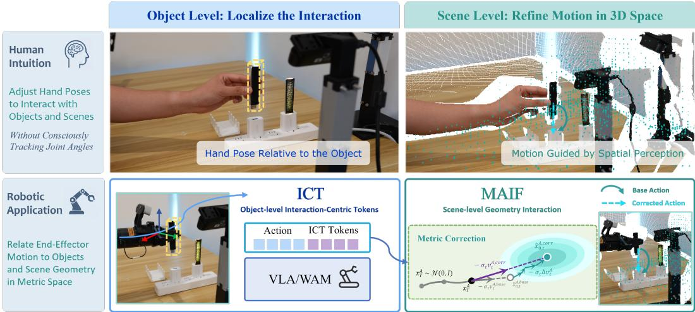  
Figure 1: From human intuition to metric interaction. Top: Humans use spatial perception to adjust hand poses relative to objects and surroundings. Bottom: We adapt robotic manipulation policies to generate and refine actions by explicitly modeling end-effector interactions with objects and scene geometry in Cartesian space at a shared metric scale.

Human manipulation provides a task-space perspective on this challenge as illustrated in Fig. 1. When grasping a cup, semantic recognition identifies the target, while successful execution requires adjusting the hand’s pose relative to the cup and its surroundings through spatial perception guidance. During this process, people typically focus on the hand’s pose relative to the target rather than consciously tracking individual shoulder or elbow joint angles. This task-space perspective suggests that robotic policies should explicitly relate end-effector motion to manipulated objects and surrounding geometry. Modeling these interactions in Cartesian space at a shared metric scale provides a direct interface between semantic understanding and physically grounded action generation.

We realize this idea at two complementary levels. At the object level, we adapt HumanEgo’s Interaction-Centric Tokens (ICTs) (Wang et al., 2026d) to represent end-effector pose trajectories relative to manipulated objects. These tokens are jointly denoised with actions, providing physically grounded interaction supervision. At the scene level, we propose the Metric Action Interaction Field (MAIF), which relates decoded end-effector trajectories to metric scene geometry. During training, its action and ICT queries cross-attend to scene features encoded from 3D point coordinates and surface normals to learn geometry-conditioned flow corrections. We first adapt the action expert with ICT, then freeze the adapted policy to train MAIF. The framework preserves each backbone’s native action representation and sampling schedule. Our contributions are threefold: (1) We introduce an object-level metric interaction mechanism that encodes the relative poses between end effectors and objects using Interaction-Centric Tokens, providing the policy backbone with physically grounded interaction supervision. (2) We propose the Metric Action Interaction Field, a scene-level geometryaware residual adapter that relates decoded end-effector trajectories to metric scene geometry and refines action predictions while preserving the backbone’s native sampling schedule. (3) We validate our framework on both WAM and VLA backbones across simulation benchmarks and real-world manipulation tasks, demonstrating improvements in task success rate and generalization.

## 2 RELATED WORKS

## 2.1 VISION-LANGUAGE-ACTION

Vision-Language-Action (VLA) models use pretrained vision-language models (VLMs) for perception and reasoning in robot control. MiMo-Embodied (Hao et al., 2025) develops spatial understanding and task planning, while Causal Planner (Lu et al., 2026a) targets causal reasoning. For action generation, LayerRoute (Lu et al., 2026b) uses the current action representation to combine features from different VLM layers. RT-2 transfers web-scale semantics through action tokenization (Zitkovich et al., 2023), OpenVLA provides an open generalist policy (Kim et al., 2025), and $\pi _ { 0 }$ introduces a flow-matching expert for continuous action chunks (Black et al., 2025). Models including $\pi _ { 0 . 5 }$ , GR00T N1, RDT-1B, and SmolVLA extend to open-world, humanoid, bimanual, and low-cost settings (Intelligence et al., 2025; Bjorck et al., 2025; Liu et al., 2025; Shukor et al., 2025). $\pi _ { 0 . 7 }$ exploits multimodal context (Intelligence et al., 2026), while LingBot-VLA 2.0 combines large-scale cross-embodiment pretraining with video and depth prediction (Wu et al., 2026).

## 2.2 WORLD-ACTION MODEL

World-Action Models (WAMs) augment direct policies by predicting action-conditioned futures. Early imagine-then-act systems, including UniPi, RoboDreamer, GR-2, and DreamGen, generate visual futures and recover actions via inverse dynamics or downstream control Du et al. (2023); Zhou et al. (2024); Cheang et al. (2024); Jang et al. (2025), while UVA, UWM, and Cosmos Policy couple video and action generation more tightly Wang et al. (2026c); Zhu et al. (2025); Kim et al. (2026). Native models LingBot-VA and LingBot-VA 2.0 learn causal or joint video-action representations for generalizable control Li et al. (2026b); Zhang et al. (2026b); GigaWorld-Policy and GigaWorld-Policy-0.5 emphasize efficient action-centered prediction Ye et al. (2026a); Team et al. (2026). Fast-WAM benefits from video co-training without test-time imagination Yuan et al. (2026), while WAM4D incorporates 4D geometric priors through spatial register tokens Li et al. (2026c).

## 2.3 GEOMETRY MODELING IN EMBODIED MODELS

LiDAR-VGGT Wang et al. (2026a) utilizes LiDAR to assist VGGT Wang et al. (2025) in achieving real-scale scene reconstruction. SpatialVLA uses Ego3D encoding and adaptive action grids Qu et al. (2025); Spatial Forcing aligns VLA features with a pretrained 3D model without explicit geometry at inference Li et al. (2026a); and GAM repurposes a geometric foundation model for perception, prediction, and action decoding Han et al. (2026). World models capture 4D dynamics through geometry prediction or distillation: TesserAct predicts RGB, depth, and normals Zhen et al. (2025), while X-WAM jointly generates multi-view RGB-D futures and actions Guo et al. (2026). GEM-4D distills dense correspondences into video generation Zhou et al. (2026), and EgoGenesis stabilizes egocentric rollouts with anchored projective memory and 3D action encoding Yan et al. (2026). GeoSem-WAM augments RGB prediction with geometry and semantics Ma et al. (2026), while WAM4D and MECo-WAM transfer 4D priors through registers or auxiliary experts for efficient deployment Li et al. (2026c); Zhang et al. (2026a).

## 3 METHOD

Fig. 2 presents our two-stage framework for VLA and WAM backbones. Stage 1 introduces actionaligned, object-relative pose trajectories into the action expert through ICT. Stage 2 freezes the adapted policy and trains MAIF to refine its predictions in native flow space using scene geometry. Expert actions and synchronized end-effector poses are obtained directly from simulation trajectories and recorded during real-world teleoperation.

## 3.1 INTERACTION-CENTRIC TOKEN (ICT)

Metric interaction trajectory. Let H denote the horizon length, $h \in \{ 1 , \ldots , H \}$ index its steps, and $r \in \{ L , R \}$ index the arms; $o _ { h }$ denotes the manipulated object at step h. Object identities and poses are obtained from simulator states or real-world annotations. A superscript ∗ denotes a training target. The synchronized poses $T _ { o _ { h } } ^ { W , * } , T _ { e _ { h } ^ { r } } ^ { W , * } \in S E ( 3 )$ map object and end-effector coordinates into the world frame W. ICT encodes their relative pose as

$$
\begin{array} { r } { \mathbf { c } _ { h } ^ { r } = \psi \Big ( ( T _ { o _ { h } } ^ { W , * } ) ^ { - 1 } T _ { e _ { h } ^ { r } } ^ { W , * } \Big ) = [ \mathbf { p } _ { h } ^ { C , r , * } ; \mathrm { r o t } 6 \mathrm { d } ( \mathbf { R } _ { h } ^ { C , r , * } ) ] \in \mathbb { R } ^ { 9 } . } \end{array}\tag{1}
$$

Here $\mathbf { p } _ { h } ^ { C , r , * } \in \mathbb { R } ^ { 3 }$ is the translation in meters and $\mathbf { R } _ { h } ^ { C , r , * } \in \ S O ( 3 )$ is the rotation matrix, both relative to the object frame; C identifies the ICT stream. The mapping ψ concatenates translation and rot6d(R), which stacks the first two rotation-matrix columns. Stacking $[ \mathbf { c } _ { h } ^ { L } ; \mathbf { c } _ { h } ^ { R } ]$ over H steps gives $\mathbf { C } _ { 0 } \in \mathbb { R } ^ { H \times 1 8 }$ . Ground-truth object poses are used only for training supervision.

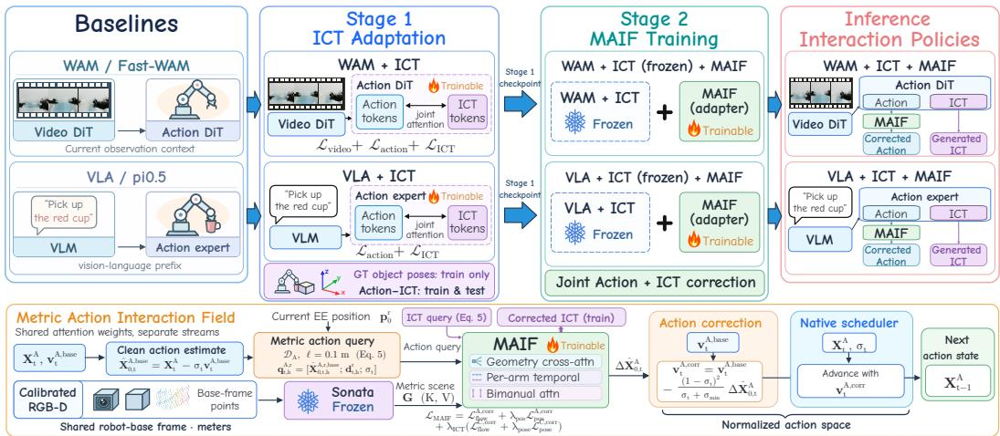  
Figure 2: Framework Overview. Top: Stage 1 jointly trains action and ICT prediction within each backbone’s action expert. Stage 2 freezes the adapted policy and trains MAIF for joint action and ICT refinement. Bottom: MAIF combines cross-attention to metric scene features with temporal and bimanual attention to predict action-flow corrections. At inference, MAIF applies gated corrections only to action velocities, preserving the backbone’s sampling schedule.

Action-side integration. We jointly denoise normalized action chunks $\mathbf { X } _ { 0 } ^ { A } = \mathbf { A } _ { 0 } \in \mathbb { R } ^ { H \times D _ { a } }$ and ICT targets $\mathbf { X } _ { 0 } ^ { C } \overset { \vartriangle } { = } \mathcal { N } _ { C } ( \mathbf { C } _ { 0 } )$ , where $D _ { a }$ is the native action dimension per horizon step and $\mathcal { N } _ { C }$ is a fixed, invertible, elementwise affine normalization. Let t index denoising stages and $\sigma _ { t } \in [ 0 , 1 ]$ denote the corresponding noise level. During training, we sample a common noise level $\sigma _ { t }$ for both streams from the backbone’s flow distribution. For $z \in \{ A , C \}$ indexing action and ICT, respectively, the normalized noisy states and flow targets are

$$
{ \bf X } _ { t } ^ { z } = ( 1 - \sigma _ { t } ) { \bf X } _ { 0 } ^ { z } + \sigma _ { t } \epsilon ^ { z } , \qquad { \bf v } ^ { z , * } = \epsilon ^ { z } - { \bf X } _ { 0 } ^ { z } .\tag{2}
$$

The noise terms $\epsilon ^ { A }$ and $\epsilon ^ { C }$ are independent standard Gaussians on valid coordinates; flow velocities are defined with respect to the noise coordinate. The streams share the action blocks with separate input projections and velocity heads. Each horizon step has one token per stream; ICT tokens follow action tokens with matching rotary positions and shared noise-level conditioning. Invalid arm and padding coordinates are zeroed before projection. Both streams attend to each other and the observation–language context and are jointly denoised at inference.

Flow and relative-pose supervision. ICT receives flow supervision in normalized coordinates and pose supervision in the object frame. Let V index valid $( b , h , r )$ slots (sample, step, arm), excluding unavailable arms and padded steps. In a batch, $\sigma _ { t , b }$ denotes the noise level of sample b. From the predicted velocity $\mathbf { v } _ { t } ^ { C }$ , we recover a clean estimate and evaluate its decoded pose error:

$$
\begin{array} { r l } & { \hat { \mathbf { X } } _ { 0 , t } ^ { C } = \mathbf { X } _ { t } ^ { C } - \sigma _ { t } \mathbf { v } _ { t } ^ { C } , \quad ( \hat { \mathbf { P } } _ { t } ^ { C } , \hat { \mathbf { R } } _ { t } ^ { C } ) = \mathcal { D } _ { C } ( \hat { \mathbf { X } } _ { 0 , t } ^ { C } ) , } \\ & { s _ { t , b h r } = \frac { \| \hat { \mathbf { p } } _ { t , b h r } ^ { C } - \mathbf { p } _ { b h r } ^ { C , * } \| _ { 2 } ^ { 2 } } { s _ { p } ^ { 2 } } + \frac { \| \hat { \mathbf { R } } _ { t , b h r } ^ { C } - \mathbf { R } _ { b h r } ^ { C , * } \| _ { F } ^ { 2 } } { 2 s _ { \theta } ^ { 2 } } . } \end{array}\tag{3}
$$

Hats mark estimates of clean states and decoded poses; $\hat { \mathbf { P } } _ { t } ^ { C }$ and $\hat { \mathbf { R } } _ { t } ^ { C }$ collect the per-slot translations $\hat { \mathbf { p } } _ { t , b h r } ^ { C }$ and rotation matrices $\hat { \mathbf { R } } _ { t , b h r } ^ { C }$ . The fixed decoder $\mathcal { D } _ { C }$ applies $\mathcal { N } _ { C } ^ { - 1 }$ , extracts translation, and decodes rotation by column-wise, right-handed Gram–Schmidt, using a fixed rotation in $S O ( 3 )$ as a fallback for degenerate codes. Fixed scales $s _ { p } \ > \ 0$ (meters) and $s _ { \theta } ~ > ~ 0$ (radians) normalize translation and chordal rotation errors.

Flow matching uses all sampled noise levels, while pose supervision uses only the low-noise subset $\mathcal { V } _ { \mathrm { g e o } } = \{ ( b , h , r ) \in \mathcal { V } : 0 < \sigma _ { t , b } \leq \sigma _ { \mathrm { g e o } } \}$ , with fixed $0 < \sigma _ { \mathrm { g e o } } < 1 \colon$

$$
\begin{array} { l } { \displaystyle \mathcal { L } _ { \mathrm { f l o w } } ^ { C } = \frac { 1 } { 9 | \mathcal { V } | } \sum _ { ( b , h , r ) \in \mathcal { V } } w _ { B } ( \sigma _ { t , b } ) \| \mathbf { v } _ { t , b h r } ^ { C } - \mathbf { v } _ { b h r } ^ { C , * } \| _ { 2 } ^ { 2 } , ~ \mathcal { L } _ { \mathrm { p o s e } } ^ { C } = \frac { 1 } { | \mathcal { V } _ { \mathrm { g e o } } | } \sum _ { ( b , h , r ) \in \mathcal { V } _ { \mathrm { g e o } } } \rho _ { \mathrm { H } } \big ( s _ { t , b h r } \big ) , } \\ { \displaystyle \mathcal { L } _ { \mathrm { I C T } } = \mathcal { L } _ { \mathrm { f l o w } } ^ { C } + \lambda _ { \mathrm { p o s e } } \mathcal { L } _ { \mathrm { p o s e } } ^ { C } . } \end{array}\tag{4}
$$

Here B identifies the backbone, w is its native flow weight, and fixed $\lambda _ { \mathrm { p o s e } } > 0$ balances the two terms. The robust penalty is $\rho _ { \mathrm { H } } ( s ) = s$ for $0 \leq s \leq 1$ and $2 \sqrt { s } - 1$ otherwise. Decoding for the ICT pose loss is restricted to $\nu _ { \mathrm { g e o } } ;$ each loss term is zero when its averaging set is empty. Stage 1 adds ${ \mathcal { L } } _ { \mathrm { I C T } }$ to the backbone’s native training objective.

## 3.2 METRIC ACTION INTERACTION FIELD (MAIF)

Metric interaction queries. For stream $z ~ \in ~ \{ A , C \}$ , the frozen ICT-adapted expert predicts $\mathbf { v } _ { t } ^ { z , \mathrm { b a s e } }$ , yielding the clean estimate $\hat { \mathbf { X } } _ { 0 , t } ^ { z , \mathrm { b a s e } } = \dot { \mathbf { X } } _ { t } ^ { z } - \sigma _ { t } \mathbf { v } _ { t } ^ { z , \mathrm { b a s e } }$ under Eq. equation 2. The superscript base identifies predictions from the frozen policy. A fixed action metric decoder $\mathcal { D } _ { A }$ maps clean action estimates to end-effector positions $\hat { \mathbf { p } } _ { t , h } ^ { A , \bar { r } , \mathrm { b a s \bar { e } } }$ in the robot base frame by undoing action normalization and applying forward kinematics. Depth observations are back-projected into a point cloud in the robot base frame. A frozen Sonata Wu et al. (2025) encoder processes the 3D point coordinates and surface normals, without RGB attributes. We concatenate its multi-scale features into scene tokens $\mathbf { G } ;$ feature aggregation and attention implementation details are provided in Appendix A. Point coordinates are expressed in meters, without per-scene centering or rescaling.

We split the clean action and ICT predictions into arm–step slots and construct paired query features:

$$
\mathbf { q } _ { t , h } ^ { A , r } = [ \hat { \mathbf { X } } _ { 0 , t , h } ^ { A , r , \mathrm { b a s e } } ; \mathbf { d } _ { t , h } ^ { r } ; \sigma _ { t } ] , \mathbf { q } _ { t , h } ^ { C , r } = [ \phi _ { C } ( \hat { \mathbf { c } } _ { 0 , t , h } ^ { r , \mathrm { b a s e } } ) ; \mathbf { d } _ { t , h } ^ { r } ; \sigma _ { t } ] .\tag{5}
$$

Here ${ \bf d } _ { t , h } ^ { r } = ( \hat { \bf p } _ { t , h } ^ { A , r , \mathrm { b a s e } } - { \bf p } _ { 0 } ^ { r } ) / \ell$ is the predicted base-frame displacement from the current measured end-effector position $\mathbf { p } _ { 0 } ^ { r }$ , with fixed $\ell = 0 . 1 \mathrm { m }$ . The ICT feature $\hat { \mathbf { c } } _ { 0 , t , h } ^ { r , \mathrm { b a s e } }$ is the corresponding slot of $\mathcal { N } _ { C } ^ { - 1 } ( \hat { \mathbf { X } } _ { 0 , t } ^ { C , \mathrm { b a s e } } ) ; \phi _ { C }$ divides its translation by ℓ and retains the six rotation coordinates. Thus, both queries include the same predicted motion feature, while the ICT query additionally encodes the object-relative interaction state. Its translation remains in the object’s reference frame.

Let $\mathbf { q } _ { t } ^ { z }$ collect the arm-step features of stream z. Stream-specific projections produce hidden query sequences of a common width, ${ \bf Q } _ { t } ^ { z } = E _ { z } ( { \bf q } _ { t } ^ { z } )$ . Within each stream, queries cross-attend to metric scene tokens $\mathbf { G }$ , which supply keys and values. Temporal attention connects horizon steps within each arm, while bimanual attention exchanges information between the two arms at matching steps. The streams share attention parameters but are processed separately, without action-ICT attention within MAIF. Output heads are stream-specific. MAIF has about 200M trainable parameters.

Gated flow correction. All base predictions supplied to MAIF are detached. Zero-initialized output heads predict correction proposals in normalized clean space, which are converted to gated velocity corrections:

$$
\Delta \hat { \mathbf { X } } _ { 0 , t } ^ { z } = F _ { \theta } ^ { z } ( \mathbf { Q } _ { t } ^ { z } , \mathbf { G } , \sigma _ { t } ) , ~ \mathbf { v } _ { t } ^ { z , \mathrm { c o r r } } = \mathbf { v } _ { t } ^ { z , \mathrm { b a s e } } - \frac { ( 1 - \sigma _ { t } ) ^ { 2 } } { \sigma _ { t } + \sigma _ { \operatorname* { m i n } } } \Delta \hat { \mathbf { X } } _ { 0 , t } ^ { z } , ~ z \in \{ A , C \} .\tag{6}
$$

Here $F _ { \theta } ^ { z }$ comprises the shared MAIF trunk and the output head for stream $z ,$ with θ denoting MAIF’s trainable parameters. The gate $( 1 - \sigma _ { t } ) ^ { 2 }$ suppresses corrections at high noise, where clean estimates are less reliable, and fixed $\sigma _ { \operatorname* { m i n } } > 0$ stabilizes the conversion. Residuals are assembled into each stream’s native layout, and corrected clean estimates are recovered as $\hat { \mathbf { X } } _ { 0 , t } ^ { z , \mathrm { c o r r } } = \mathbf { X } _ { t } ^ { z } - \sigma _ { t } \mathbf { v } _ { t } ^ { z , \mathrm { c o r r } }$

Flow and physical supervision. We supervise each stream in normalized flow space and decoded physical space. The fixed decoders recover end-effector positions and object-relative poses for ICT:

$$
\begin{array} { r } { \hat { \mathbf { P } } _ { t } ^ { A , \mathrm { c o r r } } = \mathcal { D } _ { A } \Big ( \hat { \mathbf { X } } _ { 0 , t } ^ { A , \mathrm { c o r r } } \Big ) , ( \hat { \mathbf { P } } _ { t } ^ { C , \mathrm { c o r r } } , \hat { \mathbf { R } } _ { t } ^ { C , \mathrm { c o r r } } ) = \mathcal { D } _ { C } \Big ( \hat { \mathbf { X } } _ { 0 , t } ^ { C , \mathrm { c o r r } } \Big ) . } \end{array}\tag{7}
$$

Here P and R collect positions and rotations over the horizon and arm slots. Gradients from the physical losses pass through the fixed decoders to MAIF. Let $\mathcal { T } _ { A }$ index valid action coordinates

$( b , h , j )$ , with $j \in \{ 1 , \ldots , D _ { a } \}$ indexing the native action vector; coordinates of unavailable arms and padding are excluded. Let $\mathbf { p } _ { b h r } ^ { A , * }$ denote the expert end-effector position in the robot base frame. Using scalar velocity components $v _ { t , b h j } ^ { A , \mathrm { c o r r } }$ and $v _ { b h j } ^ { A , * }$ , the action losses and adapter objective are

$$
\begin{array} { l } { \displaystyle \mathcal { L } _ { \mathrm { \scriptsize { H o w } } } ^ { \mathrm { \scriptsize { A , c o r r } } } = \displaystyle \frac { 1 } { | \mathcal { L } _ { A } | } \sum _ { ( b , h , j ) \in \mathcal { Z } _ { A } } \left( v _ { t , b h j } ^ { A , \mathrm { c o r r } } - v _ { b h j } ^ { A , * } \right) ^ { 2 } , ~ \mathcal { L } _ { \mathrm { \scriptsize { p o s } } } ^ { A , \mathrm { c o r r } } = \displaystyle \frac { 1 } { | \mathcal { V } | } \sum _ { ( b , h , r ) \in \mathcal { V } } \rho _ { \mathrm { \scriptsize { S L } 1 } } \left( \frac { \hat { \mathbf { p } } _ { t , b h r } ^ { A , \mathrm { c o r r } } - \mathbf { p } _ { b h r } ^ { A , * } } { s _ { \mathrm { \scriptsize { p o s } } } } \right) , } \\ { \displaystyle \mathcal { L } _ { \mathrm { \scriptsize { M A I F } } } = \mathcal { L } _ { \mathrm { \scriptsize { H o w } } } ^ { A , \mathrm { c o r r } } + \lambda _ { \mathrm { \scriptsize { p o s } } } \mathcal { L } _ { \mathrm { \scriptsize { p o s } } } ^ { A , \mathrm { c o r r } } + \lambda _ { \mathrm { I C T } } \left( \mathcal { L } _ { \mathrm { \scriptsize { f o w } } } ^ { C , \mathrm { c o r r } } + \lambda _ { \mathrm { \scriptsize { p o s } } } \mathcal { L } _ { \mathrm { \scriptsize { p o s } } } ^ { C , \mathrm { c o r r } } \right) . } \end{array}\tag{8}
$$

The action flow target $\mathbf { v } ^ { A , * }$ follows Eq. equation 2; its loss is an unweighted mean over valid action coordinates. We set $s _ { \mathrm { p o s } } = 0 . 0 1 \mathrm { m }$ . The penalty $\rho _ { \mathrm { S L 1 } }$ sums smooth- $L _ { 1 }$ penalties over the three normalized position residuals: a scalar residual u contributes $\scriptstyle { \frac { 1 } { 2 } } u ^ { 2 }$ for $| u | \leq 1$ and $\left| u \right| - \frac { 1 } { 2 }$ otherwise.

The two ICT terms reuse Eq. equation 4 on corrected predictions, with the same flow weighting, robust pose penalty, and low-noise mask as Stage 1. The positive weights $\lambda _ { \mathrm { p o s } }$ and $\lambda _ { \mathrm { I C T } }$ scale action position supervision and auxiliary ICT supervision, respectively. The ICT losses train the shared MAIF trunk, which is also used by the action branch at inference.

Inference. At inference, only the MAIF action branch is used. The native scheduler updates actions with $\mathbf { v } _ { t } ^ { A , \mathrm { c o r r } }$ . Action and ICT tokens remain mutually visible in the frozen expert throughout denoising, allowing actions to use the generated ICT. Only the final action chunk is executed.

## 4 EXPERIMENTS

We conduct experiments in both simulation and real-world settings to evaluate the effectiveness of our proposed modules. In simulation, we evaluate our method on two widely used manipulation benchmarks, RoboTwin 2.0 Chen et al. (2025) and LIBERO Liu et al. (2023). We further compare its performance and generalization on five real-world manipulation tasks against competitive VLA and WAM baselines. More training and experiment details can be found in the Appendix A.

## 4.1 ROBOTWIN 2.0 SIMULATION

Evaluation protocol. We evaluate StarVLA Community (2026), SpatialVLA Qu et al. (2025), $\pi _ { 0 . 5 }$ Intelligence et al. (2025), Fast-WAM Yuan et al. (2026), and X-WAM Guo et al. (2026) on all 50 RoboTwin 2.0 tasks. These baselines span VLA and WAM families and differ in robotdata pretraining and the use of explicit geometric inputs. This selection assesses our framework’s applicability across backbone families and whether it provides additional gains for geometry-aware policies. All baselines and their “+ Ours” variants are trained on the same 50 clean demonstration episodes per task. “+ Ours” denotes ICT adaptation followed by 5,000 MAIF training steps with the adapted backbone frozen. Each method is evaluated for 100 episodes per task in each setting (clean and randomized). We report task-averaged success rates and their mean across the two settings (Avg.). Training details are provided in the Appendix A.

Results. Table 1 shows improvements in both clean and randomized settings across all five baselines. Gains in average success range from 2.24 to 5.94 percentage points, with a mean gain of 3.59 points across baselines. StarVLA, $\pi _ { 0 . 5 } ,$ , and Fast-WAM benefit more under randomization, with gains of 4.62, 5.18, and 9.56 points, respectively, compared with 1.92, 0.58, and 2.32 points in clean scenes. These results suggest improved generalization from clean demonstrations to randomized environments. The geometry-aware SpatialVLA and X-WAM also improve by 2.24 and 3.60 points on average, respectively, suggesting that metric interaction complements existing geometric conditioning. X-WAM + Ours achieves the best among the evaluated methods: 87.00% in clean scenes, 77.02% under randomization, and 82.01% on average owing to its pretraining on RoboTwin 2.0.

## 4.2 LIBERO SIMULATION

Evaluation protocol. We evaluate our framework on LIBERO, using 50 evaluation episodes for each of the 10 tasks per suite. The four suites are Spatial, Object, Goal, and Long. We report success rates for each suite. We also report their unweighted mean to summarize overall task performance. Experiments use a WAM backbone (Fast-WAM) and a VLA backbone $( \pi _ { 0 . 5 } )$ , following each model’s native training and rollout protocol. For this single-arm benchmark, one 9D ICT arm slot is active within the shared 18D interface, and the unused slot is masked. Fast-WAM uses the video-action-visible training mask, allowing future-video queries to attend to action and ICT tokens. We disable bimanual attention during MAIF training on LIBERO.

Table 1: Average success on 50 RoboTwin 2.0 tasks. Best in bold; second-best underlined.
<table><tr><td>Method</td><td>Robo. P.T.</td><td>Geo.Input</td><td>Clean (%)</td><td>Randomized (%)</td><td>Avg. (%)</td></tr><tr><td>StarVLA</td><td>X</td><td>X</td><td>72.54</td><td>14.64</td><td>43.59</td></tr><tr><td>SpatialVLA</td><td></td><td></td><td>3.14</td><td>1.62</td><td>2.38</td></tr><tr><td>π0.5</td><td></td><td>××</td><td>70.68</td><td>46.0</td><td>58.34</td></tr><tr><td>Fast-WAM</td><td>X</td><td></td><td>77.76</td><td>1.92</td><td>39.84</td></tr><tr><td>X-WAM</td><td></td><td></td><td>82.46</td><td>74.36</td><td>78.41</td></tr><tr><td>StarVLA + Ours</td><td>X</td><td></td><td>74.46 (+1.92)</td><td>19.26 (+4.62)</td><td>46.86 (+3.27)</td></tr><tr><td>SpatialVLA + Ours</td><td></td><td></td><td>5.62 (+2.48)</td><td>3.62 (+2.0)</td><td>4.62 (+2.24)</td></tr><tr><td>π0.5 + Ours</td><td></td><td></td><td>71.26 (+0.58)</td><td>51.18 (+5.18)</td><td>61.22 (+2.88)</td></tr><tr><td>Fast-WAM + Ours</td><td>X</td><td></td><td>80.08 (+2.32)</td><td>11.48 (+9.56)</td><td>45.78 (+5.94)</td></tr><tr><td>X-WAM + Ours</td><td></td><td></td><td>87.0 (+4.54)</td><td>77.02 (+2.66)</td><td>82.01 (+3.6)</td></tr></table>

Table 2: Results on LIBERO. Best in bold; second-best underlined.
<table><tr><td>Method</td><td>Robo. P.T.</td><td>Spatial (%)</td><td>Object (%)</td><td>Goal (%)</td><td>Long (%)</td><td>Avg. (%)</td></tr><tr><td>π0.5 Fast-WAM</td><td>V x</td><td>98.8 97.6</td><td>98.2 99.4</td><td>98.0 96.0</td><td>92.4 94.0</td><td>96.85 96.75</td></tr><tr><td>π0.5 + Ours Fast-WAM + Ours</td><td>V x</td><td>99.0 (+0.2) 98.8 (+1.2)</td><td>99.2 (+1.0) 98.8 (-0.6)</td><td>98.0 (=) 98.4 (+2.4)</td><td>93.4 (+1.0) 95.2 (+1.2)</td><td>97.40 (+0.55) 97.80 (+1.05)</td></tr></table>

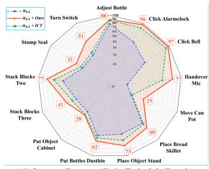  
(1) Success Rates on RoboTwin 2.0 (Rand.)

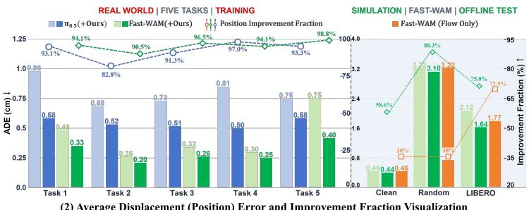  
(2) Average Displacement (Position) Error and Improvement Fraction Visualization

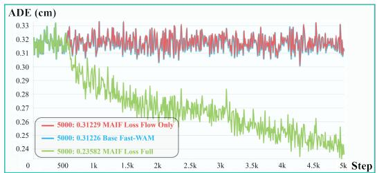  
(3) Average Displacement Error (RoboTwin 2.0)

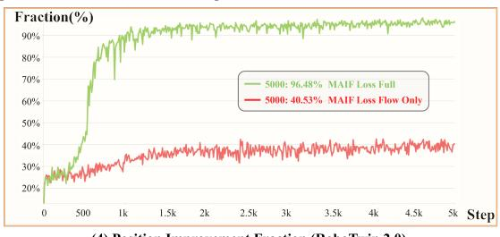  
(4) Position Improvement Fraction (RoboTwin 2.0)  
Figure 3: Experiment Details. (1) Random success rates on 13 tasks after clean-only training, showing that our method improves OOD generalization. (2) Left: Training results on real-world tasks and Right: Offline inference on simulation benchmarks. Bars show Average Displacement Error (ADE) and dashed lines indicate the fraction of samples with reduced ADE. Our method improves both backbones and consistently outperforms flow-only version in training and testing metrics. (3) and (4): Training logs. Flow-only supervision barely reduces the Average ADE of and improves the accuracy of the baseline’s trajectory in only about 40% of samples. While our method with the full loss incorporating waypoint and ICT supervision substantially reduces trajectory ADE and improves base-trajectory accuracy in over 95% of samples.

Results. Table 2 shows higher average success with our framework on both backbones: from 96.75% to 97.80% for Fast-WAM and from 96.85% to 97.40% for $\pi _ { 0 . 5 }$ . Both improve on Spatial and Long, while Fast-WAM gains 2.4 percentage points on Goal. The gains vary across suites: Fast-WAM drops 0.6 percentage points on Object, and $\pi _ { 0 . 5 }$ remains unchanged on Goal.

Table 3: Ablation Result on RoboTwin 2.0. Best in bold; second-best underlined.
<table><tr><td>Type</td><td>Method</td><td>Clean (%)</td><td>Randomized (%)</td><td>Avg. (%)</td></tr><tr><td rowspan="2">VLA</td><td> $\pi _ { 0 . 5 } + \mathrm { I C T }$ </td><td>70.92 (+0.24)</td><td>48.98 (+2.98)</td><td>59.95 (+1.61)</td></tr><tr><td>π0.5 + Ours</td><td>71.26 (+0.58)</td><td>51.18 (+5.18)</td><td>61.22 (+2.88)</td></tr><tr><td rowspan="7">WAM</td><td>Fast-WAM + Flow Only</td><td>78.08</td><td>2.64</td><td>40.36</td></tr><tr><td>Fast-WAM 35k step</td><td>77.92</td><td>3.34</td><td>40.63</td></tr><tr><td>Separate Coordináte Frames</td><td>77.4</td><td>3.62</td><td>40.51</td></tr><tr><td>0.5× scale</td><td>77.2</td><td>2.4</td><td>39.8</td></tr><tr><td>2.0× scale</td><td>76.9</td><td>3.26</td><td>40.08</td></tr><tr><td>normalized scale</td><td>77.68</td><td>2.8</td><td>40.24</td></tr><tr><td>Fast-WAM + ICT</td><td>78.4 (+0.64)</td><td>4.1 (+2.18)</td><td>41.25 (+1.41)</td></tr><tr><td></td><td>Fast-WAM + Ours</td><td>80.08 (+2.32)</td><td>11.48 (+9.56)</td><td>45.78 (+5.94)</td></tr></table>

## 4.3 ABLATION STUDY

We conduct ablation studies on RoboTwin 2.0 using $\pi _ { 0 . 5 }$ and Fast-WAM to examine the contri butions of interaction modeling, metric consistency, and supervision. Both baselines are trained exclusively on clean demonstrations for 30,000 steps with a global batch size of 256. We then train MAIF for 5,000 steps with the backbone frozen and a global batch size of 256. As Table 3 shows, adding ICT improves both backbones, while incorporating MAIF further increases the average success from 59.95% to 61.22% for $\pi _ { 0 . 5 }$ and from 41.25% to 45.78% for Fast-WAM. The corresponding gains under randomization are 2.20 and 7.38 percentage points, respectively. Fig. 3 (1) shows success rates on 13 tasks (Random) of $\pi _ { 0 . 5 }$ and its variants with our method; our two-stage training consistently improves the success rate. These improvements support the complementary roles of object-level interaction and scene-level action refinement to generalization.

To assess whether the gains merely arise from additional training, we continue training Fast-WAM on clean episodes for another 5000 steps, matching the number of additional training steps. This baseline achieves 40.63% average success, compared with 45.78% for our full method, suggesting that longer training alone does not explain the improvement. We also evaluate Separate Coordinate Frames, where point clouds and end-effector trajectories are expressed in different coordinate frames, alongside scene-wise point-cloud normalization and scaling by factors of 0.5 and 2.0. These variants achieve average success rates of only 39.80%–40.51%, highlighting the importance of coordinate alignment and a consistent scale between end-effector motion and scene geometry.

Finally, training MAIF with only action-velocity supervision yields 40.36% average success below the full method’s 45.78%. Fig. 3(3,4) compares the full loss objective with its Flow Only variant. The further reduces the Average Displacement Error (ADE) to 0.24 cm, whereas the latter remains close to the baseline at 0.31 cm. And the position improvement fraction reaches 96.48% compared with 40.53% for Flow Only. The right part of Fig. 3(2) reports offline simulation results. Across two settings of RoboTwin 2.0 and LIBERO, the full method achieves lower ADE and higher improvement fractions than Flow Only. This suggests that velocity-space supervision alone provides insufficient guidance for accurate action refinement. Our full method uses physically grounded supervision for both object- and scene-level interactions, encouraging more geometrically consistent corrections to the denoising velocity and enabling more precise manipulation.

## 4.4 REAL-WORLD EXPERIMENTS

We evaluate two baselines Fast-WAM Yuan et al. (2026) and $\pi _ { 0 . 5 }$ Intelligence et al. (2025) on a dualarm Piper-H platform equipped with a fixed-view head camera and wrist cameras, all using Orbbec Gemini 335 RGB-D sensors. The baseline policies use observations from all cameras, whereas MAIF constructs scene geometry from the fixed-view camera’s depth observations. Further details on the real-world setup, data collection, and training are provided in the Appendix A.

We evaluate four single-arm tasks and one bimanual task as Fig. 4 shows. Task 1: Barrier-Crossing Corn Placement, lifting an ear of corn over barriers of varying heights and placing it into a bowl; Task 2: USB Insertion, aligning and inserting a USB connector into its port; Task 3: Dual-USB Insertion, sequentially inserting two USB connectors into their corresponding ports; Task 4: Obstacle-Course Soccer, dribbling a ball around obstacles before shooting it into a goal; and Task 5: Bimanual Microwave Retrieval, using one arm to open the door and retrieve a box while the other pushes the door aside. Together, these tasks require height perception, fine-grained spatial alignment, obstacle-aware planning, and depth perception. All tasks are evaluated 100 times.

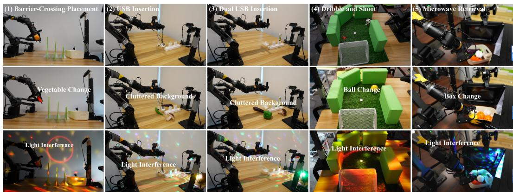  
Figure 4: Real-world task settings and out-of-distribution (OOD) perturbations. Each column corresponds to one of the five manipulation tasks. The top row shows standard task configurations; the middle row presents OOD.1 scenarios with object variations or background clutter; and the bottom row shows OOD.2 scenarios under lighting perturbations.

Table 4: Real-World Success Rate on Five Tasks. Best in bold; second-best underlined.
<table><tr><td>Method</td><td>Task 1(%)</td><td>Task 2(%)</td><td>Task 3(%)</td><td>Task 4(%)</td><td>Task 5(%)</td><td>Average(%)</td></tr><tr><td>Fast-WAM</td><td>75</td><td>19</td><td>30</td><td>23</td><td>57</td><td>40.8</td></tr><tr><td> $\pi _ { 0 . 5 }$ </td><td>100</td><td>74</td><td>47</td><td>61</td><td>65</td><td>69.4</td></tr><tr><td>Fast-WAM + Ours</td><td>81</td><td>21</td><td>36</td><td>26</td><td>70</td><td>46.8 (+6.0)</td></tr><tr><td> $\pi _ { \mathbf { 0 . 5 } } + \mathbf { O u r s }$ </td><td>100</td><td>81</td><td>59</td><td>65</td><td>80</td><td>77.0 (+7.6)</td></tr></table>

(1) Standard Task Evaluation. The left half of Fig. 3(2) reports training metrics on five tasks. Our method substantially reduces ADE for both $\pi _ { 0 . 5 }$ and Fast-WAM across all tasks. The position improvement fraction exceeds 90% in every task and backbone except $\pi _ { 0 . 5 } +$ Ours on Task 2 (82.8%). These results indicate more accurate end-effector trajectory predictions, supporting more precise real-world manipulation. Table 4 reports the success rates under the standard setting. Adding our two-level metric interaction framework consistently improves both policy backbones. Fast-WAM improves from 40.8% to 46.8%, corresponding to a gain of 6.0 percentage points, while $\pi _ { 0 . 5 }$ improves from 69.4% to 77.0%, a gain of 7.6 points. The improvements are particularly pronounced on the more geometry-sensitive tasks. On Dual-USB Insertion, our method improves Fast-WAM and $\pi _ { 0 . 5 }$ by 6 and 12 points, respectively. On Bimanual Microwave Retrieval, the gains reach 13 and 15 points. These tasks require precise relative-pose estimation, constrained-space reasoning, and coordinated action refinement, directly reflecting the complementary roles of object-level ICT and scene-level MAIF. Although both $\pi _ { 0 . 5 }$ and $\pi _ { 0 . 5 }$ with our framework achieve 100% success on Task 1, our method clears the medium-height barrier with a lower trajectory (a more rational pattern). Detailed experiment visualizations are provided in the Appendix A.

(2) Out-of-Distribution (OOD) Study. We further evaluate robustness under two types of unseen environmental perturbations: task-specific scene or background changes and lighting changes shown in Fig. 4. These variations modify visual appearance and scene context while preserving the underlying task objective, allowing us to assess whether the policy relies on appearance correlations or transferable metric interaction cues. As shown in Table 5, our method improves every task–condition pair for both backbones. The average OOD success rate of Fast-WAM increases from 15.1% to 22.6%, while that of $\pi _ { 0 . 5 }$ increases from 50.0% to 57.4%, yielding gains of 7.5 and 7.4 percentage points. The largest improvements occur on Task 3: Fast-WAM improves from 9% to 24% under scene perturbation and from 0% to 15% under lighting changes, while $\pi _ { 0 . 5 }$ improves from 36% to 51% and from 24% to 37%. These results indicate that explicitly grounding endeffector–object relations and action trajectories in a shared metric space improves not only nominal task success but also transfer and generalization under out-of-distribution environmental changes.

Table 5: Real-world OOD success rates. Best in bold; second-best underlined.
<table><tr><td rowspan="3">Method</td><td colspan="2">Task 1 (%)</td><td colspan="2">Task 2 (%)</td><td colspan="2">Task 3 (%)</td><td colspan="2">Task 4 (%)</td><td colspan="2">Task 5 (%)</td><td>Summary (%)</td></tr><tr><td>OOD.1</td><td>00OD.2</td><td>00D.1</td><td>00D.2</td><td>00D.1</td><td>O0D.2</td><td>0OD.1</td><td>00D.2</td><td>0OD.1 O0D.2</td><td>Average</td></tr><tr><td>Fast-WAM</td><td>43</td><td>39</td><td>13</td><td>12</td><td>9</td><td>0</td><td>11 34</td><td>7</td><td>15 2</td><td>15.1</td></tr><tr><td>π0.5</td><td>92</td><td>90</td><td>58</td><td>49</td><td>36</td><td>24</td><td>25</td><td>41</td><td>51</td><td>50.0</td></tr><tr><td>Fast-WAM + Ours</td><td>44</td><td>46</td><td>19</td><td>19</td><td>24</td><td>15</td><td>15</td><td>22</td><td>10</td><td>22.6 (+7.5)</td></tr><tr><td>π0.5 + Ours</td><td>95</td><td>97</td><td>62</td><td>53</td><td>51</td><td>37</td><td>32</td><td>48</td><td>59</td><td>57.4 (+7.4)</td></tr></table>

## 5 CONCLUSION

We presented a metric interaction framework in Cartesian space for precise robotic manipulation. ICTs provide object-relative end-effector pose supervision and MAIF uses metric scene geometry to refine actions. Our framework improves pose accuracy, task success and OOD generalization across VLA and WAM baselines with few additional parameters and training steps.

## AI USE STATEMENT

Generative AI tools were used to assist with writing and refining code, preparing visualization scripts and figure layouts, formatting LaTeX tables, and polishing the language and presentation of the manuscript. All AI-assisted code and manuscript modifications were manually reviewed and verified by the authors. The reported numerical results and result figures were derived exclusively from experiments conducted by the authors; no experimental data, numerical results, or result figures were synthetically generated or fabricated using generative AI. The authors take full responsibility for the accuracy and integrity of the final paper.

## REFERENCES

Johan Bjorck, Fernando Castaneda, Nikita Cherniadev, Xingye Da, Runyu Ding, Linxi Fan,˜ Yu Fang, Dieter Fox, Fengyuan Hu, Spencer Huang, et al. Gr00t n1: An open foundation model for generalist humanoid robots. arXiv preprint arXiv:2503.14734, 2025.

Kevin Black, Noah Brown, Danny Driess, Adnan Esmail, Michael Robert Equi, Chelsea Finn, Niccolo Fusai, Lachy Groom, Karol Hausman, Brian Ichter, Szymon Jakubczak, Tim Jones, Liyiming Ke, Sergey Levine, Adrian Li-Bell, Mohith Mothukuri, Suraj Nair, Karl Pertsch, Lucy Xiaoyang Shi, Laura Smith, James Tanner, Quan Vuong, Anna Walling, Haohuan Wang, and Ury Zhilinsky. π : A vision-language-action flow model for general robot control. In RSS 2025, 2025.

Chi-Lam Cheang, Guangzeng Chen, Ya Jing, Tao Kong, Hang Li, Yifeng Li, Yuxiao Liu, Hongtao Wu, Jiafeng Xu, Yichu Yang, et al. Gr-2: A generative video-language-action model with webscale knowledge for robot manipulation. arXiv preprint arXiv:2410.06158, 2024.

Tianxing Chen, Zanxin Chen, Baijun Chen, Zijian Cai, Yibin Liu, Zixuan Li, Qiwei Liang, Xianliang Lin, Yiheng Ge, Zhenyu Gu, et al. Robotwin 2.0: A scalable data generator and benchmark with strong domain randomization for robust bimanual robotic manipulation. arXiv preprint arXiv:2506.18088, 2025.

StarVLA Community. Starvla: A lego-like codebase for vision-language-action model developing. arXiv preprint arXiv:2604.05014, 2026.

Yilun Du, Sherry Yang, Bo Dai, Hanjun Dai, Ofir Nachum, Josh Tenenbaum, Dale Schuurmans, and Pieter Abbeel. Learning universal policies via text-guided video generation. Advances in neural information processing systems, 36:9156–9172, 2023.

Jun Guo, Qiwei Li, Peiyan Li, Zilong Chen, Nan Sun, Yifei Su, Heyun Wang, Yuan Zhang, Xinghang Li, and Huaping Liu. Unified 4d world action modeling from video priors with asynchronous denoising. arXiv preprint arXiv:2604.26694, 2026.

Jisang Han, Seonghu Jeon, Jaewoo Jung, Rene Zurbr ´ ugg, Honggyu An, Tifanny Portela, Marco ¨ Hutter, Marc Pollefeys, Seungryong Kim, and Sunghwan Hong. Geometric action model for robot policy learning. arXiv preprint arXiv:2606.17046, 2026.

Xiaoshuai Hao, Lei Zhou, Zhijian Huang, Zhiwen Hou, Yingbo Tang, Lingfeng Zhang, Guang Li, Zheng Lu, Shuhuai Ren, Xianhui Meng, Yuchen Zhang, Jing Wu, Jinghui Lu, Chenxu Dang, Jiayi Guan, Jianhua Wu, Zhiyi Hou, Hanbing Li, Shumeng Xia, Mingliang Zhou, Yinan Zheng, Zihao Yue, Shuhao Gu, Hao Tian, Yuannan Shen, Jianwei Cui, Wen Zhang, Shaoqing Xu, Bing Wang, Haiyang Sun, Zeyu Zhu, Yuncheng Jiang, Zibin Guo, Chuhong Gong, Chaofan Zhang, Wenbo Ding, Kun Ma, Guang Chen, Rui Cai, Diyun Xiang, Heng Qu, Fuli Luo, Hangjun Ye, and Long Chen. MiMo-Embodied: X-Embodied foundation model technical report. arXiv preprint arXiv:2511.16518, 2025. URL https://arxiv.org/abs/2511.16518.

Physical Intelligence, Kevin Black, Noah Brown, James Darpinian, Karan Dhabalia, Danny Driess, Adnan Esmail, Michael Equi, Chelsea Finn, Niccolo Fusai, et al. π0.5: a vision-language-action model with open-world generalization. arXiv preprint arXiv:2504.16054, 2025.

Physical Intelligence, Bo Ai, Ali Amin, Raichelle Aniceto, Ashwin Balakrishna, Greg Balke, Kevin Black, George Bokinsky, Shihao Cao, Thomas Charbonnier, et al. π : a steerable generalist robotic foundation model with emergent capabilities. arXiv preprint arXiv:2604.15483, 2026.

Joel Jang, Seonghyeon Ye, Zongyu Lin, Jiannan Xiang, Johan Bjorck, Yu Fang, Fengyuan Hu, Spencer Huang, Kaushil Kundalia, Yen-Chen Lin, Lo¨ıc Magne, Ajay Mandlekar, Avnish Narayan, You Liang Tan, Guanzhi Wang, Jing Wang, Qi Wang, Yinzhen Xu, Xiaohui Zeng, Kaiyuan Zheng, Ruijie Zheng, Ming-Yu Liu, Luke Zettlemoyer, Dieter Fox, Jan Kautz, Scott Reed, Yuke Zhu, and Linxi Fan. Dreamgen: Unlocking generalization in robot learning through video world models. In Joseph Lim, Shuran Song, and Hae-Won Park (eds.), Proceedings of The 9th Conference on Robot Learning, volume 305 of Proceedings of Machine Learning Research, pp. 5170–5194. PMLR, 27–30 Sep 2025. URL https://proceedings.mlr.press/v305/jang25a.html.

Moo Jin Kim, Karl Pertsch, Siddharth Karamcheti, Ted Xiao, Ashwin Balakrishna, Suraj Nair, Rafael Rafailov, Ethan P Foster, Pannag R Sanketi, Quan Vuong, Thomas Kollar, Benjamin Burchfiel, Russ Tedrake, Dorsa Sadigh, Sergey Levine, Percy Liang, and Chelsea Finn. Openvla: An open-source vision-language-action model. In Pulkit Agrawal, Oliver Kroemer, and Wolfram Burgard (eds.), Proceedings of The 8th Conference on Robot Learning, volume 270 of Proceedings of Machine Learning Research, pp. 2679–2713. PMLR, 06–09 Nov 2025. URL https://proceedings.mlr.press/v270/kim25c.html.

Moo Jin Kim, Yihuai Gao, Tsung-Yi Lin, Yen-Chen Lin, Yunhao Ge, Grace Lam, Percy Liang, Shuran Song, Ming-Yu Liu, Chelsea Finn, et al. Cosmos policy: Fine-tuning video models for visuomotor control and planning. arXiv preprint arXiv:2601.16163, 2026.

Seungjae Lee, Yoonkyo Jung, Jusuk Lee, Jonghun Shin, Amir Hossein Shahidzadeh, Yao-Chih Lee, H Jin Kim, Jia-Bin Huang, and Furong Huang. µ0: A scalable 3d interaction-trace world model. arXiv preprint arXiv:2606.13769, 2026.

Fuhao Li, Wenxuan Song, Han Zhao, Jingbo Wang, Pengxiang Ding, Donglin Wang, Long Zeng, and Haoang Li. Spatial forcing: Implicit spatial representation alignment for vision-languageaction model. In International Conference on Learning Representations, volume 2026, pp. 132324–132345, 2026a.

Lin Li, Qihang Zhang, Yiming Luo, Shuai Yang, Ruilin Wang, Fei Han, Mingrui Yu, Zelin Gao, Nan Xue, Xing Zhu, et al. Causal world modeling for robot control. arXiv preprint arXiv:2601.21998, 2026b.

Ying Li, Xiaobao Wei, Jiajun Cao, Hao Wang, Xiaowei Chi, Chengyu Bai, Qianpu Sun, Jiajun Li, Xiaojie Zhang, Peidong Jia, et al. Wam4d: Fast 4d world action model via spatial register tokens. arXiv preprint arXiv:2606.14048, 2026c.

Bo Liu, Yifeng Zhu, Chongkai Gao, Yihao Feng, Qiang Liu, Yuke Zhu, and Peter Stone. Libero: Benchmarking knowledge transfer for lifelong robot learning. Advances in Neural Information Processing Systems, 36:44776–44791, 2023.

Songming Liu, Lingxuan Wu, Bangguo Li, Hengkai Tan, Huayu Chen, Zhengyi Wang, Ke Xu, Hang Su, and Jun Zhu. Rdt-1b: a diffusion foundation model for bimanual manipulation. In International Conference on Learning Representations, volume 2025, pp. 29982–30009, 2025.

Zheng Lu, Mingqi Gao, Qinlei Xie, Wanqi Zhong, Hanwen Cui, Heng Cao, Zirui Song, Yifan Yang, Chong Luo, Bei Liu, and Yiming Li. Token predictors are not planners: Building physically grounded causal reasoners. arXiv preprint arXiv:2606.01810, 2026a. URL https://arxiv. org/abs/2606.01810.

Zheng Lu, Haoran Liao, Wanqi Zhong, Yunhe Ni, Lijie Wang, Xingjie Fan, Zhisheng Chen, Yantang Qu, Meijia Chen, Tianyu Xin, Zirui Song, and Yiming Li. LayerRoute: Action-conditioned mixture-of-layers routing for vision-language-action policies. arXiv preprint arXiv:2609.06079, 2026b. URL https://arxiv.org/abs/2609.06079.

Fulong Ma, Daojie Peng, Wenjun Yue, Jiahang Cao, Bintao Wang, Qiang Zhang, and Jun Ma. Geosem-wam: Geometry-and semantic-aware world action models. arXiv preprint arXiv:2606.03188, 2026.

Yongsen Mao, Junhao Zhong, Chuan Fang, Jia Zheng, Rui Tang, Hao Zhu, Ping Tan, and Zihan Zhou. Spatiallm: Training large language models for structured indoor modeling. Advances in Neural Information Processing Systems, 38:45165–45195, 2026.

Delin Qu, Haoming Song, Qizhi Chen, Yuanqi Yao, Xinyi Ye, Yan Ding, Zhigang Wang, JiaYuan Gu, Bin Zhao, Dong Wang, et al. Spatialvla: Exploring spatial representations for visuallanguage-action model. arXiv preprint arXiv:2501.15830, 2025.

Mustafa Shukor, Dana Aubakirova, Francesco Capuano, Pepijn Kooijmans, Steven Palma, Adil Zouitine, Michel Aractingi, Caroline Pascal, Martino Russi, Andres Marafioti, et al. Smolvla: A vision-language-action model for affordable and efficient robotics. arXiv preprint arXiv:2506.01844, 2025.

GigaWorld Team, Angen Ye, Angyuan Ma, Boyuan Wang, Chaojun Ni, Fangzheng Ye, Guan Huang, Guo Li, Guosheng Zhao, Haodong Yan, et al. Gigaworld-policy-0.5: A faster and stronger wam empowered by autoresearch. arXiv preprint arXiv:2607.13960, 2026.

Mutian Tong, Han Jiang, Qiao Feng, Lingjie Liu, and Jiatao Gu. Pointaction: 3d points as universal action representations for robot control. arXiv preprint arXiv:2606.03943, 2026.

Jianyuan Wang, Minghao Chen, Nikita Karaev, Andrea Vedaldi, Christian Rupprecht, and David Novotny. Vggt: Visual geometry grounded transformer. In 2025 IEEE/CVF Conference on Computer Vision and Pattern Recognition (CVPR), pp. 5294–5306. IEEE, 2025.

Lijie Wang, Lianjie Guo, Ziyi Xu, Qianhao Wang, Fei Gao, and Xieyuanli Chen. Lidar-vggt: Cross-modal coarse-to-fine fusion for globally consistent and metric-scale dense mapping. IEEE Robotics and Automation Letters, 11(4):4721–4728, 2026a. doi: 10.1109/LRA.2026.3666387.

Xinkai Wang, Chenyi Wang, Yifu Xu, Mingzhe Ye, Fu-Cheng Zhang, Jialin Tian, Xinyu Zhan, Lifeng Zhu, Cewu Lu, and Lixin Yang. Lamp: Learning vision-language-action policies with 3d scene flow as latent motion prior. arXiv preprint arXiv:2603.25399, 2026b.

Yuqi Wang, Xinghang Li, Wenxuan Wang, Junbo Zhang, Yingyan Li, Yuntao Chen, Xinlong Wang, and Zhaoxiang Zhang. Unified vision-language-action model. In International Conference on Learning Representations, volume 2026, pp. 80929–80944, 2026c.

Zhi Wang, Botao He, Kelin Yu, Seungjae Lee, Ruohan Gao, Furong Huang, and Yiannis Aloimonos. HumanEgo: Zero-shot robot learning from minutes of human egocentric videos. arXiv preprint arXiv:2605.24934, 2026d. URL https://arxiv.org/abs/2605.24934.

Wei Wu, Fangjing Wang, Fan Lu, He Sun, Shi Liu, Yunnan Wang, Yibin Yan, Yong Wang, Shuailei Ma, Xinyang Wang, et al. From foundation to application: Improving vla models in practice. arXiv preprint arXiv:2607.06403, 2026.

Xiaoyang Wu, Daniel DeTone, Duncan Frost, Tianwei Shen, Chris Xie, Nan Yang, Jakob Engel, Richard Newcombe, Hengshuang Zhao, and Julian Straub. Sonata: Self-supervised learning of reliable point representations. In 2025 IEEE/CVF Conference on Computer Vision and Pattern Recognition (CVPR), pp. 22193–22204. IEEE, 2025.

Zexuan Yan, Yuzhou Wu, Yue Ma, Zonghang He, Kaibo Yin, Xiaobing Tu, Yinggui Wang, Jinkui Ren, Xiantao Zhang, Shijian Wang, et al. Egogenesis: Egocentric world-action modeling with online anchored projective memory and action-3d rope. arXiv preprint arXiv:2607.28243, 2026.

Angen Ye, Boyuan Wang, Chaojun Ni, Guan Huang, Guosheng Zhao, Hao Li, Hengtao Li, Jie Li, Jindi Lv, Jingyu Liu, et al. Gigaworld-policy: An efficient action-centered world–action model. arXiv preprint arXiv:2603.17240, 2026a.

Seonghyeon Ye, Yunhao Ge, Kaiyuan Zheng, Shenyuan Gao, Sihyun Yu, George Kurian, Suneel Indupuru, You Liang Tan, Chuning Zhu, Jiannan Xiang, et al. World action models are zero-shot policies. arXiv preprint arXiv:2602.15922, 2026b.

Tianyuan Yuan, Zibin Dong, Yicheng Liu, and Hang Zhao. Fast-wam: Do world action models need test-time future imagination? arXiv preprint arXiv:2603.16666, 2026.

Jianjun Zhang, Jian Zhu, Taiyi Su, Chong Ma, Zitai Huang, Yi Xu, and Hanli Wang. Learning 4d geometric priors for inference-efficient world action models. arXiv preprint arXiv:2607.05468, 2026a.

Qihang Zhang, Lin Li, Luyao Zhang, Shuai Yang, Yiming Luo, Shuaiting Li, Ruilin Wang, Junke Wang, Jiahao Shao, Gangwei Xu, et al. Native video-action pretraining for generalizable robot control. arXiv preprint arXiv:2607.08639, 2026b.

Haoyu Zhen, Qiao Sun, Hongxin Zhang, Junyan Li, Siyuan Zhou, Yilun Du, and Chuang Gan. Tesseract: learning 4d embodied world models. arXiv preprint arXiv:2504.20995, 2025.

Kaichen Zhou, Yuzhen Chen, Fangneng Zhan, Hang Hua, Grace Chen, Xinhai Chang, Ao Qu, Yilun Du, Zhuang Liu, Paul Pu Liang, et al. Gem-4d: Geometry-enhanced video world models for robot manipulation. arXiv preprint arXiv:2605.22882, 2026.

Siyuan Zhou, Yilun Du, Jiaben Chen, Yandong Li, Dit-Yan Yeung, and Chuang Gan. Robodreamer: learning compositional world models for robot imagination. In Proceedings of the 41st International Conference on Machine Learning, ICML’24. JMLR.org, 2024.

Chuning Zhu, Raymond Yu, Siyuan Feng, Benjamin Burchfiel, Paarth Shah, and Abhishek Gupta. Unified world models: Coupling video and action diffusion for pretraining on large robotic datasets. arXiv preprint arXiv:2504.02792, 2025.

Brianna Zitkovich, Tianhe Yu, Sichun Xu, Peng Xu, Ted Xiao, Fei Xia, Jialin Wu, Paul Wohlhart, Stefan Welker, Ayzaan Wahid, Quan Vuong, Vincent Vanhoucke, Huong Tran, Radu Soricut, Anikait Singh, Jaspiar Singh, Pierre Sermanet, Pannag R. Sanketi, Grecia Salazar, Michael S. Ryoo, Krista Reymann, Kanishka Rao, Karl Pertsch, Igor Mordatch, Henryk Michalewski, Yao Lu, Sergey Levine, Lisa Lee, Tsang-Wei Edward Lee, Isabel Leal, Yuheng Kuang, Dmitry Kalashnikov, Ryan Julian, Nikhil J. Joshi, Alex Irpan, Brian Ichter, Jasmine Hsu, Alexander Herzog, Karol Hausman, Keerthana Gopalakrishnan, Chuyuan Fu, Pete Florence, Chelsea Finn, Kumar Avinava Dubey, Danny Driess, Tianli Ding, Krzysztof Marcin Choromanski, Xi Chen, Yevgen Chebotar, Justice Carbajal, Noah Brown, Anthony Brohan, Montserrat Gonzalez Arenas, and Kehang Han. RT-2: Vision-Language-Action models transfer web knowledge to robotic control. In Jie Tan, Marc Toussaint, and Kourosh Darvish (eds.), Proceedings ofThe 7th Conference on Robot Learning, volume 229 of Proceedings ofMachine Learning Research, pp. 2165–2183. PMLR, 06–09 Nov 2023.

## A APPENDIX

## A.1 SONATA FEATURE FUSION

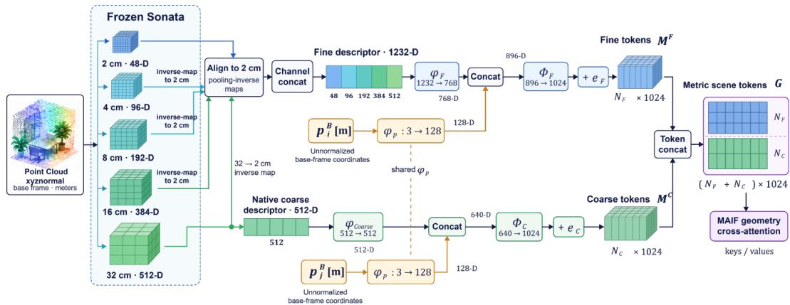  
Figure 5: Construction of multi-scale metric scene tokens. A frozen Sonata encoder processes point coordinates and surface normals without RGB attributes. Features from all five levels are aligned to the finest $2$ cm voxels and channel-concatenated into 1232-dimensional fine descriptors, while native 32 cm features form a parallel coarse stream. Each stream fuses its descriptors with embeddings of the corresponding unnormalized robot-base-frame coordinates in meters. The resulting 1024-dimensional fine and coarse tokens are concatenated to form $\mathbf { G } ,$ which supplies the keys and values for MAIF geometry cross-attention.

Multi-scale Sonata feature aggregation. We construct multi-scale metric scene tokens from a frozen Sonata encoder Wu et al. (2025). Across all experiments, the encoder receives 3D point coordinates and surface normals, without RGB attributes. The encoder produces a five-level sparse hierarchy with voxel sizes of (2, 4, 8, 16, 32) cm and corresponding feature dimensions of (48, 96, 192, 384, 512). Let $\mathbf { F } ^ { s }$ denote the feature matrix at voxel size s cm, with $\mathbf { f } _ { i } ^ { s }$ denoting its i-th row.

To construct the fine stream $( F )$ , we follow Sonata’s feature-upcasting scheme and use its poolinginverse maps to lift every coarser feature to the finest 2 cm voxels. The aligned features are then concatenated along the channel dimension:

$$
\begin{array} { r l } & { \bar { \mathbf { f } } _ { i } ^ { F } = \big [ \mathbf { f } _ { i } ^ { 2 } ; ( \mathcal { U } _ { 4 \to 2 } ( \mathbf { F } ^ { 4 } ) \big ) _ { i } ; ( \mathcal { U } _ { 8 \to 2 } ( \mathbf { F } ^ { 8 } ) \big ) _ { i } ; } \\ & { \qquad \big ( \mathcal { U } _ { 1 6 \to 2 } ( \mathbf { F } ^ { 1 6 } ) \big ) _ { i } ; ( \mathcal { U } _ { 3 2 \to 2 } ( \mathbf { F } ^ { 3 2 } ) \big ) _ { i } \big ] \in \mathbb { R } ^ { 1 2 3 2 } . } \end{array}\tag{9}
$$

Here, $\mathcal { U } _ { s \to 2 }$ denotes lifting through the composed pooling-inverse maps. The native 32 cm features are also retained as a parallel 512-dimensional coarse stream (C).

Inspired by the feature–position concatenation used in SpatialLM Mao et al. (2026), we separately project each stream’s geometric descriptor and its corresponding base-frame coordinate, then concatenate and fuse the two embeddings. Let $\mathbf { p } _ { i } ^ { B }$ and $\mathbf { p } _ { j } ^ { B }$ denote the coordinates associated with the fine and coarse descriptors, respectively, where B denotes the robot base frame. For this coordinate branch, we retain the original coordinates in meters without normalization:

$$
\begin{array} { r l } & { { \bf m } _ { i } ^ { F } = \Phi _ { F } \big ( \big [ \phi _ { F } ( \bar { \bf f } _ { i } ^ { F } ) ; \phi _ { p } ( { \bf p } _ { i } ^ { B } ) \big ] \big ) + { \bf e } _ { F } , } \\ & { { \bf m } _ { j } ^ { C } = \Phi _ { C } \big ( \big [ \phi _ { \mathrm { c o a r s e } } ( { \bf f } _ { j } ^ { 3 2 } ) ; \phi _ { p } ( { \bf p } _ { j } ^ { B } ) \big ] \big ) + { \bf e } _ { C } . } \end{array}\tag{10}
$$

The descriptor projections $\phi _ { F } : \mathbb { R } ^ { 1 2 3 2 } \to \mathbb { R } ^ { 7 6 8 }$ and $\phi _ { \mathrm { c o a r s e } }$ $\mathbb { R } ^ { 5 1 2 }  \mathbb { R } ^ { 5 1 2 }$ embed the fine and coarse descriptors, respectively. The shared coordinate projection $\phi _ { p } : \mathbb { R } ^ { 3 } \to \mathbb { R } ^ { 1 2 8 }$ produces a 128- dimensional coordinate embedding for each stream. The fusion projections $\Phi _ { F } : \mathbb { R } ^ { 8 \bar { 9 } 6 }  \mathbb { R } ^ { 1 0 2 4 }$ and $\Phi _ { C } : \mathbb { R } ^ { 6 4 0 }  \mathbb { R } ^ { 1 0 2 4 }$ map the concatenated embeddings to a common token dimension $D = 1 0 2 4$ The learned embeddings $\mathbf { \bar { e } } _ { F } , \mathbf { e } _ { C } \in \mathbb { R } ^ { 1 0 2 4 }$ identify the fine and coarse streams.

Finally, we concatenate the two streams along the token dimension:

$$
\boldsymbol { \mathbf { G } } = \boldsymbol { \mathbf { M } } ^ { B } = \operatorname { C o n c a t } _ { \mathrm { t o k e n } } \left( \boldsymbol { \mathbf { M } } ^ { F } , \boldsymbol { \mathbf { M } } ^ { C } \right) \in \mathbb { R } ^ { ( N _ { F } + N _ { C } ) \times 1 0 2 4 } .\tag{11}
$$

Here, ${ \bf M } ^ { F }$ and $\mathbf { M } ^ { C }$ stack the fine and coarse tokens, respectively, and $N _ { F }$ and $N _ { C }$ denote their token counts. The resulting memory provides the keys and values for MAIF geometry cross-attention. As illustrated in Fig 5, this construction combines local detail with coarse scene context and explicitly incorporates metric position through unnormalized base-frame coordinates.

## A.2 ROBOTWIN 2.0 TRAINING DETAILS

Simulation backbone preparation. We evaluate MAIF with five representative policy backbones: Fast-WAM Yuan et al. (2026), $\pi _ { 0 . 5 }$ Intelligence et al. (2025), X-WAM Guo et al. (2026), StarVLA Community (2026), and SpatialVLA Qu et al. (2025). All policies follow the same RoboTwin 2.0 evaluation protocol, including environment action semantics, language prompts, success criteria, and rollout rules. We retain each policy’s native temporal parameterization: Fast-WAM, $\pi _ { 0 . 5 } ,$ X-WAM, and StarVLA use an action horizon of 32, whereas SpatialVLA predicts and executes a four-step action chunk.

For Fast-WAM and $\pi _ { 0 . 5 } .$ , our local reproductions closely matched the public RoboTwin leaderboard results within expected rollout variation. We therefore report their public leaderboard success rates as baseline values. All other baselines and all MAIF variants are evaluated locally.

The released X-WAM RoboTwin checkpoint uses a different training-data protocol from our cleanonly setting. We therefore initialize from its released pretrained checkpoint, whose world-model backbone originates from Wan2.2-TI2V-5B, and fine-tune it for 30,000 steps on 2,500 clean demonstrations (50 tasks with 50 demonstrations per task). Backbone fine-tuning uses eight GPUs, a per-GPU batch size of 32, and no gradient accumulation.

We use the released PI-style configuration, VLAct Qwen3PI Robotwin Finetune, denoted StarVLA-PI for StarVLA. It combines the 100K-step VLAct-pretrained Qwen3-VL-4B action back bone with a Qwen3-0.6B QwenPI v4 flow-matching action expert. We follow the released initialization recipe and fine-tune for 50,000 steps on the clean-only robotwin wrap 32 dataset. We evaluate this exact variant locally because the public headline result uses a different action head.

For SpatialVLA, we initialize from the released spatialvla-4b-224-pt checkpoint and perform non-LoRA fine-tuning for 30,000 steps on the same 2,500 clean demonstrations. The policy consumes one head-camera RGB image and predicts four 14-D absolute bimanual joint/gripper actions. Continuous action dimensions use training-set q0.01–q0.99 normalization, while grippers remain binary. The token embeddings and internal ZoeDepth estimator are frozen; the vision tower and remaining policy parameters are trainable. Backbone fine-tuning uses RGB without oracle simulator depth, eight GPUs, a global batch size of 256, BF16, and ZeRO-1. The learning rate is $2 \times 1 0 ^ { - 5 }$ with zero weight decay, 150 warmup steps, and linear decay. We evaluate the resulting 30K checkpoint locally.

MAIF training in simulation. For every backbone, we freeze the complete task-fine-tuned policy and the Sonata encoder and optimize only newly initialized MAIF parameters. All adapters are trained on the same 2,500 clean demonstrations for 5,000 optimizer steps. Oracle simulator depth observations are back-projected into the robot base frame and sampled into 8,192 points. Point coordinates and action waypoints share the same metric frame without per-scene centering, scale normalization, or test-time alignment. For all RoboTwin experiments, the policy except SpatialVLA retains its native three-view RGB input, whereas MAIF uses only the static head-camera oracle depth to construct metric point cloud in the robot base frame. While to align with the official monocular input configuration, SpatialVLA uses only the head camera.

The common MAIF architecture uses a hidden dimension of 1,024, 16 attention heads, three geometry cross-attention layers, ten temporal interaction layers, and two bimanual interaction layers. Training uses AdamW with a peak learning rate of $1 0 ^ { - 4 }$ , weight decay $1 0 ^ { - 4 }$ , gradient clipping at 1.0, BF16 mixed precision, and random seed 42. Unless otherwise specified, we use a 500-step linear warmup followed by cosine decay. Backbone-dependent batch sizes and parameter counts are summarized in Table 6.

Table 6: Backbone preparation and MAIF training on RoboTwin 2.0. All backbones are finetuned on clean demonstrations. Batch sizes count distinct scene–action windows; parameter counts refer to one deployed MAIF adapter.  
(a) Backbone preparation
<table><tr><td>Backbone</td><td>RoboTwin policy initialization</td><td>Fine-tuning steps</td><td>Baseline SR source</td></tr><tr><td>Fast-WAM</td><td>Released Fast-WAM initialization</td><td>30K</td><td>Leaderboard</td></tr><tr><td>π0.5</td><td>Released pi05_base initialization</td><td>30K</td><td>Leaderboard</td></tr><tr><td>X-WAM</td><td>Released X-WAM pretrained checkpoint with a Wan2.2-TI2V-5B backbone</td><td>30K</td><td>Local</td></tr><tr><td>StarVLA-PI</td><td>VLAct/Qwen3-VL-4B action backbone with a Qwen3-0.6B QwenPI_v4 expert</td><td>50K</td><td>Local</td></tr><tr><td>SpatialVLA</td><td>Released spatialvla-4b-224-pt;PaLiGemma2 backbone pretrained on OXE and RH20T</td><td>30K</td><td>Local</td></tr></table>

## (b) MAIF training

<table><tr><td>Backbone</td><td>Windows /GPU</td><td>Resampling / accumulation</td><td>Global windows / step</td><td>MAIF params</td></tr><tr><td>Fast-WAM</td><td>32</td><td>None</td><td>256</td><td>198.2M</td></tr><tr><td>π0.5</td><td>32</td><td>None</td><td>256</td><td>198.2M</td></tr><tr><td>X-WAM</td><td>1</td><td>4-step gradient accumulation</td><td>32</td><td>200.6M</td></tr><tr><td>StarVLA-PI</td><td>8</td><td>4 flow-time/noise pairs per window</td><td>64</td><td>198.2M</td></tr><tr><td>SpatialVLA</td><td>1</td><td>None</td><td>8</td><td>202.1M</td></tr></table>

Evaluation. “Leaderboard” indicates that the baseline success rate is taken from the public benchmark after confirming consistency with ou local evaluation. All MAIF results are evaluated locally.  
Batch interpretation. All configurations use eight GPUs. Windows/GPU counts distinct windows loaded before resampling or accumulation; global windows/step includes gradient accumulation. StarVLA-PI uses four independently sampled flow-time/noise pairs per window, yielding 256 flow-supervision pairs per optimizer step.  
Parallel ablations. SpatialVLA trains eight independent adapters jointly on the same input batch and cached backbone features. These branches are evaluated individually and are not combined at deployment.

In our MAIF pipeline, the frozen X-WAM forward pass remains memory-intensive because it processes additional conditioning inputs, including depth and robot state. Together with MAIF training, this limits the micro-batch to one window per GPU. We therefore use four-step gradient accumulation across eight GPUs, giving an effective global batch of 32 windows.

For SpatialVLA, MAIF refines the decoded four-step action chunk using frozen action-token features and a zero-initialized residual in normalized action space. Its external geometry stream uses oracle simulator depth.

## A.3 LIBERO TRAINING DETAILS

Training data. We jointly train on the no-op-filtered versions of LIBERO-Spatial, LIBERO-Object, LIBERO-Goal, and LIBERO-10. The combined training set contains 1,712 demonstrations and 277,713 temporal windows, comprising 53,229, 67,309, 52,895, and 104,280 windows from the four suites, respectively. No additional validation split is constructed.

Each sample contains 33 consecutive observations and the following 32 robot actions at 20 Hz. We retain video frames at temporal indices {0, 4, 8, . . . , 32}, resulting in nine frames per sample. The external-view and wrist-view RGB images are independently resized from 512 × 512 to 224 × 224 and concatenated horizontally, producing an input of shape [B, 3, 9, 224, 448]. Images remain in RGB order throughout preprocessing. The action target has seven dimensions: a 6-DoF relative end-effector command and one absolute gripper command. The proprioceptive state has eight dimensions, consisting of the 6-DoF end-effector pose and two gripper joint positions. Actions and states are normalized using fixed training-set min–max statistics.

We use cached language embeddings instead of running the text encoder during training. Each instruction is represented by a sequence of 128 tokens with a feature dimension of 4096. The proprioceptive state at the first observation is projected into an additional context token and appended to the language sequence.

Optimization. We train the complete VideoDiT–ActionDiT MoT and the proprioceptive encoder, while freezing the VAE and omitting the online text encoder. Training uses eight GPUs with a per-GPU batch size of 16, gradient accumulation of 1, and a global batch size of 128. We use bfloat16 precision and DeepSpeed ${ \mathrm { Z e R O - } } 2$ without parameter or optimizer offloading. The optimizer is AdamW with $\beta _ { 1 } \stackrel { - } { = } 0 . 9 , \beta _ { 2 } = 0 . 9 5$ , learning rate $1 0 ^ { - 4 }$ , weight decay $1 0 ^ { - 2 }$ , and gradient-norm clipping at 1.0. The learning rate uses linear warm-up followed by cosine annealing with a minimum learning rate of $1 0 ^ { - 6 }$ . Gradient checkpointing is disabled.

Starting from optimization step 0, we train for 30,000 optimizer steps, corresponding to approximately 3.84 million sampled windows or 13.8 passes over the combined LIBERO training set. We use the final checkpoint at step 30,000 for evaluation.

Policy inference. At test time, the policy jointly denoises a 32-step action chunk and its ICT trajectory for 10 flow-matching steps, conditioned only on the current two-view observation, proprioception, and language instruction. The training-only future-video-to-action/ICT edges are disabled, and no future video is generated. The environment executes the first 10 predicted actions before replanning. We disable action ensembling and binarize the predicted gripper command.

LIBERO MAIF training. For both Fast-WAM and $\pi _ { 0 . 5 }$ , Stage 2 MAIF training starts from the corresponding policy checkpoint obtained after Stage 1 ICT training. The complete ICT-trained policy and the Sonata point encoder remain frozen, and only the newly initialized MAIF adapter, containing approximately 200M trainable parameters, is optimized.

The original policy observations are preserved: both the fixed agentview and eye-in-hand RGB streams are provided to the policy, while only the calibrated agentview depth observation is used to construct metric geometry. Depth is back-projected into the MuJoCo world frame and sampled into an 8,192-point cloud. Point coordinates and predicted end-effector waypoints are represented in the same metric coordinate system without per-scene centering, scale normalization, or test-time alignment. We retain the native action horizon of each backbone, using 32 steps for Fast-WAM and 10 steps for $\pi _ { 0 . 5 }$

Both implementations follow the same MAIF optimization protocol: 5,000 optimizer steps on eight GPUs with a per-GPU batch size of 32 (global batch size 256) and no gradient accumulation. We use AdamW with a peak learning rate of $\mathrm { \bar { 1 0 } ^ { - 4 } }$ , weight decay $1 0 ^ { - 4 }$ , gradient clipping at 1.0, and a 500-step linear warmup followed by cosine decay to $\mathrm { { \bar { 1 0 } ^ { - 6 } } }$ . Training uses BF16 mixed precision and random seed 42. For Fast-WAM, frozen video-VAE latents and text embeddings are cached offline to reduce training overhead.

## A.4 ROBOTWIN 2.0 DETAILED RESULTS

Tables 7 and 8 report the results of baseline methods and their variants augmented with our framework on RoboTwin 2.0. Each method is evaluated over 100 trials per task under the clean and randomized (Rand.) setting. RoboTwin 2.0 comprises 50 single-arm and bimanual manipulation tasks. For each task, we strictly follow the maximum rollout step specified in the official open-source code. A trial is counted as a failure if the task is not completed within this limit.

## A.5 LIBERO DETAILED RESULTS

The following tables report task-level results for Fast-WAM + Ours and $\pi _ { 0 . 5 } + \mathrm { O u r s }$ across all 40 tasks in LIBERO-Spatial, LIBERO-Object, LIBERO-Goal, and LIBERO-10. Each model is evaluated over 50 episodes per task, totaling 2,000 episodes per model. Fast-WAM + Ours succeeds in

Table 7: Per-task success rates on RoboTwin under clean and randomized evaluation settings.
<table><tr><td rowspan=2 colspan=13>Task                   Fast-WAM Fast-WAM + ICTFast-WAM + Ours    $\pi _ { 0 . 5 }$      $\pi _ { 0 . 5 } + \mathrm { I C T }$   $\pi _ { 0 . 5 } + 0 \mathrm { u r s }$ Clean Rand.Clean Rand. |Clean  Rand.  CleanRand.CleanRand.</td></tr><tr><td rowspan=1 colspan=1>| Clean Rand.</td></tr><tr><td rowspan=1 colspan=3>Adjust Bottle            99   0</td><td rowspan=1 colspan=2>100    0</td><td rowspan=1 colspan=2>100     6</td><td rowspan=1 colspan=3>99   77</td><td rowspan=1 colspan=2>98   86</td><td rowspan=1 colspan=1>99   88</td></tr><tr><td rowspan=1 colspan=3>Beat Block Hammer      82   0</td><td rowspan=1 colspan=2>97     0</td><td rowspan=1 colspan=2>86     2</td><td rowspan=1 colspan=3>93   23</td><td rowspan=1 colspan=2>65   31</td><td rowspan=1 colspan=1>58   19</td></tr><tr><td rowspan=1 colspan=3>Blocks Ranking RGB     81    0</td><td rowspan=1 colspan=2>93     0</td><td rowspan=1 colspan=2>89     0</td><td rowspan=1 colspan=3>72   44</td><td rowspan=1 colspan=2>76   61</td><td rowspan=1 colspan=1>88   48</td></tr><tr><td rowspan=1 colspan=3>Blocks Ranking Size      52   0</td><td rowspan=1 colspan=2>63     0</td><td rowspan=1 colspan=2>63      0</td><td rowspan=1 colspan=3>45   21</td><td rowspan=1 colspan=2>46   33</td><td rowspan=1 colspan=1>44   18</td></tr><tr><td rowspan=1 colspan=3>Click Alarmclock         99   60</td><td rowspan=1 colspan=2>100    39</td><td rowspan=1 colspan=2>99     52</td><td rowspan=1 colspan=3>65   50</td><td rowspan=1 colspan=2>100  86</td><td rowspan=1 colspan=1>100  96</td></tr><tr><td rowspan=1 colspan=3>Click Bell               95   7</td><td rowspan=1 colspan=2>100    30</td><td rowspan=1 colspan=2>97     76</td><td rowspan=1 colspan=3>31   35</td><td rowspan=1 colspan=2>100  90</td><td rowspan=1 colspan=1>100  97</td></tr><tr><td rowspan=1 colspan=3>Dump Bin Bigbin         94   0</td><td rowspan=1 colspan=2>93     2</td><td rowspan=1 colspan=2>89     0</td><td rowspan=1 colspan=3>92   84</td><td rowspan=1 colspan=2>88   82</td><td rowspan=1 colspan=1>90  80</td></tr><tr><td rowspan=1 colspan=3>Grab Roller             100   2</td><td rowspan=1 colspan=2>100     0</td><td rowspan=1 colspan=2>100     7</td><td rowspan=1 colspan=3>99   97</td><td rowspan=1 colspan=2>99   89</td><td rowspan=1 colspan=1>100  92</td></tr><tr><td rowspan=1 colspan=2>Handover Block</td><td rowspan=1 colspan=1>66   0</td><td rowspan=1 colspan=2>54     0</td><td rowspan=1 colspan=2>25     0</td><td rowspan=1 colspan=3>30   12</td><td rowspan=1 colspan=2>54   10</td><td rowspan=1 colspan=1>10   14</td></tr><tr><td rowspan=1 colspan=2>Handover Mic</td><td rowspan=1 colspan=1>98   0</td><td rowspan=1 colspan=2>99     0</td><td rowspan=1 colspan=2>95     0</td><td rowspan=1 colspan=3>98   6</td><td rowspan=1 colspan=2>99   54</td><td rowspan=1 colspan=1>92   77</td></tr><tr><td rowspan=1 colspan=2>Hanging Mug</td><td rowspan=1 colspan=1>14   0</td><td rowspan=1 colspan=2>35     0</td><td rowspan=1 colspan=2>20     0</td><td rowspan=1 colspan=3>17   14</td><td rowspan=1 colspan=2>13   13</td><td rowspan=1 colspan=1>14   3</td></tr><tr><td rowspan=1 colspan=2>Lift Pot</td><td rowspan=1 colspan=1>91   0</td><td rowspan=1 colspan=2>91     0</td><td rowspan=1 colspan=2>87     0</td><td rowspan=1 colspan=3>98   35</td><td rowspan=1 colspan=2>67   19</td><td rowspan=1 colspan=1>86   47</td></tr><tr><td rowspan=1 colspan=2>Move Can Pot</td><td rowspan=1 colspan=1>96   0</td><td rowspan=1 colspan=2>73     0</td><td rowspan=1 colspan=2>97     2</td><td rowspan=1 colspan=3>60   10</td><td rowspan=1 colspan=2>53   11</td><td rowspan=1 colspan=1>77   25</td></tr><tr><td rowspan=1 colspan=2>Move Pillbottle Pad</td><td rowspan=1 colspan=1>92   0</td><td rowspan=1 colspan=2>92     0</td><td rowspan=1 colspan=1>94</td><td rowspan=1 colspan=1>0</td><td rowspan=1 colspan=3>46   32</td><td rowspan=1 colspan=2>60   28</td><td rowspan=1 colspan=1>63   69</td></tr><tr><td rowspan=1 colspan=2>Move Playingcard Away</td><td rowspan=1 colspan=1>94   0</td><td rowspan=1 colspan=2>96     0</td><td rowspan=1 colspan=1>92</td><td rowspan=1 colspan=1>22</td><td rowspan=1 colspan=3>84   65</td><td rowspan=1 colspan=2>84   72</td><td rowspan=1 colspan=1>82   70</td></tr><tr><td rowspan=1 colspan=2>Move Stapler Pad</td><td rowspan=1 colspan=1>33   0</td><td rowspan=1 colspan=2>24     1</td><td rowspan=1 colspan=2>25     0</td><td rowspan=1 colspan=3>20   18</td><td rowspan=1 colspan=2>32   9</td><td rowspan=1 colspan=1>18   7</td></tr><tr><td rowspan=1 colspan=2>Open Laptop</td><td rowspan=1 colspan=1>84   0</td><td rowspan=1 colspan=2>96     0</td><td rowspan=1 colspan=1>94</td><td rowspan=1 colspan=1>20</td><td rowspan=1 colspan=3>93   68</td><td rowspan=1 colspan=2>98   60</td><td rowspan=1 colspan=1>91   62</td></tr><tr><td rowspan=1 colspan=2>Open Microwave</td><td rowspan=1 colspan=1>17   0</td><td rowspan=1 colspan=2>15     0</td><td rowspan=1 colspan=1>31</td><td rowspan=1 colspan=1>80</td><td rowspan=1 colspan=3>86   59</td><td rowspan=1 colspan=2>38   17</td><td rowspan=1 colspan=1>67   23</td></tr><tr><td rowspan=1 colspan=2>Pick Diverse Bottles</td><td rowspan=1 colspan=1>72   0</td><td rowspan=1 colspan=2>61     0</td><td rowspan=1 colspan=1>86</td><td rowspan=1 colspan=1>0</td><td rowspan=1 colspan=3>66   42</td><td rowspan=1 colspan=2>72   42</td><td rowspan=1 colspan=1>69   50</td></tr><tr><td rowspan=1 colspan=2>Pick Dual Bottles</td><td rowspan=1 colspan=1>87   1</td><td rowspan=1 colspan=1>75</td><td rowspan=1 colspan=1>3</td><td rowspan=1 colspan=1>100</td><td rowspan=1 colspan=1>0</td><td rowspan=1 colspan=1>72</td><td rowspan=1 colspan=2>57</td><td rowspan=1 colspan=2>74   50</td><td rowspan=1 colspan=1>86   67</td></tr><tr><td rowspan=1 colspan=2>Place A2B Left</td><td rowspan=1 colspan=1>69   0</td><td rowspan=1 colspan=1>77</td><td rowspan=1 colspan=1>0</td><td rowspan=1 colspan=1>72</td><td rowspan=1 colspan=1>1</td><td rowspan=1 colspan=1>71</td><td></td><td rowspan=1 colspan=1>49</td><td rowspan=1 colspan=1>70</td><td rowspan=1 colspan=1>36</td><td rowspan=1 colspan=1>61   31</td></tr><tr><td rowspan=1 colspan=1>Place A2B Right</td><td rowspan=1 colspan=1></td><td rowspan=1 colspan=1>60    1</td><td rowspan=1 colspan=1>71</td><td rowspan=1 colspan=1>1</td><td rowspan=1 colspan=1>82</td><td rowspan=1 colspan=1>1</td><td rowspan=1 colspan=1>68</td><td></td><td rowspan=1 colspan=1>39</td><td rowspan=1 colspan=1>68</td><td rowspan=1 colspan=1>37</td><td rowspan=1 colspan=1>67   37</td></tr><tr><td rowspan=1 colspan=1>Place Bread Basket</td><td rowspan=1 colspan=1></td><td rowspan=1 colspan=1>87    0</td><td rowspan=1 colspan=1>89</td><td rowspan=1 colspan=1>1</td><td rowspan=1 colspan=1>83</td><td rowspan=1 colspan=1>0</td><td rowspan=1 colspan=1>63</td><td></td><td rowspan=1 colspan=1>60</td><td rowspan=1 colspan=1>76</td><td rowspan=1 colspan=1>68</td><td rowspan=1 colspan=1>68   50</td></tr><tr><td rowspan=1 colspan=1>Place Bread Skillet</td><td rowspan=1 colspan=1></td><td rowspan=1 colspan=1>85   0</td><td rowspan=1 colspan=1>89</td><td rowspan=1 colspan=1>0</td><td rowspan=1 colspan=1>92</td><td rowspan=1 colspan=1>0</td><td rowspan=1 colspan=1>76</td><td></td><td rowspan=1 colspan=1>47</td><td rowspan=1 colspan=1>68</td><td rowspan=1 colspan=1>50</td><td rowspan=1 colspan=1>72   60</td></tr><tr><td rowspan=1 colspan=1>Place Burger Fries</td><td rowspan=1 colspan=1></td><td rowspan=1 colspan=1>97   0</td><td rowspan=1 colspan=1>100</td><td rowspan=1 colspan=1>1</td><td rowspan=1 colspan=1>97</td><td rowspan=1 colspan=1>0</td><td rowspan=1 colspan=1>82</td><td></td><td rowspan=1 colspan=1>86</td><td rowspan=1 colspan=2>88   84</td><td rowspan=1 colspan=1>92   86</td></tr><tr><td rowspan=1 colspan=1>Place Can Basket</td><td rowspan=1 colspan=1></td><td rowspan=1 colspan=1>77   0</td><td rowspan=1 colspan=1>46</td><td rowspan=1 colspan=1>0</td><td rowspan=1 colspan=1>91</td><td rowspan=1 colspan=1>0</td><td rowspan=1 colspan=1>56</td><td rowspan=1 colspan=2>10</td><td rowspan=1 colspan=1>51</td><td rowspan=1 colspan=1>25</td><td rowspan=1 colspan=1>41   20</td></tr><tr><td rowspan=1 colspan=2>Place Cans Plasticbox</td><td rowspan=1 colspan=1>98   0</td><td rowspan=1 colspan=1>93</td><td rowspan=1 colspan=1>2</td><td rowspan=1 colspan=1>100</td><td rowspan=1 colspan=1>0</td><td rowspan=1 colspan=1>31</td><td></td><td rowspan=1 colspan=1>73</td><td rowspan=1 colspan=1>66</td><td rowspan=1 colspan=1>70</td><td rowspan=1 colspan=1>89   48</td></tr><tr><td rowspan=1 colspan=2>Place Container Plate</td><td rowspan=1 colspan=1>100   0</td><td rowspan=1 colspan=1>99</td><td rowspan=1 colspan=1>6</td><td rowspan=1 colspan=1>98</td><td rowspan=1 colspan=1>0</td><td rowspan=1 colspan=1>92</td><td></td><td rowspan=1 colspan=1>72</td><td rowspan=1 colspan=1>92</td><td rowspan=1 colspan=1>79</td><td rowspan=1 colspan=1>97   73</td></tr><tr><td rowspan=1 colspan=2>Place Dual Shoes</td><td rowspan=1 colspan=1>67   0</td><td rowspan=1 colspan=1>72</td><td rowspan=1 colspan=1>0</td><td rowspan=1 colspan=1>70</td><td rowspan=1 colspan=1>0</td><td rowspan=1 colspan=1>70</td><td></td><td rowspan=1 colspan=1>45</td><td rowspan=1 colspan=1>63</td><td rowspan=1 colspan=1>56</td><td rowspan=1 colspan=1>66   34</td></tr><tr><td rowspan=1 colspan=2>Place Empty Cup</td><td rowspan=1 colspan=1>90   0</td><td rowspan=1 colspan=1>95</td><td rowspan=1 colspan=1>1</td><td rowspan=1 colspan=1>92</td><td rowspan=1 colspan=1>0</td><td rowspan=1 colspan=1>96</td><td></td><td rowspan=1 colspan=1>80</td><td rowspan=1 colspan=1>81</td><td rowspan=1 colspan=1>64</td><td rowspan=1 colspan=1>90   69</td></tr><tr><td rowspan=1 colspan=2>Place Fan</td><td rowspan=1 colspan=1>59   0</td><td rowspan=1 colspan=1>65</td><td rowspan=1 colspan=1>0</td><td rowspan=1 colspan=1>57</td><td rowspan=1 colspan=1>0</td><td rowspan=1 colspan=1>66</td><td></td><td rowspan=1 colspan=1>26</td><td rowspan=1 colspan=1>56</td><td rowspan=1 colspan=1>37</td><td rowspan=1 colspan=1>39   31</td></tr><tr><td rowspan=1 colspan=2>Place Mouse Pad</td><td rowspan=1 colspan=1>55   0</td><td rowspan=1 colspan=1>63</td><td rowspan=1 colspan=1>1</td><td rowspan=1 colspan=1>78</td><td rowspan=1 colspan=1>0</td><td rowspan=1 colspan=1>34</td><td></td><td rowspan=1 colspan=1>31</td><td rowspan=1 colspan=2>38   19</td><td rowspan=1 colspan=1>47   19</td></tr><tr><td rowspan=1 colspan=2>Place Object Basket</td><td rowspan=1 colspan=1>82   0</td><td rowspan=1 colspan=1>71</td><td rowspan=1 colspan=1>0</td><td rowspan=1 colspan=1>66</td><td rowspan=1 colspan=1>1</td><td rowspan=1 colspan=1>70</td><td rowspan=1 colspan=2>29</td><td rowspan=1 colspan=2>73   37</td><td rowspan=1 colspan=1>47   22</td></tr><tr><td rowspan=1 colspan=2>Place Object Scale</td><td rowspan=1 colspan=1>83   0</td><td rowspan=1 colspan=1>77</td><td rowspan=1 colspan=1>0</td><td rowspan=1 colspan=1>76</td><td rowspan=1 colspan=1>0</td><td rowspan=1 colspan=1>78</td><td></td><td rowspan=1 colspan=1>38</td><td rowspan=1 colspan=2>66   40</td><td rowspan=1 colspan=1>64   39</td></tr><tr><td rowspan=1 colspan=2>Place Object Stand</td><td rowspan=1 colspan=1>94    0</td><td rowspan=1 colspan=1>94</td><td rowspan=1 colspan=1>4</td><td rowspan=1 colspan=1>95</td><td rowspan=1 colspan=1>0</td><td rowspan=1 colspan=1>85</td><td></td><td rowspan=1 colspan=1>47</td><td rowspan=1 colspan=1>83</td><td rowspan=1 colspan=1>60</td><td rowspan=1 colspan=1>94   73</td></tr><tr><td rowspan=1 colspan=2>Place Phone Stand</td><td rowspan=1 colspan=1>85   0</td><td rowspan=1 colspan=1>70</td><td rowspan=1 colspan=1>0</td><td rowspan=1 colspan=1>82</td><td rowspan=1 colspan=1>0</td><td rowspan=1 colspan=1>65</td><td></td><td rowspan=1 colspan=1>37</td><td rowspan=1 colspan=1>47</td><td rowspan=1 colspan=1>28</td><td rowspan=1 colspan=1>51   38</td></tr><tr><td rowspan=1 colspan=2>Place Shoe</td><td rowspan=1 colspan=1>87   0</td><td rowspan=1 colspan=1>93</td><td rowspan=1 colspan=1>7</td><td rowspan=1 colspan=1>95</td><td rowspan=1 colspan=1>0</td><td rowspan=1 colspan=1>82</td><td></td><td rowspan=1 colspan=1>50</td><td rowspan=1 colspan=1>87</td><td rowspan=1 colspan=1>72</td><td rowspan=1 colspan=1>83   63</td></tr><tr><td rowspan=1 colspan=2>Press Stapler</td><td rowspan=1 colspan=1>90   3</td><td rowspan=1 colspan=1>96</td><td rowspan=1 colspan=1>24</td><td rowspan=1 colspan=1>93</td><td rowspan=1 colspan=1>91</td><td rowspan=1 colspan=1>79</td><td></td><td rowspan=1 colspan=1>63</td><td rowspan=1 colspan=1>92</td><td rowspan=1 colspan=1>52</td><td rowspan=1 colspan=1>86   61</td></tr><tr><td rowspan=1 colspan=2>Put Bottles Dustbin</td><td rowspan=1 colspan=1>55   0</td><td rowspan=1 colspan=1>38</td><td rowspan=1 colspan=1>0</td><td rowspan=1 colspan=1>77</td><td rowspan=1 colspan=1>0</td><td rowspan=1 colspan=3>78   50</td><td rowspan=1 colspan=2>75   55</td><td rowspan=1 colspan=1>72   62</td></tr><tr><td rowspan=1 colspan=2>Put Object Cabinet</td><td rowspan=1 colspan=1>42   0</td><td rowspan=1 colspan=1>48</td><td rowspan=1 colspan=1>0</td><td rowspan=1 colspan=1>82</td><td rowspan=1 colspan=1>0</td><td rowspan=1 colspan=3>39   22</td><td rowspan=1 colspan=2>44   27</td><td rowspan=1 colspan=1>58   28</td></tr><tr><td rowspan=1 colspan=2>Rotate QRcode</td><td rowspan=1 colspan=1>81   0</td><td rowspan=1 colspan=1>79</td><td rowspan=1 colspan=1>0</td><td rowspan=1 colspan=1>67</td><td rowspan=1 colspan=1>1</td><td rowspan=1 colspan=3>90   21</td><td rowspan=1 colspan=2>76   21</td><td rowspan=1 colspan=1>44   23</td></tr><tr><td rowspan=1 colspan=2>Scan Object</td><td rowspan=1 colspan=1>68   0</td><td rowspan=1 colspan=2>83     1</td><td rowspan=1 colspan=1>69</td><td rowspan=1 colspan=1>0</td><td rowspan=1 colspan=3>49   40</td><td rowspan=1 colspan=2>56   39</td><td rowspan=1 colspan=1>25   20</td></tr><tr><td rowspan=1 colspan=2>Shake Bottle</td><td rowspan=1 colspan=1>100   10</td><td rowspan=1 colspan=2>100    35</td><td rowspan=1 colspan=1>100</td><td rowspan=1 colspan=1>79</td><td rowspan=1 colspan=3>100  100</td><td rowspan=1 colspan=1>100</td><td rowspan=1 colspan=1>92</td><td rowspan=1 colspan=1>99   99</td></tr><tr><td rowspan=1 colspan=2>Shake Bottle Horizontally</td><td rowspan=1 colspan=1>100   9</td><td rowspan=1 colspan=2>100    29</td><td rowspan=1 colspan=1>100</td><td rowspan=1 colspan=1>75</td><td rowspan=1 colspan=3>100  100</td><td rowspan=1 colspan=1>100</td><td rowspan=1 colspan=1>94</td><td rowspan=1 colspan=1>99   99</td></tr><tr><td rowspan=1 colspan=2>Stack Blocks Three</td><td rowspan=1 colspan=1>89   0</td><td rowspan=1 colspan=2>77     0</td><td rowspan=1 colspan=1>62</td><td rowspan=1 colspan=1>0</td><td rowspan=1 colspan=3>77   25</td><td rowspan=1 colspan=1>73</td><td rowspan=1 colspan=1>31</td><td rowspan=1 colspan=1>74   41</td></tr><tr><td rowspan=1 colspan=2>Stack Blocks Two</td><td rowspan=1 colspan=1>99    0</td><td rowspan=1 colspan=2>95     0</td><td rowspan=1 colspan=1>98</td><td rowspan=1 colspan=1>0</td><td rowspan=1 colspan=3>91   43</td><td rowspan=1 colspan=2>80   61</td><td rowspan=1 colspan=1>93   77</td></tr><tr><td rowspan=1 colspan=2>Stack Bowls Three</td><td rowspan=1 colspan=1>80   0</td><td rowspan=1 colspan=2>68     0</td><td rowspan=1 colspan=1>62</td><td rowspan=1 colspan=1>0</td><td rowspan=1 colspan=3>81   52</td><td rowspan=1 colspan=2>58   47</td><td rowspan=1 colspan=1>75   51</td></tr><tr><td rowspan=1 colspan=2>Stack Bowls Two</td><td rowspan=1 colspan=1>94   0</td><td rowspan=1 colspan=2>92     3</td><td rowspan=1 colspan=1>88</td><td rowspan=1 colspan=1>0</td><td rowspan=1 colspan=3>94   70</td><td rowspan=1 colspan=2>90   72</td><td rowspan=1 colspan=1>96   70</td></tr><tr><td rowspan=1 colspan=2>Stamp Seal</td><td rowspan=1 colspan=1>30   0</td><td rowspan=1 colspan=2>74     0</td><td rowspan=1 colspan=2>62     0</td><td rowspan=1 colspan=3>53   21</td><td rowspan=1 colspan=2>55   24</td><td rowspan=1 colspan=1>80   32</td></tr><tr><td rowspan=1 colspan=3>Turn Switch             39   3</td><td rowspan=1 colspan=2>48     14</td><td rowspan=1 colspan=2>50     58</td><td rowspan=1 colspan=3>52   25</td><td rowspan=1 colspan=2>58   29</td><td rowspan=1 colspan=1>60   51</td></tr><tr><td rowspan=1 colspan=3>Average               77.761.92</td><td rowspan=1 colspan=2>78.40   4.1</td><td rowspan=1 colspan=2>|80.08  11.48</td><td rowspan=1 colspan=3>|70.6846.0</td><td rowspan=1 colspan=2>70.9248.98</td><td rowspan=1 colspan=1>71.2651.18</td></tr></table>

1,956 episodes, achieving an overall success rate of 97.8%. $\pi _ { 0 . 5 } +$ Ours succeeds in 1,948 episodes, achieving an overall success rate of 97.4%.

Table 8: Per-task success rates on RoboTwin under clean and randomized evaluation settings.
<table><tr><td rowspan=1 colspan=17>Task                    StarVLA   StarVLA + Ours  SpatialVLA SpatialVLA + Ours    X-WAM   X-WAM + OursClean Rand.  Clean Rand. CleanRand. Clean  Rand.   Clean Rand. Clean Rand.</td></tr><tr><td rowspan=1 colspan=3>Adjust Bottle            91     0</td><td rowspan=1 colspan=2>99    19</td><td rowspan=1 colspan=3>1    0</td><td rowspan=1 colspan=5>1      1</td><td rowspan=1 colspan=2>99    98</td><td rowspan=1 colspan=2>100   100</td></tr><tr><td rowspan=1 colspan=3>Beat Block Hammer      75    19</td><td rowspan=1 colspan=2>79    22</td><td rowspan=1 colspan=3>0    0</td><td rowspan=1 colspan=5>0      0</td><td rowspan=1 colspan=2>98    29</td><td rowspan=1 colspan=2>97    42</td></tr><tr><td rowspan=1 colspan=3>Blocks Ranking RGB     58    0</td><td rowspan=1 colspan=2>82    9</td><td rowspan=1 colspan=3>0    0</td><td rowspan=1 colspan=5>0      0</td><td rowspan=1 colspan=2>89    90</td><td rowspan=1 colspan=2>94   85</td></tr><tr><td rowspan=1 colspan=3>Blocks Ranking Size      51     0</td><td rowspan=1 colspan=2>45    0</td><td rowspan=1 colspan=3>0    0</td><td rowspan=1 colspan=5>0      0</td><td rowspan=1 colspan=2>71    42</td><td rowspan=1 colspan=2>55    51</td></tr><tr><td rowspan=1 colspan=3>Click Alarmclock         43    19</td><td rowspan=1 colspan=2>33    78</td><td rowspan=1 colspan=3>11    0</td><td rowspan=1 colspan=5>77      0</td><td rowspan=1 colspan=2>99    91</td><td rowspan=1 colspan=2>100   99</td></tr><tr><td rowspan=1 colspan=3>Click Bell              96    10</td><td rowspan=1 colspan=2>95    94</td><td rowspan=1 colspan=3>9    0</td><td rowspan=1 colspan=5>32     11</td><td rowspan=1 colspan=2>100   97</td><td rowspan=1 colspan=2>100   98</td></tr><tr><td rowspan=1 colspan=3>Dump Bin Bigbin        81    71</td><td rowspan=1 colspan=2>96    56</td><td rowspan=1 colspan=3>0    0</td><td rowspan=1 colspan=5>12     0</td><td rowspan=1 colspan=2>95    90</td><td rowspan=1 colspan=2>97    91</td></tr><tr><td rowspan=1 colspan=3>Grab Roller             97    25</td><td rowspan=1 colspan=2>96    58</td><td rowspan=1 colspan=3>11    0</td><td rowspan=1 colspan=5>0      0</td><td rowspan=1 colspan=2>100   75</td><td rowspan=1 colspan=2>100   74</td></tr><tr><td rowspan=1 colspan=1>Handover Block</td><td rowspan=1 colspan=2>89    0</td><td rowspan=1 colspan=2>87    0</td><td rowspan=1 colspan=3>0    0</td><td rowspan=1 colspan=5>0      0</td><td rowspan=1 colspan=2>69    74</td><td rowspan=1 colspan=2>91    71</td></tr><tr><td rowspan=1 colspan=1>Handover Mic</td><td rowspan=1 colspan=2>86    11</td><td rowspan=1 colspan=2>99    3</td><td rowspan=1 colspan=3>0    0</td><td rowspan=1 colspan=5>0      0</td><td rowspan=1 colspan=2>78    61</td><td rowspan=1 colspan=2>87   85</td></tr><tr><td rowspan=1 colspan=1>Hanging Mug</td><td rowspan=1 colspan=2>20     0</td><td rowspan=1 colspan=2>16    0</td><td rowspan=1 colspan=3>0    0</td><td rowspan=1 colspan=5>0      0</td><td rowspan=1 colspan=2>20    40</td><td rowspan=1 colspan=2>44    39</td></tr><tr><td rowspan=1 colspan=1>Lift Pot</td><td rowspan=1 colspan=2>95     0</td><td rowspan=1 colspan=2>96     0</td><td rowspan=1 colspan=3>0    0</td><td rowspan=1 colspan=5>0      0</td><td rowspan=1 colspan=2>99    88</td><td rowspan=1 colspan=2>99    89</td></tr><tr><td rowspan=1 colspan=1>Move Can Pot</td><td rowspan=1 colspan=2>35    0</td><td rowspan=1 colspan=1>80</td><td rowspan=1 colspan=1>0</td><td rowspan=1 colspan=3>2    0</td><td rowspan=1 colspan=5>1      0</td><td rowspan=1 colspan=2>61    79</td><td rowspan=1 colspan=1>86</td><td rowspan=1 colspan=1>90</td></tr><tr><td rowspan=1 colspan=1>Move Pillbottle Pad</td><td rowspan=1 colspan=2>78     0</td><td rowspan=1 colspan=1>90</td><td rowspan=1 colspan=1>0</td><td rowspan=1 colspan=3>0    0</td><td rowspan=1 colspan=5>0      0</td><td rowspan=1 colspan=2>90    91</td><td rowspan=1 colspan=1>98</td><td rowspan=1 colspan=1>98</td></tr><tr><td rowspan=1 colspan=1>Move Playingcard Away</td><td rowspan=1 colspan=2>90    0</td><td rowspan=1 colspan=1>99</td><td rowspan=1 colspan=1>0</td><td rowspan=1 colspan=3>2    0</td><td rowspan=1 colspan=5>4      0</td><td rowspan=1 colspan=2>89    66</td><td rowspan=1 colspan=1>100</td><td rowspan=1 colspan=1>85</td></tr><tr><td rowspan=1 colspan=1>Move Stapler Pad</td><td rowspan=1 colspan=2>40     0</td><td rowspan=1 colspan=1>37</td><td rowspan=1 colspan=1>0</td><td rowspan=1 colspan=3>0    0</td><td rowspan=1 colspan=5>0      0</td><td rowspan=1 colspan=2>38    35</td><td rowspan=1 colspan=1>60</td><td rowspan=1 colspan=1>33</td></tr><tr><td rowspan=1 colspan=1>Open Laptop</td><td rowspan=1 colspan=1>88</td><td rowspan=1 colspan=1>0</td><td rowspan=1 colspan=1>97</td><td rowspan=1 colspan=1>21</td><td rowspan=1 colspan=3>4    5</td><td rowspan=1 colspan=5>1      0</td><td rowspan=1 colspan=2>92    85</td><td rowspan=1 colspan=1>90</td><td rowspan=1 colspan=1>80</td></tr><tr><td rowspan=1 colspan=1>Open Microwave</td><td rowspan=1 colspan=1>55</td><td rowspan=1 colspan=1>19</td><td rowspan=1 colspan=1>9</td><td rowspan=1 colspan=1>94</td><td rowspan=1 colspan=3>15   31</td><td rowspan=1 colspan=5>13     37</td><td rowspan=1 colspan=2>68    48</td><td rowspan=1 colspan=1>64</td><td rowspan=1 colspan=1>52</td></tr><tr><td rowspan=1 colspan=1>Pick Diverse Bottles</td><td rowspan=1 colspan=1>57</td><td rowspan=1 colspan=1>61</td><td rowspan=1 colspan=1>66</td><td rowspan=1 colspan=1>60</td><td rowspan=1 colspan=3>0    0</td><td rowspan=1 colspan=5>0      0</td><td rowspan=1 colspan=2>91    80</td><td rowspan=1 colspan=1>94</td><td rowspan=1 colspan=1>81</td></tr><tr><td rowspan=1 colspan=1>Pick Dual Bottles</td><td rowspan=1 colspan=1>90</td><td rowspan=1 colspan=1>45</td><td rowspan=1 colspan=1>65</td><td rowspan=1 colspan=1>67</td><td rowspan=1 colspan=3>0    0</td><td rowspan=1 colspan=1>0</td><td rowspan=1 colspan=1></td><td rowspan=1 colspan=3>0</td><td rowspan=1 colspan=2>100   99</td><td rowspan=1 colspan=1>100</td><td rowspan=1 colspan=1>100</td></tr><tr><td rowspan=1 colspan=2>Place A2B Left          57</td><td rowspan=1 colspan=1>0</td><td rowspan=1 colspan=1>62</td><td rowspan=1 colspan=1>0</td><td rowspan=1 colspan=3>1    0</td><td rowspan=1 colspan=1>1</td><td rowspan=1 colspan=1></td><td rowspan=1 colspan=3>0</td><td rowspan=1 colspan=1>78</td><td rowspan=1 colspan=1>30</td><td rowspan=1 colspan=1>81</td><td rowspan=1 colspan=1>43</td></tr><tr><td rowspan=1 colspan=1>Place A2B Right</td><td rowspan=1 colspan=1>49</td><td rowspan=1 colspan=1>4</td><td rowspan=1 colspan=1>39</td><td rowspan=1 colspan=1>0</td><td rowspan=1 colspan=3>0    0</td><td rowspan=1 colspan=1>0</td><td rowspan=1 colspan=1></td><td rowspan=1 colspan=3>0</td><td rowspan=1 colspan=1>59</td><td rowspan=1 colspan=1>77</td><td rowspan=1 colspan=1>82</td><td rowspan=1 colspan=1>52</td></tr><tr><td rowspan=1 colspan=1>Place Bread Basket</td><td rowspan=1 colspan=1>77</td><td rowspan=1 colspan=1>24</td><td rowspan=1 colspan=1>70</td><td rowspan=1 colspan=1>30</td><td rowspan=1 colspan=2>0</td><td rowspan=1 colspan=1>0</td><td rowspan=1 colspan=1>0</td><td rowspan=1 colspan=1></td><td rowspan=1 colspan=2>0</td><td rowspan=1 colspan=1></td><td rowspan=1 colspan=1>92</td><td rowspan=1 colspan=1>82</td><td rowspan=1 colspan=1>90</td><td rowspan=1 colspan=1>90</td></tr><tr><td rowspan=1 colspan=1>Place Bread Skillet</td><td rowspan=1 colspan=1>79</td><td rowspan=1 colspan=1>5</td><td rowspan=1 colspan=1>91</td><td rowspan=1 colspan=1>14</td><td rowspan=1 colspan=2>0</td><td rowspan=1 colspan=1>0</td><td rowspan=1 colspan=1>0</td><td rowspan=1 colspan=1></td><td rowspan=1 colspan=2>0</td><td rowspan=1 colspan=1></td><td rowspan=1 colspan=1>88</td><td rowspan=1 colspan=1>88</td><td rowspan=1 colspan=1>95</td><td rowspan=1 colspan=1>93</td></tr><tr><td rowspan=1 colspan=1>Place Burger Fries</td><td rowspan=1 colspan=1>91</td><td rowspan=1 colspan=1>0</td><td rowspan=1 colspan=1>95</td><td rowspan=1 colspan=1>7</td><td rowspan=1 colspan=2>0</td><td rowspan=1 colspan=1>0</td><td rowspan=1 colspan=1>0</td><td rowspan=1 colspan=3>0</td><td rowspan=1 colspan=1></td><td rowspan=1 colspan=1>97</td><td rowspan=1 colspan=1>87</td><td rowspan=1 colspan=1>95</td><td rowspan=1 colspan=1>89</td></tr><tr><td rowspan=1 colspan=1>Place Can Basket</td><td rowspan=1 colspan=1>45</td><td rowspan=1 colspan=1>0</td><td rowspan=1 colspan=1>77</td><td rowspan=1 colspan=1>0</td><td rowspan=1 colspan=2>0</td><td rowspan=1 colspan=1>0</td><td rowspan=1 colspan=1>0</td><td rowspan=1 colspan=4>0</td><td rowspan=1 colspan=1>50</td><td rowspan=1 colspan=1>71</td><td rowspan=1 colspan=1>61</td><td rowspan=1 colspan=1>59</td></tr><tr><td rowspan=1 colspan=1>Place Cans Plasticbox</td><td rowspan=1 colspan=1>99</td><td rowspan=1 colspan=1>9</td><td rowspan=1 colspan=1>98</td><td rowspan=1 colspan=1>0</td><td rowspan=1 colspan=1>0</td><td rowspan=1 colspan=1></td><td rowspan=1 colspan=1>0</td><td rowspan=1 colspan=1>0</td><td rowspan=1 colspan=2></td><td rowspan=1 colspan=2>0</td><td rowspan=1 colspan=1>100</td><td rowspan=1 colspan=1>89</td><td rowspan=1 colspan=1>99</td><td rowspan=1 colspan=1>96</td></tr><tr><td rowspan=1 colspan=1>Place Container Plate</td><td rowspan=1 colspan=1>99</td><td rowspan=1 colspan=1>44</td><td rowspan=1 colspan=1>94</td><td rowspan=1 colspan=1>51</td><td rowspan=1 colspan=1>0</td><td rowspan=1 colspan=1></td><td rowspan=1 colspan=1>0</td><td rowspan=1 colspan=1>25</td><td rowspan=1 colspan=2></td><td rowspan=1 colspan=2>0</td><td rowspan=1 colspan=1>98</td><td rowspan=1 colspan=1>93</td><td rowspan=1 colspan=1>99</td><td rowspan=1 colspan=1>97</td></tr><tr><td rowspan=1 colspan=1>Place Dual Shoes</td><td rowspan=1 colspan=1>86</td><td rowspan=1 colspan=1>37</td><td rowspan=1 colspan=1>75</td><td rowspan=1 colspan=1>0</td><td rowspan=1 colspan=1>0</td><td rowspan=1 colspan=1></td><td rowspan=1 colspan=1>0</td><td rowspan=1 colspan=1>0</td><td rowspan=1 colspan=2></td><td rowspan=1 colspan=2>0</td><td rowspan=1 colspan=1>70</td><td rowspan=1 colspan=1>91</td><td rowspan=1 colspan=1>82</td><td rowspan=1 colspan=1>90</td></tr><tr><td rowspan=1 colspan=1>Place Empty Cup</td><td rowspan=1 colspan=1>92</td><td rowspan=1 colspan=1>7</td><td rowspan=1 colspan=1>96</td><td rowspan=1 colspan=1>6</td><td rowspan=1 colspan=1>0</td><td rowspan=1 colspan=1></td><td rowspan=1 colspan=1>0</td><td rowspan=1 colspan=1>0</td><td rowspan=1 colspan=1></td><td rowspan=1 colspan=1></td><td rowspan=1 colspan=2>0</td><td rowspan=1 colspan=1>98</td><td rowspan=1 colspan=1>90</td><td rowspan=1 colspan=1>97</td><td rowspan=1 colspan=1>97</td></tr><tr><td rowspan=1 colspan=1>Place Fan</td><td rowspan=1 colspan=1>71</td><td rowspan=1 colspan=1>0</td><td rowspan=1 colspan=1>81</td><td rowspan=1 colspan=1>0</td><td rowspan=1 colspan=1>0</td><td rowspan=1 colspan=1></td><td rowspan=1 colspan=1>0</td><td rowspan=1 colspan=1>0</td><td rowspan=1 colspan=1></td><td rowspan=1 colspan=1></td><td rowspan=1 colspan=2>0</td><td rowspan=1 colspan=1>79</td><td rowspan=1 colspan=1>69</td><td rowspan=1 colspan=1>87</td><td rowspan=1 colspan=1>82</td></tr><tr><td rowspan=1 colspan=1>Place Mouse Pad</td><td rowspan=1 colspan=1>45</td><td rowspan=1 colspan=1>0</td><td rowspan=1 colspan=1>57</td><td rowspan=1 colspan=1>0</td><td rowspan=1 colspan=2>0</td><td rowspan=1 colspan=1>0</td><td rowspan=1 colspan=1>0</td><td rowspan=1 colspan=1></td><td rowspan=1 colspan=3>0</td><td rowspan=1 colspan=1>65</td><td rowspan=1 colspan=1>65</td><td rowspan=1 colspan=1>89</td><td rowspan=1 colspan=1>62</td></tr><tr><td rowspan=1 colspan=1>Place Object Basket</td><td rowspan=1 colspan=1>78</td><td rowspan=1 colspan=1>0</td><td rowspan=1 colspan=1>65</td><td rowspan=1 colspan=1>0</td><td rowspan=1 colspan=2>0</td><td rowspan=1 colspan=1>0</td><td rowspan=1 colspan=1>0</td><td rowspan=1 colspan=4>0</td><td rowspan=1 colspan=1>85</td><td rowspan=1 colspan=1>55</td><td rowspan=1 colspan=1>80</td><td rowspan=1 colspan=1>31</td></tr><tr><td rowspan=1 colspan=1>Place Object Scale</td><td rowspan=1 colspan=1>74</td><td rowspan=1 colspan=1>12</td><td rowspan=1 colspan=1>56</td><td rowspan=1 colspan=1>11</td><td rowspan=1 colspan=2>0</td><td rowspan=1 colspan=1>0</td><td rowspan=1 colspan=1>0</td><td rowspan=1 colspan=1></td><td rowspan=1 colspan=3>0</td><td rowspan=1 colspan=1>95</td><td rowspan=1 colspan=1>56</td><td rowspan=1 colspan=1>88</td><td rowspan=1 colspan=1>61</td></tr><tr><td rowspan=1 colspan=1>Place Object Stand</td><td rowspan=1 colspan=1>88</td><td rowspan=1 colspan=1>46</td><td rowspan=1 colspan=1>90</td><td rowspan=1 colspan=1>55</td><td rowspan=1 colspan=2>0</td><td rowspan=1 colspan=1>0</td><td rowspan=1 colspan=1>0</td><td rowspan=1 colspan=1></td><td rowspan=1 colspan=3>0</td><td rowspan=1 colspan=1>94</td><td rowspan=1 colspan=1>86</td><td rowspan=1 colspan=1>95</td><td rowspan=1 colspan=1>91</td></tr><tr><td rowspan=1 colspan=1>Place Phone Stand</td><td rowspan=1 colspan=1>66</td><td rowspan=1 colspan=1>0</td><td rowspan=1 colspan=1>51</td><td rowspan=1 colspan=1>0</td><td rowspan=1 colspan=2>0</td><td rowspan=1 colspan=1>0</td><td rowspan=1 colspan=1>0</td><td rowspan=1 colspan=1></td><td rowspan=1 colspan=3>0</td><td rowspan=1 colspan=1>87</td><td rowspan=1 colspan=1>40</td><td rowspan=1 colspan=1>83</td><td rowspan=1 colspan=1>39</td></tr><tr><td rowspan=1 colspan=1>Place Shoe</td><td rowspan=1 colspan=1>90</td><td rowspan=1 colspan=1>40</td><td rowspan=1 colspan=1>80</td><td rowspan=1 colspan=1>24</td><td rowspan=1 colspan=2>0</td><td rowspan=1 colspan=1>0</td><td rowspan=1 colspan=1>0</td><td rowspan=1 colspan=1></td><td rowspan=1 colspan=3>0</td><td rowspan=1 colspan=1>87</td><td rowspan=1 colspan=1>75</td><td rowspan=1 colspan=1>97</td><td rowspan=1 colspan=1>93</td></tr><tr><td rowspan=1 colspan=1>Press Stapler</td><td rowspan=1 colspan=1>85</td><td rowspan=1 colspan=1>48</td><td rowspan=1 colspan=1>87</td><td rowspan=1 colspan=1>45</td><td rowspan=1 colspan=2>50</td><td rowspan=1 colspan=1>24</td><td rowspan=1 colspan=1>46</td><td rowspan=1 colspan=1></td><td rowspan=1 colspan=3>39</td><td rowspan=1 colspan=2>93    77</td><td rowspan=1 colspan=1>95</td><td rowspan=1 colspan=1>93</td></tr><tr><td rowspan=1 colspan=1>Put Bottles Dustbin</td><td rowspan=1 colspan=1>72</td><td rowspan=1 colspan=1>33</td><td rowspan=1 colspan=1>79</td><td rowspan=1 colspan=1>26</td><td rowspan=1 colspan=3>0    0</td><td rowspan=1 colspan=1>0</td><td rowspan=1 colspan=4>0</td><td rowspan=1 colspan=2>86    91</td><td rowspan=1 colspan=1>87</td><td rowspan=1 colspan=1>88</td></tr><tr><td rowspan=1 colspan=1>Put Object Cabinet</td><td rowspan=1 colspan=1>70</td><td rowspan=1 colspan=1>0</td><td rowspan=1 colspan=1>43</td><td rowspan=1 colspan=1>0</td><td rowspan=1 colspan=3>0    0</td><td rowspan=1 colspan=1>0</td><td rowspan=1 colspan=4>0</td><td rowspan=1 colspan=2>74    57</td><td rowspan=1 colspan=2>75    62</td></tr><tr><td rowspan=1 colspan=1>Rotate QRcode</td><td rowspan=1 colspan=1>81</td><td rowspan=1 colspan=1>0</td><td rowspan=1 colspan=1>84</td><td rowspan=1 colspan=1>0</td><td rowspan=1 colspan=3>0    0</td><td rowspan=1 colspan=1>0</td><td rowspan=1 colspan=4>0</td><td rowspan=1 colspan=2>80    73</td><td rowspan=1 colspan=2>81    52</td></tr><tr><td rowspan=1 colspan=1>Scan Object</td><td rowspan=1 colspan=1>80</td><td rowspan=1 colspan=1>0</td><td rowspan=1 colspan=1>96</td><td rowspan=1 colspan=1>0</td><td rowspan=1 colspan=3>0    0</td><td rowspan=1 colspan=1>0</td><td rowspan=1 colspan=4>0</td><td rowspan=1 colspan=2>71    58</td><td rowspan=1 colspan=2>75   63</td></tr><tr><td rowspan=1 colspan=1>Shake Bottle</td><td rowspan=1 colspan=1>99</td><td rowspan=1 colspan=1>42</td><td rowspan=1 colspan=2>100    0</td><td rowspan=1 colspan=3>27    5</td><td rowspan=1 colspan=1>33</td><td rowspan=1 colspan=4>21</td><td rowspan=1 colspan=2>100   100</td><td rowspan=1 colspan=2>100   100</td></tr><tr><td rowspan=1 colspan=1>Shake Bottle Horizontally</td><td rowspan=1 colspan=1>99</td><td rowspan=1 colspan=1>50</td><td rowspan=1 colspan=2>99    0</td><td rowspan=1 colspan=3>21    9</td><td rowspan=1 colspan=1>29</td><td rowspan=1 colspan=4>42</td><td rowspan=1 colspan=2>100   100</td><td rowspan=1 colspan=2>100   99</td></tr><tr><td rowspan=1 colspan=1>Stack Blocks Three</td><td rowspan=1 colspan=1>45</td><td rowspan=1 colspan=1>0</td><td rowspan=1 colspan=2>64     0</td><td rowspan=1 colspan=3>0    0</td><td rowspan=1 colspan=1>0</td><td rowspan=1 colspan=4>0</td><td rowspan=1 colspan=2>71    83</td><td rowspan=1 colspan=2>77   81</td></tr><tr><td rowspan=1 colspan=1>Stack Blocks Two</td><td rowspan=1 colspan=1>86</td><td rowspan=1 colspan=1>0</td><td rowspan=1 colspan=2>97     0</td><td rowspan=1 colspan=3>0    0</td><td rowspan=1 colspan=1>0</td><td rowspan=1 colspan=4>23</td><td rowspan=1 colspan=2>92    77</td><td rowspan=1 colspan=2>74    65</td></tr><tr><td rowspan=1 colspan=1>Stack Bowls Three</td><td rowspan=1 colspan=1>55</td><td rowspan=1 colspan=1>11</td><td rowspan=1 colspan=2>68    0</td><td rowspan=1 colspan=3>0    0</td><td rowspan=1 colspan=1>0</td><td rowspan=1 colspan=4>0</td><td rowspan=1 colspan=2>70    85</td><td rowspan=1 colspan=2>84    87</td></tr><tr><td rowspan=1 colspan=1>Stack Bowls Two</td><td rowspan=1 colspan=1>83</td><td rowspan=1 colspan=1>40</td><td rowspan=1 colspan=2>89    37</td><td rowspan=1 colspan=3>0    0</td><td rowspan=1 colspan=1>0</td><td rowspan=1 colspan=4>0</td><td rowspan=1 colspan=2>89    90</td><td rowspan=1 colspan=2>92    94</td></tr><tr><td rowspan=1 colspan=1>Stamp Seal</td><td rowspan=1 colspan=2>46     0</td><td rowspan=1 colspan=2>51    0</td><td rowspan=1 colspan=3>0    0</td><td rowspan=1 colspan=5>0      0</td><td rowspan=1 colspan=2>86    67</td><td rowspan=1 colspan=2>93    88</td></tr><tr><td rowspan=1 colspan=3>Turn Switch             25    0</td><td rowspan=1 colspan=2>23    76</td><td rowspan=1 colspan=3>3    7</td><td rowspan=1 colspan=5>6      7</td><td rowspan=1 colspan=2>43    58</td><td rowspan=1 colspan=2>61    71</td></tr><tr><td rowspan=1 colspan=3>Average              72.54%14.64%</td><td rowspan=1 colspan=5>74.46%19.26%3.14%1.62%</td><td rowspan=1 colspan=9>5.62%  3.62%  82.46%74.36%87.0%77.02%</td></tr></table>

Table 9: Task-level success rates on the four LIBERO benchmark suites. Each task is evaluated over 50 episodes. Task-level LIBERO results of Fast-WAM + Ours.
<table><tr><td>Task</td><td>Language instruction</td><td>Succ.</td><td>Trials</td><td>Rate</td></tr><tr><td colspan="2">LIBERO-Spatial</td><td></td><td></td><td></td></tr><tr><td>S-0</td><td>Pick up the black bowl between the plate and the ramekin and place it on the plate.</td><td>49</td><td>50</td><td>98.0%</td></tr><tr><td>S-1</td><td>Pick up the black bowl next to the ramekin and place it on the plate.</td><td>50</td><td>50</td><td>100.0%</td></tr><tr><td>S-2</td><td>Pick up the black bowl from table center and place it on the plate.</td><td>50</td><td>50</td><td>100.0%</td></tr><tr><td>S-3</td><td>Pick up the black bowl on the cookie box and place it on the plate.</td><td>50</td><td>50</td><td>100.0%</td></tr><tr><td>S-4</td><td>Pick up the black bowl in the top drawer of the wooden cabinet</td><td>49</td><td>50</td><td>98.0%</td></tr><tr><td>S-5</td><td>and place it on the plate. Pick up the black bowl on the ramekin and place it on the plate.</td><td>48</td><td>50</td><td>96.0%</td></tr><tr><td>S-6</td><td>Pick up the black bowl next to the cookie box and place it on the</td><td>50</td><td>50</td><td>100.0%</td></tr><tr><td>S-7</td><td>plate. Pick up the black bowl on the stove and place it on the plate.</td><td>50</td><td>50</td><td>100.0%</td></tr><tr><td>S-8</td><td>Pick up the black bowl next to the plate and place it on the plate.</td><td>49</td><td>50</td><td>98.0%</td></tr><tr><td>S-9</td><td>Pick up the black bowl on the wooden cabinet and place it on</td><td>49</td><td>50</td><td>98.0%</td></tr><tr><td>the plate.</td><td>LIBERO-Spatial subtotal</td><td>494</td><td>500</td><td>98.8%</td></tr><tr><td colspan="5">LIBERO-Object</td></tr><tr><td>0-0</td><td>Pick up the alphabet soup and place it in the basket.</td><td>50</td><td>50</td><td>100.0%</td></tr><tr><td></td><td>Pick up the cream cheese and place it in the basket.</td><td>50</td><td>50</td><td>100.0%</td></tr><tr><td>0-1</td><td></td><td>50</td><td>50</td><td>100.0%</td></tr><tr><td>0-2</td><td>Pick up the salad dressing and place it in the basket.</td><td></td><td>50</td><td>98.0%</td></tr><tr><td>0-3</td><td>Pick up the BBQ sauce and place it in the basket.</td><td>49</td><td>50</td><td>94.0%</td></tr><tr><td>0-4</td><td>Pick up the ketchup and place it in the basket.</td><td>47 50</td><td>50</td><td>100.0%</td></tr><tr><td>0-5</td><td>Pick up the tomato sauce and place it in the basket. Pick up the butter and place it in the basket.</td><td>49</td><td>50</td><td>98.0%</td></tr><tr><td>0-6 0-7</td><td>Pick up the milk and place it in the basket.</td><td>49</td><td>50</td><td>98.0%</td></tr><tr><td>0-8</td><td>Pick up the chocolate pudding and place it in the basket.</td><td>50</td><td>50</td><td>100.0%</td></tr><tr><td>0-9</td><td>Pick up the orange juice and place it in the basket.</td><td>50</td><td>50</td><td>100.0%</td></tr><tr><td></td><td>LIBERO-Object subtotal</td><td>494</td><td>500</td><td>98.8%</td></tr><tr><td colspan="5">LIBERO-Goal</td></tr><tr><td>G-0</td><td>Open the middle drawer of the cabinet.</td><td>48</td><td>50</td><td>96.0%</td></tr><tr><td>G-1</td><td>Put the bowl on the stove.</td><td>50</td><td>50</td><td>100.0%</td></tr><tr><td>G-2</td><td>Put the wine bottle on top of the cabinet.</td><td>50</td><td>50</td><td>100.0%</td></tr><tr><td></td><td></td><td>49</td><td>50</td><td>98.0%</td></tr><tr><td>G-3</td><td>Open the top drawer and put the bowl inside.</td><td></td><td>50</td><td>100.0%</td></tr><tr><td>G-4</td><td>Put the bowl on top of the cabinet.</td><td>50</td><td>50</td><td>100.0%</td></tr><tr><td>G-5</td><td>Push the plate to the front of the stove. Put the cream cheese in the bowl.</td><td>50</td><td>50</td><td>100.0%</td></tr><tr><td>G-6 G-7</td><td></td><td>50</td><td>50</td><td>100.0%</td></tr><tr><td></td><td>Turn on the stove. Put the bowl on the plate.</td><td>50</td><td>50</td><td>100.0%</td></tr><tr><td>G-8 G-9</td><td>Put the wine bottle on the rack.</td><td>50</td><td>50</td><td>90.0%</td></tr><tr><td></td><td>LIBERO-Goal subtotal</td><td>45 492</td><td>500</td><td>98.4%</td></tr><tr><td colspan="5">LIBERO-10</td></tr><tr><td>L10-0</td><td>Put both the alphabet soup and the tomato sauce in the basket.</td><td>47</td><td>50</td><td>94.0%</td></tr><tr><td>L10-1</td><td>Put both the cream cheese box and the butter in the basket.</td><td>50</td><td>50</td><td>100.0%</td></tr><tr><td>L10-2</td><td>Turn on the stove and put the moka pot on it.</td><td>49</td><td>50</td><td>98.0%</td></tr><tr><td>L10-3</td><td>Put the black bowl in the bottom drawer of the cabinet and close it.</td><td>47</td><td>50</td><td>94.0%</td></tr><tr><td>L10-4</td><td>Put the white mug on the left plate and put the yellow and white</td><td>46</td><td>50</td><td>92.0%</td></tr><tr><td>L10-5</td><td>mug on the right plate. Pick up the book and place it in the back compartment of the caddy.</td><td>49</td><td>50</td><td>98.0%</td></tr><tr><td>L10-6</td><td>Put the white mug on the plate and put the chocolate pudding to</td><td>43</td><td>50</td><td>86.0%</td></tr><tr><td>L10-7</td><td>the right of the plate. Put both the alphabet soup and the cream cheese box in the</td><td>48</td><td>50</td><td>96.0%</td></tr><tr><td>L10-8</td><td>basket. Put both moka pots on the stove.</td><td>49</td><td>50</td><td>98.0%</td></tr><tr><td>L10-9</td><td>Put the yellow and white mug in the microwave and close it.</td><td>48</td><td>50</td><td>96.0%</td></tr><tr><td></td><td>LIBERO-10 subtotal</td><td>476</td><td>500</td><td>95.2%</td></tr><tr><td>Task Language instruction</td><td></td><td>Succ.</td><td>Trials</td><td>Rate</td></tr><tr><td></td><td>Overall</td><td>1,956</td><td>2,000</td><td>97.8%</td></tr></table>

Table 10: Task-level LIBERO results of $\pi _ { 0 . 5 } { + } \mathrm { O u r s }$
<table><tr><td>Task</td><td>Language instruction</td><td>Succ.</td><td>Trials</td><td>Rate</td></tr><tr><td colspan="5">LIBERO-Spatial</td></tr><tr><td>S-0</td><td>Pick up the black bowl between the plate and the ramekin and place it on the plate.</td><td>50</td><td>50</td><td>100.0%</td></tr><tr><td>S-1</td><td>Pick up the black bowl next to the ramekin and place it on the plate.</td><td>50</td><td>50</td><td>100.0%</td></tr><tr><td>S-2</td><td>Pick up the black bowl from table center and place it on the</td><td>50</td><td>50</td><td>100.0%</td></tr><tr><td>S-3</td><td>plate. Pick up the black bowl on the cookie box and place it on the</td><td>49</td><td>50</td><td>98.0%</td></tr><tr><td>S-4</td><td>plate. Pick up the black bowl in the top drawer of the wooden cabinet</td><td>50</td><td>50</td><td>100.0%</td></tr><tr><td>S-5</td><td>and place it on the plate. Pick up the black bowl on the ramekin and place it on the plate.</td><td>49</td><td>50</td><td>98.0%</td></tr><tr><td>S-6</td><td>Pick up the black bowl next to the cookie box and place it on the</td><td>50</td><td>50</td><td>100.0%</td></tr><tr><td>S-7</td><td>plate. Pick up the black bowl on the stove and place it on the plate.</td><td>49</td><td>50</td><td>98.0%</td></tr><tr><td>S-8</td><td>Pick up the black bowl next to the plate and place it on the plate.</td><td>49</td><td>50</td><td>98.0%</td></tr><tr><td>S-9</td><td>Pick up the black bowl on the wooden cabinet and place it on the plate.</td><td>49</td><td>50</td><td>98.0%</td></tr><tr><td></td><td>LIBERO-Spatial subtotal</td><td>495</td><td>500</td><td>99.0%</td></tr><tr><td colspan="5">LIBERO-Object</td></tr><tr><td>O-0</td><td>Pick up the alphabet soup and place it in the basket.</td><td>50</td><td>50</td><td>100.0%</td></tr><tr><td>0-1</td><td>Pick up the cream cheese and place it in the basket.</td><td>50</td><td>50</td><td>100.0%</td></tr><tr><td>0-2</td><td>Pick up the salad dressing and place it in the basket.</td><td>50</td><td>50</td><td>100.0%</td></tr><tr><td>0-3</td><td>Pick up the BBQ sauce and place it in the basket.</td><td>49</td><td>50</td><td>98.0%</td></tr><tr><td>0-4</td><td>Pick up the ketchup and place it in the basket.</td><td>48</td><td>50</td><td>96.0%</td></tr><tr><td>0-5</td><td>Pick up the tomato sauce and place it in the basket.</td><td>49</td><td>50</td><td>98.0%</td></tr><tr><td>0-6</td><td>Pick up the butter and place it in the basket.</td><td>50</td><td>50</td><td>100.0%</td></tr><tr><td></td><td>Pick up the milk and place it in the basket.</td><td></td><td></td><td>100.0%</td></tr><tr><td>0-7</td><td>Pick up the chocolate pudding and place it in the basket.</td><td>50</td><td>50</td><td>100.0%</td></tr><tr><td>0-8</td><td>Pick up the orange juice and place it in the basket.</td><td>50 50</td><td>50</td><td>100.0%</td></tr><tr><td>0-9</td><td>LIBERO-Object subtotal</td><td>496</td><td>50 500</td><td>99.2%</td></tr><tr><td colspan="5">LIBERO-Goal</td></tr><tr><td>G-0</td><td>Open the middle drawer of the cabinet.</td><td>50</td><td>50</td><td>100.0%</td></tr><tr><td>G-1</td><td>Put the bowl on the stove.</td><td>50</td><td>50</td><td>100.0%</td></tr><tr><td>G-2</td><td>Put the wine bottle on top of the cabinet.</td><td>48</td><td>50</td><td>96.0%</td></tr><tr><td>G-3</td><td>Open the top drawer and put the bowl inside</td><td>48</td><td>50</td><td>96.0%</td></tr><tr><td>G-4</td><td>Put the bowl on top of the cabinet.</td><td>50</td><td>50</td><td>100.0%</td></tr><tr><td>G-5</td><td>Push the plate to the front of the stove.</td><td>49</td><td>50</td><td>98.0%</td></tr><tr><td>G-6</td><td>Put the cream cheese in the bowl.</td><td>47</td><td>50</td><td>94.0%</td></tr><tr><td>G-7</td><td>Turn on the stove.</td><td>50</td><td>50</td><td>100.0%</td></tr><tr><td>G-8</td><td>Put the bowl on the plate.</td><td>50</td><td>50</td><td>100.0%</td></tr><tr><td>G-9</td><td>Put the wine bottle on the rack.</td><td>47</td><td>50</td><td>94.0%</td></tr><tr><td></td><td>LIBERO-Goal subtotal</td><td>490</td><td>500</td><td>97.8%</td></tr><tr><td colspan="5">LIBERO-10</td></tr><tr><td>L10-0</td><td>Put both the alphabet soup and the tomato sauce in the basket.</td><td>50</td><td>50</td><td>100.0%</td></tr><tr><td>L10-1</td><td>Put both the cream cheese box and the butter in the basket.</td><td>50</td><td>50</td><td>100.0%</td></tr><tr><td>L10-2</td><td>Turn on the stove and put the moka pot on it.</td><td>47</td><td>50</td><td>94.0%</td></tr><tr><td>L10-3</td><td>Put the black bowl in the bottom drawer of the cabinet and close it.</td><td>49</td><td>50</td><td>98.0%</td></tr><tr><td>L10-4</td><td>Put the white mug on the left plate and put the yellow and white mug on the right plate.</td><td>50</td><td>50</td><td>100.0%</td></tr><tr><td>L10-5</td><td>Pick up the book and place it in the back compartment of the caddy.</td><td>49</td><td>50</td><td>98.0%</td></tr><tr><td>L10-6</td><td>Put the white mug on the plate and put the chocolate pudding to the right of the plate.</td><td>46</td><td>50</td><td>92.0%</td></tr><tr><td>L10-7</td><td>Put both the alphabet soup and the cream cheese box in the basket.</td><td>45</td><td>50</td><td>90.0%</td></tr><tr><td>L10-8</td><td>Put both moka pots on the stove.</td><td>38</td><td>50</td><td>76.0%</td></tr><tr><td>L10-9</td><td>Put the yellow and white mug in the microwave and close it.</td><td>44</td><td>50</td><td>88.0%</td></tr><tr><td></td><td>LIBERO-10 subtotal</td><td>467</td><td>500</td><td>93.4%</td></tr><tr><td></td><td>Overall</td><td>1,948</td><td>2,000</td><td>97.40%</td></tr></table>

## A.6 REAL-WORLD EXPERIMENT SETTINGS

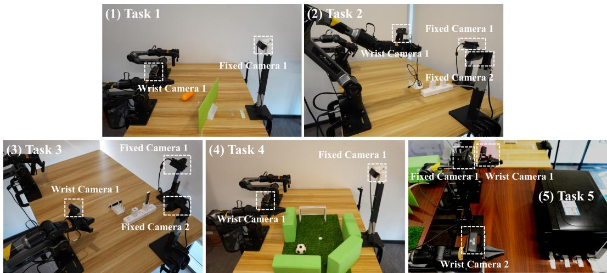  
Figure 6: Real-world experimental setups and camera configurations. The five tasks are: (1) Barrier-Crossing Corn Placement, (2) USB Insertion, (3) Dual-USB Insertion, (4) Obstacle-Course Soccer, and (5) Bimanual Microwave Retrieval. Each setup includes wrist-mounted and fixed-view cameras, with their locations highlighted by dashed boxes. All cameras are Orbbec Gemini 335 RGB-D cameras. For each task, observations from all cameras are used to train the VLA and WAM models, whereas MAIF is trained using only selected fixed-camera views.

Tasks. We evaluate four single-arm tasks and one bimanual task, as shown in Fig. 4. Task 1: Barrier-Crossing Corn Placement requires lifting an ear of corn over barriers of varying heights and placing it into a bowl; Task 2: USB Insertion requires aligning and inserting a USB connector into its port; Task 3: Dual-USB Insertion requires sequentially inserting two USB connectors into their corresponding ports using a single arm; Task 4: Obstacle-Course Soccer requires dribbling a ball around obstacles before shooting it into a goal; and Task 5: Bimanual Microwave Retrieval requires one arm to open the microwave door and retrieve a box while the other pushes the door aside. Together, these tasks require metric height perception, fine-grained spatial alignment, obstacle-aware planning, and accurate depth perception in confined spaces. The specific settings for the five tasks are shown in Fig. 6.

Visual observations. Both $\pi _ { 0 . 5 }$ and Fast-WAM use the task-specific RGB camera configurations summarized in Table 11. For Task 5, one wrist-mounted camera is used on each arm. All views are resized from 480 × 640 to 224 × 224 and use identity normalization. When training the Fast-WAM and $\pi _ { 0 . 5 }$ baselines, we use RGB observations from all cameras available for each task. For MAIF training, point clouds are obtained only from the designated fixed camera for each task.

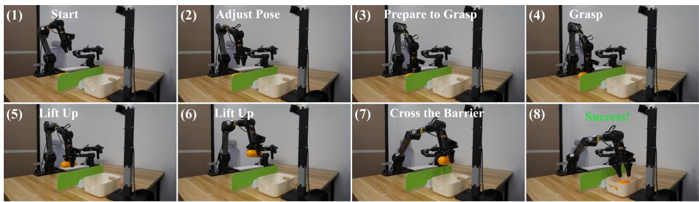

Figure 7: Successful execution of Task 1: Barrier-Crossing Corn Placement. The sequence shows our framework operating with the lowest barrier. The robot grasps the corn (1–4), lifts it above the barrier (5–6), moves it across (7), and places it into the bowl (8). The task requires perceiving the barrier height and controlling the lifting trajectory to clear the obstacle.  
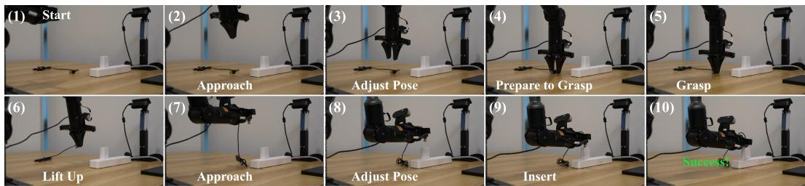

Figure 8: Successful execution of Task 2: USB Insertion. Our framework uses a single arm to approach and grasp the USB connector (1–5), lift and align it with the port (6–8), and complete the insertion (9–10). The task requires precise positional and rotational alignment to guide the connector into the narrow port.  
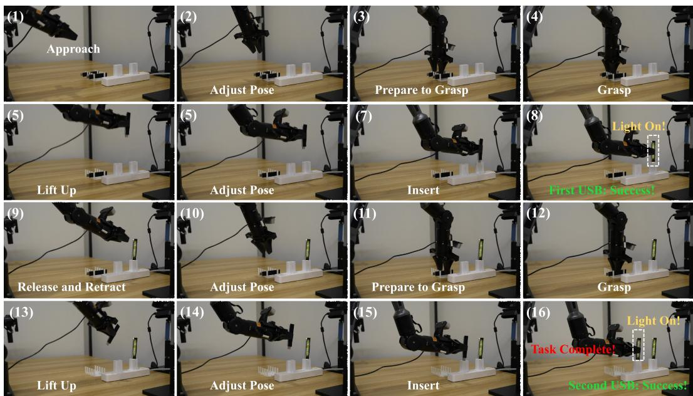  
Figure 9: Successful long-horizon execution of Task 3: Dual-USB Insertion. Our framework uses a single arm to grasp, align, and insert the front USB connector first (1–8), followed by the rear connector (9–16). Each insertion is considered successful only when the corresponding indicator lights up, and the task is complete only after both connectors are inserted and both indicators are on.

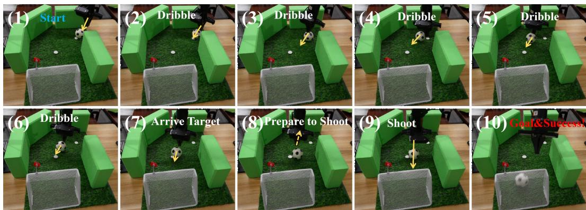

Figure 10: Successful execution of Task 4: Obstacle-Course Soccer. Our framework dribbles the ball around obstacles to the shooting position (1–7), draws back the gripper to prepare the shot (8), and shoots the ball into the goal (9–10). The task requires precise dribbling and obstacle avoidance in confined spaces; any contact between the gripper and the surrounding walls is counted as a failure.  
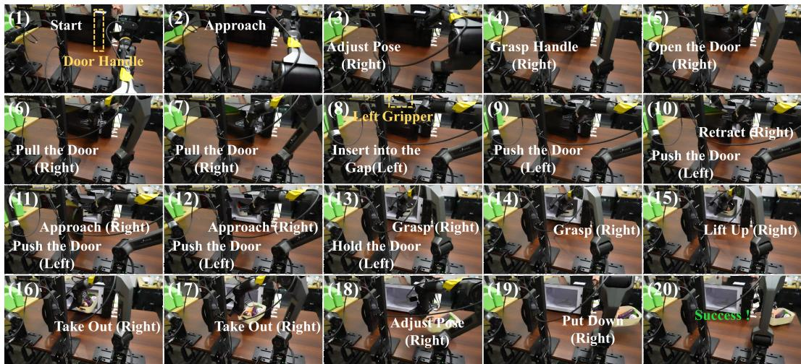  
Figure 11: Successful execution of Task 5: Bimanual Microwave Retrieval. The right arm initially opens the door, with its opening range limited by the grasping pose. The left gripper then pushes the door farther open and holds it while the right arm retrieves the vegetable box and places it on the table. The task requires coordinated bimanual manipulation and stable transport; any spillage of vegetables is counted as a failure.

Task Definition and Process Visualization. Figs 7, 8, 9, 10, and 11 present detailed successful executions of our framework on all five real-world tasks.

Table 11: Camera configurations shared by both baselines. Task numbers correspond to the descriptions above.
<table><tr><td>Tasks</td><td>Setup</td><td>Fixed cameras</td><td>Wrist cameras</td></tr><tr><td>Tasks 1 and 4</td><td>Single-arm</td><td>1</td><td>1</td></tr><tr><td>Tasks 2 and 3</td><td>Single-arm</td><td>2</td><td>1</td></tr><tr><td>Task 5</td><td>Bimanual</td><td>1</td><td>2</td></tr></table>

Table 12: Point cloud sources for MAIF training in each task.
<table><tr><td>Task</td><td>Task 1</td><td>Task 2</td><td>Task 3</td><td>Task 4</td><td>Task 5</td></tr><tr><td>Point cloud source</td><td>Fixed Camera 1</td><td>Fixed Camera 2</td><td>Fixed Camera 2</td><td>Fixed Camera 1</td><td>Fixed Camera 1</td></tr></table>

Table 13: Number of expert episodes per task in real-world experiments.
<table><tr><td>Task</td><td>Task 1</td><td>Task 2</td><td>Task 3</td><td>Task 4</td><td>Task 5</td></tr><tr><td>Episode Number</td><td>100</td><td>100</td><td>100</td><td>100</td><td>200</td></tr></table>

Baselines Setup. Both baselines use one proprioceptive observation step. The $\pi _ { 0 . 5 }$ model interface pads states and actions to 32-D. Fast-WAM uses 7-D states and actions for Tasks 1–4 and 14-D states and actions for Task 5. The language sequence lengths are 200 tokens for $\pi _ { 0 . 5 }$ and 128 tokens for Fast-WAM. Both baselines predict 50-step action chunks and execute all using 10 denoising steps at inference. For each baseline and task, we use the terminal training checkpoint, fixed a priori without held-out model selection. We conduct 100 evaluation trials per task for each baseline.

Our Framework. Our framework follows a two-stage training procedure. In Stage 1, professional annotators provide pose annotations on 2D images. These annotations are lifted to 3D using the corresponding depth measurements from RGB-D cameras to provide supervision for ICT. Stage 1 uses the same training hyperparameters as the corresponding baseline. In Stage 2, MAIF is trained using point clouds from designated fixed cameras, with the source for each task summarized in Table 12. For Tasks 2 and 3, which have multiple fixed cameras, we select the camera whose placement provides a suitable sensing distance for accurate depth acquisition with fewer missing regions, while covering the geometry of the key manipulation area.

Data Collection. All real-world demonstration data are collected via teleoperation. The amount of training data used for each task is summarized in Table 13.

## A.7 REAL-WORLD TRAINING DETAILS

Shared training settings. Both baselines are trained on 8 H200 GPUs using AdamW with $\beta _ { 1 } = 0 . 9 , \beta _ { 2 } = 0 . 9 5 , \check { \epsilon } = 1 0 ^ { - 8 }$ , and weight decay 0.01. We use gradient clipping at 1.0 and no gradient accumulation. Data augmentation, LoRA/PEFT, ACP, and AWR are disabled. Modelspecific training configurations are summarized in Table 14. The training configuration for ICT in Stage 1 is aligned with that of the corresponding baseline.

Fast-WAM preprocessing. For Fast-WAM, the video context consists of 51 time steps subsampled into 9 video frames. VAE latents and text embeddings are precomputed offline to accelerate training.

MAIF training settings. For both $\pi _ { 0 . 5 }$ and Fast-WAM, MAIF is initialized on top of the corresponding task-specific real-world policy checkpoint. The complete backbone policy and the Sonata point encoder remain frozen, and only the MAIF parameters are optimized. Training uses only successful demonstrations. Calibrated depth observations are back-projected into the robot base frame and uniformly sampled into 8,192 metric points. Each point is represented by its position and surface normal, while the original coordinates in meters are preserved without per-scene centering or scale normalization. The detailed training settings for MAIF in real-world experiments are provided in Table 15.

Both implementations are trained on 8 H200 GPUs for 5,000 optimizer steps with a per-GPU batch size of 32, giving a global batch size of 256. We use AdamW with $\beta _ { 1 } = 0 . \dot { 9 } , \beta _ { 2 } = \bar { 0 . 9 5 } , \epsilon = 1 0 ^ { - 8 }$ weight decay $1 0 ^ { - 4 }$ , and gradient clipping at 1.0. The learning rate is warmed up for 500 steps to $\mathrm { 1 0 ^ { - 4 } }$ and then decayed using a cosine schedule. No gradient accumulation, LoRA/PEFT, or backbone fine-tuning is used. All reported real-world results use the checkpoint at step 5,000.

Table 14: Model-specific training configurations of $\pi _ { 0 . 5 }$ and Fast-WAM for the real-world experiments. Shared training settings are described in the text.
<table><tr><td>Setting</td><td>π0.5</td><td>Fast-WAM</td></tr><tr><td>Initialization</td><td>lerobot/pi05_base</td><td>lerobot/fast-wam_base;videoex- pert: Wan-AI/Wan2.2-TI2V-5B</td></tr><tr><td>Architecture</td><td>PaliGemma(gemma_2b) with gemma_300m action expert</td><td>Layer-wise mixture of a Wan2.2 video DiT and an action DiT</td></tr><tr><td>Fine-tuning</td><td>All parameters, including the vision en- All parameters of both DiTs and the pro- coder and VLM</td><td>prioceptive encoder</td></tr><tr><td>Frozen modules</td><td>None</td><td>Wan VAE and UMT5 text encoder</td></tr><tr><td>Precision</td><td>FP32; AMP disabled</td><td>BF16 training; FP32 loss computation</td></tr><tr><td>State/action normaliza- Quantile tion</td><td></td><td>Min-max scaling to [−1, 1]</td></tr><tr><td>Objective</td><td>Conditional flow-matching velocity re- Joint video-action conditional flow gression with MSE loss</td><td>matching with equally weighted MSE losses</td></tr><tr><td>Time sampling</td><td>u ∼ Beta(1.5, 1.0); t = 0.999u + 0.001</td><td> $u \sim \mathcal { U } ( 0 , 1 ) ;$   $\sigma = 5 u / ( 1 + 4 u ) ;$   $t = 1 0 0 0 \sigma$ </td></tr><tr><td>Peak / minimum LR</td><td> $2 . 5 \times 1 0 ^ { - 5 } / 2 . 5 \times 1 0 ^ { - 6 }$ </td><td> $1 0 ^ { - 4 } / 1 0 ^ { - 6 }$ </td></tr><tr><td>LR schedule</td><td>decay</td><td>1,000-step warmup; 30,000-step cosine 5% linear warmup followed by cosine de- cay</td></tr><tr><td>Batch size</td><td>8 per GPU; global batch size 64</td><td>Two-view tasks: 32 per GPU, global 256; three-view tasks: 24 per GPU, global 192</td></tr><tr><td>Optimizer steps</td><td>50,000 for all tasks</td><td>50,000 for Tasks 1–4; 80,000 for Task 5</td></tr><tr><td>Random seed</td><td>1000</td><td>42</td></tr><tr><td>Distributed training</td><td>8-process DDP</td><td>8-process ZeRO-1</td></tr><tr><td>Gradient checkpoint</td><td>Enabled</td><td>Disabled</td></tr><tr><td>torch.compile Data loading</td><td>Enabled with max-autotune 4 workers per rank</td><td>Disabled 4 persistent workers per rank; prefetch</td></tr></table>

## A.8 REAL WORLD EXPERIMENT VISUALIZATION

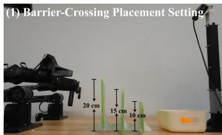

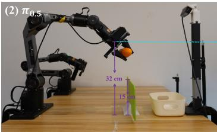

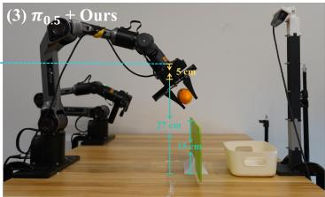  
Figure 12: Height-adaptive trajectories in barrier-crossing placement. (1) Task setup with three barrier heights: 10, 15, and 20 cm. (2) $\pi _ { 0 . 5 } \ +$ Ours crosses the same barrier at 27 cm, producing a lower trajectory better matched to the actual obstacle height. This height-adaptive behavior illustrates improved metric spatial awareness and avoids unnecessary lifting. (2) When crossing the 15 cm barrier, $\pi _ { 0 . 5 }$ lifts the corn to 32 cm.

Fig. 12 visualizes Task 1, Barrier-Crossing Corn Placement. During data collection, we used barriers of three heights (10, 15, and 20 cm) and collected demonstrations with crossing heights adapted to each barrier, as shown in panel (1). Although both $\pi _ { 0 . 5 }$ and $\pi _ { 0 . 5 } +$ Ours achieve 100% success on this task, their crossing trajectories differ. For the 15 cm barrier, our framework crosses at 27 cm, whereas $\pi _ { 0 . 5 }$ lifts the corn to 32 cm, resulting in unnecessary vertical motion.

Table 16 reports the mean peak end-effector height over five trials of corn placement across the 15 cm barrier. Our framework achieves a mean peak height of 282.621 mm, compared with 307.151 mm for the $\pi _ { 0 . 5 }$ baseline. This lower lifting height suggests that metric height awareness helps our framework learn a trajectory better matched to the medium-height barrier, reducing unnecessary lifting.

Table 15: MAIF training configurations for the real-world experiments. The task-specific policy and Sonata encoder are frozen in both implementations.
<table><tr><td>Setting</td><td>π0.5 + MAIF</td><td>FastWAM + MAIF</td></tr><tr><td>Initialization</td><td>Task-specific π0.5 checkpoint</td><td>Task-specific FastWAM checkpoint</td></tr><tr><td>Trainable modules</td><td>MAIF only</td><td>MAIF only</td></tr><tr><td>Frozen modules</td><td>PaliGemma, action expert, and Sonata</td><td>Video DiT, action DiT, encoders, and Sonata</td></tr><tr><td>Action-metric bridge</td><td>Quantile de-normalization followed by fixed robot FK</td><td>Min-max de-normalization followed by fixed robot FK</td></tr><tr><td>Action horizon</td><td>50</td><td>50</td></tr><tr><td>Metric geometry</td><td colspan="2">8,192 base-frame points in meters; frozen Sonata with a finest resolution of 2 cm</td></tr><tr><td>Point features MAIF architecture</td><td colspan="2">XYZ + normal</td></tr><tr><td></td><td colspan="2">Hidden size 1,024; 16 heads; 3 geometry cross-attention, 10 temporal, and 1 bimanual interaction layer</td></tr><tr><td>Precision</td><td colspan="2">BF16 network computation; FP32 metric decoding and loss computation</td></tr><tr><td>Batch size</td><td colspan="2">32 per GPU; global batch size 256</td></tr><tr><td>Optimizer steps</td><td colspan="2">5,000</td></tr><tr><td>LR schedule</td><td colspan="2">500-step warmup to  $1 0 ^ { - 4 } ;$  cosine decay</td></tr><tr><td>Optimizer</td><td colspan="2">AdamW, weight decay  $1 0 ^ { - 4 }$  , gradient clipping 1.0</td></tr><tr><td>Gradient accumulation</td><td colspan="2">None</td></tr><tr><td>Distributed training</td><td colspan="2">8-process DDP 8-process ZeRO-1</td></tr><tr><td>Random seed</td><td colspan="2">42</td></tr><tr><td>Evaluation checkpoint</td><td colspan="2">Step 5,000</td></tr></table>

Table 16: Statistics on the height of crossing the barrier.
<table><tr><td>Method &amp; Height (mm)</td><td>Test 1</td><td>Test 2</td><td>Test 3</td><td>Test 4</td><td>Test 5</td><td>Average ↓</td></tr><tr><td>π0.5</td><td>301.617</td><td>295.685</td><td>318.257</td><td>325.743</td><td>294.452</td><td>307.151</td></tr><tr><td> $\pi _ { 0 . 5 } + \mathrm { O u r s }$ </td><td>270.125</td><td>284.773</td><td>291.781</td><td>301.127</td><td>265.301</td><td>282.621</td></tr></table>

## A.9 LIMITATIONS

Our framework has three main limitations. First, its performance depends on point cloud quality: depth noise from RGB-D cameras can produce noisy and discontinuous scans, potentially affecting downstream performance. Future work will explore more robust alternatives to point cloud repre sentations. Second, our interaction mechanism requires accurate calibration and alignment between coordinate frames, which complicates the hardware setup. Third, our experiments are limited to manipulation with grippers. We plan to extend the evaluation to dexterous hands in future work.