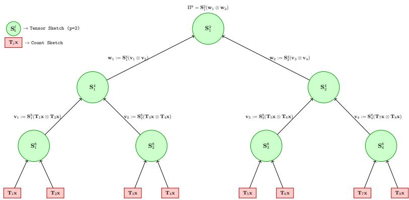

# Accurate Trace Estimation with Fewer Random Bits via Recursive TensorSketch

Mohammad Azhar Khan1\*, Rameshwar Pratap1 and Amit Sharma1

1Indian Institute of Technology Hyderabad, Kandi, Sangareddy, 502284, Telangana, India.

\*Corresponding author(s). E-mail(s): cs24mtech12006@iith.ac.in; Contributing authors: rameshwar@cse.iith.ac.in; cs24resch02002@iith.ac.in;

## Abstract

We consider the problem of estimating the trace of an implicit matrix A ∈ $\mathbb { R } ^ { d ^ { p } \times d ^ { p } }$ that can only be accessed through matrix-vector products queries. The Hutchinson trace estimator $[ 1 , 2 ]$ is a classical sketching method for this problem. Their estimator, $\begin{array} { r } { H _ { m } ( \mathbf { A } ) ~ = ~ \frac { 1 } { m } \sum _ { i = 1 } ^ { m } \mathbf { z } ^ { ( i ) ^ { T } } \mathbf { A } \mathbf { z } ^ { ( i ) } } \end{array}$ where $\mathbf { z } ^ { ( i ) } \in \mathbb { R } ^ { d ^ { p } }$ , and $z _ { j } ^ { ( i ) } \in \mathcal { N } ( 0 , 1 ) , j \in [ d ^ { p } ]$ , satisfies the following guarantees: $\mathrm { ( i ) } \mathbb { E } [ H _ { m } ( \mathbf { A } ) ] =$ $\mathbf { t r } ( \mathbf { A } )$ , and (ii) $\begin{array} { r } { { \bf V a r } [ H _ { m } ( { \bf A } ) ] = \frac { 2 } { m } | | { \bf A } | | _ { F } ^ { 2 } } \end{array}$ . Generating one query vector $\mathbf { z } ^ { ( i ) }$ requires $O ( d ^ { p } )$ random bits; thus, m queries require $O ( m d ^ { p } )$ random bits, which can be prohibitive in large-scale applications. Recent work by Meyer et al. [3] proposes a variant of the Hutchinson trace estimator in which each query vector in $\mathring { \mathbb { R } } ^ { d ^ { p } }$ is constructed as the Kronecker product of p random vectors in Rd, requiring O(mpd) random bits for m query vectors. The estimator of [3] is unbiased; however, its variance grows exponentially with p. In this work, we address this limitation by proposing a sketching-based estimator that requires $O ( p ( d + m ) \log m )$ random bits, yields an unbiased estimate of the trace, and simultaneously achieves a variance bound that grows polynomially with p.

Keywords: Trace estimation, Randomized Algorithms, Numerical Linear Algebra, Sketching Algorithms, Implicit linear operators

## 1 Introduction

A central problem in scientific computing is the estimation of the trace of a large matrix $\mathbf { A } \in \mathbb { R } ^ { d ^ { p } \times d ^ { p } }$ when explicit access to its entries is restricted. Instead, the matrix is accessible only through an oracle that returns matrix–vector products Ax for arbitrary vectors $\mathbf { x } \in \mathbb { R } ^ { d ^ { p } }$ . Under this restricted access model, the goal is to develop eficient algorithms that approximate the trace of matrix A while minimizing the number of oracle queries. The matrix–vector oracle model, also referred to as the implicit matrix model, is a widely adopted computational framework in the numerical linear algebra community [4–9]. The trace estimation problem in implicit matrix model can be solved exactly using $D = d ^ { p }$ oracle queries by using the standard basis vectors $\mathbf { e } _ { 1 } , \mathbf { e } _ { 2 } , \ldots , \mathbf { e } _ { D }$ via the following estimator $\begin{array} { r } { \mathrm { t r } ( \mathbf { A } ) \ = \ \sum _ { i = 1 } ^ { D } \mathbf { e } _ { i } ^ { T } \mathbf { A } \mathbf { e } _ { i } } \end{array}$ . Each term in the summation corresponds to a single diagonal entry of A, leading to a total of $O ( d ^ { p } )$ matrix–vector queries. However, the computational cost associated with such a large number of oracle queries is prohibitive.

The seminal algorithm due to Girard and Hutchinson [1, 2], known as the Hutchinson trace estimator, provides an eficient approximation for trace estimation. Given an implicit matrix $\bar { \textbf { A } } \in \mathbb { R } ^ { d ^ { p } \times d ^ { p } }$ , the Hutchinson trace estimator is defined as, $H ( \mathbf { A } ) = \mathbf { z } ^ { T } \mathbf { A } \mathbf { z }$ , where $\textbf { z } \in \mathbb { R } ^ { d ^ { p } }$ with i.i.d. entries $z _ { i } \sim \mathcal { N } ( 0 , 1 )$ , for $i \in [ d ^ { p } ]$ . The estimator satisfies the following guarantee $\mathbb { E } [ H ( \mathbf { A } ) ] = \operatorname { t r } ( \mathbf { A } )$ ， $\mathrm { V a r } [ H ( \mathbf { A } ) ] = 2 | | \mathbf { A } | | _ { F } ^ { 2 }$ Furthermore, to reduce the variance, the above procedure is repeated independently m times, and the final estimator is defined as the mean of these m estimators, that is,

$$
H _ { m } ( \mathbf { A } ) = \frac { 1 } { m } \sum _ { i = 1 } ^ { m } \mathbf { z } ^ { ( i ) ^ { T } } \mathbf { A } \mathbf { z } ^ { ( i ) } , \quad \mathrm { w h e r e } \quad \mathbf { z } ^ { ( i ) } \in \mathbb { R } ^ { d ^ { p } } , z _ { j } ^ { ( i ) } \in \mathcal { N } ( 0 , 1 ) , \mathrm { ~ a n d ~ } j \in [ d ^ { p } ] .\tag{1}
$$

The estimator satisfies the following guarantee

$$
\mathbb { E } [ H _ { m } ( \mathbf { A } ) ] = \operatorname { t r } ( \mathbf { A } ) , \quad \operatorname { V a r } [ H _ { m } ( \mathbf { A } ) ] = \frac { 2 } { m } | | \mathbf { A } | | _ { F } ^ { 2 } .\tag{2}
$$

Subsequent work further improved the sample-complexity analysis of classical trace estimators. [10] derived sharper bounds for Gaussian, Rademacher, and unit-vector estimators, including a Hutchinson bound without the rank-dependent term appearing in the earlier analysis. Under the quadratic-form query model, [11] characterized optimal linear nonadaptive estimators and established lower bounds for multiplicative trace approximation. More recently, [12] studied nearly optimal high-probability traceestimation sketches under matrix-vector access. These works primarily seek to reduce the number of oracle queries, whereas our work studies the complementary objective of reducing the randomness required to construct queries in kronecker-structured spaces.

The Hutchinson trace estimator, as stated in Equation (1), requires m random vectors $\mathbf { z } ^ { ( i ) } \in \mathbb { R } ^ { d ^ { p } }$ . Consequently, the total number of random bits required by the estimator is $O ( m d ^ { p } )$ . Structured random queries based on Kronecker-structured random vectors for trace estimation were proposed by [13]. Building on this idea, [3] addresses the challenge of random bits and suggests an estimator that requires significantly fewer random bits. Their estimator construct a query vector $\mathbf { x } \in \mathbb { R } ^ { d ^ { p } }$ as a

Kronecker product of p independent random vectors in $\mathbb { R } ^ { d } .$ , that is, $\mathbf { x } = \mathbf { x } _ { 1 } \otimes \cdots \otimes \mathbf { x } _ { p } ,$ where $\mathbf { x } _ { i } \in \mathbb { R } ^ { d }$ for $i \in [ p ]$ . Therefore, generating a single random vector x requires $O ( d p )$ random bits, and the final estimator - formed by averaging m such estimators - requires $O ( m d p )$ random bits, in contrast to the $O ( m d ^ { p } )$ random bits required by the Hutchinson trace estimator [2]. However, the main limitation of their approach is that the variance of their estimator grows exponentially with $p ,$ that is, $O \left( { \frac { 3 ^ { p } } { m } } \left( \operatorname { t r } \left( \mathbf { A } \right) \right) ^ { 2 } \right)$ - making the estimator less accurate. This motivates the problem considered in this paper, which we state as follows:

Problem Statement: Given an implicit matrix $\textbf { A } \in \mathbb { R } ^ { d ^ { p } \times d ^ { p } }$ , the goal is to design a trace estimation algorithm that requires asymptotically fewer random bits and simultaneously provides an accurate trace estimation.

We draw inspiration from recent advances in sketching techniques to address this problem. In particular, [14] introduced Recursive TensorSketch, an eficient sketching method for approximating high-degree polynomial kernels. Their approach enables efective compression of polynomial kernels using a sketching dimension that scales only polynomially with the degree of the kernel function. We leverage Recursive TensorSketch to design a trace estimator for an implicit matrix $\mathbf { A } \in \mathbb { R } ^ { d ^ { p } \times d ^ { p } }$ . We prove that the proposed estimator is unbiased, requires asymptotically fewer random bits than the classical Hutchinson trace estimator [2], and admits variance bounds with only polynomial dependence on the p. This constitutes an exponential improvement in the dependence on p over the variance bounds established for Kronecker-Hutchinson estimators in [3]. We summarize our key contributions as follows:

## Our Contribution:

• We propose a novel trace estimator for an implicit matrix $\mathbf { A } \in \mathbb { R } ^ { d ^ { p } \times d ^ { p } }$ . Our estimator, tr $\left( \Pi ^ { p } \mathbf { A } ( \Pi ^ { p } ) ^ { \top } \right)$ (see Definition 5), leverages the Recursive TensorSketch matrix $\Pi ^ { p } \in \mathbb { R } ^ { m \times d ^ { p } }$ proposed by [14].

• We show that the proposed estimator is unbiased and derive a variance bound that is a polynomial of degree p. Further, when the input matrix A is a Positive Semi-Definite (PSD) matrix then the variance of our estimator achieves exponential improvement over the estimator proposed in [3]. Furthermore, the number of random bits required by our estimator is $O ( p ( d + m ) \log m )$ , which is asymptotically better to that of required in [3]. Also, it is exponentially smaller than the Hutchinson trace estimator [2], which requires $O ( m d ^ { p } )$ random bits.

• We further propose a complex-valued analogue of our estimator (Definition 6), in which the entries of the Recursive TensorSketch matrix $\Pi ^ { p } \in \mathbb { C } ^ { \dot { m } \times d ^ { p } }$ are sampled from complex random variables. We show that this variant achieves variance that is exponentially smaller than that of [3] conditioned that the input matrix is a PSD matrix, while simultaneously requiring asymptotically fewer random bits.

There are two complementary approaches to reducing the amount of randomness required by randomized sketching algorithms. One approach is to redesign the sketching construction so that its random choices are shared through an underlying structure. This is the approach pursued in this paper through Recursive TensorSketch. A diferent approach is to retain an existing sketching construction while reducing its randomness by implementing the underlying hash functions using tabulation-based hashing [15]. Prior work has shown that simple and double tabulation hashing can provide strong concentration guarantees for a variety of randomized algorithms and data structures, including Minwise Independent Permutations and Cuckoo Hashing [16, 17]. However, hash functions generated by tabulation hashing are generally not 4-wise independent and, therefore, cannot be directly used in standard trace estimation algorithms [1, 2], where such independence is required by the analysis. Nevertheless, tabulation hashing may ofer an alternative approach for reducing the random seed required by existing trace-estimation sketches. An interesting direction for future work is to investigate whether such implementations can preserve the required JL moment properties and variance guarantees.

Trace estimation is a fundamental primitive with numerous large-scale applications. Hutchinson trace estimator [2] has been used extensively as a key subroutine in various applications such as sublinear-time spectral density estimation [18], faster eigenvalue approximation [19], counting triangles in large graphs [20, 21], approximating spectral sums [22], and estimating $| | \mathbf { A } | | _ { F }$ (using the well-known identity $| | \mathbf { A } | | _ { F } ^ { 2 } = \operatorname { t r } \left( \mathbf { A } ^ { T } \mathbf { A } \right) )$ to name a few. Our proposed estimator can be plugged into these applications in place of [2] to yield a randomness-eficient algorithm with almost the same accuracy.

## 2 Related Work

Trace estimation has a long history in randomized numerical linear algebra. The seminal algorithm by Girard and Hutchinson [1, 2], known as the Hutchinson trace estimator, provides an eficient method for approximating the trace. Given an implicit matrix $\hat { \textbf { A } } \in \mathbb { R } ^ { d ^ { p } \times d ^ { p } }$ , the Hutchinson trace estimator is defined as $H ( \mathbf { A } ) =$ $\mathbf { z } ^ { \top } \mathbf { A } \mathbf { z } ,$ where $\textbf { z } \in \mathbb { R } ^ { d ^ { p } }$ is a random vector with i.i.d. entries, typically drawn from $\mathcal { N } ( 0 , 1 )$ or a Rademacher distribution. The estimator satisfies $\mathbb { E } [ H ( \mathbf { A } ) ] = \operatorname { t r } ( \mathbf { A } )$ and $\mathrm { V a r } ( H ( \mathbf { A } ) ) = 2 \| \mathbf { A } \| _ { F } ^ { 2 }$ . To reduce the variance, the estimator is repeated independently m times. L $\operatorname { e t } \ \mathbf { z } ^ { ( \mathrm { i } ) } , \ldots , \mathbf { z } ^ { ( m ) } \in \mathbb { R } ^ { d ^ { p } }$ be independent copies of $\mathbf { z } ,$ and define $H _ { m } ( \mathbf { A } ) =$ $\begin{array} { r } { \frac { 1 } { m } \sum _ { i = 1 } ^ { m } ( \mathbf { z } ^ { ( i ) } ) ^ { \top } \mathbf { A } \mathbf { z } ^ { ( i ) } } \end{array}$ . Then, $\mathbb { E } [ H _ { m } ( \mathbf { A } ) ] = \operatorname { t r } ( \mathbf { A } )$ and $\begin{array} { r } { \mathrm { V a r } ( H _ { m } ( { \bf A } ) ) = \frac { 2 } { m } \| { \bf A } \| _ { F } ^ { 2 } } \end{array}$ . Each query requires generating a random vector $\mathbf { z } \in \mathbb { R } ^ { d ^ { p } }$ , which uses $O ( d ^ { p } )$ random bits, leading to a total randomness of $O ( m d ^ { p } )$ for m samples.

In the classical setting, trace estimators are based on the form $X : = \mathbf { z } ^ { \top } \mathbf { A } \mathbf { z }$ , where z is a random query vector. Avron and Toledo [23] study several such estimators that difer in the choice of the distribution of z. In particular, they analyze the Hutchinson estimator under diferent choices of the query vector z, including the case where its entries are i.i.d. $\mathcal { N } ( 0 , 1 )$ , the variant with i.i.d. Rademacher entries, and unit-vectorbased estimators in which z is sampled uniformly from the standard basis. They also study a mixed unit-vector estimator of the form $X _ { M } : = \mathbf { e } ^ { \top } \mathbf { F } \mathbf { A } \mathbf { F } ^ { \top } \mathbf { e }$ , where each e is sampled uniformly from the standard basis vectors, and F is a fixed orthogonal transform (e.g. Hadamard matrix). Their work provides high-probability guarantees and highlights the trade-of between variance and the number of random bits used in these estimators.

A recent work by Meyer et al. [3] proposed a Kronecker-structured trace estimator to reduce the number of random bits required for trace estimation. Their query

<table><tr><td rowspan=1 colspan=1>Estimator</td><td rowspan=1 colspan=1>Variance</td><td rowspan=1 colspan=1>Randomness</td><td rowspan=1 colspan=1>Bound on $\#$ samples for an(ε, δ)-approx.</td></tr><tr><td rowspan=1 colspan=1>Hutchinson(Gaussian)[23]</td><td rowspan=1 colspan=1> $\overline { { = \frac { 2 } { m } \| \mathbf { A } \| _ { F } ^ { 2 } } }$ </td><td rowspan=1 colspan=1> $O ( m d ^ { p } )$ </td><td rowspan=1 colspan=1> $\overline { { { 2 0 \varepsilon ^ { - 2 } \ln \left( \frac { 2 } { \delta } \right) } } }$ </td></tr><tr><td rowspan=1 colspan=1>Hutchinson(Rademacher) [23]</td><td rowspan=1 colspan=1> $\overline { { = { \frac { 2 } { m } } \left( \| \mathbf { A } \| _ { F } ^ { 2 } - \sum _ { i = 1 } ^ { n } A _ { i i } ^ { 2 } \right) } }$ </td><td rowspan=1 colspan=1> $O ( m d ^ { p } )$ </td><td rowspan=1 colspan=1> $6 \varepsilon ^ { - 2 } \ln \left( \frac { 2 r } { \delta } \right)$ </td></tr><tr><td rowspan=1 colspan=1>Normalized  Rayleighquotient [23]</td><td rowspan=1 colspan=1>二 $\begin{array} { r } { \frac { d ^ { p } } { m } \left( \sum _ { i } ^ { d ^ { p } } A _ { i i } ^ { 2 } - ( \mathrm { t r } ( \mathbf { A } ) ) ^ { 2 } \right) } \end{array}$ </td><td rowspan=1 colspan=1> $O ( m d ^ { p } )$ </td><td rowspan=1 colspan=1> $\frac { \overline { { n ^ { 2 } \kappa _ { f } ^ { 2 } ( { \bf A } ) } } } { 2 r ^ { 2 } \varepsilon ^ { 2 } } \ln \left( \frac { 2 } { \delta } \right)$ </td></tr><tr><td rowspan=1 colspan=1>Unit vector estimator[23]</td><td rowspan=1 colspan=1> $\begin{array} { r } { = \frac { d ^ { p } } { m } \left( \sum _ { i } ^ { d ^ { p } } A _ { i i } ^ { 2 } - ( \operatorname { t r } ( \mathbf { A } ) ) ^ { 2 } \right) } \end{array}$ </td><td rowspan=1 colspan=1> $O ( m p \log d )$ </td><td rowspan=1 colspan=1> $\overline { { \frac { r _ { D } ^ { 2 } ( \mathbf { A } ) } { 2 \varepsilon ^ { 2 } } \ln \left( \frac { 2 } { \delta } \right) } }$ </td></tr><tr><td rowspan=1 colspan=1>Mixed unit vector esti-mator [23]</td><td rowspan=1 colspan=1></td><td rowspan=1 colspan=1> $O ( m p \log d )$ </td><td rowspan=1 colspan=1> $\overline { { 8 \varepsilon ^ { - 2 } \ln \left( \frac { 4 n ^ { 2 } } { \delta } \right) \ln \left( \frac { 4 } { \delta } \right) } }$ </td></tr><tr><td rowspan=1 colspan=1>Kronecker-Hutchinson(real) [3]</td><td rowspan=1 colspan=1> $\overline { { \leq { \frac { 3 ^ { p } } { m } } { ( \mathrm { t r } ( \mathbf { A } ) ) } ^ { 2 } } }$ </td><td rowspan=1 colspan=1>O(mpd)</td><td rowspan=1 colspan=1> $\overline { { \frac { 3 ^ { p } } { \varepsilon ^ { 2 } } \ln \frac { 1 } { \delta } } }$ </td></tr><tr><td rowspan=1 colspan=1>Kronecker-Hutchinson(complex) [3]</td><td rowspan=1 colspan=1> $\overline { { \leq \frac { 2 ^ { p } } { m } \big ( \mathrm { t r } ( \mathbf { A } ) \big ) ^ { 2 } } }$ </td><td rowspan=1 colspan=1>O(mpd)</td><td rowspan=1 colspan=1> $\overline { { \frac { 2 ^ { p } } { \varepsilon ^ { 2 } } \ln \frac { 1 } { \delta } } }$ </td></tr><tr><td rowspan=1 colspan=1>Recursive TensorSketch(real) [this paper]</td><td rowspan=1 colspan=1> $\overline { { \leq \left( \frac { 1 0 p } { m } + \frac { 1 0 0 p ^ { 2 } } { m ^ { 2 } } \right) \left( \operatorname { t r } ( \mathbf { A } ) \right) ^ { 2 } } }$ </td><td rowspan=1 colspan=1> $O \big ( p ( d + m ) \log m \big )$ </td><td rowspan=1 colspan=1> $\overline { { 2 0 p } }$ ε2δ</td></tr><tr><td rowspan=1 colspan=1>Recursive TensorSketch(complex) [this paper]</td><td rowspan=1 colspan=1> $\overline { { \leq \left( { \frac { 4 p } { m } } + { \frac { 1 6 p ^ { 2 } } { m ^ { 2 } } } \right) \left( \operatorname { t r } ( \mathbf { A } ) \right) ^ { 2 } } }$ </td><td rowspan=1 colspan=1> $O ( p ( d + m ) \log m )$ </td><td rowspan=1 colspan=1>8pε2δ</td></tr></table>

Table 1 Comparison of trace estimators for a fixed nonzero symmetric positive semidefinite

$$
\mathbf { A } \in \mathbb { R } ^ { d ^ { p } \times d ^ { p } }
$$

$$
\kappa _ { f } ( \mathbf { A } ) = \lambda _ { \mathrm { m a x } } ( \mathbf { A } ) / \lambda _ { \mathrm { m i n } } ^ { + } ( \mathbf { A } )
$$

$r _ { D } ( \mathbf { A } ) = n \operatorname* { m a x } _ { i } A _ { i i } / \operatorname { t r } ( \mathbf { A } )$ . An (ε, δ)-approximation bt satisfies $\operatorname* { P r } [ | { \widehat { t } } - \operatorname { t r } ( \mathbf { A } ) | \leq \varepsilon \operatorname { t r } ( \mathbf { A } ) ] \geq 1 - \delta .$ The table highlights the trade-of among variance, randomness, and the number of samples required for an (ε, δ)-approximation. Classical Hutchinson estimators require $O ( m d ^ { p } )$ randomness, whereas Kronecker-Hutchinson estimators reduce this requirement to O(mpd) but incur an exponential dependence on $p$ in both variance and sample complexity. In contrast, the proposed Recursive TensorSketch estimators require $O ( p ( d + m )$ log m randomness and have polynomial, rather than exponential, dependence on p.

vector $\mathbf { x } \in \mathbb { R } ^ { d ^ { p } }$ is constructed as the Kronecker product of $p$ independent random vectors in $\mathbb { R } ^ { d }$ , namely, $\mathbf { x } = \mathbf { x } _ { 1 } \otimes \cdot \cdot \cdot \otimes \mathbf { x } _ { p }$ , where $\mathbf { x } _ { i } \in \mathbb { R } ^ { d }$ for each $i \in [ p ]$ . Consequently, generating a single query vector x requires only $O ( d p )$ random bits, and an estimator obtained by averaging m independent samples requires $O ( m d p )$ random bits. This is substantially smaller than the $O ( m d ^ { p } )$ random bits required by the classical Hutchinson trace estimator [2]. However, this reduction in randomness comes at the cost of increased variance. In particular, the variance of the estimator scales as $O \big ( \frac { 3 ^ { p } } { m } \big )$ , whereas a complex-valued variant improves this dependence to $O \left( { \frac { 2 ^ { p } } { m } } \right)$ . Thus, although the Kronecker-structured approach significantly reduces the randomness requirement by constructing each query vector from $p$ independent vectors in $\mathbb { R } ^ { d }$ , the exponential dependence of the variance on $p$ can make the estimator increasingly inaccurate as $p$ grows.

In this work, we address this challenge by proposing an estimator that requires asymptotically fewer random bits while ensuring that its variance grows only polynomially with $p .$ Our work is inspired by the work of [14], which proposed a recursive sketching algorithm Recursive TensorSketch for compressing polynomial kernels. We show that Recursive TensorSketch can also be leveraged to design a trace estimator that significantly reduces the number of random bits required while maintaining low variance. For an implicit matrix $\mathbf { A } \in \mathbb { R } ^ { d ^ { p } \times d ^ { p } }$ , our estimator $T ( \mathbf { A } ) \ : = \ \mathrm { t r } \big ( \Pi ^ { p } \mathbf { A } ( \Pi ^ { p } ) ^ { \top } \big )$ is unbiased and admits a variance bound of $\begin{array} { r } { O \bigg ( \bigg ( \frac { 1 0 p } { m } + \frac { 1 0 0 p ^ { 2 } } { m ^ { 2 } } \bigg ) \left( \mathrm { t r } ( A ) \right) ^ { 2 } \bigg ) } \end{array}$ , which is polynomial of $p .$ Our estimator yields a exponential improvement over Kronecker-Hutchinson estimators [3], whose variance scales as $O \left( { \frac { 3 ^ { p } ( \operatorname { t r } ( \mathbf { A } ) ) ^ { 2 } } { m } } \right)$ and $O \left( { \frac { 2 ^ { p } ( \operatorname { t r } ( \mathbf { A } ) ) ^ { 2 } } { m } } \right)$ in the real and complex settings, respectively. Moreover, the randomness complexity of our estimator is $O \big ( p ( d + m ) \log m \big )$ , which is asymptotically smaller than the $O ( m p d )$ randomness required by Kronecker-Hutchinson estimator [3] and exponentially smaller than the $O ( m d ^ { p } )$ randomness required by classical Hutchinson estimator [1, 2]. We further extend our framework to a complex-valued setting, obtaining improved variance bounds with fewer random bits than the corresponding estimator of [3].

A standard way to evaluate a randomized trace estimator is through an $( \varepsilon , \delta ) \cdot$ approximation guarantee [23]. For a fixed nonzero positive semidefinite matrix A, an estimator $\widehat { t }$ is called an (ε, δ)-approximation of $\operatorname { t r } ( \mathbf { A } )$ if

$$
\begin{array} { r } { \operatorname* { P r } \bigl [ \left| \widehat { t } - \mathrm { t r } ( \mathbf { A } ) \right| \leq \varepsilon \mathrm { t r } ( \mathbf { A } ) \bigr ] \geq 1 - \delta . } \end{array}\tag{3}
$$

Here, ε specifies the allowed relative error and $\delta$ specifies the failure probability. This guarantee is important because it translates variance or concentration bounds into a required sample or sketch size, thereby allowing diferent trace estimators to be compared in terms of accuracy. We summarize our comparison with the baseline methods in Table 1, which highlights the trade-ofs among variance, randomness, and the number of samples required to obtain an (ε, δ)-approximation.

## 3 Background

Notation. We denote vectors by lowercase bold letters $( \mathrm { e . g . , \ x } )$ and matrices by uppercase bold letters $( \mathrm { e . g . , \mathbf { M } } )$ . For a matrix M $\in \mathbb { R } ^ { n \times n } , \operatorname { t r } ( \mathbf { M } )$ denotes its trace and $\| \mathbf { M } \| _ { F }$ its Frobenius norm. We write $\mathbf { M } \succeq 0$ to indicate that M is symmetric positive semi-definite. For a positive integer $d ,$ we denote $[ d ] : = \{ 1 , 2 , \ldots , d \}$ . Kronecker product is denoted by $\otimes ,$ and for vectors $\mathbf { x } _ { 1 } , \ldots , \mathbf { x } _ { p } \in \mathbb { R } ^ { d }$ , we write $\mathbf { x } = \mathbf { x } _ { 1 } \otimes \cdot \cdot \cdot \otimes \mathbf { x } _ { p } \in \mathbb { R } ^ { d ^ { p } }$ We use $\mathbb { E } [ \cdot ]$ and $\mathrm { V a r } ( \cdot )$ to denote expectation and variance, respectively. Throughout the paper, $i \in [ m ]$ indexes sketch dimensions. For a complex vector or matrix in the field $\mathbb { C }$ , we denote by $( \cdot ) ^ { * }$ its conjugate transpose. Finally, 1[ ] denotes the indicator function. We first state the classical Hutchinson Trace Estimator and its concentration guarantee.

Theorem 1 (Hutchinson Trace Estimator $\left[ 1 , \quad 2 \right] )$ Let $\begin{array} { r l r } { { \bf A } } & { { } \in } & { \mathbb { R } ^ { d ^ { p } \times d ^ { p } } } \end{array}$ be any implicit matrix. Then, the trace estimator is defined as H(A) := $\mathbf { z } ^ { \top } \mathbf { A } \mathbf { z } .$ , where $\mathbf { z } \in \mathbb { R } ^ { d ^ { p } }$ such that $z _ { i } \sim \mathcal { N } ( 0 , 1 )$

$L e t \mathbf { z } ^ { ( 1 ) } , \ldots , \mathbf { z } ^ { ( m ) } \in \mathbb { R } ^ { d ^ { p } }$ be i.i.d. copies $o f \mathbf { z }$ , then the final estimator is defined as follows

$$
H _ { m } ( \mathbf { A } ) = \frac { 1 } { m } \sum _ { i = 1 } ^ { m } \left( \mathbf { z } ^ { ( i ) } \right) ^ { \top } \mathbf { A } \mathbf { z } ^ { ( i ) } .\tag{4}
$$

$$
T h e n , \quad \mathbb { E } [ H _ { m } ( \mathbf { A } ) ] = \operatorname { t r } ( \mathbf { A } ) , \quad \operatorname { V a r } ( H _ { m } ( \mathbf { A } ) ) = \frac { 2 } { m } \| \mathbf { A } \| _ { F } ^ { 2 } .\tag{5}
$$

Theorem 2 (High-Probability Error Bound [21]) Let $\mathbf A \succeq 0$ and let $H _ { m } ( \mathbf { A } )$ be the estimator defined in Equation (4) using Rademacher or Gaussian vectors. Then for any $\varepsilon , \delta \in ( 0 , 1 )$ , it sufices to choose $m = O \left( { \frac { \log ( 1 / \delta ) } { \varepsilon ^ { 2 } } } \right)$ samples to guarantee

$$
\operatorname* { P r } ( | H _ { m } ( \mathbf { A } ) - \operatorname { t r } ( \mathbf { A } ) | \leq \varepsilon \operatorname { t r } ( \mathbf { A } ) ) \geq 1 - \delta .\tag{6}
$$

## 3.1 Trace Estimation via Kronecker-Matrix vector product

[3] considered a variant of Hutchinson trace estimator where the problem is estimating the trace of an implicit matrix $\mathbf { A } \in \mathbb { R } ^ { d ^ { p } \times d ^ { p } }$ that can only be accessed through Kronecker-matrix-vector products. That is, for any Kronecker-structured vector that is, $\mathbf { x } = \mathbf { x } _ { 1 } \otimes \cdot \cdot \cdot \otimes \mathbf { x } _ { p }$ , where random vector $\mathbf { x } _ { i } \in \mathbb { R } ^ { d }$ for $i \in [ p ]$ , Kronecker-matrix-vector product Ax can be computed. Their estimator is termed as Kronecker-Hutchinson estimator and defined as follows: $T : = \mathbf { x } ^ { \top } \mathbf { A } \mathbf { x }$ . They propose several estimators, each corresponding to diferent choices of distributions from which the random vectors $\mathbf { x } _ { i }$ are sampled.

Theorem 3 (Variance for real-valued Kronecker random vectors [3, Theorem $5 . 4 ] )$ Let $\mathbf { A } \in$ $\mathbb { R } ^ { d ^ { p } \times d ^ { p } }$ be a PSD matrix. Let $\mathbf { x } = \mathbf { x } _ { 1 } \otimes \cdots \otimes \mathbf { x } _ { p }$ , where $\mathbf { x } _ { 1 } , \ldots , \mathbf { x } _ { p } \in \mathbb { R } ^ { d }$ are independent and identically distributed random vectors. Then, all the following estimators are unbiased, and satisfy the following variance bounds

Gaussian:

$$
\begin{array} { r l } & { i f \mathbf { x } _ { i } \sim \mathcal { N } ( \mathbf { 0 } , I _ { d } ) , } \\ & { \mathrm { V a r } [ \mathbf { x } ^ { \top } \mathbf { A } \mathbf { x } ] \leq 3 ^ { p } \left( \mathrm { t r } ( \mathbf { A } ) \right) ^ { 2 } , } \end{array}
$$

Rademacher: if entries of each $\mathbf { x } _ { i }$ are i.i.d. in $\{ - 1 , + 1 \}$

$$
\operatorname { V a r } [ \mathbf { x } ^ { \top } \mathbf { A } \mathbf { x } ] \leq \left( 3 - { \frac { 2 } { d } } \right) ^ { p } ( \operatorname { t r } ( \mathbf { A } ) ) ^ { 2 } ,
$$

Uniform sphere: if each $\mathbf { x } _ { i }$ is drawn uniformly from $\mathbb { S } ^ { d - 1 }$

$$
\operatorname { V a r } [ \mathbf { x } ^ { \top } \mathbf { A } \mathbf { x } ] \leq \left( 3 - { \frac { 6 } { d + 2 } } \right) ^ { p } \left( \operatorname { t r } ( \mathbf { A } ) \right) ^ { 2 } .
$$

The bounds in Theorem 3 exhibit an exponential dependence on the parameter $p _ { : }$ rendering the Kronecker–Hutchinson estimator ineficient for large values of $p .$ They further demonstrate that using complex-valued random vectors leads to improved bounds with a smaller exponential factor. The following theorem summarizes those guarantees.

Theorem 4 (Variance for Complex-Valued Structures (Theorem 6.2 and Lemma 6.3 of [3])) Let $\mathbf { A } \in \mathbb { R } ^ { d ^ { p } \times d ^ { p } }$ be a PSD matrix, and $\mathbf { x } = \mathbf { x } _ { 1 } \otimes \cdots \otimes \mathbf { x } _ { p }$ , where $\mathbf { x } _ { 1 } , \ldots , \mathbf { x } _ { p } \in \mathbb { C } ^ { d }$ are $i . i . d .$ random vectors. Then, all the following estimators are unbiased, and satisfy the following variance bounds

Complex Gaussian: $\begin{array} { r } { i f \mathbf { x } _ { i } = \frac { 1 } { \sqrt { 2 } } ( \mathbf { r } _ { i } + i \mathbf { m } _ { i } ) , \ w i t h \ \mathbf { r } _ { i } , \mathbf { m } _ { i } \sim \mathcal { N } ( \mathbf { 0 } , I _ { d } ) , } \end{array}$

$$
\operatorname { V a r } [ \mathbf { x } ^ { * } \mathbf { A } \mathbf { x } ] \leq 2 ^ { p } \left( \operatorname { t r } ( \mathbf { A } ) \right) ^ { 2 } ,
$$

  
Fig. 1 Recursive TensorSketch construction for $p = 8 .$ Each $T _ { j }$ denotes a CountSketch, while $S _ { i } ^ { \ell }$ denotes a TensorSketch operator. Intermediate vectors are combined recursively.

Complex Rademacher: if each entry $o f \mathbf { x } _ { i }$ is drawn i.i.d. from $\left\{ \pm { \frac { 1 } { \sqrt { 2 } } } , \pm { \frac { i } { \sqrt { 2 } } } \right\}$

$$
\operatorname { V a r } [ \mathbf { x } ^ { * } \mathbf { A } \mathbf { x } ] \leq \left( 2 - { \frac { 1 } { d } } \right) ^ { p } \left( \operatorname { t r } ( \mathbf { A } ) \right) ^ { 2 } ,
$$

Complex sphere: if each $\mathbf { x } _ { i }$ is uniformly distributed on the complex sphere ,

$$
\operatorname { V a r } [ \mathbf { x } ^ { * } \mathbf { A } \mathbf { x } ] \leq \left( 2 - { \frac { 2 } { d + 1 } } \right) ^ { p } \left( \operatorname { t r } ( \mathbf { A } ) \right) ^ { 2 } .
$$

We address the limitations of the Kronecker–Hutchinson estimator by designing an alternative estimator that leverages Recursive TensorSketch proposed by [14]. In their work, the authors develop this technique in the context of sketching high-degree polynomial kernels, demonstrating that tensor product structures can be eficiently compressed via recursive linear-mappings while preserving inner-product similarity to a high degree of accuracy. We state their sketching algorithm in the following subsection.

## 3.2 Introduction to Recursive TensorSketch

We begin by presenting the CountSketch [24] algorithm, which enables fast dimensionality reduction for high-dimensional vectors. We then describe TensorSketch [25, 26] of degree 2, which extends this idea to eficiently compress vectors formed via the Kronecker product of two vectors.

Definition 1 (CountSketch $[ 2 4 ] )$ Given an input vector $\textbf { y } \in \ \mathbb { R } ^ { d }$ , the CountSketch is a randomized linear map $\mathbf { T } \in \mathbb { R } ^ { \dot { m } \times \dot { d } }$ that maps y to a lower-dimensional vector $\mathbf { z } = \mathbf { T } \mathbf { y } \in \mathbb { R } ^ { m }$ The CountSketch matrix $\mathbf { T }$ is constructed by two hash functions: (a) h: [d] → [m] a 3-wise independent hash function, and (b) $s : [ d ] \to \{ 1 , - 1 \}$ a 4-wise independent random sign function. The $j ^ { t h }$ entry of vector $\mathbf { z } \in \mathbb { R } ^ { m }$ is computed as,

$$
z _ { j } = \sum _ { h ( i ) = j } s ( i ) y _ { i } , \forall j \in \{ 1 , \ldots , m \} .
$$

The time complexity of computing the CountSketch is $O ( \mathrm { n n z } ( \mathbf { y } ) )$ , which in the worst case can be $O ( d )$ . Furthermore, CountSketch provides an unbiased estimator and variance of this estimator is $\begin{array} { r } { \operatorname { V a r } [ \| \mathbf { T y } \| _ { 2 } ^ { 2 } ] \leq \frac { 2 \| \mathbf { y } \| _ { 2 } ^ { 4 } } { m } } \end{array}$

TensorSketch extends the idea of CountSketch to tensor products and allows them to be sketched eficiently.

Definition 2 (TensorSketch of Degree Two [25, 26]) Let $h _ { 1 } , h _ { 2 } : [ d ] \ \to \ [ m ]$ be 3-wise independent hash functions, and $\sigma _ { 1 } , \sigma _ { 2 } : [ d ]  \{ - 1 , + 1 \}$ be 4-wise independent random sign functions. Then the TensorSketch of degree two $\mathbf { S } \in \mathbb { R } ^ { m \times d ^ { 2 } }$ is defined $\forall r \in [ m ] , \ i _ { 1 } , i _ { 2 } \in [ d ]$ as follows

$$
S _ { r , ( i _ { 1 } , i _ { 2 } ) } = \sigma _ { 1 } ( i _ { 1 } ) \cdot \sigma _ { 2 } ( i _ { 2 } ) \cdot \mathbb { 1 } \left[ h _ { 1 } ( i _ { 1 } ) + h _ { 2 } ( i _ { 2 } ) \equiv r \quad ( \mathrm { m o d } m ) \right] .\tag{7}
$$

TensorSketch provides an unbiased estimator of the squared $\ell _ { 2 } \cdot$ -norm, whose variance is bounded by Var $\begin{array} { r } { \left\lceil \| \mathbf { S } ( \mathbf { x } \otimes \mathbf { x } ) \| _ { 2 } ^ { 2 } \right\rceil \leq \frac { 8 \| \mathbf { x } \| _ { 2 } ^ { 4 } } { m } } \end{array}$ . Furthermore, for any $\mathbf { x } \in \mathbb { R } ^ { d }$ , the sketch $\mathbf { S } ( \mathbf { x } \otimes \mathbf { x } )$ can be computed in $O ( m \log \bar { m } + \mathrm { n n z } ( \mathbf { x } ) )$ time using the Fast Fourier Transform (FFT).

Given a vector $\mathbf { x } \in \mathbb { R } ^ { d ^ { p } }$ of the form $\mathbf { x } = \mathbf { x } _ { 1 } \otimes \cdot \cdot \cdot \otimes \mathbf { x } _ { p } ,$ , Recursive TensorSketch provides an eficient sketching procedure that avoids the explicit construction of x. The method proceeds by first applying independent CountSketch transformations to each component vector ${ \bf x } _ { i } ,$ for $i \in [ p ]$ , and then recursively combining the resulting sketches using degree-two TensorSketch operations, producing a hierarchical tree-structured representation refer to Figure 1.

Definition 3 (Recursive TensorSketch [14]) Given a vector $\mathbf { x } \in \mathbb { R } ^ { d ^ { p } }$ , where $p$ is a power of two, the Recursive TensorSketch is a randomized linear map

$$
\Pi ^ { p } : \mathbb { R } ^ { d ^ { p } }  \mathbb { R } ^ { m } , \quad \mathrm { d e f i n e d ~ a s } \quad \Pi ^ { p } : = \mathbf { Q } ^ { p } \cdot \mathbf { T } ^ { p } , \mathrm { ~ w h e r e }
$$

$\mathbf { T } ^ { p } = \mathbf { T } _ { 1 } \otimes \mathbf { T } _ { 2 } \otimes \cdot \cdot \cdot \otimes \mathbf { T } _ { p } ,$ with each $T _ { i } \in \mathbb { R } ^ { m \times d }$ for $i \in [ p ]$ a CountSketch matrix (Definition 1),

$\mathbf { Q } ^ { p } = \mathbf { S } ^ { 2 } \cdot \mathbf { S } ^ { 4 } \cdot \cdot \cdot \mathbf { S } ^ { p / 2 } \cdot \mathbf { S } ^ { p }$ , with each $\mathbf { S } ^ { \ell } \in \mathbb { R } ^ { m ^ { \ell / 2 } \times m ^ { \ell } }$ a Kronecker product of matrices $S _ { j } ^ { \ell } \in \mathbb { R } ^ { m \times m ^ { 2 } } ;$

• each $\mathbf { S } _ { j } ^ { \ell }$ is a TensorSketch matrix of degree 2 (Definition 2), and $\mathbf { S } ^ { \ell } = \mathbf { S } _ { 1 } ^ { \ell } \otimes \mathbf { S } _ { 2 } ^ { \ell } \otimes$ $\cdots \otimes { \bf S } _ { \ell / 2 } ^ { \ell } .$

When x is given in the form of Kronecker product of $p$ vectors, i.e., $\mathbf { x } = \mathbf { x } _ { 1 } \otimes \cdots \otimes \mathbf { x } _ { p }$ with $\mathbf { x } _ { i } \in \mathbb { R } ^ { d }$ for all $i \in [ p ]$ , the Recursive TensorSketch can be computed eficiently in time O(p m log m $+ \ p d )$ . In contrast, when x is an arbitrary vector in $\mathbb { R } ^ { \bar { d } ^ { p } }$ without explicit Kronecker structure, computing $\Pi ^ { p } \mathbf { x }$ requires $O ( m d ^ { p } )$ time.

Definition 4 (Definition 18 of [14]: JL Moment Property) For every positive integer t and every $\delta , \varepsilon \geq 0$ , a distribution over random matrices $\bar { \mathbf { M } } \in \mathbf { \Gamma } \mathbf { \bar { \mathbb { R } } } ^ { m \times d }$ has the $( \varepsilon , \delta , t ) \ – J L$ Moment Property if

$$
\left\| \| \mathbf { M } \mathbf { x } \| _ { 2 } ^ { 2 } - 1 \right\| _ { L ^ { t } } \leq \varepsilon \delta ^ { 1 / t } \qquad \mathrm { a n d } \qquad \mathbb { E } \Big [ \| \mathbf { M } \mathbf { x } \| _ { 2 } ^ { 2 } \Big ] = 1
$$

for every unit vector $\mathbf { x } \in \mathbb { R } ^ { d }$

Now, we state some useful results from [14] that will be used in our proofs.

Lemma 5 (Lemma 9 of [14]: Two-vector JL Moment Property) For any $\mathbf { x } , \mathbf { y } \in \mathbb { R } ^ { d }$ , if M has the (ε, δ, t)-JL Moment Property, then

$$
\begin{array} { r } { \left\| \langle \mathbf { M } \mathbf { x } , \mathbf { M } \mathbf { y } \rangle - \langle \mathbf { x } , \mathbf { y } \rangle \right\| _ { L ^ { t } } \leq \varepsilon \delta ^ { 1 / t } \| \mathbf { x } \| _ { 2 } \| \mathbf { y } \| _ { 2 } . } \end{array}
$$

Lemma 6 (Lemma 12 of [14]: Factorisation of Πp) For any integer p which is a power of two, let $\Pi ^ { p } : \mathbb { R } ^ { d ^ { p } }  \mathbb { R } ^ { m }$ be Recursive TensorSketch defined in Definition 3, for sketches $\mathbf { S } _ { i } ^ { \ell } : \mathbb { R } ^ { m ^ { 2 } }  \mathbb { R } ^ { m }$ and $\mathbf { T } _ { j } : \mathbb { R } ^ { d }  \mathbb { R } ^ { m }$ . Then there exist matrices $\left( \mathbf { M } ^ { \left( i \right) } \right) _ { i \in \left[ p - 1 \right] } , \ \left( { { \mathbf { M } ^ { \prime } } ^ { \left( j \right) } } \right) _ { j \in \left[ p \right] }$ and integers $( k _ { i } ) _ { i \in [ p - 1 ] } , ( k _ { i } ^ { \prime } ) _ { i \in [ p - 1 ] } , ( l _ { j } ) _ { j \in [ p ] } , ( l _ { j } ^ { \prime } ) _ { j \in [ p ] }$ , such that

$$
\boldsymbol { \Pi } ^ { p } = \mathbf { M } ^ { \left( p - 1 \right) } \cdot \cdot \cdot \mathbf { M } ^ { \left( 1 \right) } \cdot \mathbf { M } ^ { \prime \left( p \right) } \cdot \cdot \cdot \mathbf { M } ^ { \prime \left( 1 \right) } ,
$$

where $\mathbf { M } ^ { ( i ) } = I _ { k _ { i } } \otimes \mathbf { S } _ { i } ^ { \ell } \otimes I _ { k _ { i } ^ { \prime } }$ and $\mathbf { M ^ { \prime } } ^ { ( j ) } = I _ { \ell _ { j } } \otimes \mathbf { T } _ { j } \otimes I _ { \ell _ { i } ^ { \prime } }$ , with $\mathbf { S } _ { i } ^ { \ell }$ and $\mathbf { T } _ { j }$ independent instances of TensorSketch of Degree-2 and CountSketch, respectively, for every $i \in [ p - 1 ]$ and $j \in [ p ]$

Lemma 7 (Lemma 14 of [14]: JL Moment Property under tensor wraps) If the matrix S has the $( \varepsilon , \delta , t ) \mathopen { } \mathclose \bgroup \left. \mathcal { I } L \aftergroup \egroup \right.$ Moment Property, then for any positive integers $\boldsymbol { k } , \boldsymbol { k } ^ { \prime } ,$ the matrix M = $I _ { k } \otimes \mathbf { S } \otimes I _ { k ^ { \prime } }$ has the (ε, δ, t)-JL Moment Property.

Lemma 8 (Lemma 15 of [14]: Composition lemma for the second moment) For any $\varepsilon , \delta \geq 0$ and any integer $\boldsymbol { k } , \mathsf { \Lambda } _ { i } f \mathbf { M } ^ { ( 1 ) } \in \dot { \mathbb { R } } ^ { d _ { 2 } \times d _ { 1 } } , \dots , \mathbf { M } ^ { ( k ) } \in \mathbb { R } ^ { d _ { k + 1 } \times d _ { k } }$ are independent random matrices each with the $\textstyle { \bigl ( } { \frac { \varepsilon } { \sqrt { 2 k } } } , \delta , 2 { \bigr ) }$ -JL Moment Property, then the product matrix $\mathbf { M } = \mathbf { M } ^ { ( k ) } \cdots \mathbf { M } ^ { ( 1 ) }$ satisfies the $( \varepsilon , \dot { \delta } , 2 )$ -JL Moment Property.

Corollary 9 (Corollary 16 of [14]: Second moment property for Πp) For any power-oftwo integer p, let $\Pi ^ { p } : \mathbb { R } ^ { d ^ { p } }  \mathbb { R } ^ { \bar { m } }$ be defined in Definition 3, where both base distributions $S _ { i } ^ { \ell } : \mathbb { R } ^ { m ^ { 2 } }  \mathbb { R } ^ { m }$ and $T _ { j } : \mathbb { R } ^ { d }  \mathbb { R } ^ { m }$ satisfy the $\textstyle \bigl ( \frac { \varepsilon } { \sqrt { 4 p + 2 } } , \delta , 2 \bigr )$ -JL Moment Property. Then $\Pi ^ { p }$ satisfies the $( \varepsilon , \delta , 2 ) \not { – } J L$ Moment Property.

The exponential variance growth of the Kronecker-Hutchinson estimator motivates alternative approaches for tensor-structured trace estimation. Although complexvalued structures ofer partial improvement, they do not remove this dependence. The Recursive TensorSketch provides a structured way to compress tensor produc ${ \mathrm { ; s , } }$ suggesting a more eficient estimator. We introduced trace estimator using Recursive TensorSketch and analyse its variance in the following section.

## 4 Trace Estimator using Recursive TensorSketch

In this section, Definition 5 introduces a Recursive TensorSketch-based trace esti mator for positive semidefinite matrices given in implicit form. Our analysis uses the independent-layer factorization established in Lemma 6. Lemma 10 first establishes expectation and variance bounds for a single sketch satisfying the second-moment JL property, and Lemma 12 extends these bounds to the Kronecker-wrapped sketching operators arising in the recursive construction. Theorem 11 then applies these bounds conditionally across the $2 p - 1$ independent layers to prove unbiasedness and derive the variance bound. Finally, Lemma 13 analyzes the number of random bits required to construct the estimator, and Theorem 14 presents the corresponding concentration guarantee.

Definition 5 (Recursive TensorSketch (RTS) Trace Estimator) Let $\mathbf { I } ^ { p } \in \mathbb { R } ^ { m \times d ^ { p } }$ denote the Recursive TensorSketch matrix stated in Definition 3. For an implicit PSD matrix $\mathbf { A } \in$ $\mathbb { R } ^ { d ^ { p } \times d ^ { p } }$ , its trace estimator is defined as follows:

$$
T ( \mathbf { A } ) : = \mathrm { t r } \big ( \mathbf { I I } ^ { p } \mathbf { A } ( \mathbf { I I } ^ { p } ) ^ { \top } \big ) .\tag{8}
$$

Lemma 10 (Expectation and Variance bound for a single-layer of Sketch) Let S $\in \mathbb { R } ^ { m \times d _ { i } }$ be matrix satisfying the $( \varepsilon _ { 0 } ^ { ( i ) } , \delta _ { 0 } ^ { ( i ) } , 2 ) \ – J L$ Moment Property (Definition $\mathbf { \mathcal { A } } ) _ { i }$ with $\begin{array} { r } { \left( \varepsilon _ { 0 } ^ { ( i ) } \right) ^ { 2 } \delta _ { 0 } ^ { ( i ) } \leq \frac { c _ { i } } { m } } \end{array}$ Then, for every positive semidefinite matrix $\widetilde { \mathbf { B } } \in \mathbb { R } ^ { d _ { i } \times d _ { i } }$ ，

$$
\mathbb { E } \Big [ \mathrm { t r } \big ( \mathbf { S } \widetilde { \mathbf { B } } \mathbf { S } ^ { \top } \big ) \Big ] = \mathrm { t r } \big ( \widetilde { \mathbf { B } } \big ) , \ a n d \ \mathrm { V a r } \Big ( \mathrm { t r } \big ( \mathbf { S } \widetilde { \mathbf { B } } \mathbf { S } ^ { \top } \big ) \Big ) \leq \frac { c _ { i } } { m } \big ( \mathrm { t r } ( \widetilde { \mathbf { B } } ) \big ) ^ { 2 } .\tag{9}
$$

Proof The proof uses the eigendecomposition of $\widetilde { \mathbf { B } } .$ . The unbiasedness follows from linearity of the trace, while the variance bound follows by applying the second-moment JL property to each eigenvector and then using Minkowski’s inequality.

Let

$$
\widetilde { \mathbf { B } } = \sum _ { r = 1 } ^ { R } \lambda _ { r } \mathbf { u } _ { r } \mathbf { u } _ { r } ^ { \top }
$$

be an eigendecomposition of $\widetilde { \mathbf B }$ , where $\lambda _ { r } \geq 0$ and $\{ \mathbf { u } _ { r } \} _ { r = 1 } ^ { R }$ is an orthonormal set. By linearity of the trace,

$$
\mathrm { t r } ( \mathbf { S } \widetilde { \mathbf { B } } \mathbf { S } ^ { \top } ) = \sum _ { r = 1 } ^ { R } \lambda _ { r } \| \mathbf { S } \mathbf { u } _ { r } \| _ { 2 } ^ { 2 } .
$$

The unbiasedness property of S gives $\mathbb { E } \Big [ \lVert \mathbf { S } \mathbf { u } _ { r } \rVert _ { 2 } ^ { 2 } \Big ] = 1$ . Therefore,

$$
\begin{array} { r } { \mathbb { E } \Big [ \mathrm { t r } \big ( \mathbf { S } \widetilde { \mathbf { B } } \mathbf { S } ^ { \top } \big ) \Big ] = \displaystyle \sum _ { r = 1 } ^ { R } \lambda _ { r } \mathbb { E } \Big [ \| \mathbf { S } \mathbf { u } _ { r } \| _ { 2 } ^ { 2 } \Big ] } \\ { = \displaystyle \sum _ { r = 1 } ^ { R } \lambda _ { r } = \mathrm { t r } \big ( \widetilde { \mathbf { B } } \big ) . } \end{array}
$$

Define

$$
Z _ { r } : = \| \mathbf { S } \mathbf { u } _ { r } \| _ { 2 } ^ { 2 } - 1 .
$$

By unbiasedness property, $\mathbb { E } [ Z _ { r } ] = 0$ , and the second-moment JL property gives

$$
\begin{array} { r } { \| Z _ { r } \| _ { L _ { 2 } } \le \varepsilon _ { 0 } ^ { ( i ) } ( \delta _ { 0 } ^ { ( i ) } ) ^ { 1 / 2 } . } \end{array}
$$

Here, for any random variable $Y , \| Y \| _ { L _ { 2 } } : = \left( \mathbb { E } [ | Y | ^ { 2 } ] \right) ^ { 1 / 2 }$ denotes its $L _ { 2 }$ norm. Since

$$
\mathrm { t r } \big ( \mathbf { S } \widetilde { \mathbf { B } } \mathbf { S } ^ { \top } \big ) - \mathrm { t r } ( \widetilde { \mathbf { B } } ) = \sum _ { r = 1 } ^ { R } \lambda _ { r } Z _ { r } ,
$$

Minkowski’s inequality, which is the triangle inequality for the $L _ { 2 }$ norm, gives

$$
\begin{array} { r l r } {  { \| \sum _ { r = 1 } ^ { R } \lambda _ { r } Z _ { r } \| _ { L _ { 2 } } \le \sum _ { r = 1 } ^ { R } \lambda _ { r } \| Z _ { r } \| _ { L _ { 2 } } } } \\ & { } & { \le \varepsilon _ { 0 } ^ { ( i ) } \big ( \delta _ { 0 } ^ { ( i ) } \big ) ^ { 1 / 2 } \sum _ { r = 1 } ^ { R } \lambda _ { r } } \\ & { } & { = \varepsilon _ { 0 } ^ { ( i ) } \big ( \delta _ { 0 } ^ { ( i ) } \big ) ^ { 1 / 2 } \operatorname { t r } ( \widetilde { \mathbf { B } } ) . } \end{array}
$$

This argument does not require the random variables $Z _ { r }$ to be independent. Since the sum $\textstyle \sum _ { r = 1 } ^ { R } \lambda _ { r } Z _ { r }$ has mean zero, its squared $L _ { 2 }$ norm equals its variance. Squaring the preceding inequality therefore yields

$$
\begin{array} { r l } & { \mathrm { V a r } \Big ( \mathrm { t r } \big ( \mathbf { S } \widetilde { \mathbf { B } } \mathbf { S } ^ { \top } \big ) \Big ) \leq \big ( \varepsilon _ { 0 } ^ { ( i ) } \big ) ^ { 2 } \delta _ { 0 } ^ { ( i ) } \big ( \mathrm { t r } ( \widetilde { \mathbf { B } } ) \big ) ^ { 2 } } \\ & { \qquad \leq \frac { c _ { i } } { m } \big ( \mathrm { t r } ( \widetilde { \mathbf { B } } ) \big ) ^ { 2 } . } \end{array}
$$

Having established the expectation and variance bounds for a single sketching layer in Lemma 10, we now state the main guarantee and subsequently prove it for the complete Recursive TensorSketch trace estimator.

Theorem 11 (Unbiasedness and Variance of RTS Trace Estimator) Let $T ( \mathbf { A } )$ be the estimator defined in Definition 5. Then,

$$
\mathbb { E } [ T ( \mathbf { A } ) ] = \operatorname { t r } ( \mathbf { A } ) , \quad a n d \quad \operatorname { V a r } ( T ( \mathbf { A } ) ) \leq \left( { \frac { 1 0 p } { m } } + { \frac { 1 0 0 p ^ { 2 } } { m ^ { 2 } } } \right) { \big ( } \operatorname { t r } ( \mathbf { A } ) { \big ) } ^ { 2 } .\tag{10}
$$

To prove Theorem 11, recall from Lemma 6 that the Recursive TensorSketch matrix $\mathbf { I I } ^ { p }$ can be expressed as a product of $2 p - 1$ independent sketching matrices. We first establish expectation and variance bounds for one Kronecker-wrapped sketching layer in Lemma 10. We then apply these bounds successively to all $2 p - 1$ layers through a composition argument to obtain the variance bound for $\mathbf { I I } ^ { p }$

Lemma 12 (Unbiasedness and Variance Guarantees for a Layer) Let $\mathbf { S } \in \mathbb { R } ^ { m \times d _ { i } }$ satisfy the assumptions of Lemma 10. Let $d _ { a }$ and $d _ { b }$ be positive integers, and let $\mathbf { I } _ { d _ { a } } \in \mathbb { R } ^ { d _ { a } \times d _ { a } }$ and $\mathbf { I } _ { d _ { b } } \in \mathbb { R } ^ { d _ { b } \times d _ { b } }$ denote the identity matrices acting on the tensor components before and after the component sketched by S, respectively. Define

$$
\mathbf { M } ^ { ( i ) } = \mathbf { I } _ { d _ { a } } \otimes \mathbf { S } \otimes \mathbf { I } _ { d _ { b } } .
$$

Then, for every positive semidefinite matrix B $\in \mathbb { R } ^ { d _ { a } d _ { i } d _ { b } \times d _ { a } d _ { i } d _ { b } }$ , we have

$$
\mathbb { E } \left[ \operatorname { t r } \left( \mathbf { M } ^ { ( i ) } \mathbf { B } ( \mathbf { M } ^ { ( i ) } ) ^ { \top } \right) \right] = \operatorname { t r } ( \mathbf { B } ) ,\tag{11}
$$

$$
\operatorname { V a r } \left( \operatorname { t r } \left( \mathbf { M } ^ { ( i ) } \mathbf { B } ( \mathbf { M } ^ { ( i ) } ) ^ { \top } \right) \right) \leq \frac { c _ { i } } { m } \big ( \operatorname { t r } ( \mathbf { B } ) \big ) ^ { 2 } .\tag{12}
$$

Proof Let matrix of suitable dimension be $\mathbf { B } \in \mathbb { R } ^ { d _ { a } d _ { i } d _ { b } \times d _ { a } d _ { i } d _ { b } }$ where $d _ { a } , \ d _ { i } ,$ and $d _ { b }$ are suitable dimensions.

Let the full space be indexed by the tuple $( a , j , b )$ corresponding to the dimensions $d _ { a } ,$ $d _ { i } ,$ and $d _ { b }$ respectively. We partition the matrix B into blocks $\mathbf { B } ^ { ( a , a ^ { \prime } , b , b ^ { \prime } ) } \in \mathbb { R } ^ { d _ { i } \times d _ { i } }$ by fixing the outer dimensions at indices $( a , a ^ { \prime } ) \in [ d _ { a } ] ^ { 2 }$ and $( b , b ^ { \prime } ) \in [ d _ { b } ] ^ { 2 }$

The sketching operator at layer i is defined as the Kronecker product:

$$
\mathbf { M } ^ { ( i ) } = \mathbf { I } _ { d _ { a } } \otimes \mathbf { S } \otimes \mathbf { I } _ { d _ { b } } .
$$

Given that the base sketch $\mathbf { S } \in \mathbb { R } ^ { m \times d _ { i } }$ and the identity matrices are $\mathbf { I } _ { d _ { a } } \in \mathbb { R } ^ { d _ { a } \times d _ { a } }$ and $\mathbf { I } _ { d _ { b } } ~ \in ~ \mathbb { R } ^ { d _ { b } \times d _ { b } }$ , the dimensions of $\mathbf { M } ^ { ( i ) }$ multiply across the tensor product. Thus, $\mathbf { M } ^ { ( i ) }$ has dimensions: $\mathbf { M } ^ { ( i ) } \ \in \ \mathbb { R } ^ { ( d _ { a } m d _ { b } ) \times ( d _ { a } d _ { i } d _ { b } ) }$ . When we sketch B using $\mathbf { M } ^ { ( i ) }$ , the matrix multiplication aligns as follows:

$\mathbf { M } ^ { ( i ) }$ is of size $( d _ { a } m d _ { b } ) \times ( d _ { a } d _ { i } d _ { b } )$

• B is of size $\left( d _ { a } d _ { i } d _ { b } \right) \times \left( d _ { a } d _ { i } d _ { b } \right)$

$( \mathbf { M } ^ { ( i ) } ) ^ { \top }$ is of size $\left( d _ { a } d _ { i } d _ { b } \right) \times \left( d _ { a } m d _ { b } \right)$

We now partition B into $d _ { i } \times d _ { i }$ blocks denoted by $\mathbf { B } ^ { ( a , a ^ { \prime } , b , b ^ { \prime } ) }$ , such that:

$$
\mathbf { B } = \sum _ { a , a ^ { \prime } = 1 } ^ { d _ { a } } \sum _ { b , b ^ { \prime } = 1 } ^ { d _ { b } } ( \mathbf { e } _ { a } \mathbf { e } _ { a ^ { \prime } } ^ { \top } ) \otimes \mathbf { B } ^ { ( a , a ^ { \prime } , b , b ^ { \prime } ) } \otimes ( \mathbf { e } _ { b } \mathbf { e } _ { b ^ { \prime } } ^ { \top } ) .
$$

We now apply the sketching operator $\mathbf { M } ^ { ( i ) }$ to B. Using the mixed-product property of Kronecker products, $( \mathbf { X } \otimes \mathbf { Y } ) ( \mathbf { U } \otimes \mathbf { V } ) = ( \mathbf { X } \mathbf { U } \otimes \mathbf { Y } \mathbf { V } )$ , we obtain:

$$
\begin{array} { r l } & { \mathbf { M } ^ { ( i ) } \mathbf { B } ( \mathbf { M } ^ { ( i ) } ) ^ { \top } = \left( \mathbf { I } _ { d _ { a } } \otimes \mathbf { S } \otimes \mathbf { I } _ { d _ { b } } \right) \mathbf { B } \left( \mathbf { I } _ { d _ { a } } \otimes \mathbf { S } ^ { \top } \otimes \mathbf { I } _ { d _ { b } } \right) } \\ & { \quad \quad \quad = \displaystyle \sum _ { a , a ^ { \prime } , b , b ^ { \prime } } \left( \mathbf { I } _ { d _ { a } } \mathbf { e } _ { a } \mathbf { e } _ { a ^ { \prime } } ^ { \top } \mathbf { I } _ { d _ { a } } \right) \otimes \left( \mathbf { S } \mathbf { B } ^ { ( a , a ^ { \prime } , b , b ^ { \prime } ) } \mathbf { S } ^ { \top } \right) \otimes \left( \mathbf { I } _ { d _ { b } } \mathbf { e } _ { b } \mathbf { e } _ { b ^ { \prime } } ^ { \top } \mathbf { I } _ { d _ { b } } \right) } \\ & { \quad \quad \quad = \displaystyle \sum _ { a , a ^ { \prime } , b , b ^ { \prime } } ( \mathbf { e } _ { a } \mathbf { e } _ { a ^ { \prime } } ^ { \top } ) \otimes \left( \mathbf { S } \mathbf { B } ^ { ( a , a ^ { \prime } , b , b ^ { \prime } ) } \mathbf { S } ^ { \top } \right) \otimes ( \mathbf { e } _ { b } \mathbf { e } _ { b ^ { \prime } } ^ { \top } ) . } \end{array}
$$

Finally, we apply the trace operator. The trace of a Kronecker product is the product of the traces, i.e., $\operatorname { t r } ( \mathbf { X } \otimes \mathbf { Y } ) = \operatorname { t r } ( \mathbf { X } ) \operatorname { t r } ( \mathbf { Y } )$ . Applying this to our summation gives:

$$
\mathrm { t r } \left( \mathbf { M } ^ { ( i ) } \mathbf { B } ( \mathbf { M } ^ { ( i ) } ) ^ { \top } \right) = \sum _ { a , a ^ { \prime } = 1 } ^ { d _ { a } } \sum _ { b , b ^ { \prime } = 1 } ^ { d _ { b } } \mathrm { t r } ( \mathbf { e } _ { a } \mathbf { e } _ { a ^ { \prime } } ^ { \top } ) \cdot \mathrm { t r } \left( \mathbf { S } \mathbf { B } ^ { ( a , a ^ { \prime } , b , b ^ { \prime } ) } \mathbf { S } ^ { \top } \right) \cdot \mathrm { t r } ( \mathbf { e } _ { b } \mathbf { e } _ { b ^ { \prime } } ^ { \top } ) .\tag{13}
$$

Recall that the trace of an outer product of basis vectors is the inner product of the vectors: $\mathrm { t r } ( \mathbf { e } _ { a } \mathbf { e } _ { a ^ { \prime } } ^ { \top } ) = \langle \mathbf { e } _ { a ^ { \prime } } , \mathbf { e } _ { a } \rangle$ . Thus, $\mathrm { t r } ( \mathbf { e } _ { a } \mathbf { e } _ { a ^ { \prime } } ^ { \top } )$ is 1 if $a = a ^ { \prime }$ and 0 otherwise.

Therefore we can write:

$$
\mathrm { t r } \left( \mathbf { M } ^ { ( i ) } \mathbf { B } ( \mathbf { M } ^ { ( i ) } ) ^ { \top } \right) = \sum _ { a = 1 } ^ { d _ { a } } \sum _ { b = 1 } ^ { d _ { b } } \mathrm { t r } \left( \mathbf { S } \mathbf { B } ^ { ( a , a , b , b ) } \mathbf { S } ^ { \top } \right) .\tag{14}
$$

Using the linearity of matrix addition, we define a matrix $\tilde { \textbf { B } } \in \mathbb { R } ^ { d _ { i } \times d _ { i } }$ on the single subspace where the random sketch S operates:

$$
\tilde { \mathbf { B } } : = \sum _ { a = 1 } ^ { d _ { a } } \sum _ { b = 1 } ^ { d _ { b } } \mathbf { B } ^ { ( a , a , b , b ) } .\tag{15}
$$

Substituting $\tilde { \mathbf { B } }$ back into Equation (14), the trace of the entire high-dimensional Kronecker layer simplifies to a standard matrix sketch trace on the lower-dimensional space:

$$
\mathrm { t r } ( \mathbf { M } ^ { ( i ) } \mathbf { B ( M ^ { ( i ) } ) } ^ { \top } ) = \mathrm { t r } ( \mathbf { S } \tilde { \mathbf { B } } \mathbf { S } ^ { \top } ) .\tag{16}
$$

Applying Lemma 10 and evaluating it further gives

$$
\mathbb { E } \Big [ \mathrm { t r } \big ( \mathbf { M } ^ { ( i ) } \mathbf { B } ( \mathbf { M } ^ { ( i ) } ) ^ { \top } \big ) \Big ] = \mathbb { E } \Big [ \mathrm { t r } ( \mathbf { S } \tilde { \mathbf { B } } \mathbf { S } ^ { \top } ) \Big ] = \mathrm { t r } ( \widetilde { \mathbf { B } } )\tag{17}
$$

$$
= \operatorname { t r } \left( \sum _ { a = 1 } ^ { d _ { a } } \sum _ { b = 1 } ^ { d _ { b } } \mathbf { B } ^ { ( a , a , b , b ) } \right) = \sum _ { a = 1 } ^ { d _ { a } } \sum _ { b = 1 } ^ { d _ { b } } \operatorname { t r } \left( \mathbf { B } ^ { ( a , a , b , b ) } \right)\tag{18}
$$

$$
= \sum _ { a = 1 } ^ { d _ { a } } \sum _ { b = 1 } ^ { d _ { b } } \sum _ { j = 1 } ^ { d _ { i } } \mathbf { B } _ { ( a , j , b ) , ( a , j , b ) } = \operatorname { t r } ( \mathbf { B } ) ,\tag{19}
$$

and similarly,

$$
\operatorname { V a r } \Big ( \operatorname { t r } \big ( \mathbf { M } ^ { ( i ) } \mathbf { B } ( \mathbf { M } ^ { ( i ) } ) ^ { \top } \big ) \Big ) = \operatorname { V a r } \Big ( \operatorname { t r } ( \mathbf { S } \mathbf { \widetilde { B } S } ^ { \top } ) \Big )\tag{20}
$$

$$
\leq \frac { c _ { i } } { m } \big ( \mathrm { t r } ( \widetilde { \mathbf { B } } ) \big ) ^ { 2 }
$$

$$
= { \frac { c _ { i } } { m } } { \left( \operatorname { t r } ( \mathbf { B } ) \right) } ^ { 2 } .\tag{21}
$$

(22)

We now apply bounds of single layer established in Lemma 12 successively to all $2 p - 1$ layers through a composition argument to obtain the variance bound for $\mathbf { I I } ^ { p }$

## 4.1 Proof of Theorem 11 via Composition

The proof of Theorem 11 relies on the factorization of the Recursive TensorSketch matrix $\mathbf { I } ^ { p }$ into a sequence of mutually independent random sketching matrices. The argument applies the single-layer trace moment bounds conditionally at each layer and uses the PSD structure of the input matrix.

Proof Let $\mathbf { A } \succeq 0$ and let $k = 2 p - 1$ . By Lemma 6, the Recursive TensorSketch matrix admits the independent-layer factorization

$$
\begin{array} { r } { \mathbf { \Pi } \mathbf { \Pi } \mathbf { \Pi } ^ { p } = \mathbf { M } ^ { ( k ) } \mathbf { M } ^ { ( k - 1 ) } \cdots \mathbf { M } ^ { ( 1 ) } . } \end{array}
$$

Here, the first $p$ factors correspond to the CountSketch maps at the leaf level, while the remaining $p - 1$ factors correspond to the degree-2 TensorSketch maps at the internal nodes of the recursive tree.

Define

$$
\begin{array} { r l } & { \mathbf { A } _ { 0 } : = \mathbf { A } , } \\ & { \mathbf { A } _ { i } : = \mathbf { M } ^ { ( i ) } \mathbf { A } _ { i - 1 } ( \mathbf { M } ^ { ( i ) } ) ^ { \top } , \qquad i = 1 , \dots , k , } \end{array}
$$

and let

$$
X _ { i } : = \operatorname { t r } ( \mathbf { A } _ { i } ) .
$$

Since ${ \bf A } _ { 0 } \succeq 0$ and each matrix $\mathbf { A } _ { i }$ is obtained from $\mathbf { A } _ { i - 1 }$ by multiplication with $\mathbf { M } ^ { ( i ) }$ and its transpose, positive semidefiniteness is preserved at every step. Therefore,

$$
\mathbf { A } _ { i } \succeq 0 \qquad \mathrm { f o r ~ e v e r y ~ } i = 0 , \ldots , k .\tag{23}
$$

Let $\mathcal { F } _ { i - 1 }$ represent all the random choices made in the first i−1 layers. Putting Condition on this, the matrix $\mathbf { A } _ { i - 1 }$ is fixed and positive semidefinite, while $\mathbf { M } ^ { ( i ) }$ remains independent and random. Therefore, Lemma 12 gives

$$
\mathbb { E } [ X _ { i } \mid { \mathcal F } _ { i - 1 } ] = X _ { i - 1 } ,\tag{24}
$$

$$
\operatorname { V a r } ( X _ { i } \mid { \mathcal { F } } _ { i - 1 } ) \leq { \frac { c _ { i } } { m } } X _ { i - 1 } ^ { 2 } .\tag{25}
$$

where, by the variance of CountSketch and TensorSketch of degree-2 given in Definitions 1 and 2, respectively,

$$
c _ { i } = \left\{ \begin{array} { l l } { 2 , } & { i = 1 , \ldots , p , } \\ { 8 = 3 ^ { 2 } - 1 , } & { i = p + 1 , \ldots , 2 p - 1 . } \end{array} \right.
$$

Here, 2 and 8 are the corresponding second-moment JL constants.

Expectation. Taking expectations in Equation (24) and applying the tower property yields

$$
\mathbb { E } [ X _ { i } ] = \mathbb { E } [ X _ { i - 1 } ] .
$$

Iterating over all k layers gives

$$
\mathbb { E } [ X _ { k } ] = \mathbb { E } [ X _ { 0 } ] = \operatorname { t r } ( \mathbf { A } ) .
$$

Since $X _ { k } = T ( \mathbf { A } )$ , the trace estimator is unbiased:

$$
\mathbb { E } [ T ( \mathbf { A } ) ] = \operatorname { t r } ( \mathbf { A } ) .\tag{26}
$$

Variance. Using the conditional second-moment identity together with Equation (24) and (25), we obtain

$$
\begin{array} { r l } {  { \mathbb { E } [ X _ { i } ^ { 2 } \mid \mathcal { F } _ { i - 1 } ] = \operatorname { V a r } ( X _ { i } \mid \mathcal { F } _ { i - 1 } ) + ( \mathbb { E } [ X _ { i } \mid \mathcal { F } _ { i - 1 } ] ) ^ { 2 } } } \\ & { \leq \frac { c _ { i } } { m } X _ { i - 1 } ^ { 2 } + X _ { i - 1 } ^ { 2 } } \\ & { = ( 1 + \frac { c _ { i } } { m } ) X _ { i - 1 } ^ { 2 } . } \end{array}
$$

Taking expectations and iterating from $i = 1$ to $i = k$ gives

$$
\begin{array} { l } { \displaystyle \mathbb { E } [ X _ { k } ^ { 2 } ] \leq \prod _ { i = 1 } ^ { k } \left( 1 + \frac { c _ { i } } { m } \right) X _ { 0 } ^ { 2 } } \\ { \displaystyle = \prod _ { i = 1 } ^ { k } \left( 1 + \frac { c _ { i } } { m } \right) \left( \mathrm { t r } ( \mathbf { A } ) \right) ^ { 2 } . } \end{array}\tag{27}
$$

Combining Equation (26) and (27), we obtain

$$
\begin{array} { r l r } {  { \operatorname { V a r } ( T ( \mathbf { A } ) ) = \mathbb { E } [ X _ { k } ^ { 2 } ] - \big ( \mathbb { E } [ X _ { k } ] \big ) ^ { 2 } } } \\ & { \leq } & { \displaystyle [ \prod _ { i = 1 } ^ { k } \Big ( 1 + \frac { c _ { i } } { m } \Big ) - 1 ] \big ( \mathrm { t r } ( \mathbf { A } ) \big ) ^ { 2 } . } \end{array}\tag{28}
$$

The sum of the layer constants is

$$
\sum _ { i = 1 } ^ { k } c _ { i } = 2 p + 8 ( p - 1 )
$$

Using $1 + x \leq e ^ { x }$ for $x \geq 0$ , we have

$$
\prod _ { i = 1 } ^ { k } \left( 1 + { \frac { c _ { i } } { m } } \right) \leq \exp \left( { \frac { 1 } { m } } \sum _ { i = 1 } ^ { k } c _ { i } \right)
$$

Consequently, the general variance bound is

$$
\mathrm { V a r } ( T ( \mathbf { A } ) ) \leq \left[ \exp \left( { \frac { 1 0 p - 8 } { m } } \right) - 1 \right] \left( \mathrm { t r } ( \mathbf { A } ) \right) ^ { 2 } .\tag{29}
$$

If $m \geq 1 0 p - 8$ , then

$$
0 \leq { \frac { 1 0 p - 8 } { m } } \leq 1 .
$$

The inequality $e ^ { x } - 1 \leq x + x ^ { 2 }$ , valid for $0 \leq x \leq 1$ , therefore gives

$$
{ \begin{array} { r l } & { \operatorname { V a r } ( T ( \mathbf { A } ) ) \leq \left[ { \frac { 1 0 p - 8 } { m } } + { \frac { \left( 1 0 p - 8 \right) ^ { 2 } } { m ^ { 2 } } } \right] \left( \operatorname { t r } ( \mathbf { A } ) \right) ^ { 2 } } \\ & { \qquad \leq \left( { \frac { 1 0 p } { m } } + { \frac { 1 0 0 p ^ { 2 } } { m ^ { 2 } } } \right) \left( \operatorname { t r } ( \mathbf { A } ) \right) ^ { 2 } . } \end{array} }
$$

This proves the claimed variance bound.

We now analyze our trace estimator’s randomness complexity. The following lemma separately counts the random bits required for the leaf-level CountSketch matrices in $\mathbf { T } ^ { p }$ and the internal degree-2 TensorSketch matrices in $\mathbf { Q } ^ { p }$

Lemma 13 (Randomness Complexity of Recursive TensorSketch) Let $\mathbf { \Pi } \mathbf { I } ^ { p } = \mathbf { Q } ^ { p } \mathbf { T } ^ { p }$ be the Recursive TensorSketch matrix as defined in $D e f i$ nition 3. Then, the total number ofrandom bits required to construct $\mathbf { I I } ^ { p }$ are $O ( p ( d + m )$ log m. Consequently, the estimator $T ( \mathbf { A } ) : =$ t $\mathrm { r } \big ( \mathbf { I I } ^ { p } \mathbf { A } ( \mathbf { I I } ^ { p } ) ^ { \top } \big )$ can be implemented using $O ( p ( d + m ) \log m )$ random bits.

Proof We decompose the randomness required to construct $\mathbf { \Pi } \mathbf { I } ^ { p } = \mathbf { Q } ^ { p } \mathbf { T } ^ { p }$ into two parts. (1) Randomness for $\mathbf { T } ^ { p }$ . Recall that $\mathbf { T } ^ { p } = \mathbf { T } _ { 1 } \otimes \dots \otimes \mathbf { T } _ { p }$ , where each $\mathbf { T } _ { i } \in \mathbb { R } ^ { m \times d }$ is a CountSketch matrix. Each $\mathbf { T } _ { i }$ is specified by:

• a hash function $h _ { i } : [ d ]  [ m ]$ , requiring $\lceil \log _ { 2 } m \rceil$ bits per coordinate (to store the index $j \in [ d ]$ is mapped into which index $j ^ { \prime } \in [ m ] )$ ,

• a sign function $s _ { i } : [ d ] \to \{ \pm 1 \}$ , requiring 1 bit per coordinate.

Thus, each $\mathbf { T } _ { i }$ requires $d \big ( \lceil \log _ { 2 } m \rceil + 1 \big )$ random bits, and over all p matrices,

Number of bits in $\mathbf { T } ^ { p } = p d \big ( \lceil \log _ { 2 } m \rceil + 1 \big )$

(30)

(2) Randomness for $\mathbf { Q } ^ { p }$ . By definition,

$$
\mathbf { Q } ^ { p } = \mathbf { S } ^ { 2 } \cdot \mathbf { S } ^ { 4 } \cdot \cdot \cdot \mathbf { S } ^ { p } ,
$$

where each $\mathbf { S } ^ { \ell }$ is a Kronecker product of $\ell / 2$ matrices $\mathbf { S } _ { j } ^ { \ell } \in \mathbb { R } ^ { m \times m ^ { 2 } }$ , each being a degree-2 TensorSketch as defined in Definition 2. In particular, each $\mathbf { S } _ { j } ^ { \ell }$ is constructed using two 3-wise independent hash functions and two 4-wise independent random sign functions, as specified in Definition $2 .$

Thus, each $\mathbf { S } _ { j } ^ { \ell }$ requires:

• two hash functions $h _ { 1 } , h _ { 2 } : [ m ]  [ m ]$ , requiring $O ( \log m )$ bits per coordinate for each hash function, and

• two sign functions $\sigma _ { 1 } , \sigma _ { 2 } : [ m ] \to \{ - 1 , + 1 \}$ , requiring 1 bit per coordinate for each sign function.

Since each $\mathbf { S } _ { j } ^ { \ell }$ acts on $m ^ { 2 }$ coordinates but is implemented implicitly via hash functions, its description requires $O ( m ( \log m + 1 ) )$ ) random bits. At level $\ell ,$ there are $\ell / 2$ such matrices, hence

$$
\mathrm { N u m b e r ~ o f ~ b i t s ~ i n ~ \bf S } ^ { \ell } = O \bigl ( \ell m ( \log m + 1 ) \bigr ) .
$$

Summing over levels $\ell = 2 , 4 , \ldots , p ,$

$$
\begin{array} { l } { { \displaystyle \mathrm { N u m b e r ~ o f ~ b i t s ~ i n ~ } { \bf Q } ^ { p } = \sum _ { \ell } O \big ( \ell m \big ( \log m + 1 \big ) \big ) } } \\ { ~ } \\ { { \displaystyle = O \big ( p m \big ( \log m + 1 \big ) \big ) . } } \end{array}\tag{31}
$$

(3) Total randomness. Combining both parts, we have

$$
O ( p ( d + m ) \log m ) .\tag{32}
$$

This proves the stated bound. The final asymptotic form follows immediately.

We conclude this section analysis by deriving a concentration guarantee for the estimator. The following theorem combines the unbiasedness and variance bound from Theorem 11 with Chebyshev’s inequality to obtain a relative failure-probability bound and a suficient condition on the sketch dimension m for an $( \varepsilon , \delta )$ -approximation.

Theorem 14 [Concentration Analysis of RTS Trace Estimator] Let $\mathbf { A } \in \mathbb { R } ^ { d ^ { p } \times d ^ { p } }$ be a fixed nonzero symmetric positive semidefinite matrix and let $T ( \mathbf { A } )$ be the trace estimator defined in Definition 5. Then, for every $\varepsilon > 0$

$$
P r [ | T ( \mathbf { A } ) - \operatorname { t r } ( \mathbf { A } ) | \geq \varepsilon \operatorname { t r } ( \mathbf { A } ) ] \leq { \frac { 1 } { \varepsilon ^ { 2 } } } \left( { \frac { 1 0 p } { m } } + { \frac { 1 0 0 p ^ { 2 } } { m ^ { 2 } } } \right) .\tag{33}
$$

Moreover, for $0 < \varepsilon \le 1$ and $\delta \in ( 0 , 1 ) , T ( \mathbf { A } )$ is an $( \varepsilon , \delta )$ -approximation whenever

$$
m \geq \frac { 2 0 p } { \varepsilon ^ { 2 } \delta } .\tag{34}
$$

Proof From Theorem 11, we have

$$
\mathbb { E } [ T ( \mathbf { A } ) ] = \mathrm { t r } ( \mathbf { A } ) ,\tag{35}
$$

$$
\operatorname { V a r } ( T ( \mathbf { A } ) ) \leq \left( { \frac { 1 0 p } { m } } + { \frac { 1 0 0 p ^ { 2 } } { m ^ { 2 } } } \right) \left( \operatorname { t r } ( \mathbf { A } ) \right) ^ { 2 } .\tag{36}
$$

Since A is nonzero and positive semidefinite, $\operatorname { t r } ( \mathbf { A } ) > 0$ . Therefore, Chebyshev’s inequality gives

$$
\operatorname* { P r } [ | T ( \mathbf { A } ) - \operatorname { t r } ( \mathbf { A } ) | \geq \varepsilon \operatorname { t r } ( \mathbf { A } ) ] \leq { \frac { \operatorname { V a r } ( T ( \mathbf { A } ) ) } { \varepsilon ^ { 2 } \left( \operatorname { t r } ( \mathbf { A } ) \right) ^ { 2 } } } \leq { \frac { 1 } { \varepsilon ^ { 2 } } } \left( { \frac { 1 0 p } { m } } + { \frac { 1 0 0 p ^ { 2 } } { m ^ { 2 } } } \right) .
$$

To make the failure probability at most $\delta ,$ it is suficient that

$$
\frac { 1 } { \varepsilon ^ { 2 } } \left( \frac { 1 0 p } { m } + \frac { 1 0 0 p ^ { 2 } } { m ^ { 2 } } \right) \leq \delta .\tag{37}
$$

Multiplying both sides by $m ^ { 2 } \varepsilon ^ { 2 }$ gives

$$
\varepsilon ^ { 2 } \delta m ^ { 2 } - 1 0 p m - 1 0 0 p ^ { 2 } \geq 0 .\tag{38}
$$

Solving this quadratic inequality for m yields

$$
m \geq \frac { 5 p } { \varepsilon ^ { 2 } \delta } \left( 1 + \sqrt { 1 + 4 \varepsilon ^ { 2 } \delta } \right) .\tag{39}
$$

Since $0 < \varepsilon \le 1$ and $\delta \in ( 0 , 1 ) , 1 + \sqrt { 1 + 4 \varepsilon ^ { 2 } \delta } \leq 1 + \sqrt { 5 } < 4 .$ . Hence,

$$
\frac { 5 p } { \varepsilon ^ { 2 } \delta } \left( 1 + \sqrt { 1 + 4 \varepsilon ^ { 2 } \delta } \right) < \frac { 2 0 p } { \varepsilon ^ { 2 } \delta } .
$$

Therefore, the condition

$$
m \geq \frac { 2 0 p } { \varepsilon ^ { 2 } \delta }
$$

is suficient to make the failure probability at most δ.

While the Recursive TensorSketch yields favourable variance bounds in the real-valued setting, further improvements can be obtained by considering complexvalued sketching constructions. As observed in prior work [3], complex random projections often exhibit improved concentration properties and reduced variance compared to their real-valued counterparts. Motivated by this, we extend the Recursive TensorSketch framework to the complex domain and analyze the resulting trace estimator in the section below.

## 5 Trace Estimator using Complex Recursive TensorSketch

In this section, Definition 6 introduces the Complex Recursive TensorSketch trace estimator. Using the independent-layer factorization from Lemma 6, Theorem 15 establishes the unbiasedness and variance bound of the estimator. Lemma 16 then analyzes the number of random bits required to construct the complex sketch. Finally, Theorem 17 derives the corresponding concentration guarantee.

Definition 6 (Complex Recursive TensorSketch (RTS) Trace Estimator) Let $\Pi ^ { p } \in \mathbb { C } ^ { m \times d ^ { p } }$ denote the Complex Recursive TensorSketch matrix constructed as in Definition 3, so that $\mathbf { \Pi } \mathbf { I } ^ { p } = \mathbf { Q } ^ { p } \mathbf { T } ^ { p }$ , except that the real-valued sign functions used in the CountSketch and degree-2 TensorSketch matrices are replaced by independent hash functions whose values are uniformly distributed over the fourth roots of unity $\{ 1 , \mathrm { i } , - 1 , - \mathrm { i } \}$ . For a PSD matrix $\mathbf { A } \in \mathbb { R } ^ { d ^ { p } \times d ^ { p } }$ we define

$$
T _ { C } ( { \bf A } ) : = \mathrm { t r } \big ( { \Pi ^ { p } { \bf A } ( \Pi ^ { p } ) ^ { * } } \big ) ,\tag{40}
$$

where $( \cdot ) ^ { * }$ denotes the conjugate transpose.

Theorem 15 [Unbiasedness and Variance of Complex Recursive TensorSketch Trace Estimator] Let $\bar { T } _ { C } ( \mathbf { A } )$ be the estimator defined in Definition 6. Then

$$
\mathbb { E } [ T _ { C } ( \mathbf { A } ) ] = \mathrm { t r } ( \mathbf { A } ) , \quad a n d \quad \mathrm { V a r } ( T _ { C } ( \mathbf { A } ) ) \leq \left( { \frac { 4 p } { m } } + { \frac { 1 6 p ^ { 2 } } { m ^ { 2 } } } \right) \left( \mathrm { t r } ( \mathbf { A } ) \right) ^ { 2 } .\tag{41}
$$

Proof Let $k = 2 p - 1$ . By Lemma $6 ,$ the Complex Recursive TensorSketch matrix admits the independent-layer factorization

$$
\begin{array} { r } { \mathbf { \Pi } \mathbf { \Pi } \mathbf { \Pi } ^ { p } = \mathbf { M } ^ { ( k ) } \mathbf { M } ^ { ( k - 1 ) } \cdots \mathbf { M } ^ { ( 1 ) } . } \end{array}
$$

Each factor is a Kronecker-wrapped sketching matrix of the form

$$
\mathbf { M } ^ { ( i ) } = \mathbf { I } _ { d _ { a } ^ { ( i ) } } \otimes \mathbf { K } ^ { ( i ) } \otimes \mathbf { I } _ { d _ { b } ^ { ( i ) } } ,
$$

where the identity matrices act on the tensor components that remain unchanged and

$$
\mathbf { K } ^ { ( i ) } = \left\{ \begin{array} { l l } { \mathbf { T } _ { i } \in \mathbb { C } ^ { m \times d } , } & { i = 1 , \ldots , p , } \\ { \mathbf { S } _ { j _ { i } } ^ { \ell _ { i } } \in \mathbb { C } ^ { m \times m ^ { 2 } } , } & { i = p + 1 , \ldots , 2 p - 1 . } \end{array} \right.
$$

Here, $\mathbf { T } _ { i }$ is a Complex CountSketch matrix given in Appendix A.1 acting at the ith leaf, whereas $\mathbf { S } _ { j _ { i } } ^ { \ell _ { i } }$ is a degree-2 Complex TensorSketch matrix given in Appendix A.2 acting at an internal node. In particular, $\mathbf { M } ^ { ( k ) }$ contains the degree-2 Complex TensorSketch transformation at the root node. The random choices used in the $2 p - 1$ factors are mutually independent.

The proof of Lemma 6 depends only on the recursive Kronecker structure and matrix multiplication. It therefore applies over C after replacing the real sign functions by random hash function drawn from fourth root of unity i.i.d.

Define

$$
\begin{array} { r l } & { \mathbf { A } _ { 0 } : = \mathbf { A } , } \\ & { \mathbf { A } _ { i } : = \mathbf { M } ^ { ( i ) } \mathbf { A } _ { i - 1 } ( \mathbf { M } ^ { ( i ) } ) ^ { * } , \qquad i = 1 , \ldots , k , } \end{array}
$$

and let

$$
X _ { i } : = \operatorname { t r } ( \mathbf { A } _ { i } ) .
$$

Since ${ \bf A } _ { 0 } \ \succeq \ 0$ and each $\mathbf { A } _ { i }$ is obtained from $\mathbf { A } _ { i - 1 }$ by multiplication with $\mathbf { M } ^ { ( i ) }$ and its conjugate transpose, positive semidefiniteness is preserved at every step. Therefore,

$$
\mathbf { A } _ { i } \succeq 0 \qquad \mathrm { f o r ~ e v e r y ~ } i = 0 , \ldots , k .\tag{42}
$$

Consequently, each $X _ { i }$ is real and nonnegative.

Let $\mathcal { F } _ { i - 1 }$ represent all the random choices made in the first $i - 1$ layers. Conditional on this information, $\mathbf { A } _ { i - 1 }$ is fixed and positive semidefinite, while $\mathbf { M } ^ { ( i ) }$ remains independent and random. The proof of Lemma 12 applies over C after replacing the transpose by the conjugate transpose. Hence,

$$
\mathbb { E } [ X _ { i } \mid { \mathcal F } _ { i - 1 } ] = X _ { i - 1 } ,\tag{43}
$$

$$
\operatorname { V a r } ( X _ { i } \mid { \mathcal { F } } _ { i - 1 } ) \leq { \frac { c _ { i } } { m } } X _ { i - 1 } ^ { 2 } ,\tag{44}
$$

where

$$
c _ { i } = \left\{ \begin{array} { l l } { 1 , } & { i = 1 , \ldots , p , } \\ { 3 , } & { i = p + 1 , \ldots , 2 p - 1 . } \end{array} \right.
$$

The constant 1 is the second-moment JL constant for Complex CountSketch, as established in Theorem 18 of Appendix A.1. The constant 3 is the corresponding constant for degree-2 Complex TensorSketch, obtained from Theorem 19 of Appendix A.2 by setting the degree equal to 2.

Expectation. Taking expectations in Equation (43) and applying the tower property gives

$$
\mathbb { E } [ X _ { i } ] = \mathbb { E } [ X _ { i - 1 } ] .
$$

Iterating over all k layers yields

$$
\mathbb { E } [ X _ { k } ] = \mathbb { E } [ X _ { 0 } ] = \operatorname { t r } ( \mathbf { A } ) .
$$

Since $X _ { k } = T _ { C } ( \mathbf { A } )$ , it follows that

$$
\mathbb { E } [ T _ { C } ( { \bf A } ) ] = \mathrm { t r } ( { \bf A } ) .\tag{45}
$$

Variance. Using the conditional second-moment identity together with Equations (43) and (44), we obtain

$$
\begin{array} { r l } {  { \mathbb { E } [ X _ { i } ^ { 2 } \mid \mathcal { F } _ { i - 1 } ] = \operatorname { V a r } ( X _ { i } \mid \mathcal { F } _ { i - 1 } ) + ( \mathbb { E } [ X _ { i } \mid \mathcal { F } _ { i - 1 } ] ) ^ { 2 } } } \\ & { \leq \frac { c _ { i } } { m } X _ { i - 1 } ^ { 2 } + X _ { i - 1 } ^ { 2 } } \\ & { = ( 1 + \frac { c _ { i } } { m } ) X _ { i - 1 } ^ { 2 } . } \end{array}
$$

Taking expectations and iterating gives

$$
\begin{array} { l } { \displaystyle \mathbb { E } [ X _ { k } ^ { 2 } ] \leq \prod _ { i = 1 } ^ { k } \left( 1 + \frac { c _ { i } } { m } \right) X _ { 0 } ^ { 2 } } \\ { \displaystyle = \prod _ { i = 1 } ^ { k } \left( 1 + \frac { c _ { i } } { m } \right) \left( \mathrm { t r } ( \mathbf { A } ) \right) ^ { 2 } . } \end{array}\tag{46}
$$

Combining Equations (45) and (46), we obtain

$$
\begin{array} { l } { \displaystyle \operatorname { V a r } ( T _ { C } ( { \mathbf A } ) ) = \mathbb { E } [ X _ { k } ^ { 2 } ] - \left( \mathbb { E } [ X _ { k } ] \right) ^ { 2 } } \\ { \displaystyle \quad \leq \left[ \prod _ { i = 1 } ^ { k } \left( 1 + \frac { c _ { i } } { m } \right) - 1 \right] \left( \operatorname { t r } ( { \mathbf A } ) \right) ^ { 2 } . } \end{array}\tag{47}
$$

Using $e ^ { x } - 1 \leq x + x ^ { 2 }$ for $0 \leq x \leq 1$ , we obtain

$$
\begin{array} { r l } & { \mathrm { V a r } ( T _ { C } ( { \bf A } ) ) \le \displaystyle \left[ \frac { 4 p - 3 } { m } + \frac { \left( 4 p - 3 \right) ^ { 2 } } { m ^ { 2 } } \right] \left( \mathrm { t r } ( { \bf A } ) \right) ^ { 2 } } \\ & { \quad \le \displaystyle \left( \frac { 4 p } { m } + \frac { 1 6 p ^ { 2 } } { m ^ { 2 } } \right) \left( \mathrm { t r } ( { \bf A } ) \right) ^ { 2 } . } \end{array}
$$

This proves the stated unbiasedness and variance bounds.

Lemma 16 (Randomness Complexity of Complex Recursive TensorSketch) Let $\mathbf { \Pi } \mathbf { I } ^ { p } = \mathbf { Q } ^ { p } \mathbf { T } ^ { p }$ be the complex Recursive TensorSketch matrix. Then, the total number of random bits required to construct $\boldsymbol { \Pi } ^ { p }$ is $O ( p ( d + m )$ log m. Consequently, the estimator $T _ { C } ( \mathbf { A } ) \ : =$ $\operatorname { t r } \left( \mathbf { H } ^ { p } \mathbf { A } ( \mathbf { H } ^ { p } ) ^ { * } \right)$ can be implemented using $O ( p ( d + m ) \log m )$ random bits.

Proof The proof follows along the structure as in Lemma 13. In the complex setting, each random variable can be expressed in the form $a + i b ,$ where a and b are real-valued random variables. Thus, compared to the real case, the construction involves at most a constant factor increase in the number of underlying random variables. Therefore, the total number of random bits required remains $O ( p ( d + m ) \log m )$ □

Theorem 17 [Concentration Analysis of Complex RTS Trace Estimator] Let $\mathbf { A } \in \mathbb { R } ^ { d ^ { p } \times d ^ { p } } \ b e$ a fixed nonzero symmetric positive semidefinite matrix and let $T _ { C } ( \mathbf { A } )$ be the trace estimator defined in Definition 6. Then, for every $\varepsilon > 0$

$$
P r [ | T _ { C } ( \mathbf { A } ) - \operatorname { t r } ( \mathbf { A } ) | \geq \varepsilon \operatorname { t r } ( \mathbf { A } ) ] \leq { \frac { 1 } { \varepsilon ^ { 2 } } } \left( { \frac { 4 p } { m } } + { \frac { 1 6 p ^ { 2 } } { m ^ { 2 } } } \right) .\tag{48}
$$

Moreover, for $0 < \varepsilon \le 1$ and $\delta \in ( 0 , 1 ) , T _ { C } ( \mathbf { A } )$ is an $( \varepsilon , \delta )$ -approximation whenever

$$
m \geq { \frac { 8 p } { \varepsilon ^ { 2 } \delta } } .\tag{49}
$$

Proof From Theorem 15, we have

$$
\mathbb { E } [ T _ { C } ( { \bf A } ) ] = \mathrm { t r } ( { \bf A } ) ,\tag{50}
$$

$$
\operatorname { V a r } ( T _ { C } ( \mathbf { A } ) ) \leq \left( { \frac { 4 p } { m } } + { \frac { 1 6 p ^ { 2 } } { m ^ { 2 } } } \right) { \big ( } \operatorname { t r } ( \mathbf { A } ) { \big ) } ^ { 2 } .\tag{51}
$$

Since A is nonzero and positive semidefinite, $\operatorname { t r } ( \mathbf { A } ) > 0$ . Therefore, Chebyshev’s inequality gives

$$
\operatorname* { P r } [ | T _ { C } ( \mathbf { A } ) - \operatorname { t r } ( \mathbf { A } ) | \geq \varepsilon \operatorname { t r } ( \mathbf { A } ) ] \leq { \frac { \operatorname { V a r } ( T _ { C } ( \mathbf { A } ) ) } { \varepsilon ^ { 2 } \left( \operatorname { t r } ( \mathbf { A } ) \right) ^ { 2 } } }
$$

$$
\leq { \frac { 1 } { \varepsilon ^ { 2 } } } \left( { \frac { 4 p } { m } } + { \frac { 1 6 p ^ { 2 } } { m ^ { 2 } } } \right) .\tag{52}
$$

To make the failure probability at most $\delta ,$ it is suficient that

$$
{ \frac { 1 } { \varepsilon ^ { 2 } } } \left( { \frac { 4 p } { m } } + { \frac { 1 6 p ^ { 2 } } { m ^ { 2 } } } \right) \leq \delta .\tag{53}
$$

Multiplying both sides by $m ^ { 2 } \varepsilon ^ { 2 }$ gives

$$
\varepsilon ^ { 2 } \delta m ^ { 2 } - 4 p m - 1 6 p ^ { 2 } \geq 0 .\tag{54}
$$

Solving this quadratic inequality for m yields

$$
m \geq \frac { 2 p } { \varepsilon ^ { 2 } \delta } \left( 1 + \sqrt { 1 + 4 \varepsilon ^ { 2 } \delta } \right) .\tag{55}
$$

Since $0 < \varepsilon \le 1$ and $\delta \in ( 0 , 1 ) , 1 + \sqrt { 1 + 4 \varepsilon ^ { 2 } \delta } \leq 1 + \sqrt { 5 } < 4 .$ Hence,

$$
\frac { 2 p } { \varepsilon ^ { 2 } \delta } \left( 1 + \sqrt { 1 + 4 \varepsilon ^ { 2 } \delta } \right) < \frac { 8 p } { \varepsilon ^ { 2 } \delta } .
$$

Therefore, the condition

$$
m \geq \frac { 8 p } { \varepsilon ^ { 2 } \delta }
$$

is suficient to make the failure probability at most δ.

## 6 Conclusion

In this paper, we introduce a trace estimation algorithm for an implicit matrix $\mathbf { A } \in \mathbb { R } ^ { d ^ { p } \times d ^ { p } }$ based on Recursive TensorSketch $\Pi ^ { p } \in \mathbb { R } ^ { m \times d ^ { p } }$ proposed in [14]. Our estimator leverages structured random projections and requires significantly fewer random bits than existing baselines, while maintaining strong theoretical guarantees. We show that the proposed estimator is unbiased and admits a variance bound of $\begin{array} { r } { O \bigg ( \bigg ( \frac { 1 0 p } { m } + \frac { 1 0 0 p ^ { 2 } } { m ^ { 2 } } \bigg ) \left( \mathrm { t r } ( \mathbf { A } ) \right) ^ { 2 } \bigg ) } \end{array}$ . We further introduce a complex-valued variant, in which the entries of $\Pi ^ { p }$ are sampled from complex random variables, leading to improved variance bounds. In contrast to the Kronecker-Hutchinson estimator of [3], our estimator avoids exponential dependence on $p$ in variance bounds of the respective estimators. These properties make the proposed approach well-suited for high-dimensional settings. Our work also suggests several directions for future investigation.

Several improved variants of the Hutchinson trace estimator have been proposed that ofer additional variance reduction, such as $H u t c h + + \ [ 8 , \ 9 ]$ and Krylov-aware trace estimation [5]. It would be interesting to investigate whether our approach can be combined with these techniques to achieve further variance reduction. Extensions of the Hutchinson trace estimator have also been developed for related problems, including the estimation of tr $\left( f ( \mathbf { A } ) \right)$ [27], multivariate trace estimation [28], partial trace estimation [29], and trace estimation for tensor data [30]. It would be of interest to explore whether our technique can be integrated into these frameworks to yield randomness-eficient estimators for the corresponding problems.

Finally, to obtain an (ε, δ)-approximation, our current analysis relies on Chebyshev’s inequality, resulting in a sample complexity with suboptimal dependence on $\delta .$ An important direction for future work is to improve this dependence by leveraging higher-moment analysis of the estimator.

## Appendix

## A Analysis of Complex Sketches

This section provides the theoretical analysis of the complex-valued sketching constructions used in this work. We first analyze Complex CountSketch, deriving its unbiasedness, variance, and sketching-time guarantees. We then analyse Complex TensorSketch for degree-p polynomial kernels and establish the corresponding expectation, variance, and computational bounds. Finally, we prove an auxiliary complex AMS moment result used in the analysis of Complex TensorSketch.

## A.1 Theoretical Analysis of Complex CountSketch

Theorem 18 (Unbiasedness, Variance, and Sketching Time of Complex CountSketch Inner-Product Estimator) Let $\mathbf { x } , \mathbf { y } \in \mathbb { R } ^ { d }$ , and let $\mathbf { C } \in \overline { { \mathbb { C } } } ^ { D \times d }$ be a Complex CountSketch matrix. Define the inner-product estimator by $\widehat { k } _ { C } ( \mathbf { x } , \mathbf { y } ) = \langle \mathbf { C x } , \mathbf { C y } \rangle _ { \mathbb { C } }$ , where $\langle \mathbf { a } , \mathbf { b } \rangle _ { \mathbb { C } } = \mathbf { a } ^ { * }$ b denotes the Hermitian inner product. Then

$$
\mathbb { E } \Big [ \widehat { k } _ { C } ( { \bf x } , { \bf y } ) \Big ] = \langle { \bf x } , { \bf y } \rangle ,\tag{56}
$$

$$
\mathrm { V a r } \Big [ \widehat { k } _ { C } ( \mathbf { x } , \mathbf { y } ) \Big ] = \frac { 1 } { D } \left( \| \mathbf { x } \| _ { 2 } ^ { 2 } \| \mathbf { y } \| _ { 2 } ^ { 2 } - \sum _ { i = 1 } ^ { d } x _ { i } ^ { 2 } y _ { i } ^ { 2 } \right) .\tag{57}
$$

Moreover, the sketches Cx and Cy can be computed in $O ( \mathrm { n n z } ( \mathbf { x } ) )$ and $O ( \mathrm { n n z } ( \mathbf { y } ) )$ time, respectively.

Proof We first outline the structure of the proof. To prove unbiasedness, we begin by expanding the inner product expression of the sketched vectors obtained from Complex CountSketch. We compute the expectation using the independence of the hash function and complex random hash funtions along with the moment properties $\mathbb { E } [ s ( i ) \overline { { s ( r ) } } ] \ = \ 0$ for $\textit { i } \neq \textit { r }$ and $\mathbb { E } [ | s ( i ) | ^ { 2 } ] = 1$ due to which all cross terms vanish and we obtain the unbiased estimation of actual inner product. For the variance, we expand the second moment of the estimator and analyze the non-zero terms. Since $\mathbb { E } [ s ( i ) ^ { 2 } ] = \mathbb { E } [ \overline { { s ( i ) } } ^ { 2 } ] = 0$ and $\mathbb { E } [ s ( i ) \overline { { s ( i ) } } ] = \mathbb { E } [ | s ( i ) | ^ { 2 } ] = 1$ for all $i \in [ d ]$ imply that all terms vanish except those corresponding to index configurations with pairwise matchings. Combining these contributions provides a closed-form expression for the second moment, and subtracting the squared mean gives a variance of order $1 / D _ { ; }$ , completing the proof.

We now provide the detailed argument. By expanding the estimator, we obtain

$$
\begin{array} { l } { { \displaystyle \hat { k } _ { C } ( { \bf x } , { \bf y } ) = \Phi _ { C } ( { \bf x } ) ^ { * } \Phi _ { C } ( { \bf y } ) = \langle { \bf C x } , \overline { { { \bf C y } } } \rangle } , \ ~ } \\ { { \displaystyle ~ = \sum _ { j = 1 } ^ { D } ( C x ) _ { j } \overbrace { ( C y ) _ { j } } ^ { \dag } } , \ ~ } \\ { { \displaystyle ~ = \sum _ { j = 1 } ^ { D } ( \sum _ { i = 1 } ^ { d } s ( i ) { \bf 1 } _ { h ( i ) = j } x _ { i } ) ( \sum _ { r = 1 } ^ { d } \overbrace { s ( r ) { \bf 1 } _ { h ( r ) = j } y _ { r } ) } ^ { d } } , \ ~ } \\ { { \displaystyle ~ = \sum _ { j = 1 } ^ { D } \sum _ { i = 1 } ^ { d } \sum _ { r = 1 } ^ { d } s ( i ) \overbrace { s ( r ) } ^ { d } { \bf 1 } _ { h ( i ) = j } { \bf 1 } _ { h ( r ) = j } x _ { i } y _ { r } } . } \end{array}\tag{58}
$$

(59)

## Computing Expectation:

We compute the expected value of Equation (59).

$$
\begin{array} { l } { \displaystyle \mathbb { E } \Big [ \hat { k } _ { C } ( \mathbf { x } , \mathbf { y } ) \Big ] = \sum _ { j = 1 } ^ { D } \sum _ { i , r = 1 } ^ { d } x _ { i } y _ { r } \mathbb { E } \Big [ s ( i ) \overline { { s ( r ) } } \Big ] \mathbb { E } \Big [ \mathbf { 1 } _ { h ( i ) = j } \mathbf { 1 } _ { h ( r ) = j } \Big ] , } \\ { \displaystyle = \sum _ { j = 1 } ^ { D } \sum _ { i = 1 } ^ { d } x _ { i } y _ { i } \mathbb { E } \Big [ | s ( i ) | ^ { 2 } \Big ] \mathbb { E } \Big [ \mathbf { 1 } _ { h ( i ) = j } ^ { 2 } \Big ] + \cdots } \\ { \displaystyle \quad \cdots + \sum _ { j = 1 } ^ { D } \sum _ { i , r = 1 } ^ { d } x _ { i } y _ { r } \mathbb { E } \Big [ s ( i ) \overline { { s ( r ) } } \Big ] \mathbb { E } \Big [ \mathbf { 1 } _ { h ( i ) = j } \mathbf { 1 } _ { h ( r ) = j } \Big ] . } \end{array}\tag{60}
$$

By independence and symmetry of the functions $h ( . )$ and $s ( . )$ , we have $\mathbb { E } [ | s ( i ) | ^ { 2 } ] = 1$ and $\mathbb { E } [ s ( i ) \overline { { s ( r ) } } ] = 0$ for $i \neq r$ . Moreover, since $\mathbf { 1 } _ { h ( i ) = j } ^ { 2 } = \mathbf { 1 } _ { \{ h ( i ) = j \} }$ with $h ( i )$ uniform on $[ D ]$

$$
\mathbb { E } [ \mathbf { 1 } _ { h ( i ) = j } ^ { 2 } ] = \mathbb { E } [ \mathbf { 1 } _ { h ( i ) = j } ] = \frac { 1 } { D } .
$$

Substituting these identities into (60) vanishes cross term and we get

$$
\mathbb { E } \Big [ \hat { k } _ { C } ( \mathbf { x } , \mathbf { y } ) \Big ] = \sum _ { j = 1 } ^ { D } \frac { 1 } { D } \sum _ { i = 1 } ^ { d } x _ { i } y _ { i } = \langle \mathbf { x } , \mathbf { y } \rangle .\tag{61}
$$

This completes the proof of unbiasedness. We next turn to the analysis of the variance of the estimator.

## Computing Variance:

The variance of the complex estimator can be expressed as

$$
\mathrm { V a r } \Big [ \hat { k } _ { C } ( { \bf x } , { \bf y } ) \Big ] = \mathbb { E } \Big [ \left| \hat { k } _ { C } ( { \bf x } , { \bf y } ) \right| ^ { 2 } \Big ] - \Big | \mathbb { E } \Big [ \hat { k } _ { C } ( { \bf x } , { \bf y } ) \Big ] \Big | ^ { 2 } .\tag{62}
$$

To evaluate the first term, we expand it using Equation (59) as follows

$$
\begin{array} { l } { \displaystyle \Big | \hat { k } _ { C } ( \mathbf { x } , \mathbf { y } ) \Big | ^ { 2 } = \big | \langle \mathbf { C x } , \overline { { \mathbf { C y } } } \rangle \big | ^ { 2 } = \Bigg | \sum _ { j = 1 } ^ { D } \sum _ { i , r = 1 } ^ { d } s ( i ) \overline { { s ( r ) } } \mathbf { 1 } _ { h ( i ) = j } \mathbf { 1 } _ { h ( r ) = j } x _ { i } y _ { r } \Bigg | ^ { 2 } } \\ { \displaystyle \qquad = \sum _ { j , j ^ { \prime } = 1 } ^ { D } \sum _ { i , r , p , q = 1 } ^ { d } s ( i ) \overline { { s ( r ) } } \overline { { s ( p ) } } s ( q ) \mathbf { 1 } _ { h ( i ) = j } \mathbf { 1 } _ { h ( r ) = j } \mathbf { 1 } _ { h ( p ) = j ^ { \prime } } \mathbf { 1 } _ { h ( q ) = j ^ { \prime } } x _ { i } y _ { r } x _ { p } y _ { q } . } \end{array}\tag{63}
$$

Taking expectations with respect to the randomness in $h ( . )$ and $s ( . )$ , we obtain

$$
\begin{array} { l } { \displaystyle \mathbb { E } \bigg [ \Big | \hat { k } _ { C } ( \mathbf { x } , \mathbf { y } ) \Big | ^ { 2 } \bigg ] } \\ { \displaystyle = \sum _ { j , j ^ { \prime } = 1 } ^ { D } \sum _ { i , r , p , q = 1 } ^ { d } x _ { i } y _ { r } x _ { p } y _ { q } \mathbb { E } \Big [ s ( i ) \overline { { s ( r ) s ( p ) } } s ( q ) \Big ] \mathbb { E } \Big [ \mathbf { 1 } _ { h ( i ) = j } \mathbf { 1 } _ { h ( r ) = j } \mathbf { 1 } _ { h ( p ) = j ^ { \prime } } \mathbf { 1 } _ { h ( q ) = j ^ { \prime } } \Big ] . } \end{array}\tag{64}
$$

We begin with the case $j = j ^ { \prime } { : }$

Since the random variables $\{ s ( i ) \} _ { i = 1 } ^ { d }$ are i.i.d. with $\mathbb { E } [ s ( i ) ] = 0 , \mathbb { E } [ | s ( i ) | ^ { 2 } ] = 1$ , and $\mathbb { E } [ s ( i ) ^ { 2 } ] = 0 .$ the fourth-order moment

$$
\mathbb { E } \left[ s ( i ) \overline { { s ( r ) } } \overline { { s ( p ) } } s ( q ) \right]
$$

is nonzero only when each index appears an even number of times. Following terms which are non-zero:

$$
\begin{array} { r l r l } & { \mathrm { ( a ) ~ } i = r = p = q : \quad \mathbb { E } [ | s ( i ) | ^ { 4 } ] = 1 , } & & { \mathbb { E } [ \mathbf { 1 } _ { h ( i ) = j } ^ { 4 } ] = \mathbb { E } [ \mathbf { 1 } _ { h ( i ) = j } ] = \frac { 1 } { D } . } \\ & { \mathrm { ( b ) ~ } i = r \neq p = q : \quad \mathbb { E } [ | s ( i ) | ^ { 2 } | s ( p ) | ^ { 2 } ] = 1 , } & & { \mathbb { E } [ \mathbf { 1 } _ { h ( i ) = j } ^ { 2 } \mathbf { 1 } _ { h ( p ) = j } ^ { 2 } ] = \frac { 1 } { D ^ { 2 } } . } \\ & { \mathrm { ( c ) ~ } i = p \neq r = q : \quad \mathbb { E } [ | s ( i ) | ^ { 2 } | s ( r ) | ^ { 2 } ] = 1 , } & & { \mathbb { E } [ \mathbf { 1 } _ { h ( i ) = j } ^ { 2 } \mathbf { 1 } _ { h ( r ) = j } ^ { 2 } ] = \frac { 1 } { D ^ { 2 } } . } \end{array}
$$

All other cases are zero. Adding the contributions from the above cases, we obtain

$$
\sum _ { i = 1 } ^ { d } x _ { i } ^ { 2 } y _ { i } ^ { 2 } \ + \ \frac { 1 } { D } \left( \sum _ { { i , p = 1 } \atop { i \not = p } } ^ { d } x _ { i } y _ { i } x _ { p } y _ { p } \ + \ \sum _ { { i , r = 1 } \atop { i \not = r } } ^ { d } x _ { i } ^ { 2 } y _ { r } ^ { 2 } \right) .\tag{65}
$$

We next consider the case $j \neq j ^ { \prime } !$ Since the same index cannot hash to two diferent buckets, all terms vanish except the following case.

$$
\begin{array} { r } { \mathrm { ( a ) } i = r \neq p = q \colon \mathbb { E } [ | s ( i ) | ^ { 2 } | s ( p ) | ^ { 2 } ] = 1 , \qquad \mathbb { E } [ \mathbf { 1 } _ { h ( i ) = j } ^ { 2 } \mathbf { 1 } _ { h ( p ) = j ^ { \prime } } ^ { 2 } ] = \frac { 1 } { D ^ { 2 } } . } \end{array}
$$

Therefore we have,

$$
{ \frac { D - 1 } { D } } \sum _ { i \neq p } x _ { i } y _ { i } x _ { p } y _ { p } .\tag{66}
$$

Combining Equation (65) and Equation (66), we get

$$
\mathbb { E } \bigg [ \Big | \hat { k } _ { C } ( \mathbf { x } , \mathbf { y } ) \Big | ^ { 2 } \bigg ] = \sum _ { i } ^ { d } x _ { i } ^ { 2 } y _ { i } ^ { 2 } + \frac { 1 } { D } \left( \sum _ { i \neq p } x _ { i } y _ { i } x _ { p } y _ { p } + \sum _ { i \neq r } x _ { i } ^ { 2 } y _ { r } ^ { 2 } \right) + \frac { D - 1 } { D } \left( \sum _ { i \neq p } x _ { i } y _ { i } x _ { p } y _ { p } \right)\tag{67}
$$

$$
= \left. \mathbf { x } , \mathbf { y } \right. ^ { 2 } + \frac { 1 } { D } \sum _ { i \neq r } x _ { i } ^ { 2 } y _ { r } ^ { 2 } .\tag{68}
$$

Substituting Equation (68) and Equation (61) into Equation (62), we get

$$
\mathrm { V a r } \left[ \hat { k } _ { C } ( \mathbf { x } , \mathbf { y } ) \right] = \left. \mathbf { x } , \mathbf { y } \right. ^ { 2 } + \frac { 1 } { D } \left( \sum _ { i \neq r } x _ { i } ^ { 2 } y _ { r } ^ { 2 } \right) - \left. \mathbf { x } , \mathbf { y } \right. ^ { 2 } ,\tag{69}
$$

$$
= \frac { 1 } { D } \Big ( \| \mathbf { x } \| _ { 2 } ^ { 2 } \| \mathbf { y } \| _ { 2 } ^ { 2 } - \sum _ { i } x _ { i } ^ { 2 } y _ { i } ^ { 2 } \Big ) .\tag{70}
$$

Remark 1 (Sketching time for Complex CountSketch) For a vector $\mathbf { x } \in \mathbb { R } ^ { d } .$ , the Complex CountSketch sketch Cx can be computed in $O ( \mathrm { n n z } ( \mathbf { x } ) )$ time. This is because each nonzero entry $x _ { i }$ contributes to exactly one bucket $h ( i )$ with a single multiplication by the corresponding complex random variable $s ( i )$ and a single addition, while zero entries require no computation.

## A.2 Theoretical Analysis of Complex TensorSketch

Theorem 19 (Unbiasedness and Variance of Complex TensorSketch for Degree-p Polynomial Kernel) Let $\mathbf { x } , \mathbf { y } \in \mathbb { R } ^ { d }$ and let $\mathbf { x } ^ { \otimes p } , \mathbf { y } ^ { \otimes p } \in \mathbb { R } ^ { d ^ { p } }$ . Let $\mathbf { C } \in \mathbb { C } ^ { D \times d ^ { p } }$ denote a Complex

TensorSketch matrix. Define the degree-p polynomial kernel estimator $b y \ \widehat { k } _ { C } ( { \bf x } , { \bf y } ) =$ $\langle \mathbf { C x } ^ { \otimes p } , \mathbf { C y } ^ { \otimes p } \rangle _ { \mathbb { C } } .$ , where $\langle \mathbf { a } , \mathbf { b } \rangle _ { \mathbb { C } } = \mathbf { a } ^ { * }$ b denotes the Hermitian inner product. Then

$$
\mathbb { E } \Big [ \widehat { k } _ { C } ( \mathbf { x } , \mathbf { y } ) \Big ] = \Big \langle \mathbf { x } ^ { \otimes p } , \mathbf { y } ^ { \otimes p } \Big \rangle = \big \langle \mathbf { x } , \mathbf { y } \big \rangle ^ { p } ,\tag{71}
$$

$$
\mathrm { V a r } \Big [ \widehat { k } _ { C } ( \mathbf { x } , \mathbf { y } ) \Big ] \leq \frac { 1 } { D } \left[ \left( \| \mathbf { x } \| _ { 2 } ^ { 2 } \| \mathbf { y } \| _ { 2 } ^ { 2 } - \sum _ { i = 1 } ^ { d } x _ { i } ^ { 2 } y _ { i } ^ { 2 } \right) ^ { p } - \left. \mathbf { x } , \mathbf { y } \right. ^ { 2 p } \right]\tag{72}
$$

$$
\leq \frac { 2 ^ { p } - 1 } { D } \| \mathbf { x } \| _ { 2 } ^ { 2 p } \| \mathbf { y } \| _ { 2 } ^ { 2 p } .\tag{73}
$$

Moreover, the sketches $\mathbf { C } \mathbf { x } ^ { \otimes p }$ and $\mathbf { C } \mathbf { y } ^ { \otimes p }$ can be computed in $O ( p \left( \mathrm { n n z } ( \mathbf { x } ) + D \log D ) \right)$ and $O ( p \left( \mathrm { n n z } ( \mathbf { y } ) + D \log D \right) )$ time, respectively.

Proof We first outline the structure of the proof. Complex TensorSketch is viewed as a Complex CountSketch applied to the p-fold tensor products $\mathbf { x } ^ { \otimes p }$ and $\mathbf { y } ^ { \otimes p }$ via suitably defined composite hash and complex random functions. We prove Unbiasedness by expanding the sketched inner product and using properties of the expected value of the random function $s ( . )$ to eliminate all cross terms. To analyze the variance, we expand the second moment of the estimator and using the independence between the functions $( H , S )$ , the second moment reduces to a scaled second-moment expression involving only the random function $s ( . )$ . This expression is bounded using a complex AMS moment bound, proved later in Lemma 20. Finally, the variance bound is simplified using the Cauchy-Schwarz inequality, resulting in an $O ( 1 / D )$ bound.

We now present the detailed proof. We begin by noting that the TensorSketches $\mathrm { C } \mathbf { x } ^ { \otimes p } , \mathrm { C } \mathbf { y } ^ { \otimes p }$ are the CountSketches of the tensor product $\dot { \boldsymbol { X } } : = \mathbf { x } ^ { \tilde { \otimes } p } , \boldsymbol { Y } : = \mathbf { y } ^ { \otimes p }$ using the two aggregated functions $\boldsymbol { H } : [ d ] ^ { p } \mapsto [ D ]$ and $S : [ d ] ^ { p } \overset { - } {  } \{ 1 , \omega , \omega ^ { 2 } , \omega ^ { 3 } \}$ such that:

$$
H ( i _ { 1 } , \dots , i _ { p } ) = \left( \sum _ { j = 1 } ^ { p } h _ { j } ( i _ { j } ) \right) { \bmod { D } } ,\tag{74}
$$

$$
S ( i _ { 1 } , \dots , i _ { p } ) = \prod _ { j = 1 } ^ { p } s _ { j } ( i _ { j } ) .\tag{75}
$$

Also note that $H ( . )$ is 2-wise independent [31].

For further proof, we use $u , v \in [ d ] ^ { p }$ as the indices of vectors $X , Y$ of dimension $d ^ { p }$ . Then we expand $\hat { k } _ { C } ( { \bf x } , { \bf y } )$ as,

$$
\hat { k } _ { C } ( \mathbf { x } , \mathbf { y } ) = \langle \mathbf { C } X , \overline { { \mathbf { C } Y } } \rangle = \sum _ { u , v \in [ d ] ^ { p } } X _ { u } Y _ { v } S ( u ) \overline { { S ( v ) } } \mathbf { 1 } _ { [ H ( u ) = H ( v ) ] } ,\tag{76}
$$

$$
= \langle X , Y \rangle \ + \ \sum _ { u \neq v } X _ { u } Y _ { v } S ( u ) \overline { { { S ( v ) } } } { \bf 1 } _ { [ H ( u ) = H ( v ) ] } .\tag{77}
$$

As we know, $\mathbb { E } [ S ( u ) { \overline { { S ( v ) } } } ] = 0 , \forall u \neq v$ . Then we have

$$
\mathbb { E } \Big [ \hat { k } _ { C } ( \mathbf { x } , \mathbf { y } ) \Big ] = \langle X , Y \rangle = \langle \mathbf { x } , \mathbf { y } \rangle ^ { p } .\tag{78}
$$

For the variance, we first compute E $\bar { \bf \chi } \left[ \lvert \hat { k } _ { C } ( { \bf x } , { \bf y } ) \rvert ^ { 2 } \right]$ . Let’s first expand the second moment term,

$$
| \hat { k } _ { C } ( \mathbf { x } , \mathbf { y } ) | ^ { 2 } = \langle \mathbf { C x } ^ { \otimes p } , \overline { { \mathbf { C y } ^ { \otimes p } } } \rangle \langle \overline { { \mathbf { C x } ^ { \otimes p } } } , \mathbf { C y } ^ { \otimes p } \rangle\tag{79}
$$

(80)

$$
\begin{array} { l } { { \displaystyle - \Biggl ( X , Y \Biggr ) + \sum _ { u \neq v } X _ { u } Y _ { v } S ( u ) \overline { { S ( v ) } } \mathbf { 1 } _ { [ H ( u ) = H ( v ) ] } \Biggl ) \Biggl ( \underbrace { X , Y \Biggr ) + \sum _ { u } X _ { u } Y _ { v } \overline { { S ( u ) } } S ( v ) \mathbf { 1 } _ { [ H ( u ) = H ( v ) ] } } _ { \displaystyle u \neq v } \Biggr ) } , } \\ { { \mathrm { } = \langle X , Y \rangle ^ { 2 } + \langle X , Y \rangle \left( \sum _ { u \neq v } X _ { v } S ( u ) \overline { { S ( v ) } } \mathbf { 1 } _ { [ H ( u ) = H ( v ) ] } \right. } } \\ { { \mathrm { } + \sum _ { u \neq v } X _ { u } Y _ { v } \overline { { S ( u ) } } S ( v ) \mathbf { 1 } _ { [ H ( u ) = H ( v ) ] } \Biggr ) } } \\ { { \mathrm { } + \left| \left( \sum _ { u \neq v } X _ { u } Y _ { v } S ( u ) \overline { { S ( v ) } } \mathbf { 1 } _ { [ H ( u ) = H ( v ) ] } \right) \right| ^ { 2 } . } } \end{array}\tag{81}
$$

Now, take the expectation of $| \hat { k } _ { C } ( { \bf x } , { \bf y } ) | ^ { 2 }$ and we know that $\mathbb { E } \left[ \overline { { S ( u ) } } S ( v ) \right] = \mathbb { E } \left[ S ( u ) \overline { { S ( v ) } } \right] =$ 0, ∀u $\neq v .$ . Then,

$$
\mathbb { E } \left[ | \langle \mathbf { C x } ^ { \otimes p } , \overline { { \mathbf { C y } ^ { \otimes p } } } \rangle | ^ { 2 } \right] = \langle X , Y \rangle ^ { 2 } + \mathbb { E } \left[ \left| \left( \sum _ { u \neq v } X _ { u } Y _ { v } S ( u ) \overline { { S ( v ) } } \mathbf { 1 } _ { [ H ( u ) = H ( v ) ] } \right) \right| ^ { 2 } \right] .\tag{82}
$$

Using the fact that functions S and H are independent and Lemma 20 (proved below), we can bound the expectation of the second non-diagonal term in the above equation.

$$
\mathbb { E } \Bigg [ \Bigg | \Bigg ( \sum _ { u \neq v } X _ { u } Y _ { v } S ( u ) \overline { { S ( v ) } } \mathbf { 1 } _ { [ H ( u ) = H ( v ) ] } \Bigg ) \Bigg | ^ { 2 } \Bigg ] = \mathbb { E } \Bigg [ \sum _ { u _ { 1 } \neq v _ { 1 } \atop u _ { 2 } \neq v _ { 2 } } X _ { u _ { 1 } } Y _ { v _ { 1 } } X _ { u _ { 2 } } Y _ { v _ { 2 } } \times \cdots \times \cdots \times \int _ { H ( u ) } ^ { 2 } d v _ { 1 } \cdots d v _ { 1 } \Bigg ] ^ { 2 } .
$$

$$
\cdots \times S ( u _ { 1 } ) { \overline { { S ( v _ { 1 } ) S ( u _ { 2 } ) } } } S ( v _ { 2 } ) \mathbf { 1 } _ { [ H ( u _ { 1 } ) = H ( v _ { 1 } ) ] } \mathbf { 1 } _ { [ H ( u _ { 2 } ) = H ( v _ { 2 } ) ] } \Biggr ] ,\tag{83}
$$

$$
= \sum _ { u _ { 1 } \neq v _ { 1 } \atop u _ { 2 } \neq v _ { 2 } } \mathbb { E } \Big [ X _ { u _ { 1 } } Y _ { v _ { 1 } } X _ { u _ { 2 } } Y _ { v _ { 2 } } S ( u _ { 1 } ) \overline { { S ( v _ { 1 } ) S ( u _ { 2 } ) } } S ( v _ { 2 } ) \Big ] \cdot \mathbb { E } [ \mathbf { 1 } _ { [ H ( u _ { 1 } ) = H ( v _ { 1 } ) ] } \mathbf { 1 } _ { [ H ( u _ { 2 } ) = H ( v _ { 2 } ) ] } ] ,\tag{84}
$$

$$
\leq \frac { 1 } { D } \sum _ { \stackrel { u _ { 1 } \neq v _ { 1 } } { u _ { 2 } \neq v _ { 2 } } } \mathbb { E } \Big [ X _ { u _ { 1 } } Y _ { v _ { 1 } } X _ { u _ { 2 } } Y _ { v _ { 2 } } S ( u _ { 1 } ) \overline { { S ( v _ { 1 } ) S ( u _ { 2 } ) } } S ( v _ { 2 } ) \Big ] ,\tag{85}
$$

$$
\leq \frac { 1 } { D } \sum _ { \stackrel { u _ { 1 } \neq v _ { 1 } } { u _ { 2 } \neq v _ { 2 } } } \mathbb { E } \Big [ | X _ { u _ { 1 } } | | Y _ { v _ { 1 } } | | X _ { u _ { 2 } } | | Y _ { v _ { 2 } } | S ( u _ { 1 } ) \overline { { S ( v _ { 1 } ) S ( u _ { 2 } ) } } S ( v _ { 2 } ) \Big ] ,\tag{86}
$$

$$
= \frac { 1 } { D } \mathbb { E } \left[ \left| \left( \sum _ { u \neq v \in [ d ] ^ { p } } | X _ { u } | | Y _ { v } | S ( u ) \overline { { S ( v ) } } \right) \right| ^ { 2 } \right] .\tag{87}
$$

We bound the above equation using the second-moment bound of Lemma 20. Therefore, we begin by restating the second-moment bound in the proof of Lemma 20,

$$
\mathbb { E } [ | ( \sum _ { u , v \in [ d ] ^ { p } } | X _ { u } | | Y _ { v } | S ( u ) \overline { { S ( v ) } }  ) | ^ { 2 } ] = (  \mathbf { x } , \mathbf { y }  ^ { 2 } + \| \mathbf { x } \| _ { 2 } ^ { 2 } \| \mathbf { y } \| _ { 2 } ^ { 2 } - \sum _ { i = 1 } ^ { d } x _ { i } ^ { 2 } y _ { i } ^ { 2 } ) ^ { p } .\tag{88}
$$

Now, we expand the term $\begin{array} { r } { \left| \left( \sum _ { u , v \in [ d ] ^ { p } } | X _ { u } | | Y _ { v } | S ( u ) \overline { { S ( v ) } } \right) \right| ^ { 2 } } \end{array}$ from the above equation as follows,

(89)

$$
\begin{array} { r l } & { \left| \int _ { \mathrm { c y c } } \sum _ { i = 1 } ^ { n } | X _ { i } | ^ { 2 } \mathrm { S } ( \mathrm { a b } \xi ( s ) ) \right| ^ { 2 } \Bigg | = \Bigg | \int _ { \mathrm { c y c } } \sum _ { i = 1 } ^ { n } | X _ { i } | ^ { 2 } \mathrm { S } ( \mathrm { a b } \xi ( s ) ) \Bigg | ^ { 2 } \exp ^ { - 2 \pi \mathrm { S } } d s ^ { 2 } } \\ & { = \Bigg ( \displaystyle \sum _ { i = 1 } ^ { n } | X _ { i } | ^ { 2 } \mathrm { S } ( \mathrm { a b } \xi ) \mathrm { S } ( s ) ) \Bigg | ^ { 2 } \frac { \sum _ { i = 1 } ^ { n } | X _ { i } | ^ { 2 } | \mathrm { S } ( \mathrm { a b } \xi ) \mathrm { S } ( s ) | ^ { 2 } } { \exp ^ { - 2 \pi \mathrm { S } } } \Bigg | ^ { 1 / 2 } \frac { \sum _ { i = 1 } ^ { n } | X _ { i } | ^ { 2 } | \mathrm { S } ( \mathrm { a b } \xi ) \mathrm { S } ( s ) | ^ { 2 } } { \exp ^ { - 2 \pi \mathrm { S } } } \Bigg | ^ { 1 / 2 } } \\ & { \qquad \quad - \displaystyle \sum _ { i = 1 } ^ { n } \Bigg [ \displaystyle \sum _ { i = 1 } ^ { n } | X _ { i } | ^ { 2 } \mathrm { S } ( \mathrm { a b } \xi ) \mathrm { S } ( s ) \mathrm { S } ( s ) ) \Bigg | ^ { 2 } \times - \frac { \sum _ { i = 1 } ^ { n } | X _ { i } | ^ { 2 } | \mathrm { S } ( \mathrm { a b } \xi ) \mathrm { S } ( s ) | ^ { 2 } } { \exp ^ { - 2 \pi \mathrm { S } } } \Bigg ] } \\ &  = \Bigg ( \displaystyle \sum _ { i = 1 } ^ { n } | X _ { i } | ^ { 2 } \mathrm { S } ( \mathrm { a b } \xi ) \mathrm { S } ( s ) + \displaystyle \sum _ { i = 2 } ^ { n } | X _ { i } | ^ { 2 } \mathrm { S } ( \mathrm { a b } \xi ) \mathrm { S } ( s ) \mathrm { S } ( s ) ) \Bigg |  \end{array}\tag{90}
$$

(91)

By further expanding the RHS of the above equation, we get

$$
\begin{array} { r l } & { \Bigg | \left( \displaystyle \sum _ { u , v \in [ d ] ^ { p } } | X _ { u } | | Y _ { v } | S ( u ) \overline { { S ( v ) } } \right) \Bigg | ^ { 2 } = \displaystyle \sum _ { u _ { 1 } , u _ { 2 } \in [ d ] ^ { p } } | X _ { u _ { 1 } } | | Y _ { u _ { 1 } } | | X _ { u _ { 2 } } | | Y _ { u _ { 2 } } | + \cdots } \\ & { \quad \cdots + \displaystyle \sum _ { u _ { 1 } \in [ d ] ^ { p } \cup \cup \cup \cup \cup \cup \emptyset } | | X _ { u _ { 1 } } | | Y _ { u _ { 1 } } | | X _ { u _ { 2 } } | | Y _ { v _ { 2 } } | \overline { { S ( u _ { 2 } ) } } S ( v _ { 2 } ) + \cdots } \\ & { \quad \quad \cdots + \displaystyle \sum _ { u _ { 1 } \in [ d ] ^ { p } \cap u _ { 2 } \in [ d ] ^ { p } } | X _ { u _ { 1 } } | | Y _ { v _ { 1 } } | | X _ { u _ { 2 } } | | Y _ { u _ { 2 } } | S ( u _ { 1 } ) \overline { { S ( v _ { 1 } ) } } + \cdots } \\ & { \quad \quad \cdots + \displaystyle \sum _ { u _ { 1 } , v _ { 1 } \in [ d ] ^ { p } } | X _ { u _ { 1 } } | | Y _ { v _ { 1 } } | | X _ { u _ { 2 } } | | Y _ { u _ { 2 } } | S ( u _ { 1 } ) \overline { { S ( v _ { 1 } ) } } + \cdots } \\ & { \quad \quad \cdots + \displaystyle \sum _ { u _ { 1 } \in [ d ] ^ { p } \cap u _ { 2 } \in [ d ] ^ { p } } | X _ { u _ { 1 } } | | Y _ { v _ { 1 } } | | X _ { u _ { 2 } } | | Y _ { v _ { 2 } } | S ( u _ { 1 } ) \overline { { S ( v _ { 1 } ) } } \overline { { S ( u _ { 2 } ) } } S ( v _ { 2 } ) . } \end{array}\tag{92}
$$

We know that u2 $\neq v _ { 2 } , \forall u _ { 2 } , v _ { 2 } \in [ d ] ^ { p }$

$$
\sum _ { u _ { 1 } \in [ d ] ^ { p } } \sum _ { u _ { 2 } , v _ { 2 } \in [ d ] ^ { p } } | X _ { u _ { 1 } } | | Y _ { u _ { 1 } } | | X _ { u _ { 2 } } | | Y _ { v _ { 2 } } | \mathbb { E } [ \overline { { S ( u _ { 2 } ) } } S ( v _ { 2 } ) ] = 0 ,\tag{93}
$$

$$
\displaystyle \mathop { \mathrm { a s } } \mathbb { E } \Big [ S ( u _ { 2 } ) \overline { { S ( v _ { 2 } ) } } \Big ] = 0 , \forall u _ { 2 } \neq v _ { 2 } \in [ d ] ^ { p } \cdot \mathrm { S i m i l a r l y , ~ f o r } \ u _ { 1 } \neq v _ { 1 } , \forall u _ { 1 } , v _ { 1 } \in [ d ] ^ { p }\tag{94}
$$

as E $\left\lceil { \overline { { S ( u _ { 1 } ) } } } S ( v _ { 1 } ) \right\rceil = 0 , \forall u _ { 1 } \neq v _ { 1 } \in [ d ] ^ { p }$ . Substituting this into Equation (92) upon computing expectation, we get

$$
\begin{array} { r l } { \mathbb { E } \Bigg \lvert \Bigg ( \displaystyle \sum _ { u , v \in [ \mathrm { d } ] ^ { p } } | X _ { u } | | Y _ { v } | S ( u ) \overline { { S ( v ) } } \Bigg ) \Bigg \rvert ^ { 2 } = \displaystyle \sum _ { u _ { 1 } , u _ { 2 } \in [ \mathrm { d } ] ^ { p } } | X _ { u _ { 1 } } | | Y _ { u _ { 1 } } | | X _ { u _ { 2 } } | | Y _ { u _ { 2 } } | + \cdots } & { } \\ { \quad \quad \quad \quad \quad \cdots + \mathbb { E } \Bigg [ \displaystyle \sum _ { u _ { 1 } , v _ { 1 } \in [ \mathrm { d } ] ^ { p } } \sum _ { u _ { 2 } , v _ { 2 } \in [ \mathrm { d } ] ^ { p } } | X _ { u _ { 1 } } | | Y _ { v _ { 1 } } | | X _ { u _ { 2 } } | | Y _ { v _ { 2 } } | \ \times \cdots } & { } \\ { \quad \quad \quad \quad \quad \quad \quad \quad \quad \quad \quad \quad \quad \quad \quad \quad u _ { 2 } \ge v _ { 1 } } \\ { \quad \quad \quad \cdots \times S ( u _ { 1 } ) \overline { { S ( v _ { 1 } ) } } \overline { { S ( u _ { 2 } ) } } S ( v _ { 2 } ) \Bigg ] , } \\ { \quad \quad \quad \quad \quad \quad \quad \quad } & { = \langle X , Y \rangle ^ { 2 } + \mathbb { E } \left| \left( \displaystyle \sum _ { u \neq v } | X _ { u } | | Y _ { v } | S ( u ) \overline { { S ( v ) } } \right) \right| ^ { 2 } . } \end{array}
$$

Now, we conclude that,

$$
\mathbb { E } \left| \left( \sum _ { u \neq v } \left| X _ { u } \right| \left| Y _ { v } \right| S ( u ) \overline { { S ( v ) } } \right) \right| ^ { 2 } = \mathbb { E } \left| \left( \sum _ { u , v \in [ d ] ^ { p } } \left| X _ { u } \right| \left| Y _ { v } \right| S ( u ) \overline { { S ( v ) } } \right) \right| ^ { 2 } - \left. \mathbf { x } , \mathbf { y } \right. ^ { 2 p } .\tag{95}
$$

Now substitute the value of $\begin{array} { r } { \mathbb { E } \left[ \left| \left( \sum _ { u , v \in [ d ] ^ { p } } | X _ { u } | | Y _ { v } | S ( u ) \overline { { S ( v ) } } \right) \right| ^ { 2 } \right] } \end{array}$ from Equation (88), we get

$$
\mathbb { E } \left| \left( \sum _ { u \neq v } \left| X _ { u } \right| \left| Y _ { v } \right| S ( u ) \overline { { S ( v ) } } \right) \right| ^ { 2 } = \left( \left. \mathbf { x } , \mathbf { y } \right. ^ { 2 } + \left\| \mathbf { x } \right\| _ { 2 } ^ { 2 } \left\| \mathbf { y } \right\| _ { 2 } ^ { 2 } - \sum _ { i = 1 } ^ { d } x _ { i } ^ { 2 } y _ { i } ^ { 2 } \right) ^ { p } - \left. \mathbf { x } , \mathbf { y } \right. ^ { 2 p } .\tag{96}
$$

Further we substitute this value in Equation (87), we get

$$
\begin{array} { r l } & { \mathbb { E } \left[ \left| \left( \displaystyle \sum _ { u \neq v } X _ { u } Y _ { v } S ( u ) \overline { { S ( v ) } } \mathbf { 1 } _ { [ H ( u ) = H ( v ) ] } \right) \right| ^ { 2 } \right] } \\ & { \qquad \leq \displaystyle \frac { 1 } { D } \left( \left( \left. \mathbf { x } , \mathbf { y } \right. ^ { 2 } + \| \mathbf { x } \| _ { 2 } ^ { 2 } \| \mathbf { y } \| _ { 2 } ^ { 2 } - \displaystyle \sum _ { i = 1 } ^ { d } x _ { i } ^ { 2 } y _ { i } ^ { 2 } \right) ^ { p } - \left. \mathbf { x } , \mathbf { y } \right. ^ { 2 p } \right) . } \end{array}\tag{97}
$$

Now we can compute the second moment using Equation (82) as follows,

$$
\mathbb { E } \left[ \left| \hat { k } _ { C } ( \mathbf { x } , \mathbf { y } ) \right| ^ { 2 } \right] = \langle X , Y \rangle ^ { 2 } + \mathbb { E } \left[ \left| \left( \sum _ { u \neq v } X _ { u } Y _ { v } S ( u ) \overline { { S ( v ) } } \mathbf { 1 } _ { [ H ( u ) = H ( v ) ] } \right) \right| ^ { 2 } \right] ,\tag{98}
$$

$$
\leq \langle \mathbf { x } , \mathbf { y } \rangle ^ { 2 p } + \frac { 1 } { D } \left( \left( \langle \mathbf { x } , \mathbf { y } \rangle ^ { 2 } + \| \mathbf { x } \| _ { 2 } ^ { 2 } \| \mathbf { y } \| _ { 2 } ^ { 2 } - \sum _ { i = 1 } ^ { d } x _ { i } ^ { 2 } y _ { i } ^ { 2 } \right) ^ { p } - \langle \mathbf { x } , \mathbf { y } \rangle ^ { 2 p } \right) .\tag{99}
$$

Now, compute variance as follows

$$
\begin{array} { r } { \mathrm { V a r } ( \hat { k } _ { C } ( \mathbf { x } , \mathbf { y } ) ) = \mathbb { E } \left[ | \hat { k } _ { C } ( \mathbf { x } , \mathbf { y } ) | ^ { 2 } \right] - \left| \mathbb { E } \left[ \hat { k } _ { C } ( \mathbf { x } , \mathbf { y } ) \right] \right| ^ { 2 } , } \end{array}\tag{100}
$$

$$
\leq \left. \mathbf { x } , \mathbf { y } \right. ^ { 2 p } + \frac { 1 } { D } \left( \left( \left. \mathbf { x } , \mathbf { y } \right. ^ { 2 } + \| \mathbf { x } \| _ { 2 } ^ { 2 } \| \mathbf { y } \| _ { 2 } ^ { 2 } - \sum _ { i = 1 } ^ { d } x _ { i } ^ { 2 } y _ { i } ^ { 2 } \right) ^ { p } - \left. \mathbf { x } , \mathbf { y } \right. ^ { 2 p } \right) - \left. \mathbf { x } , \mathbf { y } \right. ^ { 2 p } ,\tag{101}
$$

$$
= \frac { 1 } { D } \left( \left( \langle \mathbf { x } , \mathbf { y } \rangle ^ { 2 } + \| \mathbf { x } \| _ { 2 } ^ { 2 } \| \mathbf { y } \| _ { 2 } ^ { 2 } - \sum _ { i = 1 } ^ { d } x _ { i } ^ { 2 } y _ { i } ^ { 2 } \right) ^ { p } - \langle \mathbf { x } , \mathbf { y } \rangle ^ { 2 p } \right) .\tag{102}
$$

We can upper bound the above equation by using inequality $\begin{array} { r } { \langle \mathbf { x } , \mathbf { y } \rangle ^ { 2 } \leq \| \mathbf { x } \| _ { 2 } ^ { 2 } \| \mathbf { y } \| _ { 2 } ^ { 2 } } \end{array}$ , then

$$
\mathrm { V a r } ( \hat { k } _ { C } ( \mathbf { x } , \mathbf { y } ) ) \leq \frac { 1 } { D } \left( \left( 2 \| \mathbf { x } \| _ { 2 } ^ { 2 } \| \mathbf { y } \| _ { 2 } ^ { 2 } \right) ^ { p } - \| \mathbf { x } \| _ { 2 } ^ { 2 p } \| \mathbf { y } \| _ { 2 } ^ { 2 p } \right) ,\tag{103}
$$

$$
= { \frac { ( 2 ^ { p } - 1 ) } { D } } \| \mathbf { x } \| _ { 2 } ^ { 2 p } \| \mathbf { y } \| _ { 2 } ^ { 2 p } .\tag{104}
$$

Remark 2 (Sketching time for Complex TensorSketch) Let $\mathbf { x } \in \mathbb { R } ^ { d }$ and let $p \geq 1$ be an integer. The Complex TensorSketch of $\mathbf { x } ^ { \otimes p }$ with sketch dimension D can be computed in $O ( p ( \mathbf { n } \mathbf { n } \mathbf { z } ( \mathbf { x } ) + D \log D ) )$ time. This follows because TensorSketch avoids explicitly forming the tensor $\mathbf { x } ^ { \otimes p }$ . Instead, it applies $p$ independent Complex CountSketch to $\mathbf { x } ,$ each takes $O ( \mathrm { n n z } ( \mathbf { x } ) )$ time, and combines the resulting p sketches using circular convolution, which is implemented via FFT in O(pD log D) time.

Lemma 20 Let $\mathbf { x } , \mathbf { y } \in \mathbb { R } ^ { d }$ , let $p > 1$ be an integer, and let $s _ { 1 } , \dots , s _ { p } : [ d ] \to \{ 1 , \omega , \omega ^ { 2 } , \omega ^ { 3 } \}$ be independent functions, each taking values uniformly from the four fourth roots of unity. Define

$$
Z = \prod _ { j = 1 } ^ { p } Z _ { s _ { j } } ( { \bf x } ) \overline { { { Z _ { s _ { j } } ( { \bf y } ) } } } ,\tag{105}
$$

Where

$$
Z _ { s _ { j } } ( \mathbf { x } ) = \sum _ { i = 1 } ^ { d } x _ { i } s _ { j } ( i ) ,
$$

$$
Z _ { s _ { j } } ( \mathbf { y } ) = \sum _ { i = 1 } ^ { d } y _ { i } s _ { j } ( i ) .\tag{106}
$$

Then,

$$
\mathbb { E } [ Z ] = \langle \mathbf { x } , \mathbf { y } \rangle ^ { p } ,\tag{107}
$$

$$
\mathrm { V a r } [ Z ] = \left( \left. \mathbf { x } , \mathbf { y } \right. ^ { 2 } + \left\| \mathbf { x } \right\| _ { 2 } ^ { 2 } \left\| \mathbf { y } \right\| _ { 2 } ^ { 2 } - \sum _ { i = 1 } ^ { d } x _ { i } ^ { 2 } y _ { i } ^ { 2 } \right) ^ { p } - \mathbf { \epsilon } \left. \mathbf { x } , \mathbf { y } \right. ^ { 2 p } ,\tag{108}
$$

$$
\leq 2 ^ { p } \left\| \mathbf { x } \right\| _ { 2 } ^ { 2 p } \left\| \mathbf { y } \right\| _ { 2 } ^ { 2 p } .\tag{109}
$$

Proof Following the approach of [32], adapted from [25][Lemma $8 ] ,$ we compute the expectation and variance of Z. First, we consider the expectation. For each $j ,$ we note that

$$
\mathbb { E } \left[ Z _ { s _ { j } } ( \mathbf { x } ) \overline { { Z _ { s _ { j } } ( \mathbf { y } ) } } \right] = \mathbb { E } \left[ \left( \sum _ { i = 1 } ^ { d } { x _ { i } s _ { j } ( i ) } \right) \left( \sum _ { k = 1 } ^ { d } { y _ { k } \overline { { s _ { j } ( k ) } } } \right) \right] ,\tag{110}
$$

$$
= \sum _ { i = 1 } ^ { d } \sum _ { k = 1 } ^ { d } x _ { i } y _ { k } \operatorname { \mathbb { E } } [ s _ { j } ( i ) { \overline { { s _ { j } ( k ) } } } ] ,\tag{111}
$$

$$
= \sum _ { i = 1 } ^ { d } { x _ { i } y _ { i } \mathbb { E } [ | s _ { j } ( i ) | ^ { 2 } ] } + \sum _ { i \ne k } { x _ { i } y _ { k } \mathbb { E } [ s _ { j } ( i ) \overline { { s _ { j } ( k ) } } ] } ,\tag{112}
$$

$$
{ \bf \Xi } = \langle { \bf x } , { \bf y } \rangle ,\tag{113}
$$

Where, $\mathbb { E } [ s _ { j } ( i ) \overline { { s _ { j } } } ( k ) ] = 0 , \forall i \neq k$ and $\mathbb { E } [ | s _ { j } ( i ) | ^ { 2 } ] = 1 , \forall i \in [ d ]$

Since the functions $s _ { j }$ are independent across diferent $j ,$ we have

$$
\mathbb { E } [ Z ] = \prod _ { j = 1 } ^ { p } \mathbb { E } [ Z _ { s _ { j } } ( \mathbf { x } ) { \overline { { Z _ { s _ { j } } ( \mathbf { y } ) } } } ] = \langle \mathbf { x } , \mathbf { y } \rangle ^ { p } .\tag{114}
$$

Next, to bound the variance,

$$
\operatorname { V a r } ( Z ) = \mathbb { E } [ | Z | ^ { 2 } ] - | ( \mathbb { E } [ Z ] ) | ^ { 2 } .\tag{115}
$$

Because functions is independent across diferent $j ,$ we may write

$$
\mathbb { E } [ | Z | ^ { 2 } ] = \prod _ { j = 1 } ^ { p } \mathbb { E } \Big [ | \left( Z _ { s _ { j } } ( \mathbf { x } ) \overline { { Z _ { s _ { j } } ( \mathbf { y } ) } } \right) | ^ { 2 } \Big ] .\tag{116}
$$

For each $j ,$ expanding the square gives

$$
\begin{array} { r l } & { \mathbb { E } \Big [ | \left( Z _ { s _ { j } } ( \mathbf { x } ) \overline { { Z _ { s _ { j } } ( \mathbf { y } ) } } \right) | ^ { 2 } \Big ] } \\ & { \ = \mathbb { E } \Bigg [ \Bigg ( \sum _ { i = 1 } ^ { d } x _ { i } s _ { j } ( i ) \Bigg ) \left( \sum _ { k = 1 } ^ { d } y _ { k } \overline { { s _ { j } ( k ) } } \right) \left( \sum _ { i = 1 } ^ { d } x _ { i } \overline { { s _ { j } ( i ) } } \right) \left( \sum _ { k = 1 } ^ { d } y _ { k } s _ { j } ( k ) \right) \Bigg ] , } \end{array}\tag{117}
$$

$$
= \sum _ { i = 1 } ^ { d } \sum _ { i ^ { \prime } = 1 } ^ { d } \sum _ { k = 1 } ^ { d } \sum _ { k ^ { \prime } = 1 } ^ { d } x _ { i } x _ { i ^ { \prime } } y _ { k } y _ { k ^ { \prime } } \operatorname { \mathbb { E } } \Bigl [ s _ { j } ( i ) \overline { { s _ { j } ( k ) s _ { j } ( i ^ { \prime } ) } } s _ { j } ( k ^ { \prime } ) \Bigr ] .\tag{118}
$$

Observing that $\mathbb { E } [ s _ { j } ( i ) \overline { { s _ { j } ( k ) s _ { j } ( i ^ { \prime } ) } } s _ { j } ( k ^ { \prime } ) ]$ is nonzero only when the indices form pairs (including the possibility that all four are identical), we have

$$
\mathbb { E } [ s _ { j } ( i ) \overline { { s _ { j } ( k ) s _ { j } ( i ^ { \prime } ) } } s _ { j } ( k ^ { \prime } ) ] = \left\{ \begin{array} { l l } { 1 , } & { \mathrm { i f ~ } i = k = i ^ { \prime } = k ^ { \prime } , } \\ { 1 , } & { \mathrm { i f ~ } i = k \neq i ^ { \prime } = k ^ { \prime } , } \\ { 1 , } & { \mathrm { i f ~ } i = i ^ { \prime } \neq k = k ^ { \prime } , } \\ { 0 , } & { \mathrm { o t h e r w i s e } . } \end{array} \right.\tag{119}
$$

The contribution from terms with $i = k = i ^ { \prime } = k ^ { \prime }$ is

$$
\sum _ { i = 1 } ^ { d } x _ { i } ^ { 2 } y _ { i } ^ { 2 } .\tag{120}
$$

Terms with $i = k \neq i ^ { \prime } = k ^ { \prime }$ contribute

$$
\sum _ { i \ne i ^ { \prime } } x _ { i } y _ { i } x _ { i ^ { \prime } } y _ { i ^ { \prime } } = \left( \sum _ { i = 1 } ^ { d } x _ { i } y _ { i } \right) ^ { 2 } - \sum _ { i = 1 } ^ { d } x _ { i } ^ { 2 } y _ { i } ^ { 2 } = \left. \mathbf { x } , \mathbf { y } \right. ^ { 2 } - \sum _ { i = 1 } ^ { d } x _ { i } ^ { 2 } y _ { i } ^ { 2 } .\tag{121}
$$

Finally, for $i = i ^ { \prime } \neq k = k ^ { \prime }$ we obtain

$$
\sum _ { i \neq k } x _ { i } ^ { 2 } y _ { k } ^ { 2 } = \| \mathbf { x } \| _ { 2 } ^ { 2 } \| \mathbf { y } \| _ { 2 } ^ { 2 } - \sum _ { i = 1 } ^ { d } x _ { i } ^ { 2 } y _ { i } ^ { 2 } .\tag{122}
$$

Thus, summing these contributions, we have

$$
\mathbb { E } \Big [ | \left( Z _ { s _ { j } } ( \mathbf { x } ) Z _ { s _ { j } } ( \mathbf { y } ) \right) | ^ { 2 } \Big ] = \sum _ { i = 1 } ^ { d } { x _ { i } ^ { 2 } y _ { i } ^ { 2 } } + \left( \langle \mathbf { x } , \mathbf { y } \rangle ^ { 2 } + \| \mathbf { x } \| _ { 2 } ^ { 2 } \| \mathbf { y } \| _ { 2 } ^ { 2 } - 2 \sum _ { i = 1 } ^ { d } { x _ { i } ^ { 2 } y _ { i } ^ { 2 } } \right) ,\tag{123}
$$

$$
= \left. \mathbf { x } , \mathbf { y } \right. ^ { 2 } + \| \mathbf { x } \| _ { 2 } ^ { 2 } \| \mathbf { y } \| _ { 2 } ^ { 2 } - \sum _ { i = 1 } ^ { d } x _ { i } ^ { 2 } y _ { i } ^ { 2 } .\tag{124}
$$

Substituting this bound into Equation (116) yields

$$
\mathbb { E } [ | Z | ^ { 2 } ] = \left( \left. \mathbf { x } , \mathbf { y } \right. ^ { 2 } + \left\| \mathbf { x } \right\| _ { 2 } ^ { 2 } \left\| \mathbf { y } \right\| _ { 2 } ^ { 2 } - \sum _ { i = 1 } ^ { d } x _ { i } ^ { 2 } y _ { i } ^ { 2 } \right) ^ { p } ,\tag{125}
$$

Which completes the proof since

$$
\operatorname { V a r } ( Z ) = \mathbb { E } [ | Z | ^ { 2 } ] - \langle \mathbf { x } , \mathbf { y } \rangle ^ { 2 p } ,\tag{126}
$$

$$
= \left( \langle \mathbf { x } , \mathbf { y } \rangle ^ { 2 } + \| \mathbf { x } \| _ { 2 } ^ { 2 } \| \mathbf { y } \| _ { 2 } ^ { 2 } - \sum _ { i = 1 } ^ { d } x _ { i } ^ { 2 } y _ { i } ^ { 2 } \right) ^ { p } - \langle \mathbf { x } , \mathbf { y } \rangle ^ { 2 p } .\tag{127}
$$

Using the Cauchy–Schwarz inequality, $\left. \mathbf { x } , \mathbf { y } \right. ^ { 2 } \leq \| \mathbf { x } \| _ { 2 } ^ { 2 } \| \mathbf { y } \| _ { 2 } ^ { 2 }$ , and noting that $\textstyle \sum _ { i = 1 } ^ { d } x _ { i } ^ { 2 } y _ { i } ^ { 2 } \geq 0$ it follows that

$$
\begin{array} { r } { \mathrm { V a r } ( Z ) \leq 2 ^ { p } \| \mathbf { x } \| _ { 2 } ^ { 2 p } \| \mathbf { y } \| _ { 2 } ^ { 2 p } . } \end{array}\tag{128}
$$

## References

[1] Girard, D.: Un algorithme simple et rapide pour la validation crois´ee g´en´eralis´ee sur des probl\`emes de grande taille: applications \`a la restauration d’image. Rapport de recherche 669, IMAG, Grenoble, France (1987)

[2] Hutchinson, M.F.: A stochastic estimator of the trace of the influence matrix for laplacian smoothing splines. Communication in Statistics- Simulation and Computation 18, 1059–1076 (1989) https://doi.org/10.1080/03610919008812866

[3] Meyer, R.A., Avron, H.: Hutchinson’s estimator is bad at kroneckertrace-estimation. SIAM Journal on Matrix Analysis and Applications 47(1), 353–387 (2026) https://doi.org/10.1137/24M1720895 https://doi.org/10.1137/24M1720895

[4] Sun, X., Woodruf, D.P., Yang, G., Zhang, J.: Querying a matrix through matrixvector products. ACM Transactions on Algorithms (TALG) 17(4), 1–19 (2021)

[5] Chen, T., Hallman, E.: Krylov-aware stochastic trace estimation. SIAM Journal on Matrix Analysis and Applications 44(3), 1218–1244 (2023)

[6] Halikias, D., Townsend, A.: Structured matrix recovery from matrix-vector products. Numer. Linear Algebra Appl. 31(1) (2024) https://doi.org/10.1002/NLA. 2531

[7] Bakshi, A., Clarkson, K.L., Woodruf, D.P.: Low-rank approximation with $\boldsymbol { \mathit { 1 } } / \mathcal { \epsilon } ^ { \boldsymbol { 1 } / \boldsymbol { \mathcal { B } } }$ matrix-vector products. In: Leonardi, S., Gupta, A. (eds.) STOC ’22: 54th Annual ACM SIGACT Symposium on Theory of Computing, pp. 1130– 1143. ACM, Rome, Italy (2022). https://doi.org/10.1145/3519935.3519988 . https://doi.org/10.1145/3519935.3519988

[8] Persson, D., Cortinovis, A., Kressner, D.: Improved variants of the hutch++ algorithm for trace estimation. SIAM J. Matrix Anal. Appl. 43(3), 1162–1185 (2022) https://doi.org/10.1137/21M1447623

[9] Meyer, R.A., Musco, C., Musco, C., Woodruf, D.P.: Hutch++: Optimal stochastic trace estimation. In: Le, H.V., King, V. (eds.) 4th Symposium on Simplicity in Algorithms, SOSA 2021, January 11-12, 2021, pp. 142–155. SIAM, Virtual Conference (2021). https://doi.org/10.1137/1.9781611976496.16 . https://doi.org/10.1137/1.9781611976496.16

[10] Roosta-Khorasani, F., Ascher, U.M.: Improved bounds on sample size for implicit matrix trace estimators. Foundations of Computational Mathematics 15(5), 1187–1212 (2015) https://doi.org/10.1007/s10208-014-9220-1

[11] Wimmer, K., Wu, Y., Zhang, P.: Optimal query complexity for estimating the trace of a matrix. In: Esparza, J., Fraigniaud, P., Husfeldt, T., Koutsoupias, E. (eds.) Automata, Languages, and Programming, pp. 1051–1062. Springer, Berlin, Heidelberg (2014)

[12] Jiang, S., Pham, H., Woodruf, D.P., Zhang, Q.R.: Optimal sketching for trace estimation. In: Proceedings of the 35th International Conference on Neural Information Processing Systems. NIPS ’21. Curran Associates Inc., Red Hook, NY, USA (2021)

[13] Bujanovic, Z., Kressner, D.: Norm and trace estimation with random rank-one vectors. SIAM Journal on Matrix Analysis and Applications 42(1), 202–223 (2021) https://doi.org/10.1137/20M1331718 https://doi.org/10.1137/20M1331718

[14] Ahle, T.D., Kapralov, M., Knudsen, J.B.T., Pagh, R., Velingker, A., Woodruf, D.P., Zandieh, A.: Oblivious sketching of high-degree polynomial kernels. In: Chawla, S. (ed.) Proceedings of the 2020 ACM-SIAM Symposium on Discrete Algorithms, SODA 2020, Salt Lake City, UT, USA, January 5-8, 2020, pp. 141–160. SIAM, Philadelphia, PA, USA (2020). https://doi.org/10.1137/1. 9781611975994.9 . https://doi.org/10.1137/1.9781611975994.9

[15] Carter, L., Wegman, M.N.: Universal classes of hash functions (extended abstract). In: Hopcroft, J.E., Friedman, E.P., Harrison, M.A. (eds.) Proceedings of the 9th Annual ACM Symposium on Theory of Computing, May 4-6, 1977, Boulder, Colorado, USA, pp. 106–112. ACM, New York, NY, USA (1977).

[16] Patrascu, M., Thorup, M.: The power of simple tabulation hashing. In: Proceedings of the Forty-Third Annual ACM Symposium on Theory of Computing. STOC ’11, pp. 1–10. Association for Computing Machinery, New York, NY, USA (2011). https://doi.org/10.1145/1993636.1993638 . https://doi.org/10.1145/1993636.1993638

[17] Thorup, M.: Simple tabulation, fast expanders, double tabulation, and high independence. CoRR abs/1311.3121 (2013) 1311.3121

[18] Braverman, V., Krishnan, A., Musco, C.: Sublinear time spectral density estimation. In: Proceedings of the 54th Annual ACM SIGACT Symposium on Theory of Computing. STOC 2022, pp. 1144–1157. Association for Computing Machinery, New York, NY, USA (2022). https://doi.org/10.1145/3519935.3520009 . https://doi.org/10.1145/3519935.3520009

[19] Swartworth, W., Woodruf, D.P.: Optimal eigenvalue approximation via sketching. In: Proceedings of the 55th Annual ACM Symposium on Theory of Computing. STOC 2023, pp. 145–155. Association for Computing Machinery, New York, NY, USA (2023). https://doi.org/10.1145/3564246.3585102 . https://doi.org/10.1145/3564246.3585102

[20] Tsourakakis, C.E.: Fast counting of triangles in large real networks without counting: Algorithms and laws. In: Proceedings of the 2008 Eighth IEEE International Conference on Data Mining. ICDM ’08, pp. 608–617. IEEE Computer Society, USA (2008). https://doi.org/10.1109/ICDM.2008.72 . https://doi.org/10.1109/ICDM.2008.72

[21] Avron, H.: Counting triangles in large graphs using randomized matrix trace estimation. In: Workshop on Large-scale Data Mining: Theory and Applications, vol. 10, p. 9 (2010)

[22] Han, I., Malioutov, D., Avron, H., Shin, J.: Approximating spectral sums of largescale matrices using stochastic chebyshev approximations. SIAM J. Sci. Comput. 39(4) (2017) https://doi.org/10.1137/16M1078148

[23] Avron, H., Toledo, S.: Randomized algorithms for estimating the trace of an implicit symmetric positive semi-definite matrix. J. ACM 58(2) (2011) https: //doi.org/10.1145/1944345.1944349

[24] Charikar, M., Chen, K.C., Farach-Colton, M.: Finding frequent items in data streams. Theor. Comput. Sci. 312(1), 3–15 (2004) https://doi.org/10.1016/ S0304-3975(03)00400-6

[25] Pham, N., Pagh, R.: Fast and scalable polynomial kernels via explicit feature maps. In: Dhillon, I.S., Koren, Y., Ghani, R., Senator, T.E., Bradley, P., Parekh,

R., He, J., Grossman, R.L., Uthurusamy, R. (eds.) The 19th ACM SIGKDD International Conference on Knowledge Discovery and Data Mining, KDD 2013, pp. 239–247. ACM, New York, NY, USA (2013). https://doi.org/10.1145/2487575. 2487591 . https://doi.org/10.1145/2487575.2487591

[26] Pham, N., Pagh, R.: Tensor sketch: Fast and scalable polynomial kernel approximation. CoRR abs/2505.08146 (2025) https://doi.org/10.48550/ARXIV.2505. 08146 2505.08146

[27] Ubaru, S., Chen, J., Saad, Y.: Fast estimation of tr(f(a)) via stochastic lanczos quadrature. SIAM J. Matrix Anal. Appl. 38(4), 1075–1099 (2017) https://doi. org/10.1137/16M1104974

[28] Mor-Yosef, L., Ubaru, S., Horesh, L., Avron, H.: Multivariate trace estimation using quantum state space linear algebra. SIAM J. Matrix Anal. Appl. 46(1), 172–209 (2025) https://doi.org/10.1137/24M1654749

[29] Chen, T., Chen, R., Li, K., Nzeuton, S., Pan, Y., Wang, Y.: Faster randomized partial trace estimation. SIAM Journal on Scientific Computing 46(6), 3427–3447 (2024) https://doi.org/10.1137/23M1620399 https://doi.org/10.1137/23M1620399

[30] Verma, B.D., Pratap, R., Kang, K.: Stochastic trace and diagonal estimator for tensors. CoRR abs/2510.22157 (2025) https://doi.org/10.48550/ARXIV.2510. 22157 2510.22157

[31] Pˇatra¸scu, M., Thorup, M.: The power of simple tabulation hashing. Journal of the ACM 59(3), 1–50 (2012) https://doi.org/10.1145/2213556.2213560

[32] Braverman, V., Chung, K.-M., Liu, Z., Mitzenmacher, M., Ostrovsky, R.: AMS Without 4-Wise Independence on Product Domains (2010). https://arxiv.org/ abs/0806.4790