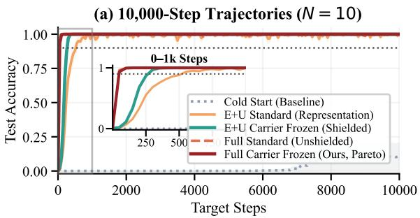
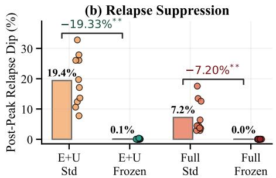
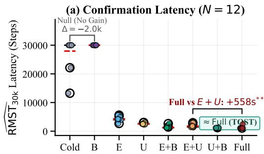
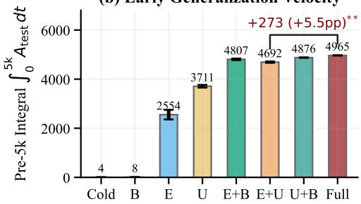
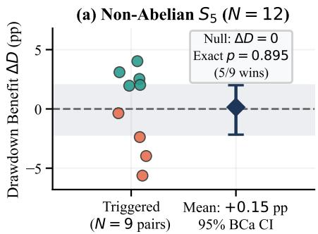
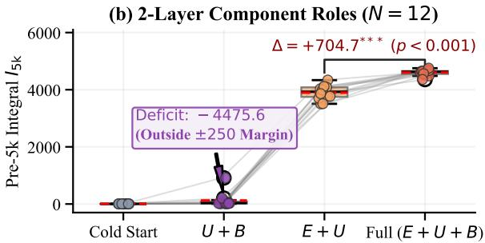
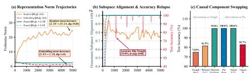
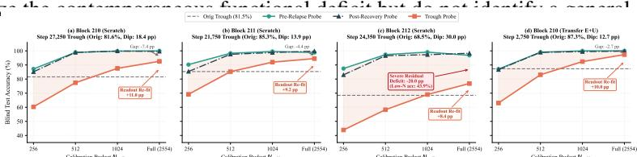

# BEYOND EMBEDDING TRANSFER: COMPONENT ROLES IN GROKKING TRANSFER AND STABILITY

Zeyu Jia Tianjin Medical University jiazeyu@tju.edu.cn

## ABSTRACT

Warm-start transfer can make algorithmic tasks generalize rapidly, yet it is unclear which model components provide the gain and whether that gain remains stable under continued optimization. We study cross-operator transfer on modular arithmetic and separate efficacy (early velocity) from stability (post-reach drawdown). In a scale-matched 108-run battery across 12 seed blocks (a 96-run 23 factorial plus a 12-run scale control), transferring internal attention/MLP weight matrices (B) in addition to token embeddings and readout (E + U) improves early mean accuracy by 5.46 percentage points (Holm p = 0.0039) and reduces confirmation latency by 558 steps (Holm p = 0.0088). While readout plus internal-block transfer satisfies the pre-specified ±500-step mean-latency equivalence criterion in one-layer models (TOST p = 0.0011, although Full is modestly faster in 11/12 paired seeds), a prospective two-layer replication confirms the internal-block acquisition advantage (12/12 seeds, +704.67 integral units, p = 4.88 × 10−4) while revealing an architecture-dependent boundary: omitting donor embeddings falls 4475.6 integral units below Full transfer, far outside the pre-specified ±250-unit equivalence margin. Continued target training, however, frequently triggers severe post-grokking relapse. Freezing transferred representation carriers (E, U) nearly eliminates offline relapse (19.40% → 0.07%, Holm p = 0.005859). Online validation-triggered gating slashes True Max Drawdown from 22.06% to 0.60% on 2a + b (p = 0.000488), with prospective confirmations extending protection across affine, nonlinear quadratic, and two-layer targets (10.94–23.47 pp reductions), while distinguishing continual stabilization from static early stopping. In nonabelian $S _ { 5 }$ , unshielded transfer surges transiently (95.4% peak), but a prospective shielding cohort yields no confirmed benefit (+0.15 ± 1.14 pp). These results establish a component-level dissociation between transfer acceleration and trajectory stability, and expose the empirical boundaries of parameter shielding.

## 1 INTRODUCTION

When trained on algorithmic and algebraic reasoning tasks with weight decay, overparameterized neural networks often exhibit grokking: training loss drops to zero almost instantly via memorization, yet held-out generalization is delayed by thousands or tens of thousands of optimization steps (Power et al., 2022; Liu et al., 2022; 2023). Mechanistic interpretability has established that for modular arithmetic, delayed generalization corresponds to the gradual formation of structured Fourier multiplication circuits and circular representation manifolds in embedding and attention weights (Nanda et al., 2023; Gromov, 2023; Varma et al., 2023).

Recently, Xu et al. (2025) demonstrated that initializing target models with input embeddings learned by a weaker model accelerates generalization on algorithmic tasks. In cross-operator transfer, however, focusing solely on input representations leaves open whether internal attention/MLP weight matrices (B) convey independent computational utility, and how warm-started models evolve during continued optimization. In practice, unshielded fine-tuning frequently exhibits acute post-reach generalization relapse, where initial gains are disrupted rather than monotonically refined. This leads to three concrete questions:

  
Figure 1: Separating takeoff velocity from trajectory stability (N = 10 Blocks 230–239: 60-run confirmatory matrix plus 10-run exploratory extension). (a) Test-accuracy trajectories (± SEM) Full transfer reaches 90% by step 50, versus 250–500 steps for representation conditions. (b) Freezing $E + U$ reduces post-peak relapse from 19.40% to 0.07% (Holm $p = 0 . 0 0 5 8 5 9 )$ . The exploratory $\mathtt { f u l l \_ c a r r i e r \_ f r o z e n }$ extension combines 50-step takeoff with 0.02% relapse.

1. Acquisition: Do internal attention/MLP weight matrices (B) provide computational acceleration beyond representation carriers $( E , U )$ , and does this requirement change across architecture depths?

2. Relapse: Why do warm-started models relapse, and which components undergo contemporaneous degradation during post-reach generalization collapse?

3. Protection: Can targeted parameter-level interventions suppress relapse without degrading early velocity or terminal accuracy, and where do these protections break down?

Across these questions, our central insight is that transfer acceleration and trajectory stability are governed by distinct component roles: internal attention/MLP weight matrices (B) contribute strongly to acquisition velocity, while shielding representation carriers controls retention stability; the carrier requirements for acquisition become architecture-dependent with depth. Our contributions are:

1. Component Roles and Architecture Dependence: Scale-matched factorial decomposition shows that internal-block transfer provides substantial incremental acquisition acceleration (+5.46 pp early accuracy, Holm $p = 0 . 0 0 3 9 ; + 7 0 4 . 6 7$ units in 2-layer replication, $p = 4 . 8 8 \times 1 0 ^ { - 4 } ) \mathrm { ; }$ however, the role of donor embeddings changes with depth, where omitting donor embeddings in two layers causes a massive —4475.6-unit acquisition deficit.

2. Acquisition and Stability as Distinct Lifecycle Properties: Fast warm-start acquisition does not guarantee retention under continued optimization. On a probed relapse, factorial state replacement localizes the contemporaneous functional deficit primarily to internal blocks, while linear readout refitting recovers 8.37–11.03 points at troughs, demonstrating substantial preserved linear decodability during apparent generalization collapse.

3. Validation-Triggered Carrier Protection and Its Boundaries: Representation carrier $( E + U )$ shielding strongly suppresses offline relapse $( 1 9 . 4 0 \%  0 . 0 7 \%$ , Holm $p = 0 . 0 0 5 8 5 9 )$ and online validation gating slashes max drawdown from 22.06% to 0.60% on $2 a + b ( p = 0 . 0 0 0 4 8 8 )$ with consistent gains on affine (+23.47 pp) and quadratic (+10.94 pp) tasks. Crucially, we identify its empirical boundaries: shielding achieves confirmed attenuation but incomplete protection in two-layer models (+15.35 pp reduction, residual drawdown 65.23%), and yields no confirmed benefit in non-abelian $S _ { 5 } \ : ( + 0 . 1 5 \pm 1 . 1 4 \ : \mathrm { p p } )$

## 2 PROBLEM FORMULATION & DUAL-TRACK PROTOCOL

## 2.1 TASK DEFINITIONS & ARCHITECTURE

We investigate algorithmic transfer across two canonical algebraic settings: (1) Abelian Modular Arithmetic $( p = 1 1 3 )$ : The source donor task is modular addition $a + b$ (mod 113); the target task is the affine modular target $2 a + b$ (mod 113). The sequence format is $[ a , b ]$ , predicting label $c \in \{ 0 , \ldots , p - 1 \}$ . The dataset comprises $1 1 3 \times 1 1 3 = 1 \bar { 2 } , 7 6 9$ pairs, partitioned into $2 0 \%$ train $( N _ { \mathrm { t r a i n } } = 2 { , } 5 5 4 )$ , 10% validation $( N _ { \mathrm { v a l } } = 1 , 2 7 7 )$ , and $7 0 \%$ test $( N _ { \mathrm { t e s t } } = 8 { , } 9 3 8 )$ via deterministic rounding. (2) Non-Abelian Symmetric Group $( S _ { 5 } ) \colon$ Source task is group multiplication a o b; target task is conjugation $a \circ b \circ a ^ { - 1 }$ . Sequences format two operand tokens $\bar { [ } a , b \bar { ] }$ where $a , b \in \{ 0 , \ldots , 1 1 \bar { 9 } \}$ predicting permutation index $c \in \{ 0 , \ldots , 1 1 9 \}$ . The domain contains $1 2 0 \times 1 2 0 = 1 4 { , } 4 0 0$ pairs, partitioned deterministically into 30% train $( N _ { \mathrm { t r a i n } } = 4 { , } 3 2 0 )$ , 20% validation $( N _ { \mathrm { v a l } } = 2 , 8 8 0 )$ , and 50% test $( N _ { \mathrm { t e s t } } = 7 { , } 2 0 0 )$ . Models are standard pre-LN Transformers (Power et al., 2022; Nanda et al., 2023) with $d _ { \mathrm { m o d e l } } = 1 2 8 , n _ { \mathrm { h e a d } } = 4 , d _ { \mathrm { m l p } } = 5 1 2$ . In full factor transfer (or full 2D-weight transfer, denoted $\pm \mathrm { u l l }$ or $E + U + B )$ , the network transfers token embeddings $( E ) .$ , the readout matrix (U), and internal attention/MLP weight matrices (B) with per-tensor Frobenius norm matching. Positional embeddings, LayerNorm parameters, and MLP biases retain their native cold-initialized values (exact parameter tensor mappings and initialization conventions are detailed in Appendix B). Optimization uses AdamW (Loshchilov & Hutter, 2019) with base learning rate $\eta = 1 0 ^ { \hat { - 3 } }$ , weight decay $\lambda = 1 . 0$ betas $\beta = ( 0 . 9 , 0 . 9 8 )$ , and batch size 512. Computations in the confirmatory battery are executed in standard FP32 precision (with PyTorch AMP utilized during earlier exploratory sweeps). Under carrier freezing interventions, only token embeddings $W _ { E }$ and readout head $W _ { U }$ are frozen $( \nabla _ { \theta } = 0 )$ positional embeddings, LayerNorms, and internal blocks remain fully trainable.

## 2.2 PER-TENSOR SCALE MATCHING (DECOUPLING DIRECTION FROM MAGNITUDE)

To ensure that transfer benefits reflect parameter direction rather than arbitrary initialization scale, all target initializations in seed block b are paired with a trained, qualified donor checkpoint $W _ { b } ^ { \mathrm { d o n o r } }$ and a native cold initialization $W _ { b } ^ { \mathrm { c o l d } }$ . A source run qualifies as a donor checkpoint only upon achieving stable grokking, defined by our prospectively specified gate as maintaining validation accuracy $\geq 9 0 \%$ across a continuous 1,000-step persistence window (21 consecutive evaluations at cadence $\Delta = 5 0 )$ . The donor checkpoint evaluated at the exact completion of this 21-point persistence window is saved and used as the qualified donor, with donor optimization terminating immediately upon saving to prevent post-hoc peak selection. For any transferred parameter tensor $\theta ,$ its direction is transferred while its Frobenius norm is rescaled to match the native cold initialization: $\theta ^ { \mathrm { t r a n s f e r } } = ( \theta ^ { \mathrm { d o n o r } } / ( \lVert \theta ^ { \mathrm { d o n o r } } \rVert _ { F } + 1 0 ^ { - 1 2 } ) ) \cdot \lVert \theta ^ { \mathrm { c o l d } } \rVert _ { F }$ . This controls for tensor-level Frobenius norm scaling differences, isolating parameter direction from overall tensor magnitude.

## 2.3 DUAL-TRACK EVALUATION METRIC PROTOCOL

Prior transfer studies typically emphasize whether transfer accelerates learning, while the stability of those gains under continued optimization is less often separated explicitly. We distinguish validation accuracy $A _ { \mathrm { v a l } } ( t )$ from held-out test accuracy $A _ { \mathrm { t e s t } } ( t )$ . Test accuracy is evaluated strictly for reporting and never controls triggering, optimization, hyperparameter selection, or confirmatory stopping decisions:

Efficacy Track (Early Velocity). We quantify efficacy by: (1) first reach step $t _ { \mathrm { r e a c h } } = \operatorname* { m i n } \{ t :$ $A _ { \mathrm { v a l } } ( t ) ~ \geq ~ 0 . 9 0 \}$ ; (2) pre-5k accuracy integral $\begin{array} { r } { I _ { 5 \mathrm { k } } = \int _ { 0 } ^ { 5 0 0 0 } A _ { \mathrm { t e s t } } ( t ) d t \in [ 0 , 5 0 0 0 ] } \end{array}$ ; and (3) fulltrajectory mean test accuracy $\begin{array} { r } { \bar { A } = \frac { 1 } { T } \int _ { 0 } ^ { T } A _ { \mathrm { t e s t } } ( t ) d t } \end{array}$

Stability Track (Retention & Relapse). We quantify stability by: (1) 21-point persistence confirmation $( H = 1 , 0 0 0$ steps at cadence $\Delta = 5 0$ , requiring $A _ { \mathrm { v a l } } ( t ) ~ \geq ~ 0 . 9 0$ across all $K = 2 1$ consecutive evaluations). For each seed block b, the confirmation latency is $T _ { b }$ , truncated at the uniform experimental horizon $\tau = 3 0 { , } 0 0 0$ steps as min $( T _ { b } , \tau )$ . Across a cohort of N blocks, the Restricted Mean Survival Time is estimated by the sample mean

$$
\widehat { \mathrm { R M S T } } _ { \tau } = \frac { 1 } { N } \sum _ { b = 1 } ^ { N } \operatorname* { m i n } ( T _ { b } , \tau ) ,\tag{1}
$$

assuming administrative censoring at the maximum budget $\tau ; ( 2 )$ post-peak relapse dip $\Delta _ { \mathrm { r e l a p s e } } =$ $\begin{array} { r } { A _ { \mathrm { t e s t } } ( t _ { \mathrm { p e a k } } ) - \operatorname* { m i n } _ { t > t _ { \mathrm { p e a k } } } A _ { \mathrm { t e s t } } ( t ) } \end{array}$ (primary stability metric for offline Phase C; maximum drawdown is supplementary); and (3) for online streaming interventions (§5.4–5.5), models branch from an online validation trigger step:

$$
t _ { \mathrm { t r i g } } = \operatorname* { m i n } \{ t : A _ { \mathrm { v a l } } ( t - \Delta ) \geq q \land A _ { \mathrm { v a l } } ( t ) \geq q \} ,\tag{2}
$$

requiring two consecutive validation evaluations above threshold $q$ at cadence $\Delta = 5 0$ (with $q = 0 . 9 5$ for modular arithmetic; $q = 0 . 7 0 \mathrm { f o r } S _ { 5 } )$ . Over a pre-specified finite observation horizon H steps

(b) Early Generalization Velocity  
  
Figure 2: Component Localization and Factorial Synergy $( N = 1 2$ Formal Blocks 210–221: 96 Factorial Runs plus 12 Scale Controls, 108 Runs Total). (a) Confirmation latency $\mathrm { \overline { { R M S T } } _ { 3 0 k } }$ across 8 factorial conditions (medians and individual points). Full transfer accelerates confirmation $\mathrm { 6 y + 5 5 8 . 3 }$ steps over representation transfer $E + U$ (Holm $p = 0 . 0 0 8 8 )$ . Crucially, co-transferring readout and internal blocks $( U + B )$ achieves TOST equivalence to full transfer $( p = 0 . 0 0 1 1$ $\Delta = - 1 6 . 7$ steps), while internal blocks alone (B) do not establish a confirmation benefit within the 30k horizon $( p = 0 . 5 0 )$ . (b) Pre-5k accuracy integral, confirming that full transfer provides +5.46 pp higher early accuracy than $E + U$ (Holm $p = 0 . 0 0 3 9 )$ post-trigger $( H = 1 , 5 0 0$ for modular cohorts; $H = 3 { , } 0 0 0$ for $S _ { 5 } )$ , we evaluate trajectory stability via the post-trigger True Max Drawdown:

$$
D _ { H } ^ { \mathrm { t r i g } } = \operatorname* { m a x } _ { t _ { \mathrm { t r i g } } \leq t \leq t _ { \mathrm { t r i g } } + H } \left[ \operatorname* { m a x } _ { t _ { \mathrm { t r i g } } \leq s \leq t } A _ { \mathrm { t e s t } } ( s ) - A _ { \mathrm { t e s t } } ( t ) \right] .\tag{3}
$$

Because early-stopping halts at $t _ { \mathrm { t r i g } } ,$ its post-trigger drawdown is identically $D _ { H } ^ { \mathrm { t r i g } } \equiv 0$ , matching Table 2.

## 2.4 STATISTICAL INFERENCE AND FAMILY-WISE ERROR RATE CONTROL

All paired contrasts are evaluated across paired seed blocks using exact two-sided sign-flip permutation tests $( 2 ^ { N }$ complete enumerations: $2 ^ { 1 \dot { 2 } } = 4 { , } 0 9 6$ in Phase $\mathbf { B } ; 2 ^ { \bar { 1 0 } } = 1 , 0 2 4$ in Phase C). In Phase B, family-wise error rate is controlled at $\alpha = 0 . 0 5$ via the step-down Holm-Bonferroni procedure (Holm, 1979) separately for the pre-specified eight-contrast efficacy family $( I _ { \mathrm { 5 k } }$ , Table 1) and the pre-specified eight-contrast stability family $( \mathrm { R M S T _ { 3 0 k } ) }$ , spanning cold vs. individual components, component additions, and scale control, with confidence intervals estimated via 10,000-resample Bias-Corrected and Accelerated (BCa) bootstrapping. For the primary contrast (Full vs. $E + { U \bar { \mathbf { \Lambda } } }$ , exact two-sided sign-flip permutation tests $( 2 ^ { 1 2 } = 4 { , } \stackrel {  } { 0 } 9 6$ enumerations) yield raw $p _ { \mathrm { p e r m } } = 2 / 4 0 9 6 = 0 . 0 0 0 4 8 8$ on efficacy; because the planned efficacy family contains $m = 8$ contrasts, the initial Holm multiplier is $m = 8 ,$ yielding $p _ { \mathrm { H o l m } } = 8 \times 0 . 0 0 0 4 8 8 = 0 . 0 0 3 9$ . For confirmation latency, raw $p _ { \mathrm { p e r m } } = 0 . 0 0 1 2 2 1$ yields step-down adjusted $p _ { \mathrm { H o l m } } = 7 \times 0 . 0 0 1 2 2 1 = 0 . 0 0 8 8$ . In the Phase C confirmatory battery, the superiority contrast family (carrier freezing, differential learning rate, temporary freezing) is evaluated under exact permutation tests with Holm-Bonferroni correction $( \alpha = 0 . 0 1$ pre-specified criterion) and 2,000-resample BCa bootstrapping, while non-inferiority (representation-only early velocity vs. full transfer) is evaluated via a one-sided shifted permutation test at $\alpha = 0 . 0 5$ against a pre-specified indifference margin $( \delta = 1 0 0 . 0 $ integral units). Equivalence in Phase B is assessed using a paired Student-t Two One-Sided Tests (TOST) procedure (Schuirmann, 1987) against a pre-specified ±500-step RMST margin (rather than a permutation test).

## 3 WHAT INFORMATION IS TRANSFERRED? CARRIER LOCALIZATION AND SYNERGY

To identify component-level contributions to transferred computation, Phase B executes a 108-run battery across 12 formal blocks (Blocks $2 1 0 { - } 2 2 1 \colon \mathrm { a ~ } 9 6 { \mathrm { - } } \mathrm { r u n } \ \mathrm { \hat { ~ } 2 ^ { 3 } }$ factorial ablation plus a 12-run scale control) on $a + b  2 a + b$ (mod 113). We decompose the model into: token embeddings (E), readout classification head $( \dot { U } )$ , and internal transformer blocks (B, including multi-head self-attention and MLP layers). Table 1 and Figure 2 report the complete findings.

Table 1: Phase B Battery and Inferential Contrasts $( p = 1 1 3 , N = 1 2$ paired blocks 210– 221: 96 factorial runs plus 12 scale controls, 108 runs total). Panel A (Descriptive Factorial Summary): Confirmation fraction $( \mathrm { V a l A c c } \geq 9 0 \%$ sustained across 1,000 steps), mean confirmation latency $( \widetilde { \mathrm { R M S T } } _ { 3 0 \mathrm { k } } )$ , pre-5k accuracy integral $\left( I _ { \mathrm { 5 k } } \right)$ , early mean test accuracy, and descriptive paired difference vs. full transfer $\mathrm { ( \Delta R M S \mathrm { \bar { T } = R M S T _ { c o n d } - \tilde { R M S T } _ { f u l l } ; } }$ positive values indicate slower confirmation than Full). Uncertainties are $\mathrm { M e a n } \pm \mathrm { S E M } \ : ( N = 1 2 ) $ The scale control condition (embed\_orig\_scale) achieves RMST 18,025.0 ± 1,944.4 steps, $I _ { 5 \mathrm { k } } = 1 { , } 1 3 1 . 6 \pm 2 0 8 . 5$ . Panel B (Prospectively Specified Inferential Contrasts and Equivalence): Formal statistical tests across paired blocks with explicit algebraic estimand formulas. Raw $p _ { \mathrm { p e r m } }$ is from exact two-sided sign-flip permutation tests $( 2 ^ { \bar { 1 2 } } = 4 , \bar { 0 9 6 }$ enumerations) with Holm-Bonferroni FWER control $( \alpha = 0 . 0 5 )$ For internal blocks alone (B vs. Cold), 10 of 12 blocks are mutually censored at $\tau = 3 0 { , } 0 0 0$ steps $\left( N _ { \mathrm { n o n - z e r o } } = 2 \right)$ , so the non-crossing BCa CI reflects pervasive censoring rather than significant divergence from the exact null $( p = 0 . 5 0 0 0 )$ . Equivalence for $U + B { \mathrm {  ~ \ v s ~ } }$ . Full is evaluated via a paired Student-t Two One-Sided Tests (TOST) procedure (Schuirmann, 1987) against the prespecified margin (±500 steps; $p _ { \mathrm { T O S T } } = 0 . 0 0 1 0 8 9 )$ ; the 12 paired differences comprise nine +100- step differences, one +50-step difference (Block 216), one +200-step difference (Block 218), and one —1,350-step difference (Block 217; mean —16.7 steps), establishing equivalence of average confirmation latency under the pre-specified tolerance rather than identical per-seed trajectories.
<table><tr><td colspan="6">Panel A: Factorial Condition Summary (N = 12 paired blocks: 96 factorial runs plus 12 scale controls)</td></tr><tr><td>Condition</td><td>Confirmed</td><td>Mean RMST (Steps)</td><td>Mean I5k (Units)</td><td>Mean Acc (0–5k)</td><td>Paired ∆RMST vs. Full [95% BCa CI]</td></tr><tr><td>Cold Start (cold)</td><td>2/12 (16.7%)</td><td> $\overline { { 2 7 , 9 5 0 . 0 \pm 1 , 4 8 6 . 7 } }$ </td><td>3.9 ± 0.2</td><td>0.08%</td><td>+26,775.0 [21392.8, 28700.0]</td></tr><tr><td>Internal Only (B)</td><td>0/12 (0.0%)</td><td>30,000.0 ± 0.0</td><td>7.5 ± 0.2</td><td>0.15%</td><td>+28,825.0 [28321.1, 28945.8]</td></tr><tr><td>Embedding Only (E)</td><td>12/12 (100.0%)</td><td> $4 , 2 2 0 . 8 \pm 2 1 9 . 5$ </td><td> $2 , 5 5 3 . 7 \pm 2 0 4 . 0$ </td><td>51.07%</td><td>+3,045.8 [2541.7, 3520.8]</td></tr><tr><td>Readout Only (U)</td><td>12/12 (100.0%)</td><td> $2 , 6 0 0 . 0 \pm 6 6 . 0$ </td><td> $3 , 7 1 0 . 6 \pm 5 5 . 7$ </td><td>74.21%</td><td>+1,425.0 [1011.5, 1608.3]</td></tr><tr><td>Embed + Block (E+B)</td><td>12/12 (100.0%)</td><td> $1 , 3 5 4 . 2 \pm 1 1 9 . 7$ </td><td> $4 . 8 0 6 . 9 \pm 3 2 . 6$ </td><td>96.14%</td><td>+179.2[-120.8,516.7]</td></tr><tr><td>Representation (E+U)</td><td>12/12 (100.0%)</td><td> $1 , 7 3 3 . 3 \pm 1 5 3 . 7$ </td><td>4,691.8 ± 27.4</td><td>93.84%</td><td>+558.3 [270.8, 954.2]</td></tr><tr><td>Readout + Block (U+B)  $\operatorname { F u l l } \operatorname { F a c t o r } \left( \operatorname { f u l l } , E + U + B \right)$ </td><td>12/12 (100.0%)</td><td> $\mathbf { 1 . 1 5 8 . 3 \pm 8 . 3 }$  1,175.0 ± 120.5</td><td>4,876.0 ± 8.4</td><td>97.52%</td><td>-16.7 [−500.0, 108.3]</td></tr><tr><td></td><td>12/12 (100.0%)</td><td></td><td>4,964.8 ± 2.4</td><td>99.30%</td><td>Baseline (0.0)</td></tr><tr><td colspan="6">Panel B: Prospectively Specified Inferential Contrasts and Equivalence Tests</td></tr><tr><td>Target Contrast</td><td>Contrast (A vs. B)</td><td>Algebraic Estimand Formula</td><td>Mean Difference [95% BCa CI]</td><td>Raw pperm</td><td>Holm / TOST p</td></tr><tr><td>Internal Efficacy Gain</td><td> $\operatorname { F u l l } \mathbf { v s } E + U$ </td><td> $I _ { \mathrm { 5 k } } ( \mathrm { f u l l } ) - I _ { \mathrm { 5 k } } ( E + U )$ </td><td>+273.0 [229.9, 339.7]</td><td>0.0005</td><td></td></tr><tr><td>Internal Latency Saving</td><td> $\operatorname { F u l l } { \mathrm { v s } } E + U$ </td><td> $\mathrm { R M S T } _ { E + U } - \mathrm { R M S T } _ { \mathrm { f u l l } }$ </td><td>+558.3 [270.8, 954.2]</td><td>0.0044</td><td> $p _ { \mathrm { H o l m } } = 0 . 0 0 3 9$  pHolm = 0.0088</td></tr><tr><td>Overall Transfer Gain</td><td> $\mathrm { C o l d ~ v s ~ F u l l }$ </td><td> $\mathrm { R M S T _ { c o l d } - R M S T _ { f u l l } }$ </td><td> $+ 2 6 , 7 7 5 . 0 \ [ 2 1 3 9 2 . 8 , 2 8 7 0 0 . 0 ]$ </td><td>0.0005</td><td> $ { p _ { \mathrm { H o l m } } } = 0 . 0 0 3 9$ </td></tr><tr><td>Internal Blocks Alone</td><td>Cold vs B</td><td> $\mathrm { R M S T } _ { \mathrm { c o l d } } - \mathrm { R M S T } _ { B }$ </td><td> $- 2 , 0 5 0 . 0 \ [ - 8 6 4 9 . 1 , - 6 5 4 . 2 ]$ </td><td>0.5000</td><td> $p _ { \mathrm { H o l m } } = 0 . 5 0 0 0 ( \mathrm { n . s . } )$ </td></tr><tr><td>Latency Equivalence (TOST)</td><td>U + B vs Full</td><td> $\mathrm { R M S T } _ { U + B } - \mathrm { R M S T } _ { \mathrm { f u l l } } ^ { - }$ </td><td>−16.7 [−500.0, 108.3]</td><td></td><td> $\begin{array} { r } { p _ { \mathrm { T O S T } } = 0 . 0 0 \dot { 1 } 1 } \end{array}$ </td></tr></table>

3.1 INTERNAL WEIGHT MATRICES PROVIDE SIGNIFICANT INCREMENTAL ACCELERATION

While transferring input and output representations (E+U) substantially accelerates confirmation relative to cold start (RMST 1,733.3 vs. 27,950.0), transferring the full factor direction $( E + U + B )$ provides significant incremental advantages along both evaluation tracks: (1) Efficacy Track: Full transfer increases the pre-5k integral by +273.0 units (95% BCa CI: [229.9, 339.7]), representing an average test accuracy gain of +5.46 percentage points over the first 5,000 steps (Holm $p =$ $0 . 0 0 3 9 < 0 . 0 1 )$ . (2) Stability Track: Full transfer reduces continuous confirmation latency by +558.3 steps (95% BCa CI: [270.8, 954.2], Holm $p \ = \ 0 . 0 0 8 8 < 0 . 0 1 )$ . Both tracks show a significant incremental benefit under FWER control: transferring internal attention/MLP weight matrices (B) improves learning beyond $E + U$ transfer alone.

## 3.2 FACTORIAL SYNERGY: READOUT POWER AND INTERNAL INDEPENDENCE

Examining isolated component transfers reveals unexpected structural asymmetries:

• The Readout Head Is a Strong Independent Carrier: Transferring the readout head alone (U) yields an integral of 3,710.6 units and confirmation in 2,600.0 steps, dramatically outperforming transferring the input embedding alone (E: 2,553.7 units, 4,220.8 steps).

• B Alone Fails to Improve Confirmation Within the 30k Horizon: Transferring B alone does not improve confirmation over cold start within the 30k horizon (0/12 confirmed; RMST 30,000.0 vs. 27,950.0, exact sign-flip $p = 0 . 5 0 0 0 )$ . Crucially, 10 of 12 blocks experienced mutual administrative censoring at $\tau = 3 0 { , } 0 0 0$ steps, leaving only two non-zero paired differences (—7,850 and –16,750 steps). While the descriptive BCa CI $( [ - \bar { 8 } , 6 4 9 . 1 , - 6 5 4 . 2 \bar { ] } )$ does not cross zero due to resampling predominantly from these two negative pairs, this does not overturn the non-significant pre-specified exact permutation test, reflecting pervasive censoring $\left( N _ { \mathrm { n o n - z e r o } } \ = \ 2 \right)$ rather than confirmed divergence.

• Scale Control Validates Magnitude Normalization: The scale control condition (embed\_orig\_scale) exhibits an RMST of 18,025.0 ± 1,944.4 steps (+13,804.2-step latency penalty vs. scale-matched E, Holm $p = 0 . 0 0 3 9$ ; Table 1), demonstrating empirically that unnormalized transfer of learned embedding magnitudes severely hinders downstream optimization and validating our scale-matching protocol.

• Non-Additive Interaction: The descriptive 3-way interaction ${ \cal I } _ { E U B } = { \cal F } _ { \mathrm { f u l l } } - { \cal F } _ { E U } - { \cal F } _ { E B } -$ $F _ { U B } + F _ { E } + F _ { U } + F _ { B } - F _ { 0 }$ is negative $( - 3 , 1 4 1 . 9$ integral units, $p = 0 . 0 0 0 5 )$ . Because $I _ { \mathrm { 5 k } }$ is bounded above by $5 { , } 0 0 0$ , we interpret this as ceiling-compressed diminishing returns rather than a distinct mechanism.

## 3.3 BOUNDED LATENCY EQUIVALENCE OF $U + B$ VS. FULL

The most striking discovery from Phase B emerges from comparing U+B against ful1. Across the 12 paired blocks, individual differences $\mathrm { R M S T } _ { U + B } - \mathrm { R M S T } _ { \mathrm { f u l l } }$ comprise nine blocks with +100 steps (where Full confirms at 1,050 and $U + B$ at 1,150), one block with +50 steps (Block 216), one with +200 steps (Block 218), and a single block with −1,350 steps (Block 217, where Full experienced delayed confirmation at 2,500 while $U + B$ confirmed at 1,150). Across all 12 blocks, U+B achieves an average confirmation latency of 1,158.3 steps (versus 1,175.0 for full transfer), differing by $\Delta = - 1 6 . { \bar { 7 } }$ steps (95% BCa $\operatorname { C I : } \ [ - 5 0 0 . 0 , 1 0 8 . 3 ] )$ . A paired Student-t TOST against the pre-specified margin $| \Delta | < 5 0 0$ steps rejects non-equivalence (using the conventional signs for the lower- and upper-bound tests, $t _ { L } = 3 . 9 7 5$ and $t _ { U } = - 4 . 2 4 9 .$ $d f = 1 1$ $p _ { \mathrm { T O S T } } = 0 . 0 0 1 0 8 9 )$ establishing operational equivalence of average confirmation latency within the pre-specified ±500- step tolerance rather than computational parity or identical per-seed trajectories. The mean difference is influenced by one delayed Full-transfer block (Block 217). Excluding this block yields a mean $U + B - \mathrm { F u l l }$ latency difference of +104.5 steps (median +100); the leave-one-out estimate remains comfortably within the pre-specified ±500-step equivalence margin. Across the 12 seeds, 11 of 12 exhibit positive differences (two-sided sign test $p = 0 . 0 0 6 3 5 )$ . Thus, $U + B$ satisfies the pre-specified ±500-step operational mean-latency equivalence criterion, although Full is modestly faster (by ≈ 100 steps) in $1 1 / 1 2$ paired seeds; the average-equivalence conclusion is therefore not driven by Block 217. Within this setting and metric, early-integral equivalence was not established.

## 4 WHY DOES GENERALIZATION RELAPSE? BOUNDED MECHANISTIC DIAGNOSTICS

Continued target training can produce severe accuracy relapses after initially successful generalization. We combine diagnostics with distinct evidential scope: the state swap and displacement analyses examine an exploratory single probed trajectory (Blocks 210/230), while linear probes across four testconditioned relapse events (three scratch, one transfer) characterize contemporaneous decodability deficits rather than establishing a universal causal mechanism. A single-block trajectory shows concurrent embedding-norm decline, readout-norm growth, and subspace drift; these do not track accuracy monotonically and are thus observations rather than causes (Appendix A.1). $\textrm { A } 2 ^ { 4 }$ stateswap on one 25.24-point relapse exchanges embeddings (E), readout (U), internal blocks (B), and remaining positional/LayerNorm parameters (R). Restoring pre-relapse B raises trough accuracy from 74.76% to 99.85%, whereas restoring $E + { \dot { U } }$ reaches 81.45%; injecting trough $E \bar { + } U$ into the pre-relapse state leaves accuracy at 100%. Thus, on this checkpoint pair, the functional deficit is concentrated primarily in internal blocks.

From the same pre-relapse state and optimizer history, freezing either $E + U$ or B prevents the impending 50-step dip on the probed trajectory. Net internal-block displacement over that interval is predominantly tangential $( \geq 8 8 . 4 \% )$ , and applying the measured tangential component reproduces low accuracy whereas the radial component does not. On this trajectory, these interventions implicate joint co-adaptation and tangential internal-block motion in the collapse.

An exploratory, test-conditioned probe analysis examines four qualified relapses selected from 12 trajectories (three Scratch and one $E + U$ transfer; Appendix A). Refitting a linear readout on trough features improves accuracy by $8 . 3 7 \mathrm { - } 1 1 . 0 3 $ points. Trough probes are less accurate than their pre-relapse counterparts at every tested calibration budget; at $\mathsf { \bar { N } } = 2 5 5 4$ , deficits range from 2.66 to 20.00 points. Together, these probes show that trough representations retain recoverable target information but become substantially harder to decode linearly. Cross-initialization differences remain unresolved.

Table 2: Online Dynamic Validation Gating Across Four Prospective Confirmatory Cohorts (p = 113, H = 1,500 Steps Post-Trigger). Evaluation of online carrier freezing upon reaching validation accuracy ≥ 95% across verification (2a+b, 1-layer, Blocks 250–261, N = 12), prospective affine (3a + b, Blocks 270–281, N = 12), prospective nonlinear quadratic $( a ^ { 2 } + b ^ { 2 }$ , Blocks 290–301, $N = 1 2 )$ , and prospective 2-layer target $( 2 a + b ,$ Blocks 310–321, N = 12) cohorts, contrasted with unshielded AdamW and Trigger Snapshot (early stopping). Uncertainties are Mean ± SEM across seeds $( p _ { \mathrm { { f i i p } } }$ from exact two-sided sign-flip permutation tests). By construction, Trigger Snapshot terminates optimization at the trigger, yielding strictly zero post-trigger drawdown. Offline shielding and geometric update ablations are detailed in §5–§6 and the supplementary archive.
<table><tr><td>Target Cohort / Policy</td><td>Trigger trig</td><td>True Max DD (%)</td><td>Min Test Acc (%)</td><td>Terminal Acc (%)</td><td>Prospective Effect (pflip)</td></tr><tr><td colspan="6">Cohort 1: Verification Target (a + b → 2a + b, N = 12 Blocks 250–261, 1-Layer, H = 1,500 Steps)</td></tr><tr><td>Trigger Snapshot (Stop at ttrig)</td><td>504 ± 48</td><td>0.00%</td><td>99.21% ± 0.14%</td><td>99.21% ± 0.14%</td><td>Early Stopping Baseline (halted at trigger)</td></tr><tr><td>2a + b Standard AdamW</td><td>504 ± 48</td><td>22.06% ± 2.47% 0.60% ± 0.17%</td><td>77.88% ± 2.47% 98.94% ± 0.20%</td><td>99.80% ± 0.09% 99.36% ± 0.11%</td><td>Unshielded Relapse Baseline +21.45 pp reduction, 12/12 wins (p = 0.000488**)</td></tr><tr><td colspan="6">2a + b Online Freeze E + U 504 ± 48</td></tr><tr><td>Cohort 2: Prospective Affine Extension (a + b -</td><td></td><td>→ 3a + b, N = 12 Fresh Blocks 270–281, 1-Layer)</td><td></td><td></td><td></td></tr><tr><td>Trigger Snapshot (Stop at ttrig) 3a + b Standard AdamW</td><td>1042 ± 62</td><td>0.00%</td><td>98.86% ± 0.24% 71.18% ± 2.38%</td><td>98.86% ± 0.24%</td><td>Early Stopping Baseline (halted at trigger)</td></tr><tr><td colspan="6">1042 ± 62 28.56% ± 2.37%</td></tr><tr><td>3a + b Online Freeze  ${ \stackrel {  } { E } } + U$ </td><td>1042 ± 62</td><td>5.09% ± 1.48%</td><td>94.28% ± 1.58%</td><td>98.89% ± 1.10% 97.79% ± 0.90%</td><td>Unshielded Relapse Baseline Affine Confirmed: +23.47 pp, 12/12 (p = 0.000488**)</td></tr><tr><td>Cohort 3: Prospective Nonlinear Quadratic Extension (a + b → a2 + b2, N = 12 Fresh Blocks 290–301, 1-Layer)</td><td></td><td></td><td></td><td></td><td></td></tr><tr><td colspan="6">Trigger Snapshot (Stop at ttrig)</td></tr><tr><td>a2 + b2 Standard AdamW</td><td>229 ± 7 229 ± 7</td><td>0.00% 11.09% ± 0.99%</td><td>99.87% ± 0.07% 88.91% ± 0.99%</td><td>99.87% ± 0.07% 99.99% ± 0.01%</td><td>Early Stopping Baseline (halted at trigger) Unshielded Relapse Baseline</td></tr><tr><td>a2 + b2 Online Freeze  $E + U$ </td><td>229 ± 7</td><td>0.15% ± 0.02%</td><td>99.80% ± 0.07%</td><td>99.91% ± 0.02%</td><td>Quadratic Confirmed: +10.94 pp, 12/12 (p = 0.000488**)</td></tr><tr><td colspan="6">Cohort 4: Prospective 2-Layer Target Architecture (a + b → 2a + b, N </td></tr><tr><td>Trigger Snapshot (Stop at ttrig)</td><td>1508 ± 255</td><td></td><td>97.78% ± 0.45%</td><td>= 12 Fresh Blocks 310–321, 2-Layer) 97.78% ± 0.45%</td><td>Early Stopping Baseline (halted at trigger)</td></tr><tr><td>2-Layer Standard AdamW</td><td>1508 ± 255</td><td>0.00%</td><td>18.82% ± 1.77%</td><td>90.23% ± 6.30%</td><td></td></tr><tr><td>2-Layer Online Freeze E + U</td><td>1508 ± 255</td><td>80.58% ± 1.86% 65.23% ± 2.23%</td><td>33.62% ± 2.15%</td><td>98.85% ± 0.44%</td><td>Unshielded Relapse Baseline Two-Layer Confirmed: +15.35 pp, 11/12 (p = 0.00195**)</td></tr></table>

## 5 TARGETED PROTECTION: OFFLINE SHIELDING AND ONLINE DYNAMICGATING

## 5.1 INTERVENTION FORMULATION

Guided by our diagnostic findings, Phase C formulates targeted parameter-level interventions designed to shield transferred computation against optimization collapse: (1) Carrier Freezing (carrier\_frozen): Representation matrices $\theta \in \hat { \{ W _ { E } , W _ { U } \} }$ are permanently frozen $( \nabla _ { \theta } = 0 ,$ weight decay deactivated: $\theta ( t ) \equiv \theta ( 0 ) )$ ; positional embeddings, LayerNorms, and internal blocks $W _ { B }$ remain fully trainable. Because standard AdamW couples gradient steps and weight decay $( \theta _ { t + 1 } = \theta _ { t } - \eta g _ { t } - \eta \lambda \theta _ { t } )$ , parameter freezing bundles data-gradient suppression with the arrest of weight decay erosion. Our differential learning rate ablation directly tests whether soft attenuation suffices under the tested $\lambda = 1 . 0$ schedule. (2) Differential Learning Rate (carrier\_1r\_0 .1): Soft dampening with $\eta _ { \mathrm { c a r r i e r } } = 1 0 ^ { - 4 } ( 0 . 1 \times$ base LR) and base weight decay λ = 1.0. (3) Unconfounded Warmup Freezing (freeze\_warmup\_500\_norest): Representation carriers are frozen for 500 steps, then released without resetting optimizer state.

## 5.2 CONFIRMATORY BATTERY RESULTS (N = 10 INDEPENDENT BLOCKS 230–239, 60 RUNS)

We evaluate all interventions across 10 fresh, prospectively specified blocks (60 runs × 10,000 steps). Figure 1 presents the trajectory dynamics and confirmatory results; detailed numerical summaries are reported below and archived in the supplementary materials.

Relapse Suppression via Carrier Freezing. Under standard fine-tuning (E+U\_st andard), 100% (10/10) of runs suffer post-reach relapse, with a mean post-peak dip of 19.40% and mean max drawdown of 20.34%. Permanently freezing the carriers (E+U\_carrier\_frozen) virtually eliminates relapse: post-peak relapse dip is slashed from 19.40% to 0.07% (+19.33 pp reduction, 95% BCa CI: [14.91, 24.69], Holm $p = 0 . 0 0 5 8 5 9 < 0 . 0 1 )$ , and supplementary post-reach max drawdown is slashed from 20.34% to 0.09% (+20.26 pp reduction, 95% BCa CI: [15.75, 24.96], Holm $p = 0 . 0 0 5 8 5 9 < 0 . 0 1 )$ . Across all 10 independent blocks, the contrast is unanimously concordant (10/10 pairs positive), confirming carrier-freezing relapse suppression.

Tested Soft Interventions Fail to Suppress Relapse. Neither 0.1× carrier LR nor 500-step temporary freezing significantly suppresses relapse under the tested schedules (20.80% and 14.12% mean dip, Holm p = 0.820 and $p = 0 . 2 4 2 ) ;$ delayed relapse remains within the 10k-step horizon.

Early Velocity Non-Inferiority Boundary. We tested whether representation-only frozen transfer (E+U\_carrier\_frozen) could match the early learning velocity of full-factor standard transfer (ful1\_standard) within a pre-specified non-inferiority margin of $\delta = 1 0 0 . 0$ integral units. The empirical mean gap is -144.93 units (95% $\mathbf { B C a C I } \colon [ - 1 6 4 . 5 4 , - 1 2 7 . 2 1 ] )$ . A one-sided shifted permutation test yields $p = 0 . 9 9 9 0 > 0 . 0 5$ , officially failing non-inferiority. As visible in Figure 1(a) inset, full\_standard crosses 90% accuracy at step 50, whereas E+U\_carrier\_frozen requires 250 steps. Representation-only shielding did not match the early efficacy of full transfer under the pre-specified non-inferiority criterion.

## 5.3 RESOLVING THE 4-QUADRANT LIFECYCLE: TAKEOFF AND STABILITY SYNERGIES

The confirmatory results separate two effects: internal-parameter transfer improves early takeoff, whereas freezing $E + U$ improves stability. In an exploratory 10-run extension, combining full transfer with carrier freezing preserves 50-step takeoff while reducing relapse to 0.02%.

## 5.4 ONLINE CAUSAL PROTECTION VIA DYNAMIC VALIDATION GATING

While offline carrier freezing from initialization achieves stability, it requires deciding parameter shielding ahead of time. To eliminate this constraint, we formulate Online Dynamic Validation Gating: models begin with unshielded optimization; upon reaching validation accuracy $\geq 9 5 \%$ for two consecutive evaluations (cadence $\Delta = 5 0 )$ , representation matrices $W _ { E } , W _ { U }$ are dynamically frozen for subsequent training over a pre-specified finite observation horizon of $H = 1 { , } 5 0 0$ steps posttrigger. We emphasize that our causal stability claim evaluates finite-horizon trajectory robustness $( \bar { H = 1 } , 5 0 0 \ \mathrm { s t e p s } ) ;$ long-term stability under unbounded post-trigger optimization remains open. After repairing optimizer-state aliasing in an earlier implementation, we re-evaluated the verification cohort (Blocks $\bar { 2 5 0 } { - } 2 6 1 , N = 1 2 )$ with deep-copy isolation, state-hash assertions, and executionorder checks (Table 2, Cohort 1): (1) Drawdown Suppression: Under standard training, models suffer severe post-trigger collapse (mean True Max Drawdown $2 2 . 0 6 \%$ min test accuracy 77.88%). Online carrier freezing slashes True Max Drawdown to 0.60% (median 0.42%, min accuracy 98.94%), yielding an average reduction ${ \bf o f + 2 1 . 4 5 }$ percentage points (95% BCa CI: [+17.76, +27.06], 12/12 concordant pairs, exact two-sided sign-flip $p = 0 . 0 0 0 4 8 8 < 0 . 0 0 1$ ; development cohort replicates with $1 2 / 1 2$ wins, $2 0 . 2 0 \%  1 . 8 3 \% , p = 0 . 0 0 0 4 8 8 )$ . (2) Geometric Constraints: Pinned direction with free norm (EU\_radi a1) yields 37.36% drawdown and is worse than pinned norm with free direction (EU\_t angent i a1, 5.44%) in all 12 seeds. Complete freezing yields 0.60% drawdown and beats pinned norm in 9/12 seeds $( p = 0 . 0 0 5 3 7 1 )$ . The permitted update subspaces therefore produce sharply different stability outcomes. (3) Baseline Triad and Cohort Distinction: Post-breakthrough degradation admits distinct operational solutions: (i) Early Stopping halts at the validation trigger $( t _ { \mathrm { t r i g } } = 5 0 4 \pm 4 8 )$ , yielding $9 9 . 2 1 \% \pm 0 . 1 4 \%$ test accuracy with strictly 0.00% drawdown; (ii) Retrospective Checkpointing selects the peak validation model across the trajectory. In offline Phase C (Blocks $2 3 0 { - } 2 3 9 )$ , unshielded transfer achieves peak test accuracy of $9 9 . 9 \dot { 2 } \% \pm 0 . 0 4 \%$ (step $9 1 0 \pm 1 0 4 )$ for E+U\_standard (despite a 19.40% relapse dip) and $9 9 . 9 7 \% \pm 0 . 0 3 \%$ (step $8 5 \pm 8 )$ for ful1\_standard (despite a 7.21% dip). Offline retrospective selection and online streaming cohorts represent distinct operational regimes and must not be conflated as direct numerical competitors. Early stopping and retrospective checkpointing address static model delivery; online carrier freezing addresses the distinct regime in which target optimization continues beyond the validation trigger, maintaining higher trajectory mean accuracy (99.55% vs. 99.37%) at a minor terminal cost (−0.44 pp, 99.36% vs. 99.80%).

## 5.5 PROSPECTIVE CONFIRMATION ACROSS TASKS AND ARCHITECTURE DEPTHS

Affine Extension $( 3 a + b$ (mod 113)). On $N = 1 2$ fresh blocks (Blocks 270–281; all triggered at steps 750–1,350), unshielded fine-tuning undergoes acute relapse (True Max Drawdown 28.56% range $1 7 . 5 8 \% \sim 4 5 . 5 7 \%$ , min accuracy 71.18%). Online carrier freezing slashes True Max Drawdown to 5.09% (median 3.55%, min accuracy 94.28%), achieving an average reduction of +23.47 percentage points (95% BCa CI: $[ + 1 9 . 5 6 , + \dot { 2 } 9 . 3 7 ] , 1 2 / 1 2$ concordant pairs, $p = 0 . 0 0 0 4 8 8 < 0 . 0 1 )$ confirming the primary prospectively specified hypothesis. The secondary boundary prediction $( \leq 2 . 0 \%$ cohort mean drawdown) was not supported (cohort mean 5.09%). Terminal test accuracy under online freeze is $9 7 . 7 9 \% \pm 0 . 9 0 \% ( - 1 . 1 0 \mathrm { p p }$ vs. unshielded), confirming that online freezing stabilizes continued downstream optimization.

Nonlinear Quadratic Extension $( a ^ { 2 } + b ^ { 2 }$ (mod 113)). Prospective evaluation on the nonlinear quadratic target $a + b  a ^ { 2 } + b ^ { 2 }$ (mod 113) across $N = 1 2$ fresh blocks (Blocks $2 9 0 { - } 3 0 1 ;$ all triggered at steps 200–250, $t _ { \mathrm { t r i g } } = 2 2 9 \pm 7 )$ confirms that unshielded models experience substantial post-trigger collapse (mean True Max Drawdowň $1 1 . 0 9 \% \pm 0 . 9 9 \%$ , range $5 . 8 \bar { 3 } \% \sim 1 6 . 3 3 \%$ , min accuracy 88.91%). Online carrier freezing slashes True Max Drawdown to $\mathbf { 0 . 1 5 \% \pm 0 . 0 2 \% }$ (range

  
Figure 3: Generality and Dynamical Boundaries. (a) Non-abelian $S _ { 5 }$ dynamic protection $( N = 1 2$ prospective blocks, 9 triggered pairs): carrier shielding shows no confirmed drawdown benefit $( \Delta D = + 0 . 1 5 \pm 1 . 1 4$ pp, exact $p \ = \ 0 . 8 9 5 )$ . (b) Two-layer component roles $( I _ { 5 \mathrm { k } } , \ : N = 1 2 $ fresh blocks): internal blocks accelerate acquisition $\mathrm { ( + 7 0 4 . 6 7 }$ units, $p < 0 . 0 0 1 )$ , while omitting donor embeddings $( U + B )$ incurs a —4475.63-unit deficit exceeding the pre-specified ±250-unit equivalence margin.

$0 . { \dot { 0 } } 1 \% \sim 0 . 3 0 \%$ , min accuracy $\mathbf { 9 9 . 8 0 \% } \pm \mathbf { 0 . 0 7 \% } ) .$ achieving an average reduction of $\mathbf { \dot { \theta } } + \mathbf { 1 0 . 9 4 }$ percentage points (95%BCa CI: $[ + 9 . 1 3 , + 1 2 . 7 4 ]$ , 12/12 positive wins, $p = 0 . 0 0 0 4 8 8 < 0 . 0 1 )$ with minimal terminal cost (—0.09 pp, 99.91% vs. 99.99%). Prospective confirmation extends the protection effect beyond affine targets to a nonlinear quadratic operator $( a ^ { 2 } + b ^ { 2 }$ (mod 113)).

Cross-Depth Extension (2-Layer Target Architecture). Prospective evaluation confirms that the protective effect extends from one- to two-layer target models: qualified 1-layer donors $( a + b )$ transferred $E + U$ direction to a 2-layer target $( 2 a + b$ (mod 113), $L = 2 , 4 2 5 , 4 7 2$ parameters, cold internal blocks) across $N = 1 2$ fresh blocks (Blocks 310–321, triggered at $t _ { \mathrm { t r i g } } = 1 5 0 8 \pm 2 5 5 )$ Unshielded fine-tuning suffers severe collapse (True Max Drawdown $8 0 . 5 8 \% \pm 1 . { \bar { 8 6 \% } }$ , min accuracy 18.82%). Carrier shielding prospectively attenuates post-breakthrough drawdown in two-layer targets, reducing True Max Drawdown to $\mathbf { 6 5 . 2 3 \% \pm 2 . 2 3 \% }$ 0 $\mathbf { ( + 1 5 . 3 5 }$ percentage points reduction, 95% BCa CI: [+9.30, +21.01], 11/12 concordant wins, $p = 0 . 0 0 1 9 5 3 < 0 . 0 1 )$ . Terminal accuracy was descriptively higher under freezing (98.85% vs. 90.23%), partly because several standard branches failed to recover within the observation window. Carrier shielding reduces drawdown by 15.35 pp at two layers, but the 65.23% residual drawdown shows that protection is partial rather than complete.

## 6 GENERALITY BOUNDARIES: NON-ABELIAN GROUPS AND LAYER DEPTH

## 6.1 NON-ABELIAN CONJUGATION: TRANSIENT TRANSFER AND EMPIRICAL BOUNDARY

To probe boundaries beyond abelian arithmetic, Phase 1 evaluated transfer from a · b to conjugation $a \cdot { \overset { \cdot } { b } } \cdot a ^ { - 1 }$ on non-abelian $S _ { 5 } \left( \vert { \cal S } _ { 5 } \vert = 1 2 0 \right.$ , sequence format $[ a , b ]$ , predicting permutation index $c = a \circ$ b o $a ^ { - 1 }$ , 14,400 pairs total partitioned into $N _ { \mathrm { t r a i n } } = 4 { , } 3 2 0 [ 3 0 \% ] , N _ { \mathrm { v a l } } = 2 { , } 8 8 0 [ 2 0 \% ]$ $N _ { \mathrm { t e s t } } = 7 { , } 2 0 0$ [50%]; 60k steps; Figure 3(a)). Transferred runs surge to peak accuracy of 95.39% (Block 25) and 84.62% (Block 31) versus cold start (5.83%), yet fail persistent confirmation $( 0 / 4$ at $q = 0 . 9 0 )$ . In a prospective $N = 1 2$ cohort (Blocks 350–361), triggering required two consecutive validation evaluations $\geq 0 . 7 0$ at cadence $\Delta = 5 0$ within $M _ { \mathrm { p r e } } = 3 5 { , } 0 \bar { 0 } 0$ steps (achieved by 9/12 blocks at $7 1 . 2 2 \% \pm 0 . 5 1 \% )$ . Over horizon $H = 3 { , } 0 0 0$ steps, carrier shielding showed no confirmed drawdown benefit on triggered pairs $( \Delta D = + { \bf 0 . 1 5 \pm 1 . 1 4 } \mathrm { p p }$ , 95% BCa CI: [−2.17, +2.00] pp, exact sign-flip $p = 0 . 8 9 4 5 3 1 )$ . In the intention-to-treat policy estimand, the 3 untriggered blocks continue unshielded $( \Delta D = 0 )$ , yielding full-cohort policy effect $\Delta D = + 0 . 1 1 \pm 0 . 8 \bar { 4 } \mathrm { { I } }$ pp (95% BCa $\operatorname { C I } : [ - 1 . 7 2 , + 1 . 4 7 ]$ pp), providing a cross-family boundary case.

## 6.2 TWO-LAYER COMPONENT ROLES: ACQUISITION AND EMBEDDINGS

Following exploratory runs right-censored at 30k steps $( p = 0 . 2 5 0 0 )$ , we evaluated a 60-run confirmatory battery across $N = 1 2$ fresh blocks (Blocks 330–341, 10k steps; comprising 12 donor training runs on 2-layer $a + b$ plus 48 target runs across 4 conditions: cold, ‘full, E+U, and U+B; Figure 3(b)). Donors are 2-layer Transformers $( L = 2 , 4 2 5 , 4 7 2$ parameters); transfer maps internal blocks layer-by-layer $( B _ { 0 } \to B _ { 0 } , B _ { 1 } \to B _ { 1 } )$ alongside representation matrices $( W _ { E } , W _ { U } )$ with cold Frobenius scale matching. (1) Internal Acceleration: Internal blocks accelerate acquisition beyond $E + U$ in two-layer models $( 1 2 / 1 2$ wins, $I _ { 5 \mathrm { k } } = 4 6 0 0 . 9 \pm 3 1 . 3$ VS $3 8 9 6 . 3 \pm 7 3 . 4 .$ gain $\mathbf { + 7 0 4 . 6 7 }$ units, 95% BCa $\mathrm { C I } \colon [ + 5 4 9 . 8 6 , + 8 7 0 . 0 0 ]$ , exact $p = 0 . 0 0 0 4 8 8 < 0 . 0 0 1$ ; trigger onset $1 , 2 8 3  1 5 8$ steps). (2) Embedding Requirement: Transferring $U + B$ without donor embeddings fails to preserve Full-transfer acquisition $( I _ { 5 \mathrm { k } } = 1 2 5 . 3 \pm 7 3 . 7 $ , deficit —4475.63 units, 95%BCa $\mathrm { C I } { : [ - 4 5 7 0 . 5 6 , - 4 2 2 9 . 4 7 ] } ;$ untriggered in 10/12 blocks), falling far outside the ±250-unit equivalence margin (TOST $p = 1 . 0 0 0 0 0 0 \rangle$ . Donor embeddings are thus required to preserve Full-transfer acquisition in two-layer models.

## 7 RELATED WORK

Delayed generalization in modular arithmetic (Power et al., 2022; Liu et al., 2022) reflects trigonometric circuits (Nanda et al., 2023; Varma et al., 2023) and lazy-to-rich transitions (Kumar et al., 2024); scale matching isolates directional transfer (Hagmann et al., 2023). While Xu et al. (2025) show that pre-trained embeddings accelerate single-task grokking, our factorial decomposition separates internal computation from representation carriers: internal blocks accelerate acquisition with transferred carriers, while donor embeddings are required in two-layer models. Closest to our stability analysis, Janati et al. (2026) show that parameter freezing prevents circuit unlearning in single-task grokking. We investigate cross-operator transfer, establish a dissociation between acquisition velocity and retention stability, and introduce dynamic validation gating to stabilize continual post-trigger optimization.

## 8 DISCUSSION, LIMITATIONS, AND CONCLUSION

This work characterizes the algorithmic transfer lifecycle in grokking: (1) Acquisition: Internalblock transfer accelerates acquisition beyond carriers, replicating at two layers (+704.67 units, $p \ < \ 0 . 0 0 1 )$ . Co-transferring internal blocks and heads satisfies the pre-specified mean-latency equivalence criterion to Full in one-layer models, whereas donor embeddings are required in twolayer models $( U + B$ falls 4475.6 units below Full, TOST $p = 1 . 0 0 ) $ . (2) Relapse: Factorial state replacement localizes post-transfer deficits to internal blocks; linear readout refitting recovers 8.37– 11.03 points without parameter retraining. (3) Protection and Boundaries: Online carrier shielding suppresses acute relapse in one-layer tasks $( + 2 1 . 4 5 , + 2 3 . 4 7 , + 1 0 . 9 4 \mathrm { p p } )$ and attenuates drawdown in two-layer targets $( 8 0 . 5 8 \%  6 5 . 2 3 \% , + 1 5 . 3 5$ pp), though residual instability remains at two layers. While early stopping secures static accuracy $( \geq 9 8 . 8 \% )$ , online carrier freezing stabilizes continual optimization beyond the trigger. In contrast, prospective $S _ { 5 }$ transfer did not reproduce shielding benefits $( \Delta D = ^ { \cdot } + 0 . 1 5 \pm 1 . { \overset { \cdot } { 1 4 } } \operatorname { p p }$ , exact $p = 0 . 8 9 5 )$ , providing a cross-family boundary case. Whether component specialization generalizes to deeper architectures and non-algorithmic domains remains open. Together, these findings support a component-level account of transfer acceleration and continual stability in algorithmic Transformers.

Reproducibility Statement. Architectures, splits, hyperparameters, protocols, and statistical tests are in the text and appendices; run artifacts contain deterministic seeds, checkpoints, and reproduction scripts. AI Use Statement. AI tools assisted with code development and manuscript editing. The authors designed the study, audited numerical claims against saved artifacts, and remain responsible for the scientific content.

## REFERENCES

Andrey Gromov. Grokking modular arithmetic. arXiv preprint arXiv:2301.02679, 2023. URL https://arxiv.org/abs/2301.02679v1.

Michael Hagmann, Philipp Meier, and Stefan Riezler. Towards inferential reproducibility of machine learning research. International Conference on Learning Representations (ICLR), 2023. URL https://arxiv.org/abs/2302.04054v7.

Dan Hendrycks and Kevin Gimpel. Gaussian error linear units (gelus). arXiv preprint arXiv:1606.08415,2016.URLhttps://arxiv.org/abs/1606.08415.

Sture Holm. A simple sequentially rejective multiple test procedure. Scandinavian Journal of Statistics, 6(2):65–70, 1979.

Ali Janati, Kaoutar El Maghraoui, Andrei Kanavalau, and Anass Belfatmi. Post-grokking collapse at the representation-readout interface in muon-trained transformers. arXiv preprint arXiv:2608.07436,2026.URL https://arxiv.org/abs/2608.07436.

Tanishq Kumar, Blake Bordelon, Samuel J. Gershman, and Cengiz Pehlevan. Grokking as the transition from lazy to rich training dynamics. International Conference on Learning Representations (ICLR),2024.URL https://arxiv.org/abs/2310.06110v3.

Ziming Liu, Ouail Kitouni, Niklas Nolte, Eric J. Michaud, Max Tegmark, and Mike Williams. Towards understanding grokking: An effective theory of representation learning. Advances in Neural Information Processing Systems, 2022. URL https://arxiv.org/abs/2205.10343v2.

Ziming Liu, Eric J. Michaud, and Max Tegmark. Omnigrok: Grokking beyond algorithmic data. International Conference on Learning Representations (ICLR), 2023. URL https : // arxiv . org/abs/2210.01117v2.

Ilya Loshchilov and Frank Hutter. Decoupled weight decay regularization. International Conference on Learning Representations (ICLR), 2019. URL https : //openreview .net/forum?id= Bkg6RiCqY7.

Neel Nanda, Lawrence Chan, Tom Lieberum, Jess Smith, and Jacob Steinhardt. Progress measures for grokking via mechanistic interpretability. International Conference on Learning Representations (ICLR),2023.URLhttps://arxiv.org/abs/2301.05217v3.

Alethea Power, Yuri Burda, Harri Edwards, Igor Babuschkin, and Vedant Misra. Grokking: Generalization beyond overfitting on small algorithmic datasets. arXiv preprint arXiv:2201.02177, 2022. URLhttps://arxiv.org/abs/2201.02177v1.

Donald J. Schuirmann. A comparison of the two one-sided tests procedure and the power approach for assessing the equivalence of average bioavailability. Journal of Pharmacokinetics and Biopharmaceutics, 15(6):657–680, 1987.

Vikrant Varma, Rohin Shah, Zachary Kenton, Janós Kramár, and Ramana Kumar. Explaining grokking through circuit efficiency. Advances in Neural Information Processing Systems, 2023. URLhttps://arxiv.org/abs/2309.02390v1.

Zhiwei Xu, Zhiyu Ni, Yixin Wang, and Wei Hu. Let me grok for you: Accelerating grokking via embedding transfer from a weaker model. International Conference on Learning Representations (ICLR),2025. URL https://proceedings.iclr.cc/paper\_files/paper/2025/ hash/fa5ddd6bac0d665c72969d79221b680a-Abstract-Conference.html.

## A DIAGNOSTIC LINEAR PROBING SPECIFICATION, OPTIMIZATION CONVERGENCE CHECKS, AND FULL ACCOUNTING

This appendix provides the full technical specification, optimization convergence checks, trajectory event accounting, and numerical results for the diagnostic linear probing investigation.

## A.1 DIAGNOSTIC FIGURES

Grassmann Subspace Alignment Metric. In Figure 4(b), the alignment between the token embedding representation $W _ { E } ( t ) \bar { \in \mathbb { R } } ^ { p \times d _ { \mathrm { m o d e l } } }$ at step t and the donor initialization $W _ { E } ( 0 )$ is quantified via the mean canonical principal angle cosine across their leading $k = 1 2$ left singular subspaces:

$$
\cos { \bar { \theta } } ( t ) = \frac { 1 } { k } \sum _ { i = 1 } ^ { k } \sigma _ { i } ( Q ( t ) ^ { \top } Q ^ { \mathrm { d o n o r } } ) = \frac { 1 } { k } \sum _ { i = 1 } ^ { k } \cos { \theta } _ { i } ,\tag{4}
$$

where $Q ( t ) \in \mathbb { R } ^ { p \times k }$ and $Q ^ { \mathrm { d o n o r } } \in \mathbb { R } ^ { p \times k }$ are orthonormal bases spanning the top-k left singular vectors of $W _ { E } ( t )$ and $W _ { E } ( 0 )$ respectively, and $\sigma _ { i }$ are the singular values of their inner projection matrix.

## A.2 PROTOCOL SPECIFICATION

Motivation and Scope. Following recent analyses distinguishing circuit failure from circuit masking (Janati et al., 2026), we investigate whether post-grokking relapse reflects an intrinsic loss of decodable target information within internal representations or a geometric misalignment between internal features and the readout classification head. We evaluate an exploratory development cohort consisting of 12 complete training trajectories across Blocks 210–213 spanning three initialization conditions:

1. scratch: standard cold initialization $( W _ { b } ^ { \mathrm { c o l d } } ) ;$

2. transfer\_EU: token embeddings $W _ { E }$ and classification head $W _ { U }$ initialized from trained donor checkpoints with per-tensor Frobenius scale matching $( \theta ^ { \mathrm { t r a n s f e r } } = \breve { ( \theta ^ { \mathrm { d o n o r } } } / ( \| \theta ^ { \mathrm { d o n o r } } \| _ { F } + 1 0 ^ { - 1 2 } ) )$ $\| \theta ^ { \mathrm { c o l d } } \| _ { F } )$ , with internal transformer blocks and LayerNorms initialized cold;

3. trans $\mathtt { f e r \_ f u l 1 : }$ all 2D weight matrices $( W _ { E } , W _ { U }$ , and internal self-attention and MLP weights $W _ { B } )$ transferred with per-tensor scale matching, while 1D LayerNorm parameters and positional embeddings remain cold.

Representation Extraction and Consistency Verification. Representations z ∈ Rdmodel $( d _ { \mathrm { m o d e l } } =$ 128) are extracted at the sequence-level token position $z = h _ { L } [ \bar { : } , - 1 , : ]$ immediately following final LayerNorm, prior to the readout matrix $W _ { U } \ \overline { { \ } } \in \ \mathbb { R } ^ { p \times d _ { \mathrm { m o d e l } } }$ . For every evaluated checkpoint, we computationally asserted that applying the existing readout head to z exactly reproduces the forward model logits:

$$
\operatorname* { m a x } _ { x \in \mathcal { D } _ { \mathrm { t e s t } } } \| W _ { U } z ( x ) - f ( x ) \| _ { \infty } < 1 0 ^ { - 5 } ,\tag{5}
$$

guaranteeing that probed representations correspond precisely to the operational input to the classification head.

Event Detection via Running Peak Drawdown. To avoid censoring early relapses occurring prior to the global trajectory maximum, events are tracked via running peak drawdown. Denoting running peak accuracy by $\begin{array} { r } { M ( t ) = \operatorname* { m a x } _ { s \leq t } \operatorname { A c c } ( s ) } \end{array}$ after validation breakthrough $( \mathrm { V a l A c c } \geq 9 5 \%$ for two consecutive checks at cadence $\Delta \stackrel { - } { = } 5 0 )$ i

1. Pre-Relapse Peak $( t _ { \mathrm { p r e } } ) { : }$ the running peak immediately preceding a drop;

2. Relapse Trough (ttrough): the local minimum where drawdown $\Delta _ { \mathrm { d i p } } ( t ) = M ( t ) - \mathrm { A c c } ( t ) \geq 1 0 . 0$ pp and $\mathrm { A c c } ( t ) ^ { - } < 9 0 . 0 \breve { \% } ;$

3. Post-Recovery $\scriptstyle ( t _ { \mathrm { r e c o v } } ) \colon$ the first subsequent evaluation where $\mathrm { A c c } ( t ) \geq 9 5 . 0 \%$

Events are searched within 2,000 steps after breakthrough. Scratch runs have a 30,000-step budget and transfer runs a $5 { , } 0 0 0 { \cdot } \mathrm { s t e p }$ budget. Runs without a qualifying drop are labeled CENSORED\_NO\_RELAPSE; runs without breakthrough are CENSORED\_UNBROKEN. If a drop occurs without recovery, its Pre-Trough probes remain in the analysis and the recovery value is censored.

  
Figure 4: Exploratory trajectory and state-swap diagnostics (Blocks 210/230). (a-b) Embedding/readout norms and embedding-subspace alignment evolve during unshielded training; alignment is not monotone in accuracy. (c) On one pre-relapse/trough checkpoint pair, restoring internal blocks recovers 99.85% accuracy, whereas restoring $E + U$ reaches 81.45%. These single-trajectory observations locali cause.

  
Calibration Budget Ncal Calibeation Budget Ncalit Figure 5: Linear probes on four test-conditioned relapse events. Test accuracy for probes fitted to pre-relapse, trough, and recovery representations across calibration budgets. Trough probes improve with more data but remain below paired pre-relapse probes under the tested protocol. This finitebudget deficit neither establishes irreversible information loss nor excludes a better decoder.

Linear Probe Objective and Subsetting. At each checkpoint stage, an independent linear probe $U \in \mathbb { R } ^ { p \times d _ { \mathrm { m o d e l } } }$ is fitted by minimizing regularized empirical cross-entropy over a calibration subset $\begin{array} { r } { S _ { N } \subset \mathcal { D } _ { \mathrm { t r a i n } } \colon } \end{array}$

$$
\operatorname* { m i n } _ { U \in \mathbb { R } ^ { p \times d _ { \mathrm { m o d e l } } } } \mathcal { L } ( U ) = \frac { 1 } { N } \sum _ { i = 1 } ^ { N } \mathcal { L } _ { \mathrm { C E } } ( U z _ { i } , y _ { i } ) + \frac { \lambda } { 2 } \| U \| _ { F } ^ { 2 } ,\tag{6}
$$

across sample budgets $N \in \{ 2 5 6 , 5 1 2 , 1 0 2 4 , 2 5 5 4 \}$ , where $N = 2 5 5 4$ is the full training partition. Subsets $S _ { 2 5 6 } \subset S _ { 5 1 2 } \subset S _ { 1 0 2 4 } \subset S _ { 2 5 5 4 }$ are constructed as strictly nested leading prefixes $( \mathcal { D } _ { \mathrm { t r a i n } } [ :$ N]) under the canonical deterministic train/val/test split (seed b1 $\mathsf { . o c k + 1 0 0 0 } )$ . Candidate penalties $\lambda \stackrel { \cdot \cdot } { \in } \{ 0 , 1 0 ^ { - 4 } , 1 0 ^ { - 3 } , 1 0 ^ { - 2 } , 1 0 ^ { - 1 } , 1 \}$ are selected by validation cross-entropy and the selected probe is evaluated on the test partition. Because event times are selected using test accuracy, this is a test-conditioned diagnostic rather than a globally blind test.

## A.3 OPTIMIZATION CONVERGENCE CHECKS

Random Stream Isolation. To prevent pseudo-random coupling between trajectory execution and probe fitting, each training run used a dedicated PyTorch CUDA generator $( \mathrm { t o r c h . 6 e n e r a t o r ( d e v i c e ^ { - \prime } c u d a ^ { \prime } ) } )$ for mini-batch sequencing. Probe initialization weights were generated using an independent CPU generator initialized with a fixed seed (seed=42).

Solver and Gate. The 288 candidate fits use L-BFGS with strong Wolfe line search (maximum 500 iterations). Of these, 286 satisfy the pre-specified gate $\lVert \nabla \mathcal { L } \rVert _ { F } < 1 0 ^ { - 3 } ,$ ; the two exceptions occur at $\lambda = 1 , N = 2 5 5 4$ and are not selected. All 48 validation-selected probes pass the gate. A separate Block-210 implementation check compared Adam and L-BFGS at one trough configuration and found a 0.03-point test-accuracy difference; it was not a second solver applied to all fits. For $\lambda = 0$ , we report a finite-budget unregularized solution and do not claim a unique finite optimum.

## A.4 FULL TRAJECTORY EVENT ACCOUNTING

Table 3 reports the complete trajectory event accounting across all 12 runs. Notably, all 3 broken from-scratch trajectories underwent deep qualified relapses (dips of 18.37, 13.86, and 29.95 pp), disproving the assumption that unshielded training without transfer converges smoothly.

## A.5 FULL LINEAR PROBE DECODABILITY AND PAIRED DEFICITS

Table 4 presents test accuracies across all calibration budgets $N \in \{ 2 5 6 , 5 1 2 , 1 0 2 4 , 2 5 5 4 \}$ for the 4 qualified events.

Table 3: Event Accounting and Trajectory Census Across 12 Runs (Blocks 210–213). Breakthrough is defined as the first step with $\mathrm { V a l A c c } \geq 9 5 \%$ for two consecutive evaluations. Pre-relapse peak, relapse trough, and recovery steps are detected via running peak drawdown. All 3 broken Scratch runs suffered deep qualified relapses (≥ 10 pp dip and test accuracy $< 9 0 \% )$ , showing that scratch relapse occurs in this development cohort.
<table><tr><td>Run ID</td><td>Condition</td><td>Breakthrough</td><td>Pre-Peak (tpre)</td><td>Trough (ttrough)</td><td>Trough Acc</td><td>Drawdown Dip</td><td>Recovery (trecov)</td><td>Accounting Status</td></tr><tr><td>b210_scratch</td><td>Scratch</td><td>Step 26,600</td><td>Step 27,100 (99.92%)</td><td>Step 27,250</td><td>81.55%</td><td>18.37 pp</td><td>Step 27,300 (99.71%)</td><td>QUALIFIED_EVENT</td></tr><tr><td>b211_scratch</td><td>Scratch</td><td>Step 21,300</td><td>Step 21,550 (99.19%)</td><td>Step 21,750</td><td>85.33%</td><td>13.86 pP</td><td>Step 21,800 (99.07%)</td><td>QUALIFIED_EVENT</td></tr><tr><td>b212_scratch</td><td>Scratch</td><td>Step 23,850</td><td>Step 24,150 (98.41%)</td><td>Step 24,350</td><td>68.46%</td><td>29.95 PP</td><td>Step 24,400 (97.61%)</td><td>QUALIFIED_EVENT</td></tr><tr><td>b213_scratch</td><td>Scratch</td><td>Unbroken (&gt; 30k)</td><td></td><td></td><td></td><td></td><td></td><td>CENSORED_UNBROKEN</td></tr><tr><td>b210_transfer_EU</td><td>Transfer E+U</td><td>Step 850</td><td>Step 1,200 (100.00%)</td><td>Step 2,750</td><td>87.30%</td><td>12.70 pp</td><td>Step 2,800 (100.00%)</td><td>QUALIFIED_EVENT</td></tr><tr><td>b211_transfer_EU</td><td>Transfer E+U</td><td>Step 850</td><td></td><td></td><td></td><td>6.42 pP</td><td></td><td>CENSORED_NO_RELAPSE</td></tr><tr><td>b212-transfer-EU</td><td>Transfer E+U</td><td>Step 500</td><td></td><td></td><td></td><td>9.57 pp</td><td></td><td>CENSORED_NO_RELAPSE</td></tr><tr><td>b213_transfer_EU</td><td>Transfer E+U</td><td>Step 500</td><td></td><td></td><td></td><td>1.20 pp</td><td></td><td>CENSORED_NO_RELAPSE</td></tr><tr><td>b210.transfer_full</td><td>Transfer Full</td><td>Step 100</td><td></td><td></td><td></td><td>0.94 pp</td><td></td><td>CENSORED_NO_RELAPSE</td></tr><tr><td>b211_transfer_full</td><td>Transfer Full</td><td>Step 100</td><td></td><td></td><td></td><td>5.43 PP</td><td></td><td>CENSORED_NO_RELAPSE</td></tr><tr><td>b212_transfer_full</td><td>Transfer Full</td><td>Step 100</td><td></td><td></td><td></td><td>4.52 PP</td><td></td><td>CENSORED_NO_RELAPSE</td></tr><tr><td>b213-transfer-full</td><td>Transfer Full</td><td>Step 100</td><td></td><td></td><td></td><td>6.89 pp</td><td></td><td>CENSORED_NO_RELAPSE</td></tr></table>

Table 4: Linear Probe Decodability Across Checkpoint Stages and Calibration Budgets. Test accuracy (%) of probes trained on frozen penultimate representations across four test-conditioned relapse events. The penalty λ is selected by validation loss. Paired trough deficit is $\mathrm { A c c } _ { \mathrm { t r o u g h } } ( N ) -$ $\mathrm { A c c } _ { \mathrm { p r e } } ( N )$ ; re-fit gain compares the full-sample trough probe with the unadapted trough model.
<table><tr><td>Run ID</td><td>Stage</td><td>Original Acc</td><td>N = 256</td><td>N = 512</td><td>N = 1024</td><td>N = 2554 (Full)</td><td>Re-fit Gain</td><td>Paired Deficit ∆(2554)</td></tr><tr><td rowspan="3">b210_scratch</td><td>Pre (t = 27,100)</td><td>99.92%</td><td>87.17%</td><td>98.96%</td><td>99.79%</td><td>99.98%</td><td></td><td>-7.40 pp</td></tr><tr><td>Trough (t = 27,250)</td><td>81.55% 99.71%</td><td>60.30%</td><td>77.41% 98.90%</td><td>87.59% 99.89%</td><td>92.58% 99.62%</td><td>+11.03 pp</td><td></td></tr><tr><td>Recov (t = 27,300)</td><td></td><td>85.15%</td><td></td><td></td><td></td><td></td><td></td></tr><tr><td rowspan="3">b211_scratch</td><td>Pre (t = 21,550)</td><td>99.19%</td><td>90.26%</td><td>98.31%</td><td>99.57%</td><td>98.85%</td><td></td><td></td></tr><tr><td>Trough (t = 21,750)</td><td>85.33%</td><td>69.18%</td><td>85.25%</td><td>92.00%</td><td>94.50%</td><td>+9.17 pp</td><td>-4.35 pp</td></tr><tr><td>Recov (t = 21,800)</td><td>99.07%</td><td>85.37%</td><td>97.57%</td><td>98.78%</td><td>99.80%</td><td></td><td></td></tr><tr><td rowspan="3">b212_scratch</td><td>Pre (t = 24,150)</td><td>98.41%</td><td>87.48%</td><td>97.34%</td><td>99.10%</td><td>96.83%</td><td></td><td></td></tr><tr><td>Trough (t = 24,350)</td><td>68.46%</td><td>43.90%</td><td>58.26%</td><td>69.03%</td><td>76.83%</td><td>+8.37 pp</td><td>-20.00 pp</td></tr><tr><td>Recov (t = 24,400)</td><td>97.61%</td><td>82.98%</td><td>96.59%</td><td>97.28%</td><td>98.30%</td><td></td><td></td></tr><tr><td rowspan="3">b210_transfer_EU</td><td>Pre (t = 1,200)</td><td>100.00%</td><td>87.07%</td><td>99.07%</td><td>100.00%</td><td>100.00%</td><td></td><td></td></tr><tr><td>Trough (t = 2,750)</td><td>87.30%</td><td>63.01%</td><td>83.04%</td><td>92.39%</td><td>97.34%</td><td>+10.04 pp</td><td>-2.66 pp</td></tr><tr><td>Recov (t = 2,800)</td><td>100.00%</td><td>86.66%</td><td>98.95%</td><td>99.45%</td><td>99.81%</td><td></td><td></td></tr><tr><td colspan="9">Summary Statistics: Paired Trough Deficit ∆(N) = Acctrough(N) − Accpre(N) -30.51% ± 11.68% −24.56% ± 13.27% −16.61% ± 11.88% −10.58% ± 8.30%</td></tr><tr><td colspan="9">Scratch (N = 3, Sample Std, ddof = 1)</td></tr><tr><td colspan="9">Transfer E+U (N = 1)</td></tr><tr><td colspan="9"></td></tr><tr><td colspan="9"></td></tr></table>

Table 5: Complete Parameter Census of GrokTransformer $( d _ { \mathrm { m o d e l } } = 1 2 8 , n _ { \mathrm { h e a d } } = 4 , d _ { \mathrm { m l p } } =$ $5 1 2 , p = 1 1 3 )$ . Tensor keys match the exact state dictionary entries in src/model . py. Component assignments correspond to the factorial decomposition (E: Token Embedding, U: Readout Head, B: Internal Blocks). Transferred 2D weight matrices are rescaled using per-tensor Frobenius norm matching against the target seed's cold initialization. Positional embeddings, LayerNorm parameters, and MLP biases strictly retain their cold-initialized values in all conditions.
<table><tr><td>Parameter Key</td><td>PyTorch Module</td><td>Shape</td><td>Parameters</td><td>Initialization Scheme</td><td>Full Transfer (ful1)</td></tr><tr><td>token_emb.weight</td><td>nn.Embedding(115, 128)</td><td>[115, 128]</td><td>14,720</td><td>N(0, 0.022)</td><td>Transferred (E, Frobenius rescaled)</td></tr><tr><td>pos_emb.weight</td><td>nn.Embedding(4, 128)</td><td>[4, 128]</td><td>512</td><td>N(0, 0.022)</td><td>Cold Retained (indices 0, 1 used)</td></tr><tr><td>blocks.0.ln1.weight</td><td>nn.LayerNorm(128)</td><td>[128]</td><td>128</td><td>Constant 1</td><td>Cold Retained</td></tr><tr><td>blocks.0.ln1.bias</td><td>nn.LayerNorm(128)</td><td>[128]</td><td>128</td><td>Constant 0</td><td>Cold Retained</td></tr><tr><td>blocks.0.attn.qkv.weight</td><td>nn.Linear(128, 384, bias=False)</td><td>[384,128]</td><td>49,152</td><td>N(0,0.022)</td><td>Transferred (B, Frobenius rescaled)</td></tr><tr><td>blocks.0.attn.out.weight</td><td>nn.Linear(128, 128, bias=False)</td><td>[128, 128]</td><td>16,384</td><td>N(0, 0.022)</td><td>Transferred (B, Frobenius rescaled)</td></tr><tr><td>blocks.0.ln2.weight</td><td>nn.LayerNorm(128)</td><td>[128]</td><td>128</td><td>Constant 1</td><td>Cold Retained</td></tr><tr><td>blocks.0.ln2.bias</td><td>nn.LayerNorm(128)</td><td>[128]</td><td>128</td><td>Constant 0</td><td>Cold Retained</td></tr><tr><td>blocks.0.mlp.0.weight</td><td>nn.Linear(128, 512)</td><td>[512,128]</td><td>65,536</td><td>N(0,0.022)</td><td>Transferred (B, Frobenius rescaled)</td></tr><tr><td>blocks.0.mlp.0.bias</td><td>nn.Linear(128, 512)</td><td>[512]</td><td>512</td><td>Constant 0</td><td>Cold Retained</td></tr><tr><td>blocks.0.mlp.3.weight</td><td>nn.Linear(512, 128)</td><td>[128, 512]</td><td>65,536</td><td>N(0,0.022)</td><td>Transferred (B, Frobenius rescaled)</td></tr><tr><td>blocks.0.mlp.3.bias</td><td>nn.Linear(512, 128)</td><td>[128]</td><td>128</td><td>Constant 0</td><td>Cold Retained</td></tr><tr><td>1n_f.weight</td><td>nn.LayerNorm(128)</td><td>128]</td><td>128 128</td><td>Constant 1</td><td>Cold Retained</td></tr><tr><td>ln_f.bias</td><td>nn.LayerNorm(128)</td><td>[128]</td><td>14,464</td><td>Constant 0</td><td>Cold Retained</td></tr><tr><td>head.weight</td><td>nn.Linear(128, 113, bias=False)</td><td>[113, 128]</td><td></td><td>N(0, 0.022)</td><td>Transferred (U, Frobenius rescaled)</td></tr><tr><td colspan="2">Total Parameters</td><td colspan="5">227,712 (226,304 in 2D matrices; 1,408 in 1D vectors)</td></tr></table>

## B MODEL ARCHITECTURE, PARAMETER KEYS, AND INITIALIZATION DETAILS

This appendix provides the complete architectural parameter census, exact PyTorch state-dictionary keys, tensor dimensions, initialization distributions, and parameter transfer conventions for the GrokTransformer model defined in src/model.py and evaluated across all experiments.

## B.1 ARCHITECTURAL CENSUS AND TENSOR INVENTORY

Table 5 details the parameter tensors of the 1-layer Transformer architecture. The model is a pre-LayerNorm Transformer with hidden dimension $d _ { \mathrm { m o d e l } } = 1 2 8 , n _ { \mathrm { h e a d } } = 4$ self-attention heads $( d _ { k } = d _ { v } = 3 2 )$ , and a 2-layer MLP with hidden dimension $d _ { \mathrm { m l p } } = 5 1 2$ and GELU activations (Hendrycks & Gimpel, 2016). The total parameter count is 227,712.

Two-Layer Architecture Census and Mapping. In the prospective cross-depth and 2-layer role experiments (§5.5, §6), the architecture instantiates two identical transformer blocks (b1ocks . 0 and b1ocks . 1), each containing 197,760 parameters (196,608 in 2D weight matrices; 1,152 in 1D LayerNorm and bias vectors). Together with token embeddings (14,720), positional embeddings (512), final LayerNorm (256), and linear readout head (14,464), the complete 2-layer model contains 425,472 parameters (422,912 in 2D matrices, of which 422,400 are transferable 2D weights; 2,560 in 1D vectors). When transferring internal blocks (B), 2D weight matrices are transferred isomorphically layer-by-layer $( B _ { 0 }  B _ { 0 } , \bar { B _ { 1 } }  B _ { 1 } )$ , with each tensor rescaled using per-tensor cold Frobenius norm matching. All 1D parameters (LayerNorm weights/biases and MLP biases in both blocks) strictly retain native cold initialization.

## B.2 EXACT MODULE CONVENTIONS AND TRANSFER RULES

Fused Attention Projections. Self-attention projections are parameterized as a single fused linear layer blocks.0.attn. qkv. weight without bias, projecting directly from ${ d _ { \mathrm { m o d e l } } }  3 { \times } { d _ { \mathrm { m o d e l } } }$ Query, key, and value representations are split along the output dimension. The projection is followed by the unbiased linear output projection blocks .0. attn. out . weight. In factorial conditions transferring internal blocks $( \bar { B } , \bar { E } + B , U + B$ , and ful1), both matrices are transferred from the qualified donor.

LayerNorm and Bias Vectors Retain Cold Initialization. The architecture uses pre-LayerNorm parameterization: 1n1 normalizes attention inputs, 1n2 normalizes MLP inputs, and 1n\_f normalizes the final sequence representation prior to the linear readout head. All LayerNorm weights and biases are initialized to standard constants (1 and 0 respectively). Across the three LayerNorm modules, these comprise six one-dimensional vectors (three weights and three biases). MLP biases (blocks.0.mlp.0.bias and blocks.0.mlp.3.bias) are initialized to 0, adding two further one-dimensional vectors. Thus the eight one-dimensional vectors together contain 1,408 parameters. Crucially, all 1D parameters are strictly excluded from transfer across all conditions: they retain their native cold initialization.

Positional Embeddings and Vocabulary Structure. The embedding table token\_emb . weight has vocabulary size $\bar { V } = p + 2 = 1 1 \bar { 5 }$ for prime $p = 1 1 3$ , reserving indices for operands and structural delimiters. The positional embedding table pos\_emb . weight has capacity $4 \times d _ { \mathrm { m o d e l } } ;$ inputs $[ a , b ]$ index positions 0 and 1. Positional embeddings are not transferred in any condition and retain cold Gaussian initialization.

Per-Tensor Frobenius Norm Scale Matching. Under any transfer condition, each transferred 2D parameter tensor θ inherits the direction of the qualified donor tensor $\theta ^ { \mathrm { d o n o r } }$ while matching the Frobenius norm of the target seed's cold initialization:

$$
\theta ^ { \mathrm { t r a n s f e r } } = \frac { \theta ^ { \mathrm { d o n o r } } } { \| \theta ^ { \mathrm { d o n o r } } \| _ { F } + 1 0 ^ { - 1 2 } } \cdot \| \theta ^ { \mathrm { c o l d } } \| _ { F } .\tag{7}
$$

In the control condition embed\_orig\_scale, token\_emb.weight is copied directly at the donor's unnormalized scale $( \theta ^ { \mathrm { t r a n s f e r } } = \theta ^ { \mathrm { d o n o r } } )$