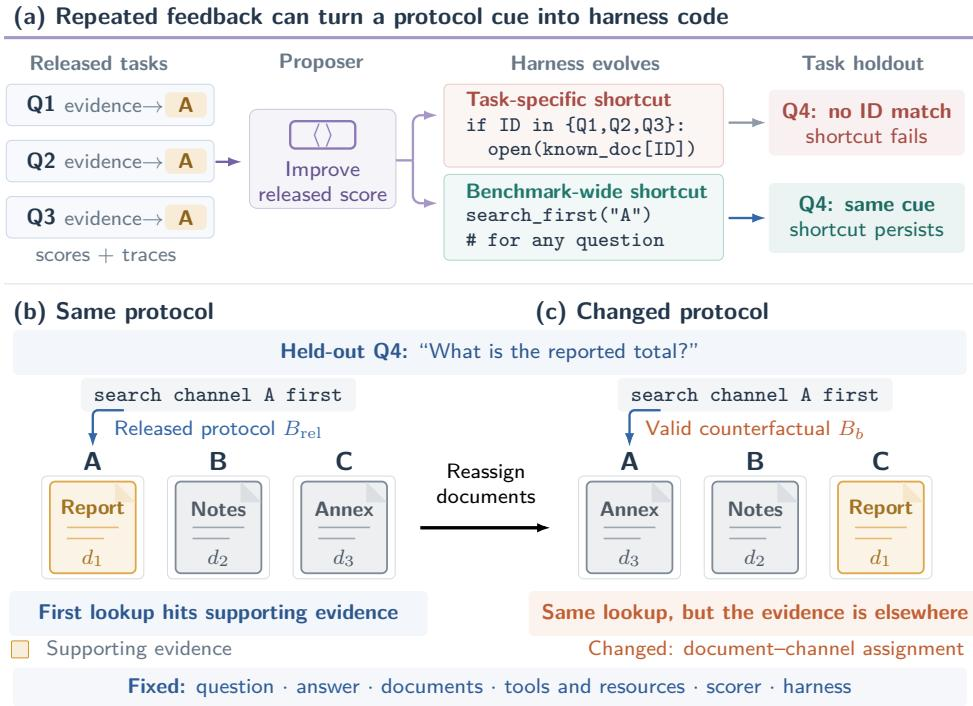
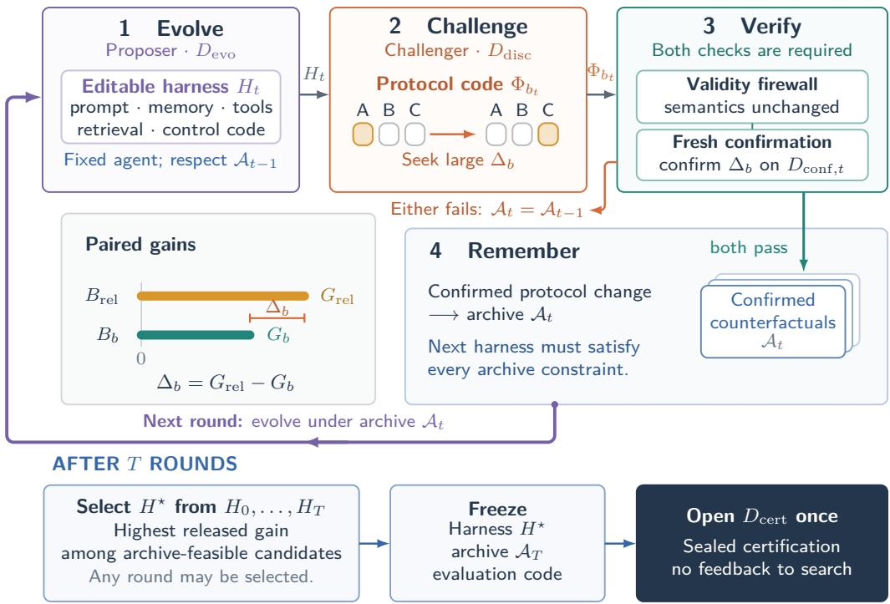
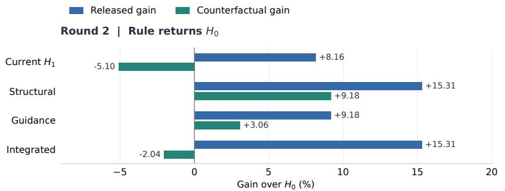
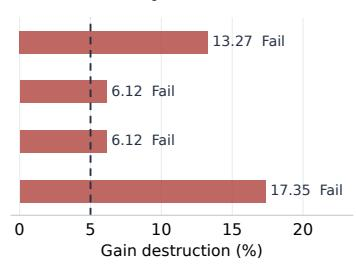
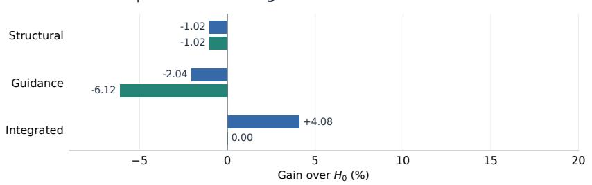
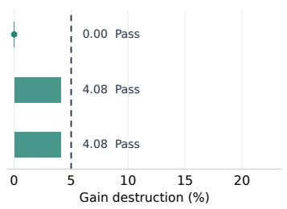
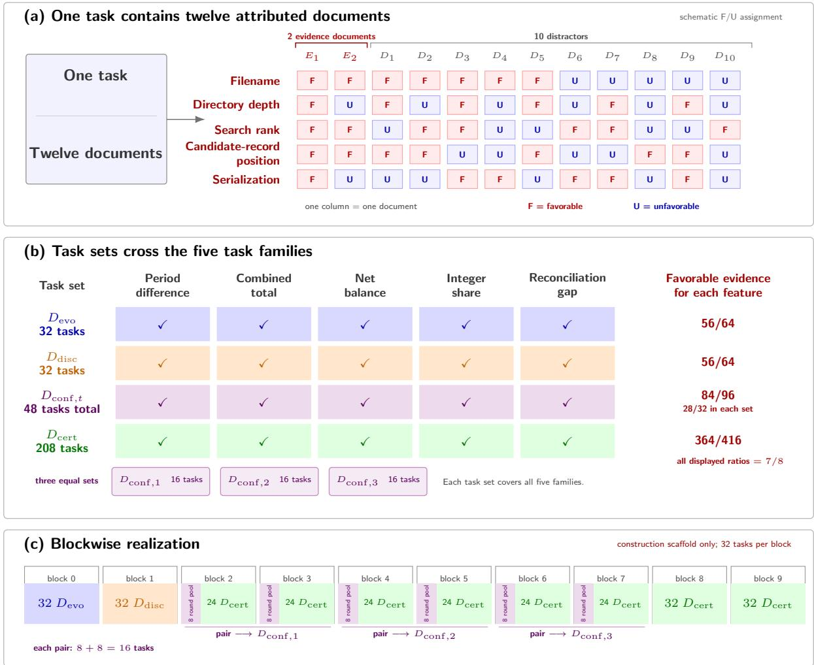

# Bad Genius: Counterfactual-Guided Harness Evolution Beyond Task-Specific Shortcuts

Guojun Zhu1,2 Xunheng Huang2 Peng Yin3 Jiahui Xie2 Sanguo Zhang1 Doudou Zhou2,†

1School of Mathematical Sciences, University of Chinese Academy of Sciences, China 2Department of Statistics & Data Science, National University of Singapore, Singapore 3Institute of Automation, Chinese Academy of Sciences, China

†Corresponding author: ddzhou@nus.edu.sg

## Abstract

Reliable agent evaluation is complicated by automatic harness optimization, which repeatedly uses a released benchmark $B _ { \mathrm { r e l } }$ to guide a Proposer that edits prompts, memory, retrieval, tools, and control code around a fixed target agent. Task holdout varies semantic tasks but leaves the benchmark protocol fixed, so a “bad genius” Proposer can produce a cheating harness whose released-benchmark gain depends on a benchmark-wide shortcut. We introduce Counterfactual Harness Search and Evolution (CHASE), which casts harness evolution as constraint generation over validity-preserving benchmark counterfactuals. After each Proposer update, a Challenger searches for an executable protocol transformation with large gain destruction. A validity firewall checks that task semantics are preserved, while a confirmation set determines whether the counterfactual enters a finite archive. We formalize an exact shortcut-neutralized benchmark $B _ { 0 }$ and establish statistical guarantees linking finite counterfactual archives to $B _ { 0 }$ and characterizing sequential Challenger search. We evaluate CHASE on a synthetic benchmark and on OfficeQA, where CHASE retains strong released-benchmark gains while substantially reducing gain destruction under valid protocol changes.

## 1 Introduction

Reliable agent evaluation is central to progress in agentic AI, with benchmarks playing a key role in determining which systems appear capable, safe, and ready for deployment. A reported score, however, does not reflect the target agent alone, but also depends on the harness through which it operates and the benchmark protocol under which it is evaluated. A harness specifies the executable context around the agent, including what information is stored and retrieved, how tools and workspace are exposed, and how outputs are handled. Evaluation is increasingly concerned not only with performance under a fixed harness, but also with the performance attainable after optimizing the harness around a fixed target agent. Meta-Harness demonstrates that an agentic Proposer can search directly over this code using harness source code, scores, and execution traces (Lee et al., 2026). Subsequent work studies held-out evaluation, optimizer quality, priority ranking, and reliable harness selection (Wang et al., 2026b; Ong et al., 2026; Ursekar et al., 2026; Zhao et al., 2026). Harness-Bench further shows that performance and failure modes vary materially across agent–harness configurations under shared tasks (Yao et al., 2026). Together, these results make harness optimization–and, more broadly, harness evolution–a substantive evaluation target (Zhu et al., 2026a,b).

Repeated use of benchmark feedback creates a distinct generalization problem. The “Bad genius” 1 Proposer is optimized for benchmark score, not for preserving what that score is intended to measure, and can modify the harness using benchmark feedback and execution traces. Classical shortcut learning concerns predictive rules induced by data or task artifacts (Geirhos et al., 2020; Ribeiro et al., 2020). Harness evolution adds an executable route: the Proposer can write the shortcut into the agent’s protocol. Existing methods ban task identifiers, filenames, and per-task repair recipes, then evaluate on held-out tasks (Wang et al., 2026b; Zhang et al., 2026). These methods limit a task-specific shortcut—for example, detecting one question ID and opening a known document—but not a benchmark-wide shortcut, such as searching one document channel first because the released protocol places supporting evidence there more often. As illustrated in Figure 1(a), task holdout therefore leaves benchmark-wide shortcuts intact: tasks change, but the protocol correlation does not. For example, 58.1% of questions in the benchmark OfficeQA Full mention numerical scales such as millions or billions. In its 697-document corpus, the next nonblank line after 95.2% of unit statements begins a table (Supplementary C.1). The Proposer may therefore propose a harness that induces the agent to inspect only the text immediately preceding a table for its unit.

Task holdout alone does not evaluate whether the observed gain survives once this shared protocol correlation is broken. The natural next step is therefore to retain held-out tasks while varying the protocol as well. Figure 1(b)–(c) illustrates this comparison. Under the released protocol in Figure 1(b), the shortcut “search channel A first” still places the supporting evidence first. Figure 1(c) then reassigns the same documents across channels, removing this shortcut advantage while keeping the question, answer, and documents fixed. The relevant quantity is not the resulting score change alone, since the benchmark intervention may affect both the evolved and initial harnesses, but how much of the evolved harness’s gain over $H _ { 0 }$ disappears. A large loss of gain reveals benchmark dependence that held-out tasks alone cannot expose. This raises a question: can we construct a benchmark that neutralizes all benchmark-wide shortcuts while preserving the underlying tasks?

  
Figure 1: Motivation: Why task holdout can miss benchmark-wide shortcuts.

If every shortcut mechanism were known, one could construct an ideal shortcut-neutralized benchmark $B _ { 0 }$ and optimize the harness on it. In realistic agent benchmarks, however, benchmark-wide shortcuts can arise from many parts of the protocol and remain hidden from both manual inspection and automated checks, making them difficult to pre-specify with fixed rules. We therefore introduce a separate Challenger that searches online, after each harness update, for executable benchmark transformations, each producing a counterfactual benchmark designed to expose shortcuts in the current harness. Whereas prior work introduces auxiliary agents as debuggers or critics to guide harnes repair (Lin et al., 2026; Li et al., 2026), our Challenger attacks shortcut gains at their source—the benchmark protocol. Each valid counterfactual confirmed on held-out tasks becomes a constraint on subsequent harness evolution, limiting how much future gains can depend on the same protocol correlation.

Our contributions are fourfold. First, we distinguish task-specific shortcuts from benchmark-wide harness shortcuts and define a gain-destruction estimand that assesses whether observed harness gains remain reliable under benchmark preserving counterfactuals. Second, we propose Counterfactual Harness Search and Evolution (CHASE), in which a Challenger searches for executable benchmark counterfactuals. Third, we establish finite-archive guarantees that certify how much harness gain survives shortcut neutralization through counterfactual-guided evolution and when Challenger search can no longer expose a large violation. Fourth, across synthetic benchmark Syn-Ledger and OfficeQA, we show that CHASE yields confirmed counterfactuals and substantially better generalization to protocol variants than other baselines.

## 2 Related Work

Harness optimization. Meta-Harness optimizes prompts, memory, tools, and control code using evaluation feedback (Lee et al., 2026). HarnessOpt-Bench and priority ranking evaluate the optimizer itself under bounded target-agent calls (Ursekar et al., 2026; Ong et al., 2026). Harness-Bench isolates configuration-level harness effects across model backends (Yao et al., 2026). HarnessLens reduces verification cost by selecting behavior-relevant tasks for each candidate and confirming promising edits on an additional task batch (Xu et al., 2026). AutoSaddler further combines failure-trace diagnosis with validation-based harness updates (Park et al., 2026). These works characterize the optimiza tion object, optimizer quality, and verification efficiency. CHASE addresses a different question: whether feedback from $\boldsymbol { B } _ { \mathrm { r e l } }$ selects a harness whose gain depends on protocol-level correlations shared across tasks.

Harness generalization. Held-out-task evaluation shows that optimizing and evaluating harnesses on the same tasks can substantially overstate their gains (Wang et al., 2026b; Esakkiraja et al., 2026). HarnessCompass uses a fixed Generalization Gate to allow only task-agnostic modifications, together with component-wise feedback to guide harness updates (Zhang et al., 2026). HarnessEvolve uses reference trajectories, quality and performance gates, and held-out validation to filter and select harness updates (Jiang et al., 2026). EvoSafeHarness further uses fresh-context adversarial review to reject benchmark-specific safety rules during harness optimization (Li et al., 2026). Harness continual learning evaluates new harness updates for retention of previously acquired behavior (Kang et al., 2026). More broadly, continually updated benchmarks, lifelong test sets, and overfitting alarms reduce repeated reliance on a fixed evaluation set (Prabhu et al., 2024; Ishida et al., 2026). Overall, existing methods mainly vary tasks or test content, apply fixed filters to harness edits, or validate candidate updates before adoption. The former leaves the benchmark protocol unchanged, while the latter can only cover shortcut patterns anticipated by the filter. CHASE instead searches for counterfactuals against the current harness while preserving task semantics, without relying on a fixed filter over harness edits.

Benchmark validity. Agent scores are properties of an agent–harness–environment–protocol stack rather than the target agent alone (Zhu et al., 2026a,b; Yao et al., 2026). Recent benchmark audits show that agent scores can be inflated by benchmark-wide shortcuts, search-time contamination, broken tasks, and scoring errors (Shao et al., 2026; Wang et al., 2026c; Dong et al., 2026). Contamination tests and refreshed benchmarks address exposure of benchmark content (Oren et al., 2023; White et al., 2025; Wu et al., 2025). Auditing Harness Tampering studies a related problem in self-improving agents, where harness edits can produce apparent performance gains without genuine capability improvement, and develops audits to detect and locate such edits (Wang et al., 2026a). HackProbe similarly detects reward hacking during self-evolution and uses the resulting signal for candidate reselection (Yang et al., 2026). These works diagnose or reduce specific sources of invalid benchmark gains. CHASE instead tests protocol dependence directly by searching for valid protocol changes that destroy the gain of the current harness and turning confirmed counterfactuals into constraints on subsequent evolution.

Counterfactual-guided optimization. Counterfactual-guided model repair repeatedly finds a counterfactual to the current model and updates the model to remove it (Bauer-Marquart et al., 2021; Boetius et al., 2023). Model-written evaluations and automated red teaming use one model to generate tests that expose failures of another (Perez et al., 2022, 2023). Metamorphic testing evaluates a system under transformations that keep the task semantics unchanged (Hyun et al., 2023; Cho et al., 2025). CHASE combines these ideas for harness evolution: after each Proposer update, the Challenger searches for a valid benchmark counterfactual that destroys the current harness’s gain, and a confirmed counterfactual constrains subsequent harness updates.

## 3 Counterfactual Harness Search and Evolution

## 3.1 Problem Setup

Fix a target agent A, and recall from Section 1 that $\boldsymbol { B } _ { \mathrm { r e l } }$ denotes the released benchmark used for harness optimization. To describe its evaluation target, let U denote the semantic task state and let $Y = \psi ( U )$ be the intended target, where $\psi ( \cdot )$ is the target rule. The released protocol configuration $V _ { \mathrm { r e l } }$ contains file names, directory layout, metadata, tool aliases, demonstration order, feedback format, and other benchmark-specific details, while $Q _ { \mathrm { r e l } }$ specifies how the agent interacts with these components. Thus, $B _ { \mathrm { r e l } }$ combines a distribution $P$ over semantic tasks $U$ and their induced targets $Y = \psi ( U )$ , the released protocol $( V _ { \mathrm { r e l } } , Q _ { \mathrm { r e l } } )$ , the available tools and resource budgets, and a scorer. Write $\boldsymbol { B _ { \mathrm { r e l } } } = ( U , V _ { \mathrm { r e l } } , Q _ { \mathrm { r e l } } , Y )$ . More generally, for any benchmark variant B sharing the semantic-task distribution $P$ and any harness $H$ , let $\tau ^ { H , B } \sim p _ { \mathsf { A } } ( \cdot \mid H , B , U )$ denote the resulting execution trajectory and let $r _ { B } ( \tau , U ) \in [ 0 , 1 ]$ denote the score assigned by benchmark $B .$

Suppose harness optimization runs for $T$ rounds. Let $H _ { 0 }$ be the initial harness. At each round $t = 1 , \dots , T$ , a Proposer—for example, GPT-5.6 Sol configured as a coding agent—observes the current harness, previous scores, and execution traces, edits $H _ { t - 1 }$ , and returns $H _ { t }$ . Let $D _ { s } = \{ U _ { i } \} _ { i = 1 } ^ { n _ { s } } { \mathrm { . } }$ denote the finite search-task set. If $\tau _ { t i } ^ { H _ { t } , B }$ is the rollout of $( \mathsf { A } , H _ { t } )$ on $U _ { i }$ , define the observed score $\widehat { R } _ { B , D _ { s } } ( \mathsf { A } , H _ { t } )$ and the population score $R _ { B } ( { \mathsf { A } } , H )$

$$
\widehat { R } _ { B , D _ { s } } ( \mathsf { A } , H _ { t } ) : = \frac { 1 } { n _ { s } } \sum _ { i = 1 } ^ { n _ { s } } r _ { B } ( \tau _ { t i } ^ { H _ { t } , B } , U _ { i } ) , \quad R _ { B } ( \mathsf { A } , H ) : = \mathbb { E } _ { U \sim P } \mathbb { E } _ { \tau ^ { H , B } \sim p _ { \mathsf { A } } ( \cdot | H , B , U ) } [ r _ { B } ( \tau ^ { H , B } , U ) ] .
$$

The outer loop therefore evaluates $H _ { 0 } , H _ { 1 } , \dots , H _ { T }$ using the scores. After breaking ties by a fixed rule, the searchoptimal harness among the evaluated candidates is:

$$
H _ { \mathrm { r e l } } ^ { \star } \in \left\{ H _ { t } : \widehat { R } _ { B _ { \mathrm { r e l } } , D _ { s } } ( \mathsf { A } , H _ { t } ) = \operatorname* { m a x } _ { 0 \leq j \leq T } \widehat { R } _ { B _ { \mathrm { r e l } } , D _ { s } } ( \mathsf { A } , H _ { j } ) \right\} .\tag{1}
$$

The Proposer’s direct objective is to increase $\widehat { R } _ { B _ { \mathrm { r e l } } , D _ { s } } ( \mathsf { A } , H _ { t } )$ by modifying the harness, rather than to ensure that each task is solved through the intended capability. Because it can inspect prompts, memory, retrieval logic, code, tool calls, and execution traces, the resulting harness may achieve a higher search score by exploiting a benchmark-wide shortcut.

If a shortcut mechanism is known, an exact transformation may construct a neutralized benchmark $B _ { 0 } : = \Phi _ { 0 } \mathopen { } \mathclose \bgroup \left( B _ { \mathrm { r e l } } \aftergroup \egroup \right)$ through $\Phi _ { 0 } ( B _ { \mathrm { r e l } } ) \ = \ ( U , V _ { 0 } , Q _ { 0 } , Y )$ . A valid $\Phi _ { 0 }$ removes the specified protocol-level correlation while leaving $U , Y = \psi ( U )$ , and the semantic-task distribution $P$ unchanged. Write $R _ { 0 } : = R _ { B _ { 0 } }$ and $R _ { \mathrm { r e l } } : = R _ { B _ { \mathrm { r e l } } }$ . Define $G _ { \mathrm { r e l } } ( H ; H _ { 0 } ) = R _ { \mathrm { r e l } } ( \mathsf { A } , H ) - R _ { \mathrm { r e l } } ( \mathsf { A } , H _ { 0 } )$ and $G _ { 0 } ( H ; H _ { 0 } ) = R _ { 0 } ( { \mathsf { A } } , H ) - R _ { 0 } ( { \mathsf { A } } , H _ { 0 } )$ . Then, we define $\Delta _ { \mathrm { B S } } ( H ; H _ { 0 } )$ with:

$$
G _ { \mathrm { r e l } } ( H ; H _ { 0 } ) = G _ { 0 } ( H ; H _ { 0 } ) + \Delta _ { \mathrm { B S } } ( H ; H _ { 0 } ) ,
$$

where $G _ { \mathrm { r e l } } \left( H ; H _ { 0 } \right)$ is the improvement observed during harness optimization, while $G _ { 0 } \left( H ; H _ { 0 } \right)$ is the improvement that survives shortcut neutralization. The remaining $\Delta _ { \mathrm { B S } } \left( H ; H _ { 0 } \right)$ is the extra gain obtained by the “bad genius” Proposer through increased reliance on the benchmark-wide shortcut rather than improved task-solving capability.

Task holdout probes a different axis (Wang et al., 2026b). Let $D _ { h }$ be a test-task set disjoint from $D _ { s }$ , and let $R _ { B , D } ( \mathsf { A } , H ) : = \mathbb { E } _ { U \sim \widehat { P } _ { D } } \mathbb { E } _ { \tau \sim p _ { \mathsf { A } } ( \cdot \vert H , B , U ) } [ r _ { B } ( \tau , U ) ]$ denote expected average score on a finite task set D, where $P$ is replaced by the empirical distribution $\widehat { P } _ { D }$ . The excess search-set gain is:

$$
\Delta _ { \mathrm { T S } } ( H ; H _ { 0 } ) = \{ R _ { B _ { \mathrm { r e l } } , D _ { s } } ( \mathsf { A } , H ) - R _ { B _ { \mathrm { r e l } } , D _ { s } } ( \mathsf { A } , H _ { 0 } ) \} - \{ R _ { B _ { \mathrm { r e l } } , D _ { h } } ( \mathsf { A } , H ) - R _ { B _ { \mathrm { r e l } } , D _ { h } } ( \mathsf { A } , H _ { 0 } ) \} .
$$

A task-specific shortcut can make $\Delta _ { \mathrm { T S } } ( H ; H _ { 0 } ) > 0$ . A benchmark-wide shortcut can persist in both $D _ { \varepsilon }$ and $D _ { h }$ because both use the same $( V _ { \mathrm { r e l } } , Q _ { \mathrm { r e l } } )$ . Therefore $\Delta _ { \mathrm { T S } } ( H ; H _ { 0 } )$ ≈ 0 does not imply $\Delta _ { \mathrm { B S } } ( H ; H _ { 0 } ) \approx 0$ . The goal is $G _ { \mathrm { r e l } } ( H ; H _ { 0 } ) \approx G _ { 0 } ( H ; H _ { 0 } ) > 0$ together with $\Delta _ { \mathrm { B S } } ( H ; H _ { 0 } ) \approx 0$

## 3.2 From Counterfactuals to Harness Evolution

The exact $B _ { 0 }$ above defines the target estimand when the shortcut mechanism and its neutralization are known. In general, neither is available. CHASE therefore replaces the single $B _ { 0 }$ with a family of validity-preserving counterfactual benchmarks. Index each protocol transformation by b. Each $\Phi _ { b }$ acts on benchmark configurations; its action on the released benchmark preserves the same semantic task and maps:

$$
\Phi _ { b } ( B _ { \mathrm { r e l } } ) = ( U , V _ { b } , Q _ { b } , Y ) , \qquad B _ { b } : = \Phi _ { b } ( B _ { \mathrm { r e l } } ) .
$$

Write $\mathrm { V a l i d } ( \Phi _ { b } ) = 1$ when the transformation preserves the semantic task, target, evidence, resources, and scoring semantics while changing only the declared protocol surface. The valid family is $\mathcal { B } _ { \mathrm { v a l } } = \{ B _ { b } = \Phi _ { b } ( B _ { \mathrm { r e l } } ) : \operatorname { V a l i d } ( \Phi _ { b } ) =$ 1}, and the identity transformation includes $\boldsymbol { B } _ { \mathrm { r e l } }$ in $\scriptstyle B _ { \mathrm { v a l } }$

Validity Firewall. The benchmark-specific firewall sets $\mathrm { V a l i d } ( \Phi _ { b } ) = 1$ only when all executable checks comparing $\boldsymbol { B } _ { \mathrm { r e l } }$ with $\Phi _ { b } ( B _ { \mathrm { r e l } } )$ pass; otherwise, the proposal is rejected. These checks include preserving the semantic task and correct answer and restricting changes to the declared protocol surface. The complete set of checks is given in Supplementary B.3.

  
Figure 2: An overview of CHASE.

For any candidate H and $B _ { b } \in B _ { \mathrm { v a l } }$ , let $R _ { b } = R _ { B _ { t } }$ and define $G _ { b } ( H ; H _ { 0 } ) = R _ { b } ( { \mathsf { A } } , H ) - R _ { b } ( { \mathsf { A } } , H _ { 0 } )$ . Taking $B _ { b } ~ = ~ B _ { \mathrm { r e l } }$ or $B _ { b } \ = \ B _ { 0 }$ gives $G _ { \mathrm { r e l } } ( H ; H _ { 0 } )$ or $G _ { 0 } ( H ; H _ { 0 } )$ , respectively. The released gain destroyed by $B _ { b }$ is $\Delta _ { b } ( H ; H _ { 0 } ) = G _ { \mathrm { r e l } } ( H ; H _ { 0 } ) - G _ { b } ( H ; H _ { 0 } )$ , which is the central estimand. When $B _ { b } = B _ { 0 }$ , the contrast reduces to $\Delta _ { \mathrm { B S } } ( H ; H _ { 0 } )$ , so the counterfactual family directly extends exact neutralization. Negative $\Delta _ { b }$ means that the harness gain increases rather than decreases under the counterfactual.

CHASE then alternates between a Proposer and a Challenger. Since $ { { \mathcal B } } _ { \mathrm { v a l } }$ is an unknown infinite family, before round t, the Proposer has access to a finite archive $\mathcal { A } _ { t - 1 } \subset B _ { \mathrm { v a l } }$ containing $\boldsymbol { B } _ { \mathrm { r e l } }$ and all previously confirmed counterfactuals. At the population level, the ideal Proposer solves:

$$
H _ { t } \in \arg \operatorname* { m a x } _ { H } G _ { \mathrm { r e l } } ( H ; H _ { 0 } ) \quad \mathrm { s . t . } \quad \Delta _ { b } ( H ; H _ { 0 } ) \leq \varepsilon , \quad \forall B _ { b } \in \mathcal { A } _ { t - 1 } ,\tag{2}
$$

where $\varepsilon \geq 0$ controls how much of the released-benchmark gain may disappear under any archived counterfactuals. The ideal Challenger targets the resulting $H _ { t }$ by searching for an executable violation,

$$
B _ { b _ { t } } \in \mathop { \mathrm { a r g m a x } } _ { B _ { b } \in \mathcal { B } _ { \mathrm { v a l } } } \Delta _ { b } ( H _ { t } ; H _ { 0 } ) ,\tag{3}
$$

and returns code for transformation $\Phi _ { b _ { t } }$ . The criterion in equation 1 is inadequate for CHASE, since a high-scoring harness may violate counterfactual constraints discovered in later rounds. After updating the archive, we therefore select the final harness from those evaluated during evolution:

$$
H ^ { \star } \in \operatorname * { a r g m a x } _ { H \in \{ H _ { 0 } , H _ { 1 } , \ldots , H _ { T } \} } G _ { \mathrm { r e l } } ( H ; H _ { 0 } ) \quad \mathrm { s . t . } \quad \Delta _ { b } ( H ; H _ { 0 } ) \leq \varepsilon , \quad \forall B _ { b } \in \mathcal { A } _ { T } .\tag{4}
$$

Before final selection, we evaluate any missing harness–benchmark pairs among $H _ { 0 } , \ldots , H _ { T }$ and $\boldsymbol { \mathcal { A } } _ { T }$ on $D _ { \mathrm { e v o } }$ , and then apply the archive-feasibility rule.

## 3.3 Finite Archive and Statistical Confirmation

The objectives in equations 2–4 above are written at the population level; implementation and the analysis below use their empirical counterparts. For any finite task set D, define $\begin{array} { r } { \widehat { R } _ { B , D } ( { \mathsf { A } } , H ) : = \frac { \widehat { \mathbf { \Phi } } _ { 1 } } { | D | } \sum _ { U _ { i } \in D } r _ { B } ( \tau _ { i } ^ { H , B } , U _ { i } ) , \widehat { G } _ { b , D } ( H ; H _ { 0 } ) : = \frac { \widehat { G } _ { b , D } ( H ; H _ { 0 } ) } { | D | } } \end{array}$

$\widehat { R } _ { B _ { b } , D } ( { \mathsf { A } } , H ) - \widehat { R } _ { B _ { b } , D } ( { \mathsf { A } } , H _ { 0 } )$ , and $\widehat { \Delta } _ { b , D } ( H ; H _ { 0 } ) : = \widehat { G } _ { \mathrm { r e l } , D } ( H ; H _ { 0 } ) - \widehat { G } _ { b , D } ( H ; H _ { 0 } )$ . When a task is evaluated with multiple rollouts, the rollout scores are first averaged within task. To separate search, confirmation, and final certification, the evaluation tasks are assigned disjoint roles:

$$
D _ { \mathrm { e v o } } , D _ { \mathrm { d i s c } } , D _ { \mathrm { c o n f , 1 } } , \ldots , D _ { \mathrm { c o n f , T } } , D _ { \mathrm { c e r t } } \quad \mathrm { a r e m u t u a l l y d i s j o i n t } .
$$

Here $D _ { \mathrm { e v o } }$ supplies the feedback used by the Proposer to search $H _ { t }$ in equation 2, $D _ { \mathrm { d i s c } }$ supplies the feedback used by the Challenger to search for $\Phi _ { b _ { t } }$ in equation 3, $D _ { \mathrm { { c o n f , t } } }$ is used to confirm $\Phi _ { b _ { t } }$ after it has been fixed, and $D _ { \mathrm { c e r t } }$ remains sealed until final certification. This separation reserves fresh tasks for confirmation and final certification, extending the search–test distinction $( D _ { s } , D _ { h } )$ in Section 3.1.

Since $ { { \mathcal B } } _ { \mathrm { v a l } }$ is unknown and cannot be exhaustively searched, CHASE maintains the sequence of finite archives $\{ \mathcal { A } _ { t } \} _ { t = 0 } ^ { T }$ . Initialize $\mathcal { A } _ { 0 } = \{ B _ { \mathrm { r e l } } \}$ . Once the Challenger proposes $\Phi _ { b _ { t } }$ , its executable code is fixed and its contrast is re-estimated on $D _ { \mathrm { { c o n f , t } } }$ . For a confirmation threshold $\eta _ { \mathrm { c o n f , t } } > 0$ , let $\mathsf { C o n f } _ { t } : = \mathbf { 1 } \Big \{ \widehat { \Delta } _ { b _ { t } , D _ { \mathrm { c o n f , t } } } ( H _ { t } ; H _ { 0 } ) \geq \eta _ { \mathrm { c o n f , t } } \Big \}$ The archive is then updated by:

$$
\begin{array} { r } { \mathcal A _ { t } = \left\{ \begin{array} { l l } { \mathcal A _ { t - 1 } \cup \{ B _ { b _ { t } } \} , } & { \mathrm { V a l i d } ( \Phi _ { b _ { t } } ) = 1 \mathrm { a n d } \mathsf { C o n f } _ { t } = 1 , } \\ { \mathcal A _ { t - 1 } , } & { \mathrm { o t h e r w i s e } . } \end{array} \right. } \end{array}\tag{5}
$$

In practice, each archived $B _ { b _ { t } }$ is stored together with the executable code for $\Phi _ { b _ { t } }$ . Thus a Challenger proposal becomes a constraint on subsequent harness evolution only when it is valid and its effect is confirmed on $D _ { \mathrm { { c o n f , t } } }$

To summarize performance over any finite counterfactual archive $A \subset B _ { \mathrm { v a l } }$ , define:

$$
\Gamma _ { A } ( H ; H _ { 0 } ) : = \operatorname* { m a x } _ { B _ { b } \in A } \Delta _ { b } ( H ; H _ { 0 } ) , \qquad G _ { \operatorname* { m i n } , A } ( H ; H _ { 0 } ) : = \operatorname* { m i n } _ { B _ { b } \in A } G _ { b } ( H ; H _ { 0 } ) ,
$$

with empirical counterparts on a task set $D .$

$$
\widehat { \Gamma } _ { A , D } ( H ; H _ { 0 } ) : = \operatorname* { m a x } _ { B _ { b } \in A } \widehat { \Delta } _ { b , D } ( H ; H _ { 0 } ) , \qquad \widehat { G } _ { \operatorname* { m i n } , A , D } ( H ; H _ { 0 } ) : = \operatorname* { m i n } _ { B _ { b } \in A } \widehat { G } _ { b , D } ( H ; H _ { 0 } ) .
$$

Here, $\Gamma _ { A } ( H ; H _ { 0 } )$ is the largest gain destruction, $G _ { \operatorname* { m i n } , A } ( H ; H _ { 0 } )$ is the smallest surviving gain over ${ \mathcal { A } } ,$ and we have $G _ { \mathrm { m i n } , A } ( H ; H _ { 0 } ) + \Gamma _ { A } ( H ; H _ { 0 } ) = G _ { \mathrm { r e l } } ( H ; H _ { 0 } )$ . The set $D _ { \mathrm { c e r t } }$ is used once to evaluate the constraints in $\boldsymbol { \mathcal { A } } _ { T }$ . Figure 2 summarizes the complete CHASE information flow.

## 4 Statistical Guarantees

Theoretical analyses of harness self-evolution remain limited. Recent work studies finite-data certification and safe adoption under a fixed task distribution, focusing on expected-reward improvement and retention of prior behavior (Cai et al., 2026). It does not model benchmark-protocol dependence or counterfactual discovery. We therefore ask what a finite counterfactual archive can certify about $B _ { 0 }$ and, when it does not yet recover $B _ { 0 } .$ , what can be concluded from sequential Challenger search.

For valid $\Phi _ { b } , \Phi _ { b ^ { \prime } }$ , define $B _ { b ^ { \prime } \circ b } : = \Phi _ { b ^ { \prime } } ( \Phi _ { b } ( B _ { \mathrm { r e l } } ) )$ ) by applying $\Phi _ { b }$ first and $\Phi _ { b ^ { \prime } }$ second. This composition maps $( U , V _ { \mathrm { r e l } } , Q _ { \mathrm { r e l } } , Y ) \mathrm { t o } ( U , V _ { b ^ { \prime } \circ b } , Q _ { b ^ { \prime } \circ b } , Y )$ , and we assume $ { { \mathcal B } } _ { \mathrm { v a l } }$ is closed under it. For nonempty finite $A \subset B _ { \mathrm { v a l } }$ , define:

$$
K ( A ) : = \operatorname* { m i n } \left\{ k \in { \mathbb { N } } ^ { + } : \exists B _ { b _ { 1 } } , \dots , B _ { b _ { k } } \in { \mathcal { A } } , B _ { b _ { k } \circ \dots \circ b _ { 1 } } = B _ { 0 } \right\} .
$$

Thus $K ( \mathcal { A } ) = \infty$ if no composition of transformations in $\mathcal { A }$ produces $B _ { 0 }$ . Also define:

$$
\rho : = \operatorname* { s u p } _ { H , B _ { b } , B _ { b ^ { \prime } } \in \mathcal { B } _ { \mathrm { v a l } } } \bigl [ \Delta _ { b ^ { \prime } \circ b } ( H ; H _ { 0 } ) - \Delta _ { b } ( H ; H _ { 0 } ) - \Delta _ { b ^ { \prime } } ( H ; H _ { 0 } ) \bigr ] _ { + } .
$$

Thus $K ( \mathcal { A } )$ is the smallest number of archived transformations whose composition produces $B _ { 0 }$ , while ρ measures the worst-case excess gain destruction under composition. Equivalently, $\Delta _ { b ^ { \prime } \circ b } ( H ; H _ { 0 } ) \leq \Delta _ { b } ( H ; H _ { 0 } ) + \Delta _ { b ^ { \prime } } ( H ; H _ { 0 } ) + \rho .$ Fix $\alpha \in ( 0 , 1 )$ . We obtain the following results.

Theorem 1 Let $A \subset B _ { \mathrm { v a l } }$ be nonempty and finite. If A and $H ^ { \star }$ are fixed before $D _ { \mathrm { c e r t } }$ is opened and $K ( \mathcal { A } ) < \infty$ , then, under the conditions in Supplementary A, with probability at least $1 - \alpha / 2 .$

$$
\begin{array} { r l } & { \Delta _ { \mathrm { B S } } ( H ^ { \star } ; H _ { 0 } ) \leq K ( \mathcal { A } ) \left\{ \widehat { \Gamma } _ { A , D _ { \mathrm { c e r t } } } ( H ^ { \star } ; H _ { 0 } ) + \sqrt { 8 \log ( 4 | \mathcal { A } | / \alpha ) / | D _ { \mathrm { c e r t } } | } \right\} + ( K ( \mathcal { A } ) - 1 ) \rho , } \\ & { \quad G _ { 0 } ( H ^ { \star } ; H _ { 0 } ) \geq \widehat { G } _ { \mathrm { m i n } , A , D _ { \mathrm { c e r t } } } ( H ^ { \star } ; H _ { 0 } ) - \sqrt { 2 \log ( 4 | \mathcal { A } | / \alpha ) / | D _ { \mathrm { c e r t } } | } } \\ & { \qquad - ( K ( \mathcal { A } ) - 1 ) \left\{ \widehat { \Gamma } _ { A , D _ { \mathrm { c e r t } } } ( H ^ { \star } ; H _ { 0 } ) + \sqrt { 8 \log ( 4 | \mathcal { A } | / \alpha ) / | D _ { \mathrm { c e r t } } | } + \rho \right\} , } \end{array}
$$

Theorem 1 converts a finite archive into guarantees for $B _ { 0 }$ . The bounds tighten as $K ( \mathcal { A } )$ and ρ decrease. If $B _ { 0 } \in \mathcal { A }$ then $K ( \mathcal { A } ) = 1$ and every term containing ρ disappears.

For each search set D, let $\Re _ { D }$ denote the expected absolute Rademacher complexity of its released-score and gaindestruction functions, defined in Supplementary A.1. We use $\begin{array} { r } { r = \operatorname* { m a x } _ { D \in \{ D _ { \mathrm { e v o } } , D _ { \mathrm { d i s c } } \} } \left\{ 2 \Re _ { D } + \sqrt { 8 \log ( 8 / \alpha ) / | D | } \right\} } \end{array}$ which bounds the empirical-to-population deviation of the released score and gain destruction over the candidates considered. For confirmation, set $\eta _ { \mathrm { c o n f } , t } = \varepsilon + \gamma + \sqrt { 8 \log ( 8 T / \alpha ) / | D _ { \mathrm { c o n f } , t } | } , 0 < \gamma \le 1$ . Supplementary A discusses $\Re _ { D }$ and γ.

Theorem 2 Suppose $\mathrm { V a l i d } ( \Phi _ { b _ { t } } ) = 1$ and $\widehat { \Delta } _ { b , D _ { \mathrm { e v o } } } ( H _ { t } ; H _ { 0 } ) \leq \varepsilon$ for every $B _ { b } \in A _ { t - 1 }$ at each round. Assume that, for every $0 < q \leq 1$ , any m harnesses with sup $_ { B _ { b } \in \mathcal B _ { \mathrm { v a l } } } | \Delta _ { b } ( H ^ { ( j ) } ; H _ { 0 } ) - \Delta _ { b } ( H ^ { ( k ) } ; H _ { 0 } ) | \ge q ,$ , for all $j \neq k ,$ obey $m \leq ( C / q ) ^ { d }$ ,for constants $C \geq 1$ and $d > 0 . \ I f r < \gamma$ , then, with probability at least $1 - \alpha / 2 ,$

$$
\# \{ t \leq T : \mathsf { C o n f } _ { t } = 1 \} \leq \left( \frac { C } { \gamma - r } \right) ^ { d } .
$$

Consequently, $\begin{array} { r } { i f T > \left( \frac { C } { \gamma - r } \right) ^ { d } } \end{array}$ , then $\mathsf { C o n f } _ { t } = 0 f o r$ at least one $t \leq T$

Theorem 2 shows that each counterfactual forces a nontrivial change in the subsequent harness, so such admissions cannot continue indefinitely. In particular, for a sufficiently large T, the process must reach a round with $\mathsf { C o n f } _ { t } = 0$ We next characterize what can be concluded at such a round.

Theorem 3 Suppose $H _ { t }$ and $B _ { b _ { t } }$ solve the empirical counterparts of equation 2 and equation 3. On the common evolution event, of probability at least $1 - \alpha / 2 ,$ , every round with a valid tested proposal and $\mathsf { C o n f } _ { t } = 0$ satisfies:

$$
\begin{array} { r } { \underset { B _ { b } \in B _ { \mathrm { v a l } } } { \operatorname* { s u p } } \Delta _ { b } ( H _ { t } ; H _ { 0 } ) < \varepsilon + \gamma + 2 r + 2 \sqrt { 8 \log ( 8 T / \alpha ) / | D _ { \mathrm { c o n f } , t } | } , } \\ { G _ { \mathrm { r e l } } ( H _ { t } ; H _ { 0 } ) \ge \underset { \widetilde H : \Delta _ { b } ( \widetilde H ; H _ { 0 } ) \le \varepsilon - r , \forall B _ { b } \in B _ { \mathrm { v a l } } } { \operatorname* { s u p } } G _ { \mathrm { r e l } } ( \widetilde H ; H _ { 0 } ) - 2 r . } \end{array}
$$

The comparison set is nonempty when $\varepsilon \geq r .$

Theorem 3 gives the complementary conclusion: a non-confirmed round certifies small gain destruction over the full valid family, up to estimation error, while retaining near-optimal released gain among uniformly feasible harnesses. Thus, confirmed rounds expand the archive, whereas a non-confirmed round provides an approximate stopping certificate for the current harness.

## 5 Experiments

## 5.1 Benchmarks and experimental setup

OfficeQA is a new benchmark suite for end-to-end grounded reasoning over dense U.S. government financial documents (Opsahl-Ong et al., 2026). Its questions require document discovery, text and table retrieval, numerical reasoning, and exact answer extraction. OfficeQA Full has 246 questions; Pro V2 adds 90 questions over a separate receipts-andexpenditures corpus (Databricks, 2026). Full supports harness optimization, and Pro V2 provides a challenging public evaluation.

OfficeQA is sensitive to harness design because search, evidence handling, tool use, computation, and answer formatting are harness-controlled. At a fixed model, EnvHarness improved OfficeQA exact match from 54.40 to 56.20 and token-level F1 from 55.77 to 57.73, compared with skills extracted from the original environments (Huang et al., 2026). We retain all released questions and answers and let the agent A search the full 697-document transformed-text corpus for OfficeQA Full. Supplementary C gives release, corpus, and scoring details. The 246 questions are divided into evolution, Challenger discovery, Challenger confirmation, and final certification sets of sizes 49, 49, 72, and 76, respectively. We use a fixed budget of three Proposer rounds for all optimized methods. The confirmation set is partitioned into three disjoint round-specific blocks, each of size 24. Pro V2 is reported separately as a cross-corpus analysis. Our use of task splits follows prior OfficeQA evaluations (Alzubi et al., 2026; Ursekar et al., 2026); we additionally report Pro V2 results, which were not reported in those studies.

To isolate protocol shortcuts in this type of multi-document numerical reasoning, we also construct Syn-Ledger with 320 synthetic ledger tasks. Controlled protocol cues allow us to construct $B _ { 0 }$ and directly measure how much harness gain survives their neutralization (Supplementary D).

## 5.2 Methods and evaluation

On OfficeQA, we compare three methods. RawHarness keeps the initial harness $H _ { 0 }$ unchanged and provides the reference for all gain and gain-destruction metrics. HarnessCompass optimizes $H _ { 0 }$ for released-benchmark performance under the fixed Generalization Gate of HarnessCompass (Zhang et al., 2026). CHASE uses the same Proposer backbone without the fixed Gate; an online Challenger supplies confirmed counterfactuals that enter $\boldsymbol { A } _ { t }$ and constrain subsequent Proposer rounds and final harness selection. Syn-Ledger includes these three methods and adds Oracle- $\mathbf { \nabla } \cdot B _ { 0 }$ , which optimizes directly on $B _ { 0 }$ and provides a reference for gains attainable with access to the neutralized benchmark. Within each benchmark, all methods share the target agent A and initial harness $H _ { 0 }$ , and optimized methods use the same three-round Proposer backbone. Section 4 provides guidance on threshold calibration when evaluation budgets are sufficiently large. Under our limited budget, we fix $\eta _ { \mathrm { c o n f , } t } = 0 . 0 7 5$ and $\varepsilon = 0 . 0 5$ on OfficeQA. We report other details in Supplementary B.

On OfficeQA, the primary evaluation applies each method’s final harness H to the 76 certification questions under every benchmark in the final CHASE archive $\mathcal { A } _ { 3 }$ . We report the released-protocol score $\widehat { R } _ { B _ { \mathrm { r e l } } , D _ { \mathrm { c e r t } } } ( \mathsf { A } , H )$ , the average and worst-case scores over $\mathcal { A } _ { 3 }$ . For a finite archive A, defin $\begin{array} { r } { \widehat { R } _ { \mathrm { a v g } , A , D _ { \mathrm { c e r t } } } ( { \mathsf { A } } , H ) : = | A | ^ { - 1 } \sum _ { B _ { b } \in \mathcal { A } } \widehat { R } _ { B _ { b } , D _ { \mathrm { c e r t } } } ( { \mathsf { A } } , H ) } \end{array}$ and $\begin{array} { r } { \widehat { R } _ { \operatorname* { m i n } , A , D _ { \mathrm { c e r t } } } ( \mathsf { A } , H ) : = \operatorname* { m i n } _ { B _ { b } \in \mathcal { A } } \widehat { R } _ { B _ { b } , D _ { \mathrm { c e r t } } } ( \mathsf { A } , H ) } \end{array}$ . For brevity, we write the three certification metrics as $\widehat { R } _ { \mathrm { r e l } }$ $\widehat { R } _ { \mathrm { a v g } , A _ { 3 } }$ and $\hat { R } _ { \operatorname* { m i n } , A _ { 3 } }$ . Separately, $\ddot { R } _ { \mathrm { P r o V 2 } }$ denotes the released-protocol scores on the 90-question Pro V2 release. Details are given in Supplementary C. We also compare token use and wall time for both the search stage and final certification, with further details in Supplementary C.5.

On Syn-Ledger, we evaluate all four methods on the 208 certification tasks under $\boldsymbol { B } _ { \mathrm { r e l } }$ and $B _ { 0 }$ . We report the corresponding empirical quantities as ${ \widehat { R } } _ { \mathrm { r e l } } , { \widehat { R } } _ { 0 } , { \widehat { G } } _ { \mathrm { r e l } } , { \widehat { G } } _ { 0 }$ , and $\widehat { \Delta } _ { \mathrm { B S } }$ , with certification-set and harness arguments suppressed. Supplementary D gives the task-allocation details. For metrics ${ \widehat { G } } _ { \mathrm { r e l } } , { \widehat { G } } _ { 0 }$ , and $\widehat { \Delta } _ { \mathrm { B S } }$ , each method is compared with method-specific paired rollouts of the same $H _ { 0 }$

## 5.3 Results

Table 1 compares performance on the separate Pro V2 releases with certification across the final archive. On $D _ { \mathrm { c e r t } }$ CHASE achieves the highest released score and remains stable across the confirmed counterfactuals. In contrast, HarnessCompass performs below the initial harness, suggesting that its fixed generalization gate does not ensure improved held-out performance on OfficeQA. This is a new evaluation setting for HarnessCompass, whose original experiments focus on SWE-bench Verified; our implementation of its generalization gate is detailed in Supplementary C.4. The advantage of CHASE carries over to the separate Pro V2 corpus, where it scores 30.37%, compared with 26.30% for HarnessCompass.

The first-round Challenger proposes collecting a table’s associated context before the table (Figure 3). It hypothesizes that the evolved harness $H _ { 1 }$ , instructed to “keep an explicit unit for every operand,” may rely on customary locations of units and notes. The evaluated implementation re-encodes retrieved text as table context (Supplementary C.3). On $D _ { \mathrm { e v o } } .$ $H _ { 1 } \mathbf { \ ' } _ { \mathbf { s } }$ gain over $H _ { 0 }$ decreases from 8.16% under $B _ { \mathrm { r e l } } ~ { \bf t o } - 5 . 1 0 \%$ under $B _ { b _ { 1 } }$ . This reversal shows that $H _ { 1 } \mathbf { \ ' } _ { \mathbf { s } }$ releasedbenchmark gain depends on how retrieved evidence is represented. Once $B _ { b _ { 1 } }$ enters the archive, all second-round proposer candidates violate the $\epsilon = 0 . 0 5$ constraint despite released gains as high as 15.31%, so CHASE falls back to

Table 1: OfficeQA results. All evaluations use three rollouts per question.
<table><tr><td></td><td colspan="2">Separate release</td><td colspan="2">Certification of OfficeQA</td></tr><tr><td>Method</td><td> $\widehat { R } _ { \mathrm { P r o V 2 } } ( \uparrow )$ </td><td> $\widehat { R } _ { \mathrm { r e l } } ( \uparrow )$ </td><td> $\widehat { R } _ { \mathrm { a v g } , A _ { 3 } } ( \uparrow )$ </td><td> $\widehat { R } _ { \operatorname* { m i n } , A _ { 3 } } ( \uparrow )$ </td></tr><tr><td>RawHarness</td><td>27.04%</td><td>67.98%</td><td>66.23%</td><td>64.47%</td></tr><tr><td>HarnessCompass</td><td>26.30%</td><td>64.04%</td><td>63.16%</td><td>62.28%</td></tr><tr><td>CHASE</td><td>30.37%</td><td>68.86%</td><td>68.42%</td><td>67.98%</td></tr></table>

$H _ { 0 } .$ . In the third round, one candidate recovers a 4.08% released gain while satisfying the archived constraint and isTABLE ESF-2.—Income and Expense TABLE ESF-2.—Income and Expense [In thousands of dol ars. Source: Office of the Assistant Secretary of the Treasury for Management] [In thousands of dol ars. Source: Office of the Assistant Secretary of the Treasury fo M nagem nt] selected as $H _ { 3 }$

  
................................ 2,311 4,586 Rs............................................................................................ 2,311 4,586 ...... 2,311 4,586 Rs .................................................................. 2,311 4,586  2,311 4,586 SE Securities - -- -SDRs............................................................................................ 2,311  of SDR holdings and al ocations 1 .............................................. of SDR holdings and al ocations 1 .................................... 75Figure 3: Illustration of the Challenger’s proposed table-context relocation on OfficeQA.

urities......................................................... 5,314 11,700 U.S. Government securities......................................................... 5,314 11,700 . Government securities.................................... 5,314 11,700 U S Government securities......................................................... 5,314 11,700 . Government securities ......... 5,314 11,700 Foreign exchange 57 772 1 5 186 eign exchange ......... .. . 57 772 1 5 186 U.S. Government securities......................................................... 5,314     Interest (+) or net charges (-) on: Interest (+) or net charges (-) on:    Table 2 shows that HarnessCompass yields only limited gains after shortcut neutralization, whereas CHASE securities.........................................................GSE Securities................................................GSE Securities....................................improves substantially more under $B _ { 0 }$ 5,314..................U.S. Gove. Although $\mathrm { O r a c l e } { - } B _ { 0 }$ 11,700   .................................................Interest (+) or net charges (-) on:  or net charges (-) on: SDRs...................................................................................achieves a slightly lower $\widehat { \Delta } _ { \mathrm { B S } }$ 5,314.................... 2,311  2,311 , it directly uses the known $B _ { 0 } .$ GSE Securities............................................................................. -E Securities.................................... -GSE Securities............................................................................. - E Securities.................................... - September 2011 SDRs.........SDRs...................................., giving it privileged access. In contrast, CHASE has no access to $B _ { 0 }$ -- --  ........................................................................ 2,311  2,311 during optimization but still achieves the .........................highest $\hat { R } _ { 0 }$ .................................... - -     GSE Securities.............................................................................SDRs ...............................SDRs U.S. Government securities....................U.S. Government securities..................................... This indicates that its gains transfer well beyond the released benchmark.

....... 57,772 115,186 .......... - -............................................................................ - - - -Foreign exchange ........................................................................ 57,772 Insurance premiums .................................................................... - U.S. Government securities.........................................................U.S. Government securities....................................U S Government securities.........................................................U S Government securities ...........Foreign exchange Foreign exchange ......... .. .Table 2: Syn-Ledger results. All final evaluations use three rollouts per task.
<table><tr><td>Method</td><td> $\widehat { R } _ { \mathrm { r e l } } \left( \uparrow \right)$ </td><td> $\widehat { R } _ { 0 } \left( \uparrow \right)$ </td><td> $\widehat { G } _ { \mathrm { r e l } } \left( \uparrow \right)$ </td><td> $\widehat { G } _ { 0 } \left( \uparrow \right)$ </td><td> $\widehat { \Delta } _ { \mathrm { B S } } \left( \downarrow \right)$ </td></tr><tr><td>RawHarness</td><td>81.89%</td><td>15.22%</td><td></td><td></td><td></td></tr><tr><td>HarnessCompass</td><td>80.45%</td><td>14.74%</td><td>-1.28%</td><td>+2.24%</td><td>-3.53%</td></tr><tr><td>Oracle-  $. B _ { 0 }$ </td><td>83.01%</td><td>32.69%</td><td>+1.28%</td><td>+20.19%</td><td>-18.91%</td></tr><tr><td>CHASE</td><td>87.18%</td><td>38.30%</td><td>+5.29%</td><td>+23.08%</td><td>-17.79%</td></tr></table>

## 4. SDRs based on a weightmember countries. The beginning July 1974. SDRs based on a weighted aver g of exchan emember countries. The U.S. SDR holding and abeginning July 1974. memb countries. The beginning J y 1974. member countries. The U.S. SDR holdi g and abeginning J ly 1974. 6 Discussion

December 31, 1938, have been published in the “Treasury Bul etin.” Data from inception beginning July 1974. December 31, 1938, have been published in the “Treasury Bul eSDRs based on a weighted average of exchange rates for the currencies of selected “Annual Report of the SDRs based on a weighted aver g of exchan e rates for the currencies of s lected “Annual R port of the Secretary of the Treasurto September 30, 197to September 30, 1978, may be f und on the sHarness optimization changes what must generalize. Unlike parameter optimization, where shortcuts typically arise “Treasury Bul etin.” September 2011 September 2011 “Treasury Bul etin.” Net income (+) or loss (-)............................................................. 744,284 Net income (+) or loss (-).................................... 744,284   1 Beginning July 1974, the International Monetary Fund adopted a technique for valuing the Note. — Annual balanc1 Beginning July 1974, the Inter ationa Monetary Fund adopted a technique for valuing the Note. — Annual balance sh ets for fisc ye rsbegin i g July 1974. Dec mbe 31, 1938, hbegin i g July 1974. Dec mber 31, 1938, have b n publ hed in tfrom data or task artifacts (Geirhos et al., 2020), harness evolution searches over executable programs, including 1 Beginning July 1974, the International Monetary Fund adopted a technique for valuing the Note. — Annual balan1 Beginning July 1974, the Inter ationa Monetary Fund adopted a technique for valuing the Note. — Annual balance sh ets for fisc ye rbegin i g July 1974. Dec mbe 31, 1938, begin i g July 1974. Dec mber 31, 1938, have b n publ hed in tprompts, retrieval, memory, tools, and control code. As a result, harness optimization can introduce benchmark-specific SDRs based on a weighted average of exchange rates for the currencies of selected member countries. The U.S. SDR holdings and al ocations are valued on this basis “Annual Report of the appeared in subsequeSDRs based on a weighted aver g of exchan e rates for the currencies of s lected member countries. The U.S. SDR holding and al ocations are valued on this basi “Annual R port of the Secretary of the Treasuryappeared in subsequent re orts through 1980. memb countries. The U.S. SDR oldings and al ocations ar valued on thi b sis beginning J y 1974. appeared in subseq eD c mbe 31, 193 , hmember countries. The U.S. SDR holdi g and al oc tions ar valued on thi basi beginning J ly 1974. appear d in subsequent re o ts through 1980. Dec mber 31, 1938, have b en publi hed in t“Treasury B l etin.” “Treasury Bul etin.” behavior even when the model, tasks, and documents remain unchanged (Yao et al., 2026; Shao et al., 2026). CHASE September 2011 makes this distinction explicit: task generalization asks whether a final harness works across $U ,$ Sto September 30, 1978to September 30, 1978, may be found on the st“Treasury Bul etin.” “Treasury Bul etin.” whereas CHASE asks whether its harness-evolution gain persists under valid $B _ { b } \in B _ { \mathrm { v a l } }$ September 2011 September 2011 . This claim is relative to the evaluated counterfactua family, whose coverage is limited by our three-round search budget. Larger budgets, richer transformations, and stronger September 2011 Challengers may reveal additional protocol dependencies, while stricter validity checks strengthen the credibility of the resulting counterfactuals.

## References

Salaheddin Alzubi, Noah Provenzano, Jaydon Bingham, Weiyuan Chen, and Tu Vu. EvoSkill: Automated skill discovery for multi-agent systems. arXiv preprint arXiv:2603.02766, 2026.

Fabian Bauer-Marquart, David Boetius, Stefan Leue, and Christian Schilling. Specrepair: Counter-example guided safety repair of deep neural networks. arXiv preprint arXiv:2106.01917, 2021.

David Boetius, Stefan Leue, and Tobias Sutter. A robust optimisation perspective on counterexample-guided repair of neural networks. arXiv preprint arXiv:2301.11342, 2023.

Qianshu Cai, Yonggang Zhang, Jun Nie, Maohao Ran, Huajiang Zheng, Jun Song, Xinmei Tian, Yike Guo, and Wei Xue. Safe harness self-evolution: A theoretical analysis of feasibility and limits. arXiv preprint arXiv:2609.08175, 2026.

Steven Cho, Stefano Ruberto, and Valerio Terragni. Metamorphic testing of large language models for natural language processing. In Proceedings of the 41st IEEE International Conference on Software Maintenance and Evolution, pages 174–186. IEEE, 2025. doi: 10.1109/ICSME64153.2025.00025.

Databricks. OfficeQA: A grounded reasoning benchmark suite. https://github.com/databricks/ officeqa, 2026. Accessed 2026-09-01.

Zihan Dong, Zhiyuan Ma, Zekun Wang, Yunqing Li, Zirou Liu, Ruixuan Deng, Qishi Zhan, and Rui Qian. How benchmarks mis-score computer-use agents. arXiv preprint arXiv:2607.28367, 2026.

Esakkivel Esakkiraja, Denis Akhiyarov, Vikas Yadav, Sai Rajeswar, Patrice Bechard, Sridhar Nemala, and Sagar Davasam. StarHarness: Evolving harnesses with stratified search for enterprise environments. arXiv preprint arXiv:2608.24804, 2026.

Robert Geirhos, Jørn-Henrik Jacobsen, Claudio Michaelis, Richard Zemel, Wieland Brendel, Matthias Bethge, and Felix A. Wichmann. Shortcut learning in deep neural networks. Nature Machine Intelligence, 2:665–673, 2020. doi: 10.1038/s42256-020-00257-z.

Chengsong Huang, Zifeng Wang, Rujun Han, Jun Yan, Yanfei Chen, Zoey CuiZhu, Ke Jiang, Peng Xia, Han Yu, Yufan Zhuang, Yifei Ming, Jiaqi Pan, Bhavana Dalvi Mishra, Jiaxin Huang, Burak Gokturk, Tomas Pfister, and Chen-Yu Lee. EnvHarness: Awakening static worlds for agent learning. arXiv preprint arXiv:2608.19880, 2026.

Sangwon Hyun, Mingyu Guo, and M. Ali Babar. METAL: Metamorphic testing framework for analyzing large-language model qualities. arXiv preprint arXiv:2312.06056, 2023.

Takashi Ishida, Thanawat Lodkaew, and Ikko Yamane. Capbencher: Give your LLM benchmark a built-in alarm for test-set overfitting. In International Conference on Machine Learning, 2026.

Wen Jiang, Mingmin Chu, Yimeng Tian, Qianxin Zhang, Haofei Yang, Rui Yang, Yang Liu, Tao Lv, and Fangming Li. HarnessEvolve: Learning from reference trajectories for reliable agent self-evolution. arXiv preprint arXiv:2609.00829, 2026.

Borui Kang, Jinrui Gu, Junhan Lv, Wenbin Li, Lei Wang, and Yang Gao. Harness continual learning: Continual adaptation beyond model parameters. arXiv preprint arXiv:2608.19013, 2026.

Yoonho Lee, Roshen Nair, Qizheng Zhang, Kangwook Lee, Omar Khattab, and Chelsea Finn. Meta-harness: End-to-end optimization of model harnesses. arXiv preprint arXiv:2603.28052, 2026.

Nanxi Li, Yingzi Ma, Yulong Cao, Edward Suh, Bo Li, Dawn Song, and Chaowei Xiao. EvoSafeHarness: Evolving model- and domain-specific harnesses for securing agents. arXiv preprint arXiv:2609.05903, 2026.

Jiahang Lin, Shichun Liu, Chengjun Pan, Lizhi Lin, Shihan Dou, Zhiheng Xi, Xuanjing Huang, Hang Yan, Zhenhua Han, Tao Gui, and Yu-Gang Jiang. Agentic Harness Engineering: Observability-driven automatic evolution of coding-agent harnesses. arXiv preprint arXiv:2604.25850, 2026. doi: 10.48550/arXiv.2604.25850. URL https://arxiv.org/abs/2604.25850.

Kai Tzu-iunn Ong, Minseok Kang, Dongwook Choi, Junhee Cho, Seungju Kim, Seungwon Lim, Geunha Jang, Minwoo Oh, Bogyung Jeong, Sunghwan Kim, Taeyoon Kwon, and Jinyoung Yeo. Towards direct evaluation of harness optimizers via priority ranking. arXiv preprint arXiv:2605.22505, 2026.

Krista Opsahl-Ong, Arnav Singhvi, Jasmine Collins, Ivan Zhou, Cindy Wang, Ashutosh Baheti, Owen Oertell, Jacob Portes, Sam Havens, Erich Elsen, Michael Bendersky, Matei Zaharia, and Xing Chen. OfficeQA Pro: An enterprise benchmark for end-to-end grounded reasoning. arXiv preprint arXiv:2603.08655, 2026.

Yonatan Oren, Nicole Meister, Niladri Chatterji, Faisal Ladhak, and Tatsunori B. Hashimoto. Proving test set contamination in black box language models. arXiv preprint arXiv:2310.17623, 2023.

Sungho Park, Wonjoong Kim, Rongyuan Tan, Jue Zhang, Wook-Shin Han, Pengfei Gao, Chanyoung Park, Yongqiang Yao, Rao Fu, Elsie Nallipogu, Qingwei Lin, Saravan Rajmohan, and Dongmei Zhang. AutoSaddler: Automatic harness optimization with durable updates from agent execution traces. arXiv preprint arXiv:2608.23041, 2026.

Ethan Perez, Saffron Huang, Francis Song, Trevor Cai, Roman Ring, John Aslanides, Amelia Glaese, Nat McAleese, and Geoffrey Irving. Red teaming language models with language models. arXiv preprint arXiv:2202.03286, 2022.

Ethan Perez, Sam Ringer, Kamile Luko˙ siˇ ut¯ e, Karina Nguyen, Edwin Chen, Scott Heiner, Craig Pettit, Catherine Olsson,˙ Sandipan Kundu, Saurav Kadavath, et al. Discovering language model behaviors with model-written evaluations. In Findings of the Association for Computational Linguistics: ACL 2023, pages 13387–13434. Association for Computational Linguistics, 2023. doi: 10.18653/v1/2023.findings-acl.847.

Ameya Prabhu, Vishaal Udandarao, Philip Torr, Matthias Bethge, Adel Bibi, and Samuel Albanie. Lifelong benchmarks: Efficient model evaluation in an era of rapid progress. In Advances in Neural Information Processing Systems, volume 37, 2024.

Marco Tulio Ribeiro, Tongshuang Wu, Carlos Guestrin, and Sameer Singh. Beyond accuracy: Behavioral testing of NLP models with CheckList. In Proceedings ofthe 58th Annual Meeting ofthe Associationfor Computational Linguistics, pages 4902–4912. Association for Computational Linguistics, 2020. doi: 10.18653/v1/2020.acl-main.442.

Jiaqi Shao, Hanck Chen, Wei Zhang, Maxm Pan, and Bing Luo. Do agent benchmarks measure capability? protocol validity in the age of agentic AI. arXiv preprint arXiv:2607.22368, 2026.

Varun Ursekar, Apaar Shanker, Yash Maurya, Shehab Yasser, Vijay S. Kalmath, Veronica Chatrath, and Yuan Xue. Harnessopt-bench: Evaluating LLMs at harness optimization. arXiv preprint arXiv:2608.06301, 2026

Xing Wang, Xiaoyi Zhang, and Jie Shao. Auditing harness tampering in self-improving agents. arXiv preprint arXiv:2609.00069, 2026a.

Yike Wang, Huaisheng Zhu, Zhengyu Hu, Yige Yuan, Zhengyu Chen, Shakti Senthil, Hannaneh Hajishirzi, Yulia Tsvetkov, Pradeep Dasigi, and Teng Xiao. Rethinking the evaluation of harness evolution for agents. arXiv preprint arXiv:2607.12227, 2026b.

Yongjie Wang, Xinyue Zhang, Kunhong Yao, Zhiwei Zeng, Kaisong Song, Jun Lin, and Zhiqi Shen. Search-time contamination in deep research agents: Measuring performance inflation in public benchmark evaluation. arXiv preprint arXiv:2606.05241, 2026c.

Colin White, Samuel Dooley, Manley Roberts, Arka Pal, Benjamin Feuer, Siddhartha Jain, Ravid Shwartz-Ziv, Neel Jain, Khalid Saifullah, Siddartha Naidu, et al. Livebench: A challenging, contamination-limited LLM benchmark. In International Conference on Learning Representations, 2025.

Xiaobao Wu, Liangming Pan, Yuxi Xie, Ruiwen Zhou, Shuai Zhao, Yubo Ma, Mingzhe Du, Rui Mao, Anh Tuan Luu, and William Yang Wang. Antileak-bench: Preventing data contamination by automatically constructing benchmarks with updated real-world knowledge. In Proceedings ofthe 63rd Annual Meeting ofthe Associationfor Computational Linguistics, 2025.

Jinghan Xu, Yikai Zhang, Aili Chen, Weiyuan Li, Jiaqing Liang, and Deqing Yang. Verify smarter, evolve further: Efficient harness evolution through behavior-aware verification. arXiv preprint arXiv:2608.27311, 2026.

Rongxin Yang, Yang Liu, Shang Luo, Haoxuan Jia, Chongyang Zhang, Hao Zheng, Yingguang Yang, Yulin Huang, Jianshen Zhang, Yongzhi Qi, Kefu Xu, Congjing Ran, and Bin Chong. Harness-agnostic detection and immunization of reward hacking in self-evolving language models. arXiv preprint arXiv:2609.04665, 2026.

Yilun Yao, Xinyu Tan, Chao-Hsuan Liu, Yaoming Li, Zhengyang Wang, Wenhan Yu, Zhewen Tan, Yuxuan Tian, Guangxiang Zhao, Lin Sun, Xiangzheng Zhang, and Tong Yang. Harness-bench: Measuring harness effects across models in realistic agent workflows. arXiv preprint arXiv:2605.27922, 2026.

Luan Zhang, Ruochen Zhou, Dandan Song, Zhengyu Chen, Yuhang Tian, Jun Yang, Huipeng Ma, Chenhao Li, Guangyuan Feng, Xudong Li, Yizhou Jin, and Yan Xu. Harnesscompass: Guiding automatic harness evolution toward generalizable and effective agent harnesses. arXiv preprint arXiv:2608.01918, 2026.

Cen Mia Zhao, Haibo Ruan, Wenjie Chen, Pei-fen Tu, Usman Abbasi, and Joel Hesch. Beyond prompts: Measuring and optimizing LLM tool-agent harnesses. arXiv preprint arXiv:2609.05736, 2026.

Pengyu Zhu, Lijun Li, Yaxing Lyu, Qianxin Luo, Jingyi Yang, Yi Liu, Tingfeng Hui, Xinyu Yuan, Li Sun, Sen Su, and Jing Shao. A unified framework for the evaluation of LLM agentic capabilities. arXiv preprint arXiv:2605.27898, 2026a.

Pengyu Zhu, Li Sun, Philip S. Yu, and Sen Su. “LLM Agent Performance” is not a single evaluation target. arXiv preprint arXiv:2602.03238, 2026b.

## Supplementary Material

Section A contains the proofs, and Section B describes the method implementations. Sections C and D give the OfficeQA experimental details and the Syn-Ledger benchmark construction and evaluation, respectively.

## A Theory and Proofs

Section A.1 establishes the common concentration event for empirical evolution. Sections $\mathrm { A . 2 { - } A . 4 }$ prove Theorems $_ { 1 - 3 }$ respectively, covering finite-archive certification, the number of admitted rounds, and guarantees for non-confirmed rounds.

The complexity $\Re _ { D }$ captures the uniform-search error and, for a fixed-complexity bounded evaluation class, is typically of order $| D | ^ { - 1 / 2 }$ up to complexity factors. Hence, with sufficiently large search sets, r becomes small enough to choose a positive margin $\gamma > r ,$ , which yields the guarantee.

Condition S1 All task sets have positive sizes fixed before they are opened. For each $D \in \{ D _ { \mathrm { e v o } } , D _ { \mathrm { d i s c } } , D _ { \mathrm { c o n f } , 1 } , \dots , D _ { \mathrm { c o n f } , T } , D _ { \mathrm { c e r t } } \} ,$ , let $\mathcal { F } _ { D } ^ { - }$ denote the information available before D is opened. Conditional on $\mathcal { F } _ { D } ^ { - } ,$ , the task-level evaluation vectors are independent across $U _ { i } \in D ,$ with $U _ { i } \stackrel { \mathrm { i i d } } { \sim } P ,$ , andfor every admissible evaluation of $( H , B )$

$$
\begin{array} { r l } { 0 \leq r _ { B } ( \tau _ { i } ^ { H , B } , U _ { i } ) \leq 1 , \quad } & { \mathbb { E } \Big [ r _ { B } ( \tau _ { i } ^ { H , B } , U _ { i } ) \mid \mathcal { F } _ { D } ^ { - } , U _ { i } \Big ] = \mathbb { E } _ { \tau \sim p _ { \mathbb { A } } ( \cdot \mid H , B , U _ { i } ) } [ r _ { B } ( \tau , U _ { i } ) ] . } \end{array}
$$

The admissible evaluation classfor $D _ { \mathrm { e v o } }$ and $D _ { \mathrm { d i s c } } i s$ fixed before the corresponding data are observed. Moreover, $\left( H _ { t } , b _ { t } \right) i s \mathcal { F } _ { D _ { \mathrm { c o n f } , t } } ^ { - }$ -measurable, and $\left( H ^ { \star } , \mathcal { A } \right) i s \mathcal { F } _ { D _ { \mathrm { c e r t } } } ^ { - }$ -measurable. Dependence among evaluations ofthe same task is unrestricted.

Condition S1 is only a technical condition for the concentration analysis; it allows within-task dependence and evolution across rounds.

## A.1 Auxiliary Lemma and its Proof

For $U _ { i } \in D$ and $B _ { b } \in B _ { \mathrm { v a l } }$ , write the task-level gain destruction as:

$$
\delta _ { b , i } ( H ) : = r _ { B _ { \mathrm { r e l } } } ( \tau _ { i } ^ { H , B _ { \mathrm { r e l } } } , U _ { i } ) - r _ { B _ { \mathrm { r e l } } } ( \tau _ { i } ^ { H _ { 0 } , B _ { \mathrm { r e l } } } , U _ { i } ) - r _ { B _ { b } } ( \tau _ { i } ^ { H , B _ { b } } , U _ { i } ) + r _ { B _ { b } } ( \tau _ { i } ^ { H _ { 0 } , B _ { b } } , U _ { i } ) \in [ - 2 , 2 ] .
$$

For $D \in \{ D _ { \mathrm { e v o } } , D _ { \mathrm { d i s c } } \}$ , let $\sigma _ { i }$ be independent Rademacher signs and define:

$$
\mathfrak { R } _ { D } : = \mathbb { E } \operatorname* { m a x } \left\{ \operatorname* { s u p } _ { H } \left. \frac { 1 } { | D | } \sum _ { U _ { i } \in D } \sigma _ { i ^ { T } B _ { \mathrm { r e l } } } ( \tau _ { i } ^ { H , B _ { \mathrm { r e l } } } , U _ { i } ) \right. , \operatorname* { s u p } _ { H , B _ { b } \in \mathcal { B } _ { \mathrm { s a l } } } \left. \frac { 1 } { | D | } \sum _ { U _ { i } \in D } \sigma _ { i } \delta _ { b , i } ( H ) \right. \right\} ,
$$

where the expectation is over the task-level evaluations and the Rademacher signs.

Lemma 1 Under Condition S1, define:

$$
r : = \operatorname* { m a x } _ { D \in \{ D _ { \mathrm { e v o } } , D _ { \mathrm { d i s c } } \} } \left\{ 2 \Re _ { D } + \sqrt { \frac { 8 \log ( 8 / \alpha ) } { | D | } } \right\} , \qquad x _ { t } : = \sqrt { \frac { 8 \log ( 8 T / \alpha ) } { | D _ { \mathrm { c o n f } , t } | } } .\tag{A.1}
$$

Then, with probability at least $1 - \alpha / 2 ,$ , simultaneously,

$$
\begin{array} { r l r } & { } & { \underset { H } { \operatorname* { s u p } } | \widehat { R } _ { B _ { \mathrm { r e l } } , D _ { \mathrm { e v o } } } ( { \mathsf { A } } , H ) - R _ { \mathrm { r e l } } ( { \mathsf { A } } , H ) | \leq r , } \\ & { } & { \underset { H } { \operatorname* { s u p } } \quad | \widehat { \Delta } _ { b , D } ( H ; H _ { 0 } ) - \Delta _ { b } ( H ; H _ { 0 } ) | \leq r , } \\ & { } & {    D \in \{ D _ { \mathrm { e v o } } , D _ { \mathrm { d i s c } } \}   } \\ & { } & {  | \widehat { \Delta } _ { b _ { t } , D _ { \mathrm { c o n f } , t } } ( H _ { t } ; H _ { 0 } ) - \Delta _ { b _ { t } } ( H _ { t } ; H _ { 0 } ) | \leq x _ { t } } \end{array}\tag{A.2}
$$

for every valid tested round t.

Proof. For either search set $D$ with $n = | D |$ , standard symmetrization (Zhang, 2023) and the bounded-differences inequality give:

$$
\begin{array} { r l r } & { } & { \operatorname* { P r } \Bigl \{ \operatorname* { m a x } \Bigl [ \underset { H } { \operatorname* { s u p } } \Bigl | \widehat { R } _ { B _ { \mathrm { r e l } } , D } ( \mathsf { A } , H ) - R _ { \mathrm { r e l } } ( \mathsf { A } , H ) \Bigr | , } \\ & { } & { \underset { H , B _ { b } \in \mathcal { B } _ { \mathrm { v a l } } } { \operatorname* { s u p } } \Bigl | \widehat { \Delta } _ { b , D } ( H ; H _ { 0 } ) - \Delta _ { b } ( H ; H _ { 0 } ) \Bigr | \Bigr ] > 2 \Re _ { D } + z \Bigr \} \le e ^ { - n z ^ { 2 } / 8 } , } \end{array}
$$

since all task-level quantities above lie in $[ - 2 , 2 ]$ . Taking $z = \sqrt { 8 \log ( 8 / \alpha ) / n }$ and a union bound over $D _ { \mathrm { e v o } }$ and $D _ { \mathrm { d i s c } }$ gives total failure probability at most $\alpha / 4$

For each round, conditional on $\mathcal { F } _ { D _ { \mathrm { c o n f } , t } } ^ { - }$ , the confirmation contrast is an average of independent $[ - 2 , 2 ]$ variables with mean $\Delta _ { b _ { t } } ( H _ { t } ; H _ { 0 } )$ . Hence, Hoeffding’s inequality gives:

$$
\operatorname* { P r } \Big \{ \Big | \widehat { \Delta } _ { b _ { t } , D _ { \mathrm { c o n f } , t } } ( H _ { t } ; H _ { 0 } ) - \Delta _ { b _ { t } } ( H _ { t } ; H _ { 0 } ) \Big | > x _ { t } \Big | \mathcal { F } _ { D _ { \mathrm { c o n f } , t } } ^ { - } \Big \} \leq 2 e ^ { - | D _ { \mathrm { c o n f } , t } | x _ { t } ^ { 2 } / 8 } = \frac { \alpha } { 4 T } .
$$

Taking expectations and a union bound over $t = 1 , \dots , T$ contributes at most another $\alpha / 4$

## A.2 Proof of Theorem 1

Let $K = K ( \mathcal { A } ) < \infty$ . By definition, there exist $B _ { b _ { 1 } } , \ldots , B _ { b _ { K } } \in { \mathcal { A } }$ such that $B _ { b _ { K } \circ \cdots \circ b _ { 1 } } = B _ { 0 }$ . Closure of $ { { \cal B } } _ { \mathrm { v a l } }$ gives $B _ { b _ { i } \circ \cdots \circ b _ { 1 } } \in B _ { \mathrm { v a l } }$ for every $j = 1 , \ldots , K$

For any H and $B _ { b } , B _ { b ^ { \prime } } \in B _ { \mathrm { v a l } }$ , the definition of $\rho$ gives:

$$
\begin{array} { r l } & { \Delta _ { b ^ { \prime } \circ b } ( H ; H _ { 0 } ) - \Delta _ { b } ( H ; H _ { 0 } ) - \Delta _ { b ^ { \prime } } ( H ; H _ { 0 } ) } \\ & { \quad \leq [ \Delta _ { b ^ { \prime } \circ b } ( H ; H _ { 0 } ) - \Delta _ { b } ( H ; H _ { 0 } ) - \Delta _ { b ^ { \prime } } ( H ; H _ { 0 } ) ] _ { + } \leq \rho . } \end{array}
$$

Taking $b = b _ { j - 1 } \circ \cdots \circ b _ { 1 }$ and $b ^ { \prime } = b _ { j }$ therefore yields, for $j = 2 , \ldots , K$

$$
\Delta _ { b _ { j } \circ \cdots \circ b _ { 1 } } ( H ; H _ { 0 } ) \leq \Delta _ { b _ { j - 1 } \circ \cdots \circ b _ { 1 } } ( H ; H _ { 0 } ) + \Delta _ { b _ { j } } ( H ; H _ { 0 } ) + \rho .
$$

The base case is:

$$
\Delta _ { b _ { 1 } } ( H ; H _ { 0 } ) \leq \Gamma _ { \cal A } ( H ; H _ { 0 } ) .
$$

If

$$
\begin{array} { r } { \Delta _ { b _ { j - 1 } \circ \cdots \circ b _ { 1 } } ( H ; H _ { 0 } ) \leq ( j - 1 ) \Gamma _ { A } ( H ; H _ { 0 } ) + ( j - 2 ) \rho , } \end{array}
$$

then the preceding recurrence and $B _ { b _ { i } } \in \mathcal { A }$ give:

$$
\begin{array} { r l } & { \Delta _ { b _ { j } \circ \cdots \circ b _ { 1 } } ( H ; H _ { 0 } ) \leq ( j - 1 ) \Gamma _ { \cal A } ( H ; H _ { 0 } ) + ( j - 2 ) \rho + \Gamma _ { \cal A } ( H ; H _ { 0 } ) + \rho } \\ & { \qquad = j \Gamma _ { \cal A } ( H ; H _ { 0 } ) + ( j - 1 ) \rho . } \end{array}
$$

Thus induction and $B _ { b _ { K } \circ \cdots \circ b _ { 1 } } = B _ { 0 }$ give:

$$
\Delta _ { \mathrm { B S } } ( H ; H _ { 0 } ) \le K \Gamma _ { \cal A } ( H ; H _ { 0 } ) + ( K - 1 ) \rho .\tag{A.3}
$$

Since $G _ { \mathrm { m i n } , A } = G _ { \mathrm { r e l } } - \Gamma _ { A }$ and $G _ { 0 } = G _ { \mathrm { r e l } } - \Delta _ { \mathrm { B S } }$ , the preceding bound also gives:

$$
G _ { 0 } ( H ; H _ { 0 } ) \ge G _ { \operatorname* { m i n } , A } ( H ; H _ { 0 } ) - ( K - 1 ) \{ \Gamma _ { A } ( H ; H _ { 0 } ) + \rho \} .
$$

For certification, condition on $\mathcal { F } _ { D _ { \mathrm { c e r t } } } ^ { - }$ . Then $H ^ { \star }$ and A are fixed. Let $m = | A |$ and $n = | D _ { \mathrm { c e r t } } |$ . For each $B _ { b } \in A .$ the task-level summands defining $\widehat { G } _ { b , D _ { \mathrm { c e r t } } } ( H ^ { \star } ; H _ { 0 } )$ are

$$
r _ { B _ { b } } ( \tau _ { i } ^ { H ^ { \star } , B _ { b } } , U _ { i } ) - r _ { B _ { b } } ( \tau _ { i } ^ { H _ { 0 } , B _ { b } } , U _ { i } ) \in [ - 1 , 1 ] ,
$$

while those defining $\widehat { \Delta } _ { b , D _ { \mathrm { c e r t } } } ( H ^ { \star } ; H _ { 0 } )$ are

$$
r _ { B _ { \mathrm { r e l } } } ( \tau _ { i } ^ { H ^ { \star } , B _ { \mathrm { r e l } } } , U _ { i } ) - r _ { B _ { \mathrm { r e l } } } ( \tau _ { i } ^ { H _ { 0 } , B _ { \mathrm { r e l } } } , U _ { i } ) - r _ { B _ { b } } ( \tau _ { i } ^ { H ^ { \star } , B _ { b } } , U _ { i } ) + r _ { B _ { b } } ( \tau _ { i } ^ { H _ { 0 } , B _ { b } } , U _ { i } ) \in [ - 2 , 2 ] .
$$

By the sampling conditions, these summands are conditionally independent across tasks and have conditional means $G _ { b } ( H ^ { \star } ; H _ { 0 } )$ and $\Delta _ { b } ( H ^ { \star } ; H _ { 0 } )$ , respectively. Hence the one-sided Hoeffding inequalities give:

$$
\begin{array} { r l } & { \operatorname* { P r } \Bigl \{ G _ { b } ( H ^ { \star } ; H _ { 0 } ) < \widehat { G } _ { b , D _ { \mathrm { c e r t } } } ( H ^ { \star } ; H _ { 0 } ) - s _ { G } \Big | \mathcal { F } _ { D _ { \mathrm { c e r t } } } ^ { - } \Bigr \} \leq e ^ { - n s _ { G } ^ { 2 } / 2 } , } \\ & { \operatorname* { P r } \Bigl \{ \Delta _ { b } ( H ^ { \star } ; H _ { 0 } ) > \widehat { \Delta } _ { b , D _ { \mathrm { c e r t } } } ( H ^ { \star } ; H _ { 0 } ) + s _ { \Delta } \Big | \mathcal { F } _ { D _ { \mathrm { c e r t } } } ^ { - } \Bigr \} \leq e ^ { - n s _ { \Delta } ^ { 2 } / 8 } , } \end{array}
$$

where we set $\begin{array} { r } { s _ { G } = \sqrt { \frac { 2 \log ( 4 m / \alpha ) } { n } } , s _ { \Delta } = \sqrt { \frac { 8 \log ( 4 m / \alpha ) } { n } } } \end{array}$ . A union bound over all $B _ { b } \in \mathcal { A }$ then gives, with conditional probability at least $1 - \alpha / 2 ,$

$$
\begin{array} { r } { G _ { b } ( H ^ { \star } ; H _ { 0 } ) \geq \widehat { G } _ { b , D _ { \mathrm { c e r t } } } ( H ^ { \star } ; H _ { 0 } ) - s _ { G } , \qquad \Delta _ { b } ( H ^ { \star } ; H _ { 0 } ) \leq \widehat { \Delta } _ { b , D _ { \mathrm { c e r t } } } ( H ^ { \star } ; H _ { 0 } ) + s _ { \Delta } , } \end{array}
$$

simultaneously for all $B _ { b } \in A .$ . Therefore,

$$
G _ { \operatorname* { m i n } , A } ( H ^ { \star } ; H _ { 0 } ) \geq \widehat { G } _ { \operatorname* { m i n } , A , D _ { \mathrm { c e r t } } } ( H ^ { \star } ; H _ { 0 } ) - s _ { G } , \qquad \Gamma _ { A } ( H ^ { \star } ; H _ { 0 } ) \leq \widehat { \Gamma } _ { A , D _ { \mathrm { c e r t } } } ( H ^ { \star } ; H _ { 0 } ) + s _ { \Delta } .
$$

Substituting these bounds into equation ${ \mathrm { A } } . 3$ and the corresponding lower bound for $G _ { 0 }$ gives the two inequalities in Theorem 1. The same probability bound holds unconditionally by the tower property.

## A.3 Proof of Theorem 2

Work on the common event $\mathcal { E }$ of Lemma 1. At every admitted round,

$$
\begin{array} { r } { \Delta _ { b _ { t } } ( H _ { t } ; H _ { 0 } ) \ge \widehat { \Delta } _ { b _ { t } , D _ { \mathrm { c o n f } , t } } ( H _ { t } ; H _ { 0 } ) - x _ { t } \ge \varepsilon + \gamma . } \end{array}\tag{A.4}
$$

Let $t _ { 1 } < \cdots < t _ { m }$ list the admitted rounds. If $m = 0$ , the claim is immediate. For $j < k$ , archive nesting gives $B _ { b _ { t _ { i } } } \in \mathcal { A } _ { t _ { k } - 1 }$ . Empirical feasibility at the later round and the uniform evolution bound give:

$$
\begin{array} { r } { \Delta _ { b _ { t _ { j } } } \left( H _ { t _ { k } } ; H _ { 0 } \right) \le \widehat { \Delta } _ { b _ { t _ { j } } , D _ { \mathrm { e v o } } } \left( H _ { t _ { k } } ; H _ { 0 } \right) + r \leq \varepsilon + r . } \end{array}\tag{A.5}
$$

Combining this inequality with confirmation at the earlier round yields:

$$
\operatorname* { s u p } _ { B _ { b } \in B _ { \mathrm { v a l } } } \vert \Delta _ { b } ( H _ { t _ { j } } ; H _ { 0 } ) - \Delta _ { b } ( H _ { t _ { k } } ; H _ { 0 } ) \vert \ge \Delta _ { b _ { t _ { j } } } ( H _ { t _ { j } } ; H _ { 0 } ) - \Delta _ { b _ { t _ { j } } } ( H _ { t _ { k } } ; H _ { 0 } ) \ge \gamma - r .
$$

Because $0 < \gamma - r \leq 1$ , the original packing condition applies and gives $m \leq ( C / ( \gamma - r ) ) ^ { d }$ . If the round budget exceeds this bound and a valid proposal is tested every round, at least one round is not confirmed.

## A.4 Proof of Theorem 3

Work on the event E of Lemma 1. If $\mathsf { C o n f } _ { t } = 0$ , then:

$$
\begin{array} { r } { \Delta _ { b _ { t } } ( H _ { t } ; H _ { 0 } ) \le \widehat { \Delta } _ { b _ { t } , D _ { \mathrm { c o n f } , t } } ( H _ { t } ; H _ { 0 } ) + x _ { t } < \varepsilon + \gamma + 2 x _ { t } . } \end{array}
$$

By empirical Challenger optimality and the uniform discovery bound,

$$
\begin{array} { r l } & { \underset { B _ { b } \in \mathcal B _ { \mathrm { v a l } } } { \operatorname* { s u p } } \Delta _ { b } ( H _ { t } ; H _ { 0 } ) \leq \underset { B _ { b } \in \mathcal B _ { \mathrm { v a l } } } { \operatorname* { s u p } } \widehat \Delta _ { b , D _ { \mathrm { d i s c } } } ( H _ { t } ; H _ { 0 } ) + r } \\ & { \qquad = \widehat \Delta _ { b _ { t } , D _ { \mathrm { d i s c } } } ( H _ { t } ; H _ { 0 } ) + r } \\ & { \qquad \leq \Delta _ { b _ { t } } ( H _ { t } ; H _ { 0 } ) + 2 r < \varepsilon + \gamma + 2 x _ { t } + 2 r . } \end{array}
$$

Now take any $\widetilde { H }$ satisfying $\Delta _ { b } ( \widetilde { H } ; H _ { 0 } ) \le \varepsilon - r$ for all $B _ { b } \in B _ { \mathrm { v a l } }$ . Since $\mathcal { A } _ { t - 1 } \subseteq \mathcal { B } _ { \mathrm { v a l } }$

$$
\widehat { \Delta } _ { b , D _ { \mathrm { e v o } } } ( \tilde { H } ; H _ { 0 } ) \le \Delta _ { b } ( \tilde { H } ; H _ { 0 } ) + r \le \varepsilon , \qquad B _ { b } \in \mathcal { A } _ { t - 1 } ,
$$

so $\widetilde { H }$ is feasible for the empirical Proposer. Hence,

$$
\begin{array} { r l } & { R _ { \mathrm { r e l } } ( \mathsf { A } , H _ { t } ) \geq \widehat { R } _ { B _ { \mathrm { r e l } } , D _ { \mathrm { e v o } } } ( \mathsf { A } , H _ { t } ) - r } \\ & { \qquad \geq \widehat { R } _ { B _ { \mathrm { r e l } } , D _ { \mathrm { e v o } } } ( \mathsf { A } , \widetilde { H } ) - r } \\ & { \qquad \geq R _ { \mathrm { r e l } } ( \mathsf { A } , \widetilde { H } ) - 2 r . } \end{array}
$$

Subtracting $R _ { \mathrm { r e l } } ( \mathsf { A } , H _ { 0 } )$ and taking the supremum over $\widetilde { H }$ gives the second claim. $\operatorname { I f } \varepsilon \geq r ,$ , the comparison set contains $H _ { 0 }$

## B Method Implementation Details

Section B.1 defines the comparison methods and shared settings. Section B.2 describes the Proposer and Challenger updates. Section B.3 specifies the counterfactual transformations and validity firewall. Section B.4 summarizes the target-agent, Proposer, and Challenger harnesses.

## B.1 Comparison Methods and Shared Settings

Within OfficeQA, all methods use the same foundation model and reasoning setting, initial harness $H _ { 0 } ,$ , request schema, sampling parameters, corpus, retrieval indexes, tools, context policy, step limit, time limit, retry policy, and scorer. In the primary configuration, all methods use gpt-5.6-sol with high reasoning effort for every model role, including the target agent, Proposer, and Challenger. The original HarnessCompass configuration uses gpt-5.4 in the non-thinking setting (Zhang et al., 2026). We use a reasoning-enabled Proposer in OfficeQA so that any observed shortcut behavior cannot be simply attributed to insufficient reasoning. For Syn-Ledger, we instead use gpt-5.6-sol in the non-thinking setting for all model calls to reduce experimental cost. The agent A is not given its data-role assignment. Table B.1 compares the four comparison methods. Each optimized method runs three Proposer rounds. The fixed Generalization Gate applies to HarnessCompass and Oracle- $\cdot B _ { 0 } ;$ CHASE uses archive constraints without that Gate.

Table B.1: Method comparison in this study. “Shortcut-aware” indicates that harness evolution explicitly accounts for shortcut behavior; “Oracle-free” indicates no access to $B _ { 0 }$ during optimization.
<table><tr><td>Method</td><td>Proposer</td><td>Challenger</td><td>Shortcut-aware</td><td>Oracle-free</td></tr><tr><td>RawHarness</td><td>x</td><td>x</td><td>x</td><td>√</td></tr><tr><td>HarnessCompass</td><td>√</td><td>x</td><td>√</td><td>√</td></tr><tr><td>Oracle-  $\cdot B _ { 0 }$ </td><td>√</td><td>x</td><td>√</td><td>x</td></tr><tr><td>CHASE</td><td>√</td><td>√</td><td>√</td><td>√</td></tr></table>

RawHarness keeps $H _ { 0 }$ unchanged to measure gains from optimization. HarnessCompass performs released-score optimization with the fixed Generalization Gate, following Zhang et al. (2026). Oracle- $B _ { 0 }$ evaluates Proposer candidates directly on the neutralized benchmark and selects by $\widehat { R } _ { B _ { 0 } , D _ { \mathrm { e v o } } }$ , testing access to $B _ { 0 }$ during optimization. The custodian exposes the $B _ { 0 }$ task interface to this comparator while retaining answers and generation metadata. For cost control, we use two rollouts per harness–question pair on $D _ { \mathrm { e v o } } .$ , two on $D _ { \mathrm { d i s c } }$ , five on each $D _ { \mathrm { c o n f } , t }$ , and three on $D _ { \mathrm { c e r t } }$

## B.2 Proposer and Challenger Updates

For controlled comparison, CHASE uses the same Proposer backbone as HarnessCompass, including its feedback elicitation and separate structural and guidance tracks (Zhang et al., 2026). For HarnessCompass and Oracle- $B _ { 0 }$ , the Generalization Gate is specified once in the system prompt, fixed before optimization, and applied to every candidate edit. CHASE does not use this Gate.

At round t, HarnessCompass and CHASE each begin with their current harness $H _ { t - 1 }$ and evaluate it on the full $D _ { \mathrm { e v o } }$ . Following the history interface introduced by Meta-Harness (Lee et al., 2026), the Proposer can then inspect the method’s complete optimization history through a controlled read-only file interface. This history contains the code of the current harness and all previously evaluated candidates, together with their scores and execution records, including prompts, tool calls, model outputs, and state changes. The files retain their original names and relative paths so that the Proposer can navigate the history directly. HarnessCompass and CHASE have the same access to their own histories, but neither method can inspect the other method’s runs. To reduce evaluation cost, we reuse previously computed estimates.

Proposer Update. Following HarnessCompass, the Proposer analyzes this history through two complementary feedback passes (Zhang et al., 2026). Proactive feedback describes how the current harness affects the agent’s behavior and suggests possible improvements, while hindsight feedback uses the observed outcomes to identify behaviors associated with success or failure. The Proposer then develops one candidate for structural components and another for guidance components. Finally, it applies $R ^ { 3 }$ —Revision, Recombination, and Refinement—to revise the two candidates and combine compatible changes into a third, integrated candidate (Zhang et al., 2026).

HarnessCompass selects a new harness only when one of the three candidates achieves a higher released-benchmark score; otherwise, it retains the current harness. In CHASE, before candidate generation, the Proposer is also given the current archive $\mathcal { A } _ { t - 1 }$ and the corresponding $D _ { \mathrm { e v o } }$ scores and trajectories. The archive constraints are included in the Proposer prompt during candidate generation and are also enforced during candidate selection. After evaluation, CHASE first removes every candidate that violates: $\widehat { \Delta } _ { b , D _ { \mathrm { e v o } } } ( H ; H _ { 0 } ) \leq 0 . 0 5$ , for every $B _ { b } \in \mathcal A _ { t - 1 }$ . Among the newly generated candidates that satisfy the archive constraints, CHASE selects the one with the highest released-benchmark score, but adopts a new harness only if its score is at least as high as that of $H _ { t - 1 }$ . Otherwise, it retains $H _ { t - 1 }$ if it remains archive-feasible, and falls back to $H _ { 0 }$ if not. Thus, each round optimizes released-benchmark performance subject to the counterfactual constraints accumulated in earlier rounds, while always retaining a feasible reference harness.

Challenger Update. After CHASE selects $H _ { t } ,$ , the Challenger searches for a new benchmark transformation $\Phi _ { b }$ under which the gain of $H _ { t }$ over $H _ { 0 }$ may disappear. It proposes at most two transformations that are not already represented in $\mathcal { A } _ { t - 1 }$ . On OfficeQA, these transformations modify protocol-level features while preserving the underlying question and answer; see Supplementary B.3 for details. Proposals that duplicate an archived transformation or fail the validity firewall checks are discarded. The remaining proposals are evaluated on the full $D _ { \mathrm { d i s c } } .$ , and CHASE selects the one with the largest estimated gain destruction. If no valid proposal remains, the archive is unchanged in that round.

Since the Challenger searches over $D _ { \mathrm { d i s c } } .$ , a large value of $\widehat { \Delta } _ { b , D _ { \mathrm { d i s c } } } \left( H _ { t } ; H _ { 0 } \right)$ may be inflated by selection. For OfficeQA, the selected transformation is first frozen and evaluated on a 24-question set $D _ { \mathrm { c o n f } , t }$ , with five rollouts per question. We evaluate both $H _ { t }$ and $H _ { 0 }$ under the released benchmark $\boldsymbol { B } _ { \mathrm { r e l } }$ and the proposed counterfactual benchmark $B _ { b _ { t } }$ . This requires the following evaluation: 2 harnesses $\times 2$ benchmarks × 24 questions × 5 rollouts = 480 confirmation runs. The proposal enters the archive when the gain destruction pooled over the 24 $\times 5 = 1 2 0$ question– rollout comparisons is at least $\eta = 0 . 0 7 5$ . After three rounds, CHASE selects its final harness from $H _ { 0 } , \ldots , H _ { 3 }$ using the archive-feasibility rule in Section 3, with $\varepsilon = 0 . 0 5$

## B.3 Counterfactual Transformations and Validity Firewall

OfficeQA permits reversible changes to identifiers, document layout, tool-interface schemas, and enumeration order, including valid compositions. For Syn-Ledger, the Challenger proposes transformations within the permitted protocol surface; the reference neutralizers and placebos in Section D.2 serve only as construction-audit tools, not Challenger inputs. Across both benchmarks, transformations preserve task labels and available information (Ribeiro et al., 2020). Table B.2 lists the required checks. The firewall must accept identity, valid mappings, harmless permutations,

Table B.2: Validity firewall: every check must pass.
<table><tr><td>Invariant</td><td>Required check</td></tr><tr><td>Task and answer</td><td>The question, requested target, and correct answer are unchanged.</td></tr><tr><td>Available information</td><td>Document contents and membership match after undoing identifier mappings; no content is added, removed, altered, or moved between documents.</td></tr><tr><td>Access and resources</td><td>The same documents and tool operations remain accessible, with unchanged tool-call, context, and step limits.</td></tr><tr><td>Scoring</td><td>Answer normalization, numeric tolerance, and scorer verdicts on fixed correct and incorrect outputs are unchanged.</td></tr><tr><td>Declared changes</td><td>Only the protocol metadata declared in the proposal are modified.</td></tr><tr><td>Task independence</td><td>Rules do not depend on questions, answers, gold sources, or dataset splits.</td></tr><tr><td>Replay and inversion</td><td>Identical inputs and settings reproduce the transformation; reversible changes recover the original state.</td></tr></table>

serialization round trips, and valid compositions, while rejecting deliberately invalid transformations.

## B.4 Initial Target-agent Harness, Proposer Harness, and Challenger Harness

Tables B.3–B.5 summarize the three harness designs, including their accessible context, tools, control, outputs, and condensed core instructions. The target-agent harness evolves from $H _ { 0 } ;$ the Proposer and Challenger use fixed harness

configurations. The instructions below are illustrative templates; benchmark-specific tool schemas and run histories are supplied separately.

Table B.3: Initial target-agent harness $H _ { 0 } .$
<table><tr><td>Accessibility</td><td>OfficeQA: the evaluated release&#x27;s full transformed-text corpus. Syn-Ledger: the current task&#x27;s twelve documents. No gold annotations or generation metadata.</td></tr><tr><td>Memory</td><td>No task-specific long-term memory.</td></tr><tr><td>Tools / retrieval</td><td>OfficeQA: content-only passage BM25; conjunctive al1 matching on the unmodified query, with native BM25 ranking. Syn-Ledger: task-local tools and result order (Section D.1).</td></tr><tr><td>Control</td><td>Agent-directed tool use within the shared budget; no harness-side query rewriting, fallback retrieval, or reranking.</td></tr><tr><td colspan="2">Core prompt. Use the available tools to answer the question and return the answer in the required format.</td></tr></table>

Table B.4: Proposer harness: generating target-agent harness candidates.
<table><tr><td>Accessibility</td><td>Harness code, scores, and complete  $D _ { \mathrm { e v o } }$  histories through read-only files; CHASE also receives  $\mathcal { A } _ { t - 1 }$  and its  $D _ { \mathrm { e v o } }$  feedback.</td></tr><tr><td>Edit target</td><td>Target-agent prompts, memory, retrieval, tool wrappers, and control code; the target model, corpus, available tool operations, scorer, and budget stay fixed.</td></tr><tr><td>Control</td><td>Diagnose failures and regression risks; develop structural and guidance candidates, then integrate  $R ^ { 3 }$  (Section B.2).</td></tr><tr><td>Output</td><td>compatible changes through Executable edits, targeted failures, activation and stopping conditions, expected tool cost, and</td></tr><tr><td>Selection</td><td>regression risks. HarnessCompass: released score with the fixed Gate. Oracle-  $B _ { 0 } \colon \widehat { R } _ { B _ { 0 } , D _ { \mathrm { e v o } } }$  with that Gate. CHASE: released score with  $\widehat { \Delta } _ { b , D _ { \mathrm { e v o } } } ( H ; H _ { 0 } ) \leq \varepsilon$  for every  $B _ { b } \in \mathcal A _ { t - 1 }$ </td></tr><tr><td colspan="2">Core prompt. Improve accuracy on  $D _ { \mathrm { e v o } } .$  Inspect every task-rollout result; distinguish stable successes, unstable outcomes, and stable failures. Separate observations from hypotheses. Use distinct mechanisms and concise conditional guidance; preserve behavior outside each edit&#x27;s activation condition. Do not hard-code question identifiers, dataset membership, answers, or source</td></tr></table>

Table B.5: Challenger harness: generating benchmark transformations.
<table><tr><td>Accessibility</td><td> $H _ { t } , H _ { 0 }$  , the archive, and permitted paired scores and trajectories on  $D _ { \mathrm { d i s c } }$  through read-only history files.</td></tr><tr><td>Edit target</td><td>Benchmark protocol changes from Section B.3; both  $H _ { t }$  and  $H _ { 0 }$  remain unchanged.</td></tr><tr><td>Control</td><td>Generate distinct proposals. The evaluator rejects invalid or archived duplicates, ranks valid proposals on  $D _ { \mathrm { d i s c } } .$  , and freezes the selected one for fresh confirmation.</td></tr><tr><td>Output</td><td>Transformation code, declared changes, the suspected shortcut, supporting traces, and replay or inversion settings.</td></tr><tr><td colspan="2">Core prompt. Maximize  $\widehat { \Delta } _ { b , D _ { \mathrm { d i s c } } } \big ( H _ { t } ; H _ { 0 } \big )$  : destroy gain over  $H _ { 0 } ,$  not merely raw score. Preserve questions, answers, document contents and membership, tool access, budgets, and scorer. Apply the same question-independent rule to both harnesses.</td></tr></table>

## C Additional Results of OfficeQA

Section C.1 describes corpus preprocessing and data allocation, and Section C.2 specifies evaluation and reporting. Section C.3 presents the OfficeQA counterexample and its implementation. Section C.4 details the HarnessCompass Generalization Gate used in OfficeQA, and Section C.5 reports token use and wall time during search and certification.

## C.1 Preprocessing and Task Allocation

OfficeQA Full contains 246 questions2, which use the same corpus of 697 documents from the U.S. Treasury Bulletin collection spanning 1939–2025 (Opsahl-Ong et al., 2026; Databricks, 2026). Each question record includes an identifier, question, answer, source URLs, corresponding source files, and difficulty label. The corpus is released as original PDFs, parsed JSON, and transformed text with tables represented in Markdown. We use the transformed-text corpus throughout; the original PDFs and parsed JSON are not used. Question identifiers and texts are unique within release.

We examine the question texts and corpus layout to quantify the formatting regularity described in Section 1 (Table C.1). A question mentions a numerical scale if it contains the whole word thousand, million, billion, or trillion, allowing plural forms and ignoring case. In the corpus, we count tables with at least two columns, a header, a delimiter row, and a data row. This yields 94,303 tables, including contents tables, repeated tables across bulletin editions, and separately rendered parts of longer tables. We identify unit statements by matching non-table lines containing explicit numerical-scale or unit expressions involving hundreds, thousands, millions, billions, trillions, dollar(s), cent(s), percent/percentage(s), basis points, ounces, or units. Matching ignores case and allows leading heading markers, an opening bracket, and an Amounts, Figures, or Dollar Amounts prefix, optionally preceded by All. This rule identifies 66,951 unit statements. A Note/Source line begins with either label and a colon, period, or dash, allowing plurals and leading heading markers. Adjacency ignores blank lines only.

Table C.1: Descriptive layout regularities in OfficeQA Full and its 697-document text corpus.
<table><tr><td colspan="2">Criterion Count / denominator</td><td></td><td>Percentage</td></tr><tr><td>Questions mentioning numerical scales</td><td>143 / 246</td><td></td><td>58.1%</td></tr><tr><td>Identified unit statements immediately before a table</td><td>63,747 / 66,951</td><td></td><td>95.2%</td></tr><tr><td>Table blocks preceded by an identified unit statement</td><td>63,747 / 94,303</td><td></td><td>67.6%</td></tr><tr><td>Table blocks followed by a Note/Source line</td><td>25,253 / 94,303</td><td></td><td>26.8%</td></tr></table>

All 697 documents contain examples of units before tables and Note/Source lines after tables. These counts describe marked text and its position; notes may apply to a table group or an entire bulletin. For a concrete example, Table FFO-7 in the April 1980 bulletin places its million-dollar unit above the table and explains below it that interfund payments are excluded when calculating trust-fund receipts and outlays. Reading near the table boundaries can therefore supply both the numerical scale and an aggregation rule. The question count records explicit scale mentions; it does not identify which questions require a particular adjacent note.

OfficeQA Pro V2 contains 90 questions over a separate corpus of 1,435 parsed documents (Databricks, 2026)3. We apply the released conversion functions to all parsed inputs and freeze the resulting text before evaluation. The conversion does not load questions, answers, gold sources, or model outputs. Pro V2 results are analyzed separately from the primary OfficeQA experiment.

For each question, we collect all annotated source filenames, including those listed directly in the record and those recovered from its official source URLs. This yields 296 unique source filenames across the 246 questions in OfficeQA Full. We use shared source files to group related questions into 100 source components. The questions are then divided into $D _ { \mathrm { e v o } }$ (49 questions), $D _ { \mathrm { d i s c } }$ (49 questions), three round-specific confirmation sets $D _ { \mathrm { c o n f } , t }$ (24 questions each), and $D _ { \mathrm { c e r t } }$ (76 questions). The source components assigned to $D _ { \mathrm { e v o } }$ and $D _ { \mathrm { c e r t } }$ do not appear in any other split. By design, $D _ { \mathrm { d i s c } }$ and the confirmation sets may share source components: each confirmation set contains 11 questions from components that also appear in $D _ { \mathrm { d i s c } }$ and 13 questions from components that do not appear in $D _ { \mathrm { d i s c } }$ . Questions never repeat across splits. Each confirmation set contains 11 easy and 13 hard questions. The allocation uses only question identifiers, difficulty labels, and source membership, without using model outcomes. The certification set $D _ { \mathrm { c e r t } }$ is accessed only after the final harnesses, $A _ { 3 } ,$ and the analysis code are fixed.

A purely random question-level split would ignore the fact that multiple OfficeQA questions can rely on the same source files, making the comparison sensitive to accidental source overlap. We therefore use source components to control how related questions are distributed. We test whether a discovered benchmark-wide shortcut reproduces on new questions involving related sources, and whether the same shortcut extends beyond the sources used for discovery.

## C.2 Evaluation and Reporting

We compute all OfficeQA correctness indicators using the released fuzzy match answer function at $0 \%$ numerical tolerance, following the scoring procedure in Alzubi et al. (2026). The same answer normalization and scoring rule are held fixed across $\boldsymbol { B } _ { \mathrm { r e l } }$ and every counterfactual benchmark $B _ { b }$ . Gold source annotations are not exposed to the target agent and do not enter the score.

The primary certification matrix evaluates the final harness H from each method in the main comparison— RawHarness, HarnessCompass, and CHASE—on the 76 certification questions under every benchmark in $\mathcal { A } _ { 3 }$ . The archive contains $\boldsymbol { B } _ { \mathrm { r e l } }$ and the counterfactuals confirmed during CHASE optimization. This matrix contains $3 \times 7 6 \times | \mathcal { A } _ { 3 } |$ method–question–benchmark combinations, with three rollouts per combination. Rollout scores are averaged within question and then across questions. OfficeQA Pro V2 is evaluated separately under its released protocol, with three rollouts per method–question pair; its score is denoted by $\widehat { R } _ { \mathrm { P r o V 2 } }$ . We also report the archive summaries $\widehat { R } _ { \mathrm { a v g } , A _ { 3 } }$ and $\widehat { R } _ { \operatorname* { m i n } , A _ { 3 } }$ , using the shorthand defined in the main text.

## C.3 Tracing Counterfactual Harness Search and Evolution

We examine $H _ { 1 } , B _ { b _ { 1 } }$ , and the harness candidates proposed in rounds 2–3 of the OfficeQA experiment.

The first-round Proposer and a possible shortcut. The initial harness $H _ { 0 }$ is specified in Table B.3. Table C.2 reports the changes in $H _ { 1 }$ . Its tool-call budget remain unchanged from $H _ { 0 } , H _ { 1 }$ only adds model instructions and a conditional search-query rewrite.

Table C.2: Changes from $H _ { 0 }$ to $H _ { 1 }$
<table><tr><td>Component</td><td>Changes from  $H _ { 0 }$ </td></tr><tr><td>Prompt and memory</td><td>Adds reminders for recovery and numerical checking. Once the needed values are found, the model is encouraged to verify or calculate rather than continue searching.</td></tr><tr><td>Conditional guidance</td><td>Adds instructions for tracking units, converting scales, preserving numerical precision, and returning answers in the required order and format.</td></tr><tr><td>Search-query rewrite</td><td>When at least four tool calls remain, removes stopwords, keeps up to eight terms of at least three characters, and changes search from requiring all terms to allowing any term.</td></tr><tr><td>Tool-use guidance</td><td>Tells the model when to retry, to reserve two reads, and to stop once sufficient evidence has been found.</td></tr></table>

$H _ { 1 }$ broadens retrieval by allowing any query term to match and encourages the model to verify or calculate once the needed values appear to have been found. Its numerical guidance emphasizes units and precision, but does not explicitly tie each value to its table context, such as headers or nearby notes. We therefore hypothesize that the regular placement of such context in OfficeQA may itself signal that enough evidence has been found. Relocating that context could then change which values the model uses or whether it continues reading.

The first-round Challenger and the counterfactual. As illustrated in Figure C.1, the first-round Challenger proposes $\Phi _ { b _ { 1 } }$ : identify a table and collect its caption or title, unit line, footnotes, source notes, subtotal or scope explanations, and surrounding explanatory prose. The collected context is then placed before the table, bringing units, notes, and scope information into a common pre-table location. This counterfactual is designed to reveal whether $H _ { 1 }$ relies on their usual positions around the table when deciding which values to use or whether further reading is needed.

The preceding description reports the Challenger’s proposed relocation of table-associated context. To limit implementation cost, we evaluate a related transformation of the agent-visible JSON search results, changing how retrieved text is represented through field names and nesting. For each result containing a text field, $\Phi _ { b _ { 1 } }$ removes that field, places the same string in table context.content, and sets table context.placement to $" { \mathrm { b e f o r e } } "$ . This transformation applies to every search result containing textual content. The underlying documents, number of returned results, read limits, tool-call budgets, questions, and scoring rule remain unchanged.

On $D _ { \mathrm { d i s c } }$ , the gain destruction under $\Phi _ { b _ { 1 } }$ is 7.14%, compared with 4.08% for the other candidate transformation, a ten-line passage-boundary shift, which moves each eligible internal passage boundary ten lines later while preserving complete document coverage and the original line order. We therefore select $\Phi _ { b _ { 1 } }$ for evaluation on $D _ { \mathrm { c o n f , 1 } }$ . Across five rollouts for each of its 24 questions under $B _ { b _ { 1 } }$ , the recorded gain destruction is 14%, exceeding the 7.5% confirmation threshold, and $B _ { b _ { 1 } }$ is added to the archive.

TABLE IFS-1.—U.S. Reserve Assets [In millions of dollars. Source: Treasury International Capital Reporting System]  
  
Figure C.1: The proposed $\Phi _ { b _ { 1 } }$ illustrated on two OfficeQA excerpts from the September 2011 Treasury Bulletin: IFS-1 (top) and ESF-2 (bottom). Highlighted note blocks are moved above their tables; the displayed source text is unchanged

Second-round candidates and fallback to $H _ { 0 } .$ . In the second round, the Proposer generates three revisions of $H _ { 1 }$ (Table C.3). The guidance candidate most directly responds to this concern by instructing the model to track the table context of each value it uses. The structural and integrated candidates instead emphasize combining evidence across periods and documents. All three retain $H _ { 1 } { \mathrm { : } }$ 's prompt, memory, retrieval settings, and tool-use guidance.

For the selection analysis, we apply $\varepsilon = 0 . 0 5$ . Each harness is evaluated on the same 49 evolution questions under both $\boldsymbol { B } _ { \mathrm { r e l } }$ and $B _ { b _ { 1 } }$ . We compute $\widehat { \Delta } _ { b _ { 1 } } = \widehat { G } _ { \mathrm { r e l } } - \widehat { G } _ { b _ { 1 } }$ and require $\widehat { \Delta } _ { b _ { 1 } } \leq 0 . 0 5$ . For both selections, the archive contains $\boldsymbol { B } _ { \mathrm { r e l } }$ and $B _ { b _ { 1 } }$ , so $B _ { b _ { 1 } }$ provides the only nontrivial constraint, as shown in Table C.4. All three candidates and $H _ { 1 }$ fail, giving $H _ { 2 } = H _ { 0 }$ . The structural and guidance candidates come closest, but each loses 6.12%. Since the second-round selection returned $H _ { 2 } = H _ { 0 }$ , CHASE skipped Challenger generation, discovery, and confirmation in this round

Third-round candidates after failure feedback. The third-round Proposer starts from $H _ { 2 } = H _ { 0 }$ . Its input reports the second-round constraint failures and fallback, and explicitly states that a higher released score alone is insufficient Table C.5 summarizes the candidates. All three retain $H _ { 0 } { } ^ { \ ' } \mathbf { s }$ generic prompt and empty memory, rather than inheriting $H _ { 1 } { \ ' } _ { \mathrm { { s } } }$ instruction to stop repeated searching once the needed values appear to have been found.

The third round starts again from $H _ { 2 } \ = \ H _ { 0 }$ , but the Proposer now has feedback from both the first-round counterfactual and the second-round constraint failures. After the counterfactual exposes a loss of advantage and the second-round revisions fail the archive constraint, the Proposer returns to $H _ { 0 }$ while retaining feedback on these failures The integrated candidate makes the clearest change to the earlier retrieval strategy: it preserves the query's specificity and uses broad matching as a recovery step rather than at the outset. It combines this change with explicit numerical guidance, without inheriting H1's instruction to shift away from repeated searching once the needed values appear to have been found. The resulting design therefore revisits both how evidence is retrieved and how the model is instructed

Constraint: $\widehat { \Delta } _ { b _ { 1 } }$ ≤ 5%

Table C.3: Candidate pool of the second-round Proposer.
<table><tr><td>Candidate</td><td>Main changes</td></tr><tr><td>Structural</td><td>Decompose multi-period queries, merge results in round-robin order, promote document diversity, and combine needed values across documents.</td></tr><tr><td>Guidance</td><td>Bind each value to its title, date, unit, row label, and column header. Read adjacent headers or footnotes before using totals, subtotals, or year-to-date columns.</td></tr><tr><td>Integrated</td><td>Track each needed value by its fiscal year, calendar year, publication date, period, and whether it is cumulative; add rules for numerical and multi-period questions.</td></tr></table>

Table C.4: Second-round selection at $\varepsilon = 0 . 0 5$
<table><tr><td>Harness</td><td> $\widehat { G } _ { \mathrm { r e l } }$ </td><td> $\widehat { G } _ { b _ { 1 } }$ </td><td> $\widehat { \Delta } _ { b _ { 1 } }$ </td><td>Pass</td></tr><tr><td> $H _ { 1 }$ </td><td>+8.16%</td><td>-5.10%</td><td>13.27%</td><td>No</td></tr><tr><td>Structural</td><td>+15.31%</td><td>+9.18%</td><td>6.12%</td><td>No</td></tr><tr><td>Guidance</td><td>+9.18%</td><td>+3.06%</td><td>6.12%</td><td>No</td></tr><tr><td>Integrated</td><td>+15.31%</td><td>-2.04%</td><td>17.35%</td><td>No</td></tr></table>

to proceed after finding values, rather than simply adding another reminder about table context. This sequence illustrates how counterfactual feedback can inform subsequent harness design, not merely reject candidates with high released scores.

As shown in Table $\mathrm { C } . 6 ,$ the integrated candidate achieves the highest released score among the candidates and is therefore selected as $H _ { 3 }$ . In contrast to the larger but less stable gains rejected in the second round, the third-round revision yields a smaller released gain that is more consistent with the archived counterfactual constraint.

Figure C.2 illustrates how the archived counterfactual shapes candidate selection. The second-round candidates achieve larger released gains but violate the archive constraint, whereas the third-round integrated candidate provides a smaller released gain within the same tolerance.

Round 3 | Rule selects Integrated  

Constraint: $\widehat { \Delta } _ { b _ { 1 } } \leq 5 \%$  
  
Figure C.2: OfficeQA candidate selection in rounds two and three. Left: released and counterfactual gains over $H _ { 0 }$ Right: gain destruction and the archive constraint $\varepsilon = 0 . 0 5$

Table C.5: Candidate pool of the third-round Proposer.
<table><tr><td>Candidate</td><td>Main changes</td></tr><tr><td>Structural</td><td>Instructs the model to search separately for different periods, combine search results, and assemble evidence across documents, without changing the underlying retrieval procedure.</td></tr><tr><td>Guidance</td><td>Adds conditional instructions to convert source values to the requested units, preserve full precision during calculation, and follow the requested rounding order and answer format.</td></tr><tr><td>Integrated</td><td>Combines these types of numerical guidance with revised retrieval: retain all query terms except stopwords, first require all retained terms to match, and allow matches on any term only when the initial search has low coverage.</td></tr></table>

Table C.6: Third-round selection at $\underline { { \varepsilon = 0 . 0 5 } }$
<table><tr><td>Harness</td><td> $\widehat { G } _ { \mathrm { r e l } }$ </td><td> $\widehat { G } _ { b _ { 1 } }$ </td><td> $\widehat { \Delta } _ { b _ { 1 } }$ </td><td>Pass</td></tr><tr><td>Structural</td><td>-1.02%</td><td>-1.02%</td><td>0.00%</td><td>Yes</td></tr><tr><td>Guidance</td><td>-2.04%</td><td>-6.12%</td><td>4.08%</td><td>Yes</td></tr><tr><td>Integrated</td><td>+4.08%</td><td>0.00%</td><td>4.08%</td><td>Yes</td></tr></table>

After selecting $H _ { 3 } ,$ , the third-round Challenger evaluates two transformations on $D _ { \mathrm { d i s c } }$ . A ten-line passage-boundary shift mentioned above produces a gain destruction of 10.20% and is selected for evaluation on $D _ { \mathrm { c o n f , 3 } }$ . Across five rollouts on each of its 24 questions, the recorded gain destruction is 4.08%, which is below the 7.5% confirmation threshold. The transformation is therefore not added to the archive.

## C.4 HarnessCompass Generalization Gate on OfficeQA

Our HarnessCompass baseline retains the optimization components reported by Zhang et al. (2026): proactive and hindsight feedback, separate structural and guidance tracks, $R ^ { 3 }$ integration, a fixed Generalization Gate, and releasedscore-based updates. The shared OfficeQA settings for HarnessCompass and CHASE are specified in Section B.1.

HarnessCompass specifies its Generalization Gate once in the meta-agent system prompt and applies it uniformly to every candidate edit across its harness components. The Gate has two requirements. Its content requirement admits task-agnostic decision criteria with explicit applicability conditions and rejects edits tied to a particular task instance, test, private symbol, file path, or task-specific token. Its placement requirement keeps executable capability changes in structural components and behavioral guidance in the system prompt or memory. HarnessCompass evaluates this design on SWE-bench Verified but does not report an OfficeQA-specific Gate (Zhang et al., 2026).

For the OfficeQA comparison, we retain these two requirements and construct one OfficeQA-specific Generalization Gate before optimization. The Gate scans all six candidate surfaces used in our experiment: the system prompt, long-term memory, retrieval policy, tool policy, policy graph, and guidance modules. Across these surfaces, it admits only cross-question reusable rules with explicit applicability conditions. A deterministic scan rejects question identifiers and data-role labels, shared eight-token spans from observed questions, gold source filenames, and question-specific year–answer-number pairs. Structural candidates are also required to validate against the declared policy schema and change a declared retrieval or control-policy field, whereas advisory instructions are confined to the prompt, memory, or guidance modules. Every HarnessCompass candidate must pass these checks before target evaluation.

## C.5 Token Use and Wall Time

We compare certification resource use using three rollouts per question. Across two benchmarks and 76 questions, this yields 456 evaluation runs per method. Table C.7 reports total token use, token use excluding cached input, and wall time. Wall time includes recorded model-invocation time and retry waits, while summed wall time aggregates these values across all runs and therefore does not represent elapsed clock time under parallel execution. Among the three methods, CHASE used the fewest uncached input plus output tokens: 22.39 million. Relative to HarnessCompass, CHASE used 17.2% fewer total tokens and 23.1% less summed wall time. Relative to RawHarness, it used 4.6% more total tokens and 8.3% more summed wall time. Its median wall time was 22.9 minutes per run, between RawHarness at 20.7 minutes and HarnessCompass at 24.5 minutes.

Table C.7: Resource use during certification with three rollouts per question. For per-run wall time, we report the median together with the interquartile range (IQR) in brackets, i.e., median [25th percentile, 75th percentile].
<table><tr><td rowspan="2">Method</td><td colspan="2">Token use (millions)</td><td colspan="2">Wall time</td></tr><tr><td>Total</td><td>Excluding cached input</td><td>Median [IQR] per run (minutes)</td><td>Sum (hours)</td></tr><tr><td>RawHarness</td><td>93.82</td><td>24.30</td><td>20.7 [16.5, 25.5]</td><td>166.70</td></tr><tr><td>HarnessCompass</td><td>118.50</td><td>24.96</td><td>24.5 [19.8, 31.8]</td><td>234.83</td></tr><tr><td>CHASE</td><td>98.15</td><td>22.39</td><td>22.9 [17.3, 28.5]</td><td>180.52</td></tr></table>

We report certification separately because RawHarness has no search stage, and the two search methods run different numbers and types of attempts. Table C.8 counts every search attempt with a recorded total token count, including attempts that were not retained. Compared with HarnessCompass, CHASE runs 2.47 times as many attempts and uses 2.43 times as many total tokens. This additional search includes Challenger discovery and confirmation.

Table C.8: Resource use during search. All attempted searches with recorded token use are included, regardless of whether they are retained.
<table><tr><td rowspan="2">Method</td><td rowspan="2">Attempts</td><td colspan="2">Token use (millions)</td><td rowspan="2">Wall time</td></tr><tr><td>Total</td><td>Excluding cached input</td></tr><tr><td>HarnessCompass</td><td>1,390</td><td>283.02</td><td>58.59</td><td>Sum (hours) 161.69</td></tr><tr><td>CHASE</td><td>3,439</td><td>688.96</td><td>154.42</td><td>663.65</td></tr></table>

## D Additional Results of Synthetic Benchmark Syn-Ledger

Syn-Ledger contains 320 multi-document arithmetic tasks with controlled benchmark-wide shortcuts. Section D.1 describes task construction, the agent interface, and scoring; Section D.2 describes benchmark-wide shortcut construction and validation; Section D.3 gives the task allocation.

## D.1 Task Construction, Agent Interface, and Scoring

A task consists of a question, twelve ledger documents, and an arithmetic program that determines the answer. Each ledger record specifies an entity, period, accounting category, approval status, version, accounting basis, and amount. The question identifies the requested entity and relevant periods and restricts the calculation to approved records on the enacted basis. Two evidence documents supply the required amounts. The ten distractors comprise two documents for periods not required by the task, two for an incorrect entity, two with superseded records, two with cancelled or draft records, one with an incorrect accounting basis, and one with an irrelevant category. Each document has six records, including contextual rows outside the requested entity or period.

Table D.1 lists the five task families and shows how their required amounts are distributed across the two evidence documents. Each program contributes 64 tasks and uses the same set of 64 distinct two-digit positive answers. The generator first fixes the answer and then samples amounts satisfying the corresponding arithmetic relation. Combined total tasks use signed adjustments, and integer-share tasks satisfy $1 0 0 x / y \in \mathbb { Z }$ . Distractor amounts are sampled without using the required amounts. A task is rejected if its answer appears as a complete integer token anywhere in the visible task inputs. The correctness of Syn-Ledger is verified through a separate validation procedure described in Section D.2

The agent A retrieves evidence through list files, search, and open file, and can evaluate arithmetic with calculator. Each task allows at most twelve tool calls: four search/list calls in total, six file-opening calls, and two calculator calls. A file-opening call returns three records; another call reads the next three. Search returns four results by default and permits up to twelve.

Scoring uses normalized integer exact match. The scorer normalizes surrounding whitespace, signs, and valid comma grouping, then compares the submitted integer with the gold answer. Explanations, multiple numbers, and decimal outputs receive zero. All benchmark variants $B _ { b }$ use the same tools, budgets, and scorer.

Table D.1: Syn-Ledger task families. The symbols $x , y ,$ z denote the amounts required by each calculation. All answers are integers.
<table><tr><td>Task family</td><td>Calculation</td><td>First evidence document</td><td>Second evidence document</td></tr><tr><td>Period difference</td><td> $x - y$ </td><td>Current appropriation x</td><td>Previous appropriation y</td></tr><tr><td>Combined total</td><td> $x + y$ </td><td>Capital adjustment x</td><td>Operations adjustment y</td></tr><tr><td>Net balance</td><td> $x + y - z$ </td><td>Appropriation x, adjustment y</td><td>Obligation z</td></tr><tr><td>Integer share</td><td> $1 0 0 x / y$ </td><td>Allocated amount x</td><td>Reference total y</td></tr><tr><td>Reconciliation gap</td><td> $z - ( x + y )$ </td><td>Reported total z</td><td>Component amounts x, y</td></tr></table>

Each document is generated from a designated candidate-record block and additional contextual rows, for a total of six records. In an evidence document, the candidate block contains the one or two records required by the arithmetic program. In a distractor, the corresponding block contains structurally matched decoy records that are excluded by the entity, period, approval-status, version, accounting-basis, or category conditions in the question. The remaining records provide context but do not satisfy the requested conditions.

## D.2 Benchmark-wide Shortcut Construction and Validation

To construct benchmark-wide shortcuts without changing task semantics, we vary five observable features of each document: filename, directory depth, search rank, candidate-record position, and serialization format (Table D.2). For each feature, we define a favorable and an unfavorable level. Under the released benchmark, required evidence is more often assigned favorable levels, creating associations that a harness can exploit without identifying evidence from document contents. For example, evidence documents may tend to have shorter filenames, shallower directories, or earlier search ranks. These assignments are stored separately from the ledger contents in a rendering manifest and applied by a deterministic renderer. Changing the manifest therefore changes only these observable features while preserving the question, gold answer, and underlying ledger records.

Table D.2: Observable document features used to construct benchmark-wide shortcuts in Syn-Ledger. Search-rank manipulations change only the ordering of broad-query results and do not change document accessibility.
<table><tr><td>Feature</td><td>Favorable level</td><td>Unfavorable level</td></tr><tr><td>Filename</td><td>Short, regular, lexically early</td><td>Longer, lexically late</td></tr><tr><td>Directory depth</td><td>Shallow path</td><td>Deeper path</td></tr><tr><td>Search rank</td><td>Earlier in broad-query results</td><td>Later in broad-query results</td></tr><tr><td></td><td>Candidate-record position Designated candidate-record block in the first open_file window</td><td>Designated candidate-record block in the continuation</td></tr><tr><td>Serialization</td><td>Fixed-order Markdown table</td><td>Equivalent CSV or key-value records</td></tr></table>

Under $B _ { 0 } { } ,$ , the five observable features are balanced with respect to evidence membership. In each task, one evidence document and five distractors share one feature configuration, while the other evidence document and five distractors take the opposite level of all five features. Across each 32-task block, the feature configuration assigned to one evidence document cycles through all $2 ^ { 5 }$ possible combinations. Consequently, every feature configuration occurs twice among the 64 evidence documents and ten times among the 320 distractors. Thus neither any individual feature nor any interaction among the five features is associated with evidence membership under $B _ { 0 }$

To construct $\boldsymbol { B } _ { \mathrm { r e l } }$ , we modify the feature levels assigned to the two evidence documents while keeping all distractor assignments fixed. For each observable feature, both evidence documents take the favorable level in 24 of the 32 tasks, while the remaining 8 tasks retain one favorable and one unfavorable evidence document. Hence, $5 6 / 6 4 = 7 / 8$ of the evidence documents have the favorable level for each feature. The eight tasks with one favorable and one unfavorable evidence document are chosen differently for the five features, preventing their favorable assignments from always occurring on the same tasks.

For each observable feature $j \in \{ 1 , \ldots , 5 \}$ , we define a canonical neutralization $\Phi _ { j }$ that replaces its assignment under $\boldsymbol { B } _ { \mathrm { r e l } }$ with the corresponding assignment under $B _ { 0 } .$ , while leaving the other four features unchanged. Each $\Phi _ { j }$ is deterministic and idempotent, the five neutralizations mutually commute, and applying all five recovers:

$$
B _ { 0 } = ( \Phi _ { 5 } \circ \cdot \cdot \cdot \circ \Phi _ { 1 } ) ( B _ { \mathrm { r e l } } ) .
$$

We additionally define five placebo transformations that alter irrelevant presentation details for construction audits: line endings, metadata order, trailing whitespace, low-rank distractor order, and section labels. The distractor-ordering placebo leaves the rank of every evidence document unchanged. These ten reference transformations are used only to audit the benchmark construction; they are not revealed to the Challenger, which proposes transformations dynamically. Validation of Syn-Ledger. We validate Syn-Ledger independently of the optimization and evaluation runs. For every task, the gold answer is recomputed from both the canonical records and the rendered documents under $B _ { \mathrm { r e l } } , B _ { 0 }$ , the five single-feature neutralizations, and the five placebos, and the two computations must agree. We also verify that both designated evidence documents are necessary: replacing either one while keeping the question, the remaining documents, and all observable-feature assignments fixed must change the resulting legal answer. Additional checks verify the intended feature balance under $\boldsymbol { B } _ { \mathrm { r e l } }$ and $B _ { 0 } ,$ , the composition of the five canonical neutralizations into $B _ { 0 }$ deterministic rendering and replay, and scorer behavior on valid and malformed outputs.

## D.3 Preprocessing and Task Allocation

The preceding construction gives each task three distinct attributes: its task family specifies what is computed, its documents carry observablefeatures that create benchmark-wide shortcuts, and its task set specifies when the task is used in the experiment. The 32-task blocks are only a construction device for balancing the five observable features.

The 320 tasks are organized into ten complete 32-task blocks, indexed 0–9. We partition them into $D _ { \mathrm { e v o } } , D _ { \mathrm { d i s c } } ,$ three round-specific confirmation sets $D _ { \mathrm { c o n f } , t }$ , and $D _ { \mathrm { c e r t } }$ , with sizes $3 2 + 3 2 + 3 \times 1 6 + 2 0 8 = 3 2 0$ (Table D.3). Without using model scores or trajectories, a deterministic allocator selects one eight-task panel from each of blocks

Table D.3: Syn-Ledger data allocation. Each task appears in exactly one set.
<table><tr><td>Task set</td><td>Size</td><td>Construction</td></tr><tr><td> $D _ { \mathrm { e v o } }$ </td><td>32</td><td>Block 0</td></tr><tr><td> $D _ { \mathrm { d i s c } }$ </td><td>32</td><td>Block 1</td></tr><tr><td> $D _ { \mathrm { c o n f } , t }$ </td><td>16 per round</td><td>16 tasks selected from blocks 2–7</td></tr><tr><td> $D _ { \mathrm { c e r t } }$ </td><td>208</td><td>The remaining 24 tasks from each of blocks 2–7, plus blocks 8 and 9</td></tr></table>

2–7. For $t = 1 , 2 , 3 ,$ the panels selected from blocks 2t and $2 t + 1$ form $D _ { \mathrm { { c o n f } , \it t \dot { 3 } } }$ the 24 unselected tasks in each of these six blocks enter $D _ { \mathrm { c e r t } }$ . Blocks 0 and 1 are assigned intact to $D _ { \mathrm { e v o } }$ and $D _ { \mathrm { d i s c } }$ , respectively, while blocks 8 and 9 enter $D _ { \mathrm { c e r t } }$ intact.

Each selected panel contains one or two tasks from every task family. For each observable feature, exactly 14 of the panel’s $; 2 \times 8 = 1 6$ evidence documents take the favorable level under $B _ { \mathrm { r e l } }$ . Each confirmation set therefore has $2 8 / 3 2 = 7 / 8$ favorable evidence documents for every feature. Because a complete block has 56 favorable evidence documents out of 64 for every feature, the 24 tasks left after selecting a valid panel have $5 6 - 1 4 = 4 2$ favorable evidence documents out of 48. It follows that $D _ { \mathrm { c e r t } }$ has:

$$
{ \frac { 6 \times 4 2 + 2 \times 5 6 } { 6 \times 4 8 + 2 \times 6 4 } } = { \frac { 3 6 4 } { 4 1 6 } } = { \frac { 7 } { 8 } }
$$

favorable evidence documents for every feature. Figure D.1 summarizes the task construction and deterministic allocation.

All task sets are required to cover the five task families. Exact equality of task-family counts is neither possible nor required because 32, 16, and 208 are not all divisible by five. Among allocations satisfying the panel-level constraints, we minimize the within-set range of task-family counts and then balance the joint favorable/unfavorable patterns of each pair of observable features as evenly as possible; ties are resolved deterministically using a seeded hash of task identifiers. Before model evaluation, we verify set sizes, disjointness, task-family counts, per-feature favorable rates, pairwise feature balance, and deterministic reconstruction. Under our limited budget, we fix $\eta _ { \mathrm { c o n f , } t } = 0 . 0 5$ and $\varepsilon = 0 . 0 5$ on Syn-Ledger.

  
Figure D.1: Syn-Ledger task construction and deterministic allocation.

## Supplementary References

Salaheddin Alzubi, Noah Provenzano, Jaydon Bingham, Weiyuan Chen, and Tu Vu. EvoSkill: Automated skill discovery for multi-agent systems. arXiv preprint arXiv:2603.02766, 2026.

Databricks. OfficeQA: A grounded reasoning benchmark suite. https://github.com/databricks/ officeqa, 2026. Accessed 2026-09-01.

Yoonho Lee, Roshen Nair, Qizheng Zhang, Kangwook Lee, Omar Khattab, and Chelsea Finn. Meta-harness: End-to-end optimization of model harnesses. arXiv preprint arXiv:2603.28052, 2026.

Krista Opsahl-Ong, Arnav Singhvi, Jasmine Collins, Ivan Zhou, Cindy Wang, Ashutosh Baheti, Owen Oertell, Jacob Portes, Sam Havens, Erich Elsen, Michael Bendersky, Matei Zaharia, and Xing Chen. OfficeQA Pro: An enterprise benchmark for end-to-end grounded reasoning. arXiv preprint arXiv:2603.08655, 2026.

Marco Tulio Ribeiro, Tongshuang Wu, Carlos Guestrin, and Sameer Singh. Beyond accuracy: Behavioral testing of NLP models with CheckList. In Proceedings ofthe 58th Annual Meeting ofthe Associationfor Computational Linguistics, pages 4902–4912. Association for Computational Linguistics, 2020. doi: 10.18653/v1/2020.acl-main.442.

Luan Zhang, Ruochen Zhou, Dandan Song, Zhengyu Chen, Yuhang Tian, Jun Yang, Huipeng Ma, Chenhao Li, Guangyuan Feng, Xudong Li, Yizhou Jin, and Yan Xu. Harnesscompass: Guiding automatic harness evolution toward generalizable and effective agent harnesses. arXiv preprint arXiv:2608.01918, 2026.

Tong Zhang. Mathematical Analysis of Machine Learning Algorithms. Cambridge University Press, 2023. doi: 10.1017/9781009093057.