# Benchmarking Tabular Foundation Models as Surrogates in Expensive Evolutionary Optimization

Lu Han, Jin Wang, Yuchen Li, Haoran Gu, Shulei Liu, Ziyang Shi, Wenao Lu, Handing Wang, Senior Member, IEEE

Abstract—Surrogate-assisted evolutionary algorithms (SAEAs) are effective methods for solving expensive optimization problems (EOPs), where surrogate models replace most expensive evaluations and critically influence the final optimization results. In recent years, tabular foundation models have advanced rapidly, and the Tabular Prior-data Fitted Network (TabPFN) has been adopted as a surrogate model for EOPs due to its strong predictive capability, demonstrating promising performance. Motivated by its potential as a surrogate model in SAEAs, this work conducts a comprehensive study that combines extensive experiments with in-depth theoretical analysis to investigate the effectiveness of TabPFN. Specifically, we perform experiments across both offline and online SAEA settings, covering diverse problem scenarios such as single-objective, multi-objective, constrained, combinatorial, mixed-variable, and engineering optimization problems. In addition, we further analyze the advantages and limitations of TabPFN within SAEAs and provide practical guidelines for its application in different optimization settings. Results show that the effectiveness of TabPFN is highly problem dependent, and it cannot replace conventional surrogates universally. Overall, TabPFN should be adopted selectively according to data availability, landscape complexity, search space characteristics, and its role within the algorithm. Customized model management strategies and role-specific algorithm design are necessary to fully exploit its advantages and avoid its pitfalls.

Index Terms—expensive optimization problems, surrogateassisted evolutionary algorithms, surrogate models, Tabular Prior-data Fitted Network.

## I. INTRODUCTION

Expensive optimization problems (EOPs) [1], [2] widely exist in real-world optimization applications, for example, aerodynamic shape design of automobiles or aircraft [3], circuit parameter tuning of electronic systems [4], and antenna optimization on communication devices [5], [6]. Many practical tasks require real physical experiments or computationally expensive simulations to evaluate candidate solutions, but time, computing power and physical resources are always limited. This makes EOPs very challenging. To address the difficulties of EOPs, surrogate-assisted evolutionary algorithms (SAEAs) [7], [8] have been widely applied to reduce the required number of expensive evaluations.

Evolutionary algorithms (EAs) [9] possess gradient-free black-box optimization capability and population-based global search ability, which makes them well suited to EOPs. However, these advantages require EAs to perform a large number of evaluations, and the resulting high computational cost makes them difficult to apply in practice. To address this, SAEAs [10] incorporate cheap surrogate models to replace or assist some expensive evaluations, thereby obtaining highquality solutions within a limited evaluation budget. Researchers have explored various surrogate models, including Gaussian processes (GP) [11], [12], radial basis function network (RBFN) [13], [14], [15], support vector regression (SVR) [16], tree models [17], and neural networks (NN) [18]. They are mostly traditional small-scale machine learning models. Their simple structures result in limited representational capacity, which may make it more challenging for them to fit high-dimensional, strongly nonlinear, and complex fitness landscapes [19].

Recently, Transformer-based foundation models have advanced rapidly. Pretrained on large-scale data, they can capture complex patterns and long-range dependencies, showing strong generalization and adaptability across diverse tasks [20]. Among them, Tabular Prior-data Fitted Network (TabPFN) [21], [22] has attracted wide attention for its strong performance. It is pretrained once on millions of synthetic tasks and then directly makes predictions on new tasks via incontext learning. On real-world tabular regression benchmarks, TabPFN achieves competitive normalized root-mean-square error (RMSE) within seconds without task-specific tuning and outperforms gradient-boosted decision tree baselines [23], [24].

Compared with traditional surrogate models, TabPFN has a more expressive architecture and may therefore offer greater capacity for modeling complex real-world fitness landscapes. Its pretrained prior knowledge may further improve predictive performance on previously unseen black-box EOPs, making it a promising surrogate candidate for real-world optimization. Several studies have incorporated TabPFN into Bayesian optimization (BO) [25], [26], where it has demonstrated promising performance. However, BO and SAEAs differ substantially in both their optimization frameworks and the way surrogate models are integrated. BO typically follows a relatively fixed surrogate-driven optimization pipeline, whereas SAEAs allow more flexible and diverse use of surrogates throughout the evolutionary process. Consequently, whether TabPFN can serve as an effective surrogate model in SAEAs remains unclear. To address this question, we conduct a comprehensive empirical study of TabPFN across a wide range of expensive optimization tasks in SAEAs and compare its performance with that of traditional surrogate models.

The main contributions of this paper are summarized as follows:

• We conduct a systematic analysis of the fundamental prediction capabilities of TabPFN across diverse fitness landscapes. By thoroughly evaluating its performance under various conditions, such as different sample sizes and dimensionalities, we reveal its inherent strengths and weaknesses compared to conventional surrogate models. This provides a foundational understanding of TabPFN’s predictive behavior prior to optimization.

• By integrating TabPFN into various representative SAEAs, extensive empirical studies are performed. The evaluation spans a wide range of complex optimization scenarios. This comprehensive empirical validation uncovers both the remarkable optimization advantages and the specific failure modes of TabPFN in SAEAs.

• We provide systematic guidelines and identify the promises and limitations of applying TabPFN in SAEAs. By distilling our empirical findings into actionable design principles, these guidelines provide a robust and practical reference. Ultimately, this ensures researchers can effectively harness TabPFN in future algorithm designs while circumventing its inherent pitfalls.

The remainder of this paper is organized as follows. Following this introduction, we present the preliminaries in Section II. The prediction performance of TabPFN is systematically evaluated in Section III. Section IV conducts comprehensive empirical studies by integrating TabPFN into various SAEAs. Based on these evaluations, Section V summarizes the promises, analyzes the limitations, and provides practical guidelines for the effective use of TabPFN. Finally, conclusions and future work are discussed in Section VI.

## II. PRELIMINARIES

## A. Tabular Prior-data Fitted Network

TabPFN is a Transformer-based foundation model for tabular data that performs in-context learning without any parameter fine-tuning [21], [22]. Based on the Prior-Data Fitted Network (PFN) framework, it is pretrained entirely on diverse synthetic datasets to approximate Bayesian inference [27]. Thanks to this offline pretraining, given a support training set $\mathcal { D } _ { t r a i n } = \{ ( \mathbf { x } _ { i } , y _ { i } ) \} _ { i = 1 } ^ { n }$ and query features $\mathbf { x } _ { t e s t } ,$ TabPFN directly conditions on $\mathcal { D } _ { t r a i n }$ to predict the query targets via a single forward pass. Tabular inputs are first encoded into a high-dimensional embedding space, allowing the Transformer to capture complex data dependencies through self-attention mechanisms over the sample sequence.

TabPFN $\mathbf { v } 2$ extends this framework to a broader range of tasks, scaling up to 10,000 training samples and 500 features [22]. Furthermore, it inherently accommodates diverse tabular data challenges, such as categorical features, mixed data types, and missing values, without requiring complex manual preprocessing. Notably, for regression tasks, rather than directly outputting a point estimate, TabPFN v2 predicts a non-parametric, piece-wise constant distribution as shown in Fig. 1. Specifically, the target space is discretized into K predefined bins $\boldsymbol { \mathcal { B } } = \{ B _ { 1 } , \ldots , B _ { K } \}$ . The model applies a classification-like head to output a probability vector $\mathbf { p } =$ $\left( p _ { 1 } , \ldots , p _ { K } \right)$ , formulating the predictive distribution as:

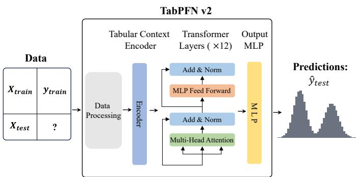  
Fig. 1: Overview of the TabPFN v2 architecture and prediction workflow.

$$
p _ { \theta } ( y \mid \mathbf { x } _ { t e s t } , \mathcal { D } _ { t r a i n } ) = \sum _ { k = 1 } ^ { K } p _ { k } \mathbb { I } ( y \in B _ { k } ) ,\tag{1}
$$

where $\mathbb { I } ( \cdot )$ is the indicator function. The prediction is then derived seamlessly by calculating the expected value of this distribution mapped back to the original target scale:

$$
\begin{array} { r } { \hat { y } _ { t e s t } = \mathbb { E } _ { y \sim p _ { \theta } ( \cdot | \mathbf { x } _ { t e s t } , \mathcal { D } _ { t r a i n } ) } [ y ] . } \end{array}\tag{2}
$$

To quantify the predictive uncertainty associated with this distribution, the variance is computed as:

$$
\begin{array} { r } { \sigma ^ { 2 } = \mathbb { E } _ { y \sim p _ { \theta } ( \cdot | \mathbf { x } _ { t e s t } , \mathcal { D } _ { t r a i n } ) } \left[ \left( y - \hat { y } _ { t e s t } \right) ^ { 2 } \right] . } \end{array}\tag{3}
$$

By outputting this full probability distribution and its derived statistics, TabPFN $\mathbf { v } 2$ achieves accurate predictions while simultaneously offering reliable predictive uncertainty and other statistical metrics.

## B. Surrogate-Assisted Evolutionary Algorithms

SAEAs integrate surrogate models in EAs to accelerate computationally expensive optimization tasks [28], [29]. Fig. 2 illustrates the overall framework of SAEAs. Both paradigms rely on an underlying EA, such as genetic algorithm (GA) [30], differential evolution (DE) [31], or particle swarm optimization (PSO) [32], as the base search engine. This engine drives the optimization through a continuous loop of population selection, reproduction, and evaluation. In this loop, SAEAs utilize surrogate models to replace the expensive true evaluations. To seamlessly incorporate the surrogate model into this evaluation phase and the broader evolutionary search, SAEAs require refined model management strategies to fully and effectively utilize the available data, which are typically closely tailored to the characteristics of the underlying surrogate [33], [34]. Fundamentally, depending on whether new data can be acquired via true evaluations during the search process, SAEAs are structurally categorized into the distinct offline and online paradigms shown in Fig. 2 [35].

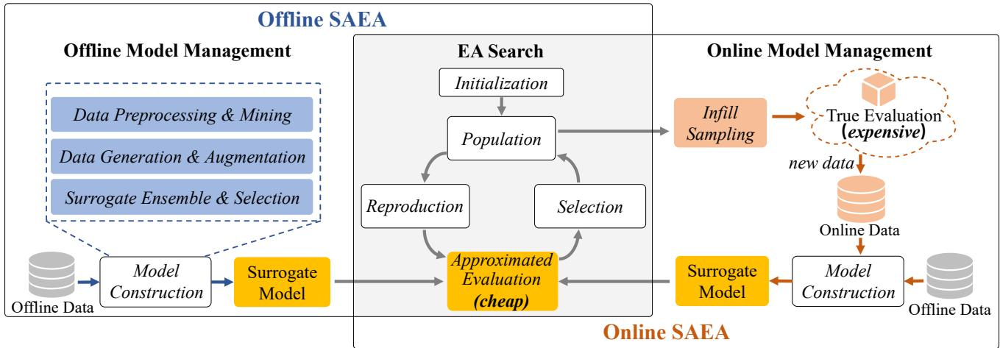  
Fig. 2: General framework of offline and online SAEAs

Offline SAEAs are employed when true evaluations are entirely inaccessible during the evolutionary search, relying exclusively on static, pre-collected offline data. Its primary technical bottleneck is the vulnerability to the “false optima” problem, where the EA converges toward regions the surrogate misleadingly predicts as promising due to out-of-distribution (OOD) errors. Since the offline data cannot be dynamically updated, the Offline Model Management module acts as a critical safeguard. To mitigate false optima, existing offline model management methods within the Surrogate Construction phase can generally be classified into three main categories. The first two approaches tackle the challenge from the perspective of the training data: 1) Data Preprocessing & Mining is utilized to filter noises and extract high-value patterns, and 2) Data Generation & Augmentation is applied to artificially synthesize samples to compensate for sparse regions [35], [36], [37]. The third approach focuses on the modeling strategy itself, specifically Surrogate Ensemble & Selection. Although grouped together, these are distinct mechanisms: surrogate ensembling integrates multiple models to enhance overall prediction robustness and implicitly estimate uncertainty, whereas surrogate selection adaptively chooses the most suited model for the current optimization stage [38], [14]. Together, these methods maximize the generalization capability of the surrogate within the strict confines of offline data.

Online SAEAs allow for limited interactions with the true evaluation to dynamically refine the surrogate. Because the offline paradigm is essentially a special case of online SAEAs where the evaluation budget is strictly zero, the Surrogate Construction designed for offline scenarios are inherently applicable within the online frameworks. The fundamental distinction of the Online Model Management module lies in its active data acquisition mechanism: the Infill Sampling strategy. After the surrogate acts as a preliminary filter for the offspring population, this sampling strategy is applied to select a small and critical subset of candidates for true evaluation. It evaluates the comprehensive utility of candidates by explicitly balancing two competing dimensions: 1) Exploitation (Convergence), which evaluates the predicted fitness to drive the search toward currently known promising regions; and 2) Exploration (Uncertainty & Diversity), which targets underexplored areas or regions with high prediction variance to enhance the model’s global reliability [32], [12]. Once evaluated, these exact solutions are appended to the online data repository. This new data subsequently triggers the dynamic updating or retraining of the surrogate model. By continuously correcting the surrogate’s landscape through this closed-loop feedback mechanism, online SAEAs effectively navigate the complex search space while maximizing the utility of a strict computational budget.

## III. PREDICTION PERFORMANCE OF TABPFN

We select the Ellipsoid and Rastrigin functions and the CEC 2017 benchmark suite to evaluate the predictive performance of TabPFN and two classic surrogate models, RBFN and GP. The latter two serve as comparison models for TabPFN. The results on the Ellipsoid and Rastrigin functions are visualized using 2D landscapes. RMSE and Kendall’s τ are used to evaluate prediction error and rank correlation, respectively. We also test the training and inference time costs of the three models. In this study, the TabPFN used is TabPFN v2.

Noted that in the subsequent empirical studies, we evaluate the performance of the algorithms using mean comparisons or statistical significance tests. For the mean comparisons, a “win” indicates that the control method achieves a better average performance, while a “tie” denotes that its mean is exactly the same as that of the other methods. When statistical significance testing is applied, we employ the Wilcoxon ranksum test [39] at a significance level of $\alpha \ = \ 0 . 0 5$ . In the reported results, “+”, “−”, and “=” indicate that the control algorithm performs significantly better than, significantly worse than, or shows no significant difference compared to baseline algorithms, respectively.

## A. 2D Visualization

We select two single-objective functions, Ellipsoid and Rastrigin, with the input dimension D = 2. We test the predictive performance of TabPFN and two classic surrogate models, GP and RBFN, under different training data sizes and visualize the results as 2D landscapes. The number of training samples is denoted by $N _ { \mathrm { t r } } ,$ , which is set to $N _ { \mathrm { t r } } = 2 0$ and $N _ { \mathrm { t r } } = 3 0 0$ The test points are sampled on a 200 × 200 grid, and the total number of test samples is denoted by $N _ { \mathrm { t e } } = 4 0 0 0 0$ . We compute RMSE and τ as evaluation metrics.

GP Prediction RMSE = 13.33 τ = 0.4551  
RBFN Prediction RMSE = 10.22 τ = 0.5033  
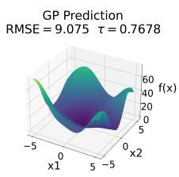

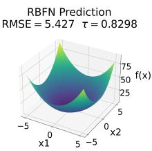  
(a) $N _ { \mathrm { t r } } = 2 0$

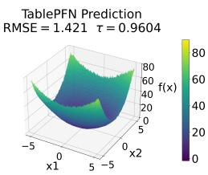

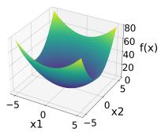

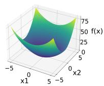  
(b) $N _ { \mathrm { t r } } = 3 0 0$

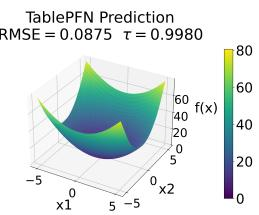  
Fig. 3: The 2D landscape predicted by the surrogate models on the Ellipsoid function.

The landscapes of the three surrogate models on the Ellipsoid function are shown in Fig. 3. When $N _ { \mathrm { t r } } ~ = ~ 2 0$ , all three models fit the Ellipsoid function well, and their overall trends closely match the true landscape. Among them, TabPFN achieves the optimal RMSE and τ values. When $N _ { \mathrm { t r } } = 3 0 0$ the landscapes of all three models are highly accurate, and all evaluation metrics improve substantially compared with the case of $N _ { \mathrm { t r } } = 2 0$ . In this scenario, GP achieves the best performance.

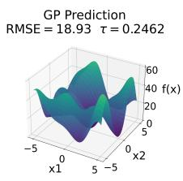

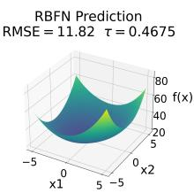  
(a) $N _ { \mathrm { t r } } = 2 0$

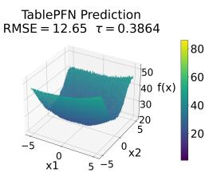

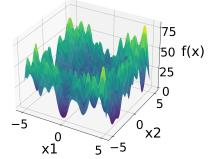

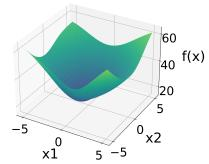  
(b) $N _ { \mathrm { t r } } = 3 0 0$

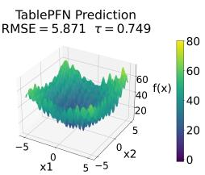  
Fig. 4: The 2D landscape predicted by the surrogate models on the Rastrigin function.

The landscapes of the three surrogate models on the Rastrigin function are shown in Fig. 4. At $N _ { \mathrm { t r } } = 2 0$ , all models have a poor performance. RBFN and TabPFN fit the general trend, while GP cannot reflect basic structural features. At $N _ { \mathrm { t r } } = 3 0 0$ , TabPFN fits the real landscape best and obtains optimal RMSE and τ, capturing both global trends and local details. RBFN only fits global trends, and GP still shows the worst fitting result.

Overall, on the simpler unimodal Ellipsoid function, all three models predict very accurately. On the more difficult multimodal Rastrigin function, as the number of training samples increases, TabPFN clearly outperforms GP and RBFN. This shows that TabPFN has strong learning ability and achieves better predictive performance than GP and RBFN on more challenging function tasks.

## B. Regression Accuracy and Correlation

We evaluate the prediction performance of three models, namely TabPFN, GP, and RBFN, on the CEC 2017 benchmark suite using RMSE and τ as evaluation metrics. For each function, each model runs 25 independent times, and the average result is taken as the final metric. We set three different input dimensions, i.e., $D = 1 0 , 3 0 , 1 0 0$ , and count the winning counts of each model under each metric at each dimension. Across all test functions of different dimensions, we use a training sample size of $N _ { \mathrm { t r } } = 1 0 D$ and a test sample size of $N _ { \mathrm { t e } } = 1 0 0 0$ for the three models.

TABLE I: Winning counts comparison of GP, RBFN, and TabPFN on the 30 functions of the CEC 2017 benchmark suite, with training size $N _ { \mathrm { t r } } = 1 0 D$ and fixed test size $N _ { \mathrm { t e } } = 1 0 0 0$
<table><tr><td rowspan="2">D</td><td rowspan="2">Metric</td><td colspan="3">Wins</td><td rowspan="2">Ties</td></tr><tr><td>GP</td><td>RBFN</td><td>TabPFN</td></tr><tr><td rowspan="2">10</td><td>RMSE</td><td>0</td><td>7</td><td>22</td><td>1</td></tr><tr><td>T</td><td>0</td><td>5</td><td>23</td><td>2</td></tr><tr><td rowspan="2">30</td><td>RMSE</td><td>1</td><td>3</td><td>22</td><td>4</td></tr><tr><td>T</td><td>2</td><td>2</td><td>22</td><td>4</td></tr><tr><td rowspan="2">100</td><td>RMSE</td><td>0</td><td>4</td><td>19</td><td>7</td></tr><tr><td>T</td><td>0</td><td>3</td><td>20</td><td>7</td></tr></table>

The results of mean comparisons are summarized in Table I, while the full detailed results for each input dimension are provided in Tables S-I, S-II, S-III in the Supplementary Material. As seen from the table, across the three dimensionalities of the CEC 2017 benchmark suite, TabPFN achieves the most wins, outperforming GP and RBFN in both RMSE and τ on most problems. This demonstrates that TabPFN clearly outperforms GP and RBFN in both prediction accuracy and ranking ability.

## C. Training and Inference Time

Using the CEC 2017 F1 as the test function, we evaluate the training and inference time costs of GP, RBFN, and TabPFN under different dimensionalities and sample sizes. We also test their time costs on different GPU hardware, where the GTX 1650 is an entry-level GPU, the RTX 4090 is a flagship GPU, and the RTX A6000 is a professional GPU. For each setting, we conduct 25 independent runs for all three models and use the average training and inference time per sample as the final time performance. Note that TabPFN requires no training from scratch. It only performs data fit equivalent to the training of other models. We thus consistently use “training” to describe “fit”.

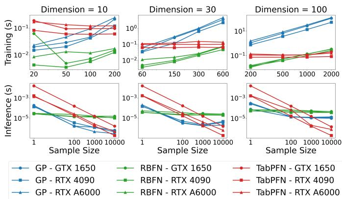  
Fig. 5: Training and Inference Time Curves for GP, RBFN, and TabPFN on the CEC 2017 F1.

We summarize and plot the training and inference time curves of the different models in Fig. 5. For the training time, TabPFN shows nearly constant time across different dimensionalities and sample sizes, while the training time of RBFN and GP gradually increases as dimensionality and sample size grow. Therefore, RBFN is the fastest at low dimensions and small sample sizes, while TabPFN is faster at high dimensions and large sample sizes. Overall, RBFN has relatively short training time, TabPFN is in the middle, and GP is the slowest. In particular, when dimensionality and sample size increase, GP takes much longer than the other two models. For the inference time, RBFN has roughly similar time costs across different dimensions and sample sizes. In contrast, the per-sample inference time of GP and TabPFN decreases noticeably as the sample size increases, and TabPFN exhibits an almost linear decrease with increasing sample size. Overall, TabPFN achieves the shortest inference time and is well suited for parallelized inference on high-dimensional and large-sample data. Regarding inference time, GP and RBFN show almost no dependence on the GPU hardware. TabPFN, however, runs significantly faster on the RTX 4090 and RTX A6000 than on the GTX 1650. In summary, TabPFN is well suited for handling high-dimensional and large-sample data. Its inference time is generally better than that of GP and RBFN, while its training time is relatively high.

## IV. EMPIRICAL STUDIES

To comprehensively benchmark the performance of TabPFN in SAEAs, this section evaluates TabPFN as a direct replacement for traditional machine learning surrogates within established SAEA frameworks. This straightforward substitution corresponds to the highlighted “Surrogate Model” modules illustrated in Fig. 2, allowing us to objectively assess its empirical optimization capabilities. Our experimental study systematically spans both offline and online SAEA paradigms. Furthermore, to rigorously test its versatility and robustness, the online SAEA covers a broad and challenging spectrum of problem scenarios. These encompass single-objective, multiobjective, constrained, and combinatorial optimization, alongside mixed-variable spaces, large-scale decision variables, and one engineering case.

## A. Single-Objective Optimization

1) Offline Optimization Problems: In the offline optimization scenario, only an initial dataset is available, and no additional true evaluations are allowed during the search.

We consider TT-DDEA [14], a representative offline framework using three RBFN surrogates trained on different data subsets, denoted as TT-DDEA-RBFN. Its model management strategy updates each surrogate with pseudo-labeled individuals selected according to the prediction consistency of the other surrogates. We replace RBFN with TabPFN while keeping the same model management strategy, resulting in TT-DDEA-TabPFN. To isolate the effect of the model management strategy, we also introduce DDEA-TabPFN, which removes the model management mechanism and trains a single TabPFN on the entire offline dataset. The CEC 2017 benchmark suite with 10, 30, and 100 decision variables is used for evaluation [40], which includes simple functions (F1, F3–F10), hybrid functions (F11–F20), and composition functions (F21– F30). Each algorithm is run 25 independent times on each function. Table II reports the win counts of the compared algorithms based on the average objective values, while the detailed results and statistical tests are provided in Table S-IV of the Supplementary Material.

TABLE II: Win-count comparison on the CEC 2017 benchmark suite. “RBFN”, “TT-TabPFN”, and “TabPFN” denote TT-DDEA-RBFN, TT-DDEA-TabPFN, and DDEA-TabPFN, respectively.
<table><tr><td rowspan="2">Functions</td><td rowspan="2">D</td><td colspan="3">Wins</td></tr><tr><td>RBFN</td><td>TT-TabPFN</td><td>TabPFN</td></tr><tr><td rowspan="3">Simple (F1, F3–F10)</td><td>10</td><td>8</td><td>0</td><td>1</td></tr><tr><td>30</td><td>7</td><td>0</td><td>2</td></tr><tr><td>100</td><td>8</td><td>0</td><td>1</td></tr><tr><td rowspan="3">Hybrid (F11–F20)</td><td>10</td><td>0</td><td>1</td><td>9</td></tr><tr><td>30</td><td>1</td><td>3</td><td>6</td></tr><tr><td>100</td><td>5</td><td>0</td><td>5</td></tr><tr><td rowspan="3">Composition (F21-F30)</td><td>10</td><td>3</td><td>1</td><td>6</td></tr><tr><td>30</td><td>2</td><td>2</td><td>6</td></tr><tr><td>100</td><td>3</td><td>6</td><td>1</td></tr><tr><td>Total</td><td>1</td><td>37</td><td>13</td><td>37</td></tr></table>

From Table II, DDEA-TabPFN and TT-DDEA-TabPFN achieve overall performance comparable to TT-DDEA-RBFN. The advantage of DDEA-TabPFN is mainly observed on hybrid functions and some composition functions, suggesting that TabPFN is effective in modeling complex fitness landscapes. In contrast, TT-DDEA-RBFN remains competitive on simple functions, where RBFN can already approximate the relatively smooth landscapes effectively. To further examine these differences, Fig. 6 presents the convergence curves and RMSE profiles on F9 and F18 over 25 independent runs. These two functions are selected as representative cases of relatively simple and complex fitness landscapes, respectively. On F9, TT-DDEA-RBFN shows more stable convergence and the lowest RMSE, which explains its better performance on simple landscapes. On F18, the TabPFN-based variants, especially DDEA-TabPFN, achieve better convergence, with steadily decreasing RMSE values. In contrast, TT-DDEA-RBFN shows weaker convergence and increasing RMSE. These results further confirm that RBFN is effective for simple functions, whereas TabPFN provides more accurate surrogate modeling and more reliable search guidance on complex functions.

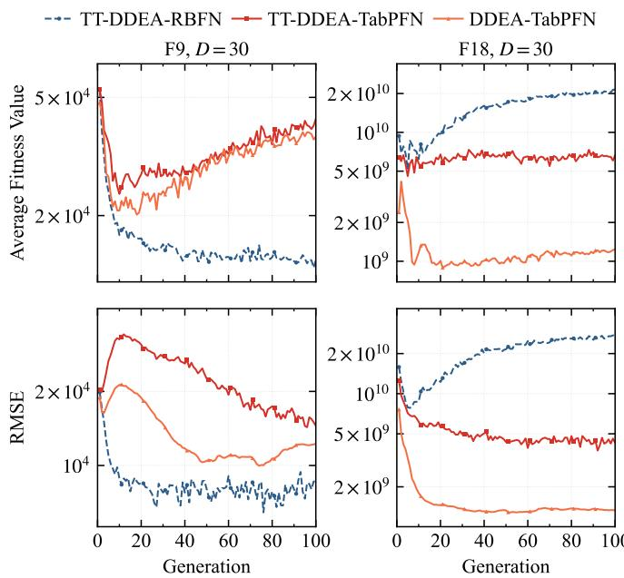  
Fig. 6: Performance on F9 and F18 with $D \ = \ 3 0 .$ (Top) Convergence curves of the compared algorithms. (Bottom) RMSE profiles of the surrogate models over generations.

Therefore, TabPFN can work well as the main surrogate in offline SAEAs by providing more reliable fitness estimates on complex landscapes. However, directly combining it with the original model management strategy is less effective, probably because pseudo-labeling introduces additional uncertainty and data partitioning limits its use of the offline dataset. Thus, training data should not be unnecessarily split or augmented with pseudo-labels simply to follow conventional model management strategies.

2) Small/Medium-Scale Online Optimization Problems: To evaluate the effectiveness of TabPFN in online SAEAs, we consider MGP-SLPSO, a GP-assisted social learning PSO that employs a multi-objective infill criterion for model management [32]. We replace the original GP surrogate with TabPFN while keeping the same optimization and model management strategies, resulting in TabPFN-SLPSO. The CEC 2017 benchmark suite with 10, 30, and 100 decision variables is used for evaluation. The detailed results and statistical tests are provided in Table S-V and S-VI of the Supplementary Material, while Table III summarizes the corresponding win counts.

TABLE III: Win-count comparison on the CEC 2017 benchmark suite. $\mathbf { \vec { G } P } ^ { \prime }$ denotes MGP-SLPSO, and “TabPFN” denotes TabPFN-SLPSO.
<table><tr><td rowspan="2">Functions</td><td rowspan="2">D</td><td colspan="2">Wins</td></tr><tr><td>GP</td><td>TabPFN</td></tr><tr><td rowspan="3">Simple (F1, F3–F10)</td><td>10</td><td>1</td><td>8</td></tr><tr><td>30</td><td>2</td><td>7</td></tr><tr><td>100</td><td>0</td><td>9</td></tr><tr><td rowspan="3">Hybrid (F11–F20)</td><td>10</td><td>0</td><td>10</td></tr><tr><td>30</td><td>0</td><td>10</td></tr><tr><td>100</td><td>0</td><td>10</td></tr><tr><td rowspan="3">Composition (F21-F30)</td><td>10</td><td>1</td><td>9</td></tr><tr><td>30</td><td>1</td><td>9</td></tr><tr><td>100</td><td>0</td><td>10</td></tr><tr><td>Total</td><td>1</td><td>5</td><td>82</td></tr></table>

As shown in Table III, TabPFN-SLPSO generally outperforms MGP-SLPSO. On simple functions, TabPFN achieves 8, 7, and 9 wins for $D = 1 0 , 3 0 .$ , and 100, respectively, compared with at most 2 wins for GP. Its advantage is even more pronounced on hybrid and composition functions, securing nearly all wins across all dimensionalities. Overall, TabPFN obtains 82 wins versus 5 for GP, indicating a clear advantage under the same surrogate-assisted evolutionary framework.

Statistical results (Table S-V) indicate this advantage grows with increasing dimensionality. TabPFN’s significant wins increase from 19 at $D = 1 0 \mathrm { \ t o \ } 2 5$ and 27 at $D = 3 0$ and 100, respectively, while significant losses remain at most one. Unlike the offline setting, where TabPFN primarily excels on complex landscapes, these online results show its benefits also extend to relatively simple functions when the surrogate is continuously updated with newly evaluated samples. Surrogate modeling results (Table IV) further support these observations. TabPFN achieves lower RMSE on 24, 29, and 28 functions for $\begin{array} { r } { \begin{array} { r c l } { D } & { = } & { 1 0 , 3 0 . } \end{array} } \end{array}$ , and 100, providing substantially more accurate fitness estimates. It also obtains higher Kendall’s τ on most functions. MGP-SLPSO’s infill strategy jointly considers predicted fitness and uncertainty rather than relying solely on ranking. Consequently, the reduced RMSE serves as the primary driver of optimization gains, making the ranking results complementary evidence of surrogate quality.

TABLE IV: Winning counts of population RMSE and τ during optimization between MGP-SLPSO and TabPFN-SLPSO on CEC 2017.
<table><tr><td rowspan="2">D</td><td rowspan="2">Metric</td><td colspan="2">Wins</td><td rowspan="2">Ties</td></tr><tr><td>MGP</td><td>TabPFN</td></tr><tr><td rowspan="2">10</td><td>RMSE</td><td>6</td><td>23</td><td>0</td></tr><tr><td>T</td><td>11</td><td>18</td><td>0</td></tr><tr><td rowspan="2">30</td><td>RMSE</td><td>0</td><td>29</td><td>0</td></tr><tr><td>T</td><td>1</td><td>28</td><td>0</td></tr><tr><td rowspan="2">100</td><td>RMSE</td><td>1</td><td>28</td><td>0</td></tr><tr><td>T</td><td>11</td><td>18</td><td>0</td></tr></table>

Overall, TabPFN is a highly competitive alternative to GP for online SAEAs. Its consistent advantage across various landscapes and dimensionalities, alongside offline results, suggests that TabPFN’s effectiveness depends not only on the optimization landscape characteristics, but also on how the surrogate is updated and integrated into the optimization process.

3) Large-Scale Online Optimization Problems: In largescale optimization, surrogate models often struggle to provide sufficient predictive performance under limited data due to the massive number of decision variables. To address this, divide-and-conquer SAEAs [41], [42], [15] commonly employ RBFN for modeling and searching within low-dimensional subspaces. Their promising results demonstrate that RBFN effectively fits fitness landscapes within subspaces formed by partial subsets of decision variables. Here, we investigate whether substituting RBFN with TabPFN can further improve optimization performance.

We select five representative 1000D problems (F1, F4, F8, F12, and F15, being the first from each category) from the CEC 2013 benchmark suite [43]. We develop LSEO-S3-TabPFN, a variant of the state-of-the-art SAEA (LSEO-S3 [15]) for expensive large-scale optimization, by solely replacing its RBFN with TabPFN. Both algorithms are run independently 25 times with a maximum of $1 1 \times D$ expensive function evaluations per run. The optimization results and the Wilcoxon rank-sum test indicators are presented in Table V. As observed, LSEO-S3-TabPFN performs significantly worse than the original RBFN-based LSEO-S3 across all test functions.

TABLE V: Optimization mean value results comparison between LSEO-S3 (RBFN) and LSEO-S3-TabPFN on CEC2013 benchmark functions.
<table><tr><td>Function</td><td>LSEO-S3 (RBFN)</td><td>LSEO-S3-TabPFN</td></tr><tr><td>F1</td><td>7.39e+09 (4.53e+08)</td><td> $5 . 9 0 \mathrm { e } + 1 0 \ ( 6 . 5 7 \mathrm { e } + 0 9 ) \ -$ </td></tr><tr><td>F4</td><td>2.48e+11 (3.54e+10)</td><td> $8 . 2 3 \mathrm { { e } + 1 1 } \ ( 3 . 2 2 \mathrm { { e } + 1 1 ) \ - \ }$ </td></tr><tr><td>F8</td><td>9.62e+15 (1.21e+15)</td><td> $2 . 5 6 \mathrm { e } + 1 6 ( 2 . 1 0 \mathrm { e } + 1 6 ) \ : -$ </td></tr><tr><td>F12</td><td>1.12e+11 (9.14e+09)</td><td> $2 . 3 9 \mathrm { e } + 1 2 \ ( 2 . 0 5 \mathrm { e } + 1 1 ) \ -$ </td></tr><tr><td>F15</td><td>6.88e+07 (1.54e+07)</td><td> $6 . 4 6 \mathrm { { e } } + 1 3 \ ( 1 . 0 8 \mathrm { { e } } + 1 4 ) \ -$ </td></tr><tr><td> $+ / - / =$ </td><td>/</td><td>0/5/0</td></tr></table>

To investigate TabPFN’s underperformance, we evaluate both models in 100D subspaces (Table VI). For each function, we sample 300 training points via Latin Hypercube Sampling (LHS). The 300 test points are generated under two scenarios: (1) Global: LHS across the entire space; and (2) Local: Gaussian perturbation $\mathcal { N } ( 0 , ( 0 . 0 5 { \times } \mathrm { s e a r c h ~ r a n g e } ) ^ { 2 } )$ centered at the training set mean. The RMSE and Kendall’s τ are averaged over three independent runs. Intriguingly, TabPFN maintains a dominant advantage in predictive accuracy across most scenarios, consistent with Table I. This robust accuracy starkly contrasts with its poor optimization performance (Table V), suggesting that in large-scale environments, optimization success is governed by critical factors beyond mere predictive accuracy.

To analyze model extrapolation behavior as a potential cause, we conduct an experiment on F8. We extract runtime states (training samples, active dimensions $D _ { s }$ , and the global best solution) from 15 LSEO-S3 iterations, setting the training size to $N _ { s } ~ = ~ 3 \times D _ { s }$ . We define a characteristic scale ℓ as the median nearest-neighbor distance among the training points, i.e., $\begin{array} { r } { \ell ~ = ~ \mathrm { { m e d i a n } } _ { i } \operatorname* { m i n } _ { j \neq i } \| x _ { i } - x _ { j } \| _ { 2 } } \end{array}$ . This metric reflects the typical spacing between training samples and provides a data-adaptive distance unit that remains comparable across iterations with varying subspace dimensions and value ranges. Anchored at the best training point, we generate test points along 30 random unit directions at 7 distance levels $r \in \{ 0 . 2 5 , 0 . 5 , 1 , 2 , 4 , 8 , 1 6 \}$ (in multiples of ℓ). This yields 450 test points per level across all 15 iterations, on which both models are evaluated.

TABLE VI: Comparison of RMSE and Kendall τ mean between RBFN and TabPFN in Global and Local scenarios.
<table><tr><td rowspan="2">Metric</td><td rowspan="2">Func</td><td colspan="2">Global</td><td colspan="2">Local</td></tr><tr><td>RBFN</td><td>TabPFN</td><td>RBFN</td><td>TabPFN</td></tr><tr><td rowspan="5">RMSE</td><td>F1</td><td> $2 . 6 4 4 7 \mathrm { e } { + } 1 1$ </td><td> $\mathbf { 4 . 2 8 7 1 e + 1 0 }$ </td><td> $1 . 4 4 9 4 \mathrm { e } + 1 2$ </td><td> $\mathbf { 2 . 6 2 7 5 e { + 1 1 } }$ </td></tr><tr><td>F4</td><td> $3 . 9 8 3 6 \mathrm { e } + 1 4$ </td><td> $\mathbf { 1 . 7 6 2 8 e { + 1 4 } }$ </td><td> $1 . 1 5 3 2 \mathrm { e } { + } 1 5$ </td><td> $\mathbf { 2 . 6 0 8 9 e + 1 4 }$ </td></tr><tr><td>F8</td><td> $1 . 4 2 7 1 \mathrm { e } { + } 1 9$ </td><td> $\mathbf { 1 . 0 2 1 1 e + 1 9 }$ </td><td> $1 . 6 1 4 9 \mathrm { e } { + } 1 9$ </td><td> $\mathbf { 1 . 3 7 6 0 e + 1 9 }$ </td></tr><tr><td>F12</td><td> $8 . 1 6 1 5 \mathrm { e } + 1 2$ </td><td>5.8880e+11</td><td> $4 . 8 6 6 1 \mathrm { e } + 1 3$ </td><td> $\mathbf { 8 . 0 7 5 8 e + 1 } 2$ </td></tr><tr><td>F15</td><td>1.1298e+19</td><td>5.9660e+18</td><td> $3 . 7 7 7 4 \mathrm { e } + 1 9$ </td><td> $\mathbf { 1 . 3 5 4 2 e + 1 9 }$ </td></tr><tr><td rowspan="5">T</td><td>F1</td><td>-0.0145</td><td>0.1286</td><td>0.0536</td><td>0.1273</td></tr><tr><td>F4</td><td>0.0539</td><td>0.1208</td><td>0.0942</td><td>0.0973</td></tr><tr><td>F8</td><td>0.0422</td><td>0.1074</td><td>0.0381</td><td>0.0556</td></tr><tr><td>F12</td><td>-0.0619</td><td>0.0873</td><td>0.0022</td><td>0.0687</td></tr><tr><td>F15</td><td>0.0402</td><td>0.1489</td><td>0.0540</td><td>-0.0013</td></tr></table>

TABLE VII: Predictions across different distance scales.
<table><tr><td>dist×scale (r)</td><td>real_dist</td><td> $\hat { y } _ { \mathrm { R B F N } }$ </td><td> $\hat { \pmb { y } } _ { \mathbf { T a b P F N } }$ </td><td>Ytrain_mean</td></tr><tr><td>0.25</td><td>88.07</td><td> $2 . 2 7 5 7 \mathrm { e } { + } 1 7$ </td><td> $1 . 2 1 0 6 \mathrm { e } { + } 1 9$ </td><td> $1 . 4 1 4 5 \mathrm { e } { + } 1 9$ </td></tr><tr><td>0.50</td><td>165.95</td><td> $- 1 . 8 3 5 3 \mathrm { e } + 1 7$ </td><td> $1 . 2 4 5 4 \mathrm { e } { + } 1 9$ </td><td> $1 . 4 1 4 5 \mathrm { e } { + } 1 9$ </td></tr><tr><td>1.00</td><td>299.79</td><td> $- 2 . 7 4 2 4 \mathrm { e } { + } 1 8$ </td><td> $1 . 3 2 0 0 \mathrm { e } { + } 1 9$ </td><td> $1 . 4 1 4 5 \mathrm { e } { + } 1 9$ </td></tr><tr><td>2.00</td><td>441.19</td><td> $- 1 . 7 2 3 7 \mathrm { e } { + } 1 9$ </td><td> $1 . 3 9 1 4 \mathrm { e } { + } 1 9$ </td><td> $1 . 4 1 4 5 \mathrm { e } { + } 1 9$ </td></tr><tr><td>4.00</td><td>500.96</td><td> $- 4 . 1 1 8 2 \mathrm { e } { + } 1 9$ </td><td> $1 . 4 3 7 8 \mathrm { e } + 1 9$ </td><td> $1 . 4 1 4 5 \mathrm { e } { + } 1 9$ </td></tr><tr><td>8.00</td><td>528.30</td><td> $- 5 . 3 0 3 5 \mathrm { e } + 1 9$ </td><td> $1 . 5 1 3 2 \mathrm { e } { + } 1 9$ </td><td> $1 . 4 1 4 5 \mathrm { e } { + } 1 9$ </td></tr><tr><td>16.00</td><td>540.93</td><td> $- 6 . 5 7 1 8 \mathrm { e } + 1 9$ </td><td> $1 . 5 1 0 1 \mathrm { e } { + } 1 9$ </td><td> $1 . 4 1 4 5 \mathrm { e } { + } 1 9$ </td></tr></table>

Table VII reports the aggregated mean predictions (yˆ ,yˆ ), the mean training label $( y _ { \mathrm { t r a i n \_ m e a n } } ) ,$ , and the average minimum distance to the training set (real dist). As the extrapolation distance increases, RBFN’s predictions diverge without bound and can even reach implausibly favorable values, thereby confirming the unbounded cubic-kernel extrapolation utilized in LSEO-S3. Conversely, TabPFN remains tightly anchored to $y _ { \mathrm { t r a i n \_ m e a n } } ,$ exhibiting mean-regression under distribution shifts. Under the common criterion of selecting minimum predicted values, RBFN’s unbounded extrapolation implicitly favors distant points, thereby enhancing exploration. This mechanism is highly advantageous for large-scale optimization and directly explains RBFN’s superiority over TabPFN.

## B. Constrained Optimization

To evaluate the performance of TabPFN in expensive constrained optimization, we integrated it into DSI [33] by replacing RBFN. The comparison is based on the mean performance over 25 independent runs. For problems where an algorithm cannot find feasible solutions in all runs, only the success rate (SR) is reported, where a larger SR indicates a higher probability of locating the feasible region. Table VIII details the results across ten benchmark problems selected from the widely used CEC2006 and CEC2010 test suites. The data reveals a systemic degradation when using TabPFN: DSI-RBFN significantly outperforms DSI-TabPFN on 8 out of 10 problems. DSI-TabPFN only achieves a statistical advantage on g08. The most striking failure occurs on problem g12, where DSI-TabPFN’s SR plummets to a mere 36%, whereas DSI-RBF robustly maintains a 100% SR. Furthermore, both algorithms struggle heavily on c15 (yielding an SR of 4%), indicating an intrinsically difficult constraint landscape that challenges both surrogates.

TABLE VIII: Comparison results of DSI-RBFN and DSI-TabPFN on ten constrained problems. The best result for each problem is highlighted in bold.
<table><tr><td>Problem</td><td>DSI-RBFN</td><td>DSI-TabPFN</td></tr><tr><td>g02</td><td>-2.93e-01(6.46e-02)</td><td>-2.28e-01(8.23e-02)—</td></tr><tr><td>g06</td><td>-6.96e+03(3.48e-03)</td><td>-6.37e+03(2.75e+02)–</td></tr><tr><td>g08</td><td>-7.11e-02(3.37e-02)</td><td>-9.22e-02(8.09e-03)+</td></tr><tr><td>g12</td><td>100%</td><td>36%—</td></tr><tr><td>g24</td><td>-5.51e+00(1.74e-09)</td><td>-5.51e+00(1.82e-03)-</td></tr><tr><td>c01</td><td>-4.57e-01(1.01e-01)</td><td>-2.51e-01(9.66e-02)–</td></tr><tr><td>c07</td><td>3.05e+06(4.70e+06)</td><td>3.13e+08(7.51e+08)-</td></tr><tr><td>c08</td><td>7.25e+07(9.63e+07)</td><td>1.68e+10(1.03e+10)—</td></tr><tr><td>c14</td><td>2.82e+12(5.58e+12)</td><td>7.46e+12(1.98e+13)—</td></tr><tr><td>c15</td><td>4%</td><td>4%=</td></tr><tr><td>+1-1=</td><td>1</td><td>1/8/1</td></tr></table>

TABLE IX: Function complexity and constraint prediction range compression. “RNFN” denotes RBFN range, and “TabPFN” denotes TabPFN range.
<table><tr><td>Problem</td><td>Dim</td><td>Quad  $\scriptstyle { { \cal R } ^ { 2 } }$ </td><td>RBFN(%)</td><td>TabPFN(%)</td></tr><tr><td>g02</td><td>20</td><td>0.067</td><td>265.37</td><td>53.36</td></tr><tr><td>g06</td><td>2</td><td>1.000</td><td>100.12</td><td>99.48</td></tr><tr><td>g08</td><td>2</td><td>1.000</td><td>99.53</td><td>99.81</td></tr><tr><td>g12</td><td>3</td><td>0.286</td><td>147.78</td><td>48.06</td></tr><tr><td>g24</td><td>2</td><td>0.630</td><td>96.63</td><td>97.43</td></tr><tr><td>c01</td><td>10</td><td>0.518</td><td>119.93</td><td>63.25</td></tr><tr><td>c07</td><td>10</td><td>0.037</td><td>100.60</td><td>11.15</td></tr><tr><td>c08</td><td>10</td><td>0.012</td><td>91.30</td><td>1.63</td></tr><tr><td>c14</td><td>10</td><td>0.054</td><td>96.20</td><td>12.22</td></tr><tr><td>c15</td><td>10</td><td>0.012</td><td>109.73</td><td>8.61</td></tr></table>

The underlying cause of this widespread failure is quantitatively exposed in Table IX, which links function complexity with constraint prediction range compression. Here, function complexity is measured by Quad $R ^ { 2 ^ { - } }$ (the $R ^ { 2 }$ value of a quadratic polynomial fit), where a lower value indicates a highly non-linear and complex landscape. On simpler problems (e.g., g06 and g08), TabPFN maintains a normal prediction range and performs competitively. However, when confronting highly complex landscapes absent from its pretraining priors (characterized by low Quad $R ^ { 2 } )$ , TabPFN suffers from severe “regression to the mean” [27]. Unlike the distance-based RBFN, which intrinsically preserves the scale and amplitude of the training data, TabPFN undergoes drastic variance shrinkage—collapsing to a mere 1.63% range on c08. By severely compressing the variance, TabPFN completely blurs the critical mathematical boundaries between feasible $( g ( x ) \ \leq \ 0 )$ and infeasible regions, rendering the constraint surrogate incapable of effectively guiding the EA.

## C. Multi-Objective Optimization

1) Unconstrained Problems: To investigate the applicability of TabPFN to expensive multi-objective optimization, we select KTA2 [12], a representative GP-assisted evolutionary algorithm, as the baseline. KTA2 maintains two archives to promote convergence and diversity and adaptively selects solutions for expensive evaluations according to the current optimization state. We replace its GP models with TabPFN while keeping the evolutionary search and model management strategies unchanged, resulting in KTA2-TabPFN. The two algorithms are evaluated on the unconstrained DTLZ1–DTLZ4 benchmark problems [44] with $M \ = \ 3$ and $M ~ = ~ 1 0$ objectives. The $\mathrm { I G D ^ { + } }$ indicator is used to assess the quality of the obtained solution sets, where a smaller value indicates better. Each algorithm is independently run 25 times on each problem setting, and the results are reported as the mean and standard deviation of IGD+.

Table X presents the statistical comparison results. KTA2- TabPFN obtains lower mean $\mathrm { I G D ^ { + } }$ values in six of the eight settings, with two significant wins, one significant loss, and five ties against KTA2. For $M = 3 ,$ it significantly reduces the mean $\mathrm { I G D ^ { + } }$ on DTLZ1 and DTLZ4 by approximately 20.5% and 65.7%, respectively, and also achieves a lower mean on DTLZ3, while KTA2 performs slightly better on DTLZ2. For M = 10, KTA2-TabPFN obtains slightly lower mean values on DTLZ1–DTLZ3 but is significantly worse on DTLZ4, with an increase of approximately 14.5%. Overall, replacing GP with TabPFN largely preserves the performance of KTA2 and provides clear improvements on some threeobjective problems, although this advantage diminishes as the number of objectives increases. This may be because KTA2’s model management strategy was originally designed around GP predictions and uncertainty estimates, suggesting that further adaptation may be needed for many-objective problems.

TABLE X: $\mathrm { I G D ^ { + } }$ results of KTA2 and KTA2-TabPFN on the DTLZ1–DTLZ4 benchmark problems. The results are reported as mean (standard deviation), with the better mean shown in bold.
<table><tr><td>Problem</td><td>M</td><td>KTA2 (GP)</td><td>KTA2-TabPFN</td></tr><tr><td rowspan="2">DTLZ1</td><td>3</td><td>6.00e+01 (1.61e+01)</td><td>4.77e+01 (7.40e+00) +</td></tr><tr><td>10</td><td>4.20e-01 (2.06e-01)</td><td>3.74e-01 (2.89e-01) =</td></tr><tr><td rowspan="2">DTLZ2</td><td>3</td><td>3.98e-02 (3.05e-03)</td><td>4.19e-02 (4.16e-03) =</td></tr><tr><td>10</td><td>4.39e-01 (1.49e-02)</td><td>4.37e-01 (2.04e-02) =</td></tr><tr><td rowspan="2">DTLZ3</td><td>3</td><td>1.54e+02 (4.05e+01)</td><td>1.38e+02 (3.29e+01) =</td></tr><tr><td>10</td><td>1.25e+00 (4.29e-01)</td><td>1.21e+00 (4.22e-01) =</td></tr><tr><td rowspan="2">DTLZ4</td><td>3</td><td>1.71e-01 (1.10e-01)</td><td>5.86e-02 (1.21e-02) +</td></tr><tr><td>10</td><td>3.38e-01 (3.94e-02)</td><td>3.87e-01 (4.69e-02) 一</td></tr><tr><td> $+ / - / =$ </td><td></td><td>1</td><td>2/1/5</td></tr></table>

2) Constrained Problems: To investigate the applicability of TabPFN to expensive constrained multi-objective optimization, we select KTS [45], a GP-assisted evolutionary algorithm with two search modes, as the baseline. KTS adaptively switches between unconstrained and constrained surrogateassisted search according to the relationship between objective optimization and constraint satisfaction. We replace both the objective and constraint GP models with TabPFN while keeping the remaining search and model management strategies unchanged, resulting in KTS-TabPFN. To further identify the source of the performance difference, we construct two additional variants: KTS-TabPFN(obj), where only the objective surrogates are replaced by TabPFN, and KTS-TabPFN(cons), where only the constraint surrogates are replaced.

TABLE XI: Comparison results of KTS and its three variants on ten CF test problems. The best result for each problem is highlighted in bold.
<table><tr><td>Problem</td><td>KTS</td><td>KTS-TabPFN</td><td>KTS-TabPFN(obj)</td><td>KTS-TabPFN(cons)</td></tr><tr><td>CF1</td><td>1.04e-01(2.49e-02)</td><td>1.94e-01(3.78e-02)</td><td>9.76e-02(2.52e-02)</td><td>1.99e-01(4.03e-02)</td></tr><tr><td>CF2</td><td>6.08e-02(2.03e-02)</td><td>1.59e-01(4.84e-02)</td><td>1.78e-01(7.97e-02)</td><td>5.43e-02(1.82e-02)</td></tr><tr><td>CF3</td><td>1.32e+00(2.15e-01)</td><td>1.91e+00(9.20e-01)</td><td>1.82e+00(7.95e-01)</td><td>1.22e+00(1.58e-01)+</td></tr><tr><td>CF4</td><td>1.58e-01(4.43e-02)</td><td>3.20e-01(1.23e-01)</td><td>3.36e-01(8.68e-02)</td><td>1.57e-01(5.07e-02)=</td></tr><tr><td>CF5</td><td>7.84e-01(4.87e-01)</td><td>1.82e+00(9.00e-01)</td><td>1.35e+00(5.17e-01)</td><td>8.54e-01(6.35e-01)=</td></tr><tr><td>CF6</td><td>6.07e-02(2.37e-02)</td><td>2.32e-01(8.49e-02)</td><td>2.15e-01(8.46e-02)</td><td>7.71e-02(3.69e-02)=</td></tr><tr><td>CF7</td><td></td><td>9.81e-01(6.93e-01) 3.76e+00(1.69e+00)</td><td>3.36e+00(1.03e+00)</td><td>9.70e-01(7.06e-01)=</td></tr><tr><td>CF8</td><td>3.96e-01(1.28e-01)</td><td>3.98e-01(1.17e-01)</td><td>4.49e-01(1.30e-01)</td><td>4.11e-01(1.37e-01)=</td></tr><tr><td>CF9</td><td></td><td>1.36e-01(6.26e-02) 1.90e-01(6.80e-02)</td><td>1.84e-01(8.91e-02)</td><td>1.65e-01(8.64e-02)=</td></tr><tr><td>CF10</td><td>72.00%</td><td>56.00%=</td><td>64.00%=</td><td>60.00%=</td></tr><tr><td>+/-/=</td><td>/</td><td>0/8/2</td><td>0/7/3</td><td>1/1/8</td></tr></table>

The four algorithms are evaluated on the ten CF benchmark problems under the same experimental settings. The comparison is based on statistical significance tests over 25 independent runs. For problems where an algorithm cannot find feasible solutions in all runs, only the SR is reported, where a larger SR indicates a higher probability of locating the feasible region. The comparison results are summarized in Table XI.

As shown in Table XI, KTS-TabPFN obtains $\mathbf { a _ { \alpha } } + \mathbf { / - \alpha } / =$ result of 0/8/2 against KTS, indicating that directly replacing all GP models with TabPFN generally degrades the performance. A similar result is observed for KTS-TabPFN(obj) with 0/7/3, whereas KTS-TabPFN(cons) achieves 1/1/8 and remains comparable to KTS on most problems. This suggests that the degradation mainly results from replacing the objective surrogates, which directly guide the search toward promising regions and are therefore more sensitive to changes in prediction behavior. In contrast, constraint surrogates mainly identify feasible regions, where TabPFN can provide useful information without substantially affecting the original search mechanism. These results indicate that TabPFN is more suitable for constraint modeling in KTS, while its use for objective modeling may require further adaptation.

## D. Combinatorial Optimization

The decision variables of combinatorial optimization problems are discrete rather than continuous, such as binary, integer, or permutation variables. Due to the discrete nature, constructing an accurate surrogate model is often a major challenge when applying SAEAs to expensive combinatorial optimization problems [19]. To evaluate the performance of TabPFN in this setting, we use feature selection as a representative test problem. Feature selection aims to identify a subset of relevant features while maintaining or improving learning performance [46]. It can be formulated as a binary combinatorial optimization problem, where 1 and 0 indicate feature selection and exclusion, respectively.

We select SAEAPRG [47], a representative offline SAEA for high-dimensional feature selection problems, as the baseline. Its key idea is to employ parallel random grouping to decompose the high-dimensional decision space into multiple lower-dimensional subspaces, thereby facilitating surrogate modeling and evolutionary search. We replace the original RBFN models in SAEAPRG with TabPFN while keeping all other components unchanged, resulting in SAEAPRG-TabPFN. The two algorithms are evaluated on 12 classification datasets, with the number of features ranging from 500 to 10,000. The training set size $( N _ { t r } )$ follows the original setting in SAEAPRG. Each algorithm is independently run 25 times on each dataset. A k-nearest neighbors (KNN) classifier is used to evaluate the selected feature subsets, and the classification error is adopted as the optimization objective.

Table XII reports the classification errors obtained by SAEAPRG and SAEAPRG-TabPFN on the 12 feature selection datasets. Overall, replacing the original RBFN with TabPFN does not lead to any significant performance degradation. SAEAPRG-TabPFN achieves lower mean classification errors on 8 out of the 12 datasets and significantly outperforms SAEAPRG on ORL and Gutenberg, while no statistically significant difference is observed on the remaining 10 datasets. In particular, competitive performance is maintained across datasets with dimensionalities ranging from 500 to 10,000, and no clear deterioration of TabPFN is observed as the problem dimensionality increases. These results suggest that the binary and discrete nature of feature selection does not, by itself, prevent TabPFN from serving as an effective surrogate in combinatorial optimization. Such a training-data distribution may partially explain why the extrapolation limitation of TabPFN is less pronounced in feature selection.

TABLE XII: Mean (standard deviation) of classification errors obtained by SAEAPRG and SAEAPRG-TabPFN. The best results are highlighted.
<table><tr><td>Datasets</td><td>D</td><td>SAEAPRG</td><td>SAEAPRG-TabPFN</td></tr><tr><td>Madelon</td><td>500</td><td>1.59e-01(1.05e-02)</td><td>1.53e-01(6.80e-03)=</td></tr><tr><td>Isolet</td><td>617</td><td>1.39e-01(1.28e-02)</td><td>1.18e-01(1.38e-02)=</td></tr><tr><td>CNAE-9</td><td>856</td><td>1.06e-01(9.63e-03)</td><td>1.08e-01(9.53e-03)=</td></tr><tr><td>ORL</td><td>1024</td><td>1.72e-01(2.12e-02)</td><td>1.46e-01(2.09e-02)+</td></tr><tr><td>COIL20</td><td>1024</td><td>8.69e-03(2.13e-03)</td><td>7.33e-03(2.43e-03)=</td></tr><tr><td>Warp</td><td>2420</td><td>6.15e-02(1.72e-02)</td><td>5.83e-02(1.44e-02)=</td></tr><tr><td>Lung</td><td>3312</td><td>4.39e-02(2.73e-02)</td><td>4.87e-02(2.34e-02)=</td></tr><tr><td>lymphoma</td><td>4026</td><td>1.13e-01(3.88e-02)</td><td>1.21e-01(2.77e-02)=</td></tr><tr><td>RELATHE</td><td>4322</td><td>1.74e-01(8.59e-03)</td><td>1.53e-01(1.45e-02)=</td></tr><tr><td>DLBCL</td><td>5469</td><td>3.75e-02(2.26e-02)</td><td>3.81e-02(1.99e-02)=</td></tr><tr><td>Gutenberg</td><td>8265</td><td>3.17e-01(2.84e-02)</td><td>2.72e-01(9.54e-03)+</td></tr><tr><td>arcene</td><td>10000</td><td>1.14e-01(1.97e-02)</td><td>1.01e-01(1.62e-02)=</td></tr><tr><td colspan="2">+1-1=</td><td>1</td><td>2/0/10</td></tr></table>

The results shown in Table XII contrast with those on the large-scale optimization problems in Section IV-A3, where TabPFN performs worse than RBFN. This suggests that the effectiveness of TabPFN may depend less on whether the variables are continuous or discrete, and more on the degree of extrapolation required during optimization. Unlike the spacefilling LHS used in large-scale optimization, SAEAPRG samples training solutions in a structured and non-uniform manner according to the number of selected features. Such a trainingdata distribution may partially explain why the extrapolation limitation of TabPFN is less pronounced in feature selection.

## E. Mixed-Variable Optimization

Mixed-variable optimization problems involve both continuous and discrete variables, where different values of discrete variables partition the search space into distinct regions, resulting in discontinuous objective landscapes. To evaluate the applicability of TabPFN as a surrogate model for mixed-variable optimization, this study adopts SHEALED as the baseline algorithm [48], which employs RBFNmv with the Gower distance to measure sample similarity and combines global and local search to balance exploration and exploitation. We replace RBFNmv with TabPFN while keeping the evolutionary search and model management strategies unchanged, resulting in a variant termed SHEALED-TabPFN. The experiments consider the Type 1 and Type 2 mixed-variable benchmarks introduced in [48]. These two benchmark classes differ in how the candidate values of the discrete variables are generated. For each class, five test problems are evaluated in 10, 30, and 50 dimensions.

TABLE XIII: Statistical comparison of the final best objective values obtained by SHEALED-TabPFN and SHEALED on the mixed-variable benchmark problems.
<table><tr><td>Problem Type</td><td>(n1, n2)</td><td>SHEALED-TabPFN vs SHEALED</td></tr><tr><td rowspan="3">Simple (Type 1)</td><td>(5,5)</td><td>0/3/2</td></tr><tr><td>(15, 15)</td><td>1/4/0</td></tr><tr><td>(25, 25)</td><td>2/2/1</td></tr><tr><td rowspan="3">Hard (Type 2)</td><td>(5,5)</td><td>0/5/0</td></tr><tr><td>(15, 15)</td><td>0/5/0</td></tr><tr><td>(25, 25)</td><td>0/2/3</td></tr><tr><td>Total</td><td>1</td><td>3/21/6</td></tr></table>

Table XIII summarizes the statistical comparison of the final best objective values obtained by SHEALED and SHEALED-TabPFN on the Type 1 and Type 2 mixed-variable benchmark problems, while the detailed optimization results are provided in Table S-VII of the Supplementary Material. The results indicate that the original SHEALED achieves better optimization performance on most test instances. To further investigate the performance discrepancy mentioned above, we compare the predictive performance of RBFNmv and TabPFN on the same mixed-variable benchmark instances. Table XIV summarizes their statistical comparison in terms of RMSE, $R ^ { 2 }$ , and Kendall’s τ , while the detailed predictive results are provided in Table S-VIII of the Supplementary Material. The results show that RBFNmv achieves better predictive accuracy and candidate-ranking capability on most test instances.

To investigate the impact of the surrogate model on the optimization performance, we compare the convergence processes of the two algorithms, as illustrated in Fig. 7. Fig. 7(a) presents the median best-so-far convergence curves, showing that SHEALED converges faster and achieves a better final solution than SHEALED-TabPFN. Fig. 7(b) further shows that SHEALED-TabPFN allocates fewer expensive evaluations to global search and more to local search than SHEALED.

TABLE XIV: Statistical comparison between TabPFN and RBFNmv on the mixed-variable benchmark problems, with $N _ { { \mathrm { t r } } } = 1 0 D$ and $N _ { \mathrm { t e } } = 2 0 0 0$
<table><tr><td rowspan="2">Metric</td><td colspan="3">TabPFN vs RBFNmv</td></tr><tr><td>(5,5)</td><td>(15,15)</td><td>(25,25)</td></tr><tr><td>RMSE</td><td>3/5/2</td><td>2/7/1</td><td>1/8/1</td></tr><tr><td> $R ^ { 2 }$ </td><td>3/5/2</td><td>2/7/1</td><td>1/8/1</td></tr><tr><td>T</td><td>2/5/3</td><td>2/8/0</td><td>0/8/2</td></tr></table>

This indicates that replacing RBFNmv with TabPFN gradually shifts the search toward local exploitation. The weaker prediction and candidate-ranking capability of TabPFN makes globally generated candidates less competitive after expensive evaluation, while locally sampled solutions are more likely to remain highly ranked. As this effect accumulates, the parent population used by global search becomes increasingly concentrated around the current promising region, thereby further weakening global exploration and causing an imbalance between exploration and exploitation. Overall, the direct application of TabPFN as a surrogate model yields limited performance in mixed-variable optimization. Therefore, applying TabPFN to such problems necessitates the adoption of specialized model adaptation strategies.

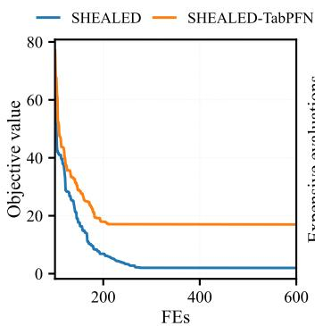  
(a)

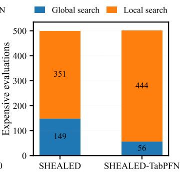  
(b)  
Fig. 7: Search performance of SHEALED and SHEALED-TabPFN on the 10-dimensional Type 1 Rastrigin problem: (a) convergence curves and (b) expensive evaluation allocation between global and local search.

## F. Case Studies:Embodied Robot Design

Voxel-based soft robot design jointly optimizes robot morphology and control policy. Evolutionary reinforcement learning is widely used for this purpose, with EAs searching over voxel-based morphologies and reinforcement learning optimizing the corresponding controllers. Since each candidate morphology requires controller training before its fitness can be evaluated, this problem is typically formulated as an expensive bilevel optimization problem. In this study, we consider voxel-based soft robots in EvoGym [49], where each morphology is represented by a voxel grid, as shown in Fig. 8(a). PPO is employed for controller optimization, as illustrated in Fig. 8(b), and the overall co-design process is shown in Fig. 8(c).

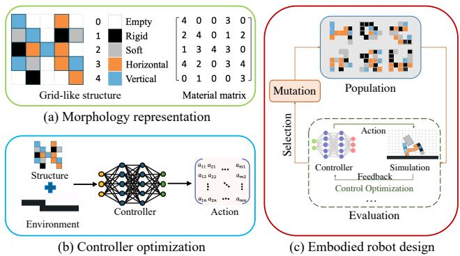  
Fig. 8: Overview of voxel-based soft robot co-design in EvoGym. (a) Morphology representation, (b) controller optimization, and (c) embodied robot co-design process.

To evaluate TabPFN on soft robot design, we adopt AIEA [50], an action inheritance-based SAEA, as the baseline and replace its performance approximation mechanism with TabPFN, yielding TabPFNEA. Since each morphology is represented as a $5 \times 5$ voxel grid, it is flattened into a 25- dimensional vector before being used for TabPFN training and inference. We evaluate the algorithms under two settings:

1) Online setting: The algorithm first randomly samples and evaluates $N _ { \mathrm { p o p } }$ morphologies to initialize the surrogate model. During evolution, $N _ { \mathrm { p o p } } / 2$ candidate morphologies are selected in each generation for true evaluation, and the resulting samples are added to the training set for surrogate updating. This process continues until the evaluation budget is exhausted.

2) Offline setting: The entire evaluation budget is used to construct the training set before optimization, and no additional true evaluations are performed during the subsequent search.

The population size $N _ { \mathrm { p o p } }$ is set to 20. The total evaluation budgets are set to 100, 200, and 300 for easy, medium, and hard tasks, respectively. Considering the computational cost of controller optimization and simulation, each algorithm is independently run five times on each task.

TABLE XV: Winning-count comparison of AIEA and TabPFNEA on 30 EvoGym tasks across three difficulty levels under online and offline settings.
<table><tr><td rowspan="2">Difficulty</td><td rowspan="2">Setting</td><td colspan="2">Wins</td><td rowspan="2">Ties</td></tr><tr><td>AIEA</td><td>TabPFNEA</td></tr><tr><td rowspan="2">Easy</td><td>Online</td><td>4</td><td>6</td><td>0</td></tr><tr><td>Offline</td><td>4</td><td>5</td><td>1</td></tr><tr><td rowspan="2">Medium</td><td>Online</td><td>8</td><td>2</td><td>1</td></tr><tr><td>Offline</td><td>3</td><td>8</td><td>0</td></tr><tr><td rowspan="2">Hard</td><td>Online</td><td>8</td><td>1</td><td>0</td></tr><tr><td>Offline</td><td>2</td><td>6</td><td>1</td></tr><tr><td rowspan="2">Overall</td><td>Online</td><td>20</td><td>9</td><td>1</td></tr><tr><td>Offline</td><td>9</td><td>19</td><td>2</td></tr></table>

Table XV summarizes the winning counts of AIEA and TabPFNEA on 30 EvoGym tasks, with detailed results reported in Table S-IX of the Supplementary Material. In the online setting, AIEA achieves 20 wins, compared with nine wins and one tie for TabPFNEA; in the offline setting, TabPFNEA achieves 19 wins, compared with nine wins and two ties for AIEA. The two methods perform comparably on easy tasks, while opposite trends emerge on medium and hard tasks, with AIEA dominating online and TabPFNEA dominating offline. The contrasting performance of TabPFNEA under the online and offline settings suggests that TabPFN is sensitive to the amount of training data. In the online setting, TabPFN is initially trained on only 20 evaluated morphologies, whereas the offline setting provides 100, 200, and 300 samples for easy, medium, and hard tasks, respectively. AIEA relies on morphologically similar evaluated individuals for action inheritance, while TabPFN exploits information from all available training morphologies to characterize the relationship between morphology and task performance. Therefore, TabPFN benefits more from larger training sets, which is particularly evident on the hard tasks with the largest offline dataset. These results suggest that TabPFN is better suited to scenarios where a relatively sufficient offline dataset is available within the evaluation budget than to online settings with limited incremental data.

## V. PROMISES, LIMITATIONS, AND PRACTICAL GUIDELINES OF TABPFN

We assess TabPFN as a surrogate model in both offline and online SAEAs, covering single-objective, multi-objective, constrained, combinatorial, and mixed-variable optimization problems, as well as practical engineering cases. Overall, although TabPFN shows certain advantages, it is not a universal replacement for conventional surrogate models. Whether its advantages translate into improved optimization performance depends on the data size, the complexity of the fitness landscape, the type of search space, the role of the surrogate model within the algorithm, and the degree of alignment between the model management strategy and TabPFN’s predictive behavior. In the following, we summarize scenarios where TabPFN performs well, scenarios where it has limitations, and guidelines for its efficient use.

## A. Promising Application Scenarios of TabPFN

Offline Optimization with Complex Fitness Landscapes. TabPFN is more suitable for offline SAEAs with complex, multimodal, or nonlinear fitness landscapes. Results on hybrid and some composition functions in the CEC 2017 benchmark show that TabPFN can provide more accurate fitness approximation and more reliable search guidance. For simple and smooth landscapes, conventional surrogates such as RBFN are often sufficient. Therefore, the model complexity should match the landscape complexity, rather than using TabPFN as a default replacement for traditional surrogates.

Offline Optimization with Sufficient Historical Data. TabPFN is particularly promising for offline optimization when sufficient historical data are available before the search. The case study results show that TabPFN is less competitive with limited online data, but becomes clearly advantageous when the evaluation budget is used to construct the training set in advance. This suggests that TabPFN benefits more from sufficient data availability than from frequent model reconstruction with small incremental batches. Therefore, when historical evaluations are available, they should be exploited to build an informative surrogate before optimization rather than relying on repeated updates under data-scarce conditions.

Online Small/Medium-Scale Single-objective Optimization. TabPFN demonstrates significant potential as a surrogate in online single-objective optimization for small to mediumscale problems. When the surrogate is continuously updated with newly evaluated samples during the optimization process, TabPFN provides highly accurate fitness approximation and search guidance. Furthermore, its predictions can be effectively integrated with advanced model management strategies, such as multi-objective infill criteria that jointly consider predicted fitness and prediction uncertainty [32]. These characteristics suggest that TabPFN is highly promising for developing novel SAEAs, offering a strong and flexible foundation for future algorithm design.

Batch Candidate Evaluation Scenarios. TabPFN is particularly well suited to algorithms that generate a large number of candidate solutions at once and then perform surrogate screening in a unified manner. TabPFN can leverage GPUs for efficient batch inference, making it faster than other conventional surrogate models.

## B. Limitations and Unsuitable Scenarios of TabPFN

Relatively High Training Time. Although TabPFN does not involve conventional hyper-parameter optimization, its training process still requires encoding and caching the training context to construct the predictive mapping. As shown in Fig. 5, under small-sample settings, the training time of TabPFN remains substantially higher than that of RBFN, with an order-of-magnitude gap in some cases. Moreover, at low dimensionalities, TabPFN can even require more training time than GP. Although such differences are modest for a single surrogate construction, they can accumulate into substantial computational overhead when the surrogate is repeatedly rebuilt during the search. A typical example is multisubspace modeling and search in decomposition-based large-scale optimization. For instance, SADE-AMSS [42] trains 20 surrogate models in each generation, resulting in on the order of $2 \times 1 0 ^ { 5 }$ surrogate constructions over a complete run. Directly replacing its lightweight RBFN surrogate with TabPFN would therefore introduce considerable computational overhead. In contrast, frameworks such as LSEO-S3 [15], which construct only one surrogate model per generation and perform more intensive search based on each constructed surrogate, are more suitable for incorporating TabPFN.

Conservative Extrapolation under Distribution Shifts. TabPFN exhibits relatively conservative extrapolation behavior when candidate solutions move away from the distribution of the training data. This characteristic is clearly reflected in the large-scale optimization experiments. This behavior is also observed in constrained optimization and appears to explain the performance degradation when replacing the objective surrogates with TabPFN. Although TabPFN achieves better predictive accuracy than RBFN in most tested subspace scenarios, LSEO-S3-TabPFN performs significantly worse than the original RBFN-based LSEO-S3 on all five test problems, indicating that predictive accuracy alone is insufficient to determine the effectiveness of a surrogate for optimization. As shown in Table VII, the predictions of RBFN become increasingly extreme as the distance from the training data increases, whereas TabPFN remains close to the mean of the training labels, exhibiting mean-regression under distribution shifts. Under the minimum-prediction-based candidate selection adopted by LSEO-S3, the aggressive extrapolation of RBFN implicitly favors solutions farther away from the observed data and consequently introduces additional global exploration. In contrast, the conservative extrapolation of TabPFN does not provide such an implicit search bias, which partly explains its inferior optimization performance despite its higher predictive accuracy.

Vulnerability to Complex Constraints beyond Pretraining Priors. As a pre-trained Transformer model, TabPFN’s effectiveness is fundamentally bounded by the synthetic priors it acquired during training. Our findings in constrained optimization highlight a critical failure mode: when confronted with highly irregular and severely non-linear constraint landscapes, which typically fall outside its pre-trained distribution, TabPFN experiences catastrophic variance shrinkage. This intense “regression to the mean” effect excessively smooths the predicted landscape, thereby blurring the strict boundaries required to distinguish feasible from infeasible regions. Consequently, the surrogate loses its ability to guide the search towards feasibility. This indicates that, without additional mechanisms to handle out-of-distribution topographies, TabPFN is ill-suited to serve as a direct constraint surrogate for optimization problems characterized by artificially complex or extremely non-linear constraint boundaries.

Limited Prediction Performance in Mixed-variable Problems. Although TabPFN can directly handle discrete variables without additional encoding, its prediction accuracy and ranking capability in mixed-variable optimization are still inferior to those of surrogate models specifically designed for mixed-variable problems. As shown in Table XIV, RBFNmv significantly outperforms TabPFN on most test instances. This discrepancy in predictive performance further affects the optimization process and disrupts the search balance in the original algorithm. Therefore, TabPFN is not suitable for directly replacing specialized mixed-variable surrogates.

Limited Effectiveness in Data-scarce Online Optimization. TabPFN is less effective in online optimization when only a small number of evaluated samples are available and the training set grows gradually during the search. The results in Table XV shows that under such data-scarce conditions, TabPFN does not consistently outperform alternative approximation mechanisms, especially in the early stages of optimization. Frequent surrogate updates with only a few newly collected samples cannot fully compensate for the lack of sufficient training data. Therefore, TabPFN is not well suited to online SAEAs with very limited initial data and small incremental updates.

## C. Practical Guidelines for Effective Use of TabPFN

Perform Batch Prediction and Use GPUs for Inference. TabPFN is well suited for batch inference on large-scale data, with per-sample inference time decreasing as the batch size increases.

Exploit Sufficient and Informative Data Whenever Possible. TabPFN should be provided with as much informative training data as reasonably available. Unlike conventional surrogates that are repeatedly fitted from scratch, TabPFN performs prediction through in-context learning, conditioning on the available labeled samples to infer the underlying mapping relationship. A richer training set therefore provides more evidence for identifying task-specific structures and enables more reliable predictions and rankings of candidate solutions. Therefore, when historical or offline evaluations are available, they should be incorporated into the training set rather than relying only on a small subset of recent samples.

Select Surrogate Models According to Landscape Complexity. In practical SAEAs, conventional surrogates can be used for simple or relatively smooth fitness landscapes, while TabPFN is more suited for complex, nonlinear, or multimodal landscapes that require stronger approximation capability. Therefore, the surrogate model should be selected adaptively according to the problem landscape, rather than replacing traditional surrogates with TabPFN by default.

Customized Model Management Strategies. In SAEAs, model management strategies play a critical role in translating the predictive capability of a surrogate model into effective search behavior. Since these strategies are often closely tailored to the characteristics of the underlying surrogate, directly replacing a conventional surrogate with TabPFN without adapting the corresponding model management strategy may fail to fully exploit its predictive advantages. Therefore, TabPFN-specific model management strategies should be developed for different optimization scenarios. A representative example can be found in the large-scale optimization experiments. As discussed above, RBFN exhibits aggressive extrapolation away from the training data. When the infill criterion selects candidates solely according to their predicted objective values, such extrapolation implicitly favors distant solutions and thereby provides additional exploration, which contributes to its superior optimization performance. In contrast, TabPFN tends to produce more conservative predictions under distribution shifts and therefore lacks this implicit exploration mechanism. In this case, equipping TabPFN with a more exploration-oriented infill criterion, for example by explicitly incorporating uncertainty or solution diversity, may compensate for its conservative extrapolation behavior and achieve a better balance between exploration and exploitation.

Differentiated Algorithm Design Guided by Role-specific Characteristics. In complex scenarios such as constrained or multi-objective optimization, objective and constraint functions often exhibit fundamentally different landscape characteristics. Consequently, TabPFN’s effectiveness is highly dependent on the specific role it plays within the evolutionary framework, and this behavior can vary drastically across problem domains. For instance, in single-objective constrained optimization (e.g., CEC2010), TabPFN struggles with highly non-linear constraints due to severe prediction range compression, making it highly unreliable as a constraint surrogate. Conversely, in constrained multi-objective optimization (e.g., the CF test suite), a contrasting behavior is observed: because the constraints are relatively simple, TabPFN models them effectively, whereas applying it to the objectives degrades performance, as the multi-objective search process is extremely sensitive to the predictions guiding the population toward the Pareto front. Given these contrasting behaviors, the design of future SAEAs must explicitly account for the distinct requirements of different algorithmic components, and a uniform application of TabPFN across all surrogate roles is generally not advisable. Instead, researchers should adopt a role-specific design philosophy. In practice, offline data can be leveraged to conduct a preliminary offline evaluation of TabPFN’s modeling capability on the target problem. By analyzing metrics such as cross-validation error and prediction range compression on this initial data, designers can gain critical insights into the problem’s specific characteristics. This evaluation can then inform a more rational algorithm design, ensuring that TabPFN is strategically incorporated into the roles (objectives or constraints) where it provides a clear advantage, while avoiding scenarios where its specific predictive behaviors might mislead the search process.

In summary, TabPFN exhibits both strengths and limitations in SAEAs, and its suitability depends on data availability, landscape characteristics, and its role within the optimization framework. Such scenario dependence highlights that its value as a surrogate lies not only in predicting fitness accurately but also in guiding the search effectively. A more accurate surrogate does not necessarily yield better optimization outcomes, as its extrapolation behavior and interaction with candidate selection also shape the balance between exploration and exploitation. These findings highlight the importance of codesigning surrogate models and model management strategies when integrating foundation models into evolutionary optimization. Rather than simply replacing conventional surrogates, algorithm designers should tailor data utilization, infill sampling, and surrogate roles to the model’s characteristics, so that its predictive strengths can be effectively translated into improved search performance.

## VI. CONCLUSIONS

In this work, we conducted a systematic empirical study to evaluate the applicability and performance of TabPFN as a surrogate model within SAEAs. By analyzing its fundamental prediction capabilities and subsequently integrating it into multiple representative SAEAs across a wide range of complex optimization scenarios, we gained profound insights into its behavioral dynamics during the optimization process. Based on this comprehensive evaluation, we uncovered both the remarkable optimization advantages of TabPFN and its specific failure modes. Ultimately, we explicitly identified the overarching promises and limitations of applying TabPFN in SAEAs, and formulated a set of actionable design guidelines. These guidelines serve as a robust and practical reference, demonstrating that TabPFN should not be treated as a universal, plug-and-play replacement for conventional surrogates. Instead, they provide researchers with the strategic principles needed to effectively harness TabPFN in future SAEA designs while proactively circumventing its inherent pitfalls.

## REFERENCES

[1] J.-Y. Li, Z.-H. Zhan, and J. Zhang, “Evolutionary computation for expensive optimization: A survey,” Machine Intelligence Research, vol. 19, no. 1, pp. 3–23, 2022.

[2] D. Zhan and H. Xing, “Expected improvement for expensive optimization: a review,” Journal of Global Optimization, vol. 78, no. 3, pp. 507– 544, 2020.

[3] Y. Yu, Z. Lyu, Z. Xu, and J. R. Martins, “On the influence of optimization algorithm and initial design on wing aerodynamic shape optimization,” Aerospace Science and Technology, vol. 75, pp. 183–199, 2018.

[4] M. Javaheripi, M. Samragh, and F. Koushanfar, “Peeking into the black box: A tutorial on automated design optimization and parameter search,” IEEE Solid-State Circuits Magazine, vol. 11, no. 4, pp. 23–28, 2019.

[5] J. Wang, Q. Guo, H. Gu, and H. Wang, “A parallel surrogate-assisted multi-penalty function search for simulation-driven antenna design,” in 2025 IEEE Congress on Evolutionary Computation (CEC), 2025, pp. 1–8.

[6] Y. Xu, Q. Guo, H. Gu, H. Wang, and J. Yan, “Self-guided simulationdriven optimization for expensive filtering patch antenna design and a benchmark,” IEEE Transactions on Evolutionary Computation, 2026.

[7] C. He, Y. Zhang, D. Gong, and X. Ji, “A review of surrogate-assisted evolutionary algorithms for expensive optimization problems,” Expert Systems with Applications, vol. 217, p. 119495, 2023.

[8] H. Gu, H. Wang, Y. Mei, M. Zhang, and Y. Jin, “Surrogate-assisted neighborhood search with only a few weight vectors for expensive large-scale multiobjective binary optimization,” IEEE Transactions on Evolutionary Computation, vol. 29, no. 6, pp. 2626–2640, 2024.

[9] P. A. Vikhar, “Evolutionary algorithms: A critical review and its future prospects,” in 2016 International conference on global trends in signal processing, information computing and communication (ICGTSPICC). IEEE, 2016, pp. 261–265.

[10] L. Pan, C. He, Y. Tian, H. Wang, X. Zhang, and Y. Jin, “A classificationbased surrogate-assisted evolutionary algorithm for expensive manyobjective optimization,” IEEE Transactions on Evolutionary Computation, vol. 23, no. 1, pp. 74–88, 2018.

[11] H. Wu, Y. Jin, K. Gao, J. Ding, and R. Cheng, “Surrogate-assisted evolutionary multi-objective optimization of medium-scale problems by random grouping and sparse gaussian modeling,” IEEE Transactions on Emerging Topics in Computational Intelligence, vol. 8, no. 5, pp. 3263– 3278, 2024.

[12] Z. Song, H. Wang, C. He, and Y. Jin, “A Kriging-Assisted Two-Archive Evolutionary Algorithm for Expensive Many-Objective Optimization,” IEEE Transactions on Evolutionary Computation, vol. 25, no. 6, pp. 1013–1027, Dec. 2021.

[13] F. Li, Z. Shang, Y. Liu, H. Shen, and Y. Jin, “Inverse distance weighting and radial basis function based surrogate model for high-dimensional expensive multi-objective optimization,” Applied Soft Computing, vol. 152, p. 111194, 2024.

[14] P. Huang, H. Wang, and Y. Jin, “Offline data-driven evolutionary optimization based on tri-training,” Swarm and evolutionary computation, vol. 60, p. 100800, 2021.

[15] K. Zhao, X. Wang, C. Sun, Y. Jin, and A. Hayat, “Efficient large-scale expensive optimization via surrogate-assisted sub-problem selection,” IEEE Transactions on Evolutionary Computation, 2025.

[16] M. Shi, L. Lv, W. Sun, and X. Song, “A multi-fidelity surrogate model based on support vector regression: M. shi et al.” Structural and Multidisciplinary Optimization, vol. 61, no. 6, pp. 2363–2375, 2020.

[17] S. K. Dasari, A. Cheddad, and P. Andersson, “Random forest surrogate models to support design space exploration in aerospace use-case,” in IFIP International Conference on Artificial Intelligence Applications and Innovations. Springer, 2019, pp. 532–544.

[18] M. Tahkola, J. Keranen, D. Sedov, M. F. Far, and J. Kortelainen,¨ “Surrogate modeling of electrical machine torque using artificial neural networks,” IEEE Access, vol. 8, pp. 220 027–220 045, 2020.

[19] S. Liu, H. Wang, W. Peng, and W. Yao, “Surrogate-assisted evolutionary algorithms for expensive combinatorial optimization: a survey,” Complex & Intelligent Systems, vol. 10, no. 4, pp. 5933–5949, 2024.

[20] C. Zhou, Q. Li, C. Li, J. Yu, Y. Liu, G. Wang, K. Zhang, C. Ji, Q. Yan, L. He et al., “A comprehensive survey on pretrained foundation models: A history from bert to chatgpt,” International Journal of Machine Learning and Cybernetics, vol. 16, no. 12, pp. 9851–9915, 2025.

[21] N. Hollmann, S. Muller, K. Eggensperger, and F. Hutter, “TabPFN: A¨ transformer that solves small tabular classification problems in a second,” in International Conference on Learning Representations, 2023.

[22] N. Hollmann, S. Muller, L. Purucker, A. Krishnakumar, M. K¨ orfer, S. B.¨ Hoo, R. T. Schirrmeister, and F. Hutter, “Accurate predictions on small data with a tabular foundation model,” Nature, vol. 637, no. 8045, pp. 319–326, 2025.

[23] J. H. Friedman, “Greedy function approximation: a gradient boosting machine,” Annals of statistics, pp. 1189–1232, 2001.

[24] G. Ke, Q. Meng, T. Finley, T. Wang, W. Chen, W. Ma, Q. Ye, and T.- Y. Liu, “Lightgbm: A highly efficient gradient boosting decision tree,” Advances in neural information processing systems, vol. 30, 2017.

[25] R. Yu, C. Picard, and F. Ahmed, “Git-bo: High-dimensional bayesian optimization with tabular foundation models,” in International Conference on Learning Representations, vol. 2026, 2026, pp. 111 636–111 663.

[26] Z. Liu, K. Huang, Q. Mei, Y. Hu, and W. W. Xing, “Exploiting function-family structure in analog circuit optimization,” arXiv preprint arXiv:2512.00712, 2025.

[27] S. Muller, N. Hollmann, S. P. Arango, J. Grabocka, and F. Hutter,¨ “Transformers can do bayesian inference,” in International Conference on Learning Representations, 2022.

[28] Y. Jin, H. Wang, T. Chugh, D. Guo, and K. Miettinen, “Data-driven evolutionary optimization: An overview and case studies,” IEEE Transactions on Evolutionary Computation, vol. 23, no. 3, pp. 442–458, 2018.

[29] J. Liang, Y. Lou, M. Yu, Y. Bi, and K. Yu, “A survey of surrogateassisted evolutionary algorithms for expensive optimization: J. liang et al.” Journal of Membrane Computing, vol. 7, no. 2, pp. 108–127, 2025.

[30] L. M. Schmitt, “Theory of genetic algorithms,” Theoretical Computer Science, vol. 259, no. 1-2, pp. 1–61, 2001.

[31] S. Das and P. N. Suganthan, “Differential evolution: A survey of the state-of-the-art,” IEEE transactions on evolutionary computation, vol. 15, no. 1, pp. 4–31, 2010.

[32] J. Tian, Y. Tan, J. Zeng, C. Sun, and Y. Jin, “Multiobjective infill criterion driven gaussian process-assisted particle swarm optimization of highdimensional expensive problems,” IEEE Transactions on Evolutionary Computation, vol. 23, no. 3, pp. 459–472, 2019.

[33] Z. Song, H. Wang, and Y. Jin, “A surrogate-assisted evolutionary framework with regions of interests-based data selection for expensive constrained optimization,” IEEE Transactions on Systems, Man, and Cybernetics: Systems, vol. 53, no. 10, pp. 6268–6280, 2023.

[34] J. Wang, X. Wang, H. Wang, and Y. Jin, “A distributed surrogate-assisted evolutionary algorithm for heterogeneously expensive constrained optimization,” IEEE Transactions on Evolutionary Computation, pp. 1–1, 2026.

[35] H. Wang, Y. Jin, and J. O. Jansen, “Data-driven surrogate-assisted multiobjective evolutionary optimization of a trauma system,” IEEE Transactions on Evolutionary Computation, vol. 20, no. 6, pp. 939–952, 2016.

[36] J.-Y. Li, Z.-H. Zhan, C. Wang, H. Jin, and J. Zhang, “Boosting datadriven evolutionary algorithm with localized data generation,” IEEE Transactions on Evolutionary Computation, vol. 24, no. 5, pp. 923–937, 2020.

[37] J.-Y. Li, Z.-H. Zhan, H. Wang, and J. Zhang, “Data-driven evolutionary algorithm with perturbation-based ensemble surrogates,” IEEE transactions on cybernetics, vol. 51, no. 8, pp. 3925–3937, 2020.

[38] H. Wang, Y. Jin, C. Sun, and J. Doherty, “Offline data-driven evolutionary optimization using selective surrogate ensembles,” IEEE Transactions on Evolutionary Computation, vol. 23, no. 2, pp. 203–216, 2018.

[39] J. Derrac, S. Garc´ıa, D. Molina, and F. Herrera, “A practical tutorial on the use of nonparametric statistical tests as a methodology for comparing evolutionary and swarm intelligence algorithms,” Swarm and Evolutionary Computation, vol. 1, no. 1, pp. 3–18, 2011.

[40] G. Wu, R. Mallipeddi, and P. N. Suganthan, “Problem definitions and evaluation criteria for the cec 2017 competition on constrained realparameter optimization,” National University of Defense Technology, Changsha, Hunan, PR China and Kyungpook National University, Daegu, South Korea and Nanyang Technological University, Singapore, Technical Report, vol. 9, p. 2017, 2017.

[41] G. Fu, C. Sun, Y. Tan, G. Zhang, and Y. Jin, “A surrogate-assisted evolutionary algorithm with random feature selection for large-scale expensive problems,” in International conference on parallel problem solving from nature. Springer, 2020, pp. 125–139.

[42] H. Gu, H. Wang, and Y. Jin, “Surrogate-assisted differential evolution with adaptive multisubspace search for large-scale expensive optimization,” IEEE Transactions on Evolutionary Computation, vol. 27, no. 6, pp. 1765–1779, 2023.

[43] X. Li, K. Tang, M. N. Omidvar, Z. Yang, K. Qin, and H. China, “Benchmark functions for the cec 2013 special session and competition on large-scale global optimization,” gene, vol. 7, no. 33, p. 8, 2013.

[44] K. Deb, L. Thiele, M. Laumanns, and E. Zitzler, “Scalable multiobjective optimization test problems,” in Proceedings of the 2002 Congress on Evolutionary Computation. CEC’02 (Cat. No.02TH8600), vol. 1, 2002, pp. 825–830 vol.1.

[45] Z. Song, H. Wang, B. Xue, M. Zhang, and Y. Jin, “Balancing Objective Optimization and Constraint Satisfaction in Expensive Constrained Evolutionary Multiobjective Optimization,” IEEE Transactions on Evolutionary Computation, vol. 28, no. 5, pp. 1286–1300, Oct. 2024.

[46] B. Xue, M. Zhang, W. N. Browne, and X. Yao, “A survey on evolutionary computation approaches to feature selection,” IEEE Transactions on evolutionary computation, vol. 20, no. 4, pp. 606–626, 2015.

[47] S. Liu, H. Wang, W. Peng, and W. Yao, “A surrogate-assisted evolutionary feature selection algorithm with parallel random grouping for high-dimensional classification,” IEEE Transactions on Evolutionary Computation, vol. 26, no. 5, pp. 1087–1101, 2022.

[48] Y. Liu and H. Wang, “Surrogate-assisted hybrid evolutionary algorithm with local estimation of distribution for expensive mixed-variable optimization problems,” Applied Soft Computing, vol. 133, p. 109957, 2023.

[49] J. Bhatia, H. Jackson, Y. Tian, J. Xu, and W. Matusik, “Evolution gym: A large-scale benchmark for evolving soft robots,” Advances in Neural Information Processing Systems, vol. 34, pp. 2201–2214, 2021.

[50] S. Liu, W. Yao, H. Wang, W. Peng, and Y. Yang, “Rapidly evolving soft robots via action inheritance,” IEEE Transactions on Evolutionary Computation, vol. 28, no. 6, pp. 1674–1688, 2023.

TABLE S-I

# Supplementary File for “Benchmarking Tabular Foundation Models as Surrogates in Expensive Evolutionary Optimization”

PREDICTIVE PERFORMANCE MEAN COMPARISON OF GP, RBFN, AND TABPFN ON THE CEC 2017 BENCHMARK SUITE, WITH INPUT DIMENSION D = 10, TRAINING SIZE Ntr = 100, TEST SIZE Nte = 1000.

<table><tr><td rowspan="2">F</td><td colspan="2">GP</td><td colspan="2">RBFN</td><td colspan="2">TabPFN</td></tr><tr><td>RMSE</td><td>T</td><td>RMSE</td><td>T</td><td>RMSE</td><td>T</td></tr><tr><td>1</td><td>0.00e+00</td><td>1</td><td>0.00e+00</td><td>1</td><td>0.00e+00</td><td>1</td></tr><tr><td>2</td><td>1.59e+08</td><td>0.28</td><td>9.87e+07</td><td>0</td><td>1.46e+08</td><td>0.28</td></tr><tr><td>3</td><td>3.03e+09</td><td>-0.00322</td><td>2.68e+09</td><td>0.002893</td><td>2.65e+09</td><td>0.006062</td></tr><tr><td>4</td><td>1.59e+04</td><td>0.527692</td><td>1.48e+04</td><td>0.55801</td><td>9.48e+03</td><td>0.741085</td></tr><tr><td>5</td><td>9.53e+01</td><td>0.535561</td><td>6.04e+01</td><td>0.679664</td><td>3.66e+01</td><td>0.802484</td></tr><tr><td>6</td><td>1.07e+02</td><td>0.113746</td><td>4.92e+01</td><td>0.467423</td><td>5.38e+01</td><td>0.421541</td></tr><tr><td>7</td><td>4.26e+02</td><td>0.126566</td><td>1.10e+02</td><td>0.767916</td><td>1.53e+02</td><td>0.699822</td></tr><tr><td>8</td><td>1.03e+02</td><td>0.178811</td><td>4.29e+01</td><td>0.628721</td><td>3.81e+01</td><td>0.643271</td></tr><tr><td>9</td><td>1.14e+04</td><td>0.272189</td><td>8.00e+03</td><td>0.472721</td><td>8.41e+03</td><td>0.469376</td></tr><tr><td>10</td><td>1.08e+03</td><td>0.010543</td><td>6.63e+02</td><td>0.034719</td><td>6.31e+02</td><td>0.057013</td></tr><tr><td>11</td><td>9.55e+08</td><td>0.584821</td><td>1.46e+09</td><td>0.501826</td><td>1.13e+08</td><td>0.969546</td></tr><tr><td>12</td><td>2.15e+09</td><td>0.016507</td><td>1.95e+09</td><td>0.237591</td><td>2.11e+09</td><td>0.231803</td></tr><tr><td>13</td><td>2.80e+09</td><td>0.487273</td><td>3.04e+09</td><td>0.302327</td><td>2.32e+09</td><td>0.593644</td></tr><tr><td>14</td><td>3.56e+08</td><td>0.942486</td><td>2.17e+09</td><td>0.405045</td><td>4.01e+07</td><td>0.989245</td></tr><tr><td>15</td><td>3.41e+09</td><td>0.08514</td><td>3.36e+09</td><td>0.071234</td><td>2.00e+09</td><td>0.705322</td></tr><tr><td>16</td><td>1.05e+04</td><td>0.667279</td><td>2.57e+04</td><td>0.174458</td><td>3.56e+03</td><td>0.883304</td></tr><tr><td>17</td><td>1.16e+06</td><td>0.324543</td><td>1.21e+06</td><td>0.343331</td><td>3.68e+05</td><td>0.961152</td></tr><tr><td>18</td><td>2.62e+09</td><td>0.413184</td><td>3.24e+09</td><td>0.057507</td><td>2.33e+09</td><td>0.493366</td></tr><tr><td>19</td><td>3.30e+09</td><td>0.196516</td><td>3.01e+09</td><td>0.170075</td><td>2.05e+09</td><td>0.647724</td></tr><tr><td>20</td><td>5.73e+02</td><td>0.03785</td><td>3.38e+02</td><td>0.178659</td><td>3.25e+02</td><td>0.208787</td></tr><tr><td>21</td><td>1.06e+03</td><td>0.333939</td><td>8.27e+02</td><td>0.437249</td><td>8.09e+02</td><td>0.668526</td></tr><tr><td>22</td><td>1.21e+03</td><td>0.049453</td><td>7.73e+02</td><td>0.167736</td><td>7.64e+02</td><td>0.140268</td></tr><tr><td>23</td><td>6.41e+02</td><td>0.645699</td><td>5.06e+02</td><td>0.765762</td><td>3.91e+02</td><td>0.795625</td></tr><tr><td>24</td><td>7.83e+02</td><td>0.420954</td><td>6.07e+02</td><td>0.535948</td><td>4.81e+02</td><td>0.70933</td></tr><tr><td>25</td><td>6.90e+03</td><td>0.255065</td><td>4.19e+03</td><td>0.556288</td><td>4.26e+03</td><td>0.577994</td></tr><tr><td>26</td><td>3.19e+03</td><td>0.370237</td><td>2.80e+03</td><td>0.343379</td><td>2.43e+03</td><td>0.561557</td></tr><tr><td>27</td><td>1.96e+03</td><td>0.672578</td><td>3.37e+03</td><td>0.222735</td><td>1.54e+03</td><td>0.729949</td></tr><tr><td>28</td><td>2.28e+03</td><td>0.414591</td><td>2.10e+03</td><td>0.506466</td><td>1.68e+03</td><td>0.58052</td></tr><tr><td>29</td><td>6.82e+07</td><td>0.152041</td><td>2.91e+07</td><td>0.310795</td><td>2.93e+07</td><td>0.607245</td></tr><tr><td>30</td><td>3.41e+09</td><td></td><td></td><td></td><td></td><td></td></tr><tr><td></td><td></td><td>0.031794</td><td>2.96e+09</td><td>0.057008</td><td>2.82e+09</td><td>0.089448</td></tr></table>

TABLE S-II  
PREDICTIVE PERFORMANCE MEAN COMPARISON OF GP, RBFN, AND TABPFN ON THE CEC 2017 BENCHMARK SUITE, WITH INPUT DIMENSION $D = 3 0$ , TRAINING SIZE $N _ { \mathrm { t r } } = 3 0 0$ , TEST SIZE $N _ { \mathrm { t e } } = 1 0 0 0$
<table><tr><td rowspan="2">F</td><td colspan="2">GP</td><td colspan="2">RBFN</td><td colspan="2">TabPFN</td></tr><tr><td>RMSE</td><td>T</td><td>RMSE</td><td>T</td><td>RMSE</td><td>T</td></tr><tr><td>1</td><td>0.00e+00</td><td>1</td><td>0.00e+00</td><td>1</td><td>0.00e+00</td><td>1</td></tr><tr><td>2</td><td>0.00e+00</td><td>1</td><td>0.00e+00</td><td>1</td><td>0.00e+00</td><td>1</td></tr><tr><td>3</td><td>2.24e+09</td><td>0.029119</td><td> $2 . 2 9 \mathrm { e } { + } 0 9$ </td><td>-0.01493</td><td> $\mathbf { 2 . 1 2 e + 0 9 }$ </td><td>0.00259</td></tr><tr><td>4</td><td>6.98e+04</td><td>0.481831</td><td> $6 . 6 8 \mathrm { e } + 0 4$ </td><td> $0 . 4 6 9 9 9$ </td><td> $\mathbf { 4 . 2 1 e + 0 4 }$ </td><td>0.697545</td></tr><tr><td>5</td><td>2.18e+02</td><td>0.276311</td><td> $1 . 2 3 \mathrm { e } { + } 0 2$ </td><td> $0 . 5 4 4 0 6 8$ </td><td>8.33e+01</td><td>0.708893</td></tr><tr><td>6</td><td> $7 . 4 0 \mathrm { e } { + } 0 1$ </td><td>0.081419</td><td> $3 . 5 1 \mathrm { e } { + 0 1 }$ </td><td>0.387888</td><td> $\mathbf { 3 . 3 2 e + 0 1 }$ </td><td>0.439404</td></tr><tr><td>7</td><td> $1 . 0 3 \mathrm { e } { + 0 3 }$ </td><td>0.083231</td><td> $3 . 5 7 \mathrm { e } + \mathbf { 0 } 2$ </td><td>0.698783</td><td> $3 . 9 7 \mathrm { e } { + } 0 2$ </td><td>0.654617</td></tr><tr><td>8</td><td> $2 . 1 0 \mathrm { e } { + } 0 2$ </td><td>0.191241</td><td> $1 . 1 3 \mathrm { e } { + 0 2 }$ </td><td> $0 . 4 8 0 7 4 5$ </td><td> $\mathbf { 7 . 8 3 e + 0 1 }$ </td><td>0.66919</td></tr><tr><td>9</td><td> $2 . 8 8 \mathrm { e } + 0 4$ </td><td> $0 . 1 4 8 7 8 8$ </td><td> $2 . 2 2 \mathrm { e } + 0 4$ </td><td> $0 . 3 6 3 1 2 7$ </td><td> $\mathbf { 1 . 9 4 e + 0 4 }$ </td><td>0.435362</td></tr><tr><td>10</td><td> $1 . 8 3 \mathrm { e } + 0 3$ </td><td> $0 . 0 0 1 2 0 8$ </td><td> $1 . 0 9 \mathrm { e } { + 0 3 }$ </td><td> $0 . 0 2 0 4 9 6$ </td><td> $\mathbf { 1 . 0 9 e + 0 3 }$ </td><td>0.031856</td></tr><tr><td>11</td><td>1.77e+09</td><td>0.593306</td><td> $2 . 7 7 \mathrm { e } { + } 0 9$ </td><td>0.044909</td><td> $\mathbf { 1 . 4 7 e + 0 9 }$ </td><td>0.649751</td></tr><tr><td>12</td><td>0.00e+00</td><td>1</td><td> $\mathbf { 0 . 0 0 e + 0 0 }$ </td><td>1</td><td>0.00e+00</td><td>1</td></tr><tr><td>13</td><td>0.00e+00</td><td>1</td><td> $\mathbf { 0 . 0 0 e + 0 0 }$ </td><td>1</td><td>0.00e+00</td><td>1</td></tr><tr><td>14</td><td> $8 . 3 6 \mathrm { e } + 0 8$ </td><td>0.829193</td><td> $2 . 6 5 \mathrm { e } { + } 0 9$ </td><td>0.109117</td><td> $\mathbf { 4 . 6 4 e + 0 8 }$ </td><td>0.879655</td></tr><tr><td>15</td><td> $\pmb { 2 . 0 7 e + 0 8 }$ </td><td>0.239515</td><td>3.11e+08</td><td>0</td><td> $2 . 3 5 \mathrm { e } + 0 8$ </td><td>0.079586</td></tr><tr><td>16</td><td> $3 . 1 9 \mathrm { e } + 0 4$ </td><td>0.751178</td><td>5.37e+04</td><td>0.486466</td><td> $\mathbf { 1 . 8 2 e + 0 4 }$ </td><td>0.848214</td></tr><tr><td>17</td><td>1.48e+08</td><td>0.465634</td><td>1.94e+08</td><td>0.388713</td><td> $\mathbf { 1 . 2 1 e + 0 8 }$ </td><td>0.789093</td></tr><tr><td>18</td><td>3.24e+09</td><td>0.009196</td><td> $2 . 9 1 \mathrm { e } { + } 0 9$ </td><td>0.007423</td><td> $\mathbf { 2 . 6 2 e + 0 9 }$ </td><td>0.235557</td></tr><tr><td>19</td><td> $1 . 2 9 \mathrm { e } { + } 0 8$ </td><td>0.48</td><td> $2 . 7 9 \mathrm { e } + 0 8$ </td><td>0</td><td> $\mathbf { 1 . 0 4 e + 0 8 }$ </td><td>0.48021</td></tr><tr><td>20</td><td> $8 . 0 2 \mathrm { e } { + } 0 2$ </td><td>-0.00741</td><td> $5 . 0 9 \mathrm { e } + 0 2$ </td><td>0.028244</td><td> $\mathbf { 4 . 9 0 e + 0 2 }$ </td><td>0.052154</td></tr><tr><td>21</td><td> $7 . 9 2 \mathrm { e } + 0 2$ </td><td>0.455747</td><td> $7 . 8 4 \mathrm { e } + 0 2$ </td><td>0.43373</td><td>6.66e+02</td><td>0.747491</td></tr><tr><td>22</td><td> $1 . 8 8 \mathrm { e } + 0 3$ </td><td>0.019892</td><td>1.09e+03</td><td>0.097361</td><td> $1 . 1 0 \mathrm { e } { + } 0 3$ </td><td>0.121175</td></tr><tr><td>23</td><td> $6 . 4 5 \mathrm { e } + 0 2$ </td><td>0.780549</td><td> $1 . 4 6 \mathrm { e } { + } 0 3$ </td><td>0.3923</td><td> $\mathbf { 4 . 2 5 e + 0 2 }$ </td><td>0.860296</td></tr><tr><td>24</td><td> $6 . 9 7 \mathrm { e } + 0 2$ </td><td>0.682537</td><td> $6 . 2 7 \mathrm { e } + 0 2$ </td><td>0.680236</td><td>2.73e+02</td><td>0.894019</td></tr><tr><td>25</td><td> $3 . 2 7 \mathrm { e } + 0 4$ </td><td>0.3592</td><td>2.81e+04</td><td>0.461197</td><td>2.06e+04</td><td>0.611357</td></tr><tr><td>26</td><td>1.58e+04</td><td>0.486964</td><td>1.69e+04</td><td>0.420757</td><td>1.13e+04</td><td>0.665756</td></tr><tr><td>27</td><td>2.17e+03</td><td>0.626616</td><td>3.26e+03</td><td>0.323836</td><td>1.64e+03</td><td>0.705792</td></tr><tr><td>28</td><td>1.45e+04</td><td>0.343099</td><td> $1 . 2 3 \mathrm { e } { + } 0 4$ </td><td>0.425365</td><td>9.93e+03</td><td>0.594783</td></tr><tr><td>29</td><td> $5 . 9 1 \mathrm { e } + 0 8 $ </td><td>0.415909</td><td> $5 . 9 9 \mathrm { e } + 0 8 $ </td><td>0.332068</td><td>4.87e+08</td><td>0.679569</td></tr><tr><td>30</td><td> $5 . 0 3 \mathrm { e } + 0 8$ </td><td>0.006874</td><td>4.66e+08</td><td>0.018877</td><td>5.72e+08</td><td>-0.009397</td></tr></table>

TABLE S-III  
PREDICTIVE PERFORMANCE MEAN COMPARISON OF GP, RBFN, AND TABPFN ON THE CEC 2017 BENCHMARK SUITE, WITH INPUT DIMENSION D = 100, TRAINING SIZE $N _ { \mathrm { t r } } = 1 0 0 0$ , TEST SIZE $N _ { \mathrm { t e } } = 1 0 0 0$
<table><tr><td rowspan="2">F</td><td colspan="2">GP</td><td colspan="2">RBFN</td><td colspan="2">TabPFN</td></tr><tr><td>RMSE</td><td>T</td><td>RMSE</td><td>T</td><td>RMSE</td><td>τ</td></tr><tr><td>1</td><td>0.00e+00</td><td>1</td><td>0.00e+00</td><td>1</td><td>0.00e+00</td><td>1</td></tr><tr><td>2</td><td>0.00e+00</td><td>1</td><td>0.00e+00</td><td>1</td><td>0.00e+00</td><td>1</td></tr><tr><td>3</td><td>1.04e+09</td><td>0.016207</td><td>1.01e+09</td><td>0.024833</td><td>1.09e+09</td><td>0.000372</td></tr><tr><td>4</td><td>7.07e+05</td><td>-0.10941</td><td>2.11e+05</td><td>0.286855</td><td>1.27e+05</td><td>0.649006</td></tr><tr><td>5</td><td>3.78e+03</td><td>-0.18527</td><td>2.48e+02</td><td>0.407399</td><td>1.65e+02</td><td>0.648717</td></tr><tr><td>6</td><td>8.43e+02</td><td>-0.14155</td><td>1.97e+01</td><td>0.277666</td><td>1.69e+01</td><td>0.414157</td></tr><tr><td>7</td><td>1.68e+04</td><td>-0.3363</td><td>9.48e+02</td><td>0.584777</td><td>9.73e+02</td><td>0.583851</td></tr><tr><td>8</td><td>4.32e+03</td><td>-0.16563</td><td>2.90e+02</td><td>0.37616</td><td>1.62e+02</td><td>0.70021</td></tr><tr><td>9</td><td>3.47e+05</td><td>-0.15681</td><td>4.92e+04</td><td>0.372484</td><td>4.45e+04</td><td>0.423907</td></tr><tr><td>10</td><td>4.10e+04</td><td>-0.01562</td><td>1.97e+03</td><td>0.022699</td><td>1.99e+03</td><td>0.020929</td></tr><tr><td>11</td><td>2.30e+09</td><td>0.101368</td><td>2.15e+09</td><td>0.115335</td><td>2.02e+09</td><td>0.427993</td></tr><tr><td>12</td><td>0.00e+00</td><td>1</td><td>0.00e+00</td><td>1</td><td>0.00e+00</td><td>1</td></tr><tr><td>13</td><td>0.00e+00</td><td>1</td><td>0.00e+00</td><td>1</td><td>0.00e+00</td><td>1</td></tr><tr><td>14</td><td>2.87e+09</td><td>0.116605</td><td>2.46e+09</td><td>0.096092</td><td>2.06e+09</td><td>0.387259</td></tr><tr><td>15</td><td>0.00e+00</td><td>1</td><td>0.00e+00</td><td>1</td><td>0.00e+00</td><td>1</td></tr><tr><td>16</td><td>1.10e+05</td><td>-0.0788</td><td>3.76e+04</td><td>0.286354</td><td>2.24e+04</td><td>0.649351</td></tr><tr><td>17</td><td>2.75e+09</td><td>0.237707</td><td>2.44e+09</td><td>0.158975</td><td>1.92e+09</td><td>0.516175</td></tr><tr><td>18</td><td>2.61e+09</td><td>0.020974</td><td>2.34e+09</td><td>0.036128</td><td>2.22e+09</td><td>0.232631</td></tr><tr><td>19</td><td>0.00e+00</td><td>1</td><td>0.00e+00</td><td>1</td><td>0.00e+00</td><td>1</td></tr><tr><td>20</td><td>1.15e+04</td><td>-0.02087</td><td>9.15e+02</td><td>0.008032</td><td>9.06e+02</td><td>0.093372</td></tr><tr><td>21</td><td>7.80e+03</td><td>0.043897</td><td>1.49e+03</td><td>0.314551</td><td>6.79e+02</td><td>0.802897</td></tr><tr><td>22</td><td>4.37e+04</td><td>-0.00119</td><td>1.99e+03</td><td>0.055556</td><td>1.99e+03</td><td>0.125531</td></tr><tr><td>23</td><td>1.34e+04</td><td>0.071973</td><td>2.32e+03</td><td>0.360384</td><td>6.70e+02</td><td>0.851429</td></tr><tr><td>24</td><td>2.26e+04</td><td>-0.00364</td><td>3.49e+03</td><td>0.36798</td><td>9.97e+02</td><td>0.852146</td></tr><tr><td>25</td><td>2.97e+05</td><td>-0.17958</td><td>7.84e+04</td><td>0.395279</td><td>5.87e+04</td><td>0.557968</td></tr><tr><td>26</td><td>1.88e+05</td><td>-0.04588</td><td>4.81e+04</td><td>0.327696</td><td>3.32e+04</td><td>0.630046</td></tr><tr><td>27</td><td>2.93e+04</td><td>-0.03139</td><td>5.70e+03</td><td>0.22241</td><td>3.58e+03</td><td>0.611982</td></tr><tr><td>28</td><td>1.32e+05</td><td>-0.09249</td><td>2.91e+04</td><td>0.291035</td><td>2.10e+04</td><td>0.541853</td></tr><tr><td>29</td><td>2.03e+09</td><td>0.164712</td><td>1.75e+09</td><td>0.208937</td><td>1.26e+09</td><td>0.598867</td></tr><tr><td>30</td><td>0.00e+00</td><td>1</td><td>0.00e+00</td><td>1</td><td>0.00e+00</td><td>1</td></tr></table>

O TT-DDEA-RBFN, TT-DDEA-T PFN, DDEA-T PFN CEC2017 D = 10, 30, 100 (25 ). E RESULT IS IN THE FORM OF MEAN (STANDARD DEVIATION). LOWER VALUES ARE BETTER, AND THE BEST RESULT FOR EACH METRIC IS HIGHLIGHTED. THE SYMBOLS +, =, AND − APPENDED TO THE RESULTS OF TT-DDEA-TABPFN AND DDEA-TABPFN INDICATE THAT THE ALGORITHM PERFORMS SIGNIFICANTLY BETTER THAN, SIMILARLY TO, OR SIGNIFICANTLY WORSE THAN THE BASELINE TT-DDEA-RBFN, RESPECTIVELY, ACCORDING TO THE WILCOXON RANK-SUM TEST AT A 0.05 SIGNIFICANCE LEVEL.  
TABLE S-IV
<table><tr><td rowspan=1 colspan=14>F   D  TT-DDEA-RBFN   TT-DDEA-TabPFN     DDEA-TabPFN     F   D  TT-DDEA-RBFN</td><td rowspan=1 colspan=6>TT-DDEA-TabPFN     DDEA-TabPFN</td></tr><tr><td rowspan=1 colspan=2>F1  10</td><td rowspan=1 colspan=2>1.38e+11 (3.98e+10)</td><td rowspan=1 colspan=3>2.69e+11(8.29e+10)</td><td rowspan=1 colspan=5>1.87e+11 (4.53e+10)    F17 10</td><td rowspan=1 colspan=2>5.79e+04 (4.42e+04)</td><td rowspan=1 colspan=6>2.70e+03 (3.18e+02)+ 2.90e+03 (3.49e+02)+</td></tr><tr><td rowspan=1 colspan=2>30</td><td rowspan=1 colspan=1>3.61e+11 (</td><td rowspan=1 colspan=1>4.91e+10)</td><td rowspan=1 colspan=1>9.62e+11(</td><td rowspan=1 colspan=2>2.14e+11)</td><td rowspan=1 colspan=4>5.58e+11 (1.00e+11)</td><td rowspan=1 colspan=1>30</td><td rowspan=1 colspan=2>3.05e+06 (1.02e+07)</td><td rowspan=1 colspan=1>7.11e+03 (</td><td rowspan=1 colspan=2>6.30e+03)+</td><td rowspan=1 colspan=1>9.22e+03 (</td><td rowspan=1 colspan=2>9.71e+03)+</td></tr><tr><td rowspan=1 colspan=1></td><td rowspan=1 colspan=1>100</td><td rowspan=1 colspan=1>2.15e+12 (</td><td rowspan=1 colspan=1>9.49e+10)</td><td rowspan=1 colspan=1>3.44e+12(</td><td rowspan=1 colspan=2>3.87e+11)</td><td rowspan=1 colspan=3>2.93e+12(7.06e+11)</td><td rowspan=1 colspan=1></td><td rowspan=1 colspan=1>100</td><td rowspan=1 colspan=2>4.16e+08 (9.25e+08)</td><td rowspan=1 colspan=1>4.29e+07(</td><td rowspan=1 colspan=2>1.10e+08)</td><td rowspan=1 colspan=1>4.23e+07(</td><td rowspan=2 colspan=2>1.52e+08)+1.04e+09)+</td></tr><tr><td rowspan=1 colspan=1>F3</td><td rowspan=1 colspan=1>10</td><td rowspan=1 colspan=1>1.17e+12 (</td><td rowspan=1 colspan=1>2.87e+12)</td><td rowspan=1 colspan=1>5.52e+09(</td><td rowspan=1 colspan=2>1.11e+10)十</td><td rowspan=1 colspan=3>8.44e+08(1.82e+09)+</td><td rowspan=1 colspan=1>F18</td><td rowspan=1 colspan=1>10</td><td rowspan=1 colspan=2>2.39e+10 (4.93e+09)</td><td rowspan=1 colspan=1>2.98e+09 (</td><td rowspan=1 colspan=2>6.17e+08)+</td><td rowspan=1 colspan=1>1.52e+09 (</td></tr><tr><td rowspan=1 colspan=1></td><td rowspan=1 colspan=1>30</td><td rowspan=1 colspan=1>1.62e+15 (</td><td rowspan=1 colspan=1>4.05e+15)</td><td rowspan=1 colspan=1>6.15e+13(</td><td rowspan=1 colspan=2>1.18e+14)十</td><td rowspan=1 colspan=3>2.44e+13(6.11e+13)十</td><td rowspan=1 colspan=1></td><td rowspan=1 colspan=1>30</td><td rowspan=1 colspan=2>2.57e+10 (1.32e+10)</td><td rowspan=1 colspan=1>6.33e+09(</td><td rowspan=1 colspan=2>4.70e+09)+</td><td rowspan=1 colspan=1>1.14e+09 (</td><td rowspan=6 colspan=2>7.17e+08)十2.28e+09)+2.72e+09)十2.69e+09)十5.13e+10)3.98e+02)</td></tr><tr><td rowspan=1 colspan=1></td><td rowspan=1 colspan=1>100</td><td rowspan=1 colspan=1>1.16e+19 (</td><td rowspan=1 colspan=1>1.67e+19)</td><td rowspan=1 colspan=1>1.14e+19 (</td><td rowspan=1 colspan=2>8.07e+18)</td><td rowspan=1 colspan=4>1.67e+18 (3.88e+18)十</td><td rowspan=1 colspan=1>100</td><td rowspan=1 colspan=2>1.16e+10 (5.90e+09)</td><td rowspan=1 colspan=1>1.34e+10 (</td><td rowspan=1 colspan=2>5.22e+09)=</td><td rowspan=1 colspan=1>3.56e+09 (</td></tr><tr><td rowspan=1 colspan=1>F4</td><td rowspan=1 colspan=1>10</td><td rowspan=1 colspan=1>1.42e+03 (</td><td rowspan=1 colspan=1>6.12e+02)</td><td rowspan=1 colspan=1>3.59e+03 (</td><td rowspan=1 colspan=2>2.04e+03)</td><td rowspan=1 colspan=4>3.52e+03(2.43e+03)     F19</td><td rowspan=1 colspan=1>10</td><td rowspan=1 colspan=2>1.20e+11 (1.12e+10)</td><td rowspan=1 colspan=1>1.34e+09 (</td><td rowspan=1 colspan=2>2.88e+09)+</td><td rowspan=1 colspan=1>7.92e+08 (</td></tr><tr><td rowspan=1 colspan=2>30</td><td rowspan=1 colspan=1>1.17e+04 (</td><td rowspan=1 colspan=1>2.04e+03)</td><td rowspan=1 colspan=1>9.73e+04(</td><td rowspan=1 colspan=2>3.23e+04)</td><td rowspan=1 colspan=4>3.37e+04 (1.29e+04)</td><td rowspan=1 colspan=1>30</td><td rowspan=1 colspan=2>6.63e+10 (4.68e+10)</td><td rowspan=1 colspan=1>1.12e+10 (</td><td rowspan=1 colspan=2>9.78e+09)+</td><td rowspan=1 colspan=1>4.72e+09 (</td></tr><tr><td rowspan=1 colspan=1></td><td rowspan=1 colspan=1>100</td><td rowspan=1 colspan=1>5.66e+04 (</td><td rowspan=1 colspan=1>7.28e+03)</td><td rowspan=1 colspan=1>1.02e+05</td><td rowspan=1 colspan=2>(2.33e+04)</td><td rowspan=1 colspan=3>6.58e+04(2.30e+04)</td><td rowspan=1 colspan=1></td><td rowspan=1 colspan=1>100</td><td rowspan=1 colspan=2>6.74e+10 (2.20e+10)</td><td rowspan=1 colspan=1>2.01e+11(</td><td rowspan=1 colspan=2>4.97e+10)</td><td rowspan=1 colspan=1>1.30e+11 (</td></tr><tr><td rowspan=1 colspan=1>F5</td><td rowspan=1 colspan=1>10</td><td rowspan=1 colspan=1>6.34e+02 (</td><td rowspan=1 colspan=1>2.95e+01)</td><td rowspan=1 colspan=1>6.56e+02</td><td rowspan=1 colspan=2>(2.21e+01)</td><td rowspan=1 colspan=3>6.53e+02(1.97e+01)</td><td rowspan=1 colspan=1>F20</td><td rowspan=1 colspan=1>10</td><td rowspan=1 colspan=1>3.07e+03 (</td><td rowspan=1 colspan=1>2.78e+02)</td><td rowspan=1 colspan=1>3.10e+03(</td><td rowspan=1 colspan=2>3.25e+02)</td><td rowspan=1 colspan=1>2.96e+03 (</td></tr><tr><td rowspan=1 colspan=1></td><td rowspan=1 colspan=1>30</td><td rowspan=1 colspan=1>9.32e+02(</td><td rowspan=1 colspan=1>4.30e+01)</td><td rowspan=1 colspan=1>1.24e+03</td><td rowspan=1 colspan=2>(8.10e+01)</td><td rowspan=1 colspan=3>9.88e+02(7.09e+01)</td><td rowspan=1 colspan=1></td><td rowspan=1 colspan=1>30</td><td rowspan=1 colspan=1>4.71e+03 (</td><td rowspan=1 colspan=1>5.22e+02)</td><td rowspan=1 colspan=1>4.61e+03(</td><td rowspan=1 colspan=2>4.61e+02)</td><td rowspan=1 colspan=1>4.69e+03 (</td><td rowspan=1 colspan=2>5.25e+02)</td></tr><tr><td rowspan=1 colspan=1></td><td rowspan=1 colspan=1>100</td><td rowspan=1 colspan=1>2.14e+03 (</td><td rowspan=1 colspan=1>7.36e+01)</td><td rowspan=1 colspan=1>2.38e+03</td><td rowspan=1 colspan=2>(1.33e+02)</td><td rowspan=1 colspan=3>2.43e+03(2.59e+02)</td><td rowspan=1 colspan=1></td><td rowspan=1 colspan=1>100</td><td rowspan=1 colspan=1>1.01e+04 (</td><td rowspan=1 colspan=1>8.18e+02)</td><td rowspan=1 colspan=1>1.06e+04 (</td><td rowspan=1 colspan=1>9.42e+02)</td><td rowspan=1 colspan=1></td><td rowspan=1 colspan=1>1.08e+04 (</td><td rowspan=1 colspan=2>1.09e+03)</td></tr><tr><td rowspan=1 colspan=1>F6</td><td rowspan=1 colspan=1>10</td><td rowspan=1 colspan=1>6.94e+02 (</td><td rowspan=1 colspan=1>2.04e+01)</td><td rowspan=1 colspan=1>7.91e+02</td><td rowspan=1 colspan=2>(4.75e+01)</td><td rowspan=1 colspan=3>7.76e+02(4.48e+01)</td><td rowspan=1 colspan=1>F21</td><td rowspan=1 colspan=1>10</td><td rowspan=1 colspan=1>2.53e+03 (</td><td rowspan=1 colspan=1>7.30e+01)</td><td rowspan=1 colspan=1>2.46e+03 (</td><td rowspan=1 colspan=1>1.91e+01)</td><td rowspan=1 colspan=1>+</td><td rowspan=1 colspan=1>2.51e+03 (</td><td rowspan=1 colspan=2>3.91e+01)</td></tr><tr><td rowspan=1 colspan=1></td><td rowspan=1 colspan=1>30</td><td rowspan=1 colspan=1>7.20e+02 (</td><td rowspan=1 colspan=1>1.42e+01)</td><td rowspan=1 colspan=1>7.80e+02</td><td rowspan=1 colspan=2>(2.74e+01)</td><td rowspan=1 colspan=1>7.52e+02</td><td rowspan=1 colspan=2>(2.39e+01)</td><td rowspan=1 colspan=1></td><td rowspan=1 colspan=1>30</td><td rowspan=1 colspan=1>2.85e+03 (</td><td rowspan=1 colspan=1>7.24e+01)</td><td rowspan=1 colspan=1>2.83e+03 (</td><td rowspan=1 colspan=1>5.11e+01)</td><td rowspan=1 colspan=1></td><td rowspan=1 colspan=1>2.89e+03</td><td rowspan=1 colspan=2>(6.57e+01)</td></tr><tr><td rowspan=1 colspan=1></td><td rowspan=1 colspan=1>100</td><td rowspan=1 colspan=1>7.32e+02 (</td><td rowspan=1 colspan=1>6.97e+00)</td><td rowspan=1 colspan=1>7.48e+02</td><td rowspan=1 colspan=2>(1.38e+01)</td><td rowspan=1 colspan=1>7.35e+02</td><td rowspan=1 colspan=2>(1.54e+01)</td><td rowspan=1 colspan=1></td><td rowspan=1 colspan=1>100</td><td rowspan=1 colspan=1>7.75e+03</td><td rowspan=1 colspan=1>(1.02e+03)</td><td rowspan=1 colspan=1>4.23e+03 (</td><td rowspan=1 colspan=1>1.32e+02)</td><td rowspan=1 colspan=1>十</td><td rowspan=1 colspan=1>4.37e+03</td><td rowspan=1 colspan=2>(2.35e+02)+</td></tr><tr><td rowspan=1 colspan=1>F7</td><td rowspan=1 colspan=1>10</td><td rowspan=1 colspan=1>8.39e+02 (</td><td rowspan=1 colspan=1>3.53e+01)</td><td rowspan=1 colspan=1>1.41e+03</td><td rowspan=1 colspan=2>(2.22e+02)</td><td rowspan=1 colspan=1>9.39e+02</td><td rowspan=1 colspan=2>(1.29e+02)</td><td rowspan=1 colspan=1>F22</td><td rowspan=1 colspan=1>10</td><td rowspan=1 colspan=1>3.64e+03 (</td><td rowspan=1 colspan=1>4.95e+02)</td><td rowspan=1 colspan=1>5.51e+03(</td><td rowspan=1 colspan=1>1.09e+03)</td><td rowspan=1 colspan=1></td><td rowspan=1 colspan=1>4.94e+03 (</td><td rowspan=1 colspan=2>1.49e+03)</td></tr><tr><td rowspan=1 colspan=1></td><td rowspan=1 colspan=1>30</td><td rowspan=1 colspan=1>1.36e+03 (</td><td rowspan=1 colspan=1>5.10e+01)</td><td rowspan=1 colspan=1>3.10e+03</td><td rowspan=1 colspan=2>(4.77e+02)</td><td rowspan=1 colspan=1>2.27e+03</td><td rowspan=1 colspan=2>(2.58e+02)</td><td rowspan=1 colspan=1></td><td rowspan=1 colspan=1>30</td><td rowspan=1 colspan=1>1.42e+04 (</td><td rowspan=1 colspan=1>9.70e+02)</td><td rowspan=1 colspan=1>1.43e+04 (</td><td rowspan=1 colspan=2>1.19e+03)</td><td rowspan=1 colspan=1>1.38e+04 (</td><td rowspan=1 colspan=2>1.04e+03)</td></tr><tr><td rowspan=1 colspan=1></td><td rowspan=1 colspan=1>100</td><td rowspan=1 colspan=1>3.74e+03 (</td><td rowspan=1 colspan=1>1.56e+02)</td><td rowspan=1 colspan=1>7.60e+03(</td><td rowspan=1 colspan=2>7.59e+02)</td><td rowspan=1 colspan=3>4.37e+03(1.55e+03)</td><td rowspan=1 colspan=1></td><td rowspan=1 colspan=1>100</td><td rowspan=1 colspan=1>4.14e+04 (</td><td rowspan=1 colspan=1>1.90e+03)</td><td rowspan=1 colspan=1>4.13e+04 (</td><td rowspan=1 colspan=2>1.74e+03)二</td><td rowspan=1 colspan=1>4.23e+04 (</td><td rowspan=1 colspan=2>1.71e+03)</td></tr><tr><td rowspan=1 colspan=1>F8</td><td rowspan=1 colspan=1>10</td><td rowspan=1 colspan=1>9.28e+02 (</td><td rowspan=1 colspan=1>2.08e+01)</td><td rowspan=1 colspan=1>9.65e+02(</td><td rowspan=1 colspan=2>3.92e+01)</td><td rowspan=1 colspan=1>9.43e+02(</td><td rowspan=1 colspan=2>3.83e+01)</td><td rowspan=1 colspan=1>F23</td><td rowspan=1 colspan=1>10</td><td rowspan=1 colspan=1>2.83e+03 (</td><td rowspan=1 colspan=1>5.82e+01)</td><td rowspan=1 colspan=1>2.81e+03 (</td><td rowspan=1 colspan=2>3.34e+01)</td><td rowspan=1 colspan=1>2.78e+03 (</td><td rowspan=1 colspan=2>3.79e+01)+</td></tr><tr><td rowspan=1 colspan=1></td><td rowspan=1 colspan=1>30</td><td rowspan=1 colspan=1>1.19e+03 (</td><td rowspan=1 colspan=1>3.37e+01)</td><td rowspan=1 colspan=1>1.45e+03</td><td rowspan=1 colspan=2>(7.68e+01)</td><td rowspan=1 colspan=1>1.31e+03</td><td rowspan=1 colspan=1>(6.06e+01)</td><td rowspan=1 colspan=1></td><td rowspan=1 colspan=1></td><td rowspan=1 colspan=1>30</td><td rowspan=1 colspan=1>3.77e+03 (</td><td rowspan=1 colspan=1>3.25e+02)</td><td rowspan=1 colspan=1>3.43e+03(</td><td rowspan=1 colspan=2>1.30e+02)+</td><td rowspan=1 colspan=1>3.38e+03 (</td><td rowspan=1 colspan=2>1.16e+02)+</td></tr><tr><td rowspan=1 colspan=1></td><td rowspan=1 colspan=1>100</td><td rowspan=1 colspan=1>2.47e+03 (</td><td rowspan=1 colspan=1>7.44e+01)</td><td rowspan=1 colspan=1>2.64e+03</td><td rowspan=1 colspan=2>(1.30e+02)</td><td rowspan=1 colspan=1>3.08e+03</td><td rowspan=1 colspan=1>(2.40e+02)</td><td rowspan=1 colspan=1></td><td rowspan=1 colspan=1></td><td rowspan=1 colspan=1>100</td><td rowspan=1 colspan=1>8.51e+03</td><td rowspan=1 colspan=1>(1.34e+02)</td><td rowspan=1 colspan=1>4.85e+03(</td><td rowspan=1 colspan=2>1.27e+02)+</td><td rowspan=1 colspan=1>5.94e+03(</td><td rowspan=1 colspan=2>2.29e+02)+</td></tr><tr><td rowspan=1 colspan=1>F9</td><td rowspan=1 colspan=1>10</td><td rowspan=1 colspan=1>4.27e+03 (</td><td rowspan=1 colspan=1>2.18e+03)</td><td rowspan=1 colspan=1>1.35e+04</td><td rowspan=1 colspan=2>(8.17e+03)</td><td rowspan=1 colspan=1>9.23e+03</td><td rowspan=1 colspan=1>(4.66e+03)</td><td rowspan=1 colspan=1></td><td rowspan=1 colspan=1>F24</td><td rowspan=1 colspan=1>10</td><td rowspan=1 colspan=1>2.88e+03</td><td rowspan=1 colspan=1>(3.23e+01)</td><td rowspan=1 colspan=1>2.91e+03(</td><td rowspan=1 colspan=2>2.92e+01)</td><td rowspan=1 colspan=1>2.87e+03(</td><td rowspan=1 colspan=2>3.66e+01)</td></tr><tr><td rowspan=1 colspan=1></td><td rowspan=1 colspan=1>30</td><td rowspan=1 colspan=1>1.41e+04 (</td><td rowspan=1 colspan=1>2.65e+03)</td><td rowspan=1 colspan=1>4.09e+04</td><td rowspan=1 colspan=2>(1.25e+04)</td><td rowspan=1 colspan=1>3.43e+04(</td><td rowspan=1 colspan=1>9.21e+03)</td><td rowspan=1 colspan=1></td><td rowspan=1 colspan=1></td><td rowspan=1 colspan=1>30</td><td rowspan=1 colspan=1>3.34e+03(</td><td rowspan=1 colspan=1>9.92e+01)</td><td rowspan=1 colspan=1>3.24e+03</td><td rowspan=1 colspan=2>(6.23e+01)十</td><td rowspan=1 colspan=1>3.54e+03 (</td><td rowspan=1 colspan=2>1.01e+02)</td></tr><tr><td rowspan=1 colspan=1></td><td rowspan=1 colspan=1>100</td><td rowspan=1 colspan=1>9.50e+04 (</td><td rowspan=1 colspan=1>1.06e+04)</td><td rowspan=1 colspan=1>1.37e+05</td><td rowspan=1 colspan=2>(2.73e+04)</td><td rowspan=1 colspan=1>9.71e+04(</td><td rowspan=1 colspan=1>2.46e+04)</td><td rowspan=1 colspan=1></td><td rowspan=1 colspan=1></td><td rowspan=1 colspan=1>100</td><td rowspan=1 colspan=1>7.19e+03 (</td><td rowspan=1 colspan=1>5.15e+02)</td><td rowspan=1 colspan=1>6.10e+03(</td><td rowspan=1 colspan=2>1.65e+02)十</td><td rowspan=1 colspan=1>9.75e+03 (</td><td rowspan=1 colspan=2>6.43e+02)</td></tr><tr><td rowspan=1 colspan=1>F10</td><td rowspan=1 colspan=1>10</td><td rowspan=1 colspan=1>4.80e+03 (</td><td rowspan=1 colspan=1>6.03e+02)</td><td rowspan=1 colspan=1>4.83e+03(</td><td rowspan=1 colspan=2>6.46e+02)</td><td rowspan=1 colspan=1>5.09e+03(</td><td rowspan=1 colspan=1>7.45e+02)</td><td rowspan=1 colspan=1></td><td rowspan=1 colspan=1>F25</td><td rowspan=1 colspan=1>10</td><td rowspan=1 colspan=1>3.88e+03 (</td><td rowspan=1 colspan=1>2.31e+02)</td><td rowspan=1 colspan=1>4.09e+03(</td><td rowspan=1 colspan=2>6.13e+02)</td><td rowspan=1 colspan=1>4.15e+03 (</td><td rowspan=1 colspan=1>8.71e+02)</td><td rowspan=1 colspan=1></td></tr><tr><td rowspan=1 colspan=1></td><td rowspan=1 colspan=1>30</td><td rowspan=1 colspan=1>1.27e+04</td><td rowspan=1 colspan=1>(1.35e+03)</td><td rowspan=1 colspan=1>1.28e+04(</td><td rowspan=1 colspan=2>1.20e+03)</td><td rowspan=1 colspan=1>1.26e+04(</td><td rowspan=1 colspan=1>1.14e+03)</td><td rowspan=1 colspan=1></td><td rowspan=1 colspan=1></td><td rowspan=1 colspan=1>30</td><td rowspan=1 colspan=1>5.60e+03 (</td><td rowspan=1 colspan=1>5.55e+02)</td><td rowspan=1 colspan=1>1.97e+04(</td><td rowspan=1 colspan=2>9.34e+03)</td><td rowspan=1 colspan=1>9.94e+03</td><td rowspan=1 colspan=1>(4.79e+03)</td><td rowspan=1 colspan=1></td></tr><tr><td rowspan=1 colspan=1></td><td rowspan=1 colspan=1>100</td><td rowspan=1 colspan=1>3.95e+04 (</td><td rowspan=1 colspan=1>2.21e+03)</td><td rowspan=1 colspan=1>4.10e+04 (</td><td rowspan=1 colspan=2>1.83e+03)</td><td rowspan=1 colspan=1>4.04e+04</td><td rowspan=1 colspan=2>(1.85e+03)</td><td rowspan=1 colspan=1></td><td rowspan=1 colspan=1>100</td><td rowspan=1 colspan=1>2.19e+04 (</td><td rowspan=1 colspan=1>1.60e+03)</td><td rowspan=1 colspan=1>7.09e+04</td><td rowspan=1 colspan=2>(1.95e+04)</td><td rowspan=1 colspan=1>3.95e+04 (</td><td rowspan=1 colspan=1>1.23e+04)</td><td rowspan=1 colspan=1></td></tr><tr><td rowspan=1 colspan=1>F11</td><td rowspan=1 colspan=1>10</td><td rowspan=1 colspan=1>9.53e+08 (</td><td rowspan=1 colspan=1>3.45e+08)</td><td rowspan=1 colspan=1>1.08e+05(</td><td rowspan=1 colspan=2>3.32e+05)十</td><td rowspan=1 colspan=1>9.98e+04 (</td><td rowspan=1 colspan=2>6.30e+04)+</td><td rowspan=1 colspan=1>F26</td><td rowspan=1 colspan=1>10</td><td rowspan=1 colspan=1>5.48e+03 (</td><td rowspan=1 colspan=1>2.71e+02)</td><td rowspan=1 colspan=1>6.03e+03(</td><td rowspan=1 colspan=2>4.90e+02)</td><td rowspan=1 colspan=1>5.78e+03 (</td><td rowspan=1 colspan=1>5.80e+02)</td><td rowspan=1 colspan=1></td></tr><tr><td rowspan=1 colspan=1></td><td rowspan=1 colspan=1>30</td><td rowspan=1 colspan=1>1.61e+11 (</td><td rowspan=1 colspan=1>6.59e+10)</td><td rowspan=1 colspan=1>2.51e+05(</td><td rowspan=1 colspan=2>5.43e+05)</td><td rowspan=1 colspan=1>2.73e+06 (</td><td rowspan=1 colspan=2>5.46e+06)+</td><td rowspan=1 colspan=1></td><td rowspan=1 colspan=1>30</td><td rowspan=1 colspan=1>1.04e+04 (</td><td rowspan=1 colspan=1>6.76e+02)</td><td rowspan=1 colspan=1>1.13e+04 (</td><td rowspan=1 colspan=1>8.47e+02)</td><td rowspan=1 colspan=1></td><td rowspan=1 colspan=1>1.01e+04 (</td><td rowspan=1 colspan=1>9.26e+02)</td><td rowspan=1 colspan=1></td></tr><tr><td rowspan=1 colspan=1></td><td rowspan=1 colspan=1>100</td><td rowspan=1 colspan=1>2.43e+15 (</td><td rowspan=1 colspan=1>8.85e+14)</td><td rowspan=1 colspan=1>2.91e+11 (</td><td rowspan=1 colspan=2>3.44e+11)X</td><td rowspan=1 colspan=1>1.44e+10 (</td><td rowspan=1 colspan=2>3.70e+10)+</td><td rowspan=1 colspan=1></td><td rowspan=1 colspan=1>100</td><td rowspan=1 colspan=1>4.15e+04 (</td><td rowspan=1 colspan=1>2.99e+03)</td><td rowspan=1 colspan=1>3.24e+04 (</td><td rowspan=1 colspan=1>3.18e+03)</td><td rowspan=1 colspan=1>+</td><td rowspan=1 colspan=1>3.75e+04 (</td><td rowspan=1 colspan=2>5.38e+03)十</td></tr><tr><td rowspan=1 colspan=1>F12</td><td rowspan=1 colspan=1>10</td><td rowspan=1 colspan=1>2.35e+10 (</td><td rowspan=1 colspan=1>1.74e+10)</td><td rowspan=1 colspan=1>2.15e+10 (</td><td rowspan=1 colspan=2>1.85e+10)</td><td rowspan=1 colspan=1>6.40e+09(</td><td rowspan=1 colspan=2>3.31e+09)十</td><td rowspan=1 colspan=1>F27</td><td rowspan=1 colspan=1>10</td><td rowspan=1 colspan=1>3.92e+03 (</td><td rowspan=1 colspan=1>5.81e+02)</td><td rowspan=1 colspan=1>3.25e+03(</td><td rowspan=1 colspan=1>7.27e+01)</td><td rowspan=1 colspan=1>+</td><td rowspan=1 colspan=1>3.20e+03 (</td><td rowspan=1 colspan=2>5.70e+01)+</td></tr><tr><td rowspan=1 colspan=1></td><td rowspan=1 colspan=1>30</td><td rowspan=1 colspan=1>3.74e+10 (</td><td rowspan=1 colspan=1>1.38e+10)</td><td rowspan=1 colspan=1>2.69e+11(</td><td rowspan=1 colspan=2>4.61e+10)</td><td rowspan=1 colspan=1>8.50e+10(</td><td rowspan=1 colspan=2>3.94e+10)</td><td rowspan=1 colspan=1></td><td rowspan=1 colspan=1>30</td><td rowspan=1 colspan=1>6.76e+03 (</td><td rowspan=1 colspan=1>1.31e+03)</td><td rowspan=1 colspan=1>6.42e+03 (</td><td rowspan=1 colspan=1>8.94e+02)</td><td rowspan=1 colspan=1></td><td rowspan=1 colspan=1>3.77e+03 (</td><td rowspan=1 colspan=2>2.31e+02)+</td></tr><tr><td rowspan=1 colspan=1></td><td rowspan=1 colspan=1>100</td><td rowspan=1 colspan=1>9.39e+11 (</td><td rowspan=1 colspan=1>1.27e+11)</td><td rowspan=1 colspan=1>1.98e+12</td><td rowspan=1 colspan=2>(2.64e+11)</td><td rowspan=1 colspan=1>1.34e+12</td><td rowspan=1 colspan=2>(4.24e+11)</td><td rowspan=1 colspan=1></td><td rowspan=1 colspan=1>100</td><td rowspan=1 colspan=1>1.39e+04 (</td><td rowspan=1 colspan=1>1.54e+03)</td><td rowspan=1 colspan=1>1.73e+04 (</td><td rowspan=1 colspan=1>3.07e+03)</td><td rowspan=1 colspan=1></td><td rowspan=1 colspan=1>1.10e+04 (</td><td rowspan=1 colspan=2>1.64e+03)+</td></tr><tr><td rowspan=1 colspan=1>F13</td><td rowspan=1 colspan=1>10</td><td rowspan=1 colspan=1>3.99e+10 (</td><td rowspan=1 colspan=1>1.86e+10)</td><td rowspan=1 colspan=1>2.21e+09</td><td rowspan=1 colspan=2>(2.37e+09)</td><td rowspan=1 colspan=1>1.07e+08(</td><td rowspan=1 colspan=2>1.11e+08)十</td><td rowspan=1 colspan=1>F28</td><td rowspan=1 colspan=1>10</td><td rowspan=1 colspan=1>4.25e+03 (</td><td rowspan=1 colspan=1>2.03e+02)</td><td rowspan=1 colspan=1>4.18e+03(</td><td rowspan=1 colspan=2>1.88e+02)</td><td rowspan=1 colspan=1>3.95e+03 (</td><td rowspan=1 colspan=2>1.56e+02)十</td></tr><tr><td rowspan=1 colspan=1></td><td rowspan=1 colspan=1>30</td><td rowspan=1 colspan=1>1.01e+11 (</td><td rowspan=1 colspan=1>4.22e+10)</td><td rowspan=1 colspan=1>4.35e+11(</td><td rowspan=1 colspan=2>8.47e+10)</td><td rowspan=1 colspan=1>6.61e+10(</td><td rowspan=1 colspan=2>4.95e+10)十</td><td rowspan=1 colspan=1></td><td rowspan=1 colspan=1>30</td><td rowspan=1 colspan=1>7.05e+03 (</td><td rowspan=1 colspan=1>4.95e+02)</td><td rowspan=1 colspan=1>1.17e+04 (</td><td rowspan=1 colspan=2>1.38e+03)</td><td rowspan=1 colspan=1>1.05e+04 (</td><td rowspan=1 colspan=2>1.66e+03)</td></tr><tr><td rowspan=1 colspan=1></td><td rowspan=1 colspan=1>100</td><td rowspan=1 colspan=1>2.34e+11 (</td><td rowspan=1 colspan=1>4.67e+10)</td><td rowspan=1 colspan=1>3.67e+11 (</td><td rowspan=1 colspan=1>5.26e+10)</td><td rowspan=1 colspan=1></td><td rowspan=1 colspan=1>3.30e+11</td><td rowspan=1 colspan=2>(9.18e+10)</td><td rowspan=1 colspan=1></td><td rowspan=1 colspan=1>100</td><td rowspan=1 colspan=1>2.81e+04 (</td><td rowspan=1 colspan=1>1.75e+03)</td><td rowspan=1 colspan=1>4.56e+04 (</td><td rowspan=1 colspan=2>5.93e+03)</td><td rowspan=1 colspan=1>3.79e+04 (</td><td rowspan=1 colspan=2>6.89e+03)</td></tr><tr><td rowspan=1 colspan=1>F14</td><td rowspan=1 colspan=1>10</td><td rowspan=1 colspan=1>4.57e+09 (</td><td rowspan=1 colspan=1>8.88e+08)</td><td rowspan=1 colspan=1>8.71e+05(</td><td rowspan=1 colspan=1>2.55e+06)</td><td rowspan=1 colspan=1>十</td><td rowspan=1 colspan=1>4.43e+05(</td><td rowspan=1 colspan=2>7.21e+05)十</td><td rowspan=1 colspan=1>F29</td><td rowspan=1 colspan=1>10</td><td rowspan=1 colspan=1>1.51e+07 (</td><td rowspan=1 colspan=1>4.56e+07)</td><td rowspan=1 colspan=1>9.22e+04 (</td><td rowspan=1 colspan=2>1.28e+05)+</td><td rowspan=1 colspan=1>8.70e+03 (</td><td rowspan=1 colspan=2>1.67e+04)+</td></tr><tr><td rowspan=1 colspan=1></td><td rowspan=1 colspan=1>30</td><td rowspan=1 colspan=1>1.85e+10 (</td><td rowspan=1 colspan=1>3.92e+09)</td><td rowspan=1 colspan=1>2.53e+08(</td><td rowspan=1 colspan=1>9.72e+07)</td><td rowspan=1 colspan=1></td><td rowspan=1 colspan=1>5.32e+07</td><td rowspan=1 colspan=2>(2.69e+07)十</td><td rowspan=1 colspan=1></td><td rowspan=1 colspan=1>30</td><td rowspan=1 colspan=1>1.68e+06 (</td><td rowspan=1 colspan=1>3.78e+06)</td><td rowspan=1 colspan=1>1.35e+06 (</td><td rowspan=1 colspan=2>3.22e+06)</td><td rowspan=1 colspan=1>1.32e+06 (</td><td rowspan=1 colspan=2>2.67e+06)</td></tr><tr><td rowspan=1 colspan=1></td><td rowspan=1 colspan=1>100</td><td rowspan=1 colspan=1>1.57e+10 (</td><td rowspan=1 colspan=1>8.21e+09)</td><td rowspan=1 colspan=1>3.15e+09(</td><td rowspan=1 colspan=1>1.23e+09)</td><td rowspan=1 colspan=1>十</td><td rowspan=1 colspan=1>1.97e+09 (</td><td rowspan=1 colspan=2>1.67e+09)+</td><td rowspan=1 colspan=1></td><td rowspan=1 colspan=1>100</td><td rowspan=1 colspan=1>2.30e+06 (</td><td rowspan=1 colspan=1>2.36e+06)</td><td rowspan=1 colspan=1>2.57e+07</td><td rowspan=1 colspan=2>(2.31e+07)</td><td rowspan=1 colspan=1>9.34e+06 (</td><td rowspan=1 colspan=2>1.82e+07)</td></tr><tr><td rowspan=1 colspan=1>F15</td><td rowspan=1 colspan=1>10</td><td rowspan=1 colspan=1>9.39e+10 (</td><td rowspan=1 colspan=1>5.81e+10)</td><td rowspan=1 colspan=1>1.23e+08 (</td><td rowspan=1 colspan=1>2.22e+08)</td><td rowspan=1 colspan=1>十</td><td rowspan=1 colspan=1>6.48e+07 (</td><td rowspan=1 colspan=2>1.22e+08)+</td><td rowspan=1 colspan=1>F30</td><td rowspan=1 colspan=1>10</td><td rowspan=1 colspan=1>3.52e+10 (</td><td rowspan=1 colspan=1>3.11e+10)</td><td rowspan=1 colspan=1>1.78e+09 (</td><td rowspan=1 colspan=2>1.46e+09)+</td><td rowspan=1 colspan=1>9.52e+08 (</td><td rowspan=1 colspan=2>6.40e+08)+</td></tr><tr><td rowspan=1 colspan=1></td><td rowspan=1 colspan=1>30</td><td rowspan=1 colspan=1>1.66e+11 (</td><td rowspan=1 colspan=1>9.04e+10)</td><td rowspan=1 colspan=1>7.81e+09 (</td><td rowspan=1 colspan=1>5.49e+09)</td><td rowspan=1 colspan=1>十</td><td rowspan=1 colspan=1>4.80e+09 (</td><td rowspan=1 colspan=2>3.61e+09)+</td><td rowspan=1 colspan=1></td><td rowspan=1 colspan=1>30</td><td rowspan=1 colspan=1>2.23e+10 (</td><td rowspan=1 colspan=1>1.51e+10)</td><td rowspan=1 colspan=1>2.69e+10 (</td><td rowspan=1 colspan=2>1.76e+10)二</td><td rowspan=1 colspan=1>6.00e+09 (</td><td rowspan=1 colspan=2>4.93e+09)+</td></tr><tr><td rowspan=1 colspan=1></td><td rowspan=1 colspan=1>100</td><td rowspan=1 colspan=1>6.72e+10 (</td><td rowspan=1 colspan=1>1.68e+10)</td><td rowspan=1 colspan=1>1.69e+11 (</td><td rowspan=1 colspan=1>3.81e+10)</td><td rowspan=1 colspan=1></td><td rowspan=1 colspan=1>1.24e+11 (</td><td rowspan=1 colspan=2>4.72e+10)</td><td rowspan=1 colspan=1></td><td rowspan=1 colspan=1>100</td><td rowspan=1 colspan=1>2.24e+11 (</td><td rowspan=1 colspan=1>2.39e+10)</td><td rowspan=1 colspan=1>1.83e+11 (</td><td rowspan=1 colspan=2>3.36e+10)+</td><td rowspan=1 colspan=1>1.92e+11 (</td><td rowspan=1 colspan=2>5.19e+10)十</td></tr><tr><td rowspan=1 colspan=1>F16</td><td rowspan=1 colspan=1>10</td><td rowspan=1 colspan=1>1.96e+04 (</td><td rowspan=1 colspan=1>1.47e+04)</td><td rowspan=1 colspan=1>3.15e+03 (</td><td rowspan=1 colspan=1>3.33e+02)</td><td rowspan=1 colspan=1>十</td><td rowspan=1 colspan=1>3.03e+03</td><td rowspan=1 colspan=2>(3.37e+02)+</td><td rowspan=1 colspan=2>F1-F10</td><td rowspan=1 colspan=1></td><td rowspan=1 colspan=1></td><td rowspan=1 colspan=1>2 /  3</td><td rowspan=1 colspan=2>/  22</td><td rowspan=1 colspan=1>3 / 8</td><td rowspan=4 colspan=2>/ 164  /  6/ 9 /  81  /  30</td></tr><tr><td rowspan=1 colspan=1></td><td rowspan=1 colspan=1>30</td><td rowspan=1 colspan=1>9.22e+03 (</td><td rowspan=1 colspan=1>2.60e+03)</td><td rowspan=1 colspan=1>1.19e+04 (</td><td rowspan=1 colspan=2>2.48e+03)</td><td rowspan=1 colspan=1>8.13e+03 (</td><td rowspan=1 colspan=2>2.86e+03)二</td><td rowspan=1 colspan=2>F11-F20</td><td rowspan=1 colspan=1></td><td rowspan=1 colspan=1></td><td rowspan=1 colspan=1>16</td><td rowspan=1 colspan=2>/ 6  /  8</td><td rowspan=1 colspan=1>20  /</td></tr><tr><td rowspan=1 colspan=1></td><td rowspan=1 colspan=1>100</td><td rowspan=1 colspan=1>1.80e+04 (</td><td rowspan=1 colspan=1>1.60e+03)</td><td rowspan=1 colspan=1>2.01e+04 (</td><td rowspan=1 colspan=2>1.74e+03)</td><td rowspan=1 colspan=1>1.75e+04 (</td><td rowspan=1 colspan=2>1.87e+03)</td><td rowspan=1 colspan=2>F21-F30</td><td rowspan=1 colspan=1></td><td rowspan=1 colspan=1></td><td rowspan=1 colspan=1>11 /</td><td rowspan=1 colspan=2>9 / 10</td><td rowspan=1 colspan=1>13</td></tr><tr><td rowspan=1 colspan=1></td><td rowspan=1 colspan=2></td><td rowspan=1 colspan=1></td><td rowspan=1 colspan=3></td><td rowspan=1 colspan=5>+ / = /</td><td rowspan=1 colspan=1></td><td rowspan=1 colspan=1></td><td rowspan=1 colspan=1>29  /</td><td rowspan=1 colspan=2>18 /  40</td><td rowspan=1 colspan=1>36 / 2</td></tr></table>

O MGP-SLPSO T PFN-SLPSO CEC2017 D = 10, 30, 100 (25 ). E MEAN (STANDARD DEVIATION). LOWER VALUES ARE BETTER, AND THE BEST RESULT FOR EACH METRIC IS HIGHLIGHTED. THE SYMBOLS +, =, AND APPENDED TO THE RESULTS OF TABPFN-SLPSO INDICATE THAT THE ALGORITHM PERFORMS SIGNIFICANTLY BETTER THAN, SIMILARLY TO, OR SIGNIFICANTLY WORSE THAN THE BASELINE MGP-SLPSO, RESPECTIVELY, ACCORDING TO THE WILCOXON RANK-SUM TEST AT A 0.05 SIGNIFICANCE LEVEL. SUBTOTAL AND TOTAL SIGNIFICANCE COUNTS (+/ = /−) ARE SUMMARIZED AT THE END OF EACH FUNCTION GROUP AND AT THE BOTTOM OF THE TABLE.  
TABLE S-V
<table><tr><td rowspan="2">F</td><td colspan="2">D = 10</td><td colspan="2">D = 30</td><td colspan="3">D = 100</td></tr><tr><td>MGP-SLPSO</td><td>TabPFN-SLPSO</td><td>MGP-SLPSO</td><td>TabPFN-SLPSO</td><td>MGP-SLPSO</td><td></td><td>TabPFN-SLPSO</td></tr><tr><td>F1</td><td>3.66e+10 (2.17e+10)</td><td>3.01e+10 (1.95e+10)</td><td>4.81e+11 (1.09e+11)</td><td>1.30e+11 (4.95e+10)</td><td>十 1.01e+12</td><td>(2.21e+11)</td><td>5.72e+11 (1.50e+11) 十</td></tr><tr><td>F3</td><td>5.93e+04 (3.28e+04)</td><td>4.57e+04 (2.32e+04)</td><td>2.82e+05 (2.10e+05)</td><td>3.35e+05 (2.09e+05)</td><td>8.62e+06</td><td>(3.63e+07)</td><td>1.32e+06 (2.55e+06) +</td></tr><tr><td>F4</td><td>1.19e+03 (4.11e+02)</td><td>5.93e+02 (1.02e+02)</td><td>1.04e+04 (3.72e+03) 十</td><td>1.75e+03 (5.77e+02)</td><td>2.47e+04</td><td>(5.94e+03)</td><td>9.04e+03 (3.26e+03) 十</td></tr><tr><td>F5</td><td>6.01e+02 (1.82e+01)</td><td>5.84e+02 (1.14e+01)</td><td>9.11e+02 (3.86e+01)</td><td>8.00e+02 (2.34e+01)</td><td>1.84e+03</td><td>(5.07e+01)</td><td>1.72e+03 (1.24e+02)</td></tr><tr><td>F6</td><td>6.75e+02 (1.37e+01)</td><td>6.57e+02 (1.51e+01) 十</td><td>7.04e+02 (1.54e+01)</td><td>6.72e+02 (1.24e+01)</td><td>7.00e+02</td><td>(9.71e+00)</td><td>十</td></tr><tr><td>F7</td><td>8.29e+02 (2.33e+01)</td><td>8.76e+02 (6.65e+01)</td><td>2.04e+03 (1.69e+02)</td><td>1.27e+03 (1.62e+02)</td><td>十 6.76e+03</td><td>(5.86e+02)</td><td>6.94e+02 (7.56e+00) 十</td></tr><tr><td>F8</td><td>8.98e+02 (1.41e+01)</td><td>8.85e+02 (1.24e+01)</td><td>十 1.19e+03 (3.94e+01)</td><td>1.10e+03 (1.99e+01)</td><td>十 2.17e+03</td><td>(5.58e+01)</td><td>3.22e+03 (3.89e+02) 十 2.06e+03 (7.30e+01)</td></tr><tr><td>F9</td><td>2.51e+03 (5.91e+02)</td><td>2.23e+03 (6.61e+02)</td><td>1.70e+04 (3.41e+03)</td><td>9.78e+03 (2.61e+03)</td><td>+ 6.55e+04</td><td>(1.30e+04)</td><td>十</td></tr><tr><td>F10</td><td>3.48e+03 (2.50e+02)</td><td>3.41e+03 (3.67e+02)</td><td>9.90e+03 (4.73e+02)</td><td>9.92e+03 (4.58e+02)</td><td>3.43e+04</td><td>(6.32e+02)</td><td>5.19e+04 (8.21e+03) 十</td></tr><tr><td>F1-F10</td><td></td><td>4 / 4 / 1 (9)</td><td></td><td>7 / 1 / 1 (9)</td><td></td><td></td><td>3.41e+04 (6.31e+02) 8 /  1 / 0 (9)</td></tr><tr><td>F11</td><td>8.65e+03 (8.33e+03)</td><td>4.09e+03 (2.49e+03)</td><td>2.02e+04 (6.50e+03)</td><td>1.45e+04 (5.47e+03)</td><td>+</td><td>4.22e+05 (7.38e+04)3.28e+05 (5.41e+04)</td><td></td></tr><tr><td>F12</td><td>1.18e+09 (7.41e+08)</td><td>3.54e+08 (3.55e+08) 十</td><td>5.46e+10 (1.62e+10)</td><td></td><td></td><td>3.71e+09 (4.52e+09) + 2.87e+11 (1.15e+11) 1.02e+11 (6.93e+10)</td><td></td></tr><tr><td>F13</td><td>3.15e+07 (3.24e+07)</td><td>6.97e+06 (1.63e+07)</td><td>3.60e+10 (1.59e+10)</td><td>9.94e+08 (1.57e+09)</td><td>+</td><td>6.02e+10 (2.75e+10) 8.81e+09 (9.22e+09)</td><td>十</td></tr><tr><td>F14</td><td>4.20e+04 (7.68e+04)</td><td>1.47e+04 (1.30e+04)</td><td>1.09e+07 (5.77e+06)</td><td>3.71e+06 (2.25e+06)</td><td>+ 1.31e+08 (5.91e+07)</td><td></td><td>3.68e+07 (2.16e+07)</td></tr><tr><td>F15</td><td>6.17e+05 (8.93e+05)</td><td>1.42e+05 (1.44e+05)</td><td>6.32e+09 (2.90e+09)</td><td>1.40e+07 (1.67e+07)</td><td>+ 3.68e+10 (1.57e+10)</td><td></td><td>十 1.93e+09 (3.61e+09) 十</td></tr><tr><td>F16</td><td>2.52e+03 (1.33e+02)</td><td>2.27e+03 (2.15e+02)</td><td>十 5.32e+03 (5.30e+02)</td><td>4.29e+03 (2.61e+02)</td><td>+ 1.26e+04 (5.61e+02)</td><td></td><td>1.16e+04 (5.91e+02)</td></tr><tr><td>F17</td><td>2.12e+03 (1.08e+02)</td><td>2.00e+03 (9.28e+01)</td><td>4.50e+03 (1.08e+03)</td><td>3.55e+03 (4.51e+02)</td><td>+ 1.53e+06</td><td>(1.59e+06)</td><td>+</td></tr><tr><td>F18</td><td>2.22e+07 (2.81e+07)</td><td>2.35e+06 (3.24e+06)</td><td>1.69e+08 (1.08e+08)</td><td>1.09e+07 (9.00e+06)</td><td>十 2.17e+08</td><td>(9.20e+07)</td><td>3.68e+04 (3.41e+04) 十</td></tr><tr><td>F19</td><td>3.84e+06 (4.10e+06)</td><td>1.06e+06 (1.45e+06)</td><td>十 6.58e+09 (3.71e+09)</td><td>5.58e+07 (9.52e+07)</td><td>+ 3.23e+10</td><td>(1.41e+10)</td><td>3.63e+07 (1.59e+07) +</td></tr><tr><td>F20</td><td>2.46e+03 (9.86e+01)</td><td>2.33e+03 (9.07e+01)</td><td>3.34e+03 (1.69e+02)</td><td>3.31e+03 (1.90e+02)</td><td>8.20e+03</td><td>(3.76e+02)</td><td>4.78e+09 (8.53e+09) 十 7.96e+03 (3.48e+02) 十</td></tr><tr><td>F11-F20</td><td></td><td>8 / 2 / 0 (10)</td><td></td><td>9 / 1 / 0 (10)</td><td></td><td></td><td></td></tr><tr><td colspan="8"></td></tr><tr><td>F21</td><td>2.41e+03 (1.91e+01)</td><td>2.38e+03 (2.06e+01) X</td><td>2.71e+03 (4.07e+01)</td><td>2.59e+03 (2.75e+01)</td><td>+ 3.92e+03</td><td>(9.05e+01)</td><td>10 / 0 / 0 (10)</td></tr><tr><td>F22</td><td>3.05e+03 (2.12e+02)</td><td>2.94e+03 (2.62e+02)</td><td>8.76e+03 (2.60e+03)</td><td>9.65e+03 (2.30e+03)</td><td>二 3.61e+04</td><td>(8.02e+02)</td><td>3.64e+03 (7.60e+01) 十</td></tr><tr><td>F23</td><td>2.74e+03 (2.67e+01)</td><td>2.70e+03 (1.47e+01) +</td><td>3.22e+03 (8.23e+01)</td><td>2.97e+03 (2.86e+01)</td><td>+ 4.56e+03</td><td>(1.09e+02)</td><td>3.57e+04 (7.39e+02)</td></tr><tr><td>F24</td><td>2.87e+03 (3.79e+01)</td><td>2.81e+03 (1.19e+01) +</td><td>3.29e+03 (5.86e+01)</td><td>3.10e+03 (2.07e+01)</td><td>+ 5.16e+03</td><td>(2.20e+02)</td><td>4.06e+03 (6.37e+01) 十</td></tr><tr><td>F25</td><td>3.49e+03 (2.08e+02)</td><td>3.17e+03 (1.28e+02)</td><td>十 7.37e+03 (1.26e+03)</td><td>3.69e+03 (3.21e+02)</td><td></td><td>+ 2.49e+04 (4.87e+03)</td><td>4.52e+03 (6.36e+01) 十</td></tr><tr><td>F26</td><td>4.31e+03 (5.00e+02)</td><td>4.32e+03 (5.16e+02)</td><td>1.01e+04 (9.09e+02)</td><td>7.35e+03 (2.57e+02)</td><td>+ 2.50e+04</td><td>(1.40e+03)</td><td>9.85e+03 (1.50e+03) 十</td></tr><tr><td>F27</td><td>3.24e+03 (5.05e+01)</td><td>3.16e+03 (3.47e+01)</td><td>十 3.68e+03 (1.36e+02)</td><td>3.33e+03 (5.49e+01)</td><td>+</td><td>4.42e+03 (1.71e+02)</td><td>2.03e+04 (1.03e+03) 十</td></tr><tr><td>F28</td><td>3.88e+03 (1.31e+02)</td><td>3.70e+03 (1.44e+02)</td><td>十 6.91e+03 (6.06e+02)</td><td>4.99e+03 (6.10e+02)</td><td>+ 1.94e+04</td><td>(2.10e+03)</td><td>3.89e+03 (1.26e+02) 十</td></tr><tr><td>F29</td><td>3.84e+03 (1.50e+02)</td><td>3.76e+03 (2.29e+02)</td><td>8.50e+03 (2.11e+03)</td><td>7.09e+03 (1.77e+03)</td><td>+ 4.47e+05</td><td>(3.28e+05)</td><td>1.59e+04 (2.52e+03)</td></tr><tr><td>F30</td><td>1.49e+08 (8.01e+07)</td><td>6.67e+07 (1.10e+08)</td><td>十 4.41e+09 (2.53e+09)</td><td>8.14e+07 (5.53e+07)</td><td>+</td><td>5.94e+10 (2.35e+10)</td><td>3.05e+04 (1.20e+04) 十</td></tr><tr><td>F21-F30</td><td></td><td>7 / 3 / 0 (10)</td><td></td><td></td><td></td><td></td><td>4.85e+09 (7.88e+09) ×</td></tr><tr><td colspan="2">Total</td><td>19 / 9 / 1 (29)</td><td></td><td>9 / 1 / 0 (10) 25 / 3 /  1 (29)</td><td></td><td>1</td><td>9 / 1 / 0 (10) 27 / 2 / 0 (29)</td></tr></table>

POPULATION SURROGATE QUALITY (RMSE AND τ) DURING OPTIMIZATION OF MGP-SLPSO AND TABPFN-SLPSO ON CEC 2017 FOR D = 10, 30, 100 (25 RUNS). BOLD INDICATES BETTER.  
TABLE S-VI
<table><tr><td rowspan="2">F</td><td colspan="4">D = 10</td><td colspan="4">D = 30</td><td colspan="4">D = 100</td></tr><tr><td colspan="2">MGP</td><td colspan="2">TabPFN</td><td colspan="2">MGP</td><td colspan="2">TabPFN</td><td colspan="2">MGP</td><td colspan="2">TabPFN</td></tr><tr><td></td><td>RMSE</td><td>T</td><td>RMSE</td><td>T</td><td>RMSE</td><td>T</td><td>RMSE</td><td>τ</td><td>RMSE</td><td>T</td><td>RMSE</td><td>τ</td></tr><tr><td></td><td>1.10e-02</td><td>1.0000</td><td>1.26e+10</td><td>0.6373</td><td>6.35e+11</td><td>-0.2311</td><td>1.13e+10</td><td>0.4831</td><td>6.00e+10</td><td>0.4070</td><td>1.93e+10</td><td>0.4825</td></tr><tr><td></td><td>1.86e+12</td><td>0.0943</td><td>1.15e+10</td><td>0.5789</td><td>7.77e+14</td><td>0.0761</td><td>1.49e+13</td><td>0.2138</td><td>2.20e+17</td><td>0.1136</td><td>7.53e+17</td><td>0.0371</td></tr><tr><td>134</td><td>2.62e+04</td><td>-0.0208</td><td>2.95e+02</td><td>0.5790</td><td>4.67e+04</td><td>-0.1351</td><td>2.54e+02</td><td>0.4522</td><td>9.89e+03</td><td>0.1240</td><td>4.70e+02</td><td>0.5714</td></tr><tr><td>5</td><td>4.30e+02</td><td>0.2723</td><td>2.35e+01</td><td>0.2354</td><td>1.96e+02</td><td>-0.0749</td><td>4.00e+01</td><td>0.2930</td><td>1.56e+02</td><td>0.0809</td><td>7.27e+01</td><td>0.0451</td></tr><tr><td>6</td><td>2.27e+02</td><td>0.1581</td><td>2.18e+01</td><td>0.4240</td><td>5.17e+01</td><td>-0.1394</td><td>1.04e+01</td><td>0.1729</td><td>1.50e+01</td><td>0.0856</td><td>5.94e+00</td><td>0.1519</td></tr><tr><td>7</td><td>1.15e+03</td><td>0.3895</td><td>3.38e+01</td><td>0.5642</td><td>1.72e+03</td><td>-0.2998</td><td>4.45e+01</td><td>0.2502</td><td>7.30e+02</td><td>-0.0067</td><td>1.11e+02</td><td>0.3110</td></tr><tr><td>8</td><td>8.82e+02</td><td>0.2921</td><td>2.20e+01</td><td>0.2118</td><td>2.03e+02</td><td>-0.1544</td><td>3.64e+01</td><td>0.3448</td><td>1.54e+02</td><td>0.1640</td><td>6.74e+01</td><td>0.0619</td></tr><tr><td>9</td><td>3.16e+04</td><td>0.0359</td><td>1.43e+03</td><td>0.3429</td><td>2.77e+04</td><td>-0.2336</td><td>3.27e+03</td><td>0.1211</td><td>2.01e+04</td><td>0.2555</td><td>7.50e+03</td><td>0.1914</td></tr><tr><td>10</td><td>8.45e+03</td><td>0.0782</td><td>6.05e+02</td><td>0.0033</td><td>3.01e+03</td><td>-0.0088</td><td>1.12e+03</td><td>0.0163</td><td>3.97e+03</td><td>0.0717</td><td>2.00e+03</td><td>0.0090</td></tr><tr><td>11</td><td>6.68e+09</td><td>0.1981</td><td>1.83e+06</td><td>0.5051</td><td>2.79e+10</td><td>-0.0004</td><td>4.27e+07</td><td>0.3222</td><td>2.79e+13</td><td>0.0374</td><td>1.02e+11</td><td>-0.0178</td></tr><tr><td>12</td><td>5.38e+02</td><td>1.0000</td><td>1.06e+09</td><td>0.5891</td><td>9.95e+10</td><td>-0.1265</td><td>7.66e+08</td><td>0.5812</td><td>5.40e+10</td><td>0.4606</td><td>2.96e+09</td><td>0.5929</td></tr><tr><td>13</td><td>2.45e+03</td><td>1.0000</td><td>3.55e+08</td><td>0.7513</td><td>2.03e+11</td><td>0.0330</td><td>4.24e+08</td><td>0.4103</td><td>2.10e+10</td><td>0.3710</td><td>4.72e+08</td><td>0.5690</td></tr><tr><td>14</td><td>1.50e+02</td><td>1.0000</td><td>6.39e+06</td><td>0.7857</td><td>2.33e+09</td><td>0.1149</td><td>2.02e+06</td><td>0.3551</td><td>8.75e+08</td><td>0.0019</td><td>1.90e+06</td><td>0.2245</td></tr><tr><td>15</td><td>1.58e+04</td><td>1.0000</td><td>1.65e+08</td><td>0.7640</td><td>1.13e+11</td><td>0.1322</td><td>7.34e+07</td><td>0.4887</td><td>2.07e+10</td><td>0.2982</td><td>2.50e+08</td><td>0.2898</td></tr><tr><td>16</td><td>3.31e+04</td><td>0.1493</td><td>4.57e+02</td><td>0.1219</td><td>3.15e+04</td><td>-0.0192</td><td>6.38e+02</td><td>0.1276</td><td>3.14e+03</td><td>0.1043</td><td>1.17e+03</td><td>-0.1595</td></tr><tr><td>17</td><td>3.04e+06</td><td>0.0606</td><td>9.96e+02</td><td>0.2393</td><td>9.76e+07</td><td>-0.2021</td><td>7.70e+04</td><td>0.0959</td><td>1.10e+09</td><td>-0.0216</td><td>4.06e+06</td><td>-0.0742</td></tr><tr><td>18</td><td>2.05e+01</td><td>1.0000</td><td>1.23e+08</td><td>0.7810</td><td>8.25e+09</td><td>0.1326</td><td>3.40e+07</td><td>0.4145</td><td>9.29e+08</td><td>0.0491</td><td>7.17e+06</td><td>0.1332</td></tr><tr><td>19</td><td>4.53e+10</td><td>0.4682</td><td>5.51e+08</td><td>0.7723</td><td>1.20e+11</td><td>-0.0369</td><td>1.05e+08</td><td>0.4125</td><td>1.98e+10</td><td>0.3059</td><td>2.69e+08</td><td>0.4482</td></tr><tr><td>20</td><td>2.52e+03</td><td>0.0642</td><td>3.00e+02</td><td>0.3025</td><td>1.43e+03</td><td>-0.0122</td><td>4.81e+02</td><td>0.0001</td><td>1.97e+03</td><td>-0.0870</td><td>8.52e+02</td><td>0.0389</td></tr><tr><td>21</td><td>2.56e+03</td><td>0.1255</td><td>2.58e+01</td><td>0.1101</td><td>4.48e+02</td><td>-0.2422</td><td>3.68e+01</td><td>0.2550</td><td>2.02e+02</td><td>-0.0670</td><td>8.47e+01</td><td>0.1110</td></tr><tr><td>22</td><td>3.75e+03</td><td>0.1380</td><td>5.28e+02</td><td>0.6382</td><td>2.50e+03</td><td>0.0991</td><td>1.06e+03</td><td>0.1783</td><td>4.01e+03</td><td>0.0007</td><td>1.94e+03</td><td>0.0673</td></tr><tr><td>23</td><td>6.08e+04</td><td>0.2936</td><td>2.50e+01</td><td>0.3585</td><td>7.41e+02</td><td>0.0752</td><td>4.32e+01</td><td>0.2048</td><td>2.39e+02</td><td>-0.0063</td><td>6.01e+01</td><td>0.0829</td></tr><tr><td>24</td><td>1.66e+03</td><td>0.0815</td><td>2.46e+01 1.29e+02</td><td>0.1100</td><td>4.80e+02</td><td>0.1444</td><td>4.23e+01</td><td>0.0304</td><td>2.73e+02</td><td>0.2259</td><td>6.55e+01</td><td>0.1681</td></tr><tr><td>25</td><td>4.13e+03</td><td>0.4579 0.0986</td><td>3.46e+02</td><td>0.6211</td><td>2.64e+04</td><td>-0.1652</td><td>1.22e+02</td><td>0.5338</td><td>8.25e+03</td><td>0.1478</td><td>2.69e+02</td><td>0.4443</td></tr><tr><td>26</td><td>6.86e+03</td><td>0.2789</td><td>2.33e+01</td><td>0.4114 0.6983</td><td>8.34e+03 1.22e+03</td><td>-0.0328 0.2588</td><td>4.20e+02 1.07e+01</td><td>0.1934</td><td>2.53e+03</td><td>0.1583</td><td>7.47e+02</td><td>0.0861</td></tr><tr><td>27</td><td>9.09e+03 4.07e+03</td><td>0.1095</td><td>1.14e+02</td><td>0.7006</td><td>7.31e+03</td><td>0.0349</td><td>1.19e+02</td><td>0.4961</td><td>2.32e+02</td><td>0.3762 0.4072</td><td>1.70e+01</td><td>0.5147</td></tr><tr><td>28</td><td>8.78e+07</td><td>0.0297</td><td>7.85e+04</td><td>0.3246</td><td>3.47e+08</td><td>-0.0578</td><td>3.59e+05</td><td>0.5170 0.0298</td><td>8.55e+02 2.90e+08</td><td>-0.0822</td><td>1.71e+02</td><td>0.4974</td></tr><tr><td>29</td><td>5.42e+10</td><td>0.3112</td><td>8.77e+08</td><td>0.5760</td><td>7.36e+10</td><td>-0.0549</td><td>6.12e+07</td><td>0.3907</td><td></td><td>0.1159</td><td>7.35e+05</td><td>0.0666</td></tr><tr><td>30</td><td></td><td></td><td></td><td></td><td>0</td><td></td><td>29</td><td></td><td>3.75e+10</td><td>1</td><td>4.18e+08</td><td>0.3796</td></tr><tr><td>RMSE Wins τ Wins</td><td colspan="2">6</td><td</table>

DETAILED FINAL BEST OBJECTIVE VALUES OBTAINED BY SHEALED AND SHEALED-TABPFN ON THE TYPE 1 AND TYPE 2 MIXED-VARIABLE BENCHMARK PROBLEMS. RESULTS ARE REPORTED AS MEAN (STANDARD DEVIATION) OVER 25 INDEPENDENT RUNS, AND LOWER VALUES ARE BETTER. THE BETTER MEAN RESULT IS HIGHLIGHTED IN BOLD. THE SYMBOLS +, −, AND = INDICATE THAT SHEALED-TABPFN PERFORMS SIGNIFICANTLY BETTER THAN, SIGNIFICANTLY WORSE THAN, AND STATISTICALLY COMPARABLY TO SHEALED, RESPECTIVELY, ACCORDING TO THE WILCOXON RANK-SUM TEST AT A SIGNIFICANCE LEVEL OF 0.05.  
TABLE S-VII
<table><tr><td>Type</td><td>Problem</td><td>(n1, n2)</td><td>SHEALED</td><td>SHEALED-TabPFN</td></tr><tr><td rowspan="18">Type 1</td><td rowspan="2">Ellipsoid</td><td>(5,5)</td><td>2.41e-25 (1.19e-24)</td><td>5.30e+02 (4.97e+02) 一</td></tr><tr><td>(15,15)</td><td>4.59e+02 (5.28e+02)</td><td>3.82e+03 (3.71e+03) —</td></tr><tr><td rowspan="3">Rosenbrock</td><td>(25,25)</td><td>1.21e+04 (4.53e+03)</td><td>2.36e+04 (1.25e+04) –</td></tr><tr><td>(5,5)</td><td>1.38e+03 (3.13e+03)</td><td>1.15e+05 (3.89e+05) =</td></tr><tr><td>(15,15)</td><td>1.09e+07 (7.75e+06)</td><td>3.69e+06 (6.76e+06) +</td></tr><tr><td rowspan="3"></td><td>(25,25)</td><td>1.80e+08 (1.00e+08)</td><td>2.54e+07 (1.89e+07) +</td></tr><tr><td>(5,5)</td><td>1.90e+00 (1.65e+00)</td><td>2.69e+00 (1.98e+00) =</td></tr><tr><td>(15,15)</td><td>3.94e+00 (1.56e+00)</td><td>5.27e+00 (1.75e+00)—</td></tr><tr><td rowspan="3">Griewank</td><td rowspan="3"></td><td>(25,25)</td><td>6.52e+00 (1.36e+00)</td><td>6.15e+00 (1.72e+00) =</td></tr><tr><td>(5,5)</td><td>5.99e-02 (6.04e-02)</td><td>7.30e-01 (3.77e-01) —</td></tr><tr><td>(15,15)</td><td>1.17e+00 (6.45e-02)</td><td>2.40e+00 (1.10e+00)-</td></tr><tr><td rowspan="3">Rastrigin</td><td rowspan="3"></td><td>(25, 25)</td><td>7.92e+00 (1.67e+00)</td><td>7.14e+00 (4.51e+00) +</td></tr><tr><td>(5,5)</td><td>1.79e+00 (1.22e+00)</td><td>1.69e+01 (6.12e+00) 一</td></tr><tr><td>(15,15)</td><td>1.80e+01 (4.66e+00) 5.96e+01 (1.37e+01)</td><td>5.64e+01 (1.17e+01) 一</td></tr><tr><td rowspan="11">Type 2</td><td rowspan="2">Ellipsoid</td><td>(25,25)</td><td></td><td>1.04e+02 (2.53e+01) 一</td></tr><tr><td>(5,5)</td><td>2.84e-24 (1.17e-23) 2.07e+04 (1.24e+04)</td><td>3.71e+03 (5.11e+03)—</td></tr><tr><td rowspan="3"></td><td>(15,15)</td><td></td><td>1.01e+05 (6.28e+04)—</td></tr><tr><td>(25,25)</td><td>2.13e+05 (9.54e+04)</td><td>2.50e+05 (9.78e+04) =</td></tr><tr><td>(5,5)</td><td>2.21e+02 (1.90e+02)</td><td>1.90e+08 (2.18e+08) 一</td></tr><tr><td rowspan="3">Rosenbrock</td><td>(15,15) (25,25)</td><td>8.89e+07 (7.67e+07)</td><td>1.36e+09 (1.56e+09)-</td></tr><tr><td></td><td>1.41e+09 (5.98e+08)</td><td>4.58e+09 (3.33e+09) 一</td></tr><tr><td>(5,5)</td><td>1.78e+00 (2.74e+00)</td><td>6.48e+00 (3.92e+00) 一</td></tr><tr><td rowspan="3"></td><td rowspan="3">Ackley</td><td>(15,15)</td><td>8.71e+00 (2.77e+00)</td><td>1.14e+01 (2.26e+00) 一</td></tr><tr><td>(25, 25)</td><td>1.34e+01 (1.20e+00)</td><td>1.35e+01 (2.05e+00) =</td></tr><tr><td>(5,5)</td><td>8.77e-02 (5.71e-02)</td><td>4.09e+00 (6.69e+00) -</td></tr><tr><td rowspan="3"></td><td rowspan="3">Griewank</td><td>(15,15)</td><td>2.70e+00 (2.28e+00)</td><td></td></tr><tr><td></td><td></td><td>3.58e+01 (3.17e+01) -</td></tr><tr><td>(25,25)</td><td>1.04e+02 (6.65e+01)</td><td>1.01e+02 (5.43e+01) =</td></tr><tr><td rowspan="3"></td><td rowspan="3">Rastrigin</td><td>(5,5)</td><td>1.74e+00 (1.30e+00)</td><td>1.79e+01 (8.21e+00) —</td></tr><tr><td>(15,15)</td><td>3.49e+01 (1.56e+01)</td><td>8.02e+01 (2.70e+01) 一</td></tr><tr><td>(25,25)</td><td>1.19e+02 (2.62e+01)</td><td>1.71e+02 (3.67e+01) 一</td></tr><tr><td colspan="4">+/-/=</td><td>3/21/6</td></tr></table>

TABLE S-VIII  
DETAILED PREDICTIVE PERFORMANCE OF RBFNMV AND TABPFN ON THE TYPE 1 AND TYPE 2 MIXED-VARIABLE BENCHMARK PROBLEMS, WITH $N _ { \mathrm { t r } } = 1 0 D$ AND $N _ { \mathrm { t e } } = 2 0 0 0$ . RESULTS ARE REPORTED AS MEAN (STANDARD DEVIATION) OVER 25 INDEPENDENT RUNS. LOWER RMSE VALUES AND HIGHER $R ^ { 2 }$ AND KENDALL’S τ VALUES INDICATE BETTER PREDICTIVE PERFORMANCE, AND THE BETTER MEAN RESULT IS HIGHLIGHTED IN BOLD. THE SYMBOLS +, −, AND = INDICATE THAT TABPFN PERFORMS SIGNIFICANTLY BETTER THAN, SIGNIFICANTLY WORSE THAN, AND STATISTICALLY COMPARABLY TO RBFNMV, RESPECTIVELY, ACCORDING TO THE PAIRED WILCOXON SIGNED-RANK TEST WITH HOLM CORRECTION AT A SIGNIFICANCE LEVEL OF 0.05.
<table><tr><td rowspan="2">Type</td><td rowspan="2">Problem</td><td rowspan="2"> $( n _ { 1 } , n _ { 2 } )$ </td><td colspan="2">RMSE</td><td colspan="2">R2</td><td colspan="2">T</td></tr><tr><td>RBFNmv</td><td>TabPFN</td><td>RBFNmv</td><td>TabPFN</td><td>RBFNmv</td><td>TabPFN</td></tr><tr><td rowspan="10">Type 1</td><td>Ellipsoid</td><td>(5,5)</td><td>4.9578e+03(7.7173e+02) 5.4019e+03(5.2081e+02)</td><td></td><td>9.8708e-01(4.1295e-03) 9.8485e-01(3.1160e-03)</td><td></td><td></td><td>9.2986e-01(1.1117e-02) 9.2430e-01(7.6053e-03)</td></tr><tr><td rowspan="3"></td><td>(15, 15)</td><td>1.8923e+04(2.3611e+03) 3.3882e+04(3.0328e+03)</td><td></td><td>9.8516e-01(3.7428e-03) 9.5286e-01(8.4829e-03)</td><td></td><td>9.2382e-01(1.0037e-02) 8.6449e-01(1.2924e-02)</td><td></td></tr><tr><td>(25,25)</td><td></td><td>4.7236e+04(3.0419e+03) 9.8022e+04(4.9759e+03)</td><td>9.8592e-01(1.8744e-03) 9.3943e-01(7.1071e-03)</td><td></td><td></td><td>9.2533e-01(5.2241e-03)8.4501e-01(9.5025e-03)</td></tr><tr><td>(5,5)</td><td>8.3429e+09(1.2520e+09)4.0947e+09(7.3409e+08)</td><td>+</td><td></td><td>9.6541e-01(1.0120e-02) 9.9157e-01(3.1256e-03)</td><td></td><td>8.7933e-01(1.7824e-02) 9.5394e-01(7.7969e-03)</td></tr><tr><td rowspan="4">Rosenbrock</td><td>(15, 15)</td><td>1.2267e+10(6.8406e+08)1.1036e+10(1.1188e+09)</td><td>x</td><td>9.5600e-01(5.0788e-03) 9.6410e-01(7.3208e-03)</td><td>1</td><td>8.6671e-01(8.1587e-03)8.8331e-01(1.2913e-02)</td><td>X</td></tr><tr><td>(25,25)</td><td>1.5245e+10(1.4375e+09)1.4573e+10(8.3915e+08)</td><td></td><td>9.5528e-01(8.0601e-03) 9.5923e-01(5.2093e-03)</td><td></td><td>8.6585e-01(1.1926e-02) 8.7321e-01(7.9169e-03) =</td><td></td></tr><tr><td></td><td></td><td></td><td></td><td></td><td></td><td></td></tr><tr><td>(5,5)</td><td>9.5195e-01(1.0302e-01)</td><td>5.6686e-01(8.6244e-02)</td><td>3.6914e-01(1.3397e-01) 7.7276e-01(7.1230e-02)</td><td></td><td></td><td>5.7429e-01(3.8531e-02)7.1859e-01(2.5134e-02)</td></tr><tr><td rowspan="3">Ackley</td><td>(15, 15)</td><td>2.8449e-01(1.4695e-02) 1.7055e-01(5.1200e-03)</td><td>2.1884e-01(1.4391e-02) +</td><td>5.9969e-01(3.6350e-02) 7.6328e-01(2.3826e-02)</td><td>十</td><td>6.4292e-01(2.0578e-02)6.8271e-01(1.3338e-02)</td><td></td></tr><tr><td>(25, 25)</td><td></td><td>1.4742e-01(5.8238e-03)</td><td>6.7281e-01(2.3393e-02) 7.5594e-01(1.3353e-02)</td><td></td><td></td><td>6.6538e-01(1.3419e-02) 6.6625e-01(9.6244e-03)</td></tr><tr><td>(5,5)</td><td></td><td>1.0823e+01(1.9338e+00) 1.1592e+01(2.5295e+00)</td><td>9.9244e-01(2.6635e-03) 9.9121e-01(3.8084e-03)</td><td></td><td>9.4667e-01(9.7754e-03) 9.4867e-01(1.2289e-02)</td><td></td></tr><tr><td rowspan="4">Rastrigin</td><td>Griewank</td><td>(15, 15)</td><td>1.6714e+01(1.7759e+00)4.3047e+01(4.1200e+00) 2.0885e+01(1.8589e+00)7.3422e+01(3.7867e+00)</td><td></td><td>9.9285e-01(1.5770e-03) 9.5280e-01(8.7046e-03)</td><td></td><td>9.4664e-01(6.2774e-03) 8.6752e-01(1.3364e-02)</td></tr><tr><td></td><td>(25,25)</td><td></td><td></td><td>9.9340e-01(1.1385e-03) 9.1881e-01(8.1965e-03)</td><td></td><td>9.4861e-01(4.3817e-03)8.2094e-01(1.0445e-02)</td></tr><tr><td>(5,5)</td><td></td><td>2.1795e+01(1.4976e+00)2.4049e+01(1.0625e+00)</td><td></td><td>7.0650e-01(3.9955e-02) 6.4362e-01(3.0417e-02)</td><td>6.5167e-01(2.2799e-02) 6.0269e-01(2.4432e-02)</td><td></td></tr><tr><td>(15, 15)</td><td></td><td>3.8261e+01(1.4195e+00)4.2135e+01(1.2046e+00)</td><td></td><td>7.1405e-01(2.1043e-02) 6.5344e-01(1.9078e-02)</td><td>6.5464e-01(1.4028e-02) 6.0533e-01(1.3870e-02)</td><td></td></tr><tr><td rowspan="11">Type 2</td><td rowspan="4">Ellipsoid</td><td>(25, 25)</td><td></td><td>4.8505e+01(1.5939e+00) 5.3637e+01(1.5932e+00)</td><td>7.2219e-01(1.7740e-02) 6.6027e-01(2.1430e-02)</td><td></td><td>6.5836e-01(1.3077e-02) 6.0653e-01(1.5014e-02)</td><td></td></tr><tr><td>(5,5)</td><td>6.5384e+03(1.0527e+03) 2.9146e+04(3.1467e+03)</td><td></td><td>9.9732e-01(8.7124e-04) 9.4734e-01(1.1491e-02)</td><td></td><td>9.6842e-01(5.2174e-03) 8.6278e-01(1.4872e-02)</td><td></td></tr><tr><td>(15, 15)</td><td>3.6694e+04(6.7934e+03) 2.3571e+05(2.0548e+04)</td><td></td><td>9.9735e-01(1.0592e-03) 8.9340e-01(1.8788e-02)</td><td></td><td>9.6802e-01(6.0101e-03) 7.9803e-01(2.0624e-02)</td><td></td></tr><tr><td>(25,25)</td><td>7.8380e+04(9.3617e+03)5.2451e+05(2.6426e+04)</td><td></td><td>9.9674e-01(8.5327e-04) 8.5586e-01(1.3842e-02)</td><td></td><td>9.6403e-01(4.3960e-03) 7.6169e-01(1.2592e-02)</td><td></td></tr><tr><td>(5,5)</td><td>7.3078e+09(1.1018e+09)8.6203e+09(1.2172e+09)</td><td></td><td></td><td></td><td></td><td></td></tr><tr><td rowspan="4">Rosenbrock</td><td>(15, 15)</td><td></td><td>1.3038e+10(1.0598e+09) 2.4247e+10(1.7538e+09)</td><td>9.7522e-01(4.1958e-03) 9.1440e-01(1.2795e-02)</td><td>9.8106e-01(5.7682e-03) 9.7377e-01(7.2081e-03)</td><td>9.1269e-01(1.3667e-02) 8.9847e-01(1.3854e-02) 9.0068e-01(8.2205e-03) 8.1518e-01(1.4382e-02)</td><td></td></tr><tr><td>(25,25)</td><td>1.8445e+10(1.2721e+09) 3.5023e+10(2.0680e+09)</td><td></td><td>9.7413e-01(3.7253e-03) 9.0688e-01(1.1292e-02)</td><td></td><td></td><td></td></tr><tr><td></td><td>4.7158e-01(7.1614e-02)</td><td></td><td></td><td></td><td></td><td>8.9781e-01(7.2092e-03) 8.0814e-01(1.2315e-02)</td></tr><tr><td>(5,5) (15, 15)</td><td>1.7059e-01(7.4321e-03)</td><td>4.1967e-01(2.7815e-02)</td><td>2.3565e-01(2.2316e-01) 4.0098e-01(7.3269e-02)</td><td></td><td></td><td>4.8336e-01(4.7083e-02)4.8793e-01(4.3466e-02)</td></tr><tr><td rowspan="4">Ackley</td><td>(25,25)</td><td>1.2167e-01(3.7607e-03)</td><td>1.6551e-01(7.8835e-03)</td><td></td><td>4.2642e-01(4.9133e-02)4.6047e-01(4.3384e-02)</td><td>5.1132e-01(1.9314e-02) 4.8856e-01(2.4914e-02)</td><td></td></tr><tr><td></td><td></td><td></td><td>1.3115e-01(3.1568e-03)</td><td>5.2038e-01(3.2050e-02) 4.4306e-01(2.8226e-02)</td><td></td><td>5.5265e-01(1.1288e-02)4.7219e-01(1.8204e-02)</td></tr><tr><td>(5,5) Griewank (15, 15)</td><td></td><td>1.2381e+01(2.2748e+00)5.3441e+01(5.4156e+00)</td><td></td><td>9.9525e-01(1.7572e-03) 9.1347e-01(1.7978e-02)</td><td></td><td>9.5774e-01(7.8998e-03) 8.1692e-01(1.9918e-02)</td></tr><tr><td>(25,25)</td><td></td><td>2.5080e+01(3.4109e+00)1.5516e+02(1.0309e+01)</td><td></td><td>9.9570e-01(1.1476e-03) 8.3769e-01(1.9390e-02)</td><td></td><td>9.5888e-01(5.5326e-03) 7.4906e-01(1.3918e-02)</td></tr><tr><td rowspan="3">Rastrigin</td><td>(5,5)</td><td></td><td>3.4425e+01(3.2721e+00)2.0343e+02(1.1044e+01)</td><td></td><td>9.9492e-01(1.0007e-03) 8.2384e-01(1.8296e-02)</td><td>9.5499e-01(4.3108e-03) 7.3205e-01(1.5426e-02)</td><td></td></tr><tr><td></td><td></td><td>2.1532e+01(1.1940e+00)2.7507e+01(2.1175e+00)</td><td></td><td>8.3853e-01(1.8463e-02) 7.3590e-01(3.9942e-02)</td><td></td><td>7.4079e-01(1.4435e-02) 6.7596e-01(2.6303e-02)</td></tr><tr><td>(15, 15) (25,25)</td><td></td><td>3.7664e+01(1.1423e+00)5.3804e+01(3.6199e+00)</td><td>8.7197e-01(7.9722e-03) 7.3785e-01(3.5837e-02)</td><td></td><td></td><td>7.7104e-01(7.2267e-03) 6.7030e-01(2.0860e-02)</td></tr><tr><td>+/-/=</td><td rowspan="2"></td><td></td><td></td><td>4.8684e+01(1.6833e+00) 7.2900e+01(2.6020e+00)</td><td>8.7217e-01(8.1096e-03) 7.1328e-01(2.0311e-02)</td><td></td><td>7.7065e-01(7.5218e-03)6.4716e-01(1.4932e-02)</td><td></td></tr><tr><td></td><td></td><td></td><td>6/20/4</td><td></td><td>6/20/4</td><td></td><td>4/21/5</td></tr></table>

MEAN (STANDARD DEVIATION) TASK PERFORMANCE OBTAINED BY AIEA AND TABPFNEA ON 30 TASKS UNDER ONLINE AND OFFLINE SETTINGS. THE BEST RESULTS ARE HIGHLIGHTED IN BOLD. EACH ALGORITHM IS INDEPENDENTLY RUN FIVE TIMES.  
TABLE S-IX
<table><tr><td rowspan="2">Tasks</td><td rowspan="2">Difficulty</td><td colspan="2">Online</td><td colspan="2">Offline</td></tr><tr><td>AIEA</td><td>TabPFNEA</td><td>AIEA</td><td>TabPFNEA</td></tr><tr><td>BridgeWalker-v0 Pusher-v0 BeamToppler-v0 Carrier-v0</td><td rowspan="6">Easy</td><td rowspan="6">5.69(0.63)</td><td>6.56(0.01)</td><td>5.96(0.59) 7.16(2.06)</td><td>4.28(0.24)</td></tr><tr><td>8.68(0.73) 3.2(0.32)</td><td>9.59(0.42) 6.97(2.92)</td><td>8.44(0.17)</td></tr><tr><td></td><td>8.02(1.16)</td><td>6.87(4.36) 2.75(0.09) 3.22(3.28)</td></tr><tr><td>7.32(1.01)</td><td>9.06(0.01)</td><td>6.09(0.89)</td></tr><tr><td>8.26(1.14)</td><td>2.1(0.17)</td><td>4.97(0.83) 7.74(1.31)</td></tr><tr><td>2.21(0.35) 0.76(0.13)</td><td>1.81(0.12) 0.55(0.12) 0.54(0.14)</td><td>1.82(0.5) 0.45(0.02)</td></tr><tr><td rowspan="6">Jumper-v0 Balancer-v0 BidrectWalker-v0 Pusher-v1</td><td rowspan="6"></td><td>12.94(11.29) 1.61(0.27)</td><td>7.61(3.1) 2.24(0.41)</td><td>4.86(0.21) 2.03(0.77)</td><td>4.18(0.72) 2.03(0.78)</td></tr><tr><td></td><td></td><td></td><td></td></tr><tr><td>0.12(0.02)</td><td>0.09(0.01)</td><td>-0.2(0.19)</td><td>0.10(0.02)</td></tr><tr><td>7.44(0.34)</td><td>6.67(0.56)</td><td>4.98(0.48)</td><td>4.86(0.33)</td></tr><tr><td>2.85(0.86)</td><td>2.48(0.87)</td><td>0.72(0.42)</td><td>1.06(0.27)</td></tr><tr><td>1.77(0.40)</td><td>1.75(0.36)</td><td>0.55(0.14)</td><td>1.46(0.17)</td></tr><tr><td rowspan="6">Climber-v0 Climber-v1 UpStepper-v0 ObstacleTraverser-v0 CaveCrawler-v0</td><td rowspan="6">Medium HeightMaximizer-v0</td><td>0.47(0.02) 0.53(0.17)</td><td>0.47(0.02)</td><td>0.18(0.10)</td><td>0.23(0.01)</td></tr><tr><td></td><td>0.49(0.11)</td><td>0.26(0.01)</td><td>0.34(0.05)</td></tr><tr><td>4.94(0.62)</td><td>4.52(0.55)</td><td>2.91(1.42)</td><td>3.45(0.43)</td></tr><tr><td>6.78(1.93)</td><td>6.93(1.93)</td><td>2.11(0.58)</td><td>6.61(2.85)</td></tr><tr><td>5.57(1.06)</td><td>4.18(1.09)</td><td>5.23(0.99)</td><td>4.11(0.13)</td></tr><tr><td>1.06(0.16)</td><td>1.01(0.10)</td><td>0.87(0.08)</td><td>0.71(0.01)</td></tr><tr><td rowspan="6">Balancer-v1 Carrier-v1 Catcher-v0 BeamSlider-v0 Lifter-v0</td><td rowspan="6"></td><td>0.35(0.01) 0.57(0.06)</td><td>0.32(0.02) 0.64(0.11)</td><td>0.18(0.03) 0.31(0.17)</td><td>0.26(0.04) 0.52(0.01)</td></tr><tr><td>3.65(0.01)</td><td>3.52(0.19)</td><td>2.47(0.13)</td><td>3.55(0.19)</td></tr><tr><td>0.72(0.08)</td><td>0.70(0.10)</td><td>0.21(0.08)</td><td>-3.66(0.62)</td></tr><tr><td>2.93(0.23)</td><td>2.4(0.37)</td><td>1.82(0.19)</td><td>2.32(0.55)</td></tr><tr><td>0.43(0.29)</td><td>0.27(0.32)</td><td>-0.03(0.48)</td><td>0.34(0.40)</td></tr><tr><td>Climber-v2 Hard</td><td>1.83(0.91) 1.26(0.37)</td><td>1.69(0.96)</td><td>1.28(0.43)</td></tr><tr><td>ObstacleTraverser-v1</td><td></td><td>4.27(0.65) 3.64(1.22)</td><td>1.18(0.29)</td><td>2.41(0.82)</td></tr><tr><td>Hurdler-v0</td><td>4.09(0.91)</td><td>3.15(0.45)</td><td>1.18(0.51)</td><td>2.15(0.45)</td></tr><tr><td>PlatformJumper-v0</td><td>3.83(1.96)</td><td>3.18(2.02)</td><td>2.83(0.16)</td><td>2.83(0.22)</td></tr><tr><td>GapJumper-v0</td><td>6.07(0.86)</td><td>6.19(0.95)</td><td>1.99(0.86)</td><td>3.42(0.95)</td></tr><tr><td></td><td></td><td></td><td></td><td></td><td></td></tr><tr><td></td><td></td><td></td><td></td><td></td><td></td></tr><tr><td>Best/All</td><td></td><td>20/30</td><td>9/30</td><td>9/30</td><td>19/30</td></tr></table>