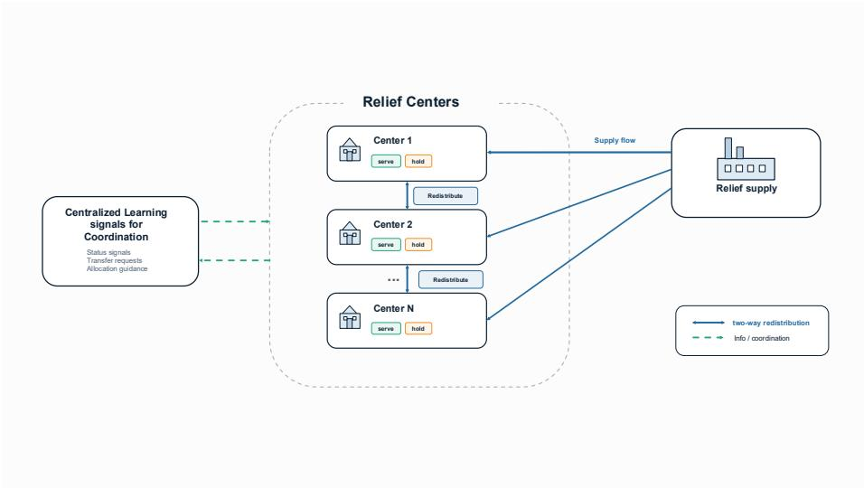
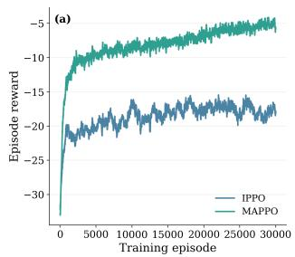
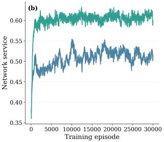
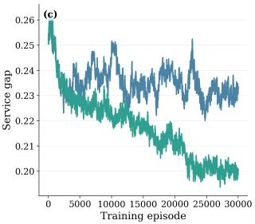
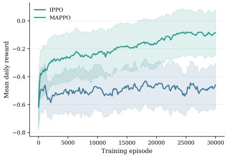
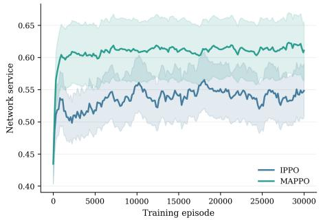
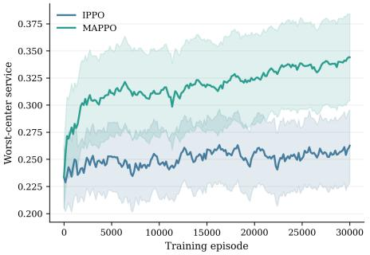
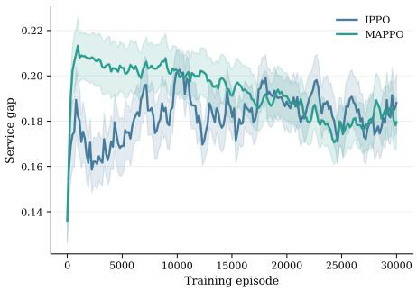

# CoRe-MARL: Cooperative Redistribution Under Unknown Dynamics Using Recurrent Multi-Agent Reinforcement Learning

Naimur Rahman Chowdhurya,∗, Shatabdi Sen Praptib, Md. Salehin Seyamb, Limon Bin Hossainb

aThis work was done prior to joining Amazon. Industrial and Systems Engineering, North Carolina State University, Raleigh, NC, United States

bDepartment of Industrial and Production Engineering, Bangladesh University of Engineering and Technology, Dhaka, 1000, Bangladesh

## Abstract

Emergency management assistance programs, such as relief distribution, are essential for delivering necessary supplies to afected communities. However, these programs operate in a decentralized network of local centers that face uncertain local demand and supply dynamics, resulting in inconsistent availability of local services. Redistribution of supplies among these local centers reduces these imbalances, but the centers often make decisions independently, with limited information and disrupted transportation. This study develops CoRe-MARL, a cooperative multi-agent reinforcement learning (MARL) framework, by formulating a decentralized partially observable Markov decision process (Dec-POMDP). We treat each center as an agent that learns a redistribution policy to improve the service in the worst-case region and reduce the service gap across regions while protecting network-wide service. We incorporate a recurrent network that captures evolving supply and demand dynamics without direct observation, while multi-agent proximal policy optimization (MAPPO) enables centralized training and decentralized execution (CTDE). We evaluate the framework in a simulated environment with diverse trajectories, where exact dynamics are not observed by actors and the MAPPO critic. We compare the recurrent MAPPO with the recurrent independent PPO (IPPO) and a localonly heuristic, and find that MAPPO reduces the service gap across local centers and enhances service for the worst-served center while maintaining competitive network-wide service. The recurrent MAPPO also shows consistent performance across diverse trajectory patterns, demonstrating its ability to adapt to evolving dynamics. The findings demonstrate the capability of cooperative learning for decentralized redistribution and improving equitable service under uncertain

and evolving dynamics.

Keywords: Multi-agent reinforcement learning, Cooperative decision making, Recurrent policy learning

## 1. Introduction

Emergency assistance organizations, such as the Federal Emergency Management Agency (FEMA) and the American Red Cross, receive relief supplies and aim to distribute them to communities in need (Egan and Tischler, 2010). The timely distribution of emergency supplies, such as food, water, and medicine, is critical to meeting the immediate needs of these vulnerable communities. However, these assistance programs usually operate in a network of distribution centers to get critical supplies closer to communities in times of need (Özdamar and Ertem, 2015). The supplies arrive at distribution centers on an ad hoc basis, driven by the timing and origin rather than the spatial distribution of need. Moreover, road damage, trafic disruptions, and communication failures further degrade the predictability of inbound supplies. Hence, a center’s receipt of supply in any given period is only weakly correlated with the need in the surrounding afected regions (Barbarosoğlu et al., 2002). Due to the ad hoc nature of incoming supplies, some relief centers receive surpluses while others face acute shortages, even when the network as a whole might hold suficient relief inventory. This imbalance is consequential, especially for perishable items. For perishable items, surplus stock that cannot be used locally within its shelf life may go to waste, which could otherwise be used to serve a center with insufficient supplies. Redistribution, the transfer of resources between distribution centers after their initial allocation, is essential in this regard to serve areas that need immediate support from centers with surplus supplies.

The existing literature on redistribution traditionally treats the problem as centralized planning. Rottkemper et al. (2011, 2012) develop models for optimal inventory redistribution that address temporal changes in demand, and assume a single decision-maker with complete knowledge of the system. Pacheco and Batta (2016) also model the prepositioning of inventories based on hurricane forecasts from a central perspective. These approaches demonstrate that redistribution can improve outcomes when a planner has full visibility. However, during emergencies, distribution centers operate with limited information about the rest of the network, relying on delayed, aggregated reports of other sites’ operations (Ye et al., 2020; Balcik et al., 2010). Centralized optimization, therefore, struggles to capture the day-to-day decisions of the relief centers.

On the other hand, cooperation among centers is necessary to mitigate the imbalance in the network. For instance, a center with a surplus is unaware of which partner is most in need, and a center facing a shortage would not know which partner has stock to redistribute unless the centers communicate and coordinate their actions. In addition, the emergency condition, such as a natural disaster, itself evolves through phases that difer across locations and over time. Some communities experience a sudden peak, others face a prolonged disruption. These temporal trajectories are not known to decision-makers at centers in advance, and they must make decisions based on the limited observations they receive. A redistribution policy should therefore incorporate cooperation to correct imbalances, the partial observability of the network state, and the shifting dynamics that change a region’s states.

In this study, we address the aforementioned requirements by formulating the relief redistribution problem as a cooperative multi-agent task. The centers are modeled as independent agents in a fully cooperative, partially observable, decentralized Markov decision process (Bernstein et al., 2002; Oliehoek and Amato, 2016). Each agent decides how to allocate its available supply among local service, holding for reserve, and transferring to the other centers. To handle the temporal structure of diferent dynamics, each agent also maintains a recurrent belief state that summarizes its history of observations, allowing it to infer the current phase of the emergency event and act accordingly.

We formulate the following research questions.

RQ1. How should a relief distribution center allocate its available supply between local service, holding for reserve, and redistribution to other centers under limited information about other centers and unknown dynamics?

To address this, we formulate the redistribution problem as a cooperative partially observable Markov game and solve it using recurrent multi-agent proximal policy optimization (MAPPO). Each center uses its local observation history and limited network information to dynamically allocate available inventory among local service, reserve, and redistribution. The recurrent policy enables agents (centers) to adapt their actions to evolving conditions without explicit knowledge of the trajectory.

RQ2. Can distribution centers coordinate redistribution decisions to improve service for the worst-served communities while not deteriorating the overall network performance?

To answer this, we define a shared reward that penalizes dispersion of service across centers while rewarding the minimum service level, and evaluate the resulting trade-of across diferent supply and demand realizations.

RQ3. Does a centralized cooperative learning help the network make better decisions compared with independent learning for relief redistribution?

To answer this, we compare recurrent MAPPO with recurrent independent PPO (IPPO) on the same trajectories to assess how centralized training afects the action performance.

The remainder of the paper is organized as follows. Section 2 reviews the related literature on humanitarian logistics, reinforcement learning in emergency response, and multi-agent coordination. Section 3 presents the mathematical formulation of the redistribution problem. Section 4 details the experimental design. Section 5 reports the results, and Section 6 concludes with a discussion of limitations and directions for future work.

## 2. Literature Review

Studies addressing resource allocation in emergency events focus on diferent aspects of logistics management, including eficiency of the balanced allocation and costs (Sakiani et al., 2020), adequacy of the supply to demand realization under uncertainty (Rottkemper et al., 2011; Pacheco and Batta, 2016), and, most recently, equity of the outcome (Yu et al., 2021). In contrast to the majority of the literature, Gutjahr and Fischer (2018) consider equity explicitly as the objective of resource allocation decisions. The authors’ contribution is to show that the minimal total deprivation cost function alone cannot adequately account for the inequity in deprivation costs and to propose adjusting it by explicitly incorporating the Gini coeficient of deprivation costs as a corrective measure.

Specifically, in terms of resource redistribution, Rottkemper et al. (2012) develop a model for optimal inventory redistribution between exchange centers that accounts for changes in supply and demand after a disaster. Pacheco and Batta (2016) propose a forecast-based approach that employs pre-positioned supplies, which are updated as the hurricane track becomes clearer. Sakiani et al. (2020) propose a combined vehicle routing and network flow model, which they formulate as a rolling-horizon inventory routing problem with an objective function based on deprivation costs that embodies equity considerations. Our paper is related to the aforementioned articles in that it also concerns the redistribution during an emergency event with unknown dynamics. However, we study a decentralized setting in which each center makes distribution decisions on its own, based solely on local observations, with limited knowledge of the other centers’ stocks and demands.

Several works explore the application of RL to humanitarian logistics, primarily in single-agent settings. Yu et al. (2021) apply Q-learning to the allocation of relief resources with costs in eficiency, efectiveness, and equity estimated separately. Lee and Lee (2021) frame the disaster response as a partially observable multi-agent task, but do not account for inventory perishability and multi-day delivery uncertainty. Wu and Tai (2024) combine convolutional networks with RL to optimize inbound logistics of food banks. Furthermore, van Steenbergen et al. (2023) apply RL to humanitarian relief distribution using trucks and UAVs under travel-time uncertainty, and Ahmad et al. (2025) propose a deep RL approach that jointly targets eficiency, efectiveness, and equity in disaster relief distribution, though both retain a single centralized decisionmaker. Similarly, in multi-agent settings, Yang et al. (2024) apply multi-agent deep RL to post-hazard community recovery planning, although their setting focuses on restoration scheduling rather than physical resource redistribution. In contrast to these studies, we incorporate equity into the reward function as a penalty for service gaps across agents and explicitly model the worst-case service across sites, thereby driving cooperative redistribution decisions. Second, we consider decision-making autonomy distributed among the centers with a centralized training and decentralized execution (CTDE).

Several works focus on the coordination mechanism. Prior MARL studies address decentralized inventory management that evaluates several algorithms for decentralized inventory control and finds that MAPPO has an edge over independent learning variants. Liu et al. (2025) apply a heterogeneous agent version of PPO to multi-echelon inventory management and find that it reduces costs and the variance of order quantities (the bullwhip efect) compared to single-agent RL. We difer from the approaches mentioned by focusing not only on the multi-agent setting but also by incorporating a recurrent network into the learning model to capture unknown dynamics. We address transport uncertainty, disruption-dependent shipment losses, and inventory perishability factors.

In sum, the body of literature covers centralized optimization to decentralized reinforcement learning. However, the question of fully decentralized coordination for redistribution under unknown dynamics has received insuficient attention. Most works focus on either centrally coordinated dispatching or inventory management in decentralized supply chains. This is an important gap, as many real-world relief networks are decentralized, with individual centers making day-to-day distribution decisions with only local information. In Table 1 we present the literature gap and the contribution of this study.

Table 1: Comparison of the current paper with related studies on resource allocation and redistribution.
<table><tr><td>Reference</td><td>Re- distribution</td><td>Perish- ability</td><td>RL</td><td>Multi-agent Cooperation</td><td>Decentralized Execution</td><td>Objective function</td><td>Solution approach</td></tr><tr><td>Rottkemper et al. (2011)</td><td>√</td><td></td><td></td><td></td><td></td><td>Relocation cost/coverage</td><td>Exact MILP</td></tr><tr><td>Rottkemper et al. (2012)</td><td>√</td><td></td><td></td><td></td><td></td><td>Transshipment cost</td><td>Exact MILP</td></tr><tr><td>Pacheco and Batta (2016)</td><td>√</td><td></td><td></td><td></td><td></td><td>Prepositioning cost</td><td>Forecast-driven heuristic</td></tr><tr><td>Sakiani et al. (2020)</td><td>V</td><td></td><td></td><td></td><td></td><td>Deprivation &amp; operating cost</td><td>Specialized SA</td></tr><tr><td>Gutjahr and Fischer (2018)</td><td></td><td></td><td></td><td></td><td></td><td>Deprivation-cost equity</td><td>Exact / metaheuristic</td></tr><tr><td>Yu et al. (2021)</td><td></td><td></td><td></td><td></td><td></td><td>Efficiency, effectiveness, equity</td><td>Q-learning</td></tr><tr><td>Wu and Tai (2024)</td><td></td><td>V</td><td></td><td></td><td></td><td>Quality &amp; storage management</td><td>CNN + RL</td></tr><tr><td>van Steenbergen et al. (2023)</td><td></td><td></td><td></td><td></td><td></td><td>Delivery under travel-time uncertainty</td><td>RL</td></tr><tr><td>Ahmad et al. (2025)</td><td></td><td></td><td>V</td><td></td><td></td><td>Efficiency, effectiveness, equity</td><td>Deep RL</td></tr><tr><td>Lee and Lee (2021)</td><td></td><td></td><td></td><td>V</td><td>√</td><td>Admission/diversion decisions</td><td>Multi-agent RL</td></tr><tr><td>Yang et al. (2024)</td><td></td><td></td><td>V</td><td>√</td><td>√</td><td>Post-hazard recovery scheduling</td><td>Multi-agent deep RL</td></tr><tr><td>Mousa et al. (2024)</td><td></td><td></td><td>√ √</td><td>√ √</td><td>√ √</td><td>Inventory cost</td><td>MAPPO / IPPO comparison</td></tr><tr><td>Liu et al. (2025)</td><td></td><td></td><td></td><td></td><td></td><td>Cost &amp; order variance</td><td>Heterogeneous-agent PPO</td></tr><tr><td>This study</td><td>r</td><td>√</td><td>√</td><td>√</td><td>√</td><td>Network service, Service gap, Worst-case Service</td><td>Recurrent MAPPO (CTDE)</td></tr></table>

## 3. Methodology

In this section, we formulate the relief problem and develop the decentralized decision model.

## 3.1. Problem Formulation

We present a relief network problem comprising N regional distribution centers connected by a complete directed transfer graph, such that each center can redistribute to any of the other N − 1 centers (as shown in Figure 1). The centers are autonomous, and redistribution decisions are made simultaneously. Each horizon of an emergency event comprises T decision periods (days) that correspond to an acute response to a sudden-onset event. Within each period, exogenous perishable relief supply (lbs) as well as any redistribution whose stochastic travel time, $\tau _ { i j t }$ , ends that day, arrives at a center. We remove the additional redistribution amount as overflow if the total inventory exceeds capacity. The center then uses its entire available inventory for local service, a holding reserve, and five specific redistributions to other centers. Finally, the inventory beyond its shelf life is disposed of, and the remaining inventory is kept. Table 2 presents all important notations used in the problem formulation.

  
Figure 1: A standard relief supply network with regional relief centers that serve local demand, hold inventory for reserve, and redistribute to other centers.

## 3.2. Cooperative Redistribution Model

We formulate the redistribution problem as a cooperative Markov game, modeled as a decentralized partially observable Markov decision process (Dec-POMDP) (Bernstein et al., 2002; Oliehoek and Amato, 2016), as specified by the tuple (1).

$$
\langle \mathbb { N } , \cal { S } , \{ \mathcal { O } _ { i } \} _ { i \in \mathbb { N } } , \{ \mathcal { U } _ { i } \} _ { i \in \mathbb { N } } , \mathcal { P } , R , \gamma \rangle .\tag{1}
$$

Here, $\mathcal { N }$ is the set of relief distribution centers (agents) and S is the environment state space. $\mathcal { O } _ { i }$ and $\mathcal { U } _ { i }$ are the local observation and action spaces of center $i ,$ respectively. $\mathcal { P }$ represents transition kernel and R is the shared network reward followed by discount factor γ. In this problem, the environment state $s _ { t } \in S$ is not directly observed by the agents, and they act on local observations $o _ { i t } \in { \mathcal { O } } _ { i }$

## 3.2.1. Transitions

Transitions in the Dec-POMDP are driven by inventory, demand, supply, and transportation dynamics. We track on-hand inventory by age $\ell \in \{ 0 , \ldots , L - 1 \}$ , with the oldest quantity removed first (De Moor et al., 2022). At the start of day t, arrivals at center i include exogenous supply $S _ { i t }$ and earlier transfers that

arrive on that day.

Table 2: Notation used for the relief redistribution model.
<table><tr><td>Sets and Indices</td><td></td></tr><tr><td> $\mathcal { N }$ </td><td>Set of relief distribution centers;  $i , j \in \mathcal N$ </td></tr><tr><td> $T$ </td><td>Number of decision periods in the horizon;  ${ t = 1 , . . . , T \ [ \mathrm { d a y s } ] }$ </td></tr><tr><td> $L$ </td><td>Shelf life of relief inventory;  $\ell = 0 , \ldots , L - 1$  [days]</td></tr><tr><td colspan="2">Parameters</td></tr><tr><td> $D _ { i t }$ </td><td>Demand at center i in period t [lbs]</td></tr><tr><td> $S _ { i t }$ </td><td>Exogenous perishable supply received by center i in period t [lbs]</td></tr><tr><td> $K _ { i }$ </td><td>Storage capacity of center i [lbs]</td></tr><tr><td> ${ \bar { X } } _ { i }$ </td><td>Daily outbound redistribution capacity of center  $i \ [ \mathrm { l b s } / \mathrm { d a y } ]$ </td></tr><tr><td> $\tau _ { i j t }$ </td><td>Travel time for a shipment from center i to center j dispatched in period t [days]</td></tr><tr><td> $\rho _ { i j t }$ </td><td>In-transit loss fraction for a shipment from center i to center j dispatched in period t</td></tr><tr><td> $\zeta _ { i t } ^ { \mathrm { t r a n s } }$ </td><td>Unobserved transportation disruption at center i in period t</td></tr><tr><td></td><td>Link disruption for a shipment from center i to center j in period t [frac-</td></tr><tr><td> $\gamma$ </td><td>tion] Discount factor</td></tr><tr><td colspan="2">Variables and Performance Measures</td></tr><tr><td></td><td>Inventory of age l at center i in period t [lbs]</td></tr><tr><td> $I _ { i t } ^ { ( \ell ) }$   $A _ { i t }$ </td><td>Total arrivals at center i in period  $t ,$  including exogenous supply and </td></tr><tr><td></td><td>delivered transfers [lbs] Available inventory at center i in period t after arrivals and overflow re-</td></tr><tr><td> $V _ { i t }$ </td><td>moval [lbs]</td></tr><tr><td> $y _ { i t }$ </td><td>Demand served locally at center i in period t [lbs]</td></tr><tr><td> $u _ { i t }$   $x _ { i j t }$ </td><td>Unmet demand at center i in period t [lbs] Actual dispatched redistribution quantity from center i to center j in</td></tr><tr><td></td><td>period t [lbs]</td></tr><tr><td> $e _ { i t }$ </td><td>Quantity of expired inventory at center i in period t [lbs]</td></tr><tr><td> $q _ { i t }$ </td><td>Service ratio of center i in period t</td></tr><tr><td> $Q _ { t }$ </td><td>Network-wide service ratio in period t</td></tr><tr><td> $E _ { t }$   $q _ { t } ^ { \operatorname* { m i n } }$ </td><td>Service gap across centers in period t Worst-center service ratio in period t</td></tr><tr><td colspan="2">MARL Notation</td></tr><tr><td></td><td>Local observation of center i in period t</td></tr><tr><td> $o _ { i t }$ </td><td>Continuous allocation action of center i in period t</td></tr><tr><td> $a _ { i t }$ </td><td></td></tr><tr><td> $a _ { i t } ^ { \mathrm { l o c } }$ </td><td>Action share allocated to local service at center i</td></tr><tr><td> $a _ { \scriptscriptstyle i \mathrm { : } \scriptscriptstyle i } ^ { \mathrm { \tiny { i } \mathrm { - } \mathrm { ~ \tiny { ~  ~ } } } }$  it</td><td>Action share allocated to holding inventory at center i</td></tr><tr><td> $a _ { i t } ^ { j }$ </td><td>Action share allocated to intended redistribution from center i to center</td></tr><tr><td> $u _ { i }$ </td><td>Simplex action space for center i</td></tr><tr><td> $b _ { i t }$ </td><td>Recurrent belief state of center i in period t</td></tr><tr><td> $s _ { t } ^ { C }$ </td><td>Centralized operational state available to the critic in period t</td></tr><tr><td> $R _ { t }$ </td><td>Shared network reward in period t</td></tr></table>

$$
A _ { i t } = S _ { i t } + \underset { j \neq i } { \sum } \underset { k < t } { \sum } ( 1 - \rho _ { j i k } ) x _ { j i k } \mathbb { 1 } \big \{ k + \tau _ { j i k } = t \big \} ,\tag{2}
$$

$$
\widetilde V _ { i t } = A _ { i t } + \sum _ { \ell = 0 } ^ { L - 1 } I _ { i t } ^ { ( \ell ) } .\tag{3}
$$

Here, $\tau _ { j i k }$ and $\rho _ { j i k }$ in $\operatorname { E q }$ . (2) are the realized travel time and loss fraction for the transfer dispatched from center $j$ to center i on day k. The indicator includes the shipment only on the day of arrival. If post-arrival inventory in $\operatorname { E q } .$ (3) exceeds storage capacity $K _ { i } .$ overflow is removed before action as shown in Eq. (4).

$$
O _ { i t } = \operatorname* { m a x } \{ \widetilde { V } _ { i t } - K _ { i } , 0 \} , \qquad V _ { i t } = \widetilde { V } _ { i t } - O _ { i t } .\tag{4}
$$

Thus, $V _ { i t }$ is the post-arrival, post-overflow inventory available for allocation by the policy.

## 3.2.2. MARL Action

For each relief center i, the action is a continuous simplex $a _ { i t } \ \in \mathcal { U } _ { i }$ that represents the fractional allocation of available inventory $V _ { i t }$ across local service, holding, and intended redistribution to the other centers, as shown in Eq. (5). All action components are nonnegative, so $a _ { i t } ^ { k } \geq 0$ for all $k ,$ and $a _ { i t } ^ { \mathrm { l o c } } + a _ { i t } ^ { \mathrm { h o l d } } +$ $\textstyle \sum _ { j \neq i } a _ { i t } ^ { j } = 1$

$$
a _ { i t } = \left( a _ { i t } ^ { \mathrm { l o c } } , a _ { i t } ^ { \mathrm { h o l d } } , \{ a _ { i t } ^ { j } \} _ { j \neq i } \right)\tag{5}
$$

Local service is capped by realized demand, as shown in Eq. (6).

$$
y _ { i t } = \operatorname* { m i n } \{ D _ { i t } , a _ { i t } ^ { \mathrm { l o c } } V _ { i t } \} ,\tag{6}
$$

Unmet demand is shown in Eq. (7).

$$
u _ { i t } = D _ { i t } - y _ { i t } .\tag{7}
$$

For each partner $j \neq i$ , the action implies an intended outbound redistribution, represented by the nominal quantity $\widetilde { x } _ { i j t } = a _ { i t } ^ { j } V _ { i t }$ . The total nominal outbound redistribution from center i is shown in Eq. (8).

$$
\sigma _ { i t } = \sum _ { j \neq i } \widetilde { x } _ { i j t } .\tag{8}
$$

Nominal redistribution quantities are proportionally scaled only if they exceed the daily outbound redistribution capacity ${ \bar { X } } _ { i }$ :

$$
c _ { i t } = \operatorname* { m i n } \left\{ 1 , { \frac { { \bar { X } } _ { i } } { \sigma _ { i t } + \varepsilon } } \right\} , \qquad x _ { i j t } = c _ { i t } { \widetilde { x } } _ { i j t } .\tag{9}
$$

The realized held inventory is the residual after local service and dispatch:

$$
H _ { i t } = V _ { i t } - y _ { i t } - \sum _ { j \neq i } x _ { i j t } .\tag{10}
$$

## 3.2.3. Local Observations

Each agent $i \in \mathbb N$ observes only local states and limited, delayed information about the other agents. The local observation vector for agent i in period t is presented in Eq. (11).

$$
\begin{array} { r l } & { o _ { i t } = \Big [ \frac { I _ { i t } ^ { ( 0 ; L - 1 ) } } { K _ { i } } , \ \frac { \sum _ { \ell } I _ { i t } ^ { ( \ell ) } } { K _ { i } } , \ \frac { D _ { i t } } { D _ { i } } , \ \frac { S _ { i t } } { S _ { i } } , \ \frac { u _ { i , t - 1 } } { D _ { i } } , \ \frac { P _ { i t } ^ { \mathrm { p i p e } } } { D _ { i } } , \ q _ { i , t - 1 } , } \\ & { \qquad \frac { \sum _ { j } x _ { i j , t - 1 } } { \bar { D } _ { i } } , \ \frac { \sum _ { j } x _ { j i , t - 1 } } { \bar { D } _ { i } } , \ \frac { t } { T } , \ \mathbf { q } _ { t - 1 } , \ a _ { i , t - 1 } \Big ] , } \end{array}\tag{11}
$$

$I _ { i t } ^ { ( 0 : L - 1 ) } / K _ { i }$ presents the inventory age profile up to the shelf-life cycle, and $\textstyle \sum _ { \ell } I _ { i t } ^ { ( \ell ) } / K _ { i }$ is the total inventory on hand, both normalized by the center’s storage capacity $K _ { i } . \ D _ { i t } / \bar { D } _ { i }$ and $S _ { i t } / \bar { S } _ { i }$ present the current demand and current supply relative to the center’s historical average levels, $\bar { D } _ { i }$ and $\bar { S } _ { i }$ . The center also records $u _ { i , t - 1 } / \bar { D } _ { i }$ , the unmet demand from the previous day of its demand. Next, $P _ { i t } ^ { \mathrm { p i p e } } / \bar { D } _ { i }$ is the quantity already dispatched toward the center but not yet arrived. Here, the inbound pipeline $P _ { i t } ^ { \mathrm { p i p e } }$ denotes the total quantity previously dispatched to center i by other centers that remain in transit when center i forms its period-t observation. It is presented in Eq. (12).

$$
P _ { i t } ^ { \mathrm { p i p e } } = \sum _ { j \neq i } \sum _ { k < t } x _ { j i k } \mathbb { 1 } \{ k + \tau _ { j i k } > t \} ,\tag{12}
$$

The indicator $\mathbb { 1 } \{ k + \tau _ { j i k } > t \}$ includes only redistribution on an earlier day k whose realized arrival day, $k + \tau _ { j i k }$ , occurs after period t. Following this, $\sum _ { j } x _ { i j , t - 1 } / \bar { D } _ { i }$ and $\sum _ { j } x _ { j i , t - 1 } / \bar { D } _ { i }$ are the redistribution amounts the center sent out and received on the previous day. Finally, $t / T$ is the current day within the planning horizon of length $T ,$ and $_ { a _ { i , t - 1 } }$ is the center’s previous action. In the observation, the only network-wide information available to an agent is $\mathbf { q } _ { t - 1 } = ( q _ { 1 , t - 1 } , \dots , q _ { N , t - 1 } )$ , the previous day’s service ratios across the network (defined in Eq. (13)). Agents do not observe partner inventories, demands, supplies, or current actions. Additionally, the current observation alone does not characterize the evolving system state, motivating the recurrent policy described in Section 3.3.

## 3.2.4. Shared Reward

For the reward, we mainly focus on the service and equity in the network. Service at a region covered by a center is measured as the fraction of demand met by the center, as shown in Eq. (13). The aggregated network service is therefore achieved as in Eq. (14).

$$
q _ { i t } = \frac { y _ { i t } } { D _ { i t } + \varepsilon } .\tag{13}
$$

$$
Q _ { t } = \frac { \sum _ { i } y _ { i t } } { \sum _ { i } D _ { i t } + \varepsilon } .\tag{14}
$$

Equity is measured by the service gap, defined as the mean absolute deviation of center-level service ratios from their network mean, as shown in Eq. (15).

$$
E _ { t } = \frac { 1 } { N } \sum _ { i } \left| q _ { i t } - \bar { q } _ { t } \right| , \qquad \bar { q } _ { t } = \frac { 1 } { N } \sum _ { i } q _ { i t } .\tag{15}
$$

We also measure worst-center service with $q _ { t } ^ { \operatorname* { m i n } } = \operatorname* { m i n } _ { i } q _ { i t }$ . Finally, we develop a shared reward for all agents shown in Eq. (16).

$$
R _ { t } = w _ { 1 } q _ { t } ^ { \operatorname* { m i n } } - w _ { 2 } E _ { t } - w _ { 3 } \operatorname* { m a x } \{ 0 , \phi - Q _ { t } \} .\tag{16}
$$

The first term ensures improvement in the least-served center, while the second penalizes disparities in service across centers. We use the third term to penalize the network service only when $Q _ { t }$ falls below the threshold $\phi .$ . The third term protects the agents from serving demands rather than serving all centers equally poorly to achieve equity. We use $w _ { 1 } , w _ { 2 } , w _ { 3 }$ as the weights for the reward terms. For this study, we use $w _ { 3 } \geq w _ { 2 } \geq w _ { 1 }$ , and $\phi = 0 . 6 0$ . The cooperative objective is presented in Eq. (17).

$$
J ( \pi ) = \mathbb { E } _ { \pi } \left[ \sum _ { t = 0 } ^ { T - 1 } \gamma ^ { t } R _ { t } \right] .\tag{17}
$$

## 3.3. Learning Framework

Since we have independent agents operating in a decentralized network, we use MAPPO (Yu et al., 2022), which supports the cooperative decision-making that this study aims to achieve. MAPPO provides CTDE (Kopic et al., 2024), using a shared critic and decentralized actors. During training, the critic observes the following state in Eq. (18), which includes local observations of all agents, the previous transfer matrix, and the origin-destination pipeline redistribution. At execution time, the critic is discarded, and each center acts on its own observations.

$$
\begin{array} { r } { \boldsymbol { s } _ { t } ^ { C } = \left[ o _ { 1 t } , \ldots , o _ { N t } , \ \{ x _ { i j , t - 1 } \} _ { i , j \in \mathbb { N } } , \ \{ P _ { i j t } ^ { \mathrm { p i p e } } \} _ { i , j \in \mathbb { N } } \right] , } \end{array}\tag{18}
$$

## 3.3.1. Recurrent Actor and Policy Update

Each center (agent) maintains a memory state that is updated at each period. This memory state summarizes the history of observations seen by the agents (Cho et al., 2014). We define this by deriving a gated recurrent unit (GRU) (Chung et al., 2014) as shown in Eq. (19). For each agent, it summarizes the current observation and the previous memory update that provides the agent with the trajectory dynamics without any direct signal in the observation.

$$
b _ { i t } = \mathrm { G R U } _ { \theta _ { i } } ( o _ { i t } , b _ { i , t - 1 } )\tag{19}
$$

The action distribution over the simplex in Eq. (5) shows how agents combine the memory state and observation in their policy.

$$
\pi _ { \theta _ { i } } ( a _ { i t } \ \vert \ o _ { i t } , b _ { i , t - 1 } ) = \mathrm { D i r i c h l e t } [ \mathrm { s o f t p l u s } ( W _ { i } b _ { i t } + c _ { i } ) + \alpha _ { 0 } ] .\tag{20}
$$

This Dirichlet distribution $( \mathrm { N g }$ et al., 2011) allows distributions over the simplex that, by construction, have shares that sum to one, thus satisfying the constraint in Eq. (5). The ofset $\alpha _ { 0 } > 0$ prevents concentration parameters from becoming zero.

Actors are trained with PPO (Schulman et al., 2017), which updates the policy while not changing drastically from the previous update. For an action $a _ { i t }$ taken by agent i at time t, the probability ratio is defined in Eq. (21).

$$
r _ { i t } ( \theta _ { i } ) = \frac { \pi _ { \theta _ { i } } ( a _ { i t } \mid o _ { i t } , b _ { i , t - 1 } ) } { \pi _ { \theta _ { i } ^ { \mathrm { o l d } } } ( a _ { i t } \mid o _ { i t } , b _ { i , t - 1 } ^ { \mathrm { o l d } } ) } .\tag{21}
$$

Here, $\pi _ { \boldsymbol { \theta } _ { i } }$ is the current policy and $\pi _ { \theta _ { i } ^ { \mathrm { o l d } } }$ is the policy before the current update. The clipped PPO objective is shown in $\operatorname { E q . }$ (22), where advantage estimate $\widehat { A } _ { t }$ is used to determine whether an action should become more or less likely.

$$
L _ { i } ^ { \mathrm { c l i p } } ( \theta _ { i } ) = \mathbb { E } _ { t } \left[ \operatorname* { m i n } \left\{ r _ { i t } ( \theta _ { i } ) \widehat { A } _ { t } , \mathrm { c l i p } \left( r _ { i t } ( \theta _ { i } ) , 1 - \epsilon , 1 + \epsilon \right) \widehat { A } _ { t } \right\} \right] .\tag{22}
$$

The actor minimizes the clipped negative objective with entropy regularization, which promotes exploration, in Eq. (23).

$$
\mathcal { L } _ { i } ^ { \pi } ( \theta _ { i } ) = - L _ { i } ^ { \mathrm { c l i p } } ( \theta _ { i } ) - \eta \mathbb { E } _ { t } \left[ \mathcal { H } \left( \pi _ { \theta _ { i } } ( \cdot \vert o _ { i t } , b _ { i , t - 1 } ) \right) \right] ,\tag{23}
$$

Here, $\epsilon > 0$ controls the clipping range and $\eta$ is the entropy coeficient.

$\widehat { A } _ { t }$ is computed using generalized advantage estimation (GAE) (Schulman et al., 2016). The centralized critic $V _ { \phi } ( s _ { t } ^ { C } )$ estimates the expected future return from the centralized training state $s _ { t } ^ { C }$ . After observing reward $R _ { t }$ and the next state, the one-step temporal-diference error is defined in $\mathrm { E q . ~ ( 2 4 ) }$ .

$$
\delta _ { t } = R _ { t } + \gamma V _ { \phi } ( s _ { t + 1 } ^ { C } ) - V _ { \phi } ( s _ { t } ^ { C } ) ,\tag{24}
$$

where $\gamma \in [ 0 , 1 ]$ is the discount factor. GAE combines these prediction errors over subsequent periods using Eq. (25).

$$
\widehat { A } _ { t } = \sum _ { l = 0 } ^ { T - t - 1 } ( \gamma \lambda ) ^ { l } \delta _ { t + l } ,\tag{25}
$$

where $\lambda \in [ 0 , 1 ]$ controls how strongly future prediction errors contribute to the current advantage estimate.

The centralized critic is trained to estimate the return target $\widehat { V } _ { t }$ computed from the sampled trajectory. Its parameters $\phi$ are learned by minimizing the critic value loss in Eq. (26).

$$
\begin{array} { r } { \mathcal { L } ^ { V } ( \phi ) = c _ { V } \mathbb { E } _ { t } \left[ \left( V _ { \phi } ( s _ { t } ^ { C } ) - \widehat { V } _ { t } \right) ^ { 2 } \right] , } \end{array}\tag{26}
$$

Here, $c _ { V }$ is the value-loss coeficient. The learning framework is summarized in Algorithm 1.

Algorithm 1 Recurrent MAPPO   
1: Initialize actor parameters $\{ \theta _ { i } \} _ { i \in \mathcal { N } }$   
2: Initialize centralized critic parameters $\phi$   
3: Initialize experience bufer $\mathcal { D }  \emptyset$   
4: for $k = 1 , \ldots , K$ do   
5: $\mathcal { D }  \emptyset$   
6: for $e = 1 , \ldots , N _ { \mathrm { e p } }$ do   
7: Draw the next realization from $B _ { \mathrm { t r } }$   
8: Reset environment and initialize $b _ { i , - 1 }  \mathbf { 0 }$ for all $i \in \mathcal N$   
9: for $t = 0 , \ldots , T - 1$ do   
10: Construct observation $o _ { i t }$ using Eq. (11)   
11: Update recurrent belief $b _ { i t }$ using Eq. (19)   
12: Sample action $a _ { i t }$ according to Eq. (20)   
13: Execute $a _ { t }$ in the environment   
14: Observe reward $R _ { t }$ from Eq. (16)   
15: Store $\left( o _ { i t } , a _ { i t } , b _ { i , t - 1 } , s _ { t } ^ { C } , R _ { t } \right)$ in D   
16: end for   
17: if the complete training-set cycle is finished then   
18: Reshufle $\boldsymbol { B } _ { \mathrm { t r } }$   
19: end if   
20: end for   
21: Estimate advantages $\widehat { A } _ { t }$ using Eq. (25)   
22: Normalize $\widehat { A } _ { t }$ over $\mathcal { D }$   
23: for $j = 1 , \ldots , N _ { \mathrm { e p o c h } }$ do   
24: for each minibatch containing M complete episodes do   
25: Replay recurrent sequences while preserving temporal order   
26: Update actors $\{ \theta _ { i } \}$ by ascending the PPO objective in Eq. (22)   
27: Update critic $\phi$ by minimizing the value loss in Eq. (26)   
28: end for   
29: end for   
30: if checkpoint interval is reached then   
31: Evaluate actors on the validation set   
32: end if   
33: end for   
34: return trained actors {θi}

## 4. Experimental Design

We evaluate the proposed learning framework in a synthetic emergency environment. The network contains $N = 6$ relief centers $( i \in \mathcal { N } )$ and each episode lasts $T = 2 0$ periods during an emergency event. In each period $t ,$ every agent observes a 29-dimensional local observation $o _ { i t } \in { \mathcal { O } } _ { i }$ and selects a 7-dimensional simplex action $a _ { i t } \ \in \mathcal { U } _ { i }$ The action includes the local-service share $a _ { i t } ^ { \mathrm { l o c } }$ , the holding share $a _ { i t } ^ { \mathrm { h o l d } }$ , and redistribution shares $\{ a _ { i t } ^ { j } \} _ { j \neq i }$ to the other five centers. The MAPPO critic uses the 246-dimensional centralized operational state $s _ { t } ^ { C }$ defined in Eq.(18). All demand, supply, and transportation realizations are generated by the process described in Appendix A. We also generate hidden trajectory families and episode-specific relief center roles that are never observed by the actors or the critic.

The primary metrics for evaluation are the service gap (equity) $E _ { t } ,$ the worst-center service $q _ { t } ^ { \operatorname* { m i n } }$ , cumulative network service $Q _ { t } ,$ and episodic return $\scriptstyle \sum _ { t = 0 } ^ { T - 1 } \gamma ^ { t } R _ { t }$ . To compare the cooperative performance of recurrent MAPPO, we use two baseline policies in the same generated environment under the same realization. First, we use a recurrent IPPO that shares the actor, action space, reward, and optimizer settings but replaces the centralized critic with a local critic for each agent. The hyperparameters for both MAPPO and IPPO are obtained with a grid search and presented in Table A.7 in the Appendix. Second, a heuristic “Local-only", that serves local demand and never redistributes inventory. All methods are trained and evaluated on the same set of generated episodes and trajectories. Hence, the diferences in performance are attributable to the decision policies.

## 5. Results and Discussion

We report the results from the experiments defined in Section 4 and $\mathrm { A p \mathrm { - } }$ pendix A. Figure 2(a)-(c) present on-policy training dynamics over 30000 episodes for both MAPPO and IPPO reporting episodic return $\scriptstyle \sum _ { t = 0 } ^ { T - 1 } \gamma ^ { t } R _ { t }$ , mean daily network service $\begin{array} { r } { \bar { Q } _ { t } = \frac { \sum _ { t } Q _ { t } } { T } } \end{array}$ , and mean daily service gap $\begin{array} { r } { \check { E } _ { t } = \frac { \sum _ { t } E _ { t } } { T } } \end{array}$ , respectively. According to the results, both MAPPO and IPPO improve over their initial policies, but MAPPO achieves a stronger final policy with a mean of the last 100 episode reward of −5.68 compared with −17.81 for IPPO, corresponding to a 68.1% smaller reward penalty. MAPPO also achieves a higher network service $\bar { Q } _ { t }$ of 0.599, representing a 16.2% relative improvement over IPPO, while reducing the service gap by 14.1%, ensuring better equity in the network.

  
Figure 2: On-policy training dynamics presenting (a) episodic reward, (b) mean daily network service, and (c) mean daily service gap. Curves are hundred-episode moving averages from sampled training actions.

## 5.1. Validation and Held-Out Performance

To evaluate generalization on unseen trajectories, we use 20 validation trajectories and 20 held-out trajectories for the final test. During training, we evaluate the validation set every 160 training episodes and report the policy’s performance on the 20 held-out test set. Figure 3(a)-(d) shows the evaluation of

  
(a)

  
(b)

  
(c)

  
(d)  
Figure 3: Trained policies evaluated every 160 training episodes on the same 20 validation set. (a) Mean daily reward, (b) network service, (c) worst-center service, and (d) service gap.

the trained policies at 160-episode intervals. Both learners start from the same policy, with a small gap across all metrics, because all centers are served poorly. As learning begins, service improves unevenly across centers, so the service gap rises as shown in Figure 3 (d). For MAPPO, the gap peaks at 0.213 around episode 960 while the network service has already reached 0.604 in Figure 3(b). After this early high-gap phase, MAPPO continues to improve service while closing the gap and improving equitable distribution and network service, exceeding IPPO. At the final checkpoint, MAPPO has an 11.4% higher network service, a 31.0% higher worst-center service, and a 4.5% lower service gap than IPPO, demonstrating the capability of cooperative learning to improve network service while maintaining a lower service gap, thereby ensuring equitable distribution across the network.

Table 3 summarizes the final generalization performance on the 20 unseen held-out test realizations. Because all methods are evaluated on the same heldout episodes, we assess the statistical significance of paired two-sided t-tests across common realizations. From the results, the Local-only operation achieves the highest network service at 0.6686 because it serves demand immediately at each center and never delays inventory through redistribution. However, it results in the largest disparity across centers, with a service gap of 0.2643, in contrast with 0.1766 for MAPPO. MAPPO reduces the service gap by 33.2% $( p - v a l u e < 1 0 ^ { - 9 } )$ and improves worst-center service from 0.2369 to 0.3562, a 50.4% increase $( p - v a l u e < 1 0 ^ { - 1 0 } )$ , both of which are statistically significant. Thus, MAPPO sacrifices some overall network service to achieve significantly better equity across relief centers.

In contrast with IPPO, MAPPO performs better on all metrics. The network service increases from 0.5602 to 0.6276 (p − value $< 1 0 ^ { - 1 0 } )$ , worst-center service increases from 0.2767 to 0.3562 $( p - v a l u e < 1 0 ^ { - 8 } )$ , and daily reward improves from −0.3786 to −0.0120 (p − value $< 1 0 ^ { - 1 0 } )$ . Although not statistically significant, the service gap is smaller for MAPPO than for IPPO, with a 1.9% reduction. Overall, the centralized training in MAPPO improves cooperation and service levels while maintaining the equity gains obtained through redistribution.

Table 3: Generalization in 20 held-out test set. Values represent mean ± standard deviation. † on the MAPPO row indicates statistical significance from IPPO at $p \mathrm { ~ - ~ } v a l u e \mathrm { ~ < ~ } 0 . 0 5 ; $ ‡ indicates statistical significance from local-only at $p - v a l u e < 0 . 0 5 .$
<table><tr><td>Method</td><td> $\bar { Q } _ { t }$ </td><td>Network service Worst-center service  $\bar { q } _ { t } ^ { \operatorname* { m i n } }$ </td><td>Service gap  $\bar { E } _ { t }$ </td><td>Daily reward  $\bar { R } _ { t }$ </td></tr><tr><td>Local-only</td><td> $\mathbf { 0 . 6 6 8 6 \pm 0 . 0 7 4 7 }$ </td><td> $0 . 2 3 6 9 \pm 0 . 0 9 9 8$ </td><td> $0 . 2 6 4 3 \pm 0 . 0 4 1 5$ </td><td> $- 0 . 5 8 0 1 \pm 0 . 3 8 0 0$ </td></tr><tr><td>IPPO</td><td> $0 . 5 6 0 2 \pm 0 . 0 5 6 9$ </td><td> $0 . 2 7 6 7 \pm 0 . 0 6 4 6$ </td><td> $0 . 1 8 0 1 \pm 0 . 0 3 9 5$ </td><td> $- 0 . 3 7 8 6 \pm 0 . 2 6 2 8$ </td></tr><tr><td>MAPPO</td><td> $0 . 6 2 7 6 \pm 0 . 0 6 8 7 ^ { \dagger , \ddagger }$ </td><td> $\mathbf { 0 . 3 5 6 2 \pm 0 . 0 7 5 3 ^ { \dag , \ddag } }$ </td><td> $\mathbf { 0 . 1 7 6 6 \pm 0 . 0 3 0 2 ^ { \ddagger } }$ </td><td> $\mathbf { 0 . 0 1 2 0 \pm 0 . 2 5 1 0 ^ { \dag , \ddagger } }$ </td></tr></table>

Furthermore, we aim to leverage the recurrent network in the learning model to see whether the agents can adapt to unknown dynamics using their observation histories. The held-out test instances comprise diferent trajectory types used to represent the dynamics described in Appendix A. Table 4 stratifies the results by the trajectory family. From the results, MAPPO achieves performance similar to the overall test performance in Table 3 and achieves significantly higher network service than IPPO across all five trajectory types, with improvements ranging from 10.6% to 15.3%. It also improves worst-center service by 19.5%-41.6%, with significant diferences across four families, except for the Early recovery trajectory.

In contrast with local-only operation, MAPPO significantly reduces the service gap and improves worst-center service in all trajectories. Since the trajectory types are never observed by the policies, we can infer from these results that both MAPPO and IPPO generalize across trajectories, while MAPPO significantly improves network service and maintains better equity by reducing the service gap.

## 6. Conclusion and Future Work

In this study, we model decentralized redistribution among relief centers under partial observation of the environment, with perishable inventory and delayed transportation using MAPPO. We compare the CTDE performance of MAPPO with IPPO and a local-only heuristic. The results from the study provide two meaningful insights. First, the optimal learned policy in cooperative learning with MAPPO preserves a substantial local-service component while redistributing to other centers in ways that balance network-wide service and improve equity. Second, while learned redistribution typically improves equity, it comes with a cost of overall network service. We observed that the local-only heuristic can achieve a higher overall network service, even with a large service gap. MAPPO trades of some overall network service to achieve significantly better equity by reducing the service gap.

Table 4: Generalization across hidden trajectory families.
<table><tr><td>Family</td><td>Method</td><td>Network service (Qt)</td><td>Worst-center service (qmin)</td><td>Service gap (Et)</td><td>Daily reward (Rt)</td></tr><tr><td>Early recovery</td><td>Local-only</td><td> $\mathbf { 0 . 7 4 3 7 \pm 0 . 0 2 8 0 }$ </td><td> $0 . 3 5 3 1 \pm 0 . 0 9 7 0$ </td><td> $0 . 2 2 4 2 \pm 0 . 0 2 2 1$ </td><td> $- 0 . 1 5 0 4 \pm 0 . 2 7 7 0$ </td></tr><tr><td></td><td>IPPO</td><td> $0 . 6 1 2 6 \pm 0 . 0 5 0 8$ </td><td> $0 . 3 6 4 5 \pm 0 . 0 2 5 7$ </td><td> $\mathbf { 0 . 1 4 7 3 \pm 0 . 0 1 2 9 }$ </td><td> $- 0 . 0 4 3 8 \pm 0 . 1 4 3 7$ </td></tr><tr><td></td><td>MAPPO</td><td> $0 . 6 8 9 6 \pm 0 . 0 5 0 7 ^ { \dag }$ </td><td> $\mathbf { 0 . 4 3 5 4 } \pm 0 . 0 6 2 3 ^ { \ddagger }$ </td><td> $0 . 1 6 6 1 \pm 0 . 0 3 6 0 ^ { \ddagger }$ </td><td> $\mathbf { 0 . 2 1 5 9 \pm 0 . 1 9 3 6 ^ { \ddagger } }$ </td></tr><tr><td>Delayed peak</td><td>Local-only</td><td> $\mathbf { 0 . 6 5 3 7 \pm 0 . 1 2 6 2 }$ </td><td> $0 . 2 3 2 4 \pm 0 . 1 2 6 8$ </td><td> $0 . 2 7 7 0 \pm 0 . 0 5 6 4$ </td><td> $- 0 . 6 4 4 4 \pm 0 . 5 5 3 8$ </td></tr><tr><td></td><td>IPPO</td><td> $0 . 5 2 7 1 \pm 0 . 0 8 6 0$ </td><td> $0 . 2 5 5 5 \pm 0 . 0 6 7 7$ </td><td> $0 . 1 7 8 9 \pm 0 . 0 4 1 8$ </td><td> $- 0 . 5 1 3 4 \pm 0 . 3 9 0 8$ </td></tr><tr><td></td><td>MAPPO</td><td> $0 . 6 0 7 9 \pm 0 . 1 1 9 1 ^ { \dag , \ddag }$ </td><td> $\mathbf { 0 . 3 6 1 7 \pm 0 . 1 0 5 4 ^ { \dag , \ddagger } }$ </td><td> $\mathbf { 0 . 1 7 0 9 \pm 0 . 0 1 9 3 ^ { \ddagger } }$ </td><td> $- { \bf 0 . 0 3 9 3 } \pm 0 . 4 1 0 4 ^ { \dag , \ddag }$ </td></tr><tr><td>Persistent</td><td>Local-only</td><td> $\mathbf { 0 . 6 7 7 5 \pm 0 . 0 4 4 2 }$ </td><td></td><td> $0 . 2 5 2 9 \pm 0 . 0 1 7 3$ </td><td> $- 0 . 5 4 1 7 \pm 0 . 2 5 8 0$ </td></tr><tr><td></td><td>IPPO</td><td> $0 . 5 6 1 2 \pm 0 . 0 5 8 6$ </td><td> $\begin{array} { c } { 0 . 2 4 5 1 \pm 0 . 0 6 3 4 } \\ { 0 . 2 7 5 0 \pm 0 . 0 4 1 6 } \end{array}$ </td><td> $0 . 1 6 9 7 \pm 0 . 0 3 9 5$ </td><td> $- 0 . 3 7 5 2 \pm 0 . 1 2 2 9$ </td></tr><tr><td></td><td>MAPPO</td><td> $0 . 6 2 1 9 \pm 0 . 0 6 4 4 ^ { \dag , \ddag }$ </td><td> $\mathbf { 0 . 3 5 3 0 \pm 0 . 0 4 4 7 ^ { \dagger , \ddagger } }$ </td><td> $\mathbf { 0 . 1 6 2 8 \pm 0 . 0 1 8 2 ^ { \ddagger } }$ </td><td> $- 0 . 0 2 3 5 \pm 0 . 1 8 1 7 ^ { \dagger } , \ddagger$ </td></tr><tr><td>Progressive worsening Local-only</td><td></td><td> $\mathbf { 0 . 6 1 9 1 } \pm 0 . 0 6 6 3$ </td><td> $0 . 1 5 4 7 \pm 0 . 0 4 9 6$ </td><td> $0 . 2 9 0 8 \pm 0 . 0 3 8 8$ </td><td> $- 0 . 8 5 6 3 \pm 0 . 2 2 6 6$ </td></tr><tr><td></td><td>IPPO</td><td> $0 . 5 3 9 9 \pm 0 . 0 3 1 7$ </td><td> $0 . 2 3 0 9 \pm 0 . 0 4 3 6$ </td><td> $0 . 1 9 7 7 \pm 0 . 0 3 5 9$ </td><td> $- 0 . 5 2 6 4 \pm 0 . 1 1 3 7$ </td></tr><tr><td></td><td>MAPPO</td><td> $0 . 5 9 8 5 \pm 0 . 0 3 8 3 ^ { \dagger }$ </td><td> $\mathbf { 0 . 3 0 5 4 } \pm 0 . 0 5 6 9 ^ { \dag , \ddag }$ </td><td> $\mathbf { 0 . 1 7 9 9 \pm 0 . 0 2 5 6 ^ { \ddagger } }$ </td><td> $\mathbf { - 0 . 1 0 7 5 \pm 0 . 1 8 1 9 ^ { \dagger , \ddagger } }$ </td></tr><tr><td>Aftershock</td><td>Local-only</td><td> $\mathbf { 0 . 6 4 8 7 \pm 0 . 0 2 4 2 }$ </td><td> $0 . 1 9 8 8 \pm 0 . 0 4 5 1$ </td><td> $0 . 2 7 6 6 \pm 0 . 0 4 1 9$ </td><td> $- 0 . 7 0 7 8 \pm 0 . 1 8 9 4$ </td></tr><tr><td></td><td>IPPO</td><td> $0 . 5 6 0 4 \pm 0 . 0 2 0 6$ </td><td> $0 . 2 5 7 8 \pm 0 . 0 5 8 4$ </td><td> $0 . 2 0 6 9 \pm 0 . 0 4 6 3$ </td><td> $- 0 . 4 3 4 2 \pm 0 . 1 7 0 2$ </td></tr><tr><td></td><td>MAPPO</td><td> $0 . 6 1 9 9 \pm 0 . 0 2 5 5 ^ { \dagger }$ </td><td> $\mathbf { 0 . 3 2 5 5 \pm 0 . 0 5 0 5 ^ { \dagger , \ddagger } }$ </td><td> $\mathbf { 0 . 2 0 3 3 \pm 0 . 0 4 1 5 ^ { \ddagger } }$ </td><td> $\mathbf { - 0 . 1 0 5 5 \pm 0 . 1 8 1 3 ^ { \dagger , \ddagger } }$ </td></tr></table>

With regard to RQ1, the results show that the recurrent MAPPO policy balances local service, reserve, and redistribution without observing the true dynamics. Therefore, cooperative learning demonstrates its ability to make reasonable decisions under limited and delayed information.

Moreover, in response to RQ2, coordination among centers prioritizes the worst-served locations with marginal impact on the network’s performance. The worst-case service increases significantly relative to the local-only operation, as demonstrated by MAPPO’s performance.

Finally, MAPPO significantly outperforms IPPO in worst-case and network services, while still achieving a marginally smaller service gap. Future work should consider other network-wide cost efects related to volunteer availability, transportation, and eficiency analysis. Moreover, redistribution is learned only from reward, without accounting for the cost incurred, which might result in two-way redistribution between agents that requires an initial cost. Including the initial cost could explicitly preclude redundant redistribution between agents.

## Declaration of Generative AI

During the preparation of this work, the author(s) used Grammarly/ ChatGPT/Claude to improve the quality of the writing and check for any grammatical errors. After using this tool/service, the author(s) reviewed and edited the content as needed and take(s) full responsibility for the content of the publication.

## Appendix A. Synthetic Emergency Environment

Demand, available supply, and transportation conditions during an emergency are not known precisely in advance. Therefore, scenario-based formulations are commonly used to represent uncertainty (Barbarosoˇglu and Arda, 2004; Chang et al., 2007). In this study, we construct a synthetic environment for our proposed learning model. We generate baseline demand and supply profiles that allow heterogeneity across relief centers, while stochastic shocks generate time-varying shortage, surplus, and balanced conditions that vary by the centers’ roles.

## Appendix A.1. Hidden trajectories

Each episode in the environment draws an onset day $\tau \in \{ 2 , \ldots , 6 \}$ and one hidden trajectory family F. The onset day τ is the first period in which the emergency event shock takes efect. We follow disaster studies to represent disruption using time-dependent functions, including simplified exponential and trigonometric recovery paths (Bruneau et al., 2003; Cimellaro et al., 2010). Disaster studies also model uncertainty in the timing and dynamics of operational conditions (Chang et al., 2007; Peng et al., 2014). We follow the relevant process and define five trajectory families that represent early recovery, a delayed peak, progressive worsening, persistent disruption, and aftershock. We set $\begin{array} { r } { p = \frac { t - \tau } { T - \tau - 1 } , \kappa = T - \tau } \end{array}$ . The disaster intensity is $h _ { t } = 0$ before onset and $h _ { t } = H _ { F } ( t ; \tau )$ afterward. The five trajectory families are defined by Eq. (A.1).

$$
H _ { \mathrm { e a r } } = \exp \left( - \frac { t - \tau } { \omega _ { \mathrm { e a r } } \kappa } \right) ,\tag{A.1a}
$$

$$
H _ { \mathrm { d e l } } = \left\{ \begin{array} { l l } { p / \mu _ { \mathrm { d e l } } , } & { p \leq \mu _ { \mathrm { d e l } } , } \\ { \exp \left[ - ( p - \mu _ { \mathrm { d e l } } ) / \omega _ { \mathrm { d e l } } \right] , } & { p > \mu _ { \mathrm { d e l } } , } \end{array} \right.\tag{A.1b}
$$

$$
H _ { \mathrm { w o r } } = b _ { \mathrm { w o r } } + a _ { \mathrm { w o r } } p ^ { r _ { \mathrm { w o r } } } ,\tag{A.1c}
$$

$$
H _ { \mathrm { p e r } } = b _ { \mathrm { p e r } } + a _ { \mathrm { p e r } } \sin ( 2 \pi p ) ,\tag{A.1d}
$$

$$
H _ { \mathrm { a f t } } = \operatorname* { m a x } \left\{ \exp \left( - \frac { t - \tau } { \omega _ { \mathrm { a f t } } \kappa } \right) , a _ { \mathrm { a f t } } \exp \left[ - \frac { 1 } { 2 } \left( \frac { p - \mu _ { \mathrm { a f t } } } { \sigma _ { \mathrm { a f t } } } \right) ^ { 2 } \right] \right\} .\tag{A.1e}
$$

All intensity values are clipped to [0, 1]. The parameter values and the dynamics of the trajectory families used during training episodes are presented in Table A.5.

Table A.5: Hidden trajectory families and parameter values used in environment.
<table><tr><td>Family</td><td>Parameter values</td><td>Dynamics</td></tr><tr><td>Early recovery</td><td> $\omega _ { \mathrm { e a r } } = 0 . 3 5$ </td><td>High initial disruption fol- lowed by gradual recovery.</td></tr><tr><td>Delayed peak</td><td> $\mu _ { \mathrm { d e l } } = 0 . 5 5 , \omega _ { \mathrm { d e l } } = 0 . 2 8$ </td><td>Disruption increases to a delayed peak and then de- clines.</td></tr><tr><td>Progressive worsening</td><td> $b _ { \mathrm { w o r } } = 0 . 1 5 , a _ { \mathrm { w o r } } = 0 . 8 5 , r _ { \mathrm { w o r } } = 1 . 4$ </td><td>Disruption becomes in- creasingly severe over time.</td></tr><tr><td>Persistent disruption</td><td> $b _ { \mathrm { p e r } } = 0 . 7 2 , a _ { \mathrm { p e r } } = 0 . 0 8$ </td><td>Disruption remains high with limited temporal variation.</td></tr><tr><td>Aftershock</td><td> $\omega _ { \mathrm { a f t } } = 0 . 2 5 , ~ a _ { \mathrm { a f t } } = 0 . 9 0 , ~ \mu _ { \mathrm { a f t } } = 0 . 7 2 ,$   $\sigma _ { \mathrm { a f t } } = 0 . 1 2$ </td><td>Initial disruption declines before a second disruption occurs.</td></tr></table>

These dynamics generate distinct but unobserved temporal dynamics. Their diferences require a recurrent MAPPO policy to infer the evolving state from its observation history, as these dynamics and associated models are not observed by the policy while training.

## Appendix A.2. Demand and Supply Dynamics

In addition to temporal uncertainty, the environment also introduces spatial heterogeneity across relief centers, which are also unknown to the actor and critic in the policy. At the beginning of each episode, we assign two centers randomly to a shortage role, two to a surplus role, and two to a balanced role. $r _ { i } ^ { D }$ and $\mathbf { \bar { \Gamma } } _ { r _ { i } } ^ { S }$ determine the baseline demand and supply conditions of center $i ,$ whereas $\beta _ { i }$ and $\delta _ { i }$ control the efects of disaster intensity on demand growth and supply reduction, respectively. Additionally, $\eta _ { i }$ controls the magnitude of the delayed supply response, while $\chi _ { i }$ determines transportation vulnerability.

Table A.6: Relief center-role parameter ranges.
<table><tr><td>Role</td><td> $r _ { i } ^ { D }$ </td><td> $r _ { i } ^ { S }$ </td><td> $\beta _ { i }$ </td><td> $\delta _ { i }$ </td><td>ηi</td><td>Xi</td></tr><tr><td>Shortage</td><td>1.05-1.20</td><td>0.80-0.95</td><td>0.40-0.90</td><td>0.35-0.70</td><td>0.10-0.40</td><td>0.30-0.75</td></tr><tr><td>Surplus</td><td>0.85-0.95</td><td>1.10-1.30</td><td>0.00-0.15</td><td>0.00-0.15</td><td>0.30-0.70</td><td>0.05-0.25</td></tr><tr><td>Balanced</td><td>0.95-1.05</td><td>0.95-1.05</td><td>0.10-0.35</td><td>0.10-0.30</td><td>0.10-0.35</td><td>0.10-0.40</td></tr></table>

The sampled roles with values in Table A.6 create a shortage center experiencing higher demand, lower supply, and greater transport vulnerability, while surplus centers experience the opposite, and balanced centers remain near baseline.

Given the sampled center roles and trajectory family, we next generate the period-specific demand and supply at each center. Let $h _ { t } = H _ { F } ( t ; \tau )$ denote the disaster intensity in period t, and let z denote the episode-level severity multiplier. To capture a correlated network-wide variation and local variation, $\epsilon _ { t } ^ { D }$ and $\epsilon _ { i t } ^ { D }$ represent common and center-specific demand disturbances, respectively. The resulting demand at center i is defined in Eq. (A.2).

$$
D _ { i t } = \bar { D } _ { i } r _ { i } ^ { D } \left( 1 + z \beta _ { i } h _ { t } \right) \exp \left( \epsilon _ { t } ^ { D } + \epsilon _ { i t } ^ { D } - \frac 1 2 \sigma _ { D } ^ { 2 } \right) ,\tag{A.2}
$$

where $\bar { D } _ { i }$ is baseline demand and $\sigma _ { D } ^ { 2 }$ is the variance of the combined demand disturbance.

In the implementation, the episode severity is sampled as $z \sim \mathrm { U } ( 0 . 8 0 , 1 . 2 0 )$ The common and center-specific demand disturbances are sampled as

$$
\epsilon _ { t } ^ { D } \sim \mathcal { N } ( 0 , 0 . 0 5 ^ { 2 } ) , \qquad \epsilon _ { i t } ^ { D } \sim \mathcal { N } ( 0 , 0 . 0 8 ^ { 2 } )
$$

with $\sigma _ { D } = 0 . 0 8$ in Eq. (A.2).

Relief supplies do not increase immediately after the emergency event onset (Anaya-Arenas et al., 2014). For each episode, a response delay d is sampled uniformly from $\{ 2 , \ldots , 6 \}$ days. After this delay, the supply response initially increases and then gradually declines with Eq. (A.3).

$$
g _ { t } = \left\{ \begin{array} { l l } { 0 , } & { t < \tau + d , } \\ { \left( 1 - e ^ { - u / 3 } \right) e ^ { - u / ( 1 . 5 \kappa ) } , } & { t \geq \tau + d , } \end{array} \right. \quad \quad u = t - \tau - d .\tag{A.3}
$$

For the bootstrapped baseline supply $\widetilde { S } _ { i t }$ , realized supply is defined in Eq. (A.4).

$$
S _ { i t } = \widetilde { S } _ { i t } r _ { i } ^ { S } \operatorname* { m a x } \left\{ 0 , 1 - z \delta _ { i } h _ { t } + z \eta _ { i } g _ { t } \right\} \exp \left( \epsilon _ { t } ^ { S } + \epsilon _ { i t } ^ { S } - \frac 1 2 \sigma _ { S } ^ { 2 } \right) ,\tag{A.4}
$$

where the common and center-specific supply disturbances are sampled as

$$
\epsilon _ { t } ^ { S } \sim { \mathcal { N } } ( 0 , 0 . 0 4 ^ { 2 } ) , \qquad \epsilon _ { i t } ^ { S } \sim { \mathcal { N } } ( 0 , 0 . 0 6 ^ { 2 } )
$$

and $\sigma _ { S } = 0 . 0 6$ . The term $z \delta _ { i } h _ { t }$ represents the reduction in supply caused by the emergency event, while $z \eta _ { i } g _ { t }$ represents the delayed increase in incoming relief. The maximum operator ensures that the supply remains nonnegative.

Appendix A.3. Hyperparameter Setting

Table A.7: Learning configuration for the two policy-gradient methods.
<table><tr><td>Setting</td><td>Recurrent IPPO</td><td>Recurrent MAPPO</td></tr><tr><td>Actor</td><td>GRU-128, Dirichlet</td><td>GRU-128, Dirichlet</td></tr><tr><td>Critic</td><td>local MLP-128-128</td><td>CTDE MLP-128-128</td></tr><tr><td>Actor / critic learning rate</td><td> $3 { \times } 1 0 ^ { - 4 } ~ / ~ 1 0 ^ { - 3 }$ </td><td> $3 { \times } 1 0 ^ { - 4 } ~ / ~ 1 0 ^ { - 3 }$ </td></tr><tr><td>Discount γ / GAE λ</td><td> $1 . 0 ~ / ~ 0 . 9 5$ </td><td> $1 . 0 ~ / ~ 0 . 9 5$ </td></tr><tr><td>Clip € / entropy coeff. η</td><td>0.20  / 0.01</td><td>0.20 / 0.01</td></tr><tr><td>Value-loss coeff. cy</td><td>0.5</td><td>0.5</td></tr><tr><td>Epochs per rollout</td><td>5</td><td>5</td></tr><tr><td>Episodes / transitions per update</td><td>16  / 320</td><td>16 / 320</td></tr><tr><td>Recurrent minibatch</td><td>4 episodes</td><td>4 episodes</td></tr><tr><td>Episode length / training episodes</td><td>20 / 30,000</td><td>20 / 30,000</td></tr></table>

## References

Ahmad, M., Tayyab, M., Habib, M.S., 2025. An enhanced deep reinforcement learning approach for eficient, efective, and equitable disaster relief distribution. Engineering Applications of Artificial Intelligence 143, 110002.

Anaya-Arenas, A.M., Renaud, J., Ruiz, A., 2014. Relief distribution networks: A systematic review. Annals of Operations Research 223, 53–79. doi:10. 1007/s10479-014-1581-y.

Balcik, B., Beamon, B.M., Krejci, C.C., Muramatsu, K.M., Ramirez, M., 2010. Coordination in humanitarian relief chains: Practices, challenges and opportunities. International Journal of Production Economics 126, 22–34. doi:10.1016/j.ijpe.2009.09.008.

Barbarosoğlu, G., Özdamar, L., Cevik, A., 2002. An interactive approach for hierarchical analysis of helicopter logistics in disaster relief operations. European journal of operational research 140, 118–133.

Barbarosoˇglu, G., Arda, Y., 2004. A two-stage stochastic programming framework for transportation planning in disaster response. Journal of the operational research society 55, 43–53.

Bernstein, D.S., Givan, R., Immerman, N., Zilberstein, S., 2002. The complex ity of decentralized control of Markov decision processes. Mathematics of Operations Research 27, 819–840. doi:10.1287/moor.27.4.819.297.

Bruneau, M., Chang, S.E., Eguchi, R.T., Lee, G.C., O’Rourke, T.D., Reinhorn, A.M., Shinozuka, M., Tierney, K., Wallace, W.A., Von Winterfeldt, D., 2003. A framework to quantitatively assess and enhance the seismic resilience of communities. Earthquake spectra 19, 733–752.

Chang, M.S., Tseng, Y.L., Chen, J.W., 2007. A scenario planning approach for the flood emergency logistics preparation problem under uncertainty. Transportation research part E: logistics and transportation review 43, 737–754.

Cho, K., van Merriënboer, B., Gulcehre, C., Bahdanau, D., Bougares, F., Schwenk, H., Bengio, Y., 2014. Learning phrase representations using RNN encoder–decoder for statistical machine translation, in: Proceedings of the 2014 Conference on Empirical Methods in Natural Language Processing (EMNLP), pp. 1724–1734. doi:10.3115/v1/D14-1179.

Chung, J., Gulcehre, C., Cho, K., Bengio, Y., 2014. Empirical evaluation of gated recurrent neural networks on sequence modeling. arXiv preprint arXiv:1412.3555 .

Cimellaro, G.P., Reinhorn, A.M., Bruneau, M., 2010. Framework for analytical quantification of disaster resilience. Engineering structures 32, 3639–3649.

De Moor, B.J., Gijsbrechts, J., Boute, R.N., 2022. Reward shaping to improve the performance of deep reinforcement learning in perishable inventory management. European Journal of Operational Research 301, 535–545. doi:10.1016/j.ejor.2021.10.045.

Egan, M.J., Tischler, G.H., 2010. The national voluntary organizations active in disaster relief and disaster assistance missions: an approach to better collaboration with the public sector in post-disaster operations. Risk, Hazards & Crisis in Public Policy 1, 63–96.

Gutjahr, W.J., Fischer, S., 2018. Equity and deprivation costs in humanitarian logistics. European journal of operational research 270, 185–197. doi:10. 1016/j.ejor.2018.03.019.

Kopic, A., Perenda, E., Gacanin, H., 2024. A collaborative multi-agent deep reinforcement learning-based wireless power allocation with centralized training and decentralized execution. IEEE Transactions on Communications 72, 7006–7016.

Lee, H.R., Lee, T., 2021. Multi-agent reinforcement learning algorithm to solve a partially-observable multi-agent problem in disaster response. Eur. J. Oper. Res. 291, 296–308.

Liu, X., Hu, M., Peng, Y., Yang, Y., 2025. Multi-Agent Deep Reinforcement Learning for Multi-Echelon Inventory Management. Production and Operations Management 34, 1836–1856.

Mousa, M., van de Berg, D., Kotecha, N., del Rio-Chanona, E.A., Mowbray, M., 2024. An analysis of multi-agent reinforcement learning for decentralized inventory control systems. Computers & Chemical Engineering 188, 108783.

Ng, K.W., Tian, G.L., Tang, M.L., 2011. Dirichlet and related distributions: Theory, methods and applications. John Wiley & Sons .

Oliehoek, F.A., Amato, C., 2016. A Concise Introduction to Decentralized POMDPs. SpringerBriefs in Intelligent Systems, Springer, Cham. doi:10. 1007/978-3-319-28929-8.

Özdamar, L., Ertem, M.A., 2015. Models, solutions and enabling technologies in humanitarian logistics. European journal of operational research 244, 55–65.

Pacheco, G.G., Batta, R., 2016. Forecast-driven model for prepositioning supplies in preparation for a foreseen hurricane. Journal of the Operational Research Society 67, 98–113.

Peng, M., Peng, Y., Chen, H., 2014. Post-seismic supply chain risk management: A system dynamics disruption analysis approach for inventory and logistics planning. Computers & Operations Research 42, 14–24.

Rottkemper, B., Fischer, K., Blecken, A., 2012. A transshipment model for distribution and inventory relocation under uncertainty in humanitarian operations. Socio-Economic Planning Sciences 46, 98–109.

Rottkemper, B., Fischer, K., Blecken, A., Danne, C., 2011. Inventory relocation for overlapping disaster settings in humanitarian operations. OR Spectrum 33, 721–749.

Sakiani, R., Seifi, A., Khorshiddoust, R.R., 2020. Inventory routing and dynamic redistribution of relief goods in post-disaster operations. Comput. Ind. Eng. 140, 106219.

Schulman, J., Moritz, P., Levine, S., Jordan, M., Abbeel, P., 2016. High-dimensional continuous control using generalized advantage estimation, in: International Conference on Learning Representations (ICLR). ArXiv:1506.02438.

Schulman, J., Wolski, F., Dhariwal, P., Radford, A., Klimov, O., 2017. Proximal policy optimization algorithms. arXiv:1707.06347.

van Steenbergen, R., Mes, M., van Heeswijk, W., 2023. Reinforcement learning for humanitarian relief distribution with trucks and UAVs under travel time uncertainty. Transportation Research Part C: Emerging Technologies 157, 104401. doi:10.1016/j.trc.2023.104401.

Wu, P.J., Tai, Y.C., 2024. Artificial intelligence-based food-quality and warehousing management for food banks’ inbound logistics. Journal of Enterprise Information Management 37, 307–325.

Yang, S., Zhang, Y., Lu, X., Guo, W., Miao, H., 2024. Multi-agent deep reinforcement learning based decision support model for resilient community post-hazard recovery. Reliability Engineering & System Safety 242, 109754. doi:10.1016/j.ress.2023.109754.

Ye, Y., Jiao, W., Yan, H., 2020. Managing relief inventories responding to natural disasters: Gaps between practice and literature. Production and Operations Management 29, 807–832. doi:10.1111/poms.13136.

Yu, C., Velu, A., Vinitsky, E., Gao, J., Wang, Y., Bayen, A., Wu, Y., 2022. The surprising efectiveness of PPO in cooperative multi-agent games, in: Advances in Neural Information Processing Systems, pp. 24611–24624.

Yu, L., Zhang, C., Jiang, J., Yang, H., Shang, H., 2021. Reinforcement Learning Approach for Resource Allocation in Humanitarian Logistics. Expert Systems with Applications 173, 114663.