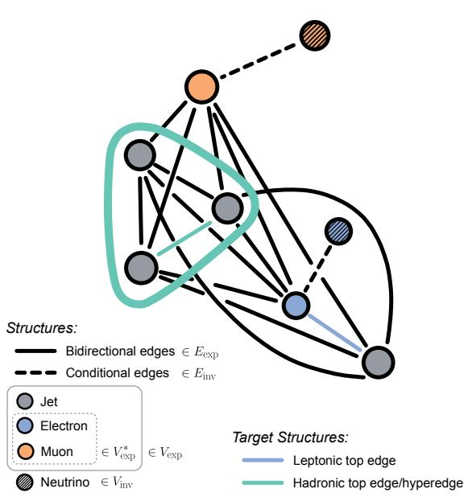
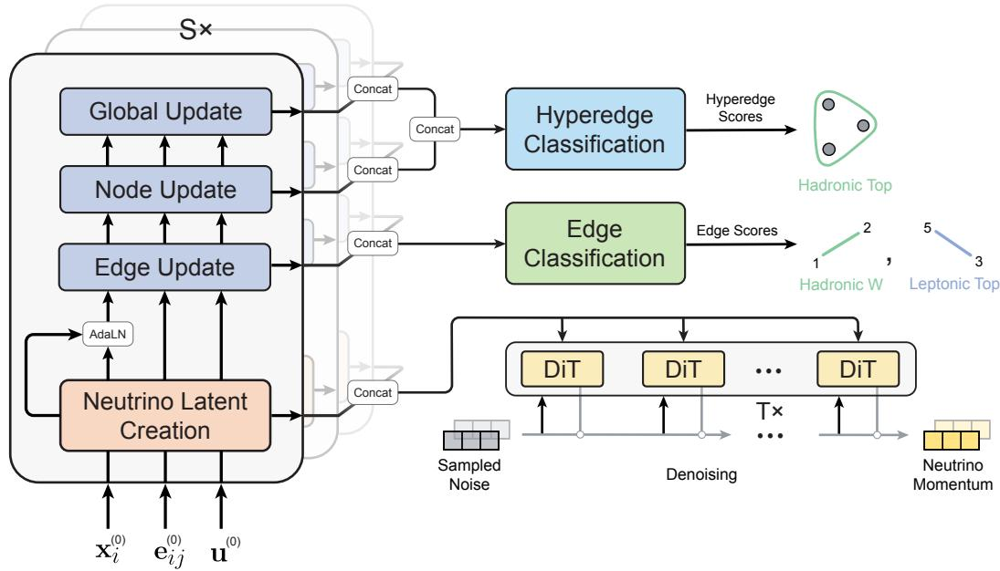
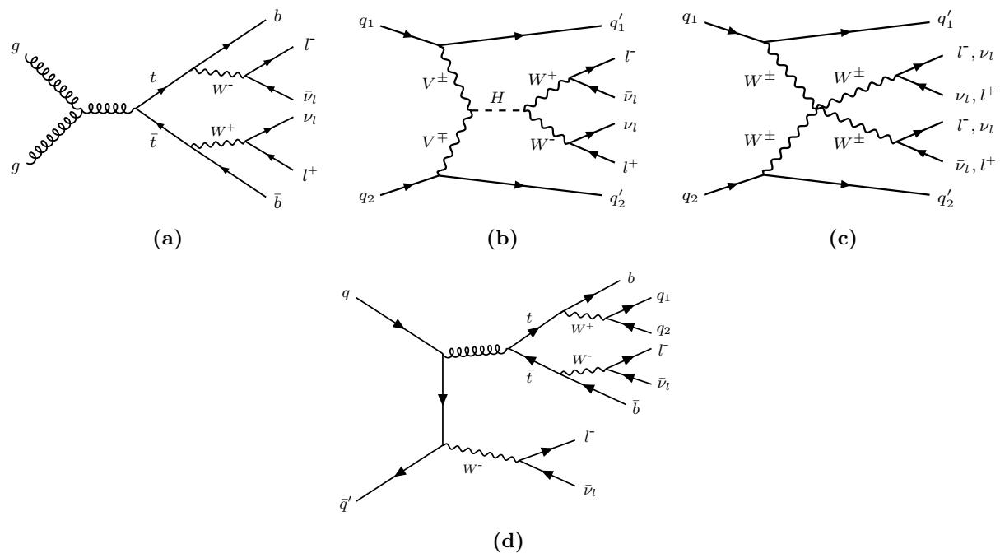
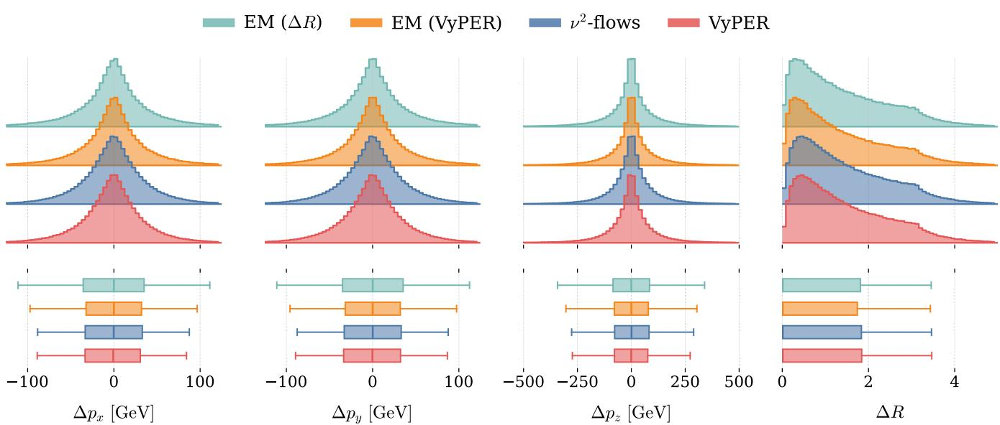
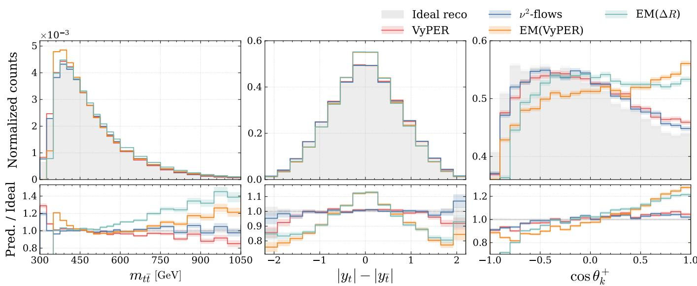
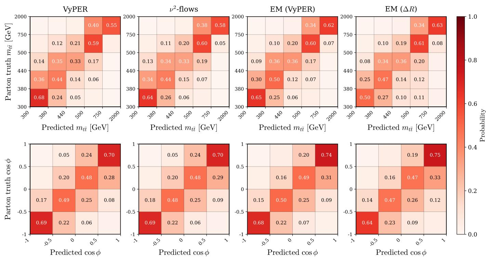
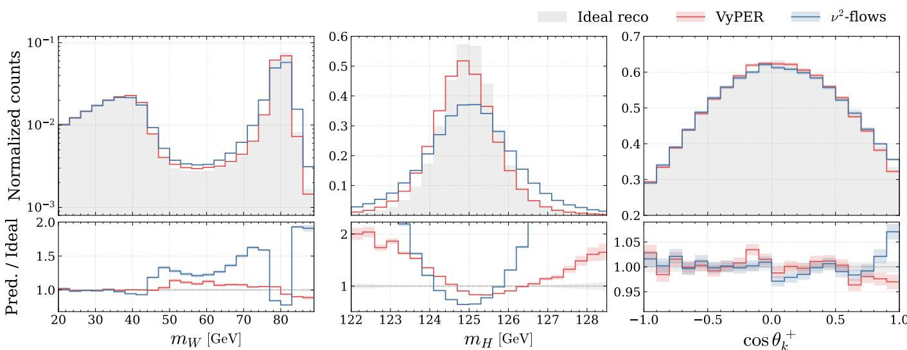
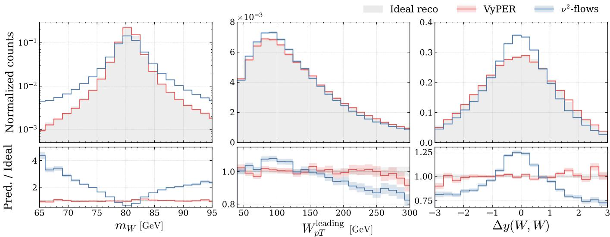
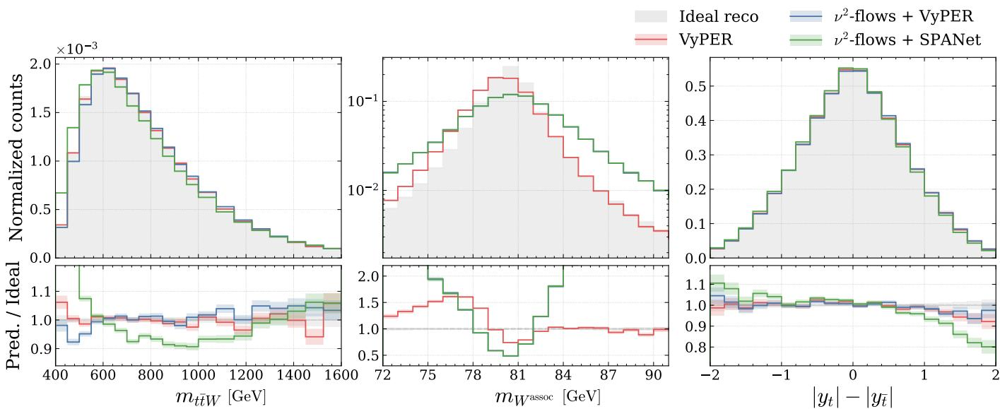

# Comprehensive reconstruction of collider events with hypergraph representation learning and graph-conditioned difusion

Lining Mao,1 Yvonne Peters,2 Ethan Simpson,2, ∗ and Zihan Zhang2, †

1School of Physics and Astronomy, Shanghai Jiao Tong University,

No.800 Dong Chuan Road, Shanghai 200240, PRC

2Department of Physics and Astronomy, University of Manchester,

Oxford Road, Manchester M13 9PL, UK

(Dated: September 17, 2026)

In particle collider experiments, event reconstruction is the task of inferring the kinematics of short-lived particles produced in the hard scatter from the stable final states recorded by detectors. We decompose event reconstruction into two primary tasks: assigning measured jets and charged leptons to parent particles, and predicting unmeasured neutrino kinematics. We present VyPER, a novel geometric learning framework that represents collider events as hypergraphs with a physics-inspired topology. VyPER combines the supervised classification of hyperedges for particle assignment with a difusion model for predicting neutrino kinematics, leveraging a joint loss function to optimize both reconstruction tasks within a unified framework. We showcase VyPER across several proton–proton collision processes, comparing its performance to existing analytical and machine-learning-based reconstruction techniques. In doing so, we demonstrate that accurate event reconstruction is achievable across a diverse range of Standard Model physics processes, opening new avenues for precision measurements in the Higgs boson, electroweak, and top-quark sectors.

## I. INTRODUCTION

Experiments at the Large Hadron Collider (LHC) at CERN [1] collide protons at high energies to measure properties of Standard Model (SM) particles and search for signs of physics beyond the SM. The kinematics of the heavy, short-lived particles produced in the initial high-energy interaction — the hard scatter — serve as a critical probe into underlying SM dynamics and a vital tool for uncovering subtle deviations from known physics. Observables constructed from the kinematics of these short-lived particles are used to probe the spins and polarizations of heavy fermions [2] and bosons [3]; such measurements provide insight into the CP properties of Higgs boson couplings [4], the mechanism of electroweak symmetry breaking [5], and the nature of quantum correlations between SM constituents [6, 7]. Unfolded diferential cross-sections of top quark kinematics provide direct comparison to fixed-order predictions of the SM [8, 9]. Such observables even enhance the separation of signal processes from complex backgrounds [10, 11], and may be beneficial to experimental calibration procedures [12].

Heavy states produced in the hard scatter of protonproton collisions decay almost instantly, preventing direct measurement of their properties. General purpose detectors [13, 14] instead record the signals left by their stable or long-lived decay products. These signals are reconstructed into calibrated final-state objects like jets and charged leptons for physics analysis. Measuring observables constructed from the kinematics of the parent particles can provide greater sensitivity and physical interpretability than measurements restricted to only the kinematics of the recorded final states. Thus, the utility and physics reach of parent particle observables motivate developing accurate “event reconstruction” techniques.

With the advent of powerful machine learning (ML) architectures, substantial performance gains have been realized in event reconstruction. Such models have generally focused on specific sub-tasks within event reconstruction, limiting their applicability to specific physics processes. The utility of event reconstruction across the gamut of SM measurements remains under-explored. In this paper, we showcase the potential of event reconstruction in top-quark, Higgs boson and electroweak physics processes, and present VyPER, a dedicated ML model designed to provide comprehensive event reconstruction in a variety of proton-proton scattering processes.

## II. PROBLEM SPECIFICATION AND STATE OF THE ART

The goal of event reconstruction is to estimate the fourmomenta of the parent particles whose decays led to the observed final state. Diferent approaches and challenges exist depending on the scattering process in question and the decay modes of the particles we wish to reconstruct. In this section, we discuss how event reconstruction can be broken down into two separate tasks: final-state assignment and neutrino prediction. We highlight current methods in the literature built to perform each task.

## A. Jet and charged lepton assignment

Jets and charged leptons produced in the decays of heavy, short-lived particles can be recorded with high eficiency over almost the entire fiducial phase space at general-purpose detectors like ATLAS [13] and CMS [14]. The assignment task associates these recorded decay products to their parent particle, partitioning the set of all measured final states into groups corresponding to the specific decay products of each parent1. Summing the four-momenta of the final states in each partition then defines the parent’s kinematics.

Traditionally solved through χ2–minimization techniques [15], machine learning approaches to the assignment problem have become a hot topic in high-energy physics studies and represent the state-of-the-art. The majority of ML-based event reconstruction models use supervised classification to assign jets and charged leptons to parent particles. This requires recorded final state objects to be uniquely labeled, typically through angular matching of the detector-level objects to the decay products of the parent particles within the simulation truth record. A variety of transformer [16–20], messagepassing graph-based [21, 22] and joint transformergraph [23, 24] architectures are available in the literature. Relevant to this study are the HyPER model [21] upon which the VyPER architecture is built, and the SPANet model [16–18] which has long served as the benchmark in assignment studies, and provides comparison to VyPER in Sections V and VII. A short review of the individual approaches each takes to event reconstruction is given in Appendix C.

Alternative unsupervised methods formulate a learning task that does not rely on simulation truth labels. Approaches include training autoencoders directly on experimental data [25], and reformulating assignment as a sequential Markov decision process solved via reinforcement learning using a transformer-based agent [26]. Such approaches are not considered in this paper.

## B. Neutrino reconstruction

Final states involving neutrinos pose a diferent challenge, as collider detectors [13, 14] are not designed to detect these weakly interacting particles. Through conservation of momentum in the transverse plane and judicious measurement of all detector activity, the missing transverse momentum $( E _ { T } ^ { \mathrm { m i s s } } \ \mathrm { o r } \ ^ { \cdots } \mathrm { M E T } ^ { \cdots } )$ ) quantity can be built. This serves as a proxy for unmeasured neutrino activity in the transverse plane in physics processes where no other unmeasurable final states are produced.

The second task in event reconstruction is to infer neutrino kinematics using the visible final states and missing transverse momentum. The task is formidable, since it represents an inverse problem which is frequently illposed: the measured final-state kinematics provide only incomplete constraints on the unobserved neutrino de grees of freedom, and the underlying distribution of neutrino kinematics can be highly non-Gaussian and multimodal.

Traditional solution methods introduce physical assumptions — such as assuming collinearity of the decay products or imposing known mass constraints on intermediate resonances — to construct a closed system of kinematic equations [27–31]. A major limitation of these approaches is that experimental smearing of jet kinematics often produces equations with unphysical, complexvalued solutions. Further, multiple real-valued solutions are inherently degenerate, requiring a specific choice of solution to be made. Such techniques are by definition topology-specific, applicable only in systems with suficient kinematic constraint, and fail to scale to processes with additional final-state neutrinos. This motivates the development of alternative methods that circumvent these shortcomings.

Generative ML techniques are increasingly used in particle physics for the prediction of continuous kinematic quantities [32–34], and have recently been applied to neutrino prediction. The ν-flows model [35] applied a conditional normalizing flow architecture [36, 37] in the tt¯ 1-lepton channel, where the normalizing flow is conditioned by a transformer encoder that takes measured event information as input. The ν2-flows model [38] extended this method to two neutrino solutions in the tt 2-lepton channel, showing that generative ML techniques can compete with the traditional reconstruction techniques while providing solutions for all events. More recently, difusion architectures tackle neutrino reconstruc tion in ττ¯ production, where they are shown to improve the resolution of the di-tau invariant mass spectrum compared to existing non-machine learning techniques [39].

## C. Towards full event reconstruction

Algorithms for event reconstruction have generally focused on only one of the above reconstruction tasks, or have been designed with specific collider processes in mind. Developments to the SPANet architecture introduced a regression head targeting the tt¯ 1-lepton topology [18]. The model was trained to predict a single neutrino’s longitudinal momentum and the invariant mass of the tt¯ system. This constituted a first step towards combined event reconstruction tasks, but by default only applicable to this specific process. By finetuning a network pre-trained with both supervised and self-supervised tasks on a diverse set of collider processes, the EveNet foundation model authors studied combined assignment and neutrino regression downstream tasks in dileptonic tt¯ production [40]. Alternative machine learning approaches have considered directly regressing the parent particle kinematics in tt¯ production without decomposing the problem into individual assignment and neutrino regression components [41, 42].

It is evident that the feasibility and physics reach of machine learning models capable of reconstructing shortlived particles in generic collider processes has not been fully explored. We present VyPER, the next evolution of the HyPER model, which builds upon the concept of event reconstruction using hypergraph representation learning, and is designed to be applicable to the recon struction of arbitrary physics processes.

## III. METHODS

VyPER is a graph-hypergraph network designed to solve both assignment and neutrino prediction tasks simultaneously. Collider events are represented as heterogeneous graphs with a specific physics-inspired topology: “invisible” neutrinos are included in the graph and connected only to particles with which they share a known common parent, as outlined in Section III A. The architectural backbone of VyPER is based on the messagepassing technique, discussed in Section III B. During this step, specially designed message-passing constructs learned latent representations of each neutrino. Assignment is performed through edge and hyperedge classification, as summarized in Section III C. In Section III D, we introduce the methodology for predicting neutrino kinematics: we sample random noise and map these points to physical neutrino solutions by first learning the conditional mapping between that noise and the true neutrino kinematics using the difusion paradigm. The conditioning of this difusion head relies on the neutrino latent representations constructed during the message-passing phase. We integrate these distinct tasks into a unified loss function, enabling simultaneous optimization of all learning objectives as discussed in Section III E.

## A. Graph representation of collider events

Graphs are mathematical structures composed of points and connections. VyPER represents any collider event as a directed graph: $G = ( V , E )$ where V is a set of nodes representing the final-state objects in the event, and E is a set of edges representing the directional connections between them. Nodes are partitioned into two subsets: experimentally detectable final states $V _ { \mathrm { e x p } }$ and invisible final states $V _ { \mathrm { i n v } } ,$ such that $V = V _ { \mathrm { e x p } } \cup \dot { V _ { \mathrm { i n v } } }$ . Edges between detectable final states are defined as $E _ { \mathrm { e x p } } = \{ ( i , j ) | i , j \in V _ { \mathrm { e x p } }$ and $i \neq j \} \subseteq E$ Visible final states form the subgraph $\dot { G } _ { \mathrm { e x p } } ( V _ { \mathrm { e x p } } , E _ { \mathrm { e x p } } )$

We define $V _ { \mathrm { e x p } } ^ { \ast } \subset V _ { \mathrm { e x p } }$ as the subset of visible final states that form a one-to-one correspondence with nodes in $V _ { \mathrm { i n v } } .$ , where each pair originates from a common parent particle. For example, a neutrino and a charged lepton originating from the decay of a W boson form such a pair. This correspondence is defined by a bijection $f :$ $V _ { \mathrm { e x p } } ^ { \ast } \xrightarrow [ ] { \mathrm { b i j e c t i o n } } V _ { \mathrm { i n v } }$ , such that their connecting edge set is

  
FIG. 1. VyPER graph representation of a $t \bar { t } W$ event, where the measured final state consists of four jets and two leptons of identical electric charge. These final states are represented as nodes and connected with edges to form a complete graph. The neutrinos are known to arise from leptonic W boson decays and so are connected to their leptonic partner via “conditional edges”. The VyPER method ultimately identifies the edges and hyperedges whose nodes correspond to the W boson and top quark decay products. The learned neutrino representations feed into a difusion head that predicts their kinematics.

defined as

$$
E _ { \mathrm { i n v } } = \{ ( i , f ( i ) ) | i \in V _ { \mathrm { e x p } } ^ { * } \} ,\tag{1}
$$

where $f ( i ) \in V _ { \mathrm { i n v } }$ as the result of the bijection $f .$ Elements of $E _ { \mathrm { i n v } }$ are termed conditional edges due to their specific role during message-passing. In the absence of neutrinos in the final state, where $V _ { \mathrm { i n v } } ~ = ~ \emptyset$ and $E _ { \mathrm { i n v } } = \emptyset$ , the VyPER event representation is identical to that of HyPER [21]: $G \equiv G _ { \mathrm { e x p } }$

Following the procedure outlined in [21], the graph G is extended to a hypergraph $H ( V , X )$ in cases where higherorder structures are necessary: hyperedges X represent resonant particles decaying into three or more final-state objects, enabling the capture of higher-order correlations among them. For example, the hadronic decays of a top quark $( t  b q \bar { q } ^ { \prime } )$ can be represented as an $\mathcal { O } ( 3 )$ hyperedge. In this case, the set of all possible hyperedges is defined as:

$$
X = \{ \{ i , j , k \} \mid i , j , k \in V _ { \mathrm { e x p } } , \ i \neq j , \ j \neq k , \ i \neq k \} .\tag{2}
$$

  
FIG. 2. The $\mathrm { V y P E R }$ network architecture. The backbone is a multi-layer message-passing framework that explores and updates the graph latent sapce by exchanging information between neighboring graph objects. Each message-passing layer leverages relational information encoded in the graph structure to construct neutrino latent representations and update edge, node and global feature vectors. The updated node, edge and global states from each layer are extracted and aggregated to perform edge classification, hyperedge classification, identifying the origins of each final-state object, while the constructed neutrino representations are used to condition the reverse difusion process, which ultimately predicts neutrino momentum.

## B. Message-passing framework

Building on advances in geometric deep learning, message-passing neural networks (MPNNs) have established themselves as one of the most efective approaches for learning graph representations [43–46]. VyPER utilizes the message-passing framework introduced in Hy-PER [21], which iteratively aggregates and propagates information through the underlying graph structure to capture the kinematic relations between final states. In Hy-PER, a standard MPNN layer consisted of three sequential operations that updated the edge, node, and global attributes, respectively [21, 44]. Extending this approach to accommodate neutrinos, VyPER leverages its graph representation (Section III A) to introduce an additional message-passing operation that constructs a latent representation $\tilde { \mathbf { x } } _ { k }$ for each neutrino $k \in V _ { \mathrm { i n v } }$ . These latents are critical to the reverse difusion process, as they condition the reconstruction of neutrino momenta (Section III D).

During each message-passing layer s, VyPER computes a latent representation $\tilde { \mathbf { x } } _ { k }$ for each neutrino $k \in$ $V _ { \mathrm { i n v } } .$ , by first aggregating information at its companion node, and then updating its representation based on aggregating information from the other neutrino latents:

$$
\begin{array} { r } { \tilde { \mathbf { x } } _ { i = f ^ { - 1 } \left( k \right) } ^ { \left( s \right) } ~ = ~ h _ { 1 , \theta } ^ { \left( s \right) } \left( \mathbf { x } _ { i } ^ { \left( s \right) } , \mathbf { a } _ { i } ^ { \left( s \right) } , \mathbf { u } ^ { \left( s \right) } \right) , } \end{array}\tag{3}
$$

$$
\tilde { \mathbf { x } } _ { i = f ^ { - 1 } \left( k \right) } ^ { \left( s \right) } \gets h _ { 2 , \theta } ^ { \left( s \right) } \left( \tilde { \mathbf { x } } _ { i } ^ { \left( s \right) } , \mathbf { g } ^ { \left( s \right) } \right) \mathrm { w h e r e } i \in V _ { \mathrm { e x p } } ^ { * } \ ,\tag{4}
$$

where $\mathbf { x } _ { i } ^ { ( s ) }$ contains the node features of the i-th node, and $\mathbf { u } ^ { ( s ) }$ is a vector of global features. The input event features used are defined in Appendix A 1. Learnable functions $h _ { \cdot , \theta } ^ { ( s ) }$ are implemented as Multilayer Perceptrons (MLPs), and terms in parenthesis are concatenated. The variable ${ \bf a } _ { i }$ is calculated by summarizing attributes of local graph structures, including each adjacent node, $j \in V _ { \mathrm { e x p } } ,$ , and directed edge $( i , j ) \in E _ { \exp }$ (denoted $j  i )$

$$
\mathbf { a } _ { i } ^ { ( s ) } = \bigoplus _ { \forall j : j  i } h _ { 3 , \theta } ^ { ( s ) } ( \mathbf { x } _ { i } ^ { ( s ) } , \mathbf { x } _ { j } ^ { ( s ) } , \mathbf { e } _ { j  i } ^ { ( s ) } ) ,\tag{5}
$$

where operator $\oplus$ denotes summation, and $\mathbf { e } _ { j  i } ^ { ( s ) }$ is an edge embedding whose inputs at $s = 0$ are also given in Appendix A 1. The term $\mathbf { g } ^ { ( s ) }$ is derived from the sum of all initialized neutrino latents, so as to capture the relations between them:

$$
\mathbf { g } ^ { ( s ) } = h _ { 4 , \theta } ^ { ( s ) } \left[ \bigoplus _ { \forall i } ( \widetilde { \mathbf { x } } _ { i } ^ { ( s ) } , \mathbf { u } ^ { ( s ) } ) \right] .\tag{6}
$$

To enable robust integration between the generative neutrino prediction task and the graph-based tasks of edge and hyperedge classification, the created neutrino latent vectors are propagated back to their companion nodes as messages:

$$
\begin{array} { r l } { \mathbf { x } _ { i } ^ { ( s ) } \gets } & { { } \left[ 1 + h _ { 5 , \theta } ^ { ( s ) } ( \mathbf { x } _ { i } ^ { ( s ) } ) \right] \odot \mathbf { x } _ { i } ^ { ( s ) } } \\ { + } & { { } \left[ 1 + h _ { 6 , \theta } ^ { ( s ) } ( \mathbf { x } _ { i } ^ { ( s ) } ) \right] \odot \tilde { \mathbf { x } } _ { i } ^ { ( s ) } + h _ { 7 , \theta } ^ { ( s ) } ( \mathbf { x } _ { i } ^ { ( s ) } ) , } \end{array}\tag{7}
$$

where $\odot$ denotes element-wise product. This technique is inspired by Adaptive Layer Normalization (AdaLN) modulation [47], and we refer to this mechanism as conditional message-passing. The learned neutrino latents condition the difusion head described in Section III D.

After creating the neutrino latents and propagating them to the rest of the graph, the network proceeds with the remaining message-passing steps, updating the edge, node, and global features using the procedure outlined in [21]. These message-passing operations are only applied on the sub-graph $G _ { \mathrm { e x p } }$ The entire procedure conditional message-passing for neutrino latent construction and traditional message-passing to contextualize the visible graph elements — is repeated S times, where $S$ is a tunable hyperparameter.

## C. Edge and hyperedge classification

VyPER performs edge and hyperedge classification to identify the specific set of nodes that constitute the decay products of a given parent particle. Edge classification uses learned edge representations to pinpoint specific final-state pairs stemming from two-body decays. Latent edge representations $\mathbf { e } _ { i j } ^ { ( s ) }$ from each message-passing layer s are concatenated across all S message-passing steps and passed through an MLP. A softmax is then applied to give a predicted soft probability ${ \bf e } _ { i j } ^ { \prime } \in [ 0 , 1 ] ^ { C _ { \epsilon } }$ across $C _ { e }$ target classes, for each edge $( i , j ) \in E _ { \exp } \colon$

$$
\mathbf { e } _ { i j } ^ { \prime } = \mathrm { S o f t m a x } \left[ \mathrm { M L P } \left( \underset { s = 1 } { \overset { S } { \parallel } } \mathbf { e } _ { i j } ^ { ( s ) } \right) \right] ,\tag{8}
$$

where represents concatenation. Each class corresponds to a specific intermediate particle, and the model is trained to predict the correct class for each edge through cross-entropy loss. The highest scoring edge within that class is selected as its reconstruction candidate.

Classifying edges is applicable only to two-body decays. Hyperedge classification generalizes the approach to reconstruct parent particles with three or more decay products. To efectively capture the multipartite correlations between final states, well-formed hyperedge latent representations are essential. Given the set of possible hyperedges defined in Eq. 2, the embedding ${ \bf v } _ { m }$ for hyperedge $m \in [ 1 , \cdots , | X | ]$ is constructed by aggregating the node and global embeddings accumulated across all message-passing iterations:

$$
\mathbf { v } _ { m } = \bigoplus _ { l \in \varepsilon _ { m } } \left( \mathrm { M L P } ( \biguplus _ { s = 1 } ^ { S } \mathbf { x } _ { l } ^ { ( s ) } , \biguplus _ { s = 1 } ^ { S } \mathbf { u } ^ { ( s ) } ) \right) , \forall \varepsilon _ { m } \in X ,\tag{9}
$$

where $\varepsilon _ { m }$ represents the m-th hyperedge in X and $\oplus _ { l \in \varepsilon _ { m } }$ denotes summation across all nodes in the hyperedge m. We then compute a soft probability for each hyperedge over all classes:

$$
\mathbf { v } _ { m } ^ { \prime } = \operatorname { S o f t m a x } \left[ \operatorname { M L P } ( \mathbf { A } _ { m } \odot \operatorname { R e L U } ( \mathbf { v } _ { \mathrm { m } } \mathbf { W } _ { \theta } ^ { \mathrm { T } } ) , \mathbf { v } _ { \mathrm { m } } ) \right]\tag{10}
$$

where $\mathbf { v } _ { m } \in [ 0 , 1 ] ^ { C _ { X } }$ is the predicted soft probability vector for hyperedge $\varepsilon _ { m } \in X$ over $C _ { X }$ classes, and $\dot { \mathbf { W } } _ { \theta } ^ { \mathrm { T } }$ is a matrix of trainable weights. The soft-attention coeficient vector $\mathbf { A } _ { m }$ is computed via a per-feature softmax evaluated across all |X| hyperedges:

$$
\mathbf { A } _ { m } = \exp \left( \mathbf { v } _ { m } \right) { \boldsymbol { \mathcal { O } } } \left( \bigoplus _ { n = 1 } ^ { | X | } \exp \left( \mathbf { v } _ { n } \right) \right) ,\tag{11}
$$

where $\oslash$ denotes element-wise division. Each element in $\mathbf { A } _ { m }$ lies in [0, 1] and represents a feature-wise importance score computed relative to all |X| hyperedges. Across all distinct classes, the hyperedge with the highest score within each class is selected as a candidate, analogous to the process of edge selection.

## D. Neutrino prediction through difusion

Generative ML architectures ofer an attractive approach to predicting neutrino kinematics, as unlike models trained to regress a single kinematic solution, they can approximate the full conditional posterior distribution of neutrino kinematics for a given measured final state. Framing neutrino prediction as generative modeling allows the network to learn a probability density over the neutrino kinematics conditioned on the measured event information, which can then be sampled to produce candidate neutrinos.

Difusion-based approaches [48–50] are known to excel at modeling complex, multi-modal distributions while by passing the architectural restrictions of other generative models to ensure stable training and high-fidelity predictions [51, 52]. Difusion models are defined by two complementary processes: the forward process progressively degrades the truth-level target (the true neutrino kinematics) towards random noise, and the reverse process employs a neural network that learns how to reverse the forward corruption. At inference, this learned reverse process is then applied to sampled noise to generate can didate neutrino predictions. VyPER adopts the Denoising Difusion Implicit Model (DDIM) approach [50], an implementation of difusion well-known for its eficiency during inference.

Let $q ( \mathbf { z } _ { 0 } )$ denote the underlying true distribution of standardized neutrino kinematics. Given a neutrino ${ \bf z } _ { 0 } \sim { \boldsymbol q } ( { \bf z } _ { 0 } )$ , the DDIM approach defines a non-Markovian forward process that corrupts $\mathbf { z } _ { 0 }$ to noise over T steps. Instead of simulating this corruption sequentially during training, the noised neutrino latent $\mathbf { z } _ { t }$ at arbitrary snapshot timestep t can be evaluated directly in closed form using the relation

$$
\mathbf { z } _ { t } = \sqrt { \bar { \alpha } _ { t } } \mathbf { z } _ { 0 } + \sqrt { 1 - \bar { \alpha } _ { t } } \epsilon _ { t } ,\tag{12}
$$

where $\epsilon _ { t }$ is a sampled noise vector. The hyperparameter $\begin{array} { r } { \bar { \alpha } _ { t } = \prod _ { n = 1 } ^ { t } \alpha _ { n } } \end{array}$ controls the noise schedule; it is bounded in $( 0 , 1 ]$ and monotonically decreases as t increases. In this work, the trajectory of $\bar { \alpha } _ { t }$ is parameterized following a cosine schedule [53].

The reverse process inverts the forward corruption defined in Eq. 12 by establishing a deterministic mapping from $\mathbf { z } _ { t }$ to $\mathbf { z } _ { t - 1 } :$

$$
\begin{array} { r } { \mathbf { z } _ { t - 1 } \ = \ \sqrt { \bar { \alpha } _ { t - 1 } } \left( \frac { \mathbf { z } _ { t } - \sqrt { 1 - \bar { \alpha } _ { t } } \epsilon _ { \theta } \left( \mathbf { z } _ { t } \right) } { \sqrt { \bar { \alpha } _ { t } } } \right) } \\ { + \sqrt { 1 - \bar { \alpha } _ { t - 1 } } \ \epsilon _ { \theta } ( \mathbf { z } _ { t } ) . } \end{array}\tag{13}
$$

where $\epsilon _ { \theta } ( \mathbf { z } _ { t } )$ is an estimation of the noise added in the forward process. We employ the difusion transformer architecture [54], now standard in the generative ML literature, to predict the noise added for a given the neutrino latent at time t:

$$
\epsilon _ { \theta } ( { \bf z } _ { t } ) : = \mathrm { D i T } ( { \bf z _ { t } } , \tilde { \bf x } ^ { \prime } ) ,\tag{14}
$$

where $\tilde { \mathbf { x } } ^ { \prime }$ is a context vector encoding the measured event information. Each neutrino has a unique context vector constructed from its latent representations built during the message-passing process (Eq. 3 and Eq. 4):

$$
\tilde { \mathbf { x } } _ { k } ^ { \prime } = \mathrm { M L P } [ ( \begin{array} { l } { S } \\  \| \begin{array} { l } { \tilde { \mathbf { x } } _ { k } ^ { ( s ) } } \\ { s = 1 } \end{array} ) , \mathbf { T } _ { \theta } ( t ) ] , \end{array}\tag{15}
$$

where $\tilde { \mathbf { x } } _ { k } ^ { ( s ) }$ represents its latent features at each messagepassing step s, and ${ \bf T } _ { \theta } ( t )$ is a timestep embedding of matching dimensionality. The DiT architecture extends the standard transformer with AdaLN modulation [47], using the context vector to directly modulate the network’s internal representations at every layer rather than simply concatenating the context as an additional input. The network is trained by minimizing the mean-squared error between the predicted and ground-truth noise:

$$
\mathcal { L } _ { \mathrm { d i f f u s i o n } } = \| \epsilon _ { \boldsymbol { \theta } } ( \mathbf { z } _ { t } ) - \epsilon _ { t } \| ^ { 2 } .\tag{16}
$$

Upon convergence, the learned distribution $p _ { \theta } ( \mathbf { z } _ { 0 } )$ should approximate the true neutrino momentum distribution $q ( \mathbf { z } _ { 0 } )$ . At inference, the trained VyPER model starts from pure noise and uses the learned DDIM trajectories to denoise a sampled point into a realistic neutrino candidate, given the context defined by the input event features.

## E. Learning objectives

All learning tasks are unified into a single loss function, given for each individual graph by

$$
\mathcal { L } = \eta \bar { \mathcal { L } } _ { \mathrm { d f t u s i o n } } + ( 1 - \eta ) [ \alpha \bar { \mathcal { L } } _ { \mathrm { X } } + ( 1 - \alpha ) \bar { \mathcal { L } } _ { \mathrm { E } } ] ,\tag{17}
$$

where $\mathcal { L } _ { \mathrm { d i f f u s i o n } }$ is the difusion loss formulated in $\operatorname { E q . }$ 16; $\mathcal { L } _ { \mathrm { X } }$ and $\mathcal { L } _ { \mathrm { E } }$ correspond to the hyperedge and edge classification losses, respectively, computed using cross-entropy. The bar notation, L¯, denotes averaging over the corresponding elements (neutrinos, edges or hyperedges) in each graph. The two hyperparameters $\eta , \alpha \in [ 0 , 1 ]$ are loss scales for the difusion and hyperedge components, respectively.

Training is performed with the Adam optimizer [55]. A list of hyperparameter configurations used in the following experiments is detailed in the Appendix A 2.

## IV. EXPERIMENTAL SETUP AND EVALUATION

## A. Physics processes

We investigate the fundamental feasibility of event reconstruction across a series of Standard Model physics processes. Our goal is to demonstrate that highly accurate event reconstruction is possible across diverse physics processes and final states, including those in which full reconstruction has never before been applied in the literature. We position the VyPER model as a unified framework that can accomplish this task.

We consider four distinct physics processes. First, the production of top-antitop quark pairs decaying into the dileptonic final state, tt¯(2L), allows us to benchmark machine learning models against established analytical re construction algorithms. Second, the production of W boson pairs in the electroweak sector — via either the decay of a Higgs boson produced through vector-boson fusion $( H \to \mathbf { \bar {  { W } } } W ^ { * } )$ or vector-boson scattering (VBS WW) — demonstrates how machine learning achieves full event reconstruction in under-constrained channels. Finally, the rare and complex production of a W boson in association with a top-antitop quark pair (ttW¯ ) combines multiple combinatoric assignment tasks with neutrino prediction, ofering a highly compelling challenge for modern event reconstruction methods. Feynman diagrams for all four processes are shown in Figure 3. These channels are chosen because they prioritize diferent aspects of the reconstruction problem and span a wide range of kinematic constraints, from the tt¯ system with all resonances on their mass shells, to the highly under-constrained VBS WW topology. Successfully reconstructing under-constrained topologies will demonstrate the capacity of ML models to learn implicit physics constraints and resolve under-determined systems that are algebraically intractable.

We perform all studies using simulated data, where the generator-level truth record allows us to directly evaluate reconstruction performance through computing the eficiency of jet and charged lepton assignments, and by evaluating the similarity of predicted kinematic spectra to their true counterparts.

TABLE I. Overview of the four processes studied, detailing the channel and basic event selections, and the number of events used for training, testing and validation of all MLbased models.“2LOS” indicates the requirement of two leptons of opposite electric charge in the final state; “2LSS” indicates that both leptons have the same electric charge.
<table><tr><td>Process</td><td> $N _ { \mathrm { j e t } }$ </td><td> $N _ { b - \mathrm { j e t } }$ </td><td>Channel</td><td>Split</td><td> $N _ { \mathrm { e v e n t s } }$ </td></tr><tr><td>tt 2L</td><td>≥2</td><td>≥2</td><td>2LOS</td><td>Train Val. Test</td><td>4,692,288 260,190 261,557</td></tr><tr><td> $H {  } W W ^ { * }$ </td><td>≥2</td><td>≥0</td><td>2LOS</td><td>Train Val. Test</td><td>4,765,195 266,844 266,919</td></tr><tr><td>VBS WW</td><td>≥2</td><td>≥0</td><td>2LSS</td><td>Train Val. Test</td><td>4,145,532 107,179 106,491</td></tr><tr><td>ttW 2L</td><td>≥4</td><td>≥0</td><td>2LSS</td><td>Train Val. Test</td><td>4,907,261 272,740 272,235</td></tr></table>

## B. Simulation and event selection

All physics processes are simulated at a center-of-mass energy of $\sqrt { s } = 1 3 ~ \mathrm { T e V }$ . The hard-scattering matrix elements are evaluated at next-to-leading-order (NLO) accuracy in quantum chromodynamics (QCD) and leadingorder (LO) accuracy in the electroweak (EW) coupling using the MadGraph5 aMC@NLO framework (v3.5.7- LTS) [56]. The NLO five-flavour scheme parton distribution function (PDF) set of NNPDF3.0nlo [57] is used. Decays of the top quark, W boson and Higgs boson are modeled using MadSpin [58]. Events are matched to Pythia8 (v8.313) [59] to simulate parton shower, hadronization, and multi-parton interactions. Detector response is simulated using Delphes (v3.5.0) [60], configured to be similar to that of the ATLAS detector.

Jets are reconstructed using the anti-kt algorithm [61] with a radius parameter of $R = 0 . 4 .$ , as implemented in FastJet (v3.4.0) [62]. Jets are required to have a minimum p of 25 GeV, and a minimum of 10 GeV is required for electrons and muons. Jets and electrons must satisfy $| \eta | \leq 2 . 5$ , and $| \eta | \leq 2 . 7$ is required for muons. The identification of jets originating from a B-hadron (b-tagging) is performed by Delphes with a pT-dependent tagging eficiency based on [63].

All machine learning techniques tested employ supervised learning tasks that rely on truth information for model training and evaluation of reconstruction performance. The momenta of the parton-level truth objects, such as top quarks, Higgs bosons, W bosons, and their decays, are extracted directly from the Pythia8 simulation record after QCD radiation. Particle assignment labels are established by matching reconstructed detector objects to generator-level partons — the immediate products of parent parton decays — based on the angular distance metric $\Delta R = \sqrt { ( \Delta \phi ) ^ { 2 } + ( \Delta \eta ) ^ { 2 } }$ . A jet is considered to have originated from a particular parton if the angular distance between them satisfies $\Delta R < 0 . 4 .$ Lepton matching is performed with a $\Delta R$ threshold of 0.1. In cases where the detector-level lepton multiplicity exceeds that at truth level, the leading detector-level lep tons are selected according to the truth-level multiplicity before matching.

Table I lists the set of basic selections applied to each dataset to isolate the desired final state. We focus on final states with two leptons, as these decay channels provide multiple neutrinos that present a testbed for neu trino momentum prediction. Dileptonic final states can be characterized by the electric charge of the leptons. Both tt¯ and $H \to W W ^ { * }$ processes produce parent particles with opposite electric charge, giving a final state that has two oppositely charged leptons (2LOS). We study VBS WW production and ttW¯ production in the channel with two leptons of identical electric charge: the twolepton same-sign (2LSS) channel.

## C. Training and evaluation

The simulated datasets are split into independent training, validation, and testing sets, with the first two used for model training and in-training validation, respectively. Performance evaluation is conducted on the testing datasets; for processes where traditional, non-ML methods are available, they are likewise evaluated only on this common testing set. The number of events dedicated to training, validation and testing are quoted in Table I. Separate models are trained independently for each process2. All datasets have been made publicly available [64] as outlined in Appendix F.

## D. Performance metrics

The performance of an event reconstruction algorithm is inherently tied to the specific requirements of a given physics measurement. In an attempt to remain agnostic to any single downstream analysis, we evaluate our algorithms using a generic suite of performance markers.

  
FIG. 3. Representative diagrams at leading order in both QCD and electroweak couplings for the two-lepton final states of (a) tt¯, (b) VBF $H  W W ^ { * }$ , (c) same-sign VBS WW, and (d) same-sign dileptonic ttW¯ .

a. Assignment eficiency: To quantify the performance of the assignment algorithms, we define assignment eficiency as the fraction of correctly reconstructed parent particles relative to the total number of target parents. A hadronic top quark is deemed correctly reconstructed if and only if both the b-jet and the W boson are also correctly assigned (with the permutation of the two jets in the W boson irrelevant in the HyPER assignment paradigm).

b. Neutrino residuals: To quantify the performance of the neutrino prediction methods, we evaluate eventby-event diferences between the true neutrino kinematics and the predictions of each algorithm. Specifically, we present the mean $\Delta R$ separation between the true and predicted vectors, alongside the root mean square error (RMSE) of the Cartesian momentum components. We also compute the residuals for each momentum component $( \mathrm { e . g . } , p _ { x } ^ { \mathrm { T r u t h } } - p _ { x } ^ { \mathrm { P r e d } } )$ and extract the “efective interquantile resolution” (Res.) between the 15.87-th and 84.13-th percentiles. These specific quantiles are chosen because they bound the central 68.27% of the data, mapping directly to the standard ±1σ intervals of a normal distribution to yield a 2σ total width for the reported resolution. All four final states contain two neutrinos; consequently, the distributions are produced on a perneutrino basis rather than per-event. For all evaluated metrics, smaller values indicate closer proximity to the truth and so superior reconstruction performance.

c. Parent particle distributions: Distributions constructed from reconstructed parent particle kinematics. We compare to “idealized reconstruction” distributions which are detector-level quantities built using detectorlevel object kinematics with true assignments and the true neutrino kinematics. The idealized reconstruction distributions represent the limiting case of perfect event reconstruction, and showcase each method’s ability to recover the shape of a particular observable.

d. High-level observable comparison to truth: An event-by-event comparison between the prediction from each algorithm for a specific reconstructed observable, and a predefined truth definition of the observable as recorded in the simulation record. This can be rendered in one-dimension as a plot of the residuals, analogously to the neutrino kinematic residuals, or in two dimensions as a binned migration matrix which demonstrates the corre lation and migration of events between detector-level and truth-level. We again employ the efective interquantile resolution (Res.) between the 15.87-th and 84.13-th percentiles as a summary metric in the former case. We use the Trace to summarize the latter case: the proportion of normalized event counts falling along the leading diagonal of the matrix. This represents simply the proportion of events reconstructed in the correct bin, with a higher value indicating a more diagonal migration matrix. Per convention, migration matrices are normalized row-by-row, and as such the trace is normalized to unity by dividing by the number of rows.

In the event-by-event comparison of high-level observables, the definition of “truth” varies. In the tt¯ and ttW¯ studies, we compare to a partonic truth definition: the top-quark or W boson kinematics as recorded in simulation immediately prior to their decay, preceding the application of parton showering, hadronization, and subsequent detector response modeling. We choose this because measurements in the top-quark sector frequently unfold to an inclusive partonic definition for comparison to fixed-order perturbative QCD predictions. In the electroweak studies, we use the idealized reconstruction definition as a proxy for a stable, “particle-level” fiducial phase-space. This is valid as the observables in question are built exclusively from charged leptons and neutrinos, and as such do not sufer from large smearing efects arising from the detector response to jets.

Bold typeface in tabulated results denotes the best performance for each metric, with columns corresponding to individual observables. Neutrino residual distributions and migration matrices are plotted exclusively for the tt¯(2L) process, along with their corresponding tabulated summary metrics. For the remaining processes, only the tabulated summaries are provided. Uncertainties are computed for RMSEs, traces and efective resolutions by bootstrapping 100 times and taking the standard deviation of the results. The computed uncertainties are found to be uniformly smaller than the diferences between reconstruction techniques, thus quoted variations in performance between methods are statistically significant. To maintain readability, individual uncertainties are omitted from tables, and the maximum observed uncertainty is quoted in each table caption.

## V. EVENT RECONSTRUCTION IN DILEPTONIC tt¯

With its characteristic short lifetime and chiral decay mediated by the W boson, the top quark exhibits a rich phenomenology that may be studied with high precision in tt¯ production at the LHC. Measurements of diferential cross-sections, unfolded into the full partonic phasespace, provide invaluable comparisons for fixed-order calculations of tt¯ production and for developments in event generation [9, 65]. The spin polarizations of the individual quarks and the correlations between them are probed through precise measurement of angular observables in tt¯ production [2, 66], and ofer insight into the presence of quantum entanglement and bound-state efects near the production threshold [67, 68]. Kinematic quantities pertaining to the top quarks and the overall tt¯ system set constraints on various supersymmetric (SUSY) scenarios [69], extended Higgs models [70] and Standard Model efective field theory (SMEFT) operators [71]. All scenarios require accurate reconstruction of the top quarks kinematics, demonstrating why top quark reconstruction has been an active area of research since the Tevatron [31].

## A. Analytical ellipse method

By imposing constraints on the known masses of the top quark and W boson, the system of kinematic equations relating the tt¯ system to its final-state decay products can be closed and solved analytically. Several non ML-based techniques have been developed specifically for reconstructing neutrinos in dileptonic tt¯ [29–31]. We focus on the Ellipse Method (EM) [72], which has been utilized in several recent ATLAS and CMS tt¯ measurements [67, 68, 73, 74], and frames the system of equations geometrically. For each top or antitop quark decay chain, the W-boson mass constraint confines the unobserved neutrino momentum to a two-dimensional ellipse within the transverse momentum plane. The intersections of the two ellipses — representing the separate top and antitop decay branches — yield the physically permissible momentum solutions for the neutrino system.

Our implementation3 of the EM extends the framework provided in [72] by incorporating a stochastic sampling of the top-quark and W-boson mass distributions. Performing multiple mass samplings per event allows the algorithm to make multiple attempts to find analytical solutions, thereby enhancing the reconstruction efficiency. In events where multiple valid solutions are found, the configuration yielding the lowest invariant mass of the tt¯ system $( m _ { t \bar { t } } )$ is selected. The topquark mass is sampled from a Gaussian distribution N(172.50 GeV, 1.48 GeV), while the W-boson mass is drawn from N (80.38 GeV, 2.085 GeV).

Alternative analytical solution procedures utilized in past measurements include the Sonnenschein [29] and NW methods [31], which are described in Appendix D. The Sonnenschein method has been reported to perform worse than the EM [75] and was excluded from all stud ies, as was the case in the $\nu ^ { 2 } .$ -flows publication [38]. A custom implementation4 of the NW method was evaluated on our test dataset but dropped from final comparison plots due to its inferior reconstruction performance relative to the EM.

## B. Assignment performance

The assignment task in dileptonic tt¯ is simple: associate a unique b-jet to each charged lepton to define the visible decay products of both parent quarks. We study how SPANet and VyPER perform in this task. The specific procedure for VyPER is given in Appendix A 3. Table II shows this comparison. The per-top assignment eficiency $\varepsilon ( t _ { \mathrm { l e p } } )$ is the ratio of correctly assigned b-jet– lepton pairs to the total number of top quarks, and the event assignment eficiency ε(tt¯) is the ratio of events in which both pairings are correct to the total number of events. The SPANet training setup is discussed in Appendix B. The assignment performance is comparable between both networks.

  
FIG. 4. Binned distributions between the truth neutrino and predicted neutrino Cartesian momentum $( p _ { x } , p _ { y } , p _ { z } ) _ { : }$ as well as their angular separation $\Delta R ,$ are shown in the upper plot. The lower box plots define the spread around the median (central line) for $p _ { x } , p _ { y } ,$ , and $p _ { z }$ using the ±1σ and ±2σ quantiles (corresponding to the 15.87th–84.13th and 2.28th–97.72th percentiles, respectively). The strictly positive $\Delta R$ distribution is summarized using a one-sided box plot, with intervals corresponding to 68.3% and 95.4% containment to represent 1σ and 2σ coverage.

TABLE II. The assignment eficiencies, $\varepsilon = N _ { \mathrm { c o r r e c t } } / N _ { \mathrm { t o t a l } } .$ for the individual leptonic top quark, $t _ { \mathrm { l e p } } ,$ , and the correct pair, $t \bar { t } ,$ for VyPER and SPANet. The absolute uncertainty on $\dot { \varepsilon } _ { t _ { \mathrm { l e p } } } ^ { \mathrm { ~ \phantom { ~ } ~ } ( \% ) }$ is 0.05% and 0.07% for ${ \varepsilon _ { t \bar { t } } } ^ { ( \% ) }$ , for both methods.
<table><tr><td>Model</td><td> $\mathcal { E } _ { t _ { \mathrm { l e p } } } ^ { { \mathrm { ~ ~ } } ( \% ) }$ </td><td> $\overline { { { \varepsilon _ { t \bar { t } } } \left( ^ { 9 } \varepsilon \right) } }$ </td></tr><tr><td>VyPER</td><td>85.0</td><td>83.8</td></tr><tr><td>SPANet</td><td>84.7</td><td>83.4</td></tr></table>

## C. Neutrino reconstruction

The VyPER, $\nu ^ { 2 } .$ -flows and EM approaches are used to predict the neutrino kinematics. While the machine learning (ML) methods utilize all measured event kinematics as inputs, the EM relies on predetermined b-jet and lepton assignments. To evaluate its performance, the EM is tested in two configurations. The first utilizes assignments directly provided by the VyPER assignment head, and is referred to as “EM(VyPER)”. The second employs a legacy geometric approach mimicking historic ATLAS and CMS implementations without ML inputs; this configuration selects the two highest- $- p _ { T }$ b-tagged jets in the event and uses $\Delta R$ matching to assign the b-jet closer to the positively charged lepton to the top quark decay. It is referred to as $\mathrm { \ddot { \hbar } E M } ( \Delta R ) ^ { \prime }$ . The $\nu ^ { 2 } .$ -flows implementation and hyperparameters are discussed in $\mathrm { A p - }$ pendix B.

A major limitation of the analytical EM method is its inability to yield physically valid solutions for a nonnegligible fraction of events. Table III presents the reconstruction eficiency of the EM solver when the b-jet– lepton pairings are determined via legacy $\Delta R$ geometric matching versus the machine-learning-driven VyPER assignment head. A significant recovery in eficiency is achieved when utilizing the VyPER assignment, demonstrating substantial performance gains realized by augmenting traditional analytical solvers with a machinelearning-based assignment. The performance gains realized from sampling the top quark and W boson masses 20 times are quantified in the second row of Table III.

TABLE III. The fraction of events for which the Ellipse Method provides real solutions, for cases where a $\Delta R$ assignment of $ { b - j _ { \mathrm { e t } } }$ and lepton is given as input, and where this assignment is taken from VyPER. The efect of repeated sampling of the W boson and top quark mass distributions per event is also shown. The uncertainty on the eficiency from the $\Delta R$ approach is 0.07%, and 0.05% for the VyPER approach.
<table><tr><td>Mass sampling</td><td>EM(∆R) [%]</td><td>EM(VyPER) [%]</td></tr><tr><td>1</td><td>83.9</td><td>92.1</td></tr><tr><td>20</td><td>87.0</td><td>95.0</td></tr></table>

Figure 4 presents the neutrino kinematic residuals defined as the true value less the predicted — for $p _ { x } ,$ $p _ { y } , p _ { z }$ , alongside the angular separation between the true and reconstructed neutrinos. We use the results obtained from the 20-fold mass smearing for both $\operatorname { E M } ( \Delta R )$ and EM(VyPER) methods, and events that fail to yield a solution are excluded from that method’s residuals. Conversely, VyPER and $\nu ^ { 2 } .$ -flows use the full dataset. All histograms are normalized such that their integral is unity. In the bottom panels, the box plots illustrate data distribution using standard deviation intervals around the median for the Cartesian momenta. The inner boxes capture the ±1σ range (15.87-th to 84.13-th percentiles), while the outer whiskers extend to the ±2σ range (2.28-th to 97.72-th percentiles, containing 95.5% of the data). The $\Delta R$ displays the median, and the 1σ, and 2σ deviation from zero. The ML techniques exhibit slightly narrower distributions for the momentum components. The deviation from zero for the neutrino’s $p _ { z }$ momentum is much larger than its transverse components because the MET provides no longitudinal constraints. The efective resolution (Res.) and the RMSE for each distribution and technique are also tabulated in Table IV. Relative uncertainties do not exceed 0.4% on the Res. metric, do not exceed 0.75% on the RMSE, and do not exceed 0.25% for the $\Delta R$ mean. The EM(∆R) method has the largest uncertainties, driven by a higher fraction of events failing reconstruction.

FIG. 5. Distributions of observables in tt¯(2L) production reconstructed using VyPER, ν2-flows with VyPER assignment, EM with VyPER assignment, and EM with a historic $\Delta R$ assignment. Each prediction is compared to the idealized reconstruction target. Distributions are normalized to unit integral to account for diferences in the number of events, as EM(VyPER) and $\operatorname { E M } ( \Delta R )$ contain only a subset of events that have real solutions. Shaded bands indicate statistical uncertainty in each bin.  
  
FIG. 6. Migration matrices for $m _ { t \bar { t } }$ and cos ϕ observables for the four reconstruction approaches in the $t { \bar { t } } (  { \mathrm { 2 L } } )$ process. The total count of each row is normalized to unity by convention, and the fractional per-row yield is annotated in each bin. Bins with under 5% of the row’s yield are not annotated. The binning for the $m _ { t \bar { t } }$ matrices is not equal, with finer binning concentrated around the bulk of the distribution, but presented with equal spacing for readability.

TABLE IV. Neutrino reconstruction accuracy in tt¯ 2L production. Metrics defined in Section IV D. Momentum metrics are quoted in GeV. The relative uncertainty does not exceed 0.4% on the Res. and does not exceed 0.75% on the RMSE. Uncertainties are larger on EM predictions and highest for the EM(∆R) method, driven by a reduction in statistics from events failing the reconstruction.
<table><tr><td rowspan="2">Model</td><td> $\Delta R$ </td><td> $\Delta p _ { x }$ </td><td></td><td> $\Delta p _ { y }$ </td><td></td><td> $\Delta p _ { z }$ </td><td></td></tr><tr><td>Mean</td><td>Res.</td><td>RMSE</td><td></td><td>Res. RMSE</td><td></td><td>Res. RMSE</td></tr><tr><td>EM(∆R)</td><td>2.24</td><td>70.6</td><td>54.4</td><td>70.3</td><td>54.6</td><td>170</td><td>170</td></tr><tr><td>EM(VyPER)</td><td>2.20</td><td>64.3</td><td>46.2</td><td>63.9</td><td>46.1</td><td>158</td><td>149</td></tr><tr><td> $\nu ^ { 2 } .$  -flows</td><td>2.19</td><td>66.3</td><td>40.9</td><td>66.1</td><td>40.6</td><td>156</td><td>133</td></tr><tr><td> $\mathrm { V y P E R }$ </td><td>2.20</td><td>64.1</td><td>39.8</td><td>66.0</td><td>40.6</td><td>155</td><td>127</td></tr></table>

## D. High-level observables

Each neutrino is paired with a charged lepton, and the edge assignment (as outlined in Appendix A 3) determine the b-jet associated to the lepton pair. This defines a triad of final-state objects corresponding to three decay products of each top quark. The sum of their respective four-momenta yields the kinematics of each parent quark, which are combined to reconstruct the tt¯ system. Given the similarity between the VyPER and SPANet assignment eficiencies, we focus henceforth exclusively on the VyPER model, omitting the SPANet results for brevity.

We assess the performance of each reconstruction method by examining several observables of interest to measurements in dileptonic tt¯ production. Figure 5 shows three such observables: the invariant mass of the system, $m _ { t \bar { t } } ;$ the diference in absolute rapidity between the quarks, $\left| y _ { t } \right| - \left| y _ { \bar { t } } \right|$ , used to measure asymmetries in production; and the angular variable $\cos ( \theta _ { k } ^ { + } )$ , sensitive to spin polarization and defined in Appendix E. An event from either EM implementation with a non-physical solution is omitted as before, and the histograms are normalized to unit area. The ML-based techniques are seen to preserve the shape of the idealized reconstruction dis tribution better than the EM approach.

We evaluate the event-by-event fidelity of each reconstruction technique relative to the partonic truth. Figure 6 show binned migration matrices for the $m _ { t \bar { t } }$ and cos ϕ variables, with the latter defined in Appendix C. While similar performance emerges across the reconstruction techniques for both observables, the exact fraction of events correctly retained on the main diagonal varies across the phase space. Table V summarizes the global performance characteristics, presented for the $m _ { t \bar { t } } ,$ $\left| y _ { t } \right| - \left| y _ { \bar { t } } \right|$ , cos $\theta _ { k } ^ { + }$ , and cos ϕ observables. Across three of the four observables, the EM approach with VyPER assignment yields the highest diagonal purity and the sharpest resolution. Furthermore, VyPER marginally outperforms $\nu ^ { 2 } .$ -flows in seven of the eight evaluated metrics, while the EM framework utilizing $\Delta R$ assignment consistently under-performs relative to the alternative techniques.

## E. Discussion

When evaluating performance based on similarity to parton-level truth, fully ML-driven predictions outperform historic implementations of the EM method, implying that the precision of existing tt¯ measurements could be enhanced through their adoption, particularly those that unfold to parton-level. However, when studying the event-by-event comparison of high-level observables, the EM approach using $\mathrm { V y }$ PER-derived object assignments emerges as the optimal reconstruction strategy. We hy pothesize that incorporating exact, on-shell mass constraints provides the EM with physical inductive bias that regularizes the reconstructed distributions. This finding demonstrates that analytically solving kinematic constraint equations remains a powerful approach provided the underlying combinatorial ambiguities — such as the pairing of b-jets to leptons — can be resolved with high accuracy in advance. While comparisons utilizing top quarks defined within a fiducial particle-level phase space may yield a diferent performance ranking, such studies are left to future work.

## VI. EVENT RECONSTRUCTION IN THE ELECTROWEAK SECTOR: $H  W ^ { \pm } W ^ { \mp * }$ AND VBS W±W± PRODUCTION

The precise study and characterization of the SM electroweak sector is one of the primary objectives of the LHC [76]. Processes like vector-boson fusion (VBF) Higgs production [77] and vector boson scattering [78] represent the frontier of our understanding of the mech anism of electroweak symmetry breaking, providing insight into the structure of the electroweak vacuum and the unitarization of scattering amplitudes via the Higgs mechanism at high energies [5].

Higgs boson production through VBF with a subsequent decay into a pair of W bosons is a direct probe of the Higgs–vector-boson interaction [79, 80], and event reconstruction will help constrain the CP properties of the coupling and map the spin structure of the Higgs boson [4, 81]. Measurements of this process could also leverage event reconstruction to improve the precision of Simplified Template Cross-Section (STXS) measurements [82], set limits on SMEFT operators and anomalous couplings [83, 84], and even observe quantum entanglement in the electroweak sector [7].

TABLE V. Event-by-event reconstruction accuracy metrics for four high-level observables in $t { \bar { t } } (  { \mathrm { 2 L } } )$ production. For each observable, the row-normalized trace diagonal ratio and the efective resolution (Res.) central values are provided. The Res. of $m _ { t \bar { t } }$ is quoted in units of GeV. The maximum uncertainty on any metric does not exceed 0.5%.
<table><tr><td>Technique</td><td colspan="2"> $m _ { t \bar { t } }$ </td><td colspan="2"> $\left| y _ { t } \right| - \left| y _ { \bar { t } } \right|$ </td><td colspan="2"> $\cos \theta _ { K } ^ { + }$ </td><td colspan="2"> $\cos \phi$ </td></tr><tr><td></td><td>Trace</td><td>Res.</td><td>Trace</td><td>Res.</td><td>Trace</td><td>Res.</td><td>Trace</td><td>Res.</td></tr><tr><td>VyPER</td><td>0.520</td><td>136</td><td>0.619</td><td>0.812</td><td>0.579</td><td>0.635</td><td>0.593</td><td>0.619</td></tr><tr><td> $\nu ^ { 2 } { \mathrm { - } } \mathrm { \mathrm { ‰ } }$ </td><td>0.518</td><td>141</td><td>0.626</td><td>0.817</td><td>0.576</td><td>0.642</td><td>0.588</td><td>0.627</td></tr><tr><td>EM (VyPER)</td><td>0.549</td><td>128</td><td>0.593</td><td>0.824</td><td>0.590</td><td>0.609</td><td>0.605</td><td>0.593</td></tr><tr><td>EM (∆R)</td><td>0.513</td><td>150</td><td>0.577</td><td>0.891</td><td>0.562</td><td>0.673</td><td>0.583</td><td>0.640</td></tr></table>

Vector-boson scattering is directly sensitive to the polarization structure of the scattering bosons, which drives the delicate interference between gauge and Higgsmediated amplitudes. Among all electroweak vectorboson scattering processes, the same-sign $W ^ { \pm } W ^ { \pm }$ channel provides the cleanest experimental environment, making it the premier candidate for the study of boson polarization [85], where event reconstruction will help extract these polarization fractions [3, 86]. Measurements of this process could also leverage these reconstructed kinematics to set new limits on anomalous quartic gauge couplings (aQGC) and dimension-eight SMEFT operators [87, 88] and extend sensitivity to resonant and non-resonant new physics in the diboson invariant-mass tail [89].

Targeting these processes in leptonic channels provides clean experimental triggers and exceptional control over backgrounds, at the expense of a kinematically underconstrained final-state that has hampered the measurement of Higgs and electroweak boson properties. Leptonic channels thus benefit most from full event reconstruction: for both processes, we focus on the dileptonic channel where both W bosons decay to a lepton-neutrino pair, of opposite electric charge in the $H  W W ^ { * }$ process and of identical electric charge in the VBS WW process. We evaluate the performance of the VyPER and $\nu ^ { 2 } .$ -flows generative architectures to predict the kinematics of the neutrino paired with each charged lepton.

## A. Neutrino kinematics

The comparisons of predicted neutrino kinematics to truth neutrino kinematics are given in Tables VI and VII for the $H \to W W ^ { * }$ and VBS WW processes, respectively. The $H \to W W ^ { * }$ results show commensurate performance between both reconstruction techniques, while VyPER is seen to deliver more accurate neutrino kinematics in the VBS WW process.

TABLE VI. Neutrino reconstruction accuracy for the $H $ $W W ^ { * }$ process. Metrics defined in Section IV D. Momentum metrics are quoted in GeV. The relative uncertainty on any one metric does not exceed 0.3%.
<table><tr><td></td><td> $\Delta R$ </td><td colspan="2"> $\Delta p _ { x }$ </td><td colspan="2"> $\Delta p _ { y }$ </td><td colspan="2"> $\Delta p _ { z }$ </td></tr><tr><td>Model</td><td>Mean</td><td>Res.</td><td>RMSE</td><td>Res.</td><td>RMSE</td><td>Res.</td><td>RMSE</td></tr><tr><td>VyPER</td><td>1.48</td><td>39.7</td><td>24.0</td><td>39.7</td><td>24.1</td><td>111</td><td>95.4</td></tr><tr><td> $\nu ^ { 2 } { \mathrm { - } } { \mathrm { \mathrm { ~ } } } { \mathrm { ~ } } { \mathrm { ~ } } \mathrm { ~ } \mathrm { ~ } \mathrm { ~ } $ </td><td>1.48</td><td>39.7</td><td>24.1</td><td>39.6</td><td>24.1</td><td>113</td><td>99.0</td></tr></table>

TABLE VII. Neutrino reconstruction accuracy for the VBS WW process. Metrics defined in Section IV D. Momentum metrics are quoted in GeV. The relative uncertainty on any one metric does not exceed 0.5%.
<table><tr><td rowspan="2">Model</td><td> $\Delta R$ </td><td colspan="2"> $\Delta p _ { x }$ </td><td colspan="2"> $\Delta p _ { y }$ </td><td colspan="2"> $\Delta p _ { z }$ </td></tr><tr><td>Mean</td><td>Res.</td><td>RMSE</td><td>Res.</td><td>RMSE</td><td>Res.</td><td>RMSE</td></tr><tr><td>VyPER</td><td>1.55</td><td>82.0</td><td>57.6</td><td>80.9</td><td>56.7</td><td>214</td><td>193</td></tr><tr><td> $\nu ^ { 2 } { \mathrm { - } } { \mathrm { ‰ } }$ </td><td>1.70</td><td>93.6</td><td>67.5</td><td>93.9</td><td>67.5</td><td>246</td><td>229</td></tr></table>

## B. High-level observables

Each neutrino is explicitly paired with a charged lepton prior to generating the neutrino kinematics. The W bosons are then reconstructed by summing the fourmomenta of the pair. For the $H  W W ^ { * }$ channel, the four-momenta of the two W bosons are further summed to reconstruct the Higgs boson. In the idealized baseline, the true neutrino kinematics are used instead of the model predictions.

For each process, we select an individual set of observables constructed from the reconstructed W boson kinematics; these are chosen either to evaluate reconstruc tion performance or because they represent observables relevant for downstream physics measurements. Figure 7 shows such high-level observables for $H  W W ^ { * }$ and demonstrates that VyPER recovers the double-peak structure of W boson invariant mass distribution, mW (corresponding to the on-shell and of-shell W bosons) better than $\nu ^ { 2 } .$ -flows, and similarly more closely matches the idealized shape of the Higgs boson invariant mass, mH. Figure 7 also shows the cosine of the $W ^ { + }$ helicity angle in the Higgs boson reference frame (defined in $\mathrm { A p - }$ pendix E), where reconstruction performance is found to be similar with higher deviations towards positive unity. Table VIII quotes the event-by-event similarity metrics for mH and cos $\theta _ { K } ^ { + }$ , with mW replaced by the transverse momentum of the Higgs boson, $p _ { T } ^ { H }$ . We observe that VyPER reconstruction marginally out-performs $\nu ^ { 2 } .$ -flows.

TABLE VIII. Event-by-event similarity metrics for $H $ WW∗ production. Resolution (Res.) of mH and $p _ { \mathrm { T } } ^ { H }$ are quoted in GeV. All relative uncertainties on the trace fall below 0.2% and all relative uncertainties on the Res. fall below 0.3%.
<table><tr><td rowspan="2">Models</td><td colspan="2">MH</td><td colspan="2"> $p _ { \mathrm { T } } ^ { H }$ </td><td colspan="2">COS  $\theta _ { K } ^ { + }$ </td></tr><tr><td>Trace</td><td>Res.</td><td>Trace</td><td>Res.</td><td>Trace</td><td>Res.</td></tr><tr><td>VyPER</td><td>0.270</td><td>2.22</td><td>0.675</td><td>29.0</td><td>0.423</td><td>0.992</td></tr><tr><td> $\nu ^ { 2 } .$  -flows</td><td>0.266</td><td>2.91</td><td>0.668</td><td>30.1</td><td>0.419</td><td>1.00</td></tr></table>

VyPER’s superior neutrino reconstruction accuracy in VBS WW translates into superior replication of the idealized reconstructed distribution shapes in Figure 8. This figure evaluates the W boson mass, $m _ { W }$ , as a direct benchmark for the resolution of the reconstruction technique. It also shows the leading W boson transverse momentum, $W _ { p T } ^ { \mathrm { l e a d i n g } }$ and the rapidity diference between the bosons, which serve as key observables for studying electroweak symmetry breaking: $W _ { p T } ^ { \mathrm { l e a d i n g } }$ probes the high-energy tail sensitive to aQGCs, while the rapidity separation isolates the characteristic scattering topology of the VBS process. Table IX summarizes the event-byevent similarity between the predictions and the idealized reconstruction. Here, the invariant mass of the diboson system, m , is evaluated instead of the individual W boson mass, as mWW is thought to be a more relevant observable for physics interpretations and cross-section measurements. VyPER realises a superior event reconstruction across all metrics.

TABLE IX. Event-by-event similarity metrics for VBS WW production. Metrics defined in Section IV D. Resolution (Res.) of mWW and $W _ { p T } ^ { \mathrm { l e a d i n g } }$ are quoted in GeV. All relative uncertainties on the trace fall below 0.25% and all relative uncertainties on the Res. fall below 0.5%.
<table><tr><td rowspan="2">Model</td><td colspan="2">mww</td><td colspan="2"> $W _ { p T } ^ { \mathrm { l e a d i n g } }$ </td><td colspan="2"> $\Delta y ( W , W )$ </td></tr><tr><td>Trace</td><td>Res.</td><td>Trace</td><td>Res.</td><td>Trace</td><td>Res.</td></tr><tr><td>VyPER</td><td>0.420</td><td>180</td><td>0.552</td><td>81.8</td><td>0.630</td><td>1.47</td></tr><tr><td> $\nu ^ { 2 } \mathrm { - } \mathrm { \mathrm { f l o w s } }$ </td><td>0.412</td><td>186</td><td>0.517</td><td>90.0</td><td>0.544</td><td>1.76</td></tr></table>

## C. Discussion

We show that generative techniques accurately model neutrino kinematics in electroweak processes. This enables the high-fidelity reconstruction of high-level W boson and Higgs boson observables, including both kinematic and angular distributions essential for probing boson couplings and polarizations. In particular, VyPER demonstrates a superior ability to reproduce reconstructed mass spectra in both $H  W W ^ { * }$ and VBS WW processes, and yields greater similarity to truth on an event-by-event basis for all studied observables. The application of these techniques establishes a new paradigm in multi-lepton electroweak measurements: one where high-level observables are fully reconstructed and used to probe the electroweak sector with greater scrutiny.

## VII. EVENT RECONSTRUCTION IN $t \bar { t } W ^ { \pm }$ PRODUCTION

The production of top-antitop quark pairs in association with a W boson ofers invaluable insight into the couplings between electroweak bosons and the top quark sector. This rare scattering process has been measured inclusively and diferentially at the LHC [90–93], constitutes a key background in the measurements of other rare processes including ttH¯ production [94], and is an important component of global SMEFT fits in the top quark sector [95–97]. Event reconstruction in this process would enable unfolding to the parton level, potentially shedding light on the origin of the persistent discrepancies between measured inclusive rates and the most precise fixed-order predictions [98, 99]. Furthermore, a broader suite of properties can be explored: full reconstruction facilitates the measurement of partonic charge asymmetries as well as variables sensitive to the polarization of the W boson itself [93, 100]. With its complex and diverse final state, $t \bar { t } \bar { W } ^ { \pm }$ production serves as a rich playground for benchmarking event reconstruction techniques, and allows us to showcase VyPER’s edge reconstruction, hyperedge reconstruction and neutrino prediction capabilities in a single topology. We study the two-lepton final state where both leptons have the same electric charge: the associated prompt W boson must always decay leptonically, with one top quark also decaying leptonically and the other hadronically.

## A. Assignment

The assignment task looks to assign three jets to the hadronic top, and to pair a lepton with a jet to define the leptonic top. The lepton not paired is then iden tified as coming from the associated W boson decay. VyPER and SPANet are trained to perform this assignment. The assignment procedure for VyPER is detailed in Appendix. A 3. SPANet is observed to produce the unphysical combination of two leptons assigned to the same top quark in a small number of cases: these events are discarded from all comparisons for all networks. The performance of both networks is tabulated in Table. X, where it is evident that VyPER achieves a higher reconstruction eficiency for all components of the system.

  
FIG. 7. Kinematic distributions of high-level observables in $H  W W ^ { * }$ production. The W bosons are reconstructed by combining each lepton’s four-momentum with either the true neutrino kinematics (for the “Ideal reco” baseline) or the model predictions from VyPER and $\nu ^ { 2 } .$ -flows. The Higgs boson four-momentum is given by the sum of the two $W$ bosons’ fourmomenta. Shaded bands illustrate the statistical uncertainty in each bin.

  
FIG. 8. Kinematic distributions of high-level observables in VBS WW production. The W bosons are reconstructed by combining each lepton’s four-momentum with either the true neutrino kinematics (for the “Ideal reco” baseline) or the model predictions from $\bar { \mathrm { V y P E R } }$ and $\nu ^ { 2 } \cdot$ flows. Shaded bands indicate the statistical uncertainty in each bin.

## B. Neutrino reconstruction

Table XI presents the neutrino reconstruction accuracy, where we observe that VyPER outperforms $\nu ^ { 2 } .$ -flows in all metrics.

## C. High-level observables

Prior to kinematic reconstruction, neutrinos are paired with charged leptons. Following the strategy outlined in Appendix A 3, $\mathrm { V y }$ PER assigns the remaining jets and lepton-neutrino pairs to define the constituents of the hadronic top, leptonic top, and associated W boson. The kinematics of each individual parent particle and of the overall system are then reconstructed analogously to the previous channels. We compare high-level observables constructed using VyPER to those obtained by combin ing $\nu ^ { 2 } .$ -flows neutrino predictions with either the VyPER or SPANet assignment configurations.

TABLE X. Inclusive assignment eficiency of VyPER and SPANet in 2LSS ttW¯ events for the W boson from the hadronic top quark $\left( \varepsilon _ { W _ { \mathrm { h a d } } } \right)$ , the hadronic top quark $\left( \varepsilon _ { t _ { \mathrm { h a d } } } \right)$ the leptonic top quark $\left( \varepsilon _ { t _ { \mathrm { l e p } } } \right)$ , and the associated W boson $\left( \varepsilon _ { W _ { \mathrm { a s s o c } } } \right)$ . The event eficiency $\varepsilon _ { t \bar { t } W }$ requires all four objects to be correctly reconstructed simultaneously. All values are reported in percentages (%). The absolute uncertainty on any one value does not exceed 0.1%.
<table><tr><td>Model</td><td>[%]  $\varepsilon _ { W _ { \mathrm { h a d } } }$ </td><td>[%]  $\varepsilon _ { t _ { \mathrm { h a d } } }$ </td><td> $\varepsilon _ { t _ { \mathrm { l e p } } }$ </td><td>[%]  $\varepsilon _ { W _ { \mathrm { a s s o c } } }$ </td><td>[%] εtτW [%]</td></tr><tr><td>VyPER</td><td>89.7</td><td>83.5</td><td>73.6</td><td>80.4</td><td>68.8</td></tr><tr><td>SPANet</td><td>86.4</td><td>80.3</td><td>70.1</td><td>78.2</td><td>64.6</td></tr></table>

TABLE XI. Neutrino reconstruction accuracy for the samesign ttW¯ process. Metrics defined in Section IV D. Momentum metrics are quoted in units of GeV. The relative uncertainty on any metric does not exceed 0.35%.
<table><tr><td rowspan="2">Model</td><td> $\Delta R$ </td><td colspan="2"> $\Delta p _ { x }$ </td><td colspan="2"> $\Delta p _ { y }$ </td><td colspan="2"> $\Delta p _ { z }$ </td></tr><tr><td>Mean</td><td>Res.</td><td>RMSE</td><td>Res.</td><td>RMSE</td><td>Res.</td><td>RMSE</td></tr><tr><td> $\mathrm { V y P E R }$ </td><td>1.46</td><td>75.7</td><td>48.6</td><td>75.0</td><td>48.5</td><td>188</td><td>174</td></tr><tr><td> $\nu ^ { 2 } { \mathrm { - } } { \mathrm { ‰ } }$ </td><td>1.59</td><td>87.1</td><td>54.7</td><td>87.6</td><td>54.6</td><td>212</td><td>198</td></tr></table>

Distributions of the overall invariant mass of the system $m _ { t \bar { t } W }$ , the mass of the associated W boson m assoc , and the diference in absolute rapidity between the top and antitop quarks, $\left| y _ { t } \right| - \left| y _ { \bar { t } } \right|$ , are shown in Figure 9. The distributions built using VyPER assignment show greater similarity to the idealized reconstruction, and the associated W boson mass is only captured with high fidelity using the VyPER-predicted neutrinos. Diferences in $\left| y _ { t } \right| - \left| y _ { \bar { t } } \right|$ , the critical observable for charge asymmetry measurements, are less pronounced.

In Table XII, the comparison of each prediction to the partonic truth is summarized for four observables: $m _ { t \bar { t } W }$ and $\left| y _ { t } \right| - \left| y _ { \bar { t } } \right|$ as well as the transverse momentum of the associated W boson $p _ { T } ^ { W }$ , and cos $\theta ^ { * }$ , the scattering angle of the top quark in the ttW¯ center-of-mass frame, defined in Appendix E. VyPER exhibits the largest trace and smallest Res. for all four observables.

## D. Discussion

Reconstructing the complete ttW¯ final state requires a combination of neutrino kinematic prediction and combinatorial particle assignments. VyPER integrates these distinct challenges into a single, unified learning objective, outperforming SPANet in all assignment metrics and $\nu ^ { 2 } .$ -flows in neutrino prediction accuracy. This approach yields superior modeling of idealized reconstruction distributions of high-level kinematic and angular observables, alongside tighter resolution relative to partonlevel observables. This illustrates how event reconstruction can be successfully applied to high-multiplicity processes with more than two parent particles, presenting new opportunities to probe SM properties in multi-topquark and rare Higgs boson production, or search for new physics in heavy supersymmetric decay cascades.

## VIII. CONCLUSIONS

Event reconstruction remains a critical task in the analysis of particle collider data, invaluable for producing unfolded top quark kinematic spectra and precisely measuring electroweak boson properties. We factorized event reconstruction into the separate tasks of assigning measured jets and charged leptons to parent particles, and predicting unmeasured neutrino kinematics, remark ing that existing reconstruction tools generally solve only one of these problems. VyPER was presented as a framework designed to solve both tasks simultaneously, providing comprehensive event reconstruction for arbitrary SM physics processes.

The performance of several event reconstruction tools were compared to VyPER in four diferent physics processes. In dileptonic tt¯ production, utilizing VyPERderived b-jet–lepton pairings as input for the analytical Ellipse Method yielded the highest resolution between the reconstructed and parton-level observables, demonstrating that a hybrid machine-learning and analytical framework ofers a powerful avenue for future tt¯measurements. In electroweak $H \to W W ^ { * }$ and VBS WW scattering processes, generative machine learning techniques successfully captured the correlations between measured final states and neutrino kinematics, enabling the accurate reconstruction of these inherently under-constrained bosonic systems, opening new avenues for measuring specific boson properties in multi-lepton channels. In ttW¯ production, VyPER paired superior assignment eficiency with accurate neutrino predictions to reconstruct observables with high resolution. Reconstruction techniques that can perform accurate assignment and neutrino prediction will pave the way for precision measurements of top-quark properties in these rare production modes using the expanded LHC Run 3 datasets.

Beyond introducing the VyPER framework, this work demonstrates that unifying eficient assignment with precise neutrino kinematic prediction enables the accurate recovery of short-lived parent particles in arbitrary final states with a single tool. Ultimately, individual analyses are advised to evaluate the performance of reconstruction techniques based on their specific downstream sensitivity and final measurement goals. We anticipate full event re construction having utility in channels beyond those explored here, and await published experimental measurements which make use of comprehensive reconstruction models like VyPER. The challenge of event reconstruction will continue to drive novel ML reconstruction development, which in turn will help deliver a more precise scrutiny of the SM than ever before using data collected at the High-Luminosity LHC.

  
FIG. 9. Kinematic distributions of high-level observables in ttW¯ production. Neutrinos predictions are produced by both VyPER and $\nu ^ { 2 } .$ -flows. Charged lepton-neutrino pairs are assigned along with jets by both VyPER and SPANet to define both top quarks and the associated W boson. The VyPER assignment order is described in Appendix A 3.

TABLE XII. Reconstruction performance metrics comparison for the ttW¯ process across diferent observables and techniques. The combination used for neutrino prediction and assignment are given in the first two columns respectively. The $m _ { t \bar { t } W }$ and $p _ { T } ^ { W }$ variables are in units of GeV. The relative uncertainty on the trace does not exceed 0.25% and the relative uncertainty on the Res. does not exceed 0.35%.
<table><tr><td colspan="2">Technique</td><td colspan="2">mttW</td><td colspan="2"> $p _ { T } ^ { W }$ </td><td colspan="2">|yt| − |yt|</td><td colspan="2">cos θ*</td></tr><tr><td>Neutrino Reco.</td><td>Assignment</td><td>Trace</td><td>Res.</td><td>Trace</td><td>Res.</td><td>Trace</td><td>Res.</td><td>Trace</td><td>Res.</td></tr><tr><td>VyPER</td><td>VyPER</td><td>0.672</td><td>105</td><td>0.622</td><td>43.5</td><td>0.717</td><td>0.300</td><td>0.660</td><td>0.221</td></tr><tr><td> $\nu ^ { 2 } .$  flows</td><td>VyPER</td><td>0.650</td><td>114</td><td>0.590</td><td>48.0</td><td>0.702</td><td>0.326</td><td>0.646</td><td>0.239</td></tr><tr><td>ν2-flows</td><td>SPANet</td><td>0.601</td><td>142</td><td>0.586</td><td>48.7</td><td>0.619</td><td>0.440</td><td>0.609</td><td>0.281</td></tr></table>

## ACKNOWLEDGMENTS

Y.P. and E.S. are supported by UK Research and Innovation [grant number EP/Z533865/1]. The project was selected by the ERC, and funded by UKRI.

## Appendix A: Additional information on VyPER

VyPER is an open source Python project created with the Pytorch [101] and Pytorch-Geometric [102] libraries. Its training and inference frameworks are built using Pytorch-Lightning [103]. The code is freely available on GitHub 5.

In this appendix, we describe the network inputs and hyperparameters used in the presented studies, as well as the assignment strategy used to reconstruct candidates from the edge and hyperedge probabilities given by VyPER.

## 1. Network input

The initial state of the graph, that is, at messagepassing step $s = 0 ,$ , is defined by the kinematics of the final-state objects, their pairwise relations, and global event information:

$$
{ \bf x } _ { i } ^ { ( 0 ) } = ( p _ { T _ { i } } , \eta _ { i } , \phi _ { i } , E _ { i } , Q _ { i } , b { \mathrm { - } } \mathrm { t a g } _ { i } , \mathrm { I D } ) ,\tag{A1}
$$

$$
{ \bf e } _ { i j } ^ { ( 0 ) } \ = \ ( \Delta \eta _ { i j } , \Delta \phi _ { i j } , \Delta R _ { i j } , M _ { i j } , k _ { T , i j } , z _ { i j } ) ,\tag{A2}
$$

$$
\begin{array} { r c l } { { { \bf u } ^ { ( 0 ) } } } & { { = } } & { { ( N _ { \mathrm { j e t s } } , N _ { \mathrm { b - t a g g e d } } , N _ { \mathrm { e } } , N _ { \mu } , E _ { T } ^ { \mathrm { m i s s } } , } } \\ { { } } & { { } } & { { \phi _ { E _ { T } ^ { \mathrm { m i s s } } } , \cos \phi _ { E _ { T } ^ { \mathrm { m i s s } } } , \sin \phi _ { E _ { T } ^ { \mathrm { m i s s } } } ) , } } \end{array}\tag{A3}
$$

where $i , j \in V _ { \mathrm { e x p } }$ represents the i-th and $j \cdot$ -th final state.

The node inputs listed in Eq. A1 pertain to the transverse momentum, pseudorapidity, azimuth angle, energy, charge, b-tagging status, and type of the object, respec tively. Charge and b-tagging status is not applicable to all final-state objects: for jets, we set $Q = 0 ,$ , and for leptons, we set $b \mathrm { - t a g } = 0$ . For object type, $\mathrm { { I D } = 0 }$ is used for jets; 1 and 2 are used for electrons and muons, respectively.

The relations between each ij final-state pair are computed and used as edge inputs. The features comprise their angular separation $( \Delta \eta _ { i j } , \Delta \phi _ { i j }$ , and $\Delta R _ { i j } )$ their combined invariant mass $( M _ { i j } )$ , as well as $k _ { T , i j } =$ min $\mathsf { \Omega } _ { 1 } ( p _ { T , i } , p _ { T , j } ) \Delta R$ and $z _ { i j } = \mathrm { m i n } ( p _ { T , i } , p _ { T , j } ) / ( p _ { T , i } + p _ { T , j } )$ The global input includes the multiplicity of jets, btagged jets, electrons and muons, as well the missing transverse momentum and its azimuth direction, along with its cosine and sine, as listed in Eq. A3.

## 2. Network configurations

A set of hyperparameters used in our studies is shown in Table XIII. In the tt¯ experiment, both edge classification and neutrino difusion components are enabled, yielding a model size of 3.6 million trainable parameters, whereas the two neutrino reconstruction-only tests $( H \to W W ^ { * }$ and VBS same-sign WW) use a smaller model of 3.2 million parameters. With all three components active, the model used for the ttW¯ reconstruction has a 5 million trainable parameters.

TABLE XIII. A list of hyperparameters used to setup VyPER for the presented study.
<table><tr><td>Name</td><td></td><td>Expression</td><td>Variable</td><td>Value</td></tr><tr><td>1</td><td>Number of MPNN steps</td><td> $s = 1 , \ldots , S$ </td><td>S</td><td>3</td></tr><tr><td>2</td><td>Message dimensionality</td><td> $\mathbf { x } _ { i } ^ { ( s ) } , \mathbf { e } _ { i j } ^ { ( s ) } , \mathbf { u } ^ { ( s ) } \in \mathbb { R } ^ { D }$ </td><td>D</td><td>128</td></tr><tr><td>3</td><td>Hyperedge dimensionality</td><td> $\mathbf { v } _ { m } \in \mathbb { R } ^ { L }$ </td><td>L</td><td>128</td></tr><tr><td>4</td><td>Context dimensionality</td><td> $\mathbf { x } _ { k } ^ { \ast } , \mathbf { T } _ { \theta } ( t ) \in \mathbb { R } ^ { W }$ </td><td>W</td><td>128</td></tr><tr><td>5</td><td>Number of diffusion steps</td><td> $t = 1 , \dots , T$ </td><td>T</td><td>200</td></tr><tr><td>6</td><td>Number of DiT modules</td><td></td><td></td><td>4</td></tr><tr><td>7</td><td>Number of attention heads</td><td></td><td></td><td>8</td></tr><tr><td>8</td><td>Hyperedge loss scale</td><td>α</td><td>α</td><td>0.5</td></tr><tr><td>9</td><td>Diffusion loss scale</td><td>η</td><td>η</td><td>0.8 a</td></tr><tr><td>10</td><td>Learning rate</td><td></td><td></td><td>0.00025</td></tr><tr><td>11</td><td>Dropout</td><td></td><td></td><td>0.001</td></tr><tr><td>12</td><td>Batch size</td><td></td><td></td><td>4096</td></tr></table>

a Set to 0.6 for the dileptonic tt¯ study.

The learning rate follows a schedule based on the recorded validation loss: it is reduced by a factor of 0.8 whenever the validation loss has not improved for 10 epochs. An early stopping mechanism is employed to terminate the training after 50 non-improving epochs. Only the network state that produces the lowest validation loss is saved. All experiments were run on an NVIDIA DGX Spark GB10 (128GB) with CUDA 13.0.

## 3. Assignment strategy

VyPER outputs a score for each edge and hyperedge, representing the probability that the given structure contains the correct final-state products of a parent particle decay. These probabilities are used to determine the final assignment with channel-specific selection criteria.

For tt¯ (2L), we choose the two highest-scoring edges, each of which must have exactly one lepton as an endpoint and share no common nodes.

For ttW¯ (2LSS), VyPER predicts two scores for each edge, corresponding to the leptonic-top edge class (connecting the b-jet and lepton from the leptonic top) and the hadronic-W class (connecting the two jets from the hadronic W boson). All 3-node hyperedges are simultaneously classified to give a probability that they constitute the three jets from the hadronic top. We prioritize the reconstruction of the leptonic top quark, choosing whichever edge has the highest leptonic-top class score. We then compute a total hadronic-top score by summing the three individual hadronic-W scores within each triplet of jets, and adding the corresponding hyperedge score. Based on this combined score, we select the high est scoring candidate that shares no nodes with the preselected leptonic top quark edge.

## Appendix B: Implementation of SPANet and ν2-flows

In the presented studies, VyPER is benchmarked against two ML techniques: SPANet [16–18] and $\nu ^ { 2 } \mathrm { - }$ flows [38], whose training setups are described in this section. We use the latest SPANet release, v2.3 (avail able at 6), configured using the setup recommended by its authors for all-hadronic $t { \bar { t } } ,$ adapted for the specific processes considered here.

The public version of $\nu ^ { 2 } .$ -flows (available at $^ 7 )$ is employed in our studies. We follow the authors’ recommended setup for dileptonic tt¯, with minor adjustments to match our specific processes. $\nu ^ { 2 } .$ -flows outputs a neutrino and an anti-neutrino, which can be unambiguously assigned to the correct lepton for events with two oppositely charged leptons. For events with a same-sign lepton pair, $\nu ^ { \mathrm { 2 } } \cdot$ flows requires a minor modification, in which case each neutrino is implicitly associated to a lepton in the same way as in VyPER.

## Appendix C: Assignment models in the literature

Supervised ML-based assignment algorithms embed event information into high-dimensional latent spaces through a sequence of learnable transformations, and then utilize specific classification heads to solve the assignment. The assignment strategy varies by model. The SPANet [16–18] framework optimizes a global categorical cross-entropy loss over all possible final-state combinations, forcing all decay configurations to compete simul taneously. The SAJA [19, 20] model classifies each finalstate object individually, minimizing a cross-entropy loss across a set of target parton labels. The HyPER model [21] casts all object combinations as independent hyperedges and classifies these using cross-entropy loss. The Topograph [22] and TIGER [23] models leverage graph structures to recursively classify binary edges linking observed objects to intermediate parent nodes. The 0- lepton tt¯ channel has been a focus of model comparison: recent studies have shown that leading reconstruction efficiencies can be achieved with smaller graph-based models compared to larger transformers [21], that dropping candidate parent particles with low reconstruction scores can yield improved reconstruction purities [23]. The latest work in this area applies the generative ML paradigm in the discrete case [24] to iteratively solve the assignment problem.

## Appendix D: Review of alternative tt¯(2L) reconstruction methods

## 1. Sonnenschein method

The Sonnenschein method casts the constrained kinematic equations of the tt¯ decay system as a pair of quadratics in the neutrino and anti-neutrino longitudinal momentum [29]. The system is reformulated as a quartic polynomial in one component of neutrino momenta and solved through the method of resultants. As stated in Section V A, the Sonnenschein method was not tested as it was found historically to perform worse than the EM.

## 2. NeutrinoWeighter method

The NeutrinoWeighter (NW) [31] method does not explicitly solve kinematic equations of constraint, instead repeatedly sampling a simulated distribution of neutrino pseudorapidity $\eta ^ { \nu }$ to give an ensemble of solution hypotheses per event. Each hypothesis is assigned a weight that is Gaussian in the diference between the predicted combined neutrino transverse momentum and the MET, with the highest weighted hypothesis selected as neutrino candidates for that event.

A baseline implementation of the NW algorithm is not provided in the literature; further, it is known to be extremely computationally-expensive, particularly when implementing a fine-grained η sampling. To this end, we implement the NW algorithm in PyTORCH for parallel execution on graphical processing units (GPUs). This implementation computes neutrino solutions for batches of events with a batch size of 64, in 50 $\eta ^ { \nu }$ steps. The sampling of top quark and W boson masses is identical to the EM case above. Our implementation is available at https://github.com/tzuhanchang/TensorNW.

As stated in Section V A, we applied this implementation of the NW method but chose not to present the results as they were inferior to the EM.

## Appendix E: Construction of angular observables

Angular observables defined in reference frames other than the laboratory frame ofer a stern test to reconstruction algorithms, as the combination of Lorentz boosts and vector operations place a heavy demand on attaining accurate assignment and neutrino kinematics.

In the tt¯and $H \to W W ^ { * }$ studies, the observable cos $\theta _ { k } ^ { + }$ is the cosine of the “helicity angle”, defined in the helicity basis with definition given in [2]. In tt¯(2L) the observable is constructed by first Lorentz boosting the reconstructed top quarks and the leptons into the tt¯ center-ofmass frame, and then further boosting the leptons into their individual parent top quarks’ frames as defined in the tt¯ center-of-mass frame. The variable is then given by the scalar product of the positive lepton’s spatial direction and the beam line. The $H  W W ^ { * }$ process is completely analogous given the substitution of the W bosons for the top quarks. The cos ϕ observable is defined as scalar product between the two leptons defined as above in their parent reference frame. This observable is only studied in tt¯(2L).

In the ttW¯ study, we examine the cosine of the top quark production angle, cos $\theta ^ { * }$ , which is simply the cosine of the angle between the top quark – as defined in the tt¯ center-of-mass frame – and the beam line.

## Appendix F: Data and software availability

VyPER code is available on GitHub at https:// github.com/tzuhanchang/VyPER/. Detailed instructions on how to perform training and inference are provided in the README.md.

Training, validation and testing datasets are made available for all four physics processes on Zenodo [64](https://doi.org/10.5281/zenodo.22308461)

and HuggingFace (https://huggingface.co/ datasets/tzuhanchang/VyPER). The records describes

[1] L. Evans and P. Bryant, LHC Machine, JINST 3 (08), S08001.

[2] W. Bernreuther, D. Heisler, and Z.-G. Si, A set of top quark spin correlation and polarization observables for the LHC: Standard Model predictions and new physics contributions, JHEP 12, 026, arXiv:1508.05271 [hepph].

[3] A. Ballestrero, E. Maina, and G. Pelliccioli, Diferent polarization definitions in same-sign WW scattering at the LHC, Phys. Lett. B 811, 135856 (2020), arXiv:2007.07133 [hep-ph].

[4] I. Anderson et al., Constraining Anomalous HVV Interactions at Proton and Lepton Colliders, Phys. Rev. D 89, 035007 (2014), arXiv:1309.4819 [hep-ph].

[5] B. W. Lee, C. Quigg, and H. B. Thacker, Weak Interactions at Very High-Energies: The Role of the Higgs Boson Mass, Phys. Rev. D 16, 1519 (1977).

[6] Y. Afik and J. R. M. de Nova, Entanglement and quantum tomography with top quarks at the LHC, Eur. Phys. J. Plus 136, 907 (2021), arXiv:2003.02280 [quantph].

[7] A. J. Barr, Testing Bell inequalities in Higgs boson decays, Phys. Lett. B 825, 136866 (2022), arXiv:2106.01377 [hep-ph].

[8] M. Aaboud et al. (ATLAS), Measurement of top quark pair diferential cross-sections in the dilepton channel in pp collisions at $\sqrt { s } = 7$ and 8 TeV with ATLAS, Phys. Rev. D 94, 092003 (2016), [Addendum: Phys.Rev.D 101, 119901 (2020)], arXiv:1607.07281 [hep-ex].

[9] A. M. Sirunyan et al. (CMS), Measurement of doublediferential cross sections for top quark pair production in pp collisions at $\sqrt { s } = 8$ TeV and impact on parton distribution functions, Eur. Phys. J. C 77, 459 (2017), arXiv:1703.01630 [hep-ex].

[10] A. M. Sirunyan et al. (CMS), Evidence for associated production of a Higgs boson with a top quark pair in final states with electrons, muons, and hadronically decaying τ leptons at $\sqrt { s } = 1 3$ TeV, JHEP 08, 066, arXiv:1803.05485 [hep-ex].

[11] G. Aad et al. (ATLAS), Measurement of Higgs boson decay into b-quarks in associated production with a topquark pair in pp collisions at $\sqrt { s } = 1 3$ TeV with the ATLAS detector, JHEP 06, 097, arXiv:2111.06712 [hepex].

[12] G. Aad et al. (ATLAS), Calibration of the jet energy scale and resolution of small-radius jets using semileptonic tt¯ events with the ATLAS detector, Eur. Phys. J. C 86, 943 (2026), arXiv:2512.17482 [hep-ex].

[13] G. Aad et al. (ATLAS), The ATLAS Experiment at the CERN Large Hadron Collider, JINST 3, S08003.

[14] S. Chatrchyan et al. (CMS), The CMS Experiment at the CERN LHC, JINST 3, S08004.

[15] M. Aaboud et al. (ATLAS), Top-quark mass measurement in the all-hadronic tt decay channel at $\sqrt { s } \ =$ 8 TeV with the ATLAS detector, JHEP 09, 118, arXiv:1702.07546 [hep-ex].

[16] A. Shmakov, M. J. Fenton, T.-W. Ho, S.-C. Hsu, D. Whiteson, and P. Baldi, SPANet: Generalized per-

mutationless set assignment for particle physics using symmetry preserving attention, SciPost Phys. 12, 178 (2022), arXiv:2106.03898 [hep-ex].

[17] M. J. Fenton, A. Shmakov, T.-W. Ho, S.-C. Hsu, D. Whiteson, and P. Baldi, Permutationless manyjet event reconstruction with symmetry preserving attention networks, Phys. Rev. D 105, 112008 (2022), arXiv:2010.09206 [hep-ex].

[18] M. J. Fenton, A. Shmakov, H. Okawa, Y. Li, K.- Y. Hsiao, S.-C. Hsu, D. Whiteson, and P. Baldi, Reconstruction of unstable heavy particles using deep symmetry-preserving attention networks, Communications Physics 7, 10.1038/s42005-024-01627-4 (2024).

[19] J. S. H. Lee, I. Park, I. J. Watson, and S. Yang, Zero-permutation jet-parton assignment using a selfattention network, J. Korean Phys. Soc. 84, 427 (2024), arXiv:2012.03542 [hep-ex].

[20] J. Heo, W. Jang, J. S. H. Lee, Y. J. Roh, I. J. Watson, and S. Yang, Improving the direct determination of —Vts— using deep learning, Phys. Rev. D 112, 052003 (2025), arXiv:2502.02918 [hep-ph].

[21] C. Birch-Sykes, B. Le, Y. Peters, E. Simpson, and Z. Zhang, Reconstructing short-lived particles using hypergraph representation learning, Phys. Rev. D 111, 032004 (2025), arXiv:2402.10149 [hep-ph].

[22] L. Ehrke, J. A. Raine, K. Zoch, M. Guth, and T. Golling, Topological reconstruction of particle physics processes using graph neural networks, Phys. Rev. D 107, 116019 (2023), arXiv:2303.13937 [hep-ph].

[23] N. Soybelman, N. Kakati, E. Gross, and F. A. Di Bello, Topology-agnostic, hierarchical graph network for event reconstruction, Phys. Rev. D 113, 012014 (2026), arXiv:2510.08162 [hep-ex].

[24] A. Hermansen, C. Scheulen, and T. Golling, Pairton: Iterative reconstruction of short-lived particles (2026), arXiv:2608.14278 [hep-ph].

[25] A. Badea and J. Montejo Berlingen, Data-driven and model-agnostic approach to solving combinatorial assignment problems in searches for new physics, Phys. Rev. D 109, L011702 (2024), arXiv:2309.05728 [hep-ph].

[26] B. M. Dillon and M. Spannowsky, Theory-informed neural networks for particle physics, Mach. Learn. Sci. Tech. 7, 025010 (2026), arXiv:2507.13447 [hep-ph].

[27] R. K. Ellis, I. Hinchlife, M. Soldate, and J. J. van der Bij, Higgs Decay to $\tau ^ { + } \tau ^ { - } \mathrm { ~ A ~ }$ Possible Signature of Intermediate Mass Higgs Bosons at High Energy Hadron Colliders, Nucl. Phys. B 297, 221 (1988).

[28] T. Afolder et al. (CDF), Search for single-top-quark production in pp¯ collisions at $\sqrt { s } = 1 . 8 \mathrm { T e V }$ , Phys. Rev. D 65, 091102 (2002), arXiv:hep-ex/0110067.

[29] L. Sonnenschein, Algebraic Approach to Solve tt¯ Dilepton Equations, Phys. Rev. D 72, 095020 (2005), arXiv:hep-ph/0510100.

[30] B. A. Betchart, R. Demina, and A. Harel, Analytic solutions for neutrino momenta in decay of top quarks, Nucl. Instrum. Meth. A 736, 169 (2014), arXiv:1305.1878 [hep-ph].

[31] B. Abbott et al. (D0), Measurement of the Top Quark

Mass in the Dilepton Channel, Phys. Rev. D 60, 052001 (1999), arXiv:hep-ex/9808029.

[32] F. Y. Ahmad, V. Venkataswamy, and G. Fox, A comprehensive evaluation of generative models in calorimeter shower simulation (2024), arXiv:2406.12898 [physics.ins-det].

[33] B. Hashemi and C. Krause, Deep generative models for detector signature simulation: A taxonomic review, Rev. Phys. 12, 100092 (2024), arXiv:2312.09597 [physics.ins-det].

[34] R. Kansal, A. Li, J. Duarte, N. Chernyavskaya, M. Pierini, B. Orzari, and T. Tomei, Evaluating generative models in high energy physics, Phys. Rev. D 107, 076017 (2023), arXiv:2211.10295 [hep-ex].

[35] M. Leigh, J. A. Raine, K. Zoch, and T. Golling, ν- flows: Conditional neutrino regression, SciPost Physics 14, 10.21468/scipostphys.14.6.159 (2023).

[36] D. J. Rezende and S. Mohamed, Variational inference with normalizing flows (2016), arXiv:1505.05770 [stat.ML].

[37] I. Kobyzev, S. J. Prince, and M. A. Brubaker, Normalizing flows: An introduction and review of current methods, IEEE Transactions on Pattern Analysis and Machine Intelligence 43, 3964–3979 (2021).

[38] J. A. Raine, M. Leigh, K. Zoch, and T. Golling, Fast and improved neutrino reconstruction in multineutrino final states with conditional normalizing flows, Physical Review D 109, 10.1103/physrevd.109.012005 (2024).

[39] Y. Zhang, B.-H. Zhou, Q.-B. Liu, T. A. Wu, S. Li, T. Han, S.-C. Hsu, and M. Low, Entanglement and Bell nonlocality in $\tau ^ { + } \tau ^ { - }$ at the LHC using machine learning for neutrino reconstruction, JHEP 04, 190, arXiv:2504.01496 [hep-ph].

[40] T.-H. Hsu, B.-H. Zhou, Q. Liu, Y. Xu, S. Li, G. W.-S. Hou, B. Nachman, S.-C. Hsu, V. Mikuni, Y.-T. Chou, and Y. Zhang, Evenet: A foundation model for particle collision data analysis (2026), arXiv:2601.17126 [hepex].

[41] S. Qiu, S. Han, X. Ju, B. Nachman, and H. Wang, Holistic approach to predicting top quark kinematic properties with the covariant particle transformer, Phys. Rev. D 107, 114029 (2023), arXiv:2203.05687 [hep-ph].

[42] A. Gevorgyan et al. (CMS), Enhanced reconstruction of dileptonic top quark-antiquark events using supervised machine learning methods, Tech. Rep. (CERN, Geneva, 2025).

[43] J. Gilmer, S. S. Schoenholz, P. F. Riley, O. Vinyals, and G. E. Dahl, Neural message passing for quantum chemistry (2017), arXiv:1704.01212 [cs.LG].

[44] P. W. Battaglia, J. B. Hamrick, V. Bapst, et al., Relational inductive biases, deep learning, and graph networks (2018), arXiv:1806.01261 [cs.LG].

[45] J. Zhou, G. Cui, S. Hu, Z. Zhang, C. Yang, Z. Liu, L. Wang, C. Li, and M. Sun, Graph neural networks: A review of methods and applications (2021), arXiv:1812.08434 [cs.LG].

[46] A. Sanchez-Gonzalez, N. Heess, J. T. Springenberg, J. Merel, M. Riedmiller, R. Hadsell, and P. Battaglia, Graph networks as learnable physics engines for inference and control (2018), arXiv:1806.01242 [cs.LG].

[47] E. Perez, F. Strub, H. de Vries, V. Dumoulin, and A. Courville, Film: Visual reasoning with a general conditioning layer (2017), arXiv:1709.07871 [cs.CV].

[48] J. Sohl-Dickstein, E. A. Weiss, N. Maheswaranathan,

and S. Ganguli, Deep unsupervised learning using nonequilibrium thermodynamics (2015), arXiv:1503.03585 [cs.LG].

[49] J. Ho, A. Jain, and P. Abbeel, Denoising difusion probabilistic models (2020), arXiv:2006.11239 [cs.LG].

[50] J. Song, C. Meng, and S. Ermon, Denoising difusion implicit models (2022), arXiv:2010.02502 [cs.LG].

[51] P. Dhariwal and A. Nichol, Difusion models beat gans on image synthesis (2021), arXiv:2105.05233 [cs.LG].

[52] F.-A. Croitoru, V. Hondru, R. T. Ionescu, and M. Shah, Difusion models in vision: A survey, IEEE Transactions on Pattern Analysis and Machine Intelligence 45, 10850 (2023).

[53] A. Nichol and P. Dhariwal, Improved denoising difusion probabilistic models (2021), arXiv:2102.09672 [cs.LG].

[54] W. Peebles and S. Xie, Scalable difusion models with transformers (2023), arXiv:2212.09748 [cs.CV].

[55] D. P. Kingma and J. Ba, Adam: A method for stochastic optimization (2017), arXiv:1412.6980 [cs.LG].

[56] J. Alwall, R. Frederix, S. Frixione, V. Hirschi, F. Maltoni, O. Mattelaer, H. S. Shao, T. Stelzer, P. Torrielli, and M. Zaro, The automated computation of tree-level and next-to-leading order diferential cross sections, and their matching to parton shower simulations, JHEP 07, 079, arXiv:1405.0301 [hep-ph].

[57] R. D. Ball et al. (NNPDF), Parton distributions for the LHC Run II, JHEP 04, 040, arXiv:1410.8849 [hep-ph].

[58] P. Artoisenet, R. Frederix, O. Mattelaer, and R. Rietkerk, Automatic spin-entangled decays of heavy resonances in Monte Carlo simulations, JHEP 03, 015, arXiv:1212.3460 [hep-ph].

[59] C. Bierlich et al., A comprehensive guide to the physics and usage of PYTHIA 8.3 (2022), arXiv:2203.11601 [hep-ph].

[60] J. de Favereau, C. Delaere, P. Demin, A. Giammanco, V. Lemaˆıtre, A. Mertens, and M. Selvaggi (DELPHES 3), DELPHES 3, A modular framework for fast simulation of a generic collider experiment, JHEP 02, 057, arXiv:1307.6346 [hep-ex].

[61] M. Cacciari, G. P. Salam, and G. Soyez, The anti-kt jet clustering algorithm, JHEP 04, 063, arXiv:0802.1189 [hep-ph].

[62] M. Cacciari, G. P. Salam, and G. Soyez, FastJet User Manual, Eur. Phys. J. C 72, 1896 (2012), arXiv:1111.6097 [hep-ph].

[63] G. Aad et al., Expected performance of the ATLAS b-tagging algorithms in Run-2 , Tech. Rep. (CERN, Geneva, 2015).

[64] L. Mao, Y. Peters, E. Simpson, and Z. Zhang, Event reconstruction for multi-lepton final-state processes at the LHC, 10.5281/zenodo.22308461 (2026).

[65] S. Catani, S. Devoto, M. Grazzini, S. Kallweit, and J. Mazzitelli, Top-quark pair production at the LHC: Fully diferential QCD predictions at NNLO, JHEP 07, 100, arXiv:1906.06535 [hep-ph].

[66] A. M. Sirunyan et al. (CMS), Measurement of the top quark polarization and t¯t spin correlations using dilepton final states in proton-proton collisions at √s = 13 TeV, Phys. Rev. D 100, 072002 (2019), arXiv:1907.03729 [hep-ex].

[67] G. Aad et al. (ATLAS), Observation of quantum entanglement with top quarks at the ATLAS detector, Nature 633, 542 (2024), arXiv:2311.07288 [hep-ex].

[68] G. Aad et al. (ATLAS), Observation of a cross-section

enhancement near the tt¯ production threshold in $\sqrt { s } =$ 13 TeV pp collisions with the ATLAS detector, Rept. Prog. Phys. 89, 057801 (2026), arXiv:2601.11780 [hepex].

[69] A. M. Sirunyan et al. (CMS), Search for top squarks and dark matter particles in opposite-charge dilepton final states at ${ \sqrt { s } } = 1 3 { \mathrm { ~ T e V } } _ { \mathrm { ; } }$ , Phys. Rev. D 97, 032009 (2018), arXiv:1711.00752 [hep-ex].

[70] G. Aad et al. (ATLAS), Search for ttbar resonances in final states with exactly one or two leptons using 140 $\mathrm { { f b } ^ { - 1 } }$ of pp collision data at $\sqrt { s } = 1 3$ tev with the ATLAS experiment (2025), arXiv:2512.17856 [hep-ex].

[71] J. A. A. Saavedra, C. Degrande, G. Durieux, et al., Interpreting top-quark lhc measurements in the standardmodel efective field theory (2018), arXiv:1802.07237 [hep-ph].

[72] B. A. Betchart, R. Demina, and A. Harel, Analytic solutions for neutrino momenta in decay of top quarks, Nucl. Instrum. Meth. A 736, 169 (2014), arXiv:1305.1878 [hep-ph].

[73] A. M. Sirunyan et al. (CMS), Measurement of the top quark Yukawa coupling from t¯t kinematic distributions in the lepton+jets final state in proton-proton collisions at $\sqrt { s } \ = 1 3$ TeV, Phys. Rev. D 100, 072007 (2019), arXiv:1907.01590 [hep-ex].

[74] V. Khachatryan et al. (CMS), Measurement of diferential cross sections for top quark pair production using the lepton+jets final state in proton-proton collisions at 13 TeV, Phys. Rev. D 95, 092001 (2017), arXiv:1610.04191 [hep-ex].

[75] E. L. Simpson, A new spin on top-quark physics: using angular distributions to probe top-quark properties, and make the first observation of entanglement between quarks, Ph.D. thesis, Glasgow U. (2024).

[76] G. Aad et al. (ATLAS), A detailed map of Higgs boson interactions by the ATLAS experiment ten years after the discovery, Nature 607, 52 (2022), [Erratum: Nature 612, E24 (2022)], arXiv:2207.00092 [hep-ex].

[77] A. M. Sirunyan et al. (CMS), Measurements of Higgs boson production cross sections and couplings in the diphoton decay channel at ${ \sqrt { \mathrm { s } } } = 1 3 { \mathrm { ~ T e V } } ,$ JHEP 07, 027, arXiv:2103.06956 [hep-ex].

[78] R. Covarelli, M. Pellen, and M. Zaro, Vector-Boson scattering at the LHC: Unraveling the electroweak sector, Int. J. Mod. Phys. A 36, 2130009 (2021), arXiv:2102.10991 [hep-ph].

[79] A. Tumasyan et al. (CMS), Measurements of the Higgs boson production cross section and couplings in the W boson pair decay channel in proton-proton collisions at ${ \sqrt { s } } = 1 3 { \mathrm { T e V } } _ { \mathrm { : } }$ , Eur. Phys. J. C 83, 667 (2023), arXiv:2206.09466 [hep-ex].

[80] G. Aad et al. (ATLAS), Integrated and diferential fiducial cross-section measurements for the vector boson fusion production of the Higgs boson in the $H  W W ^ { * } $ eνµν decay channel at 13 TeV with the ATLAS detector, Phys. Rev. D 108, 072003 (2023), arXiv:2304.03053 [hep-ex].

[81] N. Desai, D. K. Ghosh, and B. Mukhopadhyaya, CPviolating HWW couplings at the Large Hadron Collider, Phys. Rev. D 83, 113004 (2011), arXiv:1104.3327 [hepph].

[82] G. Aad et al. (ATLAS), Measurements of Higgs boson production via gluon–gluon fusion and vector-boson fusion using $H \to W W ^ { * } \to \ell \nu \ell \nu$ decays in pp collisions

with the ATLAS detector and their efective field theory interpretations, Eur. Phys. J. C 85, 1403 (2025), arXiv:2504.07686 [hep-ex].

[83] G. Aad et al. (ATLAS), Methodology for EFT interpretation of Higgs boson Simplified Template Cross-section results in ATLAS, Tech. Rep. (CERN, Geneva, 2019).

[84] A. Hayrapetyan et al. (CMS), Constraints on anomalous Higgs boson couplings from its production and decay using the WW channel in proton–proton collisions at $\sqrt { s } = 1 3 ~ \mathrm { T e V }$ , Eur. Phys. J. C 84, 779 (2024), arXiv:2403.00657 [hep-ex].

[85] G. Aad et al. (ATLAS), Evidence for Longitudinally Polarized W Bosons in the Electroweak Production of Same-Sign W Boson Pairs in Association with Two Jets in pp Collisions at $\scriptstyle { \sqrt { s } } = 1 3$ TeV with the AT-LAS Detector, Phys. Rev. Lett. 135, 111802 (2025), arXiv:2503.11317 [hep-ex].

[86] G. Panico, F. Riva, and A. Wulzer, Diboson interference resurrection, Phys. Lett. B 776, 473 (2018), arXiv:1708.07823 [hep-ph].

[87] C. Degrande and H.-L. Li, Impact of dimension-8 SMEFT operators on diboson productions, JHEP 06, 149, arXiv:2303.10493 [hep-ph].

[88] G. Aad et al. (ATLAS), Measurement and interpretation of same-sign W boson pair production in association with two jets in pp collisions at $\sqrt { s } = 1 3 ~ \mathrm { T e V }$ with the ATLAS detector, JHEP 04, 026, arXiv:2312.00420 [hep-ex].

[89] A. Tumasyan et al. (CMS), Search for heavy resonances decaying to WW, WZ, or WH boson pairs in the lepton plus merged jet final state in proton-proton collisions at $\sqrt { s } = 1 3$ TeV, Phys. Rev. D 105, 032008 (2022), arXiv:2109.06055 [hep-ex].

[90] G. Aad et al. (ATLAS), Measurement of the ttW and ttZ production cross sections in pp collisions at $\sqrt { s } = 8 \mathrm { T e V }$ with the ATLAS detector, JHEP 11, 172, arXiv:1509.05276 [hep-ex].

[91] V. Khachatryan et al. (CMS), Observation of top quark pairs produced in association with a vector boson in pp collisions at $\sqrt { s } \mathrm { ~ = ~ } 8 \mathrm { ~ T e V }$ , JHEP 01, 096, arXiv:1510.01131 [hep-ex].

[92] G. Aad et al. (ATLAS), Measurement of the total and diferential cross-sections of ttW production in pp collisions at $\sqrt { s } ~ = ~ 1 3$ TeV with the ATLAS detector, JHEP 05, 131, [Erratum: JHEP 11, 127 (2025)], arXiv:2401.05299 [hep-ex].

[93] A. Hayrapetyan et al. (CMS), Measurements of ttW differential cross sections and the leptonic charge asymmetry at $\sqrt { s } = 1 3$ TeV, JHEP 03, 083, arXiv:2509.13512 [hep-ex].

[94] G. Aad et al. (ATLAS), Measurement of the Higgs boson production in association with top quarks in multilepton final states in pp collisions at $\sqrt { s } = 1 3$ TeV with the ATLAS detector, JHEP 05, 183, arXiv:2510.23755 [hep-ex].

[95] R. Goldouzian, J. H. Kim, K. Lannon, A. Martin, K. Mohrman, and A. Wightman, Matching in $p p  t \bar { t } W / Z / h +$ jet SMEFT studies, JHEP 06, 151, arXiv:2012.06872 [hep-ph].

[96] A. Hayrapetyan et al. (CMS), Search for physics beyond the standard model in top quark production with additional leptons in the context of efective field theory, JHEP 12, 068, arXiv:2307.15761 [hep-ex].

[97] G. Aad et al. (ATLAS), Search for electroweak ttW j¯

production in multileptonic final states at $\sqrt { s } { = } 1 3$ TeV with the ATLAS detector and bounds on efective field theory operators, Phys. Rev. D 114, 012001 (2026), arXiv:2509.19038 [hep-ex].

[98] A. Denner and G. Pelliccioli, Combined NLO EW and QCD corrections to of-shell ttW production at the LHC, Eur. Phys. J. C 81, 354 (2021), arXiv:2102.03246 [hep-ph].

[99] L. Buonocore, S. Devoto, M. Grazzini, S. Kallweit, J. Mazzitelli, L. Rottoli, and C. Savoini, Precise Predictions for the Associated Production of a W Boson with a Top-Antitop Quark Pair at the LHC, Phys. Rev. Lett. 131, 231901 (2023), arXiv:2306.16311 [hep-ph].

[100] F. Maltoni, M. L. Mangano, I. Tsinikos, and M. Zaro, Top-quark charge asymmetry and polarization in ttW± production at the LHC, Phys. Lett. B 736, 252 (2014),

arXiv:1406.3262 [hep-ph].

[101] A. Paszke, S. Gross, F. Massa, et al., Pytorch: An imperative style, high-performance deep learning library, in Advances in Neural Information Processing Systems 32 (Curran Associates, Inc., 2019) pp. 8024–8035.

[102] M. Fey and J. E. Lenssen, Fast graph representation learning with PyTorch Geometric, in ICLR Workshop on Representation Learning on Graphs and Manifolds (2019).

[103] W. Falcon, J. Borovec, A. W¨alchli, N. Eggert, J. Schock, J. Jordan, N. Skafte, V. Bereznyuk, E. Harris, T. Murrell, et al., Pytorchlightning/pytorch-lightning: 0.7. 6 release, Zenodo (2020).

[104] I. Antcheva et al., ROOT: A C++ framework for petabyte data storage, statistical analysis and visualization, Comput. Phys. Commun. 180, 2499 (2009), arXiv:1508.07749 [physics.data-an].