# DECODABLE BUT MISROUTED: SPARSE FEATURES UN-COVER A READOUT GAP IN VISION-LANGUAGE MOD-ELS FOR HARMFUL MEME DETECTION

Girish A. Koushik∗, Diptesh Kanojia   
Nature-Inspired Computing & Engineering   
Department of Computer Science   
University of Surrey   
Guildford, United Kingdom   
{g.koushik,d.kanojia}@surrey.ac.uk   
Helen Treharne   
Surrey Centre for Cyber Security   
Department of Computer Science   
University of Surrey   
Guildford, United Kingdom   
{h.treharne}@surrey.ac.uk

## ABSTRACT

When a large vision-language model misclassifies a harmful meme, the failure may reflect missing internal evidence or an inability to route represented evidence to its output. We distinguish these cases in Gemma-3 and Qwen3.5 using sparse autoencoders, role-conditioned probes, causal interventions, and recovery experiments across six harmful content benchmarks, with additional Spanish and Hindi-English code-mixed evaluations. Sparse readouts outperform native prediction on all six primary binary tasks: Qwen averages 0.740 versus 0.432 native macro-F1, while residual reconstruction reaches 0.486, whereas Gemma improves from 0.532 to 0.714. These differences reflect supervised accessibility rather than a pre-existing, native decision rule, and the most influential token role depends on the task. Under the evaluated score scales, Qwen silent-feature ablation is 24–63× more probesensitive, whereas routed-feature patching on literal yes/no tasks is 16–140× more output-sensitive. Calibration-only routing recovers 93.3% of the mean gap, and probe-distilled LoRA improves native predictions, although shared multi-task adap tation causes negative transfer. A case study of Gemma-3-12B on Facebook Hateful Memes finds a distributed rank-32 image-prompt interaction, reaching 0.756 versus 0.685 native macro-F1. Robustness controls show that the signal extends beyond English, is not explained solely by accompanying OCR, and depends on paired visual evidence. Thus, routing, rather than representation alone, is a recurring bottleneck in harmful meme classification.

Disclaimer: This paper includes references to content that some readers may find triggering or upsetting, consistent with the nature of the task.

## 1 INTRODUCTION

Memes compress visual content, written language, social context, and cultural implication into a single communicative unit. Their harmfulness often lies not in the image or text alone, but in the interaction between them. The same image can become hateful under a different caption, while the same caption can become benign or harmful under a different visual context. Benchmarks such as the Hateful Memes Challenge make this ambiguity explicit through benign confounders designed to defeat unimodal shortcuts (Kiela et al., 2020). Yet strong performance from a nominally multimodal model does not, by itself, establish that the model has learned the relevant cross-modal relationship (Hessel & Lee, 2020). Harmful-meme detection therefore provides a demanding setting in which to study not only whether a model produces the correct label, but also what information its internal computation represents and ultimately uses.

Large vision-language models (LVLMs) are increasingly used as general-purpose classifiers through prompting, constrained decoding, or label scoring. When such a model returns an incorrect harmfulness label, however, the output alone leaves two distinct explanations unresolved. The model may have failed to represent the relevant evidence, or it may have represented that evidence internally but failed to route it into the final decision, and the distinction between these explanations matters. A representational failure requires better perception, multimodal integration, or pretraining. A readout failure instead suggests that the information is already available and may be recoverable through a better decision pathway. Related discrepancies between internal encoding and external behavior have been observed in language models (Orgad et al., 2025), but remain poorly understood for multimodal safety judgments.

Sparse autoencoders (SAEs) offer a useful coordinate system for separating these possibilities. By decomposing dense activations into sparse feature directions, SAEs make it possible to train lightweight readouts, compare feature importance with output alignment, and intervene on selected directions (Huben et al., 2024; Lieberum et al., 2024; Marks et al., 2025). Predictive sparse features are not automatically causal: an interpretable probe does not show that the native model uses the same features. A complete account must connect four levels of evidence: whether harmful-content information is decodable, where it appears across token roles, whether the relevant directions influence the native output, and whether the signal can be converted into improved model behavior.

We study these questions across Gemma-3 and Qwen3.5 model families using six benchmarks covering hate speech, harmfulness, misogyny, and offensiveness, followed by Spanish and Hindi-English code-mixed robustness experiments. We compare native constrained prediction with residualreconstruction hooks and supervised readouts over public, residual, and cross-layer sparse representations. We then localize the signal across prompt, image, generated, and full-sequence states, contrasting probe-important features with independently selected output-routed features and testing both sets through causal interventions. Finally, we evaluate whether the recovered signal can be rerouted directly at the output or distilled into the LVLM itself.

## Contributions. We make four contributions.

1. Across Gemma-3 and Qwen3.5, we show that sparse readouts outperform native prediction on all six binary tasks; the most informative token role varies by task, while fine-grained labels remain substantially harder.

2. In Qwen, interventions disentangle probe-discriminative SAE directions from those routed to the model’s outputs: ablation of silent features is 24–63× more sensitive on probes, while patching routed features is 16–140× more sensitive on native outputs. This separation is actionable: calibration-only routing recovers 93.3% of the mean readout gap, and probedistilled LoRA improves native prediction, although shared multi-task adaptation causes negative transfer. Gemma shows the same geometric split and probe-side separation.

3. Furthermore, we demonstrate that Gemma-3-12B reveals a model-specific, distributed rank-32 image-prompt interaction on FHM, reaching 0.756 versus 0.685 native macro-F1.

4. Finally, through cross-lingual and code-mixed tests, along with OCR ablations and image perturbation studies, we indicate that the effect generalizes beyond English, cannot be accounted for by the provided OCR, and relies substantially on the accompanying visual evidence.

## 2 BACKGROUND AND EXPERIMENTAL FRAMEWORK

## 2.1 PROBLEM FORMULATION AND RELATED WORK

Problem formulation. For each task $d \in { \mathcal { D } } ,$ , an example is an image-text pair $x = ( v , t )$ , where v is the meme image and t contains the task instruction and any supplied OCR; the gold label is $y \in { \mathcal { C } } _ { d } .$ . A frozen LVLM produces a native prediction $\hat { y } _ { \mathrm { n a t } } ^ { ( d ) } ( x )$ through constrained decoding or task-specific label scoring. From layer ℓ and token role $s ,$ we extract a representation $\phi _ { \ell , s } ( x )$ , defined in Section 2.2, and fit a supervised probe using only the task training split. On the locked reporting split, we define the empirical readout gap as

$$
\begin{array} { r } { \widehat { \Delta } _ { \ell , s , d } = \mathrm { M a c r o F 1 } ( \widehat { \mathbf { y } } _ { \mathrm { p r o b e } , \ell , s , d } , \mathbf { y } _ { d } ) - \mathrm { M a c r o F 1 } ( \widehat { \mathbf { y } } _ { \mathrm { n a t } , d } , \mathbf { y } _ { d } ) , } \end{array}\tag{1}
$$

where $\mathbf { y } _ { d }$ denotes the reporting labels and the two prediction vectors are evaluated on identical examples. A positive $\widehat { \Delta } _ { \ell , s , d }$ means that the selected probe can access label-relevant information beyond what is expressed by the native output. It does not establish model belief, identify a unique causal mechanism, or constitute a like-for-like comparison between equally trained classifiers (Hewitt & Liang, 2019; Belinkov, 2022). We therefore separate three questions: decodability, whether the label is accessible from the representation; routing, whether the corresponding directions influence the native output; and recoverability, whether this signal can improve the model’s own predictions.

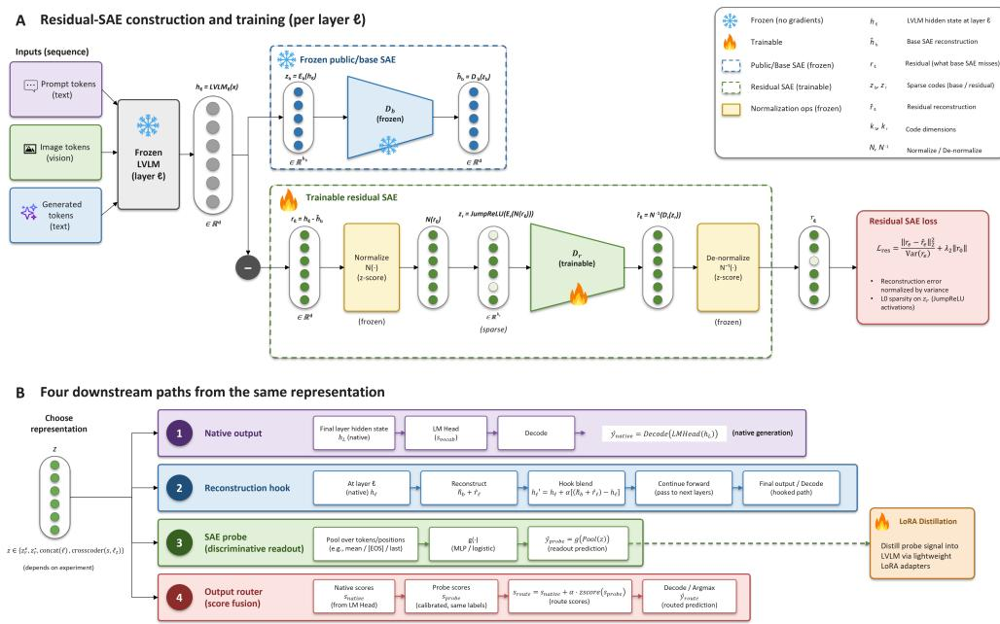  
Figure 1: Residual-SAE construction and readout pathways. A. A frozen base SAE reconstructs layer-ℓ states, while a trainable SAE models the normalized reconstruction residual, yielding base and joint reconstructions. B. The resulting representation supports native scoring, residual-reconstruction hooks, sparse probing, calibrated output routing, and probe-distilled LoRA. Snowflakes and flames denote frozen and trainable components, respectively.

Harmful meme detection. Harmful memes are compositional objects whose meaning can depend on the juxtaposition of visual entities, overlaid text, sarcasm, cultural references, and the identity of the targeted group. The Hateful Memes Challenge made this property explicit through benign confounders, for which altering either the image or text can reverse the label while preserving the other modality (Kiela et al., 2020). This construction penalizes unimodal priors, although strong multimodal performance alone is not sufficient to demonstrate that a model has learned a genuine cross-modal interaction (Hessel & Lee, 2020). Prior work on harmful-meme detection emphasizes stronger multimodal fusion/alignment, uncertainty- and retrieval-guided training, and LVLM prompting/context/rationale supervision, but typically optimizes the final detector without disentangling representational failures from readout failures (Kumar & Nandakumar, 2022; Koushik et al., 2025; Yang et al., 2024; Huang et al., 2025; Koushik et al., 2026; Kmainasi et al., 2025).

Probing, sparse representations, and readout gaps. Diagnostic probes test which properties are recoverable from frozen states, while sparse autoencoders (SAEs) provide an overcomplete, sparsely active coordinate system for analyzing those states (Hewitt & Liang, 2019; Belinkov, 2022; Huben et al., 2024; Marks et al., 2025). Prior work has identified structured multimodal features, failure-predictive internal states, and discrepancies between internal representations and emitted answers in CLIP, LVLM hallucination, and language-model truthfulness settings (Goh et al., 2021; Kogilathota et al., 2026; Orgad et al., 2025). We instead ask whether role-conditioned directions that discriminate harmful-content labels are the same directions that control the LVLM’s native label output. We compare dense, base-SAE, residual-SAE, and cross-layer readouts, and reserve claims about native model use for output-alignment tests and causal interventions. Because our probes are supervised and harmfulness labels depend partly on social conventions, we use readout gap narrowly to mean held-out label accessibility, not latent belief or knowledge.

Steering, output control, and distillation. Hidden-state steering and decoding-time control can make internal signals behaviorally effective, while knowledge distillation and low-rank adaptation can absorb an external readout into model parameters (Li et al., 2023; Yang & Klein, 2021; Hinton et al., 2015; Hu et al., 2021). We evaluate three complementary recovery paths: residual reconstruction, calibrated direct logit routing, and probe-distilled LoRA. We also compare dedicated and shared adapters because heterogeneous multi-task adaptation can produce negative transfer (Standley et al., 2020). See Appendix A for expanded related work.

## 2.2 SPARSE REPRESENTATIONS, TOKEN ROLES AND READOUT MECHANISMS

Let $h _ { \ell , t } ( x ) \in \mathbb { R } ^ { d _ { \ell } }$ denote the residual-stream state produced by the frozen LVLM at layer ℓ and token position t. Sparse autoencoders provide a sparse coordinate system for these states (Huben et al., 2024; Gao et al., 2025). A frozen public/base SAE is applied first, and a second SAE is trained on its normalized reconstruction residual:

$$
\begin{array} { r l r } & { z _ { \ell , t } ^ { b } = E _ { b } ( h _ { \ell , t } ) , } & { \widehat { h } _ { \ell , t } ^ { b } = D _ { b } ( z _ { \ell , t } ^ { b } ) , \qquad r _ { \ell , t } = h _ { \ell , t } - \widehat { h } _ { \ell , t } ^ { b } , } \\ & { z _ { \ell , t } ^ { r } = \mathrm { J u m p R e L U } ( E _ { r } ( N ( r _ { \ell , t } ) ) ) , } & { \widehat { r } _ { \ell , t } = N ^ { - 1 } \big ( D _ { r } ( z _ { \ell , t } ^ { r } ) \big ) , } & { \widehat { h } _ { \ell , t } ^ { \mathrm { j o i n t } } = \widehat { h } _ { \ell , t } ^ { b } + \widehat { r } _ { \ell , t } . } \end{array}\tag{2}
$$

Here, N uses statistics computed from the residual-SAE training data. The public/base dictionary remains frozen and only $\left( \bar { E } _ { r } , D _ { r } \right)$ is trained. We evaluate the base and residual sparse codes as alternative probe representations, while $\widehat { h } _ { \ell , t } ^ { \mathrm { j o i n t } }$ is used by the residual reconstruction hook. Figure 1 summarizes the representation construction in panel A and the downstream evaluation and recovery paths in panel B. Objectives, checkpoint source, and complete readout definitions are given in Appendix B.

Sparse dictionaries. For Gemma, we use public dictionaries trained on instruction-tuned activations and, where selected on calibration data, sparse crosscoders that map several layers into a shared code with layer-specific decoders (Lieberum et al., 2024; Lindsey et al., 2024). For Qwen, the six headline analyses use the same public layer-20 SAE trained on base-model activations (Deng et al., 2026); we retain a separately trained residual SAE as an ablation. Here, base SAE denotes the first dictionary in Equation 2, whereas base-model SAE describes the training regime of the Qwen checkpoint. The uneven SAE regimes reflect public-checkpoint availability. No instruction-tuned SAE matched the selected Qwen3.5-9B backbone. We therefore perform controlled comparisons on within-family native–hook–probe differences and interpret cross-family agreement only as replication of the readout-gap phenomenon, not as a model or SAE leaderboard.

Token roles. We partition positions by their origin into prompt/OCR positions $\tau _ { \mathrm { p r o m p t } } .$ , imageorigin positions ${ \mathcal { T } } _ { \mathrm { i m a g e } } ,$ and autoregressively generated positions $\tau _ { \mathrm { g e n } }$ . We additionally use $\mathcal { T } _ { \mathrm { p r e } } =$ $\mathcal T _ { \mathrm { p r o m p t } } \cup \mathcal T _ { \mathrm { i m a g e } }$ and $\mathcal { T } _ { \mathrm { a l l } } = \mathcal { T } _ { \mathrm { p r e } } \cup \mathcal { T } _ { \mathrm { g e n } }$

These are source labels, not modality-pure states. Contextual processing can place visual evidence in prompt-position states and linguistic evidence in image-position states. Given the token-level feature vector $z _ { \ell , t } ( x )$ from the selected sparse dictionary, we construct one representation per meme and role by feature-wise max pooling:

$$
\left[ \phi _ { \ell , s } ( x ) \right] _ { j } = \operatorname* { m a x } _ { t \in \mathcal { T } _ { s } ( x ) } \left[ z _ { \ell , t } ( x ) \right] _ { j } , \qquad s \in \{ \mathrm { p r o m p t , i m a g e , g e n , p r e , a l l } \} .\tag{3}
$$

This records whether feature $j$ is strongly active anywhere within a role. The pre-generation representation tests accessibility before decoding, generated-token states describe computation after decoding has begun, and the all-token representation captures the full trajectory. Generated and all-token performance therefore cannot, by itself, establish that the same information was available before answer generation. Dense controls use the corresponding role-conditioned hidden states rather than sparse codes.

Readout pathways. Starting from the same frozen LVLM, we compare four paths. The native path uses the model’s constrained label scores. The sparse probe applies a supervised readout to $\phi _ { \ell , s } ( x )$ and measures label decodability. The residual reconstruction hook blends $\widehat { h } _ { \ell , t } ^ { \mathrm { j o i n t } }$ into the residual stream and then continues through the model’s original upper layers, testing whether reconstruction alone makes the signal usable by the native pathway. Finally, direct logit routing adds a calibrated probe score at the output rather than passing that correction through the upper layers; the native forward pass is still required. Section 5 defines this router and the subsequent probe-distilled LoRA procedure. Together, these paths distinguish information that is accessible, information that survives the model’s native routing, and information that can be converted into improved model behavior.

## 2.3 DATASETS AND EVALUATION SETUP

We evaluate six primary binary multimodal harmful-content tasks: CrisisHateMM, FHM, MAMI-A, HarMeme, MMHS150K, and MultiOFF (Bhandari et al., 2023; Kiela et al., 2020; Gasparini et al., 2022; Pramanick et al., 2021; Gomez et al., 2020; Suryawanshi et al., 2020). Table 1 reports the effective train, validation, and test counts used by the primary binary pipeline. Experiment-specific subdivisions of these splits for calibration and reporting are described in Appendix C. For HarMeme, the two harmful classes are merged into HARMFUL; for MMHS150K, the five hate subtypes are merged into HATE. Their original fine-grained taxonomies and CrisisHateMM target attribution are analyzed separately. Multilingual robustness uses fixed internal holdouts from EXIST-2025 (500 examples, equally divided between English and Spanish) and MultiBully (1,000 Hindi–English examples) (Plaza et al., 2026; Maity et al., 2022); neither contributes to the six-task mean.

Table 1: Primary binary tasks and effective split sizes. Counts are usable examples after fixed preprocessing and before any experiment-specific calibration/reporting subdivision. Boldface identifies the locked reporting split.
<table><tr><td>Dataset</td><td>Binary target</td><td>Train</td><td>Validation</td><td>Test</td></tr><tr><td>CrisisHateMM1</td><td>hate / no hate</td><td>3,600</td><td>443†</td><td></td></tr><tr><td>FHM</td><td>hateful / not hateful</td><td>7,938</td><td>469</td><td>1000</td></tr><tr><td>MAMI</td><td>misogynous / not misogynous</td><td>9,000</td><td>1,000</td><td>1,000</td></tr><tr><td>HarMeme</td><td>harmful / not harmful</td><td>3,013</td><td>177</td><td>354</td></tr><tr><td>MMHS150K</td><td>Hate / NotHate</td><td>134,823</td><td>5,000</td><td>10,000</td></tr><tr><td>MultiOFF</td><td>offensive / non-offensive</td><td>445</td><td>149</td><td>149</td></tr></table>

All trainable components use task training data only. Layers, token roles, representations, checkpoints, thresholds, and routing coefficients are selected on training or disjoint calibration data and frozen before reporting. Native predictions use constrained task-specific label scoring; originally multiclass datasets are scored in their full label space before the fixed binary collapse. Macro-F1 is the primary metric, and all systems within a model family are compared on identical example IDs. Full dataset construction, split rules, decoding details, secondary metrics, and comparison scope are provided in Appendix C.

## 3 INTERNAL REPRESENTATIONS VERSUS GENERATIVE HEAD

Broad Evaluation Comparison. Table 2 compares locked macro-F1 for the native LVLM, the selected sparse readout, and, for Qwen, the residual reconstruction hook. Sparse readouts outperform native prediction on every task in both model families. Gemma improves from 0.532 to 0.714 mean macro-F1 (+0.182), while Qwen improves from 0.432 to 0.740 (+0.308). Qwen provides the more controlled comparison because all six probes use the same public layer-20 SAE and readout family; Gemma replicates the pattern under a distinct model and sparse-representation regime.

The Qwen hook improves five tasks and raises the mean to 0.486, but recovers only 17.6% of the native-to-probe gap. Sparse reconstruction therefore improves native behavior without making most of the accessible signal usable by the original output pathway. As defined in Section 2.1, these gains measure supervised accessibility rather than a like-for-like comparison between an untuned native classifier and a trained probe. Per-task analysis, base-versus-residual SAE comparisons, and fine-grained results are reported in Appendices D and E.

Table 2: Macro-F1 scores on the six primary binary tasks. Gemma uses its calibration-selected sparse readout while Qwen uses the same public layer-20 base-SAE probe across tasks. The hook modifies Qwen’s native pathway through residual reconstruction. Means are unweighted across tasks.
<table><tr><td rowspan="2">Dataset</td><td colspan="2">Gemma-3-4B-IT</td><td colspan="3">Qwen3.5-9B-Base</td></tr><tr><td>Native</td><td>Sparse</td><td>Native</td><td>Hook</td><td>SAE</td></tr><tr><td>CrisisHateMM</td><td>0.606</td><td>0.819</td><td>0.310</td><td>0.349</td><td>0.860</td></tr><tr><td>FHM</td><td>0.648</td><td>0.703</td><td>0.637</td><td>0.692</td><td>0.712</td></tr><tr><td>MAMI</td><td>0.409</td><td>0.731</td><td>0.408</td><td>0.521</td><td>0.755</td></tr><tr><td>HarMeme</td><td>0.719</td><td>0.776</td><td>0.394</td><td>0.394</td><td>0.810</td></tr><tr><td>MMHS150K</td><td>0.292</td><td>0.630</td><td>0.524</td><td>0.556</td><td>0.587</td></tr><tr><td>MultiOFF</td><td>0.519</td><td>0.623</td><td>0.320</td><td>0.404</td><td>0.716</td></tr><tr><td>Mean</td><td>0.532</td><td>0.714</td><td>0.432</td><td>0.486</td><td>0.740</td></tr></table>

Where is the Signal? Token-Role and Representation Ablations. Using the calibration-only protocol of Section 2.3, role-conditioned probes reveal no universal locus of harmful-content information. On Gemma, image-position features outperform generated features on CrisisHateMM and HarMeme, whereas generated features are stronger on MAMI, MMHS150K, and MultiOFF; FHM is nearly tied. The largest shift occurs on MMHS150K, where generated rather than image states raise macro-F1 from 0.531 to 0.617 for the binary task and from 0.232 to 0.468 for the six-class task. MAMI instead peaks at prompt/OCR states (0.845). Because generated states are observed only after decoding begins, they indicate where the computation becomes linearly separable, not necessarily what was available before the decision. Crucially, image or pre-generation readouts still exhibit large locked readout gaps on CrisisHateMM and HarMeme, while the selected FHM readout uses prompt–image cross-layer features. The signal is therefore accessible before generation, but its separability can increase during decoding.

Sparse factorization is similarly task-dependent. Relative to probes over corresponding dense hidden states, it helps substantially on CrisisHateMM (+0.283), modestly on FHM and six-class MMHS150K, and negligibly on MAMI, HarMeme, and MultiOFF; random sparse controls remain near chance. SAEs therefore expose rather than create most of the harmful-content signal, while providing the feature basis needed for the alignment and intervention tests in Section 4.1. FHM additionally resists single-role and simple pooled interaction readouts, motivating the pair-aware low-rank analysis in Section 4.2. Full role sweeps, dense-state controls, and FHM ablations are reported in Appendix F.

## 4 MECHANISTIC STRUCTURE OF READOUT GAP

## 4.1 DISCRIMINATIVE VERSUS ROUTED DIRECTIONS

A strong sparse probe need not rely on the directions that control the LVLM’s own answer. Let $d _ { j }$ be the decoder direction of SAE feature $j ,$ and let $w _ { d , j }$ be its task-d probe coefficient, oriented so that positive scores favor the harmful class. We compare this discriminative importance with direct access to the yes/no output channel:

$$
\begin{array} { r l r } & { \boldsymbol { u } _ { \mathrm { y n } } = \boldsymbol { W } _ { U } ^ { f \top } \left( \boldsymbol { e } _ { \mathrm { y e s } } - \boldsymbol { e } _ { \mathrm { n o } } \right) , } & { a _ { j } = d _ { j } ^ { \top } \boldsymbol { u } _ { \mathrm { y n } } , } \\ & { \boldsymbol { S } _ { d } = \left\{ j \in \mathrm { T o p K } _ { k } ( \left| \boldsymbol { w } _ { d , \cdot } \right| ) : \left| a _ { j } \right| < \tau \right\} , } & { \mathcal { R } _ { \mathrm { y n } } = \mathrm { T o p K } _ { k } ( \left| a _ { \cdot } \right| ) } \end{array}\tag{4}
$$

where $\boldsymbol { W } _ { U } ^ { f }$ is the effective unembedding with final normalization folded into it, $\tau = 0 . 1 0 $ , and $k = 2 0$ The task-specific set $\textstyle { S _ { d } }$ contains probe-important but output-silent features, whereas $\mathcal { R } _ { \mathrm { y n } }$ contains features selected only for direct access to the native yes/no channel. The yes/no anchor is the actual native decision channel for literal yes/no tasks and only a diagnostic for tasks evaluated by full-label scoring. Moreover, $a _ { j }$ measures an immediate unembedding effect rather than a complete causal effect through the remaining transformer blocks (Elhage et al., 2021; Belrose et al., 2023).

For Qwen’s public base SAE, the region containing both high probe importance and high direct output alignment is empty on five of the six analyzed tasks and contains only 1% of the analyzed

A Silent-feature knockout  
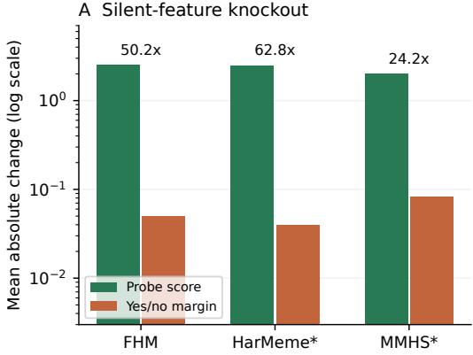  
B Routed-feature donor patch

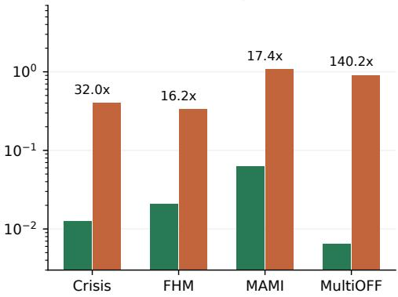  
Figure 2: Decodability and native-output control dissociate in Qwen. A. Silent-feature knockout primarily changes the probe $( n = 1 5$ eligible examples per task). Asterisks denote diagnostic yes/no margins, not the native task decision. B. Routed-feature patching primarily changes the native yes/no margin $( n = 5$ donor-target pairs per task). Bars show mean absolute changes; labels give the larger-to-smaller sensitivity ratio. Ratios depend on score scaling and do not measure a mediated fraction or improved correctness. Full results and eligibility rules appear in Appendix G.

MAMI feature records. Figure 2 shows the corresponding causal sensitivity pattern. Knocking out silent features changes the probe score 24.2–62.8× more than the monitored yes/no margin, whereas donor-patching routed features changes the native margin 16.2–140.2× more than the probe across the four tasks with matched literal yes/no decoding. These ratios depend on the two score scales and are not scale-invariant mediation fractions. Under the tested interventions, discriminative features strongly affect the external readout but weakly affect the monitored native margin, while independently selected routed features show the reverse pattern. Routed interventions establish output control, not improved correctness (Vig et al., 2020; Meng et al., 2022; Marks et al., 2025).

Gemma replicates the static and probe-side separation: its routed and probe-derived feature sets have zero overlap on all four analyzed tasks, and Jacobian-based (Gurnee et al., 2026) sensitivity places the strongest probe directions outside the dominant output-routing set. Its native-output mediation is less uniform, so we do not claim a universal orthogonal decomposition. The conclusion is local to the analyzed layers, SAE dictionaries, features, and output anchors. Appendix G reports full task-level effects, sample counts, label-score caveats, and patching controls.

## 4.2 LOW-RANK CROSS-MODAL STRUCTURE ON FHM

We analyze Gemma-3-12B separately because this experiment changes both model scale and readout family and is therefore excluded from the six-task mean in Section 3. FHM’s benign confounders can reverse the label while holding the image or text fixed, so combining two role-specific predictors does not by itself establish a cross-modal interaction (Kiela et al., 2020; Hessel & Lee, 2020). From the layer-31 sparse representation, we construct standardized max-pooled image-position and prompt/OCR vectors $x _ { \mathrm { i m g } } , \dot { x } _ { \mathrm { p r o m p t } } \in \mathbb { R } ^ { 1 2 8 }$ using features selected by a train-only confounder audit. These labels denote token provenance rather than modality-pure states. We augment the pair-aware gated baseline $s _ { \mathrm { g a t e } }$ with an explicit rank-r interaction:

$$
\begin{array} { r l } & { s _ { r } ( x ) = s _ { \mathrm { g a t e } } ( x ) + \gamma x _ { \mathrm { i m g } } ^ { \top } U V ^ { \top } x _ { \mathrm { p r o m p t } } } \\ & { \qquad = s _ { \mathrm { g a t e } } ( x ) + \gamma \displaystyle \sum _ { q = 1 } ^ { r } \left( u _ { q } ^ { \top } x _ { \mathrm { i m g } } \right) \left( v _ { q } ^ { \top } x _ { \mathrm { p r o m p t } } \right) , \qquad U , V \in \mathbb { R } ^ { 1 2 8 \times r } . } \end{array}\tag{5}
$$

This parameterization uses 256r interaction parameters rather than a full $1 2 8 ^ { 2 }$ matrix (Kim et al., 2016). Training combines sample-level classification with ranking losses on opposite-label sameimage and same-text pairs; all choices are made before the locked test split is evaluated.

Figure 3 illustrates the confounder problem and the gated-bilinear computation; Figure 6 in Appendix H plots the quantitative comparison.

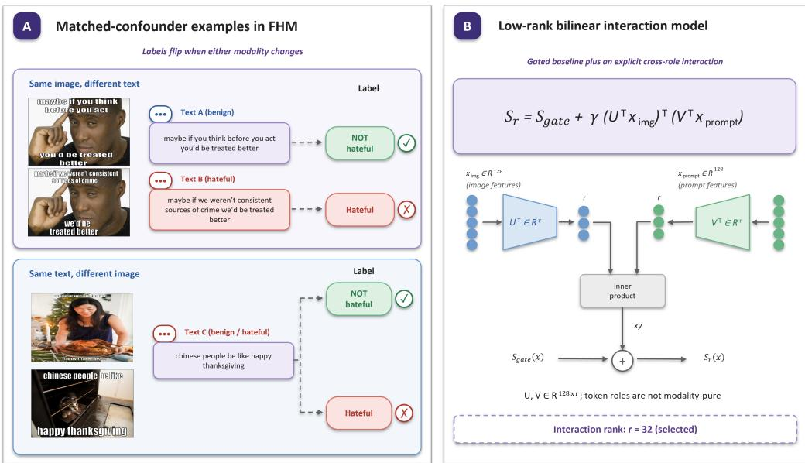  
Figure 3: Confounders and the bilinear readout. A. Holding the background image or supplied text fixed can reverse the gold label when the other component changes; symbols indicate gold classes, not model correctness. B. Two role-conditioned projections form an inner product, scaled by γ and added to the gated baseline. Image and prompt denote token origins, not modality-pure information. Quantitative rank and test results appear in Figure 6 in Appendix H.

Rank 8 is unstable (0.7110 ± 0.0352 validation macro-F1), whereas rank 32 is more stable (0.7488 ± 0.0120) and approaches the single-seed rank-128 result (0.7621). The rank-32 mean improves over the gated pairwise baseline by 0.0122. The calibration-selected rank-32 checkpoint reaches 0.7560 on the reported test-seen evaluation, compared with 0.6853 for native Gemma-3-12B, a gain of 0.0707 with a paired bootstrap 95% confidence interval of [0.0461, 0.0954]. The sample-count provenance is noted in Figure 6. This larger test gain compares the complete pair-aware readout with the native model; it is not the isolated contribution of the bilinear term. On the validation matched-pair audit, the selected model assigns the higher score to the hateful member in 84.5% of same-image pairs and 84.7% of same-text pairs.

The interaction is distributed rather than attributable to one feature pair: 11 of the 32 factors have measurable leave-one-out effects, but removing any single factor changes validation macro-F1 by at most 0.007, while a within-role quadratic control adds only 0.004. The result is also representationspecific: analogous bilinear readouts underperform their simpler controls for Gemma-3-4B and Qwen. We therefore claim evidence for a distributed rank-32 image-by-prompt interaction in the analyzed Gemma-3-12B layer-31 representation, not a universal FHM mechanism. Complete objectives, rank sweeps, matched-pair metrics, statistical tests, factor interventions, and negative controls appear in Appendix H.

## 5 RECOVERING AND STRESS-TESTING THE LATENT SIGNAL

Direct Logit Routing and Probe Distillation. The causal separation in Section 4.1 suggests two recovery paths: bypass the native routing bottleneck at the output, or absorb the external readout into the model. For task d, let $m _ { d } ( x )$ be the signed native decision margin and $u _ { d } ( x )$ the frozen probe score. We use the calibration-only router

$$
m _ { d } ^ { \mathrm { r o u t e } } ( x ) = m _ { d } ( x ) + \beta _ { d } \frac { u _ { d } ( x ) - \mu _ { d } } { \sigma _ { d } + \epsilon }\tag{6}
$$

where $\mu _ { d } , \sigma _ { d } ,$ and $\beta _ { d }$ are estimated on a disjoint calibration partition and frozen before reporting.

On matched Qwen reporting subsets, routing improves all six binary tasks, raising mean macro-F1 from 0.4405 to 0.7204, close to the probe ceiling of 0.7404. It therefore recovers 93.3% of the native-to-probe gap. FHM is the only task on which the combined score slightly exceeds the probe alone. Four tasks select the largest tested coefficient, $\beta _ { d } = 8 ,$ , so the experiment establishes that bypassing the native pathway is effective, not that the coefficient sweep found an interior optimum.

To remove the SAE and probe at inference, we distill the frozen probe distribution into Gemma-3-4B-IT using LoRA, gold-label supervision, probe KL supervision, and, where available, matched-pair ranking (Hinton et al., 2015; Hu et al., 2021). A dedicated FHM adapter improves the model’s test-seen macro-F1 from 0.6482 to 0.7138. A shared seven-task adapter raises its own unweighted mean from 0.4642 to 0.5686, but underperforms the dedicated FHM adapter on the same development set (0.6548 versus 0.7095) and reduces six-class MMHS150K from 0.3727 to 0.1886 while leaving its binary result nearly unchanged. Probe information can therefore be internalized, but a universal adapter can erase task-specific structure through negative transfer (Standley et al., 2020). Full per-task routing results, objectives, run configurations, and sampling schedules appear in Appendix I.

Multilingual and Visio-Textual Robustness. We test whether the readout gap is confined to English or explained by provided OCR through visual credit audit (Liu et al., 2026). On the fixed EXIST holdouts, Qwen cross-language and bilingual probes reach 0.7469–0.8121 macro-F1. Gemma representations remain above chance, but their probe-over-native advantage changes sign across split seeds, so we claim cross-lingual decodability rather than stable superiority. MultiBully gives the clearer cross-model replication: Qwen’s all-token probe reaches 0.7259, compared with 0.3401 natively, while Gemma’s residual-SAE probe reaches $\mathbf { \bar { 0 } . 6 8 9 2 \pm 0 . 0 1 4 3 }$ macro-F1 across five deterministic seeds and improves over native prediction by $0 . 0 9 1 5 \pm 0 . 0 2 2 6$ . Qwen silent-feature knockout remains probe-dominant on English and Spanish EXIST and on MultiBully (48.5–90:1), although these checks use only 12–15 eligible examples.

Explicit OCR contributes but does not explain the result: removing it changes the strongest textbearing readouts by at most 0.0671 macro-F1 and changes the MultiBully image-position probe by only 0.0011. In contrast, deterministic same-split image permutation reduces probe macro-F1 by 0.148–0.206 and routed macro-F1 by 0.160–0.292 on every audited dataset. Between 55.8% and 88.8% of originally correct probe or router predictions become incorrect after image blanking or shuffling, compared with 0.0%–38.1% for the native classifier. The recovered signal therefore extends beyond English and depends materially on paired visual evidence. These controls do not isolate modality-pure states or a specific cross-modal circuit: the no-OCR condition removes only injected OCR, while image perturbations provide an operational dependence test (Hessel & Lee, 2020). Full split-wise results, metric definitions, matched-pair controls, and perturbation tables appear in Appendix J.

## 6 CONCLUSION AND FUTURE WORK

Our results distinguish decodability, native routing, and correctness. Across two LVLM families and six tasks, sparse readouts recover label information weakly expressed by native output. Qwen interventions separate probe-discriminative from output-routed directions (Figure 2); direct routing recovers 93.3% of the mean gap. LoRA internalizes part of this signal but can introduce negative transfer. SAEs provide a coordinate system for these tests, while the Gemma-3-12B FHM result supports a representation-specific distributed interaction.

Limitations. The readout gap is not an apples-to-apples comparison: probes receive task labels while the native LVLM remains frozen. The mechanistic claims are local to the selected layers, dictionaries, features, and output anchors; some interventions use small eligible subsets and out-ofdistribution patching. Token roles identify position provenance rather than modality-pure information, generated-token probes are post-generation readouts, and the FHM interaction does not transfer to every model. Multilingual results rely on internal holdouts, while rare fine-grained classes remain poorly resolved. Improved macro-F1 therefore does not establish readiness for autonomous moderation.

Future work. Future work should test larger models, additional layers and dictionaries, and broader multilingual and fine-grained datasets. Position-matched patching and path-level tracing could identify how evidence reaches the output; task-grouped adapters and subtype-preserving objectives could reduce negative transfer. Evaluation should include calibration, subgroup errors, abstention, and human review.

## REFERENCES

Dhananjay Ashok, Ashutosh Chaubey, Hirona Jacqueline Arai, Jonathan May, and Jesse Thomason. Can VLMs recall factual associations from visual references? In Christos Christodoulopoulos, Tanmoy Chakraborty, Carolyn Rose, and Violet Peng (eds.), Findings ofthe Associationfor Computational Linguistics: EMNLP 2025, pp. 15691–15708, Suzhou, China, November 2025. Association for Computational Linguistics. ISBN 979-8-89176-335-7. doi: 10.18653/v1/2025.findings-emnlp. 850. URL https://aclanthology.org/2025.findings-emnlp.850/.

Yonatan Belinkov. Probing classifiers: Promises, shortcomings, and advances. Computational Linguistics, 48(1):207–219, March 2022. doi: 10.1162/coli a 00422. URL https://aclanthology. org/2022.cl-1.7/.

Nora Belrose, Igor Ostrovsky, Lev McKinney, Zach Furman, Logan Smith, Danny Halawi, Stella Biderman, and Jacob Steinhardt. Eliciting latent predictions from transformers with the tuned lens. arXiv preprint arXiv:2303.08112, 2023.

Aashish Bhandari, Siddhant B Shah, Surendrabikram Thapa, Usman Naseem, and Mehwish Nasim. Crisishatemm: Multimodal analysis of directed and undirected hate speech in text-embedded images from russia-ukraine conflict. In Proceedings of the IEEE/CVF Conference on Computer Vision and Pattern Recognition, pp. 1993–2002, 2023.

Minh Duc Bui, Katharina von der Wense, and Anne Lauscher. Multi3Hate: Multimodal, multilingual, and multicultural hate speech detection with vision–language models. In Luis Chiruzzo, Alan Ritter, and Lu Wang (eds.), Proceedings of the 2025 Conference of the Nations of the Americas Chapter of the Associationfor Computational Linguistics: Human Language Technologies (Volume 1: Long Papers), pp. 9714–9731, Albuquerque, New Mexico, April 2025. Association for Computational Linguistics. ISBN 979-8-89176-189-6. doi: 10.18653/v1/2025.naacl-long.490. URL https: //aclanthology.org/2025.naacl-long.490/.

Collin Burns, Haotian Ye, Dan Klein, and Jacob Steinhardt. Discovering latent knowledge in language models without supervision. 2024. URL https://arxiv.org/abs/2212.03827.

Boyi Deng, Xu Wang, Yaoning Wang, Yu Wan, Yubo Ma, Baosong Yang, Haoran Wei, Jialong Tang, Huan Lin, Ruize Gao, Tianhao Li, Qian Cao, Xuancheng Ren, Xiaodong Deng, An Yang, Fei Huang, Dayiheng Liu, and Jingren Zhou. Qwen-scope: Turning sparse features into development tools for large language models. 2026. URL https://arxiv.org/abs/2605.11887.

Nelson Elhage, Neel Nanda, Catherine Olsson, Tom Henighan, Nicholas Joseph, Ben Mann, Amanda Askell, Yuntao Bai, Anna Chen, Tom Conerly, Nova DasSarma, Dawn Drain, Deep Ganguli, Zac Hatfield-Dodds, Danny Hernandez, Andy Jones, Jackson Kernion, Liane Lovitt, Kamal Ndousse, Dario Amodei, Tom Brown, Jack Clark, Jared Kaplan, Sam McCandlish, and Chris Olah. A mathematical framework for transformer circuits. Transformer Circuits Thread, 2021. https://transformer-circuits.pub/2021/framework/index.html.

Leo Gao, Tom Dupre la Tour, Henk Tillman, Gabriel Goh, Rajan Troll, Alec Radford, Ilya Sutskever, Jan Leike, and Jeffrey Wu. Scaling and evaluating sparse autoencoders. In Y. Yue, A. Garg, N. Peng, F. Sha, and R. Yu (eds.), International Conference on Learning Representations, volume 2025, pp. 26721–26754, 2025. URL https://proceedings.iclr.cc/paper\_files/paper/ 2025/file/42ef3308c230942d223c411adf182c88-Paper-Conference.pdf.

Francesca Gasparini, Giulia Rizzi, Aurora Saibene, and Elisabetta Fersini. Benchmark dataset of memes with text transcriptions for automatic detection of multi-modal misogynistic content. Data in brief, 44:108526, 2022.

Gabriel Goh, Nick Cammarata †, Chelsea Voss †, Shan Carter, Michael Petrov, Ludwig Schubert, Alec Radford, and Chris Olah. Multimodal neurons in artificial neural networks. Distill, 2021. doi: 10.23915/distill.00030. https://distill.pub/2021/multimodal-neurons.

Raul Gomez, Jaume Gibert, Lluis Gomez, and Dimosthenis Karatzas. Exploring hate speech detection in multimodal publications. In Proceedings of the IEEE/CVF winter conference on applications of computer vision, pp. 1470–1478, 2020.

Wes Gurnee, Nicholas Sofroniew, Adam Pearce, Mateusz Piotrowski, Isaac Kauvar, Runjin Chen, Anna Soligo, Paul Bogdan, Euan Ong, Rowan Wang, Ben Thompson, David Abrahams, Subhash Kantamneni, Emmanuel Ameisen, Joshua Batson, and Jack Lindsey. Verbalizable representations form a global workspace in language models. Transformer Circuits Thread, 2026. URL https: //transformer-circuits.pub/2026/workspace/index.html.

Jack Hessel and Lillian Lee. Does my multimodal model learn cross-modal interactions? it’s harder to tell than you might think! In Bonnie Webber, Trevor Cohn, Yulan He, and Yang Liu (eds.), Proceedings of the 2020 Conference on Empirical Methods in Natural Language Processing (EMNLP), pp. 861–877, Online, November 2020. Association for Computational Linguistics. doi: 10.18653/v1/2020.emnlp-main.62. URL https://aclanthology.org/ 2020.emnlp-main.62/.

John Hewitt and Percy Liang. Designing and interpreting probes with control tasks. In Proceedings of the 2019 conference on empirical methods in natural language processing and the 9th international joint conference on natural language processing (emnlp-ijcnlp), pp. 2733–2743, 2019.

Geoffrey Hinton, Oriol Vinyals, and Jeff Dean. Distilling the knowledge in a neural network. arXiv preprint arXiv:1503.02531, 2015.

Eftekhar Hossain, Omar Sharif, and Mohammed Moshiul Hoque. MUTE: A multimodal dataset for detecting hateful memes. In Yan Hanqi, Yang Zonghan, Sebastian Ruder, and Wan Xiaojun (eds.), Proceedings of the 2nd Conference of the Asia-Pacific Chapter of the Association for Computational Linguistics and the 12th International Joint Conference on Natural Language Processing: Student Research Workshop, pp. 32–39, Online, November 2022. Association for Computational Linguistics. doi: 10.18653/v1/2022.aacl-srw.5. URL https: //aclanthology.org/2022.aacl-srw.5/.

Edward J Hu, Yelong Shen, Phillip Wallis, Zeyuan Allen-Zhu, Yuanzhi Li, Shean Wang, Lu Wang, and Weizhu Chen. Lora: Low-rank adaptation of large language models. arXiv preprint arXiv:2106.09685, 2021.

Zhenglin Hua, Jinghan He, Zijun Yao, Tianxu Han, Haiyun Guo, Yuheng Jia, and Junfeng Fang. Steering LVLMs via sparse autoencoder for hallucination mitigation. In Christos Christodoulopoulos, Tanmoy Chakraborty, Carolyn Rose, and Violet Peng (eds.), Findings of the Association for Computational Linguistics: EMNLP 2025, pp. 10808–10828, Suzhou, China, November 2025. Association for Computational Linguistics. ISBN 979-8-89176-335-7. doi: 10.18653/v1/2025.findings-emnlp. 572. URL https://aclanthology.org/2025.findings-emnlp.572/.

Jinfa Huang, Jinsheng Pan, Zhongwei Wan, Hanjia Lyu, and Jiebo Luo. Evolver: Chain-of-evolution prompting to boost large multimodal models for hateful meme detection. In Owen Rambow, Leo Wanner, Marianna Apidianaki, Hend Al-Khalifa, Barbara Di Eugenio, and Steven Schockaert (eds.), Proceedings of the 31st International Conference on Computational Linguistics, pp. 7321– 7330, Abu Dhabi, UAE, January 2025. Association for Computational Linguistics. URL https: //aclanthology.org/2025.coling-main.489/.

Robert Huben, Hoagy Cunningham, Logan Smith, Aidan Ewart, and Lee Sharkey. Sparse autoencoders find highly interpretable features in language models. In B. Kim, Y. Yue, S. Chaudhuri, K. Fragkiadaki, M. Khan, and Y. Sun (eds.), International Conference on Learning Representations, volume 2024, pp. 7827–7845, 2024. URL https://proceedings.iclr.cc/paper\_files/paper/2024/file/ 1fa1ab11f4bd5f94b2ec20e794dbfa3b-Paper-Conference.pdf.

Douwe Kiela, Hamed Firooz, Aravind Mohan, Vedanuj Goswami, Amanpreet Singh, Pratik Ringshia, and Davide Testuggine. The hateful memes challenge: Detecting hate speech in multimodal memes. Advances in neural information processing systems, 33:2611–2624, 2020.

Jin-Hwa Kim, Kyoung-Woon On, Woosang Lim, Jeonghee Kim, Jung-Woo Ha, and Byoung-Tak Zhang. Hadamard product for low-rank bilinear pooling. arXiv preprint arXiv:1610.04325, 2016.

Hannah Kirk, Yennie Jun, Paulius Rauba, Gal Wachtel, Ruining Li, Xingjian Bai, Noah Broestl, Martin Doff-Sotta, Aleksandar Shtedritski, and Yuki M Asano. Memes in the wild: Assessing the generalizability of the hateful memes challenge dataset. In Aida Mostafazadeh Davani, Douwe Kiela, Mathias Lambert, Bertie Vidgen, Vinodkumar Prabhakaran, and Zeerak Waseem (eds.), Proceedings ofthe 5th Workshop on Online Abuse and Harms (WOAH 2021), pp. 26–35, Online, August 2021. Association for Computational Linguistics. doi: 10.18653/v1/2021.woah-1.4. URL https://aclanthology.org/2021.woah-1.4/.

Mohamed Bayan Kmainasi, Abul Hasnat, Md Arid Hasan, Ali Ezzat Shahroor, and Firoj Alam. MemeIntel: Explainable detection of propagandistic and hateful memes. In Christos Christodoulopoulos, Tanmoy Chakraborty, Carolyn Rose, and Violet Peng (eds.), Proceedings of the 2025 Conference on Empirical Methods in Natural Language Processing, pp. 30263–30279, Suzhou, China, November 2025. Association for Computational Linguistics. ISBN 979-8-89176- 332-6. doi: 10.18653/v1/2025.emnlp-main.1539. URL https://aclanthology.org/ 2025.emnlp-main.1539/.

Sai Akhil Kogilathota, Sripadha Vallabha E G, Luzhe Sun, and Jiawei Zhou. HALP: Detecting hallucinations in vision-language models without generating a single token. In Vera Demberg, Kentaro Inui, and Llu´ıs Marquez (eds.), Proceedings of the 19th Conference of the European Chapter of the Association for Computational Linguistics (Volume 1: Long Papers), pp. 6067–6085, Rabat, Morocco, March 2026. Association for Computational Linguistics. ISBN 979-8-89176- 380-7. doi: 10.18653/v1/2026.eacl-long.287. URL https://aclanthology.org/2026. eacl-long.287/.

Girish A. Koushik, Diptesh Kanojia, and Helen Treharne. Towards a robust framework for multimodal hate detection: A study on video vs. image-based content. WWW ’25, pp. 2014–2023, New York, NY, USA, 2025. Association for Computing Machinery. ISBN 9798400713316. doi: 10.1145/3701716.3718382. URL https://doi.org/10.1145/3701716.3718382.

Girish A. Koushik, Helen Treharne, Aditya Joshi, and Diptesh Kanojia. Trace: textual relevance augmentation and contextual encoding for multimodal hate detection. In Proceedings of the Fortieth AAAI Conference on Artificial Intelligence and Thirty-Eighth Conference on Innovative Applications of Artificial Intelligence and Sixteenth Symposium on Educational Advances in Artificial Intelligence, AAAI’26/IAAI’26/EAAI’26. AAAI Press, 2026. ISBN 978-1-57735-906- 7. doi: 10.1609/aaai.v40i45.41220. URL https://doi.org/10.1609/aaai.v40i45. 41220.

Gokul Karthik Kumar and Karthik Nandakumar. Hate-CLIPper: Multimodal hateful meme classification based on cross-modal interaction of CLIP features. In Laura Biester, Dorottya Demszky, Zhijing Jin, Mrinmaya Sachan, Joel Tetreault, Steven Wilson, Lu Xiao, and Jieyu Zhao (eds.), Pro ceedings ofthe Second Workshop on NLPfor Positive Impact (NLP4PI), pp. 171–183, Abu Dhabi, United Arab Emirates (Hybrid), December 2022. Association for Computational Linguistics. doi: 10.18653/v1/2022.nlp4pi-1.20. URL https://aclanthology.org/2022.nlp4pi-1. 20/.

Kenneth Li, Oam Patel, Fernanda Viegas, Hanspeter Pfister, and Martin Wattenberg. Inference-time´ intervention: Eliciting truthful answers from a language model. Advances in neural information processing systems, 36:41451–41530, 2023.

Tom Lieberum, Senthooran Rajamanoharan, Arthur Conmy, Lewis Smith, Nicolas Sonnerat, Vikrant Varma, Janos Kramar, Anca Dragan, Rohin Shah, and Neel Nanda. Gemma scope: Open sparse autoencoders everywhere all at once on gemma 2. In Yonatan Belinkov, Najoung Kim, Jaap Jumelet, Hosein Mohebbi, Aaron Mueller, and Hanjie Chen (eds.), Proceedings ofthe 7th BlackboxNLP Workshop: Analyzing and Interpreting Neural Networksfor NLP, pp. 278–300, Miami, Florida, US, November 2024. Association for Computational Linguistics. doi: 10.18653/v1/2024.blackboxnlp-1. 19. URL https://aclanthology.org/2024.blackboxnlp-1.19/.

Jack Lindsey, Adly Templeton, Jonathan Marcus, Thomas Conerly, Joshua Batson, and Christopher Olah. Sparse crosscoders for cross-layer features and model diffing. Transformer Circuits Thread, 2024.

Alisa Liu, Maarten Sap, Ximing Lu, Swabha Swayamdipta, Chandra Bhagavatula, Noah A. Smith, and Yejin Choi. DExperts: Decoding-time controlled text generation with experts and anti-experts. In Chengqing Zong, Fei Xia, Wenjie Li, and Roberto Navigli (eds.), Proceedings of the 59th Annual Meeting of the Association for Computational Linguistics and the 11th International Joint Conference on Natural Language Processing (Volume 1: Long Papers), pp. 6691–6706, Online, August 2021. Association for Computational Linguistics. doi: 10.18653/v1/2021.acl-long.522. URL https://aclanthology.org/2021.acl-long.522/.

Feixiang Liu, Qiang Qiu, Lanbo Sun, Nan Wei, Huawei Shen, and Xueqi Cheng. Visual credit audit for multimodal spatial reasoning. 2026. URL https://arxiv.org/abs/2607.27069.

Hantao Lou, Changye Li, Jiaming Ji, and Yaodong Yang. Sae-v: Interpreting multimodal models for enhanced alignment. 2025. URL https://arxiv.org/abs/2502.17514.

Krishanu Maity, Prince Jha, Sriparna Saha, and Pushpak Bhattacharyya. A multitask framework for sentiment, emotion and sarcasm aware cyberbullying detection from multi-modal code-mixed memes. In Proceedings of the 45th International ACM SIGIR Conference on Research and Development in Information Retrieval, SIGIR ’22, pp. 1739–1749, New York, NY, USA, 2022. Association for Computing Machinery. ISBN 9781450387323. doi: 10.1145/3477495.3531925. URL https://doi.org/10.1145/3477495.3531925.

Samuel Marks, Can Rager, Eric Michaud, Yonatan Belinkov, David Bau, and Aaron Mueller. Sparse feature circuits: Discovering and editing interpretable causal graphs in language models. In International Conference on Learning Representations, volume 2025, pp. 23888–23923, 2025.

Jingbiao Mei, Jinghong Chen, Weizhe Lin, Bill Byrne, and Marcus Tomalin. Improving hateful meme detection through retrieval-guided contrastive learning. In Lun-Wei Ku, Andre Martins, and Vivek Srikumar (eds.), Proceedings of the 62nd Annual Meeting of the Association for Computational Linguistics (Volume 1: Long Papers), pp. 5333–5347, Bangkok, Thailand, August 2024. Association for Computational Linguistics. doi: 10.18653/v1/2024.acl-long.291. URL https://aclanthology.org/2024.acl-long.291/.

Jingbiao Mei, Jinghong Chen, Guangyu Yang, Weizhe Lin, and Bill Byrne. Robust adaptation of large multimodal models for retrieval augmented hateful meme detection. In Christos Christodoulopoulos, Tanmoy Chakraborty, Carolyn Rose, and Violet Peng (eds.), Proceedings ofthe 2025 Conference on Empirical Methods in Natural Language Processing, pp. 23806–23828, Suzhou, China, November 2025. Association for Computational Linguistics. ISBN 979-8-89176-332- 6. doi: 10.18653/v1/2025.emnlp-main.1215. URL https://aclanthology.org/2025. emnlp-main.1215/.

Kevin Meng, David Bau, Alex Andonian, and Yonatan Belinkov. Locating and editing factual associations in gpt. Advances in neural information processing systems, 35:17359–17372, 2022.

Hadas Orgad, Michael Toker, Zorik Gekhman, Roi Reichart, Idan Szpektor, Hadas Kotek, and Yonatan Belinkov. Llms know more than they show: On the intrinsic representation of llm hallucinations. 2025. URL https://arxiv.org/abs/2410.02707.

Mateusz Pach, Shyamgopal Karthik, Quentin Bouniot, Serge Belongie, and Zeynep Akata. Sparse autoencoders learn monosemantic features in vision-language models. Advances in Neural Information Processing Systems, 38:95706–95742, 2026.

Iuliia Parfenova, Desmond Elliott, Raquel Fernandez, and Sandro Pezzelle. Probing cross-modal´ representations in multi-step relational reasoning. In Anna Rogers, Iacer Calixto, Ivan Vulic, Naomi´ Saphra, Nora Kassner, Oana-Maria Camburu, Trapit Bansal, and Vered Shwartz (eds.), Proceedings ofthe 6th Workshop on Representation Learningfor NLP (RepL4NLP-2021), pp. 152–162, Online, August 2021. Association for Computational Linguistics. doi: 10.18653/v1/2021.repl4nlp-1.16. URL https://aclanthology.org/2021.repl4nlp-1.16/.

Laura Plaza, Jorge Carrillo-de Albornoz, Ivan Arcos, Paolo Rosso, Damiano Spina, Enrique Amig´ o,´ Julio Gonzalo, and Roser Morante. Overview of exist 2025: Learning with disagreement for sexism identification and characterization in tweets, memes, and tiktok videos. In Jorge Carrillo-de Albornoz, Alba Garc´ıa Seco de Herrera, Julio Gonzalo, Laura Plaza, Josiane Mothe, Florina

Piroi, Paolo Rosso, Damiano Spina, Guglielmo Faggioli, and Nicola Ferro (eds.), Experimental IR Meets Multilinguality, Multimodality, and Interaction, pp. 266–289, Cham, 2026. Springer Nature Switzerland. ISBN 978-3-032-04354-2.

Shraman Pramanick, Dimitar Dimitrov, Rituparna Mukherjee, Shivam Sharma, Md Shad Akhtar, Preslav Nakov, and Tanmoy Chakraborty. Detecting harmful memes and their targets. arXiv preprint arXiv:2110.00413, 2021.

Shufan Shen, Junshu Sun, Qingming Huang, and Shuhui Wang. Vl-sae: Interpreting and enhancing vision-language alignment with a unified concept set. 2025. URL https://arxiv.org/ abs/2510.21323.

Trevor Standley, Amir Zamir, Dawn Chen, Leonidas Guibas, Jitendra Malik, and Silvio Savarese. Which tasks should be learned together in multi-task learning? In International conference on machine learning, pp. 9120–9132. PMLR, 2020.

Xuanyu Su, Yansong Li, Diana Inkpen, and Nathalie Japkowicz. A context-aware contrastive learning framework for hateful meme detection and segmentation. In Luis Chiruzzo, Alan Ritter, and Lu Wang (eds.), Findings of the Association for Computational Linguistics: NAACL 2025, pp. 5216–5230, Albuquerque, New Mexico, April 2025. Association for Computational Linguistics. ISBN 979-8-89176-195-7. doi: 10.18653/v1/2025.findings-naacl.289. URL https://aclanthology.org/2025.findings-naacl.289/.

Shardul Suryawanshi, Bharathi Raja Chakravarthi, Mihael Arcan, and Paul Buitelaar. Multimodal meme dataset (multioff) for identifying offensive content in image and text. In Proceedings ofthe second workshop on trolling, aggression and cyberbullying, pp. 32–41, 2020.

Jesse Vig, Sebastian Gehrmann, Yonatan Belinkov, Sharon Qian, Daniel Nevo, Yaron Singer, and Stuart Shieber. Investigating gender bias in language models using causal mediation analysis. Advances in neural information processing systems, 33:12388–12401, 2020.

Junfei Wu, Yue Ding, Guofan Liu, Tianze Xia, Ziyue Huang, Dianbo Sui, Qiang Liu, Shu Wu, Liang Wang, and Tieniu Tan. SHARP: Steering hallucination in LVLMs via representation engineering. In Christos Christodoulopoulos, Tanmoy Chakraborty, Carolyn Rose, and Violet Peng (eds.), Proceedings of the 2025 Conference on Empirical Methods in Natural Language Processing, pp. 14346–14361, Suzhou, China, November 2025. Association for Computational Linguistics. ISBN 979-8-89176-332-6. doi: 10.18653/v1/2025.emnlp-main.725. URL https: //aclanthology.org/2025.emnlp-main.725/.

Chuanpeng Yang, Yaxin Liu, Fuqing Zhu, Jizhong Han, and Songlin Hu. Uncertainty-guided modal rebalance for hateful memes detection. In Lun-Wei Ku, Andre Martins, and Vivek Srikumar (eds.), Proceedings of the 62nd Annual Meeting of the Association for Computational Linguistics (Volume 1: Long Papers), pp. 4361–4371, Bangkok, Thailand, August 2024. Association for Computational Linguistics. doi: 10.18653/v1/2024.acl-long.239. URL https://aclanthology.org/ 2024.acl-long.239/.

Kevin Yang and Dan Klein. FUDGE: Controlled text generation with future discriminators. In Kristina Toutanova, Anna Rumshisky, Luke Zettlemoyer, Dilek Hakkani-Tur, Iz Beltagy, Steven Bethard, Ryan Cotterell, Tanmoy Chakraborty, and Yichao Zhou (eds.), Proceedings ofthe 2021 Conference of the North American Chapter of the Association for Computational Linguistics: Human Language Technologies, pp. 3511–3535, Online, June 2021. Association for Computational Linguistics. doi: 10.18653/v1/2021.naacl-main.276. URL https://aclanthology.org/ 2021.naacl-main.276/.

A Expanded Related Work 16   
B Sparse-Representation and Readout Details 17   
C Dataset and Evaluation Details 18   
D Additional Broad-Comparison Analysis 19   
E Fine-Grained Harmful-Content Classification 20   
F Token-Role and Representation Ablations 21   
G Feature Alignment and Causal Intervention Details 23   
H FHM Low-Rank Cross-Modal Readout Details 25   
I Direct-Routing and Probe-Distillation Details 28   
I.1 Calibration-Only Direct Logit Routing . 28   
I.2 Probe-Distilled LoRA . 30   
J Multilingual, OCR, and Visual-Credit Robustness Details 32   
K Qualitative Feature Examples 34   
L Glossary of Terms 36   
L.1 Representations and token roles. 36   
L.2 Readouts and output pathways. 38   
L.3 Discriminative and routed directions. 39   
L.4 Cross-modal and robustness analyses. 39

## A EXPANDED RELATED WORK

Hateful meme detection, localization, explanation, and intervention. The harmful-meme literature has expanded beyond binary classification. MOMENTA (Pramanick et al., 2021) jointly predicts harmfulness and the targeted social entity, while HateSieve localizes hateful regions and text-image evidence through context-aware contrastive learning (Su et al., 2025). MemeIntel introduces explanation-enhanced resources and jointly optimizes label detection and rationale generation (Kmainasi et al., 2025). These objectives are complementary to mechanistic analysis but answer a different question: generated rationales or localized regions describe a model’s claimed evidence, whereas our probes and interventions examine the internal coordinates that support a decision and whether those coordinates affect the native output.

Domain, language, and cultural variation. Harmful-meme systems are sensitive to changes in meme format, OCR quality, language, and annotation culture. Models trained on the Hateful Memes Challenge degrade on naturally occurring Pinterest memes whose captions must be recovered through OCR (Kirk et al., 2021). MUTE supplies Bengali and Bengali-English code-mixed memes (Hossain et al., 2022), while Multi3Hate presents parallel memes in five languages with annotations from culturally distinct populations (Bui et al., 2025). Retrieval-guided and retrieval-augmented methods attempt to improve adaptation to new and evolving examples (Mei et al., 2024; 2025). Our multilingual experiments should consequently be read as evidence about representational transfer under fixed internal holdouts, not as a claim that harmfulness has a single language- or culture-independent decision boundary.

Interpretability of vision-language representations. Early analyses of CLIP identified neurons responding to concepts across visual objects, written words, symbols, and associated entities (Goh et al., 2021). Later SAE-based approaches learned sparse features in vision encoders and used feature interventions to alter multimodal generation (Pach et al., 2026). SAE-V studies multimodal alignment and data quality through sparse features (Lou et al., 2025), while VL-SAE learns a shared concept set with modality-specific decoders (Shen et al., 2025). These methods focus primarily on feature coherence, alignment, or controllability. Our analysis instead asks whether task-discriminative sparse directions coincide with the directions through which a decoder-style LVLM communicates a harmful-content decision.

Diagnostic probing and latent readout gaps. Multimodal probing has been used to examine relational information across visual contexts (Parfenova et al., 2021), while neuron-level analyses of CLIP identified units responsive to related concepts across objects, rendered text, and visual symbols (Goh et al., 2021). More recent LVLM work uses internal states to predict hallucination risk before generation, diagnose failures to connect visual references with factual associations, or intervene on hallucination-related activation patterns (Kogilathota et al., 2026; Ashok et al., 2025; Wu et al., 2025). Related language-model studies show that truth-related or answer-relevant information can be recovered from internal states even when the emitted response is incorrect (Burns et al., 2024; Belrose et al., 2023; Orgad et al., 2025). These results motivate separating representational availability from external behavior. Our setting is narrower because the probes are supervised and harmfulness labels are socially defined; we therefore test benchmark-label accessibility and then independently measure whether the identified directions affect the native output.

Validity of sparse explanations. Neither sparse reconstruction nor a human-readable feature description guarantees causal relevance. Probe coefficients can reflect correlated features, SAE dictionaries can split one concept across multiple latents, and feature identities can vary with architecture, width, training data, or initialization. We therefore use sparse features as a testable coordinate system rather than as a complete ontology of the model. Raw-state controls test whether sparsification improves accessibility, base-versus-residual comparisons test dependence on the dictionary construction, and ablation or patching tests whether selected coordinates are functionally load-bearing. This follows the broader move from descriptive feature visualization toward sparse causal circuits (Mark et al., 2025).

Alternative routes from representation to behavior. Representation engineering methods modify hidden states directly, while decoding-time methods modify output probabilities without changing the underlying computation (Li et al., 2023; Yang & Klein, 2021; Liu et al., 2021). In LVLMs, SHARP steers dense hallucination-related representations (Wu et al., 2025), whereas SAE-based hallucination mitigation intervenes on sparse latent directions (Hua et al., 2025). Our experiments include both a hidden-state reconstruction path and a logit-space path. The subsequent LoRA experiment asks a stricter question: whether the external readout can be internalized so that neither the SAE nor the probe is required during inference.

## B SPARSE-REPRESENTATION AND READOUT DETAILS

SAE objectives. For a token-level target $u _ { \ell , t } .$ , an SAE encoder-decoder pair produces

$$
z _ { \ell , t } = E ( u _ { \ell , t } ) , \qquad \widehat { u } _ { \ell , t } = D ( z _ { \ell , t } )
$$

and uses a reconstruction–sparsity objective of the form

$$
\mathcal { L } _ { \mathrm { S A E } } = \mathbb { E } _ { x , t } \left[ \Vert u _ { \ell , t } ( x ) - D ( E ( u _ { \ell , t } ( x ) ) ) \Vert _ { 2 } ^ { 2 } + \lambda \Vert E ( u _ { \ell , t } ( x ) ) \Vert _ { 0 } \right] .\tag{7}
$$

Equation equation 7 is a schematic reconstruction–sparsity objective. The residual-SAE implementation uses variance-normalized reconstruction error (FVU) and a JumpReLU sparsity penalty; the logged coefficients therefore apply to that normalized objective, not to an unnormalized squared-error loss. For a standard dictionary, $u _ { \ell , t } = h _ { \ell , t }$ . For the residual SAE trained in this work, $u _ { \ell , t } = N ( r _ { \ell , t } )$ where $r _ { \ell , t } = h _ { \ell , t } - \widehat { h } _ { \ell , t } ^ { b }$ . The decoded residual is mapped back to the original activation scale with $N ^ { - 1 }$ . The public/base SAE remains frozen throughout residual SAE training.

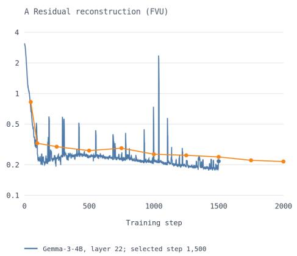

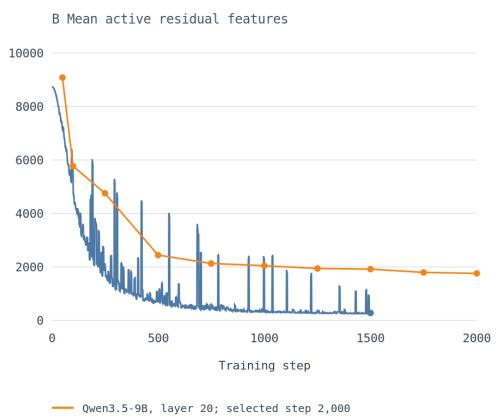  
Figure 4: Selected residual-SAE training diagnostics. Training FVU (log scale, left) and mean active features $L _ { 0 }$ (right) for Gemma-3-4B layer 22 $( \lambda = 0 . 0 0 0 3$ , selected step 1,500) and Qwen3.5- 9B layer 20 $( \lambda = 0 . 0 0 0 1$ , selected step 2,000). Gemma uses the saved per-step metrics; Qwen markers are the training checkpoints recorded in the experiment log, joined only to guide the eye. Curves stop at the selected checkpoints; no other runs are included. Reconstruction metrics were not used as a substitute for downstream checkpoint evaluation: better SAE-objective values did not monotonically improve downstream behavior.

Checkpoint sources. The Gemma dictionaries are derived from instruction-tuned Gemma activations and include both single-layer SAEs and sparse crosscoders (Lieberum et al., 2024; Lindsey et al., 2024)2. The Qwen headline analyses use a public SAE trained on base-model activations (Deng et al., 2026)3. The exact checkpoint, layer, dictionary width, sparsity setting, normalization statistics, and selected token role for every reported experiment are retained in the corresponding saved run configurations; the present appendix describes the common construction rather than an exhaustive configuration table.

Cross-layer sparse representations. For selected Gemma experiments, a sparse crosscoder constructs one shared token-level code from activations at layers $\mathcal { L } \mathrm { : ~ }$

$$
z _ { t } ^ { \mathrm { c c } } = \rho \left( \sum _ { \ell \in \mathcal { L } } W _ { \mathrm { e n c } } ^ { ( \ell ) } h _ { \ell , t } + b _ { \mathrm { e n c } } \right) , \qquad \widehat { h } _ { \ell , t } = W _ { \mathrm { d e c } } ^ { ( \ell ) } z _ { t } ^ { \mathrm { c c } } + b _ { \mathrm { d e c } } ^ { ( \ell ) } ,\tag{8}
$$

where $\rho$ is the checkpoint-specific sparse nonlinearity. The shared code tests whether harmful-content information is represented across model depth rather than being confined to one analyzed layer.

Native and external readouts. For class c, let $\tau ( c )$ denote its textual verbalization. The native label score is

$$
s _ { \mathrm { n a t } , c } ( x ) = \sum _ { q = 1 } ^ { | \tau ( c ) | } \log p _ { \theta } \left( \tau ( c ) _ { q } \mid x , \tau ( c ) _ { < q } \right) .\tag{9}
$$

A supervised linear probe maps a role-conditioned representation to task scores:

$$
\mathbf { s } _ { \mathrm { p r o b e } } ^ { ( s ) } ( x ) = W _ { s } \phi _ { \ell , s } ( x ) + b _ { s }\tag{10}
$$

For the residual reconstruction intervention, the activation passed to the remaining transformer blocks is

$$
h _ { \ell , t } ^ { \prime } = h _ { \ell , t } + \alpha _ { \mathrm { h o o k } } \left( \widehat { h } _ { \ell , t } ^ { \mathrm { j o i n t } } - h _ { \ell , t } \right) , \qquad \alpha _ { \mathrm { h o o k } } \in [ 0 , 1 ]\tag{11}
$$

Section 5 introduces the direct logit router; Appendix I specifies its calibration statistics, signed task margin, mixing coefficient, and locked selection procedure.

Hardware and runtime. Experiments were run on a shared compute cluster with access to $2 \times$ NVIDIA B200 and 2× NVIDIA A100 GPUs; individual jobs used between one and four accelerators. Activation caching was the dominant computational cost: the full Qwen dense cache required approximately three to four 24-hour Slurm runs, followed by residual-cache construction. Most individual probe-fitting, SAE-training, inference, routing, causal-intervention, and LoRA runs completed within 12 hours, although the largest MMHS150K sweeps required longer.

## C DATASET AND EVALUATION DETAILS

Primary benchmarks. CrisisHateMM contains text-embedded images from the Russia–Ukraine conflict annotated for hate speech and attack targets (Bhandari et al., 2023). FHM is a binary hate-speech benchmark constructed with benign image and text confounders intended to reduce unimodal shortcuts (Kiela et al., 2020). MAMI evaluates misogyny identification in memes (Gasparini et al., 2022); HarMeme annotates COVID-19 memes for harmfulness severity and targeted social entities (Pramanick et al., 2021); MMHS150K contains paired image-text social-media posts labeled as NOTHATE or one of five hate categories (Gomez et al., 2020); and MultiOFF consists of USelection memes annotated for offensiveness (Suryawanshi et al., 2020). Table 1 reports the frozen split used for each headline binary task.

Binary and fine-grained targets. The headline benchmark contains one binary task per dataset. For HarMeme, the two harmfulness categories are merged into HARMFUL, while the harmless class becomes NOT HARMFUL. For MMHS150K, {RACIST, SEXIST, HOMOPHOBE, RELIGION, OTHERHATE} are merged into HATE, with NOTHATE retained as the negative class. The original three-class HarMeme task, six-class MMHS150K taxonomy, and CrisisHateMM target-attribution task are treated as secondary fine-grained evaluations and are excluded from the primary six-task mean.

Multilingual robustness datasets. EXIST-2025 contains English and Spanish memes annotated for sexism under a learning-with-disagreement framework (Plaza et al., 2026). Because official test labels were unavailable, we derive binary targets by strict majority vote over Task 2.1 annotations, remove tied or invalid instances, and construct a fixed language-stratified holdout of 500 examples, comprising 250 English and 250 Spanish memes, from 3,420 valid examples. The remaining 2,920 examples are used for probe training.

MultiBully contains Hindi-English code-mixed memes annotated for cyberbullying, sentiment, emotion, and sarcasm (Maity et al., 2022). We use its joint image-text BULLY/NONBULLY label rather than either unimodal annotation. After removing 53 unreadable and 8 missing images, a deterministic label-stratified split assigns 4,793 of the 5,793 valid examples to training and 1,000 to evaluation. EXIST and MultiBully use internal holdouts and are reported only as robustness studies.

Model selection and locked evaluation. Probes and trainable adapters are fitted only on task training data. Any data-dependent choice, including layer, token role, representation, checkpoint, decision threshold, or routing coefficient, is made using training or calibration data and frozen before the reporting split is evaluated. When official validation and test sets both exist, validation is used for calibration and test for reporting. Methods requiring additional scalar calibration divide the available held-out data into disjoint calibration and reporting partitions. A result described as locked uses no reporting example for threshold selection, checkpoint selection, or other post-hoc tuning.

Native decoding and label normalization. Genuinely binary tasks use constrained positiveversus-negative label scoring. For datasets whose original annotation space is multiclass, including HarMeme and MMHS150K, the LVLM first scores every original class label and then applies the fixed binary mapping described above. This avoids evaluating a multiclass dataset through a semantically mismatched yes/no question about one arbitrarily selected class. Primary evaluations use the original image and natively supplied OCR where available. OCR removal, image blanking, and image permutation are used only as paired robustness controls.

Metrics and comparison scope. The primary metric is macro-averaged F1, which weights each class equally despite the substantial class and prediction imbalance in several datasets. Accuracy, class-wise precision and recall, predicted class frequencies, and paired uncertainty analyses are treated as secondary diagnostics. Native, reconstruction-hook, probe, routed, and adapted predictions are compared on identical example IDs within each model family. Because Gemma and Qwen differ in scale, training regime, SAE source, and analyzed layer, cross-family results are interpreted as replication of the phenomenon rather than as a model leaderboard.

## D ADDITIONAL BROAD-COMPARISON ANALYSIS

Task-level readout gaps. The positive sparse-readout advantage is not concentrated in one benchmark. For Gemma-3-4B-IT, the largest improvements over native macro-F1 occur on MMHS150K (+0.338), MAMI (+0.322), and CrisisHateMM (+0.213); the gains on FHM (+0.055), HarMeme (+0.057), and MultiOFF (+0.104) are smaller but remain positive. For Qwen3.5-9B-Base, the largest gains occur on CrisisHateMM (+0.550), HarMeme (+0.416), MultiOFF (+0.396), and MAMI (+0.348), with smaller positive gains on FHM (+0.075) and MMHS150K (+0.064). The unweighted mean gives every dataset equal weight and therefore prevents MMHS150K from dominating the aggregate through its substantially larger reporting split.

Residual reconstruction. The Qwen reconstruction hook raises mean macro-F1 from 0.432 to 0.486, compared with 0.740 for the external SAE probe. Its aggregate recovery fraction is

$$
{ \frac { 0 . 4 8 6 - 0 . 4 3 2 } { 0 . 7 4 0 - 0 . 4 3 2 } } = 0 . 1 7 6 .
$$

The hook improves CrisisHateMM, FHM, MAMI, MMHS150K, and MultiOFF, while remaining unchanged on HarMeme. Reconstruction can therefore make some internally represented information behaviorally useful, but most of the probe-accessible signal is not recovered after the modified activation passes through the model’s original upper layers and output head.

Public base SAE versus residual SAE. For Qwen, the public base-SAE and residual-SAE probes obtain nearly identical six-task means of 0.740 and 0.737, respectively. The public base SAE is stronger on CrisisHateMM, MultiOFF, HarMeme, and MMHS150K, while the residual SAE is stronger on FHM and MAMI. We retain the public base SAE as the primary interpretability object because it provides one standardized feature space across all six tasks, not because residualization is uniformly weaker. Their near-tie also shows that the broad readout gap is not specific to one SAE construction.

Fine-grained targets. The original three-class HarMeme and six-class MMHS150K evaluations are excluded from the primary six-task mean because they require distinguishing harmfulness severity or hate subtypes rather than the coarser harmful-versus-benign boundary. Complete aggregate and class-wise results are reported in Appendix E.

## E FINE-GRAINED HARMFUL-CONTENT CLASSIFICATION

Aggregate fine-grained results. Table 3 reports the locked held-out comparison for the original HarMeme and MMHS150K taxonomies. These results are kept separate from the binary benchmark because the fine-grained tasks require distinguishing severity levels or hate subtypes rather than detecting harmful content alone.

Validation-to-test generalization

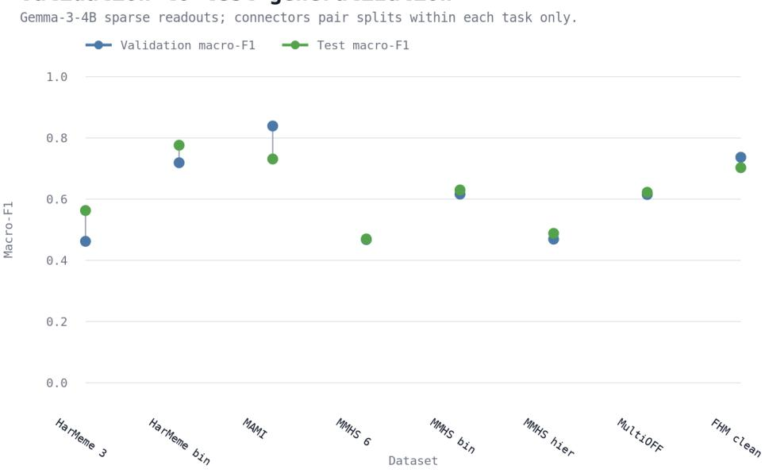  
Figure 5: Gemma validation-to-test generalization. Paired dots preserve the original eight tasklevel macro-F1 comparisons; connectors join only the two splits of the same categorical task. MAMI drops from 0.8390 to 0.7311, whereas MMHS150K and MultiOFF transfer more closely. These are descriptive split differences, not paired-example uncertainty intervals.

The sparse readouts remain substantially stronger than native generation on the fine-grained tasks, but the gap between binary and fine-grained performance is large. For Gemma, the selected binary HarMeme readout reaches 0.7760, compared with 0.5627 for the selected three-class readout, a difference of 0.2133. These use the image and generated tokens, respectively, so the difference does not isolate label collapse in a fixed classifier. The analogous MMHS150K differences are 0.1600 relative to the flat six-class probe and 0.1417 relative to the hierarchical probe. For Qwen’s primary base-SAE representation, the binary readouts exceed the fine-grained readouts by 0.2804 on HarMeme and 0.2178 on MMHS150K. The residual-SAE differences are 0.2522 and 0.2129, respectively.

Class-wise error structure. Table 4 reports class-level metrics from the saved locked Gemma evaluation summary. The MMHS150K values correspond to the hierarchical six-class readout, whose class F1 values average to its reported macro-F1 of 0.4882. The HarMeme values correspond to the selected generated-token three-class readout.

Table 3: Fine-grained macro-F1. For Gemma, Selected sparse denotes the frozen validation-selected residual-SAE readout. For Qwen, the public base SAE is the primary sparse representation and the residual SAE is an ablation. The binary counterpart uses the corresponding sparse representation on the collapsed binary task. Qwen binary values are shown as base-SAE/residual-SAE.
<table><tr><td colspan="7"></td></tr><tr><td>Family</td><td>Task</td><td>n</td><td>Native</td><td>Hook</td><td>Base SAE</td><td>Selected/ Binary residual SAE counterpart</td></tr><tr><td rowspan="3">Gemma</td><td>HarMeme 3-class MMHS150K</td><td>354</td><td>0.3538</td><td>0.3103 0.5432</td><td>0.5627</td><td>0.7760</td></tr><tr><td>6-class, flat MMHS150K</td><td>10,000</td><td>0.3168 0.3118</td><td>0.3588</td><td>0.4699</td><td>0.6299</td></tr><tr><td>6-class, hierarchical</td><td>10,000</td><td>NAa 0.3609</td><td>0.4105</td><td>0.4882</td><td>0.6299</td></tr><tr><td rowspan="2">Qwen</td><td>HarMeme 3-class</td><td>354</td><td>0.2626</td><td>0.2626</td><td>0.5292</td><td>0.5476</td></tr><tr><td>MMHS150K 6-class</td><td>10,000</td><td>0.1661</td><td>0.2071 0.3693</td><td>0.3602</td><td>0.8096 / 0.7998 0.5871 / 0.5731</td></tr></table>

a The hierarchical hook/base-SAE runs use a genuine two-stage readout: ‘NotHate’ versus ‘Hate’, then a five-way hate-type classifier when stage 1 selects ‘Hate’. Native hierarchical remains ‘NA’ because no corresponding two-stage native LVLM decoder was run.

Table 4: Class-level metrics explicitly recorded for the locked Gemma fine-grained evaluation.
<table><tr><td>Task</td><td>Class</td><td>Precision</td><td>Recall</td><td>F1</td><td>Support / diagnostic</td></tr><tr><td rowspan="3">HarMeme 3-class</td><td>not harmful</td><td>0.9337</td><td>0.7957</td><td>0.8592</td><td>230 gold; 183 TP</td></tr><tr><td>somewhat harmful</td><td>0.5986</td><td>0.8544</td><td>0.7040</td><td>103 gold; 88 TP</td></tr><tr><td>very harmful</td><td>0.1818</td><td>0.0952</td><td>0.1250</td><td>21 gold; 2 TP</td></tr><tr><td rowspan="6">MMHS hierarchical</td><td>Homophobe</td><td>0.6202</td><td>0.6763</td><td>0.6470</td><td>1,007 gold; 681 TP</td></tr><tr><td>NotHate</td><td>0.7275</td><td>0.7192</td><td>0.7233</td><td>6,090 gold; 4,380 TP</td></tr><tr><td>OtherHate</td><td>0.4446</td><td>0.5356</td><td>0.4858</td><td>801 gold; 429 TP</td></tr><tr><td>Racist</td><td>0.4458</td><td>0.3594</td><td>0.3979</td><td>1,614 gold; 580 TP</td></tr><tr><td>Religion</td><td></td><td>0.3333</td><td></td><td>24 gold; 8 TP;</td></tr><tr><td>Sexist</td><td>0.4444 0.2613</td><td>0.3362</td><td>0.3810 0.2941</td><td>low-frequency class 464 gold; 156 TP</td></tr></table>

HarMeme’s aggregate accuracy of 0.7712 masks a severe minority-class failure. Only 2 of the 21 very harmful examples are classified correctly, and the class F1 is 0.125. The model therefore captures the broad harmfulness boundary much more reliably than the distinction between somewhat harmful and very harmful.

MMHS150K shows a less concentrated but still uneven error profile. NotHate and Homophobe are the strongest classes, with F1 values of 0.723 and 0.647. Sexist is the weakest at 0.294, while Racist, Religion, and OtherHate remain between 0.381 and 0.486. The hierarchical formulation improves aggregate macro-F1 from 0.4699 to 0.4882, but it does not eliminate the substantial variation between hate subtypes.

Completeness of the Qwen class report. The locked Qwen summary records macro-F1 for the native model, reconstruction hook, public base-SAE probe, and residual-SAE probe, but does not include their class-wise precision, recall, support, or confusion matrices. These class-level results are not reported here. This limits our ability to attribute Qwen’s aggregate fine-grained gains to particular classes or characterize its minority-class errors. Earlier validation reports are not substituted because they use different splits, metrics, or model-selection protocols.

## F TOKEN-ROLE AND REPRESENTATION ABLATIONS

Calibration-only role selection. For each task, candidate probes over prompt/OCR, image, generated, pre-generation, and all-token representations use the same training examples and probe family. The token role and representation used for locked evaluation are selected exclusively on calibration data and are then frozen. The values below are therefore representation-selection diagnostics rather than final reporting results.

Table 5: Gemma-3-4B token-role ablation on the validation/calibration split. Values are macro-F1. Positive $\Delta _ { \mathrm { g e n - i m g } }$ indicates that generated-token states outperform image-position states.
<table><tr><td>Dataset</td><td>Image</td><td>Generated</td><td> $\Delta _ { \mathrm { g e n - i m g } }$ </td></tr><tr><td>CrisisHateMM</td><td>0.817</td><td>0.811</td><td>-0.006</td></tr><tr><td>FHM</td><td>0.645</td><td>0.651</td><td>+0.006</td></tr><tr><td>MAMI</td><td>0.789</td><td>0.839</td><td>+0.050</td></tr><tr><td>HarMeme</td><td>0.719</td><td>0.668</td><td>-0.051</td></tr><tr><td>MMHS150K</td><td>0.531</td><td>0.617</td><td>+0.086</td></tr><tr><td>MultiOFF</td><td>0.600</td><td>0.615</td><td>+0.016</td></tr></table>

Task-dependent token roles. Table 5 rules out a simple account in which harmful-content information is consistently concentrated in either image-origin or generated states. Image features are strongest for HarMeme and marginally stronger for CrisisHateMM. Generated features outperform image features on MAMI, MMHS150K, and MultiOFF, while the two FHM readouts differ by less than one macro-F1 point.

The clearest shift occurs on MMHS150K. Moving from image to generated states raises binary macro-F1 from 0.531 to 0.617. On the original six-class taxonomy, the corresponding increase is from 0.232 to 0.468. The decoding trajectory therefore makes hate subtypes such as RACIST, HOMOPHOBE, and NOTHATE considerably easier to separate than they are in image-position states. This result does not imply that generated tokens supply the gold label; rather, the model’s own classification or explanation trajectory reorganizes the input into a more label-separable representation.

MAMI exhibits a different pattern. Its prompt/OCR probe reaches 0.845 macro-F1, slightly exceeding the generated-token result and clearly exceeding the image-position result of 0.789. The strongest calibration signal is therefore associated with text-bearing states. Prompt positions may incorporate visual information through contextual processing, so this is not a text-only intervention; nor is it direct evidence of visual misogyny recognition. The subsequent validation-to-test decrease indicates limited generalization but does not, on its own, identify reliance on lexical cues.

Pre-generation and post-generation interpretations. Generated-token representations are observed only after answer generation begins and may encode an emerging label, explanation, or confidence. We therefore use them to localize when the representation becomes separable, not as sole evidence that the same information was available before decoding.

Pre-generation controls show that the broad readout gap is not merely a probe over the model’s own answer. Image-position probes are selected for CrisisHateMM and binary HarMeme and retain substantial advantages over native output on their locked reporting splits. The selected Gemma FHM readout uses prompt and image positions from a cross-layer representation rather than generated states. Both pre-generation and post-generation states therefore contain useful harmful-content information, although the strongest role varies by task.

FHM multi-role controls. FHM was designed with benign image and text confounders, so a useful classifier must distinguish examples whose label changes when one component is held fixed (Kiela et al., 2020). Gemma’s image-generated and all-token layer-22 probes remain in a similar performance range. Its final 4B candidate instead combines prompt–image crosscoder features with complementary layer-22 and layer-29 readouts.

Qwen provides a separate control using its public layer-20 base SAE. Image- and prompt-position probes obtain 0.628 and 0.631 macro-F1, respectively, while their concatenation reaches 0.641. A rank-16 bilinear probe falls to 0.528. The two roles therefore contain useful additive information, but this pooled bilinear parameterization does not recover a useful interaction. More generally, using multiple modality-associated representations does not itself establish a genuine cross-modal interaction (Hessel & Lee, 2020). Section 4.2 tests this question using matched confounders and a stronger Gemma-3-12B representation.

Sparse versus dense representations. We compare each sparse readout with a probe over the corresponding role-pooled dense hidden state. For Gemma, sparse factorization improves macro-F1 by 0.283 on CrisisHateMM, 0.041 on six-class MMHS150K, and 0.022 on FHM. Its effect on MAMI, HarMeme, and MultiOFF lies between −0.006 and +0.008. Random sparse controls remain near chance, ruling out dimensionality or sparsity alone as the source of the strong probe results.

These controls indicate that most harmful-content information is already present in the dense residual stream. Sparse factorization can make that information easier to separate on selected tasks, but its primary value for the subsequent analysis is that it expresses the signal in a coordinate system supporting feature-level output alignment, ablation, and activation patching. The complementary Qwen public-base versus residual-SAE comparison is reported in Appendix D.

## G FEATURE ALIGNMENT AND CAUSAL INTERVENTION DETAILS

Static feature-output alignment. For an SAE feature with decoder direction $d _ { j } \in \mathbb { R } ^ { d _ { \ell } }$ , we measure its direct alignment with the yes/no output channel. Let

$$
m _ { \mathrm { y n } } ( x ) = \ell _ { \mathrm { y e s } } ( x ) - \ell _ { \mathrm { n o } } ( x )\tag{12}
$$

denote the monitored output margin, where $\ell _ { v } ( x )$ is the logit for token v. With the final normalization scale folded into the unembedding, the corresponding hidden-space direction and feature effect are

$$
u _ { \mathrm { y n } } = W _ { U } ^ { f \top } \left( e _ { \mathrm { y e s } } - e _ { \mathrm { n o } } \right) , \qquad a _ { j } = d _ { j } ^ { \top } u _ { \mathrm { y n } } .\tag{13}
$$

The signed agreement between this effect and task-d probe weight $w _ { d , j }$ is

$$
q _ { d , j } = \mathrm { s i g n } ( w _ { d , j } ) a _ { j } .\tag{14}
$$

A probe-important feature is called aligned when $q _ { d , j } \geq \tau$ , misaligned when $q _ { d , j } \leq - \tau$ , and outputsilent when $| a _ { j } | < \tau$ , using $\tau = 0 . 1 0$ . Silence is defined only relative to this output anchor; it does not imply that the feature is globally inactive or incapable of affecting another output channel.

For Qwen’s public base SAE, the aligned subset is empty for CrisisHateMM, FHM, MultiOFF, HarMeme, and MMHS150K, and contains only 1% of analyzed feature records for MAMI. No task has a substantial misaligned subset. The secondary residual SAE gives the same qualitative result. Because Equations equation 12 and equation 13 bypass the intervening transformer blocks, they are used as feature-selection diagnostics rather than as complete causal attributions (Elhage et al., 2021; Belrose et al., 2023).

Independent feature-set construction. The routed set is selected independently of labels and probe weights:

$$
\begin{array} { r } { \mathcal { R } _ { \mathrm { y n } } = \mathrm { T o p K } _ { k } \left( \left\{ \left| d _ { j } ^ { \top } u _ { \mathrm { y n } } \right| \right\} _ { j = 1 } ^ { m } \right) . } \end{array}\tag{15}
$$

For task $d ,$ the silent discriminative set is

$$
\begin{array} { r } { S _ { d } = \left\{ j \in \mathrm { T o p K } _ { k } \left( \left\{ | w _ { d , j } | \right\} _ { j = 1 } ^ { m } \right) : | a _ { j } | < \tau \right\} . } \end{array}\tag{16}
$$

All reported Qwen interventions use $k = 2 0$ . Thus, $\textstyle { S _ { d } }$ is selected for task discrimination subject to weak output alignment, while ${ \mathcal { R } } _ { \mathrm { y n } }$ is selected for output alignment without using the task labels.

Knockout and donor patching. Following causal-mediation and activation-patching analyses (Vig et al., 2020; Meng et al., 2022; Marks et al., 2025), the knockout intervention removes a selected set $S { \mathrm { : } }$

$$
z _ { t , j } ^ { - S } ( x ) = \left\{ { 0 , \atop z _ { t , j } ( x ) , } \right. \ { j \in S } ,\tag{17}
$$

For donor $x ^ { \prime }$ and target x, routed-feature patching assigns the donor’s max-pooled activation to the selected target features:

$$
z _ { t , j } ^ { x  x ^ { \prime } } = \{ \begin{array} { l l } { \underset { t ^ { \prime } } { \operatorname* { m a x } } z _ { t ^ { \prime } , j } ( x ^ { \prime } ) , } & { j \in \mathcal { R } _ { \mathrm { y n } } , } \\ { z _ { t , j } ( x ) , } & { j \notin \mathcal { R } _ { \mathrm { y n } } . } \end{array}\tag{18}
$$

The patched value is broadcast over target positions. This is useful for testing whether the selected feature family can control a downstream quantity, but it does not reproduce the donor’s natural position-dependent activation pattern.

For intervened computation xe, we record

$$
\Delta _ { \mathrm { p r o b e } } = s _ { \mathrm { p r o b e } } ( \widetilde { x } ) - s _ { \mathrm { p r o b e } } ( x ) , \qquad \Delta _ { \mathrm { n a t i v e } } = m _ { \mathrm { y n } } ( \widetilde { x } ) - m _ { \mathrm { y n } } ( x )\tag{19}
$$

and summarize the mirror-image interventions using

$$
\rho _ { \mathcal { S } } = \frac { | \mathbb { E } | \Delta _ { \mathrm { p r o b e } } | } { \mathbb { E } | \Delta _ { \mathrm { n a t i v e } } | } , \qquad \rho _ { \mathcal { R } } = \frac { \mathbb { E } | \Delta _ { \mathrm { n a t i v e } } | } { \mathbb { E } | \Delta _ { \mathrm { p r o b e } } | } .\tag{20}
$$

Qwen intervention results. Silent-feature knockout uses at most 15 eligible examples per task. Where eligible examples exist, removing only 20 features changes the probe score by approximately 2.0–2.5 units while changing the monitored yes/no margin by only 0.04–0.08. This gives probeto-margin ratios of 24.2:1 to 62.8:1. For FHM, the monitored margin is the actual native decision channel. For HarMeme and MMHS150K, it is only a diagnostic because their native predictions use full-label scoring.

Routed-feature patching uses at most five eligible donor-target pairs. On the four literal yes/no tasks, it changes the native margin by 0.34–1.09 while changing the probe score by only 0.006–0.062, yielding native-to-probe ratios from 16.2:1 to 140.2:1. The MMHS150K routed result is excluded from the headline comparison because both its output channel and routed feature set are mismatched to the task’s label-score decision rule. These effects establish control of the monitored output, not an improvement in prediction correctness.

Why silent-feature donor patching is not headline evidence. Broadcasting a donor’s max-pooled feature value to every target token position can create activation patterns that do not occur during ordinary inference. This intervention produces inconsistent signs and, for CrisisHateMM, an unusually large movement of the monitored margin. We therefore use silent-feature knockout to establish probe dependence and routed-feature patching to establish output control. Silent-feature patching is retained in Table 6 as a transparency and sanity-check result rather than as primary evidence.

Gemma replication and limits. For Gemma’s layer-22 residual-SAE dictionary, the top probederived and directly routed sets have zero overlap on all four analyzed tasks. Perturbing the silent set changes the probe score 13–180× more than perturbing the routed set. We additionally compute an upper-layer-aware output-sensitivity diagnostic:

$$
a _ { d , j } ^ { J } = d _ { j } ^ { \top } \mathbb { E } _ { x } \left[ \nabla _ { h _ { \ell } } m _ { d } ( x ) \right] .\tag{21}
$$

This Jacobian-based (Gurnee et al., 2026) analysis also places the strongest probe directions outside the dominant output-routing set. Native-output mediation is less uniform: routed-feature ablation has a larger effect than silent-feature ablation on MMHS150K, but not consistently on MAMI, HarMeme, or CrisisHateMM. Gemma therefore replicates the geometric and probe-side separation, but does not support a universal two-subspace causal decomposition.

Table 6: Complete causal interventions for Qwen’s public layer-20 base SAE. $\mathbb { E } | \Delta _ { \mathrm { p r o b e } } |$ and $\mathbb { E } { \lvert } \Delta _ { \mathrm { n a t i v e } } { \rvert }$ are mean absolute changes in the external probe score and monitored yes/no margin. The final column is always written as probe sensitivity: native-margin sensitivity. Thus, 50.2:1 is probe-dominant, whereas 1:16.2 is output-dominant. YN denotes literal yes/no decoding and LS denotes full-label scoring.
<table><tr><td>Task</td><td>Decode</td><td>n</td><td> $\mathbb { E } | \Delta s _ { \mathrm { p r o b e } } |$ </td><td> $\lVert \rVert \Delta m _ { \mathrm { y n } } \rVert$ </td><td>Probe:YN</td></tr><tr><td>A. Silent-feature knockout</td><td></td><td></td><td></td><td></td><td></td></tr><tr><td>CrisisHateMM</td><td>YN</td><td></td><td></td><td></td><td></td></tr><tr><td>FHM</td><td>YN</td><td>15</td><td>2.5121</td><td>0.0500</td><td>50.2:1</td></tr><tr><td>MAMI</td><td>YN</td><td>_a</td><td></td><td></td><td></td></tr><tr><td>HarMeme</td><td>LS†</td><td>15</td><td>2.4995</td><td>0.0398</td><td>62.8:1</td></tr><tr><td>MMHS150K</td><td>LS†</td><td>15</td><td>2.0190</td><td>0.0833</td><td>24.2:1</td></tr><tr><td>MultiOFF</td><td>YN</td><td></td><td></td><td></td><td></td></tr><tr><td>B. Silent-feature donor patch</td><td></td><td></td><td></td><td></td><td></td></tr><tr><td>CrisisHateMM</td><td>YN</td><td>5</td><td>0.3416</td><td>1.5377</td><td>0.2:1</td></tr><tr><td>FHM</td><td>YN</td><td>5</td><td>0.4010</td><td>0.1373</td><td>2.9:1</td></tr><tr><td>MAMI</td><td>YN</td><td>5</td><td>0.6764</td><td>0.1124</td><td>6.0:1</td></tr><tr><td>HarMeme</td><td>LS</td><td>_b</td><td></td><td></td><td></td></tr><tr><td>MMHS150K</td><td>LS†</td><td>5</td><td>0.4248</td><td>0.2737</td><td>1.6:1</td></tr><tr><td>MultiOFF</td><td>YN</td><td>5</td><td>0.5354</td><td>0.1253</td><td>4.3:1</td></tr><tr><td>C. Routed-feature donor patch</td><td></td><td></td><td></td><td></td><td></td></tr><tr><td>CrisisHateMM</td><td>YN</td><td>5</td><td>0.0125</td><td>0.3998</td><td>1:32.0</td></tr><tr><td>FHM</td><td>YN</td><td>5</td><td>0.0208</td><td>0.3376</td><td>1:16.2</td></tr><tr><td>MAMI</td><td>YN</td><td>5</td><td>0.0624</td><td>1.0880</td><td>1:17.4</td></tr><tr><td>HarMeme</td><td>LS</td><td>_b</td><td></td><td></td><td></td></tr><tr><td>MMHS150K</td><td>LS</td><td>5</td><td>0.3191</td><td>0.0900</td><td>3.5:1</td></tr><tr><td>MultiOFF</td><td>YN</td><td>5</td><td>0.0065</td><td>0.9116</td><td>1:140.2</td></tr><tr><td></td><td></td><td></td><td></td><td></td><td></td></tr></table>

a No eligible gold-positive, probe-correct, native-wrong examples occurred under the Intervention A selection rule. The native classifiers for these tasks already predicted the positive class at a high rate, leaving few or no relevant false negatives.  
b No eligible patch targets occurred for HarMeme because the native Qwen classifier predicted not harmful for every reporting example.  
† HarMeme and MMHS150K use label-score decoding rather than literal yes/no decoding. Their reported $\Delta m _ { \mathrm { y n } }$ therefore measures a diagnostic yes/no direction, not the complete native task decision.  
‡ In addition to the diagnostic-margin caveat, the routed feature set itself was selected using the yes/no unembedding direction. It is therefore mismatched to MMHS150K’s label-score channel and is not included in the routed-feature headline conclusion.

## H FHM LOW-RANK CROSS-MODAL READOUT DETAILS

Representation construction. We use the Gemma-3-12B layer-31 sparse representation. A trainonly confounder audit selects K = 128 features, after which image-position and prompt-position activations are feature-wise max-pooled and standardized:

$$
x _ { \mathrm { i m g } } , x _ { \mathrm { p r o m p t } } \in \mathbb { R } ^ { K } .
$$

The prompt representation includes both the task instruction and supplied OCR. Image and prompt refer to token origin; by layer 31, both state families may contain information exchanged through the transformer.

Gated pairwise baseline. Separate image and prompt-position scores are

$$
s _ { \mathrm { i m g } } ( x ) = w _ { \mathrm { i m g } } ^ { \top } x _ { \mathrm { i m g } } + b _ { \mathrm { i m g } } , \qquad s _ { \mathrm { p r o m p t } } ( x ) = w _ { \mathrm { p r o m p t } } ^ { \top } x _ { \mathrm { p r o m p t } } + b _ { \mathrm { p r o m p t } } .\tag{22}
$$

An input-dependent gate combines them:

$$
\begin{array} { r l } & { g ( x ) = \sigma \big ( w _ { g } ^ { \top } [ x _ { \mathrm { i m g } } ; x _ { \mathrm { p r o m p t } } ] + b _ { g } \big ) , } \\ & { s _ { \mathrm { g a t e } } ( x ) = g ( x ) s _ { \mathrm { i m g } } ( x ) + \big ( 1 - g ( x ) \big ) s _ { \mathrm { p r o m p t } } ( x ) . } \end{array}\tag{23}
$$

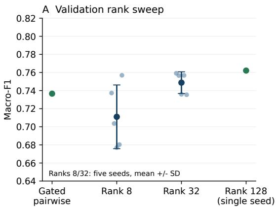

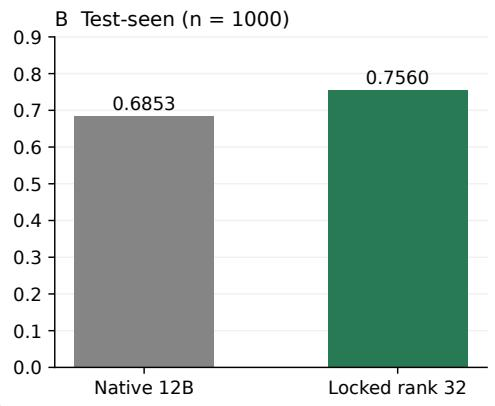  
Figure 6: FHM rank sweep and test comparison. A. Validation macro-F1 on 375 examples after threshold selection on a disjoint 94-example calibration partition. Rank-8 and rank-32 dots show five seeds; error bars show sample SD. The gated baseline and rank-128 values are single runs. B. The displayed test-seen count is $n = 1 0 0 0$ , following the manuscript’s current reporting convention; the saved paired-analysis artifact underlying the unchanged scores contains 931 paired predictions. This denominator discrepancy remains to be reconciled. The locked readout reaches 0.7560 versus 0.6853 natively; the difference compares the complete pair-aware readout with the native model, not the isolated bilinear contribution.

Because $g ( x )$ depends on both role representations, we refer to this as a gated pairwise baseline rather than a strictly additive linear model.

Low-rank interaction. The full readout is defined in Equation equation 5. Equivalently, its interaction matrix is

$$
W _ { \mathrm { b i l } } = U V ^ { \top } , \qquad U , V \in \mathbb { R } ^ { K \times r } .
$$

The rank r bounds the number of multiplicative image-by-prompt directions and reduces the interaction parameter count from $K ^ { 2 }$ to $2 K r$

Matched-pair objective. Let ${ \mathcal { P } } _ { \mathrm { i m g } }$ contain opposite-label pairs sharing the same image, and let $\mathcal { P } _ { \mathrm { t e x t } }$ contain opposite-label pairs sharing the same meme text. For $( x ^ { \bar { + } } , x ^ { - } ) , x ^ { + }$ is the hateful member and $x ^ { - }$ is the benign member. Training minimizes

$$
\mathcal { L } = \mathcal { L } _ { \mathrm { c l s } } + \sum _ { c \in \{ \mathrm { i m g , t e x t } \} } \frac { \lambda _ { c } } { | \mathcal { P } _ { c } | } \sum _ { ( x ^ { + } , x ^ { - } ) \in \mathcal { P } _ { c } } \left[ \delta - s _ { r } ( x ^ { + } ) + s _ { r } ( x ^ { - } ) \right] _ { + }\tag{24}
$$

where $[ a ] _ { + } = \operatorname* { m a x } ( 0 , a )$ , δ is the required pair margin, and $\lambda _ { c }$ controls the contribution of each pair family.

Development and locked-test protocol. Model parameters are fitted on the FHM training set. Decision thresholds are selected on a fixed 94-example calibration partition and evaluated on a disjoint 375-example validation partition. Training seeds change only parameter initialization. Rank 32 is chosen from the development rank sweep based on its accuracy-stability trade-off. Within that rank, the seed-0 checkpoint and threshold 0.52 are selected from calibration results and then frozen before evaluating the 1000 test-seen examples with paired predictions.

Locked test comparison. The selected rank-32 checkpoint transfers from 0.7591 validation macro-F1 to 0.7560 on the 1000-example paired test-seen subset. Native Gemma-3-12B obtains 0.6853, giving

$$
\Delta _ { \mathrm { t e s t } } = 0 . 7 5 6 0 - 0 . 6 8 5 3 = 0 . 0 7 0 7 .
$$

A label-stratified paired bootstrap gives a 95% confidence interval of [0.0461, 0.0954]. An exact McNemar test favors the pair-aware bilinear readout on 103 discordant examples, compared with

Table 7: Gemma-3-12B FHM rank sweep. Validation macro-F1 is measured on the same 375- example partition after threshold selection on the disjoint 94-example calibration partition. Rank-8 and rank-32 values are the mean ± standard deviation over five seeds. Pair BC reports the mean both-correct rate for same-image and same-text opposite-label pairs. The † test result is from the calibration-selected rank-32, seed-0 checkpoint, not an average over test runs.
<table><tr><td>Readout</td><td>Validation F1</td><td>Pair BC, Img/Txt</td><td>Test-seen F1</td></tr><tr><td>Native 12B label score</td><td></td><td></td><td>0.6853</td></tr><tr><td>Gated pairwise baseline</td><td> $0 . 7 3 6 6$ </td><td>0.571 / 0.435</td><td></td></tr><tr><td>Bilinear  $r = 8$ </td><td> $0 . 7 1 1 0 \pm 0 . 0 3 5 2$ </td><td>0.471 / 0.407</td><td></td></tr><tr><td>Bilinear  $r = 3 2$ </td><td> $0 . 7 4 8 8 \pm 0 . 0 1 2 0$ </td><td>0.555 / 0.464</td><td> $0 . 7 5 6 0 ^ { \dagger }$ </td></tr><tr><td>Bilinear  $r = 1 2 8$ </td><td> $0 . 7 6 2 1$ </td><td>0.583 / 0.506</td><td></td></tr></table>

37 examples favoring the native model $( p = 2 . 1 8 \times 1 0 ^ { - 8 } )$ . These statistics compare the complete pair-aware readout with native generation. They should not be interpreted as the isolated effect of adding the bilinear component to the gated baseline.

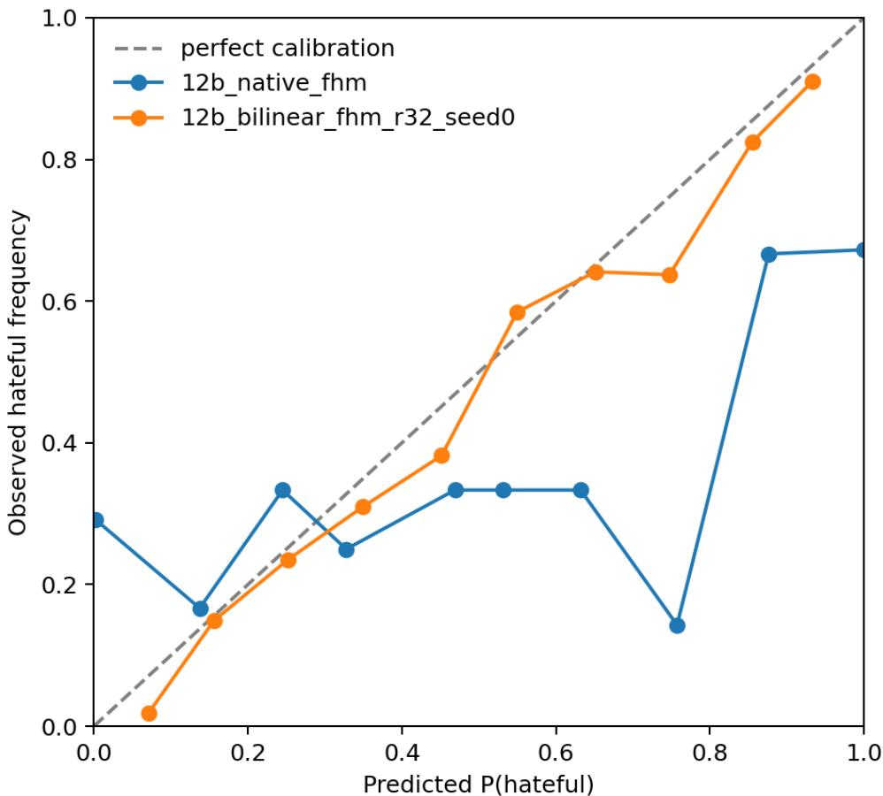  
Figure 7: FHM calibration curve (Gemma-3-12B). The locked bilinear readout attains Brier score 0.1721 and ECE 0.0375, compared with 0.3084 and 0.3065 for the native model.

Matched-confounder behavior. For the selected rank-32 seed, the hateful member receives the larger score in 84.5% of same-image pairs and 84.7% of same-text pairs. The stricter both-correct rates are 58.3% and 49.4%, respectively. The model therefore captures a strong relative-ordering signal when either the image or text is held fixed, while exact classification of both members remains more difficult.

Cross-covariance interpretation. For centered role vectors, define the class-conditional crosscovariance difference

$$
\begin{array} { r } { \Delta \Sigma _ { \mathrm { i p } } = \mathbb { E } \left[ x _ { \mathrm { i m g } } x _ { \mathrm { p r o m p t } } ^ { \top } \mid y = 1 \right] - \mathbb { E } \left[ x _ { \mathrm { i m g } } x _ { \mathrm { p r o m p t } } ^ { \top } \mid y = 0 \right] . } \end{array}\tag{25}
$$

The class separation contributed by the explicit interaction component is

$$
\Delta _ { \mathrm { i n t } } = \gamma \mathrm { t r } \left( W _ { \mathrm { b i l } } ^ { \top } \Delta \Sigma _ { \mathrm { i p } } \right) .\tag{26}
$$

The bilinear term therefore reads class-dependent co-variation between the two role representations, rather than only their separate marginal activations.

Nonlinear and factor-level controls. A within-role quadratic control adds squared image, prompt, and generated-feature activations without multiplying features across roles. It changes validation macro-F1 by only 0.004 and leaves the matched-pair both-correct rates unchanged. The improvement is therefore not explained by generic nonlinear rescaling within an individual role.

Leave-one-rank-out analysis finds that 11 of the 32 interaction factors make a measurable contribution to validation macro-F1. Removing any single factor changes macro-F1 by at most 0.007. Follow-up patching and polarity tests do not support a collection of narrowly bound rules of the form “specific image feature i plus specific text feature $j .$ The more conservative interpretation is a redundant, distributed interaction over broader image- and prompt-side subspaces.

Cross-model negative controls. The result does not transfer uniformly to other representations. For Gemma-3-4B, the corresponding bilinear readout obtains 0.654 macro-F1, below its simpler baseline at 0.688. For Qwen’s public layer-20 base SAE, a rank-16 bilinear readout obtains 0.528, below image-prompt concatenation at 0.641. These results limit the interaction claim to the analyzed Gemma-3-12B layer-31 representation and pair-aware training procedure; they do not show that other models lack cross-modal structure at different layers or under different readouts.

## I DIRECT-ROUTING AND PROBE-DISTILLATION DETAILS

## I.1 CALIBRATION-ONLY DIRECT LOGIT ROUTING

For task $d ,$ let $\mathcal { D } _ { d , \mathrm { c a l } }$ be the calibration partition, $m _ { d } ( x )$ the signed native decision margin, and $u _ { d } ( x )$ the decision-function score of the frozen probe. The calibration statistics are

$$
\begin{array} { l } { \displaystyle \mu _ { d } = \frac { 1 } { \left| \mathcal D _ { d , \mathrm { c a l } } \right| } \sum _ { x \in \mathcal D _ { d , \mathrm { c a l } } } { u _ { d } ( x ) } , } \\ { \displaystyle \sigma _ { d } ^ { 2 } = \frac { 1 } { \left| \mathcal D _ { d , \mathrm { c a l } } \right| } \sum _ { x \in \mathcal D _ { d , \mathrm { c a l } } } { \left( u _ { d } ( x ) - \mu _ { d } \right) ^ { 2 } } , } \\ { \displaystyle \widetilde u _ { d } ( x ) = \frac { u _ { d } ( x ) - \mu _ { d } } { \sigma _ { d } + \epsilon } . } \end{array}\tag{27}
$$

The routed margin is given by Equation equation 6. Its mixing coefficient is selected only on the calibration partition:

$$
\beta _ { d } ^ { \star } = \arg \operatorname* { m a x } _ { \beta \in \mathcal { A } } \mathrm { M a c r o F 1 } \left( \{ \mathbb { I } \left[ m _ { d } ( x ) + \beta \widetilde { u } _ { d } ( x ) \geq 0 \right] \} _ { x \in \mathcal { D } _ { d , \mathrm { c a l } } } , \mathbf { y } _ { d , \mathrm { c a l } } \right) ,\tag{28}
$$

where $\mathcal { A }$ is the finite coefficient grid. The normalization statistics, coefficients, and zero decision threshold are then frozen before evaluation on the disjoint reporting partition.

The routed mean recovers

$$
\frac { 0 . 7 2 0 4 - 0 . 4 4 0 5 } { 0 . 7 4 0 4 - 0 . 4 4 0 5 } = 0 . 9 3 3
$$

of the native-to-probe $\mathrm { g a p }$ . FHM is the only task on which the native and probe scores are complementary enough for the routed system to exceed the probe alone. Because FHM, MAMI, MMHS150K, and MultiOFF select the maximum tested value $\bar { \boldsymbol { \beta } } _ { d } = 8$ , these runs do not establish that the selected coefficients are interior optima.

Table 8: Qwen direct logit routing on disjoint reporting partitions. Macro-F1 is evaluated after selecting $\beta _ { d } ^ { \star }$ on a separate 30% calibration partition. Native, routed, and probe values use identical reporting examples and therefore differ from the full-split results in $\mathrm { T a b l e } ^ { \overline { { 2 } } }$
<table><tr><td>Task</td><td>Native</td><td>Routed</td><td>Probe</td><td> $\beta _ { d } ^ { \star }$ </td></tr><tr><td>CrisisHateMM</td><td>0.3527</td><td>0.8413</td><td>0.8582</td><td>4</td></tr><tr><td>FHM</td><td>0.6660</td><td>0.7387</td><td>0.7269</td><td>8</td></tr><tr><td>MAMI</td><td>0.4020</td><td>0.7703</td><td>0.7952</td><td>8</td></tr><tr><td>HarMeme</td><td>0.3922</td><td>0.7650</td><td>0.8251</td><td>4</td></tr><tr><td>MMHS150K</td><td>0.5097</td><td>0.5708</td><td>0.5745</td><td>8</td></tr><tr><td>MultiOFF</td><td>0.3201</td><td>0.6365</td><td>0.6623</td><td>8</td></tr><tr><td>Mean</td><td>0.4405</td><td>0.7204</td><td>0.7404</td><td>一</td></tr></table>

Table 9: Recorded configuration of the dedicated and shared probe-distillation runs.
<table><tr><td>Configuration</td><td>FHM-dedicated adapter</td><td>Shared seven-task adapter</td></tr><tr><td>Base model</td><td>Gemma-3-4B-IT</td><td>Gemma-3-4B-IT</td></tr><tr><td>Training tasks</td><td>FHM binary hatefulness</td><td>FHM, MAMI, MultiOFF, CrisisHateMM-A, CrisisHateMM-B,</td></tr><tr><td>Available target rows</td><td>7,938</td><td>HarMeme, and MMHS150K 160,761 across seven tasks</td></tr><tr><td>Optimization steps</td><td>2,000</td><td>4,000</td></tr><tr><td>Task-sampling schedule</td><td>Single-task sampling</td><td>Equal round-robin task exposure; each task receives  $1 / 7$  of task-selection</td></tr><tr><td>LoRA rank  $r _ { \mathrm { L o R A } }$ </td><td>16</td><td>steps 16</td></tr><tr><td>Adapted modules</td><td>Seven projection types in all 34</td><td>Same seven projection types across all</td></tr><tr><td>Trainable parameters</td><td>transformer layers 29,802,496 of 4,329,881,968</td><td>34 layers 29, 802, 496 of 4, 329, 881, 968</td></tr><tr><td>Gold-label loss</td><td>parameters (0.6883%) Cross-entropy;  $\lambda _ { \mathrm { g o l d } } = 0 . 5$ </td><td>parameters (0.6883%) Cross-entropy;  $\lambda _ { \mathrm { g o l d } } = 0 . 5$ </td></tr><tr><td>Probe-target loss</td><td>KL distillation from the frozen</td><td>KL distillation from the corresponding</td></tr><tr><td></td><td>FHM probe;  $\lambda _ { \mathrm { p r o b e } } = 0 . 5$ </td><td>frozen task probe;  $\lambda _ { \mathrm { p r o b e } } = 0 . 5$ </td></tr><tr><td>Pair-ranking loss</td><td>Active on 4,330 pseudo-confounder pairs;  $\lambda _ { \mathrm { p a i r } } = 0 . 5$ </td><td>Active only for tasks with valid pairs;  $\lambda _ { \mathrm { p a i r } } = 0 . 5$ </td></tr><tr><td>Pair margin δ Pairs sampled per eligible</td><td>1.0 4FHM pairs</td><td>1.0 1 pair, reduced from 2 after the initial</td></tr><tr><td>task per step Pair-loss accumulation</td><td>Four sampled pair losses are averaged into the final microbatch loss, then scaled by  $1 / n _ { a c c }$ </td><td>run Each sampled pair is backpropagated separately with effective weight  $\lambda _ { \mathrm { p a i r } } / ( n _ { \mathrm { v a l i d } } n _ { \mathrm { a c c } } )$  , where  $n _ { \mathrm { v a l i d } }$  is the number of valid sampled pairs and</td></tr><tr><td>Output-rate regularization Output-rate coefficient</td><td>None 0</td><td> $n _ { \mathrm { a c c } }$  is the gradient-accumulation factor Task-dependent; see Table 10</td></tr><tr><td>λrate</td><td></td><td>0.5; EMA decay 0.98</td></tr><tr><td>Batch size Gradient-accumulation</td><td>1 8</td><td>1 8</td></tr><tr><td>factor  $n _ { \mathrm { a c c } }$ </td><td></td><td></td></tr><tr><td>Effective main-loss batch per optimizer step</td><td>8 examples</td><td>8 examples</td></tr><tr><td>Optimizer and learning rate</td><td>AdamW,  $l r = 1 0 ^ { - 4 }$  , weight decay 0; 50-step linear warmup</td><td>AdamW,  $l r = 1 0 ^ { - 4 } ,$  , weight decay 0; 100-step linear warmup</td></tr></table>

## I.2 PROBE-DISTILLED LORA

Let $p _ { \theta , \phi , d } ( \cdot | \boldsymbol { x } )$ be the label distribution of the adapted LVLM, where θ is frozen and ϕ contains the LoRA parameters, and let $q _ { d } ( \cdot \mid x )$ be the frozen probe distribution. The task-d objective is

$$
\begin{array} { r l } & { \mathcal { L } ^ { ( d ) } = \lambda _ { \mathrm { g o l d } } \mathrm { C E } \left( y , p _ { \theta , \phi , d } ( \cdot \mid x ) \right) + \lambda _ { \mathrm { p r o b e } } \mathrm { K L } \left( q _ { d } ( \cdot \mid x ) \parallel p _ { \theta , \phi , d } ( \cdot \mid x ) \right) } \\ & { \qquad + \mathbb { I } [ | \mathcal { P } _ { d } | > 0 ] \lambda _ { \mathrm { p a i r } } \mathcal { L } _ { \mathrm { p a i r } } ^ { ( d ) } + \mathbb { I } [ d \in \mathcal { D } _ { \mathrm { r a t e } } ] \lambda _ { \mathrm { r a t e } } \mathcal { L } _ { \mathrm { r a t e } } ^ { ( d ) } . } \end{array}\tag{29}
$$

The gold-label term limits blind imitation of probe errors, while the KL term transfers the probe’s graded class preferences. For tasks with matched opposite-label pairs,

$$
\mathcal { L } _ { \mathrm { p a i r } } ^ { ( d ) } = \frac { 1 } { | \mathcal { P } _ { d } | } \sum _ { ( x ^ { + } , x ^ { - } ) \in \mathcal { P } _ { d } } \left[ \delta - m _ { \theta , \phi } ^ { ( d ) } ( x ^ { + } ) + m _ { \theta , \phi } ^ { ( d ) } ( x ^ { - } ) \right] _ { + }\tag{30}
$$

where $x ^ { + }$ and $x ^ { - }$ are the harmful and benign pair members, respectively, and $\delta$ is the ordering margin.

Dedicated FHM adapter. The dedicated Gemma-3-4B-IT run uses rank-16 LoRA updates and contains 29,802,496 trainable parameters, corresponding to 0.6883% of the 4.33-billion-parameter model. It is trained for 2,000 steps using 7,938 available target rows and 4,330 pseudo-confounder pairs. The adapted model improves macro-F1 on the scored test-seen subset from 0.6482 to 0.7138 without requiring an SAE or probe at inference. On the separate 469-example development evaluation, it obtains 0.7095, compared with 0.7110 for the teacher probe. Similar macro-F1 does not imply identical predictions: the adapter is more precise but less sensitive on the hateful class and reaches a similar aggregate score at a different operating point.

Shared seven-task adapter. The shared adapter is trained for 4,000 steps with equal round-robin task sampling. Each task therefore receives one seventh of task-selection steps, irrespective of its share of the 160,761 available target rows. Under its own evaluation setup, it raises the unweighted seventask mean from 0.4642 to 0.5686, including large improvements on MAMI and binary HarMeme.

The gains are not uniform. On the same FHM development evaluation, the shared adapter obtains 0.6548, compared with 0.7095 for the dedicated adapter. On MMHS150K, six-class macro-F1 decreases from 0.3727 to 0.1886, although the binary result changes only from 0.3940 to 0.3895. The shared adapter therefore preserves much of the coarse hate-versus-non-hate boundary while destroying subtype discrimination. Equal task exposure may contribute: MMHS150K accounts for 83.865% of available target rows but receives the same nominal number of task-selection steps as MultiOFF, which accounts for only 0.277%. These results motivate task-specific or task-grouped adapters rather than a single universal adapter.

Table 10: Per-task target pools and auxiliary supervision for the shared adapter. Pool share is computed over the 160,761 available target rows. “Configured, inactive” means that the task was eligible for a pair loss but no valid training pairs were found. Output-rate regularizers are reported only where their status is explicitly documented.
<table><tr><td>Task</td><td>Targets  $N _ { d }$ </td><td>Pool share</td><td>Step share</td><td>Valid pairs</td><td>Pair loss</td><td>Output-rate regularizer</td></tr><tr><td>FHM</td><td>7,938</td><td>4.938%</td><td>1/7</td><td>4,330</td><td>Active</td><td>NR; no task-specific form is stated in the experiment observations Active; EMA prediction</td></tr><tr><td>MAMI</td><td>9,000</td><td>5.598%</td><td>1/7</td><td>23</td><td>Active</td><td>rate compared with the approximately 0.5 empirical positive-class prior</td></tr><tr><td>MultiOFF CrisisHateMM</td><td>445</td><td>0.277%</td><td>1/7</td><td>1</td><td>Active, but extremely sparse</td><td>Not used</td></tr><tr><td>-A HarMeme</td><td>3,600</td><td>2.239%</td><td>1/7</td><td>0</td><td>Configured, inactive</td><td>Not used Active on the binary</td></tr><tr><td></td><td>3,013</td><td>1.874%</td><td>1/7</td><td>51</td><td>Active</td><td>harmful/not harmful collapse; it does not regularize the somewhat</td></tr><tr><td>MMHS150K</td><td>134,823</td><td>83.865%</td><td>1/7</td><td>57</td><td>Active</td><td>harmful/very harmful boundary Active using a one-sided EMA overshoot statistic relative to the approximately 0.583 empirical Hate prior; the</td></tr><tr><td>CrisisHateMM -B</td><td>1,942</td><td>1.208%</td><td>1/7</td><td>0</td><td>Inactive</td><td>term was largely inactive because the EMA rate remained below the prior Not used because the three-way target task has no natural</td></tr><tr><td>Total</td><td>160,761</td><td>100.000%</td><td></td><td>4,462</td><td></td><td>一</td></tr></table>

## J MULTILINGUAL, OCR, AND VISUAL-CREDIT ROBUSTNESS DETAILS

Perturbation protocol. For prediction system $S \in$ {native, probe, route}, each example is evaluated under four conditions: orig uses the original image and supplied OCR; blank replaces the image with a uniform grey image; shufle assigns a deterministic unrelated image from the same reporting split; and noOCR removes the supplied OCR string while retaining the original image. Let $F _ { S , d } ^ { ( c ) }$ be system $S \mathrm { { : } }$ macro-F1 on dataset d under condition c. We report

$$
\Delta _ { S , d } ^ { \mathrm { O C R } } = F _ { S , d } ^ { \mathrm { ( o r i g ) } } - F _ { S , d } ^ { \mathrm { ( n o O C R ) } } , \qquad \Delta _ { S , d } ^ { \mathrm { s h u f } } = F _ { S , d } ^ { \mathrm { ( o r i g ) } } - F _ { S , d } ^ { \mathrm { ( s h u f H e ) } } .\tag{31}
$$

Aggregate score changes need not identify whether the affected examples were originally correct. We therefore define

$$
\begin{array} { r l } & { q _ { S , i } ^ { \mathrm { i m g } } = \mathbb { I } \left[ \widehat { y } _ { S , i } ^ { ( \mathrm { o r i g } ) } = y _ { i } \right] \mathbb { I } \left[ \widehat { y } _ { S , i } ^ { ( \mathrm { b l a n k } ) } \neq y _ { i } \vee \widehat { y } _ { S , i } ^ { ( \mathrm { s h u f f e } ) } \neq y _ { i } \right] , } \\ & { C _ { S , d } ^ { \mathrm { i m g } } = \frac { \sum _ { i = 1 } ^ { n _ { d } } q _ { S , i } ^ { \mathrm { i m g } } } { \sum _ { i = 1 } ^ { n _ { d } } \mathbb { I } \left[ \widehat { y } _ { S , i } ^ { ( \mathrm { o r i g } ) } = y _ { i } \right] } . } \end{array}\tag{32}
$$

Thus, $C _ { S , d } ^ { \mathrm { i m g } }$ is the fraction of originally correct predictions that become incorrect under at least one image perturbation. It measures operational image dependence rather than a complete allocation of causal credit between modalities.

Cross-lingual decodability on EXIST. We use the deterministic internal holdouts defined in Appendix C (Plaza et al., 2026). With Qwen’s public base SAE, an English-trained all-token probe reaches 0.7469 macro-F1 on Spanish, while a Spanish-trained generated-token probe reaches 0.7739 on English. Bilingual training reaches 0.8121 on English using prompt/OCR states and 0.7623 on Spanish using all-token states. The strongest role therefore changes across transfer directions, but substantial decodability is not restricted to the probe’s training language.

Gemma gives a less stable result. Across five independently constructed holdouts, every analyzed representation remains above chance, but each transfer direction contains at least one split on which the probe-minus-native difference is negative, and the standard deviation across splits exceeds the mean gain. We therefore treat the Gemma EXIST experiment as evidence of cross-lingual internal decodability rather than a stable improvement over native prediction.

Table 11: EXIST transfer stability over split seeds (Gemma). Mean ± sample SD of the paired probe-minus-native macro-F1 gain over deterministic holdout seeds 13, 29, 42, 73, and 101, not initialization seeds or confidence intervals. English-to-Spanish uses all-token states; the other two settings use generated-token states.
<table><tr><td>Transfer direction</td><td>Gain (macro-F1)</td></tr><tr><td>English→Spanish</td><td> $0 . 0 1 4 5 \pm 0 . 0 3 0 2$ </td></tr><tr><td>Spanish→English</td><td> $0 . 0 0 9 5 \pm 0 . 0 3 7 3$ </td></tr><tr><td>Bilingual (generated-token)</td><td> $0 . 0 1 3 9 \pm 0 . 0 2 1 3$ </td></tr></table>

Code-mixed decodability on MultiBully. On Hindi-English code-mixed MultiBully (Maity et al., 2022), Qwen’s all-token base-SAE probe obtains 0.7259 macro-F1, compared with 0.3401 for native constrained output. Gemma’s all-token residual-SAE probe obtains 0.7109, compared with 0.5990 natively. The Gemma probe outperforms native prediction on all five deterministic split seeds, with a mean paired difference of $0 . 0 9 \bar { 1 } 5 \pm 0 . 0 2 2 6$ , where the uncertainty is the sample standard deviation over seeds.

Multilingual causal replication. Using the silent-feature intervention protocol from Appendix G, Qwen gives probe-to-native sensitivity ratios of approximately 62:1 on English EXIST, 90:1 on Spanish EXIST, and 48.5:1 on MultiBully. The two EXIST estimates use 12 probe-correct positive examples per language, while MultiBully uses 15 examples. These small intervention sets support a mechanistic replication of the probe-dominant pattern, not a population-level effect estimate.

Table 12: Qwen visual-credit audit on disjoint reporting partitions. P denotes the frozen public base-SAE probe and R the calibration-only logit router. $\hat { \Delta } ^ { \mathrm { s h u f } } = F ^ { ( \mathrm { o r i g } ) } - F ^ { ( \mathrm { s h u f f e } ) }$ . The final column reports the conditional image-credit rates ${ C } _ { P } ^ { \mathrm { i m g } } / { C } _ { R } ^ { \mathrm { i m g } }$ . All probe and router values within a row use identical reporting examples; they differ from full-split headline results because router calibration uses a separate partition.
<table><tr><td>Dataset</td><td> $n _ { d }$ </td><td> $F _ { P } ^ { \mathrm { o r i g } }$ </td><td> $\Delta _ { P } ^ { \mathrm { s h u f } }$ </td><td> $F _ { R } ^ { \mathrm { o r i g } }$ </td><td> $\Delta _ { R } ^ { \mathrm { s h u f } }$ </td><td> $C _ { P } ^ { \mathrm { i m g } } / C _ { R } ^ { \mathrm { i m g } }$ </td></tr><tr><td>FHM</td><td>651</td><td>0.679</td><td>0.162</td><td>0.687</td><td>0.160</td><td>70.4/67.8%</td></tr><tr><td>MAMI</td><td>700</td><td>0.664</td><td>0.206</td><td>0.801</td><td>0.292</td><td>88.8/64.7%</td></tr><tr><td>MultiBully</td><td>700</td><td>0.618</td><td>0.148</td><td>0.720</td><td>0.200</td><td>65.8/69.1%</td></tr><tr><td>EXIST-ES</td><td>175</td><td>0.729</td><td>0.182</td><td>0.713</td><td>0.178</td><td>55.8/64.0%</td></tr><tr><td>HarMeme</td><td>248</td><td>0.698</td><td>0.162</td><td>0.782</td><td>0.211</td><td>56.7/62.6%</td></tr></table>

Supplied-OCR ablations. On Qwen EXIST, removing supplied OCR lowers prompt-probe macro-F1 by 0.0507 for English-to-Spanish transfer, 0.0671 for bilingual training evaluated on English, and 0.0218 for bilingual training evaluated on Spanish. Spanish-to-English transfer is the exception: macro-F1 changes from 0.7583 to 0.7684 after OCR removal.

On MultiBully, the prompt-position probe loses 0.0523, the all-token probe loses 0.0236, and the image-position probe changes by only 0.0011. Supplied OCR therefore contributes most clearly to text-bearing representations, but neither uniformly nor sufficiently to explain the complete signal. The no-OCR condition removes only the OCR string inserted into the prompt. Meme text remains visible in the image, and its removal can indirectly alter subsequent generated-token states; this condition is consequently not a text-free input.

Table 13: Gemma-3-4B visual-credit classification controls. Macro-F1 on fixed audit splits, not uniformly the headline test splits. FHM uses its dedicated LoRA; MAMI and HarMeme use the shared task-trained adapter; MultiBully and EXIST use that shared adapter zero-shot. All systems and conditions within a task use the same n examples.
<table><tr><td>Task / split</td><td>System / adapter</td><td>n</td><td>Original</td><td>Blank</td><td>Shuffled</td><td>No-OCR</td></tr><tr><td rowspan="3">FHM / validation</td><td>Native</td><td>469</td><td>0.657</td><td>0.585</td><td>0.553</td><td>0.650</td></tr><tr><td>LoRA, dedicated</td><td>469</td><td>0.710</td><td>0.502</td><td>0.517</td><td>0.696</td></tr><tr><td>Probe</td><td>469</td><td>0.701</td><td>0.591</td><td>0.476</td><td>0.656</td></tr><tr><td rowspan="3">MAMI / test</td><td>Native</td><td>1,000</td><td>0.409</td><td>0.354</td><td>0.360</td><td>0.416</td></tr><tr><td>LoRA, shared in-domain</td><td>1,000</td><td>0.818</td><td>0.700</td><td>0.537</td><td>0.812</td></tr><tr><td>Probe</td><td>1,000</td><td>0.694</td><td>0.333</td><td>0.482</td><td>0.703</td></tr><tr><td rowspan="3">HarMeme / validation</td><td>Native</td><td>177</td><td>0.462</td><td>0.475</td><td>0.440</td><td>0.492</td></tr><tr><td>LoRA, shared in-domain</td><td>177</td><td>0.792</td><td>0.715</td><td>0.553</td><td>0.775</td></tr><tr><td>Probe</td><td>177</td><td>0.710</td><td>0.396</td><td>0.487</td><td>0.727</td></tr><tr><td rowspan="3">MultiBully / internal</td><td>Native</td><td>1,000</td><td>0.599</td><td>0.594</td><td>0.549</td><td>0.538</td></tr><tr><td>LoRA, shared zero-shot</td><td>1,000</td><td>0.547</td><td>0.448</td><td>0.445</td><td>0.523</td></tr><tr><td>Probe</td><td>1,000</td><td>0.711</td><td>0.323</td><td>0.539</td><td>0.681</td></tr><tr><td rowspan="3">EXIST-ES / internal</td><td>Native</td><td>500</td><td>0.658</td><td>0.608</td><td>0.547</td><td>0.660</td></tr><tr><td>LoRA, shared zero-shot</td><td>500</td><td>0.648</td><td>0.581</td><td>0.511</td><td>0.591</td></tr><tr><td>Probe</td><td>500</td><td>0.600</td><td>0.272</td><td>0.490</td><td>0.596</td></tr></table>

Visual-credit results. As shown in Table 12, image permutation reduces probe macro-F1 by 0.148– 0.206 and routed macro-F1 by 0.160–0.292 on every audited dataset. Conditional image credit ranges from 55.8% to 88.8% for the probe and from 62.6% to 69.1% for the router. The corresponding native-model rate is only 0.0%–38.1%, partly because several native classifiers have collapsed or strongly biased output distributions. The probe advantage is therefore not adequately explained as post-hoc classification of supplied OCR.

Gemma visual-credit and prompt-prior controls. Table 13 complements the Qwen probe-router audit with native, probe, and LoRA results for Gemma. Image shuffling produces substantially larger losses than OCR removal for the strongest systems, while the blank-image results show that visual credit is material but not exclusive. The shared zero-shot adapter does not outperform native Gemma on MultiBully (0.547 versus 0.599) or EXIST-ES (0.648 versus 0.658); neither is a task-specific LoRA result. The altered-prompt conditions in Table 14 are reported only as prompt-prior diagnostics.

Table 14: Gemma prompt-prior diagnostics, not classification baselines. Each cell lists native / LoRA / probe macro-F1 under a changed prompt. Splits, sample counts, and adapters match Table 13. These prompts do not preserve the classification instruction, so their scores cannot isolate OCR or visual contributions to task classification.
<table><tr><td>Task</td><td>Blank + OCR-only prompt</td><td>Neutral-description prompt</td></tr><tr><td>FHM</td><td>0.406 / 0.395 / 0.338</td><td>0.338 / 0.585 / 0.558</td></tr><tr><td>MAMI</td><td>0.379 / 0.433 / 0.333</td><td>0.333 / 0.433 / 0.699</td></tr><tr><td>HarMeme</td><td>0.285 / 0.623 / 0.396</td><td>0.349 / 0.396 / 0.715</td></tr><tr><td>MultiBully</td><td>0.422 / 0.438 / 0.480</td><td>0.355 / 0.447 / 0.600</td></tr><tr><td>EXIST-ES</td><td>0.473 / 0.441 / 0.272</td><td>0.385 / 0.387 / 0.594</td></tr></table>

FHM matched-pair controls. On opposite-label FHM pairs sharing the same image, Qwen’s probe and router assign the hateful member the larger score in 86.4% and 88.4% of cases, respectively. On pairs sharing the same text but using different images, the corresponding rates are 83.8% and 86.3%. These ordering results show sensitivity to the component that changes within each pair, although correctly classifying both members remains more difficult.

Gemma independently reproduces the qualitative visual-sensitivity pattern. Image shuffling reduces macro-F1 by approximately 0.17–0.28 for its strongest FHM, MAMI, HarMeme, and MultiBully probe or LoRA systems.

Blanking versus shuffling. Blank and shuffled images are distinct out-of-distribution interventions. Blanking removes most natural visual content and can change a model’s class prior, whereas shuffling supplies a plausible but semantically mismatched image. This distinction explains cases such as the Qwen HarMeme probe, which improves slightly under blanking but degrades substantially under shuffling. We therefore use the two conditions jointly to establish visual dependence and do not interpret either as identifying a specific cross-modal circuit (Hessel & Lee, 2020).

## K QUALITATIVE FEATURE EXAMPLES

Selection and interpretation. Before rendering the revised atlas, we fix a retrospective four-feature case-study set: 02261 as an FHM group-antagonism feature included in the causal audit, 01867 as a CrisisHateMM domain contrast, 02205 as a MAMI relationship contrast, and 02629 as a HarMeme feature also listed in the FHM confounder audit. This is not a preregistered or globally highest-|w| selection. In particular, discovery scores in the earlier cards are not interchangeable with fitted probe coefficients. We report actual fitted weights and their absolute ranks instead of claiming that these four are the most probe-important features.

For each feature, we select the two highest max-pooled activations within its source task’s fixed validation pool, with sample ID breaking ties and no filtering by label or image appearance. Exemplars and probe coefficients use the same token role: all tokens for the saved FHM probe and image tokens for the other three probes. Signed weights refer to the stated class on the probe’s scaled inputs; rank are among all 20,480 coefficients of that class. Confounder ranks and causal inclusion come from separate, explicitly role-labeled audits, not from these validation exemplars.

The matched examples narrow the qualitative claims: 01867 illustrates conflict-related context, but 02205’s strongest displayed MAMI examples are benign, and its coefficient for misogyny is negative. Likewise, 02629’s displayed HarMeme examples are non-harmful, and its coefficient for very harmful is small. These cards illustrate contextual features rather than pure harmfulness detectors. Only 02261 has documented inclusion in the saved causal-card audit at image positions; that does not establish causal efficacy for its all-token probe shown here. Absence from the saved audit is not evidence of causal irrelevance.

## 02261 Group-antagonism audit anchor

Gemma-3-4B | residual JumpReLU | layer 22, step 1,500 all-token max | FHM binary: hateful Probe |w| rank 2,898/20,480; signed w = +0.30656 Causal: Yes: image-role FHM ablation + patching FHM overlap: image:pseudo\_img #3; image:pseudo\_text #2 Top 2 same-task validation activations (n = 469)

  
hateful | activation 3.950 89071

  
not hateful | activation 3.944 90643

## 02205MAMI relationship contrast

Gemma-3-4B | residual JumpReLU | layer 22, step 1,500 image-token max | MAMI misogyny: misogynous Probe |w| rank 14.420/20,480; signed w = -0.06279 Causal: Not documented in saved audit FHM overlap: Not listed in train-only audit Top 2 same-task validation activations (n = 1,000

  
non-misogynous |activation 4.084 1816.jpg

## 01867 CrisisHateMM domain contrast

Gemma-3-4B | residual JumpReLU | layer 22, step 1,500 image-token max | Crisis target: Individual Probe |w| rank 10,564/20,480; signed w = -0.02549 Causal: Not documented in saved audit FHM overlap: Not listed in train-only audit Top 2 same-task validation activations (n = 244)

Khalil M :) @MujelChal   
Take a look at this @ IR students   
Most relatable meme I've seen this year

  
Organization | activation 2.277 subTaskB:24484  
non-misogynous | activation 4.045 7019.jpg

  
Organization | activation 2.132 subTaskB:15287

## 02629 HarMeme confounder-audit contrast

Gemma-3-4B | residual JumpReLU | layer 22, step 1,500 image-token max | HarMeme severity: very harmful Probe |w| rank 18,062/20,480; signed w = -0.00524 Causal: Not documented in saved audit FHM overlap: all:pseudo\_img #3; generated:pseudo\_img #2 Top 2 same-task validation activations (n = 177)

  
not harmful | activation 0.963 covid memes 32

  
not harmful | activation 0.932covid memes 137

Figure 8: Four-feature qualitative atlas. Same-dataset, role-matched validation maxima for the selected Gemma-3-4B layer-22 residual SAE. Each card reports its source task and class, token role, fitted probe rank and signed weight, causal-audit inclusion, and train-only confounder-overlap status. The class naming the coefficient need not be the gold class of a top-activating example. Feature descriptions are qualitative context summaries, not claims of monosemanticity or complete explanations of model behavior.

Original FHM confounder examples. Figure 9 shows two matched pairs from the original 02261 card. The anchors were retrieved among that feature’s generated-token training exemplars, whereas the revised atlas reports all-token FHM validation activations. We keep these sources separate: the pairs illustrate the dataset’s compositional contrasts, not new role-matched activation measurements or causal effects. The labels are the dataset annotations

A Same background image, different text  

Matched counterpart  
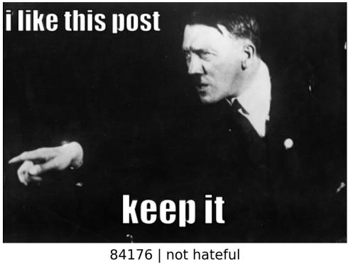

B Same text, different image  
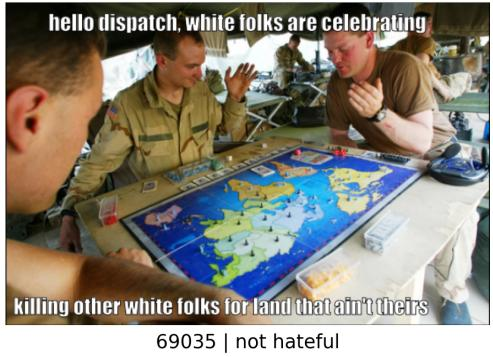

Matched counterpart  
  
Figure 9: Original FHM image and text confounders associated with feature 02261. A. Training examples 19726 and 84176 share a background image but differ in text and gold label (same-image group 867). B. Examples 69035 and 91683 share the supplied text but differ in image and gold label (same-text group 952). These illustrative pairs are not selected from the validation maxima in the atlas and do not establish that feature 02261 alone distinguishes either pair. Warning: offensive content is reproduced for analysis.

## L GLOSSARY OF TERMS

This glossary defines terms according to their operational meaning in this paper. In particular, internal information means information that a specified readout can recover on held-out data; it does not imply human-like knowledge, belief, or native model use.

## L.1 REPRESENTATIONS AND TOKEN ROLES.

Native LVLM / native pathway. The original Gemma or Qwen model and its own route from the input, through the transformer and output head, to the final label. No external probe, activation hook, output router, or trained adapter determines the prediction.

Residual stream. The sequence of hidden-state vectors passed through the transformer layers. We denote the activation at layer ℓ and token position t by $h _ { \ell , t }$ . It should not be confused with an SAE reconstruction residual.

Sparse autoencoder (SAE). An encoder–decoder model that maps a dense activation h to a sparse latent vector $z = E ( h )$ and reconstructs it as $\widehat { h } = D ( z )$ (Huben et al., 2024; Gao et al., 2025).

Sparse feature or SAE latent. One coordinate $z _ { j }$ in the SAE representation. Each feature has an activation value and a decoder direction $d _ { j }$ in the LVLM’s hidden space. A sparse feature is not necessarily a perfectly monosemantic human-interpretable concept.

Feature dictionary. The collection of SAE decoder directions $\{ d _ { 1 } , \ldots , d _ { m } \}$ . Feature indices are specific to a particular model, layer, and SAE; the same index in two dictionaries need not represent the same pattern.

Base SAE. The public SAE applied directly to an LVLM hidden state. The term base refers to its position in our SAE pipeline, not to the base LVLM itself.

Reconstruction residual. The information left after the base SAE reconstructs a hidden state:

$$
\begin{array} { r } { r _ { \ell , t } = h _ { \ell , t } - \widehat { h } _ { \ell , t } ^ { b } . } \end{array}
$$

This is an SAE reconstruction error, not the transformer’s residual stream.

Residual SAE. A second SAE trained on the reconstruction residual ${ r } _ { \ell , t }$ . It captures structure not reconstructed by the base dictionary and is treated as an alternative representation rather than an automatically superior one.

Joint reconstruction. The sum of the base-SAE reconstruction and decoded residual-SAE reconstruction:

$$
\widehat { h } ^ { \mathrm { j o i n t } } = \widehat { h } ^ { b } + \widehat { r } .
$$

This is the activation used by the residual reconstruction hook.

Crosscoder. A sparse model that constructs one latent representation from several transformer layers and uses separate decoders for those layers. It is intended to organize information shared across model depth rather than simply concatenate independent layer representations (Lindsey et al., 2024).

Token role. The provenance of a sequence position. We distinguish prompt/OCR, image-origin, and generated positions. Token role identifies where a state originated, not which modality it contains after contextual processing.

Prompt/OCR tokens. Positions containing the task instruction, class wording, and supplied OCR.   
At intermediate layers, these states may already contain visually conditioned information.

Image-position states. Positions originating from the visual encoder. Because they interact with prompt states inside the transformer, they should not be interpreted as modality-pure or strictly image-only representations.

Generated-token states. Hidden states produced after answer generation begins. They may encode the model’s emerging label, explanation, or confidence. Gold labels are not supplied during their extraction, but the states may encode the model’s predicted answer and are not pre-decision representations.

Pre-generation representation. A representation pooled over prompt and image positions while excluding generated positions. It tests what can be decoded before the model starts producing its answer.

All-token representation. A representation pooled over prompt, image, and generated positions. It provides a full-computation decodability estimate, but is not a purely pre-decision representation.

Pooling. The operation that converts token-level activations into one vector per meme. Our default is featurewise max pooling,

$$
[ \phi _ { s } ( x ) ] _ { j } = \operatorname* { m a x } _ { t \in \mathscr { T } _ { s } ( x ) } z _ { t , j } ,
$$

where s denotes the selected token role. Pooling discards token order and exact activation position.

## L.2 READOUTS AND OUTPUT PATHWAYS.

Readout. Any mapping from a representation to a task score or prediction. The LVLM output pathway is a native readout; a probe is an external readout; and the output router combines the two.

Native prediction. The label obtained from the frozen LVLM using the task’s constrained decoding or label-scoring rule. Native does not necessarily mean free-form generation.

Output head / unembedding. The final transformation from the model’s hidden state to vocabulary logits. Its directions indicate how changes in hidden space immediately affect candidate output tokens.

Native decision margin. A signed difference between competing native scores. For a literal yes/no task,

$$
m _ { \mathrm { y n } } ( x ) = \ell _ { \mathrm { y e s } } ( x ) - \ell _ { \mathrm { n o } } ( x ) ,
$$

where $\ell _ { \mathrm { y e s } }$ and $\ell _ { \mathrm { n o } }$ are the two output logits. A positive value favors the designated positive class.

External probe. A supervised classifier trained on frozen internal representations. A probe measures how accessible a label is to the selected classifier family; it does not establish that the native model uses the same decision rule (Hewitt & Liang, 2019; Belinkov, 2022).

Sparse readout / SAE probe. A probe whose input is a pooled vector of SAE feature activations.   
The input is sparse-derived, although the fitted classifier weights need not themselves be sparse.

Decodability. The extent to which a specified readout can recover a target from a frozen representation on held-out data. Decodability is relative to the chosen layer, token role, representation, probe family, and training set.

Internal signal. Shorthand for label-associated structure that is decodable from a model representation. It does not imply that the model’s native output pathway uses that structure.

Probe ceiling. The best held-out performance obtained by the selected probe and representation. It is an empirical reference point, not a theoretical upper bound on all possible classifiers.

Internal-to-output gap / readout gap. The difference between probe and native performance on the same reporting examples:

$$
\Delta _ { \mathrm { r e a d o u t } } = F _ { \mathrm { p r o b e } } - F _ { \mathrm { n a t i v e } } .
$$

Because the probe receives supervised labels while the native LVLM remains frozen, this measures supervised accessibility rather than a like-for-like model comparison.

Hook. A mechanism attached to an intermediate layer to record or modify an activation during the model’s forward pass. The term identifies where an intervention occurs, not the type of classifier used afterward.

Residual reconstruction hook. An intervention that moves the original hidden state toward its joint SAE reconstruction:

$$
h _ { \ell , t } ^ { \prime } = h _ { \ell , t } + \alpha _ { \mathrm { h o o k } } \left( \widehat { h } _ { \ell , t } ^ { \mathrm { j o i n t } } - h _ { \ell , t } \right) .
$$

The modified state then passes through the remaining LVLM layers and its native output head.

Direct logit routing / output router. An output-level combination of the native margin and standardized probe score:

$$
m _ { d } ^ { \mathrm { r o u t e } } ( x ) = m _ { d } ( x ) + \beta _ { d } \widetilde { u } _ { d } ( x ) ,
$$

where $m _ { d } ( x )$ is the native task margin, $\widetilde { u } _ { d } ( \boldsymbol { x } )$ is the calibrated probe score, and $\beta _ { d }$ is selected on a calibration set. No hidden state is modified.

Probe distillation. Training the LVLM to reproduce useful probe behavior using gold labels and soft probe targets. Unlike direct routing, the resulting model no longer requires the SAE or external probe at inference.

LoRA adapter. A parameter-efficient update that freezes an original weight matrix $W _ { 0 }$ and learns a low-rank correction,

$$
W = W _ { 0 } + \frac { \gamma } { r _ { \mathrm { L o R A } } } B A ,
$$

where A and B are trainable matrices, $r _ { \mathrm { L o R A } }$ is the adapter rank, and $\gamma$ is a scaling factor (Hu et al., 2021).

## L.3 DISCRIMINATIVE AND ROUTED DIRECTIONS.

Discriminative direction. A feature or direction that helps the supervised probe separate task labels.   
Discriminative importance does not imply influence on the native output.

Routed direction. A feature direction selected because it has a large projection onto the native output direction. It may strongly affect the output margin without being predictive of the correct label.

Feature-to-output alignment. The direct projection

$$
a _ { j } = d _ { j } ^ { \top } u _ { \mathrm { o u t } } ,
$$

where $d _ { j }$ is the decoder direction of feature j and $u _ { \mathrm { o u t } }$ is the relevant native output direction. It is a static approximation to immediate logit influence, not a complete causal effect.

Silent feature. A probe-important feature whose direct output alignment $| a _ { j } |$ lies below a fixed threshold. Silent means weakly connected to the particular output channel being tested, not globally inactive or causally irrelevant.

Readout or routing misalignment. A situation in which the directions most useful to an external probe differ from those that control the native output. This provides one possible explanation for high decodability but weak native performance.

Output anchor. The output contrast used to define a routed direction, such as yes minus no. An anchor is mismatched when the task actually uses a different rule, such as full-label string scoring.

Donor and target. The donor is the example from which an activation is taken. The target is the example whose computation is modified by that activation.

Ablation / knockout. An intervention that removes selected components, usually by setting their feature activations to zero. Probe-side ablation tests dependence of the external classifier; online ablation tests effects on the LVLM’s subsequent computation.

Activation patching. Replacing part of a target example’s internal representation with a representation obtained from a donor example. Patching tests whether transplanting a candidate feature pattern changes a downstream quantity.

Sensitivity ratio. The ratio between an intervention’s effect on the probe and its effect on the native margin, or vice versa. It measures relative responsiveness under the chosen score scales, not a scale-invariant mediation fraction or whether the intervention improves correctness.

## L.4 CROSS-MODAL AND ROBUSTNESS ANALYSES.

Benign confounder. An image–text combination that resembles a harmful example in one modality but is benign when both modalities are interpreted together. FHM was designed around such confounders (Kiela et al., 2020).

Matched confounder pair. Two memes that share one component, differ in the other, and have opposite labels. A pseudo-image pair shares an image but changes the text; a pseudo-text pair shares text but changes the image.

Additive readout. A classifier of the form $f ( x _ { \mathrm { i m g } } ) + g ( x _ { \mathrm { p r o m p t } } )$ , with no input-dependent cross-role coupling. Using both roles additively does not by itself demonstrate an interaction. Our gated pairwise baseline is not strictly additive because its gate depends on both role representations.

Low-rank bilinear readout. A readout containing an explicit image-by-prompt term,

$$
x _ { \mathrm { i } } ^ { \top } U V ^ { \top } x _ { \mathrm { p } }
$$

where $x _ { \mathrm { i } }$ and $x _ { \mathrm { p } }$ are image- and prompt-position representations and U, $V \in \mathbb { R } ^ { K \times r _ { \mathrm { b i l } } }$ . The rank $r _ { \mathrm { b i l } }$ limits the number of multiplicative interaction factors (Kim et al., 2016).

Distributed interaction. An interaction whose predictive contribution is spread across several bilinear factors. Small single-factor ablation effects show that no one tested factor is necessary for the full performance gain; they do not establish that every factor is individually insufficient or define a unique semantic factorization.

## Pair margin. The score difference

$$
s ( x ^ { + } ) - s ( x ^ { - } )
$$

between harmful and benign members of a matched pair. A positive margin means that the pair is ordered correctly even when one member crosses the wrong hard-decision threshold.

Positive-margin, separated, and both-correct rates. The positive-margin rate measures correct score ordering. The separated rate measures whether the pair receives different hard labels. The both-correct rate requires both members to receive their correct labels and is therefore the strictest measure.

No-OCR control. A condition in which supplied OCR is removed from the prompt while the original image remains. Since meme text is still visible in the image, this tests reliance on explicit OCR injection rather than providing a text-free input.

Visual credit. A paired measure of image dependence. An originally correct prediction is imagecredited when it becomes incorrect after image blanking or same-split image shuffling. It is an operational robustness measure, not a complete causal allocation of credit between modalities (Liu et al., 2026).

Locked evaluation. A protocol in which the representation, token role, classifier, threshold, router coefficient, and checkpoint are frozen before the reporting split is scored. No reported examples are used for post-hoc model selection.