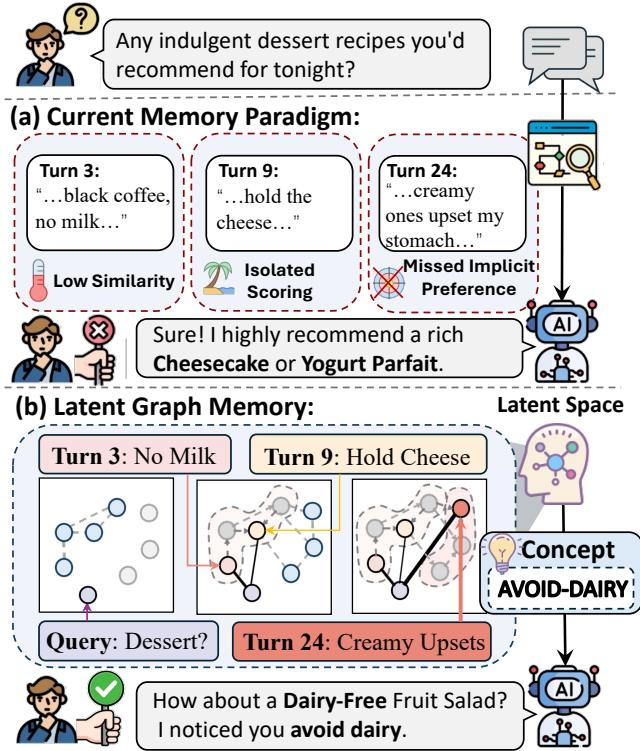
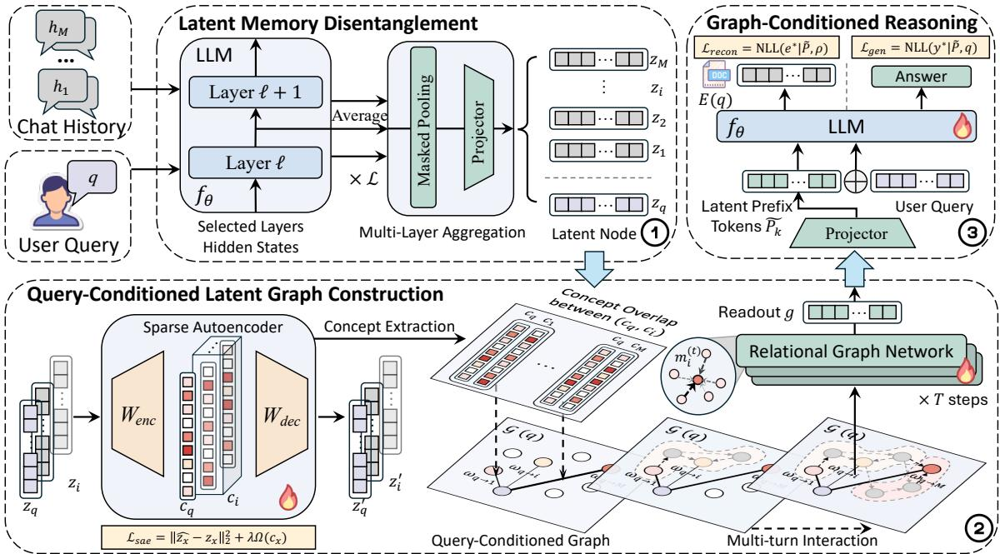
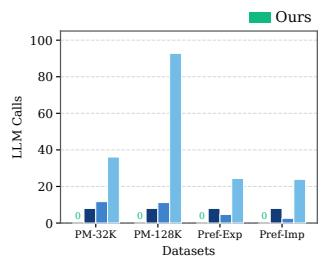
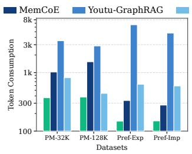
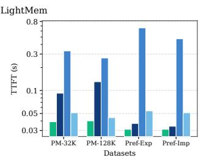
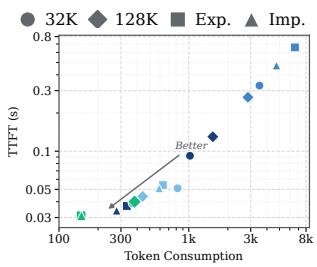
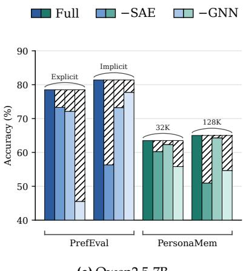
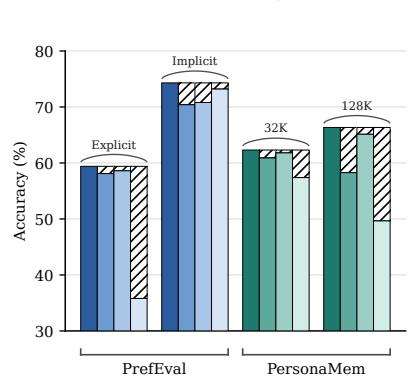
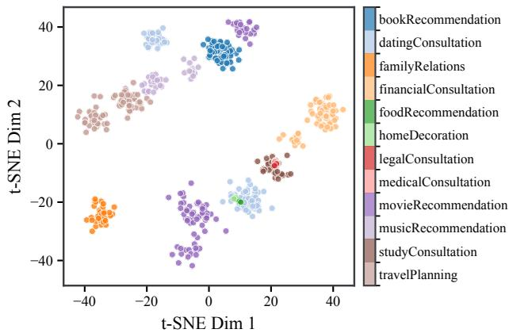
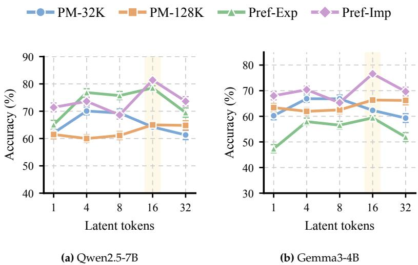

# Disentangling Long-Term Memory via Latent Neuro-Symbolic Reasoning

Cai Ke1, Xinghao Chen1, 2, 3, Xiaoyu Shen2, Keyu Chen1, Siyu An1, Junnan Dong1†, Ruifeng Xu4†, Ruizhi Qiao1, Xing Sun1†

1Tencent Youtu Lab

2Zhejiang Key Laboratory of Industrial Intelligence and Digital Twin, EIT, Ningbo, China   
3Department of Computing, The Hong Kong Polytechnic University, Hong Kong, China 4Shenzhen Loop Area Institute, Shenzhen, China kecai@stu.hit.edu.cn

Personalized agents are required to reason over long-term history interactions to infer both explicit preferences and implicit behavioral evidence. While early flat retrieval methods score memory fragments independently and neglect the distributed information, current structured memory frameworks rely on query-agnostic static graphs that fail to capture the context-dependent relations. Crucially, raw textual memories are inherently entangled and noisy, making fine-grained personalization and cross-session reasoning computationally prohibitive. To this end, we present LGM, a novel neuro-symbolic framework that shifts long-term memory disentanglement into a continuous latent space. Specifically, (i) instead of persisting fixed graphs, we design a tailored latent graph construction with a sparse autoencoder. Subject to each query, it maps historical interactions into latent memory nodes and disentangles the memory traces into sparse concept activations, dynamically synthesizing query-aware relational edge weights. (ii) A graph encoder then treats the query embedding as a conditioning preference to direct non-linear message passing across the task-specific latent subgraph. This yields a highly expressive memory representation for effective activations. Extensive experiments on long-term personalization benchmarks demonstrate that LGM significantly outperforms state-of-the-art baselines in capturing both explicit and implicit preferences while enabling personalized responses.

## 1 Introduction

Personalized agents are increasingly urged to maintain coherent, long-horizon interactions with users [1; 2; 3; 4; 5; 6; 7]. Achieving seamless personalization requires reasoning over extensive historical interactions to infer both explicit preferences, e.g., specific constraints or instructions and implicit evidence, e.g., evolving habits, underlying decision patterns, and latent task dependencies. Existing approaches predominantly operate in the explicit textual space, falling into two main paradigms. Early efforts rely on flat retrieval, where historical turns or summary fragments are independently embedded and retrieved via vector similarity [8; 9; 10; 11; 12]. While efficient, flat retrieval scores memory fragments in isolation, inherently missing distributed, multi-hop evidence spread across distant sessions. To solve this, the current paradigm introduces structured memory frameworks, e.g., graph retrieval augmented-generation, abbreviated as GraphRAG, to model the complex relational dependencies [13; 14; 15; 16; 17; 18]. While they heavily rely on query-agnostic, static graphs, the adjacency structure remains consequently fixed regardless of the incoming task, failing to infer dynamic, context-dependent relations that only surface under specific triggers buried in the queries.

Nevertheless, raw textual memories are inherently entangled, noisy, and challenging to organize on demand. As illustrated in Figure 1, traditional flat retrieval methods consider memory fragments in isolation, frequently missing distributed or implicit behavioral clues that are crucial for answering the query. Even when structured, a single interaction can simultaneously encode topic, intent, sentiment, and context—only a fraction of which is relevant to a specific request. Attempting fine-grained preference disentanglement and cross-session reasoning entirely within the token or prompt space introduces prohibitive computational overheads, often leading to ballooning KV caches, repeated language-model calls, and distraction from irrelevant text [19]. This raises a central question:

Can user long-term memory be disentangled and organized on demand, without repeatedly replaying the full textual history?

Answering this question is non-trivial, as it requires resolving three fundamental tensions. First, raw text and hidden states entangle explicit preferences with subtle habits. Disentangling these behavioral factors without losing long-tail evidence essential

  
Figure 1. LGM dynamically aggregates scattered behavioral cues in the latent space to accurately answer user queries.

for personalization is difficult. Second, the relevance between historical events shifts with each query, making rigid text-level graphs too slow to rebuild and requiring the topology to adapt dynamically in the latent space. Finally, while reasoning in latent space avoids context window saturation, multi-step propagation risks information collapse, meaning the state must remain compact for fast generation while staying strictly faithful to historical evidence.

To address these challenges, we propose Latent Graph Memory, i.e., LGM, a neuro-symbolic framework that shifts long-term memory disentanglement and relational reasoning into a continuous latent space. Specifically, (i) Latent memory disentanglement. LGM first aggregates multi-layer hidden states from the backbone language model and maps each historical interaction and the current query into a shared lowdimensional space. A sparse autoencoder further decomposes these dense representations into sparse concept activations, aligning direct preference statements and indirect behavioral cues within a shared concept space. (ii) Query-conditioned latent graph construction. Instead of persisting a single global graph, LGM uses query/memory concept to construct a latent graph that co-activates to dynamically determine edge weights, allowing the same memory pool to form different connections under different cues. A relational graph neural network then propagates the query signal over the activated subgraph and combines distributed weak clues into a compact graph state with node-level relevance scores. (iii) Graph-Conditioned Reasoning. LGM maps the dynamically synthesized latent graph into a compact set of memory prefix tokens, efficiently conditioning downstream generation without replaying raw texts. To ensure that continuous state propagation remains faithfully anchored to historical facts, we introduce an evidence-reconstruction objective that penalizes information loss and prevents latent space collapse. Consequently, the entire memory lifecycle from selection, association, aggregation, to utilization is unified into an end-to-end differentiable optimization process. Extensive experiments on PersonaMem [20], PrefEval [21], and the implicit-preference split of PersonaMem-v2 [22; 23] validate these advantages across Qwen2.5-7B, Gemma3-4B, and Qwen3-4B backbones. LGM achieves the highest average accuracy under both main backbones, outperforming the strongest baselines. The gains are most pronounced for implicit preferences and long-context settings, where successful responses require combining evidence scattered across sessions. LGM also occupies the low-cost frontier in language-model calls, token consumption, and time to first token.

Our contributions are summarized as follows:

• We formally formulate long-term personalization as query-aware memory disentanglement and relational reasoning in the latent space.

• We introduce LGM, an end-to-end neuro-symbolic framework that combines sparse concept decomposition, query-conditioned latent graph construction, relational message passing, and graph-conditioned generation.

• Extensive experiments are conducted across long-term personalization benchmarks and multiple language-model backbones. The results demonstrate consistent improvements in explicit and implicit preference, particularly under long contexts, while substantially reducing the computational overhead of textual memory replay.

## 2 Related Work

Structured Retrieval-Augmented Generation. A prominent line injects structured knowledge into Retrieval-Augmented Generation (RAG) to better organize interaction history [24; 14; 25; 26; 13; 16; 27; 18; 28; 17; 29]. Tree-based methods such as RAPTOR [24] and MemTree [14] recursively cluster and summarize past texts into hierarchies, while graph-based methods including GraphRAG [25], LightRAG [26], HippoRAG [13], and Youtu-GraphRAG [16] link entities and relations for multi-hop retrieval. These methods commit to a global structure whose topology is fixed once built; we defer structure to inference time, letting each query induce its own latent topology so relevance is decided by the current cue rather than by a pre-committed graph.

Agentic Memory Management. Another line treats memory as an actively maintained store, compressing sessions into summaries and user facts or letting agents decide when to write, merge, and forget [9; 30; 31; 32; 11; 10; 33; 34; 12]. MemoryBank [9] and compressive-memory approaches [30; 31; 32] condense histories into user profiles; Mem0 [11] and A-Mem [10] organize memories as interconnected notes; and MemGPT [33], MemoryOS [34], and LightMem [12] adopt OS-inspired hierarchies to schedule storage. These methods store memory as discrete textual records scored in isolation, which caps evidence at the single-record level; we reason over memory relationally in latent space, so scattered weak clues compose into evidence that no record carries alone.

Reinforcement Learning for Memory. Recent methods cast memory management as a sequential decision problem and optimize read/write policies with reinforcement learning (RL) [35; 36; 37; 38]. MemAgent [36] maintains a fixed-size memory across long contexts, while Mem-α [35] and MemCoE [37] learn unified policies over short- and long-term memory. Memory-R1 [38] further trains an agent to manage memory. Rather than optimizing discrete read/write policies over a fixed textual memory with RL, we make memory itself differentiable, turning memory management from an external control into an intrinsic learnable representation.

  
Figure 2. Overview of LGM: reasoning over memory on demand in the latent space.

## 3 Problem Formulation

We formalize personalized agent generation over long-term interaction histories. Let $\mathcal { H } = \left\{ h _ { 1 } , h _ { 2 } , \ldots , h _ { M } \right\}$ denote a sequence of historical interactions spanning multi-session user-agent dialogues, and q represent the current user query. Let $f _ { \theta } ( \cdot )$ be the backbone language model, $E ( \cdot )$ its embedding lookup function, and $\mathbf { H } ^ { ( l ) } \in \mathbb { R } ^ { T \times d }$ the hidden representations extracted from layer $l \in \mathcal L$ . The sequence $y = \left( y _ { 1 } , \dotsc , y _ { N } \right)$ denotes the generated target response.

Given an arbitrarily long user history H and an incoming query q, the objective is to generate a faithful, personalized response y grounded in relevant historical evidence. The framework is required to process the raw history $\mathcal { \hat { H } }$ to form a query-dependent memory state $\mathbf { M } _ { q }$ that captures both explicit user preferences and context-scattered implicit behavior. Conditioned on both the current query embedding $E ( q )$ and the constructed memory state $\mathbf { M } _ { q } ,$ , the backbone language model $f _ { \theta }$ autoregressively predicts the probability distribution of the target response.

## 4 Methodology

## 4.1 Latent Memory Disentanglement

Latent nodes and concepts. As shown in Figure 2, rather than keeping memory as raw text, we represent every interaction and the query in the model’s own latent space. Each unit $x \in \mathcal { H } \cup \{ q \}$ is mapped to a latent $n o d e ^ { \mathbf { \bar { z } } _ { x } } \in \mathbb { R } ^ { d }$ , giving a query node $z _ { q }$ and memory nodes $\{ z _ { i } \} _ { i = 1 } ^ { M }$ . Because a single interaction simultaneously encodes topic, intent, sentiment, and habit, a dense $z _ { x }$ remains entangled. We therefore attach to each latent

a sparse concept code

$$
c _ { x } = \mathcal { S } \big ( \mathrm { R e L U } ( W _ { e n c } z _ { x } ) \big ) , \qquad \hat { z } _ { x } = W _ { d e c } c _ { x } ,\tag{1}
$$

produced by a sparse autoencoder (SAE) [39], where $\boldsymbol { S } ( \cdot )$ suppresses weak activations and $\hat { z } _ { x }$ is the reconstruction. The sparse, non-negative code $c _ { x }$ is the interpretable unit on which explicit statements and implicit behavioral factors are aligned in a common concept space.

Query-conditioned graph. We organize memory as a graph $\mathcal { G } ( \boldsymbol { q } ) \ : = \ : ( \mathcal { V } , \mathcal { E } , \omega )$ whose node set $\nu =$ $\{ z _ { q } \} \cup \{ z _ { i } \}$ contains the query and all memories. Crucially, the edge weights ω are a function of the query: they are derived from the concept overlap between $c _ { q }$ and $\left\{ \overset { } { c } _ { i } \right\}$ , so the same memory pool induces a different topology for every incoming query. The learning problem is thus to jointly (i) encode latent nodes and disentangle them into concepts, (ii) build $\mathcal G ( q )$ and propagate the query signal into a compact state $g ,$ and (iii) condition $f _ { \theta }$ on $g$ to reconstruct evidence and generate y, all end to end.

We encode memory in the latent space so that behavioral signals not stated in words are still preserved. Each unit x is passed through $f _ { \theta } ;$ the selected-layer hidden states are averaged (multi-layer aggregation), reduced along the sequence with masked pooling, and projected into the shared latent space to obtain a latent node:

$$
\begin{array} { r } { z _ { x } = \mathrm { L N } \Big ( \sigma \big ( W \cdot \mathrm { P o o l } \big ( \frac { 1 } { | \mathcal { L } | } \Sigma _ { \ell \in \mathcal { L } } f _ { \theta } ^ { ( \ell ) } ( x ) \big ) \big ) \Big ) . } \end{array}\tag{2}
$$

Averaging across layers is deliberate: lower layers carry lexical cues while higher layers carry semantic and behavioral abstraction, and implicit preferences typically live in the mixture rather than in any single layer. Encoding is done in chunks so that memory grows in the number oflatent nodes instead of a monolithic context window. Because the query is encoded by the same model $( \operatorname { E q } . 2 )$ , it lives in the identical space as memory and can later act as a control signal instead of a mere retrieval key. Applying the SAE of Eq. (1) then performs concept extraction, disentangling each dense $z _ { x }$ into a sparse code $c _ { x }$ . The SAE is trained to reconstruct the latent while keeping the code sparse,

$$
\mathcal { L } _ { s a e } = \left. \hat { z } _ { x } - z _ { x } \right. _ { 2 } ^ { 2 } + \lambda \Omega ( c _ { x } ) ,\tag{3}
$$

which is the step that separates what a memory is about from how it was said, allowing a direct instruction and a faint recurring habit to be matched through a shared concept even when their surface text is unrelated.

## 4.2 Query-Conditioned Latent Graph Construction

A dense similarity over latents would yield an entangled, query-agnostic graph. Instead, we let the concept codes decide connectivity: the edge weight from the query to a memory is their normalized concept overlap,

$$
\omega _ { q \to i } = \phi \mathopen { } \mathclose \bgroup \left( c _ { q } , c _ { i } \aftergroup \egroup \right) \in [ 0 , 1 ] .\tag{4}
$$

Since $c _ { q }$ changes with the query, the query-conditioned graph $\mathcal G ( q )$ is rebuilt implicitly for every request: a memory that is irrelevant under one cue can become strongly connected under another. We add self-loops and typed, bidirectional query↔memory relations $r _ { i j }$ so the query can both gate memories and receive evidence back.

A relational graph network then runs T steps of message passing over $\mathcal G ( q )$ across the multi-turn interaction. Starting from $z _ { i } ^ { ( 0 ) } = z _ { i } .$ , each node aggregates relation-aware messages weighted by Eq. (4) and updates its state:

$$
m _ { i } ^ { ( t ) } = \sum _ { j \in \mathcal { N } ( i ) } \omega _ { j  i } \psi \big ( z _ { i } ^ { ( t ) } , z _ { j } ^ { ( t ) } , r _ { i j } \big ) ,\tag{5}
$$

$$
z _ { i } ^ { ( t + 1 ) } = \mathrm { U p d } ( z _ { i } ^ { ( t ) } , m _ { i } ^ { ( t ) } ) .\tag{6}
$$

A permutation-invariant readout then collapses the final states into a compact memory state $g = \mathrm { R e a d o u t } ( \{ z _ { i } ^ { ( T ) } \} )$ and a scoring head produces a per-node relevance $s _ { i } = \langle z _ { i } ^ { ( T ) } , g \rangle$ . This propagation is exactly what turns several individually weak clues into one inferred implicit preference where evidence scattered is combined along the query-activated edges, rather than being ranked by record.

## 4.3 Graph-Conditioned Reasoning

The state $g$ is a compressed, query-specific summary of the whole history. A projector maps it into a small set of soft latent prefix tokens $\\hat { P } \overset { \cdot } { = } \{ \tilde { P } _ { k } \} _ { k = 1 } ^ { p } \in \dot { \mathbb { R } } ^ { p \times d _ { \mathrm { l m } } }$ , each rescaled to the norm of ordinary token embeddings so that the prefix informs rather than dominates attention. The prefix is prepended to the query embeddings $E ( q )$ and the response is generated autoregressively, $y \sim \acute { f } _ { \theta } \big ( \big [ \tilde { P } ; E ( \acute { q } ) \big ] \big )$ , so the long history influences generation through a compact latent channel instead of being replayed as raw context.

Generative supervision. Because the target application is a conversational agent, we supervise the model to generate the reference response text $y ^ { \star }$ rather than to pick a discrete option, which would collapse the task into option classification and harm fluency:

$$
\mathcal { L } _ { g e n } = - \sum _ { t } \log f _ { \theta } \big ( y _ { t } ^ { \star } \mid y _ { < t } ^ { \star } , \mid \tilde { P } ; E ( q ) \big ] \big ) .\tag{7}
$$

Evidence reconstruction. A known failure mode of latent memory is that the prefix collapses into an uninformative signal the model simply ignores [40; 41]. To keep g anchored to facts, we reuse $f _ { \theta }$ as a decoder and require the same prefix, under a fixed decoding instruction $\rho ,$ to reconstruct the supporting evidence text $e ^ { \star }$

$$
\mathcal { L } _ { r e c o n } = - \sum _ { t } \log f _ { \boldsymbol { \theta } } \big ( e _ { t } ^ { \star } \mid e _ { < t } ^ { \star } , \mid \tilde { P } ; E ( \boldsymbol { \rho } ) \big ] \big ) .\tag{8}
$$

This directly ties the latent channel to recoverable evidence and prevents latent collapse; our ablation identifies $\mathcal { L } _ { r e c o n }$ as the single most important term for making memory effective.

Overall objective. The full model is trained end to end, combining generation and reconstruction with the SAE term:

$$
\mathcal { L } = \mathcal { L } _ { g e n } + \mathcal { L } _ { r e c o n } + \mathcal { L } _ { s a e } .\tag{9}
$$

Unlike retrieval methods that use the query only as a lookup key, LGM uses it to control latent-node disentanglement, relation, and aggregation, so explicit statements and distributed implicit clues are resolved within a single mechanism.

## 5 Experiments

## 5.1 Experimental Settings

Datasets. We evaluate on two widely-used personalization benchmarks. PersonaMem [20] measures how well a model tracks and updates user preferences across long, multi-session interaction histories, and offers two context scales (32K and 128K tokens). PrefEval [21] probes preference following through explicit and implicit preference queries embedded in long dialogues. To further stress implicit personalization, we additionally evaluate on the implicit-preference split of PersonaMem-v2 [22], where the target preference is never stated verbatim and must be inferred from scattered behavioral cues.

Model and Baselines. We build our method on three open backbones, Qwen2.5-7B-Instruct [42], Gemma3- 4B-it [43] and Qwen3-4B-Instruct [44], and compare against four families of baselines. (i) Context / retrieval basics: Long Context, which directly feeds the raw history, and Naive RAG, which retrieves the top-K snippets from a vector store. (ii) Structured RAG: GraphRAG [25], LightRAG [26], HippoRAG [13], and Youtu-GraphRAG [16], which organize memory into graph structures. (iii) Agentic memory management: MemoryBank [9], Mem0 [11], A-Mem [10], MemoryOS [34], and LightMem [12], which maintain and update an external memory bank. (iv) RL-based memory: Mem-α [35], MemAgent [36], Memory-R1 [38], and MemCoE [37], which learn memory-update policies. For a fair comparison, all baselines are run with the recommended settings from their public codebases under the same backbones and data splits. All methods produce free-form responses rather than selecting from predefined options.

Implementation Details. For each interaction and query, we read out hidden states from four evenlyspaced intermediate layers ({8, 16, 24, 32}), average them, and apply masked mean pooling; a lightweight projector then maps the result into a compact latent space (d = 32). A differentiable sparse autoencoder (concept dimension 256) disentangles each latent into sparse concepts whose co-activation defines the queryconditioned edge weights. The relational graph network uses a 256-d hidden size and T = 4 message-passing steps, and its graph state is projected into 16 latent prefix tokens, each rescaled to the norm of ordinary token embeddings before being prepended to the query. The whole system is trained end-to-end with AdamW [45], using a learning rate of 2e-4 for the graph modules and 1e-5 for the backbone, weight decay 0.01, gradient clipping 1.0, and 3 epochs under bf16 mixed precision with gradient checkpointing; the random seed is fixed for reproducibility. are conducted under the same environmental and hardware-level configurations. Long histories are encoded in chunks (each segment truncated to 2048 tokens) so that memory grows in the number of latent nodes rather than in a context window.

## 5.2 Main Results

Query-conditioned latent graphs turn scattered history into usable evidence, giving the largest gains exactly where implicit preferences must be inferred. Table 1 reports results on PersonaMem and PrefEval under two backbones. Our method achieves the best average on both Qwen2.5-7B (72.28) and Gemma3-4B (66.16), improving over the strongest baseline MemCoE by +11.20 and +11.70. Three patterns stand out. First, flat pipelines (Long Context, Naive RAG) trail by a wide margin, confirming that independently ranked records fail to connect distributed evidence. Second, structured and agentic memories help but remain unstable across settings, since a pre-built topology cannot adapt to each query. Third, the gap is largest on the harder implicit split and on the long 128K context, where our latent graph must combine several behavioral clues rather than copy a single stated fact. The consistent improvement across both backbones indicates that the gains come from the memory mechanism itself rather than a specific model.

Operating in latent space instead of replaying text, our method reaches the accuracy frontier while sitting at the low-cost corner of every efficiency axis. Figure 3 compares efficiency against representative memory methods. Because history is compressed into a compact latent state rather than re-read as raw context, our method uses the fewest LLM calls (a) and the least token consumption (b), avoiding the repeated prompting and long contexts that inflate text-based memories. This directly lowers time to first token (c), keeping latency stable as the context grows to 128K. The token–latency trade-off (d) summarizes the picture: our method occupies the bottom-left frontier across all datasets, delivering the strongest accuracy in Table 1 at the lowest cost, whereas graph-construction and hierarchical-scheduling baselines pay a heavy overhead for weaker results.

<table><tr><td rowspan="3">Method</td><td colspan="4">Qwen2.5-7B-Instruct</td><td rowspan="2"></td><td colspan="5">Gemma3-4B-it</td><td rowspan="3"></td></tr><tr><td colspan="2">PersonaMem</td><td colspan="2">PrefEval</td><td colspan="2">PersonaMem Δ</td><td colspan="2">PrefEval</td></tr><tr><td>32K</td><td>128K</td><td>Explicit Implicit</td><td></td><td>Avg</td><td>32K</td><td>128K</td><td>Explicit Implicit</td><td></td><td>Avg Δ</td></tr><tr><td>Long Context</td><td>34.36*</td><td>25.05*</td><td>31.70*</td><td>30.80*</td><td></td><td>30.48+41.80 20.69</td><td>24.63</td><td></td><td>48.10</td><td>39.80</td><td>33.31 +32.85</td><td></td></tr><tr><td>Naive RAG</td><td>48.67*</td><td>38.90*</td><td>47.80*</td><td>32.40*</td><td></td><td>41.94 +30.34 27.59</td><td></td><td>31.62</td><td>51.10</td><td>38.30</td><td>37.15 +29.01</td><td></td></tr><tr><td colspan="2">Structured Retrieval-Augmented Generation</td><td colspan="8"></td><td></td><td></td><td></td></tr><tr><td>GraphRAG (arXiv&#x27;24, 34.9K stars)</td><td>63.79</td><td>38.24</td><td></td><td>51.20</td><td>37.70</td><td>47.73 +24.55 51.72</td><td></td><td>40.44</td><td>58.00</td><td></td><td>69.70</td><td>54.97 +11.19</td></tr><tr><td>HippoRAG (NIPS&#x27;24)</td><td>63.79</td><td>52.38</td><td>67.80</td><td>45.20</td><td></td><td>57.29 +14.99 53.45</td><td></td><td>48.90</td><td>51.70</td><td>41.90</td><td></td><td>48.99 +17.17</td></tr><tr><td>LightRAG (EMNLP&#x27;25)</td><td>51.72</td><td>38.60</td><td>51.10</td><td>38.00</td><td></td><td>44.86 +27.42 50.00</td><td></td><td>37.50</td><td>41.90</td><td>35.10</td><td></td><td>41.13 +25.03</td></tr><tr><td>Youtu-GraphRAG (ICLR&#x27;26)</td><td>63.79</td><td>38.60</td><td>57.00</td><td>42.20</td><td></td><td>50.40 +21.88 46.55</td><td></td><td>41.91</td><td>42.90</td><td>35.00</td><td></td><td>41.59 +24.57</td></tr><tr><td colspan="2"></td><td></td><td></td><td></td><td></td><td>Agentic Memory Management</td><td></td><td></td><td></td><td></td><td></td><td></td></tr><tr><td>MemoryBank (AAAI&#x27;24)</td><td></td><td>58.62</td><td>45.22</td><td>75.50</td><td>47.90</td><td>56.81 +15.47 51.72</td><td></td><td>48.16</td><td>55.80</td><td>45.20</td><td></td><td>50.22 +15.94</td></tr><tr><td>Mem0 (arXiv′25, 61.8K stars)</td><td>48.53*</td><td>39.67*</td><td>57.60*</td><td>46.40*</td><td></td><td>48.05 +24.23 53.45</td><td></td><td>53.45</td><td>40.81</td><td>36.00</td><td></td><td>45.93 +20.23</td></tr><tr><td>A-Mem (NIPS&#x27;25)</td><td>48.26*</td><td>38.22*</td><td>62.30*</td><td>52.80*</td><td></td><td>50.40 +21.88 51.72</td><td></td><td>41.18</td><td>50.50</td><td>39.40</td><td></td><td>45.70 +20.46</td></tr><tr><td>MemoryOS (EMNLP&#x27;25)</td><td>62.07</td><td>37.50</td><td>67.20</td><td></td><td>59.10</td><td>56.47 +15.81 53.45</td><td></td><td>40.07</td><td>59.20</td><td>49.40</td><td></td><td>50.53 +15.63</td></tr><tr><td>LightMem (ICLR&#x27;26)</td><td>50.72*</td><td>39.93*</td><td>64.20*</td><td></td><td>54.80*</td><td>52.41 +19.87 48.28</td><td></td><td>39.71</td><td>58.00</td><td>65.20</td><td></td><td>52.80+13.36</td></tr><tr><td colspan="10">Reinforcement Learning for Memory</td><td></td><td></td><td></td><td></td></tr><tr><td>Mem-α (arXiv&#x27;25)</td><td></td><td>53.37*</td><td>42.86*</td><td>45.30</td><td>78.80</td><td>55.08 +17.20 37.93</td><td></td><td>38.24</td><td>40.40</td><td></td><td>74.70</td><td>47.82 +18.34</td></tr><tr><td>MemAgent (ICLR&#x27;26)</td><td></td><td>53.58*</td><td>43.59*</td><td>45.00</td><td>80.80</td><td>55.74 +16.54 56.90</td><td></td><td>43.75</td><td>43.90</td><td>69.70</td><td></td><td>53.56 +12.60</td></tr><tr><td>Memory-R1 (ACL&#x27;26)</td><td>54.79</td><td>43.12</td><td></td><td>47.60</td><td>79.40</td><td>56.23 +16.05 55.17</td><td></td><td>43.01</td><td>44.60</td><td>69.90</td><td></td><td>53.17 +12.99</td></tr><tr><td>MemCoE (ACL&#x27;26)</td><td>57.06*47.24*</td><td></td><td>58.90</td><td></td><td>81.10</td><td>61.08 +11.20 56.62</td><td></td><td>44.12</td><td>46.80</td><td>70.30</td><td></td><td>54.46 +11.70</td></tr><tr><td>LGM (Ours)</td><td></td><td>64.23 65.00</td><td>78.50</td><td></td><td>81.40 72.28</td><td></td><td>62.31</td><td>66.34</td><td>59.40</td><td>76.60</td><td>66.16</td><td></td></tr></table>

Table 1. Accuracy (%) on PersonaMem and PrefEval under Qwen2.5-7B and Gemma3-4B. ∆ denotes the absolute improvement of Ours over each method’s Avg, with darker green indicating a larger gain. The best results are shown in bold, while the second-best results are underlined. Values marked with ∗ are taken from the MemCoE [37].

  
(a) LLM calls

  
(b) Token consumption

  
(c) Time to first token

  
(d) Token–latency trade-off  
Figure 3. Efficiency comparison across four datasets, where our method consistently achieves the lowest cost and latency.

## 5.3 Ablation Study

Each individual module proves clearly effective for both explicit and implicit preferences. Figure 4 carefully ablates three key components of our framework: the sparse autoencoder (−SAE), the graph propagation (−GNN), and the evidence-reconstruction objective (−Reconstruct); the hatched caps clearly mark the remaining gap up to the full model. Removing any single component consistently hurts overall performance across both backbones, further confirming that each one is truly necessary. Among them, −Reconstruct causes by far the largest drop, especially on the harder implicit preferences, where the latent prefix would otherwise collapse into an uninformative signal that the model ignores; grounding it to supporting evidence is exactly what keeps the aggregated memory usable. −SAE and −GNN also clearly degrade the results, indicating that disentangling hidden states into sparse concepts and propagating the query over the induced topology are both needed to connect distributed clues rather than treat memories in isolation.

  
(a) Qwen2.5-7B

  
(b) Gemma3-4B  
Figure 4. Ablation Study on PrefEval and PersonaMem.

<table><tr><td>Method</td><td>32K</td><td>128K</td></tr><tr><td colspan="3">Closed-Source Models</td></tr><tr><td>GPT-5-Chat†</td><td>45.6</td><td>41.4</td></tr><tr><td>GPT-5-mini†</td><td>48.7</td><td>44.1</td></tr><tr><td>GPT-5-nano†</td><td>1</td><td>33.9</td></tr><tr><td>GPT-4.1†</td><td>1</td><td>38.2</td></tr><tr><td>GPT-4.1-mini†</td><td></td><td>37.5</td></tr><tr><td>o4-mini†</td><td></td><td>38.9</td></tr><tr><td colspan="3">Open-Source &amp; Agentic Methods</td></tr><tr><td>Qwen3-4B-Base†</td><td>30.5</td><td></td></tr><tr><td>Qwen3-4B-SFT†</td><td>35.0</td><td></td></tr><tr><td>Qwen3-4B-GRPO†</td><td>35.6</td><td></td></tr><tr><td>Agentic Memory (SOTA)†</td><td>55.2</td><td></td></tr><tr><td colspan="3">Ours (Qwen3-4B) 62.9(+7.7) 51.9(+7.8)</td></tr></table>

Table 2. Accuracy (%) on PersonaMem-V2 under the 32K and 128K dialogue history settings. Methods marked with † are taken from the original benchmark [22]; “–” denotes settings not reported therein.

  
Figure 5. t-SNE visualization of graph states.

## 5.4 Analysis on Inferring Implicit Preferences

LGM outperforms strong proprietary LLMs on inferring implicit preferences, despite using only a 4B setting. We further evaluate on a much harder implicit-preference setting, where user personas are revealed through behavior and choices rather than stated explicitly, so answers must be inferred by combining distributed clues. Using the same Qwen3-4B backbone against official benchmark numbers, our method reaches 62.9 at 32K and 51.9 at 128K, the best in both settings (Table 2). Despite using only a 4B open backbone, we clearly surpass strong proprietary models such as the GPT-5 and GPT-4.1 families (e.g., GPT-5-Chat 45.6 / 41.4); among methods on the same Qwen3-4B, we also exceed prompting- and RL-tuned variants (Base/SFT/GRPO) and their agentic-memory (55.2) by +7.7. This confirms the gains come from query-conditioned latent reasoning rather than model scale, and that LGM is most effective precisely where preferences must be inferred.

  
Figure 6. Effect of latent token number.

## 5.5 Visualization of Graph States

The graph states show that our memory encodes semantically meaningful structure. Figure 5 shows a t-SNE projection of the graph states produced on PersonaMem-32K with Gemma3-4B, colored by scenario. The states separate into well-defined clusters that align with the underlying scenarios, indicating that the query-conditioned graph aggregates history into a compact state that preserves user- and topic-level semantics rather than a noisy mixture. Semantically related scenarios also lie closer in the space, suggesting the memory captures meaningful relations across topics. This organized structure supports accurate memory selection and helps explain the gains observed in the main results.

## 5.6 Effect of Latent Token Number

A small latent budget already conveys memory effectively. Figure 6 varies the number of latent prefix tokens from 1 to 32. Accuracy rises quickly with just a few tokens and peaks around 16, then gradually saturates or slightly declines with more tokens, so we adopt 16 as the default. This trend is consistent across both backbones and all four settings, clearly showing that a compact latent channel is sufficient to carry the aggregated memory: too few tokens underfit the query-conditioned state, while too many add redundant capacity that dilutes the signal and offers no further gain.

## 5.7 Case Study: Explicit vs. Implicit Preferences

Baselines collapse once a preference is only implied, whereas our concept-level alignment still honors it. Table 3 reports two requests where the same preference appears both as an explicit statement and as an indirect behavioral cue. The explicit form overlaps lexically with the query, so every method selects the correct option. The gap emerges in the implicit setting: the relevant signal shares no surface tokens with the query, so text-retrieval baselines find no match and fall back to a preferenceviolating distractor (a dairy dessert in Case A, a warthemed title in Case B). LGM instead maps both the explicit statement and the implicit cue onto the same sparse concepts and links them to the query through the latent graph, selecting the preference-consistent option regardless of how the preference is voiced.

<table><tr><td rowspan="2">Method</td><td colspan="2">Case A</td><td colspan="2">Case B</td></tr><tr><td>Explicit</td><td>Implicit Explicit Implicit</td><td></td><td></td></tr><tr><td>MemCoE</td><td></td><td>X</td><td></td><td>X</td></tr><tr><td>Youtu-GraphRAG</td><td></td><td>x</td><td></td><td>x</td></tr><tr><td>LightMem</td><td></td><td>X</td><td></td><td>X</td></tr><tr><td>Ours</td><td></td><td>√</td><td>√</td><td></td></tr><tr><td colspan="5">Case A (health constraint) — Q: &quot;recommend an indulgent dessert&quot;. Explicit: &quot;I&#x27;m lactose intolerant and avoid dairy en- tirely.&quot;Implicit: &quot;the salad fits my dietary needs, the others don&#x27;t.&quot; ⇒ correct: dairy-free salad (the only option without dairy; dis- tractors: yogurt / cream-cheese / grilled-cheese). Case B (taste aversion) — Q: &quot;suggest top-rated strategy games&quot;. Explicit: &quot;I prefer games without historical war settings.&quot; Im- plicit: &quot;the war settings of the others don&#x27;t appeal to me.&quot; ⇒ correct: city-building sim (the only non-war title; distractors:</td></tr></table>

Table 3. Case study on PrefEval (Gemma3-4B).

## 6 Conclusion

In this work, we recast long-term personalization as query-aware memory disentanglement and relational reasoning in a continuous latent space. Our end-to-end framework, LGM, encodes interactions into latent nodes, disentangles them into sparse concepts, induces a query-conditioned latent graph, and propagates the query into a compact state that conditions generation, kept faithful by an evidence-reconstruction objective. Across three benchmarks and multiple backbones, LGM consistently improves both explicit and implicit preferences, with the largest gains under long contexts, while remaining on the low-cost frontier in calls, tokens, and latency. This shows that organizing memory on demand in the latent space, rather than replaying raw history, is a promising and practical path toward personalized agents.

## References

[1] Wayne Xin Zhao, Kun Zhou, Junyi Li, Tianyi Tang, Xiaolei Wang, Yupeng Hou, Yingqian Min, Beichen Zhang, Junjie Zhang, Zican Dong, et al. A survey of large language models. arXiv preprint arXiv:2303.18223, 2023.

[2] Yuyang Hu, Shichun Liu, Yanwei Yue, Guibin Zhang, Boyang Liu, Fangyi Zhu, Jiahang Lin, Honglin Guo, Shihan Dou, Zhiheng Xi, et al. Memory in the age of ai agents. arXiv preprint arXiv:2512.13564, 2025.

[3] Zeyu Zhang, Quanyu Dai, Xiaohe Bo, Chen Ma, Rui Li, Xu Chen, Jieming Zhu, Zhenhua Dong, and Ji-Rong Wen. A survey on the memory mechanism of large language model-based agents. ACM Transactions on Information Systems, 43(6):1–47, 2025.

[4] Cai Ke, Yiming Du, Bin Liang, Yifan Xiang, Lin Gui, Zhongyang Li, Baojun Wang, Yue Yu, Hui Wang, Kam-Fai Wong, et al. Flexibly utilize memory for long-term conversation via a fragment-then-compose framework. In Proceedings of the 2025 Conference on Empirical Methods in Natural Language Processing, pages 21130–21147, 2025.

[5] Cai Ke, Bin Liang, Xin Liu, Yue Yu, Hui Wang, and Ruifeng Xu. Dynamic memory forest: Constructing and tracing conversational trajectories for long-term conversation. In SIGIR ’26, page 767–777, New York, NY, USA, 2026. Association for Computing Machinery. ISBN 9798400725999. doi: 10.1145/3805712. 3809646. URL https://doi.org/10.1145/3805712.3809646.

[6] Junnan Dong, Chuang Zhou, Zheng Yuan, Yifei Yu, Qiufeng Wang, Yinghui Li, Siyu An, Di Yin, Xing Sun, and Feiyue Huang. Deep tabular research via continual experience-driven execution. arXiv preprint arXiv:2603.09151, 2026.

[7] Siyu An, Junru Lu, Junnan Dong, Qiufeng Wang, Yinghui Li, Weizhi Fei, Zichao Yu, Zheng Yuan, Biao Liu, Haopeng Wang, et al. Toward native multimodal modeling: A roadmap. arXiv preprint arXiv:2605.25343, 2026.

[8] Junru Lu, Siyu An, Mingbao Lin, Gabriele Pergola, Yulan He, Di Yin, Xing Sun, and Yunsheng Wu. Memochat: Tuning llms to use memos for consistent long-range open-domain conversation. arXiv preprint arXiv:2308.08239, 2023.

[9] Wanjun Zhong, Lianghong Guo, Qiqi Gao, He Ye, and Yanlin Wang. Memorybank: Enhancing large language models with long-term memory. In Proceedings of the AAAI Conference on Artificial Intelligence, volume 38, pages 19724–19731, 2024.

[10] Wujiang Xu, Zujie Liang, Kai Mei, Hang Gao, Juntao Tan, and Yongfeng Zhang. A-mem: Agentic memory for llm agents. In Advances in Neural Information Processing Systems, 2025.

[11] Prateek Chhikara, Dev Khant, Saket Aryan, Taranjeet Singh, and Deshraj Yadav. Mem0: Building production-ready ai agents with scalable long-term memory. arXiv preprint arXiv:2504.19413, 2025.

[12] Jizhan Fang, Xinle Deng, Haoming Xu, Ziyan Jiang, Yuqi Tang, Ziwen Xu, Shumin Deng, Yunzhi Yao, Mengru Wang, Shuofei Qiao, Huajun Chen, and Ningyu Zhang. Lightmem: Lightweight and efficient memory-augmented generation. In The Fourteenth International Conference on Learning Representations, 2026. URL https://openreview.net/forum?id=dyJ0GWpjJB.

[13] Bernal Jimenez Gutierrez, Yiheng Shu, Yu Gu, Michihiro Yasunaga, and Yu Su. HippoRAG: Neurobiologically inspired long-term memory for large language models. In The Thirty-eighth Annual Conference on Neural Information Processing Systems, 2024. URL https://openreview.net/forum?id=hkujvAPVsg.

[14] Alireza Rezazadeh, Zichao Li, Wei Wei, and Yujia Bao. From isolated conversations to hierarchical schemas: Dynamic tree memory representation for LLMs. In The Thirteenth International Conference on Learning Representations, 2025. URL https://openreview.net/forum?id=moXtEmCleY.

[15] Bin Liang, Cai Ke, Runcong Zhao, Qinglin Zhu, Lin Gui, Yue Yu, Hui Wang, Ruifeng Xu, and Kam-Fai Wong. Meta-memory for large language models. IEEE Transactions on Audio, Speech and Language Processing, 34:2774–2787, 2026. doi: 10.1109/TASLPRO.2026.3692286.

[16] Junnan Dong, Siyu An, Yifei Yu, QIANWEN ZHANG, Linhao Luo, Xiao Huang, Yunsheng Wu, Xing Sun, et al. Youtu-graphrag: Vertically unified agents for graph retrieval-augmented complex reasoning. In International Conference on Learning Representations, volume 2026, pages 143735–143755, 2026.

[17] Junnan Dong, Qinggang Zhang, Chuang Zhou, Hao Chen, Daochen Zha, and Xiao Huang. Cost-efficient knowledge-based question answering with large language models. NeurIPS, 2024.

[18] Qinggang Zhang, Junnan Dong, Hao Chen, Daochen Zha, Zailiang Yu, and Xiao Huang. Knowgpt: Knowledge graph based prompting for large language models. NeurIPS, 37:6052–6080, 2024.

[19] Xinghao Chen, Anhao Zhao, Heming Xia, Xuan Lu, Hanlin Wang, Yanjun Chen, Wei Zhang, Jian Wang, Wenjie Li, and Xiaoyu Shen. Reasoning beyond language: A comprehensive survey on latent chain-of-thought reasoning, 2025. URL https://arxiv.org/abs/2505.16782.

[20] Bowen Jiang, Zhuoqun Hao, Young Min Cho, Bryan Li, Yuan Yuan, Sihao Chen, Lyle Ungar, Camillo Jose Taylor, and Dan Roth. Know me, respond to me: Benchmarking LLMs for dynamic user profiling and personalized responses at scale. In Second Conference on Language Modeling, 2025. URL https: //openreview.net/forum?id=6ox8XZGOqP.

[21] Siyan Zhao, Mingyi Hong, Yang Liu, Devamanyu Hazarika, and Kaixiang Lin. Do LLMs recognize your preferences? evaluating personalized preference following in LLMs. In The Thirteenth International Conference on Learning Representations, 2025. URL https://openreview.net/forum?id=QWunLKbBGF.

[22] Bowen Jiang, Yuan Yuan, Maohao Shen, Zhuoqun Hao, Zhangchen Xu, Zichen Chen, Ziyi Liu, Anvesh Rao Vijjini, Jiashu He, Hanchao Yu, et al. Personamem-v2: Towards personalized intelligence via learning implicit user personas and agentic memory. arXiv preprint arXiv:2512.06688, 2025.

[23] Junnan Dong, Zijin Hong, Yuanchen Bei, Feiran Huang, Xinrun Wang, and Xiao Huang. Clr-bench: Evaluating large language models in college-level reasoning. arXiv preprint arXiv:2410.17558, 2024.

[24] Parth Sarthi, Salman Abdullah, Aditi Tuli, Shubh Khanna, Anna Goldie, and Christopher D Manning. Raptor: Recursive abstractive processing for tree-organized retrieval. In The Twelfth International Conference on Learning Representations, 2024.

[25] Darren Edge, Ha Trinh, Newman Cheng, Joshua Bradley, Alex Chao, Apurva Mody, Steven Truitt, Dasha Metropolitansky, Robert Osazuwa Ness, and Jonathan Larson. From local to global: A graph rag approach to query-focused summarization. arXiv preprint arXiv:2404.16130, 2024.

[26] Zirui Guo, Lianghao Xia, Yanhua Yu, Tu Ao, and Chao Huang. LightRAG: Simple and fast retrievalaugmented generation. In Christos Christodoulopoulos, Tanmoy Chakraborty, Carolyn Rose, and Violet Peng, editors, Findings ofthe Associationfor Computational Linguistics: EMNLP 2025, pages 10746–10761, Suzhou, China, November 2025. Association for Computational Linguistics. ISBN 979-8-89176-335-7. doi: 10.18653/v1/2025.findings-emnlp.568. URL https://aclanthology.org/2025.findings-emnlp. 568/.

[27] Junnan Dong, Qinggang Zhang, Xiao Huang, Keyu Duan, Qiaoyu Tan, and Zhimeng Jiang. Hierarchyaware multi-hop question answering over knowledge graphs. In The Web Conf, 2023.

[28] Junnan Dong, Qinggang Zhang, Xiao Huang, Qiaoyu Tan, Daochen Zha, and Zhao Zihao. Active ensemble learning for knowledge graph error detection. In Proceedings of the sixteenth ACM international conference on web search and data mining, pages 877–885, 2023.

[29] Junnan Dong, Qinggang Zhang, Huachi Zhou, Daochen Zha, Pai Zheng, and Xiao Huang. Modalityaware integration with large language models for knowledge-based visual question answering. In ACL, pages 2417–2429. ACL, 2024.

[30] Nuo Chen, Hongguang Li, Jianhui Chang, Juhua Huang, Baoyuan Wang, and Jia Li. Compress to impress: Unleashing the potential of compressive memory in real-world long-term conversations. In Proceedings of the 31st International Conference on Computational Linguistics, pages 755–773, 2025.

[31] Hao Li, Chenghao Yang, An Zhang, Yang Deng, Xiang Wang, and Tat-Seng Chua. Hello again! LLMpowered personalized agent for long-term dialogue. In Proceedings of the 2025 Conference of the Nations of the Americas Chapter of the Associationfor Computational Linguistics: Human Language Technologies (Volume 1: Long Papers), pages 5259–5276, 2025.

[32] Qingyue Wang, Yanhe Fu, Yanan Cao, Shuai Wang, Zhiliang Tian, and Liang Ding. Recursively summarizing enables long-term dialogue memory in large language models. Neurocomputing, page 130193, 2025.

[33] Charles Packer, Sarah Wooders, Kevin Lin, Vivian Fang, Shishir G Patil, Ion Stoica, and Joseph E Gonzalez. Memgpt: Towards llms as operating systems. arXiv preprint arXiv:2310.08560, 2023.

[34] Jiazheng Kang, Mingming Ji, Zhe Zhao, and Ting Bai. Memory OS of AI agent. In Proceedings of the 2025 Conference on Empirical Methods in Natural Language Processing, pages 25972–25981. Association for Computational Linguistics, 2025.

[35] Yu Wang, Ryuichi Takanobu, Zhiqi Liang, Yuzhen Mao, Yuanzhe Hu, Julian McAuley, and Xiaojian Wu. Mem-α: Learning memory construction via reinforcement learning. arXiv preprint arXiv:2509.25911, 2025.

[36] Hongli Yu, Tinghong Chen, Jiangtao Feng, Jiangjie Chen, Weinan Dai, Qiying Yu, Ya-Qin Zhang, Wei-Ying Ma, Jingjing Liu, Mingxuan Wang, and Hao Zhou. Memagent: Reshaping long-context LLM with multi-conv RL-based memory agent. In The Fourteenth International Conference on Learning Representations, 2026. URL https://openreview.net/forum?id=k5nIOvYGCL.

[37] Derong Xu, Shuochen Liu, Pengfei Luo, Pengyue Jia, Yingyi Zhang, Yi Wen, Yimin Deng, Wenlin Zhang, Enhong Chen, Xiangyu Zhao, et al. Learning how and what to memorize: Cognition-inspired two-stage optimization for evolving memory. In Proceedings of the 64th Annual Meeting of the Association for Computational Linguistics (Volume 1: Long Papers), pages 44987–45011, 2026.

[38] Sikuan Yan, Xiufeng Yang, Zuchao Huang, Ercong Nie, Zifeng Ding, Zonggen Li, Xiaowen Ma, Jinhe Bi, Kristian Kersting, Jeff Z Pan, et al. Memory-r1: Enhancing large language model agents to manage and utilize memories via reinforcement learning. In Proceedings of the 64th Annual Meeting of the Association for Computational Linguistics (Volume 1: Long Papers), pages 12805–12825, 2026.

[39] Qingyu Yin, Chak Tou Leong, Hongbo Zhang, Minjun Zhu, Hanqi Yan, Qiang Zhang, Yulan He, Wenjie Li, Jun Wang, Yue Zhang, and Linyi Yang. Constrain alignment with sparse autoencoders. In Fortysecond International Conference on Machine Learning, 2025. URL https://openreview.net/forum?id= BCKSxOFX85.

[40] Xilin Wei, Xiaoran Liu, Yuhang Zang, Xiaoyi Dong, Yuhang Cao, Jiaqi Wang, Xipeng Qiu, and Dahua Lin. SIM-COT: Supervised implicit chain-of-thought. In International Conference on Learning Representations, 2026.

[41] Xinghao Chen, Chak Tou Leong, Guo Wenjin, Jian Wang, Wenjie Li, and Xiaoyu Shen. What makes effective supervision in latent chain-of-thought: An information-theoretic analysis. In Forty-third International Conference on Machine Learning, 2026. URL https://openreview.net/forum?id=x21YkF1UfR.

[42] An Yang, Baosong Yang, Beichen Zhang, Binyuan Hui, Bo Zheng, Bowen Yu, Chengyuan Li, Dayiheng Liu, Fei Huang, Haoran Wei, et al. Qwen2. 5 technical report. arXiv preprint arXiv:2412.15115, 2024.

[43] Gemma Team. Gemma 3 technical report, 2025. URL https://arxiv.org/abs/2503.19786.

[44] An Yang, Anfeng Li, Baosong Yang, Beichen Zhang, Binyuan Hui, Bo Zheng, Bowen Yu, Chang Gao, Chengen Huang, Chenxu Lv, et al. Qwen3 technical report. arXiv preprint arXiv:2505.09388, 2025.

[45] Ilya Loshchilov and Frank Hutter. Decoupled weight decay regularization. arXiv preprint arXiv:1711.05101, 2017.

[46] Nelson F Liu, Kevin Lin, John Hewitt, Ashwin Paranjape, Michele Bevilacqua, Fabio Petroni, and Percy Liang. Lost in the middle: How language models use long contexts. Transactions of the Association for Computational Linguistics, 12:157–173, 2024.

## Appendix

This appendix provides additional details omitted from the main paper due to space constraints. Appendix A describes the personalization benchmarks used for evaluation; Appendix B details every compared baseline together with the protocol we follow for a fair comparison; Appendix C gives the full algorithmic description of LGM; and Appendix D lists the complete set of implementation and hyperparameter settings.

<table><tr><td>Property</td><td>PersonaMem</td><td>PrefEval</td><td>PersonaMem-v2</td></tr><tr><td>Context scale</td><td>32K / 128K</td><td>long dialogue</td><td>32K / 128K</td></tr><tr><td>Sessions</td><td>up to 60</td><td>multi-turn</td><td>multi-session</td></tr><tr><td>Explicit pref.</td><td>√</td><td>√</td><td>√</td></tr><tr><td>Implicit pref.</td><td>√</td><td>√</td><td>√(focus)</td></tr><tr><td>Answer form</td><td>free-form</td><td>free-form</td><td>free-form</td></tr><tr><td>Primary metric</td><td>Accuracy</td><td>Accuracy</td><td>Accuracy</td></tr></table>

Table 4. Summary of the three personalization benchmarks used in our experiments. “Implicit pref. (focus)” indicates that the split is specifically constructed so that the target preference is never stated verbatim.

## A Dataset Details

We evaluate LGM on three long-term personalization benchmarks: PersonaMem [20], PrefEval [21], and the harder implicit split of PersonaMem-v2 [22]. All three are designed to probe whether a model can track a user across long, multi-session histories and respond consistently with the user’s explicit preferences (directly stated) and implicit preferences (only inferable from scattered behavioral cues). Table 4 summarizes their key characteristics; we describe each benchmark below and then detail the shared evaluation protocol.

PersonaMem. PersonaMem [20] is a large-scale benchmark for dynamic user profiling that measures how well a model tracks and updates user preferences across long, multi-session interaction histories. It comprises over 180 simulated user–LLM interaction histories, each with up to 60 multi-turn sessions (reaching roughly 1M tokens in the largest configurations) that span 15 diverse personalized task scenarios. Each instance consists of an extended user–agent history in which the user reveals, refines, and occasionally revises preferences over time, followed by a query whose correct answer depends on the most up-to-date state of the user profile. The benchmark deliberately stresses two abilities: (i) persistence, i.e., remembering a preference stated many turns ago, and (ii) updating, i.e., overriding an earlier preference when the user later changes their mind. To decouple the memory mechanism from the underlying context window, we evaluate at two context scales, 32K and 128K tokens; the 128K setting is substantially harder because the relevant evidence is diluted across a much longer history and is prone to the “lost in the middle” effect [46]. We report accuracy separately for both scales.

PrefEval. PrefEval [21] evaluates personalized preference following in a long-context conversational setting. It contains 3,000 manually curated user preferences spanning 20 everyday topics, and probes whether a model can infer, memorize, and adhere to a preference expressed earlier in a long dialogue when asked a related downstream question. Its distinctive feature is that the same preference is provided under two expression modes. In the explicit setting, the preference is stated directly (e.g., “I am lactose intolerant and avoid dairy”), so it overlaps lexically with the query and is easy to match by surface retrieval. In the implicit setting, the preference is only conveyed through an indirect behavioral cue (e.g., “the salad fits my dietary needs, the others don’t”), sharing no surface tokens with the query and thus requiring the model to infer the underlying preference rather than copy it. This explicit/implicit contrast makes PrefEval a direct probe of whether a memory mechanism can align differently-voiced expressions of the same preference, which is precisely the setting our concept-level alignment targets. We report accuracy on the explicit and implicit splits separately.

PersonaMem-v2. To further stress implicit personalization, we additionally evaluate on the implicitpreference split of PersonaMem-v2 [22]. Unlike the original PersonaMem, PersonaMem-v2 is explicitly built around implicit user personas: it covers 1,000 comprehensive user personas and over 20,000 preferences across 300+ scenarios, and its target preference is never stated verbatim but must be reconstructed by combining scattered behavioral evidence (choices, reactions, and habits) observed across the dialogue history. This makes it the most challenging of the three benchmarks, as it eliminates any lexical shortcut between the query and the supporting evidence. Following the original benchmark, we evaluate at the 32K and 128K dialogue-history settings and compare against the officially reported numbers for both proprietary models (the GPT-5 and GPT-4.1 families) and open-source / agentic baselines, using the same Qwen3-4B backbone.

Evaluation Protocol. For all three benchmarks, every method (including all baselines) produces afree-form natural-language response rather than selecting from predefined options; this avoids collapsing the task into option classification and better reflects the conversational agent setting. Following the benchmark conventions, we score each response for accuracy against the reference answer / preference-consistent target. To ensure comparability across methods, we fix the backbone, data splits, and context scales, and evaluate all systems under identical conditions.

## B Baseline Details

We compare LGM against four families of baselines that span the main paradigms for equipping language models with long-term memory. Below we describe each method and the rationale for its inclusion. For a fair comparison, all baselines are run with the recommended settings from their public codebases, under the same backbones (Qwen2.5-7B-Instruct [42], Gemma3-4B-it [43], and Qwen3-4B-Instruct [44]) and the same data splits used by our method. All methods generate free-form responses.

(i) Context / Retrieval Basics. These two baselines establish the lower and upper ends of the naive spectrum.

• Long Context directly feeds the entire raw interaction history into the backbone’s context window without any memory mechanism. It represents the “no-memory” baseline on raw context usage, and its degradation at 128K illustrates the “lost in the middle” problem [46].

• Naive RAG builds a vector store over the history and retrieves the top-K most similar snippets for each query, appending them to the prompt. It represents standard flat retrieval, where memory fragments are scored independently and cannot connect distributed evidence.

(ii) Structured Retrieval-Augmented Generation. This family organizes memory into explicit graph structures to support relational retrieval.

• GraphRAG [25] constructs an entity–relation knowledge graph from the corpus and performs communitybased, query-focused summarization over it.

• HippoRAG [13] is a neurobiologically inspired method that builds a knowledge graph and uses a Personalized PageRank scheme to emulate hippocampal indexing for multi-hop retrieval.

• LightRAG [26] integrates graph structures into indexing with a dual-level (low- and high-level) retrieval process and incremental updates for efficiency.

• Youtu-GraphRAG [16] employs vertically unified agents over a graph for retrieval-augmented complex reasoning.

These methods reason over relational structure but rely on a topology that is pre-built and largely queryagnostic, which motivates our query-conditioned latent graph.

(iii) Agentic Memory Management. This family maintains and updates an external memory bank with explicit read/write operations.

• MemoryBank [9] augments the model with a long-term memory store and an Ebbinghaus-inspired forgetting/updating mechanism.

• Mem0 [11] is a production-oriented memory layer that extracts, consolidates, and retrieves salient facts for scalable long-term memory.

• A-Mem [10] is an agentic memory that dynamically organizes memories into interconnected notes with links and evolving structure.

• MemoryOS [34] treats memory as an operating-system-style hierarchy with scheduling across short-, mid-, and long-term stores.

• LightMem [12] is a lightweight and efficient memory-augmented generation framework that reduces the overhead of maintaining an external memory.

These methods offer flexible read/write control but store memory as textual records, which are re-read as raw context and remain entangled and noisy.

(iv) Reinforcement Learning for Memory. This family learns explicit memory-update policies via reinforcement learning.

• Mem-α [35] learns memory construction through reinforcement learning, optimizing what to write into memory.

• MemAgent [36] reshapes long-context processing with a multi-conversation, RL-trained memory agent.

• Memory-R1 [38] trains an agent to manage and utilize memories (add / delete / update / retrieve) via reinforcement learning.

• MemCoE [37] is a cognition-inspired two-stage optimization method that learns how and what to memorize for an evolving memory; it is the strongest baseline in our main results.

These methods learn effective update policies but still operate over textual memory and incur repeated prompting/updates, leading to higher inference cost.

Algorithm 1: LGM (one forward pass)   
Require: user history $\overline { { \mathcal { H } = \left\{ h _ { 1 } , \ldots , h _ { M } \right\} } }$ , current query q   
Ensure: personalized response y   
1: // Stage 1: encode into latent memory nodes   
2: for each item x in $\mathcal { H } \cup \{ q \}$ do   
3: z ← ENCODE(x) {LLM hidden states → compact latent vector}   
4: $c _ { x }  { \mathrm { S A E } } ( z _ { x } )$ {disentangle $z _ { x }$ into sparse concepts}   
5: end for   
6: obtain query node $z _ { q }$ and memory nodes $\{ z _ { i } \} _ { i = 1 } ^ { M }$   
7:   
8: // Stage 2: build a query-specific graph and propagate   
9: for each memory node i do   
10: $w _ { i } \gets \mathrm { C O N C E P T O V E R L A P } ( c _ { q } , c _ { i } )$ {edge weight: relevance of memory i to the query}   
11: end for   
12: connect q ↔ i for all memories with weights $\{ w _ { i } \}$   
13: for t = 1 to T do   
14: every node updates itself by aggregating   
15: weighted messages from its neighbors {message passing}   
16: end for   
17: g ← READOUT(graph) {one compact memory state for this query}   
18:   
19: // Stage 3: generate the answer   
20: P ← PROJECT(g) {turn g into a few latent prefix tokens}   
21: $y \gets \mathrm { L L M } ( [ P ; \bar { q } ] )$ {prepend prefix, then generate}   
22: return y

## C Algorithm

Algorithm 1 gives a high-level, step-by-step description of LGM. The procedure has three intuitive stages: (1) turn every past interaction and the current query into a compact latent memory node; (2) build a small graph that links the query to the memories most relevant to it, and pass messages over this graph to obtain a single memory state; and (3) feed that state to the language model as a few prefix tokens to generate the answer. During training we additionally ask the same prefix to reconstruct the supporting evidence, which prevents the memory state from collapsing into an uninformative signal.

Training objective. The whole system is trained end-to-end by combining three terms: a generation loss that supervises the response $y ^ { \star } .$ , an evidence-reconstruction loss that forces the latent prefix to decode back the supporting evidence $e ^ { \star }$ (so the memory state actually carries information), and the SAE loss that keeps concepts sparse:

$$
\mathcal { L } = \mathcal { L } _ { \mathrm { g e n } } + \mathcal { L } _ { \mathrm { r e c o n } } + \mathcal { L } _ { \mathrm { s a e } } .\tag{10}
$$

## D Implementation and Hyperparameter Details

Table 5 lists the complete set of hyperparameters used to train and evaluate LGM. All backbone / graph modules are optimized jointly with AdamW [45] under bf16 mixed precision with gradient checkpointing, and the random seed is fixed for reproducibility. By default the backbone is fully fine-tuned; we additionally

<table><tr><td>Hyperparameter</td><td>Value</td></tr><tr><td>Latent Encoding Read-out layers L</td><td></td></tr><tr><td>Layer aggregation</td><td>{8, 16, 24, 32} mean</td></tr><tr><td>Sequence pooling</td><td></td></tr><tr><td></td><td>masked mean</td></tr><tr><td>Latent dimension d</td><td>32</td></tr><tr><td>Chunk size (tokens)</td><td>2048</td></tr><tr><td>Sparse Autoencoder (SAE) Concept dimension</td><td></td></tr><tr><td></td><td>256</td></tr><tr><td>Top-k sparsity</td><td>32</td></tr><tr><td>Reconstruction weight</td><td>0.1</td></tr><tr><td>L1 sparsity weight</td><td>0.001</td></tr><tr><td>Relational Graph Network</td><td></td></tr><tr><td>Hidden size</td><td>256</td></tr><tr><td>Message-passing steps T</td><td>4</td></tr><tr><td>Dropout</td><td>0.1</td></tr><tr><td></td><td></td></tr><tr><td>Latent Prefix # prefix tokens p</td><td>16</td></tr><tr><td>Norm rescaling</td><td></td></tr><tr><td>Optimization</td><td>token-embedding norm</td></tr><tr><td>Optimizer</td><td>AdamW</td></tr><tr><td>LR (graph modules) LR (backbone)</td><td>2e-4</td></tr><tr><td>Weight decay</td><td>1e-5 0.01</td></tr><tr><td>Gradient clipping</td><td>1.0</td></tr><tr><td>Gradient accumulation</td><td></td></tr><tr><td></td><td>1</td></tr><tr><td>Epochs</td><td>3</td></tr><tr><td>Precision</td><td>bf16 mixed</td></tr><tr><td>Gradient checkpointing</td><td>enabled</td></tr><tr><td>Random seed</td><td></td></tr><tr><td></td><td>23</td></tr><tr><td>Objective Weights</td><td></td></tr><tr><td>Generation loss</td><td>0.05</td></tr><tr><td>Evidence reconstruction loss</td><td></td></tr><tr><td></td><td>0.35</td></tr><tr><td>Recon. target max tokens</td><td>96</td></tr><tr><td>Hardware &amp; Backbones</td><td></td></tr><tr><td>GPUs</td><td>8× NVIDIA H800</td></tr><tr><td>Max encode / LM tokens</td><td>2048 /  2048</td></tr><tr><td></td><td>Qwen2.5-7B-Instruct,</td></tr><tr><td>Backbones</td><td>Gemma3-4B-it, Qwen3-4B-Instruct</td></tr><tr><td></td><td></td></tr><tr><td>LoRA Variant (optional)</td><td></td></tr><tr><td>Rank r / α / dropout</td><td>16 / 32 / 0.05</td></tr><tr><td></td><td></td></tr><tr><td>Target modules</td><td>q/k/v/o_proj,</td></tr></table>

Table 5. Complete hyperparameter configuration of LGM.

support a parameter-efficient LoRA variant whose settings are listed at the bottom of the table. Long histories are encoded in chunks (each segment truncated to 2048 tokens) so that memory grows in the number of latent nodes rather than in a monolithic context window.