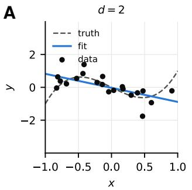
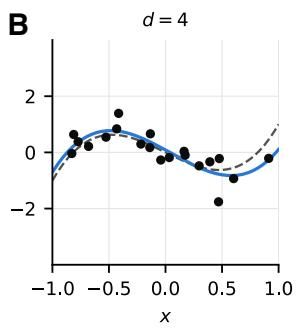
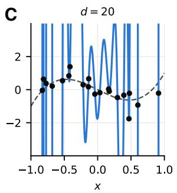
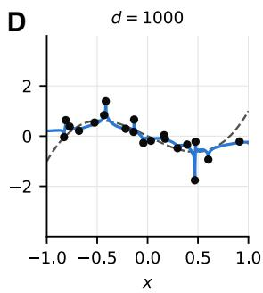
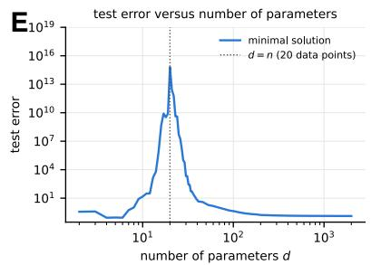
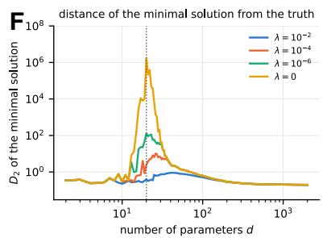
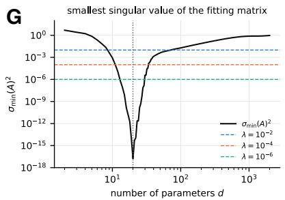
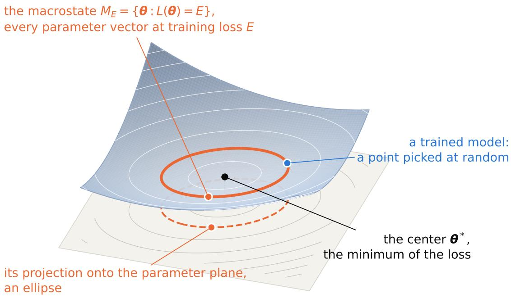

# Double descent is the principle of least action

Congzhou M Sha

Penn Medicine Doylestown Hospital, 595 W State St, Doylestown, PA 18901, United States

consha@sas.upenn.edu

## Abstract

The test error of a model plotted against its number of parameters d falls, peaks when the model can just fit the training data, and falls again, exhibiting the double descent phenomenon. We explain the phenomenon with statistical mechanics. The training trajectory of a stochastic gradient-based method is a particle wandering over the energy landscape of the training loss at an induced temperature T, and a run that has equilibrated visits every parameter vector of a given training loss equally often, the fundamental postulate of statistical mechanics, with probability given by the Boltzmann distribution. Because training starts at an initia point and has only finite time to difuse, it carries an efective weight decay, which makes every parameter a quadratic degree of freedom. The equipartition theorem then distributes the energy among the d degrees of freedom in shares of T /2, so at a fixed training loss adding parameters lowers the temperature and drives the Boltzmann distribution toward the stationary path. Finally, adding parameters can only lower the $L ^ { 2 }$ norm of the stationary path, so a solution sampled at fixed loss is less likely to be large with increasing d, efectively increasing weight regularization.

## 1 Introduction

Consider the simple regression task as described by Nakkiran et al. (2019; 2020): fitting 20 noisy samples of a cubic function on the interval [−1, 1] using polynomials with varying numbers of parameters d (Fig. 1A–D). d counts all the coeficients of the polynomial including the constant term, so a polynomial of degree d − 1 has d parameters. d = 2, i.e. linear regression $f ( x ) = \theta _ { 1 } x + \theta _ { 0 }$ , produces an underfit whereas d = 4, i.e. the cubic $f ( x ) = \theta _ { 3 } x ^ { 3 } + \theta _ { 2 } x ^ { 2 } + \theta _ { 1 } x + \theta _ { 0 }$ , is the intended ground truth solution. For d = 20, there are exactly as many coeficients as there are points, so exactly one polynomial passes through all of the training data, and it oscillates wildly between the data. Surprisingly, fitting a d = 1000 curve also passes through every data point, yet it tracks the true cubic nearly as well as the d = 4 solution within the training data range, but without the enormous oscillations of the d = 20 polynomial.

Plotting the test error as a function of d (Fig. 1E) shows a classical U-shape initially, with a peak at $d = n ,$ however there is a long decreasing tail to the right. This double descent phenomenon (Belkin et al., 2019; Nakkiran et al., 2020) appears in deep networks as a function of layer width, network depth, and number of training epochs. Exact treatments exist for linear and random-feature models (Hastie et al., 2022; Mei & Montanari, 2022; Bartlett et al., 2020), and the threshold has been identified with a jamming transition (Spigler et al., 2019; Geiger et al., 2020) and with broken ergodicity (Li & Goldenfeld, 2026). The aim of this work is to provide further elementary physical intuition for the double descent phenomenon, with a pedagogical focus so that it is understandable to undergraduates.

## 2 The statistical mechanics of the loss function

## 2.1 Microstates and the fundamental postulate

Statistical mechanics is the science of observing nature at large scales (Reif, 1965). Just as we may know the energy of a gas but are not concerned with the coordinates and velocity of every molecule, we may know the training loss of a model but are not concerned with the specific numerical values of the model’s parameters.

  
Figure 1: A–D Legendre-basis fits with d parameters (degree $d - 1$ , constant term included) to $n = 2 0$ points $y _ { i } = 3 x _ { i } ^ { 3 } - 2 x _ { i } + \xi _ { i } , \xi _ { i } \sim \mathcal { N } ( 0 , 0 . 4 ^ { 2 } )$ : least squares for $d \leq n ,$ minimum-norm interpolation for $d > n$ . E Test error of the minimal solution, the least squares fit for $d \leq n$ and the minimum-norm interpolant for $d > n ,$ which peaks at $d = n$ . F Root mean square distance from the true cubic over the range $I = [ x _ { 1 } , x _ { n } ]$ of the training inputs, $\begin{array} { r } { D _ { 2 } = \left( \frac { 1 } { | I | } \int _ { I } ( f - q ) ^ { 2 } \right) ^ { 1 / 2 } } \end{array}$ with $q ( x ) = 3 x ^ { 3 } - 2 x$ , of the minimal solution $\pmb { \theta } ^ { * } = ( A ^ { \top } A + \lambda I ) ^ { - 1 } A ^ { \top } y$ of Eq. (6), for four values of the weight decay λ. G The square of the smallest singular value of the fitting matrix, $\dot { \sigma } _ { \mathrm { m i n } } ( A ) ^ { 2 }$ ; the horizontal lines mark the three regularization levels of F. The amplification of label noise into the fit is governed by $1 / ( \sigma _ { \mathrm { m i n } } ( A ) ^ { 2 } + \lambda )$ , so each curve in F peaks where $\sigma _ { \mathrm { m i n } } ( A ) ^ { 2 }$ falls below its λ.

Any set of trained weights which produces a low test loss generally makes the user happy. However, we can reason a posteriori about the properties of the minima and how the double descent phenomenon arises, given some assumptions on the definition of training for a suficient length of time, i.e. ergodicity.

Say that we flip ten coins and only know that seven are heads. A microstate in this context is defined as the specific sequence of coin flip results, e.g. HTHTHHHTHH. Since we are given only the information about the total number of heads, multiple sequences (microstates) are possible, i.e. $\binom { 1 0 } { 7 } \stackrel { \cdot } { = } \binom { 1 0 } { 3 } = 1 2 0$ . We may then define the macrostate M of “sequences of 10 coin flips with 7 heads" as the set of these 120 sequences, and the number of heads is known as an observable $O .$ The number of such microstates in a macrostate is known as the multiplicity Ω(M). The entropy then is defined as $S \sim \log \Omega$ (we omit the Boltzmann factor $k _ { B } )$

Fundamental postulate of statistical mechanics. If all that is known about a physical system is its macroscopic observable, then every microstate consistent with that macrostate is equally probable to be the current physical state of the system.

In the context of optimization, a microstate is a specific choice of numerical parameters $\pmb \theta$ for a model $M ,$ the observable is the training loss $L ( M ( \pmb \theta ) )$ which we will think of as the total energy $E$ of the system, for example the least squares objective $\begin{array} { r } { \dot { L } ( \dot { M } ( \dot { \pmb { \theta } } ) ) = \frac { 1 } { 2 n } \sum _ { i } ( M ( x _ { i } ; \pmb { \theta } ) - y _ { i } ) ^ { 2 1 } } \end{array}$ , and the macrostate is the set of all parameters for which the model achieves this loss.

## 2.2 Ergodicity

During model training, stochastic gradient descent (Robbins & Monro, 1951) or another stochastic gradientbased method (Kingma & Ba, 2015; Loshchilov & Hutter, 2019) is used to move from higher to lower values of the loss function. When the training error levels of, training is assumed to have reached an equilibrium. During training, a trajectory of parameters $\{ \pmb \theta _ { 1 } , \pmb \theta _ { 2 } , \cdots \}$ are visited. A particular training trajectory $\{ \pmb \theta _ { i } \}$ is called ergodic if it visits a representative sample of microstates, such that computing any macroscopic observable based on that sample yields the same value as if we performed the analytic sample across all solutions.

An ergodic trajectory that has settled at a training loss E therefore samples the macrostate at that loss, the level set $\{ \pmb \theta : L ( \pmb \theta ) = E \}$ . In the polynomial fitting example this set is explicit. For $d \geq n$ the loss can reach $E = 0$ exactly, the interpolating regime, and the macrostate is the $( d - n )$ -dimensional set of interpolants; for $E > 0$ it is a contour of dimension $d - 1$ . What the analysis needs is that the trajectory samples this set without preference for any part of it, which we take as an assumption:

Ergodicity of model training. Training a randomly-initialized model M with d parameters to a specified tolerance (e.g. $L ( M ( \pmb \theta ) ) = E )$ produces a microstate $\theta _ { d }$ which is drawn uniformly from the corresponding macrostate.

With this assumption in place, there is an analogy between coin flips and model training (Table 1 in Appendix A.1).

## 2.3 The Boltzmann distribution and equipartition

The fundamental postulate weights every microstate of a fixed energy equally. Training however, does not fix the energy: the loss fluctuates from step to step. Each mini-batch reports a slightly diferent gradient, the gradient sampling process itself is often drawn from a noisy distribution (Kingma & Ba, 2015; Loshchilov & Hutter, 2019). The most accurate description of training is a probability distribution over energies, and the fundamental postulate determines that this distribution must be the Boltzmann distribution (Appendix A.2):

$$
P ( s ) = { \frac { e ^ { - E _ { s } / T } } { Z } } , \qquad Z = \sum _ { s } e ^ { - E _ { s } / T } ,\tag{1}
$$

where the sum, or integral, runs over all microstates of the system regardless of energy, and Z normalizes the probabilities (Reif, 1965).

In the context of optimization, the energy is the training loss. Training for a finite time regularizes the problem, and is equivalent to weight decay of strength $\lambda \propto 1 / t$ (Krogh & Hertz, 1992; Ali et al., 2019), so we take the energy to be the loss with weight decay,

$$
\begin{array} { r } { L _ { \lambda } ( \pmb \theta ) = L ( \pmb \theta ) + \frac { \lambda } { 2 } \| \pmb \theta \| ^ { 2 } , \qquad \lambda > 0 . } \end{array}\tag{2}
$$

For the least squares problem in Fig. 1, $\begin{array} { r } { L ( \pmb { \theta } ) = \frac { 1 } { 2 } \| A \pmb { \theta } - y \| ^ { 2 } } \end{array}$ and A is the fitting matrix of the basis functions at the training inputs Eq. (20). The probability density of observing a candidate parameter θ during training given the observed labels is then

$$
P ( \pmb \theta \mid y ) \propto \exp \Big [ - \frac { L _ { \lambda } ( \pmb \theta ) } { T } \Big ] ,\tag{3}
$$

with T determined by the properties of the optimization algorithm.

For least squares, the loss function with weight decay is a paraboloid. Expanding the norms and completing the square,

$$
\begin{array} { r } { L _ { \lambda } ( \pmb \theta ) = \frac 1 2 \pmb \theta ^ { \top } A ^ { \top } A \pmb \theta - y ^ { \top } A \pmb \theta + \frac 1 2 \| y \| ^ { 2 } + \frac { \lambda } { 2 } \pmb \theta ^ { \top } \pmb \theta } \end{array}\tag{4}
$$

$$
= { \textstyle \frac { 1 } { 2 } } \pmb { \theta } ^ { \top } M \pmb { \theta } - \ b { y } ^ { \top } \pmb { A } \pmb { \theta } + \frac { 1 } { 2 } \| \pmb { y } \| ^ { 2 } , \qquad \ c { M } = \pmb { A } ^ { \top } \pmb { A } + \lambda \pmb { I }\tag{5}
$$

$$
\begin{array} { r } { \begin{array} { r l r l r l } & { = \frac { 1 } { 2 } \left( \pmb { \theta } - \pmb { \theta } ^ { * } \right) ^ { \top } M \left( \pmb { \theta } - \pmb { \theta } ^ { * } \right) + E _ { \mathrm { m i n } } , } & & { \pmb { \theta } ^ { * } = M ^ { - 1 } A ^ { \top } \pmb { y } , } & { E _ { \mathrm { m i n } } = \frac { 1 } { 2 } \| \pmb { y } \| ^ { 2 } - \frac { 1 } { 2 } \pmb { y } ^ { \top } A M ^ { - 1 } A ^ { \top } \pmb { y } , } \end{array} } \end{array}\tag{6}
$$

  
Figure 2: The fundamental postulate. The training loss $L ( \pmb \theta )$ as a landscape over two parameters $\pmb { \theta } = ( \theta _ { 1 } , \theta _ { 2 } )$ with the contour $L ( \pmb \theta ) = E$ drawn on the surface (orange): it is the macrostate $M _ { E }$ , every parameter vector at training loss $E ,$ and its projection onto the parameter plane is an ellipse (dashed). By the fundamental postulate, a converged training run limited to a particular fixed energy visits every point of the contour of that energy equally often, so a trained model at that energy is a point picked at random from it (blue). The center $\pmb { \theta } ^ { * }$ (black) is the local minimum.

where the third line follows from ${ \begin{array} { r l } & { { \frac { 1 } { 2 } } ( \pmb { \theta } - \pmb { \theta } ^ { * } ) ^ { \top } M ( \pmb { \theta } - \pmb { \theta } ^ { * } ) = { \frac { 1 } { 2 } } \pmb { \theta } ^ { \top } M \pmb { \theta } - \pmb { \theta } ^ { \top } M \pmb { \theta } ^ { * } + { \frac { 1 } { 2 } } \pmb { \theta } ^ { * \top } M \pmb { \theta } ^ { * } } \end{array} }$ and $M \pmb { \theta } ^ { * } = \pmb { A } ^ { \top } \pmb { y }$ The matrix M is symmetric positive definite for $\lambda > 0$ , so the loss has its minimum $E _ { \mathrm { m i n } } = L _ { \lambda } ( \pmb \theta ^ { * } )$ at $\pmb { \theta } ^ { * }$ , the ridge regression fit, and each contour $L _ { \lambda } = E$ is the ellipsoid $( \pmb \theta - \pmb \theta ^ { * } ) ^ { \top } M ( \pmb \theta - \pmb \theta ^ { * } ) = 2 ( E - E _ { \mathrm { m i n } } )$ . Any $C ^ { \omega }$ loss2 has this form to leading order near a minimum $\pmb { \theta } ^ { * }$ , with the Hessian H in place of $M ^ { 3 } \ \mathrm { ( F i g . \ 2 ) }$

A key consequence of the Boltzmann distribution is the equipartition theorem. Near a local energy minimum, the loss is quadratic, and under the Boltzmann weight each of the d principal directions carries the same share $T / 2$ of the loss above the minimum (Appendix A.3), so

$$
\mathbb { E } [ L ] = E _ { \operatorname* { m i n } } + \frac { T d } { 2 } .\tag{7}
$$

Near the minimum, $\begin{array} { r } { L = E _ { \operatorname* { m i n } } + \frac { 1 } { 2 } \| w \| ^ { 2 } } \end{array}$ in the coordinates $w = H ^ { 1 / 2 } ( \pmb { \theta } - \pmb { \theta } ^ { * } ) \ \mathrm { ( E q }$ . (6) for least squares, with $H = M )$ , and the contour at $E = \mathsf { \bar { E } } _ { \operatorname* { m i n } } + \Delta E$ is the sphere $\| w \| ^ { 2 } = 2 \Delta E$ , on which the fundamental postulate makes w uniform. A uniform point on a sphere has $\mathbb { E } [ w _ { i } ^ { 2 } ] = 2 \Delta E / d$ for every coordinate, so each of the d directions carries the same share $\Delta E / d$ of the excess loss. For least squares, the data term $\begin{array} { r l } { \frac { 1 } { 2 } \| A \pmb { \theta } - y \| ^ { 2 } } \end{array}$ changes only along the n directions of the row space of $A M ^ { - 1 / 2 }$ , which we call seen by the data, and not along the $d - n$ directions of its null space, which we call unseen. The seen directions, which alone determine the fit at the training inputs, therefore carry

$$
\mathbb { E } _ { E } \left[ { \frac { 1 } { 2 } } \| w _ { s } \| ^ { 2 } \right] = { \frac { n } { d } } \Delta E ,\tag{8}
$$

which falls as $1 / d .$ At a fixed training loss $E = E _ { \operatorname* { m i n } } + \Delta E .$ additional parameters beyond the interpolant $d > n$ therefore result in cooling of the temperature of the training algorithm along the seen directions.

## 2.4 The path integral over curves

Read as a statement about curves rather than parameters, Eq. (3) is a path integral (Feynman $\&$ Hibbs, 1965). The model maps each parameter vector to a curve $f ( \cdot ; \pmb \theta )$ , so the sum over microstates is a sum over every curve the model can draw, each weighted by $e ^ { - L _ { \lambda } / T }$ , and a prediction is the average over all of them,

$$
Z = \int d \theta e ^ { - L ( \theta ) / T } e ^ { - \lambda \| \theta \| ^ { 2 } / 2 T } , \qquad \langle f ( x ) \rangle = { \frac { 1 } { Z } } \int d \theta f ( x ; \theta ) e ^ { - L ( \theta ) / T } e ^ { - \lambda \| \theta \| ^ { 2 } / 2 T } .\tag{9}
$$

Under Eq. (8) the temperature is $T _ { \mathrm { e f f } } \propto \Delta E / d ,$ , and the variance of the coeficients becomes $2 \Delta E / ( \lambda d )$ shrinking with every added parameter. The principle of least action states that when $T  0 .$ , the primary contribution to $Z$ becomes that of the stationary path, where $L _ { \lambda } ( \pmb \theta )$ is minimized, and thus the exponentia is maximized (Feynman & Hibbs (1965)).

In general, the Boltzmann distribution is equivalent to the overdamped Langevin equation

$$
\dot { \pmb { \theta } } = - \nabla L ( \pmb { \theta } ) - \lambda \pmb { \theta } + \sqrt { 2 T } \xi ( t ) ,\tag{10}
$$

with $\xi$ white noise of unit strength: gradient descent on the loss with weight decay, driven by isotropic noise of temperature $T ,$ the stochastic gradient Langevin dynamics of Welling & Teh (2011). The density $P ( \pmb \theta , t )$ of a cloud of runs obeys the Fokker–Planck equation (Risken, 1996), in which the drift $- \nabla L _ { \lambda }$ transports probability and the noise difuses it with coeficient $T .$

$$
\partial _ { t } P = \nabla \cdot \left( P \nabla L _ { \lambda } \right) + T \nabla ^ { 2 } P = \nabla \cdot J , \qquad J = P \nabla L _ { \lambda } + T \nabla P .\tag{11}
$$

A stationary density with no probability current, $J = 0$ , satisfies $T \nabla P = - P \nabla L _ { \lambda }$ , that is

$$
\nabla \ln P = - \frac { \nabla L _ { \lambda } } { T } , \qquad \mathrm { s o } \qquad P ( \pmb { \theta } ) = \frac { 1 } { Z } e ^ { - L _ { \lambda } ( \pmb { \theta } ) / T } ,\tag{12}
$$

which is Eq. (3), and it is normalizable exactly when $Z$ of Eq. (9) converges: for $d > n$ this requires $\lambda > 0$ since without the weight decay the loss is flat along the $d - n$ unseen directions.

For a quadratic loss, $e ^ { - L _ { \lambda } / T } = e ^ { - E _ { \mathrm { m i n } } / T } \exp [ - \frac { 1 } { 2 } ( \theta - \theta ^ { * } ) ^ { \top } ( H / T ) ( \theta - \theta ^ { * } ) ]$ is the Gaussian of mean $\pmb { \theta } ^ { * }$ and covariance $T H ^ { - 1 }$ , with $Z = ( 2 \pi T ) ^ { d / 2 } ( \operatorname * { d e t } { \bar { H } } ) ^ { - 1 / 2 } e ^ { - E _ { \mathrm { m i n } } / T }$ . For a model linear in its parameters, $f ( x ) = p ( x ) ^ { \top } \pmb \theta$ with $p ( x )$ the vector of basis functions at $x ,$ the curve is a Gaussian process with mean $p ( x ) ^ { \top } \theta ^ { * }$ and covariance $\mathrm { ~ \bar { ~ } } T p ( x ) ^ { \top } H ^ { - 1 } p ( x ^ { \prime } )$ (Rasmussen & Williams, 2006). For least squares with weight decay, $H = M$ and the mean curve is the ridge regression fit $f ^ { * } ( x ) = p ( x ) ^ { \top } \pmb \theta ^ { * }$ . Its two limits are the two ends of the path integral. As $T \to 0$ the noise vanishes and the parameters descend to the stationary point $\nabla L ( \pmb { \theta } ) + \lambda \pmb { \theta } = 0$ For least squares, $\begin{array} { r } { L ( \pmb \theta ) = \frac 1 2 \| A \pmb \theta - y \| ^ { 2 } = \frac 1 2 ( A \pmb \theta - y ) ^ { \top } ( A \pmb \theta - y ) } \end{array}$ has gradient $\nabla L ( \pmb \theta ) = A ^ { \top } ( A \pmb \theta - y )$ , so the stationary point solves

$$
\begin{array} { r } { A ^ { \top } ( A \theta - y ) + \lambda \theta = 0 , \qquad \mathrm { t h a t ~ i s } \qquad ( A ^ { \top } A + \lambda I ) \theta = A ^ { \top } y , \qquad \theta = \theta ^ { * } = M ^ { - 1 } A ^ { \top } y , } \end{array}\tag{13}
$$

mirroring Eq. (6). It is a minimum because the Hessian $M = A ^ { \top } A + \lambda I$ is positive definite for $\lambda > 0$

As $T \to \infty$ , we perform a change of variables $\pmb { \theta } = \sqrt { T / \lambda } \eta ;$ for least squares $\nabla L ( \pmb \theta ) = A ^ { \top } A \pmb \theta - A ^ { \top } \pmb y .$ and Eq. (10) becomes

$$
\dot { \eta } = - ( A ^ { \top } A + \lambda I ) \eta + \sqrt { \lambda / T } A ^ { \top } y + \sqrt { 2 \lambda } \xi ( t ) \xrightarrow [ T \to \infty ] { } - M \eta + \sqrt { 2 \lambda } \xi ( t ) .\tag{14}
$$

The $T \to \infty$ limit $\mathrm { E q . ~ ( 1 4 ) }$ is the Ornstein–Uhlenbeck process (Uhlenbeck & Ornstein, 1930), resulting in the motion $\begin{array} { r } { \pmb { \theta } ( t ) - \pmb { \theta } ^ { * } = e ^ { - H t } ( \pmb { \theta } _ { 0 } - \pmb { \theta } ^ { * } ) + \sqrt { 2 T } \int _ { 0 } ^ { t } e ^ { - H ( t - s ) } d W _ { s } } \end{array}$ . This solution is Gaussian at every t, with JU mean $\pmb { \theta } ^ { * } + e ^ { - H t } ( \pmb { \theta } _ { 0 } - \pmb { \theta } ^ { * } )$ and covariance $\begin{array} { r } { 2 T \int _ { 0 } ^ { t } e ^ { - 2 H v } d v = T H ^ { - 1 } ( I - e ^ { - 2 H t } ) } \end{array}$ , which tends to the stationary law as $t \to \infty$ (Pavliotis, 2014, Chapter 4). For the value at $x ,$ with $\tilde { p } _ { i } ( x )$ the components of $p ( x )$ along the eigenvectors of M and $\mu _ { i }$ its eigenvalues,

$$
\langle f ( x ) ^ { 2 } \rangle _ { t } = \langle f ( x ) \rangle _ { t } ^ { 2 } + T \sum _ { i } \tilde { p } _ { i } ( x ) ^ { 2 } \frac { 1 - e ^ { - 2 \mu _ { i } t } } { \mu _ { i } } , \qquad \langle f ( x ) \rangle _ { t } = f ^ { * } ( x ) + p ( x ) ^ { \top } e ^ { - M t } ( \pmb { \theta } _ { 0 } - \pmb { \theta } ^ { * } ) .\tag{15}
$$

At stationarity $\langle f ( x ) ^ { 2 } \rangle = f ^ { * } ( x ) ^ { 2 } + T p ( x ) ^ { \top } M ^ { - 1 } p ( x )$ . At a finite time the unseen directions, $\mu _ { i } = \lambda .$ , have reached only $T ( 1 - e ^ { - 2 \lambda t } ) / \lambda \approx 2 T t$ of their stationary variance $T / \lambda { \mathrm { : } }$ the run behaves as if the stifness were capped at $1 / ( 2 t )$ , the $\lambda \propto 1 / t$ of Eq. (2).

Theorem 1 (Finite training time is weight decay, Appendix C). For least squares with weight decay $\lambda \geq 0$ the run of $E q .$ . (10) from $\pmb { \theta } _ { 0 } = 0$ has, at time t,

$$
\begin{array} { r l r } { \mathrm { C o v } [ \theta ( t ) ] } & { \preceq } & { 2 T \left( M + \frac { 1 } { 2 t } I \right) ^ { - 1 } , \qquad \mathbb { E } [ \theta ( t ) ] = ( I - e ^ { - M t } ) M ^ { - 1 } A ^ { \top } y , } \end{array}
$$

and the mean agrees with the ridge $\begin{array} { r } { \hbar t \left( M + \frac { 1 } { t } I \right) ^ { - 1 } A ^ { \top } y } \end{array}$ at weight decay $\lambda + 1 / t$ along every eigenvector of M up to a factor between 1 and 1.3.

By Theorem 1, a run of length t has the fluctuations of a run with weight decay $\lambda + 1 / ( 2 t )$ , up to a factor two, and the mean fit of a run with weight decay $\lambda + 1 / t$ , up to a factor 1.3 (Ali et al., 2019); the finite training time caps the size of the fit whatever the conditioning of the data. Late stopping removes the cap and leaves the ridge fit at the explicit λ, whose quality depends on the conditioning of the data: the collapse of $\sigma _ { \mathrm { m i n } } ( A )$ at $d = n$ in $\mathrm { F i g }$ . 1G and its recovery beyond.

## 2.5 Measuring the size of the fitted functions

The Legendre polynomials are orthogonal, $\begin{array} { r } { \int _ { - 1 } ^ { 1 } P _ { k } P _ { l } d x = \frac { 2 } { 2 k + 1 } \delta _ { k l } } \end{array}$ (Szegő, 1975, Eq. (4.3.3) with $\alpha = \beta = 0 )$ 2 so that

$$
\int _ { - 1 } ^ { 1 } f ^ { 2 } d x = \sum _ { k < d } { \frac { 2 } { 2 k + 1 } } \theta _ { k } ^ { 2 } \leq 2 \| \pmb \theta \| ^ { 2 } ,\tag{16}
$$

therefore the least-action curve through the data is the smallest one in the $L ^ { 2 }$ sense. For $d \geq n$ and distinct inputs, $A A ^ { \top }$ is invertible and as $\lambda  0$ the least-action curve is the interpolant of least norm, $\pmb { \theta } ^ { * } = A ^ { \top } ( \bar { A } A ^ { \top } ) ^ { - 1 } \ b { y }$ (Theorem B.1 in Appendix B), whose energy $\begin{array} { r } { \frac 1 2 \| \pmb \theta ^ { * } \| ^ { 2 } = \frac 1 2 y ^ { \top } ( \pmb { A } \mathbf { \hat { A } } ^ { \top } ) ^ { - 1 } y } \end{array}$ changes with every added coeficient. We now show that this energy is nonincreasing.

Theorem 2 (The energy of the interpolant, Appendix C). Let $d \geq n$ , let $p _ { d } = ( P _ { d } ( x _ { i } ) ) _ { i \leq n }$ be the values at the inputs of the basis function added when d becomes $d + 1$ , and let $\alpha _ { d } = ( A A ^ { \top } ) ^ { - 1 } y ,$ so that $\theta ^ { * } = A ^ { \top } \alpha _ { d }$ Then

$$
\lVert \pmb { \theta } ^ { * ( d + 1 ) } \rVert ^ { 2 } = \lVert \pmb { \theta } ^ { * ( d ) } \rVert ^ { 2 } - \frac { ( p _ { d } ^ { \top } \alpha _ { d } ) ^ { 2 } } { 1 + p _ { d } ^ { \top } ( A A ^ { \top } ) ^ { - 1 } p _ { d } } :\tag{17}
$$

the energy of the interpolant is nonincreasing in $d ,$ and strictly decreasing unless $p _ { d } ^ { \top } \alpha _ { d } = 0$ , which for given inputs holds only on a hyperplane of labels y.

Thus, each new basis function with nonzero overlap with the training data lowers the energy.

## 3 Conclusion

The training trajectory produced by stochastic gradient-based methods can be thought of as a particle wandering over the energy landscape with some induced temperature T, and so can be treated with statistical mechanics. Because real world machine learning algorithms start at some initial point and have only finite time to difuse in the energy landscape, there is efectively weight decay regularization. $\mathrm { B y }$ increasing the degrees of freedom in this landscape, the equipartition theorem distributes energy among the quadratic coordinates in multiples of $\textstyle { \frac { T } { 2 } }$ . Increasing the number of degrees of freedom d (which are made quadratic due to weight decay regularization) thus efectively decreases the temperature for a given energy $E ,$ driving the Boltzmann distribution toward the stationary path. Furthermore, increasing d can only lower the energy of the stationary path (Theorem 2) and thus the resulting $L ^ { 2 }$ norm Eq. (16), therefore reducing the likelihood at fixed E that the sampled solution has large $L ^ { 2 }$ norm. Thus, increasing d beyond the interpolation threshold is a form of weight decay regularization as well.

## AI disclosure

The author used Claude (Anthropic; Claude Opus 5 through Claude Code) as a research and writing assistant. Under the author’s direction it drafted and revised text, derived and typeset the theorems and their proofs, wrote the Lean 4 verification of the theorems, wrote the Python scripts that produce every figure, and ran the numerical experiments. The author’s initial idea was to explore double descent through the lens of statistical mechanics, in particular to bound the norms of solutions near local minima, as a function of d. The author noted that there is symmetry among minima for neural networks by permuting neurons in a hidden layer. From there, the author was reminded of the spontaneous symmetry breaking in physics, of the path integral, and finally of the connection between the path integral and the Boltzmann distribution.

## Conflict of interest statement

The author is a 2026–2027 Doximity AI Fellow, and receives items and services of minimal monetary value from Doximity, Inc in exchange for consulting services.

## References

Alnur Ali, J Zico Kolter, and Ryan J Tibshirani. A continuous-time view of early stopping for least squares regression. In Proceedings of the 22nd International Conference on Artificial Intelligence and Statistics (AISTATS), volume 89 of Proceedings of Machine Learning Research, pp. 1370–1378, 2019. URL https://proceedings.mlr.press/v89/ali19a.html.

Peter L Bartlett, Philip M Long, Gábor Lugosi, and Alexander Tsigler. Benign overfitting in linear regression. Proceedings of the National Academy of Sciences, 117(48):30063–30070, 2020. doi: 10.1073/ pnas.1907378117.

Mikhail Belkin, Daniel Hsu, Siyuan Ma, and Soumik Mandal. Reconciling modern machine-learning practice and the classical bias–variance trade-of. Proceedings of the National Academy of Sciences, 116(32): 15849–15854, 2019. doi: 10.1073/pnas.1903070116.

Richard P Feynman and Albert R Hibbs. Quantum Mechanics and Path Integrals. McGraw-Hill, New York, 1965.

Mario Geiger, Arthur Jacot, Stefano Spigler, Franck Gabriel, Levent Sagun, Stéphane d’Ascoli, Giulio Biroli, Clément Hongler, and Matthieu Wyart. Scaling description of generalization with number of parameters in deep learning. Journal of Statistical Mechanics: Theory and Experiment, 2020(2):023401, 2020. doi: 10.1088/1742-5468/ab633c.

Trevor Hastie, Andrea Montanari, Saharon Rosset, and Ryan J Tibshirani. Surprises in high-dimensional ridgeless least squares interpolation. Annals of Statistics, 50(2):949–986, 2022. doi: 10.1214/21-AOS2133.

Diederik P Kingma and Jimmy Ba. Adam: A method for stochastic optimization. In International Conference on Learning Representations (ICLR), 2015. arXiv:1412.6980.

Anders Krogh and John A Hertz. A simple weight decay can improve generalization. In Advances in Neural Information Processing Systems, volume 4, pp. 950–957. Morgan Kaufmann, 1992. URL https: //proceedings.neurips.cc/paper/1991/hash/8eefcfdf5990e441f0fb6f3fad709e21-Abstract.html.

Chan Li and Nigel Goldenfeld. Broken ergodicity and the violation of the fluctuation-dissipation theorem lead to generalization beyond overfitting in machine learning, 2026. arXiv:2607.04135.

Ilya Loshchilov and Frank Hutter. Decoupled weight decay regularization. In International Conference on Learning Representations (ICLR), 2019. arXiv:1711.05101.

Song Mei and Andrea Montanari. The generalization error of random features regression: Precise asymptotics and the double descent curve. Communications on Pure and Applied Mathematics, 75(4):667–766, 2022. doi: 10.1002/cpa.22008.

Preetum Nakkiran, Gal Kaplun, Yamini Bansal, Tristan Yang, Boaz Barak, and Ilya Sutskever. Deep double descent. Windows on Theory blog, https://windowsontheory.org/2019/12/05/deep-double-descent/, December 2019.

Preetum Nakkiran, Gal Kaplun, Yamini Bansal, Tristan Yang, Boaz Barak, and Ilya Sutskever. Deep double descent: Where bigger models and more data hurt. In International Conference on Learning Representations (ICLR), 2020. arXiv:1912.02292.

Grigorios A Pavliotis. Stochastic Processes and Applications: Difusion Processes, the Fokker–Planck and Langevin Equations, volume 60 of Texts in Applied Mathematics. Springer, New York, 2014. doi: 10.1007/978-1-4939-1323-7.

Carl Edward Rasmussen and Christopher K I Williams. Gaussian Processes for Machine Learning. MIT Press, 2006. doi: 10.7551/mitpress/3206.001.0001.

Frederick Reif. Fundamentals of Statistical and Thermal Physics. McGraw-Hill, New York, 1965.

Hannes Risken. The Fokker–Planck Equation: Methods of Solution and Applications. Springer, Berlin, 2nd edition, 1996. doi: 10.1007/978-3-642-61544-3.

Herbert Robbins and Sutton Monro. A stochastic approximation method. Annals of Mathematical Statistics, 22(3):400–407, 1951. doi: 10.1214/aoms/1177729586.

Jack Sherman and Winifred J Morrison. Adjustment of an inverse matrix corresponding to a change in one element of a given matrix. The Annals of Mathematical Statistics, 21(1):124–127, 1950. doi: 10.1214/aoms/1177729893.

Stefano Spigler, Mario Geiger, Stéphane d’Ascoli, Levent Sagun, Giulio Biroli, and Matthieu Wyart. A jamming transition from under- to over-parametrization afects generalization in deep learning. Journal of Physics A: Mathematical and Theoretical, 52(47):474001, 2019. doi: 10.1088/1751-8121/ab4c8b.

Gábor Szegő. Orthogonal Polynomials, volume 23 of Colloquium Publications. American Mathematical Society, 4th edition, 1975. doi: 10.1090/coll/023.

George E Uhlenbeck and Leonard S Ornstein. On the theory of the Brownian motion. Physical Review, 36 (5):823–841, 1930. doi: 10.1103/PhysRev.36.823.

Max Welling and Yee Whye Teh. Bayesian learning via stochastic gradient Langevin dynamics. In Proceedings of the 28th International Conference on Machine Learning (ICML), pp. 681–688, 2011. URL https: //icml.cc/2011/papers/398\_icmlpaper.pdf.

## A Worked examples and derivations for Section 2.1

## A.1 Coin flips

With the fundamental postulate, one may count physical states of a collection of objects, given macrostates defined by a macroscopic observable, such as the total energy E or the average pressure $P ,$ and derive laws regarding how these quantities relate with each other, for example the ideal gas law $P V = N k _ { B } T$ (Reif, 1965).

With the ergodicity assumption of Section 2.2 in place, there is an analogy between the coin flips and model training (Table 1).

<table><tr><td>Ten coin flips</td><td></td><td>Machine learning model M</td></tr><tr><td>Microstate</td><td>One sequence of outcomes, e.g. HTHTHHHTHH</td><td>A specific vector of parameters θ</td></tr><tr><td>Observable</td><td>Total number of heads</td><td>Training loss  $L ( M ( \pmb \theta ) )$ </td></tr><tr><td>Macrostate</td><td>All sequences with the observed number of heads, e.g. the 120</td><td>All parameter vectors that achieve the observed loss of E:</td></tr><tr><td>Multiplicity Ω</td><td>sequences with 7 heads  $\binom { 1 0 } { 7 } = 1 2 0$ </td><td> $\Theta = \{ \pmb \theta : L ( M ( \pmb \theta ) ) = E \}$  Number/density of the set of parameters with loss E</td></tr><tr><td>Fundamental postulate</td><td>Each of the 120 sequences has probability 1/120</td><td>All  $\theta \in \Theta$  are equally likely to have been reached once training has converged</td></tr></table>

Table 1: The statistical mechanics analogy between coin flips and machine learning models.

## A.2 The Boltzmann distribution

Consider a small system S in contact with a large reservoir R, the two together isolated with total energy $E _ { \mathrm { t o t } }$ and able to exchange energy. A microstate of the whole is a pair (microstate of S, microstate of R), and the postulate weights every such pair with energy $E _ { \mathrm { t o t } }$ equally. Fix one microstate s of the system, of energy $E _ { s }$ . The number of pairs in which S is in state s is the number of reservoir microstates of energy $E _ { \mathrm { t o t } } - E _ { s }$ that is, the multiplicity $\Omega _ { \mathcal { R } } ( E _ { \mathrm { t o t } } - E _ { s } )$ . Hence

$$
P ( s ) \propto \Omega _ { \mathcal R } ( E _ { \mathrm { t o t } } - E _ { s } ) = \exp \big [ S _ { \mathcal R } ( E _ { \mathrm { t o t } } - E _ { s } ) \big ] .\tag{18}
$$

The system is small, so $E _ { s } \ll E _ { \mathrm { t o t } }$ , and the exponent can be expanded to first order: $S _ { \mathcal { R } } ( E _ { \mathrm { t o t } } - E _ { s } ) =$ $S _ { \mathcal R } ( E _ { \mathrm { t o t } } ) - E _ { s } \partial S _ { \mathcal R } / \partial E + . . . .$ . The first term is a constant. The derivative $\partial S _ { \mathcal { R } } / \partial E$ is a property of the reservoir alone, and we call its reciprocal the temperature T (again ignoring the historical factor of $k _ { B } )$ The result is Eq. (1).

With the training loss as the energy, Eq. (3), a model that fits the data less well is not forbidden, only exponentially less probable, by a factor $e ^ { - \Delta L / T }$ per unit of extra loss. If, in addition, the coeficients are penalized by $\frac { \bar { \lambda ( \pmb { \theta } ) } } { 2 } \lVert \pmb { \theta } \rVert ^ { 2 }$ , the penalty adds to the energy, and the weight becomes $\exp [ - L _ { \lambda } ( \pmb \theta ) / T ]$ with $\begin{array} { r } { L _ { \lambda } = L + \frac { \lambda } { 2 } \| \pmb { \theta } \| ^ { 2 } } \end{array}$ ; the factor $\exp [ - \lambda \| \pmb \theta \| ^ { 2 } / 2 T ]$ is a Gaussian prior of variance $s ^ { 2 } = T / \lambda$ on each coeficient. Zero temperature, $T \to 0$ , concentrates the weight on the minimizers of $L _ { \lambda }$ . Zero penalty, $\lambda  0$ , recovers the initial uniform weighting of microstates.

## A.3 Equipartition

In a neighborhood about a local energy minimum $E _ { \mathrm { m i n } }$ , the landscape is quadratic, $\begin{array} { r } { L ( \pmb { \theta } ) = E _ { \operatorname* { m i n } } + \frac { 1 } { 2 } \sum _ { i = 1 } ^ { d } \mu _ { i } u _ { i } ^ { 2 } } \end{array}$ in coordinates u along its principal curvatures $\mu _ { i } > 0 \ ( \mathrm { E q . ~ ( 6 ) }$ makes this exact for least squares). Under the Boltzmann weight $e ^ { - L / T }$ the coordinates are independent, each with density $\propto e ^ { - \mu _ { i } u _ { i } ^ { 2 } / 2 T }$ , a Gaussian of variance $T / \mu _ { i }$ , so each term of the sum has average $\scriptstyle { \frac { 1 } { 2 } } \mu _ { i } \cdot T / \mu _ { i } = T / 2$ whatever its curvature, and

$$
\mathbb { E } [ L ] = E _ { \operatorname* { m i n } } + \sum _ { i = 1 } ^ { d } \frac { T } { 2 } = E _ { \operatorname* { m i n } } + \frac { T d } { 2 } ,
$$

which is Eq. (7).

## B The Legendre fit in each regime

The fits of Fig. 1 and the matrix A of Section 2.3 are defined as follows. We work in the Legendre basis $P _ { 0 } , \ldots , P _ { d - 1 }$ , the polynomials of Rodrigues’ formula (Szegő, 1975, Eq. (4.3.1) with $\alpha = \beta = 0 )$

$$
P _ { k } ( x ) = \frac { 1 } { 2 ^ { k } k ! } \frac { d ^ { k } } { d x ^ { k } } \left( x ^ { 2 } - 1 \right) ^ { k } , \qquad P _ { 0 } = 1 , \quad P _ { 1 } = x , \quad P _ { 2 } = \frac { 1 } { 2 } \big ( 3 x ^ { 2 } - 1 \big ) , \quad P _ { 3 } = \frac { 1 } { 2 } \big ( 5 x ^ { 3 } - 3 x \big ) , \ldots ,\tag{19}
$$

so that $P _ { k }$ has degree exactly k and they are orthogonal on $\begin{array} { r } { [ - 1 , 1 ] , \int _ { - 1 } ^ { 1 } P _ { k } P _ { l } d x = \frac { 2 } { 2 k + 1 } \delta _ { k l } . } \end{array}$ Every Legendre polynomial is bounded by one on the whole interval, $| P _ { k } ( x ) | \leq 1$ with $P _ { k } ( 1 ) = 1$ , so the columns of $A$ have entries of comparable size. We write $\begin{array} { r } { f ( x ) = \sum _ { k } \theta _ { k } P _ { k } ( x ) = { p ( x ) ^ { \top } } \theta } \end{array}$ , so that the value $f ( x )$ at any input is a linear observable of the microstate θ. The training constraints are $A \pmb \theta = y$ , one row per training point and one column per basis function,

$$
A = \left( { \begin{array} { c c c c c } { P _ { 0 } ( x _ { 1 } ) } & { P _ { 1 } ( x _ { 1 } ) } & { \cdots } & { P _ { d - 1 } ( x _ { 1 } ) } \\ { P _ { 0 } ( x _ { 2 } ) } & { P _ { 1 } ( x _ { 2 } ) } & { \cdots } & { P _ { d - 1 } ( x _ { 2 } ) } \\ { \vdots } & { \vdots } & { \ddots } & { \vdots } \\ { P _ { 0 } ( x _ { n } ) } & { P _ { 1 } ( x _ { n } ) } & { \cdots } & { P _ { d - 1 } ( x _ { n } ) } \end{array} } \right) = \left( { \begin{array} { c c c c } { 1 } & { x _ { 1 } } & { { \frac { 1 } { 2 } } ( 3 x _ { 1 } ^ { 2 } - 1 ) } & { \cdots } \\ { 1 } & { x _ { 2 } } & { { \frac { 1 } { 2 } } ( 3 x _ { 2 } ^ { 2 } - 1 ) } & { \cdots } \\ { \vdots } & { \vdots } & { \vdots } & { \ddots } \\ { 1 } & { x _ { n } } & { { \frac { 1 } { 2 } } ( 3 x _ { n } ^ { 2 } - 1 ) } & { \cdots } \end{array} } \right) , \qquad \theta = \left( { \begin{array} { l } { \theta _ { 0 } } \\ { \theta _ { 1 } } \\ { \vdots } \\ { \theta _ { d - 1 } } \end{array} } \right) , \quad y = \left( { \begin{array} { l } { y _ { 1 } } \\ { y _ { 2 } } \\ { \vdots } \\ { y _ { n } } \end{array} } \right) ,\tag{20}
$$

an $n \times$ d matrix, the fitting matrix, whose ith row is $p ( x _ { i } ) ^ { \top }$ , so that $( A { \pmb \theta } ) _ { i } = f ( x _ { i } )$

Theorem B.1 (The fit in each regime). Let the n training inputs be distinct. Then A has rank min $( d , n )$ and the $f i t$ that training aims at is linear in the labels, $\pmb \theta = W y$ for a $d \times n$ matrix W that depends only on the inputs; in each regime:

$d < n \colon \quad W = ( A ^ { \top } A ) ^ { - 1 } A ^ { \top }$ , least squares. The macrostate M at $E = 0$ is empty; the training loss has the unique minimizer $\pmb \theta = W y$ , with $\begin{array} { r } { E _ { \operatorname* { m i n } } = \frac { 1 } { 2 } \| ( I - A W ) y \| ^ { 2 } > 0 } \end{array}$ unless y lies in the column space of A;   
$d = n \colon \quad W = A ^ { - 1 }$ . A is invertible and $M = \{ W y \}$ , the unique interpolant known as the Lagrange polynomial through the n points;

$d > n \colon \quad W = A ^ { \top } ( A A ^ { \top } ) ^ { - 1 } . ~ M = \pmb \theta ^ { * } + \ker A$ is an afine subspace of dimension $d - n _ { \mathrm { : } }$ , and its member of least norm is $\theta ^ { * } = W y$ , the minimum-norm interpolant, which is where gradient descent from $\pmb \theta = 0$ converges.

Proof. The rank. Restrict A to its first min $( d , n )$ columns and the first min $( d , n )$ inputs; this square block is $V _ { i k } = P _ { k } ( x _ { i } )$ . Since $P _ { k }$ has degree exactly $k , V = W T$ with $W _ { i k } = x _ { i } ^ { k }$ the Vandermonde matrix and T upper triangular with nonzero diagonal, and

$$
\operatorname* { d e t } W = \prod _ { i < j } ( x _ { j } - x _ { i } ) \neq 0
$$

for distinct inputs. So V is invertible and A has rank min $( d , n )$

$d < n$ . The columns of A are independent, so $A ^ { \top } A$ is invertible, and the range of A is a proper subspace of $\mathbb { R } ^ { n } \colon A \pmb { \theta } = y$ has no solution unless $y$ lies in the range, and the macrostate at $E = 0$ is empty. The strictly convex quadratic $\frac { 1 } { 2 } \| A \pmb { \theta } - y \| ^ { 2 }$ has the unique stationary point

$$
\begin{array} { r } { \boldsymbol { A } ^ { \top } \boldsymbol { A } \pmb { \theta } = \boldsymbol { A } ^ { \top } \boldsymbol { y } , \qquad \pmb { \theta } = ( \boldsymbol { A } ^ { \top } \boldsymbol { A } ) ^ { - 1 } \boldsymbol { A } ^ { \top } \boldsymbol { y } , } \end{array}
$$

whose residual $y - A ( A ^ { \top } A ) ^ { - 1 } A ^ { \top } y$ is the projection of y of the range, so $E _ { \mathrm { m i n } }$ is as stated.

$d = n . \ A = V$ is invertible and $\pmb { \theta } = \pmb { A } ^ { - 1 } \pmb { y }$ is the one solution, the Lagrange interpolant.

$d > n$ . The rows of A are independent, so $A A ^ { \top }$ is invertible, and $\pmb { \theta } ^ { * } = \pmb { A } ^ { \top } ( A A ^ { \top } ) ^ { - 1 } \ b { y }$ satisfies $A { \boldsymbol { \theta } } ^ { * } = y .$ . The solution set is the coset ${ \pmb { \theta } } ^ { * } +$ ker A with dim ker $A = d - n$ . Since $\pmb { \theta } ^ { * }$ lies in the row space of $A ,$ , which is orthogonal to ker $A ,$ , it is the solution of least norm. Gradient descent from $\pmb \theta = 0$ moves only within the row space, since every gradient $A ^ { \top } ( A \pmb \theta - y )$ lies there, and converges to it. □

The minimal solution of Fig. 1 is the fit of this theorem at $\lambda = 0 \colon$ least squares for $d < n$ , the interpolant for $d = n .$ , and the minimum-norm interpolant for $d > n$ . With weight decay, the three formulas merge into the single one of Eq. (6), $\pmb { \theta } ^ { * } = ( A ^ { \top } A + \lambda I ) ^ { - 1 } A ^ { \top } y = A ^ { \top } ( A A ^ { \top } + \lambda I ) ^ { - 1 } y$ , which tends to the corresponding case as $\lambda  0$

## C Proofs

The theorems below, Theorem B.1 and the identity of Eq. (6) are also verified in Lean 4 with Mathlib; the source files accompany the arXiv submission as ancillary files $( \mathtt { a n c } / 1 \mathtt { e a n } / )$ , and their README.md lists which statement each file proves. For Theorem 1 the Ornstein–Uhlenbeck solution is taken as given and the three scalar inequalities of the proof, including the constant 1.3, are what is verified.

Theorem 1 (Finite training time is weight decay). For least squares with weight decay $\lambda \geq 0$ , the run of Eq. (10) from $\theta _ { 0 } = 0$ has, at time t,

$$
\begin{array} { r l r } { \mathrm { C o v } [ \theta ( t ) ] } & { \preceq } & { 2 T \left( M + \frac { 1 } { 2 t } I \right) ^ { - 1 } , \qquad \mathbb { E } [ \theta ( t ) ] = ( I - e ^ { - M t } ) M ^ { - 1 } A ^ { \top } y , } \end{array}
$$

and the mean agrees with the $r i d g e \ f i t \ ( M + { \textstyle \frac { 1 } { t } } I ) ^ { - 1 } A ^ { \top } y$ at weight decay $\lambda + 1 / t$ along every eigenvector of M up to a factor between 1 and 1.3.

Proof. Both statements are diagonal in the eigenbasis of $M ;$ let $\mu \geq 0$ be an eigenvalue. By the covariance $T M ^ { \bar { - 1 } } ( I - e ^ { - 2 M t } )$ of the Ornstein–Uhlenbeck solution the variance along its eigenvector is $T ( 1 - e ^ { - 2 \mu t } ) / \mu$ (equal to 2Tt when $\mu = 0 )$ , and with $x = 2 \mu t$ 2

$$
\frac { 1 - e ^ { - 2 \mu t } } { \mu } = 2 t \frac { 1 - e ^ { - x } } { x } \leq 2 t \frac { 2 } { 1 + x } = \frac { 2 } { \mu + 1 / ( 2 t ) } ,
$$

because $( 1 - e ^ { - x } ) ( 1 + x ) \leq 2 x \colon$ for $x \leq 1 , 1 - e ^ { - x } \leq$ x and $x ( 1 + x ) \leq 2 x ;$ for $x \geq 1 , 1 - e ^ { - x } \leq 1$ and $1 + x \leq 2 x$ This is the covariance bound. For the mean, the solution with $\pmb { \theta } _ { 0 } = 0$ gives $\mathbb { E } [ \pmb \theta ( t ) ] = ( I - e ^ { - M t } ) \pmb \theta ^ { * } =$ $( I - e ^ { - M t } ) M ^ { - 1 } A ^ { \top } y ,$ whose coeficient along the eigenvector is $( 1 - e ^ { - \mu t } ) / \mu$ times that of $A ^ { \top } y .$ , against $1 / ( \mu + 1 / t )$ for the ridge fit at $\lambda + 1 / t$ . Their ratio is $r ( x ) = ( 1 - e ^ { - x } ) ( 1 + x ) / x$ with $x = \mu t$ , which satisfies $1 \leq r ( x ) \leq 1 . 3$ for $x \ge 0 \colon r \to 1$ at both ends, $r \geq 1$ since $( 1 - e ^ { - x } ) ( 1 + x ) \geq x$ , and its single maximum, at $x \approx 1 . 7 9$ , is 1.299. □

Theorem 2 (The energy of the interpolant). Let $d \geq n$ , let $p _ { d } = ( P _ { d } ( x _ { i } ) ) _ { i \leq n }$ be the values at the inputs of the basis function added when d becomes $d + 1$ , and let $\alpha _ { d } = ( A A ^ { \top } ) ^ { - 1 } y$ , so that $\theta ^ { * } = A ^ { \top } \alpha _ { d }$ . Then

$$
\lVert \pmb { \theta } ^ { * ( d + 1 ) } \rVert ^ { 2 } = \lVert \pmb { \theta } ^ { * ( d ) } \rVert ^ { 2 } - \frac { ( p _ { d } ^ { \top } \alpha _ { d } ) ^ { 2 } } { 1 + p _ { d } ^ { \top } ( A A ^ { \top } ) ^ { - 1 } p _ { d } } :\tag{17}
$$

the energy of the interpolant is nonincreasing in $d ,$ and strictly decreasing unless $p _ { d } ^ { \top } \alpha _ { d } = 0$ , which for given inputs holds only on a hyperplane of labels y.

Proof. Write $A _ { d }$ for the fitting matrix with d coeficients and $K = A _ { d } A _ { d } ^ { \top }$ . Since $\pmb { \theta } ^ { * ( d ) } = A _ { d } ^ { \top } K ^ { - 1 } y , \| \pmb { \theta } ^ { * ( d ) } \| ^ { 2 } =$ $y ^ { \top } \bar { K ^ { - 1 } } A _ { d } A _ { d } ^ { \top } K ^ { - 1 } y = y ^ { \top } \bar { K ^ { - 1 } } y$ . Adding the column $p _ { d }$ gives $A _ { d + 1 } \bar { A _ { d + 1 } } = K + p _ { d } p _ { d } ^ { \top }$ , and the Sherman– Morrison formula (Sherman & Morrison, 1950)

$$
( K + p _ { d } p _ { d } ^ { \top } ) ^ { - 1 } = K ^ { - 1 } - \frac { K ^ { - 1 } p _ { d } p _ { d } ^ { \top } K ^ { - 1 } } { 1 + p _ { d } ^ { \top } K ^ { - 1 } p _ { d } }
$$

gives $y ^ { \top } ( K + p _ { d } p _ { d } ^ { \top } ) ^ { - 1 } y = y ^ { \top } K ^ { - 1 } y - ( p _ { d } ^ { \top } K ^ { - 1 } y ) ^ { 2 } / ( 1 + p _ { d } ^ { \top } K ^ { - 1 } p _ { d } )$ , which is $\mathrm { E q . ~ ( 1 7 ) }$ with $\alpha _ { d } = K ^ { - 1 } y$ . The subtracted term is nonnegative, and it vanishes only when $p _ { d } ^ { \top } \alpha _ { d } = ( K ^ { - 1 } p _ { d } ) ^ { \top } y = 0 ,$ , a linear condition on y whose coeficient vector $K ^ { - 1 } p _ { d }$ is nonzero whenever $p _ { d } \neq 0$ □