# Evidence-Grounded Agentic Formulation Development in an Autonomous Laboratory

Michael M. Craig, Riley J. Hickman, Yingshan Ma, R´emi Pich´e-Taillefer, Christine Allen, Pauric Bannigan1

1Intrepid Labs, Toronto, Canada

## Abstract

Self-emulsifying drug delivery systems (SEDDS) can improve the oral bioavailability of poorly soluble drugs, but identifying high-performing formulations remains experimentally intensive. We present Andromeda 2, an agentic system that reasons over structured in-house experimental evidence and invokes computational and experimental tools to design and execute successive formulation batches. Using a miniaturized automated laboratory at a matched budget, we benchmark it against Andromeda 1, a probabilistic optimization model deployed across dozens of live development projects, and a wet-lab design-of-experiments (DoE) campaign. For paclitaxel, Andromeda 2 achieved a 50% high-performance hit rate versus 17% for Andromeda 1 and 2% for DoE, and identified 12 formulations meeting all four target product profile (TPP) objectives versus 6 and 0, respectively. Median AUC10–240 was 70.1, 12.0, and 3.5 mg·min/mL, while maximum AUC was comparable between Andromeda 2 and Andromeda 1. A selected full-TPP formulation achieved an apparent efective paclitaxel loading of 19 ± 5% w/w at the first FaSSIF measurement, approximately 3.3-fold higher than the 5.7% w/w loading reported for a published paclitaxel S-SEDDS. A controlled ablation showed that access to structured in-house experimental evidence increased mean AUC by 34%.

## 1 Introduction

Self-emulsifying drug delivery systems (SEDDS) are an established strategy for improving the oral delivery of poorly soluble drugs by enhancing apparent solubility and promoting or sustaining supersaturation following gastrointestinal dilution [1, 2]. Their development, however, remains experimentally intensive, requiring simultaneous optimization of oil, surfactant, cosolvent, drug loading, and, where needed, precipitation inhibitors within strict compositional and experimental constraints. Since exhaustive exploration of such a large design space is impractical, conventional workflows typically concentrate experimental efort within selected regions through excipient screening, phase diagram construction, and design-of-experiments (DoE)-guided formulation campaigns [3, 4].

Sequential optimization methods can improve experimental eficiency by using the results of each batch to determine what should be tested next, and autonomous laboratories increasingly couple such algorithms to iterative design–make–test–learn workflows [5–8]. However, these optimization strategies typically initialize each experimental campaign largely de novo, learning the formulationperformance landscape primarily through experiments conducted during that campaign. For a new active pharmaceutical ingredient (API), early proposals may therefore make limited use of the broader experimental knowledge accumulated across previous formulation programs. This motivates a diferent question: can an autonomous system reason over a laboratory’s existing experimental evidence and use that knowledge to allocate scarce wet-lab experiments more productively?

## Why oral paclitaxel matters

Paclitaxel is a clinically important but exceptionally challenging candidate for oral lipidbased formulation. Its very poor aqueous solubility requires formulations that achieve therapeutically relevant drug loading while maintaining the drug in a solubilized or supersaturated state following gastrointestinal dilution and minimizing precipitation. Oral exposure is further limited by biological barriers, including intestinal P-glycoprotein eflux and firstpass metabolism, although these are outside the scope of the present study [9]. Nevertheless, DHP107, an oral lipid-based formulation of paclitaxel, has demonstrated noninferior eficacy relative to intravenous paclitaxel in Phase III clinical evaluation [10, 11], establishing oral paclitaxel as a clinically relevant formulation objective.

We introduce Andromeda 2, an evidencegrounded agentic system for autonomous formulation design. The system reasons over structured in-house experimental evidence together with API, excipient, assay, and TPP context; proposes and critiques candidate formulations; and invokes computational and experimental tools to construct executable formulation batches. Deterministic feasibility checks enforce laboratory and compositional constraints before robotic execution. We evaluate Andromeda 2 against Andromeda 1 and a physically executed DoE campaign using the same formulation space, target product profile, assay, automated laboratory, and matched experimental budget. Andromeda 1 has been used across dozens of development programs spanning diverse APIs and formulation modalities, making it an ideal point of comparison for assessing the agentic system. A reduced-evidence ablation separately tests the contribution of accumulated in-house experimental evidence. The central question is whether evidence-grounded autonomous design can use a fixed experimental budget more efectively than conventional optimization strategies, identifying high-performing formulations more consistently.

## 2 Results

## 2.1 Andromeda 2 improves paclitaxel formulation performance at a matched budget

We compared Andromeda 2 with Andromeda 1 and a physically executed DoE campaign using the same miniaturized laboratory and a matched budget of 96 unique formulations per strategy. Andromeda 2, Andromeda 1, and experimental DoE attained median AUC10–240 values of 70.1, 12.0, and 3.5 mg·min/mL, respectively, and high-AUC hit rates of 50%, 17%, and 2% (Figure 1; Table 1; Figure 2A). The maximum observed AUC was similar for Andromeda 2 and Andromeda 1 (157.7 vs 156.4 mg·min/mL). A descriptive formulation-level Mann–Whitney comparison is reported in the Supplementary Material (Section A.1).

Andromeda 2 produced 12 formulations that met all four TPP criteria, compared with 6 for Andromeda 1 and 0 for experimental DoE (Figure 2B; Figure 5). The highest-AUC formulation met only two of the four TPP objectives, so maximum AUC is not equivalent to a balanced formulation. Andromeda 2’s best formulation maintained apparent solubilized paclitaxel through 240 min and reached an AUC ∼18× the unformulated control drug (Figure 2C).

## 2.2 Structured in-house evidence improves Andromeda 2 performance

To isolate the contribution of Intrepid’s structured in-house experimental evidence, we compared full-evidence Andromeda 2 with an otherwise matched reduced-evidence configuration on paclitaxel (Figure 3). Access to historical in-house experimental evidence was withheld in the reduced-evidence condition, while the formulation objective, executable design space, TPP, feasibility constraints, batch size, and wet-lab workflow were held constant. Both configurations continued to receive the paclitaxel measurements generated during their respective campaigns after each batch.

Across the full campaign, mean AUC10–240 was 62.0 mg·min/mL with full evidence versus 46.2 mg·min/mL with the evidence withheld, corresponding to a 34% higher mean AUC. The high-AUC hit rate was similarly higher with full evidence at 50% versus 31%. The batch-resolved trajectories suggest that this diference was not simply due to a stronger initial batch.

The reduced-evidence configuration matched or out-performed full-evidence Andromeda 2 in early batches but subsequently regressed, whereas full-evidence Andromeda 2 improved across successive batches and sustained its performance. This trajectory is consistent with historical evidence supporting more reliable interpretation and use of newly generated experimental results, rather than simply providing an initial advantage. The reduced-evidence system nevertheless continued to generate valid, experimentally executable SEDDS formulations, indicating that the ablation primarily afected candidate selection rather than formulation feasibility.

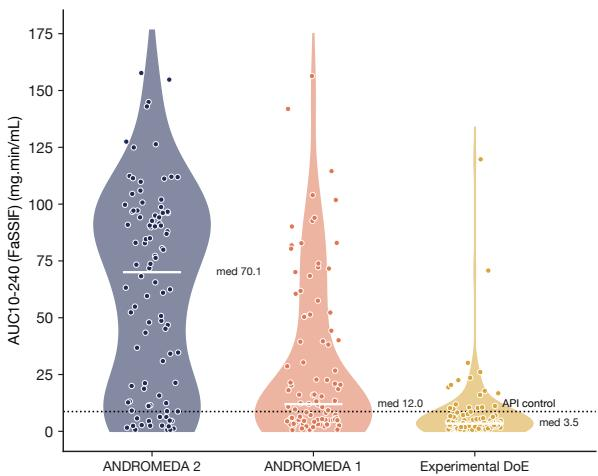  
Figure 1. Paclitaxel formulation performance at a matched experimental budget. Formulation-level distributions of the area under the curve (AUC) of apparently solubilized paclitaxel concentration in FaSSIF from 10 to 240 min achieved using the evidence-grounded agentic platform (Andromeda 2), the optimization framework (Andromeda 1) and a design of experiment (DoE) approach. Each strategy evaluated 96 unique formulations. Andromeda 2 produced an upward-shifted AUC distribution and a greater frequency of higher performing formulations, while both Andromeda platforms generated formulations with higher AUC values than experimental DoE.

Table 1. Summary of paclitaxel formulation-selection performance at a matched 96-formulation experimental budget.
<table><tr><td>Arm</td><td>N</td><td>Best AUC</td><td>Median AUC</td><td>High-AUC hits n (%)</td><td>Formulations to first full TPP</td></tr><tr><td>ANDROMEDA 2</td><td>96</td><td>157.7</td><td>70.1</td><td>48 (50%)</td><td>12</td></tr><tr><td>ANDROMEDA 1</td><td>96</td><td>156.4</td><td>12.0</td><td>16 (17%)</td><td>39</td></tr><tr><td>Experimental DoE</td><td>96</td><td>119.7</td><td>3.5</td><td>2 (2%)</td><td>No pass</td></tr><tr><td>Reduced-evidence ANDROMEDA 2</td><td>96</td><td>123.3</td><td>46.1</td><td>30 (31%)</td><td>53</td></tr></table>

AUC denotes AUC10–240 in FaSSIF. High-AUC hits are formulations reaching the pooled upper-quartile AUC threshold. “Formulations to first full TPP” denotes the number of formulations screened before the first formulation satisfying all four TPP criteria was identified. Experimental DoE identified no full-TPP formulation within the 96- formulation campaign.

## 2.3 Benchmarking Andromeda 2 against published oral paclitaxel formulations

Published oral paclitaxel formulations provide useful context for the formulations identified by Andromeda 2, although diferences in formulation type, experimental endpoint, and study setting preclude direct head-tohead comparison. In particular, the FaSSIF $\mathrm { A U C _ { 1 0 - 2 4 0 } }$ measured here should not be interpreted as oral bioavailability or systemic exposure. A compact literature comparison is reported in the Supplementary Material (Table 2).

For the selected formulation meeting all four TPP objectives, the apparent efective paclitaxel loading estimated from the first FaSSIF measurement (10 min) was 19±5% w/w across three replicates. This is approximately 3.3-fold higher than the 5.7% w/w paclitaxel loading reported for the S-SEDDS formulation of Gao et al. [12], and more than an order of magnitude higher than the loadings reported for selected clinically evaluated lipid-based oral paclitaxel formulations. However, these values provide formulation context rather than a direct quantitative ranking because loading and measurement methods difer across studies.

## 3 Discussion

This study shows that evidence-grounded agentic design can substantially improve the experimental eficiency of SEDDS formulation development. At a matched budget of 96 paclitaxel formulations per strategy, Andromeda 2 achieved a 50% high-AUC hit rate, compared with 17% for Andromeda 1 and 2% for the physically executed DoE campaign, and identified 12 formulations meeting all four TPP criteria, compared with 6 and 0, respectively. Notably, Andromeda 2 and Andromeda 1 reached comparable maximum AUC values, indicating that the agentic system’s main advantage was not identifying a higher isolated optimum, but producing substantially more highperforming formulations across the experimental campaign. These findings extend a growing literature on self-driving laboratories and datadriven optimization in chemistry and materials science [5–8], as well as machine-learning approaches to drug formulation design [13– 15]. Here, the distinguishing contribution is the coupling of autonomous experimentation with evidence-grounded agentic decisionmaking to identify high-performing formulations more frequently within a fixed wet-lab budget than either probabilistic optimization or DoE.

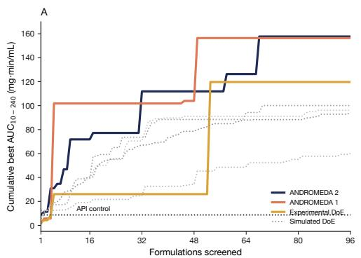

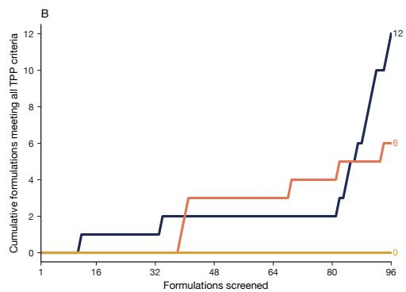

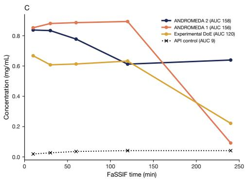  
Figure 2. Matched-budget benchmark of paclitaxel formulation performance. All strategies were compared at an experimental budget of 96 formulations. (A) Cumulative-best area under the curve (AUC) of apparently solubilized paclitaxel concentration in FaSSIF from 10 to 240 min as a function of the number of formulations evaluated. Simulated DoE trajectories (grey dotted lines) and the unformulated-drug control (black dotted line) are included for reference. (B) Cumulative number of formulations satisfying all four prespecified target product profile (TPP) criteria. At 96 formulations, Andromeda 2 identified 12 formulations that met all TPP objectives, compared with 6 for Andromeda 1 and 0 for experimental DoE. (C) In vitro concentration–time profiles in FaSSIF for the highest AUC formulation from each experimental strategy and the unformulated-drug control. The highest-AUC Andromeda 2 formulation maintained a high apparently solubilized paclitaxel concentration through 240 min, whereas the highest AUC Andromeda 1 formulation reached a comparable peak concentration but declined after 120 min, consistent with precipitation.

The evidence-ablation and composition analyses provide complementary insight into how the Andromeda 2 advantage emerged. Access to structured in-house experimental evidence increased mean paclitaxel AUC by 34% and the high-AUC hit rate from 31% to 50%. In addition, Andromeda 2 achieved a 49% hit rate within the high-performing Type IIIB/IV region, compared with 29% for Andromeda 1, indicating that its advantage was not explained solely by identifying a favourable region of composition space. More importantly, the reduced-evidence configuration remained competitive in early batches but subsequently regressed, whereas full-evidence Andromeda 2 improved across successive batches and sustained its performance. Both configurations received the experimental results generated during their respective campaigns; the divergent trajectories are therefore consistent with historical evidence supporting more efective interpretation and use of newly generated measurements, rather than simply strengthening the initial proposal. The ablation does not by itself attribute the full Andromeda 2– Andromeda 1 performance diference to historical evidence, but demonstrates that access to this evidence materially contributes to Andromeda 2 performance. The reducedevidence system continued to generate valid, experimentally executable formulations, further suggesting that the principal efect of the ablation was on candidate selection rather than formulation feasibility. This finding is consistent with the evidence-ablation effect we previously observed for clofazimine [16]. From a formulation science perspective, Andromeda 2 concentrated experimental efort within high-performing regions of the formulation design space while identifying multiple lead candidate formulations rather than a single isolated composition. Vitamin E TPGS was prominent among these high-performing compositions, consistent with its established paclitaxel-solubilizing properties. Vitamin E TPGS also exhibits independent efects on P-glycoprotein-mediated paclitaxel transport, which may prove advantageous in future in vivo studies. Since intestinal transport was not measured in the present study, these results support only the physicochemical performance of the formulations in FaSSIF; nevertheless, identifying formulation chemistry relevant to both paclitaxel solubilization and a known biological barrier to oral delivery is encouraging. The apparent efective paclitaxel loading of formulations meeting all four TPP criteria also provides a useful point of comparison with previously reported oral lipid-based paclitaxel systems (Table 2), although diferences in experimental endpoints preclude direct ranking.

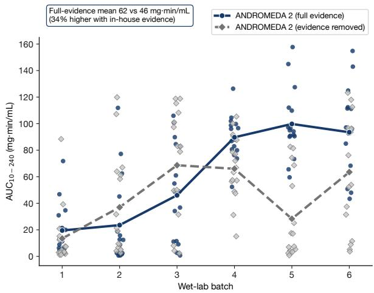  
Figure 3. Efect of in-house evidence on Andromeda 2 performance across paclitaxel batches. Per-formulation area under the curve of apparently solubilized paclitaxel concentration in FaSSIF from 10 to 240 min is shown across six sequential wet-lab batches for Andromeda 2 with access to its full structured in-house evidence and for the reduced-evidence ablation in which this evidence was withheld. Both configurations received the experimental results generated during their respective campaigns. Points represent individual formulations, and lines connect batch means. The full-evidence configuration achieved a higher campaign-wide mean AUC than the reduced-evidence configuration (62.0 versus 46.2 mg·min/mL; 34% higher), showed more consistent improvement across batches, and maintained its gains in later batches. The reduced- evidence configuration matched or exceeded the full-evidence configuration in some early batches but did not maintain this performance.

Several limitations define the scope of these findings. The FaSSIF assay measures the ability of a formulation to maintain paclitaxel in an apparently solubilized state and does not capture digestion, intestinal permeability or metabolism, or in vivo performance; digestioncoupled testing and ultimately pharmacokinetic studies will therefore be required to determine whether the observed formulation’s advantages translate to oral exposure. In addition, each strategy was evaluated in a single independently initialized campaign, limiting campaign-level statistical inference and motivating replicate autonomous campaigns to establish reproducibility. The experimental DoE comparator also explored the shared composition space directly, without the expert prescreening and prioritization that may accompany conventional formulation development, and should be interpreted in that context. Finally, prospective evaluation across chemically distinct APIs is needed to establish the generality of the evidence-grounded advantage. Together, these studies would test whether the improved allocation of experimental efort observed here persists across campaigns, APIs, and increasingly translational endpoints.

More broadly, these findings point toward a model of formulation development in which experimental data are not consumed within individual programs but accumulated as reusable evidence that improves subsequent autonomous decision-making. If this advantage generalizes across APIs and formulation modalities, evidence-grounded autonomous laboratories could make formulation development progressively more eficient as institutional experimental knowledge grows.

## 4 Methods

## 4.1 Autonomous SEDDS laboratory

All campaigns used the same miniaturized design–build–test platform. Each wet-lab batch comprised 16 SEDDS preconcentrates prepared by liquid-handling robots and evaluated by automated dispersion/dissolution, dynamic light scattering (droplet size and polydispersity index [PDI]), HPLC drug quantification, and structured data capture. All experimental arms used the same operators, instruments, assay timing, data-processing workflow, and dissolution protocol.

Formulations were evaluated in a two-stage biorelevant dissolution assay: an initial gastricfluid stage followed by transfer into fastedstate simulated intestinal fluid (FaSSIF) [17]. Apparent solubilized-drug concentrations were quantified by HPLC analysis of sampled aliquots at 10, 30, 60, 120 and 240 min after the intestinal-fluid transfer. The reported endpoint was the apparent concentration of solubilized drug in the FaSSIF stage. This endpoint captures the ability of a formulation to disperse and maintain drug in an apparently solubilized state under biorelevant conditions. It was used as the principal high-throughput measure of formulation performance and not interpreted as a surrogate for absorbed dose or oral bioavailability.

Drug loading was specified as a formulationdesign input rather than measured in the undiluted preconcentrate. An apparent efective loading was therefore estimated retrospectively by multiplying the nominal loading by the maximum fraction of the nominal API dose observed in the dispersed phase by HPLC analysis. This operational estimate is used only for comparison with literature formulations and is not a direct measurement of preconcentrate drug content.

## 4.2 Andromeda 1: probabilistic optimization

Andromeda 1 is a sequential probabilisticoptimization platform and the non-agentic comparator in this study. Candidate formulations are drawn from a predefined, constrained composition space and evaluated against the same TPP used by Andromeda 2. At each iteration, probabilistic models relate composition to measured outcomes and guide selection of the next 16-formulation batch, balancing promising regions of design space against formulations whose performance remains uncertain. Newly measured dissolution, droplet size, PDI and HPLC data are incorporated before the next cycle. The matched paclitaxel campaign comprised six batches (96 formulations).

## 4.3 Andromeda 2: agentic formulation design

Andromeda 2 is an evidence-grounded agentic system that orchestrates models and other computational capabilities as tools (Figure 4). Proposal, critique, review, planning, and constraint-checking operate over a shared formulation context. The system can invoke the probabilistic models used by Andromeda 1, together with additional models, to construct 16-formulation batches with scientific rationale and platform-compatible composition records.

A deterministic feasibility engine then enforces the hard constraints required for wetlab execution, including valid excipient selections, compatibility with the permitted composition grid, sum-to-one compositional constraints, uniqueness relative to previously tested formulations, intra-batch distinctiveness, and robotic readiness. This separation distinguishes scientific search from experimental implementation: the agentic layer directs exploration, while the engineering layer ensures that submitted compositions are executable.

A formulation scientist reviewed each proposed batch before execution as a safety and feasibility check that the batch was scientifically reasonable and experimentally executable. This was not a redesign step: the reviewer did not author, substitute, or re-tune the proposed compositions.

With no measurements yet available from the current campaign, the first batch explored several first-principles hypotheses about which excipient combinations could satisfy the TPP. Subsequent batches received all preceding measurements, and the system preferentially explored perturbations of high-performing formulations while retaining limited broader exploration. No model retraining occurred between batches; sequential adaptation was achieved by updating the agent’s working context with newly generated experimental evidence.

Both platforms are fully in-house. Language models, probabilistic models and supporting models are developed, trained and operated on Intrepid infrastructure, using Intrepid experimental data exclusively. Neither platform depends on external commercial model application programming interfaces.

## 4.4 Evidence grounding and ablation

A key distinction between the two Andromeda versions is the evidence available at the initiation of an experimental campaign. Andromeda 1 does not have access to historical formulation data. Instead, each campaign begins with an initial design batch, after which the planner learns the formulation– performance landscape from measurements generated during that campaign and uses these observations to guide subsequent batches within a probabilistic-optimization framework. In contrast, Andromeda 2 is grounded from the outset in Intrepid’s structured in-house formulation evidence, comprising prior compositions, measured dissolution, dispersion, size and PDI outcomes, excipient behaviour, and platform-specific measurement history. Importantly, this historical evidence contained no paclitaxel formulations, such that Andromeda 2 could draw on broader formulation knowledge without access to prior experimental results for the specific API evaluated here. It can reason over this accumulated evidence during proposal, critique, planning, and tool use, while also incorporating observations generated during the ongoing campaign.

To evaluate transfer to previously unseen APIs, all historical formulation data for the target API were excluded at the initiation of each campaign. The systems were not trained on in-house experimental formulation data for paclitaxel. After each wet-lab batch, newly generated target-API measurements were returned to the system to guide subsequent batch selection. The campaigns therefore assess whether knowledge accumulated across Intrepid’s broader laboratory experience can support formulation design for a new API, followed by sequential adaptation to measurements generated during the campaign.

To isolate the contribution of this accumulated evidence, paclitaxel was also run in a reduced-evidence Andromeda 2 configuration that withheld historical in-house experimental evidence while holding constant the formulation objective, TPP, executable design space, feasibility constraints, batch size and wet-lab workflow. Both configurations received the paclitaxel measurements generated during their respective campaigns after each batch.

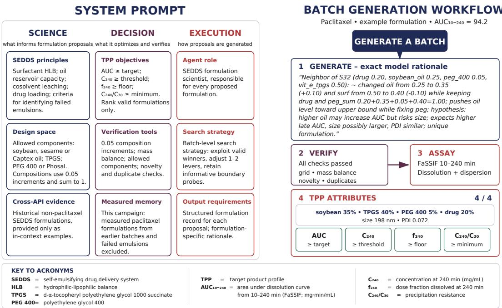  
Figure 4. System prompt structure and representative batch-generation workflow for Andromeda 2. The system prompt organizes formulation knowledge, optimization objectives, and execution requirements into science, decision, and execution components. During batch generation, Andromeda 2 uses this context to propose candidate formulations with model-generated rationales, verifies compositional and feasibility constraints, and submits valid formulations for experimental eval uation. Measured formulation performance is then evaluated against the predefined target product profile (TPP) attributes, including dissolution AUC, late-time concentration, fraction dissolved, and precipitation resistance. The example shown illustrates a representative formulation from a generated batch rather than the complete batch-level output.

## 4.5 Comparators and paclitaxel design task

Paclitaxel was selected as a hard-API stress test (high molecular weight and very low aqueous solubility) and evaluated with Andromeda 2, Andromeda 1, reducedevidence Andromeda 2, and a physically executed experimental DoE approach. Each arm received a matched budget of six 16- formulation batches (96 unique formulations).

The experimental DoE was designed by a formulation scientist using commercial statistical software supporting custom and responsesurface designs over the same composition parameters and hard constraints, and executed end-to-end on the same platform and FaSSIF assay. It explored the shared composition grid directly rather than beginning from a separate excipient solubility pre-screen.

Simulated non-adaptive and sequential adaptive DoE strategies were additionally evaluated against a validated in-silico emulator of the paclitaxel formulation landscape. Emulator validation and those results are reported in the Supplementary Material (Section A.4, Table 3).

## 4.6 Metrics and statistical analysis

The primary endpoint is trapezoidal AUC10–240 in FaSSIF. Cumulative-best AUC versus formulations screened describes how rapidly high-performing formulations appear. Mean and median AUC describe the distribution of performance, which is distinct from peak AUC: a method may identify a single exceptional formulation while producing substantially lower typical candidates. A high-AUC hit is a formulation whose AUC10–240 reaches the pooled upper quartile of all measured paclitaxel formulations. Because that threshold is relative, comparisons are also reported against the pool-independent TPP.

Formulation usability is summarized with a four-attribute TPP (Figure 5): a minimum dissolution AUC, a late-time concentration floor $C _ { 2 4 0 }$ , a late-time fraction-dissolved floor f240 (which normalizes for drug loading), and a precipitation-resistance ratio $C _ { 2 4 0 } / C _ { 3 0 } \geq 0 . 8 5$ A formulation meets the full TPP only if all four objectives are satisfied. Thresholds are API-specific (Figure 5B). Peak AUC, the number of objectives met, and full-TPP passage are not interchangeable.

Pairwise distributional comparisons use twosided Mann–Whitney U tests. Hit rates are reported with 95% confidence intervals calculated using percentile bootstrapping. We lead with efect sizes (medians, hit rates, and counts of formulations meeting all TPP objectives). All formulation-level tests and bootstrap intervals are treated as descriptive because observations within adaptive campaigns are not statistically independent; no campaign-level inferential testing was performed.

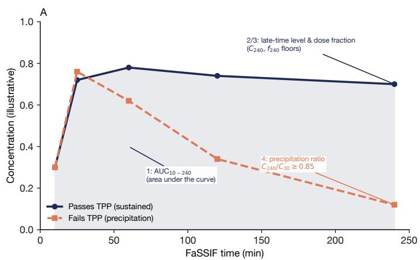  
B  
Figure 5. Target product profile (TPP) definition. (A) An illustrative formulation that meets the TPP (sustained) and one that does not (precipitating), annotated with the four TPP objectives. (B) Acceptance objectives for paclitaxel. A formulation meets the full TPP only if all four objectives are satisfied.

<table><tr><td rowspan=1 colspan=1>Objective</td><td rowspan=1 colspan=1>Ensures</td><td rowspan=1 colspan=1>Paclitaxel</td></tr><tr><td rowspan=1 colspan=1>1 AUC10-240</td><td rowspan=1 colspan=1>Solubilization</td><td rowspan=1 colspan=1>≥8</td></tr><tr><td rowspan=1 colspan=1>2 C240</td><td rowspan=1 colspan=1>Sustained level</td><td rowspan=1 colspan=1>≥ 0.04</td></tr><tr><td rowspan=1 colspan=1>3 f240</td><td rowspan=1 colspan=1>Dose fraction dissolved</td><td rowspan=1 colspan=1>≥ 10%</td></tr><tr><td rowspan=1 colspan=1>4 C240/C30</td><td rowspan=1 colspan=1>Precipitation resistance</td><td rowspan=1 colspan=1>≥ 0.85</td></tr></table>

AUC in mg⋅min/mL; C in mg/mL. Ful -TPP pass = al four criteria.

## References

[1] Colin W. Pouton. Formulation of poorly water-soluble drugs for oral administration: physicochemical and physiological issues and the lipid formulation classification system. European Journal of Pharmaceutical Sciences, 29(3–4):278– 287, 2006. doi: 10.1016/j.ejps.2006.04. 016. URL https://doi.org/10.1016/j. ejps.2006.04.016.

[2] Christopher J. H. Porter, Natalie L. Trevaskis, and William N. Charman. Lipids and lipid-based formulations: optimizing the oral delivery of lipophilic drugs. Nature Reviews Drug Discovery, 6(3):231– 248, 2007. doi: 10.1038/nrd2197. URL https://doi.org/10.1038/nrd2197.

[3] Hywel D. Williams, Natalie L. Trevaskis, Susan A. Charman, Ravi M. Shanker, William N. Charman, Colin W. Pouton, and Christopher J. H. Porter. Strategies to address low drug solubility in discovery and development. Pharmacological Reviews, 65(1):315–499, 2013. doi: 10.1124/pr.112.005660. URL https:// doi.org/10.1124/pr.112.005660.

[4] Huiling Mu, Rene Holm, and Anette M¨ullertz. Lipid-based formulations for oral administration of poorly watersoluble drugs. International Journal of Pharmaceutics, 453(1):215–224, 2013. doi: 10.1016/j.ijpharm.2013.03. 054. URL https://doi.org/10.1016/j. ijpharm.2013.03.054.

[5] Bobak Shahriari, Kevin Swersky, Ziyu Wang, Ryan P. Adams, and Nando de Freitas. Taking the human out of the loop: a review of Bayesian optimization. Proceedings of the IEEE, 104(1):148–175, 2016. doi: 10.1109/JPROC.2015.2494218. URL https://doi.org/10.1109/JPROC. 2015.2494218.

[6] Benjamin J. Shields, Jason Stevens, Jun Li, Marvin Parasram, Farhan Damani, Jesus I. Mart´ınez Alvarado, Jacob M. Janey, Ryan P. Adams, and Abigail G. Doyle. Bayesian reaction optimization

as a tool for chemical synthesis. Nature, 590(7844):89–96, 2021. doi: 10.1038/ s41586-021-03213-y. URL https://doi. org/10.1038/s41586-021-03213-y.

[7] Benjamin P. MacLeod, Fraser G. L. Parlane, Thomas D. Morrissey, Florian H¨ase, Lo¨ıc M. Roch, Kevan E. Dettelbach, Raphaell Moreira, Lars P. E. Yunker, Michael B. Rooney, Joseph R. Deeth, Veronica Lai, Gary J. Ng, Henry Situ, Ruihan H. Zhang, Michael S. Elliott, Ted H. Haley, David J. Dvorak, Al´an Aspuru-Guzik, Jason E. Hein, and Curtis P. Berlinguette. Self-driving laboratory for accelerated discovery of thinfilm materials. Science Advances, 6(20): eaaz8867, 2020. doi: 10.1126/sciadv. aaz8867. URL https://doi.org/10. 1126/sciadv.aaz8867.

[8] Benjamin Burger, Phillip M. Mafettone, Vladimir V. Gusev, Catherine M. Aitchison, Yang Bai, Xiaoyan Wang, Xiaobo Li, Ben M. Alston, Buyi Li, Rob Clowes, Nicola Rankin, Brandon Harris, Reiner Sebastian Sprick, and Andrew I. Cooper. A mobile robotic chemist. Nature, 583(7815):237–241, 2020. doi: 10. 1038/s41586-020-2442-2. URL https:// doi.org/10.1038/s41586-020-2442-2.

[9] Alex Sparreboom, Judith van Asperen, Ulrich Mayer, Alfred H. Schinkel, Johan W. Smit, Dirk K. F. Meijer, Piet Borst, Willem J. Nooijen, Jos H. Beijnen, and Olaf van Tellingen. Limited oral bioavailability and active epithelial excretion of paclitaxel (Taxol) caused by Pglycoprotein in the intestine. Proceedings of the National Academy of Sciences, 94 (5):2031–2035, 1997. doi: 10.1073/pnas. 94.5.2031. URL https://doi.org/10. 1073/pnas.94.5.2031.

[10] Y.-K. Kang, M.-H. Ryu, S. H. Park, J. G. Kim, J. W. Kim, S.-H. Cho, Y.- I. Park, S. R. Park, S. Y. Rha, M. J. Kang, J. Y. Cho, S. Y. Kang, S. Y. Roh, B.-Y. Ryoo, B.-H. Nam, Y.-W. Jo, K.-E. Yoon, and S. C. Oh. Eficacy and safety findings from DREAM: a phase III study of DHP107 (oral pa-

clitaxel) versus i.v. paclitaxel in patients with advanced gastric cancer after failure of first-line chemotherapy. Annals of Oncology, 29(5):1220–1226, 2018. doi: 10.1093/annonc/mdy055. URL https:// doi.org/10.1093/annonc/mdy055.

[11] B. Xu, H. Jeong, T. Sun, J. Sohn, Q. Zhang, S. Kostic, X. Wang, Z. Tong, S. Wang, J. Wang, W. Li, K. S. Lee, Y. W. Moon, M. J. Kang, X. Hu, T. Y. Kim, D. Milenkovi´c, J. H. Seo, J. H. Kim, J. Lee, and S.-B. Kim. OPTI-MAL: a multinational phase III study of oral paclitaxel (DHP107) versus intravenous weekly paclitaxel in HER2- negative recurrent or metastatic breast cancer. Annals of Oncology, 37(7):936– 945, 2026. doi: 10.1016/j.annonc.2026.03. 002. URL https://doi.org/10.1016/j. annonc.2026.03.002.

[12] Ping Gao, Bobby D. Rush, William P. Pfund, Tiehua Huang, Juliane M. Bauer, Walter Morozowich, Ming-Shang Kuo, and Michael J. Hageman. Development of a supersaturable SEDDS (S-SEDDS) formulation of paclitaxel with improved oral bioavailability. Journal of Pharmaceutical Sciences, 92(12):2386–2398, 2003. doi: 10.1002/jps.10511. URL https:// doi.org/10.1002/jps.10511.

[13] Pauric Bannigan, Matteo Aldeghi, Zeqing Bao, Florian H¨ase, Al´an Aspuru-Guzik, and Christine Allen. Machine learning directed drug formulation development. Advanced Drug Delivery Reviews, 175:113806, 2021. doi: 10.1016/j.addr. 2021.05.016. URL https://doi.org/10. 1016/j.addr.2021.05.016.

[14] Pauric Bannigan, Zeqing Bao, Riley J. Hickman, Matteo Aldeghi, Florian H¨ase, Al´an Aspuru-Guzik, and Christine Allen. Machine learning models to accelerate the design of polymeric long-acting injectables. Nature Communications, 14:35, 2023. doi: 10.1038/s41467-022-35343-w. URL https://doi.org/10.1038/ s41467-022-35343-w.

[15] Daniel Reker, Yulia Rybakova, Ameya R. Kirtane, Ruonan Cao, Jee Won Yang,

Natsuda Navamajiti, Apolonia Gardner, Rosanna M. Zhang, Tina Esfandiary, Johanna L’Heureux, Thomas von Erlach, Elena M. Smekalova, Dominique Leboeuf, Kaitlyn Hess, Aaron Lopes, Jaimie Rogner, Joy Collins, Siddartha M. Tamang, Keiko Ishida, Paul Chamberlain, DongSoo Yun, Abigail Lytton-Jean, Christian K. Soule, Jaime H. Cheah, Alison M. Hayward, Robert Langer, and Giovanni Traverso. Computationally guided high-throughput design of self-assembling drug nanoparticles. Nature Nanotechnology, 16(6):725–733, 2021. doi: 10.1038/ s41565-021-00870-y. URL https://doi. org/10.1038/s41565-021-00870-y.

[16] Michael Craig, Pauric Bannigan, Gary Tom, Yingshan Ma, Remi Piche-Taillefer, Christine Allen, and Riley Hickman. Agentic systems for sample-eficient drug formulation design. In ICML 2026 Workshop on AI for Science, 2026. URL https://openreview.net/forum? id=SyPcOsoGgp. Oral presentation.

[17] E. Galia, E. Nicolaides, D. H¨orter, R. L¨obenberg, C. Reppas, and J. B. Dressman. Evaluation of various dissolution media for predicting in vivo performance of class I and II drugs. Pharmaceutical Research, 15(5):698–705, 1998. doi: 10.1023/A:1011910801212. URL https: //doi.org/10.1023/A:1011910801212.

[18] S. A. Veltkamp, B. Thijssen, J. S. Garrigue, G. Lambert, F. Lallemand, F. Binlich, A. D. R. Huitema, B. Nuijen, A. Nol, J. H. Beijnen, and J. H. M. Schellens. A novel self-microemulsifying formulation of paclitaxel for oral administration to patients with advanced cancer. British Journal of Cancer, 95(6):729–734, 2006. doi: 10.1038/sj.bjc.6603312. URL https: //doi.org/10.1038/sj.bjc.6603312.

[19] Jung Wan Hong, In-Hyun Lee, Young Hak Kwak, Young Taek Park, Ha Chin Sung, Ick Chan Kwon, and Hesson Chung. Eficacy and tissue distribution of DHP107, an oral paclitaxel formulation. Molecular Cancer Therapeutics, 6(12):3239–3247, 2007. doi:

10.1158/1535-7163.MCT-07-0261. URL https://doi.org/10.1158/1535-7163. MCT-07-0261.

## A Supplementary Material

## A.1 Descriptive Mann–Whitney comparison of Andromeda 2 and Andromeda 1

A formulation-level Mann–Whitney comparison between Andromeda 2 and Andromeda 1 yielded $p = 9 . 6 \times 1 0 ^ { - 8 }$ . This value is treated as descriptive rather than inferential because observations within each adaptive campaign are not independent: selection of later formulations depends on the measured performance of formulations tested in earlier batches. The nominal sample size of 96 formulations per strategy therefore overstates the efective sample size. Interpretation of the matched-budget result in the main text therefore rests primarily on the magnitude of the distributional shift and the observed hit rates.

## A.2 Formulation composition and the LFCS taxonomy

Formulation development decisions depend not only on the final formulations identified but also on how the method employed allocates its experimental budget across composition space. To characterize these exploration patterns, we classified each formulation using the Lipid Formulation Classification System (LFCS), a widely used compositional framework for lipid-based formulations [1]. The LFCS distinguishes formulations according to their relative proportions of oil, water-insoluble surfactant (typically HLB less than 12), water-soluble surfactant (typically HLB greater than 12), and hydrophilic cosolvent (Figure 6A).

Within the design space, formulations were classified as Type II, comprising oil and waterinsoluble surfactant without water-soluble components; Type IIIA, containing substantial oil together with water-soluble surfactant and optionally cosolvent; Type IIIB, containing less oil and a greater proportion of water-soluble components; or Type IV, an oil-free system based predominantly on water-soluble surfactants and cosolvents (Figure 6A). No Type I oil-only formulations were included in the evaluated design space. For each method, we report the distribution of formulations across LFCS types, the hit rate within the productive region, and the evolution of hit rate across experimental batches.

Across the tested paclitaxel formulations, the high-performance hit rate varied markedly by LFCS type: 0% for Type II, 6% for Type IIIA, 35% for Type IIIB, and 32% for Type IV (Figure 6B). Thus, within the evaluated design space, high-performing formulations were concentrated in the Type IIIB/IV region, characterized by water-soluble surfactants and low or no oil content. Andromeda 2 directed most of its experimental budget toward this region and largely avoided the unproductive Type II systems, whereas the experimental DoE allocated a substantial fraction of its budget to Type II formulations.

The advantage of Andromeda 2 was not attributable solely to identifying the productive LFCS region. Among Type IIIB/IV formulations, Andromeda 2 achieved a 49% hit rate (bootstrap 95% CI [0.39, 0.59]), compared with 29% for Andromeda 1 and 3% for experimental DoE (Figure 6C). Andromeda 2 therefore both concentrated its search within the most productive region and selected higher-performing candidates within that region.

The composition trajectory also demonstrated adaptation over the course of the campaign (Figure 6D). Andromeda 2 began with broad chemical exploration sampling 12 distinct oil surfactant families in its first batch. In subsequent batches it increasingly concentrated on productive Type IIIB/IV formulations as experimental measurements accumulated and performulation AUC increased. DoE showed little corresponding improvement across batches. Although Andromeda 2 sampled fewer distinct oil-surfactant families overall than experimental DoE (16 versus 90), it generated substantially more high-performing formulations. This focused search did not collapse onto a single composition family: Andromeda 2 retained several productive families, providing chemically distinct alternatives for subsequent formulation development.

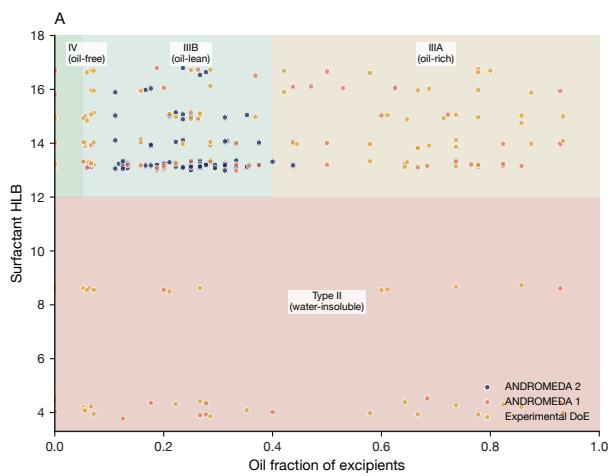

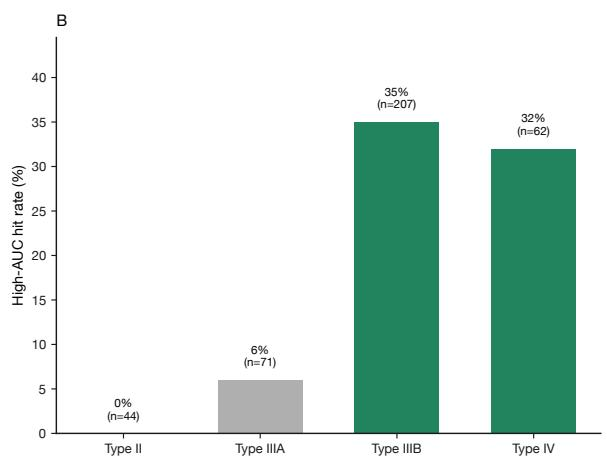

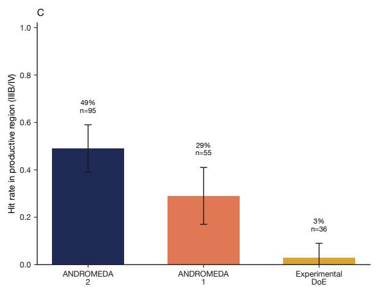

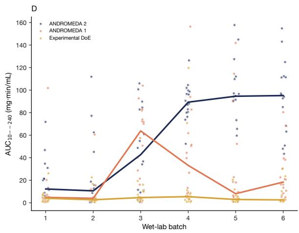  
Figure 6. Formulation composition using the LFCS taxonomy (paclitaxel). (A) Composition space (oil fraction versus surfactant HLB) with LFCS Type regions shaded and formulations coloured by method. (B) High-AUC hit rate by LFCS $\mathrm { T y p e }$ the water-soluble-surfactant Type IIIB/IV are productive. (C) Hit rate within the productive region by method, with bootstrap 95% confidence intervals. (D) Batch progression: each point is a formulation (batch on the x-axis, AUC on the y-axis), with per-method batch medians.

## A.3 Literature comparison of oral paclitaxel formulations

The table below is ofered as context rather than as a ranking of formulations. Endpoints difer across studies, and the FaSSIF AUC used in the main text should not be equated with oral bioavailability or systemic exposure.

Table 2. Selected published lipid-based oral paclitaxel formulations compared with Andromeda 2. Endpoints difer across studies and are shown for context rather than as direct head-to-head comparisons.
<table><tr><td>Formulation</td><td>PTX loading (%  $\mathbf { w } / \mathbf { w } )$ </td><td>Formulation / translational result</td></tr><tr><td>ANDROMEDA 2</td><td>Up to 25 (nominal)ª</td><td>12/96 full-TPP passes; high apparent solu- bilized PTX maintained in FaSSIF through 240 min.</td></tr><tr><td>Gao et al. [12], S- SEDDS</td><td>5.7</td><td>Precipitation-inhibiting polymer improved maintenance of PTX after dilution; subse- quent rat PK demonstrated oral exposure.</td></tr><tr><td>Veltkamp et al. [18], SMEOF#3 DHP107 [11, 19]</td><td>1.6c</td><td>Clinical oral PTX formulation; evaluated in cancer patients with cyclosporine A.</td></tr><tr><td></td><td> ${ \sim } 1 ^ { c }$ </td><td>Clinically validated lipid-based oral PTX formulationb; Phase III development without co-administered P-gp inhibitor.</td></tr></table>

aNominal drug loading is a formulation-design input in the present study and should not be interpreted as directly measured drug content or as efective solubilized loading.  
bDHP107 is included as a translational lipid-based oral paclitaxel benchmark and should not be described as a conventional SEDDS.  
cPublished loadings that were not originally reported as % w/w are converted here for comparison. Gao et al. reported 57 mg/g paclitaxel, which is 5.7% w/w. Veltkamp et al. reported 1.6% $\mathrm { w / v }$ (160 mg in 10 mL); their composition table sums to 100 g per 100 mL, so 1.6% w/v is numerically equivalent to 1.6% w/w under that accounting. DHP107 is reported as 10 mg/mL (approximately 1% $\mathrm { w / v ) }$ ; the % $\mathrm { w / w }$ value assumes a formulation density of ∼1 $\mathrm { g / m L }$ and should be treated as approximate.

## A.4 In silico emulator validation

The simulated DoE strategies shown in Figure 2A were evaluated using an in-silico emulator of the paclitaxel formulation landscape trained on in-house data. On held-out formulations the emulator recovered the measured performance ordering (Spearman 0.89) and enriched topquartile formulations 3.02-fold relative to random selection, against a ceiling of 4.0 for perfect selection (Table 3). Under these conditions, neither non-adaptive nor sequential adaptive DoE reached the upper-tail AUC values measured for the Andromeda strategies. This is consistent with the experimental DoE campaign, which likewise identified no formulations in that range.

These simulated arms are reported as directional context rather than as a matched comparator. The emulator was validated on random held-out splits; its ranking accuracy is lower for oil–surfactant composition families not represented in that data, and the simulated result should be weighted accordingly.

Table 3. In silico emulator validation for paclitaxel: held-out ranking skill, error, and top-quartile enrichment. MAE in mg·min/mL. Top-quartile enrichment is relative to a chance baseline of 1.0 (ceiling 4.0 for perfect selection).
<table><tr><td>API</td><td>Test Spearman</td><td>Test MAE</td><td>Top-Q enrich.</td></tr><tr><td>Paclitaxel</td><td>0.89</td><td>12.5</td><td>3.02</td></tr></table>