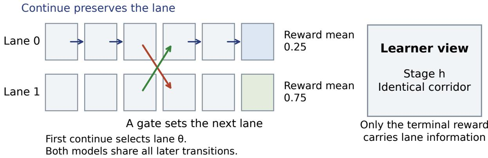
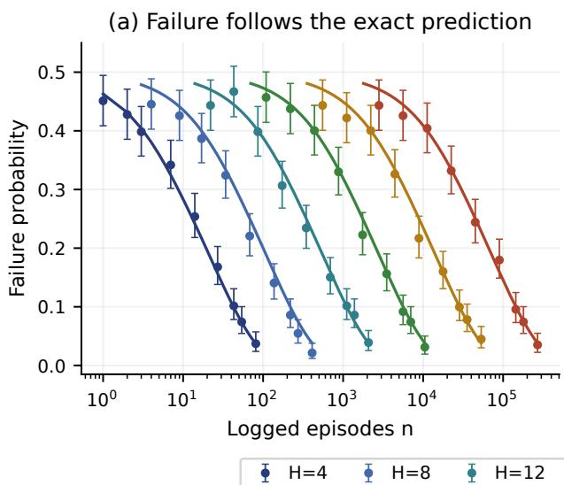
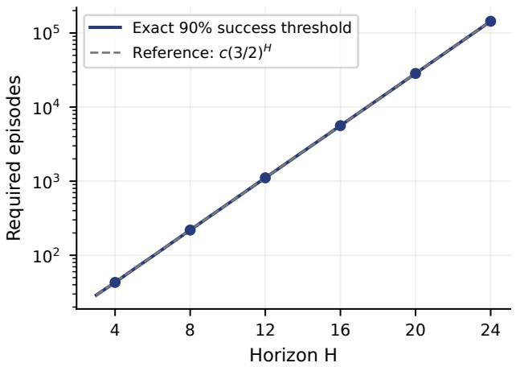
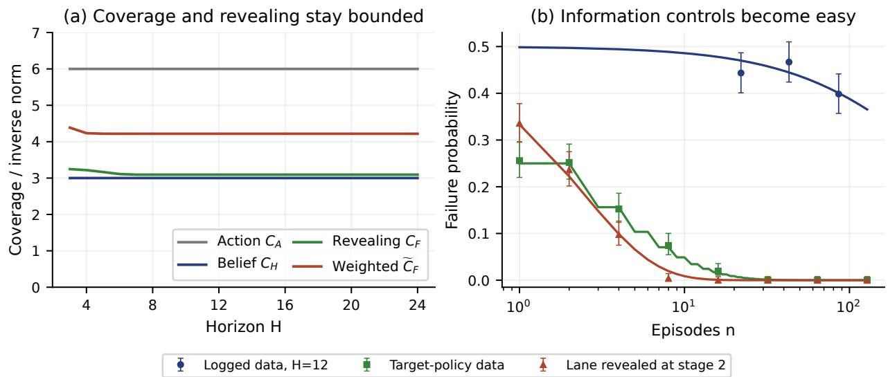
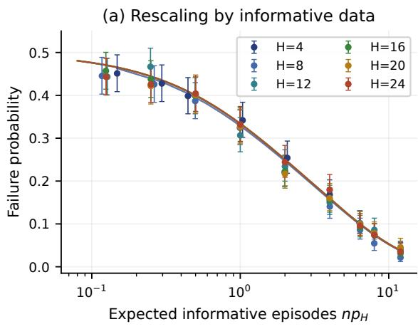
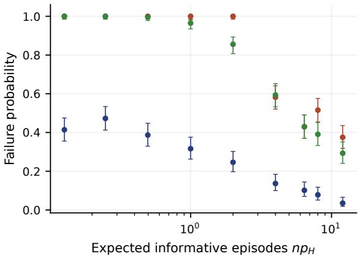

# Exponential Hardness of Of-Policy Evaluation under History-Dependent Logging

Pranaya Jajoo

University of Alberta

## Abstract

Can a logged dataset visit every hidden state frequently and still be exponentially uninformative about a target policy’s value? We show that it can when the logger depends on history. For every horizon H ≥ 3, we construct two POMDPs with at most two latent states per stage, three actions, and a common logger with three memory states. Action coverage, belief coverage, and two behavior-marginal outcome-revealing conditions all have constants independent of H. Nevertheless, evaluating a known deterministic target policy to accuracy 1/8 requires Θ((3/2)H log(1/δ)) logged episodes at confidence 1 − δ, for $0 < \delta \le 1 / 4$ , even when both candidate models are known. The mechanism is simple: a reset erases the unknown transition that determines the target value. We characterize the resulting statistical experiment exactly and obtain a matching optimal estimator. A directed two-lane gridworld realizes the construction, and trajectory simulations agree with its finite-sample prediction. The result establishes intractability for the history-dependent-logging, model-based case posed by Zhang and Jiang (2025), under their behavior-marginal definition of revealing.

## 1 Introduction

Of-policy evaluation (OPE) estimates a target policy’s return from trajectories collected by another policy, the logger. In a partially observable Markov decision process (POMDP), the learner must account for both hidden state and the diference between the two policies. Future-dependent value functions exploit latent-state structure by using future observations and actions as proxies for the current state (Uehara et al., 2023; Zhang and Jiang, 2024). A central question is whether coverage and observability conditions on this small state space sufice when the logger depends on history.

We show that strong versions of both conditions can hold while the data are exponentially uninformative about the target value. The construction separates predicting a current state from identifying an earlier transition parameter. An agent moves through two visually identical corridors. Gates reset its hidden lane, making the current state predictable from the logger’s actions but erasing the unknown initial transition. The target never resets, so that erased information determines its return.

Contributions. We construct two POMDPs with constant action coverage, belief coverage, and two behavior-marginal outcome-revealing constants, yet prove an exponential sample lower bound for every estimator given the complete candidate models and target policy. An exact statistical reduction yields the optimal estimator and a matching upper bound. Gridworld simulations reproduce its finite-sample error, and an analysis of logger memory explains why state-based factorizations fail.

Relation to prior work and scope. Zhang and Jiang (2025) leave open the model-based, history-dependent-behavior, multi-step-revealing case in their Table 1 and conjecture intractability.

Their model-free lower bound restricts target-policy queries. Our construction instead varies the environment and provides the same completely known target policy, with unrestricted queries and computation. It already works for a memoryless target. Revealing throughout this paper uses the logger’s future law averaged over histories conditional on the physical state; stronger history-conditional observability is a diferent assumption. The lower bound concerns fixed ofline data, not active interaction with the environment.

## 2 A two-lane construction

Every nonterminal action advances one column of a directed two-lane grid. Continue preserves the lane; an upper or lower gate sets it to zero or one. The corridors look identical to the learner, and only the final noisy reward depends on the lane (Figure 1).

## 2.1 Two candidate environments

Let $\mathcal { A } = \{ \boldsymbol { \mathrm { k } } , z , \boldsymbol { \mathrm { o } } \}$ , interpreted as continue (hold the lane), upper gate (reset to zero), and lower gate (reset to one). The initial state is the singleton ⋆; every later state is a bit. In model $M _ { \theta } , \theta \in \{ 0 , 1 \}$ , the first transition is deterministic:

$$
\begin{array} { r } { T _ { 1 , \theta } ( \star , \mathsf { k } ) = \theta , \qquad T _ { 1 , \theta } ( \star , \mathsf { z } ) = 0 , \qquad T _ { 1 , \theta } ( \star , \mathsf { o } ) = 1 . } \end{array}\tag{2.1}
$$

Here and below a deterministic transition is denoted by its next state. For $2 \leq h < H$ , both models have the same transitions

$$
T _ { h } ( s , \mathsf { k } ) = s , \qquad T _ { h } ( s , \mathsf { z } ) = 0 , \qquad T _ { h } ( s , \mathsf { o } ) = 1 .\tag{2.2}
$$

Every observation before H is a fixed time-tagged blank symbol. The terminal observation $Y \in \{ 0 , 1 \}$ follows the common channel

$$
\mathbb { P } ( Y = 1 \mid s _ { H } = 0 ) = \frac 1 4 , \qquad \mathbb { P } ( Y = 1 \mid s _ { H } = 1 ) = \frac 3 4 .\tag{2.3}
$$

The known reward is zero before H and equals Y at H. The candidates difer only in (2.1), and have identical emissions and rewards. The final action afects neither the reward nor any observation.

## 2.2 A common logger with three memory labels

At stage 1, the logger selects each action with probability $1 / 3$ . For $2 \leq h \leq H$ , define a label $m _ { h } \in \{ 1 , 0 , 1 \}$ } from the previous actions. The label is I if no reset has occurred; otherwise it is the value of the most recent reset. For $h < H$ , use the following action rule:

<table><tr><td>Logger memory</td><td>Hold k</td><td>Reset zero z</td><td>Reset one o</td></tr><tr><td>Never reset, I</td><td>2/3</td><td>1/6</td><td>1/6</td></tr><tr><td>Last reset zero, 0</td><td>1/6</td><td>2/3</td><td>1/6</td></tr><tr><td>Last reset one, 1</td><td>1/6</td><td>1/6</td><td>2/3</td></tr></table>

At stage H, choose an independent uniform action. This rule ignores observations and is defined at every history. It has no dependence on θ or on the unobserved state. Thus the same known logger is valid in both models and $C _ { A } = 6$

The target always chooses k. Its bit remains θ from stage 2 onward, so $J _ { M _ { \theta } } ( \pi _ { e } ) = 1 / 4 + \theta / 2$

  
Figure 1: The two-lane gridworld. The learner sees identical corridors; this explanatory rendering exposes the lane. Models difer only in the first continue transition. A gate resets the lane and erases that diference.

Why the target needs rare histories. After the first gate, the last gate determines the lane in either model. The remaining observations then have the same distribution under both candidates. Thus a logged episode is informative about the unknown first transition only if it continues at every step. That event has probability

$$
p _ { H } = \frac { 1 } { 3 } \left( \frac { 2 } { 3 } \right) ^ { H - 2 } .\tag{2.4}
$$

The target follows this informative path in every episode.

## 3 Setup and coverage conditions

We consider a layered horizon-H POMDP with finite state sets $S _ { h } .$ , observation sets $\mathcal { O } _ { h }$ , action set A, transition kernels $T _ { h }$ , and emission kernels $O _ { h }$ . At stage $h ,$ a hidden state $s _ { h } \in S _ { h }$ emits $o _ { h } \sim O _ { h } ( \cdot \mid s _ { h } )$ , the learner receives the known reward $R ( o _ { h } ) \in [ 0 , 1 ]$ , and then chooses $a _ { h } \in { \mathcal { A } }$ . For $h < H$ , the next state follows $T _ { h } ( \cdot \mid s _ { h } , a _ { h } )$ . There is no transition after the final action. Alphabets are finite and may be time-tagged. Let

$$
\tau _ { h - 1 } = { \left( o _ { 1 } , a _ { 1 } , \ldots , o _ { h - 1 } , a _ { h - 1 } \right) } , \qquad \tau _ { 0 } = \emptyset .
$$

An unconfounded policy chooses $a _ { h }$ according to $\pi _ { h } ( \cdot \mid \tau _ { h - 1 } , o _ { h } )$ ; it has access only to observable history. A memoryless policy depends only on $h , o _ { h }$ . Write $\begin{array} { r } { J _ { M } ( \pi ) = \mathbb { E } _ { M } ^ { \pi } [ \sum _ { h = 1 } ^ { H } R ( o _ { h } ) ] } \end{array}$

The learner is given a finite candidate class ${ \mathcal { M } } .$ , common known behavior and target policies $\pi _ { b } , \pi _ { e } ,$ and n independent complete trajectories from $\pi _ { b }$ in an unknown $M \in \mathcal { M }$ . Candidate models share their spaces and reward function. The learner can inspect and simulate any candidate, and can query $\pi _ { e }$ on arbitrary histories, but receives no additional samples from the unknown environment. An estimator is $( \epsilon , \delta )$ -accurate if

$$
\operatorname* { s u p } _ { M \in \mathcal { M } } \mathbb { P } _ { M } ^ { \pi _ { b } } \Big ( \Big | \widehat { J } - J _ { M } ( \pi _ { e } ) \Big | > \epsilon \Big ) \leq \delta .\tag{3.1}
$$

The probability includes the estimator’s randomization.

Action coverage prevents negligible logging probabilities. Belief coverage asks whether histories span the physical states; outcome revealing asks whether logged futures distinguish them. These are properties of each candidate, not privileged information given to the estimator.

The following matrices use the physical latent state. The belief before the stage-h observation is

$$
b _ { M , h } ( \tau _ { h - 1 } ) = \left( \mathbb { P } _ { M } ( s _ { h } = s \mid \tau _ { h - 1 } ) \right) _ { s \in \mathcal { S } _ { h } } .
$$

The future is $F _ { h } = \left( o _ { h } , a _ { h } , \ldots , o _ { H - 1 } , a _ { H - 1 } , o _ { H } \right)$ . Define the outcome matrix and state prior by

$$
\begin{array} { r } { U _ { M , h } ( f , s ) = \mathbb { P } _ { M } ^ { \pi _ { b } } ( F _ { h } = f \mid s _ { h } = s ) , \qquad p _ { M , h } ( s ) = \mathbb { P } _ { M } ^ { \pi _ { b } } ( s _ { h } = s ) . } \end{array}\tag{3.2}
$$

The conditioning matters. Equation (3.2) averages the logger’s past memory conditional on $s _ { h } ;$ it does not fix a history. This is the behavior-marginal definition. State priors are positive in our construction, and zero-probability outcome rows are omitted.

Definition 3.1 (Coverage and revealing constants). For $h \in [ H - 1 ]$ , let

$$
\begin{array} { r } { \Sigma _ { M , h } = \mathbb { E } _ { M } ^ { \pi _ { b } } [ b _ { M , h } ( \tau _ { h - 1 } ) b _ { M , h } ( \tau _ { h - 1 } ) ^ { \top } ] , } \end{array}\tag{3.3}
$$

$$
G _ { M , h } = U _ { M , h } ^ { \top } \mathrm { d i a g } ( U _ { M , h } { \bf 1 } ) ^ { - 1 } U _ { M , h } ,\tag{3.4}
$$

$$
\begin{array} { r } { K _ { M , h } = \mathrm { d i a g } ( p _ { M , h } ) \boldsymbol { U } _ { M , h } ^ { \top } \mathrm { d i a g } ( \boldsymbol { U } _ { M , h } p _ { M , h } ) ^ { - 1 } \boldsymbol { U } _ { M , h } . } \end{array}\tag{3.5}
$$

Uniform action coverage, belief coverage, uniform-prior outcome revealing, and prior-weighted outcome revealing hold with constants $C _ { A } , C _ { H } , C _ { F } , \bar { C } _ { F }$ , respectively, if

$$
\pi _ { b , h } ( a \mid \tau , o ) \geq C _ { A } ^ { - 1 } \quad \mathrm { a t ~ e v e r y ~ s t a g e ~ a n d ~ h i s t o r y } ,\tag{3.6}
$$

$$
\lambda _ { \operatorname* { m i n } } \bigl ( \Sigma _ { M , h } \bigr ) \geq C _ { H } ^ { - 1 } , \qquad \| G _ { M , h } ^ { - 1 } \| _ { 1 } \leq C _ { F } , \qquad \| K _ { M , h } ^ { - 1 } \| _ { 1 } \leq \tilde { C } _ { F }\tag{3.7}
$$

for every required M, h. Here $\begin{array} { r } { \| B \| _ { 1 } = \operatorname* { m a x } _ { j } \sum _ { i } | B _ { i j } | } \end{array}$ is the induced matrix 1-norm.

Equations (3.3)–(3.4) match Assumptions C–D of Zhang and Jiang (2025); (3.5) is the alternative in their Appendix G.2, Assumption F. We use their stage range $h < H$ . The displayed bounds supplied to the learner are common to both candidates. At $h = H$ , uniform-prior revealing also holds with constant four (Remark A.4).

Write $[ m ] = \{ 1 , \dots , m \}$ for a positive integer m. All logarithms are natural. For $x , y \in ( 0 , 1 )$ let $\mathrm { k l } ( x , y ) = x \log ( x / y ) + ( 1 - x ) \log ( ( 1 - x ) / ( 1 - y ) )$ . For discrete laws $P , Q$ , write $\operatorname { A f f } ( P , Q ) =$ $\textstyle \sum _ { x } { \sqrt { P ( x ) Q ( x ) } }$ and $\begin{array} { r } { \mathrm { T V } ( P , Q ) = \frac { 1 } { 2 } \sum _ { x } | P ( x ) - Q ( x ) | } \end{array}$

## 4 Main result

Theorem 4.1 (Exponential ofline evaluation complexity). For every integer $H \geq 3$ , there is a candidate class $\mathcal { M } _ { H } = \{ M _ { 0 } , M _ { 1 } \}$ and common known policies $\pi _ { b } , \pi _ { e }$ such that:

(i) $| S _ { 1 } | = 1 , ~ | S _ { h } | = 2$ for $h \geq 2$ , and $| { \mathcal { A } } | = 3$ . Each nonterminal observation alphabet is a singleton and $| { \mathcal O } _ { H } | = 2$ . Total return lies in [0, 1].

(ii) The logger is unconfounded, uses three memory labels, and assigns probability at least $1 / 6$ to every action. The target is deterministic and memoryless.

(iii) Both models satisfy Definition 3.1 with

$$
C _ { A } = 6 , \qquad C _ { H } = 3 , \qquad C _ { F } = 3 5 / 9 , \qquad \widetilde { C } _ { F } = 9 .\tag{4.1}
$$

(iv) $J _ { M _ { 0 } } ( \pi _ { e } ) = 1 / 4$ and $J _ { M _ { 1 } } ( \pi _ { e } ) = 3 / 4$ . Every $( 1 / 8 , \delta )$ -accurate estimator, $0 < \delta < 1 / 2$ , requires

$$
n \geq { \frac { 2 \operatorname { k l } ( 1 - \delta , \delta ) } { p _ { H } \log 3 } } , \qquad p _ { H } = { \frac { 1 } { 3 } } \left( { \frac { 2 } { 3 } } \right) ^ { H - 2 } .\tag{4.2}
$$

The theorem permits unrestricted computation and arbitrary queries to the supplied target policy. For fixed $\delta < 1 / 2$ , the lower bound is exponential in $H$ , although there are only $2 H - 1$ latent states across all layers. The constant-accuracy choice in the theorem already rules out any uniform sample guarantee polynomial in the horizon, model-class description, inverse accuracy, and the displayed coverage constants.

Corollary 4.2 (Matching dependence on horizon and confidence). Let $N _ { H } ( \delta )$ be the smallest integer n for which $a \ ( 1 / 8 , \delta )$ -accurate estimator exists for the class in Theorem $\it 4 . 1$ . With $c _ { \star } = 1 - \sqrt { 3 } / 2$

$$
\frac { 2 \mathrm { k l } ( 1 - \delta , \delta ) } { p _ { H } \log 3 } \le N _ { H } ( \delta ) \le \left\lceil \frac { \log ( 1 / ( 2 \delta ) ) } { - \log ( 1 - c _ { \star } p _ { H } ) } \right\rceil , \qquad 0 < \delta < 1 / 2 .\tag{4.3}
$$

Consequently, $N _ { H } ( \delta ) = \Theta ( ( 3 / 2 ) ^ { H } \log ( 1 / \delta ) )$ uniformly over $H \geq 3$ and $0 < \delta \le 1 / 4$

Section 5 gives an estimator attaining the upper bound. Appendix A proves every coverage claim and the lower bound.

## 4.1 Proof outline

Coverage. The two reset-memory labels have equal probability, so every physical state has mass at least $1 / 3$ . In each fixed candidate, the action history determines the lane, making its belief matrix diagonal. A suitable next gate has conditional probability $1 / 6$ in one physical state and $2 / 3$ in the other. This separation gives both revealing bounds (Appendix $\mathrm { A } )$

Information. Every episode containing a gate has the same observable law under both candidates. On the remaining fraction $p _ { H }$ , the terminal bit is $\mathrm { B e r } ( 1 / 4 )$ or $\mathrm { B e r } ( 3 / 4 )$ , so the trajectory laws satisfy $D _ { \mathrm { K L } } ( P _ { 0 } \Vert P _ { 1 } ) = p _ { H } \log ( 3 ) / 2$ . An accurate value estimate distinguishes the target values $1 / 4$ and $3 / 4$ Binary testing and independence therefore imply npH log ${ \mathrm { ; } } ( 3 ) / 2 \geq \mathrm { k l } ( 1 - \delta , \delta )$ . The familiar testing reduction is the final step; the construction keeps all coverage constants bounded while making $p _ { H }$ exponentially small.

## 5 The optimal estimator and its exact error

There is no optimization problem hidden in this example. Discard episodes that pass through a gate. Among the remaining episodes, count terminal rewards equal to one and zero. Select $M _ { 1 }$ if ones are more frequent, $M _ { 0 }$ if zeros are more frequent, and flip a fair coin at a tie. Return the selected model’s target value.

Encode a reset episode by an erasure ⊥ and a no-reset episode by its terminal bit. This compression loses no information about the model. Complete proofs are in Appendix B.

Proposition 5.1 (Three-symbol reduction). Map a complete trajectory to $W = \perp \textit { i f }$ a reset occurs before the terminal observation, and to $W = Y$ otherwise. In the coordinate order $( \perp , 0 , 1 )$ , its distributions are

$$
\begin{array} { r } { Q _ { 0 } = ( 1 - p _ { H } , 3 p _ { H } / 4 , p _ { H } / 4 ) , \qquad Q _ { 1 } = ( 1 - p _ { H } , p _ { H } / 4 , 3 p _ { H } / 4 ) . } \end{array}\tag{5.1}
$$

There exists a reconstruction kernel, common to both candidates, that generates the full trajectory conditional on W. Consequently the full-data and three-symbol experiments have the same optimal testing risk.

Theorem 5.2 (Finite-sample minimax error). Let $X _ { i }$ be 0, −1, +1 when $W _ { i }$ equals $\perp , 0 , 1$ , respectively, and let $\begin{array} { r } { S _ { n } = \sum _ { i = 1 } ^ { n } X _ { i } } \end{array}$ . The optimal worst-case failure probability for estimating $J _ { M _ { \theta } } ( \pi _ { e } )$ to accuracy $1 / 8$ from n trajectories is

$$
e _ { n } = \mathbb { P } _ { 0 } ( S _ { n } > 0 ) + \frac { 1 } { 2 } \mathbb { P } _ { 0 } ( S _ { n } = 0 ) .\tag{5.2}
$$

Moreover,

$$
\frac 1 2 ( 1 - p _ { H } ) ^ { n } \leq e _ { n } \leq \frac 1 2 \left[ 1 - ( 1 - \sqrt { 3 } / 2 ) p _ { H } \right] ^ { n } .\tag{5.3}
$$

The likelihood ratio is $3 ^ { S _ { n } }$ . Symmetry makes the fair-tie test minimax, and returning the selected target value equates testing and estimation risk. Thus the exponential cost persists for an explicit optimal estimator, independent of representation or optimization.

## 6 Gridworld experiments

We simulate the construction action by action at $H \in \{ 4 , 8 , 1 2 , 1 6 , 2 0 , 2 4 \}$ , using 256 independent datasets per candidate and 512 per budget. The estimator receives observable evidence only; we do not sample from the reduced three-symbol law. Each gate counts as one transition in this custom directed grid. The experiment is an exact spatial realization of the theorem, not a conventional four-neighbor navigation benchmark.

Budgets are rounded values $n = c / p _ { H }$ for $c \in \{ 1 / 8 , 1 / 4 , 1 / 2 , 1 , 2 , 4 , 8 , 1 2 \}$ , plus the analytically chosen $N _ { H } ( 0 . 1 )$ . Dataset prefixes are shared across budgets; replicates and candidates use independent random streams. We measure failure at accuracy $1 / 8 .$ . The optimal test’s two model-specific errors are equal, so pooled failures estimate its worst-case risk. Intervals are pointwise 95% Wilson intervals over 512 datasets, not simultaneous bands. The full protocol and supplementary results appear in Appendix F.

Results. The simulated errors follow the predicted horizon dependence (Figure 2). At the six analytic 90%-success thresholds, observed failures range from 8.6% to 10.2%, and every interval contains its analytic prediction (Table 1). The threshold grows from 43 episodes at $H = 4$ to 143,982 at $H = 2 4$ ; it is computed from the exact risk, not fitted to simulation data. Population diagnostics give $C _ { A } = 6$ and $C _ { H } = 3$ throughout. At $H = 2 4$ , the actual worst-stage norms are $C _ { F } \approx 3 . 0 9 4$ and $\tilde { C } _ { F } \approx 4 . 2 1 8$ , both below their proved bounds (Figure 3).

Information controls. We repeat the experiment at $H \in \{ 4 , 1 2 , 2 4 \}$ after either collecting fresh target-policy episodes or revealing the lane at stage 2 while keeping the logger. In the first control every episode is informative; in the second a first continue identifies the model exactly, giving risk ${ \frac { 1 } { 2 } } ( 2 / 3 ) ^ { n }$ . Their analytic $9 0 \%$ -success budgets are seven and four episodes, respectively, independent of H. Each episode still costs order H steps. These controls change the information available and therefore fall outside the original lower bound. The experiment illustrates the specified worst-case family, not typical navigation tasks or a general ranking of learned OPE methods.

(b) Exponential horizon dependence  
  
Figure 2: Optimal evaluation remains expensive. (a) Exact risk curves and failures from 512 simulated datasets per budget, with pointwise 95% Wilson intervals. (b) The exact 90%- success threshold; the dashed $( 3 / 2 ) ^ { H }$ reference is normalized at $H = 1 2$ , not fitted to empirical measurements.

<table><tr><td>H</td><td> $N _ { H } ( 0 . 1 )$ </td><td>Analytic failure</td><td>Observed failure</td><td>95% interval</td></tr><tr><td>4</td><td>43</td><td>9.89%</td><td>10.2%</td><td>[7.8, 13.1]%</td></tr><tr><td>8</td><td>219</td><td>9.97%</td><td>8.6%</td><td>[6.5, 11.3]%</td></tr><tr><td>12</td><td>1,110</td><td>9.99%</td><td>10.2%</td><td>[7.8, 13.1]%</td></tr><tr><td>16</td><td>5,618</td><td>10.00%</td><td>9.2%</td><td>[7.0, 12.0]%</td></tr><tr><td>20</td><td>28,441</td><td>10.00%</td><td>10.0%</td><td>[7.7, 12.9]%</td></tr><tr><td>24</td><td>143,982</td><td>10.00%</td><td>9.6%</td><td>[7.3, 12.4]%</td></tr></table>

Table 1: Simulation at the analytically chosen 90%-success budget. Each row uses 256 datasets per candidate. Intervals concern the failure probability at the stated budget; they are not intervals for $N _ { H } ( 0 . 1 )$ ).

  
Figure 3: The obstacle is missing information about the target’s path. (a) Population constants, maximized over both candidates and $h < H$ , stay bounded. (b) Exact curves and simulated failure probabilities for the original logger and two information controls at $H = 1 2$ . Every marker uses 512 datasets with a pointwise 95% Wilson interval. Zero observed failures do not imply zero true failure probability.

## 7 Why current-state information is insuficient

A history-dependent logger can behave diferently after histories that end in the same physical state. In $M _ { 0 }$ , a first continue and a first upper gate both place the agent in lane zero, but the next-action laws are $( 2 / 3 , 1 / 6 , 1 / 6 )$ and $( 1 / 6 , 2 / 3 , 1 / 6 )$ . Therefore a single state-conditioned future matrix cannot reproduce the logger’s future law after both histories:

$$
\mathbb { P } ^ { \pi _ { b } } ( F _ { h } = \cdot \mid \tau _ { h - 1 } ) \neq U _ { M , h } b _ { M , h } ( \tau _ { h - 1 } ) \quad \mathrm { f o r ~ s o m e ~ h i s t o r i e s } .
$$

The revealing assumption certifies a state–future correlation under the logger’s marginal law. It does not make the physical state suficient for the logger’s continuation.

Augmenting the state with logger memory restores a memoryless representation but exposes the rare never-reset state. Its belief second-moment eigenvalue is $\begin{array} { r } { \dot { w _ { h } } = \frac { 1 } { 3 } ( \bar { 2 } / 3 ) ^ { h - 2 } } \end{array}$ , so the coverage cost is at least $1 / w _ { h }$ . A constant number of memory labels also does not give a uniformly short history window: arbitrarily long common hold sufixes can retain diferent states or diferent logger laws. These observations explain why positive results with forgetting and additional coverage conditions, such as Zhu and Lu (2026), need not apply. Formal statements and proofs are in Appendix C.

## 8 Discussion

Our construction separates state coverage from the information needed to evaluate a target policy. Exponential sample complexity persists for an optimal estimator over two known models. Positive guarantees need additional structure tying the logger’s continuation to the actual history, through joint state coverage, forgetting, or informative controlled futures. The theorem rules out the specified behavior-marginal guarantees, without characterizing all tractable POMDPs.

## Acknowledgments

We acknowledge the use of ChatGPT (OpenAI) in developing the theoretical arguments and experiments and in drafting and editing the manuscript. The proofs of the main theorem, the finitesample minimax characterization, and the matching sample-complexity bounds have been formalized and verified in Lean 4. The formalization is available at https://github.com/pranayajajoo/ pomdp-logging-hardness.

## References

Emilie Kaufmann, Olivier Capp´e, and Aur´elien Garivier. On the complexity of best-arm identification in multi-armed bandit models. Journal of Machine Learning Research, 17(1):1–42, 2016. URL https://jmlr.org/papers/v17/kaufman16a.html.

Masatoshi Uehara, Haruka Kiyohara, Andrew Bennett, Victor Chernozhukov, Nan Jiang, Nathan Kallus, Chengchun Shi, and Wen Sun. Future-dependent value-based of-policy evaluation in POMDPs. In Advances in Neural Information Processing Systems, volume 36, 2023. URL https://arxiv.org/abs/2207.13081.

Yuheng Zhang and Nan Jiang. On the curses of future and history in future-dependent value functions for of-policy evaluation. In Advances in Neural Information Processing Systems, volume 37, 2024. URL https://arxiv.org/abs/2402.14703.

Yuheng Zhang and Nan Jiang. Statistical tractability of of-policy evaluation of history-dependent policies in POMDPs. In International Conference on Learning Representations, 2025. URL https://arxiv.org/abs/2503.01134.

Youheng Zhu and Yiping Lu. A covering framework for ofline POMDPs learning using belief space metric. arXiv preprint arXiv:2603.03191, 2026. URL https://arxiv.org/abs/2603.03191.

## A Complete proof of the lower bound

## A.1 Uniform belief coverage

Lemma A.1 (State and logger-memory distributions). For either model and every $2 \leq h \leq H$ , put $w _ { h } = { \textstyle \frac { 1 } { 3 } } ( 2 / 3 ) ^ { h - 2 }$ . Then

$$
\mathbb { P } ^ { \pi _ { b } } ( m _ { h } = 1 ) = w _ { h } , \qquad \mathbb { P } ^ { \pi _ { b } } ( m _ { h } = 0 ) = \mathbb { P } ^ { \pi _ { b } } ( m _ { h } = 1 ) = \frac { 1 - w _ { h } } { 2 } .\tag{A.1}
$$

The physical-state belief is a coordinate vector. $U p$ to exchanging coordinates, its second-moment matrix is

$$
\Sigma _ { M _ { \theta } , h } = \mathrm { d i a g } \left( \frac { 1 + w _ { h } } { 2 } , \frac { 1 - w _ { h } } { 2 } \right) .
$$

Hence $C _ { H } \leq 3$

Proof. At stage 2 the three labels each have mass $1 / 3$ . The never-reset label persists only after hold, with probability $2 / 3$ , and can never be re-entered. The reset-label masses remain equal by symmetry of their transition rule and the equal inflow from I. This proves (A.1) by induction.

For a fixed model,

$$
s _ { h } = \theta \quad \mathrm { i f } \ m _ { h } = 1 , \qquad s _ { h } = m _ { h } \quad \mathrm { o t h e r w i s e } .\tag{A.2}
$$

Both quantities on the right are determined by the action prefix, so the model-dependent belief is a coordinate vector. The state θ has probability $w _ { h } + ( 1 - w _ { h } ) / 2 \colon$ the other state has probability $( 1 - w _ { h } ) / 2$ . Because $w _ { h } \leq 1 / 3$ , both diagonal entries are at least $1 / 3$ . At stage 1 the belief matrix is the scalar one. □

The model-dependent posterior in this lemma is used only to establish coverage; it is not supplied to the learner. Unlike a lower bound whose progress state is rarely visited, this example has constant marginal mass on every physical state.

## A.2 Uniform-prior outcome revealing

Lemma A.2 (Coarsening the outcome matrix). Let U be a nonnegative matrix whose columns sum to one. Partition its rows and form U¯ by summing rows within each part. Then

$$
\begin{array} { r } { U ^ { \top } \mathrm { d i a g } ( U { \bf 1 } ) ^ { - 1 } U \succeq \bar { U } ^ { \top } \mathrm { d i a g } ( \bar { U } { \bf 1 } ) ^ { - 1 } \bar { U } , } \end{array}
$$

after removing rows with zero total mass.

Proof. For any vector v and part B, weighted Cauchy–Schwarz gives

$$
\sum _ { f \in B } \frac { ( U ( f , \cdot ) v ) ^ { 2 } } { U ( f , \cdot ) { \bf 1 } } \geq \frac { \left( \sum _ { f \in B } U ( f , \cdot ) v \right) ^ { 2 } } { \sum _ { f \in B } U ( f , \cdot ) { \bf 1 } } .
$$

Sum over parts to obtain the quadratic-form inequality.

Lemma A.3 (Constant uniform-prior revealing). For both candidates and every $h < H , \| G _ { M _ { \theta } , h } ^ { - 1 } \| _ { 1 } \leq$ $3 5 / 9$

Proof. Fix $2 \leq h < H$ , and order the states as $\theta , 1 - \theta$ . Let $E _ { h }$ be the event that the current action resets to $1 - \theta .$ . If $s _ { h } = 1 - \theta , ( \mathrm { A . 2 } )$ forces $m _ { h } = 1 - \theta$ , and this action is preferred. If $s _ { h } = \theta$ , then $m _ { h } \in \{ \mathsf { I } , \theta \}$ , and the action is nonpreferred in both cases. Consequently,

$$
q : = \mathbb { P } ( E _ { h } \mid s _ { h } = \theta ) = { \frac { 1 } { 6 } } , \qquad r : = \mathbb { P } ( E _ { h } \mid s _ { h } = 1 - \theta ) = { \frac { 2 } { 3 } } .
$$

The event is part of the future, so its channel is a coarsening of $U !$

$$
U _ { E } = \left( \begin{array} { c c } { { q } } & { { r } } \\ { { 1 - q } } & { { 1 - r } } \end{array} \right) .
$$

Write $G _ { E } = U _ { E } ^ { \top } \mathrm { d i a g } ( U _ { E } { \bf 1 } ) ^ { - 1 } U _ { E }$ . Both G and $G _ { E }$ are symmetric, nonnegative, and stochastic, since $G \mathbf { 1 } = U ^ { \top } \mathbf { 1 } = \mathbf { 1 }$ . In dimension two their eigenvectors are 1 and $( 1 , - 1 ) ^ { \top }$ . Direct calculation gives the nontrivial eigenvalue of $G _ { E } { : }$

$$
\lambda _ { E } = \frac { ( q - r ) ^ { 2 } } { ( q + r ) ( 2 - q - r ) } = \frac { 9 } { 3 5 } .\tag{A.3}
$$

Lemma A.2 implies that the nontrivial eigenvalue λ of G is at least $\lambda _ { E }$ . Positive semidefiniteness and stochasticity give $0 < \lambda \leq 1$ , and

$$
G ^ { - 1 } = \frac { 1 } { 2 } \left( \begin{array} { l l } { 1 + \lambda ^ { - 1 } } & { 1 - \lambda ^ { - 1 } } \\ { 1 - \lambda ^ { - 1 } } & { 1 + \lambda ^ { - 1 } } \end{array} \right) .
$$

Its induced 1-norm is $\lambda ^ { - 1 } \leq 3 5 / 9$ . At stage 1 the outcome matrix has one stochastic column and its Gram matrix is the scalar one. □

The event used to prove the lemma can depend on the candidate under consideration. The argument establishes the revealing condition separately in each model; the event is not supplied to the estimator.

Remark A.4 (Terminal stage). At $h = H$ , the outcome is just $Y .$ , and

$$
U _ { H } = \left( { 3 / 4 } \atop { 1 / 4 } \ { 1 / 4 } \right) , \qquad G _ { H } = \left( { 5 / 8 } \atop { 3 / 8 } \ { 3 / 8 } \right) , \qquad \| G _ { H } ^ { - 1 } \| _ { 1 } = 4 .
$$

Thus imposing uniform-prior revealing on every layer, including the terminal one, changes the common bound to $C _ { F } = 4$

## A.3 Prior-weighted outcome revealing

Lemma A.5 (Constant prior-weighted revealing). For both candidates and every $\textit { h } \ < \ \textit { H }$ $\| K _ { M _ { \theta } , h } ^ { - 1 } \| _ { 1 } \le 9$

Proof. The initial-stage matrix is again the scalar one. For $2 \leq h < H$ , write $\rho = \mathbb { P } ( s _ { h } = 1 - \theta )$ , so Lemma A.1 gives $\rho \in [ 1 / 3 , 2 / 3 ]$ . Set $X = \mathbf { 1 } \{ s _ { h } = 1 - \theta \}$ and $Z = \mathbb { E } [ X \mid F _ { h } ]$ . The matrix K is nonnegative and column-stochastic. Its diagonal entries are $\mathbb { E } [ ( 1 - Z ) ^ { 2 } ] / ( 1 - \rho )$ and $\mathbb { E } [ Z ^ { 2 } ] / \rho$ . One eigenvalue is one; subtracting one from its trace shows that the other is

$$
\lambda _ { F } = \frac { \mathrm { V a r } ( Z ) } { \rho ( 1 - \rho ) } .\tag{A.4}
$$

The law of total variance and the measurability of $E _ { h }$ with respect to $F _ { h }$ imply $\operatorname { V a r } ( Z ) \geq \operatorname { V a r } ( \mathbb { E } [ X \mid$ $E _ { h } ] )$ . For a binary channel with conditional probabilities $q , r ,$ let $m = ( 1 - \rho ) q + \rho r$ . Bayes’ rule, or the covariance formula for two binary variables, gives

$$
\frac { \mathrm { V a r } ( \mathbb { E } [ X \mid E _ { h } ] ) } { \rho ( 1 - \rho ) } = \frac { \rho ( 1 - \rho ) ( r - q ) ^ { 2 } } { m ( 1 - m ) } \geq \frac { ( 2 / 9 ) ( 1 / 4 ) } { 1 / 4 } = \frac { 2 } { 9 } .
$$

Write $K = \left( \begin{array} { c } { { 1 - a } } \\ { { a } } \end{array} \frac { b } { 1 - b } \right)$ . Then $a , b \geq 0 , \lambda _ { F } = 1 - a - b > 0$ , and direct inversion yields

$$
\| K ^ { - 1 } \| _ { 1 } = \frac { 1 + | a - b | } { \lambda _ { F } } \le \frac { 2 } { \lambda _ { F } } \le 9 .
$$

This establishes the obstruction under both normalizations. Changing the latent-state prior in the revealing matrix does not remove the information loss.

## A.4 Information in a logged trajectory

Lemma A.6 (Only all-hold trajectories distinguish the models). Let $P _ { \theta }$ denote the complete observable-trajectory law under $M _ { \theta } , \pi _ { b }$ . Then

$$
D _ { \mathrm { K L } } ( P _ { 0 } \Vert P _ { 1 } ) = \frac { p _ { H } } { 2 } \log 3 , \qquad p _ { H } = \frac { 1 } { 3 } ( 2 / 3 ) ^ { H - 2 } .\tag{A.5}
$$

Both observable-trajectory laws have the same support.

Proof. Let $\mathcal { E } _ { H } = \{ a _ { 1 } = \cdot \cdot \cdot = a _ { H - 1 } = \mathsf { k } \}$ . The nonterminal action sequence has the same distribution in both models, because observations are blank and the logger is a common function of previous actions. Its all-hold probability is $p _ { H }$ . If any reset occurs, the last reset determines the terminal state in both candidates. Thus the conditional law of $Y$ is the same under both models for every action sequence outside $\mathcal { E } _ { H }$ . On $\mathcal { E } _ { H }$ , it is $\mathrm { B e r } ( 1 / 4 )$ under $M _ { 0 }$ and $\operatorname { B e r } ( 3 / 4 )$ under $M _ { 1 }$ . The final independent uniform action contributes no divergence. The $\mathrm { K L }$ chain rule therefore gives

$$
D _ { \mathrm { K L } } ( P _ { 0 } \| P _ { 1 } ) = p _ { H } \operatorname { k l } ( 1 / 4 , 3 / 4 ) = { \frac { p _ { H } } { 2 } } \log 3 .
$$

Every nonterminal action has positive probability, and both terminal emissions have positive probability at either bit. The supports coincide. □

Proof of Theorem $4 . 1 .$ The construction establishes claims $( \mathrm { i } ) , ( \mathrm { i i } )$ , and the value separation. Lemmas $\mathrm { A . 1 , A . 3 }$ , and A.5 establish (iii). Given an accurate estimator, define a test $\widehat { \theta }$ that returns one when $\hat { J } > 1 / 2$ , and zero otherwise. An estimate within $1 / 8$ of either true value implies the correct decision, so both testing errors are at most δ. Data processing for relative entropy gives

$$
D _ { \mathrm { K L } } ( P _ { 0 } ^ { \otimes n } \| P _ { 1 } ^ { \otimes n } ) \geq \mathrm { k l } ( 1 - \delta , \delta ) .
$$

Indeed the event $\{ { \widehat { \theta } } = 0 \}$ has probability at least $1 - \delta$ under $M _ { 0 }$ and at most $\delta$ under $M _ { 1 } ;$ binary $\mathrm { K L }$ is minimized at those boundary probabilities. Independence of the trajectories and Lemma $\mathrm { A . 6 }$ prove (4.2).

The estimator’s randomization, including any adaptive sequence of simulations in the supplied candidates, is a common stochastic kernel applied to the observed data and known inputs. Data processing applies to that kernel regardless of its computational cost. □

The last step is the standard testing reduction used in information lower bounds; related changeof-measure arguments are developed, for example, by Kaufmann et al. (2016). The contribution here is the simultaneous coverage-preserving construction.

## B Proofs for the optimal estimator

Proof of Proposition 5.1. Equation (5.1) follows from the construction. For $W = \perp$ , the fulltrajectory likelihood is identical under both candidates on every reset trajectory, and the normalizing probability $1 - p _ { H }$ is also common. Therefore their conditional trajectory laws coincide. For $W = 0$ or $W = 1$ , all nonterminal actions are hold and the terminal observation is fixed; only the common independent final action remains to be sampled. These conditional laws define the reconstruction kernel. Mapping full trajectories to W and reconstructing in the reverse direction shows equality of the optimal risks. □

Proof of Theorem 5.2. The likelihood ratio $d Q _ { 1 } ^ { \otimes n } / d Q _ { 0 } ^ { \otimes n }$ is $3 ^ { S _ { n } }$ . The likelihood-ratio test selects model one when $S _ { n } ~ > ~ 0$ , model zero when $S _ { n } ~ < ~ 0$ , and uses a fair coin at a tie. It minimizes equal-prior Bayes error by selecting the larger likelihood at every data outcome. The experiment is symmetric under exchanging zero and one, so the two error probabilities of this test agree. Its maximum error equals its Bayes error, which lower-bounds the maximum error of any test. This proves minimax optimality and (5.2).

A value estimate that succeeds within $1 / 8$ identifies the model by the threshold $1 / 2$ . Conversely, a test can return the corresponding value $1 / 4$ or $3 / 4$ , succeeding exactly when its decision is correct. Thus the testing and value-estimation minimax risks coincide.

If all n symbols are ⊥, the data have the same law under both models and the equal-prior conditional error is $1 / 2$ . This event has probability $( 1 - p _ { H } ) ^ { n }$ , proving the lower bound. For the upper bound, the Bayes overlap formula and min $\{ a , b \} \leq { \sqrt { a b } }$ imply

$$
e _ { n } = \frac { 1 } { 2 } \sum _ { w } \operatorname* { m i n } \{ Q _ { 0 } ^ { \otimes n } ( w ) , Q _ { 1 } ^ { \otimes n } ( w ) \} \le \frac { 1 } { 2 } \mathrm { A f f } ( Q _ { 0 } , Q _ { 1 } ) ^ { n } .
$$

Directly from (5.1), $\mathrm { A f f } ( Q _ { 0 } , Q _ { 1 } ) = 1 - p _ { H } + ( \sqrt { 3 } / 2 ) p _ { H }$ , proving (5.3).

Proof of Corollary 4.2. The lower bound is Theorem 4.1. The upper bound follows by making the right side of (5.3) at most δ. For $0 < \delta \le 1 / 4$ , binary KL is bounded above and below by universal positive multiples of $\log ( 1 / \delta )$ . Also $- \log ( 1 - c _ { \star } p _ { H } ) \ge c _ { \star } p _ { H }$ . These observations and $p _ { H } ^ { - 1 } = 3 ( 3 / 2 ) ^ { H - 2 }$ establish the stated uniform order, including the harmless integer rounding.

## C Logger memory and conditional future laws

## C.1 The same lane can lead to diferent logged futures

Proposition C.1 (Failure of belief-based factorization). For either candidate, there exist two positive-probability histories at the same nonterminal stage with identical physical-state beliefs but diferent conditional future laws. In particular, the identity

$$
\mathbb { P } ^ { \pi _ { b } } ( F _ { h } = \cdot \mid \tau _ { h - 1 } ) = U _ { M , h } b _ { M , h } ( \tau _ { h - 1 } )\tag{C.1}
$$

cannot hold for all histories.

Proof. In $M _ { 0 }$ , at stage $h = 2$ , compare the histories whose first actions are k and z. Both beliefs equal $e _ { 0 }$ . After the first history the next-action probabilities, in the order $( \mathsf { k } , z , \mathsf { o } )$ , are $( 2 / 3 , 1 / 6 , 1 / 6 )$ ; after the second they are $( 1 / 6 , 2 / 3 , 1 / 6 )$ . Their total variation distance is $1 / 2$ . Since the current action is a coordinate of $F _ { h }$ , the future laws also difer. The right side of (C.1) is the same for the two histories, so it cannot equal both laws. For $M _ { 1 }$ , use the histories k and o. □

The logger’s actions reveal a correlation with the physical state under the data-collection law. They do not establish that the physical state is a suficient statistic for the logger’s continuation. The prior-weighted normalization changes a marginal distribution, not this conditional-independence property.

## C.2 Including logger memory makes a rare state explicit

Proposition C.2 (Coverage after incorporating logger memory). Fix a candidate model and augment the physical state by $m _ { h }$ . After restricting to its reachable augmented states, the belief second-moment matrix at stage $h \geq 2$ has an eigenvalue $w _ { h }$ . Its inverse minimum eigenvalue is at least

$$
\frac { 1 } { w _ { h } } = 3 ( 3 / 2 ) ^ { h - 2 } .
$$

Proof. The three reachable augmented states are $( \theta , 1 ) , ( 0 , 0 ) , ( 1 , 1 )$ . Each is determined by the observable action prefix in the fixed model, so its belief vector is a coordinate vector. The secondmoment matrix is diagonal with entries $w _ { h } , ( 1 - w _ { h } ) / 2 , ( 1 - w _ { h } ) / 2$ □

The logger can be represented as memoryless on this augmented process, but constant physicalstate coverage does not imply constant augmented-state coverage. A common augmented model class retaining unreachable states would only make the full-rank condition harder to satisfy.

## C.3 Three memory labels do not imply a short observation window

For any fixed sufix length L, choose a horizon long enough that a stage remains after that sufix and before the terminal observation. Histories beginning with reset zero and reset one, followed by L holds, share the same last $L$ action-observation pairs but retain belief distance two in $\ell _ { 1 }$ . Within $M _ { 0 } .$ , all-hold and reset-zero histories followed by the same hold sufix have identical beliefs but next-action distributions at $\ell _ { 1 }$ distance one. All these histories have positive logging probability. Thus the number of logger memory states can be constant while the window needed to reproduce its continuation grows with the horizon.

This observation delineates the role of forgetting assumptions in positive results. For example, the future-dependent analysis of Zhu and Lu (2026) uses forgetting and additional approximation and coverage conditions. The present family admits no uniformly short forgetting window across horizons at the fixed accuracies above. For any individual finite horizon, keeping the entire history is still possible; no impossibility of that trivial window is claimed.

## D A compact outcome matrix for exact calculations

The main proof uses only a binary coarsening of each future. Here we give a statistic retaining the full information about the current physical state within a fixed candidate model. This is distinct from the three-symbol statistic in Proposition 5.1, whose unknown is the model index.

Fix $M _ { \theta } , \mathrm { a }$ stage $2 \leq h \leq H$ , and $L = H - h$ . Compress the future to the time and value of its first reset, $( t , r )$ with $t \in \{ 0 , \ldots , L - 1 \}$ and $r \in \{ 0 , 1 \}$ , if a reset occurs. If no reset occurs, record $( \emptyset , y )$ . There are $2 L + 2$ possible symbols.

Let $a _ { m } = \pi _ { b } ( \boldsymbol { \mathsf { k } } \mid m )$ and $b _ { m , r } = \pi _ { b }$ (reset to $r \mid m )$ be read from the logger table. Put $w = w _ { h }$ The conditional distribution of memory given the physical state is

$$
\mathbb { P } ( m _ { h } = 1 \mid s _ { h } = \theta ) = \frac { 2 w } { 1 + w } , \qquad \mathbb { P } ( m _ { h } = \theta \mid s _ { h } = \theta ) = \frac { 1 - w } { 1 + w } ,\tag{D.1}
$$

$$
\mathbb { P } ( m _ { h } = 1 - \theta \mid s _ { h } = 1 - \theta ) = 1 .
$$

The compressed outcome matrix is therefore

$$
\bar { U } _ { h } ( ( t , r ) , s ) = \sum _ { m } \mathbb { P } ( m _ { h } = m \mid s _ { h } = s ) a _ { m } ^ { t } b _ { m , r } ,\tag{D.2}
$$

$$
\bar { U } _ { h } ( ( \emptyset , y ) , s ) = \sum _ { m } \mathbb { P } ( m _ { h } = m \mid s _ { h } = s ) a _ { m } ^ { L } O _ { H } ( y \mid s ) .\tag{D.3}
$$

Proposition D.1 (Exact preservation of both revealing matrices). If $T ( F _ { h } )$ is the compressed statistic above, then there is a reconstruction kernel $V _ { h }$ , independent of $s _ { h }$ , such that

$$
U _ { h } ( f , s ) = V _ { h } ( f \mid T ( f ) ) { \bar { U } } _ { h } ( T ( f ) , s ) .
$$

Both the uniform-prior and prior-weighted Gram matrices computed from $\hat { U } _ { h }$ equal their full-future counterparts.

Proof. After the first future reset to r, the physical bit and logger memory both equal r. The law of all subsequent actions and observations is independent of the bit at stage $h ,$ conditional on the reset time and value. Before this first reset all actions are hold and all observations are fixed. If no reset occurs, the compressed terminal symbol determines the entire future. These facts give the reconstruction kernel, with $\textstyle \sum _ { f : T ( f ) = t } V _ { h } ( f \mid t ) = 1$ for each category.

For a category $t ,$ write $v _ { f } = V _ { h } ( f \mid t )$ and $u _ { t } = U _ { h } ( t , \cdot )$ . The contribution of that category to the full uniform-prior Gram matrix is

$$
\sum _ { f : T ( f ) = t } \frac { ( v _ { f } u _ { t } ) ^ { \top } ( v _ { f } u _ { t } ) } { v _ { f } u _ { t } \mathbf { 1 } } = \frac { u _ { t } ^ { \top } u _ { t } } { u _ { t } \mathbf { 1 } } \sum _ { f : T ( f ) = t } v _ { f } = \frac { u _ { t } ^ { \top } u _ { t } } { u _ { t } \mathbf { 1 } } .
$$

The same calculation with denominator $v _ { f } u _ { t } p _ { h }$ , followed by left multiplication by $\mathrm { d i a g } ( p _ { h } )$ , proves the prior-weighted identity. Terms with $v _ { f } = 0$ are omitted. □

The reconstruction is within a fixed model; it may depend on that model. This is suficient for computing revealing matrices and is not a claim that model identity is revealed by the compressed state experiment.

## E A deterministic-terminal variant

Replace (2.3) by $Y = s _ { H }$ , leaving transitions and policies unchanged. The target values become zero and one. The belief and event-based revealing proofs are unchanged. The three-symbol experiment becomes

$$
Q _ { 0 } = ( 1 - p _ { H } , p _ { H } , 0 ) , \qquad Q _ { 1 } = ( 1 - p _ { H } , 0 , p _ { H } ) .
$$

One non-erased observation identifies the model. Conditional on all erasures, the candidates remain indistinguishable. Consequently,

$$
\mathrm { T V } ( P _ { 0 } ^ { \otimes n } , P _ { 1 } ^ { \otimes n } ) = 1 - ( 1 - p _ { H } ) ^ { n } , \qquad e _ { n } = \frac { 1 } { 2 } ( 1 - p _ { H } ) ^ { n } .
$$

Here the non-erased observations are singular across the two models. The noisy version in the main theorem has common observable support and finite KL, so its lower bound does not rely on singularity.

## F Experimental details and additional diagnostics

## F.1 Experimental protocol

Each simulated trajectory records (h, corridor) at nonterminal stages and $( H , Y )$ at termination. The estimator receives no latent-state information. Figure 1 exposes the two lanes solely to explain the environment. The lane-observation control adds the lane to the stage-2 observation. Every gate transition counts as one step in this directed grid; no uncounted movement substeps are used.

The behavior policy uses only its past actions. A uniform six-sided draw chooses its preferred action on four faces and each alternative on one face. The first and final logging actions are uniform over three actions. The target always continues. The estimator retains counts $( N _ { - } , N _ { + } )$ of no-reset episodes with terminal reward zero and one, selects a candidate from the sign of $N _ { + } - N .$ −, and draws an independent fair tie-breaker. For the lane-observation control, a first continue gives a noiseless signed observation of the model; in the absence of one, the estimator uses a fair coin.

The master seed is 20260914. NumPy SeedSequence spawns separate streams by protocol, horizon, candidate, and replicate block. Each protocol/horizon/candidate uses 256 independent datasets. The ofline budget set is specified in Section $6 ;$ controls use $n \in \{ 1 , 2 , 4 , 8 , 1 6 , 3 2 , 6 4 , 1 2 8 \}$ at $H \in \{ 4 , 1 2 , 2 4 \}$ . Prefix reuse avoids resimulating smaller budgets and creates correlation between plotted budgets, not between replicates at a fixed budget. The full sweep generates 172,233,728 episodes and 3,788,231,680 physical transitions in vectorized batches. The recorded run uses Python 3.12.14 and NumPy 2.3.5; figures use Matplotlib 3.11.2. No policy or value function is trained. Population coverage matrices are computed in exact rational arithmetic before decimal reporting, with norms maximized over candidates and stages $h < H$

## F.2 Computing the exact risk and confidence intervals

Let M count the informative episodes. Then $M \sim \mathrm { B i n } ( n , p _ { H } )$ . Under $M _ { 0 }$ , the number of positive terminal bits conditional on $M = m$ is $B _ { m } \sim \mathrm { B i n } ( m , 1 / 4 )$ . Consequently,

$$
e _ { n } = \sum _ { m = 0 } ^ { n } \binom { n } { m } p _ { H } ^ { m } ( 1 - p _ { H } ) ^ { n - m } \left[ { \mathbb P } ( B _ { m } > m / 2 ) + \frac 1 2 { \mathbb P } ( B _ { m } = m / 2 ) \right] .\tag{F.1}
$$

This is another expression for Theorem 5.2, not an approximation to it. We evaluate the outer binomial probabilities recursively and the bracketed term using integer binomial coeficients. At large n, a tail is omitted only when its Chernof probability bound is below $1 0 ^ { - 1 4 }$ . We use no Poisson approximation. Binary search in n returns the first integer whose computed error is at most 0.1.

For the target-policy data control, $p _ { H } = 1$ and every episode contributes a noisy bit. Hoefding’s inequality gives $e _ { n } \leq e ^ { - n / 8 }$ , so $8 \log ( 1 / \delta )$ episodes, rounded upward, sufice. The number of episodes is independent of H, although each episode costs H primitive decisions.

For k failures out of R independent datasets, let $\widehat { q } = k / R$ and $z = 1 . 9 5 9 9 6 3 9 8 4 5 4$ . The Wilson interval is

$$
\displaystyle \frac { \widehat { q } + z ^ { 2 } / ( 2 R ) \ \pm \ z \sqrt { \widehat { q } ( 1 - \widehat { q } ) / R + z ^ { 2 } / ( 4 R ^ { 2 } ) } } { 1 + z ^ { 2 } / R } .
$$

The main figures use $R = 5 1 2$ , pooling the two symmetric testing problems. Baseline estimators can have diferent errors in the two models, so their additional comparison uses $M _ { 0 }$ alone and $R = 2 5 6$

Optimal two-model test Ordinary importance sampling Self-normalized importance sampling  

(b) Additional estimators, H=12, model 0  
  
Figure 4: Additional diagnostics. (a) Exact curves and simulations against expected informative sample count; intervals use 512 datasets. (b) Failure at accuracy $1 / 8$ for three estimators on the same datasets at $H = 1 2$ in $M _ { 0 } ;$ intervals use 256 datasets. All intervals are pointwise 95% Wilson intervals.

## F.3 Rescaling and importance-sampling comparisons

Figure $\mathrm { 4 ( a ) }$ replots the error against npH, the expected number of informative episodes. The near-alignment illustrates the efective amount of data. It is not an exact finite-sample collapse: the distribution of $\mathrm { B i n } ( n , p _ { H } )$ depends on both parameters.

For a secondary comparison, let $I _ { i }$ indicate a no-reset episode. After marginalizing the irrelevant final action, its trajectory importance weight is $I _ { i } / p _ { H }$ . We compute ordinary importance sampling and its self-normalized version:

$$
\widehat { J } _ { \mathrm { I S } } = \frac { \sum _ { i } I _ { i } Y _ { i } } { n p _ { H } } , \qquad \widehat { J } _ { \mathrm { W I S } } = \left\{ \begin{array} { l l } { \sum _ { i } I _ { i } Y _ { i } / \sum _ { i } I _ { i } , } & { \sum _ { i } I _ { i } > 0 , } \\ { 1 / 2 , } & { \sum _ { i } I _ { i } = 0 . } \end{array} \right.
$$

The ordinary estimate is not clipped. The self-normalized estimate uses the midpoint when its denominator is zero; at accuracy $1 / 8$ that choice fails in both candidates. Unlike the optimal test, these estimators do not exploit the restriction of the target value to $\{ 1 / 4 , 3 / 4 \}$ . Figure $4 ( \mathrm { b } )$ is therefore a comparison of specified estimators on this family, not a general algorithmic superiority claim.