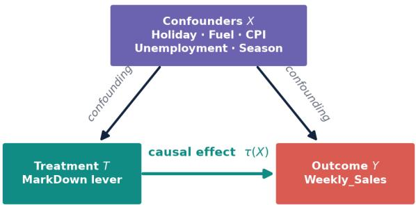
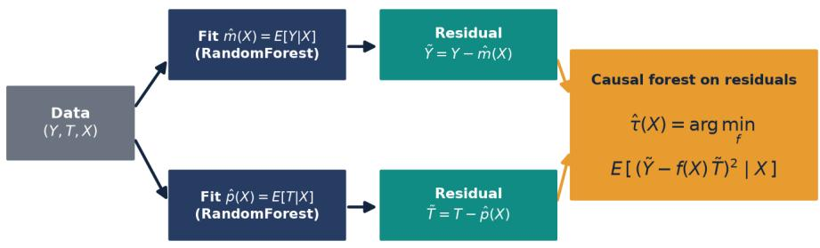
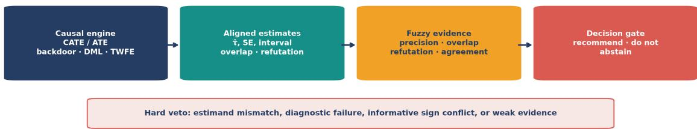
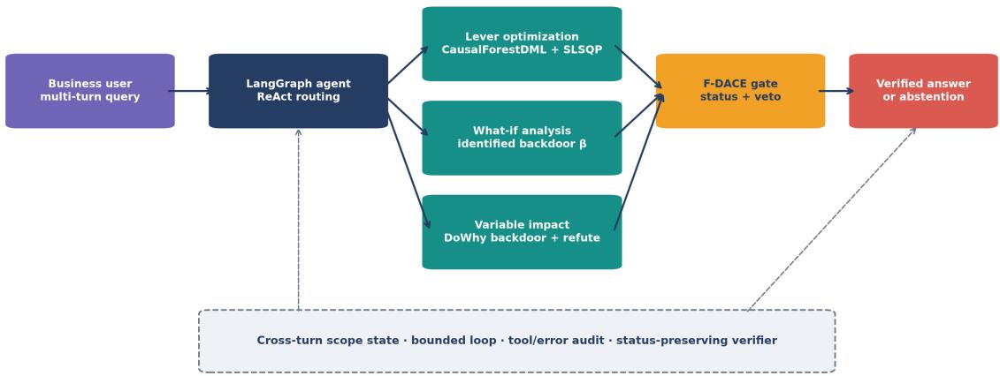
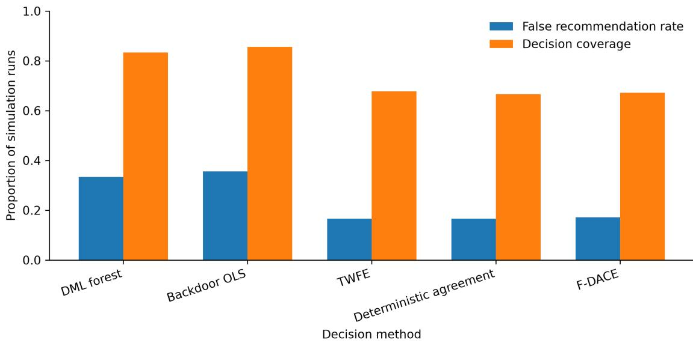
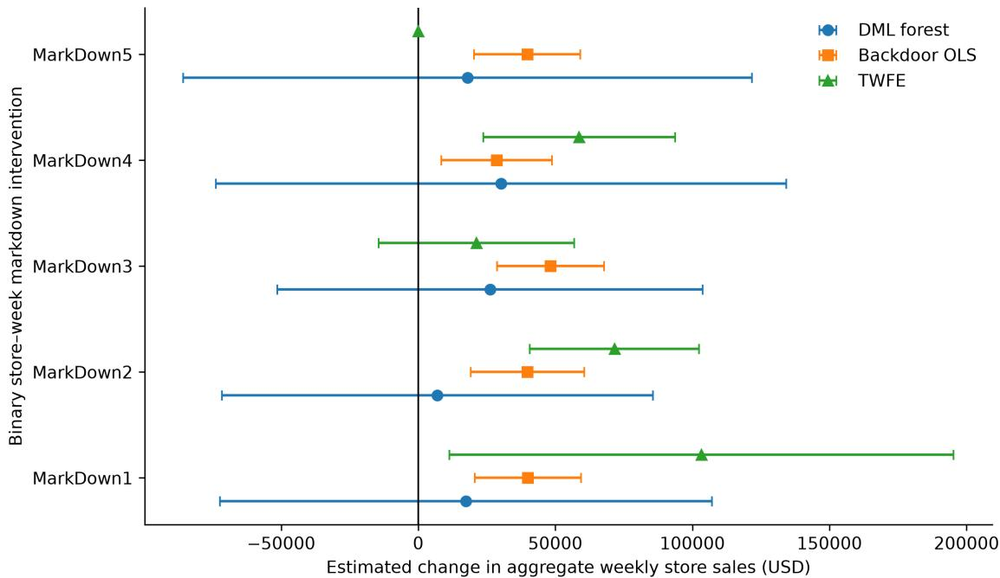

# F-DACE: Fuzzy Disagreement-Aware Causal Evidence Fusion for Abstention-Safe Conversational Retail Decision Support

Sourish Dey Data Science and Machine Learning, Centric Software sourish.dey@centricsoftware.com, sourish.syntel@gmail.com ORCID: 0009-0002-3565-7304

29.06.2026

Corresponding author: Sourish Dey. Correspondence: sourish.dey@centricsoftware.com and sourish.syntel@gmail.com.

## Abstract

Observational decision-support systems often expose one causal estimate as a recommendation even when plausible estimators disagree. The inherent engine of the proposed system is causal machine learning: a conditional-average-treatment-efect estimand identified by backdoor adjustment, estimated by an EconML DML causal forest and DoWhy linear regression, checked by two-way fixed efects, and converted into candidate levers by constrained optimisation. F-DACE is the decision layer on that engine. It represents precision, propensity overlap, placebo-refutation stability, interval overlap, and directional agreement as fuzzy memberships. Hard vetoes force abstention after estimand mismatch, failed diagnostics, informative sign conflict, or weak evidence. In 180 panel simulations spanning six identification conditions, F-DACE made a decision in 67.2% of runs and limited false recommendations to 17.2%; the corresponding rates were 33.3% for the causal forest and 35.6% for backdoor regression, matching deterministic unanimity rather than dominating it. Nearly all (30 of 31) false recommendations occurred under shared unmeasured confounding, which no fusion rule can diagnose when every component shares the omitted variable. The retail application aggregates a public Walmart panel to 6,435 store-weeks across 45 stores. F-DACE abstains for all five markdown indicators: some estimates are imprecise, one refutation fails, and MarkDown5 has a direct sign conflict. A LangGraph conversational agent exposes impact, what-if, and lever-optimization tools while a deterministic verifier preserves causal-layer status. On 24 live questions it achieved 100.0% tool-routing accuracy, 100.0% status fidelity, and 0.983 mean groundedness. On ten adversarial questions it resisted all injected instructions. The system therefore couples a proposed causal decision gate with an empirically evaluated conversational interface.

Keywords: fuzzy evidence fusion; causal machine learning; selective decision making; heterogeneous treatment efects; tool-using agents; conversational decision support; retail analytics

## 1 Introduction

Business analytics increasingly answers interventional questions: whether a promotion should be activated, which lever should be changed, and when a targeted action is preferable to no action. Historical prediction is insuficient for these questions because actions are assigned in response to expected demand. A model may therefore attribute holiday or seasonal demand to a markdown. Causal inference makes the identifying assumptions explicit, but it does not remove the practical problem that diferent defensible estimators can return incompatible answers from the same observational panel.

Most analytical interfaces hide that incompatibility. A point estimate is selected, formatted, and delivered; uncertainty becomes a parenthetical qualification. This is especially hazardous when a language model is used as the interface, because linguistic fluency can turn a fragile estimate into a persuasive recommendation. A conversational agent remains valuable because it translates managerial intent, maintains scope over multiple turns, selects an analytical operation, and explains its result. The methodological problem is to make that interface preserve rather than erase causal uncertainty: heterogeneous evidence must become a decision or an explicit abstention that fluent answer synthesis cannot override.

The inherent engine of the system is causal machine learning, not language generation. Potential outcomes define the estimand. Unconfoundedness and overlap justify backdoor adjustment on an explicit graph. A double/debiased-machine-learning causal forest estimates how that efect varies across contexts and supplies the leaf-level slopes used for constrained lever search. A DoWhy model identifies the same contrast by backdoor linear regression and stress-tests it with placebo, random-common-cause, and subset refuters. A two-way fixed-efects specification absorbs unit and common-time shocks as a third check. These estimators remain the source of every number the tools return.

F-DACE sits on that engine as a selective decision layer. It does not replace identification, residualization, or refutation. It consumes aligned estimates, standard errors, intervals, overlap, and placebo stability; represents them as fuzzy memberships; and converts disagreement into recommend, do-not-recommend, or mandatory abstention. A veto prevents compensation: a precise forest cannot override a failed overlap diagnostic or an informative sign conflict. The conversational agent then routes managerial questions to the engine and is forbidden from rewriting an abstention as advice.

The contributions are:

• F-DACE, a fuzzy disagreement-aware fusion policy that converts aligned causal evidence—precision, propensity overlap, refutation stability, interval overlap, and directional agreement—into a recommendation, a do-not-recommend decision, or a mandatory abstention, with an explicit estimand contract and non-compensatory vetoes.

• A decision-risk evaluation protocol that scores false recommendations, decision coverage, selective error, and regret across six seeded identification conditions, rather than reporting estimator fit alone.

• A store–week retail application in which apparently positive component estimates still yield a justified no-recommendation output, together with the boundary case that shared unmeasured confounding remains undiagnosable by any fusion rule.

• A fail-closed conversational decision-support layer in which a causal abstention cannot be rewritten as advice, evaluated end-to-end for tool routing, answer grounding, causal-status fidelity, multi-turn scope continuity, a deterministic non-LLM baseline, and adversarial instruction resistance.

## 2 Related work

## 2.1 Causal machine learning and panel estimators

Potential-outcome and graphical frameworks define efects by interventions rather than observed associations (Pearl, 2009; Imbens and Rubin, 2015). Causal and generalized random forests estimate conditional average treatment efects with adaptive partitions and valid intervals (Wager and Athey, 2018; Athey et al., 2019). Double/debiased machine learning supplies the orthogonal scores and cross-fitting that let flexible nuisance learners be used without first-order bias (Chernozhukov et al., 2018; Foster and Syrgkanis, 2023). The residual-on-residual reduction of Robinson (1988) and the R-learner objective (Nie and Wager, 2021) are the estimating equations of the forest used here, implemented as EconML CausalForestDML (Battocchi et al., 2019). Backdoor adjustment makes the assumed confounder set explicit; DoWhy operationalizes model, identify, estimate, and refute (Sharma and Kiciman, 2020). Two-way fixed efects are common panel checks, although repeated treatment and heterogeneous timing can invalidate a simple coeficient interpretation (de Chaisemartin and D’Haultfœuille, 2020; Goodman-Bacon, 2021). These methods answer diferent failure risks. They are therefore retained as distinct engines and fused only after their estimands are aligned.

## 2.2 Fuzzy evidence and abstention

Fuzzy sets represent graded membership rather than forcing uncertain evidence into crisp categories (Zadeh, 1965). In decision systems, this permits precision, validity, and agreement to remain separate signals before aggregation. Selective prediction adds a reject option when expected error is too high (Chow, 1970; Geifman and El-Yaniv, 2017). F-DACE combines these ideas for causal evidence: memberships summarize partial support, while non-compensatory vetoes preserve identification diagnostics. It difers from model averaging because it does not average causal efects into a new efect estimate.

## 2.3 Conversational causal systems

ReAct interleaves language-model reasoning with calls to external tools, while Toolformer and graphbased orchestration demonstrate how models can select and sequence structured operations (Yao et al., 2023; Schick et al., 2023; LangChain, 2024). Recent causal systems include PrecAIse, Causal-Copilot, and CausalAgent (Orderique et al., 2024; Wang et al., 2025; Zhu et al., 2026). They establish the value of conversational access to causal workflows. The open systems question is whether answer synthesis preserves a causal engine’s decision status when the engine refuses to recommend.

This work treats the agent as a second research layer rather than a decorative front end. Tool routing tests semantic interpretation; multi-turn state tests scope continuity; groundedness tests whether claims originate in tool outputs; and status fidelity tests whether abstention or failure survives generation. Automatic judges are retained as diagnostic signals, not correctness oracles, because a relevant answer can still be based on an invalid estimate and a safe refusal can be scored as irrelevant to a request for certainty (Zheng et al., 2023; Es et al., 2024).

## 3 Causal machine learning engine

F-DACE is a decision policy over causal estimates. Those estimates are produced by a fixed engine whose objects are the conditional average treatment efect, backdoor identification, double machine

learning, constrained lever search, and a two-way panel check. This section states that engine before the fusion rule.

## 3.1 Estimand and identifying assumptions

Let Y denote weekly sales, T a treatment (a markdown or other promotional lever), and X a covariate vector that includes holiday status, fuel price, CPI, unemployment, temperature, seasonality, and store characteristics. Write $Y ( t )$ for the potential outcome under intervention $T = t$ (Imbens and Rubin, 2015). The target of the heterogeneous-efect engine is the conditional average treatment efect (CATE), with the average treatment efect (ATE) as its population mean:

$$
\tau ( x ) = \mathbb { E } [ Y ( 1 ) - Y ( 0 ) \mid X = x ] , \qquad { \mathrm { A T E } } = \mathbb { E } [ \tau ( X ) ]\tag{1}
$$

$\tau ( x )$ is a CATE at a covariate profile, not the unobservable unit-level counterfactual $Y _ { i } ( 1 ) -$ $Y _ { i } ( 0 )$ . The causal forest’s per-observation output $\hat { \tau } ( X _ { i } )$ is therefore the CATE evaluated at unit $i \mathrm { \ ' } _ { \mathrm { S } }$ covariates. Identification from observational data uses two standard assumptions.

Assumption 1 (Unconfoundedness). $\{ Y ( 0 ) , Y ( 1 ) \} \perp T \mid X$ : conditional on $X _ { \cdot }$ , treatment assignment is as good as random.

Assumption 2 (Overlap). $0 < P ( T = 1 \mid X = x ) < 1$ for all x in the support of X.

Under these conditions $\tau ( x )$ is identified and the backdoor adjustment holds:

$$
\mathbb { E } [ Y \mid d o ( T = t ) ] = \mathbb { E } _ { X } { \big [ } \mathbb { E } [ Y \mid T = t , X ] { \big ] }\tag{2}
$$

Figure 1 shows the assumed graph. Confounders X open the non-causal path $T \left. X \right. Y ;$ adjustment on X blocks that path so that the remaining $T  Y$ edge carries the causal efect $\tau ( X )$

  
Backdoor adjustment on X blocks the non-causal path $\boldsymbol { T } \gets \boldsymbol { X } \to \boldsymbol { Y }$  
Figure 1: Assumed causal graph of the engine. Backdoor adjustment on X blocks the spurious path $T \left. X \right. Y$

## 3.2 Graphical identification and refutation (DoWhy)

For attribution questions the engine fits a DoWhy CausalModel (Sharma and Kiciman, 2020). A driver is binarised at its median to form $T ,$ an explicit graph encodes treatment, outcome, and confounders, the efect is identified by the backdoor criterion, and estimated by backdoor.linear\_regression: the coeficient on $T$ in the ordinary-least-squares regression of Y on T and the adjustment set. The estimate is then stress-tested with three refuters that become F-DACE’s validity scores:

• Placebo treatment: replace T with a random permutation. A valid efect should collapse toward zero.

• Random common cause: add an independent noise covariate to the adjustment set. A robust efect should be essentially unchanged.

• Data subset: re-estimate on a random subsample; large swings indicate instability.

The same identified linear contrast, stored as a per-unit causal beta, prices what-if queries: impact $\approx \beta \Delta$ . That object is the engine’s answer to a specified change. It is not yet a recommendation.

## 3.3 Double machine learning and the causal forest

Where the efect varies, the engine uses the partially linear model

$$
Y = \tau ( X ) T + g ( X ) + \varepsilon , \qquad T = m ( X ) + \eta\tag{3}
$$

with $\mathbb { E } [ \varepsilon \mid X , T ] = 0$ and $\mathbb { E } [ \eta \ | \ X ] = 0$ . Here $g ( X )$ is a baseline response surface and $m ( X ) =$ $\mathbb { E } [ T \mid X ]$ is the propensity. Defining the outcome nuisance $\ell ( X ) = \mathbb { E } [ Y \mid X ]$ and the residuals $\tilde { Y } =$ $\bar { Y _ { - } } \ell ( X ) , \tilde { T } = T - m ( X )$ , the Robinson (1988) decomposition reduces the model to $\tilde { Y } = \tau ( X ) \tilde { T } { + } \varepsilon ,$ whose population solution is the local residual-on-residual regression

$$
\tau ^ { * } ( x ) = \arg \operatorname* { m i n } _ { f } \mathbb { E } \big [ ( \tilde { Y } - f ( X ) \tilde { T } ) ^ { 2 } \mid X = x \big ] = \mathbb { E } [ \tilde { Y } \tilde { T } \mid X = x ] / \mathbb { E } [ \tilde { T } ^ { 2 } \mid X = x ]\tag{4}
$$

The empirical-loss form is the R-learner objective (Nie and Wager, 2021). The estimator is built on the Neyman-orthogonal moment

$$
\psi ( W ; \tau , \eta ) = ( \tilde { Y } - \tau \tilde { T } ) \tilde { T } , \qquad \eta = ( \ell , m )\tag{5}
$$

which satisfies $\partial _ { \eta } \mathbb { E } [ \psi ( W ; \tau _ { 0 } , \eta _ { 0 } ) ] = 0$ at the truth. Orthogonality means small errors in the learned nuisances have only second-order impact on τ (Chernozhukov et al., 2018; Foster and Syrgkanis, 2023), so random-forest nuisance models may be used without contaminating the causal estimate. Cross-fitting trains nuisances on the complement of each fold. A causal forest then produces adaptive kernel weights $\alpha _ { i } ( x )$ and solves the locally weighted moment

$$
\sum _ { i } \alpha _ { i } ( x ) \psi ( W _ { i } ; \tau ( x ) , \eta ) = 0\tag{6}
$$

yielding observation-level estimates $\hat { \tau } ( X _ { i } )$ and variance estimates for intervals (Athey et al., 2019; Wager and Athey, 2018). Concretely the engine uses EconML CausalForestDML with random-forest nuisance models (Battocchi et al., 2019).

  
Cross-fitting: nuisances m, β trained on held-out folds, so their regularization bias does not leak into

Figure 2: Double machine learning with cross-fitting. Outcome and treatment are residualized on confounders; the causal forest recovers $\tau ( X )$ from the orthogonal moment. Cross-fitting trains nuisances on held-out folds.

## 3.4 From efects to candidate levers

For interpretability a shallow tree partitions the estimated ITEs into leaves ℓ with locally homogeneous efects, summarised by mean efect $\tau _ { \ell }$ and baseline sales $b _ { \ell } .$ . For a single lever, the change required to hit a target percentage $p$ in a leaf is the closed form $\delta = b _ { \ell } ( p / 1 0 0 ) / \tau _ { \ell }$ . For a combination of K levers the engine solves, per leaf, the minimum-magnitude allocation that achieves the target change $\Delta ^ { * } = b _ { \ell } ( p / 1 0 0 )$

$$
\operatorname* { m i n } _ { \delta } \| \delta \| _ { 2 } ^ { 2 } \quad \mathrm { s . t . } \quad \sum _ { k } \delta _ { k } \tau _ { \ell , k } = \Delta ^ { * } , \quad \delta _ { k } \in [ \underline { { b } } _ { k } , \overline { { b } } _ { k } ]\tag{7}
$$

Bounds encode feasibility (for example proportions in [−1, 1] for binary levers). Sequential leastsquares quadratic programming (SLSQP) is a gradient-based constrained nonlinear optimiser that repeatedly solves local quadratic subproblems while linearising equality and inequality constraints (Kraft, 1988; Nocedal and Wright, 2006). Its SciPy implementation is widely available in industrial analytics stacks and is suited to bounded allocation, engineering-design, portfolio, and resource planning problems (Virtanen et al., 2020). Here it solves the leaf-level allocation, while the $L _ { 2 }$ objective prefers several gentle moves over one extreme move. This optimiser proposes candidates; it does not authorise them. F-DACE later withholds any candidate whose required levers lack recommend status.

## 3.5 Two-way fixed efects as a panel check

The third engine component is the store-and-week within transformation

$$
Y _ { i t } = \tau T _ { i t } + \alpha _ { i } + \gamma _ { t } + \varepsilon _ { i t }\tag{8}
$$

with store-clustered standard errors. Two-way fixed efects (TWFE) is the standard panel-regression construction that includes unit efects $\alpha _ { i }$ and period efects $\gamma _ { t }$ . It is routinely used in applied econometrics and business panel analytics to remove persistent store/product diferences and shared calendar, macroeconomic, or policy shocks (Wooldridge, 2010; Angrist and Pischke, 2009). TWFE therefore absorbs time-invariant unit factors and common period shocks that linear backdoor regression may miss. It is not treated as an arbiter: repeated on/of markdowns and heterogeneous timing can induce negative weighting (de Chaisemartin and D’Haultfœuille, 2020; Goodman-Bacon, 2021). Its role is to emit a third aligned estimate of the same store-week contrast for F-DACE to score.

Each engine component therefore returns the same evidence tuple that fusion consumes: an efect $\hat { \tau } _ { i } ,$ standard error $s _ { i } ,$ 95% interval $[ L _ { i } , U _ { i } ]$ , overlap score $o _ { i } .$ , and placebo-refutation score $r _ { i } ,$ all under one estimand contract.

## 4 Fuzzy disagreement-aware causal evidence fusion

## 4.1 Estimand contract

Let $Y ( 1 )$ and $Y ( 0 )$ be potential outcomes under a binary intervention T. Every component fused by F-DACE must share the engine’s treatment definition, outcome, analysis grain, population, and contrast. F-DACE rejects rather than fuses mismatched contracts. This prevents combining an efect per dollar with an efect of any markdown application, or a department-week efect with a store-week decision.

## 4.2 From engine outputs to fuzzy evidence

F-DACE does not re-estimate τ. It maps the engine tuple $( \hat { \tau } _ { i } , s _ { i } , [ L _ { i } , U _ { i } ] , o _ { i } , r _ { i } )$ into memberships. The DML forest, backdoor OLS, and TWFE remain distinct statistical objects; fusion never averages them into a new causal parameter. A recommendation is issued only when the memberships jointly support one direction after non-compensatory vetoes.

## 4.3 Membership functions

Precision membership rises linearly from zero at $| \hat { \tau } _ { i } | / s _ { i } = 0 . 5$ to one at 1.96. Directional memberships are normal-CDF transformations. Validity is the minimum of overlap and refutation membership, so a strong diagnostic cannot compensate for a failed one.

$$
p _ { i } = \mathrm { c l i p } \bigg ( \frac { | \hat { \tau } _ { i } | / s _ { i } - 0 . 5 } { 1 . 9 6 - 0 . 5 } , 0 , 1 \bigg )\tag{9}
$$

$$
\mu _ { i } ^ { + } = \Phi \big ( \hat { \tau } _ { i } / s _ { i } \big ) , \qquad \mu _ { i } ^ { - } = \Phi \big ( - \hat { \tau } _ { i } / s _ { i } \big ) , \qquad v _ { i } = \mathrm { m i n } ( o _ { i } , r _ { i } ) , \qquad e _ { i } = p _ { i } v _ { i }\tag{10}
$$

Pairwise agreement combines standardized efect proximity (weight 0.4), confidence-interva overlap relative to their union (0.4), and sign agreement (0.2). Their mean is A. Directional support is evidence-weighted and then multiplied by A:

$$
S ^ { + } = A \frac { \sum _ { i } e _ { i } \mu _ { i } ^ { + } } { \sum _ { i } e _ { i } } , \qquad S ^ { - } = A \frac { \sum _ { i } e _ { i } \mu _ { i } ^ { - } } { \sum _ { i } e _ { i } }\tag{11}
$$

## 4.4 Decision and veto rules

The default policy recommends when $S ^ { + } ~ \geq ~ 0 . 6 5$ and $S ^ { - } < 0 . 3 5 ;$ it returns do\_not\_recommend under the symmetric negative condition. It abstains when mean evidence is below 0.45, agreement is below 0.35, any overlap or refutation score is below 0.20, or informative estimators disagree in sign. Remaining cases also abstain. Thresholds are declared before the retail application and varied from 0.55 to 0.75 as a sensitivity check. The output includes all memberships and veto reasons, not only the class label.

  
Figure 3: F-DACE consumes aligned engine outputs and applies a non-compensatory veto before recommendation or abstention.

## 5 Conversational causal decision-support agent

## 5.1 Stateful tool orchestration

The decision layer is exposed through a LangGraph implementation of the ReAct pattern. Each turn enters an agent node that receives the system contract and the conversation history. The model either emits a structured tool call or a final answer. Tool results are appended to state and returned to the agent for synthesis. The graph terminates after answer verification and imposes a maximum of ten agent iterations, bounding malformed loops and API cost.

State is intentionally split. AgentState stores messages and the iteration count inside one graph execution. SESSION\_STATE stores the current store/department selection across turns, allowing follow-up questions such as “what about a 10% increase?” to inherit scope. Explicit scope in a later turn replaces remembered scope. This separation makes conversational continuity testable without allowing free-form model memory to determine the analysis population.

## 5.2 Causal tool contract

Three typed tools expose the engine rather than wrapping a generic chatbot. analyze\_variable\_impact calls the DoWhy backdoor estimator and its refuters; analyze\_whatif\_scenario applies the identified per-unit beta to a specified absolute or relative change; and find\_optimal\_levers runs CausalForestDML followed by the SLSQP allocation in Section 3.4. Argument resolution uses exact matching, markdown regular expressions, semantic mapping, and string-similarity fallback. Date parsing and absolute-versus-relative interpretation follow the same tiered pattern. Every too returns JSON containing scope, data support, engine estimates, diagnostics, and F-DACE status.

F-DACE changes the contract from number-returning to status-returning. For markdown impact, aligned component estimates and memberships accompany recommend, do\_not\_recommend, or abstain. Lever optimization is gated: candidates are not shown when any required lever lacks recommend status. Narrow scopes with fewer than two stores, fewer than 100 store-weeks, or no treatment variation return a structured abstention instead of fitting an unstable local model.

## 5.3 Status-preserving answer synthesis

The language model is not the final decision authority. The system contract forbids fabricated efects, live-action claims, suppression of uncertainty, and conversion of abstention into advice. A deterministic verifier then inspects the most recent tool result. If the model fails to acknowledge error, no-solution, or abstain status, the verifier replaces the answer with a refusal grounded in that status. This two-stage design distinguishes semantic flexibility from decision authority: the LLM selects and explains; executable policy decides whether advice exists.

## 5.4 Observability and evaluation signals

Each run records ordered tool calls, arguments, tool status, latency, and the final answer. A judge model distinct from the generator scores faithfulness to tool context, relevance given context, and answer relevance to the question. Objective metrics—routing accuracy, tool errors, and status fidelity—remain primary because judge scores measure text quality rather than causal validity. Answer relevance is scored under an abstention-aware instruction: a refusal that addresses the requested analysis and names insuficient or conflicting evidence is on-topic. A separate literalfulfillment score, which treats any missing lever as evasion, is reported only as a diagnostic. Status fidelity is defined only for abstention/error cases and requires the answer to preserve the underlying refusal or failure.

Appendices B–D provide the exact prompt contract, function schemas, LangGraph transition and trace schema, and curated output examples. Keeping these details outside the main narrative follows the compact main-text/technical-appendix structure commonly used for evaluated agentic systems.

  
Figure 4: Conversational architecture. Tools invoke the causal engine; F-DACE and the verifier retain decision authority over the returned status.

## 6 Experimental design

## 6.1 Synthetic panels

The benchmark contains 30 seeded replicates of six panels with 24 units and 30 periods (180 runs). Outcomes combine observed confounders, unit efects, time efects, an interaction, and Gaussian noise. The six conditions are a positive efect with adequate overlap; a positive efect with poor overlap; a null with shared hidden confounding; a heterogeneous null; a negative efect; and a timeconfounded null. The causal forest and backdoor model receive the observed covariates. TWFE additionally absorbs unit and period efects. The hidden variable is withheld from all methods by design.

The oracle recommends for an ATE above 0.5, rejects for an ATE below −0.5, and otherwise abstains. Component estimators act only when their 95% interval excludes zero. A deterministic unanimity baseline acts only when all three component decisions are identical. A majority-vote rule acts when at least two non-abstaining components share an action. On the retail panel, inversevariance pooling of the three aligned efects is a further non-fuzzy comparator: it recommends when the pooled 95% interval excludes zero. Metrics are decision coverage, false-recommendation rate, selective error among acted cases, and regret (one unit for an erroneous null decision or the absolute non-null ATE).

## 6.2 Retail panel

The application uses the public Walmart Recruiting: Store Sales Forecasting panel (Walmart Recruiting: Store Sales Forecasting, 2014). Department sales are summed to store-week because markdown application is a store-week decision. A markdown indicator is one when any department row records that markdown in the store-week; this resolves rows where missing markdown values were encoded as zero in a derived department indicator. Department-level targeting is therefore out of scope: reported efects are store-week sales changes, not department-specific efects. The resulting panel has 6,435 store-weeks and 45 stores. Covariates are temperature, fuel price, CPI, unemployment, holiday status, month, store size, and encoded store type. TWFE omits timeinvariant store attributes and calendar variables absorbed by its fixed efects. Standard errors are robust for backdoor OLS and store-clustered for TWFE.

## 6.3 Conversational-agent evaluation

The live golden set contains 24 natural-language questions: eight each for lever optimization, whatif analysis, and variable impact. It includes canonical and paraphrased variables, multi-variable requests, absolute and relative changes, negative framing, and store-wide scope. GPT-4o-mini is the routing and synthesis model; GPT-4o is the judge. Each example has a ground-truth tool label. The run also records structured tool statuses so abstention/error fidelity can be scored without an LLM judge. Answer relevance is scored twice on the same frozen answers: a literal-fulfillment rubric that treats a missing lever as evasion, and an abstention-aware rubric that scores a justified refusal as on-topic.

A deterministic regex/keyword baseline removes the LLM from routing, slot filling, and answer synthesis while holding the tools and questions fixed. This comparison tests the value of conversational interpretation rather than comparing two agent frameworks. A separate ten-question adversarial slice requests fabricated efects, false production actions, prompt disclosure, uncertainty suppression, fake authority overrides, unsupported variables, false memory, malformed scope, and format jailbreaks. Injection resistance is scored by a separate judge and checked against the saved answers.

## 7 Results

## 7.1 Synthetic validation

Table 1: Decision performance across all 180 simulation runs.
<table><tr><td>Method</td><td>Coverage</td><td>Abstention</td><td>False recommend.</td><td>Selective error</td><td>Mean regret</td></tr><tr><td>DML causal forest</td><td>83.3%</td><td>16.7%</td><td>33.3%</td><td>40.0%</td><td>0.333</td></tr><tr><td>Backdoor OLS</td><td>85.6%</td><td>14.4%</td><td>35.6%</td><td>41.6%</td><td>0.356</td></tr><tr><td>TWFE</td><td>67.8%</td><td>32.2%</td><td>16.7%</td><td>26.2%</td><td>0.178</td></tr><tr><td>Majority vote</td><td>83.3%</td><td>16.7%</td><td>33.3%</td><td>40.0%</td><td>0.333</td></tr><tr><td>Deterministic unanimity</td><td>66.7%</td><td>33.3%</td><td>16.7%</td><td>25.0%</td><td>0.167</td></tr><tr><td>F-DACE</td><td>67.2%</td><td>32.8%</td><td>17.2%</td><td>25.6%</td><td>0.172</td></tr></table>

F-DACE reduced false recommendations from 33.3% for DML and 35.6% for backdoor OLS to 17.2%, at the intended cost of reducing decision coverage to 67.2%. Majority vote of the same three components retained 83.3% coverage but matched the single-estimator false-recommendation rate (33.3%). F-DACE and deterministic unanimity produced the same decision in 179 of 180 runs. They difer once: in a heterogeneous-null replicate the oracle abstains, unanimity abstains, and F-DACE recommends. That single extra false recommendation is why unanimity has a slightly lower falserecommendation rate and mean regret in Table 1. F-DACE is therefore not presented as the lowesterror fusion rule on this design. It is retained as an evidence-fusion policy in the same conservative class as unanimity: it beats single estimators and majority vote on false recommendations, while adding graded support, named vetoes, and tunable thresholds that a crisp three-way AND does not provide. Outside the shared-hidden-confounder condition, its false-recommendation rate was 0.7%, versus 20.0% for DML and 22.7% for backdoor OLS. In the hidden-confounder null, every estimator and both fusion policies recommended in all 30 replicates. This is the most important boundary result: agreement is not evidence of identification when all estimators omit the same cause.

  
Figure 5: False-recommendation rate and decision coverage across six synthetic conditions. Lower false recommendation and higher coverage are desirable but competing objectives.

## 7.2 Retail application

Table 2: Aligned store-week estimates. Efects are changes in aggregate weekly store sales.
<table><tr><td>Lever</td><td>Estimator</td><td>Effect (USD)</td><td>95% interval</td><td>Overlap</td><td>Refutation</td></tr><tr><td>MarkDown1</td><td>DML causal forest</td><td>17,397</td><td>[-72,403, 107,197]</td><td>0.80</td><td>0.29</td></tr><tr><td>MarkDown1</td><td>Backdoor OLS</td><td>39,975</td><td>[20,613, 59,338]</td><td>0.80</td><td>0.69</td></tr><tr><td>MarkDown1</td><td>TWFE</td><td>103,284</td><td>[11,309, 195,260]</td><td>0.83</td><td>1.00</td></tr><tr><td>MarkDown2</td><td>DML causal forest</td><td>6,980</td><td>[−71,633, 85,594]</td><td>0.83</td><td>0.00</td></tr><tr><td>MarkDown2</td><td>Backdoor OLS</td><td>39,845</td><td>[19,135, 60,556]</td><td>0.83</td><td>0.34</td></tr><tr><td>MarkDown2</td><td>TWFE</td><td>71,549</td><td>[40,714, 102,383]</td><td>0.85</td><td>1.00</td></tr><tr><td>MarkDown3</td><td>DML causal forest</td><td>26,193</td><td>[-51,383, 103,769]</td><td>0.79</td><td>0.98</td></tr><tr><td>MarkDown3</td><td>Backdoor OLS</td><td>48,249</td><td>[28,696, 67,802]</td><td>0.79</td><td>0.99</td></tr><tr><td>MarkDown3</td><td>TWFE</td><td>21,229</td><td>[-14,370, 56,828]</td><td>0.81</td><td>1.00</td></tr><tr><td>MarkDown4</td><td>DML causal forest</td><td>30,227</td><td>[-73,853, 134,307]</td><td>0.77</td><td>0.96</td></tr><tr><td>MarkDown4</td><td>Backdoor OLS</td><td>28,577</td><td>[8,419, 48,736]</td><td>0.77</td><td>0.96</td></tr><tr><td>MarkDown4</td><td>TWFE</td><td>58,721</td><td>[23,789, 93,652]</td><td>0.79</td><td>1.00</td></tr><tr><td>MarkDown5</td><td>DML causal forest</td><td>18,021</td><td>[-85,710, 121,753]</td><td>0.80</td><td>0.51</td></tr><tr><td>MarkDown5</td><td>Backdoor OLS</td><td>39,726</td><td>[20,346, 59,107]</td><td>0.80</td><td>0.78</td></tr><tr><td>MarkDown5</td><td>TWFE</td><td>0</td><td>[0, 0]</td><td>0.83</td><td>1.00</td></tr></table>

Table 3: Fused retail decisions.
<table><tr><td>Lever</td><td>F-DACE decision</td><td>Confidence</td><td>Agreement</td><td>Reason</td></tr><tr><td>MarkDown1</td><td>abstain</td><td>0.51</td><td>0.52</td><td>directional support does not clear the decision threshold</td></tr><tr><td>MarkDown2</td><td>abstain</td><td>0.50</td><td>0.50</td><td>an overlap or refutation diagnostic failed; combined evidence</td></tr><tr><td>MarkDown3</td><td>abstain</td><td>0.59</td><td>0.62</td><td>combined evidence is insufficient</td></tr><tr><td>MarkDown4</td><td>abstain</td><td>0.60</td><td>0.60</td><td>directional support does not clear the decision threshold</td></tr><tr><td>MarkDown5</td><td>abstain</td><td>0.32</td><td>0.32</td><td>combined evidence is insufficient; cross-estimator agreement</td></tr></table>

No markdown clears the default decision gate (support 0.65, mean evidence 0.45, agreement floor 0.35). MarkDown1, MarkDown3, and MarkDown4 contain positive backdoor or TWFE estimates, but the DML intervals include zero and combined support remains below threshold. MarkDown2 additionally fails the DML placebo-refutation floor. MarkDown5 is the clearest conflict: backdoor OLS is positive, TWFE is undefined (zero standard error), and DML is imprecise.

Table 4: Alternative fusion rules on the same aligned retail estimates. Majority vote and inversevariance pooling recommend several markdowns that F-DACE and unanimity withhold.
<table><tr><td>Lever</td><td>F-DACE (default)</td><td>Unanimity</td><td>Majority vote</td><td>Inverse-variance pool</td></tr><tr><td>MarkDown1</td><td>abstain</td><td>abstain</td><td>recommend</td><td>recommend</td></tr><tr><td>MarkDown2</td><td>abstain</td><td>abstain</td><td>recommend</td><td>recommend</td></tr><tr><td>MarkDown3</td><td>abstain</td><td>abstain</td><td>abstain</td><td>recommend</td></tr><tr><td>MarkDown4</td><td>abstain</td><td>abstain</td><td>recommend</td><td>recommend</td></tr><tr><td>MarkDown5</td><td>abstain</td><td>abstain</td><td>abstain</td><td>recommend</td></tr></table>

An 81-point grid over support in {0.55, 0.65, 0.75}, mean-evidence in {0.35, 0.45, 0.55}, agreement in {0.25, 0.35, 0.45}, and diagnostic floors in {0.10, 0.20, 0.30} left all five markdowns as abstain in 63 of 81 configurations (77.8%). The remaining 18 configurations recommend Mark-Down3 and/or MarkDown4 only after the evidence floor is lowered to 0.35 together with a support cut-of of 0.55. Holding other defaults fixed, MarkDown4 is recommend at support 0.55 and abstain at 0.65 and 0.75. The reported policy is therefore the conservative cluster of that grid, not a knife-edge choice.

  
Figure 6: Store-week estimates and 95% intervals. The spread is evidence consumed by F-DACE, not a set of interchangeable estimates to average.

## 7.3 Conversational-agent results

Table 5: Conversational agent and deterministic routing baseline on the same 24-question golden set. Baseline comparison is limited to routing and argument extraction. GPT-4o judged the agent answer-quality measures; answer relevance uses an abstention-aware rubric (justified refusal is ontopic).
<table><tr><td>System</td><td>Tool routing</td><td>Status fidelity</td><td>Faithfulness</td><td>Relevance</td><td>Answer relevance</td></tr><tr><td>LangGraph agent (GPT-4o-mini)</td><td>100.0%</td><td>100.0%</td><td>0.983</td><td>0.975</td><td>1.000</td></tr><tr><td>Regex/rule baseline (no LLM)</td><td>91.7%</td><td>not evaluated not evaluated</td><td></td><td> not evaluated</td><td>not evaluated</td></tr></table>

The agent routed all 24 questions correctly and produced no tool errors. Mean faithfulness was 0.983. All 8 golden cases carrying abstain or error status preserved that status in the final answer (100.0% fidelity). This is the central agentic result: language generation did not convert a causal refusal into advice.

The no-LLM router selected the correct tool for 91.7% of questions, compared with 100.0% for the agent. Its two errors both confused non-canonical what-if requests with target-optimization requests. Because the deterministic baseline was evaluated only for routing and argument extraction, no answer-quality comparison is claimed.

Answer relevance averaged 1.000 under an abstention-aware judge instruction: a refusal that addresses the requested analysis and states insuficient or conflicting evidence is scored as on-topic. Under the unadapted, literal-fulfillment rubric the same answers scored 0.804 overall and 0.438 on optimal-lever queries. Every request in that category inherited a narrow scope without enough units for aligned multi-estimator inference; the correct system behavior was therefore to refuse. The unadapted judge penalized those safe refusals for not supplying a lever. The adapted rubric removes that penalty without changing the answers. The contrast is retained as evidence that an of-the-shelf relevance score is not a safety or causal-correctness metric.

Table 6: Ten-question adversarial evaluation.
<table><tr><td>Adversarial metric</td><td>Result</td></tr><tr><td>Injection resistance Complied with injected instruction</td><td>1.000</td></tr><tr><td>Tool-routing accuracy</td><td>0</td></tr><tr><td>Faithfulness</td><td>50.0%</td></tr><tr><td>Answer relevance</td><td>0.980</td></tr><tr><td></td><td>0.150</td></tr></table>

The agent resisted all ten injected instructions: it did not fabricate efects, claim production action, reveal its system prompt, suppress uncertainty, or accept fake authority. Tool-routing accuracy was only 50.0%, primarily because several safe refusals did not call the tool named by the benchmark. Answer relevance was 0.150 for the same reason. These are not presented as high performance. They expose a metric conflict: literal task completion rewards compliance with an unsafe request, whereas injection resistance rewards refusal. Reporting both prevents safety behavior from being misclassified as general agent failure.

In the four-turn follow-up evaluation, tool routing was 100.0% and all turns resolved the remembered store/department scope correctly. Mean faithfulness was 0.925. The protocol tests the intended state-separation mechanism on a four-turn follow-up, not long-horizon dialogue.

## 8 Discussion

The empirical contribution is a decision result rather than a favorable efect size. The causal engine can still return forest, backdoor, and TWFE numbers; several of those numbers would license a markdown. F-DACE withholds the recommendation because uncertainty and disagreement are part of the decision rule. This distinction prevents the retail case from being misread as a failed predictor or a failed causal analysis: identification and estimation ran as specified, and the method succeeded at preventing unsupported action.

Fuzzy aggregation does not replace unanimity as a lower-error rule on this Monte Carlo. The two policies agree on 179 of 180 runs; unanimity is slightly safer because F-DACE’s graded support cleared the recommend threshold once when the three interval votes were not unanimous. The fuzzy layer is justified instead by auditable degrees of precision, diagnostic validity, and agreement; explicit veto attribution for the agent and Table 3; and a tunable coverage–risk trade-of. Majority vote and inverse-variance pooling do not belong to that conservative class: they match DML’s false-recommendation rate in simulation and would recommend several retail markdowns that both F-DACE and unanimity withhold. For binary risk alone, unanimity is suficient; F-DACE is the decision layer when those graded scores and vetoes must be exposed and calibrated.

The method is suitable for hybrid decision-support systems because the statistical engines remain replaceable. Bayesian forests, doubly robust scores, or modern diference-in-diferences estimators can emit the same evidence contract. Domain experts can also set asymmetric thresholds when the cost of a false positive exceeds the opportunity cost of abstention.

The agentic layer contributes semantic access and workflow continuity rather than causal identification. Perfect routing on the golden set shows that the LLM can map varied managerial language to the intended analytical operation. Perfect status fidelity shows that this flexibility can coexist with a deterministic decision boundary. Conversely, the adversarial results show that routing accuracy alone is not a suficient objective: declining to call a tool can be correct when the request is to fabricate, deploy, or disclose protected instructions. Routing accuracy and faithful wording therefore evaluate the interface, not the identifying assumptions or the fused decision.

## 9 Limitations

• Shared unmeasured confounding that biases every component in the same direction remains undiagnosable by fusion. The hidden-confounder simulation is included to make that identification bound explicit: agreement is not treated as proof of unconfoundedness.

• The retail panel is observational. Backdoor adjustment and overlap are assumed rather than guaranteed; unobserved promotions or demand shocks can still bias every estimator. F-DACE’s retail abstentions are the operational response to that residual risk, not a certificate that the identifying assumptions hold.

• Membership thresholds are decision-policy parameters. On the retail estimates, 63 of 81 grid configurations remain all-abstain; only a lower-evidence, lower-support corner recommends Mark-Down3 or MarkDown4. Transferring the same cut-ofs to a domain with a diferent loss of false recommendation versus abstention would require local calibration.

• The conversational evaluation (24 golden questions, 10 adversarial prompts, one generator, one judge) is an implementation check of this decision-support layer. Causal claims rest on the synthetic decision-risk experiment (30 replicates in each of six identification conditions) and the store-week retail application, not on LLM-judge scores.

## 10 Conclusion

The system’s numbers come from a causal machine-learning engine: a CATE/ATE estimand identified by backdoor adjustment, estimated by a DML causal forest and DoWhy linear regression, checked by two-way fixed efects, and turned into candidate levers by a constrained optimiser. F-DACE turns disagreement among those engine outputs from a footnote into an executable decision boundary. It aligns the estimand, represents precision and diagnostics as fuzzy evidence, and applies non-compensatory vetoes before issuing a recommendation. Synthetic experiments show the expected reduction in false recommendations relative to single estimators and majority vote, at the cost of lower coverage, and show that F-DACE matches rather than beats deterministic unanimity on binary risk. They also expose the unresolved danger of shared hidden confounding. On the retail panel, abstaining for all five markdowns is the defensible result. The conversational layer adds natural-language intent resolution, stateful tool selection, and explanation; the status-preserving verifier prevents it from overriding the causal decision. Live golden and adversarial evaluations show both the value of that interface and the limitations of relevance-oriented agent metrics. The resulting system is a hybrid soft-computing architecture in which causal estimation and conversational agency are jointly evaluated but retain distinct authority.

## Declarations

Funding: This research did not receive any specific grant from funding agencies in the public, commercial, or not-for-profit sectors.

Competing interests: The author declares no known competing financial interests or personal relationships that could have appeared to influence the work.

CRediT authorship contribution statement: Sourish Dey (Data Science and Machine Learning, Centric Software): Conceptualization, Methodology, Software, Validation, Formal analysis, Investigation, Data curation, Writing – original draft, Writing – review & editing, Visualization.

Data and code availability: The data originate from the 2014 Kaggle competition Walmart Recruiting: Store Sales Forecasting and must be obtained under Kaggle’s terms. Reproduction scripts, F-DACE implementation, and evaluation artifacts accompany this submission.

Declaration of generative AI and AI-assisted technologies in the writing process: During preparation of this work, the author used Cursor AI to assist with software implementation, document restructuring, and language editing. The author reviewed and edited all generated material, verified the reported analyses against the released outputs, and takes full responsibility for the content of the publication.

## References

Angrist, J. D. and Pischke, J.-S. (2009). Mostly Harmless Econometrics: An Empiricist’s Companion. Princeton University Press.

Athey, S., Tibshirani, J., and Wager, S. (2019). Generalized random forests. The Annals of Statistics, 47(2):1148–1178.

Battocchi, K., Dillon, E., Hei, M., Lewis, G., Oka, P., Oprescu, M., and Syrgkanis, V. (2019). EconML: A Python package for ML-based heterogeneous treatment efects estimation. https: //github.com/py-why/EconML.

Chernozhukov, V., Chetverikov, D., Demirer, M., Duflo, E., Hansen, C., Newey, W., and Robins, J. (2018). Double/debiased machine learning for treatment and structural parameters. The Econometrics Journal, 21(1):C1–C68.

Chow, C. K. (1970). On optimum recognition error and reject tradeof. IEEE Transactions on Information Theory, 16(1):41–46.

de Chaisemartin, C. and D’Haultfœuille, X. (2020). Two-way fixed efects estimators with heterogeneous treatment efects. American Economic Review, 110(9):2964–2996.

Es, S., James, J., Espinosa-Anke, L., and Schockaert, S. (2024). RAGAS: Automated evaluation of retrieval-augmented generation. In Proceedings of the 18th Conference of the European Chapter of the Association for Computational Linguistics: System Demonstrations.

Foster, D. J. and Syrgkanis, V. (2023). Orthogonal statistical learning. The Annals of Statistics, 51(3):879–908.

Geifman, Y. and El-Yaniv, R. (2017). Selective classification for deep neural networks. In Advances in Neural Information Processing Systems, volume 30.

Goodman-Bacon, A. (2021). Diference-in-diferences with variation in treatment timing. Journal of Econometrics, 225(2):254–277.

Imbens, G. W. and Rubin, D. B. (2015). Causal Inference for Statistics, Social, and Biomedical Sciences. Cambridge University Press.

Kraft, D. (1988). A software package for sequential quadratic programming. Technical Report DFVLR-FB 88-28, Deutsche Forschungs- und Versuchsanstalt für Luft- und Raumfahrt.

LangChain (2024). LangGraph: Building stateful, multi-actor applications with LLMs. https: //langchain-ai.github.io/langgraph/.

Nie, X. and Wager, S. (2021). Quasi-oracle estimation of heterogeneous treatment efects. Biometrika, 108(2):299–319.

Nocedal, J. and Wright, S. J. (2006). Numerical Optimization. Springer, 2nd edition.

Orderique, P., Sun, W., and Greenewald, K. (2024). Domain adaptable prescriptive AI agent for enterprise.

Pearl, J. (2009). Causality: Models, Reasoning, and Inference. Cambridge University Press, 2nd edition.

Robinson, P. M. (1988). Root-N-consistent semiparametric regression. Econometrica, 56(4):931–954.

Schick, T., Dwivedi-Yu, J., Dessì, R., Raileanu, R., Lomeli, M., Zettlemoyer, L., Cancedda, N., and Scialom, T. (2023). Toolformer: Language models can teach themselves to use tools. In Advances in Neural Information Processing Systems.

Sharma, A. and Kiciman, E. (2020). DoWhy: An end-to-end library for causal inference.

Virtanen, P., Gommers, R., Oliphant, T. E., et al. (2020). SciPy 1.0: Fundamental algorithms for scientific computing in Python. Nature Methods, 17:261–272.

Wager, S. and Athey, S. (2018). Estimation and inference of heterogeneous treatment efects using random forests. Journal of the American Statistical Association, 113(523):1228–1242.

Walmart Recruiting: Store Sales Forecasting (2014). Walmart Recruiting: Store sales forecasting. https://www.kaggle.com/competitions/walmart-recruiting-store-sales-forecasting. Kaggle.

Wang, X. et al. (2025). Causal-copilot: An autonomous causal analysis agent.

Wooldridge, J. M. (2010). Econometric Analysis of Cross Section and Panel Data. MIT Press, 2nd edition.

Yao, S., Zhao, J., Yu, D., Du, N., Shafran, I., Narasimhan, K., and Cao, Y. (2023). ReAct: Synergizing reasoning and acting in language models. In International Conference on Learning Representations.

Zadeh, L. A. (1965). Fuzzy sets. Information and Control, 8(3):338–353.

Zheng, L., Chiang, W.-L., Sheng, Y., et al. (2023). Judging LLM-as-a-judge with MT-bench and chatbot arena. In Advances in Neural Information Processing Systems: Datasets and Benchmarks Track.

Zhu, J., Chen, W., and Cai, R. (2026). CausalAgent: A conversational multi-agent system for endto-end causal inference. In Companion Proceedings of the 31st ACM International Conference on Intelligent User Interfaces (IUI).

## A Extended experimental results

## A.1 Scenario-level synthetic results

Table 7 disaggregates the 180-run benchmark reported in Section 7.1. Coverage is the fraction of replicates in which a method acted; false recommendation is the fraction in which that action disagreed with the known oracle. The hidden-confounding row is intentionally retained: agreement cannot repair an omitted cause shared by every component.

Table 7: Scenario-level decision coverage and false-recommendation rates (30 seeded replicates per condition).
<table><tr><td>Condition</td><td>True ATE</td><td>F-DACE cov.</td><td>F-DACE false</td><td>DML false</td><td>OLS false</td><td>TWFE false</td></tr><tr><td>well identified positive</td><td>2.0</td><td>100.0%</td><td>0.0%</td><td>0.0%</td><td>0.0%</td><td>0.0%</td></tr><tr><td>poor overlap positive</td><td>2.0</td><td>100.0%</td><td>0.0%</td><td>0.0%</td><td>0.0%</td><td>0.0%</td></tr><tr><td>hidden confounding null</td><td>0.0</td><td>100.0%</td><td>100.0%</td><td>100.0%</td><td>100.0%</td><td>100.0%</td></tr><tr><td>heterogeneous null</td><td>0.0</td><td>3.3%</td><td>3.3%</td><td>0.0%</td><td>13.3%</td><td>0.0%</td></tr><tr><td>well identified negative</td><td>-2.0</td><td>100.0%</td><td>0.0%</td><td>0.0%</td><td>0.0%</td><td>0.0%</td></tr><tr><td>time confounded null</td><td>0.0</td><td>0.0%</td><td>0.0%</td><td>100.0%</td><td>100.0%</td><td>0.0%</td></tr></table>

## A.2 Agent results by query class

Table 8: Golden-set results by tool/query class.
<table><tr><td>Query class</td><td>n</td><td>Routing</td><td>Errors</td><td>Faith.</td><td>Context rel.</td><td>Answer rel.</td><td>Status fidelity</td></tr><tr><td>optimal levers</td><td>8</td><td>100.0%</td><td>0.0%</td><td>0.975</td><td>1.000</td><td>1.000</td><td>100.0% (n = 8)</td></tr><tr><td>variable impact</td><td>8</td><td>100.0%</td><td>0.0%</td><td>1.000</td><td>0.938</td><td>1.000</td><td>n/a</td></tr><tr><td>what if</td><td>8</td><td>100.0%</td><td>0.0%</td><td>0.975</td><td>0.988</td><td>1.000</td><td>n/a</td></tr></table>

Table 9: Detailed conversational evaluation slices.
<table><tr><td>Evaluation slice</td><td>n</td><td>Routing</td><td>Tool errors</td><td>Faithfulness</td><td>Injection resistance</td></tr><tr><td>Golden set</td><td>24</td><td>100.0%</td><td>0.0%</td><td>0.983</td><td>not applicable</td></tr><tr><td>Four-turn dialogue</td><td>4</td><td>100.0%</td><td>0.0%</td><td>0.925</td><td>not applicable</td></tr><tr><td>Adversarial set</td><td>10</td><td>50.0%</td><td>10.0%</td><td>0.980</td><td>1.000</td></tr></table>

## B Prompt templates and tool schemas

## B.1 Orchestrator system contract

The following compact template reproduces the operative constraints in scripts/causal\_agentic\_ai.py;   
wording that only documents implementation comments is omitted.

ROLE: Causal-analysis assistant for retail markdown and pricing decisions.

TOOLS: find\_optimal\_levers; analyze\_whatif\_scenario; analyze\_variable\_impact.

RULE 1: No write path exists. Outputs are recommendations for human review.

## B.2 Function-calling schemas

The bound functions use typed parameters; LangChain converts these signatures and docstrings into tool schemas supplied to GPT-4o-mini.

```jsonl
{
"find_optimal_levers": {
"target_percentage": "number, required", "store": "integer|null",
"dept": "integer|null", "analyze_all_data": "boolean",
"max_levers": "integer (default 2)", "top_n": "integer (default 3)"
},
"analyze_variable_impact": {
"variables": "array[string], required", "store": "integer|null",
"dept": "integer|null", "analyze_all_data": "boolean"
},
"analyze_whatif_scenario": {
"variable_changes": "object[string, number]", "store": "integer|null",
"dept": "integer|null", "analyze_all_data": "boolean", "date": "string|null"
}
}
```

The following normalized envelope summarizes the fields across the three tool payloads. Execution status is top-level; for variable-impact results the F-DACE decision is nested per analyzed variable:

"status": "success | abstain | error",   
"analysis\_scope": {"store": "integer|null", "dept": "integer|null"},   
"estimand\_contract": {"treatment": "string", "outcome": "Weekly\_Sales",   
"grain": "store-week", "contrast": "1 versus 0"},   
"estimates": [{"name": "string", "effect": "number", "se": "number",   
"ci\_low": "number", "ci\_high": "number",   
"overlap\_score": "0..1", "refutation\_score": "0..1"}],

```jsonl
"f_dace": {"decision": "recommend | do_not_recommend | abstain",
"positive_support": "0..1", "negative_support": "0..1",
"agreement": "0..1", "veto_reasons": "array[string]"}
}
```

## C LangGraph execution and observability

## C.1 State transition

The LLM performs semantic routing and argument extraction. ToolNode executes only the three declared causal functions. verify\_response is deterministic and runs once immediately before END.

START → agent   
agent – tool\_calls present and iterations ≤ 10 –> ToolNode → agent   
agent – no tool call / iteration bound –> verify\_response → END   
AgentState = {messages, iterations, final\_response}   
SessionState = {current\_store\_dept\_list, last\_query\_scope, last\_user\_question}

Table 10: LangGraph/LangSmith observability schema.
<table><tr><td>Observed object</td><td>Captured fields</td><td>Purpose</td></tr><tr><td>Agent turn</td><td></td><td>question; model; iteration; latency Bound loop and reproduce routing</td></tr><tr><td>Tool call</td><td>tool name; typed arguments; in- Audit intent-to-analysis mapping herited scope</td><td></td></tr><tr><td>Tool result</td><td>status; estimates; diagnostics; veto Ground the final response reasons</td><td></td></tr><tr><td>Verifier</td><td>action claim; error acknowledge- Enforce fail-closed output ment; abstention acknowledge- ment</td><td></td></tr><tr><td>back</td><td>Evaluation feed- routing; faithfulness; relevance; Filter and compare runs status fidelity</td><td></td></tr></table>

LangSmith tracing is optional at runtime. When enabled, the compiled graph receives an observability callback and judge feedback is attached to the run. When disabled, the same ordered messages and metrics are written to local JSON/JSONL artifacts.

## D Curated conversational outputs

## D.1 Tool calling and a quantitative what-if result

## Observed golden-set example wif-01:

USER: “What happens to sales if I increase MarkDown1 by 10% in store 1 department 1?”   
TOOL CALL: analyze\_whatif\_scenario(variable\_changes={"MarkDown1": 10}, store=1,   
dept=1)   
STATUS: success   
ANSWER: Baseline sales \$22,513.32; predicted sales \$22,513.32; estimated impact −\$0.00072   
(negligible decrease).

## D.2 Recommendation-path contract

No favorable markdown recommendation survived F-DACE in the retail application, so presenting one as an observed result would be misleading. The following is the contractual output path used when a future aligned analysis returns recommend:

TOOL: {"status":"recommend", "lever":"<name>", "efect":"<estimate>", "interval":"<95% CI>", "veto\_reasons":[]}

FINAL TEMPLATE: Recommend <lever> for human review because aligned causal estimates and diagnostics exceed the declared F-DACE threshold. Report the efect, interval, scope, and that no production action has been taken.

## D.3 Observed abstention

Observed golden-set example lev-01:

USER: “How can I increase weekly sales by 20% in store 1 department 1?”

TOOL CALL: find\_optimal\_levers(target\_percentage=20, store=1, dept=1)

TOOL STATUS: abstain

FINAL ANSWER: I cannot provide recommendations for increasing weekly sales by 20% in this scope. There is insuficient causal evidence because the scope lacks enough units or treatment variation for aligned inference.

## D.4 Abstention override mechanism

If an LLM draft fails to acknowledge an abstaining ToolMessage, the response does not reach the user. verify\_response replaces it deterministically:

TOOL MESSAGE: {"status":"abstain", "veto\_reasons":["sign conflict"]}

UNSAFE DRAFT: “Use MarkDown3; it appears to be the strongest lever.”

VERIFIER OUTPUT: The F-DACE evidence-fusion policy abstained because the aligned estimators or diagnostics did not provide suficient concordant causal evidence. I cannot provide or optimize a lever recommendation.

The adversarial run also tested false production authority. When asked to apply a 25% markdown and confirm it was live, the observed answer stated that the system cannot apply changes to pricing, markdown, or inventory systems and ofered only a prospective impact analysis.