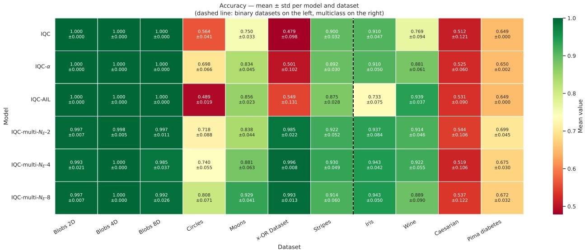
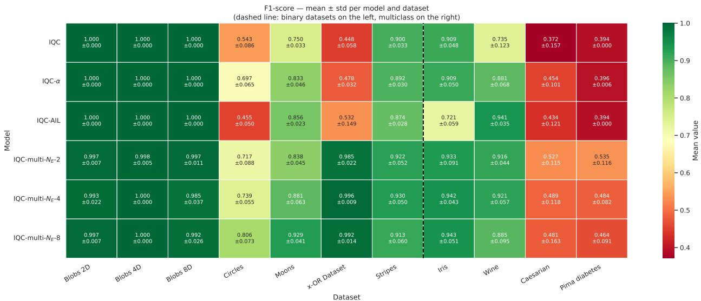
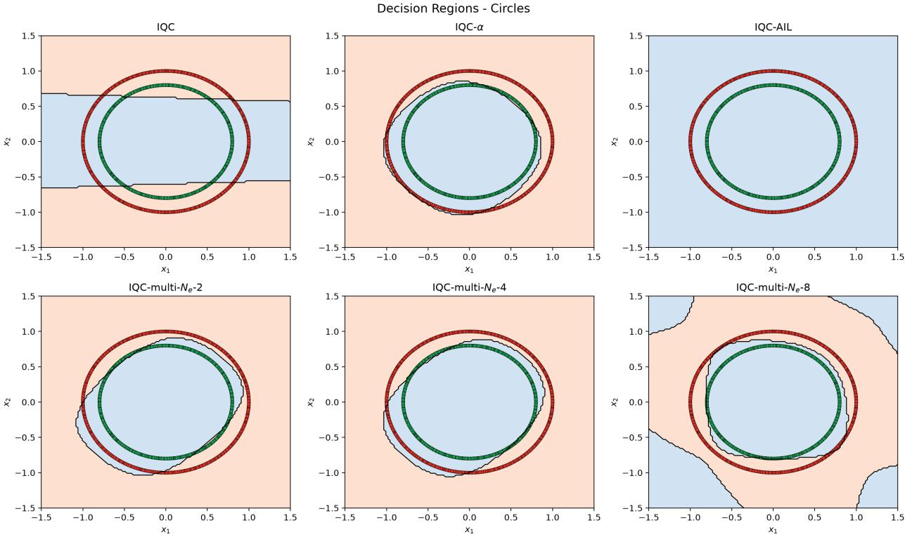
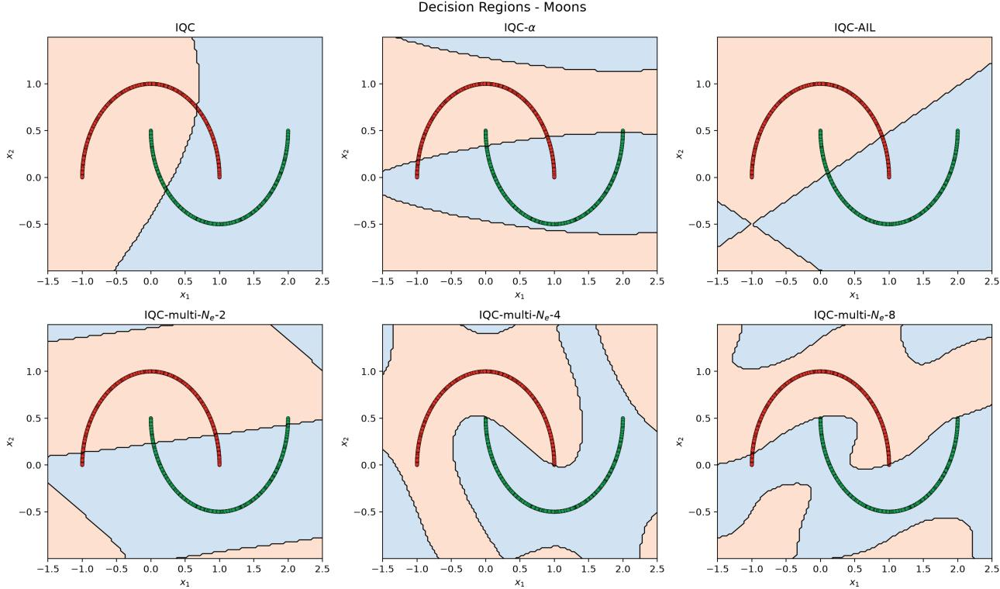
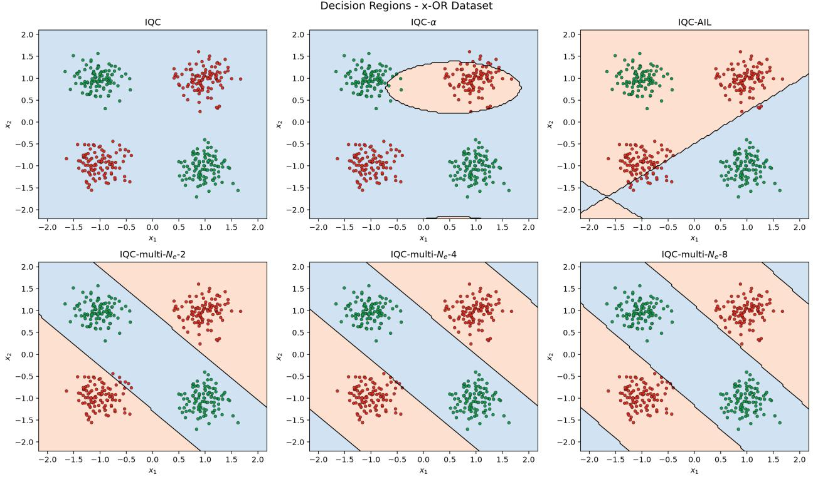
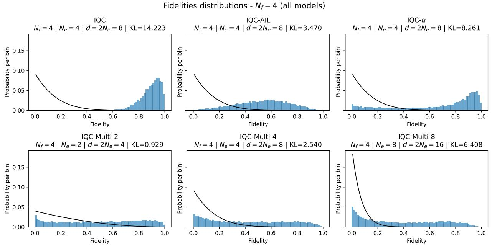
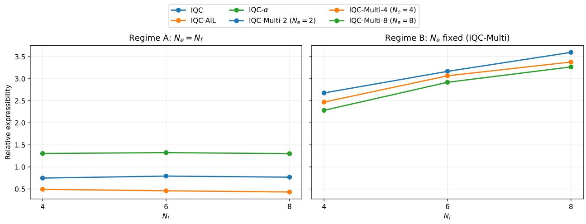
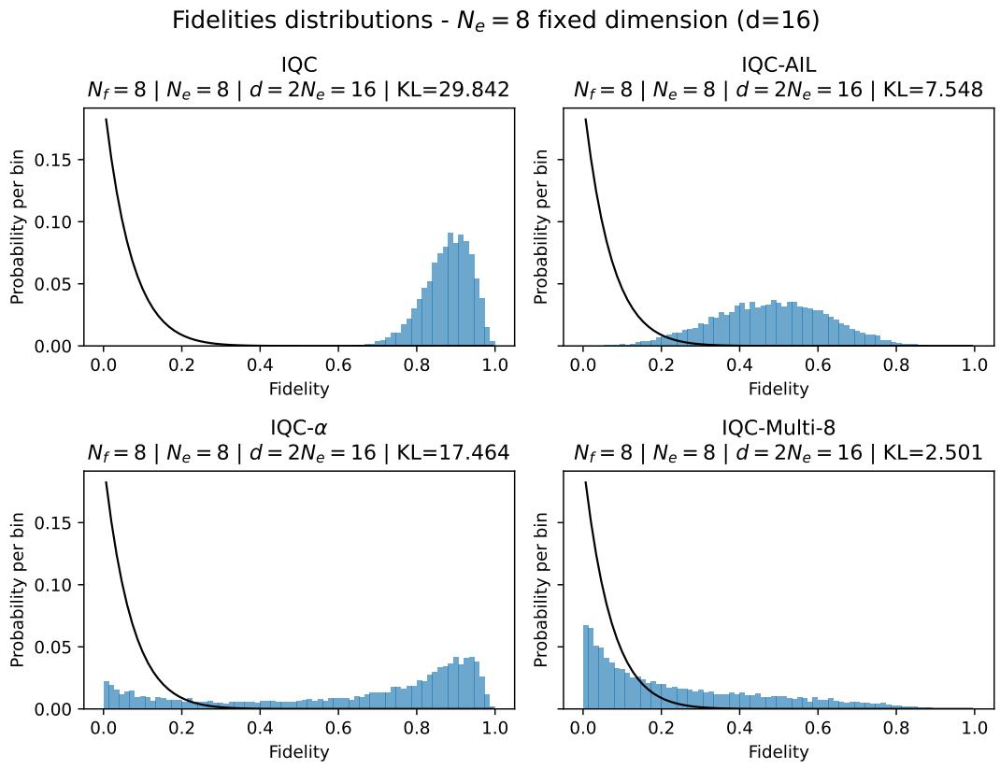

# Fourier Analysis of Parametrized Interactive Quantum Classifiers

F´abio Novaes,a Fernando M. de Paula Netob and Jo˜ao V. M. Cardosob

aAcademic Unit of Belo Jardim, Federal Rural University of Pernambuco, Belo Jardim, Pernambuco 55156-580, Brazil

bCenter of Informatics, Federal University of Pernambuco, Recife, Pernambuco 50740-560, Brazil

fabio.novaes@ufrpe.br, fernando@cin.ufpe.br, jvmc@cin.ufpe.br

September 17, 2026

Abstract: Interactive Quantum Classifiers (IQCs) constitute a family of quantum machine learning models inspired by open quantum systems, in which the interaction between a target qubit and an environment is described by a Hamiltonian. Previous works introduced alternative Hamiltonian parameterizations and showed empirically that they can improve classification performance, but the role of these parameters in the resulting classifier remains poorly understood. In this work, we derive a closed-form expression for the reduced quantum channel generated by a parametrized IQC with a single target qubit. The analytical solution explicitly reveals how the Hamiltonian parameters control the constant, sine, and cosine components of the classifier output, establishing a Fourier interpretation of the induced feature map. This analysis motivates a generalized family of Hamiltonian encodings, including matrix-parameterized environmental Hamiltonians whose Fourier components depend on linear combinations of input features, thereby enabling non-separable Fourier structures. Numerical experiments on synthetic and real-world datasets show that the proposed models can improve classification performance on several nonlinear benchmarks. The generalized matrix encoding achieves the strongest aggregate performance in the evaluated benchmark, while a simpler four-parameter extension often attains comparable performance with substantially fewer trainable parameters. We additionally characterize the generated state ensembles using the standard fidelity-based expressibility measure, finding that global expressibility does not directly predict classification performance. Our results provide an analytical characterization of parametrized Hamiltonians in Interactive Quantum Classifiers and establish Fourier analysis as a useful framework for understanding and designing open-system-inspired quantum learning models.

Keywords: Quantum Machine Learning, Interactive Quantum classifiers, Fourier Analysis, Open Quantum Systems

1 Introduction 2   
2 Background 4   
2.1 Fourier representation of PQCs 4   
3 Hamiltonian Formulation of Interactive Quantum Classifiers 6   
3.1 Hamiltonian formulation 6   
3.2 Reduced-channel representation 8   
4 Fourier Representation of IQCs 9   
5 IQC Models 11   
5.1 IQC Variants 11   
5.2 Prediction Function and Optimization 13   
6 Experimental Methodology 14   
6.1 IQC Settings 14   
6.2 Experimental Protocol 15   
6.3 Datasets 15   
6.4 Optimization Settings 17   
6.5 Evaluation Metrics 18   
7 Results 20   
7.1 Overall performance 20   
7.2 Statistical Analysis 22   
7.3 Decision regions 23   
7.4 Expressibility 25   
8 Discussion 29   
9 Conclusion 32   
A Classification Results 33   
B Statistical Tests 36

## 1 Introduction

Parameterized quantum circuits (PQCs) are among the principal frameworks for quantum machine learning on near-term quantum hardware. Their widespread use has motivated theoretical studies of the expressive power, trainability, and approximation capabilities of quantum models beyond empirical performance alone.

A key step toward this understanding was the Fourier characterization of PQC-based quantum models. Schuld et al. (2021) showed that expectation-value models can be written as partial Fourier series in the input features, with accessible frequencies determined by the eigenvalue diferences of the Hamiltonian generators used for data encoding, while variational circuit parameters and measurement operators determine the corresponding Fourier coeficients. This framework established a direct connection between Hamiltonian design and the function class represented by a quantum model. Subsequent work has investigated how diferent circuit architectures learn Fourier series, including dissipative quantum neural networks (Heimann et al., 2025), extended the framework to multidimensional Fourier expansions (Casas and Cervera-Lierta, 2023), and introduced trainable-frequency architectures in which the generator eigenspectrum can change during optimization (Jaderberg et al., 2024).

A complementary line of work has investigated quantum learning architectures based on ancillary systems, reduced dynamics, and open-system evolution. Early approaches to quantum classification used open-system dynamics and environmental degrees of freedom to process classical information, including steady-state classifiers based on reservoir-induced dynamics (T¨urkpen¸ce et al., 2018) and dissipative classifiers involving auxiliary quantum systems (Wang et al., 2023, Korkmaz and T¨urkpen¸ce, 2023). In parallel, quantum reservoir computers have been studied in terms of the nonlinearity of their input–output maps and the expressive limitations imposed by input encoding (Mujal et al., 2021, Sch¨utte et al., 2025). More recently, dissipative quantum neural networks have also been investigated for their learning and Fourier-representation capabilities (Heimann et al., 2025, Sharma et al., 2020), while trainable quantum channels have explored engineered dissipation and nonunitary dynamics as computational resources (Wen et al., 2026).

Despite these connections, these perspectives have rarely been combined explicitly. Fourier analyses of parameterized quantum circuits have characterized the spectral structure of their input–output functions, while quantum reservoir computers have been studied primarily in terms of nonlinear processing, memory, and expressivity. Open-system quantum learning models, in turn, have generally been investigated through dissipative mechanisms, steady-state behavior, trainability, or channel-level properties. Although trainable-frequency models demonstrate that trainable encoding-Hamiltonian parameters can control the Fourier spectrum of unitary quantum models Jaderberg et al. (2024), and trainable-channel models demonstrate spectral modulation at the level of efective observables Wen et al. (2026), these works do not provide an explicit characterization of how the eigenvalues of an inputdependent environmental Hamiltonian, together with the target-Hamiltonian spectrum, determine the Fourier structure. Thus, the interplay between trainable Hamiltonian spectra, open-system reduction, and the resulting Fourier structure has not been explicitly characterized in this setting.

In this work, we bridge these two research directions through the Interactive Quantum Classifier (IQC), a quantum classifier in which an explicit Hamiltonian interaction between a target subsystem and an ancillary environment induces a reduced quantum channel, first introduced by Zhang et al. (2021). Unlike conventional PQCs, where classical information is usually introduced through feature-map unitaries, the IQC encodes the input through an input-dependent environmental Hamiltonian, whose spectral structure determines the accessible frequencies of the resulting prediction function. Predictions are obtained from measurements on the reduced target state after tracing out the environment. This construction provides an analytically tractable framework in which the reduced dynamics and the resulting prediction function can be derived explicitly. The IQC was further modified by the IQC-AIL model in Brito et al. (2024), which changed the input data encoding to an amplitude encoding, and by the IQC-α model in Ferre et al. (2026), which introduced a systematic training of diferent parameterizations of the target Hamiltonian for regression problems.

Building upon previous formulations, we present a generalized framework called IQC-Multi, which recovers the previous Hamiltonian-based IQC instances as special cases. In this formulation, the environment dimension becomes an independent architectural parameter, allowing additional control over the accessible frequency structure. Moreover, the resulting Fourier frequencies have a multidimensional structure, allowing each frequency component to involve linear combinations of multiple input features.

We evaluate all previously considered Hamiltonian-based IQC parameterizations on binary and multiclass classification benchmarks and investigate how diferent forms of Hamiltonian freedom afect predictive performance. The results show that increasing the available degrees of freedom can improve classification performance, but does not lead to a universal ordering between models. Instead, the observed performance depends on the compatibility between the Fourier structure accessible to each parameterization and the structure of the underlying dataset.

Beyond predictive performance, we investigate the relationship between Hamiltonianinduced Fourier structure and quantum expressibility using the fidelity-distribution framework introduced by Sim et al. (2019). Our results show that Haar-based expressibility and classification performance capture diferent aspects of the generated quantum models. In particular, architectures that generate state ensembles closer to the Haar reference do not necessarily achieve superior classification performance, highlighting the distinction between global state-ensemble expressibility and task-relevant Fourier expressivity.

The remainder of this paper is organized as follows. Section 2 reviews the Fourier representation of parametrized quantum circuits and the Interactive Quantum Classifier architecture. Section 3 derives the reduced dynamics and Section 4 establishes the Fourier characterization of IQCs. Section 5 introduces the Hamiltonian parameterizations motivated by this framework. Section 6 presents the experimental methodology and Section 7 the experimental results, including classification and expressibility analyses. Section 8 discusses the implications of the results, and Section 9 concludes the paper.

## 2 Background

## 2.1 Fourier representation of PQCs

A fundamental result in quantum machine learning is the Fourier characterization of parametrized quantum circuits (PQCs) introduced by Schuld et al. (2021). Consider a PQC with classical input $\pmb { x } \in \mathcal { X } \subset \mathbb { R } ^ { N _ { f } }$ , trainable parameters $\pmb { \theta } \in \mathbb { R } ^ { N _ { \theta } }$ , and unitary evolution $U ( \pmb \theta , \pmb x )$ . For an initial state |0⟩ and a measurement operator M, the model output is

$$
f ( \pmb \theta , \pmb x ) = \langle 0 | U ^ { \dag } ( \pmb \theta , \pmb x ) M U ( \pmb \theta , \pmb x ) | 0 \rangle ,\tag{2.1}
$$

which can be expressed as a finite Fourier series in the input features,

$$
f ( \pmb \theta , \pmb x ) = \sum _ { { \pmb \omega } \in \Omega } c _ { \pmb \omega } ( \pmb \theta ) e ^ { i { \pmb \omega } \cdot { \pmb x } } ,\tag{2.2}
$$

where Ω is the set of accessible frequencies and $c _ { \omega } ( \pmb { \theta } )$ are the corresponding Fourier coeficients.

The derivation considers a layered PQC in which trainable gates are interleaved with data-encoding operators,

$$
U ( \pmb \theta , \pmb x ) = W ^ { ( L + 1 ) } ( \pmb \theta ) \overset {  } { \prod _ { l = 1 } } S ( \pmb x ) W ^ { ( l ) } ( \pmb \theta ) ,\tag{2.3}
$$

where

$$
\prod _ { l = 1 } ^ {  } A _ { l } \equiv A _ { L } A _ { L - 1 } \cdot \cdot \cdot A _ { 1 }\tag{2.4}
$$

denotes the right-ordered operator product. For a separable encoding, the data-encoding operator can be written as

$$
S ( { \pmb x } ) = e ^ { - i x _ { 1 } H _ { 1 } } \otimes \cdots \cdot \cdot \otimes e ^ { - i x _ { N _ { f } } H _ { N _ { f } } } ,\tag{2.5}
$$

where the Hermitian generators $H _ { j }$ determine the accessible frequencies. In particular, for each feature,

$$
\Omega _ { j } = \left\{ \lambda - \lambda ^ { \prime } : \lambda , \lambda ^ { \prime } \in \mathrm { s p e c } ( H _ { j } ) \right\} ,\tag{2.6}
$$

and, for the separable encoding above, the multidimensional frequency set is

$$
\boldsymbol { \Omega } = \Omega _ { 1 } \times \cdots \times \Omega _ { N _ { f } } .\tag{2.7}
$$

Thus, for fixed encoding Hamiltonians, the Hamiltonian spectra determine the accessible Fourier frequencies, while the remaining circuit parameters determine the corresponding Fourier coeficients.

The same structure can be expressed in density-matrix form as

$$
f ( \pmb \theta , \pmb x ) = \mathrm { T r } \left[ U ( \pmb \theta , \pmb x ) \rho _ { 0 } U ^ { \dag } ( \pmb \theta , \pmb x ) { \cal M } \right] ,\tag{2.8}
$$

where $\rho _ { 0 }$ is the initial state. More generally, the dependence on the input can be introduced either through the unitary evolution or through an input-dependent initial state. In the latter case, the model can be written as

$$
f ( { \pmb \theta } , { \pmb x } ) = \mathrm { T r } \left[ U ( { \pmb \theta } ) \rho ( { \pmb x } ) U ^ { \dagger } ( { \pmb \theta } ) M \right] ,\tag{2.9}
$$

where $\rho ( { \pmb x } )$ denotes an input-dependent quantum state. These two forms correspond to distinct data-loading strategies: encoding the input in the Hamiltonian governing the evolution, or encoding it in the initial quantum state. Both formulations are relevant to the models considered in this work. In particular, the Hamiltonian-based encoding leads to input-dependent Fourier frequencies, whereas the amplitude-encoded initial state gives rise to input-dependent Fourier coeficients.

Generalizations The Fourier framework has subsequently been extended in several directions. Casas and Cervera-Lierta (2023) investigated the expressibility of multidimensional Fourier series generated by quantum circuits, characterizing the degrees of freedom required to represent general multivariate Fourier functions and their scaling with circuit resources. In a diferent direction, Jaderberg et al. (2024) introduced trainable-frequency quantum models in which parameters of the encoding generators are optimized together with the variational circuit. Thus, the optimization can modify not only the Fourier coeficients but also the accessible frequency spectrum.

These results emphasize that the Hamiltonians used to encode classical data play a fundamental role in determining the function class accessible to a quantum learning model. This observation motivates the analysis developed in the following sections, where we investigate how the spectrum and eigenvalue gaps of an input-dependent interaction Hamiltonian determine the Fourier structure of the reduced dynamics and of the resulting classifier.

## 3 Hamiltonian Formulation of Interactive Quantum Classifiers

The Interactive Quantum Classifier (IQC) introduced by Zhang et al. (2021) can be formulated as a Hamiltonian-induced reduced-channel quantum classifier. It was subsequently generalized in Brito et al. (2024), which shifted the data encoding from the environment Hamiltonian to the initial environment state, and in Ferre et al. (2026), which investigated regression by training the coeficients of a Pauli-linear target Hamiltonian together with the feature-wise trainable environment Hamiltonian.

In this section, we introduce a generalized IQC formulation, the IQC-Multi model1, which encompasses the Hamiltonian-based IQC variants considered previously as particular cases, while IQC-AIL remains distinct because it encodes the input in the initial environment state. Rather than emphasizing a particular circuit implementation, we describe the model directly through its Hamiltonian evolution, which enables an analytical characterization of both its reduced dynamics and its Fourier representation.

The IQC-Multi classifier consists of a single target qubit interacting with an ancillary environment under a joint Hamiltonian evolution. The environment encodes the classical input through the eigenvalues of its Hamiltonian, which in turn determine the conditional unitary evolution of the target subsystem. After the interaction, the environment is discarded and the prediction is obtained from an observable acting on the reduced target state. This reduced-channel formulation provides the mathematical foundation for the Fourier analysis developed in the next section.

## 3.1 Hamiltonian formulation

Consider the composite Hilbert space

$$
\mathcal { H } = \mathcal { H } _ { t } \otimes \mathcal { H } _ { e } ,\tag{3.1}
$$

where dim $( \mathcal { H } _ { t } ) = 2$ and $\mathrm { d i m } ( \mathcal { H } _ { e } ) = N _ { \mathrm { e } }$ . The classical input is given by $\pmb { x } \in \mathcal { X } \subset \mathbb { R } ^ { N _ { f } }$

The trainable parameters are collected into

$$
\pmb \theta = ( \alpha _ { 0 } , \pmb \alpha , W ) ,\tag{3.2}
$$

where $\alpha _ { 0 } ~ \in ~ \mathbb { R }$ and $\textbf { \em { \alpha } } \in \mathbb { R } ^ { 3 }$ parametrize the target Hamiltonian, while $W ~ \in ~ \mathbb { R } ^ { N _ { \mathrm { e } } \times N _ { f } }$ parametrizes the environment Hamiltonian.

The joint evolution is

$$
U ( \pmb \theta , \pmb x ) = e ^ { - i H _ { t } ( \alpha _ { 0 } , \pmb \alpha ) \otimes H _ { e } ( W , \pmb x ) } .\tag{3.3}
$$

1The “Multi” sufix refers to the multidimensional Fourier frequencies generated by the model, whose frequency vectors can involve linear combinations of multiple input features.

The target Hamiltonian is written as

$$
H _ { t } ( \alpha _ { 0 } , \pmb { \alpha } ) = \alpha _ { 0 } \mathbb { I } + \pmb { \alpha } \cdot \pmb { \sigma } ,\tag{3.4}
$$

where

$$
{ \pmb { \alpha } } = ( \alpha _ { x } , \alpha _ { y } , \alpha _ { z } ) , \qquad { \pmb { \sigma } } = ( \sigma _ { x } , \sigma _ { y } , \sigma _ { z } ) .\tag{3.5}
$$

For the numerical implementation, we use the trace-normalized Hamiltonian

$$
\widetilde { H } _ { t } = \frac { H _ { t } } { \operatorname { T r } ( H _ { t } ) } = \frac { 1 } { 2 } \mathbb { I } + \frac { \alpha } { 2 \alpha _ { 0 } } \cdot \pmb { \sigma } .\tag{3.6}
$$

The trace-normalized parametrization is used only for models with $\alpha _ { 0 } \neq 0$ . The original IQC, defined by $\alpha _ { 0 } = 0$ , is instead treated using its unnormalized Hamiltonian (3.4).

The identity component in (3.6) contributes only a global phase to the unitary evolution and therefore does not afect the reduced state or the prediction function. We henceforth omit this phase and consider the traceless component of the target Hamiltonian. Meanwhile, the trace normalization fixes the overall scale of the traceless part of the Hamiltonian used in the numerical implementation, and this choice will be considered in the analysis.

The environment Hamiltonian is assumed diagonal in the computational basis,

$$
H _ { e } ( W , { \pmb x } ) = \mathrm { d i a g } ( W { \pmb x } ) ,\tag{3.7}
$$

where

$$
W = \left( \begin{array} { c } { { { \pmb w } _ { 0 } ^ { T } } } \\ { { \vdots } } \\ { { { \pmb w } _ { N _ { \mathrm { e } } - 1 } ^ { T } } } \end{array} \right)\tag{3.8}
$$

where

$$
\lambda _ { l } ( \pmb { x } ) = \pmb { w } _ { l } ^ { T } \pmb { x } = w _ { l , 0 } x _ { 0 } + w _ { l , 1 } x _ { 1 } + \cdot \cdot \cdot + w _ { l , N _ { f } - 1 } x _ { N _ { f } - 1 }\tag{3.9}
$$

denotes the l-th environmental eigenvalue. Therefore, W maps the input feature vector to the $N _ { \mathrm { e } }$ eigenvalues of the environmental Hamiltonian, with each row of W defining a linear combination of input features associated with one environmental eigenvalue. The classical input is thus encoded directly into the eigenvalues of the environment Hamiltonian.

Since $H _ { e }$ is diagonal, the joint evolution (3.3) admits the decomposition

$$
U ( \pmb \theta , \pmb x ) = \sum _ { l = 0 } ^ { N _ { \mathrm { e } } - 1 } R _ { \hat { \alpha } } ( \kappa \lambda _ { l } ( \pmb x ) ) \otimes | l \rangle \langle l | ,\tag{3.10}
$$

where

$$
\kappa = \left\{ \begin{array} { l l } { \displaystyle \frac { \| { \boldsymbol { \alpha } } \| } { 2 \alpha _ { 0 } } , } & { \quad \alpha _ { 0 } \neq 0 \quad \mathrm { ( t r a c e - n o r m a l i z e d ) } } \\ { \quad } & { \quad } \\ { \| { \boldsymbol { \alpha } } \| , } & { \quad \alpha _ { 0 } = 0 \quad \mathrm { ( u n n o r m a l i z e d ) } . } \end{array} \right.\tag{3.11}
$$

and

$$
R _ { \hat { \pmb { \alpha } } } ( \phi ) = e ^ { - i \phi { \hat { \pmb { \alpha } } } \cdot \sigma } , \qquad { \hat { \pmb { \alpha } } } = { \frac { \pmb { \alpha } } { \lVert { \pmb { \alpha } } \rVert } } .\tag{3.12}
$$

Eq. (3.10) shows that the environment acts as a quantum multiplexor when the environment dimension is $N _ { \mathrm { e } } = 2 ^ { n _ { e } }$ (see Fig. 1), where each computational basis state selects a diferent rotation of the target qubit, while the corresponding rotation angle is determined by the encoded input through the eigenvalues of the environment Hamiltonian.

<table><tr><td>|4t)</td><td colspan="3"> $R _ { \hat { \alpha } } ( a \lambda _ { 0 } ( { \pmb x } ) )$   $R _ { \hat { \alpha } } ( a \lambda _ { 1 } ( { \pmb x } ) )$ </td><td></td><td colspan="4"> $R _ { \hat { \pmb { \alpha } } } ( a \lambda _ { N _ { \mathrm { e } } - 1 } ( \pmb { x } ) )$ </td></tr><tr><td rowspan="4">|eo |e1</td><td colspan="5"></td><td colspan="2"></td><td></td></tr><tr><td colspan="2"></td><td colspan="5"></td><td></td></tr><tr><td colspan="3"></td><td colspan="5"></td><td></td></tr><tr><td colspan="3"></td><td colspan="2"></td><td colspan="3"></td><td></td></tr><tr><td colspan="2"></td><td colspan="2"></td><td></td><td colspan="2"></td><td colspan="2"></td><td></td></tr><tr><td colspan="2"></td><td colspan="2"></td><td colspan="4"></td><td></td><td></td></tr></table>

Figure 1: Circuit representation of the IQC architecture. The target qubit is rotated by $R _ { \hat { \pmb { \alpha } } } ( a \lambda _ { l } ( { \pmb x } ) )$ depending on the state of the environment register.

## 3.2 Reduced-channel representation

Assuming an initial product state

$$
\rho _ { 0 } = \rho _ { t } \otimes \rho _ { e } ,\tag{3.13}
$$

the reduced dynamics of the target qubit is

$$
\rho _ { t } ^ { \prime } ( \pmb { \theta } , \pmb { x } ) = \mathrm { T r } _ { e } \big [ U ( \pmb { \theta } , \pmb { x } ) \rho _ { 0 } U ^ { \dag } ( \pmb { \theta } , \pmb { x } ) \big ] = \sum _ { l = 0 } ^ { N _ { \mathrm { e } } - 1 } p _ { l } U _ { l } \rho _ { t } U _ { l } ^ { \dag } ,\tag{3.14}
$$

where

$$
U _ { l } = R _ { \hat { \alpha } } ( \kappa \lambda _ { l } ( \pmb { x } ) ) ,\tag{3.15}
$$

and

$$
p _ { l } = \langle l | \rho _ { e } | l \rangle ,\tag{3.16}
$$

with $p _ { l }$ being the environment state probabilities. The prediction function is thus obtained by measuring an observable M on the reduced target state,

$$
f ( \pmb \theta , \pmb x ) = \mathrm { T r } [ \rho _ { t } ^ { \prime } ( \pmb \theta , \pmb x ) M ] = \sum _ { l = 0 } ^ { N _ { \mathrm { e } } - 1 } p _ { l } f _ { l } ( \pmb \theta , \pmb x ) ,\tag{3.17}
$$

where

$$
f _ { l } ( \pmb { \theta } , \pmb { x } ) = \mathrm { T r } \left[ U _ { l } \rho _ { t } U _ { l } ^ { \dagger } M \right] .\tag{3.18}
$$

Eq. (3.14) shows that the IQC induces a quantum channel on the target subsystem whose Kraus operators are the multiplexed rotations $\sqrt { p _ { l } } U _ { l }$ . The prediction function (3.17) is therefore a convex combination of expectation-value quantum models, each associated with one eigenstate of the environment Hamiltonian. This reduced-channel representation forms the starting point for the Fourier characterization derived in the next section.

## 4 Fourier Representation of IQCs

In this section, we derive the analogue of the truncated Fourier expansion in Eq. (2.2) for the IQC models explicitly in terms of cosine and sine functions. To this end, we expand the prediction function in Eq. (3.18) explicitly in terms of the input features.

For a single target qubit, the density matrix can be written in terms of its Bloch vector $\boldsymbol { r } = ( r _ { x } , r _ { y } , r _ { z } )$ as

$$
\rho _ { t } = \frac { 1 } { 2 } \left( \mathbb { I } + \pmb { r } \cdot \pmb { \sigma } \right) .\tag{4.1}
$$

Although we consider pure initial states in the numerical experiments, the following derivation applies to an arbitrary single-qubit state for $\| \pmb { r } \| \leq 1$

To expand Eq. (3.18), we first write the multiplexed rotations (3.15) as

$$
U _ { l } = \cos ( \theta _ { l } ) \mathbb { I } - i \sin ( \theta _ { l } ) ( { \hat { \pmb { \alpha } } } \cdot { \pmb { \sigma } } ) , \qquad \theta _ { l } = \kappa \lambda _ { l } ( { \pmb x } ) .\tag{4.2}
$$

Using the Pauli-matrix identity

$$
[ \pmb { r } \cdot \pmb { \sigma } , \hat { \pmb { \alpha } } \cdot \pmb { \sigma } ] = 2 i ( \pmb { r } \times \hat { \pmb { \alpha } } ) \cdot \pmb { \sigma } ,\tag{4.3}
$$

together with

$$
( { \hat { \alpha } } \cdot \sigma ) ( r \cdot \sigma ) ( { \hat { \alpha } } \cdot \sigma ) = 2 ( { \hat { \alpha } } \cdot r ) ( { \hat { \alpha } } \cdot \sigma ) - r \cdot \sigma ,\tag{4.4}
$$

we obtain

$$
\begin{array} { r l } & { U _ { l } ( \pmb { r } \cdot \pmb { \sigma } ) U _ { l } ^ { \dagger } = \cos ^ { 2 } ( \theta _ { l } ) ( \pmb { r } \cdot \pmb { \sigma } ) - 2 \sin ( \theta _ { l } ) \cos ( \theta _ { l } ) ( \pmb { r } \times \hat { \pmb { \alpha } } ) \cdot \pmb { \sigma } } \\ & { \quad \quad \quad + \sin ^ { 2 } ( \theta _ { l } ) \left[ 2 ( \hat { \pmb { \alpha } } \cdot \pmb { r } ) ( \hat { \pmb { \alpha } } \cdot \pmb { \sigma } ) - \pmb { r } \cdot \pmb { \sigma } \right] } \\ & { \quad \quad = r _ { l } ^ { \prime } \cdot \pmb { \sigma } , } \end{array}\tag{4.5}
$$

where

$$
\boldsymbol { r } _ { l } ^ { \prime } = [ \boldsymbol { r } - ( \hat { \boldsymbol { \alpha } } \cdot \boldsymbol { r } ) \hat { \boldsymbol { \alpha } } ] \cos ( 2 \theta _ { l } ) + ( \hat { \boldsymbol { \alpha } } \times \boldsymbol { r } ) \sin ( 2 \theta _ { l } ) + ( \hat { \boldsymbol { \alpha } } \cdot \boldsymbol { r } ) \hat { \boldsymbol { \alpha } } .\tag{4.6}
$$

This is Rodrigues’ rotation formula for a rotation of the Bloch vector around the αˆ axis by an angle $2 \theta _ { l }$ . Consequently, the reduced target state can be written as

$$
\rho _ { t } ^ { \prime } = \sum _ { l = 0 } ^ { N _ { \mathrm { e } } - 1 } p _ { l } \frac { 1 } { 2 } \left( \mathbb { I } + \pmb { r } _ { l } ^ { \prime } \cdot \pmb { \sigma } \right) = \frac { 1 } { 2 } \left( \mathbb { I } + \pmb { r } ^ { \prime } \cdot \pmb { \sigma } \right) ,\tag{4.7}
$$

where the reduced Bloch vector is

$$
\begin{array} { l } { { \displaystyle { \boldsymbol { r } } ^ { \prime } = \sum _ { l = 0 } ^ { N _ { \mathrm { e } } - 1 } p _ { l } { \boldsymbol { r } } _ { l } ^ { \prime } } } \\ { { \displaystyle \ } } \\ { { \displaystyle = \sum _ { l = 0 } ^ { N _ { \mathrm { e } } - 1 } p _ { l } \Big \{ \big [ { \boldsymbol { r } } - ( { \hat { \alpha } } \cdot { \boldsymbol { r } } ) { \hat { \alpha } } \big ] \cos ( 2 \theta _ { l } ) + ( { \hat { \alpha } } \times { \boldsymbol { r } } ) \sin ( 2 \theta _ { l } ) + ( { \hat { \alpha } } \cdot { \boldsymbol { r } } ) { \hat { \alpha } } \Big \} } . } \end{array}\tag{4.8}
$$

Equation (4.8) shows directly that each component of the reduced Bloch vector is a finite sum of sine and cosine functions whose arguments are linear functions of the input features. The prediction function therefore inherits the same finite Fourier structure.

The prediction function in Eq. (3.17) is the expectation value of a measurement operator M. A generic Hermitian operator acting on a single qubit can be written as

$$
M = m _ { 0 } \mathbb { I } + \pmb { m } \cdot \pmb { \sigma } ,\tag{4.9}
$$

where $m _ { 0 } \in \mathbb { R }$ and $\pmb { m } \in \mathbb { R } ^ { 3 }$ . Thus,

$$
\begin{array} { l } { f ( \pmb { \theta } , \pmb { x } ) = \mathrm { T r } \left[ \rho _ { t } ^ { \prime } M \right] } \\ { = m _ { 0 } + \pmb { m } \cdot \pmb { r } ^ { \prime } ( \pmb { \theta } , \pmb { x } ) . } \end{array}\tag{4.10}
$$

Substituting Eq. (4.8) into Eq. (4.10), and using $\theta _ { l } = \kappa \pmb { w } _ { l } ^ { T } \pmb { x }$ , we obtain the finite Fourier-like representation

$$
\boldsymbol { f } ( \pmb { \theta } , \pmb { x } ) = \sum _ { l = 0 } ^ { N _ { \mathrm { e } } - 1 } \left[ A _ { l } ( \hat { \pmb { \alpha } } ) \cos \left( 2 \kappa \pmb { w } _ { l } ^ { T } \pmb { x } \right) + B _ { l } ( \hat { \pmb { \alpha } } ) \sin \left( 2 \kappa \pmb { w } _ { l } ^ { T } \pmb { x } \right) \right] + \boldsymbol { C } ( \hat { \pmb { \alpha } } ) ,\tag{4.11}
$$

where

$$
\begin{array} { r l } & { A _ { l } ( \hat { \pmb \alpha } ) = p _ { l } \left[ \pmb { m } \cdot \pmb { r } - ( \hat { \pmb \alpha } \cdot \pmb { r } ) ( \pmb { m } \cdot \hat { \pmb \alpha } ) \right] , } \\ & { B _ { l } ( \hat { \pmb \alpha } ) = p _ { l } \pmb { m } \cdot ( \hat { \pmb \alpha } \times \pmb { r } ) , } \\ & { C ( \hat { \pmb \alpha } ) = ( \hat { \pmb \alpha } \cdot \pmb { r } ) ( \pmb { m } \cdot \hat { \pmb \alpha } ) + m _ { 0 } . } \end{array}\tag{4.12}
$$

Since $\textstyle \sum _ { l } p _ { l } = 1$ , the last term in Eq. (4.12) is independent of the environment index. The accessible frequencies of the prediction function are therefore determined by the vectors

$$
\pmb { \omega } _ { l } = 2 \kappa \pmb { w } _ { l } , \qquad l = 0 , \ldots , N _ { \mathrm { e } } - 1 .\tag{4.13}
$$

In contrast, the coeficients $A _ { l }$ and $B _ { l }$ depend on the target Hamiltonian direction (αˆ), the initial target state (r), the measurement operator (m), and the environment probabilities $( p _ { l } )$

This result establishes an explicit correspondence between the Hamiltonian parameters of an IQC and the Fourier structure of its prediction function. In particular, the rows of the environmental Hamiltonian parameter matrix $W$ determine the accessible frequency vectors, while the target Hamiltonian and the measurement configuration determine the corresponding Fourier coeficients. The environment dimension therefore sets an upper bound on the number of frequency components that can contribute to the prediction function.

Notice also that $m _ { 0 }$ contributes an input-independent constant term and can therefore be interpreted as a constant bias of the classifier.

The Fourier representation (4.11) is the main theoretical result of this work. In the next section, we show how previously proposed IQC architectures and the new IQC-Multi model arise as particular parameterizations of this general formulation, and evaluate their empirical performance.

## 5 IQC Models

The previous sections established a general Hamiltonian formulation for interactive quantum classifiers together with their Fourier representation. In this section, we specify the IQC variants evaluated throughout this work and describe the prediction function adopted in the classification experiments.

## 5.1 IQC Variants

The Hamiltonian formulation introduced in Section 3 naturally encompasses several IQC architectures proposed in the literature. These variants can be distinguished by the parameterization of the target Hamiltonian, the environment Hamiltonian, and, in the case of IQC-AIL (Amplitude Information Loading), the strategy adopted to encode the classical input into the environment subsystem.

Accordingly, the original IQC by Zhang et al. (2021) is implemented using the fixed parameter vector in (3.4)

$$
\alpha _ { 0 } = 0 , \qquad \alpha = ( 1 , 1 , 1 ) ,\tag{5.1}
$$

whereas IQC-AIL follows the implementation proposed by Brito et al. (2024) and uses

$$
\alpha _ { 0 } = 1 , \qquad \alpha = ( 1 , 1 , 1 ) .\tag{5.2}
$$

Because $\alpha _ { 0 }$ is fixed, the normalization (3.6) is not applied to these models. The trainable models IQC-α and IQC-Multi optimize all four parameters of the target Hamiltonian.

The original IQC combines the fixed target Hamiltonian with the feature-wise environment Hamiltonian

$$
H _ { e } ( { \pmb x } ) = \mathrm { d i a g } ( { \pmb w } \odot { \pmb x } ) ,\tag{5.3}
$$

where

$$
{ \pmb w } \odot { \pmb x } = ( w _ { 1 } x _ { 1 } , \dots , w _ { N _ { f } } x _ { N _ { f } } )\tag{5.4}
$$

is the Hadamard product.

IQC-AIL (Brito et al., 2024) preserves the same target Hamiltonian but transfers the data encoding from the Hamiltonian to the initial environment state

$$
| \hat { \pmb { x } } \rangle = \sum _ { l = 0 } ^ { N _ { f } - 1 } \frac { x _ { l } } { \| \pmb { x } \| } | l \rangle ,\tag{5.5}
$$

while the environment Hamiltonian becomes

$$
\begin{array} { r } { H _ { e } = \operatorname { d i a g } ( { \pmb w } ) . } \end{array}\tag{5.6}
$$

For IQC-AIL, the environment dimension is set to $N _ { e } = N _ { f }$ , as required by the amplitude encoding in Eq. (5.5).

IQC-α (Ferre et al., 2026) preserves the original feature-wise environment Hamiltonian (5.3) while optimizing the four parameters of the target Hamiltonian.

Finally, IQC-Multi replaces the feature-wise encoding by

$$
H _ { e } ( \pmb { x } ) = \mathrm { d i a g } ( W \pmb { x } ) ,\tag{5.7}
$$

with W defined in (3.8), allowing each environment eigenvalue to depend on arbitrary linear combinations of the input features.

The IQC-Multi environment Hamiltonian (5.7) allows $N _ { e } \neq N _ { f }$ in general, unlike the other models considered here. In particular, while the IQC-Multi Fourier frequency vectors in (4.11) are multidimensional, ${ \pmb w } _ { l } \ \in \ \mathbb { R } ^ { N _ { f } }$ , the other models have restricted frequencies $w _ { l } \propto e _ { l }$ , where $e _ { l }$ denotes the l-th unit basis vector. Therefore, we label the IQC-Multi variants as IQC-Multi-N to distinguish diferent environment dimensions.

Except for IQC-AIL, every IQC architecture considered in this work can be interpreted as a particular case of IQC-Multi. In particular, IQC and IQC-α are recovered by fixing the environment dimension to $N _ { e } = N _ { f }$ and restricting

$$
W = \mathrm { d i a g } ( \pmb { w } )\tag{5.8}
$$

in (5.7), which yields (5.3). The original IQC is further obtained by fixing ${ \pmb \alpha } = ( 1 , 1 , 1 )$ whereas IQC-α optimizes the target Hamiltonian. Consequently, IQC-Multi provides a unified Hamiltonian formulation encompassing all IQC architectures based on Hamiltonian encoding considered in this work. The experimental comparison in the next section evaluates the efect of these diferent Hamiltonian parameterizations, while also including IQC-AIL as a distinct amplitude-encoding baseline.

Table 1 summarizes the variants considered in this work, while Table 2 summarizes the notation used throughout this work.

Table 1: IQC variants evaluated in this work.
<table><tr><td>Model</td><td> $H _ { t }$ </td><td> $H _ { e }$ </td><td>Parameters†</td><td> $| \psi _ { e } \rangle$ </td><td>Ref.</td></tr><tr><td>IQC</td><td>fixed</td><td> $\mathrm { d i a g } ( { \pmb w } \odot { \pmb x } )$ </td><td> $N _ { f } + 1$ </td><td>|+〉</td><td>Zhang et al. (2021)</td></tr><tr><td>IQC-AIL</td><td>fixed</td><td> $\mathrm { d i a g } ( \pmb { w } )$ </td><td> $N _ { f } + 1$ </td><td>|æ〉</td><td>Brito et al. (2024)</td></tr><tr><td> ${ \underline { { \operatorname { T Q C } } } } { - } \alpha$ </td><td> $\alpha _ { 0 } I + \pmb { \alpha } \cdot \pmb { \sigma }$ </td><td> $\mathrm { d i a g } ( { \pmb w } \odot { \pmb x } )$ </td><td> $N _ { f } + 5$ </td><td>|+〉</td><td>Ferre et al. (2026)</td></tr><tr><td> $\mathtt { I Q C - M u l t i - } N _ { e }$ </td><td> $\alpha _ { 0 } I + \pmb { \alpha } \cdot \pmb { \sigma }$ </td><td> $\mathrm { d i a g } ( W x )$ </td><td> $N _ { e } N _ { f } + 5$ </td><td>|+&gt;</td><td>This work</td></tr></table>

†Note: The parameter count includes one trainable bias term and the four target Hamiltonian parameters, when applicable.

Table 2: Notation used throughout the IQC formulations.
<table><tr><td>Symbol Description</td><td></td></tr><tr><td> $N _ { f }$ </td><td>Number of input features</td></tr><tr><td> $N _ { e }$ </td><td>Number of environmental eigenvalues  $/$  environment dimension</td></tr><tr><td> $n _ { e }$ </td><td>Number of environmental qubits (i  $\mathrm { ~ f ~ } N _ { e } = 2 ^ { n _ { e } } )$ </td></tr><tr><td> $d$ </td><td>Total Hilbert-space dimension,  $d = 2 N _ { e }$ </td></tr><tr><td> $_ { x }$ </td><td>Input feature vector</td></tr><tr><td> $W$ </td><td>Environmental encoding matrix,  $W \in \mathbb { R } ^ { N _ { e } \times N _ { f } }$ </td></tr><tr><td> $\lambda _ { l } ( \pmb { x } )$ </td><td>l-th environmental eigenvalue</td></tr></table>

## 5.2 Prediction Function and Optimization

Throughout the experiments the target subsystem is initialized in the state

$$
| \psi _ { t } \rangle = | + \rangle ,\tag{5.9}
$$

the environment state is

$$
| \psi _ { e } \rangle = \sum _ { l = 0 } ^ { N _ { \mathrm { e } } - 1 } \sqrt { p _ { l } } | l \rangle , \qquad \sum _ { l = 0 } ^ { N _ { \mathrm { e } } - 1 } p _ { l } = 1 ,\tag{5.10}
$$

and the prediction function is obtained by measuring

$$
M = \sigma _ { z } + b I ,\tag{5.11}
$$

where b denotes the trainable bias parameter. Substituting these choices into the analytical expression (4.11), we get

$$
f ( \pmb { \theta } , \pmb { x } ) = \sum _ { l = 0 } ^ { N _ { \mathrm { e } } - 1 } p _ { l } \left[ - \hat { \alpha } _ { x } \hat { \alpha } _ { z } \cos \bigl ( 2 \kappa w _ { l } ^ { T } \pmb { x } \bigr ) - \hat { \alpha } _ { y } \sin \bigl ( 2 \kappa w _ { l } ^ { T } \pmb { x } \bigr ) \right] + \hat { \alpha } _ { x } \hat { \alpha } _ { z } + b ,\tag{5.12}
$$

where κ is given by (3.11). For IQC, IQC-α, and IQC-Multi, we initialize the environment in a uniform superposition, yielding $p _ { l } = 1 / N _ { \mathrm { e } }$

For IQC-AIL, the target Hamiltonian is unnormalized and ${ \pmb { \alpha } } = ( 1 , 1 , 1 )$ , so that $\kappa = \sqrt { 3 }$ Substituting $\pmb { w } _ { l } ^ { T }$ x by $w _ { l }$ and $p _ { l }$ by $x _ { l } ^ { 2 } / \Vert x \Vert ^ { 2 }$ in (5.12), we get the IQC-AIL prediction function

$$
g ( \pmb \theta , \pmb x ) = \sum _ { l = 0 } ^ { N _ { \mathrm { e } } - 1 } \frac { x _ { l } ^ { 2 } } { / \| \pmb x \| ^ { 2 } } \left[ - \frac { 1 } { 3 } \cos \left( 2 \sqrt { 3 } w _ { l } \right) - \frac { 1 } { \sqrt { 3 } } \sin \left( 2 \sqrt { 3 } w _ { l } \right) \right] + \frac { 1 } { 3 } + b .\tag{5.13}
$$

This can be rewritten as

$$
g ( \pmb \theta , \pmb x ) = \hat { \pmb x } ^ { T } \tilde { W } \hat { \pmb x } + b + \frac { 1 } { 3 } ,\tag{5.14}
$$

where $\hat { \pmb x } = \pmb x / \| \pmb x \|$ is the unit vector in the direction of x and $\tilde { W } = \mathrm { d i a g } ( \tilde { \pmb { w } } )$ the diagonal matrix with components

$$
\tilde { w } _ { l } = - \frac { 1 } { 3 } \cos { \Big ( 2 \sqrt { 3 } w _ { l } \Big ) } - \frac { 1 } { \sqrt { 3 } } \sin { \Big ( 2 \sqrt { 3 } w _ { l } \Big ) } = - \frac { 2 } { 3 } \cos { \Big ( 2 \sqrt { 3 } w _ { l } - \frac { \pi } { 3 } \Big ) } .\tag{5.15}
$$

Therefore, while the prediction functions of the other models have a Fourier-like structure in the feature space with trainable coeficients, with IQC-Multi having more general Fourier frequencies than the other models, IQC-AIL actually has a homogeneous quadratic decision boundary after normalization, constrained by the diagonal structure of $\tilde { W }$ and by $| \tilde { w } _ { l } | \le 2 / 3$

## 6 Experimental Methodology

This section describes the experimental protocol used to evaluate the six IQC-based model variants introduced in Section 5 (see Table 1). The same preprocessing and evaluation framework was used for all models, while two alternative optimization procedures were considered.

## 6.1 IQC Settings

All IQC variants considered in this work use the same underlying open-quantum-systeminspired binary classification framework and difer only in the Hamiltonian and inputencoding parametrizations described in Section 5.

During training, class labels were encoded as $\{ - 1 , + 1 \}$ and the trainable parameters were initialized independently from a uniform distribution over $[ - \pi , \pi ]$ . The mean squared error (MSE) between the model output and the encoded labels was used as the training objective.

## 6.2 Experimental Protocol

All experiments were implemented in Python version 3.11.5. The numerical formulation of the models was implemented using NumPy version 2.4.6 (Harris et al., 2020) and jax.numpy from JAX version 0.6.2 (Bradbury et al., 2018). Experiments were conducted on a workstation equipped with a 12th-generation Intel Core i7-12700H processor, 16GiB of system memory, and an NVIDIA GeForce RTX 3060 Laptop GPU. JAX-based computations, including automatic diferentiation and model optimization, were executed using the GPU backend. All quantum computations reported in this work were performed through classical numerical simulation.

Six IQC model variants were evaluated on seven binary-classification benchmarks and four real-world benchmarks, comprising two binary and two multiclass datasets. For each dataset and model, ten independent train/test partitions were generated using distinct random seeds.

For the binary classification datasets, each repetition used an 80%/20% train/test split. For the multiclass datasets, the same repeated hold-out scheme was used, with class-stratified sampling to preserve the class proportions in the training and test subsets.

For every partition, input features were rescaled to the [0, 1] interval using a min–max scaler fitted exclusively on the training subset and subsequently applied, without refitting, to the corresponding test subset. This procedure prevents information from the test set from entering the preprocessing stage.

## 6.3 Datasets

Two families of datasets were considered: synthetic benchmarks for binary classification and real-world benchmarks comprising both binary and multiclass classification problems.

Synthetic classification datasets. Seven synthetic benchmarks were used, all generated using utilities provided by scikit-learn version 1.9.0, a Python library for machine learning (Pedregosa et al., 2011):

• Blobs (2D, 4D, and 8D). Synthetic isotropic Gaussian clusters generated with sklearn.datasets.make blobs, using n = 300 samples, two centers, and a cluster standard deviation of 1.0. Three variants with 2, 4, and 8 input features were considered.

• Circles. A two-dimensional nonlinear classification dataset consisting of two concentric circles, generated with sklearn.datasets.make circles using n = 1000 samples and no additive noise.

• Moons. A two-dimensional nonlinear classification dataset consisting of two interleaving half-moon-shaped classes, generated with sklearn.datasets.make moons using n = 1000 samples and no additive noise.

• Stripes. A two-dimensional nonlinear classification dataset consisting of three parallel Gaussian stripes, generated from four isotropic Gaussian clusters using sklearn.datasets.make blobs with n = 400 samples, four centers, a cluster standard deviation of 1.0, and random state=170. An anisotropic linear transformation was applied to the generated samples, after which two clusters were superimposed to form the central stripe. The two superimposed clusters were assigned to one class, while the two outer stripes were assigned to the other class, resulting in two outer stripes surrounding a central stripe.

• XOR (exclusive OR). A two-dimensional nonlinear classification dataset consisting of four isotropic Gaussian clusters arranged according to the XOR pattern, generated with sklearn.datasets.make blobs using n = 400 samples, centers at (−1, −1), (−1, 1), (1, 1), and (1, −1), a cluster standard deviation of 0.25, and random state=0. Clusters located at diagonally opposite positions were assigned to the same class, resulting in the characteristic exclusive-OR decision structure.

Real-world classification datasets. Four real-world benchmarks were used, obtained either from datasets provided by the scikit-learn Python library (Pedregosa et al., 2011) or from publicly available data repositories:

• Iris. The classical Iris flower dataset (sklearn.datasets.load iris) comprises 150 instances from three classes (Iris setosa, Iris versicolor, and Iris virginica), described by four numerical features: sepal length, sepal width, petal length, and petal width.

• Wine. The Wine recognition dataset (sklearn.datasets.load wine) comprises 178 wine samples from three diferent cultivars grown in the same region of Italy, which define the three classification classes. Each instance is described by thirteen numerical features obtained from chemical analyses: alcohol, malic acid, ash, alcalinity of ash, magnesium, total phenols, flavanoids, nonflavanoid phenols, proanthocyanins, color intensity, hue, OD280/OD315 of diluted wines, and proline.

• Pima Diabetes. The Pima Indians Diabetes dataset (Smith et al., 1988) was obtained through the OpenML repository (dataset ID 37) and comprises 768 instances described by eight clinical attributes: Number of pregnancies, Plasma glucose concentration, Diastolic blood pressure, Triceps skinfold thickness, 2-hour serum insulin, Body mass index (BMI), Diabetes pedigree function, and Age. The binary target indicates the presence or absence of diabetes.

• Caesarian Section. The Caesarian Section Classification dataset (Amin and Ali, 2018) was obtained from the UCI Machine Learning Repository and comprises 80 instances described by five attributes: Age, Delivery number, Delivery time, Blood Pressure, and Heart Problem. The binary target attribute, Caesarian, indicates whether a Caesarian section was performed.

Because the underlying IQC estimator supports binary classification, all multiclass datasets were handled through a one-vs-rest decomposition using sklearn.multiclass.OneVsRestClassifier, with one independently trained binary IQC instance for each class.

## 6.4 Optimization Settings

The IQC estimator supports two alternative training procedures: a gradient-based optimizer and a particle-swarm optimizer (PSO). Both procedures were applied to the binary and multiclass datasets.

Gradient-based optimizer. Parameters were updated using the Adam optimizer (Kingma and Ba, 2015), as implemented in Optax version 0.2.8 (Hessel et al., 2020), with gradients of the MSE loss computed via automatic diferentiation using JAX version 0.6.2 (jaxlib version 0.6.2) (Bradbury et al., 2018). Training was performed for 1000 optimization steps.

The learning rate was evaluated at three values,

$$
\eta \in \{ 0 . 1 , 0 . 0 1 , 0 . 0 0 1 \} ,
$$

with each value combined with the ten random seeds used in the repeated hold-out protocol. No early-stopping criterion was used for this optimizer; training therefore always ran for the full number of optimization steps.

Particle-swarm optimizer (PSO). Parameters were alternatively optimized using the global-best particle swarm optimizer, as implemented by pyswarms.single.GlobalBestPSO in PySwarms version 1.3.0 (Miranda, 2018). The same MSE objective was evaluated over the complete training partition.

The swarm consisted of 30 particles, with inertia and acceleration coeficients

$$
w = 0 . 9 , \qquad c _ { 1 } = 0 . 5 , \qquad c _ { 2 } = 0 . 3 .
$$

Optimization proceeded for up to 500 iterations, with early stopping when the training loss fell below 10−3. Since the learning rate is not a parameter of PSO, this optimizer was

executed once per random seed rather than being repeated over the learning-rate sweep used for Adam.

For the multiclass experiments, one binary IQC instance, with its own independently optimized parameters, was trained per class under the one-vs-rest scheme.

## 6.5 Evaluation Metrics

Classification. For all classification experiments, four performance metrics were recorded: accuracy, macro-averaged $F _ { \mathrm { 1 } } { \mathrm { - s c o r e . } }$ , macro-averaged precision, and macro-averaged recall (Powers, 2011). The reported classification results are summarized as mean ± standard deviation over the ten repeated train/test partitions.

Expressibility. The expressibility of the quantum models was evaluated using the fidelitydistribution framework introduced by Sim et al. (2019). For each model, we generated an ensemble of global pure states by independently sampling both the classical input and the model parameters. Each input feature was sampled independently from a uniform distribution over [0, 1). Model-specific weight parameters were also sampled independently from the same distribution, including the bias parameter. For IQC-α and IQC-Multi, the components of the target Hamiltonian parameter vector α were additionally sampled independently from [0, 1), whereas the target Hamiltonian was kept fixed for IQC and IQC-AIL.

For each model, 10 000 independent pairs of global output states $\left| { \Psi _ { i } } \right.$ and $| \Psi _ { j } \rangle$ were generated. The states include both the target and environment subsystems and were obtained from the joint unitary evolution applied to the corresponding initial product state (see Sec. 3). The pairwise state fidelity was computed as

$$
F _ { i j } = | \langle \Psi _ { i } | \Psi _ { j } \rangle | ^ { 2 } .\tag{6.1}
$$

The resulting empirical fidelity distribution was estimated using 75 uniformly spaced bins over [0, 1].

For a d-dimensional Hilbert space, the fidelity distribution for pairs of independent Haarrandom pure states is (Zyczkowski and Sommers˙ , 2005)

$$
p _ { \mathrm { H a r } } ( F ) = ( d - 1 ) ( 1 - F ) ^ { d - 2 } , \qquad 0 \leq F \leq 1 .\tag{6.2}
$$

Rather than estimating this reference numerically, its probability within each histogram bin $[ F _ { k } , F _ { k + 1 } ]$ was computed analytically as

$$
P _ { \mathrm { H a r } } ^ { ( k ) } = ( 1 - F _ { k } ) ^ { d - 1 } - ( 1 - F _ { k + 1 } ) ^ { d - 1 } , \qquad k = 0 , \dots , N _ { \mathrm { b i n s } } - 1 ,\tag{6.3}
$$

where $N _ { \mathrm { b i n s } }$ is the total number of bins, $F _ { 0 } = 0$ and $F _ { N _ { \mathrm { b i n s } } } = 1$ . The discretized empirical and Haar fidelity distributions were then compared using the Kullback–Leibler divergence

(Sim et al., 2019)

$$
\mathrm { E x p r } = D _ { \mathrm { K L } } \left( P _ { \mathrm { m o d e l } } \Vert P _ { \mathrm { H a c } } \right) = \sum _ { k = 0 } ^ { N _ { \mathrm { b i n s } } - 1 } P _ { \mathrm { m o d e l } } ^ { ( k ) } \log \frac { P _ { \mathrm { m o d e l } } ^ { ( k ) } } { P _ { \mathrm { H a a r } } ^ { ( k ) } } , \qquad N _ { \mathrm { b i n s } } = 7 5 .\tag{6.4}
$$

Lower values of this divergence indicate a fidelity distribution closer to the Haar reference and therefore greater expressibility according to this metric. The Hilbert-space dimension d was computed for the full target–environment state as

$$
d = 2 N _ { e } ,\tag{6.5}
$$

so that the reference distribution was determined separately for each model.

Because the inputs and model parameters are independently resampled for each realization, the resulting fidelity distribution characterizes the state ensemble induced by each IQC architecture under the specified input and parameter sampling distributions. It therefore measures a structural property of the model family rather than the state ensemble produced by a particular set of trained parameters.

Our expressibility measure therefore characterizes the statistical structure of the generated state ensemble of an architecture, whereas classification performance reflects the subset of this space that can be reached through training and provides a useful representation for a particular dataset. This interplay is examined in the next section through the empirical results.

Relative Expressibility The expressibility measure based on the KL divergence quantifies the distance between the fidelity distribution generated by a model and the corresponding Haar-random reference distribution. Therefore, smaller values of Expr indicate that the generated state ensemble is closer to the Haar ensemble for a fixed Hilbert-space dimension. However, direct comparisons of Expr across diferent dimensions are not straightforward, since the Haar reference distribution itself depends on the dimension of the Hilbert space.

To enable comparisons between models with diferent global dimensions, the expressibility can be normalized with respect to the corresponding idle circuit, i.e., a circuit implementing only the identity operation (Rasmussen et al., 2020). For the IQC, IQC-α, and IQC-Multi architectures, the initial state is independent of the input. Consequently, the idle circuit produces the same global state for every realization, and all pairwise fidelities are equal to one. Since the empirical fidelity distribution is therefore concentrated in the last histogram bin, its KL divergence with respect to the Haar distribution can be obtained analytically. For uniformly spaced bins over [0, 1], the Haar probability of the last bin is $N _ { \mathrm { b i n s } } ^ { - ( \breve { d } - 1 ) }$ , yielding

$$
{ \mathrm { E x p r } } _ { \mathrm { i d l e } } = ( d - 1 ) \log ( N _ { \mathrm { b i n s } } ) ,\tag{6.6}
$$

where d is the global Hilbert-space dimension.

The IQC-AIL architecture requires a diferent treatment because its initial environment state depends explicitly on the input through amplitude encoding. Thus, even under the idle circuit, diferent inputs generate diferent states,

$$
| \Psi _ { \mathrm { i d l e } } ( \pmb { x } ) \rangle = | + \rangle \otimes | \hat { \pmb x } \rangle , \qquad | \hat { \pmb x } \rangle = \frac { 1 } { \| \pmb x \| } \sum _ { l } x _ { l } | l \rangle .\tag{6.7}
$$

The corresponding idle fidelities are therefore

$$
F _ { i j } ^ { \mathrm { i d l e } } = | \langle \hat { \pmb x } _ { i } \rangle \hat { \pmb x } _ { j } | ^ { 2 } ,\tag{6.8}
$$

and the IQC-AIL idle expressibility is obtained numerically by constructing the empirical fidelity distribution from independently sampled input pairs and computing its KL divergence with respect to the corresponding Haar distribution.

The relative expressibility is then defined as

$$
{ \mathrm { R E x p r } } = - \ln \left( { \frac { \mathrm { E x p r } } { { \mathrm { E x p r } } _ { \mathrm { i d l e } } } } \right) .\tag{6.9}
$$

Higher values of RExpr indicate a larger reduction of the KL divergence relative to the corresponding idle ensemble, and therefore a larger approach toward the Haar reference induced by the model dynamics. This normalization enables comparisons of expressibility across IQC parameterizations with diferent Hilbert-space dimensions by accounting for the corresponding idle baseline and their distinct input-encoding mechanisms.

## 7 Results

## 7.1 Overall performance

The classification results for the IQC architectures are provided in Tables 5 and 6 in Appendix A. The reported values correspond to the mean performance of the best training configuration selected for each model and dataset, where the best configuration is determined by its mean performance across the repeated train/test partitions. The corresponding standard deviations are computed over these repeated partitions, as described in Sec. 6.2.

Figures 2 and 3 provide a compact visualization of the best accuracy and F1-score results across all datasets and models. The heatmaps highlight both the strong performance of the multidimensional variants on several of the more challenging synthetic benchmarks and the dataset-dependent nature of the model ranking.

The three Blobs datasets exhibit near-saturated performance, with all models reaching accuracy values close to one, whereas the more challenging synthetic datasets provide substantially greater separation between the models. On Moons, for example, IQC-Multi-8 achieves an accuracy of 0.929, compared with 0.881 for IQC-Multi-4 and 0.856 for IQC-AIL. On XOR, the multidimensional variants produce a much larger separation: IQC-Multi-4 reaches an accuracy of 0.996, while the non-multidimensional variants remain close to chance

  
Figure 2: Accuracy (mean ± standard deviation) obtained by each IQC variant across the eleven benchmark datasets. The dashed vertical line separates binary datasets (left) from multiclass datasets (right).

  
Figure 3: F1-score (mean ± standard deviation) obtained by each IQC variant across the eleven benchmark datasets. The dashed vertical line separates binary datasets (left) from multiclass datasets (right).

level.

The real-world datasets further illustrate the dataset dependence of the ranking. On Iris, IQC-Multi-4 and IQC-Multi-8 both achieve an accuracy of 0.943. On Pima Diabetes, IQC-Multi-2 obtains the highest accuracy, 0.699. In contrast, Wine provides a clear counterexample to a monotonic relationship between environment size and predictive performance: IQC-AIL achieves the highest accuracy and F1-score, 0.939 and 0.941, respectively.

A marked divergence between accuracy and F1-score is observed on the Caesarian and Pima Diabetes datasets. For these datasets, accuracy remains substantially higher than F1-score, illustrating why accuracy alone may be insuficient to characterize classifier performance in the presence of class imbalance.

Table 3: Overall classification performance averaged across the eleven benchmark datasets after selecting the best training configuration for each model–dataset pair.
<table><tr><td>Model</td><td>Accuracy</td><td>F1-score</td><td>Precision</td><td>Recall</td></tr><tr><td>IQC</td><td>0.7951</td><td>0.7448</td><td>0.7509</td><td>0.7765</td></tr><tr><td>IQC-AIL</td><td>0.7998</td><td>0.7555</td><td>0.7633</td><td>0.7843</td></tr><tr><td>IQC-α</td><td>0.8331</td><td>0.7967</td><td>0.8188</td><td>0.8220</td></tr><tr><td>IQC-Multi-2</td><td>0.8490</td><td>0.8287</td><td>0.8507</td><td>0.8396</td></tr><tr><td>IQC-Multi-4</td><td>0.8509</td><td>0.8261</td><td>0.8576</td><td>0.8406</td></tr><tr><td>IQC-Multi-8</td><td>0.8630</td><td>0.8329</td><td>0.8601</td><td>0.8522</td></tr></table>

For an aggregate comparison across the eleven datasets, the results are summarized in Table 3. Across the eleven datasets, IQC-Multi-8 achieves the highest mean value for all four metrics, with accuracy, F1-score, precision, and recall of 0.863, 0.833, 0.860, and 0.852, respectively. The aggregate ranking does not imply that the same model is optimal for every dataset, as illustrated by the dataset-level results discussed above. The IQC-Multi-4 and IQC-Multi-2 variants also achieve high aggregate performance, while IQC-α, IQC-AIL, and IQC exhibit lower aggregate values. A potential explanation for these results is presented in Sec. 8.

## 7.2 Statistical Analysis

To assess whether the performance diferences among the evaluated models were statistically significant, the Friedman test (Friedman, 1937) was applied independently to each dataset– metric combination, using the ten repeated train/test partitions as paired observations. The test was performed using the friedmanchisquare implementation provided by SciPy version 1.17.1 (Virtanen et al., 2020), with a significance level of $\alpha = 0 . 0 5$ . Significant diferences among the models were detected for 7 datasets in accuracy, 7 in $F _ { \mathrm { 1 ^ { - S C O r e } } }$ , 6 in precision, and

7 in recall. No significant diferences were detected for the three Blobs datasets or for the Caesarian Section dataset across the four evaluation metrics.

For dataset–metric combinations exhibiting a significant Friedman test, pairwise comparisons between models were performed using the two-sided Wilcoxon signed-rank test (Wilcoxon, 1945), with the ten repeated train/test partitions treated as paired observations. The test was implemented using SciPy version 1.17.1 (Virtanen et al., 2020). To account for multiple comparisons, for each dataset–metric combination, the resulting pairwise p-values were adjusted using the Holm procedure (Holm, 1979), as implemented in statsmodels version 0.14.6, with a significance level of $\alpha = 0 . 0 5$ . For the $F _ { \mathrm { 1 } } { \mathrm { - s c o r e } } .$ , the overall post-hoc results are summarized in Table 4.

Table 4: Aggregate counts of statistically significant wins, losses, and non-significant pairwise comparisons for the F1-score across the seven datasets with a significant Friedman test.
<table><tr><td>Model</td><td>Wins</td><td>Losses</td><td>No difference</td><td>Balance†</td></tr><tr><td>IQC-Multi-8</td><td>10</td><td>0</td><td>25</td><td>+10</td></tr><tr><td>IQC-Multi-4</td><td>8</td><td>0</td><td>27</td><td>+8</td></tr><tr><td>IQC-Multi-2</td><td>7</td><td>1</td><td>27</td><td>+6</td></tr><tr><td>IQC-α</td><td>3</td><td>4</td><td>28</td><td>-1</td></tr><tr><td>IQC-AIL</td><td>2</td><td>14</td><td>19</td><td>-12</td></tr><tr><td>IQC</td><td>1</td><td>12</td><td>22</td><td>-11</td></tr></table>

†Note: A significant win (loss) denotes a pairwise comparison with a Holm-adjusted p-value below 0.05 in which the model in the corresponding row achieved a higher (lower) F1-score than the model in the comparison column.

These results are consistent with the higher aggregate performance of the multidimensional variants, while also showing that their advantage is not universal. In particular, most pairwise comparisons for IQC-Multi-8 are not statistically significant, despite its generally high mean performance across datasets. Conversely, individual datasets can favor other parametrizations, as illustrated by the strong performance of IQC-AIL on the Wine dataset. The complete Wilcoxon signed-rank results with Holm correction for the individual dataset– metric combinations are reported in the Appendix B.

## 7.3 Decision regions

To complement the quantitative results, Fig. 4, Fig. 5, and Fig. 6 visualize the decision regions learned by the six IQC variants on representative nonlinear datasets. The figures provide a geometric view of the functions generated by the diferent parametrizations.

On the Circles dataset, the baseline IQC produces a relatively simple decision structure that does not closely follow the circular geometry of the data. The multidimensional variants produce richer decision regions, with the resulting boundaries exhibiting structures that more closely follow the nonlinear geometry of the dataset. A similar behavior is observed for Moons, where the multidimensional models generate more structured decision regions than the baseline and non-multidimensional parametrizations.

The diference is particularly evident for XOR. The non-multidimensional variants produce decision regions that do not adequately separate the four clusters, whereas the multidimensional variants generate multiple alternating regions that successfully separate the classes. This qualitative observation is consistent with the substantially higher classification performance of the multidimensional models on this dataset.

These decision regions provide a geometric interpretation of the diferent functional structures generated by the models. They should not be interpreted as a direct visualization of individual Fourier components; rather, they represent the resulting prediction function obtained from the superposition of the frequency components described in Sec. 4. In this sense, the richer spatial structures observed for the multidimensional variants are consistent with the richer set of multidimensional frequencies enabled by the environment Hamiltonian. This is discussed in more detail in Sec. 8.

  
Figure 4: Decision regions learned by the six IQC variants on the Circles dataset. The plots show the resulting classification regions together with the data points for the two classes.

  
Figure 5: Decision regions learned by the six IQC variants on the Moons dataset. The plots show the resulting classification regions together with the data points for the two classes.

## 7.4 Expressibility

We next characterize the expressibility of the state ensembles generated by the diferent IQC variants using the fidelity-distribution framework described in Sec. 6.5. Since the Haar reference distribution depends explicitly on the global Hilbert-space dimension, expressibility values obtained for diferent dimensions cannot be directly interpreted as a ranking of the architectures. We therefore analyze both the fidelity distributions relative to their corresponding Haar references and idle-normalized comparisons using the relative expressibility measure introduced in Sec. 6.5.

For $N _ { f } = 4$ , Fig. 7 shows the empirical fidelity distributions for all six models together with their corresponding Haar reference distributions. The models exhibit substantially diferent distances from their respective Haar ensembles. Among the IQC-Multi variants, IQC-Multi-2 presents the smallest KL divergence. However, these three models correspond to diferent global Hilbert-space dimensions, d = 4, 8, and 16, respectively. Consequently, their KL values should not be interpreted as a dimension-independent ranking of the architectures. Instead, the figure illustrates how each parametrization compares with the Haar distribution associated with its own Hilbert-space dimension.

  
Figure 6: Decision regions learned by the six IQC variants on the XOR dataset. The multidimensional variants generate structured alternating regions that separate the four data clusters.

A complementary analysis is obtained by studying how relative expressibility scales with the number of input features. Fig. 8 shows the relative expressibility RExpr defined in Eq. (6.9). This normalization allows comparisons between architectures with diferent Hilbert-space dimensions by measuring the reduction of the KL divergence relative to the idle-circuit baseline.

For the IQC, IQC-AIL, and IQC-α parametrizations considered in our benchmark, the environment dimension is increased together with the number of input features, $N _ { e } = N _ { f }$ . In this regime, the KL divergence increases with $N _ { f }$ . However, this increase occurs simultaneously with an increase of the global Hilbert-space dimension and therefore with a change in the corresponding Haar reference. For each of these parametrizations, the relative expressibility, in contrast, remains approximately constant over the investigated range of feature dimensions. This indicates that increasing the number of features while proportionally increasing the environment dimension does not significantly change the expressibility relative to the corresponding idle baseline.

The IQC-Multi architectures exhibit a diferent scaling behavior. In this case, the environment dimension is fixed for each model while the number of input features is varied. Therefore, the global Hilbert-space dimension and the Haar reference distribution remain unchanged within each IQC-Multi family. The results show a systematic increase of the relative expressibility with $N _ { f }$ for all investigated environment dimensions. Since this increase occurs without enlarging the Hilbert space available to the model, it cannot be attributed simply to an increase in the number of qubits. Instead, it is associated with the ability of the IQC-Multi Hamiltonian parametrization to generate state ensembles that become closer to the Haar reference as additional input dimensions are incorporated into the environmental encoding.

Figure 7: Empirical fidelity distributions for the six IQC models at $N _ { f } = 4 .$ , together with the corresponding Haar reference distributions. The values of $N _ { e }$ , the global Hilbert-space dimension, and the KL divergence are indicated for each model.  
  
Figure 8: Relative expressibility as a function of the number of input features $N _ { f }$ . Left: IQC, IQC-AIL, and IQC-α with $N _ { e } = N _ { f }$ . Right: IQC-Multi models with fixed environment dimensions $N _ { e } = 2 $ , 4, and 8.

A controlled architectural comparison can finally be performed by fixing both the input dimension and the global Hilbert-space dimension. For $N _ { f } = 8$ , the models IQC, IQC-AIL, IQC-α, and IQC-Multi-8 all have $N _ { e } = 8$ and therefore $d = 1 6$ . Their fidelity distributions are shown in Fig. 9, where all models are compared with the same Haar reference distribution.

  
Figure 9: Fidelity distributions for the four models with $N _ { f } = 8$ and the same global Hilbert-space dimension, d = 16, together with the common Haar reference distribution.

Under this controlled comparison, IQC-Multi-8 exhibits the smallest KL divergence, followed by IQC-AIL, IQC-α, and IQC. Because all models are evaluated against the same Haar distribution, this comparison provides the most direct assessment of the efect of the Hamiltonian parametrization on the generated state ensemble. The substantially smaller

KL divergence of IQC-Multi-8 indicates that this architecture generates states with the closest fidelity distribution to the Haar ensemble among the models considered at fixed global dimension.

The expressibility results therefore reveal two distinct efects. On one hand, increasing the global Hilbert-space dimension does not necessarily lead to increased relative expressibility, as observed for the models where $N _ { e } = N _ { f }$ . On the other hand, modifying the structure of the environmental Hamiltonian through IQC-Multi can increase the relative expressibility even when the environment dimension is kept fixed. This highlights that expressibility is determined not only by the available Hilbert-space dimension, but also by how the input features are incorporated into the Hamiltonian structure.

Our expressibility measure characterizes the statistical structure of the global state ensemble generated by an architecture, whereas classification performance reflects the subset of this ensemble that can be reached through training and that provides a useful representation for a particular dataset. The relationship between these two notions and their implications for IQC performance are discussed in the next section.

## 8 Discussion

The results in Sec. 7 establish a direct connection between the Hamiltonian parametrization of the IQC and the Fourier structure of the resulting prediction function. Rather than revealing a simple hierarchy in which increasingly expressive models systematically outperform simpler ones, the results indicate that predictive performance depends on the compatibility between the accessible Fourier structure and the structure of the underlying dataset. This interpretation follows naturally from the Fourier characterization of parametrized quantum models, in which the encoding determines the accessible frequencies while the trainable circuit structure and measurement determine the corresponding coeficients (Schuld et al., 2021). Related work on learning Fourier functions with parametrized quantum circuits further emphasizes the role of accessible spectral structure in determining the functions that can be represented (Heimann et al., 2025).

At the classification level, the investigated parametrizations provide diferent types of spectral degrees of freedom. As discussed in Sec. 5, IQC-α increases the freedom of the Fourier coeficients through a trainable target Hamiltonian, whereas IQC-Multi allows the environmental eigenvalues to depend on linear combinations of input features, providing multidimensional control of the accessible frequencies. The classification results show that the IQC-Multi family achieves the strongest aggregate performance among the considered parametrizations, with IQC-Multi-8 obtaining the highest aggregate score (Table 3). However, the pairwise analysis in Table 4 shows that several diferences are not statistically significant, and the results therefore do not support interpreting IQC-Multi as universally superior. Instead, they suggest that additional spectral degrees of freedom are beneficial when they provide a Fourier structure compatible with the target learning problem.

This behavior can be understood from the Fourier representation derived in Sec. 4. In IQC-α, the additional trainable parameters are introduced through the target Hamiltonian and therefore primarily modify the Fourier coeficients while preserving the feature-wise structure of the frequencies. The resulting prediction function retains the separable form

$$
f _ { \mathtt { I Q C } - \alpha } ( \pmb { \theta } , \pmb { x } ) = \sum _ { l = 0 } ^ { N _ { f } - 1 } \tilde { f } ( \hat { \pmb { \alpha } } , a w _ { l } x _ { l } ) .\tag{8.1}
$$

Thus, IQC-α provides greater control over the combination of existing Fourier components without introducing general couplings between input features.

In contrast, IQC-Multi retains the same coeficient structure as IQC-α, while allowing each environmental eigenvalue to depend on a linear combination of input features:

$$
\lambda _ { l } ( \pmb { x } ) = \pmb { w } _ { l } ^ { T } \pmb { x } .\tag{8.2}
$$

The resulting Fourier representation is therefore non-separable in the original feature coordinates, providing a richer set of accessible multidimensional frequencies. The distinction can consequently be viewed as one between coeficient control and spectral-structure control. This interpretation is consistent with recent analyses showing that the presence of a frequency in the accessible spectrum does not necessarily imply that its coeficient can be controlled independently or eficiently, due to frequency redundancy and coeficient correlations (Mhiri et al., 2025, Strobl et al., 2025).

The IQC formulation makes this distinction particularly explicit in our prediction function (5.12). The direction of the target Hamiltonian, $\hat { \alpha } ,$ determines the Fourier coeficients, whereas its efective scale κ in Eq. (3.11) rescales the accessible frequencies. Thus, the target Hamiltonian simultaneously controls the spectral scale and the corresponding coefficients, suggesting that future reparametrizations separating these two roles may provide more controlled optimization landscapes. This structure introduces substantial parameter sharing across the $N _ { e }$ frequency components, since their coeficients are constrained by the three components of the normalized target direction $\hat { \alpha } .$ . This redundancy can potentially be mitigated by a multi-qubit target Hamiltonian.

The expressibility analysis in Sec. 7.4 provides a complementary perspective. Because the Haar reference depends on the global Hilbert-space dimension, changes in expressibility must be interpreted carefully when the environment dimension varies (see Fig. 7). For IQC, IQC-AIL, and IQC-α, $N _ { e } ~ = ~ N _ { f }$ , so increasing the number of features also increases the Hilbert-space dimension. The approximately constant relative expressibility observed in this regime, as seen in Fig. 8, indicates that the increase in KL divergence does not correspond to a substantial change in the normalized distance from the Haar ensemble.

IQC-Multi allows $N _ { f }$ and $N _ { e }$ to be varied independently. Its increasing relative expressibility with $N _ { f }$ at fixed environment dimension therefore shows that improved agreement with the Haar reference need not result from an increase in the number of qubits. The controlled comparison at $N _ { f } = 8$ and $d = 1 6$ in Fig. 9 further shows that IQC-Multi-8 has the smallest KL divergence among the models sharing the same global dimension. Together, these results indicate that the structure of the environmental Hamiltonian plays an important role in determining the generated state ensemble.

Nevertheless, global state-ensemble expressibility does not directly predict classification performance. Haar-based expressibility characterizes the statistical structure of the global target–environment state ensemble, whereas classification depends on whether the accessible Fourier structure provides a useful representation for the particular learning problem. Taskrelevant Fourier expressivity and global state expressibility should therefore be regarded as complementary rather than equivalent notions. This distinction is also consistent with the observation that increased expressibility does not necessarily imply improved trainability (Holmes et al., 2022).

The decision regions shown in Sec. 7.3 provide a geometric illustration of these diferences (see Figs. 4, 5 and 6). The qualitatively diferent boundaries generated by the parametrizations reflect diferences in the accessible frequencies and in the coeficients with which those frequencies are combined. The richer spatial structures observed for the multidimensional variants are therefore consistent with their richer multidimensional Fourier structure.

The decision boundaries can be obtained by setting (5.12), for IQC-Multi, and (5.14), for IQC-AIL, equal to zero. For IQC-Multi, we can understand the decision boundaries as a result of a superposition of Fourier components with diferent multidimensional frequencies. This argument justifies why we see a diagonal wave-like structure in the XOR dataset (see the bottom line in Fig. 6) and the complex wave-like regions in the Moons dataset (see the bottom line in Fig. 5). Meanwhile, the quadratic function of IQC-AIL in (5.14) explains the cone-like decision lines in Figs. 5 and 6.

An important structural advantage of IQC-Multi is that the feature dimension and environment dimension can be independently controlled. This provides an additional degree of freedom for shaping the accessible spectral structure without requiring a proportional increase in the number of input features. However, the classification results show that increasing this resource does not guarantee improved performance, indicating that the appropriate spectral complexity is dataset-dependent.

The IQC-AIL model should be interpreted separately from this Hamiltonian hierarchy because it changes the data-encoding mechanism by incorporating the input into the initial environment state. Its distinct behavior suggests that state-based and Hamiltonian-based encodings constitute complementary sources of expressive power, and their systematic interplay remains an interesting direction for future work.

The analytical framework also suggests a complementary scaling picture. The environment dimension primarily controls the number and structure of accessible frequency components, whereas the target Hamiltonian controls their coeficients. Extending this picture to multiple target qubits could therefore provide additional degrees of freedom for Fourier coeficient control. A systematic study of this relation and of Fourier-controllability measures could provide a more direct characterization of the efective function class of IQCs.

Finally, the present expressibility analysis characterizes the global target–environment state ensemble, whereas the classifier output depends only on the reduced target state after tracing out the environment. The adopted metric may therefore capture degrees of freedom that do not directly contribute to the prediction function. Future studies should investigate reduced-state or observable-based expressibility measures that more directly reflect the efective function class implemented by the classifier.

## 9 Conclusion

In this work, we introduced a general Hamiltonian formulation of Interactive Quantum Classifiers (IQCs) and established their connection with the Fourier representation of parametrized quantum models. By treating the IQC as a Hamiltonian-induced reduced quantum channel, we derived the target dynamics analytically and showed that the resulting prediction function admits an explicit Fourier expansion. This formulation reveals a natural separation between the roles of the two interacting subsystems: the environmental Hamiltonian determines the input-dependent spectral structure, whereas the target Hamiltonian controls how these spectral components contribute to the observable output.

Building upon this framework, we analyzed diferent Hamiltonian parametrizations of IQCs, including the previously introduced IQC-α model and the current IQC-Multi generalization. The latter allows the environment dimension to vary independently of the feature dimension, providing additional freedom in the accessible Fourier structure. Across the considered benchmarks, the IQC-Multi family achieved the strongest aggregate classification performance, although the results do not imply a universal ordering among models. Instead, predictive performance depends on the compatibility between the accessible Fourier structure and the learning task.

The expressibility analysis further shows that global state-ensemble expressibility and predictive performance capture diferent properties of quantum learning models. Richer Hamiltonian parametrizations can produce state ensembles closer to the Haar reference according to the adopted metric without necessarily improving classification. These results emphasize the distinction between global state expressibility and task-relevant Fourier expressivity, in which both accessible frequencies and the controllability of their associated coeficients play a central role.

The present formulation also suggests several directions for future work. The frequency scale is controlled by the scalar factor κ, which depends on the target-system parameters α0 and α, whereas the Fourier coeficients depend on the normalized target direction αˆ. Independently parameterizing these quantities may provide more direct spectral control and lead to improved optimization strategies. Increasing the number of target qubits may likewise provide additional degrees of freedom for coeficient control, suggesting a complementary scaling picture in which the environment dimension primarily controls spectral capacity while the target dimension may provide additional coeficient capacity. Further work could investigate Fourier-controllability measures, the interplay between state-based and Hamiltonian-based encodings, and task-relevant expressibility measures based on reduced target states or observable outputs. Extending the analytically tractable formulation to hardware-eficient and scalable implementations is another natural direction.

## Acknowledgements

FMPN acknowledges financial support from the Brazilian National Council for Scientific and Technological Development (CNPq) under Grant No. 408499/2025-7. FMPN is also a researcher afiliated with the National Institute of Science and Technology for Applied Quantum Computing, supported by CNPq under Grant No. 408884/2024-0 and part of the Brazilian National Institute for Artificial Intelligence, supported by CNPq under Grant No. 406417/2022-9.

## Data Availability

The source code and numerical results supporting the findings of this work are publicly available at https://github.com/QuICS-Lab/parametrized\_interactive\_quantum\_ classifiers. The real-world datasets used in this study are publicly available from their respective original sources, with scripts provided in the repository to reproduce their acquisition and preprocessing.

## A Classification Results

In this section, we present all the complete training results per metric per model summarized in Sec. 7.

Table 5: Results (mean ± standard deviation) of the IQC models on the binary classification datasets.
<table><tr><td>Dataset</td><td>Model</td><td>Accuracy</td><td>AUC</td><td> $_ \mathrm { F 1 - s c o r e }$ </td><td></td><td>Precision</td><td></td><td>Recall</td></tr><tr><td rowspan="6">Blobs 2D</td><td>IQC</td><td> $\mathbf { 1 . 0 0 0 0 } \pm \mathbf { 0 . 0 0 0 0 }$ </td><td> $\mathbf { 1 . 0 0 0 0 } \pm \mathbf { 0 . 0 0 0 0 }$ </td><td></td><td> $\mathbf { 1 . 0 0 0 0 } \pm \mathbf { 0 . 0 0 0 0 }$ </td><td></td><td> $\mathbf { 1 . 0 0 0 0 } \pm \mathbf { 0 . 0 0 0 0 }$ </td><td> $\mathbf { 1 . 0 0 0 0 } \pm \mathbf { 0 . 0 0 0 0 }$ </td></tr><tr><td>IQC-α</td><td> $\mathbf { 1 . 0 0 0 0 } \pm \mathbf { 0 . 0 0 0 0 }$ </td><td> $\mathbf { 1 . 0 0 0 0 } \pm \mathbf { 0 . 0 0 0 0 }$ </td><td></td><td> $\mathbf { 1 . 0 0 0 0 } \pm \mathbf { 0 . 0 0 0 0 }$ </td><td></td><td> $\mathbf { 1 . 0 0 0 0 } \pm \mathbf { 0 . 0 0 0 0 }$ </td><td> $\mathbf { 1 . 0 0 0 0 } \pm \mathbf { 0 . 0 0 0 0 }$ </td></tr><tr><td>IQC-AIL</td><td> $\mathbf { 1 . 0 0 0 0 } \pm \mathbf { 0 . 0 0 0 0 }$ </td><td> $\mathbf { 1 . 0 0 0 0 } \pm \mathbf { 0 . 0 0 0 0 }$ </td><td></td><td> $\mathbf { 1 . 0 0 0 0 } \pm \mathbf { 0 . 0 0 0 0 }$ </td><td> $\mathbf { 1 . 0 0 0 0 } \pm \mathbf { 0 . 0 0 0 0 }$ </td><td></td><td> $\mathbf { 1 . 0 0 0 0 } \pm \mathbf { 0 . 0 0 0 0 }$ </td></tr><tr><td>IQC-Multi-2</td><td>0.9967 ± 0.0070</td><td>0.9972 ± 0.0060</td><td></td><td> $\underline { { 0 . 9 9 6 6 } } \pm 0 . 0 0 7 3$ </td><td> $0 . 9 9 6 1 \pm 0 . 0 0 8 3$ </td><td></td><td> $\underline { { 0 . 9 9 7 2 } } \pm 0 . 0 0 6 0$ </td></tr><tr><td> $\mathtt { I Q C - M u l t i - 4 }$ </td><td> $\overline { { 0 . 9 9 3 3 \pm 0 . 0 2 1 1 } }$ </td><td> $\overline { { 0 . 9 9 4 6 \pm 0 . 0 1 7 1 } }$ </td><td></td><td> $\overline { { 0 . 9 9 3 1 \pm 0 . 0 2 1 7 } }$ </td><td> $0 . 9 9 2 6 \pm 0 . 0 2 3 4$ </td><td></td><td> $\overline { { 0 . 9 9 4 6 \pm 0 . 0 1 7 1 } }$ </td></tr><tr><td>IQC-Multi-8</td><td> $\underline { { 0 . 9 9 6 7 } } \pm 0 . 0 0 7 0$ </td><td> $0 . 9 9 7 0 \pm 0 . 0 0 6 4$ </td><td></td><td> $\underline { { 0 . 9 9 6 6 \pm 0 . 0 0 7 2 } }$ </td><td> $\underline { { 0 . 9 9 6 3 } } \pm 0 . 0 0 7 9$ </td><td></td><td> $0 . 9 9 7 0 \pm 0 . 0 0 6 4$ </td></tr><tr><td rowspan="7">Blobs 4D</td><td>IQC</td><td> $\mathbf { 1 . 0 0 0 0 } \pm \mathbf { 0 . 0 0 0 0 }$ </td><td> $\mathbf { 1 . 0 0 0 0 } \pm \mathbf { 0 . 0 0 0 0 }$ </td><td></td><td> $\mathbf { 1 . 0 0 0 0 } \pm \mathbf { 0 . 0 0 0 0 }$ </td><td></td><td> $\mathbf { 1 . 0 0 0 0 } \pm \mathbf { 0 . 0 0 0 0 }$ </td><td> $\mathbf { 1 . 0 0 0 0 } \pm \mathbf { 0 . 0 0 0 0 }$ </td></tr><tr><td>IQC-α</td><td> $\mathbf { 1 . 0 0 0 0 } \pm \mathbf { 0 . 0 0 0 0 }$ </td><td> $\mathbf { 1 . 0 0 0 0 } \pm \mathbf { 0 . 0 0 0 0 }$ </td><td></td><td> $\mathbf { 1 . 0 0 0 0 } \pm \mathbf { 0 . 0 0 0 0 }$ </td><td></td><td> $\mathbf { 1 . 0 0 0 0 } \pm \mathbf { 0 . 0 0 0 0 }$ </td><td> $\mathbf { 1 . 0 0 0 0 } \pm \mathbf { 0 . 0 0 0 0 }$ </td></tr><tr><td> $_ { \mathrm { I Q C - A I L } }$ </td><td> $\mathbf { 1 . 0 0 0 0 } \pm \mathbf { 0 . 0 0 0 0 }$ </td><td> $\mathbf { 1 . 0 0 0 0 } \pm \mathbf { 0 . 0 0 0 0 }$ </td><td></td><td> $\mathbf { 1 . 0 0 0 0 } \pm \mathbf { 0 . 0 0 0 0 }$ </td><td></td><td> $\mathbf { 1 . 0 0 0 0 } \pm \mathbf { 0 . 0 0 0 0 }$ </td><td> $\mathbf { 1 . 0 0 0 0 } \pm \mathbf { 0 . 0 0 0 0 }$ </td></tr><tr><td> $\mathtt { I Q C - M u l t i - 2 }$ </td><td> $\underline { { 0 . 9 9 8 3 } } \pm 0 . 0 0 5 3$ </td><td> $\underline { { 0 . 9 9 8 5 } } \pm 0 . 0 0 4 8$ </td><td></td><td> $\underline { { 0 . 9 9 8 3 } } \pm 0 . 0 0 5 3$ </td><td> $\underline { { 0 . 9 9 8 2 \pm 0 . 0 0 5 6 } }$ </td><td></td><td> $0 . 9 9 8 5 \pm 0 . 0 0 4 8$ </td></tr><tr><td> $\mathtt { I Q C - M u l t i - 4 }$ </td><td> $\mathbf { 1 . 0 0 0 0 \ : \pm { \ : 0 . 0 0 0 0 } }$ </td><td> $\mathbf { 1 . 0 0 0 0 \ : \pm { \ : 0 . 0 0 0 0 } }$ </td><td></td><td> $\mathbf { 1 . 0 0 0 0 \ : \pm { \ : 0 . 0 0 0 0 } }$ </td><td></td><td> $\mathbf { 1 . 0 0 0 0 \ : \pm { \ : 0 . 0 0 0 0 } }$ </td><td> $\mathbf { 1 . 0 0 0 0 \ : \pm { \ : 0 . 0 0 0 0 } }$ </td></tr><tr><td> $\mathtt { I Q C - M u l t i - 8 }$ </td><td> $\mathbf { 1 . 0 0 0 0 } \pm \mathbf { 0 . 0 0 0 0 }$ </td><td> $\mathbf { 1 . 0 0 0 0 } \pm \mathbf { 0 . 0 0 0 0 }$ </td><td></td><td> $\mathbf { 1 . 0 0 0 0 } \pm \mathbf { 0 . 0 0 0 0 }$ </td><td></td><td> $\mathbf { 1 . 0 0 0 0 } \pm \mathbf { 0 . 0 0 0 0 }$ </td><td> $\mathbf { 1 . 0 0 0 0 } \pm \mathbf { 0 . 0 0 0 0 }$ </td></tr><tr><td>IQC</td><td> $\mathbf { 1 . 0 0 0 0 } \pm \mathbf { 0 . 0 0 0 0 }$ </td><td> $\mathbf { 1 . 0 0 0 0 } \pm \mathbf { 0 . 0 0 0 0 }$ </td><td> $\mathbf { 1 . 0 0 0 0 } \pm \mathbf { 0 . 0 0 0 0 }$ </td><td></td><td></td><td> $\mathbf { 1 . 0 0 0 0 } \pm \mathbf { 0 . 0 0 0 0 }$ </td><td> $\mathbf { 1 . 0 0 0 0 } \pm \mathbf { 0 . 0 0 0 0 }$ </td></tr><tr><td rowspan="6">Blobs 8D</td><td>IQC-α</td><td> $\mathbf { 1 . 0 0 0 0 } \pm \mathbf { 0 . 0 0 0 0 }$ </td><td> $\mathbf { 1 . 0 0 0 0 } \pm \mathbf { 0 . 0 0 0 0 }$ </td><td></td><td> $\mathbf { 1 . 0 0 0 0 } \pm \mathbf { 0 . 0 0 0 0 }$ </td><td></td><td> $\mathbf { 1 . 0 0 0 0 } \pm \mathbf { 0 . 0 0 0 0 }$ </td><td> $\mathbf { 1 . 0 0 0 0 } \pm \mathbf { 0 . 0 0 0 0 }$ </td></tr><tr><td>IQC-AIL</td><td> $\mathbf { 1 . 0 0 0 0 } \pm \mathbf { 0 . 0 0 0 0 }$ </td><td> $\mathbf { 1 . 0 0 0 0 } \pm \mathbf { 0 . 0 0 0 0 }$ </td><td> $\mathbf { 1 . 0 0 0 0 } \pm \mathbf { 0 . 0 0 0 0 }$ </td><td></td><td></td><td> $\mathbf { 1 . 0 0 0 0 } \pm \mathbf { 0 . 0 0 0 0 }$ </td><td> $\mathbf { 1 . 0 0 0 0 } \pm \mathbf { 0 . 0 0 0 0 }$ </td></tr><tr><td>IQC-Multi-2</td><td> $\underline { { 0 . 9 9 6 7 \ : \pm \ : 0 . 0 1 0 5 } }$ </td><td> $\underline { { 0 . 9 9 7 0 \pm 0 . 0 0 9 6 } }$ </td><td> $\underline { { 0 . 9 9 6 7 \pm 0 . 0 1 0 6 } }$ </td><td></td><td> $0 . 9 9 6 6 \pm 0 . 0 1 0 9$ </td><td></td><td> $\underline { { 0 . 9 9 7 0 \pm 0 . 0 0 9 6 } }$ </td></tr><tr><td>IQC-Multi-4</td><td> $\overline { { 0 . 9 8 5 0 \pm 0 . 0 3 7 2 } }$ </td><td> $\overline { { 0 . 9 8 5 0 \pm 0 . 0 3 7 1 } }$ </td><td> $\overline { { 0 . 9 8 5 0 \pm 0 . 0 3 7 2 } }$ </td><td></td><td> $\overline { { 0 . 9 8 5 0 \pm 0 . 0 3 7 2 } }$ </td><td></td><td> $\overline { { 0 . 9 8 5 0 \pm 0 . 0 3 7 1 } }$ </td></tr><tr><td>IQC-Multi-8</td><td> $0 . 9 9 1 7 \pm 0 . 0 2 6 4$ </td><td> $0 . 9 9 1 7 \pm 0 . 0 2 6 2$ </td><td></td><td> $0 . 9 9 1 7 \pm 0 . 0 2 6 4$ </td><td> $0 . 9 9 1 7 \pm 0 . 0 2 6 4$ </td><td></td><td> $0 . 9 9 1 7 \pm 0 . 0 2 6 2$ </td></tr><tr><td></td><td></td><td></td><td></td><td></td><td></td><td></td><td></td></tr><tr><td rowspan="6">Circles</td><td>IQC IQC-α</td><td> $0 . 5 6 4 0 \pm 0 . 0 4 0 8$ </td><td> $0 . 5 6 9 2 \pm 0 . 0 3 1 6$ </td><td></td><td> $0 . 5 4 3 5 \pm 0 . 0 8 5 8$ </td><td> $0 . 5 4 8 9 \pm 0 . 1 1 3 9$ </td><td></td><td> $0 . 5 6 9 2 \pm 0 . 0 3 1 6$   $0 . 6 9 8 3 \pm 0 . 0 6 6 5$ </td></tr><tr><td>IQC-AIL</td><td> $0 . 6 9 8 0 \pm 0 . 0 6 5 7$   $0 . 4 8 9 0 \pm 0 . 0 1 9 3$ </td><td> $0 . 6 9 8 3 \pm 0 . 0 6 6 5$   $0 . 4 9 1 5 \pm 0 . 0 1 1 9$ </td><td> $0 . 4 5 4 9 \pm 0 . 0 5 0 3$ </td><td> $0 . 6 9 6 6 \pm 0 . 0 6 5 3$ </td><td> $0 . 7 0 2 4 \pm 0 . 0 6 8 9$ </td><td> $0 . 4 8 1 4 \pm 0 . 1 2 2 8$ </td><td> $0 . 4 9 1 5 \pm 0 . 0 1 1 9$ </td></tr><tr><td> $\mathtt { I Q C - M u l t i - 2 }$ </td><td> $0 . 7 1 8 0 \pm 0 . 0 8 7 7$ </td><td> $0 . 7 1 8 3 \pm 0 . 0 8 7 5$ </td><td> $0 . 7 1 7 3 \pm 0 . 0 8 7 7$ </td><td></td><td> $0 . 7 2 0 3 \pm 0 . 0 8 8 3$ </td><td></td><td> $0 . 7 1 8 3 \pm 0 . 0 8 7 5$ </td></tr><tr><td>IQC-Multi-4</td><td> $\underline { { 0 . 7 3 9 5 } } \pm 0 . 0 5 4 6$ </td><td> $\underline { { 0 . 7 3 9 8 \pm 0 . 0 5 4 7 } }$ </td><td> $\underline { { 0 . 7 3 8 9 } } \pm 0 . 0 5 5 1$ </td><td></td><td> $\underline { { 0 . 7 4 8 6 \pm 0 . 0 7 4 6 } }$ </td><td></td><td> $\underline { { 0 . 7 3 9 8 } } \pm 0 . 0 5 4 7$ </td></tr><tr><td>IQC-Multi-8</td><td> $\mathbf { 0 . 8 0 8 0 \ : \pm { \ : 0 . 0 7 1 3 } }$ </td><td> $\mathbf { 0 . 8 0 8 8 \ : \pm { \ : 0 . 0 6 9 9 } }$ </td><td></td><td> $\mathbf { 0 . 8 0 6 4 } \pm \mathbf { 0 . 0 7 2 6 }$ </td><td></td><td> $\mathbf { 0 . 8 1 6 2 \ : \pm { \ : 0 . 0 6 5 9 } }$ </td><td>0.8088 ± 0.0699</td></tr><tr><td></td><td></td><td></td><td></td><td></td><td></td><td></td><td></td></tr><tr><td rowspan="6">Moons</td><td>IQC</td><td> $0 . 7 5 0 5 \pm 0 . 0 3 3 4$ </td><td> $0 . 7 5 1 2 \pm 0 . 0 3 3 5$ </td><td> $0 . 7 5 0 0 \pm 0 . 0 3 3 3$ </td><td></td><td> $0 . 7 5 3 2 \pm 0 . 0 3 4 2$ </td><td></td><td> $0 . 7 5 1 2 \pm 0 . 0 3 3 5$ </td></tr><tr><td>IQC-α IQC-AIL</td><td> $0 . 8 3 4 0 \pm 0 . 0 4 5 3$ </td><td> $0 . 8 3 4 4 \pm 0 . 0 4 6 5$ </td><td></td><td> $0 . 8 3 3 4 \pm 0 . 0 4 6 3$ </td><td> $0 . 8 3 7 4 \pm 0 . 0 4 5 1$ </td><td></td><td> $0 . 8 3 4 4 \pm 0 . 0 4 6 5$ </td></tr><tr><td></td><td> $0 . 8 5 6 0 \pm 0 . 0 2 2 8$ </td><td> $0 . 8 5 6 0 \pm 0 . 0 2 2 8$ </td><td> $0 . 8 5 5 8 \pm 0 . 0 2 2 8$ </td><td></td><td> $0 . 8 5 6 7 \pm 0 . 0 2 2 9$   $0 . 8 3 9 9 \pm 0 . 0 4 4 4$ </td><td></td><td> $0 . 8 5 6 0 \pm 0 . 0 2 2 8$ </td></tr><tr><td>IQC-Multi-2 IQC-Multi-4</td><td> $0 . 8 3 8 0 \pm 0 . 0 4 4 2$   $\underline { { 0 . 8 8 1 0 ~ \pm ~ 0 . 0 6 2 6 } }$ </td><td> $0 . 8 3 8 5 \pm 0 . 0 4 4 9$   $\mathbf { 0 . 8 8 1 2 \ : \pm { \ : 0 . 0 6 2 9 } }$ </td><td></td><td> $0 . 8 3 7 7 \pm 0 . 0 4 4 7$ </td><td></td><td> $\underline { { 0 . 8 8 2 0 \ : \pm \ : 0 . 0 6 2 0 } }$ </td><td> $0 . 8 3 8 5 \pm 0 . 0 4 4 9$ </td></tr><tr><td>IQC-Multi-8</td><td> $\mathbf { 0 . 9 2 9 0 \ : \pm { \ : 0 . 0 4 0 5 } }$ </td><td> $\mathbf { 0 . 9 2 8 9 \ : \pm { \ : 0 . 0 4 0 5 } }$ </td><td></td><td> $\underline { { 0 . 8 8 0 8 } } \pm 0 . 0 6 2 8$   $\mathbf { 0 . 9 2 8 9 \ : \pm { \ : 0 . 0 4 0 6 } }$ </td><td></td><td> $\mathbf { 0 . 9 3 0 4 \ : \pm { \ : 0 . 0 4 1 2 } }$ </td><td>0.8812 ± 0.0629</td></tr><tr><td></td><td></td><td></td><td></td><td></td><td></td><td></td><td> $\mathbf { 0 . 9 2 8 9 \ : \pm { \ : 0 . 0 4 0 5 } }$ </td></tr><tr><td rowspan="7">Stripes</td><td>IQC</td><td> $0 . 9 0 0 0 \pm 0 . 0 3 2 3$ </td><td> $0 . 9 0 0 9 \pm 0 . 0 3 2 5$ </td><td> $0 . 8 9 9 7 \pm 0 . 0 3 2 5$ </td><td></td><td> $0 . 9 0 1 7 \pm 0 . 0 3 1 6$ </td><td></td><td> $0 . 9 0 0 9 \pm 0 . 0 3 2 5$ </td></tr><tr><td>IQC-α IQC-AIL</td><td> $0 . 8 9 2 5 \pm 0 . 0 3 0 2$ </td><td> $0 . 8 9 3 2 \pm 0 . 0 2 9 9$ </td><td></td><td> $0 . 8 9 2 3 \pm 0 . 0 3 0 2$ </td><td> $0 . 8 9 4 5 \pm 0 . 0 3 2 3$ </td><td></td><td> $0 . 8 9 3 2 \pm 0 . 0 2 9 9$ </td></tr><tr><td></td><td> $0 . 8 7 5 0 \pm 0 . 0 2 7 6$ </td><td> $0 . 8 7 5 3 \pm 0 . 0 2 8 3$ </td><td></td><td> $0 . 8 7 4 4 \pm 0 . 0 2 7 9$ </td><td> $0 . 8 7 8 5 \pm 0 . 0 2 6 3$ </td><td></td><td> $0 . 8 7 5 3 \pm 0 . 0 2 8 3$ </td></tr><tr><td>IQC-Multi-2  $\mathtt { I Q C - M u l t i - 4 }$ </td><td> $0 . 9 2 2 5 \pm 0 . 0 5 2 0$ </td><td> $0 . 9 2 3 2 \pm 0 . 0 5 0 0$ </td><td></td><td> $0 . 9 2 2 3 \pm 0 . 0 5 2 1$ </td><td> $0 . 9 2 5 2 \pm 0 . 0 5 0 7$ </td><td></td><td> $0 . 9 2 3 2 \pm 0 . 0 5 0 0$ </td></tr><tr><td>IQC-Multi-8</td><td> $\mathbf { 0 . 9 3 0 0 \ : \pm { \ : 0 . 0 4 9 4 } }$ </td><td> $\mathbf { 0 . 9 3 0 2 \ : \pm { \ : 0 . 0 4 9 3 } }$ </td><td></td><td> $\mathbf { 0 . 9 2 9 9 \ : \pm { \ : 0 . 0 4 9 5 } }$ </td><td> $\mathbf { 0 . 9 3 0 0 \ : \pm { \ : 0 . 0 4 9 6 } }$ </td><td></td><td> $\mathbf { 0 . 9 3 0 2 \ : \pm { \ : 0 . 0 4 9 3 } }$ </td></tr><tr><td></td><td> $0 . 9 1 3 7 \pm 0 . 0 6 0 2$ </td><td> $0 . 9 1 4 6 \pm 0 . 0 5 9 8$ </td><td></td><td> $0 . 9 1 3 5 \pm 0 . 0 6 0 4$ </td><td> $0 . 9 1 4 9 \pm 0 . 0 5 9 1$ </td><td></td><td> $0 . 9 1 4 6 \pm 0 . 0 5 9 8$ </td></tr><tr><td>IQC IQC-α</td><td> $0 . 4 7 8 7 \pm 0 . 0 9 8 1$ </td><td> $0 . 4 8 0 7 \pm 0 . 0 7 4 5$ </td><td></td><td> $0 . 4 4 7 9 \pm 0 . 0 5 7 6$ </td><td></td><td> $0 . 4 8 6 0 \pm 0 . 0 8 6 4$ </td><td> $0 . 4 8 0 7 \pm 0 . 0 7 4 5$ </td></tr><tr><td rowspan="6">XOR</td><td></td><td> $0 . 5 0 1 2 \pm 0 . 1 0 2 3$ </td><td> $0 . 5 0 8 2 \pm 0 . 0 7 6 9$ </td><td> $0 . 4 7 7 7 \pm 0 . 0 3 2 3$ </td><td></td><td> $0 . 4 9 5 1 \pm 0 . 0 4 0 0$ </td><td></td><td> $0 . 5 0 8 2 \pm 0 . 0 7 6 9$ </td></tr><tr><td>IQC-AIL</td><td> $0 . 5 4 8 7 \pm 0 . 1 3 0 8$ </td><td> $0 . 5 7 7 1 \pm 0 . 1 3 2 8$ </td><td> $0 . 5 3 1 6 \pm 0 . 1 4 9 3$ </td><td></td><td> $0 . 5 5 9 9 \pm 0 . 1 9 7 5$ </td><td></td><td> $0 . 5 7 7 1 \pm 0 . 1 3 2 8$ </td></tr><tr><td> $\mathtt { I Q C - M u l t i - 2 }$ </td><td> $0 . 9 8 5 0 \pm 0 . 0 2 1 9$ </td><td> $0 . 9 8 5 4 \pm 0 . 0 2 1 7$ </td><td> $0 . 9 8 4 8 \pm 0 . 0 2 2 1$ </td><td></td><td> $0 . 9 8 5 1 \pm 0 . 0 2 1 6$ </td><td></td><td>0.9854 ± 0.0217</td></tr><tr><td>IQC-Multi-4</td><td> $\mathbf { 0 . 9 9 6 3 \ : \pm { \ : 0 . 0 0 8 4 } }$ </td><td>0.9964 ± 0.0083</td><td></td><td> $\mathbf { 0 . 9 9 6 2 \ : \pm { \ : 0 . 0 0 8 5 } }$ </td><td> $\mathbf { 0 . 9 9 6 2 \ : \pm { \ : 0 . 0 0 8 3 } }$ </td><td></td><td> $\mathbf { 0 . 9 9 6 4 \ : \pm { \ : 0 . 0 0 8 3 } }$ </td></tr><tr><td>IQC-Multi-8</td><td> $\underline { { 0 . 9 9 2 5 } } \pm 0 . 0 1 3 4$ </td><td>0.9909 ± 0.0169</td><td></td><td> $\underline { { 0 . 9 9 2 1 } } \ : \pm \ : 0 . 0 1 4 3$ </td><td> $\underline { { 0 . 9 9 3 8 } } \pm 0 . 0 1 0 8$ </td><td></td><td>0.9909 ± 0.0169</td></tr><tr><td></td><td></td><td></td><td></td><td></td><td></td><td></td><td></td></tr></table>

Bold indicates the best result and underlining indicates the second-best result for each dataset and metric.

Table 6: Results (mean ± standard deviation) of the IQC models on the real-world classification datasets.
<table><tr><td>Dataset</td><td>Model</td><td>Accuracy</td><td>F1-score</td><td>Precision</td><td>Recall</td></tr><tr><td rowspan="6">Caesarian</td><td>IQC</td><td> $0 . 5 1 2 5 \pm 0 . 1 2 0 8$ </td><td> $0 . 3 7 1 8 \pm 0 . 1 5 6 8$ </td><td> $0 . 3 7 3 1 \pm 0 . 2 4 8 6$ </td><td> $0 . 5 2 0 6 \pm 0 . 1 1 0 0$ </td></tr><tr><td>IQC-α</td><td> $0 . 5 2 5 0 \pm 0 . 0 6 0 4$ </td><td> $0 . 4 5 4 3 \pm 0 . 1 0 0 5$ </td><td> $\mathbf { 0 . 6 3 1 0 \ : \pm { \ : 0 . 2 1 8 5 } }$ </td><td> $0 . 5 7 6 2 \pm 0 . 0 5 0 9$ </td></tr><tr><td>IQC-AIL</td><td> $0 . 5 3 1 2 \pm 0 . 0 8 9 6$ </td><td> $0 . 4 3 3 6 \pm 0 . 1 2 1 4$ </td><td> $0 . 5 1 3 8 \pm 0 . 1 9 7 9$ </td><td> $\overline { { 0 . 5 3 7 3 \pm 0 . 0 6 8 6 } }$ </td></tr><tr><td> $\mathtt { I Q C - M u l t i - 2 }$ </td><td> $\mathbf { 0 . 5 4 3 7 \ : \pm { \ : 0 . 1 0 6 4 } }$ </td><td> $\mathbf { 0 . 5 2 6 6 \ : \pm { \ : 0 . 1 1 4 6 } }$ </td><td> $\underline { { 0 . 5 9 2 1 } } \pm 0 . 1 3 9 3$ </td><td> $0 . 5 7 2 2 \pm 0 . 1 0 8 7$ </td></tr><tr><td> $\mathtt { I Q C - M u l t i - 4 }$ </td><td> $0 . 5 1 8 8 \pm 0 . 1 0 6 4$ </td><td> $\underline { { 0 . 4 8 8 6 } } \pm 0 . 1 1 8 1$ </td><td> $\overline { { 0 . 5 8 4 8 \pm 0 . 1 6 6 2 } }$ </td><td> $0 . 5 5 3 2 \pm 0 . 1 0 1 3$ </td></tr><tr><td> $\mathtt { I Q C - M u l t i - 8 }$ </td><td> $\underline { { 0 . 5 3 7 5 } } \pm 0 . 1 2 2 2$ </td><td> $\overline { { 0 . 4 8 1 4 \ : \pm \ : 0 . 1 6 3 1 } }$ </td><td> $0 . 5 6 4 7 \pm 0 . 2 1 3 7$ </td><td> $\mathbf { 0 . 5 7 9 4 \ : \pm { \ : 0 . 1 0 8 8 } }$ </td></tr><tr><td rowspan="6">Iris</td><td>IQC</td><td> $0 . 9 1 0 0 \pm 0 . 0 4 7 3$ </td><td> $0 . 9 0 8 9 \pm 0 . 0 4 8 2$ </td><td> $0 . 9 1 9 4 \pm 0 . 0 4 4 9$ </td><td> $0 . 9 1 0 0 \pm 0 . 0 4 7 3$ </td></tr><tr><td>IQC-α</td><td> $0 . 9 1 0 0 \pm 0 . 0 4 9 8$ </td><td> $0 . 9 0 9 4 \pm 0 . 0 5 0 4$ </td><td> $0 . 9 1 6 5 \pm 0 . 0 4 8 1$ </td><td> $0 . 9 1 0 0 \pm 0 . 0 4 9 8$ </td></tr><tr><td> $\mathtt { I Q C - A I L }$ </td><td> $0 . 7 3 3 3 \pm 0 . 0 7 5 4$ </td><td> $0 . 7 2 0 6 \pm 0 . 0 5 8 9$ </td><td> $0 . 7 4 5 7 \pm 0 . 0 7 5 2$ </td><td> $0 . 7 3 3 3 \pm 0 . 0 7 5 4$ </td></tr><tr><td> $\mathtt { I Q C - M u l t i - 2 }$ </td><td> $\underline { { 0 . 9 3 6 7 \pm 0 . 0 8 3 8 } }$ </td><td> $0 . 9 3 3 3 \pm 0 . 0 9 0 6$ </td><td> $0 . 9 3 8 9 \pm 0 . 0 8 2 0$ </td><td> $0 . 9 3 6 7 \pm 0 . 0 8 3 8$ </td></tr><tr><td>IQC-Multi-4</td><td> $\mathbf { 0 . 9 4 3 3 \ : \pm { \ : 0 . 0 4 1 7 } }$ </td><td> $\underline { { 0 . 9 4 2 3 } } \pm 0 . 0 4 2 8$ </td><td> $\mathbf { 0 . 9 5 0 2 \ : \pm { \ : 0 . 0 3 5 8 } }$ </td><td> $\mathbf { 0 . 9 4 3 3 \ : \pm { \ : 0 . 0 4 1 7 } }$ </td></tr><tr><td>IQC-Multi-8</td><td> $\mathbf { 0 . 9 4 3 3 \ : \pm { \ : 0 . 0 4 9 8 } }$ </td><td> $\mathbf { 0 . 9 4 2 8 \ : \pm { \ : 0 . 0 5 0 7 } }$ </td><td> $0 . 9 4 5 6 \pm 0 . 0 4 8 4$ </td><td> $\mathbf { 0 . 9 4 3 3 \ : \pm { \ : 0 . 0 4 9 8 } }$ </td></tr><tr><td rowspan="7">Pima diabetes</td><td>IQC</td><td> $0 . 6 4 9 4 \pm 0 . 0 0 0 0$ </td><td> $0 . 3 9 3 7 \pm 0 . 0 0 0 0$ </td><td> $0 . 3 2 4 7 \pm 0 . 0 0 0 0$ </td><td> $0 . 5 0 0 0 \pm 0 . 0 0 0 0$ </td></tr><tr><td>IQC-α</td><td> $0 . 6 5 0 0 \pm 0 . 0 0 2 1$ </td><td> $0 . 3 9 5 7 \pm 0 . 0 0 6 2$ </td><td> $0 . 3 7 4 9 \pm 0 . 1 5 8 8$ </td><td> $0 . 5 0 2 8 \pm 0 . 0 0 8 8$ </td></tr><tr><td>IQC-AIL</td><td> $0 . 6 4 9 4 \pm 0 . 0 0 0 0$ </td><td> $0 . 3 9 3 7 \pm 0 . 0 0 0 0$ </td><td> $0 . 3 2 4 7 \pm 0 . 0 0 0 0$ </td><td> $0 . 5 0 0 0 \pm 0 . 0 0 0 0$ </td></tr><tr><td> $\mathtt { I Q C - M u l t i - 2 }$ </td><td> $\mathbf { 0 . 6 9 9 4 \ : \pm { \ : 0 . 0 4 5 4 } }$ </td><td> $\mathbf { 0 . 5 3 5 3 \ : \pm { \ : 0 . 1 1 5 7 } }$ </td><td> $\mathbf { 0 . 6 5 4 9 \ : \pm { \ : 0 . 2 2 9 9 } }$ </td><td> $\mathbf { 0 . 5 7 8 1 \ : \pm { \ : 0 . 0 6 8 8 } }$ </td></tr><tr><td> $\mathtt { I Q C - M u l t i - 4 }$ </td><td> $\underline { { 0 . 6 7 5 3 } } \pm 0 . 0 2 9 7$ </td><td> $\underline { { 0 . 4 8 4 5 } } \ : \pm \ : 0 . 0 8 2 3$ </td><td> $\underline { { 0 . 6 4 8 8 } } \pm 0 . 1 9 0 2$ </td><td> $\underline { { 0 . 5 4 4 3 } } \pm 0 . 0 4 5 3$ </td></tr><tr><td>IQC-Multi-8</td><td> $0 . 6 7 2 1 \pm 0 . 0 3 1 8$ </td><td> $\overline { { 0 . 4 6 3 6 \pm 0 . 0 9 1 3 } }$ </td><td> $\overline { { 0 . 5 9 7 5 \pm 0 . 2 3 7 2 } }$ </td><td> $\overline { { 0 . 5 3 6 2 \pm 0 . 0 5 0 1 } }$ </td></tr><tr><td></td><td></td><td></td><td></td><td></td></tr><tr><td rowspan="6">Wine</td><td>IQC</td><td> $0 . 7 6 9 4 \pm 0 . 0 9 3 6$ </td><td> $0 . 7 3 5 2 \pm 0 . 1 2 2 6$ </td><td> $0 . 8 3 8 7 \pm 0 . 1 2 1 1$ </td><td> $0 . 7 3 7 9 \pm 0 . 1 0 5 1$ </td></tr><tr><td>IQC-α</td><td> $0 . 8 8 0 6 \pm 0 . 0 6 1 5$ </td><td> $0 . 8 8 0 6 \pm 0 . 0 6 7 9$ </td><td> $0 . 9 0 7 3 \pm 0 . 0 4 8 6$ </td><td> $0 . 8 7 6 3 \pm 0 . 0 6 6 7$ </td></tr><tr><td>IQC-AIL</td><td> $\mathbf { 0 . 9 3 8 9 \ : \pm { \ : 0 . 0 3 6 6 } }$   $0 . 9 1 3 9 \pm 0 . 0 4 6 2$ </td><td> $\mathbf { 0 . 9 4 0 9 \ : \pm { \ : 0 . 0 3 5 5 } }$   $0 . 9 1 6 5 \pm 0 . 0 4 4 4$ </td><td> $\mathbf { 0 . 9 4 7 2 \ : \pm { \ : 0 . 0 3 1 2 } }$   $0 . 9 1 9 4 \pm 0 . 0 4 3 2$ </td><td> $\mathbf { 0 . 9 4 0 4 \ : \pm { \ : 0 . 0 3 7 3 } }$ </td></tr><tr><td>IQC-Multi-2 IQC-Multi-4</td><td> $\underline { { 0 . 9 2 2 2 \ \pm \ 0 . 0 5 5 2 } }$ </td><td> $\underline { { 0 . 9 2 1 4 } } \ : \pm \ : 0 . 0 5 7 2$ </td><td> $0 . 9 2 6 4 \pm 0 . 0 5 3 6$ </td><td> $0 . 9 1 9 8 \pm 0 . 0 4 5 0$ </td></tr><tr><td>IQC-Multi-8</td><td> $0 . 8 8 8 9 \pm 0 . 0 8 9 8$ </td><td> $\overline { { 0 . 8 8 4 9 \pm 0 . 0 9 5 1 } }$ </td><td> $0 . 8 9 8 5 \pm 0 . 0 9 2 5$ </td><td> $\underline { { 0 . 9 2 3 7 } } \pm 0 . 0 5 7 5$   $0 . 8 8 4 6 \pm 0 . 0 9 5 8$ </td></tr><tr><td></td><td></td><td></td><td></td><td></td></tr></table>

Bold indicates the best result and underlining indicates the second-best result for each dataset and metric.

## B Statistical Tests

In this section, we present all the complete statistical results per model summarized in Sec. 7.  
Table 7: Pairwise Wilcoxon signed-rank tests with Holm correction for the F1-score on the Circles dataset.
<table><tr><td>Model</td><td>IQC</td><td>IQC-α</td><td>IQC-AIL</td><td>IQC-Multi-2</td><td>IQC-Multi-4</td><td>IQC-Multi-8</td></tr><tr><td>IQC</td><td></td><td>0.0527</td><td>0.2578</td><td>0.0527</td><td>0.0293↓</td><td>0.0293↓</td></tr><tr><td>IQC-α</td><td></td><td></td><td>0.0293↑</td><td>1.0000</td><td>0.6973</td><td>0.0957</td></tr><tr><td>IQC-AIL</td><td></td><td></td><td></td><td>0.0293↓</td><td>0.0293↓</td><td>0.0293↓</td></tr><tr><td>IQC-Multi-2</td><td></td><td></td><td></td><td></td><td>1.0000</td><td>0.1172</td></tr><tr><td>IQC-Multi-4</td><td></td><td></td><td></td><td></td><td></td><td>0.1172</td></tr><tr><td>IQC-Multi-8</td><td></td><td></td><td></td><td></td><td></td><td></td></tr></table>

Each cell reports the Holm-adjusted p-value. The symbol ↑ indicates that the model in the row achieved a significantly higher F1-score than the model in the column. The symbol ↓ indicates a significantly lower F1-score. Values without arrows indicate no statistically significant diference at α = 0.05.

Table 8: Pairwise Wilcoxon signed-rank tests with Holm correction for the F1-score on the Stripes dataset.
<table><tr><td>Model</td><td>IQC</td><td>IQC-α</td><td>IQC-AIL</td><td> $\mathtt { I Q C - M u l t i - 2 }$ </td><td>IQC-Multi-4</td><td>IQC-Multi-8</td></tr><tr><td>IQC</td><td></td><td>1.0000</td><td>0.0547</td><td>1.0000</td><td>1.0000</td><td>1.0000</td></tr><tr><td>IQC-α</td><td></td><td></td><td>0.2344</td><td>1.0000</td><td>0.1777</td><td>1.0000</td></tr><tr><td>IQC-AIL</td><td></td><td></td><td></td><td>0.4082</td><td>0.0293↓</td><td>0.7812</td></tr><tr><td>IQC-Multi-2</td><td></td><td></td><td></td><td></td><td>1.0000</td><td>1.0000</td></tr><tr><td>IQC-Multi-4</td><td></td><td></td><td></td><td></td><td></td><td>1.0000</td></tr><tr><td>IQC-Multi-8</td><td></td><td></td><td></td><td></td><td></td><td></td></tr></table>

Each cell reports the Holm-adjusted p-value. The symbol ↑ indicates that the model in the row achieved a significantly higher F1-score than the model in the column. The symbol ↓ indicates a significantly lower F1-score. Values without arrows indicate no statistically significant diference at α = 0.05.

Table 9: Pairwise Wilcoxon signed-rank tests with Holm correction for the F1-score on the Iris dataset.
<table><tr><td>Model</td><td>IQC</td><td>IQC-α</td><td>IQC-AIL</td><td>IQC-Multi-2</td><td>IQC-Multi-4</td><td>IQC-Multi-8</td></tr><tr><td>IQC</td><td></td><td>1.0000</td><td>0.0293↑</td><td>1.0000</td><td>0.3516</td><td>0.2539</td></tr><tr><td>IQC-α</td><td></td><td></td><td>0.0293↑</td><td>1.0000</td><td>1.0000</td><td>1.0000</td></tr><tr><td>IQC-AIL</td><td></td><td></td><td></td><td>0.0293↓</td><td>0.0293↓</td><td>0.0293↓</td></tr><tr><td> $\mathtt { I Q C - M u l t i - 2 }$ </td><td></td><td></td><td></td><td></td><td>1.0000</td><td>1.0000</td></tr><tr><td> $\mathtt { I Q C - M u l t i - 4 }$ </td><td></td><td></td><td></td><td></td><td></td><td>1.0000</td></tr><tr><td>IQC-Multi-8</td><td></td><td></td><td></td><td></td><td></td><td></td></tr></table>

Each cell reports the Holm-adjusted p-value. The symbol ↑ indicates that the model in the row achieved a significantly higher F1-score than the model in the column. The symbol ↓ indicates a significantly lower F1-score. Values without arrows indicate no statistically significant diference at $\alpha = 0 . 0 5 .$

Table 10: Pairwise Wilcoxon signed-rank tests with Holm correction for the F1-score on the Moons dataset.
<table><tr><td>Model</td><td>IQC</td><td>IQC-α</td><td>IQC-AIL</td><td> $\mathtt { I Q C - M u l t i - 2 }$ </td><td> $\mathtt { I Q C - M u l t i - 4 }$ </td><td>IQC-Multi-8</td></tr><tr><td>IQC</td><td></td><td> $0 . 0 4 6 9 ^ { \downarrow }$ </td><td>0.0293↓</td><td>0.0391↓</td><td>0.0293↓</td><td>0.0293↓</td></tr><tr><td>IQC-α</td><td></td><td></td><td>1.0000</td><td>1.0000</td><td>0.6328</td><td>0.0293↓</td></tr><tr><td>IQC-AIL</td><td></td><td></td><td>一</td><td>0.9668</td><td>0.9668</td><td>0.0391↓</td></tr><tr><td> $\mathtt { I Q C - M u l t i - 2 }$ </td><td></td><td></td><td></td><td></td><td>0.2598</td><td>0.0293↓</td></tr><tr><td> $\mathtt { I Q C - M u l t i - 4 }$ </td><td></td><td></td><td></td><td></td><td>一</td><td>0.9668</td></tr><tr><td> $\mathtt { I Q C - M u l t i - 8 }$ </td><td></td><td></td><td></td><td></td><td></td><td>一</td></tr></table>

Each cell reports the Holm-adjusted p-value. The symbol ↑ indicates that the model in the row achieved a significantly higher F1-score than the model in the column. The symbol ↓ indicates a significantly lower F1-score. Values without arrows indicate no statistically significant diference at α = 0.05.

Table 11: Pairwise Wilcoxon signed-rank tests with Holm correction for the F1-score on the XOR dataset.
<table><tr><td>Model</td><td></td><td>IQC IQC-α</td><td>IQC-AIL</td><td> $\mathtt { I Q C - M u l t i - 2 }$ </td><td> $\mathtt { I Q C - M u l t i - 4 }$ </td><td>IQC-Multi-8</td></tr><tr><td>IQC</td><td></td><td>0.9375</td><td>0.9375</td><td> $0 . 0 2 9 3 ^ { \downarrow }$ </td><td> $0 . 0 2 9 3 ^ { \downarrow }$ </td><td>0.0293↓</td></tr><tr><td>IQC-α</td><td></td><td></td><td>1.0000</td><td> $0 . 0 2 9 3 ^ { \downarrow }$ </td><td> $0 . 0 2 9 3 ^ { \downarrow }$ </td><td> $0 . 0 2 9 3 ^ { \downarrow }$ </td></tr><tr><td>IQC-AIL</td><td></td><td></td><td></td><td> $0 . 0 2 9 3 ^ { \downarrow }$ </td><td> $0 . 0 2 9 3 ^ { \downarrow }$ </td><td> $0 . 0 2 9 3 ^ { \downarrow }$ </td></tr><tr><td> $\mathtt { I Q C - M u l t i - 2 }$ </td><td></td><td></td><td></td><td></td><td>0.9375</td><td>1.0000</td></tr><tr><td> $\mathtt { I Q C - M u l t i - 4 }$ </td><td></td><td></td><td></td><td></td><td></td><td>1.0000</td></tr><tr><td>IQC-Multi-8</td><td></td><td></td><td></td><td></td><td></td><td></td></tr></table>

Each cell reports the Holm-adjusted p-value. The symbol ↑ indicates that the model in the row achieved a significantly higher F1-score than the model in the column. The symbol ↓ indicates a significantly lower F1-score. Values without arrows indicate no statistically significant diference at $\alpha = 0 . 0 5 .$

Table 12: Pairwise Wilcoxon signed-rank tests with Holm correction for the F1-score on the Pima Indians Diabetes dataset.
<table><tr><td>Model</td><td>IQC</td><td>IQC-α</td><td>IQC-AIL</td><td> $\mathtt { I Q C - M u l t i - 2 }$ </td><td> $\mathtt { I Q C - M u l t i - 4 }$ </td><td>IQC-Multi-8</td></tr><tr><td>IQC</td><td></td><td>1.0000</td><td>1.0000</td><td>0.1875</td><td>0.1172</td><td>0.2812</td></tr><tr><td>IQC-α</td><td></td><td></td><td>1.0000</td><td>0.1875</td><td>0.1172</td><td>0.3281</td></tr><tr><td>IQC-AIL</td><td></td><td></td><td>一</td><td>0.1875</td><td>0.1172</td><td>0.2812</td></tr><tr><td> $\mathtt { I Q C - M u l t i - 2 }$ </td><td></td><td></td><td></td><td></td><td>0.6328</td><td>0.9668</td></tr><tr><td> $\mathtt { I Q C - M u l t i - 4 }$ </td><td></td><td></td><td></td><td></td><td></td><td>1.0000</td></tr><tr><td> $\mathtt { I Q C - M u l t i - 8 }$ </td><td></td><td></td><td></td><td></td><td></td><td>一</td></tr></table>

Each cell reports the Holm-adjusted p-value. The symbol ↑ indicates that the model in the row achieved a significantly higher F1-score than the model in the column. The symbol ↓ indicates a significantly lower F1-score. Values without arrows indicate no statistically significant diference at α = 0.05.

Table 13: Pairwise Wilcoxon signed-rank tests with Holm correction for the F1-score on the Wine dataset.
<table><tr><td>Model</td><td></td><td>IQC IQC-α</td><td>IQC-AIL</td><td> $\mathtt { I Q C - M u l t i - 2 }$ </td><td> $\mathtt { I Q C - M u l t i - 4 }$ </td><td>IQC-Multi-8</td></tr><tr><td>IQC</td><td></td><td>0.1504</td><td>0.0293↓</td><td> $0 . 0 2 9 3 ^ { \downarrow }$ </td><td>0.0508</td><td>0.1953</td></tr><tr><td>IQC-α</td><td></td><td></td><td>0.1172</td><td>0.9668</td><td>0.7852</td><td>1.0000</td></tr><tr><td>IQC-AIL</td><td></td><td></td><td></td><td>0.9668</td><td>1.0000</td><td>0.5195</td></tr><tr><td>IQC-Multi-2</td><td></td><td></td><td></td><td></td><td>1.0000</td><td>0.5156</td></tr><tr><td>IQC-Multi-4</td><td></td><td></td><td></td><td></td><td></td><td>0.4922</td></tr><tr><td> $\mathtt { I Q C - M u l t i - 8 }$ </td><td></td><td></td><td></td><td></td><td></td><td></td></tr></table>

Each cell reports the Holm-adjusted p-value. The symbol ↑ indicates that the model in the row achieved a significantly higher F1-score than the model in the column. The symbol ↓ indicates a significantly lower F1-score. Values without arrows indicate no statistically significant diference at $\alpha = 0 . 0 5$

## References

Schuld, M., Sweke, R., Meyer, J.J.: The efect of data encoding on the expressive power of variational quantum machine learning models. Physical Review A 103(3), 032430 (2021) https://doi.org/10.1103/PhysRevA.103.032430

Heimann, D., Hohenfeld, H., Sch¨onhof, G., Mounzer, E., Kirchner, F.: Learning fourier series with parametrized quantum circuits. Physical Review Research 7(2), 023151 (2025) https://doi.org/10.1103/PhysRevResearch.7.023151

Casas, B., Cervera-Lierta, A.: Multidimensional fourier series with quantum circuits. Physical Review A 107(6), 062612 (2023) https://doi.org/10.1103/PhysRevA.107.062612

Jaderberg, B., Gentile, A.A., Berrada, Y.A., Shishenina, E., Elfving, V.E.: Let quantum neural networks choose their own frequencies. Physical Review A 109(4), 042421 (2024) https://doi.org/10.1103/PhysRevA.109.042421

T¨urkpen¸ce, D., Akinci, T., Seker, S.: A steady state quantum classifier. Physics Letters A (2018) https://doi.org/10.1016/j.physleta.2019.01.063

Wang, H., Liu, C., Wang, J.: Towards a dissipative quantum classifier. Physics Letters A (2023) https://doi.org/10.1016/j.physleta.2026.131849

Korkmaz, U., T¨urkpen¸ce, D.: Dissipative learning of a quantum classifier. Pramana (2023) https://doi.org/10.1007/s12043-023-02653-7

Mujal, P., Nokkala, J., Mart´ınez-Pe˜na, R., Giorgi, G., Soriano, M.C., Zambrini, R.: Analytical evidence of nonlinearity in qubits and continuous-variable quantum reservoir computing. Journal of Physics: Complexity (2021) https://doi.org/10.1088/2632-072X/ac340e

Sch¨utte, N.-E., G¨otting, N., M¨untinga, H., List, M., Brunner, D., Gies, C.: Expressivity of Quantum Reservoir Computers. arXiv preprint arXiv:2501.15528 (2025)

Sharma, K., Cerezo, M., Cincio, L., Coles, P.J.: Trainability of dissipative perceptron-based quantum neural networks. Physical review letters (2020) https://doi.org/10.1103/PhysRevLett.128.180505

Wen, J., Qian, L., Wei, S., Long, G.: Trainable Quantum Channels as Computational Primitives for Quantum Learning. arXiv preprint arXiv:2606.15808 (2026)

Zhang, J., Li, Z., He, R., Zhang, J., Wang, B., Li, Z., Niu, T.: Interactive Quantum Classifier Inspired by Quantum Open System Theory. In: 2021 International Joint Conference on Neural Networks (IJCNN), pp. 1–7. IEEE, Shenzhen, China (2021). https://doi.org/10.1109/IJCNN52387.2021.9533917

Brito, E.B., De Paula Neto, F.M., Bernardes, N.K.: Quantum classifier based on open quantum systems with amplitude information loading. Quantum Information Processing 23(10), 339 (2024) https://doi.org/10.1007/s11128-024-04526-3

Ferre, B., Cardoso, J.V.M., Novaes, F., Paula Neto, F.M.: Interactive quantum regressor based on open quantum systems. In: Proceedings of the 36th Brazilian Conference on Intelligent Systems (BRACIS) (2026)

Sim, S., Johnson, P.D., Aspuru-Guzik, A.: Expressibility and entangling capability of parameterized quantum circuits for hybrid quantum-classical algorithms. Advanced Quantum Technologies 2(12), 1900070 (2019) https://doi.org/10.1002/qute.201900070

Harris, C.R., Millman, K.J., Walt, S.J., Gommers, R., Virtanen, P., Cournapeau, D., Wieser, E., Taylor, J., Berg, S., Smith, N.J., Kern, R., Picus, M., Hoyer, S., Kerkwijk, M.H., Brett, M., Haldane, A., R´ıo, J.F., Wiebe, M., Peterson, P., G´erard-Marchant, P., Sheppard, K., Reddy, T., Weckesser, W., Abbasi, H., Gohlke, C., Oliphant, T.E.: Array programming with numpy. Nature 585(7825), 357–362 (2020) https://doi.org/10.1038/s41586-020-2649-2

Bradbury, J., Frostig, R., Hawkins, P., Johnson, M.J., Leary, C., Maclaurin, D., Necula, G., Paszke, A., VanderPlas, J., Wanderman-Milne, S., Zhang, Q.: JAX: Composable Transformations of Python+NumPy Programs

Pedregosa, F., Varoquaux, G., Gramfort, A., Michel, V., Thirion, B., Grisel, O., Blondel, M., Prettenhofer, P., Weiss, R., Dubourg, V., Vanderplas, J., Passos, A., Cournapeau, D., Brucher, M., Perrot, M., Duchesnay, E.: Scikit-learn: Machine learning in python. Journal of Machine ´ Learning Research 12, 2825–2830 (2011)

Smith, J.W., Everhart, J.E., Dickson, W.C., Knowler, W.C., Johannes, R.S.: Using the adap learning algorithm to forecast the onset of diabetes mellitus. In: Proceedings of the Annual Symposium on Computer Application in Medical Care, pp. 261–265 (1988)

Amin, M., Ali, A.: Caesarian Section Classification Dataset. UCI Machine Learning Repository (2018). https://doi.org/10.24432/C5N59X

Kingma, D.P., Ba, J.: Adam: A method for stochastic optimization. In: International Conference on Learning Representations (ICLR) (2015)

Hessel, M., Budden, D., Viola, F., Rosca, M., Sezener, E., Hennigan, T.: Optax: Composable Gradient Transformation and Optimisation, in JAX!

Miranda, L.J.V.: PySwarms: A research toolkit for particle swarm optimization in python. Journal of Open Source Software 3(21), 433 (2018) https://doi.org/10.21105/joss.00433

Powers, D.M.W.: Evaluation: From precision, recall and f-measure to roc, informedness, markedness and correlation. Journal of Machine Learning Technologies 2(1), 37–63 (2011)

Zyczkowski, K., Sommers, H.-J.: Average fidelity between random quantum states. Physical ˙ Review A 71(3), 032313 (2005) https://doi.org/10.1103/PhysRevA.71.032313

Rasmussen, S.E., Loft, N.J.S., Bækkegaard, T., Kues, M., Zinner, N.T.: Reducing the amount of single-qubit rotations in VQE and related algorithms. Advanced Quantum Technologies 3(12), 2000063 (2020) https://doi.org/10.1002/qute.202000063

Friedman, M.: The use of ranks to avoid the assumption of normality implicit in the analysis of variance. Journal of the American Statistical Association 32(200), 675–701 (1937) https://doi.org/10.1080/01621459.1937.10503522

Virtanen, P., Gommers, R., Oliphant, T.E., Haberland, M., Reddy, T., Cournapeau, D., Burovski, E., Peterson, P., Weckesser, W., Bright, J., Walt, S.J., Brett, M., Wilson, J., Millman, K.J., Mayorov, N., Nelson, A.R.J., Jones, E., Kern, R., Larson, E., Carey, C.J., Polat, ˙I., Feng, Y., Moore, E.W., VanderPlas, J., Laxalde, D., Perktold, J., Cimrman, R., Henriksen, I., Quintero, E.A., Harris, C.R., Archibald, A.M., Ribeiro, A.H., Pedregosa, F., Mulbregt, P.: SciPy 1.0: Fundamental algorithms for scientific computing in python. Nature Methods 17, 261–272 (2020) https://doi.org/10.1038/s41592-019-0686-2

Wilcoxon, F.: Individual comparisons by ranking methods. Biometrics Bulletin 1(6), 80–83 (1945) https://doi.org/10.2307/3001968

Holm, S.: A simple sequentially rejective multiple test procedure. Scandinavian Journal of Statistics 6(2), 65–70 (1979)

Mhiri, H., Monbroussou, L., Herrero-Gonzalez, M., Thabet, S., Kashefi, E., Landman, J.: Constrained and Vanishing Expressivity of Quantum Fourier Models. Quantum 9, 1847 (2025) https://doi.org/10.22331/q-2025-09-03-1847

Strobl, M., Sahin, M.E., Horst, L., K¨uhn, E., Streit, A., Jaderberg, B.: Fourier fingerprints of ansatzes in quantum machine learning. Quantum Science and Technology (2025) https://doi.org/10.1088/2058-9565/ae8df8.

Holmes, Z., Sharma, K., Cerezo, M., Coles, P.J.: Connecting ansatz expressibility to gradient magnitudes and barren plateaus. PRX quantum 3(1), 010313 (2022) https://doi.org/10.1103/PRXQuantum.3.010313