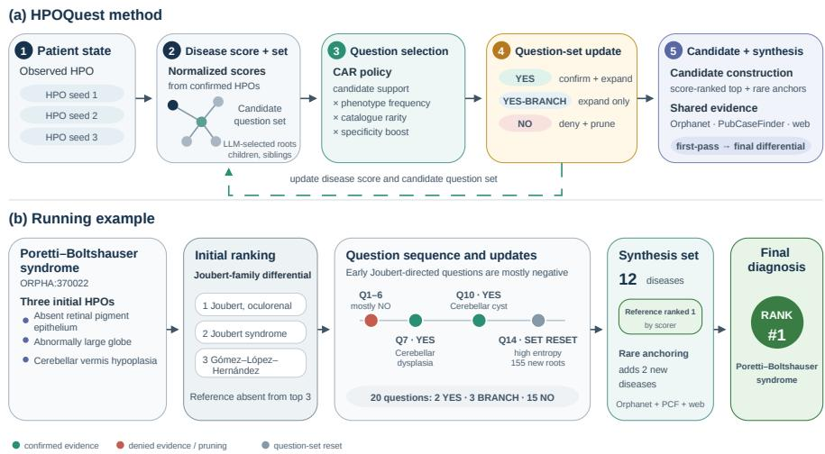

# HPOQuest: A Rare-Disease Diagnostic Agent Using Active Phenotype Acquisition

Kamilia Zaripova1,2,3,4 , Nassir Navab1,3 , Azade Farshad1,3,5† , and Annalisa Marsico2†

1 Technical University of Munich, Munich, Germany

2 Computational Health Center, Helmholtz Center Munich, Oberschleißheim, Germany

3 Munich Center for Machine Learning (MCML), Munich, Germany Munich Data Science Institute (MDSI), Munich, Germany 5 Aalto University, Espoo, Finland kamilia.zaripova@tum.de

Abstract. More than 300 million people worldwide are afected by one of over 7,000 known rare diseases, yet diagnosis remains dificult because patients initially present with incomplete and heterogeneous phenotypes. We present HPOQuest, a training-free framework for sequential phenotype acquisition in rare-disease diagnosis. Starting from a small set of observed patient phenotypes, HPOQuest maintains a probabilistic disease ranking and iteratively selects informative follow-up questions to support clinicians during patient assessment. Confirmed phenotypes update the disease ranking, while all responses update the candidate question set. Across four benchmark cohorts, HPOQuest substantially improves diagnosis from sparse initial phenotypes, with gains of up to 30% points at Recall@1 and 45% points at Recall@5. These results demonstrate that sequential phenotype acquisition can substantially improve rare-disease diagnosis from limited initial clinical evidence.

Keywords: Rare disease diagnosis, Sequential phenotype acquisition, Human Phenotype Ontology, Active information acquisition

## 1 Introduction

Although individually rare, each afecting fewer than 1 in 2,000 people in Europe, rare diseases collectively afect more than 300 million people worldwide and remain dificult to diagnose. Clinicians typically begin with a few signs and symptoms and refine the diferential through targeted questions, examinations, and tests. Patient findings are commonly represented using the Human Phenotype Ontology (HPO), a hierarchy of more than 20,000 phenotypic abnormalities. However, extensive overlap among diseases and variation among patients with the same disease leave many diagnoses plausible from only a few initial terms.

These terms also vary in diagnostic value: specific findings may identify the relevant disease family, whereas common, nonspecific, or incidental findings may provide little guidance.

Current rare-disease systems primarily diagnose from observed phenotype profiles or augment diagnosis with retrieval and LLM reasoning, but do not explicitly address sequential, response-dependent phenotype acquisition. Existing rare-disease methods primarily model disease–phenotype associations or generate diagnoses assuming fully supplied phenotype profiles [3,24]. RareBench [4] benchmarks phenotype extraction and rare-disease diagnosis, while systems such as DeepRare [24] and RDguru [23] combine LLMs with phenotype processing, retrieval, and diagnostic tools. DeepRare diagnoses from a supplied phenotype profile, whereas RDguru performs interactive phenotype acquisition but starts from 50% of the recorded phenotypes and relies on a multi-component GPT-4- based agent. PhenoDP [21] recommends one additional phenotype from partially observed profiles without modeling sequential patient-dependent questioning.

Clinical questioning has been studied by MediQ and MedKGI through freeform question asking and information-guided test selection [12,20]. MedClarify [22] similarly selects free-form questions using expected information gain. LA-CDM [2] learns cost-eficient test selection using reinforcement learning within four abdominal diseases, while other systems learn diagnostic trajectories or employ specialized diagnostic agents [10,17]. Earlier active feature acquisition methods rely on model attribution [19] or information-theoretic selection [9], whereas ASIG [8] learns an LLM-based acquisition policy on 20 Questions and transfers it to MediQ. Together, these methods address related information-acquisition problems but not sequential, response-dependent phenotype selection over the HPO hierarchy across thousands of rare diseases.

Selecting the next phenotype remains challenging because the HPO contains more than 20,000 hierarchically related terms, diseases share overlapping phenotype profiles, and each response changes both the candidate diseases and the valid follow-up questions. HPOQuest addresses this setting by starting from the same three seed phenotypes for every patient, compared with median completeprofile sizes of 9–17.5 HPO terms. It iteratively selects a limited number of valid HPO questions, and updates both the candidate diseases and the available follow-up questions after each response. Its training-free acquisition policy prioritizes questions using the current candidate diseases, disease–phenotype association frequencies, and phenotype specificity.

HPOQuest uses a locally deployable, in-clinic, open-weight model and compares all question selection methods using the same inputs, budget, responses, retrieval, and diagnostic components. We contribute (i) an ontology-constrained framework for phenotype acquisition from retrospective HPO records, where three-way responses expand the candidate question set toward confirmed descendants or prune absent subtrees; (ii) a training-free, candidate-anchored policy for hierarchical phenotype acquisition; and (iii) a controlled benchmark demonstrating when active phenotype acquisition improves rare-disease diagnosis. When sparse no-acquisition diagnosis is already informative, HPOQuest remains competitive with the strongest baseline across all evaluated cutofs. When both sparse baselines fail, as on the MME cohort, HPOQuest improves recall by 30.0– 45.0 percentage points. HPOQuest therefore complements accessible LLM and retrieved knowledge while providing its largest gains when that knowledge is insuficient.

  
Fig. 1. HPOQuest. (a) Starting from three seed HPO phenotypes, HPOQuest iteratively updates disease scores and the ontology-constrained candidate question set. The candidate-anchored rarity (CAR) policy selects follow-up questions, responses update both the disease ranking and candidate set, and the acquired phenotypes are combined with shared biomedical evidence to produce the final ranked diferential diagnosis. (b) Representative diagnostic trajectory for a patient with Poretti–Boltshauser syndrome, showing how sequential phenotype acquisition eliminates competing diagnoses and promotes the reference disease to rank 1.

## 2 Method

The Human Phenotype Ontology (HPO) is a directed acyclic graph whose nodes represent clinical abnormalities and whose edges connect general phenotypes to more specific ones. HPOQuest uses these terms as candidate questions. Starting from a small set of observed phenotypes, it repeatedly ranks diseases, selects valid follow-up questions, and updates both the disease ranking and candidate question set after each response. The acquired phenotypes are then combined with retrieved biomedical evidence to produce a ranked diferential diagnosis.

Patient state and disease posterior. HPOQuest begins with only K observed seed phenotypes and iteratively acquires additional evidence. Confirmed phenotypes are used to rank diseases, and the ranking is updated after every new confirmation to guide question selection. Let H denote the set of HPO terms and

D the disease catalogue. Each disease d $\in \mathcal { D }$ is associated with an HPO profile profile(d) and phenotype frequencies $P ( h \mid d )$ . For patient $p , \mathcal { H } ^ { + } ( p )$ denotes the complete recorded positive phenotype set, with $S \subseteq \mathcal { H } ^ { + } ( p )$ the initially observed seed phenotypes. HPOQuest may ask at most B additional phenotype questions. During evaluation, responses are generated deterministically from the recorded patient profile:

$$
a ( h ) = \left\{ \begin{array} { l l } { \mathrm { Y E S , ~ } } & { h \in \mathcal { H } ^ { + } ( p ) , } \\ { \mathrm { Y E S - B R A N C H , ~ } } & { h \notin \mathcal { H } ^ { + } ( p ) \mathrm { ~ a n d ~ } \mathrm { D e s c } ( h ) \cap \mathcal { H } ^ { + } ( p ) \neq \emptyset , } \\ { \mathrm { N O , ~ } } & { \mathrm { o t h e r w i s e . } } \end{array} \right.\tag{1}
$$

Because the response simulator is defined only with respect to the recorded positive phenotype set $\mathcal { H } ^ { + } ( \boldsymbol { p } )$ , it adopts a closed-world assumption: terms absent from $\mathcal { H } ^ { + } ( \boldsymbol { p } )$ , with no recorded descendant, are treated as negative. Here, Desc(h) contains the more specific HPO terms below h. A yes confirms $h ;$ yes-branch indicates a recorded descendant; and no denies h. We maintain confirmed and denied sets $\mathcal { C }$ and $\mathcal { N }$ , initialized as ${ \mathcal { C } } = { \mathcal { S } }$ and ${ \mathcal { N } } = \emptyset ;$ ; a yes-branch term is added to neither set.

Confirmed phenotypes contribute weighted evidence for associated diseases. The weight $w _ { h }$ downweights generic seed phenotypes, while phenotypes confirmed during questioning always receive unit weight:

We first measure how widely phenotype h occurs across disease profiles:

$$
\widehat { p } ( h ) = \frac { | \{ d \in \mathcal { D } : h \in \mathrm { p r o f i l e } ( d ) \} | } { | \mathcal { D } | } , \qquad w _ { h } = \left\{ \begin{array} { l l } { \gamma , } & { h \in \mathcal { S } \mathrm { a n d } \widehat { p } ( h ) > \theta _ { s } , } \\ { 1 , } & { \mathrm { o t h e r w i s e } . } \end{array} \right.\tag{2}
$$

Here, ${ \hat { p } } ( h )$ is the fraction of diseases associated with $h , \theta _ { s }$ identifies generic seed phenotypes, and $\gamma \in ( 0 , 1 )$ is their downweighting factor. If all seeds exceed $\theta _ { s } ,$ , the least common seed retains unit weight. Phenotypes confirmed during questioning always receive unit weight. The phenotype frequencies are combined into a weighted log-compatibility score $\ell ( d \mid { \mathcal { C } } )$ , where a higher value indicates that disease is more consistent with the currently confirmed phenotypes:

$$
\ell ( d \mid \mathcal { C } ) = \sum _ { h \in \mathcal { C } } w _ { h } \log P ( h \mid d ) , \qquad \pi ( d \mid \mathcal { C } ) = \frac { \exp ( \ell ( d \mid \mathcal { C } ) ) } { \sum _ { d ^ { \prime } \in \mathcal { D } } \exp ( \ell ( d ^ { \prime } \mid \mathcal { C } ) ) } .\tag{3}
$$

The softmax normalization converts these compatibility scores into a distribution $\pi ( d \mid { \mathcal { C } } )$ over the disease catalogue, which is used to rank diseases and guide question selection. Only confirmed phenotypes modify this score; denied phenotypes are used for pruning questions and during final diagnostic synthesis.

Ontology-constrained question selection. At step t, the candidate question set $\mathcal { F } _ { t } \subset \mathcal { H }$ contains the HPO terms that may be queried next. It is initialized with the children and siblings of the seed terms. To cover relevant regions beyond these local branches, one LLM call selects additional top-level HPO categories from a fixed list, excluding categories that already contain a seed. The LLM cannot generate new HPO terms or select subsequent questions.

Before questioning, we issue one web search for each of the K seed phenotypes. Question selection itself uses only the HPO structure and the disease– phenotype associations and frequencies. Let $\mathcal { T } _ { M }$ be the M highest-ranked diseases under $\pi ( d \mid { \mathcal { C } } )$ . We quantify the catalogue rarity of phenotype h by

$$
r ( h ) = - \log \operatorname* { m a x } \{ \hat { p } ( h ) , \phi \} ,\tag{4}
$$

and identify associations that are frequent within a disease but uncommon across the catalogue:

$$
z ( h , d ) = \left\{ 1 , \quad P ( h \mid d ) \geq \theta _ { f } { \mathrm { ~ a n d ~ } } \hat { p } ( h ) \leq \theta _ { r } , \right.\tag{5}
$$

The acquisition score combines the current disease ranking, within-disease phenotype frequency, catalogue rarity, and a specificity boost for phenotypes that are common within a disease but rare overall. The hyperparameters $\lambda \geq 0$ and $\beta \geq 0$ control the influence of the disease ranking and specificity boost. Our candidate-anchored rarity (CAR) policy assigns each eligible question $h \in \mathcal { F } _ { t }$ the score

$$
s ( h ) = \sum _ { d \in \mathcal { T } _ { M } } \underbrace { ( 1 + \lambda \pi ( d \mid \mathcal { C } ) ) } _ { \mathrm { c u r r e n t ~ d i s e a s e ~ r a n k ~ w i t h i n - d i s e a s e ~ f r e q u e n c y ~ c a t a l o g u e ~ r a r i t y ~ s p e c i f i c i t y ~ b o o s t } } .\tag{6}
$$

Higher scores identify phenotypes that are both characteristic of the current candidate diseases and discriminative across the disease catalogue. Questions with $s ( h ) \geq \tau$ are selected in descending score order, up to min $\{ b , B - q \}$ , where b is the per-round limit and q the number of questions already issued.

Question-set update and stopping. A yes or yes-branch response adds the queried term’s children to $\mathcal { F } _ { t } . \mathrm { ~ A ~ }$ no response removes the queried term and all its descendants. Queried and removed terms cannot be selected again.

Let $\mathcal { T } _ { L }$ contain the L highest-ranked diseases and let $\begin{array} { r } { \pi ( d ) = \pi ( d ) / \sum _ { d ^ { \prime } \in \mathcal { T } _ { L } } \pi ( d ^ { \prime } ) } \end{array}$ We measure uncertainty among these diseases as

$$
H _ { L } = - \sum _ { d \in \mathcal { T } _ { L } } \bar { \pi } ( d ) \log \bar { \pi } ( d ) .\tag{7}
$$

Questioning stops when the budget is exhausted or when $H _ { L } < \eta _ { \mathrm { s t o p } }$ after at least $C _ { \mathrm { m i n } }$ phenotypes have been confirmed. The question set may be reset once to branches not covered by the seeds if the top three diseases remain unchanged for three rounds without a new confirmation, or if $H _ { L } \ > \ \eta _ { \mathrm { r e s e t } }$ after $Q _ { \mathrm { { r e s e t } } }$ questions.

Candidate construction and diagnostic synthesis. Because the ranking induced by $\pi ( d \mid { \mathcal { C } } )$ may under-rank diseases supported by few rare phenotypes,

Table 1. Overall diagnosis results on the four RareBench cohorts (%).
<table><tr><td rowspan="2">Method</td><td colspan="3">MME (n = 40)</td><td colspan="3">HMS  $( n = 8 8 )$ </td><td colspan="3">LIRICAL  $( n = 3 7 0 )$ </td><td colspan="3">RAMEDIS  $( n = 6 2 4 )$ </td></tr><tr><td>R@1</td><td>R@3</td><td>R@5</td><td>R@1</td><td>R@3</td><td>R@5</td><td>R@1</td><td>R@3</td><td>R@5</td><td>R@1</td><td>R@3</td><td>R@5</td></tr><tr><td colspan="10">Complete phenotype profile: all recorded HPO terms</td><td colspan="3"></td></tr><tr><td>PhenoBrain[15]</td><td>25.0</td><td>45.0</td><td>80.0</td><td>22.4</td><td>32.9</td><td>42.4</td><td>27.1</td><td>44.7</td><td>57.7</td><td>20.7</td><td>38.3</td><td>55.8</td></tr><tr><td>PubCaseFinder[6]</td><td>40.0</td><td>57.5</td><td>57.5</td><td>7.3</td><td>13.4</td><td>15.9</td><td>37.8</td><td>47.0</td><td>48.9</td><td>25.8</td><td>32.6</td><td>40.0</td></tr><tr><td>GPT-4o[11]</td><td>2.5</td><td>5.0</td><td>10.0</td><td>47.7</td><td>60.2</td><td>65.9</td><td>31.1</td><td>42.2</td><td>48.9</td><td>35.5</td><td>52.2</td><td>61.1</td></tr><tr><td>DeepSeek R1[7]</td><td>35.0</td><td>60.0</td><td>65.0</td><td>38.6</td><td>53.4</td><td>60.2</td><td>36.8</td><td>45.1</td><td>47.6</td><td>33.2</td><td>47.6</td><td>53.2</td></tr><tr><td>DeepRare (GPT-4o)</td><td>42.5</td><td>57.5</td><td>57.7</td><td>50.0</td><td>62.5</td><td>64.8</td><td>39.5</td><td>49.2</td><td>52.4</td><td>36.9</td><td>46.4</td><td>55.4</td></tr><tr><td>DeepRare (Qwen-32B)</td><td>17.5</td><td>22.5</td><td>35.0</td><td>25.0</td><td>38.6</td><td>47.7</td><td>39.5</td><td>47.6</td><td>51.9</td><td>45.0</td><td>61.2</td><td>65.4</td></tr><tr><td colspan="10">Sparse phenotype profile: three initial HPO</td><td colspan="3"></td></tr><tr><td>DeepRare (Qwen-32B)</td><td>5.0</td><td>5.0</td><td>5.0</td><td>terms 12.5</td><td>18.2</td><td>22.7</td><td>28.6</td><td>35.1</td><td>39.2</td><td>33.2</td><td>45.0</td><td>48.9</td></tr><tr><td>Qwen-32B + web search</td><td>2.5</td><td>5.0</td><td>5.0</td><td>18.2</td><td>20.5</td><td>29.5</td><td>27.0</td><td>34.9</td><td>39.5</td><td>29.8</td><td>44.7</td><td>52.6</td></tr><tr><td>HPOQuest (Qwen-32B)</td><td>35.0</td><td>42.5</td><td>50.0</td><td>15.9</td><td>23.9</td><td>25.0</td><td>28.6</td><td>40.3</td><td>45.1</td><td>27.6</td><td>45.4</td><td>49.0</td></tr></table>

we compute

$$
\operatorname { a n c h o r } ( d ) = \ \sum _ { h \in { \mathcal { C } } \atop { \hat { p } } ( h ) \leq \theta _ { a } } r ( h ) P ( h \mid d ) .\tag{8}
$$

Disease–phenotype associations and frequencies are obtained from Orphanet [16] and HPOA [14]; OMIM-only diseases [1] without reported phenotype frequencies are assigned a fixed probability. The synthesis set contains the top T diseases under π, up to A previously unseen diseases ranked by anchor(d), and the remaining π-ranked diseases, retaining the first R unique entries.

After candidate construction, an LLM-generated web query and a Pub-CaseFinder [6] query are issued from the confirmed phenotype set. Shared retrieval evidence and each candidate’s Orphanet phenotype profile are then provided to two LLM passes, which produce a draft of size $N _ { \mathrm { d r a f t } }$ and a final ranking of size $N _ { \mathrm { f i n a l } }$ , which may include diseases outside the synthesis set.

## 3 Experimental Setup

Datasets, baselines, and policies. We evaluate on the four RareBench [4] cohorts: MME (n = 40), HMS (n = 88), LIRICAL (n = 370), and RAMEDIS $( n = 6 2 4 )$ . All sparse-input methods receive the same three seed phenotypes. For patients with more than three recorded phenotypes, we select the two phenotypes occurring in the fewest Orphanet disease profiles and sample one additional phenotype uniformly from the remaining terms using a deterministic patient-specific random seed; patients with at most three recorded phenotypes use all available terms. DeepRare [24] receives either these seeds or the complete phenotype profile. Qwen-32B + web receives only the seeds and web access, without phenotype acquisition or candidate retrieval. All controlled systems use the same diagnoser and judge, with DeepRare’s private similar-case retrieval disabled. DeepRare with the complete phenotype profile and published full-profile results serve only as references.

Table 2. Acquisition-policy ablation on the four RareBench cohorts (%).
<table><tr><td></td><td colspan="3">MME  $( n = 4 0 )$ </td><td colspan="3">HMS  $( n = 8 8 )$ </td><td colspan="3">LIRICAL  $( n = 3 7 0 )$ </td><td colspan="3">RAMEDIS  $( n = 6 2 4 )$ </td></tr><tr><td>Configuration</td><td>R@1</td><td>R@3</td><td>R@5</td><td>R@1</td><td>R@3</td><td>R@5</td><td>R@1</td><td>R@3</td><td>R@5</td><td>R@1 R@3</td><td></td><td>R@5</td></tr><tr><td colspan="10">No acquisition, Qwen-32B, 3 HPOs</td><td></td><td></td><td></td></tr><tr><td>DeepRare</td><td>5.0</td><td>5.0</td><td>5.0</td><td>12.5</td><td>18.2</td><td>22.7</td><td>28.6</td><td>35.1</td><td>39.2</td><td>33.2</td><td>45.0</td><td>48.9</td></tr><tr><td>LLM + web search</td><td>2.5</td><td>5.0</td><td>5.0</td><td>18.2</td><td>20.5</td><td>29.5</td><td>27.0</td><td>34.9</td><td>39.5</td><td>29.8</td><td>44.7</td><td>52.6</td></tr><tr><td colspan="10">HPOQuest acquisition policies</td><td></td><td></td><td></td></tr><tr><td>LLM-guided selection</td><td>27.5</td><td>40.0</td><td>42.5</td><td>20.5</td><td>28.4</td><td>30.7</td><td>30.0</td><td>39.5</td><td>43.8</td><td>26.4</td><td>43.4</td><td>47.9</td></tr><tr><td>EIG</td><td>22.5</td><td>37.5</td><td>37.5</td><td>18.2</td><td>28.4</td><td>30.7</td><td>31.4</td><td>39.5</td><td>43.0</td><td>27.9</td><td>43.6</td><td>47.4</td></tr><tr><td>CAR</td><td>35.0</td><td>42.5</td><td>50.0</td><td>15.9</td><td>23.9</td><td>25.0</td><td>28.6</td><td>40.3</td><td>45.1</td><td>27.6</td><td>45.4</td><td>49.0</td></tr><tr><td>RRF</td><td>35.0</td><td>47.5</td><td>47.5</td><td>20.5</td><td>26.1</td><td>28.4</td><td>26.5</td><td>37.8</td><td>43.0</td><td>29.0</td><td>42.8</td><td>49.7</td></tr></table>

We compare CAR with three acquisition policies under the same experimental setting. LLM-guided selection inspired by MediQ [12] prompts an expert LLM to select from the current HPO candidate set or abstain. One-step expected information gain (EIG) [13] ranks candidate terms by their expected entropy reduction over the current top-M diseases using $P ( h \mid d ) ;$ only the ranking policy changes, while responses, including yes-branch, follow Section 2. CAR–EIG combines the CAR and EIG rankings using reciprocal rank fusion (RRF) [5] with $\kappa = 6 0$

Implementation details. We use $K \ = \ 3$ seed phenotypes, question budget $B = 2 0$ , per-round limit $b = 8 ,$ , and $M = 5 0$ diseases for question scoring. Stopping uses $( L , \eta _ { \mathrm { s t o p } } , C _ { \mathrm { m i n } } , \eta _ { \mathrm { r e s e t } } , Q _ { \mathrm { r e s e t } } ) = ( 1 0 , 0 . 8 , 4 , 1 . 2 , 1 0 )$ . CAR uses $( \theta _ { s } , \gamma , \lambda , \beta , \phi , \tau , \theta _ { f } , \theta _ { r } , \theta _ { a } ) \stackrel { - } { = } ( 0 . 0 2 , 0 . 7 , 4 , 2 , 0 . 0 0 2 , 0 . 0 2 , 0 . 5 5 , 0 . 0 2 , 0 . 0 1 )$ . Candidate construction uses $( T , A , R ) = ( 8 , 4 , 1 2 )$ . Missing HPOA frequencies are assigned $P ( h \mid d ) = 0 . 5 .$ . Anchor retrieval covers 4,283 Orphanet and 9,120 HPOA diseases. The synthesis passes use $( N _ { \mathrm { d r a f t } } , N _ { \mathrm { f i n a l } } ) = ( 1 2 , 1 5 )$ . All controlled systems use 4-bit Qwen2.5-32B-Instruct on one GPU, SerpAPI for web search, and GPT-4o-mini with DeepRare’s judging prompt. Runtime per patient is 370 s (CAR), 384 s (CAR–EIG), and 496 s/611 s (DeepRare with three/all phenotypes). We report Recall@k $( k \in \{ 1 , 3 , 5 \} )$ ), accepting predictions verified by either the LLM judge or a MONDO [18] synonym.

## 4 Results and Discussion

Overall performance. Active phenotype acquisition provides its clearest benefit on MME (Table 1), where HPOQuest with CAR improves Recall@1 $/ 3 / 5$ from 5.0/5.0/5.0% to 35.0/42.5/50.0%, exceeding the Qwen-32B full-profile DeepRare reference despite starting from only three seed phenotypes. This indicates that acquiring a small number of informative phenotypes can be more efective than relying on the complete recorded profile when the initial evidence is insuficient for diagnosis. On LIRICAL, CAR improves Recall@3 and Recall@5 while matching DeepRare-3 at Recall@1. Gains are smaller on HMS and RAMEDIS, where the strong sparse-input baselines, particularly Qwen-32B + web, suggest that the language model can already infer a plausible disease region from the initial phenotypes. In these cohorts, active acquisition primarily refines the diferential diagnosis, yielding more consistent improvements at Recall@3 and Recall@5 than at Recall@1.

Table 3. Results stratified by seed recoverability (%). R denotes seed-recoverable cases and NR non-recoverable cases. All configurations use Qwen-32B.
<table><tr><td></td><td></td><td></td><td colspan="3">DeepRare-All</td><td colspan="3">DeepRare-3</td><td colspan="3">Qwen-32B 3 + web</td><td colspan="3">HPOQuest</td></tr><tr><td>Cohort</td><td>Group</td><td>n</td><td>R@1</td><td>R@3</td><td>R@5</td><td>R@1</td><td>R@3</td><td>R@5</td><td>R@1</td><td>R@3</td><td>R@5</td><td>R@1</td><td>R@3</td><td>R@5</td></tr><tr><td>MME</td><td>R</td><td>9</td><td>0.0</td><td>0.0</td><td>0.0</td><td>0.0</td><td>0.0</td><td>0.0</td><td>0.0</td><td>0.0</td><td>0.0</td><td>77.8</td><td>77.8</td><td>88.9</td></tr><tr><td></td><td>NR</td><td>31</td><td>22.6</td><td>29.0</td><td>45.2</td><td>6.5</td><td>6.5</td><td>6.5</td><td>3.2</td><td>6.5</td><td>6.5</td><td>22.6</td><td>32.3</td><td>38.7</td></tr><tr><td>HMS</td><td>R</td><td>7</td><td>28.6</td><td>42.9</td><td>57.1</td><td>14.3</td><td>28.6</td><td>28.6</td><td>0.0</td><td>14.3</td><td>28.6</td><td>0.0</td><td>57.1</td><td>57.1</td></tr><tr><td></td><td>NR</td><td>81</td><td>24.7</td><td>38.3</td><td>46.9</td><td>12.3</td><td>17.3</td><td>22.2</td><td>19.8</td><td>21.0</td><td>29.6</td><td>17.3</td><td>21.0</td><td>22.2</td></tr><tr><td>LIRICAL</td><td>R</td><td>74</td><td>54.1</td><td>62.2</td><td>68.9</td><td>39.2</td><td>47.3</td><td>56.8</td><td>43.2</td><td>58.1</td><td>66.2</td><td>47.3</td><td>73.0</td><td>81.1</td></tr><tr><td></td><td>NR</td><td>296</td><td>35.8</td><td>43.9</td><td>47.6</td><td>26.0</td><td>32.1</td><td>34.8</td><td>23.0</td><td>29.1</td><td>32.8</td><td>24.0</td><td>32.1</td><td>36.1</td></tr><tr><td>RAMEDIS</td><td>R</td><td>114</td><td>52.6</td><td>76.3</td><td>80.7</td><td>46.5</td><td>78.1</td><td>78.1</td><td>44.7</td><td>68.4</td><td>86.0</td><td>40.4</td><td>87.7</td><td>91.2</td></tr><tr><td></td><td>NR</td><td>510</td><td>43.3</td><td>57.8</td><td>62.0</td><td>30.2</td><td>37.6</td><td>42.4</td><td>26.5</td><td>39.4</td><td>45.1</td><td>24.7</td><td>35.9</td><td>39.6</td></tr></table>

Acquisition policies. No single acquisition policy dominates across cohorts (Table 2). CAR performs best at deeper cutofs on MME and LIRICAL, RRF achieves the highest Recall@3 on MME and Recall@1/5 on RAMEDIS, while EIG and LLM-guided selection perform best on HMS. These trends reflect the complementary objectives of the policies: CAR prioritizes phenotype specificity within the current candidate set, EIG explicitly reduces posterior uncertainty, and LLM-guided selection leverages the language model’s prior biomedical knowledge. The results therefore suggest that the optimal acquisition strategy depends on the diagnostic setting rather than one policy being uniformly superior.

Seed recoverability. Table 3 stratifies patients according to seed recoverability, defined as whether the reference disease appears among the top-15 Orphanet candidates from the three seed phenotypes alone. Acquisition is most efective for seed-recoverable cases, raising Recall@1 from 0.0% to 77.8% on MME and from 39.2% to 47.3% on LIRICAL, with larger gains at deeper cutofs. For nonrecoverable cases, improvements remain limited across cohorts, suggesting that active questioning is most efective when the initial seed phenotypes already provide suficient signal to identify a plausible diagnostic region. All reported 0.0% entries are observed results, indicating that no patient in the corresponding subgroup was ranked. Taken together, the results reveal two operating regimes. When the initial phenotypes provide only a weak signal for the language model, as on MME, active phenotype acquisition substantially improves diagnostic accuracy. In contrast, when the language model can already infer a plausible disease region from the seed phenotypes, as suggested by the strong Qwen-32B + web baselines on HMS, LIRICAL, and RAMEDIS, acquisition primarily refines the ordering of the diferential diagnosis rather than changing the top-ranked prediction.

## 5 Conclusion

We introduced HPOQuest, a training-free framework for active HPO acquisition that formulates rare-disease diagnosis as sequential selection of ontologyconstrained phenotype questions. Across four RareBench cohorts, HPOQuest substantially improves diagnosis when sparse initial phenotypes provide limited diagnostic evidence, while remaining competitive when the initial phenotype signal is already informative. Our analyses further show that the efectiveness of active acquisition depends on both the informativeness of the initial phenotypes and the strength of the language model’s prior knowledge, suggesting that structured questioning primarily complements existing LLM capabilities by refining the diferential diagnosis. Future work should investigate robustness across different initial phenotype settings and language models.

Disclosure of Interests. The authors have no competing interests to declare that are relevant to the content of this article.

## References

1. Amberger, J.S., Bocchini, C.A., Scott, A.F., Hamosh, A.: Omim. org: leveraging knowledge across phenotype–gene relationships. Nucleic acids research 47(D1), D1038–D1043 (2019)

2. Bani-Harouni, D., Pellegrini, C., Özsoy, E., Navab, N., Keicher, M.: Language agents for hypothesis-driven clinical decision making with reinforcement learning. In: The Fourteenth International Conference on Learning Representations (2025)

3. Chen, S., Nguyen, Q.M., Hu, Y., Liu, C., Weng, C., Wang, K.: Phenoss: Phenotype semantic similarity-based approach for rare disease prediction and patient clustering. medRxiv (2026)

4. Chen, X., Mao, X., Guo, Q., Wang, L., Zhang, S., Chen, T.: Rarebench: can llms serve as rare diseases specialists? In: Proceedings of the 30th ACM SIGKDD conference on knowledge discovery and data mining. pp. 4850–4861 (2024)

5. Cormack, G.V., Clarke, C.L., Buettcher, S.: Reciprocal rank fusion outperforms condorcet and individual rank learning methods. In: Proceedings of the 32nd international ACM SIGIR conference on Research and development in information retrieval. pp. 758–759 (2009)

6. Fujiwara, T., Yamamoto, Y., Kim, J.D., Buske, O., Takagi, T.: Pubcasefinder: A case-report-based, phenotype-driven diferential-diagnosis system for rare diseases. The American Journal of Human Genetics 103(3), 389–399 (2018)

7. Guo, D., Yang, D., Zhang, H., Song, J., Wang, P., Zhu, Q., Xu, R., Zhang, R., Ma, S., Bi, X., et al.: Deepseek-r1: Incentivizing reasoning capability in llms via reinforcement learning. arXiv preprint arXiv:2501.12948 (2025)

8. Hartmann, J., Harvey, J., Navott, J., Wang, E.Y., Melo, L.C., Cipcigan, F., Zhang, C., Abate, A.: Amortising bayesian experimental design for sequential information gathering in llms. arXiv preprint arXiv:2607.03426 (2026)

9. He, W., Mao, X., Ma, C., Huang, Y., Hernàndez-Lobato, J.M., Chen, T.: Bsoda: a bipartite scalable framework for online disease diagnosis. In: Proceedings of the ACM Web Conference 2022. pp. 2511–2521 (2022)

10. Hsu, H.L., Wang, Z., Zhang, D., Chen, N.C., Wang, J., Ding, J.E., Hsu, C.H., Wang, G., Liu, F., Hung, F.M., et al.: Medaction: Towards active multi-turn clinical diagnostic llms. arXiv preprint arXiv:2605.07305 (2026)

11. Hurst, A., Lerer, A., Goucher, A.P., Perelman, A., Ramesh, A., Clark, A., Ostrow, A., Welihinda, A., Hayes, A., Radford, A., et al.: Gpt-4o system card. arXiv preprint arXiv:2410.21276 (2024)

12. Li, S.S., Balachandran, V., Feng, S., Ilgen, J.S., Pierson, E., Koh, P.W., Tsvetkov, Y.: Mediq: Question-asking llms and a benchmark for reliable interactive clinical reasoning. Advances in Neural Information Processing Systems 37, 28858–28888 (2024)

13. Lindley, D.V.: On a measure of the information provided by an experiment. The Annals of Mathematical Statistics 27(4), 986–1005 (1956)

14. Ma, G., NM, B., et al.: The human phenotype ontology in 2024: phenotypes around the world. Nucleic Acids Res [Internet] 52, D1 (2024)

15. Mao, X., Huang, Y., Jin, Y., Wang, L., Chen, X., Liu, H., Yang, X., Xu, H., Luan, X., Xiao, Y., et al.: A phenotype-based ai pipeline outperforms human experts in diferentially diagnosing rare diseases using ehrs. NPJ Digital Medicine 8(1), 68 (2025)

16. Rath, A., Olry, A., Dhombres, F., Brandt, M.M., Urbero, B., Ayme, S.: Representation of rare diseases in health information systems: the orphanet approach to serve a wide range of end users. Human mutation 33(5), 803–808 (2012)

17. Sanghvi, A., Akash, N., Imam, R., Sharma, A., Jain, M.: Medxagent: Multi-agent consultation for interactive medical diagnosis. arXiv preprint arXiv:2606.03416 (2026)

18. Vasilevsky, N., Essaid, S., Matentzoglu, N., Harris, N.L., Haendel, M., Robinson, P., Mungall, C.J.: Mondo disease ontology: harmonizing disease concepts across the world. In: CEUR Workshop Proceedings, CEUR-WS. vol. 2807, pp. 1–2 (2020)

19. Vivar, G., Mullakaeva, K., Zwergal, A., Navab, N., Ahmadi, S.A.: Peri-diagnostic decision support through cost-eficient feature acquisition at test-time. In: International conference on medical image computing and computer-assisted intervention. pp. 572–581. Springer (2020)

20. Wang, Q., Sheng, R., Li, Y., Qu, H., Sun, Y., Zhu, M.: Medkgi: Iterative diferential diagnosis with medical knowledge graphs and information-guided inquiring. arXiv preprint arXiv:2512.24181 (2025)

21. Wen, B., Shi, S., Long, Y., Dang, Y., Tian, W.: Phenodp: leveraging deep learning for phenotype-based case reporting, disease ranking, and symptom recommendation. Genome Medicine 17(1), 67 (2025)

22. Wong, H.M., Heesen, P., Janetzky, P., Bendszus, M., Feuerriegel, S.: Medclarify: An information-seeking ai agent for medical diagnosis with case-specific follow-up questions. arXiv preprint arXiv:2602.17308 (2026)

23. Yang, J., Shu, L., Duan, H., Li, H.: Rdguru: a conversational intelligent agent for rare diseases. IEEE Journal of Biomedical and Health Informatics 29(9), 6366–6378 (2024)

24. Zhao, W., Wu, C., Fan, Y., Qiu, P., Zhang, X., Sun, Y., Zhou, X., Zhang, S., Peng, Y., Wang, Y., et al.: An agentic system for rare disease diagnosis with traceable reasoning. Nature 651(8106), 775–784 (2026)