# How Many Labels Does Model Choice Need? Certificates and Budgets for Selective Prediction

Tetsuji Kuboyama Computer Centre, Gakushuin University ori-cs.arxiv@tk.cc.gakushuin.ac.jp

September 16, 2026

## Abstract

Classifiers can make identical predictions yet require labels to compare their selective performance: confidence ranks weight the same errors diferently. We quantify this requirement for the area under the generalized risk–coverage curve (AUGRC). A prelabel lower bound rules out insuficient budgets. With all labels known, a covering linear program bounds the minimum number of labels suficient to fix the winner (the certificate size) within K 1 labels for K candidates. For fixed K, independent uniform orders and identical predictions, the prelabel bound approaches one quarter of the pool. With iid Bernoulli errors independent of the orders, every exact acquisition policy reads almost all labels asymptotically, although a two-candidate certificate needs only half. Across 108 feature-panel comparisons on nine datasets, disagreement labels settle every accuracy choice but no AUGRC choice. A 20% budget is ruled out in 96 conditions; certificates need 56–57% on average. On ten conditions with pretrained image classifiers, confidence-score choice reads 68–91% of 10,000 labels for exact selection and 50–67% with AUGRC tolerance $5 \times 1 0 ^ { - 4 }$ . An exact stopping test works with any acquisition order. Together, these results link confidence ranks to label budgets and certified model comparison.

## 1 Introduction

How many labels are needed to choose between trained models? For expensive labels, this determines whether a comparison fits the budget. We fix predictions and confidence ranks on a set of evaluation examples (the pool) and seek the winner that all pool labels would give, under a fixed tie rule.

For accuracy, a row on which every candidate predicts the same label cannot change their ordering. For selective prediction, where a classifier accepts its most confident predictions first, that same row can decide the winner. AUGRC integrates accepted-error mass over coverage (Traub et al., 2024); the earlier an error is accepted, the more it counts. Figure 1 shows this diference using two rows.

Confidence ranks can impose substantial label requirements even when predictions agree. Here, information is measured by the number of evaluation labels revealed. A certificate is a label set that fixes the winner regardless of unread labels. We give a lower bound before labeling, detect a certificate during acquisition, and bound its minimum size within K 1 labels afterwards. This separates the information a comparison requires from the cost of finding it.

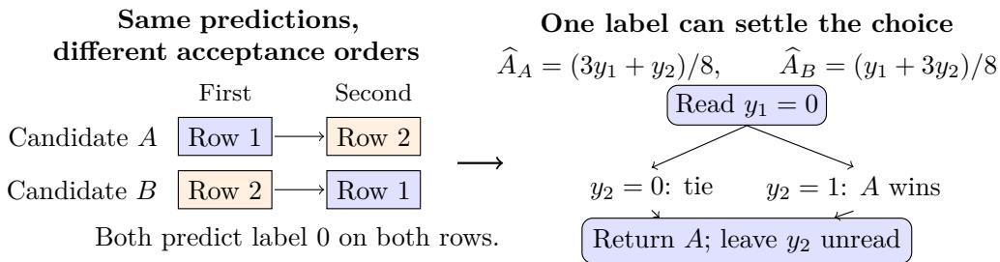  
Figure 1: Same predictions do not settle a selective comparison. Both candidates predict 0 but accept rows in opposite orders. Before reading labels $y _ { i }$ , either can win: $y = ( 1 , 0 )$ favors B, and $\boldsymbol { y } = ( 0 , 1 )$ favors A. After reading $y _ { 1 } = 0$ , both completions select A under the fixed rule that ties favor A. Accuracy always ties; $\widehat { A }$ denotes AUGRC (lower is better), with weights defined in Section 2.

Our contributions are:

1. Ranks require information. With identical predictions and independent uniform confidence orders, the prelabel bound tends to one quarter of the pool; with iid errors independent of ranks, certificates need at least half, but every exact policy reads almost all labels (Propositions 2 and 3).

2. The requirement is computable. We give an exact stopping test valid after adaptive queries (Theorem 1), a covering LP bounding the minimum certificate within $K - 1$ labels (Theorem 2), and a prelabel lower bound (Theorem 3).

3. The bounds guide evaluation. Nine datasets show when labels on agreement rows are necessary, which budgets are insuficient, and how requirements change with tolerance and candidate sets. Pretrained multiclass classifiers demonstrate certified confidence-score choice.

The paper follows the evaluation workflow: Section 2 fixes the objective, Section 3 gives the stopping test, Section 4 derives label requirements and their proofs, and Section 5 turns the bounds into budget decisions. Section 6 combines the experimental results with their protocols and follow-up analyses.

## 2 Setting

Let X be an input and $Y \in \{ 0 , 1 \}$ its label. Let f be a classifier and g a confidence score, larger for earlier acceptance. With loss $\ell = { \bf 1 } \{ f ( X ) \neq Y \}$ , let $a _ { c } ( X ) \in \{ 0 , 1 \}$ indicate acceptance of the most confident fraction c of the population, randomizing independently within score ties. Generalized risk and its area are

$$
G ( c ) = \mathbb { E } [ \ell a _ { c } ( X ) ] , \qquad A = \int _ { 0 } ^ { 1 } G ( c ) d c .\tag{1}
$$

AUGRC integrates accepted-error mass, rather than conditional error among accepted examples (Traub et al., 2024). For binary loss, $0 \le A \le 1 / 2$

Finite-pool convention. For n fixed evaluation rows with binary losses $\ell _ { i }$ , we linearly interpolate accepted-error mass between consecutive coverage points and average over all orders within a confidence tie. A tied block occupying zero-based positions $[ s , e )$ gives each row the weight

$$
\omega _ { i } = \frac { 2 n - s - e } { 2 n ^ { 2 } } , \qquad \widehat { A } = \sum _ { i } \omega _ { i } \ell _ { i } .\tag{2}
$$

The weights sum to $1 / 2$ . With $\bar { \ell } = n ^ { - 1 } \sum _ { i } \ell _ { i }$ , the right-endpoint sum, ${ \widehat { A } } + { \bar { \ell } } / ( 2 n )$ , can change a comparison; all results use (2).

Tie weights. At zero-based rank $^ { r , }$ an error contributes $( n - r - 1 / 2 ) / n ^ { 2 }$ to the trapezoidal integral. Averaging r over $[ s , e )$ gives (2). The right-endpoint sum adds $1 / ( 2 n ^ { 2 } )$ per error.

## 3 Certifying a choice from partial labels

Freeze K classifier–confidence pairs before starting label acquisition on an evaluation pool of n rows. Features, predicted labels $\hat { y } _ { j i } \in \{ 0 , 1 \}$ and confidence ranks are known for every row; labels are not. Querying row i reveals its label $y _ { i }$ to all candidates. The target is the candidate with the smallest AUGRC on the full pool, with the smaller index breaking ties: the choice one would make with all pool labels.

Scale the empirical AUGRC as $r _ { j } ( y ) = 2 n ^ { 2 } \widehat { A } _ { j } ( y )$ . With integer weights $w _ { j i } = 2 n ^ { 2 } \omega _ { j i }$ , this gives

$$
\begin{array} { l } { { r _ { j } ( y ) = c _ { j } + \displaystyle \sum _ { i } a _ { j i } y _ { i } , } } \\ { { \displaystyle c _ { j } = \sum _ { i } w _ { j i } \hat { y } _ { j i } , \quad a _ { j i } = w _ { j i } ( 1 - 2 \hat { y } _ { j i } ) . } } \end{array}\tag{3}
$$

The risk is linear in the labels because each row’s loss is linear in $y _ { i }$ . For the sets of queried rows O and unread rows $U _ { ; }$ , put $b _ { j k i } = a _ { j i } - a _ { k i }$ . The exact lower and upper bounds on $r _ { j } - r _ { k }$ over all assignments to the unread labels are

$$
\begin{array} { l } { { \displaystyle L _ { j k } = c _ { j } - c _ { k } + \sum _ { i \in O } b _ { j k i } y _ { i } + \sum _ { i \in U } \operatorname* { m i n } ( 0 , b _ { j k i } ) , } } \\ { { \displaystyle H _ { j k } = c _ { j } - c _ { k } + \sum _ { i \in O } b _ { j k i } y _ { i } + \sum _ { i \in U } \operatorname* { m a x } ( 0 , b _ { j k i } ) . } } \end{array}\tag{4}
$$

Each endpoint is attained by setting every unread label according to the sign of its coeficient.

Theorem 1 (Exact finite-pool stopping). With fixed predictions and confidence weights and no constraints on the unread binary labels, candidate k is the winner under the fixed tie rule for every label completion if and only if, for every $j \neq k$ ν，

$$
L _ { j k } \geq 0 \quad ( j > k ) , \qquad L _ { j k } > 0 \quad ( j < k ) .\tag{5}
$$

The condition is valid after arbitrary adaptive queries. If it fails for every k, the current labels do not determine the winner.

Proof. The inequalities say that k beats, or wins the index tie against, every competitor under every completion. If one inequality fails, the completion attaining its lower endpoint makes that competitor defeat k or win the tie, so k is not a universal winner. The argument is pointwise in the observation history, so adaptive querying does not change it. □

Reading row i raises $L _ { j k }$ by $b _ { j k i } y _ { i } - \operatorname* { m i n } ( 0 , b _ { j k i } )$ , which is either 0 or $| b _ { j k i } |$ . For $\tau > 0$ requiring $L _ { j k } \ge - \tau \cdot 2 n ^ { 2 }$ for every $j \neq$ k certifies that k is within τ AUGRC of the minimizer under every completion. Section 6.5 uses this relaxation; $\tau = 0$ retains the exact tie rule in (5).

A worked example. Figure 2 runs the test on four rows. Row 3, read first, raises the lower bound of $r _ { A } - r _ { B }$ from 6 to 2; row 4 only lowers the upper bound. The two agreement rows then lift the lower bound to $2 > 0$ and certify B. The certificate LP of Section 4 shows afterwards that three labels suficed and that row 4 was unnecessary for this labeling.

<table><tr><td>Row</td><td> $w _ { A i }$ </td><td> $w _ { B i }$ </td><td> $\hat { y } _ { A i }$ </td><td> $\hat { y } _ { B i }$ </td><td> $b _ { i }$ </td><td>Yi</td><td>gi</td><td>Read</td></tr><tr><td>1</td><td>7</td><td>5</td><td>0</td><td>0</td><td>+2</td><td>1</td><td>2</td><td>3rd</td></tr><tr><td>2</td><td>5</td><td>7</td><td>0</td><td>0</td><td>-2</td><td>0</td><td>2</td><td>4th</td></tr><tr><td>3</td><td>3</td><td>1</td><td>1</td><td>0</td><td>-4</td><td>0</td><td>4</td><td>1st</td></tr><tr><td>4</td><td>1</td><td>3</td><td>0</td><td>1</td><td>+4</td><td>0</td><td>0</td><td>2nd</td></tr></table>

Figure 2: The test at work on four rows. Confidence orders are 1, 2, 3, 4 (A) and 2, 1, 4, 3 (B), giving $r _ { A } - r _ { B } = 2 y _ { 1 } - 2 y _ { 2 } - 4 y _ { 3 } + 4 y _ { 4 }$ . Write $b _ { i } = b _ { A B i }$ and $g _ { i } = b _ { i } y _ { i } - \operatorname* { m i n } ( 0 , b _ { i } )$ , the increase in $L _ { A B }$ on reading row i. Read in decreasing $| b _ { i } |$ , breaking ties by row index; $y _ { i }$ and $g _ { i }$ are shown with hindsight. Since ties favor $A ,$ the test certifies B only when $L _ { A B } > 0 $ , after the fourth label.

Why sharing the labels matters. An interval for each risk separately, with the unread labels chosen independently for each candidate, is a valid but weaker test. For example, if both risks contain the same unread term $3 y _ { i }$ , that term cancels in their diference. Subtracting its separate intervals $[ 0 , 3 ]$ instead gives $[ - 3 , 3 ]$ , combining incompatible values of the same label. Let $\begin{array} { r } { L _ { j k } ^ { \mathrm { s e p } } = \operatorname* { m i n } _ { y } r _ { j } ( y ) - \operatorname* { m a x } _ { y } r _ { k } ( y ) } \end{array}$ with the observed labels fixed.

Proposition 1 (Gap from separate intervals). For the risks in (3),

$$
L _ { j k } - L _ { j k } ^ { \mathrm { s e p } } = \sum _ { i \in U : \hat { y } _ { j i } = \hat { y } _ { k i } } \operatorname* { m i n } ( w _ { j i } , w _ { k i } ) .\tag{6}
$$

Hence the shared test never stops later than the separate test along the same query order.

Proof. Write $\ell _ { j i } = 1 \{ \hat { y } _ { j i } \neq y _ { i } \}$ . Minimizing $w _ { j i } \ell _ { j i } - w _ { k i } \ell _ { k i }$ with the two losses chosen independently $\mathrm { g i v e s } - w _ { k i }$ . If predictions disagree, $y _ { i } = \hat { y } _ { j i }$ attains this jointly. If they agree, their common loss takes both values 0 and 1, whether the shared prediction is 0 or 1. The joint minimum is therefore min $( 0 , w _ { j i } - w _ { k i } )$ , whose gap from $- w _ { k i }$ is min $( w _ { j i } , w _ { k i } )$ . Observed rows contribute equally to both bounds. □

Only agreement rows contribute to this gap. The shared bound uses one common loss per row, multiplied by the diference in rank weights (Figure 1). Centering the risks on a common label term recovers part of the gap. Section 6.4 measures both.

Common-term removal. Subtracting $\sum _ { i } t _ { i } y _ { i }$ from every risk leaves its argmin unchanged. Using $\operatorname* { m i n } ( 0 , z ) = ( z - | z | ) / 2$ , the separate comparison’s remaining gap is

$$
L _ { j k } - L _ { j k } ^ { \mathrm { s e p , t } } = \frac { 1 } { 2 } \sum _ { i \in U } \left( \left| a _ { j i } - t _ { i } \right| + \left| a _ { k i } - t _ { i } \right| - \left| a _ { j i } - a _ { k i } \right| \right) \geq 0 .
$$

Each term is zero exactly when $t _ { i }$ lies between the two coeficients. Midpoint centering therefore recovers the joint bound for two candidates; with more candidates one center need not lie between every pair, whereas pair-specific centering always does.

## 4 How confidence ranks require labels

## 4.1 Minimum certificates and their computation

A set of observed rows and their labels is a certificate if it fixes the winner under every completion. Let $C ( y )$ be its minimum size for complete label vector y and winner k, using (5).

This is the input-specific certificate complexity (Buhrman and de Wolf, 2002) of our decision, and every valid acquisition path on y reads at least $C ( y )$ labels. For each $j \neq k$ define

$$
\begin{array} { l } { { D _ { j } = [ { \bf 1 } \{ j < k \} - L _ { j k } ( \emptyset ) ] _ { + } , } } \\ { { g _ { j i } = b _ { j k i } y _ { i } - \operatorname* { m i n } ( 0 , b _ { j k i } ) \ge 0 , } } \end{array}\tag{7}
$$

the deficit before any label and the amount row i removes. Here $[ v ] _ { + } = \operatorname* { m a x } ( 0 , v )$ and ∅ means no observed labels; $D _ { j }$ and $g _ { j i }$ depend on the target $k ,$ suppressed in their notation.

Theorem 2 (Minimum certificate). With the integer risks in (3) and $x _ { i } = 1$ indicating that row i is read,

$$
C ( y ) = \operatorname* { m i n } _ { x \in \{ 0 , 1 \} ^ { n } } { \Big \{ } \sum _ { i } x _ { i } : \sum _ { i } g _ { j i } x _ { i } \geq D _ { j } ~ ( j \neq k ) { \Big \} } .\tag{8}
$$

$H f \ z i s$ the value of its $[ 0 , 1 ] ^ { n }$ relaxation, rounding a basic optimal solution upward gives a certificate of size at most $z + K - 1$ . The benchmark is therefore computable within $K - 1$ labels, whatever the pool size.

Proof. Revealing a set of rows adds exactly their $g _ { j i }$ to each lower bound, and (5) becomes the covering constraints, strict ties included. A vertex of the box intersected with $K - 1$ halfspaces has at most $K - 1$ fractional coordinates. Rounding them up keeps feasibility, since $g _ { j i } \geq 0 .$ and adds at most $K - 1$ to the objective. □

In Figure 2, any two labels contribute at most 6 toward the deficit $D = 7 ,$ whereas rows $\{ 1 , 2 , 3 \}$ contribute 8. The LP relaxation gives $z = 2 . 5$ , and rounding gives a three-label certificate, so $C ( y ) = 3$

Covering two rivals with the same labels. The two-candidate example above has one deficit to cover. With three candidates, a useful label for one comparison may do nothing for another. Figure 3 gives a separate four-row example with $y = ( 1 , 0 , 0 , 1 )$ and ties resolved in the order $A , B , C .$ . Its full-label integer risks are $( r _ { A } , r _ { B } , r _ { C } ) = ( 8 , 1 5 , 1 3 )$ , so the winner is A. Before any label, the lower bounds against A are ( 13, 15). Reading rows 2 and 3 supplies gains (16, 12): enough against B, but not against C. Rows 1 and 2 supply (16, 20) and cover both deficits.

<table><tr><td>Row i</td><td>1</td><td>2</td><td>3</td><td>4</td></tr><tr><td> $\hat { y } _ { A i }$ </td><td>1</td><td>0</td><td>1</td><td>0</td></tr><tr><td> $w _ { A i }$ </td><td>1</td><td>7</td><td>3</td><td>5</td></tr><tr><td> $\hat { y } _ { B i }$ </td><td>0</td><td>1</td><td>1</td><td>1</td></tr><tr><td> $w _ { B i }$ </td><td>3</td><td>5</td><td>7</td><td>1</td></tr><tr><td> $\hat { y } _ { C i }$ </td><td>0</td><td>1</td><td>0</td><td>0</td></tr><tr><td> $w _ { C i }$ </td><td>7</td><td>5</td><td>3</td><td>1</td></tr><tr><td>Actual  $y _ { i }$ </td><td>1</td><td>0</td><td>0</td><td>1</td></tr><tr><td>Gain  $g _ { B i }$ </td><td>4</td><td>12</td><td>4</td><td>0</td></tr><tr><td>Gain  $g _ { C i }$ </td><td>8</td><td>12</td><td>0</td><td>0</td></tr></table>

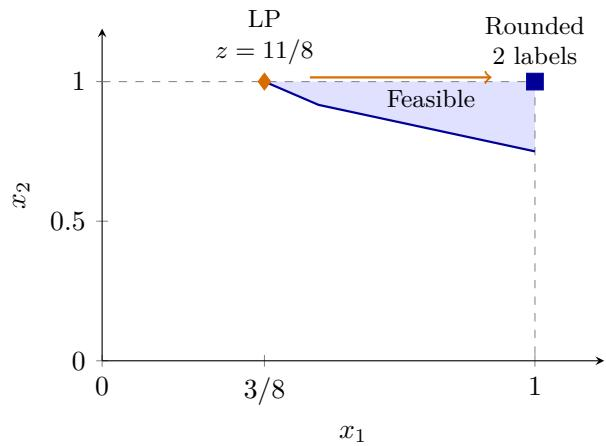  
Figure 3: One label set must cover every rival. Left: fixed predictions and rank weights, followed by the actual labels and their gains for certifying A. Each weight vector permutes $( 7 , 5 , 3 , 1 )$ . Right: the LP feasible region in the slice $x _ { 3 } = x _ { 4 } = 0$ . Rounding $( 3 / 8 , 1 , 0 , 0 )$ upward gives the two-label certificate 1, 2 . The labels are shown for the hindsight calculation; an acquisition policy does not know them before querying.

The LP solution $( 3 / 8 , 1 , 0 , 0 )$ has value $1 1 / 8$ . To see that no fractional solution is better, divide the constraint for C by 8 and use $x _ { 2 } \leq 1$ :

$$
\sum _ { i = 1 } ^ { 4 } x _ { i } ~ \ge ~ x _ { 1 } + x _ { 2 } ~ \ge ~ \frac { 1 5 } { 8 } - \frac { x _ { 2 } } { 2 } ~ \ge ~ \frac { 1 1 } { 8 } .
$$

This bound holds for all four variables, not only the plotted slice. Thus $\lceil 1 1 / 8 \rceil \leq C ( y ) \leq 2$ which determines $C ( y ) = 2$ . Static range reads rows in the order 2, 3, 1, 4 and stops after three labels. The certificate identifies what was suficient; the extra query reflects the cost of finding that set without knowing the labels.

Verifying certificate bounds. For $\lambda \geq 0$ , weak duality gives the LP lower bound $\lambda ^ { T } D +$ $\begin{array} { r } { \sum _ { i } \operatorname* { m i n } ( 0 , 1 - \lambda ^ { T } g _ { i } ) } \end{array}$ , where $g _ { i } = ( g _ { j i } ) _ { j \neq k }$ . We evaluate its ceiling using rational arithmetic and check rounded subsets by integer covering sums.

Two candidates. For $K = 2$ , there is one covering constraint. Sorting the realized gains $g _ { j i }$ and taking the shortest prefix that meets $D _ { j }$ gives an exact minimum certificate. Replacing a selected row by an unselected row with larger gain cannot break the constraint. For more candidates, each row contributes to several constraints, and their joint coverage matters.

## 4.2 A bound before labels are read

Part of the requirement is visible before any label is read, because $g _ { j i } \in \{ 0 , | b _ { j k i } | \}$ whichever value $y _ { i }$ takes. For each possible target k, let $m _ { j k }$ be the smallest m such that the m largest values of $| b _ { j k i } |$ sum to at least $D _ { j } \ ( m _ { j k } = \infty$ if none does). Sorting these potential gains gives a label-free bound for each pair.

Theorem 3 (Prelabel lower bound). For every label vector y with winner $k ^ { * }$

$$
C ( y ) ~ \geq ~ \operatorname* { m a x } _ { j \neq k ^ { * } } m _ { j k ^ { * } } ~ \geq ~ \underline { { C } } : = \operatorname* { m i n } _ { k } \operatorname* { m a x } _ { j \neq k } m _ { j k } ,\tag{9}
$$

and $C$ depends only on predictions and confidence ranks.

Proof. A certificate for k must contain rows whose $| b _ { j k i } |$ sum to at least $D _ { j }$ for every $j ,$ which gives both inequalities. All coeficients and deficits are known before labels. A lower-index duplicate of k gives $m _ { j k } = \infty$ , matching the tie rule. □

In Figure 2, the largest potential gains are 4 and 4, so either target needs at least two rows even before labels are known:

$$
\begin{array} { c c c } { { \mathrm { B e f o r e ~ l a b e l s } } } & { { \mathrm { W i t h ~ a l l ~ l a b e l s } } } & { { \mathrm { S t a t i c ~ o r d e r } } } \\ { { \underline { { { C } } } = 2 } } & { { C ( y ) = 3 } } & { { \mathrm { 4 ~ l a b e l s ~ r e a d } } } \end{array}
$$

A one-label budget is ruled out in advance. The actual labeling needs three labels, while this order reads one extra.

A worst-case rank example. For $n \geq 2$ , let both candidates predict zero, let A rank $2 , \ldots , n ,$ 1 and B rank $1 , \ldots , n ,$ , and prefer A at ties. Their integer contrast is $r _ { B } - r _ { A } =$ $2 ( ( n - 1 ) y _ { 1 } - \textstyle \sum _ { i = 2 } ^ { n } y _ { i } ) . \mathrm { ~ A t ~ } y = 0$ , observing rows $2 , \ldots , n$ sufices, and each is necessary: an unread such row can be one while $y _ { 1 } = 0$ , making B win. Hence $C ( 0 ) = n - 1$ , whereas accuracy ties for every completion and needs zero labels. This shows what confidence ranks alone can require, not its typical frequency.

## 4.3 Independent confidence orders

Proposition 2 (Random orders). Let K candidates predict identically and let their confidence orders be independent uniformly random permutations without ties. Then $\underline { { C } } / n \to 1 / 4$ in probability for every fixed $K \geq 2$ . If the losses are iid Bernoulli(q), $q \in ( 0 , 1 )$ , independent of the orders, then $\operatorname* { P r } ( C ( y ) < ( { \frac { 1 } { 2 } } - \varepsilon ) n ) \to 0$ for every $\varepsilon > 0$ , and for $K = 2 , C ( y ) / n \to 1 / 2$ in probability.

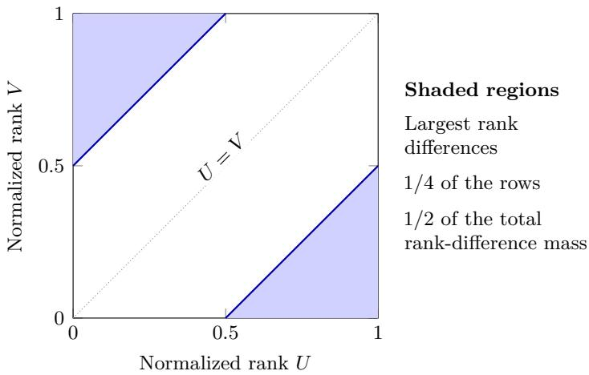  
Figure 4: Where the quarter comes from. Analytic limiting geometry for two candidates with identical predictions and independent uniform orders. Normalized ranks $U , V$ fill this square uniformly. The shaded quarter carries half of the total absolute rank diference, the limiting deficit to be covered. These are potential gains; actual gains depend on labels.

Figure 4 explains the first limit. For independent uniform normalized ranks $U , V$ , the rows with $| U - V | > 1 / 2$ have probability $1 / 4$ but carry half of E $| U - V | = 1 / 3$ . Thus even the largest potential gains need a quarter of the rows to cover the deficit. Once labels are fixed, each gain is either zero or its potential value. Under the independent-error model, about half of the rows provide useful gains; their total is close to the deficit, so a two-candidate certificate needs almost all of them. The proof below establishes these limits. Accuracy needs zero labels to settle the tie in the same model.

Proof of Proposition 2. Setup. With identical predictions and no ties, the zero-based ranks $\rho _ { A } , \rho _ { B }$ give $d _ { i } : = w _ { A i } - w _ { B i } = 2 ( \rho _ { B } ( i ) - \rho _ { A } ( i ) )$ ), and the integer risks satisfy $r _ { A } - r _ { B } =$ $\textstyle \sum _ { i } d _ { i } \ell _ { i } = : M .$ , where $\ell _ { i }$ is the loss of row i. Since both rank vectors are permutations of $\begin{array} { r } { 0 , \ldots , n - 1 , \sum _ { i } d _ { i } = 0 ; } \end{array}$ ; with $\begin{array} { r } { T = \sum _ { i } | d _ { i } | } \end{array}$ , the positive and the negative parts of d each total $T / 2$ . Index rows by $i = 0 , \ldots , n - 1$ so that $\rho _ { A } ( i ) = i ;$ then $\rho _ { B } = \sigma$ is a uniformly random permutation and $| d _ { i } | / 2 n = | \sigma ( i ) - i | / n$

Lemma (permutation statistics). For bounded Riemann-integrable $f : [ 0 , 1 ] ^ { 2 } \ \to \ \mathbb { R }$ $\begin{array} { l l l } { \frac { 1 } { n } \sum _ { i } f ( i / n , \sigma ( i ) / n ) } & { \to } & { \int \int f } \end{array}$ in probability. Indeed the mean is the Riemann sum $\begin{array} { l l l } { - 2 \sum _ { i , j } f ( i / n , j / n ) } & { \to } & { \int \int f } \end{array}$ , and by Hoefding’s variance formula for $\textstyle \sum _ { i } c _ { i \sigma ( i ) }$ with $c _ { i j } = f ( i / n , j / n )$ (Hoefding, 1951),

$$
\begin{array} { l } { \displaystyle \mathrm { V a r } \left[ \sum _ { i } c _ { i \sigma ( i ) } \right] = \frac { 1 } { n - 1 } \sum _ { i , j } \left( c _ { i j } - \bar { c } _ { i \cdot } - \bar { c } _ { \cdot j } + \bar { c } _ { \cdot \cdot } \right) ^ { 2 } } \\ { \displaystyle \le \frac { 1 6 n ^ { 2 } \| f \| _ { \infty } ^ { 2 } } { n - 1 } , } \end{array}
$$

so the variance of the average is $O ( 1 / n )$ and Chebyshev applies. With $f = { \bf 1 } \{ | x - y | > s \}$ and

$f = | x - y | \mathbf { 1 } \{ | x - y | > s \}$ this gives, for every fixed $s \in [ 0 , 1 ]$

$$
\begin{array} { r l } & { F _ { n } ( s ) : = \frac { 1 } { n } \# \{ i : | d _ { i } | > 2 n s \} \to ( 1 - s ) ^ { 2 } , } \\ & { G _ { n } ( s ) : = \frac { 1 } { 2 n ^ { 2 } } \sum _ { | d _ { i } | > 2 n s } | d _ { i } | \to H ( s ) : = \int _ { s } ^ { 1 } 2 t ( 1 - t ) d t , } \end{array}
$$

since $| U - V |$ has density $2 ( 1 - t )$ for independent uniforms $U , V ;$ explicitly $\begin{array} { r } { H ( s ) = \frac { 1 } { 3 } - s ^ { 2 } + \frac { 2 } { 3 } s ^ { 3 } } \end{array}$ Rank-only bound. The deficits are $T / 2$ for A and $T / 2 + 1$ for $B _ { : }$ , so $\underline { { C } }$ is the number of largest $| d _ { i } |$ whose sum first reaches $T / 2$ . Fix $\varepsilon > 0$ . H is strictly decreasing with $H ( 0 ) = 1 / 3$ and $H ( 1 / 2 ) = 1 / 6$ , so $\begin{array} { r } { H ( \frac { 1 } { \gamma } + \varepsilon ) < \frac { 1 } { \gamma } H ( 0 ) < H ( \frac { 1 } { \gamma } - \varepsilon ) } \end{array}$ . By the lemma, with probability tending to one $\begin{array} { r } { G _ { n } ( \frac { 1 } { 2 } + \varepsilon ) < \frac { 1 } { 2 } G _ { n } ( \bar { 0 } ) = T / 4 \bar { n ^ { 2 } } < G _ { n } ( \frac { 1 } { 2 } - \bar { \varepsilon } ) } \end{array}$ : the rows with $| d _ { i } | > 2 n ( \frac { 1 } { 2 } + \varepsilon )$ do not reach $T / 2$ and those with $\left\lceil d _ { i } \right\rceil > 2 n ( \frac { 1 } { 2 } - \varepsilon )$ do. Hence $F _ { n } ( \textstyle { \frac { 1 } { 2 } } + \varepsilon ) \leq { \underline { { C } } } / { n } \leq F _ { n } ( \textstyle { \frac { 1 } { 2 } } - \bar { \varepsilon } ) + 1 / n$ , and both ends tend to $( \textstyle { \frac { 1 } { 2 } } \mp \varepsilon ) ^ { 2 }$ . As ε is arbitr $\operatorname { a r y } , \underline { { C } } / n \to 1 / \bar { 4 }$

Greedy optimality. For $K = 2 , ( 8 )$ has one constraint with nonnegative coeficients and a cardinality objective; replacing any chosen row by an unchosen row of larger gain keeps feasibility, so the m largest gains form an optimal certificate for every feasible m.

Certificate. Let the losses be iid Bernoulli $( q ) , q \in ( 0 , 1 )$ , independent of the orders. Before looking at the winner, define the two row sets $U ^ { + } = \{ d _ { i } > 0 , \ell _ { i } = 1 \} \cup \{ d _ { i } < 0 , \ell _ { i } = 0 \}$ and $U ^ { - }$ −, its complement. If $M > 0 , B$ wins; its useful rows are $U = U ^ { + }$ with gains $| d _ { i } |$ and deficit $\begin{array} { r } { D = 1 + \sum _ { d _ { i } < 0 } | d _ { i } | = 1 + T / 2 } \end{array}$ , and the total gain is $\begin{array} { r } { \sum _ { d _ { i } > 0 , \ell _ { i } = 1 } d _ { i } + \sum _ { d _ { i } < 0 } \left| d _ { i } \right| - \sum _ { d _ { i } < 0 , \ell _ { i } = 1 } \left| d _ { i } \right| = } \end{array}$ $M + T / 2$ . If $M \leq 0 .$ , A wins, $U = U ^ { - } , D = T / 2$ and the total gain is $T / 2 - M$ . In both cases the total gain exceeds the deficit by the slack $| M | - 1 \{ M > 0 \} \leq | M |$ , so by greedy optimality $C ( y ) = | U | - t .$ , where t is the largest number of smallest useful gains whose sum is at most the slack; in particular $C ( y ) \leq | U |$ . Conditionally on the orders, the indicators ${ \bf 1 } \{ i \in U ^ { + } \}$ are independent with success probability q if $d _ { i } > 0$ and $1 - q { \mathrm { ~ i f ~ } } d _ { i } < 0$ (this holds for $U ^ { + }$ , which does not depend on the winner; the winner-dependent set U inherits the conclusion below because it is either $U ^ { + }$ or its complement), so ${ \mathbb E } [ | U ^ { + } | \ | \ \sigma ] = q \# \{ d _ { i } > 0 \} + ( 1 - q ) \# \{ d _ { i } < 0 \}$ and $\operatorname { V a r } ( | U ^ { + } | \mid \sigma ) \leq n / 4 ;$ the lemma with $f = { \bf 1 } \{ y > x \}$ gives # $\cdot \{ d _ { i } > 0 \} / n  1 / 2$ and likewise for $d _ { i } < 0$ , hence $| U ^ { + } | / n \to 1 / 2 , | U ^ { - } | / n = 1 - | U ^ { + } | / n \to 1 / 2$ , and therefore $| U | / n \to 1 / 2$ whichever candidate wins. Also $\textstyle \mathbb { E } [ M \mid \sigma ] = q \sum _ { i } d _ { i } = 0$ and $\begin{array} { r } { \mathrm { V a r } ( M \mid \sigma ) = q ( 1 - q ) \sum _ { i } d _ { i } ^ { 2 } \leq 4 q ( 1 - q ) n ^ { 3 } } \end{array}$ so $| { \cal M } | / n ^ { 3 / 2 }$ is bounded in probability. Fix $x \in ( 0 , 1 )$ and let $N _ { x } = \# \{ i : | d _ { i } | \leq 2 n x \}$ , so $N _ { x } / n \to 2 x - x ^ { 2 } \leq 2 x$ by the lemma. If $t > N _ { x }$ , the t smallest useful gains include $t - N _ { x }$ gains larger than 2nx, whence $\left( t - N _ { x } \right) 2 n x < | M |$ and $t < N _ { x } + | M | / ( 2 n x )$ . Therefore

$$
\frac { C ( y ) } { n } \geq \frac { | U | } { n } - \frac { N _ { x } } { n } - \frac { | M | } { 2 n ^ { 2 } x } ,
$$

whose right side tends to ${ \begin{array} { l } { { \frac { 1 } { 2 } } \ - \ ( 2 x - x ^ { 2 } ) } \end{array} }$ in probability, while $C ( y ) / n \leq | U | / n \to 1 / 2$ . Letting $x \downarrow 0$ proves $C ( y ) / n \to 1 / \bar { 2 }$

More candidates. For K candidates, every pair $( j , k )$ has $w _ { j } - w _ { k }$ distributed as d above, so $m _ { j k } / n  1 / 4$ in probability for each of the finitely many pairs, and $C = \mathrm { m i n } _ { k } \mathrm { m a x } _ { j \neq k } \mathrm { m } _ { j k }$ gives $\underline { { C } } / n \to 1 / 4$ . For the certificate, let $k ^ { * }$ be the winner. Any certificate for $k ^ { * }$ satisfies the constraint of each pair $( j , k ^ { * } )$ in $( 8 )$ , and $k ^ { * }$ also wins the two-candidate comparison against $j ,$ so $C ( y ) \geq C _ { j k ^ { * } } ( y )$ , the two-candidate certificate size of that pair. Each $C _ { j k ^ { * } } ( y ) / n \to 1 / 2$ by the argument above (the case $M \leq 0$ covers the index tie rule in either direction), and a union bound over the pairs gives $\operatorname* { P r } ( C ( y ) < ( { \frac { 1 } { 2 } } - \varepsilon ) n ) \to 0$ □

## 4.4 The cost of finding a certificate

Proposition 3 (Acquisition versus certificates). Under the independent-order and independenterror assumptions of Proposition 2, fix the common predictions in advance. Let $N _ { \pi }$ count distinct labels read by any adaptive policy that uses only these predictions, ranks, observed losses and independent randomness, and stops only when it certifies the exact winner for every

completion. For fixed $K \ge 2 , N _ { \pi } / n \to 1$ in probability, uniformly over such policies. $F o r$   
$K = 2 , ( N _ { \pi } - C ( y ) ) / n \to 1 / 2$ in probability.

Even an optimal policy must find the useful labels without knowing them. Thus the gap to a hindsight certificate need not be removable by better query ordering.

Figure 5 puts the two propositions on one scale. The prelabel bound uses the largest possible gains; the certificate uses the gains that actually occur. Acquisition must find useful labels without seeing the unread losses. These are three diferent questions, even for the same predictions and ranks.

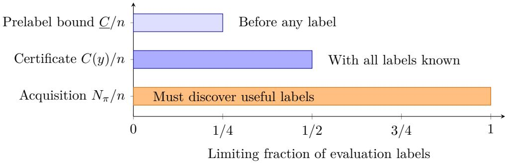  
Figure 5: Enough labels, and the cost of finding them. For two candidates with identical predictions, independent uniform confidence orders and iid Bernoulli(q) losses independent of those orders, $0 < q < 1$ , the three fractions converge in probability to $1 / 4 , 1 / 2$ and 1. These are asymptotic limits, not measured savings. The last limit holds uniformly over the policies in Proposition 3; better query ordering cannot remove the entire gap to the hindsight certificate in this model.

Proof of Proposition 3. Fix $q \in ( 0 , 1 )$ and the common predictions before drawing ranks and losses. First take two candidates and use $d _ { i } = w _ { A i } - w _ { B i }$ from the preceding proof. Fix the ranks and the policy’s random seed, independent of the losses. Extend its queries after stopping, if needed, until every row has been read. If $I _ { t }$ is the row chosen at time t, then

$$
S _ { t } = \sum _ { s = 1 } ^ { t } d _ { I _ { s } } ( \ell _ { I _ { s } } - q )
$$

is a martingale: $I _ { t }$ depends only on ranks and previously read losses, so the next loss is still $\operatorname { B e r n o u l l i } ( q )$ . Its conditional second moment is $\mathbb { E } [ S _ { n } ^ { 2 } \ |$ ranks] $\begin{array} { r } { = q ( 1 - q ) \sum _ { i } d _ { i } ^ { 2 } \leq 4 q ( 1 - q ) n ^ { 3 } } \end{array}$ Consequently, for any fixed $a > 0$ , the maximal inequality gives

$$
\operatorname* { P r } \{ \operatorname* { m a x } _ { t \leq n } | S _ { t } | \geq a n ^ { 2 } \ | { \mathrm { ~ r a n k s } } \} \leq { \frac { 4 q ( 1 - q ) } { a ^ { 2 } n } } .
$$

This bound is uniform over policies and their random seeds.

For unread rows $U ,$ , write $\begin{array} { r } { W _ { + } = \sum _ { i \in U , d _ { i } > 0 } d _ { i } } \end{array}$ and $\begin{array} { r } { W _ { - } = \sum _ { i \in U , d _ { i } < 0 } \left| d _ { i } \right| } \end{array}$ . Since $\textstyle \sum _ { i } d _ { i } = 0$ ， the exact completion interval for $r _ { A } - r _ { B }$ after t queries is

$$
[ S _ { t } - q W _ { + } - ( 1 - q ) W _ { - } , \quad S _ { t } + ( 1 - q ) W _ { + } + q W _ { - } ] .
$$

Let $p = \operatorname* { m i n } ( q , 1 - q ) > 0$ . If $| S _ { t } | < p ( W _ { + } + W _ { - } )$ , the interval contains both negative and positive values, so neither candidate can be certified, regardless of the tie rule. Thus any valid stopping time requires $\begin{array} { r } { \left| S _ { t } \right| \geq p \sum _ { i \in U } \left| d _ { i } \right| } \end{array}$

Fix $\varepsilon > 0$ and choose $x > 0$ with $2 x - x ^ { 2 } < \varepsilon / 2$ . The permutation lemma in the preceding proof implies, with probability tending to one, that fewer than $\varepsilon n / 2$ rows have $| d _ { i } | \leq 2 n x$ Every unread set of at least εn rows therefore has $\begin{array} { r } { \sum _ { i \in U } \left| d _ { i } \right| \geq \varepsilon x n ^ { 2 } } \end{array}$ . The maximal bound with $a = p \varepsilon x$ shows that the probability of a valid stop with this many unread rows tends to zero, uniformly over policies. Hence $N _ { \pi } / n \to 1$

For fixed $K > 2$ , apply the same argument to every candidate pair along the policy’s queries. A union bound over the finitely many pairs ensures that, while εn rows remain, no pairwise winner is certified. Certifying the overall winner requires certifying it against each rival, so again $N _ { \pi } / n \to 1$ . For $K = 2$ , Proposition 2 gives $C ( y ) / n \to 1 / 2$ , so subtraction gives the stated gap. □

## 4.5 Tolerance, multiclass predictions and other objectives

Certificates with a risk tolerance. For $\tau > 0 , C _ { \tau } ( y )$ is the smallest label set certifying some candidate within $\tau \ \mathrm { A U G R C }$ of the minimum under every completion: replace $D _ { j }$ by $[ - \lfloor 2 n ^ { 2 } \tau \rfloor - L _ { j k } ( \emptyset ) ] _ { - }$ + and minimize over the returned candidate; the $K - 1$ bound carries over. $\mathrm { A t } ~ \tau = 0$ , set $C _ { 0 } ( y ) = C ( y )$ and use the original deficits in (7), including the index tie rule.

Fixed multiclass predictions. The finite-pool bounds and certificates also apply when candidates share a multiclass prediction $\hat { y } _ { i }$ . Set $e _ { i } = { \bf 1 } \{ \hat { y } _ { i } \neq y _ { i } \}$ ; then $\textstyle r _ { j } = \sum _ { i } w _ { j i } e _ { i }$ , so use $c _ { j } = 0 , a _ { j i } = w _ { j i }$ and query $e _ { i } .$ . With at least two classes and unrestricted unread labels, every binary error completion is realizable: choose the predicted class for $e _ { i } = 0$ and any other class for $e _ { i } = 1$ . Thus the bounds, certificates and stopping test remain exact for confidence-score selection.

Other evaluation objectives. The stopping test, certificate LP and prelabel bound apply whenever each candidate’s score is a sum of binary losses with nonnegative weights fixed before labeling. Examples include weighted error and selective error at a fixed coverage: accepting $m \geq 1$ rows chosen before labeling gives each accepted row weight $1 / m$ . Rational weights require a common integer scaling for exact ties. The quarter and half limits use the AUGRC rank weights specifically.

Beyond AUGRC. The area under the risk–coverage curve (AURC) also weights each error by its rank (Traub et al., 2024, Appendix A.1.1). Averaging these weights within confidence ties gives the fixed-weight form in Section 4. For difering multiclass predictions, a categorical formulation is needed. Shared multiclass predictions admit the common error-bit representation in Section 4.

## 5 Using the information bounds

Before labeling: check the budget. Given a budget of B labels, compute C from the predictions and ranks. If $B < \underline { { C } }$ , no acquisition policy can certify the full-pool choice within that budget, for any label vector. Budgets $B \geq \underline { { C } }$ remain unresolved by this necessary condition. Computing all pair bounds by sorting costs $O ( K ^ { 2 } n \log n )$

If the budget is ruled out, changing the query policy alone cannot help. Instead, increase the budget, specify an acceptable risk tolerance, or revise the candidate set before reading labels, then recompute the bound. This redirects efort to the evaluation design before any label is collected.

During labeling: choose and query a row. Reading row i shrinks the width $H _ { j k } - L _ { j k }$ by $| b _ { j k i } |$ whatever its label. A simple static order reads rows by decreasing

$$
s _ { i } = \operatorname* { m a x } _ { j } a _ { j i } - \operatorname* { m i n } _ { j } a _ { j i } ,\tag{10}
$$

the largest per-row contribution to any pairwise width. The pair-sum order instead ranks $\textstyle \sum _ { j < k } | a _ { j i } - a _ { k i } |$ . Adaptive versions recompute these scores after removing candidates that lose to another under every completion, including the tie rule. A query can shrink a width without raising a lower bound (Figure 2); we evaluate these heuristics against the minimum certificate. The variance-minimizing sampler of Hara et al. (2024), called VMA in the implementation of Okanovic et al. (2025) and used here with AUGRC-weighted binary error and uniform labels, samples row i with probability proportional to $\begin{array} { r } { . 0 1 + \frac { 1 } { 2 n } \sum _ { j < k } | a _ { j i } - a _ { k i } | } \end{array}$

Initializing the bounds costs $O ( K ^ { 2 } n )$ ; updating them after a query costs $O ( K ^ { 2 } )$ , in addition to the cost of choosing the next row. Figure 6 summarizes the procedure; Theorem 2 supplies its hindsight benchmark.

Input: predictions $\hat { y } _ { j i }$ and confidence ranks of K frozen candidates on n unlabeled rows; a query   
policy.   
Output: the full-pool AUGRC winner, and the labels read.   
1. Compute $c _ { j } , a _ { j i }$ from (3) and every $L _ { j k }$ from (4) with all rows unread.   
2. If some k satisfies (5), return k and the labels read.   
3. Otherwise choose an unread row i using the policy, read $y _ { i } ,$ and add $b _ { j k i } y _ { i } - \operatorname* { m i n } ( 0 , b _ { j k i } )$   
to every $L _ { j k }$ . Go to 2.   
Afterwards (benchmark, needs all labels): bound $C ( y )$ by LP relaxation and rounding in   
Theorem 2; compare with the labels read.  
Figure 6: Certified comparison in three steps. The loop never reads a label twice and stops as soon as every unread completion agrees. Any policy choosing unread rows is valid; Section 6 compares several.

When the budget is exhausted. Return $k _ { B } \in \mathrm { a r g } \operatorname* { m i n } _ { k } \delta _ { k } ( O )$ , where

$$
\delta _ { k } ( O ) = \frac { \operatorname* { m a x } \{ 0 , \operatorname* { m a x } _ { j \neq k } [ - L _ { j k } ( O ) ] \} } { 2 n ^ { 2 } } .
$$

Taking the maximum over rivals gives candidate k’s exact worst-case excess AUGRC over all unread completions. Thus $k _ { B }$ comes with a guaranteed risk gap, computed from the current bounds without further labels. A zero gap guarantees minimum risk; the prescribed tie-breaking winner still requires (5). For example, in Figure 1, reading $y _ { 1 } = 1$ gives $\delta _ { B } = 0 :$ B is optimal for either remaining label. Yet $y _ { 2 } = 1$ gives a tie, whose prescribed winner is A. Thus one query can guarantee minimum loss without fixing the tie-breaking choice.

After labeling: measure suficient information. Report lower and upper bounds on $C ( y )$ alongside the number of labels read, $N _ { \mathrm { r e a d } }$ Together they bound how many extra labels the policy read; finding a minimum certificate without the unread labels can itself require extra queries (Deshpande et al., 2014). Proposition 3 quantifies this distinction in the independent-order model. The benchmark applies to every policy run inside the procedure of Figure 6.

## 6 Experiments

We ask which labels selective comparisons need and how stopping rules, query orders and tolerance afect label cost. Six prospectively fixed datasets extend the original three. The tabular follow-ups are retrospective: matched-model, second-generator and confidence-score protocols were fixed before their runs, after primary benchmark results were known. The new deep-model extension was fixed before inference or evaluation and chooses confidence scores for shared multiclass predictions.

## 6.1 Candidates and datasets

Three datasets came first: Breast Cancer, Wine (class 0 versus the rest) and Digits (odd versus even), from scikit-learn (Pedregosa et al., 2011). Six UCI datasets were then fixed, with the protocol, before their tables were downloaded: Ionosphere, Sonar, Banknote, Haberman, Spambase and MAGIC (208–19,020 rows, 3–60 numeric features). Each dataset uses three stratified $7 0 / 3 0$ train/evaluation splits; evaluation pools have 54–5,706 rows (details in the artifact).

We construct candidates from feature subsets (panels). A training-only backward search removes quartile indicators while keeping the minority-count error within one of eight budgets. This error is the sum of minority-label counts over identical feature patterns. Each panel receives a decision tree (minimum leaf size 2) or logistic regression (C=1), with maximum class probability as confidence. Comparing fixed sets of four or eight panels gives $9 \times 3 \times 2 \times 2 = 1 0 8$ conditions. All candidates are fixed before evaluation labels are read.

Panel construction. Training-row quartiles define binary indicators, ordered by absolute class-conditional mean diference. A fixed-order backward search removes indicators while the minority-count error stays below $E _ { \mathrm { f u l l } } + \lfloor \epsilon n _ { \mathrm { t r a i n } } \rfloor$ , where $n _ { \mathrm { t r a i n } }$ counts training rows and $E _ { \mathrm { f u l l } }$ uses all indicators. No retained indicator can then be removed within the budget. The eight values are $\epsilon \in \{ 0 , . 0 0 5 , . 0 1 , . 0 2 , . 0 4 , . 0 8 , . 1 2 , . 1 6 \}$ . Four-candidate collections use indices 0, 2, 4, 6; eight-candidate collections use all eight. The artifact provides exact orders, seeds and fitted outputs.

## 6.2 Which labels are needed

Agreement rows carry the decision. We reveal the label of every row on which at least two candidates disagree and leave the other rows unrestricted. This settles the accuracy choice in all 108 conditions. It settles the AUGRC choice in none: for every condition, two completions of the agreement rows have diferent, unique AUGRC winners. Disagreement rows are 20.91% of a pool on average (13.5–36.5% across datasets); after reading them, certifying the actual winner still needs agreement-row labels amounting to 41–42% of the pool.

Budgets ruled out before labeling. We replay all 108 frozen conditions using only predictions and ranks to compute C. For every budget fraction b, we count conditions with $\lfloor b n \rfloor < \underline { { { C } } } \ ( \mathrm { F i g u r e \ 7 } )$ . This retrospective analysis rules out a 10% budget in all 108 conditions and a 20% budget in 96/108. At 25% the count is 34/108; at 30% it is $1 1 / 1 0 8$ . These are illustrative budget levels, not observed operational constraints. The artifact retains every bound threshold. With $\tau = . 0 0 5$ , a 20% budget is still ruled out in $8 6 / 1 0 8$ conditions. The lower bound leaves other budgets unresolved. Figure 7 shows what static range certifies within each budget: at an 80% budget, exact selection certifies 30/108 choices; tolerance .005 certifies 76/108.

Minimum certificates. Theorem 2 brackets $C ( y )$ in all 108 conditions to within four labels; 16 are exact. Across all nine datasets, the mean size lies between 56.37% and 57.16% of the pool. On the six added datasets, certificates need 54.61–55.38% of the pool on average (Table 2); on the original three, 59.88–60.70%. The prelabel bound averages 24.50% using only predictions and ranks. At $n = 5 , 7 0 6 , K = 8$ , the verified LP pipeline took 22–26 ms (Section 9).

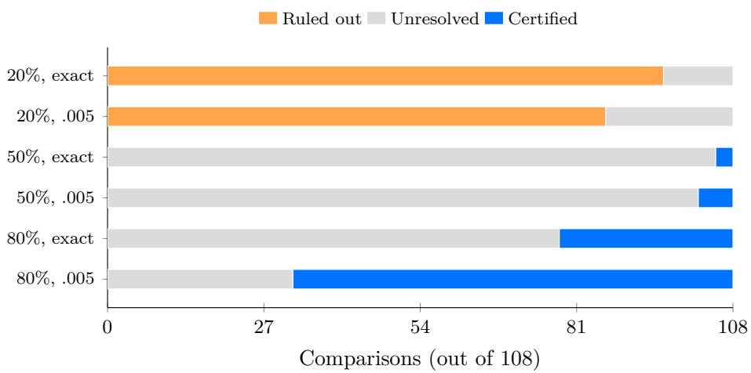  
Figure 7: From a budget bound to a certified decision. All 108 panel comparisons, with budget and tolerance shown at left. Orange: ruled out before labeling. Blue: certified within budget by static range. Gray: unresolved. At an 80% budget, allowing τ = .005 raises the certified count from 30 to 76. These are illustrative requirements; all budget and tolerance settings are retained in the artifact.

Choosing confidence scores with identical predictions. On the same 27 outer splits, we split training rows 70/30 between classifier and confidence training. Quartile indicators use classifier-training rows only; all nonconstant indicators are retained. Each tree or logistic model is fixed while comparing native confidence with negative predicted loss (Franc et al., 2023). The loss regressor is a random forest with 100 trees, depth at most 4 and minimum leaf size 20, fixed before this run without tuning on its evaluation results. It uses the indicators and class probability as inputs. All 54 fitted comparisons were frozen before this run’s evaluation; the pool labels had been used in earlier experiments.

Static range reads 64.46% of evaluation labels, versus 85.48% for random orders (ten seeds); the prelabel bound and exact minimum certificate average 23.38% and 35.84%. Native confidence wins strictly in 35 comparisons, loss regression in 17, with two ties. Means weight datasets equally.

Mean full-pool AUGRC is .04714 for native confidence, .05250 for loss regression and .04377 for the selected score. Improvement over native is nonnegative by construction on this same pool; the acquisition result is recovering its choice with fewer labels. Labels used to fit the classifier and loss regressor are training costs, excluded from evaluation-label savings. For K = 2, the minimum certificates above are computed exactly by sorting the realized gains. Native confidence is selected in both ties.

## 6.3 Confidence choice for deep models

What changes when the classifier stays fixed. Diferent confidence scores can reverse the acceptance order without changing any predicted class. Consider two images with classprobability vectors (.60, .39, .01) and (.55, .23, .22). Both predict class 1. Maximum softmax probability ranks the first image higher (.60 > .55), whereas the top-two probability margin ranks the second higher (.32 > .21). Selecting the confidence score therefore selects which predictions to accept first. The following experiments certify that choice using labels from the evaluation pool.

ResNet-20 and VGG-11-BN on CIFAR-10/100 give the original four conditions (Krizhevsky, 2009; Chen, 2025). Each 10,000-image pool compares maximum softmax probability, negative entropy and the top-two probability margin for the same fixed predictions. The comparison certifies a score on this fixed evaluation pool. The protocol and its relation to checkpoint

development are described below.

Table 1: Confidence choice across five architecture families. Three scores share predictions on 10,000 images per condition. Numerical entries after the model name are percentages of evaluation labels. Minimum is the ofline certificate enclosure; Read uses static range. Original and follow-up conditions share the two CIFAR test pools.
<table><tr><td>CIFAR Model</td><td></td><td>Prelabel</td><td>Minimum</td><td>Read exact</td><td>Read  $\tau = . 0 0 0 5$ </td></tr><tr><td colspan="6">Original four conditions</td></tr><tr><td>10</td><td> $\mathrm { R e s N e t { - } 2 0 }$ </td><td>24.34</td><td>45.42-45.43</td><td>90.95</td><td>59.66</td></tr><tr><td>10</td><td> $\mathrm { V G G - 1 1 { - } B N }$ </td><td>20.88</td><td>49.73</td><td>88.41</td><td>54.04</td></tr><tr><td>100</td><td> $\mathrm { R e s N e t { - } 2 0 }$ </td><td>15.33</td><td>33.85</td><td>68.07</td><td>57.20</td></tr><tr><td>100</td><td>VGG-11-BN</td><td>12.98</td><td>66.89–66.90</td><td>79.26</td><td>50.23</td></tr><tr><td colspan="6">Six architecture-family follow-up conditions</td></tr><tr><td>10</td><td> $\mathrm { M o b i l e N e t V 2 \ x 1 . 0 }$ </td><td>20.01</td><td>48.64</td><td>87.02</td><td>65.08</td></tr><tr><td>10</td><td> $\mathrm { S h u f f e N e t V 2 \times 1 . 0 }$ </td><td>20.40</td><td>46.97-46.98</td><td>85.60</td><td>67.13</td></tr><tr><td>10</td><td> $\mathrm { R e p V G G ~ A 0 }$ </td><td>19.08</td><td>50.26</td><td>86.31</td><td>66.64</td></tr><tr><td>100</td><td> $\mathrm { M o b i l e N e t V 2 \ x 1 . 0 }$ </td><td>14.79</td><td>64.33</td><td>69.85</td><td>57.04</td></tr><tr><td>100</td><td> $\mathrm { S h u f f e N e t V 2 \times 1 . 0 }$ </td><td>15.30</td><td>60.76</td><td>73.13</td><td>60.58</td></tr><tr><td>100</td><td> $\mathrm { R e p V G G ~ A 0 }$ </td><td>15.68</td><td>61.98</td><td>83.53</td><td>64.74</td></tr></table>

All four exact choices match the full-pool winner, reading $6 8 . 0 7 \mathrm { - } 9 0 . 9 5 \%$ of labels (Table 1); each score wins somewhere. At the grid’s first positive tolerance, $\tau = . 0 0 0 5$ , static range reads 50.23–59.66%. This certifies a risk within $\tau$ of the best candidate under every unread completion; exact selection additionally requires identifying that winner. Figure 8 maps budgets to the smallest tested tolerance on this frozen grid of completed runs.

As a post hoc illustration, CIFAR-100/VGG needs 3,949 and 3,109 labels to certify the winner against its rivals separately, but 6,689–6,690 to beat both at once.

The six architecture-family follow-up conditions in Table 1 read 69.85–87.02% for exact selection and 57.04–67.13% at $\tau = . 0 0 0 5$ . The original and follow-up protocols share the two test pools.

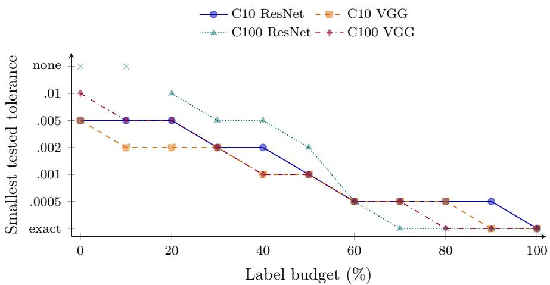  
Figure 8: Choose an evaluation tolerance for a label budget. Smallest certified tolerance on the six-value grid, using static range on the four original pools $( n = 1 0 , 0 0 0 )$ . Marks show all eleven budgets; crosses at “none” mean no tested tolerance is certified. Lines guide the eye. The tolerance axis lists grid values, not equal numerical intervals. This is a policy-specific guarantee, not the optimal attainable tolerance.

## 6.3.1 Protocol and verification

Pretrained multiclass confidence choice. We use the oficial CIFAR test splits in their original order and the public checkpoints of Chen (2025), with the repository’s normalization, no augmentation and no further training. CPU inference uses float32; softmax and scores use float64, temperature 1. The candidates, in tie priority order, are MSP, negative predictive entropy and the top-two probability margin. Each model supplies one fixed prediction per image. Scores and rank weights were hashed before opening evaluation labels for this comparison; no class-count constraints enter the certificate. The original checkpoints used test-split validation during development.

The artifact reports all four three-score comparisons, all twelve dependent pairwise comparisons, ten random-order seeds and all six tolerances 0, .0005, .001, .002, .005, .01 at eleven budgets $0 , . 1 , \ldots , 1$ . All budgets were fixed before inference. Figure 8 inverts this grid after evaluation: at each budget it reports the smallest tested tolerance whose stopping count fits. It does not interpolate between tolerances or optimize the policy. For three scores, mean acquisition is 81.67% for static range and 98.43% for random. Pairwise minimum certificates range from 28.41% to 49.46%; static range reads 50.75%–88.84%. Full-pool choices are recovered in every exact run. All 176 acquisition paths and 1,666,594 prefixes were independently checked, including integer certificate subsets and rational dual bounds. Exhaustive three-class completion checks on 40 small pools verify the shared-error reduction. Inference takes 5.9–9.5 seconds per model on four CPU threads; the four three-candidate LP runs take 21–32 ms each, excluding loading. These are single-run timings. Training costs are excluded from evaluation savings. Public checkpoint provenance, file hashes and all outputs accompany the code; raw images and weights are retrieved separately.

Architecture-family follow-up. After the original four outcomes, we fixed six further conditions before new inference: MobileNetV2 x1.0, ShufleNetV2 x1.0 and RepVGG A0 on both datasets, from the same pinned repository. Scores, preprocessing, query orders, all pairwise comparisons and the full tolerance/budget grid are unchanged. Table 1 reports all ten conditions; they share two test pools. The six new exact choices match their full-pool winners. Mean static acquisition is 80.91% for exact selection and 63.54% at $\tau = . 0 0 0 5$ , compared with 81.67% and 55.28% in the original four. These descriptive means use dependent conditions. All 24 new primary/paired comparisons, 264 paths and 2,504,903 prefixes pass the independent audit. Preprocessing checks precede label access; CPU inference took 43.7–82.4 seconds per added model. All pre-specified conditions are retained.

## 6.4 Stopping rule versus acquisition order

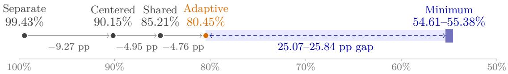  
Figure 9: Where the label savings come from. Mean label fractions on six added datasets share a common percentage scale. The first three tests share a static order; adaptive pair-sum changes it. Shading shows the gap to the minimum certificate with all labels known (dark band). Diferences use unrounded means.

Figure 9 separates the two sources of savings. First we fix the static order (10) and change only the stopping rule: separate risk intervals; separate intervals after subtracting the common label term $\sum _ { i } t _ { i } y _ { i }$ with $t _ { i } = ( \operatorname* { m i n } _ { j } a _ { j i } + \operatorname* { m a x } _ { j } a _ { j i } ) / 2$ , which gives midpoint centering; and the

Table 2: Labels read (%) by three stopping rules under the same static order: separate intervals (S), centered separate intervals (CS) and the shared test (J). C is the prelabel lower bound of Theorem 3, known before any label; C brackets the minimum certificate, computed with hindsight. Each dataset has 12 conditions.
<table><tr><td>Dataset</td><td>S</td><td>CS</td><td>J</td><td>C</td><td>C</td></tr><tr><td>Ionosphere</td><td>99.2</td><td>82.5</td><td>78.4</td><td>21.2</td><td>51.65-52.59</td></tr><tr><td>Sonar Banknote</td><td>99.1 99.9</td><td>87.6 95.1</td><td>82.3 83.7</td><td>22.8 25.2</td><td>49.47–51.98 60.05–60.40</td></tr><tr><td>Haberman</td><td>99.7</td><td>90.7</td><td>88.8</td><td>26.7</td><td>56.16-56.88</td></tr><tr><td>Spambase</td><td>99.6</td><td>94.5</td><td>92.3</td><td>24.0</td><td>57.80-57.89</td></tr><tr><td>MAGIC</td><td>99.1</td><td>90.5</td><td>85.9</td><td>20.0</td><td>52.50-52.54</td></tr><tr><td>New 72 Original 36</td><td>99.4 99.4</td><td>90.2</td><td>85.2</td><td>23.3</td><td>54.61-55.38</td></tr></table>

shared test (5). Exact duplicate candidates are merged for all three rules (Figure 10 traces one condition). On the original 36 conditions, the shared test saves 17.66 points over separate intervals and 10.58 over centering (Table 2). On the 72 added conditions, the three rules read 99.43%, 90.15% and 85.21% of the pool. The shared test saves 4.95 points over centering (median 2.46; earlier in 56/72 conditions, tied in 16): a gain beyond common-term centering.

Table 3: Acquisition policies with the shared certificate: mean evaluation labels read (%). Original and added datasets are separated. Excess brackets the mean acquisition cost above the ofline minimum certificate on the added six datasets, in percentage points.
<table><tr><td>Acquisition</td><td>Original 3</td><td>Added 6</td><td>Excess (pp)</td></tr><tr><td>Random</td><td>95.36</td><td>95.32</td><td>39.94–40.72</td></tr><tr><td>Static range</td><td>81.71</td><td>85.21</td><td>29.82–30.60</td></tr><tr><td>Adaptive range</td><td>81.14</td><td>80.75</td><td>25.37-26.14</td></tr><tr><td>Static pair-sum</td><td>81.83</td><td>85.41</td><td>30.03-30.81</td></tr><tr><td>Adaptive pair-sum</td><td>80.23</td><td>80.45</td><td>25.07-25.84</td></tr><tr><td>VMA, uniform labels</td><td>90.64</td><td>90.38</td><td>34.99-35.77</td></tr><tr><td>Model Selector</td><td>95.98</td><td>94.75</td><td>39.37-40.14</td></tr></table>

Then we fix the shared test and change the order. We run seven policies: random; static and adaptive range; static and adaptive pair-sum; uniform-label VMA; and Model Selector’s acquisition (Okanovic et al., 2025) with its default noise parameter .46, each supplying queries to the same certificate test (randomized policies use ten seeds). This comparison measures acquisition cost under a common guarantee; it does not rank the original methods under their diferent estimation or selection criteria. On the six added datasets, adaptive pair-sum reads 80.45% of the pool against 85.21% (mean saving 4.76, median 4.14 points; fewer labels in 60/72 conditions, equal in four, more in eight), yet remains 25.07–25.84 points above the certificate. Across the nine datasets, a Friedman permutation test rejects equal policy ranks: none of 99,999 within-dataset permutations reached the observed statistic $( p _ { \mathrm { M C } } = 1 0 ^ { - 5 }$ with the plus-one correction, its minimum reportable value). Nemenyi comparisons (Figure 11; Demšar, 2006) separate adaptive pair-sum from random, VMA and Model Selector, but not from the other heuristics.

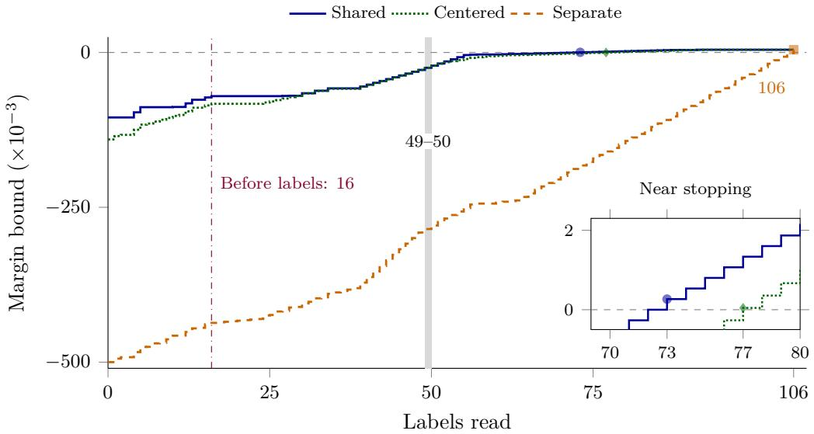

Figure 10: One condition, label by label. Ionosphere, split 731, trees, $K = 4 , n = 1 0 6$ , static range order. Curves bound $\mathrm { m i n } _ { j \neq k } ( \widehat { A } _ { j } - \widehat { A } _ { k } )$ for the full-pool winner k. Dots mark the first strictly b bpositive bounds: 73 labels (shared), 77 (centered), and 106 (separate). At 72 labels the shared bound is zero and the tie rule prevents stopping (inset). Hindsight brackets the minimum at 49–50 labels. The prelabel lower bound is 16: a budget of 15 cannot certify a choice under any acquisition policy.  
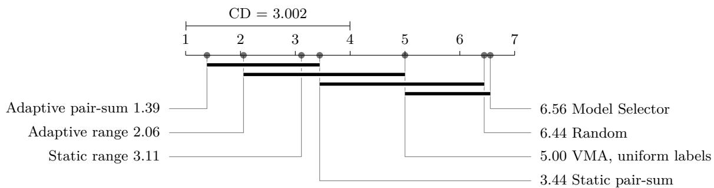  
Figure 11: Acquisition ranks across nine datasets. Lower is better; each dataset averages its 12 conditions. Bars join policies with no detected pairwise diference (Nemenyi, α = .05, critical diference $= 3 . 0 0 2 )$ . Table 3 lists all costs.

## 6.5 Tolerance and candidate-set sensitivity

We replay the recorded static-range and adaptive pair-sum orders on all 108 conditions with $\tau \in \{ 0 , . 0 0 0 5 , . 0 0 1 , . 0 0 2 , . 0 0 5 , . 0 1 \}$ and compute $C _ { \tau }$ for the same comparisons. The tolerance and candidate-set analyses are retrospective: their protocols were fixed after the acquisition costs were known, and the tolerance grid follows an exploratory calculation.

At τ = .005, the minimum certificate averages 44.83–45.69% and adaptive acquisition reads 69.74%, a saving of 10.64 percentage points. It remains 24.05–24.91 points above the minimum (Figure 12a). The returned candidate changes in 28/108 conditions, always within tolerance. The artifact retains the full grid.

Candidate-set sensitivity. To assess candidate dependence, we use nested panel indices 0, 4 , 0, 2, 4, 6 and $\{ 0 , \ldots , 7 \}$ from each saved collection, without refitting. Minimum certificate sizes for exact selection average 38.42%, 53.78–54.41% and 58.95–59.90% for $K =$ 2, 4, 8; adaptive acquisition reads 65.57%, 79.52% and 81.24% (Figure 12b). Candidate identities and winners can change with K.

Tolerance contrasts. For the original 108 comparisons, moving from zero tolerance to $\tau = . 0 0 5$ reduces the mean minimum certificate by 10.67–12.33 percentage points. $\mathrm { A t } ~ \tau = . 0 1$ the prelabel bound is 21.67% and certificates need 39–40% on average; their responses to tolerance difer. The budgets in Figure 7 use static range, while Figure 12 also reports adaptive acquisition.

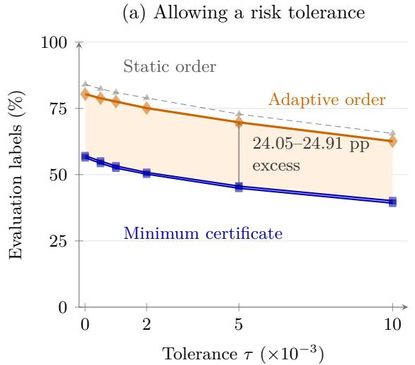

(b) Changing the candidate set  
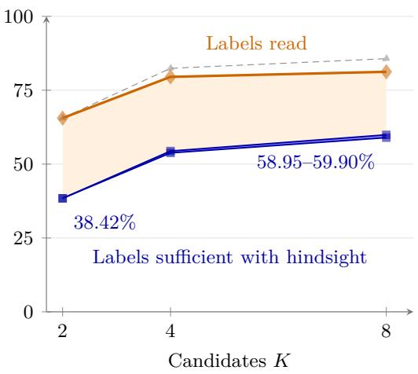  
Figure 12: Decision requirements and acquisition costs change together. (a) Risk tolerance on all 108 primary conditions $( K = 4 , 8 )$ . (b) Nested sets of 2, 4 and 8 candidates on all 54 fitted collections. Each panel averages conditions within each of nine datasets, then datasets. The narrow blue bands bound the mean minimum certificate. The pale area shows the gap from its upper bound to adaptive acquisition; the annotation gives the full excess interval. Neither shading is a confidence interval. Points are evaluated settings, joined for readability. The static and adaptive orders (static range and adaptive pair-sum) coincide at $K = 2$

## 6.6 Matched pools and a second candidate generator

Pool-size-matched comparison. The matched-model, second-generator and confidencescore protocols were fixed before their respective runs, after primary results on these benchmarks were known; all three are retrospective analyses. For each dataset’s pool size, each $K \in$ 4, 8 and error rate $q \in \{ . 1 , . 3 \}$ , 100 independent uniform-order replicates give 3,600 pools. Predictions are identical; only n, K are matched to the real collections. Every certificate is enclosed by an integer-checked subset and a rational weak-dual lower bound. Replicates, error rates and candidate counts receive equal weight within each dataset. Figure 13a compares these means with the six fitted collections per K. The fitted dataset enclosures range from 48.50–48.84% (Digits) to 68.67–70.06% (Wine). The matched model’s rank-only lower bound averages 25.88%, versus 24.50% for the panels.

The 3,600 matched pools give mean certificate bounds of 60.15–61.15%, versus 56.37–57.16% for the fitted panels.

A second panel generator. Empirical mutual information ranks the binary indicators using training rows only. Ties use the original indicator index. The four panel sizes are $\lceil p / 8 \rceil , \lceil p / 4 \rceil , \lceil p / 2 \rceil , p ,$ where p is the number of nonconstant training indicators. We retain the same splits and classifier settings and freeze all 54 fitted collections before reading evaluation labels. Integer witnesses and rational bounds are checked independently; predictions are refitted and query paths replayed. The prelabel bound averages 20.42%, minimum certificates 45.81–46.27%, and adaptive acquisition 70.72%. Static range reads 72.19% on average; adaptive pair-sum reads fewer labels in 34 conditions, ties in nine, and reads more in 11. One collection has duplicate loss functions; none permits a zero-label choice. Disagreement labels leave 53/54 unresolved; adaptive acquisition remains 24.45–24.91 percentage points above the minimum certificate (Figure 13b).

(a) Matching pool size and candidate count  
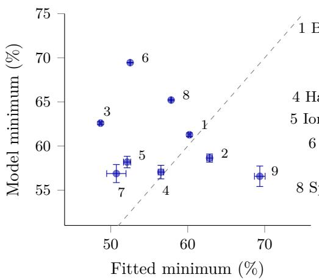

(b) A second panel generator  
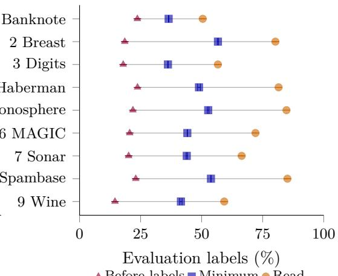  
Figure 13: Two checks on the information benchmark. (a) Minimum-certificate fractions: fitted consistency panels versus random orders matched by $n , K$ . Each point is one dataset; bars enclose the mean minimum, not sampling uncertainty. The diagonal is equality. (b) The second, mutual-information panel generator: prelabel lower bound, minimum-certificate enclosure and adaptive acquisition, averaged over six conditions per dataset. Lines connect the same dataset; sizes are not matched to the consistency panels.

## 6.7 Finite-pool simulations and correlated orders

Independent orders. The simulations use $n = 5 0 – 5 7 0 6$ for two candidates and $n =$ 100, 500, 2000 for $K = 2 , 4 , 8$ . They illustrate the limits in Proposition $2 ;$ the full grids remain in the artifact. For two candidates, mean certificate fractions range from .37 at $n = 5 0$ to .46 at $n = 5 7 0 6 ;$ the prelabel bound rounds to .25 from $n = 5 0 0$ . These are finite-pool observations. The certificate limit for $K > 2$ is left open.

Correlated orders. Gaussian-copula orders with $\rho \in \{ 0 , . 3 , . 6 , . 9 , . 9 9 \}$ gave estimated rankbound limits .250, .237, .223, .209, .204. This is a finite grid, not a bound for the whole family: at $\rho = 1$ the two orders coincide and the requirement is zero. Real orders have mean pairwise Spearman .51 (dataset means .36–.76, excluding constant-confidence pairs in 14 conditions). Correlation alone does not determine the bound: a cyclic shift by $0 < s \le n / 2$ rows gives $\underline { { C } } = s ,$ so n = 1000, s = 90 yields Spearman .51 with $\underline { { C } } / n = . 0 9$

## 7 Related work

Selective prediction orders acceptance by confidence or conditional risk (Chow, 1970; El-Yaniv and Wiener, 2010; Geifman and El-Yaniv, 2017; Franc et al., 2023). We use AUGRC as defined by Traub et al. (2024). Feature selection for classification with a reject option (Hanczar and Dougherty, 2008) and consistency-based search (Dash and Liu, 2003; Shin et al., 2017) address candidate construction. We fix candidates before acquiring evaluation labels.

Sawade et al. (2012) derive sampling distributions that asymptotically maximize the power of a risk-diference test under a fixed labeling budget. Later label-eficient evaluation and selection include Active Testing (Kossen et al., 2021), loss-diference sampling (Hara et al., 2024), Model Selector (Okanovic et al., 2025), CODA (Kay et al., 2025), and structured best-arm identification (Huang et al., 2017). We ask how many labels sufice to fix a selective comparison under every unread completion, and compare acquisition orders under this common guarantee.

Taking label vectors as hypotheses and full-pool winners as classes gives equivalenceclass determination (Golovin et al., 2010). Certificate complexity is the size of the smallest suficient label set (Buhrman and de Wolf, 2002; Grossman et al., 2020). Two-candidate afine comparisons are linear threshold evaluations, whose partial-input extrema and the distinction between certificate cost and acquisition cost are established (Deshpande et al., 2014). We quantify label requirements from confidence ranks, including the $1 / 4$ prelabel limit. Under the stated model, two-candidate certificates need asymptotically $n / 2$ labels, yet every exact policy reads almost all n. For fixed fitted candidates, the covering formulation bounds the minimum certificate size within K 1 labels.

## 8 Discussion

Confidence ranks can impose label requirements. Across the 108 panel comparisons, a 20% budget is ruled out in 96, and minimum certificates average 56–57% of the pool. Confidencescore choice needs certificates of 35.84% on average even with identical predictions. For ten comparisons of pretrained image classifiers, exact choice reads 68–91% of evaluation labels; an AUGRC tolerance of $5 \times 1 0 ^ { - 4 }$ reduces this to 50–67%.

The bounds rule out budgets below C before labeling and benchmark acquisition cost against $C ( y )$ afterwards. In the independent-order model, even optimal acquisition reads almost all labels: a certificate is a benchmark, not a promised query cost. The budget-to-tolerance map shows how tolerance can reduce both costs.

Limitations. Guarantees require fixed pools, candidates and ranks, with binary labels or shared multiclass predictions; they do not cover retraining or transfer. Experiments use $K \leq 8$ Asymptotic results assume independent uniform orders; the certificate and acquisition limits also assume iid errors independent of ranks. No general acquisition bound for fitted data follows.

## 9 Implementation and reproducibility

Computing environment. Model Selector retains all original candidates in its posterior update; VMA uses the uniform-label adaptation. Experiments used an ARM64 CPU with BLAS threads set to one, Python 3.12 and SciPy (HiGHS dual simplex for the LPs); package versions are in the artifact. For $n = 5 , 7 0 6 , K = 8$ , the certificate LP pipeline, including rational lower bounds and integer witness checks, took 22–26 ms across all six MAGIC conditions (range of seven-run medians after one warm-up each, excluding input loading). The original datasets are Breast Cancer (Wolberg et al., 1993), Wine (Aeberhard and Forina, 1992), and Digits (Alpaydin and Kaynak, 1998). Splits are row-level; MAGIC contains simulated events. Selected indicators can share an original variable, so their count is not a measurement cost. Training labels are not counted as saved.

The companion source-and-evidence archive contains the frozen protocols, outputs, independent verification code and reproduction commands. The LaTeX source accompanying this preprint contains every plotted coordinate; it can be rebuilt without downloading datasets or checkpoints.

## Acknowledgments

This work was supported by JSPS KAKENHI Grant Number JP23K28151.

## AI Use Statement

I used generative AI tools to assist with mathematical analysis, experimental work, and manuscript preparation. I set the research questions and scope, checked the proofs, crosschecked the reported numerical results against saved outputs using independent verification code included in the artifact, and take responsibility for the final content.

## References

Aeberhard, S. and Forina, M. (1992). Wine. UCI Machine Learning Repository. Dataset. doi:10.24432/C5PC7J.

Alpaydin, E. and Kaynak, C. (1998). Optical recognition of handwritten digits. UCI Machine Learning Repository. Dataset. doi:10.24432/C50P49.

Buhrman, H. and de Wolf, R. (2002). Complexity measures and decision tree complexity: A survey. Theoretical Computer Science, 288(1):21–43.

Chen, Y. (2025). PyTorch CIFAR Models. https://github.com/chenyaofo/ pytorch-cifar-models. Accessed September 16, 2026; fixed checkpoint versions in the artifact.

Chow, C. K. (1970). On optimum recognition error and reject tradeof. IEEE Transactions on Information Theory, 16(1):41–46.

Dash, M. and Liu, H. (2003). Consistency-based search in feature selection. Artificial Intelligence, 151(1–2):155–176.

Demšar, J. (2006). Statistical comparisons of classifiers over multiple data sets. Journal of Machine Learning Research, 7:1–30.

Deshpande, A., Hellerstein, L., and Kletenik, D. (2014). Approximation algorithms for stochastic boolean function evaluation and stochastic submodular set cover. In Proceedings of the Twenty-Fifth Annual ACM-SIAM Symposium on Discrete Algorithms, pages 1453– 1467.

El-Yaniv, R. and Wiener, Y. (2010). On the foundations of noise-free selective classification. Journal of Machine Learning Research, 11(53):1605–1641.

Franc, V., Prusa, D., and Voracek, V. (2023). Optimal strategies for reject option classifiers. Journal of Machine Learning Research, 24(11):1–49.

Geifman, Y. and El-Yaniv, R. (2017). Selective classification for deep neural networks. In Advances in Neural Information Processing Systems, volume 30, pages 4878–4887.

Golovin, D., Krause, A., and Ray, D. (2010). Near-optimal bayesian active learning with noisy observations. In Advances in Neural Information Processing Systems, volume 23.

Grossman, T., Komargodski, I., and Naor, M. (2020). Instance complexity and unlabeled certificates in the decision tree model. In 11th Innovations in Theoretical Computer Science Conference, volume 151 of Leibniz International Proceedings in Informatics, pages 56:1–56:38.

Hanczar, B. and Dougherty, E. R. (2008). Classification with reject option in gene expression data. Bioinformatics, 24(17):1889–1895.

Hara, S., Matsuura, M., Honda, J., and Ito, S. (2024). Active model selection: A variance minimization approach. Machine Learning, 113:8327–8345.

Hoefding, W. (1951). A combinatorial central limit theorem. The Annals of Mathematical Statistics, 22(4):558–566.

Huang, R., Ajallooeian, M. M., Szepesvári, C., and Müller, M. (2017). Structured best arm identification with fixed confidence. In Proceedings of the 28th International Conference on Algorithmic Learning Theory, volume 76 of Proceedings of Machine Learning Research, pages 593–616.

Kay, J., Van Horn, G., Maji, S., Sheldon, D., and Beery, S. (2025). Consensus-driven active model selection. In Proceedings of the IEEE/CVF International Conference on Computer Vision.

Kossen, J., Farquhar, S., Gal, Y., and Rainforth, T. (2021). Active testing: Sample-eficient model evaluation. In Proceedings of the 38th International Conference on Machine Learning, volume 139 of Proceedings of Machine Learning Research, pages 5753–5763.

Krizhevsky, A. (2009). Learning multiple layers of features from tiny images. Technical report, University of Toronto.

Okanovic, P., Kirsch, A., Kasper, J., Hoefler, T., Krause, A., and Gürel, N. M. (2025). All models are wrong, some are useful: Model selection with limited labels. In Proceedings of the 28th International Conference on Artificial Intelligence and Statistics, volume 258 of Proceedings of Machine Learning Research, pages 2035–2043.

Pedregosa, F., Varoquaux, G., Gramfort, A., Michel, V., Thirion, B., Grisel, O., Blondel, M., Prettenhofer, P., Weiss, R., Dubourg, V., Vanderplas, J., Passos, A., Cournapeau, D., Brucher, M., Perrot, M., and Duchesnay, É. (2011). Scikit-learn: Machine learning in python. Journal of Machine Learning Research, 12:2825–2830.

Sawade, C., Landwehr, N., and Schefer, T. (2012). Active comparison of prediction models. In Advances in Neural Information Processing Systems, volume 25, pages 1754–1762.

Shin, K., Kuboyama, T., Hashimoto, T., and Shepard, D. (2017). sCwc/sLcc: Highly scalable feature selection algorithms. Information, 8(4):159.

Traub, J., Bungert, T. J., Lüth, C. T., Baumgartner, M., Maier-Hein, K. H., Maier-Hein, L., and Jäger, P. F. (2024). Overcoming common flaws in the evaluation of selective classification systems. In Advances in Neural Information Processing Systems, volume 37, pages 2323–2347.

Wolberg, W., Mangasarian, O., Street, N., and Street, W. (1993). Breast cancer wisconsin (diagnostic). UCI Machine Learning Repository. Dataset. doi:10.24432/C5DW2B.