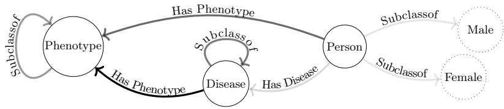
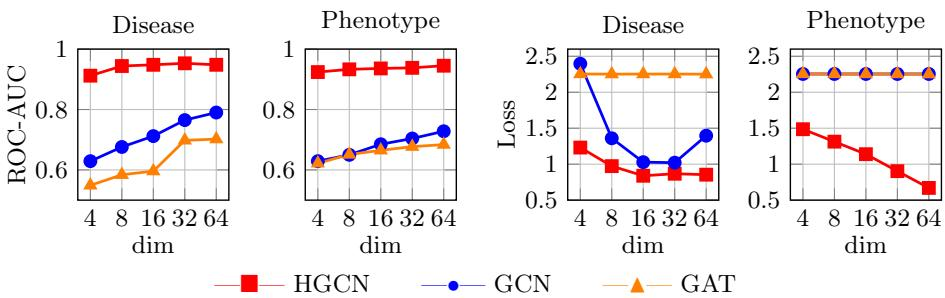
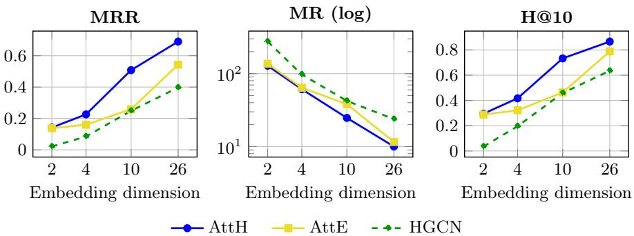

# Hyperbolic Graph Representation Learning for Diferential Diagnosis on Biomedical Knowledge Graphs

Pietro Miotto1,2[0009-0002-2973-0050], Lucia Mellini1[0009-0007-4186-8745],

Tommaso Marzi2[0000-0002-8232-9621], Cesare Alippi2,3[0000-0003-3819-0025],

Elena Casiraghi1,4[0000-0003-2024-7572], Alberto

Paccanaro5[0000-0001-8059-1346], Giorgio Valentini1[0000-0002-5694-3919], and Mauricio Soto-Gomez1[0000-0001-5977-9467]

1 Department of Computer Science, Università degli Studi di Milano, Milan, Italy 2 Università della Svizzera italiana (USI), Lugano, Switzerland 3 Politecnico di Milano, Milan, Italy

4 Department of Computer Science, Aalto University, Espoo, Finland 5 School of Applied Mathematics (EMAp), FGV, Rio de Janeiro, Brazil Correspondence to: miottpi@usi.ch

Abstract. Biomedical knowledge graphs combine ontology-derived hierarchies with transversal associations among heterogeneous entities such as phenotypes, diseases, genes, proteins, and patients. This hybrid structure raises the question of whether hyperbolic embeddings, which naturally capture tree-like organization, remain useful beyond purely hierarchical graphs. We present a preliminary study of hyperbolic graph representation learning for Mendelian-disease diferential diagnosis on a patientintegrated biomedical graph. Experiments on isolated ontology subgraphs show that hyperbolic models achieve strong performance in substantially lower dimensions than Euclidean baselines. We then evaluate the models on a link-prediction task that ranks candidate diseases for each patient. Results suggest that hyperbolic embeddings can exploit biomedical hierarchical structure while supporting diagnostic reasoning over heterogeneous patient-level graphs.

Keywords: Knowledge Graphs Representation Learning · Hyperbolic Geometry · Diferential Diagnosis · GNNs · Biomedical Graphs

## 1 Introduction

Biomedical knowledge is inherently structured. Not rarely, a large fraction of it is organized through ontologies, which represent concepts and their dependencies by means of hierarchical relations. Disease taxonomies [31], phenotype descriptions [16], gene functions [3], and many other biomedical resources are represented in this way, typically as Directed Acyclic Graphs (DAGs). When such ontologies are integrated with other biomedical entities and associations into Knowledge Graphs (KGs), the resulting structures preserve a strong hierarchical backbone while also incorporating additional non-hierarchical relations across domains [30].

Once biomedical knowledge is represented as a graph, Graph Representation Learning (GRL) methods map nodes and relations into a continuous latent space so that the geometry of the embeddings reflects the topology of the original graph as faithfully as possible, given a suitably controlled space. In most existing approaches, this latent space is assumed to be Euclidean [30]. However, this choice is neither appropriate in general nor always compatible with the intrinsic underlying hierarchical structure of biomedical KGs. In such settings, the number of nodes typically grows exponentially with the hierarchy-depth, whereas Euclidean volume grows only polynomially with radius. As a result, hierarchical and tree-like DAGs are poorly represented in flat spaces, where embeddings inevitably incur distortion and loss of information [5]. A hyperbolic space, by contrast, has constant negative curvature and volume that grows exponentially with distance from the origin. This geometric match allows hierarchical structures to be embedded with substantially lower distortion, often even in low dimensions, as shown by seminal work on Poincaré embeddings and later hyperbolic representation learning studies [9,24]. Nevertheless, real biomedical KGs also contain transversal (non-hierarchical) connections linking diferent semantic domains, such as phenotype–disease associations, gene–disease links, protein interactions, and patient similarities. These edges do not necessarily follow a purely hierarchical organization and may instead exhibit structural patterns that are better captured by Euclidean or mixed geometries. An important open question is whether hyperbolic embeddings retain their well-established advantage also on heterogeneous biomedical graphs, or whether partially hierarchical environments call for hybrid representations instead.

In this work, we aim to address two complementary questions. (i) How do Euclidean and hyperbolic methods compare in representing ontology-specific sub graphs? In particular, hyperbolic methods are expected to be most advantageous when hierarchical structure dominates; however, they may fail to fully capture the topology of ontology-based KGs when hierarchical DAGs are interconnected with non-hierarchical relationships. Recent analysis support this claim showing that the benefit of hyperbolic GNNs emerges on geometry-aligned tasks such as link prediction over strongly tree-like graphs (low δ-hyperbolicity), and becomes negligible otherwise [23] (ii) Do the geometric biases of hyperbolic models, including Hyperbolic Graph Neural Networks such as HGCNs [8] and shallow hyperbolic models such as AttH [10], translate into useful predictive behavior in a clinically motivated Mendelian-disease ranking task?

To investigate these questions systematically, we construct a biomedical graph integrating disease and phenotype ontologies with the phenotypic profiles of patients afected by Mendelian diseases. This graph enables us to formulate Mendelian-disease diferential diagnosis as a link prediction problem over edges connecting patient nodes to disease nodes. In this setting, candidate diseases for a patient are ranked according to the predicted probability of the corresponding patient–disease links.

This patient–disease ranking problem provides a focused and clinically relevant test bed for evaluating whether diferences between Euclidean and hyperbolic representations translate into useful predictive behavior in biomedical graphs. Mendelian diseases constitute a clinically important subset of rare diseases and are typically caused by pathogenic variants in single genes. Rare disease diagnosis is particularly suitable for this evaluation, as it remains one of the most challenging problems in modern medicine. Although each rare disease afects only a limited number of individuals, more than 10,000 rare diseases collectively impact about 5% of the global population [14], making their overall burden substantial.

## 2 Background and Methods

Graph Representation Learning (GRL) aims to map nodes and edges from a discrete graph domain into a low-dimensional continuous latent space through an encoder function ENC. These representations are defined so that their geometric proximity, measured by a decoder function DEC, reflects the structural and semantic properties of the graph [15]. The learned representations can then be used for downstream tasks such as link prediction, entity classification, or graphlevel inference. The factual knowledge encoded in Knowledge Graphs (KGs) is intrinsically multi-relational, expressed as triples (head entity, relation, tail entity) $\in \mathcal { V } \times \mathcal { R } \times \mathcal { V }$ , where V and R denote the sets of entities and relations, respectively. Knowledge Graph Embedding (KGE) methods can be broadly classified along two dimensions: (1) the geometry of the embedding space, such as Euclidean or hyperbolic; and (2) the mechanism by which representations are obtained, distinguishing shallow from non-shallow methods [15].

In shallow methods, the encoder is simply an embedding lookup table, mapping each entity and relation to a vector via their identifiers. The embedding vectors are therefore directly the free parameters of the optimization process, whose objective is to find values that best preserve some notion of structural proximity as measured by DEC. Shallow methods are inherently transductive: embeddings are tied to entities seen during training, and incorporating unseen entities requires either full retraining or ad-hoc approximations.

Notably, translational models interpret relations as geometric transformations in the latent space. The foundational example is TransE [6], which models a relation $\mathbf { r } _ { r }$ as a translation from the head embedding $\mathbf { e } _ { h }$ to the tail embedding $\mathbf { e } _ { t }$ . This is done by minimizing:

$$
\mathrm { D E C } ( \mathbf { e } _ { h } , \mathbf { r } _ { r } , \mathbf { e } _ { t } ) = \| \mathbf { e } _ { h } + \mathbf { r } _ { r } - \mathbf { e } _ { t } \|\tag{1}
$$

for existing triples while maximizing it for non-existing ones. Extensions of this framework introduce increasingly expressive geometric operators as entity transformations [15], relation-specific hyperplanes [34], or complex-valued transformations [29].

Non-shallow methods address the transductive limitation by recasting the embedding task from an optimization problem into a function learning problem. They learn parameterized functions that compute representations from local neighborhood structure and entity features. These functions are typically implemented as Graph Neural Networks (GNNs) [18,32], which aggregate information from local neighborhoods so that topology acts as an inductive bias constraining information flow. In principle, these methods can generalize to previously unseen nodes provided their features and connectivity are available [15]. In the KG setting, this family includes relation-aware, convolutional, and attention-based architectures [26], as well as more recent path-based [37] and tokenization approaches. Despite the flexibility of non-shallow Euclidean methods, they introduce greater architectural complexity, can be computationally demanding on dense multi-relational graphs, and are susceptible to over-smoothing. Furthermore, on strongly hierarchical graphs exhibiting scale-free properties, the message-passing procedure can cause neighborhood explosion around high-degree nodes.

Hyperbolic Geometry Models. Many KGs exhibit scale-free, tree-like topologies in which the number of entities grows exponentially with relational depth, a latent structure that Euclidean spaces cannot faithfully represent in low dimensions. Hyperbolic spaces, by contrast, have constant negative curvature, which endows them with an exponentially expanding volume that naturally accommodates hierarchical structure. This allows for tree-like graph representations with low distortion even in very low dimensions [24].

From a computational perspective, hyperbolic learning is usually implemented by exploiting the fact that hyperbolic space is a Riemannian manifold, and therefore admits a Euclidean tangent space at every point. Optimization and linear operations can thus be performed in the tangent space at the origin of the hyperbolic manifold, and then mapped back to the hyperbolic manifold. The interface between the curved manifold and its local flat approximation is achieved through logarithmic and exponential maps. Since ordinary (Euclidean) vector addition is not geometry-preserving in hyperbolic space, it is replaced by Möbius addition, the hyperbolic analog to the vector addition in Euclidean vector spaces. The logarithmic and exponential maps, together with Möbius addition, make it possible to generalize Euclidean models to hyperbolic latent spaces while retaining computational eficiency.

Shallow hyperbolic models embed entities directly in a hyperbolic manifold, most commonly the Poincaré ball or the hyperboloid model, and define scoring functions using hyperbolic distance. Poincaré embeddings [24] demonstrate the representational eficiency of this approach on hierarchical data. MuRP [4] extends this idea to multi-relational KGs, generalizing translational models to the Poincaré ball.

Among shallow hyperbolic KG embedding methods, AttH [10] is particularly relevant because it extends the translational paradigm while enriching relation modeling through relation-specific isometries and attention. A key contribution of AttH is the use of a relation-specific curvature $c _ { r } ,$ which allows diferent relations to be represented in hyperbolic spaces with diferent efective hierarchical capacities. For a triple $( h , r , t )$ in the KG, AttH first learns two relation-specific transformations of the head embedding $\mathbf { e } _ { h } ^ { E }$ in the tangent Euclidean space at the origin of the hyperbolic manifold o. Specifically, it defines a rotation and a reflection, both implemented through matrix Givens transformations:

$$
\begin{array} { r } { \mathbf q _ { \mathrm { R o t } } ^ { E } = \mathrm { R o t } ( \theta _ { r } ) \mathbf e _ { h } ^ { E } , \qquad \mathbf { q } _ { \mathrm { R e f } } ^ { E } = \mathrm { R e f } ( \varPhi _ { r } ) \mathbf e _ { h } ^ { E } . } \end{array}\tag{2}
$$

with $\operatorname { R o t } ( \theta _ { r } )$ and $\operatorname { R e f } ( \varPhi _ { r } )$ being the rotation and reflection operators, where $\theta _ { r }$ and $\varPhi _ { r }$ are the respective learned parameters. These two transformed views are then combined through a simple attention mechanism, i.e., a weighted average in the tangent Euclidean space between ${ \bf q } _ { \mathrm { R o t } } ^ { E }$ and $\mathbf { q } _ { \mathrm { R e f } } ^ { E } .$ . Having learned the relationspecific attention vector ${ \bf a } _ { r } = [ \alpha _ { \mathrm { R o t } } , \alpha _ { \mathrm { R e f } } ]$ the combined representation is then mapped to the hyperbolic space:

$$
\begin{array} { r } { \left\{ \begin{array} { l l } { \mathrm { A t t } ^ { E } ( \mathbf { q } _ { \mathrm { R o t } } ^ { E } , \mathbf { q } _ { \mathrm { R e f } } ^ { E } ; \mathbf { a } _ { r } ) = \alpha _ { \mathrm { R o t } } \mathbf { q } _ { \mathrm { R o t } } ^ { E } + \alpha _ { \mathrm { R e f } } \mathbf { q } _ { \mathrm { R e f } } ^ { E } } \\ { \mathrm { A t t } ^ { H } ( \mathbf { q } _ { \mathrm { R o t } } ^ { E } , \mathbf { q } _ { \mathrm { R e f } } ^ { E } ; \mathbf { a } _ { r } ) = \exp _ { o } ^ { c _ { r } } \left( \mathrm { A t t } ^ { E } ( \mathbf { q } _ { \mathrm { R o t } } ^ { E } , \mathbf { q } _ { \mathrm { R e f } } ^ { E } ; \mathbf { a } _ { r } ) \right) } \end{array} \right. \ . } \end{array}\tag{3}
$$

A translation is then performed on the manifold with a relation-specific embedding $\mathbf { r } _ { r } ^ { H }$ through Möbius addition resulting in a so-called query:

$$
\mathbf { q } ^ { H } ( h , r ) = \mathrm { A t t } ( \mathbf { q } _ { \mathrm { R o t } } ^ { E } , \mathbf { q } _ { \mathrm { R e f } } ^ { E } ; \mathbf { a } _ { r } ) \oplus ^ { c _ { r } } \mathbf { r } _ { r } ^ { H } .\tag{4}
$$

Similarly to the Euclidean case, the query is expected to lie near the embedding of the relation tail in the hyperbolic manifold $\mathbf { e } _ { t } ^ { H }$ , obtained by projecting the Euclidean tail embedding $\mathbf { e } _ { t } ^ { \breve { E } }$ into the Poincaré ball via the exponential map at the origin o: $\mathbf { e } _ { t } ^ { H } = \exp _ { o } ^ { c _ { r } } ( \mathbf { e } _ { t } ^ { E } )$ . The score for the triple, $s ( h , r , t )$ is then computed as the negative squared Poincaré distance between the query $\mathbf { q } ^ { H } ( h , r )$ and the tail embedding ${ \bf e } _ { t } ^ { H }$

$$
\begin{array} { r } { s ( h , r , t ) = - \big ( d _ { \mathbb { B } } ^ { c _ { r } } ( \mathbf { q } ^ { H } ( h , r ) , \mathbf { e } _ { t } ^ { H } ) \big ) ^ { 2 } + b _ { h } + b _ { t } , } \end{array}\tag{5}
$$

where $b _ { h }$ and $b _ { t }$ are entity-specific biases applied to the head and tail respectively. AttH is typically trained with a cross-entropy objective and uniform negative sampling. For each positive triple $( h , r , t )$ , negative examples are generated by corrupting the tail with entities sampled uniformly from the node set V:

$$
\mathcal { L } = \sum _ { t ^ { \prime } \sim \mathcal { U } ( \mathcal { V } ) } \log \bigl ( 1 + \exp \bigl ( y _ { t ^ { \prime } } s ( h , r , t ^ { \prime } ) \bigr ) \bigr ) , \qquad y _ { t ^ { \prime } } = \left\{ \begin{array} { l l } { - 1 } & { \mathrm { i f ~ } t ^ { \prime } = t } \\ { 1 } & { \mathrm { o t h e r w i s e . } } \end{array} \right.\tag{6}
$$

where $\mathcal { U } ( \nu )$ denotes uniform sampling over the entity set. This objective encourages the translated head embedding to move closer to the true tail embedding for positive triples, while pushing it away from corrupted tails for negative triples.

The Euclidean ablation of AttH, AttE [10], removes curvature and replaces hyperbolic distance and Möbius addition with their Euclidean counterparts. In this way, the query is defined as $\mathbf { q } ( h , r ) ^ { E } = \mathrm { A t t } ^ { E } ( \mathbf { q } _ { \mathrm { R o t } } ^ { E } , \mathbf { q } _ { \mathrm { R e f } } ^ { E } ; \mathbf { a } _ { r } ) + r _ { r } ^ { E }$ and the scoring function as $s ( h , r , t ) = - \| \mathbf { q } ( h , r ) ^ { E } - \mathbf { e } _ { t } ^ { E } \| _ { 2 } ^ { 2 } + b _ { h } + b _ { t }$ . There is no curvature parameter.

Non-shallow hyperbolic models: HGNN and HGCN. Hyperbolic geometry has also been extended to non-shallow models, where node embeddings are computed through message passing rather than learned as free parameters. In HGNN [21], this is achieved by generalizing GNN updates to Riemannian manifolds: representations of node neighborhoods are mapped to a tangent space centered at the origin, aggregated there with standard linear operations, and then projected back to the manifold through logarithmic and exponential maps. This provides the basic manifold-aware message-passing template for hyperbolic GNNs.

Building on this idea, HGCN [8] makes the framework more expressive and practically robust in three ways: (i) it explicitly maps Euclidean input features into hyperbolic space; (ii) it uses layer-specific MLP-learned attention to aggregate neighborhood features in the tangent space centered at the target node, more faithfully reflecting local geometry; and (iii) it introduces layer-wise trainable curvature, allowing diferent layers to operate in hyperbolic spaces of diferent curvature. As a result, a HGCN layer can be viewed as a three-step pipeline: hyperbolic feature transformation, geometry-aware neighborhood aggregation, and curvature-aware nonlinearity. Conceptually, HGNN provides the general recipe for hyperbolic message passing, whereas HGCN refines it into an inductive architecture better suited to hierarchical and scale-free graphs.

Hyperbolic, Mixed-Geometry, and Biomedical KG Models. Hyperbolic [10,8,21] and mixed-geometry models [33] are increasingly relevant in biomedicine, where ontologies, protein interaction networks, and biomedical knowledge graphs exhibit strong latent non-Euclidean structure. Interest in this direction expanded after [1] showed that the human protein interaction network displays latent hyperbolic geometry. Subsequent work explored Poincaré-based embeddings of the Gene Ontology and gene annotations [17], hierarchical drug representations [35], and drug-target association prediction [25]. More recent approaches extended hyperbolic learning to broader biomedical KGs through mixed-curvature spaces [20] and product manifolds [22] for gene-disease and protein interaction modeling.

Despite this progress, most studies remain focused on molecular-scale tasks such as ontology embedding, protein interactions, and drug-target prediction. The application of non-Euclidean geometry to patient-level phenotypic reasoning and diferential diagnosis remains largely unexplored, even though phenotype and disease ontologies such as HPO and MONDO are strongly hierarchical. Rare disease diagnosis has instead been dominated by semantic similarity and ontology-based methods [19,36,28]. More recently, SHEPHERD [2] introduced a Euclidean GNN over a patient-augmented biomedical KG for phenotype-driven diagnosis, while LLM-based pipelines have begun to exploit biomedical graphs for diagnostic reasoning [12]. However, existing biomedical KGs such as PrimeKG [11] still lack direct patient-disease connectivity, and the role of latent geometry in patient-integrated KGs remains poorly understood.

Overall, the evolution from Euclidean embeddings to hyperbolic and neural message-passing models motivates our study of whether negatively curved latent spaces better capture the hierarchical structure of biomedical KGs while balancing expressive relation modeling and inductive graph learning.

## 3 Experimental Results

KG construction. We conduct experiments on a patient-integrated graph, constructed using the PheKnowLator (Phenotype Knowledge Translator) framework [7]. The graph integrates disease ontologies with phenotypic information derived from patient-level clinical observations. In particular, the graph contains 28,811 nodes and 178,320 edges. The nodes belong to three node types: Person nodes, whose phenotypic information, i.e., symptoms, was gathered from the Phenopacket Store [13]; Phenotype nodes, corresponding to Human Phenotype Ontology (HPO [16]) terms; Disease nodes derived from the Disease Ontology (DOID) [27] and the Mondo Disease Ontology (MONDO) [31]. These nodes are connected through heterogeneous relations, encoding transversal patient– phenotype annotations, and patient–disease annotations, as well as hierarchical relationships within the HPO and disease ontologies. Note that, due to the computational complexity of the HGCN framework [8], Disease nodes were restricted to those associated with the patient cohort, together with their ancestors. Conversely, Phenotype nodes were retained to preserve patient-level clinical descriptions and phenotype hierarchy. The resulting metagraph schema is shown in Figure 1. This graph enables graph representation learning (GRL) methods to exploit both ontology-derived hierarchical structure and cross-domain biomedical associations for diferential diagnosis.

  
Fig. 1. Schema of the patient-integrated knowledge graph. Solid-bordered nodes represent super-nodes that aggregate instances of the same class and summarize their interaction patterns. Dashed-bordered nodes represent attribute-specific subclasses used in our graph model to encode categorical attributes. Here, Male and Female, connected to Person by SubClassOf relations, encode the possible values of the sex attribute. Superedge opacity indicates the relative frequency of the corresponding predicate in the dataset, with darker edges denoting higher frequencies.

## 3.1 Binary Link Prediction on Isolated Hierarchies

Following the standard protocol [24], within each ontology subgraph, we extract the SubclassOf-induced subtree and add its transitive closure, connecting every node to each of its ancestors through a direct SubclassOf arc. The models are trained on a standard binary link prediction task, i.e., to predict link existence against negative samples. The edges of this enriched SubclassOf hierarchy are then randomly partitioned with an 80%–10%–10% split into training, validation, and test sets. For each positive edge, one negative edge is sampled uniformly at random from the complement graph to yield negative sets balanced 1:1 with posistives.

  
Fig. 2. ROC-AUC performance and Loss obtained by predictive models over hierarchical subgraphs at diferent embedding sizes. HGCN shows a markedly better performance when compared to Euclidean counterparts.

Results. The experimental results (see Figure 2) provide strong evidence for the advantage of the hyperbolic approach: HGCN consistently outperforms GCN and GAT, achieving ROC-AUC > 0.90 even with low-dimensional embeddings across both the Disease and HPO hierarchies. In contrast, the Euclidean models achieve at most a ROC-AUC of 0.8, and only when using relatively high-dimensional embeddings on the Disease ontology. Euclidean loss remains consistently higher, particularly in the Phenotype ontology, suggesting that the Euclidean models may make some incorrect predictions with high confidence, rather than achieving a better structural alignment; by contrast, the lower hyperbolic loss indicates more consistent confidence in the predicted hierarchy. These results confirm a clear advantage of the hyperbolic approach on hierarchical structured data and motivate its exploration on larger, mixed-geometry environments.

## 3.2 Rank-Based Evaluation for Diferential Diagnosis Simulation

We simulated in silico diferential diagnosis as a KG completion task for the HasDisease relation over the targeted subgraph, benchmarking AttH against its Euclidean counterpart, AttE, and against HGCN. In this setting, models are trained to predict whether a Person node should be connected to a Disease node by a HasDisease edge. To ensure a consistent evaluation across models, all methods were trained and tested using the same train–validation–test split. The test set was built by randomly holding out 10% of the existing HasDisease edges as positive examples, which accounts for approximately 1% of all edges in the targeted graph. All remaining positive edges in the graph, including the remaining HasDisease edges and all other relation types, were used for training and validation, accounting for approximately the 94.5% and 4.5% of all positive edges in the KG, respectively. The hyper-parameters of all the compared models were optimized by using the internal train/validation split to allow an unbiased, controlled evaluation.

Training of HGCN. HGCN was trained for binary link prediction using a binary cross-entropy loss over positive and negative edge samples. Given the positive training set, an equal number of negative samples was generated by edge corruption. The objective encourages observed edges to receive high predicted probabilities and corrupted edges to receive low predicted probabilities.

Training of shallow methods (AttE, AttH). Shallow methods were trained using a standard negative-sampling logistic loss (see equation 6). Given a positive triple $( h , r , t )$ , we sampled a fixed set of 50 corrupted triples $\left( h , r , t ^ { \prime } \right)$ by replacing the true tail with entities drawn uniformly at random from the entire entity set, without any type or existence filtering (cf. Eq. 6). The training objective encourages the score of the positive triple to be higher than the scores of its negative counterparts, thereby placing the relation-transformed head representation close to the correct tail and far from sampled negative tails. AttE and AttH follow the same training principle, but difer in the geometry of the scoring function, as defined in Section 2-Par. 2.

Inference. In inference, each test triple $( h , r , t )$ is treated as a query $( h , r , ? )$ and candidate disease tails are ranked by their plausibility score. For shallow models, the plausibility of a candidate tail is defined by the score assigned to the corresponding triple, which depends on the distance between the candidate tail and the relation-transformed head. For HGCN, we simulate the same ranking setting by fixing a person node h and scoring its link probability against every candidate disease node $t ^ { \prime } .$ . For each person, candidate diseases are then ranked by decreasing predicted probability. Mean Rank (MR), Mean Reciprocal Rank (MRR), and H@10 were used to evaluate the quality of the ranked candidate diseases. For each test query, the model scores all candidate diseases and records the rank of the correct disease. MR: $\begin{array} { r } { \mathrm { M R } = \frac { 1 } { | \mathcal { Q } | } \sum _ { { q } \in \mathcal { Q } } \mathrm { r a n k } _ { { q } } } \end{array}$ , where Q is the set of test queries and ran $\operatorname { k } _ { q }$ is the position of the correct disease in the ranked list for query $q .$ . Lower MR values indicate better performance. MRR: MRR = $\begin{array} { r } { \frac { 1 } { | \mathcal { Q } | } \sum _ { q \in \mathcal { Q } } \frac { \bar { 1 } } { \mathrm { r a n k } _ { q } } } \end{array}$ . A high MRR indicates that, on average, the correct disease appears near the top of the ranked list. Hits@10 is the proportion of test queries for which the correct entity is ranked among the top 10 candidate entities. Higher values indicate better link-prediction performance.

Results Figure 3 shows that AttH outperforms AttE and HGCN across embedding dimensions on all three metrics (MRR, MR, and H@10), with best results at $d = 2 6$ . The exceptions are at the smallest dimensions: at $d = 2$ for MRR and H@10, and at $d \in \{ 2 , 4 \}$ for MR, where AttH shows no consistent advantage over AttE (e.g., at d = 2: MRR 0.142 vs. 0.138, H@10 0.295 vs. 0.288). HGCN remains the weakest of the three across all dimensions and metrics, although its H@10 at d = 10 (0.459) nearly matches AttE (0.464).

  
Fig. 3. AttH, AttE, and HGCN comparison: mean MRR, MR and H@10 for Disease-Only (RHS-only) prediction, for diferent embedding sizes. The average is computed across three independently seeded train–validation–test splits of the graph.

## 4 Conclusion

This preliminary study shows that hyperbolic GRL is promising for biomedical KGs combining ontology-derived hierarchies with transversal associations. HGCN outperformed Euclidean GNNs on isolated hierarchical subgraphs using sub stantially lower-dimensional embeddings, while AttH showed promising ranking performance in the rare-disease diferential diagnosis task. These results suggest that hyperbolic embeddings can exploit biomedical hierarchical structure while remaining useful in heterogeneous patient-integrated graphs.

Future work will investigate hybrid models that combine Euclidean and hyperbolic components, including architectures with score-level fusion mechanisms that learn the relative contribution of Euclidean and hyperbolic distances to the final score, thereby better capturing both transversal and hierarchical relations.

Acknowledgments. This work was partially funded by Piano di Sviluppo di Ricerca (PSR2025) - Università degli Studi di Milano.

Part of this work was funded by the National Plan for NRRP Complementary Investments (PNC) in the call for the funding of research initiatives for technologies and innovative trajectories in the health—project n. PNC0000003—AdvaNced Technologies for Human-centrEd Medicine (project acronym: ANTHEM).

Computational resources were provided by the INDACO Core facility (University of Milan).

Disclosure of Interests. The authors have no competing interests to declare that are relevant to the content of this article.

## References

1. Alanis-Lobato, G., et al.: The latent geometry of the human protein interaction network. Bioinformatics 34(16) (2018), https://doi.org/10.1093/bioinformatics/ bty206

2. Alsentzer, E., et al.: Few shot learning for phenotype-driven diagnosis of patients with rare genetic diseases. NPJ Digital Medicine 8(1), 380 (2025), https://doi. org/10.1038/s41746-025-01749-1

3. Ashburner, M., et al.: Gene ontology: tool for the unification of biology. Nature Genetics 25(1), 25–29 (2000). https://doi.org/10.1038/75556

4. Balažević, et al.: Multi-relational poincaré graph embeddings. In: Advances in Neural Information Processing Systems (2019), https://dl.acm.org/doi/10.5555/ 3454287.3454688

5. Ben-David, S., et al.: Limitations of learning via embeddings in euclidean halfspaces. In: Computational Learning Theory (2001). https://doi.org/10.1007/ 3-540-44581-1\_25

6. Bordes, A., et al.: Translating embeddings for modeling multi-relational data. In: Advances in Neural Information Processing Systems. vol. 26 (2013), https: //dl.acm.org/doi/10.5555/2999792.2999923

7. Callahan, T., et al.: An open source knowledge graph ecosystem for the life sciences. Scientific Data 11(363) (2024). https://doi.org/10.1038/s41597-024-03171-w

8. Chami, et al.: Hyperbolic graph convolutional neural networks. In: Advances in Neural Information Processing Systems (2019), https://dl.acm.org/doi/10.5555/ 3454287.3454725

9. Chami, I.: Representation learning and algorithms in hyperbolic spaces. Ph.d. dissertation, Stanford University (2021), https://searchworks.stanford.edu/ view/13876470, advisor: Christopher Ré

10. Chami, I., et al.: Low-dimensional hyperbolic knowledge graph embeddings. In: Annual Meeting of the Association for Computational Linguistics (2020), https: //aclanthology.org/2020.acl-main.617/

11. Chandak, P., et al.: Building a knowledge graph to enable precision medicine. Scientific Data 10(1), 67 (2023), https://doi.org/10.1038/s41597-023-01960-3

12. Chen, X., et al.: Rarebench: Can LLMs serve as rare diseases specialists? In: Conference on Knowledge Discovery and Data Mining (2024). https://doi.org/ 10.1145/3637528.3671576

13. Danis, D., et al.: A corpus of GA4GH phenopackets: Case-level phenotyping for genomic diagnostics and discovery. Human Genetics and Genomics Advances 6(1) (2025). https://doi.org//10.1016/j.xhgg.2024.100371

14. Haendel, M., et al.: How many rare diseases are there? Nature Reviews Drug Discovery 19 (2020). https://doi.org/10.1038/d41573-019-00180-y

15. Hamilton, W.L.: Graph Representation Learning. Springer International Publishing (2020). https://doi.org/10.1007/978-3-031-01588-5

16. Human Phenotype Ontology Consortium: Human phenotype ontology. https: //hpo.jax.org/ (2025), accessed: September 24, 2025

17. Jeong, C.U., et al.: GeOKG: geometry-aware knowledge graph embedding for gene ontology and genes. Bioinformatics 41(4) (04 2025). https://doi.org/10.1093/ bioinformatics/btaf160

18. Kipf, T.N., Welling, M.: Semi-supervised classification with graph convolutional networks. In: Conference on Learning Representations (2017), https://arxiv.org/ abs/1609.02907

19. Köhler, S., et al.: Clinical diagnostics in human genetics with semantic similarity searches in ontologies. The American Journal of Human Genetics 85(4), 457–464 (2009). https://doi.org/10.1016/j.ajhg.2009.09.003

20. Li, N., et al.: Hyperbolic hierarchical knowledge graph embeddings for biological entities. Journal of Biomedical Informatics 147, 104503 (2023). https://doi.org/ 10.1016/j.jbi.2023.104503

21. Liu, Q., et al.: Hyperbolic graph neural networks. In: Advances in Neural Information Processing Systems (2019), https://dl.acm.org/doi/abs/10.5555/3454287. 3455026

22. McNeela, D., et al.: Product manifold representations for learning on biological pathways. In: Great Lakes Bioinformatics Conference (2025), https://arxiv.org abs/2401.15478

23. Naddeo, D., Linkerhägner, J., Toschi, N., Skenderi, G., Lachi, V.: Hyperbolic Graph Neural Networks Under the Microscope: The Role of Geometry–Task Alignment. arXiv preprint arXiv:2602.01828 (2026)

24. Nickel, M., Kiela, D.: Poincaré embeddings for learning hierarchical representations. In: Advances in neural information processing systems. vol. 30 (2017), https: //dl.acm.org/doi/10.5555/3295222.3295381

25. Poleksic, A.: Hyperbolic matrix factorization improves prediction of drugtarget associations. Scientific Reports 13 (2023). https://doi.org/10.1038/ s41598-023-27995-5

26. Schlichtkrull, M., et al.: Modeling relational data with graph convolutional networks. In: The Semantic Web (2018). https://doi.org/10.1007/978-3-319-93417-4\_38

27. Schriml, L.M., et al.: Disease Ontology: a backbone for disease semantic integration. Nucleic Acids Research 40(D1) (2012). https://doi.org/10.1093/nar/gkr972

28. Smedley, D., et al.: Next-generation diagnostics and disease-gene discovery with the Exomiser. Nature Protocols 10(12) (2015). https://doi.org/10.1038/nprot. 2015.124

29. Sun, Z., et al.: Rotate: Knowledge graph embedding by relational rotation in complex space. In: International Conference on Learning Representations (2019), https://openreview.net/forum?id=HkgEQnRqYQ

30. Torgano, F., et al.: Rna knowledge-graph analysis through homogeneous embedding methods. Bioinformatics Advances 5(1) (2025). https://doi.org/10.1093/ bioadv/vbaf109

31. Vasilevsky, N.A., et al.: Mondo: integrating disease terminology across communities. Genetics 232(4) (04 2026). https://doi.org/10.1093/genetics/iyaf215

32. Velickovic, P., et al.: Graph attention networks. In: International Conference on Learning Representations (2018), https://arxiv.org/abs/1710.10903

33. Wang, S., et al.: Mixed-curvature multi-relational graph neural network for knowl edge graph completion. In: Proceedings of the Web Conference 2021 (2021). https://doi.org/10.1145/3442381.3450118

34. Wang, Z., et al.: Knowledge graph embedding by translating on hyperplanes. In: Proceedings of the Twenty-Eighth AAAI Conference on Artificial Intelligence. pp. 1112–1119 (2014). https://doi.org/10.5555/2893873.2894046, https://dl.acm. org/doi/10.5555/2893873.2894046

35. Yu, K., et al.: Semi-supervised hierarchical drug embedding in hyperbolic space. Journal of Chemical Information and Modeling 60(12) (2020). https://doi.org/ 10.1021/acs.jcim.0c00681

36. Zhai, W., et al.: Phen2Disease: a phenotype-driven model for disease and gene prioritization by bidirectional maximum matching semantic similarities. Briefings in Bioinformatics 24(4) (2023), https://doi.org/10.1093/bib/bbad172

37. Zhu, Z., et al.: Neural bellman-ford networks: a general graph neural network framework for link prediction. In: Advances in Neural Information Processing Systems (2021), https://dl.acm.org/doi/10.5555/3540261.3542517