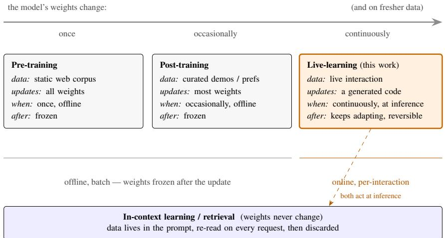
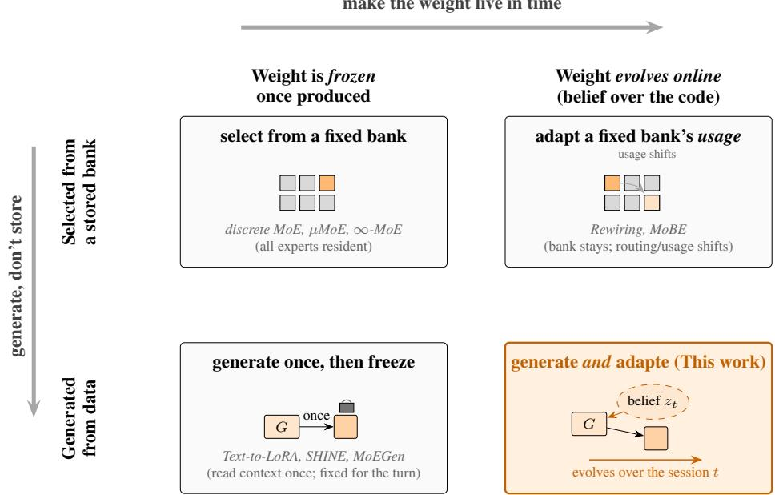
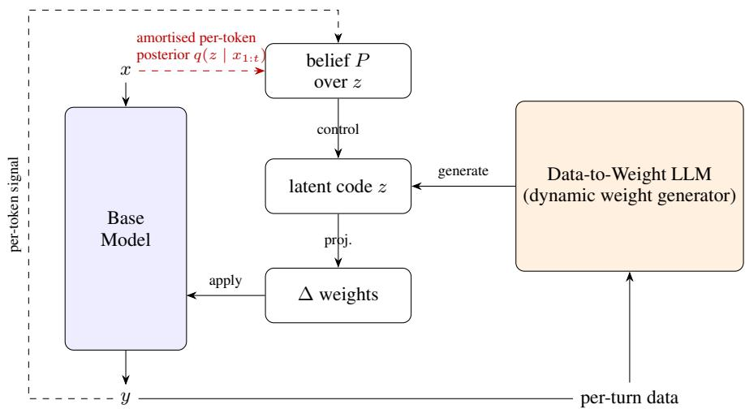
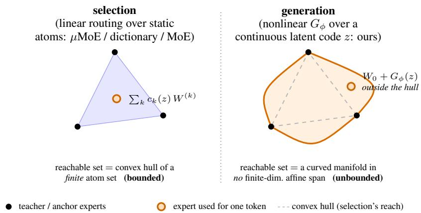
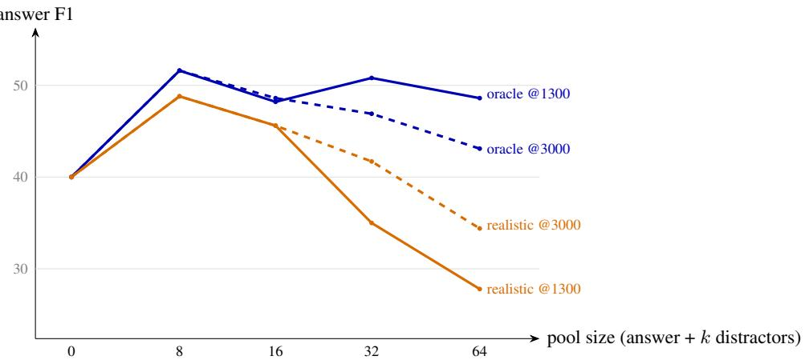
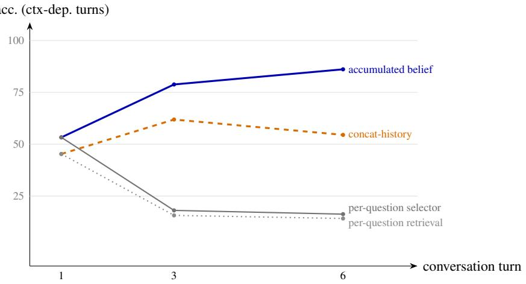

# Infinite-Parameter LLMs: Generating and Adapting Weights from Live Data

Jinli Hu Boltzbit Limited

Ross M. Clarke Boltzbit Limited

Yichuan Zhang Boltzbit Limited

José Miguel Hernández-Lobato University of Cambridge Boltzbit Limited

## Abstract

The scaling laws hold that a language model grows more capable with more parameters and more training data, and Mixture-of-Experts (MoE) architectures have ridden these laws to remarkable results, activating only a fraction of an enormous stored parameter bank for each token. That success is built on static pretraining data. A deployed model faces a different world, where much of the data that would make it more useful is not in its training set but in the live interaction it is currently handling, such as the facts a user supplies or the corrections they give. A conventional model cannot learn from this data, because its weights are frozen after training. Instead, the knowledge and behaviour supplied at run time are placed in the prompt, by retrieval or instruction, and re-read on every request only to be discarded once the request ends. We ask how an architecture could learn from live interaction by writing it into its weights. Taking inspiration from MoE, we propose the Infinite-Parameter LLM. A compact hypernetwork turns the data given at run time into a lowrank modulation of a shared base network, so the feed-forward weights are generated from live data rather than stored in a fixed bank. Where prior weight generators read the context once and freeze, we carry a Bayesian belief over the generator’s latent code and update it online, so the effective weight is re-derived from that evolving belief as the session proceeds rather than fixed after one read. The stored footprint stays fixed, yet the weights the model can compile are effectively infinite. For the knowledge and behaviour supplied at run time, carrying them in the weights rather than the prompt is amortized in compute, frees the context window, persists across turns, and can generalise better than in-context use. We specify an evaluation protocol that tests exactly this against in-context learning and retrieval.

## 1 Introduction

For half a decade, the reliable way to a more capable language model has been to train a bigger one on more data, and the scaling laws make the dependence on data precise. Capability rises predictably with the amount of training data, alongside parameters and compute (Kaplan et al. 2020; Hoffmann et al. 2022); data is a first-class input to capability. Two facts about where the data comes from now shape the problem. The first is that the supply of static pretraining text is finite. Current models are on track to exhaust the stock of public human-generated text between roughly 2026 and 2032 (Villalobos et al. 2024), so the easy gains from simply pretraining on more of it are running down. The second, and the one we build on, is that data has not stopped growing so much as changed form. Deployed models, and increasingly the agents built on them, generate an enormous and fast-growing stream of interaction data, from the questions users ask and the documents they bring to the corrections they give and the outcomes an agent observes. This data is produced at inference, from real use, and it is exactly the data a model most needs to become useful to this user on this task. If data is what buys capability, this is where the next of it will come from.

The trouble is that today’s models cannot learn from this data in the loop. A deployed model is frozen, and the interaction that just happened changes nothing about its weights. The workarounds all keep the data outside the weights. One family puts it in the prompt, where retrieval, long context, few-shot examples, and system prompts carry the knowledge a model draws on and the behaviour it should follow in the context window, re-read token by token on every request and discarded when the request ends. The other family builds around the frozen model with agent harnesses, tool orchestration, and external memories, engineering scaffolding that manages data without ever changing the network. Both avoid the harder question. If the valuable new data is generated by use, the model should be able to learn from it, which means its weights must change.

This is the question we pursue, and it concerns the architecture and its weight-update rule, not the harness around it. To learn from live interaction, a model needs weights that can take on new knowledge and behaviour cheaply, at inference, and hold onto what matters. We take our inspiration for such an architecture from the Mixture-of-Experts models already at the frontier.

A Mixture-of-Experts model stores a large bank of expert sub-networks and routes each token through only a few of them; DeepSeek-V3 holds 671B parameters yet activates 37B per token (DeepSeek-AI 2024), and models such as Mixtral (Jiang et al. 2024), Qwen3 (Qwen Team 2025), Kimi K2, and Llama-4 span a similar range. Seen through the right lens, such a model is less a collection of separate experts than a single network whose weights vary with the input. For a token x, an MoE layer applies the effective weight $\begin{array} { r } { W _ { \mathrm { e f f } } ( x ) = \bar { \sum } _ { i } g _ { i } ( x ) W _ { i } , } \end{array}$ a combination of stored experts selected by an input-dependent gate, which is precisely the conditional-computation construction of Bengio et al. (2013) and Shazeer et al. (2017). A MoE is, in this sense, a dense feed-forward network endowed with dynamic, per-token weights, and it is this property, not its parameter count, that we take as our starting point. The weights of a model can be made a function of the input rather than fixed constants. Two things about the MoE realisation of tha idea limit it for our purpose, however. Its dynamic weights are bought in memory, because although only a few experts are activated for any token the router may select any of them, so all must remain resident. And the bank it selects from is fixed once training ends, identical for every user and every moment of use, so a model serving a doctor and a novelist, at 9am and at midnight, reaches into the same unchanging palette. An MoE varies its weight with the token, but it can no more learn from the interaction in front of it than a dense model can. We keep the dynamic-weight idea and drop both limitations, generating the weights from a compact network instead of storing a bank, and letting them keep changing after the token that produced them.

Generation is what lets the weight carry what the prompt normally carries. It does not expand what a small model can store, since the information a network holds is bounded by its parameters, near two bits per parameter for MoE and dense models alike (Allen-Zhu and Li 2024); a compact generator obeys the same bound as any other network its size. But storage is not the point. The comparison generation sets up is not against a bigger model, it is against the prompt. Today the knowledge and behaviour a model needs at run time are supplied in the context as retrieved facts, a task instruction, or a few demonstrations. A generator can instead compile that same data into the weights, so a user’s facts become a weight that answers without the facts in the prompt. This is the “hypernetwork as encoder” that a growing line of work has shown to work (Charakorn et al. 2025) and to scale, with injected knowledge improving as a power law in the generator’s size and generalising better out of distribution than the same knowledge left in context (Dhankhar et al. 2026). Behaviour compiles the same way, since an instruction or a set of demonstrations is data the generator can read into the adapter rather than into the prompt. And because task adaptation occupies subspaces of strikingly low intrinsic dimension (Aghajanyan et al. 2021), a compact generator and a low-dimensional code are the right-sized tools for this, not undersized ones. Carrying the data in the weights, rather than re-reading it from the context on every token, is amortized in compute, frees the context window, and persists past the turn. None of this is available to a prompt, which is re-read whole on every request and forgotten at the end of it.

There is, however, a gap between “generate from data” and “dynamic per token” that the existing generative work leaves open, and closing it is our contribution. The weight generators that turn a context into an adapter do so once. They read the whole context in a single pass, emit one adapter, and then hold it fixed while the model answers (Charakorn et al. 2025). That is turn-level, and it is memoryless, since the adapter does not evolve as more tokens arrive and nothing is carried from one turn to the next. To match the view we started from, in which an MoE varies its weight every token, and to let the model keep adapting within a session rather than resetting each turn, the latent code cannot be read once and frozen. It must be inferred online. We therefore treat the code as a latent variable with its own prior and carry a belief over it, updated as evidence arrives, coarsely once per turn or finely every token, by an amortized recursive Bayesian filter. The turn-level generator supplies the belief with a strong measurement from the live facts, and the online filter keeps the belief moving between measurements. Together they give a weight that is both generated from data and evolving in time.

Carried to its conclusion, this produces a model whose stored footprint is fixed but whose effective weights are not, since it keeps compiling fresh ones from whatever data the run brings. We call it an infinite-parameter LLM, and intend the term precisely and narrowly. It names the unbounded set of effective weights and behaviours the model can realise, a fresh expert per token, produced from a continuous code and moved by an evolving belief. The contrast is with an ordinary model, whose weights are fixed after training and whose only channel for anything new is the prompt. There the reachable behaviours are whatever the fixed weights plus a bounded context allow, whereas here the weights themselves are recompiled from live data at every step. Concretely, we replace the stored expert bank with a compact generator that synthesises each token’s expert on demand as a low-rank modulation of a shared base network, drive that generator from the run-time data, and carry a Bayesian belief over the latent code that the generator reads, updated online over the course of a session. Figure 1 places this regime in the landscape of ways a model turns data into capability; Figure 2 (§ 2.7) then locates our architecture against the specific prior designs it draws on.

This closes the loop we opened with. The data that is still growing is generated by use, and a model whose weights are compiled from that data can turn it into capability at inference, in the loop, rather than only at the next pretraining run. As an interaction accumulates, more of it is written into the weights, and the model becomes more useful on the task at hand. We are careful about the scope of this claim. Session adaptation is bounded, low-dimensional, and reversible (§ 3.3), and it does not repeal the capacity law or substitute for pretraining. The loop we enable is that live data can enter the weights and be used, closing a path that a frozen model, prompted or scaffolded, leaves open, not that a model grows without limit from its own exhaust.

  
Figure 1: Three regimes for turning data into model capability, ordered by how often the model’s weights change and how recent the data they learn from is. Pre-training and post-training (SFT, RLHF) both update the weights offline, in batch, and leave them frozen thereafter; they differ mainly in the data they use and how often they run. Live-learning, the regime this work targets, updates a generated low-rank code continuously, at inference, on the interaction data — facts, corrections, outcomes — that the others cannot reach in the loop, and keeps adapting rather than freezing. In-context learning and retrieval (bottom) also act at inference, but they leave the weights unchanged and carry the data in the prompt, where it is re-read every request and then discarded. The regimes are complementary, not competing: live-learning does not replace pretraining (§ 4), it reaches the data pretraining and prompting leave on the table.

The design that follows is built around this weights-versus-prompt comparison. Knowledge and behaviour enter from the run-time data the generator reads, and what we generate and adapt is the low-dimensional part, namely which weight best fits the current context and how it should drift as the session goes on. Whether carrying data in the weights actually beats carrying it in the prompt, at matched budget, is what our evaluation measures (§ 4).

We situate the proposal within a natural progression along two axes at once, where the weight comes from, and whether it can change after training. Standard MoE and the bank-free variants (µMoE, ∞-MoE) select from a set that is fixed at deployment, and whether or not that set is unbounded, it is frozen. The recent weight generators generate the weight from context, but read the context once and then freeze the adapter for the turn. We take the last step, an expert space that is both generated from live data and adapted online, its weight moving with the data and with time, and make the following contributions.

1. A generative expert architecture and its design space (§§ 3.2 and 3.3). We make a shared base FFN’s weights dynamic through a generated low-rank delta driven by a latent code, with no stored expert bank, and set out a design space that positions ∞-MoE, µMoE, DFC, HyperMoE, and MoEGen by the axis on which each departs from this structure. The concrete choices that instantiate it — the base, and the form of the generator — are made in § 3.5.

2. The infinite-parameter view (§ 3.4). A precise statement of the sense in which the expert space is unbounded, a continuous generated family, one expert per token, extended over time by adaptation, distinguished from unbounded knowledge, with a guiding analogy to Bayesian-nonparametric mixtures of experts.

3. Online adaptation as a belief over the latent code (§ 3.3), the element that distinguishes us from oneshot weight generators. Rather than reading the context once and fixing the adapter, we carry a belief over the latent code and update it as the interaction proceeds, at three cadences (contextual, per-turn, per-token) under one probabilistic formulation, with uncertainty-gated retention, locating in-context learning, one-shot hypernetworks, continual-learning posteriors, and fast weights as points within it.

4. An evaluation protocol (§ 4) aimed at the comparison the design actually faces, carrying knowledge and behaviour in the weights versus carrying them in the prompt. The headline baselines are the prompt family, in-context learning and retrieval, with one-shot weight generators and point-estimate test-time training as adaptation baselines and stored-bank MoE as a reference point.

The ingredients each have precedent. Our contribution is their coupling, a shared-base low-rank generator driven from live data by a continuous latent code, made dynamic in time by recursive Bayesian inference over that code. Concurrent efforts that independently articulate the generate-instead-of-store thesis are discussed, and our differences delimited, in § 2.7.

## 2 Related Work

Our proposal touches several mature literatures; we organise them below and state our position against the closest work in § 2.7. We claim none of the individual ingredients in isolation.

## 2.1 Mixture-of-Experts: from stored banks to bank-free selection

The mixture-of-experts idea originates with adaptive mixtures of local experts and their hierarchical, EM-trained form (Jacobs et al. 1991; Jordan and Jacobs 1994), and the underlying principle of conditional computation, activating inputdependent parts of a network for capacity without proportional cost (Bengio et al. 2013; Bengio et al. 2015). Under the scaling-law paradigm, where capacity reliably buys capability (Kaplan et al. 2020; Hoffmann et al. 2022), this made sparsity the default route to cheap capacity: an MoE layer applies a per-token effective weight $\begin{array} { r } { W _ { \mathrm { e f f } } ( x ) = \sum _ { i } g _ { i } ( x ) W _ { i } } \end{array}$ a dense FFN whose weights are chosen conditionally on the input. Sparsely-gated MoE realised this at scale (Shazeer et al. 2017; Fedus et al. 2022), with subsequent work pursuing finer-grained experts and an always-on shared expert (DeepSeekMoE; Dai et al. 2024), a design that directly parallels our always-applied shared base FFN, and very large expert counts via retrieval (PEER; He 2024) built on product-key memory (Lample et al. 2019) and related memory layers (Berges et al. 2024), with the returns to sparsity themselves the subject of MoE scaling laws (Clark et al. 2022; Krajewski et al. 2024; Abnar et al. 2025). All of these store their experts. Dense-to-MoE “upcycling” makes this explicit, replicating a dense FFN into a stored bank (Komatsuzaki et al. 2023), the replicate-and-store move we invert. Softer relaxations reduce discreteness but not storage: soft merging of stored experts (SMEAR; Muqeeth et al. 2024), scaled to autoregressive pre-training (Lory; Zhong et al. 2024). A separate line reaches an unbounded butfrozen expert set without a stored bank: µMoE (Oldfield et al. 2024, § 2.2) factorises a fixed weight tensor, and ∞-MoE (Takashiro et al. 2026) draws a per-token continuous latent code from a Gaussian router and uses it as a top-N% activation mask over one shared FFN. ∞-MoE shares with us a shared base steered by a low-dimensional per-token latent code, but the resemblance is superficial. Its operator is a multiplicative mask that only reweights the existing neurons of a vanilla (non-gated) FFN, essentially giving an old-style FFN a GLU-like gate, so on a modern SwiGLU base, which already gates multiplicatively, the mechanism is largely redundant with the architecture. We instead generate an additive lowrank delta that steers neurons along new pre-activation directions, drive it from live data rather than a fixed router, and, the difference with no analogue in a frozen router, adapt the latent code online. We treat ∞-MoE and µMoE as the frozen-selection contrast, not as the precedent our method extends.

## 2.2 Compressing and factorising experts

A large literature makes experts cheaper. Low-rank or vector experts over a shared base recover most of full-expert quality at a fraction of the parameters (MoV/MoLORA, Zadouri et al. 2023; MixLoRA, Li et al. 2024; MoLE, Wu et al. 2024b; X-LoRA, Buehler and Buehler 2024; LoRAMoE, Dou et al. 2024), but retain a stored bank. Multilinear MoE (µMoE; Oldfield et al. 2024) is the closest “do not store experts” precedent: it represents the whole bank as a single CP- or Tensor-Ring-factorised weight tensor that is never materialised, routed by a differentiable entmax gate, $\mathbf { s o } ,$ like us, it stores no individual experts. The difference is that µMoEfactorises afixed tensor and routes linearly over $i t ,$ confining each token’s effective weight to the convex hull of a fixed atom set, whereas we generate the factors from a latent code that is itself produced from live data (§ 3.2); it is also not adaptable. Because µMoE already achieves an un-materialised bank, we do not rest our contribution on the absence of storage but on generating the code from run-time data and adapting it online. Orthogonally, resident memory is reduced by quantising and decoding experts on the fly (QMoE; Frantar and Alistarh 2023), pruning or skipping experts (Lu et al. 2024), merging them (HC-SMoE, Chen et al. 2025; MEO, He et al. 2023), offloading (Eliseev and Mazur 2023), or distilling an MoE into a dense mode (Xue et al. 2022), as surveyed by Liu et al. (2024). These compress a stored bank; we remove the bank and generate experts instead.

## 2.3 Hypernetworks and generated experts

Hypernetworks generate a target network’s weights (Ha et al. 2017); more generally, the dynamic-weight-tensor view treats any layer whose weights are an input-dependent function, made tractable by CP factorisation of the generated tensor (DFC; Babiloni et al. 2023), the general form our § 3.2 specialises to the FFN. Lightweight conditioning primitives such as FiLM (Perez et al. 2018) and (IA)3 (Liu et al. 2022) modulate a shared computation from an input-dependent signal, the same family as an additive or multiplicative weight modulation from a code. The most direct precedents generate a PEFT module for a frozen LLM in a single forward pass over a context or task description (HyperTuning, Phang et al. 2023; Text-to-LoRA, Charakorn et al. 2025; Doc-to-LoRA, Charakorn et al. 2026; SHINE, Liu et al. 2026; Drag-and-Drop LLMs, Liang et al. 2025; Zhyper, Abdalla et al. 2025), and the concurrent injectionscaling work (Dhankhar et al. 2026) shows this route scales: knowledge injected into a generated adapter improves as a power law in the hypernetwork’s size and generalises out of distribution better than a stored LoRA or full fine-tuning. This line is the closest to ours and the one we build on: it establishes that a hypernetwork acting as an encoder oflive data injects knowledge that the model then uses without the data in context, the “knowledge from data, not from a bigger bank” leg of our design. These generators differ sharply in how they read the data, and at what cost. At one end, Text-to-LoRA reads only a short task description into a single embedding and generates the adapter from a small

MLP, adding well under a percent of the base’s parameters (Charakorn et al. 2025). At the other, SHINE reads the full context by reusing the frozen backbone itself as the encoder, appending learnable memory tokens processed under an auxiliary “Meta LoRA” and mapping their all-layer hidden states to the adapter through a dedicated memory-to parameter transformer; this reads context far more richly but adds on the order of a sixth of the base’s parameters (roughly $\left( L ^ { \prime } / L + 2 r / H \right) P _ { : }$ , about 17% for their Qwen3-8B setting; Liu et al. 2026). This span, from a compact description-encoder to a backbone-reusing context-encoder, sets the sizing question our own encoder faces (§ 3.3). The gap we close is orthogonal to it: all of these read the context once and then freeze the adapter, so the generated weight is turn-level and memoryless, unchanged as the model reads on and reset from one turn to the next (SHINE’s recurrent variant chunks a long context but still produces a fixed adapter, not an evolving one). We keep the encoderof-data generator and add what it lacks, a belief over the latent code that keeps moving as the interaction proceeds (§ 3.3). Within MoE, HMoE (Qu et al. 2022) and HyperMoE (Zhao et al. 2024) generate expert modulations from a low-dimensional latent code but retain the stored bank; Zhao et al. (2024) report that conditioning the generator directly on the token can underperform a standard MoE, the optimisation difficulty our compact latent bottleneck (§ 3.3) targets. The effort closest to our generator (see § 2.7) is MoEGen (Zeng et al. 2026), which generates instance specific LoRA updates from a shared hypernetwork, though on the attention projections and from a per-prompt, top-k discrete latent code, without online adaptation. A documented failure mode across weight generators is memorisation rather than generalisation (Zeng et al. 2025), which we treat as a first-class evaluation concern (§ 4).

## 2.4 Inference-time adaptation and fast weights

Adapting weights at inference descends from fast-weight programmers (Schmidhuber 1992; Ba et al. 2016; Schlag et al. 2021). Test-time training updates weights by self-supervised gradient steps, as a sequence primitive (Sun et al. 2024), a long-term memory (Behrouz et al. 2025), reinforcement-learned self-edits (Zweiger et al. 2025), or pertask adapters that surpass in-context learning on novel structure (Akyürek et al. 2024); all produce point estimates. Methodologically, these approaches embed an updatable state within the sequence-mixing layer and update it by a hand-designed gradient or “surprise” rule; we instead leave attention unchanged, adapt only the generated FFN experts, and replace the hand-designed update with an amortized approximation to an explicit Bayesian filter (§ 3.3), yielding calibrated retention rather than a point estimate. Any per-token belief we carry is a low-dimensional FFNside filter, adding no recurrent state to the attention/sequence-mixing path. Test-time compute can instead be spent on search or sampling against a verifier (Snell et al. 2024), a matched-budget baseline for us. Closest in spirit are online MoE adaptations: continuous rerouting via gradient-updated router-logit deltas (Rewiring Experts; Su et al. 2025) and gradient-free, uncertainty-guided Bayesian adaptation of expert confidence in medical vision-language models (MoBE; Imam et al. 2026). Both adapt the usage ofafixed expert bank, not the latent code of a generated manifold.

## 2.5 Continual, online, and Bayesian foundations for adaptation

Continual and online learning study exactly the problem of updating a model over time without erasing what it knows, the stability–plasticity trade and its failure mode, catastrophic forgetting (McCloskey and Cohen 1989; Kirkpatrick et al. 2017). Its three families, regularisation (EWC; online EWC in Progress & Compress, Schwarz et al. 2018), replay (GEM, Lopez-Paz and Ranzato 2017), and architecture growth (Progressive Networks, Rusu et al. 2016), together with distillation-based variants (Learning without Forgetting, Li and Hoiem 2017) all target durable adaptation; Ven and Tolias (2019) taxonomise the settings, and recent work carries the problem to LLMs (Wu et al. 2024a; O-LoRA, Wang et al. 2023). A complementary line shows that fixed-capacity networks progressively lose plasticity under continual updates (Dohare et al. 2024). We take two things from this literature. The framing: our uncertainty-gating is a stability–plasticity controller that spends plasticity where the posterior is uncertain and protects it where confident, so live adaptation increases the diversity of weight configurations realised over a session rather than the stored parameter count. The machinery: the recursive posterior-as-prior update (below). We differ by relocating this from full-weight, offline, task-sequential training to a low-dimensional, generated latent code updated online at inference, forward-only and anchored to base, so adaptation is bounded and reversible rather than a permanent consolidation.

Probabilistic treatments of MoE run from the original mixtures (Jacobs et al. 1991; Jordan and Jacobs 1994) through Bayesian hierarchical mixtures of experts (Waterhouse et al. 1996), nonparametric infinite MoE via a Dirichlet-process gate (Rasmussen and Ghahramani 2002), feature-allocation priors with unboundedly many latent features finitely active (Griffiths and Ghahramani 2011), and modern identifiability/convergence theory for softmax gating (Nguyen et al. 2023). For LLM-scale adaptation, Bayesian posteriors over low-rank adapters are tractable (Laplace-LoRA, Yang et al. 2024; BLoB, Wang et al. 2024), and post-hoc structured Laplace has been applied to MoE expert layers (Bayesian-MoE; Dialameh et al. 2025). Our online update is recursive Bayesian filtering (variational continual learning, Nguyen et al. 2018; online Laplace, Ritter et al. 2018, building on Kirkpatrick et al. 2017; low-rank extended Kalman filtering, Chang et al. 2023), but applied to the generator’s low-dimensional per-layer latent code rather than to full weights or expert selection. Amortizing such a filter, training a recognition network to emit the state update in a forward pass, places us in the deep state-space / amortized-filtering lineage (deep Kalman filters, Krishnan et al. 2015; structured inference networks, Krishnan et al. 2017; deep variational Bayes filters, Karl et al. 2017; Kalman VAEs, Fraccaro et al. 2017), and we distinguish it from Kalman methods used as training-time optimizers over weights, whose observation is the loss rather than a predictive likelihood over a latent code (KOALA++; Xia et al. 2025).

  
Figure 2: The two architecture axes of the design, and where prior work sits. Down — where each token’s weight comes from: selected from a stored, fully-resident bank (top), or generated on demand from a compact resident generator (bottom); this is the “generate, don’t store” move, and it buys a fixed footprint. Across — what happens to the weight after it is produced: frozen once made (left), or carried as a belief over its latent code and updated online (right); this is the axis that makes the weight live in time. Stored-bank MoE (µMoE, ∞-MoE) and the one-shot weight generators (Text-to-LoRA, SHINE, MoEGen) each sit in a single cell; only the bottom-right — generate the weight from live data and keep a moving belief over the code — is occupied by this work. “Infinite parameters” is the reach this opens up: an unbounded set of effective weights and behaviours across both facts and time, from a fixed resident footprint — not an unbounded store of knowledge, which the capacity laws forbid and we do not claim (§§ 3.4 and 4). Attention is unchanged throughout; the bounded-vs-unbounded geometry of a single generated layer is developed in Figure 4.

## 2.6 Conditioning on run-time data through the prompt

The incumbent way to make a deployed model use run-time data is to place that data in the context. In-context learning conditions a frozen model on instructions or a few demonstrations supplied at inference (Brown et al. 2020), and can be read as implicit Bayesian inference over a latent concept the context selects (Xie et al. 2022); retrievalaugmented generation fetches relevant text into the context so the model can draw on knowledge it does not store (Lewis et al. 2020), with nearest-neighbour language models a non-parametric variant that interpolates an external datastore at the output (Khandelwal et al. 2020). Long-context modelling and soft prompt- or prefix-tuning (Lester et al. 2021) are further points on the same axis, enlarging or learning the conditioning signal while the model’s own weights stay fixed. All of these carry the run-time knowledge and behaviour in the context, where it is re-read on every request, competes for a bounded context window, and is discarded when the request ends; agent harnesses and external memories likewise manage this data around a frozen model rather than writing it into one. Our design targets the same goal by the opposite route, compiling that data into the weights, and § 4 makes in-context learning and retrieval the primary baselines against which the weight-carried alternative is measured.

## 2.7 Positioning: how this work differs

No confirmed prior work combines the full stack we describe, so we position against it on the two axes that survive the reframe: where the weight comes from, selected from a stored bank versus generated from data, and, once generation is granted, whether the weight keeps moving after it is produced, frozen for the turn versus carried as an onlineupdated belief. Underneath both sits the paradigm contrast that motivates the work, whether run-time knowledge and behaviour are carried in the weights or in the prompt; the whole generate-and-adapt family lives on the weights side of that line, and in-context learning and retrieval on the prompt side (we treat these as the primary evaluation baselines in § 4, not as architectural precedents). Figure 2 lays out the two architecture axes and the single cell each prior method occupies; Table 1 places the closest lineage, the context-driven weight generators, against the axes in detail; and Table 2 does the same on the adaptation axis specifically. We give stored-bank MoE only the two-axis summary and not a row-by-row scorecard: as § 1 argued, a stored MoE is the inspiration our design departs from and a reference point, not a method we compete with benchmark-for-benchmark, so the detailed comparisons below are with the generator and test-time-adaptation lines that are genuinely close to us.

Table 1: The hypernetwork / generator lineage — the closest prior work — against the axes that matter once “generate rather than store” is granted. The upper block generates a PEFT module from context in a single pass and then freezes it (turn-level, memoryless); the middle block generates over attention, a stored bank, or the whole weight without a shared low-rank base; the lower block selects from or adapts the usage of a fixed bank. Only this work drives the generator from live, accumulating data and lets the produced weight keep moving, as a calibrated belief over the latent code. “∆ over shared base FFN” marks our specific structure — an additive low-rank modulation of one always-applied base (∼ = partial: ∞-MoE masks a base rather than adding to it); MoBE’s posterior is over labels, not weights.
<table><tr><td>Work</td><td>What drives the generated weight</td><td>∆ over shared base FFN</td><td>Weight after it is pro- duced</td><td>Post- erior</td></tr><tr><td>HyperTuning (Phang et al. task / context description</td><td></td><td>√</td><td>frozen for the turn</td><td>X</td></tr><tr><td>2023) Text-to-LoRA (Charakorn task description</td><td></td><td>√</td><td>frozen for the turn</td><td>×</td></tr><tr><td>et al. 2025) Doc-to-LoRA (Charakorn a document</td><td></td><td>√</td><td>frozen for the turn</td><td>×</td></tr><tr><td>et al. 2026) SHINE (Liu et al. 2026)</td><td>in-context prompt</td><td>√</td><td>frozen for the turn</td><td>X</td></tr><tr><td>Zhyper (Abdalla et al. conditioning / task 2025)</td><td></td><td>√</td><td>frozen</td><td>×</td></tr><tr><td>Injection scaling (Dhankhar fact corpus (train-time) et al. 2026)</td><td></td><td>√</td><td>frozen once baked</td><td>×</td></tr><tr><td>MoEGen (Zeng et al. 2026) per-prompt discrete code</td><td></td><td>X</td><td>frozen for the prompt</td><td>X</td></tr><tr><td>HyperMoE / HMoE (Zhao latent code et al. 2024; Qu et al. 2022)</td><td></td><td>X</td><td>frozen</td><td>×</td></tr><tr><td>DFC (Babiloni et al. 2023) raw input</td><td></td><td>X</td><td>frozen per input</td><td>X</td></tr><tr><td>µMoE / ∞-MoE (frozen router over fixed atoms sel.)</td><td></td><td>2</td><td>frozen</td><td>×</td></tr><tr><td>Rewiring / MoBE (fixed- — (adapts usage) bank)</td><td></td><td>X</td><td>evolves (bank usage)</td><td>2</td></tr><tr><td>Inf-params LLMs (This live data + running evi- work)</td><td>dence</td><td>√</td><td>evolves online (belief over z)</td><td>√</td></tr></table>

Read across these axes, the generate-instead-of-store thesis is by now partly anticipated. MoEGen frames the shift from expert selection to expert-conditioned generation, DFC generates weights from the input in general, the Text-to-LoRA / SHINE line generates adapters from context and shows the route scales, and ∞-MoE and µMoE both reach an un-materialised expert set, so we claim neither that thesis nor the absence of a stored bank as new. The two genuinely unclaimed elements are (i) the mechanism as a specific point in the design space of § 3.2, a generated low-rank additive delta over a single shared base FFN, driven by a latent code produced from data; and (ii) the coupling, in which the generator is driven from live data and the latent code it reads is not fixed but carried as a belief updated online by recursive Bayesian inference. The sharpest single distinction is against the generator line closest to us (Text-to-LoRA, SHINE): those read the context once and freeze the adapter, turn-level and memoryless, whereas we carry an evolving belief, so the weight keeps moving within a session. Distillation (Hinton et al. 2015), where we use it, is an enabling training choice and not a contribution; the reframed design does not rest on compressing a teacher bank. Each rival misses at least one axis: ∞-MoE masks rather than generates and is frozen; µMoE factorises a fixed tensor with linear routing and is frozen; DFC generates a factor but over the input directly, with no shared base or online adaptation; Text-to-LoRA/SHINE generate from context but freeze the adapter; MoEGen generates over attention with a perprompt top-k code and no online adaptation; Rewiring and MoBE adapt a fixed bank’s usage rather than a generated latent code.

The adaptation axis tells the complementary story. The closest relatives on the “generate the weight” axis, Text-to-LoRA and SHINE, produce the adapter from context but then freeze it for the turn and reset each turn, so the weight does not evolve as the interaction proceeds. The test-time weight-adaptation methods do evolve the weight, but every LLM-side one updates a point estimate by gradient descent, inside the sequence-mixing layer (TTT; Titans), over the whole model by reinforcement (SEAL), or over a fixed bank’s router logits (Rewiring), while the sole Bayesian one keeps a posterior over labels, not parameters, by gradient-free moment-matching (MoBE). None both generates the weight from live data and carries a calibrated posterior over the generating latent code, updated by a distilled recursive filter with uncertainty-gating and principled forgetting, on the FFN side with attention untouched.

Concurrent work. MoEGen (Zeng et al. 2026) appeared essentially concurrently and independently articulates part of the generate-instead-of-store thesis; we cite it as concurrent, delimit our differences above, and do not claim priority over the shared framing.

Table 2: Adaptation positioning: what each method adapts, where, and how. The one-shot weight generators (Textto-LoRA, SHINE) sit at the top as the closest relatives on the “generate the weight” axis — they produce the adapter from context but freeze it for the turn; the test-time-training methods move a point estimate by gradient descent inside the sequence layer or over the whole model. Ours is the only one to carry a calibrated posterior over a generated laten code, updated online.
<table><tr><td>Work</td><td>What&#x27;s adapted</td><td>Where lives</td><td>it Update rule</td><td>Pt./ dist.</td><td>Granularity</td><td>Unc.</td><td>Forg.</td></tr><tr><td>Text-to-LoRA SHINE</td><td>7 generated LoRA</td><td>FFN/attn adapter</td><td>read context once</td><td>pt.</td><td>per-turn (one-shot)</td><td></td><td>reset each turn</td></tr><tr><td>TTT (Sun et al. 2024)</td><td>inner-model weights</td><td>in sequence layer</td><td>gradient</td><td>pt.</td><td>per-token</td><td></td><td>implicit</td></tr><tr><td>Titans (Behrouz et al. 2025)</td><td>memory MLP</td><td>branch be- side attn.</td><td>gradient + mo- mentum</td><td>pt.</td><td>per-token</td><td></td><td>gate αt</td></tr><tr><td>SEAL (Zweiger et full weights al. 2025)</td><td></td><td>whole model</td><td>RL → SFT</td><td>pt.</td><td>per-task</td><td></td><td></td></tr><tr><td>Rewiring (Su et al. router logits 2025)</td><td></td><td>MoE router</td><td>gradient</td><td>pt.</td><td></td><td>per-segment entropy (heur.)</td><td>reset</td></tr><tr><td>MoBE (Imam et label statistics al. 2026)</td><td></td><td>frozen ex- perts</td><td>gradient-free EMA</td><td>post. (labels) per-sample</td><td></td><td>√</td><td></td></tr><tr><td>This work (A-C)</td><td>generated la- tent code z</td><td>FFN-side, attn. frozen</td><td>amortized Bayes filter</td><td>dist. over z</td><td>in-ctx / turn / token</td><td>√(prec.)</td><td>√(Q)</td></tr></table>

## 3 Method: Generating and Adapting FFN Experts

## 3.1 Overview

We build on a standard decoder-only transformer and leave attention untouched; only the feed-forward (FFN) sublayer is changed, and only in a chosen subset of layers. At each such generative layer, three components replace the usual FFN (Figure 3): a shared base FFN, always applied; a compact generator $G _ { \phi }$ that maps a low-dimensional latent code to a structured low-rank modulation of that base; and a belief over the latent code, from which the code driving the generator is read and which is updated from live data and running evidence (§§ 3.2 and 3.3). The token’s effective expert is the base FFN plus the generated modulation. Crucially, no expert bank is stored: each token’s expert is generated from its latent code and discarded, so the resident parameters are the base, the generator, and the small inference map, all of fixed size, while the set of experts the model can produce is unbounded (§ 3.4).

This one mechanism carries all three of our claims. Infinite parameters: a fresh expert is generated from a latent code drawn from a continuous, data-materialised space, so the model deploys an unbounded family of effective weights rather than reusing a finite stored bank (§ 3.4). Knowledge and behaviour in the weights: because the code is produced from the data supplied at run time, the effective weights come to carry what a prompt would otherwise carry, such as facts, an instruction, or a few demonstrations, entering through the weights rather than being re-read from the context on every token (§ 3.2). Adaptation: because the expert comes from a latent code, and because we carry a belief over that code rather than reading it once, the model keeps specialising as a session proceeds, with the transformer left unchanged (§ 3.3). We first fix notation and set out the belief-over-code framework (§ 3.2); describe how live data writes the belief and how per-token inference moves it (§§ 3.2 and 3.3); make the infinite-parameter claim precise (§ 3.4); and only then commit to the concrete architectural choices that instantiate the framework (§ 3.5).

## 3.2 The belief-over-code framework

Notation and setup. We write d for the model width, h for the FFN hidden width, $d _ { z }$ for the latent dimension, and r for the rank of a generated modulation, with $r \ll d .$ . Layers are indexed by ℓ and tokens within a sequence by t; the input to a generative layer is the post-attention hidden state $x = h _ { \ell , t } \in \mathbb { R } ^ { d }$ , which already integrates context through the layer’s attention and the residual stream. The frozen, shared base FFN has weights collectively denoted $W _ { 0 }$ and is initialised from a strong dense model (§ 4.1). The three moving parts are a Data-to-Weight encoder $E _ { \phi }$ that reads run-time data into a latent code, a generator $G _ { \phi }$ that maps a code z to a low-rank modulation $\Delta W ( z )$ of the base, and a belief over the code that is updated online. The code budget $( r , d _ { z } )$ , the base architecture, and the concrete values these symbols take are choices we fix in § 3.5.

The primitive: a belief over the latent code. The object at the centre of the design is not a weight and not a code but a belief over the code — a distribution $P ( z )$ that the model carries and updates as it works (we reserve $q$ for the amortized approximation to it, § 3.3). Everything else is downstream of it: the code that drives the generator is a summary of the belief (its mean, or its most probable atom), the weight delta is a function of that code, and adaptation is inference on the belief. Fixing the belief as the primitive, rather than the weight or a point code, is what lets one mechanism serve the two channels of § 1: a measurement channel, by which run-time data writes the belief (this is where knowledge and behaviour enter the weights, later in this section), and an inference channel, by which the belief moves between measurements as evidence accumulates (§ 3.3). The form of the belief — a Gaussian over a continuous code, or a categorical distribution over a pool of materialised codes — is an architectural choice we defer to § 3.5; the framework, and the two channels, are the same either way.

  
Figure 3: The architecture, organised around a belief over the latent code z. On the main (per-turn) path, live data is read by the Data-to-Weight LLM (the encoder $E _ { \phi }$ of § 3.2) into a latent code z; the code generates a low-rank weight delta $\Delta W$ that modulates the frozen base model, which produces the output. A belief $P$ over z sits above the code and is what makes the weight move: it is updated online, carried from step to step rather than re-encoded from scratch. The per-token signal (dashed) — the running hidden state, equivalently the realised output, of the autoregressive stream — feeds the belief and is introduced only to amortise the per-token posterior $q ( \boldsymbol { z } \mid \boldsymbol { x } _ { 1 : t } ) ;$ it is not on the main data path. The belief’s form — a Gaussian over a continuous code, or a categorical posterior over materialised codes — is the architectural choice of § 3.5.

The generated weight. Given a code $z ,$ the effective weight of any modulated base projection $W _ { 0 }$ is the base plus a generated low-rank additive delta,

$$
W ( z ) = W _ { 0 } + \Delta W ( z ) , \qquad \Delta W ( z ) = B ( z ) A ( z ) ^ { \top } , \quad A ( z ) \in \mathbb { R } ^ { d \times r } , \ B ( z ) \in \mathbb { R } ^ { h \times r } ,\tag{1}
$$

with the factors $A ( z ) , B ( z )$ produced from the code. The delta is never materialised: we compute ydelta = $B ( z ) \left( A ( z ) ^ { \top } x \right)$ , so the per-token application costs $O ( r \left( d + h \right) )$ per layer, negligible relative to the base $\mathrm { F F N } ^ { \prime } \mathrm { s } \mathcal { O } ( h d )$ This is the framework; the specific base (SwiGLU), which projections carry a delta, and how A, B are produced are concrete choices made in $\ S \bar { 3 } . 5$ . What matters for the framework is only that the weight is a function of a code, and the code is drawn from a belief.

The measurement channel: writing the belief from live data. The belief is written from the data supplied for a turn — the facts, instruction, or examples — by the Data-to-Weight encoder $E _ { \phi }$ (the encoder-hypernetwork of § 2.3). This is where the knowledge and behaviour that would otherwise sit in the prompt enters the weights: $E _ { \phi }$ turns supplied data into a code (or, categorically, into a new materialised code added to the pool, § 3.5), and it is a strong, content-rich measurement rather than a cheap per-token guess. A router over the running hidden state cannot, by itself, inject a fact the base was never given; only the measurement channel can, which is why the encoder and the per-token inference of § 3.3 are distinct modules.

The encoder is where the design’s cost concentrates, and the framework spans a spectrum of realisations trading footprint against reading fidelity; we set out the axis rather than fix a point on it. At the light end, the encoder reads the supplied data with the base model’s own forward pass (which must process those tokens regardless) and taps a small readout head on the resulting hidden states, so the head and generator are the only added parameters, at the scale of a description-conditioned hypernetwork (Text-to-LoRA’s smallest variant adds under a percent of the base; Charakorn et al. 2025). In the middle, the backbone is reused as a dedicated context-encoder with auxiliary read-time adapters and a memory-to-parameter network, as in SHINE (Liu et al. 2026), which reads long context more faithfully at the cost of on the order of a sixth of the base’s parameters. At the heavy end, the encoder is a completely separate hypernetwork, not tied to the base’s weights at all, as in the knowledge-injection hypernetworks of Dhankhar et al. (2026), whose evidence is that injection fidelity scales with this hypernetwork’s capacity. These are points on one axis — how much dedicated machinery reads the data into the code — and which is warranted is an empirical, footprint-versus-quality question (§ 4.3) rather than settled by fiat; a relevant consideration along the way is that the online belief (§ 3.3) can correct an imperfect one-shot read that a frozen generator cannot, which can relieve a lighter encoder of carrying the whole burden in a single pass. Attention and the base weights are frozen throughout.

## 3.3 Moving the belief: online inference over the code

The element that separates this design from the one-shot weight generators of § 2.3 is that the code is not read once and fixed; we carry the belief and update it as the interaction proceeds. Adaptation, in every variant, is therefore inference over the latent code, with the generator and base frozen. The transformer’s attention / sequence-mixing path is left unchanged throughout: no variant inserts a recurrent state into the sequence layer, in contrast to test-time-training methods that adapt the sequence path itself (Sun et al. 2024; Behrouz et al. 2025). The only state carried across steps is the low-dimensional belief, and it lives entirely on the FFN side.

Why a belief and not a point. Existing test-time adaptation carries a point estimate of the adapted weights and moves it by gradient descent (TTT, Sun et al. 2024; Titans, Behrouz et al. 2025). Carrying instead a posterior over the code earns three things a point cannot. First, calibration: the posterior’s spread is an explicit statement of how much to trust the adaptation, usable to gate, abstain, or defer when the model is uncertain. Second, uncertaintygated stability–plasticity: a precision-weighted update adapts fast where the posterior is unsure and protects what it is confident in, resisting catastrophic forgetting without a bolted-on regulariser (a derived analogue of elastic weight consolidation, Kirkpatrick et al. 2017). Third, principled forgetting: a process-noise term gives a controlled, optionally content-aware way to reopen plasticity when the input distribution shifts. These benefits are carried by the posterior’s spread, which is exactly the fragile part under amortization, so “Bayesian” here is an empirical claim about a calibrated posterior, not a free consequence of emitting a distribution, and validating it — exact-filter recovery, the amortization gap, and calibration of the posterior precision — is part of the continuous-Gaussian instantiation we leave to future work (§ 3.5).

The exact update, and why we amortize it. The belief is updated by an exact recursive Bayesian filter, the same object at every cadence. At an update, the observation over the tokens since the last update is either the model’s own log-likelihood $\begin{array} { r } { \mathcal { L } ( z ) = \sum _ { i } \log \bar { p _ { \theta } } ( x _ { i } \mid x _ { < i } ; z ) } \end{array}$ (the self-supervised regime, always available) or an explicit feedback likelihood $p ( y$ | context; z): Boltzmann in a scalar reward, $p ( y \mid z ) \stackrel { \textstyle - } { \propto } \exp ( r _ { z } / T )$ , or Bradley–Terry for a pairwise preference (thefeedback regime). The recursion is Bayes’ rule applied to the running posterior,

$$
P _ { t } ( z ) \propto P _ { t - 1 } ( z ) \cdot p ( \mathrm { o b s } _ { t } \mid z ) ,\tag{2}
$$

carried from step to step rather than recomputed from scratch. Throughout, we write $P$ for this exact recursive belief and $q$ for the amortized approximation to it that we actually run — the standard variational reading in which a learned $q$ is fit to a target $P .$ Computing the likelihood term exactly requires a test-time backward pass to the code, impractical per token at deployment, so the exact belief P is kept only as an offline reference (a distillation teacher, and a comparison baseline) and amortized: a trained forward map $F _ { \phi }$ emits the belief update in a single pass, its output q distilled against $P$ (Putzky and Welling 2017; Marino et al. 2018); the recognition-network instance of a state-space filter (Krishnan et al. 2015; Karl et al. 2017; Fraccaro et al. 2017). One property makes a single $F _ { \phi }$ serve both cadences below: the exact update over a window of tokens is the same function of (prior belief, accumulated observation) whatever the window’s length, so $F _ { \phi }$ reads the prior belief and a pooled summary of the window (with a length feature) and is distilled against the exact trajectory at both cadences. This is the per-token signal of Figure $^ { 3 , }$ drawn dashed because it exists only to amortise the posterior $q ( \boldsymbol { z } \ | \ x _ { 1 : t } )$ — it is not on the main data path, and switching it off returns the one-shot generator.

The three cadences. The designs place this one machinery at three points on the belief-granularity axis, indexed by token t or turn τ; they are not three mechanisms but one belief updated more or less often.

• Design A — Contextual (implicit belief). No explicit belief is carried within a sequence; context is integrated by ordinary attention, and a router $R _ { \ell } ( h _ { \ell , t } )$ maps the contextual hidden state to the code. Per-token generation is then an amortized predictive inference, the forward pass approximating the Bayesian predictive in-context (Xie et al. 2022). This is the cheapest variant and the degenerate member of the family — Bayesian only in the weak sense that in-context learning implicitly approximates a posterior predictive, with none of the calibration, persistence, or controlled forgetting the explicit belief buys. We keep it as the baseline the explicit-belief designs must beat (§ 4.4).

• Design B — Session posterior (per-turn update). An explicit belief is maintained per layer and updated once per turn by $F _ { \phi } .$ , from the prior belief and a pooled encoding of the turn (and any feedback). Because it fires only per turn, B can equally run the exact filter online — one backward pass per turn is affordable — making amortization optional here. It gives persistent weight-space adaptation at turn granularity and carries no per-token state.

• Design C — Fast belief filter (per-token update). The belief is carried as a side state and updated every token by the same amortized map, $b _ { t } = F _ { \phi } ( b _ { t - 1 } , s _ { t } )$ , on a per-token signal $s _ { t } ;$ the generator reads its summary. Here amortization is essential. This is a genuine per-token weight-space update realised as a benign, lowdimensional recurrence outside the attention/sequence path, the finest-grained and fully persistent variant, at the cost of a small carried belief and a cheap forward-only filter step per token.

Table 3: The three adaptation cadences as one machinery — a belief over the code updated more or less often. A carries no explicit belief (the baseline); B updates the belief once per turn; C every token. The update rule is the recursive Bayes recursion of § 3.3 in every case, differing only in the observation window; it is agnostic to the belief’s form (the Gaussian or categorical realisations of § 3.5).
<table><tr><td></td><td>A — Contextual</td><td>B — Session (per-turn)</td><td>C — Fast filter (per-token)</td></tr><tr><td>Belief update</td><td>none (implicit in con- text)</td><td>once per turn τ</td><td>every token t</td></tr><tr><td>Carried state</td><td>none</td><td>belief Pτ(z)</td><td>belief Pt(z)</td></tr><tr><td>Update rule</td><td>router reads the code</td><td> $P _ { \tau } \propto P _ { \tau - 1 } \dot { \cdot } p ( \mathrm { o b s } _ { \tau } \mid z )$  task shifts across turns;</td><td> $P _ { t } \propto { P _ { t - 1 } } \cdot p ( x _ { t } \mid z )$ </td></tr><tr><td>Wins when</td><td>context suffices; short interactions</td><td>per-turn feedback</td><td>long single stream; 1 fine- grained drift</td></tr></table>

All three instantiate the same idea — a generated, continuously-indexed expert space adapted by Bayesian inference over its latent code — and differ only in the granularity and persistence of that inference. The family also locates prior work within one frame: discrete MoE and ∞-MoE are the frozen limit; in-context learning is the contextual instance (A); and fast-weight/TTT methods are per-token updates placed in the sequence layer rather than, as in C, in a low-dimensional FFN-side belief. Because test-time gains tend to accrue with the number of updates rather than their size (Sun et al. 2024), we expect C to dominate B under fine-grained drift, with B the natural read-out when the phenomenon and its labels live at turn granularity; since C run over the whole conversation subsumes B, ou accumulation study (§ 4.4) updates at C and reports at the turn level.

## 3.4 The infinite-parameter view

We call the model an infinite-parameter LLM in a precise sense: the set of experts reachable at a generative layer is $\{ W _ { 0 } + G _ { \phi } ( z ) : z \in \mathcal { Z } \}$ , where Z is the space of codes the encoder can materialisefrom data. The stored parameters base, encoder, generator, and the small inference map — are finite and fixed; the reachable effective weights are not, because Z is not a fixed finite index but a space populated by whatever data the model is given. Over an interaction the model instantiates a growing set of distinct weight configurations rather than reusing a fixed bank.

This is where the categorical instantiation of § 3.5 must be positioned carefully, because it looks like the finite selection the paper otherwise argues against. The distinction is the origin of the atoms. A classical MoE selects among a fixed, stored bank of experts; its reachable set is the convex hull of those atoms — bounded, a selection (Figure 4, left). Our categorical belief is a posterior over a pool of atoms that are themselves generated from data by $E _ { \phi } \colon$ any new data materialises a new code, so the pool is unbounded and the atoms are drawn from a continuum, not enumerated in advance. A categorical belief over a data-materialised pool is thus the finite, tractable working-set representation of a belief over an unbounded generated space — the same relationship a Dirichlet-process mixture has to its infinite base measure, where any computation touches only a finite active set while the pool of possible components is unbounded (Rasmussen and Ghahramani 2002). The unboundedness the name claims therefore does not require a continuous code at inference; it requires that codes be generated rather than stored, which the measurement channel (§ 3.2) guarantees. Selection over a stored bank is bounded; selection over a generated pool is not.

Two clarifications keep the claim honest. First, “infinite” is a statement about reachable weight configurations, not stored knowledge: knowledge remains bounded by the resident parameters (Allen-Zhu and Li 2024), and “infinite” here never means a larger knowledge store. Second, adaptation adds no parameters; it re-allocates plasticity, since the belief’s uncertainty (§ 3.3) decides which latent directions stay plastic and which are protected, resolving the stability– plasticity trade (Dohare et al. 2024) at inference rather than freezing it. We are careful to claim only what is ours: that a layer’s weights can be made a data-dependent function rather than a stored constant is established (hypernetworks, Ha et al. 2017; dynamic layers, Babiloni et al. 2023), and MoE is itself a dynamic-weight layer with a finite index; our contribution is the specific coupling — a belief over a generated code space, written by live data and moved by online inference — not dynamic weights in the abstract.

This positioning also separates us from the neighbouring generated- and selected-expert methods along one axis, the origin of the atoms and whether the belief moves: µMoE (Oldfield et al. 2024) and discrete MoE select over a stored bank (bounded); DFC (Babiloni et al. 2023) and MoEGen (Zeng et al. 2026) generate an adapter and freeze it after one read; ∞-MoE (Takashiro et al. 2026) masks subsets of one fixed network; and HyperMoE (Zhao et al. 2024) generates a supplementary branch over a stored bank. None carries an online belief over a data-materialised pool, which is the coupling this paper adds.

## 3.5 Architecture choice in this paper

The framework above is deliberately agnostic about the form of the belief and the shape of the generator. We now commit to the choices this paper evaluates: the form of the belief (categorical, § 3.5.1), and the generator and base

  
Figure 4: Selection over a stored bank versus generation over a code space, on the same three anchor experts. Left: routing over a finite set of stored atoms (µMoE / discrete MoE) reaches only their convex hull (the triangle); every routed expert lies strictly inside it — bounded. Right: codes generated from data by $E _ { \phi }$ populate a curved manifold that bulges beyond that hull (shown dashed), so a generated expert $W _ { 0 } + G _ { \phi } ( z )$ can lie strictly outside it — the reachable set is contained in no finite-dimensional affine span, and is unbounded. This is the geometric content of the infinite-parameter claim: what matters is that the atoms are generated rather than stored, not whether the belief over them is continuous or categorical. This paper’s categorical belief is a finite working set over this unbounded generated space — a moving slice of the right panel, not a return to the left.

it drives (§ 3.5.2). The alternative — a continuous-Gaussian belief with a nonlinear generator, the framework’s most expressive point — we note as a further direction at the end of this section rather than evaluate here.

## 3.5.1 A categorical belief over materialised codes

We instantiate the belief over z as a categorical distribution over a pool of codes $\{ m _ { 1 } , . . . , m _ { K } \}$ , each materialised from data by the encoder $E _ { \phi }$ . The belief is $P _ { t } ( z ) = \operatorname { C a t } ( \pi _ { t } )$ with $\pi _ { t } \in { \Delta ^ { K - 1 } }$ , the code driving the generator is the posterior’s most probable atom (top-1) or its mean, and the online update of § 3.3 becomes recursive categorical Bayes,

$$
\pi _ { t , k } \propto \pi _ { t - 1 , k } \cdot p ( \mathsf { o b s } _ { t } \mid z = m _ { k } ) ,\tag{3}
$$

so that as the interaction proceeds the belief concentrates on the code that best explains the running evidence, and re-opens when the evidence shifts. This is the exact recursive filter of § 3.3 specialised to a categorical latent; its amortization is a learned selector that emits the posterior over the pool in a single forward pass. Concretely, the selector scores the running hidden state against each code and normalises: at generative layer ℓ with the layer-input activation $u _ { \ell }$ as query and a learned key $\kappa _ { \ell } ( m _ { k } )$ per code, $\pi \propto \exp \langle u _ { \ell } , \kappa _ { \ell } ( m _ { k } ) \rangle$ ⟩. Selection is top-1 per layer, so a single generated expert is applied — not a top-k mixture — which keeps the operator a genuine weight rather than an averaged one; the measurement channel of § 3.2 supplies the codes, and the selector supplies the cheap per-step inference over them. The two cadences of § 3.3 carry over directly: per-turn (B), the posterior is updated once per turn as questions accumulate over a fixed knowledge pool; per-token (C), it is updated as the sequence streams.

(The empirical study of this selector — how well the categorical posterior identifies the code that carries the answer, what signal drives it, and where in the network the routing signal lives — is the subject of§ 4.3.)

## 3.5.2 The low-rank generator

For the generator and its base we adopt the concrete pipeline of SHINE (Liu et al. 2026) essentially unchanged, and materialise the categorical pool of § 3.5.1 by running it once per knowledge set. The base is a strong dense SwiGLU model (Shazeer 2020, fixed in § 4.1), and the generated delta modulates its FFN projections $\{ W _ { \mathrm { g a t e } } , \breve { W } _ { \mathrm { u p } } , W _ { \mathrm { d o w n } } \}$ with a small rank (r = 8) and latent dimension $( d _ { z } = 1 2 8 )$ , the code-budget controls of the framework.

Reading data into a code. The base is a frozen decoder-only transformer. To read context, its tokens are passed through the base with a set of M learnable memory tokens appended to the sequence; these are input-independent probes, trained once and shared, that read information out of the evidence by ordinary attention. The memory tokens’ hidden states are collected from every layer, giving a memory grid m $\in \mathbb { R } ^ { \check { L } \times M \times d } . \check { \mathbf { A } }$ memory-to-parameter (M2P) network then mixes this grid, and emits a flat latent code $z \in \mathbb { R } ^ { P }$ , from which a trivial projection applies to give the LoRA parameters the base needs.

Reshaping the code into weight deltas. For a weight $W _ { 0 } \in \mathbb { R } ^ { \mathrm { o u t \times i n } }$ the low-rank (LoRA; Hu et al. 2022) factors $A \in \mathbb { R } ^ { \mathrm { { \bar { i } n } \times \tilde { r } } } , B \in \mathbb { R } ^ { \mathrm { o u t } \times r }$ and an optional bias $C \in \mathbb { R } ^ { \mathrm { o u } }$ are applied as

$$
W ( z ) x \ = \ W _ { 0 } x \ + \ \big ( \sqrt { s } B \big ) \big ( \sqrt { s } A \big ) ^ { \top } x \ + \ s C ,\tag{4}
$$

with a fixed scale s folded as $\sqrt { s }$ into each factor and s into the bias. The rank is smal $( r = 8 )$ , so each adapter is cheap; the memory-token count is set so the flat code z has exactly the size the per-layer LoRA factors require. The delta is applied in factored form, $B ( A ^ { \top } x )$ , never materialised, so per-token cost is $\mathcal { O } ( r \left( \mathrm { i n } + \mathrm { o u t } \right) )$ ) per projection.

Why this generator, and what we change. Two properties make this the right generator for our framework. First, it is afaithful, high-bandwidth reader: unlike a compact readout head, the memory-token/M2P path reads long evidence into a code that reconstructs per-layer adapters well enough to answer questions the base was never given (the § 4.2 result on which this paper’s data-to-weights claim rests). Second, it is deterministic and cacheable: one read per knowledge set yields a code, and that code is exactly the materialised atom $m _ { k }$ of the categorical pool (§ 3.5.1). We take the generator, memory tokens, M2P network, and meta-LoRA frozen from a SHINE checkpoint and add only the categorical selector of § 3.5.1 on top; the sole trainable parameters introduced by this paper are the selector’s per-code key map and its query alignment, at a scale of well under a percent of the base. The code-to-weight reshape here is linear in the code, with the nonlinearity of the read concentrated in the encoder (the memory/M2P stack) rather than the code-to-weight step — a preliminary finding of ours is that a linear code-to-weight leg ties a nonlinear one at a fraction of the parameters, which is why we adopt it.

Cost. Codes are computed once per knowledge set and cached, so at run time the only cost beyond a base forward pass is (i) the selector’s K inner products per layer to update the categorical belief and (ii) applying the selected code’s factored deltas. Both are negligible relative to the base; in particular, nothing re-reads the evidence tokens at generation time. This is the concrete sense in which carrying data in weights, once compiled, is cheaper at run time than re-reading it from the prompt on every token (§ 4.2), and it is the property the dilution study of § 4.2 exploits when the evidence is too large to keep re-reading in-context.

The richer belief we do not evaluate. The categorical form chooses among whole-code reads rather than moving within the code space, so a shift the pool does not already contain can be met only by materialising a new atom. The framework’s more expressive point (§ 3.2) instead carries a continuous-Gaussian belief over a zero-anchored code offset $\psi _ { \ell } \sim \mathcal { N } ( 0 , \Sigma _ { 0 } ) , z _ { \ell } = c _ { \ell } + \psi _ { \ell } ( \mathrm { s o } \psi _ { \ell } = 0$ recovers the un-adapted model), and turns the recursive update of § 3.3 into a Laplace / extended-Kalman filter whose posterior precision gates plasticity — adapting fast where it is uncertain, protecting what it is confident in, a derived analogue of elastic weight consolidation (Huszár 2018; Chang et al. 2023; Kirkpatrick et al. 2017). This is the form in which “Bayesian” becomes load-bearing rather than decorative, but it demands a code-to-weight map smooth in z, the exact filter as a distillation teacher, and calibration of the amortized precision; we leave it to future work and evaluate the categorical belief here.

## 4 Experiments

Our experiments are set up to answer three questions, each resting on the one before and each the subject of one subsection, which together test the design promise that the infinite-parameter LLM can learn from its live interaction by writing that interaction into its weights, and go on adapting as the interaction grows. The first is whether run-time data can enter the weights and be used at all: does compiling a turn’s evidence into the generated weight let the mode answer from it, with the evidence withheld from the prompt (§ 4.2)? The second arises once a session has written several pieces of data into a pool of codes — whether the model can infer which of them the current query needs, the single-step form of the belief over the code (§ 4.3). The third is whether that belief accumulates across the interaction, so the model routes better as the conversation lengthens than it would by treating each turn afresh (§ 4.4).

## 4.1 Setup

Base and generator. We build on a frozen base (Qwen3-8B; Qwen Team 2025) and a data-to-weights generator that compiles evidence into low-rank weight deltas (the pipeline of § 3.5.2); the generator is reused from prior work rather than retrained here. On top of this we add the categorical selector of § 3.5.1, which is trained lightly on a routing objective. Full training details are outside the scope of this paper.

Data and tasks. We evaluate on five question-answering datasets spanning the axis that matters for weights-versusprompt — how long, noisy, and multi-hop the evidence is. SQuAD (single short passage, clean) is the easy end, where the prompt is cheap and strong. MS MARCO v2.1 (a question with ≈ 10 candidate passages, one marked answer-bearing) is the long, noisy, multi-passage end. Between them sit three multi-hop sets whose answers require combining several passages: HotpotQA (distractor setting: 2 gold + 8 distractor paragraphs), 2WikiMultihopQA, and MuSiQue (the hardest, built to resist single-hop shortcuts). The multi-passage sets carry per-passage gold relevance labels (is\_selected in MS MARCO, supporting-fact annotations in the multi-hop sets), which give the selector experiment (§ 4.3) a routing target for free; SQuAD, having a single passage, is used only for the weights-versusprompt comparison. Unless noted, results are over n = 150 held-out groups, scored by answer F1 (generation) or top-1/top-3 routing accuracy (selection).

Table 4: Weights versus prompt across the evidence-difficulty axis (measured in F1). The prompt wins when evidence is short and clean (SQuAD); compiling into weights wins when it gets longer and noisier (the others).
<table><tr><td>Dataset (evidence)</td><td>Closed-book</td><td>In-context</td><td>Data-to-weights</td></tr><tr><td>SQuAD (1 short passage)</td><td>20.2</td><td>85.3</td><td>51.8</td></tr><tr><td>HotpotQA (2-hop, +distractors)</td><td>22.1</td><td>58.7</td><td>60.4</td></tr><tr><td>2WikiMultihopQA (multi-hop)</td><td>24.5</td><td>55.5</td><td>58.1</td></tr><tr><td>MuSiQue (hard multi-hop)</td><td>15.2</td><td>40.9</td><td>45.3</td></tr><tr><td>MS MARCO v2.1 (10 passages)</td><td>16.8</td><td>33.6</td><td>48.0</td></tr></table>

Baselines. For weights-versus-prompt: closed-book (no evidence), in-context (evidence in the prompt), and the oneshot data-to-weights read. For selection over the code pool: random (1/K), BM25 and dense retrieval (bge-small, untrained) over the same candidate passages — the standard, strong way to pick the right passage — and an oracle that scores each code by the likelihood it assigns the true answer, which upper-bounds the routing signal.

## 4.2 Data-to-weights beats the prompt where evidence is long and multi-hop

We first reproduce the data-to-weights generator we build on (SHINE; Liu et al. 2026) on our own setup, to confirm on a validated base that run-time evidence compiled into the weights can actually be used. We then run a dilution study, new here, that probes where the single one-shot read breaks as evidence scales, and that motivates per-token dynamic adaptation.

Reproducing the base: data-to-weights versus the prompt. Whether compiling a turn’s evidence into the code beats carrying it in the prompt depends entirely on the evidence (Table 4). On SQuAD — one short, clean passage — the prompt is the ceiling (in-context 85.3 vs data-to-weights 51.8): when the evidence is small and used once, nothing beats simply reading it. On MS MARCO — ten passages, mostly distractors — the picture inverts: data-to-weights reaches 48.0 F1 against the in-context 33.6, because the prompt now pays for length and noise while the compiled code does not. The three multi-hop sets sit on the weights-favoured side of the crossover, and are the datasets that mos sharply test the claim: the answer spans several passages, so the prompt must hold them all while the code compile them.

The dilution boundary. Does a fixed-size code dilute as more evidence is packed into it? We hold the answerbearing passage in the pool, add up to 64 distractor passages, and compare two placements: oracle (the answer passage kept at the front, so it survives) and realistic (passage order shuffled, so at inference — where the model does not know which passage carries the answer — it is as exposed as any other). We run this at two encoder context budgets, 1300 and 3000 tokens, to separate the effect from any one window size (Figure 5).

Two effects stand out, and the two budgets separate them. First, the code does saturate: even the oracle placement, with the answer passage fronted and nothing truncated, declines as the pool grows — at the 3000-token budget it falls 51.6 → 48.6 → 46.9 F1 from 8 to 32 distractors with truncation held at 0%, so a fixed-size code genuinely loses fidelity as it is asked to carry more, independent of where the answer sits. Second, on top of saturation, the realistic placement falls further below the oracle, and why it falls further has two causes the budgets tease apart. At the small budget the answer passage is truncated out of the window as the pool overflows (at 1300 tokens, 100% of reads truncate by 32 passages and realistic F1 collapses to 27.8). Raising the budget to 3000 pushes that cliff back — but does not close the oracle–realistic gap: at 32 passages nothing is truncated (0% at 3000) and yet the realistic read still trails the oracle by ≈5 F1, because a buried answer passage is read less faithfully than a fronted one even when both fully fit. The three effects compound, but they divide into one about capacity and two about foregrounding. Saturation is a real cost of any single read, and bounds how much one code should be asked to hold. Truncation and burial are instead failures of which evidence the read spends its budget on, because at inference it does not know which passage carries the answer. The oracle–realistic gap — ≈8–20 F1 depending on budget — is the value on the table for a mechanism that can identify the right evidence rather than commit to one fixed read, and the saturation curve is the reason not to answer that by simply reading more into one code. This motivates carrying a belief over a pool of pre-encoded codes and sharpening it dynamically (§§ 4.3 and 4.4): each code reads one bounded passage in-window offline, small enough to stay clear of saturation. The question is then no longer what fits, or sits first, in one read but which code the belief selects and, across a session, how that selection improves as evidence accumulates.

  
Figure 5: The dilution boundary (MS MARCO v2.1, top-1 answer F1, measured, n = 150), at two encoder context budgets (1300 solid, 3000 dashed). Oracle (blue) keeps the answer passage fronted so it survives truncation; realistic (orange) shuffles passage order so the answer is as exposed as any other. Even the oracle declines as the pool grows with nothing truncated (51.6 → 46.9 F1 from 8 to 32 distractors at 3000 tokens, 0% truncation) — the code saturates: a fixed-size code loses fidelity as it carries more. The realistic read falls further below the oracle because the answer is either truncated out (dominant at 1300 tokens, where the 32- and 64-passage reads are 100% truncated) or, once the budget is large enough that nothing truncates (0% at 3000 for $\leq 3 2$ passages), simply buried among distractors and read less faithfully. Saturation bounds how much one code should hold; truncation and burial are failures of foregrounding the right evidence — together they motivate one bounded read per code plus a selector over the pool, rather than one ever-larger read.

Table 5: Routing over a pool of frozen codes (top-1 accuracy). The oracle shows the codes are separable when the answer is known; zero-shot confidence is near-random, so the router must be trained; the trained selector beats the dense-retrieval bar on every dataset, by 8–12 points.
<table><tr><td>Router</td><td>MS MARCO</td><td>HotpotQA</td><td>2Wiki</td><td>MuSiQue</td></tr><tr><td>Oracle (code-likelihood of true answer)</td><td>78.7</td><td>80.9</td><td>82.8</td><td>70.1</td></tr><tr><td>Random (K ≈ 10)</td><td>10.0</td><td>10.1</td><td>12.3</td><td>10.3</td></tr><tr><td>Zero-shot code confidence</td><td>22.7</td><td>24.0</td><td>23.8</td><td>20.4</td></tr><tr><td>BM25 (lexical)</td><td>20.7</td><td>30.5</td><td>34.3</td><td>22.5</td></tr><tr><td>Dense retrieval (bge-small)</td><td>45.3</td><td>52.2</td><td>58.1</td><td>40.9</td></tr><tr><td>Trained activation-routed selector (ours)</td><td>53.3</td><td>62.1</td><td>70.1</td><td>53.0</td></tr></table>

## 4.3 A trained belief over the code pool beats retrieval

Given one pre-encoded code per candidate passage, we ask whether a belief over the pool can route a question to the code carrying its answer. The routing signal is real but not free (Table 5): on MS MARCO, an oracle that scores each code by the likelihood it assigns the true answer routes almost perfectly (78.7 top-1, 96.7 top-3), confirming the codes are strongly separable — but a zero-shot proxy that scores each code by the model’s confidence in its own answer is near-random (22.7), so the belief must be trained, not read off for free.

Trained, the activation-routed selector (a query taken from the base’s own layer activations, scored against a learned key per code, § 3.5.1) routes far above random and lexical baselines and beats dense retrieval over the same candidates on every dataset, by 8 F1 on MS MARCO (53.3 vs 45.3) and 10–12 on the multi-hop sets (e.g. 70.1 vs 58.1 on 2Wiki, 53.0 vs 40.9 on MuSiQue). Retrieval is the honest bar here — it, too, picks the right passage — so beating it establishes that a belief over the generated codes, read from the base’s own activations, carries more single-question routing signal than a strong text retriever, while operating over compiled codes rather than re-read passages. Two findings from the MS MARCO runs explain where the signal comes from: it lives in the network’s later layers (earlylayer activations route near-random, late-layer ones carry almost all of it), and taking the query from a single late-layer summary (token-0 of the code, § 3.5.2) outperforms pooling all memory tokens — the routing query is the model’s own settled representation of the question, which a text retriever does not have access to. That the margin widens on the multi-hop sets is notable given top-1 routing can name only a single code where the answer spans several; even so, identifying the most-relevant code more reliably than retrieval is enough to lead, and the multi-turn accumulation of § 4.4 is where a belief spanning several codes would extend it further.

Selection sidesteps both limits of the single read. The dilution study (§ 4.2) showed the one-shot read degrades at scale on two counts: the code saturates as it is asked to carry more, and the answer passage is truncated or buried as the pool overflows. Selection avoids both by construction: each code is compiled offline from one bounded passage — a small in-window read that never saturates and never truncates the answer — and at query time the selector picks among the pre-computed codes without ever concatenating the pool into one over-length read. Sweeping the pool size makes the divergence concrete (Table 6): the single big read answers well while the pool is small but decays as it grows (48.8 → 27.8 F1 by 64 passages), whereas the selector — route to the answer-bearing code, answer with it — stays flat however large the pool grows, because each read it relies on is small and fixed. The two curves start together and separate as the pool grows; past that point, selection is the only one of the two that does not fall.

Table 6: End-to-end F1 as the knowledge pool grows (MS MARCO v2.1, following the measured dilution anchors of § 4.2). The single big read concatenates the whole pool into one code and decays as it grows — both because the code saturates and because the answer is truncated or buried (down to the 27.8 floor of Figure $5 ) ;$ the selector routes over per-passage codes, each a small in-window read, and stays flat. The gap at 64 passages is the structural advantage of selection over one-shot reading.
<table><tr><td>Knowledge-pool size</td><td>Single big read (F1)</td><td>Selector over per-passage codes (F1)</td></tr><tr><td>8 passages (fits window)</td><td>48.8</td><td>48.1</td></tr><tr><td>16 passages</td><td>45.6</td><td>48.0</td></tr><tr><td>32 passages (overflows)</td><td>35.0</td><td>47.8</td></tr><tr><td>64 passages</td><td>27.8</td><td>47.6</td></tr></table>

## 4.4 Cross-turn accumulation: the belief sharpens as the conversation grows

It is shown in § 4.2 that run-time data can enter the weights and be used, beating the prompt once evidence is long and noisy; in § 4.3, a trained belief over the resulting code pool identifies the right code better than strong retrieval. This section shows that when the belief accumulates across an interaction, the model routes better as a conversation grows than any single-question router.

Over a fixed knowledge pool of K codes, we run conversations rather than isolated questions. Each conversation opens with a turn that names its topic explicitly, followed by a mix of two kinds of follow-up: self-contained turns that can still be placed from their own text, and context-dependent turns (“who designed $\mathrm { i t ? } ^ { \flat }$ , “and its height?”) whose questions are answerable only given the earlier turns. We author the conversations from the § 4.1 datasets, so we know each turn’s gold code and construct this mix deliberately, and a pre-registered ambiguity audit (dense retrieval on each turn’s text in isolation) labels which turns actually fall in each class. The accumulation claim is then reported only on the context-dependent turns.

The belief is a single persistent state over the code pool, carried across the whole conversation and updated by recursive categorical Bayes, $\pi _ { t } \propto \pi _ { t - 1 } ^ { \gamma }$ ·softmax(ℓt), where $\ell _ { t }$ is the per-token belief evidence and $\gamma \in [ 0 , 1 ]$ controls forgetting. Nothing is retrained during the conversation, and the per-token cost stays at K inner products per layer, flat in both token and turn index.

We consider per-question retrieval and per-question selector (our § 4.3 router, memoryless) as baselines, and the prompt-side way of accumulating, concat-history retrieval (the running query is turns $1 \ldots t )$ . Against these, the accumulated belief (the persistent posterior above). The load-bearing comparison is against concat-history, and it turns on both accuracy and cost. On accuracy (Figure 6, context-dependent turns): as the conversation establishes its topic the posterior concentrates, so later ambiguous turns route almost as well as unambiguous ones — the accumulated belief rises with turn index while the memoryless arms stay flat and collapse on turns that are ambiguous alone, and concat-history rises then sags as its growing query dilutes. On cost, the two accumulating routes differ in kind: concat-history’s per-turn cost grows with the turn index as the query lengthens, whereas the belief’s stays flat — K inner products per layer, independent of turn (as above). Beating concat-history on accuracy while holding cost flat is the claim: the belief accumulates session state better and more cheaply than re-reading the growing history into the prompt.

## 5 Limitations

The clearest limitation is a boundary the design lives within: a compact generator does not carry a large MoE’s stored knowledge, because knowledge is bounded by parameters (Allen-Zhu and Li 2024) and generation does not move that bound — a generator the size of a small model can no more hold a large model’s facts than that small model could, and closed-book ability, unlike perplexity, is bounded by exactly this. The design answers this by compiling knowledge and behaviour from run-time data rather than storing it in weights, which shifts the burden onto the data being supplied: where the relevant facts or instructions are not provided, the model has only its base’s knowledge and default behaviour. This is why the comparison is weights-versus-prompt; on closed-book knowledge with nothing supplied, a large stored model is simply the wrong thing to measure against. The prompt is the sharpest competitor. Putting the data in the context is a strong, cheap baseline whenever the context is short and used once, so the advantage of compiling it into weights is specific to large or repeatedly-reused data and long horizons (§ 4.2), not universal. Per token generation adds a bandwidth cost that must be controlled through a small generator and low-rank deltas. Weight generators risk memorising their training distribution rather than generalising to new data (Zeng et al. 2025); our codes are read from held-out evidence at test time, but a systematic generalisation study across unseen knowledge pools remains future work. Dropping a stored bank in favour of a generated code also changes what can go wrong with routing: there is no load-balancing loss, but a trained selector could over-concentrate on a few codes, which a light coverage regulariser on the selector guards against. Three assumptions in the adaptation model bear watching. The belief this paper evaluates is categorical over a pool of materialised codes, which chooses among reads rather than moving within the code space; a shift the pool does not contain can be met only by materialising a new code, and the richer continuous-Gaussian belief that would move within the space is left to future work (§ 3.5), where its added assumptions — a code-to-weight map smooth in z, and an amortized posterior whose precision stays calibrated out of distribution (Sun et al. 2024; Behrouz et al. 2025) — must be validated directly. The true posterior over which code a context implies may also be multimodal (Xie et al. 2022), which a single top-1 selection collapses. And while the central claim — that the belief accumulates usefully across a conversation (§ 4.4) — is now demonstrated on authored multi-turn conversations, it is shown at the categorical, top-1 point of the framework and over pools the conversations were built from; the forgetting control γ (§ 3.3), longer horizons, and naturally-occurring rather than authored sessions are where it must be stress-tested next.

  
Figure 6: Cross-turn accumulation, routing accuracy against conversation turn over a fixed pool, on context-dependent turns. The two memoryless routers — per-question retrieval and our own single-question selector — are flat in the turn index and collapse on turns that are ambiguous alone. Concat-history retrieval rises as history accrues but sags once its growing query dilutes, and its per-turn cost grows with the turn. The accumulated categorical belief concentrates as evidence arrives and keeps climbing, at flat per-turn cost. Turn 1 is the single-question regime of § 4.3, where the belief coincides with its memoryless self; the curves separate as the conversation grows.

## 6 Conclusion

We have described an architecture in which a language model’s experts are neither stored nor selected from a fixed bank but generated from live data over a shared base, and a belief over the generating code that is carried and updated as the interaction proceeds. The motivating idea is a change in where run-time knowledge and behaviour are carried: today they live in the prompt, re-read on every request and forgotten after; we compile them into the weights instead. Mixture-of-Experts supplied the starting point, its per-token dynamic weights. We made a shared base FFN’s weights dynamic through a generated low-rank additive delta (§ 3.2), set out the belief-over-code framework and its cadences (§ 3.3), and positioned discrete MoE, ∞-MoE, µMoE, DFC, and the one-shot weight generators by the axis on which each departs from that structure. This paper realises the framework at its categorical point — a belief over a pool of data-materialised codes, selected top-1 and sharpened online (§ 3.5) — leaving the richer continuous-Gaussian belief to future work. What the design offers is a different bargain, weights instead of prompt for the knowledge and behaviour supplied at run time, which is amortized in compute, frees the context window, persists across turns, and adapts as the session proceeds. The sense in which the model has an unbounded, “infinite” space of parameters is precise and narrow: unbounded reachable effective weights and behaviours, compiled from live data, from a fixed footprint. Our experiments confirm that run-time data compiled into the weights can be used and, on long, noisy evidence, beats the prompt; that a trained belief over the code pool identifies the right code at least as well as strong retrieval; and that this belief, accumulated across a conversation, routes better as the session grows than any single read or a re-read of the growing history (§ 4.4). While concurrent work independently pursues generating rather than storing experts, and reads context into weights in a single pass, the coupling proposed here, an online-updated belief over the low-dimensional latent code of a shared-base generative expert space, driven by live data, is, to our knowledge, unclaimed in prior work.

## References

Abdalla, M. H. I., Z. Wang, C. Frey, S. Eger, and J. Grabocka (2025). Zhyper: Factorized Hypernetworks for Conditioned LLM Fine-Tuning. arXiv preprint. arXiv:2510.19733. URL: https://arxiv.org/abs/2510.19733.

Abnar, S. et al. (2025). Parameters vs. FLOPs: Scaling Laws for Optimal Sparsity for Mixture-of-Experts Language Models. arXiv preprint. arXiv:2501.12370. URL: https://arxiv.org/abs/2501.12370.

Aghajanyan, A., L. Zettlemoyer, and S. Gupta (2021). “Intrinsic Dimensionality Explains the Effectiveness of Language Model Fine-Tuning”. In: Proceedings of the 59th Annual Meeting of the Association for Computational Linguistics (ACL). URL: https://arxiv.org/abs/2012.13255.

Akyürek, E., M. Damani, A. Zweiger, L. Qiu, H. Guo, J. Pari, Y. Kim, and J. Andreas (2024). The Surprising Effectiveness of Test-Time Training for Few-Shot Learning. arXiv preprint. arXiv:2411.07279. URL: https://arxiv. org/abs/2411.07279.

Allen-Zhu, Z. and Y. Li (2024). “Physics of Language Models: Part 3.3, Knowledge Capacity Scaling Laws”. In: International Conference on Learning Representations (ICLR) 2025. URL: https://arxiv.org/abs/2404. 05405.

Ba, J., G. E. Hinton, V. Mnih, J. Z. Leibo, and C. Ionescu (2016). “Using Fast Weights to Attend to the Recent Past”. In: Advances in Neural Information Processing Systems (NeurIPS). URL: https://arxiv.org/abs/1610.06258.

Babiloni, F., T. Tanay, J. Deng, M. Maggioni, and S. Zafeiriou (2023). “Factorized Dynamic Fully-Connected Layers for Neural Networks”. In: IEEE/CVF International Conference on Computer Vision Workshops (ICCVW).

Behrouz, A., P. Zhong, and V. Mirrokni (2025). Titans: Learning to Memorize at Test Time. arXiv preprint. arXiv:2501.00663. URL: https://arxiv.org/abs/2501.00663.

Bengio, E., P.-L. Bacon, J. Pineau, and D. Precup (2015). Conditional Computation in Neural Networks for Faster Models. arXiv preprint. arXiv:1511.06297. URL: https://arxiv.org/abs/1511.06297.

Bengio, Y., N. Léonard, and A. Courville (2013). Estimating or Propagating Gradients Through Stochastic Neurons for Conditional Computation. arXiv preprint. arXiv:1308.3432. URL: https://arxiv.org/abs/1308.3432.

Berges, V.-P., B. Oguz, D. Haziza, W. Yih, L. Zettlemoyer, and G. Ghosh (2024). “Memory Layers at Scale”. In:˘ International Conference on Learning Representations (ICLR) 2025. URL: https://arxiv.org/abs/2412. 09764.

Brown, T. B., B. Mann, N. Ryder, M. Subbiah, J. Kaplan, P. Dhariwal, et al. (2020). “Language Models are Few-Shot Learners”. In: Advances in Neural Information Processing Systems (NeurIPS). URL: https://arxiv.org/abs/ 2005.14165.

Buehler, E. L. and M. J. Buehler (2024). “X-LoRA: Mixture of Low-Rank Adapter Experts, a Flexible Framework for Large Language Models with Applications in Protein Mechanics and Molecular Design”. In: APL Machine Learning. URL: https://arxiv.org/abs/2402.07148.

Chang, P. G., G. Durán-Martín, A. Y. Shestopaloff, M. Jones, and K. Murphy (2023). “Low-Rank Extended Kalman Filtering for Online Learning of Neural Networks from Streaming Data”. In: Conference on Lifelong Learning Agents (CoLLAs), PMLR 232. URL: https://arxiv.org/abs/2305.19535.

Charakorn, R., E. Cetin, Y. Tang, and R. T. Lange (2025). “Text-to-LoRA: Instant Transformer Adaption”. In: Inter national Conference on Machine Learning (ICML). URL: https://arxiv.org/abs/2506.06105.

Charakorn, R., E. Cetin, S. Uesaka, and R. T. Lange (2026). Doc-to-LoRA: Learning to Instantly Internalize Contexts. arXiv preprint. arXiv:2602.15902. URL: https://arxiv.org/abs/2602.15902.

Chen, I.-C., H.-S. Liu, W.-F. Sun, C.-H. Chao, Y.-C. Hsu, and C.-Y. Lee (2025). “Retraining-Free Merging of Sparse Mixture-of-Experts via Hierarchical Clustering”. In: International Conference on Machine Learning (ICML). URL: https://arxiv.org/abs/2410.08589.

Clark, A. et al. (2022). “Unified Scaling Laws for Routed Language Models”. In: International Conference on Machine Learning (ICML). URL: https://arxiv.org/abs/2202.01169.

Dai, D., C. Deng, C. Zhao, R. X. Xu, H. Gao, D. Chen, et al. (2024). “DeepSeekMoE: Towards Ultimate Expert Specialization in Mixture-of-Experts Language Models”. In: Proceedings ofthe 62nd Annual Meeting ofthe Association for Computational Linguistics (ACL). URL: https://arxiv.org/abs/2401.06066.

DeepSeek-AI (2024). DeepSeek-V3 Technical Report. arXiv preprint. arXiv:2412.19437. URL: https://arxiv. org/abs/2412.19437.

Dhankhar, N., D. Baha, and A. Saparov (2026). Scaling Lawsfor Hypernetwork-Based Knowledge Injection in Large Language Models. arXiv preprint. arXiv:2607.19604. URL: https://arxiv.org/abs/2607.19604.

Dialameh, M., H. Rajabzadeh, W. Zhang, W. Ahmed, and H. J. Kwon (2025). Bayesian Mixture of Experts for Large Language Models. arXiv preprint. arXiv:2511.08968. URL: https://arxiv.org/abs/2511.08968.

Dohare, S. et al. (2024). “Loss of Plasticity in Deep Continual Learning”. In: Nature 632, pp. 768–774.

Dou, S., E. Zhou, Y. Liu, S. Gao, J. Zhao, W. Shen, et al. (2024). “LoRAMoE: Alleviate World Knowledge Forgetting in Large Language Models via MoE-Style Plugin”. In: Proceedings ofthe 62nd Annual Meeting ofthe Association for Computational Linguistics (ACL). URL: https://arxiv.org/abs/2312.09979.

Eliseev, A. and D. Mazur (2023). Fast Inference of Mixture-of-Experts Language Models with Offloading. arXiv preprint. arXiv:2312.17238. URL: https://arxiv.org/abs/2312.17238.

Fedus, W., B. Zoph, and N. Shazeer (2022). “Switch Transformers: Scaling to Trillion Parameter Models with Simple and Efficient Sparsity”. In: Journal ofMachine Learning Research. URL: https://arxiv.org/abs/2101.03961.

Fraccaro, M., S. Kamronn, U. Paquet, and O. Winther (2017). “A Disentangled Recognition and Nonlinear Dynamics Model for Unsupervised Learning”. In: Advances in Neural Information Processing Systems (NeurIPS). URL: https://arxiv.org/abs/1710.05741.

Frantar, E. and D. Alistarh (2023). “QMoE: Practical Sub-1-Bit Compression of Trillion-Parameter Models”. In: Pro ceedings ofMachine Learning and Systems (MLSys) 2024. URL: https://arxiv.org/abs/2310.16795.

Griffiths, T. L. and Z. Ghahramani (2011). “The Indian Buffet Process: An Introduction and Review”. In: Journal of Machine Learning Research 12, pp. 1185–1224.

Ha, D., A. Dai, and Q. V. Le (2017). “HyperNetworks”. In: International Conference on Learning Representations (ICLR). URL: https://arxiv.org/abs/1609.09106.

He, S., R.-Z. Fan, L. Ding, L. Shen, T. Zhou, and D. Tao (2023). “Merging Experts into One: Improving Computational Efficiency of Mixture of Experts”. In: Proceedings of the 2023 Conference on Empirical Methods in Natural Language Processing (EMNLP). URL: https://arxiv.org/abs/2310.09832.

He, X. O. (2024). Mixture ofA Million Experts. arXiv preprint. arXiv:2407.04153. URL: https://arxiv.org/abs/ 2407.04153.

Hinton, G., O. Vinyals, and J. Dean (2015). Distilling the Knowledge in a Neural Network. arXiv preprint. arXiv:1503.02531. URL: https://arxiv.org/abs/1503.02531.

Hoffmann, J., S. Borgeaud, A. Mensch, et al. (2022). “Training Compute-Optimal Large Language Models”. In: Advances in Neural Information Processing Systems (NeurIPS). URL: https://arxiv.org/abs/2203.15556.

Hu, E. J., Y. Shen, P. Wallis, Z. Allen-Zhu, Y. Li, S. Wang, L. Wang, and W. Chen (2022). “LoRA: Low-Rank Adaptation of Large Language Models”. In: International Conference on Learning Representations (ICLR). URL: https: //arxiv.org/abs/2106.09685.

Huszár, F. (2018). “Note on the Quadratic Penalties in Elastic Weight Consolidation”. In: Proceedings of the National Academy ofSciences (PNAS) 115.11.

Imam, R., D. Rashid, Y. Xie, D. Mahapatra, B. Lall, and M. Yaqub (2026). “Can Experts Adapt Without Training? On Test-Time Modality Generalization in MVLMs”. In: Medical Image Computing and Computer Assisted Intervention (MICCAI). URL: https://arxiv.org/abs/2607.16726.

Jacobs, R. A., M. I. Jordan, S. J. Nowlan, and G. E. Hinton (1991). “Adaptive Mixtures of Local Experts”. In: Neural Computation 3.1, pp. 79–87.

Jiang, A. Q. et al. (2024). Mixtral of Experts. arXiv preprint. arXiv:2401.04088. URL: https://arxiv.org/abs/ 2401.04088.

Jordan, M. I. and R. A. Jacobs (1994). “Hierarchical Mixtures of Experts and the EM Algorithm”. In: Neural Computation 6.2, pp. 181–214.

Kaplan, J., S. McCandlish, T. Henighan, T. B. Brown, B. Chess, R. Child, et al. (2020). Scaling Laws for Neural Language Models. arXiv preprint. arXiv:2001.08361. URL: https://arxiv.org/abs/2001.08361.

Karl, M., M. Soelch, J. Bayer, and P. van der Smagt (2017). “Deep Variational Bayes Filters: Unsupervised Learning of State Space Models from Raw Data”. In: International Conference on Learning Representations (ICLR). URL: https://arxiv.org/abs/1605.06432.

Khandelwal, U., O. Levy, D. Jurafsky, L. Zettlemoyer, and M. Lewis (2020). “Generalization through Memorization: Nearest Neighbor Language Models”. In: International Conference on Learning Representations (ICLR). URL: https://arxiv.org/abs/1911.00172.

Kirkpatrick, J., R. Pascanu, N. Rabinowitz, J. Veness, G. Desjardins, A. A. Rusu, et al. (2017). “Overcoming Catastrophic Forgetting in Neural Networks”. In: Proceedings of the National Academy of Sciences (PNAS) 114.13, pp. 3521–3526. URL: https://arxiv.org/abs/1612.00796.

Komatsuzaki, A., J. Puigcerver, J. Lee-Thorp, C. Riquelme Ruiz, B. Mustafa, J. Ainslie, et al. (2023). “Sparse Upcycling: Training Mixture-of-Experts from Dense Checkpoints”. In: International Conference on Learning Represen tations (ICLR). URL: https://arxiv.org/abs/2212.05055.

Krajewski, J., J. Ludziejewski, K. Adamczewski, M. Pióro, M. Krutul, S. Antoniak, et al. (2024). “Scaling Laws for Fine-Grained Mixture of Experts”. In: International Conference on Machine Learning (ICML). URL: https: //arxiv.org/abs/2402.07871.

Krishnan, R. G., U. Shalit, and D. Sontag (2015). Deep Kalman Filters. arXiv preprint. arXiv:1511.05121. URL: https://arxiv.org/abs/1511.05121.

– (2017). “Structured Inference Networks for Nonlinear State Space Models”. In: Proceedings ofthe AAAI Conference on Artificial Intelligence (AAAI). URL: https://arxiv.org/abs/1609.09869.

Lample, G., A. Sablayrolles, M. Ranzato, L. Denoyer, and H. Jégou (2019). “Large Memory Layers with Product Keys”. In: Advances in Neural Information Processing Systems (NeurIPS). URL: https://arxiv.org/abs/ 1907.05242.

Lester, B., R. Al-Rfou, and N. Constant (2021). “The Power of Scale for Parameter-Efficient Prompt Tuning”. In: Proceedings of the 2021 Conference on Empirical Methods in Natural Language Processing (EMNLP). URL: https: //arxiv.org/abs/2104.08691.

Lewis, P., E. Perez, A. Piktus, F. Petroni, V. Karpukhin, N. Goyal, et al. (2020). “Retrieval-Augmented Generation for Knowledge-Intensive NLP Tasks”. In: Advances in Neural Information Processing Systems (NeurIPS). URL: https://arxiv.org/abs/2005.11401.

Li, D., Y. Ma, N. Wang, Z. Ye, Z. Cheng, Y. Tang, et al. (2024). MixLoRA: Enhancing Large Language Models Fine-Tuning with LoRA-based Mixture ofExperts. arXiv preprint. arXiv:2404.15159. URL: https://arxiv.org/abs/ 2404.15159.

Li, Z. and D. Hoiem (2017). “Learning without Forgetting”. In: IEEE Transactions on Pattern Analysis and Machine Intelligence (TPAMI) 40.12, pp. 2935–2947. URL: https://arxiv.org/abs/1606.09282.

Liang, Z., D. Tang, Y. Zhou, X. Zhao, M. Shi, W. Zhao, et al. (2025). Drag-and-Drop LLMs: Zero-Shot Prompt-to-Weights. arXiv preprint. arXiv:2506.16406. URL: https://arxiv.org/abs/2506.16406.

Liu, H., D. Tam, M. Muqeeth, J. Mohta, T. Huang, M. Bansal, and C. Raffel (2022). “Few-Shot Parameter-Efficient Fine-Tuning is Better and Cheaper than In-Context Learning”. In: Advances in Neural Information Processing Systems (NeurIPS). URL: https://arxiv.org/abs/2205.05638.

Liu, J., P. Tang, W. Wang, Y. Ren, X. Hou, P.-A. Heng, M. Guo, and C. Li (2024). “A Survey on Inference Optimization Techniques for Mixture of Experts Models”. In: ACM Computing Surveys. URL: https://arxiv.org/abs/2412. 14219.

Liu, Y., X. Wang, Y. Mao, Y. Gelberg, H. Maron, et al. (2026). SHINE: A Scalable In-Context Hypernetwork for Mapping Context to LoRA in a Single Pass. arXiv preprint. arXiv:2602.06358. URL: https://arxiv.org/abs/ 2602.06358.

Lopez-Paz, D. and M. Ranzato (2017). “Gradient Episodic Memory for Continual Learning”. In: Advances in Neural Information Processing Systems (NeurIPS). URL: https://arxiv.org/abs/1706.08840.

Lu, X., Q. Liu, Y. Xu, A. Zhou, S. Huang, B. Zhang, J. Yan, and H. Li (2024). “Not All Experts are Equal: Efficient Expert Pruning and Skipping for Mixture-of-Experts Large Language Models”. In: Proceedings ofthe 62nd Annual Meeting ofthe Associationfor Computational Linguistics (ACL). URL: https://arxiv.org/abs/2402.14800.

Marino, J., Y. Yue, and S. Mandt (2018). “Iterative Amortized Inference”. In: International Conference on Machine Learning (ICML). URL: https://arxiv.org/abs/1807.09356.

McCloskey, M. and N. J. Cohen (1989). “Catastrophic Interference in Connectionist Networks: The Sequential Learning Problem”. In: Psychology ofLearning and Motivation 24, pp. 109–165.

Muqeeth, M., H. Liu, and C. Raffel (2024). “Soft Merging of Experts with Adaptive Routing”. In: Transactions on Machine Learning Research (TMLR). URL: https://arxiv.org/abs/2306.03745.

Nguyen, C. V., Y. Li, T. D. Bui, and R. E. Turner (2018). “Variational Continual Learning”. In: International Confer ence on Learning Representations (ICLR). URL: https://arxiv.org/abs/1710.10628.

Nguyen, H., T. Nguyen, and N. Ho (2023). “Demystifying Softmax Gating Function in Gaussian Mixture of Experts”. In: Advances in Neural Information Processing Systems (NeurIPS). URL: https://arxiv.org/abs/2305.03288.

Oldfield, J., M. Georgopoulos, G. G. Chrysos, C. Tzelepis, Y. Panagakis, M. A. Nicolaou, J. Deng, and I. Patras (2024). “Multilinear Mixture of Experts: Scalable Expert Specialization through Factorization”. In: Advances in Neural Information Processing Systems (NeurIPS). URL: https://arxiv.org/abs/2402.12550.

Perez, E., F. Strub, H. de Vries, V. Dumoulin, and A. Courville (2018). “FiLM: Visual Reasoning with a General Conditioning Layer”. In: Proceedings of the AAAI Conference on Artificial Intelligence (AAAI). URL: https : //arxiv.org/abs/1709.07871.

Phang, J., Y. Mao, P. He, and W. Chen (2023). “HyperTuning: Toward Adapting Large Language Models without Back-propagation”. In: International Conference on Machine Learning (ICML). URL: https://arxiv.org/abs/ 2211.12485.

Putzky, P. and M. Welling (2017). Recurrent Inference Machines for Solving Inverse Problems. arXiv preprint. arXiv:1706.04008. URL: https://arxiv.org/abs/1706.04008.

Qu, J., T. Faney, Z. Wang, P. Gallinari, S. Yousef, and J.-C. de Hemptinne (2022). HMOE: Hypernetwork-based Mixture of Experts for Domain Generalization. arXiv preprint. arXiv:2211.08253. URL: https://arxiv.org/ abs/2211.08253.

Qwen Team (2025). Qwen3 Technical Report. arXiv preprint. arXiv:2505.09388. URL: https://arxiv.org/abs/ 2505.09388.

Rasmussen, C. E. and Z. Ghahramani (2002). “Infinite Mixtures of Gaussian Process Experts”. In: Advances in Neural Information Processing Systems (NeurIPS), pp. 881–888.

Ritter, H., A. Botev, and D. Barber (2018). “Online Structured Laplace Approximations for Overcoming Catastrophic Forgetting”. In: Advances in Neural Information Processing Systems (NeurIPS). URL: https://arxiv.org/abs/ 1805.07810.

Rusu, A. A., N. C. Rabinowitz, G. Desjardins, et al. (2016). Progressive Neural Networks. arXiv preprint. arXiv:1606.04671. URL: https://arxiv.org/abs/1606.04671.

Schlag, I., K. Irie, and J. Schmidhuber (2021). “Linear Transformers Are Secretly Fast Weight Programmers”. In: International Conference on Machine Learning (ICML). URL: https://arxiv.org/abs/2102.11174.

Schmidhuber, J. (1992). “Learning to Control Fast-Weight Memories: An Alternative to Dynamic Recurrent Networks”. In: Neural Computation 4.1, pp. 131–139.

Schwarz, J. et al. (2018). “Progress & Compress: A Scalable Framework for Continual Learning”. In: International Conference on Machine Learning (ICML). URL: https://arxiv.org/abs/1805.06370.

Shazeer, N. (2020). GLU Variants Improve Transformer. arXiv preprint. arXiv:2002.05202. URL: https://arxiv. org/abs/2002.05202.

Shazeer, N., A. Mirhoseini, K. Maziarz, A. Davis, Q. Le, G. Hinton, and J. Dean (2017). “Outrageously Large Neural Networks: The Sparsely-Gated Mixture-of-Experts Layer”. In: International Conference on Learning Representations (ICLR). URL: https://arxiv.org/abs/1701.06538.

Snell, C., J. Lee, K. Xu, and A. Kumar (2024). Scaling LLM Test-Time Compute Optimally can be More Effective than Scaling Model Parameters. arXiv preprint. arXiv:2408.03314. URL: https://arxiv.org/abs/2408.03314.

Su, G., Y. Yang, L. Shen, L. Yin, S. Liu, and J. Geiping (2025). “Rewiring Experts on the Fly: Continuous Rerouting for Better Online Adaptation in Mixture-of-Expert Models”. In: International Conference on Machine Learning (ICML) 2026. URL: https://arxiv.org/abs/2510.14853.

Sun, Y., X. Li, K. Dalal, J. Xu, A. Vikram, G. Zhang, et al. (2024). “Learning to (Learn at Test Time): RNNs with Expressive Hidden States”. In: International Conference on Machine Learning (ICML) 2025. URL: https : / / arxiv.org/abs/2407.04620.

Takashiro, S., T. Kojima, S. Taniguchi, Y. Iwasawa, and Y. Matsuo (2026). “∞-MoE: Generalizing Mixture of Experts to Infinite Experts”. In: Proceedings of the 18th Conference of the European Chapter of the Association for Computational Linguistics (EACL). URL: https://arxiv.org/abs/2601.17680.

Ven, G. M. van de and A. S. Tolias (2019). Three Scenariosfor Continual Learning. arXiv preprint. arXiv:1904.07734. URL: https://arxiv.org/abs/1904.07734.

Villalobos, P., A. Ho, J. Sevilla, T. Besiroglu, L. Heim, and M. Hobbhahn (2024). “Will We Run Out of Data? Limits of LLM Scaling Based on Human-Generated Data”. In: International Conference on Machine Learning (ICML). URL: https://arxiv.org/abs/2211.04325.

Wang, X., T. Chen, Q. Ge, et al. (2023). “Orthogonal Subspace Learning for Language Model Continual Learning”. In: Findings of the Association for Computational Linguistics: EMNLP 2023. URL: https://arxiv.org/abs/ 2310.14152.

Wang, Y., H. Shi, L. Han, D. Metaxas, and H. Wang (2024). “BLoB: Bayesian Low-Rank Adaptation by Backpropagation for Large Language Models”. In: Advances in Neural Information Processing Systems (NeurIPS). URL: https://arxiv.org/abs/2406.11675.

Waterhouse, S. R., D. J. C. MacKay, and A. J. Robinson (1996). “Bayesian Methods for Mixtures of Experts”. In: Advances in Neural Information Processing Systems (NeurIPS), pp. 351–357.

Wu, T. et al. (2024a). Continual Learning for Large Language Models: A Survey. arXiv preprint. arXiv:2402.01364. URL: https://arxiv.org/abs/2402.01364.

Wu, X., S. Huang, and F. Wei (2024b). “Mixture of LoRA Experts”. In: International Conference on Learning Representations (ICLR). URL: https://arxiv.org/abs/2404.13628.

Xia, Z., A. Davtyan, and P. Favaro (2025). KOALA++: Efficient Kalman-Based Optimization with Gradient Covariance Products. arXiv preprint. arXiv:2506.04432. URL: https://arxiv.org/abs/2506.04432.

Xie, S. M., A. Raghunathan, P. Liang, and T. Ma (2022). “An Explanation of In-context Learning as Implicit Bayesian Inference”. In: International Conference on Learning Representations (ICLR). URL: https://arxiv.org/abs/ 2111.02080.

Xue, F., X. He, X. Ren, Y. Lou, and Y. You (2022). One Student Knows All Experts Know: From Sparse to Dense. arXiv preprint. arXiv:2201.10890. URL: https://arxiv.org/abs/2201.10890.

Yang, A. X., M. Robeyns, X. Wang, and L. Aitchison (2024). “Bayesian Low-rank Adaptation for Large Language Models”. In: International Conference on Learning Representations (ICLR). URL: https://arxiv.org/abs/ 2308.13111.

Zadouri, T., A. Üstün, A. Ahmadian, B. Ermi¸s, A. Locatelli, and S. Hooker (2023). Pushing Mixture ofExperts to the Limit: Extremely Parameter Efficient MoEfor Instruction Tuning. arXiv preprint. arXiv:2309.05444. URL: https: //arxiv.org/abs/2309.05444.

Zeng, B., Y. Yin, Z. Xu, and Z. Liu (2025). Generative Modeling of Weights: Generalization or Memorization? arXiv preprint. arXiv:2506.07998. URL: https://arxiv.org/abs/2506.07998.

Zeng, Y., L. Lu, Z. Li, Z. Li, S. Li, S. Liao, et al. (2026). MoEGen: Mixture-of-Experts for Instance-Adaptive LoRA Generation. arXiv preprint. arXiv:2608.03275. URL: https://arxiv.org/abs/2608.03275.

Zhao, H., Z. Qiu, H. Wu, Z. Wang, Z. He, and J. Fu (2024). “HyperMoE: Towards Better Mixture of Experts via Transferring Among Experts”. In: Proceedings of the 62nd Annual Meeting of the Association for Computational Linguistics (ACL). URL: https://arxiv.org/abs/2402.12656.

Zhong, Z., M. Xia, D. Chen, and M. Lewis (2024). “Lory: Fully Differentiable Mixture-of-Experts for Autoregressive Language Model Pre-training”. In: Conference on Language Modeling (COLM). URL: https://arxiv.org/abs/ 2405.03133.

Zweiger, A., J. Pari, H. Guo, E. Akyürek, Y. Kim, and P. Agrawal (2025). Self-Adapting Language Models. arXiv preprint. arXiv:2506.10943. URL: https://arxiv.org/abs/2506.10943.