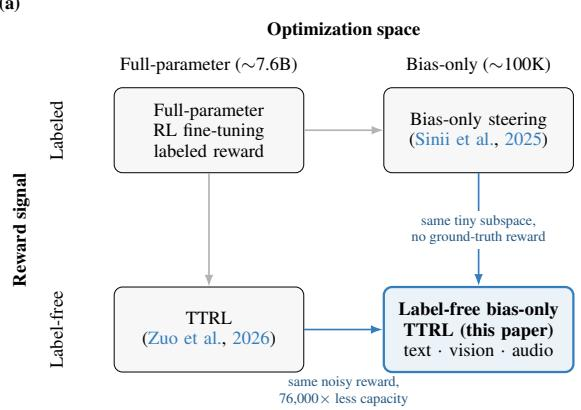
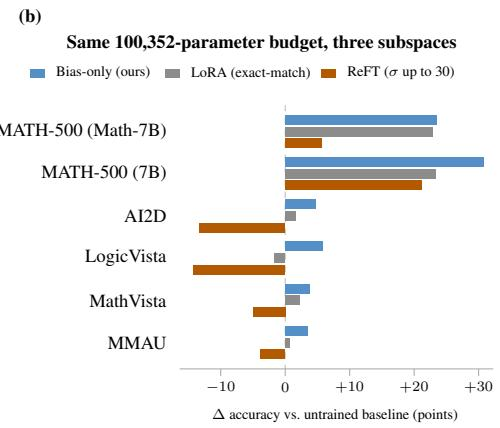
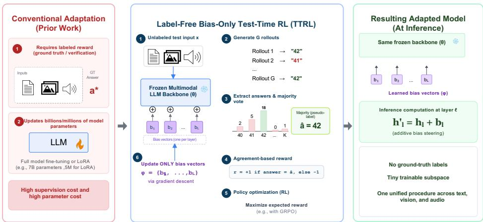

# LABEL-FREE STEERING: COMPRESSING TEST-TIME REINFORCEMENT LEARNING INTO BIAS-ONLY SUB-SPACES

Naveen Vakada Mingyuan Li Shaoxiong Ji

University of Turku, Finland · ELLIS Institute Finland

navaka@utu.fi

## ABSTRACT

Test-time reinforcement learning (TTRL) enables models to improve their reasoning without relying on labeled training data, but existing approaches typically optimize a large fraction of the model parameters. This raises a natural question: can effective test-time adaptation emerge when both the reward signal and the optimization space are severely restricted? We answer this question with label-free bias-only TTRL, which uses majority-vote pseudo-labels as rewards and optimizes only ∼100K bias parameters while keeping the pretrained backbone frozen. On MATH-500, our approach reaches 76.67% accuracy, slightly exceeding our own labeled bias-steering reproduction while optimizing 76,000× fewer parameters than full-parameter TTRL. The same training procedure improves performance across vision-language and audio reasoning tasks, including MathVista, AI2D, LogicVista, and MMAU. We further show that the learned steering vectors transfer to 4,500 held-out MATH problems, indicating that the adaptation is not limited to the problems used during test-time optimization. Finally, we analyze why this highly restricted adaptation can work, showing that majority-vote reliability improves with rollout consensus and that bias subspaces with greater accessible gradient energy exhibit stronger downstream trainability. These results demonstrate that substantial test-time adaptation can emerge from optimizing a tiny bias-only subspace using entirely label-free rewards.

## 1 INTRODUCTION

Test-time reinforcement learning (TTRL) offers a way to adapt reasoning models without access to ground-truth labels. Instead of relying on an external verifier, TTRL can construct pseudo-rewards from the model’s own test-time generations, such as majority-vote consensus across multiple rollouts (Zuo et al., 2026). However, existing TTRL approaches generally adapt a large portion of the model parameters, making test-time optimization expensive. In parallel, bias-only steering has shown that substantial reasoning improvements can be obtained by optimizing only a small set of additive bias parameters while keeping the backbone frozen (Sinii et al., 2025). These observations raise a natural question: can effective test-time reinforcement learning remain possible when both the reward signal and the optimization space are severely restricted?

Figure 1(a) situates this regime against the two lines of work it draws on. The question is sharpest for multimodal reasoning, where labeled, verifiable rewards are least available: recent work extends TTRL to vision-language models using self-generated rewards (Singh et al., 2026), but does not ask how far such adaptation can be compressed into a restricted parameter subspace.

We study this regime with label-free bias-only TTRL, grounding it in two properties of the restricted setting: majority-vote pseudo-label reliability improves with rollout consensus, and bias subspaces with greater accessible gradient energy are more trainable (Proposition 1 and Theorem 1, §4.2). Together they predict that success requires both a sufficiently reliable self-generated reward and a useful optimization direction inside the restricted space – a prediction we test empirically as follows.

Our method uses majority-vote pseudo-labels from the model’s own rollouts as rewards and optimizes only ∼100K bias parameters while keeping the pretrained backbone frozen. On MATH-500 (Hendrycks et al., 2021), our method reaches 79.50% accuracy with Qwen2.5-Math-7B (Yang et al., 2024a) and 76.67% with Qwen2.5-7B (Yang et al., 2024b), slightly exceeding our own matched labeled bias-steering reproduction in both cases (by 2.2 and 1.2 percentage points, respectively), while using 76,000× fewer trainable parameters than full-parameter TTRL. The learned steering vectors also transfer to 4,500 held-out, verified-disjoint MATH problems, showing that the improvement is not limited to the fixed set used for test-time optimization. We further find that a single bias layer can recover much of the performance of the full bias-vector intervention. What matters at this budget is which subspace is trained, not how large it is: a parameter-matched LoRA trails bias-only on all six benchmarks, and a parameter-matched ReFT variant (Wu et al., 2024) ends below baseline on fou of them (Figure 1b).

(a)  

  
Figure 1: (a) Label-free bias-only TTRL occupies the corner where both restrictions apply at once. Reaching it is not a matter of adding TTRL (Zuo et al., 2026) to bias-only steering (Sinii et al., 2025): each remaining edge takes away the resource the other method relied on, leaving a noisy self-generated reward and 76,000× less capacity with which to exploit it. (b) Whether that corner is reachable depends on which subspace is used, not only how large it is. At an identical budget and recipe, bias-only gains on all six benchmarks while a bias-free ReFT variant ends below baseline on four (Appendix B). Parameter count alone does not determine whether label-free test-time RL succeeds.

We then apply the same training procedure to vision-language and audio reasoning tasks, changing only the task-specific prompt and reward or grading function: the method improves performance on MathVista (Lu et al., 2024), AI2D (Kembhavi et al., 2016), LogicVista (Xiao et al., 2024), and MMAU (Sakshi et al., 2025), while our evaluation also exposes task-dependent limitations and reward confounds, which we analyze directly in §6.6.

Contributions. (1) We study label-free test-time reinforcement learning under an extremely restricted optimization budget, training only ∼100K bias parameters with majority-vote pseudo-label rewards while keeping the backbone frozen. (2) We provide controlled text-reasoning experiments showing 79.50% accuracy on MATH-500 with Qwen2.5-Math-7B (76.67% with Qwen2.5-7B) and transfer to 4,500 held-out problems, together with single-layer and parameter-matched analyses showing that at a fixed 100K budget the choice of trainable subspace, not its size, determines whether label-free adaptation succeeds. (3) We demonstrate transfer to vision-language and audio reasoning tasks and explicitly audit task-dependent reward and evaluation confounds. (4) We provide theoretical and empirical analyses of pseudo-label reliability and accessible gradient energy as factors governing label-free bias-only adaptation.

## 2 RELATED WORK

Self-supervised and test-time reinforcement learning. A growing line of work trains language models on their own generations without ground-truth labels. Self-consistency (Wang et al., 2022) first showed that sampling many reasoning paths and marginalizing to the most frequent answer improves chain-of-thought accuracy at inference time; TTRL (Zuo et al., 2026) turns this majorityvote signal into a training reward, updating a model’s full parameter set against pseudo-labels computed on the unlabeled evaluation set itself (≈211% relative pass@1 improvement on AIME 2024 for Qwen2.5-Math-7B), with no human annotation. Earlier bootstrapping approaches reach a related destination differently: STaR (Zelikman et al., 2022) fine-tunes on model-generated rationales filtered by whether they reach a known-correct answer, ReST (Gulcehre et al., 2023) alternates between generating a training set from the current policy and fitting to it via offline RL, and selfrewarding language models (Yuan et al., 2024) use the model itself as an LLM-as-a-judge to build preference pairs for iterative DPO (Xiong et al., 2024). All of these, including TTRL (Zuo et al., 2026), update every model parameter. We adopt TTRL’s majority-vote reward unchanged, optimized with group-relative policy optimization (GRPO; Shao et al., 2024), and ask a question this literature has not addressed: does the self-consistency signal remain effective when only a ∼100K-parameter bias vector is trainable, and does it generalize across different modalities.

Parameter-efficient fine-tuning and activation-space steering. A separate line of work asks how much of a model’s behavior can be changed by training only a small fraction of its parameters, or none at all. Adapter-based methods such as prefix-tuning (Li & Liang, 2021) and low-rank adaptation (LoRA; Hu et al., 2022) insert or reparameterize a small number of trainable parameters into an otherwise frozen network (we compare directly against a LoRA parameterization of our own pipeline in §6.1). Activation-space steering goes further, adding a fixed vector to a model’s residual stream at inference time with no gradient-based training at all (Turner et al., 2023), or extracting that vector from the difference between contrastive positive and negative example activations (Rimsky et al., 2024); representation engineering (Zou et al., 2025) frames this family as population-level manipulation of high-level concepts rather than individual neurons or circuits. Sinii et al. (2025) sit at the intersection of these two lines: rather than a training-free or difference-of-means vector, they train one additive bias term per decoder layer with RL against a labeled, verifiable reward (RLOO on DeepScaleR) and match full RL fine-tuning at a fraction of a percent of the model’s parameters. This is our primary comparison point throughout the paper: we use the same bias-only mechanism and a similar reward-optimization setup (GRPO in place of RLOO (Ahmadian et al., 2024)), but replace the labeled reward with TTRL’s unlabeled majority-vote signal, and extend the comparison from text to vision and audio.

Reinforcement learning for multimodal reasoning. Post-training multimodal models with RL rather than supervised fine-tuning is active outside the label-free setting studied here. Visual-RFT (Liu et al., 2025) applies verifiable, rule-based rewards (IoU for detection, exact-match for classification) with GRPO-style optimization, showing large gains in low-data regimes. Closer to our setting, MM-UPT (Wei et al., 2025) explores unsupervised, self-rewarding post-training for multimodal LLM reasoning on MathVista-style tasks (Lu et al., 2024), but fine-tunes the full model rather than an additive bias term. Both update substantially more parameters than the ∼100K-parameter vectors studied here, and neither combines multimodal post-training with a fully label-free, test-time reward signal; our MathVista (Lu et al., 2024) and MMAU (Sakshi et al., 2025) comparisons (§6.1) are explored under our proposed method.

## 3 PRELIMINARIES AND PROBLEM SETUP

## 3.1 PROBLEM SETUP

We are given a pretrained model $\pi _ { \theta }$ and an unlabeled reasoning dataset $\mathcal { D } = \{ x _ { i } \} _ { i = 1 } ^ { N } ;$ ; no groundtruth answer is available for any $x _ { i } .$ . Rather than updating the full parameter set $\theta ,$ as standard RL fine-tuning would, our goal is to learn a small set of additive bias parameters $\phi ,$ one vector per targeted decoder layer, that steer the frozen model’s behavior on $\mathcal { D } ; \theta$ itself is never modified. This design separates the two costs of adapting a pretrained model discussed in §1: ϕ is orders of magnitude smaller than $\theta ,$ addressing parameter cost, and the reward that trains $\phi$ is derived entirely from the model’s own rollouts on $\mathcal { D }$ , addressing supervision cost. The two components are independent, but combining them lets the same ∼100K-parameter approach apply unchanged across text, vision-language, and audio (§6.1), where labeled, verifiable rewards are least available. Two prior-work mechanisms supply this reward and this restriction; §4.1 describes how we combine them.

TTRL. TTRL (Zuo et al., 2026) turns majority-vote self-consistency (Wang et al., 2022) into a training reward. For each problem $x _ { i } , G$ rollouts $y _ { i } ^ { ( 1 ) } , \ldots , y _ { i } ^ { ( G ) } \sim \stackrel { \cdot } { \pi _ { \theta , \phi } } ( \cdot \mid \bar { x _ { i } } )$ are sampled from the current policy and the majority answer across the group, $\hat { a } _ { i } =$ majority vote $( \{ \mathrm { a n s } ( y _ { i } ^ { ( g ) } ) \} _ { g = 1 } ^ { G } )$ is taken as a pseudo-label; no ground truth is used anywhere in this loop, including for problems the model gets wrong, since an incorrect-but-self-consistent group still yields a pseudo-label. Each rollout is then scored against $\hat { a } _ { i }$

$$
r _ { i } ^ { ( g ) } = \left\{ \begin{array} { l l } { + 1 } & { \mathrm { i f } \mathrm { a n s } \big ( y _ { i } ^ { ( g ) } \big ) = \hat { a } _ { i } } \\ { - 1 } & { \mathrm { o t h e r w i s e } , } \end{array} \right.\tag{1}
$$

updating a model’s full parameter set against these pseudo-labels, with no human annotation.

GRPO. GRPO (Shao et al., 2024) converts a group of per-rollout rewards into a group-normalized advantage, avoiding the need for a learned value function,

$$
A _ { i } ^ { ( g ) } = \frac { r _ { i } ^ { ( g ) } - \mathrm { m e a n } \bigl ( \{ r _ { i } ^ { ( g ^ { \prime } ) } \} _ { g ^ { \prime } = 1 } ^ { G } \bigr ) } { \mathrm { s t d } \bigl ( \{ r _ { i } ^ { ( g ^ { \prime } ) } \} _ { g ^ { \prime } = 1 } ^ { G } \bigr ) + \epsilon } ,\tag{2}
$$

applied identically at every token of the rollout. We adopt TTRL’s reward and GRPO’s advantage unchanged as the reward source and optimizer for the pipeline in §4.1.

Bias-only steering. Bias-only steering (Sinii et al., 2025) trains one additive bias term per decoder layer with RL against a labeled, verifiable reward (RLOO on DeepScaleR), matching full RL finetuning at a fraction of a percent of the model’s parameters. At every targeted layer l, the bias vector $b _ { l } \in \bar { \mathbb { R } } ^ { d }$ is added directly to that layer’s output; for the primary (down proj.bias) configuration this modifies the layer’s MLP block,

$$
\mathrm { F F N } _ { l } ( h _ { l } ) \ = \ W _ { \mathrm { d o w n } , l } \sigma ( W _ { \mathrm { u p } , l } h _ { l } ) \ + \ b _ { l } ,\tag{3}
$$

where $h _ { l }$ is layer l’s input hidden state, $\sigma$ the MLP activation, and $W _ { \mathrm { d o w n } , l } , W _ { \mathrm { u p } , l }$ the frozen, pretrained down- and up-projection weight matrices; bl is the only quantity ever updated, and every other parameter, including all attention, embedding, and normalization weights, is fixed at its pretrained value. This is our primary comparison point throughout the paper (§4.1), where we replace its labeled reward with TTRL’s unlabeled majority-vote signal and extend the comparison from text to vision and audio.

## 4 METHOD

## 4.1 LABEL-FREE BIAS-ONLY TTRL

Figure 2’s center panel gives the loop’s visual overview; Algorithm 1 in Appendix A states it formally.

For each problem $x _ { i }$ , we sample G rollouts (G=32–64 depending on task) and compute the pseudolabel reward (Eq. 1) and GRPO advantage (Eq. 2) exactly as in §3, restricted throughout to the bias-only subspace ϕ: gradients computed from $A _ { i } ^ { ( g ) }$ are back-propagated only into $\phi ,$ while θ receives no gradient and is held frozen. This combination – TTRL’s label-free majority-vote reward, optimized with GRPO, restricted to the bias-only subspace ϕ – is what the rest of this paper studies.

At every targeted layer l, the learned bias vector $b _ { l } ( \mathbf { E q } . 3 , \ S 3 )$ is added directly to that layer’s output, identically during training rollouts and evaluation: ϕ is a single frozen artifact after training, applied the same way at test time as during rollout generation. We use a simple additive offset rather than a multiplicative or low-rank update because it is the smallest possible per-layer intervention with a direct mechanistic reading $( b _ { l }$ shifts the layer’s output distribution by a constant vector regardless of $h _ { l } ) ;$ ; it is also the mechanism used by Sinii et al. (2025), which keeps our label-free comparison isolated to the reward signal.

  
Figure 2: Label-free bias-only TTRL removes both costs of adapting a vision-language model at once: standard RL fine-tuning updates the full ∼7B-parameter backbone and requires a verifiable, labeled reward (left). We instead train only a ∼100K-parameter set of bias vectors ϕ against a majority-vote pseudo-label reward computed from the frozen model’s own rollouts, with no labeled data and no update to the backbone θ (center, formalized as Algorithm 1). The identical procedure, changing only the prompt and reward/grading function, is validated on text (§6.1) and transfers unchanged to vision-language and audio reasoning (right, §6.1).

## 4.2 THEORETICAL GROUNDING

Two theoretical claims motivate this design, connecting the majority-vote reward and the restricted bias subspace (§4.1) to why the resulting optimization signal should be both reliable and usable. We state simplified propositions that capture the qualitative mechanisms studied experimentally; full statements and proof sketches are provided in Appendix F.

Proposition 1: Pseudo-Label Reliability. For an unlabeled input x with answer distribution $p ( a$ x) over K answers and correct answer $a ^ { \star }$ , let $\hat { a } _ { G }$ be the majority vote over G i.i.d. rollouts and $\begin{array} { r } { \dot { \Delta ( x ) } = p ( a ^ { \star } \mid x ) - \operatorname* { m a x } _ { a \neq a ^ { \star } } p ( a \mid x ) } \end{array}$ be the answer margin. If $\Delta ( x ) > 0$

$$
\mathrm { P r } [ \hat { a } _ { G } \neq a ^ { \star } ] \ \leq \ ( K - 1 ) \exp \biggl ( - \frac { G \Delta ( x ) ^ { 2 } } { 2 } \biggr ) \ .\tag{4}
$$

Thus, for positive-margin problems, the probability of majority-vote failure decreases exponentially with the number of rollouts. We test this qualitative prediction empirically in $\ S 6 . 4$ by measuring pseudo-label accuracy as the number of rollouts increases.

Theorem 1: Restricted-Subspace Trainability. Let $J ( w )$ be the RL objective (Eq. 2’s advantageweighted log-probability objective) and $g = \nabla J ( \boldsymbol { w } )$ its gradient. Restricting adaptation to a bias subspace S with orthogonal projection $\bar { P _ { S } }$ , only the component $P _ { S } g$ is reachable; define the accessible gradient energy $\check { E } s = \check { \| } \dot { P s } g \| ^ { 2 }$ . If J is locally L-smooth, then for $0 < \eta \leq 1 / L$

$$
J ( w ^ { + } ) - J ( w ) \geq \frac { \eta } { 2 } \| P s g \| ^ { 2 } ,\tag{5}
$$

where $w ^ { + } = w + \eta P _ { S } g .$ . Thus, the guaranteed local improvement is governed by the accessible gradient energy rather than directly by the dimensionality of S. A small subspace can therefore provide substantial local improvement when it contains a sufficiently useful component of the gradient, while equal-sized subspaces need not be equally trainable. We test this qualitative prediction empirically in §6.5.

Together, these results describe complementary requirements for label-free bias-only TTRL: a positive answer margin makes majority voting increasingly reliable as G grows, producing a useful optimization signal, while the restricted bias subspace can exploit that signal only to the extent that it contains an aligned optimization direction.

## 4.3 IMPLEMENTATION

Our primary configuration trains b at all 28 MLP layers (28 × 3584=100,352 parameters on Qwen2.5-7B/Qwen2.5-Math-7B); §6.5 separately ablates a single-layer sweep of the same pipeline, and §6.1 compares against a LoRA parameterization, with full detail on the reward-shaping, scale, and parameterization-stability ablations in Appendix B. We additionally test a length-aware reward variant (ShorterBetter), which targets the shortest correct response length within a rollout group as a dynamic target rather than a fixed-length penalty. ϕ is optimized with AdamW (Loshchilov & Hutter, 2017) at bfloat16 precision; gradients and optimizer state are kept only for ϕ, so peak training memory is dominated by activations and rollout sampling rather than by optimizer-state duplication of θ. Learning rate, G, and schedule are swept per task as ordinary hyperparameters (§5), with the full configuration summarized in Appendix A. Every run trains for a fixed budget of 200 steps. Dataset descriptions, prompts, and evaluation protocol are explained in §5.

## 5 EXPERIMENTAL SETUP

Models. Text: Qwen2.5-7B (base) (Yang et al., 2024b) and Qwen2.5-Math-7B (Yang et al., 2024a). Vision-language: Qwen2.5-VL-7B-Instruct (Bai et al., 2025). Audio: Qwen2.5-Omni-7B (Xu et al., 2025).

Tasks. MATH-500 (500 problem subset of Hendrycks et al. 2021, no separate train split: the training and evaluation set are the same 500 problems, according to the TTRL paradigm (Zuo et al., 2026)); MathVista testmini (Lu et al., 2024); AI2D-TEST (Kembhavi et al., 2016), full 3088- problem test split; LogicVista (Xiao et al., 2024), complete 448-row test split; MMAU-mini test-mini (Sakshi et al., 2025).

Evaluation protocol. Unless otherwise noted, all of our own results use greedy decoding, pass@1, single generation per problem. The comparison numbers cited from prior work follow each source’s own published protocol.

## 6 RESULTS

We evaluate label-free bias-only TTRL across text, vision-language, and audio reasoning. We first examine its overall effectiveness and compare it with larger LoRA-based parameter-efficient updates under the same label-free TTRL setting. We then test whether the learned steering vectors transfer beyond the problems used for test-time optimization, analyze why some restricted bias subspaces are more effective than others, and audit the multimodal gains for potential task-specific confounds. Unless otherwise stated, bias-only TTRL results are reported as mean ± standard deviation over three independent training seeds.

## 6.1 MAIN RESULTS ACROSS REASONING BENCHMARKS

Table 1 summarizes the performance of label-free bias-only TTRL across text, vision-language, and audio reasoning. The same ∼100K-parameter training procedure is used across all tasks and modalities – Qwen2.5-Math-7B and Qwen2.5-7B on MATH-500, Qwen2.5-VL-7B-Instruct on AI2D, LogicVista, and MathVista, and Qwen2.5-Omni-7B on MMAU – with only the task-specific prompt and reward/grading function adapted to each benchmark.

Bias-only TTRL improves over the corresponding untrained model on all six benchmarks, reaching 79.50% on MATH-500 with Qwen2.5-Math-7B and 76.67% with Qwen2.5-7B, with gains of +3.8 to +5.9 points on the vision-language benchmarks and +3.5 on audio (per-benchmark values in Table 1). The benefit of label-free bias-only adaptation is therefore not restricted to language-only mathematical reasoning, but extends across substantially different reasoning modalities.

The LoRA comparisons in Table 1 isolate the effect of the trainable parameterization while keeping the label-free TTRL procedure fixed. To control for trainable capacity specifically, we additionally compare against LoRA (exact-match), an r=1 adapter restricted to q proj on 14 layers that trains exactly 100K parameters – identical to bias-only TTRL. Bias-only TTRL outperforms both

<table><tr><td>Model</td><td>Benchmark</td><td>Baseline</td><td>Self-consistency</td><td>LoRA (exact-match)</td><td>LoRA r=16 score / ∆ vs. baseline / relative gain</td><td>LoRA r=64</td><td>FullFT</td><td>Bias-only TTRL (ours)</td></tr><tr><td>Trainable params</td><td></td><td>0</td><td>0</td><td>100K</td><td>5.0M</td><td>20.2M</td><td>~7.6B</td><td>100K</td></tr><tr><td>Qwen2.5-Math-7B</td><td>MATH-500</td><td>56.0</td><td>65.53 ± 1.27 ∆+9.53 ↑17.0%</td><td>78.80 ± 1.25 ∆+22.80 ↑40.7%</td><td>77.70 ± 0.10 ∆+21.70 ↑38.8%</td><td>75.73 ± 2.42 ∆+19.73 ↑35.2%</td><td>83.80 ± 0.28 ∆+27.80 ↑49.6%</td><td>79.50 ± 0.70 Δ+23.50 ↑42.0%</td></tr><tr><td>Qwen2.5-7B</td><td>MATH-500</td><td></td><td>73.40 ± 0.69 ∆+27.50 ↑59.9%</td><td>69.27 ± 2.81 ∆+23.37</td><td>73.93 ± 0.82 ∆+28.03</td><td>75.60 ± 0.60 Δ+29.70</td><td>77.00 ± 0.53 ∆+31.10</td><td>76.67 ± 1.57 ∆+30.77 ↑67.0%</td></tr><tr><td></td><td></td><td>45.9</td><td>75.95 ± 0.45 ∆+2.37</td><td>↑50.9% 75.26 ± 0.51 ∆+1.68</td><td>↑61.1% 77.60 ± 0.80 ∆+4.02</td><td>↑64.7% 79.15 ± 0.17 ∆+5.57</td><td>↑67.8% 80.18 ± 0.28 ∆+6.60</td><td>78.29 ± 0.03 ∆+4.71 ↑6.4%</td></tr><tr><td></td><td>AI2D</td><td>73.58</td><td>↑3.2% 40.85 ± 0.89 ∆+3.35</td><td>↑2.3% 35.86 ± 0.68 ∆-1.64</td><td>↑5.5% 40.60 ± 1.60 ∆+3.10</td><td>↑7.6% 40.70 ± 1.91 Δ+3.20</td><td>↑9.0% 46.13 ± 0.38 ∆+8.63</td><td>43.38 ± 1.01 Δ+5.88</td></tr><tr><td>Qwen2.5-VL-7B-Instruct</td><td>LogicVista</td><td>37.50</td><td>↑8.9%</td><td>↓4.4%</td><td>↑8.3%</td><td>↑8.5%</td><td>↑23.0%</td><td></td></tr><tr><td></td><td></td><td></td><td></td><td></td><td></td><td></td><td></td><td></td></tr><tr><td></td><td></td><td></td><td></td><td></td><td></td><td>63.20 ± 0.88</td><td>62.57 ± 0.40</td><td></td></tr><tr><td></td><td></td><td></td><td></td><td></td><td></td><td></td><td></td><td></td></tr><tr><td></td><td></td><td></td><td></td><td></td><td></td><td></td><td></td><td>↑15.7%</td></tr><tr><td></td><td></td><td></td><td></td><td></td><td></td><td></td><td></td><td></td></tr><tr><td></td><td></td><td></td><td>64.73 ± 1.10</td><td>63.77 ± 0.25</td><td>63.50 ± 0.90</td><td></td><td></td><td>65.40 ± 1.77</td></tr><tr><td></td><td></td><td></td><td></td><td></td><td>∆+1.90</td><td></td><td>∆+0.97</td><td></td></tr><tr><td>Qwen2.5-VL-7B-Instruct</td><td>MathVista</td><td>61.60</td><td>∆+3.13</td><td>Δ+2.17</td><td>↑3.1%</td><td>∆+1.60 ↑2.6%</td><td>↑1.6%</td><td>Δ+3.80</td></tr><tr><td></td><td></td><td></td><td>↑5.1%</td><td>↑3.5%</td><td></td><td></td><td></td><td>↑6.2%</td></tr><tr><td></td><td></td><td></td><td>60.53 ± 0.47</td><td>58.07 ± 0.25</td><td>60.10 ± 1.00</td><td>59.57 ± 1.52</td><td>61.90 ± 1.64</td><td>60.87 ± 0.37</td></tr><tr><td></td><td></td><td></td><td>∆+3.13</td><td>∆+0.67</td><td>Δ+2.70</td><td>∆+2.17</td><td>∆+4.50</td><td>∆+3.47</td></tr><tr><td>Qwen2.5-Omni-7B</td><td>MMAU</td><td>57.40</td><td>↑5.5%</td><td></td><td>↑4.7%</td><td>↑3.8%</td><td>↑7.8%</td><td></td></tr><tr><td></td><td></td><td></td><td></td><td>↑1.2%</td><td></td><td></td><td></td><td>↑6.0%</td></tr></table>

Table 1: Main results across text, vision-language, and audio reasoning. Each trained cell stacks its score, the absolute gain over baseline (∆), and the relative gain (red marks a decrease). Biasonly TTRL (ours) is bolded throughout; the best LoRA variant per row is bolded separately. LoRA (exact-match) is an r=1 adapter on $\mathtt { q \mathrm { - } p r o \dot { ] } }$ at 14 layers, sized to train exactly as many parameters as bias-only TTRL. Values are mean ± std over three seeds (three unseeded runs for Self-consistency, which is majority vote over G samples with no training).
<table><tr><td>Method</td><td>Labeled Reward?</td><td>Train. Params</td><td>Qwen2.5-7B</td><td>Qwen2.5-Math-7B</td></tr><tr><td>Bias-only, pseudo-label (ours)</td><td>x</td><td>100K</td><td> ${ \bf 7 6 . 6 7 \pm 1 . 5 7 }$ </td><td> ${ \bf 7 9 . 5 0 \pm 0 . 7 0 }$ </td></tr><tr><td>Bias-only, labeled (ours)</td><td>√</td><td>100K</td><td> $7 5 . 4 7 \pm 1 . 2 1$ </td><td> $7 7 . 2 7 \pm 0 . 7 0$ </td></tr><tr><td>Full fine-tune, pseudo-label (ours)</td><td>x</td><td>7.6B</td><td> $7 7 . 0 0 \pm 0 . 5 3$ </td><td> $8 3 . 8 0 \pm 0 . 2 8$ </td></tr><tr><td>Full fine-tune, labeled (ours)</td><td>√</td><td>7.6B</td><td> $8 7 . 9 3 \pm 0 . 9 9$ </td><td> $8 5 . 1 3 \pm 1 . 3 3$ </td></tr></table>

Table 2: $2 \times 2$ ablation crossing label source with parameterization on MATH-500. All four cells are our own reproductions under a matched recipe within each parameterization; mean ± std over three seeds.

LoRA (exact-match) and LoRA r=16 on all six benchmarks, despite LoRA r=16 training roughly 50× more parameters; LoRA (exact-match) even falls below the untrained baseline on LogicVista (35.86% vs. 37.50%). Bias-only TTRL also outperforms LoR $\mathrm { ~ A ~ } r { = } 6 4$ on five of six benchmarks, losing only on AI2D. Only FullFT – which trains the entire 7.6B-parameter model – exceeds biasonly TTRL on more than one benchmark, doing so on five of six (all but MathVista, where bias-only TTRL is best overall, ahead of FullFT itself). Bias-only adaptation is thus not uniformly superior to LoRA, but label-free test-time RL clearly does not require a large trainable space.

Table 1 also reports a self-consistency baseline — majority-vote over G samples at inference time, with no training at all — isolating how much of the gain is “free” inference-time voting rather than a learned improvement. Self-consistency alone already recovers a substantial part of the gain on MATH-500 $( \mathbf { e . g . 6 5 . 5 3 \% } \pm 1 . 2 7 \ \mathrm { v s }$ . bias-only TTRL’s $7 9 . 5 0 \% \pm 0 . 7 0$ on Qwen2.5-Math-7B), but bias-only TTRL still improves further over it on every benchmark, indicating that training on the majority-vote signal adds more than voting alone.

## 6.2 ABLATIONS WITH LABELS AND PARAMETERIZATION

To isolate the effect of the label source from the effect of the trainable parameterization, we run a full 2 × 2 ablation crossing label source (majority-vote pseudo-label vs. ground-truth labels) with trainable parameterization (bias-only vs. full fine-tuning) on MATH-500, holding the rest of the training recipe fixed within each parameterization. Table 2 summarizes all four cells, each our own reproduction, mean ± standard deviation over three seeds.

On Qwen2.5-7B, pseudo-label bias-only TTRL reaches $7 6 . 6 7 \% \pm 1 . 5 7 .$ , slightly above its labeled counterpart $( 7 5 . 4 \bar { 7 } \% \pm 1 . 2 1 , \mathrm { ~ a ~ } 1 . 2$ -point gap); full fine-tuning shows the opposite pattern, with labeled full fine-tuning (87.93% ± 0.99) 10.9 points above pseudo-label full fine-tuning (77.00% ±

<table><tr><td>G</td><td>1</td><td>2</td><td>4</td><td>8</td><td>16</td><td>32</td><td>64</td></tr><tr><td>Pseudo-label acc. (%)</td><td>40.6</td><td>48.4</td><td>54.7</td><td>65.6</td><td>70.3</td><td>76.6</td><td>79.7</td></tr></table>

<table><tr><td>Consensus bin</td><td>Mean m</td><td>n</td><td>Acc. (%)</td></tr><tr><td>Low</td><td>0.069</td><td>22</td><td>63.6</td></tr><tr><td>Medium</td><td>0.374</td><td>22</td><td>86.4</td></tr><tr><td>High</td><td>0.662</td><td>20</td><td>90.0</td></tr></table>

Table 3: Majority-vote pseudo-label accuracy at N=64 (MATH-500). Accuracy rises monotonically in both G and consensus bin, consistent with the qualitative prediction of Proposition 1.

0.53). On Qwen2.5-Math-7B the same pattern holds but is smaller for full fine-tuning: pseudo-label bias-only $( 7 9 . 5 0 \% \pm 0 . 7 0 )$ again slightly exceeds labeled bias-only (77.27%±0.70, a 2.2-point gap), while labeled full fine-tuning (85.13%±1.33) exceeds pseudo-label full fine-tuning $( 8 3 . 8 0 \% \pm 0 . 2 8 )$ by only 1.3 points.

This asymmetry is consistent with Qwen2.5-Math-7B’s majority-vote pseudo-labels already being close to ground truth on math problems, while Qwen2.5-7B’s pseudo-labels are noisier: removing labels costs full fine-tuning little on Math-7B but much more on the base model, while bias-only adaptation is not costed by removing labels in either model. Across all four cells, bias-only adaptation remains within a few points of full fine-tuning while updating approximately 76,000× fewer parameters.

Training compute differs sharply between parameterizations: bias-only training uses a single GH200 GPU (4.45–4.95 GPU-hours/run), while full fine-tuning needs four GH200 GPUs under FSDP (79.24–82.12 GPU-hours/run), a 16.0–18.5× reduction in GPU-hours on top of the parameter reduction. Pseudo-label and labeled variants share an identical training recipe per parameterization (same model, rollout count, learning rate, step budget); the reward source only changes a negligible-cost post-hoc computation over already-generated rollouts, so pseudo-label training compute is expected to match the labeled figures above.

## 6.3 GENERALIZATION BEYOND THE TEST-TIME TRAINING SET

TTRL optimizes directly on the same problem set used for evaluation, raising the question of whether the learned steering vectors capture a generalizable improvement or merely adapt to that fixed set and its majority-vote pseudo-labels. To distinguish these, we freeze the step-200 checkpoints and evaluate them without further training on 4,500 verified-disjoint MATH problems. The Qwen2.5-7B checkpoint improves from 46.3% to 70.9%, a gain of 24.6 percentage points, while the Qwen2.5-Math-7B checkpoint improves from 52.5% to 75.4%, a gain of 22.9 percentage points. Because none of these problems is used during test-time optimization, these results provide evidence that the learned intervention transfers beyond the fixed problem set rather than simply encoding its majority-vote consensus.

## 6.4 MAJORITY-VOTE PSEUDO-LABEL ACCURACY

Proposition 1 (§4.2) predicts that majority-vote pseudo-label failure decays exponentially in the number of rollouts G for positive-margin problems.

We test this prediction on an N=64 batch of MATH-500 problems: $G _ { \mathrm { m a x } } { = } 6 4$ rollouts are generated once per problem, majority vote is computed as a prefix for each G, and the empirical consensus proxy $m \bar { = } ( N _ { 1 } - N _ { 2 } ) / { 6 4 }$ is recorded alongside accuracy.

The ranking of pseudo-label accuracy tracks both rollout count and consensus strength, giving empirical support for the qualitative prediction of Proposition 1.

## 6.5 RESTRICTED-SUBSPACE TRAINABILITY

We next examine why restricting optimization to approximately 100K bias parameters can still produce substantial adaptation. Section 4.2 predicts that equal-sized bias subspaces need not be equally trainable: what matters is the amount of useful RL gradient lying within the accessible subspace.

We test this prediction using nine single-layer bias subspaces spanning early, middle, and late layers of the network, each containing exactly 3,584 parameters. For each layer, we compute the accessible gradient energy $E _ { l } = \| P _ { l } g \| ^ { 2 }$ from a shared backward pass on a fixed 16-problem batch and compare it with the final-step accuracy obtained after training that single-layer subspace.

<table><tr><td>Layer</td><td>0</td><td>3</td><td>8</td><td>13</td><td>15</td><td>18</td><td>20</td><td>22</td><td>27</td></tr><tr><td>Gradient energy Accuracy (%)</td><td>3.46e-4 73.6</td><td>6.95e-5 73.8</td><td>3.57e-5 71.8</td><td>3.25e-5 72.6</td><td>3.55e-5 73.4</td><td>1.47e-5 65.4</td><td>4.81e-6 63.6</td><td>1.51e-6 49.2</td><td>5.21e-7 51.8</td></tr></table>

Table 4: Accessible gradient energy vs. downstream training accuracy across nine single-layer bias subspaces (Qwen2.5-7B, MATH-500). Spearman $\rho ~ = ~ 0 . 9 1 7$ (exact two-tailed permutation test, $p = 0 . 0 0 1 3 , n = 9 )$ , consistent with the qualitative prediction of Theorem 1.

The ranking of accessible gradient energy is consistent with downstream trainability, giving a Spearman correlation of $\rho = 0 . 9 1 7$ between accessible gradient energy and training accuracy across all nine layers (exact two-tailed permutation test, $p = 0 . 0 0 1 3 )$ . Thus, equal parameter counts do not imply equal trainability: layers whose bias directions contain more accessible optimization signal are more effective. This provides empirical support for the qualitative prediction of Theorem 1.

## 6.6 ANALYSIS OF MULTIMODAL IMPROVEMENTS

Because test-time learning can potentially exploit task-specific properties of the reward or evaluation procedure, we audit the multimodal gains for possible confounds. We manually inspect improved and degraded examples and then perform exhaustive checks for the patterns identified by the manual analysis.

On AI2D, training substantially reduces the official parser’s failure-to-extract rate, indicating that part of the improvement comes from better output-format compliance rather than only changes in answer content. For LogicVista, we use the same chain-of-thought prompting and grading procedure for the baseline and steered models to avoid attributing prompt or parsing differences to the intervention.

For MathVista, the audit identifies a narrow edge case in which the steered model repeatedly produces the same answer on a subset of age-gap questions. For MMAU, a phoneme-counting question template accounts for a substantial fraction of the observed improvement. Excluding this template, the remaining problems still show a positive improvement. We therefore report these cases explicitly rather than treating the aggregate gains as uniformly representative of all question types.

Overall, the audits find no single dominant confound explaining the improvements across the multimodal benchmarks, while identifying narrow task-specific cases where the label-free reward can influence the learned behavior. Full audit methodology, per-case examples, and breakdown tables are in Appendix C.

## 7 CONCLUSION

We presented label-free bias-only test-time reinforcement learning, combining majority-vote pseudo-labels with adaptation of only ∼100K bias parameters while keeping the backbone frozen. On MATH-500, our method reaches 79.50% with Qwen2.5-Math-7B and 76.67% with Qwen2.5- 7B, slightly exceeding our own labeled bias-steering reproduction at the same parameter budget in both cases (by 2.2 and 1.2 percentage points, respectively). The same procedure transfers to vision-language and audio reasoning, and to 4,500 verified-disjoint MATH problems held out from test-time optimization. Our analyses show that majority-vote reliability improves with the number of rollouts, and that accessible gradient energy is a useful diagnostic for which restricted bias subspaces are trainable — though our modality-specific audit also identifies cases where confounds affect the observed gains, underlining the need for careful evaluation of label-free adaptation. Overall, useful test-time adaptation appears achievable without either ground-truth labels or full-model updates, giving a simple and parameter-efficient route to adapting frozen multimodal models.

## STATEMENT ON THE USE OF GENERATIVE AI

In preparing this manuscript we used a generative AI assistant for paper-preparation support: LATEX formatting and table construction, drawing figures, condensing and copy-editing prose that we had written, and cross-checking numerical consistency between the tables, the figures, and the surrounding text. Every number reported in this paper comes from our own experimental runs; the assistant was given those numbers in order to typeset and cross-check them, and was not used to produce, estimate, or extrapolate any result.

We did not use generative AI tools to generate synthetic data or to write any part of the training or evaluation pipeline whose outputs are reported here. The theoretical statements and proof sketches in §4.2 and Appendix F.1 are our own.

All AI-assisted edits were checked by the authors against the underlying experimental logs before inclusion, and the final manuscript was read in full by the authors, who take responsibility for its entire contents.

## ETHICS STATEMENT

This work fine-tunes publicly released model checkpoints on publicly released reasoning benchmarks (MATH-500, AI2D, LogicVista, MathVista, and MMAU-mini) and introduces no new data collection. No human subjects were involved and no personally identifying information was used. Because our method adapts a model using rewards derived from the model’s own outputs rather than from verified labels, it can in principle reinforce a model’s existing errors rather than correct them; §6.6 and Appendix C report the cases in which we observed this, and we consider auditing for such effects a necessary part of deploying label-free test-time adaptation rather than an optional check.

## REPRODUCIBILITY STATEMENT

The full training and evaluation configuration for every reported result — trainable parameter set, optimizer, rollout count, learning rate and schedule, step budget, decoding settings, and checkpointselection rule — is given in Appendix A. All of our own results are reported as mean ± standard deviation over three independent training seeds under a fixed 200-step budget, with the final checkpoint reported in every case. The context lengths and decoding protocols underlying each row of Table 1 are listed in Appendix A, and the additional reward-shaping, scale, and parameterization ablations are specified in Appendix B.

## REFERENCES

Arash Ahmadian, Chris Cremer, Matthias Galle, Marzieh Fadaee, Julia Kreutzer, Olivier Pietquin,´ Ahmet Ust¨ un, and Sara Hooker. Back to basics: Revisiting reinforce-style optimization for learn-¨ ing from human feedback in llms. In Proceedings of the 62nd Annual Meeting of the Association for Computational Linguistics (Volume 1: Long Papers), pp. 12248–12267, 2024. 3

Shuai Bai, Ke qin Chen, Xuejing Liu, Jialin Wang, Wenbin Ge, Sibo Song, Kai Dang, Peng Wang, Shijie Wang, Jun Tang, Humen Zhong, Yuanzhi Zhu, Mingkun Yang, Zhaohai Li, Jianqiang Wan, Pengfei Wang, Wei Ding, Zheren Fu, Yiheng Xu, Jiabo Ye, Xi Zhang, Tianbao Xie, Zesen Cheng, Hang Zhang, Zhibo Yang, Haiyang Xu, and Junyang Lin. Qwen2.5-vl technical report. ArXiv, abs/2502.13923, 2025. URL https://api.semanticscholar.org/ CorpusID:276449796. 6

Caglar Gulcehre, Tom Le Paine, Srivatsan Srinivasan, Ksenia Konyushkova, Lotte Weerts, Abhishek Sharma, Aditya Siddhant, Alex Ahern, Miaosen Wang, Chenjie Gu, Wolfgang Macherey, Arnaud Doucet, Orhan Firat, and Nando de Freitas. Reinforced self-training (rest) for language modeling, 2023. URL https://arxiv.org/abs/2308.08998. 3

Dan Hendrycks, Collin Burns, Saurav Kadavath, Akul Arora, Steven Basart, Eric Tang, Dawn Song, and Jacob Steinhardt. Measuring mathematical problem solving with the math dataset. arXiv preprint arXiv:2103.03874, 2021. 2, 6

Edward J. Hu, Yelong Shen, Phillip Wallis, Zeyuan Allen-Zhu, Yuanzhi Li, Shean Wang, Lu Wang, and Weizhu Chen. Lora: Low-rank adaptation of large language models. In The Tenth Inter national Conference on Learning Representations, ICLR 2022, Virtual Event, April 25-29, 2022. OpenReview.net, 2022. 3

Aniruddha Kembhavi, Mike Salvato, Eric Kolve, Minjoon Seo, Hannaneh Hajishirzi, and Ali Farhadi. A diagram is worth a dozen images. In European conference on computer vision, pp. 235–251. Springer, 2016. 2, 6

Xiang Lisa Li and Percy Liang. Prefix-tuning: Optimizing continuous prompts for generation. In Proceedings of the 59th annual meeting of the association for computational linguistics and the 11th international joint conference on natural language processing (volume 1: Long papers), pp. 4582–4597, 2021. 3

Ziyu Liu, Zeyi Sun, Yuhang Zang, Xiaoyi Dong, Yuhang Cao, Haodong Duan, Dahua Lin, and Jiaqi Wang. Visual-rft: Visual reinforcement fine-tuning. In 2025 IEEE/CVF International Conference on Computer Vision (ICCV), pp. 2034–2044. IEEE, 2025. 3

Ilya Loshchilov and Frank Hutter. Decoupled weight decay regularization. arXiv preprint arXiv:1711.05101, 2017. 6

Pan Lu, Hritik Bansal, Tony Xia, Jiacheng Liu, Chunyuan Li, Hannaneh Hajishirzi, Hao Cheng, Kai-Wei Chang, Michel Galley, and Jianfeng Gao. Mathvista: Evaluating mathematical reasoning of foundation models in visual contexts. In International Conference on Learning Representations, volume 2024, pp. 23439–23554, 2024. 2, 3, 6

Nina Rimsky, Nick Gabrieli, Julian Schulz, Meg Tong, Evan Hubinger, and Alexander Turner. Steering llama 2 via contrastive activation addition. In Proceedings ofthe 62nd Annual Meeting ofthe Associationfor Computational Linguistics (Volume 1: Long Papers), pp. 15504–15522, 2024. 3

Sakshi Sakshi, Utkarsh Tyagi, Sonal Kumar, Ashish Seth, Ramaneswaran Selvakumar, Oriol Nieto, Ramani Duraiswami, Sreyan Ghosh, and Dinesh Manocha. Mmau: A massive multi-task audio understanding and reasoning benchmark. In International Conference on Learning Representations, volume 2025, pp. 84929–84964, 2025. 2, 3, 6

Zhihong Shao, Peiyi Wang, Qihao Zhu, Runxin Xu, Junxiao Song, Mingchuan Zhang, Y. K. Li, Y. Wu, and Daya Guo. Deepseekmath: Pushing the limits of mathematical reasoning in open language models. CoRR, abs/2402.03300, 2024. doi: 10.48550/ARXIV.2402.03300. URL https://doi.org/10.48550/arXiv.2402.03300. 3, 4

Akshit Singh, Shyam Marjit, Wei Lin, Paul Gavrikov, Serena Yeung-Levy, Hilde Kuehne, Rogerio´ Feris, Sivan Doveh, James Glass, and M Jehanzeb Mirza. Ttrv: Test-time reinforcement learning for vision language models. In Proceedings of the IEEE/CVF Conference on Computer Vision and Pattern Recognition, pp. 33153–33163, 2026. 1

Viacheslav Sinii, Alexey Gorbatovski, Artem Cherepanov, Boris Shaposhnikov, Nikita Balagansky, and Daniil Gavrilov. Steering llm reasoning through bias-only adaptation. In Proceedings of the 2025 Conference on Empirical Methods in Natural Language Processing, pp. 9213–9222, 2025. 1, 2, 3, 4, 16, 17

Alexander Matt Turner, Lisa Thiergart, Gavin Leech, David Udell, Juan J Vazquez, Ulisse Mini, and Monte MacDiarmid. Steering language models with activation engineering. arXiv preprint arXiv:2308.10248, 2023. 3

Xuezhi Wang, Jason Wei, Dale Schuurmans, Quoc Le, Ed Chi, Sharan Narang, Aakanksha Chowdhery, and Denny Zhou. Self-consistency improves chain of thought reasoning in language models. arXiv preprint arXiv:2203.11171, 2022. 2, 4

Lai Wei, Yuting Li, Chen Wang, Yue Wang, Linghe Kong, Weiran Huang, and Lichao Sun. Unsupervised post-training for multi-modal llm reasoning via grpo. arXiv e-prints, pp. arXiv–2505, 2025. 3

Zhengxuan Wu, Aryaman Arora, Zheng Wang, Atticus Geiger, Dan Jurafsky, Christopher D Manning, and Christopher Potts. Reft: Representation finetuning for language models. Advances in Neural Information Processing Systems, 37:63908–63962, 2024. 2, 14

Yijia Xiao, Edward Sun, Tianyu Liu, and Wei Wang. Logicvista: Multimodal llm logical reasoning benchmark in visual contexts. arXiv preprint arXiv:2407.04973, 2024. 2, 6

Wei Xiong, Hanze Dong, Chenlu Ye, Ziqi Wang, Han Zhong, Heng Ji, Nan Jiang, and Tong Zhang. Iterative preference learning from human feedback: Bridging theory and practice for RLHF under KL-constraint. In Ruslan Salakhutdinov, Zico Kolter, Katherine Heller, Adrian Weller, Nuria Oliver, Jonathan Scarlett, and Felix Berkenkamp (eds.), Proceedings of the 41st International Conference on Machine Learning, volume 235 of Proceedings of Machine Learning Research, pp. 54715–54754. PMLR, 21–27 Jul 2024. URL https://proceedings.mlr.press/ v235/xiong24a.html. 3

Jin Xu, Zhifang Guo, Jinzheng He, Hangrui Hu, Ting He, Shuai Bai, Ke qin Chen, Jialin Wang, Yang Fan, Kai Dang, Bin Zhang, Xiong Wang, Yunfei Chu, and Junyang Lin. Qwen2.5-omni technical report. ArXiv, abs/2503.20215, 2025. URL https://api.semanticscholar. org/CorpusID:277322543. 6

An Yang, Beichen Zhang, Binyuan Hui, Bofei Gao, Bowen Yu, Chengpeng Li, Dayiheng Liu, Jianhong Tu, Jingren Zhou, Junyang Lin, Keming Lu, Mingfeng Xue, Runji Lin, Tianyu Liu, Xingzhang Ren, and Zhenru Zhang. Qwen2.5-math technical report: Toward mathematical expert model via self-improvement, 2024a. URL https://arxiv.org/abs/2409.12122. 2, 6

Qwen An Yang, Baosong Yang, Beichen Zhang, Binyuan Hui, Bo Zheng, Bowen Yu, Chengyuan Li, Dayiheng Liu, Fei Huang, Guanting Dong, Haoran Wei, Huan Lin, Jian Yang, Jianhong Tu, Jianwei Zhang, Jianxin Yang, Jiaxin Yang, Jingren Zhou, Junyang Lin, Kai Dang, Keming Lu, Keqin Bao, Kexin Yang, Le Yu, Mei Li, Mingfeng Xue, Pei Zhang, Qin Zhu, Rui Men, Runji Lin, Tianhao Li, Tingyu Xia, Xingzhang Ren, Xuancheng Ren, Yang Fan, Yang Su, Yi-Chao Zhang, Yunyang Wan, Yuqi Liu, Zeyu Cui, Zhenru Zhang, Zihan Qiu, Shanghaoran Quan, and Zekun Wang. Qwen2.5 technical report. ArXiv, abs/2412.15115, 2024b. URL https://api. semanticscholar.org/CorpusID:274859421. 2, 6

Weizhe Yuan, Richard Yuanzhe Pang, Kyunghyun Cho, Xian Li, Sainbayar Sukhbaatar, Jing Xu, and Jason Weston. Self-rewarding language models. arXiv preprint arXiv:2401.10020, 2024. 3

Eric Zelikman, Yuhuai Wu, Jesse Mu, and Noah Goodman. Star: Bootstrapping reasoning with reasoning. Advances in Neural Information Processing Systems, 35:15476–15488, 2022. 3

Andy Zou, Long Phan, Sarah Chen, James Campbell, Phillip Guo, Richard Ren, Alexander Pan, Xuwang Yin, Mantas Mazeika, Ann-Kathrin Dombrowski, Shashwat Goel, Nathaniel Li, Michael J. Byun, Zifan Wang, Alex Mallen, Steven Basart, Sanmi Koyejo, Dawn Song, Matt Fredrikson, J. Zico Kolter, and Dan Hendrycks. Representation engineering: A top-down approach to ai transparency, 2025. URL https://arxiv.org/abs/2310.01405. 3

Yuxin Zuo, Kaiyan Zhang, Li Sheng, Shang Qu, Ganqu Cui, Xuekai Zhu, Haozhan Li, Xinwei Long, Ermo Hua, Biqing Qi, et al. Ttrl: Test-time reinforcement learning. Advances in Neural Information Processing Systems, 38:131459–131483, 2026. 1, 2, 3, 4, 6

## A REPRODUCIBILITY AND CONFIGURATION DETAILS

Algorithm 1 states the training loop described in §4.1 formally; Table 5 then gives the full configuration behind every reported result.

Table 1 (of the main paper) context/protocol detail. Qwen2.5-7B base and TTRL rows use 32K and 3K context respectively with sampled (T=0.6, n=16) and greedy decoding respectively, following each source’s own published protocol; Sinii et al. rows use 32K context, sampled decoding (T=1.0, averaged over 3 seeds); our own rows use 1K (bias-only TTRL) or 3K (Sinii repro) context with greedy decoding. Math-7B base and TTRL rows use 3K context, greedy; Sinii et al. rows use 4K context, sampled (T=1.0, averaged over 3 seeds); our bias-only TTRL row uses 3K context, greedy.

Require: frozen backbone π , unlabeled dataset D, rollouts G, learning rate η, steps T   
1: ϕ ← 0   
2: for $t = 1 , \dots , T$ do   
3: sample a batch $3 \subset \mathcal { D }$   
4: for each xi ∈ B do   
5: sample $\check { y } _ { i _ { \pmb { \cdot } \pmb { \cdot } } } ^ { ( 1 ) } , \dots , y _ { i } ^ { ( G ) } \sim \pi _ { \theta , \phi } ( \cdot \mid x _ { i } )$   
(bias per Eq. 3)   
6: aˆ ← majority vote $\big ( \{ \mathrm { a n s } ( y _ { i } ^ { ( g ) } ) \} _ { g = 1 } ^ { G } \big )$   
7: for $g = 1 , \ldots , G$ do   
8: $r _ { i } ^ { ( g ) } \gets + 1$ if ans $( y _ { i } ^ { ( g ) } ) = \hat { a } _ { i }$ else −1   
$( \check { E } q . \ I )$   
9: end for   
10: $A _ { i } ^ { ( g ) }$ ← group-normalized advantage of $\{ r _ { i } ^ { ( g ) } \} _ { g = 1 } ^ { G }$   
$( E q . 2 )$   
11: end for   
12: $\begin{array} { r } { \phi  \phi + \eta \nabla _ { \phi } \sum _ { i } \sum _ { g } A _ { i } ^ { ( g ) } } \end{array}$ log $\pi _ { \theta , \phi } \left( y _ { i } ^ { \left( g \right) } \mid x _ { i } \right)$   
(θ fixed)   
13:end for   
14:return ϕ

Algorithm 1: Label-Free Bias-Only TTRL
<table><tr><td></td><td>Text</td><td>Vision-Language</td><td>Audio</td></tr><tr><td>Base model Trainable</td><td>Qwen2.5-7B / Math-7B 28 × 3584 = 100,352</td><td>Qwen2.5-VL-7B-Instruct same</td><td>Qwen2.5-Omni-7B same (text decoder only)</td></tr><tr><td>params Param type</td><td>down-proj.bias, all 28 MLP lay-</td><td>same</td><td>same</td></tr><tr><td>Algorithm</td><td>ers GRPO, G=32–64 rollouts, majority</td><td>same</td><td>same</td></tr><tr><td>LR  / schedule</td><td>vote 1e-3, cosine, 200 steps</td><td>1e-3, delayed-cosine (60 flat + 140</td><td>1e-3, constant, 200 steps</td></tr><tr><td>(best) Train data</td><td>MATH-500 (no separate train split)</td><td>decay) MathVista testmini</td><td>MMAU-mini test-mini</td></tr><tr><td>Labels</td><td>none, majority vote only</td><td>same</td><td>same</td></tr><tr><td>Eval Ckpt selection</td><td>greedy, pass@1 last checkpoint (step 200)</td><td>greedy, letter extraction, n=1000 same</td><td>greedy, letter extraction, n=1000 same</td></tr></table>

Table 5: Reproducibility and hyperparameter configuration summary. Learning rate schedule was swept per task (constant vs. a cosine-decay variant) as an ordinary hyperparameter; the row above records the schedule used for training, rather than treating the schedule comparison itself as a reported finding. Every run trains for a fixed budget of 200 steps, and “Ckpt selection: last checkpoint (step 200)” means the reported number for each headline result is the final checkpoint, not a bestobserved-accuracy selection.

## B ADDITIONAL ABLATIONS: REWARD SHAPING AND SCALE

This appendix expands the reward-shaping and scale ablations referenced in the main paper’s §4.3 (Implementation) with the full detail behind each finding.

Reward shaping. ShorterBetter reaches a slightly higher peak than plain binary GRPO reward (75.2% vs. 74.2%, Qwen2.5-7B) while cutting average response length by ≈30% (387→253 words over the course of training), shorter and more accurate simultaneously, not a length/accuracy tradeoff.

Model scale and math-specialization. Qwen2.5-Math-7B (78.0% peak) outperforms Qwen2.5- 7B base (74.6%) by roughly 3pp, consistent with stronger math pretraining giving more headroom. At 1.5B scale, both Qwen2.5-1.5B (+54pp) and Qwen2.5-Math-1.5B (+37pp) show large absolute gains from a near-zero base, though both plateau below their 7B counterparts.

Parameterization stability: a bias-free ReFT baseline. Table 1’s LoRA (exact-match) baseline shows that trainable-parameter count alone does not determine label-free TTRL performance; we additionally test whether it determines training stability, using a second parameter-matched but architecturally distinct intervention. Following the low-rank interchange-intervention parameteriza tion of ReFT-style methods (Wu et al., 2024), but dropping the bias term and orthogonality constraint (a “NoDiReFT”-style variant), we inject $h ^ { \prime } = h + \dot { W _ { 2 } } ^ { \top } ( \dot { W } _ { 1 } h ) - \operatorname { t w o }$ rank-1 linear maps, no additive bias – at the output of 14 evenly spaced decoder layers $( 0 , 2 , 4 , \ldots , 2 6 )$ via a forward hook, giving 14 $\times 2 \times 3 5 8 4 \stackrel { - } { = } 1 0 0 , 3 5 2$ trainable parameters, identical to bias-only steering and to LoRA (exactmatch). Training otherwise follows the same label-free majority-vote GRPO recipe over three seeds, with learning rate, step budget, and G matched per task to bias-only’s own configuration (MATH 500: $\mathrm { l r } = 5 \stackrel { - } { \times } 1 0 ^ { - 4 }$ , 300 steps, G=64; AI2D/LogicVista/MathVista/MMAU: lr= 10−3, 200 steps, G=32).
<table><tr><td>Benchmark</td><td>Baseline</td><td>Final step (reported)</td><td>Best step reached</td></tr><tr><td>MATH-500 (Math-7B)</td><td>56.0</td><td> $6 1 . 6 0 \pm 1 9 . 2 8$ </td><td> $7 1 . 8 7 \pm 3 . 1 0$ </td></tr><tr><td>MATH-500 (Qwen2.5-7B)</td><td>45.9</td><td> $6 7 . 0 0 \pm 1 2 . 7 6$ </td><td> $7 3 . 9 3 \pm 1 . 2 1$ </td></tr><tr><td>AI2D</td><td>73.58</td><td> $6 0 . 3 1 \pm 2 9 . 7 4$ </td><td> $7 8 . 4 7 \pm 0 . 3 6$ </td></tr><tr><td>LogicVista</td><td>37.50</td><td> $2 3 . 2 9 \pm 2 0 . 6 3$ </td><td> $3 9 . 5 1 \pm 0 . 3 9$ </td></tr><tr><td>MathVista</td><td>61.60</td><td> $5 6 . 6 0 \pm 1 6 . 3 9$ </td><td> $6 6 . 0 0 \pm 2 . 6 2$ </td></tr><tr><td>MMAU</td><td>57.40</td><td> $5 3 . 5 3 \pm 1 . 0 5$ </td><td> $5 5 . 1 3 \pm 2 . 0 1$ </td></tr></table>

Table 6: Bias-free ReFT at the same 100K-parameter budget as bias-only steering; mean ± std over three seeds. Reported numbers are the final step, as everywhere else in this paper; the best step reached is shown to separate peak performance from end-of-training performance.

The gap between the two columns is the finding: at an identical parameter budget, ReFT reaches a competitive peak but does not hold it. Runs improve early, then degrade before the step budget ends, so the reported final-step numbers fall by up to 18 points below the best step reached and carry standard deviations of 12–30 points on five of six benchmarks – behaviour consistent with a bilinear, KL-free intervention that has no mechanism pulling the policy back toward the reference model once it drifts. Bias-only and LoRA, trained on the same budget and recipe, show no comparable degradation (Table 1). Even at its peak, ReFT stays below the untrained baseline on MMAU and only marginally exceeds it on LogicVista. This supports the design choice motivated in §4.1: at a matched trainable-parameter budget, not every restricted parameterization is equally trainable under a label-free, KL-free RL objective.

## C QUALITATIVE AUDIT: FULL DETAIL

This appendix expands the main paper’s §6.6 (Qualitative Analysis and Failure Modes) summary with full audit methodology, per-case examples, and the two underlying breakdown tables.

Audit methodology. We manually audited 10 randomly-sampled improved examples (baseline wrong → steered correct, seed 42) and 10 randomly-sampled error examples (steered still wrong, seed 7) for MathVista and MMAU, cross-checked against source images (MathVista) or textual selfconsistency; for LogicVista we exhaustively tallied every helped/hurt/hard case over the full n=448 set and manually reviewed 7 improved and 2 hurt cases. Beyond these samples, we ran full-dataset quantitative checks for every pattern they surfaced.

MathVista and LogicVista: gains are largely genuine, with one narrow exception on Math-Vista. Both are vision-language MCQ/short-answer visual-reasoning tasks trained with the identical recipe. On LogicVista, we did not find a single dominant confound: checked exhaustively across the full n=448 set, steering flips 77 baseline-wrong cases to correct and 47 baselinecorrect cases to wrong (net +30 cases ≈ the reported +6.7pp), with the remaining 203 cases wrong under both baseline and steered. Accuracy rises monotonically across all four audited checkpoints (37.5%→38.6%→41.7%→42.6%→44.2% at steps 0/20/80/160/200) with parse-failure falling alongside it (2.2%→0.7% at step 160, ticking back up slightly to 1.1% at step 200), the same benign pattern as AI2D’s parser-failure reduction – across all three vision-language benchmarks, the large majority of the reported gain reflects the model genuinely answering more problems correctly. On MathVista, our exhaustive audit (not sampled) surfaced one narrow edge case worth flagging for transparency rather than a broad problem: the 1000-problem set contains 49 “age gap between two people in a photo” questions, and the steered model answers exactly 0 on all 49 regardless of the true gap, correct only on the single case where gold happens to be 0 (reached via a hallucinated “they are the same person” claim we independently falsified against the source photo); baseline is also 0/49 correct on this template, mostly via honest “cannot be determined” refusals. The net contribution to the reported +6.2pp is +1 problem out of 62 net-improved problems – too small to meaningfully drive the headline number, but a useful illustration that majority-vote pseudo-labels can occasionally converge on a fixed answer rather than genuine reasoning on a narrow template. It does not extend to any of the other 951 MathVista problems or to LogicVista.

<table><tr><td>ID</td><td>Question (abridged)</td><td>Baseline → Steered</td><td>Gold</td><td>Verdict</td></tr><tr><td colspan="5">MathVista</td></tr><tr><td>320</td><td>Improved (baseline wrong → steered correct) Right-triangle midpoints; find DE  $( A B { = } 1 3 , A C { = } 5 , \angle C { = } 9 0 ^ { \circ } )$ </td><td> $D E { = } A B / 2 { = } 6 . 5$  (wrong theorem) → 6  $B C = \sqrt { 1 3 ^ { 2 } - 5 ^ { 2 } } = 1 2 , D E = 6$ </td><td></td><td>Fixed; correct midseg- ment theorem</td></tr><tr><td>Error (steered still wrong) 210</td><td>Age gap between two people in a photo wrong numeric guess → answers “0&quot;</td><td></td><td></td><td>One of 49 age-gap</td></tr><tr><td colspan="5"></td></tr><tr><td>LogicVista</td><td>Improved (baseline wrong → steered correct)</td><td>v1_203 Compute a 2023 value after a 26% pro- arithmetic left incomplete mid-calculation, C</td><td></td><td>Fixed; completed the</td></tr><tr><td></td><td>duction increase from 2022 (MCQ)</td><td>D (wrong) → finished the chain (20K × 0.26=5.2K, 20K+5.2K=25.2K), C (correct)</td><td></td><td>arithmetic chain base- line abandoned</td></tr><tr><td colspan="5">Hurt (baseline correct → steered wrong) v1_0 Which choice completes a row/column correctly tracked the row/column pattern C shape pattern (MCQ)</td></tr><tr><td></td><td></td><td>fixated on irrelevant dot positions → D (wrong)</td><td></td><td>already-correct reason- ing</td></tr><tr><td colspan="5">Improved (baseline wrong → steered correct) 158 Count words with ≥1 (un)stressed repetition-loop failure, empty prediction five phoneme (153/1000 items are this tem- → “five&quot; from 2 cited words</td></tr><tr><td>plate)</td><td></td><td></td><td></td><td>alone drives ~66% of net gain</td></tr><tr><td colspan="5"></td></tr><tr><td>482</td><td>Error (steered still wrong, incl. regressions) Timestamp for a specific named chord</td><td>wrong answer, specific wording → near- – identical wrong wording</td><td></td><td>Persistent error; sug-</td></tr></table>

Table 7: MathVista, LogicVista, and MMAU: 1 improved + 1 error/regression case each (the Math-Vista improved-example CLEVR problem shown in the main paper’s qualitative figure is one of 20 sampled MathVista cases; audio itself not directly verifiable for MMAU, audited for textual selfconsistency and grading-code correctness). LogicVista rows are drawn from 9 manually-reviewed cases (7 of the 77 helped cases, 2 of the 47 hurt cases); the remaining reviewed helped cases span shape/pattern discrimination, sequence completion, spatial reasoning, and simple physical intuition, and the other reviewed hurt case similarly shows symbol misidentification breaking otherwisecorrect logic. Images cross-checked against stated reasoning where applicable.

MMAU: the phoneme-counting confound. The question template “count the number of words that contain at least one [un]stressed phoneme” appears 153/1000 times (15.3%) in the full set. Checked exhaustively:
<table><tr><td></td><td>n</td><td>Baseline</td><td>Steered</td><td>∆</td></tr><tr><td>Phoneme subset</td><td>153</td><td>40.5%</td><td>55.6%</td><td> $+ 1 5 . 1 \mathrm { p p }$ </td></tr><tr><td>Everything else</td><td>847</td><td>60.4%</td><td>61.9%</td><td>+1.4pp</td></tr><tr><td>Full set</td><td>1000</td><td>57.4%</td><td>60.9%</td><td>+3.5pp</td></tr></table>

Table 8: MMAU-mini, phoneme-counting subset vs. the rest of the set. Arithmetic check: 153 × 0.151 ≈ 23 and $8 4 7 \times 0 . 0 1 4 \approx 1 2$ problems, summing to the net 35 improved problems (114 improved − 79 regressed).

Roughly two-thirds (23/35) of the entire reported MMAU improvement traces to this one 15%-ofdataset template, on which neither model’s stated reasoning logically derives its own stated answer: e.g. one response lists three word-mentions (“director,” “he’s,” “he’s” again) as containing the target phoneme, then answers “five.” Precise phoneme-stress counting from raw audio is not a capability either model plausibly has; the pattern resembles the steered model learning, via majority-vote RL, to avoid baseline’s “count every word” heuristic in favor of smaller numbers that correlate better with this dataset’s answers, without evidence of genuine phonetic analysis. An answer-letter distribution check rules out naive majority-class exploitation: gold answers skew toward A (37.7%), but predicted-A rate falls after steering (34.6%→31.1%) while predicted-B rises (23.2%→30.7%). Regressions occur on 79/1000 MMAU problems vs. 56/1000 on MathVista; several show near-identical wording between baseline and steered outputs (id 482 above), suggesting convergence on a shared wrong pattern we did not isolate to a single template.

How the MMAU headline number should be read. We want to be explicit about what this does and does not leave standing, since the main paper reports MMAU as one of six improved benchmarks. The +3.5pp headline gain on MMAU-mini is not uniformly distributed across the benchmark: it is concentrated on a single template covering 15.3% of the set, and once that template is excluded the remaining 847 problems improve by only +1.4pp. A gain of that size is within the seed-to-seed variation we observe elsewhere in this paper, so we do not claim a demonstrated improvement on the non-template portion of MMAU. The honest reading is that our audio result rests substantially on one question template whose gain we cannot attribute to genuine phonetic reasoning, and that MMAU is the weakest of our six benchmark results for this reason. We report it because excluding a benchmark after seeing its audit would be a worse practice than reporting it with this caveat attached, and because the effect is diagnosable only through exactly this kind of pertemplate audit — which we would encourage for label-free test-time adaptation generally, since the reward provides no external signal that would flag such a shortcut during training. The MathVista confound examined above is an order of magnitude smaller (one net problem out of 62) and does not carry the same weight.

## D LABELED VS. LABEL-FREE VECTOR COMPARISON: FULL DETAIL

This appendix reports a full comparison between the learned label-free bias vector and a labeled bias-steering vector, examining whether label-free training produces a degenerate intervention or a task-specific change in model behavior.

Both compared vectors are all-layer down proj.bias vectors on Qwen2.5-7B; the label-free vector is trained with GRPO on MATH-500 itself, while the labeled comparison vector is Sinii (Sinii et al., 2025)-reproduced, trained with RLOO on 40K labeled DeepScaleR problems and evaluated here out-of-distribution, so the reward source, optimizer, and training data all differ, not only the label source. Since the two checkpoints’ originally-reported numbers used different context lengths, we re-evaluated both under one matched harness (same prompts, greedy decoding, context budget) on the same 500 MATH-500 problems: baseline 46.8% (matching Sinii-repro’s own reported step-0 exactly, confirming harness parity), label-free 72.0%, labeled 75.6%. We additionally verified the baseline-vs-label-free delta’s significance without relying on multi-seed training: a paired bootstrap (10,000 resamples) over this same 500-problem eval gives a 95% CI of [+20.6, +29.8]pp for the accuracy delta, and McNemar’s exact test on the 166 discordant predictions gives $p < 1 0 ^ { - 2 0 }$

Relation to the label-source ablation in the main paper. This appendix and §6.1 answer two different questions, and their labeled-vs-label-free comparisons therefore point in different directions; we state the distinction here so that neither result is read as contradicting the other. The main-paper ablation (Table 2) is a controlled comparison in which only the reward source changes: both arms are our own runs, on the same MATH-500 problems, with the same optimizer, rollout count, learning rate, and step budget. Under that control, removing ground-truth labels costs nothing at this parameter budget, and the pseudo-label arm is 1.2–2.2 points ahead. The comparison in this appendix is not controlled in that sense: the labeled vector is a reproduction of a different method, trained with a different optimizer (RLOO) on a different and much larger dataset (40K DeepScaleR problems), and evaluated here out-of-distribution on MATH-500. Under those conditions it reaches 75.6% against the label-free vector’s 72.0%. The two findings are consistent once the confound is accounted for: a label-free reward is not what costs accuracy relative to a labeled one at a matched recipe, but a labeled vector trained on 80× more problems with a different optimizer can still be stronger on this evaluation. We report both rather than only the favourable one, and we do not claim that label-free bias-only TTRL outperforms labeled bias steering in general — only that, holding data and optimizer fixed, the label source is not the binding constraint.

A per-sample confusion matrix shows the two vectors agree on which problems they fix far more than chance would predict: 129/500 fixed by both, 26 labeled-only, 17 label-free-only, 4 regress under both, a Jaccard overlap of 129/(129+26+17)=0.75. Spot-checking the disagreements shows ordinary arithmetic slips on the losing side, not a different problem-solving strategy.

Cosine similarity between the two 28-layer, 3584-dimensional vectors shows a layer-wise trend: +0.22 to +0.33 in the earliest layers (0–19% depth, far from the ≈0 expected for two random vectors, though the overall cosine of +0.172 is itself modest), falling to +0.01 and finally −0.035 by the final layer, evidence the two vectors converge toward similar computation early and grow checkpoint-specific late; Appendix E looks at the same divergence through a complementary logitlens.

## E LOGIT-LENS COMPARISON: FULL DETAIL

This appendix reports the full per-depth logit-lens token comparison against labeled bias steering, complementing the vector-comparison detail in Appendix D with additional model/task comparisons.

The full semantic progression on Qwen2.5-7B (label-free, MATH-500) shows layers 0–∼61% depth are semantic noise; “solve”/“solving” vocabulary emerges at ∼68–71% depth; \boxed{} becomes the top cosine-similarity token at ∼86–89% depth; and causal connectors (“Therefore”, “Thus”, “First”) dominate the final layers. This task- and teacher-specific character is confirmed across three further comparisons, each varying only model or task: our labeled Sinii-reproduction run shows a distinct late-layer vocabulary, detailed below (Table 9); the Qwen2.5-Math-7B variant shows a different step-prefix cluster; and the COT-format MathVista and MMAU vectors (main paper §6.6) show modality-specific late-layer clusters rather than math-specific vocabulary.

<table><tr><td>Depth</td><td>Label-free top tokens</td><td>Labeled (Sinii-repro) top tokens</td></tr><tr><td>74%</td><td>solve, solving</td><td>noisy</td></tr><tr><td>81%</td><td>Solution,solve</td><td>simpl,simplify</td></tr><tr><td>89%</td><td>solution,boxed</td><td>noisy</td></tr><tr><td>96%</td><td>solve,boxed, Therefore/Thus</td><td>noisy (non-English)</td></tr><tr><td>100% (final)</td><td>noisy/formatting</td><td>To, \, of</td></tr></table>

Table 9: Representative logit-lens tokens, label-free vs. labeled Sinii-reproduced (Sinii et al., 2025) (both Qwen2.5-7B, all-layer down proj.bias), at matched depths.

The two vectors’ tokens are disjoint at every depth in Table 9, consistent with the near-zero/negative cosine similarity at these depths (Appendix D). Label-free’s late-layer tokens cluster around Solution/solve, \boxed{}, and step-connectives; labeled’s cluster around simplify-family tokens at 81% depth and a step-introduction token plus a raw LaTeX-continuation marker at the final layer, evidence of different lexical biases despite similar reasoning trajectories; we do not take this as proof of what each vector computes.

Format changes what the vector encodes, not just how well it performs. The boxed-format MathVista vector (delayed-cosine, the checkpoint behind the main paper’s MathVista headline of 65.40% in Table 1) gives a final-layer cluster qualitatively different from every other checkpoint: its top token is the digit 0 (cosine 0.24), alongside other digits, MCQ letters, and a backslash, literally the \boxed{} answer alphabet, rather than the abstract connectives or negation tokens seen in the text MATH-500 and COT-format MathVista checkpoints.

## F ADDITIONAL THEORETICAL VALIDATION DETAILS

This appendix expands the main paper’s theoretical grounding (Method §4.2) with full proof sketches, kept here for transparency and space rather than in the main text.

## F.1 FULL STATEMENTS AND PROOF SKETCHES

Proposition 1 setup. For an unlabeled input x, let the model induce an answer distribution $p ( a \mid x )$ over $K$ possible answers, with $a ^ { \star }$ the correct answer. Sample G i.i.d. rollouts $A _ { 1 } , \dots , A _ { G } \sim p ( \cdot \mid x )$ and let $\begin{array} { r } { N _ { a } = \sum _ { q = 1 } ^ { G } \mathbf { 1 } [ A _ { g } = a ] ; } \end{array}$ the majority-vote pseudo-label is $\hat { a } _ { G } = \arg \operatorname* { m a x } _ { a } N _ { a }$ (ties count as failures, a conservative choice). Define the answer margin $\begin{array} { r } { \Delta ( x ) = p ( a ^ { \star } \mid x ) - \operatorname* { m a x } _ { a \neq a ^ { \star } } p ( a \mid x ) } \end{array}$ and assume $\Delta ( x ) > 0 \colon$ : the correct answer is the model’s unique mode.

Proposition 1 (Pseudo-Label Reliability). $I f \Delta ( x ) > 0 ,$

$$
\mathrm { P r } [ \hat { a } _ { G } \neq a ^ { \star } ] \ \leq \ ( K - 1 ) \exp \biggl ( - \frac { G \Delta ( x ) ^ { 2 } } { 2 } \biggr ) \ .
$$

Pseudo-label failure under majority voting decays exponentially in G for positive-margin problems.

Proof. • For any $a \neq a ^ { \star }$ , let $Z _ { g } = \mathbf { 1 } [ A _ { g } = a ^ { \star } ] - \mathbf { 1 } [ A _ { g } = a ] \in [ - 1 , 1 ]$

• Then $\begin{array} { r } { \mathbb { E } [ Z _ { g } ] = p ( a ^ { \star } \mid x ) - p ( a \mid x ) \ge \Delta ( x ) > 0 \mathrm { ~ a n d ~ } \sum _ { q } Z _ { g } = N _ { a ^ { \star } } - N _ { a } . } \end{array}$

• Answer a can only tie or beat $\begin{array} { r } { a ^ { \star } \mathrm { ~ i f ~ } \frac { 1 } { G } \sum _ { g } Z _ { g } \le 0 . } \end{array}$

• Hoeffding’s inequality bounds this event by $\exp ( - G \Delta ( x ) ^ { 2 } / 2 )$

• A union bound over the $K - 1$ incorrect answers gives the proposition.

Theorem 1 setup. Let $J ( w )$ be the RL objective (the same advantage-weighted log-probability objective formalized in Algorithm 1) and $g = \nabla J ( w )$ ) the full gradient. Restricting adaptation to a bias subspace $s$ with orthogonal projection $P _ { S }$ , only the component $P _ { S } g$ is reachable; define the accessible gradient energy $\bar { E s } = \| \dot { P s g } \| ^ { 2 }$ and the restricted update $w ^ { + } = w + \eta P _ { S } g$

Theorem 1 (Restricted-Subspace Trainability). IfJ is locally L-smooth,

$$
\begin{array} { r } { J ( w ^ { + } ) - J ( w ) \geq \eta \Big ( 1 - \frac { L \eta } { 2 } \Big ) \| P s g \| ^ { 2 } , } \end{array}
$$

and for $\begin{array} { r } { 0 < \eta \leq 1 / L , J ( w ^ { + } ) - J ( w ) \geq \frac { \eta } { 2 } \| P s g \| ^ { 2 } } \end{array}$ (the bound reported in the main paper).

Proof. • L-smoothness gives $\begin{array} { r } { J ( w + d ) \geq J ( w ) + \langle \nabla J ( w ) , d \rangle - \frac { L } { 2 } \| d \| ^ { 2 } . } \end{array}$

• Set $d = \eta P _ { S } g$ and use $\langle g , P s g \rangle = \| P s g \| ^ { 2 }$ (a projection is idempotent and self-adjoint) to get

$$
\begin{array} { r } { J ( w ^ { + } ) - J ( w ) \geq \eta \Vert P s g \Vert ^ { 2 } - \frac { L \eta ^ { 2 } } { 2 } \Vert P s g \Vert ^ { 2 } , } \end{array}
$$

which is the stated bound.

• The $\eta \leq 1 / L$ case follows by bounding its coefficient below by $1 / 2$

• Writing $\rho _ { S } ~ = ~ \| P s g \| ^ { 2 } / \| g \| ^ { 2 }$ for the accessible-gradient fraction, $J ( w ^ { + } ) - J ( w ) \geq \eta ( 1 -$ $\begin{array} { r } { \frac { L \eta } { 2 } ) \rho _ { S } \| g \| ^ { 2 } } \end{array}$ : local improvement scales with $E _ { S }$ , not with dim $( S )$