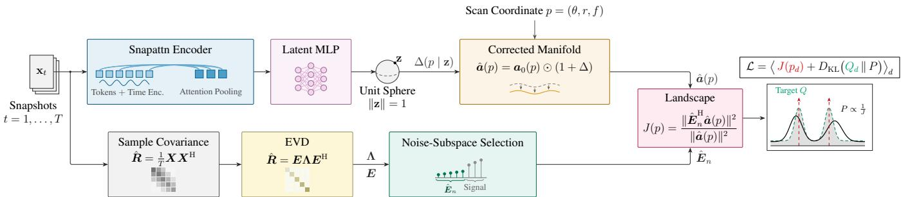
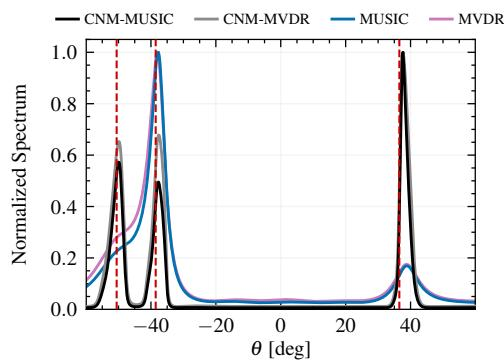
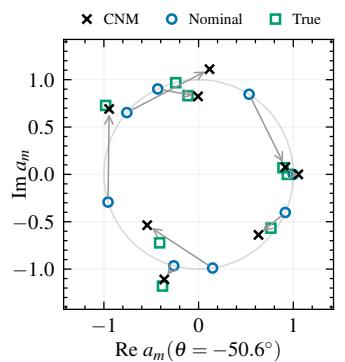
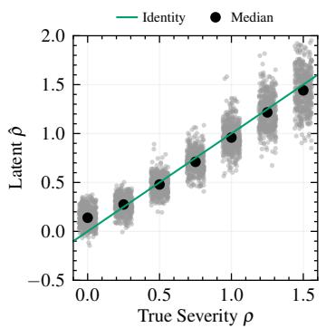
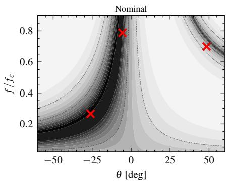
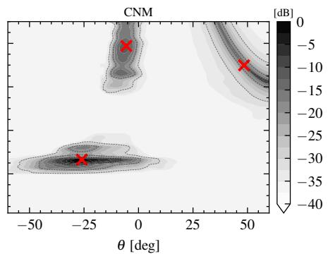
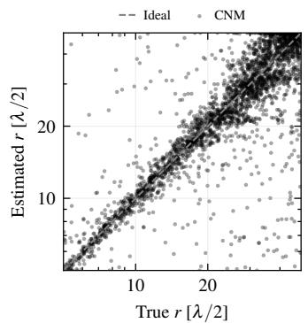
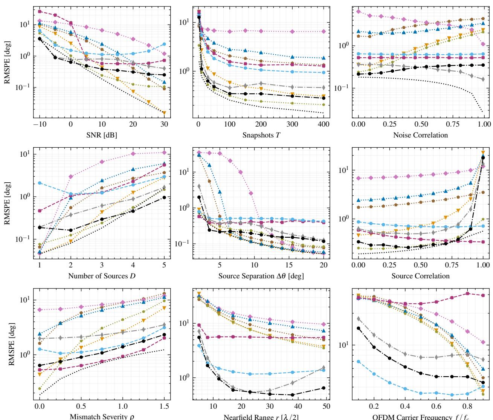

# LEARNING ARRAY SIGNAL TOPOLOGIES AS CONDITIONAL NEURAL MANIFOLDS

Julian P. Merkofer⋆,† Vincent van de Schaft⋆ Ruud J. G. van Sloun⋆

⋆ Eindhoven University of Technology, Eindhoven, The Netherlands † University Medical Center Utrecht, Utrecht, The Netherlands

## ABSTRACT

Subspace methods such as multiple signal classification (MUSIC) achieve super-resolution direction of arrival (DoA) estimation by exploiting the orthogonality between the array manifold and the noise subspace of the measurements. Their accuracy therefore depends on the assumed manifold and degrades under model mismatch, while parameters not identifiable from the spatial manifold cannot be recovered. In this work, we propose the conditional neural manifold (CNM), which replaces the fixed manifold with an observation-conditioned mapping from source parameters to steering vectors. An encoder maps the snapshots to a latent scene representation that conditions a zero-initialized neural field over the parameter space. The manifold is learned without steering-vector supervision by shaping the resulting MUSIC landscape. Since the correction acts on the manifold rather than on the estimator, it can be used by other manifold-based methods without modification. The CNM restores resolution under array imperfections, colored noise, correlated sources, and near-field propagation, and resolves the angle-frequency ambiguity inherent to the nominal spatial manifold.

Index Terms— Array Signal Processing, Direction-of-Arrival Estimation, MUSIC, Model Mismatch, Learned Array Manifolds

## 1. INTRODUCTION

Estimating the parameters of wave sources from the snapshots of a sensor array is a core problem of array signal processing, with applications ranging from radar and communications to medical imaging [1–4]. Subspace methods, most prominently multiple signal classification (MUSIC) [5] and its variants [6–8], achieve resolution beyond the beamwidth of the aperture by exploiting the orthogonality between the source steering vectors and the noise subspace of the covariance matrix. Their accuracy rests on the array manifold, the analytical map from the source parameters to the array response, which is assumed to be known exactly.

In practice, both the manifold and the signal model can deviate from these assumptions. Gain and phase errors, displaced elements, and mutual coupling change the array response [9, 10], nearfield propagation curves the wavefront [11], and broadband sources spread the response over frequency [12], while correlated sources [7] and spatially colored noise alter the subspaces estimated from the measurements. Classical methods address these limitations separately by calibrating the array response [10], modeling it in a parametric basis [13], bounding its mismatch in robust beamforming [14], extending the signal model to the near field [11] or to broadband sources [12], or preprocessing the covariance through spatial smoothing [7].

More recently, data-driven estimators learn a direct mapping from the measurements to the source parameters [15, 16], while model-based deep-learning methods [17] retain the structure of subspace estimation and learn the covariance, the subspaces, or the read-out of the resulting spectrum [18–22]. In all of these methods, the learning acts on the statistics that enter the estimator or on the read-out of its output, while the array manifold itself remains the nominal one, or is discarded altogether.

In this work, we propose to learn the array manifold itself through a conditional neural manifold (CNM). The contribution is threefold. First, the CNM replaces the fixed manifold with an observation-conditioned mapping from source parameters to steering vectors, allowing the manifold to adapt to the measured scene. Second, conditioning on the complete snapshots allows the learned manifold to not only restore consistency with the measured subspace when the nominal assumptions fail, but also to extend the identifiable parameter space using information that is absent from the spatial response. Third, the manifold is learned without supervision of the true steering vectors by optimizing the resulting MUSIC spectrum toward a target determined by the spatial and temporal distinguishability of the source parameters. We demonstrate the proposed approach under array imperfections, colored noise, correlated sources, near-field propagation, and joint angle–carrier estimation.

## 2. METHOD

## 2.1. Problem Formulation

We consider the estimation of source parameters $p _ { d } \in \mathcal { P }$ from D signals measured by an array of M sensors. In its general form, the signal received at sensor m is

$$
x _ { m } ( t ) = \sum _ { d = 1 } ^ { D } g _ { m } ( p _ { d } ) s _ { d } ( t - \tau _ { m } ( p _ { d } ) ) + v _ { m } ( t ) ,\tag{1}
$$

where $s _ { d } ( t )$ is the d-th source signal, $\tau _ { m } ( p _ { d } )$ its propagation delay relative to a reference sensor, $g _ { m } ( p _ { d } )$ the corresponding gain, and $v _ { m } ( t )$ additive noise. The measurements across the array form the snapshots $\pmb { x } _ { t } = [ x _ { 1 } ( t ) , \ldots , x _ { M } ( t ) ] ^ { \mathrm { T } }$ and $\pmb { X } = [ \pmb { x } _ { 1 } , \dots , \pmb { x } _ { T } ]$

For a frequency component f, the corresponding array response is described by the steering vector

$$
[ { \pmb a } ( p ) ] _ { m } = g _ { m } ( p ) e ^ { - j 2 \pi f \tau _ { m } ( p ) } , \qquad p = ( \theta , r , f , \ldots ) ,\tag{2}
$$

where the coordinates of p depend on the estimation problem. This formulation includes arbitrary array geometries and both far- and near-field propagation, while broadband signals are represented by their frequency components.

For example, the nominal far-field response of a uniform linear array (ULA) with half-wavelength spacing at the design frequency $f _ { c }$ is

$$
[ { a } _ { 0 } ( \theta , f ) ] _ { m } = e ^ { - j \pi ( m - 1 ) ( f / f _ { c } ) \sin \theta } \xrightarrow { f = f _ { c } } e ^ { - j \pi ( m - 1 ) \sin \theta } ,\tag{3}
$$

where the latter is the conventional narrowband manifold. In the near field, the plane-wave delay is replaced by the exact path difference determined by (θ, r).

  
Fig. 1. The CNM pipeline. Snapshots are encoded into a latent scene representation z that conditions a zero-initialized neural field deforming the nominal manifold as $\hat { \pmb { a } } ( p \mid z ) = \pmb { a } _ { 0 } ( p ) \odot ( 1 + \Delta ( p \mid z ) )$ ). The corrected manifold is evaluated with the unchanged MUSIC subspace estimation, while $P \propto 1 / J$ is shaped toward a target Q with one peak per source.

MUSIC [5] decomposes the sample covariance matrix into signal and noise subspaces, with the $M - D$ eigenvectors corresponding to the smallest eigenvalues forming the estimated noise subspace $\hat { \pmb { { E } } } _ { n }$ A candidate steering vector is then evaluated by its projection onto this subspace,

$$
J ( p ) = \frac { \| \hat { \pmb { E } } _ { n } ^ { \mathrm { H } } \pmb { a } ( p ) \| ^ { 2 } } { \| \pmb { a } ( p ) \| ^ { 2 } } .\tag{4}
$$

At the true source parameters, $\pmb { a } ( p _ { d } )$ lies in the signal subspace and is therefore orthogonal to ${ \hat { E } } _ { n } .$ yielding minima of $J ( p )$ and corresponding peaks of $1 / J ( p )$

## 2.2. Conditional Neural Manifold

A CNM replaces the fixed nominal manifold with an observationconditioned one (Fig. 1),

$$
\hat { \pmb { a } } ( p \left| \right. \ z ) = \pmb { a } _ { 0 } ( p ) \odot \big ( 1 + \Delta ( p \left| \right. \ z ) \big ) , \qquad z = h ( \pmb { X } ) ,\tag{5}
$$

where the encoder h maps the snapshots to a latent representation z and $\Delta ( \cdot \mid z )$ is a neural field [23] over the source-parameter space. The conventional mapping $p \mapsto { \pmb a } _ { 0 } ( p )$ therefore becomes conditioned on the observed signals through z. The CNM therefore adapts the manifold to the observed scene while preserving the structure of the downstream estimator. The encoder operates directly on the snapshots $\pmb { X }$ . Each snapshot is represented by the real and imaginary parts of $\mathbf { \Delta } _ { \mathbf { \mathcal { X } } _ { t } }$ and of the upper triangle of $\pmb { x } _ { t } \pmb { x } _ { t } ^ { \mathrm { H } }$ , together with a sinusoidal encoding of t. The resulting tokens are pooled by cross-attention onto $K = 8$ learned queries [24] and mapped to $\dot { z } \in \mathbb { R } ^ { 3 2 }$ , which is normalized to the unit sphere [25]. The neural field encodes the scan coordinate p using fixed harmonic features, concatenates these with z, and maps them through an multi-layer perceptron (MLP) with two hidden layers of 128 units to the real and imaginary parts of ∆. The final layer of ∆ is initialized to zero, such that $\Delta \equiv 0$ before training and $\hat { \mathbf { a } } ( p \mid z ) = \mathbf { a } _ { 0 } ( p )$ . The untrained CNM therefore exactly recovers the nominal manifold. Estimation proceeds by replacing the nominal steering vector by the learned one. The spectrum is evaluated over the scan coordinates in $\mathcal { P }$ and the D largest peaks of $1 / J$ give the source estimates. Since the learned quantity is the manifold itself, the same $\hat { \mathbf { } a } ( p \mid z )$ can be used directly by other manifold-based estimators, such as MVDR.

## 2.3. Training

The CNM is trained on simulated scenes with known source parameters $\{ p _ { d } \} _ { d = 1 } ^ { D }$ . Rather than supervising the learned manifold against the true array response, we optimize it through the resulting MUSIC spectrum. The loss combines a point-wise subspace constraint with a distributional constraint on the complete spectrum,

$$
{ \mathcal { L } } = \underbrace { \langle J ( p _ { d } ) \rangle _ { d } } _ { \mathrm { s u b s p a c e ~ c o n s i s t e n c y } } + \underbrace { \langle D _ { \mathrm { K L } } \big ( Q _ { d } ( p ) \| P ( p ) \big ) \rangle _ { d } } _ { \mathrm { s p e c t r u m ~ s h a p i n g } } .\tag{6}
$$

Here, p denotes the scan coordinate and $p _ { d }$ the true parameter of source d. The spectrum $P ( p ) \propto 1 / J ( p )$ is compared to a target $Q _ { d } ( p )$ centered at $p _ { d }$ . The first term directly enforces a null at the true source parameter by minimizing the projection of the learned steering vector onto the estimated noise subspace. The second term shapes the complete spectrum around each source.

The target is defined as

$$
Q _ { d } ( p ) \propto e ^ { - \tilde { \delta } _ { d } ( p ) / \varepsilon } ,\tag{7}
$$

where $\tilde { \delta } _ { d } ( p )$ describes the distinguishability between a candidate parameter p and the true source parameter $p _ { d }$ . We define

$$
\tilde { \delta } _ { d } ( \boldsymbol { p } ) = 1 - \frac { \left| a _ { 0 } ( p _ { d } ) ^ { \mathrm { H } } \pmb { a } _ { 0 } ( \boldsymbol { p } ) \right| ^ { 2 } } { \| \pmb { a } _ { 0 } ( p _ { d } ) \| ^ { 2 } \| \pmb { a } _ { 0 } ( \boldsymbol { p } ) \| ^ { 2 } } \left| \frac { D _ { T } ( f - f _ { d } ) } { T } \right| ^ { 2 } ,\tag{8}
$$

with $D _ { T }$ denoting the Dirichlet kernel of the T-sample record. The steering-vector overlap measures the similarity of the spatial array responses, while the Dirichlet term accounts for the frequency resolution of the temporal record. The target is therefore determined by the distinguishability provided jointly by the array and the record rather than by a fixed distance in parameter space. When frequency is fixed, the Dirichlet term equals one and $\tilde { \delta } _ { d } ( p )$ reduces to the normalized overlap deficit between the nominal steering vectors.

The scale ε controls the width of the target and is set from the minimum source separation of the training data. For each scene, $P ( p )$ and $Q _ { d } ( p )$ are evaluated and normalized over $N = 2 0 4 8$ parameters sampled uniformly from P before evaluating the Kullback-Leibler (KL) divergence. The noise subspace is obtained from the sample covariance exactly as during inference.

## 3. EXPERIMENTS

## 3.1. Setup

All scenes are simulated from (1) for a ULA with $M \ : = \ : 8$ halfwavelength spaced elements and a field of view of ±60◦, scanned on a shared grid of 480 points. The source signals and the noise are drawn from the complex Gaussian distribution, normalized to meet the SNR per source, and the DoAs are drawn uniformly at least 2◦ apart. Unless stated otherwise, the SNR is 10 dB, $T = 2 0 0 \mathrm { { ; } }$ $D = 3 .$ , the sources are uncorrelated, the noise is white, and the array is calibrated and in the far field.

Each scenario varies exactly one of these conditions over a range, and a separate model is trained per scenario: the SNR in [−10, 30] dB; $\hat { T } \in [ 1 , 4 0 0 ] ; D \in [ 1 , 5 ] ;$ two sources with separation $\Delta \theta ;$ source correlation in [0, 1]; spatially colored noise with covariance $c ^ { | i - j | } , \ c \ \in \ [ 0 , 0 . 9 9 ]$ ; array imperfections of severity $\rho \in [ 0 , 1 . 5 ] ,$ , which scales gain (±20%), phase $( \pm 3 0 ^ { \circ } )$ , and position (±0.2 spacings) errors drawn uniformly per element and scene, and a Toeplitz mutual coupling of strength $0 . 3 e ^ { j \pi / 3 }$ [15]; nearfield sources at $r \in [ 5 , 4 9 ]$ half-wavelengths; and OFDM sources of 10 subcarriers spanning 10% of the band at per-source carriers $f / f _ { c } \in [ 0 , 0 . 9 ]$

  
Fig. 2. Array imperfections of severity $\rho = 1$ at 15 dB, $T = 2 0 0$ , and $D = 3 .$ . Left: peak-normalized spectra of MUSIC and MVDR on the nominal and on the corrected manifold, true DoAs dashed. Center: the steering vector at one true DoA with arrows marking the correction. Right: linear read-out of the severity ρ from the latent z against the truth, cross-validated over 3500 scenes $( R ^ { 2 } = 0 . 9 1 )$ .

  
Fig. 3. Joint angle-carrier estimation of $D = 3$ OFDM sources at independent carriers (15 dB, Fig. 4. Estimated versus true near-$T = 2 0 0 )$ . Left: the null spectrum over $( \theta , f )$ on the nominal manifold. Right: the corrected field range over 3000 sources spanlandscape with isolated peaks at the true parameters (crosses). ning the full range (15 dB, $T = 2 0 0 )$ .

Where the range or the carrier is free, one CNM is trained with it pinned at its nominal value, so that the correction absorbs it like any other deformation, and one with it active, which estimates it jointly with the DoAs. The estimators are evaluated on $1 0 ^ { 4 }$ Monte-Carlo scenes per value of the varied condition in terms of the RMSPE [22]; all estimators know D. The CNM is trained with Adam at a learning rate of $1 0 ^ { - 3 }$ on batches of 64 scenes simulated on the fly, and the checkpoint with the lowest validation RMSPE is selected (1024 held-out scenes every 500 steps).

## 3.2. Baselines

We compare to the classical algorithms MUSIC [5], Root-MUSIC [6], the MVDR beamformer [26], spatially smoothed MUSIC (SS-MUSIC) [7], and the deterministic maximum likelihood estimator (MLE) computed by alternating projection [27], all on the nominal manifold, and the stochastic CRB evaluated with the true manifold [28]. The learned reference algorithms are DA-MUSIC [21, 22] and the convolutional neural network (CNN) of [16] (GridCNN). Each learned baseline keeps its original objective and trains on the same simulated data as the CNM, once per scenario over the full range of the varied condition, whereas the original works train at a single operating point or over a narrow low-SNR band [16, 22].

## 4. RESULTS

We first examine how the learned manifold changes the estimator under model mismatch and when the parameter space extends beyond what is identifiable from the spatial manifold. We then evaluate the resulting estimation accuracy across the full range of data, source, and model conditions in Fig. 5.

Under array imperfections, the CNM corrects the manifold toward the observed array response (Fig. 2). On the nominal manifold, the two closest of three sources merge into a single broadened peak and the third remains barely above the noise floor. Using the corrected manifold instead yields three sharp peaks at the true DoAs, for both MUSIC and MVDR, although the CNM is trained through the MUSIC null spectrum only (Fig. 2, left). The corresponding steering-vector entries are displaced from their nominal toward their true values (center), while the array-error severity ρ can be decoded linearly from the latent representation z (right).

Conditioning also allows the manifold to represent parameters that are not identifiable from the nominal spatial response alone. For a ULA, the far-field response depends on the product f sin θ, such that a joint scan over (θ, f) produces ridges rather than isolated peaks on the nominal manifold (Fig. 3, left). With access to the temporal structure through z, the corrected landscape separates these ridges into peaks at the true angle–carrier pairs (Fig. 3, right). In the near field, a joint angle–range scan recovers range closely up to approximately 20 half-wavelengths, with increasing scatter toward the far-field end of the evaluated range (Fig. 4).

Across the data conditions in the top row of Fig. 5, the CNM improves upon the learned benchmarks and, except at high SNR, upon the nominal subspace methods. It follows the CRB down to −10 dB, where the MLE is considerably less accurate, and from $T = 1 0$ snapshots onward, where nominal MUSIC is up to an order of magnitude less accurate, and remains largely unaffected by spatially colored noise. With more snapshots, the MLE comes closer

OFDM Carrier Frequency f / fc

Nearfield Range r [λ/2]

  
Fig. 5. RMSPE versus the varied condition, all other conditions at their default values, $1 0 ^ { 4 }$ Monte-Carlo scenes per point. Top row: SNR, number of snapshots, and noise correlation; middle row: number of sources, separation of two sources, and source correlation; bottom row: severity of the array imperfections, near-field range, and OFDM carrier frequency. The CRB is evaluated with the true manifold.

to the bound, and at high SNR, where Root-MUSIC approaches the bound, the CNM saturates at approximately 0.25◦.

For the source conditions in the middle row, the CNM resolves two sources separated by $2 ^ { \circ } .$ , which nominal MUSIC merges, and is the most accurate estimator for separations between $3 . 5 ^ { \circ }$ and 5◦. It remains close to the bound for up to five sources and localizes correlated sources without spatial smoothing up to a correlation of 0.9. For fully coherent sources, the rank-deficient source covariance invalidates the underlying subspace test, and only the MLE, DA-MUSIC, GridCNN, and SS-MUSIC remain operable.

Under the model variations in the bottom row, the CNM remains accurate across the trained range of array imperfections, while nominal MUSIC degrades to $1 1 ^ { \circ } .$ Its accuracy is almost on par with GridCNN and better than DA-MUSIC. The MLE is the most accurate estimator on the calibrated array, but, bound to the nominal manifold, it falls behind the CNM by a severity of 0.5 and degrades to about $1 0 ^ { \circ }$ at 1.5. In the near field, where the nominal far-field manifold fails throughout, the corrected manifold enables MUSIC to outperform the learned estimators beyond the closest range. For varying carrier frequency, DA-MUSIC remains the most accurate DoA-only estimator, while the CNM is the most accurate subspace method up to $f / f _ { c } = 0 . 8$ . Finally, CNM-MVDR follows CNM-MUSIC at the expected offset of the MVDR beamformer, showing that the correction transfers with the manifold.

## 5. CONCLUSION

We presented the CNM, a learned, observation-conditioned deformation of the nominal array manifold that augments MUSIC where its model assumptions are violated, while leaving the subspace estimation and interpretable spectrum of the classical method unchanged. The CNM was shown to restore the resolution of MUSIC under array imperfections, colored noise, correlated sources, and near-field propagation, to recover signal parameters that the spatial response alone leaves ambiguous, and to transfer directly to other estimators such as the MVDR beamformer.

## 6. REFERENCES

[1] Hamid Krim and Mats Viberg, “Two decades of array signal processing research: The parametric approach,” IEEE Signal Process. Mag., vol. 13, no. 4, pp. 67–94, 1996.

[2] Mats Viberg and Hamid Krim, “Two decades of statistical array processing,” in Proc. Asilomar Conf. Signals, Syst., Comput., 1997, pp. 775–777.

[3] Wei Liu, Martin Haardt, Maria S. Greco, Christoph Mecklenbrauker, and Peter Willett, “Twenty-five years of sensor ar-¨ ray and multichannel signal processing: A review of progress to date and potential research directions,” IEEE Signal Process. Mag., vol. 40, no. 4, pp. 80–91, 2023.

[4] Marius Pesavento, Minh Trinh-Hoang, and Mats Viberg, “Three more decades in array signal processing research: An optimization and structure exploitation perspective,” IEEE Signal Process. Mag., vol. 40, no. 4, pp. 92–106, 2023.

[5] Ralph O. Schmidt, “Multiple emitter location and signal parameter estimation,” IEEE Trans. Antennas Propag., vol. 34, no. 3, pp. 276–280, 1986.

[6] Arthur J. Barabell, “Improving the resolution performance of eigenstructure-based direction-finding algorithms,” in Proc. IEEE Int. Conf. Acoust., Speech, Signal Process. (ICASSP), 1983, pp. 336–339.

[7] Tie-Jun Shan, Mati Wax, and Thomas Kailath, “On spatial smoothing for direction-of-arrival estimation of coherent signals,” IEEE Trans. Acoust., Speech, Signal Process., vol. 33, no. 4, pp. 806–811, 1985.

[8] Richard Roy and Thomas Kailath, “ESPRIT—estimation of signal parameters via rotational invariance techniques,” IEEE Trans. Acoust., Speech, Signal Process., vol. 37, no. 7, pp. 984– 995, 1989.

[9] A. Lee Swindlehurst and Thomas Kailath, “A performance analysis of subspace-based methods in the presence of model errors, part I: The MUSIC algorithm,” IEEE Trans. Signal Process., vol. 40, no. 7, pp. 1758–1774, 1992.

[10] Benjamin Friedlander and Anthony J. Weiss, “Direction finding in the presence of mutual coupling,” IEEE Trans. Antennas Propag., vol. 39, no. 3, pp. 273–284, 1991.

[11] Yung-Dar Huang and Mourad Barkat, “Near-field multiple source localization by passive sensor array,” IEEE Trans. Antennas Propag., vol. 39, no. 7, pp. 968–975, 1991.

[12] Hong Wang and Mostafa Kaveh, “Coherent signal-subspace processing for the detection and estimation of angles of arrival of multiple wide-band sources,” IEEE Trans. Acoust., Speech, Signal Process., vol. 33, no. 4, pp. 823–831, 1985.

[13] Fabio Belloni, Andreas Richter, and Visa Koivunen, “DoA estimation via manifold separation for arbitrary array structures,” IEEE Trans. Signal Process., vol. 55, no. 10, pp. 4800–4810, 2007.

[14] Sergiy A. Vorobyov, Alex B. Gershman, and Zhi-Quan Luo, “Robust adaptive beamforming using worst-case performance optimization: A solution to the signal mismatch problem,” IEEE Trans. Signal Process., vol. 51, no. 2, pp. 313–324, 2003.

[15] Zhang-Meng Liu, Chenwei Zhang, and Philip S. Yu, “Direction-of-arrival estimation based on deep neural networks with robustness to array imperfections,” IEEE Trans. Antennas Propag., vol. 66, no. 12, pp. 7315–7327, 2018.

[16] Georgios K. Papageorgiou, Mathini Sellathurai, and Yonina C. Eldar, “Deep networks for direction-of-arrival estimation in low SNR,” IEEE Trans. Signal Process., vol. 69, pp. 3714– 3729, 2021.

[17] Nir Shlezinger, Jay Whang, Yonina C. Eldar, and Alexandros G. Dimakis, “Model-based deep learning,” Proc. IEEE, vol. 111, no. 5, pp. 465–499, 2023.

[18] Andreas Barthelme and Wolfgang Utschick, “DoA estimation using neural network-based covariance matrix reconstruction,” IEEE Signal Process. Lett., vol. 28, pp. 783–787, 2021.

[19] Dor H. Shmuel, Julian P. Merkofer, Guy Revach, Ruud J. G. van Sloun, and Nir Shlezinger, “Deep root MUSIC algorithm for data-driven DoA estimation,” in Proc. IEEE Int. Conf. Acoust., Speech, Signal Process. (ICASSP), 2023, pp. 1–5.

[20] Dor H. Shmuel, Julian P. Merkofer, Guy Revach, Ruud J. G. van Sloun, and Nir Shlezinger, “SubspaceNet: Deep learningaided subspace methods for DoA estimation,” IEEE Trans. Veh. Technol., vol. 74, no. 3, pp. 4962–4976, 2025.

[21] Julian P. Merkofer, Guy Revach, Nir Shlezinger, and Ruud J. G. van Sloun, “Deep augmented MUSIC algorithm for datadriven DoA estimation,” in Proc. IEEE Int. Conf. Acoust., Speech, Signal Process. (ICASSP), 2022, pp. 3598–3602.

[22] Julian P. Merkofer, Guy Revach, Nir Shlezinger, Tirza Routtenberg, and Ruud J. G. van Sloun, “DA-MUSIC: Data-driven DoA estimation via deep augmented MUSIC algorithm,” IEEE Trans. Veh. Technol., vol. 73, no. 2, pp. 2771–2785, 2024.

[23] Yiheng Xie, Towaki Takikawa, Shunsuke Saito, Or Litany, Shiqin Yan, Numair Khan, Federico Tombari, James Tompkin, Vincent Sitzmann, and Srinath Sridhar, “Neural fields in visual computing and beyond,” Comput. Graph. Forum, vol. 41, no. 2, pp. 641–676, 2022.

[24] Juho Lee, Yoonho Lee, Jungtaek Kim, Adam R. Kosiorek, Seungjin Choi, and Yee Whye Teh, “Set transformer: A framework for attention-based permutation-invariant neural networks,” in Proc. Int. Conf. Mach. Learn. (ICML), 2019, pp. 3744–3753.

[25] Kaiyu Yue, Menglin Jia, Ji Hou, and Tom Goldstein, “Image generation with a sphere encoder,” arXiv preprint arXiv:2602.15030, 2026.

[26] Jack Capon, “High-resolution frequency-wavenumber spectrum analysis,” Proc. IEEE, vol. 57, no. 8, pp. 1408–1418, 1969.

[27] I. Ziskind and M. Wax, “Maximum likelihood localization of multiple sources by alternating projection,” IEEE Trans. Acoust., Speech, Signal Process., vol. 36, no. 10, pp. 1553– 1560, 1988.

[28] Petre Stoica and Arye Nehorai, “Performance study of conditional and unconditional direction-of-arrival estimation,” IEEE Trans. Acoust., Speech, Signal Process., vol. 38, no. 10, pp. 1783–1795, 1990.