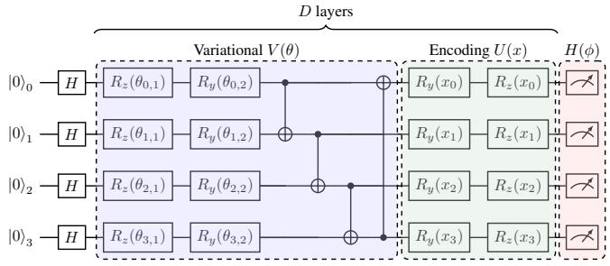
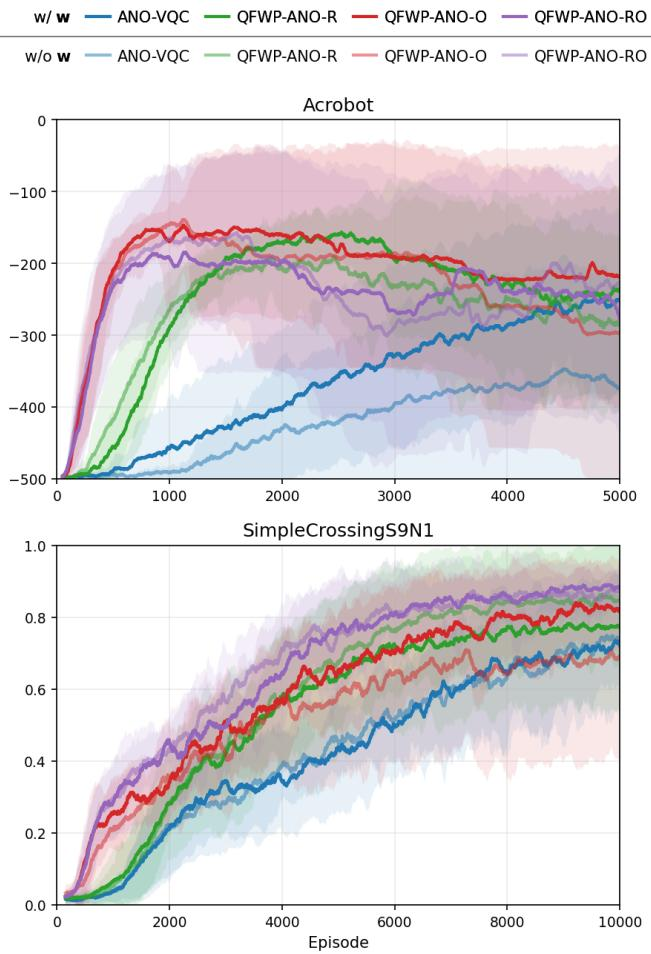

# LEARNING TO PROGRAM ADAPTIVE NON-LOCAL OBSERVABLES FOR MACHINE LEARNING

Yu-Ting Lee1 Samuel Yen-Chi Chen2 Huan-Hsin Tseng3

1Graduate Institute of Communication Engineering, National Taiwan University, Taipei, Taiwan 2Wells Fargo, New York, NY, USA

3Brookhaven National Laboratory, AI & ML Department, Upton, NY, USA r14942088@ntu.edu.tw, yen-chi.chen@wellsfargo.com, htseng@bnl.gov

## ABSTRACT

Quantum neural networks (QNNs) are typically built from variational quantum circuits (VQCs), which are limited by local measurements. Adaptive non-local observables (ANO) address this by jointly optimizing circuit parameters and multiqubit measurements. However, existing ANO-based VQCs learn only a single static observable that remains invariant across all inputs. We propose QFWP-ANO, a novel architecture which employs a classical hypernetwork to dynamically program VQC parameters and/or non-local observables conditioned on each input. On multivariate time-series forecasting across four ETT datasets, QFWP-ANO achieves the lowest MSE in 16 of 20 settings and second-lowest in the remaining four, surpassing ANO-based and other strong baselines. On reinforcement learning tasks, QFWP-ANO consistently surpasses ANO-VQCs. Our results establish input-conditioned ANO as an effective approach for enhancing QNNs.

Index Terms— Quantum machine learning, Variational quantum circuits, Quantum neural networks, Non-local observables

## 1. INTRODUCTION

Quantum machine learning (QML) and quantum neural networks (QNNs) have emerged as a promising paradigm that leverages the representational expressivity of quantum phenomena such as superposition, entanglement, and quantum interference [1, 2]. In particular, QNNs are increasingly being applied to a wide range of complex machine learning tasks, including reinforcement learning [3–6], classification [7, 8], anomaly detection [9], and time-series prediction [10–14].

However, QNNs are typically built from variational quantum circuits (VQCs) and depend on local measurements, which limit the network’s ability to learn complex data distributions.

To address this bottleneck, recent work proposes to jointly optimize circuit parameters with trainable observables [15]. Specifically, the adaptive non-local observables (ANO) framework [16] leverages trainable multi-qubit Hermitian observables and shows strong potential across super-resolution [17], reinforcement learning [18], classification [16], and time-series forecasting [14]. Yet, a key limitation of existing ANO-based QNNs is their reliance on a static observable per task, rendering the measurement invariant to the input data stream.

To overcome this limitation, we propose QFWP-ANO, which renders non-local observables adaptive to the input. Building on quantum fast weight programmers (QFWP) [12], our approach employs a classical hypernetwork to program the circuit parameters, the non-local observables, or both, yielding a family of input-conditioned models. Experiments on multivariate time-series forecasting (MTSF) and reinforcement learning (RL) demonstrate the superior performance of QFWP-ANO over standard ANO-VQCs. Our contributions:

• We introduce QFWP-ANO, a novel QNN architecture that utilizes a classical hypernetwork to dynamically program VQCs along with non-local observables.

• On multivariate time-series forecasting across four ETT datasets, QFWP-ANO achieves the lowest MSE in 16 of 20 settings and second-lowest in the remaining four, outperforming standard ANO-VQCs in 17 of 20 cases.

• In standard RL environments, QFWP-ANO outperforms ANO-VQCs, while programming the non-local observables can accelerate learning.

## 2. METHODOLOGY

## 2.1. Variational Quantum Circuits

Variational quantum circuits (VQCs), also known as parameterized quantum circuits (PQCs), are trainable quantum models that process classical data in three stages. Initially, a classical input x is mapped into an n-qubit system via a data encoding unitary circuit U(x), yielding the encoded states $U ( x ) | 0 \rangle ^ { \otimes n }$ where $| 0 \rangle ^ { \otimes n }$ is the ground state. Subsequently, a parameterized unitary circuit $V ( \theta )$ evolves this state into $V ( \theta ) U ( x ) | 0 \rangle ^ { \otimes n }$ This variational circuit $V ( \theta )$ is typically structured with alternating layers of trainable single-qubit rotations and multi-qubit entangling gates. Lastly, a measurement layer extracts classical information by calculating the expectation values of a fixed Hermitian observable H. The computation of a VQC can be summarized as a quantum function $f _ { \mathrm { V Q C } } ( x ; \theta )$

$$
f _ { \mathrm { v Q C } } ( x ; \theta ) = \langle 0 | ^ { \otimes n } U ^ { \dag } ( x ) V ^ { \dag } ( \theta ) H V ( \theta ) U ( x ) | 0 \rangle ^ { \otimes n } .\tag{1}
$$

## 2.2. Adaptive Non-Local Observables

Motivated by the Heisenberg picture, where quantum evolution is characterized by dynamical observables, adaptive non-local observables (ANO) [16] replace the fixed observable of a standard VQC with a trainable Hermitian operator $H ( \phi )$ parameterized by ϕ. A k-local observable takes the form:

$$
H ( \phi ) = \left( \begin{array} { c c c c c } { c _ { 1 1 } } & { a _ { 1 2 } + i b _ { 1 2 } } & { a _ { 1 3 } + i b _ { 1 3 } } & { \cdot \cdot \cdot } & { a _ { 1 K } + i b _ { 1 K } } \\ { \ast } & { c _ { 2 2 } } & { a _ { 2 3 } + i b _ { 2 3 } } & { \cdot \cdot \cdot } & { a _ { 2 K } + i b _ { 2 K } } \\ { \ast } & { \ast } & { c _ { 3 3 } } & { \cdot \cdot \cdot } & { a _ { 3 K } + i b _ { 3 K } } \\ { \vdots } & { \vdots } & { \vdots } & { \ddots } & { \vdots } \\ { \ast } & { \ast } & { \ast } & { \cdot \cdot } & { c _ { K K } } \end{array} \right)\tag{2}
$$

where $k ~ \leq ~ n , ~ K ~ = ~ 2 ^ { k }$ , and the parameter set $\phi \ =$ $( a _ { i j } , b _ { i j } , c _ { i i } ) _ { i , j = 1 } ^ { K }$ consists of $K ^ { 2 }$ real parameters.

Utilizing a trainable observable strictly expands a QNN’s function class: a conventional VQC with a fixed local observable is a special case of ANO [16]. Moreover, a k-local observable $H ( \phi )$ operates jointly across k qubits, coupling features between distant qubits to facilitate an information mixture that common Pauli-Z measurements cannot capture.

## 2.3. QFWP-ANO

QFWP-ANO employs a classical neural network as a hypernetwork to program the rotation angles of the variational circuit and/or the ANO parameters, conditioned on each input. Specifically, this hypernetwork utilizes an encoder-decoder ar chitecture. A shared MLP encoder first processes the input into a latent representation z. Taking z as input, specific decoders then generate the necessary parameters: a linear layer for the rotation angles θ, and a separate two-layer MLP for the ANO parameters ϕ. In contrast to QFWP, which stores temporal memory by recurrently accumulating updates, QFWP-ANO maps each input independently, carrying no accumulated state.

We use a data re-uploading VQC structure [8, 19] combined with ANO. Initialized by a layer of Hadamard gates, each of the D layers consists of 3 parts: parameterized $R _ { z }$ and $R _ { y }$ rotation gates, a circular topology of CNOT gates, and $R _ { y }$ and $R _ { z }$ encoding gates for data re-uploading (Fig. 1). Finally, a combinatorial measurement scheme with k-local observables is applied. We compute expected values across all $\binom { n } { k }$ combinations of k qubits from the n available; this generates one output value per combination to account for multi-qubit correlations.

  
Fig. 1: VQC architecture of QFWP-ANO. Each layer consists parameterized $R _ { z } , R _ { y }$ rotations, circular CNOT gates, and encoding $U ( x )$ . Trainable k-local observables $H ( \phi )$ are employed for measurement.

Table 1: Statistics of the datasets and environments.  
(a) The four ETT datasets.
<table><tr><td>Datasets</td><td>ETTh1 &amp; ETTh2</td><td>ETTm1 &amp; ETTm2</td></tr><tr><td>Variates</td><td>7</td><td>7</td></tr><tr><td>Timesteps</td><td>17,420</td><td>69,680</td></tr><tr><td>Sample rate</td><td>1 hour</td><td>5 min</td></tr></table>

(b) RL environments.
<table><tr><td>Environments</td><td>Acrobot</td><td>SimpleCrossingS9N1</td></tr><tr><td>State Space</td><td>Continuous</td><td>Discrete</td></tr><tr><td>Action Space</td><td>Discrete</td><td>Discrete</td></tr><tr><td>State dim</td><td>6</td><td>147</td></tr><tr><td>Actions</td><td>3</td><td>7</td></tr><tr><td>Reward</td><td>-1/step</td><td>+1 on goal, else 0</td></tr></table>

## 3. EXPERIMENTAL SETTINGS

We evaluate three QFWP-ANO variants in which the hypernetwork programs only the rotation angles (QFWP-ANO-R), only the ANO parameters (QFWP-ANO-O), or both (QFWP-ANO-RO). We test QFWP-ANO on two common QML tasks: multivariate time-series forecasting (MTSF) and RL.

## 3.1. Multivariate Time Series Forecasting

For a multivariate series with C variates (channels), let L be the lookback window and H the forecasting horizon. Given historical data $\mathbf { X } _ { t } \in \mathbb { R } ^ { C \times L }$ , MTSF aims to predict future values $\widehat { \mathbf Y } _ { t } \in \mathbb R ^ { C \times H }$ . The ground truth is denoted $\mathbf { Y } _ { t } \in \mathbb { R } ^ { C \times H }$

Following Lee et al. [14], we apply instance normaliza-

tion [20] to each channel of $X _ { t }$ against distribution shift:

$$
\mathbf { X } _ { t } ^ { \prime } = ( \mathbf { X } _ { t } - \pmb { \mu } ) \odot ( \pmb { \sigma } ^ { 2 } + \pmb { \epsilon } ) ^ { - 1 / 2 } ,\tag{3}
$$

where $\mu , \sigma ^ { 2 } \in \mathbb { R } ^ { C }$ are the per-channel mean and variance over the lookback window and ϵ ensures numerical stability. The normalized input is flattened and projected to a latent $h _ { t } .$ transformed by QFWP-ANO, and mapped to forecasts via a linear layer and de-normalization:

$$
\hat { Y } _ { t } = \big ( W _ { \mathrm { o u t } } \pmb { f } _ { \mathrm { V Q C } } ( \pmb { h } _ { t } ; \theta , \phi ) + b _ { \mathrm { o u t } } \big ) \odot \sqrt { \pmb { \sigma } ^ { 2 } + \epsilon } + \mu ,\tag{4}
$$

where $\pmb { f } _ { \mathrm { V Q C } } ( \pmb { h } _ { t } ; \theta , \phi ) \in \mathbb { R } ^ { \binom { n } { k } }$

We conduct experiments on four real-world datasets from the Electricity Transformer Temperature (ETT) benchmark [21] (Table 1a). We adopt a standard 6:2:2 train/validation/test split and report MSE and MAE as our main metrics [10, 14, 21]. We compare against several state-of-theart baselines: MTSF-ANO [14], an ANO-based MTSF model; QuLTSF [10], a quantum method for long-term MTSF; and the strong linear baselines DLinear/NLinear/Linear [22], which are known to outperform many Transformer-based methods in long-term MTSF. A QFWP [12] baseline is also included. We set $n = C$ qubits and sweep VQC depth $D = \{ 1 , 3 \}$ and non-locality $k \in \{ 1 , \ldots , 7 \}$ , reporting the best result over k and D. We train up to 100 epochs with Adam using MSE loss.

## 3.2. Reinforcement Learning

Following Lin et al. [18], we embed QFWP-ANO as the function approximator in Asynchronous Advantage Actor-Critic (A3C) [23]: a linear layer encodes the state $s _ { t }$ into a latent $\boldsymbol { h } _ { t }$ which is the circuit input for two independent QFWP-ANO instances (policy and value) that produce $\pi _ { \boldsymbol { \theta } } ( \boldsymbol { a } \mid \boldsymbol { s } _ { t } )$ and $V _ { \psi } ( s _ { t } )$ Each QFWP-ANO instance’s hypernetwork reads $s _ { t }$ directly to generate the parameters.

Following prior work [3, 6, 18], we evaluate on Acrobot, a swing-up control problem, and MiniGrid-SimpleCrossingS9N1, a sparse-reward navigation task (Table 1b). We compare our method against an ANO-VQC baseline. In all configurations, we use n = 4 qubits, D = 4 VQC layers, and non-locality $k = 3 .$ . Further, we introduce a trainable input scaling w (e.g., $R _ { y } ( w _ { i } x _ { i } )$ rather than $R _ { y } ( x _ { i } ) )$ . Since trainable input scaling w has proven beneficial in standard QRL agents [3, 5], we evaluate models both with and without w to investigate how it affects ANO-based agents. All models are trained using A3C for 5,000 (Acrobot) or 10,000 (SimpleCrossingS9N1) episodes, averaged over 10 random seeds.

## 4. EXPERIMENTS

## 4.1. MTSF Results

Table 2 summarizes the MTSF performance at a fixed lookback $L = 1 6$ . QFWP-ANO-O achieves the lowest MSE in 13 of the 20 settings; combined with QFWP-ANO-RO, they rank first in 16 settings and secure the second-lowest MSE in the remaining four. This advantage is largest and most consistent on ETTm1, where the improvement over the best baseline by up to 6.6% and the improvement grows steadily with the horizon. Further, QFWP-ANO outperforms standard ANO-VQCs (MTSF-ANO) in 17 of 20 cases. Across all ETT datasets, programming the observable (QFWP-ANO-O, QFWP-ANO-RO) is more effective than programming only the rotation angles (QFWP-ANO-R). Our finding indicate that input-conditioned non-local measurement provides significant gains.

  
Fig. 2: Reward over episodes. Band is ± standard deviation.

## 4.2. RL Results

Fig. 2 shows the learning curves, with (dark) and without (light) the trainable input scaling w. In Acrobot, all three QFWP-ANO variants substantially outperform the ANO-VQC baseline from episode 1000 to 4000. Although the models ultimately converge to similar final returns, QFWP-ANO-O and QFWP-ANO-RO reach their peak performance as early as around episode 1000. This early convergence demonstrates that programming the observable effectively improves sample efficiency. In SimpleCrossingS9N1, QFWP-ANO-RO reaches the highest final reward and remains the best throughout training, ahead of all other models. Employing the trainable input scaling w only significantly boosts ANO-VQC in Acrobot.

Table 2: Multivariate forecasting results. Results are averaged over 10 different random seeds. Lookback $L = 1 6$ and prediction horizon $H \in \{ 1 , 5 , 1 6 , 3 2 , 4 8 \}$ . Lower MSE and MAE are better. The best result is highlighted in bold and the second best is highlighted with underline. IMP. is the improvement between the best QFWP-ANO method and the best baseline, where a larger value indicates better improvement. QFWP-ANO models implemented by us; other results from [14].
<table><tr><td colspan="2">Methods</td><td>IMP.</td><td colspan="2">QFWP-ANO-RO</td><td colspan="2">QFWP-ANO-R</td><td colspan="2">QFWP-ANO-O</td><td colspan="2">MTSF-ANO</td><td colspan="2">QuLTSF</td><td colspan="2">QFWP</td><td colspan="2">DLinear</td><td colspan="2">NLinear</td><td colspan="2">Linear</td></tr><tr><td colspan="2">Metric 1</td><td>MSE</td><td>MSE</td><td>MAE</td><td>MSE</td><td>MAE</td><td>MSE</td><td>MAE</td><td>MSE</td><td>MAE</td><td>MSE</td><td>MAE</td><td>MSE</td><td>MAE</td><td>MSE</td><td>MAE</td><td>MSE MAE</td><td>MSE</td><td>MAE</td></tr><tr><td colspan="2"></td><td>3.6%</td><td>0.133</td><td>0.239</td><td>0.137</td><td>0.243</td><td>0.132</td><td>0.237</td><td>0.137</td><td>0.243</td><td>0.162</td><td>0.254</td><td>0.397</td><td>0.406</td><td>0.164</td><td>0.258 0.162</td><td>0.256</td><td>0.199</td><td>0.284</td></tr><tr><td rowspan="6">ET1</td><td>5 16</td><td>4.4%</td><td>0.324 0.380</td><td>0.364 0.400</td><td>0.337 0.397</td><td>0.371 0.410</td><td>0.323 0.379</td><td>0.362 0.398</td><td>0.338 0.388</td><td>0.371</td><td>0.431</td><td>0.409</td><td>0.700</td><td>0.522</td><td>0.478 0.429</td><td>0.489</td><td>0.432</td><td>0.510</td><td>0.443</td></tr><tr><td></td><td>2.3%</td><td></td><td></td><td></td><td></td><td></td><td></td><td></td><td>0.405</td><td>0.437</td><td>0.422</td><td>0.662</td><td>0.514 0.459</td><td>0.428</td><td>0.487</td><td>0.441</td><td>0.474</td><td>0.435</td></tr><tr><td>32</td><td>0.7%</td><td>0.425</td><td>0.426</td><td>0.437</td><td>0.432</td><td>0.423</td><td>0.425</td><td>0.426</td><td>0.427</td><td>0.481</td><td>0.447</td><td>0.670</td><td>0.523 0.494</td><td>0.447</td><td>0.518</td><td>0.458</td><td>0.507</td><td>0.453</td></tr><tr><td>48</td><td>-2.3%</td><td>0.439</td><td>0.431</td><td>0.446</td><td>0.435</td><td>0.437</td><td>0.429</td><td>0.427</td><td>0.425</td><td>0.474</td><td>0.441</td><td>0.645</td><td>0.514 0.481</td><td>0.439</td><td>0.502</td><td>0.450</td><td>0.490</td><td>0.443</td></tr><tr><td>1</td><td>-1.4%</td><td>0.075</td><td>0.170</td><td>0.082</td><td>0.179</td><td>0.075</td><td>0.169</td><td>0.079</td><td>0.173</td><td>0.074</td><td>0.167</td><td>0.117</td><td>0.225 0.074</td><td>0.166</td><td>0.074</td><td>0.166</td><td>0.076</td><td>0.170</td></tr><tr><td>5</td><td>2.5%</td><td>0.118</td><td>0.215</td><td>0.129</td><td>0.229</td><td>0.118</td><td>0.215</td><td>0.121</td><td>0.218</td><td>0.122</td><td>0.222</td><td>0.155</td><td>0.261</td><td>0.126</td><td>0.225 0.126</td><td>0.226</td><td>0.127</td><td>0.228</td></tr><tr><td rowspan="4">ET2</td><td>16</td><td>2.3%</td><td>0.174</td><td>0.262</td><td>0.177</td><td>0.265</td><td>0.173</td><td>0.261</td><td>0.180</td><td>0.268</td><td>0.177</td><td>0.271</td><td>0.193</td><td>0.284</td><td>0.177 0.269</td><td>0.179</td><td>0.271</td><td>0.178</td><td>0.270</td></tr><tr><td>32</td><td>0.5%</td><td>0.222</td><td>0.293</td><td>0.223</td><td>0.294</td><td>0.221</td><td>0.292</td><td>0.225</td><td>0.295</td><td>0.222</td><td>0.297</td><td>0.243</td><td>0.314</td><td>0.222 0.294</td><td>0.223</td><td>0.296</td><td>0.222</td><td>0.295</td></tr><tr><td>48</td><td>0.0%</td><td>0.261</td><td>0.315</td><td>0.261</td><td>0.316</td><td>0.259</td><td>0.314</td><td>0.264</td><td>0.318</td><td>0.259</td><td>0.318</td><td>0.277</td><td>0.331</td><td>0.259 0.315</td><td>0.261</td><td>0.317</td><td>0.259</td><td>0.316</td></tr><tr><td>1</td><td>0.0%</td><td>0.048</td><td>0.136</td><td>0.050</td><td>0.138</td><td>0.048</td><td>0.136</td><td>0.048</td><td>0.135</td><td>0.051</td><td>0.136</td><td>0.105</td><td>0.201</td><td>0.052</td><td>0.138 0.052</td><td>0.137</td><td>0.052</td><td>0.138</td></tr><tr><td>ETm1</td><td>5</td><td>3.6%</td><td>0.106</td><td>0.200</td><td>0.111</td><td>0.205</td><td>0.107</td><td>0.200</td><td>0.110</td><td>0.204</td><td>0.128</td><td>0.210</td><td>0.198</td><td>0.271</td><td>0.133 0.214</td><td>0.132</td><td>0.214</td><td>0.133</td><td>0.214</td></tr><tr><td></td><td>16</td><td>5.2%</td><td>0.311</td><td>0.332</td><td>0.324</td><td>0.341</td><td>0.311</td><td>0.331</td><td>0.328</td><td>0.342</td><td>0.432</td><td>0.369</td><td>0.520</td><td>0.423</td><td>0.451</td><td>0.378 0.451</td><td>0.378</td><td>0.452</td><td>0.378</td></tr><tr><td></td><td>32</td><td>5.7%</td><td>0.560</td><td>0.448</td><td>0.575</td><td>0.459</td><td>0.564</td><td>0.451</td><td>0.594</td><td>0.462</td><td>0.788</td><td>0.517</td><td>0.859</td><td>0.552</td><td>0.835</td><td>0.534 0.836</td><td>0.534</td><td>0.836</td><td>0.534</td></tr><tr><td></td><td>48</td><td>6.6%</td><td>0.660</td><td>0.501</td><td>0.668</td><td>0.507</td><td>0.668</td><td>0.505</td><td>0.720</td><td>0.522</td><td>0.956</td><td>0.588</td><td>0.986</td><td>0.608</td><td>1.018 0.610</td><td>1.019</td><td>0.610</td><td>1.019</td><td>0.610</td></tr><tr><td></td><td>1</td><td>-3.1%</td><td>0.033</td><td>0.103</td><td>0.035</td><td>0.107</td><td>0.033</td><td>0.103</td><td>0.034</td><td>0.106</td><td>0.032</td><td>0.095</td><td>0.051</td><td>0.136</td><td>0.032</td><td>0.095 0.032</td><td>0.096</td><td>0.032</td><td>0.096</td></tr><tr><td rowspan="3">ETTm2</td><td>5</td><td>-1.7%</td><td>0.059</td><td>0.140</td><td>0.060</td><td>0.143</td><td>0.059</td><td>0.140</td><td>0.059</td><td>0.141</td><td>0.058</td><td>0.138</td><td>0.073</td><td>0.166</td><td>0.060</td><td>0.142 0.060</td><td>0.142</td><td>0.060</td><td>0.142</td></tr><tr><td>16</td><td>1.0%</td><td>0.099</td><td>0.190</td><td>0.101</td><td>0.193</td><td>0.099</td><td>0.190</td><td>0.100</td><td>0.191</td><td>0.104</td><td>0.196</td><td>0.118</td><td>0.216</td><td>0.108 0.201</td><td>0.108</td><td>0.201</td><td>0.108</td><td>0.201</td></tr><tr><td>32 0.7%</td><td>0.146</td><td></td><td>0.237</td><td>0.149</td><td>0.241</td><td>0.145</td><td>0.236</td><td>0.146</td><td>0.238</td><td>0.158</td><td>0.250</td><td>0.168</td><td>0.263 0.162</td><td>0.255</td><td>0.162</td><td>0.255</td><td>0.162</td><td>0.255</td></tr><tr><td></td><td>48</td><td>0.6%</td><td>0.179</td><td>0.266</td><td>0.183</td><td>0.271</td><td>0.178</td><td>0.265</td><td>0.179</td><td>0.267</td><td>0.195</td><td>0.284</td></table>

Table 3: Impact of ANO non-locality and VQC depth. Color shows the best variant among $\mathrm { R } / \mathrm { O } / \mathrm { R O }$ . Bold indicates lowest MSE across all $k = 1$ to $k = 7$ within that column, i.e., the best variant and non-locality k for a given (H, D) pair.

(a) VQC depth $D = 1 .$
<table><tr><td>Settings</td><td>H = 1  $H = 5$ </td><td> $H = 1 6$ </td><td> $H = 3 2$   $H = 4 8$ </td></tr><tr><td>k = 1</td><td>0.073 0.161</td><td>0.260</td><td>0.359 0.404</td></tr><tr><td>k = 2</td><td>0.072 0.152</td><td>0.242</td><td>0.340 0.388</td></tr><tr><td>k = 3</td><td>0.073 0.152</td><td>0.240</td><td>0.338 0.385</td></tr><tr><td>k = 4</td><td>0.074 0.152</td><td>0.242</td><td>0.340 0.388</td></tr><tr><td> $k = 5$ </td><td>0.074 0.155</td><td>0.248</td><td>0.347 0.391</td></tr><tr><td>k = 6</td><td>0.077 0.168</td><td>0.263</td><td>0.360 0.404</td></tr><tr><td> $k = 7$ </td><td>0.179 0.268</td><td>0.379</td><td>0.475 0.519</td></tr></table>

(b) VQC depth $D = 3 .$
<table><tr><td>Settings  $H = 1$ </td><td> $H = 5$ </td><td> $H = 1 6$ </td><td> $H = 3 2$   $H = 4 8$ </td></tr><tr><td> $k = 1$ </td><td>0.073 0.160</td><td>0.260</td><td>0.359 0.403</td></tr><tr><td> $k = 2$ </td><td>0.072 0.152</td><td>0.243</td><td>0.341 0.388</td></tr><tr><td> $k = 3$ </td><td>0.073 0.153</td><td>0.242</td><td>0.340 0.386</td></tr><tr><td>k = 4</td><td>0.074 0.153</td><td>0.243</td><td>0.342 0.388</td></tr><tr><td> $k = 5$ </td><td>0.076 0.155</td><td>0.251</td><td>0.350 0.395</td></tr><tr><td>k = 6</td><td>0.079 0.168</td><td>0.267</td><td>0.363 0.408</td></tr><tr><td> $k = 7$ </td><td>0.167 0.277</td><td>0.374</td><td>0.475 0.520</td></tr></table>

## 4.3. Impact of ANO Non-Locality and VQC Depth

We evaluate how VQC depth and ANO non-locality influence MTSF performance of QFWP-ANO variants. Table 3 reports the lowest average MSE across the four ETT datasets for each (k, H) configuration and circuit depth $D \in \{ 1 , 3 \}$ , colored by the best-performing QFWP-ANO variant. We make four key observations: (1) MSE initially decreases from $k = 1$ , reaches a minimum around $k \in \{ 2 , 3 \}$ , and rises sharply by $k = 7 ,$ which is likely due to combinatorial ANO scheme leaving only a single expectation value at $k = 7 ; ( 2 )$ QFWP-ANO-RO and QFWP-ANO-O achieve the lowest MSE for $k \leq 4$ , while QFWP-ANO-R starting to overtake them from $k = 5$ and dominates across all horizons at $k = 7 ; ( 3 )$ moderate nonlocality consistently yields the best performance, regardless of the specific variant; and (4) shallower circuits $( D = 1 )$ match or outperform deeper ones $( D = 3 )$ in most settings.

## 5. CONCLUSION

We introduced QFWP-ANO, a novel QNN architecture that utilizes a classical hypernetwork to dynamically program VQCs along with non-local observables. Across several MTSF and RL benchmarks, programming the non-local observables yields the most substantial improvements. Specifically, in MTSF, QFWP-ANO ranks first in MSE in 16 of 20 settings and ranks second in the remaining four. In RL environments, QFWP-ANO consistently outperforms ANO-VQCs, and programming the non-local observables can effectively accelerate learning. These findings establish input-conditioned ANO as a promising route to more capable quantum models.

## 6. REFERENCES

[1] M. Cerezo, Andrew Arrasmith, Ryan Babbush, Simon C. Benjamin, Suguru Endo, Keisuke Fujii, Jarrod R. McClean, Kosuke Mitarai, Xiao Yuan, Lukasz Cincio, and Patrick J. Coles, “Variational quantum algorithms,” Nature Reviews Physics, vol. 3, no. 9, pp. 625–644, Sep 2021.

[2] Jarrod R McClean, Jonathan Romero, Ryan Babbush, and Alan´ Aspuru-Guzik, “The theory of variational hybrid quantumclassical algorithms,” New Journal of Physics, vol. 18, no. 2, pp. 023023, feb 2016.

[3] Sofiene Jerbi, Casper Gyurik, Simon Marshall, Hans Briegel, and Vedran Dunjko, “Parametrized quantum policies for reinforcement learning,” in Advances in Neural Information Processing Systems, M. Ranzato, A. Beygelzimer, Y. Dauphin, P.S. Liang, and J. Wortman Vaughan, Eds. 2021, vol. 34, pp. 28362–28375, Curran Associates, Inc.

[4] Gyu Seon Kim, Samuel Yen-Chi Chen, Soohyun Park, and Joongheon Kim, “Quantum reinforcement learning for coordinated satellite systems,” in ICASSP 2025 - 2025 IEEE International Conference on Acoustics, Speech and Signal Processing (ICASSP), 2025, pp. 1–5.

[5] Yu-Ting Lee, Samuel Yen-Chi Chen, and Fu-Chieh Chang, “Quantum hierarchical reinforcement learning via variational quantum circuits,” 2026.

[6] Samuel Yen-Chi Chen, Chao-Han Huck Yang, Jun Qi, Pin-Yu Chen, Xiaoli Ma, and Hsi-Sheng Goan, “Variational Quantum Circuits for Deep Reinforcement Learning,” IEEE Access, vol. 8, pp. 141007–141024, 2020.

[7] Edward Farhi and Hartmut Neven, “Classification with quantum neural networks on near term processors,” 2018.

[8] Adrian P ´ erez-Salinas, Alba Cervera-Lierta, Elies Gil-Fuster,´ and Jose I. Latorre, “Data re-uploading for a universal quantum´ classifier,” Quantum, vol. 4, pp. 226, Feb. 2020.

[9] Marco Casalbore, Leonardo Lavagna, Antonello Rosato, and Massimo Panella, “Time series anomaly detection with quantum variational methods and set covering,” in ICASSP 2026 - 2026 IEEE International Conference on Acoustics, Speech and Signal Processing (ICASSP), 2026, pp. 1846–1850.

[10] Hari Hara Suthan Chittoor, Paul Robert Griffin, Ariel Neufeld, Jayne Thompson, and Mile Gu, “Qultsf: Long-term time series forecasting with quantum machine learning,” in Proceedings of the 17th International Conference on Agents and Artificial Intelligence - Volume 1: QAIO. INSTICC, 2025, pp. 824–829, SciTePress.

[11] Samuel Yen-Chi Chen, Shinjae Yoo, and Yao-Lung L. Fang, “Quantum long short-term memory,” in ICASSP 2022 - 2022 IEEE International Conference on Acoustics, Speech and Signal Processing (ICASSP), 2022, pp. 8622–8626.

[12] Samuel Yen-Chi Chen, “Learning to program variational quantum circuits with fast weights,” in 2024 International Joint Conference on Neural Networks (IJCNN), 2024, pp. 1–9.

[13] Andrea Ceschini, Antonello Rosato, Massimo Panella, and Samuel Yen-Chi Chen, “Quantum fast weight programming for time series prediction,” in ICASSP 2026 - 2026 IEEE Interna tional Conference on Acoustics, Speech and Signal Processing (ICASSP), 2026, pp. 22032–22036.

[14] Yu-Ting Lee, Huan-Hsin Tseng, and Samuel Yen-Chi Chen, “Multivariate time series forecasting with adaptive non-local observables,” 2026.

[15] Samuel Yen-Chi Chen, Huan-Hsin Tseng, Hsin-Yi Lin, and Shinjae Yoo, “Learning to measure quantum neural networks,” in 2025 IEEE International Conference on Acoustics, Speech, and Signal Processing Workshops (ICASSPW), 2025, pp. 1–5.

[16] Hsin-Yi Lin, Huan-Hsin Tseng, Samuel Yen-Chi Chen, and Shinjae Yoo, “Adaptive non-local observable on quantum neural networks,” in 2025 IEEE International Conference on Quantum Computing and Engineering (QCE), 2025, vol. 01, pp. 1884– 1893.

[17] Hsin-Yi Lin, Huan-Hsin Tseng, Samuel Yen-Chi Chen, and Shinjae Yoo, “Quantum super-resolution by adaptive non-local observables,” in ICASSP 2026 - 2026 IEEE International Conference on Acoustics, Speech and Signal Processing (ICASSP), 2026, pp. 22027–22031.

[18] Hsin-Yi Lin, Samuel Yen-Chi Chen, Huan-Hsin Tseng, and Shinjae Yoo, “Quantum reinforcement learning by adaptive non-local observables,” in 2025 IEEE International Conference on Quantum Computing and Engineering (QCE), 2025, vol. 02, pp. 241–246.

[19] Maria Schuld, Ryan Sweke, and Johannes Jakob Meyer, “Effect of data encoding on the expressive power of variational quantum-machine-learning models,” Phys. Rev. A, vol. 103, pp. 032430, Mar 2021.

[20] Taesung Kim, Jinhee Kim, Yunwon Tae, Cheonbok Park, Jang-Ho Choi, and Jaegul Choo, “Reversible instance normalization for accurate time-series forecasting against distribution shift,” in International Conference on Learning Representations, 2022.

[21] Haoyi Zhou, Shanghang Zhang, Jieqi Peng, Shuai Zhang, Jianxin Li, Hui Xiong, and Wancai Zhang, “Informer: Beyond efficient transformer for long sequence time-series forecasting,” Proceedings of the AAAI Conference on Artificial Intelligence, vol. 35, no. 12, pp. 11106–11115, May 2021.

[22] Ailing Zeng, Muxi Chen, Lei Zhang, and Qiang Xu, “Are transformers effective for time series forecasting?,” Proceedings ofthe AAAI Conference on Artificial Intelligence, vol. 37, no. 9, pp. 11121–11128, Jun. 2023.

[23] Volodymyr Mnih, Adria Puigdomenech Badia, Mehdi Mirza, Alex Graves, Timothy Lillicrap, Tim Harley, David Silver, and Koray Kavukcuoglu, “Asynchronous methods for deep reinforcement learning,” in Proceedings ofThe 33rd International Conference on Machine Learning, Maria Florina Balcan and Kilian Q. Weinberger, Eds., New York, New York, USA, 20–22 Jun 2016, vol. 48 of Proceedings of Machine Learning Research, pp. 1928–1937, PMLR.