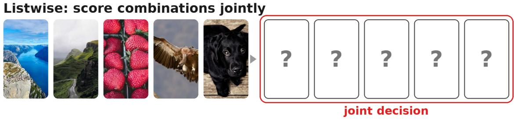
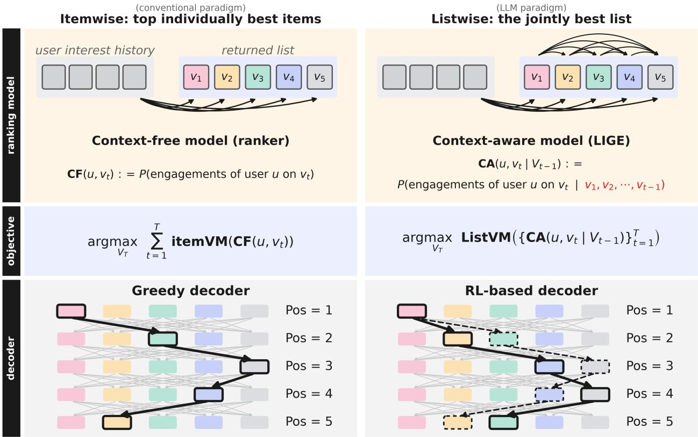
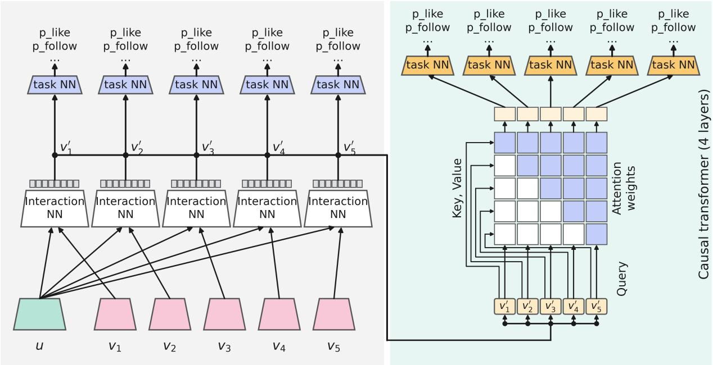
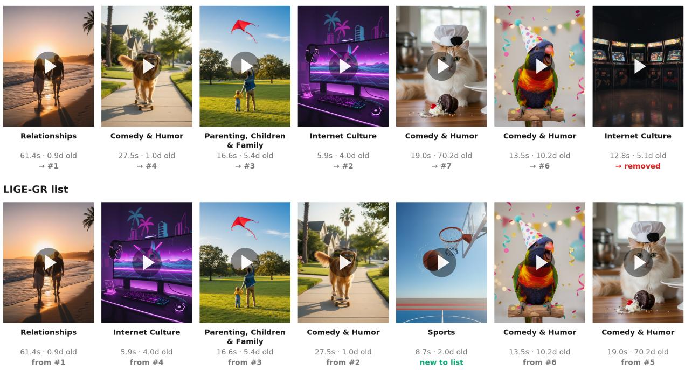
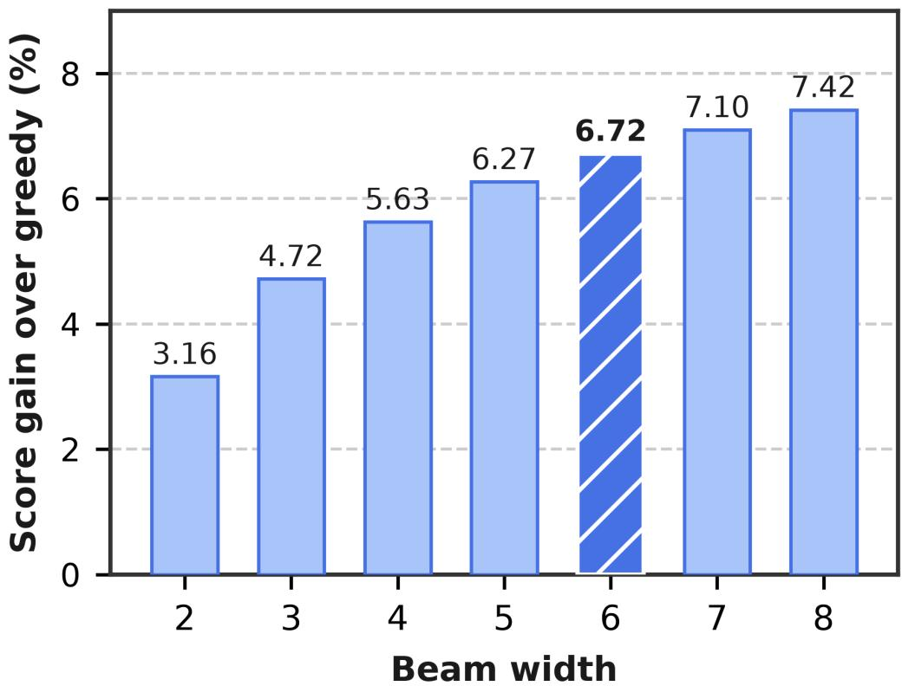

# LIGE-GR: A Smooth Leap from Ranking to Generative Recommendation in the LLM Era

Venkat Srinivas<sup>⋆</sup>, Chenzhang He<sup>⋆</sup>, Sam Woodmansee<sup>⋆</sup>, Shawn Lian<sup>⋆</sup>, Wenjie Hu<sup>⋆</sup>, Renjie Jiang<sup>⋆</sup>, Ziheng Huang, Xinyuan Zhang, Zhihao Zheng, Zhuoran Yu, Rui Li, Lei Yuan, Ziwei Li, Jimmy Jia, Mert Terzihan, Ekrem Kocaguneli, Yiming Liao, Zhichen Zhao, Yue Yin, Yue Weng, Wanlin Ma, Xufeng Cai, Weimiao Wu, Yezhou Huang, Du Zhang, Yukun Ding, Aaron Johnston, Yueming Wang, Zhaojie Gong, Yuting Zhang, Serena Li, Adithya Ganesh, Boying Liu, Haichuan Yang, Xialu Li, Matt Ma, Qunshu Zhang, John Joshua Miller, Praveen Rathinavelu, Cheng Huang, Aadhar Sachdeva, Josh Karns, Andres Aaron Gutierrez, Neil Agarwal, Gustas Pladis, Vladimir Batygin, Gopal Ray, Aditya Priyadarshi, Shantanu Patil, Zhe Wang, Penny Pan, Yiping Han, Arun Singh, Guangdeng Liao, Bi Xue, Xinyao Hu, Yang Song, Yisong Song, Meihong Wang, Haotian Wu, Deepak Agarwal, Ji Liu

Meta Platforms, Inc., Menlo Park, CA, USA

The remarkable success of large language models (LLMs) has provided important inspiration for the next generation of recommender systems. Structurally, recommendation and language generation share a similarity: both aim to produce an ordered sequence that optimizes the user’s experience. However, how to precisely absorb the essence of the LLM paradigm into mature industrial recommender systems remains an open problem.

There are two challenges. First, it is unclear how to incorporate the LLM paradigm — sequence-level generation and optimization — into recommendation. Second, real-world recommender systems are mature systems that have been iteratively customized for years around specific products, business constraints, serving infrastructure, and organizational ownership. Replacing such systems wholesale is often technically risky and organizationally disruptive.

In this paper, we propose LIGE-GR, a listwise generation and evaluation recommendation framework that upgrades from a traditional ranking system (itemwise recommendation) toward a generative recommendation paradigm. Instead of rebuilding the entire recommendation stack from scratch, LIGE-GR generalizes the existing pointwise recommendation system into a listwise generation system. This allows mature recommender systems to benefit from listwise optimization while preserving compatibility with existing models, value functions, and serving infrastructure.

We validate LIGE-GR in short-video recommendation on Instagram Reels and Facebook Video. On these recommendation surfaces, LIGE-GR improves time spent by 1.14% on Instagram Reels and 0.72% on Facebook Video, while requiring only modest additional inference resources.

Correspondence: Ji Liu at madisonliu@meta.com; <sup>⋆</sup> equal contribution.

Meta

## 1 Introduction

Modern recommender systems return an ordered list of content items for each user request, which are then sequentially exposed to the user. This formulation spans short-video and feed recommendation. Despite their sophistication, many industrial recommender systems are still fundamentally built around itemwise optimization. A ranking model predicts user engagement signals for each candidate item independently, and a prespecified value model (function) maps these predicted signals into a scalar score. Items are then sorted by their individual scores to form a recommendation list. Additional product constraints, such as diversity or integrity adjustments, are usually introduced through heuristic or rule-based score modifications. This is the general framework that state-of-the-art products employ today. Although this paradigm has been successful, user interest history the returned list of items per request

Itemwise: pick items independently  


  
Figure 1 Itemwise vs. listwise optimization. Given the user’s interest history, itemwise optimization independently scores candidates and returns the top ones, whereas listwise optimization returns the best combination.

it has a fundamental limitation: it scores each item independently rather than evaluating the recommendation sequence jointly.

In contrast, LLMs fundamentally address the same problem – generating the best sequence conditioned on a user’s request—but follow a completely diferent technical paradigm. Rather than independently selecting the best token at each position, an LLM generates each token conditioned on the previously generated context, with the quality of the final output determined by the sequence as a whole. This contrast exposes the gap in paradigm we address between traditional itemwise and generative listwise recommendation:

Itemwise (Independent Optimization) vs. Listwise (Joint Optimization)

As Figure 1 illustrates, itemwise recommendation scores items independently, whereas listwise recommendation evaluates them as a sequence. Realizing this sequential optimization requires three capabilities: predicting each candidate’s value in the context of items already selected, evaluating the sequence as a whole, and searching for a feasible sequence under product and latency constraints.

Motivated by the success of LLMs, a recent trend explores achieving these capabilities by rebuilding the recommender from scratch as a fully generative system, e.g., in Deng et al. (2025). However, a successful paradigm to fully leverage listwise optimization for mature industrial applications has yet to emerge, leaving this an open problem. Specifically, attempting a wholesale replacement of an existing stack faces two additional critical barriers:

• System challenge. Mature recommender systems encode years of model improvements, product logic, serving optimizations, and business constraints. A replacement can be disadvantaged in early comparisons because it must first recover much of this accumulated baseline value, therefore fair evaluation often requires careful, extended validation. Once deeply integrated, the new system can also raise rollback and reliability risks, because reverting may no longer mean disabling an isolated component.

• Organization challenge. Recommendation, advertising, and search teams are typically organized around existing recommender-system components, including retrieval, ranking, value modeling, serving infrastructure, and product policy. Moving to a diferent paradigm can therefore disrupt not only the technical stack but also team boundaries, ownership, and long-term planning.

  
Figure 2 Itemwise versus listwise recommendation across the three components LIGE-GR upgrades. Ranking model: a context-free ranker CF scores each item from the user alone, whereas the context-aware model CA also conditions on the items already placed in the list (red). Objective (defined by the value model): from a sum of itemwise scores to a listwise value over the whole sequence. Decoder: incumbent itemwise greedy selection commits to a single path through the position-by-candidate lattice, whereas the RL-based decoder explores alternative paths and returns the best list found.

LIGE-GR addresses both the listwise technical challenges and the replacement challenge through an additive, revertible, and low-resource-requirement framework that generalizes the existing itemwise recommendation system. LIGE-GR preserves the structure of the mature system while adding three components: a listwise module in the ranking model, an extension from itemwise to listwise value modeling, and an upgrade from the incumbent itemwise greedy decoder—which selects the highest-scoring remaining candidate at each list position—to an RL-based sequence decoder, as shown in Figure 2. LIGE-GR is thus not a replacement of traditional recommendation but a generalization and an upgrade.

We validated LIGE-GR in short-video recommendation on Instagram Reels and Facebook Video, both against strong, optimized baselines. On Instagram Reels, LIGE-GR increases time spent by 1.14%, while requiring additional inference resources equivalent to roughly 10% of those used by the context-free ranking component and increasing end-to-end per-request latency by approximately 7% relative to the incumbent baseline. On Facebook Video, LIGE-GR increases time spent by 0.72%.

## 2 LIGE-GR: the Generative Paradigm

The section introduces the proposed generative paradigm. We start with the problem definition and the reformulation of itemwise recommendation into the listwise or generative framework, which upgrades the existing itemwise system to the listwise system. The section ends with the introduction to the listwise recommendation.

## 2.1 Problem Statement

For each user request, the recommender system returns an ordered list of content items:

$$
V _ { T } = [ v _ { 1 } , v _ { 2 } , \ldots , v _ { T } ] , \qquad v _ { t } \in { \mathcal { C } } .\tag{1}
$$

Here C is the candidate set for the request, and $V _ { t } = [ v _ { 1 } , \ldots , v _ { t } ]$ denotes the selected prefix—the partial list after t positions, with $V _ { 0 } = \varnothing ;$ the items in a feasible $V _ { T }$ are distinct. In our setting, T is around 10. The items are displayed sequentially to the user. The objective is to construct a personalized list that maximizes user experience and product quality.

## 2.2 Reformulating Itemwise Recommendation into a Generative Framework

A traditional industrial recommender system is essentially an itemwise optimization system. For each candidate item, a ranking model predicts a set of user engagement signals, such as:

$$
p _ { \mathrm { l i k e } } , \quad p _ { \mathrm { f o l l o w } } , \quad p _ { \mathrm { s h a r e } } , \quad p _ { \mathrm { w a t c h t i m e } } > 1 0 \mathrm { s } , \cdot \cdot \cdot\tag{2}
$$

An itemwise value model (itemVM) then combines these predicted engagement signals p into a scalar item score. A typical item-level value model can be written as:

$$
\mathsf { i t e m } \mathsf { V } \mathsf { M } ( p ) = w _ { 1 } \cdot p _ { \mathrm { l i k e } } + w _ { 2 } \cdot p _ { \mathrm { f o l l o w } } + w _ { 3 } \cdot p _ { \mathrm { s h a r e } } + \cdot \cdot \cdot .\tag{3}
$$

The system then selects the top T items according to their item-level VM scores and returns them as the final recommendation list. In mature systems, the raw VM score is often further adjusted by diversity penalties, integrity rules, and other product constraints. These adjustments introduce some sequence-level awareness, but they are usually implemented as rule-based heuristics rather than learned listwise optimization. The itemwise recommendation objective can be abstracted as:

$$
\underset { V _ { T } } { \arg \operatorname* { m a x } } \quad \sum _ { t = 1 } ^ { T } \mathfrak { i t e m } \mathbf { V } \mathbf { M } \left( \mathbf { C } \mathbf { F } ( u , v _ { t } ) \right) ,\tag{4}
$$

where CF denotes a context-free predictor (the item-wise ranking model prediction of various user u’s engagement signals such as $p _ { \mathrm { l i k e } }$ for item $v _ { t } )$ that scores each item independently given the user feature u and the item feature $v _ { t }$ . Under this objective, the optimal list consists of the top T items among the candidate set ranked by their itemVM scores in Eq. (3).

As mentioned previously, many mature recommendation systems include an additional component—a control layer, although its name may vary—to enforce diversity in the recommended list. Its purpose is to prevent similar content, such as items from the same category, from appearing too close together. Popular approaches include gap demotion rule (Gong et al., 2021; Pei et al., 2019), determinant point process (DPP) (Pan et al., 2020; Meng et al., 2019; Wang et al., 2021a; Li et al., 2018), and hard-coded business restrictions. We denote the additive control-layer adjustment for candidate $v _ { t }$ given prefix $V _ { t - 1 }$ by $\mathbf { C L } ( v _ { t } \mid V _ { t - 1 } ) \in \mathbb { R } \cup \{ - \infty \}$ . Finite values modify the candidate’s value-model score, while $- \infty$ masks an infeasible candidate. The following examples illustrate these cases.

• (hard business rule) if the category of $v _ { t }$ and some category in $V _ { t - 1 }$ are not allowed to appear within the same list because of some hard restrictions, then

$$
\mathbf { \mathsf { C L } } ( v _ { t } \mid V _ { t - 1 } ) = - \infty ;
$$

• (example gap demotion rule) if the closest item in $V _ { t - 1 }$ to $v _ { t }$ belonging to the same category is at position $t ^ { \prime } \in \{ 1 , \cdots , t - 1 \}$ , then

$$
\mathbf { c L } ( v _ { t } \mid V _ { t - 1 } ) = - \exp ( t ^ { \prime } - t + 1 ) \cdot \mathrm { c o n s t a n t } ;
$$

• (example DPP diversity score) measure the incremental diversity of $v _ { t }$ on the top of $V _ { t - 1 }$

$$
\mathbf { c } \mathbf { L } ( v _ { t } \mid V _ { t - 1 } ) = \log \operatorname* { d e t } ( \Phi _ { t } ^ { \top } \Phi _ { t } ) - \log \operatorname* { d e t } ( \Phi _ { t - 1 } ^ { \top } \Phi _ { t - 1 } ) ,
$$

where $\Phi _ { t } : = [ \phi _ { t } , \phi _ { t - 1 } , \cdot \cdot \cdot , \phi _ { 1 } ]$ and $\phi _ { t ^ { \prime } }$ corresponds to the embedding of $v _ { t ^ { \prime } }$ normalized by $\| \phi _ { t ^ { \prime } } \| = 1$

Adding the control-layer term to Eq. (4) gives the overall objective:

$$
\underset { V _ { T } } { \arg \operatorname* { m a x } } \quad \sum _ { t = 1 } ^ { T } \left[ \mathsf { i t e m } \mathsf { V } \mathsf { M } \left( \mathsf { C } \mathsf { F } ( u , v _ { t } ) \right) + \mathsf { C } \mathsf { L } \big ( v _ { t } \mid V _ { t - 1 } \big ) \right] .\tag{5}
$$

The incumbent itemwise system obtains the returned list with an itemwise greedy decoder over the candidate set C:

$$
v _ { t } = { \underset { c \in { \mathcal { C } } \setminus V _ { t - 1 } } { \operatorname { a r g m a x } } } \quad { \mathrm { i t e m } } \lor \mathsf { M } \left( \mathsf { C F } ( u , c ) \right) + \mathsf { C L } ( c \mid V _ { t - 1 } ) , t = 1 , \cdots , T .
$$

## 2.3 LIGE-GR: Listwise Recommendation as Generative Recommendation

LIGE-GR upgrades the itemwise recommendation system into a listwise generation system. In its basic vanilla form, LIGE-GR targets the following sequence-level objective using contextual model predictions:

$$
\underset { V _ { T } } { \arg \operatorname* { m a x } } \quad \sum _ { t = 1 } ^ { T } [ \mathsf { i t e m V M } ( \mathsf { C A } ( u , v _ { t } \mid V _ { t - 1 } ) ) + \mathsf { C L } ( v _ { t } \mid V _ { t - 1 } ) ] ,\tag{6}
$$

where CA is a context-aware predictor that estimates the engagement values of item $v _ { t }$ conditioned on the preceding items $V _ { t - 1 }$ within the same list.

The overall upgrade from itemwise recommendation to LIGE-GR comprises three component upgrades:

• Ranking model: from a context-free predictor to a context-aware predictor.

• Value model: from an itemwise VM to a listwise VM.

• Decoder: from incumbent itemwise greedy selection to RL-based sequence decoding.

Importantly, LIGE-GR strictly generalizes the incumbent itemwise recommender. Reverting its three upgraded components to the context-free predictor, itemwise VM+CL evaluator, and itemwise greedy decoder recovers the incumbent system described above. The corresponding decoder settings are given in Section 3.3. This property matters in practice. It means LIGE-GR can be introduced as a smooth upgrade to the existing recommender system, rather than as a disruptive replacement.

This summed objective already benefits from context-aware prediction; Section 3.2 upgrades it into a true listwise value model. In its most general form, LIGE-GR targets

$$
\operatorname { a r g m a x } _ { V _ { T } } \quad \operatorname { L i s t V M } \left( \{ \mathbf { C A } ( u , v _ { t } \mid V _ { t - 1 } ) \} _ { t = 1 } ^ { T } \right) .\tag{7}
$$

Here ListVM may use item metadata and includes the control-layer adjustments applied to the selected sequence.

## 3 LIGE-GR Design

The section introduces the detailed design in LIGE-GR in each upgraded component: the listwise model, the listwise VM, the Palette decoder, and serving optimization (see Appendix 4).

## 3.1 Listwise Model: Context-Aware and Context-Free Predictors

LIGE-GR upgrades the existing itemwise ranking model into a listwise model. It contains two components, as illustrated in Figure 3:

• A context-free predictor, which corresponds to the existing item-wise ranking model’s predictions.

• A context-aware predictor, which refines predictions based on the previously selected items.

Context-free module  
Context-aware module  
  
Figure 3 The listwise model. The context-free module (left) is the itemwise model: each candidate $v _ { t }$ is scored together with the user features u by an interaction network and per-task heads. Its intermediate representations $\boldsymbol { v } _ { t } ^ { \prime }$ are handed to the lightweight context-aware module (right), which refines all per-task predictions with a four-layer causal Transformer that attends only to preceding items. Within each module, all task heads share the same network weights, applied at every item or position.

The context-free predictor can be written as:

$$
( u , v _ { t } )  y _ { t } , \quad \forall t = 1 , \cdot \cdot \cdot , T ,
$$

where u represents user features, $v _ { t }$ represents the candidate item at position t, and $y _ { t }$ denotes predicted engagement signals, such as like probability, follow probability, or watch-time prediction.

The logical form of the context-aware predictor is:

$$
( u , v _ { t } \mid v _ { 1 } , v _ { 2 } , \ldots , v _ { t - 1 } )  y _ { t } , \quad \forall t = 1 , \cdot \cdot \cdot , T .
$$

That is, the prediction for item $v _ { t }$ is conditioned not only on the user and the item itself, but also on the previously selected sequence within the same requested list. This allows the model to capture listwise efects such as repetition, saturation, complementarity, diversity, and user fatigue. Because the context provides additional information, a well-designed context-aware predictor should provide more accurate predictions than a context-free predictor.

In practice, for eficiency and maintainability, LIGE-GR does not rebuild the entire ranking model from scratch. Instead, the context-aware predictor is implemented as a lightweight refinement module on top of the existing context-free model leveraging a GPT-style decoder-only causal transformer. Specifically, let $ { \boldsymbol { v } } _ { t } ^ { \prime }$ denote an intermediate representation produced by the context-free model for item $v _ { t }$ . The context-aware module takes the sequence of intermediate representations as input (similar to token embeddings in the LLM):

$$
( v _ { t } ^ { \prime } \mid v _ { 1 } ^ { \prime } , v _ { 2 } ^ { \prime } , \ldots , v _ { t - 1 } ^ { \prime } )  y _ { t } , \quad \forall t = 1 , \cdots , T .
$$

This design has two practical advantages:

• In the evaluated Instagram Reels configuration, the additional model remains lightweight, requiring additional inference resources equivalent to roughly 10% of those used by the CF component.

• The original context-free model is fully preserved, which allows the system to reuse existing training and serving infrastructure with minimal disruption.

In our implementation, the context-aware module uses a lightweight causal GPT-like decoder-only transformer with four heads and four layers. The architecture itself is not the primary focus of this paper; future work can further optimize model design and serving eficiency.

## 3.2 Listwise VM: From Itemwise Value to Listwise Value

Traditional recommender systems define value at the item level. The value model estimates the utility generated by showing a single item to a user. However, user experience is inherently listwise. The value of an item depends not only on the item itself, but also on its position and on the previously consumed items.

A simple listwise VM can be constructed by summing the context-aware item values across positions:

$$
\mathsf { L i s t } \mathsf { V M } _ { \mathrm { v a n i l l a } } ( V _ { T } ) = \sum _ { t = 1 } ^ { T } \left[ \mathsf { i t e m } \mathsf { V M } \left( \mathsf { C A } ( u , v _ { t } \mid V _ { t - 1 } ) \right) + \mathsf { C L } ( v _ { t } \mid V _ { t - 1 } ) \right] .\tag{8}
$$

This formulation is simple and already incorporates sequential context through the context-aware predictor. However, it ignores a fundamental factor: not every item in the list is necessarily reached by the user. Items at later positions should be weighted by the probability that the user continues watching until that position.

Therefore, LIGE-GR introduces a more principled listwise VM based on continuation probability. Let $p _ { \mathrm { c o n t i n u e } } ( V _ { t - 1 } )$ denote the probability that the user continues after consuming the prefix $V _ { t - 1 }$ and reaches item $v _ { t }$ . The listwise VM is defined as follows:

$$
\mathsf { L i s t } \mathsf { \pmb { W } M } _ { \mathrm { g o l d e n } } ( V _ { T } ) = \sum _ { t = 1 } ^ { T } p _ { \mathsf { c o n t i n u e } } ( V _ { t - 1 } ) \cdot \left[ \mathsf { i t e m } \mathsf { \pmb { V } M } \left( \mathsf { \pmb { C } A } ( u , v _ { t } \mid V _ { t - 1 } ) \right) + \mathsf { \pmb { C } L } ( v _ { t } \mid V _ { t - 1 } ) \right] .\tag{9}
$$

The continuation probability can be recursively estimated as:

$$
p _ { \mathrm { c o n t i n u e } } ( V _ { t } ) = p _ { \mathrm { c o n t i n u e } } ( V _ { t - 1 } ) \cdot \mathsf { \mathbf { C } A } _ { \mathrm { c o n t i n u e } } ( u , v _ { t } \mid V _ { t - 1 } ) ,
$$

where $\mathbf { C A } _ { \mathrm { c o n t i n u e } } ( u , v _ { t } \mid V _ { t - 1 } )$ is predicted by the context-aware model and $p _ { \mathrm { c o n t i n u e } } ( V )$ denotes the cumulative survival of prefix V .

This formulation (9) provides a statistically more faithful estimate of the expected value of the whole list, as each item’s contribution is weighted by the probability that the user actually reaches it.

## 3.3 Palette Decoder: An RL-Based Decoder

Next we introduce how to optimize the defined $\mathtt { L i s t V M } _ { \mathrm { g o l d e n } }$ objective in (9), given the context aware model CA. It also covers optimizing the $\pmb { \mathrm { L i s t V M } } _ { \mathrm { v a n i l l a } }$ objective (8) by setting $p _ { \mathrm { c o n t i n u e } } \equiv 1$

Mathematically, this is an optimal sequential decision making problem with absorbing states. The proposed RL-based Palette decoder (as stated in Algorithm 1) generates the output list one by one by iteratively expanding the global subsequence set $\mathcal { E }$ and only keeping top-b in $\mathcal { E } .$

Specifically, Palette uses $\mathbf { L i s t V M _ { \mathrm { g o l d e n } } }$ while constructing the recommendation list one position at a time. It starts from $V _ { 0 } = \emptyset$ . At position $t { + } 1$ , Palette expands each retained sequence $V _ { t }$ separately by filling the next position to obtain $V _ { t + c }$ where $c \in \mathcal { C } \setminus V _ { t }$ allowed by the control layer. To avoid exponential computational complexity, it keeps only the top-b extensions with the highest search scores. Repeating this step until $t = T$ avoids evaluating every possible full list.

In this process, the key is how to define $^ { 6 6 } \mathrm { t o p } ^ { \mathrm { , 9 } }$ in expansion. In Palette we use the following evaluation criteria. Let $V { + c }$ be the target subsequence, its Q-value is calculated by

$$
\begin{array} { r } { Q ( V { + } c ) = \mathsf { L i s t } \mathsf { V } \mathsf { M } _ { \mathrm { g o l d e n } } ( V { + } c ) + \widehat { F } ( V { + } c ) . } \end{array}\tag{10}
$$

```latex
Algorithm 1 Palette Decoding
Require: user context u, candidates C, beam width b, list length T, context-aware model CA and continuation
predictor $\mathbf { C A } _ { \mathrm { { c o n t i n u e } } } ,$ item value model itemVM, control layer CL, future-value estimator Fb (e.g., Eq. (14))
1: ${ \bar { B } } \gets \{ \emptyset \} ;$ $\mathsf { L i s t V I M } _ { \mathrm { g o l d e n } } ( \emptyset )  0 ;$ p<sub>continu</sub> $( \emptyset )  1$
Notation: $V \in B$ is a retained prefix; $c \in \mathcal { C } \setminus V$ is an unselected candidate; V +c appends c to V (Eq. (1)).
(To recover the incumbent itemwise decoding, use CF in place of CA, set ${ \tt C A } _ { \mathrm { c o n t i n u e } } \equiv 1 , b = 1$ , and $\widehat { F } = 0 . )$
2: for $t = 1 , \dots , T$ do
3: E ← { V+c : V ∈ B, c ∈ C \ V, CL(c | V) > −∞ } ▷ admissible extensions; assume $\geq 1$ per position
4: for each $V { \mathrm { + } } c \in { \mathcal { E } }$ do
5: $\mathbf { L i s t V M _ { \mathrm { g o l d e n } } } ( V + c ) \gets \mathbf { L i s t V M _ { \mathrm { g o l d e n } } } ( V ) + p _ { \mathrm { c o n t i n u e } } ( V ) \cdot [ \mathbf { i t e m V M } ( \mathbf { C A } ( u , c \mid V ) ) + \mathbf { C L } ( c \mid V ) ]$
6: $p _ { \mathrm { c o n t i n u e } } ( V + c )  p _ { \mathrm { c o n t i n u e } } ( V ) \cdot \mathbf { C } \mathbf { A } _ { \mathrm { c o n t i n u e } } ( u , c \mid V )$
7: $Q ( V + c ) \gets \mathsf { L i s t V M } _ { \operatorname { g o l d e n } } ( V + c ) + \widehat { F } ( V + c )$
8: $B  \arg \operatorname { t o p - b } _ { V ^ { \prime } \in \mathcal { E } } Q ( V ^ { \prime } )$ ▷ the b highest-Q admissible extensions (all of ${ \mathcal { E } } { \mathrm { ~ i f ~ } } | { \mathcal { E } } | \leq b )$
9: return arg max<sub>V∈B</sub> $\mathsf { L i s t V M } _ { \mathrm { g o l d e n } } ( V )$ ▷ ${ \widehat { F } } ( V ) = 0$ for full-length lists
```

where $\mathsf { L i s t V M } _ { \mathrm { g o l d e n } } ( V )$ evaluates a subsequence $V ,$ with $\mathsf { L i s t V M } _ { \mathrm { g o l d e n } } ( \emptyset ) = 0$ . Algorithm 1 retains the b extensions with largest Q. The beam width b determines how many sequences are retained, while $Q$ determines which sequences are retained.

This construction admits a value-based RL interpretation: subsequence V is the state, next candidate c is the action, and $V { + c }$ is the successor state. The accumulated $\mathsf { L i s t V M } _ { \mathrm { g o l d e n } } ( V + c )$ is the realized return, while $\widehat F ( V { + } c )$ is the estimated value-to-go from the successor state. Their sum $Q ( V { + } c )$ is used for action selection. On the other hand, replacing CA with CF, using the itemwise VM+CL evaluator, and setting $b = 1$ $p _ { \mathrm { c o n t i n u e } } \equiv 1$ , and $\widehat F = 0$ recovers the incumbent itemwise greedy decoder.

## 3.3.1 Future-Value Estimation

The future value component $\hat { F } ( \cdot )$ in (10) is the key diferentiation between RL based generator and the standard beam search generator which does not have such component. However, it is also diferent from the standard RL based approach: Palette uses an estimate to drive a closed form estimate and the standard RL based approach acquires a model to estimate it.

The remaining design question is how to estimate ${ \widehat { F } } ( V _ { t } )$ cheaply enough for serving. We derive a lightweight $\widehat F$ from quantities already available during decoding. Richer alternatives, such as a learned value model or a deeper planner based on Monte Carlo tree search, would require training an additional model or performing repeated model evaluations; we leave them to future work.

Step-based estimate. A first approximation uses the average per-position $\mathrm { V M + C L }$ score observed in the selected prefix before continuation weighting. Define

$$
{ \bar { s } } ( V _ { t } ) = { \frac { 1 } { t } } \sum _ { \tau = 1 } ^ { t } [ { \mathsf { i t e m V M } } ( \mathsf { C A } ( u , v _ { i } \mid V _ { \tau - 1 } ) ) + \mathsf { C L } ( v _ { \tau } \mid V _ { \tau - 1 } ) ] .\tag{11}
$$

Assume each remaining step has the same continuation probability as the most recently selected item, $\mathbf { C A } _ { \mathrm { c o n t i n u e } } ( u , v _ { t } \ \mid \ V _ { t - 1 } )$ . Then the probability of reaching the $j \mathrm { - t h }$ future position is approximated by $\mathbf { C A } _ { \mathrm { c o n t i n u e } } ( u , v _ { t } \mid V _ { t - 1 } ) ^ { j }$ , giving

$$
\widehat F _ { \mathrm { s t e p } } ( V _ { t } ) = \bar { s } ( V _ { t } ) \cdot \sum _ { j = 1 } ^ { T - t } { \bf C A } _ { \mathrm { c o n t i n u e } } ( u , v _ { t } \mid V _ { t - 1 } ) ^ { j } ,\tag{12}
$$

which is zero at $t = T$ because the sum is empty.

This step-based estimate biases search toward shorter current items. $\mathbf { C A } _ { \mathrm { c o n t i n u e } } ( u , v _ { t } \mid V _ { t - 1 } )$ is the probability of continuing after the entire item $v _ { t } ;$ for the same per-second exit propensity, a longer $v _ { t }$ has a lower continuation probability. Reusing this whole-item probability at every future step compounds the current item’s duration across all unfilled positions, reducing $\widehat { F } _ { \mathrm { s t e p } } ( V _ { t } )$ and making prefixes ending in long items less likely to survive beam pruning.

Duration-aware estimate. To mitigate this repeated-duration bias, rescale the most recent continuation probability to the average duration of the selected items:

$$
\mathsf { C A } _ { \mathrm { c o n t i n u e } } ( u , v _ { t } \mid V _ { t - 1 } ) ^ { \bar { d } / d _ { t } } .\tag{13}
$$

Here $d _ { t }$ is the duration of the most recently selected item, $D ( V _ { t } )$ is the total duration of the t selected items, and $\bar { d } = D ( V _ { t } ) / t$ is their average duration. The exponent $\bar { d } / d _ { t }$ rescales the whole-item continuation probability from duration $d _ { t }$ to duration $\bar { \bar { d } } .$ Using this rescaled probability for each future position gives

$$
\widehat { F } _ { \mathrm { d u r } } ( V _ { t } ) = \bar { s } ( V _ { t } ) \cdot \sum _ { j = 1 } ^ { T - t } { \mathsf { \mathbf { c } } } { \mathsf { \mathbf { A } } } _ { \mathrm { c o n t i n u e } } ( u , v _ { t } \mid V _ { t - 1 } ) ^ { j \bar { d } / d _ { t } } ,\tag{14}
$$

which is again zero at $t = T$ , where the sum is empty. The duration-aware treatment keeps the score in value units while replacing the most recent item’s full duration with the prefix-average duration. It therefore reduces the step estimator’s preference for prefixes ending in shorter items while retaining the continuation signal. We refer to the resulting decode-time evaluator, Li $\mathsf { s t } \mathsf { V } \mathsf { M } _ { \mathrm { g o l d e n } } + \widehat { F } _ { \mathrm { d u r } }$ , as the duration-aware listwise VM.

Palette completes the LIGE-GR pipeline: the context-aware model predicts candidate outcomes, $\mathtt { L i s t V M } _ { \mathrm { g o l d e n } }$ defines the value of an ordered list, and Palette searches for the sequence returned to the user. Section 5 evaluates the resulting end-to-end system and the contribution of its decoding configurations.

## 4 Serving and Efficiency Optimization for LIGE-GR

This section describes how to serve LIGE-GR and the optimizations to its additional requirements for inference resources.

## 4.1 Serving for Decoding

LIGE-GR augments the existing ranking service rather than introducing a parallel serving stack. Its request path consists of two phases (Algorithm 2):

• Context-free embedding computation. This phase is identical to the conventional itemwise ranking pipeline. The CF module computes the intermediate representation $v ^ { \prime }$ (encoding both user and item information, as illustrated in Figure 3) for every candidate independently of the output list. Since this computation is already performed by the existing ranking system, this phase introduces no additional inference-resource requirements.

• Context-aware decoding. The decoder then constructs the output list autoregressively. At each position t, the context-aware module re-scores the candidate set conditioned on the previously selected prefix.

The additional inference-resource requirements are modest because the expensive computation is performed only once per request. Specifically, the context-aware decoder reuses the cached representations $v ^ { \prime }$ produced by the context-free module, which dominates the computation of the original ranking model. Moreover, the context-aware module is intentionally lightweight: it is implemented as the four-head, four-layer causal GPT-style decoder shown in Figure $^ { 3 , }$ representing only a tiny fraction of the computation of the base ranking model. Consequently, each decoding step requires only a lightweight forward pass over cached representations rather than re-running the full ranking model. Overall, listwise generation performs $T$ batched lightweight decoding passes per request. Increasing the beam width b enlarges the decoding batch rather than increasing the number of sequential forward passes, while the gains from wider beams quickly saturate (Appendix A).

Algorithm 2 LIGE-GR serving request path   
Require: user context u, candidates C, beam width b, list length T, per-request latency budget τ, and the   
inputs of Algorithm 1 (CA, CA , itemVM, CL, Fb)   
1: compute and cache CF(u, c) and its intermediate representation $v _ { c } ^ { \prime } ,$ ∀c ∈ C ▷ Phase 1: the unchanged   
forward pass   
2: $\mathcal { V } ^ { \prime }  \{ v _ { c } ^ { \prime } \} _ { c \in \mathcal { C } }$ ▷ cached once per request; no candidate re-encoding during decoding   
3: V ← Palette(u, C, b, T; CA, CA , itemVM, CL, Fb) ▷ Phase 2 = Algorithm 1: T batched module   
invocations, each evaluating up to b beam prefixes over V<sup>′</sup>   
4: if Phase 2 exceeds τ ms or any CA call fails then   
5: return Palette(u, C, 1, T; CF, 1, itemVM, CL, 0) ▷ per-request fallback: the itemwise decoder; reuses   
the cached CF scores, no CA calls   
6: return V

## 4.2 Reliability and Reversibility

Reliability and continued iteration matter when upgrading an existing system. The LIGE-GR framework supports configuration-level reversion without retraining:

• Switch CA predictions to $\mathsf { c F } ;$ no retraining is required.

• Recover the incumbent itemwise decoder by setting $b = 1 , p _ { \mathrm { c o n t i n u e } } \equiv 1$ , and $\widehat F = 0$ in Algorithm 1.

The preserved context-free path makes LIGE-GR reversible at every granularity.

Per request, if the decoding phase cannot complete within the request’s latency budget τ (Algorithm 2), the system automatically falls back to the itemwise behavior for that request. Globally, reverting to the baseline configuration is a switch rather than a migration: disabling the context-aware path—and with it the listwise VM and beam search, which are built on its predictions—recovers the itemwise system exactly, by the strict-generalization property of Section 2. The same additivity also decouples iteration: the context-aware module can be updated independently of the base model, without touching the base model’s training or publishing flow.

## 4.3 Efficiency Optimization

Section 4.1 explained why the architecture is resource-eficient by design: the forward pass is reused, and each decode step is a small forward pass over cached representations. This section describes the serving-side optimizations that control the remaining resource requirements—listwise construction over a full candidate set at serving trafic would still add unnecessary computation—and reports the measured requirements of the configuration.

Restricting the re-scoring pool. The context-aware path does not need to re-score the full candidate set. The context-free scores from the first serving phase are already a high-quality itemwise ranking, and candidates ranked far beyond the list length have low selection probability, so only the top-ranked candidates—roughly a third of the set—are passed to the context-aware module for listwise construction. This bounds the overhead of the second phase regardless of the decoding configuration: in serving benchmarks across two GPU generations, the trimmed pool raises the context-aware path’s throughput by roughly 60–80% relative to re-scoring the full set, and the online improvements of Section 5 are obtained under the trimmed pool. The context-free ranking thus acts as a learned pre-filter for the listwise stage—another way the preserved itemwise system contributes to the listwise stage.

Batching the beam. At each decode step, all beam continuations are evaluated in one batched forward pass of the lightweight context-aware module. At the same candidate-pool size and trafic, b = 6 requires roughly 2.1× the inference resources of b = 1, giving a derived estimate of approximately 20% of the CF component’s resources.

Right-sizing generation. The remaining knobs match compute to where quality still improves. Beam width is set at the saturation knee of the ofline gain curve (Figure 5): beyond small widths, additional beams provide little score improvement while still requiring more inference resources. In one evaluation setting, the decoder also generates only as many positions as the response actually requests—response sizes vary at serving time—rather than always decoding the maximum list length and truncating.

Table 1 Relative NE improvement of the context-aware predictor (CA) against the context-free baseline (CF). Positive values indicate lower (better) NE. Instagram Reels values are accumulated over one online-training run; Facebook Video values come from its context-aware-versus-context-free evaluation. ‘—’ marks a task not tracked.
<table><tr><td>Task family</td><td>Instagram Reels</td><td>Facebook Video</td></tr><tr><td>Continue</td><td>1.57%</td><td></td></tr><tr><td>Skip</td><td>0.74%</td><td>0.46%</td></tr><tr><td>Like</td><td>0.29%</td><td>0.46%</td></tr><tr><td>Comment</td><td>0.21%</td><td>1.59%</td></tr><tr><td>Share</td><td>0.30%</td><td>1.25%</td></tr><tr><td>Watch completion</td><td>0.43%</td><td>0.55%</td></tr></table>

Across both evaluated settings, the base configuration requires additional inference resources equivalent to roughly 10% of those used by the CF component. On Instagram Reels, the evaluated upgrade increases end-to-end per-request latency by roughly 7% relative to its baseline. On Facebook Video, it increases average serving latency by about 2.2% relative to its baseline. The latency definitions and baselines difer across the two settings, so the magnitudes are not directly comparable. These measured resource and latency changes accompany the online improvements reported in Section 5.

## 5 Experimental Results

This section evaluates LIGE-GR in short-video recommendation settings on Instagram Reels and Facebook Video. Section 5.1 compares context-aware prediction (CA) with the context-free baseline (CF) using normalized entropy (NE) (Liu et al., 2023a). Sections 5.2 and 5.3 report online results for the b = 1 base configuration against the corresponding incumbent systems and for the b = 6 duration-aware configuration against the b = 1 base configuration, respectively. Section 5.4 provides additional content-ecosystem analysis. In the evaluated settings, the candidate-pool size |C| is on the order of 10<sup>2</sup>, while the output-list length $T$ is on the order of 10 (Eq. (1)).

## 5.1 Context-Aware vs. Context-Free Prediction

Before evaluating end-to-end ranking outcomes, we isolate the efect of contextualization on prediction quality. Table 1 compares CA with CF; positive values indicate that CA achieves lower (better) NE. On Instagram Reels, CA improves all six displayed task families, led by Continue (1.57%). On Facebook Video, it improves all five task families shown. Beyond this displayed subset, the complete 17-task Facebook Video evaluation shows prediction-quality improvements on 15 tasks and regressions of at most 0.07% on two minor tasks. These results establish the prediction-quality benefit of $\mathsf { \pmb { c } } \mathsf { \pmb { A } } ;$ Sections 5.2 and 5.3 next evaluate whether that benefit translates into online ranking outcomes.

## 5.2 Online Validation: b = 1 Base Configuration

We first test whether the prediction-quality gains above translate into online gains when LIGE-GR is integrated into the ranking system. The base configuration is

<table><tr><td rowspan=1 colspan=1>Model</td><td rowspan=1 colspan=1>Objective</td><td rowspan=1 colspan=1>Decoder</td></tr><tr><td rowspan=1 colspan=1>CA</td><td rowspan=1 colspan=1> $\pmb { \mathrm { L i s t V M } } _ { \mathrm { v a n i l l a } }$ </td><td rowspan=1 colspan=1> $\overline { { b = 1 , \ \widehat { F } = 0 } }$ </td></tr></table>

where $\pmb { \mathrm { L i s t V M } } _ { \mathrm { v a n i l l a } }$ is defined in Eq. (8). Each product is evaluated against its own actively optimized incumbent baseline.

Table 2 Online A/B results for the b = 1 base configuration in Eq. (8), each against the corresponding incumbent recommendation baseline. Sessions and DAU reflect overall product activity; the remaining metrics are restricted to the evaluated short-video surface. The Instagram Reels entry in the Likes / reactions row is likes; the Facebook Video counterpart is reactions. † denotes $p < 0 . 0 0 1$
<table><tr><td>Metric</td><td>Instagram Reels</td><td>Facebook Video</td></tr><tr><td>Sessions</td><td>+0.11%†</td><td>+0.07%</td></tr><tr><td>DAU</td><td>+0.05%†</td><td>+0.01%</td></tr><tr><td>Time spent</td><td>+1.14%†</td><td>+0.72%†</td></tr><tr><td>Video views  $\mathrm { ( V P V s ) }$ </td><td>+2.28%†</td><td>-0.52%†</td></tr><tr><td>Likes / reactions</td><td>+2.65%†</td><td>+1.59%†</td></tr><tr><td>Reshares</td><td>+1.77%†</td><td>+0.99%</td></tr></table>

Table 3 Online Instagram Reels $\mathrm { A } / \mathrm { B }$ contrasts against the b = 1 base configuration used in Table 2. All configurations use CA, and each treatment row is compared independently with that base configuration; ‘—’ marks the reference row. † denotes $p < 0 . 0 0 1$
<table><tr><td>Objective</td><td>Decoder</td><td></td><td>Time spent Video views</td><td>Likes</td><td>Reshares</td></tr><tr><td> $\pmb { \mathrm { L i s t V M } } _ { \mathrm { v a n i l l a } }$ </td><td> $b = 1 , \ { \widehat { F } } = 0$ </td><td></td><td></td><td></td><td></td></tr><tr><td> $\pmb { \mathrm { L i s t V M } } _ { \mathrm { v a n i l l a } }$ </td><td> $b = 6 , \ \widehat { F } = 0$ </td><td>+0.05%</td><td> $+ 0 . 0 0 \%$ </td><td> $+ 0 . 7 4 \% ^ { \dagger }$ </td><td> $+ 1 . 2 1 \% ^ { \dagger }$ </td></tr><tr><td> $\mathbf { L i s t V M _ { \mathrm { g o l d e n } } }$ </td><td> $b = 6 , \ \widehat { F } = \widehat { F } _ { \mathrm { d u r } }$ </td><td> $+ 0 . 6 9 \% ^ { \dagger }$ </td><td> $+ 1 . 8 2 \% ^ { \dagger }$ </td><td> $+ 2 . 9 3 \% ^ { \dagger }$ </td><td> $+ 1 . 4 1 \% ^ { \dagger }$ </td></tr></table>

For Instagram Reels, the treatment and baseline groups each included 1.5% of users. For Facebook Video, the treatment group included approximately $2 \%$ of users and was compared with a similarly sized control group. Table 2 reports seven-day readouts for both products. Across both evaluations, LIGE-GR broadly improves key consumption and engagement metrics, with the individual movements and tradeofs reported in the table. Across both settings, the base configuration requires additional inference resources equivalent to roughly 10% of those used by the CF component. In the Instagram Reels evaluation, end-to-end per-request latency increases by roughly 7% relative to its baseline. In the Facebook Video evaluation, average serving latency increases by about 2.2% relative to its baseline. Because the latency definitions and baselines difer, these measurements are not directly comparable. Appendix 4 provides serving and eficiency details.

These results establish online gains for the $b = 1$ base configuration. We next ask whether richer decoding adds value beyond this configuration, first by widening the beam and then by enabling the combined listwise, duration-aware configuration.

## 5.3 Instagram Reels Online Validation: $b = 6$ Duration-Aware Configuration

We evaluate this next step on Instagram Reels, using the $b = 1$ base configuration from Section 5.2 as the common baseline. The duration-aware configuration uses

<table><tr><td rowspan=1 colspan=1>Model</td><td rowspan=1 colspan=1>Objective</td><td rowspan=1 colspan=1>Decoder</td></tr><tr><td rowspan=1 colspan=1>CA</td><td rowspan=1 colspan=1> $\mathbf { L i s t V M _ { \mathrm { g o l d e n } } }$ </td><td rowspan=1 colspan=1> $b = 6 , \ \widehat { F } = \widehat { F } _ { \mathrm { d u r } }$ </td></tr></table>

Here $\mathbf { L i s t V M _ { \mathrm { g o l d e n } } }$ and $\widehat { F } _ { \mathrm { d u r } }$ are defined in Eqs. (9) and (14), respectively. We compare three configurations with identical weights inside itemVM. The baseline uses b = 1, $\pmb { \mathrm { L i s t V M } } _ { \mathrm { v a n i l l a } }$ , and $\widehat F = 0$ . The beam-width arm increases b from 1 to 6 while keeping the objective and future-value estimate unchanged. The duration-aware arm uses $b = 6$ with $\mathtt { L i s t V M } _ { \mathrm { g o l d e n } }$ and $\widehat { F } _ { \mathrm { d u r } }$ . Appendix A motivates the choice of $b = 6$

Each $b = 6$ treatment group included approximately 3% of users and was compared with a similarly sized $b = 1$ control group. Table 3 reports independent seven-day A/B contrasts of each $b = 6$ treatment against the Instagram Reels $b = 1$ base configuration used in Table 2. The beam-width arm primarily improves likes and reshares, while the duration-aware arm improves all four reported metrics. At the same candidate-pool size and trafic, the $b = 6$ configuration is estimated to require additional inference resources equivalent to approximately 20% of those used by the CF component. A comparable end-to-end latency estimate is not available for b = 6; Appendix 4 provides details.

Table 4 Instagram Reels paired-request list-composition changes relative to the baseline. Topic ranges span the taxonomies analyzed; green marks diagnostic improvements and red marks the freshness regression.
<table><tr><td>Dimension</td><td>Metric</td><td>Change</td><td>Interpretation</td></tr><tr><td>Topic mix</td><td>Topic entropy</td><td>+1.14% to +2.37%</td><td>more topic variety</td></tr><tr><td>Topic mix</td><td>Distinct topic clusters</td><td>+1.34% to +2.40%</td><td>broader topic coverage</td></tr><tr><td>Repetition</td><td>Longest same-topic streak</td><td>-4.03% to -4.74%</td><td>shorter repeated-topic runs</td></tr><tr><td>Local similarity</td><td>Adjacent-video cosine similarity</td><td>-3.68%</td><td>less adjacent similarity</td></tr><tr><td>Creator mix</td><td>Distinct creators</td><td>+0.66%</td><td>more creators per request</td></tr><tr><td>Creator mix</td><td>Same-creator concentration</td><td>-2.98%</td><td>less creator concentration</td></tr><tr><td>Creator mix</td><td>Creator entropy</td><td>+0.54%</td><td>more balanced creator mix</td></tr><tr><td>Creator size</td><td>Large-creator prevalence</td><td>-1.15%</td><td>shift away from largest creators</td></tr><tr><td>Creator size</td><td>Medium-creator prevalence</td><td>+0.38%</td><td>shift toward medium creators</td></tr><tr><td>Exploration</td><td>Familiar-creator content</td><td>-6.23%</td><td>more exposure beyond familiar creators</td></tr><tr><td>Exploration</td><td>Interest-matched-topic content</td><td>-1.65%</td><td>more exploration beyond known interests</td></tr><tr><td>Length mix</td><td>Within-request length entropy</td><td>+0.86%</td><td>more length variety</td></tr><tr><td>Freshness</td><td>Videos under 72 hours old</td><td>-0.66%</td><td>fewer very-fresh videos</td></tr></table>

## 5.4 Impact on the Ecosystem

Beyond online outcomes, we examine how LIGE-GR in the setting of Section 5.2 changes the ecosystem on Instagram Reels. Table 4 summarizes paired-request diagnostics across topics, creators, exploration, length, and freshness. The overall observation is LIGE-GR improves the product ecosystem from multiple dimensions with minor regression on content freshness.

Methodology. To understand how LIGE-GR changes generated lists, we use counterfactual logging that records both the baseline pointwise list and the LIGE-GR context-aware list for the same request over identical inputs. We analyze 13,197 paired requests from 7,110 known logged users. 1,498 of these requests lacked logged viewer IDs and are conservatively counted as one user each, giving 8,608 efective users. These data cover a three-day window and are sampled at the request level within an experiment cohort, which skews the sample toward more-active viewers. Table 4 in the main text summarizes the resulting composition shifts. All reported efects are assessed to be statistically significant at the 95% level via separate Bayesian hierarchical linear models for each estimate that account for multiple requests by the same user. We report efect sizes as relative changes compared to the baseline and interpret the main tradeofs below.

Diversity and repetition. Table 4 shows that LIGE-GR increases topic variety and topic coverage while reducing repeated-topic runs. Adjacent videos also become less similar to one another on average, improving list-level variety while introducing a smoothness–diversity tradeof that is invisible in purely pointwise evaluation.

Creator mix and exploration. The generated lists include more distinct creators, lower same-creator concentration, and higher creator entropy. They also shift away from the largest creators and from content already familiar to the user or tightly matched to known interests. We interpret these movements as an exploration tradeof rather than an unqualified win: LIGE-GR exposes a broader set of creators and topics, while giving up some immediate afinity matching.

Length and freshness. Within-request length entropy increases, so users see a wider variety of video lengths within the same request. The fraction of very fresh videos decreases, matching the online recency guardrail movement; we therefore treat freshness as the table’s composition regression rather than as a quality improvement.

Together, Figure 4 and Table 4 show that LIGE-GR changes ecosystem exposure across topics, creators, familiarity, length, and freshness. These diagnostics characterize how generated lists redistribute exposure across the content and creators represented in those lists, while the online experiments above measure the corresponding product impact.

  
Figure 4 A representative paired request from the Instagram Reels evaluation’s counterfactual logs: the baseline list (top) and the LIGE-GR list (bottom) generated from identical inputs, with each item’s destination or origin position annotated. Video thumbnails are AI-generated stand-in images matching each item’s topic (one per unique video); topic, duration, age, and movement annotations are from the logged request. LIGE-GR preserves every baseline topic while introducing a new one (Sports), moves the 27.5-second video from position 2 to position 4, demotes the 70-day-old video to the final position, and removes one of the two Internet Culture items.

## 6 Related Work

We review the related work in this section from four aspects: itemwise recommendation, traditional listwise recommendation, generative and autoregressive slate optimization, and LLM-inspired generative recommendation. The diference from prior work is that this paper addresses recommendation from an upgrade-path perspective. Instead of focusing on improving a single model or algorithm, it studies how to upgrade a mature itemwise recommendation system—refined through years of iteration—into an LLM-inspired generative recommendation paradigm. The emphasis is not only on enabling richer listwise optimization, but also on providing a practical migration path that minimizes disruption to existing infrastructure, product logic, and engineering investment.

Itemwise Recommendation. Early work on recommendation primarily follows a simple yet efective itemwise paradigm (Wang et al., 2021b, 2017; Cheng et al., 2016; Zhou et al., 2018; Ma et al., 2018; Rendle, 2010; Ning and Slim; Sarwar et al., 2001; Guo et al., 2017). Item and user features are first compressed by feature encoders (Wang et al., 2021b), and items are then ranked independently by their relevance to the user. Research along this line explores better feature modeling, user–item relevance scoring, and multi-task learning. A parallel line applies sequence modeling to user interaction histories while still scoring each candidate independently, through self-attention (Kang and McAuley, 2018; Sun et al., 2019), recurrent (Hidasi et al., 2016) and convolutional (Tang and Wang, 2018) encoders, target-aware attention (Zhou et al., 2018; Xia et al., 2023), memory-based modeling of lifelong behavior (Pi et al., 2019), and industrial sequential transduction (Zhai et al., 2024). LIGE-GR instead conditions each candidate prediction on the items already

selected for the current list.

Traditional Listwise Recommendation. Listwise Recommendation was introduced to address the above problem (Cao et al., 2007; Ai et al., 2019), while a large body of work introduces cross-item modeling at a dedicated reranking stage. DLCM (Ai et al., 2018) encodes ranking context with a GRU to refine scores; PRM (Pei et al., 2019) and SetRank (Pang et al., 2020) apply bidirectional self-attention over the candidate set to capture mutual influence in a single pass; PEAR (Li et al., 2022) adds personalized contextualized transformers; MIR (Xi et al., 2022) jointly models set-level candidates and user history; and PIER (Shi et al., 2023) selects among candidate permutations end-to-end. A prominent instantiation is the “generator–evaluator” (G–E) framework, which pairs a list generator with a list evaluator that scores the quality of a generated sequence (Wang et al., 2019; Feng et al., 2021b,a; Ren et al., 2024). The evaluator guides the generator so that together they produce a high-quality list in terms of relevance or engagement. NAR4Rec (Ren et al., 2024) in particular constructs multiple slates and selects the best via a learned slatewise evaluator. Score-refinement methods form the final slate by sorting contextualized scores, whereas generator–evaluator methods generate candidate slates and select among them. Both families are typically introduced through dedicated reranking machinery on top of the existing system. LIGE-GR delivers the G–E benefits inside the existing ranking stage, without adding a dedicated reranking stage. Within this framing, LIGE-GR interleaves generation and evaluation: it scores partial lists and prunes low-valued prefixes before completion. This contrasts with generate-then-evaluate variants that evaluate completed candidate slates.

Generative and Autoregressive Slate Construction. Rather than re-sorting scores, another family directly generates the slate. List-CVAE (Jiang et al., 2018) uses a conditional variational auto-encoder to generate stochastic lists, and pivot-CVAE (Liu et al., 2021) improves it to guarantee list variation and mitigate over-concentration. GFN4Rec (Liu et al., 2023b) adapts GFlowNet (Bengio et al., 2021) to sample sequences with probability proportional to the listwise reward. A closely related thread constructs the slate autoregressively. Seq2Slate (Bello et al., 2018) selects items one at a time with an RNN encoder–decoder, compressing prior context into a fixed-size hidden state. SlateQ (Ie et al., 2019) decomposes the combinatorial slate reward into per-item Q-values under a user choice model, but does not model inter-item interactions during construction. GFN4Rec (Liu et al., 2023b) also decodes autoregressively but without direct attention over previously selected items. More recent work accelerates or reshapes this decoding. GReF (Lin et al., 2025) uses ordered multi-token prediction and replaces the evaluator with preference-based training, and HiGR (Pang et al., 2025) adds hierarchical planning with multi-objective preference alignment. Alternative generative paradigms avoid sequential decoding entirely. Tomasi et al. (2025) cast slate construction as parallel denoising difusion, which removes sequential latency but cannot enforce per-step constraints. LIGE-GR also adopts the autoregressive formulation, but unlike Seq2Slate’s fixed hidden state or GFN4Rec’s attention-free decoding, it applies full causal attention over all previously selected items within a single architecture. A practical advantage is that LIGE-GR has an explicit objective, and generation can be controlled by changing objective weights or VM forms.

LLM-Inspired Generative Recommendation Following the success of LLMs, the recommendation community has increasingly adopted their techniques in ranking systems (Wu et al., 2024). One idea is to tokenize items so that recommendation can be cast as sequence generation. At the retrieval stage, TIGER (Rajput et al., 2023), building on the diferentiable search index (Tay et al., 2022), encodes each item into multi-modal semantic IDs and autoregressively predicts the next ID to be consumed, which is efectively a generative retrieval paradigm. In a similar spirit, streaming VQ (Bin et al., 2025) tokenizes items with VQ-VAE (van den Oord et al., 2017), upgrading the industrial index into a learnable, instantly updatable, and balanced structure, while P5 (Geng et al., 2022) unifies diverse recommendation tasks under a single text-to-text formulation. Pushing this direction further, OneRec (Deng et al., 2025) couples generative retrieval with an Iterative Preference Alignment module and is the first approach to replace the entire recommendation funnel with one unified model. Unlike OneRec’s wholesale replacement of the funnel, LIGE-GR reaches listwise, LLM-style generation by upgrading the existing ranking stage in place: it captures contextual cues, makes listwise predictions, and delivers the generator–evaluator benefits without adding a stage or replacing the stack.

## 7 Conclusion and Future Work

In this paper, we present a practical and low-resource-requirement framework for upgrading traditional itemwise recommendation systems toward a generative, listwise recommendation paradigm. The proposed approach introduces a context-aware module on top of existing ranking models, upgrades the itemwise value model into a listwise value model, and replaces conventional itemwise greedy decoding with an RL-based decoder. Through validation on Instagram Reels and Facebook Video, we demonstrate the framework in real-world industrial recommendation systems. A design goal of this work is to enable a smooth and incremental transition from mature itemwise systems to listwise generative systems. Rather than requiring a disruptive replacement of existing infrastructure, models, or organizational ownership, the proposed framework generalizes and extends the existing recommendation stack. This makes the approach more practical for industrial environments, where technical migration efort, system reliability, latency constraints, and cross-team ownership all matter.

This work should not be viewed as the final form of generative recommendation. Instead, it provides a transition framework with headroom. For example, more expressive architectures may further improve the model’s ability to capture list-level dependencies; the listwise objective can be extended to incorporate richer list-level signals that are dificult to define in an itemwise system; more advanced decoding and reinforcement learning methods may further improve the diversity and long-term quality of generated recommendation lists. The current LIGE-GR framework can only handle an input candidate pool on the order of hundreds. To achieve truly end-to-end recommendation, it will need to be integrated with technologies such as Semantic IDs that can eficiently support much larger candidate spaces.

LIGE-GR ofers additional future potential for end-to-end optimization across the full serving stack. In latency-sensitive serving applications, with streaming inference, we can stream out individual results and serve them to the user as they become available. We can further optimize the case of greedy search by immediately yielding the first result before applying the CA pass, as the first result will not be afected. The complexity of the CA pass also gives additional potential for dynamic compute complexity scaling based on varying compute supply and demand. This work provides a foundation for future research and system development toward more expressive, controllable, and value-aligned recommendation systems.

## Acknowledgments

We thank Rex Cheung, Erica Li, Lars Backstrom, Max Eulenstein, Jayant Subramanian, Bruce Deng, Yimin Tan, Qichao Que, Jerry Fu, Congle Zhang, Lihong Li, Fei Sha, and Mahesh Srinivasan for their insightful technical discussions, constructive feedback, and many valuable contributions throughout this work. We are particularly grateful to Shilin Ding for championing this project from its inception and providing steadfast support throughout its 0-to-1 journey.

## References

Qingyao Ai, Keping Bi, Jiafeng Guo, and W Bruce Croft. Learning a deep listwise context model for ranking refinement. In Proc. SIGIR’18, 2018.

Qingyao Ai, Xuanhui Wang, Nadav Golbandi, Mike Bendersky, and Marc Najork. Learning groupwise scoring functions using deep neural networks. In Proc. International Workshop On Deep Matching In Practical Applications’19, 2019.

Irwan Bello, Sayali Kulkarni, Sagar Jain, Craig Boutilier, Ed Chi, Elad Eban, Xiyang Luo, Alan Mackey, and Ofer Meshi. Seq2slate: Re-ranking and slate optimization with rnns. arXiv preprint arXiv:1810.02019, 2018.

Emmanuel Bengio, Moksh Jain, Maksym Korablyov, Doina Precup, and Yoshua Bengio. Flow network based generative models for non-iterative diverse candidate generation. In Proc. NeurIPS’21, 2021.

Xingyan Bin, Jianfei Cui, Wujie Yan, Zhichen Zhao, Xintian Han, Chongyang Yan, Feng Zhang, Xun Zhou, Xiao Yang, and Zuotao Liu. Real-time indexing for large-scale recommendation by streaming vector quantization retriever. In Proc. KDD’25, 2025.

Zhe Cao, Tao Qin, Tie-Yan Liu, Ming-Feng Tsai, and Hang Li. Learning to rank: from pairwise approach to listwise approach. In Proc. ICML’07, 2007.

Heng-Tze Cheng, Levent Koc, Jeremiah Harmsen, Tal Shaked, Tushar Chandra, Hrishi Aradhye, Glen Anderson, Greg Corrado, Wei Chai, Mustafa Ispir, et al. Wide & deep learning for recommender systems. In Proc. Workshop on Deep Learning for Recommender Systems’16, 2016.

Jiaxin Deng, Shiyao Wang, Kuo Cai, Lejian Ren, Qigen Hu, Weifeng Ding, Qiang Luo, and Guorui Zhou. Onerec: unifying retrieve and rank with generative recommender and iterative preference alignment. arXiv preprint arXiv:2502.18965, 2025.

Yufei Feng, Yu Gong, Fei Sun, Junfeng Ge, and Wenwu Ou. Revisit recommender system in the permutation prospective. arXiv preprint arXiv:2102.12057, 2021a.

Yufei Feng, Binbin Hu, Yu Gong, Fei Sun, Qingwen Liu, and Wenwu Ou. Grn: Generative rerank network for context-wise recommendation. arXiv preprint arXiv:2104.00860, 2021b.

Shijie Geng, Shuchang Liu, Zuohui Fu, Yingqiang Ge, and Yongfeng Zhang. Recommendation as language processing (rlp): A unified pretrain, personalize, prompt and predict paradigm (p5). In Proc. RecSys’22, 2022.

Yu Gong, Xi Jiang, Yuwei Wang, Lin Lin, Kai Feng, and Hongyan Liang. Edge-cloud polarized reranking system for web-scale video recommendation. In Proc. SIGIR’21, 2021.

Huifeng Guo, Ruiming Tang, Yunming Ye, Zhenguo Li, and Xiuqiang He. Deepfm: a factorization-machine based neural network for ctr prediction. In Proc. IJCAI’17, 2017.

Balázs Hidasi, Alexandros Karatzoglou, Linas Baltrunas, and Domonkos Tikk. Session-based recommendations with recurrent neural networks. In Proc. ICLR’16, 2016.

Eugene Ie, Vihan Jain, Jing Wang, Sanmit Narvekar, Ritesh Agarwal, Rui Wu, Heng-Tze Cheng, Tushar Chandra, and Craig Boutilier. SLATEQ: A tractable decomposition for reinforcement learning with recommendation sets. In Proc. IJCAI’19, 2019.

Ray Jiang, Sven Gowal, Timothy A Mann, and Danilo J Rezende. Beyond greedy ranking: Slate optimization via list-cvae. arXiv preprint arXiv:1803.01682, 2018.

Wang-Cheng Kang and Julian McAuley. Self-attentive sequential recommendation. In Proc. ICDM’18, 2018.

Chengtao Li, Sriram Shamaiah, Zhen Zhe, Hongyan Liang, and Yiyang Yang. Fast greedy map inference for determinantal point process to improve recommendation diversity. In Proc. NeurIPS’18, 2018.

Yi Li, Jieming Zhu, Weiwen Liu, Liangcai Su, Guohao Cai, Qi Zhang, Ruiming Tang, Xi Xiao, and Xiuqiang He. PEAR: Personalized re-ranking with contextualized transformer for recommendation. In Companion Proc. TheWebConf ’22, 2022.

Zhijie Lin, Zhuofeng Li, Chenglei Dai, Wentian Bao, Shuai Lin, Enyun Yu, Haoxiang Zhang, and Liang Zhao. GReF: A unified generative framework for eficient reranking via ordered multi-token prediction. In Proc. CIKM’25, 2025.

Hanyang Liu, Shuai Yang, Feng Qi, and Shuaiwen Wang. Learning to rank normalized entropy curves with diferentiable window transformation. arXiv preprint arXiv:2301.10443, 2023a.

Shuchang Liu, Fei Sun, Yingqiang Ge, Changhua Pei, and Yongfeng Zhang. Variation control and evaluation for generative slate recommendations. In Proc. TheWebConf’21, 2021.

Shuchang Liu, Qingpeng Cai, Zhankui He, Bowen Sun, Julian McAuley, Dong Zheng, Peng Jiang, and Kun Gai. Generative flow network for listwise recommendation. In Proc. KDD’23, 2023b.

Jiaqi Ma, Zhe Zhao, Xinyang Yi, Jilin Chen, Lichan Hong, and Ed H Chi. Modeling task relationships in multi-task learning with multi-gate mixture-of-experts. In Proc. KDD’18, 2018.

Shuchang Meng, Xiaolin Zhang, Minh-Thang Xuan, Eric Zhan, and Yiyang Yang. Tensorized determinantal point processes for recommendation. In Proceedings of the 25th ACM SIGKDD International Conference on Knowledge Discovery & Data Mining (KDD), pages 1885–1894, 2019.

X Ning and G Karypis Slim. Sparse linear methods for top-n recommender systems. In Proceedings of the 2011 IEEE 11th International Conference on Data Mining, pages 497–506.

Yushun Pan, Fu-Lai Qian, Li Chen, Hongyan Liang, and Yiyang Yang. Purs: Personalized unexpected recommender system for improving user satisfaction. In Proceedings of the 14th ACM Conference on Recommender Systems (RecSys), pages 283–292, 2020.

Liang Pang, Jun Xu, Qingyao Ai, Yanyan Lan, Xueqi Cheng, and Jirong Wen. SetRank: Learning a permutation invariant ranking model for information retrieval. In Proceedings of the 43rd International ACM SIGIR Conference on Research and Development in Information Retrieval, pages 499–508, 2020.

Yunsheng Pang, Zijian Liu, Yudong Li, Shaojie Zhu, Zijian Luo, Chenyun Yu, Sikai Wu, Shichen Shen, Congying Xia, Yanchi Liu, Haifeng Chen, and Liang Wang. HiGR: Eficient generative slate recommendation via hierarchica planning and multi-objective preference alignment. arXiv preprint arXiv:2512.24787, 2025.

Changhua Pei, Yi Zhang, Yongfeng Zhang, Fei Sun, Xiao Lin, Hanxiao Sun, Jian Wu, Peng Jiang, Junfeng Ge, Wenwu Ou, et al. Personalized re-ranking for recommendation. In Proceedings of the 13th ACM conference on recommender systems, pages 3–11, 2019.

Qi Pi, Weijie Bian, Guorui Zhou, Xiaoqiang Zhu, and Kun Gai. Practice on long sequential user behavior modeling for click-through rate prediction. In Proc. KDD’19, 2019.

Shashank Rajput, Nikhil Mehta, Anima Singh, Raghunandan Keshavan, Trung Vu, Lukasz Heidt, Lichan Hong, Yi Tay, Vinh Q. Tran, Jonah Samost, Maciej Kula, Ed H. Chi, and Maheswaran Sathiamoorthy. Recommender systems with generative retrieval. In Proc. NeurIPS’23, 2023.

Yuxin Ren, Qiya Yang, Yichun Wu, Wei Xu, Yalong Wang, and Zhiqiang Zhang. Non-autoregressive generative models for reranking recommendation. In Proc. KDD’24, 2024.

Stefen Rendle. Factorization machines. In Proc. ICDM’10, 2010.

Badrul Sarwar, George Karypis, Joseph Konstan, and John Riedl. Item-based collaborative filtering recommendation algorithms. In Proc. WWW’01, 2001.

Xiaowen Shi, Fan Yang, Ze Wang, Xiaoxu Wu, Muzhi Guan, Guogang Liao, Yongkang Wang, Xingxing Wang, and Dong Wang. PIER: Permutation-level interest-based end-to-end re-ranking framework in e-commerce. In Proc. KDD’23, 2023.

Fei Sun, Jun Liu, Jian Wu, Changhua Pei, Xiao Lin, Wenwu Ou, and Peng Jiang. BERT4Rec: Sequential recommendation with bidirectional encoder representations from transformers. In Proc. CIKM’19, 2019.

Jiaxi Tang and Ke Wang. Personalized top-n sequential recommendation via convolutional sequence embedding. In Proc. WSDM’18, 2018.

Yi Tay, Vinh Q. Tran, Mostafa Dehghani, Jianmo Ni, Dara Bahri, Sanket Mehta, Zhen Qin, Kai Hui, Zhe Zhao, Jai Gupta, Tal Schuster, William W. Cohen, and Donald Metzler. Transformer memory as a diferentiable search index. In Proc. NeurIPS’22, 2022.

Federico Tomasi, Francesco Fabbri, Mounia Lalmas, and Zhenwen Dai. Prompt-to-slate: Difusion models for prompt-conditioned slate generation. In Proc. RecSys’25, 2025.

Aaron van den Oord, Oriol Vinyals, and Koray Kavukcuoglu. Neural discrete representation learning. In Proc. NeurIPS’17, 2017.

Bo Wang, Fan Sun, Erli Zhang, Zhe Tao, Linju Ju, Yihang Gao, and Xiao-Yong Zhang. Sliding spectrum decomposition for diversified recommendation. In Proc. KDD’21, pages 3696–3704, 2021a.

Fan Wang, Xiaomin Fang, Lihang Liu, Yaxue Chen, Jiucheng Tao, Zhiming Peng, Cihang Jin, and Hao Tian. Sequential evaluation and generation framework for combinatorial recommender system. arXiv preprint arXiv:1902.00245, 2019.

Ruoxi Wang, Bin Fu, Gang Fu, and Mingliang Wang. Deep & cross network for ad click predictions. In Proc. ADKDD’17. 2017.

Ruoxi Wang, Rakesh Shivanna, Derek Cheng, Sagar Jain, Dong Lin, Lichan Hong, and Ed Chi. Dcn v2: Improved deep & cross network and practical lessons for web-scale learning to rank systems. In Proc. TheWebConf’21, 2021b.

Likang Wu, Zhi Zheng, Zhaopeng Qiu, Hao Wang, Hongchao Gu, Tingjia Shen, Chuan Qin, Chen Zhu, Hengshu Zhu, Qi Liu, Hui Xiong, and Enhong Chen. A survey on large language models for recommendation. volume 27, 2024.

Yunjia Xi, Weiwen Liu, Jieming Zhu, Xilong Zhao, Xinyi Dai, Ruiming Tang, Weinan Zhang, Rui Zhang, and Yong Yu. Multi-level interaction reranking with user behavior history. In Proc. SIGIR’22, 2022.

Xue Xia, Pong Eksombatchai, Nikil Pancha, Dhruvil Deven Badani, Po-Wei Wang, Neng Gu, Saurabh Vishwas Joshi, Nazanin Farahpour, Zhiyuan Zhang, and Andrew Zhai. TransAct: Transformer-based realtime user action model for recommendation at Pinterest. In Proc. KDD’23, 2023.

Jiaqi Zhai, Lucy Liao, Xing Liu, Yueming Wang, Rui Li, Xuan Cao, Leon Gao, Zhaojie Gong, Fangda Gu, Jiayuan He, Yinghai Lu, and Yu Shi. Actions speak louder than words: trillion-parameter sequential transducers for generative recommendations. In Proc. ICML’24, 2024.

Guorui Zhou, Xiaoqiang Zhu, Chenru Song, Ying Fan, Han Zhu, Xiao Ma, Yanghui Yan, Junqi Jin, Han Li, and Kun Gai. Deep interest network for click-through rate prediction. In Proc. KDD’18, 2018.

  
Figure 5 Beam-width selection on 5,815 outlier-filtered replayed requests. Relative accumulated VM+CL score improvement over the b = 1 reference, with $p _ { \mathrm { c o n t i n u e } } \equiv 1 , \widehat { F } = 0 .$ , and only b varying. Beam width b = 6 lies in the saturated regime and is used in the final two configurations of Table 3.

## Appendix

## A Beam-Width Replay Analysis

Set b = 6 under accumulated VM+CL scoring. To choose b, we vary it while holding the accumulated VM+CL score fixed, with $p _ { \mathrm { c o n t i n u e } } \equiv 1$ and $\widehat F = 0$ . The b = 1 equivalence check uses 11,965 replayed requests and reproduces the incumbent itemwise greedy decoder’s mean and quartile score statistics to within 0.15%. In a separate outlier-filtered replay of 5,815 requests, Figure 5 shows diminishing returns beyond small beam widths; the two b = 6 configurations in Table 3 use $b = 6$

Increasing b from 1 to 6 under the accumulated VM+CL score yields narrow online improvements: time spent and video views remain near-neutral, while likes rise by +0.74% and reshares by +1.21% relative to the matched b = 1 configuration (Table 3). The wider beam improves reaction metrics but does not by itself convert the ofline score improvement into broad consumption improvements.