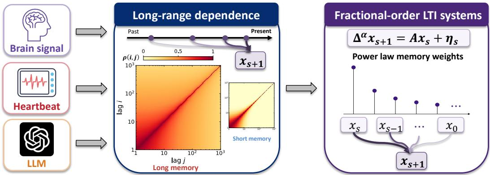
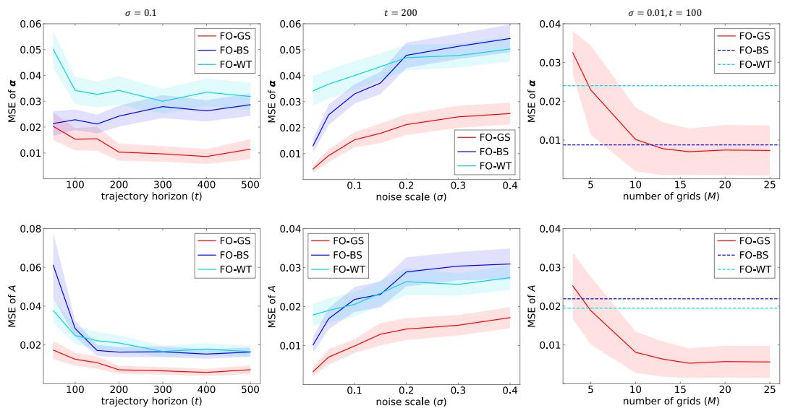
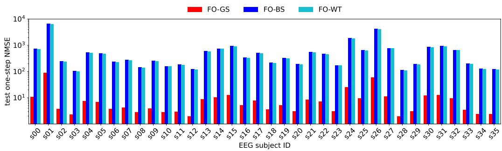
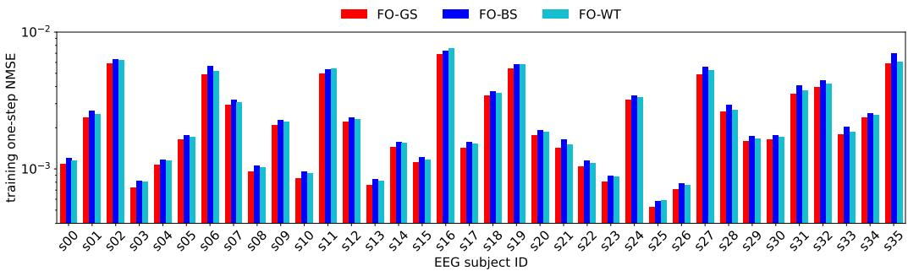

# Learning Fractional-Order Dynamics from a Single Trajectory

Xiaole Zhang1,∗,†, Ziyi Zhang2,∗, Zehao Zhao1,∗, Stephen Tu1, Guannan Qu2, Yorie Nakahira2, Paul Bogdan1

1Ming Hsieh Department of Electrical and Computer Engineering, University of Southern California 2Department of Electrical and Computer Engineering, Carnegie Mellon University

## Abstract

Many real-world processes exhibit long-range dependence, where the current state depends on a slowly decaying trace of past states rather than on the most recent state alone. This paper studies system identification for discrete-time fractionalorder linear time-invariant systems from a single observed trajectory of length t, a setting that captures such non-Markovian dynamics through the Grünwald– Letnikov difference operator. Unlike Markovian systems, fractional-order systems couple estimation across the entire history, making both statistical analysis and practical identification more challenging. We propose Fractional-Order Ordinary-Least-Squares Grid-Search (FO-GS), a simple two-stage estimator that exploits the diagonal structure of the fractional-difference operator to decouple the identification problem row-wise. Under the stability assumption, we establish high-probability, non-asymptotic error bounds for estimating both the fractional order and the system matrix in the heterogeneous setting, with both estimation errors scaling as O(t−1/2). Through experiments, we show that FO-GS outperforms existing baselines in recovering both the fractional order and the underlying system dynamics.

## 1 Introduction

Many complex natural and technological systems exhibit long-range dependence, a phenomenon in which temporal correlations decay as a power law rather than exponentially over time. Long-range dependence has been widely documented across diverse domains, including brain activity [17, 18], heart-rate variability [8, 14], climate and hydrology [12, 19], network traffic [16, 32], finance [3, 5], and even modern machine-learning systems such as large language models [1, 2].

Classical Markovian models are inherently ill-suited to capture long-range dependence, as their dynamics depend only on the current state and therefore lack a mechanism to encode persistent historical influence and long-range correlations. In contrast, fractional-order systems provide a natural alternative: the Grünwald–Letnikov difference operator replaces the one-step recursion from an integer-order system with a weighted sum over the full history [10, 13, 21, 22]. While this nonlocal mathematical formulation makes fractional-order models particularly well suited for describing history-dependent dynamics, it also introduces substantial challenges for system identification. The main challenge in identifying fractional-order systems is their intrinsic non-Markovian nature: the current state depends nontrivially on a long history of past states, and the unknown fractional order governs this dependence through the coefficients of the Grünwald–Letnikov difference operator. Consequently, jointly estimating the fractional order and the system matrix leads to a nonlinear inference problem with long-range dependence. Recent works have studied learning and samplecomplexity questions for discrete-time fractional-order systems [4, 33–35], but statistical guarantees for learning stochastic fractional-order systems from a single trajectory remain underexplored.

  
Figure 1: Complex adaptive systems exhibit non-Markovian dynamics, mathematically characterized by long-range dependence. From biological to modern machine learning systems (left panel), the autocorrelation function decays as a power law rather than exponentially (middle panel). Fractionalorder operators with their intrinsic power law memory kernel offer compact mathematical strategies to capture this observed long-range dependence dynamics (right panel).

To fill this knowledge gap, we study the fractional-order linear time-invariant (FOLTI) system

$$
\Delta ^ { \alpha } x _ { s + 1 } = A x _ { s } + \eta _ { s } ,
$$

where $\Delta ^ { \alpha }$ denotes the Grünwald–Letnikov difference operator $( 1 ) , \alpha \in ( 0 , 1 ) ^ { n }$ is the fractional-order vector, $x _ { s } \in \mathbb { R } ^ { n }$ is the n-dimensional state at time $s ,$ and $\eta _ { s } \sim \mathcal { N } ( 0 , \sigma ^ { 2 } I _ { n } )$ is the additive Gaussian noise with variance $\sigma ^ { 2 }$ . We aim to estimate the fractional order α and system matrix $A \in \mathbb { R } ^ { n }$ ×n given a single observed trajectory $x _ { 0 } , x _ { 1 } , \ldots , x _ { t }$ . We consider both the heterogeneous setting, in which the coordinates may have different fractional order coefficients in the fractional derivatives, and the homogeneous setting, in which all coordinates share a common fractional order. The central question is whether one can obtain a computationally simple estimator together with non-asymptotic guarantees in this genuinely non-Markovian regime.

This problem has two intertwined challenges: First, the fractional-order difference operator couples each observation to the entire past trajectory, so standard Markovian identification arguments do not apply directly. Second, the dependence on the unknown fractional order α is nonlinear, making joint optimization over α and A difficult even in LTI dynamics. In the single-trajectory setting, these difficulties are compounded by strong temporal dependence and the absence of independent rollouts.

Our contributions. Unlike traditional Ordinary-Least-Squares (OLS)-based algorithms for system identification, we propose the Fractional-Order OLS Grid-Search (FO-GS) algorithm, a two-stage identification scheme for a stochastic discrete time FOLTI system from a single trajectory. Using the diagonal structure of the Grünwald–Letnikov difference operator, we identify each row of A together with each coordinate of α separately; along each dimension, FO-GS establishes a grid of all potential $\alpha _ { i }$ with a fixed step size $\epsilon _ { i }$ and then estimates $a _ { i }$ , the i-th row of system matrix $A ,$ conditioned on each candidate $\alpha _ { i }$ . Then, each $\left( \alpha _ { i } , a _ { i } \right)$ -pair is evaluated to minimize a profiled loss to select the best candidates. In particular, we show that under the stability assumption, FO-GS provably recovers the ground-truth parameters α and A with high probability, with both estimation errors scaling as $\mathcal { O } ( t ^ { - 1 / 2 } )$

To the best of our knowledge, FO-GS offers the first non-asymptotic statistical guarantee for separately identifying α and A for FOLTI systems on a single trajectory. We validate FO-GS on both synthetic and real-world datasets. Taken together, FO-GS provides a principled framework for learning fractional-order dynamical systems from limited sequential data, thereby substantially broadening the scope of identifiable system classes beyond the standard Markovian setting.

## 2 Related Work

Our work is rooted in the newly developed branch of fractional-order system identification, which borrows inspiration from online learning and identification for ordinary LTI systems.

Learning on a single trajectory for ordinary LTI systems. The identification of the ordinary LTI systems has a long history of research [23, 28, 30, 31, 36–38]. Compared with those works, our algorithm adapts many methodologies and proof techniques and extends the scope to a broader non-Markovian system dynamics by coupling traditional OLS-based identification methods with a grid search scheme on each coordinate of α and row of A, taking advantage of the diagonal structure of the Grünwald–Letnikov difference operator. If $\alpha = 1$ and the fractional-order system simplifies to an ordinary LTI system, FO-GS offers a theoretical guarantee comparable to the state-of-the-art guarantee in ordinary LTI systems.

Identification of FOLTI systems. While system identification for ordinary LTI systems is a relatively well understood field, far less attention has been devoted to fractional-order systems [20, 21, 26]. When multiple trajectories can be sampled, some works have been developed in fractional-order system identification. Yaghooti and Sinopoli [33] propose a two-stage identification framework that first estimates the fractional-order parameters from trajectory data generated under a prescribed datacollection procedure and, conditioned on these estimates, reformulates the discrete-time control-affine nonlinear fractional dynamics as a regression problem to infer the unknown system dynamics. Zhang et al. [34, 35] generalize this framework to stochastic settings. Chatterjee and Pequito [4] study single-trajectory identification for fractional-order systems through system truncation and establish a sample-complexity result for the augmented system matrix. By contrast, we study the original single-trajectory identification problem directly, without requiring either data generation or system truncation, and establish the first non-asymptotic guarantees for both the fractional-order parameter α and the system matrix A.

## 3 Preliminaries and Problem Formulation

## 3.1 Grünwald–Letnikov Difference Operator

The Grünwald–Letnikov difference operator allows to discretize the fractional-order derivative and represent it as a finite difference of the form as follows:

$$
\Delta ^ { \alpha } x _ { s } : = \sum _ { j = 0 } ^ { s } \Psi ( \pmb { \alpha } , j ) x _ { s - j } ,\tag{1}
$$

where $x _ { s } \in \mathbb { R } ^ { n } , \pmb { \alpha } = [ \alpha _ { 1 } , \alpha _ { 2 } , \dotsc , \alpha _ { n } ] ^ { \top } \in ( 0 , 1 ) ^ { n }$ represents the fractional order, and $\Psi ( \pmb { \alpha } , j ) \in$ Rn×n is a diagonal matrix defined as $\Psi ( { \alpha } , j ) : = \mathrm { d i a g } ( \psi ( { \alpha } _ { 1 } , j ) , \psi ( { \alpha } _ { 2 } , j ) , \ldots , \psi ( { \alpha } _ { n } , j ) )$ with $\begin{array} { r } { \psi ( \alpha _ { i } , j ) : = \frac { \Gamma ( j - \alpha _ { i } ) } { \Gamma ( - \alpha _ { i } ) \Gamma ( j + 1 ) } } \end{array}$ for $i = 1 , 2 , \dots , n$ . Here $\Gamma ( \cdot )$ denotes the gamma function.

## 3.2 FOLTI System Identification

The state-space representation of the discrete-time FOLTI system reads:

$$
\Delta ^ { \alpha } x _ { s + 1 } = A x _ { s } + \eta _ { s } ,\tag{2}
$$

where $x _ { s } \in \mathbb { R } ^ { n }$ is the state vector, $\eta _ { s } \sim \mathcal { N } ( 0 , \sigma ^ { 2 } I _ { n } )$ for some $\sigma > 0$ is independent and identically distributed, and $A \in \mathbb { R } ^ { n \times n }$ is a constant real matrix. Using the Grünwald–Letnikov difference operator (1), we can write the system (2) as follows:

$$
x _ { s + 1 } = A x _ { s } - \sum _ { j = 1 } ^ { s + 1 } \Psi ( \pmb { \alpha } , j ) x _ { s + 1 - j } + \eta _ { s } .\tag{3}
$$

The solution to the discrete-time FOLTI system (2) is given by [9]:

$$
x _ { s } = G _ { s } x _ { 0 } + \sum _ { j = 0 } ^ { s - 1 } G _ { s - 1 - j } \eta _ { j } ,
$$

where the matrices $G _ { s }$ are defined recursively by

$$
G _ { s } = \left\{ \begin{array} { l l } { I , } & { s = 0 , } \\ { \sum _ { j = 0 } ^ { s - 1 } A _ { j } G _ { s - 1 - j } , } & { s \geq 1 , } \end{array} \right. \quad A _ { j } = \left\{ \begin{array} { l l } { A + \mathrm { d i a g } ( \alpha _ { 1 } , \ldots , \alpha _ { n } ) , } & { j = 0 , } \\ { - \Psi ( \alpha , j + 1 ) , } & { j \geq 1 . } \end{array} \right.\tag{4}
$$

Problem statement: Given a single observed trajectory $x _ { 0 } , x _ { 1 } , \ldots , x _ { t }$ , our goal is to identify the fractional order α and the system matrix A, and to establish statistical guarantees for the resulting estimators.

Algorithm 1 Fractional-Order OLS Grid-Search (FO-GS)   
Require: Trajectory $\{ x _ { s } \} _ { s = 0 } ^ { t } ,$ row search interval $[ \underline { { \alpha } } _ { i } , \bar { \alpha } _ { i } ]$ , grid size $\epsilon _ { i } .$   
Ensure: Estimates $\hat { \pmb { \alpha } } = [ \hat { \alpha } _ { 1 } , \dots , \hat { \alpha } _ { n } ] ^ { \top }$ and ${ \hat { A } } .$   
1: Build grid $\mathcal { A } _ { \epsilon , i } \subset [ \underline { { \alpha } } _ { i } , \bar { \alpha } _ { i } ] .$   
2: Form the data matrix $X _ { t }$ with (9).   
3: for $i = 1 , \ldots , n$ do   
4: for each $\alpha \in \mathcal { A } _ { \epsilon , i }$ do   
5: Compute the fractional-difference row $\Delta ^ { \alpha } X _ { t } ^ { ( i ) }$ with (5).   
6: Compute the least-squares row estimator $\hat { a } _ { i } ( \alpha )$ with (7).   
7: Compute the profiled loss $\mathcal { L } ^ { ( i ) } ( \alpha )$ with (8).   
8: end for   
9: Select $\begin{array} { r } { \hat { \alpha } _ { i } \gets \arg \operatorname* { m i n } _ { \alpha \in \mathcal { A } _ { \epsilon , i } } \mathcal { L } ^ { ( i ) } ( \alpha ) . } \end{array}$   
10: Set $\hat { a } _ { i } \gets \hat { a } _ { i } ( \hat { \alpha } _ { i } )$   
11: end for   
12: Form αˆ $ [ \hat { \alpha } _ { 1 } , \ldots , \hat { \alpha } _ { n } ] ^ { \top }$ , and $\hat { A } \gets [ \hat { a } _ { 1 } ^ { \top } , \ldots , \hat { a } _ { n } ^ { \top } ] ^ { \top }$   
return $( \hat { \alpha } , \hat { A } )$

## 4 Main Results

In this section, we introduce the algorithm for identifying the system parameters α and A in Section 4.1, and present the sample complexity results for the resulting estimators in Section 4.2.

## 4.1 FO-GS

We introduce the algorithm for identifying the system parameters $( \alpha , A )$ of the FOLTI system (2) from a single observed trajectory. The main idea is to isolate each coordinate of α under the diagonal structure of the Grünwald–Letnikov difference operator and, for each candidate, solve an OLS problem to estimate A. To handle the general fractional-order setting, Algorithm 1 performs a grid search over each component of α, and then solves a row-wise OLS problem. Specifically, for each $i \in \{ 1 , \ldots , n \}$ , define

$$
\Delta ^ { \alpha _ { i } } X _ { t } ^ { ( i ) } : = \left[ \Delta ^ { \alpha _ { i } } x _ { 1 } ^ { ( i ) } , \ldots , \Delta ^ { \alpha _ { i } } x _ { t } ^ { ( i ) } \right] \in \mathbb { R } ^ { 1 \times t } ,\tag{5}
$$

where $\begin{array} { r } { \Delta ^ { \alpha _ { i } } x _ { s + 1 } ^ { ( i ) } = \sum _ { j = 0 } ^ { s + 1 } \psi ( \alpha _ { i } , j ) x _ { s + 1 - j } ^ { ( i ) } } \end{array}$ . Denote $A = [ a _ { 1 } ^ { \top } , \ldots , a _ { n } ^ { \top } ] ^ { \top }$ , where $a _ { i } \in \mathbb { R } ^ { 1 \times n }$ represents the i-th row of A. We further define the loss function L as follows:

$$
\mathcal { L } ( \alpha , A ) = \sum _ { s = 0 } ^ { t - 1 } \bigl \| \Delta ^ { \alpha } x _ { s + 1 } - A x _ { s } \bigr \| _ { 2 } ^ { 2 } = \sum _ { i = 1 } ^ { n } \sum _ { s = 0 } ^ { t - 1 } \bigl ( \Delta ^ { \alpha _ { i } } x _ { s + 1 } ^ { ( i ) } - a _ { i } x _ { s } \bigr ) ^ { 2 } .\tag{6}
$$

For each row $i ,$ let $\mathcal { A } _ { i } = [ \underline { { \alpha } } _ { i } , \bar { \alpha } _ { i } ] \subset ( 0 , 1 ]$ be a compact search interval. Fixing a step size $\epsilon _ { i } > 0 ,$ we construct a uniform grid $\mathcal { A } _ { \epsilon , i } = \left\{ \alpha _ { i , k } : = \underline { { \alpha } } _ { i } + k \epsilon _ { i } \vert k \in \left\{ 1 , \ldots , M _ { i } \right\} \right\} \subset \mathcal { A } _ { i }$ . For each candidate $\alpha _ { i , k }$ , we solve the row-wise OLS problem and obtain:

$$
\hat { a } _ { i } ( \alpha _ { i , k } ) : = \arg \operatorname* { m i n } _ { a _ { i } } \mathcal { L } ^ { ( i ) } ( \alpha _ { i , k } , a _ { i } ) = ( \Delta ^ { \alpha _ { i , k } } X _ { t } ^ { ( i ) } ) X _ { t } ^ { \top } ( X _ { t } X _ { t } ^ { \top } ) ^ { - 1 } .\tag{7}
$$

We then minimize the corresponding profiled loss and obtain the estimated $\alpha _ { i } { : }$

$$
\hat { \alpha } _ { i } = \arg \operatorname* { m i n } _ { \alpha \in \mathcal { A } _ { \epsilon , i } } \mathcal { L } ^ { ( i ) } ( \alpha ) = \arg \operatorname* { m i n } _ { \alpha \in \mathcal { A } _ { \epsilon , i } } \sum _ { s = 0 } ^ { t - 1 } \bigl ( \Delta ^ { \alpha } x _ { s + 1 } ^ { ( i ) } - \hat { a } _ { i } ( \alpha ) x _ { s } \bigr ) ^ { 2 } .\tag{8}
$$

Finally, by stacking the row estimators $\hat { a } _ { i } ( \alpha _ { i } )$ , we obtain the system matrix estimator

$$
\begin{array} { r } { \hat { A } ( \pmb { \alpha } ) = ( \Delta ^ { \pmb { \alpha } } X _ { t } ) X _ { t } ^ { \top } ( X _ { t } X _ { t } ^ { \top } ) ^ { - 1 } , } \end{array}
$$

where

$$
\Delta ^ { \alpha } X _ { t } = [ \Delta ^ { \alpha } x _ { 1 } , \ldots , \Delta ^ { \alpha } x _ { t } ] , \ X _ { t } = [ x _ { 0 } , \ldots , x _ { t - 1 } ] .\tag{9}
$$

The commensurate setting is a direct specialization of the above procedure. When all coordinates share a common fractional order, $\mathrm { i } . \mathrm { e } . , \alpha = \alpha \mathbf { 1 }$ , the row-wise searches collapse to a single one-dimensional search over α.

## 4.2 Theoretical Guarantees

In this section, we present complexity guarantees for the proposed algorithm. We begin by introducing the assumptions required for our main results. For the rest of the paper, we use $\pmb { \alpha } _ { \star } = [ \alpha _ { 1 , \star } , . . . \alpha _ { n , \star } ] ^ { \rceil }$ to denote the true fractional-order vector and $A _ { \star }$ to denote the true system matrix. We assume $x _ { 0 } = 0$ for simplicity. We first introduce a stability assumption that is standard in the LTI system identification literature.

Assumption 1. The system parameters $( A _ { \star } , \alpha _ { \star } )$ are stable in the sense that for all $| z | \leq 1$

$$
\operatorname* { d e t } \Bigl ( \operatorname { d i a g } \bigl ( ( 1 - z ) ^ { \alpha _ { 1 , \star } } , \ldots , ( 1 - z ) ^ { \alpha _ { n , \star } } \bigr ) - z A _ { \star } \Bigr ) \neq 0 .
$$

Assumption 1 can be interpreted as the fractional-order version of the stability assumption common in control literature [15, 24, 25, 27, 29]. It is slightly stronger than minimal stability, since imposing the condition at $z = 1$ implies that $A _ { \star }$ is invertible. This property is used in our analysis to bound the matrices $G _ { s }$ in (4). It ensures that the state $x _ { t }$ does not blow-up with time. If the system is unstable, then any error at the early time period would be exponentially amplified by the unstable system dynamics in a phenomenon known as stochastic coupling [36]. We leave this as a future direction of this paper.

We are now ready to introduce the main theorems. First, we introduce the error bound on $\pmb { \alpha } _ { \star }$

Theorem 1. Suppose Assumption 1 holds and the population separation gap γ in (64) is positive. Let $\epsilon _ { \mathrm { m a x } } : = \mathrm { m a x } _ { 1 \leq i \leq n } \epsilon _ { i }$ . Fix $\delta \in ( 0 , 1 / 2 )$ $\begin{array} { r } { I f t \gtrsim \frac { 1 } { \operatorname* { m i n } _ { i } \underline { { \alpha } } _ { i } ^ { 4 } } \left( n + \log \frac { \sum _ { i = 1 } ^ { n } M _ { i } } { \delta } \right) } \end{array}$ , and the excitation (65) and localization (66) conditions are satisfied, then with probability at least $1 - \delta ,$

$$
\| \widehat { \pmb { \alpha } } - { \pmb { \alpha } } _ { \star } \| _ { \infty } ^ { 2 } \lesssim \mathrm { p o l y } \bigg ( n , \frac { 1 } { \delta } \bigg ) \left[ \epsilon _ { \mathrm { m a x } } ^ { 2 } + \frac { 1 } { t } \sum _ { i = 1 } ^ { n } \log \frac { M _ { i } n } { \delta } + \frac { 1 } { t } \log \frac { n } { \delta } \right] ,\tag{10}
$$

where $\lesssim$ hides system-dependent constants independent of t, $n , \delta , \epsilon _ { \mathrm { m a x } } ,$ and $M _ { i } .$ . Consequently, if $\epsilon _ { \mathrm { m a x } } = \mathcal { O } \left( t ^ { - 1 / 2 } \right)$ , then $\left. \left. \hat { \pmb { \alpha } } - \pmb { \alpha } _ { \star } \right. \right. _ { \infty } = \mathcal { O } \left( t ^ { - 1 \bar { / } 2 } \right)$

We defer the proof of Theorem 1 to Appendix B. The condition for t requires the trajectory to be long enough for both the global and local lower isometry bounds to hold uniformly over the finite search grid. In addition to the excitation and localization conditions, the trajectory length scales as $\begin{array} { r } { t \gtrsim \frac { 1 } { \operatorname* { m i n } _ { i } \underline { { \alpha } } _ { i } ^ { 4 } } \left( n + \log \frac { \sum _ { i = 1 } ^ { n } M _ { i } } { \delta } \right) } \end{array}$ , thus smaller fractional orders require longer trajectories, reflecting the stronger long-memory dependence in this regime. Theorem 1 makes explicit the tradeoff between statistical error and grid discretization error. Up to logarithmic factors in the grid size $M _ { i }$ the statistical term decays as $\bar { \ell } ^ { - 1 / 2 }$ , whereas the discretization term decays as $\epsilon _ { \mathrm { m a x } }$ . Accordingly, choosing $\epsilon _ { \mathrm { m a x } } = \mathcal { O } ( t ^ { - 1 / 2 } )$ makes the two contributions comparable. For a uniform grid over a bounded interval, this corresponds to $M _ { i } = \mathcal { O } ( t ^ { 1 / 2 } )$ , which is sufficient to match the statistical precision. To the best of our knowledge, this is the first high-probability single-trajectory error bound for estimation of the fractional order $\alpha _ { \ast }$ in the FOLTI setting. Our result is complementary to prior work based on truncated, bisection-like identification schemes [4], and to more recent analyses developed under different data-generation frameworks [33–35]. We then discuss the error complexity of estimating A⋆ in the following theorem:

Theorem 2. Under the same condition as in Theorem 1,fix $\delta \in ( 0 , \frac { 1 } { 2 } )$ and consider the system (3). Let $\begin{array} { r } { \Gamma _ { s } = \sum _ { m = 0 } ^ { s - 1 } G _ { m } G _ { m } ^ { \top } } \end{array}$ and $\begin{array} { r } { \Xi _ { t } ( \delta , k ) : = n \log \frac { 9 n } { \delta } + \log \operatorname* { d e t } \bigl ( \Gamma _ { t } \Gamma _ { k } ^ { - 1 } \bigr ) } \end{array}$ . Then there exist universal constants $c , C > 0$ such that, for any integer k satisfying $\begin{array} { r } { \frac { t } { k } \geq c \Xi _ { t } ( \delta , k ) } \end{array}$ ), thefollowing holds with probability at leas $1 - \delta \colon$

$$
\bigl \| \hat { A } ( \hat { \pmb { \alpha } } ) - A _ { \star } \bigr \| _ { \mathrm { o p } } \leq C \mathopen { } \mathclose \bgroup \left( \sqrt { \frac { \Xi _ { t } ( \delta , \boldsymbol { k } ) } { t \lambda _ { \operatorname* { m i n } } ( \Gamma _ { k } ) } } + S _ { 1 } \| \hat { \pmb { \alpha } } - \alpha _ { \star } \| _ { \infty } \sqrt { \frac { n \tilde { C } _ { G } ^ { 2 } } { \delta \lambda _ { \operatorname* { m i n } } ( \Gamma _ { \lfloor k / 2 \rfloor } ) } } \aftergroup \egroup \right) ,
$$

where $\tilde { C } _ { G }$ is a constant depending on $( A _ { \star } , \alpha _ { \star } )$ , and $S _ { 1 }$ is a constant depending on the grid search interval.

We defer the proof of Theorem 2 to Appendix C. Theorem 2 shows that the estimation error for $A _ { \star }$ decomposes into two parts. The first term is a standard oracle least-squares error, which is the error that would arise even if the true fractional-order vector were known. The second term quantifies the propagation of the fractional-order estimation error into the estimation of $A _ { \star }$ . Consequently, when $\hat { \bf \alpha }$ is obtained from Theorem 1, the bound for $A _ { \cdot }$ inherits the same statistical-discretization tradeoff as the bound for $\pmb { \alpha } _ { \star }$ . In particular, if $\epsilon _ { \mathrm { m a x } } = \mathcal { O } ( t ^ { - 1 / 2 } )$ , then the propagated term is of order $t ^ { - 1 / 2 }$ while the oracle term is also of order $t ^ { - 1 / 2 }$ . Therefore, the overall estimation error for $A _ { \star }$ achieves the $t ^ { - 1 / 2 }$ rate. Chatterjee and Pequito [4] analyzes a truncated system identification scheme, but does not explicitly quantify the estimation error for the original system matrix $A _ { \star }$ or how fractional-order estimation error propagates to the estimation of $A _ { \star }$ . We also note that in the case when $\pmb { \alpha } _ { \star } = \pmb { 1 }$ is known a priori, there is no need to estimate the fractional-order parameter. So Theorem 2 is equivalent to the current state-of-the-art bound for estimating $A _ { \ i }$ ⋆ for ordinary LTI systems [30].

## 5 Proof Outline

The proof in this paper is split into two steps, bounding the estimation error for $\pmb { \alpha } _ { \star }$ and then for $A _ { \star }$ In this section, we provide an outline of the proof for each, and defer the details to the appendix.

## 5.1 Proof of Theorem 1: bounding the error of $\pmb { \alpha } ,$

The estimation of $\pmb { \alpha } _ { \star }$ can be analyzed in two steps: controlling the in-sample error and establishing a lower isometry bound. The first step gives an absorbable upper bound on the in-sample prediction error, while the second localizes the estimator and converts the same error into a quadratic lower bound on the fractional-order estimation error.

Controlling the in-sample error. For each row $i ,$ define $b _ { s } ^ { ( i ) } ( \alpha _ { i } ) : = \left( \Delta ^ { \alpha _ { i } } - \Delta ^ { \alpha _ { i , \star } } \right) x _ { s + } ^ { ( i ) }$ +1 and $y _ { s } ^ { ( i ) } ( \alpha _ { i } ) : = b _ { s } ^ { ( i ) } ( \alpha _ { i } ) + 2 \eta _ { s } ^ { ( i ) }$ , and let $\alpha _ { i } ^ { \circ }$ denote the grid point closest to $\alpha _ { i , \star }$ . We study the unnormalized in-sample error

$$
\mathcal { E } _ { t } : = \sum _ { s = 0 } ^ { t - 1 } \Big \Vert \big ( \Delta ^ { \hat { \alpha } } - \Delta ^ { \alpha _ { \star } } \big ) x _ { s + 1 } - ( \hat { A } - A _ { \star } ) x _ { s } \Big \Vert _ { 2 } ^ { 2 } .
$$

By the optimality of the row-wise estimator $L ^ { ( i ) } ( \hat { \alpha } _ { i } , \hat { a } _ { i } ) \leq L ^ { ( i ) } ( \alpha _ { i } ^ { \circ } , \hat { a } _ { i } ( \alpha _ { i } ^ { \circ } ) ) \leq L ^ { ( i ) } ( \alpha _ { i } ^ { \circ } , a _ { i , \star } )$ and a quadratic maximization over the system matrix perturbation, we obtain

$$
\begin{array} { r l } { \mathcal { E } _ { t } \leq \displaystyle \sum _ { i = 1 } ^ { n } \displaystyle \operatorname* { m a x } _ { \alpha _ { i } \in \mathcal { A } _ { \epsilon , i } } \left\{ \underbrace { - 4 \sum _ { s = 0 } ^ { t - 1 } \eta _ { s } ^ { ( i ) } b _ { s } ^ { ( i ) } \left( \alpha _ { i } \right) - \displaystyle \sum _ { s = 0 } ^ { t - 1 } | b _ { s } ^ { ( i ) } \left( \alpha _ { i } \right) | ^ { 2 } } _ { U _ { t , i } \left( \alpha _ { i } \right) } + \left\| \left( \displaystyle \sum _ { s = 0 } ^ { t - 1 } y _ { s } ^ { ( i ) } \left( \alpha _ { i } \right) x _ { s } ^ { \top } \right) \left( X _ { t } X _ { t } ^ { \top } \right) ^ { - \frac { 1 } { 2 } } \right\| _ { 2 } ^ { 2 } \right\} } & \\ { + \displaystyle \sum _ { \epsilon = 1 } ^ { n } \left[ 4 \sum _ { s = 0 } ^ { t - 1 } \eta _ { s } ^ { ( i ) } b _ { s } ^ { ( i ) } \left( \alpha _ { i } ^ { \mathfrak { o } } \right) + 2 \sum _ { s = 0 } ^ { t - 1 } | b _ { s } ^ { ( i ) } \left( \alpha _ { i } ^ { \mathfrak { o } } \right) | ^ { 2 } \right] . } & { ( 1 ) } \end{array}\tag{1}
$$

Exact-grid case. If the true parameter lies exactly on the search grid, $\mathbf { i . e . , } \alpha _ { i , \star } \in \mathcal { A } _ { \epsilon , i }$ for every $i ,$ then we may take $\alpha _ { i } ^ { \circ } = \alpha _ { i , \star }$ . In this case $b _ { s } ^ { ( i ) } ( \alpha _ { i } ^ { \circ } ) = 0$ for every i and $s ,$ and hence $\Gamma _ { t } ^ { \mathrm { g r i d } } = 0$ . Thus, the continuous empirical risk minimizer offset inequality is recovered as a special case.

Row-wise complexity decomposition. Since the fractional-order operator is diagonal across state coordinates and the estimator searches for each $\alpha _ { i }$ separately, the offset complexity decomposes as

$$
\sum _ { i = 1 } ^ { n } \operatorname* { m a x } _ { \alpha _ { i } \in \mathcal { A } _ { \epsilon , i } } \left\{ U _ { t , i } ( \alpha _ { i } ) + V _ { t , i } ( \alpha _ { i } ) \right\} ,
$$

rather than requiring a supremum over the full Cartesian grid $\mathcal { A } _ { \epsilon , 1 } \times \cdots \times \mathcal { A } _ { \epsilon , n }$ . This row-wise decomposition is important for obtaining the sharp complexity dependence of the grid-search estimator.

The offset martingale complexity argument [39] preserves the negative quadratic term in $U _ { t , i }$ , yielding a term proportional to $\left\| \hat { \alpha } - \alpha _ { \star } \right\| _ { \infty } ^ { 2 }$ with a tunable coefficient, which can later be absorbed by the

lower isometry bound. The additional term $\Gamma _ { t } ^ { \mathrm { g r i d } }$ accounts for the finite-grid approximation and vanishes when the true fractional orders lie on the search grid. Bounding $U _ { t , i } , \ V _ { t , i }$ , and $\Gamma _ { t } ^ { \mathrm { g r i d } }$ separately then yields the following high-probability control of $\mathcal { E } _ { t }$

Lemma 1. For any fixed $\tau \in ( 0 , 1 ]$ and $\rho > 0 , i f t / k \geq c \Xi _ { t } ( \delta , k )$ , then with probability at least $1 - \delta ,$

$$
\begin{array} { r l } & { \mathcal { E } _ { t } \leq ( \tau + \rho ) S _ { 1 } ^ { 2 } \| \hat { \alpha } - \alpha _ { * } \| _ { \infty } ^ { 2 } \operatorname { t r } ( X _ { t } X _ { t } ^ { \top } ) + 3 S _ { 1 } ^ { 2 } \epsilon _ { \operatorname* { m a x } } ^ { 2 } \operatorname { t r } ( X _ { t } X _ { t } ^ { \top } ) } \\ & { \qquad + \frac { 4 ( 1 + \rho ^ { - 1 } ) C ^ { 2 } \operatorname { t r } ( X _ { t } X _ { t } ^ { \top } ) } { t \lambda _ { \operatorname* { m i n } } ( \Gamma _ { k } ) } \Xi _ { t } ( \delta , k ) + \frac { 8 \sigma ^ { 2 } } { \tau } \displaystyle \sum _ { i } \log \frac { 3 M _ { i } n } { \delta } + 8 \sigma ^ { 2 } \log \frac { 3 } { \delta } . } \end{array}
$$

The coefficient $\tau + \rho$ is tunable and can be absorbed by lower isometry.

We defer the proof of Lemma 1 to Section B.1.

Lower isometry. For each row i, define the unprofiled and profiled noiseless errors $\mathcal { Q } _ { t , i } ( \alpha _ { i } , v ) : =$ $\begin{array} { r } { \sum _ { s = 0 } ^ { t - 1 } \left| b _ { s } ^ { ( i ) } ( \alpha _ { i } ) - v x _ { s } \right| ^ { 2 } } \end{array}$ and $\begin{array} { r } { \underline { { \mathcal Q } } _ { t , i } ( \alpha _ { i } ) : = \operatorname* { i n f } _ { v \in \mathbb { R } ^ { 1 \times n } } \underline { { \mathcal Q } } _ { t , i } ( \alpha _ { i } , v ) } \end{array}$ , and the row-wise population risk $\begin{array} { r } { R _ { t } ^ { ( i ) } ( \alpha _ { i } ) : = \frac { 1 } { t } \operatorname* { i n f } _ { a _ { i } \in \mathbb { R } ^ { 1 \times n } } \sum _ { s = 0 } ^ { t - 1 } \mathbb { E } \left[ \left( \Delta ^ { \alpha _ { i } } x _ { s + 1 } ^ { ( i ) } - a _ { i } x _ { s } \right) ^ { 2 } \right] . \mathbf { A } } \end{array}$ global profiled lower isometry bound shows that, uniformly over grid points outside the local neighborhood of $\alpha _ { i , \star }$

$$
\underline { { \mathcal { Q } } } _ { t , i } ( \alpha _ { i } ) \geq \frac { t } { 2 } \left[ R _ { t } ^ { ( i ) } ( \alpha _ { i } ) - R _ { t } ^ { ( i ) } ( \alpha _ { i , \star } ) \right] .
$$

Together with the upper bound on $\mathcal { E } _ { t }$ in Lemma 1, this excludes grid points outside the local neighborhood and localizes $\hat { \alpha } _ { i }$ to a set $\mathcal { G } _ { i }$ in (34) around $\alpha _ { i , \star }$ , where the first-order expansion of $b _ { s } ^ { ( i ) } ( \alpha _ { i } )$ has controlled remainder and the corresponding population derivative curvature $\mu _ { t , i }$ is nondegenerate. Within $\mathcal { G } _ { i }$ , this yields the quadratic lower-isometry bound $\begin{array} { r } { \mathcal { Q } _ { t , i } ( \alpha _ { i } ) \geq \frac { t \mu _ { t , i } } { 8 } | \alpha _ { i } - } \end{array}$ $\alpha _ { i , \star } | ^ { 2 }$ . The following lemma formalizes this local lower-isometry property.

Lemma 2. Under Assumption 1, $\begin{array} { r } { i f t \gtrsim \frac { 1 } { \operatorname* { m i n } _ { i } \underline { { \alpha } } _ { i } ^ { 4 } } \left( n + \log \frac { \sum _ { i = 1 } ^ { n } M _ { i } } { \delta } \right) } \end{array}$ , then with probability at least $1 - \delta ,$ , simultaneously for all $i \in [ n ]$ and all $\begin{array} { r } { \alpha _ { i } \in \mathcal { G } _ { i } , \underline { { Q } } _ { t , i } ( \alpha _ { i } ) \geq \frac { t \mu _ { t , i } } { 8 } | \alpha _ { i } - \alpha _ { i , \star } | ^ { 2 } } \end{array}$ . Consequently, on any event for which $\hat { \alpha } _ { i } \in \mathcal G _ { i } f o r$ every $\begin{array} { r } { i \in [ n ] , \mathcal { Q } _ { t , i } \left( \hat { \alpha } _ { i } , \hat { a } _ { i } - a _ { i , \star } \right) \geq \frac { t \mu _ { t , i } } { 8 } | \hat { \alpha } _ { i } - \alpha _ { i , \star } | ^ { 2 } } \end{array}$

We defer the proof of Lemma 2 to Section B.2. Combining the lower isometry bound in Lemma 2 with the in-sample upper bound in Lemma 1 and choosing the tunable coefficient sufficiently small gives

$$
\begin{array} { r } { \left\| \hat { \pmb { \alpha } } - \pmb { \alpha } _ { \star } \right\| _ { \infty } ^ { 2 } \lesssim \epsilon _ { \operatorname* { m a x } } ^ { 2 } + \mathcal { O } ( t ^ { - 1 } ) . } \end{array}
$$

Hence, choosing $\epsilon _ { \mathrm { m a x } } = O ( t ^ { - 1 / 2 } )$ yields the $t ^ { - 1 / 2 }$ rate in Theorem 1.

## 5.2 Proof of Theorem 2: bounding the error of $A _ { \star }$

We decompose the identification error of A given α. For any $\alpha ,$ we have

$$
\begin{array} { r } { \hat { A } ( \pmb { \alpha } ) - A _ { * } = ( B _ { t } ( \pmb { \alpha } ) + W _ { t } ) \pmb { X } _ { t } ^ { \top } ( X _ { t } X _ { t } ^ { \top } ) ^ { - 1 } , } \end{array}
$$

where $W _ { t } : = [ \eta _ { 0 } , \dotsc , \eta _ { t - 1 } ] \in \mathbb { R } ^ { n \times t } , B _ { t } ( \alpha ) : = [ b _ { 0 } ( \alpha ) , \dotsc , b _ { t - 1 } ( \alpha ) ] \in \mathbb { R } ^ { n \times t }$ , and $b _ { s } ( \pmb { \alpha } ) =$ $\begin{array} { r } { \sum _ { j = 0 } ^ { s } \bigl ( \Psi ( \pmb { \alpha } , j ) - \Psi ( \pmb { \alpha } _ { \star } , j ) \bigr ) x _ { s - j } = [ b _ { s } ^ { ( 1 ) } ( \pmb { \alpha } ) , \ldots , b _ { s } ^ { ( n ) } ( \pmb { \alpha } ) ] ^ { \top } } \end{array}$ . Thus

$$
\begin{array} { r } { \left\| \hat { A } ( \pmb { \alpha } ) - A _ { \star } \right\| _ { \mathrm { o p } } \leq \underbrace { \left\| W _ { t } X _ { t } ^ { \top } ( X _ { t } X _ { t } ^ { \top } ) ^ { - 1 } \right\| _ { \mathrm { o p } } } _ { \mathrm { n o i s e t e r m } } + \underbrace { \left\| B _ { t } ( \pmb { \alpha } ) X _ { t } ^ { \top } ( X _ { t } X _ { t } ^ { \top } ) ^ { - 1 } \right\| _ { \mathrm { o p } } } _ { \mathrm { b i a s t e r m } } . } \end{array}\tag{12}
$$

We therefore decompose the identification error in (12) into noise and bias terms, which we bound separately in Lemmas 3 and 4. To bound the noise term, we adapt the technique from Sarkar and Rakhlin [28], Simchowitz et al. [30] and get the following lemma:

Lemma 3. Fix $\delta \in ( 0 , \frac { 1 } { 2 } )$ and consider the system (3) under Assumption 1. Then there exist universal constants $c , C > 0$ such that

$$
\mathbb { P } \Bigg [ \Big \lVert W _ { t } X _ { t } ^ { \top } ( X _ { t } X _ { t } ^ { \top } ) ^ { - 1 } \Big \rVert _ { \mathrm { o p } } > \frac { C } { \sqrt { t \lambda _ { \operatorname* { m i n } } ( \Gamma _ { k } ) } } \sqrt { n \log \frac { n } { \delta } + \log \operatorname* { d e t } ( \Gamma _ { t } \Gamma _ { k } ^ { - 1 } ) } \Bigg ] \leq \delta ,
$$

for any k such that $\begin{array} { r } { \frac { t } { k } \geq c \big ( n \log ( n / \delta ) + \log \operatorname* { d e t } ( \Gamma _ { t } \Gamma _ { k } ^ { - 1 } ) \big ) } \end{array}$ holds.

We defer the proof of Lemma 3 to Appendix C.1. We now offer the bound for the bias term in (12): Lemma 4. With probability at least 1 − 2δ, the following holds

$$
\bigl \| \boldsymbol { B } _ { t } ( \boldsymbol { \alpha } ) \boldsymbol { X } _ { t } ^ { \top } ( \boldsymbol { X } _ { t } \boldsymbol { X } _ { t } ^ { \top } ) ^ { - 1 } \bigr \| _ { \mathrm { o p } } \leq S _ { 1 } \| \boldsymbol { \alpha } - \boldsymbol { \alpha } _ { \star } \| _ { \infty } \sqrt { \frac { 3 2 0 n \tilde { C } _ { G } ^ { 2 } } { 9 \delta p ^ { 2 } \lambda _ { \operatorname* { m i n } } ( \boldsymbol { \Gamma } _ { \lfloor k / 2 \rfloor } ) } } ,
$$

where $\begin{array} { r } { \alpha _ { \mathrm { m i n } } = \operatorname* { m i n } _ { 1 \leq i \leq n } \alpha _ { i , \star } } \end{array}$ , and $\textstyle p = { \frac { 3 } { 2 0 } }$

We defer the proof of Lemma 4 to Appendix C.2.

## 6 Experiments

We evaluate the proposed method FO-GS through two sets of experiments. First, we use synthetic data to validate the theoretical guarantee and compare FO-GS with existing fractional-order identification algorithms [4, 7]. FO-WT estimates the fractional order α⋆ using a wavelet-based technique [7] and then applies OLS to estimate the system matrix A . FO-BS estimates α via binary search and then identifies A by applying OLS to an augmented-state representation obtained through system truncation [4]. Second, as fractional-order systems have been used in analyzing electroencephalogram (EEG) data, we further demonstrate that FO-GS excels in minimizing the one-step normalized mean squared error (NMSE) on both training and testing datasets in comparison to both existing methods (FO-BS and FO-WT). Both the synthetic and real-world experiments demonstrate that FO-GS outperforms the baselines. We provide additional experimental details in Appendix A.

## 6.1 Performance Evaluation on Synthetic Data

In this section, we compare FO-GS with two existing baselines on synthetic data. The trajectories are generated according to the fractional-order dynamics in (2). The ground-truth parameters $\pmb { \alpha } _ { \star }$ and $A _ { \star }$ are randomly sampled, and the reported mean squared error (MSE) is averaged over five randomly generated system instances, with 20 independent rollouts for each instance.

Varying trajectory horizons. We evaluate the MSE of the fractional order α⋆ and the system matrix A⋆ as functions of the trajectory horizon t by fixing the noise scale σ. As shown in Figure 2, FO-GS outperforms baselines in estimating both α and A across all trajectory lengths. The improvement is particularly pronounced for shorter horizons, where accurate identification is most challenging. A plausible reason is that our method directly fits the original fractional-order model and exploits its structural decomposition, whereas the baselines rely either on a wavelet-based proxy for estimating the fractional order α or on a truncated lifted-state approximation for identifying the system matrix $A _ { \star }$ . These additional approximation steps can introduce non-negligible finite-sample error, especially when the available trajectory is short. We also observe that the estimation error generally decreases as t increases, which is consistent with the theoretical predictions in Theorems 1 and 2.

Varying noise scales. We examines how the MSE of the fractional order α and the system matrix A varies with the noise scale σ given the same horizon t. Figure 2 shows that FO-GS consistently outperforms the two baselines across all noise levels. As expected, the MSE of all methods increases as the noise level grows, but the FO-GS remains the most robust, likely because it estimates α and A⋆ directly from the original fractional-order model, whereas the baselines incur additional approximation error through wavelet-based estimation or system truncation.

Varying grid sizes. We study how the number of grids M affects the performance of FO-GS (Figure 2). Consistent with Theorems 1 and 2, the MSE for both the fractional order α and the system matrix A decreases as the number of grids increases. Notably, FO-GS outperforms both FO-BS and FO-WT without requiring a large number of grids: it surpasses the baselines in estimating $\pmb { \alpha } _ { \star }$ with roughly ten grids and in estimating A⋆ with roughly five grids. This demonstrates that FO-GS is not only accurate but also computationally efficient.

Small α⋆ regime. We further examine the small fractional-order regime by uniformly sampling α from the interval [0.01, 0.2] for systems with n = 10 and $n = 2 0$ , and extending the trajectory horizon up to t = 25,600. As shown in Table 1, over the shorter horizons $t \in \{ 1 0 0 , \bar { 2 } 0 0 , 3 0 \bar { 0 } , 4 0 0 \}$ the empirical convergence is slower than the predicted $t ^ { - 1 / 2 }$ rate, indicating stronger finite-sample effects when the fractional orders are small. As the trajectory length increases, however, the fitted rates become progressively faster. Specifically, Table 2 shows that over the full extended horizon, the rate scales approximately as $t ^ { - 0 . 3 6 }$ for n = 10 and $t ^ { - 0 . 3 8 }$ for $n = 2 0$ , while fitting only the larger horizon regime $t \geq 3 2 0 0$ yields rates of approximately $t ^ { - 0 . 4 3 }$ and $t ^ { - 0 . 4 2 }$ , respectively. These results show a clear trend toward the $t ^ { - 1 / 2 }$ rate predicted by Theorem 1 as the trajectory becomes longer. We emphasize that the sample-size requirement in Theorem 1, including its explicit $\alpha _ { \mathrm { m i n } } ^ { - 4 }$ dependence, is a sufficient condition for entering the fast rate regime rather than a necessary or optimal threshold. Thus, the observed finite sample behavior may be better than what is implied by the conservative sufficient condition.

Figure 2: Comparison of the MSE on synthetic FOLTI system identification. Shaded regions indicate 95% confidence intervals (CI).  
  
Figure 3: Subject-level average test one-step NMSE on the EEG mental-arithmetic dataset. Each point corresponds to one subject and is obtained by averaging the window-level test one-step NMSE over all non-overlapping windows from that subject.

## 6.2 Performance Evaluation on Real-World Data

We evaluate FO-GS on an EEG mental-arithmetic dataset [40] comprising artifact-free recordings from 36 subjects, sampled at 500 Hz with a Neurocom 23-channel system and 19 electrodes placed obeying the International 10/20 scheme. We use the first minute of the serial-subtraction task, treating each subject’s recording as a 19-dimensional time series. The data are segmented into non-overlapping windows of length $W = 1 5 0$ , with 70% of samples used for training and 30% for testing. We compare FO-GS against FO-BS and FO-WT using one-step NMSE. Figure 3 reports subject-level average test NMSE. Training errors are similar across methods as shown in Figure 4, but test performance differs markedly: FO-GS consistently achieves the lowest NMSE for all subjects, while FO-BS and FO-WT incur higher errors. This improvement stems from the fractional-order identification in FO-GS, where accurate estimation of α yields better history weighting and prediction. In contrast, FO-BS uses a fixed finite-memory approximation and FO-WT estimates the order via a separate wavelet-based step. Overall, FO-GS delivers superior predictive performance.

  
Figure 4: Subject-level average training one-step NMSE on the EEG mental-arithmetic dataset. Each point corresponds to one subject and is obtained by averaging the window-level training one-step NMSE over all non-overlapping windows from that subject.

Table 1: Log–log fitted rates over short horizons.
<table><tr><td>Experiment</td><td></td><td colspan="2">MSE slope (95% CI)</td><td> $R ^ { 2 }$ </td><td>RMSE rate</td></tr><tr><td> $\alpha _ { \star } \sim U [ 0 . 0 1 , 0 . 2 ] ( n = 1 0 )$ </td><td></td><td></td><td> $- 0 . 5 0 5 2 \ [ - 0 . 5 9 6 6 , - 0 . 4 0 8 8 ]$ </td><td>0.9979</td><td> $t ^ { - 0 . 2 5 2 6 }$ </td></tr><tr><td> $\alpha _ { \star } \sim U [ 0 . 0 1 , 0 . 2 ] ( n = 2 0 )$ </td><td></td><td> $- 0 . 5 7 1 0$ </td><td> $[ - 0 . 6 6 3 5 , - 0 . 4 7 0 5 ]$ </td><td>0.9990</td><td> $t ^ { - 0 . 2 8 5 5 }$ </td></tr><tr><td> $\pmb { \alpha } _ { \star } \sim U [ 0 . 5 , 0 . 9 9 ] ( n = 2 )$ </td><td></td><td>-1.1285</td><td> $[ - 1 . 4 9 0 4 , - 0 . 7 8 0 2 ]$ </td><td>0.9726</td><td> $t ^ { - 0 . 5 6 4 2 }$ </td></tr></table>

Table 2: Log–log fitted rates over long horizons in the small $\pmb { \alpha } _ { \star }$ regime.
<table><tr><td>Dimension</td><td>Fitting window</td><td colspan="2">MSE slope (95% CI)</td><td>RMSE rate</td></tr><tr><td> $n = 1 0$ </td><td> $\mathbf { A l l \ p o i n t s }$ </td><td></td><td>-0.7234 [−0.7469, -0.7009]</td><td> $t ^ { - 0 . 3 6 1 7 }$ </td></tr><tr><td> $n = 1 0$ </td><td> $t \geq 3 2 0 0$ </td><td>-0.8684</td><td> $[ - 0 . 9 5 2 9 , - 0 . 7 7 9 6 ]$ </td><td> $t ^ { - 0 . 4 3 4 2 }$ </td></tr><tr><td> $n = 2 0$ </td><td>All points</td><td></td><td>-0.7581 [-0.7706, -0.7456]</td><td> $t ^ { - 0 . 3 7 9 1 }$ </td></tr><tr><td> $n = 2 0$ </td><td> $t \geq 3 2 0 0$ </td><td></td><td>-0.8475 [-0.9055, -0.7913]</td><td> $t ^ { - 0 . 4 2 3 8 }$ </td></tr></table>

Learned-order interpretation. We also examine the learned fractional orders on the EEG dataset and find clear evidence of non-integer, channel-dependent memory. For FO-GS, the median windowaveraged order is 0.855; 74.6% of windows have a cross-channel order range greater than 0.5, and 72.8% contain at least one channel with $\alpha < 0 . 1$ . These results suggest substantial heterogeneity in long-term memory across EEG channels.

## 7 Conclusion

We study the identification of FOLTI systems from a single observed trajectory and propose FO-GS, a simple two-stage estimator that exploits the diagonal structure of the Grünwald–Letnikov difference operator to decouple the estimation of the fractional order α and the system matrix A row-wise. Under the stability assumption, we show that FO-GS admits high-probability non-asymptotic error guarantees for recovering both α⋆ and $A _ { \star } . \ F O { - } G S$ outperforms existing baselines on both synthetic and EEG data. These results indicate that direct single-trajectory identification of FOLTI systems is both statistically analyzable and practically effective despite the non-Markovian system dynamics. Future work should focus on reducing grid-search cost and relaxing the stability assumption.

## References

[1] Ibrahim Alabdulmohsin and Andreas Peter Steiner. A tale of two structures: Do LLMs capture the fractal complexity of language? In Forty-second International Conference on Machine Learning, 2025. URL https://openreview.net/forum?id=p2smPMRQae.

[2] Ibrahim Alabdulmohsin, Vinh Q. Tran, and Mostafa Dehghani. Fractal patterns may illuminate the success of next-token prediction. In The Thirty-eighth Annual Conference on Neural Informa tion Processing Systems, 2024. URL https://openreview.net/forum?id=clAFYReaYE.

[3] Torben G. Andersen, Tim Bollerslev, Francis X. Diebold, and Paul Labys. Modeling and forecasting realized volatility. Econometrica, 71(2):579–625, 2003. doi: https://doi.org/10. 1111/1468-0262.00418. URL https://onlinelibrary.wiley.com/doi/abs/10.1111/ 1468-0262.00418.

[4] Sarthak Chatterjee and Sérgio Pequito. On learning discrete-time fractional-order dynamical systems. In 2022 American Control Conference (ACC), pages 4335–4340. IEEE, 2022.

[5] Zhuanxin Ding, Clive W.J. Granger, and Robert F. Engle. A long memory property of stock market returns and a new model. Journal of Empirical Finance, 1(1):83–106, 1993. ISSN 0927-5398. doi: https://doi.org/10.1016/0927-5398(93)90006-D. URL https://www.sciencedirect. com/science/article/pii/092753989390006D.

[6] Philippe Flajolet and Andrew M. Odlyzko. Singularity analysis of generating functions. SIAM Journal on Discrete Mathematics, 3(2):216–240, 1990. doi: 10.1137/0403019. URL https: //epubs.siam.org/doi/10.1137/0403019.

[7] Patrick Flandrin. Wavelet analysis and synthesis of fractional brownian motion. IEEE Transactions on information theory, 38(2):910–917, 2002.

[8] Ary L. Goldberger, Luis A. N. Amaral, Jeffrey M. Hausdorff, Plamen Ch. Ivanov, C.-K. Peng, and H. Eugene Stanley. Fractal dynamics in physiology: Alterations with disease and aging. Proceedings ofthe National Academy ofSciences, 99(suppl\_1):2466–2472, 2002. doi: 10.1073/ pnas.012579499. URL https://www.pnas.org/doi/abs/10.1073/pnas.012579499.

[9] Saïd Guermah, Saïd Djennoune, and Maâmar Bettayeb. Discrete-time fractional-order systems: Modeling and stability issues. Advances in Discrete Time Systems, pages 183–212, 2012.

[10] Rudolf Hilfer. Applications of fractional calculus in physics. World scientific, 2000.

[11] Daniel Hsu, Sham M Kakade, and Tong Zhang. A tail inequality for quadratic forms of subgaussian random vectors. Electronic Communications in Probability, 17, 2012.

[12] H. E. Hurst. Long-term storage capacity of reservoirs. Transactions of the American Society of Civil Engineers, 116(1):770–799, 1951. doi: 10.1061/TACEAT.0006518. URL https: //ascelibrary.org/doi/abs/10.1061/TACEAT.0006518.

[13] C Ionescu, A Lopes, Dana Copot, JA Tenreiro Machado, and Jason HT Bates. The role of fractional calculus in modeling biological phenomena: A review. Communications in Nonlinear Science and Numerical Simulation, 51:141–159, 2017.

[14] Plamen Ch Ivanov, Luis A Nunes Amaral, Ary L Goldberger, Shlomo Havlin, Michael G Rosenblum, Zbigniew R Struzik, and H Eugene Stanley. Multifractality in human heartbeat dynamics. Nature, 399(6735):461–465, 1999.

[15] Yassir Jedra and Alexandre Proutiere. Finite-time identification of stable linear systems: Optimality of the least-squares estimator, 2020. URL https://arxiv.org/abs/2003.07937.

[16] Will E. Leland, Walter Willinger, Murad S. Taqqu, and Daniel V. Wilson. On the self-similar nature of ethernet traffic. Comput. Commun. Rev., 25:202–213, 1993. URL https://api. semanticscholar.org/CorpusID:6011907.

[17] Klaus Linkenkaer-Hansen, Vadim Nikulin, J. Matias Palva, and Risto Ilmoniemi. Longrange temporal correlations and scaling behavior in human brain oscillations. The Journal of neuroscience : the official journal ofthe Societyfor Neuroscience, 21:1370–7, 03 2001. doi: 10.1523/JNEUROSCI.21-04-01370.2001.

[18] Brian N Lundstrom, Matthew H Higgs, William J Spain, and Adrienne L Fairhall. Fractional differentiation by neocortical pyramidal neurons. Nature neuroscience, 11(11):1335–1342, 2008.

[19] Benoit B. Mandelbrot and James R. Wallis. Some long-run properties of geophysical records. Water Resources Research, 5(2):321–340, 1969. doi: https://doi.org/10.1029/ WR005i002p00321. URL https://agupubs.onlinelibrary.wiley.com/doi/abs/10. 1029/WR005i002p00321.

[20] Kenneth S. Miller and Bertram Ross. An introduction to thefractional calculus andfractional differential equations. A Wiley-Interscience publication. Wiley, 1993. URL https://cir. nii.ac.jp/crid/1971712334804565506.

[21] Concepción A Monje, YangQuan Chen, Blas M Vinagre, Dingyu Xue, and Vicente Feliu-Batlle. Fractional-order systems and controls: fundamentals and applications. Springer Science & Business Media, 2010.

[22] Keith Oldham and Jerome Spanier. The fractional calculus theory and applications of differentiation and integration to arbitrary order. Elsevier, 1974.

[23] Samet Oymak and Necmiye Ozay. Non-asymptotic identification of lti systems from a single trajectory. 2019 American Control Conference (ACC), pages 5655–5661, 2018.

[24] Samet Oymak and Necmiye Ozay. Non-asymptotic identification of lti systems from a single trajectory, 2019. URL https://arxiv.org/abs/1806.05722.

[25] Ivo Petráš. Stability of fractional-order systems. In Fractional-Order Nonlinear Systems: Modeling, Analysis and Simulation, pages 55–101. Springer, 2021.

[26] Igor Podlubny. Fractional differential equations: an introduction to fractional derivatives, fractional differential equations, to methods of their solution and some of their applications, volume 198. elsevier, 1998.

[27] Margarita Rivero, Sergei V Rogosin, Jose A Tenreiro Machado, and Juan J Trujillo. Stability of fractional order systems. Mathematical Problems in Engineering, 2013(1):356215, 2013.

[28] Tuhin Sarkar and Alexander Rakhlin. Near optimal finite time identification of arbitrary linear dynamical systems. In International Conference on Machine Learning, 2018.

[29] Tuhin Sarkar, Alexander Rakhlin, and Munther A Dahleh. Finite time lti system identification. Journal ofMachine Learning Research, 22(26):1–61, 2021.

[30] Max Simchowitz, Horia Mania, Stephen Tu, Michael I. Jordan, and Benjamin Recht. Learning without mixing: Towards a sharp analysis of linear system identification. In Sébastien Bubeck, Vianney Perchet, and Philippe Rigollet, editors, Proceedings ofthe 31st Conference On Learning Theory, volume 75 of Proceedings of Machine Learning Research, pages 439–473. PMLR, 06–09 Jul 2018. URL https://proceedings.mlr.press/v75/simchowitz18a.html.

[31] Yue Sun, Samet Oymak, and Maryam Fazel. Finite sample system identification: Optimal rates and the role of regularization. In Alexandre M. Bayen, Ali Jadbabaie, George Pappas, Pablo A. Parrilo, Benjamin Recht, Claire Tomlin, and Melanie Zeilinger, editors, Proceedings ofthe 2nd Conference on Learning for Dynamics and Control, volume 120 of Proceedings of Machine Learning Research, pages 16–25. PMLR, 10–11 Jun 2020.

[32] Walter Willinger, Vern Paxson, Rolf H Riedi, and Murad S Taqqu. Long-range dependence and data network traffic. Theory and applications oflong-range dependence, pages 373–407, 2003.

[33] Bahram Yaghooti and Bruno Sinopoli. Inferring dynamics of discrete-time, fractional-order control-affine nonlinear systems. In 2023 American Control Conference (ACC), pages 935–940. IEEE, 2023.

[34] Xiaole Zhang, Vijay Gupta, and Paul Bogdan. A sampling complexity-aware framework for discrete-time fractional-order dynamical system identification. In 2025 American Control Conference (ACC), pages 5093–5098, 2025. doi: 10.23919/ACC63710.2025.11107451.

[35] Xiaole Zhang, Peiyu Zhang, Xiongye Xiao, Shixuan Li, Vasileios Tzoumas, Vijay Gupta, and Paul Bogdan. End-to-end learning framework for solving non-markovian optimal control. In Forty-second International Conference on Machine Learning, 2025. URL https://openreview.net/forum?id=1k4dKH1XOz.

[36] Ziyi Zhang, Yorie Nakahira, and Guannan Qu. Learning to stabilize unknown LTI systems on a single trajectory under stochastic noise. In The 41st Conference on Uncertainty in Artificial Intelligence, 2025. URL https://openreview.net/forum?id=duNaSFJ1sF.

[37] Ziyi Zhang, Yorie Nakahira, and Guannan Qu. Stabilizing LTI systems under partial observability: Sample complexity and fundamental limits. In The Thirty-ninth Annual Conference on Neural Information Processing Systems, 2025. URL https://openreview.net/forum?id= KwHsZJatB8.

[38] Yang Zheng and Na Li. Non-asymptotic identification of linear dynamical systems using multiple trajectories. IEEE Control Systems Letters, PP:1–1, 12 2020. doi: 10.1109/LCSYS. 2020.3042924.

[39] Ingvar M Ziemann, Henrik Sandberg, and Nikolai Matni. Single trajectory nonparametric learning of nonlinear dynamics. In Po-Ling Loh and Maxim Raginsky, editors, Proceedings of Thirty Fifth Conference on Learning Theory, volume 178 of Proceedings of Machine Learning Research, pages 3333–3364. PMLR, 02–05 Jul 2022. URL https://proceedings.mlr. press/v178/ziemann22a.html.

[40] Igor Zyma, Sergii Tukaev, Ivan Seleznov, Ken Kiyono, Anton Popov, Mariia Chernykh, and Oleksii Shpenkov. Electroencephalograms during mental arithmetic task performance. Data, 4(1), 2019. ISSN 2306-5729. doi: 10.3390/data4010014. URL https://www.mdpi.com/ 2306-5729/4/1/14.

## Content

A Experiment Details 14   
A.1 Synthetic Experiments 14   
A.2 Real-World Experiments 14   
B Proof of Theorem 1 15   
B.1 Controlling In-Sample Error via Martingale Offset Complexity . . . . 15   
B.2 Lower Isometry for the Row-Wise Grid-Search Estimator 20   
C Proof of Theorem 2 35   
C.1 Proof of Lemma 3 . 35   
C.2 Proof of Lemma 4 . 36   
D Auxiliary Lemmas 38

## A Experiment Details

## A.1 Synthetic Experiments

We generate trajectories from two-dimensional fractional-order LTI systems. For each synthetic system, $\alpha _ { i , \star }$ are sampled independently and uniformly from [0.1, 0.5], and $A ,$ is generated with eigenvalues sampled uniformly from $[ - 0 . 5 , 0 . 5 ]$ . We compare $F O { - } G S$ with two baselines. FO-BS uses a truncated lifted-state representation with memory length $p = 4 0$ , binary-search tolerance $1 0 ^ { - 2 }$ search interval [0.05, 0.55], and ridge parameter $1 0 ^ { - 6 } . F \bar { O ^ { - } } \bar { W T }$ uses Haar wavelets with minimum level 2, maximum level chosen automatically, linear detrending, and ridge parameter $1 0 ^ { - 6 }$ for the subsequent OLS step. Unless otherwise specified, $F O { - } G S$ searches over [0.05, 0.55] using 20 equally spaced grid points per coordinate and ridge parameter $1 0 ^ { - 6 }$ . We report the MSE of both α and $A _ { \star }$ averaged over 5 matched systems and 20 Monte Carlo trials.

Varying trajectory horizons. To study the effect of trajectory length, we vary the horizon over $t \in \{ 5 0 , 1 0 0 , 1 5 0 , 2 0 0 , 3 0 0 , 4 0 0 , 5 0 0 \}$ while fixing the noise scale to $\sigma = 0 . 1$ . The initial state is sampled from a zero-mean Gaussian distribution with standard deviation 4.0.

Varying noise scales. To evaluate robustness to process noise, we fix the trajectory horizon at $t = 2 0 0$ and vary the noise scale over $\sigma \in \{ 0 . 0 2 , 0 . \bar { 0 } 5 , 0 . 1 0 , 0 . 1 5 , 0 . 2 0 , 0 . 3 0 , 0 . 4 \bar { 0 } \}$ . The initial state is sampled from a zero-mean Gaussian distribution with standard deviation 4.0.

Varying grid sizes. To examine the effect of grid resolution in FO-GS, we fix t = 100 and $\sigma = 0 . 0 1$ and vary the number of grid points over $M \in \{ 3 , 5 , 1 0 , 1 3 , 1 6 , 2 0 , 2 5 \}$ }. The initial state is sampled from a zero-mean Gaussian distribution with standard deviation 2.0.

## A.2 Real-World Experiments

EEG preprocessing. We evaluate all methods on a multi-subject EEG dataset with 36 subjects and $n = 1 9$ channels. Each subject is treated as a multivariate time series. We split each subject trajectory into non-overlapping windows of length $W = 1 5 0$ with stride $S = 1 5 0$ . For each window, the first 70% of samples are used for training and the remaining 30% for testing, giving 105 training samples and 45 test samples per window. The experiments are run on the raw EEG data without additional normalization.

Hyperparameters. We fix the search interval [0.05, 0.95]. FO-GS uses 50 equally spaced grid points for each row-wise search. $F O { - } B S$ uses binary search with tolerance $1 0 ^ { - 2 }$ and a truncated lifted-state representation with memory length $p = 4 0 . { \ : } F O { - } W T$ uses Haar wavelets with linear detrending and estimates the fractional order from a weighted log-variance regression over wavelet levels 2, 3, 4.

Evaluation metric. We evaluate methods by one-step prediction. We report training and test NMSE, where $\begin{array} { r } { \mathrm { N M S E } = \frac { \sum _ { t } \Vert \hat { { \boldsymbol { x } } } _ { t } - { \boldsymbol { x } } _ { t } \Vert _ { 2 } ^ { 2 } } { \sum _ { t } \Vert { \boldsymbol { x } } _ { t } \Vert _ { 2 } ^ { 2 } } } \end{array}$

## B Proof of Theorem 1

## B.1 Controlling In-Sample Error via Martingale Offset Complexity

We now adapt the offset martingale complexity argument [39] to the row-wise grid-search estimator used in Algorithm 1. The main difference from the idealized continuous empirical risk minimizer (ERM) is that the true parameter $\alpha _ { i , \star }$ need not belong to the finite search grid. Consequently, an additional discretization term appears in the basic inequality [39].

For each coordinate $i \in [ n ]$ , define the row-wise empirical loss

$$
L ^ { ( i ) } ( \alpha _ { i } , a _ { i } ) : = \sum _ { s = 0 } ^ { t - 1 } \left| \Delta ^ { \alpha _ { i } } x _ { s + 1 } ^ { ( i ) } - a _ { i } x _ { s } \right| ^ { 2 } ,
$$

where $a _ { i } \in \mathbb { R } ^ { 1 \times n }$ denotes the i-th row of A. For any candidate $\alpha _ { i } ,$ let

$$
\hat { a } _ { i } ( \alpha _ { i } ) \in \arg \operatorname* { m i n } _ { a _ { i } \in \mathbb { R } ^ { 1 \times n } } L ^ { ( i ) } ( \alpha _ { i } , a _ { i } ) .
$$

The row-search estimator is

$$
\hat { \alpha } _ { i } \in \arg \operatorname* { m i n } _ { \alpha _ { i } \in \mathcal { A } _ { \epsilon , i } } L ^ { ( i ) } \big ( \alpha _ { i } , \hat { a } _ { i } ( \alpha _ { i } ) \big ) , \qquad \hat { a } _ { i } : = \hat { a } _ { i } \big ( \hat { \alpha } _ { i } \big ) .
$$

Let $\alpha _ { i } ^ { \circ }$ denote the grid point closest to the true parameter:

$$
\alpha _ { i } ^ { \circ } \in \arg \operatorname* { m i n } _ { \alpha _ { i } \in \mathcal { A } _ { \epsilon , i } } | \alpha _ { i } - \alpha _ { i , \star } | .\tag{13}
$$

In particular, if the grid resolution is $\epsilon _ { i } .$ , then

$$
\left| \alpha _ { i } ^ { \circ } - \alpha _ { i , \star } \right| \leq \epsilon _ { i } .
$$

Define

$$
b _ { s } ^ { ( i ) } ( \alpha _ { i } ) : = \left( \Delta ^ { \alpha _ { i } } - \Delta ^ { \alpha _ { i , \star } } \right) x _ { s + 1 } ^ { ( i ) } .
$$

Since the true dynamics satisfy

$$
\Delta ^ { \alpha _ { i , \star } } x _ { s + 1 } ^ { ( i ) } = a _ { i , \star } x _ { s } + \eta _ { s } ^ { ( i ) } ,\tag{14}
$$

we have

$$
\Delta ^ { \alpha _ { i } } x _ { s + 1 } ^ { ( i ) } - a _ { i } x _ { s } = \eta _ { s } ^ { ( i ) } + b _ { s } ^ { ( i ) } ( \alpha _ { i } ) - ( a _ { i } - a _ { i , \star } ) x _ { s } .\tag{15}
$$

For convenience, define

$$
r _ { s } ^ { ( i ) } ( \alpha _ { i } , \Delta a _ { i } ) : = b _ { s } ^ { ( i ) } ( \alpha _ { i } ) - \Delta a _ { i } x _ { s } , \qquad \Delta a _ { i } : = a _ { i } - a _ { i , \star } ,
$$

and

$$
\hat { r } _ { s } ^ { ( i ) } : = r _ { s } ^ { ( i ) } \left( \hat { \alpha } _ { i } , \hat { a } _ { i } - a _ { i , \star } \right) .
$$

Lemma 5 (Row-wise basic inequality). For every $i \in [ n ]$

$$
\begin{array} { r l } & { \displaystyle \sum _ { s = 0 } ^ { t - 1 } \left| \hat { r } _ { s } ^ { ( i ) } \right| ^ { 2 } \leq 4 \sum _ { s = 0 } ^ { t - 1 } \left. - \eta _ { s } ^ { ( i ) } , \hat { r } _ { s } ^ { ( i ) } \right. - \sum _ { s = 0 } ^ { t - 1 } \left| \hat { r } _ { s } ^ { ( i ) } \right| ^ { 2 } } \\ & { \quad \quad \quad + 4 \displaystyle \sum _ { s = 0 } ^ { t - 1 } \left. \eta _ { s } ^ { ( i ) } , b _ { s } ^ { ( i ) } ( \alpha _ { i } ^ { \circ } ) \right. + 2 \sum _ { s = 0 } ^ { t - 1 } \left| b _ { s } ^ { ( i ) } ( \alpha _ { i } ^ { \circ } ) \right| ^ { 2 } . } \end{array}\tag{16}
$$

Proof. By optimality of the row-wise grid-search estimator,

$$
L ^ { ( i ) } \left( \hat { \alpha } _ { i } , \hat { a } _ { i } \right) \leq L ^ { ( i ) } \left( \alpha _ { i } ^ { \circ } , \hat { a } _ { i } ( \alpha _ { i } ^ { \circ } ) \right) \leq L ^ { ( i ) } \left( \alpha _ { i } ^ { \circ } , a _ { i , \star } \right) .
$$

Using (15), this gives

$$
\sum _ { s = 0 } ^ { t - 1 } \left| \eta _ { s } ^ { ( i ) } + \hat { r } _ { s } ^ { ( i ) } \right| ^ { 2 } \leq \sum _ { s = 0 } ^ { t - 1 } \left| \eta _ { s } ^ { ( i ) } + b _ { s } ^ { ( i ) } ( \alpha _ { i } ^ { \circ } ) \right| ^ { 2 } .
$$

Expanding both sides and cancelling $\begin{array} { r } { \sum _ { s = 0 } ^ { t - 1 } | \eta _ { s } ^ { ( i ) } | ^ { 2 } } \end{array}$ yields

$$
\begin{array} { r l r } {  { \sum _ { s = 0 } ^ { t - 1 } | \hat { r } _ { s } ^ { ( i ) } | ^ { 2 } \le - 2 \sum _ { s = 0 } ^ { t - 1 }  \eta _ { s } ^ { ( i ) } , \hat { r } _ { s } ^ { ( i ) }  } } \\ & { } & { \qquad + 2 \sum _ { s = 0 } ^ { t - 1 }  \eta _ { s } ^ { ( i ) } , b _ { s } ^ { ( i ) } ( \alpha _ { i } ^ { \circ } )  + \sum _ { s = 0 } ^ { t - 1 } | b _ { s } ^ { ( i ) } ( \alpha _ { i } ^ { \circ } ) | ^ { 2 } . } \end{array}\tag{17}
$$

Multiplying (17) by two and subtracting $\sum _ { s } | \hat { r } _ { s } ^ { ( i ) } | ^ { 2 }$ from both sides gives (16).

The first line of (16) can now be controlled by an offset martingale complexity argument. In particular, since $( \hat { \alpha } _ { i } , \hat { a } _ { i } - a _ { i , \star } )$ is an admissible choice,

$$
\sum _ { s = 0 } ^ { t - 1 } \vert \hat { r } _ { s } ^ { ( i ) } \vert ^ { 2 } \le \operatorname* { m a x } _ { \alpha _ { i } \in A _ { c , i } } \operatorname* { s u p } _ { \Delta a _ { i } \in \mathbb { R } ^ { 1 \times n } } \left\{ 4 \sum _ { s = 0 } ^ { t - 1 } \Bigl \langle - \eta _ { s } ^ { ( i ) } , b _ { s } ^ { ( i ) } ( \alpha _ { i } ) - \Delta a _ { i } x _ { s } \Bigr \rangle \right. \qquad \\  \left. - \sum _ { s = 0 } ^ { t - 1 } \Bigl \vert b _ { s } ^ { ( i ) } ( \alpha _ { i } ) - \Delta a _ { i } x _ { s } \Bigr \vert ^ { 2 } \right\} + \Gamma _ { t , i } ^ { \mathrm { g r i d } } ,
$$

where

$$
\Gamma _ { t , i } ^ { \mathrm { g r i d } } : = 4 \sum _ { s = 0 } ^ { t - 1 } \left. \eta _ { s } ^ { ( i ) } , b _ { s } ^ { ( i ) } ( \alpha _ { i } ^ { \circ } ) \right. + 2 \sum _ { s = 0 } ^ { t - 1 } \left| b _ { s } ^ { ( i ) } ( \alpha _ { i } ^ { \circ } ) \right| ^ { 2 }
$$

is the additional error induced by the finite grid.

We next explicitly perform the maximization over $\Delta a _ { i }$ . Recall from (9) that

$$
X _ { t } = [ x _ { 0 } , \ldots , x _ { t - 1 } ] , \qquad X _ { t } X _ { t } ^ { \top } = \sum _ { s = 0 } ^ { t - 1 } x _ { s } x _ { s } ^ { \top } .
$$

For a fixed $\alpha _ { i } ,$ , let

$$
y _ { s } ^ { ( i ) } ( \alpha _ { i } ) : = b _ { s } ^ { ( i ) } ( \alpha _ { i } ) + 2 \eta _ { s } ^ { ( i ) } .
$$

Then

$$
\begin{array} { r l } & { \displaystyle 4 \sum _ { s = 0 } ^ { t - 1 } \Big \langle - \eta _ { s } ^ { ( i ) } , b _ { s } ^ { ( i ) } ( \alpha _ { i } ) - \Delta a _ { i } x _ { s } \Big \rangle - \sum _ { s = 0 } ^ { t - 1 } \Big \vert b _ { s } ^ { ( i ) } ( \alpha _ { i } ) - \Delta a _ { i } x _ { s } \Big \vert ^ { 2 } } \\ & { \displaystyle = - 4 \sum _ { s = 0 } ^ { t - 1 } \Big \langle \eta _ { s } ^ { ( i ) } , b _ { s } ^ { ( i ) } ( \alpha _ { i } ) \Big \rangle - \sum _ { s = 0 } ^ { t - 1 } \Big \vert b _ { s } ^ { ( i ) } ( \alpha _ { i } ) \Big \vert ^ { 2 } + 2 \left. \sum _ { s = 0 } ^ { t - 1 } y _ { s } ^ { ( i ) } ( \alpha _ { i } ) x _ { s } ^ { \top } , \Delta a _ { i } \right. - \Delta a _ { i } X _ { t } X _ { t } ^ { \top } \Delta a _ { i } ^ { \top } . } \end{array}
$$

Assuming $X _ { t } X _ { t } ^ { \top } \succ 0$ , the maximizer is

$$
\Delta a _ { i } ^ { * } ( \alpha _ { i } ) = \left( \sum _ { s = 0 } ^ { t - 1 } { y _ { s } ^ { ( i ) } ( \alpha _ { i } ) x _ { s } ^ { \top } } \right) ( \boldsymbol { X } _ { t } \boldsymbol { X } _ { t } ^ { \top } ) ^ { - 1 } .
$$

Therefore,

$$
\begin{array} { l } { { \displaystyle \operatorname* { s u p } _ { \Delta a _ { i } } \left\{ 4 \sum _ { s = 0 } ^ { t - 1 } \left. - \eta _ { s } ^ { ( i ) } , b _ { s } ^ { ( i ) } ( \alpha _ { i } ) - \Delta a _ { i } x _ { s } \right. - \sum _ { s = 0 } ^ { t - 1 } \left. b _ { s } ^ { ( i ) } ( \alpha _ { i } ) - \Delta a _ { i } x _ { s } \right. ^ { 2 } \right\} } \ ~ } \\ { { \displaystyle = U _ { t , i } ( \alpha _ { i } ) + V _ { t , i } ( \alpha _ { i } ) , } } \end{array}
$$

where

$$
U _ { t , i } ( \alpha _ { i } ) : = 4 \sum _ { s = 0 } ^ { t - 1 } \left. - \eta _ { s } ^ { ( i ) } , b _ { s } ^ { ( i ) } ( \alpha _ { i } ) \right. - \sum _ { s = 0 } ^ { t - 1 } \left| b _ { s } ^ { ( i ) } ( \alpha _ { i } ) \right| ^ { 2 } ,
$$

and

$$
V _ { t , i } ( \alpha _ { i } ) : = \left\| \left( \sum _ { s = 0 } ^ { t - 1 } y _ { s } ^ { ( i ) } ( \alpha _ { i } ) x _ { s } ^ { \top } \right) ( X _ { t } X _ { t } ^ { \top } ) ^ { - 1 / 2 } \right\| _ { 2 } ^ { 2 } .
$$

Combining everything together gives the following row-wise in-sample error bound:

$$
\sum _ { s = 0 } ^ { t - 1 } \left| b _ { s } ^ { ( i ) } ( \hat { \alpha } _ { i } ) - ( \hat { a } _ { i } - a _ { i , \star } ) x _ { s } \right| ^ { 2 } \leq \operatorname* { m a x } _ { \alpha _ { i } \in \mathcal { A } _ { \epsilon , i } } \left\{ U _ { t , i } ( \alpha _ { i } ) + V _ { t , i } ( \alpha _ { i } ) \right\} + \Gamma _ { t , i } ^ { \mathrm { g r i d } } .
$$

Finally, summing over all coordinates $i \in [ n ]$ gives

$$
\sum _ { s = 0 } ^ { t - 1 } \left\| \left( \Delta ^ { \hat { \alpha } } - \Delta ^ { \alpha ^ { * } } \right) x _ { s + 1 } - ( \hat { A } - A _ { \star } ) x _ { s } \right\| _ { 2 } ^ { 2 } \leq \sum _ { i = 1 } ^ { n } \operatorname* { m a x } _ { \alpha _ { i } \in A _ { \epsilon , i } } \left\{ U _ { t , i } ( \alpha _ { i } ) + V _ { t , i } ( \alpha _ { i } ) \right\} + \Gamma _ { t } ^ { \mathrm { g r i d } } ,
$$

where

$$
\Gamma _ { t } ^ { \mathrm { g r i d } } : = \sum _ { i = 1 } ^ { n } \Gamma _ { t , i } ^ { \mathrm { g r i d } } .
$$

Equivalently, letting

$$
\alpha ^ { \circ } : = ( \alpha _ { 1 } ^ { \circ } , \ldots , \alpha _ { n } ^ { \circ } ) ,
$$

and defining the matrices

$$
B _ { t } ( \alpha ^ { \circ } ) : = [ b _ { 0 } ( \alpha ^ { \circ } ) , \mathrm { ~ } \cdots , \mathrm { ~ } b _ { t - 1 } ( \alpha ^ { \circ } ) ] , \qquad W _ { t } : = [ \eta _ { 0 } , \mathrm { ~ } \cdots , \eta _ { t - 1 } ] ,
$$

the grid-discretization contribution can be written compactly as

$$
\Gamma _ { t } ^ { \mathrm { g r i d } } = 4 \left. W _ { t } , B _ { t } ( \pmb { \alpha } ^ { \circ } ) \right. _ { F } + 2 \left\| B _ { t } ( \pmb { \alpha } ^ { \circ } ) \right\| _ { F } ^ { 2 } .
$$

Remark 1. If the true parameter lies exactly on the search grid, i.e., $\alpha _ { i , \star } \in \mathcal { A } _ { \epsilon , i }$ for every i, then we may take $\alpha _ { i } ^ { \circ } = \alpha _ { i , \star }$ . In this case

$$
b _ { s } ^ { ( i ) } ( \alpha _ { i } ^ { \circ } ) = 0
$$

for every i and s, and hence

$$
\Gamma _ { t } ^ { \mathrm { g r i d } } = 0 .
$$

Thus, the continuous ERM offset inequality is recovered as a special case. For a finite grid, however, the additional term $\Gamma _ { t } ^ { \mathrm { g r i d } }$ must be retained.

Remark 2. Since the fractional-order operator is diagonal across state coordinates and the estimator searches for each $\alpha _ { i }$ separately, the relevant offset complexity decomposes as

$$
\sum _ { i = 1 } ^ { n } \operatorname* { m a x } _ { \alpha _ { i } \in \mathcal { A } _ { \epsilon , i } } \left\{ U _ { t , i } ( \alpha _ { i } ) + V _ { t , i } ( \alpha _ { i } ) \right\} ,
$$

rather than requiring a supremum over the full Cartesian grid $\mathcal { A } _ { \epsilon , 1 } \times \cdots \times \mathcal { A } _ { \epsilon , n }$ . This row-wise decomposition is important for obtaining the sharp complexity dependence of the grid-search estimator.

Lemma 6 (Parameterized bound for the offset term). Fix α and assume $X _ { t } X _ { t } ^ { \top } \succ 0$ . For an arbitrary auxiliary matrix perturbation $\Delta A \in \mathbb { R } ^ { n \times n }$ , where $\Delta A : = A - A _ { \star } ,$ , consider

$$
\Phi _ { \alpha } ( \Delta A ) = 4 \sum _ { s = 0 } ^ { t - 1 } \left. - \eta _ { s } , b _ { s } ( \alpha ) - \Delta A x _ { s } \right. - \sum _ { s = 0 } ^ { t - 1 } \| b _ { s } ( \alpha ) - \Delta A x _ { s } \| _ { 2 } ^ { 2 } .\tag{18}
$$

For any $\tau \in ( 0 , 1 ]$ , define

$$
\begin{array} { r } { U _ { t , \tau } ( \alpha ) : = - 4 \langle W _ { t } , B _ { t } ( \alpha ) \rangle _ { F } - \tau \| B _ { t } ( \alpha ) \| _ { F } ^ { 2 } . } \end{array}\tag{19}
$$

Then

$$
\begin{array} { r } { U _ { t } ( \pmb { \alpha } ) = U _ { t , \tau } ( \pmb { \alpha } ) - ( 1 - \tau ) \| B _ { t } ( \pmb { \alpha } ) \| _ { F } ^ { 2 } . } \end{array}\tag{20}
$$

Moreover,for everyfixed deterministic α and $\delta \in ( 0 , 1 )$

$$
\operatorname* { P r } \left( U _ { t , \tau } ( \alpha ) \leq \frac { 8 \sigma ^ { 2 } } { \tau } \log \frac { 1 } { \delta } \right) \geq 1 - \delta .\tag{21}
$$

For the row-wise grid search, define

$$
U _ { t , \tau , i } ( \alpha _ { i } ) : = - 4 \sum _ { s = 0 } ^ { t - 1 } \eta _ { s } ^ { ( i ) } b _ { s } ^ { ( i ) } ( \alpha _ { i } ) - \tau \sum _ { s = 0 } ^ { t - 1 } | b _ { s } ^ { ( i ) } ( \alpha _ { i } ) | ^ { 2 } .\tag{22}
$$

Then, with probability at least $1 - \delta ,$ , simultaneouslyfor all $i \in [ n ] ;$

$$
\operatorname* { m a x } _ { \alpha _ { i } \in A _ { \epsilon , i } } U _ { t , \tau , i } ( \alpha _ { i } ) \leq \frac { 8 \sigma ^ { 2 } } { \tau } \log \left( \frac { M _ { i } n } { \delta } \right) .\tag{23}
$$

Proof. Expanding (18) gives

$$
\begin{array} { r l } & { \Phi _ { \alpha } ( \Delta A ) = - 4 \langle W _ { t } , B _ { t } ( \alpha ) \rangle _ { F } - \| B _ { t } ( \alpha ) \| _ { F } ^ { 2 } } \\ & { \qquad + 2 \left. \left( B _ { t } ( \alpha ) + 2 W _ { t } \right) X _ { t } ^ { \top } , \Delta A \right. _ { F } - \operatorname { t r } \bigl ( \Delta A X _ { t } X _ { t } ^ { \top } \Delta A ^ { \top } \bigr ) . } \end{array}\tag{24}
$$

The maximizer of this auxiliary offset objective is

$$
\Delta A _ { \mathrm { o p t } } = \left( B _ { t } ( \pmb { \alpha } ) + 2 W _ { t } \right) \boldsymbol { X } _ { t } ^ { \top } ( \boldsymbol { X } _ { t } \boldsymbol { X } _ { t } ^ { \top } ) ^ { - 1 } .
$$

Substitution gives

$$
\operatorname* { s u p } _ { \Delta A } \Phi _ { \alpha } ( \Delta A ) = U _ { t } ( \alpha ) + V _ { t } ( \alpha ) ,
$$

where

$$
\begin{array} { r } { U _ { t } ( \pmb { \alpha } ) = - 4 \langle W _ { t } , B _ { t } ( \pmb { \alpha } ) \rangle _ { F } - \| B _ { t } ( \pmb { \alpha } ) \| _ { F } ^ { 2 } , } \end{array}
$$

and

$$
V _ { t } ( \pmb { \alpha } ) = \left\| \left( B _ { t } ( \pmb { \alpha } ) + 2 W _ { t } \right) \ b { X } _ { t } ^ { \top } ( \pmb { X } _ { t } \pmb { X } _ { t } ^ { \top } ) ^ { - 1 / 2 } \right\| _ { F } ^ { 2 } .
$$

Then (20) follows directly from the definitions.

For fixed deterministic $\alpha , b _ { s } ( \alpha )$ is $\mathcal { F } _ { s }$ -measurable. Hence, for $\lambda > 0$

$$
\begin{array} { r } { \mathbb { E } \left[ \exp \left( \lambda \left[ - 4 \langle \eta _ { s } , b _ { s } ( \alpha ) \rangle - \tau \| b _ { s } ( \alpha ) \| _ { 2 } ^ { 2 } \right] \right) \big | \mathcal { F } _ { s } \right] = \exp \left( \left( 8 \sigma ^ { 2 } \lambda ^ { 2 } - \tau \lambda \right) \| b _ { s } ( \alpha ) \| _ { 2 } ^ { 2 } \right) . } \end{array}
$$

The right-hand side is at most one whenever $0 < \lambda \leq \tau / ( 8 \sigma ^ { 2 } )$ . Iterating conditional expectations, taking $\bar { \lambda } = \tau / ( 8 \sigma ^ { 2 } )$ , and applying Markov’s inequality proves (21). The row-wise statement follows by taking failure probability $\dot { \delta / } ( \bar { n } M _ { i } )$ for each fixed grid point and applying a union bound over all rows and grid points. □

Lemma 7 (High-probability bound for $V _ { t } ( \alpha ) )$ ). Define

$$
\mathfrak { r } _ { t } ( \delta , k ) : = \frac { C } { \sqrt { t \lambda _ { \operatorname* { m i n } } ( \Gamma _ { k } ) } } \left( n \log \frac { n } { \delta } + \log \operatorname* { d e t } ( \Gamma _ { t } \Gamma _ { k } ^ { - 1 } ) \right) ^ { 1 / 2 } ,
$$

where $C > 0$ is the universal constant in Lemma 3. Suppose that

$$
\frac { t } { k } \geq c \left( n \log \frac { n } { \delta } + \log \operatorname* { d e t } ( \Gamma _ { t } \Gamma _ { k } ^ { - 1 } ) \right) .
$$

For the row-wise search intervals $\begin{array} { r } { \mathcal { A } _ { i } = [ \underline { { \alpha } } _ { i } , \overline { { \alpha } } _ { i } ] } \end{array}$ , define

$$
S _ { 1 , i } : = \operatorname* { s u p } _ { u \in \mathcal { A } _ { i } } \sum _ { j \geq 1 } | \partial _ { u } \psi ( u , j ) | , \qquad S _ { 1 } : = \operatorname* { m a x } _ { 1 \leq i \leq n } S _ { 1 , i } .\tag{25}
$$

Then, with probability at least $1 - \delta ,$ simultaneouslyfor all α in the search set,

$$
V _ { t } ( \alpha ) \leq \mathrm { t r } ( X _ { t } X _ { t } ^ { \top } ) \left( S _ { 1 } \| \alpha - \alpha _ { \star } \| _ { \infty } + 2 \mathfrak { r } _ { t } ( \delta , k ) \right) ^ { 2 } .\tag{26}
$$

In particular,

$$
\begin{array} { l } { { \displaystyle V _ { t } ( \alpha ) \leq 2 S _ { 1 } ^ { 2 } \| \alpha - \alpha _ { \star } \| _ { \infty } ^ { 2 } \operatorname { t r } ( X _ { t } X _ { t } ^ { \top } ) } } \\ { { \displaystyle \qquad + \frac { 8 C ^ { 2 } \operatorname { t r } ( X _ { t } X _ { t } ^ { \top } ) } { t \lambda _ { \operatorname* { m i n } } ( \Gamma _ { k } ) } \left( n \log \frac { n } { \delta } + \log \operatorname* { d e t } ( \Gamma _ { t } \Gamma _ { k } ^ { - 1 } ) \right) . } } \end{array}
$$

Proof. Since

$$
\sum _ { s = 0 } ^ { t - 1 } \bigl ( b _ { s } ( \alpha ) + 2 \eta _ { s } \bigr ) x _ { s } ^ { \top } = \bigl ( B _ { t } ( \alpha ) + 2 W _ { t } \bigr ) X _ { t } ^ { \top } ,
$$

we have

$$
V _ { t } ( \pmb { \alpha } ) ^ { 1 / 2 } \leq \left\| B _ { t } ( \pmb { \alpha } ) X _ { t } ^ { \top } ( X _ { t } X _ { t } ^ { \top } ) ^ { - 1 / 2 } \right\| _ { F } + 2 \left\| W _ { t } X _ { t } ^ { \top } ( X _ { t } X _ { t } ^ { \top } ) ^ { - 1 / 2 } \right\| _ { F } .\tag{27}
$$

Let

$$
P _ { X } : = X _ { t } ^ { \top } ( X _ { t } X _ { t } ^ { \top } ) ^ { - 1 } X _ { t } .
$$

Then $P _ { X }$ is an orthogonal projection, so

$$
\begin{array} { r } { \Big \| \boldsymbol B _ { t } ( \boldsymbol \alpha ) \boldsymbol X _ { t } ^ { \top } ( \boldsymbol X _ { t } \boldsymbol X _ { t } ^ { \top } ) ^ { - 1 / 2 } \Big \| _ { F } ^ { 2 } = \mathrm { t r } \big ( \boldsymbol B _ { t } ( \boldsymbol \alpha ) P _ { \boldsymbol X } \boldsymbol B _ { t } ( \boldsymbol \alpha ) ^ { \top } \big ) \leq \| \boldsymbol B _ { t } ( \boldsymbol \alpha ) \| _ { F } ^ { 2 } . } \end{array}
$$

The convolution bound established in the proof of Lemma 4 gives

$$
\| B _ { t } ( \pmb { \alpha } ) \| _ { F } ^ { 2 } \leq S _ { 1 } ^ { 2 } \| \pmb { \alpha } - \pmb { \alpha } _ { \star } \| _ { \infty } ^ { 2 } \operatorname { t r } ( X _ { t } X _ { t } ^ { \top } ) .
$$

Hence

$$
\begin{array} { r } { \Big \| B _ { t } ( \pmb { \alpha } ) \boldsymbol { X } _ { t } ^ { \top } ( \boldsymbol { X } _ { t } \boldsymbol { X } _ { t } ^ { \top } ) ^ { - 1 / 2 } \Big \| _ { F } \leq S _ { 1 } \| \pmb { \alpha } - \pmb { \alpha } _ { \star } \| _ { \infty } \sqrt { \mathrm { t r } ( \boldsymbol { X } _ { t } \boldsymbol { X } _ { t } ^ { \top } ) } . } \end{array}\tag{28}
$$

Moreover,

$$
W _ { t } X _ { t } ^ { \top } ( X _ { t } X _ { t } ^ { \top } ) ^ { - 1 / 2 } = \left( W _ { t } X _ { t } ^ { \top } ( X _ { t } X _ { t } ^ { \top } ) ^ { - 1 } \right) ( X _ { t } X _ { t } ^ { \top } ) ^ { 1 / 2 } ,
$$

and therefore Lemma 3 implies

$$
\begin{array} { r } { \Big \| \vert W _ { t } X _ { t } ^ { \top } ( X _ { t } X _ { t } ^ { \top } ) ^ { - 1 / 2 } \Big \| _ { F } \leq \mathfrak { r } _ { t } ( \delta , k ) \sqrt { \mathrm { t r } ( X _ { t } X _ { t } ^ { \top } ) } } \end{array}\tag{29}
$$

with probability at least $1 - \delta$ . Substituting (28) and (29) into (27) proves (26); the expanded form follows from $( \dot { a } + b ) ^ { 2 } \leq 2 a ^ { 2 } + 2 b ^ { 2 }$ □

Lemma 8 (Absorbable high-probability in-sample error bound). For $\tau \in ( 0 , 1 ]$ and $\rho > 0$ , suppose that

$$
\frac { t } { k } \geq c \left( n \log \frac { 3 n } { \delta } + \log \operatorname* { d e t } ( \Gamma _ { t } \Gamma _ { k } ^ { - 1 } ) \right) .
$$

Then, with probability at least $1 - \delta ,$

$$
\begin{array} { r l } & { \displaystyle \sum _ { s = 0 } ^ { t - 1 } \Big \| \big ( \Delta ^ { \hat { \alpha } } - \Delta ^ { \alpha _ { \star } } \big ) x _ { s + 1 } - ( \hat { A } - A _ { \star } ) x _ { s } \Big \| _ { 2 } ^ { 2 } } \\ & { \quad \leq ( \tau + \rho ) S _ { 1 } ^ { 2 } \| \hat { \alpha } - \alpha _ { \star } \| _ { \infty } ^ { 2 } \mathrm { t r } ( X _ { t } X _ { t } ^ { \top } ) + 3 S _ { 1 } ^ { 2 } \epsilon _ { \operatorname* { m a x } } ^ { 2 } \mathrm { t r } ( X _ { t } X _ { t } ^ { \top } ) } \\ & { \quad \quad \quad + \displaystyle \frac { 4 ( 1 + \rho ^ { - 1 } ) C ^ { 2 } \mathrm { t r } ( X _ { t } X _ { t } ^ { \top } ) } { t \lambda _ { \operatorname* { m i n } } \big ( \Gamma _ { k } \big ) } \left( n \log \frac { 3 n } { \delta } + \log \operatorname* { d e t } ( \Gamma _ { t } \Gamma _ { k } ^ { - 1 } ) \right) } \\ & { \quad \quad \quad + \displaystyle \frac { 8 \sigma ^ { 2 } } { \tau } \displaystyle \sum _ { i = 1 } ^ { n } \log \left( \frac { 3 M _ { i } n } { \delta } \right) + 8 \sigma ^ { 2 } \log \left( \frac { 3 } { \delta } \right) . } \end{array}\tag{30}
$$

Proof. For each row, recall

$$
\Delta a _ { i } : = \hat { a } _ { i } - a _ { i , \star } , \qquad \hat { r } _ { s } ^ { ( i ) } : = b _ { s } ^ { ( i ) } ( \hat { \alpha } _ { i } ) - \Delta a _ { i } x _ { s } .
$$

The row-wise basic inequality in Lemma 5 and the quadratic maximization in Lemma 6 give

$$
\sum _ { s = 0 } ^ { t - 1 } | \hat { r } _ { s } ^ { ( i ) } | ^ { 2 } \leq U _ { t , i } \big ( \hat { \alpha } _ { i } \big ) + V _ { t , i } \big ( \hat { \alpha } _ { i } \big ) + \Gamma _ { t , i } ^ { \mathrm { g r i d } } .
$$

Summing over rows,

$$
\mathcal { E } _ { t } : = \sum _ { s = 0 } ^ { t - 1 } \Big \| \big ( \Delta ^ { \hat { \alpha } } - \Delta ^ { \alpha _ { \star } } \big ) x _ { s + 1 } - \big ( \hat { A } - A _ { \star } \big ) x _ { s } \Big \| _ { 2 } ^ { 2 } \leq U _ { t } ( \hat { \alpha } ) + V _ { t } ( \hat { \alpha } ) + \Gamma _ { t } ^ { \mathrm { g r i d } } .\tag{31}
$$

By (20),

$$
\begin{array} { r } { U _ { t } ( \hat { \pmb { \alpha } } ) = U _ { t , \tau } ( \hat { \pmb { \alpha } } ) - ( 1 - \tau ) \| B _ { t } ( \hat { \pmb { \alpha } } ) \| _ { F } ^ { 2 } . } \end{array}
$$

Young’s inequality and the projection inequality give

$$
U _ { t } ( \hat { \alpha } ) + V _ { t } ( \hat { \alpha } ) \leq U _ { t , \tau } ( \hat { \alpha } ) + ( \tau + \rho ) \| B _ { t } ( \hat { \alpha } ) \| _ { F } ^ { 2 } + 4 ( 1 + \rho ^ { - 1 } ) \| W _ { t } X _ { t } ^ { \top } ( X _ { t } X _ { t } ^ { \top } ) ^ { - 1 / 2 } \| _ { F } ^ { 2 } .
$$

Lemma 6, with failure probability $\delta / 3 ,$ gives

$$
U _ { t , \tau } ( \hat { \pmb { \alpha } } ) \leq \frac { 8 \sigma ^ { 2 } } { \tau } \sum _ { i = 1 } ^ { n } \log \left( \frac { 3 M _ { i } n } { \delta } \right) .
$$

Also, the convolution bound established in the proof of Lemma 4 gives

$$
\| B _ { t } ( \hat { \pmb { \alpha } } ) \| _ { F } ^ { 2 } \leq S _ { 1 } ^ { 2 } \| \hat { \pmb { \alpha } } - \pmb { \alpha } _ { \star } \| _ { \infty } ^ { 2 } \operatorname { t r } ( X _ { t } X _ { t } ^ { \top } ) .
$$

Next, retain the full good event used in the proof of Lemma 3. With failure probability $\delta / 3 .$ , this event simultaneously gives

$$
\bigl \| \boldsymbol { W } _ { t } \boldsymbol { X } _ { t } ^ { \top } ( \boldsymbol { X } _ { t } \boldsymbol { X } _ { t } ^ { \top } ) ^ { - 1 } \bigr \| _ { \mathrm { o p } } \leq \mathfrak { r } _ { t } \biggl ( \frac { \delta } { 3 } , k \biggr )
$$

and the complement of the event $\mathcal { E } _ { 3 }$ from that proof, namely

$$
X _ { t } X _ { t } ^ { \top } \preceq t \overline { { \Gamma } } _ { t } \bigg ( \frac { \delta } { 3 } \bigg ) , \qquad \overline { { \Gamma } } _ { t } ( \delta _ { 0 } ) : = \frac { \sigma ^ { 2 } n } { \delta _ { 0 } } \Gamma _ { t } .\tag{32}
$$

Consequently,

$$
\| \boldsymbol { W } _ { t } \boldsymbol { X } _ { t } ^ { \top } ( \boldsymbol { X } _ { t } \boldsymbol { X } _ { t } ^ { \top } ) ^ { - 1 / 2 } \| _ { F } ^ { 2 } \leq \mathfrak { r } _ { t } ^ { 2 } \bigg ( \frac \delta 3 , k \bigg ) \operatorname { t r } ( \boldsymbol { X } _ { t } \boldsymbol { X } _ { t } ^ { \top } ) .
$$

Thus the upper empirical state energy control in (32) does not require a fourth event or an additional allocation of the failure probability.

Finally, let $B _ { t } ^ { \circ } : = B _ { t } ( \alpha ^ { \circ } )$ . Then

$$
\Gamma _ { t } ^ { \mathrm { g r i d } } = \big ( 4 \langle W _ { t } , B _ { t } ^ { \circ } \rangle _ { F } - \| B _ { t } ^ { \circ } \| _ { F } ^ { 2 } \big ) + 3 \| B _ { t } ^ { \circ } \| _ { F } ^ { 2 } .
$$

The same conditional moment generating function argument in Lemma 6, with failure probability $\delta / 3 .$ , yields

$$
4 \langle W _ { t } , B _ { t } ^ { \circ } \rangle _ { F } - \| B _ { t } ^ { \circ } \| _ { F } ^ { 2 } \leq 8 \sigma ^ { 2 } \log \left( \frac { 3 } { \delta } \right) ,
$$

while the convolution bound gives

$$
\| B _ { t } ^ { \circ } \| _ { F } ^ { 2 } \leq S _ { 1 } ^ { 2 } \epsilon _ { \operatorname* { m a x } } ^ { 2 } \operatorname { t r } ( X _ { t } X _ { t } ^ { \top } ) .
$$

Substituting these three bounds into (31) and applying a union bound proves (30) and (32). □

## B.2 Lower Isometry for the Row-Wise Grid-Search Estimator

The row-wise structure of FO-GS allows the lower isometry analysis to be carried out coordinate-wise. For each row i, we profile out the corresponding row of A and study the resulting noiseless prediction error as a function of $\alpha _ { i }$ . This quantity captures the curvature in the fractional-order parameter and will be used to relate the in-sample prediction error to the estimation error in $\alpha _ { i }$

For each $i \in [ n ]$ , recall

$$
b _ { s } ^ { ( i ) } ( \alpha _ { i } ) : = \left( \Delta ^ { \alpha _ { i } } - \Delta ^ { \alpha _ { i , \star } } \right) x _ { s + 1 } ^ { ( i ) } , \qquad \Delta a _ { i } : = a _ { i } - a _ { i , \star } ,
$$

and define

$$
Q _ { t , i } ( \alpha _ { i } , \Delta a _ { i } ) : = \sum _ { s = 0 } ^ { t - 1 } \left| b _ { s } ^ { ( i ) } ( \alpha _ { i } ) - \Delta a _ { i } x _ { s } \right| ^ { 2 } .
$$

Since FO-GS profiles out $a _ { i }$ for every candidate $\alpha _ { i } ,$ it is natural to introduce the profiled noiseless error

$$
\underline { { Q } } _ { t , i } ( \alpha _ { i } ) : = \operatorname* { i n f } _ { \Delta a _ { i } \in \mathbb { R } ^ { 1 \times n } } Q _ { t , i } ( \alpha _ { i } , \Delta a _ { i } ) .
$$

In particular,

$$
Q _ { t , i } \left( \hat { \alpha } _ { i } , \hat { a } _ { i } - a _ { i , \star } \right) \geq \underline { { Q } } _ { t , i } ( \hat { \alpha } _ { i } ) .
$$

Lemma 9. Suppose Assumption 1 holds. For each $i \in [ n ] $ , define

$$
\underline { { \alpha } } _ { i , \mathrm { l o c } } : = \frac { \alpha _ { i , \star } } { 2 } ,
$$

$$
3 i : = \zeta \Bigl ( 1 + \frac { \alpha _ { i , \star } } { 2 } \Bigr ) - 2 \zeta ^ { \prime } \Bigl ( 1 + \frac { \alpha _ { i , \star } } { 2 } \Bigr ) + \zeta ^ { \prime \prime } \Bigl ( 1 + \frac { \alpha _ { i , \star } } { 2 } \Bigr ) ,
$$

$$
K _ { i } : = { \frac { 9 e } { 4 } } \sigma \widetilde { C } _ { G } \sqrt { \zeta ( 2 ) } 3 _ { i } .
$$

Then, for every $\alpha _ { i } \in [ \underline { { \alpha } } _ { i , \mathrm { l o c } } , 1 ]$

$$
\frac { 1 } { t } \sum _ { s = 0 } ^ { t - 1 } \mathbb { E } \left| b _ { s } ^ { ( i ) } ( \alpha _ { i } ) - ( \alpha _ { i } - \alpha _ { i , \star } ) \sum _ { j \geq 1 } \partial _ { \alpha } \psi ( \alpha _ { i , \star } , j ) x _ { s + 1 - j } ^ { ( i ) } \right| ^ { 2 } \leq \frac { K _ { i } ^ { 2 } } { 4 } | \alpha _ { i } - \alpha _ { i , \star } | ^ { 4 } .
$$

Proof. For row i, let

$$
S _ { 2 } : = \operatorname* { s u p } _ { u \in [ a , 1 ] } \sum _ { j = 1 } ^ { \infty } | \partial _ { u } ^ { 2 } \psi ( u , j ) | , \qquad a > 0
$$

and

$$
\rho _ { s } ^ { ( i ) } ( \alpha ) : = b _ { s } ^ { ( i ) } ( \alpha ) - ( \alpha - \alpha _ { i , \star } ) \sum _ { j = 1 } ^ { s + 1 } \partial _ { \alpha } \psi ( \alpha _ { i , \star } , j ) x _ { s + 1 - j } ^ { ( i ) } .
$$

Taylor’s theorem in integral form gives

$$
\psi ( \alpha , j ) - \psi ( \alpha _ { i , \star } , j ) - ( \alpha - \alpha _ { i , \star } ) \partial _ { \alpha } \psi ( \alpha _ { i , \star } , j ) = ( \alpha - \alpha _ { i , \star } ) ^ { 2 } \int _ { 0 } ^ { 1 } ( 1 - \tau ) \partial _ { \alpha } ^ { 2 } \psi ( \alpha _ { i , \star } + \tau ( \alpha - \alpha _ { i , \star } ) , j ) d \tau .
$$

Therefore,

$$
\rho _ { s } ^ { ( i ) } ( \alpha ) = ( \alpha - \alpha _ { i , \star } ) ^ { 2 } \int _ { 0 } ^ { 1 } ( 1 - \tau ) \sum _ { j = 1 } ^ { s + 1 } \partial _ { \alpha } ^ { 2 } \psi ( \alpha _ { i , \star } + \tau ( \alpha - \alpha _ { i , \star } ) , j ) x _ { s + 1 - j } ^ { ( i ) } d \tau .
$$

For $j \geq 2 ,$ , let $\begin{array} { r } { \psi ( u , j ) = - \frac { u ( 1 - u ) } { j } Q _ { j } ( u ) } \end{array}$ , and $\begin{array} { r } { Q _ { j } ( u ) : = \prod _ { m = 2 } ^ { j - 1 } \left( 1 - \frac { u } { m } \right) } \end{array}$

Define

$$
H _ { 1 , j } ( u ) = \sum _ { m = 2 } ^ { j - 1 } \frac { 1 } { m - u } , \qquad H _ { 2 , j } ( u ) = \sum _ { m = 2 } ^ { j - 1 } \frac { 1 } { ( m - u ) ^ { 2 } } .
$$

Then

$$
Q _ { j } ^ { \prime } ( u ) = - Q _ { j } ( u ) H _ { 1 , j } ( u ) ,
$$

and

$$
\left| Q _ { j } ^ { \prime \prime } ( u ) \right| = Q _ { j } ( u ) \left( H _ { 1 , j } ( u ) ^ { 2 } - H _ { 2 , j } ( u ) \right) \leq Q _ { j } ( u ) H _ { 1 , j } ( u ) ^ { 2 } .
$$

For $u \in [ a , 1 ]$ , where $a > 0 , Q _ { j } ( u ) \leq e j ^ { - u } \leq e j ^ { - a }$ , and $H _ { 1 , j } ( u ) \leq 1 + \log j .$ Consequently,

$$
\begin{array} { l } { \displaystyle \left| \partial _ { u } ^ { 2 } \psi ( u , j ) \right| \leq \frac { Q _ { j } ( u ) } { j } \Big [ 2 + 2 H _ { 1 , j } ( u ) + \frac { 1 } { 4 } H _ { 1 , j } ( u ) ^ { 2 } \Big ] } \\ { \displaystyle \qquad \leq \frac { e } { j ^ { 1 + a } } \left[ 2 + 2 ( 1 + \log j ) + \frac { 1 } { 4 } ( 1 + \log j ) ^ { 2 } \right] . } \end{array}
$$

By simplification, we get

$$
\left| \partial _ { u } ^ { 2 } \psi ( u , j ) \right| \leq \frac { 9 } { 4 } e ( 1 + \log j ) ^ { 2 } j ^ { - ( 1 + a ) }
$$

for every $u \in [ a , 1 ]$ . Hence

$$
S _ { 2 } ( a ) \leq { \frac { 9 } { 4 } } e \left[ \zeta ( 1 + a ) - 2 \zeta ^ { \prime } ( 1 + a ) + \zeta ^ { \prime \prime } ( 1 + a ) \right] .\tag{33}
$$

For coordinate i, simply choose $\textstyle \underline { { \alpha } } _ { i , \mathrm { l o c } } = \frac { \alpha _ { i , \star } } { 2 }$ . Then the result holds for all $\alpha \in [ \underline { { \alpha } } _ { i , \mathrm { l o c } } , 1 ]$ . Using $\begin{array} { r } { \mathbb { E } | x _ { s } ^ { ( i ) } | ^ { 2 } \leq \sigma ^ { 2 } \sum _ { m = 0 } ^ { \infty } \| e _ { i } ^ { \top } G _ { m } \| _ { 2 } ^ { 2 } \leq \sigma ^ { 2 } \tilde { C } _ { G } ^ { 2 } \zeta ( 2 ) } \end{array}$ and Minkowski’s inequality

$$
\begin{array} { r l } & { \Big \| \rho _ { s } ^ { ( i ) } ( \alpha ) \Big \| _ { L ^ { 2 } } \leq ( \alpha - \alpha _ { i , \star } ) ^ { 2 } \displaystyle \int _ { 0 } ^ { 1 } ( 1 - \tau ) \displaystyle \sum _ { j = 1 } ^ { s + 1 } \left| \partial _ { \alpha } ^ { 2 } \psi ( \alpha _ { i , * } + \tau ( \alpha - \alpha _ { i , \star } ) , j ) \right| \left\| x _ { s + 1 - j } ^ { ( i ) } \right\| _ { L ^ { 2 } } d \tau } \\ & { \qquad \leq \displaystyle \frac { ( \alpha - \alpha _ { i , \star } ) ^ { 2 } } { 2 } S _ { 2 } ( a ) \sqrt { \sigma ^ { 2 } \tilde { C } _ { G } ^ { 2 } \zeta ( 2 ) } . } \end{array}
$$

Squaring, we have

$$
\mathbb { E } | \rho _ { s } ^ { ( i ) } ( \alpha ) | ^ { 2 } \leq \frac { ( \alpha - \alpha _ { i , \star } ) ^ { 4 } } { 4 } S _ { 2 } ( \frac { \alpha _ { i , \star } } { 2 } ) ^ { 2 } \sigma ^ { 2 } \tilde { C } _ { G } ^ { 2 } \zeta ( 2 )
$$

Hence, we have

$$
\frac { 1 } { t } \sum _ { s = 0 } ^ { t - 1 } \mathbb { E } \left| b _ { s } ^ { ( i ) } ( \alpha ) - ( \alpha - \alpha _ { i , \star } ) \sum _ { j \ge 1 } \partial _ { \alpha } \psi ( \alpha _ { i , \star } , j ) x _ { s + 1 - j } ^ { ( i ) } \right| ^ { 2 } \le \frac { K _ { i } ^ { 2 } } { 4 } ( \alpha - \alpha _ { i , \star } ) ^ { 4 }
$$

$$
\begin{array} { r } { \mathrm { ~ h ~ } K _ { i } = \frac { 9 } { 4 } e \sigma \tilde { C } _ { G } \sqrt { \zeta ( 2 ) } \left[ \zeta ( 1 + \frac { \alpha _ { i , \star } } { 2 } ) - 2 \zeta ^ { \prime } ( 1 + \frac { \alpha _ { i , \star } } { 2 } ) + \zeta ^ { \prime \prime } ( 1 + \frac { \alpha _ { i , \star } } { 2 } ) \right] } \end{array}
$$

Recall the row-wise population risk

$$
R _ { t } ^ { ( i ) } ( \alpha _ { i } ) : = \frac { 1 } { t } \operatorname* { i n f } _ { a _ { i } } \sum _ { s = 0 } ^ { t - 1 } \mathbb { E } \left[ \left( \Delta ^ { \alpha _ { i } } x _ { s + 1 } ^ { ( i ) } - a _ { i } x _ { s } \right) ^ { 2 } \right] .
$$

Using the true dynamics,

$$
\Delta ^ { \alpha _ { i } } x _ { s + 1 } ^ { ( i ) } - a _ { i } x _ { s } = \eta _ { s } ^ { ( i ) } + b _ { s } ^ { ( i ) } ( \alpha _ { i } ) - \Delta a _ { i } x _ { s } .
$$

Since $b _ { s } ^ { ( i ) } ( \alpha _ { i } )$ and $x _ { s }$ are $\mathcal { F } _ { s }$ -measurable and $\mathbb { E } [ \eta _ { s } ^ { ( i ) } \mid \mathcal { F } _ { s } ] = 0 .$

$$
R _ { t } ^ { ( i ) } ( \alpha _ { i } ) - R _ { t } ^ { ( i ) } ( \alpha _ { i , \star } ) = \frac { 1 } { t } \operatorname* { i n f } _ { \Delta a _ { i } } \sum _ { s = 0 } ^ { t - 1 } \mathbb { E } \left[ \left| b _ { s } ^ { ( i ) } ( \alpha _ { i } ) - \Delta a _ { i } x _ { s } \right| ^ { 2 } \right] .
$$

Then we use the lower isometry argument in two stages. First, a global profiled lower isometry bound in Lemma 12 shows that, with high probability, simultaneously over all rows and all grid points outside the separation neighborhood of $\alpha _ { i , \star }$

$$
\underline { { \mathcal { Q } } } _ { t , i } ( \alpha _ { i } ) \geq \frac { t } { 2 } \left( R _ { t } ^ { ( i ) } ( \alpha _ { i } ) - R _ { t } ^ { ( i ) } ( \alpha _ { i , \star } ) \right) .
$$

Since each $\mathcal { A } _ { \epsilon , i }$ is finite, the uniform statement is obtained by establishing the bound for a fixed $\alpha _ { i }$ and taking a union bound over the grid points and rows. Combined with the in-sample upper bound and the population separation gap γ, this global bound rules out grid points outside the separation neighborhood and localizes the estimator to the set

$$
\mathcal { G } _ { i } : = \left. \alpha _ { i } \in \mathcal { A } _ { \epsilon , i } \cap \lbrack \alpha _ { i , \mathrm { l o c } } , 1 \rbrack : \left. \alpha _ { i } - \alpha _ { i , \star } \right. \leq \frac { \sqrt { \mu _ { t , i } } } { 2 K _ { i } } \right. .\tag{34}
$$

Within $\mathcal { G } _ { i } ,$ the population risk has a quadratic local curvature. In particular, by Lemma 9 and the reverse triangle inequality,

$$
\sqrt { R _ { t } ^ { ( i ) } ( \alpha _ { i } ) - R _ { t } ^ { ( i ) } ( \alpha _ { i , \star } ) } \geq | \alpha _ { i } - \alpha _ { i , \star } | \sqrt { \mu _ { t , i } } - \frac { K _ { i } } { 2 } | \alpha _ { i } - \alpha _ { i , \star } | ^ { 2 } .
$$

Hence, whenever $| \alpha _ { i } - \alpha _ { i , \star } | \leq \sqrt { \mu _ { t , i } } / ( 2 K _ { i } )$

$$
R _ { t } ^ { ( i ) } ( \alpha _ { i } ) - R _ { t } ^ { ( i ) } ( \alpha _ { i , \star } ) \geq \frac { \mu _ { t , i } } { 2 } | \alpha _ { i } - \alpha _ { i , \star } | ^ { 2 } .
$$

The corresponding local lower isometry argument in Lemma 2 transfers this curvature to the empirical profiled error and gives, uniformly over $\alpha _ { i } \in { \mathcal { G } } _ { i }$ ，

$$
\underline { { \mathcal { Q } } } _ { t , i } ( \alpha _ { i } ) \geq \frac { t \mu _ { t , i } } { 8 } | \alpha _ { i } - \alpha _ { i , \star } | ^ { 2 } .
$$

Therefore, once $\hat { \alpha } _ { i } \in \mathcal G _ { i }$ i for every $i ,$

$$
\mathcal { Q } _ { t , i } \left( \hat { \alpha } _ { i } , \hat { a } _ { i } - a _ { i , \star } \right) \geq \underline { { \mathcal { Q } } } _ { t , i } ( \hat { \alpha } _ { i } ) \geq \frac { t \mu _ { t , i } } { 8 } | \hat { \alpha } _ { i } - \alpha _ { i , \star } | ^ { 2 } .
$$

Summing over the rows yields

$$
\mathcal { E } _ { t } \geq \frac { t } { 8 } \sum _ { i = 1 } ^ { n } \mu _ { t , i } \lvert \hat { \alpha } _ { i } - \alpha _ { i , \star } \rvert ^ { 2 } \geq \frac { t \mu _ { \operatorname* { m i n } } } { 8 } \left. \hat { \alpha } - \alpha ^ { \star } \right. _ { \infty } ^ { 2 } .
$$

Combining this lower bound with the in-sample upper bound and choosing the tunable coefficient sufficiently small allows the quadratic estimation-error term on the upper-bound side to be absorbed. This gives

$$
\begin{array} { r } { \| \hat { \pmb { \alpha } } - \pmb { \alpha } _ { \star } \| _ { \infty } ^ { 2 } \lesssim \epsilon _ { \operatorname* { m a x } } ^ { 2 } + \mathcal { O } ( t ^ { - 1 } ) . } \end{array}
$$

Common notation for Lemmas 10–13. For each row $i \in [ n ]$ and candidate $\alpha _ { i }$ , let

$$
h _ { i } ( \alpha _ { i } ) : = \alpha _ { i } - \alpha _ { i , \star } ,\tag{35}
$$

$$
b _ { s } ^ { ( i ) } ( \alpha _ { i } ) : = \big ( \Delta ^ { \alpha _ { i } } - \Delta ^ { \alpha _ { i , \star } } \big ) x _ { s + 1 } ^ { ( i ) } ,\tag{36}
$$

$$
g _ { s } ^ { ( i ) } : = \sum _ { j \geq 1 } d _ { i , j } x _ { s + 1 - j } ^ { ( i ) } , \qquad d _ { i , j } : = \partial _ { \alpha } \psi ( \alpha _ { i , \star } , j ) ,\tag{37}
$$

$$
\rho _ { s } ^ { ( i ) } ( \alpha _ { i } ) : = b _ { s } ^ { ( i ) } ( \alpha _ { i } ) - h _ { i } ( \alpha _ { i } ) g _ { s } ^ { ( i ) } .\tag{38}
$$

Recall the unprofiled and profiled noiseless errors

$$
\mathcal { Q } _ { t , i } ( \alpha _ { i } , v ) : = \sum _ { s = 0 } ^ { t - 1 } \bigl | b _ { s } ^ { ( i ) } ( \alpha _ { i } ) - v x _ { s } \bigr | ^ { 2 } ,\tag{39}
$$

$$
\underline { { \mathcal { Q } } } _ { t , i } ( \alpha _ { i } ) : = \operatorname* { i n f } _ { v \in \mathbb { R } ^ { 1 \times n } } \mathcal { Q } _ { t , i } ( \alpha _ { i } , v ) .\tag{40}
$$

Define the empirical and population profiled derivative curvatures using the same profiling operation:

$$
\hat { \mu } _ { t , i } : = \operatorname* { i n f } _ { v \in \mathbb { R } ^ { 1 \times n } } \frac { 1 } { t } \sum _ { s = 0 } ^ { t - 1 } \bigl ( g _ { s } ^ { ( i ) } - v x _ { s } \bigr ) ^ { 2 } ,\tag{41}
$$

$$
\mu _ { t , i } : = \operatorname* { i n f } _ { v \in \mathbb { R } ^ { 1 \times n } } \frac { 1 } { t } \sum _ { s = 0 } ^ { t - 1 } \mathbb { E } \big ( g _ { s } ^ { ( i ) } - v x _ { s } \big ) ^ { 2 } .\tag{42}
$$

Define

$$
r _ { i , \mathrm { s e p } } : = \frac { \sqrt { \mu _ { i , \mathrm { l b } } } } { 2 K _ { i } } .\tag{43}
$$

Lemma 10 (Row-wise lower isometry). Suppose that the following two events hold simultaneously:

$$
\hat { \mu } _ { t , i } \geq \frac 1 2 \mu _ { t , i } , \qquad i \in [ n ] ,\tag{E1}
$$

$$
\frac { 1 } { t } \sum _ { s = 0 } ^ { t - 1 } | \rho _ { s } ^ { ( i ) } ( \alpha _ { i } ) | ^ { 2 } \leq \frac { K _ { i } ^ { 2 } } { 2 } | \alpha _ { i } - \alpha _ { i , \star } | ^ { 4 } , \quad \mathrm { ~ } i \in [ n ] , \quad \alpha _ { i } \in \mathcal { A } _ { \epsilon , i } \cap [ \underline { { \alpha } } _ { i , \mathrm { l o c } } , 1 ] .\tag{E2}
$$

Then, simultaneously for every $i \in [ n ]$ and every $\alpha _ { i } \in { \mathcal { G } } _ { i }$ ,

$$
\underline { { \mathcal { Q } } } _ { t , i } ( \alpha _ { i } ) \geq \frac { t \mu _ { t , i } } { 8 } | \alpha _ { i } - \alpha _ { i , \star } | ^ { 2 } .\tag{44}
$$

Consequently, on any event on which $\hat { \alpha } _ { i } \in \mathcal G _ { i }$

$$
\mathcal { Q } _ { t , i } \big ( \hat { \alpha } _ { i } , \hat { a } _ { i } - a _ { i , \star } \big ) \geq \frac { t \mu _ { t , i } } { 8 } \vert \hat { \alpha } _ { i } - \alpha _ { i , \star } \vert ^ { 2 } .\tag{45}
$$

Proof. Fix i and $\alpha _ { i } \in { \mathcal { G } } _ { i }$ , and write $h _ { i } : = \alpha _ { i } - \alpha _ { i , \star }$ . Let

$$
X _ { t } = [ x _ { 0 } , \ldots , x _ { t - 1 } ] , \qquad P _ { X } : = X _ { t } ^ { \top } ( X _ { t } X _ { t } ^ { \top } ) ^ { \dagger } X _ { t } ,
$$

where † denotes the Moore–Penrose pseudoinverse. Define the corresponding time-stacked vectors

$$
b _ { i } ( \alpha _ { i } ) : = \big ( b _ { 0 } ^ { ( i ) } ( \alpha _ { i } ) , \dots , b _ { t - 1 } ^ { ( i ) } ( \alpha _ { i } ) \big ) ^ { \top } ,
$$

$$
g _ { i } : = \big ( g _ { 0 } ^ { ( i ) } , \dots , g _ { t - 1 } ^ { ( i ) } \big ) ^ { \top } ,
$$

$$
\rho _ { i } ( \alpha _ { i } ) : = \big ( \rho _ { 0 } ^ { ( i ) } ( \alpha _ { i } ) , \dots , \rho _ { t - 1 } ^ { ( i ) } ( \alpha _ { i } ) \big ) ^ { \top } .
$$

Then $P _ { X }$ is the orthogonal projection onto the row space of $X _ { t } ,$ , and profiling gives

$$
\mathcal { Q } _ { t , i } ( \alpha _ { i } ) = \| ( I - P _ { X } ) b _ { i } ( \alpha _ { i } ) \| _ { 2 } ^ { 2 } .
$$

Since $b _ { i } ( \alpha _ { i } ) = h _ { i } g _ { i } + \rho _ { i } ( \alpha _ { i } )$ , the reverse triangle inequality and $\| I - P _ { X } \| _ { o p } \leq 1$ imply

$$
\sqrt { \frac { \underline { { \boldsymbol { Q } } } _ { t , i } ( \alpha _ { i } ) } { t } } \geq | h _ { i } | \sqrt { \hat { \mu } _ { t , i } } - \left( \frac { 1 } { t } \sum _ { s = 0 } ^ { t - 1 } | \rho _ { s } ^ { ( i ) } ( \alpha _ { i } ) | ^ { 2 } \right) ^ { 1 / 2 } .
$$

On (E1)–(E2),

$$
\sqrt { \frac { \underline { { { \mathcal { Q } } } } _ { t , i } ( \alpha _ { i } ) } { t } } \geq | h _ { i } | \sqrt { \frac { \mu _ { t , i } } { 2 } } - \frac { K _ { i } } { \sqrt { 2 } } | h _ { i } | ^ { 2 } .
$$

Because $\alpha _ { i } \in \mathcal { G } _ { i } , K _ { i } | h _ { i } | \leq \sqrt { \mu _ { t , i } } / 2$ , and hence

$$
\sqrt { \frac { \underline { { \boldsymbol { \mathcal { Q } } } } _ { t , i } ( \alpha _ { i } ) } { t } } \geq \frac { \sqrt { \mu _ { t , i } } } { 2 \sqrt { 2 } } | h _ { i } | .
$$

Squaring proves (44). Finally,

$$
\begin{array} { r } { \mathcal { Q } _ { t , i } \big ( \hat { \alpha } _ { i } , \hat { a } _ { i } - a _ { i , \star } \big ) \geq \underline { { \mathcal Q } } _ { t , i } ( \hat { \alpha } _ { i } ) , } \end{array}
$$

which proves (45) whenever $\hat { \alpha } _ { i } \in \mathcal G _ { i }$

Lemma 11 (Relative concentration of the empirical derivative curvature). Suppose Assumption 1 holds. Let

$$
D _ { i } : = \sum _ { j \ge 1 } | d _ { i , j } | , \qquad D _ { 2 , i } : = \left( \sum _ { j \ge 1 } d _ { i , j } ^ { 2 } \right) ^ { 1 / 2 } , \qquad \mathscr { L } _ { x } : = \widetilde { C } _ { x } \left( 1 + \frac { 2 } { \alpha _ { \operatorname* { m i n } } } \right) .
$$

Define

$$
\boldsymbol { z } _ { s } ^ { ( i ) } : = \left[ \boldsymbol { x } _ { s } \right] , \qquad \hat { \boldsymbol { \Sigma } } _ { z , i } : = \frac { 1 } { t } \sum _ { s = 0 } ^ { t - 1 } \boldsymbol { z } _ { s } ^ { ( i ) } \boldsymbol { z } _ { s } ^ { ( i ) \top } , \qquad \boldsymbol { \Sigma } _ { z , i } : = \mathbb { E } \hat { \boldsymbol { \Sigma } } _ { z , i } .
$$

Set

$$
\begin{array} { c } { \kappa _ { i , \star } : = d _ { i , 2 } ^ { 2 } + d _ { i , 3 } ^ { 2 } , } \\ { C _ { \mathrm { d e r } } : = \operatorname* { m a x } \left. 2 \| G _ { 1 } \| _ { \mathrm { o p } } ^ { 2 } + 3 \big ( \| G _ { 2 } \| _ { \mathrm { o p } } + \| G _ { 1 } \| _ { \mathrm { o p } } ^ { 2 } \big ) ^ { 2 } , 2 + 3 \| G _ { 1 } \| _ { \mathrm { o p } } ^ { 2 } , 3 \right. , } \end{array}
$$

and

$$
\mu _ { i , \mathrm { l b } } : = \frac { \sigma ^ { 2 } \kappa _ { i , \star } } { 2 C _ { \mathrm { d e r } } } .
$$

For each i, define

$$
\overline { { \mathfrak { R } } } _ { i } : = \mathcal { L } _ { x } \left[ \frac { \sqrt { 2 } } { \sigma } + \frac { D _ { i } + \frac { \sqrt { 2 \mathcal { L } _ { x } } } { \sigma } D _ { 2 , i } } { \sqrt { \mu _ { i , \mathrm { l b } } } } \right] ^ { 2 } ,
$$

and let

$$
q _ { 1 } ( \delta ) : = ( n + 1 ) \log 9 + \log \frac { 4 n } { \delta } .
$$

Then, for $t \ge 6 , \Sigma _ { z , i } \succ 0$ and $\mu _ { t , i } \geq \mu _ { i , \mathrm { l b } } > 0 .$ . Moreover, with probability at least $1 - \delta / 2 ,$ simultaneouslyfor all $i \in [ n ]$

$$
\left\| \Sigma _ { z , i } ^ { - 1 / 2 } \big ( \widehat { \Sigma } _ { z , i } - \Sigma _ { z , i } \big ) \Sigma _ { z , i } ^ { - 1 / 2 } \right\| _ { \mathrm { o p } } \leq 4 \left( \sqrt { \frac { \overline { { \mathfrak { R } } } _ { i } q _ { 1 } ( \delta ) } { t } } + \frac { \overline { { \mathfrak { R } } } _ { i } q _ { 1 } ( \delta ) } { t } \right) .
$$

Consequently, if

$$
t \geq t _ { \mathrm { E 1 } } ( \delta ) : = 2 5 6 q _ { 1 } ( \delta ) \operatorname* { m a x } _ { i \in [ n ] } \overline { { \mathfrak { R } } } _ { i } ,
$$

then, with probability at least $1 - \delta / 2$

$$
\hat { \Sigma } _ { z , i } \succeq \frac { 1 } { 2 } \Sigma _ { z , i } , \qquad i \in [ n ] ,
$$

and hence

$$
\hat { \mu } _ { t , i } \geq \frac 1 2 \mu _ { t , i } , \qquad i \in [ n ] .
$$

Proof. For

$$
\boldsymbol { h } _ { i , \ell } ^ { \top } : = \sum _ { j = 1 } ^ { \ell } d _ { i , j } \boldsymbol { e } _ { i } ^ { \top } \boldsymbol { G } _ { \ell - j } ,
$$

independence of the innovations gives

$$
\frac { 1 } { t } \sum _ { s = 0 } ^ { t - 1 } \mathbb { E } \big ( g _ { s } ^ { ( i ) } - v x _ { s } \big ) ^ { 2 } = \frac { \sigma ^ { 2 } } { t } \sum _ { \ell = 1 } ^ { t - 1 } ( t - \ell ) \| h _ { i , \ell } ^ { \top } - v G _ { \ell - 1 } \| _ { 2 } ^ { 2 } .
$$

For $t \geq 6 .$ , retaining only $\ell = 1 , 2 , 3$ yields

$$
\mu _ { t , i } \geq \frac { \sigma ^ { 2 } } { 2 } \operatorname* { i n f } _ { v } \sum _ { \ell = 1 } ^ { 3 } \| h _ { i , \ell } ^ { \top } - v G _ { \ell - 1 } \| _ { 2 } ^ { 2 } .
$$

If

$$
\begin{array} { c } { r = d _ { i , 1 } e _ { i } ^ { \top } - v , } \\ { \ } \\ { u _ { 2 } = r G _ { 1 } + d _ { i , 2 } e _ { i } ^ { \top } , \qquad u _ { 3 } = r G _ { 2 } + d _ { i , 2 } e _ { i } ^ { \top } G _ { 1 } + d _ { i , 3 } e _ { i } ^ { \top } , } \end{array}
$$

then

$$
\kappa _ { i , \star } \leq C _ { \mathrm { d e r } } \left( \| r \| _ { 2 } ^ { 2 } + \| u _ { 2 } \| _ { 2 } ^ { 2 } + \| u _ { 3 } \| _ { 2 } ^ { 2 } \right) .
$$

Therefore,

$$
\mu _ { t , i } \geq \frac { \sigma ^ { 2 } \kappa _ { i , \star } } { 2 C _ { \mathrm { d e r } } } = \mu _ { i , \mathrm { l b } } .
$$

Next write

where

$$
\Sigma _ { z , i } = \left[ { \begin{array} { l l } { { \Sigma _ { x , t } } } & { { c _ { t , i } } } \\ { { c _ { t , i } ^ { \top } } } & { { q _ { t , i } } } \end{array} } \right] ,
$$

$$
\Sigma _ { x , t } : = \frac { 1 } { t } \sum _ { s = 0 } ^ { t - 1 } \mathbb { E } [ x _ { s } x _ { s } ^ { \top } ] , \qquad q _ { t , i } : = \frac { 1 } { t } \sum _ { s = 0 } ^ { t - 1 } \mathbb { E } \big [ ( g _ { s } ^ { ( i ) } ) ^ { 2 } \big ] .
$$

Since $x _ { s }$ contains the fresh innovation $\eta _ { s - 1 }$ for $s \geq 1$

$$
\Sigma _ { x , t } \succeq \frac { \sigma ^ { 2 } } { 2 } I _ { n } .
$$

The Schur complement of $\Sigma _ { x , t }$ in $\Sigma _ { z , i } \operatorname { i s } \mu _ { t , i } > 0$ . Hence $\Sigma _ { z , i } \succ 0$

We now derive a deterministic bound on the temporal dependence of the whitened process. Let

$$
a _ { t , i } : = \Sigma _ { x , t } ^ { - 1 } c _ { t , i } .
$$

The Schur-complement identity gives

$$
q _ { t , i } = \mu _ { t , i } + a _ { t , i } ^ { \top } \Sigma _ { x , t } a _ { t , i } .
$$

In particular,

$$
a _ { t , i } ^ { \top } \Sigma _ { x , t } a _ { t , i } \leq q _ { t , i } .
$$

We first bound $q _ { t , i }$ . The covariance decay in Lemma 14 gives, for every $s ,$

$$
\mathbb { E } \big [ ( g _ { s } ^ { ( i ) } ) ^ { 2 } \big ] \leq \widetilde { C } _ { x } \sum _ { j , k \geq 1 } | d _ { i , j } | | d _ { i , k } | \big ( | j - k | + 1 \big ) ^ { - ( 1 + \alpha _ { \operatorname* { m i n } } ) } .
$$

Let

$$
\gamma _ { k } : = ( | k | + 1 ) ^ { - ( 1 + \alpha _ { \operatorname* { m i n } } ) } , \qquad k \in \mathbb { Z } .
$$

Young’s convolution inequality gives

$$
\sum _ { j , k \geq 1 } | d _ { i , j } | | d _ { i , k } | \gamma _ { j - k } \leq \| \gamma \| _ { \ell _ { 1 } ( \mathbb { Z } ) } \sum _ { j \geq 1 } d _ { i , j } ^ { 2 } .
$$

Moreover,

$$
\| \gamma \| _ { \ell _ { 1 } ( \mathbb { Z } ) } \le 1 + \frac { 2 } { \alpha _ { \operatorname* { m i n } } } .
$$

Consequently,

$$
q _ { t , i } \leq \mathcal { L } _ { x } D _ { 2 , i } ^ { 2 } .
$$

Since $\Sigma _ { x , t } \succeq \sigma ^ { 2 } I _ { n } / 2 .$ , it follows that

$$
\| a _ { t , i } \| _ { 2 } ^ { 2 } \leq \frac { 2 q _ { t , i } } { \sigma ^ { 2 } } \leq \frac { 2 \mathcal { L } _ { x } D _ { 2 , i } ^ { 2 } } { \sigma ^ { 2 } } ,
$$

and therefore

$$
\lVert a _ { t , i } \rVert _ { 2 } \leq \frac { \sqrt { 2 \mathcal { L } _ { x } } } { \sigma } D _ { 2 , i } .
$$

Fix i and a unit vector $u \in \mathbb { R } ^ { n + 1 }$ , and write

$$
w : = \Sigma _ { z , i } ^ { - 1 / 2 } u = \left[ \beta \atop b \right] .
$$

Since $w ^ { \top } \Sigma _ { z , i } w = 1$ , the factorization

$$
{ \boldsymbol { \Sigma } } _ { z , i } = \left[ { \begin{array} { c c } { { \boldsymbol { I } } } & { { \boldsymbol { a } } _ { t , i } } \\ { 0 } & { 1 } \end{array} } \right] ^ { \top } \left[ { \begin{array} { c c } { { \boldsymbol { \Sigma } } _ { x , t } } & { { \mathrm { ~ 0 ~ } } } \\ { { \mathrm { ~ 0 ~ } } } & { { \boldsymbol { \mu } } _ { t , i } } \end{array} } \right] \left[ { \begin{array} { c c } { { \boldsymbol { I } } } & { { \boldsymbol { a } } _ { t , i } } \\ { { \mathrm { 0 } } } & { 1 } \end{array} } \right]
$$

implies

$$
\begin{array} { r } { 1 = ( \beta + b a _ { t , i } ) ^ { \top } \Sigma _ { x , t } ( \beta + b a _ { t , i } ) + \mu _ { t , i } b ^ { 2 } . } \end{array}
$$

Therefore,

$$
\| \beta + b a _ { t , i } \| _ { 2 } \leq \frac { \sqrt { 2 } } { \sigma } , \qquad | b | \leq \frac { 1 } { \sqrt { \mu _ { i , \mathrm { l b } } } } .
$$

It follows that

$$
\begin{array} { r l r } {  { \| \beta \| _ { 2 } + D _ { i } | b | \le \| \beta + b a _ { t , i } \| _ { 2 } + ( \| a _ { t , i } \| _ { 2 } + D _ { i } ) | b | } } \\ & { } & { \le \frac { \sqrt { 2 } } { \sigma } + \frac { D _ { i } + \frac { \sqrt { 2 \mathcal { L } _ { x } } } { \sigma } D _ { 2 , i } } { \sqrt { \mu _ { i , \mathrm { l b } } } } . ~ } \end{array}
$$

Now define the scalar whitened process

$$
\begin{array} { r } { r _ { s } ^ { ( i , u ) } : = u ^ { \top } \Sigma _ { z , i } ^ { - 1 / 2 } z _ { s } ^ { ( i ) } = \beta ^ { \top } x _ { s } + b g _ { s } ^ { ( i ) } . } \end{array}
$$

It is a linear filter of $x _ { s }$ whose coefficient $\ell _ { 1 }$ norm is at most

$$
F _ { i } : = \frac { \sqrt { 2 } } { \sigma } + \frac { D _ { i } + \frac { \sqrt { 2 \mathcal { L } _ { x } } } { \sigma } D _ { 2 , i } } { \sqrt { \mu _ { i , \mathrm { l b } } } } .
$$

The covariance decay convolution bound in Lemma 14 therefore gives

$$
\operatorname* { s u p } _ { p } \sum _ { k \in \mathbb { Z } } \bigg | \mathrm { C o v } \big ( r _ { p } ^ { ( i , u ) } , r _ { p + k } ^ { ( i , u ) } \big ) \bigg | \leq F _ { i } ^ { 2 } \mathcal { L } _ { x } = \overline { { \mathfrak { R } } } _ { i } .
$$

If

$$
\mathcal { T } _ { i , u } : = \mathrm { C o v } \left( r _ { 0 } ^ { ( i , u ) } , \dots , r _ { t - 1 } ^ { ( i , u ) } \right) ,
$$

then

$$
\| { \mathcal { T } } _ { i , u } \| _ { \mathrm { o p } } \leq { \overline { { \mathfrak { R } } } } _ { i } .
$$

Furthermore,

$$
\begin{array} { r l } & { \mathrm { t r } ( \mathcal { T } _ { i , u } ) = \displaystyle \sum _ { s = 0 } ^ { t - 1 } \mathbb { E } \left[ \left( r _ { s } ^ { ( i , u ) } \right) ^ { 2 } \right] } \\ & { \quad \quad \quad = t u ^ { \top } \Sigma _ { z , i } ^ { - 1 / 2 } \Sigma _ { z , i } \Sigma _ { z , i } ^ { - 1 / 2 } u } \\ & { \quad \quad = t . } \end{array}
$$

Since $\begin{array} { r } { \mathcal { T } _ { i , u } \succeq 0 , } \end{array}$

$$
\Vert T _ { i , u } \Vert _ { F } ^ { 2 } \leq \Vert T _ { i , u } \Vert _ { \mathrm { o p } } \operatorname { t r } ( T _ { i , u } ) \leq t \overline { { \mathfrak { R } } } _ { i } .
$$

Let

$$
r ^ { ( i , u ) } : = \left( r _ { 0 } ^ { ( i , u ) } , \ldots , r _ { t - 1 } ^ { ( i , u ) } \right) ^ { \top } .
$$

The Gaussian quadratic-form inequality [11] gives, for every $x > 0 ,$

$$
\left| \frac { 1 } { t } \| r ^ { ( i , u ) } \| _ { 2 } ^ { 2 } - 1 \right| \leq 2 \sqrt { \frac { \overline { { \mathfrak { R } } } _ { i } x } { t } } + 2 \frac { \overline { { \mathfrak { R } } } _ { i } x } { t }
$$

with probability at least $1 - 2 e ^ { - x }$

Equivalently,

$$
\left| u ^ { \top } \Sigma _ { z , i } ^ { - 1 / 2 } \big ( \widehat { \Sigma } _ { z , i } - \Sigma _ { z , i } \big ) \Sigma _ { z , i } ^ { - 1 / 2 } u \right| \leq 2 \sqrt { \frac { \overline { { \mathfrak { R } } } _ { i } x } { t } } + 2 \frac { \overline { { \mathfrak { R } } } _ { i } x } { t } .
$$

Apply this inequality to a $1 / 4$ -net of the unit sphere in $\mathbb { R } ^ { n + 1 }$ , whose cardinality is at most $9 ^ { n + 1 }$ , and take a union bound over $i \in [ n ]$ . With

$$
x = q _ { 1 } ( \delta ) = ( n + 1 ) \log 9 + \log \frac { 4 n } { \delta } ,
$$

the total failure probability is at most

$$
2 n 9 ^ { n + 1 } e ^ { - q _ { 1 } ( \delta ) } = \frac { \delta } { 2 } .
$$

The standard 1/4-net bound for symmetric matrices then yields

$$
\left\| \Sigma _ { z , i } ^ { - 1 / 2 } \big ( \widehat { \Sigma } _ { z , i } - \Sigma _ { z , i } \big ) \Sigma _ { z , i } ^ { - 1 / 2 } \right\| _ { \mathrm { o p } } \leq 4 \left( \sqrt { \frac { \overline { { \mathfrak { R } } } _ { i } q _ { 1 } ( \delta ) } { t } } + \frac { \overline { { \mathfrak { R } } } _ { i } q _ { 1 } ( \delta ) } { t } \right)
$$

simultaneously for all i.

If

$$
t \geq 2 5 6 q _ { 1 } ( \delta ) \operatorname* { m a x } _ { i } \overline { { \mathfrak { R } } } _ { i } ,
$$

then

$$
\sqrt { \frac { \overline { { \mathfrak { R } } } _ { i } q _ { 1 } ( \delta ) } { t } } \le \frac { 1 } { 1 6 } , \qquad \frac { \overline { { \mathfrak { R } } } _ { i } q _ { 1 } ( \delta ) } { t } \le \frac { 1 } { 2 5 6 } ,
$$

so the preceding right-hand side is at most

$$
4 \left( { \frac { 1 } { 1 6 } } + { \frac { 1 } { 2 5 6 } } \right) = { \frac { 1 7 } { 6 4 } } < { \frac { 1 } { 2 } } .
$$

Hence

$$
\boldsymbol { \Sigma } _ { z , i } ^ { - 1 / 2 } \hat { \boldsymbol { \Sigma } } _ { z , i } \boldsymbol { \Sigma } _ { z , i } ^ { - 1 / 2 } \succeq \frac { 1 } { 2 } \boldsymbol { I } ,
$$

and therefore

$$
\hat { \Sigma } _ { z , i } \succeq \frac { 1 } { 2 } \Sigma _ { z , i } .
$$

Finally, for

$$
w ( v ) : = ( - v ^ { \top } , 1 ) ^ { \top } ,
$$

we have

$$
\hat { \mu } _ { t , i } = \operatorname* { i n f } _ { \boldsymbol { v } } \boldsymbol { w } ( \boldsymbol { v } ) ^ { \top } \hat { \Sigma } _ { z , i } \boldsymbol { w } ( \boldsymbol { v } )
$$

and

$$
\mu _ { t , i } = \operatorname* { i n f } _ { v } w ( v ) ^ { \top } \Sigma _ { z , i } w ( v ) .
$$

Thus

$$
\hat { \mu } _ { t , i } \geq \frac { 1 } { 2 } \mu _ { t , i } ,
$$

which proves event (E1).

Lemma 12 (Global profiled lower isometry). Suppose Assumption 1 holds. Define

$$
\gamma : = \operatorname* { m i n } _ { i \in [ n ] } \operatorname* { i n f } _ { \alpha _ { i } \in \mathcal { A } _ { \epsilon , i } \atop | h _ { i } ( \alpha _ { i } ) | > r _ { i , \mathrm { s e p } } } \left\{ R _ { t } ^ { ( i ) } ( \alpha _ { i } ) - R _ { t } ^ { ( i ) } ( \alpha _ { i } ^ { \circ } ) \right\} ,
$$

and suppose that $\gamma > 0$ . Let $\begin{array} { r } { F _ { \mathrm { G } } : = \frac { \sqrt { 2 } } { \sigma } + \frac { S _ { 1 } } { \sqrt { \gamma } } \left( 1 + \frac { \sqrt { 2 L _ { x } } } { \sigma } \right) } \end{array}$ , and

$$
q _ { \mathrm { G } } ( \delta ) : = ( n + 1 ) \log 9 + \log \frac { 2 \sum _ { i = 1 } ^ { n } M _ { i } } { \delta } .
$$

$I f t \geq$ max 2, 256 $L _ { x } F _ { \mathrm { G } } ^ { 2 } q _ { \mathrm { G } } ( \delta ) \}$ , then with probability at least $1 - \delta ,$ , simultaneously for every $i \in [ n ]$ and every $\alpha _ { i } \in \mathcal { A } _ { \epsilon , i }$ satisfying $| h _ { i } ( \alpha _ { i } ) | > r _ { i }$ i,sep,

$$
\underline { { { \mathcal Q } } } _ { t , i } ( \alpha _ { i } ) \ge \frac { t } { 2 } \left[ R _ { t } ^ { ( i ) } ( \alpha _ { i } ) - R _ { t } ^ { ( i ) } ( \alpha _ { i , \star } ) \right] \ge \frac { t \gamma } { 2 } .
$$

Proof. Fix $i \in [ n ]$ and $\alpha _ { i } \ \in \mathcal { A } _ { \epsilon , i }$ satisfying $| h _ { i } ( \alpha _ { i } ) | ~ > ~ r _ { i , \mathrm { s e p } }$ . Define $\begin{array}{c} z _ { s } ^ { ( i , \alpha _ { i } ) } : = \bigg [ { x _ { s } }  \\ { { b _ { s } ^ { ( i ) } ( \alpha _ { i } ) } } \end{array}$ $\begin{array} { r } { \hat { \Sigma } _ { i , \alpha _ { i } } : = \frac { 1 } { t } \sum _ { s = 0 } ^ { t - 1 } z _ { s } ^ { ( i , \alpha _ { i } ) } z _ { s } ^ { ( i , \alpha _ { i } ) \top } } \end{array}$ , and $\Sigma _ { i , \alpha _ { i } } : = \mathbb { E } \hat { \Sigma } _ { i , \alpha _ { i } }$ . For $w ( v ) : = { \left[ { \begin{array} { l } { - v ^ { \top } } \\ { 1 } \end{array} } \right] }$ , we have

$$
\boldsymbol { w } ( \boldsymbol { v } ) ^ { \top } \boldsymbol { z } _ { s } ^ { ( i , \alpha _ { i } ) } = b _ { s } ^ { ( i ) } ( \alpha _ { i } ) - \boldsymbol { v } \boldsymbol { x } _ { s } .
$$

Hence, by the definition of the profiled noiseless error,

$$
\frac { 1 } { t } \underline { { \mathcal { Q } } } _ { t , i } ( \alpha _ { i } ) = \operatorname* { i n f } _ { v } w ( v ) ^ { \top } \hat { \Sigma } _ { i , \alpha _ { i } } w ( v ) .\tag{46}
$$

Write $\begin{array} { r l r } { \Sigma _ { i , \alpha _ { i } } } & { { } = } & { \left[ \begin{array} { l l } { \Sigma _ { x , t } } & { c _ { i , \alpha _ { i } } } \\ { c _ { i , \alpha _ { i } } ^ { \top } } & { q _ { i , \alpha _ { i } } } \end{array} \right] } \end{array}$ , where $\begin{array} { r l r } { c _ { i , \alpha _ { i } } } & { { } = } & { \frac { 1 } { t } \sum _ { s = 0 } ^ { t - 1 } \mathbb { E } \left[ x _ { s } b _ { s } ^ { ( i ) } ( \alpha _ { i } ) \right] } \end{array}$ , and $\begin{array} { r l r l } { q _ { i , \alpha _ { i } } } & { { } = } & { } \end{array}$ $\begin{array} { r } { \frac { 1 } { t } \sum _ { s = 0 } ^ { t - 1 } \mathbb { E } \left[ | b _ { s } ^ { ( i ) } ( \alpha _ { i } ) | ^ { 2 } \right] } \end{array}$ . The population-risk identity gives

$$
R _ { t } ^ { ( i ) } ( \alpha _ { i } ) - R _ { t } ^ { ( i ) } ( \alpha _ { i , \star } ) = \operatorname* { i n f } _ { v } \frac { 1 } { t } \sum _ { s = 0 } ^ { t - 1 } \mathbb { E } \left[ | b _ { s } ^ { ( i ) } ( \alpha _ { i } ) - v x _ { s } | ^ { 2 } \right] .
$$

Expanding the square,

$$
\frac { 1 } { t } \sum _ { s = 0 } ^ { t - 1 } \mathbb { E } | b _ { s } ^ { ( i ) } ( \alpha _ { i } ) - v x _ { s } | ^ { 2 } = q _ { i , \alpha _ { i } } - 2 v c _ { i , \alpha _ { i } } + v \Sigma _ { x , t } v ^ { \top } .
$$

For $t \geq 2$ , the innovation gives

$$
\Sigma _ { x , t } \succeq \frac { \sigma ^ { 2 } } { 2 } I _ { n } .\tag{47}
$$

Thus $\Sigma _ { x , t } \succ 0$ , and minimizing the preceding quadratic function over v yields $v ^ { \star } = c _ { i , \alpha _ { i } } ^ { \top } \Sigma _ { x , t } ^ { - 1 }$ Consequently,

$$
R _ { t } ^ { ( i ) } ( \alpha _ { i } ) - R _ { t } ^ { ( i ) } ( \alpha _ { i , \star } ) = q _ { i , \alpha _ { i } } - c _ { i , \alpha _ { i } } ^ { \top } \Sigma _ { x , t } ^ { - 1 } c _ { i , \alpha _ { i } } .\tag{48}
$$

Equivalently,

$$
R _ { t } ^ { ( i ) } ( \alpha _ { i } ) - R _ { t } ^ { ( i ) } ( \alpha _ { i , \star } ) = \operatorname* { i n f } _ { v } w ( v ) ^ { \top } \Sigma _ { i , \alpha _ { i } } w ( v ) .\tag{49}
$$

Since

$$
R _ { t } ^ { ( i ) } ( \alpha _ { i } ^ { \circ } ) - R _ { t } ^ { ( i ) } ( \alpha _ { i , \star } ) \geq 0 ,
$$

the definition of $\gamma$ implies

$$
R _ { t } ^ { ( i ) } ( \alpha _ { i } ) - R _ { t } ^ { ( i ) } ( \alpha _ { i , \star } ) \geq \gamma .\tag{50}
$$

Hence the Schur complement in (48) is strictly positive and $\Sigma _ { i , \alpha _ { i } } \succ 0$

Let

$$
\Delta \psi _ { j } : = \psi ( \alpha _ { i } , j ) - \psi ( \alpha _ { i , \star } , j ) .
$$

Then

$$
b _ { s } ^ { ( i ) } ( \alpha _ { i } ) = \sum _ { j \ge 1 } \Delta \psi _ { j } x _ { s + 1 - j } ^ { ( i ) } .
$$

By the fundamental theorem of calculus and the definition of $S _ { 1 }$ ,

$$
\sum _ { j \geq 1 } | \Delta \psi _ { j } | \leq S _ { 1 } | h _ { i } ( \alpha _ { i } ) | .\tag{51}
$$

Therefore,

$$
\left( \sum _ { j \geq 1 } | \Delta \psi _ { j } | ^ { 2 } \right) ^ { 1 / 2 } \leq S _ { 1 } | h _ { i } ( \alpha _ { i } ) | .\tag{52}
$$

Let $\gamma _ { k } : = ( | k | + 1 ) ^ { - ( 1 + \alpha _ { \operatorname* { m i n } } ) }$ , where $k \in \mathbb { Z }$ . The covariance-decay bound in Lemma 14 gives

$$
\begin{array} { r } { \left| \operatorname { C o v } \left( x _ { p } ^ { ( i ) } , x _ { q } ^ { ( i ) } \right) \right| \leq \widetilde { C } _ { x } \gamma _ { p - q } . } \end{array}
$$

Hence, for every s,

$$
\mathbb { E } | b _ { s } ^ { ( i ) } ( \alpha _ { i } ) | ^ { 2 } \le \widetilde { C } _ { x } \sum _ { j , k \ge 1 } | \Delta \psi _ { j } | | \Delta \psi _ { k } | \gamma _ { j - k } \le \widetilde { C } _ { x } \| \gamma \| _ { \ell _ { 1 } ( \mathbb { Z } ) } \sum _ { j \ge 1 } | \Delta \psi _ { j } | ^ { 2 } ,
$$

where the second inequality follows from Young’s convolution inequality. Since

$$
\| \gamma \| _ { \ell _ { 1 } ( \mathbb { Z } ) } \le 1 + \frac { 2 } { \alpha _ { \operatorname* { m i n } } } ,
$$

the definition of $L _ { x }$ and (52) imply

$$
q _ { i , \alpha _ { i } } \leq L _ { x } S _ { 1 } ^ { 2 } | h _ { i } ( \alpha _ { i } ) | ^ { 2 } .\tag{53}
$$

Let $m _ { i , \alpha _ { i } } : = \Sigma _ { x , t } ^ { - 1 } c _ { i , \alpha _ { i } }$ . By (48),

$$
q _ { i , \alpha _ { i } } = \left[ R _ { t } ^ { ( i ) } ( \alpha _ { i } ) - R _ { t } ^ { ( i ) } ( \alpha _ { i , \star } ) \right] + m _ { i , \alpha _ { i } } ^ { \top } \Sigma _ { x , t } m _ { i , \alpha _ { i } } .
$$

Thus

$$
m _ { i , \alpha _ { i } } ^ { \top } \Sigma _ { x , t } m _ { i , \alpha _ { i } } \leq q _ { i , \alpha _ { i } } .
$$

Combining this with (47) and (53) yields

$$
\| m _ { i , \alpha _ { i } } \| _ { 2 } \leq \frac { \sqrt { 2 L _ { x } } } { \sigma } S _ { 1 } | h _ { i } ( \alpha _ { i } ) | .\tag{54}
$$

Fix a unit vector $u \in \mathbb { R } ^ { n + 1 }$ and write $\Sigma _ { i , \alpha _ { i } } ^ { - 1 / 2 } u = \binom { \beta } { b }$ . The block factorization

$$
\begin{array} { r } { \Sigma _ { i , \alpha _ { i } } = \left[ { I } \quad m _ { i , \alpha _ { i } } \right] ^ { \top } \left[ \begin{array} { c c } { \Sigma _ { x , t } } & { 0 } \\ { 0 } & { R _ { t } ^ { ( i ) } ( \alpha _ { i } ) - R _ { t } ^ { ( i ) } ( \alpha _ { i , \star } ) } \end{array} \right] \left[ \begin{array} { c c } { I } & { m _ { i , \alpha _ { i } } } \\ { 0 } & { 1 } \end{array} \right] } \end{array}
$$

and $u ^ { \top } u = 1$ give

$$
\begin{array} { r } { \begin{array} { r } { 1 = ( \beta + b m _ { i , \alpha _ { i } } ) ^ { \top } \Sigma _ { x , t } ( \beta + b m _ { i , \alpha _ { i } } ) + \left[ R _ { t } ^ { ( i ) } ( \alpha _ { i } ) - R _ { t } ^ { ( i ) } ( \alpha _ { i , \star } ) \right] b ^ { 2 } . } \end{array} } \end{array}
$$

Hence, by (47) and (50),

$$
\| \beta + b m _ { i , \alpha _ { i } } \| _ { 2 } \leq \frac { \sqrt { 2 } } { \sigma } , \qquad | b | \leq \frac { 1 } { \sqrt { \gamma } } .\tag{55}
$$

Define the scalar whitened process

$$
r _ { s } : = u ^ { \top } \Sigma _ { i , \alpha _ { i } } ^ { - 1 / 2 } z _ { s } ^ { ( i , \alpha _ { i } ) } = \beta ^ { \top } x _ { s } + b b _ { s } ^ { ( i ) } ( \alpha _ { i } ) .
$$

It is a linear filter of the state process. By (51), (54), and (55), the sum of the Euclidean norms of its filter coefficients is at most

$$
\begin{array} { r l r } {  { \| \beta \| _ { 2 } + | b | \sum _ { j \geq 1 } | \Delta \psi _ { j } | \leq \| \beta + b m _ { i , \alpha _ { i } } \| _ { 2 } + | b | ( \| m _ { i , \alpha _ { i } } \| _ { 2 } + \sum _ { j \geq 1 } | \Delta \psi _ { j } | ) } } \\ & { } & { \leq \frac { \sqrt { 2 } } { \sigma } + \frac { S _ { 1 } | { h } _ { i } ( \alpha _ { i } ) | } { \sqrt { \gamma } } ( 1 + \frac { \sqrt { 2 L _ { x } } } { \sigma } ) . \quad \quad } \end{array}
$$

Since $\alpha _ { i } , \alpha _ { i , \star } \in ( 0 , 1 ] , | h _ { i } ( \alpha _ { i } ) | \leq 1$ , and therefore this coefficient norm is at most $F _ { \mathrm { G } }$

Writing the filter representation as

$$
r _ { s } = \sum _ { \ell \geq 0 } f _ { \ell } ^ { \top } x _ { s - \ell } , \qquad \sum _ { \ell \geq 0 } \| f _ { \ell } \| _ { 2 } \leq F _ { \mathrm { G } } ,
$$

we obtain

$$
\sum _ { k \in \mathbb { Z } } | \operatorname { C o v } ( r _ { p } , r _ { p + k } ) | \leq \widetilde { C } _ { x } \sum _ { \ell , m \geq 0 } \| f _ { \ell } \| _ { 2 } \| f _ { m } \| _ { 2 } \sum _ { k \in \mathbb { Z } } \gamma _ { k + \ell - m } \leq L _ { x } F _ { \mathrm { G } } ^ { 2 } .\tag{56}
$$

Let $T _ { i , \alpha _ { i } , u }$ denote the covariance matrix of $( r _ { 0 } , \ldots , r _ { t - 1 } ) ^ { \top }$ . The preceding covariance-sum bound (56) yields

$$
\| T _ { i , \alpha _ { i } , u } \| _ { \mathrm { o p } } \leq L _ { x } F _ { \mathrm { G } } ^ { 2 } .\tag{57}
$$

Moreover,

$$
\mathrm { t r } ( T _ { i , \alpha _ { i } , u } ) = \sum _ { s = 0 } ^ { t - 1 } \mathbb { E } [ r _ { s } ^ { 2 } ] = t u ^ { \top } \Sigma _ { i , \alpha _ { i } } ^ { - 1 / 2 } \Sigma _ { i , \alpha _ { i } } \Sigma _ { i , \alpha _ { i } } ^ { - 1 / 2 } u = t .
$$

Since $T _ { i , \alpha _ { i } , u } \succeq 0 .$

$$
\| T _ { i , \alpha _ { i } , u } \| _ { F } ^ { 2 } \leq \| T _ { i , \alpha _ { i } , u } \| _ { \mathrm { o p } } \operatorname { t r } ( T _ { i , \alpha _ { i } , u } ) \leq t L _ { x } F _ { \mathrm { G } } ^ { 2 } .\tag{58}
$$

The vector $( r _ { 0 } , \ldots , r _ { t - 1 } ) ^ { \top }$ is jointly Gaussian. Thus, for every $x > 0$ , the Gaussian quadratic-form inequality with (57) and (58) gives

$$
\left| \frac { 1 } { t } \sum _ { s = 0 } ^ { t - 1 } r _ { s } ^ { 2 } - 1 \right| \leq 2 \sqrt { \frac { L _ { x } F _ { \mathrm { G } } ^ { 2 } x } { t } } + 2 \frac { L _ { x } F _ { \mathrm { G } } ^ { 2 } x } { t }
$$

with probability at least $1 - 2 e ^ { - x }$ . Equivalently,

$$
\left| u ^ { \top } \Sigma _ { i , \alpha _ { i } } ^ { - 1 / 2 } \left( \hat { \Sigma } _ { i , \alpha _ { i } } - \Sigma _ { i , \alpha _ { i } } \right) \Sigma _ { i , \alpha _ { i } } ^ { - 1 / 2 } u \right| \leq 2 \sqrt { \frac { L _ { x } F _ { \mathrm { G } } ^ { 2 } x } { t } } + 2 \frac { L _ { x } F _ { \mathrm { G } } ^ { 2 } x } { t } .
$$

Apply this inequality to a $1 / 4 \AA$ -net of the unit sphere in $\mathbb { R } ^ { n + 1 }$ , whose cardinality is at most $9 ^ { n + 1 }$ and take a union bound over all grid points. Their total number is at most $\dot { \sum _ { i = 1 } ^ { n } M _ { i } }$ . Taking $x = q _ { \mathrm { G } } ( \delta )$ gives, with probability at least $1 - \delta ,$ , simultaneously for all i and $\alpha _ { i } \in \mathcal { A } _ { \epsilon , i }$ satisfying $| h _ { i } ( \alpha _ { i } ) | > r _ { \mathrm { i , s e p } }$

$$
\begin{array} { r } { \left\| \sum _ { i , \alpha _ { i } } ^ { - 1 / 2 } \left( \hat { \Sigma } _ { i , \alpha _ { i } } - \Sigma _ { i , \alpha _ { i } } \right) \Sigma _ { i , \alpha _ { i } } ^ { - 1 / 2 } \right\| _ { \mathrm { o p } } \leq 4 \left( \sqrt { \frac { L _ { x } F _ { \mathrm { G } } ^ { 2 } q _ { \mathrm { G } } ( \delta ) } { t } } + \frac { L _ { x } F _ { \mathrm { G } } ^ { 2 } q _ { \mathrm { G } } ( \delta ) } { t } \right) . } \end{array}\tag{59}
$$

$$
t \geq 2 5 6 L _ { x } F _ { \mathrm { G } } ^ { 2 } q _ { \mathrm { G } } ( \delta ) ,
$$

then the right-hand side of (59) is at most

$$
4 \left( { \frac { 1 } { 1 6 } } + { \frac { 1 } { 2 5 6 } } \right) = { \frac { 1 7 } { 6 4 } } < { \frac { 1 } { 2 } } .
$$

Therefore

$$
\hat { \Sigma } _ { i , \alpha _ { i } } \succeq \frac { 1 } { 2 } \Sigma _ { i , \alpha _ { i } } .\tag{60}
$$

Finally, (60) implies, for every $v ,$

$$
w ( v ) ^ { \top } \hat { \Sigma } _ { i , \alpha _ { i } } w ( v ) \geq \frac { 1 } { 2 } w ( v ) ^ { \top } \Sigma _ { i , \alpha _ { i } } w ( v ) .
$$

Taking the infimum over v and using (46) and (49),

$$
\frac { 1 } { t } \mathcal { Q } _ { t , i } ( \alpha _ { i } ) \geq \frac { 1 } { 2 } \left[ R _ { t } ^ { ( i ) } ( \alpha _ { i } ) - R _ { t } ^ { ( i ) } ( \alpha _ { i , \star } ) \right] .
$$

Thus

$$
\underline { { \mathcal { Q } } } _ { t , i } ( \alpha _ { i } ) \geq \frac { t } { 2 } \left[ R _ { t } ^ { ( i ) } ( \alpha _ { i } ) - R _ { t } ^ { ( i ) } ( \alpha _ { i , \star } ) \right] .
$$

Finally, (50) gives

$$
\mathcal { Q } _ { t , i } ( \alpha _ { i } ) \geq \frac { t \gamma } { 2 } .
$$

Lemma 13 (Concentration of the Taylor remainder). Suppose Assumption 1 holds. Let

$$
\mathcal { L } _ { \rho , i } : = \frac { 1 } { 4 } \left( \frac { 9 e } { 4 } 3 _ { i } \right) ^ { 2 } \mathcal { L } _ { x } .
$$

Define

$$
M _ { \mathrm { l o c } } : = \sum _ { i = 1 } ^ { n } \left| \mathcal { A } _ { \epsilon , i } \cap [ \underline { { \alpha } } _ { i , \mathrm { l o c } } , 1 ] \right| , \qquad q _ { 2 } ( \delta ) : = \log \frac { 2 M _ { \mathrm { l o c } } } { \delta } .
$$

Then, with probability at least $1 - \delta / 2 ,$ , simultaneouslyfor all $i \in [ n ]$ and all $\alpha _ { i } \in \mathcal { A } _ { \epsilon , i } \cap [ \underline { { \alpha } } _ { i , \mathrm { l o c } } , 1 ]$

$$
\frac { 1 } { t } \sum _ { s = 0 } ^ { t - 1 } | \rho _ { s } ^ { ( i ) } ( \alpha _ { i } ) | ^ { 2 } \leq | h _ { i } ( \alpha _ { i } ) | ^ { 4 } \left[ \frac { K _ { i } ^ { 2 } } { 4 } + 2 \mathcal { L } _ { \rho , i } \left( \sqrt { \frac { q _ { 2 } ( \delta ) } { t } } + \frac { q _ { 2 } ( \delta ) } { t } \right) \right] .\tag{61}
$$

Consequently, if

$$
t \geq t _ { \mathrm { E 2 } } ( \delta ) : = q _ { 2 } ( \delta ) \operatorname* { m a x } \left\{ \frac { 1 6 \mathcal { L } _ { x } ^ { 2 } } { \sigma ^ { 4 } \widetilde { C } _ { G } ^ { 4 } \zeta ( 2 ) ^ { 2 } } , \frac { 4 \mathcal { L } _ { x } } { \sigma ^ { 2 } \widetilde { C } _ { G } ^ { 2 } \zeta ( 2 ) } \right\} ,\tag{62}
$$

then event (E2) holds simultaneously over all local grid points with probability at least $1 - \delta / 2$

Proof. Fix i and $\alpha _ { i } \in \mathcal { A } _ { \epsilon , i } \cap [ \underline { { \alpha } } _ { i , \mathrm { l o c } } , 1 ]$ . For

$$
q _ { i , j } ( \alpha _ { i } ) : = \psi ( \alpha _ { i } , j ) - \psi ( \alpha _ { i , \star } , j ) - h _ { i } ( \alpha _ { i } ) \partial _ { \alpha } \psi ( \alpha _ { i , \star } , j ) ,
$$

the integral Taylor formula gives

$$
q _ { i , j } ( \alpha _ { i } ) = \int _ { \alpha _ { i , \star } } ^ { \alpha _ { i } } ( \alpha _ { i } - u ) \partial _ { u } ^ { 2 } \psi ( u , j ) \mathrm { d } u , \qquad \rho _ { s } ^ { ( i ) } ( \alpha _ { i } ) = \sum _ { j \geq 1 } q _ { i , j } ( \alpha _ { i } ) x _ { s + 1 - j } ^ { ( i ) } .
$$

Therefore, by (33),

$$
\sum _ { j \geq 1 } | q _ { i , j } ( \alpha _ { i } ) | \leq \frac { 9 e } { 8 } 3 _ { i } | h _ { i } ( \alpha _ { i } ) | ^ { 2 } .\tag{63}
$$

Using (63) and the same convolution calculation as in Lemma 11,

$$
\operatorname* { s u p } _ { p } \sum _ { k \in \mathbb { Z } } \vert \operatorname { C o v } ( \rho _ { p } ^ { ( i ) } ( \alpha _ { i } ) , \rho _ { p + k } ^ { ( i ) } ( \alpha _ { i } ) ) \vert \leq \mathcal { L } _ { \rho , i } \vert h _ { i } ( \alpha _ { i } ) \vert ^ { 4 } .
$$

Hence, for $\rho _ { i } ( \alpha _ { i } ) = ( \rho _ { 0 } ^ { ( i ) } ( \alpha _ { i } ) , \dots , \rho _ { t - 1 } ^ { ( i ) } ( \alpha _ { i } ) ) ^ { \top } \sim \mathcal { N } ( 0 , \mathcal { R } _ { i , \alpha _ { i } } )$

$$
\| \mathcal { R } _ { i , \alpha _ { i } } \| _ { \mathrm { o p } } \leq \mathcal { L } _ { \rho , i } | h _ { i } ( \alpha _ { i } ) | ^ { 4 } , \qquad \| \mathcal { R } _ { i , \alpha _ { i } } \| _ { F } \leq \sqrt { t } \mathcal { L } _ { \rho , i } | h _ { i } ( \alpha _ { i } ) | ^ { 4 } .
$$

The one-sided Gaussian quadratic-form inequality gives, with probability at least $1 - e ^ { - x }$

$$
\begin{array} { r l r } {  { \frac { 1 } { t } \sum _ { s = 0 } ^ { t - 1 } | \rho _ { s } ^ { ( i ) } ( \alpha _ { i } ) | ^ { 2 } \le \frac { 1 } { t } \sum _ { s = 0 } ^ { t - 1 } \mathbb { E } | \rho _ { s } ^ { ( i ) } ( \alpha _ { i } ) | ^ { 2 } } } \\ & { } & { \qquad + 2 \mathcal { L } _ { \rho , i } | h _ { i } ( \alpha _ { i } ) | ^ { 4 } ( \sqrt { \frac { x } { t } } + \frac { x } { t } ) . } \end{array}
$$

Lemma 9 bounds the expectation term by $K _ { i } ^ { 2 } | h _ { i } ( \alpha _ { i } ) | ^ { 4 } / 4$ . Taking $x = q _ { 2 } ( \delta )$ and applying a union bound proves (61). Finally, (62) implies

$$
2 \mathcal { L } _ { \rho , i } \left( \sqrt { \frac { q _ { 2 } ( \delta ) } { t } } + \frac { q _ { 2 } ( \delta ) } { t } \right) \leq \frac { K _ { i } ^ { 2 } } { 4 } ,
$$

which proves event (E2).

We now have all the tools needed to prove Theorem 1. We begin by restating Theorem 1 in its full finite sample form for the estimation error of $\pmb { \alpha } _ { \star }$

Theorem 3 (Full error bound for $ { \alpha } _ { \star } )$ . Under Assumption 1, define $\epsilon _ { \mathrm { m a x } } : = \mathrm { m a x } _ { 1 \leq i \leq n } \epsilon _ { i }$ , and $\mu _ { \mathrm { m i n } } : = \mathrm { m i n } _ { 1 \leq i \leq n } \mu _ { t , i } . L e t$

$$
\gamma : = \operatorname* { m i n } _ { 1 \leq i \leq n } \operatorname* { i n f } _ { \alpha \in A _ { \epsilon , i } , | \alpha _ { i } - \alpha _ { i , \star } | > \frac { \sqrt { \mu _ { i , \mathrm { l b } } } } { 2 K _ { i } } } \left\{ R _ { t } ^ { ( i ) } ( \alpha _ { i } ) - R _ { t } ^ { ( i ) } ( \alpha _ { i } ^ { \circ } ) \right\}\tag{64}
$$

and suppose $\gamma > 0$ . Fix $\delta \in ( 0 , 1 / 2 )$ and choose $0 < \theta \leq$ min $\left\{ { \frac { 1 } { 2 } } , \ { \frac { \delta \mu _ { \operatorname* { m i n } } } { 5 7 6 \sigma ^ { 2 } n S _ { 1 } ^ { 2 } \operatorname { t r } ( \Gamma _ { t } ) } } \right\}$ . Define

$$
\begin{array} { l } { \displaystyle \mathfrak { B } ( \theta , \delta , k ) : = \frac { 1 8 \theta \sigma ^ { 2 } n S _ { 1 } ^ { 2 } t \operatorname { t r } ( \Gamma _ { t } ) } { \delta } + \frac { 2 7 \sigma ^ { 2 } n S _ { 1 } ^ { 2 } t \operatorname { t r } ( \Gamma _ { t } ) } { \delta } \epsilon _ { \mathrm { m a x } } ^ { 2 } } \\ { \displaystyle \quad \quad + \frac { 8 \sigma ^ { 2 } } { \theta } \sum _ { i = 1 } ^ { n } \log \frac { 9 M _ { i } n } { \delta } + 8 \sigma ^ { 2 } \log \frac { 9 } { \delta } + \frac { 3 6 ( 1 + \theta ^ { - 1 } ) C ^ { 2 } \sigma ^ { 2 } n \operatorname { t r } ( \Gamma _ { t } ) } { \delta \lambda _ { \mathrm { m i n } } ( \Gamma _ { k } ) } \Xi _ { t } ( \delta , k ) , } \end{array}
$$

where $\begin{array} { r } { \Xi _ { t } ( \delta , k ) : = n \log \frac { 9 n } { \delta } + \log \operatorname* { d e t } \bigl ( \Gamma _ { t } \Gamma _ { k } ^ { - 1 } \bigr ) . I f t \gtrsim \frac { 1 } { \alpha _ { \operatorname* { m i n } } ^ { 4 } } \left( n + \log \frac { \sum _ { i = 1 } ^ { n } M _ { i } } { \delta } \right) } \end{array}$ , and that, for some integer k,

$$
\frac { t } { k } \geq c \Xi _ { t } ( \delta , k ) .\tag{65}
$$

Suppose that

$$
\mathfrak { B } ( \theta , \delta , k ) < \frac { t \gamma } { 2 } .\tag{66}
$$

Then, with probability at least $1 - \delta ,$

$$
\begin{array} { r l r } {  { \| \hat { \alpha } - \alpha _ { \star } \| _ { \infty } ^ { 2 } \leq \frac { 2 8 8 \sigma ^ { 2 } n S _ { 1 } ^ { 2 } \operatorname { t r } ( \Gamma _ { t } ) } { \delta \mu _ { \operatorname* { m i n } } } \epsilon _ { \mathrm { m a x } } ^ { 2 } } } \\ & { } & { + \frac { 2 5 6 } { 3 t \mu _ { \operatorname* { m i n } } \theta } \Bigg [ \sigma ^ { 2 } ( \displaystyle \sum _ { i = 1 } ^ { n } \log \frac { 9 M _ { i } n } { \delta } + \log \frac { 9 } { \delta } ) + \frac { 9 C ^ { 2 } \sigma ^ { 2 } n \operatorname { t r } ( \Gamma _ { t } ) } { \delta \lambda _ { \operatorname* { m i n } } ( \Gamma _ { k } ) } \Xi _ { t } ( \delta , k ) \Bigg ] . } \end{array}\tag{67}
$$

Consequently, $i f \epsilon _ { \operatorname* { m a x } } = \mathcal { O } \left( t ^ { - 1 / 2 } \right)$ , then $\left. \hat { \pmb { \alpha } } - \pmb { \alpha } _ { \star } \right. _ { \infty } = \mathcal { O } \left( t ^ { - 1 / 2 } \right)$

Proof. We intersect three events: the global profiled lower isometry event from Lemma 12, the local lower isometry event from Lemma 10, and the in-sample event from Lemma 8, with failure probability $\delta / 3$ allocated to each. $\begin{array} { r } { \mathbf { B y } t \gtrsim \frac { 1 } { \alpha _ { \operatorname* { m i n } } ^ { 4 } } \left( n + \log \frac { \sum _ { i = 1 } ^ { n } \bar { M } _ { i } } { \delta } \right) } \end{array}$ , their intersection has probability at least $1 - \delta .$ . We work on this intersection throughout.

Step 1: Global localization. Suppose, toward a contradiction, that for some $i \in [ n ]$

$$
\begin{array} { r } { | \hat { \alpha } _ { i } - \alpha _ { i , \star } | > r _ { i , \mathrm { s e p } } . } \end{array}
$$

Since the global profiled lower-isometry event holds simultaneously over all grid points outside the separation neighborhood,

$$
\underline { { { \mathcal Q } } } _ { t , i } ( \hat { \alpha } _ { i } ) \geq \frac { t } { 2 } \left[ R _ { t } ^ { ( i ) } ( \hat { \alpha } _ { i } ) - R _ { t } ^ { ( i ) } ( \alpha _ { i , \star } ) \right] \geq \frac { t \gamma } { 2 } .
$$

Recall

$$
\mathcal { E } _ { t } = \sum _ { s = 0 } ^ { t - 1 } \Big \| \Big ( \Delta ^ { \hat { \boldsymbol { \alpha } } } - \Delta ^ { { \boldsymbol { \alpha } } ^ { \star } } \Big ) x _ { s + 1 } - ( \hat { A } - A _ { \star } ) x _ { s } \Big \| _ { 2 } ^ { 2 } = \sum _ { j = 1 } ^ { n } \mathcal { Q } _ { t , j } \big ( \hat { \alpha } _ { j } , \hat { a } _ { j } - a _ { j , \star } \big ) .
$$

Since every term in the sum is nonnegative and $\mathcal { Q } _ { t , i }$ is obtained by profiling over the row parameter,

$$
\mathcal { E } _ { t } \geq \mathcal { Q } _ { t , i } \big ( \hat { \alpha } _ { i } , \hat { a } _ { i } - a _ { i , \star } \big ) \geq \underline { { \mathcal { Q } } } _ { t , i } ( \hat { \alpha } _ { i } ) \geq \frac { t \gamma } { 2 } .\tag{68}
$$

We next obtain the corresponding upper bound from Lemma 8. Set $\tau = \rho = \theta$ and use failure probability $\delta / 3$ . The Lemma 3 good event retained in its proof also gives

$$
X _ { t } X _ { t } ^ { \top } \preceq { \frac { 9 \sigma ^ { 2 } n t } { \delta } } \Gamma _ { t } , \qquad \operatorname { t r } ( X _ { t } X _ { t } ^ { \top } ) \leq { \frac { 9 \sigma ^ { 2 } n t } { \delta } } \operatorname { t r } ( \Gamma _ { t } ) .\tag{69}
$$

Moreover, since both the true and estimated fractional orders lie in (0, 1],

$$
\begin{array} { r } { \| \hat { \pmb { \alpha } } - \pmb { \alpha } ^ { \star } \| _ { \infty } \leq 1 . } \end{array}
$$

Substituting these two bounds into Lemma 8 yields

$$
\mathcal { E } _ { t } \leq \mathfrak { B } ( \theta , \delta , k ) .
$$

By $\begin{array} { r } { \mathfrak { B } ( \theta , \delta , k ) < \frac { t \gamma } { 2 } } \end{array}$

$$
\mathcal { E } _ { t } < \frac { t \gamma } { 2 } ,
$$

contradicting (68). Therefore,

$$
| \hat { \alpha } _ { i } - \alpha _ { i , \star } | \leq r _ { i , \mathrm { s e p } } , \qquad i \in [ n ] .\tag{70}
$$

We now verify that this coarse localization places the estimator in the local sets $\mathcal { G } _ { i }$ . Recall that

$$
3 i = \sum _ { j \geq 1 } { \frac { ( 1 + \log j ) ^ { 2 } } { j ^ { 1 + \alpha _ { i , \star } / 2 } } } \geq \zeta { \Bigl ( } 1 + { \frac { \alpha _ { i , \star } } { 2 } } { \Bigr ) } \geq { \frac { 2 } { \alpha _ { i , \star } } } .
$$

Since $G _ { 0 } = I _ { n } , \widetilde { C } _ { G } \geq 1$ . Moreover, $| d _ { i , 2 } | \leq 1 / 2$ and $| d _ { i , 3 } | \le 1 / 3$ , so $\kappa _ { i , \star } \leq 1 3 / 3 6$ . Hence

$$
r _ { i , \mathrm { s e p } } \leq \frac { \alpha _ { i , \star } \sqrt { 1 3 } } { 1 0 8 e \sqrt { \zeta ( 2 ) } } < \frac { \alpha _ { i , \star } } { 2 } .
$$

Together with (70), this implies

$$
\hat { \alpha } _ { i } > \frac { \alpha _ { i , \star } } { 2 } = \alpha _ { i , \mathrm { l o c } } .
$$

Since $\hat { \alpha } _ { i } \in \mathcal { A } _ { \epsilon , i } \subset ( 0 , 1 ]$

$$
\hat { \alpha } _ { i } \in \mathcal { A } _ { \epsilon , i } \cap [ \alpha _ { i , \mathrm { l o c } } , 1 ] .
$$

Furthermore, the population curvature lower bound gives

$$
\mu _ { t , i } \geq \mu _ { i , \mathrm { l b } } , \qquad r _ { i , \mathrm { s e p } } = \frac { \sqrt { \mu _ { i , \mathrm { l b } } } } { 2 K _ { i } } .
$$

Hence

$$
\left| \hat { \alpha } _ { i } - \alpha _ { i , \star } \right| \leq \frac { \sqrt { \mu _ { i , \mathrm { l b } } } } { 2 K _ { i } } ,
$$

and therefore

$$
\hat { \alpha } _ { i } \in \mathcal { G } _ { i } , \qquad i \in [ n ] .
$$

Step 2: Local lower isometry. Since $\hat { \alpha } _ { i } \in \mathcal G _ { i }$ for every row, Lemma 10 gives

$$
\begin{array} { r l } & { \displaystyle \mathcal E _ { t } = \sum _ { i = 1 } ^ { n } \mathcal Q _ { t , i } \big ( \hat { \alpha } _ { i } , \hat { a } _ { i } - a _ { i , \star } \big ) } \\ & { \quad \displaystyle \geq \frac { t } { 8 } \sum _ { i = 1 } ^ { n } \mu _ { t , i } \big | \hat { \alpha } _ { i } - \alpha _ { i , \star } \big | ^ { 2 } } \\ & { \quad \displaystyle \geq \frac { t \mu _ { \mathrm { m i n } } } { 8 } \left\| \hat { \alpha } - \alpha ^ { \star } \right\| _ { \infty } ^ { 2 } . } \end{array}\tag{71}
$$

Step 3: In-sample upper bound and absorption. We reuse the same in-sample event from Step 1; no additional failure probability is required. Setting $\tau = \rho = \theta$ in Lemma 8 and substituting (69) gives

$$
\begin{array} { r l } { \mathcal { E } _ { t } \leq \frac { 1 8 \theta \sigma ^ { 2 } n S _ { 1 } ^ { 2 } t \operatorname { t r } ( \Gamma _ { t } ) } { \delta } \left. \hat { \boldsymbol { \alpha } } - \boldsymbol { \alpha } ^ { \star } \right. _ { \infty } ^ { 2 } } & { } \\ { + \frac { 2 7 \sigma ^ { 2 } n S _ { 1 } ^ { 2 } t \operatorname { t r } ( \Gamma _ { t } ) } { \delta } \epsilon _ { \mathrm { m a x } } ^ { 2 } } & { } \\ { + \frac { 8 \sigma ^ { 2 } } { \theta } \displaystyle \sum _ { i = 1 } ^ { n } \log \frac { 9 M _ { i } n } { \delta } + 8 \sigma ^ { 2 } \log \frac { 9 } { \delta } } & { } \\ { + \frac { 3 6 ( 1 + \theta ^ { - 1 } ) C ^ { 2 } \sigma ^ { 2 } n \operatorname { t r } ( \Gamma _ { t } ) } { \delta \lambda _ { \mathrm { m i n } } ( \Gamma _ { k } ) } \Xi _ { t } ( \delta , k ) . } \end{array}\tag{72}
$$

By $0 < \theta \leq$ min $\left\{ { \frac { 1 } { 2 } } , \ { \frac { \delta \mu _ { \operatorname* { m i n } } } { 5 7 6 \sigma ^ { 2 } n S _ { 1 } ^ { 2 } \operatorname { t r } ( \Gamma _ { t } ) } } \right\}$

$$
\frac { 1 8 \theta \sigma ^ { 2 } n S _ { 1 } ^ { 2 } \operatorname { t r } ( \Gamma _ { t } ) } { \delta } \leq \frac { \mu _ { \operatorname* { m i n } } } { 3 2 } .
$$

Combining (71) and (72) yields

$$
\begin{array} { r l r } {  { \frac { 3 t \mu _ { \mathrm { m i n } } } { 3 2 } \| \hat { \boldsymbol { \alpha } } - \boldsymbol { \alpha } ^ { \star } \| _ { \infty } ^ { 2 } \leq \frac { 2 7 \sigma ^ { 2 } n S _ { 1 } ^ { 2 } t \mathrm { t r } ( \Gamma _ { t } ) } { \delta } \epsilon _ { \mathrm { m a x } } ^ { 2 } } } \\ & { } & { + \frac { 8 \sigma ^ { 2 } } { \theta } \displaystyle \sum _ { i = 1 } ^ { n } \log \frac { 9 M _ { i } n } { \delta } + 8 \sigma ^ { 2 } \log \frac { 9 } { \delta } } \\ & { } & { + \frac { 3 6 ( 1 + \theta ^ { - 1 } ) C ^ { 2 } \sigma ^ { 2 } n \mathrm { t r } ( \Gamma _ { t } ) } { \delta \lambda _ { \mathrm { m i n } } ( \Gamma _ { k } ) } \Xi _ { t } ( \delta , k ) . } \end{array}\tag{73}
$$

Since $\theta \leq 1 / 2$

$$
1 + \theta ^ { - 1 } \leq \frac { 2 } { \theta } , \qquad 1 \leq \frac { 1 } { \theta } .
$$

Dividing (73) by $3 t \mu _ { \mathrm { m i n } } / 3 2$ therefore gives

$$
\begin{array} { r l r } {  { \| \hat { \boldsymbol { \alpha } } - \boldsymbol { \alpha } ^ { \star } \| _ { \infty } ^ { 2 } \leq \frac { 2 8 8 \sigma ^ { 2 } n S _ { 1 } ^ { 2 } \mathrm { t r } ( \Gamma _ { t } ) } { \delta \mu _ { \operatorname* { m i n } } } \epsilon _ { \operatorname* { m a x } } ^ { 2 } } } \\ & { } & { + \frac { 2 5 6 } { 3 t \mu _ { \operatorname* { m i n } } \theta } \Bigg [ \sigma ^ { 2 } ( \displaystyle \sum _ { i = 1 } ^ { n } \log \frac { 9 M _ { i } n } { \delta } + \log \frac { 9 } { \delta } ) } \\ & { } & { +  \frac { 9 C ^ { 2 } \sigma ^ { 2 } n \mathrm { t r } ( \Gamma _ { t } ) } { \delta \lambda _ { \operatorname* { m i n } } ( \Gamma _ { k } ) } \Xi _ { t } ( \delta , k ) ] , } \end{array}\tag{74}
$$

which proves (67).

## C Proof of Theorem 2

Proof. Theorem 2 follows immediately by applying Lemmas 3 and 4 to (12).

□

## C.1 Proof of Lemma 3

Proof.

$$
\begin{array} { r } { \big \| \boldsymbol { W _ { t } } \boldsymbol { X } _ { t } ^ { \top } ( \boldsymbol { X _ { t } } \boldsymbol { X } _ { t } ^ { \top } ) ^ { - 1 } \big \| = \big \| \underbrace { \boldsymbol { W _ { t } } \boldsymbol { X } _ { t } ^ { \top } ( \boldsymbol { X _ { t } } \boldsymbol { X } _ { t } ^ { \top } ) ^ { - \frac { 1 } { 2 } } } _ { : = T _ { 1 } } \underbrace { ( \boldsymbol { X _ { t } } \boldsymbol { X } _ { t } ^ { \top } ) ^ { - \frac { 1 } { 2 } } } _ { : = T _ { 2 } } \big \| } \end{array}
$$

We first prove the process $x _ { t }$ satisfies a block martingale small-ball condition (similar to Proposition 3.1 [30]). Let $\mathcal { F } _ { s } : = \sigma ( \eta _ { \tau } : \tau \leq s - 1 )$ . For any $l \geq 1$

$$
x _ { s + l } = \sum _ { m = 0 } ^ { l - 1 } G _ { m } \eta _ { s + l - 1 - m } + \sum _ { m = l } ^ { \infty } G _ { m } \eta _ { s + l - 1 - m } ,
$$

so

$$
\boldsymbol { x } _ { s + l } | \mathcal { F } _ { s } \sim \mathcal { N } ( 0 , \sigma ^ { 2 } H _ { l } ) , \qquad H _ { l } = \sum _ { m = 0 } ^ { l - 1 } G _ { m } G _ { m } ^ { \top } .
$$

For any $w \in \mathbb { S } ^ { n - 1 }$

$$
\langle \boldsymbol { w } , \boldsymbol { x } _ { s + l } \rangle | \mathcal { F } _ { s } \sim \mathcal { N } ( 0 , \sigma ^ { 2 } \boldsymbol { w } ^ { T } H _ { l } \boldsymbol { w } ) .
$$

Since (i) $H _ { \ell } \succeq H _ { k ^ { \prime } }$ for $\ell \geq k ^ { \prime }$ , (ii) Paley-Zygmund lower bound, we have

$$
\mathbb { P } \Big ( | \langle w , x _ { s + \ell } \rangle | \geq \sigma \sqrt { w ^ { \top } H _ { k ^ { \prime } } w } \Big | \mathcal { F } _ { s } \Big ) \geq \frac { 3 } { 1 0 } , \qquad \ell \geq k ^ { \prime } .
$$

Thus,

$$
\frac { 1 } { k } \sum _ { l = 1 } ^ { k } \mathbb { P } \Big ( | \langle w , x _ { s + l } \rangle | \ge \sigma \sqrt { w ^ { \top } H _ { k ^ { \prime } } w } \Big ) \ge \frac { 1 } { k } \sum _ { l = k ^ { \prime } } ^ { k } \mathbb { P } \Big ( | \langle w , x _ { s + l } \rangle | \ge \sigma \sqrt { w ^ { \top } H _ { k ^ { \prime } } w } \Big ) \ge \frac { 3 } { 1 0 } \cdot \frac { k - k ^ { \prime } + 1 } { k } .
$$

Pick $k ^ { \prime } = \lfloor k / 2 \rfloor$ . Therefore $x _ { t }$ satisfies a $( k , \Gamma _ { \mathrm { { s b } } } , p ) { \mathrm { - } } \mathbf { B } \mathbf { M } \mathbf { S } \mathbf { B }$ condition with $\begin{array} { r } { \Gamma _ { \mathrm { s b } } = \sigma ^ { 2 } H _ { \lfloor k / 2 \rfloor } , p = \frac { 3 } { 2 0 } } \end{array}$ Let $Z _ { i } = \langle w , x _ { i } \rangle$ . Then $Z _ { i }$ satisfies the $( k , v _ { w } , p )$ , where $\begin{array} { r } { v _ { w } = \sqrt { w ^ { \top } \Gamma _ { s b } w } , p = \frac { 3 } { 2 0 } } \end{array}$ . Proposition 2.5 says that If $( Z _ { i } ) _ { i = 1 } ^ { T }$ satisfies $( k , \nu , p ) \mathrm { - B M S B }$ , then

$$
\operatorname* { P r } \left( \sum _ { i = 1 } ^ { T } Z _ { i } ^ { 2 } \le \frac { \nu ^ { 2 } p ^ { 2 } } { 8 } k \lvert T / k \rvert \right) \le \exp \left( - \lvert T / k \rvert p ^ { 2 } / 8 \right) .
$$

Applying this with $T = t$ and $\nu = \nu _ { w }$

$$
\operatorname* { P r } \biggr ( w ^ { \top } X _ { t } X _ { t } ^ { \top } w \leq \frac { p ^ { 2 } } { 8 } k \lfloor t / k \rfloor w ^ { \top } \Gamma _ { \mathrm { s b } } w \biggr ) \leq \exp \bigl ( - \lfloor t / k \rfloor p ^ { 2 } / 8 \bigr ) .
$$

By Lemma 4.1 [30] ( in our notation $Q = X _ { t } ^ { \top } )$ , if $\begin{array} { r } { \operatorname* { i n f } _ { w \in \mathcal { T } } w ^ { \top } X _ { t } X _ { t } ^ { \top } w \geq 1 } \end{array}$ and $X _ { t } X _ { t } ^ { \top } \lesssim \Gamma _ { \operatorname* { m a x } }$ then

$$
X _ { t } X _ { t } ^ { \top } \succeq \frac { \Gamma _ { \mathrm { m i n } } } { 2 } = \frac { p ^ { 2 } } { 1 6 } k \lfloor t / k \rfloor \Gamma _ { \mathrm { s b } } .\tag{75}
$$

Define the following events $\begin{array} { r } { ( \bar { \Gamma } = \sum _ { m = 0 } ^ { t - 1 } G _ { m } G _ { m } ^ { \top } ) } \end{array}$

$$
\mathcal { E } _ { 1 } : = \left\{ \| W _ { t } V \| _ { \mathrm { o p } } \geq K \right\} , \qquad \mathcal { E } _ { 2 } : = \left\{ X _ { t } X _ { t } ^ { \top } \succeq \frac { k | t / k | { \cal p } ^ { 2 } \Gamma _ { \mathrm { s b } } } { 1 6 } \right\} , \qquad \mathcal { E } _ { 3 } : = \left\{ X _ { t } X _ { t } ^ { \top } \nprec t \bar { \Gamma } \right\} .
$$

$$
\mathbb { P } \Bigg [ \Bigg \{ \| W _ { t } X _ { t } ^ { \top } ( X _ { t } X _ { t } ^ { \top } ) ^ { - 1 } \| _ { \mathrm { o p } } \geq \frac { 4 K } { p \sqrt { k \lfloor t / k \rfloor \lambda _ { \mathrm { m i n } } ( \Gamma _ { \mathrm { s b } } ) } } \Bigg \} \Bigg ] \leq \mathbb { P } [ \mathcal { E } _ { 1 } \cap \mathcal { E } _ { 2 } \cap \mathcal { E } _ { 3 } ^ { c } ] + \mathbb { P } [ \mathcal { E } _ { 2 } ^ { c } \cap \mathcal { E } _ { 3 } ^ { c } ] + \mathbb { P } [ \mathcal { E } _ { 3 } ] .
$$

By the same argument of bounding $\mathbb { P } [ \mathcal { E } _ { 1 } \cap \mathcal { E } _ { 2 } \cap \mathcal { E } _ { 3 } ^ { c } ]$ and $\mathbb { P } [ \mathcal { E } _ { 2 } ^ { c } \cap \mathcal { E } _ { 3 } ^ { c } ]$ and by $\mathbb { P } [ \mathcal { E } _ { 3 } ] \leq \delta ,$ we have

$$
\mathbb { P } \left[ \left\| W _ { t } X _ { t } ^ { \top } ( X _ { t } X _ { t } ^ { \top } ) ^ { - 1 } \right\| _ { \mathrm { o p } } > \frac { 9 0 \sigma } { p } \sqrt { \frac { n + n \log \frac { 1 0 } { p } + \log \operatorname* { d e t } \overline { \Gamma } \Gamma _ { \mathrm { s b } } ^ { - 1 } + \log \left( \frac { 1 } { \delta } \right) } { t \lambda _ { \operatorname* { m i n } } ( \Gamma _ { \mathrm { s b } } ) } } \right] \leq 3 \delta ,
$$

if

$$
t \geq \frac { 1 0 k } { p ^ { 2 } } \left( \log \left( \frac { 1 } { \delta } \right) + 2 d \log ( 1 0 / p ) + \log \operatorname* { d e t } ( \Gamma _ { \mathrm { { s b } } } ^ { - 1 } ) \right) .
$$

Since

$$
\mathbb { P } \bigg [ X _ { t } X _ { t } ^ { \top } \neq \frac { \sigma ^ { 2 } d } { \delta } t \Gamma _ { t } \bigg ] \leq \frac { \delta } { d \sigma ^ { 2 } } \mathbb { E } \Big [ \mathrm { t r } \Big ( ( t \Gamma _ { t } ) ^ { - 1 / 2 } X _ { t } X _ { t } ^ { \top } ( t \Gamma _ { t } ) ^ { - 1 / 2 } \Big ) \Big ] \leq \delta ,
$$

then there exist universal constants $c , C > 0$ such that

$$
\mathbb { P } \Bigg [ \Big \lVert W _ { t } X _ { t } ^ { \top } ( X _ { t } X _ { t } ^ { \top } ) ^ { - 1 } \Big \rVert _ { \mathrm { o p } } > \frac { C } { \sqrt { T \lambda _ { \operatorname* { m i n } } ( \Gamma _ { k } ) } } \sqrt { d \log \frac { d } { \delta } + \log \operatorname* { d e t } ( \Gamma _ { T } \Gamma _ { k } ^ { - 1 } ) } \Bigg ] \leq \delta ,
$$

for any k such that $\begin{array} { r } { \frac { T } { k } \ge c \bigl ( d \log ( d / \delta ) } \end{array}$ + log det $( \Gamma _ { T } \Gamma _ { k } ^ { - 1 } ) )$ holds.

## C.2 Proof of Lemma 4

Proof. For each row $i \in [ n ]$ and $s = 0 , \ldots , t - 1$ , recall that

$$
b _ { s } ^ { ( i ) } ( \alpha _ { i } ) = \big ( \Delta ^ { \alpha _ { i } } - \Delta ^ { \alpha _ { i , \star } } \big ) x _ { s + 1 } ^ { ( i ) } .
$$

Since the $j = 0$ coefficient does not depend on $\alpha _ { i } ,$ we have

$$
\begin{array} { l } { { b _ { s } ^ { ( i ) } ( \alpha _ { i } ) = \displaystyle \sum _ { j = 1 } ^ { s + 1 } \bigl ( \psi ( \alpha _ { i } , j ) - \psi ( \alpha _ { i , \star } , j ) \bigr ) x _ { s + 1 - j } ^ { ( i ) } } } \\ { { = \displaystyle \int _ { \alpha _ { i , \star } } ^ { \alpha _ { i } } \sum _ { j = 1 } ^ { s + 1 } \partial _ { u } \psi ( u , j ) x _ { s + 1 - j } ^ { ( i ) } d u . } } \end{array}
$$

Let

$$
B _ { t } ^ { ( i ) } ( \alpha _ { i } ) : = \left( b _ { 0 } ^ { ( i ) } ( \alpha _ { i } ) , \ldots , b _ { t - 1 } ^ { ( i ) } ( \alpha _ { i } ) \right) \in \mathbb { R } ^ { 1 \times t } ,
$$

and

$$
B _ { t } ( { \pmb \alpha } ) : = \left[ \begin{array} { c } { B _ { t } ^ { ( 1 ) } ( \alpha _ { 1 } ) } \\ { \vdots } \\ { B _ { t } ^ { ( n ) } ( \alpha _ { n } ) } \end{array} \right] \in \mathbb { R } ^ { n \times t } .
$$

For each row $i ,$ define

$$
S _ { 1 , i } : = \operatorname* { s u p } _ { u \in A _ { i } } \sum _ { j \geq 1 } | \partial _ { u } \psi ( u , j ) | , \qquad S _ { 1 } : = \operatorname* { m a x } _ { i \in [ n ] } S _ { 1 , i } .
$$

By Minkowski’s integral inequality and Young’s convolution inequality,

$$
\begin{array} { r l } & { \| B _ { t } ^ { ( i ) } ( \alpha _ { i } ) \| _ { 2 } \le | \alpha _ { i } - \alpha _ { i , \star } | \displaystyle \operatorname* { s u p } _ { u \in \mathcal { A } _ { i } } \left( \displaystyle \sum _ { s = 0 } ^ { t - 1 } \displaystyle \left| \displaystyle \sum _ { j = 1 } ^ { s + 1 } \partial _ { u } \psi ( u , j ) x _ { s + 1 - j } ^ { ( i ) } \right| ^ { 2 } \right) ^ { 1 / 2 } } \\ & { \qquad \le | \alpha _ { i } - \alpha _ { i , \star } | \displaystyle \operatorname* { s u p } _ { u \in \mathcal { A } _ { i } } \left( \displaystyle \sum _ { j = 1 } ^ { t } | \partial _ { u } \psi ( u , j ) | \right) \left( \displaystyle \sum _ { s = 0 } ^ { t - 1 } | x _ { s } ^ { ( i ) } | ^ { 2 } \right) ^ { 1 / 2 } } \\ & { \qquad \le S _ { 1 , i } | \alpha _ { i } - \alpha _ { i , \star } | \left( \displaystyle \sum _ { s = 0 } ^ { t - 1 } | x _ { s } ^ { ( i ) } | ^ { 2 } \right) ^ { 1 / 2 } . } \end{array}
$$

Consequently,

$$
\| B _ { t } ( \alpha ) \| _ { F } ^ { 2 } = \sum _ { i = 1 } ^ { n } \| B _ { t } ^ { ( i ) } ( \alpha _ { i } ) \| _ { 2 } ^ { 2 } \leq S _ { 1 } ^ { 2 } \| \alpha - \alpha _ { \star } \| _ { \infty } ^ { 2 } \sum _ { i = 1 } ^ { n } \sum _ { s = 0 } ^ { t - 1 } | x _ { s } ^ { ( i ) } | ^ { 2 } = S _ { 1 } ^ { 2 } \| \alpha - \alpha _ { \star } \| _ { \infty } ^ { 2 } \| X _ { t } \| _ { F } ^ { 2 } .
$$

On the event $X _ { t } X _ { t } ^ { \top } \succ 0$

$$
\begin{array} { r l } & { \left\| { B _ { t } ( \pmb { \alpha } ) } { X _ { t } ^ { \top } } ( X _ { t } { X _ { t } ^ { \top } } ) ^ { - 1 } \right\| _ { \mathrm { o p } } \leq \| B _ { t } ( \pmb { \alpha } ) \| _ { F } \left\| { X _ { t } ^ { \top } } ( X _ { t } { X _ { t } ^ { \top } } ) ^ { - 1 } \right\| _ { \mathrm { o p } } } \\ & { \qquad = \frac { \| B _ { t } ( \pmb { \alpha } ) \| _ { F } } { \sigma _ { \operatorname* { m i n } } ( X _ { t } ) } } \\ & { \qquad \leq S _ { 1 } \| \pmb { \alpha } - \pmb { \alpha } _ { \star } \| _ { \infty } \frac { \| X _ { t } \| _ { F } } { \sigma _ { \operatorname* { m i n } } ( X _ { t } ) } . } \end{array}\tag{76}
$$

It remains to control $\| X _ { t } \| _ { F } / \sigma _ { \operatorname* { m i n } } ( X _ { t } )$ . Since $x _ { 0 } = 0$ , the finite-past representation gives, for $s \geq 1$

$$
x _ { s } = \sum _ { m = 0 } ^ { s - 1 } G _ { m } \eta _ { s - 1 - m } .
$$

Therefore,

$$
\mathbb { E } \Vert X _ { t } \Vert _ { F } ^ { 2 } = \sum _ { s = 0 } ^ { t - 1 } \mathbb { E } \Vert x _ { s } \Vert _ { 2 } ^ { 2 } = \sigma ^ { 2 } \sum _ { s = 1 } ^ { t - 1 } \sum _ { m = 0 } ^ { s - 1 } \Vert G _ { m } \Vert _ { F } ^ { 2 } \leq t \sigma ^ { 2 } \sum _ { m = 0 } ^ { \infty } \Vert G _ { m } \Vert _ { F } ^ { 2 } .
$$

Let

$$
\mathcal { G } _ { 2 } : = \sum _ { m = 0 } ^ { \infty } \| G _ { m } \| _ { F } ^ { 2 } .
$$

By Markov’s inequality, with probability at least $1 - \delta .$

$$
\| X _ { t } \| _ { F } ^ { 2 } \leq \frac { t \sigma ^ { 2 } \mathcal { G } _ { 2 } } { \delta } .\tag{77}
$$

Moreover, by the block small-ball lower bound, with probability at least $1 - \delta$

$$
X _ { t } X _ { t } ^ { \top } \succeq \frac { p ^ { 2 } } { 1 6 } k \lfloor t / k \rfloor \Gamma _ { \mathrm { s b } } .\tag{78}
$$

Hence, on the intersection of (77) and (78),

$$
\frac { \| X _ { t } \| _ { F } ^ { 2 } } { \sigma _ { \operatorname* { m i n } } ^ { 2 } ( X _ { t } ) } = \frac { \| X _ { t } \| _ { F } ^ { 2 } } { \lambda _ { \operatorname* { m i n } } ( X _ { t } X _ { t } ^ { \top } ) } \leq \frac { 1 6 t \sigma ^ { 2 } \mathcal { G } _ { 2 } } { \delta p ^ { 2 } k \lfloor t / k \rfloor \lambda _ { \operatorname* { m i n } } ( \Gamma _ { \mathrm { s b } } ) } \leq \frac { 1 6 t \sigma ^ { 2 } \mathcal { G } _ { 2 } } { \delta p ^ { 2 } ( t - k ) \lambda _ { \operatorname* { m i n } } ( \Gamma _ { \mathrm { s b } } ) } .
$$

I $\mathrm { ~ f ~ } t \geq 1 0 k$ , then $t / ( t - k ) \leq 1 0 / 9$ , and thus

$$
\frac { \| X _ { t } \| _ { F } } { \sigma _ { \operatorname* { m i n } } ( X _ { t } ) } \leq \sqrt { \frac { 1 6 0 \sigma ^ { 2 } \mathcal G _ { 2 } } { 9 \delta p ^ { 2 } \lambda _ { \operatorname* { m i n } } ( \Gamma _ { \mathrm { s b } } ) } } .\tag{79}
$$

Combining (76) and (79), we obtain, with probability at least $1 - 2 \delta$

$$
\big \| \boldsymbol B _ { t } ( \boldsymbol \alpha ) \boldsymbol X _ { t } ^ { \top } ( \boldsymbol X _ { t } \boldsymbol X _ { t } ^ { \top } ) ^ { - 1 } \big \| _ { \mathrm { o p } } \leq S _ { 1 } \| \boldsymbol \alpha - \boldsymbol \alpha _ { \star } \| _ { \infty } \sqrt { \frac { 1 6 0 \sigma ^ { 2 } \mathcal G _ { 2 } } { 9 \delta p ^ { 2 } \lambda _ { \operatorname* { m i n } } ( \Gamma _ { \mathrm { s b } } ) } } .
$$

Finally, Lemma 14 gives

$$
\mathcal { G } _ { 2 } \leq n \widetilde { C } _ { G } ^ { 2 } \sum _ { m = 0 } ^ { \infty } ( m + 1 ) ^ { - 2 ( 1 + \alpha _ { \operatorname* { m i n } } ) } = n \widetilde { C } _ { G } ^ { 2 } \zeta ( 2 + 2 \alpha _ { \operatorname* { m i n } } ) \leq 2 n \widetilde { C } _ { G } ^ { 2 } ,
$$

and therefore

$$
\bigl \| \boldsymbol B _ { t } ( \boldsymbol \alpha ) \boldsymbol X _ { t } ^ { \top } ( \boldsymbol X _ { t } \boldsymbol X _ { t } ^ { \top } ) ^ { - 1 } \bigr \| _ { \mathrm { o p } } \leq S _ { 1 } \| \boldsymbol \alpha - \boldsymbol \alpha _ { \star } \| _ { \infty } \sqrt { \frac { 3 2 0 n \sigma ^ { 2 } \tilde { C } _ { G } ^ { 2 } } { 9 \delta p ^ { 2 } \lambda _ { \mathrm { m i n } } ( \Gamma _ { \mathrm { s b } } ) } } .\tag{80}
$$

This proves the claim.

## D Auxiliary Lemmas

Lemma 14. Suppose Assumption 1 holds and let $\textstyle \alpha _ { \mathrm { m i n } } : = \operatorname* { m i n } _ { i \in [ n ] } \alpha _ { i , \star }$ . Then there exists a constant $\widetilde { C } _ { G } < \infty ,$ , depending only on $( A _ { \star } , \alpha _ { \star } )$ , such that

$$
\| G _ { m } \| _ { \mathrm { o p } } \leq \widetilde { C } _ { G } ( m + 1 ) ^ { - ( 1 + \alpha _ { \operatorname* { m i n } } ) } , \qquad m \geq 0 .\tag{81}
$$

Consequently, for every $p \geq 1$ and $k \geq 0 ,$

$$
\| \mathrm { C o v } ( x _ { p } , x _ { p + k } ) \| _ { \mathrm { o p } } \leq \widetilde { C } _ { x } ( k + 1 ) ^ { - ( 1 + \alpha _ { \operatorname* { m i n } } ) } ,\tag{82}
$$

where

$$
\widetilde { C } _ { x } : = \sigma ^ { 2 } \widetilde { C } _ { G } ^ { 2 } \left( 1 + \frac { 1 } { \alpha _ { \mathrm { m i n } } } + \frac { 1 } { 2 \alpha _ { \mathrm { m i n } } + 1 } \right) .
$$

Proof. we first bound $G _ { m } . \operatorname { L e t } \Psi _ { j } : = \operatorname { d i a g } \bigl ( \psi ( \alpha _ { 1 , \star } , j ) , \ldots , \psi ( \alpha _ { n , \star } , j ) \bigr )$ . We have

$$
\mathcal { A } ( z ) = A _ { \star } + \mathrm { d i a g } ( \alpha _ { \star } ) - \sum _ { j = 1 } ^ { \infty } \Psi _ { j + 1 } z ^ { j } .
$$

For each coordinate $\begin{array} { r } { i , \sum _ { k = 0 } ^ { \infty } \psi ( \alpha _ { i , \star } , k ) z ^ { k } = ( 1 - z ) ^ { \alpha _ { i , \star } } } \end{array}$ . Therefore

$$
\sum _ { j = 1 } ^ { \infty } \psi ( \alpha _ { i , \star } , j + 1 ) z ^ { j } = \frac { ( 1 - z ) ^ { \alpha _ { i , \star } } - 1 + \alpha _ { i , \star } z } { z } .
$$

Define $D _ { \alpha _ { \star } } ( z ) : = \mathrm { d i a g } \big ( ( 1 - z ) ^ { \alpha _ { 1 , \star } } , \ldots , ( 1 - z ) ^ { \alpha _ { n , \star } } \big )$ . Then

$$
\mathcal { G } ( z ) = \big ( D _ { \pmb { \alpha } _ { \star } } ( z ) - z A _ { \star } \big ) ^ { - 1 } .
$$

Let $w = 1 - z$ and $\begin{array} { r } { D ( w ) : = \mathrm { d i a g } \big ( w ^ { \alpha _ { 1 , \star } } , \dots , w ^ { \alpha _ { n , \star } } \big ) } \end{array}$ . Then

$$
\mathcal { G } ( z ) = - \left( I - B ( w ) \right) ^ { - 1 } A _ { \star } ^ { - 1 } ,
$$

where $B ( w ) : = w I + A _ { \star } ^ { - 1 } D ( w )$ . Define

$$
R ( z ) : = B ( w ) ^ { 2 } ( I - B ( w ) ) ^ { - 1 } A _ { \star } ^ { - 1 } .
$$

Then, we have

$$
G _ { m } = - A _ { \star } ^ { - 1 } \mathrm { d i a g } \big ( \psi ( \alpha _ { 1 , \star } , m ) , \ldots , \psi ( \alpha _ { n , \star } , m ) \big ) A _ { \star } ^ { - 1 } - [ z ^ { m } ] R ( z ) , \quad m \geq 2 .
$$

For $| w | \leq 1$

$$
\| D ( w ) \| _ { \mathrm { o p } } = \operatorname* { m a x } _ { i } | w | ^ { \alpha _ { i , \star } } \leq | w | ^ { \alpha _ { \operatorname* { m i n } } } ,
$$

and therefore

$$
\| B ( w ) \| _ { \mathrm { o p } } \leq \big ( 1 + \| A _ { \star } ^ { - 1 } \| _ { \mathrm { o p } } \big ) | w | ^ { \alpha _ { \operatorname* { m i n } } } .
$$

Choose $\rho > 0$ sufficiently small so that $\| B ( w ) \| _ { \mathrm { o p } } \leq 1 / 2$ whenever $| w | \leq \rho .$ . Then

$$
\begin{array} { r } { \| ( I - B ( w ) ) ^ { - 1 } \| _ { \mathrm { o p } } \leq 2 , } \end{array}
$$

and thus

$$
\begin{array} { r } { \| R ( z ) \| _ { \mathrm { o p } } \leq 2 \| A _ { \star } ^ { - 1 } \| _ { \mathrm { o p } } \| B ( w ) \| _ { \mathrm { o p } } ^ { 2 } \leq 2 \| A _ { \star } ^ { - 1 } \| _ { \mathrm { o p } } \big ( 1 + \| A _ { \star } ^ { - 1 } \| _ { \mathrm { o p } } \big ) ^ { 2 } | w | ^ { 2 \alpha _ { \operatorname* { m i n } } } . } \end{array}
$$

Using the singularity transfer argument in Lemma 15, we have

$$
\| [ z ^ { m } ] R ( z ) \| _ { \mathrm { o p } } \leq C _ { I } \| A _ { \star } ^ { - 1 } \| _ { \mathrm { o p } } \big ( 1 + \| A _ { \star } ^ { - 1 } \| _ { \mathrm { o p } } \big ) ^ { 2 } m ^ { - ( 1 + 2 \alpha _ { \mathrm { m i n } } ) } ,
$$

where $C _ { I }$ depends only on the interval for αi,⋆. $\alpha _ { i , \cdot }$

We next bound the fractional coefficient $\psi ( \alpha , j )$ . For $0 < \alpha < 1$

$$
\psi ( \alpha , j ) = { \frac { \Gamma ( j - \alpha ) } { \Gamma ( - \alpha ) \Gamma ( j + 1 ) } } = ( - 1 ) ^ { j } { \binom { \alpha } { j } } .
$$

For $j \geq 2 ,$

$$
| \psi ( \alpha , j ) | = { \frac { \alpha } { j } } \prod _ { k = 1 } ^ { j - 1 } \left( 1 - { \frac { \alpha } { k } } \right) .
$$

Using $\log ( 1 - u ) \leq - u$ for $0 < u < 1$ and $\begin{array} { r } { \sum _ { k = 1 } ^ { j - 1 } k ^ { - 1 } \ge \log j } \end{array}$ , we obtain

$$
| \psi ( \alpha , j ) | \leq \alpha j ^ { - ( 1 + \alpha ) } , \qquad j \geq 1 .
$$

For $\alpha = 1$ , the same bound follows directly from $\psi ( 1 , 1 ) = - 1$ and $\psi ( 1 , j ) = 0$ for $j \geq 2$

Hence

$$
\operatorname* { m a x } _ { i \in [ n ] } | \psi ( \alpha _ { i , \star } , m ) | \leq m ^ { - ( 1 + \alpha _ { \operatorname* { m i n } } ) } , \qquad m \geq 1 .
$$

Then, we have

$$
\| G _ { m } \| _ { \mathrm { o p } } \leq \| A _ { \star } ^ { - 2 } \| _ { \mathrm { o p } } m ^ { - ( 1 + \alpha _ { \operatorname* { m i n } } ) } + C _ { I } \| A _ { \star } ^ { - 1 } \| _ { \mathrm { o p } } ( 1 + \| A _ { \star } ^ { - 1 } \| _ { \mathrm { o p } } ) ^ { 2 } m ^ { - ( 1 + 2 \alpha _ { \operatorname* { m i n } } ) } .
$$

Thus

$$
\| G _ { m } \| _ { \mathrm { o p } } \leq \tilde { C } _ { G } ( m + 1 ) ^ { - ( 1 + \alpha _ { \operatorname* { m i n } } ) } , \ m \geq 0 ,\tag{83}
$$

where $\tilde { C } _ { G } = C _ { I } ^ { \prime } \Big ( \| A _ { \star } ^ { - 2 } \| _ { \mathrm { o p } } + \| A _ { \star } ^ { - 1 } \| _ { \mathrm { o p } } ( 1 + \| A _ { \star } ^ { - 1 } \| _ { \mathrm { o p } } ) ^ { 2 } \Big )$

Therefore,

$$
\begin{array} { r l } {  { \| \operatorname { C o v } ( x _ { p } , x _ { p + k } ) \| _ { \mathrm { o p } } \leq \sigma ^ { 2 } \sum _ { m = 0 } ^ { p - 1 } \| G _ { m } \| _ { \mathrm { o p } } \| G _ { m + k } \| _ { \mathrm { o p } } } } \\ & { \leq \sigma ^ { 2 } \widetilde { C } _ { G } ^ { 2 } \sum _ { m = 0 } ^ { \infty } ( m + 1 ) ^ { - ( 1 + \alpha _ { \operatorname* { m i n } } ) } ( m + k + 1 ) ^ { - ( 1 + \alpha _ { \operatorname* { m i n } } ) } . } \end{array}
$$

Splitting the last sum into $0 \leq m \leq$ k and $m > k$ gives

$$
\sum _ { m = 0 } ^ { \infty } ( m + 1 ) ^ { - ( 1 + \alpha _ { \operatorname* { m i n } } ) } ( m + k + 1 ) ^ { - ( 1 + \alpha _ { \operatorname* { m i n } } ) } \leq \left( 1 + \frac { 1 } { \alpha _ { \operatorname* { m i n } } } + \frac { 1 } { 2 \alpha _ { \operatorname* { m i n } } + 1 } \right) ( k + 1 ) ^ { - ( 1 + \alpha _ { \operatorname* { m i n } } ) } .
$$

Thus

$$
\| \operatorname { C o v } ( x _ { p } , x _ { p + k } ) \| _ { \mathrm { o p } } \leq \widetilde { C } _ { x } ( k + 1 ) ^ { - ( 1 + \alpha _ { \operatorname* { m i n } } ) } .
$$

The case $q < p$ follows by covariance symmetry, which proves the claim for all $p , q \geq 0$ □

Lemma 15. $F i x \phi \in ( 0 , \pi / 2 )$ and $\beta _ { 0 } > 0$ . Then there exists a constant $K _ { \phi , \beta _ { 0 } } < \infty$ such that the following holds.

Let $\rho \in ( 0 , 1 ]$ , and let

$$
\Delta ( \phi , \rho ) : = \{ z : | z | < 1 + \rho , \ z \neq 1 , \ | \arg ( z - 1 ) | > \phi \} .
$$

If f is analytic in $\Delta ( \phi , \rho )$ and satisfies

$$
| f ( z ) | \leq M | 1 - z | ^ { \beta } , \qquad z \in \Delta ( \phi , \rho ) ,
$$

for some $\beta \in [ 0 , \beta _ { 0 } ]$ , then for every $m \geq 1$

$$
| [ z ^ { m } ] f ( z ) | \leq K _ { \phi , \beta _ { 0 } } M \rho ^ { - ( \beta + 1 ) } m ^ { - ( \beta + 1 ) } .
$$

Proof. We follow the standard truncated Hankel-contour proof of the Flajolet–Odlyzko transfer theorem [6], keeping the ρ-dependence explicit.

For $m < 2 \rho ^ { - 1 }$ , the right-hand side is $\ge 2 ^ { - ( \beta + 1 ) } \ge 2 ^ { - ( \beta _ { 0 } + 1 ) }$ . Since f is analytic on a fixed contour inside $\Delta ( \phi , \rho )$ enclosing the origin, Cauchy’s formula gives $| [ z ^ { m } ] \bar { f } ( z ) | \leq \bar { C } _ { \phi , \beta _ { 0 } } M .$ , so the claim follows after enlarging $K _ { \phi , \beta _ { 0 } }$ . One choice is $C _ { \phi , \beta _ { 0 } } = 2 ^ { \beta _ { 0 } }$ and $K _ { \phi , \beta _ { 0 } } \ge 2 ^ { 2 \beta _ { 0 } + 1 }$

Hence, it suffices to consider $m \geq 2 \rho ^ { - 1 }$ . Fix $\begin{array} { r } { \vartheta = \frac { \phi + \pi / 2 } { 2 } \in ( \phi , \pi / 2 ) } \end{array}$ and let $r _ { \rho , \vartheta } > 0$ be the unique solution to

$$
| 1 + r e ^ { i \vartheta } | = 1 + \frac \rho 2 ,
$$

namely, $\begin{array} { r } { r _ { \rho , \vartheta } = - \cos \vartheta + \sqrt { \cos ^ { 2 } \vartheta + \rho + \frac { \rho ^ { 2 } } { 4 } } } \end{array}$ . Consider the contour $H _ { m , \rho , \vartheta } \in \Delta ( \phi , \rho )$ defined by

$$
\Gamma _ { \pm } : = \{ 1 + r e ^ { \pm i \vartheta } : m ^ { - 1 } \leq r \leq r _ { \rho , \vartheta } \} ,
$$

$$
\Gamma _ { 0 } : = \{ 1 + m ^ { - 1 } e ^ { i \theta } : \vartheta \leq \theta \leq 2 \pi - \vartheta \} ,
$$

and the outer arc $\Gamma _ { \mathrm { o u t } } \subset \{ | z | = 1 + \rho / 2 \} \cap \Delta ( \phi , \rho )$ joining the endpoints of $\Gamma _ { + }$ and $\Gamma _ { - }$ . Therefore, $\begin{array} { r } { [ z ^ { m } ] f ( z ) = \frac { 1 } { 2 \pi i } \int _ { H _ { m , . . . \hat { \mathcal { G } } } } \tilde { f } ( z ) z ^ { - m - 1 } \dot { d } z . \mathrm { O n } \Gamma _ { \pm } , | \boldsymbol { \bar { 1 } } ^ { \prime } - z | = \bar { r } , | d z | = d r , } \end{array}$ and

$$
| z | = | 1 + r e ^ { \pm i \vartheta } | \geq 1 + r \cos \vartheta .
$$

Therefore, on Γ±, |z|−m ≤ (1 + r cos $\vartheta ) ^ { - m } = e ^ { - }$ −m log(1+r cos $\vartheta ) \leq e ^ { - \frac { m r \cos \vartheta } { 1 + r _ { 1 , \vartheta } \cos \vartheta } } = e ^ { - c _ { \phi } m r }$ , where $\begin{array} { r } { c _ { \phi } : = \frac { \cos \vartheta } { 1 + r _ { 1 , \vartheta } \cos \vartheta } } \end{array}$ . Using $| f ( z ) | \leq M r ^ { \beta }$ there, we obtain

$$
\int _ { \Gamma _ { \pm } } | f ( z ) z ^ { - m - 1 } d z | \leq M \int _ { m ^ { - 1 } } ^ { r _ { \rho , \vartheta } } { r ^ { \beta } e ^ { - c _ { \phi } m r } d r } \leq M ( c _ { \phi } m ) ^ { - ( \beta + 1 ) } \Gamma ( \beta + 1 ) \leq C _ { \phi , \beta _ { 0 } } M m ^ { - ( \beta + 1 ) } .
$$

On $\Gamma _ { 0 } .$ , we have $| 1 - z | = m ^ { - 1 }$ and $| f ( z ) | \leq M m ^ { - \beta }$ . The arc length satisfies $( 2 \pi - 2 \vartheta ) m ^ { - 1 } \leq$ $C _ { \phi } m ^ { - 1 }$ . Since the smallest possible value of $| z |$ on the arc occurs at $\theta = \pi$ , we have $\begin{array} { r } { | z | \geq 1 - \frac { 1 } { m } } \end{array}$ Since m $\geq 2 \rho ^ { - 1 } \geq 2$ , we can uniformly upper bound $\begin{array} { r } { | z | ^ { - m - 1 }  { \mathbf { b y } } | z | ^ { - m - 1 } \leq ( 1 - \frac { 1 } { m } ) ^ { - ( m + 1 ) } \leq 8 } \end{array}$ Hence

$$
\int _ { \Gamma _ { 0 } } \left. f ( z ) z ^ { - m - 1 } d z \right. \leq 8 M m ^ { - \beta } C _ { \phi } m ^ { - 1 } = C _ { \phi } ^ { \prime } M m ^ { - ( \beta + 1 ) } .
$$

On the outer arc $\Gamma _ { \mathrm { o u t } } , | z | = 1 + \rho / 2 .$ , so

$$
| z | ^ { - m } = ( 1 + \rho / 2 ) ^ { - m } \leq e ^ { - c \rho m }
$$

for a universal $c > 0$ . Also, since $\beta \leq \beta _ { 0 }$ and $| 1 - z | \le 3 \mathrm { o n } | z | = 1 + \rho / 2$ with $\rho \leq 1$ , we have $| f ( z ) | \leq 3 ^ { \beta _ { 0 } } M$ . Hence

$$
\int _ { \Gamma _ { \mathrm { o u t } } } \left. f ( z ) z ^ { - m - 1 } d z \right. \leq C _ { \phi , \beta _ { 0 } } M e ^ { - c \rho m } .
$$

Finally, because

$$
\operatorname* { s u p } _ { x > 0 } x ^ { \beta _ { 0 } + 1 } e ^ { - c x } < \infty
$$

and $\rho \leq 1$ , we have

$$
e ^ { - c \rho m } \leq C _ { \beta _ { 0 } } \rho ^ { - ( \beta + 1 ) } m ^ { - ( \beta + 1 ) } .
$$

Combining the three contour bounds with Cauchy’s coefficient formula proves the claim.

Lemma 16. Suppose Assumption 1 holds and consider the stationary two-sided solution of the system. Define

$$
s _ { G } : = \operatorname* { i n f } _ { | z | = 1 } \sigma _ { \operatorname* { m i n } } ( G ( z ) ) , \qquad \alpha _ { \operatorname* { m a x } } : = \operatorname* { m a x } _ { i \in [ n ] } \alpha _ { i , \star } .
$$

Then, for every $i \in [ n ]$

$$
\begin{array} { r l } & { \mu _ { t , i } \geq \sigma ^ { 2 } s _ { G } ^ { 2 } \left[ \left( \alpha _ { i , \star } - \frac { 1 } { 2 } \right) ^ { 2 } + \left( \frac { - 3 \alpha _ { i , \star } ^ { 2 } + 6 \alpha _ { i , \star } - 2 } { 6 } \right) ^ { 2 } \right] } \\ & { \geq \frac { \sigma ^ { 2 } } { \left( 2 ^ { \alpha _ { \operatorname* { m a x } } } + \| A _ { \star } \| _ { \mathrm { o p } } \right) ^ { 2 } } \left[ \left( \alpha _ { i , \star } - \frac { 1 } { 2 } \right) ^ { 2 } + \left( \frac { - 3 \alpha _ { i , \star } ^ { 2 } + 6 \alpha _ { i , \star } - 2 } { 6 } \right) ^ { 2 } \right] . } \end{array}
$$

Proof. Let

$$
d _ { i , j } : = \partial _ { \alpha } \psi ( \alpha _ { i , \star } , j ) , \qquad j \geq 1 ,
$$

and define

$$
g _ { s } ^ { ( i ) } : = \sum _ { j \geq 1 } d _ { i , j } x _ { s + 1 - j } ^ { ( i ) } .
$$

By the definition of the population profiled derivative curvature,

$$
\mu _ { t , i } = \operatorname* { i n f } _ { a _ { i } \in \mathbb { R } ^ { 1 \times n } } \frac { 1 } { t } \sum _ { s = 0 } ^ { t - 1 } \mathbb { E } \left| g _ { s } ^ { ( i ) } - a _ { i } x _ { s } \right| ^ { 2 } .
$$

Under stationarity, every term in the preceding average has the same distribution. Hence

$$
\mu _ { t , i } = \operatorname* { i n f } _ { a _ { i } \in \mathbb { R } ^ { 1 \times n } } \mathbb { E } \left| g _ { 0 } ^ { ( i ) } - a _ { i } x _ { 0 } \right| ^ { 2 } .\tag{84}
$$

Using the stationary moving-average representation

$$
x _ { s } = \sum _ { m = 0 } ^ { \infty } G _ { m } \eta _ { s - 1 - m } ,
$$

we have

$$
g _ { 0 } ^ { ( i ) } = \sum _ { j = 1 } ^ { \infty } d _ { i , j } x _ { 1 - j } ^ { ( i ) } = \sum _ { \ell \geq 1 } h _ { i , \ell } ^ { \top } \eta _ { - \ell } ,
$$

where

$$
\boldsymbol { h } _ { i , \ell } ^ { \top } : = \sum _ { j = 1 } ^ { \ell } d _ { i , j } \boldsymbol { e } _ { i } ^ { \top } \boldsymbol { G } _ { \ell - j } .
$$

Similarly,

$$
a _ { i } x _ { 0 } = \sum _ { \ell = 1 } ^ { \infty } a _ { i } G _ { \ell - 1 } \eta _ { - \ell } .
$$

Therefore,

$$
g _ { 0 } ^ { ( i ) } - a _ { i } x _ { 0 } = \sum _ { \ell = 1 } ^ { \infty } \bigl ( h _ { i , \ell } ^ { \top } - a _ { i } G _ { \ell - 1 } \bigr ) \eta _ { - \ell } .
$$

Since the innovations are independent with covariance $\sigma ^ { 2 } I _ { n }$

$$
\mathbb { E } \left| g _ { 0 } ^ { ( i ) } - a _ { i } x _ { 0 } \right| ^ { 2 } = \sigma ^ { 2 } \sum _ { \ell = 1 } ^ { \infty } \left. h _ { i , \ell } ^ { \top } - a _ { i } G _ { \ell - 1 } \right. _ { 2 } ^ { 2 } .\tag{85}
$$

Next define

$$
D _ { i } ( z ) : = \sum _ { j = 1 } ^ { \infty } d _ { i , j } z ^ { j } .
$$

Since

$$
\sum _ { j = 0 } ^ { \infty } \psi ( \alpha , j ) z ^ { j } = ( 1 - z ) ^ { \alpha } ,
$$

we obtain

$$
D _ { i } ( z ) = \partial _ { \alpha } ( 1 - z ) ^ { \alpha } \big | _ { \alpha = \alpha _ { i , \star } } = ( 1 - z ) ^ { \alpha _ { i , \star } } \log ( 1 - z ) .
$$

Moreover,

$$
\sum _ { \ell \geq 1 } h _ { i , \ell } ^ { \top } z ^ { \ell } = D _ { i } ( z ) e _ { i } ^ { \top } G ( z ) ,
$$

whereas

$$
\sum _ { \ell \geq 1 } a _ { i } G _ { \ell - 1 } z ^ { \ell } = a _ { i } z G ( z ) .
$$

Thus,

$$
\sum _ { \ell \geq 1 } \bigl ( h _ { i , \ell } ^ { \top } - a _ { i } G _ { \ell - 1 } \bigr ) z ^ { \ell } = \bigl ( D _ { i } ( z ) e _ { i } ^ { \top } - a _ { i } z \bigr ) G ( z ) .
$$

By Parseval’s identity,

$$
\sum _ { \ell \geq 1 } \big \| h _ { i , \ell } ^ { \top } - a _ { i } G _ { \ell - 1 } \big \| _ { 2 } ^ { 2 } = \frac { 1 } { 2 \pi } \int _ { 0 } ^ { 2 \pi } \big \| \big ( D _ { i } ( e ^ { \mathrm { i } \theta } ) e _ { i } ^ { \top } - a _ { i } e ^ { \mathrm { i } \theta } \big ) G ( e ^ { \mathrm { i } \theta } ) \big \| _ { 2 } ^ { 2 } d \theta .\tag{86}
$$

By Assumption $1 , G ( z )$ is invertible for every $| z | = 1$ . Since G is continuous on the unit circle,

$$
s _ { G } = \operatorname* { i n f } _ { | z | = 1 } \sigma _ { \operatorname* { m i n } } ( G ( z ) ) > 0 .
$$

Hence, using

$$
\lVert M N \rVert _ { 2 } \geq \sigma _ { \operatorname* { m i n } } ( N ) \lVert M \rVert _ { 2 } ,
$$

(86) gives

$$
\sum _ { \ell \geq 1 } \left\| h _ { i , \ell } ^ { \top } - a _ { i } G _ { \ell - 1 } \right\| _ { 2 } ^ { 2 } \geq s _ { G } ^ { 2 } \frac { 1 } { 2 \pi } \int _ { 0 } ^ { 2 \pi } \left\| D _ { i } ( e ^ { \mathrm { i } \theta } ) e _ { i } ^ { \top } - a _ { i } e ^ { \mathrm { i } \theta } \right\| _ { 2 } ^ { 2 } d \theta .
$$

Applying Parseval’s identity once more,

$$
\sum _ { \ell \geq 1 } \left\| h _ { i , \ell } ^ { \top } - a _ { i } G _ { \ell - 1 } \right\| _ { 2 } ^ { 2 } \geq s _ { G } ^ { 2 } \left[ \left\| d _ { i , 1 } e _ { i } ^ { \top } - a _ { i } \right\| _ { 2 } ^ { 2 } + \sum _ { j = 2 } ^ { \infty } d _ { i , j } ^ { 2 } \right] .\tag{87}
$$

Combining (84), (85), and (87), and minimizing over $a _ { i } \in \mathbb { R } ^ { 1 \times n }$ , yields

$$
\begin{array} { r l } & { \mu _ { t , i } \geq \sigma ^ { 2 } s _ { G } ^ { 2 } \underset { a _ { i } \in \mathbb { R } ^ { 1 \times n } } { \operatorname* { i n f } } \left[ \left\| d _ { i , 1 } e _ { i } ^ { \top } - a _ { i } \right\| _ { 2 } ^ { 2 } + \underset { j = 2 } { \overset { \infty } { \sum } } d _ { i , j } ^ { 2 } \right] } \\ & { \quad \quad = \sigma ^ { 2 } s _ { G } ^ { 2 } \underset { j = 2 } { \overset { \infty } { \sum } } d _ { i , j } ^ { 2 } . } \end{array}\tag{88}
$$

For the first two terms in this sum,

$$
\psi ( \alpha , 2 ) = \frac { \alpha ( \alpha - 1 ) } 2 , \qquad \psi ( \alpha , 3 ) = - \frac { \alpha ( \alpha - 1 ) ( \alpha - 2 ) } 6 .
$$

Therefore,

$$
d _ { i , 2 } = \alpha _ { i , \star } - \frac { 1 } { 2 } ,
$$

and

$$
d _ { i , 3 } = \frac { - 3 \alpha _ { i , \star } ^ { 2 } + 6 \alpha _ { i , \star } - 2 } { 6 } .
$$

It follows from (88) that

$$
\mu _ { t , i } \geq \sigma ^ { 2 } s _ { G } ^ { 2 } \left[ \left( \alpha _ { i , \star } - \frac { 1 } { 2 } \right) ^ { 2 } + \left( \frac { - 3 \alpha _ { i , \star } ^ { 2 } + 6 \alpha _ { i , \star } - 2 } { 6 } \right) ^ { 2 } \right] .\tag{89}
$$

It remains to lower bound $s _ { G }$ . For $| z | = 1$

$$
G ( z ) ^ { - 1 } = \mathrm { d i a g } \left( ( 1 - z ) ^ { \alpha _ { 1 , \star } } , \ldots , ( 1 - z ) ^ { \alpha _ { n , \star } } \right) - z A _ { \star } .
$$

Hence

$$
\begin{array} { r l } & { \| G ( z ) ^ { - 1 } \| _ { \mathrm { o p } } \leq \underset { i \in [ n ] } { \operatorname* { m a x } } | 1 - z | ^ { \alpha _ { i , \star } } + \| A _ { \star } \| _ { \mathrm { o p } } } \\ & { \qquad \leq 2 ^ { \alpha _ { \operatorname* { m a x } } } + \| A _ { \star } \| _ { \mathrm { o p } } , } \end{array}
$$

because $| 1 - z | \leq 2$ on the unit circle. Therefore,

$$
s _ { G } = \operatorname* { i n f } _ { | z | = 1 } \frac { 1 } { \| G ( z ) ^ { - 1 } \| _ { \mathrm { o p } } } \geq \frac { 1 } { 2 ^ { \alpha _ { \mathrm { m a x } } } + \| A _ { \star } \| _ { \mathrm { o p } } } .
$$

Substituting this bound into (89) completes the proof.