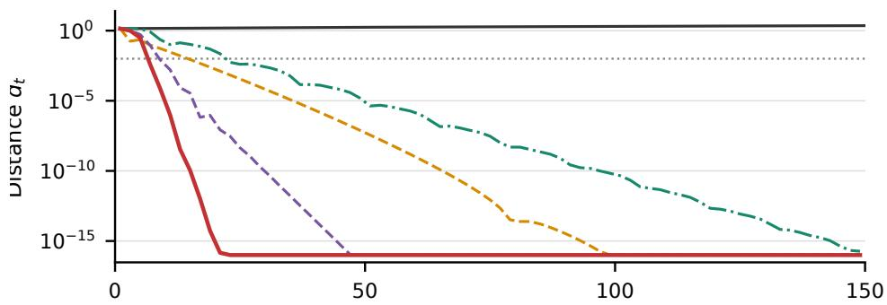
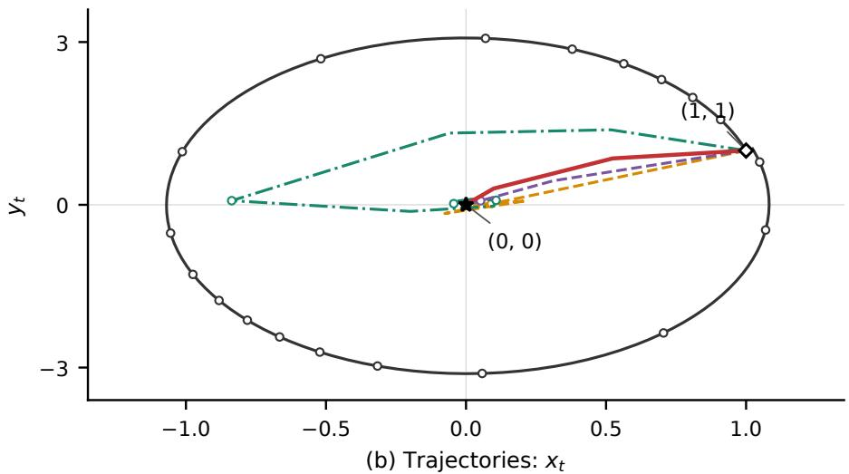
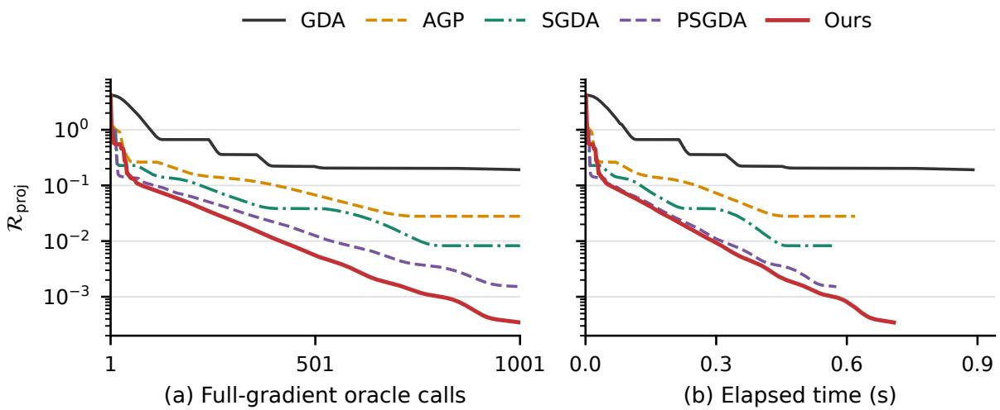

# Matching Multi-Loop Complexities with a Single Loop: Optimal Optimization Stationarity and Best-Known Game Stationarity in Nonconvex–Concave Minimax Optimization

Minhao Zhang1 and Zi Xu1\*

1\*Department of Mathematics, College of Sciences, Shanghai University, Shanghai, 200444, P.R.China.

## Abstract

\*Corresponding author(s). E-mail(s): xuzi@shu.edu.cn; Contributing authors: zhangminhao@shu.edu.cn;

We introduce a new single-loop algorithmic framework for smooth nonconvex–concave minimax optimization. The resulting projected damped extragradient method combines projected extragradient updates, dual momentum, and a moving proximal center. Under both the optimizationstationarity and game-stationarity criteria, our method achieves the best-known complexity among single-loop first-order methods. For optimization stationarity, our method achieves a gradient complexity of $\mathcal { O } ( L ^ { 2 } D _ { Y } \bar { \Delta } _ { 0 } \varepsilon ^ { - 3 } )$ , where L is the gradient Lipschitz constant, D bounds the diameter of the dual feasible set, and $\bar { \Delta } _ { \mathbf { 0 } }$ is an initialization quantity involving the value-function gap and the initial gradients. Moreover, by incorporating a fixed-center warm-up phase, the complexity can be improved to $\mathcal { O } ( L ^ { 2 } D _ { Y } \pmb { \Delta } _ { \phi } \varepsilon ^ { - 3 } )$ , up to an additive lower-order cost, where $\Delta _ { \phi } : = \phi ( x _ { 0 } ) - \mathbf { i n f } _ { x } \phi ( x )$ . We further establish a lower bound of $\Omega ( L ^ { 2 } D _ { Y } \pmb { \Delta } _ { \phi } \varepsilon ^ { - 3 } )$ for optimization stationarity over projected zero-respecting first-order methods. This lower bound proves that the warm-started version of our algorithm is optimal up to a constant factor for optimization stationarity within this oracle class. For game stationarity, our method achieves $\mathcal { O } \left( L ^ { 3 / 2 } D _ { Y } ^ { 1 / 2 } \Delta _ { \phi } \varepsilon ^ { - 5 / 2 } \right)$ gradient complexity. This matches the best-known complexity of multi-loop first-order methods, thereby establishing the same complexity with a single-loop algorithmic structure. Under dual strong concavity, the proposed framework achieves $\mathcal { O } \big ( \sqrt { \kappa } L \Delta _ { \phi } \varepsilon ^ { - 2 } \big )$ leading complexity for both stationarity criteria, where $\kappa = L / \mu$ is the dual condition number, up to an additive initialization cost. The $\varepsilon ^ { - 2 }$ accuracy dependence is optimal under fixed regularity and initialization bounds.

Keywords: Minimax optimization, Nonconvex optimization, Single-loop methods, Extragradient methods, Oracle complexity, Lyapunov analysis

## 1 Introduction

We study the deterministic nonconvex–concave (NC–C) minimax problem

$$
\operatorname* { m i n } _ { x \in X } \operatorname* { m a x } _ { y \in Y } f ( x , y ) ,
$$

where X is nonempty, closed, and convex, Y is nonempty, compact, and convex, and f has an L-Lipschitz continuous gradient. The objective is possibly nonconvex in x and concave in y. Smooth instances arise in distributionally robust learning [1], group robust learning [2], and learning with average top-k losses [3]. In these applications, the dual variable weights samples or groups, or selects large losses, while the primal variable parametrizes a possibly nonconvex model. A central algorithmic challenge is to attain sharp stationarity guarantees using simple first-order updates, without repeatedly solving auxiliary optimization problems.

Two stationarity criteria are relevant to this problem. Optimization stationarity (OS) measures the gradient of a Moreau envelope of the value function $\phi ( x ) = \mathrm { m a x } _ { y \in Y } f ( x , y )$ , extended by +∞ outside X. Game stationarity (GS) measures the joint first-order residual of $f ,$ including the normal cones to X and Y. These criteria capture diferent aspects of stationarity and must also be distinguished from the value-gradient and projected-gradient-mapping criteria used in earlier works. Their formal definitions are given in Section 2. In the literature review below, complexity bounds suppress fixed smoothness, domain, and initialization quantities unless displayed explicitly; Oe additionally suppresses logarithmic factors.

Dual strong concavity provides an important point of comparison. In the nonconvex–strongly concave $\left( \mathrm { N C - S C } \right)$ setting, let $\mu > 0$ be the strong concavity parameter and write $\kappa = L / \mu$ . For an unconstrained primal variable, two-timescale gradient descent ascent (TS-GDA) attains $O ( \kappa ^ { 2 } \varepsilon ^ { - 2 } )$ complexity for value-gradient stationarity [4, 5]. Under a dual Polyak– Lojasiewicz condition on unconstrained domains, Smoothed-AGDA improves the dependence to $O ( \kappa \varepsilon ^ { - 2 } )$ for GS, with a terminal refinement giving the same leading order for value-gradient stationarity [6]. Minimax-PPA and Catalyst-EG/OGDA attain $\widetilde { O } ( \sqrt { \kappa } \varepsilon ^ { - 2 } )$ complexity under strong concavity [7, 8]. The single-loop mirror descent ascent method MDA also reports ${ \cal O } ( \sqrt { \kappa } \varepsilon ^ { - 2 } )$ complexity under its prescribed mirror geometry and mirror-gradient-mapping criterion [9]. Lower bounds of $\Omega ( \sqrt { \kappa } L \Delta _ { \phi } \varepsilon ^ { - 2 } )$ are known for value-gradient stationarity in the corresponding unconstrained oracle models [8, 10], where $\begin{array} { r } { \Delta _ { \phi } = \phi ( x _ { 0 } ) - \operatorname* { i n f } _ { x \in X } \phi ( x ) } \end{array}$

The general NC–C setting is more dificult because the value function can be nonsmooth. Multiloop methods address this dificulty by solving auxiliary optimization problems. Prox-DIAG [11] and Minimax-PPA [7] attain $\widetilde { O } ( \varepsilon ^ { - 3 } )$ complexity for OS. Minimax-PPA also gives $\widetilde { O } ( \varepsilon ^ { - 5 / 2 } )$ complexity under its game-stationarity formulation. Li et al. [12] develop Perturbed Smoothed FOAM, which attains $\widetilde { \cal O } ( \varepsilon ^ { - 3 } )$ for OS and $\widetilde { O } ( \varepsilon ^ { - 5 / 2 } )$ for GS. These methods obtain their guarantees through regularized strongly convex–strongly concave subproblems, whose solution requires inner iterations.

Single-loop methods use a fixed number of elementary first-order updates per iteration, but their representative NC–C guarantees have been weaker. TS-GDA has an $\dot { O ( \varepsilon ^ { - 6 } ) }$ OS bound under an additional primal Lipschitz assumption [4, 5], while AGP attains $O ( \varepsilon ^ { - 4 } )$ under a projected primal–dual gradient-mapping criterion on compact convex domains [13]. The analysis of Li et al. [12] establishes $\check { O } ( \varepsilon ^ { - 4 } )$ complexity for Smoothed GDA under both OS and GS. Their Perturbed Smoothed GDA improves the GS bound to $O ( \varepsilon ^ { - 3 } )$ , while retaining an $O ( \varepsilon ^ { - 4 } )$ OS bound. Thus, under both criteria, a complexity gap remains between these single-loop methods and methods that rely on auxiliary solvers. This motivates the following question:

Can a single-loop first-order method attain the best-known multi-loop complexity rates under both OS and GS, and can its complexity be certified as optimal by a matching lower bound?

We answer the algorithmic question afirmatively under both stationarity criteria and establish a matching lower bound for OS. Our method achieves the best-known complexity among single-loop first-order methods under both OS and GS. Its warm-started OS complexity is optimal up to a constant factor within the projected zero-respecting first-order oracle class, while its GS complexity matches the best-known rate of multi-loop first-order methods. The same framework also attains the sharp $O ( \sqrt { \kappa } \varepsilon ^ { - 2 } )$ dependence under dual strong concavity. Our contributions are as follows; $D _ { Y }$ denotes an upper bound on the dual diameter.

1. A new single-loop algorithm and Lyapunov analysis. We develop a projected damped extragradient framework combining projected prediction–correction steps, dual momentum, and a moving proximal center. A new joint Lyapunov function couples descent of a regularized envelope with tracking of its saddle point, allowing both efects to be controlled within a single loop. A predetermined fixed-center warm-up reduces the initialization dependence while using the same elementary updates, without resetting the state or introducing repeated inner solves.

2. Optimal OS complexity and a matching lower bound. For NC–C problems, the method achieves gradient complexity

$$
{ \cal O } \left( L ^ { 2 } D _ { Y } \bar { \Delta } _ { 0 } \varepsilon ^ { - 3 } \right) ,
$$

where $\bar { \Delta } _ { 0 }$ involves the initial value-function gap and initial gradients. The fixed-center warm-up improves this bound to

$$
{ \cal O } \left( L ^ { 2 } D _ { Y } \Delta _ { \phi } \varepsilon ^ { - 3 } \right) ,
$$

up to an additive lower-order cost, with an expected squared Moreau-gradient guarantee (Corollary 4.3). We also prove the lower bound

$$
\Omega \big ( L ^ { 2 } D _ { Y } \Delta _ { \phi } \varepsilon ^ { - 3 } \big )
$$

for projected zero-respecting first-order methods, including randomized output rules at a fixed query budget (Theorem 5.1). The upper and lower bounds match in their dependence on $L , D _ { Y } , \Delta _ { \phi }$ and $\varepsilon ,$ establishing optimality up to a constant factor for the leading warm-started OS complexity within this oracle class.

3. Multi-loop GS complexity attained with a single loop. For NC–C problems, the warm-started method returns a deterministic best-certificate iterate with leading gradient complexity

$$
{ \cal O } \left( L ^ { 3 / 2 } D _ { Y } ^ { 1 / 2 } \Delta _ { \phi } \varepsilon ^ { - 5 / 2 } \right) ,
$$

with an additive lower-order warm-up cost (Corollary 4.4). To the best of our knowledge, this is the first single-loop method to attain the best-known $\bar { \varepsilon } ^ { - 5 / 2 }$ GS complexity of multi-loop first-order methods for general smooth NC–C problems. The leading term has no multiplicative logarithmic factor.

4. A common framework for the strongly concave case. Under dual strong concavity, the same framework requires no dual perturbation and yields $O ( \sqrt { \kappa } L \Delta _ { 0 } \varepsilon ^ { - 2 } )$ complexity for both OS and GS, where $\Delta _ { 0 }$ is the corresponding initialization quantity. With the fixed-center warm-up, the leading complexity becomes

$$
O \big ( \sqrt { \kappa } L \Delta _ { \phi } \varepsilon ^ { - 2 } \big )
$$

for fixed problem and initialization quantities with $\Delta _ { \phi } > 0$ as $\varepsilon \downarrow 0$ (Corollary 4.2). This dependence matches the known NC–SC lower-bound rate for value-gradient stationarity in the corresponding unconstrained oracle models.

Table 1 compares our NC–C upper bounds with representative single- and multi-loop first-order methods and records the OS lower bound established in this paper.

Organization. Section 2 states the assumptions and stationarity criteria. Section 3 presents the algorithm. Section 4 develops the common Lyapunov analysis and establishes the NC–SC and NC–C complexity bounds, together with the warm-up refinement. Section 5 proves the matching OS lower bound and specifies the oracle class in which the leading warm-started complexity is optimal. Section 6 presents numerical illustrations, and Section $7$ concludes. The appendices contain the technical proofs. Notation. We use $\langle \cdot , \cdot \rangle$ and ∥·∥ for the Euclidean inner product and norm, respectively, with $\| ( x , y ) \| ^ { 2 } = \| x \| ^ { 2 } + \| y \| ^ { 2 }$ on product spaces. For matrices, ∥·∥ denotes the spectral norm. For a nonempty closed convex set $C \subseteq \mathbb { R } ^ { d }$ , let $\Pi _ { C } ( w ) : = \mathrm { a r g m i n } _ { u \in C } \lVert u - w \rVert ^ { 2 } / 2$ be the Euclidean projection onto C, and let $N _ { C } ( u ) : = \{ \eta \in \mathbb { R } ^ { d } : \langle \eta , a - u \rangle \leq 0$ for all $a \in C \}$ be its normal cone at $u \in C$ . For a nonempty set $S ,$ , write dist $( w , S ) : = \operatorname* { i n f } _ { u \in S } \| w - u \|$ and diam $\begin{array} { r } { \mathbf { \rho } _ { \cdot } ( S ) : = \operatorname* { s u p } _ { u , v \in S } \| u - v \| } \end{array}$ . The support of a vector u is $\operatorname { s u p p } ( u ) : = \{ i : u _ { i } \neq 0 \}$ , and E denotes expectation over all randomness.

## 2 Problem Formulation and Preliminaries

## 2.1 Problem setting and assumptions

We consider the deterministic minimax problem

$$
\operatorname* { m i n } _ { x \in X } \operatorname* { m a x } _ { y \in Y } f ( x , y ) ,\tag{2.1}
$$

where $X \subseteq \mathbb { R } ^ { n }$ is nonempty, closed, and convex, and $Y \subseteq \mathbb { R } ^ { p }$ is nonempty, compact, and convex. Let $D _ { Y } > 0$ be an upper bound on the diameter of $Y$ . After a translation of the dual coordinates, we assume $0 \in Y$ , so that $\| y \| \leq D _ { Y }$ for every $y \in Y$

Assumption 2.1 The function $f$ is continuously diferentiable on an open neighborhood of $X \times Y$ and satisfies the following conditions.

(i) For some $L > 0$ and all $( x , y ) , ( x ^ { \prime } , y ^ { \prime } ) \in X \times Y .$

$$
\| \nabla f ( x ^ { \prime } , y ^ { \prime } ) - \nabla f ( x , y ) \| \leq L \| ( x ^ { \prime } - x , y ^ { \prime } - y ) \| .\tag{2.2}
$$

Table 1 First-order oracle complexity bounds for NC–C minimax optimization, with problem and initialization parameters.
<table><tr><td>Algorithm</td><td>Optimization stationarity</td><td>Game stationarity</td></tr><tr><td colspan="3">Single-loop algorithms</td></tr><tr><td>TS-GDA [4, 5]</td><td> $O \left( \frac { L ^ { 3 } L _ { f } ^ { 2 } D _ { Y } ^ { 2 } \Delta _ { \phi } } { \varepsilon ^ { 6 } } \right)$ </td><td> $O \left( \frac { L ^ { 3 } L _ { f } ^ { 2 } D _ { Y } ^ { 2 } \Delta _ { \phi } } { \varepsilon ^ { 6 } } \right)$ </td></tr><tr><td>Smoothed GDA [12]</td><td> $O \left( \frac { L ^ { 3 } D _ { Y } ^ { 2 } \Delta _ { \Psi _ { 2 } } } { \varepsilon ^ { 4 } } \right) ^ { \prime }$ </td><td> $O \bigg ( \frac { L ^ { 3 } D _ { Y } ^ { 2 } \Delta _ { \Psi _ { 2 } } } { \varepsilon ^ { 4 } } \bigg ) ^ { \prime }$ </td></tr><tr><td>Perturbed GDA [12, 13]</td><td> $O \left( \frac { L ^ { 5 } D _ { Y } ^ { 4 } \Delta _ { \Psi _ { 1 } } } { \varepsilon ^ { 6 } } \right)$ </td><td> $O \left( { \frac { L ^ { 3 } D _ { Y } ^ { 2 } \Delta _ { \Psi _ { 1 } } } { \varepsilon ^ { 4 } } } \right)$ </td></tr><tr><td>Perturbed Smoothed</td><td> ${ \cal O } \left( \frac { L ^ { 3 } D _ { Y } ^ { 2 } \Delta _ { \Psi _ { 2 } } } { \varepsilon ^ { 4 } } \right)$ </td><td> $O \left( \frac { L ^ { 2 } D _ { Y } \Delta _ { \Psi _ { 2 } } } { \varepsilon ^ { 3 } } \right)$ </td></tr><tr><td>GDA [12]</td><td></td><td></td></tr><tr><td>Ours (Algorithm 1)</td><td> $O \left( \frac { L ^ { 2 } D _ { Y } \bar { \Delta } _ { 0 } } { \varepsilon ^ { 3 } } \right)$ </td><td> $O \left( \frac { L ^ { 3 / 2 } D _ { Y } ^ { 1 / 2 } \bar { \Delta } _ { 0 } } { \varepsilon ^ { 5 / 2 } } \right)$ </td></tr><tr><td>Ours with warm-up (Algorithm 2)</td><td> $O \left( \frac { L ^ { 2 } D _ { Y } \Delta _ { \phi } } { \varepsilon ^ { 3 } } \right)$ </td><td> $O \left( \frac { L ^ { 3 / 2 } D _ { Y } ^ { 1 / 2 } \Delta _ { \phi } } { \varepsilon ^ { 5 / 2 } } \right)$ </td></tr><tr><td colspan="3">Multi-loop algorithms</td></tr><tr><td>Prox-DIAG [11]</td><td> $\widetilde { \cal O } \left( \frac { L ^ { 2 } D _ { Y } \Delta _ { \phi } } { \varepsilon ^ { 3 } } \right)$ </td><td> $\widetilde { \cal O } \left( \frac { L ^ { 2 } D _ { Y } \Delta _ { \phi } } { \varepsilon ^ { 3 } } \right)$ </td></tr><tr><td>Minimax-PPA [7]</td><td> $\widetilde { \cal O } \left( \frac { L ^ { 2 } D _ { Y } \Delta _ { \phi } } { \varepsilon ^ { 3 } } \right)$ </td><td> $\widetilde { \cal O } \left( \frac { \dot { L } ^ { 3 / 2 } D _ { Y } ^ { 1 / 2 } \Delta _ { \phi } ^ { ' } } { \varepsilon ^ { 5 / 2 } } \right)$ </td></tr><tr><td>Perturbed Smoothed FOAM [12]</td><td> $\widetilde O \left( \frac { L ^ { 2 } D _ { Y } \Delta _ { p _ { 0 } } } { \varepsilon ^ { 3 } } \right)$ </td><td> $\widetilde { O } \left( \frac { L ^ { 3 / 2 } D _ { Y } ^ { 1 / 2 } \Delta _ { p _ { 0 } } } { \varepsilon ^ { 5 / 2 } } \right)$ </td></tr><tr><td>Lower bound (this</td><td> $\Omega \left( \frac { L ^ { 2 } D _ { Y } \Delta _ { \phi } } { \varepsilon ^ { 3 } } \right)$ </td><td></td></tr></table>

Note. DY bounds the dual diameter, $L _ { f }$ is the additional primal Lipschitz constant required by TS-GDA, and $\Delta _ { \phi } = \phi ( x _ { 0 } ) - \phi _ { \mathrm { i n f } }$ , where ϕinf = infx∈X ϕ(x). The quantities $\Delta \Psi _ { 1 }$ and $\Delta _ { \Psi _ { 2 } }$ are the initial potential gaps in [12, Definition 3.1], evaluated with each method’s corresponding perturbation. The quantity $\Delta _ { p _ { 0 } }$ is the initial regularized-envelope gap in [12, Theorem 6.1]. The lower-bound row concerns OS and applies to the projected zero-respecting first-order oracle class. The warm-up row reports leading terms for fixed problem and initialization quantities with $\Delta _ { \phi } > 0$ as ε ↓ 0; the full bound, including the additive warm-up cost, is given in (4.38).

(ii) For some $0 \le \mu \le L$ , the function $f ( x , \cdot )$ is µ-strongly concave on Y for every x $\in X ;$ namely,

$$
f ( x , y ^ { \prime } ) \leq f ( x , y ) + \langle \nabla _ { y } f ( x , y ) , y ^ { \prime } - y \rangle - { \frac { \mu } { 2 } } \| y ^ { \prime } - y \| ^ { 2 } , \qquad y , y ^ { \prime } \in Y .\tag{2.3}
$$

(iii) The value function is bounded below:

$$
\operatorname* { i n f } _ { x \in X } \operatorname* { m a x } _ { y \in Y } f ( x , y ) > - \infty .\tag{2.4}
$$

Define the extended-valued value function of (2.1) by

$$
\phi ( x ) = { \left\{ \begin{array} { l l } { \operatorname* { m a x } _ { y \in Y } f ( x , y ) , } & { x \in X , } \\ { + \infty , } & { x \not \in X . } \end{array} \right. }\tag{2.5}
$$

By (2.4), we have $\begin{array} { r } { \phi _ { \mathrm { i n f } } : = \operatorname* { i n f } _ { x \in X } \phi ( x ) > - \infty } \end{array}$ . When $\mu > 0$ , the maximizer over $Y$ is unique and the finite-valued mapping $x \mapsto \operatorname* { m a x } _ { y \in Y } f ( x , y )$ is diferentiable at every $x \in X$ . When $\mu = 0$ , this mapping may be nonsmooth even though $f$ is smooth, motivating the use of the Moreau envelope to study

stationarity. For $\lambda > L$ , define the Moreau envelope and proximal mapping of $\phi$ by

$$
\Phi _ { \lambda } ( z ) = \operatorname* { m i n } _ { x \in X } \left\{ \phi ( x ) + { \frac { \lambda } { 2 } } \| x - z \| ^ { 2 } \right\} ,\tag{2.6}
$$

$$
\bar { x } ( z ) = \mathrm { p r o x } _ { \phi / \lambda } ( z ) = \underset { x \in X } { \mathrm { a r g m i n } } \left. \phi ( x ) + \frac { \lambda } { 2 } \| x - z \| ^ { 2 } \right. .\tag{2.7}
$$

The function $\phi$ is L-weakly convex. Thus the minimizer in (2.7) is unique and

$$
\nabla \Phi _ { \lambda } ( z ) = \lambda \bigl ( z - \bar { x } ( z ) \bigr ) .\tag{2.8}
$$

For properties of the value function $\phi$ and its Moreau envelope $\Phi _ { \lambda } .$ see [5].

## 2.2 Stationarity measures

We use two stationarity criteria for (2.1): optimization stationarity (OS), based on the Moreau envelope of the value function, and game stationarity (GS), based on first-order residuals in both variables.

Definition 2.1 (ε-optimization stationary point) For $\lambda > L$ and $\varepsilon > 0$ , a point $x \in X$ is an ε-optimization stationary point relative to λ if

$$
\| \nabla \Phi _ { \lambda } ( x ) \| \leq \varepsilon .\tag{2.9}
$$

A random point $Z \in X$ almost surely is ε-optimization stationary in expectation relative to $\lambda { \mathrm { i f } }$

$$
\mathbb { E } \| \nabla \Phi _ { \lambda } ( Z ) \| \le \varepsilon .
$$

The OS upper bounds below establish the stronger guarantee $\mathbb { E } \| \nabla \Phi _ { \lambda } ( Z ) \| ^ { 2 } \le \varepsilon ^ { 2 }$ , which implies this expected-norm criterion by Jensen’s inequality.

For game stationarity, define the residual at $( x , y ) \in X \times Y$ by

$$
\begin{array} { r } { \mathcal { R } ( x , y ) = \sqrt { \mathrm { d i s t } ^ { 2 } \big ( 0 , \nabla _ { x } f ( x , y ) + N _ { X } ( x ) \big ) + \mathrm { d i s t } ^ { 2 } \big ( 0 , - \nabla _ { y } f ( x , y ) + N _ { Y } ( y ) \big ) } . } \end{array}\tag{2.10}
$$

Definition 2.2 (ε-game stationary point) For $\varepsilon > 0 ,$ , a pair $( x , y ) \in X \times Y$ is an ε-game stationary point of (2.1) if

$$
\mathcal { R } ( x , y ) \leq \varepsilon .\tag{2.11}
$$

For further discussion of these stationarity criteria and their relationships, see [5, 12].

## 3 Algorithm

## 3.1 Regularized saddle-point formulation

We first introduce a regularized saddle-point problem. Fix $\lambda > L$ and choose $\tau \geq 0$ such that $\mu _ { y } : = \mu + \tau > 0$ . For a center $z \in \mathbb { R } ^ { n }$ , define

$$
p ( z ) = \operatorname* { m i n } _ { x \in X } \operatorname* { m a x } _ { y \in Y } G ( x , y ; z ) ,\tag{3.1}
$$

where

$$
G ( x , y ; z ) = f ( x , y ) + \frac { \lambda } { 2 } \| x - z \| ^ { 2 } - \frac { \tau } { 2 } \| y \| ^ { 2 } .
$$

The function $G ( \cdot , \cdot ; z )$ is $( \lambda - L )$ -strongly convex in x and $\mu _ { y }$ -strongly concave in y, so the auxiliary problem has a unique saddle point $( x ^ { \star } ( z ) , y ^ { \star } ( z ) )$ . Write $\displaystyle \dot { G } ^ { \star } ( z ) = G ( x ^ { \star } ( z ) , y ^ { \star } ( z ) ; z ) = p ( z )$ . The envelope is continuously diferentiable and

$$
\nabla p ( z ) = \lambda \big ( z - x ^ { \star } ( z ) \big ) .\tag{3.2}
$$

For this regularized formulation and its envelope properties, see [12, Sections 3.1 and 6]. If $\tau = 0$ then $p = \Phi \lambda$ . Positive τ supplies the dual curvature needed when the original problem is merely concave. The same auxiliary problem is used by Li et al. [12], whereas our method employs diferent primal–dual updates and a diferent Lyapunov function.

## 3.2 Algorithm and implementation

We now use the regularized saddle-point formulation (3.1) to construct a single-loop method. At iteration $t ,$ with $z = z _ { t }$ fixed, we apply a projected extragradient step with dual momentum: a prediction is followed by a correction using gradients at the predicted pair. We then update $z _ { t }$ toward the corrected primal iterate $x _ { t + 1 }$ . The complete procedure is presented in Algorithm 1.

Algorithm 1 Single-loop projected damped extragradient method   
Input: x ∈ X, y ∈ Y, T ≥ 1; λ > L, τ ≥ 0, µ + τ > 0, h > 0, 0 < α < 1, γ ≥ 0, 0 < β ≤ 1.   
1: Initialize z = x and ξ = n = v = 0.   
2: for t = 0, . . . , T − 1 do   
3: xe = Π (x − h[∇ G(x , y ; z ) + ξ ]).   
4: ye = Π (y + h[∇ G(x , y ; z ) − n + v ]).   
5: v¯ = αv + (1 − α)γ∇ G(xe , ye ; z ).   
6: x = Π (x − h∇ G(xe , ye ; z )).   
7: ξt+1 = (xt − xt+1)/h − ∇xG(xet, yet; zt).   
8: yt+1 = ΠY (yt + h[∇yG(xet, yet; zt) + ¯vt]).   
(yt − yt+1)/h + ∇yG(xet, yet; zt) + ¯vt   
9: nt+1 =   
1 + (1 − α)γ   
10: v = αv + (1 − α)γ[∇ G(x , y ; z ) − n ].   
11: zt+1 = zt + β(xt+1 − zt).   
12: end for   
Output: OS: zout = zJ with J ∼ Unif{0, . . . , T − 1}.   
Optional GS: (xout, yout) = (xj+1, yj+1) with j ∈ argmin0≤t<T St.

The subproblem iteration is a modified version of the damped extragradient method developed in our unpublished manuscript on unconstrained strongly convex–strongly concave minimax optimization. To handle the constraints $X$ and $Y _ { z }$ we introduce projections and the normal-cone variables $\xi _ { t }$ and $n _ { t }$ . The dual correction $n _ { t }$ enters both the prediction and momentum updates. The following lemma shows that these variables belong to the normal cones at the corresponding iterates.

Lemma 3.1 The iterates of Algorithm 1 satisfy

$$
\xi _ { t } \in N _ { X } ( x _ { t } ) , \qquad n _ { t } \in N _ { Y } ( y _ { t } ) , \qquad t = 0 , \ldots , T .\tag{3.3}
$$

Proof At initialization, both normal-cone inequalities hold because $\xi _ { 0 } = n _ { 0 } = 0$ . For any $x \in X$ , the projection theorem applied to the primal correction gives

$$
\Big \langle \frac { x _ { t } - x _ { t + 1 } } { h } - \nabla _ { x } f ( \widetilde { x } _ { t } , \widetilde { y } _ { t } ) - \lambda ( \widetilde { x } _ { t } - z _ { t } ) , x - x _ { t + 1 } \Big \rangle \leq 0 .
$$

By the definition of $\xi _ { t + 1 }$ , this is $\langle \xi _ { t + 1 } , x - x _ { t + 1 } \rangle \leq 0$ . Similarly, for any $y \in Y ,$ , the dual projection gives

$$
\Big \langle \frac { y _ { t } - y _ { t + 1 } } { h } + \nabla _ { y } f ( \widetilde { x } _ { t } , \widetilde { y } _ { t } ) - \tau \widetilde { y } _ { t } + \bar { v } _ { t } , y - y _ { t + 1 } \Big \rangle \leq 0 .
$$

The first argument is $[ 1 + ( 1 - \alpha ) \gamma ] n _ { t + 1 }$ . Since $1 + ( 1 - \alpha ) \gamma > 0$ , division yields $\langle n _ { t + 1 } , y - y _ { t + 1 } \rangle \leq 0$ . As $x \in X$ and $y \in Y$ are arbitrary, these inequalities prove $\xi _ { t + 1 } \in N _ { X } ( x _ { t + 1 } )$ and $n _ { t + 1 } \in N _ { Y } ( y _ { t + 1 } )$ □

To implement the game-stationarity output in Algorithm $^ { 1 , }$ define the computable certificate at each corrected iterate by

$$
S _ { t } = \| \nabla _ { x } f ( x _ { t + 1 } , y _ { t + 1 } ) + \xi _ { t + 1 } \| ^ { 2 } + \| - \nabla _ { y } f ( x _ { t + 1 } , y _ { t + 1 } ) + \tau y _ { t + 1 } + n _ { t + 1 } \| ^ { 2 } .\tag{3.4}
$$

The quantity $S _ { t }$ is the squared norm of a stationarity residual for the dual-regularized objective $f ( x , y ) - \tau \| y \| ^ { 2 } / 2$ , evaluated using the normal-cone vectors supplied by the algorithm. It is used to select the game-stationarity output. The following lemma relates this certificate and the auxiliary envelope gradient to the stationarity measures of the original problem. Its proof is given in Appendix C.1.

Lemma 3.2 Suppose that Assumption 2.1 holds, $\tau \geq 0 , \lambda > L$ , and $\mu + \tau > 0$ . Then the iterates of Algorithm 1 satisfy

$$
\mathcal { R } ( x _ { t + 1 } , y _ { t + 1 } ) \leq \sqrt { S _ { t } } + \tau D _ { Y }\tag{3.5}
$$

Moreover, for every $z \in \mathbb { R } ^ { n }$

$$
\| \nabla \Phi _ { \lambda } ( z ) - \nabla p ( z ) \| \leq \lambda D _ { Y } \sqrt { \frac { \tau } { \lambda - L } } .\tag{3.6}
$$

Consequently, for every iterate $z _ { t }$

$$
\| \nabla \Phi _ { \lambda } ( z _ { t } ) \| \leq \| \nabla p ( z _ { t } ) \| + \lambda D _ { Y } \sqrt { \frac { \tau } { \lambda - L } } .\tag{3.7}
$$

In particular, $i f \tau = 0 .$ , then $\| \nabla \Phi _ { \lambda } ( z _ { t } ) \| = \| \nabla p ( z _ { t } ) \|$ ∥.

Game stationarity incurs a bias linear in τ, whereas the envelope gradient incurs a bias proportional to $\sqrt { \tau }$ . These diferent dependences determine the two regularization choices in the concave case.

We count one full first-order oracle call at $( x , y )$ as returning $( \nabla _ { x } f ( x , y ) , \nabla _ { y } f ( x , y ) )$ . After one call at $( x _ { 0 } , y _ { 0 } )$ , each iteration queries only the predicted and corrected pairs. The corrected-point gradient is used for the momentum update and $S _ { t }$ , then cached for the next prediction. Thus $T$ iterations require at most $1 + 2 T$ calls; the regularization terms are computed explicitly.

## 4 Convergence and Complexity Analysis

We first establish the Lyapunov and residual estimates shared by both regimes. We then present the $\mathrm { N C - S C }$ and $\mathrm { N C - C }$ complexity bounds in Sections 4.1 and 4.2, respectively, and give a common fixed-center warm-up refinement in Section 4.3. The common descent proof is in Appendices A–B; the initialization, output, and complexity arguments are collected in Appendix C.

## Common Lyapunov estimates.

Throughout this section, we set $\lambda = 2 L$ and $\mathrm { f i x } \ \tau \geq 0$ such that $0 < \mu _ { y } \le L$ . The center update decreases $p$ up to an error proportional to $\| x _ { t + 1 } - x ^ { \star } ( z _ { t } ) \| ^ { 2 }$ . Since the algorithm makes only one auxiliary update before moving the center, this error must be controlled together with the auxiliary dynamics. Let $w _ { t } = ( x _ { t } , y _ { t } , \xi _ { t } , n _ { t } , v _ { t } )$ and define

$$
\mathcal { V } _ { t } : = p ( z _ { t } ) - \operatorname* { i n f } _ { z } p ( z ) + \mathcal { E } _ { z _ { t } } ( w _ { t } ) + \frac { \sqrt { 2 L \mu _ { y } } } { 2 5 6 L ^ { 2 } } \| v _ { t } \| ^ { 2 } .\tag{4.1}
$$

The first two terms together form the optimality gap of the auxiliary envelope, while the last two terms measure the error in tracking its saddle point. For $x \in X , y \in Y , \xi \in N _ { X } ( x ) , n \in N _ { Y } ( y )$ , and arbitrary $v ,$ write $w = ( x , y , \xi , n , v )$ and set

$$
\begin{array} { l } { \displaystyle \mathcal { E } _ { z } ( w ) : = - \frac { 1 6 L - \sqrt { 2 L \mu _ { y } } } { 1 6 L } \big ( G ( x , y ; z ) - G ^ { \star } ( z ) \big ) + \frac { 1 } { L } \| \nabla _ { x } G ( x , y ; z ) + \xi \| ^ { 2 } } \\ { \displaystyle \qquad + \frac { 1 } { L } \| - \nabla _ { y } G ( x , y ; z ) + n - v \| ^ { 2 } + \frac { \sqrt { 2 L \mu _ { y } } } { 1 6 L } \langle v , y - y ^ { \star } ( z ) \rangle + \frac { \mu _ { y } } { 2 5 6 } \| y - y ^ { \star } ( z ) \| ^ { 2 } . } \end{array}\tag{4.2}
$$

The residual and momentum terms are chosen so that their decrease absorbs the tracking error in the envelope estimate below.

We now specify the algorithm parameters used in the descent analysis. A Lipschitz constant for the full gradient of $G ( \cdot , \cdot ; z )$ is $L _ { G } : = 3 L + \tau \leq 4 L$ . Choose

$$
\begin{array} { c } { { h = \displaystyle \frac { 1 } { 6 4 L _ { G } } , \qquad \alpha = \left( 1 + \frac { h \sqrt { 2 L \mu _ { y } } } { 1 6 } \right) ^ { - 1 } , \qquad \gamma = 4 \sqrt { \frac { 2 L } { \mu _ { y } } } - 1 , } } \\ { { ( 1 - \alpha ) \gamma = \displaystyle \frac { h ( 8 L - \sqrt { 2 L \mu _ { y } } ) } { 1 6 + h \sqrt { 2 L \mu _ { y } } } , \qquad \beta = \displaystyle \frac { h \sqrt { 2 L \mu _ { y } } } { 4 0 9 6 } . } } \end{array}\tag{4.3}
$$

The parameters of Algorithm 1 remain fixed during a run. The parameter τ is chosen to balance the convergence bound and the bias in the stationarity measure of the original problem.

Lemma 4.1 Suppose that Assumption 2.1 holds and the parameters are chosen as in (4.3). Then the center update satisfies

$$
p ( z _ { t + 1 } ) - p ( z _ { t } ) \leq - \frac { \beta } { 4 L } \| \nabla p ( z _ { t } ) \| ^ { 2 } + \frac { 5 } { 2 } \beta L \| x _ { t + 1 } - x ^ { \star } ( z _ { t } ) \| ^ { 2 } .\tag{4.4}
$$

Lemma 4.2 Under Assumption 2.1 and the parameter choice (4.3),

$$
\mathcal { E } _ { z _ { t + 1 } } ( w _ { t + 1 } ) - \mathcal { E } _ { z _ { t } } ( w _ { t } ) + \frac { \sqrt { 2 L \mu _ { y } } } { 2 5 6 L ^ { 2 } } \big ( \| v _ { t + 1 } \| ^ { 2 } - \| v _ { t } \| ^ { 2 } \big ) \leq - \frac { 5 } { 2 } \beta L \| x _ { t + 1 } - x ^ { \star } ( z _ { t } ) \| ^ { 2 } + \frac { \beta } { 8 L } \| \nabla p ( z _ { t } ) \| ^ { 2 } .\tag{4.5}
$$

Define the one-step dissipation at the center $z _ { t }$ by

$$
\begin{array} { l } { \displaystyle \mathcal { D } _ { z t } ( w _ { t + 1 } , w _ { t } ) : = \frac { h } { 4 } \| \nabla _ { x } G ( x _ { t + 1 } , y _ { t + 1 } ; z _ { t } ) + \xi _ { t + 1 } \| ^ { 2 } } \\ { \displaystyle \qquad + \frac { 3 h \sqrt { 2 L \mu _ { y } } } { 5 1 2 L } \| - \nabla _ { y } G ( x _ { t + 1 } , y _ { t + 1 } ; z _ { t } ) + n _ { t + 1 } - v _ { t + 1 } \| ^ { 2 } + \frac { 7 h \sqrt { 2 L \mu _ { y } } } { 4 0 9 6 L } \| v _ { t + 1 } \| ^ { 2 } } \\ { \displaystyle \qquad + \frac { h \mu _ { y } \sqrt { 2 L \mu _ { y } } } { 1 2 8 } \| y _ { t + 1 } - y ^ { \star } ( z _ { t } ) \| ^ { 2 } + \frac { h \sqrt { 2 L \mu _ { y } } \big ( 1 6 L - \sqrt { 2 L \mu _ { y } } \big ) } { 1 0 2 4 } \| x _ { t + 1 } - x ^ { \star } ( z _ { t } ) \| ^ { 2 } } \\ { \displaystyle \qquad + \frac { 1 } { 4 L } \mathcal { I } _ { z _ { t } } ( w _ { t + 1 } , w _ { t } ) . } \end{array}\tag{4.6}
$$

Here $\mathcal { T } _ { z _ { t } } ( w _ { t + 1 } , w _ { t } )$ is the sum of squared residual increments defined in (B3). All terms in $\mathcal { D } _ { z _ { t } } ( w _ { t + 1 } , w _ { t } )$ are nonnegative.

Theorem 4.1 (Unified Lyapunov descent) Under Assumption 2.1 and the parameter choice (4.3), Algorithm 1 satisfies $\nu _ { t } \geq 0$ for every t. Moreover,

$$
\mathcal { V } _ { t + 1 } - \mathcal { V } _ { t } \leq - \frac { 1 } { 2 } \mathcal { D } _ { z _ { t } } ( w _ { t + 1 } , w _ { t } ) - \frac { \beta } { 8 L } \| \nabla p ( z _ { t } ) \| ^ { 2 } .\tag{4.7}
$$

In particular,

$$
\mathcal { V } _ { t + 1 } - \mathcal { V } _ { t } \leq - \frac { \beta } { 8 L } \| \nabla p ( z _ { t } ) \| ^ { 2 } .\tag{4.8}
$$

For a fixed problem and initial point $( x _ { 0 } , y _ { 0 } )$ , define the initial energy

$$
\Delta _ { \tau } : = \mathcal { V } _ { 0 } = p ( x _ { 0 } ) - \operatorname* { i n f } _ { z } p ( z ) + \mathcal { E } _ { x _ { 0 } } ( x _ { 0 } , y _ { 0 } , 0 , 0 , 0 ) .\tag{4.9}
$$

It depends on $\tau ,$ but is fixed throughout the run.

Lemma 4.3 Under Assumption 2.1 and the parameter choice (4.3), the iterates of Algorithm 1 satisfy, for every integer $T \geq 1$

$$
\sum _ { t = 0 } ^ { T - 1 } S _ { t } \leq \frac { 3 2 L \Delta _ { \tau } } { \beta } , \qquad \sum _ { t = 0 } ^ { T - 1 } \| \nabla p ( z _ { t } ) \| ^ { 2 } \leq \frac { 8 L \Delta _ { \tau } } { \beta } .\tag{4.10}
$$

More generally, let $a \geq 0$ and suppose that the same elementary updates use the moving-center step β for $a \leq t < a + T$ , starting from a feasible state satisfying the normal-cone inclusions. Then

$$
\sum _ { t = a } ^ { a + T - 1 } S _ { t } \leq \frac { 3 2 L \mathcal { V } _ { a } } { \beta } , \qquad \sum _ { t = a } ^ { a + T - 1 } \| \nabla p ( z _ { t } ) \| ^ { 2 } \leq \frac { 8 L \mathcal { V } _ { a } } { \beta } .\tag{4.11}
$$

The state at index a need not have zero normal-cone or momentum variables.

To turn the aggregate estimates in Lemma 4.3 into output guarantees, Algorithm 1 selects the corrected pair minimizing the computable quantity $S _ { t }$ for GS and samples a center uniformly for OS. Lemma 3.2 then transfers the corresponding bounds to the original problem. Neither rule evaluates $\nabla p ( z _ { t } )$ or solves an auxiliary saddle problem exactly.

Corollary 4.1 Under the conditions of Theorem $4 . 1 ,$ the deterministic output satisfies

$$
\mathcal { R } ( x _ { \mathrm { o u t } } , y _ { \mathrm { o u t } } ) \leq \sqrt { S _ { j } } + \tau \| y _ { j + 1 } \| \leq \sqrt { \frac { 3 2 L \Delta _ { \tau } } { \beta T } } + \tau D _ { Y } .\tag{4.12}
$$

The random output $z _ { \mathrm { o u t } } \in X$ satisfies

$$
\mathbb { E } \Vert \nabla p ( z _ { \mathrm { o u t } } ) \Vert ^ { 2 } \leq \frac { 8 L \Delta _ { \tau } } { \beta T }\tag{4.13}
$$

and

$$
\mathbb { E } \| \nabla \Phi _ { 2 L } ( z _ { \mathrm { o u t } } ) \| ^ { 2 } \leq \frac { 1 6 L \Delta _ { \tau } } { \beta T } + 8 L \tau D _ { Y } ^ { 2 } .\tag{4.14}
$$

The expectations are taken with respect to the independently sampled output index $^ { J , }$ while the iterates themselves are generated deterministically.

## 4.1 Nonconvex–strongly concave complexity results

When $\mu > 0$ , taking $\tau = 0$ gives $p = \Phi _ { 2 L }$ . The two output rules give the following OS and GS guarantees for the constrained problem. Write $\kappa = L / \mu$ , and let $\Delta _ { 0 }$ denote the initial energy $\Delta _ { \tau }$ in (4.9) evaluated at $\tau = 0$

Theorem 4.2 (Nonconvex–strongly concave optimization-stationarity complexity) Suppose that Assumption 2.1 holds with $\mu > 0$ $F o r \varepsilon > 0$ , let $\tau = 0 , \mu _ { y } = \mu _ { \mathrm { . } }$ , and $\lambda = 2 L$ , and choose the remaining parameters as in (4.3). Run Algorithm 1 for

$$
\begin{array} { r } { T = \operatorname* { m a x } \bigg \{ 1 , \bigg \lceil \frac { 1 2 8 L \Delta _ { 0 } } { \beta \varepsilon ^ { 2 } } \bigg \rceil \bigg \} } \end{array}\tag{4.15}
$$

iterations. The random center returned by Algorithm 1 satisfies

$$
\begin{array} { r } { \mathbb { E } \| \nabla \Phi _ { 2 L } ( z _ { \mathrm { o u t } } ) \| ^ { 2 } \leq \varepsilon ^ { 2 } . } \end{array}\tag{4.16}
$$

Remark $\ 4 . 1$ For fixed $\Delta _ { 0 } > 0 ;$ , as $\varepsilon \downarrow 0$ , the first-order oracle complexity of Theorem 4.2 is

$$
O \left( \sqrt { \kappa } L \Delta _ { 0 } \varepsilon ^ { - 2 } \right) .\tag{4.17}
$$

Theorem 4.3 (Nonconvex–strongly concave game-stationarity complexity) Under the assumptions and parameter choices of Theorem $4 . 2 ,$ run Algorithm $1 f o r T$ iterations, with $T$ given by (4.15). The deterministic game output satisfies

$$
\mathcal { R } ( x _ { \mathrm { o u t } } , y _ { \mathrm { o u t } } ) \leq \varepsilon .\tag{4.18}
$$

Remark $4 . 2$ For fixed $\Delta _ { 0 } > 0$ , as $\varepsilon \downarrow 0$ , the first-order oracle complexity of Theorem 4.3 is

$$
O \left( \sqrt { \kappa } L \Delta _ { 0 } \varepsilon ^ { - 2 } \right) .\tag{4.19}
$$

The two theorems use the same trajectory and iteration budget; only the output rule difers. Section 4.3 sharpens the leading initialization dependence from $\Delta _ { 0 }$ to the value-function gap by adding a fixed-center warm-up. No warm-up is needed for the baseline bounds above.

## 4.2 Nonconvex–concave complexity results

We next take $\mu = 0$ . We first bound the dependence of the initial energy $\Delta _ { \tau }$ τ on the regularization parameter τ .

Lemma 4.4 Suppose that $\mu = 0 , 0 < \tau \leq L , \mu _ { y } = \tau ,$ and $z _ { 0 } = x _ { 0 }$ , ξ0 = n0 = v0 = 0. Define

$$
\bar { \Delta } _ { 0 } : = \phi ( x _ { 0 } ) - \phi _ { \operatorname* { i n f } } + D _ { Y } \Vert \nabla _ { y } f ( x _ { 0 } , y _ { 0 } ) \Vert + \frac { \Vert \nabla _ { x } f ( x _ { 0 } , y _ { 0 } ) \Vert ^ { 2 } + 2 \Vert \nabla _ { y } f ( x _ { 0 } , y _ { 0 } ) \Vert ^ { 2 } } { L } .\tag{4.20}
$$

Then

$$
0 \leq \Delta _ { \tau } \leq \bar { \Delta } _ { 0 } + \left[ \left( 1 + { \frac { 1 } { 2 5 6 } } \right) \tau + { \frac { 2 \tau ^ { 2 } } { L } } \right] D _ { Y } ^ { 2 } .\tag{4.21}
$$

Theorem 4.4 (Nonconvex–concave optimization-stationarity complexity) Suppose that Assumption 2.1 holds with $\mu = 0 . \ F o r \ \varepsilon > 0 ,$ let

$$
\tau = \operatorname * { m i n } \left\{ L , \frac { \varepsilon ^ { 2 } } { 1 6 L D _ { Y } ^ { 2 } } \right\} , \mu _ { y } = \tau ,\tag{4.22}
$$

let $\lambda = 2 L$ , and choose the remaining parameters as in (4.3). Run Algorithm 1 for

$$
\begin{array} { r } { T = \operatorname* { m a x } \bigg \{ 1 , \bigg \lceil \frac { 1 2 8 L \Delta _ { \tau } } { \beta \varepsilon ^ { 2 } } \bigg \rceil \bigg \} } \end{array}\tag{4.23}
$$

iterations. The random output of Algorithm 1 satisfies

$$
\begin{array} { r } { \mathbb { E } \| \nabla \Phi _ { 2 L } ( z _ { \mathrm { o u t } } ) \| ^ { 2 } \leq \varepsilon ^ { 2 } . } \end{array}\tag{4.24}
$$

Remark 4.3 By Lemma 4.4 and the choice of $\tau , \Delta _ { \tau } \leq \bar { \Delta } _ { 0 } + O ( \varepsilon ^ { 2 } / L )$ as $\varepsilon \downarrow 0$ . For fixed $\bar { \Delta } _ { 0 } > 0$ , the first-order oracle complexity of Theorem 4.4 is therefore

$$
{ \cal O } \left( L ^ { 2 } D _ { Y } \bar { \Delta } _ { 0 } \varepsilon ^ { - 3 } \right) .\tag{4.25}
$$

We next consider game stationarity. The game-stationarity bound (4.12) contains the regularization bias $\tau D _ { Y }$ . To keep this term below $\varepsilon / 2$ we choose $\tau \leq \varepsilon / ( 2 D _ { Y } )$ .

Theorem 4.5 (Nonconvex–concave game-stationarity complexity) Suppose that Assumption 2.1 holds with $\mu = 0 . \ F o r \ \varepsilon > 0$ , let

$$
\tau = \operatorname* { m i n } \left\{ L , \frac { \varepsilon } { 2 D _ { Y } } \right\} , \qquad \mu _ { y } = \tau ,\tag{4.26}
$$

let $\lambda = 2 L$ , and choose the remaining parameters as in (4.3). Run Algorithm 1 for T iterations, with $T$ given by (4.23) using the present values of $\beta$ and $\Delta \tau .$ The deterministic game output of Algorithm 1 satisfies

$$
\mathcal { R } ( x _ { \mathrm { o u t } } , y _ { \mathrm { o u t } } ) \leq \varepsilon .\tag{4.27}
$$

Remark $4 . 4$ By Lemma 4.4 and the choice of τ, $\Delta _ { \tau } \leq \bar { \Delta } _ { 0 } + O ( \varepsilon D _ { Y } )$ as $\varepsilon \downarrow 0$ . For fixed $\bar { \Delta } _ { 0 } > 0$ , the first-order oracle complexity of Theorem 4.5 is therefore

$$
{ \cal O } \left( L ^ { 3 / 2 } D _ { Y } ^ { 1 / 2 } \bar { \Delta } _ { 0 } \varepsilon ^ { - 5 / 2 } \right) .\tag{4.28}
$$

Both results follow from the common residual estimates. Their diferent accuracy exponents arise from the perturbation choices: the OS transfer has a $\sqrt { \tau }$ bias, whereas the GS transfer has $\mathrm { ~ a ~ } \tau$ bias. The following warm-up refinement leaves these choices unchanged.

## 4.3 Fixed-center warm-up and refined complexity bounds

We now improve the initialization dependence of both the NC–SC and NC–C bounds. A single fixedcenter argument applies to both regimes: only the efective dual curvature and the warm-up tolerance change. Throughout this subsection, Assumption 2.1 holds, $\lambda = 2 L , \tau \geq 0$ , and $0 < \mu _ { y } = \mu + \tau \leq L$ The parameters $h , \alpha , \gamma , \beta$ are given by (4.3). Write

$$
\Delta _ { \phi } : = \phi ( x _ { 0 } ) - \phi _ { \mathrm { i n f } } .
$$

For a feasible state $w = ( x , y , \xi , n , v )$ satisfying the normal-cone inclusions, abbreviate its tracking energy by

$$
H _ { z } ( w ) : = \mathcal { E } _ { z } ( w ) + \frac { \sqrt { 2 L \mu _ { y } } } { 2 5 6 L ^ { 2 } } \| v \| ^ { 2 } .\tag{4.29}
$$

Thus $\mathcal { V } _ { t } = p ( z _ { t } ) - \operatorname* { i n f } _ { z } p ( z ) + H _ { z _ { t } } ( w _ { t } )$ . Define the computable initialization bound

$$
\begin{array} { l } { \overline { { H } } _ { \mu , \tau } : = D _ { Y } \| \nabla _ { y } f ( x _ { 0 } , y _ { 0 } ) \| } \\ { \qquad + \frac { \| \nabla _ { x } f ( x _ { 0 } , y _ { 0 } ) \| ^ { 2 } + \| - \nabla _ { y } f ( x _ { 0 } , y _ { 0 } ) + \tau y _ { 0 } \| ^ { 2 } } { L } + \left( \frac { \tau } { 2 } + \frac { \mu + \tau } { 2 5 6 } \right) D _ { Y } ^ { 2 } . } \end{array}\tag{4.30}
$$

Keeping the squared regularized gradient unexpanded makes this bound valid for $\tau = 0$ as well as $\tau > 0$

One warm-up schedule for both regimes.

For an arbitrary tolerance $\eta > 0$ , set

$$
q _ { \mu , \tau , \eta } : = \operatorname* { m a x } \left\{ 1 , \frac { \overline { { H } } _ { \mu , \tau } } { \eta } \right\} , \qquad T _ { \mathrm { w } } : = \left\lceil \frac { \log q _ { \mu , \tau , \eta } } { \log ( 1 + 1 2 8 \beta ) } \right\rceil .\tag{4.31}
$$

For a target accuracy $\varepsilon > 0$ , define

$$
\begin{array} { c } { { B _ { \mu , \tau , \eta } : = \Delta _ { \phi } + \displaystyle \frac { \tau D _ { Y } ^ { 2 } } { 2 } + \eta , } } \\ { { T : = \displaystyle \operatorname* { m a x } \left\{ 1 , \left\lceil \frac { 1 2 8 L B _ { \mu , \tau , \eta } } { \beta \varepsilon ^ { 2 } } \right\rceil \right\} . } } \end{array}\tag{4.32}
$$

Algorithm 2 Projected damped extragradient with a fixed-center warm-up   
Input: $x _ { 0 } \in X , y _ { 0 } \in Y , \varepsilon > 0 , \eta > 0 ; \tau \geq 0 , 0 < \mu _ { y } = \mu + \tau \leq L ; \Delta _ { \phi }$ or a known upper bound.   
1: Set $\lambda = 2 L$ and choose the parameters in (4.3).   
2: Initialize $z _ { 0 } = x _ { 0 } , \xi _ { 0 } = n _ { 0 } = v _ { 0 } = 0 ;$ query and cache $\nabla f ( x _ { 0 } , y _ { 0 } )$   
3: for $t = 0 , \ldots , T _ { \mathrm { w } } + T - 1$ do   
4: Execute lines 3–10 of Algorithm 1 at center $z _ { t }$ to obtain $w _ { t + 1 } .$   
5: $z _ { t + 1 } = z _ { t } + \beta _ { t } ( x _ { t + 1 } - z _ { t } )$ , with (4.33).   
6: end for   
Output: $\mathrm { O S } \colon z _ { \mathrm { o u t } } = z _ { J }$ with $J \sim \mathrm { U n i f } \{ T _ { \mathrm { w } } , \dots , T _ { \mathrm { w } } + T - 1 \}$   
GS: $( x _ { \mathrm { o u t } } , y _ { \mathrm { o u t } } ) = ( x _ { j + 1 } , y _ { j + 1 } ) , j \in \arg \operatorname* { m i n } _ { T _ { \mathrm { w } } \leq t < T _ { \mathrm { w } } + T } S _ { t } .$

Use the predetermined center-step schedule

$$
\beta _ { t } = \left\{ \begin{array} { l l } { 0 , } & { 0 \leq t < T _ { \mathrm { w } } , } \\ { \beta , } & { T _ { \mathrm { w } } \leq t < T _ { \mathrm { w } } + T . } \end{array} \right.\tag{4.33}
$$

All other parameters stay fixed, and the entire state is retained at the transition. Algorithm 2 therefore uses the same explicit updates as Algorithm 1, with no inner solve or state reset.

Lemma 4.5 (Unified warm-up energy bound) Let $H _ { t } : = H _ { x _ { 0 } } ( w _ { t } )$ for $0 \leq t \leq T _ { \mathrm { w } }$ and

$$
\Delta _ { \tau } ^ { \mathrm { w } } : = \mathcal { V } _ { T _ { \mathrm { w } } } = p ( x _ { 0 } ) - \operatorname* { i n f } _ { z } p ( z ) + H _ { T _ { \mathrm { w } } } .\tag{4.34}
$$

Algorithm 2 satisfies

$$
0 \leq H _ { 0 } \leq \overline { { H } } _ { \mu , \tau } , \qquad H _ { T _ { \mathrm { w } } } \leq \eta , \qquad 0 \leq \Delta _ { \tau } ^ { \mathrm { w } } \leq B _ { \mu , \tau , \eta } .\tag{4.35}
$$

The proof uses the fixed-center contraction in Theorem B.1 and the common initialization estimate in Appendix C.4; it is given in Appendix C.7.1.

Theorem 4.6 (Warm-started residual bounds and oracle complexity) Under the conditions above, Algorithm 2 satisfies

$$
\mathbb { E } \| \nabla p ( z _ { \mathrm { o u t } } ) \| ^ { 2 } \leq \frac { \varepsilon ^ { 2 } } { 1 6 } , \qquad S _ { j } \leq \frac { \varepsilon ^ { 2 } } { 4 } .\tag{4.36}
$$

Consequently,

$$
\mathcal { R } ( x _ { \mathrm { o u t } } , y _ { \mathrm { o u t } } ) \leq \frac { \varepsilon } { 2 } + \tau D _ { Y } , \qquad \mathbb { E } \| \nabla \Phi _ { 2 L } ( z _ { \mathrm { o u t } } ) \| ^ { 2 } \leq \frac { \varepsilon ^ { 2 } } { 8 } + 8 L \tau D _ { Y } ^ { 2 } .\tag{4.37}
$$

When $\tau = 0 ,$ the OS bound is sharpened to $\mathbb { E } \| \nabla \Phi _ { 2 L } ( z _ { \mathrm { o u t } } ) \| ^ { 2 } \leq \varepsilon ^ { 2 } / 1 6$ . The number N of full first-order oracle calls satisfies

$$
\begin{array} { l } { N \leq 1 + 2 ( T _ { \mathrm { w } } + T ) } \\ { \leq 5 + \displaystyle \frac { \log q _ { \mu , \tau , \eta } } { 3 2 \beta } + \frac { 2 5 6 L B _ { \mu , \tau , \eta } } { \beta \varepsilon ^ { 2 } } . } \end{array}\tag{4.38}
$$

There are $4 ( T _ { \mathrm { w } } + T )$ projections. The initial query used to compute (4.30) is shared with the first prediction, and no additional query is required at the phase transition.

The inherited-state form of Lemma 4.3 supplies both residual bounds. Appendix C.7.2 contains the proof and the query count. The following three corollaries only specialize $( \mu , \tau , \eta )$

Corollary 4.2 (Warm-started NC–SC complexity) Suppose that $\mu > 0$ . Set $\tau = 0 , \eta = \varepsilon ^ { 2 } / L ,$ and $\kappa = L / \mu$ and write $\overline { { H } } _ { \mu } : = \overline { { H } } _ { \mu , 0 }$ . Algorithm 2 returns a random OS center and a deterministic GS pair satisfying

$$
\begin{array} { r } { \mathbb { E } \| \nabla \Phi _ { 2 L } ( z _ { \mathrm { o u t } } ) \| ^ { 2 } \leq \varepsilon ^ { 2 } , \qquad \mathcal { R } ( x _ { \mathrm { o u t } } , y _ { \mathrm { o u t } } ) \leq \varepsilon . } \end{array}\tag{4.39}
$$

Its oracle complexity is

$$
N = O \left( \sqrt { \kappa } \left[ \frac { L \Delta _ { \phi } } { \varepsilon ^ { 2 } } + 1 + \log \left( 1 + \frac { L \overline { { { H } } } _ { \mu } } { \varepsilon ^ { 2 } } \right) \right] \right) .\tag{4.40}
$$

For a fixed instance with $\Delta _ { \phi } > 0 _ { : }$ the leading term is $O ( \sqrt { \kappa } L \Delta _ { \phi } \varepsilon ^ { - 2 } )$

Corollary 4.3 (Warm-started NC–C optimization stationarity) Suppose that $\mu = 0$ . Choose τ as in (4.22) and set $\eta = \tau D _ { Y } ^ { 2 }$ . Algorithm $\mathcal { Q }$ returns a random center satisfying

$$
\begin{array} { r } { \mathbb { E } \| \nabla \Phi _ { 2 L } ( z _ { \mathrm { o u t } } ) \| ^ { 2 } \leq \varepsilon ^ { 2 } . } \end{array}\tag{4.41}
$$

The full query bound is (4.38), with $B _ { 0 , \tau , \eta } = \Delta _ { \phi } + 3 \tau D _ { Y } ^ { 2 } / 2$ . For a fixed instance with $\Delta _ { \phi } > 0$ , its leading order as $\varepsilon \downarrow 0$ is

$$
{ \cal O } \left( L ^ { 2 } D _ { Y } \Delta _ { \phi } \varepsilon ^ { - 3 } \right) .\tag{4.42}
$$

Corollary 4.4 (Warm-started $\mathrm { N C - C }$ game stationarity) Suppose that $\mu = 0$ . Choose τ as in (4.26) and set $\eta = \tau D _ { Y } ^ { 2 }$ . Algorithm 2 returns a deterministic pair satisfying

$$
\mathcal { R } ( x _ { \mathrm { o u t } } , y _ { \mathrm { o u t } } ) \leq \varepsilon .\tag{4.43}
$$

The full query bound is again (4.38), with $B _ { 0 , \tau , \eta } = \Delta _ { \phi } + 3 \tau D _ { Y } ^ { 2 } / 2$ . For a fixed instance with $\Delta _ { \phi } > 0$ , its leading order as $\varepsilon \downarrow 0$ is

$$
{ \cal O } \left( L ^ { 3 / 2 } D _ { Y } ^ { 1 / 2 } \Delta _ { \phi } \varepsilon ^ { - 5 / 2 } \right) .\tag{4.44}
$$

Remark 4.5 (Tolerance and budget information) The positive tolerance η is distinct from the perturbation parameter τ. In the NC–C case, $\eta = \tau D _ { Y } ^ { 2 }$ recovers the original warm-up target; in the $\mathrm { N C - S C }$ case, $\tau = 0$ and this target must be replaced by a positive tolerance. The choice $\eta = \varepsilon ^ { 2 } / L$ is valid even when $\Delta _ { \phi } = 0$ . If only a known bound $\overline { { \Delta } } \geq \Delta _ { \phi }$ is available, it may replace $\Delta _ { \phi }$ in the budget and complexity statements. In particular, for NC–SC and $\overline { { \Delta } } > 0$ , the alternative $\eta = \overline { { \Delta } }$ and $B = 2 \overline { { \Delta } }$ gives

$$
N = O \left( \sqrt { \kappa } \left[ \frac { L \overline { { \Delta } } } { \varepsilon ^ { 2 } } + 1 + \log \operatorname* { m a x } \{ 1 , \overline { { H } } _ { \mu } / \overline { { \Delta } } \} \right] \right) ,\tag{4.45}
$$

whose warm-up length is independent of ε. Neither version evaluates the envelope or its infimum. The additive terms in the full bounds cannot be discarded for a zero gap or unbounded initialization errors.

## 5 Lower Bound for Optimization Stationarity

## 5.1 Problem class and oracle model

Fix $L , \Delta , D _ { Y } > 0$ . Consider instances of (2.1) with $X = \mathbb { R } ^ { d _ { x } }$ , a nonempty compact convex dual set $Y \subset \mathbb { R } ^ { d _ { y } }$ containing the origin, and a globally continuously diferentiable objective function $f : \mathbb { R } ^ { d _ { x } + d _ { y } }  \mathbb { R }$ satisfying

$$
\begin{array} { r l } { \| \nabla f ( w ) - \nabla f ( w ^ { \prime } ) \| \leq L \| w - w ^ { \prime } \| } & { ( w , w ^ { \prime } \in \mathbb { R } ^ { d _ { x } + d _ { y } } ) , } \\ { f ( x , \cdot ) \mathrm { ~ i s ~ c o n c a v e , } \qquad \mathrm { d i a m } ( Y ) \leq D _ { Y } , \qquad \phi ( 0 ) - \operatorname* { i n f } _ { r } \phi ( x ) \leq \Delta . } \end{array}\tag{5.1}
$$

Let $\Delta _ { \phi } : = \phi ( 0 ) - \operatorname* { i n f } _ { x } \phi ( x ) \leq \Delta$ denote the actual initial gap. The dimensions are not fixed in advance. In particular, global smoothness in (5.1) is stronger than the product-domain smoothness required in Assumption 2.1. Since $\phi$ is L-weakly convex and bounded below, $\Phi _ { 2 L }$ under the convention (2.6) is diferentiable. The pointwise OS target is

$$
\| \nabla \Phi _ { 2 L } ( x ^ { \mathrm { o u t } } ) \| \leq \varepsilon .\tag{5.2}
$$

Definition 5.1 (Projected zero-respecting first-order method) Let $\mathcal { Z } ~ = ~ \mathbb { R } ^ { d _ { x } } ~ \times ~ Y$ and $F ( x , y ) \ =$ $( \nabla _ { x } f ( x , y ) , - \nabla _ { y } f ( x , y ) )$ . A deterministic method starts at $w ^ { 0 } = 0$ and queries F at feasible points $w ^ { t } \in \mathcal { Z }$ . It is projected zero-respecting if each subsequent query satisfies

$$
\boldsymbol { w } ^ { t + 1 } = \Pi _ { \mathcal { Z } } ( \boldsymbol { a } ^ { t + 1 } ) ,
$$

$$
\operatorname { s u p p } ( a ^ { t + 1 } ) \subseteq \bigcup _ { s = 0 } ^ { t } ( \operatorname { s u p p } ( w ^ { s } ) \cup \operatorname { s u p p } ( F ( w ^ { s } ) ) ) .\tag{5.3}
$$

After T queries, at $\boldsymbol { w } ^ { 0 } , \ldots , \boldsymbol { w } ^ { T - 1 }$ , its output must also satisfy

$$
\begin{array} { c } { { \displaystyle { w ^ { \mathrm { o u t } } = \Pi _ { \mathcal { Z } } ( a ^ { \mathrm { o u t } } ) } , } } \\ { { \displaystyle { T - 1 } } } \\ { { \displaystyle { \mathrm { s u p p } ( a ^ { \mathrm { o u t } } ) \subseteq \bigcup _ { s = 0 } ^ { T } ( \mathrm { s u p p } ( w ^ { s } ) \cup \mathrm { s u p p } ( F ( w ^ { s } ) ) ) . } } } \end{array}\tag{5.4}
$$

A primal-only output is permitted if it is the first block of such a $w ^ { \mathrm { o u t } }$ . For $T = 0 ,$ , the union is empty and the output is the origin. Complexity counts first-order oracle calls; projections are not charged.

The output restriction is part of the model. Accordingly, the result does not cover methods that introduce arbitrary unexplored coordinates or arbitrary changes of basis.

## 5.2 Hard instance and zero-chain structure

Let $M \geq 1$ and $n \geq 2$ be integers. Write $x = ( x _ { 1 } , \hdots , x _ { M } ) \in \mathbb { R } ^ { M }$ and $y = ( y ^ { 1 } , \ldots , y ^ { M } ) \in \mathbb { R } ^ { M n }$ , where $y ^ { i } \in \mathbb { R } ^ { n }$ . Define the scalar functions

$$
s ( t ) = \left\{ \begin{array} { l l } { 0 , } & { t \leq 0 , } \\ { \sin ^ { 2 } ( \pi t / 2 ) , } & { 0 < t < 1 , } \\ { 1 , } & { t \geq 1 , } \end{array} \right. \quad h ( t ) = \left\{ \begin{array} { l l } { t , } & { | t | \leq 1 , } \\ { \mathrm { s g n } ( t ) \big ( 2 - ( 3 - | t | ) ^ { 2 } / 4 \big ) , } & { 1 < | t | < 3 , } \\ { 2 \mathrm { s g n } ( t ) , } & { | t | \geq 3 , } \end{array} \right.\tag{5.5}
$$

and set

$$
\begin{array} { l l r } { \displaystyle { g ( t ) : = \frac { 1 } { 4 } h ( t ) , } } & { \displaystyle { R _ { n } ( t ) : = \frac { ( | t | - \sqrt { n } ) _ { + } ^ { 2 } } { 2 n } , } } & { t ^ { - } : = \operatorname* { m a x } \{ - t , 0 \} , } \\ { \displaystyle { P _ { i } ( x ) : = \prod _ { j = 1 } ^ { i } s ( x _ { j } ) , } } & { \displaystyle { P _ { 0 } ( x ) : = 1 , } } & { w _ { i } ( x ) : = P _ { i - 1 } ( x ) ( 1 - s ( x _ { i } ) ) . } \end{array}\tag{5.6}
$$

The symmetric matrix $Q _ { n }$ and the dual feasible set $Y _ { M , n }$ are defined by

$$
u ^ { \top } Q _ { n } u : = \sum _ { j = 1 } ^ { n - 1 } ( u _ { j } - u _ { j + 1 } ) ^ { 2 } + { \frac { u _ { 1 } ^ { 2 } + u _ { n } ^ { 2 } } { n } } \quad ( u \in \mathbb { R } ^ { n } )\tag{5.7}
$$

and

$$
Y _ { M , n } : = \{ y \in \mathbb { R } ^ { M n } : \| y \| _ { 2 } \leq n , \ \| y \| _ { \infty } \leq \sqrt { n } \} .\tag{5.8}
$$

Consider the globally defined objective

$$
\begin{array} { l } { \displaystyle \widehat { f } _ { M , n } ( x , y ) = - \frac { 1 } { 2 } \sum _ { i = 1 } ^ { M } ( y ^ { i } ) ^ { \top } Q _ { n } y ^ { i } + \sum _ { i = 1 } ^ { M } w _ { i } ( x ) \left[ h \left( \frac { y _ { 1 } ^ { i } } { \sqrt { n } } \right) - g ( x _ { i } ) h \left( \frac { y _ { n } ^ { i } } { \sqrt { n } } \right) \right] } \\ { \displaystyle - \sum _ { i = 1 } ^ { M } \left( R _ { n } ( y _ { 1 } ^ { i } ) + R _ { n } ( y _ { n } ^ { i } ) \right) - 4 \sum _ { i = 1 } ^ { M } s ( x _ { i } ) + \frac { 1 } { 2 } \sum _ { i = 1 } ^ { M } ( x _ { i } ^ { - } ) ^ { 2 } . } \end{array}\tag{5.9}
$$

The corresponding base value function is

$$
\varphi _ { M , n } ( x ) : = \operatorname* { m a x } _ { y \in Y _ { M , n } } \widehat { f } _ { M , n } ( x , y ) .\tag{5.10}
$$

Zero-chain structure. On the feasible set $Y _ { M , n }$ , the endpoint function h is linear and the penalty $R _ { n }$ has zero derivative. Hence

$$
\nabla _ { y ^ { i } } \widehat { f } _ { M , n } ( x , y ) = - Q _ { n } y ^ { i } + \frac { w _ { i } ( x ) } { \sqrt { n } } \big ( e _ { 1 } - g ( x _ { i } ) e _ { n } \big ) ,\tag{5.11}
$$

where $e _ { 1 } , e _ { n } \in \mathbb { R } ^ { n }$ are the first and last standard basis vectors.

1. Propagation within a dual block. When $x _ { i } = 0$ , the forcing in (5.11) acts only on $e _ { 1 }$ . Since $Q _ { n }$ is tridiagonal, a vector supported on $y _ { 1 } ^ { i } , \ldots , y _ { r } ^ { i }$ with $r < n$ produces a dual gradient supported on at most $y _ { 1 } ^ { i } , \ldots , y _ { r + 1 } ^ { i }$ . Hence $y _ { n } ^ { i }$ can only be reached sequentially.

2. Dual-to-primal activation. At $x _ { i } = 0$ , the identities $s ( 0 ) = s ^ { \prime } ( 0 ) = 0$ and $g ^ { \prime } ( 0 ) = 1 / 4$ give

$$
\partial _ { x _ { i } } \widehat { f } _ { M , n } ( x , y ) = - \frac { P _ { i - 1 } ( x ) } { 4 \sqrt { n } } y _ { n } ^ { i } .\tag{5.12}
$$

Thus $x _ { i }$ cannot be revealed until $y _ { n } ^ { i }$ has been revealed.

3. Primal-to-dual gating. For $i < M , \mathrm { i f } \ x _ { i + 1 } = 0$

$$
w _ { i + 1 } ( x ) = P _ { i } ( x ) = P _ { i - 1 } ( x ) s ( x _ { i } ) .\tag{5.13}
$$

Hence the next dual block cannot be activated until $s ( x _ { i } ) > 0$

Consequently, information can propagate only according to the order

$$
y _ { 1 } ^ { 1 } \to \cdots \to y _ { n } ^ { 1 } \to x _ { 1 } \to \cdots \to y _ { 1 } ^ { M } \to \cdots \to y _ { n } ^ { M } \to x _ { M } .\tag{5.14}
$$

Lemma D.5 formalizes the corresponding support induction for projected zero-respecting methods and shows that

$$
T < M ( n + 1 ) \quad \Longrightarrow \quad x _ { M } ^ { \mathrm { o u t } } = 0 .\tag{5.15}
$$

## 5.3 Oracle lower bound and scope of optimality

By appropriately scaling the instance constructed in Section 5.2 and applying Lemmas D.5 and D.7, we obtain the following lower bound.

Theorem 5.1 (Optimization-stationarity query lower bound) Let $L _ { 0 } = 1 2 8 , c _ { 0 } = 1 / 5 1 2$ , and define

$$
\varepsilon _ { \ast } : = \operatorname * { m i n } \left\{ c _ { 0 } \sqrt { \frac { L \Delta } { 4 0 L _ { 0 } } } , \frac { c _ { 0 } L D _ { Y } } { 8 L _ { 0 } } \right\} , \qquad c _ { \ast } : = \frac { c _ { 0 } ^ { 3 } } { 3 2 0 L _ { 0 } ^ { 2 } } .\tag{5.16}
$$

For every $0 < \varepsilon \le \varepsilon _ { * }$ , there is an instance satisfying (5.1), with initial gap $2 \Delta / 5 \le \Delta _ { \phi } \le \Delta$ , such that any method in Definition 5.1 whose output satisfies (5.2) must make at least

$$
T \ge c _ { * } \frac { L ^ { 2 } \Delta _ { \phi } D _ { Y } } { \varepsilon ^ { 3 } }\tag{5.17}
$$

first-order oracle calls. More precisely, for the dimensions chosen in the proof, every output after $T < M ( n + 1 )$ queries satisfies $\| \nabla \Phi _ { 2 L } ( x ^ { \mathrm { o u t } } ) \| > 2 \varepsilon$

Proof For the base value function (5.10), define its envelope with curvature $\ell > L _ { 0 }$ by

$$
\Phi _ { M , n , \ell } ( x ) : = \operatorname* { m i n } _ { u } \left\{ \varphi _ { M , n } ( u ) + \frac { \ell } { 2 } \| u - x \| ^ { 2 } \right\} .\tag{5.18}
$$

The full gradient of ${ \widehat { f } } _ { M , n }$ is globally $L _ { 0 }$ -Lipschitz and the objective is concave in the dual variable (Lemma D.3). The dual diameter is 2n, and the initial value gap is at most 5M (Lemmas D.1 and D.4). After fewer than $M ( n + 1 )$ queries, every admissible output has $x _ { M } ^ { \mathrm { o u t } } = 0$ (Lemma D.5). Finally,

$$
x _ { M } = 0 \quad \Longrightarrow \quad \| \nabla \Phi _ { M , n , 2 L _ { 0 } } ( x ) \| > c _ { 0 }\tag{5.19}
$$

by Lemma D.7.

To meet the prescribed $L , \Delta .$ and $D _ { Y }$ , choose the scale factors $b , a > 0$ and the integers M, n as

$$
b = \frac { 2 L _ { 0 } \varepsilon } { c _ { 0 } L } , \qquad a = \frac { L b ^ { 2 } } { L _ { 0 } } , \qquad M = \left\lfloor \frac { \Delta } { 5 a } \right\rfloor , \qquad n = \left\lfloor \frac { D _ { Y } } { 2 b } \right\rfloor .\tag{5.20}
$$

These choices make $a = \Theta ( \varepsilon ^ { 2 } / L )$ and $b = \Theta ( \varepsilon / L )$ , so $M = \Theta ( L \Delta / \varepsilon ^ { 2 } )$ and $n = \Theta ( L D _ { Y } / \varepsilon )$ for fixed positive $L , \Delta , D _ { Y } { \mathrm { ~ a s ~ } } \varepsilon \downarrow 0$ . Since $a = 4 L _ { 0 } \varepsilon ^ { 2 } / ( c _ { 0 } ^ { 2 } L )$ , the accuracy range (5.16) implies $a \leq \Delta / 1 0$ and $b \leq D _ { Y } / 4$ . Thus M ≥ 1, n $\geq 2$ , and

$$
\frac { \Delta } { 1 0 a } \leq M \leq \frac { \Delta } { 5 a } , \qquad \frac { D _ { Y } } { 4 b } \leq n \leq \frac { D _ { Y } } { 2 b } .\tag{5.21}
$$

With these parameters, define the scaled instance by

$$
f _ { \mathrm { s c } } ( x , y ) = a \widehat { f } _ { M , n } ( x / b , y / b ) , \qquad y = b Y _ { M , n } .\tag{5.22}
$$

Its gradient Lipschitz constant is at most $a L _ { 0 } / b ^ { 2 } = L$ . Positive scaling preserves dual concavity and primal nonconvexity, and diam $( \mathcal { Y } ) = 2 b n \le D _ { Y }$ . Its value function is $\phi _ { \mathrm { s c } } ( x ) = a \varphi _ { M , n } ( x / b )$ , so

$$
\frac 2 5 \Delta \leq 4 a M \leq \Delta _ { \phi } : = \phi _ { \mathrm { s c } } ( 0 ) - \operatorname* { i n f } \phi _ { \mathrm { s c } } = a \left( 4 M + \frac { a _ { n } } 2 \right) \leq 5 a M \leq \Delta .
$$

Here $a _ { n }$ is defined in Lemma D.4; the lower bound uses (5.21). Hence (5.1) holds, and $\Delta _ { \phi }$ and $\Delta$ difer by at most a constant factor.

Projection and the first-order operator obey

$$
\Pi _ { b Y _ { M , n } } ( v ) = b \Pi _ { Y _ { M , n } } ( v / b ) , \qquad F _ { \mathrm { s c } } ( w ) = \frac { a } { b } F _ { M , n } ( w / b ) .
$$

Positive scaling changes neither coordinate support nor the chain subspaces in Lemma D.5. Therefore that lemma also applies to the scaled instance, and $T < M ( n + 1 )$ implies $x _ { M } ^ { \mathrm { o u t } } = 0$

Let $\Phi _ { \mathrm { s c } , \ell }$ denote the envelope of $\phi _ { \mathrm { s c } }$ with curvature ℓ. Substituting u = bq gives

$$
\begin{array} { l } { \Phi _ { \mathrm { s c } , \ell } ( x ) = \displaystyle \operatorname* { m i n } _ { q } \left\{ a \varphi _ { M , n } ( q ) + \frac { \ell b ^ { 2 } } { 2 } \| q - x / b \| ^ { 2 } \right\} } \\ { = a \Phi _ { M , n , \ell b ^ { 2 } / a } ( x / b ) . } \end{array}\tag{5.23}
$$

At $\ell = 2 L ,$ , the base curvature is $2 L b ^ { 2 } / a = 2 L _ { 0 }$ . Consequently, if $T < M ( n + 1 )$ , then (5.19) gives

$$
\| \nabla \Phi _ { \mathrm { s c } , 2 L } ( { \boldsymbol x } ^ { \mathrm { o u t } } ) \| = \frac a b \| \nabla \Phi _ { M , n , 2 L _ { 0 } } ( { \boldsymbol x } ^ { \mathrm { o u t } } / b ) \| > \frac a b c _ { 0 } = 2 \varepsilon .
$$

This contradicts (5.2). The query bound follows from

$$
M ( n + 1 ) \geq M n \geq \frac { \Delta D _ { Y } } { 4 0 a b } = \frac { c _ { 0 } ^ { 3 } } { 3 2 0 L _ { 0 } ^ { 2 } } \frac { L ^ { 2 } \Delta D _ { Y } } { \varepsilon ^ { 3 } } .
$$

Since $\Delta _ { \phi } \le \Delta$ , this proves (5.17).

Remark 5.1 (Randomized outputs) The support induction and Moreau-gradient barrier hold pathwise. For randomized methods satisfying (5.3)–(5.4) almost surely, any fixed query budget $T < M ( n + 1 )$ therefore gives

$$
\begin{array} { r } { \mathbb { E } \| \nabla \Phi _ { 2 L } ( x ^ { \mathrm { o u t } } ) \| > 2 \varepsilon , \qquad \mathbb { E } \| \nabla \Phi _ { 2 L } ( x ^ { \mathrm { o u t } } ) \| ^ { 2 } > 4 \varepsilon ^ { 2 } . } \end{array}
$$

Thus the lower bound also holds for the expected-norm OS criterion in Definition 2.1 and the expected squared-norm criterion in Theorem 4.4, at a fixed total query budget.

Remark 5.2 (Matching the upper bound) The leading OS upper bound (4.42) for Algorithm 2 matches the lower bound in Theorem 5.1 in its $\mathsf { \bar { \Pi } } L ^ { 2 } D _ { Y } \Delta _ { \phi } \mathsf { \bar { \varepsilon } } ^ { - 3 }$ dependence within the class of projected zero-respecting methods. The additional terms in (4.38) are lower order for each fixed instance with $\Delta _ { \phi } > 0$ as ε ↓ 0. Appendix D.4 verifies the initialization and oracle-class conditions required for this comparison.

## 6 Numerical Experiments

We provide two numerical examples to illustrate the empirical behavior of the proposed method. We compare our method with GDA, AGP, Smoothed GDA (SGDA), and Perturbed Smoothed GDA (PSGDA). Performance is measured against the number of full-gradient oracle calls; for the Waterbirds experiment, we additionally report elapsed time.

## 6.1 Dirac-GAN

We first consider the Dirac-GAN game used in [13],

$$
\operatorname* { m i n } _ { x \in \mathbb { R } } \operatorname* { m a x } _ { y \in \mathbb { R } } f ( x , y ) = - \log ( 1 + e ^ { - x y } ) + \log 2 .\tag{6.1}
$$

Its stationary point is (0, 0). We measure convergence by

$$
d _ { t } = { \sqrt { x _ { t } ^ { 2 } + y _ { t } ^ { 2 } } } .
$$

We compare Ours with GDA, AGP, SGDA, and PSGDA. All methods start from $( x _ { 0 } , y _ { 0 } ) = ( 1 , 1 )$ Figure 1 reports the distance to the stationary point against full-gradient oracle calls and shows the corresponding trajectories in the $( x , y )$ plane.

  
(a) Full-gradient oracle calls

  
Fig. 1 Dirac-GAN: (a) distance over 150 oracle calls (dotted line: 10 $^ { - 2 } ;$ display floor: 10−16); (b) one GDA revolution (1160 calls) and 150 calls for the other methods. Circles mark selected iterates; the diamond and star mark (1, 1) and (0, 0), respectively.

Figure 1(a) shows that Ours converges rapidly to the stationary point. It first reaches and remains below $d = 1 0 ^ { - 2 }$ after 7 oracle calls, compared with 9 calls for PSGDA, 15 calls for AGP, and 23 calls for SGDA. For the more stringent threshold $d = 1 0 ^ { - 8 }$ , Ours reaches the threshold after 13 calls, while PSGDA requires 25 calls in the displayed run.

Figure 1(b) further illustrates the diferent dynamics of the methods. Ours approaches the origin directly and rapidly, whereas GDA exhibits pronounced rotational behavior. Taken together, the two panels show that the proposed method outperforms all compared baselines in this example: it reaches the reported distance thresholds with fewer oracle calls and follows a more direct trajectory toward the stationary point.

## 6.2 Waterbirds Group DRO

We next consider a group distributionally robust optimization problem based on the Waterbirds dataset [2]:

$$
\operatorname* { m i n } _ { \lVert \theta \rVert _ { 2 } \leq 5 } \operatorname* { m a x } _ { y \in \Delta _ { 4 } } f ( \theta , y ) = \sum _ { g = 1 } ^ { 4 } \frac { y _ { g } } { | I _ { g } | } \sum _ { j \in I _ { g } } \log \Bigl ( 1 + e ^ { - b _ { j } s _ { \theta } ( a _ { j } ) } \Bigr ) .\tag{6.2}
$$

Here $\Delta _ { 4 } = \{ y \ge 0 : \mathbf { 1 } ^ { \top } y = 1 \} , I _ { g }$ indexes the samples in group g, and $b _ { j } \in \{ - 1 , 1 \}$ is the bird label. The four groups are determined by the bird labels and backgrounds. We use fixed ImageNet-pretrained ResNet18 features followed by a fixed projection to $\mathbb { R } ^ { 3 2 }$ . The classifier is

$$
\begin{array} { r } { s _ { \theta } ( a ) = v ^ { \top } \operatorname { t a n h } ( W ^ { \top } a + u ) + c , \qquad \theta = ( \operatorname { v e c } ( W ) , u , v , c ) \in \mathbb { R } ^ { 1 3 7 } , } \end{array}
$$

where $W \in \mathbb { R } ^ { 3 2 \times 4 } , u , v \in \mathbb { R } ^ { 4 }$ , and $c \in \mathbb { R }$ . The resulting objective is nonconvex in $\theta$ and linear in $y .$ With $X = \{ \theta : \| \theta \| _ { 2 } \leq 5 \}$ , we evaluate the methods using the projected first-order residual

$$
\mathcal { R } _ { \mathrm { p r o j } } ( \theta , y ) = \sqrt { \| \theta - \Pi _ { X } \big ( \theta - \nabla _ { \theta } f \big ) \| _ { 2 } ^ { 2 } + \| y - \Pi _ { \Delta _ { 4 } } \big ( y + \nabla _ { y } f \big ) \| _ { 2 } ^ { 2 } } .\tag{6.3}
$$

We compare Ours with GDA, AGP, SGDA, and PSGDA from the same initial point and on the same data split. Figure 2 reports the best projected residual against both full-gradient oracle calls and elapsed time.

  
Fig. 2 Waterbirds: best original-game projected residual versus (a) full-gradient oracle calls and (b) elapsed time for the same runs. Time includes algorithm updates and diagnostics.

Figure $2 ( \mathrm { a } )$ shows that the proposed method achieves the smallest projected residual among all compared methods. After 1001 full-gradient oracle calls, Ours reaches $3 . 4 5 7 \times 1 0 ^ { - 4 }$ , compared with $1 . 5 2 0 \times 1 0 ^ { - 3 }$ for PSGDA, $8 . 2 6 9 \times 1 0 ^ { - 3 }$ for SGDA, $2 . 7 9 7 \times 1 0 ^ { - 2 }$ for AGP, and $1 . 9 1 4 \times 1 0 ^ { - 1 }$ for GDA. The elapsed-time curves in Figure 2(b) show a similar trend: the proposed method decreases the residual rapidly and attains the best final residual among the compared methods. Thus, on this Waterbirds instance, the proposed method outperforms all compared baselines under both the fullgradient-oracle-call and elapsed-time comparisons, achieving the smallest projected residual in each case.

## 7 Conclusions

This work closes the complexity gap between single-loop and multi-loop first-order methods for smooth nonconvex–concave minimax optimization under both optimization stationarity (OS) and game stationarity (GS). The algorithmic contribution lies in coordinating projected extragradient steps, dual momentum, and proximal-center evolution within a single loop. The theoretical contribution is a Lyapunov analysis that jointly controls optimization progress and saddle-point tracking, together with a lower-bound construction certifying the sharpness of the OS guarantee.

For OS, the fixed-center warm-up converts the initialization-dependent bound $O ( L ^ { 2 } D _ { Y } \bar { \Delta } _ { 0 } \varepsilon ^ { - 3 } )$ into the leading complexity $O ( L ^ { 2 } D _ { Y } \bar { \Delta } _ { \phi } \varepsilon ^ { - 3 } )$ , relegating the initial-gradient dependence to an additive lower-order cost. Our globally smooth hard instances require $\Omega ( L ^ { 2 } D _ { Y } \Delta _ { \phi } \varepsilon ^ { - 3 } )$ queries from projected zero-respecting first-order methods, even when admissible randomized outputs are allowed at a fixed query budget. Thus, on the common initialization class, the upper and lower bounds agree up to a constant factor in all displayed parameters. This establishes optimality of the leading warm-started OS complexity within the stated oracle class, beyond merely identifying the sharp $\varepsilon ^ { - 3 }$ exponent.

For GS, the leading bound ${ \cal O } ( L ^ { 3 / 2 } D _ { Y } ^ { 1 / 2 } \Delta _ { \phi } \varepsilon ^ { - 5 / 2 } )$ shows that the best-known multi-loop rate can be attained through elementary single-loop updates, without a logarithmic factor in the leading term.

To our knowledge, no previous single-loop method achieves this bound for general smooth nonconvex– concave problems. Dual strong concavity further yields $O ( \sqrt { \kappa } L \Delta _ { 0 } \varepsilon ^ { - 2 } )$ complexity for both criteria; after warm-up, the leading term becomes $O ( \sqrt { \kappa } L \Delta _ { \phi } \varepsilon ^ { - 2 } )$ , matching the known lower-bound rate for value-gradient stationarity in the corresponding unconstrained oracle models. These warm-started leading bounds apply for fixed problem and initialization quantities with $\Delta _ { \phi } > 0 \mathrm { \ a s \ } \varepsilon \downarrow 0$

The resulting picture is that sharp complexity guarantees need not rely on nested auxiliary solvers: a suitably coordinated single-loop dynamics can attain them, with oracle optimality established for OS. Natural next steps include stochastic extensions, treatment of unbounded dual domains, and lower bounds for broader first-order oracle classes.

## Appendix A Saddle-Point Sensitivity and Center Descent

Throughout this appendix, Assumption 2.1 holds, $\lambda = 2 L , 0 < \mu _ { y } = \mu + \tau \le L$ , and the parameters are given by (4.3).

## A.1 Saddle-point sensitivity

We first estimate how the saddle point changes with the center. For $z , z ^ { \prime } \in \mathbb { R } ^ { n }$ , write $\delta z = z ^ { \prime } - z ,$ $\delta x ^ { \star } = x ^ { \star } ( z ^ { \prime } ) - x ^ { \star } ( z )$ , and $\delta y ^ { \star } = y ^ { \star } ( z ^ { \prime } ) - y ^ { \star } ( z )$ . Adding the variational inequalities at the two saddle points and using L-strong convexity in $x , \mu _ { y } -$ -strong concavity in $y ,$ and Young’s inequality gives

$$
L \| \delta x ^ { \star } \| ^ { 2 } + \mu _ { y } \| \delta y ^ { \star } \| ^ { 2 } \leq 2 L \langle \delta z , \delta x ^ { \star } \rangle \leq \frac { L } { 2 } \| \delta x ^ { \star } \| ^ { 2 } + 2 L \| \delta z \| ^ { 2 } .\tag{A1}
$$

Consequently,

$$
\| x ^ { \star } ( z ^ { \prime } ) - x ^ { \star } ( z ) \| \leq 2 \| z ^ { \prime } - z \| ,
$$

$$
\| y ^ { \star } ( z ^ { \prime } ) - y ^ { \star } ( z ) \| \leq \sqrt { \frac { 2 L } { \mu _ { y } } } \| z ^ { \prime } - z \| .\tag{A2}
$$

## A.2 Smoothness of the auxiliary envelope

Combining the first estimate in (A2) with (3.2) yields

$$
\begin{array} { c } { \nabla p ( z ) = 2 L ( z - x ^ { \star } ( z ) ) , } \\ { \| \nabla p ( z ^ { \prime } ) - \nabla p ( z ) \| \le 6 L \| z ^ { \prime } - z \| . } \end{array}\tag{A3}
$$

## A.3 Proof of Lemma 4.1

Proof The center update and (3.2) give

$$
\begin{array} { r l } & { z _ { t + 1 } - z _ { t } = \beta ( x _ { t + 1 } - z _ { t } ) } \\ & { \qquad = \beta \big [ x _ { t + 1 } - x ^ { \star } ( z _ { t } ) + x ^ { \star } ( z _ { t } ) - z _ { t } \big ] } \\ & { \qquad = \beta \left( x _ { t + 1 } - x ^ { \star } ( z _ { t } ) - \frac { 1 } { 2 L } \nabla p ( z _ { t } ) \right) . } \end{array}\tag{A4}
$$

In particular,

$$
\| z _ { t + 1 } - z _ { t } \| ^ { 2 } \leq 2 \beta ^ { 2 } \| x _ { t + 1 } - x ^ { \star } ( z _ { t } ) \| ^ { 2 } + \frac { \beta ^ { 2 } } { 2 L ^ { 2 } } \| \nabla p ( z _ { t } ) \| ^ { 2 } .\tag{A5}
$$

By 6L-smoothness and Young’s inequality,

$$
\langle \nabla p ( \boldsymbol { z } _ { t } ) , \boldsymbol { x } _ { t + 1 } - \boldsymbol { x } ^ { \star } ( \boldsymbol { z } _ { t } ) \rangle \leq \frac { 1 } { 8 L } \| \nabla p ( \boldsymbol { z } _ { t } ) \| ^ { 2 } + 2 L \| \boldsymbol { x } _ { t + 1 } - \boldsymbol { x } ^ { \star } ( \boldsymbol { z } _ { t } ) \| ^ { 2 } ,
$$

we obtain

$$
\begin{array} { r l } { \displaystyle p ( z _ { t + 1 } ) - p ( z _ { t } ) \leq \langle \nabla p ( z _ { t } ) , z _ { t + 1 } - z _ { t } \rangle + 3 L \| z _ { t + 1 } - z _ { t } \| ^ { 2 } } & { } \\ { \displaystyle \leq - \frac { \beta } { L } \left( \frac { 3 } { 8 } - \frac { 3 } { 2 } \beta \right) \| \nabla p ( z _ { t } ) \| ^ { 2 } } & { } \\ { \displaystyle } & { + \beta L ( 2 + 6 \beta ) \| x _ { t + 1 } - x ^ { \star } ( z _ { t } ) \| ^ { 2 } . } \end{array}
$$

By $( 4 . 3 ) , \mu _ { y } \leq L $ , and $L _ { G } \ge 3 L$ , we have $0 < \beta \leq \sqrt { 2 } / ( 3 \cdot 6 4 \cdot 4 0 9 6 ) < 1 / 1 2$ . Consequently, $3 / 8 - 3 \beta / 2 \geq 1 / 4$ and $2 + 6 \beta \leq 5 / 2$ , which gives (4.4). □

The squared-distance term in this bound is absorbed by the decrease in the auxiliary error established in the next appendix.

## Appendix B Auxiliary Saddle Dynamics and Lyapunov Descent

The parameters are those in (4.3), with $\lambda = 2 L$ and $0 < \mu _ { y } = \mu + \tau \leq L$ . The proof separates the value-function change from the change in the auxiliary tracking error:

$$
\begin{array} { r l } & { \mathcal { V } _ { t + 1 } - \mathcal { V } _ { t } = p ( z _ { t + 1 } ) - p ( z _ { t } ) } \\ & { \qquad + \mathcal { E } _ { z _ { t + 1 } } ( w _ { t + 1 } ) - \mathcal { E } _ { z _ { t } } ( w _ { t } ) } \\ & { \qquad + \frac { \sqrt { 2 L \mu _ { y } } } { 2 5 6 L ^ { 2 } } ( \Vert v _ { t + 1 } \Vert ^ { 2 } - \Vert v _ { t } \Vert ^ { 2 } ) . } \end{array}\tag{B1}
$$

Appendix A.3 bounds the first diference. We establish the auxiliary estimate by combining fixedcenter dissipation with the efect of the center update. Appendix B.4 combines the two estimates to prove Theorem 4.1.

## B.1 Projection and extragradient error identities

We estimate the second term in (B1). Adding and subtracting $\mathcal { E } _ { z _ { t } } ( w _ { t + 1 } )$ in the auxiliary error diference gives

$$
\begin{array} { r l } & { \mathcal { E } _ { z _ { t + 1 } } ( w _ { t + 1 } ) - \mathcal { E } _ { z _ { t } } ( w _ { t } ) + \frac { \sqrt { 2 L \mu _ { y } } } { 2 5 6 L ^ { 2 } } \big ( \| v _ { t + 1 } \| ^ { 2 } - \| v _ { t } \| ^ { 2 } \big ) } \\ & { = \underbrace { \mathcal { E } _ { z _ { t } } ( w _ { t + 1 } ) - \mathcal { E } _ { z _ { t } } ( w _ { t } ) + \frac { \sqrt { 2 L \mu _ { y } } } { 2 5 6 L ^ { 2 } } \big ( \| v _ { t + 1 } \| ^ { 2 } - \| v _ { t } \| ^ { 2 } \big ) } _ { \mathrm { o n e s t e p ~ c h a n g e ~ a t ~ a ~ f i x e d ~ c e n t e r } } } \\ & { + \underbrace { \mathcal { E } _ { z _ { t + 1 } } ( w _ { t + 1 } ) - \mathcal { E } _ { z _ { t } } ( w _ { t + 1 } ) } _ { \mathrm { c h a n g e ~ d u e ~ t o ~ c e n t e r ~ m o v e r m e n t } } . } \end{array}\tag{B2}
$$

For a fixed center, $G ( \cdot , \cdot ; z _ { t } )$ is strongly convex–strongly concave. We first control the extragradient error induced by the projections, and then estimate the three potential components to prove the one-step contraction (B21), retaining all dissipation terms. These terms absorb the error due to center movement in Lemma B.4, which yields Lemma 4.2.

Lemma 3.1 guarantees the normal-cone inclusions required by the algorithm. Fix iteration t. The prediction, correction, and momentum updates use the center $z _ { t }$ and map $w _ { t } = ( x _ { t } , y _ { t } , \xi _ { t } , n _ { t } , v _ { t } )$ to $w _ { t + 1 } = ( x _ { t + 1 } , y _ { t + 1 } , \xi _ { t + 1 } , n _ { t + 1 } , v _ { t + 1 } )$ . Both gradient evaluations below refer to the same function $G ( \cdot , \cdot ; z _ { t } )$ ; the change from $z _ { t }$ to $z _ { t + 1 }$ is estimated separately. Define the sum of squared increments

$$
\begin{array} { r l } & { \mathcal { T } _ { z _ { t } } ( w _ { t + 1 } , w _ { t } ) } \\ & { \ = \| \nabla _ { x } G ( x _ { t + 1 } , y _ { t + 1 } ; z _ { t } ) + \xi _ { t + 1 } - \nabla _ { x } G ( x _ { t } , y _ { t } ; z _ { t } ) - \xi _ { t } \| ^ { 2 } } \\ & { \ + \left\| - \nabla _ { y } G ( x _ { t + 1 } , y _ { t + 1 } ; z _ { t } ) + n _ { t + 1 } - v _ { t + 1 } + \nabla _ { y } G ( x _ { t } , y _ { t } ; z _ { t } ) - n _ { t } + v _ { t } \right\| ^ { 2 } . } \end{array}\tag{B3}
$$

For iteration t, define

$$
\begin{array} { r l } & { e _ { x , t } = \nabla _ { x } G ( \widetilde { x } _ { t } , \widetilde { y } _ { t } ; z _ { t } ) - \nabla _ { x } G ( x _ { t + 1 } , y _ { t + 1 } ; z _ { t } ) , } \\ & { e _ { y , t } = \big ( 1 + ( 1 - \alpha ) \gamma \big ) \big ( \nabla _ { y } G ( x _ { t + 1 } , y _ { t + 1 } ; z _ { t } ) - \nabla _ { y } G ( \widetilde { x } _ { t } , \widetilde { y } _ { t } ; z _ { t } ) \big ) . } \end{array}\tag{B4}
$$

Lemma B.1 The iterates of Algorithm 1 satisfy

$$
x _ { t + 1 } - x _ { t } = - h \big ( \nabla _ { x } G ( x _ { t + 1 } , y _ { t + 1 } ; z _ { t } ) + \xi _ { t + 1 } + e _ { x , t } \big ) ,\tag{B5}
$$

$$
y _ { t + 1 } - y _ { t } = - h \big ( - \nabla _ { y } G ( x _ { t + 1 } , y _ { t + 1 } ; z _ { t } ) + n _ { t + 1 } - v _ { t + 1 } + e _ { y , t } \big ) ,\tag{B6}
$$

$$
\sqrt { \| e _ { x , t } \| ^ { 2 } + \| e _ { y , t } \| ^ { 2 } } \leq 2 h L _ { G } \sqrt { \mathcal { T } _ { z _ { t } } ( w _ { t + 1 } , w _ { t } ) } .\tag{B7}
$$

Proof By the definition of $\xi _ { t + 1 }$ and (B4),

$$
\begin{array} { r l } & { x _ { t + 1 } - x _ { t } = - h \big ( \nabla _ { x } G ( \widetilde { x } _ { t } , \widetilde { y } _ { t } ; z _ { t } ) + \xi _ { t + 1 } \big ) } \\ & { \qquad = - h \big [ \nabla _ { x } G ( x _ { t + 1 } , y _ { t + 1 } ; z _ { t } ) + \xi _ { t + 1 } + \nabla _ { x } G ( \widetilde { x } _ { t } , \widetilde { y } _ { t } ; z _ { t } ) - \nabla _ { x } G ( x _ { t + 1 } , y _ { t + 1 } ; z _ { t } ) \big ] } \\ & { \qquad = - h \big ( \nabla _ { x } G ( x _ { t + 1 } , y _ { t + 1 } ; z _ { t } ) + \xi _ { t + 1 } + e _ { x } , t \big ) , } \end{array}
$$

which proves (B5). Subtracting the two momentum updates gives

$$
\begin{array} { r l } & { \bar { v } _ { t } - v _ { t + 1 } = \alpha v _ { t } + ( 1 - \alpha ) \gamma \nabla _ { y } G ( \widetilde { x } _ { t } , \widetilde { y } _ { t } ; z _ { t } ) } \\ & { \qquad - \alpha v _ { t } - ( 1 - \alpha ) \gamma \big ( \nabla _ { y } G ( x _ { t + 1 } , y _ { t + 1 } ; z _ { t } ) - n _ { t + 1 } \big ) } \\ & { \qquad = ( 1 - \alpha ) \gamma \big ( \nabla _ { y } G ( \widetilde { x } _ { t } , \widetilde { y } _ { t } ; z _ { t } ) - \nabla _ { y } G ( x _ { t + 1 } , y _ { t + 1 } ; z _ { t } ) + n _ { t + 1 } \big ) . } \end{array}\tag{B8}
$$

By the definition of $n _ { t + 1 }$

$$
y _ { t + 1 } - y _ { t } = h \big ( \nabla _ { y } G ( \widetilde { x } _ { t } , \widetilde { y } _ { t } ; z _ { t } ) + \bar { v } _ { t } - \big ( 1 + ( 1 - \alpha ) \gamma \big ) n _ { t + 1 } \big ) .
$$

Substituting $\bar { v } _ { t } = v _ { t + 1 } + \left( \bar { v } _ { t } - v _ { t + 1 } \right)$ and (B8), we obtain

$$
\begin{array} { r l } & { \frac { y _ { t + 1 } - y _ { t } } { h } = \nabla _ { y } G ( \widetilde { x } _ { t } , \widetilde { y } _ { t } ; z _ { t } ) + v _ { t + 1 } + ( 1 - \alpha ) \gamma \big [ \nabla _ { y } G ( \widetilde { x } _ { t } , \widetilde { y } _ { t } ; z _ { t } ) - \nabla _ { y } G ( x _ { t + 1 } , y _ { t + 1 } ; z _ { t } ) \big ] } \\ & { \quad \quad \quad + \left[ ( 1 - \alpha ) \gamma - 1 - ( 1 - \alpha ) \gamma \right] n _ { t + 1 } } \\ & { \quad \quad \quad = \nabla _ { y } G ( x _ { t + 1 } , y _ { t + 1 } ; z _ { t } ) + v _ { t + 1 } - n _ { t + 1 } } \\ & { \quad \quad \quad + \left( 1 + ( 1 - \alpha ) \gamma \right) \big [ \nabla _ { y } G ( \widetilde { x } _ { t } , \widetilde { y } _ { t } ; z _ { t } ) - \nabla _ { y } G ( x _ { t + 1 } , y _ { t + 1 } ; z _ { t } ) \big ] } \\ & { \quad \quad \quad = \nabla _ { y } G ( x _ { t + 1 } , y _ { t + 1 } ; z _ { t } ) + v _ { t + 1 } - n _ { t + 1 } - e _ { y , t } , } \end{array}
$$

which is (B6).

Let

$$
\widehat { x } _ { t } = x _ { t } - h \big ( \nabla _ { x } G ( x _ { t } , y _ { t } ; z _ { t } ) + \xi _ { t } \big ) , \qquad \widehat { y } _ { t } = y _ { t } - h \big ( - \nabla _ { y } G ( x _ { t } , y _ { t } ; z _ { t } ) + n _ { t } - v _ { t } \big ) .
$$

Subtracting these identities from (B5) and (B6), respectively, gives

$$
\begin{array} { r l } & { x _ { t + 1 } - \widehat { x } _ { t } = x _ { t + 1 } - x _ { t } + h \big ( \nabla _ { x } G ( x _ { t } , y _ { t } ; z _ { t } ) + \xi _ { t } \big ) } \\ & { \qquad = - h \big ( \nabla _ { x } G ( x _ { t + 1 } , y _ { t + 1 } ; z _ { t } ) + \xi _ { t + 1 } + e _ { x , t } \big ) + h \big ( \nabla _ { x } G ( x _ { t } , y _ { t } ; z _ { t } ) + \xi _ { t } \big ) } \\ & { \qquad = - h \big [ \nabla _ { x } G ( x _ { t + 1 } , y _ { t + 1 } ; z _ { t } ) + \xi _ { t + 1 } - \nabla _ { x } G ( x _ { t } , y _ { t } ; z _ { t } ) - \xi _ { t } \big ] - h e _ { x , t } , } \\ & { y _ { t + 1 } - \widehat { y } _ { t } = y _ { t + 1 } - y _ { t } + h \big ( - \nabla _ { y } G ( x _ { t } , y _ { t } ; z _ { t } ) + n _ { t } - v _ { t } \big ) } \\ & { \qquad = - h \big ( - \nabla _ { y } G ( x _ { t + 1 } , y _ { t + 1 } ; z _ { t } ) + n _ { t + 1 } - v _ { t + 1 } + e _ { y , t } \big ) } \\ & { \qquad + h \big ( - \nabla _ { y } G ( x _ { t } , y _ { t } ; z _ { t } ) + n _ { t } - v _ { t } \big ) } \\ & { \qquad = - h \big [ - \nabla _ { y } G ( x _ { t + 1 } , y _ { t + 1 } ; z _ { t } ) + n _ { t + 1 } - v _ { t + 1 } + \nabla _ { y } G ( x _ { t } , y _ { t } ; z _ { t } ) - n _ { t } + v _ { t } \big ] - h e _ { y , t } . } \end{array}
$$

The triangle inequality and (B3) yield

$$
\begin{array} { r l } & { \| ( x _ { t + 1 } - \widehat { x } _ { t } , y _ { t + 1 } - \widehat { y } _ { t } ) \| } \\ &  = h \| ( \begin{array} { l l } { \nabla _ { x } G ( x _ { t + 1 } , y _ { t + 1 } ; z _ { t } ) + \xi _ { t + 1 } - \nabla _ { x } G ( x _ { t } , y _ { t } ; z _ { t } ) - \xi _ { t } } \\ { - \nabla _ { y } G ( x _ { t + 1 } , y _ { t + 1 } ; z _ { t } ) + n _ { t + 1 } - v _ { t + 1 } + \nabla _ { y } G ( x _ { t } , y _ { t } ; z _ { t } ) - n _ { t } + v _ { t } ) + \binom { e _ { x , t } } { e _ { y , t } } \| } \\ & { \leq h \| ( \begin{array} { l l } { \nabla _ { x } G ( x _ { t + 1 } , y _ { t + 1 } ; z _ { t } ) + \xi _ { t + 1 } - \nabla _ { x } G ( x _ { t } , y _ { t } ; z _ { t } ) - \xi _ { t } } \\ { - \nabla _ { y } G ( x _ { t + 1 } , y _ { t + 1 } ; z _ { t } ) + n _ { t + 1 } - v _ { t + 1 } + \nabla _ { y } G ( x _ { t } , y _ { t } ; z _ { t } ) - n _ { t } + v _ { t } ) \| + h \| \binom { e _ { x , t } } { e _ { y , t } } \| } \\ { = h \sqrt { L _ { z _ { t } } ( w _ { t + 1 } , w _ { t } ) } + h \sqrt { \| e _ { x , t } \| ^ { 2 } + \| e _ { y , t } \| ^ { 2 } } . } \end{array}  } \end{array} \end{array}\tag{B9}
$$

By the projection updates and the nonexpansiveness of Euclidean projection,

$$
\begin{array} { r l } & { \| ( \widetilde { x } _ { t } - x _ { t + 1 } , \widetilde { y } _ { t } - y _ { t + 1 } ) \| ^ { 2 } = \| \Pi _ { X } ( \widehat { x } _ { t } ) - \Pi _ { X } ( x _ { t + 1 } ) \| ^ { 2 } + \| \Pi _ { Y } ( \widehat { y } _ { t } ) - \Pi _ { Y } ( y _ { t + 1 } ) \| ^ { 2 } } \\ & { \qquad \leq \| \widehat { x } _ { t } - x _ { t + 1 } \| ^ { 2 } + \| \widehat { y } _ { t } - y _ { t + 1 } \| ^ { 2 } } \\ & { \qquad = \| ( \widehat { x } _ { t } - x _ { t + 1 } , \widehat { y } _ { t } - y _ { t + 1 } ) \| ^ { 2 } . } \end{array}
$$

Taking square roots gives

$$
\| ( \widetilde x _ { t } - x _ { t + 1 } , \widetilde y _ { t } - y _ { t + 1 } ) \| \le \| ( \widehat x _ { t } - x _ { t + 1 } , \widehat y _ { t } - y _ { t + 1 } ) \| .\tag{B10}
$$

The parameters in (4.3) satisfy $0 \leq ( 1 - \alpha ) \gamma \leq h L / 2$ . Combining the two gradient diferences in (B4), we obtain

$$
\begin{array} { r l } & { \| e _ { x , t } \| ^ { 2 } + \| e _ { y , t } \| ^ { 2 } = \| \nabla _ { x } G ( \widetilde { x } _ { t } , \widetilde { y } _ { t } ; z _ { t } ) - \nabla _ { x } G ( x _ { t + 1 } , y _ { t + 1 } ; z _ { t } ) \| ^ { 2 } } \\ & { \qquad + \left( 1 + ( 1 - \alpha ) \gamma \right) ^ { 2 } \| \nabla _ { y } G ( x _ { t + 1 } , y _ { t + 1 } ; z _ { t } ) - \nabla _ { y } G ( \widetilde { x } _ { t } , \widetilde { y } _ { t } ; z _ { t } ) \| ^ { 2 } } \\ & { \qquad \leq \left( 1 + ( 1 - \alpha ) \gamma \right) ^ { 2 } \| \nabla G ( \widetilde { x } _ { t } , \widetilde { y } _ { t } ; z _ { t } ) - \nabla G ( x _ { t + 1 } , y _ { t + 1 } ; z _ { t } ) \| ^ { 2 } } \\ & { \qquad \leq \left( 1 + \frac { h L } { 2 } \right) ^ { 2 } L _ { G } ^ { 2 } \| ( \widetilde { x } _ { t } - x _ { t + 1 } , \widetilde { y } _ { t } - y _ { t + 1 } ) \| ^ { 2 } , } \end{array}
$$

where the last inequality uses the $L _ { G }$ -Lipschitz continuity of the full gradient stated above. Taking square roots and then applying (B10) and (B9) gives

$$
\begin{array} { r } { \sqrt { \| e _ { x } , t \| ^ { 2 } + \| e _ { y , t } \| ^ { 2 } } \leq \left( 1 + \frac { h L } { 2 } \right) L _ { G } \| ( \widetilde { x } _ { t } - x _ { t + 1 } , \widetilde { y } _ { t } - y _ { t + 1 } ) \| } \\ { \leq \left( 1 + \frac { h L } { 2 } \right) L _ { G } \| ( \widehat { x } _ { t } - x _ { t + 1 } , \widehat { y } _ { t } - y _ { t + 1 } ) \| } \end{array}
$$

$$
\leq h L _ { G } \left( 1 + \frac { h L } { 2 } \right) \left( \sqrt { \mathcal { T } _ { z _ { t } } ( w _ { t + 1 } , w _ { t } ) } + \sqrt { \| e _ { x , t } \| ^ { 2 } + \| e _ { y , t } \| ^ { 2 } } \right) .
$$

Since $h L _ { G } = 1 / 6 4$ and $h L / 2 \leq 1 / 1 2 8$ , rearranging and dividing by the positive coeficient yields

$$
\begin{array} { l } { \displaystyle \sqrt { \| e _ { x , t } \| ^ { 2 } + \| e _ { y , t } \| ^ { 2 } } \leq \frac { h L _ { G } \left( 1 + h L / 2 \right) } { 1 - h L _ { G } \left( 1 + h L / 2 \right) } \sqrt { \mathcal { L } _ { z _ { t } } \left( w _ { t + 1 } , w _ { t } \right) } } \\ { \leq 2 h L _ { G } \sqrt { \mathcal { L } _ { z _ { t } } \left( w _ { t + 1 } , w _ { t } \right) } , } \end{array}
$$

This proves (B7).

## B.2 Positivity and fixed-center dissipation

We use the potential function defined in (4.2).

Lemma B.2 For every state w admitted by the definition in (4.2),

$$
\begin{array} { l } { \displaystyle \mathcal { E } _ { z } ( w ) } \\ { \displaystyle \geq \frac { 1 } { 2 L } \| \nabla _ { x } G ( x , y ; z ) + \xi \| ^ { 2 } + \frac { \sqrt { 2 L \mu _ { y } } } { 3 2 } \| x - x ^ { \star } ( z ) \| ^ { 2 } + \frac { \mu _ { y } } { 2 } \| y - y ^ { \star } ( z ) \| ^ { 2 } } \\ { + \displaystyle \frac { 1 } { L } \left\| - \nabla _ { y } G ( x , y ; z ) + n - v - \frac { \sqrt { 2 L \mu _ { y } } } { 3 2 } ( y - y ^ { \star } ( z ) ) \right\| ^ { 2 } . } \end{array}\tag{B11}
$$

Moreover,

$$
\langle - \nabla _ { y } G ( x , y ; z ) + n , y - y ^ { \star } ( z ) \rangle + G ( x , y ; z ) - G ^ { \star } ( z ) \geq { \frac { L } { 2 } } \| x - x ^ { \star } ( z ) \| ^ { 2 } + { \frac { \mu _ { y } } { 2 } } \| y - y ^ { \star } ( z ) \| ^ { 2 } .\tag{B12}
$$

Proof Strong convexity–strong concavity and saddle-point optimality imply

$$
\begin{array} { c } { { G ( x , y ^ { \star } ( z ) ; z ) - G ^ { \star } ( z ) \geq \displaystyle \frac { L } { 2 } \| x - x ^ { \star } ( z ) \| ^ { 2 } , } } \\ { { G ( x , y ^ { \star } ( z ) ; z ) \leq G ( x , y ; z ) - \langle \nabla _ { y } G ( x , y ; z ) , y - y ^ { \star } ( z ) \rangle - \displaystyle \frac { \mu _ { y } } { 2 } \| y - y ^ { \star } ( z ) \| ^ { 2 } . } } \end{array}\tag{B13}
$$

(B14)

Since $\langle n , y - y ^ { \star } ( z ) \rangle \geq 0$ , combining the two inequalities proves (B12).

Completing the square in (4.2), we obtain

$$
\begin{array} { l } { \displaystyle \mathcal { E } _ { z } ( w ) } \\ { \displaystyle = - \frac { 1 6 L - \sqrt { 2 L \mu _ { y } } } { 1 6 L } \big ( G ( x , y ; z ) - G ^ { \star } ( z ) \big ) + \frac { 1 } { L } \| \nabla _ { x } G ( x , y ; z ) + \xi \| ^ { 2 } } \\ { \displaystyle + \frac { \sqrt { 2 L \mu _ { y } } } { 1 6 L } \langle - \nabla _ { y } G ( x , y ; z ) + n , y - y ^ { \star } ( z ) \rangle } \\ { \displaystyle + \frac { 1 } { L } \bigg \| - \nabla _ { y } G ( x , y ; z ) + n - v - \frac { \sqrt { 2 L \mu _ { y } } } { 3 2 } ( y - y ^ { \star } ( z ) ) \bigg \| ^ { 2 } + \frac { \mu _ { y } } { 5 1 2 } \| y - y ^ { \star } ( z ) \| ^ { 2 } . } \end{array}\tag{B15}
$$

Substituting (B14) and $\langle n , y - y ^ { \star } ( z ) \rangle \geq 0$ gives

$$
\begin{array} { l } { \displaystyle \geq - \left( G ( x , y ; z ) - G ^ { \star } ( z ) \right) + \frac { \sqrt { 2 L \mu _ { y } } } { 1 6 L } \left( G ( x , y ^ { \star } ( z ) ; z ) - G ^ { \star } ( z ) \right) + \frac { 1 } { L } \| \nabla _ { x } G ( x , y ; z ) + \xi \| ^ { 2 } } \\ { + \displaystyle \frac { 1 } { L } \left\| - \nabla _ { y } G ( x , y ; z ) + n - v - \frac { \sqrt { 2 L \mu _ { y } } } { 3 2 } ( y - y ^ { \star } ( z ) ) \right\| ^ { 2 } . } \end{array}\tag{B16}
$$

Here, we have dropped the nonnegative term involving $\| y - y ^ { \star } ( z ) \| ^ { 2 }$ . For any $a \in X$ , strong convexity and $\langle \xi , a - x \rangle \leq 0$ give

$$
\begin{array} { l } { \displaystyle { G ( a , y ; z ) \geq G ( x , y ; z ) + \langle \nabla _ { x } G ( x , y ; z ) + \xi , a - x \rangle + \frac { L } { 2 } \| a - x \| ^ { 2 } } } \\ { \displaystyle { \quad = G ( x , y ; z ) - \frac { 1 } { 2 L } \| \nabla _ { x } G ( x , y ; z ) + \xi \| ^ { 2 } + \frac { L } { 2 } \left\| a - x + \frac { \nabla _ { x } G ( x , y ; z ) + \xi } { L } \right\| ^ { 2 } } } \\ { \displaystyle { \quad \geq G ( x , y ; z ) - \frac { 1 } { 2 L } \| \nabla _ { x } G ( x , y ; z ) + \xi \| ^ { 2 } . } } \end{array}
$$

Taking the infimum over $a \in X$ and rearranging yields

$$
G ( x , y ; z ) - \operatorname* { m i n } _ { a \in X } G ( a , y ; z ) \leq \frac { 1 } { 2 L } \| \nabla _ { x } G ( x , y ; z ) + \xi \| ^ { 2 } ,
$$

whereas strong concavity at the saddle point gives

$$
\operatorname* { m i n } _ { a \in X } G ( a , y ; z ) \leq G ( x ^ { \star } ( z ) , y ; z ) \leq G ^ { \star } ( z ) - \frac { \mu _ { y } } { 2 } \| y - y ^ { \star } ( z ) \| ^ { 2 } .
$$

Consequently,

$$
\frac { 1 } { 2 L } \| \nabla _ { x } G ( x , y ; z ) + \xi \| ^ { 2 } - \left( G ( x , y ; z ) - G ^ { \star } ( z ) \right) \geq \frac { \mu _ { y } } { 2 } \| y - y ^ { \star } ( z ) \| ^ { 2 } .
$$

Substituting this inequality and (B13) into (B16) proves (B11).

To relate the one-step change at a fixed center to its dissipation terms, we split the auxiliary subproblem error into three components:

$$
A _ { z } ( w ) : = - \frac { 1 6 L - \sqrt { 2 L \mu _ { y } } } { 3 2 } \big ( G ( x , y ; z ) - G ^ { \star } ( z ) \big ) + \frac { 1 } { 2 } \| \nabla _ { x } G ( x , y ; z ) + \xi \| ^ { 2 } ,
$$

$$
B _ { z } ( w ) : = \frac { 1 } { 2 } \| - \nabla _ { y } G ( x , y ; z ) + n - v \| ^ { 2 } ,
$$

$$
C _ { z } ( w ) : = \frac { \sqrt { 2 L \mu _ { y } } } { 3 2 } \langle v , y - y ^ { \star } ( z ) \rangle + \frac { L \mu _ { y } } { 5 1 2 } \| y - y ^ { \star } ( z ) \| ^ { 2 } + \frac { \sqrt { 2 L \mu _ { y } } } { 5 1 2 L } \| v \| ^ { 2 } .\tag{B17}
$$

Then

$$
A _ { z } ( w ) + B _ { z } ( w ) + C _ { z } ( w ) = \frac { L } { 2 } \left[ \mathcal { E } _ { z } ( w ) + \frac { \sqrt { 2 L \mu _ { y } } } { 2 5 6 L ^ { 2 } } \| v \| ^ { 2 } \right] .\tag{B18}
$$

The third component contains the momentum cross term, the squared dual distance, and the kinetic energy. We estimate the changes of all three components jointly and retain the dissipation terms needed to control center movement.

We use the full one-step dissipation defined in (4.6).

To make the residual control explicit, define the two corrected residuals at the old center by

$$
\begin{array} { r l } & { P _ { t + 1 } : = \nabla _ { x } G ( x _ { t + 1 } , y _ { t + 1 } ; z _ { t } ) + \xi _ { t + 1 } , } \\ & { Q _ { t + 1 } : = - \nabla _ { y } G ( x _ { t + 1 } , y _ { t + 1 } ; z _ { t } ) + n _ { t + 1 } - v _ { t + 1 } . } \end{array}\tag{B19}
$$

The definition (4.6) gives the following lower bound:

$$
\begin{array} { r l } {  { \mathcal { D } _ { z _ { t } } ( w _ { t + 1 } , w _ { t } ) } } \\ & { \ge \frac { h } { 4 } \| P _ { t + 1 } \| ^ { 2 } + \frac { 3 h \sqrt { 2 L \mu _ { y } } } { 5 1 2 L } \| Q _ { t + 1 } \| ^ { 2 } } \\ & { \quad + \frac { 7 h \sqrt { 2 L \mu _ { y } } } { 4 0 9 6 L } \| v _ { t + 1 } \| ^ { 2 } } \\ & { \quad + \frac { h \sqrt { 2 L \mu _ { y } } ( 1 6 L - \sqrt { 2 L \mu _ { y } } ) } { 1 0 2 4 } \| x _ { t + 1 } - x ^ { \star } ( z _ { t } ) \| ^ { 2 } . } \end{array}\tag{B20}
$$

The omitted terms are nonnegative dual-tracking and projection-error terms. All displayed coeficients are positive because $0 < \mu _ { y } \le L$ . Thus the dissipation controls both blocks of the auxiliary stationarity residual, including the momentum needed to recover the dual residual $Q _ { t + 1 } + v _ { t + 1 }$ , and the primal tracking error in the envelope descent.

Theorem B.1 For each iteration t, the update from wt to $w _ { t + 1 }$ at the fixed center zt satisfies

$$
\begin{array} { r l } & { \mathcal { E } _ { z _ { t } } ( w _ { t + 1 } ) - \mathcal { E } _ { z _ { t } } ( w _ { t } ) + \frac { \sqrt { 2 L \mu _ { y } } } { 2 5 6 L ^ { 2 } } \big ( \| v _ { t + 1 } \| ^ { 2 } - \| v _ { t } \| ^ { 2 } \big ) } \\ & { + \frac { h \sqrt { 2 L \mu _ { y } } } { 3 2 } \left. \mathcal { E } _ { z _ { t } } ( w _ { t + 1 } ) + \frac { \sqrt { 2 L \mu _ { y } } } { 2 5 6 L ^ { 2 } } \| v _ { t + 1 } \| ^ { 2 } \right. \leq - { \mathcal { D } } _ { z _ { t } } ( w _ { t + 1 } , w _ { t } ) . } \end{array}\tag{B21}
$$

Both terms in brackets are nonnegative by Lemma B.2.

Proof By (B18), it sufices to prove

$$
A _ { z _ { t } } ( w _ { t + 1 } ) - A _ { z _ { t } } ( w _ { t } ) + B _ { z _ { t } } ( w _ { t + 1 } ) - B _ { z _ { t } } ( w _ { t } )
$$

$$
\begin{array} { l } { { \displaystyle \quad + C _ { z _ { t } } ( w _ { t + 1 } ) - C _ { z _ { t } } ( w _ { t } ) } } \\ { { \displaystyle + \frac { h \sqrt { 2 L \mu _ { y } } } { 3 2 } \big [ A _ { z _ { t } } ( w _ { t + 1 } ) + B _ { z _ { t } } ( w _ { t + 1 } ) + C _ { z _ { t } } ( w _ { t + 1 } ) \big ] \leq - \frac { L } { 2 } \mathcal { D } _ { z _ { t } } ( w _ { t + 1 } , w _ { t } ) . } } \end{array}\tag{B22}
$$

We first expand $A _ { z _ { t } }$ and then add $B _ { z _ { t } }$ and $C _ { z _ { t } }$ in turn. The kinetic energy in $C _ { z _ { t } }$ is kept as an explicit diference of squares and estimated using the momentum update in the final step.

Step 1: Estimating $A _ { z _ { t } } ( w _ { t + 1 } ) - A _ { z _ { t } } ( w _ { t } )$

Since $\xi _ { t } \in N _ { X } ( x _ { t } )$ and $n _ { t + 1 } \in N _ { Y } ( y _ { t + 1 } )$

$$
\langle \xi _ { t } , x _ { t + 1 } - x _ { t } \rangle \leq 0 , \qquad \langle n _ { t + 1 } , y _ { t + 1 } - y _ { t } \rangle \geq 0 .
$$

Combining these inequalities with strong convexity in x and strong concavity in y, respectively, gives

$$
\begin{array} { l } { G ( x _ { t + 1 } , y _ { t } ; z _ { t } ) \geq G ( x _ { t } , y _ { t } ; z _ { t } ) } \\ { \qquad + \left. \nabla _ { x } G ( x _ { t } , y _ { t } ; z _ { t } ) + \xi _ { t } , x _ { t + 1 } - x _ { t } \right. + \displaystyle \frac { L } { 2 } \| x _ { t + 1 } - x _ { t } \| ^ { 2 } , } \\ { G ( x _ { t + 1 } , y _ { t } ; z _ { t } ) \leq G ( x _ { t + 1 } , y _ { t + 1 } ; z _ { t } ) } \\ { \qquad + \left. - \nabla _ { y } G ( x _ { t + 1 } , y _ { t + 1 } ; z _ { t } ) + n _ { t + 1 } , y _ { t + 1 } - y _ { t } \right. - \displaystyle \frac { \mu y } { 2 } \| y _ { t + 1 } - y _ { t } \| ^ { 2 } . } \end{array}
$$

It follows that

$$
\begin{array} { l } { G ( x _ { t + 1 } , y _ { t + 1 } ; z _ { t } ) - G ( x _ { t } , y _ { t } ; z _ { t } ) \geq \langle \nabla _ { x } G ( x _ { t } , y _ { t } ; z _ { t } ) + \xi _ { t } , x _ { t + 1 } - x _ { t } \rangle } \\ { \quad \quad \quad \quad - \langle - \nabla _ { y } G ( x _ { t + 1 } , y _ { t + 1 } ; z _ { t } ) + n _ { t + 1 } , y _ { t + 1 } - y _ { t } \rangle } \\ { \quad \quad \quad \quad + \displaystyle \frac { L } { 2 } \| x _ { t + 1 } - x _ { t } \| ^ { 2 } + \frac { \mu _ { y } } { 2 } \| y _ { t + 1 } - y _ { t } \| ^ { 2 } . } \end{array}\tag{B23}
$$

The diference of squares and the cross term in the x variable satisfy

$$
\begin{array} { r l } & { \frac { 1 } { 2 } \left( \| \nabla _ { x } G ( x _ { t + 1 } , y _ { t + 1 } ; z _ { t } ) + \xi _ { t + 1 } \| ^ { 2 } - \| \nabla _ { x } G ( x _ { t } , y _ { t } ; z _ { t } ) + \xi _ { t } \| ^ { 2 } \right) } \\ & { - \frac { \| G - \sqrt { 2 } - \sqrt { 2 } - \mu \beta } { 5 } \langle \nabla _ { x } G ( x _ { t } , y _ { t } ; z _ { t } ) + \xi _ { t } , x _ { t + 1 } - x _ { t } \rangle } \\ & { - \frac { L ( \| \xi \| _ { L ^ { 2 } } - \sqrt { 2 } / \mu y _ { t } ) } { 6 4 } \| x _ { t + 1 } - x _ { t } \| ^ { 2 } } \\ & { = \langle \nabla _ { x } G ( x _ { t + 1 } , y _ { t + 1 } ; z _ { t } ) + \xi _ { t + 1 } , \nabla _ { x } G ( x _ { t + 1 } , y _ { t + 1 } ; z _ { t } ) + \xi _ { t + 1 } - \nabla _ { x } G ( x _ { t } , y _ { t } ; z _ { t } ) - \xi _ { t } \rangle } \\ & { - \frac { \| \theta L - \sqrt { 2 } L \mu y _ { t } } { 3 2 } \langle \nabla _ { x } G ( x _ { t + 1 } , y _ { t + 1 } ; z _ { t } ) + \xi _ { t + 1 } , x _ { t + 1 } - x _ { t } \rangle } \\ & { - \frac { 1 } { 2 } \left\| \nabla _ { x } G ( x _ { t + 1 } , y _ { t + 1 } ; z _ { t } ) + \xi _ { t + 1 } \right. } \\ & { \left. - \frac { \| \nabla _ { x } G ( x _ { t } , y _ { t } ; z _ { t } ) - \xi _ { t } - \frac { \| \theta L - \sqrt { 2 } / \mu y _ { t } } { 3 2 } \langle \sigma _ { t + 1 } - x _ { t } \rangle | ^ { 2 } } { 6 } } \\ & \right\ - \frac  L ( \| \nabla _ { x } G ( x _ { t } , y _ { t } ; z _ { t } ) \| \end{array}\tag{B24}
$$

The last term is nonpositive because $0 < \mu _ { y } \le L$ . Multiplying (B23) $\begin{array} { r } { \mathrm { b y } - \frac { 1 6 L - \sqrt { 2 L \mu _ { y } } } { 3 2 } } \end{array}$ and using (B24) bounds the function-value term and the squared x-residual in the potential.

Specifically, dropping the last term in (B24) yields

$$
\begin{array} { r l } & { \mathcal { A } _ { z _ { i } } ( w _ { t + 1 } ) - A _ { z _ { i } } ( w _ { t } ) } \\ & { \leq - \frac { 1 6 L - \sqrt { 2 L \mu _ { y } } } { 3 2 } \langle \nabla _ { x } G ( x _ { t + 1 } , y _ { t + 1 } ; z _ { t } ) + \xi _ { t + 1 } , x _ { t + 1 } - x _ { t } \rangle } \\ & { + \frac { 1 6 L - \sqrt { 2 L \mu _ { y } } } { 3 2 } \langle \nabla _ { x } G ( x _ { t + 1 } , y _ { t + 1 } ; z _ { t } ) + n _ { t + 1 } , y _ { t + 1 } - y _ { t } \rangle } \\ & { + \langle \nabla _ { x } G ( x _ { t + 1 } , y _ { t + 1 } ; z _ { t } ) + \xi _ { t + 1 } , \nabla _ { x } G ( x _ { t + 1 } , y _ { t + 1 } ; z _ { t } ) + \xi _ { t + 1 } - \nabla _ { x } G ( x _ { t } , y _ { t } ; z _ { t } ) - \xi _ { t } \rangle } \\ & { - \frac { 1 } { 2 } \| \nabla _ { x } G ( x _ { t + 1 } , y _ { t + 1 } ; z _ { t } ) + \xi _ { t + 1 }  } \\ & {  - \frac { \mu _ { y } } { 3 2 } ( 1 - \nabla _ { x } G ( x _ { t } , y _ { t } ; z _ { t } ) - \xi _ { t } - \frac { 1 6 L - \sqrt { 2 L \mu _ { y } } } { 3 2 } ( x _ { t + 1 } - x _ { t } ) \| ^ { 2 } } \\ & { -  \frac { \mu _ { y } ( 1 6 L - \sqrt { 2 L \mu _ { y } } ) } { 6 4 } \| y _ { t + 1 } - y _ { t } \| ^ { 2 } . } \end{array}\tag{B25}
$$

Step 2: Jointly estimating the increments of $A _ { z _ { t } }$ and $B _ { z _ { t } }$ . The diference-of-squares identity gives

$$
\begin{array} { r l } & { B _ { z _ { t } } ( w _ { t + 1 } ) - B _ { z _ { t } } ( w _ { t } ) } \\ & { = \| \neg \nabla _ { y } G ( x _ { t + 1 } , y _ { t + 1 } ; z _ { t } ) + n _ { t + 1 } - v _ { t + 1 } \| ^ { 2 } } \\ & { + \left. - \nabla _ { y } G ( x _ { t + 1 } , y _ { t + 1 } ; z _ { t } ) + n _ { t + 1 } - v _ { t + 1 } , \nabla _ { y } G ( x _ { t } , y _ { t } ; z _ { t } ) - n _ { t } + v _ { t } \right. } \end{array}
$$

$$
- \frac { 1 } { 2 } \left\| - \nabla _ { y } G ( x _ { t + 1 } , y _ { t + 1 } ; z _ { t } ) + n _ { t + 1 } - v _ { t + 1 } + \nabla _ { y } G ( x _ { t } , y _ { t } ; z _ { t } ) - n _ { t } + v _ { t } \right\| ^ { 2 } .\tag{B26}
$$

Applying strong convexity in x at the two endpoints yields

$$
\begin{array} { l } { G ( x _ { t + 1 } , y _ { t } ; z _ { t } ) \geq G ( x _ { t } , y _ { t } ; z _ { t } ) + \langle \nabla _ { x } G ( x _ { t } , y _ { t } ; z _ { t } ) , x _ { t + 1 } - x _ { t } \rangle + \displaystyle \frac { L } { 2 } \| x _ { t + 1 } - x _ { t } \| ^ { 2 } , } \\ { G ( x _ { t } , y _ { t + 1 } ; z _ { t } ) \geq G ( x _ { t + 1 } , y _ { t + 1 } ; z _ { t } ) - \langle \nabla _ { x } G ( x _ { t + 1 } , y _ { t + 1 } ; z _ { t } ) , x _ { t + 1 } - x _ { t } \rangle + \displaystyle \frac { L } { 2 } \| x _ { t + 1 } - x _ { t } \| ^ { 2 } . } \end{array}
$$

Strong concavity in y gives

$$
\begin{array} { r l } & { G ( x _ { t } , y _ { t + 1 } ; z _ { t } ) \leq G ( x _ { t } , y _ { t } ; z _ { t } ) + \langle \nabla _ { y } G ( x _ { t } , y _ { t } ; z _ { t } ) , y _ { t + 1 } - y _ { t } \rangle - \displaystyle \frac { \mu y } { 2 } \| y _ { t + 1 } - y _ { t } \| ^ { 2 } , } \\ & { G ( x _ { t + 1 } , y _ { t } ; z _ { t } ) \leq G ( x _ { t + 1 } , y _ { t + 1 } ; z _ { t } ) - \langle \nabla _ { y } G ( x _ { t + 1 } , y _ { t + 1 } ; z _ { t } ) , y _ { t + 1 } - y _ { t } \rangle - \displaystyle \frac { \mu y } { 2 } \| y _ { t + 1 } - y _ { t } \| ^ { 2 } . } \end{array}
$$

Adding the first two inequalities gives a lower bound for the same mixed diference that is bounded from above by the sum of the last two inequalities. Eliminating the function values yields

$$
\begin{array} { r l } & { \langle \nabla _ { x } G ( x _ { t + 1 } , y _ { t + 1 } ; z _ { t } ) - \nabla _ { x } G ( x _ { t } , y _ { t } ; z _ { t } ) , x _ { t + 1 } - x _ { t } \rangle } \\ & { + \left. - \nabla _ { y } G ( x _ { t + 1 } , y _ { t + 1 } ; z _ { t } ) + \nabla _ { y } G ( x _ { t } , y _ { t } ; z _ { t } ) , y _ { t + 1 } - y _ { t } \right. } \\ & { \geq L \| x _ { t + 1 } - x _ { t } \| ^ { 2 } + \mu _ { y } \| y _ { t + 1 } - y _ { t } \| ^ { 2 } . } \end{array}
$$

By monotonicity of the normal cones,

$$
\begin{array} { r } { \langle \xi _ { t + 1 } - \xi _ { t } , x _ { t + 1 } - x _ { t } \rangle \geq 0 , \qquad \langle n _ { t + 1 } - n _ { t } , y _ { t + 1 } - y _ { t } \rangle \geq 0 . } \end{array}
$$

Adding these inequalities gives

$$
\begin{array} { r l } & { \langle \nabla _ { x } G ( x _ { t + 1 } , y _ { t + 1 } ; z _ { t } ) + \xi _ { t + 1 } - \nabla _ { x } G ( x _ { t } , y _ { t } ; z _ { t } ) - \xi _ { t } , x _ { t + 1 } - x _ { t } \rangle } \\ & { + \left. - \nabla _ { y } G ( x _ { t + 1 } , y _ { t + 1 } ; z _ { t } ) + n _ { t + 1 } + \nabla _ { y } G ( x _ { t } , y _ { t } ; z _ { t } ) - n _ { t } , y _ { t + 1 } - y _ { t } \right. } \\ & { \geq L \| x _ { t + 1 } - x _ { t } \| ^ { 2 } + \mu _ { y } \| y _ { t + 1 } - y _ { t } \| ^ { 2 } . } \end{array}\tag{B27}
$$

By (4.3),

$$
{ \frac { 1 } { \alpha } } = 1 + { \frac { h { \sqrt { 2 L \mu _ { y } } } } { 1 6 } } , \qquad { \frac { ( 1 - \alpha ) \gamma } { \alpha } } = { \frac { h ( 8 L - { \sqrt { 2 L \mu _ { y } } } ) } { 1 6 } } .
$$

Dividing the momentum update

$$
\boldsymbol v _ { t + 1 } = \alpha \boldsymbol v _ { t } - ( 1 - \alpha ) \gamma \bigl ( - \nabla _ { \boldsymbol y } G ( x _ { t + 1 } , \boldsymbol y _ { t + 1 } ; z _ { t } ) + n _ { t + 1 } \bigr )
$$

by $\alpha$ and substituting these parameter identities gives

$$
\begin{array} { r l r } {  { ( 1 + \frac { h \sqrt { 2 L \mu _ { y } } } { 1 6 } ) v _ { t + 1 } = v _ { t } - \frac { h ( 8 L - \sqrt { 2 L \mu _ { y } } ) } { 1 6 } ( - \nabla _ { y } G ( x _ { t + 1 } , y _ { t + 1 } ; z _ { t } ) + n _ { t + 1 } ) , } } \\ & { } & \\ & { } & { \displaystyle v _ { t + 1 } - v _ { t } = - \frac { h \sqrt { 2 L \mu _ { y } } } { 1 6 } v _ { t + 1 } - \frac { h ( 8 L - \sqrt { 2 L \mu _ { y } } ) } { 1 6 } ( - \nabla _ { y } G ( x _ { t + 1 } , y _ { t + 1 } ; z _ { t } ) + n _ { t + 1 } ) . } \end{array}
$$

Rearranging the momentum identity and using (B5) and (B6), we obtain

$$
\begin{array} { r l } & { x _ { t + 1 } - x _ { t } = - h \big ( \nabla _ { x } G ( x _ { t + 1 } , y _ { t + 1 } ; z _ { t } ) + \xi _ { t + 1 } + e _ { x , t } \big ) , } \\ & { y _ { t + 1 } - y _ { t } = - h \big ( - \nabla _ { y } G ( x _ { t + 1 } , y _ { t + 1 } ; z _ { t } ) + n _ { t + 1 } - v _ { t + 1 } + e _ { y , t } \big ) , } \\ & { v _ { t + 1 } - v _ { t } = - \displaystyle \frac { h L } { 2 } \big ( - \nabla _ { y } G ( x _ { t + 1 } , y _ { t + 1 } ; z _ { t } ) + n _ { t + 1 } \big ) } \\ & { \qquad + \displaystyle \frac { h \sqrt { 2 L \mu _ { y } } } { 1 6 } \big ( - \nabla _ { y } G ( x _ { t + 1 } , y _ { t + 1 } ; z _ { t } ) + n _ { t + 1 } - v _ { t + 1 } \big ) . } \end{array}\tag{B28}
$$

(B29)

Substituting (B28) into (B27) gives

$$
\begin{array} { r l } & { \frac { 1 } { h }  \nabla _ { x } G ( x _ { t + 1 } , y _ { t + 1 } ; z _ { t } ) + \xi _ { t + 1 } ,  } \\ & {  \frac { 1 } { h }  \nabla _ { x } G ( x _ { t + 1 } , y _ { t + 1 } ; z _ { t } ) + \xi _ { t + 1 } - \nabla _ { x } G ( x _ { t } , y _ { t } ; z _ { t } ) - \xi _ { t }   } \\ & { + \frac { 1 } { h }  - \nabla _ { y } G ( x _ { t + 1 } , y _ { t + 1 } ; z _ { t } ) + n _ { t + 1 } - v _ { t + 1 } ,  } \\ & {   + \frac { 1 } { h }  - \nabla _ { y } G ( x _ { t + 1 } , y _ { t + 1 } ; z _ { t } ) + n _ { t + 1 } + \nabla _ { y } G ( x _ { t } , y _ { t } ; z _ { t } ) - n _ { t }    } \\ & {   \leq - L \| \nabla _ { x } G ( x _ { t + 1 } , y _ { t + 1 } ; z _ { t } ) + \xi _ { t + 1 } + \epsilon _ { t } \| ^ { 2 }  } \\ & { - \mu _ { t } \|  - \nabla _ { y } G ( x _ { t + 1 } , y _ { t + 1 } ; z _ { t } ) + n _ { t + 1 } - v _ { t + 1 } + \epsilon _ { t } \| ^ { 2 }  } \\ & { - \frac { 1 } { h }  \epsilon _ { t + 1 , y _ { t } } \nabla _ { x } G ( x _ { t + 1 } , y _ { t + 1 } ; z _ { t } ) + \xi _ { t + 1 } - \nabla _ { x } G ( x _ { t } , y _ { t } ; z _ { t } ) - \xi _ { t }   } \\ &  - \frac { 1 } { h }  \epsilon _ { y , t } , \epsilon - \nabla _ { y } G ( x _ { t + 1 } , y _ { t + 1 } ; z _ { t } ) + \epsilon _ { t + 1 } - \nabla _ { y } G ( x _ { t } , y _ { t } ; \end{array}
$$

Since

(B30)

the last error inner product can be rewritten using (B29) as

$$
\begin{array} { r l } & { - \displaystyle \frac { 1 } { h } \langle e _ { y , t } , - \nabla _ { y } G ( x _ { t + 1 } , y _ { t + 1 } ; z _ { t } ) + n _ { t + 1 } + \nabla _ { y } G ( x _ { t } , y _ { t } ; z _ { t } ) - n _ { t } \rangle } \\ & { = \displaystyle - \frac { 1 } { h } \langle e _ { y , t } , - \nabla _ { y } G ( x _ { t + 1 } , y _ { t + 1 } ; z _ { t } ) + n _ { t + 1 } - v _ { t + 1 } + \nabla _ { y } G ( x _ { t } , y _ { t } ; z _ { t } ) - n _ { t } + v _ { t } \rangle } \\ & { + \displaystyle \left. { e _ { y , t } , \frac { L } { 2 } ( - \nabla _ { y } G ( x _ { t + 1 } , y _ { t + 1 } ; z _ { t } ) + n _ { t + 1 } ) } \right. } \\ & { \quad \qquad \left. - \frac { \sqrt { 2 L \mu _ { y } } } { 1 6 } ( - \nabla _ { y } G ( x _ { t + 1 } , y _ { t + 1 } ; z _ { t } ) + n _ { t + 1 } - v _ { t + 1 } ) \right. . } \end{array}\tag{B31}
$$

Add (B25) and (B26) and divide by h. After applying (B30) to the two increment inner products, the momentum increment and the dual error satisfy

$$
\begin{array} { r l } & { - \cfrac { 1 } { h }  - \nabla _ { y } G ( x _ { t + 1 } , y _ { t + 1 } ; z _ { t } ) + n _ { t + 1 } - v _ { t + 1 } , v _ { t + 1 } - v _ { t }  } \\ & { = \cfrac { 1 } { h }  e _ { y , t } - \nabla _ { y } G ( x _ { t + 1 } , y _ { t + 1 } ; z _ { t } ) + n _ { t + 1 } + \nabla _ { y } G ( x _ { t } , y _ { t } ; z _ { t } ) - n _ { t }  } \\ & { = - \cfrac { 1 } { h }  e _ { u _ { t } , t } - \nabla _ { y } G ( x _ { t + 1 } , y _ { t + 1 } ; z _ { t } ) + n _ { t + 1 } - v _ { t + 1 } + \nabla _ { y } G ( x _ { t } , y _ { t } ; z _ { t } ) - n _ { t } + v _ { t }  } \\ & { - \cfrac { 1 } { h }  - \nabla _ { y } G ( x _ { t + 1 } , y _ { t + 1 } ; z _ { t } ) + n _ { t + 1 } - v _ { t + 1 } + e _ { u _ { t } , v _ { t } } , v _ { t + 1 } - v _ { t }  } \\ & { = - \cfrac { 1 } { h }  e _ { u _ { t } , t } - \nabla _ { y } G ( x _ { t + 1 } , y _ { t + 1 } ; z _ { t } ) + n _ { t + 1 } - v _ { t + 1 } + \nabla _ { y } G ( x _ { t } , y _ { t } ; z _ { t } ) - n _ { t } + v _ { t }  } \\ & { + \cfrac { L } { 2 }  - \nabla _ { y } G ( x _ { t + 1 } , y _ { t + 1 } ; z _ { t } ) + n _ { t + 1 } - v _ { t + 1 } + e _ { g , t } ,  } \\ &  - \cfrac { \sqrt { 2 L R } } { 1 6 }  - \nabla _ { y } G ( x _ { t + 1 } , y _ { t + 1 } ; z _ { t } ) + n _ { t + 1 } - v _ { t + 1 } - v _  t + 1  \end{array}
$$

Substituting (B28) into the two displacement inner products in the increment of $A _ { z _ { t } }$ gives

$$
\begin{array} { r l } & { \begin{array} { r l } & { \mathcal { L } _ { \mathrm { C } } ( \phi , \phi , \mathbf { u } ) } \\ & { \quad \frac { 1 } { \sqrt { 2 } } \frac { \sin \phi } { \sin \phi } \left( \frac { \sin \phi } { \sin \phi } \right) } \end{array} } \\ & { \begin{array} { r l } & { \quad = \left( \frac { \sin \phi } { \sin \phi } \right) ^ { 2 } \sin \phi , } \\ & { \quad \quad \quad \quad \quad \quad \quad \quad \quad \quad \quad \quad \quad \quad \quad \quad \quad \quad \quad \quad \quad \quad \quad \quad \quad \quad \quad } \quad \quad \quad \quad \quad \quad } \quad \quad \quad \quad \quad \quad \quad  \quad \quad \quad  \\ & { \quad \quad \quad \quad \quad \quad \quad \quad \quad \quad \quad \quad \quad \quad \quad \quad \quad \quad \quad \quad \quad \quad \quad \quad \quad \quad \quad \quad \quad \quad \quad \quad \quad \quad \quad \quad \quad \quad \quad \quad \quad \quad } \quad \quad \quad \quad \quad \quad \quad  \quad \quad \quad \quad \quad  \\ & & { \quad \quad \quad \quad \quad \quad \quad \quad \quad \quad \quad \quad \quad \quad \quad \quad \quad \quad \quad \quad \quad \quad \quad \quad \quad \quad \quad \quad \quad \quad \quad \quad \quad \quad \quad \quad \quad \quad \quad \quad \quad \quad \quad \quad \quad \quad \quad \quad \quad } \quad \quad \quad \quad \quad \quad \quad \quad  \quad \quad \quad \quad \quad \quad \quad \quad  \\ & & { \quad \quad \quad \quad \quad \quad \quad \quad \quad \quad \quad \quad \quad \quad \quad \quad \quad \quad \quad \quad \quad \quad \quad \quad \quad \quad \quad \quad \quad \quad \quad \quad \quad \quad \quad \quad \quad \quad \quad \quad \quad \quad \quad \quad \quad \quad \quad } \quad \quad \quad \quad \quad \quad \quad \quad \quad \quad  \quad \quad \quad \quad \quad \quad \quad  \\ & & { \quad \quad \quad \quad \quad \quad \quad \quad \quad \quad \quad \quad \quad \quad \quad \quad \quad \quad \quad \quad \quad \quad \quad \quad \quad \quad \quad \quad \quad \quad \quad \quad \quad \quad \quad \quad \quad \quad \quad \quad \quad \quad \quad \quad \quad \quad \quad } \\ &  \quad \quad \quad \quad \ \end{array} \end{array}
$$

The coeficient of the cross term involving $- \nabla _ { y } G ( x _ { t + 1 } , y _ { t + 1 } ; z _ { t } ) + n _ { t + 1 }$ is

$$
- \frac { 1 6 L - \sqrt { 2 L \mu _ { y } } } { 3 2 } + \frac { L } { 2 } = \frac { \sqrt { 2 L \mu _ { y } } } { 3 2 } .\tag{B32}
$$

This term will cancel after the increment of $C _ { z _ { t } }$ is added.

Step 3: Adding the increment of $C _ { z _ { t } }$ and canceling the coupling terms. Adding and subtracting $\langle v _ { t + 1 } , y _ { t } - y ^ { \star } ( z _ { t } ) \rangle$ ⟩ in the momentum cross-term diference gives

$$
\langle v _ { t + 1 } , y _ { t + 1 } - y ^ { \star } ( z _ { t } ) \rangle - \langle v _ { t } , y _ { t } - y ^ { \star } ( z _ { t } ) \rangle
$$

$$
\begin{array} { r l } & { = \langle v _ { t + 1 } - v _ { t } , y _ { t } - y ^ { \star } ( z _ { t } ) \rangle + \langle v _ { t + 1 } , y _ { t + 1 } - y _ { t } \rangle } \\ & { = \langle v _ { t + 1 } - v _ { t } , y _ { t + 1 } - y ^ { \star } ( z _ { t } ) \rangle + \langle v _ { t + 1 } , y _ { t + 1 } - y _ { t } \rangle - \langle v _ { t + 1 } - v _ { t } , y _ { t + 1 } - y _ { t } \rangle . } \end{array}
$$

For the squared distance, we use

Hence,

$$
\begin{array} { r l } { \displaystyle \frac 1 2 \big ( \| y _ { t + 1 } - y ^ { * } ( z _ { t } ) \| ^ { 2 } - \| y _ { t } - y ^ { * } ( z _ { t } ) \| ^ { 2 } \big ) = \big \langle y _ { t + 1 } - y ^ { * } ( z _ { t } ) , y _ { t + 1 } - y _ { t } \big \rangle - \frac 1 2 \| y _ { t + 1 } - y _ { t } \| ^ { 2 } , } & { } \\ { \displaystyle C _ { z _ { t } } ( \boldsymbol { w } _ { t + 1 } ) - C _ { z _ { t } } ( \boldsymbol { w } _ { t } ) } & { } \\ { \displaystyle } & { = \frac { \sqrt { 2 L \mu _ { g } } } { 3 2 } \big \langle v _ { t + 1 } - v _ { t } , y _ { t + 1 } - y ^ { * } ( z _ { t } ) \big \rangle } \\ { \displaystyle } & { + \frac { \sqrt { 2 L \mu _ { g } } } { 3 2 } \big ( \boldsymbol { w } _ { t + 1 } , y _ { t + 1 } - y _ { t } \big \rangle - \frac { \sqrt { 2 L \mu _ { g } } } { 3 2 } \big ( \boldsymbol { v } _ { t + 1 } - \boldsymbol { v } _ { t } , y _ { t + 1 } - y _ { t } \big ) } \\ { \displaystyle } & { + \frac { L \mu _ { g } } { 2 \sqrt { 6 } } \big \langle \mu _ { t + 1 } - y ^ { * } ( z _ { t } ) , y _ { t + 1 } - y _ { t } \big \rangle - \frac { L \mu _ { g } } { 5 1 2 } \big \| y _ { t + 1 } - y _ { t } \big \| ^ { 2 } } \\ { \displaystyle } & { + \frac { \sqrt { 2 L \mu _ { g } } } { 5 1 2 L } \big ( \| v _ { t + 1 } \| ^ { 2 } - \| v _ { t } \| ^ { 2 } \big ) . } \end{array}\tag{B33}
$$

By the definitions of the three components, removing the last term gives

$$
\begin{array} { r l } & { A _ { z _ { t } } ( w _ { t + 1 } ) - A _ { z _ { t } } ( w _ { t } ) + B _ { z _ { t } } ( w _ { t + 1 } ) - B _ { z _ { t } } ( w _ { t } ) } \\ & { \quad + C _ { z _ { t } } ( w _ { t + 1 } ) - C _ { z _ { t } } ( w _ { t } ) } \\ & { \quad - \frac { \sqrt { 2 L \mu _ { y } } } { 5 1 2 L } \big ( \| v _ { t + 1 } \| ^ { 2 } - \| v _ { t } \| ^ { 2 } \big ) = \displaystyle \frac { L } { 2 } \big ( \mathcal { E } _ { z _ { t } } ( w _ { t + 1 } ) - \mathcal { E } _ { z _ { t } } ( w _ { t } ) \big ) . } \end{array}
$$

Thus, adding (B25), (B26), and (B33) gives the complete bound on the potential diference:

$$
\begin{array} { r l } & { \mathbb { E } _ { \rho } ^ { \lambda } ( S , S , \{ S , \} , \{ S , \} , \mathcal { S } ) } \\ & { = \mathcal { E } _ { \rho } \left( \mathcal { U } _ { i } ^ { \lambda } , \mathcal { S } , \boldsymbol { \Psi } _ { i } ^ { \lambda } \right) } \\ & { \leq \mathcal { E } _ { \rho } \left( \mathcal { U } _ { i } ^ { \lambda } , \mathcal { S } , \boldsymbol { \Psi } _ { i } ^ { \lambda } \right) } \\ & { \leq \mathcal { E } _ { \rho } \left( \mathcal { U } _ { i } ^ { \lambda } , \mathcal { S } , \boldsymbol { \Psi } _ { i } ^ { \lambda } \right) + \mathcal { E } _ { \rho } \left( \mathcal { D } _ { i } ^ { \lambda } , \mathcal { D } _ { i } ^ { \lambda } \right) \left( \mathcal { D } _ { i } ^ { \lambda } \right) \left( \mathcal { D } _ { i } ^ { \lambda } \right) \left( \mathcal { D } _ { i } ^ { \lambda } \right) \left( \mathcal { D } _ { i } ^ { \lambda } \right) } \\ & { \leq \mathcal { E } _ { \rho } \left( \mathcal { D } _ { i } ^ { \lambda } , \mathcal { D } _ { i } ^ { \lambda } \right) } \\ &  \leq \frac  \alpha _ { 1 } \alpha _ { 2 } ^ { 2 } \alpha _ { 2 } ^ { 2 } \alpha _ { 2 } ^ { 2 } \alpha _ { 3 } ^ { 2 } \alpha _ { 3 } ^ { 2 } \alpha _ { 3 } ^ { 2 } \alpha _ { 3 } ^ { 2 } \alpha _ { 3 } ^ { 2 } \alpha _ { 3 } ^ { 2 } \alpha _ { 3 } ^ { 2 } \alpha _ { 3 } ^ { 2 } \alpha _ { 3 } ^ { 2 } \alpha _ { 3 } ^ { 2 } \alpha _ { 3 } ^ { 2 } \alpha _ { 3 } ^ { 2 } \alpha _ { 3 } ^ { 2 } \alpha _ { 3 } ^ { 2 } \alpha _ { 3 } ^ { 2 } \alpha _ { 3 } ^ { 2 } \alpha _ { 3 } ^ { 2 } \alpha _ { 3 } ^ { 2 } \alpha _ { 3 } ^ { 2 } \alpha _ { 3 } ^ { 2 } \alpha _ { 3 } ^ { 2 } \alpha \end{array}\tag{B34}
$$

Next, apply (B28)–(B29) to (B33) and rewrite $v _ { t + 1 }$ as

$$
v _ { t + 1 } = \left( - \nabla _ { y } G ( x _ { t + 1 } , y _ { t + 1 } ; z _ { t } ) + n _ { t + 1 } \right) - \bigl ( - \nabla _ { y } G ( x _ { t + 1 } , y _ { t + 1 } ; z _ { t } ) + n _ { t + 1 } - v _ { t + 1 } \bigr ) .
$$

The two terms involving the dual residual and the distance cancel because

$$
\frac { \sqrt { 2 L \mu _ { y } } } { 3 2 } \frac { \sqrt { 2 L \mu _ { y } } } { 1 6 } - \frac { L \mu _ { y } } { 2 5 6 } = 0 .
$$

Expanding the remaining terms gives

$$
\frac { C _ { z _ { t } } ( w _ { t + 1 } ) - C _ { z _ { t } } ( w _ { t } ) } { h } - \frac { \sqrt { 2 L \mu _ { y } } } { 5 1 2 L h } \big ( \| v _ { t + 1 } \| ^ { 2 } - \| v _ { t } \| ^ { 2 } \big )
$$

$$
\begin{array} { l } { { = \displaystyle - \frac { \sqrt { 2 L \mu _ { g } } } { 3 2 } \langle - \nabla _ { y } G ( x _ { t + 1 } , y _ { t + 1 } ; z _ { t } ) + n _ { t + 1 } , - \nabla _ { y } G ( x _ { t + 1 } , y _ { t + 1 } ; z _ { t } ) + n _ { t + 1 } - v _ { t + 1 } + e _ { y , t } \rangle } } \\ { { \ } } \\ { { \displaystyle + \frac { \sqrt { 2 L \mu _ { g } } } { 3 2 } \| - \nabla _ { y } G ( x _ { t + 1 } , y _ { t + 1 } ; z _ { t } ) + n _ { t + 1 } - v _ { t + 1 } \| ^ { 2 } } } \\ { { \displaystyle + \frac { \sqrt { 2 L \mu _ { g } } } { 3 2 } \langle - \nabla _ { y } G ( x _ { t + 1 } , y _ { t + 1 } ; z _ { t } ) + n _ { t + 1 } - v _ { t + 1 } , e _ { y , t } \rangle } } \\ { { \ } } \\ { { \displaystyle - \frac { L \sqrt { 2 L \mu _ { g } } } { 6 4 } \langle - \nabla _ { y } G ( x _ { t + 1 } , y _ { t + 1 } ; z _ { t } ) + n _ { t + 1 } , y _ { t + 1 } - y ^ { * } ( z _ { t } ) \rangle } } \\ { { \displaystyle - \frac { L \mu _ { g } } { 2 5 6 } \langle y _ { t + 1 } - y ^ { * } ( z _ { t } ) , e _ { y , t } \rangle - \frac { \sqrt { 2 L \mu _ { y } } } { 3 2 h } \langle v _ { t + 1 } - v _ { t } , y _ { t + 1 } - y _ { t } \rangle } } \\ { { \displaystyle - \frac { L \mu _ { g } } { 5 1 2 h } \| y _ { t + 1 } - y _ { t } \| ^ { 2 } } . }  \end{array}\tag{B35}
$$

When this identity is added to (B32), the two terms involving $\begin{array} { r l } { \langle - \nabla _ { y } G ( x _ { t + 1 } , y _ { t + 1 } ; z _ { t } ) } & { { } + } \end{array}$ $n _ { t + 1 } , - \nabla _ { y } G ( x _ { t + 1 } , y _ { t + 1 } ; z _ { t } ) + n _ { t + 1 } - v _ { t + 1 } + e _ { y , t } )$ cancel. The coeficients of the squared residual and its inner product with the error both become

$$
- \frac { \sqrt { 2 L \mu _ { y } } } { 1 6 } + \frac { \sqrt { 2 L \mu _ { y } } } { 3 2 } = - \frac { \sqrt { 2 L \mu _ { y } } } { 3 2 } .
$$

Step 4: Adding the endpoint weight and estimating the current-iterate terms. First add (B32) and (B35), and then add the weighted sum of the three endpoint components excluding the kinetic energy:

$$
\frac { \sqrt { 2 L \mu _ { y } } } { 3 2 } \left[ A _ { z _ { t } } ( w _ { t + 1 } ) + B _ { z _ { t } } ( w _ { t + 1 } ) + C _ { z _ { t } } ( w _ { t + 1 } ) - \frac { \sqrt { 2 L \mu _ { y } } } { 5 1 2 L } \lVert v _ { t + 1 } \rVert ^ { 2 } \right] = \frac { L \sqrt { 2 L \mu _ { y } } } { 6 4 } \xi _ { z _ { t } } ( w _ { t + 1 } ) .
$$

Expanding the right-hand side according to the potential definition gives

$$
\begin{array} { l } { \frac { L \sqrt { 2 L \mu _ { y } } } { 6 4 } \mathcal { E } _ { z _ { t } } ( w _ { t + 1 } ) } \\ { = - \frac { \sqrt { 2 L \mu _ { y } } \left( 1 6 L - \sqrt { 2 L \mu _ { y } } \right) } { 1 0 2 4 } \big ( G ( x _ { t + 1 } , y _ { t + 1 } ; z _ { t } ) - G ^ { \star } ( z _ { t } ) \big ) } \\ { + \frac { \sqrt { 2 L \mu _ { y } } } { 6 4 } \big ( \| \nabla _ { x } G ( x _ { t + 1 } , y _ { t + 1 } ; z _ { t } ) + \xi _ { t + 1 } \| ^ { 2 } + \| - \nabla _ { y } G ( x _ { t + 1 } , y _ { t + 1 } ; z _ { t } ) + n _ { t + 1 } - v _ { t + 1 } \| ^ { 2 } \big ) } \\ { + \frac { L \mu _ { y } } { 5 1 2 } \langle v _ { t + 1 } , y _ { t + 1 } - y ^ { \star } ( z _ { t } ) \rangle + \frac { L \mu _ { y } \sqrt { 2 L \mu _ { y } } } { 1 6 3 8 4 } \| y _ { t + 1 } - y ^ { \star } ( z _ { t } ) \| ^ { 2 } . } \end{array}\tag{B36}
$$

$$
\begin{array} { r l } & { \mathrm { ~ \it ~ \mathrm { ~ T h e ~ t e r m s ~ a s s o c i a t e d ~ w i t h ~ t h e ~ f u n c t i o n ~ v a l u e ~ c o m b i n e ~ a s ~ f o l l o w s : } } } \\ & { \phantom { m m m m m m m m m m m } - \frac { \sqrt { 2 L \mu _ { y } } \left( 1 6 L - \sqrt { 2 L \mu _ { y } } \right) } { 1 0 2 4 } \left( G ( x _ { t + 1 } , y _ { t + 1 } ; z _ { t } ) - G ^ { \star } ( z _ { t } ) \right) } \\ & { \phantom { m m m m m m m m m m m m } - \frac { \sqrt { 2 L \mu _ { y } } \left( 1 6 L - \sqrt { 2 L \mu _ { y } } \right) } { 1 0 2 4 } \left. - \nabla _ { y } G ( x _ { t + 1 } , y _ { t + 1 } ; z _ { t } ) + n _ { t + 1 } , y _ { t + 1 } - y ^ { \star } ( z _ { t } ) \right. } \\ & { \phantom { m m m m m m m m m m m m m m } \leq - \frac { L \sqrt { 2 L \mu _ { y } } \left( 1 6 L - \sqrt { 2 L \mu _ { y } } \right) } { 2 0 4 8 } \left. x _ { t + 1 } - x ^ { \star } ( z _ { t } ) \right. ^ { 2 } } \\ & { \phantom { m m m m m m m m m m m m m m m } - \frac { \mu _ { y } \sqrt { 2 L \mu _ { y } } \left( 1 6 L - \sqrt { 2 L \mu _ { y } } \right) } { 2 0 4 8 } \left. y _ { t + 1 } - y ^ { \star } ( z _ { t } ) \right. ^ { 2 } , } \end{array}
$$

Here, we have used (B12).

We retain both negative squared distances from $x _ { t + 1 }$ and $y _ { t + 1 }$ to the saddle point.

Denote the current-iterate terms and the increment terms resulting from the three-component sum by (i) and (ii), respectively:

$$
\begin{array} { l } { { ( \mathrm { i } ) : = \frac { 3 2 L - \sqrt { 2 I \mu _ { y } } } { 6 4 } \| \nabla _ { x } G ( x _ { t + 1 } , y _ { t + 1 } ; z _ { t } ) + \xi _ { t + 1 } \| ^ { 2 } } } \\ { { \ } } \\ { { \displaystyle - \ L \| \nabla _ { x } G ( x _ { t + 1 } , y _ { t + 1 } ; z _ { t } ) + \xi _ { t + 1 } + e _ { z , t } \| ^ { 2 } } } \\ { { \ } } \\ { { \displaystyle - \mu _ { y } \| - \nabla _ { y } G ( x _ { t + 1 } , y _ { t + 1 } ; z _ { t } ) + n _ { t + 1 } - v _ { t + 1 } + e _ { y , t } \| ^ { 2 } } } \\ { { \ } } \\ { { \displaystyle - \frac { \sqrt { 2 I \mu _ { y } } } { 6 4 } \| - \nabla _ { y } G ( x _ { t + 1 } , y _ { t + 1 } ; z _ { t } ) + n _ { t + 1 } - v _ { t + 1 } \| ^ { 2 } } } \\ { { \ } } \\ { { \displaystyle + \frac { 1 6 I - \sqrt { 2 I \mu _ { y } } } { 3 2 } \langle \nabla _ { x } G ( x _ { t + 1 } , y _ { t + 1 } ; z _ { t } ) + \xi _ { t + 1 } , e _ { x , t } \rangle } } \\ { { \ } } \\ { { \displaystyle - \frac { \sqrt { 2 I \mu _ { y } } } { 3 2 } \langle - \nabla _ { y } G ( x _ { t + 1 } , y _ { t + 1 } ; z _ { t } ) + n _ { t + 1 } - v _ { t + 1 } , e _ { y , t } \rangle } } \\ { { \ } } \\ { { \displaystyle - \frac { I \mu _ { y } } { 2 3 6 } \langle y _ { t + 1 } - y ^ { * } ( z _ { t } ) , e _ { y , t } \rangle } } \end{array}
$$

$$
\begin{array} { r l } & { \quad \gamma _ { \perp \perp } : \quad \forall ( \alpha , \phi _ { \parallel + 1 , \parallel , \parallel - 1 , \xi \parallel } ) : \quad \forall ( \alpha , \phi _ { \parallel + 1 , \xi \parallel , \xi \parallel } ) : } \\ &  = \frac { 1 }  \sqrt { \alpha ( \phi , \phi _ { \parallel , \xi \parallel , \xi \parallel , \xi \parallel , \xi \parallel , \xi \parallel , \xi \} ) } } \frac  \sqrt { \alpha ( \phi , \phi _ { \parallel , \xi \parallel , \xi \parallel , \xi \parallel , \xi \parallel , \xi \} ) } } { \sqrt { \alpha ( \phi , \phi _ { \parallel , \xi \parallel , \xi \parallel , \xi \parallel , \xi \} ) } } \quad \forall ( \xi , \phi _ { \parallel + 1 , \xi \parallel , \xi \parallel , \xi \parallel , \xi \parallel } ) : } \\ &  \quad - \frac  \sqrt { \alpha ( \phi , \phi _ { \parallel , \xi \parallel , \xi \parallel , \xi \parallel , \xi \parallel , \xi \} ) } }  \sqrt { \alpha ( \phi , \phi _ { \parallel , \xi \parallel , \xi \parallel , \xi \} ) } } \frac  \sqrt { \alpha ( \phi , \phi _ { \parallel , \xi \parallel , \xi \parallel , \xi \parallel , \xi \} ) } }  \sqrt { \alpha ( \phi , \phi _ { \parallel , \xi \parallel , \xi \parallel , \xi \} ) } } \frac  \sqrt { \alpha ( \phi , \phi _ { \parallel , \xi \parallel , \xi \parallel , \xi \parallel , \xi \} ) } } { \sqrt { \alpha ( \phi , \phi _ { \parallel , \xi \parallel , \xi \parallel , \xi \} ) } } } \\ &  \quad \times : - \frac  \sqrt  \alpha ( \phi , \phi _ { \parallel , \xi \parallel , \xi \parallel , \xi \parallel , \xi \parallel , \xi \parallel , \xi \} ) + \alpha ( \phi , \phi _ { \parallel , \xi \parallel , \xi \parallel , \xi \} ) } }  \sqrt  \alpha ( \phi , \phi _ { \parallel , \xi \parallel , \xi \} ) } \sqrt  \alpha ( \phi , \phi _ { \parallel , \xi \parallel , \xi \parallel , \xi \} ) } \sqrt  \alpha ( \phi , \phi _ { \parallel , \xi \parallel , \xi \parallel , \xi \} ) } \sqrt  \ \end{array}\tag{B37}
$$

(B38)

Adding the three component increments and the endpoint weight, and then applying the saddle-point growth inequality, gives

$$
\frac { L } { 2 h } \left[ { \mathcal E } _ { z _ { t } } ( w _ { t + 1 } ) - { \mathcal E } _ { z _ { t } } ( w _ { t } ) + \frac { h \sqrt { 2 L \mu _ { y } } } { 3 2 } { \mathcal E } _ { z _ { t } } ( w _ { t + 1 } ) \right] \le \mathrm { ( i ) } + \mathrm { ( i i ) } .\tag{B39}
$$

We now estimate the first block obtained from the three-component sum.

Expanding the squared x terms yields

$$
\begin{array} { r l } & { \frac { 3 2 L - \sqrt { 2 L \mu _ { y } } } { 6 4 } \| \nabla _ { x } G ( x _ { t + 1 } , y _ { t + 1 } ; z _ { t } ) + \xi _ { t + 1 } \| ^ { 2 } } \\ & { - L \| \nabla _ { x } G ( x _ { t + 1 } , y _ { t + 1 } ; z _ { t } ) + \xi _ { t + 1 } + e _ { x , t } \| ^ { 2 } } \\ & { \quad + \frac { 1 6 L - \sqrt { 2 L \mu _ { y } } } { 3 2 } \langle \nabla _ { x } G ( x _ { t + 1 } , y _ { t + 1 } ; z _ { t } ) + \xi _ { t + 1 } , e _ { x , t } \rangle } \\ & { = - \frac { 3 2 L + \sqrt { 2 L \mu _ { y } } } { 6 4 } \| \nabla _ { x } G ( x _ { t + 1 } , y _ { t + 1 } ; z _ { t } ) + \xi _ { t + 1 } \| ^ { 2 } } \\ & { - \frac { 4 8 L + \sqrt { 2 L \mu _ { y } } } { 3 2 } \langle \nabla _ { x } G ( x _ { t + 1 } , y _ { t + 1 } ; z _ { t } ) + \xi _ { t + 1 } , e _ { x , t } \rangle - L \| e _ { x , t } \| ^ { 2 } } \\ & { \leq - \frac { L } { 4 } \| \nabla _ { x } G ( x _ { t + 1 } , y _ { t + 1 } ; z _ { t } ) + \xi _ { t + 1 } \| ^ { 2 } + 4 L \| e _ { x , t } \| ^ { 2 } . } \end{array}\tag{B40}
$$

Here, we have used $\sqrt { 2 L \mu _ { y } } \leq 2 L$ and

$$
2 L \| \nabla _ { x } G ( x _ { t + 1 } , y _ { t + 1 } ; z _ { t } ) + \xi _ { t + 1 } \| \| e _ { x , t } \| \leq { \frac { L } { 4 } } \| \nabla _ { x } G ( x _ { t + 1 } , y _ { t + 1 } ; z _ { t } ) + \xi _ { t + 1 } \| ^ { 2 } + 4 L \| e _ { x , t } \| ^ { 2 } .
$$

The remaining three cross terms satisfy

$$
\begin{array} { r l } & { \frac { \sqrt { 2 L \mu _ { y } } } { 3 2 } | \langle - \nabla _ { y } G ( x _ { t + 1 } , y _ { t + 1 } ; z _ { t } ) + n _ { t + 1 } - v _ { t + 1 } , e _ { y , t } \rangle | } \\ & { \leq \frac { \sqrt { 2 L \mu _ { y } } } { 2 5 6 } \| - \nabla _ { y } G ( x _ { t + 1 } , y _ { t + 1 } ; z _ { t } ) + n _ { t + 1 } - v _ { t + 1 } \| ^ { 2 } + \frac { \sqrt { 2 L \mu _ { y } } } { 1 6 } \| e _ { y , t } \| ^ { 2 } , } \\ & { \frac { L \mu _ { y } } { 5 1 2 } | \langle - \nabla _ { y } G ( x _ { t + 1 } , y _ { t + 1 } ; z _ { t } ) + n _ { t + 1 } - v _ { t + 1 } , y _ { t + 1 } - y ^ { t } ( z _ { t } ) \rangle | } \\ & { \leq \frac { \sqrt { 2 L \mu _ { y } } } { 2 5 6 } \| - \nabla _ { y } G ( x _ { t + 1 } , y _ { t + 1 } ; z _ { t } ) + n _ { t + 1 } - v _ { t + 1 } \| ^ { 2 } } \\ & { + \frac { L \mu _ { y } \sqrt { 2 L \mu _ { y } } } { 8 1 9 2 } \| y _ { t + 1 } - y ^ { * } ( z _ { t } ) \| ^ { 2 } , } \\ & { \frac { L \mu _ { y } } { 2 5 6 } | \langle y _ { t + 1 } - y ^ { * } ( z _ { t } ) , e _ { y , t } \rangle | } \end{array}\tag{B41}
$$

(B42)

$$
\leq \frac { L \mu _ { y } \sqrt { 2 L \mu _ { y } } } { 1 6 3 8 4 } \| y _ { t + 1 } - y ^ { \star } ( z _ { t } ) \| ^ { 2 } + \frac { \sqrt { 2 L \mu _ { y } } } { 3 2 } \| e _ { y , t } \| ^ { 2 } .\tag{B43}
$$

After these estimates are added, the coeficient of $\begin{array} { r } { \| - \nabla _ { y } G ( x _ { t + 1 } , y _ { t + 1 } ; z _ { t } ) + n _ { t + 1 } - v _ { t + 1 } \| ^ { 2 } \ \mathrm { i s } \ - \sqrt { 2 L \mu _ { y } } / 1 2 8 } \end{array}$ The coeficient of the squared dual distance satisfies

$$
\frac { L \mu _ { y } \sqrt { 2 L \mu _ { y } } } { 4 0 9 6 } - \frac { \mu _ { y } \sqrt { 2 L \mu _ { y } } ( 1 6 L - \sqrt { 2 L \mu _ { y } } ) } { 2 0 4 8 } \leq - \frac { L \mu _ { y } \sqrt { 2 L \mu _ { y } } } { 2 5 6 } .\tag{B44}
$$

Indeed, $\sqrt { 2 L \mu _ { y } } \leq 2 L$ implies that the left-hand coeficient is at most $- 2 7 L \mu _ { y } \sqrt { 2 L \mu _ { y } } / 4 0 9 6$ . Finally, dropping the nonpositive term

$$
\begin{array} { r } { - \mu _ { \boldsymbol { y } } \| - \nabla _ { \boldsymbol { y } } G \big ( \boldsymbol { x } _ { t + 1 } , \boldsymbol { y } _ { t + 1 } ; \boldsymbol { z } _ { t } \big ) + n _ { t + 1 } - \boldsymbol { v } _ { t + 1 } + e _ { \boldsymbol { y } , t } \| ^ { 2 } , } \end{array}
$$

and bounding the coeficient of $\| e _ { y , t } \| ^ { 2 } \ \mathrm { b y } \ 3 \sqrt { 2 L \mu _ { y } } / 3 2 \leq 4 L .$ , we obtain

$$
\begin{array} { l } { \displaystyle { \mathrm { ( i ) } \le - \frac { L } { 4 } \| \nabla _ { x } G ( x _ { t + 1 } , y _ { t + 1 } ; z _ { t } ) + \xi _ { t + 1 } \| ^ { 2 } } } \\ { \displaystyle { - \frac { \sqrt { 2 L \mu _ { y } } } { 1 2 8 } \| - \nabla _ { y } G ( x _ { t + 1 } , y _ { t + 1 } ; z _ { t } ) + n _ { t + 1 } - v _ { t + 1 } \| ^ { 2 } - \frac { L \mu _ { y } \sqrt { 2 L \mu _ { y } } } { 2 5 6 } \| y _ { t + 1 } - y ^ { \star } ( z _ { t } ) \| ^ { 2 } } } \\ { \displaystyle { - \frac { L \sqrt { 2 L \mu _ { y } } \big ( 1 6 L - \sqrt { 2 L \mu _ { y } } \big ) } { 2 0 4 8 } \| x _ { t + 1 } - x ^ { \star } ( z _ { t } ) \| ^ { 2 } + 4 L \big ( \| e _ { x , t } \| ^ { 2 } + \| e _ { y , t } \| ^ { 2 } \big ) . } } \end{array}\tag{B45}
$$

Step 5: Absorbing the increment errors and completing the kinetic-energy contraction. The negative squared terms in the second block absorb the projection error.

By $\left\| a - b \right\| ^ { 2 } \geq \left\| a \right\| ^ { 2 } / 2 - \left\| b \right\| ^ { 2 }$ and (B28),

$$
\begin{array} { r l } & { \quad - \displaystyle \frac { 1 } { 2 h } \left\| \nabla _ { x } G ( x _ { t + 1 } , y _ { t + 1 } ; z _ { t } ) + \xi _ { t + 1 } \right. } \\ & { \quad \left. - \nabla _ { x } G ( x _ { t } , y _ { t } ; z _ { t } ) - \xi _ { t } - \frac { 1 6 L - \sqrt { 2 L \mu _ { y } } } { 3 2 } ( x _ { t + 1 } - x _ { t } ) \right\| ^ { 2 } } \\ & { \quad - \displaystyle \frac { 1 } { 2 h } \| - \nabla _ { y } G ( x _ { t + 1 } , y _ { t + 1 } ; z _ { t } ) + n _ { t + 1 } - v _ { t + 1 } + \nabla _ { y } G ( x _ { t } , y _ { t } ; z _ { t } ) - n _ { t } + v _ { t } \| ^ { 2 } } \\ & { \quad \le - \displaystyle \frac { 1 } { 4 h } \mathcal { Z } _ { z _ { t } } ( w _ { t + 1 } , w _ { t } ) } \\ & { \quad + \frac { h ( 1 6 L - \sqrt { 2 L \mu _ { y } } ) ^ { 2 } } { 1 0 2 4 } \big ( \| \nabla _ { x } G ( x _ { t + 1 } , y _ { t + 1 } ; z _ { t } ) + \xi _ { t + 1 } \| ^ { 2 } + \| e _ { x , t } \| ^ { 2 } \big ) . } \end{array}\tag{B46}
$$

For the feedback increment, the identity

$$
\begin{array} { r l } { v _ { t + 1 } - v _ { t } = } & { - \nabla _ { y } G ( x _ { t + 1 } , y _ { t + 1 } ; z _ { t } ) + \nabla _ { y } G ( x _ { t } , y _ { t } ; z _ { t } ) + \left( n _ { t + 1 } - n _ { t } \right) } \\ & { - \left( - \nabla _ { y } G ( x _ { t + 1 } , y _ { t + 1 } ; z _ { t } ) + n _ { t + 1 } - v _ { t + 1 } + \nabla _ { y } G ( x _ { t } , y _ { t } ; z _ { t } ) - n _ { t } + v _ { t } \right) } \end{array}
$$

and $\langle n _ { t + 1 } - n _ { t } , y _ { t + 1 } - y _ { t } \rangle \geq 0$ allow us to drop the nonpositive term due to the normal-cone increment. Applying L -Lipschitz continuity only to $\nabla _ { y } G ( \cdot , \cdot ; z _ { t } )$ then gives

$$
\begin{array} { r l } & { - \frac { \sqrt { 2 \pi i \phi _ { \phi } } } { 4 } \sqrt { \pi } \phi _ { \phi \parallel } - \alpha _ { \phi } \mathcal { R } _ { \phi \parallel } - 3 \theta \lambda _ { z } ^ { 2 } }  \\ & { \leq \frac { \mathcal { L } _ { \phi \parallel } ^ { 2 } \mathcal { L } _ { \phi \parallel } \mathcal { L } _ { \phi \parallel } } { 4 } \sqrt { \pi } \phi _ { \phi } \frac { \mathcal { L } _ { \phi \parallel } ^ { 2 } } { \left| \alpha _ { \phi } + 1 - \sigma _ { z } \right| ^ { 2 } } \frac { \mathcal { L } _ { \phi \parallel } ^ { 2 } } { \left| \alpha _ { \phi } + 1 - \sigma _ { z } \right| ^ { 2 } } \frac { \mathcal { L } _ { \phi \parallel } ^ { 2 } } { \left| \alpha _ { \phi } + 1 - \sigma _ { z } \right| ^ { 2 } } } \\ & { + \frac { \mathcal { L } _ { \phi \bot \parallel } ^ { 2 } \mathcal { L } _ { \phi \parallel } ^ { 2 } } { \left| \alpha _ { \phi } + 1 - \sigma _ { z } \right| ^ { 2 } } - \mathbf { V } _ { \phi \phi \phi \phi \phi \phi \phi \phi \phi \phi \phi } + \mathcal { R } _ { \phi \phi \parallel } - \mathcal { L } _ { \phi \phi \parallel } ^ { 2 } + \nabla _ { z \parallel } ^ { 2 } ( \mathcal { L } _ { \phi \parallel } \gamma _ { z \parallel } + \sigma _ { z } \right| ^ { 2 } ) - w _ { \phi \phi \phi \phi \phi \phi \phi \phi \phi \phi \phi } + \mathcal { L } _ { \phi \parallel } ^ { 2 } \left| y _ { \phi \phi \phi \phi \phi \phi \phi \phi \phi } \right| } \\ & { \leq \frac { \mathcal { L } _ { \phi \phi } ^ { 2 } \mathcal { L } _ { \phi \phi \phi \phi \phi \phi \phi \phi \phi \phi \phi \phi } } { 4 } \left| \pi _ { \phi \phi \phi } ^ { 2 } - y _ { \phi \phi \phi \phi \phi \phi \phi \phi \phi } \right| ^ { 2 } } \\ &  + \left( \frac  \mathcal { R } _  \phi \phi  \end{array}\tag{B47}
$$

The second inequality uses $\sqrt { a ^ { 2 } + b ^ { 2 } } b \leq a ^ { 2 } / 2 + 3 b ^ { 2 } / 2$ for $a , b \geq 0$ and Young’s inequality. By (B7) and the Cauchy–Schwarz inequality,

$$
- \frac { 1 } { h } \langle e _ { x , t } , \nabla _ { x } G ( x _ { t + 1 } , y _ { t + 1 } ; z _ { t } ) + \xi _ { t + 1 } - \nabla _ { x } G ( x _ { t } , y _ { t } ; z _ { t } ) - \xi _ { t } \rangle
$$

$$
\begin{array} { r l } & { - \frac { 1 } { h } \langle e _ { y , t } , - \nabla _ { y } G ( x _ { t + 1 } , y _ { t + 1 } ; z _ { t } ) + n _ { t + 1 } - v _ { t + 1 } + \nabla _ { y } G ( x _ { t } , y _ { t } ; z _ { t } ) - n _ { t } + v _ { t } \rangle } \\ & { \leq \frac { 1 } { h } \sqrt { \| e _ { x , t } \| ^ { 2 } + \| e _ { y , t } \| ^ { 2 } } \sqrt { \mathcal { T } _ { z _ { t } } ( w _ { t + 1 } , w _ { t } ) } } \\ & { \leq \frac { 2 h L _ { G } } { h } \mathcal { T } _ { z _ { t } } ( w _ { t + 1 } , w _ { t } ) . } \end{array}\tag{B48}
$$

Moreover, $L \leq L _ { G } , \sqrt { 2 L \mu y } \leq 2 L$ , and $\sqrt { 2 L \mu y } \leq 2 L _ { G }$ imply

$$
\frac { h ( 1 6 L - \sqrt { 2 L \mu _ { y } } ) ^ { 2 } } { 1 0 2 4 } + \frac { h L _ { G } \sqrt { 2 L \mu _ { y } } } { 3 2 } \leq \frac { 5 L h L _ { G } } { 1 6 } ,\tag{B49}
$$

$$
\frac { 3 h L _ { G } \sqrt { 2 L \mu _ { y } } } { 3 2 } + \frac { h L \mu _ { y } } { 3 2 } \leq \frac { h L _ { G } \sqrt { 2 L \mu _ { y } } } { 8 } .\tag{B50}
$$

Both coeficients are at most $L / 2$ . Adding (B46), (B47), and (B48), using (B49)–(B50), and dropping the explicit nonpositive $\| y _ { t + 1 } - y _ { t } \| ^ { 2 }$ term in (B38), we obtain

$$
\begin{array} { l } { { \displaystyle ( \mathrm { i i } ) \le \frac { 5 L h L _ { G } } { 1 6 } \| \nabla _ { x } G ( x _ { t + 1 } , y _ { t + 1 } ; z _ { t } ) + \xi _ { t + 1 } \| ^ { 2 } } } \\ { { \displaystyle + \frac { h L _ { G } \sqrt { 2 L \mu _ { y } } } { 8 } \| - \nabla _ { y } G ( x _ { t + 1 } , y _ { t + 1 } ; z _ { t } ) + n _ { t + 1 } - v _ { t + 1 } \| ^ { 2 } + \frac { L } { 2 } \big ( \| e _ { x , t } \| ^ { 2 } + \| e _ { y , t } \| ^ { 2 } \big ) } } \\ { { \displaystyle - \frac { 7 / 3 2 - 2 h L _ { G } } { h } \mathcal { T } _ { z _ { t } } ( w _ { t + 1 } , w _ { t } ) . } } \end{array}\tag{B51}
$$

Substituting (B45) and (B51) into (B39) gives

$$
\begin{array} { r l } & { \frac { L } { 2 h } \left[ \mathcal { E } _ { z _ { t } } ( w _ { t + 1 } ) - \mathcal { E } _ { z _ { t } } ( w _ { t } ) + \frac { h \sqrt { 2 L \mu _ { y } } } { 3 2 } \mathcal { E } _ { z _ { t } } ( w _ { t + 1 } ) \right] } \\ & { \leq - \frac { ( 4 - 5 h L _ { G } ) L } { 1 6 } \| \nabla _ { x } G ( x _ { t + 1 } , y _ { t + 1 } ; z _ { t } ) + \xi _ { t + 1 } \| ^ { 2 } } \\ & { - \frac { ( 1 - 1 6 h L _ { G } ) \sqrt { 2 L \mu _ { y } } } { 1 2 8 } \| - \nabla _ { y } G ( x _ { t + 1 } , y _ { t + 1 } ; z _ { t } ) + n _ { t + 1 } - v _ { t + 1 } \| ^ { 2 } } \\ & { - \frac { L \mu _ { y } \sqrt { 2 L \mu _ { y } } } { 2 5 6 } \| y _ { t + 1 } - y ^ { \star } ( z _ { t } ) \| ^ { 2 } - \frac { L \sqrt { 2 L \mu _ { y } } \sqrt { 1 6 L } - \sqrt { 2 L \mu _ { y } } } { 2 0 4 8 } \| x _ { t + 1 } - x ^ { \star } ( z _ { t } ) \| ^ { 2 } } \\ & { + \frac { 9 L } { 2 } ( \| e _ { x , t } \| ^ { 2 } + \| e _ { y , t } \| ^ { 2 } ) - \frac { 7 / 3 2 - 2 h L _ { G } } { h } Z _ { z _ { t } } ( w _ { t + 1 } , w _ { t } ) . } \end{array}\tag{B52}
$$

By (B7) and $L \leq L _ { G }$

$$
\frac { 9 L } { 2 } \big ( \| e _ { x , t } \| ^ { 2 } + \| e _ { y , t } \| ^ { 2 } \big ) \leq \frac { 1 8 ( h L _ { G } ) ^ { 3 } } { h } \mathcal { T } _ { z _ { t } } ( w _ { t + 1 } , w _ { t } ) .
$$

Substituting $h L _ { G } = 1 / 6 4$ gives

$$
\begin{array} { r l r } & { } & { \frac { 4 - 5 h L _ { G } } { 1 6 } = \frac { 2 5 1 } { 1 0 2 4 } \geq \frac { 1 } { 8 } , } \\ & { } & { \frac { 1 - 1 6 h L _ { G } } { 1 2 8 } = \frac { 3 } { 5 1 2 } \geq \frac { 1 } { 2 5 6 } , } \\ & { } & { \frac { 7 } { 3 2 } - 2 h L _ { G } - 1 8 ( h L _ { G } ) ^ { 3 } = \frac { 2 4 5 6 7 } { 1 3 1 0 7 2 } \geq \frac { 1 } { 8 } . } \end{array}
$$

Multiplying both sides of (B52) by $2 h / L$ therefore yields

$$
\begin{array} { r l } & { \mathcal { E } _ { z _ { t } } ( w _ { t + 1 } ) - \mathcal { E } _ { z _ { t } } ( w _ { t } ) + \frac { h \sqrt { 2 L \mu _ { y } } } { 3 2 } \mathcal { E } _ { z _ { t } } ( w _ { t + 1 } ) } \\ & { \leq - \frac { h } { 4 } \| \nabla _ { x } G ( x _ { t + 1 } , y _ { t + 1 } ; z _ { t } ) + \xi _ { t + 1 } \| ^ { 2 } } \\ & { - \frac { h \sqrt { 2 L \mu _ { y } } } { 1 2 8 L } \| - \nabla _ { y } G ( x _ { t + 1 } , y _ { t + 1 } ; z _ { t } ) + n _ { t + 1 } - v _ { t + 1 } \| ^ { 2 } } \\ & { - \frac { h \mu _ { y } \sqrt { 2 L \mu _ { y } } } { 1 2 8 } \| y _ { t + 1 } - y ^ { \star } ( z _ { t } ) \| ^ { 2 } - \frac { h \sqrt { 2 L \mu _ { y } } \left( 1 6 L - \sqrt { 2 L \mu _ { y } } \right) } { 1 0 2 4 } \| x _ { t + 1 } - x ^ { \star } ( z _ { t } ) \| ^ { 2 } } \\ & { - \frac { 1 } { 4 L } \mathcal { L } _ { z _ { t } } ( w _ { t + 1 } , w _ { t } ) . } \end{array}\tag{B53}
$$

It remains to estimate the kinetic-energy diference in $C _ { z _ { t } }$ and its endpoint weight. By (B29),

$$
\left( 1 + \frac { h L } { 2 } \right) v _ { t + 1 } = v _ { t } - \frac { h ( 8 L - \sqrt { 2 L \mu _ { y } } ) } { 1 6 } ( - \nabla _ { y } G ( x _ { t + 1 } , y _ { t + 1 } ; z _ { t } ) + n _ { t + 1 } - v _ { t + 1 } ) .\tag{B54}
$$

Since $0 \leq ( 8 L - \sqrt { 2 L \mu _ { y } } ) / 1 6 \leq L / 2$ , the diference-of-squares identity and Young’s inequality give

$$
\left\| v _ { t } \right\| ^ { 2 } - \left\| v _ { t + 1 } \right\| ^ { 2 }
$$

$$
\begin{array} { r l } & { \geq h L \| v _ { t + 1 } \| ^ { 2 } + \frac { h ( 8 L - \sqrt { 2 L \mu _ { y } } ) } { 8 } \langle v _ { t + 1 } , - \nabla _ { y } G ( x _ { t + 1 } , y _ { t + 1 } ; z _ { t } ) + n _ { t + 1 } - v _ { t + 1 } \rangle } \\ & { \geq \frac { h L } { 2 } \| v _ { t + 1 } \| ^ { 2 } - \frac { h L } { 2 } \| - \nabla _ { y } G ( x _ { t + 1 } , y _ { t + 1 } ; z _ { t } ) + n _ { t + 1 } - v _ { t + 1 } \| ^ { 2 } . } \end{array}\tag{B55}
$$

Multiplying this inequality by $\sqrt { 2 L \mu _ { 9 } } / ( 2 5 6 L ^ { 2 } )$ , rearranging, and adding the contraction term for the updated kinetic energy yields

$$
\begin{array} { r l } & { \frac { \sqrt { 2 L \mu _ { y } } } { 2 5 6 L ^ { 2 } } \big ( \| v _ { t + 1 } \| ^ { 2 } - \| v _ { t } \| ^ { 2 } \big ) + \frac { h \mu _ { y } } { 4 0 9 6 L } \| v _ { t + 1 } \| ^ { 2 } } \\ & { \leq \frac { h \sqrt { 2 L \mu _ { y } } } { 5 1 2 L } \| - \nabla _ { y } G ( x _ { t + 1 } , y _ { t + 1 } ; z _ { t } ) + n _ { t + 1 } - v _ { t + 1 } \| ^ { 2 } - \frac { h \sqrt { 2 L \mu _ { y } } } { 5 1 2 L } \bigg ( 1 - \frac { \sqrt { 2 L \mu _ { y } } } { 1 6 L } \bigg ) \| v _ { t + 1 } \| ^ { 2 } } \\ & { \leq \frac { h \sqrt { 2 L \mu _ { y } } } { 5 1 2 L } \| - \nabla _ { y } G ( x _ { t + 1 } , y _ { t + 1 } ; z _ { t } ) + n _ { t + 1 } - v _ { t + 1 } \| ^ { 2 } - \frac { 7 h \sqrt { 2 L \mu _ { y } } } { 4 0 9 6 L } \| v _ { t + 1 } \| ^ { 2 } . } \end{array}\tag{B56}
$$

The last inequality uses $\sqrt { 2 L \mu _ { y } } \leq 2 L$ . Note that

$$
{ \frac { h \mu _ { y } } { 4 0 9 6 L } } = { \frac { h { \sqrt { 2 L \mu _ { y } } } } { 3 2 } } { \frac { \sqrt { 2 L \mu _ { y } } } { 2 5 6 L ^ { 2 } } } .
$$

Adding (B56) and (B53), the magnitude of the negative coeficient of $\| - \nabla _ { y } G ( x _ { t + 1 } , y _ { t + 1 } ; z _ { t } ) + n _ { t + 1 } - v _ { t + 1 } \| ^ { 2 }$ becomes $3 h \sqrt { 2 L \mu _ { y } } / ( 5 1 2 L )$ , which gives (B21). Multiplying both sides by $L / 2$ and applying (B18) identifies the left-hand side with the three component increments and their weighted endpoint sum in (B22), completing the proof.

## B.3 Efect of moving the center

We use the saddle-point sensitivity and envelope smoothness estimates in Appendices A.1 and A.2 to compare auxiliary errors at diferent centers.

Lemma B.3 Fix $w = ( x , y , \xi , n , v )$ , where $x \in X , y \in Y , \xi \in N _ { X } ( x )$ , and $n \in N _ { Y } ( y )$ . For any $z ^ { \prime } = z + \delta$ , we have

$$
\begin{array} { r l } & { \mathcal { E } _ { z ^ { \prime } } ( w ) - \mathcal { E } _ { z } ( w ) } \\ & { \quad \leq \bigg [ 2 L \| x - x ^ { \star } ( z ) \| + 4 \| \nabla _ { x } G ( x , y ; z ) + \xi \| } \\ & { \qquad + \displaystyle \frac { 1 } { 8 } \| v \| + \frac { \sqrt { 2 L \mu _ { y } } } { 1 2 8 } \| y - y ^ { \star } ( z ) \| \bigg ] \| \delta \| + \frac { 1 0 2 5 L } { 1 2 8 } \| \delta \| ^ { 2 } . } \end{array}\tag{B57}
$$

Proof First,

$$
G ( x , y ; z ^ { \prime } ) - G ( x , y ; z ) = - 2 L \langle x - z , \delta \rangle + L \| \delta \| ^ { 2 } .
$$

By (A3),

$$
\begin{array} { r } { \left| p ( z ^ { \prime } ) - p ( z ) - \langle \nabla p ( z ) , \delta \rangle \right| \leq 3 L \| \delta \| ^ { 2 } . } \end{array}
$$

Since

$$
2 L ( \boldsymbol { x } - \boldsymbol { z } ) = 2 L ( \boldsymbol { x } - \boldsymbol { x } ^ { \star } ( \boldsymbol { z } ) ) - \nabla p ( \boldsymbol { z } ) ,
$$

we obtain

$$
\begin{array} { r l } & { \left| \left[ G ( x , y ; z ^ { \prime } ) - p ( z ^ { \prime } ) \right] - \left[ G ( x , y ; z ) - p ( z ) \right] \right. } \\ & { \qquad \left. + 2 L \langle x - x ^ { \star } ( z ) , \delta \rangle \right| \leq 4 L \| \delta \| ^ { 2 } . } \end{array}\tag{B58}
$$

The coeficient of the function-value term in the potential satisfies $0 < 1 - \sqrt { 2 L \mu y } / ( 1 6 L ) < 1$ . The change in this term is therefore bounded above by

$$
2 L \| x - x ^ { \star } ( z ) \| \| \delta \| + 4 L \| \delta \| ^ { 2 } .
$$

Next, ∇xG(x, y; z′) = ∇xG(x, y; z) − 2Lδ, so

$$
\begin{array} { r l } & { \displaystyle \frac { 1 } { L } \left( \| \nabla _ { x } G ( x , y ; z ^ { \prime } ) + \xi \| ^ { 2 } - \| \nabla _ { x } G ( x , y ; z ) + \xi \| ^ { 2 } \right) } \\ & { \quad = - 4 \langle \nabla _ { x } G ( x , y ; z ) + \xi , \delta \rangle + 4 L \| \delta \| ^ { 2 } } \\ & { \quad \leq 4 \| \nabla _ { x } G ( x , y ; z ) + \xi \| \| \delta \| + 4 L \| \delta \| ^ { 2 } . } \end{array}\tag{B59}
$$

Finally, by (A2), the cross term in the potential satisfies

$$
\begin{array} { r l } & { \frac { \sqrt { 2 L \mu _ { y } } } { 1 6 L } \left( \langle v , y - y ^ { \star } ( z ^ { \prime } ) \rangle - \langle v , y - y ^ { \star } ( z ) \rangle \right) } \\ & { \quad \leq \frac { \sqrt { 2 L \mu _ { y } } } { 1 6 L } \| v \| \| y ^ { \star } ( z ^ { \prime } ) - y ^ { \star } ( z ) \| } \\ & { \quad \leq \displaystyle \frac { 1 } { 8 } \| v \| \| \delta \| , } \end{array}\tag{B60}
$$

whereas the squared-distance term satisfies

$$
\begin{array} { r l } & { \frac { \mu _ { y } } { 2 5 6 } \left( \| y - y ^ { \star } ( z ^ { \prime } ) \| ^ { 2 } - \| y - y ^ { \star } ( z ) \| ^ { 2 } \right) } \\ & { \quad \leq \frac { \mu _ { y } } { 1 2 8 } \| y - y ^ { \star } ( z ) \| \| y ^ { \star } ( z ^ { \prime } ) - y ^ { \star } ( z ) \| } \\ & { \quad \quad + \frac { \mu _ { y } } { 2 5 6 } \| y ^ { \star } ( z ^ { \prime } ) - y ^ { \star } ( z ) \| ^ { 2 } } \\ & { \quad \quad \leq \frac { \sqrt { 2 L \mu _ { y } } } { 1 2 8 } \| y - y ^ { \star } ( z ) \| \| \delta \| + \frac { L } { 1 2 8 } \| \delta \| ^ { 2 } . } \end{array}\tag{B61}
$$

The gradient $\nabla _ { y } G ( x , y ; z )$ is independent of $z ,$ and the remaining squared terms do not change. Adding the bounds associated with (B58)–(B61) gives (B57). □

Lemma B.4 (Moving-center auxiliary dissipation) Under Assumption ${ \it 2 . 1 , }$ let $\lambda = 2 L , \tau \geq 0 ,$ , and $0 < \mu _ { \mathscr I } =$ $\mu + \tau \leq L$ , and choose the parameters as in (4.3). Then the iterates of Algorithm 1 satisfy

$$
\begin{array} { r l } & { \mathcal { E } _ { z _ { t + 1 } } ( w _ { t + 1 } ) - \mathcal { E } _ { z _ { t } } ( w _ { t } ) } \\ & { \qquad + \displaystyle \frac { \sqrt { 2 L \mu _ { y } } } { 2 5 6 L ^ { 2 } } \big ( \| v _ { t + 1 } \| ^ { 2 } - \| v _ { t } \| ^ { 2 } \big ) } \\ & { \qquad \le - \displaystyle \frac 1 2 \mathcal { D } _ { z _ { t } } ( w _ { t + 1 } , w _ { t } ) - \displaystyle \frac { 5 } { 2 } \beta L \| x _ { t + 1 } - x ^ { \star } ( z _ { t } ) \| ^ { 2 } } \\ & { \qquad + \displaystyle \frac { \beta } { 8 L } \| \nabla p ( z _ { t } ) \| ^ { 2 } . } \end{array}\tag{B62}
$$

Proof We combine Theorem B.1 with Lemma B.3 to absorb the error due to center movement while retaining half of the nonnegative dissipation defined in (4.6). To allocate the negative terms in the fixed-center estimate, define

$$
\begin{array} { r l r } {  { \mathcal { B } _ { t } : = \frac { h \sqrt { 2 L \mu _ { y } } } { 8 L } \| \nabla _ { x } G ( x _ { t + 1 } , y _ { t + 1 } ; z _ { t } ) + \xi _ { t + 1 } \| ^ { 2 } } } \\ & { } & { \quad + \frac { 7 h \sqrt { 2 L \mu _ { y } } } { 4 0 9 6 L } \| v _ { t + 1 } \| ^ { 2 } + \frac { h \mu _ { y } \sqrt { 2 L \mu _ { y } } } { 1 2 8 } \| y _ { t + 1 } - y ^ { \star } ( z _ { t } ) \| ^ { 2 } } \\ & { } & { \quad + \frac { 7 h L \sqrt { 2 L \mu _ { y } } } { 5 1 2 } \| x _ { t + 1 } - x ^ { \star } ( z _ { t } ) \| ^ { 2 } . } \end{array}\tag{B63}
$$

Since $\sqrt { 2 L \mu _ { y } } \leq 2 L$

$$
\frac { h \sqrt { 2 L \mu _ { y } } } { 3 2 } \frac { 4 } { L } \leq \frac { h } { 4 } , \qquad \frac { L } { 2 } - \frac { \sqrt { 2 L \mu _ { y } } } { 3 2 } \geq \frac { 7 L } { 1 6 } .
$$

A termwise comparison with (4.6) gives

$$
0 \leq B _ { t } \leq { \mathcal { D } } _ { z _ { t } } ( w _ { t + 1 } , w _ { t } ) .\tag{B64}
$$

The weighted Cauchy–Schwarz inequality yields

$$
\begin{array} { r l } & { \Biggl [ 2 L \lVert x _ { t + 1 } - x ^ { \star } ( z _ { t } ) \rVert + 4 \lVert \nabla _ { x } G ( x _ { t + 1 } , y _ { t + 1 } ; z _ { t } ) + \xi _ { t + 1 } \rVert } \\ & { \qquad + \frac { 1 } { 8 } \lVert v _ { t + 1 } \rVert + \frac { \sqrt { 2 L \mu _ { y } } } { 1 2 8 } \lVert y _ { t + 1 } - y ^ { \star } ( z _ { t } ) \rVert \Biggr ] ^ { 2 } } \\ & { \leq \frac { 4 3 2 L } { h \sqrt { 2 L \mu _ { y } } } \mathcal { B } _ { t } . } \end{array}\tag{B65}
$$

Indeed, dividing each squared coeficient by the corresponding coeficient in (B63) gives constants whose sum is

$$
\frac { 1 6 L } { h \sqrt { 2 L \mu _ { y } } } \left( \frac { 1 2 8 } { 7 } + 8 + \frac { 4 } { 7 } + \frac { 1 } { 1 0 2 4 } \right) < \frac { 4 3 2 L } { h \sqrt { 2 L \mu _ { y } } } .
$$

Set $z ^ { \prime } = z _ { t + 1 } , z = z _ { t }$ , and $w = w _ { t + 1 }$ in (B57). Applying $a b \le a ^ { 2 } / 4 + b ^ { 2 }$ to its linear term gives

$$
\mathcal { E } _ { z _ { t + 1 } } ( w _ { t + 1 } ) - \mathcal { E } _ { z _ { t } } ( w _ { t + 1 } )
$$

$$
\begin{array} { r l } & { \leq \frac { 1 } { 4 } \mathcal { B } _ { t } + \left( \frac { 4 3 2 L } { h \sqrt { 2 L \mu _ { y } } } + \frac { 1 0 2 5 L } { 1 2 8 } \right) \left. z _ { t + 1 } - z _ { t } \right. ^ { 2 } } \\ & { \leq \frac { 1 } { 4 } \mathcal { B } _ { t } + \frac { 7 0 4 L } { h \sqrt { 2 L \mu _ { y } } } \left. z _ { t + 1 } - z _ { t } \right. ^ { 2 } . } \end{array}
$$

The last inequality uses $h \sqrt { 2 L \mu _ { y } } / 3 2 \leq 1$ . Substituting (A5) then yields

$$
\begin{array} { r l } & { \mathcal { E } _ { z _ { t + 1 } } ( w _ { t + 1 } ) - \mathcal { E } _ { z _ { t } } ( w _ { t + 1 } ) } \\ & { \quad \leq \frac { 1 } { 4 } \mathcal { B } _ { t } + \frac { 1 4 0 8 L \beta ^ { 2 } } { h \sqrt { 2 L \mu _ { y } } } \| x _ { t + 1 } - x ^ { \star } ( z _ { t } ) \| ^ { 2 } } \\ & { \quad \quad + \frac { 3 5 2 \beta ^ { 2 } } { L h \sqrt { 2 L \mu _ { y } } } \| \nabla p ( z _ { t } ) \| ^ { 2 } . } \end{array}\tag{B66}
$$

Dropping the nonnegative contraction term on the left-hand side of (B21) and adding (B66), we obtain

$$
\begin{array} { r l } & { \mathcal { E } _ { z _ { t + 1 } } ( w _ { t + 1 } ) - \mathcal { E } _ { z _ { t } } ( w _ { t } ) } \\ & { \qquad + \frac { \sqrt { 2 L \mu _ { y } } } { 2 5 6 L ^ { 2 } } \big ( \| v _ { t + 1 } \| ^ { 2 } - \| v _ { t } \| ^ { 2 } \big ) } \\ & { \qquad \le - \mathcal { D } _ { z _ { t } } ( w _ { t + 1 } , w _ { t } ) + \frac { 1 } { 4 } \mathcal { B } _ { t } + \frac { 1 4 0 8 L \beta ^ { 2 } } { h \sqrt { 2 L \mu _ { y } } } \| x _ { t + 1 } - x ^ { \star } ( z _ { t } ) \| ^ { 2 } } \\ & { \qquad + \frac { 3 5 2 \beta ^ { 2 } } { L h \sqrt { 2 L \mu _ { y } } } \| \nabla p ( z _ { t } ) \| ^ { 2 } . } \end{array}
$$

Since $\beta = h \sqrt { 2 L \mu _ { y } } / 4 0 9 6$ and $4 0 9 6 = 3 2 \cdot 1 2 8$ ，

$$
\begin{array} { r l r } {  { \frac { 5 } { 2 } \beta L + \frac { 1 4 0 8 L \beta ^ { 2 } } { h \sqrt { 2 L \mu _ { y } } } = \frac { h L \sqrt { 2 L \mu _ { y } } } { 6 4 } ( \frac { 5 } { 1 2 8 } + \frac { 8 8 } { 1 2 8 ^ { 2 } } ) } } \\ & { } & { \leq \frac { 7 h L \sqrt { 2 L \mu _ { y } } } { 2 0 4 8 } , } \end{array}\tag{B67}
$$

and

$$
\frac { \beta } { 4 L } - \frac { 3 5 2 \beta ^ { 2 } } { L h \sqrt { 2 L \mu _ { y } } } = \frac { \beta } { 2 L } \left( \frac { 1 } { 2 } - \frac { 2 2 } { 1 2 8 } \right) \geq \frac { \beta } { 8 L } .\tag{B68}
$$

The right-hand side of (B67) equals the coeficient of $\| x _ { t + 1 } - x ^ { \star } ( z _ { t } ) \| ^ { 2 }$ in $B _ { t } / 4$ . Consequently, (B67) gives

$$
\frac { 1 4 0 8 L \beta ^ { 2 } } { h \sqrt { 2 L \mu _ { y } } } \| x _ { t + 1 } - x ^ { \star } ( z _ { t } ) \| ^ { 2 } \leq \frac { 1 } { 4 } \mathcal B _ { t } - \frac { 5 } { 2 } \beta L \| x _ { t + 1 } - x ^ { \star } ( z _ { t } ) \| ^ { 2 } ,
$$

while (B68) gives

$$
\frac { 3 5 2 \beta ^ { 2 } } { L h \sqrt { 2 L \mu _ { y } } } \leq \frac { \beta } { 8 L } .
$$

Substituting these bounds into the preceding auxiliary-error estimate and using (B64), we obtain

$$
\begin{array} { r l } & { \mathcal { E } _ { z _ { t + 1 } } ( w _ { t + 1 } ) - \mathcal { E } _ { z _ { t } } ( w _ { t } ) } \\ & { \qquad + \frac { \sqrt { 2 L \mu _ { y } } } { 2 5 6 L ^ { 2 } } \big ( \| v _ { t + 1 } \| ^ { 2 } - \| v _ { t } \| ^ { 2 } \big ) } \\ & { \qquad \le - \mathcal { D } _ { z _ { t } } ( w _ { t + 1 } , w _ { t } ) + \frac { 1 } { 2 } \mathcal { B } _ { t } - \frac { 5 } { 2 } \beta L \| x _ { t + 1 } - x ^ { \star } ( z _ { t } ) \| ^ { 2 } } \\ & { \qquad + \frac { \beta } { 8 L } \| \nabla p ( z _ { t } ) \| ^ { 2 } . } \end{array}
$$

Since ${ \boldsymbol { \mathcal { B } } } _ { t } \leq { \mathcal { D } } _ { { \boldsymbol { z } } _ { t } } ( { \boldsymbol { w } } _ { t + 1 } , { \boldsymbol { w } } _ { t } )$ , this proves (B62).

Proof of Lemma 4.2 The dissipation in (4.6) is nonnegative. Dropping the term $- \mathcal { D } _ { z _ { t } } ( w _ { t + 1 } , w _ { t } ) / 2$ from Lemma B.4 gives (4.5). □

## B.4 Proof of the unified Lyapunov descent

Proof of Theorem 4.1 By (2.4) and $\| y \| \leq D _ { Y }$

$$
\operatorname* { i n f } _ { z } p ( z ) \geq \operatorname* { i n f } _ { x \in X } \phi ( x ) - \frac { \tau D _ { Y } ^ { 2 } } { 2 } > - \infty .
$$

Thus $p ( z _ { t } ) - \operatorname* { i n f } _ { z } p ( z ) \geq 0$ . Lemma B.2 gives $\mathcal { E } _ { z _ { t } } ( w _ { t } ) \geq 0$ . Together with the nonnegative momentum term, this proves $\nu _ { t } \geq 0 ,$

Add the center-descent estimate of Lemma 4.1 to the auxiliary dissipation estimate of Lemma B.4, namely (4.4) and (B62). The coeficients of the primal tracking term $\| \bar { { x } } _ { t + 1 } - \bar { { x } } ^ { \star } ( z _ { t } ) \| ^ { 2 }$ are $- 5 \beta L / 2$ and $5 \beta L / 2 ,$ and hence cancel. The remaining coeficient of $\overline { { | | \nabla p ( z _ { t } ) | | } } ^ { 2 }$ is

$$
\frac { \beta } { 8 L } - \frac { \beta } { 4 L } = - \frac { \beta } { 8 L } .
$$

The definition (4.1) now gives (4.7). Dropping the nonpositive dissipation term yields (4.8).

## Appendix C From Lyapunov Descent to Complexity Bounds

We first establish the stationarity transfer and aggregate residual bounds. A common initialization calculation is then used by the baseline NC–SC and NC–C proofs and by the unified warm-up analysis. The fixed-center contraction and moving-center descent themselves remain in Appendix B.

## C.1 Transfer to the original problem

Proof of Lemma 3.2 By Lemma 3.1 and the definition of distance to a set,

$$
\begin{array} { r l } & { \mathrm { d i s t } \big ( 0 , \nabla _ { x } f ( x _ { t + 1 } , y _ { t + 1 } ) + N _ { X } ( x _ { t + 1 } ) \big ) } \\ & { \qquad \leq \| \nabla _ { x } f ( x _ { t + 1 } , y _ { t + 1 } ) + \xi _ { t + 1 } \| , } \\ & { \mathrm { d i s t } \big ( 0 , - \nabla _ { y } f ( x _ { t + 1 } , y _ { t + 1 } ) + N _ { Y } ( y _ { t + 1 } ) \big ) } \\ & { \qquad \leq \| - \nabla _ { y } f ( x _ { t + 1 } , y _ { t + 1 } ) + n _ { t + 1 } \| . } \end{array}
$$

Consequently,

$$
\begin{array} { r l } & { \mathcal { R } ( x _ { t + 1 } , y _ { t + 1 } ) } \\ & { \quad \leq \left\| \left( \begin{array} { l } { \nabla _ { x } f ( x _ { t + 1 } , y _ { t + 1 } ) + \xi _ { t + 1 } } \\ { - \nabla _ { y } f ( x _ { t + 1 } , y _ { t + 1 } ) + n _ { t + 1 } } \end{array} \right) \right\| } \\ & { \quad = \left\| \left( \begin{array} { l } { \nabla _ { x } f ( x _ { t + 1 } , y _ { t + 1 } ) + \xi _ { t + 1 } } \\ { - \nabla _ { y } f ( x _ { t + 1 } , y _ { t + 1 } ) + \tau y _ { t + 1 } + n _ { t + 1 } } \end{array} \right) - \left( \begin{array} { l } { 0 } \\ { \tau y _ { t + 1 } } \end{array} \right) \right\| } \\ & { \quad \leq \sqrt { S _ { t } } + \tau \| y _ { t + 1 } \| \leq \sqrt { S _ { t } } + \tau D _ { Y } . } \end{array}
$$

The last line follows from the triangle inequality and $\| y _ { t + 1 } \| \le D _ { Y }$ , proving (3.5).

To estimate the envelope-gradient bias, fix $z \in \mathbb { R } ^ { n }$ and recall x¯(z) from (2.7). Since $\| y \| \leq D _ { Y } .$ for every $x \in X$

$$
0 \leq \phi ( x ) + \frac { \lambda } { 2 } \| x - z \| ^ { 2 } - \operatorname* { m a x } _ { y \in Y } G ( x , y ; z ) \leq \frac { \tau D _ { Y } ^ { 2 } } { 2 } .
$$

By the $( \lambda - L )$ -strong convexity of the original proximal objective, this perturbation bound, and the optimality of $x ^ { \star } ( z )$ , respectively,

$$
\begin{array} { r l } & { \displaystyle \frac { \lambda - L } { 2 } \| \bar { x } ( z ) - x ^ { \star } ( z ) \| ^ { 2 } } \\ & { \displaystyle \leq \phi ( x ^ { \star } ( z ) ) + \frac { \lambda } { 2 } \| x ^ { \star } ( z ) - z \| ^ { 2 } - \phi ( \bar { x } ( z ) ) - \frac { \lambda } { 2 } \| \bar { x } ( z ) - z \| ^ { 2 } } \\ & { \displaystyle \leq \operatorname* { m a x } _ { y \in Y } G ( x ^ { \star } ( z ) , y ; z ) - \operatorname* { m a x } _ { y \in Y } G ( \bar { x } ( z ) , y ; z ) + \frac { \tau D _ { Y } ^ { 2 } } { 2 } } \\ & { \displaystyle \leq \frac { \tau D _ { Y } ^ { 2 } } { 2 } . } \end{array}
$$

Therefore,

$$
\| \bar { x } ( z ) - x ^ { \star } ( z ) \| \leq D _ { Y } \sqrt { \frac { \tau } { \lambda - L } } .\tag{C1}
$$

Equations (2.8) and (3.2) give

$$
\begin{array} { c l } { \nabla \Phi _ { \lambda } ( z ) - \nabla p ( z ) = \lambda ( z - \bar { x } ( z ) ) - \lambda ( z - x ^ { \star } ( z ) ) } \\ { = \lambda \bigl ( x ^ { \star } ( z ) - \bar { x } ( z ) \bigr ) . } \end{array}
$$

Taking norms and using (C1), we obtain

$$
\begin{array} { r l r } {  { \| \nabla \Phi _ { \lambda } ( z ) - \nabla p ( z ) \| = \lambda \| x ^ { \star } ( z ) - \bar { x } ( z ) \| } } \\ & { } & { \leq \lambda D _ { Y } \sqrt { \frac { \tau } { \lambda - L } } . } \end{array}
$$

This proves (3.6). Finally, at $z = z _ { t }$ , the triangle inequality gives

$$
\| \nabla \Phi _ { \lambda } ( z _ { t } ) \| \le \| \nabla p ( z _ { t } ) \| + \| \nabla \Phi _ { \lambda } ( z _ { t } ) - \nabla p ( z _ { t } ) \|
$$

$$
\leq \Vert \nabla p ( z _ { t } ) \Vert + \lambda D _ { Y } \sqrt { \frac { \tau } { \lambda - L } } ,
$$

which proves (3.7). When $\tau = 0 .$ , the definitions give $p = \Phi _ { \lambda }$ , so their gradients coincide.

## C.2 Summation and residual bounds

We retain the full dissipation term in (4.7) to bound the sums of the auxiliary envelope gradients and the computable certificates.

Proof of Lemma 4.3 Summing (4.7) and using $\nu _ { T } \geq 0$ gives

$$
\sum _ { t = 0 } ^ { T - 1 } \left[ \frac { 1 } { 2 } \mathcal { D } _ { z _ { t } } ( w _ { t + 1 } , w _ { t } ) + \frac { \beta } { 8 L } \| \nabla p ( z _ { t } ) \| ^ { 2 } \right] \leq \Delta _ { \tau } ,\tag{C2}
$$

where $\mathcal { D } _ { z _ { t } } ( w _ { t + 1 } , w _ { t } )$ is defined in (4.6). Using $\beta = h \sqrt { 2 L \mu _ { y } } / 4 0 9 6$ and

$$
\frac { 1 6 L - \sqrt { 2 L \mu _ { y } } } { 3 2 } \geq \frac { 7 L } { 1 6 } ,
$$

we retain individual nonnegative terms in $\mathcal { D } _ { z _ { t } } ( w _ { t + 1 } , w _ { t } )$ to obtain

$$
\sum _ { t = 0 } ^ { T - 1 } \left\| \nabla _ { x } f ( x _ { t + 1 } , y _ { t + 1 } ) + 2 L ( x _ { t + 1 } - z _ { t } ) + \xi _ { t + 1 } \right\| ^ { 2 }
$$

$$
\leq \frac { 8 \Delta _ { \tau } } { h } ,\tag{C3}
$$

$$
\sum _ { t = 0 } ^ { T - 1 } \left. - \nabla _ { y } f ( x _ { t + 1 } , y _ { t + 1 } ) + \tau y _ { t + 1 } + n _ { t + 1 } - v _ { t + 1 } \right. ^ { 2 }
$$

$$
\leq \frac { L \Delta _ { \tau } } { 1 2 \beta } ,\tag{C4}
$$

$$
\sum _ { t = 0 } ^ { T - 1 } \left. v _ { t + 1 } \right. ^ { 2 } \leq \frac { 2 L \Delta _ { \tau } } { 7 \beta } ,\tag{C5}
$$

$$
\sum _ { t = 0 } ^ { T - 1 } \| x _ { t + 1 } - x ^ { \star } ( z _ { t } ) \| ^ { 2 } \leq \frac { \Delta _ { \tau } } { 2 8 \beta L } ,\tag{C6}
$$

$$
\sum _ { t = 0 } ^ { T - 1 } \| \nabla p ( z _ { t } ) \| ^ { 2 } \leq \frac { 8 L \Delta _ { \tau } } { \beta } .\tag{C7}
$$

Since $\nabla p ( z _ { t } ) = 2 L ( z _ { t } - x ^ { \star } ( z _ { t } ) )$

$$
\begin{array} { r l } & { \nabla _ { x } f ( x _ { t + 1 } , y _ { t + 1 } ) + \xi _ { t + 1 } } \\ & { \quad = \nabla _ { x } f ( x _ { t + 1 } , y _ { t + 1 } ) + 2 L ( x _ { t + 1 } - z _ { t } ) + \xi _ { t + 1 } } \\ & { \quad ~ - 2 L ( x _ { t + 1 } - x ^ { \star } ( z _ { t } ) ) + \nabla p ( z _ { t } ) . } \end{array}\tag{C8}
$$

Applying the squared-norm bounds for sums of three and two vectors, respectively, gives

$$
\begin{array} { r l } & { S _ { t } \leq 3 \| \nabla _ { x } f ( x _ { t + 1 } , y _ { t + 1 } ) + 2 L ( x _ { t + 1 } - z _ { t } ) + \xi _ { t + 1 } \| ^ { 2 } } \\ & { \qquad + 1 2 L ^ { 2 } \| x _ { t + 1 } - x ^ { \star } ( z _ { t } ) \| ^ { 2 } + 3 \| \nabla p ( z _ { t } ) \| ^ { 2 } } \\ & { \qquad + 2 \| - \nabla _ { y } f ( x _ { t + 1 } , y _ { t + 1 } ) + \tau y _ { t + 1 } + n _ { t + 1 } - v _ { t + 1 } \| ^ { 2 } } \\ & { \qquad + 2 \| v _ { t + 1 } \| ^ { 2 } . } \end{array}\tag{C9}
$$

Summing (C9) and substituting (C3)–(C7) yields

$$
\begin{array} { r l r } & { } & { \displaystyle \sum _ { t = 0 } ^ { T - 1 } S _ { t } \leq \left( \frac { 2 4 \beta } { h L } + \frac { 3 } { 7 } + 2 4 + \frac { 1 } { 6 } + \frac { 4 } { 7 } \right) \frac { L \Delta _ { \tau } } { \beta } } \\ & { } & { \quad \quad = \left( 2 5 + \displaystyle \frac { 1 } { 6 } + \frac { 2 4 \beta } { h L } \right) \frac { L \Delta _ { \tau } } { \beta } \leq \frac { 3 2 L \Delta _ { \tau } } { \beta } . } \end{array}
$$

The last inequality uses $\beta / ( h L ) = \sqrt { 2 \mu _ { y } / L } / 4 0 9 6 \leq \sqrt { 2 } / 4 0 9 6$

For an interval $\begin{array} { r } { x \leq t < a + T , } \end{array}$ sum the same one-step inequality from a rather than zero. The right-hand side of (C2) becomes $\mathcal { V } _ { a } - \mathcal { V } _ { a + T } \leq \mathcal { V } _ { a } .$ and each of the retained dissipation estimates has $\nu _ { a }$ in place of $\Delta _ { \tau }$ The remaining algebra is unchanged, proving (4.11). Only feasibility and the normal-cone inclusions were used; the values of $\xi _ { a } , n _ { a } , v _ { a }$ need not vanish. □

## C.3 Output guarantees

Proof of Corollary $\it 4 . 1$ By the definition of $j$ and (4.10),

$$
S _ { j } \leq \frac { 1 } { T } \sum _ { t = 0 } ^ { T - 1 } S _ { t } \leq \frac { 3 2 L \Delta _ { \tau } } { \beta T } .
$$

Combining this bound with the residual estimate in the proof of Lemma $3 . 2$ and $\| y _ { j + 1 } \| \le D _ { Y }$ gives (4.12). Since $z _ { 0 } = x _ { 0 } \in X$ and $0 < \beta \le 1$ , the center update preserves $z _ { t } \in X$ . The uniform random output rule and (4.10) yield

$$
\mathbb { E } \Vert \nabla p ( z _ { J } ) \Vert ^ { 2 } = \frac { 1 } { T } \sum _ { t = 0 } ^ { T - 1 } \Vert \nabla p ( z _ { t } ) \Vert ^ { 2 } \leq \frac { 8 L \Delta _ { \tau } } { \beta T } ,
$$

which is (4.13). Setting $\lambda = 2 L$ in (3.6) and applying the squared-norm inequality gives

$$
\begin{array} { r l } & { \mathbb { E } \| \nabla \Phi _ { 2 L } ( z _ { J } ) \| ^ { 2 } \leq 2 \mathbb { E } \| \nabla p ( z _ { J } ) \| ^ { 2 } } \\ & { \quad \quad + 2 \mathbb { E } \| \nabla \Phi _ { 2 L } ( z _ { J } ) - \nabla p ( z _ { J } ) \| ^ { 2 } } \\ & { \quad \quad \leq \displaystyle \frac { 1 6 L \Delta _ { \tau } } { \beta T } + 8 L \tau D _ { Y } ^ { 2 } . } \end{array}
$$

This proves (4.14).

## C.4 Common initialization estimates

The estimates in this subsection hold for both regimes: $\mu \geq 0 , \tau \geq 0$ , and $0 < \mu _ { y } = \mu + \tau \leq L$ . Define

$$
\phi _ { \tau } ( x ) : = \left\{ \begin{array} { l l } { \displaystyle \operatorname* { m a x } _ { y \in Y } \left\{ f ( x , y ) - \frac { \tau } { 2 } \| y \| ^ { 2 } \right\} , } & { x \in X , } \\ { + \infty , } & { x \not \in X . } \end{array} \right.\tag{C10}
$$

Thus $\phi _ { 0 } = \phi$ . Let $H _ { z }$ and $\overline { { H } } _ { \mu , \tau }$ be as in (4.29) and (4.30).

Lemma C.1 (Initialization with efective dual curvature) If $z _ { 0 } = x _ { 0 }$ and $\xi _ { 0 } = n _ { 0 } = v _ { 0 } = 0$ , then

$$
p ( x _ { 0 } ) - \operatorname* { i n f } _ { z } p ( z ) \leq \Delta _ { \phi } + \frac { \tau D _ { Y } ^ { 2 } } { 2 } ,\tag{C11}
$$

and

$$
0 \leq H _ { x _ { 0 } } ( w _ { 0 } ) \leq \overline { { H } } _ { \mu , \tau } .
$$

Consequently, $0 \leq \Delta _ { \tau } \leq \Delta _ { \phi } + \tau D _ { Y } ^ { 2 } / 2 + \overline { { H } } \mu , \tau$

(C12)

Proof The diameter assumption and $0 \in Y$ imply, for every $x \in X$

$$
0 \leq \phi ( x ) - \phi _ { \tau } ( x ) \leq \frac { \tau D _ { Y } ^ { 2 } } { 2 } .\tag{C13}
$$

The quadratic term in the envelope is nonnegative, and choosing $z = x$ gives

$$
\operatorname* { i n f } _ { z } p ( z ) = \operatorname* { i n f } _ { x \in X } \operatorname* { i n f } _ { z } \{ \phi _ { \tau } ( x ) + L \| x - z \| ^ { 2 } \} = \operatorname* { i n f } _ { x \in X } \phi _ { \tau } ( x ) .
$$

Together with $p ( x _ { 0 } ) \leq \phi _ { \tau } ( x _ { 0 } ) \leq \phi ( x _ { 0 } )$ , this proves (C11).

Since $v _ { 0 } = 0$ , the momentum terms vanish at initialization. Expanding the potential gives

$$
\begin{array} { l } { \displaystyle H _ { x _ { 0 } } ( w _ { 0 } ) = \left( 1 - \frac { \sqrt { 2 L \mu _ { y } } } { 1 6 L } \right) \Big [ p ( x _ { 0 } ) - f ( x _ { 0 } , y _ { 0 } ) + \frac { \tau } { 2 } \| y _ { 0 } \| ^ { 2 } \Big ] } \\ { \displaystyle + \frac { \| \nabla _ { x } f ( x _ { 0 } , y _ { 0 } ) \| ^ { 2 } + \| - \nabla _ { y } f ( x _ { 0 } , y _ { 0 } ) + \tau y _ { 0 } \| ^ { 2 } } { L } + \frac { \mu _ { y } } { 2 5 6 } \| y _ { 0 } - y ^ { \star } ( x _ { 0 } ) \| ^ { 2 } . } \end{array}\tag{C14}
$$

Concavity of $f ( x _ { 0 } , \cdot )$ and the diameter bound yield

$$
\begin{array} { l } { \displaystyle p ( x _ { 0 } ) - f ( x _ { 0 } , y _ { 0 } ) + \frac { \tau } { 2 } \| y _ { 0 } \| ^ { 2 } \leq \displaystyle \operatorname* { m a x } _ { y \in Y } f ( x _ { 0 } , y ) - f ( x _ { 0 } , y _ { 0 } ) + \frac { \tau D _ { Y } ^ { 2 } } { 2 } } \\ { \displaystyle \leq D _ { Y } \| \nabla _ { y } f ( x _ { 0 } , y _ { 0 } ) \| + \frac { \tau D _ { Y } ^ { 2 } } { 2 } . } \end{array}
$$

The last expression is nonnegative, whereas the function diference on the left need not be. We first replace that diference by its nonnegative upper bound, then use $0 < 1 - \sqrt { 2 L \mu y } / ( 1 6 L ) < 1$ to bound the coeficient. Since $\| y _ { 0 } - y ^ { \star } ( x _ { 0 } ) \| \leq D _ { Y }$ , this proves the upper bound in (C12). Its lower bound follows from Lemma B.2. Adding the envelope and tracking bounds proves the final claim. □

## C.5 Baseline nonconvex–strongly concave complexity

Proof of Theorems $4 . 2$ and $4 . 3$ Since $\tau = 0 ,$ , Lemma 3.2 gives $\| \nabla \Phi _ { 2 L } ( z _ { t } ) \| = \| \nabla p ( z _ { t } ) \|$ . Lemma 4.3 and (4.15) give

$$
S _ { j } \le \frac { 3 2 L \Delta _ { 0 } } { \beta T } \le \frac { \varepsilon ^ { 2 } } { 4 } ,
$$

$$
\mathbb { E } \Vert \nabla \Phi _ { 2 L } ( z _ { \mathrm { o u t } } ) \Vert ^ { 2 } \leq \frac { 8 L \Delta _ { 0 } } { \beta T } \leq \frac { \varepsilon ^ { 2 } } { 1 6 } .
$$

Combining the first inequality with (4.12) proves the game-stationarity claim. For $\tau = 0$ , the parameters satisfy

$$
h = { \frac { 1 } { 1 9 2 L } } , \qquad \beta = { \frac { \sqrt { 2 \mu / L } } { 7 8 6 4 3 2 } } = \Theta \left( \sqrt { \frac { \mu } { L } } \right) .
$$

Under the full first-order oracle and gradient-caching convention in Section 3.2, initialization requires one query and each iteration requires two additional queries. Thus the total number is at most $1 + 2 T$ , which gives (4.17) and (4.19) as $\varepsilon \downarrow 0$ for fixed $\Delta _ { 0 } > 0$ □

Remark C.1 (Budget from an initial-energy upper bound) The budget does not require computing $\Delta _ { 0 }$ exactly. Given any known $\overline { { \Delta } } _ { 0 } \geq \Delta _ { 0 }$ , choose instead

$$
T = \mathrm { m a x } \left\{ 1 , \left\lceil \frac { 1 2 8 L \overline { { \Delta } } _ { 0 } } { \beta \varepsilon ^ { 2 } } \right\rceil \right\} .\tag{C15}
$$

The conclusions of Theorems 4.2 and 4.3 then hold, and for fixed $\overline { { \Delta } } _ { 0 } > 0$ the complexity as $\varepsilon \downarrow 0$ is

$$
O \left( \sqrt { \frac { L } { \mu } } \frac { L \overline { { \Delta } } _ { 0 } } { \varepsilon ^ { 2 } } \right)\tag{C16}
$$

first-order oracle calls. This follows from the same proof by using $\Delta _ { 0 } \leq \overline { { \Delta } } _ { 0 }$ in the two summation estimates. Thus an available upper bound sufices to prescribe the run length, without evaluating the envelope or its infimum.

Remark C.2 (Optimal accuracy dependence under strong concavity) The $\varepsilon ^ { - 2 }$ accuracy dependence is optima with the regularity and initialization bounds fixed. To see this, embed a smooth nonconvex minimization instance g into $f ( x , y ) = g ( x ) - \mu \| y \| ^ { 2 } / 2$ , with $X = \mathbb { R } ^ { n }$ and a fixed compact convex Y containing 0. Then $\phi = g ,$ and the game residual controls $\| \nabla g ( x ) \|$ . For OS, let $u = \mathrm { p r o x } _ { g / ( 2 L ) } ( z )$ . Proximal optimality and smoothness give

$$
\begin{array} { r } { \nabla \Phi _ { 2 L } ( z ) = \nabla g ( u ) = 2 L ( z - u ) , \qquad \| \nabla g ( z ) \| \leq \frac { 3 } { 2 } \| \nabla \Phi _ { 2 L } ( z ) \| . } \end{array}
$$

This pointwise inequality also transfers an expected squared-norm guarantee. Initialize $z _ { 0 } = x _ { 0 } , y _ { 0 } = 0$ , and the normal and momentum variables at zero. The definition of $\Delta _ { 0 }$ and the gradient-gap inequality imply

$$
\Delta _ { 0 } \leq g ( x _ { 0 } ) - \operatorname* { i n f } g + { \frac { \| \nabla g ( x _ { 0 } ) \| ^ { 2 } } { L } } \leq 3 { \bigl ( } g ( x _ { 0 } ) - \operatorname* { i n f } g { \bigr ) } .
$$

The smooth-minimization lower bound of [14] therefore applies under a common bounded initialization budget. This establishes optimality of the accuracy exponent, without asserting optimality of the condition-number dependence.

Remark C.3 (Dependence on the condition number) Writing $\kappa = L / \mu$ , Theorems 4.2 and 4.3 give a baseline gradient complexity upper bound of order $1 + \sqrt { \kappa } L \Delta _ { 0 } \varepsilon ^ { - 2 }$ for each stated output criterion. Corollary 4.2 replaces $\Delta _ { 0 }$ in the leading term by $\Delta _ { \phi } ,$ with an additive initialization cost. An optimality comparison must retain both the stationarity criterion and the initialization quantity: lower bounds expressed through the gradient of the value function do not, by themselves, establish a matching lower bound for either guarantee stated here.

## C.6 Nonconvex–concave complexity

Proof of Lemma 4.4 Apply Lemma C.1 with $\mu = 0$ and $\mu _ { y } = \tau$ . The elementary inequality

$$
\begin{array} { r } { \| - \nabla _ { y } f ( x _ { 0 } , y _ { 0 } ) + \tau y _ { 0 } \| ^ { 2 } \leq 2 \| \nabla _ { y } f ( x _ { 0 } , y _ { 0 } ) \| ^ { 2 } + 2 \tau ^ { 2 } D _ { Y } ^ { 2 } } \end{array}
$$

implies

$$
\overline { { H } } _ { 0 , \tau } \leq \bar { \Delta } _ { 0 } - \Delta _ { \phi } + \left( \frac { 1 2 9 \tau } { 2 5 6 } + \frac { 2 \tau ^ { 2 } } { L } \right) D _ { Y } ^ { 2 } .
$$

Adding the envelope-gap bound (C11) gives (4.21). This proves the NC–C initial-energy bound using the common initialization estimate. □

Proof of Theorem $4 . 4$ By (4.13) and (4.23),

$$
\mathbb { E } \Vert \nabla p ( z _ { \mathrm { o u t } } ) \Vert ^ { 2 } \leq \frac { 8 L \Delta _ { \tau } } { \beta T } \leq \frac { \varepsilon ^ { 2 } } { 1 6 } .
$$

Taking $\lambda = 2 L$ in the envelope-gradient perturbation bound (3.6) of Lemma 3.2 and using the choice (4.22) give, for every $z \in \mathbb { R } ^ { n }$ ,

$$
\begin{array} { r l } & { \| \nabla \Phi _ { 2 L } ( z ) - \nabla p ( z ) \| \le 2 D _ { Y } \sqrt { L \tau } } \\ & { \qquad \le 2 D _ { Y } \sqrt { \frac { \varepsilon ^ { 2 } } { 1 6 D _ { Y } ^ { 2 } } } = \frac { \varepsilon } { 2 } . } \end{array}
$$

It follows that

$$
\begin{array} { r l } & { \mathbb { E } \| \nabla \Phi _ { 2 L } ( z _ { \mathrm { o u t } } ) \| ^ { 2 } \leq 2 \mathbb { E } \| \nabla p ( z _ { \mathrm { o u t } } ) \| ^ { 2 } } \\ & { \quad \quad \quad + 2 \mathbb { E } \| \nabla \Phi _ { 2 L } ( z _ { \mathrm { o u t } } ) - \nabla p ( z _ { \mathrm { o u t } } ) \| ^ { 2 } } \\ & { \quad \quad \leq \frac { \varepsilon ^ { 2 } } { 8 } + \frac { \varepsilon ^ { 2 } } { 2 } \leq \varepsilon ^ { 2 } . } \end{array}
$$

Proof of Theorem $4 . 5$ Lemma 4.3 and (4.23) imply

$$
S _ { j } \leq \frac { 3 2 L \Delta _ { \tau } } { \beta T } \leq \frac { \varepsilon ^ { 2 } } { 4 } .
$$

The choice (4.26) ensures $\tau D _ { Y } \leq \varepsilon / 2$ . Hence (4.12) gives

$$
\mathcal { R } ( x _ { \mathrm { o u t } } , y _ { \mathrm { o u t } } ) \leq \sqrt { S _ { j } } + \tau D _ { Y } \leq \frac { \varepsilon } { 2 } + \frac { \varepsilon } { 2 } = \varepsilon .
$$

## C.7 Unified warm-up and its complexity consequences

## C.7.1 Warm-up energy

Proof of Lemma 4.5 The projection argument in Lemma 3.1 does not use the center-step length. Hence both phases preserve feasibility and $\xi _ { t } \in N _ { X } ( x _ { t } )$ , $n _ { t } \in N _ { Y } ( y _ { t } )$ . Lemma B.2 gives $H _ { t } \geq 0$ , and Lemma C.1 gives $H _ { 0 } \leq \overline { { { H } } } _ { \mu , \tau }$ . For $0 \leq t < T _ { \mathrm { w } } .$ , the center remains $x _ { 0 }$ . Applying the fixed-center estimate (B21), with $h \sqrt { 2 L \mu _ { y } } / 3 2 = 1 2 8 \beta$ , and dropping its nonnegative dissipation gives

$$
( 1 + 1 2 8 \beta ) H _ { t + 1 } \leq H _ { t } , \qquad 0 \leq t < T _ { \mathrm { w } } .\tag{C17}
$$

Therefore

$$
H _ { T _ { \mathrm { w } } } \leq \frac { \overline { { H } } _ { \mu , \tau } } { ( 1 + 1 2 8 \beta ) ^ { T _ { \mathrm { w } } } } \leq \eta .
$$

This includes $T _ { \mathrm { w } } = 0$ , which occurs when ${ \overline { { H } } } _ { \mu , \tau } \leq \eta .$ . Since $z _ { T _ { \mathrm { w } } } = x _ { 0 }$ , (C11) then gives

$$
\Delta _ { \tau } ^ { \mathrm { w } } = p ( x _ { 0 } ) - \operatorname* { i n f } _ { z } p ( z ) + H _ { T _ { \mathrm { w } } } \leq \Delta _ { \phi } + \frac { \tau D _ { Y } ^ { 2 } } { 2 } + \eta = B _ { \mu , \tau , \eta } .
$$

All arguments depend on $\mu$ and τ through $\mu _ { y } = \mu + \tau$ except for the explicit perturbation bias.

## C.7.2 Inherited-state residuals and query count

Proof of Theorem $\it 4 . 6$ Retaining the complete state preserves the assumptions of the interval version of Lemma 4.3. Apply (4.11) with $a = T _ { \mathrm { w } }$ to obtain

$$
\sum _ { t = T _ { \mathrm { w } } } ^ { T _ { \mathrm { w } } + T - 1 } S _ { t } \leq \frac { 3 2 L \Delta _ { \tau } ^ { \mathrm { w } } } { \beta } , \qquad \sum _ { t = T _ { \mathrm { w } } } ^ { T _ { \mathrm { w } } + T - 1 } \Vert \nabla p ( z _ { t } ) \Vert ^ { 2 } \leq \frac { 8 L \Delta _ { \tau } ^ { \mathrm { w } } } { \beta } .\tag{C18}
$$

Using $\Delta _ { \tau } ^ { \mathrm { w } } \leq B _ { \mu , \tau , \eta }$ and (4.32), uniform sampling and certificate minimization give

$$
\mathbb { E } \| \nabla p ( z _ { \mathrm { o u t } } ) \| ^ { 2 } \leq \frac { 8 L B _ { \mu , \tau , \eta } } { \beta T } \leq \frac { \varepsilon ^ { 2 } } { 1 6 } , \qquad S _ { j } \leq \frac { 3 2 L B _ { \mu , \tau , \eta } } { \beta T } \leq \frac { \varepsilon ^ { 2 } } { 4 } .
$$

The transfer argument in Appendix C.1 then proves (4.37). For $\tau = 0 , p = \Phi _ { 2 L }$ , so the stronger auxiliary estimate is already an OS estimate.

The parameters imply

$$
0 < 1 2 8 \beta < 1 , \qquad \beta ^ { - 1 } = \frac { 2 6 2 1 4 4 ( 3 L + \tau ) } { \sqrt { 2 L ( \mu + \tau ) } } = \Theta \biggl ( \sqrt { \frac { L } { \mu + \tau } } \biggr ) .
$$

Using $\log ( 1 + s ) \geq s / 2$ for $0 \leq s \leq 1$ and the iteration budgets,

$$
T _ { \mathrm { w } } \leq 1 + \frac { \log q _ { \mu , \tau , \eta } } { 6 4 \beta } , \quad \quad T \leq 1 + \frac { 1 2 8 L B _ { \mu , \tau , \eta } } { \beta \varepsilon ^ { 2 } } .
$$

The gradient-caching convention in Section 3.2 uses one initial query and two further queries per iteration. Each iteration makes four projections, and the center-step switch requires neither a new gradient nor a state reset. These observations prove (4.38) and the projection count. □

## C.7.3 NC–SC and NC–C specializations

Proof of Corollary 4.2 Set $\tau = 0 .$ . The definition (4.30) reduces to

$$
\overline { { H } } \mu = D _ { Y } \| \nabla _ { y } f ( x _ { 0 } , y _ { 0 } ) \| + \frac { \| \nabla _ { x } f ( x _ { 0 } , y _ { 0 } ) \| ^ { 2 } + \| \nabla _ { y } f ( x _ { 0 } , y _ { 0 } ) \| ^ { 2 } } { L } + \frac { \mu D _ { Y } ^ { 2 } } { 2 5 6 } .
$$

Here $B _ { \mu , 0 , \eta } = \Delta _ { \phi } + \eta$ and $\beta ^ { - 1 } = \Theta ( \sqrt { \kappa } )$ . Theorem 4.6 gives both stated stationarity guarantees. For $\eta = \varepsilon ^ { 2 } / L$ its query bound becomes (4.40), since

$$
\frac { L ( \Delta _ { \phi } + \eta ) } { \varepsilon ^ { 2 } } = \frac { L \Delta _ { \phi } } { \varepsilon ^ { 2 } } + 1 , \qquad \log \operatorname * { m a x } \{ 1 , L \overline { { { H } } } _ { \mu } / \varepsilon ^ { 2 } \} \le \log ( 1 + L \overline { { { H } } } _ { \mu } / \varepsilon ^ { 2 } ) .
$$

For a fixed instance with $\Delta _ { \phi } > 0 , \varepsilon ^ { 2 } \log ( 1 + L \overline { { { H } } } \mu / \varepsilon ^ { 2 } ) \to 0 .$ This proves the leading-order assertion. For the alternative in Remark 4.5, use $\eta = \overline { { \Delta } } > 0$ and $\Delta _ { \phi } + \eta \le 2 \overline { { \Delta } }$ in the same theorem. This proves (4.45); both $\overline { { H } } _ { \mu }$ and $\overline { { \Delta } }$ are independent of $\varepsilon ,$ so the warm-up length is also independent of it. □

Proof of Corollaries 4.3 and $4 . 4$ Set $\mu = 0$ and $\eta = \tau D _ { Y } ^ { 2 }$ . Then

$$
B _ { 0 , \tau , \eta } = \Delta _ { \phi } + \frac { 3 } { 2 } \tau D _ { Y } ^ { 2 } , \qquad q _ { 0 , \tau , \eta } = \operatorname * { m a x } \{ 1 , \overline { { { H } } } _ { 0 , \tau } / ( \tau D _ { Y } ^ { 2 } ) \} .
$$

For OS, the choice (4.22) gives $8 L \tau D _ { Y } ^ { 2 } \leq \varepsilon ^ { 2 } / 2$ . Theorem 4.6 therefore yields

$$
\mathbb { E } \| \nabla \Phi _ { 2 L } ( z _ { \mathrm { o u t } } ) \| ^ { 2 } \leq \frac { \varepsilon ^ { 2 } } { 8 } + \frac { \varepsilon ^ { 2 } } { 2 } \leq \varepsilon ^ { 2 } .
$$

For GS, the choice (4.26) gives τ ${ \cal D } _ { Y } \le \varepsilon / 2$ , so the same theorem gives $\mathcal { R } ( x _ { \mathrm { o u t } } , y _ { \mathrm { o u t } } ) \leq \varepsilon .$

For fixed problem and initialization data, $\overline { { H } } _ { 0 , \tau }$ is bounded as $\tau \downarrow 0 .$ . For suficiently small ε, the OS choice satisfies $\tau = \varepsilon ^ { 2 } / ( 1 6 L D _ { Y } ^ { 2 } )$ and $\beta ^ { - 1 } = \Theta ( L D _ { Y } / \varepsilon )$ . The leading term in (4.38) is then $O ( L ^ { 2 } D _ { Y } \Delta _ { \phi } \varepsilon ^ { - 3 } )$ ; its other terms are $O ( ( L D _ { Y } / \varepsilon ) [ 1 + \log ( 1 + L \overline { { { H } } } _ { 0 , \tau } / \varepsilon ^ { 2 } ) ] )$ . For $\mathrm { G S } , \tau = \varepsilon / ( 2 D _ { Y } )$ and $\beta ^ { - 1 } = \Theta ( \sqrt { L D _ { Y } / \varepsilon } )$ . The contribution of the value-function gap is ${ \cal O } ( L ^ { 3 / 2 } D _ { Y } ^ { 1 / 2 } \Delta _ { \phi } \varepsilon ^ { - 5 / 2 } )$ . The remaining terms are bounded by

$$
O \left( L ^ { 3 / 2 } D _ { Y } ^ { 3 / 2 } \varepsilon ^ { - 3 / 2 } + \sqrt { \frac { L D _ { Y } } { \varepsilon } } \left[ 1 + \log \left( 1 + \frac { \overline { { { H } } } 0 , \tau } { \varepsilon D _ { Y } } \right) \right] \right) .
$$

Dividing these additional terms by the respective leading terms shows that their ratios tend to zero for each fixed instance with $\Delta _ { \phi } > 0$ . This proves (4.42) and (4.44); the full nonasymptotic statement remains (4.38). □

## Appendix D Lower-Bound Construction

We first establish the regularity of the base instance and its value function, then show how the oracle reveals the chain coordinates. A value-gradient barrier yields the Moreau-gradient barrier needed for Theorem 5.1. The final subsection verifies the initialization and oracle-class conditions for comparing the bounds. All constants in the base construction are independent of M and n.

## D.1 Analytic properties of the base instance

We establish the regularity properties of the base instance defined in Section 5.2. For the proofs, introduce the simpler expression

$$
\begin{array} { c l } { f _ { M , n } ( x , y ) : = \displaystyle - \frac { 1 } { 2 } \sum _ { i = 1 } ^ { M } ( y ^ { i } ) ^ { \top } Q _ { n } y ^ { i } + \frac { 1 } { \sqrt { n } } \sum _ { i = 1 } ^ { M } w _ { i } ( x ) ( y _ { 1 } ^ { i } - g ( x _ { i } ) y _ { n } ^ { i } ) } \\ { \displaystyle - \ 4 \sum _ { i = 1 } ^ { M } s ( x _ { i } ) + \frac { 1 } { 2 } \sum _ { i = 1 } ^ { M } ( x _ { i } ^ { - } ) ^ { 2 } } \end{array}\tag{D1}
$$

Lemma D.1 (Scalar functions, quadratic chain, and feasible set) The functions $s , h , g , R _ { n }$ belong to $C ^ { 1 , 1 }$ and satisfy

$$
0 \leq s \leq 1 , \quad s ^ { \prime } \geq 0 , \quad ( s ^ { \prime } ) ^ { 2 } = \pi ^ { 2 } s ( 1 - s ) , \quad \mathrm { L i p } ( s ^ { \prime } ) \leq \pi ^ { 2 } / 2 ,
$$

$$
s ( 0 ) = s ^ { \prime } ( 0 ) = s ^ { \prime } ( 1 ) = 0 , \quad s ( 1 ) = 1 ,
$$

$$
| h | \le 2 , \quad 0 \le h ^ { \prime } \le 1 , \quad \mathrm { L i p } ( h ^ { \prime } ) \le 1 / 2 ,\tag{D2}
$$

$$
| g | \leq 1 / 2 , \quad 0 \leq g ^ { \prime } \leq 1 / 4 , \quad \mathrm { L i p } ( g ^ { \prime } ) \leq 1 / 8 , \quad g ( t ) = t / 4 \quad ( | t | \leq 1 ) .
$$

Moreover,

$$
w _ { i } \geq 0 , \quad \quad \sum _ { i = 1 } ^ { M } w _ { i } = 1 - P _ { M } \leq 1 ,\tag{D3}
$$

and

$$
{ \frac { 1 } { 2 n ^ { 2 } } } \leq \lambda _ { \operatorname* { m i n } } ( Q _ { n } ) \leq { \frac { 2 } { n ^ { 2 } } } , \qquad \| Q _ { n } \| \leq 5 .\tag{D4}
$$

The set $Y _ { M , n }$ is nonempty, compact, and convex, and, for every v ∈ RMn,

$$
\mathrm { d i a m } ( Y _ { M , n } ) = 2 n , \qquad \mathrm { s u p p } ( \Pi _ { Y _ { M , n } } ( v ) ) \subseteq \mathrm { s u p p } ( v ) .\tag{D5}
$$

Proof For $0 < t < 1$ , we have $s ^ { \prime } ( t ) = ( \pi / 2 ) \sin ( \pi t )$ and $s ^ { \prime \prime } ( t ) = ( \pi ^ { 2 } / 2 ) \cos ( \pi t )$ ; outside this interval, $s ^ { \prime } = 0$ On the intervals $| t | < 1 , 1 < | t | < 3$ , and $| t | > 3 ,$ , the derivative $h ^ { \prime }$ equals $1 , ( 3 - | t | ) / 2$ , and 0, respectively. The first derivatives agree at all junctions, which proves (D2). Furthermore,

$$
R _ { n } ^ { \prime } ( t ) = { \frac { \mathrm { s g n } ( t ) ( | t | - { \sqrt { n } } ) _ { + } } { n } } , \qquad R _ { n } ^ { \prime \prime } ( t ) = { \frac { 1 } { n } } { \bf 1 } _ { \{ | t | > { \sqrt { n } } \} } \quad \mathrm { a l m o s t ~ e v e r y w h e r e } .
$$

Thus $\mathrm { L i p } ( R _ { n } ^ { \prime } ) \leq 1 / n$ . Summing the identity $w _ { i } = P _ { i - 1 } - P _ { i }$ gives (D3).

Let $\delta _ { j } = u _ { j + 1 } - u _ { j }$ . The identity $\begin{array} { r } { u _ { j } = u _ { 1 } + \sum _ { \ell < j } } \end{array}$ δℓ and the Cauchy–Schwarz inequality yield

$$
u _ { j } ^ { 2 } \leq 2 u _ { 1 } ^ { 2 } + 2 ( j - 1 ) \sum _ { \ell = 1 } ^ { n - 1 } \delta _ { \ell } ^ { 2 } .
$$

Summing over $j$ gives

$$
\left\| u \right\| ^ { 2 } \leq 2 n u _ { 1 } ^ { 2 } + n ( n - 1 ) \sum _ { \ell = 1 } ^ { n - 1 } \delta _ { \ell } ^ { 2 } \leq 2 n ^ { 2 } u ^ { \top } Q _ { n } u .
$$

Consequently, $\lambda _ { \operatorname* { m i n } } ( Q _ { n } ) \geq 1 / ( 2 n ^ { 2 } )$ . Taking $u = \mathbf { 1 } _ { n }$ gives a Rayleigh quotient of $2 / n ^ { 2 }$ and hence the upper bound on $\lambda _ { \operatorname* { m i n } } ( Q _ { n } )$ . On the other hand,

$$
u ^ { \top } Q _ { n } u \leq 2 \sum _ { j = 1 } ^ { n - 1 } ( u _ { j } ^ { 2 } + u _ { j + 1 } ^ { 2 } ) + \frac { u _ { 1 } ^ { 2 } + u _ { n } ^ { 2 } } { n } \leq 5 \| u \| ^ { 2 } ,
$$

which proves (D4).

The set $Y _ { M , n }$ is the intersection of a closed ball and a closed cube; it contains the origin and is bounded. Hence it is nonempty, compact, and convex. Its diameter is at most 2n. Take $\bar { y } ^ { 1 } = \sqrt { n } \mathbf { 1 } _ { n }$ and $\bar { y } ^ { i } = 0$ for $i > 1$ Then $\pm \bar { y } \in Y _ { M , n }$ and $\| { \bar { y } } - ( - { \bar { y } } ) \| = 2 n$ , so the diameter equals $2 n$ . Let $p = \Pi _ { Y _ { M , n } } ( v )$ . If $v _ { a } = 0$ but $p _ { a } \neq 0$ replace $p _ { a }$ by zero to obtain pe. Neither constraint norm increases, so $\widetilde { p } \in Y _ { M , n }$ , whereas

$$
\left\| \widetilde { p } - v \right\| ^ { 2 } = \left\| p - v \right\| ^ { 2 } - \left| p _ { a } \right| ^ { 2 } < \left\| p - v \right\| ^ { 2 } .
$$

This contradicts the optimality of the projection and proves the support inclusion.

Lemma D.2 (Dimension-independent bounds for the product weights) Suppose that $v _ { i } \in C ^ { 1 , 1 } ( \mathbb { R } )$ satisfy $| v _ { i } | \leq V _ { 0 } , | v _ { i } ^ { \prime } | \leq V _ { 1 }$ , and $\mathrm { L i p } ( v _ { i } ^ { \prime } ) \leq V _ { 2 }$ . For $\begin{array} { r } { G ( x ) = \sum _ { i = 1 } ^ { M } w _ { i } ( x ) v _ { i } ( x _ { i } ) } \end{array}$ , we have

$$
\begin{array} { r } { \| \nabla G ( x ) \| \leq \pi V _ { 0 } + V _ { 1 } , } \end{array}
$$

$$
\mathrm { L i p } ( \nabla G ) \leq K V _ { 0 } + 2 \pi V _ { 1 } + V _ { 2 } , \qquad K : = \frac { 1 + \sqrt { 3 } } { 2 } \pi ^ { 2 } .\tag{D6}
$$

Proof Let $\theta _ { i } = ( \pi / 2 )$ min $\{ 1 , \operatorname* { m a x } \{ 0 , x _ { i } \} \} , u _ { i } = ( \cos \theta _ { i } , \sin \theta _ { i } )$ , and $A = \otimes _ { i = 1 } ^ { M } u _ { i }$ . Index the tensor coordinates by $\sigma \in \{ 0 , 1 \} ^ { M }$ , where 0 selects cos $\theta _ { i }$ and 1 selects sin $\theta _ { i }$ . If m(σ) := min $\{ i : \sigma _ { i } = 0 \}$ exists, define $V _ { \sigma \sigma } ( x ) = v _ { m ( \sigma ) } ( x _ { m ( \sigma ) } )$ . Set the diagonal entry indexed by the all-one vector to zero and all of-diagonal entries to zero. Then

$$
\sum _ { \sigma : m ( \sigma ) = i } A _ { \sigma } ^ { 2 } = \left( \prod _ { j < i } \sin ^ { 2 } \theta _ { j } \right) \cos ^ { 2 } \theta _ { i } \prod _ { j > i } ( \cos ^ { 2 } \theta _ { j } + \sin ^ { 2 } \theta _ { j } ) = w _ { i } .
$$

It follows that $G = A ^ { \top } V A$ and $\| A \| = 1$

We first diferentiate within any open region determined by the hyperplanes $x _ { i } = 0 ,$ 1. For a direction $q ,$ set $a _ { i } = ( \pi / 2 ) q _ { i }$ when $0 < x _ { i } < 1$ and $a _ { i } = 0$ otherwise. Let $B _ { i }$ be the tensor obtained by replacing the ith factor of A with $u _ { i } ^ { \perp } = ( -$ − sin $\theta _ { i } , \cos \theta _ { i } )$ , and let $B _ { i j }$ be the tensor obtained by replacing both the ith and jth factors. Since each pair $u _ { i } , u _ { i } ^ { \perp }$ is orthonormal, $A ,$ , all $B _ { i } ,$ and all $B _ { i j }$ form an orthonormal collection. Therefore,

$$
D A [ q ] = \sum _ { i } a _ { i } B _ { i } ,
$$

$$
D ^ { 2 } A [ q , q ] = - \left( \sum _ { i } a _ { i } ^ { 2 } \right) A + 2 \sum _ { i < j } a _ { i } a _ { j } B _ { i j } ,
$$

$$
\left\| { D A [ q ] } \right\| ^ { 2 } = \sum _ { i } a _ { i } ^ { 2 } \leq \frac { \pi ^ { 2 } } { 4 } \| q \| ^ { 2 } ,
$$

$$
{ \| { D ^ { 2 } A [ q , q ] } \| ^ { 2 } } = \left( { \sum _ { i } a _ { i } ^ { 2 } } \right) ^ { 2 } + 4 \sum _ { i < j } a _ { i } ^ { 2 } a _ { j } ^ { 2 } \leq \frac { 3 { \pi ^ { 4 } } } { 1 6 } { \| q \| ^ { 4 } } .
$$

By the definition of the diagonal entries,

$$
\| V \| \leq V _ { 0 } , \qquad \| D V [ q ] \| \leq V _ { 1 } \| q \| , \qquad \| D ^ { 2 } V [ q , q ] \| \leq V _ { 2 } \| q \| ^ { 2 } \quad \mathrm { a l m o s t ~ e v e r y w h e r e } .
$$

Diferentiating $A ^ { \top } V A$ gives

$$
{ \cal D } G [ q ] = 2 ( { \cal D } A [ q ] ) ^ { \top } V A + A ^ { \top } ( { \cal D } V [ q ] ) A
$$

and

$$
\begin{array} { r l } & { \boldsymbol { D } ^ { 2 } \boldsymbol { G } [ \boldsymbol { q } , \boldsymbol { q } ] = 2 ( \boldsymbol { D } ^ { 2 } \boldsymbol { A } [ \boldsymbol { q } , \boldsymbol { q } ] ) ^ { \top } \boldsymbol { V } \boldsymbol { A } + 2 ( \boldsymbol { D } \boldsymbol { A } [ \boldsymbol { q } ] ) ^ { \top } \boldsymbol { V } \boldsymbol { D } \boldsymbol { A } [ \boldsymbol { q } ] } \\ & { \qquad + 4 ( \boldsymbol { D } \boldsymbol { A } [ \boldsymbol { q } ] ) ^ { \top } ( \boldsymbol { D } \boldsymbol { V } [ \boldsymbol { q } ] ) \boldsymbol { A } + \boldsymbol { A } ^ { \top } ( \boldsymbol { D } ^ { 2 } \boldsymbol { V } [ \boldsymbol { q } , \boldsymbol { q } ] ) \boldsymbol { A } . } \end{array}
$$

Hence $| D G [ q ] | \leq ( \pi V _ { 0 } + V _ { 1 } ) \| q \|$ , and

$$
\begin{array} { l } { { \displaystyle | D ^ { 2 } G [ q , q ] | \leq \left( \frac { \sqrt { 3 } \pi ^ { 2 } } { 2 } V _ { 0 } + \frac { \pi ^ { 2 } } { 2 } V _ { 0 } + 2 \pi V _ { 1 } + V _ { 2 } \right) \left\| q \right\| ^ { 2 } } } \\ { { \displaystyle \qquad = ( K V _ { 0 } + 2 \pi V _ { 1 } + V _ { 2 } ) \| q \| ^ { 2 } } . } \end{array}
$$

As a finite sum of finite products of $C ^ { 1 , 1 }$ functions, $G$ is locally $C ^ { 1 , 1 }$ , and its gradient is continuous across the hyperplanes $x _ { i } = 0 , 1$ . The preceding Hessian bound holds almost everywhere in the full space. For an arbitrary segment $[ a , b ]$ , Fubini’s theorem provides translations $\eta _ { j } \to 0$ such that the bound holds almost everywhere on each translated segment $\left[ a + \eta _ { j } , b + \eta _ { j } \right]$ . The gradient is absolutely continuous on each compact segment, so integration yields

$$
\| \nabla G ( b + \eta _ { j } ) - \nabla G ( a + \eta _ { j } ) \| \le ( K V _ { 0 } + 2 \pi V _ { 1 } + V _ { 2 } ) \| b - a \| .
$$

Letting $j \to \infty$ and using continuity proves the global Lipschitz bound. Continuity also extends the gradient norm bound to the boundaries of the regions. □

Lemma D.3 (Global regularity) The function ${ \widehat { f } } _ { M , n }$ is jointly $L _ { 0 }$ -smooth on $\mathbb { R } ^ { M + M n }$ , where $L _ { 0 } : = 1 2 8$ is independent of M and n. For every $x ,$ the function ${ \widehat { f } } _ { M , n } ( x , \cdot )$ is µ0-strongly concave, where $\mu _ { 0 } = \lambda _ { \operatorname* { m i n } } ( Q _ { n } )$ Moreover, ${ \widehat { f } } _ { M , n }$ is nonconvex in $x ,$ and

$$
\widehat { f } _ { M , n } = f _ { M , n } , \qquad \nabla \widehat { f } _ { M , n } = \nabla f _ { M , n } \quad o n  { \mathbb { R } } ^ { M } \times Y _ { M , n } .\tag{D7}
$$

Proof Denote the coupling term in (5.9) by $C ( x , y )$ . For fixed $_ { y , }$ set

$$
v _ { i } ( t ) = h ( y _ { 1 } ^ { i } / \sqrt { n } ) - g ( t ) h ( y _ { n } ^ { i } / \sqrt { n } ) .
$$

By (D2), we may take $V _ { 0 } = 3 , V _ { 1 } = 1 / 2$ , and $V _ { 2 } = 1 / 4 .$ . Applying Lemma D.2 and including the second derivatives of $- 4 s ( x _ { i } )$ and $( x _ { i } ^ { - } ) ^ { 2 } / 2$ yields, almost everywhere,

$$
\| \nabla _ { x x } ^ { 2 } \widehat { f } _ { M , n } \| \leq 3 K + \pi + \frac { 1 } { 4 } + 2 \pi ^ { 2 } + 1 < 6 5 .\tag{D8}
$$

For $r = ( r ^ { 1 } , \ldots , r ^ { M } ) \in \mathbb { R } ^ { M n }$ with $\| r \| = 1$ , we have

$$
\begin{array} { r l r } {  { D _ { y } C ( x , y ) [ r ] = \sum _ { i } w _ { i } ( x ) \widetilde { v } _ { i } ( x _ { i } ) , } } \\ & { } & { \widetilde { v } _ { i } ( t ) = \frac { h ^ { \prime } ( y _ { 1 } ^ { i } / \sqrt { n } ) r _ { 1 } ^ { i } - g ( t ) h ^ { \prime } ( y _ { n } ^ { i } / \sqrt { n } ) r _ { n } ^ { i } } { \sqrt { n } } . } \end{array}
$$

Since $| r _ { j } ^ { i } | \le 1$ , it follows that $| \widetilde { v } _ { i } | \leq 3 / ( 2 \sqrt { n } )$ and $| \widetilde { v } _ { i } ^ { \prime } | \leq 1 / ( 4 \sqrt { n } )$ . The gradient bound in Lemma D.2 therefore gives

$$
\| \nabla _ { x y } ^ { 2 } \widehat { f } _ { M , n } \| \leq \frac { 3 \pi / 2 + 1 / 4 } { \sqrt { n } } < 4 .\tag{D9}
$$

Apart from $- I _ { M } \otimes Q _ { n } ,$ the yy Hessian has only diagonal corrections at the first and last coordinates of each block. These corrections are

$$
d _ { i , 1 } = \frac { w _ { i } } { n } h ^ { \prime \prime } ( y _ { 1 } ^ { i } / \sqrt { n } ) - R _ { n } ^ { \prime \prime } ( y _ { 1 } ^ { i } ) ,
$$

$$
d _ { i , n } = - { \frac { w _ { i } g ( x _ { i } ) } { n } } h ^ { \prime \prime } ( y _ { n } ^ { i } / { \sqrt { n } } ) - R _ { n } ^ { \prime \prime } ( y _ { n } ^ { i } ) .
$$

If the absolute value of the corresponding coordinate is less than ${ \sqrt { n } } ,$ , both terms vanish. If it exceeds $\sqrt { n }$ , the bound $0 \leq w _ { i } \leq 1$ implies, almost everywhere,

$$
\cdot \frac { 3 } { 2 n } \leq d _ { i , 1 } \leq - \frac { 1 } { 2 n } , \qquad - \frac { 5 } { 4 n } \leq d _ { i , n } \leq - \frac { 3 } { 4 n } .
$$

Consequently,

$$
\begin{array} { c } { { \nabla _ { y y } ^ { 2 } \widehat { f } _ { M , n } \preceq - I _ { M } \otimes Q _ { n } \preceq - \mu _ { 0 } I , } } \\ { { \| \nabla _ { y y } ^ { 2 } \widehat { f } _ { M , n } \| \leq 5 + \displaystyle \frac { 3 } { 2 n } < 6 . } } \end{array}\tag{D10}
$$

Decompose the full Hessian into its block-diagonal and of-diagonal parts. Equations (D8)–(D10) give

$$
\| \nabla ^ { 2 } \widehat { f } _ { M , n } \| \leq \operatorname* { m a x } \{ 6 5 , 6 \} + 4 = 6 9 < 1 2 8 \quad \mathrm { a l m o s t ~ e v e r y w h e r e } .
$$

The function ${ \widehat { f } } _ { M , n }$ is locally $C ^ { 1 , 1 }$ , with a continuous gradient across the boundaries of its pieces. Integrating along segments and using continuity at the boundaries proves global $L _ { 0 }$ -smoothness. For fixed x, integrating (D10) in the same way yields

$$
\begin{array} { r l } & { \widehat { f } _ { M , n } ( x , y ^ { \prime } ) \leq \widehat { f } _ { M , n } ( x , y ) + \langle \nabla _ { y } \widehat { f } _ { M , n } ( x , y ) , y ^ { \prime } - y \rangle } \\ & { \qquad - \displaystyle \frac { \mu _ { 0 } } { 2 } \| y ^ { \prime } - y \| ^ { 2 } . } \end{array}
$$

For $y = 0$ and $0 < t < 1 / 2$ , we have $\widehat { f } _ { M , n } ( t e _ { 1 } , 0 ) = - 4 s ( t )$ , whose second derivative is $- 2 \pi ^ { 2 } \cos ( \pi t ) < 0$ Thus the objective is nonconvex in x. Finally, every coordinate of a point in $Y _ { M , n }$ satisfies $| y _ { j } ^ { i } | \leq { \sqrt { n } }$ . Hence $h ( y _ { j } ^ { i } / \sqrt { n } ) = y _ { j } ^ { i } / \sqrt { n } , h ^ { \prime } = 1$ , and $R _ { n } = R _ { n } ^ { \prime } = 0$ . Substitution proves (D7), including at boundary points. □

## D.2 Value function and oracle information propagation

Lemma D.4 (Dual maximizer, value function, and initial gap) Let

$$
a _ { n } : = { \frac { 2 n - 1 } { 3 n - 1 } } , \qquad b _ { n } : = { \frac { n } { 3 n - 1 } } , \qquad k _ { n } ( t ) : = { \frac { a _ { n } } { 2 } } ( 1 + g ( t ) ^ { 2 } ) - b _ { n } g ( t ) .
$$

For every $x ,$ the unique dual maximizer is

$$
y ^ { i , * } ( x ) = { \frac { w _ { i } ( x ) } { \sqrt { n } } } Q _ { n } ^ { - 1 } ( e _ { 1 } - g ( x _ { i } ) e _ { n } ) , \qquad i = 1 , \ldots , M .\tag{D11}
$$

This vector belongs to $Y _ { M , n }$ , and

$$
\varphi _ { M , n } ( x ) = \sum _ { i = 1 } ^ { M } w _ { i } ( x ) ^ { 2 } k _ { n } ( x _ { i } ) - 4 \sum _ { i = 1 } ^ { M } s ( x _ { i } ) + \frac { 1 } { 2 } \sum _ { i = 1 } ^ { M } ( x _ { i } ^ { - } ) ^ { 2 } .\tag{D12}
$$

Moreover, $0 \leq k _ { n } \leq 1$ and

$$
\operatorname* { i n f } \varphi _ { M , n } = - 4 M , \qquad \varphi _ { M , n } ( 0 ) - \operatorname* { i n f } \varphi _ { M , n } = 4 M + { \frac { a _ { n } } { 2 } } \leq 5 M .\tag{D13}
$$

Proof Define

$$
u _ { j } = { \frac { n ( 2 n - j ) } { 3 n - 1 } } , \qquad v _ { j } = { \frac { n ( n + j - 1 ) } { 3 n - 1 } } , \qquad j = 1 , \ldots , n .
$$

Since $u _ { j }$ is afine in j, it satisfies $2 u _ { j } - u _ { j - 1 } - u _ { j + 1 } = 0$ for $2 \leq j \leq n - 1$ . At the endpoints,

$$
( 1 + 1 / n ) u _ { 1 } - u _ { 2 } = \frac { ( n + 1 ) ( 2 n - 1 ) - n ( 2 n - 2 ) } { 3 n - 1 } = 1 ,
$$

$$
( 1 + 1 / n ) u _ { n } - u _ { n - 1 } = \frac { n ( n + 1 ) - n ( n + 1 ) } { 3 n - 1 } = 0 .
$$

Thus $Q _ { n } u = e _ { 1 }$ . The matrix $Q _ { n }$ is invariant under reversal of the coordinate order, and $v _ { j } = u _ { n + 1 - j }$ , so $Q _ { n } v = e _ { n }$ . Since $Q _ { n } \succ 0$ , we obtain $\boldsymbol { u } = \boldsymbol { Q } _ { n } ^ { - 1 } \boldsymbol { e } _ { 1 }$ and $\boldsymbol { v } = Q _ { n } ^ { - 1 } \boldsymbol { e } _ { n }$ . Completing the square in each quadratic block of (D1) gives the unique unconstrained maximizer in (D11).

Because $u _ { j } , v _ { j } \geq 0$ and $u _ { j } + v _ { j } = n$

$$
| u _ { j } - g ( x _ { i } ) v _ { j } | \leq u _ { j } + | g ( x _ { i } ) | v _ { j } \leq n .
$$

Consequently,

$$
\| y ^ { i , * } ( x ) \| _ { \infty } \leq \sqrt { n } w _ { i } ( x ) , \qquad \| y ^ { i , * } ( x ) \| _ { 2 } \leq n w _ { i } ( x ) .
$$

Together with (D3), these estimates imply

$$
\| y ^ { * } ( x ) \| \infty \leq \sqrt { n } , \qquad \| y ^ { * } ( x ) \| _ { 2 } ^ { 2 } \leq n ^ { 2 } \sum _ { i } w _ { i } ( x ) ^ { 2 } \leq n ^ { 2 } \left( \sum _ { i } w _ { i } ( x ) \right) ^ { 2 } \leq n ^ { 2 } .
$$

Hence $y ^ { * } ( x ) \in Y _ { M , n }$ . By (D7), this point is also the unique maximizer of ${ \widehat { f } } _ { M , n }$ over $Y _ { M , n }$

The displayed columns of $Q _ { n } ^ { - 1 }$ give

$$
e _ { 1 } ^ { \top } Q _ { n } ^ { - 1 } e _ { 1 } = e _ { n } ^ { \top } Q _ { n } ^ { - 1 } e _ { n } = n a _ { n } , \qquad e _ { 1 } ^ { \top } Q _ { n } ^ { - 1 } e _ { n } = n b _ { n } .
$$

The maximum of each quadratic block is therefore

$$
\frac { w _ { i } ^ { 2 } } { 2 n } ( e _ { 1 } - g ( x _ { i } ) e _ { n } ) ^ { \top } Q _ { n } ^ { - 1 } ( e _ { 1 } - g ( x _ { i } ) e _ { n } ) = w _ { i } ^ { 2 } k _ { n } ( x _ { i } ) ,
$$

which proves (D12). Positive definiteness gives $k _ { n } \geq 0 .$ . Since $a _ { n } \leq 1 ,$ , bn $\leq 1 / 2$ , and $| g | \le 1 / 2$

$$
k _ { n } ( t ) \leq { \frac { 1 } { 2 } } \left( 1 + { \frac { 1 } { 4 } } \right) + { \frac { 1 } { 2 } } \cdot { \frac { 1 } { 2 } } = { \frac { 7 } { 8 } } \leq 1 .
$$

The signs of the terms in (D12) and the bound $s \leq 1$ give $\varphi _ { M , n } ( x ) \geq - 4 M$ . At $x = \mathbf { 1 } _ { M }$ , all $w _ { i }$ and $\boldsymbol { x } _ { i } ^ { - }$ vanish and all $s ( x _ { i } )$ equal one, attaining −4M. At $x = 0$ , only $w _ { 1 } = 1$ is nonzero and $k _ { n } ( 0 ) = a _ { n } / 2$ . This proves (D13). □

Lemma D.5 (Query support of projected zero-respecting algorithms) Let $d = M ( n + 1 )$ and label the coordinates $c _ { 1 } , \ldots , c _ { d }$ in the order

$$
y _ { 1 } ^ { 1 } , \ldots , y _ { n } ^ { 1 } , x _ { 1 } , y _ { 1 } ^ { 2 } , \ldots , y _ { n } ^ { 2 } , x _ { 2 } , \ldots , y _ { 1 } ^ { M } , \ldots , y _ { n } ^ { M } , x _ { M } .\tag{D14}
$$

Define

$$
V _ { 0 } : = \{ 0 \} , \qquad V _ { k } : = \{ z : \operatorname { s u p p } ( z ) \subseteq \{ c _ { 1 } , \dots , c _ { \operatorname* { m i n } \{ k , d \} } \} \} \quad ( k \geq 1 ) .
$$

For ${ \widehat { f } } _ { M , n }$ on $\mathcal { Z } _ { M , n } : = \mathbb { R } ^ { M } \times Y _ { M , n }$ , every algorithm in Definition 5.1 satisfies

$$
w ^ { t } \in V _ { t } , \qquad w ^ { \mathrm { o u t } } \in V _ { T } .\tag{D15}
$$

In particular, $x _ { M } ^ { \mathrm { o u t } } = 0$ whenever $T < M ( n + 1 )$

Proof Projection onto the product set separates as

$$
\Pi _ { { \mathcal { Z } } _ { M , n } } ( v _ { x } , v _ { y } ) = ( v _ { x } , \Pi _ { Y _ { M , n } } ( v _ { y } ) ) .
$$

By (D5), $v \in V _ { k }$ implies $\Pi _ { \mathcal { Z } _ { M . n } } ( v ) \in V _ { k }$

Write $F _ { M , n } = ( \nabla _ { x } \widehat { f } _ { M , n } , - \nabla _ { y } \widehat { f } _ { M , n } )$ . By (D7), at a feasible point we have

$$
\nabla _ { y ^ { i } } \widehat { f } _ { M , n } = - Q _ { n } y ^ { i } + \frac { w _ { i } ( x ) } { \sqrt { n } } ( e _ { 1 } - g ( x _ { i } ) e _ { n } ) .\tag{D16}
$$

If $x _ { i } = 0 ,$ , then $s ^ { \prime } ( x _ { i } ) = 0$ and consequently $\partial _ { x _ { i } } w _ { j } ( x ) = 0$ for every $j .$ . Indeed, for $j < i$ the weight does not depend on $x _ { i } ;$ for $j = i$ its derivative is $- P _ { i - 1 } s ^ { \prime } ( x _ { i } )$ ; and for $j > i$ each derivative contains the factor $s ^ { \prime } ( x _ { i } )$ Since $g ^ { \prime } ( 0 ) = 1 / 4$ , it follows that

$$
\partial _ { x _ { i } } \widehat { f } _ { M , n } ( x , y ) = - \frac { P _ { i - 1 } ( x ) } { 4 \sqrt { n } } y _ { n } ^ { i } \quad ( x _ { i } = 0 , ~ y \in Y _ { M , n } ) .\tag{D17}
$$

We show that $z \in V _ { k } \cap \mathcal { Z } _ { M , n }$ implies $F _ { M , n } ( z ) \in V _ { k + 1 }$ . This holds trivially for $k \geq d .$ For $k < d ,$ write uniquely $k = ( i - 1 ) ( n + 1 ) + r ,$ where $1 \leq i \leq M$ and $0 \leq r \leq n$ . Then $x _ { i } = 0$ , only the first r coordinates of $y ^ { i }$ may be nonzero, and $x _ { j } = y ^ { j } = 0$ for all $j > i .$ In block $i , g ( x _ { i } ) = 0$ and $Q _ { n }$ is tridiagonal. If $r < n ,$ (D16) can therefore activate only the next coordinate $y _ { r + 1 } ^ { i }$ , while $y _ { n } ^ { i } = 0$ makes (D17) zero. $\mathrm { I f } \ r = n ,$ , every dual coordinate of block i already belongs to $V _ { k } ,$ and only $x _ { i }$ can be newly activated. For $j > i ,$ the product $P _ { j - 1 }$ contains $s ( x _ { i } ) = 0$ , so $w _ { j } = 0$ . Together with $y ^ { j } = 0$ , this makes both (D16) and (D17) zero in those blocks. Thus the gradient support lies in the first $k + 1$ coordinates.

Starting from $w ^ { 0 } = 0 \in V _ { 0 }$ , suppose inductively that $w ^ { s } \in V _ { s }$ for every $s \leq t .$ Then $F _ { M , n } ( w ^ { s } ) \in V _ { s + 1 } \subseteq$ $V _ { t + 1 }$ . The support restriction $\left( 5 . 3 \right)$ gives $a ^ { t + 1 } \in V _ { t + 1 } ,$ , and projection gives $w ^ { t + 1 } \in V _ { t + 1 }$ . Every vector in the union in (5.4) belongs to $V _ { T } ,$ so $a ^ { \mathrm { o u t } } \in V _ { T }$ and its projection remains in $V _ { T }$ . If $T = 0 .$ , the output is zero and the same conclusion holds. Finally, $x _ { M }$ is the dth coordinate, so $T < d$ implies $x _ { M } ^ { \mathrm { o u t } } = 0 .$ □

## D.3 Stationarity barriers

Lemma D.6 (Value-function gradient barrier) $I f x _ { M } \leq 1 / 2$ , then

$$
\| \nabla \varphi _ { M , n } ( x ) \| \geq \frac { 1 } { 2 5 6 } .\tag{D18}
$$

Proof By Lemma $ { \mathrm { D } } . 4 , \varphi _ { M , n }$ is continuously diferentiable, and

$$
k _ { n } ^ { \prime } ( t ) = ( a _ { n } g ( t ) - b _ { n } ) g ^ { \prime } ( t ) .
$$

Since

$$
a _ { n } g ( t ) - b _ { n } \leq \frac { a _ { n } } { 2 } - b _ { n } = - \frac { 1 } { 2 ( 3 n - 1 ) } < 0
$$

and $g ^ { \prime } \geq 0 .$ , we have $k _ { n } ^ { \prime } \leq 0 .$ . For $t \in [ - 1 , 1 / 2 ] , g ( t ) = t / 4 \leq 1 / 8$ and $g ^ { \prime } ( t ) = 1 / 4$ , so

$$
k _ { n } ^ { \prime } ( t ) \leq { \frac { 1 } { 4 } } \left( { \frac { a _ { n } } { 8 } } - b _ { n } \right) = - { \frac { 6 n + 1 } { 3 2 ( 3 n - 1 ) } } \leq - { \frac { 1 } { 1 6 } } .\tag{D19}
$$

Write $s _ { i } = s ( x _ { i } )$ and $s _ { i } ^ { \prime } = s ^ { \prime } ( x _ { i } )$ , and define

$$
H _ { i } ( x ) = \sum _ { m = i + 1 } ^ { M } \left( \prod _ { j = i + 1 } ^ { m - 1 } s _ { j } ^ { 2 } \right) ( 1 - s _ { m } ) ^ { 2 } k _ { n } ( x _ { m } ) .
$$

Empty sums equal zero and empty products equal one. The bounds $0 \leq k _ { n } \leq 1$ and $( 1 - s _ { m } ) ^ { 2 } \leq 1 - s _ { m } ^ { 2 }$ imply

$$
\begin{array} { c } { { 0 \leq H _ { i } \leq \displaystyle \sum _ { m = i + 1 } ^ { M } \left( \displaystyle \prod _ { j = i + 1 } ^ { m - 1 } s _ { j } ^ { 2 } \right) ( 1 - s _ { m } ^ { 2 } ) } } \\ { { = 1 - \displaystyle \prod _ { j = i + 1 } ^ { M } s _ { j } ^ { 2 } \leq 1 . } } \end{array}\tag{D20}
$$

Decompose the first term of the value function as

$$
\sum _ { m } w _ { m } ^ { 2 } k _ { n } ( x _ { m } ) = \sum _ { m < i } w _ { m } ^ { 2 } k _ { n } ( x _ { m } ) + P _ { i - 1 } ^ { 2 } \bigl ( ( 1 - s _ { i } ) ^ { 2 } k _ { n } ( x _ { i } ) + s _ { i } ^ { 2 } H _ { i } \bigr ) .
$$

The terms $\begin{array} { r } { \sum _ { m < i } w _ { m } ^ { 2 } k _ { n } ( x _ { m } ) , P _ { i - 1 } } \end{array}$ , and $H _ { i }$ do not depend on $x _ { i }$ . Diferentiating (D12) term by term yields

$$
\begin{array} { l } { { \partial _ { i } \varphi _ { M , n } ( x ) = P _ { i - 1 } ^ { 2 } \big ( ( 1 - s _ { i } ) ^ { 2 } k _ { n } ^ { \prime } ( x _ { i } ) - 2 ( 1 - s _ { i } ) s _ { i } ^ { \prime } k _ { n } ( x _ { i } ) + 2 s _ { i } s _ { i } ^ { \prime } H _ { i } \big ) } } \\ { { \phantom { \frac { 1 } { 2 } } } } \\ { { \phantom { \frac { 1 } { 2 } } - 4 s _ { i } ^ { \prime } + \operatorname* { m i n } \{ x _ { i } , 0 \} . } } \end{array}\tag{D21}
$$

Because $0 \leq P _ { i - 1 } , s _ { i } , H _ { i } \leq 1 , s _ { i } ^ { \prime } \geq 0 , k _ { n } \geq 0 ,$ , and $k _ { n } ^ { \prime } \leq 0 .$

$$
\begin{array} { r l } & { \partial _ { i } \varphi _ { M , n } ( x ) \leq P _ { i - 1 } ^ { 2 } ( 1 - s _ { i } ) ^ { 2 } k _ { n } ^ { \prime } ( x _ { i } ) - 2 s _ { i } ^ { \prime } + \operatorname* { m i n } \{ x _ { i } , 0 \} } \\ & { \qquad \leq - 2 s _ { i } ^ { \prime } \leq 0 . } \end{array}\tag{D22}
$$

Consequently,

$$
\left\| \nabla \varphi _ { M , n } ( x ) \right\| ^ { 2 } \geq 4 \sum _ { i } ( s _ { i } ^ { \prime } ) ^ { 2 } .\tag{D23}
$$

Suppose, for a contradiction, that $\| \nabla \varphi _ { M , n } ( x ) \| < 1 / 2 5 6$ . Let k be the smallest index for which $s _ { k } \leq 1 / 2$ Such an index exists because $x _ { M } \leq 1 / 2$ and $s ( 1 / 2 ) = 1 / 2 \quad$ . For $i < k ,$ we have $s _ { i } > 1 / 2 ;$ hence (D2) and (D23) give

$$
1 - s _ { i } = \frac { ( s _ { i } ^ { \prime } ) ^ { 2 } } { \pi ^ { 2 } s _ { i } } \leq \frac 2 { \pi ^ { 2 } } ( s _ { i } ^ { \prime } ) ^ { 2 } , \qquad \sum _ { i < k } ( 1 - s _ { i } ) \leq \frac { \| \nabla \varphi _ { M , n } ( x ) \| ^ { 2 } } { 2 \pi ^ { 2 } } < \frac 1 2 .
$$

For $a _ { i } \in [ 0 , 1 ]$ , repeated use of $( 1 - a ) ( 1 - b ) \geq 1 - a - b$ yields $\begin{array} { r } { \prod _ { i } ( 1 - a _ { i } ) \geq 1 - \sum _ { i } a _ { i } } \end{array}$ . Therefore,

$$
P _ { k - 1 } = \prod _ { i < k } s _ { i } \geq 1 - \sum _ { i < k } ( 1 - s _ { i } ) \geq \frac { 1 } { 2 } .
$$

If $x _ { k } < - 1$ , then (D22) implies $\partial _ { k } \varphi _ { M , n } ( x ) \leq x _ { k } < - 1$ , contradicting the assumed gradient bound. Otherwise, $s _ { k } \leq 1 / 2$ and the definition of s give $x _ { k } \in [ - 1 , 1 / 2 ]$ . Applying (D19) and (D22), we obtain

$$
\partial _ { k } \varphi _ { M , n } ( x ) \leq - \left( \frac { 1 } { 2 } \right) ^ { 2 } \left( \frac { 1 } { 2 } \right) ^ { 2 } \frac { 1 } { 1 6 } = - \frac { 1 } { 2 5 6 } ,
$$

again a contradiction.

Lemma D.7 (Moreau-envelope gradient barrier) Let $c _ { 0 } = 1 / 5 1 2$ and use the curvature convention

$$
\Phi _ { M , n , 2 L _ { 0 } } ( x ) : = \operatorname* { m i n } _ { u } \{ \varphi _ { M , n } ( u ) + L _ { 0 } \Vert u - x \Vert ^ { 2 } \} .
$$

If $x _ { M } = 0$ , then

$$
\| \nabla \Phi _ { M , n , 2 L _ { 0 } } ( x ) \| > c _ { 0 } .\tag{D24}
$$

Consequently, the output of every projected zero-respecting first-order algorithm after $T < M ( n + 1 )$ queries satisfies (D24).

Proof Lemma D.3 implies that $\varphi _ { M , n }$ is L -weakly convex: for each feasible $y , \widehat { f } _ { M , n } ( \cdot , y ) + ( L _ { 0 } / 2 ) \| \cdot \| ^ { 2 }$ is convex, and taking its pointwise maximum preserves convexity. By (D13), $\varphi _ { M , n }$ is bounded below. Hence

$$
p = \underset { u } { \mathrm { a r g m i n } } \{ \varphi _ { M , n } ( u ) + L _ { 0 } \Vert u - x \Vert ^ { 2 } \}
$$

exists and is unique. Set $d = \nabla \Phi _ { M , n , 2 L _ { 0 } } ( x )$ . The Moreau-gradient identity and the proximal optimality condition give

$$
d = 2 L _ { 0 } ( x - p ) , \qquad 0 = \nabla \varphi _ { M , n } ( p ) + 2 L _ { 0 } ( p - x ) .
$$

Thus $d = \nabla \varphi _ { M , n } ( p )$ and $p = x - d / ( 2 L _ { 0 } )$ . If $x _ { M } = 0$ and $\| d \| \leq c _ { 0 }$ , then

$$
| p _ { M } | = \frac { | d _ { M } | } { 2 L _ { 0 } } \le \frac { 1 } { 2 L _ { 0 } \cdot 5 1 2 } < \frac { 1 } { 2 } .
$$

Lemma D.6 then gives $\| d \| = \| \nabla \varphi _ { M , n } ( p ) \| \ge 1 / 2 5 6 > c _ { 0 }$ , a contradiction. The output statement follows from Lemma D.5. □

## D.4 Initialization for the upper-bound comparison

On the scaled hard instance, initialization at the origin gives

$$
\nabla _ { x } f _ { \mathrm { s c } } ( 0 , 0 ) = 0 , \qquad \nabla _ { y } f _ { \mathrm { s c } } ( 0 , 0 ) = \frac { a } { b \sqrt { n } } e _ { 1 } , \qquad \frac { a } { b \sqrt { n } } \leq \frac { L D _ { Y } } { 4 } .
$$

Substitution into (4.20) yields

$$
\bar { \Delta } _ { 0 } \leq \Delta + { \frac { 3 } { 8 } } L D _ { Y } ^ { 2 } .\tag{D25}
$$

For fixed $L , \Delta , D _ { Y }$ , Lemma 4.4 therefore bounds $\Delta _ { \tau }$ uniformly for $0 < \tau \le L$ on the common class satisfying (5.1) and $\begin{array} { r } { \bar { \Delta } _ { 0 } \leq \Delta + \frac { 3 } { 8 } L D _ { \gamma } ^ { 2 } } \end{array}$ . The OS upper and lower bounds match in their $\varepsilon ^ { - 3 }$ accuracy dependence on this class. If $\Delta \geq L D _ { Y } ^ { 2 }$ , the hard family also belongs to the common initialization class $\bar { \Delta } _ { 0 } \leq 2 \Delta$ , on which the leading dependence matches at order $L ^ { 2 } \Delta D _ { Y } \varepsilon ^ { - 3 }$

With all states initialized at zero, Algorithms 1 and 2 satisfy the oracle support restrictions on these domains. Their linear combinations, regularization gradients, momentum and center updates, and stored-output selection preserve revealed support. Projections preserve support by Lemma D.1, as do their residuals. Each gradient evaluation counts as a query; the fixed-center warm-up and its transition to the main phase introduce no new coordinates.

## References

[1] Rafique, H., Liu, M., Lin, Q., Yang, T.: Weakly-convex–concave min–max optimization: provable algorithms and applications in machine learning. Optimization Methods and Software $\mathbf { 3 7 } ( 3 )$ 1087–1121 (2022) https://doi.org/10.1080/10556788.2021.1895152

[2] Sagawa, S., Koh, P.W., Hashimoto, T.B., Liang, P.: Distributionally robust neural networks for group shifts: On the importance of regularization for worst-case generalization. In: International Conference on Learning Representations (2020). https://arxiv.org/abs/1911.08731

[3] Fan, Y., Lyu, S., Ying, Y., Hu, B.-G.: Learning with average top-k loss. In: Advances in Neural Information Processing Systems, vol. 30, pp. 497–505 (2017). https://proceedings.neurips.cc/pap er/2017/hash/6c524f9d5d7027454a783c841250ba71-Abstract.html

[4] Lin, T., Jin, C., Jordan, M.I.: On gradient descent ascent for nonconvex-concave minimax problems. In: Proceedings of the 37th International Conference on Machine Learning. Proceedings of Machine Learning Research, vol. 119, pp. 6083–6093 (2020). https://proceedings.mlr.press/v1 19/lin20a.html

[5] Lin, T., Jin, C., Jordan, M.I.: Two-timescale gradient descent ascent algorithms for nonconvex minimax optimization. Journal of Machine Learning Research 26(11), 1–45 (2025)

[6] Yang, J., Orvieto, A., Lucchi, A., He, N.: Faster single-loop algorithms for minimax optimization without strong concavity. In: Proceedings of the 25th International Conference on Artificial Intelligence and Statistics. Proceedings of Machine Learning Research, vol. 151, pp. 5485–5517 (2022). https://proceedings.mlr.press/v151/yang22b.html

[7] Lin, T., Jin, C., Jordan, M.I.: Near-optimal algorithms for minimax optimization. In: Proceedings of the Thirty Third Conference on Learning Theory. Proceedings of Machine Learning Research, vol. 125, pp. 2738–2779 (2020). https://proceedings.mlr.press/v125/lin20a.html

[8] Zhang, S., Yang, J., Guzm´an, C., Kiyavash, N., He, N.: The complexity of nonconvex-stronglyconcave minimax optimization. In: Proceedings of the Thirty-Seventh Conference on Uncertainty in Artificial Intelligence. Proceedings of Machine Learning Research, vol. 161, pp. 482–492 (2021). https://proceedings.mlr.press/v161/zhang21c.html

[9] Huang, F., Wu, X., Huang, H.: Eficient mirror descent ascent methods for nonsmooth minimax problems. In: Advances in Neural Information Processing Systems, vol. 34 (2021). https://procee dings.neurips.cc/paper/2021/hash/56503192b14190d3826780d47c0d3bf3-Abstract.html

[10] Li, H., Tian, Y., Zhang, J., Jadbabaie, A.: Complexity lower bounds for nonconvex-stronglyconcave min-max optimization. In: Advances in Neural Information Processing Systems, vol. 34, pp. 1792–1804 (2021). https://proceedings.neurips.cc/paper files/paper/2021/hash/0e105949d99 a32ca1751703e94ece601-Abstract.html

[11] Thekumparampil, K.K., Jain, P., Netrapalli, P., Oh, S.: Eficient algorithms for smooth minimax optimization. In: Advances in Neural Information Processing Systems, vol. 32 (2019). https: //proceedings.neurips.cc/paper/2019/hash/05d0abb9a864ae4981e933685b8b915c-Abstract.html

[12] Li, J., Nagarajan, M., Pan, S., Zhang, N.: Smoothing Meets Perturbation: Unified and Tight Analysis for Nonconvex-Concave Minimax Optimization. Version 2, April 29, 2026 (2026). https: //arxiv.org/abs/2602.14185v2

[13] Xu, Z., Zhang, H., Xu, Y., Lan, G.: A unified single-loop alternating gradient projection algorithm for nonconvex-concave and convex-nonconcave minimax problems. Mathematical Programming 201, 635–706 (2023) https://doi.org/10.1007/s10107-022-01919-z

[14] Carmon, Y., Duchi, J.C., Hinder, O., Sidford, A.: Lower bounds for finding stationary points I. Mathematical Programming 184, 71–120 (2020) https://doi.org/10.1007/s10107-019-01406-y