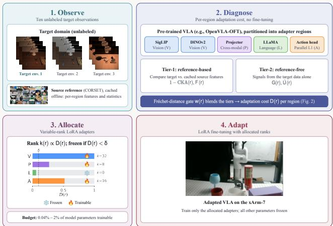
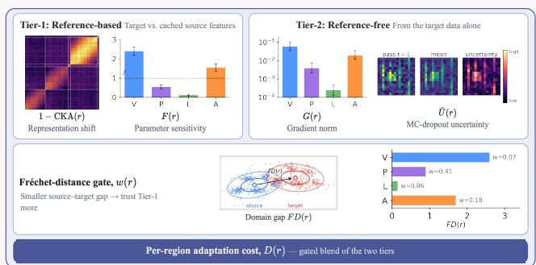
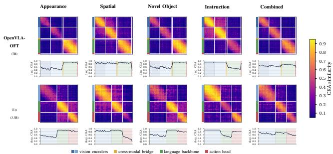
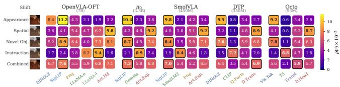
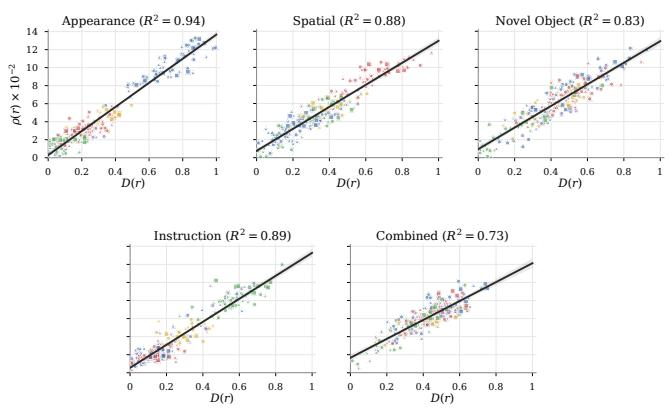
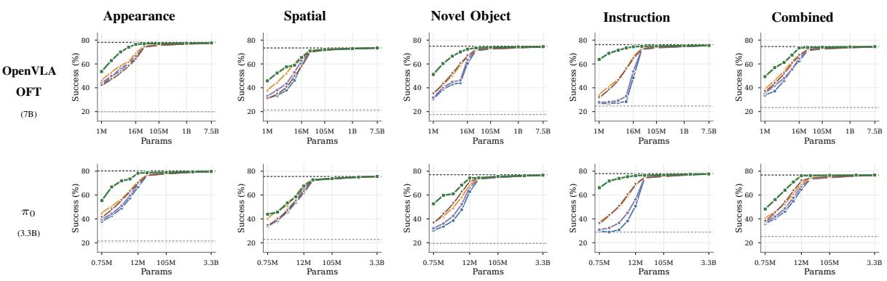
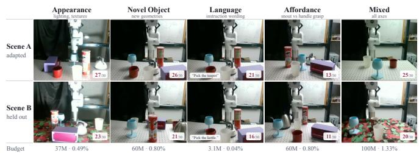

# Not All Layers Need Tuning: Diagnosing and Directing Adaptation in Vision-Language-Action Models

Shahram Najam Syed1, Arthur Jakobsson1, Prayuj Sachdev2, Jeffrey Ichnowski1

1Robotics Institute, Carnegie Mellon University, Pittsburgh, USA

2Department of Electrical and Computer Engineering, Carnegie Mellon University, Pittsburgh, USA

Abstract— Fine-tuning a Vision-Language-Action (VLA) model for a new deployment environment is expensive, yet most methods apply uniform-capacity adapters to every network region as if every region requires equal adjustment. This paper tests that assumption on five architecturally diverse VLAs (OpenVLA-OFT, π0, SmolVLA, DTP, Octo; 93M–7B parameters). Measuring per-region adaptation cost as normalized parameter displacement under region-isolated fine-tuning reveals an adaptation spectrum in which appearance shifts concentrate cost in the vision encoder, instruction shifts in the language backbone, and novel-object shifts in the vision encoder together with the action head, consistently across all five architectures in our experiments. To exploit this structure, we introduce a pipeline that observes, diagnoses, allocates, and adapts. From ten unlabeled target observations and without fine-tuning, the diagnostic estimates per-region cost by combining referencefree gradient and Monte Carlo (MC) Dropout signals with a Centered Kernel Alignment (CKA) score against a cached source reference; the allocator converts the estimates into variable-rank Low-Rank Adaptation (LoRA) adapters under a parameter budget and freezes well-calibrated regions; and standard LoRA fine-tuning adapts the policy with the resulting adapters. In our experiments, the diagnostic ranks regions within each deployment at a median Spearman of 0.91, and the allocation matches or exceeds uniform LoRA at every budget we tested on LIBERO and CALVIN. On a physical xArm-7, the pipeline matches full fine-tuning under an instruction-wording shift with 0.04% of its trainable parameters, and on five heldout scenes evaluated without retraining it leads every baseline, with 11–23 successes of 30 rollouts against 8–18 for the strongest parameter-efficient baseline at equal or larger budgets and 2–11 for full fine-tuning. These results suggest that adaptation cost in VLAs is structured enough to measure before fine-tuning begins.

## I. INTRODUCTION

Vision-Language-Action (VLA) models [1], [2] degrade under deployment-time distribution shifts in environment appearance, object geometry, or instruction phrasing, and recovering reliable behavior requires adaptation [3]. Every deployment site presents its own shift, so adaptation repeats across sites, and each instance operates in a low-data regime, typically tens of demonstrations collected on the robot. Full fine-tuning is ill-suited to this regime, as it optimizes billions of parameters against a demonstration set more than eight orders of magnitude smaller, and in our experiments it overfits even at its best validation checkpoint and degrades the held-out-scene generalization of the pretrained policy. The dominant strategy applies parameter-efficient fine-tuning (PEFT) methods such as Low-Rank Adaptation (LoRA) [4] uniformly across all layers at a fixed global rank, which implicitly assumes that every network region requires equal adjustment. A VLA, however, comprises functionally distinct regions, namely a vision encoder, a language backbone, cross-modal projectors, and an action head, and a perturbation confined to one input modality need not implicate every region. Biological sensorimotor control exhibits the same structure, as the nervous system is thought to maintain separable internal models and to update only those whose predictions fail [5]. When a shift implicates only a subset of regions, uniform allocation overprovisions the unimplicated regions and underprovisions the implicated ones.

  
Fig. 1: Observe, diagnose, allocate, adapt. From a few unlabeled target observations, the pipeline estimates per-region adaptation cost using Tier-1 reference-based signals, Tier-2 reference-free signals, and a Frechet-distance´ gate to blend them. A budget-aware allocator assigns variable-rank LoRA adapters and freezes well-calibrated regions, and the adapted policy matches full fine-tuning on the xArm-7 at a fraction of the trainable parameters.

Selective adaptation has precedent in vision models [6], [7], [8], and concurrent work allocates non-uniform LoRA capacity during VLA fine-tuning [9] or traces VLA representations after fine-tuning [10]. To the best of our knowledge, this is the first work to measure, before fine-tuning and from a small set of unlabeled target observations, how adaptation demand distributes across the functional regions of a VLA, and to convert that measurement into a capacity allocation.

This paper first characterizes that distribution empirically across five architecturally distinct VLAs under five controlled deployment shifts. The resulting adaptation spectrum concentrates adaptation cost in a shift-specific region, with the dominant region consistent across all five architectures in our experiments. We then introduce a pipeline with four stages, which observes, diagnoses, allocates, and adapts (Fig. 1, §IV). We evaluate the pipeline on the LIBERO [11] and CALVIN [12] benchmarks and on a physical UFactory xArm-7 manipulator. The diagnostic ranks regions within each deployment at a median Spearman correlation of 0.91, and the allocation matches or exceeds uniform LoRA at every parameter budget we tested on all five architectures. On the xArm-7, the pipeline matches full fine-tuning under an instruction-wording shift with 0.04 % of its trainable parameters, and on five held-out scenes evaluated without retraining it leads every baseline, with 11–23 successes of 30 against 8–18 for the strongest PEFT baseline at equal or larger budgets and 2–11 for full fine-tuning. This paper makes three contributions.

1) An empirical characterization of how adaptation cost distributes across functional regions under five deployment shifts, with the dominant region per shift type consistent across five VLA architectures (93M–7B parameters) and three action-decoding paradigms.

2) An algorithm that estimates per-region adaptation cost from ten unlabeled target observations without finetuning and converts the estimates into variable-rank LoRA adapters matching uniform rank-32 success rates at a reduced parameter count in our experiments.

3) Experiments across five architectures, five seeds, and six physical deployment shifts that characterize where the allocation helps and include one negative result in which it does not.

## II. RELATED WORK

VLA adaptation. VLA models pair pretrained visionlanguage backbones with autoregressive [13], [1], [14], diffusion [2], [15], or flow-matching [16], [17] action decoders, and current practice adapts them with one global LoRA rank across all layers [1], [14]. Building on this parameterization, the pipeline keeps LoRA as the adapter, whose low-rank form suits the low intrinsic dimensionality of finetuning [18], and replaces the single global rank with a perregion allocation. A study of LoRA for $\pi _ { 0 }$ [3] reports that uniform allocation suffices at rank 32; our results (§V-D) agree at that budget and diverge below it, where the adaptive advantage concentrates. LoRA also forgets less than full finetuning [19], a regularization we observe on hardware (§V-F).

Non-uniform rank allocation. AdaLoRA [8] prunes singular values, ARD-LoRA [20] learns per-head rank schedules, and LoRA-SP [9] gates singular value decomposition (SVD) update directions, all during training. In contrast to these methods, which require a full optimization run to find the allocation, the pipeline fixes ranks before training from unlabeled observations, and we compare against AdaLoRA and LoRA-SP at matched budgets (§V-D). Building on surgical fine-tuning [6], which showed in vision models that the shift type determines which layers benefit from tuning, and on SPT [7] and RSRA [21], which assign capacity before training from gradient or representation sensitivity, the pipeline extends pre-hoc, shift-aware selection from singlemodality models to multi-module VLAs, replaces the labeled calibration data of the gradient-based instances with unlabeled observations, and evaluates the allocation on physical hardware.

Representational and uncertainty measures. The diagnostic scores source-target alignment with Centered Kernel Alignment (CKA) [22], gates its tiers with the Frechet dis-´ tance [23], and estimates uncertainty with Monte Carlo (MC) Dropout [24]. Its Fisher weighting is stored compactly with Kronecker-factored approximate curvature (KFAC) [25]. The contribution lies in combining these measures and applying them before adaptation. VLA-Trace [10] also applies CKA to VLA representations; in contrast to its post-hoc analysis of fine-tuned models, the diagnostic runs before adaptation and drives a capacity allocation.

## III. PROBLEM STATEMENT

Consider a pretrained VLA, $\pi _ { \theta } .$ that maps an observation $o \in \mathcal { O }$ (RGB images and, in some architectures, proprioceptive state) and a language instruction $\ell \in { \mathcal { L } }$ to an action or action chunk $a \in \mathcal { A } \subseteq \mathbb { R } ^ { d }$ . The parameters $\boldsymbol { \theta } \in \mathbb { R } ^ { P }$ , with $P$ the total parameter count, partition into R disjoint, exhaustive network regions $\theta = ( \theta ^ { ( \overset { \cdot } { 1 } ) } , \dots , \theta ^ { ( R ) } )$ with $\mathbf { \bar { \theta } } ^ { ( r ) } \in \mathbb { R } ^ { P _ { r } }$ and $\textstyle \sum _ { r = 1 } ^ { R } P _ { r } \stackrel { } { = } P ,$ , each a functional component (e.g., vision encoder, language backbone, cross-modal projector, action head) whose boundaries the architecture fixes.

a) Inputs and goal: Let ${ \mathcal { D } } _ { \mathrm { t g t } }$ denote a target deployment distribution that differs from the pretraining source distribution $\mathcal { D } _ { \mathrm { s r c } }$ in visual appearance, spatial layout, object geometry, language phrasing, or a combination of these. Given N unlabeled target observations $\mathcal { T } _ { \mathrm { d i a g } } = \{ ( o _ { j } , \ell _ { j } ) \} _ { i = 1 } ^ { N } .$ a demonstration set $\mathcal { T } = \{ ( o _ { i } , \ell _ { i } , a _ { i } ) \} _ { i = 1 } ^ { M }$ from ${ \mathcal { D } } _ { \mathrm { t g t } }$ with $N < M$ , and a trainable-parameter budget $P _ { \mathrm { b u d g e t } }$ , the goal is to adapt $\pi _ { \theta }$ into a policy $\pi _ { \theta ^ { \prime } }$ that maximizes task success rate on ${ \mathcal { D } } _ { \mathrm { t g t } }$ while training at most $P _ { \mathrm { b u d g e t } }$ parameters. The output is a per-region LoRA rank assignment $k : \{ 1 , \ldots , R \} \to$ $\mathbb { Z } _ { \geq 0 }$ , with $k ( r ) = 0$ a frozen region, that satisfies

$$
\sum _ { r = 1 } ^ { R } k ( r ) c _ { 1 } ( r ) \leq P _ { \mathrm { b u d g e t } } ,\tag{1}
$$

where $c _ { 1 } ( r )$ is the parameter cost of one unit of rank in region $r ~ \left( { \ S I V  – C } \right)$ , together with the adapters trained under that assignment.

b) Adaptation cost: To evaluate whether an assignment places capacity where it is needed, we define a perregion reference. Let $\theta _ { \mathcal { T } } ^ { ( r ) \star }$ denote the parameters that regionisolated fine-tuning produces, i.e., fine-tuning region r on $\tau$ to convergence while holding all other regions fixed. The per-region adaptation cost is the normalized parameter displacement this adaptation induces,

$$
\rho ( r ) = \frac { \big \| \theta _ { \tau } ^ { ( r ) \star } - \theta ^ { ( r ) } \big \| _ { 2 } } { \big \| \theta ^ { ( r ) } \big \| _ { 2 } } \in \mathbb { R } _ { \ge 0 } .\tag{2}
$$

A small $\rho ( r )$ indicates that the pretrained parameters of region r already suffice. Because $\rho ( r )$ depends on the finetuning protocol, it is an operational proxy for adaptation demand, and our experiments treat $\{ \rho ( r ) \} _ { r = 1 } ^ { R }$ as the reference signal for evaluating the diagnostic.

TABLE I: Region partitions with approximate parameter counts. AR, Diff., and FM denote autoregressive, diffusion, and flow-matching decoding.
<table><tr><td>Model (Params)</td><td>Dec.</td><td>Regions</td></tr><tr><td>OpenVLA-OFT (7B)</td><td>AR (par.)</td><td>DINOv2, SigLIP, Proj., LLaMA-e, LLaMA-1, Act. Head</td></tr><tr><td>π0 (3.3B)</td><td>FM</td><td>SigLIP, Gemma, Act. Expert</td></tr><tr><td>SmolVLA (450M)</td><td>FM</td><td>SigLIP, SmolLM2, Proj., Act. Expert</td></tr><tr><td>DTP (350M)</td><td>Diff.</td><td>DINOv2, CLIP, Q-Former, Diff. Trans.</td></tr><tr><td>Octo (93M)</td><td>Diff.</td><td>Vis. Tok., T5 Enc., Transformer, Diff. Head</td></tr></table>

c) Assumptions: Beyond these inputs, we assume access to (i) the pretrained weights with forward and backward passes and (ii) a compact reference that the model provider ships with the weights, comprising a small coreset of source observations and their per-region embedding statistics. We assume neither knowledge of the shift type at adaptation time nor deployment-time access to source training data beyond that reference.

## IV. METHOD

The pipeline runs the four stages of Fig. 1 in order, each consuming the output of the last. The observe stage collects $\tau _ { \mathrm { d i a g } }$ at the deployment site. The diagnose stage maps $( \pi _ { \boldsymbol { \theta } } , \mathcal { T } _ { \mathrm { d i a g } } )$ to per-region scores $D ( r ) \in ( 0 , 1 ]$ through a comparison tier against a cached source reference and a reference-free tier, blended by a per-region Frechet gate (§IV-´ B); the scores must agree with $\rho ( r )$ in rank order within a deployment and in calibrated magnitude across deployments, since the allocator consumes both. The allocate stage maps the scores to the rank assignment $k ( r )$ of Eq. 1, proportional to $D ( r )$ up to per-region cost and zero below a freezing threshold (§IV-C). The adapt stage trains LoRA adapters of the assigned ranks on T (§IV-D). Each stage runs once per deployment, and only the adapt stage updates parameters.

## A. Network Region Partitioning

Adaptation cost is measured, and adapters are attached, per region, so the partition determines both what the diagnostic can resolve and what the allocator can control. We partition each VLA along its native module boundaries into the functional regions of Table I rather than imposing a fixed schema, for three reasons. Native boundaries coincide with changes in representational role, from modalityspecific encoding through fusion to action decoding, so a shift confined to one modality maps onto few regions; they carry architecture-defined parameter counts, which fixes $c _ { 1 } ( r )$ without tuning; and they exist for every architecture, which makes the spectrum comparable across the five models without a learned or hand-designed partition per model. Finer partitions raise diagnostic cost and make the per-region Fisher and gradient statistics noisier, and coarser ones merge regions with different roles, so the module level is the natural granularity.

## B. Stages 1–2: Observe and the Two-Tier Diagnostic

From the N unlabeled observations $\tau _ { \mathrm { d i a g } } ,$ the two-tier diagnostic estimates per-region cost with a small number of forward passes and one backward pass through the frozen

  
Fig. 2: The two-tier diagnostic. Tier 1 scores representational shift $( 1 ^ { ^ { - } } - \mathrm { C K A } ( r ) )$ against the cached source reference, weighted by Fisher sensitivity $\overline { { F } } ( \boldsymbol { r } )$ normalized to a global mean of one (dashed line); Tier 2 profiles the surrogate gradient norm $G ( r )$ and MC Dropout uncertainty $\hat { U } ( \boldsymbol { r } )$ from target observations alone; the gate w(r) = exp(−γ · FD(r)) trusts Tier 1 where the source–target gap is small, and the blend yields $D ( r ) . \mathrm { { V , P , L } } ,$ , and A denote vision encoder, projector, language backbone, and action head.

VLA, routing each region to the strongest available signal for its domain gap.

a) Cached source reference: To provide a sourcedomain reference without deployment-time access to source training data, the model provider builds a cache once per architecture at training time and ships it with the weights. We select a K-means coreset [26] of K observations over per-region output embeddings of an $N _ { \mathrm { p o o l } }$ -observation candidate pool and store, per region, the activation mean and covariance, a buffer of B feature vectors for CKA, and an empirical Fisher under the model’s native objective as KFAC factors [25] truncated to their top $k _ { F }$ eigencomponents. Coreset selection outperforms random sampling because the comparison signals below are sensitive to coverage of the source manifold (§V-E). With the values of §V-A, the reference occupies 200–250 MB for the 7B model and 30– 50 MB for sub-1B models.

b) Frechet gate:´ To decide which tier each region trusts, the gate computes the Frechet distance [23]´ $\mathrm { F D } ( r )$ between the cached source Gaussian and the empirical target distribution at the region’s output layer, normalized by the layer’s feature dimension so that scales are comparable across regions of different width. A soft weight $w ( r ) =$ $\exp ( - \gamma \cdot \mathrm { F D } ( r ) )$ with temperature γ then sets how much each region trusts the comparison tier. Every observation contributes an activation vector at each token position, so the estimates draw on thousands of feature vectors rather than N samples, and we apply shrinkage to the target covariance before the matrix square root.

c) Tier 1 (comparison): When $w ( r )$ is high, the diagnostic scores representational shift with CKA [22] between the cached source activations and the target activations. Because the two sets are unpaired and of different sizes, we evaluate a covariance-alignment analogue of linear CKA, the normalized Frobenius inner product between their centered second-moment matrices. This statistic is well defined without pairing, invariant to isotropic scaling and common rotations, and blind to mean shifts, which are exactly the component the Frechet gate measures, so the two are com-´ plementary by construction. To fund a shifted representation only when it also affects the output, the tier weights the CKA term by parameter sensitivity,

$$
D _ { \mathrm { c m p } } ( r ) = \big ( 1 - \mathrm { C K A } ( r ) \big ) \cdot \overline { { F } } ( r ) ,\tag{3}
$$

where $\overline { { F } } ( r )$ is the mean diagonal Fisher over the region’s LoRA-eligible parameters, normalized by the global mean. A reliability factor $r _ { \mathrm { r e l } } ( N ) = \mathrm { m i n } ( 1 , N / N _ { 0 } )$ downweights Tier 1 below a reference count $N _ { 0 }$ , with $\mathrm { C K A } ( r ) = 0$ at $N \ < \ 2$ where the estimator is undefined. The gate keeps Tier 1 active only when the domain gap is small, which is the regime in which the source-derived Fisher remains a valid sensitivity estimate.

d) Tier 2 (reference-free): When $w ( r )$ is low, the diagnostic profiles the size-normalized gradient norm of a labelfree surrogate loss matched to each model’s native objective,

$$
G ( r ) = \frac { \left\| \nabla _ { \theta ^ { ( r ) } } \mathcal { L } _ { \mathrm { s u r r } } \right\| _ { 2 } } { \sqrt { \mathrm { d i m } ( \theta ^ { ( r ) } ) } } ,\tag{4}
$$

with pseudo-labels detached through stop-gradient. Diffusion and flow-matching objectives retain stochastic targets, so their gradients remain nonzero under pseudo-labeling. For the deterministic L1 head of OpenVLA-OFT, a loss against the model’s own detached prediction would vanish identically, so the surrogate perturbs the detached pseudo-action with Gaussian noise of scale σ in normalized action units, which makes the gradient a Gaussian random projection of the action Jacobian and its per-region norm an estimate of the Jacobian’s scale rather than of any task objective. The LLaMA backbone uses cross-entropy against its own detached token predictions, and upstream regions receive gradients from these losses through backpropagation. For Octo and DTP, which train with dropout, MC Dropout [24] with dropout rate $p$ over $T$ stochastic passes supplies an activation-variance score $U ( r )$ . Hats denote division by one global maximum per signal, taken over all regions and source-side calibration scenarios (§V-A) and clipped to 1, so scores lie in (0, 1] and a mild shift can score low in every region. The tier score is

$$
D _ { \mathrm { f a l l } } ( r ) = \alpha \hat { U } ( r ) + ( 1 - \alpha ) \hat { G } ( r ) ,\tag{5}
$$

where $\alpha > 0$ only for dropout-trained models, since $U ( r )$ is undefined otherwise.

e) Combined score: With the Tier 1 score normalized in the same way to $\hat { D } _ { \mathrm { c m p } } ( r ) \in ( 0 , 1 ]$ , the diagnostic score blends the tiers,

$$
D ( r ) = w ( r ) r _ { \mathrm { r e l } } ( N ) \hat { D } _ { \mathrm { c m p } } ( r ) + \left( 1 - w ( r ) r _ { \mathrm { r e l } } ( N ) \right) D _ { \mathrm { f a l l } } ( r ) .\tag{6}
$$

The blend also degrades gracefully, since $N \ = \ 1$ forces near-total reliance on Tier 2, near-uniform scores recover uniform allocation, and Tier 1 carries the prediction when the surrogate mismatches the training objective.

## C. Stage 3: Adaptive Rank Allocation

We attach LoRA adapters to the attention matrices of Transformer regions and the linear layers of multi-layer perceptron (MLP) regions [4]. For region r with adapted matrices $\mathcal { T } _ { r }$ of input/output dimensions $\{ ( d _ { i } ^ { \mathrm { i n } } , d _ { i } ^ { \mathrm { o u t } } ) \}$ }, the parameter cost per unit rank is $\begin{array} { r } { c _ { 1 } ( r ) = \sum _ { i \in \mathbb { Z } _ { r } } ( d _ { i } ^ { \mathrm { i n } } + d _ { i } ^ { \mathrm { o u t } } ) } \end{array}$ Under a fixed budget $P _ { \mathrm { b u d g e t } }$ , the allocator assigns

  
Fig. 3: Source–target representational similarity for OpenVLA-OFT and π (rows) under the five deployment shifts of Table II (columns); the remaining three architectures appear in the accompanying video. Each matrix is linear CKA [22] between source- and target-layer activations on paired observations (the same LIBERO scenes rendered under both conditions), well defined across layers of different width. Role-colored bands mark the regions of Table I. The trace beneath each matrix is the same-layer Tier 1 statistic (§IV-B), the unpaired covariance-alignment score against the cached source reference that the diagnostic consumes. In each column the same role darkens across both architectures.

$$
k ( r ) = \left\{ \begin{array} { l l } { 0 } & { \mathrm { i f ~ } D ( r ) < \delta , } \\ { \operatorname* { m a x } \biggl ( 1 , } & { \Bigl \lfloor \frac { D ( r ) } { \sum _ { r ^ { \prime } } D ( r ^ { \prime } ) } \cdot \frac { P _ { \mathrm { b u d g e t } } } { c _ { 1 } ( r ) } \Bigr \rfloor \biggr ) } & { \mathrm { o t h e r w i s e } , } \end{array} \right.\tag{7}
$$

where $\delta$ is a freezing threshold, so the allocator freezes a region only when its score falls below a fraction δ of the calibrated maximum, and the max(1, ·) clause preserves gradient flow through every funded adapter. Because $c _ { 1 } ( r )$ spans orders of magnitude across regions, Eq. 7 makes the allocated capacity $k ( r ) \cdot c _ { 1 } ( r )$ , rather than the raw rank, proportional to the diagnostic score. The simulation experiments fix $P _ { \mathrm { b u d g e t } }$ externally for matched-budget comparison. In deployment, the allocator instead assigns each region above δ a rank $\begin{array} { r } { \boldsymbol { k } ( \boldsymbol { r } ) = \operatorname* { m a x } ( 1 , \lfloor \boldsymbol { \beta } \cdot \boldsymbol { D } ( \boldsymbol { r } ) \rfloor ) } \end{array}$ through a global rank-per-score gain $\beta .$ Because $D ( r ) \ \leq \ 1$ , the gain caps the per-region rank at $\beta ,$ so with $\beta ~ = ~ 3 2$ the allocator reaches parity with uniform rank-32 LoRA when every region requires adaptation, and the total budget emerges as the sum of perregion costs and tracks shift severity. When the rank floors of Eq. 7 exceed a fixed budget, the allocator freezes funded regions in ascending score order until the floors fit and assigns any capacity left over after rounding to the highestscoring region, so it meets reported budgets within the stated tolerance.

## D. Stage 4: Fine-Tuning

Fine-tuning runs standard LoRA training on the demonstration set $\tau$ with the variable rank per region as the sole modification. Frozen regions carry no adapter and incur no additional memory or computation.

## V. EXPERIMENTS

We ask whether adaptation cost varies systematically across regions and shifts (§V-B), whether the diagnostic predicts it (§V-C), whether the allocation converts prediction into task success (§V-D–§V-E), and how it fares on hardware (§V-F).

TABLE II: The five controlled shifts, each modifying one axis of the observation distribution while preserving task semantics.
<table><tr><td>Shift</td><td>Construction</td></tr><tr><td>Appearance</td><td>Warm tint, vignette, contrast, desaturation, and Gaussian noise on rendered RGB</td></tr><tr><td>Spatial</td><td>Distractor clutter and partial occlusion of the workspace at scene reset</td></tr><tr><td>Novel Object</td><td>Mesh and geometry substitution with new material, color, and re- flectance</td></tr><tr><td>Instruction</td><td>LLM rephrasing under semantic equivalence, 10% manually verified</td></tr><tr><td>Combined</td><td>All four perturbations applied jointly</td></tr></table>

## A. Setup

a) Architectures and benchmarks: We evaluate the five VLA architectures of Table I, which span three actiondecoding paradigms and two orders of magnitude in parameter count. LIBERO [11] is the primary benchmark (40 manipulation tasks across four suites), and CALVIN [12] the secondary, which tests transfer to a different task distribution. Within each benchmark we construct five controlled deployment shifts that each modify a single axis of the observation distribution (Table II).

b) Baselines: We compare against eleven baselines in three families and refer to the allocation the pipeline produces as Adaptive. No Adaptation (the frozen pretrained policy) is the floor. Full Fine-Tuning, Uniform LoRA at rank 32, and Oracle Allocation (the allocator driven by the measured $\rho ( r )$ instead of the diagnostic) are nominal upper bounds. Uniform LoRA matched, DoRA matched [27], $( I A ) ^ { 3 }$ [28], AdaLoRA [8], LoRA-SP [9], Surgical (the full matched budget on the spectrum’s dominant region, an oracle-informed variant of surgical fine-tuning [6]), and Random Allocation compete at a matched trainable-parameter budget.

c) Protocol and statistics: We collect M = 20 demonstrations per task in the target environment and give the diagnostic $N = 1 0$ unlabeled observations. All methods train for 50 epochs with BFloat16 precision, cosine learning-rate decay, gradient clipping, and AdamW, with 8-bit optimizer states and gradient checkpointing for Full Fine-Tuning of the two largest models. We evaluate every method at its best validation checkpoint, which we select by action-prediction loss on held-out demonstrations, so we score no method in its overfitting tail. We run 5 seeds per condition and 50 rollouts per task and report mean ± standard error of the mean (SEM). We compare methods with paired t-tests, paired by task, with Bonferroni correction across architectures, and we report all conditions, including those where the pipeline ties with or trails a baseline. We set the cache constants to K = 300, $N _ { \mathrm { p o o l } } = 5 { , } 0 0 0$ , B = 200–500 (by architecture), and $k _ { F } ~ = ~ 1 0 0 .$ the diagnostic constants to $N _ { 0 } ~ = ~ 1 0 .$ $\sigma \ : = \ : 0 . 0 5$ , p = 0.1, $T = 2 0$ , and $\alpha = 0 . 5$ for dropouttrained models, and we calibrate the gate temperature γ = 1, the freezing threshold $\delta = 0 . 1$ , and the rank-per-score gain $\beta \ : = \ : 3 2$ once on source-side scenarios from the LIBERO training split; we hold every value fixed across all architectures, shifts, benchmarks, and physical experiments, so no target-domain information enters hyperparameter selection. We tune learning rates per method family (full fine-tuning, the LoRA family, and $( I A ) ^ { 3 } )$ on the same scenarios, since a shared learning rate would disadvantage full fine-tuning relative to LoRA.

  
Fig. 4: The adaptation spectrum on LIBERO, showing per-region cost $\rho ( \bar { r } ) \times 1 0 ^ { - 2 }$ (mean over 5 seeds) with shifts as rows and each architecture’s regions as columns. Region labels are role-colored to match Fig. 3, and the outlined tile marks the dominant region. CALVIN identifies the same dominant region in all 25 cells.

## B. The Adaptation Spectrum

This experiment measures $\rho ( r )$ of Eq. 2 by exhaustive region-isolated fine-tuning (§III) for every (architecture, shift, seed) condition on both benchmarks, and provides the reference signal for evaluating the diagnostic. Regionisolated fine-tuning can inflate $\rho ( r )$ for high-capacity regions that compensate for errors arising elsewhere, and displacement depends on the optimization protocol as well as on necessity. Two checks support $\rho ( r )$ as an allocation target despite this caveat. Oracle Allocation (§V-D), which converts $\rho ( r )$ directly into ranks, approaches the full finetuning bound, and per-region success recovery on the same runs correlates with $\rho ( r )$ at a median per-cell Spearman of $\rho _ { S } = 0 . 8 7$

Fig. 4 shows the spectrum on LIBERO. First, $\rho ( r )$ varies by roughly an order of magnitude across regions within a single (architecture, shift) cell, so uniform allocation necessarily overprovisions some regions and underprovisions others. Second, the dominant region for each shift type is consistent across all five architectures, with appearance shifts loading the vision encoders, instruction shifts the language backbone, and novel-object shifts the vision encoder together with the action head. The novel-object shift substitutes geometry as well as material and color (Table II), so recovery requires rebinding perception to new grasp geometry, and the physical shift shows the same signature (§V-F). Third, CALVIN identifies the same dominant region as LIBERO in all 25 (architecture, shift) cells, with a mean per-cell Spearman of $\rho _ { S } = 0 . 9 3$ between the two cost profiles, which suggests the spectrum reflects the architecture–shift interaction rather than a benchmark artifact. The spectrum is a descriptive finding for the architectures and benchmarks studied here, and we do not claim it extends beyond them.

## C. Diagnostic Accuracy

This experiment evaluates whether the diagnostic predicts $\rho ( r )$ from $N ~ = ~ 1 0$ unlabeled observations without fine-tuning. We report two complementary statistics. The pooled $R ^ { 2 }$ of predicted scores $\{ D ( r ) \}$ against measured costs $\{ \rho ( r ) \}$ across all 210 conditions summarizes the fit in Fig. 5, but it inherits between-region variance, since vision encoders score high and language backbones low across most deployments, and therefore overstates withindeployment discrimination. The median per-cell Spearman $\rho _ { S }$ over each (architecture, shift, benchmark, seed) cell’s regions measures the within-deployment ordering the allocator consumes, though a correlation over 3–6 regions is individually coarse. We read the two jointly. The CKA matrices of Fig. 3 show the raw Tier 1 signal, with each shift darkening the blocks whose regions require adaptation.

TABLE III: Diagnostic accuracy across the five architectures with $N =$ 10 unlabeled target observations and no fine-tuning. $R ^ { 2 }$ is the pooled fit of predicted scores against measured costs over all conditions, and $\rho _ { S }$ is the median per-cell Spearman correlation. Brackets give the range of each statistic across the five architectures, computed per architecture. Bold marks the best result per column.
<table><tr><td>Diagnostic Variant</td><td>Spearman  $\rho _ { S }$ </td><td> $R ^ { 2 }$ </td></tr><tr><td>Naïve baselines</td><td></td><td></td></tr><tr><td>Random scores</td><td>0.02 [0.01, 0.03]</td><td>0.01 [0.00, 0.01]</td></tr><tr><td>Frobenius norm</td><td>0.33 [0.29, 0.37]</td><td>0.18 [0.15, 0.21]</td></tr><tr><td>Cosine dist. of means</td><td>0.40 [0.36, 0.44]</td><td>0.22 [0.19, 0.25]</td></tr><tr><td>Tier ablations</td><td></td><td></td></tr><tr><td> $\mathrm { T i e r ~ 1 ~ ( C K A + F i s h e r ) }$ </td><td>0.77 [0.71, 0.83]</td><td>0.59 [0.51, 0.66]</td></tr><tr><td> $\mathrm { T i e r } \ 2 \ ( \mathrm { G r a d . } + \mathrm { M C \ D r o p . } )$ </td><td>0.82 [0.77, 0.88]</td><td>0.68 [0.61, 0.74]</td></tr><tr><td>Uniform blend (no gate)</td><td>0.87 [0.82, 0.92]</td><td>0.78 [0.70, 0.85]</td></tr><tr><td>Two-tier (proposed)</td><td>0.91 [0.86, 0.96]</td><td>0.89 [0.80, 0.93]</td></tr></table>

  
Fig. 5: Predicted score $D ( r )$ against measured cost $\rho ( r )$ by shift type. Each point is one region of one architecture, benchmark, and seed, colored by region role, and squares overlay the physical xArm-7 measurements with OpenVLA-OFT. The combined panel spans a narrower cost range, which lowers its per-panel $R ^ { 2 }$ but not the pooled $R ^ { 2 } = 0 . 8 9$ (Table III).

Table III and Fig. 5 support three conclusions. First, na¨ıve distributional measures (Frobenius norm, cosine distance) fall far short of either tier. Second, neither tier alone matches the gated blend, and the ordering holds within every architecture (bracketed ranges in Table III). Third, the uniform 0.5 blend trails the gated blend on every architecture.

## D. Adaptive Allocation Performance

This experiment asks whether the allocation converts prediction accuracy into task success at reduced parameter cost.

Table IV reports success rates on the LIBERO combinedshift environment for all five architectures, and Fig. 6 traces the parameter–success frontier under each of the five shift types. Four observations follow. First, at the matched budget, Adaptive outperforms every matched-budget baseline on every architecture in our experiments, with significance against both Uniform LoRA matched and AdaLoRA in all five columns. Second, Adaptive reaches the nominal upper bounds at half their parameters, exceeding the mean of Uniform LoRA at rank 32 on all five architectures and matching Oracle Allocation within the SEMs on all five. We attribute the crossings to constrained-adaptation regularization. Full Fine-Tuning and Uniform LoRA at rank 32 reach near-zero training loss within 3 epochs while heldout validation loss rises from epoch 4, whereas Adaptive’s validation loss decreases monotonically. Because we score every method at its best validation checkpoint (§V-A), the crossings are not an artifact of overfit final checkpoints. Even at its best checkpoint, full fine-tuning of 7.5B parameters on 20 demonstrations generalizes worse at rollout time than constrained adaptation. Third, the advantage concentrates at low budgets (Fig. 6), and we do not claim superiority at every budget. Fourth, Random Allocation collapses at the same budget, so the gains come from where the diagnostic places capacity rather than from non-uniformity per se, and Surgical, which spends the whole budget on the dominant region, trails even Uniform LoRA matched under the combined shift, so graded assignment rather than dominant-region selection drives the gains. The ordering transfers to CALVIN on all five architectures (Table V).

TABLE IV: Task success rate $( \% )$ on the LIBERO combined shift, mean ± SEM over 5 seeds and 50 rollouts per task across 40 tasks. Column headers give each architecture’s matched budget, about half of Uniform LoRA at rank 32. Matched-budget methods meet it within ±5%, $( I A ) ^ { 3 }$ runs at its native 0.05M–0.5M, and Full Fine-Tuning updates all parameters. Bold marks the best matched-budget result per column. † and ‡ mark results significantly better than Uniform LoRA matched and AdaLoRA at $p <$ 0.05 (paired t-tests across tasks, Bonferroni-corrected).
<table><tr><td>Method</td><td>OpenVLA-OFT (16M)</td><td>π0 (12M)</td><td>SmolVLA (3.4M)</td><td>DTP (2.6M)</td><td>Octo (1.4M)</td></tr><tr><td>No Adaptation</td><td>23.4±3.6</td><td>25.2±3.4</td><td>19.8±2.8</td><td>21.4±1.9</td><td>18.6±4.9</td></tr><tr><td>Full Fine-Tuning</td><td>74.6±1.2</td><td>76.8±1.3</td><td>67.2±1.1</td><td>62.7±1.2</td><td>58.4±1.0</td></tr><tr><td>Uniform LoRA r=32</td><td>71.2±2.3</td><td>73.4±2.4</td><td>64.1±2.1</td><td>60.3±2.7</td><td>56.1±1.5</td></tr><tr><td>Oracle Allocation</td><td>73.8±1.4</td><td>75.1±0.8</td><td>65.7±1.0</td><td>61.4±0.9</td><td>57.8±0.9</td></tr><tr><td>Uniform LoRA matched</td><td>62.4±4.3</td><td>64.8±5.6</td><td>51.4±6.1</td><td>49.8±3.7</td><td>47.2±4.7</td></tr><tr><td>DoRA matched [27]</td><td>64.7±2.1</td><td>67.4±3.7</td><td>53.8±4.0</td><td>52.1±5.4</td><td>49.5±5.7</td></tr><tr><td>(IA)3 [28]</td><td>51.2±8.1</td><td>53.4±6.0</td><td>42.6±6.4</td><td>41.5±5.0</td><td>38.4±10.8</td></tr><tr><td>Random Allocation</td><td>42.8±7.7</td><td>44.2±5.9</td><td>35.8±8.1</td><td>33.2±11.5</td><td>31.6±10.1</td></tr><tr><td>Surgical (dominant region)</td><td>56.1±3.6</td><td>58.4±4.2</td><td>45.2±3.1</td><td>43.8±4.8</td><td>41.5±3.9</td></tr><tr><td>AdaLoRA [8]</td><td>67.3±3.8</td><td>69.5±3.5</td><td>57.9±2.7</td><td>55.7±1.6</td><td>52.7±2.9</td></tr><tr><td>LoRA-SP [9]</td><td>67.2±2.4</td><td>71.8±1.8</td><td>59.9±4.9</td><td>59.4±1.9</td><td>46.3±2.1</td></tr><tr><td>Adaptive</td><td>73.4±1.3†‡</td><td>76.3±1.2†‡</td><td>64.6±1.1†‡</td><td>61.5±1.1†‡</td><td>57.9±1.5†‡</td></tr></table>

TABLE V: Task success rate (%) on CALVIN environment D, mean ± SEM over 5 seeds and 50 rollouts per task. Budgets, bold, and †/‡ follow Table IV.
<table><tr><td>Method</td><td>OpenVLA-OFT (16M)</td><td>π0 (12M)</td><td>SmolVLA (3.4M)</td><td>DTP (2.6M)</td><td>Octo (1.4M)</td></tr><tr><td>No Adaptation</td><td>19.7±3.8</td><td>22.4±2.9</td><td>15.8±3.3</td><td>18.9±4.4</td><td>14.6±3.6</td></tr><tr><td>Full Fine-Tuning</td><td>71.2±1.4</td><td>73.5±1.1</td><td>64.0±1.6</td><td>59.6±1.3</td><td>55.7±1.2</td></tr><tr><td>Uniform LoRA r=32</td><td>67.8±2.5</td><td>69.8±1.9</td><td>61.3±2.8</td><td>57.2±2.2</td><td>53.2±1.7</td></tr><tr><td>Oracle Allocation</td><td>70.4±1.2</td><td>71.6±0.9</td><td>62.5±1.3</td><td>58.5±1.0</td><td>54.6±1.1</td></tr><tr><td>Uniform LoRA matched</td><td>59.6±4.4</td><td>60.7±5.8</td><td>49.3±6.3</td><td>45.2±3.9</td><td>43.6±5.1</td></tr><tr><td>DoRA matched [27]</td><td>61.9±2.6</td><td>64.2±4.1</td><td>51.0±3.3</td><td>48.9±5.0</td><td>45.4±4.6</td></tr><tr><td>(IA)3 [28]</td><td>46.2±7.4</td><td>50.9±5.2</td><td>38.1±6.8</td><td>39.7±5.9</td><td>34.3±9.6</td></tr><tr><td>Random Allocation</td><td>37.1±8.8</td><td>41.9±6.4</td><td>30.6±9.7</td><td>31.8±10.9</td><td>27.2±8.1</td></tr><tr><td>Surgical (dominant region)</td><td>53.8±3.9</td><td>54.7±3.4</td><td>42.6±4.5</td><td>40.1±3.7</td><td>38.9±4.2</td></tr><tr><td>AdaLoRA [8]</td><td>64.7±2.3</td><td>66.8±3.6</td><td>55.1±2.9</td><td>52.9±1.9</td><td>48.7±3.1</td></tr><tr><td>LoRA-SP [9]</td><td>64.5±2.7</td><td>68.6±2.0</td><td>56.4±4.4</td><td>55.8±2.2</td><td>42.9±2.4</td></tr><tr><td>Adaptive</td><td>69.8±1.5†‡</td><td>72.1±1.2†‡</td><td>62.1±1.4†‡</td><td>58.3±1.0†‡</td><td>54.3±1.3†‡</td></tr></table>

## E. Ablation Study

Table VI ablates one design choice at a time. On the allocation side, the freezing threshold $\delta = 0 . 1$ matches no freezing at the same budget and beats aggressive freezing; the value of freezing lies in budget rather than single-shift success, since frozen regions carry no adapter, which is what yields the 3.1M language budget and the training-time parity with Uniform LoRA matched in Table VII. Replacing the diagnostic-driven assignment with equal or random ranks at the same budget costs 12 and 31 points of success, which supports the claim that placement, not budget, drives the gains. Varying the gate temperature over two orders of magnitude, $\gamma \in [ 0 . 1 , 1 0 ]$ , changes success by less than one point, so the gate needs only coarse calibration.

  
Adaptive (Ours) Uniform LoRA AdaLoRA DoRA LoRA-SP Full Fine-Tuning No Adaptation  
Fig. 6: Parameter–performance frontiers on LIBERO for OpenVLA-OFT and $\pi _ { 0 }$ under the five deployment shifts, sweeping Adaptive, Uniform LoRA, AdaLoRA, DoRA, and LoRA-SP over nine budgets from one sixteenth of the matched budget to the full model size; the remaining three architectures appear in the accompanying video. Dashed lines mark the No Adaptation floor and Full Fine-Tuning ceiling. The Adaptive advantage is largest at low budgets and narrows as capacity approaches rank 32.

TABLE VI: Ablations on OpenVLA-OFT, LIBERO combined shift, 16M matched budget, 5 seeds. Each row removes or alters one component of the full pipeline (Ours). $\rho _ { S }$ and $R ^ { 2 }$ follow §V-C. Allocation-only rows leave the diagnostic unchanged and report success rate only. Equal allocation spreads the budget over the pipeline’s region set and so differs in adapter placement from Uniform LoRA matched (Table $\mathrm { I V } ) .$ Every ablated row differs significantly from the full pipeline at $p < 0 . 0 5$ (paired t-test) except Ours − freezing.
<table><tr><td>Variant</td><td> $\pmb { \rho } _ { S }$ </td><td> $\scriptstyle { \mathbf { { R } } ^ { 2 } }$ </td><td>Success (%)</td></tr><tr><td>Ours (full pipeline)</td><td>0.96±0.02</td><td>0.93±0.03</td><td>73.4±1.3</td></tr><tr><td>Ours – Tier 2</td><td> $0 . 8 3 { \pm } 0 . 0 4$ </td><td>0.66±0.05</td><td>67.0±2.6</td></tr><tr><td>Ours – Tier 1</td><td>0.88±0.03</td><td>0.74±0.04</td><td>68.8±2.4</td></tr><tr><td>Ours — gate (uniform 0.5 blend)</td><td> $0 . 9 2 { \pm } 0 . 0 3$ </td><td>0.85±0.04</td><td>70.8±1.7</td></tr><tr><td>Ours — coreset (random cache)</td><td> $0 . 8 5 { \pm } 0 . 0 5$ </td><td>0.70±0.06</td><td>69.2±2.9</td></tr><tr><td>Ours with  $N = 1$ </td><td>0.71±0.09</td><td>0.47±0.10</td><td>64.2±4.7</td></tr><tr><td>Ours — freezing  $( \delta = 0 )$ </td><td></td><td></td><td>71.0±2.4</td></tr><tr><td>Ours with  $\delta = { \bar { 0 . 3 } }$ </td><td></td><td></td><td>65.7±3.8</td></tr><tr><td>Ours — diagnostic ranks  $\left( \mathrm { \ e q u a l } \right)$ </td><td></td><td></td><td>61.9±5.4</td></tr><tr><td>Ours — diagnostic ranks (random)</td><td></td><td></td><td>42.8±7.7</td></tr></table>

## F. Physical Robot Evaluation

We evaluate the pipeline on a UFactory xArm-7 manipulator with a parallel-jaw gripper, OpenVLA-OFT as the base policy, one fixed third-person RGB camera viewing the workspace at a downward tilt, and one wrist-mounted RGB camera. For each of six controlled shifts we collect 20 examples under the shifted condition, fine-tune each method for 10 epochs on one NVIDIA A100 80GB, and evaluate every method at the shared epoch-10 checkpoint on 30 paired initial configurations held identical across methods; the shared checkpoint avoids per-method checkpoint selection on the small physical validation sets, and the pairing supports McNemar’s tests on discordant outcomes. For each shift we additionally evaluate a held-out Scene B without retraining. Fig. 7 shows the shifts and Table VII reports all results. The diagnostic selects the budget per shift, spanning 32× from 3.1M for language to 100M for mixed, and funds the DINOv2 and SigLIP encoders under appearance, SigLIP together with the action head under novel object and affordance, and rank-3 adapters on the late LLaMA region under language, whose per-rank cost sets the 3.1M budget. The diagnostic runs in roughly 90 seconds on the same A100 for the 7B model, against 20 minutes of adapter training.

  
Fig. 7: Five of the six xArm-7 shifts from the fixed third-person camera, with the adaptation condition (Scene A, top) and the held-out condition (Scene B, bottom) evaluated without retraining: appearance (lighting, then lighting plus background), novel object (toy and metallic teapot substitutions for the kettle), language (reworded instructions, with Scene B naming the teapot), affordance (grasping the teapot by its snout rather than its handle), and mixed (a new cup geometry and color against a camouflaging background). Counts are Adaptive’s successes of 30 paired rollouts; the bottom row gives each shift’s selected budget as a parameter count and a fraction of the 7.5B policy.

TABLE VII: Physical results on the xArm-7 with OpenVLA-OFT, successes out of 30 paired rollouts at epoch 10 with identical initial configurations across methods (paired McNemar’s tests). We evaluate Scene B without retraining. Budget is the per-shift budget the diagnostic selects, which the matched baselines and LoRA-SP share. AdaLoRA runs at its own allocation (45–105M), Uniform LoRA r=32 at 110M (the hardware recipe adapts every linear layer, not only attention projections), and Full Fine-Tuning updates all 7.5B parameters. Bold marks the best parameter-efficient result per column; shading runs red (worst) to green (best) within each column.
<table><tr><td></td><td colspan="3">Appearance Spatial</td><td colspan="2">Novel Obj.</td><td colspan="2">Language</td><td colspan="2">Affordance</td><td colspan="2">Mixed</td><td rowspan="2">Wall ↓</td></tr><tr><td>Method</td><td>A</td><td>B</td><td>A</td><td>A</td><td>B</td><td>A</td><td>B</td><td>A</td><td>B</td><td>A</td><td>B</td></tr><tr><td>Budget (selected)</td><td colspan="2">37M</td><td>32M</td><td colspan="2">60M</td><td colspan="2">3.1M</td><td colspan="2">60M</td><td colspan="2">100M</td><td></td></tr><tr><td>No Adaptation</td><td>5/30</td><td>1/30</td><td>4/30</td><td>5/30</td><td>2/30</td><td>5/30</td><td>4/30</td><td>0/30</td><td>0/30</td><td>7/30</td><td>3/30</td><td></td></tr><tr><td>Full Fine-Tuning</td><td>25/30</td><td>9/30</td><td>19/30</td><td>24/30</td><td>8/30</td><td>22/30</td><td>11/30</td><td>11/30</td><td>2/30</td><td>24/30</td><td>9/30</td><td>55</td></tr><tr><td>Uniform LoRA r=32</td><td>22/30</td><td>16/30</td><td>17/30</td><td>20/30</td><td>14/30</td><td>18/30</td><td>13/30</td><td>9/30</td><td>5/30</td><td>22/30</td><td>12/30</td><td>22</td></tr><tr><td>Uniform LoRA matched</td><td>20/3015/30</td><td></td><td>15/30</td><td>21/3015/30</td><td></td><td>7/30</td><td>1/30</td><td>9/30</td><td>5/30</td><td>21/30</td><td>12/30</td><td>20</td></tr><tr><td>DoRA matched</td><td>21/30</td><td>16/30</td><td>17/30</td><td>22/30</td><td>16/30</td><td>8/30</td><td>3/30</td><td>10/30</td><td>6/30</td><td>22/30</td><td>13/30</td><td>24</td></tr><tr><td>AdaLoRA</td><td>22/30</td><td>17/30</td><td>19/30</td><td>22/30</td><td>16/30</td><td>19/30</td><td>14/30</td><td>10/30</td><td>6/30</td><td>23/30</td><td>14/30</td><td>25</td></tr><tr><td>LoRA-SP</td><td>19/30</td><td>18/30</td><td>11/30</td><td>22/3014/30 15/30</td><td></td><td></td><td>13/30</td><td>9/30</td><td>8/30</td><td></td><td>19/30 12/30</td><td>26</td></tr><tr><td>Adaptive</td><td>27/30 23/30</td><td></td><td>16/30</td><td>26/30 21/30 21/30 16/30 13/30 11/30 25/30 20/30</td><td></td><td></td><td></td><td></td><td></td><td></td><td></td><td>20</td></tr></table>

The language shift is the sharpest case. At the 3.1M budget, Uniform LoRA matched reaches 7/30 against a No Adaptation floor of 5/30, while Adaptive reaches $2 1 / 3 0 .$ statistically indistinguishable from Full Fine-Tuning at 0.04% of its trainable parameters; AdaLoRA needs 45M to reach 19/30, and LoRA-SP reaches 15/30 at 3.1M, so non-uniform placement is what survives the tight budget and pre-hoc diagnosis extends the margin. On every Scene B, Full Fine-Tuning collapses after adapting to Scene A while Adaptive keeps 11–23 of 30, margins of 5–14 successes that are significant under McNemar’s test. Every PEFT baseline also generalizes to Scene B far better than Full Fine-Tuning, and Adaptive’s margins over the strongest PEFT baseline, 2–5 successes on Scene A and 2–6 on Scene B, are not individually significant at $n = 3 0$ . Held-out-scene generalization is therefore a property of constrained adaptation broadly, and what distinguishes Adaptive is delivering it at equal or smaller budgets (3.1–100M against AdaLoRA’s 45–105M) while remaining numerically best on every Scene-B column and on five of six Scene-A columns. The regularization behind the simulation crossings appears here too, as Adaptive exceeds Full Fine-Tuning on four of six Scene-A columns; full fine-tuning of 7.5B parameters on 20 examples overfits even in domain, and the Scene-B collapse is the strong form of the same failure. On the affordance shift, No Adaptation returns 0/30 on every column, so reported successes reflect part-grounded grasps, and Adaptive leads the best baseline by three successes on both scenes. The physical spatial shift occludes the target itself, and its diagnostic profile spreads across mid-to-late vision rather than concentrating, unlike the simulated spatial shift, whose clutter leaves the target visible and loads trajectory adjustment in the action head; accordingly, no allocation strategy separates from the others, with Adaptive at 16/30 against AdaLoRA’s 19/30 (not significant) while using 43% of AdaLoRA’s parameters. We report this as the boundary of the claim, as the diagnostic helps when the importance signal concentrates and we detect no significant difference among allocation strategies otherwise.

## VI. CONCLUSION

This paper asked whether adaptation cost in VLA models is structured enough to measure before fine-tuning begins. Across five architectures and five deployment shifts, the adaptation spectrum supports an affirmative answer, with each shift type concentrating cost in a characteristic functional region regardless of parameter scale or action-decoding paradigm in our experiments. The diagnostic recovers this structure from ten unlabeled target observations without finetuning, ranking regions within each deployment at a median Spearman of 0.91, and the allocator converts the prediction into variable-rank adapters that match or exceed uniform LoRA at every budget we tested. On the physical xArm-7, the selected budgets track shift severity across a 32× range, and constrained adaptation preserves held-out-scene generalization that full fine-tuning loses.

Limitations and Future Work. The source-side Fisher can misestimate target sensitivity when the domain gap is large (the regime the gate routes to Tier 2), and the measured $\rho ( r )$ depends on the fine-tuning protocol (§V-B). Hyperparameters calibrated once on LIBERO transferred unchanged to CALVIN and to the xArm-7, though we have not tested them beyond these settings, and the hardware evaluation covers one architecture and one embodiment. The adapt stage still requires roughly 20 labeled demonstrations, so “unlabeled” describes diagnosis, not adaptation. The spatialocclusion result marks where the pipeline stops helping, when the importance signal spreads rather than concentrates. Finally, the pipeline extends naturally to repeated shifts, by re-running the diagnostic on the adapted model and attaching fresh adapters only where scores are high, and we leave evaluation of this continual setting to future work.

## REFERENCES

[1] M. J. Kim, et al., “OpenVLA: An open-source vision-language-action model,” in Conference on Robot Learning (CoRL), 2024.

[2] Octo Model Team, et al., “Octo: An open-source generalist robot policy,” in Robotics: Science and Systems (RSS), 2024.

[3] F. Ferchau, D. Pommer, and C. Axenie, “On the efficiency of LoRA fine-tuning for vision-language-action models in industrial robotic manipulation,” arXiv:2607.10172, 2026.

[4] E. J. Hu, et al., “LoRA: Low-rank adaptation of large language models,” in International Conference on Learning Representations (ICLR), 2022.

[5] D. M. Wolpert and M. Kawato, “Multiple paired forward and inverse models for motor control,” Neural Networks, vol. 11, no. 7–8, pp. 1317–1329, 1998.

[6] Y. Lee, et al., “Surgical fine-tuning improves adaptation to distribution shifts,” in International Conference on Learning Representations (ICLR), 2023.

[7] H. He, J. Cai, J. Zhang, D. Tao, and B. Zhuang, “Sensitivity-aware visual parameter-efficient fine-tuning,” in IEEE/CVF International Conference on Computer Vision (ICCV), 2023.

[8] Q. Zhang, et al., “AdaLoRA: Adaptive budget allocation for parameter-efficient fine-tuning,” in International Conference on Learning Representations (ICLR), 2023.

[9] D. Kim, et al., “Adaptive capacity allocation for vision language action fine-tuning,” arXiv:2603.07404, 2026.

[10] H. Shi, X. Ren, Y. Zhang, et al., “VLA-Trace: Diagnosing visionlanguage-action models through representation and behavior tracing,” arXiv:2605.30117, 2026.

[11] B. Liu, et al., “LIBERO: Benchmarking knowledge transfer for lifelong robot learning,” in Adv. Neural Inf. Process. Syst. (NeurIPS), 2023.

[12] O. Mees, L. Hermann, E. Rosete-Beas, and W. Burgard, “CALVIN: A benchmark for language-conditioned policy learning for long-horizon robot manipulation tasks,” IEEE Robot. Autom. Lett., vol. 7, 2022.

[13] A. Brohan, et al., “RT-1: Robotics transformer for real-world control at scale,” in Robotics: Science and Systems (RSS), 2023.

[14] M. J. Kim, C. Finn, and P. Liang, “Fine-tuning vision-language-action models: Optimizing speed and success,” arXiv:2502.19645, 2025.

[15] Z. Hou, et al., “Diffusion transformer policy,” arXiv:2410.15959, 2024.

[16] K. Black, et al., “π0: A vision-language-action flow model for general robot control,” arXiv:2410.24164, 2024.

[17] M. Shukor, et al., “SmolVLA: A vision-language-action model for affordable and efficient robotics,” arXiv:2506.01844, 2025.

[18] A. Aghajanyan, L. Zettlemoyer, and S. Gupta, “Intrinsic dimensionality explains the effectiveness of language model fine-tuning,” arXiv:2012.13255, 2021.

[19] D. Biderman, et al., “LoRA learns less and forgets less,” arXiv:2405.09673, 2024.

[20] H. U. K. Shinwari and M. Usama, “ARD-LoRA: Dynamic rank allocation for parameter-efficient fine-tuning of foundation models with heterogeneous adaptation needs,” arXiv:2506.18267, 2025.

[21] J. Liu, H. Kang, Q. Zhao, G. Yu, and J. Wang, “RSRA: Trainingfree probing of representation sensitivity for efficient LoRA rank allocation,” arXiv:2607.09757, 2026.

[22] S. Kornblith, M. Norouzi, H. Lee, and G. Hinton, “Similarity of neural network representations revisited,” in International Conference on Machine Learning (ICML), 2019.

[23] D. C. Dowson and B. V. Landau, “The Frechet distance between ´ multivariate normal distributions,” J. Multivariate Anal., vol. 12, 1982.

[24] Y. Gal and Z. Ghahramani, “Dropout as a Bayesian approximation: Representing model uncertainty in deep learning,” in International Conference on Machine Learning (ICML), 2016.

[25] J. Martens and R. Grosse, “Optimizing neural networks with Kronecker-factored approximate curvature,” in International Conference on Machine Learning (ICML), 2015.

[26] S. Har-Peled and A. Kushal, “Smaller coresets for k-median and kmeans clustering,” Discrete Comput. Geom., vol. 37, 2007.

[27] S.-Y. Liu, et al., “DoRA: Weight-decomposed low-rank adaptation,” arXiv:2402.09353, 2024.

[28] H. Liu, et al., “Few-shot parameter-efficient fine-tuning is better and cheaper than in-context learning,” in Adv. Neural Inf. Process. Syst. (NeurIPS), 2022.