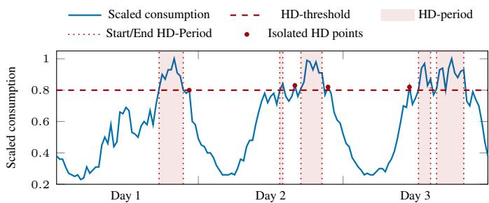
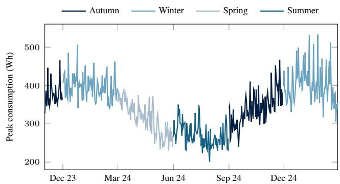

# Peak-Aware Short-Term Load Forecasting Across Distribution Grid Aggregation Levels

Souhardya Chattopadhyay1,2†, Julian Oelhaf1†\*, Antonia Schoening2, Jessica Deuschel2, Bitan Bhattacharyya2, Christian Bergler3, Andreas Maier1, Siming Bayer1

1Pattern Recognition Lab, Friedrich-Alexander-Universitat Erlangen-N ¨ urnberg¨

2Siemens AG, Smart Infrastructure

3Department of Electrical Engineering, Media and Computer Science, Ostbayerische Technische Hochschule Amberg-Weiden Erlangen, Germany

Corresponding author: julian.oelhaf@fau.de

Abstract—For distribution system operators, short-term load forecasting (STLF) supports congestion management, voltage control, and asset protection. Most existing approaches focus on overall accuracy across all time steps and neglect performance during high-demand (HD) periods, where larger forecast errors can increase the risk of congestion and voltage violations. In this paper, we study peak-aware STLF across three operator-relevant distribution grid aggregation levels, area codes (AC), secondary substations (SUB), and low-voltage (LV) feeders, using open datasets from the United Kingdom and Switzerland. We compare statistical baselines, machine learning models (LightGBM and XGBoost), and recent time-series foundation models (Chronos-Bolt and Chronos-2) under a peak-aware evaluation framework that reports both overall and HD forecasting performance using NMAE and MAPE. The results show that Chronos-2 achieves the best HD performance across all aggregation levels, with HD-NMAE and HD-MAPE of 0.039 and 4.53 % at AC, 0.080 and 9.45 % at SUB, and 0.138 and 16.14 % at LV, while Chronos-Bolt consistently ranks second best. Compared with the gradientboosted ML models, Chronos-2 reduces mean HD-NMAE by about 20–51 % across levels while remaining best or near-best on the overall metrics. A quantile analysis of the probabilistic Chronos outputs further identifies aggregation-specific operating points, and runtime measurements indicate that foundationmodel inference is fast enough for practical deployment. Overall, the findings highlight peak-aware evaluation and aggregationspecific quantile selection as a practical pathway toward more operationally relevant STLF in distribution networks.

Index Terms—Short-Term Load Forecasting, Peak-Aware Forecasting, Distribution Grid Networks, Aggregation Levels, Time-Series Foundation Models

## I. INTRODUCTION

Energy systems are becoming harder to operate due to transport electrification, electric heating, distributed renewable generation, and rising demand variability at the grid edge. While these trends support decarbonization, they also increase short-term local fluctuations as electrified end uses such as electric vehicles (EVs), heat pumps become more widespread and create sharper coincident peaks [1]–[3]. For distribution system operators (DSOs), this is especially critical at lower grid levels, where short demand surges can trigger congestion, voltage deviations, and asset stress [2], [3]. Hence, shortterm load forecasting (STLF) is both a planning task and an operational requirement for anticipating high-demand (HD) situations early enough to support preventive action.

In practice, distribution forecasting is constrained by the level at which demand can be monitored and acted upon. Privacy and regulatory constraints often prevent the direct operational use of individual smart-meter readings, shifting attention to aggregated signals such as low voltage (LV) feeders, secondary substations (SUBs), and area code (AC) demand [4]–[6]. Aggregation-aware forecasting is therefore essential, since signal behavior, operational relevance, and forecasting difficulty vary across aggregation levels.

A key difficulty is that standard evaluation is dominated by normal operating conditions. Since HD intervals are typically sharper and more abrupt than normal demand patterns [2], models can achieve strong global accuracy while still making substantially larger errors around daily peaks [7]. Yet these are exactly the periods that matter most operationally, since peak-load misprediction can have disproportionate effects on cost and reliability [8]. A model that performs well on average but poorly during HD periods is therefore of limited value for distribution-grid operation.

STLF is a mature field, and machine learning (ML) methods have long improved over statistical baselines (SBs). In particular, gradient-boosted trees such as XGBoost and Light-GBM are widely used because they flexibly exploit calendar, weather, and lag features while remaining scalable and easy to train [9]–[12]. These studies show strong overall accuracy, but mostly under global or average metrics rather than explicit peak-aware evaluation [9]–[12].

Recently, pretrained foundation models (FMs) have emerged as an alternative. Unlike supervised models trained for a specific dataset, they are pretrained on a large collection of time-series data and can be applied in an inferencedriven manner. The Chronos family is a prominent example. Chronos introduced tokenization-based probabilistic forecasting, Chronos-Bolt emphasized faster inference [13], and Chronos-2 [14] extended the framework to a broader multivariate and covariate-aware setting. On electricity datasets such as fev-bench, Chronos-2 attains a 90.7 % win rate over other FMs [14], including TimesFM-2.5, Moirai-2.0, and Lag-Llama. These properties make Chronos models attractive for operational STLF, especially when quantile outputs and longcontext modeling are useful for peak-aware decision-making.

  
Fig. 1. Typical three-day scaled consumption pattern at SUB level.

Despite substantial progress in STLF, current evaluation practices remain misaligned with the requirements of distribution-grid operation. Most prior work reports performance averaged over all timestamps, which underrepresents HD intervals where forecast errors are most critical for grid stability, congestion management, and asset utilization. In addition, existing studies often focus on a single aggregation level or a limited number of entities, rather than systematically evaluating DSO-relevant levels such as LV feeders and SUBs. Finally, while recent time-series FMs demonstrate strong general forecasting performance, their effectiveness under peakaware evaluation and their behavior across aggregation levels, particularly with respect to probabilistic outputs, remain insufficiently understood.

This work addresses these limitations by investigating whether probabilistic FMs provide a measurable advantage over established statistical and ML approaches for STLF during operationally critical HD intervals across distributiongrid aggregation levels. Specifically, this work makes the following contributions:

(i) we introduce a peak-aware evaluation framework that explicitly separates HD and non-HD performance;

(ii) we establish a scalable cross-aggregation benchmark across AC, SUB, and LV feeder levels with a large number of entities; and

(iii) we analyze the operational behavior of probabilistic FMs, including aggregation-specific quantile selection and runtime considerations.

By shifting the evaluation focus from average accuracy to peak-critical performance and by providing actionable guidance on model selection and operating points, this work supports more reliable STLF and improved operational decisionmaking for DSOs.

## II. DATA AND FORECASTING SETUP

We study day-ahead STLF across three aggregation levels that are relevant for distribution-grid monitoring and operation: AC, SUB, and LV feeder.

TABLE I  
DATASET OVERVIEW AND AGGREGATION HIERARCHY ACROSS DISTRIBUTION GRID LEVELS.
<table><tr><td>Level</td><td>Aggregated from</td><td>Source</td><td># Entities</td></tr><tr><td>AC</td><td>Multiple SUBs</td><td>CKW Group (CH) [15]</td><td>115</td></tr><tr><td>SUB</td><td>Multiple LV feeders</td><td>Northern Powergrid (UK) [16]</td><td>387</td></tr><tr><td>LV</td><td>Multiple SMs</td><td>Northern Powergrid (UK) [16]</td><td>485</td></tr></table>

## A. Datasets and Aggregation Levels

The AC-level data are obtained from the open smart meter (SM) dataset of the Swiss DSO CKW Group [15], which provides aggregated consumption per postal-code region together with the number of contributing SMs. The SUB and LV feeder datasets are taken from the Northern Powergrid open data portal in the United Kingdom [16]. At these three levels, an entity corresponds to one postal-code region, one substation, or one LV feeder, respectively. All datasets cover the period from November 2023 to February 2025. A summary of the datasets used is provided in Table I.

## B. Preprocessing and High-Demand Definition

All time series are processed at the entity level. Duplicate timestamps are removed by aggregating consumption and SM counts per entity and time step. Because the reported number of contributing SMs can vary due to communication or dataquality issues, we use per-meter demand $d _ { e , t }$ as the primary target signal:

$$
d _ { e , t } = \frac { E _ { e , t } } { M _ { e , t } } ,
$$

where $E _ { e , t }$ and $M _ { e , t }$ denote aggregated energy consumption and the number of contributing SMs for entity e at time t.

The CKW data are available at 15-minute resolution, whereas the Northern Powergrid data are provided at 30- minute resolution. To ensure comparability across aggregation levels, all series are aligned to a common 30-minute resolution by consecutive aggregation of CKW intervals.

To identify operationally critical periods in a scaleindependent way, we use a rolling HD normalization based on the recent history of each entity, given the lack of publicly available critical threshold data. For entity e and forecast day D, let $s _ { e , D }$ denote the 99th percentile $( p _ { 0 . 9 9 } )$ of permeter demand observed during the preceding 14 days. Demand within day D is then normalized as

$$
\tilde { d } _ { e , t } = \frac { d _ { e , t } } { \operatorname* { m a x } ( s _ { e , D } , \epsilon ) } , \qquad t \in D ,
$$

where $\epsilon > 0$ ensures numerical stability. A timestamp is classified as HD if $\tilde { d } _ { e , t } \geq 0 . 8 .$ . All remaining timestamps are treated as non-HD. This definition allows a common peakaware evaluation framework across aggregation levels without requiring explicit operational capacity limits for each entity. Figure 1 shows a typical scaled consumption pattern at the SUB level together with the HD threshold. Where such limits are known in practice, the same framework could be applied directly using those thresholds instead.

## C. Forecasting Task and Benchmark Setup

For each entity, a 1-day-ahead forecast at 30-minute resolution is generated once per day at midnight, resulting in a horizon H of 48 steps. The forecasting objective is evaluated over the period from March 1, 2024 to February 28, 2025 across AC, SUB, and LV feeder data following a rolling-history forecasting protocol. This setup enables a fullyear comparison across seasons: Spring (March-May); Summer (June-August); Autumn (September-November); Winter (December-February), while preserving a sufficient look-back period for both ML and foundation-model forecasting. This results in a large-scale benchmark comprising approximately 41,000 (AC); 141,000 (SUB); and 177,000 (LV feeders) daily forecasts, making it highly scalable and reliable for robust model evaluation across diverse grid conditions.

We use a compact set of exogenous covariates consisting of calendar features, holiday indicators, and weather variables. Holiday features are constructed using public holidays in England for Northern Powergrid entities and in Switzerland for CKW entities. Weather variables are obtained via Open-Meteo API [17] and include relative humidity (%), feels-like temperature (°C), dew point temperature (°C), wind speed at 10 m (m/s), and global solar radiation (W/m²). The selection of these weather variables is guided by prior work demonstrating the relevance of meteorological factors for electricity consumption modeling [18], [19].

## III. FORECASTING METHODS AND EVALUATION

We compare statistical baselines, conventional ML models, and probabilistic foundation models.

Statistical Baselines: We include two same-time averaging SBs as simple references. One uses the mean at the same time of day over the previous 7 days, and the other over the previous 4 weeks. These baselines are computationally inexpensive and serve as low-complexity reference models.

Machine Learning Models: We evaluate LightGBM and XGBoost as representative gradient-boosted tree methods. Both use the feature set described above and produce point forecasts. Gradient boosting remains one of the most widely used and competitive paradigms in applied STLF, combining flexible nonlinear learning with efficient training and robust handling of heterogeneous inputs [9]–[12]. This makes these models important references when testing whether newer FM approaches offer additional benefit when evaluation shifts from average performance to HD behavior.

Foundation Models: We further evaluate Chronos-Bolt and Chronos-2 as pretrained probabilistic time-series FMs [13], [14]. Chronos-Bolt emphasizes efficient direct multi-step forecasting and is attractive from an inference-speed perspective. Chronos-2 extends the Chronos line toward broader multivariate and covariate-aware forecasting with longer context support. In contrast to the statistical baselines and standard boosted trees, both models provide quantile forecasts, which enables explicit analysis of conservative versus less conservative operating points under peak-aware evaluation.

  
Fig. 2. Daily peak consumption pattern at SUB level.

## A. Training and Inference Protocol

The forecasting setup follows a rolling-history protocol in which each next-day forecast uses only past information. For the ML models, we use a fixed 90-day seasonal training window rather than daily per-entity retraining, which is computationally infeasible at this scale. As only limited history is available, the closest-matching prior seasonal block was selected using a small validation subset of separate entities from the same datasets that were not part of the final evaluation. This subset showed that warm months exhibit lower demand, whereas cold months show higher and more similar patterns, as illustrated in Figure 2. Accordingly, we forecast Spring 2024 using Winter 2023/24, Summer 2024 using Spring 2024, and both Autumn 2024 and Winter 2024/25 using Winter 2023/24. For the FMs, no retraining is required; instead, each test-day forecast is generated in a rolling manner from recent historical context only, with Chronos-Bolt using up to 2048 timestamps (∼ 42 days) and Chronos-2 using the full 90-day context window under the chosen setup.

## B. Peak-Aware Evaluation Metric

To evaluate both overall forecasting quality and performance during operationally critical periods, all metrics are computed over three timestamp subsets:

(i) all points: $\tau _ { \ast }$

(ii) HD points: $\mathcal { T } _ { \mathrm { H D } } = \{ t \in \mathcal { T } | \tilde { y } _ { t } \geq 0 . 8 \}$ , and

(iii) non-HD points: ${ \mathcal { T } } _ { \mathrm { n o n H D } } = \{ t \in { \mathcal { T } } | { \tilde { y } } _ { t } < 0 . 8 \}$

Here, $y _ { t }$ and $\hat { y } _ { t }$ denote the actual and forecast demand, and $\tilde { y } _ { t }$ and $\hat { \tilde { y } } _ { t }$ denote their normalized counterparts. For any subset $S \in \{ \mathcal { T } , \mathcal { T } _ { \mathrm { H D } } , \mathcal { T } _ { \mathrm { n o n - H D } } \}$ , we define the normalized mean absolute error (NMAE) and the mean absolute percentage error (MAPE) as

$$
\mathrm { N M A E } ( { \boldsymbol { S } } ) = { \frac { 1 } { | { \boldsymbol { S } } | } } \sum _ { t \in { \boldsymbol { S } } } \left| { \tilde { y } } _ { t } - { \hat { \tilde { y } } } _ { t } \right|
$$

$$
\mathrm { M A P E } ( S ) = \frac { 1 0 0 } { \left| S \right| } \sum _ { t \in S } \left| \frac { y _ { t } - \hat { y } _ { t } } { y _ { t } } \right|
$$

Thus, overall, HD, and non-HD metrics are obtained by setting ${ \mathcal { S } } = { \mathcal { T } } , { \mathcal { T } } _ { \mathrm { H D } }$ , and $\mathcal { T } _ { \mathrm { n o n H D } }$ , respectively. All reported values are computed day-wise and then aggregated over the evaluation period.

TABLE II  
NMAE & MAPE PERFORMANCE (MEAN ± STD) ACROSS AGGREGATION LEVELS FOR ALL MODELS. FOR EACH AGGREGATION LEVEL AND METRIC COLUMN, THE LOWEST MEAN IS SHOWN IN BOLD AND THE SECOND-LOWEST MEAN IS UNDERLINED.
<table><tr><td>Level</td><td>Type</td><td>Model</td><td>NMAE</td><td>HD-NMAE</td><td>Non HD-NMAE</td><td>MAPE</td><td>HD-MAPE</td><td>Non HD-MAPE</td></tr><tr><td rowspan="7">AC</td><td>SB</td><td>Last 7-day avg</td><td> $0 . 0 5 5 \pm 0 . 0 1 8$ </td><td> $0 . 0 5 9 \pm 0 . 0 2 1$ </td><td> $0 . 0 5 4 \pm 0 . 0 1 7$ </td><td> $9 . 7 5 \pm 3 . 1 5 \%$ </td><td> $6 . 8 4 \pm 2 . 4 4 \%$ </td><td> $1 0 . 1 8 \pm 3 . 3 2 \%$ </td></tr><tr><td>SB</td><td>Last 4-week avg</td><td> $0 . 0 6 6 \pm 0 . 0 2 7$ </td><td> $0 . 0 7 3 \pm 0 . 0 3 2$ </td><td> $0 . 0 6 4 \pm 0 . 0 2 6$ </td><td> $1 1 . 5 4 \pm 4 . 7 9 \%$ </td><td> $8 . 3 4 \pm 3 . 6 1 \%$ </td><td> $1 1 . 9 6 \pm 4 . 9 5 \%$ </td></tr><tr><td>ML</td><td>LightGBM</td><td> $0 . 0 8 0 \pm 0 . 0 3 2$ </td><td> $0 . 0 8 0 \pm 0 . 0 2 7$ </td><td> $0 . 0 8 0 \pm 0 . 0 3 3$ </td><td> $1 4 . 6 5 \pm 7 . 4 1 \%$ </td><td> $9 . 1 1 \pm 3 . 1 4 \%$ </td><td> $1 5 . 4 9 \pm 7 . 7 6 \%$ </td></tr><tr><td>ML</td><td>XGBoost</td><td> $0 . 0 8 1 \pm 0 . 0 3 3$ </td><td> $0 . 0 8 0 \pm 0 . 0 2 7$ </td><td> $0 . 0 8 2 \pm 0 . 0 3 4$ </td><td> $1 4 . 9 8 \pm 7 . 5 7 \%$ </td><td> $9 . 1 0 \pm 3 . 1 1 \%$ </td><td> $1 5 . 8 7 \pm 7 . 9 3 \%$ </td></tr><tr><td>FM</td><td>Chronos-Bolt</td><td> $\underline { { 0 . 0 5 1 } } \pm 0 . 0 0 7$ </td><td> $\underline { { 0 . 0 5 3 } } \pm 0 . 0 1 0$ </td><td> $\underline { { 0 . 0 5 1 } } \pm 0 . 0 0 8$ </td><td> $\underline { { 9 . 2 1 } } \pm 1 . 5 7 \%$ </td><td> $6 . 1 1 \pm 1 . 1 2 \%$ </td><td> $9 . 7 8 \pm 1 . 6 5 \%$ </td></tr><tr><td>FM</td><td>Chronos-2</td><td> ${ \bf 0 . 0 4 2 } \pm 0 . 0 0 7$ </td><td> $\overline { { { \bf 0 . 0 3 9 } } } \pm 0 . 0 0 7$ </td><td> ${ \bf 0 . 0 4 3 } \pm 0 . 0 0 8$ </td><td> $\mathbf { 7 . 6 8 \pm 1 . 4 5 \% }$ </td><td> $4 . 5 3 \pm 0 . 8 9 \%$ </td><td> $\overline { { 8 . 2 5 } } \pm 1 . 5 6 \%$ </td></tr><tr><td>SB</td><td>Last 7-day avg</td><td> ${ \bf 0 . 0 7 4 } \pm 0 . 0 1 2$ </td><td> $0 . 1 1 7 \pm 0 . 0 3 4$ </td><td> ${ \bf 0 . 0 6 8 } \pm 0 . 0 0 8$ </td><td> $1 4 . 9 6 \pm 2 . 2 1 \%$ </td><td> $1 3 . 5 4 \pm 3 . 8 8 \%$ </td><td> ${ \bf 1 5 . 0 1 } \pm 2 . 2 1 \%$ </td></tr><tr><td rowspan="7">SUB</td><td>SB</td><td>Last 4-week avg</td><td> $0 . 0 7 8 \pm 0 . 0 1 1$ </td><td> $0 . 1 1 9 \pm 0 . 0 3 1$ </td><td> $\underline { { 0 . 0 7 2 } } \pm 0 . 0 1 0$ </td><td> $1 5 . 7 8 \pm 2 . 5 2 \%$ </td><td> $1 3 . 8 0 \pm 3 . 5 3 \%$ </td><td></td></tr><tr><td>ML</td><td>LightGBM</td><td> $0 . 0 9 8 \pm 0 . 0 2 1$ </td><td></td><td></td><td></td><td> $1 3 . 1 9 \pm 2 . 7 4 \%$ </td><td> $1 5 . 9 8 \pm 2 . 6 9 \%$ </td></tr><tr><td>ML</td><td>XGBoost</td><td> $0 . 0 9 8 \pm 0 . 0 2 2$ </td><td> $0 . 1 1 3 \pm 0 . 0 2 4$   $0 . 1 1 3 \pm 0 . 0 2 4$ </td><td> $0 . 0 9 6 \pm 0 . 0 2 3$   $0 . 0 9 6 \pm 0 . 0 2 3$ </td><td> $2 0 . 2 1 \pm 4 . 6 2 \%$ </td><td> $1 3 . 2 0 \pm 2 . 6 9 \%$ </td><td> $2 1 . 0 8 \pm 4 . 9 3 \%$ </td></tr><tr><td>FM</td><td>Chronos-Bolt</td><td> $\underline { { 0 . 0 7 5 } } \pm 0 . 0 1 0$ </td><td> $\underline { { 0 . 0 9 6 } } \pm 0 . 0 2 1$ </td><td> $0 . 0 7 3 \pm 0 . 0 0 9$ </td><td> $2 0 . 4 2 \pm 4 . 7 5 \%$   $1 5 . 7 8 \pm 2 . 3 0 \%$ </td><td> $\underline { { 1 1 . 2 9 } } \pm 2 . 4 3 \%$ </td><td> $2 1 . 3 1 \pm 5 . 0 9 \%$ </td></tr><tr><td>FM</td><td>Chronos-2</td><td> $\overline { { { \bf 0 . 0 7 4 } } } \pm 0 . 0 0 9$ </td><td> ${ \bf 0 . 0 8 0 \pm 0 . 0 1 9 }$ </td><td> $0 . 0 7 3 \pm 0 . 0 0 8$ </td><td> $\overline { { 1 5 . 8 1 } } \pm 2 . 2 5 \%$ </td><td> $\overline { { 9 . 4 5 } } \pm 2 . 2 1 \%$ </td><td> $1 6 . 3 5 \pm 2 . 4 2 \%$   $1 6 . 6 1 \pm 2 . 3 6 \%$ </td></tr><tr><td></td><td></td><td></td><td></td><td></td><td></td><td></td><td></td></tr><tr><td rowspan="7">LV</td><td>SB</td><td>Last 7-day avg</td><td> ${ \bf 0 . 0 9 1 } \pm 0 . 0 1 0$ </td><td> $0 . 1 9 9 \pm 0 . 0 3 9$ </td><td> ${ \bf 0 . 0 8 2 } \pm 0 . 0 0 7$ </td><td> ${ \pm 0 . 6 4 \pm 2 . 4 2 \% }$ </td><td> $2 2 . 8 1 \pm 4 . 3 7 \%$ </td><td>20.41 ± 2.51 %</td></tr><tr><td>SB ML</td><td>Last 4-week avg LightGBM</td><td> $0 . 0 9 6 \pm 0 . 0 1 0$   $0 . 1 1 5 \pm 0 . 0 1 8$ </td><td> $0 . 1 9 7 \pm 0 . 0 3 7$ </td><td> $\underline { { 0 . 0 8 8 } } \pm 0 . 0 0 9$ </td><td> $\underline { { 2 1 . 8 6 } } \pm 2 . 8 2 \%$ </td><td> $2 2 . 6 7 \pm 4 . 1 6 \%$ </td><td>21.80 ± 2.99 %</td></tr><tr><td>ML</td><td>XGBoost</td><td> $0 . 1 1 7 \pm 0 . 0 1 9$ </td><td> $0 . 1 7 3 \pm 0 . 0 3 1$   $0 . 1 7 3 \pm 0 . 0 3 1$ </td><td> $\overline { { 0 . 1 1 0 } } \pm 0 . 0 1 9$ </td><td> $\overline { { 2 6 . 9 6 } } \pm 4 . 8 1 \%$ </td><td> $2 0 . 0 7 \pm 3 . 4 4 \%$   $2 0 . 0 2 \pm 3 . 4 0 \%$ </td><td> $\overline { { 2 7 . 5 2 } } \pm 5 . 1 7 \%$ </td></tr><tr><td>FM</td><td>Chronos-Bolt</td><td> $\underline { { 0 . 0 9 4 } } \pm 0 . 0 1 0$ </td><td> $\underline { { 0 . 1 6 0 } } \pm 0 . 0 3 4$ </td><td> $0 . 1 1 2 \pm 0 . 0 2 1$   $0 . 0 8 9 \pm 0 . 0 0 9$ </td><td> $2 7 . 4 9 \pm 5 . 2 1 \%$   $2 2 . 1 4 \pm 2 . 7 6 \%$ </td><td> $1 8 . 6 2 \pm 3 . 7 5 \%$ </td><td> $2 8 . 1 0 \pm 5 . 5 9 \%$ </td></tr><tr><td>FM</td><td>Chronos-2</td><td> $\overline { { 0 . 0 9 4 } } \pm 0 . 0 0 9$ </td><td> $\overline { { { \bf 0 . 1 3 8 } } } \pm 0 . 0 3 0$ </td><td> $0 . 0 9 1 \pm 0 . 0 0 8$ </td><td> $2 2 . 8 0 \pm 2 . 7 7 \%$ </td><td> $\overline { { { \bf 1 6 . 1 4 } } } \pm 3 . 4 0 \%$ </td><td> $2 2 . 4 7 \pm 2 . 8 8 \%$ </td></tr><tr><td></td><td></td><td></td><td></td><td></td><td></td><td></td><td> $2 3 . 3 6 \pm 2 . 8 4 \%$ </td></tr></table>

## C. Quantile Selection for Probabilistic Forecasting

Chronos-Bolt and Chronos-2 produce multiple quantile forecasts rather than a single point prediction. Since the operating quantile controls the degree of conservativeness, we do not assume that the median forecast is automatically optimal. Instead, we evaluate 11 quantiles, q0.50, q0.55, . . . , q0.95, q0.99, using the same overall, HD, and non-HD metrics described above. Quantile selection is then performed on a small validation set by jointly considering overall competitiveness and peak-aware performance. The selected quantiles are used in the final benchmark reported in the Results section.

## IV. RESULTS

## A. Performance Across Aggregation Levels

lower aggregation levels exhibit sharper and less regular peaks, making accurate HD forecasting substantially more difficult for both baselines and boosted tree models.

The entity-level extremes denoting the best and worst performing entities further confirm the robustness of the Chronos models. Chronos-2 achieves both the lowest best-case and lowest worst-case HD-MAPE across entities, indicating superior consistency and robustness compared to baselines. Its bestcase HD-MAPE reaches 2.47 % at AC, 5.48 % at SUB, and 6.91 % at LV feeder. The robustness is especially evident at SUB and LV feeder levels, where the worst-case HD-MAPE is 39.54 % and 45.67 %, respectively, compared with values above 48 % and 51 % for the SBs and ML models.

Table II summarizes forecasting performance across models and aggregation levels. Chronos-Bolt and Chronos-2 are reported using the aggregation-specific operating quantiles selected on the validation set (Table III); their behavior is analyzed in more detail in Section IV-B. Across all levels, the Chronos models dominate the peak-critical metrics. Chronos-2 achieves the best HD-NMAE and HD-MAPE in every setting, and Chronos-Bolt is consistently second-best. This indicates that the FMs are more reliable for capturing peak (HD) intervals while maintaining overall performance that is competitive with the best traditional models. At AC level, this advantage extends to the full evaluation, where Chronos-2 is best on both overall and HD metrics, improving over XGBoost by 48.1 % in overall NMAE and 50.2 % in HD-MAPE.

At SUB and LV levels, the Chronos models remain competitive overall, but their clearest advantage appears in the HD performance. At LV level, for example, Chronos-2 is only 3.3 % worse in overall NMAE than the best competing model, yet it improves HD-NMAE by 30.7 % and HD-MAPE by 29.2 %. This pattern is operationally important because

Seasonal results show the same pattern. At AC and SUB levels, Summer and Spring are the most difficult seasons, respectively, yielding the highest HD-MAPE across model families. Chronos-2 nevertheless shows a much smaller gap between best and worst seasonal HD-MAPE, indicating more stable performance across the year. Its seasonal spread is only 0.68 % points at AC and 1.86 % points at SUB, compared with about 2–3.5 % points for the SBs and ML models.

## B. Quantile Behavior

Quantile selection was performed on a validation set separately for each aggregation level and Chronos model. The rule was: (i) compute, for each candidate quantile, the overall NMAE difference to the best non-Chronos model at the same level and rank candidates in ascending order; (ii) retain the top overall candidates before the HD-NMAE begins to rise again, since HD-NMAE typically decreases as overall NMAE increases up to a turning point; and (iii) among these retained candidates, select the quantile with the lowest HD-NMAE and HD-MAPE. If multiple candidates remained, the one with the smaller overall NMAE gap was chosen. A slightly worse overall candidate was selected only if it improved both HD metrics relative to the better retained candidate.

This rule yielded level-dependent operating quantiles, reported in Table III. At the SUB level, for example, Chronos-2 $q _ { 0 . 6 5 }$ and $q _ { 0 . 7 0 }$ were the two retained candidates because they had the smallest overall NMAE gap to the best non-Chronos model. Here, $q _ { 0 . 6 5 }$ improved on the best non-Chronos model by 6.8 %, whereas $q _ { 0 . 7 0 }$ matched it exactly. Since $q _ { 0 . 7 0 }$ further reduced HD-NMAE by 7.0 % relative to $q _ { 0 . 6 5 }$ , it was selected. The same selection logic was applied at other levels.

TABLE III  
BEST QUANTILE PER MODEL AND AGGREGATION LEVEL.
<table><tr><td>Level</td><td>Chronos-Bolt</td><td>Chronos-2</td></tr><tr><td>AC</td><td>q0.65</td><td>q0.65</td></tr><tr><td>SUB</td><td>q0.65</td><td>q0.70</td></tr><tr><td>LV</td><td>90.65</td><td>q0.70</td></tr></table>

## C. Runtime and Deployment

We report median inference latency per 24-hour forecast for Chronos-Bolt and Chronos-2 on CPU and an NVIDIA A100 GPU. Median CPU and GPU inference times are 1.3 s and 0.007 s (Chronos-Bolt) and 9.8 s and 0.2 s (Chronos-2), respectively, resulting in a 185× speedup for Chronos-Bolt and 49× speedup for Chronos-2 on GPU relative to CPU. For deployment, Chronos-2 provides the strongest accuracy–robustness trade-off, while Chronos-Bolt offers competitive accuracy at substantially lower latency.

## V. CONCLUSION

This paper investigated peak-aware short-term load forecasting across AC, SUB, and LV aggregation levels. Chronosbased FMs consistently outperform established baselines on the operationally critical HD intervals while maintaining competitive overall accuracy. Chronos-2 delivers the strongest performance, reducing HD errors by around 30% relative to the best non-Chronos models without sacrificing overall accuracy. This advantage becomes more pronounced at lower aggregation levels, where load profiles are more volatile and peak behavior is harder to predict. With GPU inference times of 0.007 s for Chronos-Bolt and 0.2 s for Chronos-2 per 24-hour forecast, both models are directly applicable in operational settings. Overall, FMs provide a clear and practical advantage for peak-aware STLF, enabling more reliable monitoring of critical demand periods in distribution grids. Future work will integrate Chronos-2 forecasts into model predictive control to enable uncertainty-aware demand management and gridstability optimization under real-time operational constraints.

## ACKNOWLEDGMENT

This project was funded by the Deutsche Forschungsgemeinschaft (DFG, German Research Foundation) - 535389056.

## REFERENCES

[1] Department of Transport, UK Gov, “Vehicle licensing statistics: 2024,” https://www.gov.uk/government/statistics/ vehicle-licensing-statistics-2024, 2024, contains public sector information licensed under the Open Government Licence v3.0.

[2] M. Savanovic, L. Goberndorfer, and G. J¨ ager, “Mitigating the charging¨ rush hour,” Heliyon, vol. 10, no. 22, 2024.

[3] A. Toleikyte, E. Lecomte, J. Volt, L. Lyons, R. J. C. Roca, A. Georgakaki, S. Letout, A. Mountraki, M. Wegener, A. Schmitz et al., “Clean energy technology observatory: Heat pumps in the european union-2024 status report on technology development, trends, value chains and markets,” 2024.

[4] European Data Protection Supervisor (EDPS), “EDPS Formal comments on the draft Commission Implementing Regulation on interoperability requirements and non-discriminatory and transparent procedures for access to metering and consumption data,” https://www.edps.europa.eu/system/files/2022-09/22-08-24 access-metering-and-consumption-data en.pdf, 2022, accessed: Nov. 1, 2025.

[5] R. Knyrim and G. Trieb, “Smart metering under EU Data Protection Law. International Data Privacy Law,” 2011.

[6] D. Lee and D. J. Hess, “Data privacy and residential smart meters: Comparative analysis and harmonization potential,” Utilities Policy, vol. 70, p. 101188, 2021.

[7] K. Antoniadou-Plytaria, L. Eriksson, J. Johansson, R. Johnsson, L. Kotz,¨ J. Lamm, E. Lundblad, D. Steen, L. A. Tuan, and O. Carlson, “Effect of short-term and high-resolution load forecasting errors on microgrid operation costs,” in 2022 IEEE PES Innovative Smart Grid Technologies Conference Europe (ISGT-Europe). IEEE, 2022, pp. 1–5.

[8] A. Emde, L. Markle, B. Kratzer, F. Schnell, L. Baur, and A. Sauer,¨ “Effects of load forecast deviation on the specification of energy storage systems,” Designs, vol. 7, no. 5, p. 107, 2023.

[9] S. G. K. Uyar, B. K. Ozbay, and B. Dal, “Interpretable building energy performance prediction using XGBoost Quantile Regression,” Energy and Buildings, vol. 340, p. 115815, 2025.

[10] M. A. A. Abdalla, A. M. Ishaga, H. A. Osman, M. Elhindi, N. Ibrahim, A. Snani, G. H. A. Hamid, and A. Hammad, “Machine learning-based residential load demand forecasting: Evaluating ELM, XGBoost, RF, and SVM for enhanced energy system and sustainability,” Science in Information Technology Letters, vol. 6, no. 1, pp. 1–15, 2025.

[11] H. Musbah and M. Elsaraiti, “Forecasting load consumption: a comprehensive evaluation of deep learning and machine learning techniques,” Electric Power Systems Research, vol. 247, p. 111834, 2025.

[12] G. Harikrishnan, T. Premnath, S. Pranav, S. M. Varghese, S. Krishna, and S. Sreedharan, “Machine Learning Approaches for Load Forecasting and Time Series Analysis,” in 2024 7th International Conference on Circuit Power and Computing Technologies (ICCPCT), vol. 1. IEEE, 2024, pp. 1739–1745.

[13] A. F. Ansari, L. Stella, C. Turkmen, X. Zhang, P. Mercado, H. Shen, O. Shchur, S. S. Rangapuram, S. P. Arango, S. Kapoor et al., “Chronos: Learning the language of time series,” arXiv preprint arXiv:2403.07815, 2024.

[14] A. F. Ansari, O. Shchur, J. Kuken, A. Auer, B. Han, P. Mercado, S. S.¨ Rangapuram, H. Shen, L. Stella, X. Zhang et al., “Chronos-2: From univariate to universal forecasting,” arXiv preprint arXiv:2510.15821, 2025.

[15] CKW AG, “CKW Open Data Smart Meter: Dataset B - Aggregated smart meter data,” https://open.data.axpo.com/, 2025, accessed: Dec. 6, 2025.

[16] Northern Powergrid, “Aggregated smart metering dataset,” https:// northernpowergrid.opendatasoft.com/, 2025, accessed: Nov. 04, 2025.

[17] P. Zippenfenig, “Open-meteo.com weather api,” 2023, accessed 2025-12-23. [Online]. Available: https://open-meteo.com/

[18] A. Rahaman, J. Amakor, R. Kazeem, T. Olugasa, O. Ajide, N. Idusuyi, T.-C. Jen, and E. Akinlabi, “Modeling influence of weather variables on energy consumption in an agricultural research institute in ibadan, nigeria,” AIMS energy, vol. 12, no. 1, pp. 256–270, 2024.

[19] K. Mosner-Ansong and D. Duah, “The seasonal effects of weather on residential electric-energy usage,” Journal of Energy and Natural Resource Management, vol. 1, no. 1, 2018.