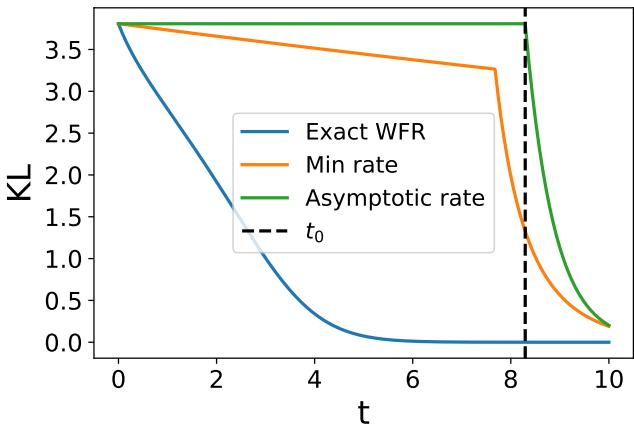
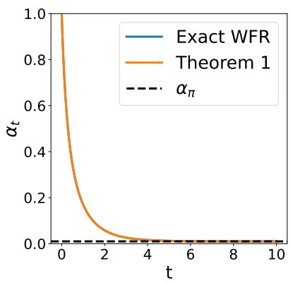
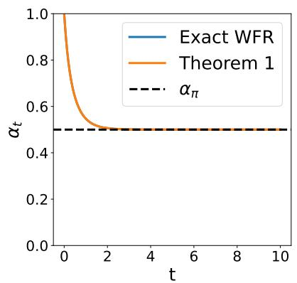
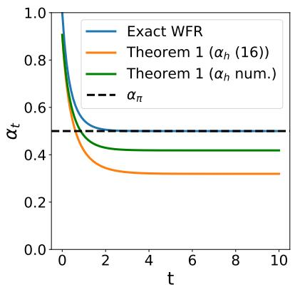
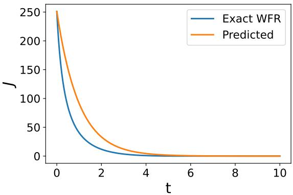
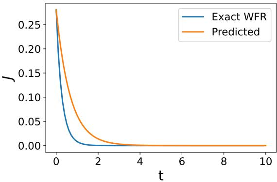

# Preservation of Log-Concavity and Convergence of Wasserstein–Fisher–Rao Gradient Flows

Francesca Romana Crucinio∗1 and Sahani Pathiraja† 2

1ESOMAS, University of Turin, Italy & Collegio Carlo Alberto, Turin, Italy 2School of Mathematics & Statistics, UNSW Sydney, Australia

## Abstract

We study the convergence of Wasserstein–Fisher–Rao (WFR) gradient flows for sampling from probability distributions known up to a normalisation constant. By combining Wasserstein transport with Fisher–Rao birth–death dynamics, WFR flows balance exploration and selection. These flows have been recognised as a promising mechanism to accelerate convergence beyond Langevin dynamics. We show that for a class of strongly log-concave target distributions satisfying additional curvature conditions, WFR flows preserve strong log-concavity, in contrast to Wasserstein flows which enjoy this property only in the Gaussian setting. Exploiting this result, we derive explicit non-asymptotic convergence rates for the symmetrised Kullback–Leibler divergence, without requiring a warm-start as required in current estimates. In particular, we show that the convergence rate decomposes additively into Wasserstein and Fisher–Rao contributions, thereby confirming a recent conjecture within this setting. These results provide refined convergence guarantees and further develop the theoretical foundations of WFR gradient flows for sampling and Bayesian inference.

## 1 Introduction

We consider the task of generating samples from a target probability distribution known up to a normalisation constant with density $\pi ( x ) \overset { \textstyle ^ { - } } { \propto } e ^ { - V _ { \pi } ( x ) } , \ x \in \mathbb { R } ^ { d }$ . Despite the conceptual simplicity of this task, its eficient implementation when $V _ { \pi }$ is multi-modal, the underlying space is high dimensional and/or modes are separated by large distances remains challenging. Given the broad application of sampling to (Bayesian) statistics and statistical machine learning, several avenues have been investigated to derive eficient and scalable algorithms.

A natural way to formulate this task is via gradient flows, which can be seen as optimisation of a functional measuring the dissimilarity to π, typically the Kullback–Leibler (KL) divergence [Wibisono, 2018, Crucinio, 2025, Chen et al., 2026]. This formulation yields considerable freedom in the design of sampling algorithms; arguably the most well-known being the so-called Wasserstein Gradient flow, hereafter W flow [Jordan et al., 1998]. It is well-known that when π satisfies a Log-Sobolev Inequality (LSI), the W flow converges exponentially fast to π, with rate depending on the Log-Sobolev constant. This highlights an inherent limitation of W flows, namely that when the LSI constant is large (e.g. as is typically the case in multi-modal densities with well separated modes), the convergence rate can be prohibitively slow [Schlichting, 2019].

Recent research eforts have instead considered gradient flows in the Fisher–Rao geometry (FR flow). These are well known in the biological literature as describing the macroscopic properties of a population with varying traits or species, and is sometimes referred to as birth-death or replicator dynamics [Kimura, 1965, Schuster and Sigmund, 1983, Cressman et al., 2006].

It is known that FR flows are intimately connected to mirror descent [Chopin et al., 2024], stochastic filtering [Akyildiz, 2017, Halder and Georgiou, 2017, Pathiraja and Wacker, 2024, Del Moral, 1997] and sequential Monte Carlo [Crucinio and Pathiraja, 2025a]. They have also recently been exploited to develop sampling algorithms [N¨usken, 2024, Maurais and Marzouk, 2024, Wang and N¨usken, 2024, Chen et al., 2026, Lu et al., 2023, 2019], most notably due to the fact that it is possible to achieve convergence rates independent of the properties of $V _ { \pi }$ [Carrillo et al., 2026, Lu et al., 2019].

In this work, we consider the so-called Wasserstein–Fisher–Rao (WFR) gradient flow, wherein the metric is given by the direct sum of the Wasserstein and Fisher-Rao metrics. We refer the reader to [Liero et al., 2018] for a rigorous treatment of this metric and its corresponding gradient flow. WFR gradient flows combine the difusive behaviour of W flows with the birth-death or reactive properties of FR flows and enjoy better convergence properties than both W and FR alone [Lu et al., 2019, Chen et al., 2026]. They have a natural interpretation as combining ‘exploration’ or ‘mutation’ to provide new particles (W flow) with ‘selection’ where particles that are a poor fit to the target are killed [Pathiraja and Wacker, 2024]. The convergence properties of WFR flows have been theorised to improve on both W and FR flows, yet the best known results are obtained under strong conditions on the ratio between π and the initial distribution $\mu _ { 0 }$ and require a warm-start condition (Lu et al. [2019, Appendix B] and Lu et al. [2023, Remark 2.6]).

We consider convergence of the WFR gradient flow for strongly log-concave targets. Under the curvature assumptions stated below, we obtain precise decay rates for the symmetrised KL without a warm-start condition. Te key step is a strong log-concavity preservation result for the WFR flow. This is in stark contrast with the W flow, which is known to preserve log-concavity uniformly in time only in the Gaussian case [Kolesnikov, 2001].

Our main contributions are as follows:

• We establish conditions under which the WFR preserves strong log-concavity (Section 3). This result combines a finite time horizon result on log-concavity preservation for the W flow with the strong regularising properties of the FR flow.

• We obtain a non-asymptotic convergence result for the continuous time WFR flow which shows that the rate of convergence is the sum of the rate of the W flow and that of the FR flow (Section 4), as conjectured in Domingo-Enrich and Pooladian [2023].

Notation We define some notation that will be used throughout the manuscript. For all diferentiable functions f we denote the gradient by $\nabla f .$ Furthermore, if $f$ is twice diferentiable we denote by $\nabla ^ { 2 } f$ its Hessian and by $\Delta f$ its Laplacian. We denote by ${ \mathcal { P } } ( \mathbb { R } ^ { d } )$ the set of probability measures over $B ( \mathbb { R } ^ { d } )$ , and endow this space with the topology of weak convergence. We denote by $\mathcal { P } _ { 2 } ^ { a c } ( \mathbb { R } ^ { d } )$ the manifold of absolutely continuous probability measures on $\mathbb { R } ^ { d }$ with finite second moment. Every $p \in \mathcal { P } _ { 2 } ^ { a c } ( \mathbb { R } ^ { d } )$ will be identified with its (Lebesgue) density $p ( x )$ . Throughout this manuscript we denote the target by $\pi$ and assume $\pi ( x ) \propto e ^ { - V _ { \pi } ( x ) }$ . The initial distribution is denoted by $\mu _ { 0 }$ . The Kullback–Leibler divergence is defined for $\nu , \mu$ admitting a density w.r.t. Lebesgue as $\begin{array} { r } { \mathrm { K L } ( \nu | | \mu ) = \int \log ( \nu ( x ) / \mu ( x ) ) \nu ( x ) d x } \end{array}$

## 2 Wasserstein–Fisher–Rao Gradient Flow

The gradient flow of $\mathrm { K L } ( \mu | | \pi )$ w.r.t. the geometry induced by the Wasserstein–Fisher–Rao distance is given by the following PDE [Lu et al., 2019, Theorem 3.1]

$$
\partial _ { t } \mu _ { t } = f _ { \mathrm { W } } ( \mu _ { t } ) + f _ { \mathrm { F R } } ( \mu _ { t } ) ,\tag{1}
$$

$$
f _ { \mathrm { W } } ( { \boldsymbol { \mu } } ) : = \nabla \cdot ( \mu \nabla \log { \frac { \mu } { \pi } } ) ,\tag{2}
$$

$$
f _ { \mathrm { F R } } ( \mu ) : = - \mu \left( \log \frac { \mu } { \pi } - \mathbb { E } _ { \mu } \left[ \log \frac { \mu } { \pi } \right] \right) .\tag{3}
$$

where $f _ { \mathrm { W } }$ and $f _ { \mathrm { F R } }$ are the Wasserstein and Fisher–Rao operators respectively. This PDE is a combination of the Wasserstein $( \mathrm { W } )$ flow and of the Fisher–Rao (FR) flow. While the W flow cannot be solved analytically, the FR flow admits a closed form solution given by (e.g. Chen et al. [2026, App. B.1], Lu et al. [2023, Eq. (16)])

$$
\mu _ { t } ^ { \mathrm { F R } } ( x ) \propto \pi ( x ) ^ { 1 - e ^ { - t } } \mu _ { 0 } ( x ) ^ { e ^ { - t } } .\tag{4}
$$

The rate of decay of KL for the WFR flow is obtained considering the time derivative of $\mathrm { K L } ( \mu _ { t } | | \pi )$ along the flow via classical arguments valid under log-concavity assumptions,

$$
\frac { d } { d t } \mathrm { K L } ( \mu _ { t } | | \pi ) = \int \log \frac { \mu _ { t } } { \pi } \partial _ { t } \mu _ { t } = - \int \mu _ { t } | \nabla \log \frac { \mu _ { t } } { \pi } | ^ { 2 } - \mathrm { V a r } _ { \mu _ { t } } \left[ \log \frac { \mu _ { t } } { \pi } \right] .\tag{5}
$$

As observed in Gallou¨et and Monsaingeon [2017, page 13], the first term corresponds to the negative gradient of KL w.r.t. the Wasserstein-2 metric, while the remaining terms give the negative gradient of KL w.r.t. the Fisher–Rao geometry, implying that the dissipation for the WFR metric is the sum of the W and the FR dissipation. The instantaneous WFR dissipation is the sum of the W and FR dissipations and is therefore at least as large as either component dissipation

$$
\begin{array} { r } { \mathrm { K L } ( \mu _ { t } | | \boldsymbol { \pi } ) \leq \operatorname* { m i n } \left\{ \mathrm { K L } ( \mu _ { t } ^ { \mathrm { F R } } | | \boldsymbol { \pi } ) , \mathrm { K L } ( \mu _ { t } ^ { \mathrm { W } } | | \boldsymbol { \pi } ) \right\} , } \end{array}
$$

where $\mu _ { t } ^ { \mathrm { F R } } , \mu _ { t } ^ { \mathrm { W } }$ denote the solutions of the FR and W flow PDEs respectively.

Convergence of the W flow is guaranteed under a Log-Sobolev assumption

$$
\mathrm { K L } ( \mu | | \pi ) \leq { \frac { \lambda _ { \pi } } { 2 } } \int \mu \left| \nabla \log { \frac { \mu } { \pi } } \right| ^ { 2 } : = { \frac { \lambda _ { \pi } } { 2 } } { \mathcal { T } } ( \mu | | \pi ) ,\tag{6}
$$

where $\lambda _ { \pi } < \infty$ denotes the Log-Sobolev constant of π and $\scriptstyle { \mathcal { T } } ( \mu | | \pi )$ is the relative Fisher information between $\mu$ and π. This assumption also guarantees that the W flow is well-defined. Under (6), we can obtain a bound on the decay of KL along the W flow (e.g., Chewi et al. [2024])

$$
\begin{array} { r } { \mathrm { K L } ( \mu _ { t } ^ { \mathrm { W } } | | \pi ) \leq e ^ { - 2 \lambda _ { \pi } ^ { - 1 } t } \mathrm { K L } ( \mu _ { 0 } | | \pi ) . } \end{array}
$$

To the best of our knowledge, the convergence result in KL obtained under the weakest assumptions on π, µ0 is given in Chen et al. [2026, Eq. (B.6)] and requires that $\mu _ { 0 } , \pi$ have bounded second moments $\begin{array} { r } { \int | x | ^ { 2 } \mu _ { 0 } ( x ) \dot { d x } \le B , \int | x | ^ { 2 } \pi ( x ) \dot { d x } \le B } \end{array}$ and |log $\begin{array} { r } { \mathbf { \langle \mu \rangle } \mu _ { 0 } ( x ) \mathbf { \langle \pi \rangle } \lrcorner \mathbf { \sigma } } \\ { \mathbf { \langle \mu \rangle } \lrcorner \mu _ { 0 } ( x ) \mathbf { \langle \pi \rangle } \ \lrcorner \ } \end{array}$ for some $M > 0$ . Under these assumptions, we have

$$
\mathrm { K L } ( \mu _ { t } ^ { \mathrm { F R } } | | \pi ) \leq M e ^ { - t } ( 2 + B + B e ^ { M e ^ { - t } ( 1 + B ) } ) .
$$

The resulting WFR rate is

$$
\begin{array} { r } { \mathrm { K L } ( \mu _ { t } | | \pi ) \leq \operatorname* { m i n } \left\{ e ^ { - 2 \lambda _ { \pi } ^ { - 1 } t } \mathrm { K L } ( \mu _ { 0 } | | \pi ) , M e ^ { - t } ( 2 + B + B e ^ { M e ^ { - t } ( 1 + B ) } ) \right\} . } \end{array}\tag{7}
$$

This rate is never worse than that of W or FR, looking at (5), however it is evident that the rate of decay of the WFR flow should be considerably higher than that of the two singular flows, and in particular it should be the sum of the singular rates as conjectured in Domingo-Enrich and Pooladian [2023].

A sharper rate of converge for WFR can be obtained assuming log $\pi ( x ) / \mu _ { 0 } ( x ) \geq M$ and a warm-start condition $\mathrm { K L } ( \mu _ { 0 } | \pi ) \le 1$ [Lu et al., 2019, Appendix B]

$$
\begin{array} { r } { \mathrm { K L } ( \mu _ { t } | | \pi ) \leq e ^ { - \left( 2 \lambda _ { \pi } ^ { - 1 } + ( 2 - 3 \delta ) \right) ( t - t _ { 0 } ) } \mathrm { K L } ( \mu _ { 0 } | | \pi ) , } \end{array}\tag{8}
$$

for all $t \ge t _ { 0 } : = \log ( M / \delta ^ { 3 } )$ and $\delta > 0$ . This result shows that the decay in the case of the WFR flow is faster than that of the W flow but requires a warm-start condition, moreover the rate is only valid for $t \geq t _ { 0 } : = \log ( M / \delta ^ { 3 } )$ which grows as $\delta  0$ making (8) sharp only for large t.

As a check of the sharpness of the above rates we consider a 1D Gaussian target for which the exact KL decay is available as shown in Crucinio and Pathiraja [2025b] (Figure 1). Even in this simple case, the rates available in the literature become sharp only for large t.

## 3 Preservation of log-concavity

As a first result towards establishing convergence of the WFR flow we obtain conditions under which the W, FR and WFR preserve log-concavity when initialised from a log-concave initial distribution $\mu _ { 0 }$ . Recall that for any log-concave $\mu _ { 0 }$ , preservation of log-concavity uniformly in time under the W flow is guaranteed only for $\pi$ Gaussian (i.e. for Ornstein-Uhlenbeck Semigroups) due to Kolesnikov [2001]. This is in stark contrast to the FR flow, where log-concavity is preserved uniformly in time for any strongly log-concave $\pi$ and $\mu _ { 0 }$ (see Lemma 2).

  
Figure 1: Comparison of exact KL decay (blue) compared to rates in the literature, (7) (orange) and (8) (green) with $\delta = 0 . 1 , t _ { 0 } = 8 . 3$ for a 1D Gaussian with $m _ { \pi } = 2 0 , C _ { \pi } = 1 0 0 , m _ { 0 } = 0 , C _ { 0 } = 1$

With some stronger conditions on $\mu _ { 0 }$ and π, as detailed in Assumptions 1 and 2, we establish preservation of log-concavity under the W flow for a limited time horizon, using similar arguments as in Pathiraja et al. [2021, Section 7.2] (in the context of stochastic filtering) and Lemma 16 in Liang et al. [2025]. We first state the necessary assumptions:

Assumption 1. The following conditions hold

(a) $\pi ( x ) \propto e ^ { - V _ { \pi } ( x ) }$ , with $V _ { \pi }$ continuously diferentiable, is $\alpha _ { \pi }$ -strongly log-concave and $L _ { \pi } { - } s m o o t h ,$ i.e. there exists an $L _ { \pi } \ge \alpha _ { \pi } > 0$ such that $L _ { \pi } I \succeq \nabla ^ { 2 } V _ { \pi } ( x ) \succeq \alpha _ { \pi } I$ for all $x \in \mathbb { R } ^ { d }$ ;

(b) $\mu _ { 0 } ( x ) \propto e ^ { - V _ { 0 } ( x ) }$ , with $V _ { 0 }$ continuously diferentiable, is α0-strongly log-concave and $L _ { 0 }$ -smooth, i.e. there exists an $L _ { 0 } \ge \alpha _ { 0 } > 0$ such that $L _ { 0 } I \succeq \nabla ^ { 2 } V _ { 0 } ( x ) \succeq \alpha _ { 0 } I$ for all $x \in \mathbb { R } ^ { d }$

The assumption on π assumes that $\pi$ is log-concave and implies that $\nabla V _ { \pi }$ is Lipschitz continuous with Lipschitz constant $L _ { \pi }$ . While strong, this assumption is classical in the study of the W flow. The assumption on $\mu _ { 0 }$ is mild since $\mu _ { 0 }$ is often user-chosen and guarantees that $\nabla V _ { 0 }$ is Lipschitz continuous with constant $L _ { 0 }$

Assumption 2. Given Assumption 1, the following conditions hold.

(a) $\begin{array} { r } { V _ { 0 } - \frac { ( 1 + \delta ) } { 2 } V _ { \pi } } \end{array}$ is strongly convex with parameter $\alpha _ { d } > 0$ for some specified $0 < \delta < 1$

(b) Denote by $\begin{array} { r } { R : = - \frac { 1 } { 2 } \Delta V _ { \pi } + \frac { 1 } { 4 } | \nabla V _ { \pi } | ^ { 2 } } \end{array}$ . Also define $\mathcal { H } : = R + V _ { \pi }$ . Assume H is strongly convex with parameter $\alpha _ { h } > 0$

The first condition requires the initial density to be suficiently strongly log-concave relative to the target density. As $\mu _ { 0 }$ is often user chosen, this assumption is not overly restrictive. The second condition is a uniform coercivity condition on the Schr¨odinger potential $\mathcal { H } ;$ this potential appears in the path-integral representation of the W flow and controls the curvature contribution accumulated along the path. These assumptions are suficient conditions for the result and are not claimed to be necessary.

The next lemma gives the precise statement of the time horizon over which the W flow is guaranteed to preserve strong log-concavity. Our proof strategy involves starting with a sequential splitting of the WFR flow and using Girsanov theorem to characterise the intermediate density due to the W flow. This is based on a similar proof strategy used to show that the filtering density satisfies a Poincar´e inequality (see Lemma 5.1 in Pathiraja et al. [2021]). The proof is given in Appendix A.1

Lemma 1 (W flows preserve log-concavity). Suppose $\mu _ { t }$ is the solution of the W flow (2) at time $t ,$ initialised at $\mu _ { 0 } ( x )$ satisfying Assumption 2. Let $b : = \sqrt { \frac { | \alpha _ { h } - L _ { \pi } | } { 2 } }$ . Then for some $0 < \delta < 1$ as in Assumption 2, the following holds

(i) Fixed time horizon: Suppose $\alpha _ { h } - L _ { \pi } < 0$ . Then there exists a $t ^ { * } > 0$ such that for all $t < t ^ { * }$ $\mu _ { t } ( x ) \propto e ^ { - \mathcal { E } _ { t } ( x ) }$ , with $\mathcal { E } _ { t } ( x )$ a strongly convex function where $\nabla ^ { 2 } { \mathcal { E } } _ { t } ( x ) \succeq \left( { \frac { \alpha _ { \pi } } { 2 } } + c _ { t } \right) I$ for all $x \in \mathbb { R } ^ { d }$ where

$$
c _ { t } = b \tan \left( \tan ^ { - 1 } \left( { \frac { c _ { 0 } } { b } } \right) - 2 b t \right)\tag{9}
$$

$$
c _ { 0 } = \alpha _ { d } + \frac { \delta } { 2 } \alpha _ { \pi } ,\tag{10}
$$

(ii) Uniform in time: Suppose $\alpha _ { h } - L _ { \pi } > 0$ . Then for all $t \geq 0 , \mu _ { t } ( x ) \propto e ^ { - \mathcal { E } _ { t } ( x ) }$ , with $\mathcal { E } _ { t } ( x )$ a strongly convex function where $\begin{array} { r } { \nabla ^ { 2 } { \mathcal E } _ { t } ( x ) \succeq \left( \frac { \alpha _ { \pi } } { 2 } + c _ { t } \right) I } \end{array}$ for all $x \in \mathbb { R } ^ { d }$ , where

$$
c _ { t } = b \left( { \frac { K - e ^ { - 4 b t } } { K + e ^ { - 4 b t } } } \right) = b \left( { \frac { b + c _ { 0 } - e ^ { - 4 b t } ( b - c _ { 0 } ) } { b + c _ { 0 } + e ^ { - 4 b t } ( b - c _ { 0 } ) } } \right)\tag{11}
$$

with $\begin{array} { r } { K : = \frac { b + c _ { 0 } } { b - c _ { 0 } } } \end{array}$ and $c _ { 0 }$ as in (10).

When $\alpha _ { h } - L _ { \pi } < 0 ,$ a uniform in time preservation of log-concavity is not guaranteed, and the length of the time horizon over which strong convexity is preserved depends on the log-concavity of the diference between initial potential $V _ { 0 }$ and (some factor) of the target potential $V _ { \pi }$ . Loosely speaking, the time horizon increases as $\alpha _ { d }$ in Assumption 2 increases.

Remark 1 (Gaussian distributions). Condition $( i i )$ in Lemma 1 is not necessary in the Gaussian case (but is suficient beyond the Gaussian case for uniform in time preservation). In fact, in the Gaussian case

$$
R ( x ) = - { \frac { 1 } { 2 } } \Delta V _ { \pi } ( x ) + { \frac { 1 } { 4 } } \left| \nabla V _ { \pi } ( x ) \right| ^ { 2 } = - { \frac { 1 } { 2 } } T r [ C _ { \pi } ^ { - 1 } ] + { \frac { 1 } { 4 } } ( x - m _ { \pi } ) ^ { \top } C _ { \pi } ^ { - 2 } ( x - m _ { \pi } )
$$

and $\nabla ^ { 2 } R ( x ) = \textstyle { \frac { 1 } { 2 } } C _ { \pi } ^ { - 2 } \succeq 0$ . It follows that when checking the strong convexity of $\nabla _ { w _ { 1 } } ^ { 2 } f _ { 2 }$ in the proof of Lemma 1, no condition on $\alpha _ { h } , L _ { \pi }$ is needed. However, this is unique to the Gaussian case and does not apply in general.

Although the W flow cannot be generally expected to preserve log-concavity uniformly in time (unless $\pi$ is Gaussian), the properties of the FR flow can be exploited to maintain log-concavity uniformly in time. The next lemma shows that the FR preserves log-concavity when $\mu _ { 0 } , \pi$ satisfy Assumption 1.

Lemma 2 (FR flows preserve log-concavity). Suppose $\mu _ { t }$ is the solution of the FR flow (3) at time $t ,$ initialised at $\mu _ { 0 } ( x )$ satisfying Assumption 1. Then $\mu _ { t } , \ t > 0$ is $\alpha _ { t }$ -strongly log-concave with

$$
\alpha _ { t } = ( 1 - e ^ { - t } ) \alpha _ { \pi } + e ^ { - t } \alpha _ { 0 }
$$

Proof. Using the exact solution to the FR flow (4),

$$
\mu _ { t } ( x ) \propto \pi ( x ) ^ { 1 - e ^ { - t } } \mu _ { 0 } ( x ) ^ { e ^ { - t } } \propto e ^ { - V _ { t } ( x ) }
$$

where $V _ { t } = ( 1 - e ^ { - t } ) V _ { \pi } + e ^ { - t } V _ { 0 }$ . Also

$$
\nabla ^ { 2 } V _ { t } = ( 1 - e ^ { - t } ) \nabla ^ { 2 } V _ { \pi } + e ^ { - t } \nabla ^ { 2 } V _ { 0 } \succeq ( ( 1 - e ^ { - t } ) \alpha _ { \pi } + e ^ { - t } \alpha _ { 0 } ) I = : \alpha _ { t } I
$$

where $\alpha _ { t } > 0$ is a convex combination of positive scalars for all $t > 0$

In the next theorem, we show that the preservation of log-concavity under the FR flow can be exploited to ensure the same for the WFR flow uniformly in time, even when the W flow may not preserve log-concavity uniformly. The proof can be found in Appendix A.2.

Theorem 1 (WFR preserves strong log-concavity uniformly in time). Assume the conditions of Lemma 1. For the case $\alpha _ { h } - L _ { \pi } < 0$ only, additionally assume that $b : = \sqrt { \frac { | \alpha _ { h } - L _ { \pi } | } { 2 } }$ satisfies

$$
\begin{array} { r } { b ^ { 2 } < \frac { \alpha _ { \pi } } { 4 } . } \end{array}\tag{12}
$$

Then $\mu _ { t }$ , the solution of (1) at time t is $\alpha _ { t } .$ -strongly log-concave for all $t > 0$ , where

$$
\alpha _ { t } = \frac { \alpha _ { \pi } } { 2 } - \frac { 1 } { 4 } + m \cdot \frac { ( m + c _ { 0 } + \frac { 1 } { 4 } ) - ( m - c _ { 0 } - \frac { 1 } { 4 } ) e ^ { - 4 m t } } { ( m + c _ { 0 } + \frac { 1 } { 4 } ) + ( m - c _ { 0 } - \frac { 1 } { 4 } ) e ^ { - 4 m t } }\tag{13}
$$

where $c _ { 0 }$ is given by (10), $m = { \sqrt { { \textstyle { \frac { 1 } { 2 } } } \left( { \frac { 1 } { 8 } } + r \right) } }$ and

$$
r = \left\{ \begin{array} { l l } { { \frac { \alpha _ { \pi } } { 2 } - 2 b ^ { 2 } , } } & { { \alpha _ { h } - L _ { \pi } < 0 } } \\ { { \frac { \alpha _ { \pi } } { 2 } + 2 b ^ { 2 } , } } & { { \alpha _ { h } - L _ { \pi } > 0 } } \end{array} \right.
$$

Note also that $\alpha _ { \infty } > \frac { \alpha _ { \pi } } { 2 }$

In the case $\alpha _ { h } - L _ { \pi } < 0 .$ , the W flow does not preserve log-concavity uniformly in time and we require condition (12). This condition is suficient to ensure that there exists a lower bound to the possible curvature deficit of the Schr¨odinger potential. In the case $\alpha _ { h } - L _ { \pi } > 0$ , the W flow preserves log-concavity uniformly, and combining this with Lemma 2 via the same splitting argument as in the proof of Theorem 1 (without restrictions on b as in (12)) yields the result.

A comparison between Theorem 1 and the exact log-concavity constant from Crucinio and Pathiraja [2025b], Liero et al. [2026] in the Gaussian case shows that the constant in Theorem 1 is tight (Figure 2). We further evaluate the tightness of the constant (13) on a 1D example.

Example 1 (1D Non-Gaussian target). We consider a non-Gaussian target, corresponding to a perturbation of a Gaussian: for $\beta > 0 , c _ { \pi } > 0$ set

$$
V _ { \pi } ( x ) = \frac { x ^ { 2 } } { 2 c _ { \pi } } + \beta \log ( 1 + e ^ { x } ) .\tag{14}
$$

We first check that π satisfies our assumptions: we have

$$
V _ { \pi } ^ { \prime \prime } ( x ) = \frac { 1 } { c _ { \pi } } + \beta ( 1 + e ^ { - x } ) ^ { - 2 } e ^ { - x } = \frac { 1 } { c _ { \pi } } + \beta u ( x ) ( 1 - u ( x ) )
$$

where $u ( x ) = ( 1 + e ^ { - x } ) ^ { - 1 }$ and $0 < u ( x ) < 1$ for all $x \in \mathbb { R }$ . Clearly

$$
V _ { \pi } ^ { \prime \prime } ( x ) \geq \frac { 1 } { c _ { \pi } } + 0 = \alpha _ { \pi }
$$

for all $x \in \mathbb { R }$ . Moreover $V _ { \pi } ^ { \prime \prime } ( x )$ has a unique maximum at $x = 0$ and thus

$$
V _ { \pi } ^ { \prime \prime } ( x ) \leq \frac { 1 } { c _ { \pi } } + \frac { \beta } { 4 } = : L _ { \pi } .
$$

This shows that Assumption 1 is satisfied.

To check Assumption 2 consider $\begin{array} { r } { V _ { 0 } = \frac { x ^ { 2 } } { 2 \sigma _ { 0 } ^ { 2 } } } \end{array}$ . Then,

$$
\begin{array} { c } { { V _ { 0 } ^ { \prime \prime } - \displaystyle \frac { ( 1 + \delta ) } { 2 } V _ { \pi } ^ { \prime \prime } = \displaystyle \frac { 1 } { \sigma _ { 0 } ^ { 2 } } - \displaystyle \frac { ( 1 + \delta ) } { 2 } \left( \displaystyle \frac { 1 } { c _ { \pi } } + \beta u ( x ) ( 1 - u ( x ) ) \right) } } \\ { { \geq \displaystyle \frac { 1 } { \sigma _ { 0 } ^ { 2 } } - \displaystyle \frac { ( 1 + \delta ) } { 2 } \displaystyle \frac { 1 } { c _ { \pi } } - \displaystyle \frac { ( 1 + \delta ) } { 2 } \displaystyle \frac { \beta } { 4 } = : \alpha _ { d } } } \end{array}
$$

To guarantee $\alpha _ { d } > 0$ is suficient to take an initial distribution such that $\begin{array} { r } { \frac { 1 } { c _ { \pi } } + \frac { \beta } { 4 } < \frac { 2 } { ( 1 + \delta ) \sigma _ { 0 } ^ { 2 } } } \end{array}$ . Since $\delta \in ( 0 , 1 )$ the factor $( 1 + \delta ) / 2$ is increasing in $\delta$ and is bounded above by 1. Thus $\alpha _ { d } > 0$ provided that

$$
\frac { 1 } { c _ { \pi } } + \frac { \beta } { 4 } < \frac { 1 } { \sigma _ { 0 } ^ { 2 } } .\tag{15}
$$

For the second condition, take

$$
{ \mathcal { H } } ( x ) = - { \frac { 1 } { 2 } } V _ { \pi } ^ { \prime \prime } ( x ) + { \frac { 1 } { 4 } } \left( V _ { \pi } ^ { \prime } ( x ) \right) ^ { 2 } + V _ { \pi } ( x ) ,
$$

whose second derivative is

$$
\begin{array} { l } { \displaystyle \mathcal { H } ^ { \prime \prime } ( x ) = - \frac { \beta } { 2 } u ( x ) ( 1 - u ( x ) ) ( 1 - 6 u ( x ) + 6 u ( x ) ^ { 2 } ) } \\ { \displaystyle \qquad + \frac { 1 } { 2 } \left( \frac { 1 } { c _ { \pi } } + \beta u ( x ) ( 1 - u ( x ) ) \right) ^ { 2 } } \\ { \displaystyle \qquad + \frac { \beta } { 2 } \left( \frac { x } { c _ { \pi } } + \beta u ( x ) \right) u ( x ) ( 1 - u ( x ) ) ( 1 - 2 u ( x ) ) } \\ { \displaystyle \qquad + \frac { 1 } { c _ { \pi } } + \beta u ( x ) ( 1 - u ( x ) ) . } \end{array}
$$

As $0 < u ( x ) < 1$ , for $\beta > 0$ we have that the second term in the expression above is lower bounded by $1 / ( 2 c _ { \pi } ^ { 2 } )$ and the last term is lower bounded by $1 / c _ { \pi }$ . Moreover, we have $0 < u ( x ) ( 1 - u ( x ) ) < 1 / 4$ and $| 1 - 6 u ( x ) + 6 u ( x ) ^ { 2 } | \leq 1$ and thus the first term is lower bounded $b y \_ - \beta / 8$ . The remaining term can be written as $T ( x ) = T _ { 1 } ( x ) + T _ { 2 } ( x )$ where

$$
\begin{array} { l } { T _ { 1 } ( x ) = \displaystyle \frac { \beta } { 2 c _ { \pi } } x u ( x ) ( 1 - u ( x ) ) ( 1 - 2 u ( x ) ) } \\ { T _ { 2 } ( x ) = \beta ^ { 2 } u ^ { 2 } ( x ) ( 1 - u ( x ) ) ( 1 - 2 u ( x ) ) . } \end{array}
$$

For the second term, since $| 1 - 2 u ( x ) | \leq 1$ and $\begin{array} { r } { u ^ { 2 } ( x ) ( 1 - u ( x ) ) \leq u ( x ) ( 1 - u ( x ) ) \leq \frac { 1 } { 4 } } \end{array}$ , we have the lower bound $- \frac { \beta ^ { 2 } } { 4 }$ . For the first term, using known trigonometric identities we have

$$
T _ { 1 } ( x ) = - \frac { \beta } { 2 c _ { \pi } } \frac { x \operatorname { t a n h } ( x / 2 ) } { 4 \cosh ^ { 2 } ( x / 2 ) } .
$$

Since x and tanh $( x / 2 )$ have the same $s i g n _ { ; }$ we can conclude that $T _ { 1 } ( x ) \leq 0$ . Moreover, using the fact that $| \operatorname { t a n h } ( x / 2 ) | \leq 1$ and cosh $( x / 2 ) \geq { \textstyle { \frac { 1 } { 2 } } } e ^ { | x | / 2 }$ we find

$$
| T _ { 1 } ( x ) | \leq \frac { \beta } { 2 c _ { \pi } } | x | e ^ { - | x | } \leq \frac { \beta } { 2 e c _ { \pi } }
$$

Therefore, we get the lower bound $\begin{array} { r } { T _ { 1 } ( x ) \ge - \frac { \beta } { 2 e c _ { \pi } } } \end{array}$

Combining all lower bounds gives

$$
\mathcal { H } ^ { \prime \prime } ( x ) \geq - \frac { \beta } { 8 } + \frac { 1 } { 2 c _ { \pi } ^ { 2 } } - \frac { \beta } { 2 e c _ { \pi } } - \frac { \beta ^ { 2 } } { 4 } + \frac { 1 } { c _ { \pi } } : = \alpha _ { h } .\tag{16}
$$

In Figure $\mathcal { Q } ( r i g h t )$ we consider the case $\sigma _ { 0 } ^ { 2 } = 1 , c _ { \pi } = 2 , \beta = 1 / 2$ for which (15) trivially holds and (16) is positive. The condition (12) corresponds to

$$
\frac { 1 } { 2 c _ { \pi } } + \frac { \beta } { 4 } < \alpha _ { h } < \frac { 1 } { c _ { \pi } } + \frac { \beta } { 4 }
$$

which is also satisfied. We compare the results of Theorem 1 with the log-concavity constant obtained by numerically solving the WFR PDE with target π. In this case (13) is reasonably tight, although its quality degrades for large t and is clearly dependent on the estimate $f o r \alpha _ { h }$ . Although $\alpha _ { \infty }$ can be diferent from $\alpha _ { \pi }$ the true asymptotic constant, it is never worse than $\frac { \alpha _ { \pi } } { 2 }$

We will rely on the results of Theorem 1 in the next section to characterise convergence rates.

  
Figure 2: Comparison of log-concavity constant from Theorem 1 and true log-concavity constant for the solution of (1) for 1D targets. Target densities considered are $\pi ( x ) = \mathcal { N } ( x ; 0 , 1 0 0 )$ (left), $\pi ( x ) = \mathcal { N } ( x ; 0 , 2 )$ (middle) and $\pi ( x )$ ∝ $\textstyle \exp { \left( - { \frac { x ^ { 2 } } { 4 } } - 0 . 5 \log ( 1 + e ^ { x } ) \right) }$ (right). For the non-Gaussian target, we consider $\alpha _ { t }$ from Theorem 1 using $\alpha _ { h }$ developed via the analytic calculations in (16) (orange line) as well as $\alpha _ { h }$ calculated numerically (green line). For the Gaussian targets, $\alpha _ { t }$ is known analytically whereas for the non-Gaussian target, $\alpha _ { t }$ is evaluated numerically from an Euler discretisation of (1). In all cases, $\mu _ { 0 } ( x ) = \mathcal { N } ( x ; 0 , 1 )$ . In the Gaussian case, the log-concavity constants estimated by (13) are tight. For the third target, (13) is reasonably tight, although its quality degrades for large t and is dependent on the quality of $\alpha _ { h }$ (compare green vs orange line).

## 4 Convergence of Wasserstein–Fisher–Rao gradient flow

The preservation of log-concavity under the WFR flow established in the previous section can be exploited to obtain explicit rates of convergence to $\pi$ for the WFR flow without a warm start condition as (8) or bounded moment conditions (7). In Proposition 1, we obtain an additive W and FR dissipation rate for the symmetrised KL rather than for the KL alone. The symmetrised KL divergence, or Jefreys’ divergence $J ,$ is defined as

$$
\begin{array} { r } { J ( \mu , \pi ) : = \mathrm { K L } ( \mu | | \pi ) + \mathrm { K L } ( \pi | | \mu ) , } \end{array}
$$

for any $\mu \ll \pi$ and also $\pi \ll \mu .$ The rationale behind considering the symmetrised KL is due to the fact that the KL is not geodesically convex under the FR flow [Carrillo et al., 2026, Theorem 1.1] nor satisfies a gradient dominance condition [Carrillo et al., 2026, Theorem 4.1], which makes its convergence analysis more dificult. On the other hand, Jefreys’ divergence satisfies a gradient dominance condition [Carrillo et al., 2026, Section 4] which allows to achieve improved rates. In addition, $J ( \mu , \pi )$ upper bounds $\mathrm { K L } ( \mu | | \pi )$ and thus the obtained rates for $J ( \mu , \pi )$ gives information on the decay of KL too. The decay rate obtained in Proposition 1 is a sum of the decay rates of W and FR $\mathrm { \ f o w s ^ { 1 } }$ as was conjectured by Domingo-Enrich and Pooladian [2023].

Proposition 1. Assume the conditions of Theorem 1. Then the following decay result holds for $\mu _ { t }$ the solution of the WFR PDE (1) for all $t > 0$

$$
J ( \mu _ { t } , \pi ) \leq J ( \mu _ { 0 } , \pi ) e ^ { - t ( \alpha _ { \pi } + 1 ) } .
$$

Proof. Given the assumptions, we may interchange diferentiation and integration to obtain

$$
\begin{array} { l } { \displaystyle \frac { d } { d t } J ( \mu _ { t } , \pi ) = \int \left( \log \frac { \mu _ { t } } { \pi } - \frac { \pi } { \mu _ { t } } \right) ( x ) \partial _ { t } \mu _ { t } ( x ) d x } \\ { \displaystyle = \int \left( \log \frac { \mu _ { t } } { \pi } - \frac { \pi } { \mu _ { t } } \right) ( x ) \left( f _ { \mathrm { W } } ( \mu _ { t } ( x ) ) + f _ { \mathrm { F R } } ( \mu _ { t } ( x ) ) \right) d x . } \end{array}\tag{17}
$$

  
Figure 3: Comparison between the exact symmetrised KL decay from Crucinio and Pathiraja [2025b] (blue) with our rate in Proposition 1 (orange) for (left) a 1D Gaussian with $m _ { \pi } = 2 0 , C _ { \pi } = 1 0 0 , m _ { 0 } = 0 , C _ { 0 } = 1$ and (right) the target in Example 1.

Begin with the first term, by a standard integration by parts argument,

$$
\begin{array} { r l } { \displaystyle \int \left( \log \frac { \mu _ { t } } { \pi } - \frac { \pi } { \mu _ { t } } \right) ( x ) f _ { \mathrm { W } } ( \mu _ { t } ( x ) ) d x = \int \left( \log \frac { \mu _ { t } ( x ) } { \pi ( x ) } - \frac { \pi ( x ) } { \mu _ { t } ( x ) } \right) \nabla \cdot \left( \mu _ { t } ( x ) \nabla \log \frac { \mu _ { t } } { \pi } ( x ) \right) ( x ) d x } & { } \\ { = - \mathbb { E } _ { \mu _ { t } } \left[ \left| \nabla \log \frac { \mu _ { t } } { \pi } \right| ^ { 2 } \right] - \mathbb { E } _ { \pi } \left[ \nabla \log \frac { \mu _ { t } } { \pi } \cdot \nabla \log \frac { \mu _ { t } } { \pi } \right] } & { } \\ { = - ( \mathcal { T } ( \mu _ { t } | | \pi ) + \mathcal { T } ( \pi | | \mu _ { t } ) ) } & { } \\ { \leq - 2 \operatorname* { m i n } ( \lambda _ { \pi } ^ { - 1 } , \lambda _ { \mu _ { t } } ^ { - 1 } ) ( \mathrm { K L } ( \mu _ { t } | | \pi ) + \mathrm { K L } ( \pi | | \mu _ { t } ) ) } & { } \\ { = - 2 \operatorname* { m i n } ( \alpha _ { \pi } , \alpha _ { t } ) J ( \mu _ { t } , \pi ) , } & { } \\ { < - \alpha _ { \pi } J ( \mu _ { t } , \pi ) , } \end{array}\tag{18}
$$

(19)

where $\mathcal { T } ( \mu _ { t } | | \pi )$ is the relative Fisher information between $\mu _ { t }$ and $\pi .$ . The inequality (18) holds due to Assumption 1 and Theorem 1. More specifically, since π is $\alpha _ { \pi }$ -strongly log-concave, it immediately satisfies a Log-Sobolev inequality (6) with constant $\lambda _ { \pi } = \alpha _ { \pi } ^ { - 1 }$ (likewise for $\mu _ { t }$ , which is $\alpha _ { t }$ -strongly log-concave due to Theorem 1). The final inequality (19) holds because Theorem 1 gives $\alpha _ { t } > \frac { \alpha _ { \pi } } { 2 }$ for every finite $t \geq 0$

Then for the second term in (17), by a direct application of (5.16) in Carrillo et al. [2026, Theorem 5.6] with $f ( y ) = y \log ( y )$ and $\bar { f } = y f ( y ^ { - 1 } )$ , it holds that

$$
- \int \frac { \pi ( x ) } { \mu _ { t } ( x ) } f _ { \mathrm { F R } } ( \mu _ { t } ( x ) ) d x = - J ( \mu _ { t } , \pi ) ,
$$

and also,

$$
\int \log { \frac { \mu _ { t } ( x ) } { \pi ( x ) } } f _ { \mathrm { F R } } ( \mu _ { t } ( x ) ) d x = - \mathrm { V a r } _ { \mu _ { t } } \left( \log { \frac { \mu _ { t } } { \pi } } \right) < 0 ,
$$

so that together, we have

$$
\int \left( \log \frac { \mu _ { t } } { \pi } - \frac { \pi } { \mu _ { t } } \right) ( x ) f _ { \mathrm { F R } } ( \mu _ { t } ( x ) ) d x < - J ( \mu _ { t } , \pi ) .\tag{20}
$$

An application of Gr¨onwall’s lemma then yields the result.

Proposition 1 shows that the rate of convergence of the WFR flow has the additive W and FR form conjectured by Domingo-Enrich and Pooladian [2023], up to the factor introduced by the strong log-concavity estimate. This result is obtained for the strongly log-concave case without requiring a warm-start condition. The analysis uses the symmetrised KL instead of the more classical reverse KL. In Figure 3 we compare the rate in Proposition 1 with the exact decay rate obtained in Crucinio and Pathiraja [2025b] for a 1D Gaussian target, showing that the decay predicted by our result is sharp.

We point out that as $\mathrm { K L } ( \mu _ { t } | | \pi ) \leq J ( \mu _ { t } , \pi )$ , Proposition 1 implies

$$
\mathrm { K L } ( \mu _ { t } | | \pi ) \leq J ( \mu _ { 0 } , \pi ) e ^ { - t ( \alpha _ { \pi } + 1 ) }\tag{21}
$$

showing that the same exponential rate is inherited by the KL. However, the constant $J ( \mu _ { 0 } , \pi )$ can be significantly larger than the constants in (7) making the bound (21) looser for small t.

Remark 2. A sharper convergence rate can be obtained by applying Gr¨onwall’s lemma before (19):

$$
J ( \mu _ { t } , \pi ) \leq J ( \mu _ { 0 } , \pi ) \exp \left( - \left( 2 \int _ { 0 } ^ { t } \operatorname* { m i n } ( \alpha _ { \pi } , \alpha _ { u } ) d u + t \right) \right) .
$$

This bound clearly shows that the decay rate for the WFR flow is the sum of that for the W flow and that for the FR flow. However, as $\alpha _ { u }$ is generally not known this bound provides less information than the one in Proposition 1.

## 5 Discussion

In this work, we established new theoretical guarantees for Wasserstein–Fisher–Rao (WFR) gradient flows in the setting of strongly log-concave target distributions. Under the explicit curvature assumptions in Section 3, our main result proves that WFR dynamics preserve strong log-concavity uniformly in time. While Wasserstein flows preserve log-concavity only under restrictive conditions, most notably in the Gaussian setting, the addition of the Fisher–Rao component provides a regularising mechanism that maintains strong log-concavity uniformly in time. This structural result enables a refined analysis of the dynamics and forms the foundation for our convergence theory.

Building on this preservation property, we derived explicit non-asymptotic convergence guarantees for the continuous-time WFR flow without requiring warm-start assumptions. In particular, we proved exponential convergence of the symmetrised Kullback–Leibler divergence with an additive Wasserstein–Fisher–Rao dissipation rate, thereby confirming the conjecture of Domingo-Enrich and Pooladian [2023]. The same estimate yields a bound on the KL through KL $\lvert \left( \mu _ { t } \lVert \boldsymbol { \pi } \right) \rvert \leq J ( \mu _ { t } , \boldsymbol { \pi } )$ . The analysis also highlights how the transport and birth–death components contribute additively to the overall dissipation, providing a precise mathematical characterisation of the complementary roles of exploration and selection in WFR dynamics.

Several aspects of our analysis could likely be strengthened. The assumptions ensuring uniform preservation of log-concavity are suficient but may not be necessary, and it would be of considerable interest to determine whether they can be relaxed or replaced by weaker geometric conditions. Likewise, while our convergence result focuses on strongly log-concave targets, extending these techniques to broader classes of distributions—including weakly log-concave, non-convex, or multimodal targets—would significantly increase the applicability of the theory. Since WFR dynamics have been proposed precisely to improve sampling performance in challenging landscapes, understanding the extent to which these theoretical guarantees persist beyond the log-concave regime remains an important open question.

More generally, our results contribute to the growing understanding of hybrid optimal transport geometries by illustrating how transport and reaction mechanisms interact to produce stronger qualitative and quantitative properties than either component alone. Beyond the specific setting considered here, it would be interesting to investigate whether similar structural preservation results hold for other gradient flows defined on combined geometries or for alternative energy functionals arising in sampling, inference, and optimisation. We hope that the techniques developed in this work provide a foundation for further study of Wasserstein–Fisher–Rao dynamics and their role in the analysis of gradient flows on spaces of probability measures.

Finally, beyond the specific convergence result obtained here, the proof strategy itself may be of independent interest. By exploiting the complementary properties of the Wasserstein and Fisher–Rao operators through a splitting argument, we are able to establish qualitative properties of the combined flow that are dificult to obtain directly from the reaction-difusion equation. This perspective may prove useful in the analysis of other hybrid gradient flows and provides a natural link with operator-splitting formulations of WFR dynamics such as those considered in Crucinio and Pathiraja [2025b].

Acknowledgments F.R.C. gratefully acknowledges the “de Castro” Statistics Initiative at the Collegio Carlo Alberto and the Fondazione Franca e Diego de Castro. F.R.C. is supported by the Gruppo Nazionale per l’Analisi Matematica, la Probabilit\`a e le loro Applicazioni (GNAMPA-INdAM). S.P. gratefully acknowledges funding from UNSW Faculty of Science Research Grant and the Eva Mayr Stihl Foundation.

The authors would like to thank Josh Bon, Sam Power, Florian Maire, Daniel Paulin, Upanshu Sharma for helpful discussions and in particular Sinho Chewi for pointing to the reference Kolesnikov [2001] and Andre Wibisono for directing us to Lemma 16 in Liang et al. [2025]. The authors gratefully acknowledge the mathematical research institute MATRIX in Australia where part of this research was performed.

## A Preservation of log-concavity

## A.1 Proof of Lemma 1

The first step is to use Girsanov’s theorem to characterise the law of the overdamped Langevin difusion

$$
d Y _ { t } = - \nabla V _ { \pi } ( Y _ { t } ) d t + \sqrt { 2 } d \widetilde { W } _ { t } ,\tag{22}
$$

where $\{ \widetilde { W } _ { t } \} _ { t \ge 0 }$ is a standard Brownian motion. We instead consider the time-rescaled process $X _ { s } = Y _ { s / 2 }$ obtained by the time change $s = 2 t$ . By Brownian scaling, ${ \widetilde { W } _ { s / 2 } } = 2 ^ { - 1 / 2 } W _ { s }$ , where $\{ W _ { s } \} _ { s \ge 0 }$ is again a standard Brownian motion. Hence, X satisfies

$$
d X _ { s } = \nabla U ( X _ { s } ) d s + d W _ { s } .\tag{23}
$$

with $U = - { \textstyle \frac { 1 } { 2 } } V _ { \pi }$ . Note that (23) has the same invariant density as $( 2 2 )$

Let $\widehat { \mu } _ { s }$ denote the law of $X _ { s } , \mu _ { W } ( d w )$ denote the Wiener measure on the space of continuous paths on $[ 0 , s ] , C ( [ 0 , s ] ; \mathbb { R } ^ { d } )$ with $W _ { 0 } \sim \mu _ { 0 }$ and $\varphi : \mathbb { R } ^ { d } $ R be a bounded measurable test function. By an application of Girsanov’s theorem (see Øksendal [2003, Exercise 8.15]),

$$
\begin{array} { l l } { \displaystyle \int \varphi ( x ) \widehat { \mu } _ { s } ( d x ) = \int _ { C ( [ 0 , s ] ; \mathbb R ^ { d } ) } \varphi ( w _ { s } ) \exp \left( \int _ { 0 } ^ { s } \nabla U ( W _ { u } ) \cdot d W _ { u } - \frac 1 2 \int _ { 0 } ^ { s } | \nabla U ( W _ { u } ) | ^ { 2 } d u \right) \mu _ { W } ( d w ) } \\ { \displaystyle \qquad = \int _ { ( C [ 0 , s ] ; \mathbb R ^ { d } ) } \varphi ( w _ { s } ) \exp \left( ( U ( W _ { s } ) - U ( W _ { 0 } ) - \frac 1 2 \int _ { 0 } ^ { s } ( \Delta U + | \nabla U | ^ { 2 } ) ( W _ { u } ) d u \right) \mu _ { W } ( d w ) } \end{array}
$$

Note that Girsanov’s theorem applies here since Novikov’s condition is easily verified as U satisfies a linear growth condition $| \nabla U | \leq c _ { 1 } ( 1 + | x | )$ for some $c _ { 1 } > 0$ under Assumption 1. In the second line, we have used Itˆo’s formula to obtain

$$
U ( W _ { s } ) - U ( W _ { 0 } ) = \int _ { 0 } ^ { s } \frac { 1 } { 2 } \Delta U ( W _ { u } ) d u + \int _ { 0 } ^ { s } \nabla U ( W _ { u } ) \cdot d W _ { u } .
$$

Consider now a discretisation of the time interval $[ 0 , s ]$ with step size τ and $N$ steps, $0 = s _ { 0 } , s _ { 1 } , s _ { 2 } , \ldots , s _ { N - 1 } , s _ { N } =$ s with $s _ { i } - s _ { i - 1 } = \tau$ for all $i = 1 , 2 , 3 , \ldots , N$ . From now on, we use the notation $\widehat { \mu } _ { i }$ to denote an approximation to $\widehat { \mu } _ { s _ { \ i } }$ (and likewise for other quantities). Recalling that

$$
R ( w ) = - \frac { 1 } { 2 } \Delta V _ { \pi } ( w ) + \frac { 1 } { 4 } | \nabla V _ { \pi } ( w ) | ^ { 2 } = \Delta U ( w ) + | \nabla U ( w ) | ^ { 2 }
$$

we can approximate

$$
\int _ { 0 } ^ { s } ( \Delta U + | \nabla U | ^ { 2 } ) ( W _ { u } ) d u = \int _ { 0 } ^ { s } R ( W _ { u } ) d u \approx \tau \sum _ { i = 1 } ^ { N - 1 } R ( w _ { i } )
$$

and we arrive at the approximation (with a slight abuse of notation on $\mu _ { W } )$ ,

$$
\int \varphi ( x ) { \widehat { \mu } } _ { s } ( d x ) \approx \int \varphi ( w _ { N } ) \exp \left( { \frac { 1 } { 2 } } ( V _ { \pi } ( w _ { 0 } ) - V _ { \pi } ( w _ { N } ) ) \right) \prod _ { i = 1 } ^ { N - 1 } \exp \left( - { \frac { \tau } { 2 } } R ( w _ { i } ) \right) \mu _ { W } ( d w _ { 0 } , \ldots , d w _ { N } ) .\tag{24}
$$

The Wiener measure factorises as

$$
\mu _ { W } ( d w _ { 0 } , \ldots , d w _ { N } ) = \exp ( - V _ { 0 } ( w _ { 0 } ) ) \prod _ { i = 1 } ^ { N } q _ { \tau } ( w _ { i - 1 } , w _ { i } ) d w _ { 0 } \cdot \cdot \cdot d w _ { N } ,
$$

with

$$
q _ { \tau } ( w _ { i - 1 } , w _ { i } ) : = \frac { 1 } { ( 2 \pi \tau ) ^ { d / 2 } } \exp \left( - \frac { | w _ { i } - w _ { i - 1 } | ^ { 2 } } { 2 \tau } \right) .
$$

Plugging the above into (24) we obtain

$$
\begin{array} { l } { \displaystyle \int \varphi ( x ) \widehat { \mu } _ { s } ( d x ) \approx } \\ { \displaystyle \int \varphi ( w _ { N } ) \exp \left( \frac { 1 } { 2 } ( V _ { \pi } ( w _ { 0 } ) - V _ { \pi } ( w _ { N } ) ) \right) \prod _ { i = 1 } ^ { N - 1 } Q ( w _ { i } ) \exp ( - V _ { 0 } ( w _ { 0 } ) ) \prod _ { i = 1 } ^ { N } q _ { \tau } ( w _ { i - 1 } , w _ { i } ) d w _ { 0 } \cdot \cdot \cdot d w _ { N } } \end{array}
$$

with

$$
Q ( w ) : = \exp \left( - \frac { 1 } { 2 } R ( w ) \tau \right) .
$$

That is, $\hat { \mu } _ { s }$ is approximated by (up to normalising constants) by a measure with density

$$
\exp \left( - \frac { 1 } { 2 } V _ { \pi } ( w _ { N } ) \right) \mu _ { N } ( w _ { N } )
$$

and also

$$
\begin{array} { r } { \mu _ { i } ( w _ { i } ) : = \left\{ \begin{array} { l l } { \int Q ( w _ { i - 1 } ) q _ { \tau } ( w _ { i - 1 } , w _ { i } ) \mu _ { i - 1 } ( w _ { i - 1 } ) d w _ { i - 1 } , } & { i = 2 , 3 , \dots } \\ { \int Q ( w _ { 0 } ) q _ { \tau } ( w _ { 0 } , w _ { i } ) \exp \big ( \frac { 1 } { 2 } V _ { \pi } ( w _ { 0 } ) \big ) \exp ( - V _ { 0 } ( w _ { 0 } ) ) d w _ { 0 } , } & { i = 1 . } \end{array} \right. } \end{array}
$$

Then by Assumption 2, for $i = 1$ , we have,

$$
\begin{array} { l } { \displaystyle \mu _ { 1 } \propto \int \exp \left( - \frac { \displaystyle | w _ { 0 } - w _ { 1 } | ^ { 2 } } { 2 \tau } + \frac { 1 } { 2 } V _ { \pi } ( w _ { 0 } ) - \frac { \tau } { 2 } R ( w _ { 0 } ) - V _ { 0 } ( w _ { 0 } ) \right) d w _ { 0 } } \\ { \displaystyle \quad = \int \exp \left( - \frac { \displaystyle | w _ { 0 } - w _ { 1 } | ^ { 2 } } { 2 \tau } - \left( V _ { 0 } ( w _ { 0 } ) - \frac { 1 + \delta } { 2 } V _ { \pi } ( w _ { 0 } ) \right) - \frac { \delta - \tau } { 2 } V _ { \pi } ( w _ { 0 } ) - \frac { \tau } { 2 } \left( R ( w _ { 0 } ) + V _ { \pi } ( w _ { 0 } ) \right) \right) d w _ { 0 } } \\ { \displaystyle \quad = : \int \exp ( - f _ { 1 } ( w _ { 1 } , w _ { 0 } ) ) d w _ { 0 } } \\ { \displaystyle = \exp ( - \mathcal { G } _ { 1 } ( w _ { 1 } ) ) , } \end{array}
$$

assuming $\tau < \delta$ . Since $f _ { 1 }$ is jointly strongly convex in $( w _ { 0 } , w _ { 1 } )$ under Assumption 2, by the Pr´ekopa–Leindler inequality [Brascamp and Lieb, 1976, Theorem 4.3, page 380], so is $\mathcal { G } _ { 1 }$ with

$$
\nabla _ { y } ^ { 2 } \mathcal { G } _ { 1 } \succeq \frac { \int ( \nabla _ { y } ^ { 2 } f _ { 1 } - \nabla _ { y z } ^ { 2 } f _ { 1 } ( \nabla _ { z } ^ { 2 } f _ { 1 } ) ^ { - 1 } \nabla _ { z y } ^ { 2 } f _ { 1 } ) \exp ( - f _ { 1 } ( y , z ) ) d z } { \int \exp ( - f _ { 1 } ( y , z ) ) d z } ,\tag{25}
$$

using the shorthand notation $y : = w _ { 1 }$ and $z : = w _ { 0 }$ . Then,

$$
\begin{array} { r l } & { \nabla _ { w _ { 1 } } ^ { 2 } f _ { 1 } = \displaystyle \frac { 1 } { \tau } I , \quad \nabla _ { w _ { 1 } w _ { 0 } } ^ { 2 } f _ { 1 } = \nabla _ { w _ { 0 } w _ { 1 } } ^ { 2 } f _ { 1 } = - \frac { 1 } { \tau } I , } \\ & { \nabla _ { w _ { 0 } } ^ { 2 } f _ { 1 } = \nabla _ { w _ { 0 } } ^ { 2 } ( V _ { 0 } - \frac { 1 + \delta } { 2 } V _ { \pi } ) + \frac { \tau } { 2 } \nabla _ { w _ { 0 } } ^ { 2 } \mathcal { H } + \frac { \delta - \tau } { 2 } \nabla _ { w _ { 0 } } ^ { 2 } V _ { \pi } + \frac { 1 } { \tau } I } \\ & { \qquad \succeq \left( \alpha _ { d } + \frac { \tau } { 2 } \alpha _ { h } + \frac { \delta - \tau } { 2 } \alpha _ { \pi } + \frac { 1 } { \tau } \right) I } \end{array}
$$

So then

$$
\begin{array} { l } { \displaystyle \nabla _ { y } ^ { 2 } g _ { 1 } \succeq \frac { \int \big ( \frac { 1 } { \tau } - \frac { 1 } { \tau ^ { 2 } } \big ( \nabla _ { w _ { 0 } } ^ { 2 } f _ { 1 } \big ) ^ { - 1 } \big ) \exp \big ( - f _ { 1 } \big ( y , z \big ) \big ) d z } { \int \exp \big ( - f _ { 1 } ( y , z ) \big ) d z } } \\ { \displaystyle \qquad \succeq \left( \frac { 1 } { \tau } - \frac { 1 } { \tau ^ { 2 } } \left( \alpha _ { d } + \frac { \tau } { 2 } \alpha _ { h } + \frac { \delta - \tau } { 2 } \alpha _ { \pi } + \frac { 1 } { \tau } \right) ^ { - 1 } \right) I \frac { \int \exp \left( - f _ { 1 } ( y , z ) \right) d z } { \int \exp \left( - f _ { 1 } ( y , z ) \right) d z } } \\ { \displaystyle \qquad = \frac { \alpha _ { d } + \frac { \delta } { 2 } \alpha _ { \pi } + \frac { \tau } { 2 } \big ( \alpha _ { h } - \alpha _ { \pi } \big ) } { 1 + \tau \big ( \alpha _ { d } + \frac { \delta } { 2 } \alpha _ { \pi } + \frac { \tau } { 2 } ( \alpha _ { h } - \alpha _ { \pi } ) \big ) } I } \\ { \displaystyle \qquad = : c _ { 1 } I } \end{array}\tag{26}
$$

which is strictly positive by all the assumptions and since $\begin{array} { r } { \alpha _ { d } + \frac { \delta } { 2 } \alpha _ { \pi } + \frac { \tau } { 2 } ( \alpha _ { h } - \alpha _ { \pi } ) = \alpha _ { d } + \frac { \tau } { 2 } \alpha _ { h } + \frac { \delta - \tau } { 2 } \alpha _ { \pi } > 0 } \end{array}$ whenever $\delta > \tau$ . Then for $i = 2$

$$
\begin{array} { r l } & { \mu _ { 2 } \propto \displaystyle \int \exp \left( - \frac { | w _ { 1 } - w _ { 2 } | ^ { 2 } } { 2 \tau } - \frac { \tau } { 2 } R ( w _ { 1 } ) - \mathcal { G } _ { 1 } ( w _ { 1 } ) \right) d w _ { 1 } } \\ & { \quad = \displaystyle \int \exp \left( - \frac { | w _ { 1 } - w _ { 2 } | ^ { 2 } } { 2 \tau } - \frac { \tau } { 2 } ( R ( w _ { 1 } ) + V _ { \pi } ( w _ { 1 } ) ) + \frac { \tau } { 2 } V _ { \pi } ( w _ { 1 } ) - \mathcal { G } _ { 1 } ( w _ { 1 } ) \right) d w _ { 1 } } \\ & { \quad = : \displaystyle \int \exp \left( - f _ { 2 } ( w _ { 1 } , w _ { 2 } ) \right) d w _ { 1 } . } \end{array}
$$

Once again, $f _ { 2 }$ is jointly strongly convex in $( w _ { 1 } , w _ { 2 } )$ and also

$$
\begin{array} { l l } { \displaystyle \nabla _ { w _ { 1 } } ^ { 2 } f _ { 2 } = \frac { 1 } { \tau } I + \frac { \tau } { 2 } \nabla _ { w _ { 1 } } ^ { 2 } \mathcal { H } ( w _ { 1 } ) - \frac { \tau } { 2 } \nabla _ { w _ { 1 } } ^ { 2 } V _ { \pi } ( w _ { 1 } ) + \nabla _ { w _ { 1 } } ^ { 2 } \mathcal { G } _ { 1 } ( w _ { 1 } ) } \\ { \displaystyle \qquad \succeq \left( \frac { 1 } { \tau } + \frac { \tau } { 2 } \alpha _ { h } + c _ { 1 } - \frac { \tau } { 2 } L _ { \pi } \right) I . } \end{array}
$$

A suficient condition to maintain convexity is to choose τ small enough such that $c _ { 1 } - \textstyle { \frac { \tau } { 2 } } L _ { \pi } > 0$ (which is possible since $\begin{array} { r } { c _ { 1 }  \alpha _ { d } + \frac { \delta } { 2 } \alpha _ { \pi } > 0 \mathrm { ~ a s ~ } \tau  0 \mathrm { ) } } \end{array}$ . Then again by Pr´ekopa–Leindler, $\begin{array} { r } { \mu _ { 2 } \propto \int \exp ( - f _ { 2 } ( w _ { 1 } , w _ { 2 } ) ) d w _ { 1 } = } \end{array}$ ex $\mathrm { p } ( - \mathcal { G } _ { 2 } ( w _ { 2 } ) )$ with

$$
\begin{array} { c } { { \nabla _ { w _ { 2 } } ^ { 2 } { \mathcal { G } } _ { 2 } \succeq \left( \displaystyle \frac { 1 } { \tau } - \displaystyle \frac { 1 } { \tau ^ { 2 } } \left( \displaystyle \frac { 1 } { \tau } + \displaystyle \frac { \tau } { 2 } \alpha _ { h } + \kappa _ { 1 } ( \tau ) \right) ^ { - 1 } \right) I } } \\ { { = \displaystyle \frac { \kappa _ { 1 } ( \tau ) + \frac { \tau } { 2 } \alpha _ { h } } { 1 + \tau \big ( \kappa _ { 1 } ( \tau ) + \frac { \tau } { 2 } \alpha _ { h } \big ) } I = : c _ { 2 } I } } \end{array}
$$

where $\begin{array} { r } { \kappa _ { 1 } ( \tau ) : = c _ { 1 } - \frac { \tau } { 2 } L _ { \pi } } \end{array}$ . Repeating for $\mu _ { 3 }$ , we have exactly the same computations, but with the requirement that τ is chosen small enough that $c _ { 2 } - \textstyle { \frac { \tau } { 2 } } L _ { \pi } > 0$ , which by similar arguments as previously, holds true for some suficiently small τ. By induction, we conclude that for all $i = 1 , 2 , 3 , \ldots , N , \mu _ { i } \propto \exp ( - \mathcal { G } _ { i } ( w _ { i } ) )$ is strongly log-concave with $\nabla _ { w _ { i } } ^ { 2 } \mathcal { G } _ { i } \succeq c _ { i } I$ where

$$
c _ { i } = \frac { c _ { i - 1 } + \frac { \tau } { 2 } ( \alpha _ { h } - L _ { \pi } ) } { 1 + \tau ( c _ { i - 1 } + \frac { \tau } { 2 } ( \alpha _ { h } - L _ { \pi } ) ) } , \quad i = 1 , 2 , 3 , \ldots , N\tag{27}
$$

$$
c _ { 0 } = \alpha _ { d } + \frac { \delta } { 2 } \alpha _ { \pi } .\tag{28}
$$

Notice that (27) holds for $i = 1$ since Since $x \mapsto x / ( 1 { + } \tau x )$ is increasing on $x > - 1 / \tau$ and $\alpha _ { \pi } < L _ { \pi } $ ; replacing $\alpha _ { \pi }$ by $L _ { \pi }$ in (26) only weakens the lower bound.

Final $\lfloor \mathrm { y } ,$ returning to our original approximation, we have that

$$
\widehat { \mu } _ { t } \approx \exp \left( - \frac { 1 } { 2 } V _ { \pi } ( w _ { N } ) \right) \mu _ { N } ( w _ { N } ) \propto \exp \left( - \frac { 1 } { 2 } V _ { \pi } ( w _ { N } ) - \mathcal { G } _ { N } \right)
$$

and

$$
{ \frac { 1 } { 2 } } \nabla ^ { 2 } V _ { \pi } ( w _ { N } ) + \nabla ^ { 2 } { \mathcal { G } } _ { N } ( w _ { N } ) \succeq \left( { \frac { 1 } { 2 } } \alpha _ { \pi } + c _ { N } \right) I .\tag{29}
$$

In order to understand the limit $\tau  0$ of the recursion (27), notice that it can be seen as a two step time discretisation, i.e.

$$
\tilde { c } _ { i } = c _ { i - 1 } \pm \tau b ^ { 2 }\tag{30}
$$

$$
c _ { i } = \frac { \tilde { c } _ { i } } { 1 + \tau \tilde { c } _ { i } }\tag{31}
$$

with $\begin{array} { r } { b ^ { 2 } = \frac { | \alpha _ { h } - L _ { \pi } | } { 2 } } \end{array}$ and the plus or minus in (30) depending on the sign of $\alpha _ { h } - L _ { \pi }$ . Also, (30) corresponds to an Euler discretisation of the ODE $\textstyle { \frac { d c _ { s } } { d s } } = \pm b ^ { 2 }$ with time step τ. Notice also that (31) is the exact solution of $\begin{array} { r } { \frac { d c _ { s } } { d s } = - c _ { s } ^ { 2 } } \end{array}$ initialised at $\tilde { c } _ { i }$ at time $s = \tau$ since if $c _ { s } = c _ { 0 } ( 1 + s c _ { 0 } ) ^ { - 1 }$ then diferentiating with respect to s yields $\dot { c } _ { s } = - c _ { 0 } ^ { 2 } ( 1 + s c _ { 0 } ) ^ { - 2 } = - c _ { s } ^ { 2 }$ . Therefore, the iteration (30)-(31) corresponds to an operator splitting based discretisation of the ODE

$$
\frac { d c _ { s } } { d s } = - c _ { s } ^ { 2 } \pm b ^ { 2 } .\tag{32}
$$

Notice that for the case $\begin{array} { r } { \frac { d c _ { s } } { d s } = - c _ { s } ^ { 2 } - b ^ { 2 } } \end{array}$ , the ODE has no stable fixed point, and continues decreasing to $- \infty$ as $t \to \infty$ . For this case, we focus on characterising the time horizon over which strong convexity is preserved. Integrating both sides of (32) yields

$$
c _ { s } = b \tan \left( \tan ^ { - 1 } \left( \frac { c _ { 0 } } { b } \right) - b s \right) ,\tag{33}
$$

$$
c _ { 0 } = \alpha _ { d } + \frac { \delta } { 2 } \alpha _ { \pi }\tag{34}
$$

where $b : = \sqrt { \frac { | \alpha _ { h } - L _ { \pi } | } { 2 } }$ , noting this excludes the final ${ \frac { 1 } { 2 } } \alpha _ { \pi }$ term. Finally, we have that

$$
\begin{array} { c } { { \displaystyle \widehat { \mu } _ { t } \propto \exp \left( - \frac { 1 } { 2 } V _ { \pi } - \mathcal { G } _ { t } \right) = : \exp \left( - \mathcal { E } _ { t } \right) } } \\ { { \displaystyle \nabla ^ { 2 } \mathcal { E } _ { t } \succeq \left( c _ { t } ( c _ { 0 } ) + \frac { 1 } { 2 } \alpha _ { \pi } \right) I . } } \end{array}
$$

Now there exists some $s ^ { * }$ beyond which strong convexity of the intermediate densities is lost, that is, $c _ { s } \leq 0$ for all $s \geq s ^ { * }$ . Due to the monotonocity of the tan function, $s ^ { * }$ is easily obtained as

$$
s ^ { * } = \frac { 1 } { b } \tan ^ { - 1 } \left( \frac { c _ { 0 } } { b } \right) - \frac { 1 } { b } \tan ^ { - 1 } \left( 0 \right) = \frac { 1 } { b } \tan ^ { - 1 } \left( \frac { c _ { 0 } } { b } \right)\tag{35}
$$

which is strictly positive since $b , c _ { 0 } > 0$ . A change of time-scale back to $s = 2 t$ to obtain the concavity constants for (22) yields the result (9) and the time until this holds is given by $\begin{array} { r } { t ^ { * } = { \frac { 1 } { 2 b } } \tan ^ { - 1 } \left( { \frac { c _ { 0 } } { b } } \right) } \end{array}$

Now consider the case when $\alpha _ { h } - L _ { \pi } > 0$ , for which the corresponding ODE of interest is given by

$$
\frac { d c _ { s } } { d s } = - c _ { s } ^ { 2 } + b ^ { 2 } .
$$

A simple separation of variables calculation yields

$$
c _ { s } = b \left( \frac { K - e ^ { - 2 b s } } { K + e ^ { - 2 b s } } \right) , \qquad K = \frac { b + c _ { 0 } } { b - c _ { 0 } } .
$$

Once again, applying the time-rescaling $s = 2 t$ yields (11) and $c _ { t } > 0$ for all t.

## A.2 Proof of Theorem 1

To establish this result we consider a splitting scheme for the WFR flow [Crucinio and Pathiraja, 2025b]. Consider a time-discretisation $t _ { 0 } = 0 < t _ { 1 } < t _ { 2 } \dots < t _ { M } = T$ with $t _ { i + 1 } - t _ { i } = \gamma \ \forall \ i = 1 , 2 , . . . M$ . A sequential splitting applied to (1) takes the form

$$
\hat { \mu } _ { i } ( x ; \gamma ) = S _ { \mathrm { W } } ( \gamma , \mu _ { i - 1 } ) ( x ) \to \mu _ { i } ( x ; \gamma ) = S _ { \mathrm { F R } } ( \gamma , \hat { \mu } _ { i } ) ( x ) , \quad i = 1 , 2 , 3 , \ldots\tag{36}
$$

with initial distribution $\mu _ { 0 }$ and where $S _ { \mathrm { F R } } ( \gamma , v )$ denotes the solution operator corresponding to $f _ { \mathrm { F R } }$ in (4) acting on v over time interval of size $\gamma$ and likewise $S _ { \mathrm { W } } ( \gamma , v )$ denotes the solution operator corresponding to $f _ { \mathrm { W } }$ . We refer to (36) as Wasserstein then Fisher–Rao scheme, or W-FR for short. We note that the step size $\gamma$ for the W and FR components. It is known that $\mu _ { n }$ converges to the true WFR solution $\mu _ { t }$ at rate $\mathcal { O } ( \gamma )$ under mild conditions on $f _ { \mathrm { F R } } , \ : f _ { \mathrm { W } }$ and $\pi \ { \mathrm { ( e . g } } \quad$ . Hundsdorfer and Verwer [2003]).

We first consider the case $\alpha _ { h } - L _ { \pi } < 0$ . We first show that strong log-concavity is preserved for a sequence of steps with step size $\{ \tau _ { i } \} _ { i = 1 , 2 , \dots }$ , and then show that strong log-concavity is preserved as $\tau _ { i } \to 0$ , over an infinite time horizon. As will become clear in the remainder of the proof, such an iteration dependent step size is needed due to the fact that the time horizon over which the W flow preserves strong log-concavity depends on the relative convexity of the initial and target potentials.

For a given strongly log-concave $\mu _ { 0 }$ satisfying Assumptions 2, we have that after a single step of the W flow of size $\tau _ { 1 } ,$ the distribution $\widehat { \mu } _ { 1 }$ is $\widehat { \alpha } _ { 1 }$ -strongly log-concave due to Lemma 1 with potential $\begin{array} { r } { \mathcal { E } _ { 1 } = \frac { 1 } { 2 } V _ { \pi } + \mathcal { G } _ { 1 } } \end{array}$ where $\nabla ^ { 2 } \mathcal { E } _ { 1 } \succeq \widehat { \alpha } _ { 1 } I$ and $\begin{array} { r } { \nabla ^ { 2 } \mathcal { G } _ { 1 } \succeq \widehat { c } _ { 1 } I , \widehat { \alpha } _ { 1 } = \widehat { c } _ { 1 } + \frac { \alpha _ { \pi } } { 2 } } \end{array}$ and

$$
\begin{array} { l } { { \displaystyle { \widehat { c } } _ { 1 } = b \tan \left( \tan ^ { - 1 } \left( \frac { c _ { 0 } } { b } \right) - 2 b \tau _ { 1 } \right) } } \\ { { \displaystyle c _ { 0 } = \alpha _ { d } + \frac { \delta _ { 0 } } { 2 } \alpha _ { \pi } , } } \end{array}
$$

where $0 < \delta _ { 0 } < 1$ and $\tau _ { 1 }$ must be “small enough” that $\widehat { c } _ { 1 } > 0$ , and due to Lemma 1 and the assumed conditions, such a $\tau _ { 1 } > 0$ exists. For the FR step, it trivially holds that

$$
\mu _ { 1 } \propto \pi ^ { 1 - e ^ { - \tau _ { 1 } } } \widehat { \mu } _ { 1 } ^ { e ^ { - \tau _ { 1 } } } \propto \exp \left( - ( 1 - e ^ { - \tau _ { 1 } } ) V _ { \pi } - e ^ { - \tau _ { 1 } } \mathcal { E } _ { 1 } \right) = : \exp ( - \mathcal { F } _ { 1 } )
$$

where $\begin{array} { r } { \mathcal { F } _ { 1 } = V _ { \pi } + e ^ { - \tau _ { 1 } } ( \mathcal { E } _ { 1 } - V _ { \pi } ) = V _ { \pi } + e ^ { - \tau _ { 1 } } ( \mathcal { G } _ { 1 } - \frac { 1 } { 2 } V _ { \pi } ) } \end{array}$ yields that the distribution from a single sequential split step of size $\tau _ { 1 }$ is strongly log-concave with constant

$$
\alpha _ { 1 } = \alpha _ { \pi } + e ^ { - \tau _ { 1 } } \big ( \widehat { \alpha } _ { 1 } - \alpha _ { \pi } \big ) = \bigg ( 1 - \frac { 1 } { 2 } e ^ { - \tau _ { 1 } } \bigg ) \alpha _ { \pi } + e ^ { - \tau _ { 1 } } \widehat { c } _ { 1 } .
$$

For $i = 2$ , we require that $\textstyle { \mathcal { F } } _ { 1 } - { \frac { 1 + \delta _ { 1 } } { 2 } } V _ { \pi }$ is strongly convex to apply Lemma 1, for some $0 < \delta _ { 1 } < 1$ . Note that we use a diferent $\delta _ { 1 }$ as compared to $\delta _ { 0 }$ in the first step, as this will be used to define the sequence of step sizes. Then

$$
\begin{array} { r l } & { \nabla ^ { 2 } ( \mathcal { F } _ { 1 } - \frac { 1 + \delta _ { 1 } } { 2 } V _ { \pi } ) = \nabla ^ { 2 } \left( \left( 1 - \frac { 1 + \delta _ { 1 } } { 2 } \right) V _ { \pi } + e ^ { - \tau _ { 1 } } ( \mathcal { G } _ { 1 } - \frac { 1 } { 2 } V _ { \pi } ) \right) , } \\ & { \hphantom { \frac { 1 + \delta _ { 1 } } { 2 } } = \nabla ^ { 2 } \left( \left( \frac { 1 - \delta _ { 1 } - e ^ { - \tau _ { 1 } } } { 2 } \right) V _ { \pi } + e ^ { - \tau _ { 1 } } \mathcal { G } _ { 1 } \right) } \\ & { \succeq \left( \left( \frac { 1 - \delta _ { 1 } - e ^ { - \tau _ { 1 } } } { 2 } \right) \alpha _ { \pi } + e ^ { - \tau _ { 1 } } \widehat { c } _ { 1 } \right) I = : \alpha _ { d , 1 } I } \end{array}
$$

where $\alpha _ { d , 1 }$ denotes the concavity parameter required for Assumption $2 ( \mathrm { a } )$ in Lemma 1. A suficient condition for strict positivity of $\alpha _ { d , 1 }$ is to ensure $0 < \delta _ { 1 } < 1 - e ^ { - \tau _ { 1 } }$ . Then $\widehat { \mu } _ { 2 }$ is again strongly convex by Lemma 1 with potential $\begin{array} { r } { \mathcal { E } _ { 2 } = \frac { 1 } { 2 } V _ { \pi } + \mathcal { G } _ { 2 } , \nabla ^ { 2 } \mathcal { G } _ { 2 } \succeq \widehat { c } _ { 2 } I } \end{array}$ and

$$
\begin{array} { r l } & { \widehat { c } _ { 2 } = b \tan \left( \tan ^ { - 1 } \left( \frac { c _ { 1 } } { b } \right) - 2 b \tau _ { 2 } \right) } \\ & { c _ { 1 } = \left( \frac { 1 - \delta _ { 1 } - e ^ { - \tau _ { 1 } } } { 2 } \right) \alpha _ { \pi } + e ^ { - \tau _ { 1 } } \widehat { c } _ { 1 } + \frac { \delta _ { 1 } } { 2 } \alpha _ { \pi } } \\ & { \phantom { \frac { 1 } { 2 } } = \frac { 1 } { 2 } \alpha _ { \pi } + e ^ { - \tau _ { 1 } } ( \widehat { c } _ { 1 } - \frac { \alpha _ { \pi } } { 2 } ) } \end{array}
$$

and $c _ { 1 } > 0$ since $\tau _ { 1 }$ is chosen such that $\widehat { c } _ { 1 } > 0$ . Once again, $\tau _ { 2 }$ must be chosen such that $\widehat { c } _ { 2 } > 0$ . Then once again for the $\mathrm { F R }$ step, we have $\mu _ { 2 } \propto \exp ( - \mathcal { F } _ { 2 } )$ with

$$
\begin{array} { c } { { \mathcal { F } _ { 2 } = ( 1 - e ^ { - \tau _ { 2 } } ) V _ { \pi } + e ^ { - \tau _ { 2 } } \mathcal { E } _ { 2 } } } \\ { { { } } } \\ { { = V _ { \pi } + e ^ { - \tau _ { 2 } } ( \mathcal { G } _ { 2 } - \frac 1 2 V _ { \pi } ) } } \end{array}
$$

and $\nabla ^ { 2 } \mathcal { F } _ { 2 } \succ \alpha _ { 2 } I$ where $\begin{array} { r } { \alpha _ { 2 } = \left( 1 - \frac { 1 } { 2 } e ^ { - \tau _ { 2 } } \right) \alpha _ { \pi } + e ^ { - \tau _ { 2 } } \widehat { c } _ { 2 } } \end{array}$ . Proceeding inductively for $i = 3 , 4 , \dots$ , in a similar way with required conditions on $\tau _ { i }$ and $\delta _ { i } .$ we obtain

$$
\alpha _ { i } = \left( 1 - \textstyle { \frac { 1 } { 2 } } e ^ { - \tau _ { i } } \right) \alpha _ { \pi } + e ^ { - \tau _ { i } } \widehat c _ { i } = c _ { i } + \textstyle { \frac { \alpha _ { \pi } } { 2 } } , \quad i = 1 , 2 , 3 , . . .\tag{37}
$$

where $\widehat { c } _ { i }$ and $c _ { i }$ satisfy the recursion for $i = 1 , 2 , 3 , . . .$

$$
\begin{array} { r } { \widehat { c } _ { i } = b \tan \left( \tan ^ { - 1 } \left( \frac { c _ { i - 1 } } { b } \right) - 2 b \tau _ { i } \right) } \end{array}\tag{38}
$$

$$
c _ { i } = ( 1 - e ^ { - \tau _ { i } } ) \frac { \alpha _ { \pi } } { 2 } + e ^ { - \tau _ { i } } \widehat { c } _ { i }\tag{39}
$$

$$
c _ { 0 } = \alpha _ { d } + { \frac { \delta _ { 0 } } { 2 } } \alpha _ { \pi } .\tag{40}
$$

Similarly to the limiting analysis in the proof of Lemma 1, we have that (38)-(39) corresponds to a splitting scheme of the ODE

$$
\dot { c } _ { t } = - 2 c _ { t } ^ { 2 } - c _ { t } - 2 b ^ { 2 } + \frac { \alpha _ { \pi } } { 2 } ,\tag{41}
$$

whereby for the ith iteration, the ODE $\dot { c } _ { t } = - 2 c _ { t } ^ { 2 } - 2 b ^ { 2 }$ , initialised at $c _ { i - 1 }$ is solved over time $\tau _ { i }$ yielding $\widehat { c } _ { i }$ and then the ODE $\begin{array} { r } { \dot { c } _ { t } = - c _ { t } + \frac { \alpha _ { \pi } } { 2 } } \end{array}$ initialised at $\widehat { c } _ { i }$ is solved over time $\tau _ { i }$ yielding $c _ { i } .$ Finally, due to $( 3 7 )$ $\begin{array} { r } { \alpha _ { t } = c _ { t } + \frac { \alpha _ { \pi } } { 2 } } \end{array}$ , is the log-concavity constant of $\mu _ { t }$ , the solution of the exact WFR PDE (1) at time t, when $c _ { t } > 0$

We now make precise the conditions on $\tau _ { i }$ such that (41) has a strictly positive solution for any $t > 0$ Recall that $\tau _ { i }$ must be chosen such that $\widehat { c } _ { i } > 0$ , which using (35), is possible if $0 < \tau _ { i } < \tau _ { i } ^ { * }$ where

$$
\tau _ { i } ^ { * } = \frac { 1 } { 2 b } \tan ^ { - 1 } \left( \frac { c _ { i - 1 } } { b } \right) , \quad i = 1 , 2 , 3 , \ldots\tag{42}
$$

Notice that there exists a $\tau _ { 1 } ^ { * } > 0$ whenever $\alpha _ { d } , \delta _ { 0 } \ > \ 0$ , which implies $\widehat { c } _ { 1 } ~ > ~ 0$ and $c _ { 1 } > \left( 1 - e ^ { - \tau _ { 1 } } \right) \frac { \alpha _ { \pi } } { 2 }$ and $\begin{array} { r } { \tau _ { 2 } ^ { * } > \frac { 1 } { 2 b } \tan ^ { - 1 } \left( \frac { ( 1 - e ^ { - \tau _ { 1 } } ) \alpha _ { \pi } } { 2 b } \right) > 0 } \end{array}$ . This then implies $\widehat { c } _ { 2 } > 0$ and once again $c _ { 2 } > \left( 1 - e ^ { - \tau _ { 2 } } \right) \frac { \alpha _ { \pi } } { 2 }$ and $\begin{array} { r } { \tau _ { 3 } ^ { * } > \frac { 1 } { 2 b } \tan ^ { - 1 } \left( \frac { ( 1 - e ^ { - \tau _ { 2 } } ) \alpha _ { \pi } } { 2 b } \right) > 0 } \end{array}$ . By induction, $\begin{array} { r } { \tau _ { i } ^ { * } > \frac { 1 } { 2 b } \tan ^ { - 1 } \left( \frac { ( 1 - e ^ { - \tau _ { i - 1 } } ) \alpha _ { \pi } } { 2 b } \right) > 0 } \end{array}$ and since $\tau _ { i - 1 } < \tau _ { i - 1 } ^ { * }$ , we can instead consider the recursion

$$
\tau _ { i } ^ { * } = \frac { 1 } { 2 b } \tan ^ { - 1 } \left( \frac { ( 1 - e ^ { - \tau _ { i - 1 } ^ { * } } ) \alpha _ { \pi } } { 2 b } \right) , \ i = 1 , 2 , 3 , . . .\tag{43}
$$

It is not dificult to see that $\tau _ { i } ^ { * } > 0$ for all $i = 1 , 2 , 3 , . . . .$ . Its limit, $\tau _ { \infty } ^ { * }$ can be found from the fixed point equation $\tau _ { \infty } ^ { * } = g ( \tau _ { \infty } ^ { * } )$ where $\begin{array} { r } { g ( \tau ) : = \frac { 1 } { 2 b } \tan ^ { - 1 } \left( \frac { ( 1 - e ^ { - \tau } ) \alpha _ { \pi } } { 2 b } \right) } \end{array}$ , for which $\tau _ { \infty } ^ { * } = 0$ is a valid (but not unique) solution. Now $g ( \tau )$ is a Lipschitz function since $\begin{array} { r } { 0 < \frac { d g ( \tau ) } { d \tau } \ : = \ : \frac { \alpha _ { \pi } } { 4 b ^ { 2 } } \frac { e ^ { - \tau } } { 1 + \left( \frac { ( 1 - e ^ { - \tau } ) \alpha _ { \pi } } { 2 b } \right) ^ { 2 } } \ : \leq \ : \frac { \alpha _ { \pi } } { 4 b ^ { 2 } } } \end{array}$ for all $\tau \geq 0$ . To see why condition (12) is necessary, consider the case $\begin{array} { l } { \frac { \alpha _ { \pi } } { 4 b ^ { 2 } } < 1 } \end{array}$ . Then by Lipschitz continuity of $\begin{array} { r } { g , \tau _ { i + 1 } ^ { * } = | g ( \tau _ { i } ^ { * } ) - g ( 0 ) | \leq \frac { \alpha _ { \pi } } { 4 b ^ { 2 } } | \tau _ { i } ^ { * } - 0 | } \end{array}$ since $g ( 0 ) = 0$ and $\tau _ { i } ^ { * } > \bar { 0 }$ for all i. By induction, we have that $\begin{array} { r } { \tau _ { i } ^ { * } \leq \left( \frac { \alpha _ { \pi } } { 4 b ^ { 2 } } \right) ^ { i } \tau _ { 0 } ^ { * } } \end{array}$ . Since $\begin{array} { r } { \sum _ { i = 1 } ^ { \infty } \left( \frac { \alpha _ { \pi } } { 4 b ^ { 2 } } \right) ^ { i } = \frac { 1 } { 1 - \frac { \alpha _ { \pi } } { 4 b ^ { 2 } } } } \end{array}$ whenever $\begin{array} { r } { \frac { \alpha _ { \pi } } { 4 b ^ { 2 } } < 1 } \end{array}$ , it holds that $\begin{array} { r } { \sum _ { i = 1 } ^ { \infty } \tau _ { i } < \sum _ { i = 1 } ^ { \infty } \tau _ { i } ^ { * } \le \frac { 1 } { 1 - \frac { \alpha _ { \pi } } { A b ^ { 2 } } } } \end{array}$ , so that it is impossible to construct a sequence of thresholds $\{ \tau _ { i } ^ { * } \}$ spanning an infinite time horizon. To see why condition (12) is suficient for an infinite time control, we show that there exists a $\tau _ { \infty } ^ { * } > 0$ whenever $\tau _ { 1 } \neq 0$ . First note that $\begin{array} { r } { \frac { d g ( 0 ) } { d \tau } = \frac { \alpha _ { \pi } } { 4 b ^ { 2 } } > 0 } \end{array}$ , meaning $\tau = 0$ is an unstable fixed point. Consider $h ( \tau ) : = g ( \tau ) - \tau$ and note that $h ( \tau ) \to - \infty { \mathrm { ~ a s ~ } } \tau \to \infty$ since $\begin{array} { r } { g ( \bar { \tau ) } < \frac { 1 } { 2 b } \tan ^ { - 1 } \left( \frac { \alpha _ { \pi } } { 2 b } \right) } \end{array}$ for all $\tau \geq 0$ . Additionally, $h ( 0 ) = 0$ and $\begin{array} { r } { \frac { d h ( 0 ) } { d \tau } = \frac { \alpha _ { \pi } } { 4 b ^ { 2 } } - 1 > 0 } \end{array}$ under condition (12) and $\textstyle { \frac { d h ( \tau ) } { d \tau } } \to - 1$ as $\tau  \infty$ monotonically. Then by continuity of $h$ and $^ { g , }$ there must exist $\mathrm { ~ a ~ } \tau > 0$ such that $h ( \tau ) { \stackrel { . } { = } } 0 ,$ i.e. there exists a $\tau _ { \infty } ^ { * } > 0$ . That is, we may construct a sequence of step sizes $\{ \tau _ { i } \} _ { i = 1 , 2 , 3 }$ with $0 < \tau _ { i } < \operatorname* { m i n } ( \tau _ { 1 } ^ { * } , \tau _ { \infty } ^ { * } \neq 0 )$ for all $i = 1 , 2 , 3 , . . .$ . as a discretisation of the interval [0, T] for all $T > 0$ , for which the recursion (38)-(39) converges to the continuous time ODE (41) as $\operatorname* { m a x } _ { i } \tau _ { i } \to 0 .$

For the case $\alpha _ { h } - L _ { \pi } > 0$ , following a similar line of reasoning yields

$$
\dot { c } _ { t } = - 2 c _ { t } ^ { 2 } - c _ { t } + 2 b ^ { 2 } + \frac { \alpha _ { \pi } } { 2 } .
$$

Since this case corresponds to a uniform in time preservation of log-concavity under the W flow, there are no further restrictions when considering the WFR flow.

Finally, we have that for both $\alpha _ { h } - L _ { \pi } < 0$ and $\alpha _ { h } - L _ { \pi } > 0$ , we must solve

$$
\dot { c } _ { t } = - 2 c _ { t } ^ { 2 } - c _ { t } + r\tag{44}
$$

where $r > 0$ in both cases. Using the change of variable $\begin{array} { r } { y _ { t } = c _ { t } + \frac { 1 } { 4 } } \end{array}$ and solving (44) via separation of variables, along with the fact that $\begin{array} { r } { \alpha _ { t } = \frac { \alpha _ { \pi } } { 2 } + c _ { t } } \end{array}$ yields (13).

## References

Omer Deniz Akyildiz. A probabilistic interpretation of replicator-mutator dynamics. ¨ arXiv preprint arXiv:1712.07879, 2017.

Herm Jan Brascamp and Elliott H. Lieb. On extensions of the Brunn-Minkowski and Pr´ekopa-Leindler theorems, including inequalities for log concave functions, and with an application to the difusion equation. Journal of Functional Analysis, 22(4):366–389, 1976. ISSN 0022-1236.

Jos´e A. Carrillo, Yifan Chen, Daniel Zhengyu Huang, Jiaoyang Huang, and Dongyi Wei. Fisher-Rao Gradient Flow: Geodesic Convexity and Functional Inequalities. SIAM Journal on Mathematical Analysis, 58(2): 1062–1099, 2026.

Yifan Chen, Daniel Zhengyu Huang, Jiaoyang Huang, Sebastian Reich, and Andrew M. Stuart. Sampling via gradient flows in the space of probability measures. Mathematics of Computation, 2026.

Sinho Chewi, Murat A Erdogdu, Mufan Li, Ruoqi Shen, and Matthew S Zhang. Analysis of Langevin Monte Carlo from Poincar´e to log-Sobolev. Foundations of Computational Mathematics, pages 1–51, 2024.

Nicolas Chopin, Francesca Crucinio, and Anna Korba. A connection between tempering and entropic mirror descent. In Ruslan Salakhutdinov, Zico Kolter, Katherine Heller, Adrian Weller, Nuria Oliver, Jonathan Scarlett, and Felix Berkenkamp, editors, Proceedings of the 41st International Conference on Machine Learning, volume 235 of Proceedings of Machine Learning Research, pages 8782–8800. PMLR, 21–27 Jul 2024.

Ross Cressman, Josef Hofbauer, and Frank Riedel. Stability of the replicator equation for a single species with a multi-dimensional continuous trait space. Journal of Theoretical Biology, 239(2):273–288, 2006. ISSN 00225193.

Francesca R. Crucinio and Sahani Pathiraja. Sequential Monte Carlo approximations of Wasserstein–Fisher– Rao gradient flows. arXiv preprint arXiv: 2506.05905, 2025a.

Francesca Romana Crucinio. A note on the unique properties of the Kullback–Leibler divergence for sampling via gradient flows. arXiv preprint arXiv:2507.04330, 2025.

Francesca Romana Crucinio and Sahani Pathiraja. An operator splitting analysis of Wasserstein – Fisher Rao gradient flows. arXiv preprint arXiv:2511.18060, 2025b.

Pierre Del Moral. Nonlinear filtering: Interacting particle resolution. Comptes Rendus de l’Acad´emie des Sciences - Series I - Mathematics, 325(1):653–658, 1997.

Carles Domingo-Enrich and Aram-Alexandre Pooladian. An Explicit Expansion of the Kullback-Leibler Divergence along its Fisher-Rao Gradient Flow. Transactions on Machine Learning Research, 2023. ISSN 2835-8856.

T O Gallou¨et and L Monsaingeon. A JKO splitting scheme for Kantorovich–Fisher–Rao gradient flows. SIAM Journal on Mathematical Analysis, 49(2):1100–1130, 2017.

Abhishek Halder and Tryphon T. Georgiou. Gradient Flows in Filtering and Fisher-Rao Geometry, October 2017. arXiv:1710.00064 [math].

W Hundsdorfer and J G Verwer. Numerical Solution of Time-Dependent Advection-Difusion-Reaction Equations, volume 33 of Springer Series in Computational Mathematics. Springer, 2003. ISBN 3540034404.

Richard Jordan, David Kinderlehrer, and Felix Otto. The variational formulation of the Fokker–Planck equation. SIAM Journal on Mathematical Analysis, 29(1):1–17, 1998.

M Kimura. A stochastic model concerning the maintenance of genetic variability in quantitative characters. Proceedings of the National Academy of Sciences, 54(3):731–736, 1965.

Alexander V Kolesnikov. On Difusion Semigroups Preserving the Log-Concavity. Journal of Functional Analysis, 205:196–205, 2001.

Jiaming Liang, Siddharth Mitra, and Andre Wibisono. Characterizing dependence of samples along the Langevin dynamics and algorithms via contraction of Φ-mutual information. IEEE Transactions on Information Theory, 72(2):921–945, 2025.

Matthias Liero, Alexander Mielke, and Giuseppe Savar´e. Optimal Entropy-Transport problems and a new Hellinger–Kantorovich distance between positive measures. Inventiones Mathematicae, 211(3):969–1117, March 2018. ISSN 0020-9910, 1432-1297.

Matthias Liero, Alexander Mielke, Oliver Tse, and Jia-Jie Zhu. Evolution of Gaussians in the Hellinger-Kantorovich-Boltzmann gradient flow. Communications on Pure and Applied Analysis, 31(0):166–198, 2026. ISSN 1534-0392.

Yulong Lu, Jianfeng Lu, and James Nolen. Accelerating Langevin Sampling with Birth-death. arXiv preprint arXiv: 1905.09863, pages 1–18, 2019.

Yulong Lu, Dejan Slepcev, and Lihan Wang. Birth-death dynamics for sampling: Global convergence, approximations and their asymptotics. Nonlinearity, 36(11):5731–5772, 2023. ISSN 0951-7715, 1361-6544.

Aimee Maurais and Youssef Marzouk. Sampling in Unit Time with Kernel Fisher-Rao Flow. In Ruslan Salakhutdinov, Zico Kolter, Katherine Heller, Adrian Weller, Nuria Oliver, Jonathan Scarlett, and Felix Berkenkamp, editors, Proceedings of the 41st International Conference on Machine Learning, volume 235 of Proceedings of Machine Learning Research, pages 35138–35162. PMLR, 21–27 Jul 2024.

Nikolas N¨usken. Stein Transport for Bayesian Inference. arXiv preprint 2409.01464, 2024.

Bernt Øksendal. Stochastic Diferential Equations: An Introduction with Applications. Springer, 2003.

Sahani Pathiraja and Philipp Wacker. Connections between sequential Bayesian inference and evolutionary dynamics. Philosophical Transactions of the Royal Society A: Mathematical, Physical and Engineering Sciences (accepted), 2024.

Sahani Pathiraja, Sebastian Reich, and Wilhelm Stannat. McKean-Vlasov SDEs in nonlinear filtering. SIAM Journal of Control and Optimization, 59(6):4188–4215, 2021.

A Schlichting. Poincar´e and log–Sobolev inequalities for mixtures. Entropy, 21(1):89, 2019.

Peter Schuster and Karl Sigmund. Replicator dynamics. Journal of Theoretical Biology, 100(3):533–538, 1983.

Linfeng Wang and Nikolas N¨usken. Measure transport with kernel mean embeddings. arXiv preprint arXiv:2401.12967, pages 1–21, 2024.

Andre Wibisono. Sampling as optimization in the space of measures: The Langevin dynamics as a composite optimization problem. In Conference on Learning Theory, pages 2093–3027. PMLR, 2018.