# Provable Guarantees for Spectral Structured Prediction

Violet Zheng CIS, The University of Melbourne violet.zheng@student.unimelb.edu.au

Jean Honorio CIS, The University of Melbourne jean.honorio@unimelb.edu.au

## Abstract

Structured prediction is the simultaneous prediction of multiple labels, and is widely used in various fields, such as natural language processing and computer vision. In this paper, we study binary node label recovery on signed graphs with edge-flip noise, a model introduced by [12], via a simple spectral method that decodes node labels from the signs of the principal eigenvector of the noisy signed adjacency matrix. We develop graph structure-agnostic theoretical guarantees for approximate inference of node labels as well as guarantees for maximum angle deviation with respect to the ground truth node labels. By leveraging tools from matrix concentration theory and eigenvector perturbation analysis, we derive new concentration inequalities that explicitly quantify the efect of the spectral gap of the adjacency matrix, number of nodes, degree distribution, and noise level. As a corollary, we relate our general results to the Cheeger constant and provide results for diferent classes of graphs. We perform several synthetic experiments to validate our theory. To the best of our knowledge, we are the first to provide theoretical guarantees for the spectral-based approach. As a byproduct of our analysis, we derive technical results that might be of independent interest and useful for other machine learning problems.

## 1 Introduction

Inference in complex models drives much of the research in machine learning applications in many diverse domains, such as natural language processing, computer vision and speech processing. Structured prediction refers to the prediction of complex structures from a given input. Structured prediction has been shown to be useful in applications such as dependency parsing [19, 29], part-of-speech tagging [30], object detection [10], scene understanding [17, 25], phoneme/speech recognition [15, 28] and text-to-speech mapping [22].

In the context of Markov random fields (MRFs), for an undirected graph $G = ( V , E )$ of n nodes, one is interested in finding a solution to the following inference problem:

$$
\operatorname* { m a x } _ { \mathbf { y \in } L ^ { n } } \sum _ { i \in V , l \in L } \phi _ { i } ( m ) 1 [ y _ { i } = l ] + \sum _ { ( i , j ) \in E , l , m \in L } \phi _ { i j } ( l , m ) 1 [ y _ { i } = l , y _ { j } = m ] ,\tag{1}
$$

where L is the set of possible labels, $\phi _ { i } ( l )$ is the (unary) utility of assigning label l to node $i ,$ and $\phi _ { i j } ( l , m )$ is the (pairwise) utility of assigning labels l and m to the neighbors i and j, respectively. Very few cases of the optimization problem in eq. (1) are known to be solvable in polynomial time. For example, eq. (1) is solvable in polynomial time for graphs with low treewidth via the junction tree algorithm [7]. For binary labels, i.e., $| L | = 2 ,$ eq. (1) is solvable in polynomial time for planar graphs via perfect matchings [21]. Finally, eq. (1) is solvable in polynomial time via graph cuts for binary labels and submodular pairwise potentials [6].

Given the above, prior research has focused on theoretical guarantees for binary labels, i.e., $| L | = 2$ , on various classes of graphs for the correct recovery of all node labels [4] and the correct recovery of a fraction of node labels [11, 12, 14]. Most importantly, the foundational paper of [12] defines a model for the study of binary node label recovery on signed graphs with edge-flip noise. This serves as a meaningful special case of eq. (1) that allows to analyze the impact of structural properties of graphs on inference.

Our contributions are as follows. We study binary node label recovery on signed graphs with edge-flip noise [12], via a simple spectral method. We develop graph structure-agnostic theoretical guarantees for approximate inference of node labels and for maximum angle deviation with respect to the ground truth. To the best of our knowledge, we are the first to provide theoretical guarantees for the spectral-based approach as well as angle deviation results within the inference in structured prediction context.

Interestingly, our success rates resemble those of [4, 14] but our spectral method is arguably more computationally eficient than semidefinite programming. Our spectral method can be applied to various graph classes, and it is not limited to planar graphs [12] or graphs with low treewidth [11]. Finally, we provide results for diferent classes of graphs and perform several synthetic experiments to validate our theory.

## 2 Preliminaries

In this section, we introduce the main model and notations that are used throughout the paper.

## 2.1 Notation

We use lowercase bold letters for vectors $\left( \mathrm { e . g . , \mathbf { b } } \right)$ and uppercase bold letters for matrices $( \mathrm { e . g . , \mathbf { M } } )$ , and subscripts of non-bold letters to denote respective entries of a vector or matrix $\left( \mathrm { e . g . , ~ } b _ { i } \right.$ and $M _ { i j } )$ . The Euclidean norm of a vector b is denoted as ∥b∥. The inner product of two vectors a and b is denoted as $\langle \mathbf { a } , \mathbf { b } \rangle$ . A vector of all ones (or all zeros) is denoted as 1 (or 0). The spectral norm of a matrix M is denoted as $\| \mathbf { M } \|$ . For a matrix $\mathbf { M } \in \mathbb { R } ^ { n \times n }$ , we denote the dominant eigenvalue as $\lambda _ { 1 } ( \mathbf { M } )$ , second dominant eigenvalue as $\lambda _ { 2 } ( \mathbf { M } )$ and so on, with the smallest eigenvalue being $\lambda _ { n } ( \mathbf { M } )$ . That is, $\lambda _ { 1 } ( \mathbf { M } ) \geq \lambda _ { 2 } ( \mathbf { M } ) \geq \ldots \geq \lambda _ { n } ( \mathbf { M } )$ Meanwhile, $\mathbf { v } _ { 1 } ( \mathbf { M } )$ refers to the eigenvector associated with $\lambda _ { 1 } ( \mathbf { M } )$ . For a vector b, Diag(b) is the matrix containing b on its diagonal, and zero everywhere else. The Hadamard product $\mathbf { M } = \mathbf { F } \circ$ H represents an entrywise multiplication, i.e., $M _ { i j } = F _ { i j } H _ { i j }$

We assume graph $G = ( V , E )$ has node set $V = \{ 1 , \ldots , n \}$ and edge set $E \subseteq V \times V$ . For convenience, we also represent the edge set as an adjacency matrix E. That is, $( i , j ) \in E$ if $E _ { i j } = 1$ , and $( i , j ) \notin E$ if $E _ { i j } = 0$ Matrix D is a diagonal degree matrix with $D _ { i i } = d _ { i }$ where $\begin{array} { r } { d _ { i } = | \{ j \ | \ ( i , j ) \in \bar { E } \} | = \sum _ { i = 1 } ^ { n } E _ { i j } } \end{array}$ is the degree of the i-th node. The Laplacian of graph G is ${ \bf L } = { \bf D } - { \bf E }$ . In addition, $d _ { \operatorname* { m a x } } = \operatorname* { m a x } _ { i = 1 } ^ { n } d _ { i }$ refers to the maximum node degree and $\begin{array} { r } { d _ { \mathrm { a v g } } = \frac { 1 } { n } \sum _ { i = 1 } ^ { n } d _ { i } } \end{array}$ refers to the average node degree. We also define $d _ { \Delta } = d _ { \mathrm { m a x } } - d _ { \mathrm { a v g } } .$

Our main results focus on both angle deviations and the proportion of sign agreements. We define $\theta : \mathbb { R } ^ { n } \times \mathbb { R } ^ { n }  [ 0 , \pi ]$ to be a function that returns the angle between two vectors. More formally, cos $\theta ( { \mathbf { a } } , { \mathbf { b } } ) =$ $\left. { \frac { \mathbf { a } } { \left\| \mathbf { a } \right\| } } , { \frac { \mathbf { b } } { \left\| \mathbf { b } \right\| } } \right.$ . We also define $\rho : \mathbb { R } ^ { n } \times \mathbb { R } ^ { n }  [ 0 , 1 ]$ to be a function that returns the proportion of sign agreements between two vectors. More formally, $\begin{array} { r } { \rho ( { \bf a } , { \bf b } ) = { \frac { 1 } { n } } \operatorname* { m a x } \left( \sum _ { i = 1 } ^ { n } 1 [ a _ { i } b _ { i } > 0 ] , \sum _ { i = 1 } ^ { n } 1 [ - a _ { i } b _ { i } > 0 ] \right) } \end{array}$

## 2.2 Inference in Structured Prediction

Next, we present the model introduced by [12], for the study of binary node label recovery on signed graphs with edge-flip noise. Consider a graph $G = ( V , E )$ with node set $V = \{ 1 , \ldots , n \}$ and edge set $E \subseteq V \times V$ Each node $i \in V$ has a ground truth node label $y _ { i } ^ { * } \in \{ - 1 , + 1 \}$ . We also write $\mathbf { y } ^ { * } \in \{ - 1 , + 1 \} ^ { n }$ to refer to the ground truth node labels for all nodes.

A noisy signed adjacency matrix A and noisy node observation vector c are generated as follows, using noise parameters $p , q \in [ 0 , \frac { 1 } { 2 } ) . ~ A _ { i j } = 0$ if there is no edge between nodes i and j in $G ,$ , otherwise $A _ { i j } = y _ { i } ^ { * } y _ { i } ^ { * }$ with probability $1 - p$ and $A _ { i j } = - y _ { i } ^ { * } y _ { j } ^ { * }$ with probability $p . \ c _ { i } = y _ { i } ^ { * }$ with probability $1 - q$ and $c _ { i } = - y _ { i } ^ { * }$ with probability $q .$

The inference problem seeks to recover the true node-label vector $\mathbf { y } ^ { * }$ from the given A and c. As the noise level $p \ ( \mathrm { o r } \ q )$ increases, exact recovery becomes more dificult. The maximum likelood estimator (MLE) for exact recovery of the node labels is:

$$
\operatorname* { m a x } _ { \mathbf { y } \in \{ - 1 , + 1 \} ^ { n } } { \frac { 1 } { 2 } } \mathbf { y } ^ { \top } \mathbf { A } \mathbf { y } + { \frac { \log ( 1 - q ) / q } { \log ( 1 - p ) / p } } \mathbf { c } ^ { \top } \mathbf { y } ,
$$

which is a special case of $\mathrm { e q . } \ ( 1 )$ . Unfortunately, since the noise parameters $p , q$ are unknown and so the factor $\frac { \log ( 1 - q ) / q } { \log ( 1 - p ) / p }$ , one cannot solve the above problem directly. To tackle this issue, [12] introduced a two-stage

approach, loosely based on the MLE. A first stage solves the following optimization problem:

$$
\hat { \mathbf { y } } = \operatorname { a r g m a x } _ { \mathbf { y } \in \{ - 1 , + 1 \} ^ { n } } \frac { 1 } { 2 } \mathbf { y } ^ { \top } \mathbf { A } \mathbf { y } ,\tag{2}
$$

for which two possible results, $\hat { \mathbf { y } }$ and $- \hat { \mathbf { y } }$ are equivalent in the sense of their objective function value being the same.1 A second (disambiguation) stage decides which of the two solutions $\left( \hat { \mathbf { y } } \ \mathrm { o r } \ - \hat { \mathbf { y } } \right)$ leads to the optimal solution of the following problem:

$$
\operatorname* { m a x } _ { \mathbf { y } \in \{ \hat { \mathbf { y } } , - \hat { \mathbf { y } } \} } \mathbf { c } ^ { \top } \mathbf { y } .\tag{3}
$$

The second stage was already analyzed in [12, 4]. This allows us to concentrate only on the first-stage optimization problem in eq. (2) in this paper by proposing a spectral approach.

## 3 Main Results

In this section, we provide the algorithm, proofs and statements of our main results. We present these findings in the order of significance, with intermediate lemmas used in proofs presented at the end of the section.

Our spectral method uses the dominant eigenvector $\mathbf { v } _ { 1 } ( \mathbf { A } )$ of the noisy signed adjacency matrix A, in order to decide which labels are assigned to the nodes. For each node i, we declare $y _ { i } = - 1 \ \mathrm { i f } \ \mathbf { v } _ { 1 } ( \mathbf { A } ) _ { i } < 0$ and $y _ { i } = + 1 \ \mathrm { i f } \ \mathbf { v } _ { 1 } ( \mathbf { A } ) _ { i } > 0$ . There exist highly eficient methods to compute the dominant eigenvector [27]. For n nodes and |E| edges, computing the dominant eigenvector takes $O ( n + | E | )$ time, which is very eficient for sparse graphs. For dense graphs, $| E | \in O ( n ^ { 2 } )$ and thus, computing the dominant eigenvector takes $O ( n ^ { 2 } )$ time.

Our main result in Theorem 1 explicitly provides a concentration inequality for the angle deviation between $\mathbf { v } _ { 1 } ( \mathbf { A } )$ and $\mathbf { y } ^ { * }$ , while Theorem 2 connects this angle deviation discovery to a probabilistic guarantee in the proportion of correctly recovered node labels.

## 3.1 Angle Deviation Guarantees

We start by stating our first main result.

Theorem 1. For any $0 < \gamma < 1$ , the probability that $\mathbf { v } _ { 1 } ( \mathbf { A } )$ aligns closely with $\mathbf { y } ^ { * }$ is lower bounded by some function dependent on the number of nodes n, the maximum node degree $d _ { \operatorname* { m a x } } ,$ , the edge-noise parameter $p ,$ and the dominant eigen gap of E $, \ i . e . , \ \lambda _ { 1 } ( \mathbf { E } ) - \lambda _ { 2 } ( \mathbf { E } )$ . More formally, we have that

$$
\begin{array} { r l } & { \mathbb { P } ( | \cos \theta ( \mathbf { v } _ { 1 } ( \mathbf { A } ) , \mathbf { y } ^ { * } ) | \geq 1 - \gamma ) } \\ & { \geq 1 - 2 n \exp \left( \frac { - C _ { \delta , \gamma } ( 1 - 2 p ) ^ { 2 } ( \lambda _ { 1 } ( \mathbf { E } ) - \lambda _ { 2 } ( \mathbf { E } ) ) ^ { 2 } } { 3 2 ( 1 - p ) ^ { 2 } d _ { \operatorname* { m a x } } } \right) - 2 n \exp \left( \frac { - ( 1 - 2 p ) ^ { 2 } ( \lambda _ { 1 } ( \mathbf { E } ) - \lambda _ { 2 } ( \mathbf { E } ) ) ^ { 2 } } { 1 2 8 ( 1 - p ) ^ { 2 } d _ { \operatorname* { m a x } } } \right) , } \end{array}
$$

where $\delta = \mid \cos \theta ( \mathbf { v } _ { 1 } ( \mathbf { E } ) , \mathbf { 1 } ) \mid$ and $C _ { \delta , \gamma } = 1 - \delta + \delta \gamma - \sqrt { \gamma ( \delta ^ { 2 } - 1 ) ( \gamma - 1 ) }$ is a nonnegative constant.

(Omitted proofs are included in Appendix B.)

Proof sketch. We split | cos $\theta ( \mathbf { v } _ { 1 } ( \mathbf { A } ) , \mathbf { y } ^ { * } ) \vert$ into two terms: one random variable | cos $\theta ( \mathbf { v } _ { 1 } ( \mathbf { A } ) , \mathbf { v } _ { 1 } ( \mathbb { E } \mathbf { A } ) ) |$ and one constant | cos $\theta ( { \bf v } _ { 1 } ( \mathbb { E } { \bf A } ) , { \bf y } ^ { * } )$ |. To bound the random variable, we use Davis-Kahan sin θ Theorem [9] and Lemma 1. To bound the constant, we use Lemma 3. Finally, to ensure the uniqueness of $\mathbf { v } _ { 1 } ( \mathbf { A } )$ (up to sign), we need to ensure that $\lambda _ { 1 } ( \mathbf { A } ) - \lambda _ { 2 } ( \mathbf { A } ) > 0$ , which occurs with the probability bound in Lemma 2. □

Remark 1. The dominant eigenvector $\mathbf { v } _ { 1 } ( \mathbf { E } )$ captures the centrality of each node, i.e., their recursive importance. Since 1 represents the case where all nodes are equally central/important, $\delta = \mid \cos \theta ( \mathbf { v } _ { 1 } ( \mathbf { E } ) , \mathbf { 1 } )$ in Theorem 1 quantitatively measures how "equally central" nodes are.

Next, we provide a result using the Fiedler value, i.e., second minimum eigenvalue of the Laplacian $\lambda _ { n - 1 } ( \mathbf { L } )$ . Our main motivation for this is the vast literature regarding properties of a graph G in terms of the Cheeger constant $h _ { G }$ . In particular, Cheeger’s inequality implies that $\begin{array} { r } { \lambda _ { n - 1 } ( \mathbf { L } ) \geq \frac { h _ { G } ^ { 2 } } { 2 d _ { \operatorname* { m a x } } } ~ [ 8 ] } \end{array}$ . Thus, the next result with respect to the Fiedler value has implications for diferent classes of graphs, as shown in Section 4.

Corollary 1. For any $0 < \gamma < 1$ , the probability that $\mathbf { v } _ { 1 } ( \mathbf { A } )$ aligns closely with $\mathbf { y } ^ { * }$ is lower bounded by some function dependent on the number of nodes $n ,$ the maximum node degree $d _ { \mathrm { m a x } }$ , the edge-noise parameter $p ,$ and the Fiedler value, $i . e . , \lambda _ { n - 1 } ( \mathbf { L } )$ . More formally, we have that

$$
\begin{array} { r l } & { \mathbb { P } ( | \cos \theta ( \mathbf { v } _ { 1 } ( \mathbf { A } ) , \mathbf { y } ^ { * } ) | \geq 1 - \gamma ) } \\ & { \geq 1 - 2 n \exp \biggl ( \frac { - C _ { \delta , \gamma } ( 1 - 2 p ) ^ { 2 } ( \lambda _ { n - 1 } ( \mathbf { L } ) - d _ { \Delta } ) ^ { 2 } } { 3 2 ( 1 - p ) ^ { 2 } d _ { \operatorname* { m a x } } } \biggr ) - 2 n \exp \biggl ( \frac { - ( 1 - 2 p ) ^ { 2 } ( \lambda _ { n - 1 } ( \mathbf { L } ) - d _ { \Delta } ) ^ { 2 } } { 1 2 8 ( 1 - p ) ^ { 2 } d _ { \operatorname* { m a x } } } \biggr ) , } \end{array}
$$

where $\delta$ and $C _ { \delta , \gamma }$ are defined as in Theorem 1.

Proof. We use Lemma 3 and Lemma 4 to bound (from below) the dominant eigen gap of E in Theorem 1 with an expression that depends on the Fiedler value and $d _ { \Delta }$ □

Remark 2. To the best of our knowledge, our angle deviation results are novel. We first recall that the work of [4] focused on recovery of $\mathbf { y } ^ { * }$ exactly, by using semidefinite programming, an arguably much less eficient algorithm than ours. Having said that, it is quite interesting that the success rate of our Corollary 1 is similar to that of [4].

For more details and to make the comparison easier, assuming $d _ { \Delta } = 0 ~ ( i . e . , d _ { \mathrm { a v g } } = d _ { \mathrm { m a x } } )$ our success rate is $\begin{array} { r } { 1 - O \left( n \exp \left( - \frac { ( 1 - 2 p ) ^ { 2 } \lambda _ { n - 1 } ^ { 2 } ( \mathbf { L } ) } { ( 1 - p ) ^ { 2 } d _ { m a x } } \right) \right) } \end{array}$ . Theorem 2 in [4] shows a success rate of $\begin{array} { r } { 1 - O \left( n \exp { \left( - \frac { ( 1 - 2 p ) ^ { 2 } h _ { G } ^ { 4 } } { p ( 1 - p ) d _ { \operatorname* { m a x } } ^ { 3 } + ( 1 - 2 p ) ( 1 - p ) h _ { G } ^ { 2 } d _ { \operatorname* { m a x } } } \right) } \right) } \end{array}$ For simplicity, assume $\begin{array} { r } { \lambda _ { n - 1 } ( \mathbf { L } ) = \frac { h _ { G } ^ { 2 } } { d _ { \operatorname* { m a x } } } } \end{array}$ , which fulfills Cheeger’s inequality [8] and implies $h _ { G } ^ { 2 } = \lambda _ { n - 1 } ( { \bf L } ) d _ { \mathrm { m a x } } .$ Then the success rate of [4] is $\begin{array} { r l } { 1 - \mathscr { O } \left( n \exp \left( - \frac { ( 1 - 2 p ) ^ { 2 } \lambda _ { n - 1 } ^ { 2 } ( \mathbf { L } ) } { p ( 1 - p ) d _ { \operatorname* { m a x } } + ( 1 - 2 p ) ( 1 - p ) \lambda _ { n - 1 } ( \mathbf { L } ) } \right) \right) } & { { } } \end{array}$ , which can be upper bounded by the success rate of $\begin{array} { r } { 1 - O \left( n \exp \left( - \frac { ( 1 - 2 p ) ^ { 2 } \lambda _ { n - 1 } ^ { 2 } ( \mathbf { L } ) } { p ( 1 - p ) d _ { \operatorname* { m a x } } } \right) \right) } \end{array}$ . Thus, our success rate and the success rate of $\textcircled { 4 }$ have the same behavior with respect to n, $\lambda _ { n - 1 } ^ { 2 } ( \mathbf { L } )$ and $d _ { \mathrm { m a x } }$

Remark 3. Our paper focuses only on the first stage described in eq. (2). As shown in Theorem 3 in $I 4 J ,$ the second stage described in eq. (3) has error rate exp $\left( - \frac { n ( 1 - 2 q ) ^ { 2 } } { 2 } \right)$ . To compute the total success rate for our spectral method as well as for [12, 11, 4, 14], one should subtract this error rate from the success rate of the first stage.

## 3.2 Correct Proportion Recovery Guarantees

Although Theorem 1 gave us guarantees that $\mathbf { v } _ { 1 } ( \mathbf { A } )$ and $\mathbf { y } ^ { * }$ are close in terms of their angle deviation, we would also like to find more direct guarantees in the proportion of correctly recovered node labels. This gives us a nice way of generalizing the recovery guarantees to not just perfect recovery but also for approximate recovery, particularly meaningful on real world applications where we can tolerate certain level of mistakes.

In what follows, we state our second main result.

Theorem 2. For any $\textstyle { \frac { 1 } { 2 } } < \alpha < 1$ , the probability that $\mathbf { v } _ { 1 } ( \mathbf { A } )$ agrees closely with $\mathbf { y } ^ { * }$ is lower bounded by some function dependent on the number of nodes $n ,$ the maximum node degree $d _ { \mathrm { m a x } }$ , the edge-noise parameter $p ,$ and the dominant eigen gap of E, $i . e . , \lambda _ { 1 } ( \mathbf { E } ) - \lambda _ { 2 } ( \mathbf { E } )$ . More formally, we have that

$$
\begin{array} { r l } & { \mathbb { P } ( \rho ( \mathbf { v } _ { 1 } ( \mathbf { A } ) , \mathbf { y } ^ { * } ) \geq \alpha ) } \\ & { \geq 1 - 2 n \exp \left( \frac { - C _ { \delta , \alpha } ( 1 - 2 p ) ^ { 2 } ( \lambda _ { 1 } ( \mathbf { E } ) - \lambda _ { 2 } ( \mathbf { E } ) ) ^ { 2 } } { 3 2 ( 1 - p ) ^ { 2 } d _ { \operatorname* { m a x } } } \right) - 2 n \exp \left( \frac { - ( 1 - 2 p ) ^ { 2 } ( \lambda _ { 1 } ( \mathbf { E } ) - \lambda _ { 2 } ( \mathbf { E } ) ) ^ { 2 } } { 1 2 8 ( 1 - p ) ^ { 2 } d _ { \operatorname* { m a x } } } \right) , } \end{array}
$$

where $\delta = \mid \cos \theta ( \mathbf { v } _ { 1 } ( \mathbf { E } ) , \mathbf { 1 } ) \mid$ and $C _ { \delta , \alpha } = 1 - \delta + \delta ( 1 - \sqrt { \alpha } ) - \sqrt { - ( 1 - \sqrt { \alpha } ) ( \delta ^ { 2 } - 1 ) \sqrt { \alpha } }$ is a nonnegative constant.

Proof sketch. By reasoning about the maximum angle deviation in order to guarantee a minimum proportion of correctly recovered node labels α, we get:

$$
\begin{array} { r } { \mathbb { P } ( \rho ( \mathbf { v } _ { 1 } ( \mathbf { A } ) , \mathbf { y } ^ { * } ) \geq \alpha ) \geq \mathbb { P } \left( | \cos \theta ( \mathbf { v } _ { 1 } ( \mathbf { A } ) , \mathbf { y } ^ { * } ) | \geq \sqrt { \alpha } \right) . } \end{array}
$$

Then, we invoke Theorem 1 with $\gamma = 1 - \sqrt { \alpha } .$

As discussed before Corollary 1, we also provide a result using the Fiedler value, which allows us to have implications for diferent classes of graphs in Section 4.

Corollary 2. For any $\textstyle { \frac { 1 } { 2 } } < \alpha < 1$ , the probability that $\mathbf { v } _ { 1 } ( \mathbf { A } )$ agrees closely with $\mathbf { y } ^ { * }$ is lower bounded by some function dependent on the number of nodes n, the maximum node degree $d _ { \mathrm { m a x } }$ , the edge-noise parameter p, and the Fiedler value, $i . e . , \lambda _ { n - 1 } ( \mathbf { L } )$ . More formally, we have that

$$
\begin{array} { r l } & { \mathbb { P } ( \rho ( \mathbf { v } _ { 1 } ( \mathbf { A } ) , \mathbf { y } ^ { * } ) \geq \alpha ) } \\ & { \geq 1 - 2 n \exp \left( \frac { - C _ { \delta , \alpha } ( 1 - 2 p ) ^ { 2 } ( \lambda _ { n - 1 } ( \mathbf { L } ) - d _ { \Delta } ) ^ { 2 } } { 3 2 ( 1 - p ) ^ { 2 } d _ { \operatorname* { m a x } } } \right) - 2 n \exp \left( \frac { - ( 1 - 2 p ) ^ { 2 } ( \lambda _ { n - 1 } ( \mathbf { L } ) - d _ { \Delta } ) ^ { 2 } } { 1 2 8 ( 1 - p ) ^ { 2 } d _ { \operatorname* { m a x } } } \right) , } \end{array}
$$

where δ and $C _ { \delta , \alpha }$ are defined as in Theorem 2.

Proof. We use Lemma 3 and Lemma 4 to bound (from below) the dominant eigen gap of E in Theorem 2 with an expression that depends on the Fiedler value and $d _ { \Delta }$ □

Remark 4. Regarding guarantees of a proportion of correctly recovered node labels, the work of $\it { 1 2 , ~ 1 1 }$ use tractable combinatorial algorithms that only work for specific classes of graphs: planar graphs [12] and graphs with low treewidth $I 1 1 { \big . }$ The work of $\boldsymbol { \left. \ n 4 \right| }$ uses semidefinite programming, an arguably much less eficient algorithm than ours, and provides success rates that are not easy to interpret.

Still, to make the comparison easier, one can consider $k = n$ in Theorem 1 in $\boldsymbol { \left. \ n \right. 1 }$ and proceed as in Remark 2.

## 3.3 Intermediate Lemmas

The following matrix concentration inequality bounds the spectral deviation of A from its expectation $\mathbb { E } [ \mathbf { A } ]$ and serves as a major step in the proof of Theorem 1 and Lemma 2.

Lemma 1. The noisy signed adjacency matrix A concentrates around E[A] in spectral norm with the rate controlled by the number of nodes n, edge-noise parameter p, and the maximum degree $d _ { \mathrm { m a x } }$ . More formally, we have that

$$
\begin{array} { r } { \mathbb { P } ( \| \mathbf { A } - \mathbb { E } \mathbf { A } \| \geq t ) \leq 2 n e ^ { \frac { - t ^ { 2 } } { 3 2 ( 1 - p ) ^ { 2 } d _ { \operatorname* { m a x } } } } . } \end{array}
$$

Proof sketch. We express A as the sum of independent random matrices and then invoke the matrix Hoefding inequality [24]. □

The following result follows on from Lemma 1 and examines the stability of the spectral structure (dominant eigen gap) of A under randomness. A nonzero dominant eigen gap is a necessary condition to ensure the uniqueness of $\mathbf { v } _ { 1 } ( \mathbf { A } )$ (up to sign) in Theorem 1 and Theorem 2. Next, we state our lemma.

Lemma 2. The probability that the dominant eigen gap of A is nonzero is lower bounded by an exponential function dependent on $d _ { \operatorname* { m a x } } , p , n$ , and the dominant eigen gap of $\mathbb { E } [ \mathbf { A } ]$

$$
\begin{array} { r } { \mathbb { P } ( \lambda _ { 1 } ( \mathbf { A } ) - \lambda _ { 2 } ( \mathbf { A } ) > 0 ) \geq 1 - 2 n e ^ { \frac { - ( \lambda _ { 1 } ( \mathbb { E } [ \mathbf { A } ] ) - \lambda _ { 2 } ( \mathbb { E } [ \mathbf { A } ] ) ) ^ { 2 } } { 1 2 8 ( 1 - p ) ^ { 2 } d _ { \operatorname* { m a x } } } } } \end{array}
$$

Proof sketch. By Weyl’s inequality [23] and Lemma 1.

The next lemma examines notable spectral properties of $\mathbb { E } [ \mathbf { A } ]$ and E, used in major steps of the proofs for Theorems 1 and 2.

Lemma 3. The expected signed adjacency matrix $\mathbb { E } [ \mathbf { A } ] \ f u l f i l l s$

$$
\mathbb { E } [ \mathbf { A } ] = ( 1 - 2 p ) \operatorname { D i a g } ( \mathbf { y } ^ { * } ) \mathbf { E } \operatorname { D i a g } ( \mathbf { y } ^ { * } ) .
$$

Furthermore, $\mathbb { E } [ \mathbf { A } ]$ is similar to $\left( 1 - 2 p \right) \mathbf { E }$ . That is, $\lambda _ { i } ( \mathbb { E } [ \mathbf { A } ] ) = ( 1 - 2 p ) \lambda _ { i } ( \mathbf { E } ) { \mathrm { ~ } } f o r { \mathrm { ~ } } a l l { \mathrm { ~ } } i = 1 , \ldots , n .$

Proof. The generative model presented in Section 2.2 can be equivalently described by using the adjacency matrix E and “Bernoulli” variables. We have $A _ { i j } = E _ { i j } y _ { i } ^ { * } y _ { j } ^ { * } z _ { i j }$ , where $z _ { i j } = 1$ with probability $1 - p { \mathrm { . } }$ and $z _ { i j } = - 1$ with probability p. Note that $\mathbb { E } [ z _ { i j } ] = 1 - 2 p$ and therefore $\mathbb { E } [ A _ { i j } ] \stackrel { \circ } { = } E _ { i j } y _ { i } ^ { * } y _ { j } ^ { * } \mathbb { E } [ z _ { i j } ] = ( 1 - 2 p ) E _ { i j } y _ { i } ^ { * } y _ { j } ^ { * }$ In matrix form we can write:

$$
\mathbb { E } [ \mathbf { A } ] = ( 1 - 2 p ) \left( \mathbf { E } \circ ( \mathbf { y } ^ { * } \mathbf { y } ^ { * ^ { \top } } ) \right) .
$$

By using properties of the Hadamard product, this is equivalent to $\mathbb { E } [ \mathbf { A } ] = ( 1 - 2 p ) \operatorname { D i a g } ( \mathbf { y } ^ { * } ) \mathbf { E } \operatorname { D i a g } ( \mathbf { y } ^ { * } )$ Since $\mathrm { D i a g } ( \mathbf { y } ^ { * } ) = \mathrm { D i a g } ( \mathbf { y } ^ { * } ) ^ { - 1 } , \mathbb { E } [ \mathbf { A } ]$ is similar [20] to $( 1 - 2 p )$ E and thus both matrices have the same eigenvalues. □

As discussed before, the next result is pivotal for obtaining Corollaries 1 and 2, which allows us to take advantage of the prior literature regarding the Fiedler value and Cheeger constant.

Lemma 4. The dominant eigen gap of E is lower bounded by a linear function of the Fiedler value $\lambda _ { n - 1 } ( \mathbf { L } )$ 2 the average degree $d _ { \mathrm { a v g } }$ , and the maximum degree $d _ { \mathrm { m a x } }$ of the graph. More formally, we have that

$$
\lambda _ { 1 } ( \mathbf { E } ) - \lambda _ { 2 } ( \mathbf { E } ) \geq \lambda _ { n - 1 } ( \mathbf { L } ) - d _ { \Delta } .
$$

Proof sketch. By Rayleigh quotients to analyze $\lambda _ { 1 } ( \mathbf { E } )$ and the Courant-Fischer Theorem [20] to analyze $\lambda _ { 2 } ( \mathbf { E } )$ □

## 4 Guarantees for Diferent Classes of Graphs

Armed with the results in the previous section, and by using Cheeger’s inequality [8], we now provide corollaries with explicit guarantees for complete, d-regular expanders and graphs with bad expansion properties with few extra Erdös–Rényi edges.

Next, we show guarantees in angle deviation and proportion of correct labels for complete graphs. Note that the higher the number of nodes n, the higher the probability of success.

Corollary 3. For any $0 < \gamma < 1$ , any $\textstyle { \frac { 1 } { 2 } } < \alpha < 1$ and for a complete graph G, the angle deviation $f u l f u l l s .$

$$
\mathbb { P } \left( \vert \cos \theta ( \mathbf { v } _ { 1 } ( \mathbf { A } ) , \mathbf { y } ^ { * } ) \vert \geq 1 - \gamma \right) \geq 1 - O \left( n \exp \left( \frac { - \operatorname* { m a x } ( 1 , C _ { \delta , \gamma } ) ( 1 - 2 p ) ^ { 2 } n } { ( 1 - p ) ^ { 2 } } \right) \right) ,
$$

and the proportion of correct labels $f u l f u l l s$

$$
\mathbb { P } \big ( \rho \big ( \mathbf { v } _ { 1 } ( \mathbf { A } ) , \mathbf { y } ^ { * } \big ) \geq \alpha \big ) \geq 1 - O \left( n \exp \left( \frac { - \operatorname* { m a x } ( 1 , C _ { \delta , \alpha } ) ( 1 - 2 p ) ^ { 2 } n } { ( 1 - p ) ^ { 2 } } \right) \right) ,
$$

where δ and $C _ { \delta , \gamma }$ are defined as in Theorem 1, and $C _ { \delta , \alpha }$ is defined as in Theorem 2.

Proof. In a complete graph, $d _ { \operatorname* { m a x } } = d _ { \operatorname { a v g } } = n - 1$ , and Cheeger’s inequality gives $\begin{array} { r } { \lambda _ { n - 1 } ( { \bf L } ) \geq \frac { h _ { G } ^ { 2 } } { 2 d _ { \operatorname* { m a x } } } ~ [ 8 ] } \end{array}$ . We also know that $\frac { h _ { G } ^ { 2 } } { d _ { \mathrm { m a x } } } \in \Omega ( n )$ . We then invoke Corollaries 1 and 2. □

For completeness, we start by providing some definitions. A d-regular graph is a graph where each node has d neighbors. A d-regular graph with n nodes is an expander with constant $c > 0$ if, for every set of nodes $S \subset \{ 1 , . . . , n \}$ with $| S | \le n / 2$ , the number of edges from nodes in S to nodes outside S is greater than or equal to cd|S|.

In what follows, we show guarantees for expander graphs. Again, the higher the number of nodes n, the higher the probability of success.

Corollary 4. For any $0 < \gamma < 1$ , any $\textstyle { \frac { 1 } { 2 } } < \alpha < 1$ and for a d-regular expander graph G with $d \in \Omega ( \log ^ { 2 } n )$ and constant $c > 0$ , the angle deviation $f u l f u l l s .$

$$
\mathbb { P } \left( \lvert \cos \theta ( \mathbf { v } _ { 1 } ( \mathbf { A } ) , \mathbf { y } ^ { * } ) \rvert \geq 1 - \gamma \right) \geq 1 - O \left( n \exp \left( \frac { - \operatorname* { m a x } \left( 1 , C _ { \delta , \gamma } \right) \left( 1 - 2 p \right) ^ { 2 } c ^ { 4 } \log ^ { 2 } n } { ( 1 - p ) ^ { 2 } } \right) \right) ,
$$

and the proportion of correct labels fulfills:

$$
\mathbb { P } \big ( \rho \big ( \mathbf { v } _ { 1 } ( \mathbf { A } ) , \mathbf { y } ^ { * } \big ) \geq \alpha \big ) \geq 1 - O \left( n \exp \left( \frac { - \operatorname* { m a x } \ ( 1 , C _ { \delta , \alpha } ) ( 1 - 2 p ) ^ { 2 } c ^ { 4 } \log ^ { 2 } n } { ( 1 - p ) ^ { 2 } } \right) \right) ,
$$

where $\delta$ and $C _ { \delta , \gamma }$ are defined as in Theorem 1, and $C _ { \delta , \alpha }$ is defined as in Theorem ${ \it 2 . }$

Proof. For a d-regular expander graph, $d _ { \operatorname* { m a x } } = d _ { \mathrm { a v g } } = d .$ . Cheeger’s inequality gives $\begin{array} { r } { \lambda _ { n - 1 } ( { \bf L } ) \ge \frac { h _ { G } ^ { 2 } } { 2 d _ { \operatorname* { m a x } } } } \end{array}$ [8]. We also know that $\frac { h _ { G } ^ { 2 } } { d _ { \operatorname* { m a x } } } \in \Omega ( c ^ { 4 } d )$ [13]. We then invoke Corollaries 1 and 2. □

The following result holds for any connected graph $G ,$ even those with bad expansion properties, such as grid graphs, for instance. We first state a result that appeared in [16], although in a slightly more general form.

Lemma 5 (Theorem 2 in [16]). Let $G ^ { \prime } = ( V , E ^ { \prime } )$ be a connected graph. Let $G ^ { \prime \prime } = ( V , E ^ { \prime \prime } )$ be an Erdös–Rényi graph with edge probability $\epsilon / n$ where $\epsilon \in [ 1 , n ]$ . Consider $G = ( V , E ^ { \prime } \cup E ^ { \prime \prime } )$ . We have that $h _ { G } \geq \frac { \epsilon } { 2 5 6 + 2 5 6 \log n }$ with probability at least $1 - n ^ { - 2 . 2 - \frac { \log { \epsilon } } { 2 } }$

Finally, we show guarantees for graphs with few extra Erdös–Rényi edges. As before, the higher the number of nodes $n ,$ the higher the probability of success.

Corollary 5. Let $G ^ { \prime } = ( V , E ^ { \prime } )$ be a connected graph. Let $G ^ { \prime \prime } = ( V , E ^ { \prime \prime } )$ be an Erdös–Rényi graph with edge probability $\Omega \left( { \frac { \log ^ { 6 } n } { n } } \right)$ . Consider $G = ( V , E ^ { \prime } \cup E ^ { \prime \prime } )$ . For any $0 < \gamma < 1$ , any $\textstyle { \frac { 1 } { 2 } } < \alpha < 1$ and for graph $G ,$ the angle deviation $f u l f i l l s .$

$$
\mathbb { P } \left( \vert \cos \theta ( \mathbf { v } _ { 1 } ( \mathbf { A } ) , \mathbf { y } ^ { * } ) \vert \geq 1 - \gamma \right) \geq 1 - O \left( n \exp \left( \frac { - \operatorname* { m a x } ( 1 , C _ { \delta , \gamma } ) ( 1 - 2 p ) ^ { 2 } \log ^ { 2 } n } { ( 1 - p ) ^ { 2 } } \right) \right) ,
$$

and the proportion of correct labels fulfills:

$$
\mathbb { P } ( \rho ( \mathbf { v } _ { 1 } ( \mathbf { A } ) , \mathbf { y } ^ { * } ) \geq \alpha ) \geq 1 - O \left( n \exp \left( \frac { - \operatorname* { m a x } ( 1 , C _ { \delta , \alpha } ) ( 1 - 2 p ) ^ { 2 } \log ^ { 2 } n } { ( 1 - p ) ^ { 2 } } \right) \right) ,
$$

where $\delta$ and $C _ { \delta , \gamma }$ are defined as in Theorem $^ { 1 , }$ and $C _ { \delta , \alpha }$ is defined as in Theorem ${ \it 2 . }$

Proof. For graph $G , d _ { \mathrm { m a x } } \in \Omega ( \epsilon )$ and $d _ { \mathrm { a v g } } \in \Omega ( \epsilon )$ . Cheeger’s inequality gives $\begin{array} { r } { \lambda _ { n - 1 } ( \mathbf { L } ) \geq \frac { h _ { G } ^ { 2 } } { 2 d _ { \operatorname* { m a x } } } } \end{array}$ [8]. By Lemma 5 we have that $\begin{array} { r } { h _ { G } \in \Omega \left( \frac { \epsilon } { \log n } \right) } \end{array}$ . We then invoke Corollaries 1 and 2. □

## 5 Experimental Validation

We validate our theory and confirm the benefits of spectral structured prediction through synthetic experiments. We conducted these experiments through various parameters of interest, such as number of nodes n, edge-noise probability $p ,$ and the structural term $\frac { ( \lambda _ { n - 1 } ( \mathbf { L } ) - \hat { d } _ { \operatorname* { m a x } } + d _ { \mathrm { a v g } } ) ^ { 2 } } { d _ { \operatorname* { m a x } } }$ involved in the theoretical results in Corollaries 1 and 2. We generated diferent classes of graphs, including Erdös–Rényi graphs, regular expander graphs and complete graphs.

Validation of Our Theory. In Figure 1, we show that the structural term $\frac { ( \lambda _ { n - 1 } ( \mathbf { L } ) - d _ { \operatorname* { m a x } } + d _ { \mathrm { a v g } } ) ^ { 2 } } { d _ { \operatorname* { m a x } } }$ indeed drives the accuracy of structured prediction. As predicted by Corollary 1, the higher the structural term, the lower the angle deviation. As predicted by Corollary 2, the higher the structural term, the higher the proportion of correctly recovered node labels.

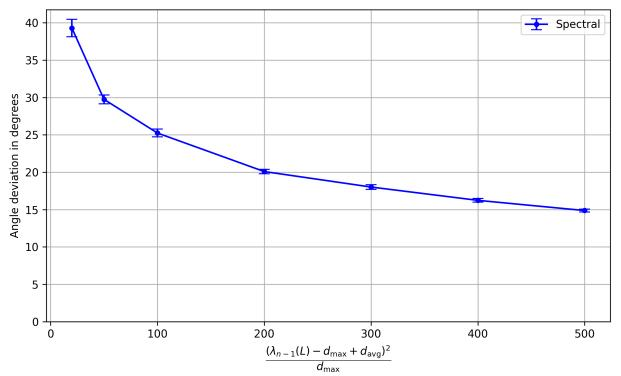  
(a)

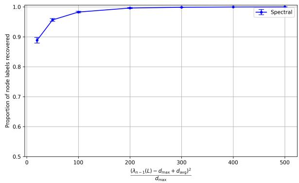  
(b)

Figure 1: Efect of the structural term $\frac { ( \lambda _ { n - 1 } ( \mathbf { L } ) - d _ { \operatorname* { m a x } } + d _ { \operatorname { a v g } } ) ^ { 2 } } { d }$ on the angle deviation (a) and proportion of dmax correctly recovered node labels (b) for Erdös–Rényi graphs (with varying edge density and n) with $p = 0 . 4$ Error bars at 95% confidence level over 30 repetitions. As predicted by Corollaries 1 and 2, the higher the structural term, the lower the angle deviation and the higher the proportion of correctly recovered node labels.  
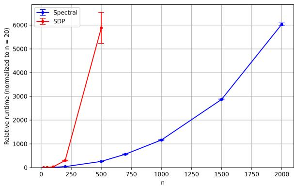  
Figure 2: Efect of number of nodes n on the runtime of our spectral method (Spectral) and semidefinite programming (SDP) for Erdös–Rényi graphs (60% edge density) for $p = 0 . 4$ . Error bars at 95% confidence level over 10 repetitions. Spectral structured prediction is a far more eficient algorithm. SDP was run only up to graphs of size 500 nodes due its high runtime.

Runtime Comparison. Next, we tested how the number of nodes n afect the runtime of our spectral method, and that of semidefinite programming. We chose semidefinite programming since this method has theoretical guarantees that we discuss in Remarks 2 and 4. More specifically, semidefinite programming was analyzed in [4, 14]. Unfortunately, the methods of [12, 11] apply only to specific classes of graphs. We normalize each method (our spectral method and semidefinite programming) independently to the runtime for $n = 2 0$ , to account for diferences in implementations. That is, both methods have runtime 1 for $n = 2 0$ Figure 2 shows that our spectral method runs significantly faster than semidefinite programming.

Comparison Across Diferent Classes of Graphs. Given that our spectral method is considerably faster, we then ask whether it produces comparable results to those of semidefinite programming, regarding the efect of the edge-noise parameter p in the angle deviation and proportion of correctly recovered node labels. In order to do this, we run experiments on diferent classes of graphs. Figure 3 shows that our spectral method and semidefinite programming produce comparable results for regular expander graphs. (Erdös–Rényi graphs and complete graphs shown in Appendix C.1.)

In Appendix C.1, we also show additional experiments regarding the efect of the number of nodes n in the angle deviation and proportion of correctly recovered node labels for Erdös–Rényi graphs, regular expanders graphs, as well as for complete graphs.

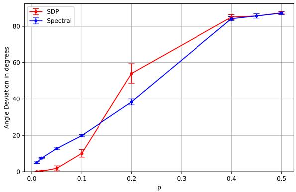  
(a)

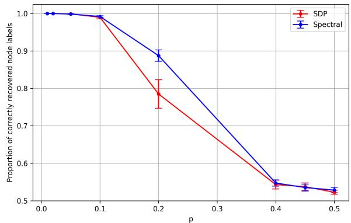  
(b)  
Figure 3: Efect of edge-noise parameter p on the angle deviation (a) and proportion of correctly recovered node labels (b) for d-regular expanders $( d = 6 )$ of $n = 2 0 0$ nodes. Error bars at 95% confidence level over 30 repetitions. Our spectral method (Spectral) and semidefinite programming (SDP) produced comparable results.

Notably, while the dominant eigenvector is a simpler relaxation of eq. (2) as compared to SDP, our empirical results demonstrate that our method may actually recover node labels better than SDP in high noise (high p) regimes since SDP may overfit upon the noise as it is a tighter relaxation of eq. (2).

Real-World Experiments. In Appendix C.2, we include an experiment on a large real-world case with 131,828 nodes and 841,372 edges. Our spectral algorithm runs in 0.1484 seconds while SDP would struggle at this scale in commercial solvers.

## 6 Concluding Remarks

There are parallels with our spectral approach with spectral clustering within the context of stochastic block models [18], [1]. However, the fundamental model that we consider is diferent to stochastic block models, and existing guarantees rely on k-means, a problem that is NP-hard [2] and NP-hard to approximate in polynomial time [3]. In contrast, our spectral method is polynomial time.

There are several ways of extending our results. A first compelling avenue is to analyze social network models, such as stochastic block models [1, 26] in which the noisy adjacency matrix is nonnegative. Currently, our probabilistic guarantees apply to only k = 2 node labels. In order to extend this model to account for $k > 2$ node labels, we would need to analyze the k − 1 leading eigenvectors of A, similar in spirit to prior work in social networks [18]. While we currently focus on pairwise interactions (i.e., edges), we could also extend our analysis to more m-order interactions for $m > 2 { \mathrm { ~ ( i . e . } }$ ., hyperedges) as the problem presented in [5]. This would lead to structured predictions for m-order tensors, though with possibly much greater dificulty.

## References

[1] Emmanuel Abbe, Afonso S. Bandeira, and Georgina Hall. Exact recovery in the stochastic block model. IEEE Transactions on Information Theory, 62(1):471–487, 2016.

[2] Daniel Aloise, Amit Deshpande, Pierre Hansen, and Preyas Popat. Np-hardness of euclidean sum-ofsquares clustering. Machine Learning, 75:245–248, 05 2009.

[3] Pranjal Awasthi, Moses Charikar, Ravishankar Krishnaswamy, and Ali Kemal Sinop. The Hardness of Approximation of Euclidean k-Means. In Lars Arge and János Pach, editors, 31st International

Symposium on Computational Geometry (SoCG 2015), volume 34 of Leibniz International Proceedings in Informatics (LIPIcs), pages 754–767, Dagstuhl, Germany, 2015. Schloss Dagstuhl – Leibniz-Zentrum für Informatik.

[4] Kevin Bello and Jean Honorio. Exact inference in structured prediction. In Neural Information Processing Systems, volume 32, pages 3698–3707, 2019.

[5] Austin R. Benson, David F. Gleich, and Jure Leskovec. Tensor spectral clustering for partitioning higher-order network structures. In SIAM International Conference on Data Mining, pages 118–126, 2015.

[6] Yuri Boykov and Olga Veksler. Graph cuts in vision and graphics: Theories and applications. In Handbook of mathematical models in computer vision, pages 79–96. Springer, 2006.

[7] Venkat Chandrasekaran, Nathan Srebro, and Prahladh Harsha. Complexity of inference in graphical models. In Proceedings of the Twenty-Fourth Conference on Uncertainty in Artificial Intelligence, pages 70–78. AUAI Press, 2008.

[8] Jef Cheeger. A lower bound for the smallest eigenvalue of the laplacian. In Proceedings of the Princeton conference in honor of Professor S. Bochner, 1969.

[9] Chandler Davis and W. M. Kahan. The rotation of eigenvectors by a perturbation. iii. SIAM Journal on Numerical Analysis, 7(1):1–46, 1970.

[10] P. Felzenszwalb, R. Girshick, D. McAllester, and D. Ramanan. Object detection with discriminatively trained part-based models. IEEE Transactions on Pattern Analysis and Machine Intelligence, 32:1627– 1645, 2010.

[11] Dylan Foster, Karthik Sridharan, and Daniel Reichman. Inference in sparse graphs with pairwise measurements and side information. In International Conference on Artificial Intelligence and Statistics, pages 1810–1818, 2018.

[12] Amir Globerson, Tim Roughgarden, David Sontag, and Cafer Yildirim. How hard is inference for structured prediction? In International Conference on Machine Learning, volume 37, pages 2181–2190, 2015.

[13] Shlomo Hoory, Nathan Linial, and Avi Wigderson. Expander graphs and their applications. Bulletin of the American Mathematical Society, 43(4):439–561, 2006.

[14] Chuyang Ke, Deepak Maurya, and Jean Honorio. Partial inference in structured prediction. In IEEE International Conference on Acoustics, Speech and Signal Processing, pages 1–5, 2025.

[15] J. Keshet, D. McAllester, and T. Hazan. PAC-Bayesian approach for minimization of phoneme error rate. IEEE International Conference on Acoustics, Speech and Signal Processing, pages 2224–2227, 2011.

[16] Michael Krivelevich, Daniel Reichman, and Wojciech Samotij. Smoothed analysis on connected graphs. SIAM Journal on Discrete Mathematics, 29(3):1654–1669, 2015.

[17] David C. Lee, Abhinav Gupta, Martial Hebert, and Takeo Kanade. Estimating spatial layout of rooms using volumetric reasoning about objects and surfaces. Neural Information Processing Systems, 23:1288–1296, 2010.

[18] Jing Lei and Alessandro Rinaldo. Consistency of spectral clustering in stochastic block models. The Annals of Statistics, 43(1), Feb 2015.

[19] A. Martins, M. Almeida, and N. Smith. Turning on the turbo: Fast third-order non-projective turbo parsers. Annual Meeting of the Association for Computational Linguistics, pages 617–622, 2013.

[20] Carl D. Meyer. Matrix Analysis and Applied Linear Algebra. SIAM, 2000.

[21] Nicol N Schraudolph and Dmitry Kamenetsky. Eficient exact inference in planar ising models. In Advances in Neural Information Processing Systems, pages 1417–1424, 2009.

[22] H. Tang, J. Keshet, and K. Livescu. Discriminative pronunciation modeling: A large-margin, feature-rich approach. Annual Meeting of the Association for Computational Linguistics, pages 194–203, 2012.

[23] Terence Tao. 254a, notes 3a: Eigenvalues and sums of hermitian matrices, 2010.

[24] Joel A. Tropp. User-friendly tail bounds for sums of random matrices. Foundations of Computational Mathematics, 12(4):389–434, Aug 2011.

[25] H. Wang, S. Gould, and D. Koller. Discriminative learning with latent variables for cluttered indoor scene understanding. European Conference on Computer Vision, 6312:435–449, 2010.

[26] Peng Wang, Zirui Zhou, and Anthony Man-Cho So. A nearly-linear time algorithm for exact community recovery in stochastic block model. In International Conference on Machine Learning, pages 10126–10135, 2020.

[27] Zhiqiang Xu and Ping Li. A practical riemannian algorithm for computing dominant generalized eigenspace. In Uncertainty in Artificial Intelligence, pages 819–828, 2020.

[28] S. Zhang and M. Gales. Structured SVMs for automatic speech recognition. IEEE Transactions on Audio, Speech, and Language Processing, 21(3):544–555, 2013.

[29] Y. Zhang, T. Lei, R. Barzilay, and T. Jaakkola. Greed is good if randomized: New inference for dependency parsing. Empirical Methods in Natural Language Processing, pages 1013–1024, 2014.

[30] Y. Zhang, C. Li, R. Barzilay, and K. Darwish. Randomized greedy inference for joint segmentation, POS tagging and dependency parsing. North American Chapter of the Association for Computational Linguistics, pages 42–52, 2015.

## A Technical Lemmas

The following lemmas on matrix concentration theory and eigenvector perturbation play important roles in the proofs of our main theorems.

Lemma 6 (Matrix Hoefding inequality, Theorem 1.3 [24]). For a finite sequence $\{ { \bf X } _ { k } \}$ of independent, random, self-adjoint matrices with dimension $d ,$ and let $\{ \mathbf { M } _ { k } \}$ be a sequence of fixed self-adjoint matrices. Assuming that each matrix satisfies $\mathbb { E } [ \mathbf { X } _ { k } ] = \mathbf { 0 0 } ^ { \top }$ and $\mathbf { X } _ { k } ^ { 2 } \preceq \dot { \mathbf { M } } _ { k } ^ { 2 }$ almost surely. Then for all $t \geq 0$

$$
\mathbb { P } \left( \lambda _ { 1 } \left( \sum _ { k } \mathbf { X } _ { k } \right) \geq t \right) \leq d e ^ { - t ^ { 2 } / 8 \sigma ^ { 2 } } ,
$$

where $\sigma ^ { 2 } = \left\| \sum _ { k } \mathbf { M } _ { k } ^ { 2 } \right\|$

Lemma 7 (Davis-Kahan sin θ Theorem [9]). Let M, F be symmetric matrices with eigenvectors $\mathbf { v } _ { 1 } ( \mathbf { M } )$ and $\mathbf { v } _ { 1 } ( \mathbf { F } )$ corresponding to their dominant eigenvalues $\lambda _ { 1 } ( \mathbf { M } )$ and $\lambda _ { 1 } ( \mathbf { F } )$ . If M has a nonzero eigen gap, i.e., $\lambda _ { 1 } ( \mathbf { M } ) - \lambda _ { 2 } ( \mathbf { M } ) > 0$ , then the angle $\theta ( \mathbf { v } _ { 1 } ( \mathbf { M } ) , \mathbf { v } _ { 1 } ( \mathbf { F } ) )$ satisfies

$$
\sin \theta ( { \mathbf v } _ { 1 } ( { \mathbf M } ) , { \mathbf v } _ { 1 } ( { \mathbf F } ) ) \leq \frac { \| { \mathbf M } - { \mathbf F } \| } { \lambda _ { 1 } ( { \mathbf M } ) - \lambda _ { 2 } ( { \mathbf M } ) } .
$$

## B Detailed Proofs

In this section, we provide detailed proofs of our theorems and lemmas in the main text.

## B.1 Proof of Theorem 1

Proof. We proceed as follows: We split | cos $\theta ( \mathbf { v } _ { 1 } ( \mathbf { A } ) , \mathbf { y } ^ { * } )$ | into two terms: one random variable | cos $\theta ( \mathbf { v } _ { 1 } ( \mathbf { A } ) , \mathbf { v } _ { 1 } ( \mathbb { E } \mathbf { A } ) )$ and one constant | cos $\theta ( \mathbf { v } _ { 1 } ( \mathbb { E } \mathbf { A } ) , \mathbf { y } ^ { * } ) |$ . The two terms are then properly bounded and then used to analyze $| \cos \theta ( { \bf v } _ { 1 } ( { \bf A } ) , { \bf y } ^ { * } ) |$ |. We finalize by ensuring the uniqueness of $\mathbf { v } _ { 1 } ( \mathbf { A } )$ (up to sign).

Step 1: Bounding the random variable | cos $\theta ( \mathbf { v } _ { 1 } ( \mathbf { A } ) , \mathbf { v } _ { 1 } ( \mathbb { E } \mathbf { A } ) ) |$ . By invoking Lemma 7 with $\mathbf { F } = \mathbf { A }$ and $\mathbf { M } = \mathbb { E } \mathbf { A }$ , we have:

$$
| \sin \theta ( \mathbf { v } _ { 1 } ( \mathbf { A } ) , \mathbf { v } _ { 1 } ( \mathbb { E } \mathbf { A } ) ) | \leq { \frac { \| \mathbf { A } - \mathbb { E } \mathbf { A } \| } { \lambda _ { 1 } ( \mathbb { E } \mathbf { A } ) - \lambda _ { 2 } ( \mathbb { E } \mathbf { A } ) } }
$$

Note that by Lemma 3, we have $\lambda _ { 1 } ( \mathbb { E } \mathbf { A } ) - \lambda _ { 2 } ( \mathbb { E } \mathbf { A } ) = ( 1 - 2 p ) ( \lambda _ { 1 } ( \mathbf { E } ) - \lambda _ { 2 } ( \mathbf { E } ) ) > 0$ since $\lambda _ { 1 } ( \mathbf { E } )$ has multiplicity 1 [20]. By trigonometric identities, we have:

$$
\begin{array} { r l } & { | \cos \theta ( \mathbf { v } _ { 1 } ( \mathbf { A } ) , \mathbf { v } _ { 1 } ( \mathbb { E } \mathbf { A } ) ) | = \sqrt { 1 - \sin ^ { 2 } ( \theta ( \mathbf { v } _ { 1 } ( \mathbf { A } ) , \mathbf { v } _ { 1 } ( \mathbb { E } \mathbf { A } ) ) ) } } \\ & { \qquad \geq 1 - \sin ^ { 2 } ( \theta ( \mathbf { v } _ { 1 } ( \mathbf { A } ) , \mathbf { v } _ { 1 } ( \mathbb { E } \mathbf { A } ) ) ) } \\ & { \qquad \geq 1 - \frac { \left. \mathbf { A } - \mathbb { E } \mathbf { A } \right. ^ { 2 } } { \left( \lambda _ { 1 } ( \mathbb { E } \mathbf { A } ) - \lambda _ { 2 } ( \mathbb { E } \mathbf { A } ) \right) ^ { 2 } } } \end{array}
$$

From the above and by Lemma 1, for any $0 < \epsilon < 1$ we have:

$$
\begin{array} { r } { \mathbb { P } ( | \cos \theta ( \mathbf { v } _ { 1 } ( \mathbf { A } ) , \mathbf { v } _ { 1 } ( \mathbb { E } \mathbf { A } ) ) | \geq 1 - \epsilon ) \geq \mathbb { P } \left( \epsilon \geq \frac { \left\| \mathbf { A } - \mathbb { E } \mathbf { A } \right\| ^ { 2 } } { \left( \lambda _ { 1 } ( \mathbb { E } \mathbf { A } ) - \lambda _ { 2 } ( \mathbb { E } \mathbf { A } ) \right) ^ { 2 } } \right) } \\ { = \mathbb { P } ( \left\| \mathbf { A } - \mathbb { E } \mathbf { A } \right\| \leq \sqrt { \epsilon } \left( \lambda _ { 1 } ( \mathbb { E } \mathbf { A } ) - \lambda _ { 2 } ( \mathbb { E } \mathbf { A } ) \right) ) } \\ { = 1 - \mathbb { P } ( \left\| \mathbf { A } - \mathbb { E } \mathbf { A } \right\| \geq \sqrt { \epsilon } \left( \lambda _ { 1 } ( \mathbb { E } \mathbf { A } ) - \lambda _ { 2 } ( \mathbb { E } \mathbf { A } ) \right) ) } \\ { \geq 1 - 2 n \exp \left( \frac { - \epsilon ( \lambda _ { 1 } ( \mathbb { E } \mathbf { A } ) - \lambda _ { 2 } ( \mathbb { E } \mathbf { A } ) ) ^ { 2 } } { 3 2 ( 1 - p ) ^ { 2 } d _ { \operatorname* { m a x } } } \right) . } \end{array}
$$

Step 2: Bounding the constant $| \cos \theta ( { \bf v } _ { 1 } ( \mathbb { E } { \bf A } ) , { \bf y } ^ { * } ) |$ . By Lemma 3 and since $\mathrm { D i a g } ( \mathbf { y } ^ { * } ) ^ { 2 }$ is the identity matrix, we have:

$$
\begin{array} { r l } & { \mathbb { E } [ { \bf A } ] \mathrm { D i a g } ( { \bf y } ^ { * } ) { \bf v } _ { 1 } ( { \bf E } ) = ( 1 - 2 p ) \mathrm { D i a g } ( { \bf y } ^ { * } ) { \bf E } \mathrm { D i a g } ( { \bf y } ^ { * } ) ^ { 2 } { \bf v } _ { 1 } ( { \bf E } ) } \\ & { \quad \quad \quad = ( 1 - 2 p ) \mathrm { D i a g } ( { \bf y } ^ { * } ) { \bf E } { \bf v } _ { 1 } ( { \bf E } ) } \\ & { \quad \quad \quad = ( 1 - 2 p ) \lambda _ { 1 } ( { \bf E } ) \mathrm { D i a g } ( { \bf y } ^ { * } ) { \bf v } _ { 1 } ( { \bf E } ) , } \end{array}
$$

where the last step follows from the definition of eigenvalues, i.e., $\mathbf { E } \mathbf { v } _ { 1 } ( \mathbf { E } ) = \lambda _ { 1 } ( \mathbf { E } ) \mathbf { v } _ { 1 } ( \mathbf { E } )$ . Note that the above implies that $\lambda _ { 1 } ( \mathbb { E } \mathbf { A } ) = ( 1 - 2 p ) \lambda _ { 1 } ( \mathbf { E } )$ and $\mathbf { v } _ { 1 } ( \mathbb { E } \mathbf { A } ) = \mathrm { D i a g } ( \mathbf { y } ^ { * } ) \mathbf { v } _ { 1 } ( \mathbf { E } )$ . This can be confirmed by the eigenvalue definition, i.e. $\mathbb { E } [ \mathbf { A } ] \mathbf { v } _ { 1 } ( \mathbb { E } \mathbf { A } ) = \lambda _ { 1 } ( \mathbb { E } \mathbf { A } ) \mathbf { v } _ { 1 } ( \mathbb { E } \mathbf { A } )$ which leads to the same expression as above. Therefore, since $\mathbf { y } ^ { * } \in \{ - 1 , + 1 \} ^ { n }$ , we have:

$$
\begin{array} { r l } & { | \cos \theta ( \mathbf { v } _ { 1 } ( \mathbb { E } \mathbf { A } ) , \mathbf { y } ^ { * } ) ) | = | \cos \theta ( \mathrm { D i a g } ( \mathbf { y } ^ { * } ) \mathbf { v } _ { 1 } ( \mathbf { E } ) , \mathbf { y } ^ { * } ) | } \\ & { = \frac { | \langle \mathrm { D i a g } ( \mathbf { y } ^ { * } ) \mathbf { v } _ { 1 } ( \mathbf { E } ) , \mathbf { y } ^ { * } \rangle | } { \| \mathrm { D i a g } ( \mathbf { y } ^ { * } ) \mathbf { v } _ { 1 } ( \mathbf { E } ) \| \| \mathbf { y } ^ { * } \| } } \\ & { = \frac { \left| \sum _ { i } y _ { i } ^ { * } \left[ \mathbf { v } _ { 1 } ( \mathbf { E } ) \right] _ { i i } y _ { i } ^ { * } \right| } { \| \mathbf { v } _ { 1 } ( \mathbf { E } ) \| \| \mathbf { l } \| } } \\ & { = \frac { | \langle \mathbf { v } _ { 1 } ( \mathbf { E } ) , \mathbf { \ 1 } \rangle | } { \| \mathbf { v } _ { 1 } ( \mathbf { E } ) \| \| \mathbf { 1 } \| } } \\ & { = | \cos \theta ( \mathbf { v } _ { 1 } ( \mathbf { E } ) , \mathbf { 1 } ) | } \\ & { = | \cos \theta ( \mathbf { v } _ { 1 } ( \mathbf { E } ) , \mathbf { 1 } ) | } \\ & { = \delta . } \end{array}
$$

where the last step follows from our definition in the theorem statement.

Step 3: Using the random variable | cos $\theta ( \mathbf { v } _ { 1 } ( \mathbf { A } ) , \mathbf { v } _ { 1 } ( \mathbb { E } \mathbf { A } ) ) |$ and the constant | cos $\theta ( \mathbf { v } _ { 1 } ( \mathbb { E } \mathbf { A } ) , \mathbf { y } ^ { * } ) |$ to bound | cos $\theta ( \mathbf { v } _ { 1 } ( \mathbf { A } ) , \mathbf { y } ^ { * } ) |$ . For simplicity of presentation, in what follows, we argue for angles $\theta ( \mathbf { v } _ { 1 } ( \mathbf { A } ) , \mathbf { y } ^ { * } ) \in$ $[ 0 , \pi / 2 ]$ and $\theta ( \mathbf { v } _ { 1 } ( \mathbf { A } ) , \mathbf { v } _ { 1 } ( \mathbb { E } \mathbf { A } ) ) \in [ 0 , \pi / 2 ] . ^ { 2 }$ Let $\theta _ { 1 } = \theta ( \mathbf { v } _ { 1 } ( \mathbf { A } ) , \mathbf { v } _ { 1 } ( \mathbb { E } \mathbf { A } ) )$ and $\theta _ { 2 } = \theta ( \mathbf { v } _ { 1 } ( \mathbb { E } \mathbf { A } ) , \mathbf { y } ^ { * } )$ . By using trigonometric identities and the result in Step 2, we have:

$$
\begin{array} { r l } & { | \cos \theta ( \mathbf { v } _ { 1 } ( \mathbf { A } ) , \mathbf { y } ^ { * } ) | = \cos \theta ( \mathbf { v } _ { 1 } ( \mathbf { A } ) , \mathbf { y } ^ { * } ) } \\ & { \qquad \geq \cos ( \theta _ { 1 } + \theta _ { 2 } ) } \\ & { \qquad = \cos \theta _ { 1 } \cos \theta _ { 2 } - \sin \theta _ { 1 } \sin \theta _ { 2 } } \\ & { \qquad \geq \delta \cos \theta _ { 1 } - \sqrt { 1 - \delta ^ { 2 } } \sin \theta _ { 1 } . } \end{array}
$$

Since we are arguing for an angle $\theta _ { 1 } \in [ 0 , \pi / 2 ]$ for simplicity of presentation, by the result in Step 1, we have:

$$
\begin{array} { r l } { \mathbb { P } ( | \cos \theta ( \mathbf { v } _ { 1 } ( \mathbf { A } ) , \mathbf { y } ^ { * } ) | \geq 1 - \gamma ) \geq \mathbb { P } ( \delta \cos \theta _ { 1 } - \sqrt { 1 - \delta ^ { 2 } } \sin \theta _ { 1 } \geq 1 - \gamma ) } \\ { = } & { \mathbb { P } ( \cos \theta _ { 1 } \leq \delta - \delta \gamma - \sqrt { \gamma ( \delta ^ { 2 } - 1 ) ( \gamma - 1 ) } ) + \mathbb { P } ( \cos \theta _ { 1 } \geq \delta - \delta \gamma + \sqrt { \gamma ( \delta ^ { 2 } - 1 ) ( \gamma - 1 ) } ) } \\ { \geq \mathbb { P } ( \cos \theta _ { 1 } \geq \delta - \delta \gamma + \sqrt { \gamma ( \delta ^ { 2 } - 1 ) ( \gamma - 1 ) } ) } \\ & { = \mathbb { P } ( \cos \theta ( \mathbf { v } _ { 1 } ( \mathbf { A } ) , \mathbf { v } _ { 1 } ( \mathbf { E A } ) ) \geq \delta - \delta \gamma + \sqrt { \gamma ( \delta ^ { 2 } - 1 ) ( \gamma - 1 ) } ) } \\ & { = \mathbb { P } ( | \cos \theta ( \mathbf { v } _ { 1 } ( \mathbf { A } ) , \mathbf { v } _ { 1 } ( \mathbf { E A } ) ) | \geq \delta - \delta \gamma + \sqrt { \gamma ( \delta ^ { 2 } - 1 ) ( \gamma - 1 ) } ) } \\ & { \geq 1 - 2 n \exp ( \frac { - ( 1 - \delta + \delta \gamma - \sqrt { \gamma ( \delta ^ { 2 } - 1 ) ( \gamma - 1 ) } ) ( \lambda _ { 1 } ( \mathbf { E A } ) - \lambda _ { 2 } ( \mathbf { E A } ) ) ^ { 2 } } { 3 2 ( 1 - p ) ^ { 2 } d _ { \operatorname* { m a x } } } ) } \\ &  = 1 - 2 n \exp ( \frac { - ( 1 - \delta + \delta \gamma - \sqrt { \gamma ( \delta ^ { 2 } - 1 ) ( \gamma - 1 ) } ) ( 1 - 2 p ) ^ { 2 } ( \lambda _ { 1 } ( \mathbf { E } ) - \lambda _ { 2 } ( \mathbf { E } ) ) ^ { 2 } }  3 2 ( 1 - p ) ^ { 2 } d _  \ \end{array}
$$

where the last simplification step follows from Lemma 3.

Step 4: Ensuring the uniqueness of $\mathbf { v } _ { 1 } ( \mathbf { A } )$ (up to sign). In all the expressions above, we have assumed that $\mathbf { v } _ { 1 } ( \mathbf { A } )$ is unique (up to sign). As a counterexample, when the $\lambda _ { 1 } ( \mathbf { A } ) = \lambda _ { 2 } ( \mathbf { A } )$ , there exists infinitely many dominant eigenvectors. In order to ensure uniqueness of $\mathbf { v } _ { 1 } ( \mathbf { A } )$ (up to sign), we need to ensure that $\lambda _ { 1 } ( \mathbf { A } ) - \lambda _ { 2 } ( \mathbf { A } ) > 0$ . By Lemma $2 ,$ we have:

$$
\begin{array} { r l } & { \mathbb { P } \left( \lambda _ { 1 } ( \mathbf { A } ) - \lambda _ { 2 } ( \mathbf { A } ) > 0 \right) \geq 1 - 2 n \exp \left( \frac { - ( \lambda _ { 1 } ( \mathbb { E } \mathbf { A } ) - \lambda _ { 2 } ( \mathbb { E } \mathbf { A } ) ) ^ { 2 } } { 1 2 8 ( 1 - p ) ^ { 2 } d _ { \operatorname* { m a x } } } \right) } \\ & { \quad \quad \quad = 1 - 2 n \exp \left( \frac { - ( 1 - 2 p ) ^ { 2 } ( \lambda _ { 1 } ( \mathbf { E } ) - \lambda _ { 2 } ( \mathbf { E } ) ) ^ { 2 } } { 1 2 8 ( 1 - p ) ^ { 2 } d _ { \operatorname* { m a x } } } \right) } \end{array}
$$

where the last simplification step follows from Lemma 3. The final bound comes from joining the results in Steps 3 and 4, and since $( 1 - r ) ( 1 - s ) \geq 1 - r - s$ for $r , s \in [ 0 , 1 ]$ □

## B.2 Proof of Theorem 2

Proof. Next, we reason about the maximum angle deviation in order to guarantee a minimum proportion of correctly recovered node labels α. Recall $\mathbf { y } ^ { * } = ( y _ { 1 } ^ { * } , y _ { 2 } ^ { * } , \ldots , y _ { n } ^ { * } )$ where each $y _ { i } ^ { * } \in \{ - 1 , + 1 \}$ . Note that the definition of $\rho ( \mathbf { v } _ { 1 } ( \mathbf { A } ) , \mathbf { y } ^ { * } )$ considers both $\mathbf { v } _ { 1 } ( \mathbf { A } )$ and $- \mathbf { v } _ { 1 } ( \mathbf { A } )$ and thus $\rho ( \mathbf { v } _ { 1 } ( \mathbf { A } ) , \mathbf { y } ^ { * } ) \geq 1 / 2$ . Therefore, without loss of generality, assume $\alpha > 1 / 2$ . Let $\alpha = k / n$ where $k > n / 2$

Let S be the set of vectors with l sign agreements with $\mathbf { y } ^ { * }$ , for $n / 2 \le l < k$ , defined as

$$
\mathbb { S } = \bigcup _ { T \subseteq \{ 1 , \dots , n \} , n / 2 \leq | T | < k } \mathbb { S } _ { T } ,
$$

where

$$
\begin{array} { r } { \mathbb { S } _ { T } = \left\{ \mathbf { s } \in \mathbb { R } ^ { n } : s _ { i } = \left( 2 \times 1 [ i \in T ] - 1 \right) \mathrm { s i g n } ( y _ { i } ^ { * } ) c _ { i } , c _ { i } > 0 , \| \mathbf { c } \| _ { 2 } = 1 \right\} . } \end{array}
$$

Consider $\mathbf { v } _ { 1 } ( A ) \in \mathbb { S }$ . For $n / 2 \le l < k$ , without loss of generality, assume the first l entries agree in sign with $\mathbf { y } ^ { * }$ . That is, $\mathbf { v } _ { 1 } ( \mathbf { A } ) = ( \mathrm { s i g n } ( y _ { 1 } ^ { * } ) c _ { 1 } , \dots , \mathrm { s i g n } ( y _ { l } ^ { * } ) c _ { l } , - \mathrm { s i g n } ( y _ { l + 1 } ^ { * } ) c _ { l + 1 } , \dots , - \mathrm { s i g n } ( y _ { n } ^ { * } ) c _ { n } )$ . Recall $\| \mathbf { v } _ { 1 } ( \mathbf { A } ) \| _ { 2 } = 1$ and $\| \mathbf { y } ^ { * } \| _ { 2 } = { \sqrt { n } }$ . For clarity, let ${ \bf 1 } _ { m }$ be a vector of m ones. We have:

$$
\begin{array} { r l } { \bigl | \cos \theta ( \mathbf { v } _ { 1 } ( \mathbf { A } ) , \mathbf { y } ^ { * } ) \bigr | = \frac { \bigl | \langle \mathbf { v } _ { 1 } ( \mathbf { A } ) , \mathbf { y } ^ { * } \rangle \bigr | } { \bigl | \mathbf { v } _ { 1 } ( \mathbf { A } ) \bigr | _ { 2 } \bigl | \mathbf { y } ^ { * } \bigr | \bigr | _ { 2 } } } & { } \\ { = \bigl | \langle \mathbf { c } _ { 1 } + \cdots + c _ { d } - c _ { d + 1 } - \cdots - c _ { n } | / \sqrt { n } } & { } \\ { \leq \operatorname* { m a x } \bigl ( c _ { 1 } + \cdots + c _ { d } , c _ { d + 1 } + \cdots + c _ { n } \bigr ) , \sqrt { n } } & { } \\ { = \operatorname* { m a x } \bigl ( \bigl \{ ( c _ { 1 } , \dots , c _ { n } ) , \mathbf { 1 } _ { 1 } \bigr \} , \bigl \{ ( d _ { 1 } + \dots , c _ { n } ) , \mathbf { 1 } _ { n - l } \bigr \} / \sqrt { n } } & { } \\ { \leq \operatorname* { m a x } \bigl ( \sqrt { c _ { 1 } ^ { 2 } + \cdots + c _ { n } ^ { 2 } } \sqrt { d } , \sqrt { e _ { d + 1 } ^ { 2 } + \cdots + c _ { n } ^ { 2 } } \sqrt { n - l } \bigr ) / \sqrt { n } } & { \mathrm { b y ~ C a u c h y - S c h w a r z ~ i n e q u a l i t y } } \\ { \leq \operatorname* { m a x } \bigl ( \sqrt { d } , \sqrt { n - l } \bigr ) / \sqrt { n } } & { } \\ { = \sqrt { l / n } } & { = \sqrt { l / n } } \\ { } & { < \sqrt { k / n } } \\ { } & { = \sqrt { a _ { 1 } } } \\ { } & { = \sqrt { a _ { 2 } } . } \end{array}
$$

Thus, if $\rho ( \mathbf { v } _ { 1 } ( \mathbf { A } ) , \mathbf { y } ^ { * } ) < \alpha$ then | cos $\theta ( \mathbf { v } _ { 1 } ( \mathbf { A } ) , \mathbf { y } ^ { * } ) | < \sqrt { \alpha }$ . By the contrapositive: if $| \cos \theta ( \mathbf { v } _ { 1 } ( \mathbf { A } ) , \mathbf { y } ^ { * } ) | \geq \sqrt { \alpha }$ then $\rho ( \mathbf { v } _ { 1 } ( \mathbf { A } ) , \mathbf { y } ^ { * } ) \geq \alpha$ . Therefore:

$$
\begin{array} { r } { \mathbb { P } ( \rho ( \mathbf { v } _ { 1 } ( \mathbf { A } ) , \mathbf { y } ^ { * } ) \geq \alpha ) \geq \mathbb { P } \left( | \cos \theta ( \mathbf { v } _ { 1 } ( \mathbf { A } ) , \mathbf { y } ^ { * } ) | \geq \sqrt { \alpha } \right) . } \end{array}
$$

By invoking Theorem 1 with $\gamma = 1 - \sqrt { \alpha } ,$ we prove our claim.

## B.3 Proof of Lemma 1

Proof. Note that:

$$
\begin{array} { r } { \| \mathbf { A } - \mathbb { E } \mathbf { A } \| = \operatorname* { m a x } ( \lambda _ { 1 } ( \mathbf { A } - \mathbb { E } \mathbf { A } ) , \ - \lambda _ { n } ( \mathbf { A } - \mathbb { E } \mathbf { A } ) ) } \\ { = \operatorname* { m a x } ( \lambda _ { 1 } ( \mathbf { A } - \mathbb { E } \mathbf { A } ) , \ \lambda _ { 1 } ( \mathbb { E } [ \mathbf { A } ] - \mathbf { A } ) ) . } \end{array}
$$

Since $\| \mathbf { A } - \mathbb { E } \mathbf { A } \|$ depends on both $\lambda _ { 1 } ( \mathbf { A } - \mathbb { E } \mathbf { A } )$ and $\lambda _ { 1 } ( \mathbb { E } [ \mathbf { A } ] - \mathbf { A } )$ , we bound them separately.

To bound $\mathbb { P } ( \lambda _ { 1 } ( \mathbf { A } - \mathbb { E } \mathbf { A } ) \geq t )$ , we apply Lemma 6 on $\mathbf { A } - \mathbb { E } [ \mathbf { A } ]$ . Let $( i , j ) \in E$ be the k-th edge in the edge set E. We define:

$$
\mathbf { X } _ { k } = ( A _ { i j } - \mathbb { E } [ A _ { i j } ] ) ( \mathbf { e } _ { i } \mathbf { e } _ { j } ^ { \top } + \mathbf { e } _ { j } \mathbf { e } _ { i } ^ { \top } )
$$

Since each $A _ { i j }$ is independent, the above satisfies the requirement in Lemma 6 that $\mathbf { X } _ { k }$ are independent, random, self-adjoint matrices. Since $A _ { i j } - \mathbb { E } [ A _ { i j } ]$ has expected value zero, then $\mathbb { E } \mathbf { X } _ { k } = \mathbf { 0 0 } ^ { \top }$ . Furthermore, note that $( A _ { i j } - \mathbb { E } [ A _ { i j } ] ) ^ { 2 } \leq ( - 1 - ( 1 - { \overset { \cdot } { 2 p } } ) ) ^ { 2 } { \overset { } { = } } 4 ( { \overset { . } { 1 } } - p ) ^ { 2 }$ . Then, we let $\mathbf { M } _ { k } ^ { 2 } = 4 ( 1 - p ) ^ { 2 } ( \mathbf { e } _ { i } \mathbf { e } _ { i } ^ { \top } + \mathbf { e } _ { j } \mathbf { e } _ { j } ^ { \top } )$ in order to satisfy $\mathbf { X } _ { k } ^ { 2 } \preceq \mathbf { M } _ { k } ^ { 2 }$ , also required in Lemma 6. Note that:

$$
\begin{array} { l } { { \displaystyle { \boldsymbol \sigma } ^ { 2 } = \left\| \sum _ { k } \mathbf { M } _ { k } ^ { 2 } \right\| } } \\ { { \displaystyle ~ = \left\| 4 ( 1 - p ) ^ { 2 } \sum _ { k = 1 } ^ { n } d _ { i } ( { \bf e } _ { i } { \bf e } _ { i } ^ { \top } ) \right\| } } \\ { { \displaystyle ~ = 4 ( 1 - p ) ^ { 2 } d _ { \mathrm { m a x } } } . } \end{array}
$$

Thus, by invoking Lemma 6, we have:

$$
\begin{array} { r } { \mathbb { P } ( \lambda _ { 1 } ( \mathbf { A } - \mathbb { E } \mathbf { A } ) \geq t ) = \mathbb { P } \left( \lambda _ { 1 } \left( \displaystyle \sum _ { k } \mathbf { X } _ { k } \right) \geq t \right) } \\ { \leq n e ^ { - t ^ { 2 } / 8 \sigma ^ { 2 } } } \\ { = n e ^ { \frac { - t ^ { 2 } } { 3 2 ( 1 - p ) ^ { 2 } d _ { \operatorname* { m a x } } } } . } \end{array}
$$

To bound $\mathbb { P } ( \lambda _ { 1 } ( \mathbb { E } [ \mathbf { A } ] - \mathbf { A } ) ) \geq t )$ , we apply Lemma 6 on $\mathbb { E } [ \mathbf { A } ] - \mathbf { A }$ and undergo nearly the same process as above, but now we negate each of ${ \bf X } _ { k }$ from before, while ${ { \bf { M } } _ { k } }$ and $\sigma ^ { 2 }$ remains the same. Consequently, we get the following upper bound for $\mathbb { P } ( \lambda _ { 1 } ( \mathbb { E } [ \mathbf { A } ] - \mathbf { A } ) )$ ) as the second bound needed to complete our proof. Note that this turns out to be the same bound as before. That is,

$$
\begin{array} { r } { \mathbb { P } \big ( \lambda _ { 1 } ( \mathbb { E } [ { \mathbf { A } } ] - { \mathbf { A } } ) \geq t \big ) \leq n e ^ { \frac { - t ^ { 2 } } { 3 2 ( 1 - p ) ^ { 2 } d _ { \operatorname* { m a x } } } } . } \end{array}
$$

By using the union bound, we have:

$$
\begin{array} { r l } & { \mathbb { P } \left( \left\| \mathbf { A } - \mathbb { E } \mathbf { A } \right\| \geq t \right) = \mathbb { P } \left( \operatorname* { m a x } ( \lambda _ { 1 } ( \mathbf { A } - \mathbb { E } \mathbf { A } ) , \lambda _ { 1 } ( \mathbb { E } [ \mathbf { A } ] - \mathbf { A } ) ) \geq t \right) } \\ & { \qquad = \mathbb { P } \left( \lambda _ { 1 } ( \mathbf { A } - \mathbb { E } \mathbf { A } ) \geq t \vee \lambda _ { 1 } ( \mathbb { E } [ \mathbf { A } ] - \mathbf { A } ) \geq t \right) } \\ & { \qquad \leq \mathbb { P } \left( \lambda _ { 1 } ( \mathbf { A } - \mathbb { E } \mathbf { A } ) \geq t \right) + \mathbb { P } \left( \lambda _ { 1 } ( \mathbb { E } [ \mathbf { A } ] - \mathbf { A } ) \geq t \right) } \\ & { \qquad \leq 2 n e ^ { \frac { - t ^ { 2 } } { 3 2 ( 1 - p ) ^ { 2 } d _ { \operatorname* { m a x } } } } , } \end{array}
$$

and we prove our claim.

## B.4 Proof of Lemma 2

Proof. By the eigenvalue stability inequality, based on Weyl’s inequality [23], we have that:

$$
- \| \mathbf { A } - \mathbb { E } \mathbf { A } \| \leq \lambda _ { 1 } ( \mathbf { A } ) - \lambda _ { 1 } ( \mathbb { E } \mathbf { A } ) \leq \| \mathbf { A } - \mathbb { E } \mathbf { A } \| ,
$$

and

$$
- \| \mathbf { A } - \mathbb { E } \mathbf { A } \| \leq \lambda _ { 2 } ( \mathbf { A } ) - \lambda _ { 2 } ( \mathbb { E } \mathbf { A } ) \leq \| \mathbf { A } - \mathbb { E } \mathbf { A } \| .
$$

Putting these together, we have:

$$
\lambda _ { 1 } ( \mathbf { A } ) - \lambda _ { 2 } ( \mathbf { A } ) \geq \lambda _ { 1 } ( \mathbb { E } \mathbf { A } ) - \lambda _ { 2 } ( \mathbb { E } \mathbf { A } ) - 2 \| \mathbf { A } - \mathbb { E } \mathbf { A } \| .
$$

By invoking Lemma 1 with $\begin{array} { r } { t = \frac { \lambda _ { 1 } ( \mathbb { E } \mathbf { A } ) - \lambda _ { 2 } ( \mathbb { E } \mathbf { A } ) } { 2 } } \end{array}$ , we have:

$$
\mathbb { P } \left( \left\| \mathbf { A } - \mathbb { E } \mathbf { A } \right\| \geq \frac { \lambda _ { 1 } ( \mathbb { E } \mathbf { A } ) - \lambda _ { 2 } ( \mathbb { E } \mathbf { A } ) } { 2 } \right) \leq 2 n e ^ { \frac { - ( \lambda _ { 1 } ( \mathbb { E } \mathbf { A } ) - \lambda _ { 2 } ( \mathbb { E } \mathbf { A } ) ) ^ { 2 } } { 1 2 8 ( 1 - p ) ^ { 2 } d _ { \operatorname* { m a x } } } } .
$$

Finally, note that:

$$
\begin{array} { r l } & { \mathbb { P } ( \lambda _ { 1 } ( \mathbf { A } ) - \lambda _ { 2 } ( \mathbf { A } ) > 0 ) \geq \mathbb { P } ( \lambda _ { 1 } ( \mathbb { E } \mathbf { A } ) - \lambda _ { 2 } ( \mathbb { E } \mathbf { A } ) - 2 \| \mathbf { A } - \mathbb { E } \mathbf { A } \| > 0 ) } \\ & { \quad \quad \quad = \mathbb { P } ( \| \mathbf { A } - \mathbb { E } \mathbf { A } \| < \frac { \lambda _ { 1 } ( \mathbb { E } \mathbf { A } ) - \lambda _ { 2 } ( \mathbb { E } \mathbf { A } ) } { 2 } ) } \\ & { \quad \quad \quad = 1 - \mathbb { P } ( \| \mathbf { A } - \mathbb { E } \mathbf { A } \| \geq \frac { \lambda _ { 1 } ( \mathbb { E } \mathbf { A } ) - \lambda _ { 2 } ( \mathbb { E } \mathbf { A } ) } { 2 } ) } \\ & { \quad \quad \quad \geq 1 - 2 n e ^ { \frac { - ( \lambda _ { 1 } ( \mathbb { E } \mathbf { A } ) - \lambda _ { 2 } ( \mathbb { E } \mathbf { A } ) ) ^ { 2 } } { 1 2 8 ( 1 - p ) ^ { 2 } d _ { \operatorname* { m a x } } } } , } \end{array}
$$

which proves our claim.

## B.5 Proof of Lemma 4

Proof. We first find a lower bound for $\lambda _ { 1 } ( \mathbf { E } )$ , by using its Rayleigh Quotient definition:

$$
\begin{array} { r l } & { \lambda _ { 1 } ( \mathbf { E } ) = \underset { \mathbf { x } \neq 0 } { \operatorname* { m a x } } \frac { \mathbf { x } ^ { \top } \mathbf { E x } } { \mathbf { x } ^ { \top } \mathbf { x } } } \\ & { \qquad \quad \geq \frac { \mathbf { 1 } ^ { \top } \mathbf { E 1 } } { \mathbf { 1 } ^ { \top } \mathbf { 1 } } } \\ & { \qquad = \frac { \sum _ { i = 1 } ^ { n } d _ { i } } { n } } \\ & { \qquad = d _ { \mathrm { a v g } } . } \end{array}
$$

Then, we find an upper bound for $\lambda _ { 2 } ( \mathbf { E } )$ , by using the Courant-Fischer Theorem [20], as follows:

$$
\begin{array} { r l } & { \lambda _ { 2 } ( \mathbf { E } ) = \underset { \mathbf { b } \textbf { b } | \mathbf { x } | = 1 , \mathbf { b } ^ { \mathrm { t } } \times \mathbf { z } } { \mathrm { m i n } } \ : ( \mathbf { E x } , \mathbf { x } ) } \\ & { \quad \quad \quad \le \underset { | \mathbf { x } | = 1 , \mathbf { b } ^ { \mathrm { t } } \times \mathbf { z } = 0 } { \mathrm { m a x } } \ : \mathbf { x } ^ { \top } \mathbf { E x } } \\ & { \quad \quad = \underset { | \mathbf { x } | = 1 , \mathbf { b } ^ { \mathrm { m a x } } \times \mathbf { z } = 0 } { \mathrm { m a x } } \left( \mathbf { x } ^ { \top } \mathbf { D x } - \mathbf { x } ^ { \top } \mathbf { L x } \right) } \\ & { \quad \quad = \underset { | \mathbf { x } | = 1 , \mathbf { b } ^ { \mathrm { m a x } } \times \mathbf { z } = 0 } { \mathrm { m a x } } \left( \underset { i = 1 } { \overset { n } { \sum } } d _ { i } x _ { i } ^ { 2 } - \mathbf { x } ^ { \top } \mathbf { L x } \right) } \\ & { \quad \quad = \underset { | \mathbf { x } | = 1 , \mathbf { b } ^ { \mathrm { m a x } } \times \mathbf { z } } { \mathrm { m a x } } \left( \underset { i = 1 } { \overset { n } { \sum } } d _ { i } x _ { i } ^ { 2 } \right) - \underset { | \mathbf { x } | = 1 , \mathbf { b } ^ { \top } \times \mathbf { z } } { \mathrm { m i n } } \ : \mathbf { x } ^ { \top } \mathbf { L } \ : x } \\ & { \quad = d _ { \mathrm { m a x } } - \lambda _ { m - 1 } ( \mathbf { L } ) . } \end{array}
$$

By combining both bounds, we get $\lambda _ { 1 } ( \mathbf { E } ) - \lambda _ { 2 } ( \mathbf { E } ) \geq \lambda _ { n - 1 } ( \mathbf { L } ) - d _ { \operatorname* { m a x } } + d _ { \operatorname { a v g } }$ , and we prove our claim.

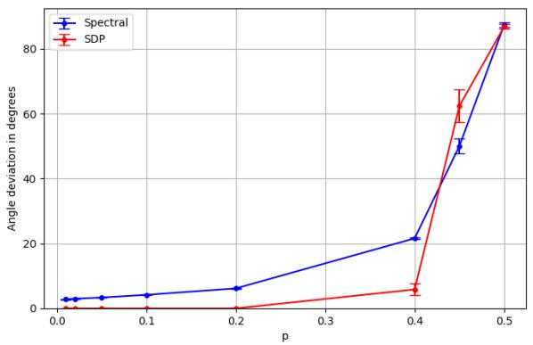  
(a)

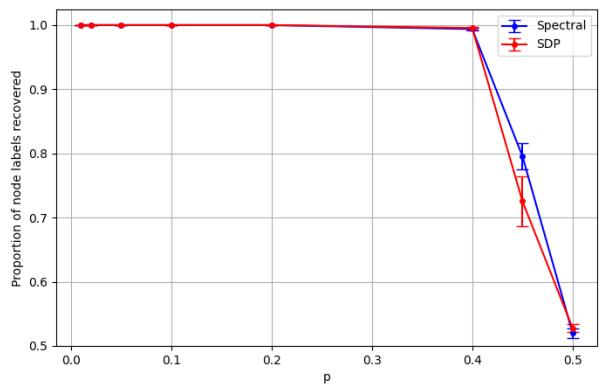  
(b)

Figure 4: Efect of edge-noise parameter p on the angle deviation (a) and proportion of correctly recovered node labels (b) for Erdös–Rényi graphs (60% edge density) of $n = 2 0 0$ nodes. Error bars at 95% confidence level over 30 repetitions. Our spectral method (Spectral) and semidefinite programming (SDP) produced comparable results.  
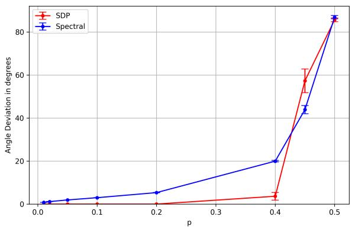  
(a)

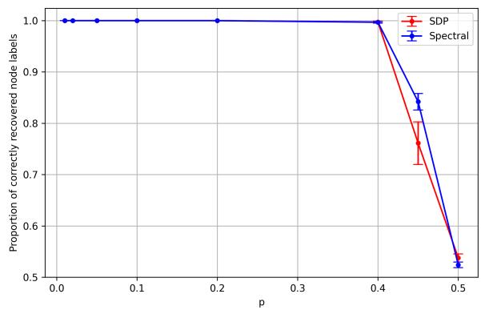  
(b)  
Figure 5: Efect of edge-noise parameter p on the angle deviation (a) and proportion of correctly recovered node labels (b) for complete graphs of $n = 2 0 0$ nodes. Error bars at 95% confidence level over 30 repetitions. Our spectral method (Spectral) and semidefinite programming (SDP) produced comparable results.

## C Additional Experiments

## C.1 More Comparisons Across Diferent Classes of Graphs

First, we run experiments on diferent classes of graphs, regarding the efect of the edge-noise parameter p in the angle deviation and proportion of correctly recovered node labels. Figures 3 to 5 show that our spectral method and semidefinite programming produce comparable results for Erdös–Rényi graphs, regular expander graphs and complete graphs.

Second, we run additional experiments for diferent classes of graphs, regarding the efect of the number of nodes n in the angle deviation and proportion of correctly recovered node labels. Figures 6 to 8 show that our spectral method and semidefinite programming produce comparable results for Erdös–Rényi graphs, regular expander graphs and complete graphs. Recall that in the main text, Figure 2 showed that our spectral method runs significantly faster than semidefinite programming.

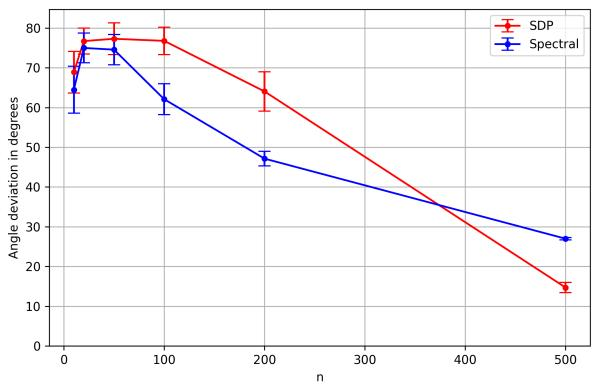  
(a)

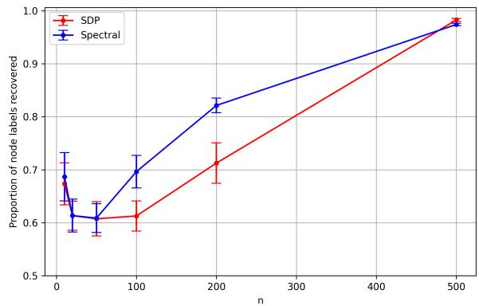  
(b)

Figure 6: Efect of number of nodes n on the angle deviation (a) and proportion of correctly recovered node labels (b) for Erdös–Rényi graphs (60% edge density) with $p = 0 . 4$ . Error bars at 95% confidence level over 30 repetitions. Our spectral method (Spectral) and semidefinite programming (SDP) produced comparable results.  
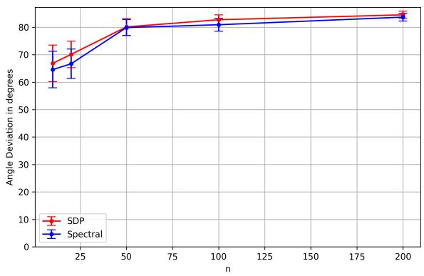  
(a)

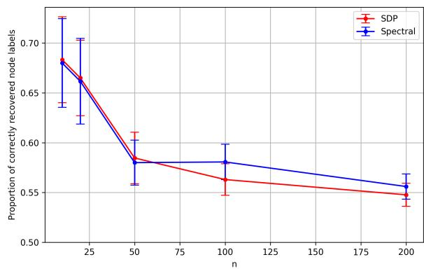  
(b)  
Figure 7: Efect of number of nodes n on the angle deviation (a) and proportion of correctly recovered node labels (b) for d-regular expanders $( d = 6 )$ with $p = 0 . 4$ . Error bars at 95% confidence level over 30 repetitions. Our spectral method (Spectral) and semidefinite programming (SDP) produced comparable results.

## C.2 Large Real-World Structured Prediction

We performed experiments in Epinions, a real-world case with 131,828 nodes and 841,372 edges. Our spectral algorithm runs in 0.1484 seconds while SDP would struggle at this scale in commercial solvers. To validate whether the spectral approach result is meaningful, the proportion positive edges (over all edges) inside nodes with $y _ { i } = + 1$ is 82.1%. For nodes with $y _ { i } = - 1$ the proportion of positive edges is 94.3%. The proportion of positive edges between nodes with $y _ { i } = + 1$ and nodes with $y _ { i } = - 1$ is 23.0%. This result is meaningful as we expect more positive edges inside nodes with the same $y _ { i }$ and few positive edges between diferent yi. (On each case the proportion of negative edges is 100% minus the proportion of positive edges.)

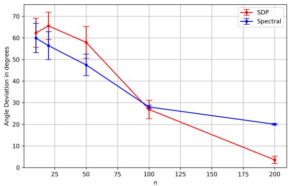  
(a)

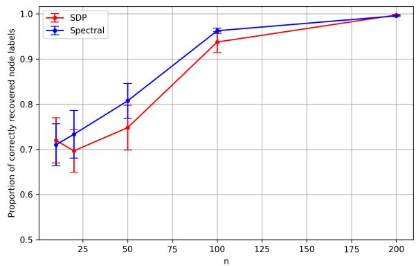  
(b)  
Figure 8: Efect of number of nodes n on the angle deviation (a) and proportion of correctly recovered node labels (b) for complete graphs with $p = 0 . 4 .$ . Error bars at 95% confidence level over 30 repetitions. Our spectral method (Spectral) and semidefinite programming (SDP) produced comparable results.