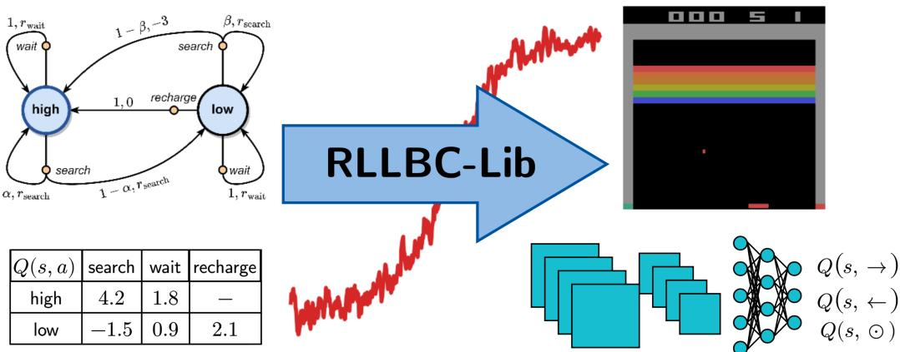
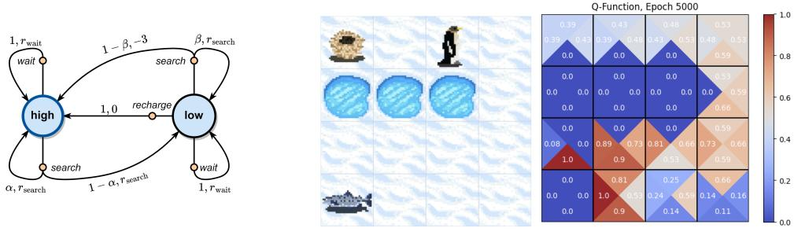
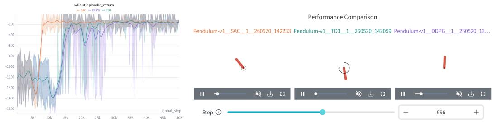
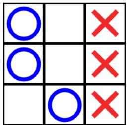
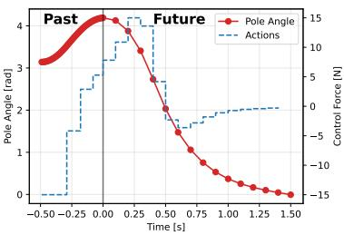
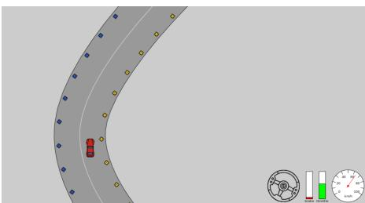

# RLLBC-Lib: An Educational Code Library for Reinforcement Learning and Learning-Based Control

Bernd Frauenknecht, Emma Cramer, Artur Eisele, Paul Kruse, Lukas Kesper, Jonas Hertrampf, Ramil Sabirov, Jyotirmaya Patra, Johannes Berger, Paul Brunzema, Friedrich Solowjow, Sebastian Trimpe

Institute for Data Science in Mechanical Engineering (DSME) RWTH Aachen University 52062 Aachen, Germany

{firstname}.{lastname}@dsme.rwth-aachen.de

## Abstract

Reinforcement learning (RL) is an exciting concept as well as a remarkable success story worth sharing. However, RL builds on rather complex interactions between different objects that play out over several cycles. Such dynamics are often best explained with an easily accessible implementation. We present RLLBC-Lib, a carefully crafted code library with the goal of lowering the entry barrier for students and other learners of RL in the context of learning-based control. At its heart, RLLBC-Lib comprises a comprehensive library of tabular RL approaches to enforce a clear understanding of the theoretical foundations. A deep RL library follows the same design principles, underscoring the parallels between simple tabular and stateof-the-art deep RL approaches. Additionally, RLLBC-Lib provides a collection of implementations illustrating core RL principles and contrasting RL to other learning-based control approaches. Finally, RLLBC-Lib provides an ideal basis for creating programming assignments with automated grading.

## 1 Introduction

Deep Reinforcement Learning (RL) has achieved remarkable success, yielding state-of-the-art performance in problems such as locomotion [25], drone racing [14], or nuclear fusion [6]. Further, RL remains highly relevant in fields like fine-tuning of large language models [20]. This relevance, together with its conceptual elegance, makes RL a compelling subject for modern university curricula.

However, we observe a substantial entry barrier for students to the field. RL algorithms are challenging to grasp from equations alone, because their behavior emerges from iterative feedback between data collection, value estimation, and policy improvement. Hands-on implementations expose these feedback loops directly. Students can trace how experience is generated, how updates change value estimates or policies, and how choices such as exploration, bootstrapping, and function approximation affect learning. Such access is crucial for understanding both tabular methods and modern deep RL approaches. Great deep RL libraries are available, e.g., [15, 23, 7, 13]. In contrast, educational libraries that span the full arc from tabular methods to state-of-the-art deep RL are considerably scarce. We, however, consider a solid understanding of the theoretical foundations established in the former critical to build intuition for the latter.

Furthermore, the sequential decision-making problems addressed by RL typically fall within the broader scope of learning-based control (LBC). Broadly speaking, LBC denotes the use of machine learning in the design or operation of control systems [28]. While RL offers a highly data-driven, machine learning-centric approach to these challenges, a variety of control-theoretic methods address similar issues. Presenting RL in the broader context of LBC methods and discussing the respective strengths and weaknesses of different approaches builds intuition. Students learn when a problem is well suited for RL and when it is more sensible to resort to another method.

  
Figure 1: Didactic Concept of RLLBC-Lib. The presented code library lowers the entry barrierfor students and other learners ofRL. It startsfrom straightforward tabular settings, depicted on the left, to build a solid understanding oftheoreticalfoundations. From there, it gradually guides towards state-of-the-art deep RL approaches, depicted on the right. This learning process is represented by the stylized return curve in red. The library builds on Jupyter notebooks with extensive explanations of theoretical concepts and their implementation. The notebook structure is consistent between tabular and deep RL approaches to underscore their similarities.

A particularly compelling aspect of teaching RL is that its applications fall into the intersection of computer science and engineering. In practice, we observe that these two cohorts have distinct pedagogical needs. Engineering students benefit immensely from easily accessible algorithmic implementations, whereas computer science students derive significant value from the control perspective, which is often not taught in standard computer science curricula.

Combining these observations, we present RLLBC-Lib, an educational code library providing

• implementations of common dynamic programming and tabular RL algorithms;

• implementations of common deep RL algorithms; accompanied by

• additional explanatory examples following the didactic concept of [34];

• implementations of several orthogonal LBC approaches; and

• a suitable starting point to create programming assignments with automated grading.

As depicted in Figure 1, RLLBC-Lib introduces students to the world of RL starting from simple toy examples that build intuition for basic concepts. From there, it gradually guides them towards state-of-the-art deep RL methods through accessible code accompanied by detailed explanations. In our own experience from classroom and online teaching, it is a valuable addition to RL textbooks [34, 19] and the current landscape of RL teaching libraries summarized in Appendix A.1. RLLBC-Lib is available at: https://github.com/Data-Science-in-Mechanical-Engineering/RLLBC.

## 2 Overarching Design Decisions

A core goal of RLLBC-Lib is to underscore a continuity between tabular and deep RL approaches, while providing an easily accessible implementation style.

We follow the concept of self-contained single file implementations in Python [13]. These implementations are presented via Jupyter notebooks that provide a simple interface for teaching [3] and automated grading as discussed in Section 5.3. All notebooks use one common virtual environment based on pixi-env [8] for a simple handling of dependencies. Further, interaction between the agent and its environment is handled via the common gymnasium interface [35].

(a) Recycling Robot  
  
(b) State Action Value Function Visualization  
Figure 2: Examples of Illustrative Tabular Implementations. (a) Custom implementation of the recycling robot example in [34] to explain MDP dynamics and valuefunctions. (b) Each state ofthe grid world is separated into triangles representing the action space $\mathcal { A } = \{ \left. , \uparrow , \right. , \downarrow \}$ . Plotting the state action values via color coding then illustrates learning dynamics.

All notebooks follow a common structure, comprising the building blocks

• Agent and environment setup;

• Hyperparameter setting;

• Training loop; and

• Evaluation of trained agents.

While these vary in their level of sophistication, based on the underlying algorithmic complexity, these reoccurring patterns underscore similarities between tabular and deep RL methods. For instance, parallels between tabular Q-learning [37] and deep Q-Networks [18] can be drawn. The latter requires substantially more involved handling of interaction data and value approximation. Still, it inherits the greedy maximization of a target policy and an ϵ-greedy exploration scheme from the former.

Most importantly, markdown blocks of the Jupyter notebooks are used to provide a detailed explanation of the algorithmic implementation. We reference the relevant literature and explain how certain aspects of pseudocode algorithms or relevant equations are implemented. While [34] serves as the reference for most tabular methods, we discuss the respective publications for the deep RL algorithms. This underscores similarities and differences between the respective approaches.

## 3 Dynamic Programming and Tabular Reinforcement Learning

Following the didactic concept of [34], we first discuss tabular settings, i.e., finite Markov decision processes (MDPs) with discrete states S and actions A. Such problems are comparably easy to handle and typically come with convergence guarantees, making them more approachable than their continuous counterparts.

We provide custom implementations of algorithms presented in [34], introducing the fundamental concepts of dynamic programming, temporal difference learning, and Monte-Carlo methods. A comprehensive list of algorithms is provided under tabular\_examples in Appendix A.2.

As discussed in Section 2, we put emphasis on explanations and illustrations, with two examples provided in Figure 2. As depicted in Figure 2a, we provide a gymnasium [35] implementation of the recycling robot (Example 3.3 in [34]). Its inherent stochasticity and state dependent action space make it an interesting, yet low dimensional problem. We use it as a running example to illustrate the fundamentals of MDP dynamics and value function learning.

Furthermore, we provide a visualization of state action value functions for grid world environments, as illustrated in Figure 2b. The state action value function estimates the expected return to go under the current policy, given a certain state action pair. Here, we visualize it for an adapted version of the FrozenLake environment [35]. The agent is illustrated by the penguin1. It starts from its nest and tries to reach the fish by navigating the frozen lake without falling into the holes. States are represented by tiles, while the action space $\mathcal { A } = \{ \left. , \uparrow , \right. , \downarrow \}$ comprises walking in four different directions. Thus, each triangle on the right represents a particular state action pair. The corresponding state action value estimate is indicated by a rounded numerical value and a color. This allows us to plot the full state action value function at different points throughout training, which illustrates the learning dynamics of the respective tabular algorithms.

  
(a) Performance Logging and Comparison  
(b) Visual Inspection of Agent Performance  
Figure 3: Logging of Deep RL Experiment Data. A further objective is to introduce students to deep RL workflows. The W&B integration allows managing large amounts ofexperiment data. Examples are (a) logging relevant quantities over several random seeds to compare algorithms or hyperparameter settings, and (b) recording videos ofagent performance to inspectfailure scenarios or connect a certain return value to the corresponding behavior.

## 4 Deep Reinforcement Learning

Deep RL notebooks follow a similar general structure as their tabular counterparts, while addressing high dimensional or continuous problems. The implementations are largely based on CleanRL [13], using PyTorch [21] for neural network training. A comprehensive list of provided algorithms can be found under deep\_examples in Appendix A.2.

Similar to the tabular notebooks, we provide detailed information about relevant implementation details. This emphasizes similarities and differences between value-based [18], policy-gradient [39], as well as on- [17, 29, 31] and off-policy actor critic [32, 9, 11] approaches.

Further, we introduce students to common deep RL workflows that help monitor training and compare results. Relevant quantities such as return or temporal difference losses are logged via tensorboard [1] and optionally via W&B [4]. This allows students to evaluate training performance in real time and connect lecture content with empirical observations. For instance, they can directly see how tuning trust regions influences training stability. Hierarchically organized logs allow tracking the effect of hyperparameter settings on learning performance. Further, videos of agent performance can be logged to W&B projects and visually inspected to connect return curves to agent behavior, as depicted in Figure 3.

Agent evaluation is handled at a configurable frequency over a variable number of episodes. This helps students understand how exploration introduces stochasticity in agent performance. Additionally, the notebooks provide the functionality to save and load checkpoints of agents. In particular, the best performing version of the agent is saved. Consequently, students can load a trained agent after a computationally expensive training run. They can then, e.g., compare it to other agents or investigate its performance and failure scenarios leveraging the aforementioned video recording function.

## 5 Additional Material

The tabular and deep RL libraries with a consistent design concept represent the core functionality of RLLBC-Lib. Beyond that, we provide additional material for illustrating key concepts of RL and contrasting it with other LBC approaches. Further, we developed programming assignments with automated grading for scalable teaching. In the following, we provide an overview of additional materials with examples depicted in Figure 4.

  
(a) Play against Agent

  
(b) Model Predictive Control

  
(c) Racing Programming Assignment  
Figure 4: Additional Material. (a) Illustration examples (see Section 5.1), such as learning Tic-Tac-Toe via RL (Section 1.5 of[34]) (b) Other learning-based control approaches (see Section 5.2), such as model-predictive control. (c) Programming assignments (see Section 5.3), such as racing a car.

## 5.1 Class Notebooks

We provide illustrative examples for usage in lectures and exercise sessions that underscore certain algorithmic aspects. Many of these notebooks are implementations of examples in [34] and are either derived from the library or are standalone implementations. Figure 4a, for instance, depicts a notebook where an RL agent learns Tic-Tac-Toe in self play. A keyboard interface allows the lecturer play against the agent, both early in training and after convergence. Taken from Section 1.5 of [34], this example serves to build curiosity.

## 5.2 Learning-Based Control Notebooks

As discussed above, RL falls into the greater field of LBC methods [28]. Control problems can be solved in a model-based or data driven way. Understanding these different approaches sharpens the intuition for when RL is well suited to a problem and when an alternative is preferable. We observe that opening the control theoretic perspective is especially helpful for computer science students that typically have a limited or no control background. Common basic knowledge also supports interdisciplinary collaboration. Beyond that, we believe transferring ideas from established fields like control theory to modern fields like deep RL can be a great source of innovation.

We provide a brief overview of classical control topics such as state feedback control via the linear quadratic regulator [2] as well as system identification and dynamics learning [16]. We further address controller tuning via Bayesian optimization [10, 33] and model predictive control (MPC) [24]. As depicted in Figure 4b, the latter optimizes action sequences based on model-based predictions in a receding horizon fashion. Works such as [38] and [5] are at the intersection of RL and MPC and underscore the fluid boundary between RL and other LBC methods. An overview of notebooks is provided under lbc\_examples in Appendix A.2.

## 5.3 Programming Assignments

Based on RLLBC-Lib, we developed three programming assignments for self-study.

The first assignment addresses tabular methods. From a text and graph description, students implement an MDP of a robot playing basketball as a gymnasium [35] environment. They subsequently implement double Q-learning [12] and an off-policy Monte-Carlo algorithm. The second assignment covers deep RL. Starting from Deep Q-Networks [18], students implement double DQN [36] with prioritized experience replay [26] and integrate generalized advantage estimation [30] into Proximal Policy Optimization [31]. Both assignments mix provided code with empty cells for students to fill in. Automated grading via nbgrader [22] provides a scalable solution for large courses.

The third assignment is an open racing challenge, depicted in Figure 4c. It builds on an adapted version of the road environment presented in [27]. The students can pick their algorithm of choice and adapt state formulation as well as action scaling. The only decisive factor for grading the assignment is the racing performance of the submitted agent. We set up a leaderboard page, ranking the best performances of all teams to further increase motivation. This assignment closely resembles common problem settings in research and industry and gives maximum freedom to the students.

Since grading of all programming assignments is automated, we developed an upload page that continuously grades new submissions, such that students can iteratively improve their scores. For didactic reasons, we keep this page unpublished together with the assignments.

## 6 Concluding Remarks

We present RLLBC-Lib, an educational library lowering the entry barrier for students and other learners of RL. It provides a set of notebooks that guide them from the very basics of RL to stateof-the-art deep RL algorithms. The consistent notebook design between tabular and deep methods clearly underscores the parallels between the theoretical foundations and scalable approaches to RL. Extensive explanations within the notebooks make clear connections between theoretical concepts introduced in textbooks or papers and their algorithmic implementation. Usage of standard interfaces like gymnasium environments [35] and W&B logging [4] introduces students to best practices in RL experimentation. Furthermore, additional notebooks illustrating core concepts of RL and contrasting them with other LBC methods sharpen the understanding of RL as a control method. Finally, RLLBC Lib is designed such that programming assignments with automated grading can be directly derived from its implementations. This enables hands-on teaching at scale.

From our classroom to everyone: Having taught RL to several hundred students over the past years in classroom and online formats, we developed a library we wished to have had access to from the beginning. We experience RLLBC-Lib as a great aid to our teaching efforts, both in classical lectures and our massive open online courses on RL2 and LBC3. We hope RLLBC-Lib is useful for the broader community, helping to spread the word about this exciting field.

## References

[1] Martín Abadi, Ashish Agarwal, Paul Barham, Eugene Brevdo, Zhifeng Chen, Craig Citro, Greg S Corrado, Andy Davis, Jeffrey Dean, Matthieu Devin, et al. TensorFlow: Large-Scale Machine Learning on Heterogeneous Systems, 2015.

[2] Karl Johan Åström and Richard Murray. Feedback Systems: An Introduction for Scientists and Engineers. Princeton University Press, 2021.

[3] Lorena A Barba, Lecia J Barker, Douglas S Blank, Jed Brown, Allen B Downey, Timothy George, Lindsey J Heagy, Kyle T Mandli, Jason K Moore, David Lippert, et al. Teaching and Learning with Jupyter. https://jupyter4edu.github.io/jupyter-edu-book/, 2019.

[4] Lukas Biewald et al. Experiment Tracking with Weights and Biases. Software available from https://www.wandb.com/, 2020.

[5] Kurtland Chua, Roberto Calandra, Rowan McAllister, and Sergey Levine. Deep Reinforcement Learning in a Handful of Trials Using Probabilistic Dynamics Models. Advances in Neural Information Processing Systems, 2018.

[6] Jonas Degrave, Federico Felici, Jonas Buchli, Michael Neunert, Brendan Tracey, Francesco Carpanese, Timo Ewalds, Roland Hafner, Abbas Abdolmaleki, Diego de las Casas, Craig Donner, Leslie Fritz, Cristian Galperti, Andrea Huber, James Keeling, Maria Tsimpoukelli, Jackie Kay, Antoine Merle, Jean-Marc Moret, Seb Noury, Federico Pesamosca, David Pfau, Olivier Sauter, Cristian Sommariva, Stefano Coda, Basil Duval, Ambrogio Fasoli, Pushmeet Kohli, Koray Kavukcuoglu, Demis Hassabis, and Martin Riedmiller. Magnetic Control of Tokamak Plasmas Through Deep Reinforcement Learning. Nature, 2022.

[7] Carlo D’Eramo, Davide Tateo, Andrea Bonarini, Marcello Restelli, and Jan Peters. MushroomRL: Simplifying Reinforcement Learning Research. Journal ofMachine Learning Research, 2021.

[8] Tobias Fischer, Wolf Vollprecht, Bas Zalmstra, Ruben Arts, Tim de Jager, Alejandro Fontan, Adam D Hines, Michael Milford, Silvio Traversaro, Daniel Claes, et al. Pixi: Unified Software Development and Distribution for Robotics and AI. arXiv preprint, 2025.

[9] Scott Fujimoto, Herke Hoof, and David Meger. Addressing Function Approximation Error in Actor-Critic Methods. In International Conference on Machine Learning, 2018.

[10] Roman Garnett. Bayesian Optimization. Cambridge University Press, 2023.

[11] Tuomas Haarnoja, Aurick Zhou, Pieter Abbeel, and Sergey Levine. Soft Actor-Critic: Off-Policy Maximum Entropy Deep Reinforcement Learning with a Stochastic Actor. In International Conference on Machine Learning, 2018.

[12] Hado Hasselt. Double Q-Learning. Advances in Neural Information Processing Systems, 2010.

[13] Shengyi Huang, Rousslan Fernand Julien Dossa, Chang Ye, Jeff Braga, Dipam Chakraborty, Kinal Mehta, and Joao GM Araujo. CleanRL: High-Quality Single-File Implementations of Deep Reinforcement Learning Algorithms. Journal ofMachine Learning Research, 2022.

[14] Elia Kaufmann, Leonard Bauersfeld, Antonio Loquercio, Matthias Müller, Vladlen Koltun, and Davide Scaramuzza. Champion-Level Drone Racing Using Deep Reinforcement Learning. Nature, 2023.

[15] Eric Liang, Richard Liaw, Robert Nishihara, Philipp Moritz, Roy Fox, Ken Goldberg, Joseph Gonzalez, Michael Jordan, and Ion Stoica. RLlib: Abstractions for Distributed Reinforcement Learning. In International Conference on Machine Learning, 2018.

[16] Lennart Ljung. System Identification: Theory for the User. Prentice Hall PTR, 2nd edition, 1999.

[17] Volodymyr Mnih, Adria Puigdomenech Badia, Mehdi Mirza, Alex Graves, Timothy Lillicrap, Tim Harley, David Silver, and Koray Kavukcuoglu. Asynchronous Methods for Deep Reinforcement Learning. In International Conference on Machine Learning, 2016.

[18] Volodymyr Mnih, Koray Kavukcuoglu, David Silver, Andrei A. Rusu, Joel Veness, Marc G. Bellemare, Alex Graves, Martin Riedmiller, Andreas K. Fidjeland, Georg Ostrovski, Stig Petersen, Charles Beattie, Amir Sadik, Ioannis Antonoglou, Helen King, Dharshan Kumaran, Daan Wierstra, Shane Legg, and Demis Hassabis. Human-Level Control Through Deep Reinforcement Learning. Nature, 2015.

[19] Kevin Murphy. Reinforcement Learning: An Overview. arXiv preprint, 2024.

[20] Long Ouyang, Jeffrey Wu, Xu Jiang, Diogo Almeida, Carroll Wainwright, Pamela Mishkin, Chong Zhang, Sandhini Agarwal, Katarina Slama, Alex Ray, et al. Training Language Models to Follow Instructions with Human Feedback. Advances in Neural Information Processing Systems, 2022.

[21] Adam Paszke, Sam Gross, Soumith Chintala, Gregory Chanan, Edward Yang, Zachary DeVito, Zeming Lin, Alban Desmaison, Luca Antiga, and Adam Lerer. Automatic Differentiation in PyTorch. In NIPS Workshop on the Future of Gradient-Based Machine Learning Software and Techniques (Autodiff), 2017.

[22] Project Jupyter, Douglas Blank, David Bourgin, Alexander Brown, Matthias Bussonnier, Jonathan Frederic, Brian Granger, Thomas L. Griffiths, Jessica Hamrick, Kyle Kelley, M. Pacer, Logan Page, Fernando Pérez, Benjamin Ragan-Kelley, Jordan W. Suchow, and Carol Willing. nbgrader: A Tool for Creating and Grading Assignments in the Jupyter Notebook. Journal of Open Source Education, 2019.

[23] Antonin Raffin, Ashley Hill, Adam Gleave, Anssi Kanervisto, Maximilian Ernestus, and Noah Dormann. Stable-Baselines3: Reliable Reinforcement Learning Implementations. Journal of Machine Learning Research, 2021.

[24] James B. Rawlings, Moritz M. Diehl, and David Q. Mayne. Model Predictive Control: Theory, Computation, and Design. Nob Hill Publishing, LLC, 2nd edition, 2024.

[25] Nikita Rudin, David Hoeller, Philipp Reist, and Marco Hutter. Learning to Walk in Minutes Using Massively Parallel Deep Reinforcement Learning. In Conference on Robot Learning, 2022.

[26] Tom Schaul, John Quan, Ioannis Antonoglou, and David Silver. Prioritized Experience Replay. In International Conference on Learning Representations, 2016.

[27] Maximilian Schier, Christoph Reinders, and Bodo Rosenhahn. Learned Fourier Bases for Deep Set Feature Extractors in Automotive Reinforcement Learning. In International Conference on Intelligent Transportation Systems (ITSC), 2023.

[28] Angela P. Schoellig, Matthias A. Müller, Sebastian Trimpe, Melanie N. Zeilinger, Mahathi Anand, Andrea Carron, Oliver Hausdörfer, Victor G. Lopez, Friedrich Solowjow, and Siqi Zhou. A Decade of Learning-Based Control: From Theoretic Foundations to Practical Deployment. In Proceedings of the IEEE Conference on Decision and Control (CDC), 2026.

[29] John Schulman, Sergey Levine, Pieter Abbeel, Michael Jordan, and Philipp Moritz. Trust Region Policy Optimization. In Francis Bach and David Blei, editors, International Conference on Machine Learning, Proceedings of Machine Learning Research. PMLR, 2015.

[30] John Schulman, Philipp Moritz, Sergey Levine, Michael Jordan, and Pieter Abbeel. High-Dimensional Continuous Control Using Generalized Advantage Estimation. In International Conference on Learning Representations, 2016.

[31] John Schulman, Filip Wolski, Prafulla Dhariwal, Alec Radford, and Oleg Klimov. Proximal Policy Optimization Algorithms. arXiv preprint, 2017.

[32] David Silver, Guy Lever, Nicolas Heess, Thomas Degris, Daan Wierstra, and Martin Riedmiller. Deterministic Policy Gradient Algorithms. In Eric P. Xing and Tony Jebara, editors, International Conference on Machine Learning, Proceedings of Machine Learning Research. PMLR, 2014.

[33] David Stenger, Paul Brunzema, Johanna Menn, Alexander von Rohr, Angela P Schoellig, and Sebastian Trimpe. A Decade of Bayesian Optimization for Controller Tuning and Robot Learning: Tutorial, Review, and Future Prospects. arXiv preprint, 2026.

[34] Richard S Sutton and Andrew G Barto. Reinforcement Learning: An Introduction. MIT Press, 2018.

[35] Mark Towers, Ariel Kwiatkowski, John Balis, Gianluca De Cola, Tristan Deleu, Manuel Goulão, Kallinteris Andreas, Markus Krimmel, Arjun Kg, Rodrigo Perez-Vicente, et al. Gymnasium: A Standard Interface for Reinforcement Learning Environments. Advances in Neural Information Processing Systems, 2026.

[36] Hado Van Hasselt, Arthur Guez, and David Silver. Deep Reinforcement Learning with Double Q-Learning. In Proceedings ofthe AAAI Conference on Artificial Intelligence, 2016.

[37] Christopher JCH Watkins and Peter Dayan. Q-Learning. Machine Learning, 1992.

[38] Grady Williams, Nolan Wagener, Brian Goldfain, Paul Drews, James M. Rehg, Byron Boots, and Evangelos A. Theodorou. Information Theoretic MPC for Model-Based Reinforcement Learning. In IEEE International Conference on Robotics and Automation. IEEE, 2017.

[39] Ronald J. Williams. Simple Statistical Gradient-Following Algorithms for Connectionist Reinforcement Learning. Machine Learning, 1992.

## A Appendix

## A.1 Reinforcement Learning Teaching Libraries

Table 1: A subjectively compiled non-exhaustive list of RL libraries that may be useful for teaching.
<table><tr><td>GitHub Repository</td><td>Jupyter Notebooks</td><td>Dynamic Programming</td><td>Tabular RL</td><td>Deep RL</td><td>Examples &amp; Explanations</td></tr><tr><td>RLLBC-Lib (ours)</td><td>√</td><td>√</td><td>√</td><td>√</td><td>√</td></tr><tr><td>EduGym</td><td>√</td><td>√</td><td>√</td><td>(√)</td><td>(√)</td></tr><tr><td>dennybritz/ reinforcement-learning</td><td>√</td><td>√</td><td>√</td><td>(√)</td><td></td></tr><tr><td>cmendl/ reinforcement-learning-course</td><td>√</td><td>√</td><td>√</td><td></td><td></td></tr><tr><td>Fortuz/ rl_education</td><td>√</td><td>√</td><td>√</td><td></td><td>√</td></tr><tr><td>ShangtongZhang/ reinforcement-learning-an-introduction</td><td></td><td>√</td><td>√</td><td></td><td></td></tr><tr><td>linesd/ tabular-methods</td><td></td><td>√</td><td>√</td><td></td><td></td></tr><tr><td>prabhatnagarajan/ table-rl</td><td></td><td>√</td><td>√</td><td></td><td></td></tr><tr><td>lasseufpa/ tabular_rl</td><td></td><td>√</td><td>√</td><td></td><td></td></tr><tr><td>RylinnM/</td><td></td><td>√</td><td>√</td><td></td><td></td></tr><tr><td>Tabular-Reinforcement-Learning huggingface/</td><td>√</td><td></td><td>(√)</td><td>√</td><td>√</td></tr><tr><td>deep-rl-class ayeenp/</td><td></td><td></td><td></td><td></td><td></td></tr><tr><td>Deep-RL-Notebooks edreate/</td><td>√</td><td></td><td>√</td><td>√</td><td>√</td></tr><tr><td>Reinforcement-Learning DLR-RM/</td><td>√</td><td></td><td>(√)</td><td>(√)</td><td></td></tr><tr><td>stable-baselines3</td><td></td><td></td><td></td><td>√</td><td></td></tr><tr><td>pytorch/ rl</td><td></td><td></td><td></td><td>√</td><td></td></tr><tr><td>thu-ml/</td><td></td><td></td><td></td><td>√</td><td></td></tr><tr><td>tianshou</td><td></td><td></td><td></td><td></td><td></td></tr><tr><td>openai/</td><td></td><td></td><td></td><td></td><td></td></tr><tr><td></td><td></td><td></td><td></td><td>√</td><td>√</td></tr><tr><td>spinningup</td><td></td><td></td><td></td><td></td><td></td></tr><tr><td></td><td></td><td></td><td></td><td></td><td></td></tr><tr><td>vwxyzjn/</td><td></td><td></td><td></td><td>√</td><td>√</td></tr><tr><td></td><td></td><td></td><td></td><td></td><td></td></tr><tr><td>cleanrl</td><td></td><td></td><td></td><td></td><td></td></tr></table>

## A.2 Library Overview

RLLBC/ RLLBC/

tabular\_examples/ dynamic\_programming/ policy\_iteration.ipynb value\_Iteration.ipynb tabular\_rl/ MC/ first\_visit\_mc.ipynb every\_visit\_mc.ipynb TD/ q-learning.ipynb sarsa.ipynb dyna-q.ipynb   
deep\_examples/ a2c-simple-adv.ipynb a2c.ipynb ddpg.ipynb dqn.ipynb reinforce.ipynb sac.ipynb td3.ipynb trpo-simple-adv.ipynb trpo.ipynb   
lbc\_examples/ lqr.ipynb mpc.ipynb dynamics\_learning\_discrete.ipynb bo.ipynb   
class\_examples/ MDP and value functions bellman\_opt\_eq.ipynb markov\_process.ipynb recycling\_bot\_value\_function.ipynb tic-tac-toe.ipynb dynamic\_programming dp\_gridworld.ipynb dp\_gridworld2.ipynb monte carlo methods BlackJack.ipynb temporal difference learning cliffwalking\_on\_vs\_off-policy.ipynb td0\_vs\_constant\_alpha\_mc.ipynb td\_vs\_mc\_control.ipynb Dyna-Q Dyna-Q\_vs\_Q-Learning.ipynb function approximation linear\_sarsa.ipynb nonlinear\_approximation.ipynb random\_walk.ipynb learning-based control Cartpole\_NARX.ipynb Cartpole\_lqr.ipynb lin\_sys\_id\_oscillator.ipynb