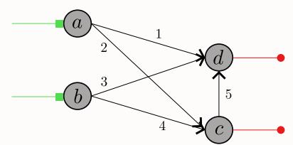
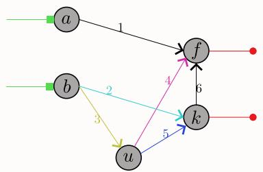
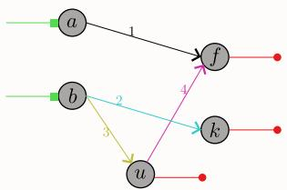
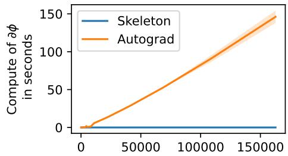
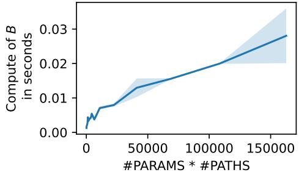
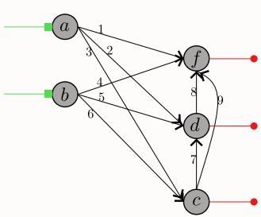
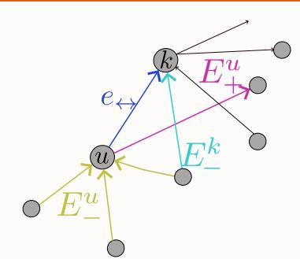

# Rank and computation of the pathlifting Jacobian of a DAG ReLU network

Manon Verbockhaven

manon.verbockhaven@inria.fr

ENS de Lyon, CNRS, Universite Claude Bernard Lyon 1, Inria, LIP´

UMR 5668, 69342, Lyon cedex 07, France

✿

## Abstract

This paper provides a self-contained proof of the rank of the pathlifting Jacobian of a DAG ReLU network by performing an induction on the network’s number of hidden nodes. In fact, the induction is elementary, and the key recipe is to consider the skeleton matrix of the network, a sparse matrix encoding the network paths, and transform the representation of one of its hidden neurons into an output node. The proof relies on intermediate propositions which link the pathlifting, its Jacobian, the network parameters, and its skeleton matrix, which, on top of permitting to conclude on the rank of the pathlifting Jacobian, also provide a way to compute it without backpropagation and whose computation cost is super efficient in practice compare to usual backpropagation. The paper is provided with a Python module that implements the different propositions of the paper for feed forward networks and is used to experimentally quantifies the computational gain of computing the pathlifting Jacobian with the proposed theory.

## 1 Introduction

Most network architectures can be represented by Directed Acyclic Graph (DAG) ReLU networks, a generalized version of the feed-forward ReLU networks. The output of such a network is computed through the computation of its DAG, where each node is the application of the ReLU or the identity function, and each edge is a linear application whose coefficient is given by a parameter of the network. Compared to arbitrary computational graphs, DAG ReLU Networks are rather simple to study. This is partly due to the piecewise linearity of those network activation functions, which simplifies the network prediction and has permitted proofs on its approximation properties Hornik et al., Parhi and Nowak [2021], Lin et al. [2022], Leshno et al., its generalization and optimization properties Jacot et al. [2018], Chizat et al. [2019], on its Lipschitz constant Gonon et al. [2025], and on its intrinsic dynamics Marcotte et al. [2026].

Among the different tools that have brought to light the theoretical properties of DAG ReLU networks, we remark the pathlifting function Φ, a function mapping the network parameters to their vector of paths. The pathlifting is indeed a well-suited tool for the theoretical study of DAG ReLU networks because it locally linearises the network’s prediction function and is agnostic to the non-negative homogeneity of the ReLU activation. In particular, the pathlifting function has been used to establish generalization bounds Gonon et al. [2024], study the intrinsic dynamics of its pathlifting kernel matrix Marcotte et al. [2026], accelerate the network training Lebeurrier et al. [2026] and penalize the training criterion Parhi and Nowak [2021], Neyshabur et al.. Although the pathlifting function has been used in theory, it is rarely used in practice because its is a very high-dimensional vector. Generally, only some of its attributes are computed, for example, its dimension and its norm that can be computed in one forward pass Gonon [2024], Gonon et al. [2024], and the diagonal coefficient of its pathlifting kernel matrix $\partial _ { \theta } \Phi ^ { \top } \partial _ { \theta }$ Φ that can be computed in one forward-backward pass Lebeurrier et al. [2026].

The focus of this paper is the Jacobian of the pathlifting function, $\partial _ { \theta } \Phi$ , which has already been studied in Marcotte et al. [2026] through the dynamics of the pathlifting kernel matrix $\partial _ { \theta } \Phi ^ { \top } \partial _ { \theta } \mathbf { \bar { \Phi } }$ . An interesting result of this previous work, which we are able to recover in this paper with an independent methodology, is that for a DAG ReLU network with d parameters and $h$ hidden neurons, the rank of its pathlifting Jacobian $\partial _ { \theta } \Phi$ is equal to $d - h .$ . In the work of Marcotte et al. [2026] this theorem is proved by an equal upper and lower bound on the rank of the Jacobian matrix $\partial _ { \theta } \Phi .$ , where the upper bound is provided by a result of the paper (Corollary 3.4) and the lower bound (Appendix F) is obtained using a more general theorem from graph theory Gleiss et al. [2003]. In fact, this double bounds and the use of an external theorem to conclude on the rank of the Jacobian $\partial _ { \theta } \Phi$ makes the proof pretty technical and convoluted.

In our work, we take a different approach to determine the rank of the pathlifting Jacobian of a DAG ReLU network. We connect this Jacobian to the network’s skeleton matrix (a sparse matrix encoding the path of the network) and prove its rank by induction on the network number of hidden neurons. Compared to the work of Marcotte et al. [2026], our proof is elementary and mainly relies on a topological sort of the graph and some symmetries of the skeleton matrix.

To prove the theorem on this Jacobian rank, we use intermediate propositions that rewrite the pathlifting and its Jacobian as a matrix product between the parameters, the pathlifting, and the skeleton matrix, which, on top of permitting to conclude on the rank of the pathlifting Jacobian, also provides an efficient way to compute the pathlifting Jacobian without backpropagation where the differentiations over the elements of the pathlifting vector are replaced by a cheaper matrix product. While some of those intermediate results were also used and proved in Marcotte et al. [2026], we provide new proofs based on first-order expansion and a Python implementation available at this GitLab.

The paper is organized as follows. In the first section, we define the main objects of the paper and state the main propositions and the main theorem. In a second section, we provide a sketch of proof for the main theorem. In the last section, we quantify experimentally the gain of using the proposed theory to compute the pathlifting Jacobian compared to backpropagation.

## 1.1 General notations and objects

We note $\mathbb { R } ( r )$ the r-dimensional real vector space and $\mathbb { R } ( r _ { 1 } , \cdots , r _ { q } )$ the $( r _ { 1 } , \cdots , r _ { q } )$ -dimensional real vector space.

Let $f : \mathbb { R } ( d ) \mapsto \mathbb { R } ( q )$ be a function, when $f$ is differentiable, we note $\partial _ { x } f \in \mathbb { R } ( q , d )$ the jacobian matrix of $f \mathrm { a t } x \in \mathbb { R } ( d )$ and when f is a real-valued function, we note $\nabla _ { x } f \in \mathbb { R } ( d )$ its gradient vector with the convention that $\nabla _ { x } f = \left( \partial _ { x } f \right) ^ { \top }$

We represent a Directed Acyclic Graph $\left( \mathrm { D A G } \right) \mathcal { G }$ by its list of nodes $N = \{ n _ { 1 } , \cdots n _ { m } \}$ and its list of oriented edges $E = \{ e _ { 1 } , \cdots e _ { d } \}$ with the property that there is no cycle in the graph.

We define a DAG ReLU network ${ \mathcal F } ,$ a computational graph whose graph is a DAG where some nodes are designated as input and output nodes. This network is also characterized by its parameters $\theta \in \mathbb { R } ( d )$ and its prediction function noted $f _ { \theta }$

For a given DAG ReLU network ${ \mathcal F } ,$ let P be the number of paths connecting one input to one output node in its DAG, we note $\Phi ( { \boldsymbol { \theta } } ) \in \mathbb { R } ( P )$ the vector whose value at index $p \in \{ 1 , \cdots , P \}$ is the product of the network weights along the path $p .$

The dimensions of the main objects are summarized in the following table.

Table 1: Objects dimensions.
<table><tr><td>Symbol</td><td>class</td><td>Description</td></tr><tr><td> $r , q$   $\theta$   $\Phi ( \theta )$ </td><td> $\overline { { \mathbb { N } ^ { * } } }$   $\mathbb { R } ( d )$   $\mathbb { R } ( P )$ </td><td>number of input and output nodes Parameters of the network Pathlifting of the network</td></tr></table>

## 2 Properties of the pathlifting and its Jacobian

In this section, we present the DAG ReLU network, the pathlifting function, and define the skeleton matrix. Then we connect those objects to one another through propositions.

## 2.1 Main definitions

We consider a DAG ReLU network $\mathcal { F }$ with vector of parameters $\theta \in \mathbb { R } ( d )$ and with DAG G described by its list of node $N = \{ n _ { 1 } , \dots , n _ { m } \}$ and its list of oriented edges $E = \{ e _ { 1 } , \ldots , e _ { d } \}$ The indexes of the edges in $E$ are isomorphic to the index of $\theta$ and the prediction function of ${ \mathcal { F } } ,$ noted $f _ { \theta } : \mathbb { R } ( r ) \mapsto \mathbb { R } ( \overline { { q } } )$ , is defined as the results of the computational graph of $\mathcal { G }$ where each node represents the application of the ReLU max(0, ·) or the identity function, and each edge is the linear application whose coefficient is the parameter associated to it.

The definition and the association of the network $\mathcal { F }$ with its DAG G allow us to distinguish three subsets of its nodes in N: the input nodes I, the output nodes $O ,$ and the hidden nodes $\dot { H }$ . The input nodes are associated with the network’s input and can be identified in the graph as the nodes with no incoming edges. The output nodes are associated with the network’s outputs and cannot be inferred from the graph representation and contains every node with no outgoing edge, together with any additional node designated as an output by the architecture. Finally, a node is a hidden node when it is neither an input nor an output node. Remark that those three subsets are a partition of $N ,$ i.e

$$
I \cap H = I \cap O = H \cap O = \emptyset
$$

$$
I \cup H \cup O = N .\tag{1}
$$

Remark 1. With this convention, the network’s biases are treated as input nodes, and their input values are set to 1.

The pathlifting function Φ of a network is a function that maps its parameters $\theta$ to its vectors of paths, where a path is a set of edges that connects an input node to an output node in the graph. For a DAG ReLU network with DAG G, let $P$ be the number of paths connecting one input node to one output node in the graph G then, the pathlifting function Φ : $\mathbb { R } ( d ) \mapsto \mathbb { R } ( P )$ is the function whose value at index $j$ for $\bar { \boldsymbol { j } } \in \{ 1 , \cdots , P \}$ equals the product of all the parameters along the path $j .$ . Strictly speaking, we defined the pathlifting function as follows.

Definition 1. For DAG ReLU network with DAG G with edge list $E$ isomorphic to the index of θ, let $P$ be the number ofpaths in the network then, $f o r j \in \{ 1 , \ldots , P \}$ a path index in the network, let $e _ { 1 } , \ldots , e _ { d _ { j } }$ be the list of edges crossed by the path $j ,$ , then for $\theta \in \mathbb { R } ( d )$ , we defined $\Phi ( \theta )$ at index j as :

$$
\Phi ( \theta ) _ { j } = \prod _ { k = 1 } ^ { d _ { j } } \theta _ { e _ { k } }\tag{2}
$$

The main characteristic of the pathlifting function is that, for a finite-dimensional dataset, it locally linearises the network’s prediction function. While this proposition is well-known in the literature, we recal this property in the next proposition for the sake of completeness.

Proposition 1. For a DAG ReLU network with parameters $\theta \in \mathbb { R } ( d )$ and predictionfunction $f _ { \theta ; }$ , let $\{ x _ { i } \} _ { i = 1 } ^ { n } \in \mathbb { R } ( r ) ^ { \otimes n }$ be a dataset and µ a measure on $( \theta , \{ x _ { i } \} _ { i = 1 } ^ { n } )$ that is absolutely continuous w.r.t. the Lebesgue measure, then $\mu -$ almost surely, there exists O a neighborhood of $\cdot \theta$ and $\mathcal { L } : \mathbb { R } ( P ) \mapsto \mathbb { R } ( \breve { q } ) ^ { \otimes n }$ a linear application such that Proof:3

$$
\forall \theta ^ { \prime } \in O \quad \{ f _ { \theta ^ { \prime } } ( x _ { i } ) \} _ { i = 1 } ^ { n } = \mathcal { L } \bigl ( \Phi ( \theta ^ { \prime } ) \bigr ) ~ .\tag{3}
$$

The the function $\mathcal { L }$ is provided in the proof of proposition 1 and is encoded in the Python module. For more details on the definition properties of the pathlifting function, we refer the reader to Chapter 2 of Gonon [2024].

The last object we introduce is the skeleton matrix B of a network. The skeleton matrix of a DAG ReLU network is a sparse matrix encoding the absolute dependency of the network’s paths with respect to its parameters. Strictly speaking, we define the skeleton matrix as follows.

Definition 2. Let $\mathcal { F }$ be a DAG ReLU network with d parameters and with P paths, we define $B \in \mathbb { R } ( P , d )$ , the skeleton matrix of $\mathcal { F }$ as the matrix whose coefficients are defined as follows.

$$
B _ { i j } = { \left\{ \begin{array} { l l } { 1 } & { i f t h e ~ i ^ { t h } ~ p a t h ~ o f ~ \mathcal { F } ~ i s ~ d e p e n d e n t ~ o f ~ t h e ~ p a r a m e t e r s ~ \theta _ { j } } \\ { 0 } & { o t h e r w i s e } \end{array} \right. }\tag{4}
$$

To finish this subsection, we provide in fig. 1 an example of a DAG ReLU network with its pathlifting function and its skeleton matrix.

$$
\left. { \begin{array} { c } { \cos \theta } \\ { \displaystyle \sum _ { \theta \geq \infty } ^ { \theta } \gamma ^ { \theta } } \\ { \displaystyle - { \mathfrak { C } } ^ { \theta } \sum _ { \theta \geq \infty } ^ { \theta } \gamma ^ { \theta } } \end{array} } \right. \quad \Phi ( \theta ) = \left( { \begin{array} { c } { \theta _ { 1 } \theta _ { 5 } } \\ { \theta _ { 2 } \theta _ { 6 } } \\ { \theta _ { 3 } \theta _ { 5 } } \\ { \theta _ { 4 } \theta _ { 6 } } \\ { \theta _ { 7 } } \end{array} } \right) \quad B = \left( { \begin{array} { c c c c c c } { 1 } & { 0 } & { 0 } & { 0 } & { 1 } & { 0 } & { 0 } \\ { 0 } & { 1 } & { 0 } & { 0 } & { 0 } & { 1 } & { 0 } \\ { 0 } & { 0 } & { 1 } & { 0 } & { 1 } & { 0 } & { 0 } \\ { 0 } & { 0 } & { 0 } & { 1 } & { 0 } & { 1 } & { 0 } \\ { 0 } & { 0 } & { 0 } & { 0 } & { 0 } & { 0 } & { 1 } \end{array} } \right)
$$

Figure 1: left: DAG of a feed-forward ReLU network with bias and one hidden layer. The nodes are represented with circles and the edges with black oriented arrows. The green (resp. red) arrows indicate the input (resp. the output) nodes, and the bias nodes are circled in dark blue. The nodes are indexed with letters, while the edges are indexed with integers. The node sets are: $I = \{ a , c , g \} , O = \{ h \} , H = \{ d , f \}$ . Middle: pathlifting function Φ of the network whose DAG is the left figure. Right: skeleton matrix B associated to Φ of the middle figure.

## 2.2 Propositions and theorem

We now present propositions that connect the pathlifting function, its Jacobian, and the skeleton matrix, and then present the main theorem on the rank of the pathlifting Jacobian. We note to the reader that some of the propositions were already known in the literature (Marcotte et al. [2026]), in particular proposition 2 and theorem 1. However, we provide a new proof of proposition 2 using a first-order Taylor expansion, and a new proof of theorem 1 by induction.

Let $\mu$ be a measure on θ that is absolutely continuous with respect to the Lebesgue measure, the following equality holds.

Lemma 1. Let $| \cdot | ,$ exp and log be the entry-wise application of the associated function, and let $S \in \mathbb { R } ( P , P )$ be the diagonal matrix whose diagonal coefficients are the signs of ${ \bf \Phi } ( \theta )$ , then $\mu$ almost surely Proof:4

$$
\begin{array} { r l } { \Phi ( \theta ) = S \exp \big ( B \log ( | \theta | ) \big ) } & { { } \in \mathbb { R } ( P ) ~ . } \end{array}\tag{5}
$$

This result is a key element that is to be be used to compute the pathlifting’s Jacobian using the skeleton matrix.

Proposition 2. With diag the operator that maps a vector u to the diagonal matrix with diagonal entries given by u, then µ almost surely Proof:4

$$
\partial _ { \theta } \Phi = \mathrm { d i a g } ( \Phi ) B \mathrm { d i a g } ( \frac { 1 } { \theta } )\tag{6}
$$

where the dependence of ∂<sub>θ</sub>Φ and Φ in θ has been omittedfor clarity and $\frac { 1 } { \theta } \in \mathbb { R } ( d )$ is the vector whose $i ^ { t h }$ coordinate is equal to $\frac { 1 } { \theta _ { i } }$

In fact, for both results, the $\mu$ almost surely statement excludes the ill-condition cases where θ has a null coordinate, which also corresponds to the point where the pathlifting Φ is not differentiable.

We remark that proposition 2 provides an expression of the pathlifting Jacobian as a function of Φ and θ, and whose total computational complexity is $O ( d P )$ as each element $( i , j )$ of $\partial _ { \theta }$ Φ can be computed independently with $\Phi _ { i } B _ { i , j } { \frac { 1 } { \theta _ { i } } }$ . In fact, this asymptotic computational cost is similar to the one obtained when backpropagating each element of Φ; however, as shown in the experimental section of this paper, the matrix product in proposition 2 is naturally parallelizable and is super-efficient in practice compare to usual backpropagation.

From proposition $^ { 2 , }$ one can deduce that the skeleton matrix $B \in \mathbb { R } ( P , d )$ is equals to the jacobian of Φ at point $\theta = \mathbf { 1 } _ { d } \in \mathbb { R } ( d )$ the vector full of ones. This property was also used in Marcotte et al. [2026] and is stated in the following corollary.

Corollary 1. Let d be the dimension ofthe parameter θ and $\mathbf { 1 } _ { d } \in \mathbb { R } ( d )$ be the vector full of ones, then

$$
{ \cal B } = \partial _ { \theta } \Phi ( { \bf 1 } _ { d } ) \ .\tag{7}
$$

From proposition 2, one can easily deduce an equality on the rank of the pathlifting Jacobian.

Corollary 2. µ almost surely, the rank ofthe jacobians ofΦ equals to the rank ofits skeleton matrix, i.e. µ almost surely Proof:4

$$
\mathbf { r k } ( \partial _ { \theta } \Phi ) = \mathbf { r k } ( B ) .\tag{8}
$$

We conclude this section with the main theorem that is provided with a sketch of proof in section 3. For F be a neural network with input set I, output set O, hidden node set H, and skeleton matrix B, then the following result holds.

Theorem 1. Note # the cardinality operator, the rank of the skeleton matrix of F is Proof:2

$$
\operatorname { r k } ( B ) = \# E - \# H .\tag{9}
$$

Corollary 2 and theorem 1 leads to the following corollary, which concludes the section. Let $\mathcal { F }$ be a neural network with parameter θ, the following result holds.

Corollary 3. Let d be the dimension of the parameter of F and h the number of hidden nodes in $\mathcal { F }$ then, µ almost surely

$$
\mathbf { r k } ( \partial _ { \theta } \Phi ) = d - h .\tag{10}
$$

## 3 Sketch of proof

In this section, we provide a sketch of proof for theorem 1. To mimic the induction of the general proof, we chose two simple DAG ReLU networks on which we apply the general proof. The first network is chosen with no hidden nodes to illustrate the initialization of the induction, and the second network is chosen with one hidden node to illustrate one step of the induction.

## 3.1 Initialization of the induction

We consider a DAG ReLU network with no hidden nodes, $h = 0 .$ , and whose DAG is given in fig. 2. Its pathlifting function Φ and skeleton matrix B are defined in eq. (11). The columns of the skeleton matrix B are ordered according to the list of edges indicated at its top, and its rows are ordered to match the pathlifting function indexing.



(a   
1   
2   
(d   
3   
5 1 2 3 4 5   
4 θ<sub>1</sub> 1 0 0 0 0   
θ<sub>2</sub> 0 1 0 0 0   
Figure 2: DAG of a network with no Φ(θ) = θ<sub>2</sub>θ<sub>5</sub> B = 0 1 0 0 1 (11)   
hidden node, the green and the red θ<sub>3</sub> 0 0 1 0 0   
arrows represent the input nodes and θ<sub>4</sub> 0 0 0 1 0   
the output nodes, respectively. The θ<sub>4</sub>θ<sub>5</sub> 0 0 0 1 1   
nodes are indexed with letters $N =$   
$\{ a , b , c , d \}$ and the edges with integers   
$\check { E } = \left\{ 1 , \overset { \cdot } { 2 } , 3 , 4 , 5 \right\}$

To compute the rank of $B ,$ we apply invertible row operations on it, then evaluate the rank of the resulting matrix. Indeed, performing row operations on a matrix is equivalent to applying invertible matrices to its left side; thus, the rank is not changed.

We choose the row operations that take advantage of some specific properties of the skeleton matrix B and which are embodied by the following lemma.

Lemma 2. For a DAG ReLU network with no hidden nodes,for all $l \geq 2 ,$ for all path p of length l, let $e _ { 1 } , \ldots , e _ { l }$ be the ordered list of edges crossed by path $p ,$ then it exists a path p˜ of size l − 1 that $g _ { \ell }$ oes through the list ofedges $e _ { 1 } , \ldots , e _ { l - 1 } ,$ , as a consequence Proof:5

$$
B [ p , : ] - B [ \tilde { p } , : ] = ( 0 \mathrm { ~ ~  ~ \cdot ~ } 0 \mathrm { ~  ~ 1 ~ ~ } 0 \mathrm { ~  ~ \cdot ~ } 0 )\tag{12}
$$

where the only non-null element is at the index associated with the edge $e _ { l } ,$ the last edge crossed by path $p .$

This lemma can be easily checked on the $\mathrm { f i g }$ . 2: the only paths of length greater than one are the third and sixth path of Φ, they respectively go across the list of edges 2, 5 and 4, 5 and indeed the second path of Φ is of length one and goes through 2 and the fifth path of Φ is of length one and goes through 4.

Using this symmetry, we construct the algorithm algorithm 1, which takes as input the matrix $B$ and outputs a matrix $\tilde { B }$ of the same rank as B.

Data: B the skeleton matrix, $l _ { m a x }$ the maximum length of a   
path   
Result: matrix $\tilde { B }$ of the same rank as $B$   
for $l = l _ { m a x } , l _ { m a x } - 1 , \ldots , 2$ do   
for p of length l do   
let $\tilde { p }$ be the path defined in lemma 2 for path $p ;$   
$B [ \hat { p } , : ]  \dot { B ( p , : ] } - B [ \tilde { p } , : ] ;$   
end   
end   
Algorithm 1: Row operations on matrix B

$$
\tilde { B } = \left( \begin{array} { c c c c c } { { 1 } } & { { 0 } } & { { 0 } } & { { 0 } } & { { 0 } } \\ { { 0 } } & { { 1 } } & { { 0 } } & { { 0 } } & { { 0 } } \\ { { 0 } } & { { 0 } } & { { 0 } } & { { 0 } } & { { 1 } } \\ { { 0 } } & { { 0 } } & { { 1 } } & { { 0 } } & { { 0 } } \\ { { 0 } } & { { 0 } } & { { 0 } } & { { 1 } } & { { 0 } } \\ { { 0 } } & { { 0 } } & { { 0 } } & { { 0 } } & { { 1 } } \end{array} \right)\tag{13}
$$

Let $\tilde { B }$ be the matrix outputted by algorithm 1 and provided in eq. (13), then, because of lemma $2 .$ each of its rows has only one non-null element thus its rank is equal to the number of its non-null columns, which is equal to 5, which is also the dimension of $\theta .$ . It follows that

$$
\mathbf { r } \mathbf { k } ( B ) = \mathbf { r } \mathbf { k } ( { \tilde { B } } ) = 5 = d - 0 .\tag{14}
$$

## 3.2 One induction step

We now suppose that the theorem is true for any DAG ReLU network without hidden nodes and perform one step of induction. We choose a network $\mathcal { F }$ with one hidden node $h = 1$ and whose representation is given in fig. 3. Its pathlifting Φ and its skeleton matrix B are described in eqs. (15) and (16).

  
Figure 3: DAG of a network with one hidden node, the green and the red arrows represent the input nodes and the output nodes, respectively. The nodes are indexed with letters and the edges with integers. The set of edges $E _ { - } ^ { u } = \{ 3 \} , E _ { + } ^ { u } = \{ 4 \}$ and $E _ { - } ^ { k } \subseteq \{ 2 \}$ are colored in dark yellow, purple and cyan. The blue edge 5 is the edge connecting the hidden node u to the output node $k .$

$$
\Phi ( \theta ) = \left( \begin{array} { c } { { \theta _ { 1 } } } \\ { { \theta _ { 2 } } } \\ { { \theta _ { 2 } \theta _ { 6 } } } \\ { { \theta _ { 3 } \theta _ { 4 } } } \\ { { \theta _ { 3 } \theta _ { 5 } } } \\ { { \theta _ { 3 } \theta _ { 5 } \theta _ { 6 } } } \end{array} \right)\tag{15}
$$

$$
B = \left( \begin{array} { c c c c c c c } { { 1 } } & { { 0 } } & { { 0 } } & { { 0 } } & { { 0 } } & { { 0 } } & { { 0 } } \\ { { 0 } } & { { 1 } } & { { 0 } } & { { 0 } } & { { 0 } } & { { 0 } } \\ { { 0 } } & { { 1 } } & { { 0 } } & { { 0 } } & { { 0 } } & { { 1 } } \\ { { 0 } } & { { 0 } } & { { 1 } } & { { 1 } } & { { 0 } } & { { 0 } } \\ { { 0 } } & { { 0 } } & { { 1 } } & { { 0 } } & { { 1 } } & { { 0 } } \\ { { 0 } } & { { 0 } } & { { 1 } } & { { 0 } } & { { 1 } } & { { 1 } } \end{array} \right)\tag{16}
$$

For this part of the sketch, we need a topological sort of the network’s nodes, which we choose as the list $\{ a , b , u , k , f \}$ . The key idea of the induction is to transform the last hidden node of the topological sort (node u), into an output node and then use the induction hypothesis. In fact, this goal is achievable because the column of the skeleton matrix associated to the edge 5 connecting node u and node k is linearly dependent on the columns associated with the incomming and outcomming edges of node $u .$

We perform this operation in two steps, which is one extra step compared to the induction initialization. In a first step, we permute the columns and the rows of B to uncover its structure then, we perform column and row operations on it.

## step 1 : re-ordering

We consider u the unique hidden node of the network and identify the next node in the topological sort that is connected to it: node $k .$

Then, we defined four types of edges in the graph, which can be visualized with different colors in fig. 3. The edge $5 ,$ that make the connection between node u and node k; the out-going edges of u except 5 noted $E _ { + } ^ { u }$ ; the incomming edges of node u noted $E _ { - } ^ { u }$ ; and the in-going edges of node k except 5 noted $E _ { - } ^ { k }$ . We have

$$
E _ { + } ^ { u } = \{ 4 \}
$$

$$
E _ { - } ^ { u } = \{ 3 \}
$$

$$
E _ { - } ^ { k } = \{ 2 \} .
$$

Then, we rearrange the columns of $B$ such that its first column is associated to the edge $5 ,$ the second column is associated to the edge in $E _ { + } ^ { u }$ , the thrid column to the edge in $E _ { - } ^ { u }$ , the fourth column to the edges in $E _ { - } ^ { k }$ and then the rest of the edges. We save the result of this permutation in the matrix $B ^ { \prime }$ whose columns are now ordered with respect to the list of edges $\mathbf { \bar { \{ 5 , 4 , 3 , 2 , 1 , 6 \} } }$ . The rank of matrix $B ^ { \prime }$ is equal to the rank of matrix ${ \dot { B } } .$

$$
B ^ { \prime } = { \begin{array} { l l l l l } { 5 } & { 4 } & { E _ { - } ^ { u } } & { E _ { - } ^ { k } } & \\ { 5 } & { 4 } & { 3 } & { 2 } & { 1 } & { 6 } \\ { 0 } & { 0 } & { 0 } & { 0 } & { 1 } & { 0 } \\ { 0 } & { 0 } & { 0 } & { 1 } & { 0 } & { 0 } \\ { 0 } & { 0 } & { 0 } & { 1 } & { 0 } & { 1 } \\ { 0 } & { 1 } & { 1 } & { 0 } & { 0 } & { 0 } \\ { 1 } & { 0 } & { 1 } & { 0 } & { 0 } & { 0 } \\ { 1 } & { 0 } & { 1 } & { 0 } & { 0 } & { 1 } \end{array} }\tag{17}
$$

$$
\begin{array}{c} \begin{array} { c } { E _ { + } ^ { u } \xrightarrow { H _ { - } ^ { u } } \mathbb { { E } } _ { - } ^ { k } } \\ { \Phi ( \theta ) _ { 5 } } \\ { \mathbb { { P } } ^ { \prime \prime } = \Phi ( \theta ) _ { 6 } } \\ { \Phi ( \theta ) _ { 4 } } \\ { \Phi ( \theta ) _ { 2 } } \\ { \Phi ( \theta ) _ { 3 } } \\ { \Phi ( \theta ) _ { 1 } } \end{array} \left( \begin{array} { c c c c c } { 1 } & { 0 } & { 1 } & { 0 } & { 0 } & { 0 } \\ { 1 } & { 0 } & { 1 } & { 0 } & { 0 } & { 1 } \\ { 0 } & { 1 } & { 1 } & { 0 } & { 0 } & { 0 } \\ { 0 } & { 0 } & { 0 } & { 1 } & { 0 } & { 0 } \\ { 0 } & { 0 } & { 0 } & { 1 } & { 0 } & { 1 } \\ { 0 } & { 0 } & { 0 } & { 0 } & { 1 } & { 0 } \end{array} \right)  \end{array}\tag{18}
$$

Then, we permute the rows of $B ^ { \prime }$ by grouping on top the paths crossing both node u and node $k : \{ \dot { \Phi } ( \theta ) _ { 5 } , \Phi ( \theta ) _ { 6 } \}$ , then all the paths crossing only node u : $\{ \Phi ( \theta ) _ { 4 } \}$ , then all the paths crossing only node $\dot { k } : \dot { \{ \Phi ( \theta ) _ { 2 } , \Phi ( \theta ) _ { 3 } \} }$ and then all the remaining ones : $\langle \dot { \Psi } ( \theta ) _ { 1 } \}$ . We save the result of this permutation in the matrix $B ^ { \prime \prime }$ whose rows are now ordered with respect to the list of paths $\{ \Phi ( \boldsymbol { \dot { \theta } } ) _ { 5 } , \Phi ( \boldsymbol { \theta } ) _ { 6 } , \Phi ( \boldsymbol { \theta } ) _ { 4 } , \Phi ( \boldsymbol { \theta } ) _ { 2 } , \Phi ( \boldsymbol { \theta } ) _ { 3 } , \Phi ( \boldsymbol { \theta } ) _ { 1 } \}$ }. The rank of matrix $B ^ { \prime \prime }$ is still equal to rank of matrix $B .$

With the writing of $B ^ { \prime \prime }$ , the structure of the initial matrix B is revealed with the blue, the green, and the purple zeros, which are proved in the main proof to be the result of the performed row and column re-ordering.

## step 2: column and row operations

We now perform two operations on the columns of $B ^ { \prime \prime }$ . First, we use the columns associated with the edge in $E _ { - } ^ { u }$ that is full of ones on its top and full of zeros on its bottom (a property that is proved in the main proof as a direct consequence of the previous permutations). We subtract this column to the first column of $B ^ { \prime \prime }$ . Then, we take the column of $E _ { + } ^ { u }$ , i.e., the second column, and we add it to the first column. The resulting matrix $\tilde { B }$ is of the same rank as B and is equal to

$$
\begin{array} { r } { \begin{array} { c c c c c c } { E _ { + } ^ { u } \cdot E _ { - } ^ { u } } & { E _ { - } ^ { k } } & & & \\ { \mathrm { ~ s ~ } } & { 4 } & { 3 } & { 2 } & { 1 } & { 6 } \\ { \Phi ( \theta ) _ { 5 } } & { \left( 0 } & { 0 } & { 1 } & { 0 } & { 0 } & { 0 \right) } \\ { \tilde { B } = \Phi ( \theta ) _ { 6 } } & { \left( \begin{array} { c c c c c c } { 0 } & { 0 } & { 0 } & { 1 } & { 0 } & { 0 } & { 1 } \\ { 0 } & { 1 } & { 0 } & { 0 } & { 0 } & { 0 } & { 1 } \\ { 0 } & { 1 } & { 1 } & { 0 } & { 0 } & { 0 } & { 0 } \\ { 0 } & { 0 } & { 0 } & { 1 } & { 0 } & { 0 } & { 0 } \\ { 0 } & { 0 } & { 0 } & { 0 } & { 1 } & { 0 } & { 1 } \\ { 0 } & { 0 } & { 0 } & { 0 } & { 0 } & { 1 } & { 0 } \end{array} \right) } \end{array} . } \end{array}\tag{19}
$$

We remark that the column associated to the edge 5 is full of zeros, thus the obtained matrix B<sup>˜</sup> get closer to the skeleton matrix of a network whose graph is the same of $\mathcal { F }$ but without edge 5. In fact, we are one step away from this affirmation as we still need to remove the 1 associated to the paths that were crossing the edge 5 but not ending at node k. Indeed, remark that the second row on ${ \tilde { B } } ,$ , and which was previously associated to $\Phi ( \theta ) _ { 6 } ,$ , does not correspond to a path anymore and one should remove either its dependency on 6 or its dependency in 3.

To do so, we perform row operations on $\tilde { B }$ using some symmetries of $\tilde { B }$ which are similar to those used in the initialization.

Lemma 3. Consider a graph whose node indices are ordered with a topological sort, and let k an output node such thatfor all $k ^ { \prime } >$ k node $k ^ { \prime }$ is an output node, then,for any p oflength ${ \dot { l } } \geq 2 i f$ p crosses node k and not ending at k it exists a path p˜ ofsize l − 1 that coincide with p on its l − 1first nodes. As a consequence : Proof:8

$$
\tilde { B } [ p , : ] - \tilde { B } [ \tilde { p } , : ] = ( 0 \mathrm { ~ ~  ~ \cdot ~ } 0 \mathrm { ~  ~ 1 ~ ~ } 0 \mathrm { ~  ~ \cdot ~ } 0 )\tag{20}
$$

where the only non-null element corresponds to the last edge crossed by path $p .$

Once again, this lemma can be easily verified here. The paths crossing node k and not ending at k are the path $\Phi ( \theta ) _ { 3 } = \theta _ { 2 } \theta _ { 6 }$ which coincides with $\bar { \Phi } ( \bar { \theta ) } _ { 2 } = \theta _ { 2 }$ and the path $\Phi ( \theta ) _ { 6 } = \theta _ { 3 } \theta _ { 5 } \bar { \theta _ { 6 } }$ which coincides with $\Phi ( \theta ) _ { 5 } = \theta _ { 3 } \theta _ { 5 }$ . We now use the following algorithm to take advantage of lemma 3.

Data: $\tilde { B }$ the modified skeleton matrix, $\mathcal { P }$ the list of   
path crossing node k and not ending at node   
$\bar { k } , l _ { m i n } , l _ { m a x }$ the minimum and maximum   
length of a path in $\mathcal { P }$   
Result: matrix ${ \tilde { B } } ^ { \prime }$ of the same rank as $\tilde { B }$   
for $l \in \{ l _ { m a x } , l _ { m a x } - 1 , \cdots , l _ { m i n } \}$ do   
for $p \in \mathcal P$ and $p$ oflength l do   
Let $\tilde { p }$ be the path of lemma 3 coinciding with   
p on its $l - \bar { 1 }$ first nodes.   
$\tilde { B } [ p , : ]  \tilde { B } [ p , : ] - \tilde { B } [ \tilde { p } , : ]$   
end   
end   
Algorithm 2: Row operations on matrix $\tilde { B }$

$$
\begin{array} { r } { E _ { + } ^ { u } \det E _ { - } ^ { u } \det E _ { - } ^ { k } } \\ { 5 \enspace + \enspace 4 \enspace 3 \enspace 2 \enspace 1 \enspace 6 } \\ { \tilde { B } ^ { \prime } = \left( \begin{array} { l l l l l l } { 0 } & { 0 } & { 1 } & { 0 } & { 0 } & { 0 } \\ { 0 } & { 0 } & { 0 } & { 0 } & { 0 } & { 1 } \\ { 0 } & { 1 } & { 1 } & { 0 } & { 0 } & { 0 } \\ { 0 } & { 0 } & { 0 } & { 1 } & { 0 } & { 0 } \\ { 0 } & { 0 } & { 0 } & { 0 } & { 0 } & { 1 } \\ { 0 } & { 0 } & { 0 } & { 0 } & { 1 } & { 0 } \end{array} \right) } \end{array}\tag{21}
$$

For our specific case, this algorithm subtracts the row associated with $\Phi ( \theta ) _ { 2 }$ from the row associated with $\Phi ( \theta ) _ { 3 }$ and the row associated with $\Phi ( \theta ) _ { 5 }$ from the row associated with $\Phi ( \theta ) _ { 6 }$ We obtain the matrix ${ \tilde { B } } ^ { \prime }$ that is of the same rank as $B$ and is given in eq. (21).

With the matrix ${ \tilde { B } } ^ { \prime }$ , for any edges connecting two output nodes and which were previously on a paths crossing node u (here the edge 6), it exists a line in ${ \tilde { B } } ^ { \prime }$ with only one no-null element on its row associated to that edge index (line 2 and 5).

We use these rows, for example the second line of ${ \tilde { B } } ^ { \prime }$ , to remove all the dependency of the edge 6 in the other lines of ${ \tilde { B } } ^ { \prime }$ . This operation is done by subtracting the second line of ${ \tilde { B } } ^ { \prime }$ from the fifth line of ${ \tilde { B } } ^ { \prime }$ . We save the result of this operation in the matrix ${ \tilde { B } } ^ { \prime \prime }$ , which is still of the same rank as B and is provided in eq. (22).

$$
\tilde { B } ^ { \prime \prime } = \left( \begin{array} { r r r r r } { { 5 } } & { { 4 } } & { { 3 } } & { { 2 } } & { { 1 } } & { { \emptyset } } \\ { { 0 } } & { { 0 } } & { { 1 } } & { { 0 } } & { { 0 } } & { { \emptyset } } \\ { { 0 } } & { { 0 } } & { { 0 } } & { { 0 } } & { { 0 } } & { { \emptyset } } \\ { { 0 } } & { { 1 } } & { { 1 } } & { { 0 } } & { { 0 } } & { { \emptyset } } \\ { { 0 } } & { { 0 } } & { { 0 } } & { { 1 } } & { { 0 } } & { { \emptyset } } \\ { { 0 } } & { { 0 } } & { { 0 } } & { { 0 } } & { { 0 } } & { { \emptyset } } \\ { { 0 } } & { { 0 } } & { { 0 } } & { { 0 } } & { { 1 } } & { { \emptyset } } \end{array} \right) , \ \Phi = \left( \begin{array} { r } { { \theta _ { 3 } } } \\ { { \theta _ { 3 } \theta _ { 4 } } } \\ { { \theta _ { 2 } } } \\ { { \theta _ { 1 } } } \end{array} \right)
$$

  
Figure 4: DAG of a network with no hidden node associated with the pathlifting function and skeleton matrix of eq. (22).

(22)

When removing the columns associated with edge 6 in ${ \tilde { B } } ^ { \prime \prime }$ , we remark that the resulting matrix is associated with a DAG ReLU network whose graph is the same as $\mathcal { F }$ but without the edges 5 and 6 and where the node u has been transformed into an output node. The pathlifting and DAG associated with such a graph are provided in eq. (22) and fig. 4.

Let $F$ be the skeleton matrix of the DAG ReLU network of fig. 4, then, because we have emptied the second row and last column of ${ \tilde { B } } ^ { \prime \prime }$ , we have $\mathrm { r } { \bf k } ( \tilde { B } ^ { \prime \prime } ) = \mathrm { r } { \bf k } ( F ) + 1$ , by induction rk $( F ) = d - 2$ , it follows that

$$
\operatorname { r k } ( B ) = \operatorname { r k } ( { \tilde { B } } ^ { \prime \prime } ) = \operatorname { r k } ( F ) + 1 = d - 2 + 1 = d - h\tag{23}
$$

which concludes the sketch.

## 4 Experiment

In this last section of the paper, we use the Python package available at this GitLab to compare the computational cost of computing $\partial _ { \theta } \Phi ( \theta ) \ { \bf \bar { \theta } } \in \ \mathbb { R } ( \mathbf { \bar { \it P } } , d )$ when such computation is done using proposition 2 or by backpropagation with the Python package torch. We provided the details on the experiment and the pseudo code for the computation of the pathlifting $\Phi ( { \bar { \theta } } )$ and the skeleton matrix B for an arbitrary feed-forward network in section B.

We consider a feed forward ReLU network $f _ { \theta } : \mathbb { R } ( r ) \mapsto \mathbb { R } ( q )$ with L hidden layers and where each hidden layer l has w<sub>l</sub> hidden nodes. We denote d the dimension of the network parameters θ and $P$ the dimension of the pathlifting vector $\Phi ( \theta )$ . We consider two methods to compute the Jacobian $\partial _ { \theta } \Phi ( \theta )$

✿ The method using the skeleton matrix with $\begin{array} { r } { \partial _ { \theta } \Phi ( \theta ) = \mathrm { d i a g } ( \Phi ( \theta ) ) B \mathrm { d i a g } ( \frac { 1 } { \theta } ) } \end{array}$ of proposition 2.

✿ The method using PyTorch automatic differentiation Paszke et al. [2017] at each index of $\Phi ( \theta )$

The implementation of those two methods are provided in algorithms 4 and 7.

In the left figure fig. 5, we plot the time in seconds to compute the pathlifting Jacobian using the two described methods. This computational time is displayed as a function of the variable $P d .$ , which is obtained by taking $L \in [ [ 1 , 3 ] ]$ and $w _ { l }$ is constant through the hidden layers and equal to $w \in [ [ 1 , 8 ] ]$ Each setting is evaluated 5 times, and we plot the mean as a solid line and the standard deviation as a transparent line. As expected, computing the Jacobian with the skeleton matrix is faster than using the naive method, which loops over the dimensions of the pathlifting. To fairly compare the two methods, and because algorithm 7 uses the skeleton matrix as an additional input, we also plot the time complexity of computing the skeleton matrix (algorithm 12) at the bottom of fig. 5. We see that such computational cost grows with the number of paths; however, such cost can easily be neglected because the skeleton matrix does not depend on θ and can be computed once and for all at the network initialization and reused for the different computations of $\partial _ { \theta } \Phi ( { \bar { \theta } } )$

Remark 2. This computational gain holds when the manipulated tensors $\Phi ( \theta )$ and B can be stored in memory. However, for theoretical study with relatively small networks, the gain in time is huge.  




Figure 5: Times in seconds to compute the Jacobian matrix $\partial _ { \theta } \Phi ( \theta )$ and the skeleton matrix B using algorithms 4 and 7 as a function of the variable $P d .$ $[ r = 5 , q = 2 ]$  
Data: θ the current parameters.ϕ :=   
the pathlifting at point θ, B the   
skeleton matrix   
Result: J the Jacobian of $\phi$ at θ   
$\begin{array} { r } { u  \frac { 1 } { \theta } ; } \end{array}$   
J = torch.einsum $^ { \prime \prime } P , P d , d - >$   
$P d \mathbf { \Phi } ^ { \prime } , \phi , B , u ) ;$   
Algorithm 3: Jacobian of $\Phi ( \theta )$ with $B$   
Data: θ the current parameters $. \phi : =$   
the pathlifting at point $\theta ,$   
Result: J the Jacobian of $\phi$ at θ   
J = zeros $( P , d ) ;$   
for $i \in [ P ]$ do   
$J [ i , : ] \stackrel { . } { = }$   
torch.autograd.grad $( \phi _ { i } , \theta ,$   
retain $\begin{array} { r } { g r a p \bar { h } = T \bar { r } \bar { u } e ) ; } \end{array}$   
end   
Algorithm 4: Jacobian of $\Phi ( \theta )$ with au  
tograd

## 5 Conclusion

We hope this paper has helped the reader to grasp the key element of the induction and the structure of the pathlifting Jacobian of a DAG ReLU network.

The computation of pathlifting and its Jacobian remains an issue for large networks; however, the provided module is a useful tool for testing conjectures and manipulating the pathlifting and its Jacobian on toy networks.

## Acknowledgement

I gratefully acknowledge my supervisor Remi Gribonval for his guidance during this work.´

I gratefully acknowledge the support of the Centre Blaise Pascal’s IT test platform at ENS de Lyon (Lyon, France) for Machine Learning facilities. The platform operates the SIDUS solution Quemener and Corvellec [2013] developed by Emmanuel Quemener.

This work was supported in part by the AllegroAssai ANR19-CHIA-0009 project of the French Agence Nationale de la Recherche (ANR) and by the SHARP ANR project ANR-23PEIA-0008 in the context of the France 2030 program.

## References

Lena´ ¨ıc Chizat, Edouard Oyallon, and Francis Bach. On Lazy Training in Differentiable Programming. In Advances in Neural Information Processing Systems, volume 32. Curran Associates, Inc., 2019.

Petra Gleiss, Josef Leydold, and Peter Stadler. Circuit bases of strongly connected digraphs. Discussiones Mathematicae Graph Theory, 23(2):241–260, 2003.

Antoine Gonon. Harnessing symmetries for modern deep learning challenges : a path-lifting perspective. Theses, Ecole normale superieure de lyon - ENS LYON, November 2024. URL ´ https://theses.hal.science/tel-04784426.

Antoine Gonon, Nicolas Brisebarre, Elisa Riccietti, and Remi Gribonval. A path-norm toolkit´ for modern networks: consequences, promises and challenges. In The Twelfth International Conference on Learning Representations, 2024. URL https://openreview.net/forum?id= hiHZVUIYik.

Antoine Gonon, Nicolas Brisebarre, Elisa Riccietti, and Remi Gribonval. A rescaling-invariant lips-´ chitz bound based on path-metrics for modern reLU network parameterizations. In Forty-second International Conference on Machine Learning, 2025. URL https://openreview.net/ forum?id=T8VLY1KuOz.

Kurt Hornik, Maxwell Stinchcombe, and Halbert White. Multilayer feedforward networks are universal approximators. 2(5):359–366. ISSN 0893-6080. doi: 10.1016/0893-6080(89)90020-8. URL https://www.sciencedirect.com/science/article/pii/0893608089900208.

Arthur Jacot, Franck Gabriel, and Clement Hongler. Neural tangent kernel: Convergence and generalization in neural networks. In S. Bengio, H. Wallach, H. Larochelle, K. Grauman, N. Cesa-Bianchi, and R. Garnett, editors, Advances in Neural Information Processing Systems, volume 31. Curran Associates, Inc., 2018.

Arthur Lebeurrier, Titouan Vayer, and Remi Gribonval. Path-conditioned training: a principled way´ to rescale relu neural networks, 2026. URL https://arxiv.org/abs/2602.19799.

Moshe Leshno, Vladimir Ya. Lin, Allan Pinkus, and Shimon Schocken. Multilayer feedforward networks with a nonpolynomial activation function can approximate any function. 6(6):861– 867. ISSN 08936080. doi: 10.1016/S0893-6080(05)80131-5. URL https://linkinghub. elsevier.com/retrieve/pii/S0893608005801315.

Ting Lin, Zuowei Shen, and Qianxiao Li. On the Universal Approximation Property of Deep Fully Convolutional Neural Networks. September 2022.

Sibylle Marcotte, Gabriel Peyre, and R ´ emi Gribonval. Intrinsic training dynamics of deep neural ´ networks. In The Fourteenth International Conference on Learning Representations, 2026. URL https://openreview.net/forum?id=IlyesljaNb.

Behnam Neyshabur, Russ R Salakhutdinov, and Nati Srebro. Path-SGD: Path-Normalized Optimization in Deep Neural Networks. In Advances in Neural Information Processing Systems, volume 28. Curran Associates, Inc. URL https://proceedings.neurips.cc/paper/2015/ hash/eaa32c96f620053cf442ad32258076b9-Abstract.html.

Rahul Parhi and Robert D. Nowak. Banach Space Representer Theorems for Neural Networks and Ridge Splines, February 2021.

Adam Paszke, Sam Gross, Soumith Chintala, Gregory Chanan, Edward Yang, Zachary DeVito, Zeming Lin, Alban Desmaison, Luca Antiga, and Adam Lerer. Automatic differentiation in PyTorch. October 2017.

Emmanuel Quemener and Marianne Corvellec. Sidus—the solution for extreme deduplication of an operating system. Linux J., 2013(235), November 2013. ISSN 1075-3583.

## A Proofs

Proposition 3. For a DAG ReLU network with parameters $\theta \in \mathbb { R } ( d )$ and predictionfunction $f _ { \theta } ,$ let $\{ x _ { i } \} _ { i = 1 } ^ { n } \in \mathbb { R } ( r ) ^ { \otimes n }$ be a dataset and µ a measure on $( \theta , \{ x _ { i } \} _ { i = 1 } ^ { n } )$ that is absolutely continuous w.r.t. the Lebesgue measure, then µ− almost surely, there exists O a neighborhood of θ and $\mathcal { L } : \mathbb { R } ( P ) \mapsto \mathbb { R } ( \breve { q } ) ^ { \otimes n }$ a linear application such that Proof:3

$$
\forall \theta ^ { \prime } \in O \quad \{ f _ { \theta ^ { \prime } } ( x _ { i } ) \} _ { i = 1 } ^ { n } = \mathcal { L } \bigl ( \Phi ( \theta ^ { \prime } ) \bigr ) ~ .\tag{24}
$$

Proof. Let $\{ x _ { i } \} _ { i = 1 } ^ { n } \in \mathbb { R } ( r ) ^ { \otimes n }$ be a finite dataset and let $\mu$ be a measure on the network parameters θ and $\{ x _ { i } \} _ { i = 1 } ^ { n }$ that is absolutely continuous with respect to the Lebesgue measure. We restrict our proof to the networks whose output nodes are associated with the identity activation function. This is not restrictive, as any DAG ReLU network can be mapped to such a network.

Without loss of generality, we suppose that the input nodes associated with the biases have been concatenated to the input, i.e $x _ { i } \gets \binom { x _ { i } } { 1 } \in \mathbb { R } ( r )$

To construct the appropriate linear function ${ \mathcal { L } }$ , we first construct a neighborhood O of θ on which the activation pattern of the network is constant, and then construct the appropriate linear function.

Construction of the neighborhood O. Let $\theta \in \mathbb { R } ( d )$ be a parameter initialization and let $A ( \theta , x ) \in \mathbb { R } ( s )$ be the pre-activation of the network at point $x$ with parameter $\theta .$ For any $x \in \mathbb { R } ( r )$ , the function $A ( \cdot , x )$ is continous, and for any $\theta$ each component of $A ( \theta , \cdot )$ is a piecewise polynomial function.

For a fixed θ with no null coordinates, each function index of $A ( \theta , \cdot )$ is piecewise polynomial, and the number of regions on which it is polynomial is countable. Because the set of roots of a non zero polynomial function is a hyperplane of null Lebesgue measure, the roots of one function index of $A ( \theta , \cdot )$ are included in a countable set of hyperplanes which is of null Lebesgue measure. As a consequence, the measure of the event $\{ \exists \} , i$ such that a pre-activation has one null coordinate} is less than the measure of the union of a countable set of hyperplanes, which is null.   
It follows that

$$
\mu { \Biggl ( } { \biggl \{ } ( \theta , \{ x _ { i } \} _ { i = 1 } ) \ | \ \exists j , i \quad A ( \theta , x _ { i } ) _ { j } = 0 { \biggr \} } { \Biggr ) } = \int _ { \theta } \mu { \biggl ( } { \biggl \{ } \{ x _ { i } \} _ { i = 1 } ^ { n } \ | \ \exists j , i \quad A ( \theta , x _ { i } ) _ { j } = 0 { \biggr \} } { \biggr ) } d \mu _ { 1 } ( \theta )
$$

with $\mu _ { 1 }$ the marginal of $\mu$ on $\theta .$ . The function in the integral is null $\mu _ { 1 } -$ almost surely (for $\theta$ with no null coordinates), as a consequence the integral is null and the event of interest is of null Lebesgue measure. Thus, without loss of generality, we suppose that for all $i \in \{ 1 , . . . , n \}$ the activation pattern of the network at point $x _ { i }$ noted $A ( \theta , x _ { i } )$ has no null coordinates, this event being of null Lebesgue measure.

Because $A ( \cdot , x _ { i } )$ is continuous and $A ( \theta , x _ { i } )$ has no null coordinates for all $i ,$ let ϵ such that for any i and $\theta ^ { \prime } \in \dot { B } _ { \theta } ( \epsilon )$ , the ball centered at θ and of radius ϵ, the activation pattern $A ( \theta ^ { \prime } , x _ { i } )$ has no null coordinates.

We set ${ \cal O } : = { \cal B } _ { \theta } ( \epsilon )$ a neighborhood of θ. Because $A ( \cdot , x )$ is continuous, the acti vation pattern of the network at point $x _ { i }$ is constant on $\theta ^ { \prime } \in \ O .$ and we denote it $F = [ \overbrace { a c t } ( A ( \theta , x _ { i } ) ) , \cdot \cdot \cdot , a c t ( A ( \theta , \overbrace { x _ { n } } ) ) ] \in \mathbb { R } ( n , s )$ , where act is the element-wise application of the positive part function at index $j$ when the assoaciated activation function is ReLU and 1 otherwise.

Construction of the linear function ${ \mathcal { L } } .$ Each path of the network connects one input node to one output node and is active at point $x _ { i }$ if and only if all the index of the $i ^ { t h }$ columns of $F ,$ , i.e.

$a c t ( A ( \theta , x _ { i } ) )$ , associated to that path are equal to one. Those indexes are also the ones of the nodes crossed by the path.

For $p$ a path, let $j _ { x } ^ { p }$ be the input node index of $p$ and $j _ { y } ^ { p }$ be the output node index of $p .$ Let $J _ { p }$ be the set of indices of the hidden nodes crossed by the path $p ,$ each of them associated with an index in $A ( \theta , x _ { i } ) _ { j _ { y } }$ . We define

$$
c _ { p } ^ { i } = \prod _ { j \in J _ { p } } F [ i , j ]\tag{25}
$$

the product of all the activity patterns of the nodes crossed by path $p$ for point $x _ { i }$ . The coefficient $c _ { p } ^ { i }$ is constant for $\bar { \theta ^ { \prime } } \in O$ and indicates if the path is active at point $x _ { i }$

For $\theta ^ { \prime } \in O$ , let $\Phi ( { \boldsymbol { \theta } } ^ { \prime } ) \in \mathbb { R } ( P )$ be the vector of paths at parameter $\theta ^ { \prime }$ , and let $j \in \{ 1 , \cdots , q \}$ be an output index. It follows that

$$
f _ { \theta ^ { \prime } } ( x _ { i } ) _ { j } = \sum _ { p = 1 } ^ { P } \Phi ( \theta ^ { \prime } ) _ { p } \ : c _ { p } ^ { i } { \bf 1 } _ { j = j _ { y } ^ { p } } \ : x _ { i } [ j _ { x } ^ { p } ]\tag{26}
$$

where $\mathbf { 1 } _ { j = j _ { u } ^ { p } }$ is the indicator function that is equal to $1 \ : \mathrm { i f } \ : j = j _ { y } ^ { p }$ and 0 otherwise.

Let $C _ { i } ^ { j } : = \left( \begin{array} { c } { c _ { 1 } ^ { i } \mathbf { 1 } _ { j = j _ { y } ^ { 1 } } \left. x _ { i } [ j _ { x } ^ { 1 } ] \right. } \\ { \vdots } \\ { c _ { P } ^ { i } \mathbf { 1 } _ { j = j _ { y } ^ { P } } \left. x _ { i } [ j _ { x } ^ { P } ] \right) } \end{array} \right) \in \mathbb { R } ( P )$ and let $\mathcal { L }$ be the linear function defined by

$$
\forall u \in \mathbb { R } ( P ) , \quad \mathcal { L } ( u ) = \left\{ \left( \begin{array} { c } { \left. C _ { i } ^ { 1 } , u \right. } \\ { \vdots } \\ { \left. C _ { i } ^ { q } , u \right. } \end{array} \right) \right\} _ { i = 1 , \cdots , n } .\tag{27}
$$

It follows that for any $\theta ^ { \prime } \in O$ , we have

$$
\{ f _ { \theta ^ { \prime } } ( x _ { i } ) \} _ { i = 1 } ^ { n } = \mathcal { L } \big ( \Phi ( \theta ^ { \prime } ) \big ) ~ .\tag{28}
$$

Lemma 4. Let $| \cdot | ,$ , exp and log be the entry-wise application of the associated function, and let $S \in \mathbb { R } ( P , P )$ be the diagonal matrix whose diagonal coefficients are the signs of ${ \bf \Phi } ( \theta ) $ , then $\mu$ almost surely $P r o o f : 4$

$$
\begin{array} { r l } { \Phi ( \theta ) = S \exp \big ( B \log ( | \theta | ) \big ) } & { { } \in \mathbb { R } ( P ) ~ . } \end{array}\tag{29}
$$

Proof. Let $\mathcal { F }$ be a DAG ReLU network, and let $B \in \mathbb { R } ( P , d )$ its skeleton matrix and $\Phi ( \theta )$ its vector of paths.

Let $\theta \in \mathbb { R } ( d )$ be a parameter initialization and without loss of generality, we suppose that θ has no null parameters (this event being of null Lebesgue measure).

Let $S = \operatorname { d i a g } ( \operatorname { s i g n } ( \Phi ( \theta ) ) ) \in \mathbb { R } ( P , P )$ the diagonal matrix with coefficients $S _ { i i } = \mathrm { s i g n } ( \Phi ( \theta ) _ { i } )$ .

To prove lemma 4, we shall prove the equality at each index of $\Phi ( \theta )$ . Let $j \in \{ 1 , . . . , P \}$ , we have

$$
\begin{array} { l } { \displaystyle \biggl [ S \exp \left( B \log ( | \theta | ) \right) \biggr ] _ { j } = \sum _ { i = 1 } ^ { P } S _ { j i } \biggl [ \exp \left( B \log ( | \theta | ) \right) \biggr ] _ { i , 1 } } \\ { = S _ { j j } \biggl [ \exp \left( B \log ( | \theta | ) \right) \biggr ] _ { j , 1 } } \\ { = \operatorname { s i g n } \left( \Phi ( \theta ) _ { j } \right) \exp \left( \sum _ { k = 1 } ^ { d } B _ { j k } \log ( | \theta _ { k } | ) \right) . } \end{array}
$$

The sum on k ranges through all the parameters of the networks and the coefficient $B _ { j k }$ is equal to 1 iff the parameter k is in the expression of the path j. It follows that

$$
\sum _ { k = 1 } ^ { d } B _ { j k } \log \left( | \theta _ { k } | \right) = \log \left( | \Phi ( \theta ) _ { j } | \right)\tag{30}
$$

and

$$
\left[ S \exp ( B \log ( | \theta | ) ) \right] _ { j } = \mathrm { s i g n } \left( \Phi ( \theta ) _ { j } \right) | \Phi ( \theta ) _ { j } | = \Phi ( \theta ) _ { j } .
$$

Proposition 4. With diag the operator that maps a vector u to the diagonal matrix with diagonal entries given by u, then µ almost surely Proof:4

$$
\partial _ { \theta } \Phi = \mathrm { d i a g } ( \Phi ) B \mathrm { d i a g } ( \frac { 1 } { \theta } )\tag{31}
$$

where the dependence of $\partial _ { \theta } \Phi$ and Φ in θ has been omitted for clarity and $\frac { 1 } { \theta } \in \mathbb { R } ( d )$ is the vector whose $i ^ { t h }$ coordinate is equal to $\frac { 1 } { \theta _ { i } }$

Proof. We prove the proposition by performing a first-order Taylor development of Φ on $\theta$ on a neighborhood V.

Let $\theta \in \mathbb { R } ( d )$ be a parameter that has no null coordinates, and let V be a neighborhood of θ such that for all $\theta ^ { \prime } \in \dot { \mathcal { V } } , \theta ^ { \prime }$ has no null coordinates.

First order Taylor development of Φ on V. We use the row of the skeleton matrix $B =$ $\left( { { B } _ { 1 } } , . . . , { { B } _ { P } } \right) ^ { T }$ where $B _ { j } \in \mathbb { R } ( P )$ . Let $h \in \mathbb { R } ( d )$ such that $\theta + h \in \mathcal { V }$ , starting from the expression of Φ provided lemma 4, we have

$$
\Phi ( \theta + h ) _ { j } = \bigg [ S \exp \big ( B \log ( | \theta + h | ) \big ) \bigg ] _ { j }\tag{32}
$$

$$
= S _ { j , j } \exp { \left( B _ { j } \log ( \lvert \theta + h \rvert ) \right) }\tag{33}
$$

$$
= S _ { j , j } \exp \left( B _ { j } \log ( | \theta | ) + B _ { j } \log ( | { \bf 1 } _ { d } + \mathrm { d i a g } ( \frac 1 \theta ) h | ) \right)\tag{34}
$$

where $\mathbf { 1 } _ { d } \in \mathbb { R } ( d )$ is the vector full of ones and diag $\begin{array} { r } { \langle \frac { 1 } { \theta } \rangle h = \left( \begin{array} { c } { \frac { h _ { 1 } } { \theta _ { 1 } } } \\ { . } \\ { \frac { \dot { h _ { d } } } { \theta _ { d } } } \end{array} \right) } \end{array}$ . We remark that, because $\theta + h \in \mathcal { V }$ we have for $k = 1 , . . . , d , 0 < | h _ { k } | < | \theta _ { k } | < 1$ and thus

$$
0 < 1 + \frac { h _ { k } } { \theta _ { k } } \ .\tag{35}
$$

It follows that $\begin{array} { r } { | \mathbf { 1 } _ { d } + \mathrm { d i a g } ( \frac { 1 } { \theta } ) h | = \mathbf { 1 } _ { d } + \mathrm { d i a g } ( \frac { 1 } { \theta } ) h ; } \end{array}$ thus, we can remove the absolute value in the exponential of eq. (34). We continue the Taylor development from eq. (34).

$$
\begin{array} { l } { \displaystyle \Phi ( \theta + h ) _ { j } = S _ { j , j } \exp \left( B _ { j } \log ( | \theta | ) + B _ { j } \mathrm { d i a g } ( \frac 1 \theta ) h + o ( | | h | | ) \right) } \\ { \displaystyle \qquad = S _ { j , j } \exp \left( B _ { j } \log ( | \theta | ) \right) \exp \left( B _ { j } \mathrm { d i a g } ( \frac 1 \theta ) h + o ( | | h | | ) \right) } \\ { \displaystyle \qquad = S _ { j , j } \exp \left( B _ { j } \log ( | \theta | ) \right) \left( 1 + B _ { j } \mathrm { d i a g } ( \frac 1 \theta ) h + o ( | | h | | ) \right) . } \end{array}
$$

Using again lemma 4, i.e $S _ { j , j } \exp { ( B _ { j } \log ( | \theta | ) ) } = \Phi ( \theta ) _ { j }$ , it follows that

$$
\Phi ( \theta + h ) _ { j } = \Phi ( \theta ) _ { j } + \Phi ( \theta ) _ { j } B _ { j } \mathrm { d i a g } ( \frac { 1 } { \theta } ) h + o ( \vert \vert h \vert \vert ) .
$$

By identification of the linear term in $h ,$ it follows that the $j ^ { t h }$ row of $\partial _ { \theta } \Phi$ is equal to $\begin{array} { r } { \left[ \boldsymbol { \breve { \partial } } _ { \theta } \boldsymbol { \Phi } \right] _ { j } = \boldsymbol { \Phi } ( \theta ) _ { j } B _ { j } \mathrm { d i a g } ( \frac { 1 } { \theta } ) \in \mathbb { R } ( 1 , d ) } \end{array}$ and thus

$$
\partial _ { \theta } \Phi = \mathrm { d i a g } ( \Phi ) B \mathrm { d i a g } ( \frac { 1 } { \theta } ) .
$$

Corollary 4. µ almost surely, the rank ofthe jacobians ofΦ equals to the rank ofits skeleton matrix, i.e. µ almost surely Proof:4

$$
\mathbf { r k } ( \partial _ { \theta } \Phi ) = \mathbf { r k } ( B ) .\tag{36}
$$

Proof. For $\mu$ a measure on $\theta \in \mathbb { R } ( d )$ , using proposition 4 we have $\mu$ almost surely :

$$
\partial \Phi = \mathrm { d i a g } ( \Phi ) B \mathrm { d i a g } ( \frac { 1 } { \theta } )
$$

As all the coordinates of $\theta$ are different from 0 $^ { 1 } \mu -$ almost surely, thus $\mu -$ almost surely the matrix $\mathrm { d i a g } \bigl ( \frac { 1 } { \theta } \bigr )$ and diag (Φ) are invertible and we have r $\ [ \partial _ { \theta } \Phi ) = \mathbf { r } \mathbf { k } ( \dot { B } )$ .

Theorem 2. Note $\#$ the cardinality operator, the rank ofthe skeleton matrix of $\mathcal { F }$ is Proof:2

$$
\operatorname { r k } ( B ) = \# E - \# H .\tag{37}
$$

We prove theorem 1 by induction on the number of hidden neurons in the graph $\mathcal { G }$ of the network $\mathcal { F }$ which we denote by $h = \# H$

Proof. Let $\mathcal { F }$ be a neural network with h hidden nodes and let $\mathcal { G }$ be its DAG. Let $N = \{ n _ { 1 } , \cdots , n _ { m } \}$ be its set of nodes, $E = \{ e _ { 1 } , \cdots , e _ { d } \}$ its set of edges, and $B$ its skeleton matrix.

h = 0 : An example of such a graph is shown in fig. 6. The nodes are indexed with integers and the edges with letters.

To compute the rank of the skeleton matrix B of this network, we apply invertible row operations on it, then evaluate the rank of the resulting matrix. Indeed, performing row operations on a matrix is equivalent to applying invertible matrices on its left side, and the resulting matrix after such operations is of the same rank as the original matrix. We choose the row operations that take advantage of some specific properties of the skeleton matrix B and which are embodied by the following lemma.

  
Figure 6: Example of a DAG of a network without a hidden node: the green and the red arrows represent the input nodes and the output nodes, respectively. The nodes are indexed with letters $N = \{ n _ { a } , n _ { b } , n _ { c } , n _ { d } , n _ { f } \}$ and the edges with integers $E = \left\{ e _ { 1 } , e _ { 2 } , e _ { 3 } , e _ { 4 } , e _ { 5 } , e _ { 6 } , e _ { 7 } , e _ { 8 } , e _ { 9 } \right\}$

Lemma 5. For a DAG ReLU network with no hidden nodes,for all $l \geq 2 ,$ for all path $p$   
of length l, let $e _ { 1 } , \ldots e _ { l }$ be the ordered list of edges crossed by path $p ,$ then it exists a   
path p˜ of size $l - 1$ that goes through the list ofedges $e _ { 1 } , \ldots , e _ { l - 1 } ,$ , as a consequence   
Proof:5   
$B [ p , : ] - B [ \tilde { p } , : ] = ( 0 \mathrm { ~ ~  ~ \cdot ~ } 0 \mathrm { ~  ~ 1 ~ ~ } 0 \mathrm { ~  ~ \cdot ~ } 0 )$ (38)   
where the only non-null element is at the index associated with the edge $e _ { l } ,$ the last edge   
crossed by path $p .$   
Proof. Let $l > 1$ and $p$ of length l going through the ordered list of edges $e _ { 1 } , \ldots , e _ { l } .$   
Because the graph is a-cyclic and has no hidden node, the edge $e _ { 1 }$ connects an input   
node to an output node, and for all $j = 2 , \dots , l$ the edge $e _ { j }$ connects two output nodes.   
As a consequence, the edge $e _ { l - 1 }$ is directed to an output node and thus the path going   
through the edges $e _ { 1 } , . . . , e _ { l - 1 }$ ending at $e \mathrm { \Delta } l - 1$ exists. 口   
Using this symmetry, we construct the algorithm algorithm 5 which takes as input the matrix   
$B$ and outputs a matrix $\tilde { B }$ that is of the same rank as $B .$   
Data: B the skeleton matrix, $l _ { m a x }$ the maximum path length in $\mathcal { G }$   
Result: matrix $\tilde { B }$ of the same rank as $B$   
for $l = l _ { m a x } , l _ { m a x } - 1 , \ldots , 2$ do   
for p oflength l do   
let p˜ be the path defined in lemma 5 for path $p ;$   
$B [ \hat { p } , : ]  \hat { B } [ p , : ] - B [ \tilde { p } ,$ :];   
end   
end   
Algorithm 5: Row operations on matrix $B$   
The matrix $\tilde { B }$ outputted by algorithm 5 is of the same rank as $B$ and each of its rows has a   
unique non-null element corresponding to the last edge crossed by the paths associated with   
that row (lemma 5). As a consequence the rank of $\tilde { B }$ is equal to number of its non-null columns.

As all the edges of the networks are directed toward an output, every edges are a last edge of one path, thus there is no null-columns in $\tilde { B }$ thus, the rank of $\tilde { B }$ equals the the number of columns, that is the number of parameters in the network. It follows that

$$
\operatorname { r k } ( B ) = \operatorname { r k } ( { \tilde { B } } ) = d - 0 .
$$

Induction : We suppose theorem 2 is true for any DAG ReLU network with at most $h - 1$ hidden nodes. Let $\mathcal { F }$ be a DAG ReLU network with h hidden nodes. We note $\{ n _ { 1 } , \dots , n _ { m } \}$ and $\{ e _ { 1 } , \ldots , e _ { d } \}$ the lists of its nodes and edges.

Because there is no cycle in the graph of ${ \mathcal F } ,$ we index its nodes with a topological sort of its graph with the constraint that the input nodes are indexed first.

We choose u as the larger hidden node index in the topological sort of the graph and let $k > u$ be the smaller integer such that node $n _ { k }$ is connected to node $n _ { u } .$ . Let $e _ {  }$ be the edge connecting node $n _ { u }$ and node $n _ { k }$ . The key element of the proof is to remove the edge $\boldsymbol { e } _ {  }$ from the graph of $\overline { { \mathcal { F } } }$ and transform $n _ { u }$ into an output node. Those actions would remove one hidden node in the graph of F and would allow the use of the induction hypothesis. The technique of the proof mainly relies on the fact that the column on the skeleton matrix at edge $e _ {  }$ is linearly dependent on the columns associated with the incoming and outgoing edges of node $u .$

  
Figure 7: DAG of a network with h hidden nodes. The set of edges $E _ { - } ^ { u }$ $E _ { + } ^ { u }$ and $E _ { - } ^ { k }$ are colored in dark yellow, purple and cyan. The blue edge $e _ {  }$ is the edge connecting the hidden node $n _ { u }$ to the output node $n _ { k }$

The steps of the proofs are similar to the sketch in section 3. First, we re-order the columns and row of the skeleton matrix, then we remove the edge $e _ {  }$ , and finally we transform $n _ { u }$ into an output node. In the sketch, those two last steps are done simultaneously.

## 1. Removing the edge $e ^ {  }$

Note $E _ { - } ^ { u }$ the set of the in-going edges of $n _ { u }$ and $E _ { + } ^ { u }$ the set of the outgoing edges of $n _ { u }$ but without $e ^ {  }$ and $E _ { - } ^ { k }$ the set of in-going edges of the nodes $n _ { k }$ but without $e ^ {  }$ . Those different sets are indicated with color in fig. 7. We now present the symmetries of $B$ with the following lemmas :

Lemma 6. If path p goes through node $n _ { u }$ then p passes by a unique edge of $E _ { - } ^ { u }$ and a unique edge of $\{ e ^ {  } \} \cup E _ { + } ^ { u }$

Proof. By definition, $E _ { - } ^ { u }$ is the set of all the incoming edges of $n _ { u }$ , and $\{ e ^ {  } \} \cup E _ { + } ^ { u }$ is the set of all the outgoing edges of node $n _ { u } .$ which concludes the proof. □

Lemma 7. Let p be a path of ${ \mathcal F } ,$ then p can not simultaneously go through an edge of $E _ { - } ^ { u } \cup E _ { + } ^ { u } \cup \{ e ^ { \stackrel { . } {  } } \}$ and an edge of $E _ { - } ^ { k }$

## Proof. reductio ad absurdum.

We suppose that it exists a path $p ,$ such that $p \ { \bf g } 0$ through an edge of $E _ { - } ^ { u } \cup E _ { + } ^ { u } \cup \{ e ^ {  } \}$ and through an edge of $E _ { - } ^ { k }$

Let p be such path. By construction p goes through node u and node k. Because $p$ goes through an edge in $E _ { - } ^ { \dot { k } }$ and because $\mathcal { G }$ has no cycle then path $p$ does not cross the edge $e ^ {  }$ . As a consequence, the path p crosses one intermediate node between $n _ { u }$ and $n _ { k } .$ Let $n _ { u } , n _ { \alpha } , . . . , n _ { k }$ be the ordered list of nodes associated to sub path of $p$ starting at $n _ { u }$ and ending at $n _ { k }$ . Because we have indexed the node using the topological sort, we have $u < \alpha < k$ . On the other hand, k is the smaller integer for which $n _ { k }$ is connected to node $n _ { u } ,$ so $k \leq \alpha$ , absurd. □

We now re-order the columns of $B$ such that it first rows correspond to $e ^ {  } , E _ { + } ^ { u } , E _ { - } ^ { u }$ and $E _ { - } ^ { k }$ . We also reorder its lines so that the first lines correspond to all the paths crossing both nodes $n _ { u }$ and $n _ { k } .$ , then all the paths crossing $n _ { u }$ but not by node $n _ { k }$ The skeleton matrix is of the form of the right figure, where the blue zeros are induced by lemma $^ { 6 , }$ the magenta zeros are induced by lemma $^ { 7 , }$ and the green zeros are induced by lemma $^ { 7 . }$ The colored dots correspond to a repetition of 0 in the matrix.

$$
B = \left( \begin{array} { l l l l l l l l } { \epsilon _ { + } } & { } & { } & { } & { } & { } & { } & { } & { \epsilon _ { - } ^ { * } } & { } \\ { 1 } & { 0 } & { } & { \cdots } & { 0 } & { } & { } & { } & { } \\ { \vdots } & { \vdots } & { \ddots } & { \vdots } & { A _ { 1 } } & { 0 } & { } & { M _ { 1 } } \\ { 1 } & { 0 } & { \cdots } & { 0 } & { } & { } & { } & { } & { } \\ { 0 } & { 1 } & { \cdots } & { 0 } & { } & { } & { } & { } & { } \\ { \vdots } & { \vdots } & { \ddots } & { \vdots } & { A _ { 2 } } & { 0 } & { } & { M _ { 2 } } \\ { 0 } & { 1 } & { \cdots } & { 0 } & { } & { } & { } & { } & { } \\ { 0 } & { \cdots } & { \ddots } & { \ddots } & { \vdots } & { \vdots } & { \vdots } & { \ddots } \\ { 0 } & { \cdots } & { 0 } & { 1 } & { } & { } & { } & { } & { } \\ { \vdots } & { \ddots } & { \vdots } & { \vdots } & { A - 1 } & { 0 } & { M _ { - 1 } } \\ { 0 } & { \cdots } & { 0 } & { 1 } & { \vdots } & { } & { } & { } & { } \\ { 0 } & { 0 } & { 0 } & { 0 } & { 0 } & { } & { D } & { \cdots } \end{array} \right)
$$

Furthermore, as a path crosses at most one edge of $E _ { - } ^ { u }$ ( lemma 6), the matrices indexed on letter A are of the same form as the first block matrix of B with only one non-null element by row as

$$
\begin{array} { r } { \left( \begin{array} { l l l l l l } { 1 } & { 0 } & { \cdots } & { \cdot } & { \cdot } \\ { \vdots } & { \vdots } & { \ddots } & { \cdot } \\ { 1 } & { 0 } & { \cdots } & { \cdot } & { \cdot } \\ { 0 } & { 1 } & { 0 } & { \cdots } & { \cdot } \\ { \vdots } & { \vdots } & { \vdots } & { \ddots } & { \cdot } \\ { 0 } & { 1 } & { 0 } & { \cdots } & { \cdot } \\ { \cdot } & { \cdot } & { \cdot } & { \cdot } & { \cdot } \\ { \cdot } & { \cdot } & { 0 } & { 1 } \end{array} \right) } \\ { \left( \begin{array} { l l l l l l } { \cdot } & { \cdot } & { \cdot } & { \cdot } & { \cdot } & { \cdot } \\ { \cdot } & { \cdot } & { \cdot } & { \cdot } & { \cdot } \\ { \cdot } & { \cdot } & { \vdots } & { \cdot } & { \cdot } \\ { \cdot } & { \cdot } & { 0 } & { 1 } \end{array} \right) } \end{array}\tag{39}
$$

and the sum of its columns gives the vector full of ones.

We now perform two types of column operations in the skeleton matrix. First, we sum all the columns associated with the edge $E _ { - } ^ { u }$ to obtain a vector full of ones on top and full of zeros at its bottom, and subtract it from the first columns of B. We note $B ^ { \prime }$ the results of such an operation. Then, we add the columns associated with the set $E _ { + } ^ { u }$ to the first columns of $B ^ { \prime }$ and note $\tilde { B }$ the result of this operation. The corresponding matrix are

$$
B ^ { \prime } = ( \begin{array} { c c c c c c c c c } { { 0 } } & { { 0 } } & { { \ldots } } & { { 0 } } & { { } } & { { } } & { { } } & { { } } & { { } } & { { } } \\ { { \vdots } } & { { \vdots } } & { { \ddots } } & { { \vdots } } & { { A _ { 1 } } } & { { 0 } } & { { M _ { 1 } } } \\ { { - 1 } } & { { 0 } } & { { \ldots } } & { { 0 } } & { { } } & { { } } & { { } } & { { } } & { { } } \\ { { - 1 } } & { { 1 } } & { { \ldots } } & { { 0 } } & { { } } & { { } } & { { } } & { { } } & { { } } \\ { { \vdots } } & { { \vdots } } & { { \vdots } } & { { \ddots } } & { { \vdots } } & { { A _ { 2 } } } & { { 0 } } & { { 0 } } & { { M _ { 2 } } } \\ { { - 1 } } & { { 1 } } & { { \ldots } } & { { 0 } } & { { } } & { { } } & { { } } & { { } } & { { } } \\ { { - 1 } } & { { \ddots } } & { { \ddots } } & { { \ddots } } & { { \vdots } } & { { \ddots } } & { { \vdots } } & { { \ddots } } & { { } } \\ { { - 1 } } & { { \ldots } } & { { 0 } } & { { 1 } } & { { } } & { { } } & { { } } & { { } } & { { } } \\ { { \vdots } } & { { \ddots } } & { { \vdots } } & { { \vdots } } & { { A _ { - 1 } } } & { { 0 } } & { { M _ { - 1 } } } \\ { { - 1 } } & { { \ldots } } & { { 0 } } & { { 1 } } & { { } } & { { } } & { { } } & { { } } \\ { { 0 } } & { { 0 } } & { { 0 } } & { { 0 } } & { { 0 } } &  \end{array}
$$

Where the modifications are indicated in red. We see in the matrix $\tilde { B }$ that the connection $e ^ {  }$ has been removed in the sense that the column which was previously associated with it is full of zeros.

## 2. Transform $n _ { u }$ in an output node

We now transform $\tilde { B }$ into a skeleton matrix of a network with $h - 1$ hidden neurons. To do so, we should remove in $\tilde { B }$ the ones corresponding to the end of the paths crossing the edge $e ^ {  }$ and not ending ad node $n _ { k }$ . This part of the proof is similar to the induction’s initialization. Let $\mathcal { P }$ the set of path crossing $e ^ {  }$ and not ending at $n _ { k }$ . We take advantage of the choice of node u in the topological sort with the following lemma.

Lemma 8. Consider a graph whose node indices are ordered with a topological sort, and let k an output node such thatfor all $k ^ { \prime } > k$ node $k ^ { \prime }$ is an output node, then,for any p of length $l \geq 2 \ : i f p$ crosses node k and not ending at k it exists a path $\tilde { p }$ of size $l - \bar { 1 }$ that coincide with p on its l − 1 first nodes. As a consequence : Proof:8

$$
\tilde { B } [ p , : ] - \tilde { B } [ \tilde { p } , : ] = ( 0 \mathrm { ~ ~  ~ \cdot ~ } 0 \mathrm { ~  ~ 1 ~ ~ } 0 \mathrm { ~  ~ \cdot ~ } 0 )\tag{40}
$$

where the only non-null element corresponds to the last edge crossed by path $p .$

Proof. The proof is the same as the proof of lemma $^ { 5 }$ the only difference is that we should consider matrix $\tilde { B }$ . Considering the writting of ${ \tilde { B } } ,$ , we see that the only difference is that the column associated with the edge $e ^ {  }$ is full of zeros, thus one can replace B by $\tilde { B }$ and the result still holds. □

We now perform row operations on $\tilde { B }$ with algorithm 6.

Data: $\tilde { B }$ the modified skeleton matrix, $\mathcal { P }$ the list of path crossing edge $e _ {  }$ and not ending   
at node $n _ { k } , l _ { m i n } , l _ { m a x }$ the minimum and maximum length of a path in $\mathcal { P }$   
Result: matrix ${ \tilde { B } } ^ { \prime }$ of the same rank as $\tilde { B }$   
for $l \in \{ l _ { m a x } , l _ { m a x } - 1 , \cdots , l _ { m i n } \}$ do   
for $p \in \mathcal P$ and $p$ oflength l do   
Let $\tilde { p }$ be the path of lemma 8 coinciding with $p$ on its $l - 1$ first nodes.   
$\tilde { B } [ p , : ]  \tilde { B } [ p , : ] - \tilde { B } [ \tilde { p } , : ]$   
end   
end   
Algorithm 6: Row operations on matrix $\tilde { B }$

The matrix ${ \tilde { B } } ^ { \prime }$ outputted by algorithm 6 is of the same rank as $\tilde { B } .$ . Let $E ^ { e n d }$ be the set of edges corresponding to the last edge of a path in $\mathcal { P }$ . For each edge e in $E ^ { e n d }$ , there exists a row in ${ \tilde { B } } ^ { \prime }$ such that the only non-null element of the row is at edge e (lemma 8 and algorithm $^ { 6 ) }$ . Using this property, we remove in ${ \tilde { B } } ^ { \prime }$ the dependency of all edge e in $E ^ { e n d }$ for the paths not in $\mathcal { P }$ We perform such operations and obtain the matrix $F _ { \cdot }$ . Ordering its columns starting with the set of edges $E ^ { e n d }$ , and $e _ {  }$ , this matrix is of the form

$$
F = ( \begin{array} { c c c } { { E ^ { e n d } } } & { { e _ {  } } } & { { } } \\ { { A } } & { { { \bf 0 } } } & { { { \bf 0 } } } \\ { { { \bf 0 } } } & { { { \bf 0 } } } & { { { \cal H } } } \\ { { { \bf 0 } } } & { { { \bf 0 } } } & { { D } } \end{array} )
$$

where the rows $( A \mathrm { ~ \bf ~ { ~ \delta ~ } ~ } \mathbf { 0 } \mathrm { ~ \bf ~ { ~ \delta ~ } ~ } \mathbf { 0 } )$ corresponds to the rows with only one non-null element by row each of them corresponding to an edge in $E ^ { e n d } ;$ ; where the rows $\left( \mathbf { 0 } \quad \mathbf { 0 } \quad H \right)$ corresponds to the paths ending at node $n _ { u } .$ , and the rows $\left( \textbf { 0 } \textbf { 0 } D \right)$ correspond to all the path that are not ending at node $n _ { u }$ or not crossing node $n _ { u }$ and whose dependency on the edges in $E ^ { e n d }$ has been removed using the rows of A. It follows that

$$
\operatorname { r k } ( { \tilde { B } } ^ { \prime } ) = \operatorname { r k } ( F ) = \operatorname { r k } ( A ) + \operatorname { r k } ( { \binom { H } { D } } ) .
$$

Remark that ${ \bf r } { \bf k } ( A ) = \# E ^ { e n d }$ and that the matrix $\binom { H } { D }$ coincide with the skeleton matrix of a network with $h - 1$ hidden nodes and with $d - 1 - \# E ^ { e n d }$ parameters up to null and repeated rows, which do not affect the rank. Using the induction on the matrix $\binom { H } { D }$ it follows that

$$
\begin{array} { c } { { \mathrm { r k } ( B ) = \mathrm { r k } ( \tilde { B } ^ { \prime } ) = \# E ^ { e n d } + d - \# E ^ { e n d } - 1 - ( h - 1 ) } } \\ { { = d - h . } } \end{array}
$$

Remark that the reduced graph associated to the matrix $\binom { H } { D }$ may contain nodes that lose all their incoming edges (when the edges in $E ^ { e n d }$ are deleted) and would then be re-classified as input nodes by Definition of I, however this does not affect the rank of matrix $F .$

## B Experiment and python module

## B.1 Experiment settings

The experiment has been run on the Intel Xeon Gold 6226R CPU. The used precision is float32, and the main Python library is pytorch version 2.6.0.

## B.2 Python module

The Python code is available at this gitLab. The two main implementations of the module are the construction of the pathlifting and the skeleton matrix for arbitrary feed-forward networks. Both functions are implemented in the Python file PythonFiles/PathLiftingAndSkeleton.py.

• The pathlifting is constructed as a tensor object of dimension $( q , P _ { 1 } )$ , where $P _ { 1 }$ is the number of paths going to one output node. Its construction is done following the pseudo code 11.

• The skeleton is constructed as a tensor object of dimension $( q , P _ { 1 } , d )$ where d is the number of parameters in the network. Its construction is done following the pseudo code 12.

With this tensor form of Φ and B, the Jacobian $\partial _ { \theta } \Phi ( \theta )$ can be computed the modifyed version of algorithm 7 that is as follows.

Data: θ the current parameters.ϕ := the pathlifting at point θ, B the skeleton matrix   
Result: J the Jacobian of $\phi$ at θ   
$\begin{array} { r } { u  \frac { 1 } { \theta } ; } \end{array}$   
J = torch.einsum $( ^ { \prime } q P _ { 1 } , q P _ { 1 } d , d - > q P _ { 1 } d ^ { \prime } , \phi , B , u ) ;$   
Algorithm 7: Jacobian of Φ(θ) with B as tensor

Both functions use the auxiliary function ListOfPathsAsNodesAtLayer described in algorithm 8, in which the Cartesian product is computed using the itertools Python library.

We also remark that both implementations can be enhanced using recursive approaches. The dimensions are summarized in table 2.

Table 2: Dimensions
<table><tr><td>Dimension</td><td>Description</td></tr><tr><td> $q$   $L$   $d$   $P _ { 1 }$   $( q , P _ { 1 } )$   $( q , P _ { 1 } , d )$ </td><td>number of output nodes depth of the network dimension of the network parameter number of paths ending at one output node dimension of the pathlifting as a tensor</td></tr></table>

Data: LayersList: list of ordered network layers, l a layer index, IsBias:Boolean indicating   
if the starting node is a bias node   
Result: All possible paths (represented as lists of nodes) starting from layer $l _ { 0 }$   
SelectedLayers ← ∅   
if l<sub>0</sub> = 1 and not(IsBias) then   
// For bias node, we do not consider the starting node of the path   
SelectedLayers ← -{ n | n ∈ LayersList[1].in features }   
end   
for $k  l _ { 0 }$ to L do   
SelectedLayers.append{ n | n ∈ LayersList[k].out features}   
end   
P athsAsNodes ← CARTESIANPRODUCT(SelectedLayers)   
return PathsAsNodes   
Algorithm 9: ListOfPathsAsNodesAtLayer

Data: LayersList: ordered list of network layers, θ: network parameters   
Result: Pathlifting tensor Φ(θ)   
Φ $ \mathbf { 1 } _ { q \times P _ { 1 } }$   
$S t o r e d P a t h s = \{ \}$   
foreach output node $\mathcal { I }$ do   
Stored $\widehat { P a t h s [ q ]  0 }$   
end   
PathsAsNodes ← LISTOFPATHSASNODESATLAYER(1, False)   
// Paths starting from the input layer   
foreach NodesList ∈ PathsAsNodes do   
$q _ { p } \gets$ last node of NodesList   
$\dot { \imath _ { p } } \gets S t o r e d P a t h s [ q _ { p } ]$   
for $j  0$ to |NodesList| − 2 do   
k ← index of the parameter connecting Nodes $\boldsymbol { L i s t } [ \boldsymbol { j } ]$ and Nodes $L i s t [ j + 1 ]$   
$\Phi [ q _ { p } , i _ { p } ] \gets \Phi [ q _ { p } , i _ { p } ] \theta [ k ]$   
end   
StoredP aths[q<sub>p</sub>] ← Stored $P a t h s [ q _ { p } ] + 1$   
end   
// Paths starting from a bias node at layer $l \geq 2$   
for $l \gets 2$ to L do   
PathsAsNodes ← LISTOFPATHSASNODESATLAYER(l, True)   
foreach NodesList ∈ PathsAsNodes do   
$q _ { p } \gets$ last node of NodesList   
$\hat { i } _ { p } ^ { \ ' } \gets S t o r e d P a t h s [ q _ { p } ]$   
$b \gets$ index of parameter connecting the bias node to the first node in NodesList   
$\Phi [ q _ { p } , i _ { p } ]  \dot { \theta _ { b } }$   
for $j  0$ to |NodesList| − 2 do   
k ← index of the parameter connecting Nodes $\boldsymbol { L i s t } [ \boldsymbol { j } ]$ and Nodes $L i s t [ j + 1 ]$   
$\Phi [ q _ { p } , i _ { p } ]  \Phi [ q _ { p } , i _ { p } ] \cdot \theta [ k ]$   
end   
StoredP aths[q<sub>p</sub>] ← StoredP ath $s [ q _ { p } ] + 1$   
end   
end   
return Φ   
Algorithm 11: PathLifting

```latex
Data: LayersList: ordered list of network layers, θ: network parameters
Result: Skeleton tensor B
$\begin{array} { r } { B \gets \mathbf { 0 } _ { q \times P _ { 1 } \rangle } } \end{array}$ ×d
Stored $\mathbf { \nabla } P a t h s = \{ \}$
foreach output node $\mathcal { I }$ do
Stored $\widehat { P a t h s [ q ]  0 }$
end
PathsAsNodes ← LISTOFPATHSASNODESATLAYER(1, False)
// Paths starting from the input layer
foreach NodesList ∈ PathsAsNodes do
$q _ { p } \gets$ last node of NodesList
$\dot { \imath _ { p } } \gets S t o r e d P a t h s [ q _ { p } ]$
for $j  0$ to |NodesList| − 2 do
k ← index of the edge connecting NodesList[j] and Nodes $L i s t [ j + 1 ]$
$B [ q _ { p } , i _ { p } , k ] \gets 1$
end
StoredP aths[q<sub>p</sub>] ← Stored $P a t h s [ q _ { p } ] + 1$
end
// Paths starting from a bias node at layer $l \geq 2$
for $l \gets 2$ to L do
PathsAsNodes ← LISTOFPATHSASNODESATLAYER(l, True)
foreach NodesList ∈ PathsAsNodes do
$q _ { p } \gets$ last node of NodesList
$\bar { i } _ { p } \gets S t o r e d P a t h s [ q _ { p } ]$
$b \gets$ index of parameter connecting the bias node to the first node in NodesList
$B [ q _ { p } , i _ { p } , b ] \gets 1$
for $j  0$ to |NodesList| − 2 do
$k $ index of the edge connecting NodesList[j] and NodesList[j + 1]
$B [ q _ { p } , i _ { p } , k ] \gets 1$
end
StoredP aths[q<sub>p</sub>] ← StoredP ath $s [ q _ { p } ] + 1$
end
end
return B
Algorithm 12: SkeletonMatrix
```