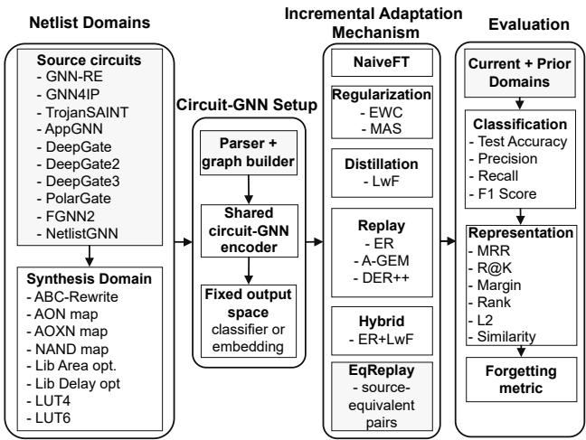
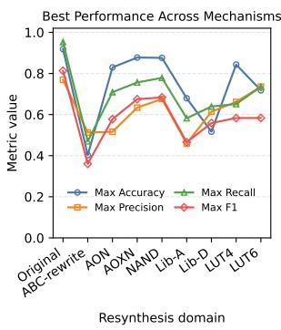
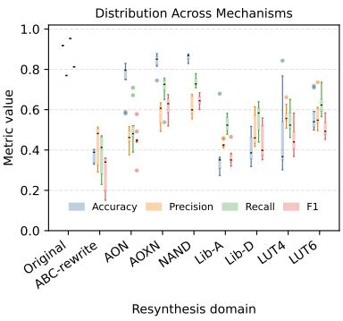
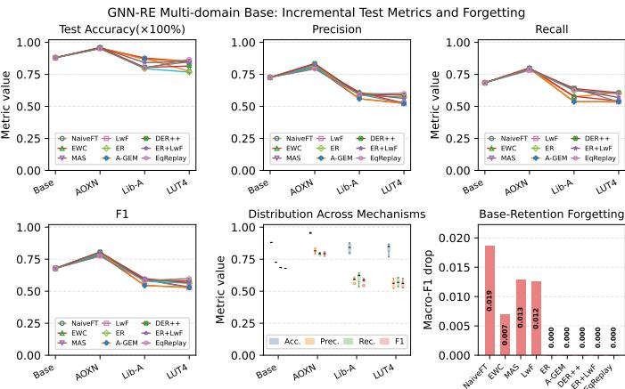
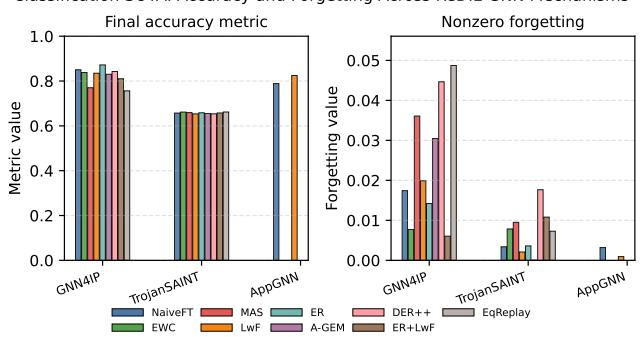
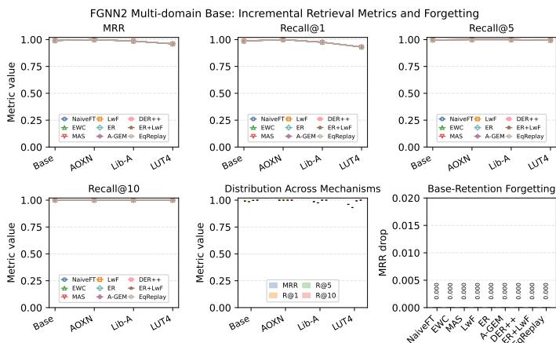
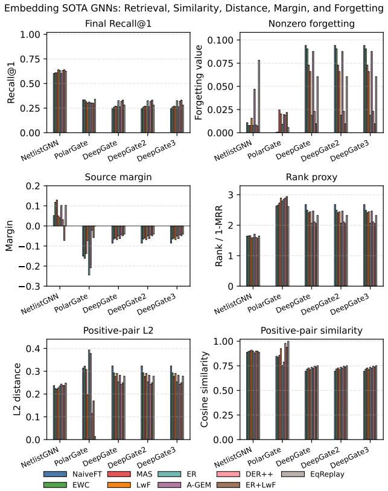

# ReDIL-GNN: Resynthesis Domain Incremental Learning for Circuit Graph Neural Networks

Rupesh Raj Karn, Johann Knechtel, Ozgur Sinanoglu

Center for Cyber Security, New York University, Abu Dhabi, UAE.

Email: {rupesh.k, johann, ozgursin} @nyu.edu

Abstract—Logic resynthesis preserves circuit functionality while changing gate vocabulary, topology, and structural statistics, creating domain shift for circuit graph neural networks (GNNs) without changing task labels. To study this setting, we introduce ReDIL-GNN, a resynthesis domain-incremental learning framework that adapts a fixed prediction or representation head as new synthesis styles arrive and evaluates retention on all previously observed domains. Because not every shift should be adapted blindly, ReDIL-GNN further introduces the Resynthesis Adaptability Index (RAI), a pre-adaptation score that combines adaptation need, source-equivalence recoverability, structural coverage, and update compatibility. We evaluate supervised hardware-security tasks and representation-learning models using task-native metrics for classifiers and source-equivalence retrieval metrics for embedding models, comparing naive fine-tuning with LwF, Online EWC, MAS, ER, A-GEM, DER++, ER+LwF, and equivalence-guided replay. Across the studied pipelines, RAI separates unsupported shifts from promising updates, ranging from 0.001 for a structurally uncovered GNN-RE ABC-rewrite shift to 0.824 for the best original-only GNN-RE adaptation case. In practice, ReDIL-GNN turns resynthesis-aware circuit learning into a deployment control loop: RAI screens each new synthesis flow before update, guiding whether to reuse the current model, apply retention-aware adaptation, or defer adaptation until the shift is better supported.

Index Terms—Domain Incremental Learning (DIL), Circuit Netlist, Graph Neural Network (GNN), Catastrophic Forgetting (CF), state-of-the-arts (SOTA) GNNs

## I. INTRODUCTION

A single Boolean functionality can be implemented by many structurally different gate-level netlists because logic rewriting, technology mapping, and LUT mapping can change the implementation while preserving the intended logic behavior [1], [2]. Circuit graph neural networks (GNNs) consume such structural representations and have been adopted for circuit-design [3], reverse-engineering [4], hardware-security [5], and circuit-representation tasks [6]. This creates a practical deployment mismatch: the circuit label or source identity may remain unchanged, while the graph distribution shifts through changed gate vocabularies, node counts, fan-in/fan-out patterns, logic depth, and connectivity [1], [2], [7]. Standard evaluation on a fixed synthesis distribution is therefore insufficient for measuring whether a circuit GNN can learn a newly observed synthesis style while retaining performance on previously observed styles [8], [9], [10]. Moreover, not every new resynthesis style should trigger adaptation: some shifts are already handled by the base model, while others may be structurally unsupported or may induce forgetting if updated naively.

We study this setting as resynthesis-domain incremental learning (Domain-IL), where each incoming task is a synthesis domain and the semantic label space remains fixed, making the problem a domain-incremental rather than classincremental continual-learning problem [8], [11]. Unlike prior circuit continual-learning studies that evaluate task-incremental learning with artificial task splits [12], [13] or class-incremental learning with expanding gate vocabularies [14], we address Domain-IL, where task labels and architectural heads remain invariant, but the graph topology undergoes semantics-preserving distribution shift induced by logic resynthesis. ReDIL-GNN starts from a model trained on original and previously observed resynthesized netlists, then adapts the same prediction or representation head as new synthesis styles arrive [15], [16], [17]. We compare naive sequential fine-tuning with distillationbased [15], regularization-based [16], [17], replay-based [18], [19], gradient-projection-based [20], dark-replay [21], hybrid replay-distillation [18], [15], and our equivalence-guided replay mechanisms to characterize the stability-plasticity trade-off under synthesis-domain drift. To make ReDIL-GNN predictive rather than purely retrospective, we introduce the Resynthesis Adaptability Index (RAI), a pre-adaptation diagnostic that combines adaptation need, source-equivalence recoverability, structural coverage, and update compatibility to estimate whether a new synthesis style is a promising, unnecessary, or risky adaptation target before full incremental training.

In summary, the main contributions of this work are:

1) We formulate resynthesis-domain incremental learning for circuit GNNs, where semantics-preserving synthesis transformations induce sequential graph-domain shifts while task labels or source identities remain fixed.

2) We construct a unified evaluation protocol covering classification-style state-of-the-art (SOTA) hardwaresecurity models and representation-learning circuit encoders, with task-native metrics for classifiers and sourceequivalence retrieval metrics for embedding models.

3) We instantiate this predictive adaptation framework with nine incremental update policies: NaiveFT, LwF, Online EWC, MAS, ER, A-GEM, DER++, ER+LwF, and EqReplay, where EqReplay exploits paired source-equivalent implementations across synthesis domains.

4) We introduce RAI as a lightweight pre-adaptation predictor that connects incoming resynthesis data, frozen-model behavior, structural coverage, and update compatibility to guide when adaptation should be invoked or avoided.

  
Fig. 1: High-level ReDIL-GNN methodology. Source circuits are converted into multiple resynthesis-domain views and parsed into circuit graphs. A shared circuit-GNN encoder with a fixed classifier or embedding space is then adapted through different incremental learning mechanisms. Evaluation is performed on both current and prior domains, using classification metrics for task-specific models, retrieval metrics for representation-learning models, and forgetting metrics to quantify retention.

Source code of this work is available at [22].

## II. RELATED WORK AND MOTIVATION FOR OURS

Prior circuit GNNs address circuit design [3], reverse engineering [4], Trojan detection [5], physical-design prediction [6], and functionality-aware representation learning, but they are usually evaluated on fixed graph distributions rather than sequential synthesis-domain shifts. Resynthesis-aware robustness studies show that equivalent rewrites can degrade predictions [23], contrastive methods can use equivalent views for invariance [24], and adversarial rewriting can exploit local equivalence-preserving transformations against hardwaresecurity GNNs [25]. Continual-learning (CL) methods mitigate forgetting through distillation [15], regularization [16], [17], replay [19], gradient projection [20], and dark replay [21], while graph CL studies forgetting under graph streams [9], [10] or graph-domain shifts [26], [27].

Circuit-specific CL studies have established baseline evaluations for gate-level netlists under a task-incremental regime (Task-IL) [12], showing that static GNNs suffer catastrophic forgetting when learning sequential binary gate and link tasks. Subsequent work addressed this through dynamic architectural expansion (widening and stacking GNN layers) paired with hyperparameter optimization [13]. Recently, class-incremental learning (CIL) was formulated for circuits to evaluate expanding gate-type label spaces without task identifiers during inference [14]. However, all prior circuit CL formulations rely on synthetic task or class splits.

In contrast, ReDIL-GNN focuses on Domain-IL, treating resynthesis styles as the incremental domain stream where semantic task labels and architectural heads remain fixed, but the graph topology undergoes semantics-preserving distribution shift. Unlike static resynthesis-aware training, ReDIL-GNN explicitly measures retention and forgetting; unlike generic graph CL [9], [10], [26], [27], it exploits circuit-specific equivalence between transformed implementations of the same source design through EqReplay. Furthermore, ReDIL-GNN moves beyond retrospective benchmarking by introducing RAI to actively gate whether, when, and how adaptation should occur before executing costly training updates. As summarized in Table I, the resulting framework combines resynthesis-domain adaptation, equivalence-guided replay, retention analysis across diverse SOTA pipelines, and pre-adaptation RAI guidance in a single unified setting.

## III. METHODOLOGY

## A. Overview of ReDIL-GNN

Figure 1 summarizes the ReDIL-GNN methodology. We consider a stream of resynthesis domains, shown in Table II, where each incoming domain contains netlists obtained from a new synthesis style while the semantic task remains unchanged. The model is initialized from a multi-domain base checkpoint trained on the seen domains Original, ABC-rewrite, AON, NAND, and Lib-D; LUT6 is used only for validation and model selection. The held-out incremental stream then introduces AOXN, Lib-A, and LUT4 sequentially. Before any adaptation, we also record zero-shot performance on the held-out domains, so that later gains can be separated from robustness already learned during base training. This protocol reflects a realistic deployment setting in which a circuit-GNN may already be trained on several known synthesis flows, but must later adapt to newly encountered tool settings or mapping styles. The goal is therefore not to measure adaptation from a single native distribution, but to evaluate whether a multidomain circuit-GNN can learn new resynthesis styles while retaining all previously learned styles. At every stage, the same prediction head or embedding space is retained; the model is not given the resynthesis-domain identifier during inference. This makes the setting a domain-incremental learning problem rather than a class-incremental learning problem [36], [37].

A set of SOTA GNNs used in our work is summarized in Table III. Let $G _ { i } ^ { ( t ) }$ denote the implementation of source circuit i under resynthesis domain t. ReDIL-GNN assumes that the graph distribution changes with t, but the label space or source identity remains fixed. Thus, the goal is not to add new output classes, but to adapt the circuit-GNN pipeline to a newly observed synthesis style while preserving performance on earlier synthesis domains.

## B. Model Interfaces: Classification & Representation Learning

ReDIL-GNN supports two model families. The first family contains classification-based models, such as node-level reverse-

TABLE I: Comparison of ReDIL-GNN with representative related work. √ indicates that the capability is explicitly supported, while X indicates that it is absent or not the primary formulation.
<table><tr><td>Work / Direction</td><td colspan="2">Circuit Resynth. Netlists Domains</td><td>CL Setting</td><td colspan="7">Forgetting  $\mathbf { E q } .$  Pairs Sup.+Repr. Multi-Model Pre-Adapt. RAI-Guided</td></tr><tr><td></td><td></td><td></td><td></td><td>Measured</td><td>Used</td><td>Metrics</td><td>Audit</td><td>RAI</td><td></td><td>Adaptation</td></tr><tr><td>Circuit GNNs [3], [4], [5], [6]</td><td>√</td><td>x</td><td>None</td><td>x</td><td>x</td><td>x x</td><td></td><td></td><td>x</td><td>x</td></tr><tr><td>Netlist rewriting robustness [23]</td><td>√</td><td>√</td><td>None</td><td>x</td><td>x</td><td></td><td></td><td>x</td><td>x</td><td>x</td></tr><tr><td>ConVERTS-style representation learning [24]</td><td>√</td><td>√</td><td>None</td><td>x</td><td>√</td><td></td><td></td><td>x √</td><td>x</td><td>x</td></tr><tr><td>Adversarial netlist rewriting [25]</td><td>√</td><td>√</td><td>None</td><td>x</td><td>√</td><td></td><td></td><td></td><td>x</td><td>x</td></tr><tr><td>Graph Continual Learning (CL) [9], [10]</td><td>x</td><td>x</td><td>Task-IL</td><td>√</td><td>x</td><td></td><td></td><td>x</td><td>x</td><td>x</td></tr><tr><td>Graph CL adaptation [26], [27]</td><td>x</td><td>x</td><td>Domain-IL</td><td>√</td><td>x</td><td></td><td></td><td>x</td><td>x</td><td>x</td></tr><tr><td>Circuit CL benchmark [12]</td><td>√</td><td>x</td><td>Task-IL</td><td>√</td><td>x</td><td></td><td></td><td>x</td><td>x</td><td>x</td></tr><tr><td>Dynamic GNNs for CL [13]</td><td>√</td><td>x</td><td>Task-IL</td><td>√</td><td>x</td><td></td><td></td><td>√</td><td>x</td><td>x</td></tr><tr><td>Circuit class incremental learning [14]</td><td>√</td><td>x</td><td>Class-IL</td><td>√</td><td>x</td><td></td><td>x</td><td>√</td><td>x</td><td>x</td></tr><tr><td>ReDIL-GNN (ours)</td><td>√</td><td>√</td><td>Domain-IL</td><td>√</td><td></td><td>√</td><td>√</td><td>√</td><td>√</td><td>√</td></tr></table>

TABLE II: Resynthesis domains used in ReDIL-GNN.
<table><tr><td></td><td>Domain name Meaning / generation style</td></tr><tr><td>Original</td><td>Original normalized source netlist, copied without resynthesis.</td></tr><tr><td></td><td>ABC-rewrite Generic ABC rewriting outcome.</td></tr><tr><td>AON</td><td>AND/OR/NOT gate-set resynthesis.</td></tr><tr><td>AOXN</td><td>AND/OR/XOR/NOT gate-set resynthesis.</td></tr><tr><td>NAND</td><td>NAND/NOT gate-set resynthesis.</td></tr><tr><td>Lib-A</td><td>Technology-library mapping optimized for area.</td></tr><tr><td>Lib-D</td><td>Technology-library mapping optimized for delay.</td></tr><tr><td>LUT4</td><td>4-input LUT mapping.</td></tr><tr><td>LUT6</td><td>6-input LUT mapping.</td></tr></table>

engineering or Trojan-detection GNNs. For these models, the circuit GNN predicts a task label using a shared classifier:

$$
\begin{array} { r l r } { \hat { y } = f _ { \theta } \left( G _ { i } ^ { ( t ) } \right) , } & { { } } & { \mathcal { L } _ { \mathrm { c l s } } = \mathrm { C E } \left( f _ { \theta } \left( G _ { i } ^ { ( t ) } \right) , y _ { i } \right) . } \end{array}\tag{1}
$$

For example, in a GNN-RE-style functional classification task [4], the output classes remain the same across resynthesis styles, but the underlying gate-level graph may change substantially. The adaptation objective is therefore to learn the current graph distribution while preserving the previously learned decision boundary.

The second family contains representation-learning models, such as the DeepGate family [31], [32], [33], FGNN2, PolarGate, and NetlistGNN. For a pipeline m, let $\rho _ { m } ( \cdot )$ denote its graph-level readout: the native graph readout when the model exposes one, or a fixed parameter-free aggregation of node embeddings when no graph-level output is available. Given node or graph representations produced by encoder $e _ { \theta }$ we write the graph embedding as

$$
\mathbf { z } _ { i , m } ^ { ( t ) } = \rho _ { m } \left( e _ { \theta } \left( G _ { i } ^ { ( t ) } \right) \right) .\tag{2}
$$

The notation $\rho _ { m } + \mathrm { c o s } .$ used in Table III, therefore means applying the readout $\rho _ { m }$ and then comparing the resulting graph embeddings with cosine similarity:

$$
\begin{array} { r } { s _ { m } \left( G _ { i } ^ { ( t ) } , G _ { j } ^ { ( 0 ) } \right) = \cos \left( \mathbf { z } _ { i , m } ^ { ( t ) } , \mathbf { z } _ { j , m } ^ { ( 0 ) } \right) . } \end{array}\tag{3}
$$

A transformed query $G _ { i } ^ { ( t ) }$ is compared against an Originaldomain gallery, and the correct source $\overline { { G _ { i } ^ { ( 0 ) } } }$ should rank ahead of unrelated circuits. Thus, for embedding models, we report source-equivalence retrieval metrics such as Recall@K, MRR, median rank, positive-pair similarity, $L _ { 2 }$ displacement, and source margin, rather than treating binary F1 as the primary metric.

## C. Incremental Adaptation Mechanisms

At each stage, ReDIL-GNN updates the model using one of nine adaptation mechanisms (see Figure 1). The simplest baseline is naive fine-tuning, which optimizes only the currentdomain loss and provides a lower-bound measure of forgetting. Distillation-based learning without forgetting (LwF) [15] keeps a frozen copy of the previous model and penalizes deviations from its predictions or similarity scores. Parameterregularization methods, Online EWC [16], [38] and MAS [17], estimate which parameters are important for previous domains and discourage large changes to them.

Replay-based methods retain examples from earlier domains. ER [18], [19] maintains a bounded memory of previousdomain examples and mixes them with current-domain data. DER++ [21] additionally stores historical logits or scores, allowing the model to preserve both labels and previous responses. A-GEM [20] uses replay examples to project gradients when the current update would increase old-domain loss. ER+LwF combines replay with distillation [18], [15].

EqReplay is the circuit-specific mechanism in ReDIL-GNN. It uses source-equivalent pairs across adjacent resynthesis domains, treating $G _ { i } ^ { ( t ) }$ and $G _ { i } ^ { ( t - 1 ) }$ as two implementations of the same circuit rather than as unrelated replay samples. For example, after adapting from Lib-A to LUT4, EqReplay can pair the LUT4 implementation of source circuit i with its previously learned Lib-A implementation, then penalize inconsistent class predictions for classification models or misaligned embeddings and similarity scores for representationlearning models.

## D. Stage-Wise Training and Evaluation

The same stage-wise protocol is used for all models. First, a shared base checkpoint is trained on the base domains. Then, for each incoming resynthesis domain, the chosen mechanism updates the model using the current domain and any allowed memory, teacher, importance estimate, or source-equivalent replay examples. After the update, the model is evaluated on the current domain and all previously observed domains. This produces a stage-by-domain performance matrix, from which we compute final performance, worst-domain performance, and forgetting.

TABLE III: SOTA GNNs selected in this work. In the Pipeline(s) column, red denotes classification-based or pairwise-detection models, while blue denotes representation/retrieval-based models. Here, $\rho _ { m }$ denotes the graph-level readout for pipeline m, using the native readout when available or a fixed parameter-free aggregation when no graph-level output is exposed; cos denotes cosine similarity between the resulting graph embeddings. Thus, $( \rho _ { m } + \mathrm { c o s } )$ denotes graph readout followed by cosine-based source-equivalence retrieval.
<table><tr><td>Pipeline(s)</td><td>Native objective</td><td>Native graph view</td><td>Retrieval interface</td><td>Datasets</td></tr><tr><td>GNN-RE [4]</td><td>Functional reverse engineering</td><td>Gate-level graph</td><td> $\rho _ { m }$  + cos</td><td>Arithmetic/interconnected modules</td></tr><tr><td>GNN4IP [28]</td><td>Pairwise IP-similarity detection</td><td>Paired gate-level graphs Native pairwise head</td><td></td><td>Interconnected modules</td></tr><tr><td>AppGNN [29]</td><td>Approximation-aware reverse engineering</td><td>Gate-level graph</td><td> $\rho _ { m } + \mathrm { c o s }$ </td><td>Adders and multipliers</td></tr><tr><td>TrojanSAINT [30]</td><td>Trojan-node classification</td><td>Gate-level graph</td><td> $\rho _ { m } + \mathrm { c o s }$ </td><td>TrojanSAINT netlists</td></tr><tr><td>DeepGate [31], DeepGate2 [32], DeepGate3 [33]</td><td>Gate-function representation</td><td>AIG-style graph</td><td> $\rho _ { m } + \mathrm { c o s }$ </td><td>ITC&#x27;99, IWLS&#x27;05, EPFL, OpenCore</td></tr><tr><td>FGNN2 [34]</td><td>Functional contrastive pretraining</td><td>AIG-style graph</td><td>Embedding cosine</td><td>Synthetic pretraining circuits</td></tr><tr><td>PolarGate [35]</td><td>Polarity-aware functional representation</td><td>Signed AIG-style graph</td><td> $\rho _ { m } + \mathrm { c o s }$ </td><td>AIGDataset</td></tr><tr><td>NetlistGNN/Circuit GNN [6]</td><td>Physical-design prediction</td><td>Cell-level circuit graph</td><td> $\rho _ { m } + \mathrm { c o s }$ </td><td>superblue19</td></tr></table>

The evaluation separates adaptation from retention. Currentdomain performance measures plasticity, i.e., how well the model learns the new resynthesis style. Prior-domain performance measures stability, i.e., how much old-domain performance is preserved. Forgetting for a domain is computed as the drop between the best score previously achieved on that domain and the score after the final incremental stage:

$$
F _ { d } = \operatorname* { m a x } _ { \tau \leq T } M _ { \tau , d } - M _ { T , d } ,\tag{4}
$$

where $M _ { \tau , d }$ is the metric value on domain d after stage $\tau ,$ and $T$ is the final stage. For classification-based models, $M _ { \tau , d }$ can be macro-F1, balanced accuracy, or task-specific detection performance. For representation-learning models, $M _ { \tau , d }$ is primarily MRR, Recall@K, or source margin. This allows ReDIL-GNN to compare classification-based SOTA models and embedding-based SOTA models without forcing all models into a single metric type.

## E. Resynthesis Adaptability Index

RAI uses the frozen base model, a small probe set from the incoming resynthesis domain, and a small retention probe from the base domains. Its purpose is to estimate whether adapting to the new synthesis style is likely to be useful, unnecessary, or risky.

Let m denote the circuit-GNN model, c denote the incremental-learning mechanism, and $d _ { t }$ denote the incoming resynthesis domain at stage t. Let $\mathcal { Q } _ { t }$ be a small probe set from $d _ { t } ,$ and let B be a small probe set from the base or retention domains. We define RAI using four normalized components:

$$
\mathrm { R A I } _ { m , c , t } = ( N _ { m , t } \cdot R _ { m , t } \cdot S _ { t } \cdot C _ { m , c , t } ) ^ { 1 / 4 } .\tag{5}
$$

Each term lies in [0, 1], and larger values indicate that the incoming domain is a better candidate for safe and useful adaptation. The geometric form makes the score conservative: RAI is high only when adaptation is needed, the new domain is recoverable, the training data are structurally covered, and the update is unlikely to damage retention.

The first term, $N _ { m , t }$ , measures adaptation need. It is high when the frozen base model performs poorly on the incomingdomain probe:

$$
\begin{array} { r } { N _ { m , t } = 1 - \widehat { M } _ { m , 0 } \left( \mathcal { Q } _ { t } \right) , } \end{array}\tag{6}
$$

where $\widehat { M } _ { m , 0 }$ is the normalized zero-shot score of the base model. For classification models, M can be macro-F1, balanced accuracy, or task-specific F1; for embedding models, M can be Recall@1 or MRR. Thus, a low $N _ { m , t }$ indicates that the base model already generalizes to the new resynthesis style, while a high $N _ { m , t }$ indicates that adaptation may be needed.

The second term, $R _ { m , t }$ , measures source-equivalence recoverability. It asks whether the base model still recognizes that two different implementations of the same source circuit are related. For embedding-based models, this is measured using the similarity gap between the correct source-equivalent pair and the closest incorrect source:

$$
R _ { m , t } = \operatorname { n o r m } \left( s ( G _ { i } ^ { ( t ) } , G _ { i } ^ { ( 0 ) } ) - \operatorname* { m a x } _ { j \neq i } s ( G _ { i } ^ { ( t ) } , G _ { j } ^ { ( 0 ) } ) \right) .\tag{7}
$$

For classification models, $R _ { m , t }$ is measured as the prediction consistency between $G _ { i } ^ { ( t ) }$ and ${ \bf \Gamma } _ { G _ { i } } ^ { ( 0 ) }$ . A high recoverability score means that the model has not completely lost the functional connection between the transformed graph and its original implementation.

The third term, $S _ { t } .$ , measures structural coverage. It compares graph descriptors from the incoming resynthesis domain with the descriptors of the base domains:

$$
S _ { t } = \sin \left( \psi ( \mathcal { Q } _ { t } ) , \psi ( B ) \right) ,\tag{8}
$$

where $\psi ( \cdot )$ denotes lightweight graph statistics such as node count, edge count, gate or cell histogram, fan-in/fan-out statistics, depth, PI/PO counts, LUT/cell-type ratios, or frozenmodel embedding summaries. A high $S _ { t }$ indicates that the incoming resynthesis style is structurally close to at least one previously seen synthesis style, while a low $S _ { t }$ suggests that the new domain lies outside the training distribution.

The fourth term, $C _ { m , c , t } ,$ measures update compatibility. It estimates whether a small probe update on the incoming domain agrees with the base-domain objective:

TABLE IV: Representative resynthesis statistics for GNN-RE. Rows report the eight resynthesized domains; ABC-rewrite denotes the collapsed ABC rewriting outcome. Comp. denotes weakly connected components and $G _ { L _ { 1 } }$ denotes gate-composition drift from the original netlist. The $\Delta$ columns report percentage change with respect to the original netlist.
<table><tr><td>Outcome</td><td>Nodes</td><td>Edges</td><td>Depth</td><td>Comp.</td><td> $G _ { L _ { 1 } }$ </td><td>ΔN</td><td>ΔE</td><td>ΔD</td></tr><tr><td>Original</td><td>2830.5</td><td>9416.4</td><td>20.3</td><td>1.2</td><td>0.000</td><td>0.0</td><td>0.0</td><td>0.0</td></tr><tr><td>ABC-rewrite</td><td>2227.9</td><td>2122.3</td><td>23.7</td><td>1002.5</td><td>1.990</td><td>35.3</td><td>-51.3</td><td>31.0</td></tr><tr><td>AON</td><td>2436.9</td><td>2430.6</td><td>36.4</td><td>1002.5</td><td>1.990</td><td>41.2</td><td>-47.1</td><td>64.7</td></tr><tr><td>AOXN</td><td>2003.5</td><td>1589.5</td><td>35.2</td><td>1002.5</td><td>1.990</td><td>26.7</td><td>-56.9</td><td>57.1</td></tr><tr><td>NAND</td><td>2380.7</td><td>2261.2</td><td>44.5</td><td>1002.5</td><td>1.990</td><td>52.1</td><td>-40.1</td><td>109.1</td></tr><tr><td>Lib-A</td><td>1760.0</td><td>5444.9</td><td>22.0</td><td>1000.2</td><td>1.388</td><td>19.4</td><td>-19.6</td><td>8.7</td></tr><tr><td>Lib-D</td><td>1794.3</td><td>5581.5</td><td>22.6</td><td>1000.3</td><td>1.397</td><td>22.0</td><td>-18.8</td><td>7.5</td></tr><tr><td>LUT4</td><td>1373.0</td><td>778.0</td><td>12.0</td><td>1002.6</td><td>1.990</td><td>-10.2</td><td>-83.2</td><td>-45.6</td></tr><tr><td>LUT6</td><td>2026.4</td><td>1057.1</td><td>7.6</td><td>1599.5</td><td>1.990</td><td>8.1</td><td>-80.6</td><td>-59.1</td></tr><tr><td>Mean (resyn.)</td><td>2000.3</td><td>2658.1</td><td>25.5</td><td>1076.6</td><td>1.841</td><td>24.3</td><td>-49.7</td><td>21.7</td></tr></table>

$$
C _ { m , c , t } = \mathrm { n o r m } \left( \cos \left( g _ { m , c , t } ^ { \mathrm { n e w } } , g _ { m } ^ { \mathrm { b a s e } } \right) \right) ,\tag{9}
$$

where $g _ { m , c , t } ^ { \mathrm { n e w } }$ is the probe gradient induced by the incoming domain under mechanism $c ,$ and $g _ { m } ^ { \mathrm { b a s e } }$ is the gradient on the base-domain retention probe. A high value means that the new-domain update is compatible with the base domains; a low value indicates that adaptation may improve the current domain but cause forgetting.

RAI is used as a decision guide rather than as a post-hoc result metric. If $N _ { m , t }$ is low, adaptation can be skipped because the base model already handles the new resynthesis style. If $N _ { m , t }$ is high and RAI is also high, incremental learning is expected to be beneficial. If $N _ { m , t }$ is high but RAI is low, adaptation is risky: the model either lacks source-equivalence recoverability, the new graphs are structurally far from the base domains, or the update direction conflicts with retention. In such cases, retention-heavy mechanisms such as replay, DER++, ER+LwF, A-GEM, or EqReplay should be preferred over naive fine-tuning.

In summary, RAI converts ReDIL-GNN from only an evaluation benchmark into a predictive framework. It connects the incoming resynthesis data, the frozen model behavior, and the expected stability of the update before full incremental training is performed. This allows a designer to decide whether a new synthesis style should be learned, whether the existing base model is already sufficient, or whether adaptation may cause unacceptable forgetting. Because RAI is the geometric mean of four normalized terms, its value also lies in [0, 1]: RAI = 0 is the theoretical minimum and occurs when at least one required condition is absent, while RAI = 1 is the ideal maximum and indicates that adaptation is needed, recoverable, structurally covered, and compatible with retention Thus, values close to zero suggest that incremental learning should be skipped or applied only with strong retention safeguards, whereas values close to one suggest that the incoming resynthesis domain is a strong candidate for safe and beneficial adaptation.

TABLE V: Summary of resynthesis statistics across reproduced SOTA works. Each row is the mean over the eight resynthesis outcomes. GNN4IP is omitted because it reuses the GNN-RE resynthesized graph artifacts; DeepGate, DeepGate2, and DeepGate3 are summarized together because they use the common DeepGate-family / DeepGate2- dataset structural statistics. The complete per-domain statistics are provided in the supplementary document released with the code [22].
<table><tr><td>Work</td><td>Nodes</td><td>Edges</td><td>Depth</td><td>Comp.</td><td> $G _ { L _ { 1 } }$ </td><td>ΔN</td><td>ΔE</td><td>ΔD</td></tr><tr><td>AppGNN</td><td>1621.8</td><td>4005.5</td><td>10.3</td><td>1209.8</td><td>1.667</td><td>-4.9</td><td>-32.6</td><td>-20.9</td></tr><tr><td>DeepGate-family</td><td>209.7</td><td>278.3</td><td>10.5</td><td>12.4</td><td>0.505</td><td>-57.5</td><td>-35.4</td><td>197.5</td></tr><tr><td>FGNN2</td><td>16.4</td><td>23.8</td><td>4.0</td><td>2.0</td><td>0.421</td><td>-23.3</td><td>-29.8</td><td>-34.6</td></tr><tr><td>NetlistGNN</td><td>20.8</td><td>22.9</td><td>5.2</td><td>5.1</td><td>1.307</td><td>-43.6</td><td>-51.0</td><td>-51.0</td></tr><tr><td>PolarGate</td><td>159.9</td><td>207.0</td><td>11.2</td><td>15.7</td><td>0.243</td><td>-15.6</td><td>-17.2</td><td>-27.6</td></tr><tr><td>GNN-RE</td><td>2000.3</td><td>2658.1</td><td>25.5</td><td>1076.6</td><td>1.841</td><td>24.3</td><td>-49.7</td><td>21.7</td></tr><tr><td>TrojanSAINT</td><td>6943.83751.5</td><td></td><td>7.4</td><td>3325.3</td><td>1.963</td><td></td><td>46.0-65.7</td><td>-59.0</td></tr></table>

GNN-RE Original-only Base: Incremental Test Performance  

  
Fig. 2: Domain-IL for GNN-RE where base model is trained only with original netlist.

## IV. RESULTS

## A. Resynthesis Statistics

To document the structural effect of the resynthesis front end, we report compact graph-level statistics for the generated source-equivalent domains. The full supplementary table records nodes, edges, depth, fan-in/fan-out, density, connected components, node/gate-type entropy, gate-composition drift, raw graph-statistic drift, and percentage changes relative to the original netlist; it also states that GNN4IP reuses the GNN-RE resynthesized graph artifacts and that DeepGate DeepGate2, and DeepGate3 share the same DeepGate-family structural statistics. Table IV shows a representative singlecolumn view for GNN-RE over the eight resynthesis outcomes, while Table V reports one summary row per reproduced SOTA work; the complete per-transformation statistics are provided in the supplementary document released with the code [22]. These statistics confirm that the resynthesis flow is not a superficial renaming of the input netlists: for example, GNN-RE shows large edge reductions for LUT mappings and substantial component/gate-composition changes, while the summary table shows that the same phenomenon appears across classification and embedding-oriented circuit-GNN pipelines.

  
Fig. 3: Domain-IL for GNN-RE where base model is trained with Original, Rewrite, AON, NAND, Lib-D and incrementally learned AOXN, Lib-A, and LUT4 with LUT6 set aside as validation during training.

  
Fig. 4: Domain-IL performance for GNN4IP, TrojanSAINT, and AppGNN where training setup is same as Fig. 3.

## B. Domain-IL Results for Classification-Based SOTA GNNs

Figure 2 first shows a strict baseline where GNN-RE is trained only on the Original netlists and then adapted sequentially to each resynthesis style. The left panel reports the maximum accuracy, precision, recall, and F1 obtained across Domain-IL mechanisms, while the right panel shows the distribution of these metrics across those mechanisms. This setting exposes the severity of resynthesis-induced domain shift: when the base model has seen only the native netlist distribution, performance varies substantially as the stream progresses through ABC-rewrite, AON, AOXN, NAND, Lib-A, Lib-D, LUT4, and LUT6. The spread in the boxplots further indicates that the choice of adaptation mechanism matters, because different methods respond differently to each synthesis transformation. Thus, this original-only experiment serves as the lower-bound deployment scenario and motivates using a stronger multi-domain base model for the main ReDIL-GNN evaluation. Similar behavior applies to GNN4IP, TrojanSAINT, and AppGNN which are omitted here due to paper space constraints and they are available in our release [22].

Figure 3 reports the main GNN-RE incremental experiment where the base model is trained on multiple seen domains and then adapted to the held-out stream AOXN → Lib-A → LUT 4. The first four panels track accuracy, macro precision, macro recall, and macro F1 after each learned resynthesis domain, while the fifth panel summarizes the distribution across mechanisms and the sixth panel reports base-retention forgetting. Compared with the original-only baseline, the multidomain base produces a more stable starting point because the model has already learned several synthesis-induced graph variations before the incremental stream begins. Nevertheless, the trajectories still show that adaptation is nontrivial: currentdomain performance and base-domain retention do not improve uniformly across mechanisms. Replay-based and equivalenceguided mechanisms are generally more stable, while methods without explicit retention constraints are more prone to drops in the retention panel. This figure therefore supports the central premise of ReDIL-GNN: resynthesis-domain adaptation must be evaluated jointly in terms of plasticity on the current domain and stability on previously learned domains.

Figure 4 consolidates the classification-based SOTA results for GNN4IP, TrojanSAINT, and AppGNN. The first panel compares the final accuracy-like metric for each ReDIL-GNN mechanism, while the second panel compares the corresponding nonzero forgetting values. This consolidated view shows that no single mechanism dominates all classification-style models, but it also highlights a consistent trend: mechanisms that preserve prior knowledge through replay, distillation, or equivalenceaware alignment tend to offer a better stability-plasticity tradeoff than naive adaptation alone. Due to space constraints, we include detailed stage-wise plots only for GNN-RE in the paper; the corresponding detailed plots and CSV outputs for the other classification-based GNNs are provided in the release [22].

The main takeaway from the classification results is that resynthesis adaptation is not simply a matter of improving the current-domain score. The original-only experiment shows the lower-bound deployment scenario: when the base model has seen only the native graph distribution, each new synthesis style can reshape the decision boundary in a different way. The multi-domain-base setting reduces this shock but does not eliminate the stability-plasticity trade-off, because a mechanism that improves the incoming domain can still damage retention on earlier domains. Thus, for classification-based circuit GNNs, the practical lesson is to train the base model with diverse synthesis views when possible and to prefer retention-aware updates whenever the incoming style is not already covered.

## C. Domain-IL Results for Embedding-Based SOTA GNNs

Figure 5 shows the detailed embedding-based Domain-IL behavior using FGNN2 as the representative case. FGNN2 is selected because it provides the strongest retrieval behavior among the embedding-based SOTA GNNs, and the figure tracks MRR, Recall@1, Recall@5, Recall@10, the acrossmechanism distribution, and base-retention MRR forgetting as the model moves from the base checkpoint to AOXN, Lib-A, and LUT4. The results show that the FGNN2 representation is highly stable under the evaluated resynthesis stream: retrieval metrics remain close to saturation for most mechanisms, and the forgetting panel indicates limited loss of base-domain retrieval ability after learning the final LUT4 domain. This suggests that functional contrastive representations and sourceequivalence retrieval can be more naturally aligned with resynthesis robustness than strict task-label prediction, because the model is not forced to preserve an exact gate-level decision boundary across structurally different but functionally equivalent graphs. Still, the distribution panel shows that not all mechanisms are identical; replay and hybrid replay-distillation mechanisms provide stable retention, while methods without explicit memory or alignment can show larger variation across stages. Due to space constraints, we report the full stage-wise trajectory only for FGNN2, while the corresponding detailed plots and CSV files for the remaining embedding-based models are included in the release [22].

  
Fig. 5: Domain-IL for FGNN2 where base model is trained with Original, Rewrite, AON, NAND, Lib-D and incrementally learned AOXN, Lib-A, and LUT4 with LUT6 set aside as validation during training.

  
Fig. 6: Domain-IL performance for FGNN2, Netlist/Circuit GNN, PolarGate, DeepGate, DeepGate2, and DeepGate3 where training setup is same as Fig. 5.

Figure 6 consolidates the final embedding-based results after the last incremental domain, LUT4, is learned. The figure compares remaining embedding-based SOTA GNNs including Netlist/Circuit GNN, PolarGate, DeepGate, DeepGate2, and DeepGate3 using Recall@1, nonzero forgetting, source margin, rank proxy, positive-pair $L _ { 2 }$ distance, and positive-pair similarity. The consolidated view shows that embedding-based SOTA GNNs are not equally robust to resynthesis-domain adaptation: FGNN2 remain the strongest retrieval comapring Figure 5 with 6, Netlist/Circuit GNN achieves moderate sourceidentification performance, and the DeepGate-family models remain more sensitive to the resynthesis stream despite using representation-level retrieval metrics. PolarGate shows high positive-pair similarity for some mechanisms, but its Recall@1 and margin behavior indicate that high cosine similarity alone is insufficient when hard negatives remain close to the true source. The forgetting subplot further shows that retention is mechanism-dependent; replay and hybrid methods generally reduce retrieval degradation, while EqReplay can improve equivalence alignment in some models but does not uniformly dominate every metric. These results motivate the use of multiple representation-centric metrics rather than a single retrieval score: Recall@1 captures source-identification success, margin and rank capture separation from hard negatives, $L _ { 2 }$ and similarity capture embedding alignment, and forgetting quantifies retention after sequential resynthesis adaptation.

The embedding results suggest a different deployment lesson from the classification results. Representation models can be more naturally aligned with resynthesis robustness because they are asked to preserve source identity rather than reproduce a fixed gate-level decision boundary. However, high positive-pair similarity alone is not sufficient: a useful embedding must also separate the correct source from hard negatives, preserve rank, and avoid forgetting previous domains. Therefore, sourceequivalence retrieval under resynthesis should be evaluated with a metric bundle, including Recall@ K, MRR, margin, distance, similarity, and forgetting, rather than with a single retrieval score.

## D. RAI Results for Classification-based SOTA GNNs

Table VI summarizes the pre-adaptation RAI behavior for the classification-based SOTA GNNs under the multi-domainbase setting used in Fig. 3 and Fig. 4. The repeated TiE: ALL entries at AOXN are expected because AOXN is the first incoming domain and all mechanisms start from the same base checkpoint; consequently, the current-domain need, recoverability, structural coverage, and compatibility probes are identical across mechanisms. In this setting, the RAI values are moderate to high when the incoming domain is structurally close to the base mixture and the base model already retains useful source-equivalent behavior. For example, GNN-RE has low adaptation need on AOXN (N = 0.101) and high recoverability/coverage (R = 0.989, S = 1.000) yielding a tied RAI of 0.558, which is consistent with the relatively stable incremental trajectory shown for GNN-RE in Fig. 3. As the stream progresses, the score becomes mechanismspecific: for GNN-RE, EQREPLAY gives the highest RAI on

TABLE VI: Compact best-worst pre-adaptation RAI summary for classification-based SOTA GNNs. For tied cases, a single row is shown. For non-tied cases, the best and worst mechanisms are shown in separate rows.
<table><tr><td>Model</td><td>Incoming</td><td>Case / Mechanism</td><td>N R</td><td>S</td><td>C</td><td>RAI</td></tr><tr><td rowspan="4">GNN-RE</td><td>AOXN</td><td>TIE: ALL</td><td>0.101 0.989</td><td>1.000</td><td>0.968</td><td>0.558</td></tr><tr><td>Lib-A</td><td>Best: EQREPLAY Worst: NAIVEFT</td><td>0.364 0.877 0.329 0.852</td><td>0.952 0.952</td><td>0.654 0.464</td><td>0.668 0.593</td></tr><tr><td>LUT4</td><td>Best: DER++</td><td>0.367 0.904</td><td>0.740</td><td>0.563</td><td>0.610</td></tr><tr><td></td><td>Worst: MAS</td><td>0.263 0.902</td><td>0.740</td><td>0.447</td><td>0.530</td></tr><tr><td rowspan="3">GNN4IP</td><td>AOXN</td><td>TIE: ALL</td><td>0.113 0.782</td><td>1.000</td><td>0.990</td><td>0.544</td></tr><tr><td>Lib-A</td><td>TIE: ALL</td><td>0.219 0.725</td><td>0.924</td><td>0.931</td><td>0.608</td></tr><tr><td>LUT4</td><td>Best: EWC Worst: ER</td><td>0.460 0.404</td><td>0.716</td><td>0.863</td><td>0.582</td></tr><tr><td rowspan="4">AppGNN</td><td>AOXN</td><td></td><td>0.451</td><td>0.322 0.716</td><td>0.345</td><td>0.435</td></tr><tr><td>Lib-A</td><td>TIE: ALL</td><td>0.383 0.961</td><td>0.995</td><td>0.963</td><td>0.771</td></tr><tr><td></td><td>TIE: ALL</td><td>0.522 0.916</td><td>0.955</td><td>0.891</td><td>0.799</td></tr><tr><td>LUT4</td><td>Best: EQREPLAY Worst: ER+LwF</td><td>0.714 0.879 0.718 0.879</td><td>0.769 0.769</td><td>0.859 0.815</td><td>0.802 0.793</td></tr><tr><td rowspan="3">TrojanSAINT</td><td>AOXN</td><td>TIE: ALL</td><td>0.067 1.000</td><td>1.000</td><td>0.618</td><td>0.452</td></tr><tr><td>Lib-A</td><td>TIE: ALL</td><td>0.727 0.953</td><td>1.000</td><td>0.480</td><td>0.759</td></tr><tr><td>LUT4</td><td>TIE: ALL</td><td>0.375 0.976</td><td>0.978</td><td>0.804</td><td>0.732</td></tr></table>

TABLE VII: Compact best-worst pre-adaptation RAI summary for the GNN-RE original-only-base protocol. The base model is trained only on Original, and each resynthesis style is then introduced sequentially. For tied cases, a single row is shown; for non-tied cases, best and worst mechanisms are shown separately.
<table><tr><td>Incoming</td><td>Case / Mechanism</td><td>N</td><td>R</td><td>S</td><td>C</td><td>RAI</td></tr><tr><td>ABC-rewrite</td><td>TIE: ALL</td><td>0.798</td><td>0.736</td><td>0.000</td><td>0.583</td><td>0.001</td></tr><tr><td rowspan="2">AON</td><td>Best: LwF</td><td>0.757</td><td>0.733</td><td>0.234</td><td>0.467</td><td>0.496</td></tr><tr><td>Worst: DER++</td><td>0.740</td><td>0.721</td><td>0.234</td><td>0.453</td><td>0.488</td></tr><tr><td rowspan="2">AOXN</td><td>Best: EQREPLAY</td><td>0.544</td><td>0.979</td><td>1.000</td><td>0.571</td><td>0.743</td></tr><tr><td>Worst: EWC</td><td>0.268</td><td>0.921</td><td>1.000</td><td>0.399</td><td>0.560</td></tr><tr><td rowspan="2">NAND</td><td>Best: DER++</td><td>0.493</td><td>0.952</td><td>1.000</td><td>0.464</td><td>0.683</td></tr><tr><td>Worst: LwF</td><td>0.185</td><td>0.970</td><td>1.000</td><td>0.349</td><td>0.500</td></tr><tr><td rowspan="2">Lib-A</td><td>Best: ER+LwF</td><td>0.739</td><td>0.655</td><td>0.299</td><td>0.493</td><td>0.517</td></tr><tr><td>Worst: EQREPLAY</td><td>0.513</td><td>0.649</td><td>0.299</td><td>0.459</td><td>0.462</td></tr><tr><td rowspan="2">Lib-D</td><td>Best: EQREPLAY</td><td>0.508</td><td>0.765</td><td>0.951</td><td>0.509</td><td>0.658</td></tr><tr><td>Worst: DER++</td><td>0.308</td><td>0.788</td><td>0.951</td><td>0.483</td><td>0.578</td></tr><tr><td rowspan="2">LUT4</td><td>Best: LwF</td><td>0.596</td><td>0.914</td><td>0.739</td><td>1.000</td><td>0.796</td></tr><tr><td>Worst: A-GEM</td><td>0.383</td><td>0.678</td><td>0.739</td><td>0.998</td><td>0.662</td></tr><tr><td rowspan="2">LUT6</td><td>Best: LwF</td><td>0.591</td><td>0.924</td><td>0.846</td><td>1.000</td><td>0.824</td></tr><tr><td>Worst: ER+LwF</td><td>0.499</td><td>0.860</td><td>0.846</td><td>0.582</td><td>0.678</td></tr></table>

TABLE VIII: Compact best-worst pre-adaptation RAI summary for embedding-based SOTA GNNs. For tied cases, a single row is shown. For non-tied cases, the best and worst mechanisms are shown in separate rows.
<table><tr><td>Model</td><td>Incoming</td><td>Case / Mechanism</td><td>N</td><td>R</td><td>S</td><td>C</td><td>RAI</td></tr><tr><td rowspan="4">PolarGate</td><td>AOXN</td><td>TIE: ALL</td><td>0.497</td><td>0.499</td><td>0.970</td><td>0.976</td><td>0.696</td></tr><tr><td>Lib-A</td><td>TIE: ALL</td><td>0.848</td><td>0.440</td><td>0.886</td><td>0.883</td><td>0.735</td></tr><tr><td>LUT4</td><td>Best: MAS</td><td>0.869</td><td>0.405</td><td>0.893</td><td>0.841</td><td>0.717</td></tr><tr><td></td><td>Worst: ER</td><td>0.916</td><td>0.199</td><td>0.893</td><td>0.353</td><td>0.490</td></tr><tr><td rowspan="4">NetlistGNN</td><td>AOXN</td><td>TIE: ALL</td><td>0.049</td><td>0.506</td><td>1.000</td><td>0.927</td><td>0.390</td></tr><tr><td>Lib-A</td><td>Best: MAS Worst: A-GEM</td><td>0.410</td><td>0.493</td><td>0.998</td><td>0.996</td><td>0.670</td></tr><tr><td></td><td></td><td>0.272</td><td>0.511</td><td>0.998</td><td>0.425</td><td>0.492</td></tr><tr><td>LUT4</td><td>Best: LwF Worst: ER</td><td>0.362 0.258</td><td>0.507 0.502</td><td>0.878 0.878</td><td>0.709 0.358</td><td>0.581 0.449</td></tr><tr><td rowspan="4">FGNN2</td><td>AOXN</td><td>TIE: ALL</td><td>0.020</td><td>0.787</td><td>0.896</td><td>0.842</td><td>0.328</td></tr><tr><td>Lib-A</td><td>Best: EQREPLAY</td><td>0.072</td><td>0.683</td><td>0.884</td><td>0.892</td><td>0.444</td></tr><tr><td></td><td>Worst: ER</td><td>0.072</td><td>0.683</td><td>0.884</td><td>0.545</td><td>0.393</td></tr><tr><td>LUT4</td><td>Best: EQREPLAY</td><td>0.228</td><td>0.531</td><td>0.127</td><td>0.552</td><td>0.304</td></tr><tr><td rowspan="4">DeepGate</td><td>AOXN</td><td>Worst: DER++</td><td>0.228</td><td>0.531</td><td>0.127</td><td>0.457</td><td>0.290</td></tr><tr><td></td><td>TIE: ALL</td><td>0.805</td><td>0.329</td><td>0.841</td><td>0.706</td><td>0.629</td></tr><tr><td>Lib-A</td><td>Best: EQREPLAY Worst: DER++</td><td>0.730 0.743</td><td>0.423 0.371</td><td>0.700</td><td>0.780</td><td>0.640 0.582</td></tr><tr><td></td><td>Best: EQREPLAY</td><td></td><td></td><td>0.700</td><td>0.597</td><td>0.034</td></tr><tr><td rowspan="4">DeepGate2</td><td>LUT4</td><td>Worst: ER+LwF</td><td>0.867 0.887</td><td>0.205 0.133</td><td>0.000 0.000</td><td>0.519 0.512</td><td>0.030</td></tr><tr><td>AOXN</td><td>TIE: ALL</td><td>0.805</td><td>0.329</td><td>0.841</td><td>0.706</td><td>0.629</td></tr><tr><td>Lib-A</td><td>Best: EQREPLAY</td><td>0.730</td><td>0.423</td><td>0.700</td><td>0.780</td><td>0.640</td></tr><tr><td></td><td>Worst: DER++</td><td>0.743</td><td>0.371</td><td>0.700</td><td>0.597</td><td>0.582</td></tr><tr><td rowspan="4"></td><td>LUT4</td><td>Best: EQREPLAY</td><td>0.867</td><td>0.205</td><td>0.000</td><td>0.519</td><td>0.034</td></tr><tr><td></td><td>Worst: ER+LwF</td><td>0.887</td><td>0.133</td><td>0.000</td><td>0.512</td><td>0.030</td></tr><tr><td>AOXN</td><td>TIE: ALL</td><td>0.805</td><td>0.329</td><td>0.841</td><td>0.706</td><td>0.629</td></tr><tr><td>Lib-A</td><td>Best: EQREPLAY</td><td>0.730</td><td>0.423</td><td>0.700</td><td>0.780</td><td>0.640</td></tr><tr><td rowspan="2"></td><td></td><td>Worst: DER++</td><td>0.743</td><td>0.371</td><td>0.700</td><td>0.597</td><td>0.582</td></tr><tr><td>LUT4</td><td>Best: EQREPLAY Worst: ER+LwF</td><td>0.867 0.887</td><td>0.205 0.133</td><td>0.000 0.000</td><td>0.519 0.512</td><td>0.034 0.030</td></tr></table>

Lib-A (0.668 versus the NAIVEFT worst case of 0.593), while DER++ gives the highest RAI on LUT4 (0.610 versus the MAS worst case of 0.530). This separation illustrates the role of the compatibility term C: even when recoverability and structural coverage remain similar across mechanisms, the update direction can make one mechanism safer than another. A similar pattern appears for GNN4IP at LUT4, where EWC has the best RAI (0.582) and ER has the worst RAI (0.435), mainly because EWC has much stronger compatibility (C = 0.863 versus 0.345). AppGNN exhibits high RAI throughout the multi-domain setting, especially on LUT4, where EQREPLAY reaches 0.802 and the worst mechanism, ER+LwF, is still close at 0.793; this small spread matches the consolidated performance plot in Fig. 4, where the final accuracy/forgetting behavior is relatively mechanismdependent but not uniformly catastrophic. TrojanSAINT, in contrast, remains tied for all incoming domains, indicating that its pre-adaptation RAI is dominated by domain-level factors rather than mechanism-specific checkpoint differences: Lib-A has high need and recoverability $( N = 0 . 7 2 7 , R = 0 . 9 5 3 )$ but limited compatibility $( C = 0 . 4 8 0 )$ , while LUT4 has high recoverability and coverage $( R = 0 . 9 7 6 , S = 0 . 9 7 8 )$ with stronger compatibility (C = 0.804). Overall, Table VI supports the interpretation of RAI in Section III-E: high RAI occurs when the model both needs adaptation and can adapt without severe retention conflict, whereas low or tied RAI indicates either limited need, limited mechanism differentiation, or update-risk constraints.

Table VII provides a stricter stress test of the same RAI principle using the original-only-base GNN-RE protocol in Fig. 2. Here, the base model is trained only on Original, and every resynthesis style is introduced sequentially; therefore, the RAI values expose a wider range of domain difficulty than the multi-domain-base setting. The most extreme case is $\mathtt { A B C - r e w r i t e }$ , where all mechanisms are tied with RAI $= \ 0 . 0 0 1$ because structural coverage is zero $( S = 0 )$ even though adaptation need is high $( N = 0 . 7 9 8 )$ . This is exactly the conservative behavior intended by the geometric RAI formulation: if any required condition is absent, the final score collapses toward zero, warning that ordinary adaptation may be unsafe or poorly supported by the current base representation. Later domains show that RAI becomes more informative once the stream has accumulated prior resynthesis experience. For AON, the best and worst mechanisms are close (LwF: 0.496; DER++: 0.488), reflecting weak structural coverage $( S = 0 . 2 3 4 )$ and only modest compatibility. In contrast, AOXN becomes much more favorable once related AON-style structure has been observed: EQREPLAY reaches $\mathrm { R A I } = 0 . 7 4 3$ with high recoverability $( R = 0 . 9 7 9 )$ and perfect structural coverage $( S = 1 . 0 0 0 )$ , whereas EWC remains substantially lower at 0.560 because its adaptation need and compatibility are lower. The same mechanism-sensitive trend continues through later domains: DER++ is selected for NAND (0.683), ER+LwF for Lib-A (0.517), EQREPLAY for Lib-D (0.658), and LwF for both LUT mappings (LUT4: 0.796; LUT6: 0.824). These values also explain the behavior in Fig. 2, where the original-only base exposes visible performance variation across resynthesis domains and across mechanisms. Thus, the originalonly experiment validates the intended use of RAI as a preadaptation diagnostic: it identifies domains that are structurally unsupported, such as ABC-rewrite; domains where adaptation is possible but mechanism-sensitive, such as AOXN, NAND, and Lib-D; and domains where high compatibility and recoverability make adaptation more promising, such as the LUT stages.

The classification-side RAI results should be interpreted as adaptation guidance rather than as another performance leaderboard. Tied RAI blocks indicate that the incoming domain is governed mostly by domain-level properties, such as need, recoverability, and structural coverage, rather than by mechanism-specific checkpoint differences. In contrast, separated best-worst rows indicate that the same incoming synthesis style can be safe for one mechanism and retentionrisky for another, primarily through the compatibility term C. This makes RAI useful for deciding whether the next update should be skipped, performed with a simple mechanism, or protected by replay, regularization, distillation, or EqReplay.

## E. RAI Results for Embedding-based SOTA GNNs

Table VIII summarizes the pre-adaptation RAI behavior for the embedding-based SOTA GNNs, whose primary evaluation is source-equivalence retrieval rather than class prediction This setting uses the same multi-domain-base protocol as Fig. 5 and Fig. 6: the base model is trained on Original, ABC-rewrite, AON, NAND, and Lib-D; LUT6 is used for validation; and the incremental stream is $\mathtt { A O X N } \to \mathtt { L i b - A }$ $ \ \mathrm { L U T 4 }$ The tied AOXN rows again reflect the fact that all mechanisms begin from the same base checkpoint before any mechanism-specific update has occurred. However, the embedding models show stronger variation in the later stages because source-equivalence retrieval is sensitive to whether the learned embedding space preserves the correct source identity under structural transformation. For PolarGate, AOXN and Lib-A are tied, but LUT4 separates mechanisms sharply: MAS gives the best RAI (0.717), while ER drops to 0.490 due to much lower recoverability and compatibility $( R = 0 . 1 9 9 $ $C = 0 . 3 5 3 )$ . NetlistGNN shows a similar mechanism-sensitive pattern: MAS is selected for Lib-A with RAI 0.670, while A-GEM is the worst case at 0.492; for LUT4, LwF is best at 0.581, whereas ER is lowest at 0.449. FGNN2 has much lower adaptation need on AOXN $( N = 0 . 0 2 0 )$ , which leads to a low tied RAI of 0.328 even though recoverability and compatibility are not poor. This is consistent with Fig. 5, where FGNN2 is analyzed through MRR, Recall@1, Recall@5, Recall@10, crossmechanism distributions, and forgetting rather than through classification accuracy. For the later FGNN2 stages, EQREPLAY is selected for both Lib-A and LUT4, indicating that explicit source-equivalent replay is useful when the representation objective must preserve identity across transformed netlist views. The DeepGate-family models show a different type of behavior. For Lib-A, EQREPLAY is again selected with RAI 0.640, while DER++ is lowest at 0.582, suggesting that sourceequivalence alignment is more helpful than dark replay for this retrieval objective. For LUT4, however, all DeepGate-family RAI scores collapse toward zero because structural coverage is zero $( S = 0 )$ , even though adaptation need is high. This is precisely the conservative property of RAI: when the incoming graph family lies outside the covered structural region, the geometric score warns that adaptation is risky regardless of the apparent need for adaptation. The consolidated embedding figure in Fig. 6 reinforces this interpretation by comparing final Recall@1, forgetting, source margin, rank, positive-pair distance, and positive-pair similarity across the embedding based SOTA models, showing that the mechanisms selected by RAI correspond to cases where retrieval stability and sourceidentifiability are more likely to be preserved.

The embedding-side RAI results show that structural support and source-identifiability are the dominant practical concerns for representation models. When structural coverage is high and the source-equivalence signal remains recoverable, mechanisms such as EqReplay, MAS, or LwF can provide a safe update path depending on the model. When structural coverage collapses, as in the low-S LUT cases for the DeepGate-family models, high adaptation need alone is not enough to justify updating the model. In such cases, RAI recommends treating the new synthesis style as unsupported and obtaining more source-equivalent views or stronger retention constraints before adaptation.

TABLE IX: RAI-based decision rules derived from the observed preadaptation ranges. The thresholds are empirical deployment heuristics; they convert RAI from a descriptive score into an adaptation gate.
<table><tr><td rowspan=1 colspan=1>Signal</td><td rowspan=1 colspan=1>Boundary |</td><td rowspan=1 colspan=1>Observed evidence</td><td rowspan=1 colspan=1>Decision</td></tr><tr><td rowspan=1 colspan=1>Low adap-tation need</td><td rowspan=1 colspan=1> $\begin{array} { r l } { N } & { { } < } \end{array}$ 0.10</td><td rowspan=1 colspan=1>FGNN2 on AOXN has $N =$ 0.020, yielding low RAI eventhough recoverability and com-patibility are not poor.</td><td rowspan=1 colspan=1>Skip adaptation ormonitor only.</td></tr><tr><td rowspan=1 colspan=1>Unsupportedstructure</td><td rowspan=1 colspan=1>S   &lt;0.20</td><td rowspan=1 colspan=1>GNN-RE      original-only $\mathtt { A B C - r e w r i t e }$         has $S = 0 . 0 0 0 , \mathrm { R A I } = 0 . 0 0 1 ;$ DeepGate-family LUT4 has $S = 0 . 0 0 0 , { \mathrm { R A I } } \approx 0 . 0 3 .$ </td><td rowspan=1 colspan=1>Avoid       naiveadaptation;  collectmore       source-equivalent views oruse strong retention.</td></tr><tr><td rowspan=1 colspan=1>Retention-riskyupdate</td><td rowspan=1 colspan=1> $\mathrm { ~ \textit ~ { ~ C ~ } ~ } <$  $_ { 0 . 5 0 }$ </td><td rowspan=1 colspan=1>GNN4IP LUT4 selects ER asworst with $C = 0 . 3 4 5 .$ whileEWC is best with $C = 0 . 8 6 3 .$ </td><td rowspan=1 colspan=1>Avoid unconstrainedupdates; prefer regular-ization or replay safe-guards.</td></tr><tr><td rowspan=1 colspan=1>Adaptation-ready</td><td rowspan=1 colspan=1>RAI &gt;0.70and $C \_ { } >$ 0.70</td><td rowspan=1 colspan=1>Strong cases include GNN-REoriginal-only LUT6 with RAI三0.824, AppGNN LUT4with $\mathrm { R A I } = \mathrm { 0 . 8 0 2 } ,$ and Po-larGate Lib-A with $\mathrm { R A I } \ =$ 0.735.</td><td rowspan=1 colspan=1>Adapt       usingthe    highest-RAImechanism.</td></tr><tr><td rowspan=1 colspan=1>Mechanismtie</td><td rowspan=1 colspan=1>∆RAI &lt;|0.02</td><td rowspan=1 colspan=1>AppGNN LUT4 has a narrowbest-worst spread, 0.802 ver-sus 0.793, indicating limitedmechanism sensitivity.</td><td rowspan=1 colspan=1>Choose the simpleror lower-cost mecha-nism.</td></tr></table>

## F. RAI Predictiveness and Decision Rules

RAI is intended to guide adaptation before full incremental training, so we further summarize how its components translate into deployment decisions. The observed RAI patterns provide four practical signals: low N suggests that the current model already covers the incoming flow, low S flags a structurally unsupported shift, low C warns of retention conflict, and high RAI with high C identifies an adaptation-ready domain. Table IX summarizes these boundaries using representative cases from the reported results. The thresholds are empirical operating rules rather than universal constants, but they make RAI actionable: it can decide when to skip adaptation, when to request more source-equivalent views, when to avoid unconstrained fine-tuning, and when to select the highest-RAI mechanism.

Table X evaluates RAI according to its intended role: predicting adaptation benefit and retention risk rather than predicting the absolute final score of a domain. Because RAI includes adaptation need $N = 1 - M _ { \mathrm { z e r o } } .$ difficult domains can receive high RAI even when their final absolute metric remains lower than easier domains; therefore, the relevant target is the adaptation gain $\Delta M = M _ { \mathrm { a d a p t e d } } - M _ { \mathrm { z e r o } }$ . Under this formulation, RAI shows a positive relation with adaptation gain for both classification SOTA and embedding SOTA, with $\rho ( \mathrm { R A I } , \Delta M ) = 0 . 4 1$ and 0.45, respectively, while N is strongly aligned with gain in the classification and original-only settings. The compatibility term remains the clearest retention signal, with $\rho ( C , - F ) = 0 . 6 2$ across all rows where forgetting is available. Although RAI is not a universal scalar predictor of improvement in every setting, the tie-aware Top-1 rate of 56.2% and median regret of 0.0 show that choosing the RAI-selected mechanism is low-regret in practice.

TABLE X: Predictiveness of pre-adaptation RAI for adaptation benefit and retention risk, rather than absolute final performance. $\Delta M = M _ { \mathrm { a d a p t e d } } - M _ { \mathrm { z e r o } }$ measures the gain from adaptation over the pre-adaptation checkpoint, where M denotes macro-F1/accuracy for classification models and Recall@ 1/MRR for embedding models. Spearman $\rho$ is computed across matched model-domain-mechanism rows. Lower forgetting is better, so $\rho ( C , - F )$ measures whether update compatibility predicts retention. Top-1 is tie-aware: if multiple mechanisms have the same RAI, the row is counted as a hit when any RAI-top mechanism also attains the best ∆M.
<table><tr><td>Group</td><td> $\rho ( { \mathrm { R A I } } , \Delta M )$ </td><td> $\rho ( N , \Delta M )$ </td><td> $\rho ( C , - F )$ </td><td>Top-1</td><td>Med. regret</td></tr><tr><td>Classification SOTA</td><td>0.41</td><td>0.78</td><td>一</td><td>77.8%</td><td>0.0</td></tr><tr><td>Embedding SOTA</td><td>0.45</td><td>0.23</td><td>0.62</td><td>53.3%</td><td>0.0</td></tr><tr><td>GNN-RE original-only</td><td>-0.54</td><td>0.85</td><td></td><td>37.5%</td><td>0.115</td></tr><tr><td>All rows</td><td>0.21</td><td>0.35</td><td>0.62</td><td>56.2%</td><td>0.0</td></tr></table>

These results clarify the role of RAI as a risk-gated action index. The full RAI score is useful for identifying adaptation benefit and structurally unsupported cases, while the compatibility term C is most directly tied to forgetting risk. Thus, the actionable output of RAI is not only a ranked mechanism list, but a deployment decision among reusing the current model, applying protected adaptation, or deferring adaptation until the new synthesis style is better supported.

## G. RAI Computational Cost

The experiments were conducted on a 64-bit Red Hat Linux machine equipped with 768 GB of RAM and 128 CPU cores. RAI is designed to be much cheaper than full incremental adaptation because it uses only a small incoming-domain probe, a retention probe, source-equivalent views, and one pre-adaptation checkpoint. It does not require full optimization over the incoming-domain training set, replay-buffer expansion, multi-epoch distillation, or repeated evaluation over all previous domains. Table XI reports measured timing cost as mean ± standard deviation across the corresponding model runs. These values quantify the practical overhead of making a preadaptation decision before committing to the full incrementallearning procedure. Across the evaluated settings, RAI completes within minutes, while full adaptation or retraining requires hours, showing that RAI can be used as a practical deployment-time filter before applying expensive retentionaware updates.

## V. CONCLUSION

This work introduced ReDIL-GNN, a domain-incremental evaluation framework for circuit GNNs under sequential, functionality-preserving resynthesis shifts, covering classification-based and embedding-based SOTA models, nine adaptation mechanisms, fixed-label supervised tasks, and source-equivalence retrieval tasks. Across the RAI analysis, the strongest pre-adaptation scores were observed for LwF on GNN-RE original-only LUT6 with $\mathrm { R A I } = 0 . 8 2 4$ , EQREPLAY on AppGNN LUT4 with $\mathrm { R A I } = \mathrm { 0 . 8 0 2 } .$ , and PolarGate on Lib-A with $\mathrm { R A I } = 0 . 7 3 5$ , while low-coverage cases such as GNN-RE original-only ABC-rewrite produced RAI $= 0 . 0 0 1$ , correctly warning that adaptation is structurally unsupported. The results show that resynthesis-domain adaptation is not uniformly beneficial: replay, distillation, regularization, and EqReplay become useful only when adaptation need, source recoverability, structural coverage, and update compatibility are jointly favorable.

TABLE XI: Measured timing cost of RAI versus full adaptation or retraining. Values are reported as mean ± standard deviation over the corresponding model runs. RAI time includes probe construction, current-domain scoring, source-equivalence/recoverability computation, structural coverage, and update-compatibility estimation; full adaptation/retraining includes the actual incremental optimization and evaluation loop. The comparison is not intended to replace full training with RAI, but to quantify the pre-adaptation decision overhead before full training is invoked.
<table><tr><td>Setting</td><td>RAI gate</td><td>Full adapt./retrain</td><td>Saving</td></tr><tr><td>GNN-RE original-only stream</td><td> $2 0 . 0 \pm 4 . 1 \mathrm { { \ m i n } }$ </td><td> $8 . 0 \pm 1 . 6 \mathrm { ~ h ~ }$ </td><td> $2 4 . 0 \pm 5 . 2 \times$ </td></tr><tr><td>Classification SOTA, per model</td><td> $8 . 5 \pm 2 . 9 \mathrm { \ m i n }$ </td><td> $3 . 5 \pm 1 . 2 \mathrm { ~ h ~ }$ </td><td> $2 4 . 7 \pm 8 . 1 \times$ </td></tr><tr><td>FGNN2 / NetlistGNN</td><td> $1 2 . 5 \pm 5 . 3 \mathrm { { \ m i n } }$ </td><td> $4 . 0 \pm 1 . 5 \mathrm { ~ h ~ }$ </td><td> $1 9 . 2 \pm 7 . 6 \times$ </td></tr><tr><td>PolarGate / DeepGate-family</td><td> $2 0 . 0 \pm 7 . 8$  min</td><td> $8 . 0 \pm 3 . 1 \mathrm { ~ h ~ }$ </td><td> $2 4 . 0 \pm 9 . 4 \times$ </td></tr><tr><td>All RAI tables in this work</td><td> $1 . 6 \pm 0 . 3 \mathrm { ~ h ~ }$ </td><td> $3 . 4 \pm 0 . 8 ~ \mathrm { d a y s }$ </td><td> $5 1 . 0 \pm 1 4 . 2 \times$ </td></tr></table>

Future work will extend RAI from an offline pre-adaptation diagnostic into an active controller that automatically chooses whether to skip adaptation, select a retention-heavy mechanism allocate replay memory, or request additional source-equivalent resynthesis views before updating the circuit GNN.

## ACKNOWLEDGMENT

During the preparation of this manuscript, the authors used ChatGPT (OpenAI) and Claude solely to assist with rephrasing, language polishing, grammar correction, and LATEX syntax correction. The tool was not used to generate scientific content, results, or analyses. After using this tool, the authors reviewed and edited the content as needed and take full responsibility for the content of the publication.

## REFERENCES

[1] R. Brayton and A. Mishchenko, “ABC: An academic industrial-strength verification tool," in Computer Aided Verification, ser. Lecture Notes in Computer Science, vol. 6174. Springer, 2010, pp. 24–40.

[2] C. Wolf, J. Glaser, and J. Kepler, "Yosys-a free verilog synthesis suite," in Proceedings of the 21st Austrian Workshop on Microelectronics (Austrochip), vol. 97, 2013, pp. 1–6.

[3] G. Zhang, H. He, and D. Katabi, "Circuit-gnn: Graph neural networks for distributed circuit design," in International conference on machine learning. PMLR, 2019, pp. 7364–7373.

[4] L. Alrahis, A. Sengupta, J. Knechtel, S. Patnaik, H. Saleh, B. Mohammad, M. Al-Qutayri, and O. Sinanoglu, "Gnn-re: Graph neural networks for reverse engineering of gate-level netlists," IEEE Transactions on Computer-Aided Design of Integrated Circuits and Systems, vol. 41, no. 8, pp. 2435–2448, 2021.

[5] H. Lashen, L. Alrahis, J. Knechtel, and O. Sinanoglu, "Trojansaint: Gate-level netlist sampling-based inductive learning for hardware trojan detection," in 2023 IEEE International Symposium on Circuits and Systems (ISCAS), 2023, pp. 1–5.

[6] S. Yang, Z. Yang, D. Li, Y. Zhang, Z. Zhang, G. Song, and J. Hao, “Versatile multi-stage graph neural network for circuit representation," Advances in Neural Information Processing Systems, vol. 35, pp. 20 313– 20 324, 2022.

[7] L. Amarú, P.-E. Gaillardon, and G. De Micheli, "The epfl combinational benchmark suite," in Proceedings of the 24th International Workshop on Logic & Synthesis (IWLS), 2015.

[8] L. Wang, X. Zhang, H. Su, and J. Zhu, "A comprehensive survey of continual learning: Theory, method and application,"IEEE Transactions on Pattern Analysis and Machine Intelligence, 2024.

[9] F. Zhou and C. Cao, “Overcoming catastrophic forgetting in graph neural networks with experience replay," in Proceedings of the AAAI conference on artificial intelligence, vol. 35, no. 5, 2021, pp. 4714–4722.

[10] H. Liu, Y. Yang, and X. Wang, "Overcoming catastrophic forgetting in graph neural networks," in Proceedings of the AAAI conference on artificial intelligence, vol. 35, no. 10, 2021, pp. 8653–8661.

[11] J. Wang, G. Song, Y. Wu, and L. Wang, "Streaming graph neural networks via continual learning," in Proceedings of the 29th ACM International Conference on Information & Knowledge Management (CIKM), 2020, pp. 2753–2756.

[12] R. R. Karn, J. Knechtel, and O. Sinanoglu, "Benchmarking continual learning on netlists with circuit-targeted graph neural networks," in 2026 31st Asia and South Pacific Design Automation Conference (ASP-DAC). IEEE, 2026, pp. 15–21.

[13] Karn, Rupesh Raj and Knechtel, Johann and Sinanoglu, Ozgur, "Dynamic gnns for continual learning on circuits," in 2026 IEEE International Symposium on Circuits and Systems (ISCAS). IEEE, 2026, pp. 1854– 1858.

[14] R. R. Karn, J. Knechtel, and O. Sinanoglu, "GNNs for Class-Incremental Learning on Circuits," in Proceedings of the IEEE International Systemon-Chip Conference (SOCC), 2026.

[15] Z. Li and D. Hoiem, "Learning without forgetting," vol. 40, no. 12. IEEE, 2017, pp. 2935–2947.

[16] J. Kirkpatrick, R. Pascanu, N. Rabinowitz, J. Veness, G. Desjardins, A. A. Rusu, K. Milan, J. Quan, T. Ramalho, A. Grabska-Barwinska et al., “Overcoming catastrophic forgetting in neural networks," Proceedings of the national academy of sciences, vol. 114, no. 13, pp. 3521–3526, 2017.

[17] R. Aljundi, F. Babiloni, M. Elhoseiny, M. Rohrbach, and T. Tuytelaars, "Memory aware synapses: Learning what (not) to forget," in European conference on computer vision. Springer, 2018, pp. 144–161.

[18] D. Rolnick, A. Ahuja, J. Schwarz, T. Lillicrap, and G. Wayne, "Experience replay for continual learning," vol. 32, 2019.

[19] A. Chaudhry, M. Rohrbach, M. Elhoseiny, T. Ajanthan, P. K. Dokania, P. H. Torr, and M. Ranzato, "On tiny episodic memories in continual learning," arXiv preprint arXiv:1902.10486, 2019.

[20] A. Chaudhry, M. Ranzato, M. Rohrbach, and M. Elhoseiny, "Efficient lifelong learning with a-gem," in International conference on learning representations, 2018.

[21] P. Buzzega, M. Boschini, A. Porrello, D. Abati, and S. Calderara, "Dark experience for general continual learning: a strong, simple baseline," Advances in neural information processing systems, vol. 33, pp. 15 920– 15 930, 2020.

[22] Anonymous, “Domain incremental learning for sota circuit gnns," https://anonymous.4open.science/r/DomainIncrementalLearningCircuits-B380/README.md, accessed: 2026-08-07.

[23] G. Zhao and K. Shamsi, “Graph neural network based netlist operator detection under circuit rewriting," in Proceedings of the Great Lakes Symposium on VLSI 2022, 2022, pp. 53–58.

[24] A. B. Chowdhury, J. Bhandari, L. Collini, R. Karri, B. Tan, and S. Garg, "Converts: contrastively learning structurally invariant netlist representations," in 2023 ACM/IEEE 5th Workshop on Machine Learning for CAD (MLCAD). IEEE, 2023, pp. 1–6.

[25] Z. Wang, M. Shao, A. Saha, R. Karri, J. Knechtel, M. Shafique, and O. Sinanoglu, "Netdetox: Adversarial and efficient evasion of hardwaresecurity gnns via rl-llm orchestration," arXiv preprint arXiv:2512.00119, 2025.

[26] Z. Guo, Q. Sun, Z. Zhang, H. Yuan, H. Zhuang, X. Fu, and J. Li, “Graphkeeper: Graph domain-incremental learning via knowledge disentanglement and preservation," vol. 38, 2026, pp. 1145–1171.

[27] Z. Qiao, Q. Cai, H. Dong, J. Gu, P. Wang, M. Xiao, X. Luo, and H. Xiong, "Gcal: Adapting graph models to evolving domain shifts," 2025.

[28] R. Yasaei, S.-Y. Yu, E. K. Naeini, and M. A. Al Faruque, "Gnn4ip: Graph neural network for hardware intellectual property piracy detection," in 2021 58th ACM/IEEE Design Automation Conference (DAC). IEEE, 2021, pp. 217–222.

[29] T. Bücher, L. Alrahis, G. Paim, S. Bampi, O. Sinanoglu, and H. Amrouch, “Appgnn: Approximation-aware functional reverse engineering using graph neural networks," in Proceedings of the 41st IEEE/ACM International Conference on Computer-Aided Design, 2022, pp. 1–9.

[30] H. Lashen, L. Alrahis, J. Knechtel, and O. Sinanoglu, "Trojansaint: Gate-level netlist sampling-based inductive learning for hardware trojan detection," in 2023 IEEE International Symposium on Circuits and Systems (ISCAS). IEEE, 2023, pp. 1–5.

[31] M. Li, S. Khan, Z. Shi, N. Wang, H. Yu, and Q. Xu, "Deepgate: Learning neural representations of logic gates," in Proceedings of the 59th ACM/IEEE Design Automation Conference, 2022, pp. 667–672.

[32] Z. Shi, H. Pan, S. Khan, M. Li, Y. Liu, J. Huang, H.-L. Zhen, M. Yuan, Z. Chu, and Q. Xu, "Deepgate2: Functionality-aware circuit representation learning," in 2023 IEEE/ACM International Conference on Computer Aided Design (ICCAD). IEEE, 2023, pp. 1–9.

[33] Z. Shi, Z. Zheng, S. Khan, J. Zhong, M. Li, and Q. Xu, "Deepgate3: Towards scalable circuit representation learning," in Proceedings of the 43rd IEEE/ACM International Conference on Computer-Aided Design, 2024, pp. 1–9.

[34] Z. Wang, C. Bai, Z. He, G. Zhang, Q. Xu, T.-Y. Ho, Y. Huang, and B. Yu, “Fgnn2: A powerful pretraining framework for learning the logic functionality of circuits," IEEE Transactions on Computer-Aided Design of Integrated Circuits and Systems, vol. 44, no. 1, pp. 227–240, 2024.

[35] J. Liu, J. Zhai, M. Zhao, Z. Lin, B. Yu, and C. Shi, "Polargate: Breaking the functionality representation bottleneck of and-inverter graph neural network," in Proceedings of the 43rd IEEE/ACM International Conference on Computer-Aided Design, 2024, pp. 1–9.

[36] Y. Ma, Y. Liu, and B. Du, “A few-shot class incremental learning method using graph neural networks," IEEE Transactions on Image Processing, 2026.

[37] Z. Tan, K. Ding, R. Guo, and H. Liu, "Graph few-shot class-incremental learning," in Proceedings of the fifteenth ACM international conference on web search and data mining, 2022, pp. 987–996.

[38] J. Schwarz, W. Czarnecki, J. Luketina, A. Grabska-Barwinska, Y. W. Teh, R. Pascanu, and R. Hadsell, "Progress & compress: A scalable framework for continual learning," in International conference on machine learning. PMLR, 2018, pp. 4528–4537.