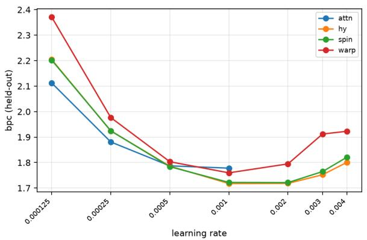
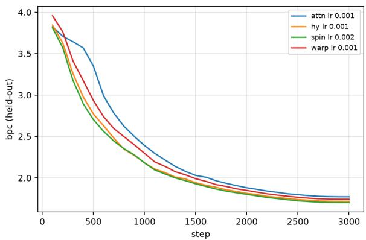
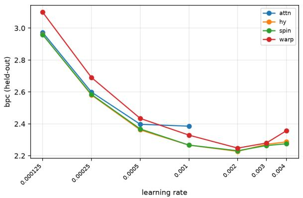
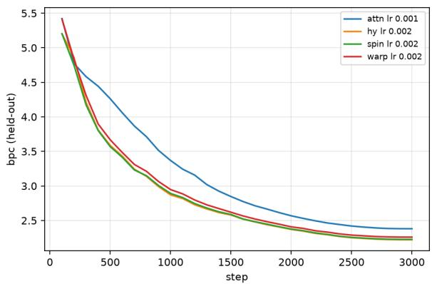
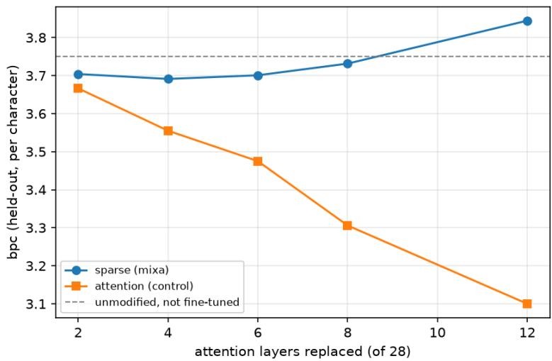

# Reaching Every Position Without Searching: Rotating Sparse Wiring on the Hypercube as a Substitute for Attention

Yoshiaki Takashita<sup>∗</sup> School of Law, Waseda University takashita@moegi.waseda.jp

September 2026

## Abstract

Attention pays, at every layer and for every input, the cost of searching for whom to connect. We ask how far one can get with wiring that is fixed, sparse, and simply rotated from layer to layer. Treating the n positions of a sequence as the vertices of a log n-dimensional hypercube and connecting each position, at layer ℓ, to its neighbour along dimension ℓ mod $\log _ { 2 } n$ , information from every position reaches every other in log n layers with 2n links per layer instead of $n ^ { 2 }$ On a synthetic task that is unsolvable unless all positions are reached, this rotation matches all-to-all wiring at 1/32 of the links, while the same sparse pattern held fixed across layers fails; what matters is that every dimension is touched, not the order. On character-level language modelling of a public corpus (the first 12M characters of enwik8), a hybrid that keeps two attention layers among sixteen sparse ones reaches 0.06 bits-per-character lower held-out loss than a fully attentive model of the same width at the same step budget (three seeds each, no overlap), with 1/7 of the links, 42% fewer parameters, and 2.4× less wall-clock time; the purely rotated schedule is level with the hybrid. The same ordering holds on a second corpus of mixed Japanese, English and code, where the gap widens to 0.16. The usable learning-rate window is four to eight times wider than attention’s on both. We also report what did not work—learned coordinates, and a “dynamics” variant whose apparent gains turned out to be an artefact of a saturated kernel—and the measurement discipline (frozen corpus, full-coverage evaluation, seed spread as the bar for ranking) that we found necessary to say anything at all at this scale.

## 1 Introduction

The expensive part of attention is not the mixing; it is the search. Every layer, for every input, attention recomputes which positions should influence which, and pays $O ( n ^ { 2 } )$ for the privilege. The question in this paper is deliberately narrow: if the wiring is fixed—chosen once, independent of the input—how much of attention’s quality survives, and at what fraction of its cost?

Fixed sparse patterns are not new [Child et al., 2019, Beltagy et al., 2020, Zaheer et al., 2020]; nor is the observation that a butterfly or hypercube schedule touches every position in log n stages [Dao et al., 2019]. Our contribution is to isolate one variable—rotation: changing which hypercube dimension each layer uses—and to measure it against controls that hold everything else constant (same weights, same data, same steps, same number of links), first on a synthetic task where reachability is the whole problem, then on language. Along the way we found that several of our own intermediate “results” were measurement artefacts, and we report those as findings too (§9).

Claims. (A) Rotation is what makes sparse wiring reach: with the same 2n links per layer, rotating the dimension matches all-to-all wiring and the un-rotated control does not (§4). (B) On language, at window 256, a hybrid with two attention layers among sixteen sits 0.06 bpc below full attention on a public corpus and 0.16 bpc below it on a private one, at the same step budget, with 1/7 of the links and a usable learning-rate window four to eight times wider (§5). At window 64 the hybrid only draws level with attention, and the purely sparse schedules fall behind dense mixing—a pre-freeze claim of ours that did not survive remeasurement (§9). (C) A hierarchy in which a coarse hypercube gates the fine one changes trainability, not capacity: same asymptote, 30 points faster at 500 steps, 43× smaller seed spread (§6). (D) A “dynamics” variant, in which positions move under learned forces, produced its early gains through a saturated kernel that reduced the model to a pointer chain; after fixing the scale the sign of the efect of the number of steps reverses (§7).

## 2 Related work

Sparse attention keeps the softmax search but restricts where it may look: strided and local patterns [Child et al., 2019], a sliding window with a few global tokens [Beltagy et al., 2020], or random links added to both [Zaheer et al., 2020]. Routing methods go the other way and learn the pattern per input, by hashing [Kitaev et al., 2020] or by clustering [Roy et al., 2021]. In both families the wiring is still decided at run time, which is the cost we set out to remove.

A second family removes the search altogether. MLP-Mixer mixes tokens with a fixed dense map over positions [Tolstikhin et al., 2021]; Hyena replaces attention with long convolutions whose filters are fixed once trained [Poli et al., 2023]; Mamba keeps a selective, input-dependent state-space recurrence [Gu and Dao, 2023]. These operators are dense in position or carry per-position state. Ours is a single shift and two linear maps per layer, with 2n links.

The structure we use is old. Hypercube and butterfly networks reach every node in log n stages and are standard in parallel computing [Leighton, 1992]; butterfly factorisations have been used to learn fast linear transforms [Dao et al., 2019]. We do not claim the structure. What we isolate is one variable, rotating the dimension from layer to layer, and we measure it against a control that keeps the same links but does not rotate.

## 3 Method

## 3.1 Positions as hypercube vertices

Let $n = 2 ^ { b }$ . We index positions by b-bit integers and, at layer ℓ, connect position i to $i \oplus 2 ^ { ( \ell \mathrm { m o d } b ) } { \mathrm { - i t s } }$ neighbour along one hypercube dimension. Each layer therefore has 2n directed links (plus the identity). After b consecutive layers every pair of positions is connected by a path; after 2b layers, in practice, the network uses the connectivity (§4). For causal language modelling we keep only the earlier of the two endpoints, which turns the schedule into a parallel prefix scan.

## 3.2 Mixing on a fixed link

A sparse layer with jump k computes

$$
y _ { i } = W _ { \mathrm { s e l f } } x _ { i } + W _ { \mathrm { o f f } } x _ { i - k } ,\tag{1}
$$

two linear maps and a shift. There is no input-dependent routing. This is the only operation the sparse layers use, and it is why the models export to ONNX with standard operators alone (§8).

## 3.3 Schedules

We compare, holding weights, data, optimiser and steps fixed:

• dense: all-to-all mixing $( n ^ { 2 }$ links per layer);

• local: k = 1 at every layer;

• fixed: one hypercube dimension, the same at every layer (the control for “sparse but not rotated”);

• rot: hypercube dimension ℓ mod b at layer ℓ;

• mixa: local and long-range layers alternate, the long jumps visiting each scale once (32, 16, 8, 4, 2, 1 for $n = 6 4 )$ ;

• hybrid: the mixa backbone with two of the layers replaced by standard multi-head attention.

The exact layer lists are given as short schedule strings in Appendix A.

## 3.4 Hierarchy and dynamics

Two further variants are evaluated on synthetic tasks. In the hierarchical variant, positions are grouped; each group is a vertex of a coarser hypercube that moves under the same rule and gates the couplings inside its group. The force law is shared between levels, so the hierarchy adds 225 parameters (+1.8%) to a 12,482-parameter model. In the dynamics variant, each position carries a coordinate $p _ { i } \in \mathbb { R } ^ { d }$ ; couplings are exp $\smash { \bigl ( - \| p _ { i } - p _ { j } \| ^ { 2 } / \tau \bigr ) }$ , a learned force moves the coordinates, and this is repeated T times before reading out. The scaled form (“field”) divides the squared distance by its causal row mean before the exponential; the “phase” form additionally carries a velocity.

## 4 Synthetic: rotation is what reaches

Task. Count the ones in a random binary sequence of length n, reading the answer from position 0 only. The task cannot be solved unless information from every position reaches position 0. Guessing the most common answer gives 9.9% for $n = 6 4$

Result (Claim A). With n = 64, six layers, and identical weights and link counts for the two sparse schedules:
<table><tr><td>schedule</td><td>accuracy</td><td>links / layer</td></tr><tr><td>fixed (not rotated)</td><td>10.2%</td><td>768</td></tr><tr><td>rot</td><td>98.7%</td><td>768</td></tr><tr><td>dense</td><td>100.0%</td><td>24,576</td></tr></table>

Sparsity is not what helps; rotation is. The un-rotated control sits at chance with exactly the same number of links.

Depth. Accuracy jumps from 14.2% at five layers to 98.8% at six. Six is log 64, the depth at which the first complete path exists. It saturates near $2 \log _ { 2 } n ,$ with 99.8% at 12 layers and 100% at 16. For $n = 2 5 6$ the floor $\log _ { 2 } n = 8$ gives 28.0% and 16 layers give 52.1%. The efective depth is again about twice the floor.

Order does not matter; coverage does. A random permutation of dimensions reaches 99.0%. A Gray-code order, which visits dimension 0 eight times and dimension 5 never within 16 layers, reaches 14.4%. Every dimension has to be touched. The order in which they are touched does not matter.

## 5 Language

Setup. Character-level next-character prediction, reported as held-out bits per character. Evaluation covers the validation set in non-overlapping windows, so the measurement noise is zero; what remains is optimiser-trajectory variance, which we estimate with seeds. Learning rate is swept on a grid for every schedule—early in this work we tuned it for one side only and drew the wrong conclusion three times (§9).

We measure on two corpora, each frozen and identified by a fingerprint of its contents. The first is public: the first 12M characters of enwik8, rebuilt from the published archive by checksum (fingerprint c52380b41455, 201 symbols). The second is 12M characters of mixed Japanese, English and code taken from this project’s repository at a pinned commit (fingerprint e1634705154f, 4,769 symbols). The public corpus is the one a reader can reproduce; the second is kept because it is a diferent distribution, and the point of interest is whether the ordering survives the change. We do not compare our enwik8 numbers with the published literature: we use an 8% block split rather than the customary $9 0 / 5 / 5 ,$ so the numbers are internally comparable and externally not.

## 5.1 Public corpus, window 256, 20–35M parameters

Sixteen layers, width 512, 3,000 steps. The learning rate is swept over seven values and the best setting is repeated with three seeds. At its best rate, attention reaches 1.778 bpc (seeds 1.772, 1.771, 1.791) with 526,336 links and 35.0M parameters. The hybrid reaches 1.718 (1.703, 1.712, 1.740) with 72,184 links and 20.3M parameters, the rotated schedule 1.721 (1.702, 1.729, 1.733) with 74,470 links, and learned coordinates 1.760 (1.743, 1.791, 1.746) with 81,346 links.

Two separations survive the seeds and one does not. The hybrid and the rotated schedule sit 0.057–0.060 bpc below attention with no overlap between seeds; their own diference of 0.003 is far inside their spread, so we do not rank them against each other. Learned coordinates sit 0.018 below attention, but their seeds overlap attention’s, so on this corpus we claim no separation for them at all. Every curve is still descending at step 3,000 (Figure 1, right): this is a comparison at equal step budget, not at convergence, and we have withdrawn “descends faster” headlines before (§9). What we stand on is the cost at equal quality so far (Table 2): 1/7 of the links, 42% fewer parameters, and 2.4× less wall-clock time per run on one RTX 5070.

Robustness (Claim B, second half ). The hybrid stays within 1.718–1.801 bpc over an eight-fold range of learning rates (0.0005–0.004). Attention fails to train at 0.002 and above, three of the seven grid points († in Table 1), so its usable window is 0.000125–0.001. In practice this insensitivity is worth as much as the link count.

Table 1: Public corpus (enwik8, fingerprint c52380b41455), window 256: held-out bpc over the learning-rate grid, mean of the seeds run at that cell (generated by figs.py; bold = best per schedule; † = failed to train). hy = hybrid (two attention layers among sixteen), spin = rotated schedule, warp = learned coordinates.
<table><tr><td>lr</td><td>attn</td><td>hy</td><td>spin</td><td>warp</td></tr><tr><td>0.004</td><td>†</td><td>1.801</td><td>1.821</td><td>1.923</td></tr><tr><td>0.003</td><td>†</td><td>1.752</td><td>1.764</td><td>1.912</td></tr><tr><td>0.002</td><td>†</td><td>1.718</td><td>1.721</td><td>1.795</td></tr><tr><td>0.001</td><td>1.778</td><td>1.718</td><td>1.722</td><td>1.760</td></tr><tr><td>0.0005</td><td>1.787</td><td>1.786</td><td>1.784</td><td>1.803</td></tr><tr><td>0.00025</td><td>1.881</td><td>1.924</td><td>1.925</td><td>1.977</td></tr><tr><td>0.000125</td><td>2.112</td><td>2.204</td><td>2.202</td><td>2.371</td></tr></table>

Table 2: Public corpus, window 256: each schedule at its best learning rate among the cells with three seeds. sd is the population standard deviation over those seeds; links counts connections per layer, weights all trainable parameters, s/run wall-clock seconds for 3,000 steps on one RTX 5070. Ratios are relative to attention.
<table><tr><td>form</td><td>lr</td><td>bpc</td><td>sd</td><td>seeds</td><td>links</td><td>weights</td><td></td><td>s/run</td></tr><tr><td>attn</td><td>0.001</td><td>1.778</td><td>0.0090</td><td>3</td><td>526336 (1.00×)</td><td>34998473</td><td>(1.00×)</td><td>447 (1.00×)</td></tr><tr><td>hy</td><td>0.002</td><td>1.718</td><td>0.0159</td><td>3</td><td>72184 (0.14×)</td><td>20318409</td><td>(0.58×)</td><td>182 (0.41×)</td></tr><tr><td>spin</td><td>0.002</td><td>1.721</td><td>0.0139</td><td>3</td><td>74470 (0.14×)</td><td>20318409</td><td>(0.58×)</td><td>312 (0.70×)</td></tr><tr><td>warp</td><td>0.001</td><td>1.760</td><td>0.0219</td><td>3</td><td>81346 (0.15×)</td><td>20343009</td><td>(0.58×)</td><td>218 (0.49×)</td></tr></table>

## 5.2 Second distribution: repository corpus, window 256

The same grid on the repository corpus (fingerprint e1634705154f). At its best rate, attention reaches 2.385 bpc (seeds 2.381, 2.370, 2.405) with 526,336 links and 39.7M parameters. The rotated schedule reaches 2.231 (2.227, 2.268, 2.200) with 74,470 links and 25.0M parameters, the hybrid 2.228 (2.221, 2.262, 2.200) with 72,184 links and 25.0M, and learned coordinates 2.248 (2.259, 2.243, 2.241) with 81,346 links. Among the three sparse schedules the gaps of 0.003–0.020 lie inside the seed spread of 0.018–0.068, so we do not rank them. All three sit 0.14–0.16 bpc below attention with no overlap between seeds. The parameter counts difer from the public corpus only through the embedding and output layers, because this corpus has 4,769 distinct symbols against enwik8’s 201.

The ordering of the four schedules is the same on both corpora, and the two robustness findings are the same. What changes is the size of the gap: 0.06 bpc on the public corpus against 0.16 here, and learned coordinates separate from attention here but not there. We read the direction as the transferable part and the magnitude as corpus-specific.

## 5.3 Window 64, 1.7–2.9M parameters: where the cheap schedules stop working

Twelve layers, width 128, 3,500 steps on the repository corpus, three seeds at lr = 0.002 for every schedule. The hybrid reaches 2.796 bpc (seeds 2.793, 2.793, 2.802) with 5,306 links, level with attention’s 2.800 (2.797, 2.804, 2.800) at 24,960 links; the seeds overlap, so we claim a match and not a win, at 1/4.7 of the links and 23% fewer parameters. Dense mixing, with attention’s link count but no search, reaches 2.910.



  
Figure 1: Public corpus, window 256: learning-rate grid (left) and held-out curves at each schedule’s best rate (right).

Table 3: Repository corpus, window 256: held-out bpc over the learning-rate grid, mean of the seeds run at that cell (generated by figs.py; bold = best per schedule; † = failed to train). Tags as in Table 1.
<table><tr><td>lr</td><td>attn</td><td>hy</td><td>spin</td><td>warp</td></tr><tr><td>0.004</td><td>†</td><td>2.287</td><td>2.275</td><td>2.357</td></tr><tr><td>0.003</td><td>†</td><td>2.272</td><td>2.264</td><td>2.280</td></tr><tr><td>0.002</td><td>†</td><td>2.228</td><td>2.231</td><td>2.248</td></tr><tr><td>0.001</td><td>2.385</td><td>2.267</td><td>2.267</td><td>2.329</td></tr><tr><td>0.0005</td><td>2.397</td><td>2.362</td><td>2.368</td><td>2.434</td></tr><tr><td>0.00025</td><td>2.599</td><td>2.581</td><td>2.584</td><td>2.691</td></tr><tr><td>0.000125</td><td>2.973</td><td>2.960</td><td>2.959</td><td>3.100</td></tr></table>

The purely sparse schedules do not reach dense mixing at this size: one long jump per scale gives 2.943 at 1/18.7 of the links, local-only 2.980, and plain rotation 3.757. The gap between the sparse schedules and dense mixing is larger than any seed spread in the table. This contradicts what we reported before the corpus was frozen, and we withdraw it (§9). The reading we are left with is that the hybrid’s two attention layers are doing the work that a pure schedule cannot do at width 128, and that the sparse schedules need the larger model of §5.1 before they become competitive.

## 6 Hierarchy changes trainability, not capacity

On a grouped associative-recall task (six seeds per condition; three dificulty settings), adding the coarse hypercube never moved the asymptote—99.3–99.9% with and without it in all three settings—but changed how the model gets there:
<table><tr><td>steps</td><td>without</td><td>with</td><td>seed spread (without / with)</td></tr><tr><td>500</td><td>68.5%</td><td>98.9%</td><td>42.8 / 1.0 points</td></tr><tr><td>1000</td><td>97.3%</td><td>99.7%</td><td>2.5 / -</td></tr><tr><td>2500</td><td>99.4%</td><td>99.9%</td><td>2.5 / -</td></tr></table>

At 500 steps the two conditions are completely separated (permutation $p = 0 . 0 0 1 1 )$ , and the seed



  
Figure 2: Repository corpus, window 256: learning-rate grid (left) and held-out curves at each schedule’s best rate (right).

Table 4: Window 64, repository corpus: every schedule at lr = 0.002 with three seeds. Columns as in Table 2. mixa = local links plus one long jump per scale, rot = plain rotation, local = local links only, dense = all-to-all mixing without search.
<table><tr><td>form</td><td>lr</td><td>bpc</td><td>sd</td><td>seeds</td><td>links</td><td></td><td>weights</td><td> $\mathrm { s / r u n }$ </td></tr><tr><td>attn</td><td>0.002</td><td>2.800</td><td>0.0029</td><td>3</td><td>24960 (1.00×)</td><td>2866849</td><td>(1.00×)</td><td>70 (1.00×)</td></tr><tr><td>local</td><td>0.002</td><td>2.980</td><td>0.0031</td><td>3</td><td>1524 (0.06×)</td><td>2080417</td><td>(0.73×)</td><td>47 (0.67×)</td></tr><tr><td>rot</td><td>0.002</td><td>3.757</td><td>0.0013</td><td>3</td><td>1152 (0.05×)</td><td>2080417</td><td>(0.73×)</td><td>46 (0.66×)</td></tr><tr><td>hybrid</td><td>0.002</td><td>2.796</td><td>0.0042</td><td>3</td><td>5306 (0.21×)</td><td>2211489</td><td>(0.77×)</td><td>87 (1.24×)</td></tr><tr><td>mixa</td><td>0.002</td><td>2.943</td><td>0.0027</td><td>3</td><td>1338 (0.05×)</td><td>2080417</td><td>(0.73×)</td><td>59 (0.84×)</td></tr><tr><td>dense</td><td>0.002</td><td>2.910</td><td>0.0055</td><td>3</td><td>24960 (1.00×)</td><td>2080417</td><td>(0.73×)</td><td>47 (0.67×)</td></tr></table>

spread difers by $4 3 \times$ . Across the three settings the reached accuracy never moved while speed and spread moved every time (Claim C). The hierarchy is an optimisation device, not a capacity device. We have not yet measured it on language.

## 7 Dynamics: what a saturated kernel hides

The artefact. Early runs of the dynamics variant (§3.4) showed $T = 8$ beating $T = 1$ on associative recall and the hierarchy helping. Measuring the efective number of partners (the exponential of the row entropy of the coupling matrix) revealed the mechanism: it was 1.0 before training and 1.26 after—the kernel $\exp ( - d ^ { 2 } / \tau )$ with $d ^ { 2 } \approx 1 0 0$ and $\tau = 1$ underflows to a one-hot, and the model was a chain of pointers, not a field. Associative recall happens to be solvable by pointer chasing, which is why the numbers were correct and the interpretation was not.

After the fix. Dividing $d ^ { 2 }$ by its causal row mean raises the efective partners to $\approx 6 0$ and the variant behaves as a field. On language, with the corpus frozen and both learning-rate minima inside the grid: Going from $T = 1$ to $T = 8$ hurts the saturated kernel and helps the scaled forms. The sign reverses on the same corpus and the same grid. With three seeds at each form’s best rate, the scaled field goes from 2.506 to 2.461 (−0.045, seed spreads 0.021 and 0.007), and the scaled field with velocity from 2.515 to 2.469 (−0.046, spreads 0.015 and 0.010). The saturated kernel goes from

Table 5: Dynamics variants on language, window 256: held-out bpc over the learning-rate grid, frozen corpus (generated by figs.py). dyn = unscaled kernel, fld = scaled, ph = scaled with velocity; the digit is T.
<table><tr><td>lr</td><td>dyn1</td><td>dyn8</td><td>fld1</td><td>fld8</td><td>ph1</td><td>ph8</td></tr><tr><td>0.008</td><td>2.512</td><td>3.021</td><td>2.542</td><td>2.498</td><td>2.540</td><td>2.517</td></tr><tr><td>0.004</td><td>2.482</td><td>3.394</td><td>2.506</td><td>2.461</td><td>2.515</td><td>2.477</td></tr><tr><td>0.002</td><td>2.483</td><td>†</td><td>2.512</td><td>2.464</td><td>2.521</td><td>2.469</td></tr><tr><td>0.001</td><td>2.540</td><td>2.979</td><td>2.572</td><td>2.526</td><td>2.580</td><td>2.533</td></tr><tr><td>0.0005</td><td>一</td><td>2.671</td><td></td><td></td><td></td><td></td></tr></table>

2.482 to 2.671, and that is a lower bound on the damage: its T = 8 optimum sits at the edge of the grid, and one grid step up the three seeds land at 2.647, 3.243 and 3.046. The saturated kernel also moves its best learning rate down eight-fold when T goes from 1 to 8. The scaled field does not move, and the velocity form moves by one grid step, which is within noise (Claim D). Between the two scaled forms at T = 8 the gap is 0.008 against a seed spread of 0.016 (median over the six settings run with three seeds); on this corpus we do not rank them.

The same grid on the public corpus. Repeating all six settings on enwik8 reproduces the sign reversal, with smaller magnitudes. The scaled field goes from 1.870 to 1.835 (−0.035) and the velocity form from 1.870 to 1.846 (−0.024), while the saturated kernel goes from 1.873 to 1.975 (+0.102); none of the three pairs overlaps across seeds. The saturated kernel again moves its best learning rate down, here four-fold. The one thing that does not reproduce is our refusal to rank the two scaled forms: on this corpus the plain field beats the velocity form by 0.011 with seed spreads of 0.001 and 0.002, so the separation is real and it runs against the velocity form. Taken together with the repository corpus, carrying a velocity has now produced no advantage anywhere and a measurable disadvantage once.

Table 6: Dynamics variants on the public corpus (enwik8), window 256: held-out bpc over the learning-rate grid (generated by figs.py). Tags as in Table 5.
<table><tr><td>lr</td><td>dyn1</td><td>dyn8</td><td>fld1</td><td>fld8</td><td>ph1</td><td>ph8</td></tr><tr><td>0.008</td><td>1.881</td><td>†</td><td>1.877</td><td>1.845</td><td>1.880</td><td>1.858</td></tr><tr><td>0.004</td><td>1.873</td><td>†</td><td>1.870</td><td>1.835</td><td>1.870</td><td>1.846</td></tr><tr><td>0.002</td><td>1.886</td><td>2.976</td><td>1.877</td><td>1.836</td><td>1.877</td><td>1.850</td></tr><tr><td>0.001</td><td>1.920</td><td>1.975</td><td>1.923</td><td>1.883</td><td>1.923</td><td>1.893</td></tr><tr><td>0.0005</td><td>一</td><td>2.046</td><td>一</td><td>一</td><td>一</td><td>一</td></tr></table>

## 8 Toward existing models

Replacing attention layers in Qwen3-0.6B. We replace k of the 28 attention layers by Eq. (1), freeze everything else, and fine-tune for 2,000 steps on the frozen corpus; the control replaces nothing and fine-tunes the same k attention layers for the same steps, so the two difer only in the mixing mechanism.

Only k = 2 is close to free (+0.038 bpc). Beyond that the penalty grows steeply: +0.136, +0.226, +0.426 and +0.744 at $k = 4 , 6 , 8 , 1 2$ . Figure 3 shows why. The sparse variant is flat in k, staying between 3.69 and 3.84 across the whole range, while the attention control improves monotonically from 3.67 to 3.10. The sparse layers are not degrading. They cannot convert the extra trainable capacity into quality the way attention can. Against the unmodified model the sparse version is still ahead at $k \leq 8 \ ( - 0 . 0 4 6 \ \mathrm { t o } \ - 0 . 0 1 9 )$ and behind at $k = 1 2 \ ( + 0 . 0 9 4 )$ . That comparison mixes in the benefit of having seen the corpus at all, which is why we report the control-relative penalty instead.

Table 7: Qwen3-0.6B, 2,000 fine-tuning steps: held-out bpc after replacing k of 28 attention layers, against a control that fine-tunes the same k attention layers unchanged (generated by figs.py). Penalty = sparse − attention. The unmodified, un-fine-tuned model is at 3.7505.
<table><tr><td>layers replaced</td><td>sparse</td><td>attention</td><td>penalty</td><td>increment</td></tr><tr><td>2 /  28</td><td>3.7041</td><td>3.6665</td><td>+0.0376</td><td></td></tr><tr><td>4 / 28</td><td>3.6912</td><td>3.5551</td><td>+0.1361</td><td>+0.0985</td></tr><tr><td>6 / 28</td><td>3.7008</td><td>3.4751</td><td>+0.2257</td><td>+0.0896</td></tr><tr><td>8/28</td><td>3.7315</td><td>3.3059</td><td>+0.4256</td><td>+0.1999</td></tr><tr><td>12 / 28</td><td>3.8444</td><td>3.1000</td><td>+0.7444</td><td>+0.3188</td></tr></table>

  
Figure 3: Replacing k of 28 attention layers in Qwen3-0.6B. The sparse variant is flat; the attention control keeps improving as it is given more layers to fine-tune.

Why the 500-step version was optimistic. An earlier run at 500 steps reported +0.041, $+ 0 . 0 7 4 , + 0 . 1 1 9$ and +0.199 for $k = 2 , 4 , 6 , 8$ , two to three times smaller at $k \geq 4$ than the figures above. At 500 steps neither side had used its capacity. The control moved only from 3.692 to 3.653 across k = 2 to 8, against 3.667 to 3.306 at 2,000 steps. We had predicted the opposite: that a longer budget would shrink the penalty, because the replaced layers start from scratch while the control starts from trained weights. That holds only at $k = 2 \ ( + 0 . 0 4 1  + 0 . 0 3 8 )$ . Everywhere else the longer budget favours attention. The honest reading is that two of 28 layers is where this substitution is currently free.

Deployability. The modified model exports to ONNX using only Add, Concat, MatMul, Min, Reshape, Shape, Slice, Squeeze, Sub, with a maximum deviation of $3 . 6 \times 1 0 ^ { - 7 }$ from PyTorch, including the one-token-at-a-time decode path (the sparse layer needs only the last $k \leq 3 2$ inputs, so its cache does not grow). Under 8-bit quantisation the modified model degrades 1.32× as much as the unmodified one (three seeds, no overlap) at 3.2× smaller size.

## 9 What did not work, and what we had to fix to know

• A sparse schedule reaching dense mixing at 1/21 of the links. This was our headline for window 64, and it does not survive the freeze. Remeasured on the pinned corpus with three seeds, one long jump per scale reaches 2.943 bpc at 1/18.7 of the links against dense mixing’s 2.910: it is behind, not level, by more than any seed spread in that table (§5.3). What survives at window 64 is weaker and diferent—the hybrid draws level with attention at 1/4.7 of the links. The pre-freeze runs had been taken on a corpus that changed between them, which is exactly the failure this paper’s measurement discipline was built to catch, and it caught our own best number.

• Learned coordinates. Letting positions learn where they sit on the cube (“warp”) buys nothing. On the repository corpus it reaches 2.248 bpc against 2.228 for the fixed hybrid, inside the seed spread, for 13% more links (Table 3). On the public corpus it is the one schedule whose seeds overlap attention’s, so it does not even separate from the baseline there. A pre-freeze run had shown it losing, with four times the seed spread; on frozen data that disappeared too. We keep only the claim both corpora support: no advantage.

• Velocity as state. No measurable diference from the scaled field on the repository corpus, and on the public corpus a measurable diference in the wrong direction (0.011 bpc worse, seed spreads 0.001 and 0.002).

• Transferring the coupling rule to task allocation among software agents: no efect.

• Reporting the minimum along the curve. Our first window-256 headline (0.197 bpc ahead of attention) was the minimum over a 20,000-step run whose floor came at step 2,500, before the learning-rate schedule had begun to anneal; it measured which model descends faster, not which is better. We withdrew it, then withdrew two further versions (“attention needs more steps”; “attention is fragile”) that were both artefacts of a learning rate tuned for one side only.

• Evaluation noise. Sampling eight random validation batches gave a 0.006 spread on the same model. Evaluating every 500 steps sampled the curve too coarsely to compare minima 0.015 apart. Both are fixed: full coverage, every 100 steps.

• A moving corpus. The training text was gathered from a live repository; adding two files between runs changed the material while the vocabulary count—our only guard—moved by two. All language numbers before the freeze carry the † mark above and are excluded from the generated tables.

We now refuse to print a ranking when the gap between schedules is below the seed spread, and the table generator refuses to emit a table when fingerprints, step counts or evaluation versions are mixed.

## 10 Limitations

• Two corpora of 12M characters each. One is public but cut and split in our own way, so our numbers are not comparable with published enwik8 results; the other is comparable with nothing, because the repository it is drawn from is private.

• Models up to 40M parameters, three seeds.

• A fixed budget of 3,000 steps at which every window-256 curve is still descending. The language comparison is at equal steps, not at convergence.

• The hierarchy has not been measured on language.

• The Qwen3 experiment fine-tunes for 2,000 steps on 4M characters, at one model size and one seed per point, and only on the repository corpus.

• No speed measurements on target hardware. The wall-clock figures are training throughput on one GPU, measured on a machine that was not otherwise idle.

## References

Iz Beltagy, Matthew E. Peters, and Arman Cohan. Longformer: The long-document transformer. arXiv preprint arXiv:2004.05150, 2020.

Rewon Child, Scott Gray, Alec Radford, and Ilya Sutskever. Generating long sequences with sparse transformers. arXiv preprint arXiv:1904.10509, 2019.

Tri Dao, Albert Gu, Matthew Eichhorn, Atri Rudra, and Christopher R´e. Learning fast algorithms for linear transforms using butterfly factorizations. In International Conference on Machine Learning, 2019.

Albert Gu and Tri Dao. Mamba: Linear-time sequence modeling with selective state spaces. arXiv preprint arXiv:2312.00752, 2023.

Nikita Kitaev, Lukasz Kaiser, and Anselm Levskaya. Reformer: The eficient transformer. In International Conference on Learning Representations, 2020.

F. Thomson Leighton. Introduction to Parallel Algorithms and Architectures: Arrays, Trees, Hypercubes. Morgan Kaufmann, 1992.

Michael Poli, Stefano Massaroli, Eric Nguyen, Daniel Y. Fu, Tri Dao, Stephen Baccus, Yoshua Bengio, Stefano Ermon, and Christopher R´e. Hyena hierarchy: Towards larger convolutional language models. In International Conference on Machine Learning, 2023.

Aurko Roy, Mohammad Safar, Ashish Vaswani, and David Grangier. Eficient content-based sparse attention with routing transformers. Transactions of the Association for Computational Linguistics, 9, 2021.

Ilya Tolstikhin, Neil Houlsby, Alexander Kolesnikov, Lucas Beyer, Xiaohua Zhai, Thomas Unterthiner, Jessica Yung, Andreas Steiner, Daniel Keysers, Jakob Uszkoreit, Mario Lucic, and Alexey Dosovitskiy. MLP-Mixer: An all-MLP architecture for vision. In Advances in Neural Information Processing Systems, 2021.

Manzil Zaheer, Guru Guruganesh, Avinava Dubey, Joshua Ainslie, Chris Alberti, Santiago Ontanon, Philip Pham, Anirudh Ravula, Qifan Wang, Li Yang, and Amr Ahmed. Big bird: Transformers for longer sequences. In Advances in Neural Information Processing Systems, 2020.

## A Schedule strings

Schedules are written in the repository’s .glyph files as a list of layer types, one CJK character each: near (local, k = 1), jump k (a link of distance k along one cube axis), attn (a full attention layer). Transliterated, the window-256 hybrid (hybrid256.glyph) is

near jump128 near attn near jump32 near jump16 near attn near jump4 near jump2 near jump1

(width 512, hidden 1024): sixteen layers, local links as the backbone, one jump per scale from 128 down to 1, and attention at two of the sixteen. The rotated schedule (spin256.glyph) replaces the jumps by rotating the cube axis each layer; the learned-coordinate variant (warp256.glyph) lets each position learn where it sits on the cube. The generated tables refer to these as hy, spin and warp; the same short names are accepted by sweep.py --forms.

## B Reproduction

Neither corpus is shipped with the code; both are rebuilt and then checked against a fingerprint, and figs.py refuses to tabulate records whose fingerprints disagree. The public corpus is downloaded from the published enwik8 archive, verified by SHA-256, read as Latin-1 and cut at 12M characters; freeze corpus.py --enwik8 stops unless the result fingerprints as c52380b41455. The second corpus is rebuilt from a pinned commit of the repository it is drawn from (b33e164), so any checkout with full history reconstructs the same 12M characters, fingerprint e1634705154f; that repository is private, which is why the public corpus carries the headline.

Everything in §5.1 and the public half of §7:

```batch
python freeze_corpus.py --enwik8 # fingerprint must read c52380b41455
python sweep.py --corpus corpus_enwik8.txt --runs enwik8 \
--forms attn,hy,spin,warp --seeds 1,2
python sweep.py --corpus corpus_enwik8.txt --runs enwik8 \
--forms fld1,fld8,ph1,ph8,dyn1,dyn8 \
--lrs 0.008,0.004,0.002,0.001 --seeds 1,2
python figs.py --dir runs/enwik8 --check
python figs.py --dir runs/enwik8 --forms attn,hy,spin,warp \
--out paper --name B2e --cost --seeded
python figs.py --dir runs/enwik8 --forms fld1,fld8,ph1,ph8,dyn1,dyn8 \
--out paper --name C3e --cost --seeded
```

The second corpus (§5.2, §5.3) needs a checkout of the private repository:

python freeze\_corpus.py # fingerprint must read e1634705154f   
python sweep.py --forms attn,hy,spin,warp --seeds 1,2   
python sweep.py --forms fld1,fld8,ph1,ph8,dyn1,dyn8 \   
--lrs 0.008,0.004,0.002,0.001 --seeds 1,2

python sweep.py --forms dyn8 --lrs 0.008,0.004,0.002,0.001,0.0005

python figs.py --check

python figs.py --forms attn,hy,spin,warp --out paper --name B2

python figs.py --forms fld1,fld8,ph1,ph8,dyn1,dyn8 --out paper --name C3

python sweep.py --runs w64 --n 64 --L 12 --d 128 --hid 256 \

python figs.py --dir runs/w64 --out paper --name B1 --cost --seeded