# Reliable Virtual Sensing: A Multi-Domain Benchmark for Robustness Under Sensor Failures

Jens U. Brandt<sup>1,2∗</sup> Noah C. Puetz<sup>1,2</sup> Alexander Windmann<sup>3</sup> Marc Hilbert<sup>2,4</sup> Elena Raponi<sup>2</sup> Thomas Bäck<sup>2</sup> Thomas Bartz-Beielstein<sup>1</sup> <sup>1</sup>TH Köln <sup>2</sup>Leiden University <sup>3</sup>Helmut Schmidt University <sup>4</sup>Toyota Racing

## Abstract

Virtual sensing, the estimation of hard-to-measure quantities from available sensor measurements, is a critical enabler for control and monitoring in cyber-physical systems. However, when sensors fail, learning-based predictors can produce physically implausible estimates that propagate to system-level failures. We argue that real-world deployment demands robustness and introduce MuViS-C, the first multi-domain benchmark of robustness against common sensor failures in learningbased virtual sensing. Building on an existing nominal-performance benchmark and established corruption taxonomies, it covers ten sensor failure modes, from subtle drifts to catastrophic signal dropouts, at multiple severities. These are paired with complementary robustness measures capturing average error under corruption, relative degradation, and worst-case fragility. Across nine datasets from six domains, we benchmark six architectures spanning gradient-boosted trees and the major inductive biases for sequence modeling: convolution, recurrence, attention, and MLP-mixing. On the attention-based architecture, we further probe three robustification strategies. We find that (i) every model degrades substantially under corruption, becoming worse than a naïve predictor on at least one corruption setting, (ii) gradient-boosted tree ensembles achieve strong robustness, and (iii) dedicated robustification closes the gap between the attention-based architecture and the most robust models, though each strategy hurts nominal performance. The benchmark’s multi-domain design proves essential, as model rankings shift across datasets, and no single domain captures the full robustness picture. MuViS-C is open-source and extensible to new datasets, failure modes, measures, and models.

Wrist-sensor input channels  
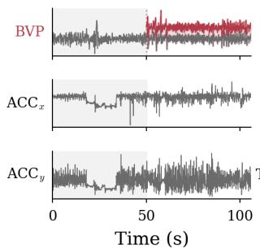

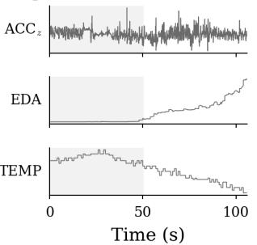

ModernTCN prediction  
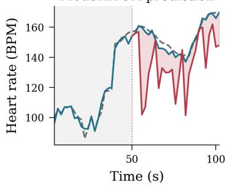  
— Sensor signal — Perturbed (input & prediction) — Clean prediction -- Ground truth ... Failure onset  
Figure 1: Motivating Example. An offset on the Blood Volume Pulse channel corrupts ModernTCN heart-rate estimates, causing substantial errors despite only one of six sensors being affected.

## 1 Introduction

Virtual sensing plays a central role in modern cyber-physical systems (CPS), enabling the estimation of variables from available sensors when direct measurement is technically or economically infeasible [1]. With applications ranging from air quality monitoring and vehicle dynamics to industrial processes and health monitoring, virtual sensors provide a cost-effective and often safety-critical alternative to physical instrumentation [2, 3, 4, 5]. These models can be physics-based, data-driven, or hybrid, depending on system knowledge and data availability. Recent efforts have standardized the evaluation of learning-based models under nominal operating conditions [6]. However, these models still depend on physical sensors as inputs and therefore inherit their most critical vulnerability: sensors fail. Thermal drift, occlusion, electrical noise, and calibration errors can corrupt measurements in real-world deployments. When such failures occur, they induce distribution shifts that learningbased models are rarely trained to handle. The result can be catastrophic errors that propagate to system-level failures [7].

Robustness to such deployment-time hazards has been identified as a core problem in ML safety [8], with standardized corruption benchmarks in computer vision [9] setting the methodological precedent. Virtual sensing, by contrast, has no comparable framework. In practice, sensor failures are rarely as simple as additive Gaussian noise or complete signal dropout. They are often subtle, structured, and temporally correlated: corrupted measurements may remain within valid physical ranges while conveying systematically misleading information. While physical sensor fault archetypes are wellcatalogued [10, 11] and their impact on learned models has been probed in adjacent tasks [12, 13], virtual sensing itself lacks a multi-domain robustness benchmark. To bridge this gap, we introduce MuViS-C, the first standardized multi-domain benchmark of robustness against common sensor failures in learning-based virtual sensing, extending the MuViS virtual sensing benchmark [6] with a systematic robustness evaluation. Our contributions are:

• The MuViS-C benchmark. A reproducible evaluation protocol implementing ten sensor failure modes, from subtle drifts to catastrophic signal dropouts, swept across the failure × channel × severity grid and aggregated into three robustness measures: mPC and rPC adapted from Michaelis et al. [14], and $s _ { \mathrm { c r o s s } } ,$ a new measure capturing worst-case fragility. The benchmark is open-source and extensible, supporting custom models, failure modes, measures, and datasets.

• Multi-domain evaluation as a methodological requirement. Across nine datasets from six domains, we show that model rankings shift substantially and no single domain captures the full robustness picture, establishing multi-domain evaluation as a requirement for assessing virtual sensor reliability.

• Diagnostic study of current virtual sensors. Benchmarking six architectures spanning gradient-boosted trees and the major inductive biases for sequence modeling (convolution, recurrence, attention, and MLP-mixing), we expose pervasive fragility under structured sensor failures and identify gradient-boosted trees as a strong implicit-robustness baseline.

• Probe of robustification strategies. On the attention-based architecture, we probe three representative robustification methods spanning input dropout, adversarial training, and purpose-built self-supervised pretraining, establishing reference points and quantifying the trade-off between nominal performance and robustness.

## 2 Related work

Virtual sensing. Methods for virtual sensing range from mechanistic white-box models, through gray-box hybrids, to fully data-driven black-box approaches that can be deployed without deep domain expertise [15]. While individual application domains like battery state-of-charge estimation, air-quality monitoring or vehicle dynamics have produced tailored solutions [2, 3, 4], cross-domain comparison has been hampered by inconsistent preprocessing, evaluation metrics, and data splits. The recently introduced MuViS benchmark addresses this gap by consolidating multimodal virtual sensing datasets from six physical domains into a unified evaluation framework [6]. Its comparison of gradient-boosted trees and deep neural architectures shows that no single model dominates across domains, underscoring the need for architectures that generalize beyond individual applications.

Crucially, however, MuViS evaluates models exclusively under nominal conditions, leaving open the question of how these architectures behave when the input sensors degrade.

Sensor failure modeling. Balaban et al. [10] map physical failure mechanisms across eight common sensor types (thermocouples, RTDs, piezoelectric, piezoresistive, strain gages, Hall effect, magnetostrictive, and LVDTs) to five behavioral fault categories (bias, drift, scaling, noise, and hard faults), showing that these categories are tied to the sensing principle rather than the application domain. Jesus et al. [11] arrive at a similar taxonomy for wireless sensor networks, identifying six fail ure modes (offset, drift, crash, trimming, outliers, and noise) and surveying fusion-based mitigation strategies that exploit spatial, temporal, and value redundancy. The convergence of both taxonomies, reinforced by additional fault-type analyses [16] and empirical prevalence studies in deployed sensor networks [17], confirms that the same fault archetypes recur wherever the same transducer physics apply, from aerospace and environmental monitoring to industrial systems. Together, they supply the physically grounded fault vocabulary that any sensor-robustness benchmark must build on.

Robustness benchmarks. A large body of work on systematic robustness evaluation under realistic input corruptions exists in the computer vision domain. ImageNet-C/P [9] introduced a standardized suite of 15 corruption types at five severity levels and demonstrated large accuracy drops even for state-of-the-art classifiers, catalyzing a body of work on corruption-robust architectures. Analogous benchmarks exist for object detection [14], segmentation [18], and 3D perception [19], establishing corruption robustness as a first-class evaluation axis alongside clean accuracy. Recent work extends this perspective to machine learning on industrial time series data, where sensor faults can cause catastrophic degradation in learned virtual sensors [7]. Dix et al. [13] demonstrate similar sensitivity in time series classification, while Windmann et al. [12] report substantial accuracy losses under injected data-quality issues in forecasting pipelines. Yet virtual sensing lacks what computer vision has long established: a systematic, multi-domain robustness benchmark with physically grounded corruptions.

Robustness improvement methods. A broad landscape of techniques has been proposed to improve model robustness under distributional shift. Adversarial training augments the training set with worst-case perturbations to harden models against adversarial inputs [20, 21], with projected gradient descent as a prominent generation method [22]. Certified robustness methods provide formal guarantees that predictions remain stable within a specified perturbation set [23, 24]. Domain adaptation and domain randomization encourage invariant representations by training on diverse environments or simulated variations [25, 26]. Representation-learning approaches, from denoising autoencoders [27] to masked autoencoders, learn features that are inherently more tolerant to input corruption. Brandt et al. [7] recently extended this idea to sensor data by designing a self-supervised masking scheme that simulates common sensor faults during pretraining, yielding representations that generalize to unseen fault types and enable robust virtual sensing in closed-loop autonomous driving. In the multi-sensor setting, Mena et al. [28] propose input sensor dropout, randomly masking entire sensor streams during training to improve robustness to missing sensors at inference time.

## 3 The MuViS-C benchmark

We introduce MuViS-C, a multi-domain robustness benchmark for learning-based virtual sensing. It extends the MuViS framework [6] with a systematic robustness evaluation built on physically grounded sensor-fault taxonomies and the corruption-benchmark methodology established in computer vision. We retain its problem formulation: given an input window $\mathbf { X } _ { i } \in \mathbb { R } ^ { T \times C }$ of C complementary sensor channels over T time steps, a model $f$ estimates a continuous scalar $\hat { y } _ { i } ( t _ { 0 } )$ anchored at a reference time $t _ { 0 } .$ . To assess robustness, we perturb individual channels of $\mathbf { X } _ { i }$ with the sensor failure modes catalogued in Section 3.2 and measure the resulting change in $\hat { y } _ { i } ( t _ { 0 } )$ . Following Freiesleben and Grote [29], we call a model robust if such interventions in its input do not cause changes in its output beyond a given tolerance. Figure 2 gives a high-level overview of the benchmark.

## 3.1 Datasets

We evaluate on nine datasets spanning six application domains. Each dataset provides N multivariate time-series windows $\mathbf { X } \in \mathbb { R } ^ { N \times T \times C }$ with scalar targets $\mathbf { y } \in \mathbb { R } ^ { N }$ . For more details, see Appendix A.

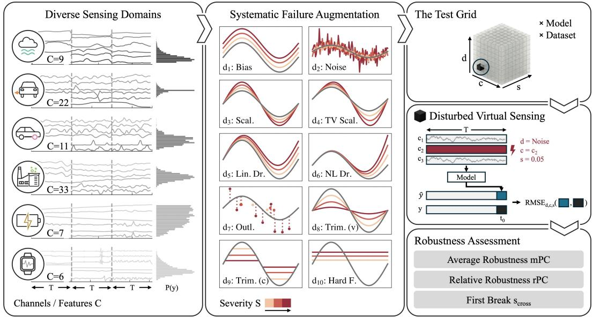  
Figure 2: MuViS-C evaluates models across diverse sensing domains (left) by applying realistic sensor failures at increasing severity to individual channels (center). At test time, a sliding window (step size 1) feeds a $C \times T$ input tensor to the model, which produces a scalar virtual sensing estimate for $t _ { 0 }$ . Each test in the failure × channel × severity grid (right top) perturbs one channel with a single failure mode at a defined severity (right center). The resulting degraded RMSEs are aggregated into complementary robustness measures (bottom right).

From environmental and health sensing, the Beijing PM10 and PM2.5 Quality datasets [30] involve estimating particulate matter concentration (10 µm and $2 . 5 \mu \mathrm { { m } ) }$ from 9-dimensional meteorological and pollutant time series, while PPGDalia (HR) [31] targets heart rate estimation (BPM) from wrist-worn multimodal sensors (BVP, EDA, temperature, and acceleration). In industrial and energy systems, the Tennessee Eastman Process (TEP) [32] represents a canonical chemical plant simulation where 33 process variables are used to infer a single chemical concentration, and the Panasonic 18650PF (Batt.) dataset [33] targets battery State-of-Charge (SoC) estimation from current, voltage, and temperature signals across diverse thermal conditions. For automotive and motorsport dynamics, the REVS Motorsport dataset [34] focuses on lateral velocity $( v _ { y } )$ estimation during high-speed racing; we evaluate three separate recording sessions with different car-track-combinations indepen dently (MMR/T66-13/T66-14). Finally, the Vehicle Dynamics Dataset (Veh.) [35] targets real-time tire temperature $( t _ { \mathrm { t i r e } } )$ estimation from 11 channels capturing driver inputs and vehicle states.

## 3.2 Severity-parameterized sensor failures

Failure catalogue. We define a suite of ten failure modes (see Figure 2, center panel and Table 1), each acting on a single channel of the input window. The modes are taken from a sensor fault taxonomy for virtual sensing [7], which defines fault functions $D ( \cdot )$ that map a nominal channel $\mathbf { x } \in \mathbb { R } ^ { T }$ to a corrupted channel $\tilde { \mathbf { x } } = D ( \mathbf { x } )$ , with $D ( x _ { t } )$ denoting the t-th entry $\bar { ( t } \in \{ 0 , \ldots , T - 1 \} )$ . We extend each $D \bar { ( } \cdot )$ into a continuous family $D _ { s , k } ( \cdot )$ that maps a severity $s \in [ 0 , 1 ]$ to a perturbation intensity, with $s = 0$ leaving the signal unchanged (or minimally perturbed) and $s = 1$ applying the mode’s maximal perturbation, bounded by a scale parameter k.

Design principle. All input data is z-score normalized per channel before evaluation. On this common scale, k acts as a single, dataset-agnostic bound on the maximum perturbation magnitude; we therefore fix k across the benchmark and omit it from the notation hereafter, writing $D _ { s } ( \cdot )$ Inspired by the classical 3σ rule used as a naïve threshold for anomaly detection [36], we anchor $k = 3$ so that additive and stochastic perturbations at $s { = } 1$ reach the magnitude conventionally treated as anomalous. Each evaluation perturbs exactly one input channel at a time while all remaining channels retain their clean values, the standard atomic condition in sensor-fault taxonomies [10, 11].

This allows per-channel attribution of degradation and enables exhaustive sweeping of the full failure × channel × severity grid (Section 3.3).

Table 1: Severity-parameterized sensor failure modes. $p _ { \mathrm { m a x } }$ is the outlier probability at $s = 1$ , and α the soft-clip damping factor.
<table><tr><td>Failure mode</td><td>Definition  $D _ { s } ( x _ { t } )$ </td><td>Type</td></tr><tr><td>Bias</td><td> $D _ { s } ( x _ { t } ) = x _ { t } + s k$ </td><td>Additive (const.)</td></tr><tr><td>Noise</td><td> $D _ { s } ( x _ { t } ) = x _ { t } + \varepsilon _ { t } , \varepsilon _ { t } \sim \mathcal { N } ( 0 , ( s k ) ^ { 2 } )$ </td><td>Additive (stochastic)</td></tr><tr><td>Scaling</td><td> $D _ { s } ( x _ { t } ) = x _ { t } \bigl ( 1 + s ( k - 1 ) \bigr )$ </td><td>Multipl. (const.)</td></tr><tr><td>Time-varying scaling</td><td> $\begin{array} { r } { D _ { s } ( x _ { t } ) = x _ { t } \big ( 1 + s ( k - 1 ) \frac { t } { T - 1 } \big ) } \end{array}$ </td><td>Multipl. (time-var.)</td></tr><tr><td>Linear drift</td><td> $\begin{array} { r } { D _ { s } ( x _ { t } ) = x _ { t } + s k \frac { t } { T - 1 } } \end{array}$ </td><td>Drift (linear)</td></tr><tr><td>Non-linear drift</td><td> $\begin{array} { r } { D _ { s } ( x _ { t } ) = x _ { t } + s k \big ( \frac { t } { T - 1 } \big ) ^ { 2 } } \end{array}$ </td><td>Drift (quadratic)</td></tr><tr><td>Outliers</td><td> $D _ { s } ( x _ { t } ) = x _ { t } + m _ { t } \delta _ { t }$ </td><td>mt ∼ Ber(spmax), δt ∼ U(−k, k) Sporadic spikes</td></tr><tr><td>Trimming (var.)</td><td> $h = ( 1 - s ) k , \quad D _ { s } ( x _ { t } ) = \left\{ \begin{array} { l l } { - h + \alpha ( x _ { t } + h ) } & { x _ { t } < - h } \\ { h + \alpha ( x _ { t } - h ) } & { x _ { t } > h } \\ { x _ { t } } & { | x _ { t } | \leq h } \end{array} \right.$ </td><td>Saturation (soft)</td></tr><tr><td>Trimming (const.)</td><td> $h = ( 1 - s ) k , D _ { s } ( x _ { t } ) = \mathrm { c l i p } ( x _ { t } , - h , h )$ </td><td>Saturation (hard)</td></tr><tr><td>Hard fault</td><td> $D _ { s } ( x _ { t } ) = s k$ </td><td>Stuck-at</td></tr></table>

Defaults: k = 3, p<sub>max</sub> = 0.3, $\alpha = 0 . 4$

## 3.3 Evaluation protocol

For every (dataset, model) pair, failure mode $d \in { \mathcal { D } } .$ , and affected input channel $c \in { \mathcal { C } } ,$ we sweep severity s over the grid $\mathcal { S } = \{ 0 . 0 5 , 0 . 1 0 , \ldots , 1 . 0 \}$ of $| { \cal S } | = 2 0$ equidistant steps of size $\Delta s = 0 . 0 5$ recording the corrupted $\mathrm { R M S E } _ { d , c , s }$ at each grid point. All RMSE values are bootstrap means over 200 resamples of the test set. Two additional reference points anchor our evaluation: RMSE<sub>clean</sub>, the model’s nominal RMSE on the unperturbed test set; and $\mathrm { R M S E } _ { \mathrm { n a i v e } } ,$ the RMSE of a severityinvariant baseline that always predicts the training-set mean and depends only on the dataset. We measure robustness with three metrics: the mean Performance under Corruption (mPC) and the relative Performance under Corruption (rPC) from Michaelis et al. [14], and the Baseline Crossing Severity $( s _ { \mathrm { c r o s s } } )$ we propose to capture worst-case fragility. All three are defined below.

Mean performance under corruption (mPC). mPC is the average $\mathrm { R M S E } _ { d , c , s }$ over the corruption grid:

$$
\mathrm { m P C } = \frac { 1 } { \left| \boldsymbol { \mathcal { D } } \right| \left| \boldsymbol { \mathcal { C } } \right| \left| \boldsymbol { S } \right| } \sum _ { d \in \mathcal { D } } \sum _ { c \in \mathcal { C } } \sum _ { s \in \mathcal { S } } \mathrm { R M S E } _ { d , c , s } .\tag{1}
$$

It instantiates the original mPC with RMSE as the performance metric, and additionally averages over the affected channel c. mPC is reported in the original units of the target variable and is therefore not directly comparable across datasets.

Relative performance under corruption (rPC). mPC is influenced by a model’s nominal performance: a stronger model enters the severity sweep at a lower mPC floor. To measure degradation independently of where a model starts, we normalize mPC by $\mathrm { R M S E _ { c l e a n } }$

$$
\mathrm { r P C } = \frac { \mathrm { m P C } } { \mathrm { R M S E } _ { \mathrm { c l e a n } } } .\tag{2}
$$

$\mathrm { r P C } = 1$ indicates no degradation on average, and values above 1 signal performance loss. This metric plays the same role as the Relative mCE [9], isolating degradation from nominal accuracy and is the reciprocal of the robustness score of Windmann et al. [12] (see Appendix F). A complementary normalization of mPC against the naïve mean predictor, the normalized Performance under Corruption (nPC), is defined and reported in Appendix E.

Baseline crossing severity $\left( s _ { \mathrm { c r o s s } } \right)$ . Both mPC and rPC summarize average-case behavior. To capture worst-case fragility we ask: at what severity does the model first become no better than the naïve mean predictor? $s _ { \mathrm { c r o s s } }$ is the earliest severity at which any $\mathrm { R M S E } _ { d , c , s }$ is no better than $\mathrm { R M S E } _ { \mathrm { n a i v e } } \colon$

$$
s _ { \mathrm { c r o s s } } = \operatorname* { m i n } _ { d \in \mathscr { D } , \mathscr { c } \in \mathscr { C } } \operatorname* { m i n } \bigl \{ s \in \mathcal { S } \ \big \vert \ \mathrm { R M S E } _ { d , c , s } \geq \mathrm { R M S E } _ { \mathrm { n a i v e } } \bigr \} .\tag{3}
$$

If no crossing is observed within the measured range, $s _ { \mathrm { c r o s s } }$ is undefined and denoted by $^ { 6 6 } - ^ { 5 9 }$ in tables. Unlike mPC and rPC, which average over the $( d , c , s )$ grid, $s _ { \mathrm { c r o s s } }$ is a minimum, since averaging would mask the single worst-case combination it is designed to detect.

Cross-dataset aggregation. We summarize mPC and rPC across datasets in two complementary ways. Following Fleming and Wallace [37], we use the geometric mean; rPC enters it directly as a di mensionless ratio, whereas mPC carries incomparable units across datasets and is first normalized per dataset by the best model $( 1 . 0 = \mathrm { b e s t } )$ . We additionally report mean ranks following the Demšar [38] protocol; statistical testing details are deferred to Appendix J. For $s _ { \mathrm { c r o s s } }$ we report only the mean rank, since no crossing has no finite value and admits no scale-preserving average; no crossing is encoded as a sentinel above 1, so such entries tie for the best rank.

Complementarity. The three metrics are designed to be read together: mPC measures absolute error under corruption, rPC isolates degradation from nominal performance, and $s _ { \mathrm { c r o s s } }$ captures worst-case fragility. A model with low mPC but high rPC is accurate yet fragile; low rPC but high mPC indicates robustness without strong nominal performance; low rPC but low $s _ { \mathrm { c r o s s } }$ reveals smooth average degradation masking an early collapse on the weakest combination. Reporting all three prevents any single metric from hiding the tradeoff between nominal performance and robustness.

## 3.4 Standardized interface

Listing 1 illustrates the core evaluation workflow. Users instantiate a Testbed with a dataset, register one or more models, and optionally extend the default failure suite or add custom metrics. A single call to run() sweeps the full evaluation grid and returns a Results object for inspection and export. A detailed description of the programming interface is provided in Appendix K.

```python
import muvis_c as rob
def my_predict_fn(X: np.ndarray) -> np.ndarray: ... # (N,T,C) -> (N,)
testbed = rob.Testbed(dataset=rob.PPGDalia)
testbed.add_model("MyModel", predict_fn=my_predict_fn)
results = testbed.run()
results.summary()
```  
Listing 1: Evaluating a custom virtual sensing model with MuViS-C.

## 4 Experiments and results

With MuViS-C in place, we conduct a two-part empirical study. The first part characterizes how state-of-the-art machine learning models behave under sensor failure. We evaluate six baseline architectures encompassing gradient-boosted tree ensembles and representative neural inductive biases. XGBoost [39] and Catboost [40] are trained on flattened inputs $\mathbb { R } ^ { N \times ( T \cdot C ) }$ . For sequential processing, xLSTM-Mixer [41] is a recurrent architecture that stacks scalar-memory sLSTM blocks with exponential gating to jointly mix temporal and cross-variate information by reconciling original and reversed sequence views. TST [42] applies a standard Transformer encoder where each token corresponds to a full time-step vector, enabling multi-head self-attention across the temporal dimension. PatchTSMixer [43] segments time series into patches and applies lightweight MLP-Mixer blocks to mix information across patches, channels, and hidden features, capturing both temporal patterns and cross-variate correlations. ModernTCN [44] modernizes temporal convolutional networks by adopting a Transformer-block-like layout that decouples temporal and feature mixing. All sequential models operate on inputs $\mathbf { X } \in \mathbb { R } ^ { N \times \check { T } \times C }$

The baselines reveal where current models break; the second part of our study asks whether established robustification techniques can mitigate these failures, and at what cost. We evaluate three representative strategies: input dropout (ISensD [28]), adversarial training (PGD [22]), and purposebuilt self-supervised pretraining (F2F [7]). ISensD randomly masks entire sensor channels during training to improve robustness to missing sensors at inference. PGD frames robustness as a min-max optimization, generating adversarial perturbations via multi-step Projected Gradient Descent during training. F2F is a self-supervised pretraining scheme in which an encoder is trained to reconstruct channels corrupted by realistic sensor failure modes; a virtual sensor is then trained on the frozen robust embedding. All three are applied on top of the TST backbone: $\mathrm { F } 2 \mathrm { F } ' \mathrm { s }$ published implementation is built on a TST encoder, so fixing TST as the shared backbone enables a fair head-to-head comparison. TST is also mid-pack on nominal performance (Appendix D) and among the most fragile baselines on rPC (Table 3), leaving clear headroom for robustification gains without ceiling effects. Full training, tuning, and compute details are reported in Appendix B.

Tables 2 and 3 report mPC and rPC, respectively; Table 4 reports $s _ { \mathrm { c r o s s } } .$ Omnibus tests reach significance for mPC and rPC (Friedman, both $p < 0 . 0 0 1 )$ but not for $s _ { \mathrm { c r o s s } }$ (Friedman, $p = 0 . 1 8 7 )$ A naïve-normalized variant (nPC) is reported in Appendix E for interpretability. Full statistical details, including all p-values, critical distances, and post-hoc cluster memberships, are given in Appendix J.

Table 2: mPC per model and dataset. Bold = best, underline = second-best per column. GM is the geometric mean of best-normalized values $( 1 . 0 = \mathrm { b e s t } ) ;$ arrows show GM change vs. TST.
<table><tr><td>Model</td><td>PM10 PM2.5 Batt.</td><td></td><td></td><td>HR TEP</td><td>Veh.</td><td></td><td>MMR T66-13 T66-14 Rank GM</td><td></td><td></td><td></td></tr><tr><td>XGBoost</td><td>97.12</td><td>66.32</td><td>0.05</td><td>12.38</td><td>0.05</td><td>4.44 0.17</td><td>0.12</td><td>0.11</td><td>2.3</td><td>1.202</td></tr><tr><td>CatBoost</td><td>98.81</td><td>67.51</td><td>0.04</td><td>11.46 0.05</td><td>5.00</td><td>0.16</td><td>0.11</td><td>0.11</td><td>2.6</td><td>1.162</td></tr><tr><td>M-TCN</td><td>98.73</td><td>69.00</td><td>0.08</td><td>5.27</td><td>0.06 11.39</td><td>0.22</td><td>0.14</td><td>0.15</td><td>5.6</td><td>1.403</td></tr><tr><td>P-TSMixer</td><td>107.16</td><td>74.35</td><td>0.09</td><td>10.25</td><td>0.05 7.92</td><td>0.34</td><td>0.21</td><td>0.23</td><td>7.2</td><td>1.705</td></tr><tr><td>xLSTM-M</td><td>98.33</td><td>67.26</td><td>0.05</td><td>9.65</td><td>0.05 4.47</td><td>0.18</td><td>0.12</td><td>0.13</td><td>3.0</td><td>1.209</td></tr><tr><td>TST</td><td>106.23</td><td>73.51</td><td>0.06</td><td>12.52</td><td>0.05 8.17</td><td>0.21</td><td>0.14</td><td>0.16</td><td>6.0</td><td>1.476</td></tr><tr><td>TST-PGD</td><td>101.39</td><td>65.98</td><td>0.07</td><td>15.36</td><td>0.05 4.57</td><td>0.25</td><td>0.15</td><td>0.16</td><td>5.6</td><td> $1 . 4 3 0 \scriptstyle \downarrow - 0 . 0 4 6$ </td></tr><tr><td>TST-ISensD</td><td>108.56</td><td>74.41</td><td>0.11</td><td>15.33 0.05</td><td>5.66</td><td>0.24</td><td>0.17</td><td>0.19</td><td>7.7</td><td> $1 . 6 1 8 \uparrow + 0 . 1 4 2$ </td></tr><tr><td>TST-F2F</td><td>118.44</td><td>68.75</td><td>0.03</td><td>23.53 0.07</td><td>4.96</td><td>0.18</td><td>0.12</td><td>0.12</td><td>5.1</td><td> $1 . 3 1 8 \scriptstyle \downarrow - 0 . 1 5 8$ </td></tr></table>

Table 3: rPC per model and dataset. Bold = best, underline = second-best per column. GM is the geometric mean across datasets; arrows indicate GM change relative to TST.
<table><tr><td>Model</td><td>PM10 PM2.5</td><td></td><td>Batt.</td><td>HR</td><td>TEP</td><td>Veh.</td><td>MMR</td><td></td><td></td><td>T66-13 T66-14 Rank GM</td><td></td></tr><tr><td>XGBoost</td><td>1.060</td><td>1.087</td><td>2.159</td><td>1.301</td><td>1.007</td><td>1.187</td><td>1.395</td><td>1.211</td><td>1.425</td><td>3.4</td><td>1.281</td></tr><tr><td>CatBoost</td><td>1.073</td><td>1.100</td><td>3.669 1.270</td><td></td><td>1.007</td><td>1.302</td><td>1.517</td><td>1.263</td><td>1.353</td><td>4.1</td><td>1.385</td></tr><tr><td>M-TCN</td><td>1.086</td><td>1.149</td><td>9.200 2.187 1.059</td><td></td><td></td><td>4.837</td><td>1.853</td><td>1.854</td><td>1.896</td><td>8.1</td><td>2.112</td></tr><tr><td>P-TSMixer</td><td>1.043</td><td>1.108</td><td>2.613 1.099 1.006 2.043</td><td></td><td></td><td></td><td>1.247</td><td>1.509</td><td>1.559</td><td>3.8</td><td>1.395</td></tr><tr><td>xLSTM-M</td><td>1.042</td><td>1.061</td><td>5.550 1.309</td><td></td><td>1.007</td><td>1.178</td><td>1.777</td><td>1.645</td><td>1.634</td><td>4.7</td><td>1.529</td></tr><tr><td>TST</td><td>1.091</td><td>1.155</td><td>3.761</td><td>1.817</td><td>1.010</td><td>2.157</td><td>1.897</td><td>1.858</td><td>1.948</td><td>7.9</td><td>1.716</td></tr><tr><td>TST-PGD</td><td>1.070</td><td>1.066</td><td>2.833</td><td>1.175</td><td>1.006</td><td>1.324</td><td>1.182</td><td>1.108</td><td>1.147</td><td>2.7</td><td>1.253 ↓-0.463</td></tr><tr><td>TST-ISensD</td><td>1.134</td><td>1.105</td><td>4.129</td><td></td><td></td><td>1.272 1.011 1.217</td><td>1.525</td><td>1.608</td><td>1.736</td><td>6.2</td><td>1.482 ↓-0.234</td></tr><tr><td>TST-F2F</td><td>1.095</td><td>1.102</td><td>2.208</td><td></td><td></td><td>1.5211.2311.159</td><td>1.202</td><td>1.126</td><td>1.113</td><td>4.1</td><td>1.272 ↓-0.444</td></tr></table>

## 4.1 Gradient-boosted trees as a strong robustness baseline

Gradient-boosted trees hold up well under corruption without any dedicated defense. On mPC (Table 2), XGBoost achieves the best mean rank (2.3) with CatBoost a close second (2.6), both signif icantly outranking P-TSMixer and TST-ISensD. On rPC, XGBoost again leads all non-robustified models, trailing only the adversarially robustified TST-PGD (Table 3). XGBoost is in fact the only model in the benchmark that holds an exclusive top-cluster position on both statistics (Appendix J). No neural architecture reaches the joint top position, even with dedicated robustification. This suggests that the inductive biases of gradient-boosted trees confer an implicit corruption resilience that neural architectures in our benchmark do not replicate, setting a strong baseline to beat.

## 4.2 Trade-off between nominal performance and robustness

Figure 3 plots each model’s clean-data error against its rPC, both as geometric means across datasets. The clean-data axis is normalized per dataset against the best model, so 1.0 marks the best achievable nominal performance and the optimal corner sits at the bottom-left where a model is both accurate and degrades gracefully. M-TCN, the strongest model nominally (Appendix D), is the least robust, with an rPC (Table 3) of 2.112 and the worst mean rank (8.1), significantly outranked by TST-PGD, XGBoost, and P-TSMixer. P-TSMixer shows the inverse pattern: among non-robustified baselines, it ranks among the weakest on clean-data error yet sits in the top nonsignificant cluster on rPC (Figure 12), degrading gracefully from a poor nominal baseline. Among non-robustified models, xLSTM-M comes closest to the tree ensembles on both axes. It is also the only one to stay below the naïve-predictor threshold on PM10 and HR; all other non-robustified models cross on every dataset (Table 4).

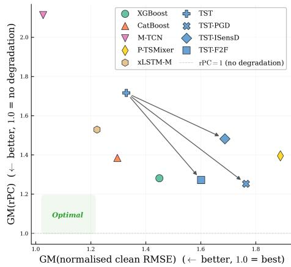  
Figure 3: Nominal performance vs. robustness. GM(rPC) aggregated across datasets (y) vs. GM of normalized clean RMSE (x, normalized following mPC aggregation). Arrows indicate the effect of robustification.

A genuine trade-off emerges in robustification training. The arrows in Figure 3 trace each robustified TST variant’s position relative to vanilla TST, and all three point toward lower rPC but higher clean-data error: every robustification method we evaluated trades nominal performance for robustness. Statistically, vanilla TST suffers a significant rPC deficit relative to TST-PGD, XGBoost, and P-TSMixer, and all three robustification strategies close it. Every robustified variant joins the leading non-significant rPC cluster, and TST-PGD signifi cantly outranks vanilla TST itself, though none establishes a significant advantage over the strongest non-robustified baselines (Figure 12).

Table 4: Baseline crossing severity $s _ { \mathrm { c r o s s } } . \tilde { \mathbf { \Omega } } ^ { , 3 }$ denotes never crosses within the measured severity range (best possible). Bold = best, underline = second-best per column.
<table><tr><td>Model</td><td>PM10</td><td>PM2.5</td><td>Batt.</td><td>HR</td><td>TEP</td><td>Veh.</td><td>MMR</td><td>T66-13</td><td>T66-14</td><td>Rank</td></tr><tr><td>XGBoost</td><td>0.500</td><td>0.400</td><td>0.100</td><td>0.500</td><td>0.250</td><td>0.050</td><td>0.150</td><td>0.100</td><td>0.150</td><td>5.6</td></tr><tr><td>CatBoost</td><td>0.550</td><td>0.350</td><td>0.100</td><td>0.950</td><td>0.300</td><td>0.100</td><td>0.100</td><td>0.150</td><td>0.100</td><td>4.9</td></tr><tr><td>M-TCN</td><td>0.450</td><td>0.600</td><td>0.450</td><td>0.450</td><td>0.050</td><td>0.050</td><td>0.050</td><td>0.100</td><td>0.050</td><td>5.9</td></tr><tr><td>P-TSMixer</td><td>0.650</td><td>0.450</td><td>0.400</td><td>0.050</td><td>0.300</td><td>0.050</td><td>0.050</td><td>0.050</td><td>0.050</td><td>6.2</td></tr><tr><td>xLSTM-M</td><td></td><td>0.550</td><td>0.600</td><td></td><td>0.300</td><td>0.100</td><td>0.150</td><td>0.150</td><td>0.050</td><td>3.5</td></tr><tr><td>TST</td><td>0.250</td><td>0.200</td><td>0.450</td><td>0.500</td><td>0.500</td><td>0.050</td><td>0.050</td><td>0.050</td><td>0.050</td><td>6.2</td></tr><tr><td>TST-PGD</td><td>0.050</td><td>0.400</td><td>0.400</td><td>0.450</td><td>0.800</td><td>0.050</td><td>0.400</td><td>0.600</td><td>0.450</td><td>4.4</td></tr><tr><td>TST-ISensD</td><td>0.300</td><td>0.350</td><td>0.200</td><td>0.300</td><td>0.350</td><td>0.200</td><td>0.400</td><td>0.400</td><td>0.350</td><td>4.4</td></tr><tr><td>TST-F2F</td><td>0.200</td><td>0.950</td><td></td><td>0.050</td><td>0.050</td><td>0.100</td><td></td><td></td><td></td><td>3.7</td></tr></table>

## 4.3 Benchmark diversity across datasets

The nine datasets span a wide difficulty spectrum, validating the multi-domain design. On rPC (Table 3), TEP is by far the easiest: six of nine models stay within 1% of clean performance, while Battery is universally challenging, with every model at least doubling its clean error. Crucially, model rankings shift across datasets: M-TCN achieves the best mPC (Table 2) on heart rate but the worst on Vehicle Dynamics; TST-F2F dominates Batt. and REVS on $s _ { \mathrm { c r o s s } }$ yet collapses at the lowest severity on HR and TEP (Table 4). No single dataset captures the full picture, and a benchmark restricted to any one domain would miss failure patterns that are prominent in others.

## 4.4 Additional analyses

Per-failure-mode heterogeneity. Disaggregating rPC by failure mode (Appendix G, Table 11) reveals that corruption difficulty varies substantially: the geometric-mean rPC across models ranges from 1.073 for varying trimming to 1.922 for hard faults, with hard faults producing roughly an order of magnitude more degradation than the easiest mode. All models agree on the easiest mode (varying trimming) and all but TST-ISensD and TST-F2F agree on the hardest (hard fault); for those two, noise is the worst case. Although models broadly agree at the extremes of difficulty, the best model varies mode by mode, and the per-mode winner is always either XGBoost or one of the robustified TST variants: TST-F2F leads on bias, hard faults, and linear and nonlinear drift; TST-ISensD leads on both trimming variants; TST-PGD wins on both scaling variants; and XGBoost leads on outliers and noise. No model ranks best on more than four of the ten failure modes, reinforcing the value of multi-failure evaluation.

Robustness under detectable sensor faults. When a reliable failure detector is available and the operator or a system can replace a faulty channel with its training-set mean (hard fault at $s = 0 )$ TST-ISensD achieves a geometric-mean rPC of 1.034 and a perfect mean rank of 1.0 across all nine datasets, indicating virtually no degradation and significantly outranking CatBoost, xLSTM-M, TST, and M-TCN (Appendix H). This result follows directly from ISensD’s training procedure, which randomly zeroes out input channels and thus explicitly prepares the model for this intervention. The finding suggests that pairing a simple input-dropout augmentation with a failure detection mechanism is a practical strategy for maintaining prediction quality under sensor faults.

## 5 Limitations and future work

First, our ten-mode failure catalogue, grounded in established sensor-fault taxonomies [10, 11], covers the dominant archetypes recurring across transducer physics but cannot be exhaustive; MuViS-C’s injection framework is designed to absorb new modes as they are characterized, and we plan to broaden the catalogue as the community surfaces additional failure patterns from field deployments. Second, we evaluate three representative robustification methods on a shared TST backbone to enable a fair head-to-head comparison with F2F [7]; broader families of defenses, including techniques from the vision-robustness literature, and the question of whether our findings transfer across backbones remain open, and we plan to address both in future work using MuViS-C as the shared testbed. Third, our evaluation perturbs one sensor at a time; extending MuViS-C with a multi-sensor axis covering correlated-failure schedules and channel-coverage sweeps is a natural next step that we plan to support in future versions of the benchmark. Fourth, we fix the perturbation scale at k = 3 throughout the study, motivated by the 3σ convention on z-scored data; the sensitivity of model rankings to alternative scales remains an open question and a clear next experiment.

## 6 Conclusion

MuViS-C provides a testbed for evaluating learning-based virtual sensor reliability under realistic sensor failures. Its multi-domain design proves essential: datasets span a wide difficulty spectrum, model rankings shift across domains, and no single dataset captures the full picture. We find that (i) every model evaluated degrades substantially under corruption, becoming worse than a naïve predictor on at least one failure-mode/channel combination; (ii) gradient-boosted tree ensembles achieve strong robustness without any explicit defense, setting a challenging baseline for neural methods; (iii) dedicated robustification training can elevate a fragile neural baseline into the leading robustness cluster, though every method incurs a clean-data error penalty; and (iv) when reliable failure detection and input intervention are available, a simple input-dropout augmentation (ISensD) reduces average degradation to near zero. We release MuViS-C as an open-source, extensible platform and welcome contributions of new datasets, failure modes, measures, and models.

## Acknowledgments and Disclosure of Funding

Funded by the European HORIZON-KDT-JU-2023-2-RIA, project ShapeFuture, grant No 101139996 and by the German Federal Ministry BMFTR within the funding measure Forschung an Fachhochschulen – KI-Nachwuchs@FH 2-2021 under the project TH Köln – Künstliche Intelligenz plus (THK-KIplus), funding code 13FH007KI2. The authors are responsible for the content of this publication.

## References

[1] Dominik Martin, Niklas Kühl, and Gerhard Satzger. Virtual Sensors. Business & Information Systems Engineering, 63(3):315–323, June 2021.

[2] Fangyuan Ma, Cheng Ji, Jingde Wang, Wei Sun, and Ahmet Palazoglu. Soft Sensor Modeling Method Considering Higher-Order Moments of Prediction Residuals. Processes, 12(4), March 2024.

[3] Zetterberg, Oskar and Tevell, Axel. Creating a Virtual Tyre Temperature Sensor, 2023. ISSN: 1404-6342 Series: Master’s Theses in Mathematical Sciences.

[4] Pratik Mondal, Divyakumar Bhavsar, Kanupriya Mittal, and Mayank Mittal. Estimating State-of-Charge in Lithium-Ion Batteries Through Deep Learning Techniques: A Comparative Evaluation. IEEE Access, PP:1–1, January 2024.

[5] Attila Reiss, Ina Indlekofer, Philip Schmidt, and Kristof Van Laerhoven. Deep PPG: Large-Scale Heart Rate Estimation with Convolutional Neural Networks. Sensors, 19(14), July 2019.

[6] Jens U. Brandt, Noah C. Puetz, Jobel Jose George, Niharika Vinay Kumar, Elena Raponi, Marc Hilbert, Thomas Bäck, and Thomas Bartz-Beielstein. MuViS: Multimodal Virtual Sensing Benchmark, March 2026. arXiv:2603.24602 [eess].

[7] Jens U. Brandt, Noah C. Pütz, Marcus Greiff, Thomas Jonathan Lew, John Subosits, Marc Hilbert, and Thomas Bartz-Beielstein. From Faults to Features: Pretraining to Learn Robust Representations against Sensor Failures. October 2025.

[8] Dan Hendrycks, Nicholas Carlini, John Schulman, and Jacob Steinhardt. Unsolved Problems in ML Safety, June 2022. arXiv:2109.13916 [cs].

[9] Dan Hendrycks and Thomas Dietterich. Benchmarking Neural Network Robustness to Common Corruptions and Perturbations. September 2018.

[10] Edward Balaban, Abhinav Saxena, Prasun Bansal, Kai F. Goebel, and Simon Curran. Modeling, Detection, and Disambiguation of Sensor Faults for Aerospace Applications. IEEE Sensors Journal, 9(12):1907–1917, December 2009. Conference Name: IEEE Sensors Journal.

[11] Gonçalo Jesus, António Casimiro, and Anabela Oliveira. A Survey on Data Quality for Dependable Monitoring in Wireless Sensor Networks. Sensors, 17(9):2010, September 2017. Number: 9.

[12] Alexander Windmann, Henrik Steude, Daniel Boschmann, and Oliver Niggemann. Quantifying Robustness: A Benchmarking Framework for Deep Learning Forecasting in Cyber-Physical Systems, 2025. Version Number: 3.

[13] Marcel Dix, Gianluca Manca, Kenneth Chigozie Okafor, Reuben Borrison, Konstantin Kirchheim, Divyasheel Sharma, Kr Chandrika, Deepti Maduskar, and Frank Ortmeier. Measuring the Robustness of ML Models Against Data Quality Issues in Industrial Time Series Data. In 2023 IEEE 21st International Conference on Industrial Informatics (INDIN), pages 1–8, July 2023. ISSN: 2378-363X.

[14] Claudio Michaelis, Benjamin Mitzkus, Robert Geirhos, Evgenia Rusak, Oliver Bringmann, Alexander S. Ecker, Matthias Bethge, and Wieland Brendel. Benchmarking Robustness in Object Detection: Autonomous Driving when Winter is Coming, March 2020. arXiv:1907.07484 [cs].

[15] Jiayao Chen, Weihua Gui, Ning Chen, Jiayang Dai, Chunhua Yang, and Xu Li. A Dynamic Grey-Box Model and its Application in the Sintering Process of Ternary Cathode Material. IFAC-PapersOnLine, 53(2):11866–11871, 2020.

[16] Kevin Ni, Nithya Ramanathan, Mohamed Nabil Hajj Chehade, Laura Balzano, Sheela Nair, Sadaf Zahedi, Eddie Kohler, Greg Pottie, Mark Hansen, and Mani Srivastava. Sensor network data fault types. ACM Trans. Sen. Netw., 5(3), June 2009.

[17] Abhishek B. Sharma, Leana Golubchik, and Ramesh Govindan. Sensor faults: Detection methods and prevalence in real-world datasets. ACM Transactions on Sensor Networks, 6(3):1– 39, June 2010.

[18] Christoph Kamann and Carsten Rother. Benchmarking the Robustness of Semantic Segmentation Models. In 2020 IEEE/CVF Conference on Computer Vision and Pattern Recognition (CVPR), pages 8825–8835, June 2020. arXiv:1908.05005 [cs].

[19] Yinpeng Dong, Caixin Kang, Jinlai Zhang, Zijian Zhu, Yikai Wang, Xiao Yang, Hang Su, Xingxing Wei, and Jun Zhu. Benchmarking Robustness of 3D Object Detection to Common Corruptions in Autonomous Driving. In 2023 IEEE/CVF Conference on Computer Vision and Pattern Recognition (CVPR), pages 1022–1032, Vancouver, BC, Canada, June 2023. IEEE.

[20] Christian Szegedy, Wojciech Zaremba, Ilya Sutskever, Joan Bruna, Dumitru Erhan, Ian Goodfellow, and Rob Fergus. Intriguing properties of neural networks, February 2014. arXiv:1312.6199 [cs].

[21] Ian J. Goodfellow, Jonathon Shlens, and Christian Szegedy. Explaining and Harnessing Adversarial Examples, March 2015. arXiv:1412.6572 [stat].

[22] Aleksander Madry, Aleksandar Makelov, Ludwig Schmidt, Dimitris Tsipras, and Adrian Vladu. Towards Deep Learning Models Resistant to Adversarial Attacks. February 2018.

[23] Aditi Raghunathan, Jacob Steinhardt, and Percy Liang. Certified Defenses against Adversarial Examples. February 2018.

[24] Jeremy Cohen, Elan Rosenfeld, and Zico Kolter. Certified Adversarial Robustness via Randomized Smoothing. In Proceedings of the 36th International Conference on Machine Learning, pages 1310–1320. PMLR, May 2019.

[25] Yaroslav Ganin, Evgeniya Ustinova, Hana Ajakan, Pascal Germain, Hugo Larochelle, François Laviolette, Mario Marchand, and Victor Lempitsky. Domain-adversarial training of neural networks. J. Mach. Learn. Res., 17(1):2096–2030, January 2016.

[26] Josh Tobin, Rachel Fong, Alex Ray, Jonas Schneider, Wojciech Zaremba, and Pieter Abbeel. Domain randomization for transferring deep neural networks from simulation to the real world. In 2017 IEEE/RSJ International Conference on Intelligent Robots and Systems (IROS), pages 23–30. IEEE Press, 2017.

[27] Pascal Vincent, Hugo Larochelle, Yoshua Bengio, and Pierre-Antoine Manzagol. Extracting and composing robust features with denoising autoencoders. In Proceedings ofthe 25th international conference on Machine learning, ICML ’08, pages 1096–1103, New York, NY, USA, July 2008. Association for Computing Machinery.

[28] Francisco Mena, Diego Arenas, and Andreas Dengel. Increasing the Robustness of Model Predictions to Missing Sensors in Earth Observation, September 2024. arXiv:2407.15512 [cs].

[29] Timo Freiesleben and Thomas Grote. Beyond generalization: a theory of robustness in machine learning. Synthese, 202(4):109, September 2023.

[30] Shuyi Zhang, Bin Guo, Anlan Dong, Jing He, Ziping Xu, and Song Xi Chen. Cautionary tales on air-quality improvement in Beijing. Proceedings of the Royal Society A: Mathematical, Physical and Engineering Sciences, 473(2205):20170457, September 2017.

[31] Attila Reiss, Ina Indlekofer, and Philip Schmidt. PPG-DaLiA, 2019. Published: UCI Machine Learning Repository.

[32] Cory A. Rieth, Ben D. Amsel, Randy Tran, and Maia B. Cook. Additional Tennessee Eastman Process Simulation Data for Anomaly Detection Evaluation, July 2017.

[33] Phillip Kollmeyer. Panasonic 18650PF Li-ion Battery Data. 1, June 2018.

[34] John C. Kegelman, Lene K. Harbott, and J. Christian Gerdes. Insights into vehicle trajectories at the handling limits: analysing open data from race car drivers. Vehicle System Dynamics, 55(2):191–207, February 2017. \_eprint: https://doi.org/10.1080/00423114.2016.1249893.

[35] Daiki Mori, Rajan K. Aggarwal, Nicholas D. Broadbent, Takao Kobayashi, and J. Christian Gerdes. Vehicle Dynamics Dataset for Highly Dynamic Automated Driving. 2025.

[36] Varun Chandola, Arindam Banerjee, and Vipin Kumar. Anomaly detection: A survey. ACM Comput. Surv., 41(3):15:1–15:58, July 2009.

[37] Philip J. Fleming and John J. Wallace. How not to lie with statistics: the correct way to summarize benchmark results. Commun. ACM, 29(3):218–221, 1986.

[38] Janez Demšar. Statistical Comparisons of Classifiers over Multiple Data Sets. Journal of Machine Learning Research, 7(1):1–30, 2006.

[39] Tianqi Chen and Carlos Guestrin. XGBoost: A Scalable Tree Boosting System. In Proceedings ofthe 22nd ACM SIGKDD International Conference on Knowledge Discovery and Data Mining, KDD ’16, pages 785–794, New York, NY, USA, 2016. Association for Computing Machinery.

[40] Liudmila Prokhorenkova, Gleb Gusev, Aleksandr Vorobev, Anna Veronika Dorogush, and Andrey Gulin. CatBoost: unbiased boosting with categorical features, January 2019. arXiv:1706.09516 [cs].

[41] Maurice Kraus, Felix Divo, Devendra Singh Dhami, and Kristian Kersting. xLSTM-Mixer: Multivariate Time Series Forecasting by Mixing via Scalar Memories. October 2025.

[42] George Zerveas, Srideepika Jayaraman, Dhaval Patel, Anuradha Bhamidipaty, and Carsten Eickhoff. A Transformer-based Framework for Multivariate Time Series Representation Learning. In Proceedings ofthe 27th ACM SIGKDD Conference on Knowledge Discovery & Data Mining, KDD ’21, pages 2114–2124, New York, NY, USA, 2021. Association for Computing Machinery.

[43] Vijay Ekambaram, Arindam Jati, Nam Nguyen, Phanwadee Sinthong, and Jayant Kalagnanam. TSMixer: Lightweight MLP-Mixer Model for Multivariate Time Series Forecasting. In Proceedings of the 29th ACM SIGKDD Conference on Knowledge Discovery and Data Mining, KDD ’23, pages 459–469, New York, NY, USA, 2023. Association for Computing Machinery.

[44] Luo Donghao and Wang Xue. ModernTCN: A Modern Pure Convolution Structure for General Time Series Analysis. October 2023.

[45] Takuya Akiba, Shotaro Sano, Toshihiko Yanase, Takeru Ohta, and Masanori Koyama. Optuna: A Next-generation Hyperparameter Optimization Framework. In Proceedings ofthe 25th ACM SIGKDD International Conference on Knowledge Discovery & Data Mining, KDD ’19, pages 2623–2631, New York, NY, USA, July 2019. Association for Computing Machinery.

[46] Steffen Herbold. Autorank: A Python package for automated ranking of classifiers. Journal of Open Source Software, 5(48):2173, April 2020.

## A Data and preprocessing

The dataset selection, train/test splits, and preprocessing pipeline (cleaning, resampling, channel selection, and sliding-window construction) are taken unchanged from the MuViS benchmark [6]; we refer the reader to that paper for the full design rationale and summarize the resulting dataset statistics in Table 5.

Table 5: Benchmark datasets. C: features, T: sequence length, N: number of samples.
<table><tr><td>Dataset</td><td>Domain</td><td>C</td><td>T</td><td> $N _ { \mathrm { t r a i n } }$ </td><td> $N _ { \mathrm { t e s t } }$ </td></tr><tr><td>BeijingPM10Quality</td><td>Air quality</td><td>9</td><td>24</td><td>11,918</td><td>5,048</td></tr><tr><td>BeijingPM25Quality</td><td>Air quality</td><td>9</td><td>24</td><td>11,918</td><td>5,048</td></tr><tr><td>Panasonic18650PFData</td><td>Battery SoC</td><td>7</td><td>120</td><td>199,827</td><td>158,126</td></tr><tr><td>PPGDalia</td><td>Wearable / Bio</td><td>6</td><td>512</td><td>51,757</td><td>12,940</td></tr><tr><td>REVS/2013 Monterey</td><td>Motorsport</td><td>22</td><td>20</td><td>120,777</td><td>21,357</td></tr><tr><td>REVS/2013 Targa 66</td><td>Motorsport</td><td>22</td><td>20</td><td>33,520</td><td>11,109</td></tr><tr><td>REVS/2014 Targa 66</td><td>Motorsport</td><td>22</td><td>20</td><td>46,739</td><td>9,036</td></tr><tr><td>TennesseeEastman</td><td>Chemical</td><td>33</td><td>20</td><td>240,500</td><td>470,500</td></tr><tr><td>VehicleDynamics</td><td>Automotive</td><td>11</td><td>50</td><td>1,384</td><td>280</td></tr></table>

## B Implementation details

Each of the nine model classes was trained on each of the nine benchmark datasets, yielding 81 (model × dataset) checkpoints used throughout the evaluation. All hyperparameters are reported in the accompanying repository.

## B.1 Baselines

All neural networks consume tensors in the (N, T, C) layout and emit a single scalar per window. Apart from TST, which targets representation learning for regression and classification, the architectures were originally proposed for multivariate forecasting and required minor adjustments for the scalar virtual-sensing setting.

TST. Used as-is with the built-in linear regression head producing a single output.

ModernTCN. Instantiated in regression mode with a single output unit; RevIN is disabled. Inputs are transposed to (N, C, T) to match the original implementation.

xLSTM-Mixer. The forecast horizon is set to zero, and predictions are obtained through a regression pathway (mirroring the model’s classification adaptation in the released code) that flattens the postmixer tokens through a single linear head.

PatchTSMixer. The Hugging Face implementation of PatchTSMixerForRegression is used with num\_targets=1, mode="common\_channel", and head\_aggregation="use\_last".

## B.2 Optimization

All neural networks are trained for 100 epochs with Adam, batch size 256, and MSE loss. Inputs are z-score normalized per feature using statistics estimated on the 90% training portion of an additional 90/10 train/val split. Checkpoints are selected by best validation loss, and test metrics are reported on the predefined temporal test split. All runs use seed 42.

## B.3 Robustification methods

F2F (self-supervised pretraining + fine-tuning). The encoder is pretrained for 600 epochs with a multi-task masked-reconstruction objective. For each batch, samples are split into three disjoint subsets, and the positions selected by a geometric binary mask are corrupted by (i) zeroing (mean replacement on z-scored data), (ii) additive uniform bias, or (iii) additive Gaussian noise; the three task losses are summed with equal weights. Pretraining uses AdamW with separated decay/no-decay parameter groups, a cosine schedule with linear warmup, gradient clipping (after warmup), and zero weight decay. A two-layer MLP projection head maps the flattened encoder output $( T \cdot { \dot { d } } _ { \mathrm { m o d e l } } )$ back to the reconstruction target. After pretraining, the projection head is discarded, the regression head is reinitialized, the backbone is frozen, and only the head is fine-tuned for 100 epochs with the same supervised setup as the TST baseline.

PGD (adversarial training). Each batch is split into a clean portion and an adversarial portion, where the adversarial fraction ρ is tuned per dataset. Adversaries are generated with PGD under an $\ell _ { \infty }$ budget for a fixed number of iterations, initialized from a random point inside the ϵ-ball. All other optimization settings match the TST baseline.

ISensD (input sensor dropout). For each training sample, a non-empty subset of input channels is sampled uniformly from the $2 ^ { C } - 1$ possibilities and the remaining channels are zeroed before the forward pass. The model is therefore trained over the full distribution of sensor-availability patterns rather than a fixed configuration. Optimization is otherwise identical to the TST baseline.

## B.4 Compute resources

All experiments were implemented in Python 3.13.7 and executed on a single NVIDIA H100 (80 GB) GPU with CUDA 13.2. To accelerate evaluation, compatible models were compiled with torch.compile and inference was run under torch.autocast (bfloat16). Full reproduction of the paper, covering training for all 81 (model × dataset) configurations followed by the complete severity sweep, takes approximately 155 hours of GPU time on a single device, though training and evaluation are embarrassingly parallel across (model, dataset) configurations and can be spread across multiple GPUs for substantial wall-clock speedups. Hyperparameter tuning and preliminary experiments leading up to the final results required considerably more compute.

## B.5 Hyperparameter selection

## B.5.1 Baseline architectures

Hyperparameters for XGBoost and CatBoost were adopted directly from the MuViS benchmark [6]. For the remaining baselines (TST, ModernTCN, PatchTSMixer, xLSTM-Mixer), we followed a comparable protocol: Optuna [45] with multivariate TPE sampling, 100 trials per architecture and dataset, minimizing validation RMSE on a 10 % subsample of the training data. Where available, the first trial was initialized with author-recommended defaults. Table 6 lists the search spaces.

## B.5.2 Robustness methods

All three robustness variants use the TST architecture with the per-dataset hyperparameters found above; only the method-specific parameters differ.

ISensD. Input-Sensor Dropout is parameter-free: during training, each input channel is independently zeroed out with a fixed probability. No additional tuning is required beyond the base TST configuration.

F2F. We adopt the optimizer settings and masking parameters from the original publication [7], adjusting only the average mask length to match the sequence length of each dataset. No further search is performed.

PGD. Adversarial training with Projected Gradient Descent introduces four parameters: the perturbation budget ϵ, the PGD step size $\alpha ,$ the number of inner steps $K ,$ , and the fraction of samples in each batch that are adversarially perturbed, $r _ { \mathrm { a d v } } .$ . Because these parameters control the strength of the adversarial perturbation rather than the model architecture, tuning them on clean validation loss alone risks selecting configurations that merely regularize the model without genuinely improving robustness. We therefore optimize a robustness-aware objective on the validation set.

Table 6: Search spaces for baseline architectures. Brackets denote continuous ranges; braces denote categorical choices.
<table><tr><td>Model</td><td>Parameter</td><td>Range / Choices</td></tr><tr><td rowspan="6">TST</td><td> $d _ { \mathrm { m o d e l } }$ </td><td>{64, 128, 256}</td></tr><tr><td>Nheads num_layers</td><td>{4, 8, 16} [1, 4]</td></tr><tr><td></td><td></td></tr><tr><td>dim_feedforward</td><td>{128, 256, 512}</td></tr><tr><td>dropout</td><td>[0.0, 0.2]</td></tr><tr><td>learning rate</td><td> $[ 1 0 ^ { - 5 } , 1 0 ^ { - 3 } ] ( \log )$ </td></tr><tr><td rowspan="7">ModernTCN</td><td> $d _ { \mathrm { m o d e l } }$ </td><td>{32, 64, 128}</td></tr><tr><td>num_blocks</td><td>[1, 4]</td></tr><tr><td>large_kernel</td><td>{7, 13, 25, 31, 51, 71}</td></tr><tr><td>small_kernel†</td><td>{3, 5, 7, 13, 25}</td></tr><tr><td>ffn_ratio</td><td>{1, 2, 4}</td></tr><tr><td>dropout / head_dropout</td><td>[0.0, 0.3]</td></tr><tr><td>learning rate</td><td>[10−5, 10−2] (log)</td></tr><tr><td rowspan="6">PatchTSMixer</td><td>patch_length‡</td><td>{2, 4, 5, 8, 10, 16, 20, 32, 64}</td></tr><tr><td>dmodel</td><td>{32, 64, 128}</td></tr><tr><td>num_layers</td><td>[2, 8]</td></tr><tr><td></td><td></td></tr><tr><td>expansion_factor dropout / head_dropout</td><td>{2, 4}</td></tr><tr><td>learning rate</td><td>[0.0, 0.3]  $[ 1 0 ^ { - 5 } , 1 0 ^ { - 2 } ] \ : ( \log )$ </td></tr><tr><td rowspan="6">xLSTMMixer</td><td>embedding_dim</td><td>{128, 256, 512}</td></tr><tr><td>num_heads</td><td>{4, 8, 16}</td></tr><tr><td>num_blocks</td><td>[1, 4]</td></tr><tr><td>num_mem_tokens</td><td>{0, 2, 4, 8}</td></tr><tr><td>conv1d_kernel_size§</td><td>{0, 2, 4, 8, 16, 32}</td></tr><tr><td>dropout</td><td>[0.0, 0.3]</td></tr><tr><td rowspan="2"></td><td></td><td></td></tr><tr><td>learning rate</td><td> $[ 1 0 ^ { - 5 } , 1 0 ^ { - 2 } ] \ : ( \log )$ </td></tr></table>

Constrained to ≤ large\_kernel.  
Constrained to values that evenly divide the sequence length and yield ≥ 4 patches.  
Constrained to ≤ sequence length.

Robustness-aware tuning objective. The baseline architectures are tuned on clean validation RMSE, since the goal of the first part of our study is to characterize the robustness of state-of-the-art models tuned for nominal performance. For the robustification methods, an analogous clean-data objective would be self-defeating: the tuner would simply minimize the robustness hyperparameters that enlarge perturbations during training (e.g., the PGD budget ϵ), recovering near-vanilla training. We therefore tune these methods against a robustness-aware proxy that jointly rewards low clean error and stability under a small set of corruptions. For each trial we train on a 10 % subsample of the training data and evaluate a lightweight robustness proxy R on the validation set. R is the geometric mean of the per-corruption relative performance ratios $u _ { \mathrm { r e l } } = \mathrm { R M S E } _ { \mathrm { c l e a n } } / \mathrm { R M S E } _ { \mathrm { c o r r } }$ computed over a minimal failure subset: bias and noise at severities $\{ 0 . 3 3 , 0 . 6 6 , 1 . 0 \}$ plus the hard-fault at severity 0 (stuck-at-mean), applied to a single randomly selected feature (fixed per study). The tuning objective is $\mathrm { R M S E } _ { \mathrm { c l e a n } } / \bar { R _ { ☉ } }$ , which jointly rewards low clean error and high robustness. We run 50 Optuna trials with multivariate TPE sampling; the first trial is seeded with author-recommended defaults. Table 7 lists the search space.

Table 7: Search space for PGD adversarial training parameters.
<table><tr><td>Parameter</td><td>Choices</td></tr><tr><td>€ (perturbation budget)</td><td>{0.05, 0.1, 0.2, 0.3}</td></tr><tr><td>α (step size)</td><td>{0.01, 0.05, 0.1}</td></tr><tr><td>K (inner steps)</td><td>{7, 20}</td></tr><tr><td> $r _ { \mathrm { a d v } }$  (adversarial batch ratio)</td><td>{0.25, 0.5}</td></tr></table>

Design rationale. The tuning failure subset, bias, noise, and hard-fault at severity 0, deliberately mirrors the corruption types used by F2F during training, ensuring a comparable level of corruption exposure across methods. Crucially, this subset is a strict subset of the full benchmark evaluation grid: it covers only three of the failure modes and a small number of severities, and perturbs a single feature rather than all channels. This limits the overlap between the tuning signal and the test-time evaluation, reducing the risk of overfitting to the benchmark while still providing a meaningful robustness gradient for the optimizer. We recommend this minimal-subset protocol for future robustness tuning in order to balance informativeness with test-set integrity.

## C Examples

To give the reader an intuitive sense of how the severity-parameterized failure modes of Section 3.2 act on real data, Figure 4 visualizes each of the ten failure modes applied at two severity levels to a single input channel from the PPG-DaLiA and Vehicle Dynamics datasets.

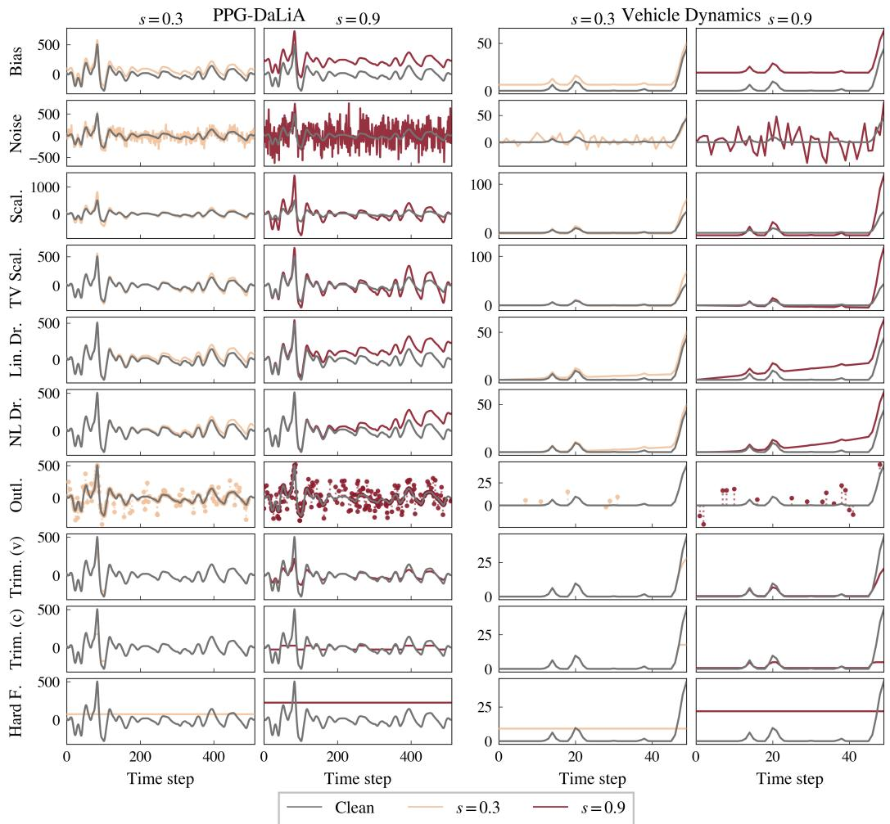  
Figure 4: Illustration of the ten sensor failure modes applied to a representative input window from PPG-DaLiA (left) and Vehicle Dynamics (right). Each failure is shown at two severity levels alongside the clean signal, highlighting the qualitative differences between additive, multiplicative, drift-based, saturation-based, and stuck-at corruptions.

## D Nominal performance

Table 8 reports clean-data RMSE for every (model, dataset) pair. Because per-dataset RMSE spans four orders of magnitude, we aggregate with the best-normalized geometric mean (GM). ModernTCN leads on six of nine datasets $( \mathrm { G M } = 1 . 0 2 7$ , mean rank 2.2), and all three robustness-aware TST variants pay a clean-data penalty relative to the vanilla backbone (+0.27 to +0.44 in GM).

Table 8: Nominal RMSE with 95% percentile bootstrap confidence intervals (test-set resampling, $n _ { \mathrm { b o o t } } = 2 0 0 )$ . Each cell stacks the upper CI (top, grey), the bootstrap mean (centre, bold if best), and the lower CI (bottom, grey).
<table><tr><td>Model</td><td>PM10</td><td>PM2.5</td><td>Batt.</td><td>HR</td><td>TEP</td><td>Veh.</td><td></td><td>MMR T66-13 T66-14 Rank GM</td><td></td><td></td><td></td></tr><tr><td rowspan="3">XGBoost</td><td>98.097</td><td>67.091</td><td>0.025</td><td>9.727</td><td>0.051</td><td>3.974</td><td>0.122</td><td>0.101</td><td>0.078</td><td rowspan="3">3.7</td><td rowspan="3">1.449</td></tr><tr><td>91.610</td><td>61.040 0.025</td><td></td><td>9.511</td><td></td><td>0.051 3.741</td><td>0.120</td><td>0.098</td><td>0.077</td></tr><tr><td>85.757</td><td>56.036</td><td>0.025</td><td>9.300</td><td>0.051</td><td>3.541</td><td>0.117</td><td>0.095</td><td>0.076</td></tr><tr><td rowspan="3">CatBoost</td><td>98.480</td><td>67.400</td><td>0.011</td><td>9.193</td><td>0.051</td><td>4.047</td><td>0.110</td><td>0.091</td><td>0.081</td><td rowspan="3">3.2</td><td rowspan="3">1.297</td></tr><tr><td>92.052</td><td>61.351 0.011</td><td></td><td>9.022</td><td>0.051 3.839</td><td></td><td>0.109</td><td>0.087</td><td>0.080</td></tr><tr><td>86.119</td><td>56.008</td><td>0.011</td><td>8.811</td><td>0.051</td><td>3.652</td><td>0.107</td><td>0.085</td><td>0.079</td></tr><tr><td rowspan="3">M-TCN</td><td>96.674</td><td>65.837</td><td>0.009</td><td>2.484</td><td>0.055</td><td>2.518</td><td>0.118</td><td>0.076</td><td>0.080</td><td rowspan="3">2.2</td><td rowspan="3">1.027</td></tr><tr><td>90.942</td><td>60.060</td><td>0.009</td><td>2.411</td><td>0.055 2.356</td><td></td><td>0.116</td><td>0.074</td><td>0.079</td></tr><tr><td>85.371</td><td>55.037</td><td>0.009</td><td>2.344</td><td>0.055</td><td>2.220</td><td>0.115</td><td>0.072</td><td>0.078</td></tr><tr><td rowspan="3">P-TSMixer</td><td>109.455</td><td>72.728</td><td>0.033</td><td>9.587</td><td>0.054</td><td>4.076</td><td>0.276</td><td>0.146</td><td>0.150</td><td rowspan="3">7.7</td><td rowspan="3">1.889</td></tr><tr><td>102.740</td><td>67.104 0.033</td><td></td><td>9.321</td><td>0.054 3.876</td><td></td><td>0.269</td><td>0.142</td><td>0.148</td></tr><tr><td>97.036</td><td>61.907</td><td>0.033</td><td>9.024</td><td>0.054</td><td>3.716</td><td>0.264</td><td>0.140</td><td>0.146</td></tr><tr><td rowspan="3">xLSTM-M</td><td>100.817</td><td>70.090</td><td>0.009</td><td>7.632</td><td>0.053</td><td>4.126</td><td>0.103</td><td>0.077</td><td>0.082</td><td rowspan="3">3.3</td><td rowspan="3">1.222</td></tr><tr><td>94.353</td><td>63.377 0.009</td><td></td><td>7.371</td><td>0.052 3.790</td><td></td><td>0.101</td><td>0.075</td><td>0.081</td></tr><tr><td>88.400</td><td>57.810</td><td>0.009</td><td>7.166</td><td>0.052</td><td>3.479</td><td>0.100</td><td>0.073</td><td>0.080</td></tr><tr><td rowspan="3">TST</td><td>103.926</td><td>70.092</td><td>0.017</td><td>7.035</td><td>0.054</td><td>4.023</td><td>0.113</td><td>0.080</td><td>0.083</td><td rowspan="3">4.4</td><td rowspan="3">1.329</td></tr><tr><td>97.340</td><td>63.627 0.017</td><td></td><td>6.889</td><td>0.054 3.789</td><td></td><td>0.112</td><td>0.078</td><td>0.082</td></tr><tr><td>91.163</td><td>58.515</td><td>0.017</td><td>6.748</td><td>0.054</td><td>3.561</td><td>0.110</td><td>0.076</td><td>0.081</td></tr><tr><td rowspan="3">TST-PGD</td><td>102.189</td><td>67.419</td><td>0.024</td><td>13.264</td><td>0.055</td><td>3.669</td><td>0.211</td><td>0.140</td><td>0.141</td><td rowspan="3">6.2</td><td rowspan="3">1.764 ↑+0.435</td></tr><tr><td>94.721</td><td>61.901</td><td>0.024 13.069</td><td></td><td>0.054 3.455</td><td></td><td>0.207</td><td>0.136</td><td>0.138</td></tr><tr><td>88.588</td><td>57.215</td><td>0.024</td><td>12.852</td><td>0.054</td><td>3.246</td><td>0.204</td><td>0.132</td><td>0.136</td></tr><tr><td rowspan="3">TST-ISensD</td><td>102.909</td><td>72.737</td><td>0.026</td><td>12.238</td><td>0.054</td><td>4.887</td><td>0.159</td><td>0.110</td><td>0.109</td><td rowspan="3">7.3</td><td rowspan="3">1.687 ↑+0.358</td></tr><tr><td>95.732</td><td>67.344</td><td>0.026</td><td>12.052</td><td>0.054</td><td>4.654</td><td>0.156</td><td>0.107</td><td>0.108</td></tr><tr><td>89.714</td><td>62.294</td><td>0.025</td><td>11.852</td><td>0.054</td><td>4.401</td><td>0.153</td><td>0.105</td><td>0.106</td></tr><tr><td rowspan="3">TST-F2F</td><td>117.895 108.129</td><td>68.616</td><td>0.012</td><td>15.820</td><td>0.061</td><td>4.545</td><td>0.151</td><td>0.110</td><td>0.110</td><td rowspan="3">6.9</td><td rowspan="3">1.601 ↑+0.272</td></tr><tr><td>100.705</td><td>62.415 58.105</td><td>0.01215.471</td><td></td><td>0.061 4.283</td><td></td><td>0.148 0.144</td><td>0.107 0.104</td><td>0.108 0.106</td></tr><tr><td></td><td></td><td>0.012</td><td>15.151</td><td>0.060</td><td>4.042</td><td></td><td></td><td></td></tr></table>

## E Normalized performance under corruption (nPC)

Dividing mPC by the RMSE of the naïve mean predictor, a severity-invariant baseline that always predicts the training-set mean, yields:

$$
\mathrm { n P C } = \frac { \mathrm { m P C } } { \mathrm { R M S E } _ { \mathrm { n a i v e } } } .\tag{4}
$$

A value below 1 indicates that the model adds value over this trivial reference; a value of 1 marks the point at which the model is, on average, no better than the naïve predictor. The omnibus test is not significant (see Appendix J), so results should be read descriptively.

Table 9: nPC per model and dataset. Bold = best, underline = second-best per column. GM is the geometric mean across datasets; arrows show GM change vs. TST.
<table><tr><td>Model</td><td>PM10 PM2.5 Batt. HR TEP Veh. MMR T66-13 T66-14 Rank GM</td></tr><tr><td>XGBoost 0.712</td><td>0.587 0.227 0.543 0.768 0.537</td></tr><tr><td>0.259 CatBoost 0.724 0.597 0.172 0.503 0.767 0.604</td></tr><tr><td>0.256 0.303 M-TCN 0.724 0.611 0.345 0.231 0.876 1.3780.334 0.374</td></tr><tr><td>P-TSMixer 0.785 0.658 0.358 0.449 0.814 0.9580.522</td></tr><tr><td>0.589 0.559 7.2 0.607 xLSTM-M 0.721 0.595 0.215 0.423 0.789 0.540 0.280 0.339 0.319 3.0 0.430</td></tr><tr><td>TST 0.779 0.651 0.270 0.549 0.810 0.988 0.330 0.395 0.387 6.0</td></tr><tr><td>0.525 0.384 0.509 ↓-0.016</td></tr><tr><td>TST-PGD 0.743 0.584 0.285 0.674 0.819 0.553 0.381 0.414 5.6 TST-ISensD 0.796 0.659 0.443 0.673 0.819 0.6850.370 0.474 0.452 7.7 0.576 ↑+0.051</td></tr><tr><td>TST-F2F 0.868 0.6080.113 1.032 1.115 0.6000.276 0.331 0.290 5.1 0.469 ↓-0.056</td></tr></table>

## F Metric discussion

Relationship between rPC and nPC. The two normalized metrics are linked by a model-specific scaling factor:

$$
\mathrm { \ r P C = n P C \times \frac { R M S E _ { \mathrm { n a i v e } } } { R M S E _ { \mathrm { c l e a n } } } . }\tag{5}
$$

The ratio $\mathrm { R M S E _ { n a i v e } / R M S E _ { c l e a n } }$ is itself interpretable: it measures how much better than naïve the model is on clean data, and thus quantifies the headroom available for degradation before the model becomes useless.

Relationship to mCE. The normalized Performance under Corruption (nPC) is analogous to the mean Corruption Error (mCE) of ImageNet-C [9], with one deliberate departure in the choice of reference. In the original ImageNet-C protocol, each corruption type’s summed error is normalized by AlexNet’s error on that same corruption, equalizing the difficulty of different corruption types in the denominator. nPC instead uses the naïve mean predictor, a severity-invariant baseline, as a single, shared reference. Because this denominator is constant across models, severities, and failure modes, differences in nPC directly reflect the intrinsic difficulty of each failure mode and dataset, which we consider informative for practitioners assessing deployment risk. This choice also means that nPC preserves difficulty differences across failure modes as a finding of interest, rather than normalizing them away.

Relationship between rPC, Relative mCE, and the Robustness Score. The relative Performance under Corruption (rPC) was introduced by Michaelis et al. [14] to isolate degradation from nominal accuracy by normalizing with the model’s own clean-data performance. Hendrycks and Dietterich [9] achieve the same goal with the Relative mCE, which subtracts the clean error rate before normalizing by AlexNet. Windmann et al. [12] define a closely related quantity, the relative performance ratio $u _ { \mathrm { r e l } } = \mathrm { R M S E } _ { \mathrm { c l e a n } } / \mathrm { R M S E } _ { d , c , s }$ , which is simply the reciprocal of the per-combination degradation ratio. We use the rPC that shares the “lower-is-better” direction of mPC, making tables and rankings immediately readable without direction-switching.

## G Per-failure-mode evaluation

The main evaluation aggregates over all failure modes, features, and severities into a single mPC and rPC per model and dataset. Here we report both metrics perfailure mode, retaining the average over features and severities but disaggregating across failure modes to reveal which corruption types drive the overall scores.

Computation. For a given failure mode $d \in \mathcal { D }$ , we restrict the summation in Equation (1) to that mode and define

$$
\mathrm { m P C } _ { d } = \frac { 1 } { \left| \mathcal { C } \right| \left| \boldsymbol { S } \right| } \sum _ { c \in \mathcal { C } } \sum _ { s \in \mathcal { S } } \mathrm { R M S E } _ { d , c , s } ,\tag{6}
$$

the mean RMSE under failure mode $d ,$ averaged over all affected features c and severities s. The per-failure-mode relative metric follows Equation (2) directly:

$$
\mathrm { r P C } _ { d } = \frac { \mathrm { m P C } _ { d } } { \mathrm { R M S E } _ { \mathrm { c l e a n } } } .\tag{7}
$$

Cross-dataset aggregation. We aggregate across datasets using the same protocol as in the main paper (Section 3.3). $\mathrm { r P C } _ { d }$ is a dimensionless ratio and enters the geometric mean directly. m $\mathrm { P C } _ { d }$ carries dataset-specific units; for each dataset–failure-mode pair we first normalize by the best model (1.0 = best), then take the geometric mean across datasets.

Failure-mode difficulty. To rank failure modes by difficulty we compute, for each failure mode d, the geometric mean across all models, of $\mathrm { r P C } _ { d }$ for the relative view and of the normalized m $\mathrm { P C } _ { d }$ for the absolute view. A higher value indicates that the failure mode causes larger degradation on average; the rPC-based ranking is independent of nominal accuracy, while the mPC-based ranking additionally reflects absolute error magnitude. Tables 10 and 11 sort rows by the respective difficulty score in ascending order (easiest to hardest).

Analysis. The per-failure-mode breakdown reveals substantial heterogeneity in corruption difficulty. The easiest failure modes increase rPC only marginally above 1, whereas the hardest modes raise it considerably, motivating the finer-grained view provided here as a complement to the aggregate scores in the main paper. Model rankings also shift across failure modes: a model that leads under one corruption type may be among the most affected under another, highlighting the practical value of per-failure-mode reporting for practitioners selecting models for deployment environments with known sensor characteristics. Full per-failure-mode tables are provided in Tables 10 and 11.

Table 10: Per-failure-mode normalized mPC. Rows sorted by difficulty (top = easiest). Bold = best model per failure mode; green/red cells = each model’s best/worst failure mode; shaded columns are robust TST variants. GM = geometric mean across models.
<table><tr><td>Failure</td><td>XGBoost CatBoost M-TCN P-TSMixer xLSTM-M TST</td><td></td><td></td><td></td><td></td><td></td><td></td><td>TST-PGD TST-ISensD TST-F2F</td><td></td><td>GM</td></tr><tr><td>Trim. (c)</td><td>1.248</td><td>1.173</td><td>1.076</td><td>1.666</td><td>1.140</td><td>1.2501.511</td><td></td><td>1.360</td><td>1.366</td><td>1.299</td></tr><tr><td>Trim. (v)</td><td>1.301</td><td>1.200</td><td>1.035</td><td>1.691</td><td>1.153</td><td></td><td>1.2441.574</td><td>1.471</td><td>1.469</td><td>1.333</td></tr><tr><td>Outl.</td><td>1.227</td><td>1.128</td><td>1.057</td><td>1.664</td><td>1.114</td><td>1.418</td><td>1.656</td><td>1.833</td><td>1.437</td><td>1.368</td></tr><tr><td>TV Scal.</td><td>1.216</td><td>1.148</td><td>1.303</td><td>1.670</td><td>1.224</td><td>1.367</td><td>1.460</td><td>1.635</td><td>1.424</td><td>1.372</td></tr><tr><td>Scal.</td><td>1.174</td><td>1.133</td><td>1.584</td><td>1.684</td><td>1.176</td><td>1.481</td><td>1.428</td><td>1.670</td><td>1.500</td><td>1.411</td></tr><tr><td>Noise</td><td>1.149</td><td>1.100</td><td>1.518</td><td>1.599</td><td>1.033</td><td>1.5451.503</td><td></td><td>2.016</td><td>1.553</td><td>1.417</td></tr><tr><td>Hard F.</td><td>1.221</td><td>1.232</td><td>1.713</td><td>1.830</td><td>1.284</td><td>1.7311.372</td><td></td><td>1.500</td><td>1.202</td><td>1.436</td></tr><tr><td>NL Dr.</td><td>1.349</td><td>1.290</td><td>1.331</td><td>1.830</td><td>1.444</td><td>1.5501.496</td><td></td><td>1.691</td><td>1.285</td><td>1.464</td></tr><tr><td>Lin. Dr.</td><td>1.319</td><td>1.287</td><td>1.438</td><td>1.849</td><td>1.414</td><td></td><td>1.5921.455</td><td>1.685</td><td>1.258</td><td>1.467</td></tr><tr><td>Bias</td><td>1.273</td><td>1.270</td><td>1.736</td><td>1.864</td><td>1.343</td><td></td><td>1.7171.430</td><td>1.677</td><td>1.241</td><td>1.489</td></tr></table>

## H Mean imputation as a failure mitigation strategy

The main benchmark evaluates robustness across a wide range of failure modes, severities, and affected channels. In this section we analyze a practically relevant special case: a deployment scenario in which (i) a reliable failure detection mechanism is available, and (ii) the operator can intervene on the input signal. When a sensor is detected as faulty, the simplest corrective action is to replace the failing channel with its training-set mean, which, under z-score normalization, amounts to setting it to zero. This corresponds to the hard-fault failure mode at severity s = 0 in our benchmark.

Metrics. Since both the failure mode and severity are fixed, the mPC and rPC definitions (Eqs. (1)– (2)) reduce to an average over affected channels only:

$$
\mathrm { m P C } _ { \mathrm { h f , 0 } } = \frac { 1 } { | \mathcal { C } | } \sum _ { c \in \mathcal { C } } \mathrm { R M S E } _ { \mathrm { h f , } c , 0 } ,\tag{8}
$$

$$
\mathrm { r P C _ { h f , 0 } } = \frac { \mathrm { m P C _ { h f , 0 } } } { \mathrm { R M S E _ { c l e a n } } } .\tag{9}
$$

Table 11: Per-failure-mode rPC. Rows sorted by difficulty (top = easiest). Bold = best model per failure mode; green/red cells = each model’s best/worst failure mode; shaded columns are robust TST variants. GM = geometric mean of rPC across models.
<table><tr><td>Failure</td><td colspan="6">XGBoost CatBoost M-TCN P-TSMixer xLSTM-M TST</td><td></td><td>TST-PGD TST-ISensD TST-F2F</td><td></td><td>GM</td></tr><tr><td>Trim. (v)</td><td>1.047</td><td>1.080</td><td>1.177</td><td>1.044</td><td>1.100</td><td></td><td>1.092 1.041</td><td>1.017</td><td>1.070</td><td>1.073</td></tr><tr><td>Trim. (c)</td><td>1.089</td><td>1.144</td><td>1.327</td><td>1.116</td><td>1.180</td><td></td><td>1.190 1.084</td><td>1.020</td><td>1.079</td><td>1.134</td></tr><tr><td>Outl.</td><td>1.067</td><td>1.096</td><td>1.298</td><td>1.110</td><td>1.148</td><td></td><td>1.3441.183</td><td>1.368</td><td>1.131</td><td>1.189</td></tr><tr><td>TV Scal.</td><td>1.143</td><td>1.206</td><td>1.729</td><td>1.204</td><td>1.364</td><td></td><td>1.4001.127</td><td>1.319</td><td>1.211</td><td>1.289</td></tr><tr><td>NL Dr.</td><td>1.338</td><td>1.430</td><td>1.863</td><td>1.392</td><td>1.698</td><td>1.675</td><td>1.219</td><td>1.440</td><td>1.153</td><td>1.451</td></tr><tr><td>Scal.</td><td>1.216</td><td>1.311</td><td>2.315</td><td>1.337</td><td>1.443</td><td>1.671</td><td>1.215</td><td>1.484</td><td>1.405</td><td>1.460</td></tr><tr><td>Noise</td><td>1.255</td><td>1.342</td><td>2.339</td><td>1.339</td><td>1.336</td><td>1.839</td><td>1.348</td><td>1.890</td><td>1.534</td><td>1.547</td></tr><tr><td>Lin. Dr.</td><td>1.396</td><td>1.522</td><td>2.148</td><td>1.501</td><td>1.774</td><td></td><td>1.8361.265</td><td>1.531</td><td>1.205</td><td>1.552</td></tr><tr><td>Bias</td><td>1.548</td><td>1.725</td><td>2.978</td><td>1.738</td><td>1.935</td><td></td><td>2.2751.428</td><td>1.750</td><td>1.365</td><td>1.809</td></tr><tr><td>Hard F.</td><td>1.634</td><td>1.843</td><td>3.238</td><td>1.879</td><td>2.038</td><td></td><td>2.526 1.509</td><td>1.725</td><td>1.456</td><td>1.922</td></tr></table>

Cross-dataset aggregation follows the protocol in Section $3 . 3 \mathrm { : \ r P C _ { h f , 0 } }$ enters the geometric mean directly; $\mathrm { m P C _ { h f , 0 } }$ is first normalized per dataset by the best model before computing the geometric mean.

Results. Tables 12 and 13 report mPC and rPC for all models under this scenario. TST-ISensD achieves the best geometric-mean rPC (1.034) and mPC (1.072) as well as the best mean rank on both metrics, and on rPC significantly outranks CatBoost, xLSTM-M, TST, and M-TCN (Appendix J). On rPC, TST-ISensD attains near-perfect scores close to 1.0 on every dataset, indicating virtually no degradation when a channel is replaced by its mean, a direct consequence of its training procedure, which randomly drops input channels by setting them to zero. The model has explicitly learned to produce accurate predictions when any single channel is absent. Among the remaining models, TST-F2F (GM rPC 1.208) and TST-PGD (1.275) also improve substantially over the base TST (1.718), though neither approaches ISensD’s consistency.

Practical implication. These results suggest that when reliable failure detection and input intervention are available, ISensD, a simple dropout-based augmentation applied to input channels during training, provides an effective and easy-to-implement strategy. It transforms a scenario that degrades most models into one where prediction quality is on average nearly unaffected, without requiring architectural changes or adversarial training.

Table 12: mPC under mean imputation (hard-fault at severity s=0); Bold/underline: best/second-best per column. GM is the geometric mean of best-normalized values (1.0 = best); arrows show GM change vs. TST.
<table><tr><td>Model</td><td>PM10</td><td>PM2.5</td><td>Batt.</td><td>HR</td><td>TEP</td><td>Veh. </td><td>MMR T66-13 T66-14 Rank GM</td><td></td><td></td><td></td><td></td></tr><tr><td>XGBoost</td><td>98.61</td><td>68.43</td><td>0.07</td><td>13.58</td><td>0.05</td><td>4.82</td><td>0.18</td><td>0.12</td><td>0.10</td><td>3.9</td><td>1.209</td></tr><tr><td>CatBoost</td><td>101.66</td><td>68.81</td><td>0.06</td><td>12.92</td><td>0.05</td><td>4.83</td><td>0.17</td><td>0.11</td><td>0.12</td><td>3.4</td><td>1.195</td></tr><tr><td>M-TCN</td><td>99.15</td><td>71.02</td><td>0.07</td><td>8.18</td><td>0.06</td><td>11.17</td><td>0.19</td><td>0.12</td><td>0.13</td><td>5.6</td><td>1.304</td></tr><tr><td>P-TSMixer</td><td>106.20</td><td>73.66</td><td>0.10</td><td>12.22</td><td>0.05</td><td>7.09</td><td>0.34</td><td>0.23</td><td>0.23</td><td>7.2</td><td>1.658</td></tr><tr><td>xLSTM-M</td><td>101.45</td><td>71.94</td><td>0.06</td><td>13.00</td><td>0.05</td><td>4.65</td><td>0.18</td><td>0.11</td><td>0.12</td><td>3.9</td><td>1.208</td></tr><tr><td>TST</td><td>108.01</td><td>76.68</td><td>0.06</td><td>15.12</td><td>0.05</td><td>9.03</td><td>0.20</td><td>0.13</td><td>0.14</td><td>6.8</td><td>1.403</td></tr><tr><td>TST-PGD</td><td>112.96</td><td>67.15</td><td>0.07</td><td>16.54 0.05</td><td></td><td>5.37</td><td>0.23</td><td>0.15</td><td>0.15</td><td>6.8</td><td>1.381 ↓-0.021</td></tr><tr><td>TST-ISensD</td><td>97.07</td><td>67.90</td><td>0.03</td><td>13.21 0.05</td><td></td><td>4.62</td><td>0.16</td><td>0.11</td><td>0.11</td><td>2.2</td><td>1.072↓-0.331</td></tr><tr><td>TST-F2F</td><td>114.68</td><td>70.63</td><td>0.03</td><td>17.61 0.07</td><td></td><td>4.98</td><td>0.16</td><td>0.12</td><td>0.11</td><td>5.2</td><td>1.188 ↓-0.215</td></tr></table>

Table 13: rPC under mean imputation (hard-fault at severity s=0); Bold/underline: best/second-best per column. GM is the geometric mean across datasets; arrows show GM change vs. TST.
<table><tr><td>Model</td><td>PM10 PM2.5</td><td>Batt.</td><td>HR</td><td></td><td>TEP</td><td>Veh. MMR</td><td></td><td></td><td></td><td>T66-13 T66-14 Rank GM</td><td></td></tr><tr><td>XGBoost</td><td>1.076</td><td>1.121</td><td>2.855</td><td>1.428</td><td></td><td>1.0071.289</td><td>1.482</td><td>1.257</td><td>1.319</td><td>4.8</td><td>1.358</td></tr><tr><td>CatBoost</td><td>1.104</td><td>1.122</td><td></td><td></td><td></td><td>5.602 1.432 1.007 1.258</td><td>1.596</td><td>1.306</td><td>1.464</td><td>5.7</td><td>1.500</td></tr><tr><td>M-TCN</td><td>1.090</td><td>1.182</td><td></td><td></td><td></td><td>7.315 3.3931.043 4.741</td><td>1.677</td><td>1.601</td><td>1.628</td><td>8.0</td><td>2.068</td></tr><tr><td>P-TSMixer</td><td>1.034</td><td>1.098</td><td>2.988 1.311 1.004 1.830</td><td></td><td></td><td></td><td>1.249</td><td>1.594</td><td>1.525</td><td>4.6</td><td>1.429</td></tr><tr><td>xLSTM-M</td><td>1.075</td><td>1.135</td><td>6.6581.764 1.0061.228</td><td></td><td></td><td></td><td>1.758</td><td>1.505</td><td>1.539</td><td>6.2</td><td>1.609</td></tr><tr><td>TST</td><td>1.110</td><td>1.205</td><td>3.685 2.195 1.005</td><td></td><td></td><td>2.383</td><td>1.749</td><td>1.667</td><td>1.727</td><td>7.7</td><td>1.718</td></tr><tr><td>TST-PGD</td><td>1.193</td><td>1.085</td><td>2.728</td><td>1.265</td><td>1.003</td><td>1.553</td><td>1.098</td><td>1.069</td><td>1.090</td><td>3.6</td><td>1.275 ↓-0.443</td></tr><tr><td>TST-ISensD</td><td>1.014</td><td>1.008</td><td>1.160 1.096 0.999 0.992</td><td></td><td></td><td></td><td>1.016</td><td>1.014</td><td>1.021</td><td>1.0</td><td>1.034↓-0.684</td></tr><tr><td>TST-F2F</td><td>1.061</td><td>1.132</td><td>2.4051.1381.1261.163</td><td></td><td></td><td></td><td>1.109</td><td>1.080</td><td>1.064</td><td>3.6</td><td>1.208 ↓-0.510</td></tr></table>

## I Severity curves

The aggregate scores in the main paper compress an entire severity sweep into a single number per (model, dataset) pair. To give the reader a sense of the underlying behaviour, we show four illustrative slices of the full sweep: per-failure-mode severity curves on two datasets, heartrate estimation (HR) and tire temperature estimation (Veh.), for two model groupings. Figures 5 and 6 compare three non-robustified baselines (XGBoost, xLSTM-M, M-TCN); Figures 7 and 8 compare vanilla TST against its adversarially-trained variant TST-PGD.

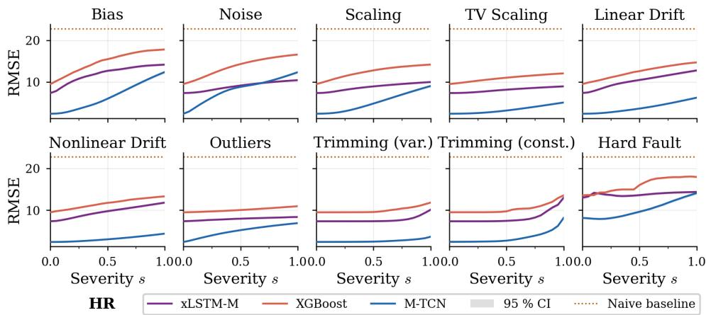

Figure 5: HR severity curves: XGBoost, xLSTM-M, M-TCN.  
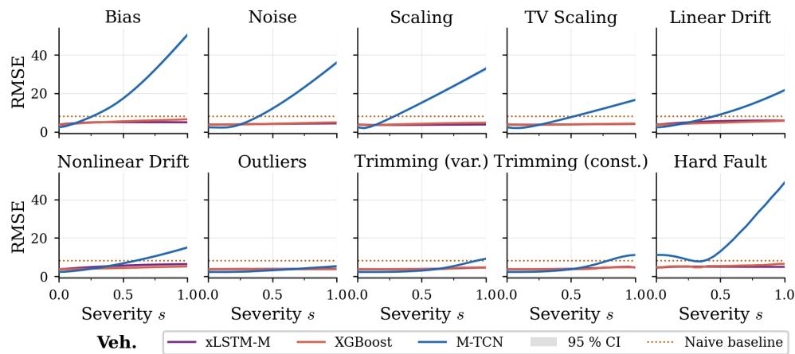  
Figure 6: Veh. severity curves: XGBoost, xLSTM-M, M-TCN.

Baseline behaviour across datasets. On HR (Figure 5), M-TCN starts from a substantially lower clean RMSE than xLSTM-M or XGBoost, reflecting its strong nominal performance (Appendix D). Although M-TCN degrades faster in relative terms, its absolute corrupted RMSE remains lowest across most failure modes, which is exactly what mPC rewards: M-TCN is the best mPC model on HR (Table 2). On Vehicle Dynamics (Figure 6), the picture inverts. M-TCN collapses under tire-temperature corruption, degrading far more sharply than the other models and ending well above them at high severity. This is consistent with M-TCN’s worst-on-dataset rPC and its weakest mPC ranking on Vehicle Dynamics (Tables 2 and 3).

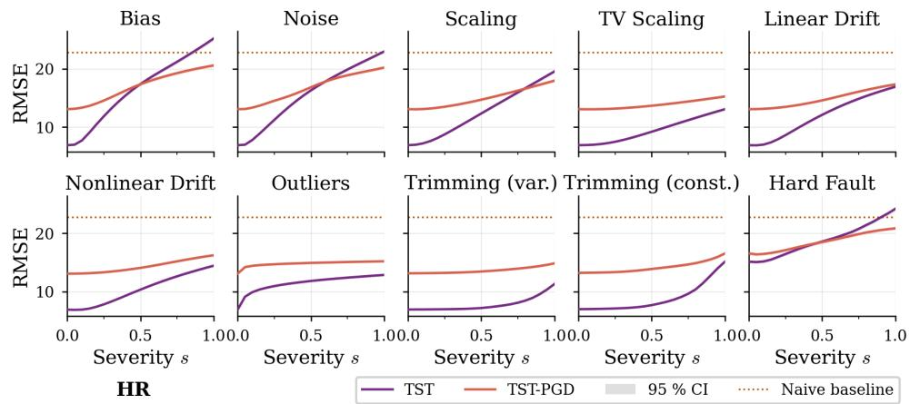

Figure 7: HR severity curves: TST vs. TST-PGD.  
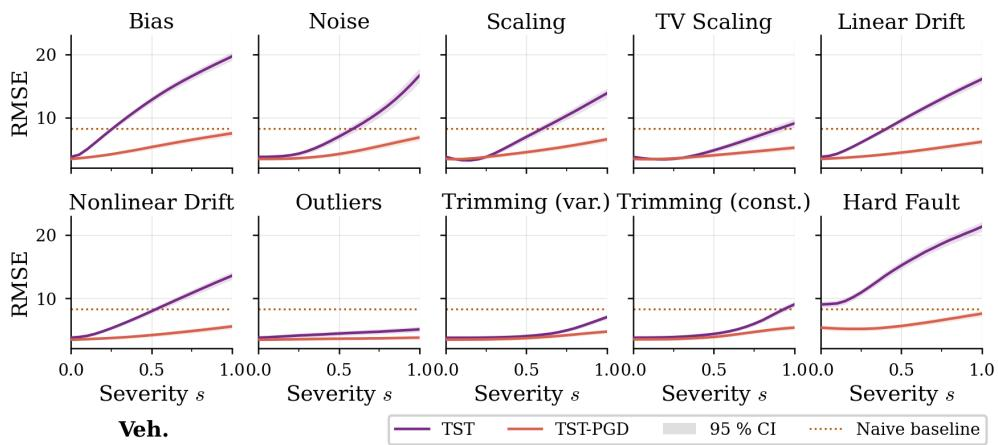  
Figure 8: Veh. severity curves: TST vs. TST-PGD.

Effect of adversarial training. On HR (Figure 7), TST-PGD starts from a noticeably worse clean RMSE than vanilla TST but degrades more gradually with severity. The clean-data penalty raises TST-PGD’s mPC above TST’s on this dataset; yet rPC, places TST-PGD second on HR (Table 3), correctly identifying the underlying relative robustness gain that mPC obscures. On Vehicle Dynamics (Figure 8), nominal performance is comparable between the two models, while relative degradation is markedly smaller for TST-PGD across most failure modes. With no clean-data penalty to offset, this robustness gain registers on both mPC and rPC. The two PGD examples together show how rPC and mPC can agree or diverge depending on whether robustification incurs a nominal cost.

## J Statistical significance testing

We follow the Demšar [38] protocol as implemented by autorank [46]: Shapiro–Wilk normality tests select between Bartlett’s (normal) or Levene’s (non-normal) homogeneity test, which determines whether parametric (ANOVA + Tukey HSD) or non-parametric (Friedman + Nemenyi) tests are applied (α = 0.05). Results are summarized in Table 14; for metrics with a significant omnibus result, we additionally report critical difference (CD) diagrams that visualize mean ranks and non-significant clusters (connected by horizontal bars).

Table 14: Significance results. N: observations; k: models.
<table><tr><td>Metric</td><td>Test</td><td>N</td><td>k p</td><td>Post-hoc</td><td></td></tr><tr><td>nom</td><td>Friedman</td><td>9</td><td>9</td><td> $< 0 . 0 0 1$ </td><td>Nemenyi</td></tr><tr><td> $\mathrm { { \ m P C } }$ </td><td>Friedman</td><td>9</td><td>9</td><td>&lt; 0.001</td><td>Nemenyi</td></tr><tr><td> $\mathrm { \ m P C _ { h f 0 } }$ </td><td>Friedman</td><td>9</td><td>9</td><td>&lt; 0.001</td><td>Nemenyi</td></tr><tr><td> $\mathrm { r P C }$ </td><td>Friedman</td><td>9</td><td>9</td><td>&lt; 0.001</td><td>Nemenyi</td></tr><tr><td> $\mathrm { { r P C } _ { \mathrm { { h f 0 } } } }$ </td><td>Friedman</td><td>9</td><td>9</td><td>&lt; 0.001</td><td>Nemenyi</td></tr><tr><td> $s _ { \mathrm { c r o s s } }$ </td><td>Friedman</td><td>9</td><td>9</td><td>0.187</td><td></td></tr><tr><td> $\mathrm { \Omega } _ { \mathrm { n { P C } } }$ </td><td>ANOVA</td><td>9</td><td>9</td><td>0.069</td><td></td></tr></table>

Nominal Performance M-TCN attains the best mean rank, with the tree ensembles, xLSTM-M, plain TST and TST-PGD forming the leading non-significant cluster (Figure 9); the other robustified TST variants and P-TSMixer rank significantly worse.

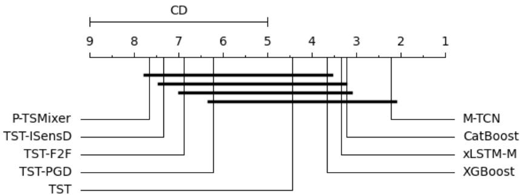  
Figure 9: Critical difference diagram for nominal performance (nom). $\mathrm { C D } = 4 . 0 0 4$

mPC XGBoost, CatBoost, and xLSTM-M move to the top, all three significantly outranking P-TSMixer and TST-ISensD (Figure 10). M-TCN, the nominal leader, drops to mid-pack but remains within the leading non-significant cluster.

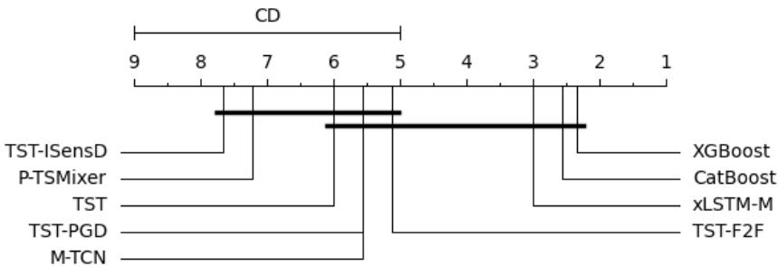  
Figure 10: Critical difference diagram for mean performance under corruption (mPC). CD = 4.004.

mPC at hard fault with zero severity The ranking shifts substantially relative to mPC: TST-ISensD moves to the top, while plain TST, TST-PGD, and P-TSMixer rank significantly worse than the leader (Figure 11).

rPC TST-PGD, XGBoost, and P-TSMixer lead the ranking; M-TCN ranks last and plain TST is significantly outranked by all three top models (Figure 12). All three robustified TST variants join the top non-significant cluster, meaning robustification eliminates TST’s significant deficit.

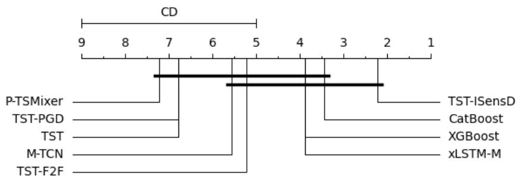  
Figure 11: Critical difference diagram for mPC restricted to the hard fault with zero severity. CD = 4.004.

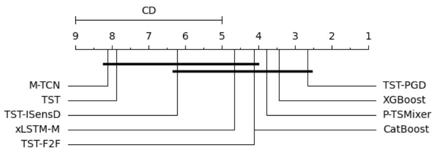  
Figure 12: Critical difference diagram for relative performance under corruption (rPC). $\mathrm { C D } = 4 . 0 0 4 $

rPC at hard fault with zero severity TST-ISensD ranks best by a large margin and is significantly better than CatBoost, xLSTM-M, plain TST, and M-TCN (Figure 13).

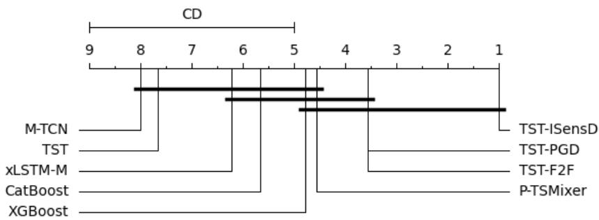  
Figure 13: Critical difference diagram for rPC restricted to the hard fault with zero severity. CD = 4.004.

Baseline crossing severity $s _ { \mathrm { c r o s s } }$ Differences are not statistically significant (Friedman, $p = 0 . 1 8 7 )$ no post-hoc comparisons are performed and no CD diagram is reported.

nPC The omnibus test is not significant (ANOVA, $p = 0 . 0 6 9 ) ;$ ; no post-hoc comparisons are performed and no CD diagram is reported. Descriptively, XGBoost, CatBoost, and xLSTM-M rank best, while P-TSMixer and TST-ISensD rank worst, mirroring the aggregate mPC ordering. This is expected since the naive baseline rescaling is constant across models for one dataset, therefore withindataset ranks are identical to mPC. The discrepancy in significance arises because the normality-test outcomes route nPC to ANOVA and mPC to the Friedman test.

## K Package API reference

This appendix supplements the minimal example in Listing 1 with the details needed to integrate arbitrary models and extend the evaluation suite.

Data format. All input arrays follow an (N, T, C) layout: N samples, T time steps, C sensor channels. Labels are one-dimensional arrays of shape (N,). Data is z-score normalized per channel before any failure mode is applied.

Registering a model. Exactly one of predict\_fn or model must be supplied. predict\_fn is a callable taking a numpy array of shape (N, T, C) and returning predictions of shape (N,); model is a PyTorch nn.Module or a scikit-learn estimator with .predict:

```python
def predict_fn(X: np.ndarray) -> np.ndarray:
"""X: (N, T, C) -> predictions: (N,)"""
testbed.add_model("MyFn", predict_fn=predict_fn)
testbed.add_model("TCN", model=my_pytorch_module)
testbed.add_model("Ridge", model=sklearn_ridge)
```

Custom datasets. Datasets can be supplied as a benchmark ID (e.g. rob.PPGDalia), a directory of .ts files, an (X\_train, y\_train, X\_test, y\_test[, name]) tuple, or via testbed.add\_dataset(...). The helper rob.prepare\_dataset(df, target, window\_size, ...) converts a time-ordered pandas DataFrame into the windowed arrays expected by the testbed.

Custom metrics. Subclass Metric and register the instance; name becomes a column in the raw DataFrame:

```python
from muvis_c import Metric
class MAEMetric(Metric):
name = "mae"
def compute(self, y_true, y_pred): # both shape (N,)
return float(np.mean(np.abs(y_true - y_pred)))
testbed.add_metric(MAEMetric())
```

Custom failure modes. Subclass SeverityFailure and implement apply, which returns a corrupted copy of X for severity s ∈ [0, 1] applied to channel feature\_idx. The base class stores the maximum perturbation scale self.k:

```python
import torch
from muvis_c import SeverityFailure
class SpikeFailure(SeverityFailure):
"""Single spike at the sequence midpoint."""
def apply(self, X: torch.Tensor, feature_idx: int,
severity: float) -> torch.Tensor:
out = X.clone()
mid = out.shape[1] // 2
out[:, mid, feature_idx] += severity * self.k
return out
testbed.add_failure(SpikeFailure(k=5.0))
```

Testbed configuration. Table 15 lists the constructor arguments.

Table 15: Testbed constructor parameters.
<table><tr><td>Parameter</td><td>Default</td><td>Description</td></tr><tr><td>dataset</td><td>None</td><td>Benchmark ID, path to a .ts directory, or (X_train, y_train, X_test, y_test[, name]) tuple. If None, call add_dataset(...)</td></tr><tr><td>data_root</td><td>None</td><td>before run(). Root directory for benchmark IDs; falls back to $MUVIS_C_DATA_DIR or ~/.muvis_c/data/.</td></tr><tr><td>failures</td><td>all 10 built-in</td><td>Explicit list of SeverityFailure instances (re- places defaults). Mutually exclusive with exclude_failures.</td></tr><tr><td>exclude_failures</td><td>None</td><td>Failure-mode classes to remove from the default set, e.g. [rob.Outliers].</td></tr><tr><td>target_features</td><td>&quot;all&quot;</td><td>Feature indices to corrupt.</td></tr><tr><td>severity_steps</td><td>20</td><td>Number of severity increments in [0, 1] (yields 21 evaluation points).</td></tr><tr><td>k</td><td>3.0</td><td>Default maximum perturbation scale passed to built- in failures.</td></tr><tr><td>seed</td><td>42</td><td>Random seed for reproducibility.</td></tr><tr><td>device scaler</td><td> $" \mathtt { a u t o } "$ </td><td>&quot;cuda&quot;, &quot;mps&quot;, &quot;cpu&quot;, or auto-detect.</td></tr><tr><td></td><td>StandardScaler()</td><td>Per-channel scaler fit on the training set; None skips scaling.</td></tr><tr><td>batch_size</td><td>256</td><td>Batch size used during the sweep.</td></tr></table>

Results object. testbed.run() returns a Results instance wrapping a single pandas DataFrame (Results.raw) with one row per (model, dataset, failure mode, feature, severity) tuple. The DataFrame contains the bootstrap RMSE under corruption (boot\_mean), the clean reference (clean\_boot\_mean), the naive mean-predictor reference (baseline\_boot\_mean), bootstrap confidence intervals, and one column per registered custom metric. Aggregate quantities are exposed as methods that return model × dataset pivot tables (Table 16).

Table 16: Aggregate metrics on Results. RMSE-derived quantities are computed on rows with s > 0 unless noted.
<table><tr><td>Method</td><td>Definition</td><td>Reading</td></tr><tr><td>nominal_rmse()</td><td>Clean RMSE</td><td>Lower is better.</td></tr><tr><td>normalized_performance()</td><td> $\mathrm { R M S E _ { c l e a n } / R M S E _ { b a s e l i n e } }$ </td><td>&lt; 1 beats the naive baseline.</td></tr><tr><td>mpc()</td><td>Mean RMSE under corruption (mPC)</td><td>Same units as RMSE; lower is better.</td></tr><tr><td>npc()</td><td>mPC/RMSEbaseline</td><td>Scale-free; lower is better.</td></tr><tr><td>rpc() rpc_per_failure()</td><td> $\mathrm { m P C / R M S E _ { \mathrm { c l e a n } } }$  rPC per failure mode (averaged1</td><td>1.0 = no degradation. Index = failure mode.</td></tr><tr><td></td><td>over datasets)</td><td></td></tr><tr><td>crossing_severity()</td><td>ure, feature) reaches RMSEbaseline</td><td>Smallest s &gt; 0 at which any (fail- Higher is better; NaN = no crossing.</td></tr><tr><td>mpc_hard_fault_zero()</td><td>mPC restricted to hard-fault rows at s = 0</td><td>Loss of a single channel.</td></tr><tr><td>rpc_hard_fault_zero()</td><td> $\mathrm { m P C _ { h f 0 } / R M S E _ { c l e a n } }$ </td><td>Scale-free counterpart.</td></tr></table>

For inspection and export, Results additionally exposes summary() (formatted score table), to\_csv(output\_dir) (writes output\_dir/per\_severity.csv), and plot\_degradation(...) (RMSE-vs-severity curves with optional filters on dataset, model, failure, or feature).

Multi-dataset evaluation. Per-dataset Results objects are combined with the static Results.merge; the combined object exposes all aggregate methods above:

```python
all_results = []
for ds_id in rob.BENCHMARK_DATASETS:
tb = rob.Testbed(dataset=ds_id)
tb.add_model("MyModel", predict_fn=load_model(ds_id))
all_results.append(tb.run())
combined = rob.Results.merge(all_results)
combined.summary()
```