# Rethinking Critic Learning in PPO: Understanding and Mitigating Value Flattening

Yizhuo Li1,2 \* Jianhao Yan3 \* Yun Luo2†,‡ Zhi Wang4 Futing Wang2 Rong-Xi Tan2,4 Kanghui Tian2 Ganqu Cui2 Ning Ding5 Peilin Zhao1‡ Yafu Li2,6‡ Yu Cheng7‡

1 Shanghai Jiao Tong University 2 Shanghai AI Laboratory 3 Westlake University 4 Nanjing University 5 Tsinghua University 6 The Chinese University of Hong Kong 7 Nanyang Technological University \*Equal Contribution, †Project Lead, ‡Corresponding authors

## ABSTRACT

In reinforcement learning for large language models, Proximal Policy Optimization (PPO) commonly uses a critic to estimate state values and reduce the variance of policy updates. However, we uncover a systematic failure mode in PPO critics, which we call Value Flattening: state values, estimated from multiple Monte Carlo continuations, change sharply across intermediate states while critic predictions remain comparatively flat. We further observe this phenomenon in a controlled FrozenLake environment and find that it becomes more pronounced as the state space grows. Our theoretical and empirical analyses relate Value Flattening to an implicit variance penalty in the critic loss and redundant updates from temporally correlated states with similar gradients. Motivated by these findings, we introduce SParse Proximal Policy Optimization (SP3O), which applies the value loss to only a few well-separated states in each response to mitigate both effects. Experiments on Qwen3-Base show that SP3O with only three states supervised per response can mitigate Value Flattening and consistently improve the learned policy across model sizes and evaluation suites. Together, our results identify Value Flattening as an important yet overlooked failure mode of critic learning in standard PPO and show that a simple sparse supervision strategy can mitigate it.

## 1 Introduction

Reinforcement learning enables large language models to tackle increasingly challenging reasoning tasks that unfold over long trajectories (Kimi Team et al., 2026; Li et al., 2026a; Chen et al., 2026). Such long-horizon tasks pose a fundamental challenge for policy optimization, which requires both fine-grained credit assignment over intermediate decisions and informative advantage estimates at each generation step (Hou et al., 2026; Kazemnejad et al., 2025; Guo et al., 2025; Wang et al., 2026; Gong et al., 2026). Proximal Policy Optimization (PPO) offers a natural framework for meeting these demands by using a critic to estimate state values throughout each trajectory and construct token-level advantages (Schulman et al., 2017; 2015; Yuan et al., 2025; Yue et al., 2025; Qi et al., 2026). This, in turn, places a key requirement on the critic: it must capture meaningful changes in expected success (i.e., the state value) across the trajectory.

However, we find that the critic in standard PPO fails to capture substantial changes in state values across steps within a response. We refer to this phenomenon as Value Flattening. For each intermediate state, we estimate its state value by averaging terminal rewards from multiple independent continuations sampled from the same policy, obtaining Monte Carlo estimates of state values (MC values (Kazemnejad et al., 2025)). We use these estimates as diagnostic references for evaluating critic predictions along individual trajectories. Figure 1 illustrates this mismatch by comparing critic predictions with MC values. Across these trajectories, MC values often exhibit sharp local transitions, whereas critic predictions remain comparatively flat. In some cases, the critic prediction changes in the opposite direction from the MC values. These examples also show that critic predictions remain relatively insensitive to local variation in MC values across training checkpoints and in both correct and incorrect responses, indicating that value flattening is a property of the learned critic rather than a trajectory-specific effect.

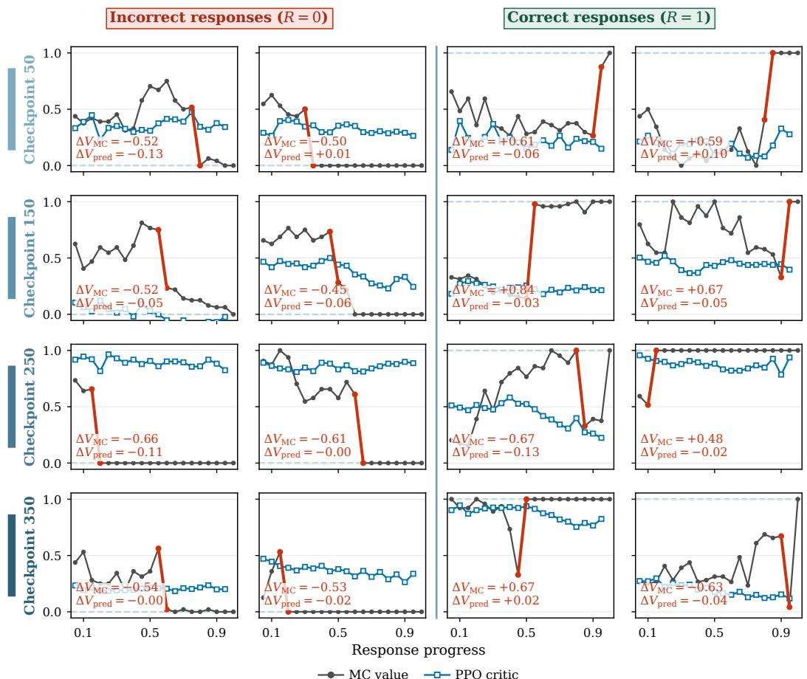  
Figure 1: Value Flattening across training in a Qwen3-4B-Base PPO run on DAPO-Math-17k. Each panel is a distinct correct or incorrect response selected for large local MC value changes. Across checkpoints, the corresponding PPO critic profiles remain comparatively flat, showing weak within response resolution.

To further characterize Value Flattening, we study a stochastic FrozenLake environment, where we vary the maze size while keeping the training configuration fixed. This setting allows us to directly compare critic predictions against state values. We observe that as the maze size increases, critic predictions become progressively smoother and less accurate (Figure 2b,c). Taken together, our observations in LLMs and FrozenLake suggest that Value Flattening is a systematic critic failure mode that may become more pronounced as the state space grows, motivating us to investigate its underlying causes.

To understand these phenomena, we analyze the critic training objective and the temporal dependence in its supervision, identifying two factors that can contribute to Value Flattening (Section 4.2): (1) Implicit Variance Penalty: Under the common setup in PPO training with terminal-only rewards (Yuan et al., 2025; Yue et al., 2025; Hu et al., 2025; Qi et al., 2026), the critic’s mean squared error (MSE) loss is applied at every token position in a response. Our loss decomposition shows that minimizing this objective directly penalizes value variation across all token positions within a response, pushing the predictions toward a flatter value profile. (2) Redundant Updates from Temporal Correlation: LLM states consist of the tokens generated so far, so neighboring states differ by only one token and are highly temporally correlated. We find that nearby states have similar representations and gradients in the critic, with gradient similarity decreasing as the distance between token positions increases. Dense token-level supervision therefore aggregates many similar updates from neighboring states, which can make their predicted values more similar.

Motivated by these findings, we propose SParse Proximal Policy Optimization $\mathrm { ( S P ^ { 3 } O ) }$ . Supervising fewer, more widely separated positions restricts the implicit variance penalty to their predicted values and is designed to reduce redundant updates from temporally correlated states. Experiments show that $\mathrm { S P ^ { 3 } O }$ mitigates Value Flattening and consistently improves actor performance across Qwen3- 4B-Base and Qwen3-8B-Base on mathematical and out-of-distribution reasoning benchmarks. Our contributions are threefold:

• We identify Value Flattening, a systematic mismatch in which state values estimated from multiple Monte Carlo continuations can change sharply within individual responses while PPO critic predictions remain comparatively flat.

• We relate Value Flattening to two factors: the implicit variance penalty in the critic’s mean squared error (MSE) loss, which penalizes value differences across token positions, and redundant updates from temporally correlated states with similar gradients.

• We introduce $\mathrm { S P ^ { 3 } O }$ , which supervises the critic at a few well-separated states to mitigate the effects of the implicit variance penalty and redundant neighboring updates. $\mathrm { S P ^ { 3 } O }$ mitigates Value Flattening and improves policy performance across model scales and evaluation suites.

## 2 Related Work

## 2.1 Critic-Free and Critic-Based RL

Critic-free methods such as RLOO (Ahmadian et al., 2024), GRPO (Shao et al., 2024), and DAPO (Yu et al., 2025) avoid training a value model, but their advantages are derived from complete responses and offer little direct distinction among states within the same response. Recent work such as VIMPO derives an implicit value function to recover finer-grained credit without a separate critic (Kang et al., 2026). Critic-based methods such as PPO instead learn a value function and use its predictions at each generation step to construct token-level advantages (Schulman et al., 2017). Building on PPO, recent methods improve critic initialization and optimization for reasoning or adapt critic-based learning to asynchronous and structured trajectories (Yuan et al., 2025; Yue et al., 2025; Hou et al., 2026; Li et al., 2026b; He et al., 2026; Chen et al., 2025b; Luo et al., 2026; Qi et al., 2026), but provide little analysis of whether their critic predictions capture value changes within individual responses. We study this behavior and identify Value Flattening: PPO critics retain differences across responses but fail to track value changes among states within the same response.

## 2.2 Fine-Grained Credit Assignment and Value Estimation

Prior work obtains intermediate credit through outcomes organized by segments or trees and process supervision (Guo et al., 2025; Hou et al., 2025; Tran et al., 2025; Ielanskyi et al., 2026; Lightman et al., 2023). These signals provide finer feedback but do not directly estimate the policy-conditioned state value: the expected terminal return when the current policy continues from an intermediate state. VinePPO estimates this quantity with auxiliary continuations and improves credit assignment, but fine-grained estimation requires additional rollouts from each evaluated state and can become costly as responses lengthen (Kazemnejad et al., 2025; Wang et al., 2026; Gong et al., 2026; Shan et al., 2026). We build on this line of work by evaluating both response-level discrimination and the ability of PPO critics to track policy-conditioned state-value changes within individual responses across training stages and supervision densities.

## 3 Preliminaries

## 3.1 Proximal Policy Optimization

Given a prompt x, a policy $\pi _ { \theta }$ generates a response $y = ( y _ { 1 } , \dots , y _ { T } )$ and thereby a trajectory τ, where the state and action at step t are $\boldsymbol { s } _ { t } = \left( x , y _ { < t } \right)$ and $a _ { t } = y _ { t }$ . The return from $s _ { t }$ is $\begin{array} { r } { G _ { t } = \sum _ { k = t } ^ { T } \gamma ^ { k - t } r _ { k } } \end{array}$ The per-step reward $r _ { t }$ may combine a task reward with additional shaping terms, such as a KL penalty. PPO estimates advantages from trajectories sampled by $\pi _ { \theta _ { \mathrm { o l d } } }$ and maximizes the clipped surrogate objective (Schulman et al., 2017)

$$
\begin{array} { r } { \mathcal { L } _ { \mathrm { P G } } ( \boldsymbol { \theta } ) = \mathbb { E } _ { t } \Big [ \operatorname* { m i n } \Big ( \rho _ { t } ( \boldsymbol { \theta } ) \widehat { A } _ { t } , \operatorname { c l i p } ( \rho _ { t } ( \boldsymbol { \theta } ) , 1 - \epsilon , 1 + \epsilon ) \widehat { A } _ { t } \Big ) \Big ] , } \end{array}\tag{1}
$$

where $\rho _ { t } ( \theta ) = \pi _ { \theta } ( a _ { t } \mid s _ { t } ) / \pi _ { \theta _ { \mathrm { o l d } } } ( a _ { t } \mid s _ { t } )$ and $\widehat { A } _ { t }$ is the estimated advantage.

PPO uses a critic $V _ { \phi } ( s _ { t } )$ to approximate the policy-conditioned value $V ^ { \pi } ( s _ { t } ) \ = \ \mathbb { E } _ { \pi } [ G _ { t } \ | \ s _ { t } ]$ Generalized advantage estimation (GAE) constructs the actor advantage $\widehat { A } _ { t }$ and the critic regression target $\widehat { G } _ { t }$ as (Schulman et al., 2015):

$$
\delta _ { t } = r _ { t } + \gamma V _ { \phi _ { \mathrm { o l d } } } ( s _ { t + 1 } ) - V _ { \phi _ { \mathrm { o l d } } } ( s _ { t } ) , \qquad \widehat { A } _ { t } = \sum _ { \ell = 0 } ^ { T - t } ( \gamma \lambda ) ^ { \ell } \delta _ { t + \ell } , \qquad \widehat { G } _ { t } = \widehat { A } _ { t } + V _ { \phi _ { \mathrm { o l d } } } ( s _ { t } ) ,\tag{2}
$$

where $V _ { \phi _ { \mathrm { o l d } } } ( s _ { T + 1 } ) = 0$ . For a rollout batch B, the standard critic update is:

$$
\mathcal { L } _ { V } ( \phi ) = \frac { 1 } { \sum _ { \tau \in B } T _ { \tau } } \sum _ { \tau \in B } \sum _ { t = 1 } ^ { T _ { \tau } } \Big ( V _ { \phi } ( s _ { t } ) - \widehat G _ { t } \Big ) ^ { 2 } , \qquad \phi \gets \phi - \eta _ { V } \nabla _ { \phi } \mathcal { L } _ { V } ( \phi ) .\tag{3}
$$

For the experiments in this work, the KL coefficient is zero and the task reward is terminal. Let $R ( \tau )$ denote the realized terminal task reward of trajectory τ, which is binary in our experiments. Thus, $r _ { t } = 0$ for $t < T$ and $r _ { T } = R ( \tau )$ ; with $\gamma = \lambda = 1$

$$
\widehat { G } _ { t } = G _ { t } = R ( \tau ) , \qquad t = 1 , \ldots , T .
$$

This equality holds for the targets observed along a sampled trajectory; it does not imply that the policy-conditioned value $V ^ { \pi } ( \overline { { s _ { t } } } )$ is constant within that trajectory. Standard critic training therefore repeats one response-level outcome at every state, which is the supervision structure studied in this work.

## 3.2 Monte Carlo Estimation of State Value

A sampled return $G _ { t }$ is a single-rollout Monte Carlo estimate of $V ^ { \pi } ( s _ { t } )$ . We obtain a lower-variance diagnostic estimate by independently sampling K continuations $\tau _ { t } ^ { ( 1 ) } , \dots , \tau _ { t } ^ { ( K ) }$ from the same policy conditioned on a fixed state $s _ { t } \colon$

$$
\widehat { V } _ { \mathrm { M C } } ^ { \pi } ( s _ { t } ) = \frac { 1 } { K } \sum _ { k = 1 } ^ { K } G _ { t } ^ { ( k ) } ,\tag{4}
$$

where $\tau _ { t } ^ { ( k ) } \sim \pi ( \cdot \mid s _ { t } )$ and $G _ { t } ^ { ( k ) } = R ( \tau _ { t } ^ { ( k ) } )$ is its realized return in our terminal-reward setting. This sample average estimates the theoretical state value $V ^ { \pi } ( s _ { t } ) = \mathbb { E } _ { \pi } [ G _ { t } \mid s _ { t } ]$ . For the terminal binary-reward setting used here, it is the empirical success rate of the sampled continuations. We use it as a diagnostic reference to distinguish fitting the single-rollout target $\hat { G } _ { t }$ from agreement with the policy-conditioned state value.

## 4 Understanding and Mitigating Value Flattening

We first show that Value Flattening occurs in both LLM reasoning and a controlled Markov decision process, and that it becomes more pronounced as the state space grows. We then explain why the critic loss favors similar values within a response and why dense supervision can reinforce this effect. Shared terminal-return targets create an implicit variance penalty, while temporally correlated states produce redundant updates under dense supervision. This analysis motivates sparse critic supervision. Unless otherwise stated, the LLM analysis uses Qwen3-4B-Base trained on DAPO-Math-17k. Full training and figure-specific settings are provided in Appendix A.1.

## 4.1 Value Flattening in Critic Learning

Value Flattening in LLM Reasoning. We characterize Value Flattening directly through critic predictions. Across training checkpoints and for both correct and incorrect responses, MC values can change sharply between adjacent reasoning states while the corresponding critic profiles remain comparatively flat (Figure 1). The adjacent-change analysis in Figure 2a makes this mismatch explicit: MC value changes span a broad range, whereas critic changes remain concentrated near zero instead of following the diagonal. The critic therefore often fails to capture both the magnitude and the direction of local value changes. Consequently, reasoning states with substantially different MC values can receive similar critic predictions within the same response. Appendix A.2 formalizes this mismatch through an error decomposition.

(a) Value Correlation  
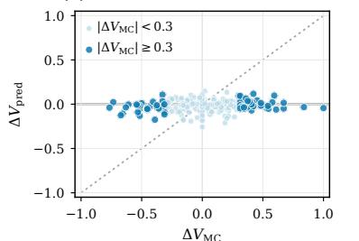  
(c) Value Resolution

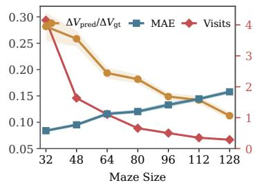

(b) Value Maps  
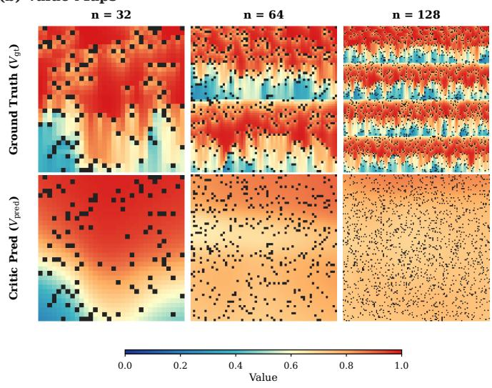  
Figure 2: Value Flattening in LLM reasoning and stochastic FrozenLake. (a) Adjacent MC and critic value changes: predicted changes remain concentrated near zero even when MC values change sharply. (b) Groundtruth and critic value maps as the FrozenLake maze size n increases under an otherwise fixed training configuration. (c) The corresponding value-resolution statistics.

Value Flattening with State-Space Growth. To examine whether Value Flattening extends beyond LLMs and how it scales with state-space size, we study stochastic FrozenLake (Brockman et al., 2016), where an agent navigates from a start state to a goal while avoiding holes. Each episode has a binary return, equal to 1 upon reaching the goal and 0 otherwise, so the state value of a grid cell is the probability of eventually reaching the goal from that state. This setting provides a controlled experiment in which we hold the training configuration fixed and increase the maze size n to expand the state space. As shown in Figure 2b, critic predictions across grid cells become progressively smoother as the maze grows. The local-contrast and error metrics in panel (c) likewise show smoother value predictions and weaker agreement with the ground truth. Thus, Value Flattening becomes more pronounced as the state space grows.

## 4.2 Why Does Value Flattening Occur?

By analyzing the critic objective and the temporal dependence among supervised states, we identify two factors contributing to Value Flattening: an implicit variance penalty and redundant critic updates.

Implicit Variance Penalty. Under terminal-only rewards with $\gamma = \lambda = 1$ , standard PPO uses the same sampled terminal return as the target at every state in a response. Its critic loss therefore contains an implicit variance penalty. For a response of length $T ,$ , let $v _ { t } = V _ { \phi } ( s _ { t } )$ and ${ \bar { v } } = T ^ { - 1 } \sum _ { t = 1 } ^ { T } v _ { t }$ Then

$$
\frac { 1 } { T } \sum _ { t = 1 } ^ { T } ( v _ { t } - R ) ^ { 2 } = ( \bar { v } - R ) ^ { 2 } + \frac { 1 } { T } \sum _ { t = 1 } ^ { T } ( v _ { t } - \bar { v } ) ^ { 2 } .\tag{5}
$$

The first term fits the mean prediction to the sampled response outcome. The second term is the empirical variance of the predictions and directly penalizes their variation within that response. This variance penalty arises because every position uses the same terminal target. Under dense supervision, this variance is computed over all $\dot { T }$ positions, so every token prediction is directly included in the penalty. The corresponding batch-level loss and parameter-gradient decompositions are given in Appendix A.2.

Redundant Updates from Temporal Correlation. Classical RL often operates on compact Markov states that summarize the information needed for future decisions. In LLM post-training, by contrast, a state contains the tokens generated so far, so adjacent states differ by only one token and overlap in nearly their entire input. Because adjacent states are temporally correlated and share most of their tokens, supervising all of them provides less diverse training signals than their number suggests (Mnih et al., 2015). This similarity is also reflected in the critic hidden representations, whose trajectory in Figure 3a occupies a compact region.

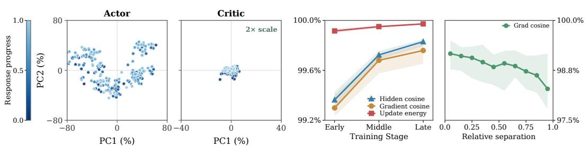  
(a) Hidden representation  
(b) Gradient analysis  
Figure 3: Representation and gradient analysis in Qwen3-4B-Base PPO critic supervision. (a) Actor and critic hidden representations for the same response, centered and normalized by mean hidden norm; the critic view uses a $2 \times$ scale. (b) Hidden-representation alignment, gradient alignment, and update energy remain high across PPO training stages (left), while the full critic gradient cosine decreases with relative token-position separation (right).

Representation similarity connects directly to update similarity. Consider a value head $V _ { \phi } ( s _ { t } ) =$ $w ^ { \top } h _ { t } .$ , where $h _ { t }$ is the critic representation. The gradient from position t is $g _ { t } ^ { ( w ) } = 2 \big ( V _ { \phi } ( s _ { t } ) - R \big ) h _ { t }$ Thus, positions with similar representations and residuals of the same sign produce aligned gradients. The measurements in Figure 3b show that hidden-state alignment, gradient alignment, and update energy remain high throughout training. Within each response, gradient similarity decreases as the distance between their token positions increases. These results indicate that dense supervision produces many redundant updates from neighboring states.

## 4.3 $\mathrm { S P ^ { 3 } O : }$ Sparse Critic Supervision

Sparse supervision is designed to mitigate the two problems above through selection and spacing. Selecting fewer positions restricts the per-response variance penalty to those predictions instead of applying it at every token position. Spacing the selected positions apart is designed to reduce the accumulation of aligned gradients from nearby token positions whose states share most of their tokens.

We instantiate this intervention as SParse Proximal Policy Optimization $\mathrm { ( S P ^ { 3 } O ) }$ . The actor objective, rollout procedure, and return targets remain unchanged; only the states receiving the critic loss are changed. $\mathrm { S P ^ { 3 } O }$ applies the value loss only at a small set of well-separated states. The critic still produces values at every generation state. Let $\mathcal { T } ( \tau )$ denote the supervised states in trajectory τ . The sparse critic objective is

$$
\mathcal { L } _ { V } ^ { \mathrm { S P } ^ { 3 } \mathrm { O } } ( \phi ) = \frac { 1 } { \sum _ { \tau \in \mathcal { B } } \vert \mathscr { Z } ( \tau ) \vert } \sum _ { \tau \in \mathcal { B } } \sum _ { t \in \mathscr { Z } ( \tau ) } \left( V _ { \phi } ( s _ { t } ) - \widehat { G } _ { t } \right) ^ { 2 } .\tag{6}
$$

Critic Prediction Effects. We compare both critics with policy-conditioned MC values obtained from repeated continuations at intermediate states. As shown in Figure 4(a), PPO produces relatively flat value profiles and misses substantial local changes in MC values, whereas $\mathrm { S P ^ { 3 } O }$ more closely captures their direction and magnitude. Its profile MSE is lower on both selected prompts. The aggregate comparison in (b) confirms this trend, with $\mathrm { S P ^ { 3 } O }$ reducing MSE by 36%, 11%, and 21% at 30%, 60%, and 90% response progress, respectively. These results indicate that sparse supervision better preserves within-response value variation and improves within-response value resolution.

Critic Optimization Effects. Figure 5 examines how sparse supervision affects critic representations and optimization. Panel (a) compares response-level outcome discrimination with withinresponse critic-prediction variation across the early (E), middle (M), and late (L) training stages.

Own-policy MC state value PPO critic SP3O critic

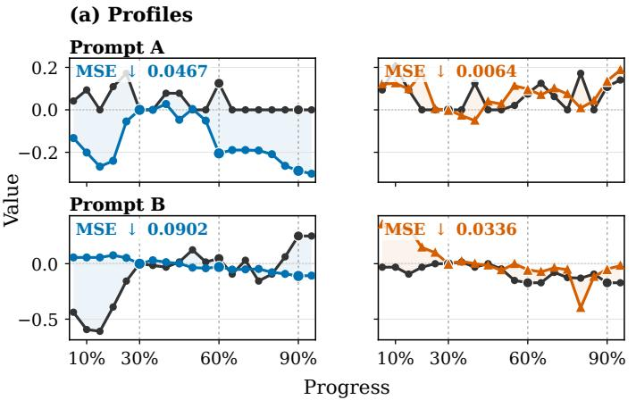

(b) Anchor MSE  
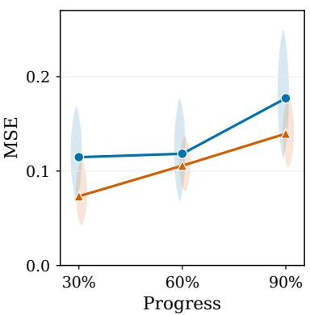  
Figure 4: Effects on critic prediction in Qwen3-4B-Base. (a) Prompt-matched critic and own-policy MC value profiles. (b) Response-centered value error.

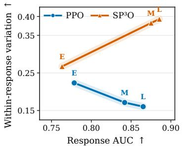  
(a) Discrimination and variation

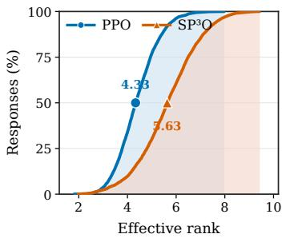  
(b) Effective-rank distribution

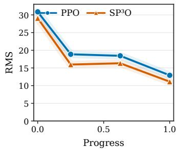  
(c) Gradient discrepancy  
Figure 5: Effects on critic optimization in Qwen3-4B-Base. (a) Response AUC, computed from the mean critic prediction per response and its binary terminal outcome, versus the within-response fraction of critic-prediction variance. (b) Empirical cumulative distribution of the effective rank of each response’s hidden-state matrix, measuring the dimensional diversity of value-head inputs across intermediate states. (c) RMS across responses of the difference between value-head gradients computed using terminal-return and policy-conditioned MC targets. Full definitions and aggregation details are provided in Appendix A.1.

PPO gains discrimination while losing within-response variation, whereas $\mathrm { S P ^ { 3 } O }$ improves both. In panel (b), $\mathrm { S P ^ { 3 } O }$ shifts the effective rank of response-centered hidden states upward, increasing the median from 4.33 to 5.63 and indicating richer representations of state differences. Panel (c) shows lower RMS discrepancy between value-head gradients induced by terminal-return targets and MC values throughout the response. Together, these observations are consistent with sparse supervision preserving richer hidden representations and reducing redundant or distorted critic updates, without sacrificing response-level discrimination.

Actor Optimization Effects. The critic is intended to stabilize PPO updates by replacing raw outcome signals with advantage estimates that reduce policy-gradient variance. Its within-response resolution can therefore affect both the direction and the stability of actor optimization. In the online runs, $\mathrm { S P ^ { 3 } O }$ has smaller within-iteration update changes over most of training than PPO (Figure 6a). This pattern is consistent with smoother actor optimization while retaining the benefits of a learned critic.

## 5 Experiments

<table><tr><td rowspan="2">Model</td><td rowspan="2">Method</td><td colspan="8">Mathematical Reasoning (avg@32)</td></tr><tr><td>AIME24</td><td>AIME25</td><td></td><td></td><td>AIME26 AMC23 MATH500 Minerva</td><td></td><td>Olympiad</td><td>Avg.</td></tr><tr><td rowspan="4">Qwen3-4B-Base</td><td>Base</td><td>4.58</td><td>3.75</td><td>4.38</td><td>25.08</td><td>42.78</td><td>22.71</td><td>22.35</td><td>17.95</td></tr><tr><td>PPO</td><td>17.50</td><td>19.90</td><td>14.69</td><td>61.80</td><td>70.15</td><td>42.82</td><td>36.35</td><td>37.60</td></tr><tr><td>GRPO</td><td>17.19</td><td>16.19</td><td>10.10</td><td>63.83</td><td>78.21</td><td>45.71</td><td>43.62</td><td>39.26</td></tr><tr><td> $\mathbf { S P ^ { 3 } O }$ </td><td>23.02</td><td>23.54</td><td>22.08</td><td>69.92</td><td>83.79</td><td>47.93</td><td>48.68</td><td>45.57</td></tr><tr><td rowspan="4">Qwen3-8B-Base</td><td>Base</td><td>7.40</td><td>7.92</td><td>5.94</td><td>37.66</td><td>54.08</td><td>24.69</td><td>27.36</td><td>23.58</td></tr><tr><td>PPO</td><td>30.21</td><td>25.10</td><td>23.33</td><td>72.19</td><td>86.33</td><td>48.81</td><td>53.56</td><td>48.50</td></tr><tr><td>GRPO</td><td>28.50</td><td>22.04</td><td>22.70</td><td>73.82</td><td>85.26</td><td>52.06</td><td>50.98</td><td>47.91</td></tr><tr><td> $\mathbf { S P ^ { 3 } O }$ </td><td>33.91</td><td>28.02</td><td>27.39</td><td>75.00</td><td>87.33</td><td>47.40</td><td>54.50</td><td>50.51</td></tr></table>

Table 1: In-domain mathematical-reasoning accuracy (%). Each score is averaged over 32 generations (avg@32), and the final column averages the seven listed tasks. Our method is shaded in light green, and bold denotes the best result within each model block.
<table><tr><td rowspan="2">Model</td><td rowspan="2">Method</td><td colspan="7">General Reasoning (avg@4)</td></tr><tr><td>ARC-C</td><td>MMLU-Pro</td><td>GPQA</td><td>AGIEval†</td><td>BBH†</td><td>ZebraLogic†</td><td>Avg.</td></tr><tr><td rowspan="4">Qwen3-4B-Base</td><td>Base</td><td>34.98</td><td>16.17</td><td>14.02</td><td>27.93</td><td>21.11</td><td>1.35</td><td>19.26</td></tr><tr><td>PPO</td><td>89.19</td><td>54.39</td><td>34.85</td><td>65.87</td><td>57.50</td><td>9.90</td><td>51.95</td></tr><tr><td>GRPO</td><td>90.96</td><td>56.87</td><td>38.89</td><td>68.18</td><td>71.17</td><td>12.58</td><td>56.44</td></tr><tr><td> $\mathbf { S P ^ { 3 } O }$ </td><td>91.02</td><td>61.75</td><td>38.89</td><td>71.44</td><td>73.35</td><td>19.20</td><td>59.28</td></tr><tr><td rowspan="4">Qwen3-8B-Base</td><td>Base</td><td>61.82</td><td>36.22</td><td>27.02</td><td>48.59</td><td>50.71</td><td>4.90</td><td>38.21</td></tr><tr><td>PPO</td><td>93.84</td><td>64.19</td><td>47.22</td><td>74.52</td><td>79.27</td><td>27.25</td><td>64.38</td></tr><tr><td>GRPO</td><td>93.04</td><td>66.27</td><td>49.49</td><td>75.15</td><td>78.10</td><td>27.40</td><td>64.91</td></tr><tr><td> $\mathbf { S P ^ { 3 } O }$ </td><td>93.13</td><td>65.83</td><td>49.94</td><td>76.95</td><td>80.89</td><td>31.45</td><td>66.37</td></tr></table>

Table 2: Out-of-distribution evaluation accuracy (%). All scores are averaged over four generations $( \mathrm { a v g } @ 4 )$ . Datasets marked with † are scored by the $9 \mathrm { p t } - \mathsf { o s s } - 1 2 0 \mathrm { b }$ verifier through xverify. The final column is the unweighted mean over all six tasks. Our method is shaded in light green, and bold denotes the best result within each model block.

## 5.1 Experimental Setup

Models and baselines. We evaluate the proposed sparse critic supervision on Qwen3-4B-Base and Qwen3-8B-Base (Yang et al., 2025). We train both models on DAPO-Math-17k (Yu et al., 2025). For each model, we report the initial checkpoint as a reference and compare standard PPO, GRPO, and PPO with sparse critic supervision and explicit late-tail coverage. We refer to the last variant as SParse Proximal Policy Optimization $\mathrm { ( S P ^ { 3 } O ) }$ . Unless otherwise stated, $\mathrm { S P ^ { 3 } O }$ supervises response-relative states at 0.3, 0.6, and 0.9, adding a 0.95 state for responses of at least 6144 tokens.

Benchmarks and evaluation. We use the 24K evaluation setting reported in the result sheets. The mathematical-reasoning suite contains AIME24, AIME25, AIME26, and AMC23 (Mathematical Association of America, 2026), MATH500 (Lightman et al., 2023), Minerva (Lewkowycz et al., 2022), and OlympiadBench (He et al., 2024). The out-of-distribution (OOD) suite contains ARC-C (Clark et al., 2018), MMLU-Pro (Wang et al., 2024), GPQA (Rein et al., 2024), AGIEval-English (Zhong et al., 2024), BigBenchHard (Suzgun et al., 2023), and ZebraLogic-Grid (WildEval, 2025). Mathematical scores are averaged over 32 generations. For OOD evaluation, ARC-C, MMLU-Pro, GPQA, AGIEval-English, BigBenchHard, and ZebraLogic-Grid are all averaged over four generations. The latter three benchmarks are scored using xVerify (Chen et al., 2025a).

## 5.2 Main Results

Tables 1 and 2 show that $\mathrm { S P ^ { 3 } O }$ consistently outperforms standard PPO and GRPO across both model sizes and evaluation suites. The gains over PPO reach 7.97 percentage points on in-domain mathematical reasoning and 7.33 percentage points on out-of-distribution reasoning, with positive improvements also observed for Qwen3-8B-Base. These results indicate that mitigating critic value flattening through sparse supervision leads to better policy learning rather than merely improving critic-side diagnostics.

Online learning dynamics. Figure 6 compares the training dynamics of PPO and $\mathrm { S P ^ { 3 } O }$ on Qwen3- 4B-Base. As shown in $\mathrm { ( a ) , S P ^ { 3 } O }$ exhibits smaller and less variable within-iteration actor updates, indicating more stable training. It also maintains higher validation accuracy and rollout reward than PPO after the early training stage, as shown in (b) and (c). Meanwhile, $\mathrm { S P ^ { 3 } O }$ produces longer responses, whereas response lengths under PPO increase more gradually and remain shorter, as shown in (d). Overall, $\mathrm { S P ^ { 3 } O }$ achieves stronger performance while maintaining more stable policy updates.

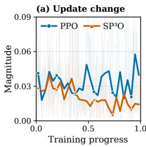

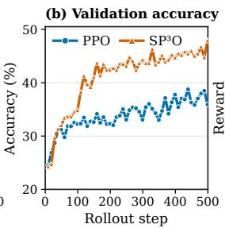

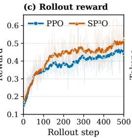

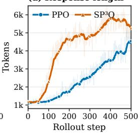  
Figure 6: Online learning dynamics and within-iteration actor updates on Qwen3-4B-Base. (a) Within-iteration update change. (b) Validation accuracy. (c) Rollout reward. (d) Response length.

## 5.3 Sparse-Supervision Ablations

We further examine how the effectiveness of $\mathrm { S P ^ { 3 } O }$ varies with supervision density, anchor placement, and late-tail coverage.

Number of supervised states. We vary the number of supervised anchors K during reasoning training with Qwen3-4B-Base to examine the effect of criticsupervision density (Figure 7). Sparse configurations with $K \in \{ 3 , 4 , \dot { 8 } \}$ achieve higher mean training rewards than both denser configurations and standard PPO with token-level critic supervision. Performance is highest at $K = 3$ and remains relatively stable through $K = 8$ , but drops substantially at $K = 1 6$ and $K = 6 4$ , approaching the dense PPO baseline. Although the variance across runs is nonnegligible, the overall trend indicates that increasing the number of supervised states does not improve reasoning performance. Instead, a small set of wellspaced anchors appears to provide sufficient coverage while limiting redundant critic updates.

Placement and late-tail coverage. At a fixed supervision density of $K = 3 .$ , both fixed-position placement schemes outperform random placement, which performs worst (Table 3 and Figure 9). This pattern is consistent with temporal correlation playing a role: well-spaced anchors cover the trajectory while avoiding repeated updates on nearby states that share most of their history.

We further compare $\mathrm { S P ^ { 3 } O }$ with a variant that removes the final tail anchor while keeping all other supervised anchors unchanged. Adding the tail anchor improves performance from 44.10 to 45.57 and reduces repetition from 18.33 to 1.12 (Appendix Table 5), highlighting the importance of explicitly covering the response tail for policy performance and generation stability.

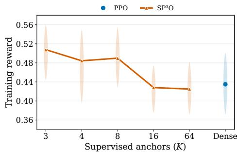  
Figure 7: Effect of critic-supervision density on performance.

<table><tr><td>Main anchors</td><td>Acc. (%)</td></tr><tr><td>PPO baseline</td><td>37.60</td></tr><tr><td>Random</td><td>36.59</td></tr><tr><td>0.2/0.5/0.8</td><td>44.65</td></tr><tr><td>0.3/0.6/0.9</td><td>45.57</td></tr></table>

Table 3: Anchor-placement ablation on Qwen3-4B-Base $( K = 3 )$ .

## 6 Conclusion

We identify Value Flattening as a systematic failure mode of critics for large language model reasoning, in which critic predictions fail to capture policy-conditioned state value changes within individual responses. The same pattern appears in controlled stochastic FrozenLake experiments and becomes more pronounced as the state space grows. Our analyses relate this behavior to two factors: an implicit variance penalty from dense token-level supervision and redundant updates from temporally correlated states with similar gradients. Motivated by these findings, $\mathrm { S P ^ { 3 } O }$ applies the critic loss at a few well-separated states to mitigate the effects of both factors. Experiments on Qwen3-4B-Base and Qwen3-8B-Base show that $\mathrm { S P ^ { 3 } O }$ mitigates Value Flattening and improves actor performance across mathematical and out-of-distribution reasoning benchmarks. These results establish Value Flattening as an important yet overlooked problem in critic learning.

## Acknowledgments

This work was supported by the Shanghai Artificial Intelligence Laboratory. We are grateful to the authors and open-source communities whose work made this project possible.

## References

Arash Ahmadian, Chris Cremer, Matthias Galle, et al. Back to basics: Revisiting REINFORCE style optimization for learning from human feedback in LLMs. arXiv preprint arXiv:2402.14740, 2024. URL https://arxiv.org/abs/2402.14740.

Greg Brockman, Vicki Cheung, Ludwig Pettersson, Jonas Schneider, John Schulman, Jie Tang, and Wojciech Zaremba. Openai gym. arXiv preprint arXiv:1606.01540, 2016. URL https: //arxiv.org/abs/1606.01540.

Ding Chen, Qingchen Yu, Pengyuan Wang, Mengting Hu, Wentao Zhang, Zhengren Wang, Bo Tang, Feiyu Xiong, Xinchi Li, Chao Wang, Minchuan Yang, and Zhiyu Li. xVerify: Efficient answer verifier for reasoning model evaluations. arXiv preprint arXiv:2504.10481, 2025a. URL https: //arxiv.org/abs/2504.10481.

Jiacheng Chen, Qianjia Cheng, Fangchen Yu, Haiyuan Wan, Yuchen Zhang, Shenghe Zheng, Junchi Yao, Qingyang Zhang, Haonan He, Yun Luo, Yufeng Zhao, Futing Wang, Li Sheng, Chengxing Xie, Yuxin Zuo, Yizhuo Li, Wenxuan Zeng, Yulun Wu, Rui Huang, Dongzhan Zhou, Kai Chen, Yu Qiao, Lei Bai, Yu Cheng, Ning Ding, Bowen Zhou, Peng Ye, and Ganqu Cui. P1: Mastering physics olympiads with reinforcement learning, 2025b. URL https://arxiv.org/abs 2511.13612.

Qiguang Chen, Chengyu Luan, Jiajun Wu, Qiming Yu, Yi Yang, Yizhuo Li, Jingqi Tong, Xiachong Feng, Libo Qin, and Wanxiang Che. OMIBench: Benchmarking olympiad-level multi-image reasoning in large vision-language model. arXiv preprint arXiv:2604.20806, 2026. URL https: //arxiv.org/abs/2604.20806.

Peter Clark, Isaac Cowhey, Oren Etzioni, Tushar Khot, Ashish Sabharwal, Carissa Schoenick, and Oyvind Tafjord. Think you have solved question answering? try ARC, the AI2 reasoning challenge. arXiv preprint arXiv:1803.05457, 2018. URL https://arxiv.org/abs/1803.05457.

Xue Gong, Qi Yi, Ziyuan Nan, et al. Segmental advantage estimation: Enhancing PPO for longcontext LLM training. arXiv preprint arXiv:2601.07320, 2026. URL https://arxiv.org/ abs/2601.07320.

Yiran Guo, Lijie Xu, Jie Liu, Dan Ye, and Shuang Qiu. Segment policy optimization: Effective segment-level credit assignment in RL for large language models. In Advances in Neural Information Processing Systems, 2025. URL https://arxiv.org/abs/2505.23564.

Chaoqun He, Renjie Luo, Yuzhuo Bai, Shengding Hu, Zhen Leng Thai, Junhao Shen, Jinyi Hu, Xu Han, Yujie Huang, Yuxiang Zhang, et al. Olympiadbench: A challenging benchmark for promoting agi with olympiad-level bilingual multimodal scientific problems. arXiv preprint arXiv:2402.14008, 2024. URL https://arxiv.org/abs/2402.14008.

Haonan He, Haodi Lei, Yun Luo, Haoran Zhang, Shunkai Zhang, Yizhuo Li, Shengji Tang, Zhilin Wang, Runzhe Zhan, Lei Bai, Ganqu Cui, Fangchen Yu, Yafu Li, Peng Ye, Ning Ding, and Yu Cheng. Simpleopd: Simple tokenizer-agnostic on-policy distillation for long-context reasoning, 2026. URL https://arxiv.org/abs/2608.14277.

Zhenyu Hou, Ziniu Hu, Yujiang Li, et al. TreeRL: LLM reinforcement learning with on-policy tree search. In Annual Meeting of the Association for Computational Linguistics, 2025. URL https://arxiv.org/abs/2506.11902.

Zhenyu Hou, Yujiang Li, Jie Tang, and Yuxiao Dong. Single-rollout asynchronous optimization for agentic reinforcement learning. arXiv preprint arXiv:2607.07508, 2026. URL https: //arxiv.org/abs/2607.07508.

Jian Hu, Xibin Wu, Zilin Wang, et al. Open-Reasoner-Zero: An open source approach to scaling up reinforcement learning on the base model. arXiv preprint arXiv:2503.24290, 2025. URL https://arxiv.org/abs/2503.24290.

Mykyta Ielanskyi, Kajetan Schweighofer, Lukas Aichberger, and Sepp Hochreiter. RREDCoT: Segment-level reward redistribution for reasoning models. arXiv preprint arXiv:2606.06475, 2026. URL https://arxiv.org/abs/2606.06475.

Zhewei Kang, Aosong Feng, Sergey Levine, Dawn Song, and Xuandong Zhao. VIMPO: Valueimplicit policy optimization for LLMs. arXiv preprint arXiv:2606.20008, 2026. URL https: //arxiv.org/abs/2606.20008.

Amirhossein Kazemnejad, Milad Aghajohari, Eva Portelance, et al. VinePPO: Refining credit assignment in RL training of LLMs. In International Conference on Machine Learning, 2025. URL https://arxiv.org/abs/2410.01679.

Kimi Team, Tongtong Bai, Yifan Bai, Yiping Bao, et al. Kimi K3: Open frontier intelligence, 2026. URL https://arxiv.org/abs/2607.24653.

Aitor Lewkowycz, Anders Andreassen, David Dohan, Ethan Dyer, Henryk Michalewski, Vinay Ramasesh, Ambrose Slone, Cem Anil, Imanol Schlag, Theo Gutman-Solo, Yuhuai Wu, Behnam Neyshabur, Guy Gur-Ari, and Vedant Misra. Solving quantitative reasoning problems with language models. Advances in Neural Information Processing Systems, 35, 2022. URL https: //arxiv.org/abs/2206.14858.

Yafu Li, Runzhe Zhan, Haoran Zhang, et al. Achieving gold-medal-level olympiad reasoning via simple and unified scaling, 2026a. URL https://arxiv.org/abs/2605.13301.

Yujiang Li, Zhenyu Hou, Yi Jing, Jie Tang, and Yuxiao Dong. CompactionRL: Reinforcement learning with context compaction for long-horizon agents. arXiv preprint arXiv:2607.05378, 2026b. URL https://arxiv.org/abs/2607.05378.

Hunter Lightman, Vineet Kosaraju, Yura Burda, Harri Edwards, Bowen Baker, Teddy Lee, Jan Leike, John Schulman, Ilya Sutskever, and Karl Cobbe. Let’s verify step by step. arXiv preprint arXiv:2305.20050, 2023. URL https://arxiv.org/abs/2305.20050.

Yun Luo, Futing Wang, Qianjia Cheng, Fangchen Yu, Haodi Lei, Jianhao Yan, Chenxi Li, Jiacheng Chen, Yufeng Zhao, Haiyuan Wan, Yuchen Zhang, Shenghe Zheng, Junchi Yao, Qingyang Zhang, Haonan He, Wenxuan Zeng, Li Sheng, Chengxing Xie, Yuxin Zuo, Yizhuo Li, Yulun Wu, Rui Huang, Dongzhan Zhou, Kai Chen, Yu Qiao, Lei Bai, Yu Cheng, Ning Ding, Bowen Zhou, Peng Ye, and Ganqu Cui. P1-vl: Bridging visual perception and scientific reasoning in physics olympiads, 2026. URL https://arxiv.org/abs/2602.09443.

Mathematical Association of America. Maa mathematical competitions, 2026. URL https: //maa.org/student-programs/amc/.

Volodymyr Mnih, Koray Kavukcuoglu, David Silver, Andrei A. Rusu, Joel Veness, Marc G. Bellemare, Alex Graves, Martin Riedmiller, Andreas K. Fidjeland, Georg Ostrovski, Stig Petersen, Charles Beattie, Amir Sadik, Ioannis Antonoglou, Helen King, Dharshan Kumaran, Daan Wierstra, Shane Legg, and Demis Hassabis. Human-level control through deep reinforcement learning. Nature, 518(7540):529–533, 2015. doi: 10.1038/nature14236.

Penghui Qi, Xiangxin Zhou, and Wee Sun Lee. How to train a critic stably and efficiently. arXiv preprint arXiv:2608.23566, 2026. URL https://arxiv.org/abs/2608.23566.

David Rein, Betty Li Hou, Asa Cooper Stickland, Jackson Petty, Richard Yuanzhe Pang, Julien Dirani, Julian Michael, and Samuel R. Bowman. GPQA: A graduate-level google-proof Q&A benchmark. Proceedings of the First Conference on Language Modeling, 2024. URL https: //arxiv.org/abs/2311.12022.

John Schulman, Philipp Moritz, Sergey Levine, et al. High-dimensional continuous control using generalized advantage estimation. arXiv preprint arXiv:1506.02438, 2015. URL https:// arxiv.org/abs/1506.02438.

John Schulman, Filip Wolski, Prafulla Dhariwal, et al. Proximal policy optimization algorithms. arXiv preprint arXiv:1707.06347, 2017. URL https://arxiv.org/abs/1707.06347.

Zikang Shan, Han Zhong, Liwei Wang, and Li Zhao. Bringing value models back: Generative critics for value modeling in LLM reinforcement learning. arXiv preprint arXiv:2604.10701, 2026. URL https://arxiv.org/abs/2604.10701.

Zhihong Shao, Peiyi Wang, Qihao Zhu, et al. DeepSeekMath: Pushing the limits of mathematical reasoning in open language models. arXiv preprint arXiv:2402.03300, 2024. URL https: //arxiv.org/abs/2402.03300.

Mirac Suzgun, Nathan Scales, Nathanael Scharli, Sebastian Gehrmann, Yi Tay, Hyung Won Chung, Aakanksha Chowdhery, Quoc V. Le, Ed H. Chi, Denny Zhou, and Jason Wei. Challenging BIG-Bench tasks and whether chain-of-thought can solve them. In Findings of the Association for Computational Linguistics: ACL 2023, 2023. URL https://aclanthology.org/2023. findings-acl.824.

Hieu Tran, Zonghai Yao, and Hong Yu. Exploiting tree structure for credit assignment in RL training of LLMs. arXiv preprint arXiv:2509.18314, 2025. URL https://arxiv.org/abs/2509. 18314.

Tianyi Wang, Yixia Li, Long Li, et al. SPPO: Sequence-level PPO for long-horizon reasoning tasks. arXiv preprint arXiv:2604.08865, 2026. URL https://arxiv.org/abs/2604.08865.

Yubo Wang, Xueguang Ma, Ge Zhang, Yuansheng Ni, Abhranil Chandra, Shiguang Guo, Weiming Ren, Aaran Arulraj, Xuan He, Ziyan Jiang, Tianle Li, Max Ku, Kai Wang, Alex Zhuang, Rongqi Fan, Xiang Yue, and Wenhu Chen. MMLU-Pro: A more robust and challenging multi-task language understanding benchmark. arXiv preprint arXiv:2406.01574, 2024. URL https: //arxiv.org/abs/2406.01574.

WildEval. ZebraLogic, 2025. URL https://huggingface.co/datasets/WildEval/ ZebraLogic.

An Yang, Anfeng Li, Baosong Yang, Beichen Zhang, Binyuan Hui, Bo Zheng, Bowen Yu, Chang Gao, Chengen Huang, Chenxu Lv, et al. Qwen3 technical report. arXiv preprint arXiv:2505.09388, 2025. URL https://arxiv.org/abs/2505.09388.

Qiying Yu, Zheng Zhang, Ruofei Zhu, et al. DAPO: An open-source LLM reinforcement learning system at scale. arXiv preprint arXiv:2503.14476, 2025. URL https://arxiv.org/abs/ 2503.14476.

Yufeng Yuan, Yu Yue, Ruofei Zhu, Tiantian Fan, and Lin Yan. What’s behind PPO’s collapse in long-CoT? value optimization holds the secret. arXiv preprint arXiv:2503.01491, 2025. URL https://arxiv.org/abs/2503.01491.

Yu Yue, Yufeng Yuan, Qiying Yu, et al. VAPO: Efficient and reliable reinforcement learning for advanced reasoning tasks. arXiv preprint arXiv:2504.05118, 2025. URL https://arxiv. org/abs/2504.05118.

Wanjun Zhong, Ruixiang Cui, Yiduo Guo, Yaobo Liang, Shuai Lu, Yanlin Wang, Amin Saied, Weizhu Chen, and Nan Duan. AGIEval: A human-centric benchmark for evaluating foundation models. Findings ofthe Associationfor Computational Linguistics: NAACL 2024, 2024. URL https://arxiv.org/abs/2304.06364.

## A Appendix

## A.1 Experimental Details and Diagnostic Metrics

<table><tr><td>Setting</td><td>Value</td></tr><tr><td>Training data</td><td> $\mathrm { D A P O - M a t h { - } 1 7 k }$ </td></tr><tr><td>Rollout batch</td><td> $6 4 \times 8 = 5 1 2$ </td></tr><tr><td>Actor update batch</td><td> $2 5 6 / \mathrm { s t e p } ; 2 / \mathrm { r o l l o u t }$ </td></tr><tr><td>Response length / temperature</td><td> $8 , 1 9 2 / 1 . 0$ </td></tr><tr><td>Actor learning rate</td><td> $1 \times 1 0 ^ { - 6 }$ </td></tr><tr><td>Critic learning rate</td><td> $4 \times 1 0 ^ { - 6 }$ </td></tr><tr><td>Optimizer</td><td> $\mathrm { A d a m } ; \beta = ( 0 . 9 , 0 . 9 8 ) ; \mathrm { w d } = 0 . 1$ </td></tr><tr><td>PPO ratio clip / KL coefficient</td><td> $0 . 2 / 0$ </td></tr><tr><td>Critic-only warm-up</td><td>20 batches</td></tr></table>

Table 4: Key training hyperparameters for the Qwen3-4B-Base and Qwen3-8B-Base experiments.

Figure and table settings. In Figure 7, the $K = 4$ point uses anchors at $0 . 3 / 0 . 5 / 0 . 7 / 0 . 9$ . Points show mean performance, with bands indicating variation.

FrozenLake settings. Each rollout terminates when the agent reaches the goal, falls into a hole, or reaches the maximum episode length of 8192 steps. Reaching the goal yields a return of 1, while falling into a hole or reaching the episode limit yields a return of 0.

Policy-conditioned Monte Carlo estimation. For the fixed evaluation panel, we use 64 responses and evaluate each response at 20 anchors: 19 intermediate states at relative positions $0 . 0 5 , 0 . 1 0 , \ldots , 0 . 9 5$ , plus the completed response at position 1.0. At each intermediate state, we hold the state fixed and independently sample continuations $\tau _ { t } ^ { ( k ) } \sim \pi ( \cdot \mid s _ { t } )$ from the same actor policy. We start with 128 continuations and add batches of 64, up to a maximum of 256, stopping earlier when the half-width of the 95% Wilson confidence interval for the empirical success rate is at most 0.04. Thus, the nonterminal anchors use $K \in \{ 1 2 8 , 1 9 2 , 2 5 6 \}$ . We estimate the policy-conditioned state value by averaging the realized terminal rewards, $\begin{array} { r } { \widehat { V } _ { \mathrm { M C } } ^ { \pi } ( \boldsymbol { s } _ { t } ) = K ^ { - 1 } \sum _ { k = 1 } ^ { K } G _ { t } ^ { ( k ) } } \end{array}$ . We use temperature 1.0, top-p 0.95, and at most 8192 generated tokens per continuation. The terminal anchor uses its observed terminal reward $R ( \tau )$ directly rather than additional sampling.

Critic diagnostic metrics. For each response i, let $\Delta v _ { i , i }$ t denote the change in the predicted value at evaluated state t. We define the update energy in Figure 3b as

$$
E _ { i } = \frac { T _ { i } \overline { { \Delta v } } _ { i } ^ { 2 } } { \sum _ { t } \Delta v _ { i , t } ^ { 2 } } , \qquad \overline { { \Delta v } } _ { i } = \frac { 1 } { T _ { i } } \sum _ { t } \Delta v _ { i , t } .\tag{7}
$$

Let $v _ { i , t } = V _ { \phi } ( s _ { i , t } )$ be the critic prediction at token t of response $i , T _ { i }$ its number of valid tokens, and $R _ { i } \in \{ 0 , 1 \}$ its terminal outcome. Response AUC is the ROC-AUC of $R _ { i }$ scored by the mean prediction $\begin{array} { r } { \bar { v } _ { i } = { T } _ { i } ^ { - 1 } \sum _ { t } v _ { i , t } } \end{array}$ . The within-response variation ratio is

$$
\frac { \sum _ { i } \sum _ { t } ( v _ { i , t } - \bar { v } _ { i } ) ^ { 2 } } { \sum _ { i } \sum _ { t } ( v _ { i , t } - \bar { v } ) ^ { 2 } } , \qquad \bar { v } = \frac { \sum _ { i } \sum _ { t } v _ { i , t } } { \sum _ { i } T _ { i } } ,\tag{8}
$$

where lower values indicate flatter predictions within responses. Both metrics are computed per rollout batch and summarized by stage medians in Figure 5a. For panel (b), we unit-normalize the value-head input states within each response, subtract their response mean, and stack them into a matrix $H _ { i } . \mathrm { ~ I f ~ } \lambda _ { j }$ are the eigenvalues of $H _ { i } H _ { i } ^ { \top }$ and $p _ { j } = \lambda _ { j } \bar { / \sum _ { k } \lambda _ { k } }$ , its effective rank is $r _ { \mathrm { e f f } } = \mathrm { e x p } ( - \textstyle \sum _ { i } p _ { j } \log p _ { j } )$ ; the panel plots its empirical cumulative distribution across responses. For panel (c), let $h _ { i , t }$ denote the value-head input and $A _ { i }$ the evaluated positions. The response-level mean gradient difference under the squared-error value loss between terminal-return and MC targets,

and its RMS across N responses, are

$$
\Delta g _ { i } ( A _ { i } ) = \frac { 2 } { | A _ { i } | } \sum _ { t \in A _ { i } } \left( \widehat { V } _ { \mathrm { M C } } ^ { \pi } ( s _ { i , t } ) - R _ { i } \right) h _ { i , t } , \qquad D _ { \mathrm { R M S } } = \sqrt { \frac { 1 } { N } \sum _ { i = 1 } ^ { N } \| \Delta g _ { i } ( A _ { i } ) \| _ { 2 } ^ { 2 } } .\tag{9}
$$

## A.2 Theoretical Analysis of Value Flattening

We formalize two aspects of Value Flattening. We first decompose critic error into response-mean and within-response components and examine how the latter affects finite-batch actor updates. We then show that dense token-level supervision introduces an implicit penalty on within-response prediction variance and compare its gradient with a reference gradient based on exact policy-conditioned state values. Finally, we explain why these finite-batch effects do not conflict with the standard invariance of the expected policy gradient to a state-dependent baseline.

Decomposing critic error. Let $i \in \{ 1 , \ldots , N \}$ index responses and $t \in \{ 1 , \dots , m _ { i } \}$ index evaluated states. Define the policy-conditioned value $q _ { i , t } = \bar { V } ^ { \pi } ( s _ { i , t } )$ , the critic prediction $v _ { i , t } =$ $V _ { \phi } ( s _ { i , t } )$ , and, for any per-state quantity $x _ { i , t }$ , write its response mean as $\begin{array} { r } { \bar { x } _ { i } : = m _ { i } ^ { - 1 } \sum _ { t = 1 } ^ { m _ { i } } x _ { i , t } . } \end{array}$ . In particular, this defines $\bar { q } _ { i }$ and $\bar { v } _ { i }$ . The mean squared critic error, with each response weighted equally, decomposes as

$$
\begin{array} { r l } & { \mathcal { E } _ { \mathrm { p o i n t } } : = \displaystyle \frac { 1 } { N } \sum _ { i = 1 } ^ { N } \frac { 1 } { m _ { i } } \sum _ { t = 1 } ^ { m _ { i } } ( v _ { i , t } - q _ { i , t } ) ^ { 2 } } \\ & { \quad \quad = \underbrace { \frac { 1 } { N } \sum _ { i = 1 } ^ { N } ( \bar { v } _ { i } - \bar { q } _ { i } ) ^ { 2 } } _ { \mathcal { E } _ { \mathrm { m e a n } } } + \underbrace { \frac { 1 } { N } \sum _ { i = 1 } ^ { N } \frac { 1 } { m _ { i } } \sum _ { t = 1 } ^ { m _ { i } } \left[ ( v _ { i , t } - \bar { v } _ { i } ) - ( q _ { i , t } - \bar { q } _ { i } ) \right] ^ { 2 } } _ { \mathcal { E } _ { \mathrm { w i t h i n } } } . } \end{array}\tag{10}
$$

(11)

The two terms measure error in the response mean and error in value changes within the response, respectively. If states are instead averaged over the entire batch, response i receives weight $\alpha _ { i } =$ $m _ { i } / \sum _ { j } m _ { j }$ , and the same decomposition holds. Let

$$
e _ { i , t } : = v _ { i , t } - q _ { i , t } = { \bar { e } } _ { i } + e _ { i , t } ^ { \circ } , \qquad { \frac { 1 } { m _ { i } } } \sum _ { t = 1 } ^ { m _ { i } } e _ { i , t } ^ { \circ } = 0 ,\tag{12}
$$

where $\bar { e } _ { i }$ is the response-mean error and $\boldsymbol { e } _ { i , t } ^ { \circ }$ is the centered within-response error.

From critic error to actor updates. Under $\gamma = \lambda = 1$ , all states in a response share the same realized return. Let $R _ { i } : = R \bar { ( \tau _ { i } ) }$ denote that terminal reward. The critic error therefore changes the estimated advantage $\boldsymbol { \mathrm { b y } } - \boldsymbol { e } _ { i , t } ,$ , and its within-response component changes the relative credit assigned to states by $- e _ { i , t } ^ { \circ } .$ Let $\boldsymbol { z } _ { i , t } = \nabla _ { \theta }$ log $\pi _ { \boldsymbol { \theta } } ( a _ { i , t } \mid s _ { i , t } ) | _ { \boldsymbol { \theta } = \boldsymbol { \theta } _ { \mathrm { o l d } } }$ be the log-policy gradient and $\begin{array} { r } { \bar { z } _ { i } = m _ { i } ^ { - 1 } \sum _ { t } z _ { i , } } \end{array}$ t its response mean. At the rollout policy, define the actor gradients obtained with the sampled critic baseline and with a reference baseline using exact policy-conditioned state values:

$$
\begin{array} { r l r } & { } & { g _ { \mathrm { c r i t i c } } : = \displaystyle \frac { 1 } { N } \sum _ { i = 1 } ^ { N } \frac { 1 } { m _ { i } } \sum _ { t = 1 } ^ { m _ { i } } z _ { i , t } \big ( R _ { i } - v _ { i , t } \big ) , } \\ & { } & { g _ { \mathrm { o r a c l e } } : = \displaystyle \frac { 1 } { N } \sum _ { i = 1 } ^ { N } \frac { 1 } { m _ { i } } \sum _ { t = 1 } ^ { m _ { i } } z _ { i , t } \big ( R _ { i } - q _ { i , t } \big ) . } \end{array}\tag{13}
$$

We define the finite-batch actor-gradient error as $\Delta g : = g _ { \mathrm { c r i t i c } } - g _ { \mathrm { o r a c l e } }$ . It then decomposes exactly as

$$
\Delta g = \underbrace { - \frac { 1 } { N } \sum _ { i = 1 } ^ { N } \bar { z } _ { i } \bar { e } _ { i } } _ { \Delta g _ { \mathrm { m e a n } } } - \underbrace { \frac { 1 } { N } \sum _ { i = 1 } ^ { N } \frac { 1 } { m _ { i } } \sum _ { t = 1 } ^ { m _ { i } } ( z _ { i , t } - \bar { z } _ { i } ) e _ { i , t } ^ { \circ } } _ { \Delta g _ { \mathrm { w i t h i n } } } .\tag{14}
$$

The first term is caused by error in the response mean. The second is caused by error in the relative value profile within a response. By Cauchy–Schwarz,

$$
\begin{array} { r l r } {  { \| \Delta g _ { \mathrm { m e a n } } \| \le ( \displaystyle \frac { 1 } { N } \sum _ { i } \| \bar { z } _ { i } \| ^ { 2 } ) ^ { 1 / 2 } \mathcal { E } _ { \mathrm { m e a n } } ^ { 1 / 2 } , } } \\ & { } & { \| \Delta g _ { \mathrm { w i t h i n } } \| \le ( \displaystyle \frac { 1 } { N } \sum _ { i } \frac { 1 } { m _ { i } } \sum _ { t } \| z _ { i , t } - \bar { z } _ { i } \| ^ { 2 } ) ^ { 1 / 2 } \mathcal { E } _ { \mathrm { w i t h i n } } ^ { 1 / 2 } . } \end{array}\tag{15}
$$

Thus, each gradient-error component is bounded by the critic RMSE multiplied by the RMS norm of the corresponding log-policy gradient. These are norm bounds; they do not by themselves assert that the error is determined by directional alignment.

Implicit Variance Penalty in Dense Critic Supervision. In the terminal-only setting, consider the critic loss under dense token-level supervision, with each response weighted equally and using the sampled target $R _ { i }$ . Let $J _ { i , t } = \nabla _ { \phi } V _ { \phi } ( s _ { i , t } )$ and $\begin{array} { r } { \bar { J } _ { i } = m _ { i } ^ { - 1 } \sum _ { t } \bar { J } _ { i , t } } \end{array}$ denote the critic Jacobian and its response mean. The loss can then be decomposed as

$$
\mathcal { L } _ { V , \mathrm { d e n s e } } ^ { \mathrm { s a m p l e } } ( \phi ) : = \frac { 1 } { N } \sum _ { i = 1 } ^ { N } \frac { 1 } { m _ { i } } \sum _ { t = 1 } ^ { m _ { i } } \bigl ( v _ { i , t } - R _ { i } \bigr ) ^ { 2 } = \frac { 1 } { N } \sum _ { i = 1 } ^ { N } \left[ ( \bar { v } _ { i } - R _ { i } ) ^ { 2 } + \frac { 1 } { m _ { i } } \sum _ { t = 1 } ^ { m _ { i } } ( v _ { i , t } - \bar { v } _ { i } ) ^ { 2 } \right] .\tag{16}
$$

Its gradient is correspondingly

$$
\nabla _ { \phi } \mathcal { L } _ { V , \mathrm { d e n s e } } ^ { \mathrm { s a m p l e } } = \frac { 2 } { N } \sum _ { i = 1 } ^ { N } ( \bar { v } _ { i } - R _ { i } ) \bar { J } _ { i } + \frac { 2 } { N } \sum _ { i = 1 } ^ { N } \frac { 1 } { m _ { i } } \sum _ { t = 1 } ^ { m _ { i } } ( v _ { i , t } - \bar { v } _ { i } ) ( J _ { i , t } - \bar { J } _ { i } ) .\tag{17}
$$

The first term fits the mean critic prediction for each response to its sampled terminal return. The second is the gradient of the within-response prediction-variance term $\begin{array} { r } { { \bf \dot { \omega } } _ { m _ { i } } ^ { - 1 } \sum _ { t } ( v _ { i , t } - \bar { v } _ { i } ) ^ { 2 } } \end{array}$ ; the corresponding loss term directly penalizes deviations from the response mean and therefore creates a flattening pressure within each response. The shared return provides no direct information about value differences among states within a response, yet applying it at every state introduces this variance penalty. The same decomposition holds for token-weighted training, with response weights $\alpha _ { i }$

To compare the PPO update in Equation (17) with the update needed to recover the policy-conditioned value profile, consider a hypothetical regression to the exact values $q _ { i , t } = V ^ { \pi } ( s _ { i , t } )$ . The corresponding gradients of Equation (11) are

$$
\nabla _ { \phi } \mathcal { E } _ { \mathrm { m e a n } } = \frac { 2 } { N } \sum _ { i = 1 } ^ { N } \bar { e } _ { i } \bar { J } _ { i } , \quad \nabla _ { \phi } \mathcal { E } _ { \mathrm { w i t h i n } } = \frac { 2 } { N } \sum _ { i = 1 } ^ { N } \frac { 1 } { m _ { i } } \sum _ { t = 1 } ^ { m _ { i } } e _ { i , t } ^ { \circ } ( J _ { i , t } - \bar { J } _ { i } ) = \frac { 2 } { N } \sum _ { i = 1 } ^ { N } \frac { 1 } { m _ { i } } \sum _ { t = 1 } ^ { m _ { i } } e _ { i , t } ^ { \circ } J _ { i , t } .\tag{18}
$$

Unlike the sampled-target update above, these are reference gradients for this exact-value regression. Because $m _ { i } ^ { - 1 } \dot { \sum } _ { t } e _ { i , t } ^ { \circ } \dot { = } 0$ , the response-shared Jacobian component cancels exactly. In other words, correcting within-response error requires the state-level Jacobians to differ across states.

Expected-gradient invariance and practical scope. For any action-independent baseline $b ( s _ { t } )$

$$
\mathbb { E } _ { a _ { t } \sim \pi ( \cdot | s _ { t } ) } \left[ \nabla _ { \theta } \log \pi _ { \theta } ( a _ { t } \mid s _ { t } ) b ( s _ { t } ) \mid s _ { t } \right] = b ( s _ { t } ) \nabla _ { \theta } \sum _ { a _ { t } } \pi _ { \theta } ( a _ { t } \mid s _ { t } ) = 0 .\tag{19}
$$

Exact pointwise values are therefore unnecessary for preserving the expected on-policy gradient. On a finite batch, however, centered critic errors can have a nonzero batch average when multiplied by centered log-policy gradients.

The finite-batch decomposition in Equation (14) is exact for the local gradient at the rollout policy. Across multiple PPO epochs, value errors can also alter advantage signs, magnitudes, and which branch of PPO’s clipped objective is active, so baseline invariance does not imply identical clipped updates.

In summary, our analysis yields three observations:

• Reusing the same terminal return at every state introduces an implicit variance penalty on critic predictions within each response.

• Within-response critic error can change finite-batch actor updates through its interaction with centered policy gradients.

• Expected policy-gradient invariance does not imply identical practical PPO updates on finite batches.

Together, these results motivate evaluating whether critic predictions track state-value changes within responses, in addition to response-level accuracy. Combined with the temporal-correlation evidence in Section 4.2, they motivate sparse critic supervision, which applies the shared terminal return to fewer, well-separated states.

## A.3 Additional Comparisons of Critic Predictions and MC Values

Figure 8 complements the two prompt-matched examples in Figure 4 with four additional prompts from the same checkpoint evaluation panel. For these prompts, $\mathrm { S P ^ { 3 } O }$ has lower centered profile MSE than PPO.

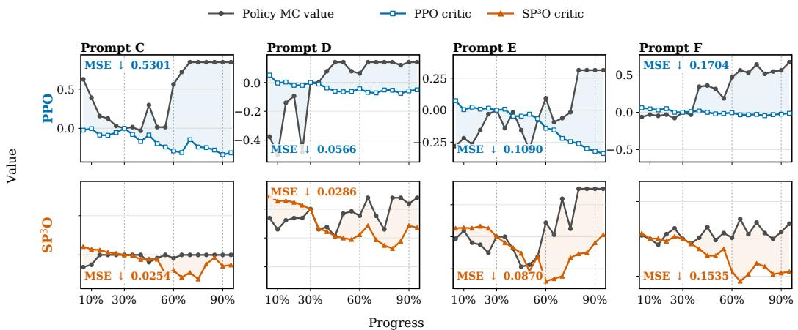  
Figure 8: Additional prompt-matched value profiles. The horizontal axis is normalized response progress, and the vertical axis shows response-centered own-policy MC values and critic predictions.

## A.4 Sparse-Supervision Ablations

<table><tr><td>Variant</td><td>Acc. (%)</td><td>Repetition (%)</td></tr><tr><td> $\mathrm { S P ^ { 3 } O }$  w/o tail anchor</td><td>44.10</td><td>18.33</td></tr><tr><td> $\mathrm { S P ^ { 3 } O }$ </td><td>45.57</td><td>1.12</td></tr></table>

Table 5: Late-tail ablation for $\mathrm { S P ^ { 3 } O }$

We examine how the number and placement of critic-supervision anchors affect Qwen3-4B-Base. The placement curves show that later-state coverage is generally beneficial, whereas adding anchors alone does not reliably improve performance. The matched late-tail comparison is reported in Table 5. Conditional tail coverage provides a further improvement and reduces repetitive behavior. Figure 9 shows the corresponding online validation trajectories. Schedules with later-state coverage achieve higher validation accuracy, consistent with the placement comparison in Figure 9.

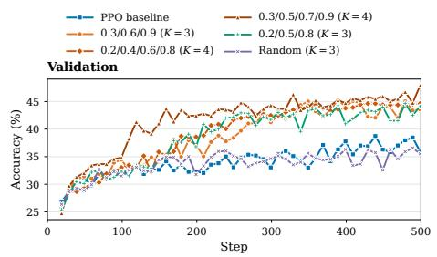  
Figure 9: Performance across critic supervision anchor placements.