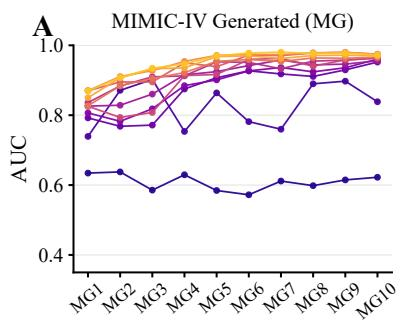
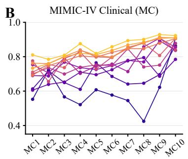
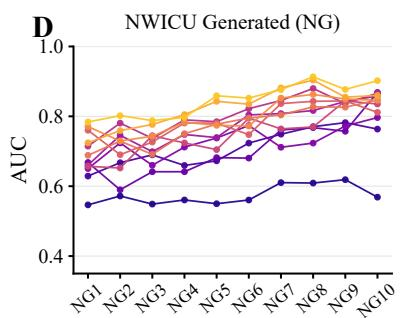
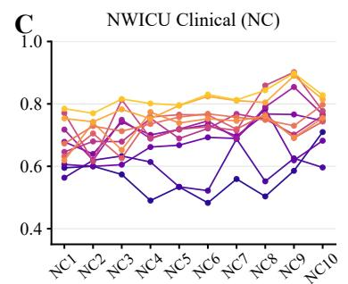
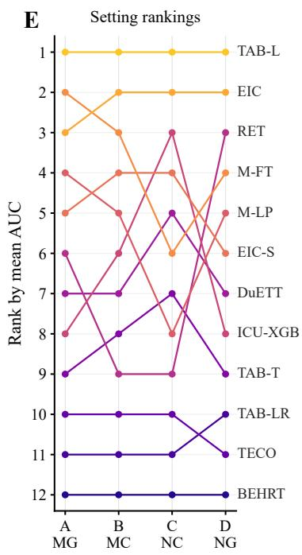
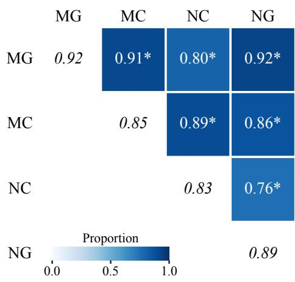
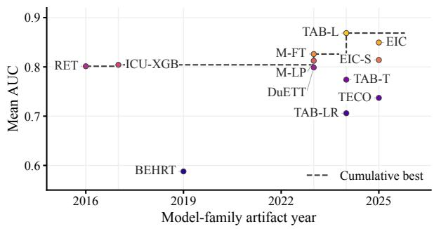
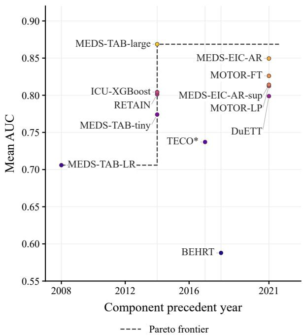
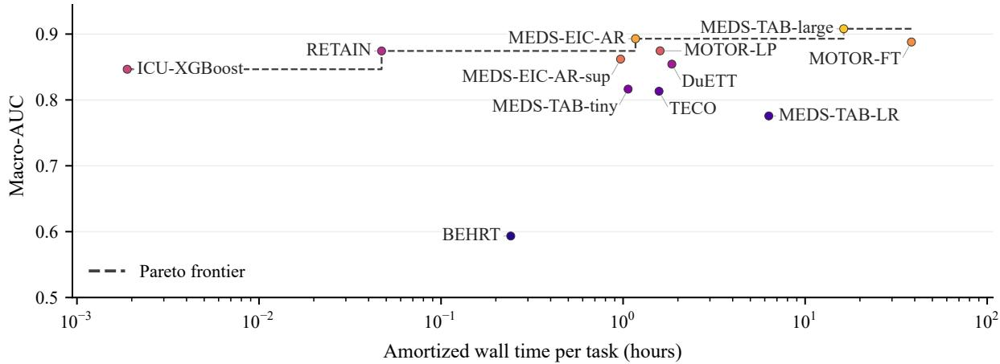

# Rethinking How We Evaluate Methodological Progress in Health AI

Florent Pollet ffp2106@cumc.columbia.edu and Matthew McDermott mm6677@cumc.columbia.edu Department of Biomedical Informatics, Columbia University

## Abstract

Methodological progress in artificial intelligence (AI) for electronic health records (EHRs) depends on determining which algorithms work better, and under which conditions. However, such progress is thought to be hindered by difficulties in reproducibility and in defining clinically meaningful evaluation tasks. We empirically study these barriers by re-implementing 12 historical and recent algorithms within a shared evaluation framework and evaluating them on two clinical datasets, MIMIC-IV and NWICU. We compare two complementary task families: expert-authored clinically meaningful tasks and generated tasks defined from randomly sampled event codes and prediction horizons. We ask whether relative algorithm comparisons transfer across task families and datasets, whether residual task heterogeneity contains useful methodological structure, and what a controlled comparison reveals about progress over the last decade. Aggregate pairwise comparisons transfer strongly across eval uation settings, including from randomly generated to clinically meaningful tasks and across datasets. At the same time, clinically meaningful tasks exhibit greater task-algorithm interaction, providing preliminary evidence that task properties can help explain when particular modeling choices are advantageous. Finally, newer algorithms do not consistently outperform earlier approaches: gradient-boosted trees remain highly competitive when paired with a high-capacity, wide and sparse representation of the EHR. Together, these results suggest that useful methodological knowledge may require less task engineering than commonly assumed, while highlighting the need to understand the structured heterogeneity that remains across tasks and algorithms.

Keywords: EHR, Evaluation, Health AI

Data and Code Availability We use the MIMIC-IV and NWICU datasets [10, 19], available on Phys-

ioNet. The code used to reproduce our experiments will be available upon publication.

Institutional Review Board (IRB) This study did not require IRB approval because it involved secondary analysis of existing de-identified datasets and did not involve direct interaction with human participants or access to identifiable private information.

## 1. Introduction

Artificial Intelligence (AI) over structured EHR data promises to revolutionize patient care [30, 2, 27, 29] and is receiving increasing attention in both the scientific community and the media [32, 21]. Despite this, many researchers remain concerned about the extent of methodological progress and rigor in this sub-field [16, 1], arguing that the wealth of research in this space has not meaningfully enabled us to an swer key methodological questions, such as when and why some algorithms work better than others on a given dataset and task [8]. Commentators have identified many possible barriers to rigorous methodolog ical progress, including: (i) the dificulty of defining suficiently clinically meaningful evaluation tasks to characterize AI algorithms [1, 20] and (ii) the longstanding reproducibility and transportability crisis that hinders replicating task definitions or re-using model code across studies [17, 11, 16].

While there is empirical evidence that the reproducibility crisis hinders the accumulation of method ological knowledge–for example, Johnson et al. found that the reported performance gain of neural network algorithms over gradient-boosted trees often reversed upon reproduction [11]–barrier (i) has received very limited empirical characterization. Concretely, we do not know whether relative comparisons between algorithms (e.g., does algorithm 1 outperform algorithm 2 when trained from scratch on a given dataset and task) identified on clinically “meaningless” tasks would agree with the same comparisons on high-quality, expert-determined tasks. If the conclusions drawn in these two settings were highly similar– and a growing body of evidence on evaluation in other domains of machine learning suggests this is plausible [25]–methodological progress would be more accessible in this domain than previously expected, opening new routes to robust insight into the relative performance of diferent algorithms across diverse clinical settings.

In this work, we empirically study this question, and methodological progress in health AI more generally, via a shared implementation and evaluation framework. We re-implement1 historical and recent ICU and EHR models using a common MEDS-based interface [18], and evaluate them on two public clinical datasets, MIMIC-IV [10] and NWICU [19], across both clinically meaningful tasks–explicitly authored by experts to capture meaningful predictions–and randomly generated tasks–which ask whether a randomly sampled code from the dataset vocabulary will occur within a randomly sampled duration, and require no clinical curation. We use our findings to answer three key questions: Q1: Are rankings and comparisons between algorithms consistent across evaluation settings, such as across datasets or between clinically meaningful and randomly generated tasks? Q2: Beyond global ranking consistency, is there evidence of shared structure between task, algorithm, and dataset properties that could tell us when a given algorithm is likely to work well in a target setting? Q3: When algorithms developed over the last decade are evaluated in a common implementation, training, and evaluation framework, what evidence of method ological progress emerges, if any?

Our analyses suggest that: (1) comparative conclusions about algorithm performance are statistically significantly similar across evaluation settings, particularly between clinically meaningful and randomly generated tasks, suggesting that barrier (i) may not be a major barrier for methodological research; (2) there is preliminary but meaningful evidence of shared structure between tasks, datasets, and algorithms, particularly on clinically meaningful tasks, that is suggestive of future opportunities for progress; and (3) there is meaningful evidence of methodological progress, though not in directions aligned with typical AI development: the bestperforming algorithm in our comparison is a gradientboosted tree model, but only when paired with an extremely wide, sparse tabularization of the full feature space rather than the restricted, clinically motivated featurizations that dominated historical uses of such models.

In sum, we make the following key contributions:

1. We provide reproducible, standard-interface reimplementations of twelve AI algorithms that can be applied across MEDS datasets through a common interface, enabling robust baseline comparisons in future methodological research.

2. We provide a rich set of comparisons of algorithm performance, in both discriminative and computational terms, across a battery of tasks and two datasets, ofering concrete guidance on which al gorithms are likely to perform best and at what computational cost.

3. We show that randomly generated tasks provide highly reliable estimates of relative algorithm performance, even across datasets, suggesting a more accessible route to robust methodological research in EHR AI.

4. We find preliminary evidence that relating task properties to algorithm and dataset properties yields further methodological insight, suggesting that relative algorithm rankings are partly predictable from characteristics of the evaluation setting.

## 2. Methods

To answer the three key questions introduced in Sec tion 1, we use the following high-level experimental process. First, we re-implement a variety of historically published algorithms such that they are trainable for any binary classification task on any MEDS dataset through a consistent interface, but are otherwise faithful to their original, published form. We then train these aligned algorithms on a collection of target tasks from two families: expert-defined clinically meaningful tasks and randomly generated tasks, which are randomly defined and require no clinical expertise. We evaluate the trained algorithms by per-task AUROC on held-out subjects. This process is replicated over two publicly available longitudinal critical care EHR datasets, MIMIC-IV and

NWICU, which difer substantially in scale and clinical scope (Table 3 in Appendix C). With these evaluation results, we answer our questions directly: for Q1, we compute how consistent the AUROC ranking of these algorithms is across task families and datasets; for Q2, we assess to what extent variance in algorithm rankings is related to structured properties of the task, dataset, and algorithm combination; and for Q3, we assess how the best overall performance has changed with the first public artifact date of these algorithms and examine other properties diferentiating high- from low-performing algorithms. The statistical procedures used throughout (ranking-agreement tests, task-level reversal rates, variance decomposi tion, and uncertainty quantification) are detailed in Appendix B.1.

## 2.1. Models

Model selection. Five model families were selected arbitrarily from a set of 49 ICU and EHR modeling approaches identified through a literature review (Appendix A). We deliberately added several models and baselines to anchor the comparison with recent pretraining approaches. MEDS-Tab [22] was included as a strong tabular baseline, using both its XGBoost-based configurations and an additional logistic-regression variant using the same MEDS-Tab featurization (MEDS-Tab-LR). We also included the XGBoost model from the mortality reproducibility study of [11] (ICU-XGBoost) as a historically motivated ICU baseline. Finally, MOTOR [28] and MEDS-EIC-AR [15] were added as potentially strong recent competitors. Table 1 summarizes all evaluated model variants.

Model implementation. All twelve models were re-implemented using agentic generative AI coding workflows (Claude Code with Claude Opus 5; see Appendix E), with one agent assigned to each model and the implementation template, verification procedure, and human review held fixed across models. Each model therefore received roughly equal “expert attention” during implementation, rather than efort concentrating on any single model or family. To reduce implementation variability and the risk that obvious re-implementation errors afect comparisons, we used a fixed model interface and verification workflow from a common template repository2. For each model, we first inspected the original paper, supplementary material, source code, configurations, preprocessing, and evaluation code, and recorded which components were ported, adapted, or omitted. Implementations then passed a staged set of tests. First, on a small synthetic dataset, we constructed a controlled prediction problem in which a single event code determined a binary label without sequence length or event position leaking the outcome, verified that the model recovered this signal through its actual preprocessing and featurization pipeline, and used shufled labels as a negative control. Local end-to-end tests also checked that the complete workflow produced predictions for exactly the requested examples and splits. Second, models were executed through the isolated MEDS-DEV interface to verify installation, configuration, and output compatibility. Third, they were run on a MIMIC-IV demo task to expose data-dependent, serialization, resource, and scale-related failures before full scale experiments. For models requiring specific in put features, we supplied dataset-specific predicate files mapping available MEDS events to the required features as closely as possible. Full-data experiments were then run from fixed, clean commits using the same task bundles across models, recording code revision, configuration, dataset, task, and resource information for reproducibility.

Table 1: Models considered in our evaluation, ordered by the date of their first publicly available artifact.
<table><tr><td>Model</td><td>Year</td><td>Training</td></tr><tr><td>RETAIN [5]</td><td>2016</td><td>Supervised</td></tr><tr><td>ICU-XGBoost [11]</td><td>2017</td><td>Supervised</td></tr><tr><td>BEHRT [14]</td><td>2019</td><td>Fine-tuned</td></tr><tr><td>MOTOR-FT [28] Full fine-tuning (FT)</td><td>2023</td><td>Fine-tuned</td></tr><tr><td>MOTOR-LP [28] Linear probing (LP)</td><td>2023</td><td>Probed</td></tr><tr><td>DuETT [13]</td><td>2023</td><td>Fine-tuned</td></tr><tr><td>MEDS-TAB-tiny [22]</td><td>2024</td><td>Supervised</td></tr><tr><td>MEDS-TAB-large [22]</td><td>2024</td><td>Supervised</td></tr><tr><td>MEDS-TAB-LR [22]</td><td>2024</td><td>Supervised</td></tr><tr><td>TECO [24]</td><td></td><td></td></tr><tr><td>MEDS-EIC-AR [15]</td><td>2025</td><td>Supervised</td></tr><tr><td>EIC-AR with fine-tuning</td><td>2025</td><td>Fine-tuned</td></tr><tr><td>MEDS-EIC-AR-sup [15] EIC-AR trained w/o pretraining</td><td>2025</td><td>Supervised</td></tr></table>

## 2.2. Tasks

All tasks are binary prediction problems. For each dataset we use 10 clinically meaningful and 10 randomly generated tasks, yielding four evaluation settings (dataset × task family) across which the evaluated algorithms and evaluation procedure are held fixed. Full task definitions, cohort sizes, prevalences, and dataset-specific diferences are provided in $\mathrm { A p - }$ pendix D.

Randomly generated tasks. Randomly generated tasks are defined by an event code and a prediction horizon, inspired by the EveryQuery task parametrization [3]. For each task, prediction times are sampled from eligible patient timelines, and the label indicates whether the event occurs within the horizon after the prediction time. Candidate tasks are retained only when they satisfy statistical adequacy and censoring requirements; in particular, we require min $_ { \mathrm { ( } n _ { \mathrm { p o s } } , n _ { \mathrm { n e g } } \mathrm { ) } } \geq 1 5 0 . ^ { 3 }$ Among eligible event-code–horizon pairs, tasks are sampled subject to diversity constraints limiting repeated codes and over-representation of individual event categories. Ten tasks are sampled independently per dataset, so the MIMIC-IV and NWICU randomly generated task sets are intentionally diferent.

Clinically meaningful tasks. In parallel, we define clinically motivated tasks using ACES [34], with each task specified by a clinical trigger, prediction time anchor, prediction horizon, and, when appropriate, an exclusion criterion for patients already in the target state. We sought to make the MIMIC-IV and NWICU suites as similar as possible, adapting task definitions across datasets when the required information was available, and to cover diverse clinical specialties, prediction horizons, and question types, including laboratory abnormalities, acute organ dys function, interventions, utilization, and mortality. Exact correspondence was not required for our main methodological question, however, and some tasks necessarily difer because the available events and predicates difer across datasets; we therefore retain dataset-specific clinically meaningful tasks when a direct adaptation is not reliable. Because these more constrained definitions often yield smaller cohorts, we use a reporting floor of min $( n _ { \mathrm { p o s } } , n _ { \mathrm { n e g } } ) \geq 4 0$ and exclude tasks below it.

## 3. Results

## 3.1. Q1: Comparative conclusions generally transfer across settings

Our experiments reliably show that comparative conclusions across algorithms largely transfer from randomly generated tasks to clinically meaningful tasks and even across datasets, suggesting that intensive eforts to ensure that benchmarking tasks are highly clinically meaningful may not be as essential for methodological research as previously thought. Figure 1 shows this visually: panels $\mathrm { A - D }$ plot the heldout AUROC of each algorithm on every task in each of our four evaluation settings, with algorithms colored by global macro-AUROC on a consistent gradient, so the preservation of this gradient across tasks and settings shows directly that algorithm rankings are quite consistent. Full numerical results are available in Appendix F.

To quantify this finding formally, Figure 2 shows the ranking agreement between every pair of evaluation settings (Appendix B.1). Agreement ranges from 76% to 92% and is statistically significantly higher than chance in all six comparisons after Holm correction; it is strongest between MIMIC-IV and NWICU randomly generated tasks (92%) and between MIMIC-IV randomly generated and clinically meaningful tasks (91%). Figure 1E further shows that agreement is concentrated at the top and bottom of the ranking, with more variability in the mid dle: MEDS-Tab-large ranks first in every setting, MEDS-EIC-AR ranks second in three settings and third in the fourth by less than 0.008 AUROC, and the same three algorithms (TECO, MEDS-Tab-LR, and BEHRT) form the bottom three in every setting.

These results suggest that randomly generated tasks, which require no clinical curation, can serve as an eficient first-pass substrate for determining which modeling choices tend to perform better, and that additional datasets need not yield entirely new comparative conclusions. Clinically meaningful tasks nonetheless remain essential when the question shifts from broad algorithm comparison toward taskspecific or deployment-oriented evaluation [26, 35], and with only two datasets our cross-dataset conclusions remain preliminary.

MEDS-TAB-large (TAB-L) MOTOR-LP (M-LP) MEDS-TAB-tiny (TAB-T) MEDS-EIC-AR (EIC) ICU-XGBoost (ICU-XGB) TECO MOTOR-FT (M-FT) RETAIN (RET) MEDS-TAB-LR (TAB-LR) MEDS-EIC-AR-sup (EIC-S) DuETT BEHRT

  
Figure 1: Task-level performance and ranking transfer across settings. A–D: tasks ordered from harder to easier by mean AUC across models. E: model ranks by setting-level mean AUC (1 = best), ordered MG, MC, NC, NG. Colors identify the same models throughout; lines connect tasks or settings as visual guides.

## 3.2. Q2: Dataset-task-algorithm interactions provide preliminary evidence of shared structure

While Section 3.1 shows that comparative conclusions are globally robust across settings, our experiments are also strongly suggestive of a shared, underlying structure in task-, dataset-, and algorithmperformance relationships. This structure matters because it is precisely the kind of methodological knowledge we seek to uncover: not only which al gorithm performs best on average, but which design choices are advantageous under which conditions. Our analyses find preliminary evidence of this shared structure through two vehicles: greater algorithm– task interaction structure among clinically meaning ful than randomly generated tasks, and relationships between algorithm design and task properties that are associated with comparative performance.

Increased heterogeneity and algorithm–task interaction structure. We find three complementary, interrelated sources of evidence suggesting that the heterogeneity remaining in algorithm rankings across tasks is driven by algorithm–task relationships, especially for clinically meaningful tasks. First, and most directly, the within-setting ranking consistency shown on the diagonal of Figure 2 (the proportion of task-level pairwise algorithm comparisons that agree with the setting-level aggregate comparison) is consistently lower for clinically meaningful tasks than for randomly generated tasks: 15.2% and 16.7% of tasklevel comparisons reverse the aggregate ordering on MIMIC-IV and NWICU clinically meaningful tasks, versus 8.3% and 10.9% on randomly generated tasks. Second, a variance decomposition (Appendix I) estimating how much observed AUROC variance is due to algorithms alone, tasks alone, or their interaction attributes roughly 24% of variance to interaction terms for clinically meaningful tasks, versus below 10% for randomly generated tasks. Third, comparing per-task algorithm rankings between MIMIC-IV and NWICU across six clinical task concepts present in both datasets (Appendix D.3), rankings are statistically significantly more similar when the task has the same conceptual meaning in both datasets than when it does not (mean Kendall’s $\tau _ { b }$ of 0.601 versus 0.437; exact permutation $p = 0 . 0 1 9 )$ , suggesting that a task’s conceptual identity is associated with systematic algorithm-performance diferences that persist across datasets, beyond properties of the algorithm or dataset alone.

  
Figure 2: Ranking consistency across evaluation settings. Of-diagonal cells show agreement between mean-AUROC algorithm rankings; italic diagonal entries show one minus the within-setting task reversal rate. Stars mark above-chance agreement (one-sided random-ranking tests, Holmadjusted $\begin{array} { r l r } { p } & { { } < } & { 0 . 0 5 } \end{array}$ across six setting pairs). $\mathrm { M G / M C }$ denote MIMIC-IV Generated/Clinical; NC/NG denote NWICU Clinical/Generated. Confidence intervals and Kendall τ for comparisons against MG are available in Appendix I.

Evidence of relationships between algorithm design principles and task properties. We can also test whether hypothesized links between algorithm design principles and performance hold in real experiments. Specifically, we consider whether the form of the pre-training loss in our two highest performing neural algorithms (fine-tuned MOTOR and MEDS-EIC-AR) is related to their relative performance. MEDS-EIC-AR is pre-trained for next token prediction, by design a very short-horizon task, whereas MOTOR is pre-trained to estimate time-to next-occurrence distributions over a panel of codes, a much longer-horizon task. We might therefore hy pothesize that MOTOR-FT’s advantage over MEDS-EIC-AR should grow with the task’s prediction horizon, which pushes the task farther from MEDS-EIC-AR’s pre-training loss relative to MOTOR’s. Across randomly generated tasks on our two datasets,4 we find a statistically significant relationship supporting this hypothesis on NWICU (Spearman $\rho ~ = ~ 0 . 7 9 5$ $p _ { \mathrm { H o l m } } = 0 . 0 1 6 )$ and a non-significant but directionally aligned correlation on MIMIC-IV $( \rho ~ = ~ 0 . 4 8 3 .$ $p _ { \mathrm { H o l m } } ~ = ~ 0 . 1 6 )$ , providing preliminary, partial evidence. A similar hypothesis applies to the underperformance of BEHRT, which by design ingests only relatively low-frequency input features such as diagnoses and should therefore perform better on longer-horizon tasks, where such features may play a more dominant role. We observe a statistically significant relationship consistent with this hypothesis on MIMIC-IV $( \rho = 0 . 8 0 5 , p _ { \mathrm { H o l m } } = 0 . 0 1 5 )$ and a non-significant correlation on NWICU $( \rho = - 0 . 1 3 5$ $p _ { \mathrm { H o l m } } = 0 . 7 1 \AA )$ . Full tables for these and further ex ploratory analyses are available in Appendix I.

## 3.3. Q3: Methodological progress can arise from new uses of existing techniques, not only new architectures

Our controlled comparison shows mixed evidence of methodological progress over the last decade, and that progress is poorly summarized by the recency of model architectures. Most strikingly, the highest-performing pipeline we evaluate uses gradient-boosted trees, a technology available for roughly the entire period we study, but obtains its performance through a substantially newer way of representing and exposing longitudinal EHR data to that learner.

Concretely, Figure 3 shows each algorithm’s mean AUROC against the date at which, to the best of our knowledge, it was first released or published. MEDS-Tab-large, an XGBoost-derived algorithm [4], obtains best-in-class performance but is anchored to 2024, when MEDS-Tab was first released. This seems at first glance contradictory, given that XGBoost models were in use in this space well before 2024; however, MEDS-Tab-large uses XGBoost in a much highercapacity manner than many prior XGBoost baselines. For example, ICU-XGBoost, which substantially underperforms both MEDS-Tab-large and recent neural algorithms, uses a more historically typical formulation: a relatively small set of clinically curated features modeled through XGBoost. In contrast, MEDS-Tab-large tabularizes the raw clinical data at an extremely wide, sparse scale, producing tens to hundreds of thousands of features that summarize every code in the dataset vocabulary over diverse aggregation functions and lookback windows. This added representational capacity, coupled with the advantages of the XGBoost model class, yields its performance relative to other algorithms.

Consistent with this usage, MEDS-Tab-large was among the most time-intensive algorithms to train, as seen in Appendix H, Figure 5, which shows the Pareto frontier between total runtime (preprocessing, amortized pre-training where applicable, and training) and overall performance. There, MEDS-Tablarge occupies the end of the frontier that maximizes performance at high cost, while, contrary to typical expectations, neural algorithms such as MEDS-EIC-AR ofer competitive performance at greatly reduced wall-time cost, a benefit to eficiency rather than predictive power.

## 4. Discussion

## 4.1. Implications for methodological research in Health AI

Taken together, Q1 and Q2 suggest a two-stage evaluation strategy for methodological research in Health AI: first estimate the broadly stable component of algorithm performance, which transfers across task families and datasets and can therefore be measured cheaply, and then study systematic departures from it, which is where task-, dataset-, and design-specific methodological knowledge lives. Under this view, the question to ask of a new algorithm is not only whether it improves a particular benchmark, but whether that improvement transfers, where it fails, and what those failures teach us about which algorithms work where.

  
Figure 3: Retrospective progress by model-family artifact year. Each point is one model’s mean AUROC across the 40 tasks in all four settings; the dashed step curve marks the best mean AUROC among models available in that year or earlier. Colors and abbreviations match Figure 1. Artifact years denote first public availability of the model family; scores are from the present evaluation and do not establish historical state of the art.

A natural extension is to characterize the task space itself. With more tasks and datasets, one could ask whether subsets of tasks induce consistently similar algorithm rankings, whether such subsets can be predicted from observable properties such as horizon, prevalence, clinical category, or cohort size, and whether algorithm characteristics explain systematic departures from the aggregate ranking. Such analyses could turn task heterogeneity from a nuisance into a source of methodological insight.

Finally, our experience suggests that recent tooling can considerably lower the historical barriers to comparative research in Health AI [17, 6]. Agentic generative AI made it feasible to reconstruct multiple heterogeneous model pipelines under a common interface with comparable efort per model, while data standards and shared tooling—MEDS for eventstream representation [18], MEDS-DEV for decentralized model execution and comparison [12], and ACES for portable task specification [34]—make such comparisons cumulative rather than one-of. Standardized re-implementation is a diferent objective from exact reproduction of an original result, and our framework is designed for the former. We intend to contribute the re-implemented algorithms back to MEDS-DEV so that future work can extend rather than recreate these comparisons.

## 4.2. Limitations and future work

Several limitations constrain the scope of our conclusions. First, we evaluate only two datasets, both drawn from structured hospital and ICU EHR data; extending the study to additional public datasets such as eICU and EHRSHOT, and to substantially diferent clinical contexts, would provide a stronger test of dataset invariance. Second, our algorithm set is a subset of the much larger Health AI literature, and extending the common interface to the remaining candidate algorithms would reduce sensitiv ity to the particular algorithms sampled here. Third, each evaluation setting contains only ten tasks, which is suficient to identify aggregate transfer and task level heterogeneity but too small to characterize a la tent task space; multiple independently sampled randomly generated suites and larger clinically meaningful collections would enable sensitivity analyses with respect to task count. Fourth, clinically meaningful task definitions cannot always be transferred identi cally across datasets, so some observed cross-dataset diferences may conflate dataset and task-definition changes. Fifth, all re-implementations are best-efort translations of the original algorithms: our common template, behavioral tests, integration tests, and hu man review reduce the risk of obvious implementa tion errors but cannot guarantee equivalence to the original pipelines, so our conclusions concern the algorithms as instantiated within our shared framework rather than the original studies. Finally, our uncer tainty analysis does not capture all sources of variation: we do not systematically repeat model training across random seeds, and our primary analyses focus on AUROC rather than other metrics such as win rate.

## 5. Related work

Prior work on barriers to cumulative methodological progress in Health AI can be organized around three recurring themes: access to and suitability of clinical data [20, 35], the formulation of meaningful and comparable evaluation tasks [11, 1], and the reproducibility and comparability of experimental results [17]. Donoho’s account of frictionless reproducibility identifies complementary ingredients for such cumulative comparison: accessible data, re-executable workflows, and shared challenge problems with explicit performance criteria [6]. Shared datasets alone, however, do not guarantee comparability. In a mortality-prediction case study, Johnson et al. [11] documented substantial heterogeneity in cohort construction and task specification, motivating shared code, benchmarks, and common data-extraction procedures. Harutyunyan et al. [9] subsequently introduced four standardized clinical prediction tasks on MIMIC-III, while MIMIC-Extract [31] further standardized data extraction and preprocessing for reproducible EHR modeling. Yet Bellamy et al. [1] found that only a small fraction of subsequent studies cit ing these benchmarks used suficiently similar experimental setups for direct comparison, so benchmark availability and citation alone do not ensure consistent use.

More recent benchmarks have expanded both the scope of tasks and the models being evaluated. EHRSHOT [33] defines 15 prediction tasks over longitudinal EHR data for few-shot evaluation of pretrained models, moving beyond ICU-only evaluation. FoMoH [23] similarly evaluates structured-EHR foundation models across a diverse suite of clinically meaningful prediction tasks, emphasizing clinical relevance and cross-model comparability. These eforts provide increasingly rich and standardized evaluation settings, but necessarily instantiate particular choices of datasets, cohorts, and tasks. Our work is complementary: rather than proposing another fixed benchmark, we ask how much the methodological conclusions obtained from an evaluation depend on those choices themselves.

## References

[1] David Bellamy, Leo Celi, and Andrew L. Beam. Evaluating progress on machine learning for longitudinal electronic healthcare data. arXiv preprint arXiv:2010.01149, 2020. URL https: //arxiv.org/abs/2010.01149.

[2] Aaron Boussina, Supreeth P. Shashikumar, Atul Malhotra, Robert L. Owens, Robert El-Kareh, Christopher A. Longhurst, Kimberly Quintero, Allison Donahue, Theodore C. Chan, Shamim Nemati, and Gabriel Wardi. Impact of a deep learning sepsis prediction model on quality of

care and survival. npj Digital Medicine, 7:14, 2024. doi: 10.1038/s41746-023-00986-6.

[3] Payal Chandak, Gregory Kondas, Liat Antwarg Friedman, Isaac Kohane, and Matthew McDermott. Everyquery: Zero-shot clinical prediction via task-conditioned pretraining over electronic health records, 2026. URL https://arxiv.org/abs/2603.07900.

[4] Tianqi Chen and Carlos Guestrin. XGBoost: A scalable tree boosting system. In Proceedings of the 22nd ACM SIGKDD International Conference on Knowledge Discovery and Data Mining, pages 785–794. ACM, 2016. doi: 10.1145/ 2939672.2939785.

[5] Edward Choi, Mohammad Taha Bahadori, Joshua A. Kulas, Andy Schuetz, Walter F. Stewart, and Jimeng Sun. RETAIN: An interpretable predictive model for healthcare using reverse time attention mechanism. arXiv preprint arXiv:1608.05745, 2016.

[6] David Donoho. Data science at the singularity. Harvard Data Science Review, 6(1), 2024. doi: 10.1162/99608f92.b91339ef. URL https://hdsr. mitpress.mit.edu/pub/g9mau4m0/release/2.

[7] James A. Hanley and Barbara J. McNeil. The meaning and use of the area under a receiver operating characteristic (ROC) curve. Radiology, 143(1):29–36, 1982. doi: 10.1148/radiology.143. 1.7063747.

[8] Moritz Hardt and Benjamin Recht. Patterns, Predictions, and Actions: Foundations of Machine Learning. Princeton University Press, 2022. ISBN 9780691233734.

[9] Hrayr Harutyunyan, Hrant Khachatrian, David C. Kale, Greg Ver Steeg, and Aram Galstyan. Multitask learning and benchmarking with clinical time series data. Scientific Data, 6(1):96, 2019. doi: 10.1038/s41597-019-0103-9. URL https://doi.org/10.1038/s41597-019-0103-9.

[10] Alistair Johnson, Lucas Bulgarelli, Tom Pollard, Brian Gow, Benjamin Moody, Steven Horng, Leo Anthony Celi, and Roger Mark. MIMIC-IV. PhysioNet, October 2024. doi: 10.13026/kpb9-mt58. URL https://doi.org/10. 13026/kpb9-mt58. Version 3.1.

[11] Alistair E. W. Johnson, Tom J. Pollard, and Roger G. Mark. Reproducibility in critical care: a mortality prediction case study. In Finale Doshi-Velez, Jim Fackler, David Kale, Rajesh Ranganath, Byron Wallace, and Jenna Wiens, editors, Proceedings of the 2nd Machine Learning for Healthcare Conference, volume 68 of Proceedings of Machine Learning Research, pages 361–376. PMLR, 2017. URL https:// proceedings.mlr.press/v68/johnson17a.html.

[12] Aleksia Kolo, Chao Pang, Edward Choi, Ethan Steinberg, Hyewon Jeong, Jack Gallifant, Jason A. Fries, Jefrey N. Chiang, Jungwoo Oh, Justin Xu, Kamil˙e Stankeviˇci¯ut˙e, Kiril V. Klein, Matthew B. A. McDermott, Mikkel Odgaard, Nassim Oufattole, Nigam H. Shah, Patrick Rockenschaub, Pawel Renc, Robin P. van de Water, Shalmali Joshi, Simon A. Lee, Teya S. Bergamaschi, Tom J. Pollard, Vincent Jeanselme, Young Sang Choi, Michael Wornow, Apara Kashyap, Xinzhuo Jiang, Yanwei Li, Yuta Kobayashi, and Ryan C. King. MEDS decentralized, extensible validation (MEDS-DEV) bench mark: Establishing reproducibility and comparability in ml for health. In Machine Learning for Health (ML4H) 2024 Demo Track, 2024.

[13] Alex Labach, Aslesha Pokhrel, Xiao Shi Huang, Saba Zuberi, Seung Eun Yi, Maksims Volkovs, Tomi Poutanen, and Rahul G. Krishnan. DuETT: Dual event time transformer for electronic health records. arXiv preprint arXiv:2304.13017, 2023.

[14] Yikuan Li, Shishir Rao, Jose Roberto Ayala Solares, Abdelaali Hassaine, Dexter Canoy, Yajie Zhu, Kazem Rahimi, and Gholamreza Salimi-Khorshidi. BEHRT: Transformer for electronic health records. arXiv preprint arXiv:1907.09538, 2019.

[15] Matthew McDermott. MEDS “everything-iscode” autoregressive model. URL https:// github.com/mmcdermott/MEDS EIC AR.

[16] Matthew McDermott. The (lack of?) science of machine learning for healthcare. In Stefan Hegselmann, Helen Zhou, Elizabeth Healey, Trenton Chang, Caleb Ellington, Vishwali Mhasawade, Sana Tonekaboni, Peniel Argaw, and Haoran Zhang, editors, Proceedings

of the 4th Machine Learning for Health Symposium, volume 259 of Proceedings of Machine Learning Research, pages 19–29. PMLR, 2025. URL https://proceedings.mlr.press/v259/ mcdermott25a.html.

[17] Matthew B. A. McDermott, Shirly Wang, Nikolay Marinsek, Rajesh Ranganath, Luca Foschini, and Marzyeh Ghassemi. Reproducibility in machine learning for health research: Still a ways to go. Science Translational Medicine, 13(586): eabb1655, 2021. doi: 10.1126/scitranslmed. abb1655.

[18] Matthew B. A. McDermott, Ethan Steinberg, Jason A. Fries, Robin P. van de Water, Chao Pang, Patrick Rockenschaub, Pawel Renc, Jungwoo Oh, Kamil˙e Stankeviˇci¯ut˙e, Justin Xu, Tom J. Pollard, Nassim Oufattole, Michael Wornow, Teya S. Bergamaschi, Hyewon Jeong, Simon A. Lee, Vincent Jeanselme, Kiril V. Klein, Mikkel Odgaard, Maria E. Montgomery, Arkadiusz Sitek, Mads Nielsen, Jefrey N. Chiang, Noa Dagan, Isaac Kohane, Shalmali Joshi, Edward Choi, and Nigam H. Shah. MEDS— an emerging data standard and ecosystem for health ai research. NEJM AI, 3(6), 2026. doi: 10.1056/AIra2501253.

[19] Dana Moukheiber, William Temps, Bhadrappa Molgi, Yikuan Li, Alice Lu, Prasanth Nannapaneni, Abdulrahman Chahin, Sicheng Hao, Felipe Torres Fabregas, Leo Anthony Celi, Adrian Wong, Maxwell Lloyd, Xavier Borrat Frigola, Hyung-Chul Lee, Daniel Schneider, Tom Pollard, Yuan Luo, Abel Kho, and Roger Mark. Northwestern ICU (NWICU) database. PhysioNet, November 2024. doi: 10.13026/s84w-1829. URL https://doi.org/10. 13026/s84w-1829. Version 0.1.0.

[20] Sendhil Mullainathan and Ziad Obermeyer. Solving medicine’s data bottleneck: Nightingale open science. Nature Medicine, 28 (5):897–899, May 2022. doi: 10.1038/ s41591-022-01804-4. URL https://doi.org/10. 1038/s41591-022-01804-4.

[21] Myura Nagendran, Yang Chen, Christopher A. Lovejoy, Anthony C. Gordon, Matthieu Komorowski, Hugh Harvey, Eric J. Topol, John P. A. Ioannidis, Gary S. Collins, and Mahiben

Maruthappu. Artificial intelligence versus clinicians: systematic review of design, reporting standards, and claims of deep learning studies. BMJ, 368:m689, 2020. doi: 10.1136/bmj.m689.

[22] Nassim Oufattole, Teya Bergamaschi, Aleksia Kolo, Hyewon Jeong, Hanna Gaggin, Collin M. Stultz, and Matthew B. A. McDermott. MEDS-Tab: Automated tabularization and baseline methods for MEDS datasets, 2024. URL https: //arxiv.org/abs/2411.00200.

[23] Chao Pang, Vincent Jeanselme, Young Sang Choi, Xinzhuo Jiang, Zilin Jing, Aparajita Kashyap, Yuta Kobayashi, Yanwei Li, Florent Pollet, Karthik Natarajan, and Shalmali Joshi. FoMoH: A clinically meaningful foundation model evaluation for structured electronic health records. arXiv preprint arXiv:2505.16941, 2025. doi: 10.48550/arXiv.2505.16941.

[24] Ruichen Rong, Zifan Gu, Hongyin Lai, Tanna L. Nelson, Tony Keller, Clark Walker, Kevin W. Jin, Catherine Chen, Ann Marie Navar, Ferdinand Velasco, Eric D. Peterson, Guanghua Xiao, Donghan M. Yang, and Yang Xie. A deep learning model for clinical outcome prediction using longitudinal inpatient electronic health records. medRxiv, 2025. doi: 10.1101/ 2025.01.21.25320916.

[25] Olawale Salaudeen and Moritz Hardt. Imagenot: A contrast with imagenet preserves model rankings. Transactions on Machine Learning Research, 2026.

[26] Olawale Salaudeen, Florian E. Dorner, and Peter Hase. On evaluating methods vs. evaluating models. In NeurIPS 2025 Workshop on Evaluating the Evolving LLM Lifecycle: Benchmarks, Emergent Abilities, and Scaling, 2025.

[27] David W. Shimabukuro, Christopher W. Barton, Mitchell D. Feldman, Samson J. Mataraso, and Ritankar Das. Efect of a machine learning based severe sepsis prediction algorithm on patient survival and hospital length of stay: a randomised clinical trial. BMJ Open Respiratory Research, 4(1):e000234, 2017. doi: 10.1136/ bmjresp-2017-000234.

[28] Ethan Steinberg, Jason Alan Fries, Yizhe Xu, and Nigam Shah. MOTOR: A time-to-event foundation model for structured medical records.

In International Conference on Learning Representations, 2024.

[29] Nenad Tomaˇsev, Xavier Glorot, Jack W. Rae, Michal Zielinski, Harry Askham, Andre Saraiva, Anne Mottram, Clemens Meyer, Suman Ravuri, Ivan Protsyuk, Alistair Connell, C´ıan O. Hughes, Alan Karthikesalingam, Julien Cornebise, Hugh Montgomery, Geraint Rees, Chris Laing, Clifton R. Baker, Kelly Peterson, Ruth Reeves, Demis Hassabis, Dominic King, Mustafa Suleyman, Trevor Back, Christopher Nielson, Joseph R. Ledsam, and Shakir Mohamed. A clinically applicable approach to continuous prediction of future acute kidney injury. Nature, 572(7767):116–119, 2019. doi: 10.1038/s41586-019-1390-1.

[30] Eric J. Topol. High-performance medicine: the convergence of human and artificial intelligence. Nature Medicine, 25(1):44–56, 2019. doi: 10. 1038/s41591-018-0300-7.

[31] Shirly Wang, Matthew B. A. McDermott, Geeticka Chauhan, Marzyeh Ghassemi, Michael C. Hughes, and Tristan Naumann. MIMIC-Extract: A data extraction, preprocessing, and representation pipeline for MIMIC-III. In Proceedings of the ACM Conference on Health, Inference, and Learning, pages 222–235. ACM, 2020. doi: 10.1145/3368555.3384469.

[32] Jenna Wiens, Suchi Saria, Mark Sendak, Marzyeh Ghassemi, Vincent X. Liu, Finale Doshi-Velez, Kenneth Jung, Katherine Heller, David Kale, Mohammed Saeed, Pilar N. Ossorio, Sonoo Thadaney-Israni, and Anna Golden berg. Do no harm: a roadmap for responsible machine learning for health care. Nature Medicine, 25(9):1337–1340, 2019. doi: 10.1038/ s41591-019-0548-6.

[33] Michael Wornow, Rahul Thapa, Ethan Steinberg, Jason A. Fries, and Nigam H. Shah. EHRSHOT: An ehr benchmark for few-shot evaluation of foundation models. In Advances in Neural Information Processing Systems, volume 36, pages 67125–67137, 2023. doi: 10. 52202/075280-2933.

[34] Justin Xu, Jack Gallifant, Alistair E. W. Johnson, and Matthew B. A. McDermott.

ACES: Automatic cohort extraction system for event-stream datasets. In International Conference on Learning Representations, 2025. URL https://proceedings. iclr.cc/paper files/paper/2025/hash/ d8542126cd3e0dd6c0a44e0aa1957072-Abstract-Conference. html.

[35] Angela Zhang, Lei Xing, James Zou, and Joseph C. Wu. Shifting machine learning for healthcare from development to deployment and from models to data. Nature Biomedical Engineering, 6:1330–1345, 2022. doi: 10.1038/ s41551-022-00898-y.

## Appendix A. List of considered models

The list of considered ICU/EHR models for our study is presented in Table 2.

Table 2: The 49 structured-EHR model cards surveyed for this pilot, grouped by training strategy. Supervised models learn predictors directly from task-specific labels; Pretrained models use a separate reusable pretraining stage, consumed either by fine-tuning or by a frozen probe; Other includes zero-shot and prior-fitted approaches that do not require task-specific supervised training. For zero-shot algorithms, dir. denotes algorithms that produce predictions directly from the observed record without sampling future trajectories, whereas mat. denotes algorithms that obtain predictions by sampling or materializing future trajectories and evaluating the target outcome on those trajectories. Years follow each model card’s classification; links are to the source paper and, where available, a public code repository. Years in this table refer to publication year, whereas years in some other tables refer to the artifact date (e.g., the date of the original preprint or release). ∗ foundation-model configuration. † with self-supervised pretraining.

<table><tr><td rowspan=1 colspan=5>Model                    Publication Year Resource</td></tr><tr><td rowspan=1 colspan=5>Supervised</td></tr><tr><td rowspan=1 colspan=4>STraTS-mTAND         2025                  paper</td><td rowspan=1 colspan=1></td></tr><tr><td rowspan=1 colspan=4>TECO                     2025                  paper</td><td rowspan=1 colspan=1></td></tr><tr><td rowspan=1 colspan=4>GenHPF                  2024                  paper</td><td rowspan=1 colspan=1>code</td></tr><tr><td rowspan=1 colspan=4>PRISM                    2024                  paper</td><td rowspan=1 colspan=1>code</td></tr><tr><td rowspan=1 colspan=3>TRANS                   2024</td><td rowspan=1 colspan=1>paper</td><td rowspan=1 colspan=1>code</td></tr><tr><td rowspan=1 colspan=3>KerPrint                  2023</td><td rowspan=1 colspan=1>paper</td><td rowspan=1 colspan=1>code</td></tr><tr><td rowspan=1 colspan=3>Chet                       2022</td><td rowspan=1 colspan=1>paper</td><td rowspan=1 colspan=1>code</td></tr><tr><td rowspan=1 colspan=3>UniHPF                   2022</td><td rowspan=1 colspan=1>paper</td><td rowspan=1 colspan=1>code</td></tr><tr><td rowspan=1 colspan=3>GRASP                   2021</td><td rowspan=1 colspan=1>paper</td><td rowspan=1 colspan=1>code</td></tr><tr><td rowspan=1 colspan=3>SETOR                   2021</td><td rowspan=1 colspan=1>paper</td><td rowspan=1 colspan=1>code</td></tr><tr><td rowspan=1 colspan=3>AdaCare                  2020</td><td rowspan=1 colspan=1>paper</td><td rowspan=1 colspan=1>code</td></tr><tr><td rowspan=1 colspan=3>ConCare                  2020</td><td rowspan=1 colspan=1>paper</td><td rowspan=1 colspan=1>code</td></tr><tr><td rowspan=1 colspan=3>GCT                      2020</td><td rowspan=1 colspan=1>paper /</td><td rowspan=1 colspan=1>code</td></tr><tr><td rowspan=1 colspan=3>HiTANet                  2020</td><td rowspan=1 colspan=1>paper /</td><td rowspan=1 colspan=1>code</td></tr><tr><td rowspan=1 colspan=1>StageNet</td><td rowspan=1 colspan=1>2020</td><td rowspan=1 colspan=1></td><td rowspan=1 colspan=1>paper /</td><td rowspan=1 colspan=1>code</td></tr><tr><td rowspan=1 colspan=1>SAnD</td><td rowspan=1 colspan=1>2018</td><td rowspan=1 colspan=1></td><td rowspan=1 colspan=1>paper /</td><td rowspan=1 colspan=1>code</td></tr><tr><td rowspan=1 colspan=1>Dipole</td><td rowspan=1 colspan=1>2017</td><td rowspan=1 colspan=1></td><td rowspan=1 colspan=1>paper /</td><td rowspan=1 colspan=1>code</td></tr><tr><td rowspan=1 colspan=1>GRAM</td><td rowspan=1 colspan=1>2017</td><td rowspan=1 colspan=1></td><td rowspan=1 colspan=1>paper /</td><td rowspan=1 colspan=1>code</td></tr><tr><td rowspan=1 colspan=1>Doctor AI</td><td rowspan=1 colspan=1>2016</td><td rowspan=1 colspan=1></td><td rowspan=1 colspan=1>paper /</td><td rowspan=1 colspan=1>code</td></tr><tr><td rowspan=1 colspan=1>RETAIN</td><td rowspan=1 colspan=1>2016</td><td rowspan=1 colspan=1></td><td rowspan=1 colspan=1>paper /</td><td rowspan=1 colspan=1>code</td></tr><tr><td rowspan=1 colspan=2>Pretrained – Probe</td><td rowspan=1 colspan=1></td><td rowspan=1 colspan=1></td><td rowspan=1 colspan=1></td></tr><tr><td rowspan=1 colspan=1>ORA</td><td rowspan=1 colspan=1>2026</td><td rowspan=1 colspan=1></td><td rowspan=1 colspan=1>paper</td><td rowspan=1 colspan=1></td></tr><tr><td rowspan=1 colspan=1>PORTER</td><td rowspan=1 colspan=1>2026</td><td rowspan=1 colspan=1></td><td rowspan=1 colspan=1>paper</td><td rowspan=1 colspan=1></td></tr><tr><td rowspan=1 colspan=2>CLMBR                   2021</td><td rowspan=1 colspan=1></td><td rowspan=1 colspan=1>paper /</td><td rowspan=1 colspan=1>code</td></tr><tr><td rowspan=1 colspan=3>Pretrained – Fine-tuned</td><td rowspan=1 colspan=1></td><td rowspan=1 colspan=1></td></tr><tr><td rowspan=1 colspan=1>AID-MAE</td><td rowspan=1 colspan=1>2026</td><td rowspan=1 colspan=1></td><td rowspan=1 colspan=1>paper</td><td rowspan=1 colspan=1></td></tr><tr><td rowspan=1 colspan=2>HealthFormer             2026</td><td rowspan=1 colspan=1></td><td rowspan=1 colspan=1>paper</td><td rowspan=1 colspan=1>code</td></tr><tr><td rowspan=1 colspan=4>SurvivEHR               2026                  paper</td><td rowspan=1 colspan=1>code</td></tr><tr><td rowspan=1 colspan=4>BAT*                      2025                  paper</td><td rowspan=1 colspan=1>code</td></tr><tr><td rowspan=1 colspan=4>CEHR-XGPT             2025                  paper</td><td rowspan=1 colspan=1>code</td></tr></table>

continued on next page

Table 2: (continued)
<table><tr><td>Model</td><td>Publication Year</td><td>Resource</td></tr><tr><td>PULSE-ICU</td><td>2025</td><td>paper / code</td></tr><tr><td>TOO-BERT</td><td>2025</td><td>paper / code</td></tr><tr><td>CORE-BEHRT</td><td>2024</td><td>paper / code</td></tr><tr><td>EBCL</td><td>2024</td><td>paper / code</td></tr><tr><td>MOTOR</td><td>2024</td><td>paper / code</td></tr><tr><td>DuETT</td><td>2023</td><td>paper / code</td></tr><tr><td>Hi-BEHRT</td><td>2023</td><td>paper</td></tr><tr><td>TransEHR</td><td>2023</td><td>paper / code</td></tr><tr><td>TransformEHR</td><td>2023</td><td>paper / code</td></tr><tr><td>GenHPF†</td><td>2022/2023</td><td>paper / code</td></tr><tr><td>STraTS</td><td>2022</td><td>paper / code</td></tr><tr><td>CEHR-BERT</td><td>2021</td><td>paper / code</td></tr><tr><td>Med-BERT</td><td>2021</td><td>paper / code</td></tr><tr><td>BEHRT</td><td>2020</td><td>paper / code</td></tr><tr><td>G-BERT</td><td>2019</td><td>paper / code</td></tr><tr><td>Other</td><td></td><td></td></tr><tr><td>EveryQuery (dir.)</td><td>2026</td><td>paper / code</td><td></td></tr><tr><td>SurvPFN</td><td>2026</td><td>paper / code</td><td></td></tr><tr><td>CoMET (mat.)</td><td>2025</td><td>paper</td><td></td></tr><tr><td>Delphi-2M (dir.)</td><td>2025</td><td>paper / code</td><td></td></tr><tr><td>MEDS-EIC-AR (mat.)</td><td>2025-2026</td><td>code</td><td></td></tr><tr><td>ETHOS / ARES (mat.)</td><td>2024/2025</td><td>paper / code</td><td></td></tr></table>

## Appendix B. Analysis definitions

## B.1. Statistical analysis overview

Our primary quantity of interest is the diference in held-out AUROC between two algorithms on a given task and evaluation setting. We use these pairwise diferences, together with the aggregate rankings across tasks that they induce, to assess how comparative conclusions change when the dataset or task family changes. Formal definitions follow in the remainder of this appendix, and uncertainty quantification is detailed in Appendix B.4.

Transfer across evaluation settings (Q1). We compare the aggregate algorithm rankings for every pair of the four settings. Pairwise agreement is the proportion of algorithm pairs whose mean-AUROC diference has the same sign in both settings. Agreement above chance is assessed with onesided random-ranking permutation tests $( 1 0 ^ { 6 }$ permutations, plus-one correction), with Holm adjustment across the six between-setting comparisons.

Task–algorithm interactions (Q2). We quantify within-setting task consistency as one minus the task-level reversal rate: the proportion of task specific pairwise algorithm comparisons that agree with the corresponding comparison averaged across tasks in the same setting (Appendix B.3). We complement this with a descriptive decomposition of each task–algorithm AUROC matrix into algorithm, task, and algorithm–task interaction components. Further exploratory Q2 analyses are described alongside their results in Section $_ { 3 ; }$ where significance is reported for these analyses, it is assessed with permutation tests, Holm-adjusted across datasets where applicable. Q3 relates aggregate performance to modelfamily artifact dates, with component-precedent and performance–compute analyses reported in Appendices G and H.

## B.2. AUROC and pairwise algorithm diferences

For a binary prediction task, let $S ^ { + }$ and $S ^ { - }$ denote the scores assigned by a model to randomly sampled positive and negative examples, respectively. The area under the receiver operating characteristic curve (AUROC) can be interpreted as the probability that a randomly selected positive example receives a higher score than a randomly selected negative example:

$$
\mathrm { A U R O C } = \mathrm { P r } ( S ^ { + } > S ^ { - } ) + \frac { 1 } { 2 } \mathrm { P r } ( S ^ { + } = S ^ { - } ) .
$$

For algorithm $m ,$ task t, and evaluation setting $s ,$ we denote the held-out AUROC by $A _ { m t s }$ . Our primary comparative quantity is the diference in $\mathrm { A U } _ { - }$ ROC between two algorithms i and $j \colon$

$$
\Delta _ { i j t s } = A _ { i t s } - A _ { j t s } .
$$

Positive values indicate that algorithm i outperforms algorithm $j$ on task $t .$

When comparing algorithms at the evaluationsetting level, we first average AUROC across the $T _ { s }$ tasks in that setting:

$$
\bar { A } _ { m s } = \frac { 1 } { T _ { s } } \sum _ { t = 1 } ^ { T _ { s } } A _ { m t s } ,
$$

and define the corresponding aggregate pairwise difference as

$$
\bar { \Delta } _ { i j s } = \bar { A } _ { i s } - \bar { A } _ { j s } .
$$

## B.3. Task-level reversal rate

We use task-level reversals to quantify how often an individual task favors the opposite algorithm from the aggregate comparison within the same evaluation setting. A reversal occurs for algorithm pair $( i , j )$ on task t when the task-specific diference and aggregate diference have opposite signs:

$$
\Delta _ { i j t s } \bar { \Delta } _ { i j s } < 0 .
$$

The reversal rate for evaluation setting s is therefore

$$
R _ { s } = \frac { 1 } { T _ { s } \binom { M } { 2 } } \sum _ { t = 1 } ^ { T _ { s } } \sum _ { i < j } { { \bf 1 } \left[ \Delta _ { i j t s } \bar { \Delta } _ { i j s } < 0 \right] } ,
$$

where M is the number of evaluated algorithms and $\mathbf { 1 } [ \cdot ]$ is the indicator function. Thus, $R _ { s }$ is the pro portion of all task–algorithm-pair comparisons whose direction disagrees with the corresponding aggregate comparison. Ties are not counted as reversals.

## B.4. Uncertainty quantification

For ranking agreement, reversal rates, horizon correlations, and training-strategy diferences, we combine the 2,000 supplied joint patient-bootstrap draws with task resampling. Within each dataset, a common patient draw is reused across all tasks and algorithms; draw orders are paired independently across datasets. Independently within each setting, we sample ten tasks with replacement, identically across algorithms, and recompute each statistic and its aggregate references. For horizon correlations, each sampled task’s horizon and contrast remain paired and ranks are recomputed; undefined correlations from constant resamples are excluded and counted. We report marginal 95% percentile intervals, assuming exchangeable tasks within settings. These intervals condition on the fitted algorithms: repeated algorithm training was not bootstrapped because of computational cost.

Table 3: Summary of the two datasets used in our experiments.
<table><tr><td>Characteristic</td><td>MIMIC-IV</td><td>NWICU</td></tr><tr><td>Subjects</td><td>364,627</td><td>25,923</td></tr><tr><td>Events</td><td>881M</td><td>50.8M</td></tr><tr><td>Events / subject</td><td>2,417</td><td>1,959</td></tr><tr><td>Vocabulary size</td><td>148,193</td><td>26,620</td></tr><tr><td>Subjects with</td><td></td><td></td></tr><tr><td>ICU stay</td><td>65,366 (17.9%)</td><td>23,204 (89.5%)</td></tr></table>

## Appendix C. Dataset characterization

Dataset characterization is shown in Table 3.

## Appendix D. Tasks

## D.1. Task specifications

Task specifications are shown in Tables 4, 5, 6, 7.

## D.2. Task adequacy threshold.

We impose a minimum cohort size to avoid evaluating models on tasks for which the held-out AU-ROC is estimated with substantial sampling uncertainty. AUROC can be interpreted as the probability that a randomly selected positive example is ranked above a randomly selected negative example [7]. For a Bernoulli ranking outcome with probability A, the variance is $A ( 1 - A )$ , which is maximized at $A = 0 . 5$ and is therefore bounded by 1/4. This motivates the simple resolution heuristic

$$
\mathrm { S E ( A U R O C ) } \lesssim \frac { 1 } { 2 \sqrt { N } } , \qquad N = \mathrm { m i n } ( n _ { \mathrm { p o s } } , n _ { \mathrm { n e g } } ) ,
$$

where the minority-class size is used because it is the limiting class for estimating pairwise discrimination.

Under this heuristic, N = 150 corresponds to an AUROC standard-error scale of approximately 0.041, while N = 40 corresponds to approximately 0.079. We use these values as task-selection criteria rather than as exact confidence intervals; the actual sampling variance of AUROC depends on both class sizes and the distribution of model scores.

## D.3. Matched tasks

Matched tasks are summarized in Table 8.

## Appendix E. Model development

We used Claude Code v2.1 with Anthropic Claude Opus 5, assigning one agent to each model implementation. The agents were not given access to raw PhysioNet data. Experiments were run on a compute cluster with NVIDIA L40S GPUs.

## Appendix F. Detailed results

Detailed AUROC results are shown in Tables 9, 10, 11, 12.

Detailed compute cost results are shown in Tables 13, 14 and 15.

## Appendix G. Model recency and methodological progress

To assess whether newer algorithms correspond to improved performance, we relate overall mean AUROC to two notions of model “age”: the first documented public artifact of each model family and the precedent date of selected architectural or learning components, as shown in Table 16. For each timeline, we also report the best performance achieved up to each year within the evaluated model set. Component dates are editorial choices, and these curves should be interpreted as retrospective summaries of the models studied here rather than reconstructions of the historical state of the art.

We consider two notions of recency. First, we date each model family by the year of its first public artifact, that can be a paper or a GitHub repository (Figure 3 in the main text). Under this view, there is some evidence of improvement over time, but the relationship is far from monotonic: several recent models perform below substantially older approaches, and the strongest overall performer is the XGBoost-based MEDS-Tab-Large baseline.

Table 4: Randomly generated tasks selected on MIMIC-IV. All statistics are measured on the held-out split. The randomly generated task selection requires min $( n _ { \mathrm { p o s } } , n _ { \mathrm { n e g } } ) \geq 1 5 0$ . ∆t is the prediction horizon; Prev. is the prevalence, with the minority-class count $n _ { \mathrm { m i n } }$ in parentheses. Avg AUROC is averaged across the 12 models.
<table><tr><td colspan="2">Task</td><td rowspan="2">Category</td><td rowspan="2">∆t</td><td rowspan="2"> $\mathbf { P r e v . } \ ( n _ { \mathrm { m i n } } )$ </td><td rowspan="2">Avg AUROC</td></tr><tr><td>ID</td><td>Name</td></tr><tr><td>MG3</td><td>MCH result</td><td>LAB</td><td>1 d</td><td>51.13% (11,235)</td><td>0.854</td></tr><tr><td>MG7</td><td>Death</td><td>MEDS_DEATH</td><td>1 d</td><td>1.01% (233)</td><td>0.910</td></tr><tr><td>MG8</td><td>IV acetaminophen</td><td>INFUSION_START</td><td>2d</td><td>2.97% (644)</td><td>0.919</td></tr><tr><td>MG5</td><td>22-gauge IV catheter removal</td><td>PROCEDURE</td><td>2d</td><td>2.04% (443)</td><td>0.904</td></tr><tr><td>MG6</td><td>Oral-gastric output</td><td>SUBJECT_FLUID.OUTPUT</td><td>2d</td><td>1.12% (244)</td><td>0.909</td></tr><tr><td>MG9</td><td>Invasive ventilation end</td><td>PROCEDURE</td><td>30 d</td><td>5.44% (946)</td><td>0.926</td></tr><tr><td>MG10</td><td>Tube-feed residual</td><td>SUBJECT_FLUID_OUTPUT</td><td>30 d</td><td>2.75% (477)</td><td>0.926</td></tr><tr><td>MG2</td><td>Serum chloride</td><td>LAB</td><td>180 d</td><td>70.92% (3,954)</td><td>0.839</td></tr><tr><td>MG4</td><td>Phenylephrine infusion</td><td>INFUSION_START</td><td>180 d</td><td>2.64% (362)</td><td>0.883</td></tr><tr><td>MG1</td><td>20-gauge IV catheter placement</td><td>PROCEDURE</td><td>365 d</td><td>8.99% (872)</td><td>0.812</td></tr></table>

Table 5: Randomly generated tasks selected on NWICU. All statistics are measured on the held-out split. The randomly generated task selection requires min $( n _ { \mathrm { p o s } } , n _ { \mathrm { n e g } } ) \geq 1 5 0$ . Columns as in Table 4.
<table><tr><td colspan="2">Task</td><td rowspan="2">Category</td><td rowspan="2">∆t</td><td rowspan="2">Prev.  $( n _ { \mathrm { m i n } } )$ </td><td rowspan="2">Avg AUROC</td></tr><tr><td>ID</td><td>Name</td></tr><tr><td>NG7</td><td>Diet order</td><td>PROCEDURE</td><td>3d</td><td>14.5% (348)</td><td>0.792</td></tr><tr><td>NG5</td><td>Heparin injection</td><td>MEDICATION</td><td>3d</td><td>8.9% (214)</td><td>0.742</td></tr><tr><td>NG6</td><td>Total bilirubin</td><td>LAB</td><td>7d</td><td>41.6% (866)</td><td>0.763</td></tr><tr><td>NG8</td><td>Patient transfer</td><td>PROCEDURE</td><td>7d</td><td>25.3% (522)</td><td>0.807</td></tr><tr><td>NG4</td><td>Magnesium sulfate IV</td><td>MEDICATION</td><td>14 d</td><td>22.8% (323)</td><td>0.729</td></tr><tr><td>NG3</td><td>Potassium chloride, oral</td><td>MEDICATION</td><td>14 d</td><td>22.8% (323)</td><td>0.704</td></tr><tr><td>NG2</td><td>Immature granulocytes</td><td>LAB</td><td>30 d</td><td>44.4% (490)</td><td>0.703</td></tr><tr><td>NG9</td><td>Death</td><td>MEDS_DEATH</td><td>90 d</td><td>36.5% 6 (318)</td><td>0.809</td></tr><tr><td>NG10</td><td>Pulse oximetry</td><td>LAB</td><td>180 d</td><td>38.8% (294)</td><td>0.819</td></tr><tr><td>NG1</td><td>Portable chest X-ray</td><td>PROCEDURE</td><td>731 d</td><td>32.5% (163)</td><td>0.688</td></tr></table>

A diferent picture emerges when models are dated by the precedent of their main technical components (Figure 4). Strong performance is already achieved by relatively old modeling components, most notably logistic regression and XGBoost, and newer technical components do not consistently improve upon this frontier. This suggests that model recency alone is a poor proxy for methodological progress in the settings we evaluate.

MEDS-Tab Large illustrates an important distinction between these two views. Although it is a recent model artifact, its predictive model is XGBoost; its strong performance instead relies on a modern, extremely wide and sparse tabularization of the longi tudinal record, rather than on a recently introduced learning algorithm. Thus, some improvements associated with newer systems may come from how clinical data are represented and exposed to the model, rather than from the recency of the predictive architecture itself.

## Appendix H. Performance–compute tradeof

To assess whether newer approaches expand the achievable tradeof between predictive performance and computational cost, rather than considering performance alone, Figure 5 compares generated-task macro-AUROC with amortized wall time across the evaluated algorithms. Shared preprocessing and pretraining costs are amortized across tasks, while taskspecific preprocessing, training, and required feature extraction are included; the Pareto frontier marks algorithms that achieve higher performance for a given cost or lower cost for a given performance. The models span a wide range of tradeofs: inexpensive historical approaches such as ICU-XGBoost and RETAIN achieve relatively strong performance at very low cost, while higher-performing algorithms generally re quire more computation. The frontier is formed by algorithms from several generations and model families rather than by a monotonic sequence of increasingly recent architectures: MEDS-Tab-large achieves the highest mean AUROC at the second-highest cost, whereas MEDS-EIC-AR and RETAIN occupy diferent points on the frontier at lower computational cost. Per-model costs are tabulated in Appendix F.

Table 6: Clinically meaningful tasks evaluated on MIMIC-IV. All statistics are measured on the held-out split. Clinical tasks are retained when min $( n _ { \mathrm { p o s } } , n _ { \mathrm { n e g } } ) \geq 4 0$ . Columns as in Table 4.
<table><tr><td colspan="2">Task</td><td rowspan="2">Anchor</td><td rowspan="2">∆t</td><td rowspan="2">Prev.  $( n _ { \mathrm { m i n } } )$ </td><td rowspan="2">Avg AUROC</td></tr><tr><td>ID</td><td>Name</td></tr><tr><td>MC8</td><td>Circulatory failure</td><td>ICU admission + 24 h</td><td>8h</td><td>0.86% (45)</td><td>0.792</td></tr><tr><td>MC4</td><td>Invasive ventilation</td><td>ICU admission + 24 h</td><td>12h</td><td>1.16% (69)</td><td>0.752</td></tr><tr><td>MC9</td><td>Thrombocytopenia</td><td>Hospital admission + 24 h</td><td>24 h</td><td>5.17% (765)</td><td>0.825</td></tr><tr><td>MC7</td><td>Respiratory failure</td><td>ICU admission + 24 h</td><td>24 h</td><td>4.83% (226)</td><td>0.788</td></tr><tr><td>MC3</td><td>Hyponatremia</td><td>Hospital admission + 24 h</td><td>48 h</td><td>9.38% (1,065)</td><td>0.737</td></tr><tr><td>MC1</td><td>Leukocytosis</td><td>ICU admission + 24 h</td><td>48 h</td><td>13.39% (464)</td><td>0.700</td></tr><tr><td>MC6</td><td>Acute kidney injury</td><td> $\mathrm { I C U \ a d m i s s i o n + 2 4 \ h }$ </td><td>48 h</td><td>9.00% (547)</td><td>0.763</td></tr><tr><td>MC5</td><td>Hospital discharge</td><td>Hospital admission + 48 h</td><td>7d</td><td>70.69% (9,714)</td><td>0.755</td></tr><tr><td>MC2</td><td>Hospital readmission</td><td>Live hospital discharge</td><td>30 d</td><td>20.85% (11,283)</td><td>0.722</td></tr><tr><td>MC10</td><td>Post-discharge mortality</td><td>Live hospital discharge</td><td>90 d</td><td>5.09% (2,755)</td><td>0.876</td></tr></table>

Table 7: Clinically meaningful tasks evaluated on NWICU. All statistics are measured on the held-out split. Clinical tasks are retained when min $( n _ { \mathrm { p o s } } , n _ { \mathrm { n e g } } ) \geq 4 0$ . Columns as in Table 4.
<table><tr><td colspan="2">Task</td><td rowspan="2">Anchor</td><td rowspan="2">∆t</td><td rowspan="2">Prev. (nmin) Avg AUROC</td><td rowspan="2"></td></tr><tr><td>ID</td><td>Name</td></tr><tr><td>NC9</td><td>Thrombocytopenia</td><td>Hospital admission + 24 h</td><td>24 h</td><td>7.20% (157)</td><td>0.746</td></tr><tr><td>NC1</td><td>Leukocytosis</td><td>ICU admission + 24 h</td><td>48 h</td><td>16.27% (192)</td><td>0.670</td></tr><tr><td>NC3</td><td>Hyponatremia</td><td>Hospital admission + 24 h</td><td>48 h</td><td>9.28% (164)</td><td>0.699</td></tr><tr><td>NC4</td><td>Sedation initiation</td><td>ICU admission + 24 h</td><td>48 h</td><td>6.37% (118)</td><td>0.702</td></tr><tr><td>NC5</td><td>Broad-spectrum antibiotic initiation</td><td>ICU admission + 24 h</td><td>48 h</td><td>4.47% (86)</td><td>0.703</td></tr><tr><td>NC6</td><td>Vasopressor initiation</td><td>ICU admission + 24 h</td><td>48 h</td><td>4.89% (83)</td><td>0.714</td></tr><tr><td>NC8</td><td>Acute kidney injury</td><td>ICU admission + 24 h</td><td>48 h</td><td>4.14% (79)</td><td>0.744</td></tr><tr><td>NC7</td><td>Hospital discharge</td><td>Hospital admission + 48 h</td><td>7d</td><td>59.94% (1,806)</td><td>0.721</td></tr><tr><td>NC2</td><td>Hospital readmission</td><td>Live hospital discharge</td><td>30 d</td><td>29.18% (1,635)</td><td>0.672</td></tr><tr><td>NC10</td><td>Post-discharge mortality</td><td>Live hospital discharge</td><td>90 d</td><td>6.67% (374)</td><td>0.748</td></tr></table>

Table 8: Clinical task pairs treated as conceptually matched in the cross-dataset rankingsimilarity analysis.
<table><tr><td>Clinical concept</td><td>MIMIC-IV</td><td>NWICU</td></tr><tr><td>Hyponatremia</td><td>MC3</td><td>NC3</td></tr><tr><td>Thrombocytopenia</td><td>MC9</td><td>NC9</td></tr><tr><td>Leukocytosis</td><td>MC1</td><td>NC1</td></tr><tr><td>Hospital readmission (30 d)</td><td>MC2</td><td>NC2</td></tr><tr><td>Post-discharge mortality (90 d)</td><td>MC10</td><td>NC10</td></tr><tr><td>Length of stay (7 d)</td><td>MC5</td><td>NC7</td></tr></table>

## Appendix I. Additional analyses

This section provides the detailed numerical results underlying the analyses in Section 3. For Q1, Table 17 reports aggregate pairwise agreement and Kendall rank correlation between MIMIC-IV randomly generated tasks and the other evaluation settings, including bootstrap confidence intervals and permutation-test results.

Table 9: Task-level AUROC for MIMIC-IV Generated (MG). Mean is the unweighted task average; bold indicates the highest unrounded value in each column. Point estimates only.
<table><tr><td>Model</td><td>MG1</td><td>MG2</td><td>MG3</td><td>MG4</td><td>MG5</td><td>MG6</td><td>MG7</td><td>MG8</td><td>MG9</td><td>MG10</td><td>Mean</td></tr><tr><td>MEDS-TAB-large</td><td>0.8697</td><td>0.9075 0.9344</td><td></td><td>0.9470</td><td>0.9695 0.9779 0.9804</td><td></td><td></td><td>0.9768</td><td>0.9782</td><td>0.9725</td><td>0.9514</td></tr><tr><td>MEDS-EIC-AR</td><td>0.8500</td><td>0.9070</td><td>0.9325</td><td>0.9357</td><td>0.9675</td><td>0.9699</td><td>0.9624</td><td>0.9708</td><td>0.9718</td><td>0.9700</td><td>0.9438</td></tr><tr><td>MOTOR-FT</td><td>0.8703 0.9107</td><td></td><td>0.9276</td><td>6 0.9540 0.9712</td><td></td><td>0.9740</td><td>0.9735</td><td>0.9783 0.9801</td><td></td><td>0.9742</td><td>0.9514</td></tr><tr><td>MEDS-EIC-AR-sup</td><td>0.8268</td><td>0.8842</td><td>0.9051</td><td>0.9219</td><td>0.9541</td><td>0.9594</td><td>0.9538</td><td>0.9638</td><td>0.9630</td><td>0.9661</td><td>0.9298</td></tr><tr><td>MOTOR-LP</td><td>0.8700</td><td>0.8951</td><td>0.8950</td><td>0.9499</td><td>0.9388</td><td>0.9720</td><td>0.9707</td><td>0.9781</td><td>0.9796 0.9746</td><td></td><td>0.9424</td></tr><tr><td>ICU-XGBoost</td><td>0.8256</td><td>0.7936</td><td>0.8079</td><td>0.9134</td><td>0.9165</td><td>0.9596</td><td>0.9626</td><td>0.9401</td><td>0.9584</td><td>0.9632</td><td>0.9041</td></tr><tr><td>RETAIN</td><td>0.8361</td><td>0.8838</td><td>0.9097</td><td>0.9125</td><td>0.9529</td><td>0.9511</td><td>0.9328</td><td>0.9548</td><td>0.9575</td><td>0.9637</td><td>0.9255</td></tr><tr><td>DuETT</td><td>0.8259</td><td>0.8285</td><td>0.8604</td><td>0.9155</td><td>0.9247</td><td>0.9420</td><td>0.9581</td><td>0.9441</td><td>0.9462</td><td>0.9557</td><td>0.9101</td></tr><tr><td>MEDS-TAB-tiny</td><td>0.8065</td><td>0.7826</td><td>0.8182</td><td>0.8845</td><td>0.9010</td><td>0.9268</td><td>0.9366</td><td>0.9241</td><td>0.9357</td><td>0.9605</td><td>0.8877</td></tr><tr><td>TECO</td><td>0.7922</td><td>0.7682</td><td>0.7716</td><td>0.8750</td><td>0.9071</td><td>0.9270</td><td>0.9181</td><td>0.9109</td><td>0.9297</td><td>0.9520</td><td>0.8752</td></tr><tr><td>MEDS-TAB-LR</td><td>0.7393</td><td>0.8712</td><td>0.9023</td><td>0.7535</td><td>0.8638</td><td>0.7815</td><td>0.7598</td><td>0.8898</td><td>0.8974</td><td>0.8386</td><td>0.8297</td></tr><tr><td>BEHRT</td><td>0.6343</td><td>0.6376</td><td>0.5855</td><td>0.6295</td><td>0.5844</td><td>0.5722</td><td>0.6115</td><td>0.5983</td><td>0.6148</td><td>0.6223</td><td>0.6090</td></tr></table>

Table 10: Task-level AUROC for MIMIC-IV Clinical (MC). Mean is the unweighted task average; bold indicates the highest unrounded value in each column. Point estimates only.
<table><tr><td>Model</td><td>MC1</td><td>MC2</td><td>MC3</td><td>MC4</td><td>MC5</td><td>MC6</td><td>MC7</td><td>MC8</td><td>MC9</td><td>MC10</td><td>Mean</td></tr><tr><td>MEDS-TAB-large</td><td>0.8105</td><td></td><td></td><td>0.7847 0.8090 0.8759 0.8187 0.8579 0.8935</td><td></td><td></td><td></td><td>0.9006</td><td>0.9288</td><td>0.9225</td><td>0.8602</td></tr><tr><td>MEDS-EIC-AR</td><td>0.7334</td><td>0.7591</td><td>0.7991</td><td>0.8196</td><td>0.8121</td><td>0.8363</td><td>0.8682</td><td>0.8848</td><td>0.9063</td><td>0.9103</td><td>0.8329</td></tr><tr><td>MOTOR-FT</td><td>0.7625</td><td>0.7598</td><td>0.8017</td><td>0.8376</td><td>0.8082</td><td>0.7974</td><td>0.8481</td><td>0.8798</td><td>0.9123</td><td>0.9095</td><td>0.8317</td></tr><tr><td>MEDS-EIC-AR-sup</td><td>0.6923</td><td>0.7476</td><td>0.7766</td><td>0.8050</td><td>0.7980</td><td>0.8248</td><td>0.8473</td><td>0.8466</td><td>0.8783</td><td>0.9051</td><td>0.8121</td></tr><tr><td>MOTOR-LP</td><td>0.7104</td><td>0.7550</td><td>0.7365</td><td>0.8389</td><td>0.7993</td><td>0.7952</td><td>0.8542</td><td>0.8783</td><td>0.8070</td><td>0.9070</td><td>0.8082</td></tr><tr><td>ICU-XGBoost</td><td>0.7755</td><td>0.6551</td><td>0.7900</td><td>0.8266</td><td>0.7283</td><td>0.7981</td><td>0.8474</td><td>0.8817</td><td>0.9070</td><td>0.8388</td><td>0.8049</td></tr><tr><td>RETAIN</td><td>0.6991</td><td>0.7359</td><td>0.6992</td><td>0.7388</td><td>0.7520</td><td>0.7491</td><td>0.8459</td><td>0.7404</td><td>0.7513</td><td>0.8778</td><td>0.7589</td></tr><tr><td>DuETT</td><td>0.7538</td><td>0.7056</td><td>0.7918</td><td>0.7029</td><td>0.7454</td><td>0.7571</td><td>0.7135</td><td>0.8575</td><td>0.9075</td><td>0.8544</td><td>0.7789</td></tr><tr><td>MEDS-TAB-tiny</td><td>0.6903</td><td>0.6878</td><td>0.7685</td><td>0.7362</td><td>0.7253</td><td>0.7483</td><td>0.7785</td><td>0.7697</td><td>0.8930</td><td>0.8368</td><td>0.7634</td></tr><tr><td>TECO</td><td>0.6054</td><td>0.6391</td><td>0.6523</td><td>0.7100</td><td>0.6954</td><td>0.7242</td><td>0.7762</td><td>0.7947</td><td>0.6863</td><td>0.7846</td><td>0.7068</td></tr><tr><td>MEDS-TAB-LR</td><td>0.6129</td><td>0.7179</td><td>0.6495</td><td>0.6103</td><td>0.7647</td><td>0.6853</td><td>0.6409</td><td>0.6457</td><td>0.6960</td><td>0.8641</td><td>0.6887</td></tr><tr><td>BEHRT</td><td>0.5524</td><td>0.7223</td><td>0.5664</td><td>0.5211</td><td>0.6076</td><td>0.5771</td><td>0.5450</td><td>0.4243</td><td>0.6220</td><td>0.9069</td><td>0.6045</td></tr></table>

For Q2, Tables 18 and 19 provide two complementary summaries of task–algorithm interaction: the frequency with which individual-task comparisons reverse the corresponding aggregate comparison, and the decomposition of observed AUROC variation into model, task, and model–task interaction components. Table 20 examines whether conceptually matched clinical tasks induce more similar model rankings across MIMIC-IV and NWICU than incorrect correspondences among the same six task concepts; the broader nonmatched comparison is also reported for completeness.

Tables 22 and 21 report the exploratory analy ses relating prediction horizon to model performance. The former measures how the relative performance of MOTOR-FT and MEDS-EIC-AR changes with horizon, while the latter relates horizon to BEHRT’s absolute AUROC. Finally, Table 23 reports paired comparisons of fine-tuning versus linear probing for MO-TOR and pretraining versus supervised-only training for MEDS-EIC-AR across each evaluation setting and overall.

Table 11: Task-level AUROC for NWICU Clinical (NC). Mean is the unweighted task average; bold indicates the highest unrounded value in each column. Point estimates only.
<table><tr><td>Model</td><td>NC1</td><td>NC2</td><td>NC3</td><td>NC4</td><td>NC5</td><td>NC6</td><td>NC7</td><td>NC8</td><td>NC9</td><td>NC10</td><td>Mean</td></tr><tr><td>MEDS-TAB-large</td><td></td><td></td><td></td><td></td><td></td><td>0.7847 0.7700 0.8156 0.8012 0.7957 0.8300 0.8128</td><td></td><td>0.8437</td><td>0.8983</td><td>0.8279</td><td>0.8180</td></tr><tr><td>MEDS-EIC-AR</td><td>0.7534</td><td>0.7425</td><td>0.7826</td><td>0.7527</td><td>0.7946</td><td>0.8237</td><td>0.8105</td><td>0.8046</td><td>0.8898</td><td>0.8146</td><td>0.7969</td></tr><tr><td>MOTOR-FT</td><td>0.6186</td><td>0.7394</td><td>0.6523</td><td>0.7737</td><td>0.7388</td><td>0.7524</td><td>0.7456</td><td>0.7610</td><td>0.6921</td><td>0.7548</td><td>0.7229</td></tr><tr><td>MEDS-EIC-AR-sup</td><td>0.6728</td><td>0.7288</td><td>0.7127</td><td>0.7356</td><td>0.7577</td><td>0.7683</td><td>0.7569</td><td>0.7486</td><td>0.7300</td><td>0.7973</td><td>0.7408</td></tr><tr><td>MOTOR-LP</td><td>0.6317</td><td>0.7052</td><td>0.6258</td><td>0.7578</td><td>0.7656</td><td>0.7647</td><td>0.7191</td><td>0.7664</td><td>0.6907</td><td>0.7434</td><td>0.7170</td></tr><tr><td>ICU-XGBoost</td><td>0.7706</td><td>0.6163</td><td>0.8131</td><td>0.6902</td><td>0.7186</td><td>0.7267</td><td>0.7150</td><td>0.8589</td><td>0.9016</td><td>0.7775</td><td>0.7589</td></tr><tr><td>RETAIN</td><td>0.6461</td><td>0.6797</td><td>0.6791</td><td>0.7540</td><td>0.6892</td><td>0.7212</td><td>0.7678</td><td>0.7512</td><td>0.7017</td><td>0.7630</td><td>0.7153</td></tr><tr><td>DuETT</td><td>0.7177</td><td>0.6193</td><td>0.7490</td><td>0.6888</td><td>0.7192</td><td>0.7457</td><td>0.6890</td><td>0.7901</td><td>0.8542</td><td>0.7662</td><td>0.7339</td></tr><tr><td>MEDS-TAB-tiny</td><td>0.6782</td><td>0.6396</td><td>0.7422</td><td>0.7006</td><td>0.7179</td><td>0.7329</td><td>0.6972</td><td>0.7676</td><td>0.7661</td><td>0.7459</td><td>0.7188</td></tr><tr><td>TECO</td><td>0.6059</td><td>0.5998</td><td>0.6051</td><td>0.6617</td><td>0.6677</td><td>0.6927</td><td>0.6892</td><td>0.7838</td><td>0.6190</td><td>0.6820</td><td>0.6607</td></tr><tr><td>MEDS-TAB-LR</td><td>0.5634</td><td>0.6195</td><td>0.6329</td><td>0.6138</td><td>0.5342</td><td>0.5219</td><td>0.6878</td><td>0.5518</td><td>0.6254</td><td>0.5962</td><td>0.5947</td></tr><tr><td>BEHRT</td><td>0.5951</td><td>0.6003</td><td>0.5738</td><td>0.4902</td><td>0.5341</td><td>0.4828</td><td>0.5593</td><td>0.5035</td><td>0.5856</td><td>0.7097</td><td>0.5634</td></tr></table>

Table 12: Task-level AUROC for NWICU Generated (NG). Mean is the unweighted task average; bold indicates the highest unrounded value in each column. Point estimates only.
<table><tr><td>Model</td><td>NG1</td><td>NG2</td><td>NG3</td><td>NG4</td><td>NG5</td><td>NG6</td><td>NG7</td><td>NG8</td><td>NG9</td><td>NG10</td><td>Mean</td></tr><tr><td>MEDS-TAB-large</td><td>0.7838</td><td>0.8020 0.7879</td><td></td><td>0.7966 0.8589 0.8522</td><td></td><td></td><td>0.8764 0.9131</td><td></td><td>0.8770 0.9021</td><td></td><td>0.8450</td></tr><tr><td>MEDS-EIC-AR</td><td>0.7243</td><td>0.7591</td><td>0.7768 0.8049</td><td></td><td>0.8429</td><td>0.8349</td><td>90.8813</td><td>0.9036</td><td>0.8549</td><td>0.8597</td><td>0.8242</td></tr><tr><td>MOTOR-FT</td><td>0.7707</td><td>0.7295</td><td>0.7430</td><td>0.7832</td><td>0.7741</td><td>0.7722</td><td>0.8524</td><td>0.8627</td><td>0.8497</td><td>0.8460</td><td>0.7983</td></tr><tr><td>MEDS-EIC-AR-sup</td><td>0.6885</td><td>0.7289</td><td>0.6913</td><td>0.7504</td><td>0.7776</td><td>0.7952</td><td>0.8039</td><td>0.8272</td><td>0.8262</td><td>0.8468</td><td>0.7736</td></tr><tr><td>MOTOR-LP</td><td>0.7602</td><td>0.6900</td><td>0.7264</td><td>0.7808</td><td>0.7806</td><td>0.7476</td><td>0.8365</td><td>0.8430</td><td>0.8441</td><td>0.8114</td><td>0.7821</td></tr><tr><td>ICU-XGBoost</td><td>0.6570</td><td>0.6521</td><td>0.7446</td><td>0.7239</td><td>0.7047</td><td>0.7948</td><td>0.7641</td><td>0.7696</td><td>0.8443</td><td>0.8352</td><td>0.7490</td></tr><tr><td>RETAIN</td><td>0.7146</td><td>0.7806</td><td>0.7371</td><td>0.7897</td><td>0.7848</td><td>0.8219</td><td>0.8453</td><td>0.8798</td><td>0.8367</td><td>0.8663</td><td>0.8057</td></tr><tr><td>DuETT</td><td>0.6602</td><td>0.7457</td><td>0.6989</td><td>0.7481</td><td>0.7391</td><td>0.8040</td><td>0.8078</td><td>0.8166</td><td>0.8426</td><td>0.8585</td><td>0.7722</td></tr><tr><td>MEDS-TAB-tiny</td><td>0.6505</td><td>0.7239</td><td>0.6599</td><td>0.7120</td><td>0.7379</td><td>0.7737</td><td>0.7115</td><td>0.7234</td><td>0.7723</td><td>0.7965</td><td>0.7262</td></tr><tr><td>TECO</td><td>0.6679</td><td>0.5897</td><td>0.6414</td><td>0.6414</td><td>0.6818</td><td>0.6804</td><td>0.7609</td><td>0.7676</td><td>0.7572</td><td>0.8684</td><td>0.7057</td></tr><tr><td>MEDS-TAB-LR</td><td>0.6291</td><td>0.6673</td><td>0.6897</td><td>0.6594</td><td>0.6726</td><td>0.7234</td><td>0.7488</td><td>0.7704</td><td>0.7820</td><td>0.7635</td><td>0.7106</td></tr><tr><td>BEHRT</td><td>0.5465</td><td>0.5720</td><td>0.5488</td><td>0.5606</td><td>0.5498</td><td>0.5605</td><td>0.6103</td><td>0.6090</td><td>0.6187</td><td>0.5686</td><td>0.5745</td></tr></table>

Table 13: MIMIC-IV generated tasks: macro-AUC and mean pipeline wall time per task for the 8 retained tasks. Preprocessing and pretraining include the allocated shared costs; extraction is required for MOTOR-LP feature extraction. Training denotes fine-tuning or supervised fitting. Total is in hours; components are in seconds.
<table><tr><td>Model</td><td>Macro-AUC</td><td>Preprocess (s)</td><td>Pretrain (s)</td><td>Train (s)</td><td>Extract (s)</td><td>Total (h)</td></tr><tr><td>MEDS-TAB-large</td><td>0.953529</td><td>38,776.408</td><td>0.000</td><td>62,360.200</td><td>0.000</td><td>28.093502</td></tr><tr><td>MEDS-EIC-AR</td><td>0.944870</td><td>2,768.338</td><td>1,085.950</td><td>3,422.240</td><td>0.000</td><td>2.021258</td></tr><tr><td>MOTOR-FT</td><td>0.952875</td><td>688.006</td><td>6,210.695</td><td>230,571.552</td><td>0.000</td><td>65.963959</td></tr><tr><td>MOTOR-LP</td><td>0.943626</td><td>688.006</td><td>6,210.695</td><td>152.098</td><td>2,439.183</td><td>2.636106</td></tr><tr><td>RETAIN</td><td>0.926711</td><td>152.375</td><td>0.000</td><td>155.875</td><td>0.000</td><td>0.085625</td></tr><tr><td>MEDS-EIC-AR-sup</td><td>0.931370</td><td>2,768.338</td><td>0.000</td><td>3,367.908</td><td>0.000</td><td>1.704513</td></tr><tr><td>DuETT</td><td>0.915796</td><td>9.800</td><td>10,830.688</td><td>874.023</td><td>0.000</td><td>3.254031</td></tr><tr><td>ICU-XGBoost</td><td>0.911114</td><td>6.219</td><td>0.000</td><td>5.078</td><td>0.000</td><td>0.003138</td></tr><tr><td>MEDS-TAB-tiny</td><td>0.894786</td><td>2,561.875</td><td>0.000</td><td>4,486.750</td><td>0.000</td><td>1.957951</td></tr><tr><td>TECO</td><td>0.881755</td><td>33.087</td><td>0.000</td><td>9,693.292</td><td>0.000</td><td>2.701772</td></tr><tr><td>MEDS-TAB-LR</td><td>0.816080</td><td>38,776.408</td><td>0.000</td><td>604.022</td><td>0.000</td><td>10.939008</td></tr><tr><td>BEHRT</td><td>0.604747</td><td>2.625</td><td>221.780</td><td>1,301.012</td><td>0.000</td><td>0.423727</td></tr></table>

Totals use unrounded components. Prediction time is excluded. Zero denotes a component not used. Wall times are not hardware-normalized; values describe the retained task set, not the full evaluation.

Table 14: NWICU generated tasks: macro-AUC and mean pipeline wall time per task for the 7 retained tasks. Preprocessing and pretraining include the allocated shared costs; extraction is required for MOTOR-LP feature extraction. Training denotes fine-tuning or supervised fitting. Total is in hours; components are in seconds.
<table><tr><td>Model</td><td>Macro-AUC</td><td>Preprocess (s)</td><td>Pretrain (s)</td><td>Train (s)</td><td>Extract (s)</td><td>Total (h)</td></tr><tr><td>MEDS-TAB-large</td><td>0.856071</td><td>3,688.251</td><td>0.000</td><td>6,401.618</td><td>0.000</td><td>2.802742</td></tr><tr><td>MEDS-EIC-AR</td><td>0.833626</td><td>212.314</td><td>255.888</td><td>242.627</td><td>0.000</td><td>0.197452</td></tr><tr><td>MOTOR-FT</td><td>0.813803</td><td>71.783</td><td>1,128.593</td><td>23,286.575</td><td>0.000</td><td>6.801931</td></tr><tr><td>MOTOR-LP</td><td>0.795611</td><td>71.783</td><td>1,128.593</td><td>128.474</td><td>144.120</td><td>0.409158</td></tr><tr><td>RETAIN</td><td>0.814524</td><td>1.565</td><td>0.000</td><td>9.875</td><td>0.000</td><td>0.003178</td></tr><tr><td>MEDS-EIC-AR-sup</td><td>0.782722</td><td>212.314</td><td>0.000</td><td>247.324</td><td>0.000</td><td>0.127677</td></tr><tr><td>DuETT</td><td>0.784100</td><td>0.879</td><td>842.774</td><td>61.184</td><td>0.000</td><td>0.251344</td></tr><tr><td>ICU-XGBoost</td><td>0.772798</td><td>0.725</td><td>0.000</td><td>0.929</td><td>0.000</td><td>0.000459</td></tr><tr><td>MEDS-TAB-tiny</td><td>0.726841</td><td>81.857</td><td>0.000</td><td>80.000</td><td>0.000</td><td>0.044960</td></tr><tr><td>TECO</td><td>0.734837</td><td>1.766</td><td>0.000</td><td>1,034.701</td><td>0.000</td><td>0.287907</td></tr><tr><td>MEDS-TAB-LR</td><td>0.729546</td><td>3,688.251</td><td>0.000</td><td>38.713</td><td>0.000</td><td>1.035268</td></tr><tr><td>BEHRT</td><td>0.580357</td><td>0.169</td><td>17.906</td><td>101.415</td><td>0.000</td><td>0.033192</td></tr></table>

Totals use unrounded components. Prediction time is excluded. Zero denotes a component not used. Wall times are not hardware-normalized; values describe the retained task set, not the full evaluation.

Table 15: Pooled generated tasks: macro-AUC and mean pipeline wall time per task for the 15 retained tasks. Preprocessing and pretraining include the allocated shared costs; extraction is required for MOTOR-LP feature extraction. Training denotes fine-tuning or supervised fitting. Total is in hours; components are in seconds. Pooled means give equal weight to each retained task across both datasets.
<table><tr><td>Model</td><td>Macro-AUC</td><td>Preprocess (s)</td><td>Pretrain (s)</td><td>Train (s)</td><td>Extract (s)</td><td>Total (h)</td></tr><tr><td>MEDS-TAB-large</td><td>0.908048</td><td>22,401.934</td><td>0.000</td><td>36,246.195</td><td>0.000</td><td>16.291147</td></tr><tr><td>MEDS-EIC-AR</td><td>0.892956</td><td>1,575.526</td><td>698.588</td><td>1,938.421</td><td>0.000</td><td>1.170149</td></tr><tr><td>MOTOR-FT</td><td>0.887975</td><td>400.435</td><td>3,839.048</td><td>133,838.563</td><td>0.000</td><td>38.355013</td></tr><tr><td>MOTOR-LP</td><td>0.874552</td><td>400.435</td><td>3,839.048</td><td>141.073</td><td>1,368.154</td><td>1.596864</td></tr><tr><td>RETAIN</td><td>0.874357</td><td>81.997</td><td>0.000</td><td>87.742</td><td>0.000</td><td>0.047150</td></tr><tr><td>MEDS-EIC-AR-sup</td><td>0.862001</td><td>1,575.526</td><td>0.000</td><td>1,911.635</td><td>0.000</td><td>0.968656</td></tr><tr><td>DuETT</td><td>0.854338</td><td>5.637</td><td>6,169.661</td><td>494.698</td><td>0.000</td><td>1.852777</td></tr><tr><td>ICU-XGBoost</td><td>0.846566</td><td>3.655</td><td>0.000</td><td>3.141</td><td>0.000</td><td>0.001888</td></tr><tr><td>MEDS-TAB-tiny</td><td>0.816412</td><td>1,404.533</td><td>0.000</td><td>2,430.267</td><td>0.000</td><td>1.065222</td></tr><tr><td>TECO</td><td>0.813193</td><td>18.471</td><td>0.000</td><td>5,652.616</td><td>0.000</td><td>1.575302</td></tr><tr><td>MEDS-TAB-LR</td><td>0.775697</td><td>22,401.934</td><td>0.000</td><td>340.211</td><td>0.000</td><td>6.317263</td></tr><tr><td>BEHRT</td><td>0.593365</td><td>1.479</td><td>126.639</td><td>741.200</td><td>0.000</td><td>0.241477</td></tr></table>

Totals use unrounded components. Prediction time is excluded. Zero denotes a component not used. Wall times are not hardware-normalized; values describe the retained task set, not the full evaluation.

Table 16: Model-family artifact dates and selected technical-component dates.
<table><tr><td>Model name</td><td>Artifact date</td><td>Artifact type</td><td>Technical date</td><td>Newest component</td></tr><tr><td>RETAIN</td><td>2016-08-19</td><td>arXiv preprint</td><td>2014</td><td>GRU and attention</td></tr><tr><td>ICU-XGBoost</td><td>2017</td><td>Conference paper</td><td>2014</td><td>XGBoost</td></tr><tr><td>BEHRT</td><td>2019-07-22</td><td>arXiv preprint</td><td>2018</td><td>BERT</td></tr><tr><td>MOTOR-FT</td><td>2023-01-09</td><td>arXiv preprint</td><td>2021</td><td>Rotary positional embeddings</td></tr><tr><td>MOTOR-LP</td><td>2023-01-09</td><td>arXiv preprint</td><td>2021</td><td>Rotary positional embeddings</td></tr><tr><td>DuETT</td><td>2023-04-25</td><td>arXiv preprint</td><td>2021</td><td>Continuous-value embeddings (STraTS)</td></tr><tr><td>MEDS-TAB-LR</td><td>2024-06-05</td><td>Package release</td><td>2008</td><td>Regularized logistic regression</td></tr><tr><td>MEDS-TAB-tiny</td><td>2024-06-05</td><td>Package release</td><td>2014</td><td>XGBoost</td></tr><tr><td>MEDS-TAB-large</td><td>2024-06-05</td><td>Package release</td><td>2014</td><td>XGBoost</td></tr><tr><td>TECO</td><td>2025-01-23</td><td>medRxiv preprint</td><td>2017</td><td>Transformer with sinusoidal positional encoding</td></tr><tr><td>MEDS-EIC-AR</td><td>2025-04-21</td><td>Repository release</td><td>2021</td><td>Rotary embeddings and parallel residuals</td></tr><tr><td>MEDS-EIC-AR-sup</td><td>2025-04-21</td><td>Repository release</td><td>2021</td><td>Rotary embeddings and parallel residuals</td></tr></table>

Table 17: Agreement of aggregate model rankings with MIMIC-IV Generated (MG; A).
<table><tr><td>Target</td><td>Agreement [95% CI]</td><td></td><td>Kendall τ [95% CI]</td><td>PHolm</td></tr><tr><td>MIMIC-IV Clinical (MC; B)</td><td>90.9% [83.3, 95.5]</td><td></td><td>0.818 [0.667, 0.909]</td><td> $4 . 6 0 \times 1 0 ^ { - 5 }$ </td></tr><tr><td>NWICU Clinical (NC; C)</td><td>80.3% [69.7, 92.4]</td><td></td><td>0.606 [0.394, 0.848]</td><td> $0 . 0 0 2 6$ </td></tr><tr><td>NWICU Generated (NG; D)</td><td>92.4% [81.8, 93.9]</td><td></td><td>0.848 [0.636, 0.879]</td><td> $1 . 8 0 \times 1 0 ^ { - 5 }$ </td></tr></table>

  
Figure 4: Retrospective progress by selected component-precedent year. Points show mean AUROC across the same 40 equally weighted tasks as Figure 3, using identical model colors and AUROC limits. The dashed step curve marks the best mean AUROC among evaluated models assigned to that year or earlier. Component years are editorial precedents (Table 16) and do not establish when the complete pipelines first became feasible. TECO’s asterisk marks a provisional Transformer-backbone date.

Table 18: Task-level reversals of aggregate model comparisons. Each setting contains 10 × 66 = 660 task–model-pair comparisons. MG/MC denote MIMIC-IV Generated/Clinical; NG/NC denote NWICU Generated/Clinical.
<table><tr><td>Setting</td><td>Reversal rate [95% CI]</td></tr><tr><td>MG</td><td>8.3% [4.5, 10.6]</td></tr><tr><td>MC</td><td>15.2% [10.2, 17.7]</td></tr><tr><td>NC</td><td>16.7% [10.9, 19.7]</td></tr><tr><td>NG</td><td>10.9% [7.7, 15.5]</td></tr></table>

Table 19: Two-way decomposition of observed AU-ROC variation within each evaluation setting. MG/MC denote MIMIC-IV Generated/Clinical; $\mathrm { N G } / \mathrm { N C }$ denote NWICU Generated/Clinical.
<table><tr><td>Setting</td><td>Model</td><td>Task</td><td>Interaction</td></tr><tr><td>MG</td><td>78.2%</td><td>13.6%</td><td>8.2%</td></tr><tr><td>MC</td><td>51.0%</td><td>25.1%</td><td>23.9%</td></tr><tr><td>NC</td><td>66.0%</td><td>9.6%</td><td>24.4%</td></tr><tr><td>NG</td><td>62.3%</td><td>28.7%</td><td>9.0%</td></tr></table>

Table 20: Similarity of individual-task model rankings across datasets. Entries are mean Kendall $\tau _ { b }$ with 95% patient-and-task bootstrap intervals.
<table><tr><td>Task pairs</td><td>n Mean τb [95% CI]</td></tr><tr><td>Matched</td><td>0.601 [0.485, 0.712]</td></tr><tr><td>All nonmatched</td><td>0.546 [0.480, 0.596]</td></tr><tr><td>Same-six nonmatched</td><td>0.437 [0.352, 0.573]</td></tr><tr><td>Matched — all nonmatched</td><td>0.055 [-0.059, 0.182]</td></tr><tr><td>Matched - same-six nonmatched</td><td>0.164 [0.025, 0.284]</td></tr></table>

Exact two-sided correspondence-permutation test within the six concepts: p = 0.0194 (720 bijections).

Table 21: Association between generated-task horizon and BEHRT AUROC. Each dataset contains 10 generated tasks. Brackets give 95% percentile intervals from 2,000 task-only bootstrap replicates; patient uncertainty is unavailable for absolute AU-ROC. Two-sided permutation tests use 1,000,000 permutations. Reported pvalues are Holm-adjusted across the two datasets within this analysis. Positive correlation indicates better absolute performance at longer horizons.
<table><tr><td>Dataset</td><td>Spearman ρ [95% CI]</td><td>PHolm</td></tr><tr><td>MIMIC-IV</td><td>0.805 [0.230, 0.967]</td><td>0.0146</td></tr><tr><td>NWICU</td><td>-0.135 [-0.810, 0.690]</td><td>0.7105</td></tr></table>

  
Figure 5: Generated-task macro-AUROC versus amortized wall time for 12 models on 8 MIMIC-IV and 7 NWICU tasks. All models use the same retained tasks within each dataset. Shared preprocessing and pretraining are amortized over these tasks; task-specific preprocessing, training, and required feature extraction are added. Dashed curves show the Pareto frontier. Wall times are not hardwarenormalized. Pooled values weight each retained task equally. For the compute analysis, we restrict to tasks for which compute measurements were successfully verified, yielding 8 MIMIC-IV and 7 NWICU generated tasks.

Table 22: Association of generated-task horizon with the AUROC diference MOTOR-FT minus MEDS-EIC-AR, across 10 tasks per dataset. Positive Spearman ρ indicates a growing relative advantage for MOTOR-FT at longer horizons. Repeated horizons receive average ranks.
<table><tr><td>Dataset</td><td>Spearman ρ [95% CI]</td><td>PHolm</td></tr><tr><td>MIMIC-IV</td><td>0.483 [-0.417, 0.949]</td><td>0.1600</td></tr><tr><td>NWICU</td><td>0.795 [0.067, 0.997]</td><td>0.0163</td></tr></table>

Table 23: Paired training-strategy comparisons. Entries are mean AUROC diferences in percentage points. MOTOR compares FT minus LP; EIC-AR compares the pretrained variant minus the supervised-only variant.
<table><tr><td>Setting</td><td>MOTOR</td><td>EIC-AR</td></tr><tr><td>MG</td><td>0.90 [0.16, 1.71]</td><td>1.39 [0.88, 1.97]</td></tr><tr><td>MC</td><td>2.35 [0.28, 4.85]</td><td>2.08 [0.93, 3.45]</td></tr><tr><td>NC</td><td>0.58 [-0.89, 1.95]</td><td>5.61 [2.88, 8.88]</td></tr><tr><td>NG</td><td>1.63 [0.63, 2.66]</td><td>5.06 [3.06, 6.95]</td></tr><tr><td>Overall</td><td>1.37 [0.67, 2.16]</td><td>3.54 [2.61, 4.53]</td></tr></table>