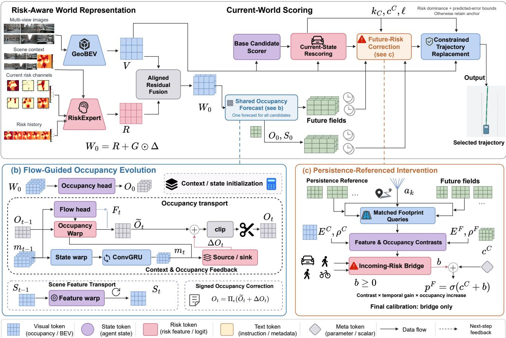
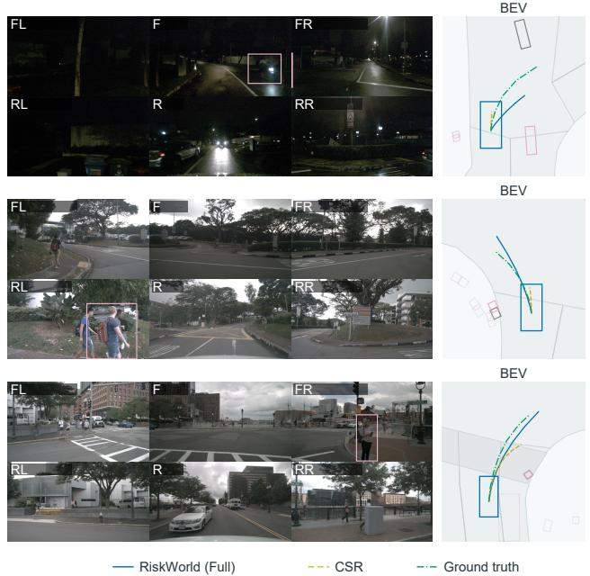
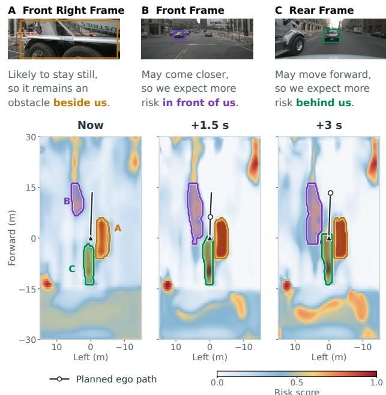

# RiskWorld: Risk-Aware World Modeling with Flow-Guided Occupancy Evolution for Selective Trajectory Planning in Automated Driving

Rongxiang Zeng1,∗, Linsen Cai1,∗, Jiafu Zhang1, Yijie Zhong1, Yide Tao2, Shuai Wang3, Nan Zheng2, Hai L. Vu2, Alvaro Garc´ıa Hernandez1 and Yongqi Dong1,†

Abstract— Safe motion planning in automated driving requires anticipating evolving traffic risks and deciding when to revise the current planned trajectory. We introduce RiskWorld, a risk-aware world modeling framework for shared occupancy forecasting and selective trajectory replacement. Spatial risk fields and temporal actor context are fused with visual bird’seye-view features. Flow-guided evolution transports occupancy and scene features, while signed residuals correct occupancy after transport. One forecast is generated per planning step and reused across candidates. Each candidate is compared with a current-state persistence reference, yielding a nonnegative collision-score correction. The trajectory selected by currentworld evaluation serves as the planning anchor and is replaced only when additional predicted risk triggers intervention and an alternative satisfies component-wise constraints on predicted risk and trajectory error. Candidate geometries remain unchanged. We evaluate RiskWorld for open-loop planning on nuScenes using camera features, annotation-derived current and historical actor states, and dataset-provided map context. RiskWorld achieves the lowest collision rate at a long evaluation horizon of 3 s, and the second-best average L2 error among various state-of-the-art baselines, while running at 11.5 FPS on a single NVIDIA RTX 4090 with 90.81 M parameters. Withinsetting ablations show that RiskWorld achieves lower collision rates than the current-state rescoring baseline, while forecast reuse enables additional candidates to be evaluated at low marginal computational cost.

## I. INTRODUCTION

As automated vehicles (AVs) are increasingly deployed on public roads, ensuring safe motion planning of AVs has become a critical requirement. Road safety broadly concerns both reducing the likelihood of collisions and mitigating the severity of their consequences. For motion planning of AVs, this requires anticipating how surrounding road users may evolve over the planning horizon. A trajectory that is collision-free regarding the current scene may still intersect another actor’s future path [1], [2]. For example, a vehicle in an adjacent lane may move into the ego vehicle’s intended path during execution. Motion planning should therefore account for the temporal evolution of the traffic scene rather than assess collision risk solely from the current observation.

Bird’s-eye-view (BEV) representations place road geometry and surrounding actors in a common spatial frame, supporting the integration of perception, prediction, and ego trajectory planning [3], [4]. Driving risk field (DRF)-based models [5] complement geometric scene representations by encoding the spatial distribution of risk associated with road geometry and the positions and motion of surrounding road users. These representations provide a basis for evaluating spatial relationships and motion-related exposure. Occupancy forecasting [6], [7] and world modeling [8], [9] extend thi reasoning over time, providing future scene states that can inform trajectory evaluation.

Predicting a plausible future does not by itself justify changing a selected trajectory. A future-risk score may reflect hazards already captured by the current-scene evaluation or additional exposure caused by scene evolution. Planning must also account for uncertainty in predicted actor motion [1]. These considerations motivate comparing future evidence with a current-state reference before deciding whether to intervene.

We propose RiskWorld, a risk-aware world modeling method for shared occupancy forecasting and selective trajectory replacement. Visual BEV features and structured current and historical risk initialize a flow-guided rollout that transports occupancy and scene features, with signed residual corrections for changes not explained by displacement. A single forecast is computed per planning step and shared across candidates, avoiding repeated world evolution. Each candidate queries the forecast and a persistence reference that repeats the current state at corresponding locations. Their contrast yields a nonnegative correction to its current-world collision score. The trajectory selected by the current-world evaluation serves as the anchor and is retained unless additional predicted risk triggers intervention and an alternative satisfies component-wise constraints on predicted risk and trajectory error. Candidate geometries remain unchanged.

We evaluate RiskWorld on nuScenes [10] with camera features, annotation-derived current and historical actor states, and dataset-provided map context supplied at inference. Within-setting studies examine future-risk intervention and spatial transport, with additional analyses of temporal order in incoming-occupancy prediction and the computational cost of forecast reuse.

In short, we make three main contributions:

• We introduce a risk-aware world representation that aligns visual BEV features with spatial hazard fields and temporal actor context for future-scene prediction and trajectory-level risk assessment.

• We develop a shared flow-guided occupancy model that jointly transports occupancy and scene features, with signed residual corrections for occupancy changes not explained by transport.

• We propose a persistence-referenced intervention rule that converts future–current evidence contrasts into nonnegative collision-score corrections for selective trajectory replacement within a fixed candidate set, subject to constraints on predicted risk and trajectory error.

## II. RELATED WORKS

## A. Planning-Oriented Representations and Risk Modeling

Planning-oriented representations organize scene information around the requirements of ego-motion planning. ST-P3 [3], UniAD [4], and VAD [11] couple perception and motion prediction with trajectory planning, while SparseDrive [12] uses sparse instances to integrate detection, tracking, online mapping, and planning. Geometric BEV encoders such as GeoBEV [13] provide spatial features for scene understanding. Although their representations and task organization differ, these approaches share the aim of making scene structure and actor motion useful to the planner.

Risk-field methods provide a complementary account of spatial exposure. DRF-based planning [5] represents hazards associated with road geometry and traffic-participant states, whereas Kolekar et al. [14] relate driver-perceived risk to corrective actions. Geometric and risk-based representations thus serve related but distinct purposes: the former describe the spatial arrangement of the scene, while the latter express its implications for driving risk. Extending this assessment over the planning horizon requires considering how actor motion changes exposure along candidate trajectories.

## B. Occupancy and World Forecasting

Occupancy forecasting provides a spatial representation of future traffic. FIERY [6] predicts future BEV instances, while Occupancy Flow Fields [7] and ImplicitO [15] couple occupancy and motion for spatiotemporal reasoning. Building on occupancy representations, OccWorld [8], RenderWorld [16], and OccLLaMA [17] connect scene forecasting with egomotion prediction, whereas Drive-WM [18] supports planning through multi-view visual forecasting.

A complementary modeling approach expresses scene evolution through spatial transport. EfficientOCF [19] uses predicted flow to associate dynamic instances across time, while DFIT-OccWorld [20] warps current occupancy features and refines the resulting representation to predict future occupancy. The value of these forecasts for planning also depends on how predicted scene information is incorporated into trajectory evaluation or revision.

## C. Prediction-to-Planning Interfaces

Forecasts inform planning through trajectory evaluation, joint prediction and planning, or trajectory decoding. Look-Out [1] and SafePathNet [2] incorporate predicted traffic motion into trajectory evaluation and selection. ScePT [21] and DTPP [22] condition actor predictions on ego motion, allowing candidate-dependent interactions to inform planning. This conditioning represents potential responses to ego actions, whereas a shared forecast evaluates candidates against the same predicted environment.

Future representations can also guide trajectory generation or refinement. World4Drive [23] uses latent futures for trajectory generation, while ResWorld [9] uses temporal residuals for future-guided refinement. IR-WM [24] examines alternative forecasting–planning couplings. A complementary approach is to check an existing plan before invoking an alternative. SafetyNet [25] follows this approach by checking a learned policy and intervening when required.

A remaining challenge in forecast-based planning is to distinguish additional predicted exposure from risk already represented in the current-scene assessment and determine whether it warrants changing the selected trajectory. The proposed RiskWorld addresses this challenge by combining risk-aware BEV features with a shared occupancy forecast and comparing candidate-specific future evidence with a current-state persistence reference. The resulting nonnegative collision-score corrections guide selective replacement within a fixed candidate set, subject to constraints on predicted risk and predicted trajectory error.

## III. METHOD

## A. Problem Setup and Framework Overview

Fig. 1 provides an overview of RiskWorld, with Fig. 1(a) showing the processing pipeline. At each planning step, RiskWorld selects an ego trajectory from a finite candidate set based on current-state information and a shared forecast of scene evolution. The inputs comprise visual BEV features, current and historical risk fields, map context, actor and ego states, and a navigation command. Structured actor and map information is supplied separately from the visual features.

To represent the driving risk field spatially, we define a nonnegative scalar potential over the BEV domain:

$$
r _ { t } : \Omega \to \mathbb { R } _ { \geq 0 } , \qquad \mathbf { x } \mapsto r _ { t } ( \mathbf { x } ) ,\tag{1}
$$

where $\Omega \subset \mathbb { R } ^ { 2 }$ denotes the spatial BEV domain, and $\textbf { x } = ~ ( x , y ) ~ \in ~ \Omega$ denotes the specific spatial location. In RiskWorld, road geometry, actor occupancy, and motionrelated risk potentials are rasterized into separate BEV channels. These channels encode scene structure and spatial risk cues rather than calibrated collision probabilities.

The candidate set is constructed using a trajectory codebook learned from training-set ground-truth ego trajectories by clustering residuals relative to a straight-line reference that maintains current ego speed. At inference, the corresponding group is selected based on ego speed and navigation command. Its ten residual prototypes are added to the reference trajectory and augmented with two deterministic lower-speed kinematic candidates, to form a set $K = 1 2$ candidates:

$$
\begin{array} { r } { \mathcal { A } = \{ a _ { k } \} _ { k = 1 } ^ { K } , \qquad a _ { k } = \big ( ( x _ { k , t } , y _ { k , t } , \theta _ { k , t } ) \big ) _ { t = 1 } ^ { T } . } \end{array}\tag{2}
$$

(a) RiskWorld System  
  
Fig. 1. Overview of RiskWorld. (a) RiskExpert fuses risk history, scene context, and visual BEV features for candidate evaluation and shared forecasting. (b) A shared displacement field transports occupancy, motion, and scene features, followed by signed occupancy correction. (c) Candidates query the forecast and current-state persistence at matched locations; their contrasts yield nonnegative collision-score corrections for constrained trajectory replacement. Onl the incoming-risk bridge is optimized during final calibration.

Here, $( x _ { k , t } , y _ { k , t } )$ and $\theta _ { k , \ast }$ t denote the planned ego position and heading, respectively, for candidate k at future step t, expressed in the current ego frame. All candidates span a 3 s horizon with $T = 6$ steps at 0.5 s intervals, matching the temporal resolution of the future supervision and enabling risk evaluation over the 1, 2, and $3 \mathrm { s }$ prefixes.

To evaluate these candidates, RiskWorld constructs a shared world representation from the risk and visual inputs. RiskExpert encodes the risk fields with map and motion context. Its features are aligned and fused with visual BEV features to form the current world representation $W _ { 0 }$ . A base candidate scorer (BCS) predicts collision scores and trajectory errors; current-state rescoring (CSR) updates this evaluation using current-state evidence and selects an anchor trajectory. In parallel, $W _ { 0 }$ initializes the occupancy rollout in Fig. 1(b). The flow head predicts a displacement field $F _ { t }$ from the previous motion state $m _ { t - 1 }$ . This field drives the warping of occupancy, motion state, and scene features, followed by a signed occupancy correction. The resulting occupancy and scene features $( O _ { t } , S _ { t } )$ form the future fields queried by the candidates.

The rollout is computed once per planning step and reused across candidates. Candidates determine query locations, not actor responses, in contrast to action-conditioned prediction [26], [27]. Persistence-referenced intervention (PRI) compares each candidate’s forecast queries with queries of a repeated current-state reference at identical locations (Fig. 1(c)). Feature and occupancy contrasts yield nonnegative collision-score corrections. PRI retains the anchor unless additional predicted risk triggers intervention and an alternative satisfies component-wise constraints on predicted risk and trajectory error. Selection leaves candidate geometries unchanged.

## B. Risk-Aware World Representation

Risk-field construction: At each observed time τ , actor states and semantic map layers are rasterized in the current reference sensor frame to form a multi-channel risk tensor $\mathcal { R } _ { \tau } \in \mathbb { R } ^ { C _ { r } \times H _ { r } \times W _ { \tau } }$ where $C _ { r }$ denotes the number of configured risk channels, and $H _ { r }$ and $W _ { r }$ denote the height and width of the BEV risk grid, respectively. The channels encode static-map risk, actor occupancy, motion-induced risk, and pairwise interaction risk. Static-map risk combines nondrivable-area penalties with proximity potentials associated with road/lane dividers, pedestrian crossings, and road edges. Actor occupancy is obtained by rasterizing oriented actor footprints, taking their union within the vehicle, pedestrian, and cyclist groups, and summing the resulting group masks.

For actor $i ,$ let $u _ { i }$ and $v _ { i }$ denote the longitudinal and lateral offsets of location x from the actor center, expressed in its local heading frame. Its motion-induced risk potential is defined as

$$
\phi _ { i } ( \mathbf { x } ) = A _ { i } \omega _ { i } ( \mathbf { x } ) \exp \left[ - \frac { u _ { i } ^ { 2 } } { s _ { i , x } ^ { 2 } + \epsilon _ { \mathrm { k e r } } } - \frac { v _ { i } ^ { 2 } } { s _ { i , y } ^ { 2 } + \epsilon _ { \mathrm { k e r } } } \right] ,\tag{3}
$$

where $A _ { i }$ is a class-dependent amplitude, $\omega _ { i } ( \mathbf { x } )$ is a speeddependent directional weighting term, and $s _ { i , x }$ and $s _ { i , y }$ denote the longitudinal and lateral spatial extents determined by actor dimensions, motion state, and class. The constant $\epsilon _ { \mathrm { k e r } } > 0$ ensures numerical stability. After spatial truncation and drivable-area weighting, the actor-wise potentials $\phi _ { i }$ are accumulated by actor class and normalized to form the vehicle- and vulnerable-road-user (VRU)-motion channels of $\mathcal { R } _ { \tau } .$ Here, VRUs comprise pedestrians and bicycles.

Pairwise-interaction and TTC-inspired fields use constantvelocity closest approach, placing spatial potentials between extrapolated actor positions and weighting them by predicted clearance, time, and actor class.

An aggregate field combines the raw static, occupancy, motion, and interaction potentials before normalization. Composite fields are normalized by N using logarithmic compression, 5th–95th spatial-percentile scaling, and clipping to [0, 1]. A degenerate percentile range falls back to maximum-based scaling, while zero fields remain unchanged. Channel selection and field parameters follow the preprocessing configuration.

Spatiotemporal encoding and fusion: A shared convolutional encoder maps each risk frame to a spatial token grid. Temporal self-attention aggregates history at each grid location, while a residual multilayer perceptron incorporates map tokens. Separate gated recurrent units encode actor and ego histories, which enter through cross-attention with risk tokens serving as queries. A spatial residual mixer then combines information from neighboring tokens.

Visual features are obtained from GeoBEV [13]. Risk features are resampled onto the visual grid using the frame transform, and projections align their channel dimensions. Let $R , V$ denote the aligned risk and visual features, and let M mark risk-grid coverage. The fusion module predicts a feature residual $\Delta$ that updates the risk representation using the aligned visual and risk features:

$$
\Delta = f _ { \Delta } ( [ V , R , | V - R | , V \odot R , M ] ) ,\tag{4}
$$

where brackets denote channel concatenation and $\odot$ is element-wise multiplication. It is added to the risk representation with a coverage-dependent weight to obtain the current world representation:

$$
W _ { 0 } = R + G \odot \Delta , \qquad G = g M + ( 1 - M ) ,\tag{5}
$$

with G broadcast across channels.

The fixed coefficient $g \in ( 0 , 1 )$ scales the residual within risk coverage, while the full residual is applied elsewhere. The resulting representation $W _ { 0 }$ supports both current-world candidate scoring and occupancy evolution.

## C. Flow-Guided Occupancy Evolution

We model scene evolution through spatial transport and occupancy correction, drawing on flow-based temporal association [19] and residual state prediction [24]. Transport propagates existing scene structure, while residual correction accounts for occupancy changes not captured by warping alone. To initialize the rollout, the fused representation $W _ { 0 }$ is mapped to scene features $S _ { 0 } = f _ { \mathrm { s c e n e } } ( W _ { 0 } )$ , from which current occupancy is predicted as current occupancy $O _ { 0 } =$ $\sigma ( f _ { O } ( S _ { 0 } ) )$ ). The motion state is initialized as $m _ { 0 } = C =$ $S _ { 0 } + f _ { C } ( W _ { 0 } )$ , with $C$ held fixed throughout the rollout to provide current-scene context alongside the evolving state.

At step $t ,$ the flow head predicts $F _ { t }$ = sF tanh $\big ( f _ { F } ( m _ { t - 1 } ) \big )$ where $s _ { F }$ bounds displacement in meters. The backward warp $\mathcal { W } ( X , F )$ bilinearly samples $X$ at ${ \bf x } \mathrm { ~ - ~ } F ( { \bf x } )$ We use the same displacement for occupancy, motion state, and scene features:

$$
\begin{array} { r l } & { \widetilde { \cal O } _ { t } = \Pi _ { \epsilon } ( \mathcal { W } ( { \cal O } _ { t - 1 } , F _ { t } ) ) , } \\ & { \widetilde { \cal m } _ { t } = \mathcal { W } ( { \cal m } _ { t - 1 } , F _ { t } ) , } \\ & { { \cal S } _ { t } = \mathcal { W } ( { \cal S } _ { t - 1 } , F _ { t } ) , } \end{array}\tag{6}
$$

where $\Pi _ { \epsilon }$ clips predicted occupancy values to $[ \epsilon , 1 - \epsilon ]$ Sharing the warp gives the propagated quantities a common spatial correspondence, so subsequent trajectory queries sample occupancy and features from the same source locations.

The motion update combines the transported state with the initial context and occupancy feedback:

$$
m _ { t } = \mathcal { U } \Big ( C + e _ { t } + f _ { \mathrm { f b } } \big ( \widetilde { O } _ { t } - O _ { 0 } \big ) , \widetilde { m } _ { t } \Big ) ,\tag{7}
$$

where $e _ { t }$ is a spatially broadcast time embedding, $f _ { \mathrm { f b } }$ projects the occupancy difference, and U is implemented with a ConvGRU. The feedback $\widetilde { O } _ { t } - O _ { 0 }$ captures the departure of transported occupancy from the current prediction, allowing recurrent updates to incorporate occupancy evolution alongside the initial scene context.

Spatial transport alone does not account for all changes in occupied space. Two heads then predict $B _ { t } = f _ { \mathrm { s r c } } ( m _ { t } )$ and $D _ { t } = f _ { \mathrm { s n k } } ( m _ { t } )$ , yielding the signed occupancy correction $\Delta O _ { t } = \alpha [ \operatorname { t a n h } ( B _ { t } ) - \operatorname { t a n h } ( D _ { t } ) ]$ . Occupancy is updated as

$$
O _ { t } = \Pi _ { \epsilon } \Big ( \widetilde { O } _ { t } + \Delta O _ { t } \Big ) ,\tag{8}
$$

where α controls the correction magnitude. The bounded correction allows occupancy to increase or decrease after transport without modifying the transported scene features $S _ { t }$ . Repeating these updates yields the shared future sequence $\{ ( O _ { t } , S _ { t } ) \} _ { t = 1 } ^ { T }$ for candidate evaluation.

## D. Persistence-Referenced Intervention

The shared future sequence $\{ ( O _ { t } , S _ { t } ) \} _ { t = 1 } ^ { T }$ is used to assess whether to replace the CSR-selected anchor $a _ { k _ { C } }$ . For each candidate $k ,$ CSR provides the current-state collision logits $c _ { k , t } ^ { C }$ and predicted prefix trajectory errors $\ell _ { k }$ . Reference ego trajectories define the error targets during training, whereas inference uses only predicted errors. We consider incomingrisk correction only, with outgoing-risk release and futureerror correction disabled.

Future-risk correction: Each candidate queries $( O _ { t } , S _ { t } )$ and a persistence reference that repeats $( O _ { 0 } , S _ { 0 } )$ at matched locations. Query patches and footprint masks remain aligned with the current ego frame. A shared evidence encoder with matched candidate conditioning produces $E _ { k , t } ^ { F }$ and $E _ { k , t } ^ { C } ,$ while maximum occupancy over valid footprint cells gives $\rho _ { k , t } ^ { F }$ and $\rho _ { k , t } ^ { C }$ . Define $\delta \bar { E _ { k , t } } ~ = ~ E _ { k , t } ^ { F } - E _ { k , t } ^ { \bar { C } }$ and $\delta \rho _ { k , t } ~ =$ $\rho _ { k , t } ^ { F } - \rho _ { k , t } ^ { C }$ . The incoming-risk bridge uses a temporal encoder to map the feature contrasts to $z _ { k , t } ,$ yielding the nonnegative gain $\gamma _ { k , t } = [ \mathrm { s o f t p l u s } ( z _ { k , t } ) - \log 2 ] _ { - }$ + for the collision-logit correction. The collision-score update is

$$
\begin{array} { l } { b _ { k , t } = \displaystyle \beta \gamma _ { k , t } \operatorname { t a n h } \Biggl ( \frac { \| \delta E _ { k , t } \| _ { 2 } } { \sqrt { d } } \Biggr ) [ \delta \rho _ { k , t } ] _ { + } , } \\ { p _ { k , t } ^ { F } = \sigma ( c _ { k , t } ^ { C } + b _ { k , t } ) , } \end{array}\tag{9}
$$

where d is the feature dimension, $\beta \geq 0$ scales the correction, and $[ x ] _ { + } ~ = ~ \operatorname* { m a x } ( x , 0 )$ . By construction, $p _ { k , t } ^ { F } ~ \geq ~ p _ { k , i } ^ { C }$ t $\sigma ( c _ { k , t } ^ { C } ) . \ \mathrm { A }$ positive correction requires both nonzero feature contrast and increased maximum footprint occupancy, not merely a local occupancy change.

Constrained replacement: Candidate risk is summarized over prefixes $\mathcal { H } = \{ 1 , 2 , 3 \} \mathrm { s }$ and the final two steps:

$$
\begin{array} { r l } & { r _ { k , h } = \displaystyle \frac { 1 } { n _ { h } } \sum _ { t = 1 } ^ { n _ { h } } p _ { k , t } , \qquad h \in \mathcal { H } , } \\ & { r _ { k , \mathrm { t a i l } } = 1 - ( 1 - p _ { k , T - 1 } ) ( 1 - p _ { k , T } ) , } \end{array}\tag{10}
$$

where $n _ { h }$ is the prefix length. The tail term retains latehorizon evidence and is used as a decision score, not a calibrated joint-event probability. Applying these summaries to $p ^ { F }$ and $p ^ { C }$ gives $\mathbf { r } _ { k } ^ { \bar { F } }$ and $\mathbf { r } _ { k } ^ { C }$ , including the tail component. Intervention requires a positive anchor correction and, for some component $j ,$ either ${ r _ { k _ { C } , j } ^ { F } } > r _ { k _ { C } , j } ^ { C } + \eta \mathrm { o r } r _ { k _ { C } , j } ^ { C } \le \tau _ { j } <$ $r _ { k _ { C } , j } ^ { F } .$ , where η is the margin and $\tau _ { j }$ are component-specific thresholds. A valid alternative $\boldsymbol { k } \neq \boldsymbol { k } _ { C }$ must satisfy

$$
\begin{array} { c } { { \mathbf { r } _ { k } ^ { F } \leq \mathbf { r } _ { k _ { C } } ^ { F } , } } \\ { { \exists j : \quad r _ { k , j } ^ { F } + \eta < r _ { k _ { C } , j } ^ { F } , } } \\ { { \bar { \ell } _ { k } \leq \bar { \ell } _ { k _ { C } } + \delta _ { \mathrm { m e a n } } , } } \\ { { \ell _ { k } \leq \ell _ { k _ { C } } + \delta _ { \mathrm { p r e f i x } } . } } \end{array}\tag{11}
$$

All vector inequalities are component-wise. $\bar { \ell } _ { k }$ is the normalized weighted mean of predicted prefix errors. Among eligible candidates, we select the one minimizing

$$
J _ { k } = w _ { \mathrm { m a x } } \operatorname* { m a x } _ { j } r _ { k , j } ^ { F } + w _ { \mathrm { a v g } } \bar { r } _ { k } ^ { F } + \bar { \ell } _ { k } ,\tag{12}
$$

where $\bar { r } _ { k } ^ { F }$ is the weighted prefix risk, and $w _ { \mathrm { m a x } }$ and $w _ { \mathrm { a v g } }$ weight the risk terms in candidate ranking. Equal prefix weights recover arithmetic means. If intervention is not triggered or no alternative is eligible, the anchor is retained. The constraints act on predicted quantities and do not guarantee collision avoidance.

## E. Training Objectives and Optimization

The training of RiskWorld starts from pretraining RiskExpert through future risk-field reconstruction. Training then proceeds to risk-visual fusion and current-world scoring, followed by occupancy evolution. Evolution uses occupancy supervision, masked smooth-L1 displacement loss, and balanced binary cross-entropy (BCE) on source/sink event targets derived from future annotations.

During final calibration, the representation, evolution module, evidence encoders, and current-world scorer are frozen. Feature and occupancy contrasts are detached, and only the incoming-risk bridge is optimized, leaving forecasts and predicted trajectory errors unchanged. The objective is

$$
\begin{array} { r l } & { \mathcal { L } _ { \mathrm { c a l } } = \mathcal { L } _ { \mathrm { B C E } } + \mathcal { L } _ { \mathrm { B r i e r } } + \lambda _ { f } \mathcal { L } _ { \mathrm { f o c a l } } } \\ & { \quad \quad \quad \quad + \mathcal { L } _ { \mathrm { h a r d } } + \lambda _ { a } \mathcal { L } _ { \mathrm { a u x } } + \lambda _ { r } \langle b _ { k , t } ^ { 2 } \rangle _ { \mathrm { v a l i d } } . } \end{array}\tag{13}
$$

BCE supervises per-step collision predictions, while the Brier-type loss penalizes squared prefix-level prediction errors. Focal loss emphasizes difficult candidate steps, and the hard-example term focuses on the largest focal losses within each sample. The quadratic penalty on $b _ { k , t } .$ , averaged over valid candidate-time pairs, discourages large collision-logit corrections.

The auxiliary objective combines feasibility ranking, falsesafe penalties, prefix and late-horizon hazard supervision for the BCS-selected candidate, and pairwise comparisons against it. Annotated trajectory errors restrict training pairs to a reference-error window and are not used at inference. Invalid candidates and missing labels are masked, while prefix- and decision-level supervision require complete future annotations. The incoming-risk bridge is optimized using AdamW with event-balanced sampling.

## IV. EXPERIMENTS AND RESULTS

## A. Dataset and Metrics

We evaluate RiskWorld on the nuScenes dataset [10] for open-loop planning. The evaluation subset contains 6,019 samples from 150 validation scenes, of which 5,119 have complete future annotations and are used to compute planning metrics. Performance is measured by trajectory L2 error (m) and ego-box collision rate (%), which quantify deviation from the ground-truth trajectory and collisions between the predicted ego footprint and other actors, respectively.

Following the VAD/STP3 protocol [3], [11], results are reported at the horizons of 1, 2, and 3 s. Each horizon value averages the per-step measurements up to that time; “Avg.” denotes the mean of the three horizon values.

## B. Implementation Details

RiskWorld combines GeoBEV visual features [13], extracted using a ResNet-50 image backbone, with structured map and actor information and ego history. Planning uses a fixed set of 12 candidate trajectories, each containing six future poses at 0.5 s intervals over a 3 s horizon.

Training proceeds in stages. During final calibration, only the incoming-risk bridge is optimized using AdamW with an initial learning rate of $1 0 ^ { - 4 }$ and a global batch size of 16. All other modules remain frozen.

TABLE I  
PLANNING PERFORMANCE AND COMPUTATIONAL EFFICIENCY ON NUSCENES DATASET.
<table><tr><td rowspan="2">Method</td><td rowspan="2">Input</td><td rowspan="2">Aux. Sup.</td><td rowspan="2">| Params. FPS4090 (M) ↓</td><td rowspan="2">↑</td><td colspan="4">L2 (m) ↓</td><td colspan="4">CR (%) ↓</td></tr><tr><td></td><td>1s</td><td></td><td>3s Avg.</td><td></td><td>1s 2s</td><td>3s</td><td>Avg.</td></tr><tr><td>ST-P3 [3]</td><td>C</td><td>M+B+D</td><td></td><td>1.60</td><td>1.33</td><td>2.11</td><td>2.90</td><td>2.11</td><td>0.23</td><td>0.62</td><td>1.27</td><td>0.71</td></tr><tr><td>UniAD [4]</td><td>C</td><td>M+B+Mo+Tr+O</td><td>125.00</td><td>1.80</td><td>0.44</td><td>0.67</td><td>0.96</td><td>0.69</td><td>0.04</td><td>0.08</td><td>0.23</td><td>0.12</td></tr><tr><td>VAD [11]</td><td>C</td><td> $\mathbf { M } { + } \mathbf { B } { + } \mathbf { M } \mathbf { o }$ </td><td>58.36</td><td>4.50</td><td>0.41</td><td>0.70</td><td>1.05</td><td>0.72</td><td>0.07</td><td>0.17</td><td>0.41</td><td>0.22</td></tr><tr><td>GenAD [28]</td><td>C</td><td> $\mathbf { M } { + } \mathbf { B } { + } \mathbf { M } \mathbf { o }$ </td><td></td><td></td><td>0.28</td><td>0.49</td><td>0.78</td><td>0.52</td><td>0.08</td><td></td><td>0.14 0.34</td><td>0.19</td></tr><tr><td>SparseDrive-S [12]</td><td>C</td><td> $\mathbf { M } { + } \mathbf { B } { + } \mathbf { M } \mathbf { o } { + } \mathrm { T r }$ </td><td>85.90</td><td>9.00</td><td>0.29</td><td>0.58</td><td>0.96</td><td>0.61</td><td>0.01</td><td>0.05</td><td>0.18</td><td>0.08</td></tr><tr><td>DiffusionDrive [29]</td><td>C</td><td> $\mathbf { M } { + } \mathbf { B } { + } \mathbf { M } \mathbf { o } { + } \mathrm { T r }$ </td><td>92.04</td><td>8.20</td><td>0.27</td><td>0.54</td><td>0.90</td><td>0.57</td><td>0.03</td><td>0.05</td><td>0.16</td><td>0.08</td></tr><tr><td>Drive-OccWorld [26]</td><td>C</td><td>O+F</td><td></td><td></td><td>0.25</td><td>0.44</td><td>0.72</td><td>0.47</td><td>0.03</td><td>0.08</td><td>0.22</td><td>0.11</td></tr><tr><td>OccWorld-D [8]</td><td>C</td><td>0</td><td></td><td>2.80</td><td>0.39</td><td>0.73</td><td>1.18</td><td>0.77</td><td>0.11</td><td></td><td>0.190.67</td><td>0.32</td></tr><tr><td>World4Drive [23]</td><td>C</td><td>None</td><td>70.18</td><td></td><td>0.23</td><td>0.47</td><td>0.81</td><td>0.50</td><td>0.02</td><td>0.12</td><td>0.33</td><td>0.16</td></tr><tr><td>ResWorld [9]</td><td>C</td><td>None</td><td>80.77</td><td>10.3</td><td>0.17</td><td>0.32</td><td>0.55</td><td>0.35</td><td>0.01</td><td></td><td>0.02 0.16</td><td>0.07</td></tr><tr><td>FusionAD [30]</td><td>C+L</td><td>M+B+Mo+Tr+O</td><td>141.60</td><td>1.22</td><td></td><td></td><td></td><td>1.03</td><td>0.25</td><td>0.13</td><td>0.25</td><td>0.21</td></tr><tr><td>SpaRC-AD [31]</td><td>C+R</td><td>M+B+Mo+D</td><td></td><td></td><td></td><td>0.240.47</td><td>0.79</td><td>0.50</td><td>0.01</td><td>0.06</td><td>0.20</td><td>0.09</td></tr><tr><td>OccWorld-O [8]</td><td>GT-O</td><td>0</td><td>72.39</td><td>18.0</td><td>0.32</td><td>0.61</td><td>0.98</td><td>0.64</td><td>0.06</td><td>0.21</td><td>0.47</td><td>0.24</td></tr><tr><td>RiskWorld (ours)</td><td>C+M+GT-Tr</td><td>Risk/O+Coll.</td><td>90.81</td><td>11.5</td><td>0.18</td><td>0.37</td><td>0.65</td><td>0.40</td><td></td><td>|0.060.08</td><td>0.14</td><td>0.09</td></tr></table>

Input refers to inference inputs. Aux. Sup. excludes ego-trajectory supervision and generic backbone pretraining. C: camera; L: LiDAR; R: radar; M: map; B: boxes; D: depth; Mo: motion; Tr: tracks; O: occupancy; F: flow; Coll.: collision. GT-Tr denotes current and historical ground-truth actor states. FPS denotes inference throughput in frames per second on a single NVIDIA RTX 4090 for nuScenes open-loop planning. Published values are used where available. ‡ marks local measurements of ResWorld, and FusionAD using the authors’ original implementations. CR denotes collision rate. Parameter counts (Params.) refer to the online inference model where available. Counts for VAD, DiffusionDrive, World4Drive, and ResWorld are computed from released implementations or configurations. World4Drive excludes models used only for offline depth and mask generation. Gray shading marks the three best distinct values per metric. Bold and underlining indicate first and second place, respectively, with ties sharing the same formatting. Lower is bette except for FPS. Entries without comparable measurements (“–”) are excluded from ranking. Input settings differ across methods.

TABLE II  
PLANNING PERFORMANCE UNDER INFERENCE-TIME PERTURBATIONS OF RISKEXPERT FEATURES.
<table><tr><td>Risk features</td><td>L2 Avg. (m) ↓ |</td><td>Collision Avg. (%)↓</td></tr><tr><td>Original (Full)</td><td>0.40</td><td>0.09</td></tr><tr><td>Zeroed</td><td>0.63</td><td>0.28</td></tr><tr><td>Shuffled</td><td>0.49</td><td>0.27</td></tr></table>

TABLE III

ABLATION OF PERSISTENCE-REFERENCED INTERVENTION (PRI) AND FLOW TRANSPORT (FT).
<table><tr><td rowspan="3">Variant</td><td rowspan="3">PRI</td><td rowspan="3">FT</td><td rowspan="3">L2 (m) ↓ Avg.</td><td colspan="4">CR (%) ↓</td></tr><tr><td>1s</td><td>2s</td><td>3s</td><td>Avg.</td></tr><tr><td>CSR</td><td>×</td><td>一</td><td>0.40</td><td>0.08</td><td>0.10</td><td>0.17</td><td>0.12</td></tr><tr><td>No-Transport</td><td>√</td><td>X</td><td>0.40</td><td>0.08</td><td>0.10</td><td>0.18</td><td>0.12</td></tr><tr><td>Full</td><td>√</td><td>√1</td><td>0.40</td><td>0.06</td><td>0.08</td><td>0.14</td><td>0.09</td></tr></table>

“–” denotes not applicable. Values are rounded for display. Relative reductions are computed from the corresponding metric values before rounding.

## C. Main Results

Planning performance: Table I compares RiskWorld with representative state-of-the-art methods on nuScenes. RiskWorld achieves an average L2 error of 0.40 m and an average collision rate of 0.09%. Its average L2 error is lower than those of VAD [11], SparseDrive [12], and DiffusionDrive [29]. At the 3 s horizon, RiskWorld delivers the lowest collision rate among the listed methods at 0.14%, compared with 0.16% for both DiffusionDrive [29] and

ResWorld [9]. These results demonstrate its competitive trajectory accuracy and favorable collision performance at a long horizon evaluated.

Efficiency comparison: Table I includes the model size and inference throughput for comparison. RiskWorld has 90.81 M parameters, comparable to SparseDrive-S [12] and ResWorld [9], slightly fewer than DiffusionDrive [29], and fewer than UniAD [4] and FusionAD [30]. Its reported throughput is 11.5 FPS on a single NVIDIA RTX 4090, the second-highest value listed and the highest among the listed methods with camera inputs. OccWorld-O [8] reports 18.0 FPS using ground-truth occupancy without image processing, whereas its camera-based variant, OccWorld-D [8], reports 2.8 FPS. Please note that throughput comparisons should account for differences in input conditions and the processing stages included in each measurement.

Qualitative comparison: Fig. 2(a) compares RiskWorld with CSR, which relies on current-world evidence. Across a nighttime road, a turn near pedestrians, and an urban intersection, RiskWorld selects trajectories with greater forward progress in the first two examples and follows the ground truth turn more closely in the third. Fig. 2(b) shows the predicted future occupancy of the surrounding scene. The construction truck to the right of the ego vehicle remains largely stationary, producing persistent risk in that region marked by an orange mask, while the vehicles from the opposing traffic flow and from behind the ego generate dynamically evolving risk over time. This distinction allows the model to capture both stationary constraints and moving hazards, providing future-risk evidence that can guide the direction and extent of trajectory adjustment.

(a) Qualitative trajectory comparison  

(b) World Model Risk Prediction  
  
Fig. 2. Qualitative comparison on nuScenes. (a) Six camera views and BEV trajectories from RiskWorld (blue solid), CSR (orange dashed), and ground truth (green dash-dotted). The blue box marks the initial ego footprint. (b) World Model’s predicted collision occupancy evolution around the side (orange), front (purple), and rear (green) vehicles, with the planned ego path overlaid.

## D. Ablation Studies

RiskExpert features: Table II examines how planning depends on RiskExpert features. We zero these features or shuffle them across samples at inference, keeping model weights, visual inputs, candidate trajectories, and the selector fixed. Zeroing and shuffling increase average collision rates from 0.09% to 0.28% and 0.27%, respectively, and average L2 error from 0.40 m to 0.63 m and 0.49 m. These results indicate that planning depends on both the risk features and their correspondence with the current scene.

Future-risk evidence: We examine the contributions of future-risk evidence and flow transport using the same input cache, candidate set, evaluation samples, and model weights, changing only the specified inference component. Table III compares the full RiskWorld model (Full) with CSR, which selects the anchor using current-state evidence without the additional future-risk correction. Full achieves lower collision rates than CSR at all three evaluation horizons, reducing the average collision rate from 0.12% to 0.09%. This comparison supports the use of future-risk evidence in candidate selection.

Flow transport: To assess the contribution of spatial transport, we evaluate No-Transport, a variant that sets the predicted flow to zero at inference while retaining the same model weights and all other evolution and selection components. Table III reports a 3 s collision rate of 0.18% for No-Transport, compared with 0.14% for Full. Full reduces the average collision rate relative to No-Transport, with essentially unchanged average L2 error. This fixed-checkpoint comparison supports the contribution of spatial transport to future-risk assessment and trajectory selection.

Temporal order: In a separate experiment using only current and past observations, we fix the current frame and shuffle earlier frames. Chronological history improves 3 s incoming-cell Area Under the Precision-Recall Curve (AUPRC) by 0.006 over shuffled history (paired 95% confidence interval: [0.005, 0.008]). This supports the value of temporal order for predicting incoming occupancy, which informs downstream risk assessment.

Candidate-count scalability: With BEV features and candidate trajectories provided, increasing the candidate count from K = 1 to K = 24 changes the shared world prediction time from 13.76 ms to 13.87 ms and the total runtime from 44.16 ms to 45.20 ms. These measurements exclude the visual frontend. The small increase in runtime supports reusing a shared world forecast to evaluate additional candidates at low marginal cost.

## V. CONCLUSIONS

In this paper, we introduce RiskWorld, a risk-aware world modeling framework for shared occupancy forecasting and selective trajectory replacement. By integrating spatial risk fields and temporal actor context with visual BEV features, RiskWorld combines flow-guided scene evolution with trajectory-level risk assessment. Comparing future evidence with a current-state persistence reference guides changes to the planning anchor under explicit constraints on predicted risk and trajectory error, while preserving candidate geometry. Experiments on nuScenes show competitive trajectory accuracy and the lowest reported collision rate at the longest evaluated horizon (3 s) among among all evaluated state-of-the-art baselines. Within-setting comparisons further demonstrate reduced collision rates relative to current-state selection, while sharing a single forecast enables additional candidates to be evaluated at low marginal computational cost. These results support the use of future-risk evidence for efficient, selective planning intervention. Future work should address candidate-dependent actor responses and prediction uncertainty in reactive closed-loop planning while preserving efficient forecast reuse.

## REFERENCES

[1] A. Cui, S. Casas, A. Sadat, R. Liao, and R. Urtasun, “Lookout: Diverse multi-future prediction and planning for self-driving,” in Proceedings of the IEEE/CVF International Conference on Computer Vision (ICCV), October 2021, pp. 16 107–16 116.

[2] S. Pini, C. S. Perone, A. Ahuja, A. S. R. Ferreira, M. Niendorf, and S. Zagoruyko, “Safe real-world autonomous driving by learning to predict and plan with a mixture of experts,” in 2023 IEEE International Conference on Robotics and Automation (ICRA), 2023, pp. 10 069– 10 075. [Online]. Available: https://arxiv.org/abs/2211.02131

[3] S. Hu, L. Chen, P. Wu, H. Li, J. Yan, and D. Tao, “St-p3: Endto-end vision-based autonomous driving via spatial-temporal feature learning,” in European Conference on Computer Vision (ECCV). Springer, 2022, pp. 533–549.

[4] Y. Hu, J. Yang, L. Chen, K. Li, C. Sima, X. Zhu, S. Chai, S. Du, T. Lin, W. Wang, L. Lu, X. Jia, Q. Liu, J. Dai, Y. Qiao, and H. Li, “Planning-oriented autonomous driving,” in Proceedings of the IEEE/CVF Conference on Computer Vision and Pattern Recognition (CVPR), June 2023, pp. 17 853–17 862.

[5] L. Zhang, Y. Dong, H. Farah, and B. van Arem, “Social-aware planning and control for automated vehicles based on driving risk field and model predictive contouring control: Driving through roundabouts as a case study,” in 2023 IEEE International Conference on Systems, Man, and Cybernetics (SMC), 2023, pp. 3297–3304.

[6] A. Hu, Z. Murez, N. Mohan, S. Dudas, J. Hawke, V. Badrinarayanan, R. Cipolla, and A. Kendall, “Fiery: Future instance prediction in bird’s-eye view from surround monocular cameras,” in Proceedings of the IEEE/CVF International Conference on Computer Vision (ICCV), October 2021, pp. 15 273–15 282.

[7] R. Mahjourian, J. Kim, Y. Chai, M. Tan, B. Sapp, and D. Anguelov, “Occupancy flow fields for motion forecasting in autonomous driving,” IEEE Robotics and Automation Letters, vol. 7, no. 2, pp. 5639–5646, 2022.

[8] W. Zheng, W. Chen, Y. Huang, B. Zhang, Y. Duan, and J. Lu, “Occworld: Learning a 3d occupancy world model for autonomous driving,” in European Conference on Computer Vision (ECCV). Springer, 2024, pp. 55–72.

[9] J. Zhang, Z. Fu, Z. Xu, W. Dai, Q. Liu, and Y. Wang, “ResWorld: Temporal residual world model for end-to-end autonomous driving,” in The Fourteenth International Conference on Learning Representations (ICLR), 2026.

[10] H. Caesar, V. Bankiti, A. H. Lang, S. Vora, V. E. Liong, Q. Xu, A. Krishnan, Y. Pan, G. Baldan, and O. Beijbom, “nuScenes: A multimodal dataset for autonomous driving,” in Proceedings of the IEEE/CVF Conference on Computer Vision and Pattern Recognition (CVPR), June 2020.

[11] B. Jiang, S. Chen, Q. Xu, B. Liao, J. Chen, H. Zhou, Q. Zhang, W. Liu, C. Huang, and X. Wang, “Vad: Vectorized scene representation for efficient autonomous driving,” in Proceedings of the IEEE/CVF International Conference on Computer Vision (ICCV), October 2023, pp. 8340–8350.

[12] W. Sun, X. Lin, Y. Shi, C. Zhang, H. Wu, and S. Zheng, “SparseDrive: End-to-end autonomous driving via sparse scene representation,” in 2025 IEEE International Conference on Robotics and Automation (ICRA), 2025, pp. 8795–8801.

[13] J. Zhang, Y. Zhang, Y. Qi, Z. Fu, Q. Liu, and Y. Wang, “GeoBEV: Learning geometric BEV representation for multi-view 3D object detection,” Proceedings ofthe AAAI Conference on Artificial Intelligence, vol. 39, no. 9, pp. 9960–9968, 2025.

[14] S. Kolekar, J. de Winter, and D. Abbink, “Human-like driving behaviour emerges from a risk-based driver model,” Nature Communications, vol. 11, p. 4850, 2020.

[15] B. Agro, Q. Sykora, S. Casas, and R. Urtasun, “Implicit occupancy flow fields for perception and prediction in self-driving,” in Proceedings of the IEEE/CVF Conference on Computer Vision and Pattern Recognition (CVPR), June 2023, pp. 1379–1388.

[16] Z. Yan, W. Dong, Y. Shao, Y. Lu, H. Liu, J. Liu, H. Wang, Z. Wang, Y. Wang, F. Remondino, and Y. Ma, “RenderWorld: World model with self-supervised 3D label,” in 2025 IEEE International Conference on Robotics and Automation (ICRA), 2025.

[17] J. Wei, S. Yuan, P. Li, X. Quan, L. Tai, J. Zhao, Z. Gan, and W. Ding, “OccLLaMA: A unified occupancy-language-action world model for enhancing motion planning via multi-task learning,” in 2026 IEEE International Conference on Robotics and Automation (ICRA), 2026.

[18] Y. Wang, J. He, L. Fan, H. Li, Y. Chen, and Z. Zhang, “Driving into the future: Multiview visual forecasting and planning with world model for autonomous driving,” in Proceedings of the IEEE/CVF Conference on Computer Vision and Pattern Recognition (CVPR), June 2024, pp. 14 749–14 759.

[19] J. Xu, X. Chen, J. Ma, J. Huang, J. Xu, Y. Wang, and L. Pei, “Spatiotemporal decoupling for efficient vision-based occupancy forecasting,” in Proceedings of the IEEE/CVF Conference on Computer Vision and Pattern Recognition, 2025, pp. 22 338–22 347.

[20] H. Zhang, Y. Xue, X. Yan, J. Zhang, W. Qiu, D. Bai, B. Liu, S. Cui, and Z. Li, “An efficient occupancy world model via decoupled dynamic flow and image-assisted training,” arXiv preprint arXiv:2412.13772, 2024. [Online]. Available: https://arxiv.org/abs/2412.13772

[21] Y. Chen, B. Ivanovic, and M. Pavone, “Scept: Scene-consistent, policybased trajectory predictions for planning,” in Proceedings of the IEEE/CVF Conference on Computer Vision and Pattern Recognition (CVPR), June 2022, pp. 17 103–17 112.

[22] Z. Huang, P. Karkus, B. Ivanovic, Y. Chen, M. Pavone, and C. Lv, “DTPP: Differentiable joint conditional prediction and cost evaluation for tree policy planning in autonomous driving,” in 2024 IEEE International Conference on Robotics and Automation (ICRA), 2024, pp. 6806–6812.

[23] Y. Zheng, P. Yang, Z. Xing, Q. Zhang, Y. Zheng, Y. Gao, P. Li, T. Zhang, Z. Xia, P. Jia, X. Lang, and D. Zhao, “World4drive: Endto-end autonomous driving via intention-aware physical latent world model,” in Proceedings of the IEEE/CVF International Conference on Computer Vision (ICCV), October 2025, pp. 28 632–28 642.

[24] J. Mei, Y. Yang, X. Yang, L. Wen, J. Lv, B. Shi, and Y. Liu, “Visioncentric 4D occupancy forecasting and planning via implicit residual world models,” in 2026 IEEE International Conference on Robotics and Automation (ICRA), 2026.

[25] M. Vitelli, Y. Chang, Y. Ye, A. Ferreira, M. Wolczyk, B. Osinski, M. Niendorf, H. Grimmett, Q. Huang, A. Jain, and P. Ondruska, “SafetyNet: Safe planning for real-world self-driving vehicles using machine-learned policies,” in 2022 International Conference on Robotics and Automation (ICRA), 2022, pp. 897–904. [Online]. Available: https://arxiv.org/abs/2109.13602

[26] Y. Yang, J. Mei, Y. Ma, S. Du, W. Chen, Y. Qian, Y. Feng, and Y. Liu, “Driving in the occupancy world: Vision-centric 4D occupancy forecasting and planning via world models for autonomous driving,” Proceedings of the AAAI Conference on Artificial Intelligence, vol. 39, no. 9, pp. 9327–9335, 2025.

[27] J. Du, Y. Zhao, Z. Guo, Y. Pan, W. Hou, Z. Hao, K. Zhan, and Q. Chen, “SparseWorld-TC: Trajectory-conditioned sparse occupancy world model,” in Proceedings of the IEEE/CVF Conference on Computer Vision and Pattern Recognition, 2026, pp. 7425–7434.

[28] W. Zheng, R. Song, X. Guo, C. Zhang, and L. Chen, “GenAD: Generative end-to-end autonomous driving,” in Proc. ECCV, 2025, pp. 87–104.

[29] B. Liao, S. Chen, H. Yin, B. Jiang, C. Wang, S. Yan, X. Zhang, X. Li, Y. Zhang, Q. Zhang, and X. Wang, “DiffusionDrive: Truncated diffusion model for end-to-end autonomous driving,” in Proceedings of the IEEE/CVF Conference on Computer Vision and Pattern Recognition (CVPR), June 2025, pp. 12 037–12 047.

[30] T. Ye, W. Jing, C. Hu, S. Huang, L. Gao, F. Li, J. Wang, K. Guo, W. Xiao, W. Mao, H. Zheng, K. Li, J. Chen, and K. Yu, “FusionAD: Multi-modality fusion for prediction and planning tasks of autonomous driving,” arXiv preprint arXiv:2308.01006, 2023.

[31] P. Wolters, J. Gilg, T. Teepe, and G. Rigoll, “SpaRC-AD: A baseline for radar-camera fusion in end-to-end autonomous driving,” in Proceedings of the IEEE/CVF International Conference on Computer Vision (ICCV) Workshops, Oct. 2025, pp. 1831–1841.