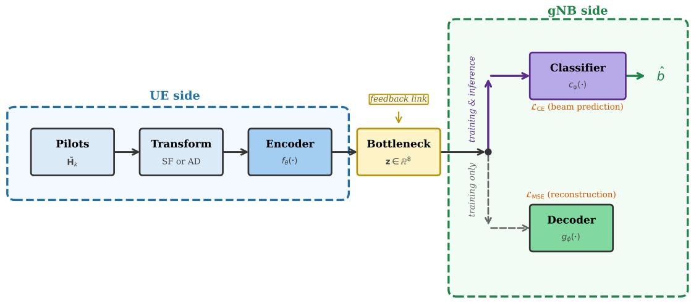
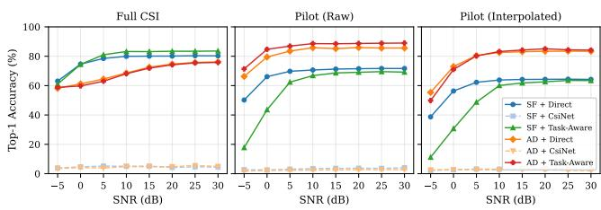
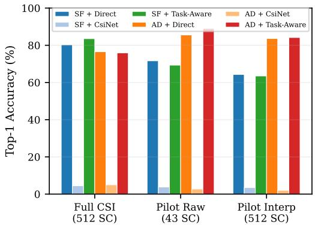

# SEMANTIC CSI FEEDBACK FOR BEAM SELECTION: WHEN TASK-AWARE EMBEDDINGS FROM SPARSE PILOTS OUTPERFORM FULL-BANDWIDTH RECONSTRUCTION

Cristian J. Vaca-Rubio, Konstantinos Vandikas, Aneta Vulgarakis Feljan

Ericsson Research, Stockholm, Sweden

{cristian.vaca.rubio, konstantinos.vandikas, aneta.vulgarakis}@ericsson.com

## ABSTRACT

Classical CSI feedback in FDD massive MIMO transmits a compressed reconstruction of the channel, optimizing fidelity to the original signal regardless of the downstream task. We propose a semantic communication perspective: instead of reconstructing the channel, the UE transmits a learned semantic embedding optimized end-to-end for beam selection at the gNB. Comparing reconstruction-oriented feedback (CsiNet) against task-aware semantic feedback across two input domains and three observation scenarios, we show that a semantic embedding of just d = 8 real values from only 43 NR CSI-RS pilots in the angular-delay domain achieves the highest beam prediction accuracy, outperforming every method with access to the full 512-subcarrier channel. The key insight is that beam-relevant information is intrinsically low-dimensional: the semantic encoder learns to discard reconstruction-irrelevant structure and retain only a compact representation that is relevant to beam selection, realizing the core principle of semantic communication: transmit the intent, not the signal.

Index Terms— semantic communication, beam management, CSI feedback, deep learning, FDD massive MIMO, 5G NR

## 1. INTRODUCTION

Beam selection in 5G NR FDD systems presents a fundamental information asymmetry: the gNB needs to choose a transmit beam, but can only observe the downlink channel indirectly through UE reports. The standardized solution, exhaustive beam sweeping, scales linearly with codebook size and becomes prohibitive for large antenna arrays [1, 2, 3]. Deep learning offers a path forward: predict the optimal beam from compressed channel observations [4, 5, 6]. Existing learned feedback schemes such as CsiNet [7] and its transformerbased successors [8, 9] follow the classical communication paradigm: compress the channel for faithful reconstruction at the receiver, then perform beam selection on the reconstructed CSI. This two-stage separation is suboptimal because the encoder is agnostic to the downstream task: it preserves signallevel fidelity which may not be directly related to a given down stream task. Semantic and task-oriented communication [10, 11, 12, 13] challenges this separation by designing the encoder to transmit only the information relevant to the receiver’s intent. In our context, the “semantics” of a channel observation are not its subcarrier-level values, but the identity of the optimal beam. We instantiate this principle as semantic CSIfeedback: the UE encodes its pilot observations into a compact embedding z trained end-to-end for beam prediction at the gNB. The classification loss shapes z to encode beam identity rather than channel coefficients; a decoder retained during training grounds the embedding in physical channel structure but is discarded at inference.

Our evaluation reveals three insights: (i) the optimal input domain depends on observation density, i.e., SF wins with full bandwidth, AD wins decisively with sparse pilots; (ii) a task-aware embedding of just d = 8 reals from 43 raw pilots surpasses every full-bandwidth method, and interpolation actively hurts; (iii) two-stage compress-then-classify fails catastrophically because the autoencoder discards beamdiscriminative structure to minimize signal-level error.

## 2. SYSTEM MODEL

## 2.1. Downlink Channel and Beam Codebook

We consider a gNB with an 8 × 8 uniform planar array (UPA, $N _ { t } = 6 4$ antennas) serving single-antenna UEs over $N _ { \mathrm { s c } } =$ 512 OFDM subcarriers at 3.5 GHz. The downlink channel for UE k at subcarrier n is $\mathbf { h } _ { k } [ n ] \in \mathbb { C } ^ { N _ { t } }$ . The beam codebook is a 2D oversampled DFT matrix whose steering vectors are

$$
\mathbf { a } ( \mu , \nu ) = \mathbf { a } _ { \mathrm { a z } } ( \mu ) \otimes \mathbf { a } _ { \mathrm { e l } } ( \nu ) ,\tag{1}
$$

with $\begin{array} { r } { [ \mathbf { a } _ { \mathrm { a z } } ( \mu ) ] _ { m } = \frac { 1 } { \sqrt { N _ { \mathrm { a z } } } } e ^ { j 2 \pi m \mu } } \end{array}$ and $\begin{array} { r } { [ { \bf a } _ { \mathrm { e l } } ( \nu ) ] _ { l } = \frac { 1 } { \sqrt { N _ { \mathrm { e l } } } } e ^ { j 2 \pi l \nu } } \end{array}$ The spatial frequencies are sampled with oversampling factor $O = 2$

$$
\mu _ { p } = \frac { p } { { \cal O } \cdot N _ { \mathrm { a z } } } , \quad \nu _ { q } = \frac { q } { { \cal O } \cdot N _ { \mathrm { e l } } } ,\tag{2}
$$

for $p = 0 , \ldots , 2 N _ { \mathrm { a z } } - 1$ and $q = 0 , \ldots , 2 N _ { \mathrm { e l } } { - 1 }$ , yielding $N _ { b } = 2 5 6$ beams. The optimal beam for UE k maximizes average received power:

$$
b _ { k } ^ { * } = \arg \operatorname* { m a x } _ { b \in \{ 1 , \dots , N _ { b } \} } \ \frac { 1 } { N _ { \mathrm { s c } } } \sum _ { n = 1 } ^ { N _ { \mathrm { s c } } } | \mathbf { w } _ { b } ^ { H } \mathbf { h } _ { k } [ n ] | ^ { 2 } .\tag{3}
$$

After discarding beams not optimal for any UE in the dataset, $N _ { \mathrm { c l s } } ~ = ~ 8 8$ active beam classes remain. Channels are generated via DeepMIMO v4 [14] using the asu campus 3p5 scenario at 3.5 GHz.

## 2.2. What the UE Observes

In FDD, the UE measures downlink pilots but cannot send the raw channel back. The observed channel is corrupted by additive noise:

$$
\tilde { \mathbf { h } } _ { k } [ n ] = \mathbf { h } _ { k } [ n ] + \mathbf { n } [ n ] , \quad \mathbf { n } \sim \mathcal { C N } ( 0 , \sigma ^ { 2 } \mathbf { I } ) ,\tag{4}
$$

where $\sigma ^ { 2 }$ is set according to the per-sample SNR. We consider three observation scenarios: (i) Full CSI: all 512 subcarriers are observed (TDD-equivalent upper bound); (ii) Raw pilots: one pilot every 12 subcarriers, yielding $N _ { p } = 4 3$ noisy measurements at positions $n _ { p } \in \{ 0 , 1 2 , 2 4 , . . . , 5 0 4 \}$ ; (iii) Interpolated pilots: linear interpolation recovers estimates at all 512 subcarriers from the 43 pilot positions. The key question is whether filling in the gaps helps or whether the network is better served by receiving clean-but-sparse observations.

## 3. THE ROLE OF INPUT DOMAIN

Before any learning begins, the choice of representation determines what information survives sparsification.

Spatial-Frequency (SF). Real/imaginary stacking of the channel: $\mathbf { X } _ { \mathrm { S F } } \ \in \ \mathbb { R } ^ { 2 \times 6 4 \times N _ { \mathrm { s c } } }$ . With 512 subcarriers, this is complete. With 43 pilots, most of the frequency axis is empty: the network sees a comb with 91.6% missing teeth.

Angular-Delay (AD). A 2D transform (FFT along antennas, IFFT along frequency) maps the channel into the angledelay domain. With full CSI, the IFFT output is truncated to $N _ { \tau } = 6 4$ delay taps: $\mathbf { X } _ { \mathrm { A D } } ~ \in ~ \mathbb { R } ^ { 2 \times 6 4 \times 6 4 }$ With raw pilots, the IFFT operates on the $N _ { p } ~ = ~ 4 3$ pilot observations directly, yielding $\mathbf { X } _ { \mathrm { A D } } ~ \in ~ \mathbb { R } ^ { 2 \times 6 4 ^ { \cdot } \times 4 3 }$ . The multipath channel is sparse in this domain: most energy concentrates in the first few taps, corresponding to dominant propagation paths. This is the crucial property: even from 43 pilot observations, the IFFT recovers a meaningful delay-domain representation because the channel has far fewer degrees of freedom than subcarriers. The AD transform is a free compressor: it concentrates information without any learned parameters, acting as a physics-informed preprocessing step that reduces the burden on the downstream neural network.

## 4. FEEDBACK ARCHITECTURES

Fig. 1 illustrates the semantic feedback pipeline. Let $\textbf { X } \in$ $\mathbb { R } ^ { \sum \times N _ { t } \times N _ { f } }$ denote the preprocessed input (SF or AD domain), where $N _ { f }$ depends on the observation scenario. We define a semantic encoder $f _ { \theta } \colon  { \mathbb { R } } ^ { 2 \times N _ { t } \times N _ { f } } \to  { \mathbb { R } } ^ { d }$ at the UE, a decoder $g _ { \phi } \colon  { \mathbb { R } } ^ { d } \to  { \mathbb { R } } ^ { 2 \times N _ { t } \times N _ { f } }$ , and a semantic interpreter $c _ { \psi } : \mathbb { R } ^ { d } $

R $N _ { \mathrm { c l s } }$ , both at the gNB, with bottleneck dimension $d = 8$ reals. The UE computes the semantic embedding $\mathbf { z } = f _ { \theta } ( \mathbf { X } )$ and transmits z over the uplink feedback channel. In the semantic communication framework [10], z represents the beam-relevant content of the observation rather than a compressed replica of the signal itself.

## 4.1. Direct Classification (Upper Bound)

A convolutional network maps the full input directly to beam logits: $\hat { b } \ = \ \arg \operatorname* { m a x } h _ { \omega } ( \mathbf { X } )$ , where $\bar { h _ { \omega } } : \mathbb { R } ^ { 2 \times \bar { N } _ { t } \times N _ { f } } $ $\mathbb { R } ^ { \breve { N } _ { \mathrm { c l s } } }$ . No compression is applied; the gNB is assumed to have full access to X. This models TDD reciprocity or an unconstrained feedback link, serving as a simple approach to benchmark the solution.

## 4.2. CsiNet-Style Autoencoder: Signal-Level Feedback

In the classical approach, the encoder is optimized for signal reconstruction, analogous to traditional source coding that preserves waveform fidelity without regard for the receiver’s task. We adopt the CsiNet compress-then-reconstruct paradigm [7] with architectural modifications: batch normalization and LeakyReLU activations for training stability, and adaptive average pooling in the encoder to handle variable input sizes across scenarios. The core principle, i.e., train an autoencoder for signal fidelity, then classify on the reconstruction, is preserved. The autoencoder $\left( f _ { \theta } , g _ { \phi } \right)$ is trained to minimize reconstruction error:

$$
\operatorname* { m i n } _ { \theta , \phi } \mathbb { E } \left[ \| g _ { \phi } ( f _ { \theta } ( \mathbf { X } ) ) - \mathbf { X } \| _ { 2 } ^ { 2 } \right] .\tag{5}
$$

Once converged, the parameters $( \theta , \phi )$ are frozen. A classifier $c _ { \psi }$ is then trained on the reconstruction:

$$
\operatorname* { m i n } _ { \psi } \ \mathbb { E } \left[ \mathcal { L } _ { \mathrm { C E } } ( c _ { \psi } ( g _ { \phi } ( f _ { \theta } ( \mathbf { X } ) ) ) , b ^ { * } ) \right] .\tag{6}
$$

Note that $c _ { \psi }$ receives $\hat { \mathbf { X } } = g _ { \phi } ( \mathbf { z } )$ , not z itself. The encoder has no incentive to preserve beam-discriminative features that happen to be orthogonal to the reconstruction objective.

## 4.3. Task-Aware: Semantic Feedback

The task-aware architecture realizes the semantic communication principle [15]: the encoder is optimized not for signal fidelity, but for the compact representation that the receiver needs to act to determine the beam identity. Critically, the semantic interpreter $c _ { \psi }$ operates directly on the embedding z, not on a reconstructed signal. All parameters are trained jointly:

$$
\operatorname* { m i n } _ { \theta , \phi , \psi } \mathbb { E } \Big [ \alpha \underbrace { \| g _ { \phi } ( f _ { \theta } ( \mathbf { X } ) ) - \mathbf { X } \| _ { 2 } ^ { 2 } } _ { \mathcal { L } _ { \mathrm { M S E } } } + \beta \underbrace { \mathcal { L } _ { \mathrm { C E } } ( c _ { \psi } ( f _ { \theta } ( \mathbf { X } ) ) , b ^ { * } ) } _ { \mathcal { L } _ { \mathrm { C E } } } \Big ] ,\tag{7}
$$

  
Fig. 1. Semantic CSI feedback pipeline. The UE extracts a semantic embedding $\mathbf { z } = f _ { \theta } ( \mathbf { X } )$ , transmitted over the feedback link. At the gNB, the semantic interpreter predicts the beam directly from z (ˆb = arg max $c _ { \boldsymbol { \psi } } ( \mathbf { z } ) )$ . The decoder $( \hat { \mathbf { X } } = g _ { \phi } ( \mathbf { z } ) )$ serves as a structural regularizer during training, grounding the embedding in physical channel structure, but is not required at inference.

with $\alpha ~ = ~ 0 . 1$ and $\beta ~ = ~ 1 . 0$ . The asymmetric weighting $( \beta \gg \alpha )$ formalizes the semantic priority: beam prediction defines the relevant down stream task; reconstruction provides structural grounding. This formulation has two important consequences:

(i) The semantic gradient directly shapes z. Since $c _ { \psi }$ acts on $\mathbf { z } ~ = ~ f _ { \theta } ( \mathbf { X } )$ , the $\mathcal { L } _ { \mathrm { C E } }$ gradient propagates through the encoder without passing through the decoder. The encoder learns to allocate capacity in the embedding to beamdiscriminative structure (the channel’s semantic content), even if this increases reconstruction error. In the language of semantic communication, the encoder extracts and creates a representation of the beam identity while it discards syntax (exact subcarrier values).

(ii) The decoder grounds semantics in physics. Without $\mathcal { L } _ { \mathrm { M S E } }$ , the pipeline reduces to a bottlenecked classifier (encoder→FC), which may overfit to spurious correlations, particularly under sparse, noisy observations. The reconstruction objective constrains z to remain a physically interpretable channel representation, preventing semantic collapse to taskspecific shortcuts. This regularization is most pronounced under pilot-only observations, where pure classification overfits but semantic feedback improves accuracy by 3–4 percentage points (Table 1).

The semantic embedding z is also a general-purpose representation: the same compact message can serve multiple gNB tasks (beam selection, rank adaptation) without requiring task-specific re-encoding at the UE, embodying the multipurpose nature of semantic representations advocated in [10].

## 4.4. Training Protocol

All models are trained with Adam $( \mathrm { l r } = 1 0 ^ { - 3 } )$ , batch size 128, for up to 50 epochs with early stopping (patience 15) and $d = 8$ bottleneck. Training SNR is drawn uniformly from [−5, 30] dB. Data is split 70/15/15 (train/val/test); evaluation is at fixed SNR points from −5 to 30 dB and at infinite SNR.

## 5. RESULTS

## 5.1. The Domain Reversal

Table 1 reveals the central finding. With full CSI, SF+Semantic leads at 83.5% because the spatial-frequency domain preserves all 512 frequency bins and the classifier exploits this richness. But with raw pilots, the ranking inverts: AD+Semantic (89.1%) surpasses every SF method and even exceeds the best full-CSI result.

SF with 43 pilots is a comb signal: scattered frequency samples with no spatial continuity in the frequency axis. The network must learn to extract beam-relevant patterns from this fragmented observation. AD, by contrast, applies an IFFT that redistributes the pilot information into a compact delay profile. Because the physical channel has far fewer resolvable multipaths than subcarriers, the delay representation captures essentially all beam-relevant information from 43 pilots. Moreover, raw pilots outperform even full CSI in the AD domain because the pilot grid acts as a physics-matched dimensionality reduction. With 512 subcarriers, the IFFT yields a 64-tap delay profile where beam-relevant energy concentrates in the first few taps, i.e., the encoder must learn to ignore the remainder. With 43 pilots, the sparse sampling already discards this irrelevant fine-frequency structure, presenting the encoder with an input pre-aligned with the channel’s multipath sparsity. Fig. 2 shows this reversal persists across SNRs.

Table 1. Top-1 beam accuracy (%) points with d = 8.
<table><tr><td>Scenario Method</td><td></td><td>-5</td><td>5</td><td>10</td><td>15</td><td>30</td><td>∞</td></tr><tr><td>FUI CICSI</td><td>SF+Direct SF+CsiNet SF+Semantic AD+Direct AD+CsiNet AD+Semantic</td><td>63.1 3.9 61.0 58.2 3.5 58.8</td><td>78.5 5.2 81.0 64.5 3.9 63.0</td><td>79.9 5.1 83.2 68.6 4.8 68.1</td><td>80.1 5.2 83.2 72.5 4.7 71.9</td><td>80.3 4.5 83.6 76.2 5.0 75.8</td><td>80.2 4.5 83.5 76.5 5.0 75.9</td></tr><tr><td>Pilt Raw</td><td>SF+Direct SF+CsiNet SF+Semantic AD+Direct AD+CsiNet AD+Semantic</td><td>50.2 2.7 17.8 66.3 1.7 71.4</td><td>69.8 3.1 62.4 83.5 2.3 86.9</td><td>70.6 3.5 66.8 85.8 2.5 88.6</td><td>71.3 3.6 68.6 85.2 2.6 88.5</td><td>71.7 4.0 69.2 85.6 2.7 89.0</td><td>71.6 3.8 69.3 85.5 2.7 89.1</td></tr><tr><td>Pil eirp</td><td>SF+Direct SF+CsiNet SF+Semantic AD+Direct AD+CsiNet AD+Semantic</td><td>38.7 2.3 11.2 55.4 2.6 49.8</td><td>62.3 3.2 48.7 80.5 2.7 80.2</td><td>63.8 3.1 60.1 82.6 2.6 83.2</td><td>64.2 3.9 61.8 83.1 2.7 84.2</td><td>64.2 3.6 63.4 83.4 2.0 84.2</td><td>64.3 3.5 63.5 83.6 2.0 84.2</td></tr></table>

  
Fig. 2. Top-1 accuracy vs. SNR across three observation scenarios. The domain preference (SF vs. AD) reverses between full CSI and pilot-based observation.

## 5.2. Why Interpolation Hurts

Conventional wisdom suggests that interpolating pilots back to full bandwidth should help because more inputs implies more information. The data says otherwise: interpolation degrades accuracy across all methods.

Linear interpolation creates plausible-looking but physically incorrect frequency responses between pilot positions. The network cannot distinguish genuine channel structure from interpolation artifacts, and learns to rely on patterns that do not generalize. The “less is more” principle applies: clean sparse data outperforms noisy dense data. The semantic encoder extracts beam-relevant structure directly from sparse pilots more effectively than any reconstruct-then-classify approach.

  
Fig. 3. Top-1 accuracy at infinite SNR (d = 8 bottleneck). Signal-level feedback (CsiNet) collapses to near-random in every scenario. Semantic feedback (Task-Aware) achieves 83.5–89% from the same 8-dimensional bottleneck.

## 5.3. Signal-Level vs. Semantic Feedback

Fig. 3 exposes the failure of signal-level feedback under extreme compression. Both CsiNet and Semantic use identical encoder architectures compressing to the same d = 8 bottleneck; the only difference is what shapes z. CsiNet achieves 2–6% accuracy (near the $1 / 8 8 \approx 1 . 1 \%$ random) because the 8 values that minimize MSE retain no beam-discriminative structure. The semantic formulation (7) resolves this: since $c _ { \psi }$ operates on z directly, the $\mathcal { L } _ { \mathrm { C E } }$ gradient reshapes the embedding to encode which beam rather than which channel, achieving 89% accuracy from the same 8 reals. This validates the core tenet of semantic communication: under extreme bandwidth constraints, jointly optimizing the encoder with the downstream task vastly outperforms optimizing for signal fidelity.

## 6. CONCLUSION

We have demonstrated that semantic CSI feedback fundamentally outperforms classical signal-level reconstruction for beam selection. The design recipe is: (1) transform pilots to the angular-delay domain, exploiting multipath sparsity; (2) do not interpolate missing subcarriers; (3) compress to d = 8 reals and train end-to-end for beam prediction. The resulting 32-bit (4 bits per value) feedback payload is comparable to existing CQI/PMI reports, yet achieves 89% accuracy from a single CSI-RS transmission. Future work will address quantization-aware training and generalization across scenarios.

## Acknowledgment

A Large Language Model (Claude, Anthropic) assisted with code development and text post-editing. All research design,

experimental decisions, and scientific claims are the sole responsibility of the authors.

## Compliance with Ethical Standards

This is a numerical simulation study for which no ethical approval was required.

## Conflicts of Interest

The authors are employees of Ericsson Research. No external funding was received. The authors have no other relevant financial or nonfinancial interests to disclose.

## 7. REFERENCES

[1] 3GPP, “NR; Physical layer procedures for data,” TS 38.214, v17.4.0, 2023.

[2] Marco Giordani, Michele Polese, Arnab Roy, Douglas Castor, and Michele Zorzi, “Standalone and nonstandalone beam management for 3gpp nr at mmwaves,” IEEE Communications Magazine, vol. 57, no. 4, pp. 123–129, 2019.

[3] Ryan M Dreifuerst and Robert W Heath, “Massive mimo in 5g: How beamforming, codebooks, and feedback enable larger arrays,” IEEE Communications Magazine, vol. 61, no. 12, pp. 18–23, 2023.

[4] Ahmed Alkhateeb, Sam Alex, Paul Varkey, Ying Li, Qi Qu, and Djordje Tujkovic, “Deep learning coordinated beamforming for highly-mobile millimeter wave systems,” IEEE access, vol. 6, pp. 37328–37348, 2018.

[5] Ryan M Dreifuerst and Robert W Heath, “Neural codebook design for mimo network beam management,” IEEE Transactions on Wireless Communications, 2025.

[6] Jie Chen, William J Hillery, Kursat Rasim Mestav, Carl Nuzman, Iraj Saniee, and Yunchou Xing, “Csi compression for massive mimo: Model-based or data-driven?,” IEEE Wireless Communications, vol. 32, no. 1, pp. 22– 27, 2025.

[7] Chao-Kai Wen, Wan-Ting Shih, and Shi Jin, “Deep learning for massive mimo csi feedback,” IEEE Wireless Communications Letters, vol. 7, no. 5, pp. 748–751, 2018.

[8] Jiajia Guo, Chao-Kai Wen, Shi Jin, and Geoffrey Ye Li, “Overview of deep learning-based csi feedback in massive mimo systems,” IEEE Transactions on Communications, vol. 70, no. 12, pp. 8017–8045, 2022.

[9] Hyungyu Ju, Seokhyun Jeong, Seungnyun Kim, Byungju Lee, and Byonghyo Shim, “Transformerassisted parametric csi feedback for mmwave massive mimo systems,” IEEE Transactions on Wireless Communications, vol. 23, no. 12, pp. 18774–18787, 2024.

[10] Qiao Lan, Dingzhu Wen, Zezhong Zhang, Qunsong Zeng, Xu Chen, Petar Popovski, and Kaibin Huang, “What is semantic communication? a view on conveying meaning in the era of machine intelligence,” Journal of Communications and Information Networks, vol. 6, no. 4, pp. 336–371, 2021.

[11] Deniz Gund ¨ uz, Zhijin Qin, Inaki Estella Aguerri,¨ Harpreet S Dhillon, Zhaohui Yang, Aylin Yener, Kai Kit Wong, and Chan-Byoung Chae, “Beyond transmitting bits: Context, semantics, and task-oriented communications,” IEEE Journal on Selected Areas in Communications, vol. 41, no. 1, pp. 5–41, 2022.

[12] Deniz Gund ¨ uz, Mich ¨ ele A Wigger, Tze-Yang Tung,\` Ping Zhang, and Yong Xiao, “Joint source–channel coding: Fundamentals and recent progress in practical designs,” Proceedings ofthe IEEE, 2024.

[13] Shaolong Guo, Yuntao Wang, Ning Zhang, Zhou Su, Tom H Luan, Zhiyi Tian, and Xuemin Shen, “A survey on semantic communication networks: Architecture, security, and privacy,” IEEE communications surveys & tutorials, vol. 27, no. 5, pp. 2860–2894, 2024.

[14] Ahmed Alkhateeb, “Deepmimo: A generic deep learning dataset for millimeter wave and massive mimo applications,” 2019.

[15] Mahdi Boloursaz Mashhadi and Deniz Gund¨ uz, “Prun-¨ ing the pilots: Deep learning-based pilot design and channel estimation for mimo-ofdm systems,” IEEE Transactions on Wireless Communications, vol. 20, no. 10, pp. 6315–6328, 2021.