# TACTICS: Taxonomy-Aware Intelligent Corpus Sampling for Machine Translation

Prasanth Bathala, Anubhav Shrimal, Sukhdeep Singh Kharbanda,

Pradyumna Lanka, Rohit Dhaipule

Translation Services, Amazon

{pbathala, shrimaa, kharsukh, pradyl, rdhaipu}@amazon.com

## Abstract

Large-scale machine-translation (MT) systems are typically evaluated on random samples from a corpus whose distributional composition is an artifact of how it was assembled. Such a sample inherits the phenomena the collection happens to contain rather than the full space a system must handle, spanning rule-governed conventions (terminology, punctuation, currency formatting) and context-dependent phenomena (tone, honorifics, document-level coherence), and thus provides no coverage guarantee for assessing robustness. We propose TACTICS (Taxonomy-Aware CoverageopTimized Intelligent Corpus Sampling), which recasts coverage as an explicit objective. TACTICS induces a hierarchical taxonomy from a locale style guide, classifies segments against it, and selects a fixed-budget subset jointly optimizing coverage of rare categories, document-level coherence, and distributional fidelity to the full corpus. Applied to MT evaluation across four translation directions, TACTICS improves coverage of rare categories over lexical and embedding-based selection. By targeting the phenomena that separate systems, TACTICS makes a fixed evaluation budget go further, recovering the true system ranking from far fewer segments than random sampling wherever a real quality gap exists and never signaling a difference where none exists.

## 1 Introduction

Modern machine translation (MT) systems, including both dedicated neural MT engines and LLMbased translation pipelines, are increasingly deployed at scale across many language pairs and locales (Bahdanau et al., 2015; Vaswani et al., 2017; Brown et al., 2020; Touvron et al., 2023; OpenAI, 2023). At this scale, evaluation is a bottleneck. Human assessment of every translated segment is prohibitively expensive, so systems are typically evaluated on a random sample drawn from a large corpus. The implicit assumption is that such a sample provides a representative picture of system quality. But a representative sample is not the same as a diagnostic one. A random sample reproduces the corpus faithfully, yet provides no guarantee of adequate coverage of the phenomena that discriminate between systems.

The difficulty is that these discriminating phenomena are also the ones a corpus represents least evenly. Most of a translation corpus consists of short, common segments that nearly any system translates correctly, whereas the cases that genuinely stress a system, such as terminology constraints, locale-specific formatting, and date or currency conventions, are comparatively rare. This matters because an evaluation, whether by automatic metric (Sai et al., 2022) or human protocol such as MQM (Lommel et al., 2014), is only as diagnostic as the set on which it is computed. When easy segments dominate that set, the differences concentrated in the harder ones are averaged away, and two systems of unequal quality can appear all but indistinguishable.

Existing selection methods do not close this coverage gap. Most target training-data curation rather than evaluation, whether through quality filtering (Gao et al., 2021; Marion et al., 2023; Tirumala et al., 2023), importance resampling on lexical or n-gram statistics such as DSIR (Xie et al., 2023), or embedding-space diversity such as ClusterCLIP (Shao et al., 2024). These signals capture frequent lexical patterns or broad semantic variation, but none of them explicitly models the prescriptive rules that govern localization, such as whether a brand term is preserved, punctuation follows locale conventions, or currency and dates are formatted correctly. A sample can therefore be lexically or semantically diverse and still fail to cover the phenomena on which systems actually differ.

We propose TACTICS (Taxonomy-Aware

Coverage-opTimized Intelligent Corpus Sampling), a data-selection method that constructs compact, stratified evaluation sets by treating coverage as an explicit objective rather than a byproduct of how the corpus was sampled. It formulates evaluation-set construction as a constrained optimization problem over a hierarchical taxonomy induced from prescriptive style guides. We instantiate this for MT, though the approach applies to any evaluation that must cover a structured set of phenomena under a fixed budget. TACTICS balances three properties (Figure 1).

(i) Coverage. Every taxonomy category, including rare ones, is adequately represented under a fixed budget, unlike random sampling.

(ii) Coherence. Segments are selected with their document neighbors, so each is evaluated in context rather than in isolation.

(iii) Fidelity. The sample matches the full corpus in category composition and difficulty.

We evaluate TACTICS on a large-scale localization corpus across four translation directions. At a fixed budget of B = 5,000, TACTICS raises the average number of taxonomy categories with at least 20 sampled segments from 56.3 to 73.3 relative to random sampling, while preserving high correlation with the full-corpus category distribution (Pearson r = 0.949 to 0.982) and close alignment on edit rate. It also increases the average segments per document from 1.9 to 3.2, yielding less fragmented samples. Most importantly, these subsets are more diagnostic. Where a real quality gap exists, TACTICS recovers the true system ranking from fewer segments than random, with a higher paired t-statistic at every budget on en→hi, and raises no false signal on directions where the systems are tied.

Our contributions are:

• We introduce a style-guide-grounded taxonomy induction pipeline for representing localization phenomena relevant to MT evaluation.

• We formulate fixed-budget evaluation set construction as a taxonomy-aware constrained sampling problem over coverage, coherence, and fidelity.

• We show that TACTICS covers rare phenomena and recovers true system quality differences more reliably than random, lexical, and embedding-based selection.

## 2 Related Work

## 2.1 MT Evaluation and Test Set Design

MT evaluation relies on automatic metrics such as BLEU (Papineni et al., 2002), TER (Snover et al., 2006), chrF (Popovic´, 2015), COMET (Rei et al., 2020), and BLEURT (Sellam et al., 2020), whose reliability for ranking systems has been studied at scale (Kocmi et al., 2021), alongside human frameworks such as MQM (Lommel et al., 2014; Freitag et al., 2022). These estimate quality on a test set but not whether the set is diagnostic, that is, whether it contains the phenomena on which systems differ. This depends on how the set is built. The WMT shared task builds its test sets by drawing source texts from a chosen domain, usually online news, and commissioning reference translations for the task, leaving targeted phenomenon evaluation to separately contributed test suites (Barrault et al., 2020). Its composition is therefore fixed by the choice of domain and source rather than by explicit coverage of these phenomena, and reproducing it for a new language pair or domain requires substantial manual effort. Benchmarks like FLORES-101 and FLORES-200 scale instead by sampling their sentences from a corpus such as Wikipedia (Goyal et al., 2022; NLLB Team et al., 2022), but inherit whatever the corpus contains, with no guarantee that the discriminating phenomena are covered. TACTICS addresses both limitations by making coverage of a style-guide-derived taxonomy an explicit objective when sampling a corpus, so those phenomena that discriminate systems are represented by construction rather than by chance or manual curation.

## 2.2 Data Selection and Sampling

Prior data-selection work has largely focused on training data, including quality filtering (Gao et al., 2021; Marion et al., 2023), pruning (Tirumala et al., 2023), importance resampling such as DSIR (Xie et al., 2023), and embedding-based diversity such as ClusterCLIP (Shao et al., 2024). These methods select examples using lexical statistics, embeddings, or training utility.

A separate line of work selects data for evaluation rather than training, so that systems can be tested on fewer examples. One group reduces a benchmark to a small subset that still reproduces its system ranking, keeping the examples that models find hardest or most discriminating (Vivek et al., 2024; Maia Polo et al., 2024; Rodriguez et al., 2021; Vania et al., 2021; Perlitz et al., 2024). Another selects examples adaptively, spending human judgments on the comparisons that best separate systems (Chaganty et al., 2018; Mohankumar and Khapra, 2022; Kossen et al., 2021). More recently, Zouhar et al. (2025) pick segments for human evaluation of NLG systems from metric-score variance, output diversity, and item difficulty. All of these rely on signals read from model outputs. The selection is therefore tied to the systems being evaluated, does not transfer easily to new ones, and cannot ensure that the phenomena a system should handle are covered.

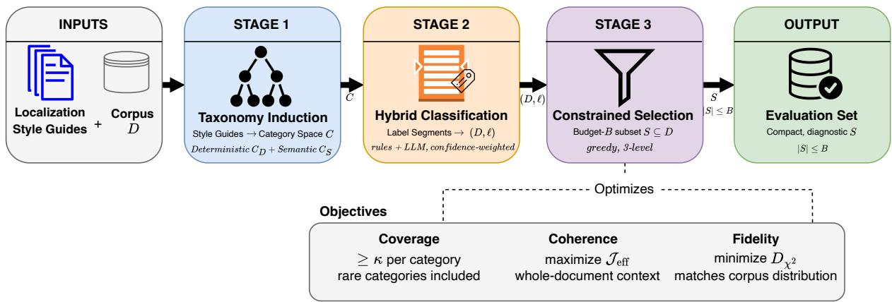  
Figure 1: Overview of TACTICS. Stage 1 induces a taxonomy (category space C) from style guides; Stage 2 labels segments into C, yielding $( D , \ell )$ ; Stage 3 selects a budget-B subset S jointly optimizing coverage $( \geq \kappa ) .$ coherence $\left( \mathcal { I } _ { \mathrm { e f f } } \right)$ , and fidelity $( D _ { \chi ^ { 2 } } )$

TACTICS inverts this dependence. We cast evaluation-set construction as taxonomy-aware stratified sampling under a fixed budget, with strata drawn from a prescriptive style-guide taxonomy rather than surface metadata, domains, or embedding clusters. The taxonomy is fixed independently of any model, so the resulting evaluation set is reusable across systems, including ones built later. This approach suits MT, where much of localization quality depends not on meaning but on explicit rules, such as preserving brand terms, formatting dates and currencies for the locale, or choosing the correct honorific. These rules are set by style guides, yet selection by lexical or embedding similarity fails to capture them (Section 4.3).

## 2.3 Automated Taxonomy Construction

Recent LLM-based taxonomy induction methods build taxonomies bottom-up from observed data, e.g., TnT-LLM (Wan et al., 2024) and Chain-of-Layer (Zeng et al., 2024). Such methods discover corpus-salient patterns, but localization evaluation also depends on prescriptive rules that may be scarce in a given corpus, such as currency formatting, brand preservation, quotation marks, or date conventions. TACTICS takes a complementary top-down approach. It induces taxonomy structure from localization style guides and grounds it in the corpus through constrained classification and sampling, so evaluation sets cover both common patterns and rare style-guide-defined phenomena that matter for system comparison.

## 3 Methodology

## 3.1 Problem Formulation

Let $D ~ = ~ \{ s _ { i } \} _ { i = 1 } ^ { n }$ denote translation segments, with each segment belonging to a document $J \in$ $\mathcal { I } .$ Let T be a hierarchical taxonomy with category set $C = C _ { D } \cup C _ { S }$ , where deterministic categories $C _ { D }$ are rule-matchable and semantic categories $C _ { S }$ are LLM-inferred. Each segment has taxonomy labels $\ell ( s ) \subseteq C$ and a post-edit score $e ( s ) ~ \in ~ [ 0 , 1 ]$ , the fraction of a machine translation that a human corrected (approximated by TER). The score can come from any MT system and serves only to approximate the segment’s difficulty.

Given a budget $B \ll | D |$ , we select a stratified evaluation subset $S \subset D , | S | \leq B$ , by enforcing coverage constraints and optimizing the coherence and fidelity objectives below.

Coverage (constraint). For a minimum threshold $\kappa \geq 1$ , each category with at least κ segments in the corpus must be represented in the sample:

$$
\forall c \in C : \quad | \{ s \in S : c \in \ell ( s ) \} | \geq \kappa .\tag{1}
$$

Coherence (maximize). Sampling entire documents preserves the context surrounding each segment. Beyond this, we favor samples spread across many documents rather than a few, measured by the effective number of documents:

$$
\mathcal { T } _ { \mathrm { e f f } } ( S ) = \mathrm { e x p } \Big ( - \sum _ { j = 1 } ^ { | \mathcal { T } | } p _ { j } \log p _ { j } \Big ) ,\tag{2}
$$

where $p _ { j } = | S \cap J _ { j } | / | S |$ is document $J _ { j } { ' } { \bf s }$ share of the sample. Exponentiating rescales the entropy into an interpretable document count without changing the optimum.

Fidelity (minimize). We align the sample $S$ with the corpus $D$ in category composition and difficulty. The category distribution $P _ { C }$ gives the relative frequency of each taxonomy category in $C ,$ and $P _ { e }$ is a histogram of the post-edit score $e \in [ 0 , 1 ]$ over fixed bins, both empirical distributions computed on the corpus $( P )$ and the sample $( \hat { P } )$ . We minimize their chi-squared divergence,

$$
D _ { \chi ^ { 2 } } ( \hat { P } _ { C } \parallel P _ { C } ) + \lambda D _ { \chi ^ { 2 } } ( \hat { P } _ { e } \parallel P _ { e } ) ,\tag{3}
$$

with $\lambda > 0$ trades off category against difficulty alignment.

## 3.2 Method Overview

TACTICS formulates stratified evaluation-set construction as constrained selection over a taxonomy-induced representation of the full corpus. The framework has three stages (Figure 1): taxonomy induction defines the category space, segment annotation maps the corpus into this space, and constrained sampling selects a fixedbudget subset that balances coverage of rare phenomena, document-level coherence, and fidelity. This yields compact evaluation sets that preserve both the linguistic structure and the key statistical properties of the full corpus.

## 3.2.1 Taxonomy Extraction (Stage 1)

We induce a hierarchical taxonomy T from localespecific style guides to define the category space C used for sampling. This is necessary because the corpus does not explicitly annotate linguistic phenomena, and embeddings or metadata alone do not capture prescriptive constraints such as terminology, branding, formatting, or locale-specific conventions. The taxonomy is partitioned into Deterministic categories $C _ { D }$ , covering high-precision rule-matchable phenomena, and Semantic categories $C _ { S }$ , covering context-dependent phenomena such as tone, register, or implicit meaning.

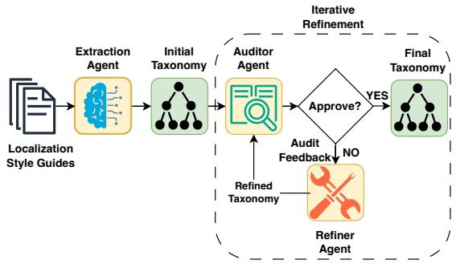  
Figure 2: Style-guide-grounded taxonomy induction. An Extraction Agent turns style guides into an initial taxonomy; an Auditor Agent then checks its coverage, looping through a Refiner Agent until it approves or an iteration limit is reached.

We construct T with an agentic extract–audit– refine loop (Figure 2; Appendix I). An Extraction Agent identifies candidate rules from the style guide and organizes them into an initial hierarchy, an Auditor Agent checks coverage against the source, and a Refiner Agent incorporates missing or under-specified rules. The loop terminates when no major gaps remain or an iteration limit is reached, yielding the prescriptive category space used for annotation, coverage constraints, and distributional alignment in later stages.

## 3.2.2 Hybrid Classification (Stage 2)

Given taxonomy T, we define a labeling function $\ell ( s ) \subseteq C$ that maps each segment $s \in D$ to one or more taxonomy categories, embedding the corpus into the category space from Stage 1. Classification is hybrid. Deterministic categories $C _ { D }$ are assigned by rule-based matchers, such as regular expressions for terminology or formatting patterns, producing high-precision labels with confidence 1.0. Semantic categories $C _ { S }$ are assigned by a context-aware classifier whose outputs are constrained to valid taxonomy paths. Each segment receives a primary category and optional secondary categories to capture co-occurring phenomena. The resulting labeled dataset $( D , \ell )$ supports the coverage constraint and defines the empirical distributions used by the fidelity objective.

## 3.2.3 Stratified Sampling (Stage 3)

Given labeled data $( D , \ell )$ , we greedily select a budgeted subset $S \subset D , | S | \leq B$ , to approximate the constrained optimization problem of Section 3.1. At each step, we add the segment that most improves the objective while preserving satisfied constraints.

Level 1: Coverage enforcement. We first build a seed set that satisfies the minimum coverage constraint (Eq. 1) for each feasible category $c \in C$ Categories are processed from rare to frequent, and segments are selected using a fixed mix of confidence levels. Each selected segment is augmented with a local context window from the same document to preserve translation context. This stage ensures explicit coverage of long-tail categories and initializes S for later optimization.

Level 2: Coherence optimization. We next improve coherence by adding documents that contribute diverse taxonomy signals. Directly maximizing $\mathcal { I } _ { \mathrm { e f f } } ( S )$ (Eq. 2) is hard, since each document’s contribution depends on its size and the evolving sample. We instead use a category-aware document score analogous to TF–IDF, with taxonomy categories playing the role of terms. For category c and document j,

$$
\operatorname { C F } ( c , j ) = { \frac { \# \{ s \in J _ { j } : c \in \ell ( s ) \} } { | J _ { j } | } } ,\tag{4}
$$

$$
\mathrm { I D F } ( c ) = \log \frac { | \mathcal { T } | } { \mathrm { d f } ( c ) } ,\tag{5}
$$

where df(c) is the number of documents containing c, CF is the category’s frequency within a document, and IDF downweights categories common across documents. To stop a category repeated within one document from dominating, we saturate CF with hyperparameter $k _ { 1 }$

$$
\operatorname { C F } _ { \mathrm { s a t } } ( c , j ) = { \frac { \operatorname { C F } ( c , j ) ( k _ { 1 } + 1 ) } { \operatorname { C F } ( c , j ) + k _ { 1 } } } ,\tag{6}
$$

and score each document as

$$
\begin{array} { r l } { \displaystyle \mathrm { s c o r e } ( j ) = } & { \boldsymbol { w } _ { \mathrm { c o n f } } ( j ) \boldsymbol { w } _ { \mathrm { s i z e } } ( j ) } \\ { \displaystyle } & { \qquad \times \sum _ { c \in C } \mathrm { C F } _ { \mathrm { s a t } } ( c , j ) \boldsymbol { \mathrm { I D F } } ( c ) , } \end{array}\tag{7}
$$

where $w _ { \mathrm { c o n f } }$ favors reliable assignments and $w _ { \mathrm { s i z e } }$ downweights documents that are too small or too large (Appendix A, B). At each step we add the highest-scoring document’s remaining segments to S.

<table><tr><td>Pair</td><td>Segments</td><td>Docs</td><td>Categories</td><td>Edit rate (%)</td></tr><tr><td> $\mathrm { e n } \to \mathrm { f r }$ </td><td>57,524</td><td>13,211</td><td>149</td><td>56.6</td></tr><tr><td>en → hi</td><td>64,932</td><td>18,897</td><td>80</td><td>53.1</td></tr><tr><td> $\mathrm { j a }  \mathrm { e n }$ </td><td>83,522</td><td>9,379</td><td>126</td><td>60.4</td></tr><tr><td> $\mathrm { j } \mathrm { a }  \mathrm { z h }$ </td><td>82,578</td><td>9,659</td><td>127</td><td>68.0</td></tr></table>

Table 1: Locale pairs used for baseline comparison analysis. Segments and documents from the classified evaluation pool; categories from the merged taxonomy; edit rate from post-edit annotations.

Level 3: Fidelity alignment. With the remaining budget, we reduce the fidelity objective (Eq. 3) to align the sample with the corpus in category distribution and edit-rate profile. Estimating target statistics from D, we add segments that close the largest gaps, selecting edited segments to match the target difficulty profile and unedited segments from underrepresented categories. This corrects the distributional drift introduced by coverage and coherence optimization, yielding a sample that faithfully reflects the corpus in both composition and difficulty.

## 4 Experiments

## 4.1 Data and Baselines

We evaluate on four localization translation directions, en→fr, en→hi, ja→en, and ja→zh. Each direction uses a proprietary, in-house localization post-editing corpus in which source segments are machine-translated and then post-edited by professional linguists. Each segment thus carries a source, an MT translation, and a post-edited target, and is linked to its source document. Its post-edit score is the edit rate between the MT output and the post-edit, approximated by TER (Section 3.1). Table 1 summarizes the pools, which range from 57K–84K segments, 9K–19K documents, 80–149 taxonomy categories, and edit rates from 53.1% to 68.0%. We also use target-locale style guides, which specify orthographic, lexical, and formatting constraints not observable from the corpus, to induce the taxonomy (Section 3.2.1, example in Appendix C).

All methods sample B = 5,000 segments per locale from the same classified evaluation pool. We compare TACTICS against Random uniform sampling, DSIR (Xie et al., 2023) (importance resampling on n-gram statistics), and ClusterCLIP (Shao et al., 2024) (embedding clustering with balanced sampling).

<table><tr><td>Locale (|C|)</td><td>Method</td><td> $\mathrm { C o v _ { 2 0 } } | \mathrm { C o v _ { 1 } }$ </td><td>Gini</td><td>Pearson r</td><td> $\mathrm { M S E } _ { C }$  →</td><td> $\mathbf { M S E } _ { \mathrm { T E R } } \downarrow$ </td><td>Edit (%)</td><td>S/D</td></tr><tr><td rowspan="4">en→fr (149)</td><td>Random</td><td>56|106</td><td>0.421</td><td>0.999</td><td>0.43</td><td>5.26</td><td>56.7</td><td>2.0</td></tr><tr><td>DSIR</td><td>13170</td><td>0.133</td><td>0.983</td><td>0.38</td><td>1.46</td><td>64.8</td><td>1.2</td></tr><tr><td>ClusterCLIP</td><td>56l101</td><td>0.426</td><td>0.999</td><td>1.23</td><td>24.6</td><td>58.2</td><td>2.0</td></tr><tr><td>TACTICS</td><td>70|133</td><td>0.497</td><td>0.982</td><td>6.90</td><td>95.9</td><td>56.6</td><td>3.1</td></tr><tr><td rowspan="4">en→hi (80)</td><td>Random</td><td>64179</td><td>0.388</td><td>0.999</td><td>3.66</td><td>7.98</td><td>53.4</td><td>1.8</td></tr><tr><td>DSIR</td><td>9170</td><td>0.164</td><td>0.952</td><td>49.6</td><td>66.4</td><td>56.8</td><td>1.2</td></tr><tr><td>ClusterCLIP</td><td>66|80</td><td>0.393</td><td>0.999</td><td>1.24</td><td>14.9</td><td>55.5</td><td>1.8</td></tr><tr><td>TACTICS</td><td>79|80</td><td>0.468</td><td>0.969</td><td>46.5</td><td>133</td><td>53.1</td><td>2.4</td></tr><tr><td rowspan="4">ja→en (126)</td><td>Random</td><td>53185</td><td>0.349</td><td>1.000</td><td>0.09</td><td>11.5</td><td>59.9</td><td>1.9</td></tr><tr><td>DSIR</td><td>11157</td><td>0.151</td><td>0.892</td><td>49.8</td><td>843</td><td>81.0</td><td>1.2</td></tr><tr><td>ClusterCLIP</td><td>54187</td><td>0.331</td><td>0.942</td><td>26.8</td><td>1090</td><td>74.0</td><td>1.8</td></tr><tr><td>TACTICS</td><td>85|102</td><td>0.491</td><td>0.972</td><td>11.8</td><td>111</td><td>60.4</td><td>3.4</td></tr><tr><td rowspan="4">ja→zh (127)</td><td>Random</td><td>52196</td><td>0.346</td><td>0.999</td><td>0.08</td><td>6.02</td><td>67.8</td><td>1.9</td></tr><tr><td>DSIR</td><td>7157</td><td>0.114</td><td>0.893</td><td>50.2</td><td>1510</td><td>88.1</td><td>1.1</td></tr><tr><td>ClusterCLIP</td><td>51194</td><td>0.308</td><td>0.929</td><td>25.1</td><td>1690</td><td>85.7</td><td>1.7</td></tr><tr><td>TACTICS</td><td>59|113</td><td>0.550</td><td>0.949</td><td>9.17</td><td>71.6</td><td>68.0</td><td>4.0</td></tr></table>

Table 2: Intrinsic sampling quality at $B = 5 { , } 0 0 0 .$ $\mathrm { C o v _ { 2 0 } } | \mathrm { C o v _ { 1 } }$ counts categories with $\geq 2 0$ and $\geq 1$ samples; r is Pearson correlation with the full-corpus category distribution; $\mathrm { M S E } _ { C }$ and $\mathrm { M S E _ { T E R } } ( \times 1 0 ^ { - 6 } )$ are mean squared errors of the sampled vs. full-corpus category and TER distributions; Edit is post-edit rate; S/D is segments per document. Random matches the corpus distributions most closely, while TACTICS trades fidelity to cover rare categories and harder segments. Baselines: DSIR (Xie et al., 2023), ClusterCLIP (Shao et al., 2024).

## 4.2 Evaluation Setup

We select pipeline models by role, as the method is agnostic to the specific LLMs. Taxonomy induction runs once per locale, so we use Claude Sonnet 4.5 to generate the taxonomy and the more capable Claude Opus 4.5 to audit it for missing or under-specified rules (Figure 2, Section 3.2.1). Classification runs over the whole corpus, so we label segments with Kimi K2.5, constraining its outputs to valid taxonomy paths. From a different family than the taxonomy models, it labels cheaply at scale and independently of the generator. For downstream evaluation we compare $\mathrm { N M T _ { b a s e } }$ , a dedicated neural MT system, with $\mathrm { L L M _ { M T } }$ , a Gemma 4-26B-A4B model prompted to translate, conditioned on summarized style guides.

We report intrinsic metrics aligned with the three objectives of TACTICS. Coverage is Cov20 and $\mathbf { C o v } _ { 1 }$ , the number of categories with at least 20 and at least 1 sampled segments. Coherence combines the Gini coefficient over perdocument segment counts with segments per document (S/D), where higher values mean more multisegment context. Fidelity compares the sample to the full corpus via Pearson correlation (r) and category- and TER-distribution MSE (higher r, lower MSE better), with edit rate as a difficulty proxy. Downstream, we report TER (Snover et al., 2006), BLEU (Papineni et al., 2002), and chrF (Popovic´, 2015) against the human postedited target, together with withholding rate (WH), the fraction of segments passing an automated QA pipeline. The pipeline applies deterministic checks (a translation-memory match against known-good references, and length heuristics that flag implausible target-to-source length ratios or name lengths) together with a learned classifier that predicts translation quality from the source and target sentence. These checks use no style guides, so they are independent of the taxonomy and the $\mathrm { L L M _ { M T } }$ prompt and favor neither system.

## 4.3 Results

We provide taxonomy consistency checks, including inter-model agreement and manual spot checks, in Appendix J.

Intrinsic sampling quality (Table 2). TAC-TICS improves coverage and coherence across all directions. Cov rises over Random from 56 to 70, 64 to 79, 53 to 85, and 52 to 59 for en→fr, en→hi, ja→en, and ja→zh. It also attains the highest Gini and segments per document (S/D) everywhere, selecting multiple segments from the same document rather than isolated ones. This matters because translation quality is context-dependent, and a segment like “Click here” is only translatable alongside its neighbors. But covering the tail pulls the sample away from the corpus. Random most closely matches the full-corpus category and TER distributions (lowest MSE), since it simply reproduces the corpus proportions, whereas TAC-TICS deviates more to represent rare categories and harder segments. Even so, TACTICS keeps the corpus category ordering (Pearson $r = 0 . 9 4 9 -$ 0.982) and stays far more stable than DSIR and ClusterCLIP, whose MSE swings by orders of magnitude across directions.

<table><tr><td></td><td></td><td colspan="4"> $\mathrm { N M T _ { b a s e } }$ </td><td colspan="4"> $\mathbf { L L M _ { M T } }$ </td></tr><tr><td>Locale</td><td>Metric</td><td>Rand.</td><td>ClusterCLIP</td><td>DSIR</td><td>TACTICS</td><td>Rand.</td><td>ClusterCLIP</td><td>DSIR</td><td>TACTICS</td></tr><tr><td rowspan="4">en→fr</td><td>TER↓</td><td>0.309</td><td>0.305</td><td>0.309</td><td>0.315</td><td>0.267</td><td>0.252</td><td>0.257</td><td>0.231</td></tr><tr><td>BLEU↑</td><td>0.655</td><td>0.662</td><td>0.655</td><td>0.668</td><td>0.686</td><td>0.699</td><td>0.690</td><td>0.717</td></tr><tr><td>chrF↑</td><td>0.795</td><td>0.800</td><td>0.798</td><td>0.804</td><td>0.799</td><td>0.812</td><td>0.807</td><td>0.833</td></tr><tr><td>WH↑</td><td>6.50</td><td>5.48</td><td>6.24</td><td>5.64</td><td>7.80</td><td>5.90</td><td>7.18</td><td>11.84</td></tr><tr><td rowspan="4">en→hi</td><td>TER↓</td><td>0.349</td><td>0.357</td><td>0.409</td><td>0.343</td><td>0.322</td><td>0.328</td><td>0.341</td><td>0.320</td></tr><tr><td>BLEU↑</td><td>0.600</td><td>0.606</td><td>0.608</td><td>0.625</td><td>0.636</td><td>0.633</td><td>0.612</td><td>0.641</td></tr><tr><td>chrF↑</td><td>0.716</td><td>0.718</td><td>0.700</td><td>0.730</td><td>0.699</td><td>0.702</td><td>0.686</td><td>0.760</td></tr><tr><td>WH↑</td><td>1.55</td><td>1.70</td><td>1.45</td><td>2.50</td><td>3.40</td><td>3.65</td><td>3.20</td><td>15.38</td></tr><tr><td rowspan="4">ja→en</td><td>TER↓</td><td>0.410</td><td>0.422</td><td>0.422</td><td>0.560</td><td>0.323</td><td>0.301</td><td>0.299</td><td>0.328</td></tr><tr><td>BLEU↑</td><td>0.619</td><td>0.616</td><td>0.639</td><td>0.634</td><td>0.728</td><td>0.753</td><td>0.750</td><td>0.795</td></tr><tr><td>chrF↑</td><td>0.718</td><td>0.710</td><td>0.737</td><td>0.745</td><td>0.808</td><td>0.827</td><td>0.821</td><td>0.847</td></tr><tr><td>WH↑</td><td>5.25</td><td>6.39</td><td>6.00</td><td>4.93</td><td>6.34</td><td>6.78</td><td>6.12</td><td>31.79</td></tr><tr><td rowspan="4">ja→zh</td><td>TER↓</td><td>0.306</td><td>0.319</td><td>0.302</td><td>0.319</td><td>0.146</td><td>0.116</td><td>0.145</td><td>0.090</td></tr><tr><td>BLEU↑</td><td>0.576</td><td>0.561</td><td>0.585</td><td>0.590</td><td>0.788</td><td>0.833</td><td>0.790</td><td>0.865</td></tr><tr><td>chrF↑</td><td>0.613</td><td>0.610</td><td>0.620</td><td>0.713</td><td>0.814</td><td>0.854</td><td>0.815</td><td>0.907</td></tr><tr><td>WH↑</td><td>4.75</td><td>4.60</td><td>4.90</td><td>3.98</td><td>5.85</td><td>5.70</td><td>5.90</td><td>27.38</td></tr></table>

Table 3: Downstream translation performance across sampling strategies. Best value per direction, metric, and system is in bold. Lower TER is better, and higher BLEU, chrF, and WH are better. WH is the withholding rate, the percentage of segments passing automated QA checks. Baselines include DSIR (Xie et al., 2023) and ClusterCLIP (Shao et al., 2024).

<table><tr><td>Locale</td><td>Systems</td><td>Segs</td><td>True  $\Delta$ </td><td>Verdict</td></tr><tr><td>en→fr</td><td>NMT/LLM</td><td>3959</td><td> $+ 0 . 0 1 6$ </td><td>not sig.</td></tr><tr><td>en→hi</td><td> $\mathbf { N M T } / \mathbf { L L M }$ </td><td>4334</td><td>+0.314</td><td>significant</td></tr><tr><td>ja→en</td><td> $\mathrm { L L M ^ { - S G } / N M T }$ </td><td>3168</td><td>+1.121</td><td>significant</td></tr><tr><td>ja→zh</td><td> $\mathrm { L L M } / \mathrm { N M T }$ </td><td>3062</td><td>-0.086</td><td>significant</td></tr></table>

Table 4: Full-pool human-audit reference verdicts, the ground truth each subsample aims to reproduce. Systems: NMT $( \mathrm { N M T _ { b a s e } ) }$ , LLM (LLM , style-guided), and $\mathrm { L L M ^ { - S G } }$ (LLM without style guides); ja→en uses $\mathrm { L L M ^ { - S G } }$ , the only direction it was annotated. Each segment is judged by one linguist with a secondexpert QA pass. MQM penalty = 25 critical+5 major+ minor (lower is better), so $\Delta = A - B > 0$ means the first-listed system A is worse. Full t and p values in Appendix F.

Downstream translation performance (Table 3). On a random sample, $\mathrm { N M T _ { b a s e } }$ and LLMMT score very close across TER, BLEU, chrF, and WH, since it rarely includes the segments that separate them. The TACTICS set covers these rarer and harder cases, and the gap becomes clear. On ja→zh the $\mathrm { L L M _ { M T } \mathrm { - N M T _ { b a s e } } }$ WH gap widens from about one point to over twenty, BLEU from 0.788 to 0.865 and chrF from 0.814 to 0.907, and the mean WH gap across directions grows from 1.3 to 17.3 points. Human evaluation shows the same pattern by category. Auditing one NMT system on comparably sized TACTICS and random samples (∼3,000 vs. 2,874 segments), the TACTICS audit covered 18 error categories against 15 for random, including three the random audit missed entirely, number-format, text-truncation, and offensive-content. Several of these carry major errors, three for text-truncation and one for offensive-content, so a random-only audit leaves real, category-specific failures unmeasured. We therefore use the two together, TACTICS to check per-category quality including the long tail, and random to estimate overall quality at the corpus proportion.

Sample efficiency (Table 4, Figure 3). Table 4 gives the true system ranking each subsample must recover, and Figure 3 measures how efficiently the samplers reach it. The four selectors are Random (uniform, unstratified), Equal-allocation (flat per-category quota), Low-confidence-first (lowest classifier-confidence segments, TACTICS’s hard-example heuristic alone), and TACTICS (the full three-level pipeline). The three category-aware selectors differ only in how they spend the budget, isolating TACTICS’s allocation strategy rather than the corpus-level baselines of Section 4.1. The top row is wasted budget, the fraction of a batch that both systems translate cleanly and that reveals nothing about their difference, which TACTICS keeps lowest in most settings. The bottom row is the paired t-statistic magnitude |t| per batch, larger when a batch separates the systems more clearly and significant above the dashed line. On en→hi

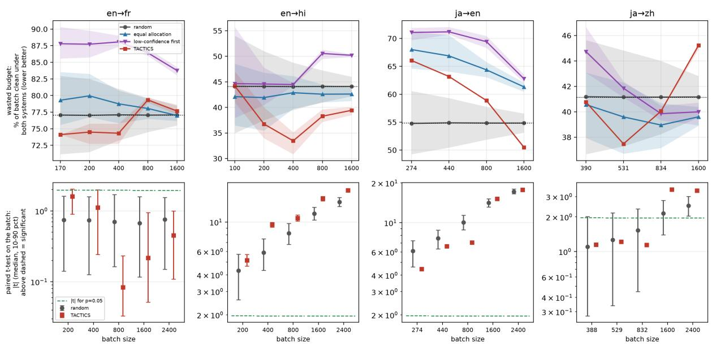  
Figure 3: Sample efficiency across four directions. Top, wasted budget, the percentage of a batch that is clean under both systems and so cannot separate them (lower is better). Bottom, the paired |t| on the batch (median over draws, 10–90 percentile bars). Points above the dashed line are significant at p=0.05. TACTICS is compared against random, equal-allocation, and low-confidence-first selection.

TACTICS exceeds random at every budget (ratio 1.19–1.63), and on ja→zh it clears the threshold at 1600 and 2400 segments where random does not. en→fr is a control, where the systems are tied $( \Delta \ : = \ : 0 . 0 1 6 )$ and both samplers stay below the line, so TACTICS signals a difference only when one is real. Although it estimates the corpus average less accurately (Appendix F), TACTICS detects a real gap from far fewer segments than random.

## 5 Discussion

A representative sample is not a diagnostic one. Random sampling reproduces the corpus almost exactly, which is why it struggles to compare systems. Most of a corpus is routine text both systems handle, so a faithful sample is dominated by segments that carry no signal about their difference, while the cases that separate systems, such as rare terminology, date and number formats, or longcontext documents, are easily left out. A sample can thus match the corpus yet fail to reveal which system is better.

Generic selectors miss prescriptive rules. DSIR and ClusterCLIP rank segments by lexical or embedding similarity, capturing frequent surface patterns but not the prescriptive rules localization depends on, such as terminology, punctuation, and date, currency, and localespecific formats. They therefore cover fewer taxonomy categories than TACTICS, and their sample statistics vary widely across directions.

Coverage trades against fidelity by design. By guaranteeing rare categories and harder segments, TACTICS deviates from the corpus more than random and so has higher distributional error. This is intentional. TACTICS keeps the corpus category ordering while shifting weight to the long tail, making it a weaker estimator of the corpus average but a stronger detector of system differences. Fidelity is a constraint to stay close enough, not the objective to maximize.

Use both samplers together. The two roles are complementary. Human evaluation is expensive, so the limited annotation budget is best spent on a TACTICS set, which guarantees that every content type is judged, including the rare and difficult cases random evaluation can miss. A cheaper random sample then estimates overall quality at the corpus proportion. Together they answer whether a system is good everywhere and how it performs on average.

## 6 Conclusion and Future Work

We presented TACTICS, a taxonomy-aware method for building compact, diagnostic MT evaluation sets. By inducing categories from localization style guides and jointly optimizing coverage of rare phenomena, document-level coherence, and distributional fidelity, TACTICS guarantees that evaluation covers the content types that distinguish systems, including the long tail that random sampling misses. Across four directions it improves category coverage over random, lexical, and embedding-based selection, and recovers the true system ranking from fewer segments where a real quality gap exists. It does so by trading corpus-average fidelity for discriminative power, so we recommend pairing a TACTICS set, where costly human evaluation is best spent, with a random sample that estimates overall quality at the corpus proportion.

The core mechanism, taxonomy-aware constrained sampling over coverage, coherence, and fidelity, is not specific to machine translation. Any evaluation setting with a prescriptive taxonomy, long-tail skew over that taxonomy, and a fixed annotation budget could benefit. Future work includes validating TACTICS on public benchmarks and style guides to support reproducibility, extending it to other domains such as content moderation and clinical text, expanding human validation of taxonomy boundaries, and studying adaptive sampling budgets.

## Limitations

Our primary evaluation uses a proprietary localization corpus that we cannot release, which limits direct reproducibility. We therefore plan a public companion study on open style guides and benchmarks. The evaluation is also confined to localization, and generalization to other domains such as news, biomedical, or legal text requires further validation. The taxonomy induction pipeline depends on the availability and quality of prescriptive style guides, which may not exist or may vary in granularity across locales, and the LLM-based classifier reaches only moderate inter-annotator agreement (Cohen’s κ = 0.51), so misclassifications can affect coverage. By design, TACTICS trades fidelity to the corpus distribution for coverage and discriminative power, making it a deliberately biased estimator of corpus-average quality that should be paired with a random sample when an aggregate estimate is needed.

## Acknowledgments

We thank Elijah Smith for automating and containerizing the sampling pipeline, enabling largescale sampling jobs to be scheduled and run reliably with minimal manual intervention. This infrastructure was instrumental in carrying out the experiments presented in this paper.

## References

Dzmitry Bahdanau, Kyunghyun Cho, and Yoshua Bengio. 2015. Neural machine translation by jointly learning to align and translate. In International Conference on Learning Representations (ICLR).

Loïc Barrault et al. 2020. Findings of the 2020 conference on machine translation (wmt20). In Proceedings ofWMT.

Tom B. Brown, Benjamin Mann, Nick Ryder, et al. 2020. Language models are few-shot learners. arXiv preprint arXiv:2005.14165.

Arun Tejasvi Chaganty, Stephen Mussmann, and Percy Liang. 2018. The price of debiasing automatic metrics in natural language evaluation. In Proceedings of the 56th Annual Meeting of the Association for Computational Linguistics (ACL).

Markus Freitag, George Foster, David Grangier, Viresh Ratnakar, Qijun Tan, and Wolfgang Macherey. 2022. Experts, errors, and context: A large-scale study of human evaluation for machine translation. Transactions of the Association for Computational Linguistics (TACL), 9:1460–1474.

Leo Gao, Stella Biderman, Sid Black, et al. 2021. The pile: An 800gb dataset of diverse text for language modeling. arXiv preprint arXiv:2101.00027.

Naman Goyal, Cynthia Gao, Vishrav Chaudhary, et al. 2022. The FLORES-101 evaluation benchmark for low-resource and multilingual machine translation. Transactions of the Association for Computational Linguistics (TACL), 10:522–538.

Tom Kocmi, Christian Federmann, Roman Grundkiewicz, Marcin Junczys-Dowmunt, Hitokazu Matsushita, and Arul Menezes. 2021. To ship or not to ship: An extensive evaluation of automatic metrics for machine translation. In Proceedings of the Sixth Conference on Machine Translation (WMT).

Jannik Kossen, Sebastian Farquhar, Yarin Gal, and Tom Rainforth. 2021. Active testing: Sample-efficient model evaluation. In Proceedings of the 38th International Conference on Machine Learning (ICML).

Arle Lommel, Hans Uszkoreit, and Aljoscha Burchardt. 2014. Multidimensional quality metrics (mqm): A framework for declaring and describing translation quality metrics. In Proceedings of LREC.

Felipe Maia Polo, Lucas Weber, Leshem Choshen, Yuekai Sun, Gongjun Xu, and Mikhail Yurochkin. 2024. tinyBenchmarks: evaluating LLMs with fewer examples. In Proceedings of the 41st International Conference on Machine Learning (ICML).

Max Marion, Ahmet Üstün, Luiza Pozzobon, Alex Wang, Marzieh Fadaee, and Sara Hooker. 2023. When less is more: Investigating data pruning for pretraining llms at scale. arXiv preprint arXiv:2309.04564.

Akash Kumar Mohankumar and Mitesh M. Khapra. 2022. Active evaluation: Efficient NLG evaluation with few pairwise comparisons. In Proceedings of the 60th Annual Meeting ofthe Associationfor Computational Linguistics (ACL).

NLLB Team, Marta R. Costa-jussà, James Cross, et al. 2022. No language left behind: Scaling human-centered machine translation. arXiv preprint arXiv:2207.04672.

OpenAI. 2023. Gpt-4 technical report. arXiv preprint arXiv:2303.08774.

Kishore Papineni, Salim Roukos, Todd Ward, and Wei-Jing Zhu. 2002. Bleu: a method for automatic evaluation of machine translation. In Proceedings ofthe 40th Annual Meeting on Association for Computational Linguistics, ACL ’02, page 311318, USA. Association for Computational Linguistics.

Yotam Perlitz, Elron Bandel, Ariel Gera, Ofir Arviv, Liat Ein-Dor, Eyal Shnarch, Noam Slonim, Michal Shmueli-Scheuer, and Leshem Choshen. 2024. Efficient benchmarking of language models. In Proceedings ofthe 2024 Conference ofthe North American Chapter of the Association for Computational Linguistics (NAACL).

Maja Popovic. 2015.´ chrF: character n-gram F-score for automatic MT evaluation. In Proceedings of the Tenth Workshop on Statistical Machine Translation, pages 392–395, Lisbon, Portugal. Association for Computational Linguistics.

Ricardo Rei, Craig Stewart, Ana C. Farinha, and Alon Lavie. 2020. Comet: A neural framework for mt evaluation. arXiv preprint arXiv:2009.09025.

Pedro Rodriguez, Joe Barrow, Alexander Miserlis Hoyle, John P. Lalor, Robin Jia, and Jordan Boyd-Graber. 2021. Evaluation examples are not equally informative: How should that change NLP leaderboards? In Proceedings of the 59th Annual Meeting of the Association for Computational Linguistics and the 11th International Joint Conference on Natural Language Processing (ACL-IJCNLP).

Ananya B. Sai, Akash Kumar Mohankumar, and Mitesh M. Khapra. 2022. A survey of evaluation metrics used for NLG systems. ACM Computing Surveys, 55(2).

Thibault Sellam, Dipanjan Das, and Ankur P. Parikh. 2020. Bleurt: Learning robust metrics for text generation. Preprint, arXiv:2004.04696.

Yunfan Shao, Linyang Li, Zhaoye Fei, Hang Yan, Dahua Lin, and Xipeng Qiu. 2024. Balanced data sampling for language model training with clustering. Preprint, arXiv:2402.14526.

Matthew Snover, Bonnie Dorr, Richard Schwartz, Linnea Micciulla, and John Makhoul. 2006. A study of translation edit rate with targeted human annotation. In Proceedings ofAMTA.

Kushal Tirumala, Daniel Simig, Armen Aghajanyan, and Ari S. Morcos. 2023. D4: Improving llm pretraining via document de-duplication and diversification. arXiv preprint arXiv:2308.12284.

Hugo Touvron, Thibaut Lavril, Gautier Izacard, et al. 2023. Llama: Open and efficient foundation language models. arXiv preprint arXiv:2302.13971.

Clara Vania, Phu Mon Htut, William Huang, Dhara Mungra, Richard Yuanzhe Pang, Jason Phang, Haokun Liu, Kyunghyun Cho, and Samuel R. Bowman. 2021. Comparing test sets with item response theory. In Proceedings of the 59th Annual Meeting of the Association for Computational Linguistics and the 11th International Joint Conference on Natural Language Processing (ACL-IJCNLP).

Ashish Vaswani, Noam Shazeer, Niki Parmar, Jakob Uszkoreit, Llion Jones, Aidan N Gomez, Lukasz Kaiser, and Illia Polosukhin. 2017. Attention is all you need. In Advances in Neural Information Processing Systems (NeurIPS).

Rajan Vivek, Kawin Ethayarajh, Diyi Yang, and Douwe Kiela. 2024. Anchor points: Benchmarking models with much fewer examples. In Proceedings of the 18th Conference of the European Chapter ofthe Associationfor Computational Linguistics (EACL).

Mengting Wan, Tara Safavi, Sujay Kumar Jauhar, Yujin Kim, Scott Counts, Jennifer Neville, Siddharth Suri, Chirag Shah, Ryen W White, Longqi Yang, Reid Andersen, Georg Buscher, Dhruv Joshi, and Nagu Rangan. 2024. Tnt-llm: Text mining at scale with large language models. Preprint, arXiv:2403.12173.

Sang Michael Xie, Shibani Santurkar, Tengyu Ma, and Percy Liang. 2023. Data selection for language models via importance resampling. Preprint, arXiv:2302.03169.

Qingkai Zeng, Yuyang Bai, Zhaoxuan Tan, Shangbin Feng, Zhenwen Liang, Zhihan Zhang, and Meng Jiang. 2024. Chain-of-layer: Iteratively prompting large language models for taxonomy induction from limited examples. Preprint, arXiv:2402.07386.

Vilém Zouhar, Peng Cui, and Mrinmaya Sachan. 2025. How to select datapoints for efficient human evaluation of NLG models? Transactions of the Associationfor Computational Linguistics (TACL).

<table><tr><td>Config</td><td>Docs</td><td>Segs</td><td>Gini</td><td>Eff. D</td><td>Top-10</td><td> $\mathrm { C o v _ { 3 0 } }$ </td></tr><tr><td>CF–IDF (wt.)</td><td></td><td>175,194</td><td>0.113</td><td>16.6</td><td>66.3%</td><td>37/76</td></tr><tr><td>CF–IDF (pure)</td><td></td><td>1,6225,1500.491</td><td></td><td>959.6</td><td>8.0%</td><td>49/76</td></tr><tr><td>CF–IDF (sat., wt.)</td><td></td><td>16 5,032 0.094</td><td></td><td>15.8</td><td>68.5%</td><td>37/76</td></tr><tr><td>CF-IDF (sat., pure)</td><td></td><td>815 5,007 0.441</td><td></td><td>551.3</td><td>9.2%</td><td>48/76</td></tr></table>

Table 5: Level-2 scoring ablation under fixed budget $( B = 5 , 0 0 0 )$ with Level-1 disabled. $\mathrm { C o v } _ { 3 0 } \mathrm { : }$ categories with ≥30 segments.

## Appendix

## A Level-2 Scoring Ablation

Level-2 scores each document by how much rarecategory evidence it concentrates (Eq. (7)). Table 5 ablates the two design choices in that function, saturation and aggregation, under a fixed budget $B \ = \ 5 { , } 0 0 0$ (seed 42) with Level-1 disabled, so the differences reflect Level-2 scoring alone. The score combines two per-category signals. Category frequency $\operatorname { C F } ( c , j )$ is the fraction of segments in document j assigned to category c and is high when the document gives concentrated evidence for a phenomenon. Inverse documentfrequency IDF(c) is large for rare categories, so the product CF · IDF favors documents rich in rare phenomena rather than documents that only repeat common ones. Saturation applies a concave transform $\mathrm { C F _ { s a t } }$ so that a category repeated many times within one document cannot dominate its score. Aggregation is either pure, where each category contributes once as $\mathrm { C F _ { s a t } } ( c , j )$ IDF(c) (Eq. (7)), or weighted, which additionally scales each term by the segment count $n ( c , j ) = | \{ s \in J _ { j } : c \in$ $\ell ( s ) \}$ and rewards repeated occurrences. All four variants share the same confidence weight $w _ { \mathrm { c o n f } } \in$ {1.2, 1.0, 0.8} (high, medium, low) and size factor $w _ { \mathrm { s i z e } }$ (Appendix B). The table shows a sharp split between the two aggregation choices. Weighted variants collapse the budget into 16–17 documents (Gini ≈ 0.1, Top- $. 1 0 \approx 6 6 \mathrm { - } 6 9 \% )$ and cover only 37/76 categories. Pure variants instead spread selection over hundreds to more than 1,600 documents, raising effective diversity by more than an order of magnitude and lifting coverage to 48– 49/76. Saturated pure trades a small amount of raw diversity for more balanced within-document evidence, selecting 815 documents at Gini 0.441 and $\mathrm { C o v _ { 3 0 } } \ : = \ : 4 8 / 7 6$ , and is our default Level-2 configuration.

## B Level-2 Weighting Details

The Level-2 document score (Eq. 7) applies two multiplicative weights that favor reliable, moderately sized documents. The confidence weight $w _ { \mathrm { c o n f } } ( j )$ is 1.2 for high-confidence documents, 1.0 for medium, and 0.8 for low. For the size weight, let $n _ { j } = | J _ { j } |$ be the number of segments in document $j ,$ let $Q _ { 1 }$ be the first quartile of document sizes, and let $n _ { \mathrm { m a x } }$ be a segment cap, and define $\begin{array} { r } { r _ { j } = \operatorname* { m i n } ( \frac { n _ { j } - n _ { \mathrm { m a x } } } { n _ { \mathrm { m a x } } } , 1 ) } \end{array}$ . The size weight is

$$
\begin{array} { r } { w _ { \mathrm { s i z e } } ( j ) = \left\{ \begin{array} { l l } { 0 . 8 + 0 . 2 \cdot \frac { n _ { j } } { Q _ { 1 } } , } & { n _ { j } \leq Q _ { 1 } , } \\ { 1 . 0 , } & { Q _ { 1 } < n _ { j } \leq n _ { \operatorname* { m a x } } , } \\ { \operatorname* { m a x } \bigl ( 0 . 5 , 1 - 0 . 3 r _ { j } \bigr ) , } & { n _ { j } > n _ { \operatorname* { m a x } } . } \end{array} \right. } \end{array}\tag{8}
$$

This down-weights both highly fragmented samples drawn from very small documents and budget domination by very large ones.

## C Example Style Guide Snippet

## Style Guide Snippet (Illustrative)

Currency Format. The currency symbol should be inserted after the number and preceded by a space. For Canadian dollars, there should be a space between the dollar sign and the currency symbol. Examples: 50,99 / 4 500 EUR / 50 \$ CA As a general rule, use ISO currency codes.

Common currencies:
<table><tr><td>Country/Region</td><td>Currency name</td><td>Symbol</td><td>ISO code</td></tr><tr><td>EU</td><td>euro</td><td></td><td>EUR</td></tr><tr><td>Canada</td><td>Canadian dollar</td><td>CA$</td><td>CAD</td></tr><tr><td>USA</td><td>US dollar</td><td>$</td><td>USD</td></tr></table>

If currency symbols or ISO codes (e.g., \$, , GBP, EUR) appear in the source text, they should be preserved and formatted according to locale-specific rules.

Date Format. Dates must follow the French day– month format rather than the US month–day format.
<table><tr><td>US English</td><td>French</td><td>Comments</td></tr><tr><td>7/14/2013</td><td>14/07/2013</td><td>N/A</td></tr><tr><td>July 14, 2013</td><td>14 juillet 2013</td><td>Extended</td></tr></table>

This snippet is a representative portion of a larger localization style guide. It illustrates the type of constraints used to induce the taxonomy in Section 3.2.1.

## D Per-Level Pipeline Breakdown

Each level of TACTICS contributes a distinct sampling property. Table 6 reports per-stage statistics to illustrate how coverage, coherence, and fidelity are introduced incrementally. L1 constructs the initial coverage-oriented seed set, L2 adds coherent document-level context, and L3 fills the remaining budget to match the full-corpus edit-rate statistics.

Level contributions. L1 selects the initial coverage-oriented seed set, ranging from roughly 1.5K to 2.9K segments across locales. L2 then adds coherent document-level context to reach approximately 3.5K segments. At this point coverage is effectively fixed, for example fr-FR reaches 98/105 categories and hi-IN reaches 79/80. L2 also introduces coherent multi-segment documents, with the number of selected documents varying by locale and document-size distribution.

L3 uses the remaining budget to reach N = 5,000 and align the sample with the full-corpus edit-rate profile. Since L3 only adds segments, coverage does not decrease from L2 to L3. The edit-rate correction can be substantial, with ja-JP decreasing from 75.7% to 61.5% and hi-IN from 74.2% to 53.1%. This happens because L1 and L2 over-sample edited segments, which are more category-diverse, while L3 rebalances the final sample by adding segments that restore distributional fidelity.

## E Cross-Locale Generalization

We evaluate TACTICS across 22 locales spanning seven language families to assess whether the sampling objectives generalize beyond the main baseline-comparison directions. Table 7 reports intrinsic sampling quality for the test split at $N = 5 { , } 0 0 0$ . Across locales, TACTICS maintains strong distributional fidelity, with mean Pearson correlation $r ~ = ~ 0 . 9 9 2$ and mean edit-rate deviation of 0.5 percentage points. L1 coverage varies with taxonomy size, where compact taxonomies such as en-AE (48 categories) achieve higher coverage at the ≥ 20 threshold, while larger taxonomies such as en-AU (177 categories) are harder to cover under the same fixed budget. L2 Gini averages 0.54 across locales, indicating consistent document-level diversity.

## F Corpus-Mean Estimation Error

Table 8 reports the RMSE of the estimated system delta against the full-pool truth for random and TACTICS batches. TACTICS has higher RMSE in most cells, and the error is bias-dominated (bias2/MSE near 100%). This is expected of a deliberately unrepresentative diagnostic batch, where concentrating rare and harder segments makes the sample a poor estimator of the corpus average while making it a stronger detector of the system ranking. This trade-off motivates pairing TACTICS with a separate random sample for aggregate estimation.

## G System-Ranking Recovery

Table 9 reports how reliably a sampled batch recovers the correct system ranking, complementing the corpus-average estimation error of Appendix F. Using the full-pool audit verdict of Table 4 as reference, for each budget we draw many batches and run a paired t-test on the per-segment MQM deltas, reporting the median |t| and the recovery rate (draws that are significant at $p \ < \ 0 . 0 5$ and match the verdict sign).

The pattern mirrors the estimation trade-off. Where the true effect is clear (en→hi, ja→en) both samplers recover it almost always. Where it is small (ja→zh, $\Delta \ = \ - 0 . 0 8 6 )$ TACTICS recovers the verdict at 1600–2400 segments (100% vs. 62–93%), and on the null control (en→fr, $\Delta =$ +0.016) it raises no false verdict (0% vs. random’s 4–6%).

## H Fidelity Diagnostics

Figure 4 shows representative Level-3 fidelity diagnostics for the hi-IN test split. The sampled set closely matches the full evaluation pool across taxonomy-category distribution, post-edit distribution, and clean-segment/lock-rate statistics.

## I Taxonomy Generation Pipeline

The taxonomy generation pipeline consists of three LLM-based agents orchestrated in an iterative loop, Extract → Audit → Refine → Audit → . . . , running for up to 5 iterations or until the auditor marks the taxonomy as complete. Each agent can use a different LLM instance. Below we reproduce the full system prompts (DSPy signatures) for each agent.

## I.1 Taxonomy Extraction Agent

The extraction agent operates in two stages, Feature Extraction followed by Synthesis.

## I.1.1 Stage 1: Feature Extraction

Analyze a translation style guide and identify SOURCE-TEXT TRIGGERS.

IGNORE THE FOLLOWING:

– Rules that only apply to the target (e.g., ‘no double spaces in target’) – Team-specific or project-specific instructions (e.g., “Note for X projects”, “Exception for Y projects”, “Specific instructions for Z”)

<table><tr><td>Locale Dir</td><td></td><td></td><td>|C| Stage</td><td>Seg.</td><td>Cov20</td><td>Edit (%) L2 Docs</td><td></td></tr><tr><td rowspan="4">fr-FR</td><td rowspan="4">en→fr</td><td rowspan="4">105</td><td>L1</td><td>2,882</td><td></td><td></td><td></td></tr><tr><td>L1+L2</td><td>3,503</td><td>98/105</td><td>47.6</td><td>169</td></tr><tr><td>L1+L2+L3</td><td>5,000</td><td>98/105</td><td>45.7</td><td>169</td></tr><tr><td>L1</td><td>1,897</td><td></td><td></td><td></td></tr><tr><td rowspan="3">ja-JP</td><td rowspan="3">en→ja</td><td rowspan="3">76</td><td>L1+L2</td><td>3,524</td><td>75/76</td><td>75.7</td><td>302</td></tr><tr><td>L1+L2+L3</td><td>5,000</td><td>75/76</td><td>61.5</td><td>302</td></tr><tr><td>L1</td><td></td><td></td><td></td><td></td></tr><tr><td rowspan="3"></td><td rowspan="3">ko-KR en→ko</td><td rowspan="3">86</td><td>L1+L2</td><td>2,255 3,504</td><td>83/86</td><td>68.2</td><td>331</td></tr><tr><td>L1+L2+L3</td><td>5,000</td><td>83/86</td><td>55.4</td><td>331</td></tr><tr><td>L1</td><td>1,510</td><td></td><td></td><td></td></tr><tr><td rowspan="3">hi-IN</td><td rowspan="3">en→hi</td><td rowspan="3">80</td><td>L1+L2</td><td>3,506</td><td>79/80</td><td>74.2</td><td>1 483</td></tr><tr><td>L1+L2+L3</td><td>5,000</td><td>79/80</td><td>53.1</td><td>483</td></tr><tr><td></td><td></td><td></td><td></td><td></td></tr><tr><td rowspan="3"></td><td rowspan="3">en-US ja→en</td><td rowspan="3">126</td><td>L1 L1+L2</td><td>2,913 3,510</td><td>86/126</td><td>64.6</td><td>一 53</td></tr><tr><td>L1+L2+L3</td><td>5,000</td><td>86/126</td><td>60.4</td><td>53</td></tr><tr><td></td><td></td><td></td><td></td><td></td></tr><tr><td rowspan="3">zh-CN ja→zh</td><td rowspan="3"></td><td rowspan="3">127</td><td>L1</td><td>2,530</td><td></td><td></td><td></td></tr><tr><td>L1+L2</td><td>3,507</td><td>93/127</td><td>73.3</td><td>105</td></tr><tr><td>L1+L2+L3</td><td>5,000</td><td>93/127</td><td>68.0</td><td>105</td></tr></table>

Table 6: Per-stage pipeline statistics at N = 5,000. Cov20 denotes the number of taxonomy categories with at least 20 sampled segments. Bold edit rates indicate the final L3-aligned edit rate, matching the full evaluation pool.

– Rules from other organizations/clients (only extract rules for the specified organization\_name)

FOCUS ON:

– Universal source attributes that force a specific translation decision

Linguistic markers (e.g., Second-person pronouns)

– Content types (e.g., UI labels, Legal names)

– Technical constraints (e.g., ICU placeholders)

– General rules applicable across all projects for this organization

## Inputs:

markdown\_content: The style guide content

organization\_name: Organization/Client name of the style guide

## Output:

source\_features: Structured list of features including categories, names, rules, and pattern hints.

## I.1.2 Stage 2: Taxonomy Synthesis

Consolidates raw features into a source-centric hierarchical TaxonomyStructure.

Logic: 1. PERSPECTIVE SHIFT: Transform target-evaluation rules into source-text triggers. (e.g., Change ‘Check for natural translation’ to ‘Idiomatic/Complex Source’).

2. BUCKETING: Group into ‘Deterministic’ (Regex-ready) vs. ‘Semantic’ (LLM-required).

3. LABELING: Ensure Semantic labels describe what to LOOK FOR in the Source-Text.

4. DEDUPLICATION: Merge identical source-triggers from different guide sections.

– Rules that only apply to specific teams, projects, or contexts

## Input:

raw\_features: Aggregated features from guide extraction

## Output:

organized\_taxonomy: The final nested hierarchy (Deterministic/Semantic) ready for the Classifier.

## I.2 Taxonomy Auditor Agent

Audit taxonomy extraction for structural completeness.

SCOPE CONSTRAINTS:

– Be pragmatic, not exhaustive.

– Focus on STRUCTURAL completeness, not exhaustive examples or word lists.

– A category is complete if it captures the CONCEPT and RULE, not every instance.

– Do NOT request specific word pairs, complete tables, or dictionary references.

– Maximum 3–5 high-priority structural gaps per audit.

<table><tr><td>Locale</td><td>Family</td><td>|C|</td><td>Cov20</td><td>Gini</td><td>r / Edit ∆</td></tr><tr><td>es-MX</td><td>Romance</td><td>76</td><td>69/76</td><td>0.441</td><td>0.980 / 0.1</td></tr><tr><td>zh-TW</td><td>Sinitic</td><td>87</td><td>48/87</td><td>0.490</td><td>0.987 / 0.0</td></tr><tr><td>en-AE</td><td>Germanic</td><td>48</td><td>35/48</td><td>0.576</td><td>0.991 / 1.7</td></tr><tr><td>en-AU</td><td>Germanic</td><td>177</td><td>36/177</td><td>0.626</td><td>0.997 / 0.3</td></tr><tr><td>en-CA</td><td>Germanic</td><td>82</td><td>38/82</td><td>0.571</td><td>0.995 / 1.5</td></tr><tr><td>en-GB</td><td>Germanic</td><td>95</td><td>32/95</td><td>0.747</td><td>0.951 / 0.0</td></tr><tr><td>en-IE</td><td>Germanic</td><td>128</td><td>34/128</td><td>0.610</td><td>0.994 / 1.9</td></tr><tr><td>en-IN</td><td>Germanic</td><td>112</td><td>26/112</td><td>0.584</td><td>0.999 / 0.6</td></tr><tr><td>en-SG</td><td>Germanic</td><td>72</td><td>40/72</td><td>0.537</td><td>0.996 / 1.5</td></tr><tr><td>en-US</td><td>Germanic</td><td>126</td><td>34/126</td><td>0.491</td><td>0.997 / 0.4</td></tr><tr><td>en-ZA</td><td>Germanic</td><td>136</td><td>34/136</td><td>0.605</td><td>0.992 / 0.8</td></tr><tr><td>nl-BE</td><td>Germanic</td><td>89</td><td>44/89</td><td>0.517</td><td>0.994 / 0.2</td></tr><tr><td>nl-NL</td><td>Germanic</td><td>100</td><td>47/100</td><td>0.525</td><td>0.996 / 0.0</td></tr><tr><td>hi-IN</td><td>Indic</td><td>80</td><td>51/80</td><td>0.468</td><td>0.996 / 0.0</td></tr><tr><td>ja-JP</td><td>Japonic</td><td>76</td><td>48/76</td><td>0.526</td><td>0.992 / 0.0</td></tr><tr><td>ko-KR</td><td>Koreanic</td><td>86</td><td>42/86</td><td>0.500</td><td>0.997 / 0.0</td></tr><tr><td>fr-BE</td><td>Romance</td><td>77</td><td>45/77</td><td>0.511</td><td>0.994 / 0.0</td></tr><tr><td>fr-FR</td><td>Romance</td><td>105</td><td>44/105</td><td>0.541</td><td>0.996 / 0.3</td></tr><tr><td>it-IT</td><td>Romance</td><td>96</td><td>45/96</td><td>0.510</td><td>0.995 / 0.2</td></tr><tr><td>pt-BR</td><td>Romance</td><td>150</td><td>42/150</td><td>0.474</td><td>0.997 / 0.1</td></tr><tr><td>pt-PT</td><td>Romance</td><td>92</td><td>44/92</td><td>0.516</td><td>0.991 / 0.2</td></tr><tr><td>pl-PL</td><td>Slavic</td><td>87</td><td>37/87</td><td>0.482</td><td>0.992 / 0.0</td></tr><tr><td>Mean</td><td>1</td><td>99</td><td>44.0%</td><td>0.543</td><td>0.992 / 0.5</td></tr></table>

Table 7: Cross-locale intrinsic sampling quality at N = 5,000. Cov20 reports categories with at least 20 samples. Edit ∆ is the absolute edit-rate deviation from the full evaluation pool, in percentage points.

– Mark is\_complete=True if >80% of major rule categories are represented.

IGNORE DURING AUDIT:

– Team-specific or project-specific instructions

– Rules from other organizations/clients – DO NOT flag team/project-specific content as “missing” from the taxonomy

MARK COMPLETE (is\_complete=True) IF:

– All major GENERAL category TYPES are represented

– Patterns capture general structure adequately

– Descriptions explain the rule/concept sufficiently

– Source document lacks extractable rules (intro/purpose text only)

– You cannot meaningfully validate against source content

MARK INCOMPLETE (is\_complete=False) ONLY IF:

– Entire GENERAL rule categories are clearly missing

Critical patterns have no representation at all

– AND source document contains actual rules to validate against

EDGE CASE – AUTOMATIC PASS:

If source document contains only introductory/purpose statements with no actual rules, patterns, or guidelines to extract, you MUST return is\_complete=True. Do not flag items as “missing” when the source itself contains nothing to extract.

<table><tr><td>Locale</td><td>Batch</td><td>RMSErand</td><td>RMSETAC</td><td>DEFF</td><td>bias²/MSE</td></tr><tr><td rowspan="5">en→fr</td><td>200</td><td>0.0763</td><td>0.1010</td><td>1.75</td><td>93%</td></tr><tr><td>400</td><td>0.0532</td><td>0.0627</td><td>1.39</td><td>79%</td></tr><tr><td>800</td><td>0.0355</td><td>0.0138</td><td>0.15</td><td>88%</td></tr><tr><td>1600</td><td>0.0218</td><td>0.0272</td><td>1.55</td><td>85%</td></tr><tr><td>2400</td><td>0.0144</td><td>0.0280</td><td>3.79</td><td>87%</td></tr><tr><td rowspan="5">en→hi</td><td>200</td><td>0.0747</td><td>0.0860</td><td>1.32</td><td>88%</td></tr><tr><td>400</td><td>0.0513</td><td>0.2269</td><td>19.61</td><td>99%</td></tr><tr><td>800</td><td>0.0346</td><td>0.0928</td><td>7.20</td><td>97%</td></tr><tr><td>1600</td><td>0.0212</td><td>0.0750</td><td>12.54</td><td>98%</td></tr><tr><td>2400</td><td>0.0148</td><td>0.0679</td><td>20.93</td><td>99%</td></tr><tr><td rowspan="5">ja→en</td><td>274</td><td>0.1846</td><td>0.6644</td><td>12.95</td><td>100%</td></tr><tr><td>440</td><td>0.1428</td><td>0.5706</td><td>15.97</td><td>100%</td></tr><tr><td>800</td><td>0.0947</td><td>0.3493</td><td>13.60</td><td>100%</td></tr><tr><td>1600</td><td>0.0556</td><td>0.4533</td><td>66.50</td><td>100%</td></tr><tr><td>2400</td><td>0.0320</td><td>0.1628</td><td>25.92</td><td>100%</td></tr><tr><td rowspan="6">ja→zh</td><td>388</td><td></td><td></td><td></td><td></td></tr><tr><td></td><td>0.0809</td><td>0.1052</td><td>1.69</td><td>100%</td></tr><tr><td>529</td><td>0.0667</td><td>0.0657</td><td>0.97</td><td>100%</td></tr><tr><td>832</td><td>0.0492</td><td>0.0082</td><td>0.03</td><td>100%</td></tr><tr><td>1600</td><td>0.0292</td><td>0.0874</td><td>8.97</td><td>100%</td></tr><tr><td>2400</td><td>0.0162</td><td>0.0375</td><td>5.32</td><td>100%</td></tr></table>

Table 8: Corpus-mean estimation error. RMSE of the estimated system delta against the full-pool truth, for random and TACTICS batches. DEFF = $( \mathrm { R M S E } _ { \mathrm { T A C } } / \mathrm { R M S E } _ { \mathrm { r a n d } } ) ^ { 2 }$ , and values below 1 favor TACTICS. TACTICS has higher RMSE in most cells, and the error is bias-dominated (bias2/MSE near 100%), as expected of a deliberately unrepresentative diagnostic batch, where concentrating hard segments makes the batch a poor estimator of the corpus average but a stronger detector of the system ranking (Table 4, Figure 3).

LOGICAL CONSTRAINT:

“Cannot assess completeness” + “is\_complete=False” is INVALID. If validation is impossible due to source content is\_complete=True automatically. Do NOT waste iterations on unvalidatable content.

DO NOT REQUEST:

– Exhaustive word lists or substitution tables

– Specific external reference links or dictionary citations

– Every example from source document – Granular details requiring multiple extraction passes

– Items not present in the source document

– Team/project-specific rules or exceptions

markdown\_content: The original style guide text

organization\_name: Organization/Client name

current\_taxonomy: Current extracted TaxonomyStructure

missing\_rules: List of specific rules/structural gaps identified is\_complete: Boolean — True if >80% covered, False only if major structural categories are missing

<table><tr><td>Locale</td><td>Batch</td><td>|t|rand</td><td>|t|TAC</td><td>ratio</td><td>Recrand</td><td>RecTAC</td></tr><tr><td rowspan="5">en→fr</td><td>200</td><td>0.75</td><td>1.60</td><td>2.14</td><td>4%</td><td>0%</td></tr><tr><td>400</td><td>0.74</td><td>1.11</td><td>1.50</td><td>5%</td><td>0%</td></tr><tr><td>800</td><td>0.70</td><td>0.08</td><td>0.12</td><td>6%</td><td>0%</td></tr><tr><td>1600</td><td>0.67</td><td>0.22</td><td>0.33</td><td>4%</td><td>0%</td></tr><tr><td>2400</td><td>0.76</td><td>0.45</td><td>0.59</td><td>4%</td><td>0%</td></tr><tr><td rowspan="5">en→hi</td><td>200 400</td><td>4.32 5.89</td><td>5.15 9.60</td><td>1.19</td><td>95%</td><td>100% 100%</td></tr><tr><td>800</td><td>8.25</td><td>10.70</td><td>1.63 1.30</td><td>100% 100%</td><td>100%</td></tr><tr><td>1600</td><td>11.55</td><td>15.11</td><td></td><td>100%</td><td>100%</td></tr><tr><td>2400</td><td>14.13</td><td>17.31</td><td>1.31</td><td></td><td>100%</td></tr><tr><td>274</td><td></td><td></td><td>1.22</td><td>100%</td><td></td></tr><tr><td rowspan="5">ja→en</td><td>440 800</td><td>6.11 7.64</td><td>4.45 6.64</td><td>0.73 0.87</td><td>100% 100%</td><td>100% 100%</td></tr><tr><td>1600</td><td>10.08</td><td>7.08</td><td>0.70</td><td>100%</td><td>100% 100%</td></tr><tr><td>2400</td><td>14.15</td><td>15.18</td><td>1.07</td><td>100%</td><td>100%</td></tr><tr><td></td><td>17.23</td><td>17.76</td><td>1.03</td><td>100%</td><td></td></tr><tr><td>388</td><td>1.10 1.27</td><td>1.15</td><td></td><td></td><td></td></tr><tr><td rowspan="5">ja→zh</td><td>529</td><td></td><td></td><td>1.04</td><td>11%</td><td>0%</td></tr><tr><td>832</td><td></td><td>1.21</td><td>0.96</td><td>16%</td><td>0%</td></tr><tr><td></td><td>1.53</td><td>1.14</td><td>0.75</td><td>26%</td><td>0%</td></tr><tr><td>1600</td><td>2.15</td><td>3.45</td><td>1.60</td><td>62%</td><td>100%</td></tr><tr><td>2400</td><td>2.51</td><td>3.38</td><td>1.35</td><td>93%</td><td>100%</td></tr></table>

Table 9: System-ranking recovery on the audited pool. For each direction and budget, each sampler draws batches and we run a paired t-test on the persegment MQM deltas of the two systems in Table 4. The |t| columns give the median over draws, ratio $= | t | _ { \mathrm { T A C } } / | t | _ { \mathrm { r a n d } }$ (> 1 favors TACTICS), and Rec is the fraction of draws that are significant (p < 0.05) and match the full-pool verdict sign. en→fr is a null control, where lower Rec is better.

## I.3 Taxonomy Refiner Agent

Update the existing category taxonomy structure based on the feedback from the auditor agent.

INSTRUCTIONS:

1. Review the ‘current\_taxonomy’.

2. Incorporate the missing rules identified in ‘audit\_report’.

3. Return the FULL, updated JSON structure.

4. Maintain the existing Group Subgroup Hierarchy.

IGNORE DURING REFINEMENT:

– Team-specific or project-specific instructions

– Rules that only apply to specific teams, projects, or contexts

– DO NOT add project-specific rules when incorporating missing rules from audit\_report

## Inputs:

current\_taxonomy: The existing TaxonomyStructure JSON

audit\_report: Specific missing rules or errors found by the auditor

Output:   
revised\_taxonomy: The updated version of   
the taxonomy

## I.4 Orchestration

The three agents are composed in a LangGraph workflow with conditional routing:

1. Extraction node (iteration 0): Runs the twostage Taxonomy Extraction Agent (Feature Extraction → Synthesis) to produce an initial TaxonomyStructure.

2. Audit node: Runs the Taxonomy Auditor Agent against each style guide document. If >80% of major rule categories are covered, marks is\_complete=True.

3. Routing decision: If complete or iterations > max\_iterations (default 5), the workflow terminates. Otherwise, it proceeds to refinement.

4. Refinement node (iterations ≥ 1): Runs the Taxonomy Refiner Agent to incorporate the auditor’s missing rules into the existing taxonomy, then loops back to the audit node.

Each stage supports a separate LLM instance (extraction\_lm, audit\_lm, refinement\_lm), enabling heterogeneous model configurations (e.g., a stronger model for extraction, a faster model for auditing). All modules use DSPy’s ChainOfThought wrapper, which elicits step-bystep reasoning before producing the structured output.

## J Taxonomy Validation

We assess taxonomy consistency via cross-family agreement between two independent classifiers from different model families, Kimi K2.5 and Claude Haiku 4.5. Agreement improves after refinement (Cohen’s κ from 0.27 to 0.51 on a 100- segment pilot), indicating clearer category boundaries. A taxonomy spot checker additionally samples induced categories and verifies that each is grounded in a prescriptive style-guide rule, clearly defined, and distinguishable from its neighbors, and Table 10 shows this mapping for fr-FR.

Taxonomy sizes range from 48 to 177 categories across locales, reflecting variation in styleguide complexity. English variants (e.g., en-AU, en-IE, en-ZA) are largest (128–177), East Asian locales (ja-JP, ko-KR, zh-TW) most compact (76– 87), and Romance locales fall in between (77– 150).

## K Example Taxonomy for French (fr-FR)

Figure 5 shows a condensed view of the taxonomy induced for French (fr-FR), separating Deterministic categories (detectable with regex-style or rule-based patterns) from Semantic categories (requiring context-aware LLM reasoning). The full taxonomy contains 27 deterministic categories (72 sub-categories) and 17 semantic categories (42 sub-categories).

<table><tr><td>DISTRIBUTION COMPARISON SUMMARY</td></tr><tr><td>Total Categories: 80</td></tr><tr><td>Categories in Sample: 80 Categories in Traffic: 80</td></tr><tr><td>Correlation Coefficient: 0.9684</td></tr><tr><td>Mean Absolute Difference: 0.59%</td></tr><tr><td>Max Absolute Difference: 3.01%</td></tr><tr><td>Over-represented (&gt;1%): 2 categories Under-represented (&gt;1%): 4 categories Total Sampled Segments: 14,746</td></tr></table>

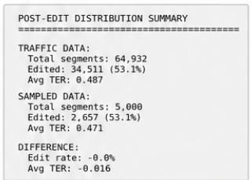

Sampled vs Traffic Distribution Comparison  
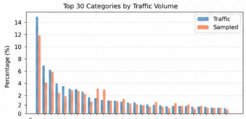

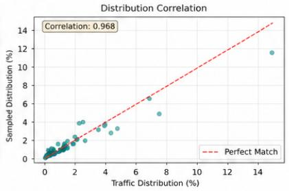  
Over/Under Representation

Proper\_Names:Country\_Names\_Specia Brand Names:Amazon Sub Brands Language Complexity:Unidiomatic Construct Transliteration Triggers: Sound Words Article Handling:Definite Articles Gender Neutrality:You With Action Verb Terminology Consistency:Reference Terms Brand and Product Identifiers:Brand Names Idiomactic Expressions:Comoound Terms Inclusivity and Canquage:lfeaglo first Construct Ur and Instructions:instruction LIsts Articie Handling:Indefinite Artictes   
Grammatical Structure:Handling Indefinite Articles   
Translation Consistency:Information\_Preservation Voice Neutrallty:Formal Regisfer and Tone Gender Neutrality:You Can Construction Terminology Consistency:Gender lengtive Term Acronvms Anbrevletions.Scandard Acronyms Legal contcne:Requatory Entity Names Amazon Brande rimary Brands Transliteration\_Context:Engtish\_Latin\_Words Volce te Exproteu.Engliso dioms Language Compiexity:Specialiaed jargon Negailve Wordo.tes\_Regarding\_Res Variables\_and Ptacehoiders:Placeholder\_ Patterns UI and"Instructions:imperative OI Action   
Terminology Consistency:Repeated Domain Term

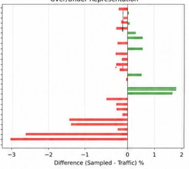

(b) Post-edit distribution fidelity  
Post-Edit Distribution: Sampled vs Traffic  
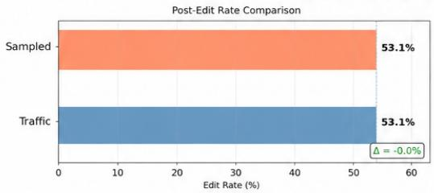

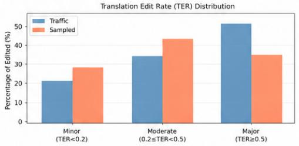

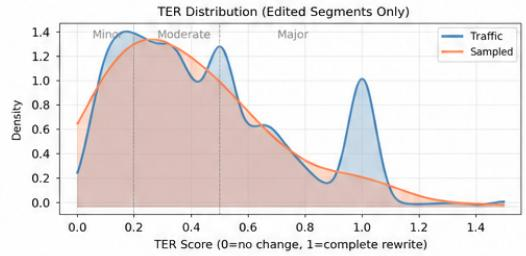

(c) Clean-segment / lock-rate fidelity  
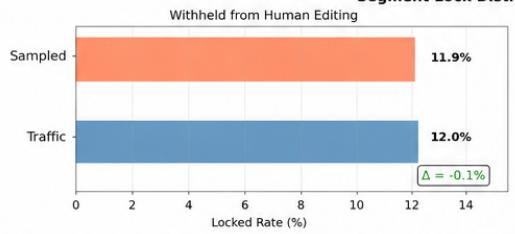

Segment Lock Distribution: Sampled vs Traffic  
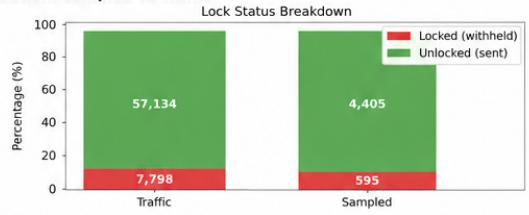  
Figure 4: Fidelity diagnostics for the hi-IN test split. (a) Category distribution fidelity compares taxonomy-category frequencies between sampled data and the full evaluation pool. (b) Post-edit distribution fidelity compares edit rate and TER severity distributions. (c) Clean-segment / lock-rate fidelity compares the percentage of segments withheld from human editing. These diagnostics illustrate how Level 3 aligns the final sampled set with the full pool.

<table><tr><td colspan="2">Style Guide Rule</td><td colspan="2">Taxonomy Category</td><td>Type</td><td colspan="2">Spot-Check Example</td></tr><tr><td colspan="8">Fluency – Grammar &amp; Spelling</td></tr><tr><td colspan="2">No plural acronyms → PDF)</td><td colspan="3">on Acronyms_Abbrev. (PDFs Pluralized_Acronyms</td><td colspan="3">/ Det. “DVDs”</td></tr><tr><td colspan="2"></td><td colspan="3">Country abbrev. (UK Acronyms_Abbrev.</td><td colspan="3">/ Det.</td></tr><tr><td colspan="2">→ Royaume-Uni)</td><td colspan="3">Country_Abbreviations</td><td colspan="3">UK|U.K. →“Royaume-Uni”</td></tr><tr><td colspan="3">→ États-Unis)</td><td colspan="3">Dotted abbrev. (U.S. Acronyms_Abbrev. Dotted_Abbreviations</td><td colspan="2">U.S. matched by [A-Z]\.([A-Z]\.)+</td></tr><tr><td colspan="3">e-mail)</td><td colspan="3">Tech spelling (Wi-Fi, Technology_Terms</td><td colspan="2">“WiFi” → “Wi-Fi”; “email&quot; → “e-mail”</td></tr><tr><td colspan="3">Web capitalization</td><td colspan="3">Tech_Spelling Technology_Terms Web_Capitalization</td><td colspan="2">&quot;web&quot; → &quot;Web&quot;</td></tr><tr><td colspan="7">Proper names invari- Proper_Ñames able (iPads) ple_Products</td><td colspan="3">“iPads” → &quot;les iPad&quot; (no plural)</td></tr><tr><td colspan="7"></td><td colspan="3">Fluency – Typography</td></tr><tr><td colspan="7">Ampersand → “et” Punctuation_Typo.</td><td colspan="3">/ Det. “Shoes &amp; Bags” → “Chaussures et sacs</td></tr><tr><td colspan="2">Hashtag → nº</td><td colspan="3">Ampersand Punctuation_Typo.</td><td colspan="3">/ Det.</td><td colspan="3">“#1”→ “n° 1”</td></tr><tr><td colspan="4">No exclamation in UI Punctuation_Typo. / Ex- Det.</td><td colspan="3">Hashtag_Number</td><td colspan="3">“Welcome!&quot; → remove “!&quot; in UI strings</td></tr><tr><td colspan="9">clamation_in_UI Locale Convention</td></tr><tr><td colspan="2">Currency (symbol after num- rency_Symbols</td><td colspan="3">format Currency_Pricing / Cur- Det.</td><td colspan="3"></td><td colspan="3">“$19.99” → “19,99 $” or “19,99 USD”</td></tr><tr><td colspan="8">ber) format Date_Formats</td><td colspan="3">/ Det.</td></tr><tr><td colspan="8">Date (MM/DD</td><td colspan="3">“7/14/2013”→ “14/07/2013”</td></tr><tr><td>DD/MM)</td><td colspan="3">Written date reorder</td><td colspan="3">→ US_Numeric_Date Date_Formats / Writ- Det.</td><td colspan="3"></td></tr><tr><td colspan="8"></td><td colspan="3">“July 14, 2013” → “14 juillet 2013” / Det.</td></tr><tr><td colspan="8">12h → 24h time</td><td colspan="3">“8:30 pm” → “20 h 30” / Det.</td></tr><tr><td colspan="8">Thousands (comma → space)</td><td colspan="3">“2,935,000” → “2 935 000”</td></tr><tr><td colspan="8">Decimal sep. (period Number_Formats / Deci- Det. → comma)</td><td colspan="3">“11.5” → “11,5”</td></tr><tr><td colspan="8">Percent spacing</td><td colspan="3">Number_Formats / Per- Det. “10%” → “10 %”</td></tr><tr><td colspan="8">Discount format</td><td colspan="3">Number_Formats / Dis- Det. “40% off&quot; → “- 40 %”</td></tr><tr><td colspan="8">Fahrenheit →</td><td colspan="3">Cel- Measurements / Temper- Det “72℉”→ “22 °℃”</td></tr><tr><td colspan="8">sius Imperial → metric</td><td colspan="2">Measurements / Impe- Det. “12 inches” → “30,48 cm”</td></tr><tr><td colspan="8">Clothing sizes</td><td colspan="2">Measurements / Cloth- Det. “Small&quot; → “Taille S”</td></tr><tr><td colspan="8">ing_Sizes Style</td><td colspan="2"></td></tr><tr><td colspan="8">Voice_Tone / Sec- Sem. ond_Person_Address</td><td colspan="2"></td></tr><tr><td colspan="8">Polite “vous” form</td><td colspan="2">&quot;you&quot; → always “vous&quot; (formal)</td></tr><tr><td colspan="8"></td><td colspan="2"></td></tr><tr><td colspan="8">Imperative in instruc- tions</td><td colspan="2">“Print label” → “Imprimez l’étiquette”</td></tr><tr><td colspan="8">Infinitive for buttons</td><td colspan="2">“Find a package&quot;”  “Trouver un paquet&quot;</td></tr><tr><td colspan="8">Gender-neutral roles</td><td colspan="2">“specialist&quot; → “Spécialiste&quot; (not “Ex- pert(e)&quot;)</td></tr><tr><td colspan="8">Predicate adj. with “you&quot;</td><td colspan="2">“you&#x27;re ready&quot; → rephrase to avoid gen- dered agreement Break up multi-clause sentences for read-</td></tr></table>

Table 10: Spot-check mapping between French (fr-FR) localization style guide rules and taxonomy categories. Type: Det. = Deterministic (regex-based), Sem. = Semantic (LLM-based). Each row shows a style guide rule, its corresponding taxonomy category, detection type, and a concrete example of how the rule is operationalized.

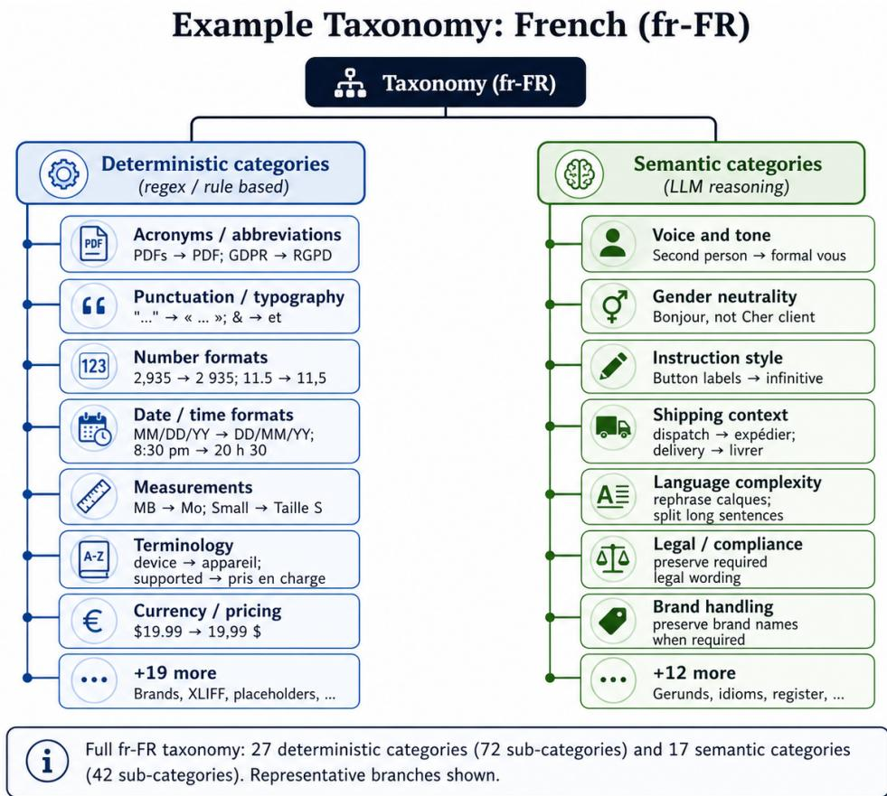  
Figure 5: Condensed example taxonomy for French (fr-FR). Deterministic categories capture rule-matchable phenomena such as punctuation, number formats, terminology, and currency conventions. Semantic categories capture context-dependent phenomena such as tone, gender neutrality, instruction style, and shipping context.