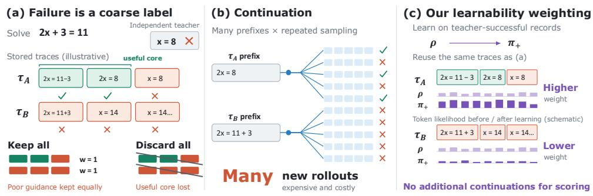
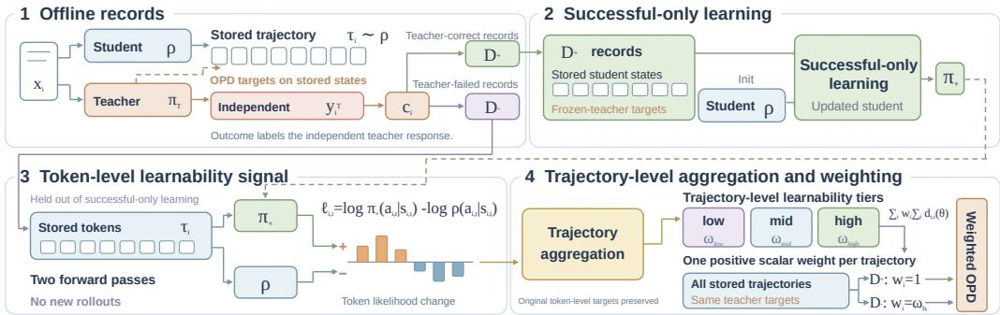
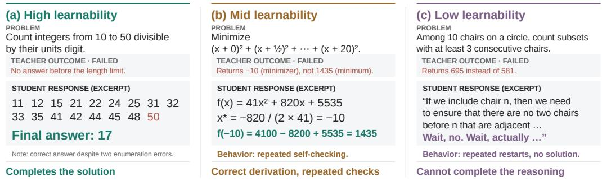

# TRAJECTORY LEARNABILITY FOR OFFLINE ON-POLICY DISTILLATION WITH IMPERFECT TEACHERS

Yihao Ai National University of Singapore yihao@u.nus.edu

Weilong Yan National University of Singapore yanweilong@u.nus.edu

## ABSTRACT

Offline on-policy distillation gains efficiency by collecting student trajectories and teacher supervision once and reusing them throughout optimization. The same reuse makes imperfect supervision persistent. Since even strong teachers can fail, we ask what remains learnablefrom imperfect teacher supervision? Teacher failure is only a coarse problem-level signal and does not imply that all supervision along the associated student trajectory is unhelpful. A natural alternative is to estimate teacher recoverability along the trajectory, but repeated continuations largely erase the efficiency advantage of offline distillation. We instead use teacher-successful problems to define a cheap reference for what the student can learn. We train on teacher-successful problems and measure how the likelihood of each observed token in trajectories from teacher-failed problems changes. We use these signed likelihood changes as an operational learnability signal: larger increases indicate behavior more strongly promoted by successful-only learning. We aggregate this signal into trajectory-level weights for the original distillation loss. Unlike continuation-based estimates, our learnability requires no additional generation and can be computed once from stored trajectories and model checkpoints. Across mathematical reasoning and code generation, our method improves an offline OPD baseline by up to 2.7 percentage points and matches or outperforms online OPD variants on multiple benchmarks. Despite the additional successfulonly distillation stage, it uses 2 GPUs and about 22 GPU hours, compared with 3 GPUs and 36–48 GPU hours for representative online OPD methods.

## 1 INTRODUCTION

On-policy distillation (OPD) trains a student on states induced by its own generations while using a stronger teacher to provide dense token-level supervision (Agarwal et al., 2024). Its offline variant improves efficiency by collecting student trajectories and teacher supervision once and reusing them throughout optimization (Wu et al., 2026). Yet the same reuse also makes imperfect supervision persistent. Once unreliable teacher guidance enters the offline training set, it can repeatedly shape the student over many optimization steps. Since even strong teachers can fail, this raises a fundamental question for offline OPD: what remains learnablefrom imperfect teacher supervision?

A natural first answer is to use whether the teacher succeeds or fails on the underlying problem. Outcome-based filtering uses task success as a coarse signal for selecting reasoning trajectories (Zelikman et al., 2022; Yuan et al., 2023). In OPD, however, teacher outcome and distillation supervision are distinct: the former is obtained from a generated teacher response, whereas the latter is provided on student-visited states. A failed teacher rollout therefore does not imply that every conditional teacher target on the student trajectory is useless. Discarding teacher-failed cases may remove useful supervision, while retaining them with full weight ignores the information carried by teacher failure. Moreover, student trajectories with the same teacher-failure outcome can exhibit different reasoning behavior. As illustrated in Figure 1(a), treating records identically cannot capture this variation. Our question is therefore not simply whether teacher-failed supervision should be kept or discarded, but how much should be retained for each trajectory.

Ideally, we would distinguish such trajectories by how much useful guidance remains recoverable along them. One could repeatedly continue from different prefixes and measure whether the teacher can still recover a successful solution. Richer supervision of this form is related to verifier- and process-supervision methods (Cobbe et al., 2021; Lightman et al., 2024), while recent OPD methods also model teacher reliability more explicitly (Gan et al., 2026; Zhu et al., 2026; Zhang et al., 2026). In practice, however, recoverability estimation requires repeated generation from many prefixes. At the granularity required to characterize long reasoning trajectories, this cost largely defeats the efficiency advantage of offline distillation, as shown in Figure 1(b). We therefore seek a cheape signal of how much useful supervision remains in each teacher-failed trajectory.

  
Figure 1: Motivation for learnability-weighted OPD. (a) A failed teacher response provides only a problem-level label. Student trajectories with the same label may deserve different amounts of OPD supervision. Keeping all weights them equally, while discarding all can remove useful supervision. (b) Estimating recoverability requires repeated continuation and verification from many prefixes. (c) We compare stored-token likelihoods before and after successful-only learning to assign positive trajectory weights. This requires no repeated continuation rollouts from multiple prefixes.

Our idea is to train the student on teacher-successful problems and use the update as a reference, which we call successful-only learning. We measure how this update changes the likelihood of each observed token in trajectories from teacher-failed problems, and use these signed changes as an operational token-level learnability signal. Positive changes indicate behavior promoted by successful-only learning, with larger changes providing stronger evidence of learnability. This signal can weight tokens, be aggregated over spans, or be summarized at the trajectory level. We empirically find trajectory-level weighting most effective, as it adjusts the supervision assigned to a trajectory while preserving the token-level OPD structure. This choice is consistent with selective OPD work showing that trajectory-level weighting can materially affect training (Lin et al., 2026).

To obtain a stable trajectory-level weight, we first smooth the learnability signal to suppress tokenlevel fluctuations, then normalize the trajectory statistics relative to teacher-failed examples. Rather than relying on differences in raw scores, we use the normalized learnability scores to form coarse low-, mid-, and high-learnability groups and assign each group a bounded positive weight. We refer to the resulting method as Learnability-Weighted Distillation (LWD).

We evaluate our method on mathematical reasoning and code generation, distilling Qwen3-8B into Qwen3 students at two scales. With Qwen3-4B-Base, our method improves the offline OPD baseline from 66.4% to 69.1% on AIME24, from 40.5% to 42.1% on HMMT25, and from 42.6% to 44.5% on LiveCodeBench v5, with gains on the remaining benchmarks and at the 1.7B scale. It also matches or exceeds online OPD variants on multiple evaluations. Despite the additional successful-only distillation stage, the pipeline requires only 2 GPUs and approximately 22 GPU hours, compared with 3 GPUs and 36–48 GPU hours for online OPD methods.

## Our contributions are threefold:

• We identify the problem of learning from imperfect teacher supervision in offline OPD and introduce a cheap, operational learnability signal based on successful-only learning, avoiding the repeated prefix-level continuation sampling required by direct recoverability estimation.

• We develop a trajectory-level weighting scheme that aggregates local learnability signals into coarse tiers. It reallocates supervision across trajectories while preserving the token-level OPD structure. This makes the weighting more stable and less sensitive to local fluctuations.

• We demonstrate gains across mathematical reasoning and code generation at two student scales. Our method improves offline OPD and matches or exceeds online selective OPD on multiple benchmarks. It also retains substantially lower computational cost in both GPU hours and usage.

## 2 RELATED WORK

## 2.1 KNOWLEDGE DISTILLATION AND ON-POLICY DISTILLATION

Knowledge distillation transfers knowledge from a stronger teacher through predictive distributions, sequence-level supervision, and self-distillation (Hinton et al., 2015; Kim & Rush, 2016; Furlanello et al., 2018). For language models, distillation has further expanded to explanations and chain-ofthought reasoning (Hsieh et al., 2023; Shridhar et al., 2023; Li et al., 2023; Mukherjee et al., 2023; Feng et al., 2024; Li et al., 2024; Gu et al., 2024), with broader developments reviewed in Yang et al. (2025). On-policy distillation trains the student on states induced by its own generations (Agarwal et al., 2024), with later work studying its optimization behavior in reasoning models (Li et al., 2026a). Lightning-OPD moves this paradigm offline by reusing precomputed student trajectories and teacher supervision (Wu et al., 2026). We build on this setting and study what remains worth learning when the reused teacher supervision is imperfect.

## 2.2 SELECTIVE AND RELIABILITY-AWARE ON-POLICY DISTILLATION

Recent OPD methods increasingly treat teacher supervision selectively rather than uniformly. Re-NIO reweights negative student trajectories using student–teacher probability information (Lin et al., 2026), while FiRe-OPD combines trajectory filtering with finer-grained reweighting (Li et al., 2026b). Position-weighted self-distillation studies teacher reliability across reasoning positions (Liu et al., 2026), and ExOPD modifies the standard OPD objective to encourage extrapolation beyond direct imitation (Yang et al., 2026). Outcome-aware methods go further: RA-OPD checks alignment between teacher-induced updates and trajectory reward (Gan et al., 2026), ReOrder-OPD uses a proxy for teacher continuation reliability to order prompts (Zhu et al., 2026), and TGOPD uses additional teacher probes to gate between OPD and verifier-guided optimization (Zhang et al., 2026). We instead ask what remains learnable after teacher failure is observed, using teacher-successful problems as a low-cost reference for reweighting offline OPD supervision.

## 2.3 OUTCOME SUPERVISION AND ADAPTIVE REWEIGHTING

Reasoning post-training often relies on coarse outcome signals through self-training, rejection sampling, and verifier-based selection (Zelikman et al., 2022; Cobbe et al., 2021; Yuan et al., 2023), while process supervision provides denser feedback within reasoning traces (Lightman et al., 2024). Recent work also shows that unsuccessful trajectories can still contain reusable structure that binary rejection discards (Deng et al., 2026). More broadly, adaptive example weighting has been studied in curriculum learning, self-paced learning, and robust learning under noisy supervision (Bengio et al., 2009; Kumar et al., 2010; Jiang et al., 2018; Ren et al., 2018; Han et al., 2018), with related ideas in advantage-weighted and offline policy learning (Peng et al., 2019; Kumar et al., 2020; Kostrikov et al., 2022). Our method derives its weighting signal specifically from successful-only learning and aggregates it, preserving the original token-level supervision structure within each trajectory.

## 3 PRELIMINARIES

## 3.1 ON-POLICY DISTILLATION

On-policy distillation (OPD) trains a student policy using states induced by the student’s own generations while querying a stronger teacher for dense supervision on those states. Let $x \sim \mathcal { D }$ denote a problem sampled from the training distribution and let the student policy $\pi _ { \theta }$ generate a response

$$
\tau = ( a _ { 1 } , \dots , a _ { T } ) \sim \pi _ { \theta } ( \cdot \mid x ) .\tag{1}
$$

At step t, the corresponding state is

$$
s _ { t } = ( x , a _ { < t } ) ,\tag{2}
$$

which contains the original problem and the student-generated prefix.

A teacher policy $\pi _ { T }$ is evaluated on the student-visited states $s _ { t }$ . Standard OPD trains the student by minimizing the reverse Kullback–Leibler (KL) divergence from the student policy to the teacher distribution at these states:

$$
\mathcal { L } _ { \mathrm { O P D } } ( \theta ) = \mathbb { E } _ { \boldsymbol { x } \sim \mathcal { D } , \tau \sim \pi _ { \theta } ( \cdot | \boldsymbol { x } ) } \left[ \sum _ { t = 1 } ^ { T } D _ { \mathrm { K L } } \left( \pi _ { \theta } ( \cdot \mid s _ { t } ) \parallel \pi _ { T } ( \cdot \mid s _ { t } ) \right) \right] .\tag{3}
$$

The reverse-KL objective encourages the student to match the teacher distribution on states induced by the student’s generations. Practical implementations may use sampled-token estimators of this objective, but the underlying distillation target remains the same. The defining feature of OPD is therefore that the distillation states are induced by the student itself, unlike off-policy distillation.

## 3.2 ONLINE AND OFFLINE ON-POLICY DISTILLATION

Online and offline OPD differ in when student trajectories and teacher supervision are collected. In online OPD, trajectory collection and optimization are interleaved. At training iteration k, the current student policy $\pi _ { \boldsymbol { \theta } _ { k } }$ generates new trajectories,

$$
\tau ^ { ( k ) } \sim \pi _ { \theta _ { k } } ( \cdot \mid x ) ,\tag{4}
$$

and the teacher is queried on the corresponding student-visited states. The resulting supervision updates the student before the next generation round, so both the student state distribution and teacher queries evolve throughout training. This tight coupling preserves on-policy coverage but incurs substantial computational cost from repeated student generation and teacher inference.

In offline OPD, trajectory collection is separated from optimization. A fixed student checkpoint $\rho$ first generates a collection of trajectories,

$$
\tau _ { i } \sim \rho ( \cdot \mid x _ { i } ) ,\tag{5}
$$

and the teacher distributions on the resulting states are computed and stored once. Training then repeatedly optimizes the reverse-KL objective on this fixed collection,

$$
{ \mathcal { L } } _ { \mathrm { o f f i n e } } ( \theta ) = \sum _ { i = 1 } ^ { N } \sum _ { t = 1 } ^ { T _ { i } } D _ { \mathrm { K L } } \left( \pi _ { \theta } ( \cdot \mid s _ { i , t } ) \parallel \pi _ { T } ( \cdot \mid s _ { i , t } ) \right) .\tag{6}
$$

By removing repeated generation and online teacher inference, offline OPD substantially reduces training cost (Wu et al., 2026). This is particularly attractive when GPU resources are limited or the teacher itself requires substantial inference resources. However, reusing the same teacher supervision also makes its quality more consequential, which motivates our study of imperfect teachers.

## 4 METHODS

We now describe Learnability-Weighted Distillation (LWD), following the four stages illustrated in Figure 2. We first construct records containing student trajectories, teacher supervision, and teacher outcomes. We then learn a reference update from teacher-successful problems and use it to define a token-level learnability signal on trajectories from teacher-failed problems. Finally, we aggregate this signal into trajectory-level learnability tiers and use the weights to scale the original OPD objective.

## 4.1 OFFLINE RECORDS AND TEACHER OUTCOMES

Let $\mathcal { D } = \{ x _ { i } \} _ { i = 1 } ^ { N }$ denote the training problem set, and let $\rho$ denote the fixed student policy used to collect the offline trajectories. For each problem $x _ { i }$ , we store

$$
\tau _ { i } = ( a _ { i , 1 } , \dots , a _ { i , T _ { i } } ) \sim \rho ( \cdot \mid x _ { i } ) ,\tag{7}
$$

where the state at token t is

$$
\begin{array} { r } { s _ { i , t } = ( x _ { i } , a _ { i , < t } ) . } \end{array}\tag{8}
$$

  
Figure 2: Learnability-Weighted Distillation (LWD) for offline OPD. (1) We collect student trajectories, frozen-teacher targets, and outcomes of independently generated teacher responses. (2) Teacher-successful records train a reference checkpoint $\pi _ { + }$ from $\rho .$ (3) Stored trajectories from teacher-failed problems are rescored under both checkpoints, and their token-level likelihood changes are summarized by the trajectory mean and variation. (4) The resulting tiers assign bounded positive trajectory weights for final offline distillation. Scoring uses two forward passes and no new rollouts. The token profile is schematic; the displayed weights are realized Code values.

A frozen teacher $\pi _ { T }$ provides the token-level supervision used by the offline OPD objective. Following the reverse-KL formulation in Section 3, we denote the token-level loss used on the stored state–action pair $\left( { { s _ { i , t } } , { a _ { i , t } } } \right)$ by $d _ { i , t } ( \theta )$

Separately, the teacher generates one response $y _ { i } ^ { T }$ to each problem. A domain-specific success predicate defines

$$
c _ { i } = \mathbf { 1 } \left[ \mathrm { S U C C } ( y _ { i } ^ { T } , x _ { i } ) \right] ,\tag{9}
$$

which partitions the records into

$$
\mathcal { D } ^ { + } = \{ i : c _ { i } = 1 \} , \qquad \mathcal { D } ^ { - } = \{ i : c _ { i } = 0 \} .\tag{10}
$$

Importantly, $c _ { i }$ records the outcome of an independently generated teacher response. It labels neither the correctness of the stored student trajectory $\tau _ { i }$ nor the quality of every teacher target $\pi _ { T } ( \cdot \mid s _ { i , t } )$ on the student-visited states. Thus, $c _ { i }$ is a problem-level outcome signal rather than a token-level judgment of the OPD supervision.

## 4.2 SUCCESSFUL-ONLY REFERENCE

We next train the student only on records whose teacher response succeeds. Starting from the trajectory-collecting policy $\rho = \pi _ { \theta _ { \rho } }$ , we apply the same distillation procedure using only $\mathcal { D } ^ { + }$ :

$$
\begin{array} { r } { \theta _ { + } = \mathrm { T r a i n } \left( \theta _ { \rho } , \{ \tau _ { i } , \pi _ { T } \} _ { i \in \mathcal { D } ^ { + } } \right) , \pi _ { + } = \pi _ { \theta _ { + } } . } \end{array}\tag{11}
$$

We refer to the update from $\rho$ to $\pi _ { + }$ as successful-only learning. The trajectories remain studentgenerated; only the subset used for this auxiliary distillation is selected by the teacher outcome. Thus, $\pi _ { + }$ captures the model change induced by learning from teacher supervision on problems accompanied by observed teacher success. Records in $\mathcal { D } ^ { - }$ are excluded from this update. They can therefore be used to ask how successful-only learning changes behavior on teacher-failed problems.

## 4.3 TOKEN-LEVEL LEARNABILITY SIGNAL

For each trajectory $\tau _ { i }$ with $i \in \mathcal { D } ^ { - }$ , we score the same stored tokens under both $\rho$ and $\pi _ { + }$ . We define

$$
\ell _ { i , t } = \log \pi _ { + } ( a _ { i , t } \mid s _ { i , t } ) - \log \rho ( a _ { i , t } \mid s _ { i , t } ) .\tag{12}
$$

We use $\ell _ { i , t }$ as an operational token-level learnability signal. A positive value means that successfulonly learning increases the likelihood of the observed student token, whereas a negative value means that the same update decreases it. The signal does not label the token as correct and does not estimate

the utility of the teacher target at that state; it measures how the observed student behavior responds to successful-only learning. For interpretation, averaging the unsmoothed token-level signal gives

$$
\bar { \ell } _ { i } = \frac { 1 } { T _ { i } } \sum _ { t = 1 } ^ { T _ { i } } \ell _ { i , t } = \frac { 1 } { T _ { i } } \log \frac { \pi _ { + } ( \tau _ { i } \mid x _ { i } ) } { \rho ( \tau _ { i } \mid x _ { i } ) } .\tag{13}
$$

The second equality is exact because both policies score the same autoregressive sequence.

First-order interpretation. Let

$$
f _ { i } ( \theta ) = \frac { 1 } { T _ { i } } \log \pi _ { \theta } ( \tau _ { i } \mid x _ { i } ) , \qquad \Delta \theta = \theta _ { + } - \theta _ { \rho } .\tag{14}
$$

A first-order expansion around $\theta _ { \rho }$ gives

$$
\begin{array} { r } { \bar { \ell } _ { i } = \Delta \theta ^ { \top } \nabla _ { \theta } f _ { i } ( \theta _ { \rho } ) + O \big ( \| \Delta \theta \| ^ { 2 } \big ) . } \end{array}\tag{15}
$$

Thus, to first order, the average signal reflects alignment between the successful-only update and the direction that increases the likelihood of the stored trajectory. This interpretation is approximate, whereas Eq. equation 13 is exact.

## 4.4 TRAJECTORY-LEVEL LEARNABILITY WEIGHTING

The token-level learnability signal should determine how much OPD supervision each record receives. In principle, it can be applied at the token, span, or trajectory level. However, the learnability signal and the OPD loss describe different quantities. The former measures how successful-only learning changes the likelihood of the student token actually generated, whereas the latter trains the student toward the teacher distribution at the same state. A low learnability signal may therefore occur precisely where the student deviates and corrective teacher supervision is still useful.

For this reason, directly reweighting individual tokens or spans can unnecessarily reshape the original token-level OPD supervision. We instead aggregate the local signal into a trajectory-level weight, which adjusts the overall supervision strength while preserving the relative token-level structure within the trajectory. This trajectory-level design also performs best in our ablations.

We first smooth the token-level signal along each response to reduce local fluctuations. Let $\widetilde { \ell } _ { i , t }$ denote the smoothed signal. We summarize each trajectory by its overall level

$$
m _ { i } = \frac { 1 } { T _ { i } } \sum _ { t = 1 } ^ { T _ { i } } \widetilde { \ell } _ { i , t } ,\tag{16}
$$

and its variation

$$
v _ { i } = \sqrt { \frac { 1 } { T _ { i } } \sum _ { t = 1 } ^ { T _ { i } } \left( \widetilde { \ell } _ { i , t } - m _ { i } \right) ^ { 2 } } .\tag{17}
$$

The first statistic captures how strongly the trajectory is supported overall by successful-only learning, while the second captures how stable that support is across the response.

We standardize $m _ { i }$ and $v _ { i }$ within the teacher-failed subset,

$$
z _ { i } ^ { m } = \frac { m _ { i } - \mu _ { m } } { \sigma _ { m } } , \qquad z _ { i } ^ { v } = \frac { v _ { i } - \mu _ { v } } { \sigma _ { v } } ,\tag{18}
$$

and use their relative values to assign a broad ordinal tier

$$
b _ { i } = B ( z _ { i } ^ { m } , z _ { i } ^ { v } ) \in \{ \mathrm { l o w , m i d , h i g h } \} .\tag{19}
$$

The three tiers correspond to relatively weak or unstable, intermediate, and strong stable learnability, respectively. Exact smoothing choices, standardization details, and tier boundaries are provided in the implementation details. Each tier is associated with a bounded positive trajectory weight,

$$
0 < \omega _ { \mathrm { l o w } } < \omega _ { \mathrm { m i d } } < \omega _ { \mathrm { h i g h } } .\tag{20}
$$

Table 1: Main results for distillation from Qwen3-8B to Qwen3 students at two scales. We report avg@32 on mathematical reasoning benchmarks and avg@4 on LiveCodeBench. Best results within each student scale are shown in bold.
<table><tr><td>Method</td><td>On/Off</td><td>AIME24</td><td>AIME25</td><td>HMMT25</td><td>LCB v5</td><td>LCB v6</td></tr><tr><td>Student: Qwen3-1.7B-Base</td><td></td><td></td><td></td><td></td><td></td><td></td></tr><tr><td>SFT</td><td></td><td>6.5%</td><td>10.4%</td><td>3.7%</td><td>4.3%</td><td>9.0%</td></tr><tr><td>OPD (Agarwal et al., 2024)</td><td>Online</td><td>17.5%</td><td>20.5%</td><td>14.9%</td><td>7.5%</td><td>13.3%</td></tr><tr><td>RA-OPD (Gan et al., 2026)</td><td>Online</td><td>14.4%</td><td>18.9%</td><td>12.1%</td><td></td><td></td></tr><tr><td>ReNIO (Lin et al., 2026)</td><td>Online</td><td>19.3%</td><td>20.2%</td><td>13.0%</td><td>7.6%</td><td>13.2%</td></tr><tr><td>FiRe-OPD (Li et al., 2026b)</td><td>Online</td><td>16.4%</td><td>20.1%</td><td>12.9%</td><td>7.2%</td><td>13.3%</td></tr><tr><td>Lightning-OPD (Wu et al., 2026)</td><td>Offline</td><td>19.8%</td><td>24.8%</td><td>15.8%</td><td>5.9%</td><td>10.2%</td></tr><tr><td>LWD (ours)</td><td>Offline</td><td>21.4%</td><td>25.6%</td><td>16.8%</td><td>6.2%</td><td>11.3%</td></tr><tr><td>Student: Qwen3-4B-Base</td><td></td><td></td><td></td><td></td><td></td><td></td></tr><tr><td>SFT</td><td></td><td>57.1%</td><td>52.1%</td><td>34.0%</td><td>34.7%</td><td>36.4%</td></tr><tr><td>OPD (Agarwal et al., 2024)</td><td>Online</td><td>65.4%</td><td>57.9%</td><td>39.9%</td><td>44.2%</td><td>39.3%</td></tr><tr><td>RA-OPD (Gan et al., 2026)</td><td>Online</td><td>66.2%</td><td>53.5%</td><td>38.5%</td><td></td><td></td></tr><tr><td>ReNIO (Lin et al., 2026)</td><td>Online</td><td>61.5%</td><td>53.2%</td><td>38.2%</td><td>38.0%</td><td>39.0%</td></tr><tr><td>ExOPD (Yang et al., 2026)</td><td>Online</td><td>61.0%</td><td>56.0%</td><td>34.4%</td><td>29.0%</td><td></td></tr><tr><td>FiRe-OPD (Li et al., 2026b)</td><td>Online</td><td>63.6%</td><td>55.6%</td><td>35.8%</td><td>41.0%</td><td>39.6%</td></tr><tr><td>Lightning-OPD (Wu et al., 2026)</td><td>Offline</td><td>66.4%</td><td>58.0%</td><td>40.5%</td><td>42.6%</td><td>40.4%</td></tr><tr><td>LWD (ours)</td><td>Offline</td><td>69.1%</td><td>60.0%</td><td>42.1%</td><td>44.5%</td><td>42.1%</td></tr></table>

Teacher-successful records retain their original weight, giving

$$
w _ { i } = \left\{ \begin{array} { l l } { 1 , } & { c _ { i } = 1 , } \\ { \omega _ { b _ { i } } , } & { c _ { i } = 0 . } \end{array} \right.\tag{21}
$$

The final learnability-weighted OPD objective is

$$
\mathcal { L } _ { \mathrm { L W D } } ( \boldsymbol { \theta } ) = \sum _ { i = 1 } ^ { N } w _ { i } \sum _ { t = 1 } ^ { T _ { i } } d _ { i , t } ( \boldsymbol { \theta } ) .\tag{22}
$$

Because $w _ { i }$ is shared across all tokens in $\tau _ { i }$ , LWD reallocates supervision across trajectories while preserving the token-level teacher targets and their relative structure within each trajectory.

## 5 EXPERIMENTS

Datasets. We evaluate our method on mathematical reasoning and code generation. For mathematical reasoning, we train on DAPO-Math-17K (Yu et al., 2026) and evaluate on AIME 2024, AIME 2025, and HMMT 2025. For code generation, we train on the 30K function-generation subset of EpiCoder-300K used by Lightning-OPD (Wang et al., 2025; Wu et al., 2026) and evaluate on LiveCodeBench (LCB) v5 and v6 (Jain et al., 2025).

Training and implementation. We follow the Lightning-OPD protocol (Wu et al., 2026) where applicable and evaluate distillation from Qwen3-8B to Qwen3-4B-Base and Qwen3-1.7B-Base. For fair comparison, all methods within each student scale use the same initialization, training data, GPU platform, optimization budget, and number of training steps. We report only the fixed final checkpoint, with no checkpoint selection or cherry-picking. More details are provided in Appendix A.

Evaluation protocol. Following Lightning-OPD (Wu et al., 2026), we report avg@32 for AIME 2024, AIME 2025, and HMMT 2025, and avg@4 for LiveCodeBench v5 and v6, where avg@K is the fraction of successful generations over K samples. All methods use the same GPU platform, vLLM and Hugging Face Transformers versions, seed, and tensor-parallel size. We evaluate with temperature 0.6, top-p 0.95, and maximum lengths of 32K tokens for mathematics and 40K for code.

Baselines. We compare against standard OPD (Agarwal et al., 2024), selective and reweightingbased OPD methods including ReNIO (Lin et al., 2026) and FiRe-OPD (Li et al., 2026b), reliabilityaware RA-OPD (Gan et al., 2026), and ExOPD (Yang et al., 2026). We use Lightning-OPD (Wu et al., 2026) as the primary offline baseline, since our method operates in the same offline setting and is designed to improve how its reused teacher supervision is weighted.

Table 2: Training cost of offline and online OPD methods under the same hardware setting. LWD retains the two-GPU offline training setup while remaining below all online baselines in both wallclock and GPU-hour cost. nAmT denotes n actor GPUs and m teacher GPUs.
<table><tr><td>Method</td><td>GPUs</td><td>Wall hours</td><td>GPU hours</td><td>Min./step</td></tr><tr><td>Naive OPD</td><td>2A1T</td><td>~15.3</td><td>~46.0</td><td>~6.1</td></tr><tr><td>ReNIO</td><td>2A1T</td><td>15.90</td><td>47.69</td><td>6.15</td></tr><tr><td>FiRe-OPD</td><td>2A1T</td><td>12.09</td><td>36.28</td><td>4.84</td></tr><tr><td>Lightning-OPD</td><td>2A</td><td>5.32</td><td>10.64</td><td>2.13</td></tr><tr><td>LWD (ours)</td><td>2A</td><td>10.98</td><td>21.90</td><td>2.14</td></tr></table>

Table 3: Ablation on teacher-failed supervision. Reduced weighting outperforms both full retention and removal, while trajectory-specific learnability weighting provides strongest overall performance.
<table><tr><td>Failed-case weight</td><td>AIME24</td><td>AIME25</td><td>HMMT25</td><td>Avg.</td></tr><tr><td>Full</td><td>66.4%</td><td>58.0%</td><td>40.5%</td><td>55.0%</td></tr><tr><td>Zero</td><td>67.1%</td><td>59.6%</td><td>39.7%</td><td>55.5%</td></tr><tr><td>Shared reduced</td><td>68.7%</td><td>59.3%</td><td>41.1%</td><td>56.4%</td></tr><tr><td>Learnability-based</td><td>69.1%</td><td>60.0%</td><td>42.1%</td><td>57.1%</td></tr></table>

## 5.1 MAIN RESULTS.

Table 1 compares our method with both online and offline OPD baselines across mathematical rea soning and code generation. At the 4B scale, LWD consistently improves the protocol-matched Lightning-OPD baseline on all five benchmarks, with gains of +2.7 points on AIME24, +2.0 on AIME25, +1.6 on HMMT25, +1.9 on LCB v5, and +1.7 on LCB v6. LWD also consistently outperforms the reliability-aware RA-OPD baseline across all three mathematics benchmarks. It achieves the best result among all compared methods on every benchmark. Notably, its AIME24 result of 69.1% also exceeds the 68.1% originally reported by Lightning-OPD, despite all controlled comparisons in our main table using our own protocol-matched reproduction.

The same trend largely transfers to the smaller 1.7B student. LWD improves the offline Lightning-OPD baseline on all five benchmarks and achieves the strongest performance on all three mathematics benchmarks. On code generation, online OPD variants remain slightly stronger at this smaller model scale, but LWD substantially narrows the gap while retaining the lower-cost offline training. Overall, the gains are consistent across domains and student scales. The strong 4B results in particular show that learnability-guided retention of teacher-failed supervision can match or outperform online OPD variants without requiring online teacher interaction during training.

Training Efficiency. Despite the additional successful-only distillation stage, LWD preserves the computational advantage of offline OPD over online alternatives. It requires 2 GPUs, 10.98 wallclock hours, and 21.90 GPU hours, compared with 3 GPUs and 12.09–15.90 wall-clock hours and 36.28–47.69 GPU hours for the online selective OPD methods in our comparison. The underlying training loop itself remains essentially unchanged: LWD and Lightning-OPD require 2.14 and 2.13 minutes per optimization step, respectively. The additional cost therefore comes primarily from the one-time successful-only distillation stage rather than a slower optimization loop. Compared with Lightning-OPD, this stage increases the total offline cost from 10.64 to 21.90 GPU hours, while still retaining the lower two-GPU resource requirement of offline training.

## 5.2 ABLATION STUDIES

How should teacher-failed supervision be weighted? Table 3 shows that teacher-failed supervision should neither be fully retained nor discarded. Setting its weight to zero slightly improves over full weighting, suggesting that teacher failure is informative but does not make the associated OPD supervision useless. A shared reduced weight further improves the average from 55.5 to 56.4, while learnability-based weighting reaches 57.1 and improves all three benchmarks. These results support our central hypothesis: teacher failure is a useful coarse signal rather than a hard filter, but the remaining supervision value still varies across trajectories within failed cases.

Table 4: Ablation on learnability weighting granularity. Trajectory-level weighting is more consistent than finer-grained alternatives, and tiered trajectory weighting achieves the best performance.
<table><tr><td>Granularity</td><td>Weight form</td><td>AIME24</td><td>AIME25</td><td>HMMT25</td><td>Avg.</td></tr><tr><td>Token</td><td>Sparse</td><td>68.6%</td><td>58.0%</td><td>39.7%</td><td>55.4%</td></tr><tr><td>Token</td><td>Dense</td><td>68.6%</td><td>60.5%</td><td>39.6%</td><td>56.2%</td></tr><tr><td>Span</td><td>Sparse</td><td>67.5%</td><td>59.5%</td><td>41.2%</td><td>56.1%</td></tr><tr><td>Span</td><td>Dense</td><td>66.4%</td><td>60.4%</td><td>43.1%</td><td>56.6%</td></tr><tr><td>Trajectory</td><td>Continuous</td><td>67.8%</td><td>60.9%</td><td>41.5%</td><td>56.7%</td></tr><tr><td>Trajectory (Ours)</td><td>Tiered</td><td>69.1%</td><td>60.0%</td><td>42.1%</td><td>57.1%</td></tr></table>

  
Figure 3: Qualitative case study on mathematical reasoning under teacher failure. Although all examples are associated with failed independent teacher responses, their student trajectories exhibit substantially different learnability: high-tier examples contain complete solutions, mid-tier examples mix correct progress with repeated checking, and low-tier examples remain unresolved.

At what granularity should learnability modify OPD? Table 4 compares token-, span-, and trajectory-level weighting. Fine-grained weighting can be effective on individual benchmarks: dense span weighting reaches the best HMMT25 result of 43.1. However, no token- or span-level variant performs consistently best across tasks. Continuous trajectory weighting gives the strongest average among the continuous variants at 56.7, while tiered trajectory weighting further improves the average to 57.1. These results support using local learnability as evidence for adjusting the overall supervision assigned to a trajectory rather than directly reshaping the token-level OPD structure.

What do different learnability tiers capture? Figure 3 qualitatively compares teacher-failed problems across learnability tiers. High-learnability trajectories can contain complete solutions despite teacher failure. Mid-learnability trajectories make correct progress but include repeated checking or unproductive deliberation, while low-learnability trajectories often stall or repeatedly restart. These examples show that the same teacher-failure label can correspond to different reasoning behaviors, supporting trajectory-specific supervision weights.

## 6 CONCLUSION

We study what remains learnable from imperfect teacher supervision in offline on-policy distillation, where a failed teacher rollout does not imply that every conditional target on student-visited states is useless. Directly estimating recoverability through repeated continuations would largely sacrifice offline efficiency, so we use successful-only learning to construct a cheap learnability signal and aggregate it into trajectory-level weights for the original OPD objective. Across mathematical reasoning and code generation, our method improves a protocol-matched offline OPD baseline and matches or exceeds online OPD variants on multiple benchmarks, while requiring substantially fewer GPU hours and fewer concurrently used GPUs. These results suggest that teacher failure is a useful coarse signal rather than a binary decision about whether supervision should be retained, and that successful-only learning can distinguish how much to retain for each trajectory. This allows LWD to retain supervision from teacher-failed problems without treating cases as equally reliable. By retaining failed-case supervision, LWD turns teacher failure from a binary filter into a graded signal for allocating distillation strength across trajectories.

## REFERENCES

Rishabh Agarwal, Nino Vieillard, Yongchao Zhou, Piotr Stanczyk, Sabela Ramos Garea, Matthieu Geist, and Olivier Bachem. On-policy distillation of language models: Learning from selfgenerated mistakes. In International Conference on Learning Representations, volume 2024, pp. 21246–21263, 2024.

Yoshua Bengio, Jer´ ome Louradour, Ronan Collobert, and Jason Weston. Curriculum learning. Inˆ Andrea Pohoreckyj Danyluk, Leon Bottou, and Michael L. Littman (eds.),´ Proceedings of the 26th Annual International Conference on Machine Learning, ICML 2009, Montreal, Quebec, Canada, June 14-18, 2009, volume 382 of ACM International Conference Proceeding Series, pp. 41–48. ACM, 2009. doi: 10.1145/1553374.1553380. URL https://doi.org/10.1145/ 1553374.1553380.

Karl Cobbe, Vineet Kosaraju, Mohammad Bavarian, Mark Chen, Heewoo Jun, Lukasz Kaiser, Matthias Plappert, Jerry Tworek, Jacob Hilton, Reiichiro Nakano, et al. Training verifiers to solve math word problems. arXiv preprint arXiv:2110.14168, 2021.

Jie Deng, Hanshuang Tong, Jun Li, Shining Liang, Ning Wu, Hongzhi Li, and Yutao Xie. Beyond rejection sampling: Trajectory fusion for scaling mathematical reasoning. In Findings of the Associationfor Computational Linguistics: ACL 2026, pp. 7943–7959, 2026.

Kaituo Feng, Changsheng Li, Xiaolu Zhang, Jun Zhou, Ye Yuan, and Guoren Wang. Keypoint-based progressive chain-of-thought distillation for llms. arXiv preprint arXiv:2405.16064, 2024.

Tommaso Furlanello, Zachary Lipton, Michael Tschannen, Laurent Itti, and Anima Anandkumar. Born again neural networks. In International conference on machine learning, pp. 1607–1616. PMLR, 2018.

Siyuan Gan, Yuhan Li, Xiran Wang, Linjian Meng, Boyan Wang, Zhen Zhao, Jing Huo, and Yang Gao. When teacher guidance misleads: Reward-aligned on-policy distillation. arXiv preprint arXiv:2608.27960, 2026.

Yuxian Gu, Li Dong, Furu Wei, and Minlie Huang. Minillm: Knowledge distillation of large language models. In International Conference on Learning Representations, volume 2024, pp. 32694–32717, 2024.

Bo Han, Quanming Yao, Xingrui Yu, Gang Niu, Miao Xu, Weihua Hu, Ivor W. Tsang, and Masashi Sugiyama. Co-teaching: Robust training of deep neural networks with extremely noisy labels. In Samy Bengio, Hanna M. Wallach, Hugo Larochelle, Kristen Grauman, Nicolo Cesa-Bianchi,\` and Roman Garnett (eds.), Advances in Neural Information Processing Systems 31: Annual Conference on Neural Information Processing Systems 2018, NeurIPS 2018, December 3-8, 2018, Montreal, Canada ´ , pp. 8536–8546, 2018. URL https://proceedings.neurips.cc/ paper/2018/hash/a19744e268754fb0148b017647355b7b-Abstract.html.

Geoffrey Hinton, Oriol Vinyals, and Jeff Dean. Distilling the knowledge in a neural network. arXiv preprint arXiv:1503.02531, 2015.

Cheng-Yu Hsieh, Chun-Liang Li, Chih-Kuan Yeh, Hootan Nakhost, Yasuhisa Fujii, Alex Ratner, Ranjay Krishna, Chen-Yu Lee, and Tomas Pfister. Distilling step-by-step! outperforming larger language models with less training data and smaller model sizes. In Findings of the association for computational linguistics: ACL 2023, pp. 8003–8017, 2023.

Naman Jain, King Han, Alex Gu, Wen-Ding Li, Fanjia Yan, Tianjun Zhang, Sida Wang, Armando Solar-Lezama, Koushik Sen, and Ion Stoica. Livecodebench: Holistic and contamination free evaluation of large language models for code. In The Thirteenth International Conference on Learning Representations, ICLR 2025, Singapore, April 24-28, 2025. OpenReview.net, 2025. URL https://openreview.net/forum?id=chfJJYC3iL.

Lu Jiang, Zhengyuan Zhou, Thomas Leung, Li-Jia Li, and Li Fei-Fei. Mentornet: Learning datadriven curriculum for very deep neural networks on corrupted labels. In Jennifer G. Dy and Andreas Krause (eds.), Proceedings of the 35th International Conference on Machine Learning, ICML 2018, Stockholmsmassan, Stockholm, Sweden, July 10-15, 2018¨ , volume 80 of Proceedings

of Machine Learning Research, pp. 2309–2318. PMLR, 2018. URL http://proceedings. mlr.press/v80/jiang18c.html.

Yoon Kim and Alexander M Rush. Sequence-level knowledge distillation. In Proceedings of the 2016 conference on empirical methods in natural language processing, pp. 1317–1327, 2016.

Ilya Kostrikov, Ashvin Nair, and Sergey Levine. Offline reinforcement learning with implicit qlearning. In The Tenth International Conference on Learning Representations, ICLR 2022, Virtual Event, April 25-29, 2022. OpenReview.net, 2022. URL https://openreview.net/ forum?id=68n2s9ZJWF8.

Aviral Kumar, Aurick Zhou, George Tucker, and Sergey Levine. Conservative q-learning for offline reinforcement learning. In Hugo Larochelle, Marc’Aurelio Ranzato, Raia Hadsell, Maria-Florina Balcan, and Hsuan-Tien Lin (eds.), Advances in Neural Information Processing Systems 33: Annual Conference on Neural Information Processing Systems 2020, NeurIPS 2020, December 6-12, 2020, virtual, 2020. URL https://proceedings.neurips.cc/paper/2020/hash/ 0d2b2061826a5df3221116a5085a6052-Abstract.html.

M. Pawan Kumar, Benjamin Packer, and Daphne Koller. Self-paced learning for latent variable models. In John D. Lafferty, Christopher K. I. Williams, John Shawe-Taylor, Richard S. Zemel, and Aron Culotta (eds.), Advances in Neural Information Processing Systems 23: 24th Annual Conference on Neural Information Processing Systems 2010. Proceedings of a meeting held 6-9 December 2010, Vancouver, British Columbia, Canada, pp. 1189–1197. Curran Associates, Inc., 2010. URL https://proceedings.neurips.cc/paper/2010/hash/ e57c6b956a6521b28495f2886ca0977a-Abstract.html.

Liunian Harold Li, Jack Hessel, Youngjae Yu, Xiang Ren, Kai-Wei Chang, and Yejin Choi. Symbolic chain-of-thought distillation: Small models can also “think” step-by-step. In Proceedings of the 61st Annual Meeting of the Association for Computational Linguistics (Volume 1: Long Papers), pp. 2665–2679, 2023.

Xiang Li, Shizhu He, Jiayu Wu, Zhao Yang, Yao Xu, Yang jun Jun, Haifeng Liu, Kang Liu, and Jun Zhao. Mode-cotd: Chain-of-thought distillation for complex reasoning tasks with mixture of decoupled lora-experts. In Proceedings of the 2024 joint international conference on computational linguistics, language resources and evaluation (LREC-COLING 2024), pp. 11475–11485, 2024.

Yaxuan Li, Yuxin Zuo, Bingxiang He, Jinqian Zhang, Chaojun Xiao, Cheng Qian, Tianyu Yu, Huanang Gao, Wenkai Yang, Zhiyuan Liu, et al. Rethinking on-policy distillation of large language models: Phenomenology, mechanism, and recipe. arXiv preprint arXiv:2604.13016, 2026a.

Yuying Li, Leqi Zheng, Yongzi Yu, Wenrui Zhou, Xuchang Zhong, Xing Hu, Jing Jin, Hangjie Yuan, and Tao Feng. Filter, then reweight: Rethinking optimization granularity in on-policy distillation. arXiv preprint arXiv:2606.02684, 2026b.

Hunter Lightman, Vineet Kosaraju, Yuri Burda, Harrison Edwards, Bowen Baker, Teddy Lee, Jan Leike, John Schulman, Ilya Sutskever, and Karl Cobbe. Let’s verify step by step. In International Conference on Learning Representations, volume 2024, pp. 39578–39601, 2024.

Chen Lin, Kedi Chen, and Wei Zhang. Renio: Reweighting negative trajectory importance for llm on-policy distillation. arXiv preprint arXiv:2606.23104, 2026.

Xiaogeng Liu, Xinyan Wang, Yingzi Ma, Yechao Zhang, and Chaowei Xiao. When are teacher tokens reliable? position-weighted on-policy self-distillation for reasoning. arXiv preprint arXiv:2605.21606, 2026.

Subhabrata Mukherjee, Arindam Mitra, Ganesh Jawahar, Sahaj Agarwal, Hamid Palangi, and Ahmed Awadallah. Orca: Progressive learning from complex explanation traces of gpt-4. arXiv preprint arXiv:2306.02707, 2023.

Xue Bin Peng, Aviral Kumar, Grace Zhang, and Sergey Levine. Advantage-weighted regression: Simple and scalable off-policy reinforcement learning. CoRR, abs/1910.00177, 2019. URL http://arxiv.org/abs/1910.00177.

Mengye Ren, Wenyuan Zeng, Bin Yang, and Raquel Urtasun. Learning to reweight examples for robust deep learning. In Jennifer G. Dy and Andreas Krause (eds.), Proceedings ofthe 35th Inter national Conference on Machine Learning, ICML 2018, Stockholmsmassan, Stockholm, Sweden,¨ July 10-15, 2018, volume 80 of Proceedings of Machine Learning Research, pp. 4331–4340. PMLR, 2018. URL http://proceedings.mlr.press/v80/ren18a.html.

Kumar Shridhar, Alessandro Stolfo, and Mrinmaya Sachan. Distilling reasoning capabilities into smaller language models. In Findings of the Association for Computational Linguistics: ACL 2023, pp. 7059–7073, 2023.

Yaoxiang Wang, Haoling Li, Xin Zhang, Jie Wu, Xiao Liu, Wenxiang Hu, Zhongxin Guo, Yangyu Huang, Ying Xin, Yujiu Yang, Jinsong Su, Qi Chen, and Scarlett Li. Epicoder: Encompassing diversity and complexity in code generation. In Aarti Singh, Maryam Fazel, Daniel Hsu, Simon Lacoste-Julien, Felix Berkenkamp, Tegan Maharaj, Kiri Wagstaff, and Jerry Zhu (eds.), Fortysecond International Conference on Machine Learning, ICML 2025, Vancouver, BC, Canada, July 13-19, 2025, volume 267 of Proceedings of Machine Learning Research. PMLR / OpenReview.net, 2025. URL https://proceedings.mlr.press/v267/wang25bi.html.

Yecheng Wu, Song Han, and Hai Cai. Lightning opd: Efficient post-training for large reasoning models with offline on-policy distillation. arXiv preprint arXiv:2604.13010, 2026.

Chuanpeng Yang, Yao Zhu, Wang Lu, Yidong Wang, Qian Chen, Chenlong Gao, Bingjie Yan, and Yiqiang Chen. Survey on knowledge distillation for large language models: methods, evaluation, and application. ACM Transactions on Intelligent Systems and Technology, 16(6):1–27, 2025.

Wenkai Yang, Weijie Liu, Ruobing Xie, Kai Yang, Saiyong Yang, and Yankai Lin. Learning beyond teacher: Generalized on-policy distillation with reward extrapolation. arXiv preprint arXiv:2602.12125, 2026.

Qiying Yu, Zheng Zhang, Ruofei Zhu, Yufeng Yuan, Xiaochen Zuo, Yu Yue, Weinan Dai, Tiantian Fan, Gaohong Liu, Lingjun Liu, et al. Dapo: An open-source llm reinforcement learning system at scale. Advances in Neural Information Processing Systems, 38:113222–113244, 2026.

Zheng Yuan, Hongyi Yuan, Chengpeng Li, Guanting Dong, Keming Lu, Chuanqi Tan, Chang Zhou, and Jingren Zhou. Scaling relationship on learning mathematical reasoning with large language models. arXiv preprint arXiv:2308.01825, 2023.

Eric Zelikman, Yuhuai Wu, Jesse Mu, and Noah Goodman. Star: Bootstrapping reasoning with reasoning. Advances in Neural Information Processing Systems, 35:15476–15488, 2022.

Zhiwei Zhang, Zechen Sun, Fei Zhao, Kang Peng, Bin Liang, Huayu Deng, Yao Hu, Kam-Fai Wong, and Mu Chuan. Verify before you distill: Prompt-level teacher gating for on-policy distillation. arXiv preprint arXiv:2609.02998, 2026.

Ximo Zhu, Ruiqi Liu, Rong Wang, Ping Wu, Xiang Zheng, Wenzhuo Xu, Xubin Yao, Zhiyuan Yan, Bo Li, Jun Gao, et al. Reorder-opd: Reliability-aware prompt ordering for on-policy distillation. arXiv preprint arXiv:2608.10905, 2026.

## A IMPLEMENTATION DETAILS AND EVALUATION PROTOCOL

## A.1 LEARNABILITY ESTIMATION AND WEIGHT CONSTRUCTION

We use the notation of Section 4. The trajectory-collecting policy $\rho$ is also used as the initialization for both the auxiliary successful-only model and the final student. To obtain $\pi _ { + }$ , we train $\rho$ for 150 optimizer updates using only records in $\mathcal { D } ^ { + }$

For each $i \in \mathcal { D } ^ { - }$ , we score the stored response under $\rho$ and $\pi _ { + }$ and compute the token-level learnability signal

$$
\ell _ { i , t } = \log \pi _ { + } ( a _ { i , t } \mid s _ { i , t } ) - \log \rho ( a _ { i , t } \mid s _ { i , t } ) .\tag{23}
$$

We clip $\ell _ { i , t } \mathrm { t o } \ [ - 4 , 4 ]$ and smooth it with a 33-token moving average. The resulting trajectory mean $m _ { i }$ and variation $v _ { i }$ are standardized over $\mathcal { D } ^ { - }$ using response-length-weighted statistics.

The learnability tiers are instantiated as

$$
b _ { i } = \left\{ \begin{array} { l l } { \mathrm { l o w } , } & { z _ { i } ^ { m } \leq - 0 . 5 ~ \lor z _ { i } ^ { v } \geq 1 . 0 , } \\ { \mathrm { h i g h } , } & { z _ { i } ^ { m } \geq 0 . 5 ~ \land z _ { i } ^ { v } < 1 . 0 , } \\ { \mathrm { m i d } , } & { \mathrm { o t h e r w i s e } . } \end{array} \right.\tag{24}
$$

The nominal weights for low, mid, and high tiers are 0.15, 0.25, and 0.35, respectively. We apply a single global scale factor so that the response-token-weighted average weight over $\mathcal { D } ^ { - }$ targets $\omega _ { 0 } = 0 . 2 5$ , followed by clipping to [0.15, 0.35]. Teacher-successful records retain weight 1. This calibration keeps the total supervision assigned to teacher-failed records comparable to the sharedreduced baseline while reallocating it across trajectories.

## A.2 FINAL LWD TRAINING

The final LWD student is initialized from $\rho$ and trained on the full offline collection. We use the same sampled-token OPD estimator as the protocol-matched Lightning-OPD baseline; LWD only multiplies all token losses from trajectory $\tau _ { i }$ by its trajectory weight w , as in Eq. equation 22.

## A.3 TRAINING CONFIGURATION

We instantiate the method with Qwen3-1.7B and Qwen3-4B SFT students and a Qwen3-8B teacher. Mathematical reasoning uses DAPO-Math-17K (17,398 prompts), while code training uses the Epi-Coder function subset (30,000 prompts; 29,943 uniquely aligned prompts in the 1.7B run). For mathematical reasoning, $c _ { i }$ is obtained by applying the DAPO answer verifier to the independently generated Qwen3-8B teacher response. For code, where executable tests are unavailable in the training records, teacher success is approximated by normal termination and strict extraction of a complete Python program. These code labels measure format validity rather than functional correctness.

Both the auxiliary policy and final student are trained for 150 optimizer updates. We use a maximum training response length of 4,096, a global batch size of 256, and a constant learning rate of $2 \times 1 0 ^ { - 6 }$ Optimization uses Adam with $\beta _ { 1 } \stackrel { - } { = } 0 . 9 , \beta _ { 2 } = 0 . 9 8$ , and weight decay 0.1. Training uses tensor parallelism of size two, sequence parallelism, full activation recomputation, dynamic batching, and a maximum of 32,768 training tokens per GPU. Dropout is disabled. Only the final checkpoint at update 149 is converted to Hugging Face format and used for evaluation.

## A.4 MATHEMATICAL REASONING EVALUATION

We evaluate on AIME 2024, AIME 2025, and HMMT February 2025. Each benchmark contains 30 problems. We generate 32 independent completions per problem with temperature 0.6, top-$p = 0 . 9 5$ , a maximum generation length of 32,768 tokens, and reasoning enabled. The primary evaluation uses seed 42. Additional decoding-seed runs change only the random seed.

The raw ChatML evaluation prompt is:

<|im\_start|>user   
Question: {problem}   
Please reason step by step, and put your final answer within \boxed{}.   
<|im\_end|>   
<|im\_start|>assistant

We first extract the last valid boxed expression and fall back to the final “Answer:” line when necessary. We report avg@32 over all sampled completions:

$$
\mathrm { a v g @ 3 2 } = \frac { 1 } { 3 2 N } \sum _ { i = 1 } ^ { N } \sum _ { j = 1 } ^ { 3 2 } \mathbb { I } [ y _ { i , j } \mathrm { ~ i s ~ c o r r e c t } ] .\tag{25}
$$

## A.5 CODE EVALUATION

We evaluate code generation using the official LiveCodeBench execution evaluator pinned to commit 28fef95ea8c9f7a547c8329f2cd3d32b92c1fa24. Version 5 contains 167 problems and version 6 contains 175 problems. We generate four completions per problem using temperature 0.6, ${ \mathrm { t o p } } { - } p = 0 . 9 5$ , seed 42, and a maximum generation length of 40,960 tokens.

We retain the official CodeQwenInstruct problem template and append the following output contract:

Output protocol: You may reason inside <think>...</think>. Immediately after </think>, output exactly one complete Python program inside a single ‘‘‘python ... ‘‘‘ block. Do not restate the problem, explain the solution, or emit any other text after </think>. Your answer is invalid unless the complete program appears in that code block.

All completions are graded by executing the official benchmark tests. We report avg@4 over the four independent generations:

$$
\mathrm { a v g @ 4 } = \frac { 1 } { 4 N } \sum _ { i = 1 } ^ { N } \sum _ { j = 1 } ^ { 4 } \mathbb { I } [ y _ { i , j } \mathrm { p a s s e s ~ a l l ~ t e s t s } ] .\tag{26}
$$

We additionally record the fraction of completions from which a valid Python program can be extracted as a diagnostic metric.