# The Attention Within: Consensus Dynamics in Selective State Space Models

João Pedro Silvestre1, Álvaro Rodríguez Abella2 and Paulo Tabuada1

Abstract—Selective state space models (SSMs) have recently emerged as a compelling alternative to transformers, combining competitive performance with substantially improved inference efficiency. At each SSM layer, a sequence of hidden states are propagated by a recurrence, mixing information of different tokens. Despite using a different mechanism, this mixing plays a role analogous to attention in transformers. In fact, recent works have shown that the two architectures may be closer than they first appear, as this recurrence admits a formulation akin to linear attention. In transformers, attention is known to drive the tokens to cluster, i.e., to reach consensus, collapsing in the limit to a single direction. Thus, we ask: does the recurrence at the core of SSMs drive the tokens to consensus, as attention does in transformers?

To answer this question, we take a dynamical systems perspective on SSMs, modeling the evolution of tokens across layers as an ordinary differential equation. By exploiting input-to-state stability arguments, we establish local exponential stability of the consensus equilibria and characterize their domain of attraction for time-varying weight matrices, a setting not addressed by previous results. We thereby show that the resemblance between SSMs and transformers does run deeper: the recurrence at the core of SSMs aggregates tokens just as attention does. Numerical experiments on a pretrained Mamba-2 model point to the output gate as the component that regulates the extent of this consensus, preventing the tokens from reaching it in full.

## I. INTRODUCTION

In recent years, large language models (LLMs) have seen widespread adoption across a rapidly expanding range of tasks [1]. Chief among these models is the transformer [2], which has emerged as the dominant architectural paradigm: it underpins the foundation models in widest use today, including popular models such as ChatGPT [3]. The reach of the architecture, however, extends well beyond language. Attention, the mechanism at its core, first introduced for neural machine translation [4], has since proved to be a powerful mechanism, allowing the introduction of transformers into domains such as vision [5] and protein structure prediction [6].

However, transformers are not without shortcomings. The first is computational: the cost of attention grows quadratically with the sequence length [7]. The second emerges with depth. As models grow deeper, now reaching hundreds of layers [8], [9], the returns diminish and the expressive power of the network saturates beyond a certain point [10], while the tokens grow alike as more and more layers are traversed [11], [12]. What to make of this last effect is still contested. Some works see it as a defect [11], since tokens that become indistinguishable can no longer carry distinct information. Others see it as the very mechanism by which the model groups related tokens [13], and it has been used directly to solve language tasks, by clustering the tokens of a sentence around the ones that carry most of its meaning [14].

Selective state space models, first introduced in [15], [16], were designed to reduce the quadratic cost of attention at inference time. In doing so, they retain the benefits of recurrent neural networks [17] while avoiding their classical shortcomings, such as vanishing gradients and the lack of parallelism during training.

The differences between SSMs and transformers, however, may be more subtle than they first appear. Recent works have shown that the core of an SSM admits a formulation akin to linear attention [16], [18], exposing intrinsic similarities between the two architectures. However, that similarity is structural, and does not by itself determine how the tokens behave across layers. A natural question thus arises: do the models share fundamental dynamical properties?

Several works have shown that SSMs already mirror transformers in some of their expressiveness barriers [19]; empirical studies suggest that the parallel may extend to the consensus phenomenon, where SSM tokens can cluster and become increasingly indistinguishable across layers [20], [21]. For transformers, the phenomenon is by now well documented: as layers accumulate, the tokens cluster together and drift toward a common direction [22], an effect that has been analysed with time-varying weights, multiple heads, and in the autoregressive setting [23], [24]. For SSMs, the comparable theory is far more limited, confined to time-invariant parameters and no normalization [25], [26], a setting too narrow to capture the models used in practice.

In this paper, we show that, in fact, the resemblance does run deeper: it extends to the dynamical evolution of tokens across layers. We do so by taking a dynamical systems perspective on selective SSMs: we model the evolution of tokens across the layers of the Mamba-2 model as an ordinary differential equation, and exploit its causal cascade structure to establish consensus through an input-to-state stability (ISS) argument [27], [28]. To the best of our knowledge, these are the first such results for SSMs with time-varying weight matrices, the regime that faithfully reflects how their parameters vary across layers. We then analyse the Mamba-2 model experimentally, confirming that its core clusters the tokens and identifying the output gate as the component that prevents full consensus.

Our contributions are threefold:

1) We derive a continuous-time model of token evolution in Mamba-2 capturing multi-dimensional tokens, timevarying weights, and layer normalization.

2) We prove local exponential stability of the consensus equilibria, under persistence of excitation.

3) We characterize the domain of attraction of the consensus equilibria.

## Notations

Let $r , s , \ell \in \mathbb { N } = \{ 1 , 2 , . . . \}$ . The space of $r \ \times \ s$ real matrices is denoted by $\mathbb { R } ^ { r \times s }$ . In particular, $\mathbb { I } _ { r } \in \mathbb { R } ^ { r \times r }$ denotes the identity matrix. The transpose and Frobenius norm of a matrix $A \in \mathbb { R } ^ { r \times s }$ are denoted by $A ^ { \top }$ and $\| A \|$ , respectively. Given $a _ { i } \in \mathbb { R } , 1 \leq i \leq r .$ , the diagonal matrix with entries $a _ { 1 } , \ldots , a _ { r }$ is denoted by $\mathrm { l i a g } ( a _ { 1 } , \ldots , a _ { r } ) \in \mathbb { R } ^ { r \times r }$ . Points in the Euclidean space $\mathbb { R } ^ { r }$ are regarded as column vectors and denoted by $\boldsymbol { x } ~ = ~ ( x ^ { 1 } , \ldots , x ^ { r } ) ~ \in ~ \mathbb { R } ^ { r } ~ \equiv ~ \mathbb { R } ^ { r \times 1 }$ . Tuples of ℓ points are denoted by $X \ = \ ( x _ { 1 } , \ldots , x _ { \ell } ) \ \in \ ( \mathbb { R } ^ { r } ) ^ { \ell }$ Open intervals are denoted by $] a , b [$ , while closed intervals are denoted by [a, b]. In particular, we denote $\mathbb { R } _ { 0 } ^ { + } = [ 0 , \infty [$ and $\mathbb { R } ^ { + } = ] 0 , \infty \bar { [ }$ [ . The tangent space of a smooth manifold M at $p \in M$ and its elements are denoted by $T _ { p } M$ and $X _ { p } ~ \in ~ T _ { p } M$ , respectively. Given another smooth manifold $N$ and a smooth map $\phi : M \to N , i . e . , \phi \in C ^ { \infty } ( M , N )$ , the corresponding tangent map is denoted by $T \phi : T M \to T N$

## II. DYNAMICS OF SELECTIVE STATE SPACE MODELS

In this section, we introduce the Mamba-2 model and derive a continuous-time approximation of its dynamics. Our objective is to derive a model that directly relates the input and output of each layer, allowing us to then analyse the model as a dynamical system. In these models the input is typically considered to be a token, i.e., a numerical representation of a word or sub-word, and the output sequence is used to predict the next word or sub-word in the sequence.

While input-output equations for the Mamba-2 have been derived in [18] in discrete time and in [25] in continuous time, our formulation differs from both by incorporating layer normalization, which projects the tokens onto the unit sphere $\mathbb { S } ^ { n - 1 }$ after each layer update. This constraint is natural due to the use of the RMSNorm [29], the normalization used in both Mamba and Mamba-2, which projects each token to a sphere.

## A. Configuration space

Let $n \in \mathbb N$ and consider the Euclidean inner product on $\mathbb { R } ^ { n }$ i.e., $\langle x _ { 1 } , x _ { 2 } \rangle = x _ { 1 } ^ { \top }$ x2 for $x _ { 1 } , x _ { 2 } \in \mathbb { R } ^ { n }$ . The corresponding norm is denoted by $| x | = \langle x , x \rangle ^ { 1 / 2 }$ . The points of $\mathbb { R } ^ { n }$ of unit norm define the $( n - 1 )$ -dimensional sphere:

$$
\mathbb { S } ^ { n - 1 } = \{ y \in \mathbb { R } ^ { n } \mid \langle y , y \rangle = 1 \} .
$$

As we consider a model consisting of ℓ tokens, the resulting state space is the Cartesian product of ℓ copies of the n-sphere:

$$
( \mathbb { S } ^ { n - 1 } ) ^ { \ell } = \underbrace { \mathbb { S } ^ { n - 1 } \times \dots \times \mathbb { S } ^ { n - 1 } } _ { \ell \mathrm { - t i m e s } } .
$$

Similarly, consider the sphere projection:

$$
\pi : \mathbb { R } ^ { n } - \{ 0 \} \to \mathbb { S } ^ { n - 1 } , \quad x \mapsto \pi ( x ) = x | x | ^ { - 1 } .
$$

Its tangent map at each $x \in \mathbb { R } ^ { n } - \{ 0 \} , T _ { x } \pi : T _ { x } ( \mathbb { R } ^ { n } - \{ 0 \} ) \to$ $T _ { \pi ( x ) } \bar { \mathbb { S } } ^ { n - 1 }$ , is given by:

$$
T _ { x } \pi \cdot X _ { x } = | x | ^ { - 1 } \left( \mathbb { I } _ { n } - x x ^ { \top } | x | ^ { - 2 } \right) \cdot X _ { x } ,
$$

for each $X _ { x } \in T _ { x } ( \mathbb { R } ^ { n } - \{ 0 \} )$ . In particular, for $z \in \mathbb { S } ^ { n - 1 }$ , it reads $T _ { z } \pi \cdot X _ { z } = \left( \mathbb { I } _ { n } - z z ^ { \top } \right) \cdot X _ { z }$

## B. The Mamba-2 model

Analogously to transformers, the Mamba-2 model can be described as a sequence-to-sequence map: given $n \in \mathbb { N } .$ , the model takes an input sequence of $\ell \in \mathbb { N }$ tokens:

$$
Z ( 1 ) = ( z _ { 1 } ( 1 ) , \dots , z _ { \ell } ( 1 ) ) \in ( \mathbb { S } ^ { n - 1 } ) ^ { \ell } ,
$$

and produces an output sequence:

$$
Z ( \kappa ) = ( z _ { 1 } ( \kappa ) , \ldots , z _ { \ell } ( \kappa ) ) \in ( \mathbb { S } ^ { n - 1 } ) ^ { \ell } ,
$$

where $\kappa \in \mathbb { N }$ is the depth of the model, $i . e .$ , the number of layers, and $z _ { i } ( k )$ denotes the i-th token at layer $k \in \{ 1 , \ldots , \kappa \}$ Moreover, the output of each layer is dependent on its input and the layer index k, described as $Z ( k + 1 ) = f ( k , Z ( k ) )$ $1 \leq k \leq \kappa - 1$ . In this work, we examine the asymptotic behavior of the model, $i . e .$ , its evolution as the number of layers increases indefinitely $\kappa  \infty$

Since the Mamba-2 model operates with a separate set of parameters for each of the n components of a token, we use $\mu \in \{ 1 , \ldots , n \}$ to index quantities that vary across components1. Thus, the scalar $z _ { i } ^ { \mu } ( k )$ denotes the µ-th entry of the i-th token at layer k, where $\mu \in \{ 1 , \ldots , n \} , i \in \{ 1 , \ldots , \ell \}$ and $k \in \mathbb N$

Similarly to older models, such as Recurrent Neural Networks, the model maintains a hidden state indexed by each token component, i.e., a vector $h _ { i } ^ { \mu } ( k ) \ \in \ \mathbb { R } ^ { m }$ that acts as a compressed memory of the preceding $i - 1$ tokens. This hidden state $h _ { i } ^ { \mu } ( k )$ is computed from $z _ { i } ( k )$ and $h _ { i - 1 } ^ { \mu } ( k )$ by the recurrence relation (1), which is a function of the following input-dependent matrices:

$$
\begin{array} { r l } & { A _ { i } ^ { \mu } ( k ) = \exp ( - \alpha ^ { \mu } ( k ) \Delta _ { i } ^ { \mu } ( k ) ) \mathbb { I } _ { m } \in \mathbb { R } ^ { m \times m } , } \\ & { B _ { i } ^ { \mu } ( k ) = \Delta _ { i } ^ { \mu } ( k ) S _ { B } ( k ) z _ { i } ( k ) \in \mathbb { R } ^ { m } , } \end{array}
$$

where $\alpha ^ { \mu } ( k ) \in \mathbb { R }$ is the learnable decay rate, and $\Delta _ { i } ^ { \mu } ( k ) =$ softplus $( W _ { \Delta } ^ { \mu } ( k ) z _ { i } ( k ) + b _ { \Delta } ^ { \mu } ( k ) )$ ), with $S _ { B } ( k ) \mathrm { ~ \bf ~ \in ~ \bf ~ \bar { \mathbb { R } } } ^ { m \times n }$ $W _ { \Delta } ^ { \mu } ( k ) \ \in \ \overline { { \mathbb { R } } } ^ { 1 \times n }$ and $b _ { \Delta } ^ { \mu } ( \overline { { k } } ) ~ \in ~ \mathbb { R }$ consisting of trainable weights. Recall that so ${ \mathrm { t p l u s } } ( a ) = \ln ( \exp ( a ) + 1 )$ for each $a \in \mathbb { R }$

The recurrence equations for the Mamba-2 consist of two coupled updates operating along different axes: one propagates the hidden state $h _ { i } ^ { \bar { \mu } }$ along the sequence (indexed by i), and the other propagates the token $z _ { i }$ across layers (indexed by k). The hidden state evolves independently along each component $\mu { : }$

$$
\boxed { h _ { i } ^ { \mu } ( k ) = A _ { i } ^ { \mu } ( k ) h _ { i - 1 } ^ { \mu } ( k ) + B _ { i } ^ { \mu } ( k ) z _ { i } ^ { \mu } ( k ) , }\tag{1}
$$

for each $\mu \in \{ 1 , \ldots , n \} , i \in \{ 1 , \ldots , \ell \}$ and $k \in \mathbb N$ , where $h _ { 0 } ^ { \mu } ( k ) = 0$ . The token update then assembles all components and projects onto the sphere:

$$
\boxed { z _ { i } ( k + 1 ) = \pi \left( z _ { i } ( k ) + \tau r _ { i } ( k ) \right) , }\tag{2}
$$

where $r _ { i } ( k ) \in \mathbb { R } ^ { n }$ is given by $r _ { i } ^ { \mu } ( k ) = z _ { i } ^ { \top } ( k ) S _ { C } ^ { \top } ( k ) h _ { i } ^ { \mu } ( k )$ $\mu \in \{ 1 , \ldots , n \}$ , with $S _ { C } ( k ) \in \mathbb { R } ^ { m \times n }$ consisting of trainable weights, and $\tau \in \mathbb { R } ^ { + }$ being a small scale parameter.

Note that the first equation propagates the hidden state $h _ { i } ^ { \mu } ( k )$ along the sequence: for a fixed layer $k ,$ it accumulates a compressed representation of tokens 1 through $i ,$ with $A _ { i } ^ { \mu } ( k )$ controlling how past information decays and $B _ { i } ^ { \mu } ( k )$ injecting information about the current token. The second equation propagates the tokens across layers: it updates $z _ { i } ( k )$ to $z _ { i } ( k { + } 1 )$ by reading out from the hidden state via the output matrix $\bar { C _ { i } ( k ) } ~ = ~ z _ { i } ^ { \top } \bar { ( k ) } \ : S _ { C } ^ { \top } ( k )$ , adding the skip connection, and normalizing onto $\mathbb { S } ^ { n - 1 }$ . The parameter $\tau \in \mathbb { R } ^ { + }$ is a small training weight that is usually absorbed into the output matrix, as both are learned during training. Here we keep τ explicit, as it plays the role of a step size in the derivation of the continuous-time model in section II-D.

The model presented so far excludes two nonlinearities of the Mamba-2 architecture, which we now make explicit. The first is the output gate. In the architecture, the readout $r _ { i } ( k )$ in (2) is multiplied elementwise by a gate $g ( z _ { i } ( k ) ) ~ \in ~ \mathbb { R } ^ { n }$ before the skip connection and normalization, so that the update reads $z _ { i } ( k + 1 ) = \pi { \bigl ( } z _ { i } ( k ) + \tau g ( z _ { i } ( k ) ) \odot r _ { i } ( k ) { \bigr ) }$ , where $\odot$ denotes elementwise multiplication. Similarly to [25], we exclude the gate in order to isolate the recurrence, which is the component through which the tokens interact and the one that plays the role of attention. As we show in Section VI, the gate is the main component that attenuates the consensus induced by the recurrence.

The second nonlinearity concerns the matrices $B _ { i } ^ { \mu } ( k )$ and $C _ { i } ( k )$ defined in Section II-B. Variants of the architecture differ in this respect, and one common choice, present in the Mamba-2 model considered in Section VI, is to pass the branches producing B and C through a SiLU nonlinearity. In this case, $S _ { B } ( k ) z _ { i } ( k )$ and $S _ { C } ( k ) z _ { i } ( k )$ are replaced by $\varsigma ( S _ { B } ( k ) z _ { i } ( k ) )$ and $\varsigma ( S _ { C } ( k ) z _ { i } ( k ) )$ , respectively, where $\zeta \ \mathrm { d e } -$ notes the elementwise SiLU, $\bar { . . . , \varsigma ( x ) ^ { \bar { \mu } } } = x ^ { \mu } ( 1 + e ^ { - x ^ { \mu } } ) ^ { - 1 }$ for each $\mu \in \{ 1 , \ldots , n \}$ . Since the particular nonlinearity used depends on the specific architecture considered, we exclude it from the model and address its effect separately in Lemma 4.1.

## C. Discrete time input-output model

The recurrence presented in the previous section is written per-component and depends on the hidden state, which prevents a direct analysis of the full token dynamics. To obtain a closed-form expression for the token update, we unroll the hidden-state recurrence. To this end, we require some prior definitions that simplify the notation.

Notations: For each $i , j \in \{ 1 , \ldots , \ell \}$ with $j \le i$ and $k \in \mathbb N ,$ let $D _ { i j } ( k ) \in \mathbb { R } ^ { n \times n }$ be the diagonal matrix:

$$
D _ { i j } ( k ) = \mathrm { d i a g } \big ( \lambda _ { i j } ^ { 1 } ( k ) , \dots , \lambda _ { i j } ^ { n } ( k ) \big ) ,
$$

where:

$$
\begin{array} { r l } { { \triangleright } } & { { \lambda _ { i j } ^ { \mu } ( k ) = \Delta _ { j } ^ { \mu } ( k ) \exp ( d _ { i j } ^ { \mu } ( k ) ) , } } \\ { { \triangleright } } & { { d _ { i j } ^ { \mu } ( k ) = - ( 1 - \delta _ { i j } ) \alpha ^ { \mu } ( k ) \displaystyle \sum _ { l = j + 1 } ^ { i } \Delta _ { l } ^ { \mu } ( k ) , } } \end{array}
$$

with $\delta _ { i j }$ denoting the Kronecker’s delta. The eigenvalues of $D _ { i j } ( k )$ are $\lambda _ { i j } ^ { \mu } ( k ) \in \mathbb { R } ^ { + } , 1 \leq \mu \leq n$ , with associated unit eigenvectors:

$$
\mathfrak { e } ^ { \mu } = ( 0 , \ldots , 0 , \underbrace { 1 } _ { \mu \cdot \mathrm { t h } } , 0 , \ldots , 0 ) \in \mathbb { R } ^ { n } .
$$

We also define the interaction kernel as:

$$
S _ { B C } ( k ) = S _ { C } ^ { \top } ( k ) S _ { B } ( k ) \in \mathbb { R } ^ { n \times n } .
$$

Remark 2.1 (Dependence on the state): Recall that the matrix $D _ { i j } ( k )$ and its eigenvalues $\lambda _ { i j } ^ { \mu } ( k ) , 1 \leq \mu \leq n$ , depend on the state $Z ( k ) = ( z _ { 1 } ( k ) , \ldots , \acute { z } \ell ( k ) )$ . We will make this dependence explicit when necessary: $D _ { i j } ( k ) = D _ { i j } ( k , Z ( k ) )$ and $\lambda _ { i j } ^ { \mu } ( k ) = \lambda _ { i j } ^ { \mu } ( k , Z ( k ) )$

Input-output equation: With these definitions in hand, we eliminate the hidden state from (1) and (2), and express the token update in a closed-form function of the tokens alone.

Lemma 2.1 (Input-output formulation of Mamba-2 model): A sequence $Z ( k ) = ( z _ { 1 } ( k ) , \ldots , z _ { \ell } ( k ) ) \in ( \mathbb { S } ^ { n - 1 } ) ^ { \ell } , k \in \mathbb { N } ,$ satisfies (1) and (2), for some hidden states, if and only if it satisfies the following recurrence equations:

$$
\boxed { z _ { i } ( k + 1 ) = \pi \bigg ( z _ { i } ( k ) + \tau \sum _ { j = 1 } ^ { i } \beta _ { i j } ( k ) z _ { j } ( k ) \bigg ) , }
$$

for each $i \in \{ 1 , \ldots , \ell \}$ and $k \in \mathbb N ,$ , where:

$$
\beta _ { i j } ( k ) = \left( z _ { i } ^ { \top } ( k ) S _ { B C } ( k ) z _ { j } ( k ) \right) D _ { i j } ( k ) .
$$

Proof: For each $i , j ~ \in ~ \{ 1 , \ldots , \ell \}$ with $j \quad \leq \quad i ,$ , a straightforward computation yields:

$$
\begin{array} { l } { { \displaystyle \prod _ { l = j + 1 } ^ { i } A _ { l } ^ { \mu } = \prod _ { l = j + 1 } ^ { i } \exp ( - \alpha ^ { \mu } \Delta _ { l } ^ { \mu } \mathbb { I } _ { m } ) } } \\ { { \displaystyle \quad = \prod _ { l = j + 1 } ^ { i } \exp ( - \alpha ^ { \mu } \Delta _ { l } ^ { \mu } ) \mathbb { I } _ { m } } } \\ { { \displaystyle \quad = \exp \left( - \alpha ^ { \mu } \sum _ { l = j + 1 } ^ { i } \Delta _ { l } ^ { \mu } \right) \mathbb { I } _ { m } = \exp ( d _ { i j } ^ { \mu } ) \mathbb { I } _ { m } } , } \end{array}
$$

where we omitted the layer index $k \in \mathbb N$ for brevity. Hence, since $h _ { 0 } ^ { \mu } = 0$ , by unrolling (1) we obtain:

$$
h _ { i } ^ { \mu } = \sum _ { j = 1 } ^ { i - 1 } \left( \prod _ { l = j + 1 } ^ { i } A _ { l } ^ { \mu } \right) B _ { j } ^ { \mu } z _ { j } ^ { \mu } + B _ { i } ^ { \mu } z _ { i } ^ { \mu } = \sum _ { j = 1 } ^ { i } \exp ( d _ { i j } ^ { \mu } ) B _ { j } ^ { \mu } z _ { j } ^ { \mu } ,\tag{3}
$$

where we used that $\exp ( d _ { i j } ^ { \mu } ) = 1$ when $i = j$ . On the other hand, for each $1 \leq \mu \leq n$ , we have:

$$
\begin{array} { r l r } & { } & { C _ { i } \exp ( d _ { i j } ^ { \mu } ) B _ { j } ^ { \mu } z _ { j } ^ { \mu } = z _ { i } ^ { \top } S _ { C } ^ { \top } \exp ( d _ { i j } ^ { \mu } ) \Delta _ { j } ^ { \mu } S _ { B } z _ { j } z _ { j } ^ { \mu } } \\ & { } & { = \left( z _ { i } ^ { \top } S _ { C } ^ { \top } S _ { B } z _ { j } \right) \Delta _ { j } ^ { \mu } \exp ( d _ { i j } ^ { \mu } ) z _ { j } ^ { \mu } } \\ & { } & { = \left( z _ { i } ^ { \top } S _ { B C } z _ { j } \right) \Delta _ { j } ^ { \mu } \exp ( d _ { i j } ^ { \mu } ) z _ { j } ^ { \mu } . } \end{array}\tag{4}
$$

By substituting (3) into (2) and taking (4) into account, we obtain:

$$
\begin{array} { l } { { C _ { i } ( k ) h _ { i } ^ { \mu } ( k ) = C _ { i } ( k ) \displaystyle \sum _ { j = 1 } ^ { i } \exp ( d _ { i j } ^ { \mu } ( k ) ) B _ { j } ^ { \mu } ( k ) z _ { j } ^ { \mu } ( k ) } } \\ { { \displaystyle \qquad = \sum _ { j = 1 } ^ { i } z _ { i } ^ { \top } ( k ) S _ { B C } ( k ) z _ { j } ( k ) \Delta _ { j } ^ { \mu } \exp ( d _ { i j } ^ { \mu } ( k ) ) z _ { j } ^ { \mu } . } } \end{array}
$$

The result now follows from (2) as well as the definition of $D _ { i j } ( k )$ ■

## D. Continuous-time state space model

The next objective is to derive a continuous-time counterpart of the discrete model in Lemma 2.1, which will allow us to analyze the dynamics of the Mamba-2 model with classical control-theoretic tools. To this end, we recall how continuoustime models are obtained from discrete-time ones on manifolds.

For a compact and connected Riemannian manifold $( M , g )$ let $\mathbf { d } _ { g } : M \times M \to \mathbb { R } _ { 0 } ^ { + }$ denote the induced geodesic distance. The flow of a vector field $f \in { \mathfrak { X } } ( M )$ is denoted by $f ^ { \tau } :$ $M \to M , \tau \in \mathbb { R } _ { 0 } ^ { + }$ . Recall that all vector fields on a compact manifold are (forward) complete. A map $\phi : M \times \mathbb { R } \to M$ is a first order approximation of $f ^ { \tau } ( Z )$ if there exist $T \in \mathbb { R } ^ { + }$ and $\sigma : M \to \mathbb { R } _ { 0 } ^ { + }$ such that $\mathbf { d } _ { g } ( f ^ { \tau } ( Z ) , \phi ( Z , \tau ) ) \le \sigma ( Z ) \tau ^ { 2 }$ for each $\tau \in [ 0 , T ]$ ] and $Z \in M$

Let $M = ( \mathbb { S } ^ { n - 1 } ) ^ { \ell }$ be equipped with the Riemannian metric induced by the Euclidean metric on $( \mathbb { R } ^ { n } ) ^ { \ell }$ . Our objective is to construct a vector field f on $( \mathbb { S } ^ { n - 1 } ) ^ { \ell }$ whose flow best approximates the discrete recurrence in Lemma 2.1. Given the discrete update on Lemma 2.1, the best first-order approximation in $\tau$ yields:

$$
\dot { z } _ { i } = \frac { d } { d \tau } \bigg \vert _ { \tau = 0 } \pi \left( z _ { i } + \tau \sum _ { j = 1 } ^ { i } \beta _ { i j } z _ { j } \right) = T _ { z _ { i } } \pi \cdot \sum _ { j = 1 } ^ { i } \beta _ { i j } z _ { j } .
$$

By replacing the layer index $k \in \mathbb N$ by a continuous variable $t \in \mathbb { R } _ { 0 } ^ { + }$ , which may be regarded as time, the continuous-time SSM dynamics reads:

$$
\boxed { \dot { z } _ { i } = T _ { z _ { i } } \pi \cdot \sum _ { j = 1 } ^ { i } \beta _ { i j } ( t ) z _ { j } , \quad 1 \leq i \leq \ell , }\tag{5}
$$

for $Z = ( z _ { 1 } , \dots , z _ { \ell } ) \in ( \mathbb { S } ^ { n - 1 } ) ^ { \ell }$ , with:

$$
\beta _ { i j } ( t ) = \left( z _ { i } ^ { \top } S _ { B C } ( t ) z _ { j } \right) D _ { i j } ( t ) .
$$

The weight matrices, together with all quantities defined from them, are now functions of time:

$$
\begin{array} { r l r l } & { \alpha ^ { \mu } : \mathbb { R } _ { 0 } ^ { + } \to \mathbb { R } , } & & { S _ { B } , \ S _ { C } : \mathbb { R } _ { 0 } ^ { + } \to \mathbb { R } ^ { m \times n } , } \\ & { W _ { \Delta } ^ { \mu } : \mathbb { R } _ { 0 } ^ { + } \to \mathbb { R } ^ { 1 \times n } , } & & { b _ { \Delta } ^ { \mu } : \mathbb { R } _ { 0 } ^ { + } \to \mathbb { R } . } \end{array}
$$

Note that, by compactness of $\mathbb { S } ^ { n - 1 }$ , the continuous SSM dynamics is forward complete, $i . e .$ , solutions are defined for all positive times under mild regularity assumptions on the parameter functions.

Remark 2.2 (Dependence on the state): Note that, as in Remark 2.1, for each $i , j \in \{ 1 , \ldots , \ell \}$ with $j \le i$ and $t \in \mathbb { R } _ { 0 } ^ { + }$ the matrix $D _ { i j } ( t )$ and its eigenvalues $\lambda _ { i j } ^ { \mu } ( t ) , 1 \leq \mu \leq n ,$ depend on the state $Z ( t ) = ( z _ { 1 } ( t ) , \ldots , z _ { \ell } ( \check { t } ) )$ . More generally, we can regard them as depending on two independent inputs: time $t ~ \in ~ \mathbb { R } _ { 0 } ^ { + }$ and state $Z \in \mathsf { \Gamma } ( \mathbb { S } ^ { n - 1 } ) ^ { \ell }$ . We will make this dependence explicit when necessary: $D _ { i j } ( t , Z )$ and $\lambda _ { i j } ^ { \mu } ( t , Z )$

Remark 2.3 (Causal structure of SSMs): The continuoustime dynamics (5) for SSMs is remarkably close to the continuous-time models for the attention mechanism in transformers [24]. Crucially, the dynamics of each token $z _ { i }$ in (5) depends only on the preceding tokens $z _ { 1 } , \ldots , z _ { i - 1 }$ and itself, endowing the system with a triangular, or cascade, structure. As in our previous analysis of auto-regressive transformers [24], this cascade structure enables a systematic study of the asymptotic behavior of the entire model by leveraging tools from control theory, specifically input-to-state stability (ISS).

## III. ASSUMPTIONS ON THE PARAMETERS

Here we introduce the working assumptions on the parameters of the model. Roughly speaking, they are boundedness of the parameters, uniqueness of the principal eigenvalue of $D _ { i j }$ and strict positivity of the spectral gap.

The spectral gap is the smallest distance from the principal eigenvalue of $D _ { i j }$ to the rest of them:

$$
\gamma _ { i j } = \operatorname* { i n f } _ { ( t , Z ) \in \mathbb { R } _ { 0 } ^ { + } \times ( \mathbb { S } ^ { n - 1 } ) ^ { \ell } } \operatorname* { m i n } _ { \mu \neq \tilde { \mu } } \left( \lambda _ { i j } ^ { \tilde { \mu } } ( t , Z ) - \lambda _ { i j } ^ { \mu } ( t , Z ) \right) ,
$$

for each $i , j ~ \in ~ \{ 1 , \ldots , \ell \}$ with $j \ \leq \ i ,$ , where $\lambda _ { i j } ^ { \tilde { \mu } } ( t , Z )$ is the largest eigenvalue of $D _ { i j } ( t , Z )$ for each $\left( t , Z \right) \in \mathbb { R } _ { 0 } ^ { + } \times$ $( \mathbb { S } ^ { n - 1 } ) ^ { \bar { \ell } }$ . Note that $\gamma _ { i j } \in \mathbb { R } _ { 0 } ^ { + }$ . In general, $\tilde { \mu }$ may depend on the time and state, $( t , Z )$ . Our assumption below says that, in fact, it is independent of them.

Assumption $3 . 1 \colon$ The weight matrices of the continuous model (5) satisfy:

1) There exists $\tilde { \mu } \in \{ 1 , \ldots , n \}$ such that, for each $( t , Z ) \in$ $\mathbb { R } _ { 0 } ^ { + } \times ( \mathbb { S } ^ { n - 1 } ) ^ { \ell }$ and $i , j \in \{ 1 , \ldots , \ell \}$ with $j \ \leq \ i$ , the principal eigenvalue of $D _ { i j } ( t , Z )$ is $\bar { \lambda } _ { i j } ^ { \tilde { \mu } } ( t , Z )$

$$
\begin{array} { r } { 2 ) \gamma = \operatorname* { m i n } _ { 1 \leq j \leq i \leq \ell } \ \gamma _ { i j } \in \mathbb { R } ^ { + } . } \end{array}
$$

$$
\begin{array} { r } { 3 ) \ \operatorname* { m a x } _ { 1 \leq \mu \leq n } \ \operatorname* { s u p } _ { t \in \mathbb { R } _ { n } ^ { + } } | \alpha ^ { \mu } ( t ) | \in \mathbb { R } ^ { + } . } \end{array}
$$

$$
\begin{array} { r l } & { 4 ) \operatorname* { m a x } _ { 1 \leq \mu \leq n } \operatorname* { s u p } _ { t \in \mathbb { R } _ { 0 } ^ { + } } \| W _ { \Delta } ^ { \mu } ( t ) \| \in \mathbb { R } ^ { + } . } \end{array}
$$

$$
\begin{array} { r } { 5 ) \ \operatorname* { m a x } _ { 1 \leq \mu \leq n } \ \operatorname* { s u p } _ { t \in \mathbb { R } _ { n } ^ { + } } \| b _ { \Delta } ^ { \mu } ( t ) \| \in \mathbb { R } ^ { + } . } \end{array}
$$

$$
\begin{array} { r } { 6 ) \operatorname* { m i n } _ { 1 \leq \mu \leq n } \operatorname* { i n f } _ { t \in \mathbb { R } _ { \alpha } ^ { + } } \lvert | b _ { \Delta } ^ { \mu } ( t ) \rvert | \in \mathbb { R } ^ { + } . } \end{array}
$$

7) $\begin{array} { r } { \operatorname* { s u p } _ { t \in \mathbb { R } _ { 0 } ^ { + } } \left\| S _ { B C } ( t ) \right\| \in \mathbb { R } ^ { + } . } \end{array}$

Remark $3 . I \colon$ Items 1) and 2) of Assumption 3.1 ensure that there is a unique, strictly dominant principal eigenvalue of $D _ { i j } ( t , Z )$ for all $( t , Z ) \in \dot { \mathbb R } _ { 0 } ^ { + } \times ( \mathbb S ^ { n - 1 } ) ^ { \ell }$

Note that 1) does not imply 2): since t ranges over the non-compact set $\mathbb { R } _ { 0 } ^ { + }$ , the spectral gap $\gamma _ { i j } ( t , Z )$ could be strictly positive for each $( t , Z )$ yet have infimum equal to zero. Similarly, 2) does not imply 1), as it does not guarantee that $\tilde { \mu }$ is independent of $( t , Z )$ . Nevertheless, 2) implies that the principal eigenvalue of $D _ { i j } ( t , Z )$ is simple.

Intuitively, the dominant eigenvalue acts as the primary driving force for the consensus dynamics, enabling us to prove in Sections IV and V that tokens converge to the principal eigenvector $\mathfrak { e } ^ { \tilde { \mu } }$ (up to sign) as $t \  \ \infty .$ . Items $3 ) - 7 )$ are boundedness conditions on the learned weights. They hold whenever the training procedure produces weights that remain in a compact set, which is standard in practice.

If 1) in Assumption 3.1 is violated, the index $\tilde { \mu }$ of the dominant eigenvalue may change over time: two eigenvalues could coincide on an open interval, after which a different component becomes dominant. In Remark 4.2, we discuss how this situation affects our analysis.

Compactness of the sphere, combined with continuity and monotonicity of the exponential and softplus functions, together with the bounds on the weights $W _ { \Delta } ^ { \mu } , \ : b _ { \Delta } ^ { \mu }$ and $\alpha ^ { \mu }$ , lead to bounds on the matrices $D _ { i j }$

Lemma 3.1: Under Assumption 3.1, for each $i , j \in$ $\{ 1 , \ldots , \ell \}$ with $j \le i$ and $1 \leq \mu \leq n$ , we have:

$$
\begin{array} { r l r } & { } & { \operatorname* { s u p } \lambda _ { i j } ^ { \mu } ( t , Z ) \in \mathbb { R } ^ { + } , } \\ & { } & { ( t , Z ) \in \mathbb { R } _ { 0 } ^ { + } \times ( \mathbb { S } ^ { n - 1 } ) ^ { \ell } \quad } \\ & { } & { \operatorname* { i n f } \lambda _ { i j } ^ { \mu } ( t , Z ) \in \mathbb { R } ^ { + } . } \\ & { } & { ( t , Z ) \in \mathbb { R } _ { 0 } ^ { + } \times ( \mathbb { S } ^ { n - 1 } ) ^ { \ell } \quad } \end{array}
$$

In particular, $\begin{array} { r } { \operatorname* { s u p } _ { ( t , Z ) \in \mathbb { R } _ { n } ^ { + } \times \mathbb { S } ^ { n - 1 } } \| D _ { i j } ( t , Z ) \| \in \mathbb { R } ^ { + } } \end{array}$

To conclude this section, we introduce three sets that will be used to study the asymptotic stability of the consensus equilibria and their domains of attraction.

Definition 3.1: For each $\mu \in \{ 1 , \ldots , n \}$ , we define:

1) The consensus set:

$$
\mathcal { C } _ { \ell } ( \mu ) = \bigcup _ { \Sigma \in \{ - 1 , + 1 \} ^ { \ell } } \left\{ ( \sigma _ { 1 } \mathfrak { e } ^ { \mu } , \dotsc , \sigma _ { \ell } \mathfrak { e } ^ { \mu } ) \in ( \mathbb { S } ^ { n - 1 } ) ^ { \ell } \right\} ,
$$

where $\Sigma = ( \sigma _ { 1 } , \dots , \sigma _ { \ell } )$

2) The spherical cap:

$$
\Omega _ { c } ^ { \sigma } ( \mu ) = \{ z \in \mathbb { S } ^ { n - 1 } \mid \sigma z ^ { \top } \mathfrak { e } ^ { \mu } = \sigma z ^ { \mu } > c \} ,
$$

where $c \in [ 0 , 1 [$ and $\sigma \in \{ - 1 , + 1 \}$

3) The equator: $\mathcal { E } ( \mu ) = \{ z \in \mathbb { S } ^ { n - 1 } \mid z ^ { \top } \mathfrak { e } ^ { \mu } = 0 \}$

The consensus set $\mathcal { C } _ { \ell } ( \mu )$ consists of $2 ^ { \ell }$ isolated points in $( \mathbb { S } ^ { n - 1 } ) ^ { \ell }$ , each corresponding to a sign pattern $\Sigma \in \{ - 1 , + 1 \} ^ { \ell }$ At any consensus equilibrium, every token is aligned with the eigenvector ${ \mathfrak { e } } ^ { \mu }$ , up to sign: tokens need not all point in the same direction, but each must lie at one of the two $\mathrm { p o l e s } ^ { 2 }$ $\pm \mathfrak { e } ^ { \mu }$ . In Section $^ \mathrm { I V , }$ , we prove that each of these equilibria is locally exponentially stable when $\mu = \tilde { \mu }$ corresponds to the principal eigenvector of $D _ { i j }$ . For comparison, analogous results for transformers [22], [23] typically establish attractivity or asymptotic stability on an open hemisphere. Hence, in that context consensus is understood as all tokens pointing to the same direction. To distinguish both scenarios, the consensus points in $\mathcal { C } _ { \ell } ( \mu )$ are sometimes called bipartite consensus, but we will avoid such nomenclature.

## IV. PERSISTENCY OF EXCITATION OF THE INTERACTION KERNEL

In this section, we prove local exponential stability of the consensus equilibria under Persistency of Excitation (PE). The remaining cascade terms are handled by an ISS argument and a recursive choice of sufficiently small caps.

Following Assumption 3.1, for each $i , j \in \{ 1 , \ldots , \ell \}$ with $j \leq i ,$ we define:

$$
\Gamma _ { i j } = \operatorname* { s u p } _ { ( t , Z ) \in \mathbb { R } _ { 0 } ^ { + } \times ( \mathbb { S } ^ { n - 1 } ) ^ { \ell } } \operatorname* { m a x } _ { \mu \neq \tilde { \mu } } \big ( \lambda _ { i j } ^ { \tilde { \mu } } ( t , Z ) - \lambda _ { i j } ^ { \mu } ( t , Z ) \big ) ,
$$

Note that $\Gamma _ { i j } \in \mathbb { R } ^ { + }$ thanks to Lemma 3.1. This allows for introducing the following parameters:

$$
\begin{array} { r l } & { \Gamma = \underset { 1 \leq j \leq i \leq \ell } { \operatorname* { m a x } } \Gamma _ { i j } \in \mathbb { R } ^ { + } , } \\ & { \Lambda = \underset { 2 \leq i \leq \ell } { \operatorname* { m a x } } \underset { ( t , Z ) \in \mathbb { R } _ { 0 } ^ { + } \times ( \mathbb { S } ^ { n - 1 } ) ^ { \ell } } { \operatorname* { s u p } } \underset { j = 1 } { \overset { i - 1 } { \sum } } \lambda _ { i j } ^ { \tilde { \mu } } ( t , Z ) \in \mathbb { R } ^ { + } . } \end{array}
$$

Let $c \in ] 0 , 1 [ .$ For each $( t , z ) \in \mathbb { R } _ { 0 } ^ { + } \times \Omega _ { c } ^ { \sigma } ( \tilde { \mu } )$ , where $\sigma \in$ $\{ - 1 , + 1 \}$ , we define:

$$
a _ { c } ( t , z ) = \left\{ \begin{array} { l l } { \gamma c ( 1 + c ) \left( z ^ { \top } S _ { B C } ( t ) z \right) , } & { z ^ { \top } S _ { B C } ( t ) z \in \mathbb { R } _ { 0 } ^ { + } , } \\ { 2 ( \Gamma + \Lambda ) \left( z ^ { \top } S _ { B C } ( t ) z \right) , } & { z ^ { \top } S _ { B C } ( t ) z \in \mathbb { R } ^ { - } . } \end{array} \right.\tag{6}
$$

We now require that $a _ { c }$ persistently excites the dynamics: there is some $T \in \mathbb { R } ^ { + }$ such that, on average over any interval of size $T , a _ { c }$ is positive. In this section we will prove that this is sufficient to establish local exponential stability of the consensus equilibria: intuitively, persistency of excitation allows the first token to converge, and the cascade structure then propagates this convergence through the remaining tokens.

Assumption 4.1 (Persistency of excitation): There exist $c \in$ ]0, 1[ and $T , \rho \in \mathbb { R } ^ { + }$ such that $\begin{array} { r } { \bar { \int } _ { t } ^ { t + T } \alpha _ { c } ( s ) \mathrm { { } } d s \geq \rho T } \end{array}$ for each $t \in \mathbb { R } _ { 0 } ^ { + }$ , where $\begin{array} { r } { \alpha _ { c } ( t ) = \operatorname* { m i n } _ { \sigma \in \{ - 1 , + 1 \} } \operatorname* { i n f } _ { z \in \Omega _ { c } ^ { \sigma } ( \tilde { \mu } ) } a _ { c } ( t , z ) } \end{array}$

Remark 4.1 (PE and Local Positive Definiteness): A sufficient condition for PE is $a _ { c } ( t , z ) ~ \in ~ \mathbb { R } ^ { + }$ for each $t \in \mathbb { R } _ { 0 } ^ { + }$ and $z ~ \in ~ \Omega _ { c } ^ { \sigma } ( \tilde { \mu } )$ for some $c \in \mathsf { \Gamma } [ 0 , 1 [ .$ This is equivalent to assuming that $\mathfrak { e } ^ { \tilde { \mu } ^ { \top } } S _ { B C } ( t ) \mathfrak { e } ^ { \tilde { \mu } }$ is greater than 0: positivity at the pole gives, by continuity, positivity on a cap around it, and conversely positivity on any cap containing the pole gives positivity at the pole itself. Since $\mathfrak { e } ^ { \tilde { \mu } }$ is a coordinate vector, this is a condition on a single diagonal entry of the interaction kernel, $\mathfrak { e } ^ { \tilde { \mu } ^ { \top } } S _ { B C } ( t ) \mathfrak { e } ^ { \tilde { \mu } } = \breve { \left( S _ { B C } ( t ) \right) } _ { \tilde { \mu } \tilde { \mu } }$ . PE relaxes it further: $\left( S _ { B C } ( t ) \right) _ { \tilde { \mu } \tilde { \mu } }$ is allowed to be negative on subintervals of time, provided the positive part dominates, on average, over windows of length T.

Assumption 4.1 requires the interaction term to be sufficiently positive on average, rather than pointwise. Whether this property holds depends on the particular weights of the model and architecture considered. For the Mamba-2 architecture studied in Section VI, which has a SiLU nonlinearity, the following result provides some motivation for this assumption. In particular, under independently drawn zero-mean weights, the SiLU-modified interaction term has strictly positive expectation, whereas its bilinear counterpart has zero expectation. Thus, while the next result does not establish Assumption 4.1, it shows that, for this particular architectural choice, the SiLU nonlinearity biases the interaction term toward positive values.

Lemma 4.1 (Positive bias induced by the nonlinearity):

Let $S _ { B } , S _ { C }$ be independent random matrices with $\mathbb { E } [ S _ { B } ] ~ = ~ \mathbb { E } [ S _ { C } ] ~ = ~ 0 ,$ , and let $z _ { i } , z _ { j } \in \mathbb { S } ^ { n - 1 }$ be such that, for some $\mu \in \{ 1 , \ldots , m \}$ , it holds that:

$$
\mathbb { P } \big [ ( S _ { C } z _ { i } ) ^ { \mu } = 0 \big ] < 1 \quad \mathrm { a n d } \quad \mathbb { P } \big [ ( S _ { B } z _ { j } ) ^ { \mu } = 0 \big ] < 1 .
$$

Then:

$$
1 ) \mathbb { E } \big [ z _ { i } ^ { \top } S _ { C } ^ { \top } S _ { B } z _ { j } \big ] = 0 .
$$

$$
2 ) \mathbb { E } \big [ \varsigma ( S _ { C } z _ { i } ) ^ { \top } \varsigma ( S _ { B } z _ { j } ) \big ] > 0 .
$$

\- Proof: Result 1) follows from independence, since $\mathbb { E } [ S _ { C } ^ { \top } S _ { B } ] = \mathbb { E } [ S _ { C } ] ^ { \top } \mathbb { E } [ S _ { B } ] = 0$ . For 2), the vectors $S _ { C } z _ { i }$ and $S _ { B } z _ { j }$ are independent, and therefore it follows:

$$
\mathbb { E } \left[ \varsigma ( S _ { C } z _ { i } ) ^ { \top } \varsigma ( S _ { B } z _ { j } ) \right] = \mathbb { E } \left[ \varsigma ( S _ { C } z _ { i } ) \right] ^ { \top } \mathbb { E } \left[ \varsigma ( S _ { B } z _ { j } ) \right] .
$$

Since it holds that $( 1 + e ^ { - a } ) ^ { - 1 } \ = \ \frac { 1 } { ? } + \frac { 1 } { ? } \operatorname { t a n h } ( \frac { a } { ? } )$ for each $a \in \mathbb { R }$ , the SiLU decomposes as $\bar { \varsigma } ( x ) \ \bar { = } \ \frac { x } { 2 } \ + \ \bar { \varrho } ( x )$ where $\begin{array} { r } { \varrho ( x ) ^ { \mu } = \frac { x ^ { \mu } } { 2 } \operatorname { t a n h } ( \frac { x ^ { \mu } } { 2 } ) \geq 0 } \end{array}$ , as tanh is odd. Computing componentwise, we obtain:

$$
\begin{array} { r l } & { \mathbb { E } [ \varsigma ( S _ { C } z _ { i } ) ^ { \mu } ] = \frac { 1 } { 2 } \mathbb { E } [ ( S _ { C } z _ { i } ) ^ { \mu } ] + \mathbb { E } [ \varrho ( S _ { C } z _ { i } ) ^ { \mu } ] } \\ & { \qquad = \mathbb { E } [ \varrho ( S _ { C } z _ { i } ) ^ { \mu } ] \geq 0 , } \end{array}
$$

for each $\mu \in \{ 1 , \ldots , m \}$ , since $\mathbb { E } [ S _ { C } ] = 0$ . The same holds for $S _ { B }$ , so the inner product above is a sum of products of nonnegative terms. Moreover, $\varrho ( a ) = 0$ if and only if $a = 0 .$ so $\mathbb { P } \big [ ( S _ { C } z _ { i } ) ^ { \mu } = 0 \big ] < 1$ yields $\mathbb { E } [ \varrho ( S _ { C } z _ { i } ) ^ { \mu } ] > 0$ , and likewise for $S _ { B } .$ , so the result follows.

In Section VI, we show the consequence of the positive bias: with weights drawn at random, the tokens cluster when the nonlinearity is present, and spread out when it is removed.

Our next step is to introduce the inner product between each token and the candidate equilibrium, and derive its dynamics. This reduces the analysis to a scalar differential equation for each token, in which convergence to consensus amounts to that product reaching one. For convenience, given $\Sigma = ( \sigma _ { 1 } , \dots , \sigma _ { \ell } ) \in \{ - 1 , + 1 \} ^ { \ell }$ , tokens are projected to the real line by defining:

$$
b _ { i } = \sigma _ { i } \left( \mathfrak { e } ^ { \tilde { \mu } } \right) ^ { \top } z _ { i } = \sigma _ { i } z _ { i } ^ { \tilde { \mu } } , \qquad i \in \{ 1 , \ldots , \ell \} .\tag{7}
$$

The dynamics is obtained from (5) as $\dot { b } _ { i } = \sigma _ { i } ( \mathfrak { e } ^ { \tilde { \mu } } ) ^ { \top } \dot { z } _ { i } =$ $\sigma _ { i } \dot { z } _ { i } ^ { \tilde { \mu } }$ . Note that $z _ { i } \in \Omega _ { c } ^ { \sigma _ { i } } ( \tilde { \mu } )$ corresponds to $b _ { i } \in ] c , 1 ]$ , and $z _ { i } = \sigma _ { i } \mathfrak { e } ^ { \tilde { \mu } }$ corresponds to $b _ { i } = 1$ . For convenience, we will also use the following maps as Lyapunov functions:

$$
V _ { i } = 1 - b _ { i } = 1 - \sigma _ { i } \mathfrak { e } ^ { \tilde { \mu } } , \quad i \in \{ 1 , \ldots , \ell \} .\tag{8}
$$

Lastly, we define the errors as:

$$
e _ { i } = z _ { i } - \sigma _ { i } \mathfrak { e } ^ { \tilde { \mu } } , \qquad i \in \{ 1 , \ldots , \ell \} .\tag{9}
$$

An easy check shows that $| e _ { i } | ^ { 2 } = 2 \left( 1 - b _ { i } \right)$

The following result, whose proof can be found in the Appendix, is used to show local exponential stability of the consensus equilibria.

Proposition 4.1 (Bounds for the scalar dynamics): Let $\Sigma = ( \sigma _ { 1 } , \dots , \sigma _ { \ell } ) \in \{ - 1 , + 1 \} ^ { \ell }$ and consider the projected variables (7) under Assumptions 3.1 and 4.1. Then:

1) For $i \ = \ 1$ , we have $\dot { b } _ { 1 } \geq a _ { c } ( t , z _ { 1 } ) ( 1 - b _ { 1 } )$ for each $( t , b _ { 1 } ) \in \mathbb { R } _ { 0 } ^ { + } \times ] c , 1 ] .$

2) For each $i \in \{ 2 , \ldots , \ell \}$ and $\varepsilon \in \mathbb { R } ^ { + }$ , there exist $d _ { \varepsilon } \in$ $| 0 , 1 - c |$ and $M \in \mathbb { R } ^ { + }$ such that $\dot { b } _ { i } \geq \left( a _ { c } ( t , z _ { i } ) - \varepsilon \right) ( 1 -$ $\begin{array} { r } { \dot { b } _ { i } ) - \dot { M } \sum _ { j = 1 } ^ { i - 1 } | e _ { j } | } \end{array}$ for each $( t , b _ { i } ) \in \mathbb { R } _ { 0 } ^ { + } \times [ 1 - d _ { \varepsilon } , 1 ]$

The first result explaining the asymptotic behavior of (7) concerns the first token and it establishes exponential convergence to the principal eigenvector of $D _ { i j }$

Lemma 4.2 (Asymptotic behavior of the first token): J

Under Assumptions 3.1 and 4.1, for each $\sigma _ { 1 } ~ \in ~ \{ - 1 , + 1 \}$ the point $z _ { \sigma _ { 1 } } ^ { * } ~ = ~ \sigma _ { 1 } \mathfrak { e } ^ { \tilde { \mu } } ~ \in ~ \mathcal { C } _ { 1 } ( \tilde { \mu } )$ is a locally exponentially stable equilibrium for the dynamics of the first token in model (5) and its domain of attraction contains the set $\Omega _ { c _ { 1 } } ^ { \sigma _ { 1 } } ( \tilde { \mu } )$ , where $c _ { 1 } ~ = ~ 1 - ~ ( 1 ~ - ~ c ) \exp ( \eta _ { 0 } T ) ~ \in ] c , 1 [$ and $\begin{array} { r } { \eta _ { 0 } = \operatorname* { m i n } \left\{ 0 , \ \operatorname* { i n f } _ { ( t , z ) \in \mathbb { R } _ { 0 } ^ { + } \times \Omega _ { c } ^ { \sigma _ { 1 } } ( \tilde { \mu } ) } \ a _ { c } ( t , z ) \right\} \in \mathbb { R } _ { 0 } ^ { - } } \end{array}$

Proof: Note that, using the projected variables (7), it is enough to show that $b _ { 1 } ^ { * } ~ = ~ 1$ is an exponentially stable equilibrium for the dynamics $\dot { b } _ { 1 } ~ = ~ \sigma _ { 1 } \dot { z } _ { 1 } ^ { \tilde { \mu } }$ with domain of attraction containing the interval $] c _ { 1 } , 1 ]$

Given that $a _ { c } ( t , z ) \geq \eta _ { 0 }$ by definition, from the first part of Proposition 4.1, and using (8), we conclude that $\dot { V } _ { 1 } ~ \leq$ $- \eta _ { 0 } V _ { 1 }$ for each $( t , V _ { 1 } ) \in \mathbb { R } _ { 0 } ^ { + } \times [ 0 , 1 - c [$ and, in particular, for each $( t , V _ { 1 } ) \in \mathbb { R } _ { 0 } ^ { + } \times [ 0 , 1 - c _ { 1 } [$ . As a result, for each $t \in \mathbb { R } _ { 0 } ^ { + }$ and $\tau \in [ 0 , T ]$ such that $V _ { 1 } ( s ) \in [ 0 , 1 - c _ { 1 } [$ for each $s \in [ t , t + \tau ]$ , we have:

$$
V _ { 1 } ( t + \tau ) \leq \exp ( - \eta _ { 0 } \tau ) V _ { 1 } ( t ) .\tag{10}
$$

Next, we show that $V _ { 1 } ( t ) \in [ 0 , 1 - c [$ for each $t \in \mathbb { R } _ { 0 } ^ { + }$ provided $V _ { 1 } ( 0 ) \in [ 0 , 1 - c _ { 1 } [$ . By contradiction, suppose that $t _ { 0 } = \operatorname* { i n f } \{ t \in \mathbb { R } _ { 0 } ^ { + } \mid \bar { V } _ { 1 } ( t ) = \bar { 1 } - c \} \in \mathbb { R } ^ { + }$ , and write $t _ { 0 } = ( k -$ $1 ) T + \tau$ for some $k \in \mathbb N$ and $\tau \in [ 0 , T [$ . Given that $V _ { 1 } ( 0 ) \in$ $[ 0 , 1 - c _ { 1 } [ \subset \ [ 0 , 1 - c [$ , we know that $V _ { 1 } ( t ) \in [ 0 , 1 - c [$ by construction for each $t \in [ 0 , t _ { 0 } [$ . Hence, (1) of Proposition 4.1 ensures that ${ \dot { V } } _ { 1 } ( t ) \leq - a _ { c } ( t , z _ { 1 } ( t ) ) V _ { 1 } ( t )$ for each $t \in [ 0 , t _ { 0 } [$ From this and Assumption 4.1, we obtain:

$$
\begin{array} { l } { { \displaystyle { V _ { 1 } ( ( k - 1 ) T ) \le \exp \left( - \int _ { ( k - 2 ) T } ^ { ( k - 1 ) T } \alpha _ { c } ( t ) d t \right) V _ { 1 } ( ( k - 2 ) T ) } } } \\ { { \le \exp ( - \rho T ) V _ { 1 } ( ( k - 2 ) T ) , } } \end{array}
$$

for each $k \in \mathbb N .$ By iterating the previous inequality, we obtain:

$$
V _ { 1 } ( ( k - 1 ) T ) \le \exp ( - \rho ( k - 1 ) T ) V _ { 1 } ( 0 ) , \qquad k \in \mathbb { N } .\tag{11}
$$

Thus, $V _ { 1 } ( ( k - 1 ) T ) < V _ { 1 } ( 0 ) < 1 - c _ { 1 }$ . From this and (10) with $t = ( k - 1 ) T$ , we obtain a contradiction:

$$
\begin{array} { r l } & { 1 - c = V _ { 1 } ( t _ { 0 } ) \leq \exp ( - \eta _ { 0 } \tau ) V _ { 1 } ( ( k - 1 ) T ) } \\ & { \qquad < \exp ( - \eta _ { 0 } T ) ( 1 - c _ { 1 } ) } \\ & { \qquad = \exp ( - \eta _ { 0 } T ) ( 1 - c ) \exp ( \eta _ { 0 } T ) = 1 - c . } \end{array}
$$

As a result, $V _ { 1 } ( t ) \in [ 0 , 1 - c [$ for each $t \in \mathbb { R } _ { 0 } ^ { + }$

Lastly, for each $t \in \mathbb { R } _ { 0 } ^ { + }$ , let $k \in \mathbb N$ be such that $t \in [ ( k -$ $1 ) T , k T [$ [ . From (10) and (11), we conclude:

$$
\begin{array} { r l } & { V _ { 1 } ( t ) \leq \exp ( - \eta _ { 0 } ( t - ( k - 1 ) T ) ) V _ { 1 } ( ( k - 1 ) T ) } \\ & { \qquad < \exp ( - \eta _ { 0 } ( t - ( k - 1 ) T ) ) \exp ( - \rho T ( k - 1 ) ) V _ { 1 } ( 0 ) } \\ & { \qquad < \exp ( - \eta _ { 0 } T ) \exp ( - \rho ( T ( k - 1 ) - t ) ) \exp ( - \rho t ) V _ { 1 } ( 0 ) } \\ & { \qquad < \exp ( - \eta _ { 0 } T ) \exp ( \rho T ) \exp ( - \rho t ) V _ { 1 } ( 0 ) } \\ & { \qquad = M _ { 1 } \exp ( - \rho t ) V _ { 1 } ( 0 ) , } \end{array}
$$

where $M _ { 1 } = \exp ( ( \rho - \eta _ { 0 } ) T ) \in \mathbb { R } ^ { + }$

The next result leverages Lemma 4.2 and Proposition 4.1 to establish local exponential stability of the consensus set.

Theorem 4.1 (Local exponential stability of consensus): Under Assumptions 3.1 and 4.1, for each $\begin{array} { r l } { \Sigma } & { { } = } \end{array}$ $\begin{array} { r l r } { ( \sigma _ { 1 } , \ldots , \sigma _ { \ell } ) } & { { } \in } & { \{ - 1 , + 1 \} ^ { \ell } , } \end{array}$ , the consensus equilibrium $Z _ { \Sigma } ^ { * } ~ = ~ ( \sigma _ { 1 } \mathfrak { e } ^ { \tilde { \mu } } , \dots , \sigma _ { \ell } \mathfrak { e } ^ { \tilde { \mu } } ) ~ \in ~ \mathcal { C } _ { \ell } ( \tilde { \mu } )$ is locally exponentially stable for the continuous SSM dynamics (5).

Proof: Given $\varepsilon \in ] 0 , \rho [$ , let $d _ { \varepsilon } \in ] 0 , 1 - c ]$ and $M \in \mathbb { R } ^ { + }$ as in Proposition 4.1. In addition, let:

$$
\eta _ { \varepsilon } = \operatorname* { m i n } \left\{ \varepsilon , \operatorname* { m i n } _ { \substack { \sigma \in \{ - 1 , + 1 \} } } \operatorname* { i n f } _ { ( t , z ) \in \mathbb { R } _ { 0 } ^ { + } \times \Omega _ { c } ^ { \sigma } ( \tilde { \mu } ) } a _ { c } ( t , z ) \right\} - \varepsilon \in \mathbb { R } _ { 0 } ^ { - }
$$

Let $\begin{array} { r } { \theta = \exp ( - ( \rho - \varepsilon ) T ) \in ] 0 , 1 [ , r = \exp ( - \eta _ { \varepsilon } T ) \in [ 1 , \infty [ , } \end{array}$ $R \in ] r , \infty [$ and $H \ = \ T M \exp ( - \eta _ { \varepsilon } T ) \ \in \ \mathbb { R } ^ { + }$ . Following Lemma 4.2, let $M _ { 1 } \in [ 1 , \infty [$ and $\rho _ { 1 } \in \mathbb { R } ^ { + }$ be such that:

$$
V _ { 1 } ( t ) \leq M _ { 1 } \exp ( - \rho _ { 1 } t ) V _ { 1 } ( 0 ) ,\tag{12}
$$

for each $V _ { 1 } ( 0 ) \in [ 0 , d _ { 1 } [$ , where $d _ { 1 } = 1 - c _ { 1 }$ and $c _ { 1 } = 1 -$ $( 1 - c ) \exp ( \eta _ { 0 } T ) \in ] c , 1 [$ . For $i \in \{ 2 , \ldots , \ell \}$ , we recursively define:

$$
\nu _ { i } = \frac 1 2 \operatorname* { m i n } \left\{ \rho _ { 1 } , \dots , \rho _ { i - 1 } \right\} ,\tag{13}
$$

$$
\rho _ { i } = \frac { 1 } { 2 } \operatorname* { m i n } \left\{ - \frac { \log ( \theta ) } { T } , \nu _ { i } \right\} \in \mathbb { R } ^ { + } .\tag{14}
$$

In addition, let $C _ { i } = C ( T , \theta , \rho _ { i } ) \in [ 1 , \infty [$ be as in Lemma 1.2 and:

$$
M _ { i } \in [ \operatorname* { m a x } \{ 1 , \exp ( \rho _ { i } T ) ( C _ { i } r + 1 - \theta ) \} , \infty [ .\tag{15}
$$

Lastly, let $( d _ { 1 } , \ldots , d _ { \ell } )$ be the sequence given by Lemma 1.1, and denote $c _ { i } = 1 - d _ { i } \in ] c , 1 [$ for $i \in \{ 1 , \ldots , \ell \}$

For each $i \in \{ 1 , \ldots , \ell \}$ , the dynamics of the i-th token only depends on the previous ones $j \in \{ 1 , \ldots , i \}$ . Thus, we proceed by induction on the token index.

Base case. From Lemma 4.2, the equilibrium $Z _ { \Sigma } ^ { * } ( 1 ) =$ $\sigma _ { 1 } \mathfrak { e } ^ { \tilde { \mu } } \in \mathcal { C } _ { 1 } ( \tilde { \mu } )$ is locally exponentially stable for the subsystem of (5) given by the first token, and its domain of attraction contains the set $\Omega _ { c _ { 1 } } ^ { \sigma _ { 1 } } ( \tilde { \mu } )$ . Specifically, (12) holds.

Induction hypothesis. Given $i \in \{ 2 , \ldots , \ell \}$ , the equilibrium $Z _ { \Sigma } ^ { * } ( i \mathrm { ~ - ~ } 1 ) \ = \ ( \sigma _ { 1 } \mathfrak { e } ^ { \tilde { \mu } } , \dotsc , \sigma _ { i - 1 } \mathfrak { e } ^ { \tilde { \mu } } ) \ \in \ \mathcal { C } _ { i - 1 } ( \tilde { \mu } )$ , is exponentially stable for the subsystem of (5) given by the first i 1 tokens and its domain of attraction contains the set $\Omega _ { c _ { 1 } } ^ { \sigma _ { 1 } } ( \tilde { \mu } ) \times \ldots \times \Omega _ { { c } _ { i - 1 } } ^ { { \sigma } _ { i - 1 } } ( \tilde { \mu } )$ . In terms of (8), the previous condition reads:

$$
V _ { j } ( t ) \leq M _ { j } d _ { j } \exp ( - \rho _ { j } t ) , \qquad V _ { j } ( 0 ) \in [ 0 , d _ { j } [ ,
$$

for each $j \in \{ 1 , \ldots , i - 1 \}$ . Analogously, in terms of the error (9), we may write:

$$
| e _ { j } ( t ) | \leq \sqrt { M _ { j } } \exp \left( - \frac { \rho _ { j } } { 2 } t \right) | e _ { j } ( 0 ) | ,\tag{16}
$$

for each $| e _ { j } ( 0 ) | \in [ 0 , \sqrt { 2 d _ { j } } [$

Inductive step. We need to show that $b _ { i } ^ { * } = 1$ is a locally exponentially stable equilibrium for the projected dynamics (7) and its domain of attraction contains the set $] c _ { i } , 1 ] .$ . To that end, we use the following claim, whose proof can be found in the Appendix.

Claim 4.1: Let $\begin{array} { r l r } { k } & { { } \in } & { \mathbb { N } \cup \{ 0 \} } \end{array}$ and denote $\begin{array} { r l } { K } & { { } = } \end{array}$ $\begin{array} { r } { \sum _ { j = 1 } ^ { i - 1 } M \sqrt { 2 M _ { j } d _ { j } } \exp \left( - \frac { \rho _ { j } } { 2 } ( k - 1 ) \hat { T } \right) } \end{array}$ . If $V _ { i } ( ( k \mathrm { ~ - ~ } 1 ) T ) ~ \in$ $[ 0 , d _ { i } [$ , then:

$$
\begin{array} { r l } & { 1 ) ~ V _ { i } ( t ) \in [ 0 , R d _ { i } [ \mathrm { ~ f o r ~ e a c h } \ t \in [ ( k - 1 ) T , k T [ } \\ & { 2 ) ~ V _ { i } ( k T ) \leq \theta V _ { i } ( ( k - 1 ) T ) + K T \exp ( - \eta _ { \varepsilon } T ) . } \\ & { 3 ) ~ V _ { i } ( k T ) \in [ 0 , d _ { i } [ . } \end{array}
$$

An induction argument using Claim 4.1 shows that, if $V _ { i } ( 0 ) \in [ 0 , d _ { i } [$ , then:

$$
\begin{array} { l } { { \displaystyle V _ { i } ( k T ) \le \theta V _ { i } ( ( k - 1 ) T ) } } \\ { { \displaystyle \quad + H \sum _ { j = 1 } ^ { i - 1 } \sqrt { 2 M _ { j } d _ { j } } \exp \left( - \frac { \rho _ { j } } { 2 } ( k - 1 ) T \right) , } } \end{array}\tag{17}
$$

for each $k \in \mathbb { N } \cup \{ 0 \}$

On the other hand, using (13), (14) and $( 1 \ - \ \theta ) d _ { i } \geq$ $\textstyle H \sum _ { j = 1 } ^ { i - 1 } { \sqrt { 2 M _ { j } d _ { j } } }$ (recall Lemma 1.1), we obtain:

$$
\begin{array} { l } { \displaystyle \sum _ { j = 1 } ^ { i - 1 } \sqrt { 2 M _ { j } d _ { j } } \exp \left( - \frac { \rho _ { j } } { 2 } ( k - 1 ) T \right) } \\ { \displaystyle \qquad \leq \sum _ { j = 1 } ^ { i - 1 } \sqrt { 2 M _ { j } d _ { j } } \exp ( - \nu _ { i } ( k - 1 ) T ) } \\ { \displaystyle \qquad \leq \frac { 1 - \theta } { H } \exp ( - \nu _ { i } ( k - 1 ) T ) d _ { i } , } \end{array}
$$

for each $k \in \mathbb N$ . From this and (17), we obtain:

$$
V _ { i } ( k T ) \le \theta V _ { i } ( ( k - 1 ) T ) ) + ( 1 - \theta ) d _ { i } \exp ( - \nu _ { i } ( k - 1 ) T ) ,
$$

for each $k \in \mathbb N$ . Hence, Lemma 1.2 with $\nu = \nu _ { i } , d = d _ { i }$ $\varrho = \rho _ { i }$ and $y _ { k } = 1 - b _ { i } ( k T )$ for $k \in \mathbb { N } \cup \{ 0 \}$ , leads to:

$$
V _ { i } ( k T ) \leq C ( T , \theta , \rho _ { i } ) d _ { i } \ \exp ( - \rho _ { i } k T ) , \qquad k \in \mathbb { N } .\tag{18}
$$

To conclude, let $V _ { i } ( 0 ) \in [ 0 , c _ { i } [$ and $t \in \mathbb { R } _ { 0 } ^ { + }$ . For convenience, we write $t = ( k - 1 ) T + \tau$ for some $k \in \mathbb N$ and $\tau \in$ $[ 0 , T [$ . As above, from 1) of Claim 4.1 and Proposition 4.1, we obtain:

$$
\dot { V _ { i } } \le - \eta _ { \varepsilon } V _ { i } + M \sum _ { j = 1 } ^ { i - 1 } \sqrt { 2 M _ { j } d _ { j } } \exp \left( - \frac { \rho _ { j } } { 2 } ( k - 1 ) T \right) ,
$$

for each $s \in [ ( k - 1 ) T , t ] .$ , where (16) has been used. By integrating the previous expression between $( k - 1 ) T$ and t, we obtain:

$$
\begin{array} { l } { { \displaystyle V _ { i } ( t ) \le r V _ { i } ( ( k - 1 ) T ) } } \\ { { \displaystyle \quad + H \sum _ { j = 1 } ^ { i - 1 } \sqrt { 2 M _ { j } d _ { j } } \exp \left( - \frac { \rho _ { j } } { 2 } ( k - 1 ) T \right) . } } \end{array}
$$

By gathering the previous expression and (18), we conclude:

$$
\begin{array} { r l } & { V _ { i } ( t ) \leq \left( C ( T , \theta , \rho _ { i } ) r + 1 - \theta \right) d _ { i } \exp ( - \rho _ { i } ( k - 1 ) T ) } \\ & { \qquad \leq M _ { i } d _ { i } \exp ( - \rho _ { i } t ) , } \end{array}
$$

where we used (13), (14) and $\begin{array} { r } { H \sum _ { j = 1 } ^ { i - 1 } \sqrt { 2 M _ { j } d _ { j } } \leq ( 1 - \theta ) d _ { i } , } \end{array}$ as well as (15). ■

Remark 4.2: Note that 1) in Assumption 3.1 is key in our proof. When this assumption is violated, our analysis applies on each interval where a single eigenvalue of $D _ { i j }$ dominates, in which case the tokens realign to the new principal eigenvector. On the intervals where the principal eigenvalue is not simple, tokens converge to the intersection of the principal eigenspace with the sphere, which defines a submanifold instead of two isolated points.

As mentioned in Remark 4.1, when $S _ { B C } ( t )$ is locally positive definite, Assumption 4.1 is automatically satisfied, which yields the following particular case of the previous result.

Corollary 4.1: Suppose that Assumption 3.1 holds and there exists $c \in ] 0 , 1 [$ such that:

$$
\operatorname* { i n f } _ { ( t , z ) \in \mathbb { R } _ { 0 } ^ { + } \times \Omega _ { c } ^ { + 1 } ( \tilde { \mu } ) } \ z ^ { \top } S _ { B C } ( t ) z \in \mathbb { R } ^ { + } .
$$

Then, for each $\Sigma = ( \sigma _ { 1 } , \dots , \sigma _ { \ell } ) \in \{ - 1 , + 1 \} ^ { \ell } .$ , the consensus equilibrium $Z _ { \Sigma } ^ { * } ~ = ~ ( \sigma _ { 1 } \mathfrak { e } ^ { \tilde { \mu } } , \dots , \sigma _ { \ell } \mathfrak { e } ^ { \tilde { \mu } } ) ~ \in ~ \mathcal { C } _ { \ell } ( \tilde { \mu } )$ is locally exponentially stable for the continuous SSM dynamics (5).

As mentioned in Section II-B, different Mamba-2 variants employ different nonlinearities, and the model adopted in this paper does not include the SiLU nonlinearity present in the Mamba-2 model considered in Section VI. In that architecture, SiLU is applied to the branches producing B and $C ,$ so that $S _ { B } ( k ) z _ { j } ( k )$ and $S _ { C } ( k ) z _ { i } ( k )$ are replaced by $\varsigma ( S _ { B } ( k ) z _ { j } ( k ) )$ and $\varsigma ( \bar { S } _ { C } ( k ) z _ { i } ( k ) )$ , respectively. Assumption 4.1 and Theorem 4.1 can be suitably reformulated to account for this modification, and the corresponding arguments carry over mutatis mutandis after replacing the bilinear interaction term by its nonlinear counterpart.

## V. GLOBAL POSITIVE DEFINITENESS OF THE INTERACTION KERNEL

In this section, the objective is to describe the domain of attraction of the consensus equilibria. An attentive reader may note that Assumption 4.1 is in practice difficult to verify, as it requires computing an integral of an infimum over the embedding space in which the tokens lie. To obtain a more practical characterization, we strengthen the assumption to global positive definiteness. A PE variant could be considered as well, with qualitatively similar results, nonetheless we adopt the pointwise condition here for cleaner exposition and ease of comparison with the standard positive-definite setting.

Assumption $5 . I \colon$ There exists $\alpha \in \mathbb { R } ^ { + }$ such that $S _ { B C } ( t ) \succ$ α $\mathbb { I } _ { n }$ for each $t \in \mathbb { R } _ { 0 } ^ { + }$

Let us introduce some parameters that will be helpful to characterize the domain of attraction of the consensus equilibria:

1) Anisotropy measure:

$$
c _ { \star } = \frac { \operatorname* { s u p } _ { t \in \mathbb { R } _ { 0 } ^ { + } } \| S _ { B C } ( t ) - ( ( \mathfrak { e } ^ { \tilde { \mu } } ) ^ { \top } S _ { B C } ( t ) \mathfrak { e } ^ { \tilde { \mu } } ) \mathbb { I } _ { n } \| } { \operatorname* { i n f } _ { ( t , z ) \in \mathbb { R } _ { 0 } ^ { + } \times \mathbb { S } ^ { n - 1 } } z ^ { \top } S _ { B C } ( t ) z } .
$$

2) Uniform eigenvalue upper bound:

$$
\lambda _ { \operatorname* { m a x } } = \operatorname* { m a x } _ { \substack { 1 \leq j \leq i \leq \ell } } \operatorname* { s u p } _ { \substack { ( t , Z ) \in \mathbb { R } _ { 0 } ^ { + } \times ( \mathbb { S } ^ { n - 1 } ) ^ { \ell } } } \lambda _ { i j } ^ { \tilde { \mu } } ( t , Z ) .
$$

3) Uniform eigenvalue lower bound:

$$
\lambda _ { \operatorname* { m i n } } = \operatorname* { m i n } _ { \substack { 1 \leq j \leq i \leq \ell } } \operatorname* { i n f } _ { \substack { ( t , Z ) \in \mathbb { R } _ { 0 } ^ { + } \times ( \mathbb { S } ^ { n - 1 } ) ^ { \ell } } } \lambda _ { i j } ^ { \tilde { \mu } } ( t , Z ) .
$$

4) Effective threshold:

$$
c _ { \mathrm { e f f } } = \frac { c _ { \star } \lambda _ { \operatorname* { m a x } } } { \sqrt { ( \gamma + ( \ell - 1 ) \lambda _ { \operatorname* { m i n } } ) ^ { 2 } + c _ { \star } ^ { 2 } \lambda _ { \operatorname* { m a x } } ^ { 2 } ( \ell - 1 ) ^ { 2 } } }
$$

From Lemma 3.1, it is clear that $c _ { \star } \in \mathbb { R } _ { 0 } ^ { + } , \lambda _ { \operatorname* { m a x } } , \lambda _ { \operatorname* { m i n } } \in \mathbb { R } ^ { + }$ and $c _ { \mathrm { e f f } } \in \ [ 0 , 1 [$

Remark 5.1: The anisotropy measure $c _ { \star }$ quantifies how far $S _ { B C } ( t )$ deviates from being a scalar multiple of the identity in the $\mathfrak { e } ^ { \tilde { \mu } }$ direction: when $S _ { B C } ( t )$ is isotropic, $c _ { \star } = 0 .$ . The effective threshold $c _ { \mathrm { e f f } }$ determines the boundary of the domain of attraction in Theorem 5.1. Note that $c _ { \mathrm { e f f } }$ is an increasing function of $c _ { \star } \colon$ the more anisotropic the interaction kernel, the larger the set of initial conditions that may fail to reach consensus. In the isotropic case $c _ { \star } = 0$ , we obtain $c _ { \mathrm { e f f } } = 0$

Let us introduce the trapping set as:

$$
\begin{array} { r l r } & { } & { \mathcal { B } _ { \ell } ( \tilde { \mu } ) = \{ Z _ { 0 } \in ( \mathbb { S } ^ { n - 1 } ) ^ { \ell } \mid \exists i \in \{ 1 , \ldots , \ell \} \quad } \\ & { } & { \mathrm { s u c h ~ t h a t ~ } \operatorname* { l i m } _ { t \to \infty } \operatorname* { s u p } | z _ { i } ^ { \tilde { \mu } } ( t , Z _ { 0 } ) | \leq c _ { \mathrm { e f f } } \} , } \end{array}
$$

where $Z ( t , Z _ { 0 } ) = ( z _ { 1 } ( \cdot , Z _ { 0 } ) , \ldots , z _ { \ell } ( \cdot , Z _ { 0 } ) ) : \mathbb { R } _ { 0 } ^ { + } \to ( \mathbb { S } ^ { n - 1 } ) ^ { \ell }$ denotes the solution of (5) with initial condition $Z _ { 0 }$ $t = 0$

As in section IV, we work with the scalar variables (7), the functions (8) and the errors (9). Analogous to Proposition 4.1, the following result, whose proof can be found in the $\mathsf { A p - }$ pendix, provides bounds that will be useful in the proof of Theorem 5.1.

Proposition 5.1: Let $Z _ { 0 } \in \{ 0 , \ldots , K \} $ $\begin{array} { r l r l } { \Sigma } & { { } \stackrel { - } { \in } } & { } & { { } \{ - 1 , + 1 \} ^ { \ell } . } \end{array}$ and $\begin{array} { r l r } { c } & { { } } & { \in \ker , b ^ { \mathrm { m a x } } \big [ , } \end{array}$ where bmax = min $\cdot i \in \{ 1 , . . . , \ell \}$ lim $\operatorname* { s u p } _ { t \to \infty } | b _ { i } ( t ) |$ . Then, under Assumptions 3.1 and 5.1, there exist $\kappa , M \in \mathbb { R } ^ { + }$ such that, for each $t \in I _ { c , i } ^ { \Sigma } ( Z _ { 0 } , \tilde { \mu } ) = \{ t \in \mathbb { R } _ { 0 } ^ { + } \mid b _ { i } ( t ) \in [ c , 1 ] \}$ , we have:

$$
\dot { b } _ { i } \geq \kappa \left( 1 - b _ { i } \right) - M \sum _ { j = 1 } ^ { i - 1 } | e _ { j } ( t ) | , \qquad i \in \{ 1 , \ldots , \ell \} .
$$

As in section IV, we start by studying the dynamics of the first token.

Lemma 5.1 (Asymptotic behavior of first token): Under Assumptions 3.1 and 5.1, for each $\sigma _ { 1 } \in \{ - 1 , + 1 \}$ , the point $z _ { \sigma _ { 1 } } ^ { * } = \sigma _ { 1 } \mathfrak { e } ^ { \tilde { \mu } } \in \mathcal { C } _ { 1 } ( \tilde { \mu } )$ is an exponentially stable equilibrium for the dynamics of the first token of model (5) with domain of attraction $\Omega _ { 0 } ^ { \sigma _ { 1 } } ( \tilde { \mu } )$

Proof: In terms of the scalar variable (7), the dynamics of the first token reads:

$$
\dot { b } _ { 1 } = ( z _ { 1 } ^ { \top } S _ { B C } ( t ) z _ { 1 } ) \left( \lambda _ { 1 1 } ^ { \tilde { \mu } } ( t , z _ { 1 } ) - z _ { 1 } ^ { \top } D _ { 1 1 } ( t ) z _ { 1 } \right) b _ { 1 } ,\tag{19}
$$

for each $( t , b _ { 1 } ) \in \mathbb { R } _ { 0 } ^ { + } \times [ 0 , 1 ] .$ . The only equilibria are $b _ { 1 } ^ { * } =$ $- 1 , b _ { 1 } ^ { * } = 0 .$ and $b _ { 1 } ^ { * } = 1$ , which correspond to $z _ { 1 } ^ { * } = - z _ { \sigma _ { 1 } } ^ { * }$ $z _ { 1 } ^ { * } \in \mathcal { E } ( \tilde { \mu } )$ and $z _ { 1 } ^ { * } = z _ { \sigma _ { 1 } } ^ { * }$ , respectively. Given that:

$$
\begin{array} { r l } & { \lambda _ { 1 1 } ^ { \tilde { \mu } } ( t , z _ { 1 } ) - z _ { 1 } ^ { \top } D _ { 1 1 } ( t , z _ { 1 } ) z _ { 1 } } \\ & { \quad = \displaystyle \sum _ { \mu = 1 } ^ { n } \left( \lambda _ { 1 1 } ^ { \tilde { \mu } } ( t , z _ { 1 } ) - \lambda _ { 1 1 } ^ { \mu } ( t , z _ { 1 } ) \right) ( z _ { 1 } ^ { \mu } ) ^ { 2 } } \\ & { \quad = \displaystyle \sum _ { \mu \neq \tilde { \mu } } \left( \lambda _ { 1 1 } ^ { \tilde { \mu } } ( t , z _ { 1 } ) - \lambda _ { 1 1 } ^ { \mu } ( t , z _ { 1 } ) \right) ( z _ { 1 } ^ { \mu } ) ^ { 2 } } \\ & { \quad \geq \gamma ( 1 - b _ { 1 } ^ { 2 } ) . } \end{array}\tag{20}
$$

where we used $| z _ { 1 } | = 1$ , we conclude that $\dot { b } _ { 1 } \geq \alpha \gamma \left( 1 - b _ { 1 } ^ { 2 } \right) b _ { 1 }$ for each $b _ { 1 } ~ \in ~ [ 0 , 1 ]$ . Given that $a _ { 1 } ^ { * } ~ = ~ 1$ is an exponentially stable equilibrium of the system $\dot { a } _ { 1 } ~ = ~ ( 1 - a _ { 1 } ^ { 2 } ) a _ { 1 }$ $a _ { 1 } ~ \in ~ [ 0 , 1 ]$ , with domain of attraction $] 0 , 1 ]$ , the Grönwall– Bellman inequality ensures that $b _ { 1 } ^ { \star } = 1$ is an exponentially stable equilibrium of (19) with domain of attraction ]0, 1]. This corresponds to $z _ { 1 } ^ { \star } = z _ { \sigma _ { 1 } } ^ { \star }$ being an exponentially stable equilibrium of the dynamics of the first token of (5) with domain of attraction $\Omega _ { 0 } ^ { \sigma _ { 1 } } ( \tilde { \mu } )$

We are ready to find the domain of attraction and study the stability of the consensus equilibria for the SSM dynamics.

Theorem 5.1 (Asymptotic stability of consensus): Under Assumptions 3.1 and 5.1, the consensus set $\mathcal { C } _ { \ell } ( \tilde { \mu } )$ is exponentially stable for the continuous SSM dynamics (5) with domain of attraction:

$$
\begin{array} { l } { \displaystyle \mathcal { D } _ { \ell } ( \tilde { \mu } ) = ( \mathbb { S } ^ { n - 1 } ) ^ { \ell } - \mathcal { B } _ { \ell } ( \tilde { \mu } ) } \\ { \displaystyle = \{ Z _ { 0 } \in ( \mathbb { S } ^ { n - 1 } ) ^ { \ell } \ | \ \operatorname* { l i m } _ { t \to \infty } \operatorname* { s u p } _ { } | z _ { i } ^ { \tilde { \mu } } ( t , Z _ { 0 } ) | > c _ { \mathrm { e f f } } , \ 1 \leq i \leq \ell \} . } \end{array}
$$

Proof: Given that Assumption 5.1 is stronger than Assumption 4.1, Theorem 4.1 holds, whence $\mathcal { C } _ { \ell } ( \tilde { \mu } )$ is locally exponentially stable. Thus, it is enough to show that its domain of attraction is $\mathcal { D } _ { \ell } ( \tilde { \mu } ) = ( \mathbb { S } ^ { n - 1 } ) ^ { \ell } - \bar { \mathcal { B } } _ { \ell } ( \tilde { \mu } )$ , i.e.,

$$
\operatorname* { l i m } _ { t \to \infty } Z ( t , Z _ { 0 } ) \in \mathcal { C } _ { \ell } ( \tilde { \mu } ) \ \Leftrightarrow \ Z _ { 0 } \in \mathcal { D } _ { \ell } ( \tilde { \mu } ) .
$$

To specify the dependence on the initial condition $Z _ { 0 } ~ \in$ $( \mathbb { S } ^ { n - 1 } ) ^ { \bar { \ell } }$ , as well on the signs $\Sigma = ( \sigma _ { 1 } , \dots , \sigma _ { \ell } ) \in \{ - 1 , + 1 \} ^ { \ell }$ the scalar functions (7) and error functions (9) corresponding to the i-th component of the solution $Z ( t , Z _ { 0 } )$ of (5) are denoted by $b _ { i } ^ { \Sigma } ( \bar { t } , Z _ { 0 } )$ and $e _ { i } ^ { \Sigma } ( t , Z _ { 0 } )$ , respectively, for each $i \in \{ 1 , \ldots , \ell \}$

(⇒) Let $Z _ { 0 } \in ( \mathbb { S } ^ { n - 1 } ) ^ { \ell }$ be such that lim ${ \sf 1 } _ { t  \infty } Z ( t , Z _ { 0 } ) \in$ $\mathcal { C } _ { \ell } ( \tilde { \mu } )$ , i.e., lim $_ { i \to \infty } | b _ { i } ^ { \Sigma } ( t , Z _ { 0 } ) | = 1$ for each $1 \leq i \leq$ ℓ and $\Sigma \in \{ - 1 , + 1 \} ^ { \ell }$ . By contradiction, suppose that $Z _ { 0 } \in B _ { \ell } ( \tilde { \mu } )$ . Then there exists $i \in \{ 1 , \ldots , \ell \}$ such that lim $\begin{array} { r } { \operatorname* { s u p } _ { t \to \infty } z _ { i } ( t , Z _ { 0 } ) \notin \Omega _ { c _ { \mathrm { e f f } } } ^ { \sigma } ( \tilde { \mu } ) } \end{array}$ , i.e.:

$$
\operatorname* { l i m } _ { t \to \infty } \operatorname* { s u p } _ { | b _ { i } ^ { \Sigma } ( t , Z _ { 0 } ) | } \leq c _ { \mathrm { e f f } } < 1 = \operatorname* { l i m } _ { t \to \infty } | b _ { i } ^ { \Sigma } ( t , Z _ { 0 } ) | .
$$

As a result, $Z _ { 0 } \notin \mathcal { B } _ { \ell } ( \tilde { \mu } ) , i . e . , Z _ { 0 } \in \mathcal { D } _ { \ell } ( \tilde { \mu } )$

( ) Let us proceed by induction in the number of tokens. For each $ \begin{array} { l } { 1 } \end{array} \leq \textit { i } \leq \ell ,$ , we denote $Z ^ { ( i ) } =$ $( z _ { 1 } , \dots , z _ { i } ) \ \in \ ( \mathbb { S } ^ { n - 1 } ) ^ { i }$ and $\Sigma ^ { ( i ) } = ( \sigma _ { 1 } , \dots , \sigma _ { i } ) \in$ $\{ - 1 , + 1 \} ^ { i }$ . Similarly, the solution of the subsystem of (5) given by the first i tokens with initial condition $Z _ { 0 } ^ { ( i ) } \in ( \bar { \mathbb { S } } ^ { n - 1 } ) ^ { i }$ is denoted by $Z ^ { ( i ) } ( t , Z _ { 0 } ^ { ( i ) } ) =$ $( z _ { 1 } ^ { ( i ) } ( t , \breve { Z } _ { 0 } ^ { ( i ) } ) , \cdot \cdot . , z _ { i } ^ { ( i ) } ( t , Z _ { 0 } ^ { ( i ) } ) )$ , for each $t \in \mathbb { R } _ { 0 } ^ { + }$

Base case. From Lemma $5 . 1 , \mathcal { C } _ { 1 } ( \tilde { \mu } )$ is exponentially stable for the subsystem of (5) given by the first token, and its domain of attraction is $\Omega _ { 0 } ( { \tilde { \mu } } )$ . In particular, $B _ { 1 } ( \tilde { \mu } ) = \mathcal { E } ( \tilde { \mu } )$

Induction hypothesis. Let $ 1 ~ < ~ i ~ \leq ~ \ell .$ . For each $Z _ { 0 } ^ { ( i - 1 ) } \in \mathcal { D } _ { i - 1 } \big ( \tilde { \mu } \big )$ , we have:

$$
\operatorname* { l i m } _ { t \to \infty } Z ^ { ( i - 1 ) } ( t , Z _ { 0 } ^ { ( i - 1 ) } ) \in \mathcal { C } _ { i - 1 } ( \tilde { \mu } ) .
$$

Equivalently, there exists $\Sigma ^ { ( i - 1 ) } = ( \sigma _ { 1 } , \dots , \sigma _ { i - 1 } ) \in$ $\{ - 1 , + 1 \} ^ { i - 1 }$ such that:

$$
\operatorname* { l i m } _ { t \to \infty } e _ { j } ^ { \Sigma ^ { ( j ) } } ( t , Z _ { 0 } ^ { ( j ) } ) = 0 , 1 \leq j \leq i - 1 ,\tag{21}
$$

where $Z _ { 0 } ^ { ( j ) } = ( z _ { 1 , 0 } , \ldots , z _ { j , 0 } ) \in \mathcal { D } _ { j } ( \tilde { \mu } )$ and $\Sigma ^ { ( j ) } =$ $( \sigma _ { 1 } , \dots , \sigma _ { j } ) \in \{ - 1 , + 1 \} ^ { j }$

Inductive step. For each $Z _ { 0 } ^ { ( i ) } = ( z _ { 1 , 0 } , \ldots , z _ { i , 0 } ) \in$ $\mathcal { D } _ { i } ( \tilde { \mu } )$ , we can pick $c \in \left] c _ { \mathrm { e f f } } , b _ { i } ^ { \mathrm { m a x } } \right[$ , where $b _ { i } ^ { \operatorname* { m a x } } =$ lim s $\begin{array} { r } { \operatorname { l p } _ { t \to \infty } | z _ { i } ^ { \tilde { \mu } } ( t , Z _ { 0 } ) | } \end{array}$ . In addition, thanks to the induction hypothesis and the fact that $Z _ { 0 } ^ { ( i - 1 ) } ~ \in $ $\mathcal { D } _ { i - 1 } ( \widetilde { \mu } )$ , there exists $\Sigma ^ { ( i - 1 ) } ~ = ~ ( \sigma _ { 1 } , \dots , \bar { \sigma } _ { i - 1 } ) ~ \in$ $\{ - 1 , + 1 \} ^ { i - 1 }$ such that (21) holds. By taking $\kappa , M \in$ $\mathbb { R } ^ { + }$ as in Proposition 5.1, there exists $t _ { 0 } \in \mathbb { R } _ { 0 } ^ { + }$ such that:

$$
M \sum _ { j = 1 } ^ { i - 1 } | e _ { j } ^ { \Sigma ^ { ( j ) } } ( t , Z _ { 0 } ^ { j } ) | < \kappa ( 1 - c ) , \qquad t \in [ t _ { 0 } , \infty [ .\tag{22}
$$

Moreover, given that $b _ { i } ^ { \operatorname* { m a x } } > c$ , there exists $t _ { 1 } \geq t _ { 0 }$ such that $| z _ { i } ^ { \bar { \mu } } ( t _ { 1 } , Z _ { 0 } ) | > c$ . Let $\sigma _ { i } = \mathrm { s i g n } ( z _ { i } ^ { \tilde { \mu } } ( t _ { 1 } , Z _ { 0 } ) )$ and set $\Sigma ^ { ( i ) } = ( \sigma _ { 1 } , \dots , \sigma _ { i - 1 } , \sigma _ { i } ) \in \{ - 1 , + 1 \} ^ { i }$ . With the notation of Proposition $5 . 1 , t _ { 1 } \in I _ { c , i } ^ { \Sigma ^ { ( i ) } } ( \bar { Z } _ { 0 } ^ { ( i ) } , \tilde { \mu } )$ where $b _ { i } ^ { \Sigma ^ { ( i ) } } ( t _ { 1 } , Z _ { 0 } ^ { ( i ) } ) = \sigma _ { i } z _ { i } ^ { \tilde { \mu } } ( t _ { 1 } , Z _ { 0 } ^ { ( i ) } )$ . Let us show that, in fact, $I _ { c , i } ^ { \Sigma ^ { ( i ) } } ( Z _ { 0 } ^ { ( i ) } , \tilde { \mu } ) = [ t _ { 1 } , \infty [$ . By contradiction, suppose that:

$$
t _ { \star } = \operatorname* { i n f } \{ t \geq t _ { 1 } \mid b _ { i } ^ { \Sigma ^ { ( i ) } } ( t , Z _ { 0 } ^ { ( i ) } ) \leq c \} \in \mathbb { R } ^ { + } .
$$

By continuity, $b _ { i } ^ { \Sigma ^ { ( i ) } } ( t _ { \star } , Z _ { 0 } ^ { ( i ) } ) = c$ . Hence, from Proposition 5.1 and (22), we obtain (the dependence

on the initial condition $Z _ { 0 } ^ { ( i ) }$ is dropped for simplicity):

$$
\begin{array} { c } { { \displaystyle { \dot { b } } _ { i } ^ { \Sigma ^ { ( i ) } } \left( t _ { \star } \right) \geq \kappa \left( 1 - b _ { i } ^ { \Sigma ^ { ( i ) } } \left( t _ { \star } \right) \right) - M \sum _ { j = 1 } ^ { i - 1 } | e _ { j } ^ { \Sigma ^ { ( j ) } } \left( t _ { \star } \right) | } } \\ { { > \kappa \left( 1 - c \right) - \kappa ( 1 - c ) = 0 . } } \end{array}
$$

This contradicts that $b _ { i } ^ { \Sigma ^ { ( i ) } } ( t ) ~ > ~ c$ for each $t \in$ $[ t _ { 1 } , t _ { \star } [$

$$
I _ { c , i } ^ { \Sigma ^ { ( i ) } } ( Z _ { 0 } ^ { ( i ) } , \tilde { \mu } ) ~ = ~ [ t _ { 1 } , \infty [
$$

For each token $1 \ \leq \ i \ \leq \ \ell ,$ the effective threshold $c _ { \mathrm { e f f } }$ separates two regimes on $\mathbb { S } ^ { n - 1 }$ . When $| z _ { i } ^ { \tilde { \mu } } | > c _ { \mathrm { e f f } }$ , both the self-drift and the isotropic part of the cross-terms drive $b _ { i } ( t )$ towards $\pm 1$ as $t ~  ~ \infty$ . When $| z _ { i } ^ { \tilde { \mu } } | \leq c _ { \mathrm { e f f } }$ , however, the anisotropic cross-terms oppose the self-drift. The dominating term at the current time will determine the sign of $\dot { b } _ { i } ( t )$ , which will change within time.

From Lemma 5.1, the trapping set of the first token is the equator $\mathcal { E } ( \tilde { \mu } )$ , which has zero measure (as it has co-dimension 1). In other words, the domain of attraction $\mathcal { D } _ { 1 } ( \tilde { \mu } )$ is co-null. This follows from the fact that the dynamics of the first token has no cross-terms.

Let us analyze the size of the domain of attraction for the remaining tokens. We can distinguish the two cases:

1) Isotropic case. When $S _ { B C } ( t ) ~ = ~ g ( t ) \mathbb { I } _ { n }$ for some continuous $g ~ : ~ \mathbb { R } _ { 0 } ^ { + } ~ \to ~ [ \alpha , \infty [$ , with $\alpha ~ \in ~ \mathbb { R } ^ { + }$ , the effective threshold vanishes: $c _ { \mathrm { e f f } } ~ = ~ 0$ . In this case, the trapping set is defined by an equality and, thus, it has zero measure (as it has positive co-dimension). Therefore, the domain of attraction $\mathcal { D } _ { \ell } ( \tilde { \mu } )$ is co-null.

2) Anisotropic case. When $S _ { B C } ( t )$ is not a multiple of the identity, $c _ { \star } \in \mathbb { R } _ { 0 } ^ { + }$ and the trapping set may have positive measure. Furthermore, there might be locally asymptotically stable equilibria inside the trapping set. The size of the domain of attraction is a decreasing function of the effective threshold.

## VI. MAMBA-2 EXPERIMENTS

In this section, our objective is to verify whether the consensus phenomenon can be observed in the Mamba-2 model as the number of layers increases. To do so, we use the mamba2-130m model $( n = 7 6 8 ,$ , 24 layers, 64 channels per head) from [30]. Since our results are asymptotic, we extend the depth by cycling the 24 available layers: once the tokens have passed through the last layer, they re-enter the first, so that the setting remains time-varying. We take $\ell = 5 0$ tokens, initialised by uniformly sampling from the dictionary, and iterate the layer update for a depth of 200. Each experiment is repeated for 50 independent draws of the initial tokens, and we report the mean over those runs.

Writing $Z ~ = ~ ( z _ { 1 } , \ldots , z _ { \ell } )$ , let $ \bar { \lambda } _ { 1 } \ \geq \ \cdots \ \geq \ \bar { \lambda } _ { \ell }$ denote the eigenvalues of the Gram matrix of the normalised tokens $z _ { i } / | z _ { i } |$ , scaled so that $\begin{array} { r } { \sum _ { k } \bar { \lambda } _ { k } = 1 } \end{array}$ . We measure two quantities:

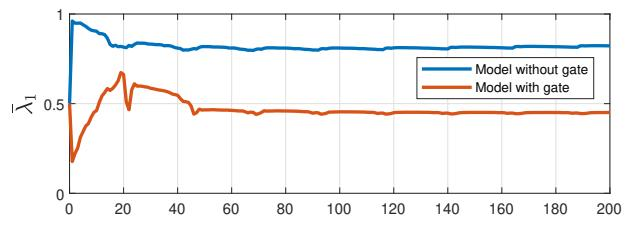

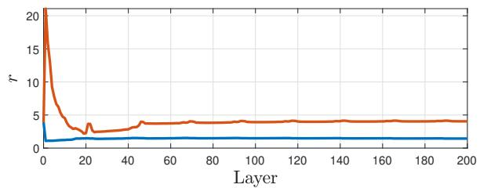  
Fig. 1. Weights of the mamba2-130m model, with and without the output gate. Top: $\breve { \lambda } _ { 1 }$ . Bottom: r.

$ { \bar { \lambda } } _ { 1 } ,$ , the share of the total energy carried by the leading direction. It equals 1 exactly when all tokens are collinear, and $1 / \ell$ when they are mutually orthogonal.

$r = \left( \sum _ { k } \bar { \lambda } _ { k } ^ { 2 } \right) ^ { - 1 }$ , the participation ratio of that spectrum:  P the effective number of directions occupied by the tokens, ranging from 1 (collinear) to ℓ (isotropic).

Both detect alignment along a common direction irrespective of the signs $\sigma _ { i } ,$ i.e, at any consensus configuration in $\mathcal { C } _ { \ell } ( \tilde { \mu } )$ they satisfy $\bar { \lambda } _ { 1 } = 1$ and $r = 1$

## A. Results

Figure 1 reports the values of $r$ and $\bar { \lambda } _ { 1 }$ obtained using the original Mamba-2 weights and the SiLU nonlinearity, both with and without the output gate. Recall from Section II-B that the output gate is a nonlinear function $g ( z _ { i } )$ that multiplies the output of the recurrence elementwise and is excluded from our model. The results with and without the output gate follow the same qualitative trajectory: the tokens aggregate along a single direction over the first layers, after which the two quantities reach a plateau and remain there for the rest of the run. What differs is how far the aggregation proceeds before settling. Without the gate, $\bar { \lambda } _ { 1 }$ rises to approximately 0.8 and r falls to about 1.4, against roughly 0.45 and 4 when the gate is retained. This supports the claim that the gate is what keeps the tokens from converging to a single direction.

In the second experiment, our objective was to investigate how the consensus phenomenon depends on the time-varying nature of the weights. To do so, we repeated the previous experiment without the gate, using the same layer at every depth, so that the weight matrices are time-invariant and, in particular, the dominant eigenvalue of $D _ { i j }$ is attained at the same index $\tilde { \mu }$ throughout. In Figure 2, it can be seen that the behaviour changes qualitatively: $\bar { \lambda } _ { 1 }$ exceeds 0.95 within the first few layers and r drops to approximately 1.05, both remaining there for the rest of the run, so that the tokens are aligned along a single direction up to numerical accuracy.

Comparing the two experiments, the weaker consensus in Figure 1 can be attributed to the time variation of the weights.

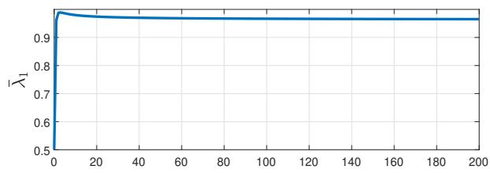

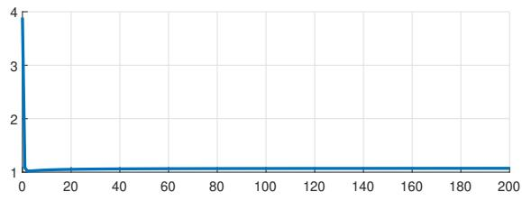  
Fig. 2. A single layer of the mamba2-130m model applied repeatedly, with the output gate removed. Top: $\bar { \lambda } _ { 1 }$ . Bottom: r.

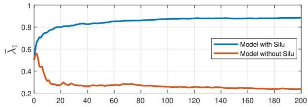

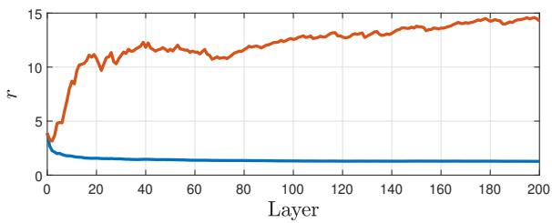  
Fig. 3. Randomly drawn weight matrices, redrawn at every layer and with the output gate removed, with and without the nonlinearity on the branch producing B and C. Top: $\bar { \lambda } _ { 1 }$ . Bottom: r.

When the weights vary with the layer, the index $\tilde { \mu }$ of the dominant eigenvalue of $D _ { i j }$ need not remain constant, and as mentioned in Remark 3.1, each time the index changes the tokens begin realigning towards a new principal eigenvector. The convergence established on each interval of constancy is therefore interrupted before the tokens reach the corresponding equilibrium. Holding the weights fixed removes these transitions, and the consensus phenomenon can be observed in full.

In the third experiment our objective was to isolate the effect of the SiLU, the elementwise nonlinearity $\varsigma ( a ) = a ( 1 + e ^ { - a } ) ^ { - 1 } , a \in \mathbb { R }$ , present in the Mamba-2 architecture used in this section. To do so, we draw the weight matrices independently at every layer, so that the layers are not periodic, and remove the gate, running the model with and without the SiLU. Figure 3 reports the values of r and $\bar { \lambda } _ { 1 }$ for the random model with and without SiLU.

It can be seen that, for both $\bar { \lambda } _ { 1 }$ and $^ { r , }$ the curves with and without the SiLU separate within the first few layers and then move in opposite directions. With the nonlinearity, $\bar { \lambda } _ { 1 }$ increases steadily to approximately 0.88 while r decreases to about 1.3, so the tokens concentrate along a single direction. Without it, $\bar { \lambda } _ { 1 }$ falls to roughly 0.23 while r grows past 14 and is still increasing at the end of the run: the tokens do not merely fail to reach consensus, they spread over an increasing number of directions.

Lemma 4.1 accounts for the difference between the experiments with and without the SiLU. With matrices drawn independently at every layer, which is the setting of this experiment, the interaction term is centered at 0 without the nonlinearity, whereas the SiLU shifts its mean to be strictly positive. While this does not establish that Assumption 4.1 is satisfied, and hence does not guarantee that the tokens converge, it indicates that the interaction term is biased towards positive values, which is what drives the tokens together.

## B. Persistency of Excitation

Our results rely on Assumption 4.1 and in this section we report on experiments designed to test it. We therefore turn to the assumption itself. For the first token, item 1) of Proposition 4.1 reads $\begin{array} { r c l } { \dot { b } _ { 1 } } & { \geq } & { a _ { c } ( t , z _ { 1 } ) ( 1 - b _ { 1 } ) } \end{array}$ , so the quantity that governs its convergence is $a _ { c }$ evaluated along the trajectory. We therefore record, at every layer and for each of the 50 runs, the interaction term of each token:

$$
q _ { i } ( t ) = \varsigma \big ( S _ { C } ( t ) z _ { i } ( t ) \big ) ^ { \top } \varsigma \big ( S _ { B } ( t ) z _ { i } ( t ) \big ) ,
$$

which reduces to $z _ { i } ( t ) ^ { \top } S _ { B C } ( t ) z _ { i } ( t )$ when the nonlinearity is removed, and which agrees with $a _ { c } ( t , z _ { i } ( t ) )$ up to a positive constant, for each t. For a window length $T$ we compute the worst-case average of $q _ { i }$ over all windows of that length contained in the run, and call $T$ admissible when it is positive. In the first two results we look for the smallest admissible window:

$$
T ^ { \star } \ = \ \operatorname* { m i n } \left\{ 1 \leq T \leq \kappa \ \left| \operatorname* { m i n } _ { 0 \leq t \leq \kappa - T } \ \frac { 1 } { T } \sum _ { s = t + 1 } ^ { t + T } q _ { i } ( s ) \ > \ 0 \right. \right\} ,\tag{23}
$$

where the inner minimum is taken over all windows contained in the run, and $T ^ { \star }$ does not exist when no window length is admissible. Note that the existence of $T ^ { * }$ does not establish Assumption 4.1, which requires the averaged condition at every point of the cap rather than along the sampled trajectories. The two are nonetheless related: whenever $z _ { i } ( t )$ lies in the cap, $q _ { i } ( t )$ is an upper bound for $\alpha _ { c } ( t )$ up to a positive constant, so a negative average refutes the assumption, while a positive one across many trajectories is supporting evidence for it, without establishing it.

Figures 4 and 5 illustrate the measurement on the first token of one run, with the original weights of the Mamba-2 and for randomly drawn weights respectively, both without the output gate. The sign of $q _ { 1 }$ alternates in both figures, so although pointwise positivity fails, $q _ { 1 } ( t )$ remains positive on average. The minimum average is negative for short windows, but increases with the window length, and crosses zero at $T = 8$ for the model and $T = 3 4$ for the random weights. With windows of at least that length the interaction term is positive on average along these trajectories, and hence so is the upper bound it provides for $\alpha _ { c }$

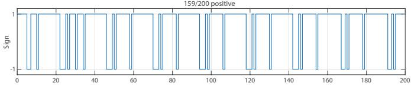

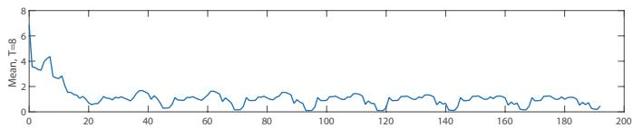

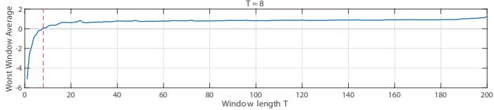  
Fig. 4. Interaction term of the first token along one trajectory of the mamba2-130m model. Top: its sign at each layer. Middle: its average over windows of length ${ \pmb T } = { \pmb 8 } .$ . Bottom: the worst-case window average as a function of the window length, with the smallest admissible $\mathbf { \bar { \Psi } } _ { T }$ marked.

Figure 6 collects the four configurations, taking the largest $T ^ { * }$ of (23) over all tokens and all runs. With the original Mamba-2 weights the smallest admissible window is $T = 1 0$ and removing the nonlinearity leaves it essentially unchanged at $T = 1 1$ . For matrices drawn independently at every layer, the smallest admissible window is $T = 3 5$ with the nonlinearity, and no window length up to the length of the run is admissible without it, $i . e .$ along these trajectories Assumption 4.1 is violated. This behaviour is consistent with Lemma 4.1. The nonlinearity therefore accounts for the clustering seen with random matrices, while for the trained matrices the interaction term is positive on average along these trajectories whether or not the nonlinearity is present.

Overall, along the trajectories we sample, the interaction term of the trained Mamba-2 is positive on average over short windows compared with the depth simulated. This does not establish Assumption 4.1, but it is consistent with it, and indicates that the mechanism analysed in Section IV is at work in Mamba-2 itself and not only in the setting under which our results were proved.

## VII. CONCLUSION

In this paper, we showed that the relationship between selective state space models and transformers extends beyond their input-output representations and reaches the dynamics induced by depth. By deriving a continuous-time model for Mamba-2 with time-varying weight matrices, we recast the evolution of tokens as a dynamical system on the sphere. In this framework, using the causal cascade structure of selective SSMs and input-to-state stability, we proved local exponential stability of the consensus equilibria under a persistency of excitation condition. Then, under a stronger global condition, we described the corresponding domain of attraction. Our experiments further indicate that the output gate is the component that attenuates the consensus phenomenon, which suggests that gating is fundamental in preventing all tokens from converging to a single cluster. These results provide, to the best of our knowledge, the first consensus analysis for selective SSMs with time-varying weight matrices, showing that the mechanisms underlying their efficient recurrent structure also lead to the loss of token diversity.

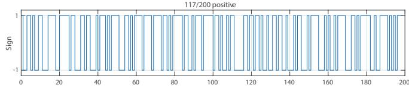

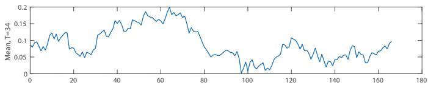

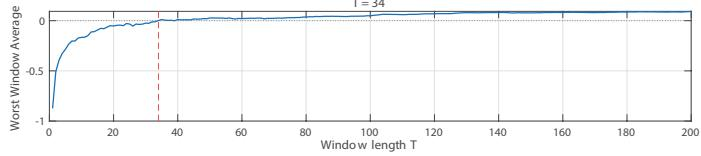  
Fig. 5. As in Figure 4, for weight matrices drawn independently at every layer and with the output gate removed. The smallest admissible window is longer, $T = 3 4$

## REFERENCES

[1] W. X. Zhao, K. Zhou, J. Li, T. Tang, Z. Dong, Y. Hou, B. Zhang, Y. Min, J. Zhang, P. Liu, et al., “A survey of large language models,” Frontiers of Computer Science, vol. 20, no. 12, p. 2012627, 2026.

[2] A. Vaswani, N. Shazeer, N. Parmar, J. Uszkoreit, L. Jones, A. N. Gomez, Ł. Kaiser, and I. Polosukhin, “Attention is all you need,” Advances in neural information processing systems, vol. 30, 2017.

[3] J. Achiam, S. Adler, S. Agarwal, L. Ahmad, I. Akkaya, F. L. Aleman, D. Almeida, J. Altenschmidt, S. Altman, S. Anadkat, et al., “Gpt-4 technical report,” arXiv preprint arXiv:2303.08774, 2023.

[4] D. Bahdanau, K. Cho, and Y. Bengio, “Neural machine translation by jointly learning to align and translate,” arXiv preprint arXiv:1409.0473, 2014.

[5] A. Dosovitskiy, L. Beyer, A. Kolesnikov, D. Weissenborn, X. Zhai, T. Unterthiner, M. Dehghani, M. Minderer, G. Heigold, S. Gelly, et al., “An image is worth 16x16 words: Transformers for image recognition at scale,” arXiv preprint arXiv:2010.11929, 2020.

[6] J. Jumper, R. Evans, A. Pritzel, T. Green, M. Figurnov, O. Ronneberger, K. Tunyasuvunakool, R. Bates, A. Žídek, A. Potapenko, et al., “Highly accurate protein structure prediction with alphafold,” nature, vol. 596, no. 7873, pp. 583–589, 2021.

[7] Y. Tay, M. Dehghani, D. Bahri, and D. Metzler, “Efficient transformers: A survey,” ACM Computing Surveys, vol. 55, no. 6, pp. 1–28, 2022.

[8] R. Waleffe, W. Byeon, D. Riber, et al., “An empirical study of Mambabased language models,” arXiv preprint arXiv:2406.07887, 2024.

[9] A. Grattafiori, A. Dubey, A. Jauhri, et al., “The LLaMA 3 herd of models,” arXiv preprint arXiv:2407.21783, 2024.

[10] Y. Levine, N. Wies, O. Sharir, H. Bata, and A. Shashua, “Limits to depth efficiencies of self-attention,” Advances in Neural Information Processing Systems, vol. 33, pp. 22640–22651, 2020.

[11] Y. Dong, J.-B. Cordonnier, and A. Loukas, “Attention is not all you need: Pure attention loses rank doubly exponentially with depth,” in International Conference on Machine Learning, pp. 2793–2803, PMLR, 2021.

[12] L. Noci, S. Anagnostidis, L. Biggio, A. Orvieto, S. P. Singh, and A. Lucchi, “Signal propagation in transformers: Theoretical perspectives and the role of rank collapse,” Advances in Neural Information Processing Systems, vol. 35, pp. 27198–27211, 2022.

[13] B. Geshkovski, C. Letrouit, Y. Polyanskiy, and P. Rigollet, “The emergence of clusters in self-attention dynamics,” in Advances in Neural Information Processing Systems, vol. 36, pp. 57026–57037, 2023.

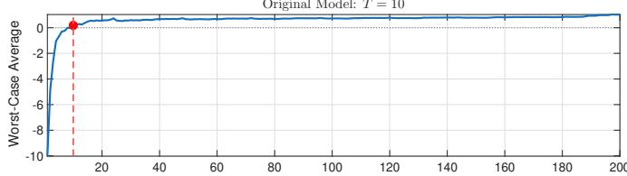

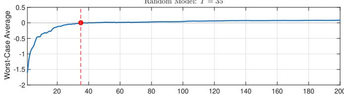

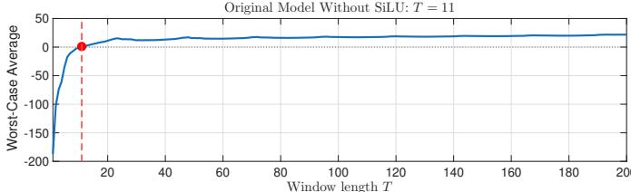

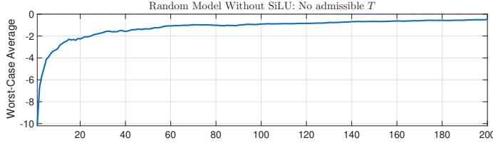  
Fig. 6. Worst-case window average of the interaction term of the first token against the window length, for the four configurations considered: the mamba2-130m weights and independently drawn weights, each with and without the nonlinearity on the branches producing B and C. The smallest admissible window is marked where it exists; for independently drawn weights without the nonlinearity no window length is admissible.

[14] A. Alcalde, G. Fantuzzi, and E. Zuazua, “Clustering in pure-attention hardmax transformers and its role in sentiment analysis,” arXiv preprint arXiv:2407.01602, 2024.

[15] A. Gu and T. Dao, “Mamba: Linear-time sequence modeling with selective state spaces,” arXiv preprint arXiv:2312.00752, 2024.

[16] T. Dao and A. Gu, “Transformers are SSMs: Generalized models and efficient algorithms through structured state space duality,” in International Conference on Machine Learning, 2024.

[17] S. Hochreiter and J. Schmidhuber, “Long short-term memory,” Neural Computation, vol. 9, no. 8, pp. 1735–1780, 1997.

[18] A. A. Ali, I. Zimerman, and L. Wolf, “The hidden attention of mamba models,” in Proceedings of the 63rd Annual Meeting of the Association for Computational Linguistics (Volume 1: Long Papers), pp. 1516–1534, 2025.

[19] W. Merrill, J. Petty, and A. Sabharwal, “The illusion of state in statespace models,” arXiv preprint arXiv:2404.08819, 2024.

[20] P. Wang, R. Zheng, X. Liu, S. Mao, X. Chen, Z. Lin, and Z. Wang, “Understanding and mitigating bottlenecks of state space models through the lens of recency and over-smoothing,” in International Conference on Learning Representations, 2025.

[21] O. Skean, U. Utkarsh, and J. Z. Kolter, “A comparative analysis of contextual representation flow in state-space and transformer architectures,” arXiv preprint arXiv:2510.06640, 2025.

[22] B. Geshkovski, C. Letrouit, Y. Polyanskiy, and P. Rigollet, “A mathematical perspective on transformers,” Bulletin ofthe American Mathematical Society, vol. 62, no. 3, pp. 427–479, 2025.

[23] Á. Rodríguez Abella, J. P. Silvestre, and P. Tabuada, “The asymptotic behavior of attention in transformers,” arXiv preprint arXiv:2412.02682, 2024.

[24] Á. Rodríguez Abella, J. P. Silvestre, and P. Tabuada, “Consensus is all you get: The role of attention in transformers,” in Forty-second International Conference on Machine Learning, 2025.

[25] T. N. Vo, D.-T. Pham, X. T. Tong, and T. M. Nguyen, “Demystifying the

token dynamics of deep selective state space models,” in International Conference on Learning Representations, 2025. Spotlight.

[26] F. A. Joseph, J. Sieber, M. N. Zeilinger, and C. Amo Alonso, “Lambdaskip connections: The architectural component that prevents rank collapse,” in International Conference on Learning Representations, 2025.

[27] E. D. Sontag, “Input to state stability: Basic concepts and results,” in Nonlinear and Optimal Control Theory, pp. 163–220, Springer Berlin Heidelberg, 2008.

[28] H. K. Khalil, Nonlinear Systems. Upper Saddle River, NJ: Prentice Hall, 3rd ed., 2002.

[29] B. Zhang and R. Sennrich, “Root mean square layer normalization,” Advances in Neural Information Processing Systems, vol. 32, 2019.

[30] A. Gu and T. Dao, “mamba2-130m.” https://huggingface.co/state-spaces/mamba2-130m, 2024. Model checkpoint, accessed September 17, 2026.

## APPENDIX

We begin by showing the bounds for the projected variables in section IV.

Proof: [of Proposition 4.1] For each $( t , Z ) \ \in \ \mathbb { R } _ { 0 } ^ { + } \ \times$ $( \mathbb { S } ^ { n - 1 } ) ^ { \ell }$ and $i , j \in \{ 1 , \ldots , \ell \}$ with $j \leq i ,$ , we may write:

$$
z _ { i } ^ { \top } S _ { B C } ( t ) \left( e _ { j } + \sigma _ { j } \mathfrak { e } ^ { \tilde { \mu } } \right) = z _ { i } ^ { \top } S _ { B C } ( t ) e _ { j } + \sigma _ { j } z _ { i } ^ { \top } S _ { B C } ( t ) \mathfrak { e } ^ { \tilde { \mu } } .
$$

This allows for expressing the dynamics (5) of the i-th token as follows:

$$
\begin{array} { r l } & { \bar { c } _ { i s } = T _ { s } \pi \cdot ( \boldsymbol { z } _ { i } ^ { \dag } \begin{array} { l } { S _ { B C } ( t ) } \\ { i } \end{array} ) D _ { i s } ( t , \boldsymbol { Z } ) z _ { i } } \\ & { \phantom { = } + T _ { z _ { i } } \pi \cdot \displaystyle \sum _ { j = 1 } ^ { i - 1 } ( z _ { i } ^ { \top } S _ { B C } ( t ) \cdot \bar { \boldsymbol { e } } ^ { \bar { \boldsymbol { n } } } ) D _ { i j } ( t , \boldsymbol { Z } ) \mathrm { e } ^ { \bar { \boldsymbol { n } } } } \\ & { \phantom { = } + T _ { z _ { i } } \pi \cdot \displaystyle \sum _ { j = 1 } ^ { i - 1 } ( z _ { i } ^ { \top } S _ { B C } ( t ) \cdot \bar { \boldsymbol { e } } ^ { \bar { \boldsymbol { n } } } ) D _ { i j } ( t , \boldsymbol { Z } ) \boldsymbol { e } _ { j } } \\ & { \phantom { = } + T _ { z _ { i } } \pi \cdot \displaystyle \sum _ { j = 1 } ^ { i - 1 } ( z _ { i } ^ { \top } S _ { B C } ( t ) \boldsymbol { e } _ { j } ) D _ { i j } ( t , \boldsymbol { Z } ) \mathrm { e } ^ { \bar { \boldsymbol { n } } } } \\ & { \phantom { = } + T _ { z _ { i } } \pi \cdot \displaystyle \sum _ { j = 1 } ^ { i - 1 } ( z _ { i } ^ { \top } S _ { B C } ( t ) ) D _ { i j } ( t , \boldsymbol { Z } ) \mathrm { e } ^ { \bar { \boldsymbol { n } } } } \\ & { \phantom { = } + T _ { z _ { i } } \pi \cdot \displaystyle \sum _ { j = 1 } ^ { i - 1 } ( z _ { i } ^ { \top } S _ { B C } ( t ) \boldsymbol { e } _ { j } ) D _ { i j } ( t , \boldsymbol { Z } ) \boldsymbol { e } _ { j } , } \end{array}
$$

where the sums are zero when $i = 1$ and we used that $\sigma _ { j } ^ { 2 } = 1$ for each $j \in \{ 1 , \dots , i - 1 \}$ . Hence (we omit the arguments t and Z for brevity):

$$
\dot { b } _ { i } = \left( z _ { i } ^ { \top } S _ { B C } z _ { i } \right) \left( \lambda _ { i i } ^ { \tilde { \mu } } - z _ { i } ^ { \top } D _ { i i } z _ { i } \right) b _ { i }\tag{24}
$$

$$
+ \sum _ { j = 1 } ^ { i - 1 } ( z _ { i } ^ { \top } S _ { B C } \thinspace \mathfrak { e } ^ { \tilde { \mu } } ) ( \sigma _ { i } \lambda _ { i j } ^ { \tilde { \mu } } - ( z _ { i } ^ { \top } D _ { i j } \thinspace \mathfrak { e } ^ { \tilde { \mu } } ) b _ { i } )\tag{25}
$$

$$
+ \sum _ { j = 1 } ^ { i - 1 } \sigma _ { j } \left( z _ { i } ^ { \top } S _ { B C } \mathfrak { e } ^ { \tilde { \mu } } \right) \left( \sigma _ { i } \lambda _ { i j } ^ { \tilde { \mu } } e _ { j } ^ { \tilde { \mu } } - \left( z _ { i } ^ { \top } D _ { i j } e _ { j } \right) b _ { i } \right)\tag{26}
$$

$$
+ \sum _ { j = 1 } ^ { i - 1 } { \sigma } _ { j } \left( z _ { i } ^ { \top } S _ { B C } e _ { j } \right) \left( { \sigma } _ { i } \lambda _ { i j } ^ { \tilde { \mu } } - \left( z _ { i } ^ { \top } D _ { i j } \mathfrak { e } ^ { \tilde { \mu } } \right) b _ { i } \right)\tag{27}
$$

$$
+ \sum _ { j = 1 } ^ { i - 1 } ( z _ { i } ^ { \top } S _ { B C } e _ { j } ) ( \sigma _ { i } \lambda _ { i j } ^ { \tilde { \mu } } e _ { j } ^ { \tilde { \mu } } - ( z _ { i } ^ { \top } D _ { i j } e _ { j } ) b _ { i } ) .\tag{28}
$$

From the fact that $| z _ { i } | = 1$ , we obtain $\gamma ( 1 - b _ { i } ^ { 2 } ) \leq \lambda _ { i i } ^ { \tilde { \mu } } -$ $z _ { i } ^ { \top } D _ { i i } z _ { i } \le \Gamma ( 1 - b _ { i } ^ { 2 } )$ . Hence, given $( t , b _ { i } ) \in \mathbb { R } _ { 0 } ^ { + } \times \left] c , 1 \right]$ , we distinguish two cases:

1) $z _ { i } ^ { \top } S _ { B C } z _ { i } \in \mathbb { R } _ { 0 } ^ { + }$ , then:

$$
\begin{array} { r l } & { ( 2 4 ) \geq ( z _ { i } ^ { \top } S _ { B C } z _ { i } ) \gamma ( 1 + b _ { i } ) ( 1 - b _ { i } ) b _ { i } } \\ & { \qquad \geq \gamma c ( 1 + c ) ( z _ { i } ^ { \top } S _ { B C } z _ { i } ) \left( 1 - b _ { i } \right) = a _ { c } ( t , z _ { i } ) ( 1 - b _ { i } ) . } \end{array}
$$

2) $z _ { i } ^ { \top } S _ { B C } z _ { i } \in \mathbb { R } ^ { - }$ , then:

$$
\begin{array} { r l } & { ( 2 4 ) \geq ( z _ { i } ^ { \top } S _ { B C } z _ { i } ) \Gamma ( 1 + b _ { i } ) ( 1 - b _ { i } ) b _ { i } } \\ & { \qquad \geq 2 ( \Gamma + \Lambda ) ( z _ { i } ^ { \top } S _ { B C } z _ { i } ) \left( 1 - b _ { i } \right) = a _ { c } ( t , z _ { i } ) ( 1 - b _ { i } ) , } \end{array}
$$

where we used that $( 1 + b _ { i } ) b _ { i } \leq 2$ and $\Lambda \in \mathbb { R } ^ { + }$

For $i = 1 , ( 2 5 ) , ( 2 6 ) , ( 2 7 )$ and (28) vanish, so we conclude that $\begin{array} { r } { \dot { b } _ { 1 } \geq a _ { c } ( t , z _ { 1 } ) \left( 1 - b _ { 1 } \right) } \end{array}$

For $i \in \{ 2 , \ldots , \ell \}$ , we need to bound the remaining terms. Using that $\sigma _ { i } \mathfrak { e } ^ { \tilde { \mu } } = z _ { i } - e _ { i }$ , we obtain:

$$
\begin{array} { l } { { \displaystyle ( 2 5 ) = \sum _ { j = 1 } ^ { i - 1 } \sigma _ { i } \big ( z _ { i } ^ { \top } S _ { B C } \mathfrak { e } ^ { \bar { \mu } } \big ) \lambda _ { i j } ^ { \tilde { \mu } } \big ( 1 - b _ { i } ^ { 2 } \big ) } }  \\ { { \displaystyle \quad = \sum _ { j = 1 } ^ { i - 1 } \big ( z _ { i } ^ { \top } S _ { B C } z _ { i } - z _ { i } ^ { \top } S _ { B C } e _ { i } \big ) \lambda _ { i j } ^ { \tilde { \mu } } \big ( 1 - b _ { i } ^ { 2 } \big ) } } \\ { { \displaystyle \quad = \sum _ { j = 1 } ^ { i - 1 } \lambda _ { i j } ^ { \tilde { \mu } } \big ( z _ { i } ^ { \top } S _ { B C } z _ { i } - z _ { i } ^ { \top } S _ { B C } e _ { i } \big ) \big ( 1 - b _ { i } ^ { 2 } \big ) } . }  \end{array}
$$

As for the first token, given $( t , b _ { i } ) \in \mathbb { R } _ { 0 } ^ { + } \times \left] c , 1 \right]$ , we distinguish two cases:

1) $z _ { i } ^ { \top } S _ { B C } z _ { i } \in \mathbb { R } _ { 0 } ^ { + }$ , then $( 2 5 ) \geq - \Lambda \left( z _ { i } ^ { \top } S _ { B C } e _ { i } \right) \left( 1 - b _ { i } ^ { 2 } \right)$   
2) $z _ { i } ^ { \mp } S _ { B C } z _ { i } \in \mathbb { R } ^ { - }$ , then $( 2 5 ) \geq 2 \Lambda \left( z _ { i } ^ { \top } S _ { B C } z _ { i } \right) \left( 1 - b _ { i } \right) -$ $\bar { \Lambda ^ { } } \left( z _ { i } ^ { \top } S _ { B C } e _ { i } \right) \left( 1 - b _ { i } ^ { 2 } \right)$ , where we used that $1 + b _ { i } \le 2$ and $\Lambda \in \mathbb { R } ^ { + }$

Therefore, in both cases we obtain:

$$
( 2 4 ) + ( 2 5 ) \geq a _ { c } ( t , z _ { i } ) \left( 1 - b _ { i } \right) - \Lambda \left( z _ { i } ^ { \top } S _ { B C } e _ { i } \right) ( 1 - b _ { i } ^ { 2 } ) .
$$

Let us pick $d _ { \varepsilon } \in \mathrm { ~  ~ { ~ \mathsf ~ { ~ \ ~ \ ~ } ~ } ~ } _ { \varepsilon } \in ] 0 , 1 \mathrm { ~ \ ~  ~ { ~ \mathsf ~ { ~ ~ \ ~ } ~ } ~ } - \mathrm { ~ \ ~ \ } c ]$ such that $\begin{array} { r l r } { 2 \sqrt { 2 d _ { \varepsilon } } \Lambda \operatorname* { s u p } _ { t \in \mathbb { R } _ { \alpha } ^ { + } } \| S _ { B C } ( t ) \| } & { { } \stackrel { } { \leq } } & { \varepsilon . } \end{array}$ Hence, for each $( t , b _ { i } ) \in \mathbb { R } _ { 0 } ^ { + } \times ] 1 - d _ { \varepsilon } , 1 ]$ , we have $| e _ { i } | = \sqrt { 2 ( 1 - b _ { i } ) } < \sqrt { 2 d _ { \varepsilon } } ,$ whence:

$$
\begin{array} { c } { - \Lambda \left( z _ { i } ^ { \top } S _ { B C } e _ { i } \right) \left( 1 - b _ { i } ^ { 2 } \right) \geq - 2 \sqrt { 2 d _ { \varepsilon } } \Lambda \underset { t \in \mathbb { R } _ { 0 } ^ { + } } { \operatorname* { s u p } } \left. S _ { B C } ( t ) \right. \left( 1 - b _ { i } \right) } \\ { \geq - \varepsilon \left( 1 - b _ { i } \right) , } \end{array}
$$

where we used that $1 + b _ { i } \le 2$ and $| z _ { i } | = 1$ . As a result:

$$
( 2 4 ) + ( 2 5 ) \geq \left( a _ { c } ( t , z _ { i } ) - \varepsilon \right) ( 1 - b _ { i } ) .
$$

Lastly, from Assumption 3.1 and Lemma 3.1, as well as compactness of the sphere, the error terms are all bounded, i.e., there exists $M \in \mathbb { R } ^ { + }$ such that:

$$
( 2 6 ) + ( 2 7 ) + ( 2 8 ) \geq - M \sum _ { j = 1 } ^ { i - 1 } \vert e _ { j } \vert .\tag{29}
$$

for each $( t , b _ { i } ) \ \in \ \mathbb { R } _ { 0 } ^ { + } \times ] c , 1 ]$ , and in particular, for each $( t , b _ { i } ) \in \mathbb { R } _ { 0 } ^ { + } \times ] 1 - d _ { \varepsilon } , 1 ] .$

By gathering the previous bounds, we conclude.

The following two technical lemmas are useful in the proof of Theorem 4.1.

Lemma 1.1: Let $d _ { \varepsilon } , H , M _ { i } , \theta , r , R \in \mathbb { R } ^ { + } , \ i \in \{ 1 , \dots , \ell \}$ be such that $\theta \ : < \ : 1$ and $R > r \geq 1$ . Then there exists a sequence:

$$
( d _ { 1 } , \dots , d _ { \ell } ) \in \prod _ { i = 1 } ^ { \ell } ] d _ { i } ^ { \operatorname* { m i n } } , d ^ { \operatorname* { m a x } } [ ,
$$

where $d ^ { \operatorname* { m a x } } = d _ { \varepsilon } / R , d _ { 1 } ^ { \operatorname* { m i n } } = 0$ and:

$$
d _ { i } ^ { \operatorname* { m i n } } = \operatorname* { m a x } \left\{ d _ { i - 1 } , ~ \frac { H } { \mu } \sum _ { j = 1 } ^ { i - 1 } \sqrt { 2 M _ { j } d _ { j } } \right\} ,
$$

for $i \in \{ 2 , \ldots , \ell \}$ , with $\mu = \operatorname* { m i n } \{ 1 - \theta , R - r \} \in \mathbb { R } ^ { + }$

Proof: Given $d _ { 1 } \in ] 0 , d ^ { \operatorname* { m a x } } [$ , we recursively define:

$$
d _ { i } = 2 d _ { i - 1 } + \frac { 2 H } { \mu } \sum _ { j = 1 } ^ { i - 1 } \sqrt { 2 M _ { j } d _ { j } } ,
$$

for each $i \in \{ 2 , \ldots , \ell \}$ . It is clear that $d _ { i } \ > \ d _ { i } ^ { \operatorname* { m i n } }$ by construction.

To conclude, we need to show that $d _ { 1 }$ can be chosen so that $d _ { i } ~ < ~ d ^ { \operatorname* { m a x } }$ for each $i \in \{ 2 , \ldots , \ell \}$ . To that end, we regard $d _ { i } = d _ { i } ( d _ { 1 } )$ , and note that they are continuous functions on $] 0 , d ^ { \mathrm { m a x } } [$ . Hence, $\begin{array} { r } { \operatorname* { l i m } _ { d _ { 1 } \to 0 ^ { + } } d _ { i } ( d _ { 1 } ) = d _ { i } ( 0 ) = 0 . } \end{array}$ . Hence, $d _ { 1 } ~ \in ] 0 , d ^ { \operatorname* { m a x } } [$ can be chosen so that $d _ { i } ~ < ~ d ^ { \operatorname* { m a x } }$ for each $i \in \{ 2 , \ldots \ell \}$ ■

Lemma 1.2 (Discrete ISS): Let $\theta \in ] 0 , 1 [ , \nu , d \in \mathbb { R } ^ { + }$ , and $\scriptstyle \varrho = { \frac { 1 } { 2 } } \operatorname* { m i n } \{ - \log ( \theta ) / T , \nu \}$ . There exists $C ( T , \theta , \varrho ) \in [ 1$ , ∞[ such that, for each real sequence $( y _ { k } ) _ { k \in \mathbb { N } }$ and $y _ { 0 } ~ \in ~ [ 0 , d [$ satisfying:

$$
y _ { k } \leq \theta y _ { k - 1 } + ( 1 - \theta ) d \exp ( - \nu ( k - 1 ) T ) , \qquad k \in \mathbb { N } ,
$$

then $y _ { k } \le C ( T , \theta , \varrho ) d \exp ( - \varrho k T )$ for each $k \in \mathbb N$

Proof: Given that $\begin{array} { r l } { \varrho } & { { } \in \left] 0 , - \log ( \theta ) / T \right[ } \end{array}$ , we have $\exp ( - \varrho T ) \in ] \theta , 1 [$ [. Thus, we define:

$$
C ( T , \theta , \varrho ) = \frac { 1 - \theta } { \exp ( - \varrho T ) - \theta } \in [ 1 , \infty [ .
$$

For brevity, we denote $C = C ( T , \theta , \varrho )$ . Let us proceed by induction in $k \in \mathbb N$

Base case. For $k = 1$ , we have:

$$
\begin{array} { r l } & { y _ { 1 } \leq \theta y _ { 0 } + \left( 1 - \theta \right) d } \\ & { \qquad \leq \left( \theta + C ( \exp ( - \varrho T ) - \theta ) \right) d } \\ & { \qquad \leq C d \exp ( - \varrho T ) . } \end{array}
$$

Induction hypothesis. For $k \in \mathbb N$ with $k \geq 2$ , we have $y _ { k - 1 } \leq C d \exp ( - \varrho ( k - 1 ) T )$

Inductive step. Note that $\exp ( ( \varrho - \nu ) ( k - 1 ) T ) \in ] 0 , 1 [$ since $\varrho \in ] 0 , \nu [$ . Hence:

$$
\begin{array} { c } { \exp ( - \nu ( k - 1 ) T + \varrho k T ) = \exp ( \varrho T + ( \varrho - \nu ) ( k - 1 ) T ) } \\ { < \exp ( \varrho T ) . } \end{array}
$$

From this, the recurrence inequality, the induction hypothesis and the definition of $C = C ( T , \theta , \varrho )$ , we conclude:

$$
\begin{array} { r l } & { y _ { k } \leq \theta y _ { k - 1 } + ( 1 - \theta ) d \exp ( - \nu ( k - 1 ) T ) } \\ & { \quad \leq \theta C d \exp ( - \varrho ( k - 1 ) T ) + ( 1 - \theta ) d \exp ( - \nu ( k - 1 ) T ) } \\ & { \quad = ( \theta C \exp ( \varrho T ) + ( 1 - \theta ) \exp ( \varrho T ) ) d \exp ( - \varrho k T ) } \\ & { \quad = C d \exp ( - \varrho k T ) . } \end{array}
$$

Now we prove Claim 4.1, which was used in the proof of Theorem 4.1.

Proof: [of Claim 4.1] Let us show each statement:

1) By contradiction, suppose that $t _ { 0 } ~ = ~ \operatorname* { i n f } \{ t ~ \in ~ [ ( k ~ -$ $\begin{array} { r } { 1 ) T , k T [ | \ V _ { i } ( t ) = R d _ { i } \} \in [ ( k - 1 ) T , k T [ } \end{array}$ . Given that $R d _ { i } < d _ { \varepsilon }$ by construction, we have $V _ { i } ( t ) \leq d _ { \varepsilon }$ for each $t \in [ ( k - 1 ) T , t _ { 0 } ]$ . Hence, from Proposition 4.1 and (16), we obtain:

$$
\begin{array} { r l r } {  { \dot { V } _ { i } \leq - ( a _ { c } ( t , z _ { i } ) - \varepsilon ) V _ { i } + M \sum _ { j = 1 } ^ { i - 1 }  e _ { j }  } } \\ & { } & \\ & { \leq - ( a _ { c } ( t , z _ { i } ) - \varepsilon ) V _ { i } + M \sum _ { j = 1 } ^ { i - 1 } \sqrt { 2 M _ { j } d _ { j } } \exp ( - \frac { \rho _ { j } t } { 2 } ) } \\ & { } & \\ & { \leq - \eta _ { \varepsilon } V _ { i } + M \sum _ { j = 1 } ^ { i - 1 } \sqrt { 2 M _ { j } d _ { j } } , \ } & { ( 3 0 ) } \end{array}
$$

for each $t ~ \in ~ [ ( k ~ - ~ 1 ) T , t _ { 0 } ]$ , where we used that $a _ { c } ( t , z _ { i } ) - \varepsilon \geq \eta _ { \varepsilon }$ by definition. For brevity, we write $\tau = t _ { 0 } - ( k - 1 ) T \in [ 0 , T [$ [ . Moreover, recall that $V _ { i } ( k -$ $1 ) T ) < d _ { i } , r = \exp ( - \eta _ { \varepsilon } T )$ and $H = T M \exp ( - \eta _ { \varepsilon } T )$ . By integrating (30) between $t = ( k - 1 ) T$ and $t = t _ { 0 }$ and using Lemma 1.1, we arrive at a contradiction. Indeed, we denote $\begin{array} { r } { K = M \sum _ { j = 1 } ^ { i - 1 } \sqrt { 2 M _ { j } d _ { j } } } \end{array}$ and we distinguish two cases:

a) $\eta _ { \varepsilon } = 0 \colon$

$$
\begin{array} { c } { { R d _ { i } = V _ { i } ( t _ { 0 } ) \leq V _ { i } ( ( k - 1 ) T ) + \tau K } } \\ { { < d _ { i } + T K < R d _ { i } . } } \end{array}
$$

b) $\eta _ { \varepsilon } \in \mathbb { R } ^ { - } \colon$

$$
\dot { V _ { i } } \leq - \eta _ { \varepsilon } V _ { i } + K ,
$$

for each $t \in [ ( k - 1 ) T , t _ { 0 } ]$ . By using the integrating factor exp(ηεt), we obtain:

$$
\frac { d } { d t } \left( \exp ( \eta _ { \varepsilon } t ) V _ { i } \right) \leq K \exp ( \eta _ { \varepsilon } t ) ,
$$

for each $t \in [ ( k - 1 ) T , t _ { 0 } ]$ . By writing $\tau = t _ { 0 } -$ $( k - 1 ) T \in [ 0 , T [$ , we obtain:

$$
\begin{array} { r l } & { \displaystyle { R d _ { i } = V _ { i } ( t _ { 0 } ) } } \\ & { \le \exp ( - \eta _ { \varepsilon } \tau ) V _ { i } ( ( k - 1 ) T ) + \frac { K } { \eta _ { \varepsilon } } ( 1 - \exp ( - \eta _ { \varepsilon } \tau ) ) } \\ & { = \exp ( - \eta _ { \varepsilon } \tau ) V _ { i } ( ( k - 1 ) T ) + K \int _ { 0 } ^ { \tau } \exp ( - \eta _ { \varepsilon } s ) d s } \\ & { \le \exp ( - \eta _ { \varepsilon } T ) ( d _ { i } + T M \displaystyle \sum _ { j = 1 } ^ { i - 1 } \sqrt { 2 M _ { j } d _ { j } } ) < R d _ { i } . } \end{array}
$$

Hence, $V _ { i } ( t ) \in [ 0 , R d _ { i } [$ for each $t \in [ ( k - 1 ) T , k T [$

2) Given that $d _ { i } \in ] 0 , d _ { \varepsilon } / R [$ , from the previous item we conclude that $V _ { i } ( t ) \in [ 0 , d _ { \varepsilon } [$ [ for each $t \in [ ( k { - } 1 ) T , k T [$ Moreover, $d _ { \varepsilon } \in ] 0 , 1 - c ]$ , whence $V _ { i } ( t ) \in [ 0 , 1 - c [ \AA , i . e .$ $z _ { i } ( t ) \ \in \ \Omega _ { c } ^ { \sigma _ { i } } ( \tilde { \mu } )$ , for each $t \in [ ( k - 1 ) T , k T [$ . Thus, $a _ { c } ( t , z _ { i } ( t ) ) \geq \alpha _ { c } ( t )$ for each $t \in [ ( k - 1 ) T , k T [$ [ . Thus, Assumption 4.1 gives:

$$
\int _ { ( k - 1 ) T } ^ { k T } \left( a _ { c } ( s , z _ { i } ( s ) ) - \varepsilon \right) d s \geq ( \rho - \varepsilon ) T .\tag{31}
$$

In addition, Proposition 4.1 holds, yielding:

$$
\begin{array} { l } { { \displaystyle { \dot { V } _ { i } \le - \left( a _ { c } ( t , z _ { i } ) - \varepsilon \right) V _ { i } + M \sum _ { j = 1 } ^ { i - 1 } \left| e _ { j } \right| } } } \\ { { \displaystyle \le - \left( \alpha _ { c } ( t ) - \varepsilon \right) V _ { i } + \sum _ { j = 1 } ^ { i - 1 } K _ { j } \exp \left( - \frac { \rho _ { j } } { 2 } t \right) , } } \end{array}
$$

for each $t \in [ ( k - 1 ) T , k T [$ , where we used (16) and denoted $K _ { j } = M \sqrt { 2 M _ { j } d _ { j } }$ for brevity. The integrating factor $\begin{array} { r } { \phi ( t ) = \exp \left( \int _ { ( k - 1 ) T } ^ { t } ( \alpha _ { c } ( s ) - \varepsilon ) d s \right) } \end{array}$ gives:

$$
\begin{array} { r l r } {  { \frac { d } { d t } ( \phi ( t ) V _ { i } ) \le \sum _ { j = 1 } ^ { i - 1 } K _ { j } \exp ( - \frac { \rho _ { j } } { 2 } t ) \phi ( t ) } } \\ & { } & { \displaystyle \le \sum _ { j = 1 } ^ { i - 1 } K _ { j } \exp ( - \frac { \rho _ { j } } { 2 } ( k - 1 ) T ) \phi ( t ) , } \end{array}\tag{32}
$$

for each $t \in [ ( k - 1 ) T , k T [$ . Note that:

$$
\begin{array} { l } { \displaystyle { \phi ( k T ) ^ { - 1 } = \exp \left( - \int _ { ( k - 1 ) T } ^ { k T } ( \alpha _ { c } ( s ) - \varepsilon ) d s \right) } } \\ { \displaystyle { \le \exp ( - ( \rho - \varepsilon ) T ) = \theta , } } \end{array}
$$

where we used (31). Thus, by integrating (32) between $t = ( k - 1 ) T$ and $t = k T$ , we obtain:

$$
\begin{array} { r l } & { V _ { i } ( k T ) \le V _ { i } ( ( k - 1 ) T ) \phi ( k T ) ^ { - 1 } } \\ & { \quad \quad \quad + K \displaystyle \int _ { ( k - 1 ) T } ^ { k T } \exp \left( - \displaystyle \int _ { t } ^ { k T } ( \alpha _ { c } ( s ) - \varepsilon ) d s \right) d t } \\ & { \quad \quad \quad \le \theta V _ { i } ( ( k - 1 ) T ) + K T \exp ( - \eta _ { \varepsilon } T ) , } \end{array}
$$

where we used that $\alpha _ { c } ( t ) - \varepsilon \geq \eta _ { \varepsilon }$ and $\phi ( ( k - 1 ) T ) = 1$

3) From the previous item, as well as $V _ { i } ( ( k - 1 ) T ) \in [ 0 , d _ { i } [$ and Lemma 1.1, we conclude:

$$
V _ { i } ( k T ) \leq \theta d _ { i } + H \sum _ { j = 1 } ^ { i - 1 } { \sqrt { 2 M _ { j } d _ { j } } } < d _ { i } ,
$$

where we recall that $H = T M \exp ( - \eta _ { \varepsilon } T )$

Now we write the proofs for section V. We begin by showing the bounds for the projected variables.

Proof: [of Proposition 5.1] Firstly, note that $] c _ { \mathrm { e f f } } , b _ { i } ^ { \mathrm { m a x } } [ \neq$ as $Z _ { 0 } ~ \notin ~ \boldsymbol { B } _ { \ell } ( \tilde { \boldsymbol { \mu } } )$ . Note that $V _ { i } | _ { \substack { \scriptscriptstyle { \mathrm { l } } c _ { i } , 1 [ \mathrm { ~ \scriptsize ~ > ~ \infty ~ } } 0 }$ and $V _ { i } ( 1 ) = 0$ Hence, its dynamics readily follows from (24), (25), (26), (27) and (28). Using that $\dot { V _ { i } } \dot { ~ = ~ } - \dot { b } _ { i }$ , let us bound each term separately on $I _ { c , i } ^ { \breve { \Sigma } } ( Z _ { 0 } , \tilde { \mu } )$

For the first term, we have (for brevity, we drop the argument t):

$$
- ( 2 4 ) \leq - \alpha \gamma c \bigl ( 1 - b _ { i } ^ { 2 } \bigr ) ,\tag{33}
$$

where we used (20) and $\begin{array} { r } { \alpha = \operatorname* { i n f } _ { ( t , z ) \in \mathbb { R } _ { 0 } ^ { + } \times \mathbb { S } ^ { n - 1 } } z ^ { \top } S _ { B C } ( t ) z . } \end{array}$ For the second term, by writing $z _ { i } = b _ { i } \ : \mathfrak { e } ^ { \tilde { \mu } } + \sqrt { 1 - b _ { i } ^ { 2 } } \epsilon _ { \tilde { \mu } } .$ with $\epsilon _ { \tilde { \mu } } \in \mathbb { S } ^ { n - 1 }$ such that $\epsilon _ { \tilde { \mu } } ^ { \top } \mathfrak { e } ^ { \tilde { \mu } } = 0 ;$ , we have $z _ { i } ^ { \top } S _ { B C } \sigma _ { i } \mathfrak { e } ^ { \tilde { \mu } } =$ $b _ { i } \left( ( \mathfrak { e } ^ { \tilde { \mu } } ) ^ { \top } S _ { B C } \mathfrak { e } ^ { \tilde { \mu } } \right) + r _ { i } ( t )$ , where:

$$
r _ { i } = \sqrt { 1 - b _ { i } ^ { 2 } } \epsilon _ { \tilde { \mu } } ^ { \top } \left( S _ { B C } - ( ( \epsilon ^ { \tilde { \mu } } ) ^ { \top } S _ { B C } \mathfrak { e } ^ { \tilde { \mu } } ) \mathbb { I } _ { n } \right) \mathfrak { e } ^ { \tilde { \mu } } .
$$

Note that $| r _ { i } | \leq \alpha c _ { \star } \sqrt { 1 - b _ { i } ^ { 2 } }$ . Hence, we have:

$$
\begin{array} { r l } & { - ( 2 5 ) = - \displaystyle \sum _ { j = 1 } ^ { i - 1 } \sigma _ { i } \lambda _ { i j } ^ { \tilde { \mu } } \big ( z _ { i } ^ { \top } S _ { B C } \mathfrak { e } ^ { \tilde { \mu } } \big ) \big ( 1 - b _ { i } ^ { 2 } \big ) } \\ & { \qquad = - \displaystyle \sum _ { j = 1 } ^ { i - 1 } \lambda _ { i j } ^ { \tilde { \mu } } \big ( b _ { i } \big ( \big ( \mathfrak { e } ^ { \tilde { \mu } } \big ) ^ { \top } S _ { B C } \mathfrak { e } ^ { \tilde { \mu } } \big ) + r _ { i } ( t ) \big ) \big ( 1 - b _ { i } ^ { 2 } \big ) } \\ & { \qquad \leq - ( i - 1 ) \alpha \Big ( \lambda _ { \operatorname* { m i n } } c - \lambda _ { \operatorname* { m a x } } c _ { \star } \sqrt { 1 - c ^ { 2 } } \Big ) \big ( 1 - b _ { i } ^ { 2 } \big ) . } \end{array}\tag{34}
$$

From (33) and (34), we obtain:

$$
\begin{array} { r l } & { - ( 2 4 ) - ( 2 5 ) \leq - \alpha \Big ( \gamma c + ( i - 1 ) \lambda _ { \operatorname* { m i n } } c } \\ & { \hphantom { \frac { - } { - } } - ( i - 1 ) \lambda _ { \operatorname* { m a x } } c _ { \star } \sqrt { 1 - c ^ { 2 } } \Big ) ( 1 - b _ { i } ^ { 2 } ) } \\ & { \hphantom { \frac { - } { - } } \leq - \alpha \beta \left( 1 + c \right) V _ { i } , } \end{array}\tag{35}
$$

where $\beta = c \left( \gamma + \left( i - 1 \right) \lambda _ { \operatorname* { m i n } } \right) - c _ { \star } \lambda _ { \operatorname* { m a x } } \left( i - 1 \right) \sqrt { 1 - c ^ { 2 } }$ . Note that $\beta \in \mathbb { R } ^ { + }$ . Indeed, by squaring:

$$
c \left( \gamma + \left( i - 1 \right) \lambda _ { \operatorname* { m i n } } \right) > c _ { \star } \lambda _ { \operatorname* { m a x } } \left( i - 1 \right) \sqrt { 1 - c ^ { 2 } }
$$

and rearranging terms, we obtain:

$$
\begin{array} { r l } & { c ^ { 2 } \left( ( \gamma + ( \ell - 1 ) \lambda _ { \operatorname* { m i n } } ) ^ { 2 } + c _ { \star } ^ { 2 } \lambda _ { \operatorname* { m a x } } ^ { 2 } ( \ell - 1 ) ^ { 2 } \right) } \\ & { \mathrm { ~ } \geq c ^ { 2 } \left( ( \gamma + ( i - 1 ) \lambda _ { \operatorname* { m i n } } ) ^ { 2 } + c _ { \star } ^ { 2 } \lambda _ { \operatorname* { m a x } } ^ { 2 } ( i - 1 ) ^ { 2 } \right) } \\ & { \mathrm { ~ } > c _ { \star } ^ { 2 } \lambda _ { \operatorname* { m a x } } ^ { 2 } ( i - 1 ) ^ { 2 } \geq c _ { \star } ^ { 2 } \lambda _ { \operatorname* { m a x } } ^ { 2 } . } \end{array}
$$

This holds provided:

$$
c > \frac { c _ { \star } \lambda _ { \operatorname* { m a x } } } { \sqrt { ( \gamma + ( \ell - 1 ) \lambda _ { \operatorname* { m i n } } ) ^ { 2 } + c _ { \star } ^ { 2 } \lambda _ { \operatorname* { m a x } } ^ { 2 } ( \ell - 1 ) ^ { 2 } } } = c _ { \mathrm { e f f } } .
$$

Lastly, from Assumption 3.1 and Lemma 3.1, as well as compactness of the sphere, the error terms are all bounded:

$$
- ( 2 6 ) - ( 2 7 ) - ( 2 8 ) \leq M \sum _ { j = 1 } ^ { i - 1 } | e _ { j } | .\tag{36}
$$

By gathering (35) and (36), and denoting $\kappa = \alpha \beta \left( 1 + c \right) \in$ $\mathbb { R } ^ { + }$ , we conclude:

$$
\dot { V } _ { i } \leq - \kappa V _ { i } + M \sum _ { j = 1 } ^ { i - 1 } | e _ { j } | .
$$

Lastly, the next result is readily obtained by an ISS argument. It guarantees convergence to consensus of the last token at the inductive step in the proof of Theorem 5.1.

Lemma 1.3: Let $b : \mathbb { R } _ { 0 } ^ { + }  [ - 1 , 1 ]$ be continuously differentiable and $e : \mathbb { R } _ { 0 } ^ { + }  \mathbb { R } _ { 0 } ^ { + }$ be continuous with lim $_ { t  \infty } e ( t ) = 0$ If there exist $\kappa \in \mathbb R ^ { + }$ and $t _ { 0 } \in \mathbb { R } _ { 0 } ^ { + }$ such that $\dot { b } \geq \kappa \left( 1 - b \right) - e ( t )$ for each $t \in [ t _ { 0 } , \infty [$ , then $\begin{array} { r } { \operatorname* { l i m } _ { t  \infty } b ( t ) = 1 } \end{array}$