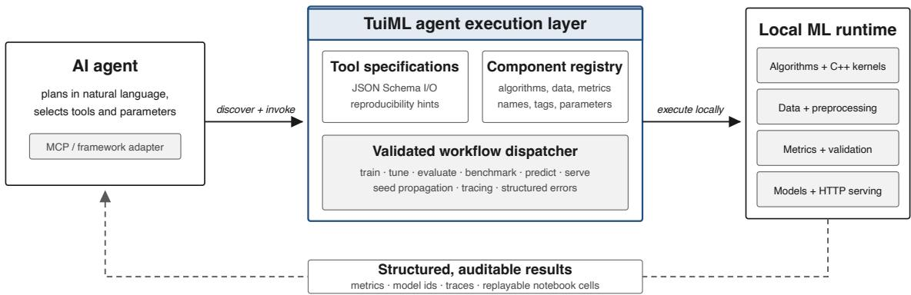
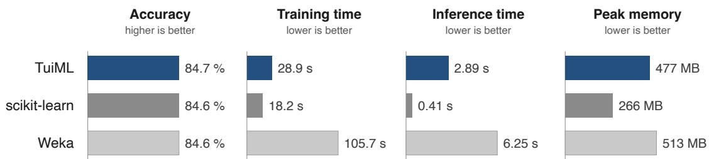

# TuiML: Machine Learning for AI Agents

Nilesh Verma1 Nick Lim1 Albert Bifet1,2

Bernhard Pfahringer1

1AI Institute, University of Waikato

Hamilton 3216, New Zealand

2LTCI, T´el´ecom Paris, Institut Polytechnique de Paris

19 place Marguerite Perey, 91120 Palaiseau, France

Editor: N/A

nilesh.verma@waikato.ac.nz nick.lim@waikato.ac.nz albert.bifet@waikato.ac.nz bernhard.pfahringer@waikato.ac.nz

## Abstract

Machine-learning libraries such as Weka and scikit-learn were designed for human programmers. Language-model agents now use these same libraries by recalling APIs from memory and writing code, an approach that hides what a library ofers, delays errors until runtime, and loses experimental state between turns. We present TuiML, a self-contained machinelearning library built for AI agents, with native algorithms across supervised, unsupervised, time-series, data handling, tuning, and evaluation tasks. Every component describes itself through machine-readable metadata and parameter schemas, so an agent can search the library, inspect components, compose validated workflows, and register new ones that become discoverable in turn. Every call is validated, seeded, and traced, and sessions export as runnable notebooks, making experiments reproducible by construction. One specification layer drives the Model Context Protocol (MCP), agent-framework adapters, a Python API, a CLI, and local model serving, while data and models never leave the machine. Benchmarks show TuiML remains predictively competitive with scikit-learn and Weka. While looking like a conventional library to a human user, TuiML is designed for agents first, allowing them to read, extend, and operate machine learning autonomously. TuiML is open source, with documentation at https://tuiml.ai.

Keywords: AI agents, machine learning library, MCP, agentic ML workflows

## 1 Introduction

Machine-learning libraries have always been written with a particular user in mind, namely a programmer who reads the documentation, learns the API, and assembles scripts by hand. Weka, scikit-learn, and their successors all share this assumption. However, language-model agents operating these same libraries break this assumption, and the failures are measurable. The strongest system reported in MLE-bench reaches a Kaggle bronze-medal threshold on only 16.9% of competitions (Chan et al., 2025), MLAgentBench identifies hallucination and long-horizon planning as persistent failure modes (Huang et al., 2024), and agents asked to recall large interfaces invent plausible but non-existent calls, a problem that motivated retrieval over live documentation (Patil et al., 2024). The mismatch is structural, since agents are expected to hold an interface in memory that was never designed to be held that way.

  
Figure 1: TuiML separates agent planning from machine-learning execution through one typed contract, while data and fitted models remain local. Solid arrows show the forward path, where the agent discovers and invokes MCP tools that the execution layer validates and runs locally. Dashed arrows show the return path, where metrics, model identifiers, traces, and replayable notebook cells flow back to the agent.

We present TuiML, a comprehensive machine-learning library designed from the ground up for AI agents, addressing this mismatch at the level of the library rather than the agent. Instead of asking an agent to generate an entire program, TuiML exposes machinelearning operations as typed, discoverable actions, guided by the simple principle that an agent need not memorize a library when the library describes itself. Every algorithm is a schema-described action an agent can call directly. A queryable registry makes components discoverable by task, data shape, or constraint. A validated execution layer with structured errors, recorded seeds, and replayable notebook cells makes agent-driven experiments trustworthy and reproducible by construction. The Model Context Protocol (MCP) standardizes tool discovery and schema-based invocation (Anthropic, 2024), and TuiML supplies the machine-learning semantics, persistent state, and local runtime behind those calls. The design builds on the interface discipline of scikit-learn (Pedregosa et al., 2011; Buitinck et al., 2013), Weka (Hall et al., 2009), MOA (Bifet et al., 2010), and River (Montiel et al., 2021). It supports run-time discovery, machine-readable parameter schemas, and task-level execution. Unlike approaches that consolidate agent actions into executable code (Wang et al., 2024), TuiML constrains actions to validated calls, eliminating silent argument errors while retaining a Python interface through which a code-acting agent can import the components.

## 2 Design and Architecture

Every component in TuiML is addressed by a registry name and a dictionary of constructor parameters, a single scheme shared by algorithms, transformations, and metrics. The registry resolves each name to an implementation and exposes its metadata and a JSON Schema for its parameters, extending the uniform estimator protocol of conventional libraries (Buitinck et al., 2013) with run-time discovery. Because discovery and execution consult the same registry, a newly registered component becomes searchable and agent-callable immediately, and invalid names, misplaced parameters, and unsupported estimators are rejected with structured errors rather than silently substituted. As shown in Figure 1, an agent connects through an MCP client, discovers the available TuiML tools with their schemas, and submits workflow specifications covering the full experimental cycle, from data inspection and preprocessing through training, tuning, evaluation, serving, and notebook export. The agent decides what to try, and TuiML decides how the experiment is instantiated and recorded.

agent session · tuiml connected over MCP   
> Find the best classifier for iris, tune it, and show me a comparison.   
→ tuiml\_list { category: "algorithm", type: "classifier" }   
[ok] 142 classifiers · picked 3 candidates   
→ tuiml\_benchmark { algorithms: ["RandomForestClassifier",   
"XGBoostClassifier", "J48"], data: "iris", cv: 10 }   
RandomForestClassifier 0.967   
XGBoostClassifier 0.953   
J48 0.947   
→ tuiml\_tune { algorithm: "RandomForestClassifier",   
param\_grid: { n\_estimators: [100, 300],   
max\_depth: [8, 16] } }   
[ok] best: n\_estimators=300, max\_depth=8 · accuracy 0.973   
[tuiml] RandomForest, tuned to 0.973. Want it served?   
> Yes, serve it and verify with one prediction.   
→ tuiml\_serve\_model { model\_id: "7a3c91f2", port: 8080 }   
[ok] live at http://127.0.0.1:8080/predict  
Figure 2: An agent session against TuiML. One request resolves into typed calls that discover, benchmark, tune, and serve a model, with TuiML validating, seeding, and recording each step.

Figure 2 traces a representative session, in which the agent queries the registry for candidate classifiers, benchmarks them under cross-validation, tunes the winner, and serves the fitted model, with every argument validated before any model is fitted. Reproducibility follows from the same contract. TuiML records each successful call with its seed and model lineage and exports the sequence as executable notebook cells, so every session yields a runnable artifact by construction (Pineau et al., 2021). Compact JSON Lines traces retain timestamps, arguments, duration, and status without copying large arrays. Datasets and fitted models never leave the machine, with the agent receiving schemas and structured summaries rather than raw data.

  
Figure 3: Matched results on 51 TabArena datasets, averaged over 3,318 runs. Accuracy covers the 2,587 classification runs, and Weka memory includes its JVM baseline.

## 3 Implementation and Evaluation

TuiML is a Python 3.10+ library built on NumPy (Harris et al., 2020), with performancecritical kernels compiled from C++ through pybind11. It provides classification, regression, clustering, association mining, anomaly detection, and time-series modeling, together with preprocessing, feature engineering, metrics, statistical tests, tuning, and reporting. Optional scikit-learn (Pedregosa et al., 2011) and CapyMOA (Gomes et al., 2025) learners are exposed through namespaced wrappers. Unlike AutoML systems that prescribe a search policy (Feurer et al., 2015; Trirat et al., 2025), TuiML supplies a stable action space on which such systems can be built. To evaluate the runtime, we compare the thirteen algorithms shared by TuiML, scikit-learn, and Weka on 51 TabArena v0.1 datasets (Erickson et al., 2025) hosted on OpenML (Vanschoren et al., 2014), with hyperparameters and ten-fold splits aligned across frameworks and runs executed in isolated, single-threaded processes. As shown in Figure 3, TuiML achieves accuracy comparable to scikit-learn and Weka while being competitive in runtime and memory consumption, thus demonstrating that an agentfacing interface orchestrate a competitive runtime.

## 4 Conclusion

TuiML provides a self-describing machine-learning library in which components are discoverable, calls are validated, and experiments are traceable, backed by native, performanceoriented implementations across classification, regression, clustering, anomaly detection, association mining, and time-series modeling. Documentation, tutorials, contribution guides, and the full benchmark protocol are available at https://tuiml.ai. The library ships with a comprehensive test suite and cross-platform builds for Linux, macOS, and Windows. TuiML remains alpha software, and a syntactically valid call can still encode a statistically inappropriate experiment, so results warrant the usual scrutiny. Future work includes a controlled comparison of schema-guided calls against free-form code under matched models and budgets, broader algorithm coverage, and measurement of tool-selection accuracy and token cost. We expect TuiML to evolve as a comprehensive tool for research and real-world applications as agent interfaces mature.

## Acknowledgments and Disclosure of Funding

TuiML was developed at Te Ipu o te Mahara, the Artificial Intelligence Institute of the University of Waikato, and builds on the tradition of open machine-learning software established there by Weka. This work was supported in part by the TAIAO programme (Time-Evolving Data Science and Artificial Intelligence for Advanced Open Environmental Science), funded by the New Zealand Ministry of Business, Innovation and Employment.

## References

Anthropic. Introducing the Model Context Protocol. https://www.anthropic.com/news/ model-context-protocol, November 2024. Accessed 12 August 2026.

Albert Bifet, Geof Holmes, Richard Kirkby, and Bernhard Pfahringer. MOA: Massive online analysis. Journal of Machine Learning Research, 11:1601–1604, 2010.

Lars Buitinck, Gilles Louppe, Mathieu Blondel, Fabian Pedregosa, Andreas Mueller, Olivier Grisel, Vlad Niculae, Peter Prettenhofer, Alexandre Gramfort, Jaques Grobler, Robert Layton, Jake VanderPlas, Arnaud Joly, Brian Holt, and Ga¨el Varoquaux. API design for machine learning software: Experiences from the scikit-learn project. In ECML PKDD Workshop: Languages for Data Mining and Machine Learning, pages 108–122, 2013.

Jun Shern Chan, Neil Chowdhury, Oliver Jafe, James Aung, Dane Sherburn, Evan Mays, Giulio Starace, Kevin Liu, Leon Maksin, Tejal Patwardhan, Aleksander Madry, and Lilian Weng. MLE-bench: Evaluating machine learning agents on machine learning engineering. In International Conference on Learning Representations, 2025.

Nick Erickson, Lennart Purucker, Andrej Tschalzev, David Holzm¨uller, Prateek Desai, David Salinas, and Frank Hutter. TabArena: A living benchmark for machine learning on tabular data. In Advances in Neural Information Processing Systems, Datasets and Benchmarks Track, 2025.

Matthias Feurer, Aaron Klein, Katharina Eggensperger, Jost Tobias Springenberg, Manuel Blum, and Frank Hutter. Eficient and robust automated machine learning. In Advances in Neural Information Processing Systems, volume 28, 2015.

Heitor Murilo Gomes, Anton Lee, Nuwan Gunasekara, Yibin Sun, Guilherme Weigert Cassales, Justin Jia Liu, Marco Heyden, Vitor Cerqueira, Maroua Bahri, Yun Sing Koh, Bernhard Pfahringer, and Albert Bifet. CapyMOA: Eficient machine learning for data streams in Python. arXiv preprint arXiv:2502.07432, 2025.

Mark Hall, Eibe Frank, Geofrey Holmes, Bernhard Pfahringer, Peter Reutemann, and Ian H. Witten. The WEKA data mining software: An update. SIGKDD Explorations, 11(1):10–18, 2009. doi: 10.1145/1656274.1656278.

Charles R. Harris, K. Jarrod Millman, St´efan J. van der Walt, et al. Array programming with NumPy. Nature, 585(7825):357–362, 2020. doi: 10.1038/s41586-020-2649-2.

Qian Huang, Jian Vora, Percy Liang, and Jure Leskovec. MLAgentBench: Evaluating language agents on machine learning experimentation. In Proceedings of the 41st International Conference on Machine Learning, 2024.

Jacob Montiel, Max Halford, Saulo Martiello Mastelini, Geofrey Bolmier, Raphael Sourty, Robin Vaysse, Adil Zouitine, Heitor Murilo Gomes, Jesse Read, Talel Abdessalem, and Albert Bifet. River: Machine learning for streaming data in Python. Journal of Machine Learning Research, 22(110):1–8, 2021.

Shishir G. Patil, Tianjun Zhang, Xin Wang, and Joseph E. Gonzalez. Gorilla: Large language model connected with massive APIs. In Advances in Neural Information Processing Systems, volume 37, pages 126544–126565, 2024.

F. Pedregosa, G. Varoquaux, A. Gramfort, V. Michel, B. Thirion, O. Grisel, M. Blondel, P. Prettenhofer, R. Weiss, V. Dubourg, J. Vanderplas, A. Passos, D. Cournapeau, M. Brucher, M. Perrot, and E. Duchesnay. Scikit-learn: Machine learning in Python. Journal of Machine Learning Research, 12:2825–2830, 2011.

Joelle Pineau, Philippe Vincent-Lamarre, Koustuv Sinha, Vincent Larivi\`ere, Alina Beygelzimer, Florence d’Alch´e Buc, Emily Fox, and Hugo Larochelle. Improving reproducibility in machine learning research (a report from the NeurIPS 2019 reproducibility program). Journal of Machine Learning Research, 22(164):1–20, 2021.

Patara Trirat, Wonyong Jeong, and Sung Ju Hwang. AutoML-Agent: A multi-agent LLM framework for full-pipeline AutoML. In Proceedings of the 42nd International Conference on Machine Learning, 2025.

Joaquin Vanschoren, Jan N. van Rijn, Bernd Bischl, and Luis Torgo. OpenML: Networked science in machine learning. ACM SIGKDD Explorations Newsletter, 15(2):49–60, 2014. doi: 10.1145/2641190.2641198.

Xingyao Wang, Yangyi Chen, Lifan Yuan, Yizhe Zhang, Yunzhu Li, Hao Peng, and Heng Ji. Executable code actions elicit better LLM agents. In Proceedings of the 41st International Conference on Machine Learning, volume 235 of Proceedings of Machine Learning Research, pages 50208–50232, 2024.