# VLA-ULAP: INTERLEAVING CLOUD VLA CALLS WITHULTRA-LIGHTWEIGHT LOCAL ACTION PREDICTION AT THE EDGE

Deyu Cao1 Ryuji Oi2 Kosuke Matsushima2 Yuxuan Pan1 Ziheng Wang1 Daichi Fujiki2 Atsutake Kosuge1 1The University of Tokyo 2Institute of Science Tokyo

## ABSTRACT

Billion-parameter vision–language–action (VLA) policies demand substantial onboard power, while communication delays in remote inference hinder timely responses. We propose VLA-ULAP, which interleaves remote VLA calls with an Ultra-Lightweight Local Action Predictor (ULAP). With approximately 7.4M parameters including the frozen vision encoder, ULAP combines current views, proprioception, and executed action history to predict chunks in one pass. Trained independently, it requires no VLA hidden states, online verification, or server round trips. On Jetson Orin Nano, ULAP takes 19.9 ms and 0.183 J per inference, compared with 284.3 ms and 50.55 J for GR00T on RTX A6000. Across three simulated base-policy/benchmark pairs, selected operating points remove 48.8–76.7% of VLA calls while retaining 95.0–97.5% of the baseline success rate. Against local VLA-acceleration alternatives on VLA-JEPA, ULAP uses an estimated 49.2% less inference time and 51.0% less GPU energy per successful episode than ACT at comparable success rates, and 77.1% less time and 79.9% less energy than SP-VLA at equal success rates. Physical SO-101 experiments retain 95.2–100% of the baseline success rate across seen and held-out placements while reducing inference time by an estimated 47.9–58.0% and inference-device energy by 52.1– 62.5%, based on successful-episode call counts and measured device costs. Faster responses also improve dynamic-task success rates: in latency-aware LIBERO-Safety simulation, VLA-ULAP exceeds π0.5 by 11.0 and 15.5 percentage points on two tasks while approximately halving VLA calls.

## 1 INTRODUCTION

Vision–language–action (VLA) policies offer a general interface from observations and instructions to robot actions (Kim et al., 2025; Bjorck et al., 2025; Black et al., 2025), but running these large models consumes substantial energy and can delay the robot’s response to changes in its surround ings. Onboard execution avoids communication but places the large policy’s power demand on the robot (Yang et al., 2026). Our GR00T N1.7–LIBERO profile (NVIDIA, 2026; Liu et al., 2023) takes 234 ms per call and draws 108 W at the RTX A6000 board during sustained inference. A 58 Wh battery listed for the SO-101-equipped LeKiwi mobile manipulator (Kooijmans et al., n.d.; KBT Battery, n.d.) would supply only about 32 minutes of GPU energy at that continuous draw, before host, motor, and sensor costs. Remote inference moves this load off the robot but adds com munication delay and jitter (Peng et al., 2026): Pohland et al. (2026) report approximately 25 ms mean round-trip delay under loaded Wi-Fi 6 and budget 6 W for a data-transmission device. The challenge is therefore not only to compute actions cheaply, but to update them before the observation becomes stale.

Existing acceleration addresses different parts of this challenge. Quantization and token pruning reduce work within a call (Zhang et al., 2026; Li et al., 2026), but each requested prediction still requires VLA computation: the robot must either power that computation onboard or wait for a remote server to return its actions. Adaptive chunk execution postpones the next call only within an already generated horizon (Feng et al., 2026; Liang et al., 2026). Beyond that horizon, action extrapolation or retrieval can avoid further calls (Li et al., 2026; Kwon et al., 2025), but success may deteriorate as reliance on substituted actions grows. Learned fast policies offer state-conditioned updates, yet some depend on large-model features or online verification (Zhang et al., 2025; Niu

Added network delay / energy

## Proposed and Conventional Inference Frameworks

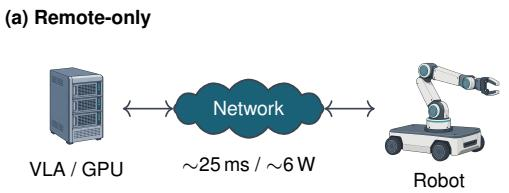

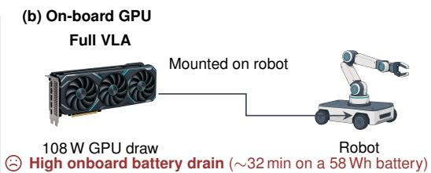  
Both: high energy consumption and latency of VLA inference

(c) VLA-ULAP: Mixed Cloud + Edge inference  
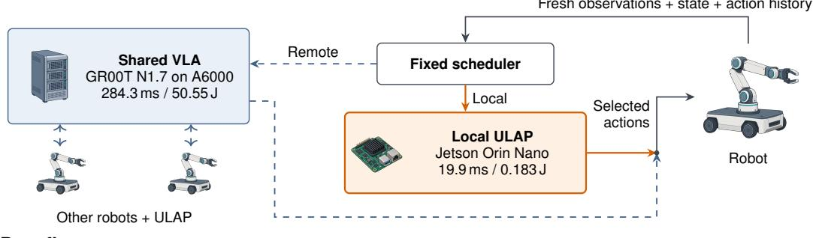  
1 More responsive control  
LIBERO-Safety: 2-task mean

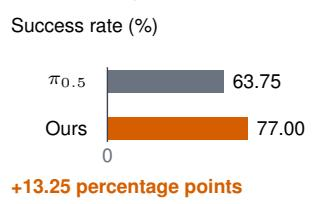

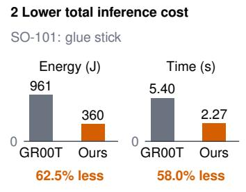

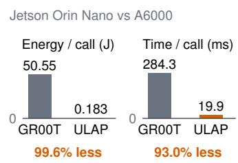  
Figure 1: Overview and benefits of the proposed VLA-ULAP framework. (a) Remote-only inference adds communication delay and energy cost, while (b) full onboard VLA inference burdens the battery. (c) VLA-ULAP schedules remote calls alongside local predictions. Bottom panels show three benefits: (1) more responsive control with higher dynamic-task success rates; (2) lower estimated total inference energy and time per successful episode; and (3) fast, low-energy inference on inexpensive edge devices for longer battery life and scalable fleets.

et al., 2026). If these features or verification come from a remote VLA, placing the fast model on the robot still requires server communication, reducing the latency and energy benefits of local execution. Section 2 details these approaches.

To combine efficient inference, high task success, and long-duration operation on low-power edge devices, we propose VLA-ULAP, a hybrid framework that interleaves occasional remote VLA calls with inexpensive action predictions on the robot (Figure 1). Local decisions respond to fresh observations without a server round trip, while periodic VLA calls retain access to the base policy. Fewer remote requests free shared-GPU capacity for other robots. Low-power local inference can extend battery life without an onboard GPU sized for the full VLA.

The local model must therefore be lightweight, state-conditioned, and independent of remote features or verification. Our Ultra-Lightweight Local Action Predictor (ULAP) implements these requirements for target tasks. It combines current camera views and proprioception with the preceding executed action sequence, which supplies motion context that appearance alone may not resolve. History can come from either policy, keeping inputs aligned with actual execution. A frozen Theia-Tiny encoder (Shang et al., 2025), shallow multimodal fusion, and an action head that generates the entire chunk in one pass without iterative denoising keep prediction inexpensive and low-latency; the default ULAP model has 1.86M trainable parameters and 5.52M frozen visual parameters, approximately 7.4M in total (Figure 2). At each chunk boundary, the scheduler selects either a complete VLA call or a new local prediction, rather than lengthening open-loop execution. The base VLA stays frozen. Only ULAP is trained on demonstrations or successful base-policy trajectories; for a few hundred episodes, this takes a few minutes on one A6000 GPU.

Our contributions are:

1. A self-contained, execution-history-conditioned predictor that replaces complete VLA calls with one-pass local action chunks, without changing the base model or requiring its intermediate representations.

2. A split inference framework that makes this path deployable on a low-power edge device and reduces heavy per-robot requests. It complements shared-GPU scheduling (Bansal et al., 2026) by freeing inference capacity for shared remote GPUs to serve more robots.

3. Strong success retention across GR00T N1.7 and VLA-JEPA on LIBERO (NVIDIA, 2026; Sun et al., 2026; Liu et al., 2023), Cosmos-Policy on RoboCasa (Kim et al., 2026; Nasiriany et al., 2024), and physical SO-101 tasks (Knight et al., 2024), together with Jetson measurements. Latency-aware LIBERO-Safety evaluation (Cui et al., 2026) further tests whether fast local updates can improve success, not merely reduce cost.

At selected simulation settings, 48.8–76.7% fewer VLA calls retain 95.0–97.5% of baseline success. Physical tasks retain 95.2–100% while reducing mean calls per successful episode by 52.3–62.8%. On two dynamic tasks, the fast-path intervention improves success over π0.5 (Black et al., 2025) by 11.0 and 15.5 percentage points. Sections 3 and 4 describe the design and evaluation.

## 2 RELATED WORK

We review methods for accelerating VLA inference while retaining task success, organized by whether they reduce computation within a call or reduce the need for full VLA calls.

Reduce work within a VLA call. Quantization (Zhang et al., 2026), token pruning or reuse (Liu et al., 2026b; Xu et al., 2025), and adaptive depth or intermediate-state reuse (Yue et al., 2024; Liu et al., 2026a; Oi et al., 2026) reduce internal costs but retain some large-policy computation. They complement VLA-ULAP by accelerating the calls that remain.

Reduce calls by executing or reusing actions. Action chunking amortizes one prediction over several control steps (Zhao et al., 2023). AutoHorizon, AAC, and DVAC adapt the executed prefix using attention, entropy, or denoising variance (Wang et al., 2026; Liang et al., 2026; Feng et al., 2026). Their selected actions remain within a generated chunk. FlashVLA repeats a recent action (Tan et al., 2025), whereas SP-VLA extrapolates an action-history buffer (Li et al., 2026). ULAP can also act beyond the VLA’s last generated horizon, but predicts a new chunk conditioned on current observations and robot state.

Retrieve executable actions. RT-Cache uses frozen DINOv2 and SigLIP features to retrieve trajectory snippets (Kwon et al., 2025; Oquab et al., 2024; Zhai et al., 2023). ALT learns a query from multiple views and end-effector pose (He et al., 2026). Both use current observations, but depend on adequate memory coverage: RT-Cache reports failure under its strict zero-shot protocol, while ALT flags unsupported queries without supplying a correct new action for them. ULAP instead generates actions and interleaves them with calls to the unchanged VLA.

Learn a cheaper action policy. HiRT conditions a fast policy on VLM-generated latents (Zhang et al., 2025). Realtime-VLA FLASH couples an approximately 110M-parameter draft model to the main image encoder and Action Expert verifier (Niu et al., 2026). ULAP requires neither transferred large-model features nor online verification. Training ULAP on VLA rollouts is action-level distillation; the distinction is its tiny independent visual path, executed-history conditioning, and scheduled full-policy bypass, rather than a new distillation objective. We also compare an adapted ACT baseline (Zhao et al., 2023) to test a standard action-chunk predictor in the same hybrid framework. Appendix A expands the taxonomy.

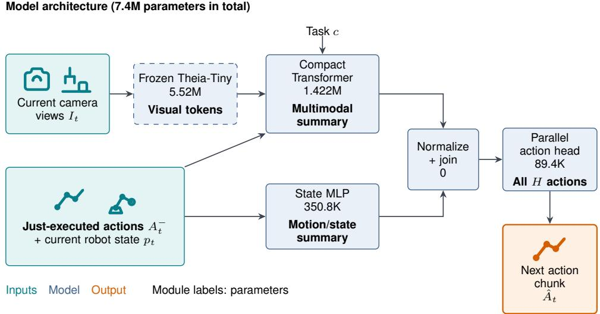  
Figure 2: ULAP model architecture. The Transformer summarizes vision, task and motion context; the state branch preserves nonvisual information. Both branches’ outputs are concatenated and passed to the action head to predict the next chunk in one pass.

## 3 METHOD: VLA-ULAP

Building on Section 2, ULAP must be lightweight, respond to the current state, and operate with out VLA hidden states or online verification. The architecture in Figure 2 implements these three requirements as follows.

Lightweight: approximately 1/400 of the VLA’s parameters. ULAP combines a 5.52Mparameter frozen Theia-Tiny encoder (Shang et al., 2025) with a 1.86M-parameter trainable predictor. The complete online model has approximately 7.4M parameters, about 1/400 of the 3B-parameter GR00T N1.7 (NVIDIA, 2026). Rather than running a large vision–language backbone locally, ULAP uses compact visual features, a shallow Transformer, and a small state MLP. Its action head generates the entire action chunk in a single forward pass without iterative denoising, keeping prediction latency low. Task embeddings or precomputed instruction features provide conditioning without an online language-model pass, keeping the local path compact.

State-responsive: current observations with executed-action context. At a decision boundary t, let $I _ { t }$ denote the current camera views, $p _ { t }$ the robot state, and $A _ { t } ^ { - } = ( a _ { t - H } , \dotsc , a _ { t - 1 } )$ the preceding H executed actions. ULAP predicts

$$
\widehat { A } _ { t } = g _ { \theta } ( I _ { t } , p _ { t } , A _ { t } ^ { - } , c ) ,
$$

where c denotes task conditioning and $\widehat { A } _ { t }$ contains the next H actions. Similar views can occur while approaching, grasping, or withdrawing from an object. To help distinguish these phases, ULAP combines current vision and proprioception with the preceding actions actually sent to the robot, regardless of whether the VLA or ULAP generated them. The Transformer fuses pooled Theia visual tokens with projected history and proprioception tokens and a task-conditioned aggregation token. A parallel state MLP processes proprioception and flattened action history, preserving a direct nonvisual path to the output. The two summaries are independently normalized and concatenated with equal scaling.

Independent: direct prediction without VLA verification. A shared action head combines the fused representation with learned temporal-position tokens to emit all H actions in one pass, without autoregressive rollout or iterative denoising. Its inputs are available locally: ULAP neither consumes a hidden state of a base VLA nor asks the VLA to verify its predictions. A local decision therefore requires no intermediate-feature transfer or verification round trip to the remote GPU. This separation allows ULAP to run on the edge device while the unchanged VLA is invoked only at scheduled decisions.

Training and execution. Only the predictor is trained; the VLA and Theia remain frozen. We supervise the next action chunk with demonstrations or successful base-policy rollouts using Smooth L1 loss on training-set-standardized actions. At deployment, the first decision invokes the VLA to initialize executed history. A fixed scheduler then distributes local decisions as evenly as possible among VLA calls, limiting unnecessary consecutive local blocks. Each local decision uses fresh observations and predicts a new chunk rather than extending the previous one. Thus, complete VLA calls can be omitted while retaining observation-conditioned updates at the usual chunk boundaries.

Optional risk-aware scheduling. To further improve task success over fixed scheduling, we explore allocating VLA calls to less familiar inputs. Unlike the base VLA, ULAP’s predictor lacks large-scale action pretraining. Our risk-aware scheduler uses distance from task-specific training embeddings as a risk proxy: the mean squared distance to nearby normalized embeddings is mapped to a calibrated percentile. High scores prioritize an earlier VLA call, subject to a running call budget and a guard against overly long local-only intervals. This changes when the VLA is called, not how ULAP predicts actions; stored embeddings do not supply actions. Fixed scheduling remains the default, with risk-aware scheduling settings and comparisons in Appendix C.

## 4 RESULTS

We test two linked benefits: retaining success with less VLA computation, and improving success when delayed actions encounter a changing scene. Sections 4.1–4.3 test three basepolicy/benchmark pairs; Section 4.4 compares success, inference speedup, and energy efficiency against ACT-based local prediction, SP-VLA action extrapolation, and standalone RT-Cache retrieval. These comparisons test the trade-off against learned, extrapolated, and retrieved alternatives to VLA-generated actions. Sections 4.5–4.6 examine physical placement shifts and inference costs on Jetson Orin Nano and A6000. Section 4.7 tests whether lower latency also improves success in dynamic environments.

## 4.1 LIBERO × GR00T N1.7

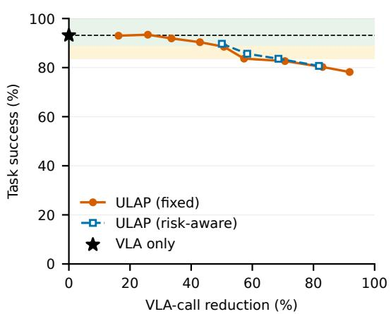

We first pair GR00T N1.7 (NVIDIA, 2026) with ULAP using fixed scheduling and 16-step chunks on all 40 LIBERO tasks (Liu et al., 2023). Predictor-training initial states are disjoint from evaluation. Appendix B.1 gives detailed settings and suite-wise results.

Removing 50.7% of VLA calls yields 88.50% success (1,770/2,000), retaining 95.0% of GR00T-only success.

At 91.8% call reduction, success is 78.20% (1,564/2,000). Only the initial chunk invokes GR00T; ULAP predicts every subsequent chunk without extending the execution horizon. Adding risk-aware scheduling (Section 3) yields small but consistent success gains of 0.45–2.00 percentage points over fixed scheduling across all four evaluated settings (Appendix C).

Figure 3: LIBERO × GR00T N1.7. Each point uses 2,000 episodes, including failures. Calls are relative to VLA-only; star/dashed line marks baseline success. Bands show ≥95% and 90–95% retention; blue squares use risk-aware scheduling.

## 4.2 LIBERO × VLA-JEPA

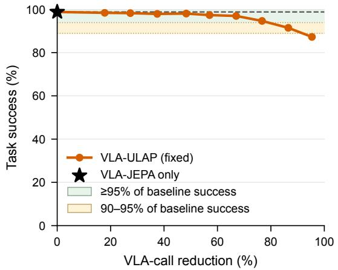

To test another architecture, we pair VLA-JEPA (Sun et al., 2026) with ULAP using fixed seven-step scheduling on all 40 tasks, using disjoint training and evaluation initial states as in GR00T (Appendix B.2).

Removing 76.7% of VLA calls yields 94.65% success (1,893/2,000), retaining 95.8% of VLA-JEPA-only success.

At 86.5% call reduction, success remains 91.45% (1,829/2,000), or 92.6% retention. ULAP therefore supports substantial whole-policy bypass without lengthening either path’s chunk.

Figure 4: LIBERO × VLA-JEPA. Each point uses 2,000 episodes. Markers and bands follow Figure 3.

## 4.3 ROBOCASA × COSMOS-POLICY

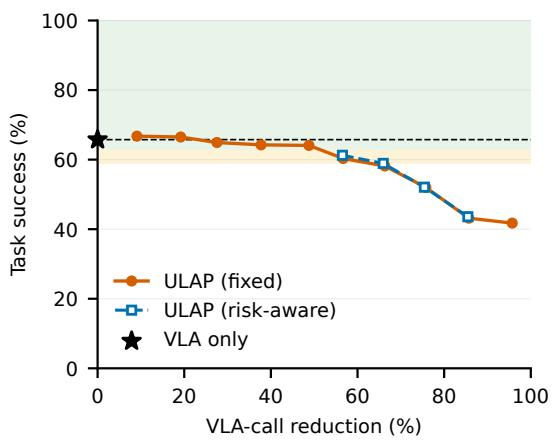

Moving beyond LIBERO, RoboCasa adds varied kitchen layouts and object placements (Nasiriany et al., 2024). We evaluate Cosmos-Policy (Kim et al., 2026) with a shared ULAP on 24 tasks, training on object split A and evaluating on held-out split B following RoboCasa’s official object-generalization evaluation protocol (Appendix B.3).

Despite this variation, current-view ULAP removes 48.8% of VLA calls while achieving 64.08% success (769/1,200), retaining 97.5% of Cosmos-Policy-only success: nearly half the calls with only a 1.67-percentage-point success decrease.

Figure 5: RoboCasa × Cosmos-Policy. Each point uses 1,200 episodes. Markers and bands follow Figure 3.

In the high-skip region, risk-aware scheduling yields small but consistent success gains of 0.08–0.92 percentage points over fixed scheduling across all four evaluated settings (Appendix C).

## 4.4 COMPARISON WITH PREVIOUS WORKS

Having tested ULAP across models and benchmarks, we now compare three alternatives to VLA generated actions. ACT (Zhao et al., 2023), a vision-based imitation policy that predicts action chunks, tests whether a standard learned policy can serve as the local path instead of ULAP. SP-VLA (Li et al., 2026) tests inexpensive action-history extrapolation. Both can supply actions beyond the VLA’s last generated chunk. ULAP, ACT, and SP-VLA are paired with the same VLA-JEPA. RT-Cache (Kwon et al., 2025) instead tests standalone image-based action retrieval, using the same training rollout corpus without VLA calls. All methods are evaluated on the same LIBERO initial states.

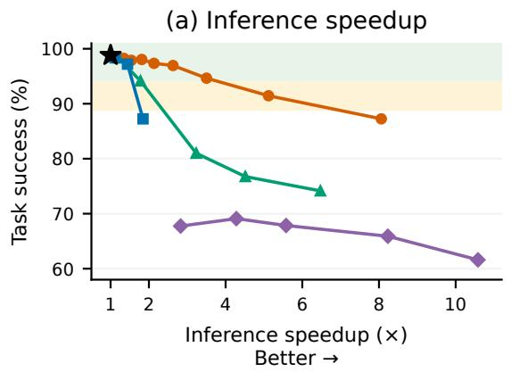

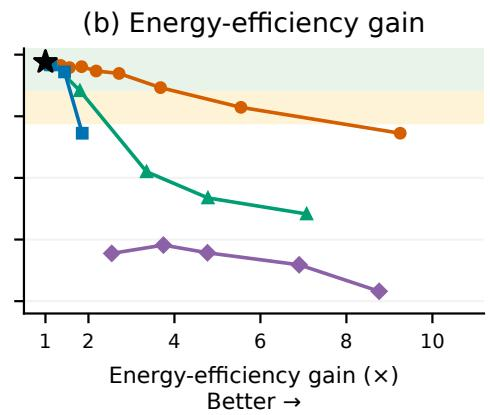  
Figure 6: Success versus inference efficiency on LIBERO. Each point evaluates 2,000 matched initial states. Gains are VLA-JEPA-only cost divided by method cost, averaging successful episodes and using measured RTX A6000 branch costs. Larger gains lie to the right; VLA-JEPA alone is 1×. RT-Cache runs standalone with chunk lengths 4/6/8/12/16. Bands follow Figure 3; settings are in Appendix B.2.

Figure 6 plots task success against inference speedup and energy-efficiency gain relative to VLA-JEPA alone, using mean costs per successful episode. To read the plots, a 2× gain means that the corresponding cost is halved, and points toward the upper right combine higher success with greater efficiency. Under these metrics, ULAP achieves a better observed success–cost frontier than ACT and SP-VLA. Specifically, at 94.65% success (1,893/2,000), it uses 49.2% less inference time and 51.0% less GPU energy than ACT at 94.15% (1,883/2,000). At the same 87.25% success (1,745/2,000), ULAP uses 77.1% less time and 79.9% less energy than the most aggressive SP-VLA setting. Standalone RT-Cache peaks at 69.10% success (1,382/2,000, chunk length 6). ULAP achieves 91.45% (1,829/2,000) with 16.4% less time and 32.5% less energy than that setting. Thus, the hybrid predictor retains high success while reducing cost relative to learned, extrapolated, and retrieved action alternatives.

## 4.5 REAL ROBOT × GR00T N1.7

Moving from simulation to a real robot, we test whether ULAP retains success under placement shifts using an SO-101 arm (Knight et al., 2024). We evaluate two pick-and-place tasks: placing a ping-pong ball in a bowl and placing a glue stick in a cup. Each task uses 75 trials per policy, comprising 50 trials at training placements (ID) and 25 at held-out placements (OOD). Both paths execute 16-step chunks (Appendix B.4).

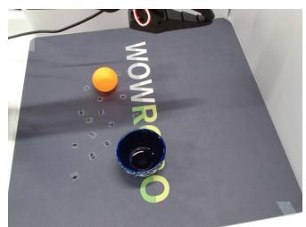  
Ping-pong: ball → blue bowl

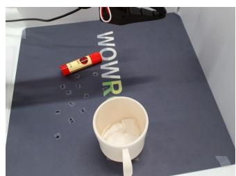  
Glue-stick: glue stick → white cup  
Figure 7: Physical pick-and-place tasks. Initial external-camera views from evaluated trials.

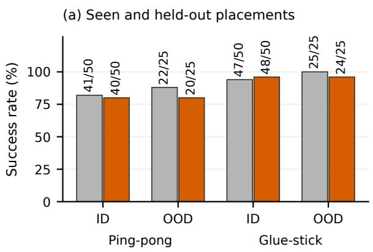

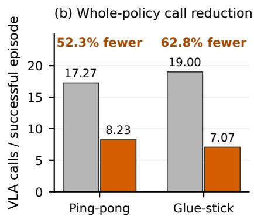  
Figure 8: Physical execution with ULAP. Left: ID/OOD success counts. Right: mean VLA calls per successful episode and reduction from GR00T-only. Settings: Appendix B.4.

Performance is retained at both in-distribution and held-out placements. VLA-ULAP achieves 80.0% success (20/25) on OOD Ping-pong and 96.0% (24/25) on OOD Glue-stick, matching its observed ID rates (40/50 and 48/50, respectively). Relative to GR00T-only’s OOD results (22/25 and 25/25), it retains 90.9% and 96.0% of the success rate (Figure 8). These results support robustness to the evaluated placement shifts while substantially reducing VLA use: across ID and OOD trials, mean VLA calls per successful episode fall by 52.3% on Ping-pong and 62.8% on Glue-stick. Across ID and OOD, success-rate retention relative to GR00T-only is 95.2% on Ping-pong (60/75 versus 63/75) and 100.0% on Glue-stick (72/75 for both policies).

## 4.6 A LIGHTWEIGHT JETSON FAST PATH

To quantify the computational savings in these physical tasks, we profile both inference paths. ULAP on Jetson Orin Nano takes 19.89 ms and 0.183 J per inference, versus 284.30 ms and 50.55 J for GR00T on A6000: 93.0% less time and 99.6% less inference-device energy per local decision. Combining these measured costs with successful physical episodes’ call counts, we estimate inference time reductions of 47.9% on Ping-pong and 58.0% on Glue-stick, with energy reductions of 52.1% and 62.5%, respectively (Figure 9). Thus, even on an inexpensive edge device, the local path delivers fast inference while substantially reducing inference energy consumption.

## 4.7 LIBERO-SAFETY × π0.5: BEYOND FASTER EXECUTION

Finally, we ask whether the fast path offers more than computational savings: when the scene changes during inference, faster local updates may also improve task success. We test this benefit on two latency-sensitive tasks from LIBERO-Safety’s dynamic obstacle-avoidance suite (Cui et al., 2026): placing both moka pots on a stove, and placing a mug in a microwave and closing its door. We convert approximate inference latencies into control-step delays, modeling three steps for the VLA and zero additional steps for local prediction. The simulator continues stepping during the modeled VLA delay. We compare $\pi _ { 0 . 5 }$ -only execution (Black et al., 2025) with VLA-ULAP replacing half of the scheduled decisions, using the same five-step execution interval and 200 episodes per task and policy (Appendix B.5).

(a) Per-inference latency  
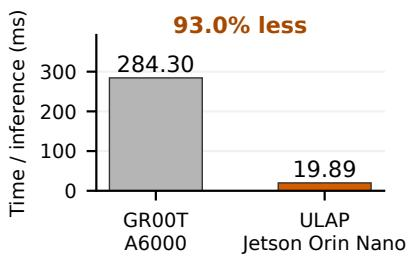

(b) Episode time (estimated)  
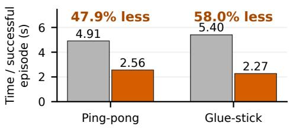

(c) Per-inference energy  
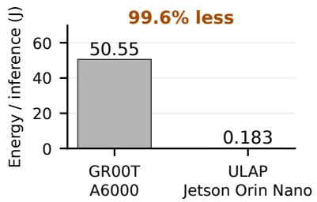

(d) Episode energy (estimated)  
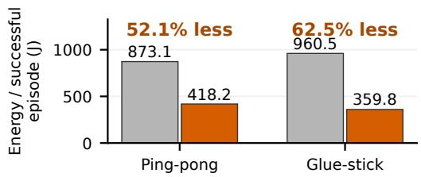  
Figure 9: Inference latency and energy for real-robot evaluation. Left: measured per-inference costs of GR00T on A6000 and ULAP on Jetson Orin Nano. Right: estimated totals per successful episode, comparing GR00T-only with VLA-ULAP. Energy covers the active GPU board or Jetson module; details are in Appendix B.4.

Table 1: Success improves under latency-aware execution. Each condition uses 50 initial states with four repetitions. Gain is the absolute success-rate increase in percentage points.
<table><tr><td>Task</td><td> $\pi _ { 0 . 5 }$  only</td><td>VLA-ULAP</td><td>Gain</td></tr><tr><td>Moka pots → stove</td><td>77.5% (155/200)</td><td>88.5% (177/200)</td><td>+11.0 pp</td></tr><tr><td>Mug → microwave</td><td>50.0% (100/200)</td><td>65.5% (131/200)</td><td>+15.5 pp</td></tr></table>

VLA-ULAP raises success by 11.0 and 15.5 percentage points, while reducing total VLA calls by 51.8% and 52.5%, respectively (Table 1). Thus, the fast local path does not merely trade accuracy for cheaper inference: on these latency-sensitive tasks, it achieves both fewer heavy-policy calls and more successful executions.

## 5 CONCLUSION

VLA-ULAP replaces complete VLA calls with a compact predictor conditioned on current observations, proprioception, and executed action history. It enables local action updates without largemodel features or online verification.

Across three simulation settings, selected points remove 48.8–76.7% of VLA calls while retaining 95.0–97.5% of baseline success. Physical tests support success retention under the evaluated placement shifts, and Jetson Orin Nano profiling demonstrates the low per-call cost of the local path. The dynamic LIBERO-Safety results show a further benefit of the combined fast-path intervention: more successful executions under modeled inference delay, not just fewer expensive calls. Together, these results support responsive, energy-conscious local updates with less heavy-policy computation.

## AI USE STATEMENT

Generative AI tools assisted with literature discovery and synthesis, research framing and hypothesis refinement, interpretation of reported results, manuscript drafting and revision, and implementation of data-audit and figure-generation scripts, and generation of conceptual illustrations. Numerical reporting is traced to recorded evaluation artifacts, and cited claims are checked against a source ledger. The authors are responsible for the final text, claims, code, and figures.

## ETHICS STATEMENT

Learned robot policies can produce unsafe actions when observations are unfamiliar or inaccurate. Our physical evaluation concerns bounded tabletop pick-and-place, retaining the existing jointcommand clamps and episode timeout (Appendix B.4). Neither success at held-out placements nor the LIBERO-Safety simulation establishes safe human–robot collaboration. ULAP and its optional adaptive scheduler are not safety controllers; deployment near people requires independent safeguards and risk assessment. Reported energy savings concern inference devices, not the robot’s full operational or life-cycle footprint.

## REPRODUCIBILITY STATEMENT

Section 3 specifies the predictor inputs, architecture, training objective, and scheduling. Appendices B and C give benchmark-specific training and evaluation settings, seeds, action horizons, and metric definitions. Appendix B.5 describes injected-delay execution; Appendix B.4 states the hardware measurement boundaries and episode-cost reconstruction. Per-task plots and success counts accompany these settings so that aggregate claims can be checked without conflating protocols.

## REFERENCES

Rohan Bansal, David He, Nadun Ranawaka Arachchige, Zhenyang Chen, Soobum Kim, Kexin Rong, and Danfei Xu. Action chunk scheduling for batched robot policy serving. arXiv preprint arXiv:2608.00337, 2026. URL https://arxiv.org/abs/2608.00337v1.

Johan Bjorck, Fernando Castañeda, Nikita Cherniadev, Xingye Da, Runyu Ding, Linxi Fan, Yu Fang, Dieter Fox, Fengyuan Hu, Spencer Huang, Joel Jang, Zhenyu Jiang, Jan Kautz, Kaushil Kundalia, Lawrence Lao, Zhiqi Li, Zongyu Lin, Kevin Lin, Guilin Liu, Edith Llontop, Loic Magne, Ajay Mandlekar, Avnish Narayan, Soroush Nasiriany, Scott Reed, You Liang Tan, Guanzhi Wang, Zu Wang, Jing Wang, Qi Wang, Jiannan Xiang, Yuqi Xie, Yinzhen Xu, Zhenjia Xu, Seonghyeon Ye, Zhiding Yu, Ao Zhang, Hao Zhang, Yizhou Zhao, Ruijie Zheng, and Yuke Zhu. GR00T N1: An open foundation model for generalist humanoid robots. arXiv preprint arXiv:2503.14734, 2025. URL https://arxiv.org/abs/2503.14734.

Kevin Black, Noah Brown, James Darpinian, Karan Dhabalia, Danny Driess, Adnan Esmail, Michael Robert Equi, Chelsea Finn, Niccolo Fusai, Manuel Y. Galliker, Dibya Ghosh, Lachy Groom, Karol Hausman, Brian Ichter, Szymon Jakubczak, Tim Jones, Liyiming Ke, Devin LeBlanc, Sergey Levine, Adrian Li-Bell, Mohith Mothukuri, Suraj Nair, Karl Pertsch, Allen Z. Ren, Lucy Xiaoyang Shi, Laura Smith, Jost Tobias Springenberg, Kyle Stachowicz, James Tanner, Quan Vuong, Homer Walke, Anna Walling, Haohuan Wang, Lili Yu, and Ury Zhilinsky. π : a vision-language-action model with open-world generalization. In Proceedings ofThe 9th Conference on Robot Learning, volume 305 of Proceedings ofMachine Learning Research, pp. 17–40. PMLR, 2025. URL https://proceedings.mlr.press/v305/black25a.html.

Feng Chen, Xianghui Wang, Yuxuan Chen, Boying Li, Yefei He, Zeyu Zhang, and Yicheng Wu. Dynamic execution commitment of vision-language-action models. arXiv preprint arXiv:2605.11567, 2026. URL https://arxiv.org/abs/2605.11567.

Rongxu Cui, Zongzheng Zhang, Jingrui Pang, Haohan Chi, Jinbang Guo, Saining Zhang, Shaoxuan Xie, Xin Jin, Yao Mu, Jiaolong Yang, Guocai Yao, Xianyuan Zhan, Ya-Qin Zhang, and Hao

Zhao. LIBERO-Safety: A comprehensive benchmark for physical and semantic safety in visionlanguage-action models. arXiv preprint arXiv:2606.23686, 2026. URL https://arxiv. org/abs/2606.23686v2.

Xiangdong Feng, Yuxuan Cheng, Chen Shi, Boyao Han, Yuxuan Yan, Yitong Hong, Zhuotao Tian, and Li Jiang. Denoising tells when to replan: Denoising-variance adaptive chunking for flowbased robot policies. arXiv preprint arXiv:2606.03847, 2026. URL https://arxiv.org/ abs/2606.03847.

Chengyang He, Xu Liu, Gadiel Sznaier Camps, Joseph Bruno, Guillaume Sartoretti, and Mac Schwager. Demystifying robot diffusion policies: Action memorization and a simple lookup table alternative. In International Conference on Learning Representations, volume 2026, pp. 10890– 10917, 2026. URL https://proceedings.iclr.cc/paper\_files/paper/2026/ hash/122ea6470232ee5e79a2649243348005-Abstract-Conference.html.

KBT Battery. KBT 12v 5200mah rechargeable li-ion battery. Manufacturer product specifications, n.d.

Moo Jin Kim, Karl Pertsch, Siddharth Karamcheti, Ted Xiao, Ashwin Balakrishna, Suraj Nair, Rafael Rafailov, Ethan P. Foster, Pannag R. Sanketi, Quan Vuong, Thomas Kollar, Benjamin Burchfiel, Russ Tedrake, Dorsa Sadigh, Sergey Levine, Percy Liang, and Chelsea Finn. Open-VLA: An open-source vision-language-action model. In Proceedings of The 8th Conference on Robot Learning, volume 270 of Proceedings of Machine Learning Research, pp. 2679–2713. PMLR, 2025. URL https://proceedings.mlr.press/v270/kim25c.html.

Moo Jin Kim, Yihuai Gao, Tsung-Yi Lin, Yen-Chen Lin, Yunhao Ge, Grace Lam, Percy Liang, Shuran Song, Ming-Yu Liu, Chelsea Finn, and Jinwei Gu. Cosmos Policy: Fine-tuning video models for visuomotor control and planning. In The Fourteenth International Conference on Learning Representations, 2026. URL https://proceedings.iclr.cc/paper\_files/paper/2026/hash/ 748becc400a57c0e31cfe6a2e7951467-Abstract-Conference.html.

Rob Knight, Pepijn Kooijmans, Remi Cadene, Simon Alibert, Michel Aractingi, Dana Aubakirova, Adil Zouitine, Russi Martino, Steven Palma, Caroline Pascal, and Thomas Wolf. Standard open SO-100 & SO-101 arms. Open-source hardware repository, 2024. URL https://github. com/TheRobotStudio/SO-ARM100.

Pepijn Kooijmans, Manav Chandaka, Bhargav Chandaka, Gloria Wang, and Advait Patel. LeKiwi. Open-source mobile manipulator, n.d. URL https://github.com/ SIGRobotics-UIUC/LeKiwi.

Owen Kwon, Abraham George, Alison Bartsch, and Amir Barati Farimani. RT-Cache: Trainingfree retrieval for real-time manipulation. In 2025 IEEE-RAS 24th International Conference on Humanoid Robots (Humanoids), pp. 1131–1138, 2025. doi: 10.1109/HUMANOIDS65713.2025. 11203198. URL https://ieeexplore.ieee.org/document/11203198.

Ye Li, Yuan Meng, Zewen Sun, Kangye Ji, Chen Tang, Jiajun Fan, Xinzhu Ma, Shutao Xia, Zhi Wang, and Wenwu Zhu. SP-VLA: A joint model scheduling and token pruning approach for VLA model acceleration. In The Fourteenth International Conference on Learning Representations, 2026. URL https://proceedings.iclr.cc/paper\_files/paper/2026/hash/ 4072543747a14bbed76284cf2c04b9e9-Abstract-Conference.html.

Yuanchang Liang, Xiaobo Wang, Kai Wang, Shuo Wang, Xiaojiang Peng, Haoyu Chen, David Kim Huat Chua, and Prahlad Vadakkepat. Adaptive action chunking at inference-time for vision-language-action models. In Proceedings of the IEEE/CVF Conference on Computer Vision and Pattern Recognition (CVPR), pp. 20802–20811, 2026. URL https: //openaccess.thecvf.com/content/CVPR2026/html/Liang\_Adaptive\_ Action\_Chunking\_at\_Inference-time\_for\_Vision-Language-Action\_ Models\_CVPR\_2026\_paper.html.

Bo Liu, Yifeng Zhu, Chongkai Gao, Yihao Feng, Qiang Liu, Yuke Zhu, and Peter Stone. LIBERO: Benchmarking knowledge transfer for lifelong robot learning. In Advances in Neural Information

Processing Systems 36: Datasets and Benchmarks Track, pp. 44776–44791, 2023. doi: 10.52202/ 075280-1939. URL https://proceedings.neurips.cc/paper\_files/paper/ 2023/hash/8c3c666820ea055a77726d66fc7d447f-Abstract-Datasets\_ and\_Benchmarks.html.

Yudong Liu, Yuan Li, Zijia Tang, Yuxi Zheng, Yueqian Lin, Qinsi Wang, Yi Li, Shuangjun Liu, Shuai Zhang, Taotao Jing, Dashan Gao, Ning Bi, Jingwei Sun, Yiran Chen, and Hai Li. Latent bridge: Feature delta prediction for efficient dual-system vision-language-action model inference. arXiv preprint arXiv:2605.02739, 2026a. URL https://arxiv.org/abs/2605.02739.

Ziyan Liu, Yeqiu Chen, Yiming Zhang, Hongyi Cai, Tao Lin, Runquan Gui, Shuo Yang, Zheng Liu, and Bo Zhao. Bridging the semantic-action gap in visual token pruning for efficient VLA inference. arXiv preprint arXiv:2511.16449, 2026b. URL https://arxiv.org/abs/2511. 16449.

Soroush Nasiriany, Abhiram Maddukuri, Lance Zhang, Adeet Parikh, Aaron Lo, Abhishek Joshi, Ajay Mandlekar, and Yuke Zhu. RoboCasa: Large-scale simulation of household tasks for generalist robots. In Proceedings ofRobotics: Science and Systems, 2024. doi: 10.15607/RSS.2024. XX.050. URL https://www.roboticsproceedings.org/rss20/p050.html.

Jiahui Niu, Kefan Gu, Yucheng Zhao, Shengwen Liang, Tiancai Wang, Xing Hu, Ying Wang, and Huawei Li. Realtime-VLA FLASH: Speculative inference framework for diffusion-based VLAs. arXiv preprint arXiv:2605.13778, 2026. URL https://arxiv.org/abs/2605. 13778v1.

NVIDIA. NVIDIA RTX A6000 datasheet. Official product datasheet, May, 2022.

NVIDIA. GR00T-N1.7-3B model card. Hugging Face, 2026. URL https://huggingface. co/nvidia/GR00T-N1.7-3B.

Ryuji Oi, Hikari Otsuka, Kosuke Matsushima, Yuki Ichikawa, Masato Motomura, Tatsuya Kaneko, and Daichi Fujiki. ActionCache: Training-free acceleration for vision-language-action models with action caching and refinement. arXiv preprint arXiv:2607.06370, 2026. URL https: //arxiv.org/abs/2607.06370.

Maxime Oquab, Timothée Darcet, Théo Moutakanni, Huy V. Vo, Marc Szafraniec, Vasil Khalidov, Pierre Fernandez, Daniel Haziza, Francisco Massa, Alaaeldin El-Nouby, Mahmoud Assran, Nicolas Ballas, Wojciech Galuba, Russell Howes, Po-Yao Huang, Shang-Wen Li, Ishan Misra, Michael Rabbat, Vasu Sharma, Gabriel Synnaeve, Hu Xu, Hervé Jégou, Julien Mairal, Patrick Labatut, Armand Joulin, and Piotr Bojanowski. DINOv2: Learning robust visual features without supervision. Transactions on Machine Learning Research, 2024. ISSN 2835-8856. URL https://openreview.net/forum?id=a68SUt6zFt.

Yi Pan, Miao Pan, Qi Lu, Jiaming Huang, Man Zhang, Siteng Huang, Xin Li, Jie Zhang, Yongliang Shen, Xuhong Zhang, and Wenqi Zhang. VLA-Corrector: Lightweight detect-and-correct inference for adaptive action horizon. arXiv preprint arXiv:2607.01804, 2026. URL https: //arxiv.org/abs/2607.01804.

Daojie Peng, Fulong Ma, Bingtao Wang, Sheng Wang, and Jun Ma. Latency-tolerant cloud-edge collaborative vision-language-action models via emergent representational specialization. arXiv preprint arXiv:2608.00569, 2026. URL https://arxiv.org/abs/2608.00569.

Sara Pohland, Xenofon Foukas, Ganesh Ananthanarayanan, Andrey Kolobov, Sanjeev Mehrotra, Bozidar Radunovic, and Ankit Verma. Offload or overload: A platform measurement study of mobile robotic manipulation workloads. arXiv preprint arXiv:2603.18284v1, 2026. URL https://arxiv.org/abs/2603.18284v1.

Jinghuan Shang, Karl Schmeckpeper, Brandon B. May, Maria Vittoria Minniti, Tarik Kelestemur, David Watkins, and Laura Herlant. Theia: Distilling diverse vision foundation models for robot learning. In Proceedings of The 8th Conference on Robot Learning, volume 270 of Proceedings ofMachine Learning Research, pp. 724–748. PMLR, 2025. URL https://proceedings. mlr.press/v270/shang25a.html.

Suhas Hariharapura Sheshadri, Leela Subramaniam Karumbunathan, and Dustin Franklin. NVIDIA Jetson Orin Nano Developer Kit gets a “super” boost. NVIDIA Technical Blog, December 17, 2024.

Jingwen Sun, Wenyao Zhang, Zekun Qi, Shaojie Ren, Zezhi Liu, Hanxin Zhu, Guangzhong Sun, Xin Jin, and Zhibo Chen. VLA-JEPA: Enhancing vision-language-action model with latent world model. arXiv preprint arXiv:2602.10098, 2026. URL https://arxiv.org/abs/2602. 10098.

Xudong Tan, Yaoxin Yang, Peng Ye, Jialin Zheng, Bizhe Bai, Xinyi Wang, Jia Hao, and Tao Chen. Think twice, act once: Token-aware compression and action reuse for efficient inference in visionlanguage-action models. arXiv preprint arXiv:2505.21200, 2025. URL https://arxiv. org/abs/2505.21200.

Haoxuan Wang, Gengyu Zhang, Yan Yan, Ramana Rao Kompella, and Gaowen Liu. VLA knows its limits: Adaptive execution horizons for robot policies. arXiv preprint arXiv:2602.21445, 2026. URL https://arxiv.org/abs/2602.21445.

Siyu Xu, Yunke Wang, Chenghao Xia, Dihao Zhu, Tao Huang, and Chang Xu. VLA-Cache: Efficient vision-language-action manipulation via adaptive token caching. In Advances in Neural Information Processing Systems 38, pp. 182377–182402, 2025. doi: 10.52202/085713-5484. URL https://proceedings.neurips.cc/paper\_files/paper/2025/hash/ f062da1973ac9ac61fc6d44dd7fa309f-Abstract-Conference.html.

Zebin Yang, Qi Wang, Yunhe Wang, Xiurui Guo, Bo Yu, Shaoshan Liu, Jiafeng Xu, Hao Dong, and Meng Li. Jetson-PI: Towards onboard real-time robot control via foresight-aligned asynchronous inference. arXiv preprint arXiv:2607.12659, 2026. URL https://arxiv.org/abs/2607. 12659.

Feng Ye, Yiming Zhao, Yong Yu, Hongxu Zhou, Yong Pan, Yuan Xue, Peng Jia, and Chuanmin Jia. Rethink before you execute: Adaptive execution for world action models. arXiv preprint arXiv:2608.09492, 2026. URL https://arxiv.org/abs/2608.09492.

Yang Yue, Yulin Wang, Bingyi Kang, Yizeng Han, Shenzhi Wang, Shiji Song, Jiashi Feng, and Gao Huang. DeeR-VLA: Dynamic inference of multimodal large language models for efficient robot execution. In Advances in Neural Information Processing Systems 37, pp. 56619–56643, 2024. doi: 10.52202/079017-1803. URL https://proceedings.neurips.cc/paper\_files/paper/2024/hash/ 67b0e7c7c2a5780aeefe3b79caac106e-Abstract-Conference.html.

Xiaohua Zhai, Basil Mustafa, Alexander Kolesnikov, and Lucas Beyer. Sigmoid loss for language image pre-training. In Proceedings of the IEEE/CVF International Conference on Computer Vision (ICCV), pp. 11975–11986, 2023. URL https: //openaccess.thecvf.com/content/ICCV2023/html/Zhai\_Sigmoid\_Loss\_ for\_Language\_Image\_Pre-Training\_ICCV\_2023\_paper.html.

Jianke Zhang, Yanjiang Guo, Xiaoyu Chen, Yen-Jen Wang, Yucheng Hu, Chengming Shi, and Jianyu Chen. HiRT: Enhancing robotic control with hierarchical robot transformers. In Proceedings ofThe 8th Conference on Robot Learning, volume 270 of Proceedings ofMachine Learning Research, pp. 933–946. PMLR, 2025. URL https://proceedings.mlr.press/v270/ zhang25b.html.

Jingxuan Zhang, Yunta Hsieh, Zhongwei Wan, Haokun Lin, Xin Wang, Ziqi Wang, Yingtie Lei, and Mi Zhang. QuantVLA: Scale-calibrated post-training quantization for vision-language-action models. In Proceedings of the IEEE/CVF Conference on Computer Vision and Pattern Recognition (CVPR), pp. 39539–39549, 2026. URL https://openaccess.thecvf.com/content/CVPR2026/html/Zhang\_ QuantVLA\_Scale-Calibrated\_Post-Training\_Quantization\_for\_ Vision-Language-Action\_Models\_CVPR\_2026\_paper.html.

Tony Z. Zhao, Vikash Kumar, Sergey Levine, and Chelsea Finn. Learning fine-grained bimanual manipulation with low-cost hardware. In Proceedings of Robotics: Science and Systems, 2023. doi: 10.15607/RSS.2023.XIX.016. URL https://roboticsproceedings.org/ rss19/p016.html.

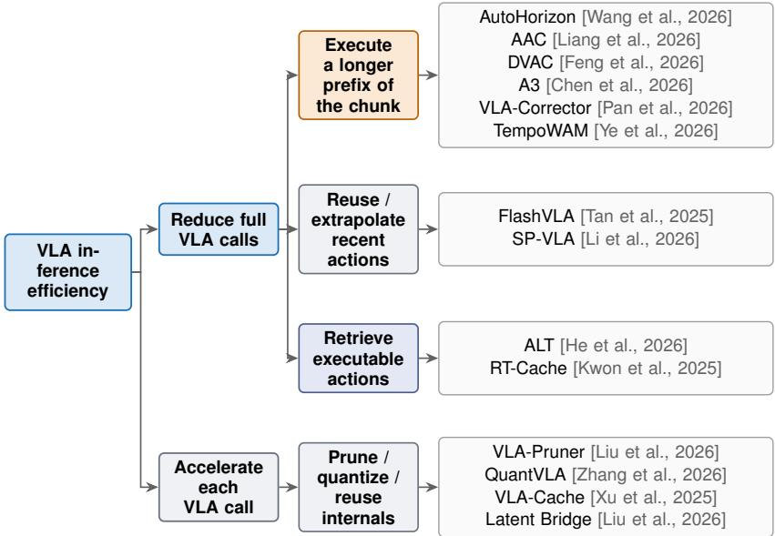  
Figure 10: Taxonomy of VLA inference efficiency. Methods that reduce full VLA calls either execute a longer prefix of the generated chunk (Wang et al., 2026; Liang et al., 2026; Feng et al., 2026; Chen et al., 2026; Pan et al., 2026; Ye et al., 2026), reuse or extrapolate recent actions (Tan et al., 2025; Li et al., 2026), or retrieve executable actions (He et al., 2026; Kwon et al., 2025). Accelerating each remaining call is orthogonal to reducing the call count. Author–year labels in the diagram link to the verified primary records.

## A EXTENDED RELATED-WORK TAXONOMY

Figure 10 organizes VLA inference-efficiency methods into four operational families. The first three reduce full VLA calls by executing more of an already generated chunk, reusing recent motion, or retrieving an executable action. The fourth reduces computation inside each call.

## A.1 EXECUTE A LONGER PREFIX OF THE CHUNK

This family builds on action chunking, in which a policy predicts a sequence of future actions in one call (Zhao et al., 2023). AutoHorizon reads the model’s action self-attention to estimate its predictive limit (Wang et al., 2026); AAC uses action entropy to choose an execution prefix (Liang et al., 2026); DVAC chooses the low-denoising-variance prefix of one flow-policy output (Feng et al., 2026); and A3 accepts the longest prefix that remains conditionally consistent (Chen et al., 2026). VLA-Corrector truncates a chunk when latent visual dynamics indicate persistent deviation (Pan et al., 2026), while TempoWAM either continues the remaining world-action-model chunk or replans (Ye et al., 2026). These methods use different reliability signals but select from the chunk already generated; after that horizon, another policy call or a longer-horizon policy is required.

## A.2 REUSE OR EXTRAPOLATE RECENT ACTIONS

This family derives skipped actions from recent motion. FlashVLA, evaluated on OpenVLA (Kim et al., 2025), repeats the previous action when recent action directions and selected visual-token sets remain stable (Tan et al., 2025). SP-VLA fits a ridge regressor to a recent action buffer, extrapolates the next action, and reuses the preceding gripper state (Li et al., 2026). These paths are inexpensive, but their substitute action is inherited from earlier motion rather than selected from the state tha now requires an action. Their available gain also narrows when the base policy already amortizes each call over a multi-step chunk.

## A.3 RETRIEVE EXECUTABLE ACTIONS

Action retrieval instead returns an executable sequence from memory without running the VLA on that decision. RT-Cache encodes the current RGB frame with frozen DINOv2 (Oquab et al., 2024) and SigLIP (Zhai et al., 2023), concatenates their features, and retrieves a multi-step trajectory snippet (Kwon et al., 2025). ALT trains a contrastive fusion encoder over the current first-person end-effector view, third-person view, and end-effector pose; cosine lookup returns the demonstration chunk linked to the nearest trajectory frame, while a similarity threshold flags unsupported observations (He et al., 2026).

Both methods face limited cache support. RT-Cache reports 0% success when no in-domain frame exists for the tested object–camera–pose combination, and image-key near-misses under occlusion, pose shifts, clutter, or scene dynamics (Kwon et al., 2025). ALT can detect an unsupported query and trigger a safe fallback, but does not supply the correct action chunk for that OOD state (He et al., 2026). RT-Cache also runs two frozen foundation vision encoders for every query and searches a 2176-dimensional index. In contrast, ULAP predicts a new action chunk from observations and executed action history rather than selecting a stored chunk. VLA-ULAP interleaves these local predictions with calls to the unchanged base policy, using the VLA’s broader generalization capabilities to help maintain task success under out-of-distribution conditions.

## A.4 PRUNE, QUANTIZE, OR REUSE VLA INTERNALS

This complementary family reduces the cost of one invocation through low-bit execution (Zhang et al., 2026), token pruning or reuse (Liu et al., 2026b; Xu et al., 2025), adaptive depth (Yue et al., 2024), latent prediction (Liu et al., 2026a), and post-backbone action caching (Oi et al., 2026). These methods lower selected terms inside an exact call, but the remaining terms impose an Amdahl-style ceiling. VLA-ULAP instead omits complete calls, so in-call acceleration can complement its local predictor by reducing the cost of the remaining VLA calls.

## B FIXED-SCHEDULE ULAP EVALUATION

## B.1 LIBERO × GR00T N1.7

Evaluation. We use NVIDIA GR00T-N1.7-LIBERO on four suites of ten tasks each. Every condition evaluates official initial-state IDs 0–49 per task (2,000 episodes), with environment seed 7 and policy seeds 7–56. Both paths execute 16-step chunks; the episode limit is 720 control steps. The fixed scheduler evenly spreads local decisions, accounting for the mandatory first VLA chunk. Requested local fractions are 0.2–1.0 in increments of 0.1, plus the VLA-only reference; no residual cache is used. All nine settings use the same suite-specific checkpoints and initial-state protocol.

Training. Suite-specific predictors use successful GR00T rollouts (100-rollout budget per task), episode-level splits, and training-only normalization. Training uses Smooth-L1 $( \beta = 1 )$ , AdamW (learning rate $\bar { 6 } \times 1 0 ^ { - 4 }$ , weight decay 0.05), batch 96, 120 epochs, and seed 0; validation selects the checkpoint without refitting. Inputs are current primary/wrist images, proprioception, executed action history, and task conditioning. Pre-chunk images are excluded; the state MLP is retained. Predictor-training initial states are disjoint from evaluation.

Metrics (simulation evaluations). Success rate is the fraction of evaluation episodes that succeed. VLA-call reduction compares total VLA calls across all evaluation episodes, including both successful and failed trials, against the VLA-only baseline: $\textstyle 1 - \sum _ { i } C _ { i } ^ { \mathrm { h y b r i d } } / \sum _ { i } C _ { i } ^ { \mathrm { e x a c t } }$ . This is not the local-decision fraction; fraction 1.0 retains one VLA call per episode. Variant selection used this evaluation, without an independent post-selection test.

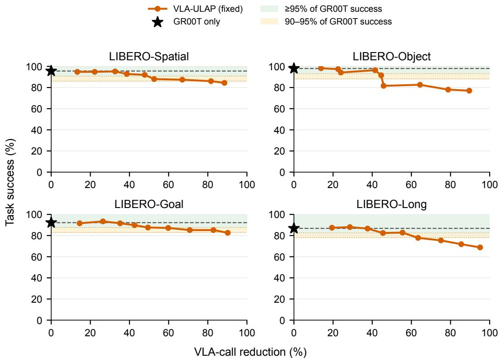  
Figure 11: GR00T N1.7 with ULAP by LIBERO suite. Each point covers 500 episodes. Call reduction uses each suite’s measured VLA-only total; stars/dashed lines mark baseline success. Green and amber bands indicate ≥95% and 90–95% retention. Lines connect evaluated fixed schedules.

## B.2 LIBERO × VLA-JEPA

Evaluation. We use the released VLA-JEPA LIBERO checkpoint with its state-conditioned action head, ten DDIM steps, and franka action normalization. Each condition evaluates the same 40 tasks and official initial-state IDs 0–49 (2,000 episodes), with environment seed 7 and ten settling steps. Both paths execute seven-step chunks. Episode limits are 250, 280, 300, and 520 control steps for Spatial, Object, Goal, and Long, respectively. Exact-call seeds depend on the base seed, suite, trial, and control-step index, independently of the requested local fraction. The fixed schedule and requested fractions match Appendix B.1. ULAP predicts actions directly in bf16, without running the VLA action head.

Training. Four suite-specific predictors use successful VLA-JEPA rollouts: 3,912 trajectories from 100 attempts per task. The recorded simulator-state audit confirms no overlap with evaluation initial states $( L _ { \infty }$ tolerance 10−4). Examples pair current and seven-step-earlier camera views, current proprioception, and the previous executed chunk with the next action chunk. Task-local episode splits are 70/15/15% for training, validation, and test, with training-only normalization. Optimization uses the same loss, AdamW settings, batch size, epoch count, warmup/cosine schedule, and bf16 precision as GR00T, but training seed 7. Validation selects one checkpoint per suite, without refitting. The predictor has 1,871,815 trainable parameters, excluding frozen Theia.

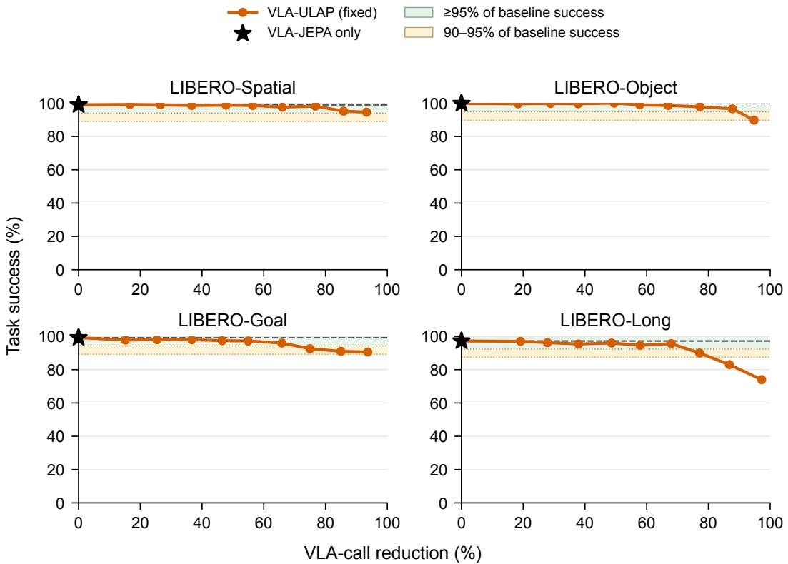  
Figure 12: VLA-JEPA with ULAP by LIBERO suite. Each point covers 500 episodes. Each panel uses its own VLA-only call total and baseline success (star/dashed line). Green and amber bands indicate ≥95% and 90–95% retention. Lines connect evaluated fixed schedules.

The VLA-JEPA-only baseline uses 43,192 calls. At requested local fraction 1.0, the 2,000 mandatory initial calls yield 95.37% call reduction and 87.25% success (1,745/2,000). This is held-outinitial-state evaluation on known tasks, not unseen-task evaluation.

ACT, SP-VLA, and RT-Cache comparison. All methods use the same 40 tasks, 50 initial states per task, environment seed, and episode limits as above; the hybrid methods share the same VLA checkpoint. ACT (Zhao et al., 2023) uses four suite-specific validation-selected policies with current front/wrist images, proprioception, and task identity. The LeRobot ACT implementation uses an ImageNet-initialized ResNet18, a width-512 Transformer, and CVAE training. Inference uses FP32, $z = 0$ , and no temporal ensembling. ACT replaces the local branch under the same fixed scheduler at fractions 0.2/0.5/0.8/0.9/1.0, generating and executing seven actions per query. Even at 1.0, the initial query uses the VLA. This is our ACT-based bypass baseline, not the original ACT evaluation protocol.

SP-VLA’s scheduling component (Li et al., 2026) uses seven-step exact chunks; local ridge extrapolation generates one action from six previous actions $( \lambda = \mathrm { i } \dot { 0 } ^ { - 4 } )$ . Token pruning is disabled. The three plotted settings comprise the official freshness/motion gates and two experimental high reduction variants: motion thresholds scaled by 8/32 and consecutive extrapolation capped at 4/8 steps, respectively, replacing the official requirement for four exact actions among the last six. These variants were calibrated on 160 successful training/validation trajectories disjoint from evaluation, then frozen. The comparison concerns these evaluated operating points, not the complete SP-VLA acceleration pipeline or an isolated architecture ablation.

RT-Cache (Kwon et al., 2025) retrieves from task-specific memories built from the same corpus’s 2,740 training-split successful teacher rollouts. It encodes the current primary-camera image with frozen DINOv2 and SigLIP, normalizes the concatenated 2,176-D feature, and averages the topfive chunks under exact cosine similarity. We sweep chunk lengths 4/6/8/12/16, constructed from executed teacher actions. Retrieval starts at the first decision, without VLA calls or fallback. This LIBERO implementation uses in-memory search rather than RT-Cache’s database-serving stack.

Successful-episode inference costs. For each successful episode i, we estimate $T _ { i } = N _ { V , i } t _ { V } +$ $N _ { L , i } t _ { L }$ and $\bar { E } _ { i } = N _ { V , i } e _ { V } + N _ { L , i } e _ { L }$ . Here, $T _ { i }$ and $E _ { i }$ are the episode’s estimated total inference time and GPU-board energy. $N _ { V , i }$ and $N _ { L , i }$ count VLA and local-path invocations in episode $i ,$ respectively. $t _ { V } , t _ { L }$ are the measured mean times per invocation, and $e _ { V } , e _ { L }$ are the corresponding mean GPU-board energies. The local path is ULAP, ACT, SP-VLA extrapolation, or RT-Cache retrieval. For standalone RT-Cache, $N _ { V , i } = 0$ and local costs are task- and chunk-specific. We then average $T _ { i }$ and $E _ { i }$ over that method’s successful episodes. Counts include the initial query and any partially executed final chunk. Success rates use all 2,000 episodes; successful subsets can differ between methods. Batch-one RTX A6000 profiles give 212.195 ms/27.3115 J per VLA query, 24.503 ms/2.7668 J per ACT query, and 17.647 ms/1.7986 J per ULAP query including Theia. SP-VLA costs 0.176–0.177 ms and 0.00402–0.00417 J per extrapolated action, using the stable final two profiling blocks. The ULAP timing includes both current and previous images for this evaluated variant.

These are retrospective inference-only estimates, not measured episode completion times or wholesystem energy. For the hybrid baselines, fixed Object-task input profiles are applied across suites, retaining each path’s evaluated precision/runtime. RT-Cache is profiled separately on one held-out validation input per task: 30 warm-up calls and three blocks of 200 calls per chunk length, including image preprocessing, encoder, search, action averaging, and CPU output. Its per-task costs are applied to recorded query counts. Profiles use RTX A6000 GPUs but differ in session and input coverage. Energy includes gross GPU-board consumption during inference, including resident idle power for CPU-based SP-VLA, but excludes CPU/host energy, simulation, communication, server queuing, and route-switch transients.

## B.3 ROBOCASA × COSMOS-POLICY

Evaluation. We use NVIDIA Cosmos-Policy-RoboCasa-Predict2-2B in bf16 with TF32 disabled and five denoising steps. The base policy generates 32 actions and executes the first 16; ULAP predicts and executes 16 actions. Each condition evaluates 24 tasks across five scene pairs, (1, 1), (2, 2), (4, 4), (6, 9), and (7, 10), with ten episodes per pair (1,200 episodes). Object split B is used throughout evaluation. Environment seeds vary by task and episode, while the VLA seed is 195. The same identities, initial-state hashes, and object hashes are matched across conditions. Ten settling steps precede control, which terminates on success or at the official task-specific step limit. We use the fixed precharged scheduler with requested skip fractions 0.1, 0.2, . . . , 1.0, always starting with one VLA call. All ten fractions use the same checkpoint and 1,200 initial conditions; there is no action-cache retrieval or risk-aware scheduling.

Training. A single predictor covers all 24 tasks, using current primary, secondary, and wrist views, nine-dimensional proprioception, executed action history, and precomputed frozen language embeddings. Successful teacher rollouts from object split A provide 106,061 training examples at stride four; validation and test splits are separated by collection episode, with per-task training-only normalization. We use standardized Smooth-L1 loss (β = 1), AdamW (learning rate $6 \times 1 0 ^ { - 4 }$ , weight decay 0.05), global batch size 192, task-balanced sampling, 120 epochs, eight warmup epochs followed by cosine decay, bf16, and seed 0. Validation macro-task RMSE selects epoch 85, without refitting. The predictor has 2,118,791 trainable parameters, excluding frozen encoders. The predictor is retrained without the previous 147 visual tokens, reducing the Transformer input from 312 to 165 tokens.

Task-level results. Figure 13 shows all 24 tasks. At requested skip 0.5, success is 769/1,200 (64.08%), or 97.47% of baseline, with 48.79% fewer VLA calls. At skip 0.6, the higher reduction of 56.69% retains 91.76% of baseline success (724/1,200). Small success gains at skips 0.1 and 0.2 are point estimates, not evidence of general superiority over the base policy.

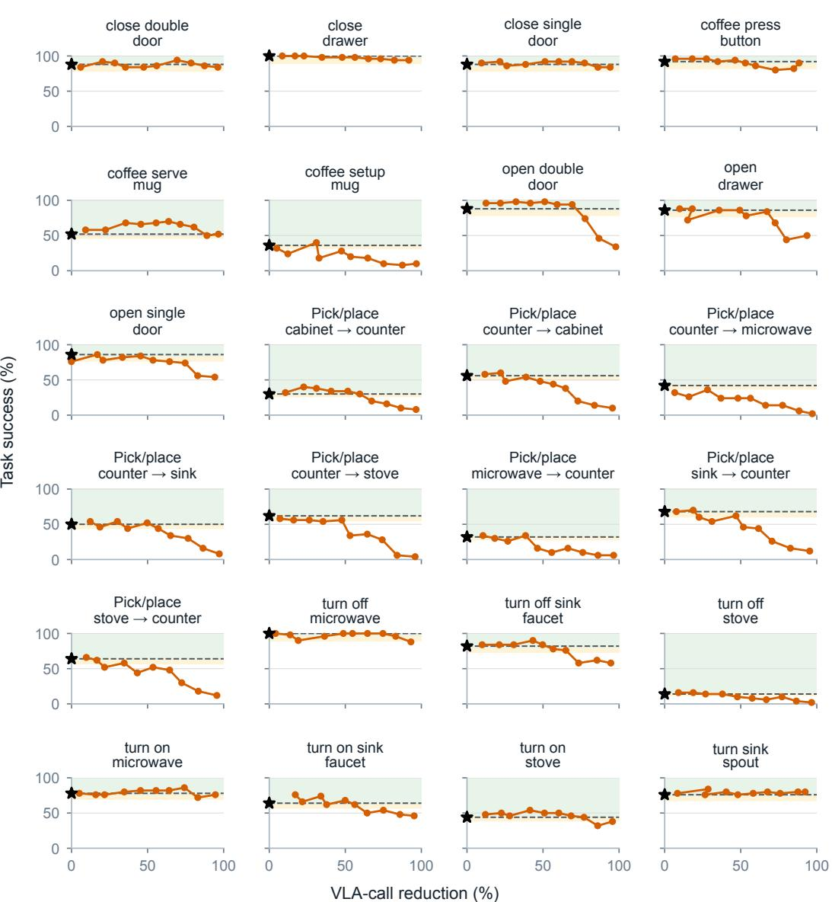  
Figure 13: RoboCasa success across all 24 tasks. Each point uses 50 matched episodes. The black star and dashed line mark Cosmos-Policy-only success; bands indicate $\geq 9 5 \%$ and 90–95% retention. Curves show only evaluated fixed-schedule points, with call reduction measured against the corresponding task baseline.

## B.4 REAL ROBOT × GR00T N1.7

Protocol. Each task uses a task-specific GR00T N1.7 checkpoint fine-tuned on 100 human demonstrations from ten object placements (P1–P10), selected at training step 2,000. The paired evaluation uses five trials at each P1–P10 placement and five at each held-out H1–H5 placement, in the same frozen trial order for both policies. OOD here denotes unseen object placements, not unseen object categories or tasks. Control is synchronous at a target 30 Hz, with a common fixed home pose, unchanged safety clamps, and a 60-second timeout. Success requires the object to remain in its target container, released and clear of the gripper, for two seconds. Both paths execute 16 actions per decision. The first decision uses GR00T, followed by the fixed evenly spread schedule with requested local fraction 0.60 for Ping-pong and 0.67 for Glue-stick. Only final valid trials after infrastructure-failure recollection are counted.

Predictor and training. We use the matched direct-prediction variant of ULAP. Frozen Theia features from current and previous external/wrist images are fused with the measured six-dimensional state and the previous 16 executed actions. Normalized Transformer and state-MLP branches have fixed equal weight; a parallel temporal head predicts a $1 6 \times 6$ action chunk. The five body axes are relative to the current measured state, while the gripper target is absolute. Each task’s 100 human demonstrations are split 80/10/10 by episode for training/validation/test, with stride-four examples and training-only normalization. Training uses standardized Smooth-L1 loss $( \beta = 1 )$ , AdamW (learning rate $6 \times 1 0 ^ { - 4 }$ , weight decay 0.05), batch 96, seed 7, and 120 epochs, with eight warmup epochs and cosine decay. Validation selects epochs 94 and 76 for Ping-pong and Glue-stick, respectively, without a train-plus-validation refit.

Call-count comparison. Unlike the simulation aggregates, physical call statistics condition on each policy’s successful episodes: $R = 1 - \overline { { C } } _ { \mathrm { U L A P , s u c c e s s } } / \overline { { C } } _ { \mathrm { G R 0 0 T } } ^ { \cdot }$ . Success rates always use all 75 final trials per policy. Ping-pong uses 1,088 calls across 63 baseline successes and 494 across 60 ULAP successes; Glue-stick uses 1,368 and 509 calls across 72 successes each. Restricting to the same trials where both policies succeed gives similar reductions: 53.1% on 53 Ping-pong pairs and 62.7% on 69 Glue-stick pairs. These call-count results do not establish statistical equivalence of success. GR00T runs on A100 for both Ping-pong conditions; Glue-stick uses A6000 for the baseline and A100 with ULAP. The local predictor runs on Mac MPS. We report invocation counts, not a same-device timing comparison.

A6000–Jetson cost model. We profile the SO-101 Glue-stick GR00T checkpoint on RTX A6000 at batch one, with four denoising steps and its bf16-compute/FP32-parameter configuration. The path includes resizing two RGB images, preprocessing, model inference, action postprocessing and CPU output of 16 actions. Fixed synthetic images, zero joint states and a fixed instruction are used after 30 warmup and 20 calibration calls. All 300 timed calls, including one slow outlier, give 284.30 ms mean latency. NVML cumulative-energy differences give 50.55 J per inference and 177.80 W mean GPU-board power. The matched Glue-stick ULAP uses Jetson Orin Nano’s 15 W DVFS configuration, FP32/TF32 CUDA Graphs and GPU image packing. Its full path, including Theia and action decoding, averages 19.89 ms over 300 calls. A separate continuous window measures 0.183 J per inference from integrated VDD\_IN module energy divided by 1,399 completed calls. Both energy values are gross, not idle-subtracted. For each policy, we average call counts over its successful episodes and use $\widehat { C } = \overline { { N } } _ { \mathrm { V L A } } c _ { \mathrm { A 6 0 0 0 } } + \overline { { N } } _ { \mathrm { U L A P } } c _ { \mathrm { J e t s o n } }$ , where c is time or energy. Both tasks use these same Glue-stick costs; Ping-pong is a cross-task hardware-cost estimate, not a task-specific Jetson measurement. The recorded success sets and call counts are held fixed, so the calculation does not establish unchanged physical success after moving inference to Jetson. Camera acquisition, communication, queueing and actuation are outside the estimate. Energy also excludes the A6000 host and device idle time outside active inference windows; it is not wall-plug or whole-robot energy.

Illustrative deployment profiles. Table 2 separates published hardware capabilities from measured application costs in Figure 9.

The Introduction’s device profiles are separate workload examples, not a matched energy-saving comparison. The GR00T N1.7/LIBERO profile predicts $4 0 \times 7$ actions using two camera views and four denoising steps on RTX A6000. Its 234 ms mean covers preprocessing through decoded CPU actions over 100 warmed-up batch-one calls; 108 W is sustained gross NVML GPU-board power. The Glue-stick ULAP profile predicts $1 6 \times 6$ actions using the 15 W DVFS configuration, including the historical-image inputs of the evaluated physical variant. Its 19.9 ms full-path mean covers 300 repetitions; 8.5 W is gross VDD\_IN module power during a separate continuous-inference window, including CPU, GPU, and DRAM. Gross module energy per inference is 0.183 J, obtained by dividing that window’s integrated energy by its 1,399 completed calls, rather than multiplying the separately profiled latency by mean power. Neither measures network, actuation, wall power, or battery runtime. The LIBERO power value is not assigned to the physical GR00T checkpoint used in the A6000–Jetson cost model above.

Table 2: Remote GPU and local edge-device specifications. NVIDIA’s A6000 datasheet and Jetson announcement (NVIDIA, 2022; Sheshadri et al., 2024). Peak compute uses different precision/sparsity and is not a speedup comparison. The A6000 price is an indicative GPU-only retail quote (September 2026); the Jetson price is the announced developer-kit offer. Our ULAP measurements use 15 W DVFS, not the highest Super power mode.
<table><tr><td></td><td>RTX A6000</td><td>Jetson Orin Nano Super (8GB)</td></tr><tr><td>Role in VLA-ULAP</td><td>Remote VLA GPU</td><td>Local ULAP device</td></tr><tr><td>Memory</td><td>48 GB GDDR6</td><td>8 GB LPDDR5</td></tr><tr><td>Memory bandwidth</td><td>768 GB/s</td><td>102 GB/s</td></tr><tr><td>Published peak compute</td><td>38.7 TFLOPS (FP32)</td><td>67 TOPS (sparse INT8)</td></tr><tr><td>Specified power</td><td>300 W maximum board</td><td>7 / 15 / 25 W module modes</td></tr><tr><td>Indicative price</td><td>~US$6,400 (GPU only)</td><td>US$249 (kit, December 2024)</td></tr></table>

The communication scale behind Figure 1 comes from Pohland et al. (2026). With multiple Wi-Fi 6 clients each replaying approximately 50 Mbps of robot uplink traffic, an idle client’s mean ping RTT reaches approximately 25 ms. This is not an image-upload RPC latency. Their offloading battery model uses approximately 6 W for a Raspberry Pi 5 dedicated to data transmission, including the host rather than isolating radio power. These values are not measurements of our network and are not added to ULAP module power. Figure 1 reports the mean success rate over the two dynamic tasks, the Glue-stick successful-episode sums of VLA and ULAP inference costs, and the measured per-inference branch costs described above. Its episode costs use both paths, not just avoided VLA calls. Battery-life benefits concern low-power ULAP deployment instead of carrying a full-VLA GPU onboard. The drawing’s robot counts illustrate the capacity opportunity, not measured server limits. With fewer requests per robot, a shared service can devote more compute time to other clients; the feasible robot count also depends on request deadlines, queueing, batching, and the set of resident policies. The affordable edge device and reduced per-robot inference demand support battery-constrained robots and shared-GPU fleets. Battery runtime and fleet capacity are deployment implications rather than measured multipliers.

## B.5 LIBERO-SAFETY × π0.5

Latency-aware evaluation. We use the LIBERO-Safety-fine-tuned $\pi _ { 0 . 5 }$ checkpoint and the L1 obstacle\_avoidance tasks 2 and 4, selected by an earlier latency sweep over the suite’s five tasks. Each arm evaluates the same 50 official initial states four times, with seed base 195 and a 600- step limit. The VLA generates ten actions; both paths execute five per decision. The first decision always invokes the VLA, followed by a fixed 50% local schedule. At 20 Hz, one control period is 50 ms. The evaluation report’s standalone $\pi _ { 0 . 5 }$ latency of approximately 145 ms corresponds to 2.9 periods, motivating an injected VLA delay of three control steps. Local inference is modeled as taking less than one control period, with zero additional delay steps; this is a simulation assumption rather than a measured zero-latency result. Inference is issued before the current interval ends; execution continues from the previous chunk during the delay, and the elapsed prefix of the arriving chunk is skipped. These are simulation-delay conditions, not measured end-to-end response times.

Predictor training. Separate predictors use successful, zero-delay teacher rollouts, with 368 Moka-pot and 418 Mug episodes split 70/15/15% by episode for training, validation, and testing. Collection initial states are separated from the evaluation states by a configuration-space distance check. This variant uses current camera views only, frozen Theia-Tiny features, current proprioception, and the five previously executed actions. Each predictor has 1,862,151 trainable parameters excluding Theia and produces five actions in parallel. Training uses standardized Smooth-L1 loss, AdamW (learning rate $6 \times 1 0 ^ { - 4 }$ , weight decay 0.05), batch size 96, and up to 120 epochs with early stopping. Validation selects epochs 75 and 100, respectively, without refitting.

Interpretation. The comparison changes both the policy used at local decisions and their delay, so it evaluates the combined fast-path intervention rather than isolating latency alone. A separate zerodelay VLA reference succeeds in 43/50 and 33/50 episodes, respectively; these smaller reference runs are not pooled with the main comparison. Call reduction uses total measured calls over all 200 episodes per arm, including failures. Repetitions share initial states; any inferential statistics should therefore use the initial state as the sampling unit. The reported metric is task success, not a safety guarantee.

## C RISK-AWARE SCHEDULING

The risk-aware scheduler (Section 3) measures the mean squared distance from the normalized query embedding to its 32 nearest normalized training embeddings from the same task. Restricting neighbors to the same task compares the current input with relevant training states. A task-wise empirical cumulative distribution function (CDF), calibrated offline and frozen during evaluation, converts this distance into a percentile risk score. The threshold 0.60 prioritizes an earlier VLA call when the distance reaches the task’s 60th calibration percentile, subject to the call budget and gap guard. The gap factor 1.20 sets the maximum spacing between VLA calls to ⌈1.20/(1 − r)⌉ chunk decisions, where r is the requested local fraction. This guard prevents an early VLA call from causing an excessively long subsequent sequence of local predictions. Both schedulers start with a VLA call; disabling the risk signal recovers the fixed precharged schedule.

We retain the current-view predictors and paired evaluation conditions of Appendices B.1 and B.3, changing only scheduling at requested skip fractions 0.6–0.9. Each setting comprises 2,000 GR00T– LIBERO or 1,200 Cosmos-Policy–RoboCasa episodes, respectively. The latter uses the same epoch-85 predictor and object split B as its fixed reference.

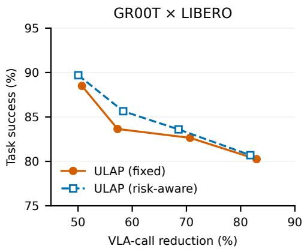

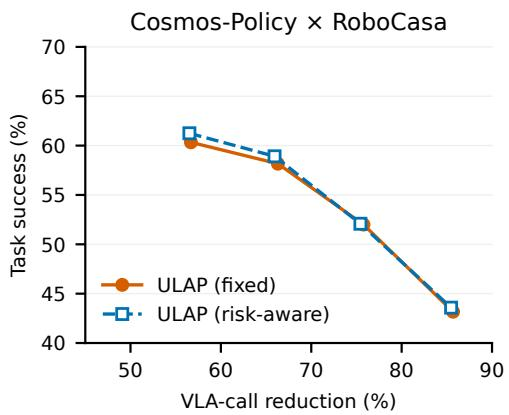  
Figure 14: Risk-aware scheduling at high call reduction. Enlarged views of success versus actual VLA-call reduction for the four paired settings. Vertical ranges differ between benchmarks.

GR00T gains 0.45–2.00 percentage points; at requested skip 0.7, the risk-aware scheduler uses 2.43% fewer VLA calls, while the other settings use 1.37–7.22% more. RoboCasa gains 0.08– 0.92 points with 0.39–1.50% more calls. Despite small differences in realized call reduction, riskaware scheduling extends the observed success–call-reduction Pareto frontier with higher-success operating points. In particular, at requested skip 0.7 on GR00T, it improves both success rate and call reduction over fixed scheduling.