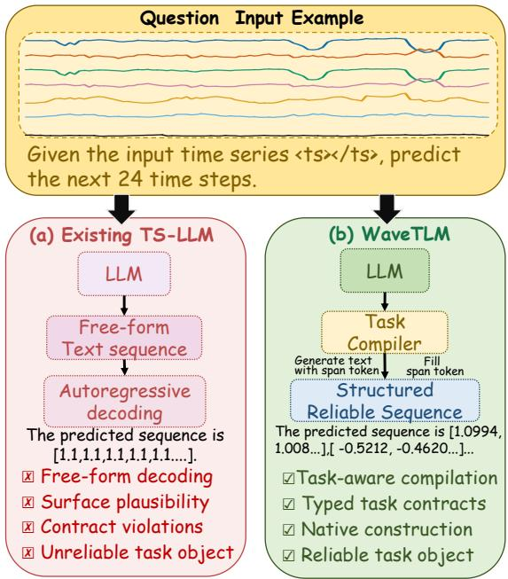
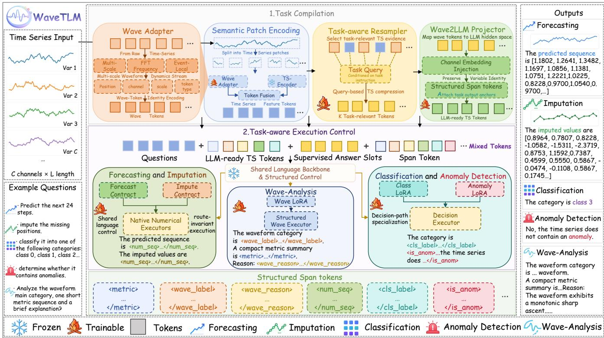
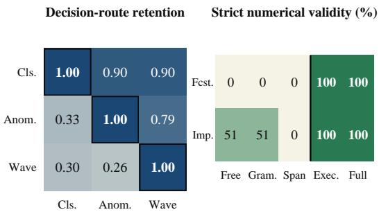

# WaveTLM: Reliable Time-Series Language Modeling through Task Compilation

Jiahui Chen1, Bingke Zhu1, Hongyu Pan1, Yingying Chen1

1Institute of Automation, Chinese Academy of Sciences Beijing, China

## Abstract

Time-series language models provide a shared naturallanguage interface across temporal tasks, but plausible text does not guarantee reliable task outputs. Responses may appear reasonable while hallucinating the required object: numerical sequences can violate shape, scale, channel order, or temporal alignment, and textual decisions can fall outside the legal label space. We formulate reliable time-series language modeling, separating task-object reliability from predictive quality. We introduce ExecTS-QA, a contract-grounded benchmark spanning forecasting, imputation, classification, anomaly detection, and waveform analysis. We further propose WaveTLM, a unified compiler-executor model whose task compiler transforms user requests, visible arguments, and wave-grounded evidence into typed task states, while tasknative executors construct numerical tensors, legal decisions, or structured records. On ExecTS-QA, a single WaveTLM checkpoint achieves 99.40% contract-valid coverage, compared with 37.83% for the strongest evaluated string-first baseline, while retaining balanced predictive performance across all five task families. Evaluations on SciTS, TSQA, IRTS-ToolBench, and ARFBench provide additional evidence of transfer. The code, construction scripts, and ExecTS-QA dataset will be publicly released upon publication. These results show that task compilation can convert plausible language generation into reliable time-series outputs.

## Introduction

Natural-language interfaces provide shared access to heterogeneous time-series tasks (Xue and D.Salim 2022; Gruver et al. 2023; Liu et al. 2024; Zhou et al. 2023; Sun et al. 2023; Jin et al. 2023; Liu et al. 2023a; Xie et al. 2024; Kong et al. 2025; Zhang et al. 2025a; Guan et al. 2025; Zhang et al. 2025b; Wu et al. 2025). However, plausible language does not guarantee a reliable task output. Free-form forecasts may violate the required horizon, channel order, scale, or temporal alignment, while classification and anomaly responses may be ambiguous or outside the legal label space. We call this failure task-object hallucination: the text appears reasonable but fails to instantiate the numerical tensor, legal decision, or structured record required by the task. As illustrated in Figure 1, existing string-first systems rely on free-form generation followed by output parsing, whereas WaveTLM explicitly binds the request to a typed contract before constructing the required object. The figure summarizes the central motivation of our work and clarifies why linguistic plausibility and task-object reliability must be evaluated separately. It also highlights that output reliability depends on the model’s construction path, rather than only on the surface form of its response.

  
Figure 1: From plausible text to reliable time-series outputs. Existing TS-LLMs generate free-form text, whereas WaveTLM compiles task intent and temporal evidence into a typed state and constructs a contract-aligned output.

Task-object reliability requires the complete output to satisfy its type, shape, alignment, scale, channel order, finitevalue constraints, and decision domain. It is distinct from predictive quality: an inaccurate but valid forecast remains measurable, whereas an invalid sequence does not. Surface controls such as JSON schemas, grammar-constrained decoding, or iterative correction may improve parseability, but do not determine horizon, mask alignment, inverse normalization, channel semantics, or legal labels. The key dificulty is that these constraints are jointly determined by the request, temporal input, and task protocol. The same observed sequence may require a future tensor for forecasting, maskaligned values for imputation, or a single legal decision for classification. A language-facing model must therefore recover not only plausible content, but also the requested task, its admissible output space, and the structural correspondence between input and response. Leaving these requirements implicit in free-form decoding makes them dificult to enforce and verify.

<table><tr><td>Method</td><td>Lang. query</td><td>Multi- task</td><td>Typed contracts</td><td>Native construction validation</td><td>Strict</td></tr><tr><td>UniTS</td><td>×</td><td>√</td><td>×</td><td>√</td><td>×</td></tr><tr><td>Time-LLM</td><td>△</td><td>×</td><td>×</td><td>×</td><td>×</td></tr><tr><td>ChatTS</td><td>√</td><td>△</td><td>×</td><td>×</td><td>×</td></tr><tr><td>Time-MQA</td><td>√</td><td>√</td><td>×</td><td>×</td><td>×</td></tr><tr><td>TimeOmni-1</td><td>√</td><td>△</td><td>×</td><td>×</td><td>×</td></tr><tr><td>SciTS</td><td>√</td><td>√</td><td>×</td><td>△</td><td>×</td></tr><tr><td>WaveTLM</td><td>√</td><td>√</td><td>√</td><td>√</td><td>√</td></tr></table>

Table 1: Language-facing and reliability-oriented capabilities. Native construction instantiates task objects through dedicated numerical or decision paths. △ denotes partial support.

We therefore formulate reliable time-series language modeling as compilation followed by execution.1 The compiler identifies the requested operation, binds visible arguments to an output contract, and extracts task-relevant evidence. The executor then constructs the required object instead of autoregressively generating every value or decision. This separation makes the output type and construction path explicit before prediction while retaining language generation for task access and explanation. Reliability thus follows from the model path and task contract rather than post-hoc repair.

We introduce ExecTS-QA, a contract-grounded evaluation suite spanning five task families. Each instance pairs a natural-language request and task-native target with a deterministic contract specifying the admissible type, dimensions, alignment, scale, channel order, and decision domain. Validation applies no evaluator-side truncation, reshaping, scale correction, or label remapping. Supplementary Figure S1 summarizes the benchmark composition, showing the five task families, their heterogeneous source domains, and the corresponding evaluator-facing objects. It complements Figure 1 by connecting the conceptual reliability problem to the concrete tasks evaluated in ExecTS-QA. Together, the two figures connect the motivating failure mode with the benchmark structure used to measure it across heterogeneous tasks. We further propose WaveTLM, whose task compiler combines the request, semantic temporal patches, and multi-scale waveform evidence into typed task states. Task-native executors then construct numerical tensors, legal decisions, and structured waveform records.

As shown in Table 1, WaveTLM combines a shared language interface with typed contracts, native construction, and strict validation. A single checkpoint achieves 99.40% contract-valid coverage on ExecTS-QA, compared with 37.83% for the strongest evaluated string-first baseline, while retaining competitive task-dependent utility. Evaluations on SciTS, TSQA, IRTS-ToolBench, and ARFBench provide additional transfer evidence.

The main contributions are:

• Reliable TLM formulation. We identify task-object hallucination as a reliability problem and distinguish taskobject reliability from predictive quality.

• Contract-grounded evaluation. We introduce ExecTS-QA, a five-task evaluation suite with task-native targets, deterministic contracts, and strict validation without evaluator-side repair.

• Compiler-executor model. We propose WaveTLM, which compiles requests and wave-grounded evidence into typed task states and constructs reliable numerical, decision, and structured outputs through task-native executors.

## Related Work

Native temporal modeling. Task-specific architectures directly construct numerical tensors under fixed temporal interfaces (Salinas et al. 2020; Oreshkin et al. 2020; Bai, Kolter, and Koltun 2018; Zhou et al. 2021; Wu et al. 2021; Zhou et al. 2022; Liu et al. 2022; Nie et al. 2023; Liu et al. 2023b; Wu et al. 2023). Foundation and multitask models extend this paradigm through pretrained temporal representations, probabilistic forecasting, and shared task architectures (Gao et al. 2024; Ansari et al. 2024; Das et al. 2024; Goswami et al. 2024; Woo et al. 2024; Rasul et al. 2024; Garza and Mergenthaler-Canseco 2023; Xiao et al. 2025; Cao, Ye, and Liu 2024; Naour, Nabil, and Petralia 2026). Their output heads provide useful structural guarantees, but they generally assume task-specific inputs rather than inferring the required operation and object from a natural-language request. WaveTLM retains native object construction while placing it behind a request-derived task compiler.

Language models for time series. Prior work adapts pretrained language models as temporal backbones, representation learners, or forecasters (Zhou et al. 2023; Jin et al. 2023; Liu et al. 2024, 2023a), and language-facing systems expose prediction and understanding through prompting or shared QA interfaces (Xue and D.Salim 2022; Gruver et al. 2023; Xie et al. 2024; Kong et al. 2025; Zhang et al. 2025a; Guan et al. 2025; Zhang et al. 2025b; Wu et al. 2025). These studies establish the value of semantic priors and heterogeneous task access. Their published protocols, however, primarily measure prediction error, answer accuracy, or response-level quality; whether the complete response instantiates the evaluator’s required native object is not usually isolated as a full-denominator reliability property. WaveTLM separates this structural reliability from task-specific predictive utility.

Time-series QA and reliability evaluation. TSQA, SciTS, IRTS-ToolBench, and ARFBench broaden temporal evaluation through common question-answering or reasoning protocols (Kong et al. 2025; Wu et al. 2025; Chen et al. 2026; Xie et al. 2026). ExecTS-QA is complementary: it tests whether a language-facing model produces a contractvalid future tensor, mask-aligned value set, legal decision, or structured waveform record without evaluator-side repair. The supplement provides an expanded comparison of these lines of work and clarifies the distinction in output construction and evaluation protocol.

## Method

Figure 2 provides the architectural roadmap for the method. From left to right, WaveTLM encodes semantic and rawwave evidence, compiles a route-conditioned typed state under the selected contract, and activates the corresponding task-native executor. The following subsections formalize this request-to-contract-to-object pipeline.

## Reliable TLM Formulation

Given a multivariate series $\boldsymbol { X } \in \mathbb { R } ^ { C \times L }$ , a natural-language request $q ,$ and visible task arguments m, WaveTLM infers the requested task family

$$
{ \widehat { \tau } } = R ( q ) , \qquad { \widehat { \tau } } \in { \mathcal { T } } ,\tag{1}
$$

where $\tau$ comprises forecasting, imputation, classification, anomaly detection, and waveform analysis. Routing uses only the visible request; m may specify the horizon, observation mask, channel count, label vocabulary, or normalization state, but never the target.

Each task family τ has a deterministic contract

$$
\mathcal { C } _ { \tau } ( m ) = ( \mathcal { V } _ { \tau } ( m ) , \pi _ { \tau } , \nu _ { \tau } , \sigma _ { \tau } ) ,\tag{2}
$$

where $y _ { \tau } ( m )$ is the admissible task-object space, $\pi _ { \tau } , \nu _ { \tau }$ , and $\sigma _ { \tau }$ are the registered parser, validator, and serializer. The contract specifies object type, shape, alignment, scale, channel order, finite-value constraints, and legal decision domain.

The compiler-executor path is

$$
\begin{array} { r l } & { h _ { \widehat { \tau } } = \mathrm { C o m p } _ { \widehat { \tau } } ( q , X , m ) , } \\ & { z _ { \widehat { \tau } } = \mathrm { E x e c } _ { \widehat { \tau } } ( h _ { \widehat { \tau } } , X , m ) \in \mathcal { V } _ { \widehat { \tau } } ( m ) , } \\ & { y = \sigma _ { \widehat { \tau } } ( z _ { \widehat { \tau } } ) , \qquad \overline { { z } } _ { \widehat { \tau } } = \pi _ { \widehat { \tau } } ( y ) . } \end{array}\tag{3}
$$

Here, $h _ { \widehat { \tau } }$ is the typed intermediate state, $z _ { \widehat { \tau } }$ is the native task object, and $\overline { { z } } _ { \widehat { \tau } }$ is its round-trip recovery from the rendered response. Parsing failures are treated as invalid objects.

Task-object reliability is defined as

$$
\begin{array} { r l } & { r _ { \tau } = \nVdash [ \widehat { \tau } = \tau ] \nVdash [ \nu _ { \tau } ( z _ { \widehat { \tau } } ; m ) = 1 ] } \\ & { \qquad \cdot \nVdash [ \nu _ { \tau } ( \overline { { z } } _ { \widehat { \tau } } ; m ) = 1 \land \overline { { z } } _ { \widehat { \tau } } \approx _ { \tau } z _ { \widehat { \tau } } ] , } \end{array}\tag{4}
$$

where $\approx _ { \tau }$ denotes the registered round-trip equivalence relation. Reliability is measured over the full request denominator, while task-specific metrics separately evaluate the predictive quality of contract-valid objects. No incorrect route or invalid object is repaired using evaluator-side information.

## Task Compiler

The task compiler determines the required object and extracts the temporal evidence needed to construct it. It combines semantic patches, raw waveform features, task-aware resampling, and contract binding.

The semantic encoder and Wave Adapter produce complementary representations:

$$
\begin{array} { r l } & { \quad S = f _ { \mathrm { s e m } } ( X ) , } \\ & { Z _ { \mathrm { r a w } } = G _ { \mathrm { w a v e } } ( X ) , } \\ & { \quad Z = F _ { \mathrm { w a v e } } \left( \left[ S ^ { \prime } ; Z _ { \mathrm { r a w } } \right] + E _ { \mathrm { m e t a } } \right) . } \end{array}\tag{5}
$$

Here, S contains language-aligned temporal patches, while $Z _ { \mathrm { r a w } }$ preserves multi-scale temporal, frequency-domain, event-local, and channel-aware evidence. $E _ { \mathrm { m e t a } }$ retains structural identities such as channel, position, scale, and token type.

Because diferent tasks require diferent evidence from the same sequence, a route-conditioned resampler produces a task-specific representation:

$$
\begin{array} { l } { { Q _ { \widehat { \tau } } = Q _ { \widehat { \tau } } ^ { ( 0 ) } + f _ { q } ( q ) + f _ { m } ( m ) , } } \\ { { \widetilde { Z } _ { \widehat { \tau } } = \mathrm { C r o s s A t t n } ( Q _ { \widehat { \tau } } , Z , Z ) . } } \end{array}\tag{6}
$$

The resulting compiler state is

$$
h _ { \widehat { \tau } } = \left( \widetilde { Z } _ { \widehat { \tau } } , a _ { \widehat { \tau } } , \mathcal { C } _ { \widehat { \tau } } ( m ) \right) ,\tag{7}
$$

where $a _ { \widehat { \tau } }$ is the selected typed answer field. Thus, the compiler jointly specifies the task-relevant evidence, admissible output space, and executor path without directly predicting the final object. Detailed Wave Adapter branches, metadata embeddings, and resampler configurations are provided in the supplement.

## Task-Native Executors

The compiled contract selects an executor for one of three output forms: continuous numerical objects, discrete decisions, or structured waveform records.

Continuous objects. Forecasting and imputation do not autoregressively generate every scalar. Instead, a numerical executor constructs

$$
\widehat { Y } _ { \widehat { \tau } } = D _ { \widehat { \tau } } \left( X , M , Z _ { \mathrm { n u m } } , m \right) ,\tag{8}
$$

where $M$ is the observation mask when applicable and $Z _ { \mathrm { n u m } }$ is the compiled numerical representation. For forecasting, the contract determines the prediction horizon and channel organization. For imputation, it determines the exact correspondence between predictions and missing positions. Reversible normalization is inverted before serialization, so the values remain learned predictions while their shape, alignment, channel order, and scale state follow the compiled task path.

Typed answer fields and numerical executors serve complementary roles. The typed field marks where the required object appears in the language response, while the executor constructs its numerical content from the observed sequence and compiled evidence.

  
Figure 2: Compiler-executor architecture of WaveTLM. The task compiler binds a visible request to a typed contract and compiles semantic and waveform evidence into a task-conditioned state. Task-native executors then construct the corresponding numerical tensor, legal decision, or structured temporal record.

Decision and structured objects. Classification and anomaly detection use specialized decision paths whose outputs are restricted to their registered label domains. Waveform analysis uses separate categorical, numerical, and explanatory fields: task-specific heads construct the structured attributes, while the language model produces the associated explanation. This separation allows object reliability and predictive quality to be evaluated independently.

Every executor output undergoes native contract validation, serialization, and round-trip recovery. A response is contract-valid only when both the native and recovered objects satisfy the registered contract and remain equivalent. Validation never truncates, pads, reshapes, rescales, remaps, or otherwise modifies the prediction. Detailed executor definitions, typed-field schemas, and validation algorithms are included in the supplement.

## Multitask Learning and Inference

The language backbone and pretrained semantic patch encoder remain frozen. Trainable components include the Wave Adapter, route-conditioned resampler, typed-output embeddings, task-native executors, and task-specific LoRA paths for language-mediated tasks. Continuous tasks rely primarily on their numerical executors, whereas classification, anomaly detection, and waveform analysis additionally use specialized language paths.

The multitask objective is

$$
\mathcal { L } = \mathcal { L } _ { \mathrm { L M } } + \lambda _ { \mathrm { s l o t } } \mathcal { L } _ { \mathrm { s l o t } } + \sum _ { \tau \in \mathcal { T } } g _ { \tau } \lambda _ { \tau } \mathcal { L } _ { \tau } ,\tag{9}
$$

where $g _ { \tau }$ activates the loss of the current task family. $\mathcal { L } _ { \mathrm { L M } }$ supervises language generation, $\mathcal { L } _ { \mathrm { s l o t } }$ supervises typed answer fields, and $\bar { \mathcal { L } } _ { \tau }$ denotes the corresponding numerical, decision, or structured-output objective. Task-specific loss definitions and optimization settings are reported in the supplement.

At inference, the model receives only the visible request, time series, and task arguments. The request-derived route activates the corresponding contract, compiled representation, typed answer field, and executor. No evaluator-side task label, route correction, output repair, scale correction, or label remapping is used; a reliable object must therefore be produced by the selected compiler-executor path itself.

## Experiments

## Experimental Setup

ExecTS-QA is a contract-grounded benchmark containing 35,323 training instances and 4,795 evaluation instances: 515 forecasting, 261 imputation, 868 classification, 2,592 anomaly-detection, and 559 waveform-analysis examples. Each instance combines a natural-language request, visible task arguments, a task-native target, and a deterministic output contract specifying the required type, shape, temporal alignment, scale, channel order, and legal decision domain.

We compare WaveTLM with Qwen3-8B-SFT, Raw ChatTS, and ChatTS-SFT under the same visible requests and contract validators. UniTS is included as a native numerical reference for forecasting and imputation, but is excluded from language-interface coverage comparisons because it receives task-specific native inputs rather than natural-language requests. WaveTLM uses a frozen Qwen3-8B language backbone and the pretrained temporal encoder from ChatTS. The Wave Adapter, route-conditioned resampler, task-native executors, typed-output embeddings, and task-specific LoRA paths are trainable. Full implementation and optimization details are provided in the supplement.

External evaluation includes SciTS (Wu et al. 2025), TSQA (Kong et al. 2025), IRTS-ToolBench (Chen et al. 2026), and ARFBench (Xie et al. 2026). The central checkpoint is evaluated without benchmark-specific training on SciTS, IRTS-ToolBench, and ARFBench, whereas TSQA follows its oficial supervised adaptation protocol with 1,000 examples per task. All benchmarks retain their published task definitions and metrics.

The experiments examine whether WaveTLM reliably instantiates the requested task objects, whether contractvalid objects retain predictive utility, whether the learned representations transfer beyond ExecTS-QA, and whether compiler-executor components contribute through distinct mechanisms.

We report Response Coverage (RC), Candidate Coverage (CC), Contract-Valid Coverage (CVC), and Reliability Yield RY = CVC/CC. CVC requires every applicable contract check to pass. Invalid, missing, or ambiguous outputs remain in the full denominator, and no post-hoc truncation, padding, reshaping, scale correction, or label remapping is applied. Task-specific predictive metrics are reported separately on contract-valid objects.

## Task-Object Reliability

Table 2 distinguishes returning a response, recovering a candidate object, and satisfying the complete task-native contract under identical requests and validators.

Raw ChatTS and ChatTS-SFT achieve only 20.29% and 37.83% CVC, respectively. Fine-tuning improves both candidate recovery and reliability yield, but 45.76% of the evaluation instances still produce no response, while 10.43% produce illegal or ambiguous decisions. These are not conventional prediction errors: the generated response fails to instantiate the object on which the registered task metric is defined.

In contrast, WaveTLM aligns candidate and contract-valid coverage at 99.40%, yielding 100% reliability among recovered candidates. It constructs contract-valid objects for all forecasting (515/515), imputation (261/261), classification (868/868), and anomaly-detection (2,592/2,592) examples, and for 530 of 559 waveform-analysis examples. Overall, the single checkpoint produces 4,766 valid objects from 4,795 evaluation instances. The remaining cases consist of one runtime failure and 28 waveform-routing failures. Complete first-failure counts and task-wise distributions are reported in the supplement.

<table><tr><td colspan="4">Coverage (%)</td><td colspan="2">Reliability outcome</td></tr><tr><td>Model</td><td>RC↑</td><td>CC↑</td><td>CVC↑</td><td>RY↑</td><td>Gap ↓</td></tr><tr><td>Qwen3-8B-SFT</td><td>8.47</td><td>7.09</td><td>0.02</td><td>0.29</td><td>7.07</td></tr><tr><td>Raw ChatTS†</td><td>54.24</td><td>34.41</td><td>20.29</td><td>58.97</td><td>14.12</td></tr><tr><td>ChatTS-SFT†</td><td>54.24</td><td>49.23</td><td>37.83</td><td>76.84</td><td>11.40</td></tr><tr><td>WaveTLM</td><td>99.98</td><td>99.40</td><td>99.40</td><td>100.00</td><td>0.00</td></tr></table>

Table 2: Stage-wise task-object reliability on ExecTS-QA (%). All models receive the same visible requests and are evaluated under the same strict contracts without posthoc repair. CVC denotes Contract-Valid Coverage, RY is CVC/CC, and Gap is CC − CVC. Bold and underline denote the best and second-best values; † denotes a free-text interface.
<table><tr><td rowspan="2">Model</td><td colspan="2">Continuous</td><td colspan="2">Decision</td><td>Waveform</td></tr><tr><td>Fcst. MAE↓</td><td>Imp. MAE↓</td><td>Cls. Acc. ↑</td><td>Anom. F1↑</td><td>Cat. ↑</td></tr><tr><td>Raw ChatTS†</td><td></td><td></td><td>.167</td><td>.368</td><td>.558</td></tr><tr><td>ChatTS-SFT†</td><td></td><td>.769</td><td>.086</td><td>.933</td><td>.570</td></tr><tr><td>UniTS</td><td>.311</td><td>.311</td><td>N/A</td><td>N/A</td><td>N/A</td></tr><tr><td>WaveTLM</td><td>.337</td><td>.427</td><td>.706</td><td>.847</td><td>.713</td></tr></table>

Table 3: Predictive utility of contract-valid objects on ExecTS-QA. Metrics are computed only after the complete task contract is satisfied. † denotes a free-text interface, while UniTS‡ receives task-specific native inputs without language routing. – indicates that no valid object is available. Complete metrics and dataset-level results are reported in the supplement.

A numerical-tolerance audit further examined 77 imputation objects initially flagged by exact normalized-space comparison. After the registered inverse transformation, the maximum discrepancy between native and round-trip objects is $4 . 6 8 \times 1 0 ^ { - 7 }$ . These cases are therefore treated as evaluatorequivalent floating-point representations rather than failures of scale restoration or object reliability.

## Task-Specific Predictive Utility

Task-object reliability establishes whether the requested object can be evaluated, but not whether its prediction is accurate. Table 3 therefore reports one primary task-specific metric for each task family, conditioned on contract-valid outputs.

Among the evaluated language-facing systems, WaveTLM is the only model with measurable task-specific utility across all five task families. UniTS achieves lower forecasting and imputation MAE using task-specific native inputs, while WaveTLM remains competitive through a shared naturallanguage interface. For decision tasks, WaveTLM obtains the highest classification accuracy and waveform-category accuracy.

ChatTS-SFT achieves higher anomaly F1 on the subset for which it returns a valid decision. However, its 37.83% overall CVC leaves a substantial fraction of the evaluation set without a valid task object. This contrast shows why predictive utility and task-object reliability must be reported separately: a strong conditional score does not imply reliable task completion over the full request distribution.

Tables 2 and 3 therefore measure complementary properties. The former evaluates whether the requested object is produced over the full denominator, whereas the latter evaluates prediction quality after the object has been reliably constructed. Because the five task families use heterogeneous metrics, their predictive utility is not collapsed into a single aggregate score.

## External Transfer

The external benchmarks do not share the complete ExecTS-QA contracts and are evaluated under their oficial protocols. They therefore provide complementary evidence that the learned temporal representations and compiled task paths remain useful beyond the benchmark on which task-object reliability is measured. Results are reported without normalizing or pooling scores across protocols.

Under supervised adaptation, WaveTLM achieves the strongest displayed TSQA-50 results on forecasting, imputation, classification, and anomaly detection. Using the unchanged central checkpoint, it obtains the highest displayed IRTS-ToolBench overall and temporal-relation scores and improves all reported ARFBench metrics over the displayed baselines. These results indicate that the compiled task representations remain useful under task definitions and evaluation procedures not matched to the ExecTS-QA contracts.

On SciTS, WaveTLM achieves 100% numerical success without SciTS-specific adaptation. Numerical success measures whether a valid numerical response is produced and should not be interpreted as numerical prediction accuracy. For anomaly detection, WaveTLM obtains the highest F1 on MEU01 and URU04, ranks second on PHU04, and remains weaker on PHU05. Complete SciTS classification results, numerical errors, balanced accuracies, and task-level metrics are reported in the supplement.

Overall, the external results support transfer across supervised adaptation, zero-shot irregular-series reasoning, anomaly-oriented question answering, and scientific timeseries analysis. They do not imply uniform predictive superiority, since performance remains dependent on the task, dataset, and evaluation protocol.

## Mechanism and Ablation Studies

We next examine whether reliability arises from task-native construction rather than surface constraints, and whether executor and language-path specialization contribute distinct forms of predictive utility. Figure 3 studies the outputconstruction ladder and decision-path specialization, while Table 5 controls how executors and LoRA paths are shared. Additional temporal-evidence ablations are reported in the supplement.

Figure 3 distinguishes syntactic control from task-object reliability. Free and grammar-constrained decoding produce no contract-valid forecasting tensors and reach only 51% imputation coverage. Structured spans identify where a numerical answer should appear, but do not determine tensor rank, prediction horizon, channel organization, scale, or missingposition alignment.

  
Figure 3: Reliability by construction and decision-path specialization. The numerical panel reports contract-valid coverage as output control progresses from free decoding to grammar constraints, structured spans, and task-native construction. The decision panel compares shared and specialized language paths.

Task-native executors raise strict numerical validity to 100%. This progression shows that reliability does not follow automatically from parseable syntax or a predefined answer span. It emerges when the compiled horizon, mask, channel structure, scale state, and task contract directly control construction of the numerical object.

Table 5 separates executor specialization from decisionpath specialization. Replacing the shared executor with taskspecific executors reduces forecasting and imputation MAE from .381/.461 to .322/.423 under the same shared LoRA path, but collapses anomaly F1 to zero. Introducing taskspecific LoRA paths restores classification accuracy to .706 and anomaly F1 to .847.

The two mechanisms therefore serve complementary roles. Task-native numerical executors preserve the inductive structure required for continuous objects, whereas specialized language paths preserve task-dependent decision behavior. Neither component alone provides balanced utility across continuous and decision tasks, supporting the complete compiler-executor design.

Compilation from visible requests. The selector correctly compiles every forecasting, imputation, classification, and anomaly-detection request into its corresponding path, together with 530 of 559 waveform-analysis requests, yielding 99.40% route accuracy. The 29 unsuccessful cases consist of one runtime failure and 28 waveform-routing failures. No explicit task-type identifier or evaluator-side route correction is used. The concentration of failures in waveform analysis reflects the greater heterogeneity of its structured requests, rather than a general inability to distinguish the five task families.

Additional component studies show that the Wave Adapter reduces forecasting and imputation MAE, whereas the routeconditioned resampler contributes most strongly to anomaly detection. Their efects remain task dependent: removing the

<table><tr><td>Benchmark</td><td>Model</td><td>Numerical / Overall</td><td>Decision / Other</td><td>Setting</td></tr><tr><td colspan="5">TSQA-50: supervised public-protocol adaptation</td></tr><tr><td rowspan="6">TSQA-50</td><td>GPT-40</td><td>F: 1.790 / I: .018</td><td>C: .320 / A: .640</td><td rowspan="6"></td></tr><tr><td>Llama-3 8B</td><td>F: 2.010 / I: .020</td><td>C: .240 / A: .540</td></tr><tr><td>Qwen-2.5 7B</td><td>F: 1.820 / I: .016</td><td>C: .520 / A: .680</td></tr><tr><td>Mistral 7B</td><td>F: 1.350 / I: .014</td><td>C: .440 / A: .580</td></tr><tr><td>ChatTS-SFT</td><td>F: 1.018 / I: .178</td><td>C: .760 / A: .740</td></tr><tr><td>WaveTLM</td><td>F: .072 / I: .013</td><td>C: .900 / A: .820</td></tr><tr><td colspan="5">IRTS-ToolBench: zero-shot irregular time-series QA</td></tr><tr><td rowspan="3"></td><td>Qwen3.5-4B</td><td>Overall: 55.18</td><td>A.D.: 42.40 / CLS: 98.67 / TR: 46.00</td><td rowspan="3">zero-shot</td></tr><tr><td>IRTS-ToolBench DeepSeek-V4-Flash</td><td>Overall: 60.29</td><td>A.D.: 59.20 / CLS: 90.67 / TR: 46.67</td></tr><tr><td>WaveTLM</td><td>Overall: 63.29</td><td>A.D.: 55.20 / CLS: 94.67 / TR: 53.33</td></tr><tr><td colspan="5">ARFBench: zero-shot anomaly-oriented QA</td></tr><tr><td rowspan="4">ARFBench</td><td>Random choice</td><td></td><td></td><td></td></tr><tr><td>OpenTSLM</td><td>Overall: 24.50 Overall: 0.80</td><td>Tier I: 50.00 / weighted F1: 22.50 Tier I: 0.00 / weighted F1: 1.20</td><td></td></tr><tr><td>ChatTS</td><td>Overall: 31.10</td><td>Tier I: 59.50 / weighted F1: 22.10</td><td>zero-shot</td></tr><tr><td>WaveTLM</td><td>Overall: 36.13</td><td>Tier I: 81.98 / weighted F1: 24.83</td><td></td></tr><tr><td colspan="5">SciTS: protocol-compatible scientific transfer</td></tr><tr><td rowspan="9"></td><td>Model</td><td>Numerical SR ↑</td><td>Anomaly F1 ↑</td><td>Setting</td></tr><tr><td></td><td>(N = 4,019)</td><td>MEU01 / PHU04 / PHU05 / URU04</td><td></td></tr><tr><td>Qwen3-8B Gemini-2.5-Flash (Text)</td><td>52.35</td><td>64.90 / 66.70 / 18.80 / 66.20</td><td>zero-shot</td></tr><tr><td>DeepSeek-V3</td><td>96.50 76.29</td><td>60.90 / 64.80 / 19.50 / 64.60</td><td>zero-shot zero-shot</td></tr><tr><td>TimeOmni-SciTS</td><td>100.00</td><td>59.30 / 50.70 / 6.40 / 64.70 65.20 / 92.70 / 23.00 / 64.80</td><td>SciTS-trained</td></tr><tr><td></td><td></td><td></td><td></td></tr><tr><td>WaveTLM</td><td>100.00</td><td>67.30 / 90.19 / 18.78 / 67.39</td><td>zero-shot</td></tr></table>

Table 4: Protocol-level external evaluation. TSQA reports forecasting and imputation MSE (F/I) and classification and anomaly accuracy (C/A), using 1,000 adaptation examples per task. IRTS reports overall, anomaly-detection (A.D.), classification (CLS), and temporal-relation (TR) scores. ARF reports its oficial overall score, Tier I accuracy, and weighted F1. SciTS numerical SR is computed over all 4,019 numerical examples, and anomaly results report F1 on MEU01, PHU04, PHU05, and URU04. Bold and underline denote the best and second-best distinct values within each benchmark block. Results are not pooled across protocols.

<table><tr><td>Configuration</td><td>Fcst. MAE↓</td><td>Imp. MAE↓</td><td>Cls. Acc. ↑</td><td>Anom. F1↑</td></tr><tr><td>Shared LoRA + shared exec.</td><td>.381</td><td>.461</td><td>.623</td><td>.814</td></tr><tr><td>Shared LoRA + task exec.</td><td>.322</td><td>.423</td><td>.635</td><td>.000</td></tr><tr><td>Task LoRA + task exec.</td><td>.337</td><td>.427</td><td>.706</td><td>.847</td></tr></table>

Table 5: Controlled specialization under compiled task paths. Task-specific executors improve continuous prediction under a shared language path, while task-specific LoRA paths restore decision-task performance.

Wave Adapter improves classification, while a linear projector obtains the highest waveform-reasoning score. These results suggest that raw-wave evidence and task-aware compression contribute complementary inductive biases rather than uniformly improving every task. The complete configuration is therefore selected for balanced predictive utility across all five task families rather than optimal performance on every individual metric.

## Conclusion

We identify task-object hallucination as a reliability problem in time-series language modeling: a plausible response may fail to instantiate the numerical tensor, legal decision, or structured record required by its task. ExecTS-QA measures this failure by separating contract-valid coverage from predictive quality. We propose WaveTLM, a compiler-executor model that compiles requests and wave-grounded evidence into typed task states and constructs task-native outputs through task-specific paths. A single checkpoint achieves 99.40% contract-valid coverage across five task families, versus 37.83% for the strongest string-first baseline, while retaining utility across four benchmarks and strong crossbenchmark transfer evidence. These results establish task compilation as a route to reliable time-series outputs.

## References

Bai, S.; Kolter, J. Z.; and Koltun, V. 2018. An Empirical Evaluation of Generic Convolutional and Recurrent Networks for Sequence Modeling. ArXiv, abs/1803.01271.

Cao, D.; Ye, W.; and Liu, Y. 2024. TimeDiT: General-Purpose Difusion Transformers for Time Series Foundation Model. In ICML 2024 Workshops: FM-Wild.

Chen, S.; Chen, X.; Liu, B.; and Zhao, R. 2026. Towards Verifiable Agentic Data Science: Solving Irregular TSQA Via Tool-Grounded Reasoning.

Das, A.; Kong, W.; Sen, R.; and Zhou, Y. 2024. A decoder-only foundation model for time-series forecasting. In Salakhutdinov, R.; Kolter, Z.; Heller, K.; Weller, A.; Oliver, N.; Scarlett, J.; and Berkenkamp, F., eds., Proceedings of the 41st International Conference on Machine Learning, volume 235 of Proceedings of Machine Learning Research, 10148–10167. PMLR.

Gao, S.; Koker, T.; Queen, O.; Hartvigsen, T.; Tsiligkaridis, T.; and Zitnik, M. 2024. UniTS: Building a Unified Time Series Model. arXiv.

Garza, A.; and Mergenthaler-Canseco, M. 2023. TimeGPT-1. arXiv:2310.03589.

Goswami, M.; Szafer, K.; Choudhry, A.; Cai, Y.; Li, S.; and Dubrawski, A. 2024. MOMENT: A Family of Open Time-series Foundation Models. In Salakhutdinov, R.; Kolter, Z.; Heller, K.; Weller, A.; Oliver, N.; Scarlett, J.; and Berkenkamp, F., eds., Proceedings of the 41st International Conference on Machine Learning, volume 235 of Proceedings ofMachine Learning Research, 16115–16152. PMLR.

Gruver, N.; Finzi, M.; Qiu, S.; and Wilson, A. G. 2023. Large Language Models Are Zero-Shot Time Series Forecasters. ArXiv, abs/2310.07820.

Guan, T.; Meng, Z.; Li, D.; Wang, S.; Yang, C.-H. H.; Wen, Q.; Liu, Z.; Siniscalchi, S. M.; Jin, M.; and Pan, S. 2025. TimeOmni-1: Incentivizing Complex Reasoning with Time Series in Large Language Models. ArXiv, abs/2509.24803.

Jin, M.; Wang, S.; Ma, L.; Chu, Z.; Zhang, J. Y.; Shi, X. L.; Chen, P.-Y.; Liang, Y.; Li, Y.-F.; Pan, S.; and Wen, Q. 2023. Time-LLM: Time Series Forecasting by Reprogramming Large Language Models. ArXiv, abs/2310.01728.

Kong, Y.; Yang, Y.; Hwang, Y.; Du, W.; Zohren, S.; Wang, Z.; Jin, M.; and Wen, Q. 2025. Time-MQA: Time Series Multi-Task Question Answering with Context Enhancement. In Annual Meeting ofthe Associationfor Computational Linguistics.

Liu, X.; Hu, J.; Li, Y.; Diao, S.; Liang, Y.; Hooi, B.; and Zimmermann, R. 2023a. UniTime: A Language-Empowered Unified Model for Cross-Domain Time Series Forecasting. Proceedings ofthe ACM Web Conference 2024.

Liu, Y.; Hu, T.; Zhang, H.; Wu, H.; Wang, S.; Ma, L.; and Long, M. 2023b. iTransformer: Inverted Transformers Are Efective for Time Series Forecasting. arXiv preprint arXiv:2310.06625.

Liu, Y.; Qin, G.; Huang, X.; Wang, J.; and Long, M. 2024. AutoTimes: Autoregressive Time Series Forecasters via Large Language Models. ArXiv, abs/2402.02370.

Liu, Y.; Wu, H.; Wang, J.; and Long, M. 2022. Nonstationary Transformers: Exploring the Stationarity in Time Series Forecasting. In Advances in Neural Information Processing Systems.

Naour, E. L.; Nabil, T.; and Petralia, A. 2026. TS-ICL: A Flexible Time-Indexed Foundation Model for Time Series via In-Context Learning.

Nie, Y.; Nguyen, N. H.; Sinthong, P.; and Kalagnanam, J. 2023. A Time Series is Worth 64 Words: Long-term Forecasting with Transformers. In International Conference on Learning Representations.

Oreshkin, B. N.; Carpov, D.; Chapados, N.; and Bengio, Y. 2020. N-BEATS: Neural basis expansion analysis for interpretable time series forecasting. In International Conference on Learning Representations.

Rasul, K.; Ashok, A.; Williams, A. R.; Ghonia, H.; Bhagwatkar, R.; Khorasani, A.; Bayazi, M. J. D.; Adamopoulos, G.; Riachi, R.; Hassen, N.; Biloš, M.; Garg, S.; Schneider, A.; Chapados, N.; Drouin, A.; Zantedeschi, V.; Nevmyvaka, Y.; and Rish, I. 2024. Lag-Llama: Towards Foundation Models for Probabilistic Time Series Forecasting. arXiv:2310.08278.

Salinas, D.; Flunkert, V.; Gasthaus, J.; and Januschowski, T. 2020. DeepAR: Probabilistic forecasting with autoregressive recurrent networks. International Journal of Forecasting, 36(3): 1181–1191.

Sun, C.; Li, Y.; Li, H.; and linda Qiao. 2023. TEST: Text Prototype Aligned Embedding to Activate LLM’s Ability for Time Series. ArXiv, abs/2308.08241.

Woo, G.; Liu, C.; Kumar, A.; Xiong, C.; Savarese, S.; and Sahoo, D. 2024. Unified Training of Universal Time Series Forecasting Transformers. In International Conference on Machine Learning.

Wu, H.; Hu, T.; Liu, Y.; Zhou, H.; Wang, J.; and Long, M. 2023. TimesNet: Temporal 2D-Variation Modeling for General Time Series Analysis. In International Conference on Learning Representations.

Wu, H.; Xu, J.; Wang, J.; and Long, M. 2021. Autoformer: Decomposition Transformers with Auto-Correlation for Long-Term Series Forecasting. In Advances in Neural Information Processing Systems, volume 34, 22419–22430.

Wu, W.; Zhang, Z.; Liu, L.; Xu, X.; Liu, J.; Fan, K.; Lv, Q.; Zhuang, J.; Zhang, C.; Yuan, Z.; Hou, S.; Lin, T.; Chen, K.; Zhou, B.; and Zhang, C. 2025. SciTS: Scientific Time Series Understanding and Generation with LLMs. ArXiv, abs/2510.03255.

Xiao, C.; Zhou, J.; Xiao, Y.; Lu, X.; Zhang, L.; and Xiong, H. 2025. TimeFound: A Foundation Model for Time Series Forecasting. arXiv preprint arXiv:2503.04118.

Xie, S.; Cohen, B.; Goswami, M.; Shen, J.; Khwaja, E.; Liu, C.; Asker, D.; Abou-Amal, O.; and Talwalkar, A. 2026. ARFBench: Benchmarking Time Series Question Answering Ability for Software Incident Response. ArXiv, abs/2604.21199.

Xie, Z.; Li, Z.; He, X.; Xu, L.; Wen, X.; Zhang, T.; Chen, J.; Shi, R.; and Pei, D. 2024. ChatTS: Aligning Time Series with LLMs via Synthetic Data for Enhanced Understanding and Reasoning. Proc. VLDB Endow., 18: 2385–2398.

Xue, H.; and D.Salim, F. 2022. PromptCast: A New Prompt-Based Learning Paradigm for Time Series Forecasting. IEEE Transactions on Knowledge and Data Engineering, 36: 6851–6864.

Zhang, J.; Feng, L.; Guo, X.; Wu, Y.; Dong, Y.; and Xu, D. 2025a. TimeMaster: Training Time-Series Multimodal LLMs to Reason via Reinforcement Learning. ArXiv, abs/2506.13705.

Zhang, Y.; Zhang, Y.; Zheng, M.; Chen, K.; Gao, C.; Ge, R.; Teng, S.; Jelloul, A.; Rao, J.; Guo, X.; Fang, C.-W.; Zheng, Z.; and Yang, J. 2025b. Insight Miner: A Time Series Analysis Dataset for Cross-Domain Alignment with Natural Language. ArXiv, abs/2512.11251.

Zhou, H.; Zhang, S.; Peng, J.; Zhang, S.; Li, J.; Xiong, H.; and Zhang, W. 2021. Informer: Beyond Eficient Transformer for Long Sequence Time-Series Forecasting. In The Thirty-Fifth AAAI Conference on Artificial Intelligence, AAAI 2021, Virtual Conference, volume 35, 11106–11115. AAAI Press.

Zhou, T.; Ma, Z.; Wen, Q.; Wang, X.; Sun, L.; and Jin, R. 2022. FEDformer: Frequency Enhanced Decomposed Transformer for Long-term Series Forecasting. In Proceedings of the 39th International Conference on Machine Learning, volume 162, 27268–27286. PMLR.

Zhou, T.; Niu, P.; Wang, X.; Sun, L.; and Jin, R. 2023. One Fits All: Power General Time Series Analysis by Pretrained LM. Advances in Neural Information Processing Systems 36.