# Weakening Neurons: An Input-Output Functionality in Transformers with Outsize Influence

Sebastian Gerstner1, Hilal AlQuabeh2, Kentaro Inui2,3,4, Hinrich Schütze1

1 LMU Munich and Munich Center for Machine Learning

2 MBZUAI3 Tohoku University 4 RIKEN

sgerstner at cis dot lmu dot de

## Abstract

We analyze the learned input-output behavior of GLU-based neurons in large language models (LLMs). We propose a simple analysis method: For each neuron, we compute the cosine similarities between its input (reading) and output (writing) weight vectors. In this scheme, a strong negative cosine similarity indicates the neuron weakens the direction it detects in the residual stream, so we call this a weakening neuron. This allows us to gain a number of novel insights. First, we show that nine different LLMs have similar patterns: weakening neurons appear mostly in late layers whereas their counterparts, (conditional) strengthening neurons, are frequent in early-middle layers. Second, we find that weakening neurons display surprising behavior: even though there are few, they activate often and have a large influence on model behavior. Third, weakening neurons have a strong effect on model output when gate values are negative – which is surprising since negative gate values are not expected to encode functionality.

## 1 Introduction

Mechanistic interpretability research (Elhage et al., 2021; Saphra and Wiegreffe, 2024) attempts to reverseengineer the mechanisms inside neural networks, such as transformer-based (Vaswani et al., 2017) large language models (LLMs). Some of this work has addressed the interpretation of neurons within MLP sublayers; we follow this line of research.

Much previous work characterizes neurons through observational signals; either by examining the contexts in which they activate (e.g. Voita et al., 2024) or by analyzing the output directions associated with their weights¹ (e.g. Gurnee et al., 2024). However, neither of these fully captures the mechanisms that neurons implement: a neuron is defined not only by when it activates or what it writes, but also by the relation between the direction it reads from the residual and the direction it writes back. Related input-output (IO) ideas have appeared in prior work. Elhage et al. (2021) hypothesize that negative IO weight cosines may implement memory management, and Gurnee et al. (2024) compute such cosines for GPT-2 neurons. However, prior work has not developed an IO taxonomy for gated activation functions (Shazeer, 2020), which are used in recent LLMs (e.g. Meta, 2024b; Gemma, 2025; Olmo et al., 2026; Yang et al., 2025); nor has it systematically analyzed how IO-defined neuron classes are distributed across modern LLMs and affect model behavior.

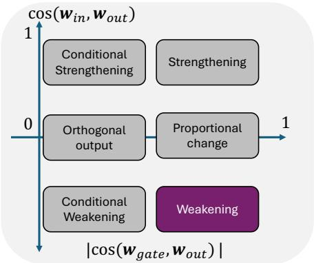  
Figure 1: Our IO taxonomy for gated neurons. We classify neurons by how their input, gate, and output weight directions align. See Section 4.2.2 for details.

We therefore make this IO relationship the focus of our analysis, starting with a simple yet effective measure: the cosine similarity between the neuron's input (read) weights and its output (write) weights (see Fig. 1). The input weight represents the direction in the residual stream that causes the neuron to activate, and the output weight represents what the neuron adds back to the residual stream. So, for example, if the output weight vector points in the opposite of the input weight direction, the neuron weakens this direction.

Classifying neurons by their read-write relationship reveals systematic structure across models, and the resulting IO classes have distinct effects on model behavior under ablation. In particular, we identify a small class of neurons with strongly negative read-write alignment, which we call weakening neurons: although they are relatively few, they activate frequently and have a disproportionately large effect on model behavior.

Our contributions are as follows: (i) We introduce an input-output analysis for gated neurons, using cosine similarities of weight vectors to define a taxonomy of IO functionalities (Figs. 1 and 4). (ii) Applying this method to nine LLMs, we observe consistent patterns: Earlymiddle layers contain many conditional strengthening neurons, and late layers tend more towards weakening (Figs. 2 and 3). (iii) We observe a strong correlation between IO functionalities and activation frequencies (Fig. 5). (iv) We discover that one small IO class (weakening neurons) is highly influential in surprising ways: they activate often (in the sense of having a gate value above zero), and they influence various metrics, even when their gate value is negative (Fig. 6).

## 2 Related work

There is a large body of work on interpretability of transformer-based LLMs. Elhage et al. (2021) introduce the notion of residual stream. Belrose et al. (2025), nostalgebraist (2020) propose to interpret residual stream states as intermediate guesses about the next token. Rushing and Nanda (2024) discuss this as the iterative inference hypothesis. On a similar note, many works hypothesize that directions in model space can correspond to concepts. This is the linear representation hypothesis, some aspects of which are discussed by Park et al. (2024). Lad et al. (2024) define stages of inference.

Neuron analysis. Much research has attempted to understand individual neurons; examples include Miller and Neo (2023); Dai et al. (2022); Niu et al. (2024).

The focus on individual neurons has been criticized. Millidge and Black (2022) find interpretable directions that are not based on individual neurons. Elhage et al. (2022) argue that interpretable features are nonorthogonal directions in model space and can be superposed. This corresponds to sparse linear combinations of neurons in MLP space. This has inspired a series of work on sparse autoencoders (SAEs), starting with Sharkey et al. (2022).

The focus on SAEs has been criticized: recent studies indicate that they do not always outperform baselines (Kantamneni et al., 2025; Mueller et al., 2025; Wu et al. 2025; Arora et al., 2026), or that their features are not "canonical" (Leask et al., 2025). A middle ground is possible: Gurnee et al. (2023) argue that interpretable features correspond to sparse combinations of neurons; this includes 1-sparse combinations, i.e., individual neurons. There is recent work that still finds new meaningful classes of neurons (e.g. "culture-sensitive neurons" in Zhao et al., 2026, or "prominent but detrimental neurons" in Ali et al., 2025).

Voita et al. (2024); Gurnee et al. (2024) classify neurons based on the contexts in which they activate. E.g., Voita et al. (2024) find token detectors. Gurnee et al. (2024) define functional roles of neurons based on their output weight vector, such as suppression neurons that suppress a specific set of tokens.

There has been less focus on the input-output perspective. A few works apply this perspective at a semantic level: Geva et al. (2021) interpret neurons as a key-value memory, where the key corresponds to activation patterns and the value to the tokens promoted by the output weights. Following this approach, Gur-Arieh et al. (2025) show that analyzing the output of a feature helps guess sequences on which it activates. McDougall et al. (2024); Elhelo and Geva (2025) provide a weightbased analysis of input and output tokens of the OV circuit (Elhage et al., 2021) of attention heads.

In contrast, we adopt the input-output perspective at the basic mathematical level, by computing cosine similarities between input and output weights. Gurnee et al. (2024) do this for a range of non-GLU models, but do not interpret their results; and Elhage et al. (2021) mention the idea (footnote 7), but do not follow up. Note that input-output analysis for gated activation functions is complex because, in addition to input and output weight vectors, the gating mechanism is crucial for IO functionality.

Suppression and sharpening mechanisms. Several works have addressed various suppression and sharpening mechanisms in transformers. Lad et al. (2024) seem to conflate some of them as "residual sharpening", but there are several concepts to be distinguished from each other and from our IO based neuron analysis:

Elhage et al. (2021) (mentioned above) hypothesize that negative cosines between input and output weights are mechanisms for memory management (MM): getting rid of intermediate representations that are not needed in later layers. (Explicit erasure is not the only possible mechanism for MM: Heimersheim and Turner (2023) also find evidence of overwriting.) Others interpret erasure mechanisms as MM: Janiak et al. (2024) observe an attention head erasing the output of a previous one. McGrath et al. (2023) observe MLP erasure: MLPs (partially) erasing what previous units have written. Investigating MLP erasure in more detail, Rushing and Nanda (2024) find sparse sets of erasure neurons. They hypothesize a relationship to Gurnee et al. (2024)'s "suppression neurons", an output-based class.

Another class of phenomena is confidence management and calibration. McDougall et al. (2024) describe copy suppression heads that suppress the behavior of other components that copy tokens across positions. This is distinct from MM in that the suppressed representation was not needed at a previous stage. They argue that this mechanism improves model calibration. Stolfo et al. (2024) (building on Gurnee et al., 2024) find classes of neurons (entropy neurons, token frequency neurons) that regulate confidence; these are output-based classes and therefore a priori distinct from our IO classes. Similar to token frequency neurons, Lv et al. (2024) find an anti-overconfidence mechanism at the final layer, in which attention heads output frequent tokens, and the MLP directs the residual stream towards a frequency-weighted average token embedding. Joshi et al. (2025) confirm the existence of a confidence correction phase in final layers and discover a "calibration direction" mechanism in early layers. Other works probe for uncertainty signals in hidden layers; Stacey et al. (2026) analyze the robustness of these probes. None of these works relate confidence to IO cosine similarities. We hypothesize that there is a link between the two, see Section 9.

## 3 Gated activation functions

Our work focuses on gated activation functions like SwiGLU or GEGLU (Shazeer, 2020). Gated activation functions are used widely, e.g., Llama (Touvron et al., 2023a,b; Meta, 2024a,b), OLMo (Groeneveld et al., 2024; Olmo et al., 2026), and Qwen (Yang et al., 2024, 2025) use SwiGLU, and Gemma (Gemma, 2024, 2025) uses GEGLU. Here we briefly describe SwiGLU. GEGLU replaces Swish with GELU, but is otherwise identical.

Traditional activation functions like ReLU require one weight matrix on the input side and one on the output side: The MLP outputs

$$
W _ { \mathrm { o u t } } \mathrm { R e L U } ( W _ { \mathrm { i n } } x ) ,
$$

where ReLU is applied element-wise to each neuron.

Other traditional activation functions are $\begin{array} { r c l } { \operatorname { S w i s h } ( x ) } & { : = } & { x / ( 1 + \exp ( - x ) ) } \end{array}$ (Ramachandran et al., 2018) and GEI $\mathbf { \mathcal { A } } ( \mathbf { \mathcal { x } } ) : = \mathbf { \mathcal { x } } \Phi ( \mathbf { \mathcal { x } } )$ (Hendrycks and Gimpel, 2023). Both of these can be seen as smooth approximations of ReLU. They are believed to work better than ReLU because of better differentiability (e.g., Lee, 2023), i.e., better training dynamics.

In contrast to these traditional functions, a gated activation function like SwiGLU requires two weight matrices on the input side: The MLP outputs

$$
W _ { \mathrm { o u t } } \left( \mathrm { S w i s h } ( W _ { \mathrm { g a t e } } { \pmb x } ) \odot ( W _ { \mathrm { i n } } { \pmb x } ) \right) ,\tag{1}
$$

where denotes element-wise multiplication (a.k.a.   
Hadamard product).

We find it more intuitive to separately consider each neuron: The neuron adds the vector

$$
\mathrm { S w i s h } ( \langle { \pmb w } _ { \mathrm { g a t e } } , { \pmb x } \rangle ) \cdot \langle { \pmb w } _ { \mathrm { i n } } , { \pmb x } \rangle \cdot { \pmb w } _ { \mathrm { o u t } }\tag{2}
$$

to the residual stream. Here ${ \pmb w } _ { \mathrm { g a t e } }$ and ${ \pmb w } _ { \mathrm { i n } }$ are one of the $d _ { \mathrm { M L P } }$ rows of $W _ { \mathrm { g a t e } }$ and $W _ { \mathrm { i n } } ,$ respectively. ${ \pmb w } _ { \mathrm { o u t } }$ is one of the $d _ { \mathrm { M L P } }$ columns of $W _ { \mathrm { o u t } }$ . These weight vectors, as well as $\pmb { x } , \mathrm { a r e } \in \mathbb { R } ^ { d _ { \mathrm { m o d e l } } }$ , the space of the residual stream.

In this framework, SwiGLU can be described as a function of two scalars:

$$
\mathrm { S w i G L U } ( x _ { \mathrm { g a t e } } , x _ { \mathrm { i n } } ) : = \mathrm { S w i s h } ( x _ { \mathrm { g a t e } } ) \cdot x _ { \mathrm { i n } } ,
$$

where $x _ { \mathrm { g a t e } } : = \langle { \pmb w } _ { \mathrm { g a t e } } , { \pmb x } \rangle$ and $x _ { \mathrm { i n } } ~ : = ~ \langle w _ { \mathrm { i n } } , x \rangle$ . We use $x _ { \mathrm { p o s t } }$ for the neuron activation, i.e., $x _ { \mathrm { p o s t } } =$ SwiGL ${ \mathrm { . U } } ( x _ { \mathrm { g a t e } } , x _ { \mathrm { i n } } )$

Unlike ReLU, gated activation functions can output arbitrary positive or negative values. For example, if $x _ { \mathrm { g a t e } } > 0$ and $x _ { \mathrm { i n } } \ll 0$ , then $\mathrm { S w i G L U } ( x _ { \mathrm { g a t e } } , x _ { \mathrm { i n } } ) \ll 0$

## 4 Method

## 4.1 Approach

The transformer architecture (Vaswani et al., 2017) includes residual connections (He et al., 2016). This enables us to adopt the residual stream perspective (Elhage et al., 2021): Each model unit reads from the residual stream and then updates it by writing to it. In the case of a SwiGLU neuron, the scalar products $\langle { \pmb w } _ { \mathrm { g a t e } } , { \pmb x } \rangle$ and $\langle { \pmb w } _ { \mathrm { i n } } , { \pmb x } \rangle$ can be thought of as reading how much the residual stream x conforms to the directions ${ \pmb w } _ { \mathrm { g a t e } }$ and ${ \pmb w } _ { \mathrm { i n } } .$ The neuron then writes a multiple of the direction ${ \pmb w } _ { \mathrm { o u t } }$ to the residual stream. In other words, ${ \pmb w } _ { \mathrm { i n } }$ and ${ \pmb w } _ { \mathrm { g a t e } }$ represent the directions in the residual stream that cause the neuron to activate, and ${ \pmb w } _ { \mathrm { o u t } }$ represents what the neuron adds back to the residual stream.

A semantic interpretation is that a neuron detects a concept in the residual stream, and in turn also writes a concept. This semantic interpretation is not a necessary assumption for our neuron classification, but is helpful for building intuition and interpreting results.

This framework leads to our main research question: What is the relation between what a neuron reads and what it writes? Our approach is based on weights (as opposed to activations) of neurons (as opposed to, e.g., transcoder features (Dunefsky et al., 2024)).

Weight-based. There are many ways to address the question; we choose a purely weight-based approach: computing the cosine similarity of input and output weights. This lets us understand the mathematical function that a neuron implements in terms of updates to the residual stream. For example, if the output weight vector points in the opposite of the input weight direction, the neuron weakens this direction.

Neuron-based. This cosine similarity method could also be applied to transcoder (Dunefsky et al., 2024) features instead of neurons. However, for this paper we decided to investigate neurons, and defer a possible investigation of transcoders to future work. Section 5 shows that, despite being "only" weight-based and neuron-based, our method yields striking results.

## 4.2 Taxonomy of IO functionalities

We now think through what different combinations of weight cosine similarities would mean for neuron IO functionality, and introduce our terminology. For the moment we focus on the prototypical cases, in which cosine similarities are approximately ±1 or 0.

Generally, when the output weight is similar enough to (one of) the detected directions, we speak of input manipulation, as opposed to orthogonal output neurons which write to directions not detected in the input. Intuitively, input manipulator neurons manipulate the concept that they detect.

## 4.2.1 Taxonomy for non-GLU models

In non-GLU (e.g. ReLU) models, there are two possible cases of input manipulation. Either cos $( \pmb { w } _ { \mathrm { i n } } , \pmb { w } _ { \mathrm { o u t } } )$ is very negative, so the neuron detects a direction and then writes its negation to the residual stream: we call this a weakening neuron. Or the cosine is very positive, so the neuron detects a direction and then writes the same direction to the residual stream: we call this a strengthening neuron.

## 4.2.2 Taxonomy for GLU models

GLU models are more complex, because each neuron has a third weight vector, ${ \pmb w } _ { \mathrm { g a t e } } .$ In Fig. 1 we present a taxonomy of IO functionalities for GLU models.

As special cases of input manipulation, we define: (i) Strengthening and weakening neurons: all three weight vectors are roughly collinear, and specifically COS $\mathbf { \sigma } _ { \mathrm { 3 } } ( \pmb { w } _ { \mathrm { i n } } , \pmb { w } _ { \mathrm { o u t } } ) \approx \pmb { \mathrm { 1 } }$ . The neuron detects a direction and then adds it to / removes it from the residual stream. (ii) Conditional strengthening / weakening neurons: ${ \pmb w } _ { \mathrm { i n } }$ and ${ \pmb w } _ { \mathrm { o u t } }$ are roughly collinear and ${ \pmb w } _ { \mathrm { g a t e } }$ is orthogonal to them. The neuron also strengthens / weakens the direction detected by its ${ \pmb w } _ { \mathrm { i n } }$ vector, but will only activate conditional on ${ \pmb w } _ { g a t e }$ being present in the residual stream. (iii) Proportional change neurons: ${ \pmb w } _ { \mathrm { o u t } }$ is collinear to ${ \pmb w } _ { \mathrm { g a t e } } .$ , but is orthogonal to ${ \pmb w } _ { \mathrm { i n } } .$ If ${ \pmb w } _ { \mathrm { g a t e } }$ is present in the residual stream, then the neuron writes a positive or negative multiple of this direction to the residual stream. This multiple is proportional to the presence of ${ \pmb w } _ { \mathrm { i n } }$ in the residual stream.

These prototypical classes are limited in scope: Many cosines will not be close to $0 \ \mathrm { o r \pm 1 }$ . For this general case, this paper explores three options to understand neuron IO functionalities at different levels of granularity: (1) Classify neurons according to the closest prototypical case (we choose a threshold $\tau = \pm 0 . 5 )$ (2) Plot the marginal distributions of the three cosine similarities. (3) Place neurons in a scatter plot, based on their three weight cosines.

In option 1 (threshold-based classification), $\cos ( \boldsymbol { w } _ { \mathrm { i n } } , \boldsymbol { w } _ { \mathrm { g a t e } } )$ may not always "match" the other two cosine similarities. Consider the case of strengthening: In the prototypical case with exact equalities (cos $( { \pmb w } _ { \mathrm { i n } } , { \pmb w } _ { \mathrm { o u t } } ) \ = \ \cos ( { \pmb w } _ { \mathrm { g a t e } } , { \pmb w } _ { \mathrm { o u t } } ) = 1 )$ , all three weight vectors are collinear, so we also have COS $( \pmb { w } _ { \mathrm { i n } } , \pmb { w } _ { \mathrm { g a t e } } ) { = } 1$ . But without exact equalities (if we just know cos $( \pmb { w } _ { \mathrm { i n } } , \pmb { w } _ { \mathrm { o u t } } )$ and cos $( { \boldsymbol { \mathbf { \mathit { w } } } } _ { \mathrm { g a t e } } , { \boldsymbol { \mathbf { \mathit { w } } } } _ { \mathrm { o u t } } )$ are both above 0.5), it does not follow that $\cos ( \boldsymbol { w } _ { \mathrm { i n } } , \boldsymbol { w } _ { \mathrm { g a t e } } )$ is also above $0 . 5 . ^ { 2 }$ When such a “mismatch" occurs, we prepend atypical to the category's name: In this example, we will speak of an atypical strengthening neuron. In Fig. 3 we will see that such neurons exist, but are quite rare overall.

See Table 2 in Section E for the complete definitions of all classes, in the form of an explicit decision table.

## 4.3 Random baselines

To test whether a cosine similarity between weight vectors is significantly different from random, we consider two baselines: (i) i.i.d. Gaussian vectors $( \mathrm { i . e . } ,$ a randomly initialized model); (ii) a layer-specific baseline based on "mismatched cosines". See Section F for details.

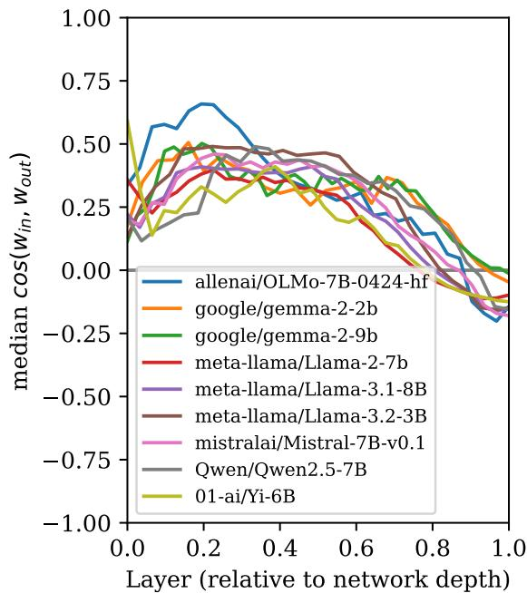  
Figure 2: Median of $\cos ( { \boldsymbol { w } _ { \mathrm { i n } } } , { \boldsymbol { w } _ { \mathrm { o u t } } } )$ (y-axis) by layer (x-axis) for 9 GLU models of 2B to 9B parameters. (See Fig. 26 in Section J.3.2 for a plot with all 12 GLU models investigated, including those smaller than 2B.) For all models, the value is positive in the beginning and negative in the end, indicating that early-middle layers “strengthen" directions they find in the residual stream whereas later layers tend more towards “weakening" them.

## 4.4 Implementation

We publish our code at https: $/ / { \tt g i }$ thub.com/sjger stner/RW\_functionalities.

Our code uses TransformerLens v2 (Nanda and Bloom, 2022). When a model is loaded, preprocessing steps are applied to make the weights more interpretable without changing model behavior.³ We use a custom version of TransformerLens that applies an additional preprocessing step. See Section D for details.

## 5 Where to find weakening neurons

In this section we compute cosine similarities of neuron weights as described in Section 4, to investigate which IO functionalities actually appear in LLMs, and in which layers. We first briefly investigate non-GLU models, and then focus on GLU models (which are more recent). Within each group, our results are strikingly consistent across models: In particular, there is always a substantial number of weakening neurons, and many other neurons also have IO cosine similarities far from zero.

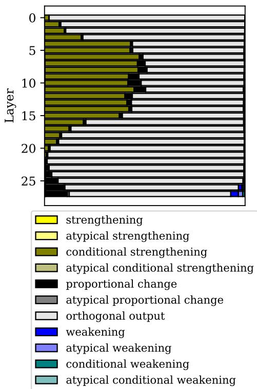  
Figure 3: Distribution of neuron IO classes by layer and category in a GLU-based model (Llama-3.2-3B). Length of bars represents number of neurons. See Table 12 for the exact numbers.

## 5.1 Non-GLU models

We apply our method to 24 transformer models, covering a wide range of architectures (encoderdecoder, encoder-only, decoder-only), activation functions (ReLU and GELU), and training data (language and non-language). See Section C.1 for the full list.

As this paper's focus is on the more recent GLU models, we defer the results to Section J.3.1.

## 5.2 GLU models

We apply our method to 12 GLU-based LLMs, covering both the SwiGLU and GEGLU activation functions. See Section C.2 for a full list.

To demonstrate our finding, we present three representative plots. (See Section J.3.2 for more.) Figure 2 shows the median value of cos $( \pmb { w } _ { \mathrm { i n } } , \pmb { w } _ { \mathrm { o u t } } )$ across all layers of the nine larger models. The common pattern is clearly visible: In early-middle layers of all models, a majority of neurons has a cos $( \pmb { w } _ { \mathrm { i n } } , \pmb { w } _ { \mathrm { o u t } } )$ high above zero, indicating strengthening; in late layers, this median cosine similarity goes slightly below zero, indicating a relative majority of weakening neurons.

The other two plots focus on Llama-3.2-3B (Meta, 2024b), but the patterns we describe are general: see Section J.3.2 for other models. Figure 3 (equivalently, Table 12) shows IO class distribution across layers. In Fig. 4, we plot the distribution of neurons in a few selected layers, by displaying each neuron as a point with

Table 1: Pearson correlations between $\cos ( { \boldsymbol { w } _ { \mathrm { i n } } } , { \boldsymbol { w } _ { \mathrm { o u t } } } )$ and frequency of $x _ { \mathrm { g a t e } } \ > \ 0$ Sample size is number of MLP neurons in the model. All correlations are significant with $p < 0 . 0 1$
<table><tr><td>Model</td><td>correlation</td></tr><tr><td>OLMo-7B-0424 Gemma-2-2B</td><td>-0.91</td></tr><tr><td>Llama-3.1-8B</td><td>-0.76 -0.59</td></tr><tr><td>Llama-3.2-3B</td><td>-0.54</td></tr></table>

COS $( \boldsymbol { w } _ { \mathrm { g a t e } } , \boldsymbol { w } _ { \mathrm { o u t } } )$ indicated on the x-axis, $\cos ( { \boldsymbol { w } _ { \mathrm { i n } } } , { \boldsymbol { w } _ { \mathrm { o u t } } } )$ on the y-axis and $\cos ( \pmb { w } _ { \mathrm { g a t e } } , \pmb { w } _ { \mathrm { i n } } )$ as its color.

Input manipulation. First, we see that a large proportion of neurons are input manipulators (i.e., they are not orthogonal output neurons): In Fig. 3, these are 25% of all neurons, and as much as 50% in earlymiddle layers (layers 7–11 – we use zero-based indexing). What is more, Fig. 4 shows that even neurons classified as orthogonal output often belong to clusters centered above/below the horizontal line. Their weight cosine similarities often exceed the significance threshold (indicated in the figure as red lines). E.g., in layer 14, there are many neurons whose $\cos ( { \boldsymbol { w } _ { \mathrm { i n } } } , { \boldsymbol { w } _ { \mathrm { o u t } } } )$ (y-axis) is below 0.5 but above the significance threshold. This suggests that even orthogonal output neurons perform input manipulation to some extent.

Different IO functionalities. Weakening neurons represent a large share of the (relatively few) input manipulators in late layers. They form a somewhat separate cluster in Fig. 4 (in the bottom-left corner of the rightmost subplot). Another important input manipulator class in late layers is proportional change. In contrast, across all models, early middle layers are dominated by conditional strengthening. In fact, the majority of input manipulators (more than 80% in Llama) belong to just this one class.

This general pattern of strengthening-then-weakening holds across models, as Fig. 2 shows at one glance. In Fig. 4 (and Fig. 30 in the appendix), the pattern manifests as a large cluster of neurons, centered clearly above the x-axis in most layers, but moving below it in the last few layers.

In summary, we find across models that conditional strengthening dominates in early-middle layers, but in late layers we find more weakening neurons.

## 6 Weakening neurons activate often

In Section 5.2, we found striking differences in the number of neurons of different IO classes. This raises the question of how often neurons of a given class activate, i.e., how often their gate value is positive. For example, there is a large number of conditional strengthening neurons, but how often does each of them actually activate?

In fact, Gurnee et al. (2024) found a negative correlation between activation frequency and cos $( \pmb { w } _ { \mathrm { i n } } , \pmb { w } _ { \mathrm { o u t } } )$ – but in GELU models. We now investigate whether a similar phenomenon occurs with gated activation functions.

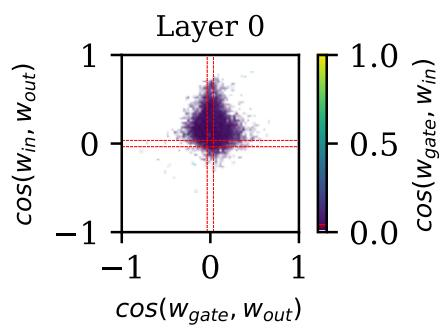

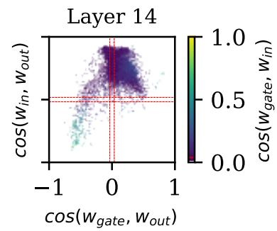

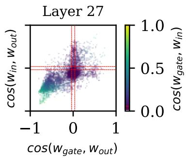  
Figure 4: Fine-grained analysis of neuron IO behavior in three layers of Llama-3.2-3B, based on the configuration of their three weight vectors in parameter space. Each subplot represents a layer, each dot a neuron. The red lines mark the 95% randomness regions for each of the three cosine values. (There is a dotted line for variant (i) and a dashed line for variant (ii) in Section 4.3, but they are almost the same.)  
We see that many neurons are outside the randomness regions, indicating that they manipulate their input in some way. Purple dots at the top of the plots are conditional strengthening neurons. Lighter dots in the bottom left corner are weakening neurons.

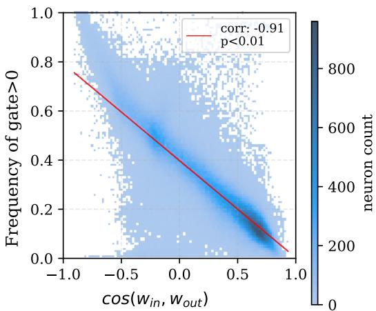  
Figure 5: Heatmap of cos $( \pmb { w } _ { \mathrm { i n } } , \pmb { w } _ { \mathrm { o u t } } )$ (x-axis) vs. activation frequency (y-axis), when running OLMo-7B on a subset of Dolma (Section 6). The darker the color, the more neurons in the given area. This result is evidence that weakening neurons are a disproportionately important IO functionality, despite being only a small class.

Models and corpus. We analyze four GLU-based models: OLMo-7B-0424 (Groeneveld et al., 2024, henceforth "OLMo-7B"), Gemma-2-2B (Gemma, 2024), Llama-3.1-8B (Meta, 2024a), and Llama-3.2-3B (Meta, 2024b). As a dataset, we use a random subset of 20M tokens (following Voita et al. (2024)) from Dolma (Soldaini et al., 2024), the training dataset of OLMo. For the Gemma and Llama models, there is no publicly available training dataset, so Dolma may only represent a sub-distribution of their training distribution (for example, Dolma is only English and code, whereas the Llama models were trained on a multilingual dataset). We believe, however, that this sub-distribution is enough for our purposes here.

Results. We show an overview of results in Table 1, and a plot for OLMo in Fig. 5. A layer-wise analysis can be found in Section J.1. The results for the other three models can be found in the supplementary material.

Consistent with Gurnee et al. (2024), we find that the many (conditional) strengthening neurons activate very rarely, and (conditional) weakening neurons activate very often. In fact, there is an almost linear negative relationship between cos $( \pmb { w } _ { \mathrm { i n } } , \pmb { w } _ { \mathrm { o u t } } )$ and activation frequency: the correlation is —0.91 for OLMo, which is even stronger than the correlations reported by Gurnee et al. (2024) (up to -0.69 depending on the model). When considering layers separately (Fig. 10), we see that the effect is mostly due to middle layers.

This result is a first indication that weakening neurons are a disproportionately important IO functionality, despite being only a small class.

## 7 Ablation experiments

Since model training produced so many input manipulator neurons (Section 5), we hypothesize that they must contribute to model performance in an important way. We now test this by ablating neurons based on their IO functionality.

We find that weakening neurons have the highest effect on the metrics that we tested – this is unexpected since weakening neurons are a small class of a few hundred neurons. We also find that this phenomenon is not fully explained by their activation frequency: even the (rare and small) negative gate values of weakening neurons are influential.

We use the same corpus as in Section 6 (20M tokens from Dolma). To save resources, we further narrow down the range of models, and focus on OLMo-7B and Llama-3.2-3B. This section mostly shows the results from OLMo; those from Llama are similar, see supplementary material.

## 7.1 Effect size of ablating different IO classes

We run the model on our corpus and record various metrics, such as the loss and the entropy of the output distribution. In each run we ablate a number of neurons from a different IO class, or (as a baseline) the same number of random neurons from the same layers. This enables us to observe the effect of various IO classes on these metrics. The baseline checks whether effects are due to the layers rather than IO classes.

In each run, we ablate as many neurons from the given class as there are weakening neurons. For example, OLMo-7B has 526 weakening neurons, so in each run we ablate 526 neurons of a given class.

We try two types of ablation: zero ablation (setting activations to zero), and mean ablation (setting them to the mean activation of the given neuron, see Section G.3 for details). In this section we focus on mean ablation; for zero-ablation results see Sections G and J.2.

We find that ablating weakening neurons has the highest effect on several metrics, compared with other classes or with other neurons from the same layers.

For the effect on entropy (Fig. 6 and Section J.2), we have an expected finding and a surprising one: The expected one is that strengthening neurons often make the output distribution sharper. (They reduce entropy in Fig. 13.) Weakening neurons (top left panel of Fig. 6) often flatten the output distribution, as expected; but surprisingly, they even more often sharpen it. Other classes do not have such a big effect (Fig. 17). We would expect the opposite: removing information from the residual stream should make it less informative and therefore flatten the output distribution.

## 7.2 Conditional ablations

We now try to explain why weakening neurons sharpen (instead of flatten) the distribution. We use conditional ablations: We ablate only some activations of each neuron, based on the signs of the corresponding $x _ { \mathrm { g a t e } }$ and $x _ { \mathrm { i n } }$ . Specifically, we consider the following four conditions, which we call activation quadrants (the definitions are simplified here, see Section D.2 for a more precise statement): $( \mathrm { i } ) \ x _ { \mathrm { g a t e } } \ > \ 0 , x _ { \mathrm { i n } } \ > \ 0$ , leading to $x _ { \mathrm { p o s t } } > 0 ; \mathrm { ( i i ) } x _ { \mathrm { g a t e } } > 0 , x _ { \mathrm { i n } } < 0 ,$ leading to $x _ { \mathrm { p o s t } } < 0 ;$ (iii) $x _ { \mathrm { g a t e } } < 0 , x _ { \mathrm { i n } } < 0 .$ , leading to $x _ { \mathrm { p o s t } } > 0 ;$ $\mathrm { ( i v ) } \ x _ { \mathrm { g a t e } } < 0 , x _ { \mathrm { i n } } > 0$ , leading to $x _ { \mathrm { p o s t } } < 0$

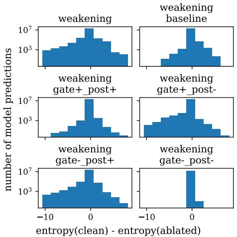  
Figure 6: Effect of mean-ablating weakening neurons on entropy of the model's output distribution. For example (top left subplot, leftmost bar), in ≈ $1 0 ^ { 3 }$ next-token predictions, weakening neurons decrease the entropy by about 10 nats, whereas they increase it more rarely. "Weakening baseline" denotes random neurons from the same layers as weakening neurons. The bottom four plots describe the results of conditional ablations (Section 7.2). E.g., "gate+\_post+" describes the effect of those activations in which $x _ { \mathrm { g a t e } } > 0$ and $x _ { \mathrm { p o s t } } { > } 0$

We find that a large part of the sharpening effect of weakening neurons (and to a lesser extent also their flattening effect in other contexts) is due to quadrants (ii) and (ii): In Fig. 6, these quadrants (middle right and bottom left subplot) show entropy effects similar to those of weakening neurons as a whole, whereas this is much less the case for the other subplots. In the following we argue that this is surprising, but also partially solves the mystery we encountered earlier.

The large effect of quadrant (iii) activations $( x _ { \mathrm { g a t e } } <$ $0 , x _ { \mathrm { i n } } \ < \ 0 )$ is especially surprising for two reasons: First, these negative $x _ { \mathrm { g a t e } }$ activations are relatively rare in weakening neurons (Section 6). Second, because of the Swish function, negative gate values are relatively small (whereas positive values can be arbitrarily large) and it was often assumed they were only useful for training dynamics (see Section 3). Our results show for the first time (concurrently with Kong et al., 2026 who focus on a different phenomenon) that negative gate values have a strong effect on model behavior (not just training). This shows that, for mechanistic interpretability research, Swish is not reducible to ReLU.

The large effect of quadrant (ii) activations $( x _ { \mathrm { g a t e } } > 0 )$ but $x _ { \mathrm { i n } } < 0 )$ is surprising in a different way: Weakening neurons have a strong $\cos ( \pmb { w } _ { \mathrm { g a t e } } , \pmb { w } _ { \mathrm { i n } } )$ (and this similarity is always positive thanks to the weight preprocessing described in Section D.2). Therefore the region of activation space where $x _ { \mathrm { g a t e } } > 0 ,$ but $x _ { \mathrm { i n } } < 0$ , is small. Our finding shows that the residual stream still ends up in this region often enough that it has a tangible effect.

Our finding could partially explain the sharpening effects of weakening neurons: For quadrants (ii) and (iii) activations, the usual neuron behavior gets a minus sign in front, so that weakening neurons take on a strengthening behavior. Consider OLMo neuron 31.9634, further investigated in Section 8. It usually detects "minus again" $( w _ { \mathrm { g a t e } } )$ and writes $" a g a i n " ( \pmb { w } _ { \mathrm { o u t } } ) ;$ then in quadrant (iii) it detects "again" $( - w _ { \mathrm { g a t e } } )$ and writes $" a g a i n " \left( w _ { \mathrm { o u t } } \right)$ , which indeed makes the output distribution sharper. Similarly, in quadrant (ii), it both detects and writes "minus $a g a i n " \left( \pmb { w } _ { \mathrm { g a t e } } , - \pmb { w } _ { \mathrm { o u t } } \right)$

However, the case study below suggests that this is not the full explanation, at least not in all cases.

## 7.3 Case study of entropy reduction

To understand this phenomenon further, we study the text example where the entropy reduction by quadrant (iii) activations of weakening neurons is most extreme (with zero ablation).

The input text is: Yesterday (21 December) the Government announced a package of support for hospitality and leisure businesses that are losing trade because of the O and the correct next token is mic (as in Omicron). The model predicts this next token correctly.

Which tokens have the largest score difference between clean and ablated runs? We find that, in the clean run, mic and similar tokens get a massive boost (of up to 12 points) compared to the ablated run, whereas no token gets its score reduced by nearly as much. Thus, at least in this case, the quadrant (iii) activations of weakening neurons sharpen the output distribution by boosting the correct next token.

Ablating various subsets of weakening neurons, we find that in this case no single weakening neuron achieves the observed effect on its own – but there is a small subset of 8 weakening neurons that does. Moreover, the direct effect of weakening neurons does not correspond to the observed effect, so the relevant effect is indirect.

Thus, in this particular case, the entropy-reducing effect of weakening neurons is due to an indirect and cumulative effect. More fully understanding the mechanisms behind this is left to future work.

## 8 Case study of a weakening neuron

To complement the quantitative results of the previous sections, we qualitatively examine a few neurons based on their IO class. In this section we focus on two OLMo-7B neurons: a strengthening and a weakening neuron. See Section I for more details and analysis of additional neurons. These case studies show some things that IObased classes of neurons (such as weakening neurons) can do; we do not use the case studies to back up any statistical claims.

To analyze the neurons, we combine the IO perspective with two well-established neuron analysis methods: projecting weights to vocabulary space (Geva et al., 2022; Dar et al., 2023; Gurnee et al., 2024; Voita et al., 2024), and finding text examples which strongly activate the neuron (Geva et al., 2021; Nanda, 2022; Voita et al., 2024; Gurnee et al., 2024).

For the activation-based analyses, we publish code at https://github.com/sjgerstner/gluscope and visualize results at https://gluscope.github.io.

We choose two OLMo-7B neurons: 28.4737 for strengthening and 31.9634 for weakening. 4

From the data in Section I, we can see that strengthening neuron 28.4737 has a straightforward inputoutput behavior: It further promotes review when the residual stream already indicates that this should be the next token.

In contrast, weakening neuron 31.9634 is harder to interpret. The weights indicate that this neuron produces "again" when the residual stream contains "minus again"; but the examples strongly activating the neuron do not have an obvious semantic relationship to again.

31.9634 activates weakly positively when again is a plausible continuation, e.g., on the token once (as in once again). These are cases with negative $x _ { \mathrm { g a t e } }$ values (and also $x _ { \mathrm { i n } } < 0 .$ , hence positive activations) – a case that we found to be important in Section 7.2. In these cases, again is already weakly present in the residual stream before the last MLP, and the neuron reinforces again. Thus the behavior of this particular weakening neuron is interpretable in the $x _ { \mathrm { g a t e } } < 0$ case, echoing our finding from Section 7.2 that this case is surprisingly relevant to model behavior.

These two case studies show that even when the output weights are highly interpretable, strengthening and weakening have a very different overall behavior, and the weakening behavior is more complex. We think that this is due to the nature of weakening: at least in quadrant (i) $( x _ { \mathrm { g a t e } } , x _ { \mathrm { i n } } > 0 )$ , it inherently involves (an apparent) conflict between the intermediate model prediction and what the neuron promotes.

## 9 Discussion

In summary, we have found: (i) In all investigated LLMs, early-middle layers contain many conditional strengthening neurons, and the last few layers contain a small but substantial number of weakening neurons (Section 5). (ii) In most layers except the last two, IO functionalities are strongly correlated to activation frequencies: a (conditional) strengthening neuron rarely has positive gate values, a (conditional) weakening neuron more often (Section 6). (iii) Even partially ablating weakening neurons has a big influence on model output; ablating neurons from other IO classes has a smaller impact (Section 7).

In this section, we discuss possible explanations for these findings. These are only speculative hypotheses, not conclusive interpretations. We will work on confirming them in future work.

Recall from Section 2 that negative input-output cosine similarities were previously hypothesized (but not shown) to implement a memory management mechanism. Copy suppression heads are another known suppression mechanism, distinct from memory management. We think that such explanations are not sufficient: they can only explain negative cosine similarities, but we also find many neurons with strong positive similarities.

In the rest of this section, we focus first on middle layers with conditional strengthening neurons, then on late layers with weakening neurons.

## 9.1 Middle layers, conditional strengthening neurons

In middle layers we found a large number of conditional strengthening neurons, and a strong negative correlation between cos $( \pmb { w } _ { \mathrm { i n } } , \pmb { w } _ { \mathrm { o u t } } )$ and frequency of $x _ { \mathrm { g a t e } } > 0$

We think these findings are consistent with interpreting middle-layer IO functionalities as implementing a confidence management mechanism. Generally speaking, pretrained models are calibrated (OpenAI, 2024; Kadavath et al., 2022). This entails avoiding overconfidence, so it makes sense to have (conditional) weakening mechanisms that activate often. On the other hand, the model also needs to increase the confidence of certain hidden representations, but only in very specific circumstances in which the confidence is actually warranted; this could explain why we have many conditional strengthening neurons (each of them checks a condition that is distinct from the concept to be strengthened), and also why each of them activates rarely.

This is not about confidence in next-token predictions. Otherwise conditional strengthening neurons would decrease the output entropy (sharpen the distribution) more than other neurons from the same layer. This is not the case (Section 7 and Fig. 17).

Rather, middle layers tend to represent more abstract, high-level concepts (Lad et al., 2024): For example, Wendler et al. (2024) find language-independent representations in middle layers of multilingual LMs. We hypothesize that IO functionalities in middle layers modulate confidence in this kind of concepts.

Stacey et al. (2026) found that probes trained on middle-layer representations predict uncertainty better than final-layer probes. This is another indication that middle layers are relevant for confidence and uncertainty.

## 9.2 Late layers, weakening neurons

Weakening neurons are a relatively small class, but clearly very important: They consistently appear in late layers of all models, and ablating them has an outsize influence on model output.

Their behavior is unintuitive in several ways. In particular, negative gate activations, though small and rare, seem to play an important role in these neurons, and switch their behavior from the theoretically expected weakening to a strengthening-like functionality (Section 7.2). We therefore think it is important to consider their different activation quadrants separately, as we do in Sections 8 and I.3.

Quadrant (iii) $( x _ { \mathrm { g a t e } } ~ < ~ 0 , x _ { \mathrm { i n } } ~ < ~ 0 )$ : As found in Section 7.2, this quadrant is surprisingly relevant and corresponds to a strengthening-like behavior

For quadrants (i) and (ii) $( x _ { \mathrm { g a t e } } \mathrm { ~ > ~ } 0 )$ , we propose some hypotheses based on our case study in Section I.3.

Quadrant (i) $( x _ { \mathrm { g a t e } } > 0 , x _ { \mathrm { i n } } > 0 )$ : We hypothesize that these activations of weakening neurons implement an error correction mechanism. Specifically, superposition (Elhage et al., 2022) can have unwanted side effects: the residual stream can sometimes end up near a meaningful direction (e.g., near "minus again") even when this is not semantically justified. A weakening neuron could detect such situations (e.g., detect the "minus again" direction) and then weaken the unwanted direction.

Quadrant (ii) $( x _ { \mathrm { g a t e } } > 0 , x _ { \mathrm { i n } } < 0 )$ : Weakening neurons have a strong similarity between ${ \pmb w } _ { \mathrm { g a t e } }$ and ${ \pmb w } _ { \mathrm { i n } }$ so if $x _ { \mathrm { g a t e } }$ and $x _ { \mathrm { i n } }$ have different signs this could indicate conflicting information in the residual stream. The neuron resolves this conflict by boosting - $- \pmb { w } _ { \mathrm { o u t } }$ , corresponding to the information detected by ${ \pmb w } _ { \mathrm { g a t e } }$ . In our case study of the again neuron, the conflicting information manifested as follows: the correct next token was often an adverb like meanwhile or instead – syntactically somewhat similar to again, but clearly not the same. The neuron may ensure only these tokens are predicted, and not the relatively similar again. Such a mechanism could be described as conflict resolution or prediction sharpening.

Finally, the activations in quadrant (iv) are small and rare and seem to have little influence when ablated (see e.g. Fig. 6).

## 10 Conclusion

We propose a new interpretability methodology, analyzing the input-output behavior of neurons. Using this methodology, we contribute several novel findings, including: (i) IO functionality is broadly similar across current models. (ii) IO functionality is predictive of activation frequency. (iii) One specific IO class, the weakening neurons, greatly influences model behavior and does so for negative gate values, which were previously thought not to impact transformer functionality.

We hope that IO functionality analysis will become an important part of the toolkit of interpretability.

## Limitations

## Limitations of weight cosine approach

We focus on a parameter-based interpretation of single neurons. This has the advantage of being simple and efficient, but is also inherently limited in scope. Accordingly, our method is not designed to replace other neuron analysis methods, but to complement them.

The mathematical similarities of weights are insightful, but they should not be taken as one-to-one representations of semantic similarity. We find cases in which close-to-orthogonal vectors represent very similar concepts (double checking, Section H).

The IO approach inherently assumes that the representations at different layers are (to some extent) comparable to each other, which is guaranteed by residual connections. Residual connections are used in essentially all transformer LLMs that we know of, and are also a prerequisite for well-known methods such as the logit lens (nostalgebraist, 2020). However, recent work proposed a method to train transformers without residual connections (Ji et al., 2026). If this becomes standard, our method will not be applicable any more. Similarly, our method is not directly applicable to models like DeepSeek-V4 (DeepSeek-AI et al., 2026) that use hyper-connections (Zhu et al., 2025).

## Limitations of ablation experiments

Our ablation experiments indicate what effect different IO classes have at the level of next-token predictions. However, they do not show the intermediate steps that lead from the neuron activations to the model output.

A limitation specific to (our implementation of) conditional ablation is that it is brittle when applied to several layers at once (as is the case in our work): ablating an upstream neuron can change the sign of a downstream neuron activation, and thus influence whether this downstream neuron is ablated.

Conditional ablations have another limitation: getting a similar effect to the original ablation does not imply that the effect happens for the same reason in both runs (although it is a strong indication).

## Generalizability across models

We applied our weight-based analysis (Section 5) to a wide range of models, but did not test mixture-of-experts (MoE) models, or models larger than 9B.

In the more compute-intensive corpus-based experiments (Sections 6 to 8), we focused on a smaller set of models.

## Limited understanding of results

Our findings are striking, but we do not yet fully understand the reasons behind them, and some of our interpretations are speculative.

In particular, we propose to interpret many of our findings as a confidence management system (see Section 9). If correct, this interpretation could explain both the general pattern of which IO functionalities are found in which layers, and specifically the correlation with activation frequencies. However: (1) we do not currently have conclusive evidence for such an interpretation; (2) it would not explain everything, and in particular does not apply to later layers (and hence the majority of weakening neurons).

This means in particular that our understanding of weakening neurons is still limited.

## Acknowledgements

We would like to thank our colleagues Florian Eichin, Dawar Hakimi, Lea Hirlimann, Yihong Liu, Ali Modarressi, Philipp Mondorf, Leonor Veloso and Mingyang Wang for fruitful discussions and encouragements. A special thank goes to Dawar Hakimi, who programmed a TransformerLens version that supports OLMo, thus sparing us some trouble in the early days of the project.

This work was funded by Deutsche Forschungsgemeinschaft (project SCHU 2246/14-1).

The authors gratefully acknowledge the scientific support and HPC resources provided by the Erlangen National High Performance Computing Center (NHR@FAU) of the Friedrich-Alexander-Universität Erlangen-Nürnberg (FAU) under the NHR project b309dd / JA-27440 / InterpGLU. NHR funding is provided by federal and Bavarian state authorities.

## References

01.AI, :, Alex Young, Bei Chen, Chao Li, Chengen Huang, Ge Zhang, Guanwei Zhang, Guoyin Wang, Heng Li, Jiangcheng Zhu, Jianqun Chen, Jing Chang, Kaidong Yu, Peng Liu, Qiang Liu, Shawn Yue, Senbin Yang, Shiming Yang, Wen Xie, Wenhao Huang, Xiaohui Hu, Xiaoyi Ren, Xinyao Niu, Pengcheng Nie, Yanpeng Li, Yuchi Xu, Yudong Liu, Yue Wang, Yuxuan Cai, Zhenyu Gu, Zhiyuan Liu, and Zonghong Dai. 2025. Yi: Open foundation models by 01.ai. Preprint, arXiv:2403.04652.

Ameen Ali, Shahar Katz, Lior Wolf, and Ivan Titov. 2025. Detecting and pruning prominent but detrimental neurons in large language models. COLM.

Aryaman Arora, Zhengxuan Wu, Jacob Steinhardt, and Sarah Schwettmann. 2026. Language model circuits are sparse in the neuron basis. Proceedings of the 43rd International Conference on Machine Learning.

Nora Belrose, Igor Ostrovsky, Lev McKinney, Zach Furman, Logan Smith, Danny Halawi, Stella Biderman, and Jacob Steinhardt. 2025. Eliciting latent predictions from transformers with the tuned lens. Preprint, arXiv:2303.08112.

Stella Biderman, Hailey Schoelkopf, Quentin Gregory Anthony, Herbie Bradley, Kyle O'Brien, Eric Hallahan, Mohammad Aflah Khan, Shivanshu Purohit, Usvsn Sai Prashanth, Edward Raff, Aviya Skowron, Lintang Sutawika, and Oskar Van Der Wal. 2023. Pythia: a suite for analyzing large language models across training and scaling. In Proceedings of the 40th International Conference on Machine Learning.

Workshop BigScience, :, Teven Le Scao, Angela Fan, Christopher Akiki, Ellie Pavlick, Suzana Ilić, Daniel

Hesslow, Roman Castagné, Alexandra Sasha Luccioni, Francois Yvon, Matthias Gallé, Jonathan Tow, Alexander M. Rush, Stella Biderman, Albert Webson, Pawan Sasanka Ammanamanchi, Thomas Wang, Benoît Sagot, Niklas Muennighoff, Albert Villanova del Moral, Olatunji Ruwase, Rachel Bawden Stas Bekman, Angelina McMillan-Major, Iz Belt agy, Huu Nguyen, Lucile Saulnier, Samson Tan, Pedro Ortiz Suarez, Victor Sanh, Hugo Laurençon, Yacine Jernite, Julien Launay, Margaret Mitchell, Colin Raffel, Aaron Gokaslan, Adi Simhi, Aitor Soroa, Alham Fikri Aji, Amit Alfassy, Anna Rogers Ariel Kreisberg Nitzav, Canwen Xu, Chenghao Mou Chris Emezue, Christopher Klamm, Colin Leong Daniel van Strien, David Ifeoluwa Adelani, Dragomir Radev, Eduardo González Ponferrada, Efrat Levkovizh, Ethan Kim, Eyal Bar Natan, Francesco De Toni, Gérard Dupont, Germán Kruszewski, Giada Pistilli, Hady Elsahar, Hamza Benyamina, Hieu Tran, Ian Yu, Idris Abdulmumin, Isaac Johnson Itziar Gonzalez-Dios, Javier de la Rosa, Jenny Chim Jesse Dodge, Jian Zhu, Jonathan Chang, Jörg Frohberg, Joseph Tobing, Joydeep Bhattacharjee, Khalid Almubarak, Kimbo Chen, Kyle Lo, Leandro Von Werra, Leon Weber, Long Phan, Loubna Ben allal, Ludovic Tanguy, Manan Dey, Manuel Romero Muñoz, Maraim Masoud, María Grandury, Mario Šaško, Max Huang, Maximin Coavoux, Mayank Singh, Mike Tian-Jian Jiang, Minh Chien Vu, Mohammad A. Jauhar, Mustafa Ghaleb, Nishant Subramani, Nora Kassner, Nurulaqilla Khamis, Olivier Nguyen, Omar Espejel, Ona de Gibert, Paulo Villegas, Peter Henderson, Pierre Colombo, Priscilla Amuok, Ouentin Lhoest, Rheza Harliman, Rishi Bommasani. Roberto Luis López, Rui Ribeiro, Salomey Osei, Sampo Pyysalo, Sebastian Nagel, Shamik Bose. Shamsuddeen Hassan Muhammad, Shanya Sharma, Shayne Longpre, Somaieh Nikpoor, Stanislav Silber berg, Suhas Pai, Sydney Zink, Tiago Timponi Torrent, Timo Schick, Tristan Thrush, Valentin Danchev, Vas silina Nikoulina, Veronika Laippala, Violette Lepercq, Vrinda Prabhu, Zaid Alyafeai, Zeerak Talat, Arun Raja, Benjamin Heinzerling, Chenglei Si. Davut Emre Taşar, Elizabeth Salesky, Sabrina J Mielke, Wilson Y. Lee, Abheesht Sharma, Andrea Santilli, Antoine Chaffin, Arnaud Stiegler, Debajyoti Datta, Eliza Szczechla, Gunjan Chhablani, Han Wang, Harshit Pandey, Hendrik Strobelt, Jason Alan Fries, Jos Rozen, Leo Gao, Lintang Sutawika, M. Saiful Bari, Maged S. Al-shaibani, Matteo Manica, Nihal Nayak, Ryan Teehan, Samuel Albanie, Sheng Shen, Srulik Ben-David, Stephen H. Bach, Taewoon Kim, Tali Bers, Thibault Fevry, Trishala Neerai, Urmish Thakker, Vikas Raunak, Xiangru Tang, Zheng-Xin Yong, Zhiqing Sun, Shaked Brody, Yallow Uri Hadar Tojarieh, Adam Roberts, Hyung Won Chung Jaesung Tae, Jason Phang, Ofir Press, Conglong Li Deepak Narayanan, Hatim Bourfoune, Jared Casper Jeff Rasley, Max Ryabinin, Mayank Mishra, Minjia Zhang, Mohammad Shoeybi, Myriam Peyrounette. Nicolas Patry, Nouamane Tazi, Omar Sanseviero, Patrick von Platen, Pierre Cornette, Pierre François Lavallée, Rémi Lacroix, Samyam Rajbhandari, Sanchit Gandhi, Shaden Smith, Stéphane Requena, Suraj

Patil, Tim Dettmers, Ahmed Baruwa, Amanpreet Singh, Anastasia Cheveleva, Anne-Laure Ligozat Arjun Subramonian, Aurélie Névéol, Charles Lovering, Dan Garrette, Deepak Tunuguntla, Ehud Reiter, Ekaterina Taktasheva, Ekaterina Voloshina, Eli Bog danov, Genta Indra Winata, Hailey Schoelkopf, Jan. Christoph Kalo, Jekaterina Novikova, Jessica Zosa Forde, Jordan Clive, Jungo Kasai, Ken Kawamura Liam Hazan, Marine Carpuat, Miruna Clinciu, Najoung Kim, Newton Cheng, Oleg Serikov, Omer Antverg, Oskar van der Wal, Rui Zhang, Ruochen Zhang, Sebastian Gehrmann, Shachar Mirkin, Shani Pais, Tatiana Shavrina, Thomas Scialom, Tian Yun Tomasz Limisiewicz, Verena Rieser, Vitaly Protasov Vladislav Mikhailov, Yada Pruksachatkun, Yonatan Belinkoy. Zachary Bamberger. Zdeněk Kasner, Alice Rueda, Amanda Pestana, Amir Feizpour, Ammar Khan, Amy Faranak, Ana Santos, Anthony Hevia Antigona Unldreaj, Arash Aghagol, Arezoo Abdollahi, Aycha Tammour, Azadeh HajiHosseini, Bahareh Behroozi, Benjamin Ajibade, Bharat Saxena, Carlos Muñoz Ferrandis, Daniel McDuff, Danish Contractor, David Lansky, Davis David, Douwe Kiela. Duong A. Nguyen, Edward Tan, Emi Baylor, Ezinwanne Ozoani, Fatima Mirza, Frankline Ononiwu, Habib Rezanejad, Hessie Jones, Indrani Bhattacharva, Irene Solaiman, Irina Sedenko, Isar Nejadgholi, Jesse Passmore, Josh Seltzer, Julio Bonis Sanz, Livia Dutra, Mairon Samagaio, Maraim El badri, Margot Mieskes, Marissa Gerchick, Martha Akinlolu, Michael McKenna, Mike Oiu, Muhammed Ghauri, Mykola Burynok, Nafis Abrar, Nazneen Rajani, Nour Elkott, Nour Fahmy, Olanrewaju Samuel Ran An, Rasmus Kromann, Ryan Hao, Samira Al izadeh, Sarmad Shubber, Silas Wang, Sourav Roy, Sylvain Viguier, Thanh Le, Tobi Ovebade, Trieu Le. Yovo Yang, Zach Nguven. Abhinay Ramesh Kashvap Alfredo Palasciano, Alison Callahan, Anima Shukla Antonio Miranda-Escalada, Avush Singh, Benjamin Beilharz, Bo Wang, Caio Brito, Chenxi Zhou, Chirag Jain, Chuxin Xu, Clémentine Fourrier, Daniel León Periñán. Daniel Molano. Dian Yu. Enrique Maniava cas, Fabio Barth, Florian Fuhrimann, Gabriel Altay Givaseddin Bayrak, Gully Burns, Helena U. Vrabec. Imane Bello, Ishani Dash, Jihyun Kang, John Giorgi Jonas Golde, Jose David Posada, Karthik Ranga sai Sivaraman, Lokesh Bulchandani, Lu Liu, Luisa Shinzato, Madeleine Hahn de Bykhovetz, Maiko Takeuchi, Marc Pàmies, Maria A. Castillo, Mari anna Nezhurina, Mario Sänger, Matthias Samwald Michael Cullan, Michael Weinberg, Michiel De Wolf, Mina Mihaljcic, Minna Liu, Moritz Freidank Myungsun Kang, Natasha Seelam, Nathan Dahlberg, Nicholas Michio Broad, Nikolaus Muellner, Pascale Fung, Patrick Haller, Ramya Chandrasekhar, Renata Eisenberg, Robert Martin, Rodrigo Canalli, Rosaline Su, Ruisi Su, Samuel Cahyawijaya, Samuele Garda, Shlok S. Deshmukh, Shubhanshu Mishra, Sid Kiblawi, Simon Ott, Sinee Sang-aroonsiri, Srishti Kumar, Stefan Schweter, Sushil Bharati, Tanmay Laud. Théo Gigant, Tomoya Kainuma, Wojciech Kusa, Yanis Labrak, Yash Shailesh Bajaj, Yash Venkatraman, Yifan Xu, Yingxin Xu, Yu Xu, Zhe Tan, Zhongli Xie, Zifan Ye, Mathilde Bras, Younes Belkada, and

Thomas Wolf. 2023. BLOOM: a 176B-parameter open-access multilingual language model. Preprint, arXiv:2211.05100.

Damai Dai, Li Dong, Yaru Hao, Zhifang Sui, Baobao Chang, and Furu Wei. 2022. Knowledge neurons in pretrained transformers. In Proceedings of the 60th Annual Meeting of the Association for Computational Linguistics (Volume 1: Long Papers), pages 8493– 8502, Dublin, Ireland. Association for Computational Linguistics.

Guy Dar, Mor Geva, Ankit Gupta, and Jonathan Berant. 2023. Analyzing transformers in embedding space. In Proceedings of the 61st Annual Meeting of the Association for Computational Linguistics (Volume 1: Long Papers), pages 16124–16170, Toronto, Canada. Association for Computational Linguistics.

DeepSeek-AI, Anyi Xu, Bang Lin, Bing Xue, Bing-Li Wang, Bin Xu, Bo Wu, Bowei Zhang, Chao Lin Chengyao Dong, Chen Ling, Chengda Lu, Chen Zhao, Chengqi Deng, Cheng Hou, Chen Xu, Chenze Shao, Chong Ruan, Conner Sun, Damai Dai, Daya Guo, De-Bin Yang, Deli Chen, Dong-Hui Li, Dong-Li Ji, Erhang Li, Fangchen Wei, Fangyun Lin, Fang Yuan, Fei Xia, Fucong Dai, Guangbo Hao, Guanting Chen, Guo Cao, Guo-Hui Meng, Guowei Li, Han Yu, Han Zhang, Hanwei Xu, Hao Li, Hao Liang, Haoling Zhang, Haoming Luo, Haoran Wei Hao Yuan, Haowei Zhang, Haowen Luo, Hao Chen Haozhe Ji, Heng Zhang, Honghui Ding, Hongxuan Tang, Huanqi Cao, Huazuo Gao, Hui Qu, Hui Zeng, J. Yang, J. Q. Zhu, Jianming Luo, Jia Song, Jia Yu, Jialiang Huang, Jialu Cai, Jian Liang, Jiangting Zhou, Jiasheng Ye, Jiashi Li, Jiaxin Xu, Jiewen Hu, Jieyu Yang, Jin Chen, Jin Yan, JingChang Chen Jing Zhou, Jing Xiang, Jingyang Yuan, Jing Cheng, Jingzi Zhou, Jinhua Zhu, Jiping Yu, Joseph Sun, Junliang Ran, Jun Jiang, Junjie Qiu, Junlong Li, Junming Zheng, Jun-Mei Song, Kai Dong, Kaige Gao, Kang Guan, Kexing Zhou, Kezhao Huang, Kuai Yu, Lean Wang, Lecong Zhang, Lei Wang, Leyi Xia, Li Zhang, Liang Zhao, Lihua Guo, Lin Luo, Lin Ma, Linyan Zhu, Litong Wang, Liyu Cai, Liyue Zhang, Longhao Chen, Mingxi Di, My Xu, Max Mei, Miaojun Wang, Mingchuan Zhang, Minghua Zhang, Minghui Tang, Mingming Li, Mi Zhou, Min Han, Ning Wang, Pan Huang, Pan Wang, Peixin Cong, Peiyi Wang, Peng Zhang, Qiancheng Wang, Qihao Zhu, Qingyang Li Qinyu Chen, Qiushi Du, Qi Jiang, Rui Tian, Ruiqin Xu, Ruijie Lu, Ruiling Xu, Ruiqi Ge, Ruisong Zhang, Ruizhe Pan, Runji Wang, Run Da Chen, Runqiu Yin, Runxin Xu, Ruo-Han Shen, Ruoyu Zhang, Ruyi Chen, Sh. Liu, Shanghao Lu, Shangmian Sun Shangyan Zhou, Shan-Shan Chen, Shaofei Cai, Shao Nie, Shao-Ping Wu, Shaoyuan Chen, Shengding Hu Sheng Liu, Shiqiang Hu, Shirong Ma, Shiyu Wang, Shuiping Yu, Shunfeng Zhou, Shuting Pan, Shuying Yu, Songyang Zhou, Tao Ni, Tao Yun, Tian Jin Tianhong Pei, Tian Ye, Tianle Lin, Tian Ji, Tianyi Cui, Tianyuan Yue, Tingting Yu, Tu-Tu Wang, W. Y. Zhang, W1 Xiao, Wangding Zeng, Wei An, Weilin Zhao, Wen Liu, Wenfeng Liang, Wenjie Pang, Wenjing Luo, Wenjin Yao, Wenjun Gao, Wenkai Yang,

Wen-Wen Huang, Wenqing Hou, Wentao Zhang, Wenting Ma, Xi Gao, Xiang He, Xiang Wang, Xianzu Wang, Xiao Bi, Xiaodong Liu, Xiaohan Wang, Xiaokang Chen, Xiaokang Zhang, Xiaotao Nie, Xiaowen Sun, Xiaoxiang Wang, Xin Cheng, Xin Liu, Xin Xie, Xingchao Liu, Xingchen Liu, Xingkai Yu, Xingyou Li, Xinyu Yang, Xinyu Zhang, Xu Chen, Xuanyu Wang, Xuecheng Su, Xueyin Chen, Xuheng Lin, Xu Fu, Yc Yan, Y. Q. Wang, Yw Ma, Yanfen Luo, Yang Zhang, Yanhong Xu, Yanru Ma, Yanwen Huang, Yao Li, Yao Xu, Yao Zhao, Yaofeng Sun, Yaohui Wang, Yi Qian, Yingxia Shao, Yi Yu, Yichao Zhang, Yifan Ding, Yifan Shi, Yijia Wu, Yi-Yu Xiong, Yi Ma, Ying He, Ying Tang, Ying Zhou, Yingjia Luo, Yinmin Zhong, Yishi Piao, Yisong Wang, Yixiang Zhang, Yixiao Chen, Yixuan Tan, Yixuan Wei, Yiyang Ma, Yiyuan Liu, Yong Yang, Yongqiang Guo, Yongtong Wu, Yu Wu, Yukun Li, Yuan Cheng, Yuan Ou, Yuanfan Xu, Yuanhao Li, Yuduan Wang, Yuehan Yang, Yue Xu, Yuhan Wu, Yu Meng, Yu Zou, Yukun Zha, Yunfan Xiong, Yupeng Chen, Yuping Lin, Yu Cao, Yuqian Wang, Yushun Zhang, Yuting Yan, Yutong Lin, Yuxian Gu, Yu-Wei Luo, Yu-mei You, Yuxuan Liu, Yuxuan Zhou, Yuyang Zhou, Yuzhen Huang, Zhanghua Wu, Ze Wang, Ze Zhao, Zehui Ren, Zekai Zhang, Zhangli Sha, Zhe Fu, Zhe Ju, Zhean Xu, Zhenda Xie, Zhengyan Zhang, Zhe Gao, Zhewen Hao, Zhibin Gou, Zhicheng Ma, Zhigang Yan, Zhihong Shao, Zhixiang Huang, Zhixuan Chen, Zhiyu Wu, Zhizhou Ren, Zhongyu Wu, Zhuoshu Li, Zhuping Zhang, Zian Xu, Zihao Wang, Zihua Qu, Zihui Gu, Zijia Zhu, Zi-Long Li, Zipeng Zhang, Ziwei Xie, Ziyi Gao, Ziyi Wan, Zizheng Pan, and Zongxiang Yao. 2026. DeepSeek-V4: towards highly efficient million-token context intelligence. Preprint, arXiv:2606.19348.

Tim Dettmers, Mike Lewis, Younes Belkada, and Luke Zettlemoyer. 2022. LLM.int8(): 8-bit matrix multiplication for Transformers at scale. Advances in Neural Information Processing Systems.

Jacob Devlin, Ming-Wei Chang, Kenton Lee, and Kristina Toutanova. 2019. BERT: Pre-training of deep bidirectional transformers for language understanding. In Proceedings of the 2019 Conference of the North American Chapter of the Association for Computational Linguistics: Human Language Technologies, Volume 1 (Long and Short Papers), pages 4171–4186, Minneapolis, Minnesota. Association for Computational Linguistics.

Jacob Dunefsky, Philippe Chlenski, and Neel Nanda. 2024. Transcoders find interpretable LLM feature circuits. In Advances in Neural Information Processing Systems, volume 37, pages 24375–24410. Curran Associates, Inc.

Nelson Elhage, Tristan Hume, Catherine Olsson, Nicholas Schiefer, Tom Henighan, Shauna Kravec, Zac Hatfield-Dodds, Robert Lasenby, Dawn Drain, Carol Chen, Roger Grosse, Sam McCandlish, Jared Kaplan, Dario Amodei, Martin Wattenberg, and Christopher Olah. 2022. Toy models of superposition. Transformer Circuits Thread.

Nelson Elhage, Neel Nanda, Catherine Olsson, Tom Henighan, Nicholas Joseph, Ben Mann, Amanda Askell, Yuntao Bai, Anna Chen, Tom Conerly, Nova DasSarma, Dawn Drain, Deep Ganguli, Zac Hatfield-Dodds, Danny Hernandez, Andy Jones, Jackson Kernion, Liane Lovitt, Kamal Ndousse, Dario Amodei, Tom Brown, Jack Clark, Jared Kaplan, Sam McCandlish, and Chris Olah. 2021. A mathematical framework for transformer circuits. Transformer Circuits Thread.

Amit Elhelo and Mor Geva. 2025. Inferring functionality of attention heads from their parameters. In Proceedings of the 63rd Annual Meeting of the Association for Computational Linguistics (Volume 1: Long Papers), pages 17701–17733, Vienna, Austria. Association for Computational Linguistics.

Kawin Ethayarajh. 2019. How contextual are contextualized word representations? Comparing the geometry of BERT, ELMo, and GPT-2 embeddings. In Proceedings of the 2019 Conference on Empirical Methods in Natural Language Processing and the 9th International Joint Conference on Natural Language Processing (EMNLP-IJCNLP), pages 55–65, Hong Kong, China. Association for Computational Linguistics.

Team Gemma. 2024. Gemma. Kaggle.

Team Gemma. 2025. Gemma 3 technical report. Technical report, Google DeepMind.

Mor Geva, Jasmijn Bastings, Katja Filippova, and Amir Globerson. 2023. Dissecting recall of factual associations in auto-regressive language models. In Proceedings of the 2023 Conference on Empirical Methods in Natural Language Processing, pages 12216–12235, Singapore. Association for Computational Linguistics.

Mor Geva, Avi Caciularu, Kevin Wang, and Yoav Goldberg. 2022. Transformer feed-forward layers build predictions by promoting concepts in the vocabulary space. In Proceedings of the 2022 Conference on Empirical Methods in Natural Language Processing, pages 30–45, Abu Dhabi, United Arab Emirates. Association for Computational Linguistics.

Mor Geva, Roei Schuster, Jonathan Berant, and Omer Levy. 2021. Transformer feed-forward layers are keyvalue memories. In Proceedings of the 2021 Conference on Empirical Methods in Natural Language Processing, pages 5484–5495, Online and Punta Cana, Dominican Republic. Association for Computational Linguistics.

Dirk Groeneveld, Iz Beltagy, Evan Walsh, Akshita Bhagia, Rodney Kinney, Oyvind Tafjord, Ananya Jha, Hamish Ivison, Ian Magnusson, Yizhong Wang, Shane Arora, David Atkinson, Russell Authur, Khyathi Chandu, Arman Cohan, Jennifer Dumas, Yanai Elazar, Yuling Gu, Jack Hessel, Tushar Khot, William Merrill, Jacob Morrison, Niklas Muennighoff, Aakanksha Naik, Crystal Nam, Matthew Peters, Valentina Pyatkin, Abhilasha Ravichander,

Dustin Schwenk, Saurabh Shah, William Smith, Emma Strubell, Nishant Subramani, Mitchell Wortsman, Pradeep Dasigi, Nathan Lambert, Kyle Richardson, Luke Zettlemoyer, Jesse Dodge, Kyle Lo, Luca Soldaini, Noah Smith, and Hannaneh Hajishirzi. 2024. OLMo: Accelerating the science of language models. In Proceedings of the 62nd Annual Meeting of the Association for Computational Linguistics (Volume 1: Long Papers), pages 15789–15809, Bangkok, Thailand. Association for Computational Linguistics.

Yoav Gur-Arieh, Roy Mayan, Chen Agassy, Atticus Geiger, and Mor Geva. 2025. Enhancing automated interpretability with output-centric feature descriptions. In Proceedings of the 63rd Annual Meeting of the Association for Computational Linguistics (Volume 1: Long Papers), pages 5757–5778, Vienna, Austria. Association for Computational Linguistics.

Wes Gurnee, Theo Horsley, Zifan Carl Guo, Tara Rezaei Kheirkhah, Qinyi Sun, Will Hathaway, Neel Nanda, and Dimitris Bertsimas. 2024. Universal neurons in GPT2 language models. Transactions of Machine Learning Research.

Wes Gurnee, Neel Nanda, Matthew Pauly, Katherine Harvey, Dmitrii Troitskii, and Dimitris Bertsimas. 2023. Finding neurons in a haystack: case studies with sparse probing. Transactions of Macine Learning Research.

Kaiming He, Xiangyu Zhang, Shaoqing Ren, and Jian Sun. 2016. Deep residual learning for image recognition. In 2016 IEEE Conference on Computer Vision and Pattern Recognition (CVPR), pages 770–778.

Stefan Heimersheim and Alex Turner. 2023. Residual stream norms grow exponentially over the forward pass.

Dan Hendrycks and Kevin Gimpel. 2023. Bridging nonlinearities and stochastic regularizers with gaussian error linear units. Preprint, arXiv:1606.08415.

Jett Janiak, Can Rager, James Dao, and Yeu-Tong Lau. 2024. An adversarial example for direct logit attribution: Memory management in GELU-4L. In Proceedings of the 7th BlackboxNLP Workshop: Analyzing and Interpreting Neural Networks for NLP, pages 232–237, Miami, Florida, US. Association for Computational Linguistics.

Yiping Ji, James Martens, Jianqiao Zheng, Ziqin Zhou, Peyman Moghadam, Xinyu Zhang, Hemanth Saratchandran, and Simon Lucey. 2026. Cutting the skip: training residual-free transformers. In The Fourteenth International Conference on Learning Representations.

Albert Q. Jiang, Alexandre Sablayrolles, Arthur Mensch, Chris Bamford, Devendra Singh Chaplot, Diego de las Casas, Florian Bressand, Gianna Lengyel, Guillaume Lample, Lucile Saulnier, Lélio Renard Lavaud, Marie-Anne Lachaux, Pierre Stock, Teven Le Scao, Thibaut Lavril, Thomas Wang, Timothée Lacroix, and William El Sayed. 2023. Mistral 7B. Preprint, arXiv:2310.06825.

Abhinav Joshi, Areeb Ahmad, and Ashutosh Modi. 2025. Calibration across layers: Understanding calibration evolution in LLMs. In Proceedings of the 2025 Conference on Empirical Methods in Natural Language Processing, pages 14697–14725, Suzhou, China. Association for Computational Linguistics.

Saurav Kadavath, Tom Conerly, Amanda Askell, Tom Henighan, Dawn Drain, Ethan Perez, Nicholas Schiefer, Zac Hatfield-Dodds, Nova DasSarma, Eli Tran-Johnson, Scott Johnston, Sheer El-Showk, Andy Jones, Nelson Elhage, Tristan Hume, Anna Chen, Yuntao Bai, Sam Bowman, Stanislav Fort, Deep Ganguli, Danny Hernandez, Josh Jacobson, Jackson Kernion, Shauna Kravec, Liane Lovitt, Kamal Ndousse, Catherine Olsson, Sam Ringer, Dario Amodei, Tom Brown, Jack Clark, Nicholas Joseph, Ben Mann, Sam McCandlish, Chris Olah, and Jared Kaplan. 2022. Language models (mostly) know what they know. Preprint, arXiv:2207.05221.

Subhash Kantamneni, Joshua Engels, Senthooran Rajamanoharan, Max Tegmark, and Neel Nanda. 2025. Are sparse autoencoders useful? A case study in sparse probing. In Proceedings of the 42nd International Conference on Machine Learning.

Linghao Kong, Angelina Ning, Micah Adler, and Nir Shavit. 2026. Negative pre-activations differentiate syntax. In The Fourteenth International Conference on Learning Representations.

Olga Kovaleva, Saurabh Kulshreshtha, Anna Rogers, and Anna Rumshisky. 2021. BERT busters: Outlier dimensions that disrupt transformers. In Findings of the Association for Computational Linguistics: ACL-IJCNLP 2021, pages 3392–3405, Online. Association for Computational Linguistics.

Vedang Lad, Wes Gurnee, and Max Tegmark. 2024. The remarkable robustness of LLMs: stages of inference? Preprint, arXiv:2406.19384.

Patrick Leask, Bart Bussmann, Michael Pearce, Joseph Bloom, Curt Tigges, Noura Al Moubayed, Lee Sharkey, and Neel Nanda. 2025. Sparse autoencoders do not find canonical units of analysis. In The Thirteenth International Conference on Learning Representations.

Minhyeok Lee. 2023. Mathematical analysis and performance evaluation of the GELU activation function in deep learning. Journal of Mathematics.

Kenneth Li, Aspen K. Hopkins, David Bau, Fernanda Viégas, Hanspeter Pfister, and Martin Wattenberg. 2023. Emergent world representations: Exploring a sequence model trained on a synthetic task. In The Eleventh International Conference on Learning Representations.

Ang Lv, Yuhan Chen, Kaiyi Zhang, Yulong Wang, Lifeng Liu, Ji-Rong Wen, Jian Xie, and Rui Yan. 2024. Interpreting key mechanisms of factual recall in transformer-based language models. Preprint, arXiv:2403.19521.

Callum Stuart McDougall, Arthur Conmy, Cody Rushing, Thomas McGrath, and Neel Nanda. 2024. Copy suppression: Comprehensively understanding a motif in language model attention heads. In Proceedings of the 7th BlackboxNLP Workshop: Analyzing and Interpreting Neural Networks for NLP, pages 337–363, Miami, Florida, US. Association for Computational Linguistics.

Thomas McGrath, Matthew Rahtz, János Kramár Vladimir Mikulik, and Shane Legg. 2023. The hydra effect: emergent self-repair in language model computations. Preprint, arXiv:2307.15771.

Meta. 2024a. Llama 3.1. Huggingface collection.

Meta. 2024b. Llama 3.2. Huggingface collection.

Joseph Miller and Clement Neo. 2023. We found an neuron in GPT-2.

Beren Millidge and Sid Black. 2022. The singular value decompositions of transformer weight matrices are highly interpretable.

Aaron Mueller, Atticus Geiger, Sarah Wiegreffe, Dana Arad, Iván Arcuschin, Adam Belfki, Yik Siu Chan, Jaden Fiotto-Kaufman, Tal Haklay, Michael Hanna, Jing Huang, Rohan Gupta, Yaniv Nikankin, Hadas Orgad, Nikhil Prakash, Anja Reusch, Aruna Sankaranarayanan, Shun Shao, Alessandro Stolfo, Martin Tutek, Amir Zur, David Bau, and Yonatan Belinkov. 2025. MIB: a mechanistic interpretability benchmark. In Proceedings of the 42nd International Conference on Machine Learning.

Neel Nanda. 2022. Neuroscope. Website.

Neel Nanda and Joseph Bloom. 2022. TransformerLens. https://github.com/TransformerLensOrg/Tr ansformerLens.

Jingcheng Niu, Andrew Liu, Zining Zu, and Gerald Penn. 2024. What does the knowledge neuron thesis have to do with knowledge? In The Twelfth International Conference on Learning Representations.

nostalgebraist. 2020. Interpreting GPT: The logit lens.

Team Olmo, :, Allyson Ettinger, Amanda Bertsch, Bailey Kuehl, David Graham, David Heineman, Dirk Groeneveld, Faeze Brahman, Finbarr Timbers, Hamish Ivison, Jacob Morrison, Jake Poznanski, Kyle Lo, Luca Soldaini, Matt Jordan, Mayee Chen, Michael Noukhovitch, Nathan Lambert, Pete Walsh, Pradeep Dasigi, Robert Berry, Saumya Malik Saurabh Shah, Scott Geng, Shane Arora, Shashank Gupta, Taira Anderson, Teng Xiao, Tyler Murray, Tyler Romero, Victoria Graf, Akari Asai, Akshita Bhagia, Alexander Wettig, Alisa Liu, Aman Rangapur, Chloe Anastasiades, Costa Huang, Dustin Schwenk, Harsh Trivedi, Ian Magnusson, Jaron Lochner, Jiacheng Liu, Lester James V. Miranda, Maarten Sap, Malia Morgan, Michael Schmitz, Michal Guerquin, Michael Wilson, Regan Huff, Ronan Le Bras, Rui Xin, Rulin Shao, Sam Skjonsberg, Shannon Zejiang Shen, Shuyue Stella Li, Tucker

Wilde, Valentina Pyatkin, Will Merrill, Yapei Chang, Yuling Gu, Zhiyuan Zeng, Ashish Sabharwal, Luke Zettlemoyer, Pang Wei Koh, Ali Farhadi, Noah A. Smith, and Hannaneh Hajishirzi. 2026. Olmo 3. Preprint, arXiv:2512.13961.

OpenAI. 2024. GPT-4 technical report. Preprint, arXiv:2303.08774.

Kiho Park, Yo Joong Choe, and Victor Veitch. 2024. The linear representation hypothesis and the geometry of large language models. In Proceedings of the 41st International Conference on Machine Learning, volume 235 of Proceedings of Machine Learning Research, pages 39643–39666. PMLR.

Alec Radford, Jeff Wu, Rewon Child, David Luan, Dario Amodei, and Ilya Sutskever. 2019. Language models are unsupervised multitask learners.

Colin Raffel, Noam Shazeer, Adam Roberts, Katherine Lee, Sharan Narang, Michael Matena, Yanqi Zhou, Wei Li, and Peter J. Liu. 2020. Exploring the limits of transfer learning with a unified text-to-text transformer. Journal of Machine Learning Research, 21(140):1–67.

Prajit Ramachandran, Barret Zoph, and Quoc V. Le. 2018. Searching for activation functions.

Cody Rushing and Neel Nanda. 2024. Explorations of self-repair in language models. In Proceedings of the 41st International Conference on Machine Learning, volume 235 of Proceedings of Machine Learning Research, pages 42836–42855. PMLR.

Victor Sanh, Lysandre Debut, Julien Chaumond, and Thomas Wolf. 2019. DistilBERT, a distilled version of BERT: smaller, faster, cheaper and lighter. In NeurIPS EMC2 Workshop.

Naomi Saphra and Sarah Wiegreffe. 2024. Mechanistic? In Proceedings of the 7th BlackboxNLP Workshop: Analyzing and Interpreting Neural Networks for NLP, pages 480–498, Miami, Florida, US. Association for Computational Linguistics.

Lee Sharkey, Dan Braun, and Beren Millidge. 2022. [Interim research report] Taking features out of superposition with sparse autoencoders.

Noam Shazeer. 2020. GLU variants improve transformer. Preprint, arXiv:2002.05202.

Luca Soldaini, Rodney Kinney, Akshita Bhagia, Dustin Schwenk, David Atkinson, Russell Authur, Ben Bogin, Khyathi Chandu, Jennifer Dumas, Yanai Elazar, Valentin Hofmann, Ananya Jha, Sachin Kumar, Li Lucy, Xinxi Lyu, Nathan Lambert, Ian Magnusson, Jacob Morrison, Niklas Muennighoff, Aakanksha Naik, Crystal Nam, Matthew Peters, Abhilasha Ravichander, Kyle Richardson, Zejiang Shen, Emma Strubell, Nishant Subramani, Oyvind Tafjord, Evan Walsh, Luke Zettlemoyer, Noah Smith, Hannaneh Hajishirzi, Iz Beltagy, Dirk Groeneveld, Jesse Dodge, and Kyle Lo. 2024. Dolma: an open corpus of three trillion tokens for language model pretraining

research. In Proceedings of the 62nd Annual Meeting of the Association for Computational Linguistics (Volume 1: Long Papers), pages 15725–15788, Bangkok, Thailand. Association for Computational Linguistics.

Joe Stacey, Hadas Orgad, Kentaro Inui, Benjamin Heinzerling, and Nafise Sadat Moosavi. 2026. A robust evaluation of probe robustness: lessons for reliable OOD uncertainty quantification. Preprint, arXiv:2604.11662.

Alessandro Stolfo, Ben Wu, Wes Gurnee, Yonatan Belinkov, Xingyi Song, Mrinmaya Sachan, and Neel Nanda. 2024. Confidence regulation neurons in language models. Advances in Neural Information Processing Systems.

Mingjie Sun, Xinlei Chen, J. Zico Kolter, and Zhuang Liu. 2024. Massive activations in large language models. COLM.

William Timkey and Marten van Schijndel. 2021. All bark and no bite: Rogue dimensions in transformer language models obscure representational quality. In Proceedings of the 2021 Conference on Empirical Methods in Natural Language Processing, pages 4527–4546, Online and Punta Cana, Dominican Republic. Association for Computational Linguistics.

Hugo Touvron, Thibaut Lavril, Gautier Izacard, Xavier Martinet, Marie-Anne Lachaux, Timothée Lacroix, Baptiste Rozière, Naman Goyal, Eric Hambro, Faisal Azhar, Aurelien Rodriguez, Armand Joulin, Edouard Grave, and Guillaume Lample. 2023a. Llama: Open and efficient foundation language models. Preprint, arXiv:2302.13971.

Hugo Touvron, Louis Martin, Kevin Stone, Peter Albert, Amjad Almahairi, Yasmine Babaei, Nikolay Bashlykov, Soumya Batra, Prajjwal Bhargava, Shruti Bhosale, Dan Bikel, Lukas Blecher, Cristian Canton Ferrer, Moya Chen, Guillem Cucurull, David Esiobu, Jude Fernandes, Jeremy Fu, Wenyin Fu, Brian Fuller, Cynthia Gao, Vedanuj Goswami, Naman Goyal, Anthony Hartshorn, Saghar Hosseini, Rui Hou, Hakan Inan, Marcin Kardas, Viktor Kerkez, Madian Khabsa, Isabel Kloumann, Artem Korenev, Punit Singh Koura, Marie-Anne Lachaux, Thibaut Lavril, Jenya Lee, Diana Liskovich, Yinghai Lu, Yuning Mao, Xavier Martinet, Todor Mihaylov, Pushkar Mishra, Igor Molybog, Yixin Nie, Andrew Poulton, Jeremy Reizenstein, Rashi Rungta, Kalyan Saladi, Alan Schelten, Ruan Silva, Eric Michael Smith, Ranjan Subramanian, Xiaoqing Ellen Tan, Binh Tang, Ross Taylor, Adina Williams, Jian Xiang Kuan, Puxin Xu, Zheng Yan, Iliyan Zarov, Yuchen Zhang, Angela Fan, Melanie Kambadur, Sharan Narang, Aurelien Rodriguez, Robert Stojnic, Sergey Edunov, and Thomas Scialom. 2023b. Llama 2: open foundation and finetuned chat models. Preprint, arXiv:2307.09288.

Ashish Vaswani, Noam M. Shazeer, Niki Parmar, Jakob Uszkoreit, Llion Jones, Aidan N. Gomez, Lukasz Kaiser, and Illia Polosukhin. 2017. Attention is all you need. In Advances in Neural Information Processing Systems.

Roman Vershynin. 2025. High dimensional probability, 2nd edition. Cambridge University Press.

Elena Voita, Javier Ferrando, and Christoforos Nalmpantis. 2024. Neurons in large language models: Dead, n-gram, positional. In Findings of the Association for Computational Linguistics: ACL 2024, pages 1288– 1301, Bangkok, Thailand. Association for Computational Linguistics.

Ben Wang and Aran Komatsuzaki. 2021. GPT-J-6B: A 6 Billion Parameter Autoregressive Language Model. https://github.com/kingoflolz/mesh-trans former-jax.

Chris Wendler, Veniamin Veselovsky, Giovanni Monea, and Robert West. 2024. Do llamas work in English? on the latent language of multilingual transformers. In Proceedings of the 62nd Annual Meeting of the Association for Computational Linguistics (Volume 1: Long Papers), pages 15366–15394, Bangkok, Thailand. Association for Computational Linguistics.

Zhengxuan Wu, Aryaman Arora, Atticus Geiger, Zheng Wang, Jing Huang, Dan Jurafsky, Christopher D. Manning, and Christopher Potts. 2025. AxBench: Steering LLMs? Even simple baselines outperform sparse autoencoders. In Proceedings of the 42nd International Conference on Machine Learning.

An Yang, Anfeng Li, Baosong Yang, Beichen Zhang, Binyuan Hui, Bo Zheng, Bowen Yu, Chang Gao, Chengen Huang, Chenxu Lv, Chujie Zheng, Dayiheng Liu, Fan Zhou, Fei Huang, Feng Hu, Hao Ge, Haoran Wei, Huan Lin, Jialong Tang, Jian Yang, Jianhong Tu, Jianwei Zhang, Jianxin Yang, Jiaxi Yang, Jing Zhou, Jingren Zhou, Junyang Lin, Kai Dang, Keqin Bao, Kexin Yang, Le Yu, Lianghao Deng, Mei Li, Mingfeng Xue, Mingze Li, Pei Zhang, Peng Wang, Qin Zhu, Rui Men, Ruize Gao, Shixuan Liu, Shuang Luo, Tianhao Li, Tianyi Tang, Wenbiao Yin, Xingzhang Ren, Xinyu Wang, Xinyu Zhang, Xuancheng Ren, Yang Fan, Yang Su, Yichang Zhang, Yinger Zhang, Yu Wan, Yuqiong Liu, Zekun Wang, Zeyu Cui, Zhenru Zhang, Zhipeng Zhou, and Zihan Qiu. 2025. Qwen3 technical report. Preprint, arXiv:2505.09388.

An Yang, Baosong Yang, Binyuan Hui, Bo Zheng, Bowen Yu, Chang Zhou, Chengpeng Li, Chengyuan Li, Dayiheng Liu, Fei Huang, Guanting Dong, Haoran Wei, Huan Lin, Jialong Tang, Jialin Wang, Jian Yang, Jianhong Tu, Jianwei Zhang, Jianxin Ma, Jianxin Yang, Jin Xu, Jingren Zhou, Jinze Bai, Jinzheng He, Junyang Lin, Kai Dang, Keming Lu, Keqin Chen, Kexin Yang, Mei Li, Mingfeng Xue, Na Ni, Pei Zhang, Peng Wang, Ru Peng, Rui Men, Ruize Gao, Runji Lin, Shijie Wang, Shuai Bai, Sinan Tan, Tianhang Zhu, Tianhao Li, Tianyu Liu, Wenbin Ge, Xiaodong Deng, Xiaohuan Zhou, Xingzhang Ren, Xinyu Zhang, Xipin Wei, Xuancheng Ren, Xuejing Liu, Yang Fan, Yang Yao, Yichang Zhang, Yu Wan, Yunfei Chu, Yuqiong Liu, Zeyu Cui, Zhenru Zhang, Zhifang Guo, and Zhihao Fan. 2024. Qwen2 technical report. Preprint, arXiv:2407.10671.

Susan Zhang, Stephen Roller, Naman Goyal, Mikel Artetxe, Moya Chen, Shuohui Chen, Christopher Dewan, Mona Diab, Xian Li, Xi Victoria Lin, Todor Mihaylov, Myle Ott, Sam Shleifer, Kurt Shuster, Daniel Simig, Punit Singh Koura, Anjali Sridhar, Tianlu Wang, and Luke Zettlemoyer. 2022. OPT: open pre-trained transformer language models. Preprint, arXiv:2205.01068.

Xiutian Zhao, Rochelle Choenni, Rohit Saxena, and Ivan Titov. 2026. Finding culture-sensitive neurons in vision-language models. In Proceedings of the 19th Conference of the European Chapter of the Association for Computational Linguistics (Volume 1: Long Papers), pages 3366–3381, Rabat, Morocco. Association for Computational Linguistics.

Defa Zhu, Hongzhi Huang, Zihao Huang, Yutao Zeng, Yunyao Mao, Banggu Wu, Qiyang Min, and Xun Zhou. 2025. Hyper-connections. In The Thirteenth International Conference on Learning Representations.

## A Responsible NLP Statements

## A.1 Computational complexity

All our experiments can be run on a single NVIDIA RTX A6000 (48GB). We use TransformerLens (Nanda and Bloom, 2022).

The main analysis, computing the weight cosines, needs less than a minute per model.

Other parts were more expensive:

• For the ablations (Section 7), each run on Dolma took approximately 8 hours. This is to be multiplied by 6 neuron classes, times 2 for the respective baselines, times 3 for the different numbers of neurons ablated, plus one clean run, leading to a total of 37 runs, i.e. roughly 300 GPU hours.

• For the activation-based analysis in Section 8, we needed a single run of ≈ 25 h to store the max/min activating examples for all neurons, and then ≈ 45 s per neuron (≈ 5 min) to recompute its activations on the relevant texts and visualize them.

• Another expensive part is computing the randomness regions based on mismatched cosines (Sections 4.3 and F). The time complexity is $O ( n ^ { 2 } )$ in the number of neurons per layer, since we have to consider every pair of neurons. Since however we found that this baseline is hardly different from the more "naive" Gaussian one, we suggest that future work could just leave out this step.

• Finally, our weight processing (Section D) makes model loading last about a minute. A possible solution in future work would be to save the preprocessed weights.

## A.2 LLM use

We used LLM assistants to help with programming.

## B Impact Statement

This paper presents work whose goal is to advance the field of machine learning interpretability. We believe our work advances the field in the following ways: First, it provides guidance to future research on GLU-based neurons. Second, analyzing the input-output behavior of neurons, rather than just their input or just their output behavior, is a crucial missing link for understanding the mechanisms within models. Third, we find a small class of neurons with disproportionate influence. This can guide future research towards analyzing these neurons in particular, since they seem especially important and understanding them yields a good cost-benefit factor.

Like many researchers in the field, we believe that discovering the underlying structure of models will have several benefits. First, ideally, any scientific field should have a deep understanding of the models it uses; results that are obtained using blackbox models are hard to understand, replicate and generalize. Second, once we understand our models better, we will be better able to address failure modes. For example, once we understand how unaligned behavior like bias and hallucinations comes about, it will be easier to address them, e.g., by changing the model architecture. Third, interpretability can support explainability. If we understand how a recommendation or answer came about, we can better assess its validity.

## C Models and datasets used

## C.1 Non-GLU models

• three encoder-decoder models from the T5 family (Raffel et al., 2020): small, base, and large;

• two encoder-only models from the BERT family (Devlin et al., 2019): bert-base-cased and bertlarge-cased;

• Othello-GPT (Li et al., 2023), a decoder-only model trained on a non-language task;

• 18 decoder-only language models: BLOOM-560m, BLOOM-1b1, BLOOM-1b7, BLOOM-7b1 (Big-Science et al., 2023); DistilGPT-2 (Sanh et al. 2019); GPT2-small, GPT2-medium, GPT2-1arge, GPT2-XL (Radford et al., 2019); GPT-J-6B (Wang and Komatsuzaki, 2021); Pythia-14m, Pythia-1b, Pythia-6.9b, Pythia-12b (Biderman et al., 2023); OPT-125m, OPT-1.3b, OPT-6.7b, OPT-13B (Zhang et al., 2022).

These models use the GELU activation function, except T5 and OPT which use ReLU.

T5. Apache 2.0 license. This encoder-decoder model was pretrained on English text and then finetuned for some English-centric tasks, but also translation from English to French, Romanian, and German.

BERT. Apache 2.0 license, English.

Othello-GPT. MIT license. This model was not trained on natural language, but on Othello game transcripts.

BLOOM. This model was released under a custom license, the BigScience Responsible AI License (RAIL).⁵ Training data of BLOOM-1b7 contains 45 natural languages and 12 programming languages in varying proportions, see BigScience et al. (2023) for details.

GPT2. MIT license. The training data is not public

DistilGPT-2. Apache-2.0 license. This is a distilled version of GPT2, trained on OpenWebText, a dataset of English text.

GPT-J and Pythia. Apache 2.0 license. Englishonly.

OPT. The training data consists of predominantly English text. The model is released under a custom license that limits use to non-commercial research purposes (along with some other restrictions such as military, nuclear, surveillance, or biometry uses).

## C.2 GLU models

List of models: Gemma-2-2B, Gemma-2-9B (Gemma, 2024), Llama-2-7B (Touvron et al., 2023b), -3.1-8B (Meta, 2024a), -3.2-1B, -3.2-3B (Meta, 2024b), OLMo-1B, OLMo-7B-0424 (Groeneveld et al., 2024), Mistral-7B (Jiang et al., 2023), Qwen2.5-0.5B, Qwen2.5-7B (Yang et al., 2024), Yi-6B (01.AI et al., 2025). These models use SwiGLU, except for Gemma, which uses GEGLU.

Gemma. To download the model one needs to explicitly accept the terms of use. NLP research is explicitly listed as an intended usage (Gemma, 2024).

Gemma 1 (Gemma, 2024) and Gemma 2 (model card here) are primarily English and code. Gemma 3 was also trained on multilingual data (Gemma, 2025).

Llama. Inference code and weights under an ad hoc license. There is also an “Acceptable Use Policy". Our work is well within those terms.

In Llama 1, languages mostly include English and programming languages, but also Wikipedia dumps from “bg, ca, cs, da, de, en, es, fr, hr, hu, it, nl, pl, pt, ro, ru, sl, sr, sv, uk" (Touvron et al., 2023a). Llama 2 is mostly English; a more precise distribution of languages is described in table 10 of Touvron et al. (2023b). In Llama 3.1 and 3.2, supported languages are English, German, French, Italian, Portuguese, Hindi, Spanish, and Thai (Meta, 2024a,b), but at least Llama 3.2 has been trained on a broader range of languages without officially supporting them (Meta, 2024b). There is no more detailed public information about the training data.

OLMo and Dolma. Training and inference code weights (OLMo), and data (Dolma) under Apache 2.0 license. “The Science of Language Models" is explicitly mentioned as an intended use case. Dolma is qualityfiltered and designed to contain only English and programming languages (though we came across some

French sentences as well, see Table 4) (Groeneveld et al., 2024; Soldaini et al., 2024).

Mistral. Inference code and weights are released under the Apache 2.0 license, but accessing them requires accepting the terms. Languages are not explicitly mentioned in the paper, but clearly include English and code (Jiang et al., 2023).

Qwen. Inference code and weights under Apache 2.0 license. Supports “over 29 languages, including Chinese, English, French, Spanish, Portuguese, German, Italian, Russian, Japanese, Korean, Vietnamese, Thai, Arabic, and more" (Yang et al., 2024).

Yi. Inference code and weights under Apache 2.0 license. Trained on English and Chinese (01.AI et al., 2025).

## D Weight preprocessing

## D.1 Original TransformerLens preprocessing

TransformerLens v2 (Nanda and Bloom, 2022). applies preprocessing steps to the weights to make them more interpretable without changing model behavior. The steps that affect MLP weights are "LayerNorm folding" and "Centering writing weights". For details, see the TransformerLens documentation at https://github.c om/TransformerLensOrg/TransformerLens/blob /main/further\_comments.md. All these processing steps filter out some parts of the model weights that don't influence model behavior. Thus, analyzing the raw model weights (without processing) would just lead to more noisy results.

## D.2 Our additional preprocessing: RefactorGLU

We propose an additional preprocessing step specific to gated activation functions: For each neuron, we multiply ${ \pmb w } _ { \mathrm { i n } }$ and ${ \pmb w } _ { \mathrm { o u t } }$ by the sign of cos $( \boldsymbol { w } _ { \mathrm { g a t e } } , \boldsymbol { w } _ { \mathrm { i n } } )$ . We call this step RefactorGLU.

RefactorGLU does not affect model behavior: In Eq. (2), if we replace ${ \pmb w } _ { \mathrm { i n } } \mathrm { b y } - { \pmb w } _ { \mathrm { i n } }$ and ${ \pmb w } _ { \mathrm { o u t } } { \bf b y } - { \pmb w } _ { \mathrm { o u t } } .$ the two minus signs cancel out, so the neuron output remains the same. We call this the symmetry property of gated activation functions.

We find neurons easier to interpret after applying RefactorGLU, for the following three reasons:

Reasoning about activation causes. The two reading weight vectors, ${ \pmb w } _ { \mathrm { g a t e } }$ and ${ \pmb w } _ { \mathrm { i n } } .$ now always have a non-negative cosine similarity, i.e., they do not point in opposite directions. This makes it easier to reason about what causes a neuron to activate (there are less minus signs to worry about). This is especially relevant for the case studies (Section 8).

Treating equivalent neurons the same way. By the symmetry property, for any neuron we can construct an equivalent one that implements the same function. Any sound interpretability method should treat these two neurons the same way, and RefactorGLU guarantees that this is the case. For example, in plots like Fig. 4, neurons that belong together are in the same area of the plot thanks to RefactorGLU.

Easier definition of conditional ablations. For the conditional ablations introduced in Section 7.2, the four cases correspond to real distinctions. Without RefactorGLU, equivalent cases would be more complicated to define: e.g. "gate+\_post+" would be defined as $" x _ { \mathrm { g a t e } } \ > \ 0$ and $x _ { \mathrm { p o s t } }$ has the same sign as $\cos ( \boldsymbol { w } _ { \mathrm { g a t e } } , \boldsymbol { w } _ { \mathrm { i n } } ) ^ { * }$

## E Details on method

Table 2 shows the complete class definitions.

## F Random baselines

Here we describe our two baselines: random initialization and mismatched cosines.

In a randomly initialized model, all cosine similarities would be very close to zero: In n dimensions, absolute cosine similarities behave like $1 / \sqrt { n }$ (Vershynin, 2025, p. 68). More precisely, the cosines follow a beta distribution with parameters $( d _ { \mathrm { m o d e l } } - 1 ) / 2 , ( d _ { \mathrm { m o d e l } } - 1 ) / 2$ rescaled to the range $[ - 1 , 1 ] . ^ { 6 }$ Taking, $\mathrm { e . g . , } d _ { \mathrm { m o d e l } } =$ 4096 (as e.g. in OLMo-7B), we get a 95% randomness range of approximately $[ - 0 . 0 3 , 0 . 0 3 ]$ . This is empirically confirmed on the first training checkpoint of OLMo-7B-0424 (Fig. 8).

Inspired by work on outlier dimensions in the activations of Transformers (Ethayarajh, 2019; Kovaleva et al. 2021; Timkey and van Schijndel, 2021; Dettmers et al., 2022; Sun et al., 2024), we suspected that a similar phenomenon might be at work in the weights, making cosine similarities artificially high. To account for this possibility, we construct a second baseline specific to each model layer: We compute all the (e.g.) cos $( \pmb { w } _ { \mathrm { i n } } , \pmb { w } _ { \mathrm { o u t } } )$ of a layer, even if the two weights belong to different neurons. If a cosine similarity is higher than most of these mismatched cosines, it is likely not due to an outlier dimension common to all neurons of the layer, but reflects something specific to this neuron.

## G Ablation experiments

## G.1 Hypotheses and choice of metrics

We originally had two hypotheses (which turned out to be wrong, see Section 7):

• We hypothesized that conditional strengthening neurons might contribute to subject enrichment (Geva et al., 2023), a crucial step of factual recall that involves MLPs writing appropriate attributes for the given subject. Both phenomena occur in roughly the same layers, and similar ${ \pmb w } _ { \mathrm { i n } }$ and ${ \pmb w } _ { \mathrm { o u t } }$ could correspond to related concepts.

• We expected that weakening neurons would make the output distribution flatter, i.e. increase the entropy. This could happen by reducing the prob-

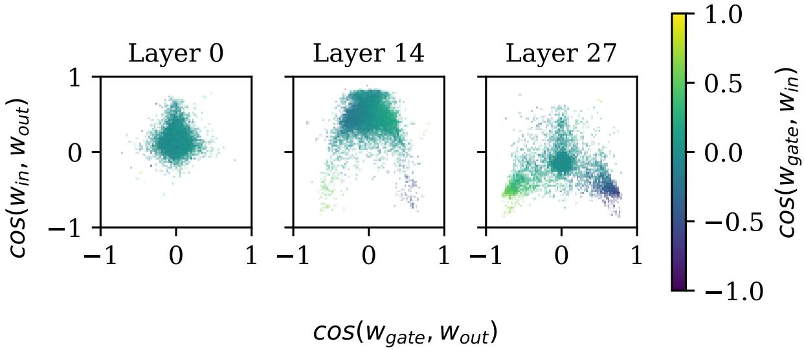  
Figure 7: Equivalent of Fig. 4, but without weight processing. (We don't include the randomness regions.)

Table 2: Decision table defining input-output (IO) classes in GLU models. See Section 4.2.2 for justification. The threshold τ used in practice was 0.5.

Note: What may seem an inconsistency in the typical-atypical distinctions is deliberate: When ${ \pmb w } _ { \mathrm { o u t } }$ is aligned to both ${ \pmb w } _ { \mathrm { g a t e } }$ and ${ \pmb w } _ { \mathrm { i n } }$ (as in the strengthening and weakening fields), we expect also ${ \pmb w } _ { \mathrm { g a t e } }$ and ${ \pmb w } _ { \mathrm { i n } }$ to be aligned with each other; hence our calling it typical when cos $( { \pmb w } _ { \mathrm { g a t e } } , { \pmb w } _ { \mathrm { i n } } )$ is high. On the other hand, if ${ \pmb w } _ { \mathrm { o u t } }$ is aligned with only one of the other two weight vectors, we expect the other two to be misaligned with each other

<table><tr><td> $| \cos ( \boldsymbol { w } _ { \mathrm { g a t e } } , \boldsymbol { w } _ { \mathrm { o u t } } ) |$ </td><td rowspan="3">≈ 1 (or &gt; τ)</td><td rowspan="3"></td><td rowspan="2"> $\approx 0 \ : ( \mathrm { o r } < \tau )$ </td></tr><tr><td> $\cos ( \boldsymbol { w } _ { \mathrm { i n } } , \boldsymbol { w } _ { \mathrm { o u t } } )$ </td><td></td></tr><tr><td>≈ +1 (or &gt; +τ)</td><td>strengthening</td><td>conditional strengthening</td><td>| cos(wgate , win)| &gt; τ</td></tr><tr><td></td><td>| cos(wgate, win)| &gt; τ typical</td><td>| cos(wgate, win)| &lt; τ atypical</td><td>| cos(wgate, win)| &lt; τ typical</td><td>atypical</td></tr><tr><td> ≈ −1 (or &lt; −τ)</td><td>weakening</td><td></td><td>conditional weakening</td><td></td></tr><tr><td></td><td colspan="2">|cos(wgate, win)| &gt; τ | cos(wgate, win)| &lt; τ</td><td colspan="2">| cos(wgate, win)| &lt; τ | cos(wgate, win)| &gt; τ</td></tr><tr><td></td><td>typical</td><td>atypical</td><td>typical</td><td>atypical</td></tr><tr><td> $\approx 0 \ : ( \mathrm { o r } \in [ - \tau , + \tau ] )$ </td><td colspan="2">proportional change</td><td colspan="2">orthogonal output</td></tr><tr><td></td><td>| cos(wgate, win)| &lt; τ typical</td><td>| cos(wgate, win)| &gt; τ atypical</td><td></td><td></td></tr></table>

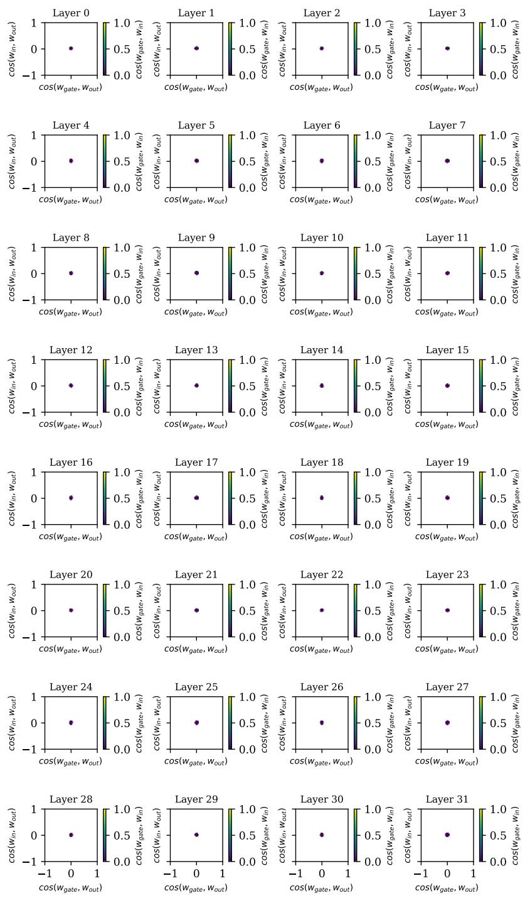  
Figure 8: Equivalent of Fig. 4 for the randomly initialized OLMo-7B model (training checkpoint 0). Whatever doesn't look like this, is significant.

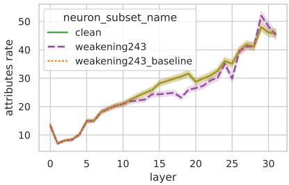  
Figure 9: Effect on attribute rate of mean-ablating 243 weakening neurons (weakening243), or 243 random neurons from the same layers (weakening243\_baseline). The baseline has no sizable influence. In contrast, there is a small but clearly visible effect when ablating weakening neurons, already from layer ≈ 10 onward, even though weakening neurons are few and mostly in late layers. In the supplementary material we show results for other neuron classes, all of which are indistinguishable from the "clean" line.

ability of high-ranking tokens (weakening directions corresponding to tokens) or by increasing the probability of very low-ranking tokens (weakening directions corresponding to negations of tokens).

This is why we tested the two metrics of attribute rate (a proxy of subject enrichment) and entropy. We additionally considered the loss, and, following Gurnee et al.'s analysis of entropy neurons (Gurnee et al., 2024), rank of the correct token and scale of the final hidden state.

## G.2 Details on attribute rate

Our investigation of attribute rate closely follows Geva et al. (2023). It requires a dataset of subject-attribute mappings that we didn't have access to. In order to replicate this dataset, we closely followed the procedure described in their paper, which assumes attributes are tokens that appear in the same Wikipedia paragraph as the subject (excluding stopwords). We used the Wikipedia dump from October 20, 2021, instead of October 13, since there is an official dump made at this date.7 To improve replicability, we publish our complete code as well as our subject-attribute dataset.

Results Ablating weakening neurons has a small but clearly visible effect in layers ≈ 10 and onward (see Fig. 9), whereas the same number of random neurons from the same layers (the orange dotted line in the same figure) or from any other given class has no visible effect at all (see supplementary material). This is particularly interesting since there are very few weakening neurons in these early-middle layers. The direction of the effect is different across layers, so we cannot conclude that "weakening neurons are responsible for attribute $\mathrm { { r a t e } " } ;$ instead, weakening neurons are crucial components in general, and their role is not limited to any specific stage of inference.

## G.3 Mean ablation

## G.3.1 Method

Computing the means. We pre-computed the mean activation of every neuron on the same 20M token subset of Dolma that we also used for the actual ablation experiment.

Conditional ablations. For conditional ablations, we replace the neuron activation by the mean value it would have in the corresponding case (not the mean activation of the neuron overall). For example, in the case "gate-\_post+":

• we replace the activation $( x _ { \mathrm { p o s t } } )$ only when the condition "gate-\_post+" is fulfilled, i.e. when $x _ { \mathrm { g a t e } } < 0$ and $x _ { \mathrm { p o s t } } > 0 -$ this is just the definition of conditional ablation;

• the value that we replace it with is the mean value of $x _ { \mathrm { p o s t } }$ across the cases in which $x _ { g a t e } < 0$ and $x _ { p o s t } > 0$

## G.3.2 Comparison of mean and zero ablation results

Mean ablation recovers effects of weakening neurons that would go unnoticed when just using zero ablation. We hypothesize that these additional effects happen when activations are relatively close to zero but far away from their mean. This remains to be tested in future work.

## H Double checking

In our case studies, we observe that many neurons have the property of double checking: The two reading weight vectors $( w _ { \mathrm { g a t e } }$ and ${ \pmb w } _ { \mathrm { i n } } )$ are approximately orthogonal, but still intuitively represent the same concept.

We characterize double checking as follows: The sets of meaningful vectors most similar to ${ \pmb w } _ { \mathrm { g a t e } }$ and ${ \pmb w } _ { \mathrm { i n } }$ have a high overlap. More formally, let $U \ =$ $\{ u _ { 0 } , . . . , u _ { d _ { \mathrm { v o c a b } } } \}$ be the set of unembedding vectors; then

$$
\underset { u \in U } { \arg \operatorname* { m a x } } \cos ( u , { \boldsymbol w } _ { \mathrm { g a t e } } ) \approx \underset { u \in U } { \arg \operatorname* { m a x } } \cos ( u , { \boldsymbol w } _ { \mathrm { i n } } ) .
$$

This phenomenon is possible because random vectors in high dimensions are “lone stars" (Vershynin, 2025, p. 68). If this is the case for the unembedding vectors, it is plausible that we can find $w _ { \mathrm { g a t e } } , w _ { \mathrm { i n } }$ that are reasonably similar to a $u _ { i }$ but not to any other $u _ { j }$ These $w _ { \mathrm { g a t e } } , w _ { \mathrm { i n } }$ can even be (approximately) orthogonal to each other, as in the following three-dimensional toy example: $u _ { 1 } = ( 1 , 0 , 0 ) , u _ { 2 } = ( 0 , 1 , 0 ) , w _ { \mathrm { g a t e } } =$ $( 1 , 0 , 1 ) , \boldsymbol { w } _ { \mathrm { i n } } = ( 1 , 0 , - 1 )$

However the phenomenon is unlikely to occur in random vectors, and hence is a significant finding: If choosing $w _ { \mathrm { g a t e } } , w _ { \mathrm { i n } }$ randomly, we would expect them to be approximately orthogonal to all unembedding vectors;

and even if both were somewhat similar to an unembedding, we certainly wouldn't expect it to be the same unembedding for both.

We would also not naively expect this phenomenon in a trained network: If the role of both ${ \pmb w } _ { \mathrm { g a t e } }$ and ${ \pmb w } _ { \mathrm { i n } }$ is to detect a concept (e.g. a token prediction) represented by a vector $u ,$ then we would get the best performance with ${ \pmb w } _ { \mathrm { g a t e } } = { \pmb w } _ { \mathrm { i n } } = { \pmb u }$ , i.e., $w _ { \mathrm { g a t e } } , w _ { \mathrm { i n } }$ would not be orthogonal.

Double checking is therefore likely to be a useful feature for the model. We hypothesize that this is because it shrinks the region in model space that activates the neuron positively. If (say) ${ \pmb w } _ { \mathrm { i n } } = { \pmb w } _ { \mathrm { g a t e } } = ( 1 , 0 )$ the neuron activates whenever the (normalized) residual input x satisfies $x \cdot ( 1 , 0 ) > 0 ;$ this happens on the whole half-space $x _ { 1 } > 0$ . If however ${ \pmb w } _ { \mathrm { g a t e } } = ( 1 , 0 )$ and ${ \pmb w } _ { \mathrm { i n } } = ( 0 , 1 )$ , the neuron activates positively only in the first quadrant $( x _ { 1 } , x _ { 2 } > 0 )$

This behavior thus enables more precise concept detection. This may explain why conditional neurons are more frequent than their unconditional counterparts.

## I Case studies

## I.1 Neuron choice

We used two different methods to find interesting neurons:

First, we selected among prediction neurons in the sense of Gurnee et al. (2024). These are defined as neurons whose cos $( W _ { U } , { \pmb w } _ { \mathrm { o u t } } )$ has a high kurtosis; in other words, they boost predictions of a small set of tokens while leaving other token scores virtually unchanged. Specifically, from each discrete RW class we chose the neuron with the highest kurtosis. This first method guarantees finding interpretable neurons in terms of output behavior, though not necessarily an interpretable overall behavior. See Table 3 for an overview of neurons chosen by this method.

A downside is that prediction neurons tend to appear in later layers only. Therefore this neuron choice does not help understand what happens in early layers, especially why there are so many conditional strengthening neurons. We therefore also use a second method: We just select the most prototypical neuron from each class. For example, for conditional strengthening, we take the neuron with the highest cos( $\mathbf { \chi } _ { \mathbf { \min } } , \mathbf { \em w } _ { \mathrm { o u t } } )$ among those neurons whose cos $( { \boldsymbol { \mathbf { \mathit { w } } } } _ { \mathrm { g a t e } } , { \boldsymbol { \mathbf { \mathit { w } } } } _ { \mathrm { o u t } } )$ is within the randomness range (Sections 4.3 and F). This method led to choosing the neurons 5.10602 (conditional strengthening), 23.6543 (conditional weakening), 25.7415 (proportional change), 25.9997 (strengthening), 31.7117 (weakening).

## I.2 Methods

Additionally to our RW analysis, we use two wellestablished neuron analysis methods:

First, we project neuron weights to vocabulary space with the unembedding matrix $W _ { U }$ and inspect highscoring tokens.

Second, we find text examples on which the neurons are strongly activated (positively or negatively). For each neuron we save the 16 strongest positive and negative activations, respectively.

I.3 Detailed analysis of weakening neuron 31.9634 Here we say a bit more about the neuron analyzed in Section 8.

Judging by the weights, we would predict the following: The neuron activates positively when the residual stream contains the “minus again"direction, and then weakens that direction by writing "plus again". The neuron activates negatively when the residual stream contains information both for and against predicting again, and then weakens the again direction. Given that ${ w _ { \mathrm { g a t e } } }$ and ${ \pmb w } _ { \mathrm { i n } }$ are highly similar $( \cos ( w _ { \mathrm { g a t e } } , w _ { \mathrm { i n } } ) = 0 . 7 1 6 4 )$ we would expect that it is easier for the neuron to activate positively (with $x _ { \mathrm { g a t e } }$ and $x _ { \mathrm { i n } }$ of the same sign).

When actually recording activations of the neuron, we get a more complex picture: First of all, the neuron often activates negatively. Strong negative activations are often on punctuation, and the actual next token is often meanwhile or instead (and not again). On the positive side, the strongest activations do not have any obvious semantic relationship to again. We also observed weaker positive activations when again is a plausible continuation, e.g., on the token once (as in once again). These are cases with negative $x _ { \mathrm { g a t e } }$ values (and also $x _ { \mathrm { i n } } < 0 .$ , hence positive activations) – a case that we found to be important in Section 7.2. In these cases, again is already weakly present in the residual stream before the last MLP, and the neuron reinforces again.

Thus the behavior of this particular weakening neuron is interpretable in the $x _ { \mathrm { g a t e } } < 0$ case, echoing our finding from Section 7.2 that this case is surprisingly relevant to model behavior. The $x _ { \mathrm { g a t e } } > 0$ case is less interpretable for this particular neuron, even though this case is more frequent and can lead to stronger activations. Nevertheless we have some hypotheses for the strong activations as well: For strong positive activations (which showed no clear pattern), we hypothesize that sometimes the residual stream ends up near “minus again" for semantically unrelated reasons (there are many more possible concepts than dimensions, so the corresponding directions cannot be fully orthogonal; see Elhage et al., 2022); in these cases the neuron would reduce the unjustified presence of this “minus again” direction. With strong negative activations (where the next token was often meanwhile or instead), the neuron may ensure only these tokens are predicted, and not the relatively similar again.

## I.4 Results and analysis for prediction neurons See Table 4.

Strengthening neuron 28.4737 predicts review (and related tokens) if activated positively, which happens if review is already present in the residual stream. The maximally positive activations are in standard contexts that continue with review or similar, such as the newline after the description of an e-book (the next paragraph often is the beginning of a review). On the other hand, strong negative activations (with $x _ { \mathrm { g a t e } } > 0 , x _ { \mathrm { i n } } < 0 )$ often occur in contexts where the next token is or could be something like blog or post, self-referencing the text. Other negative activations, with $x _ { \mathrm { g a t e } } < 0$ and $x _ { \mathrm { i n } } > 0$ occur more broadly in contexts semantically talking about reviews (not just on the exact token before review).

Table 3: Overview of prediction/suppression neurons chosen for case studies in Section I
<table><tr><td>Neuron</td><td>RW category</td><td> $\cos ( \pmb { w } _ { \mathrm { g a t e } } , \pmb { w } _ { \mathrm { i n } } )$ </td><td> $\cos ( \boldsymbol { w } _ { \mathrm { g a t e } } , \boldsymbol { w } _ { \mathrm { o u t } } )$ </td><td> $\cos ( { \boldsymbol { w } _ { \mathrm { i n } } } , { \boldsymbol { w } _ { \mathrm { o u t } } } )$ </td></tr><tr><td>28.4737</td><td>strengthening</td><td>0.5290</td><td>0.5048</td><td>0.7060</td></tr><tr><td>28.9766</td><td>conditional strengthening</td><td>0.4764</td><td>0.4119</td><td>0.5982</td></tr><tr><td>31.9634</td><td>weakening</td><td>0.7164</td><td>-0.7218</td><td>-0.8542</td></tr><tr><td>29.10900</td><td>conditional weakening</td><td>0.4988</td><td>-0.4992</td><td>-0.5775</td></tr><tr><td>30.10972</td><td>proportional change</td><td>0.4543</td><td>-0.5814</td><td>-0.4182</td></tr><tr><td>29.4180</td><td>orthogonal output</td><td>0.0272</td><td>0.4057</td><td>0.0669</td></tr></table>

Table 4: Description of the weight vectors of the selected prediction neurons, by top tokens or similarity to ${ \pmb w } _ { \mathrm { o u t } } .$ The question mark, ?, signals unknown unicode characters. The last column presents the (shortened) text samples on which the respective neuron activates most strongly (positively or negatively).
<table><tr><td rowspan=1 colspan=1>Neuron,RW class</td><td rowspan=1 colspan=1> ${ \pmb w } _ { \mathrm { g a t e } }$ </td><td rowspan=1 colspan=1> ${ \pmb w } _ { \mathrm { i n } }$ </td><td rowspan=1 colspan=1> ${ \pmb w } _ { \mathrm { o u t } }$ </td></tr><tr><td rowspan=1 colspan=1>28.4737strengthening</td><td rowspan=1 colspan=1> $\approx \pmb { w } _ { \mathrm { o u t } }$ </td><td rowspan=1 colspan=1> $\approx \pmb { w } _ { \mathrm { o u t } }$ </td><td rowspan=1 colspan=1>pos:reviewReview</td></tr><tr><td rowspan=1 colspan=1>28.9766conditionalstrengthening</td><td rowspan=1 colspan=1>pos:       neg:well       farwell      high</td><td rowspan=1 colspan=1> $\approx \pmb { w } _ { \mathrm { o u t } }$ </td><td rowspan=1 colspan=1>pos:wellwell</td></tr><tr><td rowspan=1 colspan=1>31.9634weakening</td><td rowspan=1 colspan=1> $\approx - \pmb { w } _ { \mathrm { o u t } }$ </td><td rowspan=1 colspan=1> $\approx - \pmb { w } _ { \mathrm { o u t } }$ </td><td rowspan=1 colspan=1>pos:againAgain</td></tr><tr><td rowspan=1 colspan=1>29.10900conditionalweakening</td><td rowspan=1 colspan=1>pos:       neg:today     thesenowa-   thesedays</td><td rowspan=1 colspan=1> $\approx - \pmb { w } _ { \mathrm { o u t } }$ </td><td rowspan=1 colspan=1>pos:theseThese</td></tr><tr><td rowspan=1 colspan=1>30.10972proportionalchange</td><td rowspan=1 colspan=1> $\approx \pmb { w } _ { \mathrm { o u t } }$ </td><td rowspan=1 colspan=1>pos:       neg:when     timingwhen       dates</td><td rowspan=1 colspan=1>neg:whenwhen</td></tr><tr><td rowspan=1 colspan=1>29.4180</td><td rowspan=1 colspan=1>pos:       neg:</td><td rowspan=2 colspan=1>pos: ?     neg:herein</td><td rowspan=2 colspan=1>neg:therethere</td></tr><tr><td rowspan=1 colspan=1>orthogonaloutput</td><td rowspan=1 colspan=1>here       theretherein    we</td></tr></table>

Table 5: Description of the weight vectors of the selected prototypical neurons, by top tokens or similarity to ${ \pmb w } _ { \mathrm { o u t } }$ The question mark, ?, signals unknown unicode characters. The last column presents the (shortened) text samples on which the respective neuron activates most strongly (positively or negatively).
<table><tr><td>Neuron, RW class</td><td colspan="2"> ${ \pmb w } _ { \mathrm { g a t e } }$ </td><td> ${ \pmb w } _ { \mathrm { i n } }$ </td><td colspan="2"> ${ \pmb w } _ { \mathrm { o u t } }$ </td></tr><tr><td>25.9997 strengthening</td><td colspan="2"> $\approx \pmb { w } _ { \mathrm { o u t } }$ </td><td colspan="2"> $\approx \pmb { w } _ { \mathrm { o u t } }$ </td><td>pos: neg: S Chocolate</td></tr><tr><td rowspan="3">5.10602 conditional strengthening 31.7117</td><td rowspan="3">pos: neg: t deep hum as</td><td rowspan="3"></td><td> $\approx \pmb { w } _ { \mathrm { o u t } }$ </td><td>S Cour</td></tr><tr><td>pos: as</td><td>neg: ating</td></tr><tr><td>t pos:</td><td>their neg:</td></tr><tr><td rowspan="3">weakening 23.6543 conditional weakening a</td><td rowspan="3">pos: the</td><td></td><td>by by</td><td>ani iw</td></tr><tr><td>neg: ham</td><td> $\approx - \pmb { w } _ { \mathrm { o u t } }$  pos: Op</td><td>neg: rom</td></tr><tr><td>aden</td><td>AB</td><td>C</td></tr><tr><td rowspan="3">25.7415 proportional change</td><td rowspan="3"> $\approx \pmb { w } _ { \mathrm { o u t } }$ </td><td>pos: neg: a</td><td>pos:</td><td>neg:</td></tr><tr><td>berry</td><td>? the</td><td>Nine</td></tr><tr><td>rod</td><td>Hart</td><td>jin</td></tr></table>

Conditional strengthening neuron 28.9766's RW functionality concerns well and similar tokens. 28.9766 promotes them if activated positively, which happens when both ${ \pmb w } _ { \mathrm { g a t e } }$ and ${ \pmb w } _ { \mathrm { i n } }$ indicate that well is represented in the residual stream. This is a case of double checking. The maximally positive activation in our sample occurs on Oh, in a context in which Oh, well makes sense (and is the actual continuation).

## Weakening neuron 31.9634. See Section I.3.

Conditional weakening neuron 29.10900. Gate and linear input weight vectors act as two independent ways of checking for the absence of the token these in the residual stream. This is a case of double checking (see Section H). At the same time, the gate and in weights check for predictions like today, nowadays. When such predictions are present, the neuron promotes these. This is a plausible choice in these cases because of the expression these days. An example is social media tools change and come and go at the drop of a hat. (This sentence talks about a characteristic of current times, so these days would indeed be a plausible continuation.)

Proportional change neuron 30.10972 predicts the token when if activated negatively. This happens if when is absent from the residual stream (gate condition) and is proportional to the presence of time-related tokens $( - \pmb { w } _ { \mathrm { i n } } )$ . An example for a large negative activation is puts you on multiple webpages $\mathbf { \Delta } _ { a t . } { } ^ { 8 }$ Conversely, if when is absent, and time-related tokens are absent too, the neuron activates positively and suppresses when further.

Orthogonal output neuron 29.4180 predicts there (positive activation) if the residual stream contains a component that we interpret as “complement of place expected" (e.g., here, therein). Both ${ \pmb w } _ { \mathrm { g a t e } }$ and ${ \pmb w } _ { \mathrm { i n } }$ check for (different aspects of) this component being present, another case of double checking. The largest positive activation is on here or.

Overall, these neurons all promote a specific set of tokens (we chose them that way), but under very different circumstances. The (conditional) strengthening neurons are the most straightforward to interpret, because their input and output clearly correspond to the same concept. In contrast, weakening neurons inherently involve (an apparent) conflict between the intermediate model prediction and what the neuron promotes.

## I.5 Results and analysis for prototypical examples See Table 5.

Strengthening neuron 25.9997 is all about strengthening an S as a next token. The strong positive activations $( x _ { \mathrm { g a t e } } , x _ { \mathrm { i n } } > 0 )$ usually have an S as next token, but in very specific contexts such as abbreviations or names of fictional characters (Janos Slynt). This may be due to tokenization (in more common contexts the s will not be a standalone token), or these activations might have the specific role of strengthening the s prediction in memorized contexts. Note that if this were the case, the neuron would play a role in the model's memory of these contexts, but would not be responsible for it alone. The other activations (either $x _ { \mathrm { g a t e } } \ { \mathrm { o r } } \ x _ { \mathrm { i n } }$ negative) are not readily interpretable, but also much smaller.

Conditional strengthening neuron 5.10602 activates $( x _ { \mathrm { g a t e } } > 0 )$ on those tokens that often start negated auxiliary verbs: don, aren, won, didn. Correspondingly, the top token of $W _ { U } { \pmb w } _ { \mathrm { g a t e } }$ is t (but interestingly not an apostrophe). On the other hand, ${ \pmb w } _ { \mathrm { i n } }$ detects alternative predictions: ate, ating etc. (as in donate) lead to a negative activation, and as (as in arenas) leads to a positive activation. Correspondingly the strongest positive activations are on the aren of arenas (but the strongest negative activations are not always in a donate context perhaps because both don't and donate can appear in the same slots). These alternative predictions (aren->as or don->ating, respectively) are then strengthened by ${ \pmb w } _ { \mathrm { o u t } }$

Weakening neuron 31.7117 is in many ways similar to the other weakening neuron we investigated (see Section I.3). Based on the weights, this neuron detects the intermediate prediction "minus $b y "$ and writes by (just like the other neuron detects "minus again" and writes again). When examining the activations, we also get a more complex picture, that is similar to the other neuron: Negative activations $( x _ { \mathrm { g a t e } } > 0 , x _ { \mathrm { i n } } < 0 )$ are surprisingly frequent; strong activations (positive or negative) are not particularly interpretable; but negative-gate activations $( x _ { \mathrm { g a t e } } < 0 , x _ { \mathrm { i n } } < 0$ , corresponding to the neuron strengthening a by prediction) are more interpretable in that by is often (though not always) the next token. There are however also some differences: In the case $x _ { \mathrm { g a t e } } , x _ { \mathrm { i n } } > 0$ , sometimes the preceding, current, or next token is a $b y$ . Perhaps, in these cases a previous model component indicated that by should not be repeated, and the neuron weakens this signal. A similar observation can be made about the weaker negative activations with $x _ { \mathrm { g a t e } } < 0 , x _ { \mathrm { i n } } > 0 { \mathrm { : } }$ the token $b y$ is around, but usually not the correct prediction. Here the residual stream contains a contradictory signal, leading to a negative activation of the neuron, which then writes "minus $b y "$

Conditional weakening neuron 23.6543: About the only interpretable thing is that $x _ { \mathrm { g a t e } } < 0 , x _ { \mathrm { i n } } > 0$ (weak negative) activations tend to occur on the penultimate token of personal names, in contexts like "X said/commented/...". Based on the weights, it is not particularly interpretable what effect the neuron has in these or any other contexts.

Proportional change neuron 25.7415: The weights are not particularly interpretable on their own. The activations seem to be polysemantic: several distinct patterns emerge. Among the top activations with $x _ { \mathrm { i n } } > 0$ (whether or not $x _ { \mathrm { g a t e } }$ is positive or negative), many are on a token (parenthesis or slash) announcing a metric conversion, e.g. the parenthesis in ${ \cal I } 8 0 ~ ^ { \circ } C ~ ( 3 5 0 ~ ^ { \circ } F )$ Others are on the last token of multi-token proper nouns. So ${ \pmb w } _ { \mathrm { i n } }$ corresponds to these concepts. As for ${ \pmb w } _ { \mathrm { g a t e } }$ , the top positive $x _ { \mathrm { g a t e } }$ values mostly happen on punctuation marks starting a line (often the comment signs \\ or # in code). The most negative $x _ { \mathrm { g a t e } }$ values tend to happen on the penultimate token of some arbitrary-looking token strings (such as proper nouns, typoed words, or chemical compounds). So possibly ${ \pmb w } _ { \mathrm { g a t e } }$ could be interpreted as "something new should start vs. the current thing should be ended". The neuron modulates this "start of something" concept proportionally to the presence of ${ \pmb w } _ { \mathrm { i n } }$ : When a metric conversion is expected or a proper noun has just ended, the neuron strengthens this prediction that something should start.

## I.6 More case studies

These are various neurons that popped out to us as possibly interesting, for not very systematic reasons, for example because they strongly activated on a specific named entity. All of them are in OLMo-7B.

We encourage the readers to explore the activations of these neurons on their own (links below) and compare this with simple weight-based analyses (e.g. logit lens on weight vectors).

Conditional strengthening neurons: 0.1480, 4.1940 4.3720, 4.4801, 4.5772, 4.6517, 4.6799, 4.7667, 4.9983, 4.10859, 4.10882, 4.10995, 22.2589, 24.4880, 24.6771, 25.2723, 25.10496;

Weakening neurons: 30.9996, 31.9216;

Conditional weakening neurons: 24.10431;

Proportional change neurons: 25.7032, 25.8607, 29.8118, 31.5490, 31.6275, 31.8342;

Orthogonal output neurons: 0.1758, 0.3338, 0.3872, 0.7829, 0.7966, 29.2568, 29.3327, 29.4101, 29.6417, 29.9734, 30.2667, 30.3143, 30.3883, 30.4577, 30.5372, 30.8535, 31.2135, 31.10424.

## J Additional figures and tables

These final figures and tables show additional results:

• Section J.1 shows more results on activation frequencies.

• Section J.2 shows additional results on neuron ablations.

• In Section J.3, we show our analyses of IO functionalities by layer (Section 5) for all the models we investigated, both non-GLU and GLU.

To keep this appendix at a manageable size, we don't include all the plots produced by our experiments. We publish the other plots as supplementary material at https://github.com/sjgerstner/RW\_functiona lities\_results.

## J.1 Activation frequencies

Figure 10 shows activation frequencies vs. IO cosines in OLMo-7B, on all layers separately. See the supplementary material for other models, tables by discrete class, and plots against $| \cos ( \boldsymbol { w } _ { \mathrm { g a t e } } , \boldsymbol { w } _ { \mathrm { o u t } } )$ or $\cos ( \pmb { w } _ { \mathrm { g a t e } } , \pmb { w } _ { \mathrm { i n } } )$

The last layer displays a different pattern than the rest (last subplot in Fig. 10). Here the correlation is positive (+0.29), and we can distinguish two clusters of neurons: One cluster has a medium-negative $\cos ( { \boldsymbol { w } _ { \mathrm { i n } } } , { \boldsymbol { w } _ { \mathrm { o u t } } } )$ (around —0.3) and activates very rarely; another one is much more spread out (both in terms of cos $( \pmb { w } _ { \mathrm { i n } } , \pmb { w } _ { \mathrm { o u t } } )$ and activation frequency), centers at a weaker negative cosine similarity (—0.1 to —0.2) and activates a bit more than half of the time. The presence of these two clusters leads to the slightly positive correlation. Comparing with the other plots suggests that the first cluster mostly corresponds to weakening neurons and atypical proportional change neurons.

We do not find such striking patterns with gate-out or gate-in similarities.

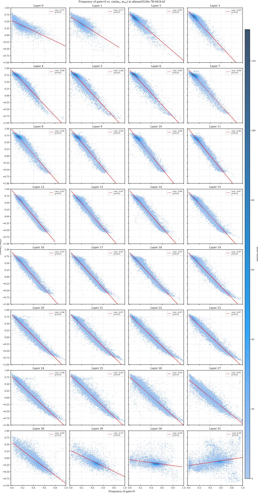  
Figure 10: Like Fig. 5 but for all layers separately.

## J.2 Neuron ablations

This section (Figs. 11 to 21) contains results for entropy and loss, on OLMo-7B. The supplementary material shows the effect of ablations on attribute rate (as described in Section G.2), rank of correct output token, and scale of last hidden state vector, as well as equivalent results on Llama-3.2-3B.

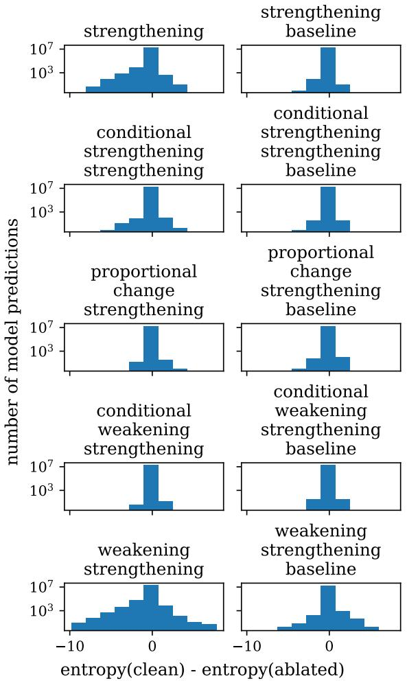  
Figure 11: Effect on entropy of zero-ablations of various neuron classes (ablating as many neurons as there are strengthening neurons).

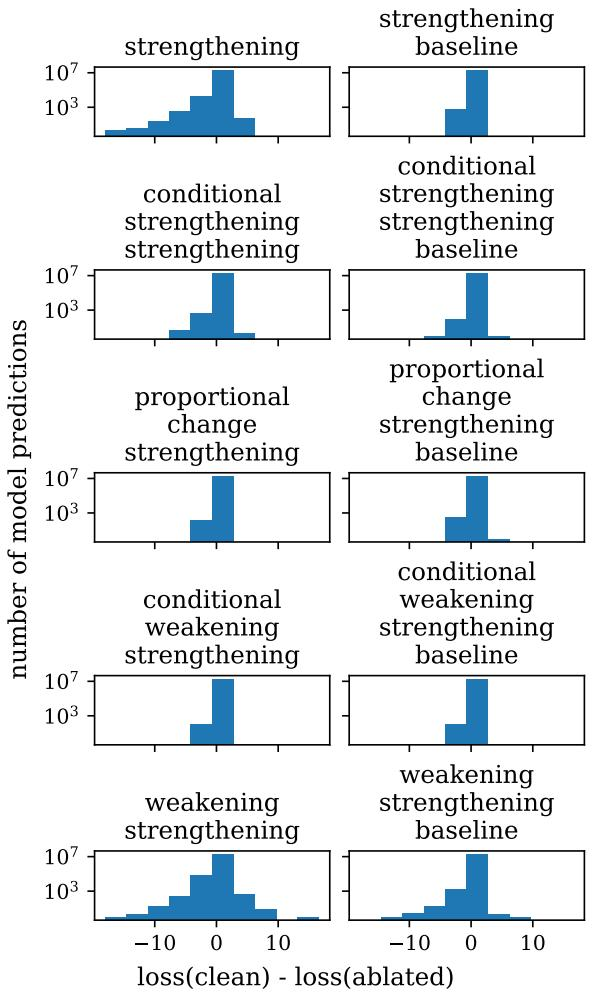  
Figure 12: Effect on loss of zero-ablations of various neuron classes (ablating as many neurons as there are strengthening neurons).

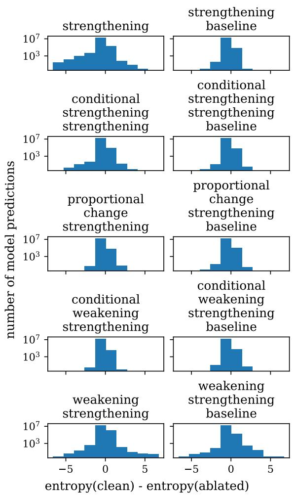  
Figure 13: Effect on entropy of mean-ablations of various neuron classes (ablating as many neurons as there are strengthening neurons).

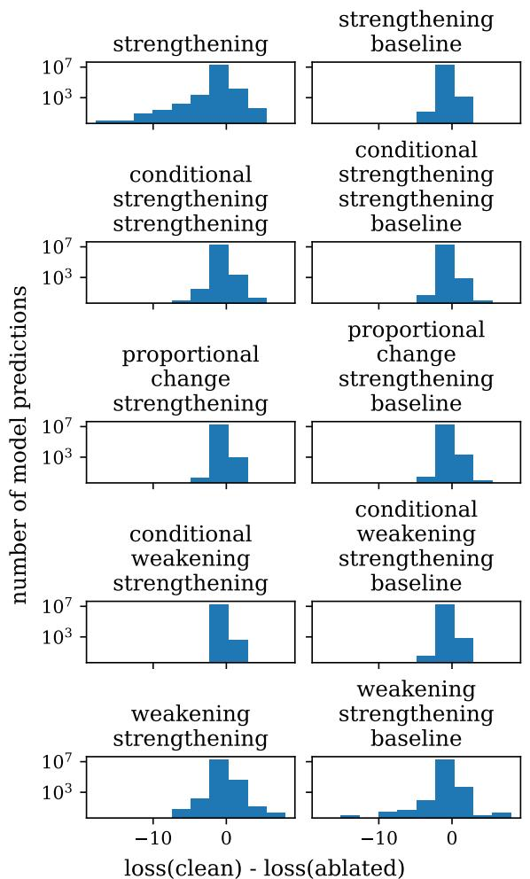  
Figure 14: Effect on loss of mean-ablations of various neuron classes (ablating as many neurons as there are strengthening neurons).

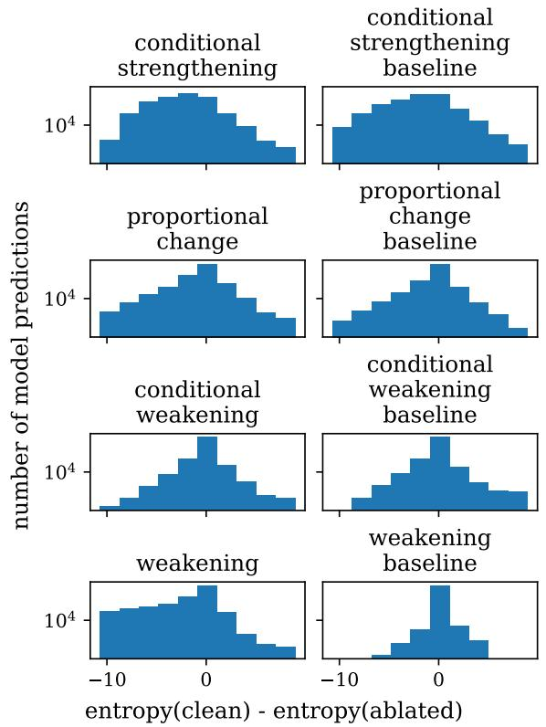  
Figure 15: Effect on entropy of zero-ablations of various neuron classes (ablating as many neurons as there are weakening neurons).

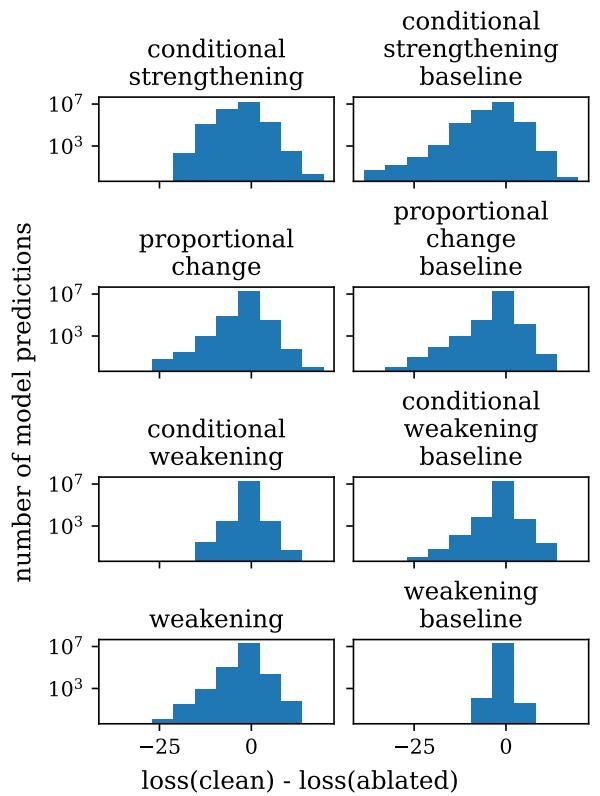  
Figure 16: Effect on loss of zero-ablations of various neuron classes (ablating as many neurons as there are weakening neurons).

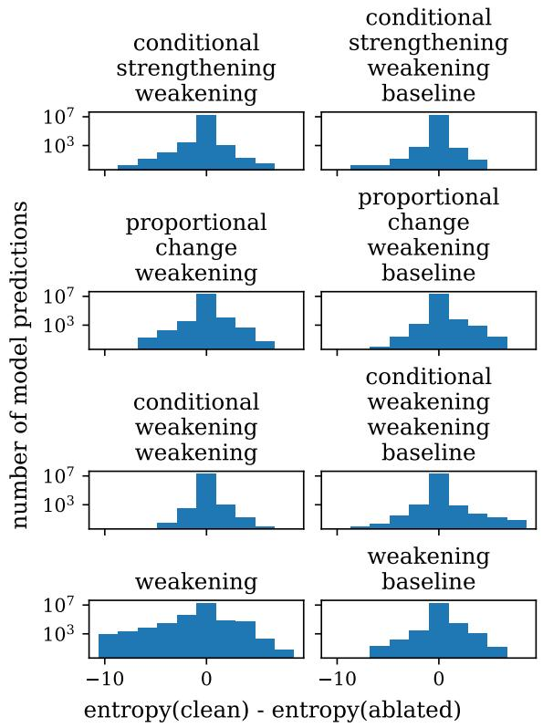  
Figure 17: Effect on entropy of mean-ablations of various neuron classes (ablating as many neurons as there are weakening neurons).

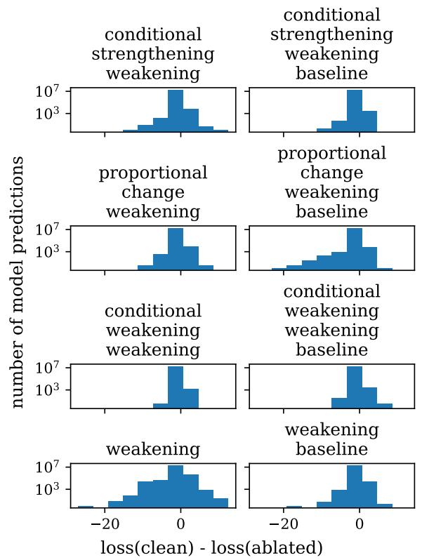  
Figure 18: Effect on loss of mean-ablations of various neuron classes (ablating as many neurons as there are weakening neurons).

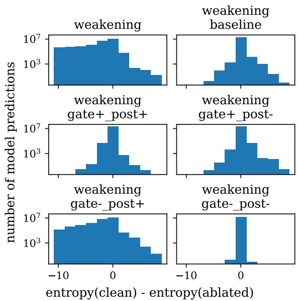  
Figure 19: Effect on entropy of conditional zeroablations of weakening neurons.

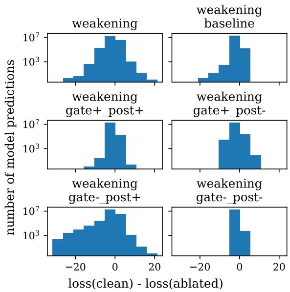  
Figure 20: Effect on loss of conditional zero-ablations of weakening neurons.

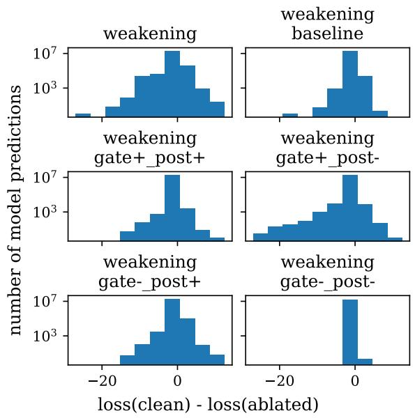  
Figure 21: Effect on loss of conditional mean-ablations of weakening neurons.

## J.3 Distributions of neuron weight cosines by model and layer

## J.3.1 Non-GLU models

Here we show results for a few selected models: T5- large (Table 6 and Fig. 22), BERT-large-cased (Table 7 and Fig. 23), Othello-GPT (Table 8 and Fig. 24), and GPT2-XL (Table 9 and Fig. 25). For other models see the supplementary material.

We can see that many neurons have cosine similarities substantially different from zero. In particular, there is a sizable number of weakening neurons with cosine similarities below —0.8 (mostly early-middle layers in GPT2, but it varies across models to some extent).

On the other hand, there are very few strengthening neurons with cosine similarities above +0.8. Some of the table columns stop at cos < 0.6 or cos < 0.8. This is not a bug, but reflects the rarity of strengthening neurons: in these models, there is not a single neuron with a higher IO cosine similarity (so no strengthening neurons in the stricter sense of the word), but there are many neurons with very low negative IO cosine similarities (weakening neurons).

There is also a large number of neurons with moderately non-zero cosine similarities: cosines between e.g. 0.2 and 0.6 (mostly early layers in GPT2, but again it varies); and moderately negative cosines between e.g. —0.2 and —0.6 (mostly middle-to-late layers in GPT2, but variable overall).

Some of these phenomena have been briefly observed before (Elhage et al., 2021; Gurnee et al., 2024), but to our knowledge we are the first to systematically report them.

## T5 models (encoder-decoder). Table 6 and Fig. 22.

Note that in these visualizations the encoder and decoder layers are stacked: The first half of the layers correspond to the encoder module, the second half to the decoder module. Thus, in each of these tables and figures, the upper half corresponds to the encoder and the lower half to the decoder.

BERT models (encoder-only). Table 7 and Fig. 23.

Othello-GPT (decoder, non-language). Table 8 and Fig. 24.

Decoder-only language models (non-GLU). Table 9 and Fig. 25.

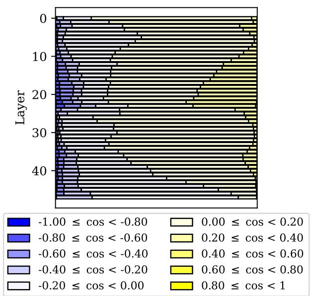  
Figure 22: Distribution of neurons by layer and inputoutput weight cosines in T5-large models (visualization of Table 6). Layers 0-23 correspond to the encoder, and 24-47 to the decoder.

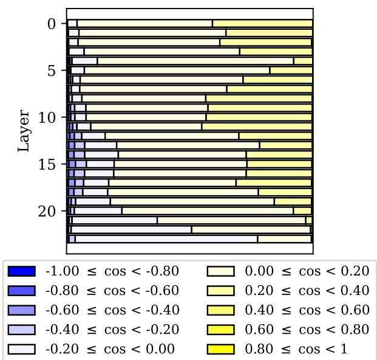  
Figure 23: Distribution of neurons by layer and inputoutput weight cosines in BERT-large-cased (visualization of Table 7).

Table 6: Distribution of neuron IO cosines by layer in t5-large. See Fig. 22 for a visualization. Layers 0-23 correspond to the encoder, and 24-47 to the decoder.
<table><tr><td rowspan=2 colspan=1>Layer</td><td rowspan=2 colspan=1>-1.00≤ cos&lt; -0.80</td><td rowspan=2 colspan=1>-0.80≤ cos&lt; -0.60</td><td rowspan=2 colspan=1>-0.60≤ cos&lt; -0.40</td><td rowspan=2 colspan=1>-0.40≤ cos&lt; -0.20</td><td rowspan=2 colspan=1>-0.20≤ cos&lt; 0.00</td><td rowspan=2 colspan=1>0.00 ≤cOS&lt;0.20</td><td rowspan=2 colspan=1>0.20 ≤COS ∠0.40</td><td></td></tr><tr><td rowspan=1 colspan=1>0.40 ≤COS&lt;0.60</td></tr><tr><td rowspan=2 colspan=1>01</td><td rowspan=1 colspan=1>0</td><td rowspan=2 colspan=1>00</td><td rowspan=1 colspan=1>26</td><td rowspan=1 colspan=1>134</td><td rowspan=1 colspan=1>568</td><td rowspan=1 colspan=1>3253</td><td rowspan=2 colspan=1>11580</td><td rowspan=2 colspan=1>00</td></tr><tr><td rowspan=1 colspan=1>0</td><td rowspan=1 colspan=1>87</td><td rowspan=1 colspan=1>222</td><td rowspan=1 colspan=1>779</td><td rowspan=1 colspan=1>2928</td></tr><tr><td rowspan=1 colspan=1>2</td><td rowspan=1 colspan=1>0</td><td rowspan=1 colspan=1>24</td><td rowspan=1 colspan=1>79</td><td rowspan=1 colspan=1>233</td><td rowspan=1 colspan=1>1028</td><td rowspan=1 colspan=1>2377</td><td rowspan=1 colspan=1>355</td><td rowspan=1 colspan=1>0</td></tr><tr><td rowspan=1 colspan=1>3</td><td rowspan=1 colspan=1>0</td><td rowspan=1 colspan=1>8</td><td rowspan=1 colspan=1>45</td><td rowspan=1 colspan=1>167</td><td rowspan=1 colspan=1>1180</td><td rowspan=1 colspan=1>2411</td><td rowspan=1 colspan=1>285</td><td rowspan=1 colspan=1>0</td></tr><tr><td rowspan=1 colspan=1>4</td><td rowspan=1 colspan=1>0</td><td rowspan=1 colspan=1>10</td><td rowspan=1 colspan=1>32</td><td rowspan=1 colspan=1>155</td><td rowspan=1 colspan=1>1465</td><td rowspan=1 colspan=1>2284</td><td rowspan=1 colspan=1>150</td><td rowspan=1 colspan=1>0</td></tr><tr><td rowspan=1 colspan=1>5</td><td rowspan=1 colspan=1>0</td><td rowspan=1 colspan=1>4</td><td rowspan=1 colspan=1>33</td><td rowspan=1 colspan=1>122</td><td rowspan=1 colspan=1>1586</td><td rowspan=1 colspan=1>2284</td><td rowspan=1 colspan=1>67</td><td rowspan=1 colspan=1>0</td></tr><tr><td rowspan=1 colspan=1>6</td><td rowspan=1 colspan=1>0</td><td rowspan=1 colspan=1>11</td><td rowspan=1 colspan=1>30</td><td rowspan=1 colspan=1>102</td><td rowspan=1 colspan=1>1476</td><td rowspan=1 colspan=1>2419</td><td rowspan=1 colspan=1>58</td><td rowspan=1 colspan=1>0</td></tr><tr><td rowspan=1 colspan=1>7</td><td rowspan=1 colspan=1>0</td><td rowspan=1 colspan=1>4</td><td rowspan=1 colspan=1>40</td><td rowspan=1 colspan=1>150</td><td rowspan=1 colspan=1>1289</td><td rowspan=1 colspan=1>2510</td><td rowspan=1 colspan=1>103</td><td rowspan=1 colspan=1>0</td></tr><tr><td rowspan=1 colspan=1>8</td><td rowspan=1 colspan=1>0</td><td rowspan=1 colspan=1>8</td><td rowspan=1 colspan=1>57</td><td rowspan=1 colspan=1>164</td><td rowspan=1 colspan=1>1087</td><td rowspan=1 colspan=1>2603</td><td rowspan=1 colspan=1>177</td><td rowspan=1 colspan=1>0</td></tr><tr><td rowspan=1 colspan=1>9</td><td rowspan=1 colspan=1>0</td><td rowspan=1 colspan=1>18</td><td rowspan=1 colspan=1>75</td><td rowspan=1 colspan=1>168</td><td rowspan=1 colspan=1>951</td><td rowspan=1 colspan=1>2607</td><td rowspan=1 colspan=1>277</td><td rowspan=1 colspan=1>0</td></tr><tr><td rowspan=1 colspan=1>10</td><td rowspan=1 colspan=1>0</td><td rowspan=1 colspan=1>16</td><td rowspan=1 colspan=1>90</td><td rowspan=1 colspan=1>210</td><td rowspan=1 colspan=1>838</td><td rowspan=1 colspan=1>2572</td><td rowspan=1 colspan=1>370</td><td rowspan=1 colspan=1>0</td></tr><tr><td rowspan=1 colspan=1>11</td><td rowspan=1 colspan=1>1</td><td rowspan=1 colspan=1>14</td><td rowspan=1 colspan=1>129</td><td rowspan=1 colspan=1>204</td><td rowspan=1 colspan=1>766</td><td rowspan=1 colspan=1>2454</td><td rowspan=1 colspan=1>527</td><td rowspan=1 colspan=1>1</td></tr><tr><td rowspan=1 colspan=1>12</td><td rowspan=1 colspan=1>1</td><td rowspan=1 colspan=1>43</td><td rowspan=1 colspan=1>158</td><td rowspan=1 colspan=1>280</td><td rowspan=1 colspan=1>770</td><td rowspan=1 colspan=1>2159</td><td rowspan=1 colspan=1>682</td><td rowspan=1 colspan=1>3</td></tr><tr><td rowspan=1 colspan=1>13</td><td rowspan=1 colspan=1>0</td><td rowspan=1 colspan=1>43</td><td rowspan=1 colspan=1>173</td><td rowspan=1 colspan=1>232</td><td rowspan=1 colspan=1>692</td><td rowspan=1 colspan=1>2243</td><td rowspan=1 colspan=1>710</td><td rowspan=1 colspan=1>3</td></tr><tr><td rowspan=1 colspan=1>14</td><td rowspan=1 colspan=1>2</td><td rowspan=1 colspan=1>37</td><td rowspan=1 colspan=1>212</td><td rowspan=1 colspan=1>196</td><td rowspan=1 colspan=1>675</td><td rowspan=1 colspan=1>2149</td><td rowspan=1 colspan=1>821</td><td rowspan=1 colspan=1>4</td></tr><tr><td rowspan=1 colspan=1>15</td><td rowspan=1 colspan=1>1</td><td rowspan=1 colspan=1>56</td><td rowspan=1 colspan=1>222</td><td rowspan=1 colspan=1>252</td><td rowspan=1 colspan=1>591</td><td rowspan=1 colspan=1>2094</td><td rowspan=1 colspan=1>874</td><td rowspan=1 colspan=1>6</td></tr><tr><td rowspan=1 colspan=1>16</td><td rowspan=1 colspan=1>0</td><td rowspan=1 colspan=1>48</td><td rowspan=1 colspan=1>212</td><td rowspan=1 colspan=1>231</td><td rowspan=1 colspan=1>538</td><td rowspan=1 colspan=1>2112</td><td rowspan=1 colspan=1>948</td><td rowspan=1 colspan=1>7</td></tr><tr><td rowspan=1 colspan=1>17</td><td rowspan=1 colspan=1>2</td><td rowspan=1 colspan=1>82</td><td rowspan=1 colspan=1>250</td><td rowspan=1 colspan=1>239</td><td rowspan=1 colspan=1>542</td><td rowspan=1 colspan=1>1888</td><td rowspan=1 colspan=1>1088</td><td rowspan=1 colspan=1>5</td></tr><tr><td rowspan=1 colspan=1>18</td><td rowspan=1 colspan=1>1</td><td rowspan=1 colspan=1>79</td><td rowspan=1 colspan=1>291</td><td rowspan=1 colspan=1>197</td><td rowspan=1 colspan=1>512</td><td rowspan=1 colspan=1>1863</td><td rowspan=1 colspan=1>1149</td><td rowspan=1 colspan=1>4</td></tr><tr><td rowspan=1 colspan=1>19</td><td rowspan=1 colspan=1>2</td><td rowspan=1 colspan=1>92</td><td rowspan=1 colspan=1>268</td><td rowspan=1 colspan=1>166</td><td rowspan=1 colspan=1>533</td><td rowspan=1 colspan=1>1816</td><td rowspan=1 colspan=1>1215</td><td rowspan=1 colspan=1>4</td></tr><tr><td rowspan=1 colspan=1>20</td><td rowspan=1 colspan=1>4</td><td rowspan=1 colspan=1>89</td><td rowspan=1 colspan=1>263</td><td rowspan=1 colspan=1>176</td><td rowspan=1 colspan=1>527</td><td rowspan=1 colspan=1>1839</td><td rowspan=1 colspan=1>1194</td><td rowspan=1 colspan=1>4</td></tr><tr><td rowspan=1 colspan=1>21</td><td rowspan=1 colspan=1>2</td><td rowspan=1 colspan=1>98</td><td rowspan=1 colspan=1>216</td><td rowspan=1 colspan=1>142</td><td rowspan=1 colspan=1>517</td><td rowspan=1 colspan=1>1832</td><td rowspan=1 colspan=1>1285</td><td rowspan=1 colspan=1>4</td></tr><tr><td rowspan=1 colspan=1>22</td><td rowspan=1 colspan=1>13</td><td rowspan=1 colspan=1>127</td><td rowspan=1 colspan=1>210</td><td rowspan=1 colspan=1>185</td><td rowspan=1 colspan=1>539</td><td rowspan=1 colspan=1>1580</td><td rowspan=1 colspan=1>1430</td><td rowspan=1 colspan=1>12</td></tr><tr><td rowspan=1 colspan=1>23</td><td rowspan=1 colspan=1>13</td><td rowspan=1 colspan=1>168</td><td rowspan=1 colspan=1>326</td><td rowspan=1 colspan=1>309</td><td rowspan=1 colspan=1>653</td><td rowspan=1 colspan=1>1325</td><td rowspan=1 colspan=1>1268</td><td rowspan=1 colspan=1>34</td></tr><tr><td rowspan=1 colspan=1>24</td><td rowspan=1 colspan=1>0</td><td rowspan=1 colspan=1>5</td><td rowspan=1 colspan=1>107</td><td rowspan=1 colspan=1>336</td><td rowspan=1 colspan=1>855</td><td rowspan=1 colspan=1>2343</td><td rowspan=1 colspan=1>450</td><td rowspan=1 colspan=1>0</td></tr><tr><td rowspan=1 colspan=1>25</td><td rowspan=1 colspan=1>0</td><td rowspan=1 colspan=1>4</td><td rowspan=1 colspan=1>48</td><td rowspan=1 colspan=1>191</td><td rowspan=1 colspan=1>1065</td><td rowspan=1 colspan=1>2525</td><td rowspan=1 colspan=1>263</td><td rowspan=1 colspan=1>0</td></tr><tr><td rowspan=1 colspan=1>26</td><td rowspan=1 colspan=1>0</td><td rowspan=1 colspan=1>5</td><td rowspan=1 colspan=1>23</td><td rowspan=1 colspan=1>53</td><td rowspan=1 colspan=1>682</td><td rowspan=1 colspan=1>3098</td><td rowspan=1 colspan=1>235</td><td rowspan=1 colspan=1>0</td></tr><tr><td rowspan=1 colspan=1>27</td><td rowspan=1 colspan=1>0</td><td rowspan=1 colspan=1>16</td><td rowspan=1 colspan=1>49</td><td rowspan=1 colspan=1>69</td><td rowspan=1 colspan=1>713</td><td rowspan=1 colspan=1>3072</td><td rowspan=1 colspan=1>177</td><td rowspan=1 colspan=1>0</td></tr><tr><td rowspan=1 colspan=1>28</td><td rowspan=1 colspan=1>0</td><td rowspan=1 colspan=1>13</td><td rowspan=1 colspan=1>33</td><td rowspan=1 colspan=1>84</td><td rowspan=1 colspan=1>1059</td><td rowspan=1 colspan=1>2819</td><td rowspan=1 colspan=1>88</td><td rowspan=1 colspan=1>0</td></tr><tr><td rowspan=1 colspan=1>29</td><td rowspan=1 colspan=1>0</td><td rowspan=1 colspan=1>25</td><td rowspan=1 colspan=1>43</td><td rowspan=1 colspan=1>84</td><td rowspan=1 colspan=1>1028</td><td rowspan=1 colspan=1>2840</td><td rowspan=1 colspan=1>76</td><td rowspan=1 colspan=1>0</td></tr><tr><td rowspan=1 colspan=1>30</td><td rowspan=1 colspan=1>0</td><td rowspan=1 colspan=1>11</td><td rowspan=1 colspan=1>39</td><td rowspan=1 colspan=1>38</td><td rowspan=1 colspan=1>1162</td><td rowspan=1 colspan=1>2784</td><td rowspan=1 colspan=1>62</td><td rowspan=1 colspan=1>0</td></tr><tr><td rowspan=1 colspan=1>31</td><td rowspan=1 colspan=1>0</td><td rowspan=1 colspan=1>14</td><td rowspan=1 colspan=1>33</td><td rowspan=1 colspan=1>64</td><td rowspan=1 colspan=1>1018</td><td rowspan=1 colspan=1>2910</td><td rowspan=1 colspan=1>57</td><td rowspan=1 colspan=1>0</td></tr><tr><td rowspan=1 colspan=1>32</td><td rowspan=1 colspan=1>0</td><td rowspan=1 colspan=1>19</td><td rowspan=1 colspan=1>37</td><td rowspan=1 colspan=1>60</td><td rowspan=1 colspan=1>901</td><td rowspan=1 colspan=1>3004</td><td rowspan=1 colspan=1>75</td><td rowspan=1 colspan=1>0</td></tr><tr><td rowspan=1 colspan=1>33</td><td rowspan=1 colspan=1>0</td><td rowspan=1 colspan=1>21</td><td rowspan=1 colspan=1>57</td><td rowspan=1 colspan=1>97</td><td rowspan=1 colspan=1>911</td><td rowspan=1 colspan=1>2923</td><td rowspan=1 colspan=1>87</td><td rowspan=1 colspan=1>0</td></tr><tr><td rowspan=1 colspan=1>34</td><td rowspan=1 colspan=1>0</td><td rowspan=1 colspan=1>36</td><td rowspan=1 colspan=1>92</td><td rowspan=1 colspan=1>104</td><td rowspan=1 colspan=1>761</td><td rowspan=1 colspan=1>2947</td><td rowspan=1 colspan=1>156</td><td rowspan=1 colspan=1>0</td></tr><tr><td rowspan=1 colspan=1>35</td><td rowspan=1 colspan=1>1</td><td rowspan=1 colspan=1>71</td><td rowspan=1 colspan=1>116</td><td rowspan=1 colspan=1>214</td><td rowspan=1 colspan=1>872</td><td rowspan=1 colspan=1>2619</td><td rowspan=1 colspan=1>203</td><td rowspan=1 colspan=1>0</td></tr><tr><td rowspan=1 colspan=1>36</td><td rowspan=1 colspan=1>1</td><td rowspan=1 colspan=1>74</td><td rowspan=1 colspan=1>149</td><td rowspan=1 colspan=1>241</td><td rowspan=1 colspan=1>920</td><td rowspan=1 colspan=1>2420</td><td rowspan=1 colspan=1>291</td><td rowspan=1 colspan=1>0</td></tr><tr><td rowspan=1 colspan=1>37</td><td rowspan=1 colspan=1>4</td><td rowspan=1 colspan=1>43</td><td rowspan=1 colspan=1>120</td><td rowspan=1 colspan=1>266</td><td rowspan=1 colspan=1>1021</td><td rowspan=1 colspan=1>2355</td><td rowspan=1 colspan=1>287</td><td rowspan=1 colspan=1>0</td></tr><tr><td rowspan=1 colspan=1>38</td><td rowspan=1 colspan=1>2</td><td rowspan=1 colspan=1>49</td><td rowspan=1 colspan=1>121</td><td rowspan=1 colspan=1>253</td><td rowspan=1 colspan=1>1109</td><td rowspan=1 colspan=1>2319</td><td rowspan=1 colspan=1>243</td><td rowspan=1 colspan=1>0</td></tr><tr><td rowspan=1 colspan=1>39</td><td rowspan=1 colspan=1>4</td><td rowspan=1 colspan=1>50</td><td rowspan=1 colspan=1>112</td><td rowspan=1 colspan=1>290</td><td rowspan=1 colspan=1>1410</td><td rowspan=1 colspan=1>2047</td><td rowspan=1 colspan=1>183</td><td rowspan=1 colspan=1>0</td></tr><tr><td rowspan=1 colspan=1>40</td><td rowspan=1 colspan=1>1</td><td rowspan=1 colspan=1>34</td><td rowspan=1 colspan=1>96</td><td rowspan=1 colspan=1>336</td><td rowspan=1 colspan=1>1464</td><td rowspan=1 colspan=1>2028</td><td rowspan=1 colspan=1>137</td><td rowspan=1 colspan=1>0</td></tr><tr><td rowspan=1 colspan=1>41</td><td rowspan=1 colspan=1>5</td><td rowspan=1 colspan=1>38</td><td rowspan=1 colspan=1>100</td><td rowspan=1 colspan=1>341</td><td rowspan=1 colspan=1>1493</td><td rowspan=1 colspan=1>2042</td><td rowspan=1 colspan=1>77</td><td rowspan=1 colspan=1>0</td></tr><tr><td rowspan=1 colspan=1>42</td><td rowspan=1 colspan=1>7</td><td rowspan=1 colspan=1>47</td><td rowspan=1 colspan=1>89</td><td rowspan=1 colspan=1>312</td><td rowspan=1 colspan=1>1802</td><td rowspan=1 colspan=1>1800</td><td rowspan=1 colspan=1>39</td><td rowspan=1 colspan=1>0</td></tr><tr><td rowspan=1 colspan=1>43</td><td rowspan=1 colspan=1>0</td><td rowspan=1 colspan=1>32</td><td rowspan=1 colspan=1>107</td><td rowspan=1 colspan=1>308</td><td rowspan=1 colspan=1>2203</td><td rowspan=1 colspan=1>1423</td><td rowspan=1 colspan=1>22</td><td rowspan=1 colspan=1>1</td></tr><tr><td rowspan=1 colspan=1>44</td><td rowspan=1 colspan=1>0</td><td rowspan=1 colspan=1>29</td><td rowspan=1 colspan=1>153</td><td rowspan=1 colspan=1>277</td><td rowspan=1 colspan=1>2548</td><td rowspan=1 colspan=1>1060</td><td rowspan=1 colspan=1>29</td><td rowspan=1 colspan=1>0</td></tr><tr><td rowspan=1 colspan=1>45</td><td rowspan=1 colspan=1>0</td><td rowspan=1 colspan=1>29</td><td rowspan=1 colspan=1>139</td><td rowspan=1 colspan=1>356</td><td rowspan=1 colspan=1>2783</td><td rowspan=1 colspan=1>774</td><td rowspan=1 colspan=1>15</td><td rowspan=1 colspan=1>0</td></tr><tr><td rowspan=1 colspan=1>46</td><td rowspan=1 colspan=1>0</td><td rowspan=1 colspan=1>15</td><td rowspan=1 colspan=1>156</td><td rowspan=1 colspan=1>538</td><td rowspan=1 colspan=1>2857</td><td rowspan=1 colspan=1>517</td><td rowspan=1 colspan=1>12</td><td rowspan=1 colspan=1>1</td></tr><tr><td rowspan=1 colspan=1>47</td><td rowspan=1 colspan=1>0</td><td rowspan=1 colspan=1>1</td><td rowspan=1 colspan=1>16</td><td rowspan=1 colspan=1>726</td><td rowspan=1 colspan=1>2970</td><td rowspan=1 colspan=1>373</td><td rowspan=1 colspan=1>8</td><td rowspan=1 colspan=1>2</td></tr><tr><td rowspan=1 colspan=1>Total</td><td rowspan=1 colspan=1>67</td><td rowspan=1 colspan=1>1760</td><td rowspan=1 colspan=1>5559</td><td rowspan=1 colspan=1>10274</td><td rowspan=1 colspan=1>53709</td><td rowspan=1 colspan=1>106644</td><td rowspan=1 colspan=1>18500</td><td rowspan=1 colspan=1>95</td></tr></table>

Table 7: Distribution of neuron IO cosines by layer in bert-large-cased. See Fig. 23 for a visualization.
<table><tr><td rowspan=2 colspan=1>Layer</td><td rowspan=1 colspan=2>-1.00</td><td rowspan=1 colspan=1>-0.80</td><td rowspan=1 colspan=1>-0.60</td><td rowspan=1 colspan=1>-0.40</td><td rowspan=1 colspan=1>-0.20</td><td rowspan=1 colspan=1>0.00 ≤</td><td rowspan=1 colspan=1>0.20 ≤</td><td rowspan=2 colspan=1>0.40 ≤cOS&lt;0.60</td><td rowspan=2 colspan=1>0.60 ≤COS&lt;0.80</td></tr><tr><td rowspan=1 colspan=2>≤ cos&lt; -0.80</td><td rowspan=1 colspan=1>≤ cos&lt; -0.60</td><td rowspan=1 colspan=1>≤ cos&lt; -0.40</td><td rowspan=1 colspan=1>≤ cos&lt; -0.20</td><td rowspan=1 colspan=1>≤ cos&lt; 0.00</td><td rowspan=1 colspan=1>cos&lt;0.20</td><td rowspan=1 colspan=1>COS&lt;0.40</td></tr><tr><td rowspan=1 colspan=1>0</td><td rowspan=1 colspan=2>0</td><td rowspan=1 colspan=1>1</td><td rowspan=1 colspan=1>4</td><td rowspan=1 colspan=1>10</td><td rowspan=1 colspan=1>160</td><td rowspan=1 colspan=1>2249</td><td rowspan=1 colspan=1>1671</td><td rowspan=1 colspan=1>1</td><td rowspan=1 colspan=1>0</td></tr><tr><td rowspan=1 colspan=1>1</td><td rowspan=1 colspan=2>1</td><td rowspan=1 colspan=1>4</td><td rowspan=1 colspan=1>5</td><td rowspan=1 colspan=1>20</td><td rowspan=1 colspan=1>176</td><td rowspan=1 colspan=1>2442</td><td rowspan=1 colspan=1>1442</td><td rowspan=1 colspan=1>6</td><td rowspan=1 colspan=1>0</td></tr><tr><td rowspan=1 colspan=1>2</td><td rowspan=1 colspan=2>7</td><td rowspan=1 colspan=1>10</td><td rowspan=1 colspan=1>4</td><td rowspan=1 colspan=1>13</td><td rowspan=1 colspan=1>158</td><td rowspan=1 colspan=1>2354</td><td rowspan=1 colspan=1>1527</td><td rowspan=1 colspan=1>22</td><td rowspan=1 colspan=1>1</td></tr><tr><td rowspan=1 colspan=1>3</td><td rowspan=1 colspan=2>2</td><td rowspan=1 colspan=1>6</td><td rowspan=1 colspan=1>7</td><td rowspan=1 colspan=1>22</td><td rowspan=1 colspan=1>255</td><td rowspan=1 colspan=1>2584</td><td rowspan=1 colspan=1>1212</td><td rowspan=1 colspan=1>7</td><td rowspan=1 colspan=1>1</td></tr><tr><td rowspan=1 colspan=1>4</td><td rowspan=1 colspan=2>4</td><td rowspan=1 colspan=1>25</td><td rowspan=1 colspan=1>26</td><td rowspan=1 colspan=1>35</td><td rowspan=1 colspan=1>422</td><td rowspan=1 colspan=1>3262</td><td rowspan=1 colspan=1>321</td><td rowspan=1 colspan=1>1</td><td rowspan=1 colspan=1>0</td></tr><tr><td rowspan=1 colspan=1>5</td><td rowspan=1 colspan=2>5</td><td rowspan=1 colspan=1>12</td><td rowspan=1 colspan=1>25</td><td rowspan=1 colspan=1>29</td><td rowspan=1 colspan=1>225</td><td rowspan=1 colspan=1>3081</td><td rowspan=1 colspan=1>714</td><td rowspan=1 colspan=1>5</td><td rowspan=1 colspan=1>0</td></tr><tr><td rowspan=1 colspan=1>6</td><td rowspan=1 colspan=2>2</td><td rowspan=1 colspan=1>27</td><td rowspan=1 colspan=1>35</td><td rowspan=1 colspan=1>37</td><td rowspan=1 colspan=1>125</td><td rowspan=1 colspan=1>2707</td><td rowspan=1 colspan=1>1158</td><td rowspan=1 colspan=1>5</td><td rowspan=1 colspan=1>0</td></tr><tr><td rowspan=1 colspan=1>7</td><td rowspan=1 colspan=2>1</td><td rowspan=1 colspan=1>14</td><td rowspan=1 colspan=1>21</td><td rowspan=1 colspan=1>41</td><td rowspan=1 colspan=1>142</td><td rowspan=1 colspan=1>2443</td><td rowspan=1 colspan=1>1426</td><td rowspan=1 colspan=1>7</td><td rowspan=1 colspan=1>1</td></tr><tr><td rowspan=1 colspan=1>8</td><td rowspan=1 colspan=2>1</td><td rowspan=1 colspan=1>16</td><td rowspan=1 colspan=1>20</td><td rowspan=1 colspan=1>56</td><td rowspan=1 colspan=1>162</td><td rowspan=1 colspan=1>2058</td><td rowspan=1 colspan=1>1770</td><td rowspan=1 colspan=1>11</td><td rowspan=1 colspan=1>2</td></tr><tr><td rowspan=1 colspan=1>9</td><td rowspan=1 colspan=2>6</td><td rowspan=1 colspan=1>27</td><td rowspan=1 colspan=1>32</td><td rowspan=1 colspan=1>69</td><td rowspan=1 colspan=1>188</td><td rowspan=1 colspan=1>2028</td><td rowspan=1 colspan=1>1734</td><td rowspan=1 colspan=1>10</td><td rowspan=1 colspan=1>2</td></tr><tr><td rowspan=1 colspan=1>10</td><td rowspan=1 colspan=2>3</td><td rowspan=1 colspan=1>32</td><td rowspan=1 colspan=1>34</td><td rowspan=1 colspan=1>68</td><td rowspan=1 colspan=1>188</td><td rowspan=1 colspan=1>1994</td><td rowspan=1 colspan=1>1760</td><td rowspan=1 colspan=1>14</td><td rowspan=1 colspan=1>3</td></tr><tr><td rowspan=1 colspan=1>11</td><td rowspan=1 colspan=2>6</td><td rowspan=1 colspan=1>41</td><td rowspan=1 colspan=1>55</td><td rowspan=1 colspan=1>70</td><td rowspan=1 colspan=1>230</td><td rowspan=1 colspan=1>1844</td><td rowspan=1 colspan=1>1834</td><td rowspan=1 colspan=1>16</td><td rowspan=1 colspan=1>0</td></tr><tr><td rowspan=1 colspan=1>12</td><td rowspan=1 colspan=2>1</td><td rowspan=1 colspan=1>53</td><td rowspan=1 colspan=1>74</td><td rowspan=1 colspan=1>124</td><td rowspan=1 colspan=1>389</td><td rowspan=1 colspan=1>2221</td><td rowspan=1 colspan=1>1218</td><td rowspan=1 colspan=1>15</td><td rowspan=1 colspan=1>1</td></tr><tr><td rowspan=1 colspan=1>13</td><td rowspan=1 colspan=2>0</td><td rowspan=1 colspan=1>37</td><td rowspan=1 colspan=1>97</td><td rowspan=1 colspan=1>167</td><td rowspan=1 colspan=1>531</td><td rowspan=1 colspan=1>2375</td><td rowspan=1 colspan=1>877</td><td rowspan=1 colspan=1>12</td><td rowspan=1 colspan=1>0</td></tr><tr><td rowspan=1 colspan=1>14</td><td rowspan=1 colspan=1></td><td rowspan=1 colspan=1>1</td><td rowspan=1 colspan=1>27</td><td rowspan=1 colspan=1>96</td><td rowspan=1 colspan=1>177</td><td rowspan=1 colspan=1>559</td><td rowspan=1 colspan=1>2125</td><td rowspan=1 colspan=1>1103</td><td rowspan=1 colspan=1>6</td><td rowspan=1 colspan=1>2</td></tr><tr><td rowspan=1 colspan=1>15</td><td rowspan=1 colspan=1></td><td rowspan=1 colspan=1>1</td><td rowspan=1 colspan=1>39</td><td rowspan=1 colspan=1>107</td><td rowspan=1 colspan=1>181</td><td rowspan=1 colspan=1>463</td><td rowspan=1 colspan=1>2207</td><td rowspan=1 colspan=1>1079</td><td rowspan=1 colspan=1>18</td><td rowspan=1 colspan=1>1</td></tr><tr><td rowspan=1 colspan=1>16</td><td rowspan=1 colspan=1></td><td rowspan=1 colspan=1>0</td><td rowspan=1 colspan=1>35</td><td rowspan=1 colspan=1>90</td><td rowspan=1 colspan=1>173</td><td rowspan=1 colspan=1>486</td><td rowspan=1 colspan=1>2201</td><td rowspan=1 colspan=1>1094</td><td rowspan=1 colspan=1>15</td><td rowspan=1 colspan=1>2</td></tr><tr><td rowspan=1 colspan=1>17</td><td rowspan=1 colspan=2>0</td><td rowspan=1 colspan=1>28</td><td rowspan=1 colspan=1>111</td><td rowspan=1 colspan=1>145</td><td rowspan=1 colspan=1>416</td><td rowspan=1 colspan=1>2117</td><td rowspan=1 colspan=1>1255</td><td rowspan=1 colspan=1>22</td><td rowspan=1 colspan=1>2</td></tr><tr><td rowspan=1 colspan=1>18</td><td rowspan=1 colspan=2>0</td><td rowspan=1 colspan=1>33</td><td rowspan=1 colspan=1>90</td><td rowspan=1 colspan=1>145</td><td rowspan=1 colspan=1>415</td><td rowspan=1 colspan=1>2503</td><td rowspan=1 colspan=1>894</td><td rowspan=1 colspan=1>15</td><td rowspan=1 colspan=1>1</td></tr><tr><td rowspan=1 colspan=1>19</td><td rowspan=1 colspan=2>0</td><td rowspan=1 colspan=1>29</td><td rowspan=1 colspan=1>47</td><td rowspan=1 colspan=1>74</td><td rowspan=1 colspan=1>578</td><td rowspan=1 colspan=1>2724</td><td rowspan=1 colspan=1>620</td><td rowspan=1 colspan=1>22</td><td rowspan=1 colspan=1>2</td></tr><tr><td rowspan=1 colspan=1>20</td><td rowspan=1 colspan=2>0</td><td rowspan=1 colspan=1>27</td><td rowspan=1 colspan=1>37</td><td rowspan=1 colspan=1>63</td><td rowspan=1 colspan=1>793</td><td rowspan=1 colspan=1>2848</td><td rowspan=1 colspan=1>306</td><td rowspan=1 colspan=1>21</td><td rowspan=1 colspan=1>1</td></tr><tr><td rowspan=1 colspan=1>21</td><td rowspan=1 colspan=2>0</td><td rowspan=1 colspan=1>20</td><td rowspan=1 colspan=1>22</td><td rowspan=1 colspan=1>49</td><td rowspan=1 colspan=1>1416</td><td rowspan=1 colspan=1>2467</td><td rowspan=1 colspan=1>111</td><td rowspan=1 colspan=1>10</td><td rowspan=1 colspan=1>1</td></tr><tr><td rowspan=1 colspan=1>22</td><td rowspan=1 colspan=2>1</td><td rowspan=1 colspan=1>11</td><td rowspan=1 colspan=1>20</td><td rowspan=1 colspan=1>43</td><td rowspan=1 colspan=1>2003</td><td rowspan=1 colspan=1>1977</td><td rowspan=1 colspan=1>32</td><td rowspan=1 colspan=1>9</td><td rowspan=1 colspan=1>0</td></tr><tr><td rowspan=1 colspan=1>23</td><td rowspan=1 colspan=2>0</td><td rowspan=1 colspan=1>8</td><td rowspan=1 colspan=1>32</td><td rowspan=1 colspan=1>103</td><td rowspan=1 colspan=1>3032</td><td rowspan=1 colspan=1>893</td><td rowspan=1 colspan=1>26</td><td rowspan=1 colspan=1>2</td><td rowspan=1 colspan=1>0</td></tr><tr><td rowspan=1 colspan=1>Total</td><td rowspan=1 colspan=2>42</td><td rowspan=1 colspan=1>562</td><td rowspan=1 colspan=1>1091</td><td rowspan=1 colspan=1>1914</td><td rowspan=1 colspan=1>13512</td><td rowspan=1 colspan=1>55704</td><td rowspan=1 colspan=1>25184</td><td rowspan=1 colspan=1>272</td><td rowspan=1 colspan=1>23</td></tr></table>

Table 8: Distribution of neuron IO cosines by layer in othello-gpt. See Fig. 24 for a visualization.
<table><tr><td rowspan=1 colspan=1>Layer</td><td rowspan=1 colspan=1>-1.00≤ cos&lt; -0.80</td><td rowspan=1 colspan=1>-0.80≤ cos&lt; -0.60</td><td rowspan=1 colspan=1>-0.60≤ cos&lt; -0.40</td><td rowspan=1 colspan=1>-0.40≤ cos&lt; -0.20</td><td rowspan=1 colspan=1>-0.20≤ cos&lt; 0.00</td><td rowspan=1 colspan=1> $0 . 0 0 \leq$ cos &lt;0.20</td><td rowspan=1 colspan=1> $0 . 2 0 \leq$ cOS&lt;0.40</td><td rowspan=1 colspan=1> $0 . 4 0 \leq$ COS&lt;0.60</td><td rowspan=1 colspan=1> $0 . 6 0 \leq$  $\cos \mathrm { ~ \Omega ~ } <$ 0.80</td><td rowspan=1 colspan=1> $0 . 8 0 \leq$ cos &lt;1.00</td></tr><tr><td rowspan=1 colspan=1>0</td><td rowspan=1 colspan=1>55</td><td rowspan=1 colspan=1>55</td><td rowspan=1 colspan=1>43</td><td rowspan=1 colspan=1>96</td><td rowspan=1 colspan=1>328</td><td rowspan=1 colspan=1>954</td><td rowspan=1 colspan=1>424</td><td rowspan=1 colspan=1>28</td><td rowspan=1 colspan=1>63</td><td rowspan=1 colspan=1>2</td></tr><tr><td rowspan=1 colspan=1>1</td><td rowspan=1 colspan=1>347</td><td rowspan=1 colspan=1>223</td><td rowspan=1 colspan=1>77</td><td rowspan=1 colspan=1>174</td><td rowspan=1 colspan=1>619</td><td rowspan=1 colspan=1>429</td><td rowspan=1 colspan=1>125</td><td rowspan=1 colspan=1>47</td><td rowspan=1 colspan=1>7</td><td rowspan=1 colspan=1>0</td></tr><tr><td rowspan=1 colspan=1>2</td><td rowspan=1 colspan=1>309</td><td rowspan=1 colspan=1>310</td><td rowspan=1 colspan=1>86</td><td rowspan=1 colspan=1>150</td><td rowspan=1 colspan=1>741</td><td rowspan=1 colspan=1>356</td><td rowspan=1 colspan=1>79</td><td rowspan=1 colspan=1>15</td><td rowspan=1 colspan=1>1</td><td rowspan=1 colspan=1>1</td></tr><tr><td rowspan=1 colspan=1>3</td><td rowspan=1 colspan=1>319</td><td rowspan=1 colspan=1>315</td><td rowspan=1 colspan=1>102</td><td rowspan=1 colspan=1>147</td><td rowspan=1 colspan=1>639</td><td rowspan=1 colspan=1>407</td><td rowspan=1 colspan=1>101</td><td rowspan=1 colspan=1>18</td><td rowspan=1 colspan=1>0</td><td rowspan=1 colspan=1>0</td></tr><tr><td rowspan=1 colspan=1>4</td><td rowspan=1 colspan=1>238</td><td rowspan=1 colspan=1>275</td><td rowspan=1 colspan=1>119</td><td rowspan=1 colspan=1>200</td><td rowspan=1 colspan=1>695</td><td rowspan=1 colspan=1>417</td><td rowspan=1 colspan=1>59</td><td rowspan=1 colspan=1>7</td><td rowspan=1 colspan=1>20</td><td rowspan=1 colspan=1>18</td></tr><tr><td rowspan=1 colspan=1>5</td><td rowspan=1 colspan=1>154</td><td rowspan=1 colspan=1>269</td><td rowspan=1 colspan=1>195</td><td rowspan=1 colspan=1>361</td><td rowspan=1 colspan=1>626</td><td rowspan=1 colspan=1>273</td><td rowspan=1 colspan=1>81</td><td rowspan=1 colspan=1>47</td><td rowspan=1 colspan=1>37</td><td rowspan=1 colspan=1>5</td></tr><tr><td rowspan=1 colspan=1>6</td><td rowspan=1 colspan=1>137</td><td rowspan=1 colspan=1>132</td><td rowspan=1 colspan=1>94</td><td rowspan=1 colspan=1>296</td><td rowspan=1 colspan=1>690</td><td rowspan=1 colspan=1>417</td><td rowspan=1 colspan=1>142</td><td rowspan=1 colspan=1>77</td><td rowspan=1 colspan=1>39</td><td rowspan=1 colspan=1>24</td></tr><tr><td rowspan=1 colspan=1>7</td><td rowspan=1 colspan=1>99</td><td rowspan=1 colspan=1>6</td><td rowspan=1 colspan=1>9</td><td rowspan=1 colspan=1>86</td><td rowspan=1 colspan=1>683</td><td rowspan=1 colspan=1>1016</td><td rowspan=1 colspan=1>69</td><td rowspan=1 colspan=1>22</td><td rowspan=1 colspan=1>3</td><td rowspan=1 colspan=1>55</td></tr><tr><td rowspan=1 colspan=1>Total</td><td rowspan=1 colspan=1>1658</td><td rowspan=1 colspan=1>1585</td><td rowspan=1 colspan=1>725</td><td rowspan=1 colspan=1>1510</td><td rowspan=1 colspan=1>5021</td><td rowspan=1 colspan=1>4269</td><td rowspan=1 colspan=1>1080</td><td rowspan=1 colspan=1>261</td><td rowspan=1 colspan=1>170</td><td rowspan=1 colspan=1>105</td></tr></table>

Table 9: Distribution of neuron IO cosines by layer in gpt2-xl. See Fig. 25 for a visualization.
<table><tr><td rowspan=1 colspan=1>Layer</td><td rowspan=1 colspan=1>-1.00≤cos&lt; -0.80</td><td rowspan=1 colspan=1>-0.80≤COS&lt; -0.60</td><td rowspan=1 colspan=1>-0.60≤cOS&lt; -0.40</td><td rowspan=1 colspan=1>-0.40≤cOS&lt;-0.20</td><td rowspan=1 colspan=1>-0.20≤ cos&lt; 0.00</td><td rowspan=1 colspan=2>0.00 ≤COS&lt;0.20</td><td rowspan=1 colspan=1>0.20 ≤cOS&lt;0.40</td><td rowspan=1 colspan=1>0.40 ≤COS&lt;0.60</td><td rowspan=1 colspan=1>0.60 ≤COS&lt;0.80</td><td rowspan=1 colspan=1>0.80 ≤COS&lt;1.00</td></tr><tr><td rowspan=1 colspan=1>01</td><td rowspan=1 colspan=1>015</td><td rowspan=1 colspan=1>058</td><td rowspan=1 colspan=1>088</td><td rowspan=1 colspan=1>089</td><td rowspan=1 colspan=1>1188137</td><td rowspan=1 colspan=2>5180526</td><td rowspan=1 colspan=1>321866</td><td rowspan=1 colspan=1>03246</td><td rowspan=1 colspan=1>0374</td><td rowspan=1 colspan=1>01</td></tr><tr><td rowspan=1 colspan=1>2</td><td rowspan=1 colspan=1>35</td><td rowspan=1 colspan=1>133</td><td rowspan=1 colspan=1>107</td><td rowspan=1 colspan=1>120</td><td rowspan=1 colspan=1>257</td><td rowspan=1 colspan=2>1053</td><td rowspan=1 colspan=1>2820</td><td rowspan=1 colspan=1>1865</td><td rowspan=1 colspan=1>10</td><td rowspan=1 colspan=1>0</td></tr><tr><td rowspan=1 colspan=1>3</td><td rowspan=1 colspan=1>136</td><td rowspan=1 colspan=1>233</td><td rowspan=1 colspan=1>152</td><td rowspan=1 colspan=1>142</td><td rowspan=1 colspan=1>365</td><td rowspan=1 colspan=2>1494</td><td rowspan=1 colspan=1>2925</td><td rowspan=1 colspan=1>947</td><td rowspan=1 colspan=1>6</td><td rowspan=1 colspan=1>0</td></tr><tr><td rowspan=1 colspan=1>4</td><td rowspan=1 colspan=1>320</td><td rowspan=1 colspan=1>304</td><td rowspan=1 colspan=1>187</td><td rowspan=1 colspan=1>219</td><td rowspan=1 colspan=1>422</td><td rowspan=1 colspan=2>1646</td><td rowspan=1 colspan=1>2685</td><td rowspan=1 colspan=1>610</td><td rowspan=1 colspan=1>7</td><td rowspan=1 colspan=1>0</td></tr><tr><td rowspan=1 colspan=1>5</td><td rowspan=1 colspan=1>354</td><td rowspan=1 colspan=1>375</td><td rowspan=1 colspan=1>258</td><td rowspan=1 colspan=1>274</td><td rowspan=1 colspan=1>552</td><td rowspan=1 colspan=2>1964</td><td rowspan=1 colspan=1>2277</td><td rowspan=1 colspan=1>341</td><td rowspan=1 colspan=1>5</td><td rowspan=1 colspan=1>0</td></tr><tr><td rowspan=1 colspan=1>6</td><td rowspan=1 colspan=1>296</td><td rowspan=1 colspan=1>504</td><td rowspan=1 colspan=1>279</td><td rowspan=1 colspan=1>326</td><td rowspan=1 colspan=1>659</td><td rowspan=1 colspan=2>1970</td><td rowspan=1 colspan=1>2112</td><td rowspan=1 colspan=1>251</td><td rowspan=1 colspan=1>3</td><td rowspan=1 colspan=1>0</td></tr><tr><td rowspan=1 colspan=1>7</td><td rowspan=1 colspan=1>179</td><td rowspan=1 colspan=1>534</td><td rowspan=1 colspan=1>307</td><td rowspan=1 colspan=1>373</td><td rowspan=1 colspan=1>872</td><td rowspan=1 colspan=2>2191</td><td rowspan=1 colspan=1>1780</td><td rowspan=1 colspan=1>151</td><td rowspan=1 colspan=1>13</td><td rowspan=1 colspan=1>0</td></tr><tr><td rowspan=1 colspan=1>8</td><td rowspan=1 colspan=1>94</td><td rowspan=1 colspan=1>542</td><td rowspan=1 colspan=1>365</td><td rowspan=1 colspan=1>474</td><td rowspan=1 colspan=1>1026</td><td rowspan=1 colspan=2>2258</td><td rowspan=1 colspan=1>1519</td><td rowspan=1 colspan=1>115</td><td rowspan=1 colspan=1>7</td><td rowspan=1 colspan=1>0</td></tr><tr><td rowspan=1 colspan=1>9</td><td rowspan=1 colspan=1>46</td><td rowspan=1 colspan=1>563</td><td rowspan=1 colspan=1>413</td><td rowspan=1 colspan=1>586</td><td rowspan=1 colspan=1>1319</td><td rowspan=1 colspan=2>2332</td><td rowspan=1 colspan=1>1066</td><td rowspan=1 colspan=1>68</td><td rowspan=1 colspan=1>7</td><td rowspan=1 colspan=1>0</td></tr><tr><td rowspan=1 colspan=1>10</td><td rowspan=1 colspan=1>43</td><td rowspan=1 colspan=1>641</td><td rowspan=1 colspan=1>454</td><td rowspan=1 colspan=1>652</td><td rowspan=1 colspan=1>1438</td><td rowspan=1 colspan=2>2154</td><td rowspan=1 colspan=1>963</td><td rowspan=1 colspan=1>47</td><td rowspan=1 colspan=1>8</td><td rowspan=1 colspan=1>0</td></tr><tr><td rowspan=1 colspan=1>11</td><td rowspan=1 colspan=1>34</td><td rowspan=1 colspan=1>626</td><td rowspan=1 colspan=1>528</td><td rowspan=1 colspan=1>705</td><td rowspan=1 colspan=1>1495</td><td rowspan=1 colspan=2>2032</td><td rowspan=1 colspan=1>928</td><td rowspan=1 colspan=1>43</td><td rowspan=1 colspan=1>9</td><td rowspan=1 colspan=1>0</td></tr><tr><td rowspan=1 colspan=1>12</td><td rowspan=1 colspan=1>20</td><td rowspan=1 colspan=1>651</td><td rowspan=1 colspan=1>556</td><td rowspan=1 colspan=1>777</td><td rowspan=1 colspan=1>1472</td><td rowspan=1 colspan=2>1943</td><td rowspan=1 colspan=1>919</td><td rowspan=1 colspan=1>58</td><td rowspan=1 colspan=1>4</td><td rowspan=1 colspan=1>0</td></tr><tr><td rowspan=1 colspan=1>13</td><td rowspan=1 colspan=1>39</td><td rowspan=1 colspan=1>639</td><td rowspan=1 colspan=1>665</td><td rowspan=1 colspan=1>804</td><td rowspan=1 colspan=1>1390</td><td rowspan=1 colspan=2>1834</td><td rowspan=1 colspan=1>982</td><td rowspan=1 colspan=1>44</td><td rowspan=1 colspan=1>3</td><td rowspan=1 colspan=1>0</td></tr><tr><td rowspan=1 colspan=1>14</td><td rowspan=1 colspan=1>30</td><td rowspan=1 colspan=1>635</td><td rowspan=1 colspan=1>770</td><td rowspan=1 colspan=1>976</td><td rowspan=1 colspan=1>1268</td><td rowspan=1 colspan=2>1524</td><td rowspan=1 colspan=1>1059</td><td rowspan=1 colspan=1>134</td><td rowspan=1 colspan=1>4</td><td rowspan=1 colspan=1>0</td></tr><tr><td rowspan=1 colspan=1>15</td><td rowspan=1 colspan=1>40</td><td rowspan=1 colspan=1>484</td><td rowspan=1 colspan=1>819</td><td rowspan=1 colspan=1>1000</td><td rowspan=1 colspan=1>1414</td><td rowspan=1 colspan=2>1617</td><td rowspan=1 colspan=1>930</td><td rowspan=1 colspan=1>94</td><td rowspan=1 colspan=1>2</td><td rowspan=1 colspan=1>0</td></tr><tr><td rowspan=1 colspan=1>16</td><td rowspan=1 colspan=1>41</td><td rowspan=1 colspan=1>568</td><td rowspan=1 colspan=1>809</td><td rowspan=1 colspan=1>896</td><td rowspan=1 colspan=1>1261</td><td rowspan=1 colspan=2>1698</td><td rowspan=1 colspan=1>1011</td><td rowspan=1 colspan=1>115</td><td rowspan=1 colspan=1>1</td><td rowspan=1 colspan=1>0</td></tr><tr><td rowspan=1 colspan=1>17</td><td rowspan=1 colspan=1>27</td><td rowspan=1 colspan=1>697</td><td rowspan=1 colspan=1>779</td><td rowspan=1 colspan=1>823</td><td rowspan=1 colspan=1>1078</td><td rowspan=1 colspan=2>1591</td><td rowspan=1 colspan=1>1215</td><td rowspan=1 colspan=1>190</td><td rowspan=1 colspan=1>0</td><td rowspan=1 colspan=1>0</td></tr><tr><td rowspan=1 colspan=1>18</td><td rowspan=1 colspan=1>35</td><td rowspan=1 colspan=1>739</td><td rowspan=1 colspan=1>829</td><td rowspan=1 colspan=1>879</td><td rowspan=1 colspan=1>1137</td><td rowspan=1 colspan=2>1372</td><td rowspan=1 colspan=1>1185</td><td rowspan=1 colspan=1>224</td><td rowspan=1 colspan=1>0</td><td rowspan=1 colspan=1>0</td></tr><tr><td rowspan=1 colspan=1>19</td><td rowspan=1 colspan=1>34</td><td rowspan=1 colspan=1>668</td><td rowspan=1 colspan=1>885</td><td rowspan=1 colspan=1>930</td><td rowspan=1 colspan=1>1085</td><td rowspan=1 colspan=2>1487</td><td rowspan=1 colspan=1>1070</td><td rowspan=1 colspan=1>240</td><td rowspan=1 colspan=1>1</td><td rowspan=1 colspan=1>0</td></tr><tr><td rowspan=1 colspan=1>20</td><td rowspan=1 colspan=1>26</td><td rowspan=1 colspan=1>703</td><td rowspan=1 colspan=1>891</td><td rowspan=1 colspan=1>981</td><td rowspan=1 colspan=1>1125</td><td rowspan=1 colspan=2>1352</td><td rowspan=1 colspan=1>1083</td><td rowspan=1 colspan=1>237</td><td rowspan=1 colspan=1>2</td><td rowspan=1 colspan=1>0</td></tr><tr><td rowspan=1 colspan=1>21</td><td rowspan=1 colspan=1>32</td><td rowspan=1 colspan=1>621</td><td rowspan=1 colspan=1>891</td><td rowspan=1 colspan=1>1039</td><td rowspan=1 colspan=1>1240</td><td rowspan=1 colspan=2>1365</td><td rowspan=1 colspan=1>982</td><td rowspan=1 colspan=1>229</td><td rowspan=1 colspan=1>1</td><td rowspan=1 colspan=1>0</td></tr><tr><td rowspan=1 colspan=1>22</td><td rowspan=1 colspan=1>27</td><td rowspan=1 colspan=1>558</td><td rowspan=1 colspan=1>872</td><td rowspan=1 colspan=1>1051</td><td rowspan=1 colspan=1>1297</td><td rowspan=1 colspan=1></td><td rowspan=1 colspan=1>1393</td><td rowspan=1 colspan=1>976</td><td rowspan=1 colspan=1>225</td><td rowspan=1 colspan=1>1</td><td rowspan=1 colspan=1>0</td></tr><tr><td rowspan=1 colspan=1>23</td><td rowspan=1 colspan=1>19</td><td rowspan=1 colspan=1>472</td><td rowspan=1 colspan=1>913</td><td rowspan=1 colspan=1>1161</td><td rowspan=1 colspan=1>1426</td><td rowspan=1 colspan=1></td><td rowspan=1 colspan=1>1384</td><td rowspan=1 colspan=1>831</td><td rowspan=1 colspan=1>193</td><td rowspan=1 colspan=1>1</td><td rowspan=1 colspan=1>0</td></tr><tr><td rowspan=1 colspan=1>24</td><td rowspan=1 colspan=1>15</td><td rowspan=1 colspan=1>417</td><td rowspan=1 colspan=1>1005</td><td rowspan=1 colspan=1>1271</td><td rowspan=1 colspan=1>1508</td><td rowspan=1 colspan=1></td><td rowspan=1 colspan=1>1317</td><td rowspan=1 colspan=1>715</td><td rowspan=1 colspan=1>152</td><td rowspan=1 colspan=1>0</td><td rowspan=1 colspan=1>0</td></tr><tr><td rowspan=1 colspan=1>25</td><td rowspan=1 colspan=1>20</td><td rowspan=1 colspan=1>353</td><td rowspan=1 colspan=1>927</td><td rowspan=1 colspan=1>1398</td><td rowspan=1 colspan=1>1647</td><td rowspan=1 colspan=1></td><td rowspan=1 colspan=1>1270</td><td rowspan=1 colspan=1>617</td><td rowspan=1 colspan=1>167</td><td rowspan=1 colspan=1>1</td><td rowspan=1 colspan=1>0</td></tr><tr><td rowspan=1 colspan=1>26</td><td rowspan=1 colspan=1>18</td><td rowspan=1 colspan=1>282</td><td rowspan=1 colspan=1>942</td><td rowspan=1 colspan=1>1537</td><td rowspan=1 colspan=1>1705</td><td rowspan=1 colspan=2>1192</td><td rowspan=1 colspan=1>581</td><td rowspan=1 colspan=1>142</td><td rowspan=1 colspan=1>1</td><td rowspan=1 colspan=1>0</td></tr><tr><td rowspan=1 colspan=1>27</td><td rowspan=1 colspan=1>17</td><td rowspan=1 colspan=1>257</td><td rowspan=1 colspan=1>804</td><td rowspan=1 colspan=1>1629</td><td rowspan=1 colspan=1>1908</td><td rowspan=1 colspan=2>1138</td><td rowspan=1 colspan=1>535</td><td rowspan=1 colspan=1>111</td><td rowspan=1 colspan=1>1</td><td rowspan=1 colspan=1>0</td></tr><tr><td rowspan=1 colspan=1>28</td><td rowspan=1 colspan=1>12</td><td rowspan=1 colspan=1>200</td><td rowspan=1 colspan=1>770</td><td rowspan=1 colspan=1>1803</td><td rowspan=1 colspan=1>1893</td><td rowspan=1 colspan=2>1111</td><td rowspan=1 colspan=1>479</td><td rowspan=1 colspan=1>131</td><td rowspan=1 colspan=1>1</td><td rowspan=1 colspan=1>0</td></tr><tr><td rowspan=1 colspan=1>29</td><td rowspan=1 colspan=1>7</td><td rowspan=1 colspan=1>149</td><td rowspan=1 colspan=1>718</td><td rowspan=1 colspan=1>1853</td><td rowspan=1 colspan=1>2043</td><td rowspan=1 colspan=2>1049</td><td rowspan=1 colspan=1>467</td><td rowspan=1 colspan=1>114</td><td rowspan=1 colspan=1>0</td><td rowspan=1 colspan=1>0</td></tr><tr><td rowspan=1 colspan=1>30</td><td rowspan=1 colspan=1>13</td><td rowspan=1 colspan=1>132</td><td rowspan=1 colspan=1>695</td><td rowspan=1 colspan=1>1979</td><td rowspan=1 colspan=1>2174</td><td rowspan=1 colspan=2>932</td><td rowspan=1 colspan=1>371</td><td rowspan=1 colspan=1>101</td><td rowspan=1 colspan=1>3</td><td rowspan=1 colspan=1>0</td></tr><tr><td rowspan=1 colspan=1>31</td><td rowspan=1 colspan=1>13</td><td rowspan=1 colspan=1>121</td><td rowspan=1 colspan=1>591</td><td rowspan=1 colspan=1>2077</td><td rowspan=1 colspan=1>2239</td><td rowspan=1 colspan=2>924</td><td rowspan=1 colspan=1>359</td><td rowspan=1 colspan=1>75</td><td rowspan=1 colspan=1>1</td><td rowspan=1 colspan=1>0</td></tr><tr><td rowspan=1 colspan=1>32</td><td rowspan=1 colspan=1>11</td><td rowspan=1 colspan=1>122</td><td rowspan=1 colspan=1>479</td><td rowspan=1 colspan=1>2172</td><td rowspan=1 colspan=1>2340</td><td rowspan=1 colspan=2>878</td><td rowspan=1 colspan=1>345</td><td rowspan=1 colspan=1>51</td><td rowspan=1 colspan=1>2</td><td rowspan=1 colspan=1>0</td></tr><tr><td rowspan=1 colspan=1>33</td><td rowspan=1 colspan=1>8</td><td rowspan=1 colspan=1>101</td><td rowspan=1 colspan=1>393</td><td rowspan=1 colspan=1>2231</td><td rowspan=1 colspan=1>2557</td><td rowspan=1 colspan=2>782</td><td rowspan=1 colspan=1>268</td><td rowspan=1 colspan=1>59</td><td rowspan=1 colspan=1>1</td><td rowspan=1 colspan=1>0</td></tr><tr><td rowspan=1 colspan=1>34</td><td rowspan=1 colspan=1>10</td><td rowspan=1 colspan=1>73</td><td rowspan=1 colspan=1>337</td><td rowspan=1 colspan=1>2219</td><td rowspan=1 colspan=1>2660</td><td rowspan=1 colspan=2>796</td><td rowspan=1 colspan=1>251</td><td rowspan=1 colspan=1>51</td><td rowspan=1 colspan=1>3</td><td rowspan=1 colspan=1>0</td></tr><tr><td rowspan=1 colspan=1>35</td><td rowspan=1 colspan=1>3</td><td rowspan=1 colspan=1>78</td><td rowspan=1 colspan=1>250</td><td rowspan=1 colspan=1>2095</td><td rowspan=1 colspan=1>2927</td><td rowspan=1 colspan=2>758</td><td rowspan=1 colspan=1>240</td><td rowspan=1 colspan=1>44</td><td rowspan=1 colspan=1>5</td><td rowspan=1 colspan=1>0</td></tr><tr><td rowspan=1 colspan=1>36</td><td rowspan=1 colspan=1>6</td><td rowspan=1 colspan=1>64</td><td rowspan=1 colspan=1>194</td><td rowspan=1 colspan=1>2105</td><td rowspan=1 colspan=1>3012</td><td rowspan=1 colspan=2>751</td><td rowspan=1 colspan=1>225</td><td rowspan=1 colspan=1>40</td><td rowspan=1 colspan=1>3</td><td rowspan=1 colspan=1>0</td></tr><tr><td rowspan=1 colspan=1>37</td><td rowspan=1 colspan=1>4</td><td rowspan=1 colspan=1>53</td><td rowspan=1 colspan=1>159</td><td rowspan=1 colspan=1>1889</td><td rowspan=1 colspan=1>3318</td><td rowspan=1 colspan=2>753</td><td rowspan=1 colspan=1>197</td><td rowspan=1 colspan=1>25</td><td rowspan=1 colspan=1>2</td><td rowspan=1 colspan=1>0</td></tr><tr><td rowspan=1 colspan=1>38</td><td rowspan=1 colspan=1>7</td><td rowspan=1 colspan=1>44</td><td rowspan=1 colspan=1>122</td><td rowspan=1 colspan=1>1746</td><td rowspan=1 colspan=1>3504</td><td rowspan=1 colspan=2>784</td><td rowspan=1 colspan=1>168</td><td rowspan=1 colspan=1>21</td><td rowspan=1 colspan=1>4</td><td rowspan=1 colspan=1>0</td></tr><tr><td rowspan=1 colspan=1>39</td><td rowspan=1 colspan=1>5</td><td rowspan=1 colspan=1>36</td><td rowspan=1 colspan=1>84</td><td rowspan=1 colspan=1>1525</td><td rowspan=1 colspan=1>3795</td><td rowspan=1 colspan=2>807</td><td rowspan=1 colspan=1>117</td><td rowspan=1 colspan=1>27</td><td rowspan=1 colspan=1>4</td><td rowspan=1 colspan=1>0</td></tr><tr><td rowspan=1 colspan=1>40</td><td rowspan=1 colspan=1>8</td><td rowspan=1 colspan=1>39</td><td rowspan=1 colspan=1>90</td><td rowspan=1 colspan=1>1146</td><td rowspan=1 colspan=1>4152</td><td rowspan=1 colspan=2>832</td><td rowspan=1 colspan=1>119</td><td rowspan=1 colspan=1>6</td><td rowspan=1 colspan=1>8</td><td rowspan=2 colspan=1>00</td></tr><tr><td rowspan=1 colspan=1>41</td><td rowspan=1 colspan=1>5</td><td rowspan=1 colspan=1>22</td><td rowspan=1 colspan=1>65</td><td rowspan=1 colspan=1>861</td><td rowspan=1 colspan=1>4505</td><td rowspan=1 colspan=2>851</td><td rowspan=1 colspan=1>73</td><td rowspan=1 colspan=1>13</td><td rowspan=1 colspan=1>5</td></tr><tr><td rowspan=1 colspan=1>42</td><td rowspan=1 colspan=1>9</td><td rowspan=1 colspan=1>29</td><td rowspan=1 colspan=1>57</td><td rowspan=1 colspan=1>623</td><td rowspan=1 colspan=1>4679</td><td rowspan=1 colspan=2>940</td><td rowspan=1 colspan=1>53</td><td rowspan=1 colspan=1>7</td><td rowspan=1 colspan=1>3</td><td rowspan=1 colspan=1>0</td></tr><tr><td rowspan=1 colspan=1>43</td><td rowspan=1 colspan=1>11</td><td rowspan=1 colspan=1>21</td><td rowspan=1 colspan=1>70</td><td rowspan=1 colspan=1>401</td><td rowspan=1 colspan=1>4960</td><td rowspan=1 colspan=2>877</td><td rowspan=1 colspan=1>44</td><td rowspan=1 colspan=1>10</td><td rowspan=1 colspan=1>6</td><td rowspan=1 colspan=1>0</td></tr><tr><td rowspan=1 colspan=1>44</td><td rowspan=1 colspan=1>6</td><td rowspan=1 colspan=1>21</td><td rowspan=1 colspan=1>85</td><td rowspan=1 colspan=1>270</td><td rowspan=1 colspan=1>5024</td><td rowspan=1 colspan=2>949</td><td rowspan=1 colspan=1>29</td><td rowspan=1 colspan=1>13</td><td rowspan=1 colspan=1>3</td><td rowspan=1 colspan=1>0</td></tr><tr><td rowspan=1 colspan=1>45</td><td rowspan=1 colspan=1>5</td><td rowspan=1 colspan=1>20</td><td rowspan=1 colspan=1>99</td><td rowspan=1 colspan=1>265</td><td rowspan=1 colspan=1>4888</td><td rowspan=1 colspan=2>1064</td><td rowspan=1 colspan=1>29</td><td rowspan=1 colspan=1>22</td><td rowspan=1 colspan=1>7</td><td rowspan=1 colspan=1>1</td></tr><tr><td rowspan=1 colspan=1>46</td><td rowspan=1 colspan=1>0</td><td rowspan=1 colspan=1>13</td><td rowspan=1 colspan=1>126</td><td rowspan=1 colspan=1>262</td><td rowspan=1 colspan=1>4717</td><td rowspan=1 colspan=1></td><td rowspan=1 colspan=1>1225</td><td rowspan=1 colspan=1>28</td><td rowspan=1 colspan=1>16</td><td rowspan=1 colspan=1>12</td><td rowspan=1 colspan=1>1</td></tr><tr><td rowspan=1 colspan=1>47</td><td rowspan=1 colspan=1>2</td><td rowspan=1 colspan=1>5</td><td rowspan=1 colspan=1>113</td><td rowspan=1 colspan=1>339</td><td rowspan=1 colspan=1>4538</td><td rowspan=1 colspan=2>1316</td><td rowspan=1 colspan=1>55</td><td rowspan=1 colspan=1>21</td><td rowspan=1 colspan=1>11</td><td rowspan=2 colspan=1>03</td></tr><tr><td rowspan=1 colspan=1>Total</td><td rowspan=1 colspan=1>2137</td><td rowspan=1 colspan=1>14600</td><td rowspan=1 colspan=1>21992</td><td rowspan=1 colspan=1>48973</td><td rowspan=1 colspan=1>101616</td><td rowspan=1 colspan=2>66656</td><td rowspan=1 colspan=1>39581</td><td rowspan=1 colspan=1>11086</td><td rowspan=1 colspan=1>556</td></tr></table>

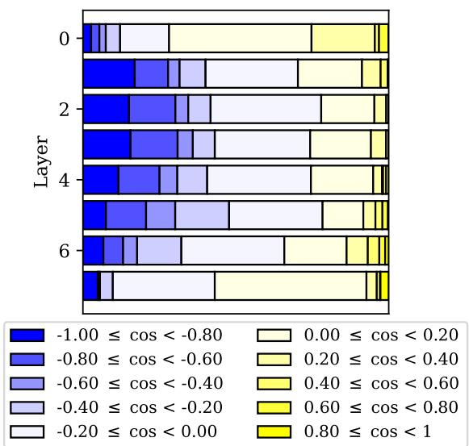  
Figure 24: Distribution of neurons by layer and inputoutput weight cosines in Othello-GPT (visualization of Table 8).

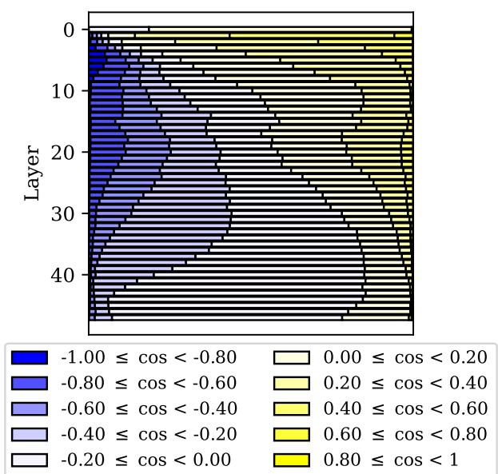  
Figure 25: Distribution of neurons by layer and inputoutput weight cosines in GPT2-XL (visualization of Table 9).

## J.3.2 GLU models

Here we only include the results for OLMo-1B, OLMo-7B, Llama-3.2-3B, and Yi-6B. See the supplementary material for additional models and plot types.

We note a few additional patterns that appear only in some of the investigated models:

• In Yi and the OLMo models, the prevalence of conditional strengthening neurons starts even earlier, at the very first layer. A particularly interesting example is Yi: In layer 0 an enormous 68% of all neurons are conditional strengthening, then almost none, then there is a second wave around layers 11-17 (out of 32) which have around 25% of conditional strengthening neurons each.

• In some models, especially the OLMo ones, there is a non-negligible number of conditional weakening neurons. They tend to appear in middle-to-late layers, shortly after the conditional strengthening wave. The clearest example is OLMo-1B, with a peak of 1418 conditional weakening neurons out of 8192 (17%) in layer 9 out of 16.

The following patterns could be random, but still show that the model has not learned something:

• For almost all neurons the cosine similarities are still clearly below 1 (the dots do not fill out the edges in Fig. 4). This echoes and extends Gurnee et al.'s findings (Gurnee et al., 2024) that in GPT2 the IO cosine similarity is approximately bounded by ±0.8. In other words, we almost never get the prototypical cases of conditional strengthening / weakening etc., as defined in Section 4. This might be an effect of randomness (strong cosine similarities are less likely), but could also suggest that even input manipulator neurons add some novel information to the residual stream.

• We also observe that for the vast majority of neurons, cos $( { \pmb w } _ { \mathrm { g a t e } } , { \pmb w } _ { \mathrm { i n } } )$ ≈ 0: This can be seen in the boxplots in the supplementary material, as well as the purple color in Fig. 4. Thus most neurons operate on two input directions in the residual stream (not a single one), resulting in higher expressivity and more complex semantics. If not random, this could be related to double checking; see Section H.

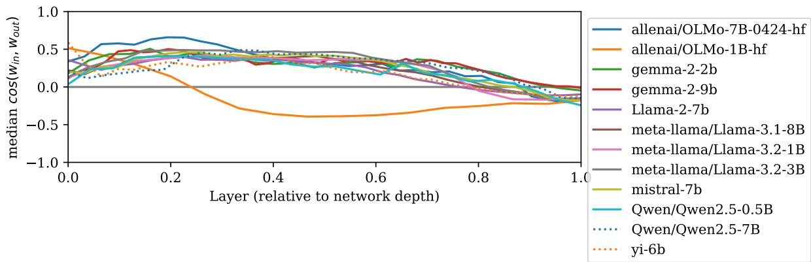  
Figure 26: Median of cos $( \pmb { w } _ { \mathrm { i n } } , \pmb { w } _ { \mathrm { o u t } } )$ by layer (x-axis) for all 12 models investigated. Unlike Fig. 2 we also include the models of 1B parameters and below. All models follow the same general pattern, but OLMo-1B switches to negative values earlier than the others

Table 10: Distribution of neuron IO classes by layer and category in allenai/OLMo-1B-hf. See Fig. 27 for a visualization.
<table><tr><td rowspan=4 colspan=1>Layer</td><td rowspan=4 colspan=1>strengthening</td><td rowspan=4 colspan=1>atypicalstrengthening</td><td rowspan=4 colspan=1>condi-tionalstrength-ening</td><td rowspan=4 colspan=1>atypicalcondi-tionalstrengthening</td><td rowspan=1 colspan=1>propor-</td><td rowspan=2 colspan=2>atypical|</td><td rowspan=2 colspan=1>ortho-gonal</td><td rowspan=1 colspan=1>weak-</td><td rowspan=4 colspan=1>atypicalweak-ening</td><td rowspan=4 colspan=1>condi-tionalweak-ening</td><td rowspan=4 colspan=1>atypicalcondi-tionalweak-ening</td></tr><tr><td rowspan=1 colspan=1>tional</td><td rowspan=1 colspan=1>pro-</td><td rowspan=1 colspan=1>ening</td></tr><tr><td rowspan=2 colspan=1>change</td><td rowspan=2 colspan=2>por-tionalchange</td><td rowspan=1 colspan=1></td><td rowspan=1 colspan=1>output</td><td rowspan=2 colspan=1></td></tr><tr><td rowspan=1 colspan=1></td></tr><tr><td rowspan=1 colspan=1>0</td><td rowspan=1 colspan=1>0</td><td rowspan=1 colspan=1>0</td><td rowspan=1 colspan=1>4365</td><td rowspan=1 colspan=1>1</td><td rowspan=1 colspan=1>22</td><td rowspan=1 colspan=2>4</td><td rowspan=1 colspan=1>3798</td><td rowspan=1 colspan=1>1</td><td rowspan=1 colspan=1>0</td><td rowspan=1 colspan=1>1</td><td rowspan=1 colspan=1>0</td></tr><tr><td rowspan=1 colspan=1>1</td><td rowspan=1 colspan=1>0</td><td rowspan=1 colspan=1>6</td><td rowspan=1 colspan=1>3018</td><td rowspan=1 colspan=1>0</td><td rowspan=1 colspan=1>99</td><td rowspan=1 colspan=2>5</td><td rowspan=1 colspan=1>5051</td><td rowspan=1 colspan=1>8</td><td rowspan=1 colspan=1>2</td><td rowspan=1 colspan=1>2</td><td rowspan=1 colspan=1>1</td></tr><tr><td rowspan=1 colspan=1>2</td><td rowspan=1 colspan=1>0</td><td rowspan=1 colspan=1>2</td><td rowspan=1 colspan=1>2390</td><td rowspan=1 colspan=1>0</td><td rowspan=1 colspan=1>581</td><td rowspan=1 colspan=2>3</td><td rowspan=1 colspan=1>4976</td><td rowspan=1 colspan=1>10</td><td rowspan=1 colspan=1>11</td><td rowspan=1 colspan=1>215</td><td rowspan=1 colspan=1>4</td></tr><tr><td rowspan=1 colspan=1>3</td><td rowspan=1 colspan=1>2</td><td rowspan=1 colspan=1>7</td><td rowspan=1 colspan=1>1927</td><td rowspan=1 colspan=1>2</td><td rowspan=1 colspan=1>1368</td><td rowspan=1 colspan=2>2</td><td rowspan=1 colspan=1>4286</td><td rowspan=1 colspan=1>17</td><td rowspan=1 colspan=1>38</td><td rowspan=1 colspan=1>541</td><td rowspan=1 colspan=1>2</td></tr><tr><td rowspan=1 colspan=1>4</td><td rowspan=1 colspan=1>1</td><td rowspan=1 colspan=1>3</td><td rowspan=1 colspan=1>861</td><td rowspan=1 colspan=1>1</td><td rowspan=1 colspan=1>1435</td><td rowspan=1 colspan=2>4</td><td rowspan=1 colspan=1>4748</td><td rowspan=1 colspan=1>31</td><td rowspan=1 colspan=1>52</td><td rowspan=1 colspan=1>1051</td><td rowspan=1 colspan=1>5</td></tr><tr><td rowspan=1 colspan=1>5</td><td rowspan=1 colspan=1>2</td><td rowspan=1 colspan=1>8</td><td rowspan=1 colspan=1>325</td><td rowspan=1 colspan=1>0</td><td rowspan=1 colspan=1>1256</td><td rowspan=1 colspan=2>2</td><td rowspan=1 colspan=1>5516</td><td rowspan=1 colspan=1>18</td><td rowspan=1 colspan=1>42</td><td rowspan=1 colspan=1>1023</td><td rowspan=1 colspan=1>0</td></tr><tr><td rowspan=1 colspan=1>6</td><td rowspan=1 colspan=1>1</td><td rowspan=1 colspan=1>5</td><td rowspan=1 colspan=1>165</td><td rowspan=1 colspan=1>0</td><td rowspan=1 colspan=1>937</td><td rowspan=1 colspan=2>1</td><td rowspan=1 colspan=1>6026</td><td rowspan=1 colspan=1>8</td><td rowspan=1 colspan=1>15</td><td rowspan=1 colspan=1>1034</td><td rowspan=1 colspan=1>0</td></tr><tr><td rowspan=1 colspan=1>7</td><td rowspan=1 colspan=1>1</td><td rowspan=1 colspan=1>2</td><td rowspan=1 colspan=1>138</td><td rowspan=1 colspan=1>0</td><td rowspan=1 colspan=1>685</td><td rowspan=1 colspan=2>3</td><td rowspan=1 colspan=1>6044</td><td rowspan=1 colspan=1>4</td><td rowspan=1 colspan=1>9</td><td rowspan=1 colspan=1>1306</td><td rowspan=1 colspan=1>0</td></tr><tr><td rowspan=1 colspan=1>8</td><td rowspan=1 colspan=1>0</td><td rowspan=1 colspan=1>2</td><td rowspan=1 colspan=1>127</td><td rowspan=1 colspan=1>0</td><td rowspan=1 colspan=1>594</td><td rowspan=1 colspan=2>1</td><td rowspan=1 colspan=1>6228</td><td rowspan=1 colspan=1>7</td><td rowspan=1 colspan=1>8</td><td rowspan=1 colspan=1>1225</td><td rowspan=1 colspan=1>0</td></tr><tr><td rowspan=1 colspan=1>9</td><td rowspan=1 colspan=1>1</td><td rowspan=1 colspan=1>0</td><td rowspan=1 colspan=1>160</td><td rowspan=1 colspan=1>0</td><td rowspan=1 colspan=1>543</td><td rowspan=1 colspan=2>4</td><td rowspan=1 colspan=1>6038</td><td rowspan=1 colspan=1>12</td><td rowspan=1 colspan=1>14</td><td rowspan=1 colspan=1>1418</td><td rowspan=1 colspan=1>2</td></tr><tr><td rowspan=1 colspan=1>10</td><td rowspan=1 colspan=1>5</td><td rowspan=1 colspan=1>0</td><td rowspan=1 colspan=1>180</td><td rowspan=1 colspan=1>0</td><td rowspan=1 colspan=1>649</td><td rowspan=1 colspan=2>6</td><td rowspan=1 colspan=1>5932</td><td rowspan=1 colspan=1>20</td><td rowspan=1 colspan=1>27</td><td rowspan=1 colspan=1>1370</td><td rowspan=1 colspan=1>3</td></tr><tr><td rowspan=1 colspan=1>11</td><td rowspan=1 colspan=1>7</td><td rowspan=1 colspan=1>5</td><td rowspan=1 colspan=1>219</td><td rowspan=1 colspan=1>2</td><td rowspan=1 colspan=1>558</td><td rowspan=1 colspan=2>15</td><td rowspan=1 colspan=1>6033</td><td rowspan=1 colspan=1>23</td><td rowspan=1 colspan=1>27</td><td rowspan=1 colspan=1>1294</td><td rowspan=1 colspan=1>9</td></tr><tr><td rowspan=1 colspan=1>12</td><td rowspan=1 colspan=1>11</td><td rowspan=1 colspan=1>5</td><td rowspan=1 colspan=1>190</td><td rowspan=1 colspan=1>3</td><td rowspan=1 colspan=1>567</td><td rowspan=1 colspan=2>21</td><td rowspan=1 colspan=1>6107</td><td rowspan=1 colspan=1>20</td><td rowspan=1 colspan=1>27</td><td rowspan=1 colspan=1>1234</td><td rowspan=1 colspan=1>7</td></tr><tr><td rowspan=1 colspan=1>13</td><td rowspan=1 colspan=1>3</td><td rowspan=1 colspan=1>0</td><td rowspan=1 colspan=1>53</td><td rowspan=1 colspan=1>0</td><td rowspan=1 colspan=1>466</td><td rowspan=1 colspan=2>12</td><td rowspan=1 colspan=1>7118</td><td rowspan=1 colspan=1>14</td><td rowspan=1 colspan=1>11</td><td rowspan=1 colspan=1>504</td><td rowspan=1 colspan=1>11</td></tr><tr><td rowspan=1 colspan=1>14</td><td rowspan=1 colspan=1>0</td><td rowspan=1 colspan=1>0</td><td rowspan=1 colspan=1>8</td><td rowspan=1 colspan=1>1</td><td rowspan=1 colspan=1>37</td><td rowspan=1 colspan=2>5</td><td rowspan=1 colspan=1>8083</td><td rowspan=1 colspan=1>17</td><td rowspan=1 colspan=1>14</td><td rowspan=1 colspan=1>22</td><td rowspan=1 colspan=1>5</td></tr><tr><td rowspan=1 colspan=1>15</td><td rowspan=1 colspan=1>7</td><td rowspan=1 colspan=1>1</td><td rowspan=1 colspan=1>90</td><td rowspan=1 colspan=1>2</td><td rowspan=1 colspan=1>212</td><td rowspan=1 colspan=2>16</td><td rowspan=1 colspan=1>7768</td><td rowspan=1 colspan=1>8</td><td rowspan=1 colspan=1>15</td><td rowspan=1 colspan=1>72</td><td rowspan=1 colspan=1>1</td></tr><tr><td rowspan=1 colspan=1>Total</td><td rowspan=1 colspan=1>41</td><td rowspan=1 colspan=1>46</td><td rowspan=1 colspan=1>14216</td><td rowspan=1 colspan=1>12</td><td rowspan=1 colspan=1>10009</td><td rowspan=1 colspan=2>104</td><td rowspan=1 colspan=1>93752</td><td rowspan=1 colspan=1>218</td><td rowspan=1 colspan=1>312</td><td rowspan=1 colspan=1>12312</td><td rowspan=1 colspan=1>50</td></tr></table>

Table 11: Distribution of neuron IO classes by layer and category in allenai/OLMo-7B-0424-hf. See Fig. 27 for a visualization.
<table><tr><td rowspan=3 colspan=1>Layer</td><td rowspan=3 colspan=1>strength+ening</td><td rowspan=3 colspan=1>atypicalstrengthening</td><td rowspan=3 colspan=1>condi-tionalstrength-ening</td><td rowspan=3 colspan=1>atypicalcondi-tionalstrength+ening</td><td rowspan=2 colspan=1>propor-tional</td><td rowspan=2 colspan=1>atypicalpro-</td><td rowspan=2 colspan=2>ortho-gonal</td><td rowspan=3 colspan=1>weak-ening</td><td rowspan=3 colspan=1>atypicalweak-ening</td><td rowspan=3 colspan=1>condi-tionalweak-ening</td><td rowspan=3 colspan=2>atypicalcondi-tionalweak-ening</td></tr><tr><td rowspan=1 colspan=1>nal</td></tr><tr><td rowspan=1 colspan=1>change</td><td rowspan=1 colspan=1>por-tionalchange</td><td rowspan=1 colspan=2>output</td></tr><tr><td rowspan=1 colspan=1>0</td><td rowspan=1 colspan=1>1</td><td rowspan=1 colspan=1>0</td><td rowspan=1 colspan=1>1397</td><td rowspan=1 colspan=1>619</td><td rowspan=1 colspan=1>34</td><td rowspan=1 colspan=1>8</td><td rowspan=1 colspan=2>8941</td><td rowspan=1 colspan=1>5</td><td rowspan=1 colspan=1>0</td><td rowspan=1 colspan=1>3</td><td rowspan=1 colspan=2>0</td></tr><tr><td rowspan=1 colspan=1>1</td><td rowspan=1 colspan=1>1</td><td rowspan=1 colspan=1>2</td><td rowspan=1 colspan=1>2867</td><td rowspan=1 colspan=1>3</td><td rowspan=1 colspan=1>120</td><td rowspan=1 colspan=1>10</td><td rowspan=1 colspan=2>7981</td><td rowspan=1 colspan=1>23</td><td rowspan=1 colspan=1>1</td><td rowspan=1 colspan=1>0</td><td rowspan=1 colspan=2>0</td></tr><tr><td rowspan=1 colspan=1>2</td><td rowspan=1 colspan=1>0</td><td rowspan=1 colspan=1>6</td><td rowspan=1 colspan=1>7379</td><td rowspan=1 colspan=1>6</td><td rowspan=1 colspan=1>270</td><td rowspan=1 colspan=1>3</td><td rowspan=1 colspan=2>3325</td><td rowspan=1 colspan=1>8</td><td rowspan=1 colspan=1>5</td><td rowspan=1 colspan=1>6</td><td rowspan=1 colspan=2>0</td></tr><tr><td rowspan=1 colspan=1>3</td><td rowspan=1 colspan=1>1</td><td rowspan=1 colspan=1>10</td><td rowspan=1 colspan=1>6966</td><td rowspan=1 colspan=1>1</td><td rowspan=1 colspan=1>497</td><td rowspan=1 colspan=1>5</td><td rowspan=1 colspan=2>3439</td><td rowspan=1 colspan=1>5</td><td rowspan=1 colspan=1>5</td><td rowspan=1 colspan=1>78</td><td rowspan=1 colspan=2>1</td></tr><tr><td rowspan=1 colspan=1>4</td><td rowspan=1 colspan=1>0</td><td rowspan=1 colspan=1>14</td><td rowspan=1 colspan=1>6223</td><td rowspan=1 colspan=1>0</td><td rowspan=1 colspan=1>601</td><td rowspan=1 colspan=1>2</td><td rowspan=1 colspan=2>4069</td><td rowspan=1 colspan=1>11</td><td rowspan=1 colspan=1>9</td><td rowspan=1 colspan=1>78</td><td rowspan=1 colspan=2>1</td></tr><tr><td rowspan=1 colspan=1>5</td><td rowspan=1 colspan=1>0</td><td rowspan=1 colspan=1>38</td><td rowspan=1 colspan=1>7206</td><td rowspan=1 colspan=1>2</td><td rowspan=1 colspan=1>1022</td><td rowspan=1 colspan=1>1</td><td rowspan=1 colspan=2>2501</td><td rowspan=1 colspan=1>19</td><td rowspan=1 colspan=1>17</td><td rowspan=1 colspan=1>202</td><td rowspan=1 colspan=2>0</td></tr><tr><td rowspan=1 colspan=1>6</td><td rowspan=1 colspan=1>0</td><td rowspan=1 colspan=1>18</td><td rowspan=1 colspan=1>7480</td><td rowspan=1 colspan=1>1</td><td rowspan=1 colspan=1>1156</td><td rowspan=1 colspan=1>3</td><td rowspan=1 colspan=2>2117</td><td rowspan=1 colspan=1>7</td><td rowspan=1 colspan=1>3</td><td rowspan=1 colspan=1>222</td><td rowspan=1 colspan=2>1</td></tr><tr><td rowspan=1 colspan=1>7</td><td rowspan=1 colspan=1>0</td><td rowspan=1 colspan=1>16</td><td rowspan=1 colspan=1>7661</td><td rowspan=1 colspan=1>0</td><td rowspan=1 colspan=1>921</td><td rowspan=1 colspan=1>2</td><td rowspan=1 colspan=2>2217</td><td rowspan=1 colspan=1>6</td><td rowspan=1 colspan=1>7</td><td rowspan=1 colspan=1>178</td><td rowspan=1 colspan=2>0</td></tr><tr><td rowspan=1 colspan=1>8</td><td rowspan=1 colspan=1>0</td><td rowspan=1 colspan=1>9</td><td rowspan=1 colspan=1>7076</td><td rowspan=1 colspan=1>0</td><td rowspan=1 colspan=1>839</td><td rowspan=1 colspan=1>2</td><td rowspan=1 colspan=2>2881</td><td rowspan=1 colspan=1>2</td><td rowspan=1 colspan=1>6</td><td rowspan=1 colspan=1>193</td><td rowspan=1 colspan=2>0</td></tr><tr><td rowspan=1 colspan=1>9</td><td rowspan=1 colspan=1>0</td><td rowspan=1 colspan=1>1</td><td rowspan=1 colspan=1>6445</td><td rowspan=1 colspan=1>0</td><td rowspan=1 colspan=1>893</td><td rowspan=1 colspan=1>0</td><td rowspan=1 colspan=2>3458</td><td rowspan=1 colspan=1>3</td><td rowspan=1 colspan=1>3</td><td rowspan=1 colspan=1>205</td><td rowspan=1 colspan=2>0</td></tr><tr><td rowspan=1 colspan=1>10</td><td rowspan=1 colspan=1>0</td><td rowspan=1 colspan=1>4</td><td rowspan=1 colspan=1>5526</td><td rowspan=1 colspan=1>0</td><td rowspan=1 colspan=1>710</td><td rowspan=1 colspan=1>0</td><td rowspan=1 colspan=2>4532</td><td rowspan=1 colspan=1>2</td><td rowspan=1 colspan=1>2</td><td rowspan=1 colspan=1>232</td><td rowspan=1 colspan=2>0</td></tr><tr><td rowspan=1 colspan=1>11</td><td rowspan=1 colspan=1>0</td><td rowspan=1 colspan=1>1</td><td rowspan=1 colspan=1>4821</td><td rowspan=1 colspan=1>0</td><td rowspan=1 colspan=1>697</td><td rowspan=1 colspan=1>0</td><td rowspan=1 colspan=2>5145</td><td rowspan=1 colspan=1>7</td><td rowspan=1 colspan=1>2</td><td rowspan=1 colspan=1>335</td><td rowspan=1 colspan=2>0</td></tr><tr><td rowspan=1 colspan=1>12</td><td rowspan=1 colspan=1>0</td><td rowspan=1 colspan=1>2</td><td rowspan=1 colspan=1>4279</td><td rowspan=1 colspan=1>0</td><td rowspan=1 colspan=1>642</td><td rowspan=1 colspan=1>0</td><td rowspan=1 colspan=2>5817</td><td rowspan=1 colspan=1>6</td><td rowspan=1 colspan=1>1</td><td rowspan=1 colspan=1>261</td><td rowspan=1 colspan=2>0</td></tr><tr><td rowspan=1 colspan=1>13</td><td rowspan=1 colspan=1>0</td><td rowspan=1 colspan=1>2</td><td rowspan=1 colspan=1>3926</td><td rowspan=1 colspan=1>0</td><td rowspan=1 colspan=1>685</td><td rowspan=1 colspan=1>0</td><td rowspan=1 colspan=2>6018</td><td rowspan=1 colspan=1>9</td><td rowspan=1 colspan=1>3</td><td rowspan=1 colspan=1>365</td><td rowspan=1 colspan=2>0</td></tr><tr><td rowspan=1 colspan=1>14</td><td rowspan=1 colspan=1>0</td><td rowspan=1 colspan=1>13</td><td rowspan=1 colspan=1>3876</td><td rowspan=1 colspan=1>0</td><td rowspan=1 colspan=1>887</td><td rowspan=1 colspan=1>0</td><td rowspan=1 colspan=2>5733</td><td rowspan=1 colspan=1>8</td><td rowspan=1 colspan=1>7</td><td rowspan=1 colspan=1>484</td><td rowspan=1 colspan=2>0</td></tr><tr><td rowspan=1 colspan=1>15</td><td rowspan=1 colspan=1>0</td><td rowspan=1 colspan=1>0</td><td rowspan=1 colspan=1>3768</td><td rowspan=1 colspan=1>0</td><td rowspan=1 colspan=1>923</td><td rowspan=1 colspan=1>0</td><td rowspan=1 colspan=2>5791</td><td rowspan=1 colspan=1>3</td><td rowspan=1 colspan=1>2</td><td rowspan=1 colspan=1>521</td><td rowspan=1 colspan=1></td><td rowspan=1 colspan=1>0</td></tr><tr><td rowspan=1 colspan=1>16</td><td rowspan=1 colspan=1>0</td><td rowspan=1 colspan=1>1</td><td rowspan=1 colspan=1>3420</td><td rowspan=1 colspan=1>0</td><td rowspan=1 colspan=1>773</td><td rowspan=1 colspan=1>2</td><td rowspan=1 colspan=2>6324</td><td rowspan=1 colspan=1>4</td><td rowspan=1 colspan=1>2</td><td rowspan=1 colspan=1>482</td><td rowspan=1 colspan=1></td><td rowspan=1 colspan=1>0</td></tr><tr><td rowspan=1 colspan=1>17</td><td rowspan=1 colspan=1>0</td><td rowspan=1 colspan=1>4</td><td rowspan=1 colspan=1>3312</td><td rowspan=1 colspan=1>0</td><td rowspan=1 colspan=1>636</td><td rowspan=1 colspan=1>2</td><td rowspan=1 colspan=2>6536</td><td rowspan=1 colspan=1>11</td><td rowspan=1 colspan=1>1</td><td rowspan=1 colspan=1>506</td><td rowspan=1 colspan=1></td><td rowspan=1 colspan=1>0</td></tr><tr><td rowspan=1 colspan=1>18</td><td rowspan=1 colspan=1>0</td><td rowspan=1 colspan=1>2</td><td rowspan=1 colspan=1>3488</td><td rowspan=1 colspan=1>1</td><td rowspan=1 colspan=1>687</td><td rowspan=1 colspan=1>0</td><td rowspan=1 colspan=2>6258</td><td rowspan=1 colspan=1>11</td><td rowspan=1 colspan=1>7</td><td rowspan=1 colspan=1>554</td><td rowspan=1 colspan=1></td><td rowspan=1 colspan=1>0</td></tr><tr><td rowspan=1 colspan=1>19</td><td rowspan=1 colspan=1>0</td><td rowspan=1 colspan=1>6</td><td rowspan=1 colspan=1>3692</td><td rowspan=1 colspan=1>1</td><td rowspan=1 colspan=1>866</td><td rowspan=1 colspan=1>3</td><td rowspan=1 colspan=2>5632</td><td rowspan=1 colspan=1>12</td><td rowspan=1 colspan=1>7</td><td rowspan=1 colspan=1>789</td><td rowspan=1 colspan=1></td><td rowspan=1 colspan=1>0</td></tr><tr><td rowspan=1 colspan=1>20</td><td rowspan=1 colspan=1>0</td><td rowspan=1 colspan=1>3</td><td rowspan=1 colspan=1>3030</td><td rowspan=1 colspan=1>0</td><td rowspan=1 colspan=1>1155</td><td rowspan=1 colspan=1>0</td><td rowspan=1 colspan=2>6095</td><td rowspan=1 colspan=1>11</td><td rowspan=1 colspan=1>8</td><td rowspan=1 colspan=1>706</td><td rowspan=1 colspan=1></td><td rowspan=1 colspan=1>0</td></tr><tr><td rowspan=1 colspan=1>21</td><td rowspan=1 colspan=1>0</td><td rowspan=1 colspan=1>5</td><td rowspan=1 colspan=1>3305</td><td rowspan=1 colspan=1>0</td><td rowspan=1 colspan=1>1162</td><td rowspan=1 colspan=1>1</td><td rowspan=1 colspan=2>5618</td><td rowspan=1 colspan=1>9</td><td rowspan=1 colspan=1>11</td><td rowspan=1 colspan=1>897</td><td rowspan=1 colspan=1></td><td rowspan=1 colspan=1>0</td></tr><tr><td rowspan=1 colspan=1>22</td><td rowspan=1 colspan=1>0</td><td rowspan=1 colspan=1>6</td><td rowspan=1 colspan=1>3075</td><td rowspan=1 colspan=1>0</td><td rowspan=1 colspan=1>1215</td><td rowspan=1 colspan=1>1</td><td rowspan=1 colspan=2>5838</td><td rowspan=1 colspan=1>7</td><td rowspan=1 colspan=1>8</td><td rowspan=1 colspan=1>858</td><td rowspan=1 colspan=1></td><td rowspan=1 colspan=1>0</td></tr><tr><td rowspan=1 colspan=1>23</td><td rowspan=1 colspan=1>2</td><td rowspan=1 colspan=1>8</td><td rowspan=1 colspan=1>3090</td><td rowspan=1 colspan=1>2</td><td rowspan=1 colspan=1>1183</td><td rowspan=1 colspan=1>2</td><td rowspan=1 colspan=2>5740</td><td rowspan=1 colspan=1>17</td><td rowspan=1 colspan=1>15</td><td rowspan=1 colspan=1>949</td><td rowspan=1 colspan=1></td><td rowspan=1 colspan=1>0</td></tr><tr><td rowspan=1 colspan=1>24</td><td rowspan=1 colspan=1>1</td><td rowspan=1 colspan=1>6</td><td rowspan=1 colspan=1>2342</td><td rowspan=1 colspan=1>4</td><td rowspan=1 colspan=1>1012</td><td rowspan=1 colspan=1>10</td><td rowspan=1 colspan=2>6823</td><td rowspan=1 colspan=1>15</td><td rowspan=1 colspan=1>8</td><td rowspan=1 colspan=1>786</td><td rowspan=1 colspan=1></td><td rowspan=1 colspan=1>1</td></tr><tr><td rowspan=1 colspan=1>25</td><td rowspan=1 colspan=1>15</td><td rowspan=1 colspan=1>6</td><td rowspan=1 colspan=1>2515</td><td rowspan=1 colspan=1>7</td><td rowspan=1 colspan=1>1107</td><td rowspan=1 colspan=1>7</td><td rowspan=1 colspan=2>6434</td><td rowspan=1 colspan=1>19</td><td rowspan=1 colspan=1>15</td><td rowspan=1 colspan=1>882</td><td rowspan=1 colspan=1></td><td rowspan=1 colspan=1>1</td></tr><tr><td rowspan=1 colspan=1>26</td><td rowspan=1 colspan=1>11</td><td rowspan=1 colspan=1>18</td><td rowspan=1 colspan=1>1719</td><td rowspan=1 colspan=1>10</td><td rowspan=1 colspan=1>997</td><td rowspan=1 colspan=1>3</td><td rowspan=1 colspan=2>7447</td><td rowspan=1 colspan=1>29</td><td rowspan=1 colspan=1>34</td><td rowspan=1 colspan=1>739</td><td rowspan=1 colspan=2>1</td></tr><tr><td rowspan=1 colspan=1>27</td><td rowspan=1 colspan=1>1</td><td rowspan=1 colspan=1>2</td><td rowspan=1 colspan=1>1066</td><td rowspan=1 colspan=1>1</td><td rowspan=1 colspan=1>793</td><td rowspan=1 colspan=1>12</td><td rowspan=1 colspan=2>8636</td><td rowspan=1 colspan=1>14</td><td rowspan=1 colspan=1>25</td><td rowspan=1 colspan=1>457</td><td rowspan=1 colspan=2>1</td></tr><tr><td rowspan=1 colspan=1>28</td><td rowspan=1 colspan=1>11</td><td rowspan=1 colspan=1>10</td><td rowspan=1 colspan=1>404</td><td rowspan=1 colspan=1>4</td><td rowspan=1 colspan=1>504</td><td rowspan=1 colspan=1>19</td><td rowspan=1 colspan=2>9748</td><td rowspan=1 colspan=1>19</td><td rowspan=1 colspan=1>18</td><td rowspan=1 colspan=1>265</td><td rowspan=1 colspan=2>6</td></tr><tr><td rowspan=1 colspan=1>29</td><td rowspan=1 colspan=1>1</td><td rowspan=1 colspan=1>0</td><td rowspan=1 colspan=1>50</td><td rowspan=1 colspan=1>1</td><td rowspan=1 colspan=1>59</td><td rowspan=1 colspan=1>4</td><td rowspan=1 colspan=2>10764</td><td rowspan=1 colspan=1>36</td><td rowspan=1 colspan=1>16</td><td rowspan=1 colspan=1>67</td><td rowspan=1 colspan=2>10</td></tr><tr><td rowspan=1 colspan=1>30</td><td rowspan=1 colspan=1>1</td><td rowspan=1 colspan=1>0</td><td rowspan=1 colspan=1>39</td><td rowspan=1 colspan=1>7</td><td rowspan=1 colspan=1>92</td><td rowspan=1 colspan=1>17</td><td rowspan=1 colspan=2>10730</td><td rowspan=1 colspan=1>50</td><td rowspan=1 colspan=1>14</td><td rowspan=1 colspan=1>51</td><td rowspan=1 colspan=2>7</td></tr><tr><td rowspan=1 colspan=1>31</td><td rowspan=1 colspan=1>1</td><td rowspan=1 colspan=1>0</td><td rowspan=1 colspan=1>228</td><td rowspan=1 colspan=1>6</td><td rowspan=1 colspan=1>676</td><td rowspan=1 colspan=1>9</td><td rowspan=1 colspan=2>9788</td><td rowspan=1 colspan=1>138</td><td rowspan=1 colspan=1>59</td><td rowspan=1 colspan=1>89</td><td rowspan=1 colspan=2>14</td></tr><tr><td rowspan=1 colspan=1>Total</td><td rowspan=1 colspan=1>47</td><td rowspan=1 colspan=1>213</td><td rowspan=1 colspan=1>121671</td><td rowspan=1 colspan=1>676</td><td rowspan=1 colspan=1>23814</td><td rowspan=1 colspan=1>128</td><td rowspan=1 colspan=2>192376</td><td rowspan=1 colspan=1>526</td><td rowspan=1 colspan=1>321</td><td rowspan=1 colspan=1>12440</td><td rowspan=1 colspan=2>44</td></tr></table>

Table 12: Distribution of neuron IO classes by layer and category in meta-llama/Llama-3.2-3B. See Fig. 3 for a visualization.
<table><tr><td rowspan=1 colspan=1>Layer</td><td rowspan=1 colspan=1>strength+ening</td><td rowspan=1 colspan=1>atypicalstrengthening</td><td rowspan=1 colspan=1>condi-tionalstrengthening</td><td rowspan=1 colspan=1>atypicalcondi-tionalstrength-ening</td><td rowspan=1 colspan=1>propor-tionalchange</td><td rowspan=1 colspan=1>atypicalpro-por-tionalchange</td><td rowspan=1 colspan=1>ortho-gonaloutput</td><td rowspan=1 colspan=1>weak-ening</td><td rowspan=1 colspan=1>atypicalweak-ening</td><td rowspan=1 colspan=1>condi-tionalweak-ening</td><td rowspan=1 colspan=1>atypicalcondi-tionalweak-ening</td></tr><tr><td rowspan=1 colspan=1>0</td><td rowspan=1 colspan=1>0</td><td rowspan=1 colspan=1>0</td><td rowspan=1 colspan=1>176</td><td rowspan=1 colspan=1>0</td><td rowspan=1 colspan=1>15</td><td rowspan=1 colspan=1>0</td><td rowspan=1 colspan=1>8000</td><td rowspan=1 colspan=1>0</td><td rowspan=1 colspan=1>0</td><td rowspan=1 colspan=1>1</td><td rowspan=1 colspan=1>0</td></tr><tr><td rowspan=1 colspan=1>1</td><td rowspan=1 colspan=1>0</td><td rowspan=1 colspan=1>0</td><td rowspan=1 colspan=1>597</td><td rowspan=1 colspan=1>0</td><td rowspan=1 colspan=1>71</td><td rowspan=1 colspan=1>0</td><td rowspan=1 colspan=1>7516</td><td rowspan=1 colspan=1>1</td><td rowspan=1 colspan=1>0</td><td rowspan=1 colspan=1>4</td><td rowspan=1 colspan=1>3</td></tr><tr><td rowspan=1 colspan=1>2</td><td rowspan=1 colspan=1>2</td><td rowspan=1 colspan=1>0</td><td rowspan=1 colspan=1>812</td><td rowspan=1 colspan=1>0</td><td rowspan=1 colspan=1>52</td><td rowspan=1 colspan=1>2</td><td rowspan=1 colspan=1>7309</td><td rowspan=1 colspan=1>0</td><td rowspan=1 colspan=1>3</td><td rowspan=1 colspan=1>10</td><td rowspan=1 colspan=1>2</td></tr><tr><td rowspan=1 colspan=1>3</td><td rowspan=1 colspan=1>1</td><td rowspan=1 colspan=1>4</td><td rowspan=1 colspan=1>1495</td><td rowspan=1 colspan=1>0</td><td rowspan=1 colspan=1>67</td><td rowspan=1 colspan=1>2</td><td rowspan=1 colspan=1>6599</td><td rowspan=1 colspan=1>8</td><td rowspan=1 colspan=1>4</td><td rowspan=1 colspan=1>11</td><td rowspan=1 colspan=1>1</td></tr><tr><td rowspan=1 colspan=1>4</td><td rowspan=1 colspan=1>0</td><td rowspan=1 colspan=1>1</td><td rowspan=1 colspan=1>3516</td><td rowspan=1 colspan=1>0</td><td rowspan=1 colspan=1>77</td><td rowspan=1 colspan=1>0</td><td rowspan=1 colspan=1>4567</td><td rowspan=1 colspan=1>5</td><td rowspan=1 colspan=1>11</td><td rowspan=1 colspan=1>11</td><td rowspan=1 colspan=1>4</td></tr><tr><td rowspan=1 colspan=1>5</td><td rowspan=1 colspan=1>0</td><td rowspan=1 colspan=1>4</td><td rowspan=1 colspan=1>3495</td><td rowspan=1 colspan=1>1</td><td rowspan=1 colspan=1>102</td><td rowspan=1 colspan=1>1</td><td rowspan=1 colspan=1>4546</td><td rowspan=1 colspan=1>5</td><td rowspan=1 colspan=1>10</td><td rowspan=1 colspan=1>26</td><td rowspan=1 colspan=1>2</td></tr><tr><td rowspan=1 colspan=1>6</td><td rowspan=1 colspan=1>0</td><td rowspan=1 colspan=1>12</td><td rowspan=1 colspan=1>3860</td><td rowspan=1 colspan=1>0</td><td rowspan=1 colspan=1>148</td><td rowspan=1 colspan=1>2</td><td rowspan=1 colspan=1>4127</td><td rowspan=1 colspan=1>6</td><td rowspan=1 colspan=1>12</td><td rowspan=1 colspan=1>20</td><td rowspan=1 colspan=1>5</td></tr><tr><td rowspan=1 colspan=1>7</td><td rowspan=1 colspan=1>0</td><td rowspan=1 colspan=1>19</td><td rowspan=1 colspan=1>3778</td><td rowspan=1 colspan=1>0</td><td rowspan=1 colspan=1>312</td><td rowspan=1 colspan=1>1</td><td rowspan=1 colspan=1>4048</td><td rowspan=1 colspan=1>4</td><td rowspan=1 colspan=1>14</td><td rowspan=1 colspan=1>14</td><td rowspan=1 colspan=1>2</td></tr><tr><td rowspan=1 colspan=1>8</td><td rowspan=1 colspan=1>0</td><td rowspan=1 colspan=1>19</td><td rowspan=1 colspan=1>3801</td><td rowspan=1 colspan=1>0</td><td rowspan=1 colspan=1>366</td><td rowspan=1 colspan=1>1</td><td rowspan=1 colspan=1>3966</td><td rowspan=1 colspan=1>8</td><td rowspan=1 colspan=1>9</td><td rowspan=1 colspan=1>20</td><td rowspan=1 colspan=1>2</td></tr><tr><td rowspan=1 colspan=1>9</td><td rowspan=1 colspan=1>0</td><td rowspan=1 colspan=1>15</td><td rowspan=1 colspan=1>3420</td><td rowspan=1 colspan=1>0</td><td rowspan=1 colspan=1>421</td><td rowspan=1 colspan=1>2</td><td rowspan=1 colspan=1>4286</td><td rowspan=1 colspan=1>12</td><td rowspan=1 colspan=1>13</td><td rowspan=1 colspan=1>21</td><td rowspan=1 colspan=1>2</td></tr><tr><td rowspan=1 colspan=1>10</td><td rowspan=1 colspan=1>0</td><td rowspan=1 colspan=1>18</td><td rowspan=1 colspan=1>3386</td><td rowspan=1 colspan=1>0</td><td rowspan=1 colspan=1>542</td><td rowspan=1 colspan=1>2</td><td rowspan=1 colspan=1>4203</td><td rowspan=1 colspan=1>9</td><td rowspan=1 colspan=1>7</td><td rowspan=1 colspan=1>22</td><td rowspan=1 colspan=1>3</td></tr><tr><td rowspan=1 colspan=1>11</td><td rowspan=1 colspan=1>0</td><td rowspan=1 colspan=1>13</td><td rowspan=1 colspan=1>3644</td><td rowspan=1 colspan=1>0</td><td rowspan=1 colspan=1>474</td><td rowspan=1 colspan=1>1</td><td rowspan=1 colspan=1>3992</td><td rowspan=1 colspan=1>25</td><td rowspan=1 colspan=1>15</td><td rowspan=1 colspan=1>15</td><td rowspan=1 colspan=1>13</td></tr><tr><td rowspan=1 colspan=1>12</td><td rowspan=1 colspan=1>0</td><td rowspan=1 colspan=1>4</td><td rowspan=1 colspan=1>3282</td><td rowspan=1 colspan=1>0</td><td rowspan=1 colspan=1>297</td><td rowspan=1 colspan=1>4</td><td rowspan=1 colspan=1>4551</td><td rowspan=1 colspan=1>17</td><td rowspan=1 colspan=1>14</td><td rowspan=1 colspan=1>15</td><td rowspan=1 colspan=1>8</td></tr><tr><td rowspan=1 colspan=1>13</td><td rowspan=1 colspan=1>5</td><td rowspan=1 colspan=1>3</td><td rowspan=1 colspan=1>3361</td><td rowspan=1 colspan=1>0</td><td rowspan=1 colspan=1>173</td><td rowspan=1 colspan=1>9</td><td rowspan=1 colspan=1>4579</td><td rowspan=1 colspan=1>28</td><td rowspan=1 colspan=1>17</td><td rowspan=1 colspan=1>9</td><td rowspan=1 colspan=1>8</td></tr><tr><td rowspan=1 colspan=1>14</td><td rowspan=1 colspan=1>0</td><td rowspan=1 colspan=1>0</td><td rowspan=1 colspan=1>3447</td><td rowspan=1 colspan=1>0</td><td rowspan=1 colspan=1>89</td><td rowspan=1 colspan=1>29</td><td rowspan=1 colspan=1>4557</td><td rowspan=1 colspan=1>37</td><td rowspan=1 colspan=1>14</td><td rowspan=1 colspan=1>12</td><td rowspan=1 colspan=1>7</td></tr><tr><td rowspan=1 colspan=1>15</td><td rowspan=1 colspan=1>0</td><td rowspan=1 colspan=1>1</td><td rowspan=1 colspan=1>3057</td><td rowspan=1 colspan=1>0</td><td rowspan=1 colspan=1>103</td><td rowspan=1 colspan=1>19</td><td rowspan=1 colspan=1>4955</td><td rowspan=1 colspan=1>37</td><td rowspan=1 colspan=1>15</td><td rowspan=1 colspan=1>2</td><td rowspan=1 colspan=1>3</td></tr><tr><td rowspan=1 colspan=1>16</td><td rowspan=1 colspan=1>0</td><td rowspan=1 colspan=1>0</td><td rowspan=1 colspan=1>1591</td><td rowspan=1 colspan=1>0</td><td rowspan=1 colspan=1>87</td><td rowspan=1 colspan=1>14</td><td rowspan=1 colspan=1>6441</td><td rowspan=1 colspan=1>16</td><td rowspan=1 colspan=1>25</td><td rowspan=1 colspan=1>12</td><td rowspan=1 colspan=1>6</td></tr><tr><td rowspan=1 colspan=1>17</td><td rowspan=1 colspan=1>0</td><td rowspan=1 colspan=1>0</td><td rowspan=1 colspan=1>1004</td><td rowspan=1 colspan=1>0</td><td rowspan=1 colspan=1>73</td><td rowspan=1 colspan=1>4</td><td rowspan=1 colspan=1>7062</td><td rowspan=1 colspan=1>20</td><td rowspan=1 colspan=1>20</td><td rowspan=1 colspan=1>7</td><td rowspan=1 colspan=1>2</td></tr><tr><td rowspan=1 colspan=1>18</td><td rowspan=1 colspan=1>0</td><td rowspan=1 colspan=1>0</td><td rowspan=1 colspan=1>627</td><td rowspan=1 colspan=1>0</td><td rowspan=1 colspan=1>65</td><td rowspan=1 colspan=1>6</td><td rowspan=1 colspan=1>7456</td><td rowspan=1 colspan=1>13</td><td rowspan=1 colspan=1>18</td><td rowspan=1 colspan=1>6</td><td rowspan=1 colspan=1>1</td></tr><tr><td rowspan=1 colspan=1>19</td><td rowspan=1 colspan=1>0</td><td rowspan=1 colspan=1>1</td><td rowspan=1 colspan=1>497</td><td rowspan=1 colspan=1>0</td><td rowspan=1 colspan=1>71</td><td rowspan=1 colspan=1>8</td><td rowspan=1 colspan=1>7582</td><td rowspan=1 colspan=1>12</td><td rowspan=1 colspan=1>17</td><td rowspan=1 colspan=1>3</td><td rowspan=1 colspan=1>1</td></tr><tr><td rowspan=1 colspan=1>20</td><td rowspan=1 colspan=1>0</td><td rowspan=1 colspan=1>0</td><td rowspan=1 colspan=1>165</td><td rowspan=1 colspan=1>0</td><td rowspan=1 colspan=1>62</td><td rowspan=1 colspan=1>1</td><td rowspan=1 colspan=1>7921</td><td rowspan=1 colspan=1>18</td><td rowspan=1 colspan=1>12</td><td rowspan=1 colspan=1>10</td><td rowspan=1 colspan=1>3</td></tr><tr><td rowspan=1 colspan=1>21</td><td rowspan=1 colspan=1>0</td><td rowspan=1 colspan=1>0</td><td rowspan=1 colspan=1>78</td><td rowspan=1 colspan=1>0</td><td rowspan=1 colspan=1>54</td><td rowspan=1 colspan=1>1</td><td rowspan=1 colspan=1>8023</td><td rowspan=1 colspan=1>12</td><td rowspan=1 colspan=1>11</td><td rowspan=1 colspan=1>11</td><td rowspan=1 colspan=1>2</td></tr><tr><td rowspan=1 colspan=1>22</td><td rowspan=1 colspan=1>0</td><td rowspan=1 colspan=1>0</td><td rowspan=1 colspan=1>37</td><td rowspan=1 colspan=1>0</td><td rowspan=1 colspan=1>67</td><td rowspan=1 colspan=1>4</td><td rowspan=1 colspan=1>8045</td><td rowspan=1 colspan=1>15</td><td rowspan=1 colspan=1>13</td><td rowspan=1 colspan=1>9</td><td rowspan=1 colspan=1>2</td></tr><tr><td rowspan=1 colspan=1>23</td><td rowspan=1 colspan=1>0</td><td rowspan=1 colspan=1>0</td><td rowspan=1 colspan=1>44</td><td rowspan=1 colspan=1>0</td><td rowspan=1 colspan=1>134</td><td rowspan=1 colspan=1>11</td><td rowspan=1 colspan=1>7954</td><td rowspan=1 colspan=1>24</td><td rowspan=1 colspan=1>7</td><td rowspan=1 colspan=1>13</td><td rowspan=1 colspan=1>5</td></tr><tr><td rowspan=1 colspan=1>24</td><td rowspan=1 colspan=1>0</td><td rowspan=1 colspan=1>1</td><td rowspan=1 colspan=1>39</td><td rowspan=1 colspan=1>0</td><td rowspan=1 colspan=1>249</td><td rowspan=1 colspan=1>9</td><td rowspan=1 colspan=1>7845</td><td rowspan=1 colspan=1>22</td><td rowspan=1 colspan=1>10</td><td rowspan=1 colspan=1>14</td><td rowspan=1 colspan=1>3</td></tr><tr><td rowspan=1 colspan=1>25</td><td rowspan=1 colspan=1>11</td><td rowspan=1 colspan=1>2</td><td rowspan=1 colspan=1>19</td><td rowspan=1 colspan=1>1</td><td rowspan=1 colspan=1>507</td><td rowspan=1 colspan=1>14</td><td rowspan=1 colspan=1>7553</td><td rowspan=1 colspan=1>34</td><td rowspan=1 colspan=1>11</td><td rowspan=1 colspan=1>30</td><td rowspan=1 colspan=1>10</td></tr><tr><td rowspan=1 colspan=1>26</td><td rowspan=1 colspan=1>2</td><td rowspan=1 colspan=1>0</td><td rowspan=1 colspan=1>35</td><td rowspan=1 colspan=1>0</td><td rowspan=1 colspan=1>753</td><td rowspan=1 colspan=1>44</td><td rowspan=1 colspan=1>7088</td><td rowspan=1 colspan=1>139</td><td rowspan=1 colspan=1>61</td><td rowspan=1 colspan=1>60</td><td rowspan=1 colspan=1>10</td></tr><tr><td rowspan=2 colspan=1>27Total</td><td rowspan=1 colspan=1>3</td><td rowspan=1 colspan=1>0</td><td rowspan=1 colspan=1>34</td><td rowspan=1 colspan=1>1</td><td rowspan=1 colspan=1>891</td><td rowspan=1 colspan=1>81</td><td rowspan=1 colspan=1>6597</td><td rowspan=1 colspan=1>309</td><td rowspan=1 colspan=1>178</td><td rowspan=1 colspan=1>84</td><td rowspan=1 colspan=1>14</td></tr><tr><td rowspan=1 colspan=1>24</td><td rowspan=1 colspan=1>117</td><td rowspan=1 colspan=1>49297</td><td rowspan=1 colspan=1>3</td><td rowspan=1 colspan=1>6322</td><td rowspan=1 colspan=1>272</td><td rowspan=1 colspan=1>171368</td><td rowspan=1 colspan=1>836</td><td rowspan=1 colspan=1>541</td><td rowspan=1 colspan=1>472</td><td rowspan=1 colspan=1>124</td></tr></table>

Table 13: Distribution of neuron IO classes by layer and category in yi-6b. See Fig. 27 for a visualization.
<table><tr><td rowspan=2 colspan=1>Layer</td><td rowspan=2 colspan=1>strengthening</td><td rowspan=2 colspan=1>↓atypicalstrengthening</td><td rowspan=2 colspan=1>condi-tionalstrengthening</td><td rowspan=2 colspan=1>atypicalcondi-tionalstrength-ening</td><td rowspan=2 colspan=1>propor-tionalchange</td><td rowspan=2 colspan=1>atypicalpro-por-tionalchange</td><td rowspan=2 colspan=1>ortho-gonaloutput</td><td rowspan=1 colspan=2>weak-</td><td rowspan=2 colspan=1>atypicalweak-ening</td><td rowspan=2 colspan=1>condi-tionalweak-ening</td><td rowspan=2 colspan=1>atypicalcondi-tionalweak-ening</td></tr><tr><td rowspan=1 colspan=2>ening</td></tr><tr><td rowspan=1 colspan=1>0</td><td rowspan=1 colspan=1>400</td><td rowspan=1 colspan=1>63</td><td rowspan=1 colspan=1>7522</td><td rowspan=1 colspan=1>150</td><td rowspan=1 colspan=1>547</td><td rowspan=1 colspan=1>186</td><td rowspan=1 colspan=1>2137</td><td rowspan=1 colspan=2>2</td><td rowspan=1 colspan=1>0</td><td rowspan=1 colspan=1>0</td><td rowspan=1 colspan=1>1</td></tr><tr><td rowspan=1 colspan=1>1</td><td rowspan=1 colspan=1>9</td><td rowspan=1 colspan=1>68</td><td rowspan=1 colspan=1>98</td><td rowspan=1 colspan=1>0</td><td rowspan=1 colspan=1>128</td><td rowspan=1 colspan=1>4</td><td rowspan=1 colspan=1>10688</td><td rowspan=1 colspan=2>12</td><td rowspan=1 colspan=1>0</td><td rowspan=1 colspan=1>1</td><td rowspan=1 colspan=1>0</td></tr><tr><td rowspan=2 colspan=1>23</td><td rowspan=1 colspan=1>0</td><td rowspan=1 colspan=1>0</td><td rowspan=1 colspan=1>9</td><td rowspan=1 colspan=1>0</td><td rowspan=1 colspan=1>12</td><td rowspan=1 colspan=1>2</td><td rowspan=1 colspan=1>10978</td><td rowspan=1 colspan=2>5</td><td rowspan=1 colspan=1>2</td><td rowspan=1 colspan=1>0</td><td rowspan=1 colspan=1>0</td></tr><tr><td rowspan=1 colspan=1>0</td><td rowspan=1 colspan=1>0</td><td rowspan=1 colspan=1>34</td><td rowspan=1 colspan=1>0</td><td rowspan=1 colspan=1>25</td><td rowspan=1 colspan=1>1</td><td rowspan=1 colspan=1>10938</td><td rowspan=1 colspan=2>8</td><td rowspan=1 colspan=1>2</td><td rowspan=1 colspan=1>0</td><td rowspan=1 colspan=1>0</td></tr><tr><td rowspan=1 colspan=1>4</td><td rowspan=1 colspan=1>0</td><td rowspan=1 colspan=1>0</td><td rowspan=1 colspan=1>77</td><td rowspan=1 colspan=1>0</td><td rowspan=1 colspan=1>36</td><td rowspan=1 colspan=1>0</td><td rowspan=1 colspan=1>10889</td><td rowspan=1 colspan=2>4</td><td rowspan=1 colspan=1>2</td><td rowspan=1 colspan=1>0</td><td rowspan=1 colspan=1>0</td></tr><tr><td rowspan=1 colspan=1>5</td><td rowspan=1 colspan=1>1</td><td rowspan=1 colspan=1>2</td><td rowspan=1 colspan=1>181</td><td rowspan=1 colspan=1>2</td><td rowspan=1 colspan=1>70</td><td rowspan=1 colspan=1>3</td><td rowspan=1 colspan=1>10729</td><td rowspan=1 colspan=2>13</td><td rowspan=1 colspan=1>3</td><td rowspan=1 colspan=1>4</td><td rowspan=1 colspan=1>0</td></tr><tr><td rowspan=1 colspan=1>6</td><td rowspan=1 colspan=1>0</td><td rowspan=1 colspan=1>0</td><td rowspan=1 colspan=1>287</td><td rowspan=1 colspan=1>0</td><td rowspan=1 colspan=1>108</td><td rowspan=1 colspan=1>0</td><td rowspan=1 colspan=1>10588</td><td rowspan=1 colspan=2>17</td><td rowspan=1 colspan=1>8</td><td rowspan=1 colspan=1>0</td><td rowspan=1 colspan=1>0</td></tr><tr><td rowspan=1 colspan=1>7</td><td rowspan=1 colspan=1>0</td><td rowspan=1 colspan=1>0</td><td rowspan=1 colspan=1>365</td><td rowspan=1 colspan=1>4</td><td rowspan=1 colspan=1>128</td><td rowspan=1 colspan=1>0</td><td rowspan=1 colspan=1>10481</td><td rowspan=1 colspan=2>17</td><td rowspan=1 colspan=1>11</td><td rowspan=1 colspan=1>2</td><td rowspan=1 colspan=1>0</td></tr><tr><td rowspan=1 colspan=1>8</td><td rowspan=1 colspan=1>0</td><td rowspan=1 colspan=1>0</td><td rowspan=1 colspan=1>253</td><td rowspan=1 colspan=1>3</td><td rowspan=1 colspan=1>87</td><td rowspan=1 colspan=1>2</td><td rowspan=1 colspan=1>10653</td><td rowspan=1 colspan=2>4</td><td rowspan=1 colspan=1>5</td><td rowspan=1 colspan=1>1</td><td rowspan=1 colspan=1>0</td></tr><tr><td rowspan=1 colspan=1>9</td><td rowspan=1 colspan=1>0</td><td rowspan=1 colspan=1>0</td><td rowspan=1 colspan=1>696</td><td rowspan=1 colspan=1>0</td><td rowspan=1 colspan=1>122</td><td rowspan=1 colspan=1>0</td><td rowspan=1 colspan=1>10150</td><td rowspan=1 colspan=2>13</td><td rowspan=1 colspan=1>15</td><td rowspan=1 colspan=1>12</td><td rowspan=1 colspan=1>0</td></tr><tr><td rowspan=1 colspan=1>10</td><td rowspan=1 colspan=1>0</td><td rowspan=1 colspan=1>0</td><td rowspan=1 colspan=1>1200</td><td rowspan=1 colspan=1>0</td><td rowspan=1 colspan=1>148</td><td rowspan=1 colspan=1>2</td><td rowspan=1 colspan=1>9626</td><td rowspan=1 colspan=2>7</td><td rowspan=1 colspan=1>10</td><td rowspan=1 colspan=1>13</td><td rowspan=1 colspan=1>2</td></tr><tr><td rowspan=1 colspan=1>11</td><td rowspan=1 colspan=1>1</td><td rowspan=1 colspan=1>1</td><td rowspan=1 colspan=1>2322</td><td rowspan=1 colspan=1>0</td><td rowspan=1 colspan=1>255</td><td rowspan=1 colspan=1>2</td><td rowspan=1 colspan=1>8355</td><td rowspan=1 colspan=2>12</td><td rowspan=1 colspan=1>17</td><td rowspan=1 colspan=1>40</td><td rowspan=1 colspan=1>3</td></tr><tr><td rowspan=1 colspan=1>12</td><td rowspan=1 colspan=1>2</td><td rowspan=1 colspan=1>7</td><td rowspan=1 colspan=1>3115</td><td rowspan=1 colspan=1>0</td><td rowspan=1 colspan=1>551</td><td rowspan=1 colspan=1>1</td><td rowspan=1 colspan=1>7214</td><td rowspan=1 colspan=2>21</td><td rowspan=1 colspan=1>25</td><td rowspan=1 colspan=1>70</td><td rowspan=1 colspan=1>2</td></tr><tr><td rowspan=1 colspan=1>13</td><td rowspan=1 colspan=1>0</td><td rowspan=1 colspan=1>6</td><td rowspan=1 colspan=1>2886</td><td rowspan=1 colspan=1>0</td><td rowspan=1 colspan=1>671</td><td rowspan=1 colspan=1>1</td><td rowspan=1 colspan=1>7319</td><td rowspan=1 colspan=2>17</td><td rowspan=1 colspan=1>20</td><td rowspan=1 colspan=1>87</td><td rowspan=1 colspan=1>1</td></tr><tr><td rowspan=1 colspan=1>14</td><td rowspan=1 colspan=1>0</td><td rowspan=1 colspan=1>2</td><td rowspan=1 colspan=1>2205</td><td rowspan=1 colspan=1>0</td><td rowspan=1 colspan=1>835</td><td rowspan=1 colspan=1>1</td><td rowspan=1 colspan=1>7583</td><td rowspan=1 colspan=2>13</td><td rowspan=1 colspan=1>23</td><td rowspan=1 colspan=1>345</td><td rowspan=1 colspan=1>1</td></tr><tr><td rowspan=1 colspan=1>15</td><td rowspan=1 colspan=1>1</td><td rowspan=1 colspan=1>2</td><td rowspan=1 colspan=1>2534</td><td rowspan=1 colspan=1>0</td><td rowspan=1 colspan=1>1016</td><td rowspan=1 colspan=1>3</td><td rowspan=1 colspan=1>7183</td><td rowspan=1 colspan=2>16</td><td rowspan=1 colspan=1>19</td><td rowspan=1 colspan=1>231</td><td rowspan=1 colspan=1>3</td></tr><tr><td rowspan=1 colspan=1>16</td><td rowspan=1 colspan=1>0</td><td rowspan=1 colspan=1>2</td><td rowspan=1 colspan=1>2133</td><td rowspan=1 colspan=1>0</td><td rowspan=1 colspan=1>1082</td><td rowspan=1 colspan=1>3</td><td rowspan=1 colspan=1>7360</td><td rowspan=1 colspan=2>25</td><td rowspan=1 colspan=1>29</td><td rowspan=1 colspan=1>371</td><td rowspan=1 colspan=1>3</td></tr><tr><td rowspan=1 colspan=1>17</td><td rowspan=1 colspan=1>1</td><td rowspan=1 colspan=1>3</td><td rowspan=1 colspan=1>1907</td><td rowspan=1 colspan=1>0</td><td rowspan=1 colspan=1>1326</td><td rowspan=1 colspan=1>6</td><td rowspan=1 colspan=1>7183</td><td rowspan=1 colspan=2>27</td><td rowspan=1 colspan=1>49</td><td rowspan=1 colspan=1>499</td><td rowspan=1 colspan=1>7</td></tr><tr><td rowspan=1 colspan=1>18</td><td rowspan=1 colspan=1>0</td><td rowspan=1 colspan=1>0</td><td rowspan=1 colspan=1>1211</td><td rowspan=1 colspan=1>0</td><td rowspan=1 colspan=1>1182</td><td rowspan=1 colspan=1>2</td><td rowspan=1 colspan=1>8214</td><td rowspan=1 colspan=2>13</td><td rowspan=1 colspan=1>37</td><td rowspan=1 colspan=1>343</td><td rowspan=1 colspan=1>6</td></tr><tr><td rowspan=1 colspan=1>19</td><td rowspan=1 colspan=1>0</td><td rowspan=1 colspan=1>0</td><td rowspan=1 colspan=1>706</td><td rowspan=1 colspan=1>0</td><td rowspan=1 colspan=1>603</td><td rowspan=1 colspan=1>8</td><td rowspan=1 colspan=1>9457</td><td rowspan=1 colspan=2>16</td><td rowspan=1 colspan=1>33</td><td rowspan=1 colspan=1>181</td><td rowspan=1 colspan=1>4</td></tr><tr><td rowspan=1 colspan=1>20</td><td rowspan=1 colspan=1>0</td><td rowspan=1 colspan=1>0</td><td rowspan=1 colspan=1>273</td><td rowspan=1 colspan=1>0</td><td rowspan=1 colspan=1>410</td><td rowspan=1 colspan=1>8</td><td rowspan=1 colspan=1>10108</td><td rowspan=1 colspan=2>13</td><td rowspan=1 colspan=1>20</td><td rowspan=1 colspan=1>172</td><td rowspan=1 colspan=1>4</td></tr><tr><td rowspan=1 colspan=1>21</td><td rowspan=1 colspan=1>0</td><td rowspan=1 colspan=1>0</td><td rowspan=1 colspan=1>71</td><td rowspan=1 colspan=1>0</td><td rowspan=1 colspan=1>256</td><td rowspan=1 colspan=1>9</td><td rowspan=1 colspan=1>10502</td><td rowspan=1 colspan=2>14</td><td rowspan=1 colspan=1>29</td><td rowspan=1 colspan=1>121</td><td rowspan=1 colspan=1>6</td></tr><tr><td rowspan=1 colspan=1>22</td><td rowspan=1 colspan=1>0</td><td rowspan=1 colspan=1>0</td><td rowspan=1 colspan=1>18</td><td rowspan=1 colspan=1>0</td><td rowspan=1 colspan=1>221</td><td rowspan=1 colspan=1>9</td><td rowspan=1 colspan=1>10562</td><td rowspan=1 colspan=2>11</td><td rowspan=1 colspan=1>25</td><td rowspan=1 colspan=1>156</td><td rowspan=1 colspan=1>6</td></tr><tr><td rowspan=1 colspan=1>23</td><td rowspan=1 colspan=1>0</td><td rowspan=1 colspan=1>0</td><td rowspan=1 colspan=1>7</td><td rowspan=1 colspan=1>0</td><td rowspan=1 colspan=1>130</td><td rowspan=1 colspan=1>2</td><td rowspan=1 colspan=1>10771</td><td rowspan=1 colspan=2>4</td><td rowspan=1 colspan=1>10</td><td rowspan=1 colspan=1>75</td><td rowspan=1 colspan=1>9</td></tr><tr><td rowspan=1 colspan=1>24</td><td rowspan=1 colspan=1>0</td><td rowspan=1 colspan=1>0</td><td rowspan=1 colspan=1>8</td><td rowspan=1 colspan=1>0</td><td rowspan=1 colspan=1>80</td><td rowspan=1 colspan=1>2</td><td rowspan=1 colspan=1>10843</td><td rowspan=1 colspan=2>1</td><td rowspan=1 colspan=1>7</td><td rowspan=1 colspan=1>60</td><td rowspan=1 colspan=1>7</td></tr><tr><td rowspan=1 colspan=1>25</td><td rowspan=1 colspan=1>0</td><td rowspan=1 colspan=1>0</td><td rowspan=1 colspan=1>14</td><td rowspan=1 colspan=1>0</td><td rowspan=1 colspan=1>29</td><td rowspan=1 colspan=1>2</td><td rowspan=1 colspan=1>10931</td><td rowspan=1 colspan=2>3</td><td rowspan=1 colspan=1>3</td><td rowspan=1 colspan=1>24</td><td rowspan=1 colspan=1>2</td></tr><tr><td rowspan=1 colspan=1>26</td><td rowspan=1 colspan=1>0</td><td rowspan=1 colspan=1>0</td><td rowspan=1 colspan=1>1</td><td rowspan=1 colspan=1>0</td><td rowspan=1 colspan=1>22</td><td rowspan=1 colspan=1>2</td><td rowspan=1 colspan=1>10953</td><td rowspan=1 colspan=2>3</td><td rowspan=1 colspan=1>4</td><td rowspan=1 colspan=1>22</td><td rowspan=1 colspan=1>1</td></tr><tr><td rowspan=2 colspan=1>2728</td><td rowspan=1 colspan=1>0</td><td rowspan=1 colspan=1>0</td><td rowspan=1 colspan=1>2</td><td rowspan=1 colspan=1>0</td><td rowspan=1 colspan=1>13</td><td rowspan=1 colspan=1>0</td><td rowspan=1 colspan=1>10978</td><td rowspan=1 colspan=2>3</td><td rowspan=1 colspan=1>3</td><td rowspan=1 colspan=1>8</td><td rowspan=1 colspan=1>1</td></tr><tr><td rowspan=1 colspan=1>0</td><td rowspan=1 colspan=1>0</td><td rowspan=1 colspan=1>1</td><td rowspan=1 colspan=1>0</td><td rowspan=1 colspan=1>43</td><td rowspan=1 colspan=1>0</td><td rowspan=1 colspan=1>10937</td><td rowspan=1 colspan=1></td><td rowspan=1 colspan=1>3</td><td rowspan=1 colspan=1>5</td><td rowspan=1 colspan=1>15</td><td rowspan=1 colspan=1>4</td></tr><tr><td rowspan=2 colspan=1>2930</td><td rowspan=1 colspan=1>0</td><td rowspan=1 colspan=1>0</td><td rowspan=1 colspan=1>3</td><td rowspan=1 colspan=1>0</td><td rowspan=1 colspan=1>136</td><td rowspan=1 colspan=1>2</td><td rowspan=1 colspan=1>10724</td><td rowspan=1 colspan=2>34</td><td rowspan=1 colspan=1>45</td><td rowspan=1 colspan=1>58</td><td rowspan=1 colspan=1>6</td></tr><tr><td rowspan=1 colspan=1>0</td><td rowspan=1 colspan=1>0</td><td rowspan=1 colspan=1>2</td><td rowspan=1 colspan=1>0</td><td rowspan=1 colspan=1>230</td><td rowspan=1 colspan=1>10</td><td rowspan=1 colspan=1>10339</td><td rowspan=1 colspan=2>82</td><td rowspan=1 colspan=1>200</td><td rowspan=1 colspan=1>127</td><td rowspan=1 colspan=1>18</td></tr><tr><td rowspan=1 colspan=1>31</td><td rowspan=1 colspan=1>0</td><td rowspan=1 colspan=1>0</td><td rowspan=1 colspan=1>5</td><td rowspan=1 colspan=1>0</td><td rowspan=1 colspan=1>516</td><td rowspan=1 colspan=1>15</td><td rowspan=1 colspan=1>10076</td><td rowspan=1 colspan=2>119</td><td rowspan=1 colspan=1>146</td><td rowspan=1 colspan=1>115</td><td rowspan=1 colspan=1>16</td></tr><tr><td rowspan=1 colspan=1>Total</td><td rowspan=1 colspan=1>415</td><td rowspan=1 colspan=1>156</td><td rowspan=1 colspan=1>30146</td><td rowspan=1 colspan=1>159</td><td rowspan=1 colspan=1>11018</td><td rowspan=1 colspan=1>288</td><td rowspan=1 colspan=1>305449</td><td rowspan=1 colspan=2>552</td><td rowspan=1 colspan=1>807</td><td rowspan=1 colspan=1>3153</td><td rowspan=1 colspan=1>113</td></tr></table>

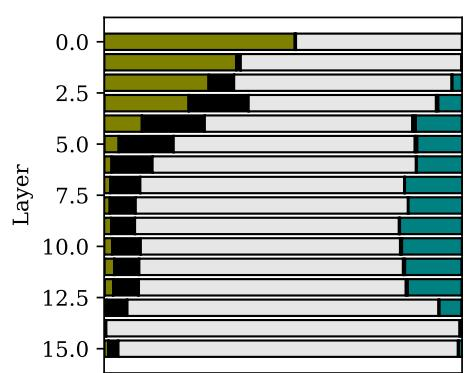

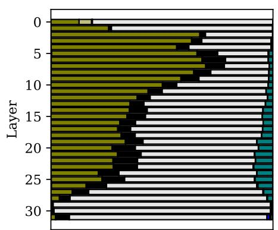

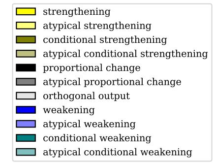

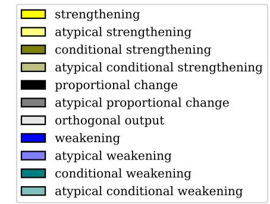

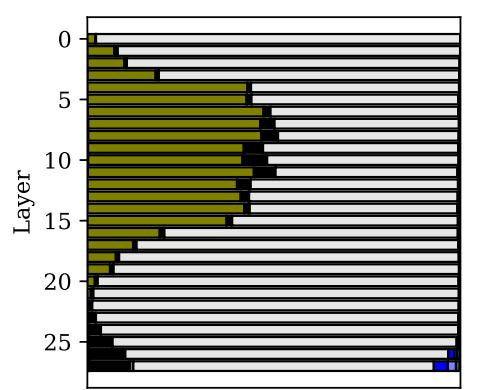

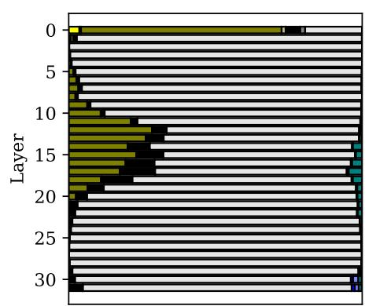

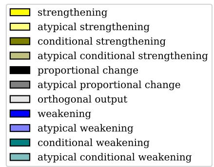  
strengthening atypical strengthening conditional strengthening atypical conditional strengthening proportional change atypical proportional change orthogonal output weakening atypical weakening conditional weakening atypical conditional weakening

Figure 27: Distribution of neurons by layer and category for a range of models. In reading order: OLMo-1B, OLMo-7B-0424, Llama-3.2-3B (copy of Fig. 3 for convenience), Yi-6B. Exact numbers in Tables 10 to 13.

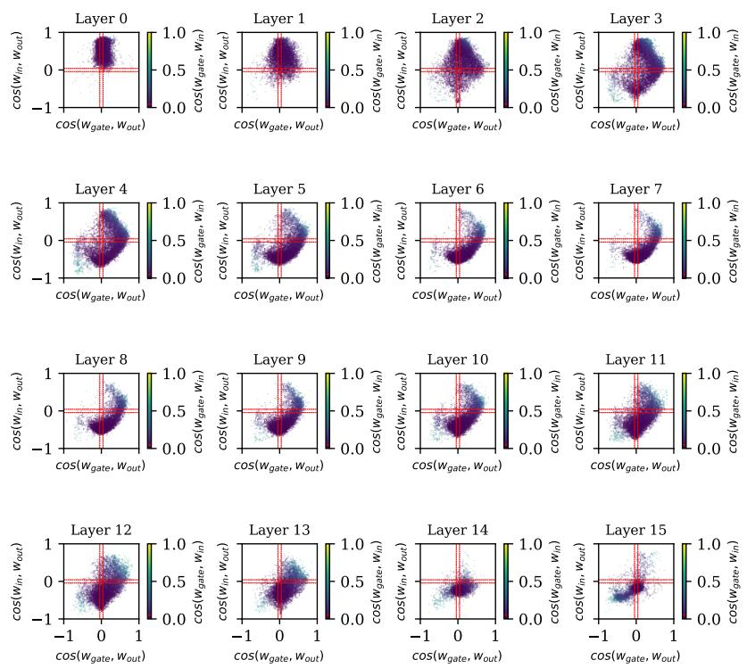  
Figure 28: Equivalent of Fig. 4 for OLMo-1B

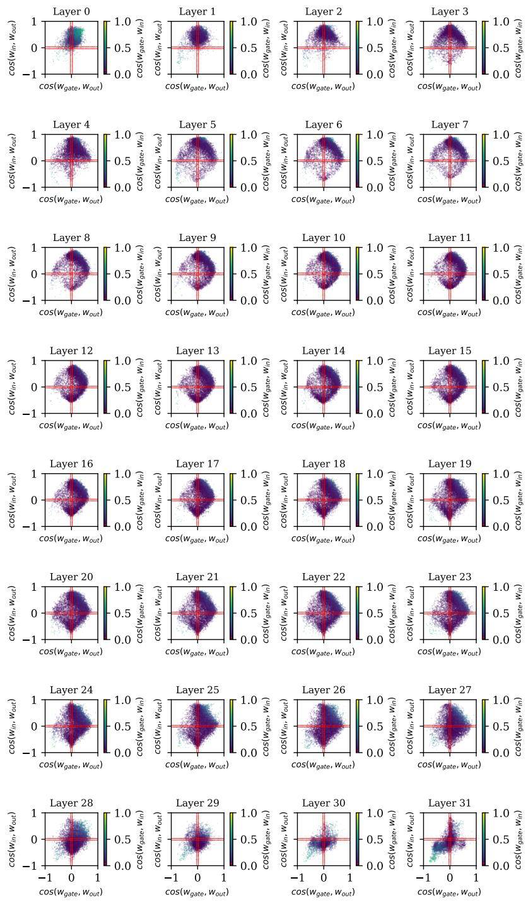  
Figure 29: Equivalent of Fig. 4 for OLMo-7B-0424

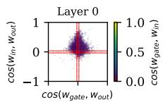

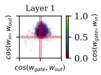

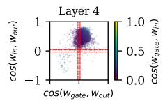

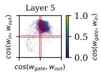

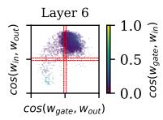

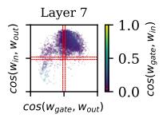

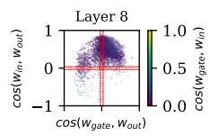

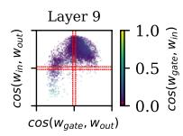

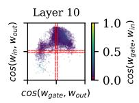

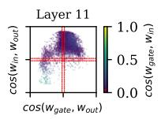

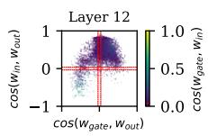

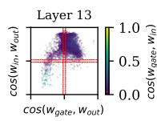

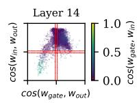

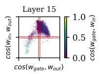

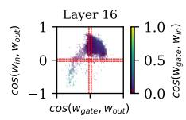

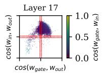

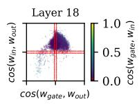

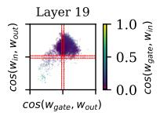

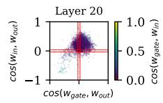

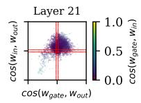

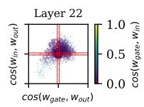

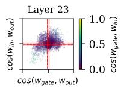

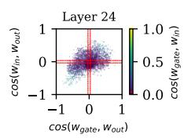

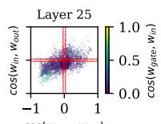

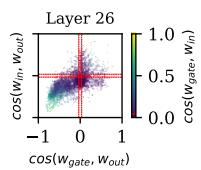

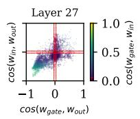  
Figure 30: Equivalent of Fig. 4 for Llama-3.2-3B (same model but all layers)

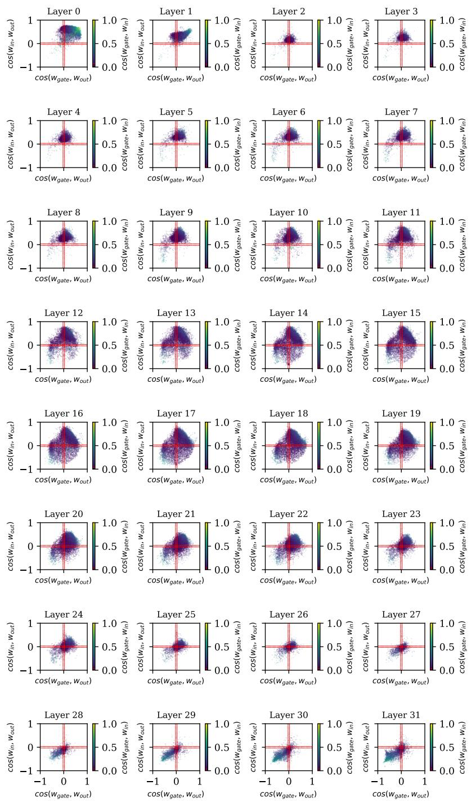  
Figure 31: Equivalent of Fig. 4 for Yi-6B